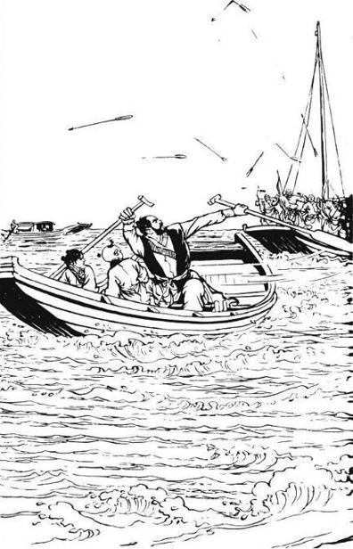
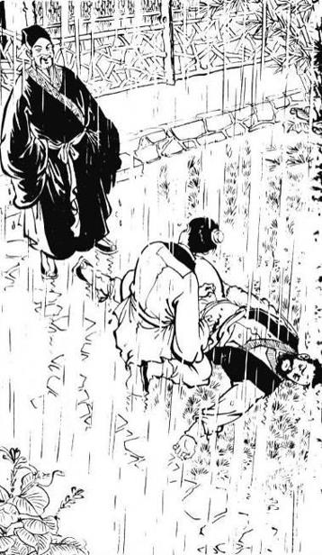
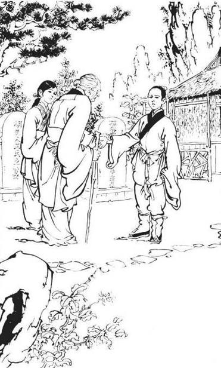
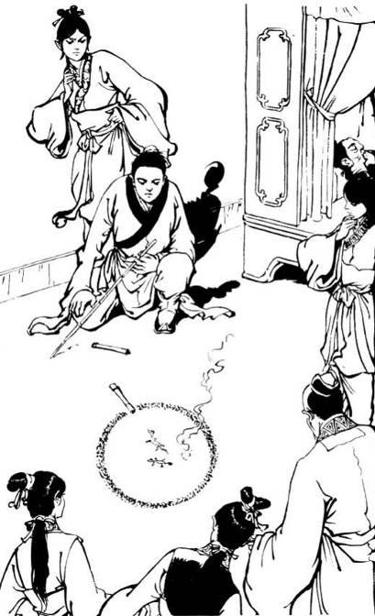
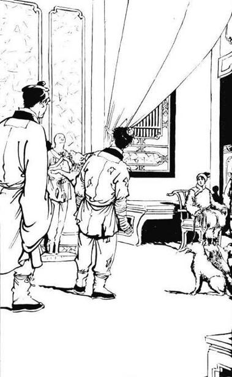
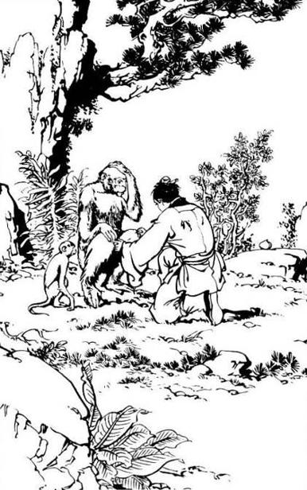
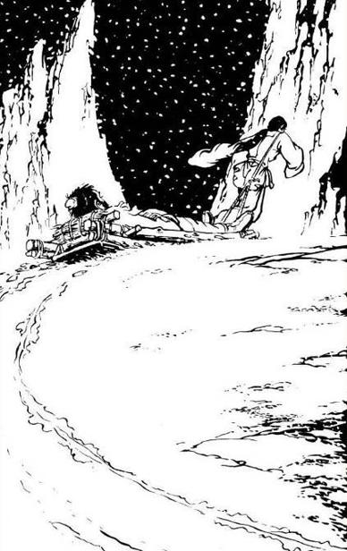
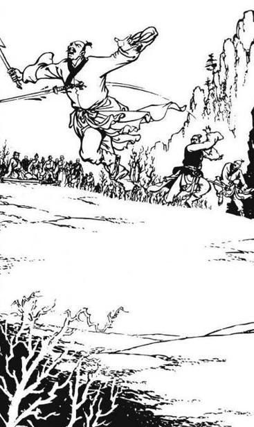
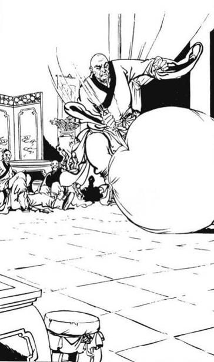
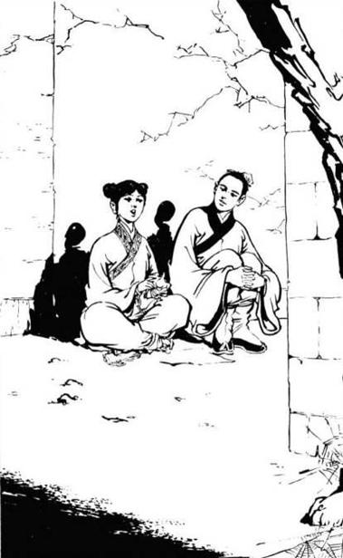

# Chapter 11 - A woman whose tongue is sharp as spear

(Translated by Meh and Huang Yushi)

 

> An unshaven, burly man rowed the boat in an urgent manner. A little
> boy and a little girl sat with him on the boat. The boat behind them
> is bigger, with four lamas and seven or eight Mongolian officers on
> it. The officers all helped the sailors peddle the boat, allowing the
> boat to move much faster. The burly man’s strength is also quite
> amazing, rowing the small boat at great speed. Nonetheless, due to
> superior manpower, the bigger boat kept gaining on the smaller boat.
> When they got close, the lamas and the officers picked up bows and
> began to shoot at the smaller boat.

(Translated by Meh)  
Zhang SanFeng and Zhang WuJi walked down the Shao Bao Mountain.
Realizing that Zhang WuJi’s condition is terminal, Zhang SanFeng stopped
talking about possible cures. He simply tried to help Zhang WuJi pass
time by chatting with him. On this day, they reached the Han River. And
the two took a boat across. The boat floated on the water, wavering
gently back and forth. Like the boat, Zhang SanFeng’s heart also wavered
back and forth.  
  
Zhang WuJi suddenly said, “Grand-master, don’t be sad. When I die, I’ll
get to see mama and papa again.” Zhang SanFeng said, “Don’t say that. No
matter what, your grand-master going to save you.” Zhang WuJi said,
“Actually, I really wished I could’ve learnt Shaolin’s ‘Art of
Nine-Yang’, so I can teach it to Third Uncle Yu.” Zhang SanFeng asked,
“Why?” Zhang WuJi said, “I had hoped that once Third Uncle Yu learnt
both Wu Dang and Shaolin’s ‘Art of Nine-Yang’, his injury could heal.”  
  
Zhang SanFeng sighed, and said, “Your Third Uncle’s injuries are
external. No amount of inner power can cure him.” He then thought, “This
child knows that he’s about to die, yet he is not afraid of death.
Instead, he thinks about the welfare of others, a very kind indeed.”
Just about to compliment him, Zhang SanFeng suddenly heard a booming
voice, “Stop the ship immediately. Hand over the child, and I’ll spare
your life. Otherwise, don’t blame me for being ruthless.” This voice
came from far down the river, yet one can hear the words clearly.
Obviously, this person has strong inner power.  
  
Zhang SanFeng chuckled, thought, “Who would dare ask me to hand over the
child?” Raising his head, only to see two boats getting near. Upon
closer examination, an unshaven, burly man rowed the boat in an urgent
manner. A little boy and a little girl sat with him on the boat. The
boat behind them is bigger, with four lamas and seven or eight Mongolian
officers on it. The officers all helped the sailors peddle the boat,
allowing the boat to move much faster. The burly man’s strength is also
quite amazing, rowing the small boat at great speed. Nonetheless, due to
superior manpower, the bigger boat kept gaining on the smaller boat.
When they got close, the lamas and the officers picked up bows and began
to shoot at the smaller boat.  
  
Zhang SanFeng thought, “Oh, so they wanted that burly man to hand over
the child.” He despises Mongolians killing Hans very much, and instantly
decided to help out this burly man. Only to see this man’s left hand
continue to paddle, while his right hand raised the other paddle to
knock down the oncoming arrows. Zhang SanFeng thought, “This man’s kung
fu is quite formidable. How could I not help such a hero in trouble?” So
he then said to his boatman, “Sir, let’s go help him.”  
  
The boatman was scared out of his wits from watching the scene. He tried
his best to stay away from the confrontation. So when the boatman heard
Zhang SanFeng’s words, he said in shock, “Old… priest. You’re… kidding,
right?” Realizing that they have no time to waste, Zhang SanFeng
snatched the paddles from the boatman, and began to row towards the
other two boats. Suddenly, he heard a loud scream, as an arrow struck
the back of the little boy on the small boat. The burly man then
immediately lost his poise, as he hurriedly turned to look at the boy’s
wounds. At this moment, two arrows hit him on the shoulder and back.
With the arrow wounds, the burly man could no longer hold on to the
paddles, and they dropped into the water. The boat soon stopped. The
bigger boat quickly caught up, as the officers and lamas jumped onto the
smaller boat. That burly man did not surrender, however. Instead he
fought them with all his energy.  
  
Zhang SanFeng yelled, “Stop, filthy Mongols. I won’t allow you to hurt
anyone!” As his boat got close, Zhang SanFeng jumped into the air
towards the burly man’s boat.  
  
Two officers shot arrows at him. But with a wave his sleeve, Zhang
SanFeng easily whisked the arrows away. As he landed, Zhang SanFeng’s
left palm shot out. Two officers immediately fell down into the water.
Upon seeing this, the other officers and lamas immediately froze from
the shock. The head officer said, “Old priest, what do you want?”  
  
Zhang SanFeng yelled, “Filthy Mongols! Trying to do more evil, hurting
more civilians? Get out of here!” That officer said, “Do you know who he
is? He is a remaining member of Yuan Province Devil Cult rebels, a
wanted outlaw!”  
  
Zhang SanFeng gasped upon hearing the words ‘Yuan Province Devil Cult
rebel’. He thought, “So this man is Zhou ZiWang’s subordinate?” He
turned and asked the burly man, “Is he speaking the truth?”  
  
That burly man’s whole body filled with blood, as his left hand clutched
the little boy, and cried, “They… they killed little master.” This
sentence confirmed his identity.  
  
Zhang SanFeng said in shock, “Is this Zhou ZiWang’s son?”  
  
That burly man said, “That’s correct. I could not carry out my order, so
what’s the need to keep on living?” He slowly put down the boy’s body,
and then attacked an officer. But he’s already injured, plus the arrows
are poisonous. So even before he could fully get up, he fell down onto
the deck.  
  
At this time, the little girl rushed towards a man’s body in the cabin,
crying, “Papa! Papa!” Looking at the clothing on the body, Zhang SanFeng
figured this man must be the boatman.  
  
He thought, “If I had known the Devil Cult was involved, I wouldn’t have
gotten interfered. But I can’t back out now.” So he said to the officer,
“The boy’s already dead. The other man’s already seriously injured, and
will die soon. Since you’ve already accomplished your task, you can
surely leave!” That officer said, “No, I have to get their heads.” Zhang
SanFeng said, “Why be so excessive?” That officer said, “Who are you,
old priest? What gives you the right to intervene in this matter?” Zhang
SanFeng chuckled, and said, “Who cares who I am? Everyone has the right
to intervene in all matters.”  
  
That officer gave his subordinates a gesture, and said, “What is your
Taoist title? Which temple do you reside in?” Before Zhang SanFeng could
respond, two other officers quickly raised their sabers, and attacked
him. These two officers were already quite close to Zhang SanFeng. Plus,
due to the small space of the boat, Zhang SanFeng had nowhere to
evade.  
  
But he quickly turned to the side, and with a quick twist of the body,
dodged the sabers. His two palms quickly shot out, reaching the backs of
the two officers, and yelled, “Get back there!” As the palms connect,
the two officers flew out, landing in the middle of the large boat they
came from. Zhang SanFeng hasn’t fought anyone in ages. But felt a bit
unsatisfied simply beating up on these mediocre fighters.  
  
That officer in charge gasped, and stuttered, “You… you… could you be…?”
Zhang SanFeng swept his robe, and yelled, “This old priest only kills
Mongols!” The lamas and officers immediately felt a strong wind bearing
down hard on them, preventing them from breathing. After the wind
passed, their faces all turned white. All of them then quickly returned
to the large boat.  
  
Zhang SanFeng took out a pill and put it in the burly man’s mouth. Then
he rowed the boat to his own. Just as he’s about to help the burly man
switch boats, he saw the burly man carry the boy’s body in one hand, the
little girl in the other, and stepped to the adjacent boat. Zhang
SanFeng thought, “Despite heavy injuries, this man still cares for his
little master. His loyalty is very admirable. Although I didn’t mean to
save him, this man is certainly worth saving.” He then helped take out
the arrows out of the burly man, and applied medicine to the wounds.  
  
That little girl watched her father’s body float away with his boat, and
cried incessantly. The burly man said, “Those damn Mongols are really
vicious. The first thing they did was to kill the boatman. If you hadn’t
gotten here in time, this girl would have likely died too.”  
  
Zhang SanFeng thought, “Right now, with WuJi having trouble moving, and
this man being a wanted man. If we use the old river dock and seek
lodgings there, I’d have trouble taking care of both people.” He took
out three taels of silver and gave them to the boatman, said, “Sir, can
you row east to the Tai Ping area? We’ll seek lodgings there.” That
boatman was already in awe of Zhang SanFeng after watching him defeat
those Mongols. So when Zhang SanFeng gave him so much money, he quickly
complied, and began to row east.  
  
That burly man got on his knees and kowtowed to Zhang SanFeng, said,
“Thank you so much for saving my life. Chang YuChun \[1\] pays you his
respect.” Zhang SanFeng quickly helped him up, and said, “Hero Chang,
you don’t need to be so courteous.” Upon touching Chang YuChun’s hand,
Zhang SanFeng found it to be icy cold. He asked in shock, “Is Hero Chang
injured internally?” Chang YuChun said, “As I escorted little master
down south, I fought against the Mongols four times. A lama managed to
land two palm strikes on me, once on the chest and once on the back.  
  
Zhang SanFeng checked his pulse, only to find it quite weak. He then
opened Chang YuChun’s clothing, saw a heavy mark left by a palm strike,
meaning the injury is quite serious. Any other man would’ve not have
been able to hold up for such a long time. But this man managed to
travel all the way here, battling along the way. Only a true hero can do
something like this. Zhang SanFeng quickly ordered Chang YuChun to stop
speaking, and to rest in the cabin.  
  
That little girl is around ten. Her feet are bare, and her clothing’s
tattered. Despite being a boatman’s daughter, she was an incredible
young beauty, as she sat there in tears. Zhang SanFeng asked her,
“Little girl, what’s your name?” That girl said, “My surname is Zhou. My
name is Zhou ZhiRuo.” Zhang SanFeng thought, “For a boatman’s daughter,
she does certainly have an elegant name.” He asked, “Where is your home?
Is there anyone else in your family? I’ll have this boatman take you
back home.” Zhou ZhiRuo said in tears, “I live with my dad on the boat.
I… I have no other relatives.” Zhang SanFeng sighed, and thought, “Looks
like she’s an orphan. What should I do about her?”  
  
Chang YuChun said, “Old priest’s kung fu is incredible. May I ask for
your title?” Zhang SanFeng said, “I’m called Zhang SanFeng.” Chang
YuChun gasped loudly, sat up, and yelled, “So you are Wu Dang’s
venerable Priest Zhang. No wonder your martial arts is so incredible.
I’m really lucky to have to have met such a divine priest today.”  
  
Zhang SanFeng said with a smile, “You’re too flattering. I simply
happened to have lived a few extra years. Certainly not worthy of being
‘divine’. Hero Chang, please lie back down.” Seeing Chang YuChun’s
straightforward and sincere demeanor, Zhang SanFeng found himself liking
this man quite a lot. But due to Chang YuChun’s Devil Cult roots, Zhang
SanFeng did not wish to talk too much with him, and said, “Your injury’s
very serious. Don’t talk if you don’t have to.”  
  
Because of his experience, Zhang SanFeng tends to be quite unbiased
towards both the righteous and the devilish sects. He even once told
Zhang CuiShan “You must never look down on others just because you
reside in the position of the so-called righteous sect. The two words of
‘good’ and ‘evil’ were originally hard to differentiate. A member of the
orthodox sect when harboring thoughts of impurity and immorality will be
considered as a wicked villain, and similarly if a member from the evil
sect harbors a heart that is completely directed towards goodness, then
that person is a gentleman.” But after Zhang CuiShan’s suicide, Zhang
SanFeng has grieved much for the loss of his disciple, and felt great
enmity towards the Heavenly Eagle Sect. Remembering his third disciple’s
crippled condition, his fifth disciple’s death, both due to the Heavenly
Eagle Sect, Zhang SanFeng couldn’t help but feel extra painful in
regards to the word ‘devil’.  
  
That Zhou ZiWang is Elder Mi Le’s disciple of Devil Cult, or “Ming Cult”
\[2\] . Many years ago, he started a revolution in the Jiang Xi
province, proclaiming himself Emperor, calling his dynasty ‘Zhou’. It
was soon destroyed by the Yuan troops, and Zhou ZiWang was executed.
Although Elder Mi Le and the Heavenly Eagle Sect are different groups of
people, they both originated from the Ming Cult. When Zhou ZiWang
rebelled, Yin TianZheng also stirred up much trouble in the Zhe Jiang
province. Zhang SanFeng rescued Chang YuChun today was only a spur of
the moment decision, before asking about Chang YuChun’s identity.  
  
It was already dark when they arrived at the town. Zhang SanFeng bought
four dishes from a restaurant, chicken, pork, fish, and vegetables, and
they ate on the boat. Zhang SanFeng told Zhou ZhiRuo and Chang YuChun to
go ahead and eat, while he would feed Zhang WuJi. Chang YuChun asked him
why. Zhang SanFeng responded by saying that he had sealed Zhang WuJi’s
pressure points around the vital organs, to prevent the poison from
getting in. In his depressed state, Zhang WuJi didn’t want to eat. And
when Zhang SanFeng tried to feed him, he would simply shake his head.  
  
Zhou ZhiRuo took the bowl from Zhang SanFeng’s hand, and said, “How
about let me take care of this little friend, while you go ahead and
eat?” Zhang WuJi said, “I don’t need to eat. I’m already full.” Zhou
ZhiRuo said, “Little friend, if you don’t eat, the old priest would be
too unhappy to eat. If he won’t eat, then wouldn’t he be hungry?”  
  
Zhang WuJi realized that she’s right, and ate the food Zhou ZhiRuo put
by his mouth. Zhou ZhiRuo carefully removed all the bones from the fish
and chicken, and sweetened the meat with the sauces. So they tasted very
good. Zhang WuJi quickly finished a whole bowl of food.  
  
Zhang SanFeng thought, “Considering his crippling illness, and that both
his parents are dead, WuJi really should have a attentive girl to serve
him.”  
  
Chang YuChun did not touch the meat dishes. Instead, he quickly finished
the vegetable dish. Even with the injury, he ate four big bowls of rice.
Zhang SanFeng urged him to eat some meat. Chang YuChun responded,
“Venerable Zhang, I’m a devout Buddhist. I don’t eat meat.” Zhang
SanFeng said, “Oh, that’s right. I forgot.” He immediately remembered,
the Devil Cult has very strict rules, forbidding its members to eat
meat. This has been true since the Tang Dynasty. Near the end of the
Northern Sung Dynasty, the leader of the Ming Cult rebelled in the Zhe
Dong province. At the time, the people called them ‘Vegetarian Devil
Honoring Cult’.  
  
Because the two big rules of the Ming Cult are to never eat meat, and to
always honor the Devil. Under attacks from the government and the
martial world, the disciples of the Ming Cult began to hide their
identities. So they always say they are devout Buddhists to cover their
vegetarian ways.  
  
Chang YuChun said, “Venerable Zhang, you saved my life, and already
knows my background. So there’s no need for me to hide it. I am indeed a
member of the Ming Cult. The government thinks of us as rebels. The
righteous sects look down upon us, thinking we’re just a bunch of
bandits, or that we’re minions of the devil. But for you to save me,
even knowing who I am, I really don’t know how to repay for your
kindness.”  
  
Zhang SanFeng knows about the origins of the Devil Cult. The God they
worship is called ‘Muo Ni’. But the worshipers call him ‘Honorable
Brightness’. When the cult spread into the central plains in the Tang
Dynasty, it was called ‘Muo Ni Cult’, and also ‘Cult of the Illuminating
Light’. Its worshippers called it the ‘Ming Cult’, but others call it
the Devil Cult. Zhang SanFeng sighed, and said, “Hero Chang…”  
Chang YuChun quickly cut in, “Venerable priest, you really don’t need to
call me a ‘hero’. Just call me YuChun.” Zhang SanFeng said, “Alright.
YuChun, how old are you?” Chang YuChun said, “Twenty.”  
  
Zhang SanFeng said, “You’re just becoming an adult. So although you’ve
entered the Devil Cult, you haven’t sunk in too deeply. You can still
get out before it’s too late. I have a few words that you may not like.
Do you want to hear them?” Chang YuChun said, “Of course. I’d love to
hear any advice from Venerable Zhang.”  
  
Zhang SanFeng said, “Good! I want you to leave the Devil Cult. If you
like Wu Dang, I’ll have my eldest student Song YuanQiao take you in as
his disciple. This way, you can later walk the martial world with your
head up, as no one will ever look down upon you again.”  
  
As the head of the Seven Heroes of Wu Dang, everyone knows the famous
Song YuanQiao. Normally it’s almost impossible for people to even see
him. The seven Wu Dang heroes recently began to take in students. But
they have very strict standards. Only the most upright youngsters with
great potential are admitted. As a member of the Devil Cult, a cult most
people frown upon, this really is a once in a lifetime opportunity for
Chang YuChun.  
  
Yet his response was, “I deeply thank you for your offer. But since I am
already a member of the Ming Cult, I cannot ever leave.” Zhang SanFeng
tried to persuade him some more, but Chang YuChun would not waver.  
  
Zhang SanFeng finally gave up, shook his head, and sighed. Then he said,
“This girl…” Chang YuChun said, “Don’t worry. This girl’s father died
because of me. I’m definitely going to take care of her.” Zhang SanFeng
said, “Alright. But you cannot let her enter your cult.” Chang YuChun
said, “I really don’t know what we do that make us so despicable in your
mind. But if you insist, I’ll obey your wish.”  
  
Zhang SanFeng held Zhang WuJi in his arms, and said, “Then let us part
now.” He really doesn’t want any more to do with the Devil Cult, and
therefore left out the words ‘See you later’.  
  
Zhou ZhiRuo said to Zhang WuJi, “Little friend. You need to eat
everyday, so the old priest won’t worry about you.” Zhang WuJi’s tears
came out, and said, “Thank you for your words. It’s just that… I’ll only
be able to eat for just a while longer.” Zhang SanFeng cleaned out Zhang
WuJi’s tears with his sleeve. Zhou ZhiRuo asked in shock, “What? You…
You…” Zhang SanFeng said, “Little girl, you have a kind heart. I hope
you’ll later go on the route of righteousness, and not of evil.”  
  
Zhou ZhiRuo said, “Ok. But this little friend, why does he say that he
can only eat for just a while longer?” Zhang SanFeng could not
respond.  
  
Chang YuChun said, “Venerable Zhang, considering your martial arts
abilities, surely you can cure this little friend’s poison, right?”
Zhang SanFeng said, “Of course I can.” But he then shook his left hand
behind Zhang WuJi, pointing out that Zhang WuJi is beyond help, but
doesn’t want him to know it.  
  
Upon seeing Zhang SanFeng shaking his hand, Chang YuChun gasped. He
said, “Due to the severity of my injuries, I was just about to go see a
very distinguished doctor. How about I take this little friend with me?”
Zhang SanFeng shook his head, said, “His cold poison has already entered
the vital organs. It’s not something normal medicine can cure. We only…
only hope to slowly disperse the poison.” Chang YuChun said, “But the
doctor I’m talking about has the ability to bring back the dead.”  
Zhang SanFeng suddenly remembered a person, and asked, “Are you talking
about the ‘Divine Doctor of the Butterfly Valley’?”  
  
Chang YuChun said, “That’s right. So you know about Elder Hu too?”  
  
Zhang SanFeng thought, “From my knowledge, this ‘Divine Doctor of the
Butterfly Valley’, Hu QingNuo, does indeed have unparalleled medical
skills. But he is member of the Devil Cult. Besides, he has a very
strange temper. He’ll do his best to cure any Devil Cult followers, and
not ask for a single penny. Yet he will not treat anyone else, no matter
how much money is offered. Therefore, he has another nickname, ‘Rather
See Death Than Help’. If so, it’s really better for WuJi to die than to
enter the Devil Cult.”  
  
Seeing the grave expression on Zhang SanFeng’s face, Chang YuChun
understood what he’s thinking, and said, “Venerable Zhang, I know Elder
Hu never treats outsiders. But since you saved my life, I’ll do anything
I can to make Elder Hu break the rule this one time.” Zhang SanFeng
said, “I know just how amazing this Doctor Hu’s skills are. But
unfortunately, this cold poison on WuJi’s body is very unique…” Chang
YuChun said, “But you can’t cure him. The worst that can happen is that
Elder Hu can’t cure him either. If he’s going to die regardless, what’s
the big deal?” Chang YuChun is a straightforward person, and therefore
said what he thought.  
  
Zhang SanFeng pondered a bit, “He’s right. Look like WuJi only has about
another month to live. What is there to be afraid of?” Zhang SanFeng has
always been a very sincere person, and normally never thinks about
possible hidden motives. But Zhang WuJi is his disciple’s only child.
How could he give WuJi to a member of the Devil Cult? At this moment, he
really doesn’t know what to do.  
  
Chang YuChun said, “I know Venerable Zhang doesn’t want to go see Elder
Hu. After all, how could a head of a righteous sect seek help from us
evil cults? Besides, with Elder Hu’s strange temper, he’d probably
offend you. I guess the only is way is for me to take Brother Zhang to
Elder Hu. Then I’ll come to Wu Dang Mountain to be your hostage. Should
anything happen to Brother Zhang, you can go ahead and kill me.”  
  
Zhang SanFeng chuckled, thought, “Should anything really happen to WuJi,
how would killing you help? Besides, how can I be sure you’ll definitely
come to Wu Dang?” But considering WuJi’s condition, there really isn’t
any other possible cure. So Zhang SanFeng said, “If so, then please take
care of WuJi. But I must make two things clear. Mr. Hu cannot force WuJi
into your cult. And Wu Dang is not going to accept your gratitude on
this matter.” He knew that the Devil Cult is very devious and strange in
its ways. Being associated with them could only lead to big problems.
After all, isn’t Zhang CuiShan’s death a perfect example?  
  
Chang YuChun said, “Venerable Zhang is really belittling my cult. But if
you say so, I’ll obey.” Zhang SanFeng said, “Take good care of WuJi.
Should he ever recover, take him back to Wu Dang. But there’s no need to
come to Wu Dang as a hostage.” Chang YuChun said, “I’ll do all I can to
follow your wishes.”  
  
Zhang SanFeng said, “As for this little girl, I’ll take her back to Wu
Dang Mountain.”  
  
Chang YuChun then went to a large tree by the shore, and dug a hole with
his saber. Then he took off all of Little Master Zhou’s clothes, before
burying him in the ground, and paid his respects. Burying members naked
is one of Ming Cult’s rules. Everyone enters the world naked, and should
therefore leave the world the same way. Since Zhang SanFeng does not
know this rule, he found the burial procedure quite repulsive and
mysterious.  
  
The next morning, Zhang SanFeng took Zhou ZhiRuo in his hands, and
parted with Chang YuChun and Zhang WuJi. After the death of his parents,
Zhang SanFeng was like a grandfather to Zhang WuJi. So Zhang WuJi
couldn’t help but burst into tears as they parted. Zhang SanFeng said,
“WuJi, when you’re healthy again, your Big Brother Chang will take you
back to Wu Dang Mountain. Be a good boy. We’ll only be apart for a few
months. Don’t be so sad.” Despite his words, Zhang WuJi’s tears did not
stop.  
  
Zhou ZhiRuo returned to the boat, took out a handkerchief from her
sleeve, and began to wipe away his tears. She then smiled at him, put
the handkerchief into his pocket, before returning to shore.  
  
(Translated by Huang Yushi from the 2nd edition of the original Chinese
text: )  
  
Zhang Wuji followed his grand-teacher with his eyes as the old man
walked westwards with Zhou Zhiruo. As the same time, the little girl
kept turning back and waving until both of them disappeared behind a row
of poplar and willow trees. Suddenly, Zhang Wuji felt so lonely that he
started to cry again.  
  
"Brother Zhang, how old are you this year?" asked Chang Yuchun with
frown. When the boy answered that he was already twelve, the man said,
"I see. A twelve-year-old is no longer a child, so are you not ashamed
to sob and cry like a baby? When I was twelve, I had already been beaten
several hundred times, but never did I shed a single tear. A man sheds
only blood, you know, not tears. If you continue to cry like a girl, I
will have to hit you."  
  
"I cried because I could not bear to part with Grand-teacher," said
Zhang Wuji. "If someone hit me, I would not cry at all! Go ahead and hit
me if you dare. I will return each of your punches with ten punches of
my own someday."  
  
Chang Yuchun was stunned. "Good for you!" he said with a hearty laugh.
"Now that is what I call a man with integrity. Since you are so
formidable, I will not to hit you."  
  
"Why not?" asked Zhang Wuji. "After all, I cannot even move a single
finger."  
  
Chang Yuchun laughed again and replied, "If I hit you today, what am I
going to do when you eventually learn martial arts from your
grand-teacher? How would I be able to endure ten punches from the
exquisite fist techniques of the Wudang School?"  
  
A smile appeared on Zhang Wuji's face: This Brother Chang may look very
ferocious, but he is not a bad man.  
  
Hiring a riverboat, the two travelled all the way to Hankou before
switching to a larger vessel and sailing east down the Great River. The
Butterfly Valley where the Healing Sage Hu Qingniu lived was located on
the banks of Nüshan Lake in northern Anhui.  
  
The Great River flowed in a south-easterly direction from Hankou to
Jiujiang, before turning northwards into the province of Anhui. Two
years earlier, Zhang Wuji had sailed up this very river on his way to
Mount Wudang. He had his parents and Yu Lianzhou as companions then, so
the journey had been filled fun and laughter. Now, his parents were both
dead, and he was on a joyless trip to seek treatment with Chang Yuchun.
The difference between the two were as stark as the sky above and the
land below. But he did not dare to let his tears fall, fearing that
Chang Yuchun would be angered again. By then, all the acupoints that
Zhang Sanfeng had blocked earlier had returned to normality, so he could
actually feel each excruciating attack of the toxins in his body. Yet,
there was nothing that he could do, except to grit his teeth in
endurance until his upper and lower lips were all cut and bruised. To
make things worse, the bouts became more frequent and painful with each
passing day.  
  
When they reached the Gua Pier after Jiqing, Chang Yuchun and Zhang Wuji
went ashore and travelled north in a hired carriage. Several days later,
they arrived in the town of Mingguang, east of Fengyang. Chang Yuchun
knew that his Uncle Hu did not like his secluded place of abode to be
widely-known, so he sent the carriage away about twenty li (10 km) from
Nüshan Lake. Then, carrying Zhang Wuji on his back, he tackled the final
leg of the journey on foot.  
  
He thought that these last twenty li would be covered in the blink of an
eye, but he had travelled only one li (500 metres) when his nerves and
bones started to ache terribly. His breathing became laboured and he
found it very difficult to even walk. The internal injuries that he had
sustained after being struck twice by the foreign monks were worse than
he had realised.  
  
Feeling very apologetic, Zhang Wuji said, "Brother Chang, let me walk on
my own. You had better not tire yourself out."  
  
"I can cover a hundred li (50 km) in a single breath without feeling
tired at all," Chang Yuchun snapped, "so how could those stupid monks
stop me with two strikes of the palm?" Gathering up all his strength, he
forced himself to march forward. Unfortunately, he was already too
wounded to push himself in this manner, and the frustration that he felt
just made things worse. After several zhang or so (1 zhang = 3.33
metres), he began to feel as if his limbs and bones were falling apart.
Yet, he was not ready to admit defeat. He was also unwilling to put
Zhang Wuji down or to sit and rest. So, he laboured on, a step at the
time.  
  
This, of course, made their progress terribly slow. By nightfall, they
had not covered even half of the targeted distance. The rugged terrain
only served to make the walk more difficult, but they trudged on until
they reached some woods. Then, Chang Yuchun finally put Zhang Wuji down
and collapsed spread-eagle on the ground. After a simple meal of sugared
fruit and biscuits, Chang Yuchun rested for half a shichen (one hour)
before voicing his desire to resume the journey. Zhang Wuji tried his
best to persuade the man otherwise, suggesting that they could spend a
peaceful night in the woods and set out the next morning instead. By and
by, Chang Yuchun realised that it would probably be midnight by the time
they reached Butterfly Valley. Hu Qingniu would certainly be very
irritated by their visit at such an hour, so he gave in to his
companion's suggestion to stay in the woods. They soon fell asleep
leaning against a large tree.  
  
At midnight, Zhang Wuji was jolted awake by another attack of the toxins
in his body. He started to shiver and shake badly, but he endured the
pain in silence for fear of waking Chang Yuchun up. Just then, the
sounds of clashing weapons drifted into the woods, followed by several
voices that shouted, "Where are you going?" "Block the eastern route and
force him into the woods!" "We cannot let this crooked baldy get away
this time!" Footsteps sounded as several people ran towards the trees.  
  
Waking up with a start, Chang Yuchun grabbed his sabre with his right
hand and Zhang Wuji with his left. Then, he waited to see if he should
fight or flee.  
  
"I do not think that they have come for us," the boy whispered.  
  
Nodding in agreement, Chang Yuchun peered through the trees and saw
seven or eight people attacking an unarmed man from all sides. Although
the man managed to fend his enemies off with a pair of swift palms, the
group began closing in on him after a while.  
  
By and by, a crescent moon appeared from behind the clouds and cast a
silvery light on the scene. The man in the centre of the circle was a
tall and thin monk in his forties who was dressed in a white robe. His
attackers consisted of two grey-robed monks, two Taoists, two men in
secular attire and two slim-built women. The grey-robed monks had a pole
and a sabre between them, which they used with such power that leaves
flew everywhere in the woods. One of the Taoists had a sword which
glinted under the moonlight as he waved it about, while one of the men
in secular attire -- a short and small-sized fellow with a pair of
swords -- rolled back and forth on the ground, attacking the legs of the
white-robed monk with Ditang swordplay, a technique that focused on the
lower extremeties of the body.  
  
The two women had a sword each, through which they executed a series of
very swift but fluid strokes. As the battle wore on, one of the women
turned in such a way that part of her face was lit up by the moonlight.
The sight almost had Zhang Wuji blurting out: "Auntie Ji!" Indeed, she
was none other that Yin Liting's fiancée, Ji Xiaofu.  
  
Initially, Zhang Wuji thought that it was very unfair for so many people
to attack the monk at once, and hoped that the hapless victim would be
able to free himself. However, after recognising one of the attackers as
Ji Xiaofu, he decided that the white-robed monk was a bad man. After
all, he was an enemy of the Auntie Ji who had comforted him on the day
of his parents' suicide. Although Zhang Wuji did not accept the necklace
that she had given him, he was nevertheless very grateful for her kind
thoughts.  
  
As the white-robed monk's strokes alternated by fast and slow, and real
and false, Zhang Wuji quickly realised that he was actually a highly
skilled pugilist. There were also too many variations to his techniques
to be identified, especially when the movements were speeded up. As a
result, Ji Xiaofu and her group could not gain the upperhand despite
being larger in number and battling for a long time.  
  
Suddenly, one of the men shouted, "Use the projectiles!"  
  
The other man and one of the Taoists responded at once, leaping to the
left and the right respectively before sending a flurry of pellets and
flying daggers towards the white-robed monk. As the monk scrambled to
deal with the weapons that fell like rain around him, the other Taoist
-- a fellow with a long beard -- shouted, "Monk Peng, we do not want
your life, so why are you fighting us with all your might? Just hand Bai
Guishou over and we will part with a smile. Would that not be better for
everyone?"  
  
Chang Yuchun was shocked. "So this is Monk Peng?" he wondered in a
whisper.  
  
Zhang Wuji was surprised too, for he had heard his parents tell his
Second Uncle Yu about the incident on Wangpan Island and the resulting
inter-clan vendettas upon returning to China two years earlier.
Therefore, he knew that Bai Guishou, the Leader of the Eagle Sect's
Xuanwu Circle, was the only one who had left Wangpan Island with his
mental faculties intact. In recent years, many clans and organisations
had taken the Eagle Sect to task because they wanted Bai Guishou to
reveal where Xie Xun was. Consequently, Zhang Wuji thought: Could this
Monk Peng be a member of my mother's sect as well?  
  
Just then, Monk Peng said in a loud voice, "Circle-Leader Bai has been
grievously wounded by all of you and I have a friendship with him that
goes back a long way. To tell you the truth, even if I did not know him
at all, I would still not ignore a dying man."  
  
"What dying man?" roared the Taoist with the long beard. "We do not want
his life, for we just want to find out where a certain person is."  
  
"Since you want to know where Xie Xun is, why do you not go and ask the
abbot of the Shaolin Temple?" said Monk Peng.  
  
One of the grey-robed monks stepped up and shouted, "That is but an evil
ploy to shift blame to my Shaolin Temple by that witch from the Eagle
Sect, Yin Susu. Who believes her?" Apparently, this monk was from the
Shaolin School.  
  
The mention of his mother's name filled Zhang Wuji with both pride and
sorrow: Although my mother has passed away for two years, she can still
make all of you dizzy with trouble!  
  
Suddenly, one of the Taoists shouted, "Everybody, get down!" As his
companions fell on their faces, five flying daggers cut through the air
towards Monk Peng's chest. These weapons could be avoided if the monk
bent forward, fell on his face or leaned backwards at once, but his
attackers had pre-empted his moves by positioning their weapons around
him at ground-level. So how could he escape then?  
  
As Zhang Wuji watched with bated breath, Monk Peng leapt into the air
and the five flying daggers went by under his feet. The two grey-robed
Shaolin monks and the Taoist with the long beard responded to this turn
swiftly, slashing Monk Peng's legs with their pole, sabre and sword.
Forced to strike back, the white-robed monk sent a palm into the head of
one of the Shaolin monks before snatching his sabre and using it as a
lever against the other monk's pole to push himself two zhang (6.66
metres) away from the fray.  
  
The Shaolin monk who was struck on the head died at once. His angered
companions set off in pursuit of Monk Peng, only to see his legs crumple
beneath him in his haste to get away. As the group surrounded the
white-robed monk once more, the remaining Shaolin monk shouted, "You
killed my brother, so I am going to make you pay for it!"  
  
"Wait!" said the Taoist with the long beard. "His legs have been struck
my Scorpion-Tail Hook (Xie1 Wei3 Gou1), and he will soon die of
poisoning."  
  
Sure enough, Monk Peng's legs wobbled as he strove unsuccessfully to
stand up.  
  
Chang Yuchun thought: He is an important member of my Ming Sect, so I
must rescue him! Although he was seriously wounded himself, he was so
bent on helping Monk Peng that he took a deep breath and stepped
forward. Unfortunately, the breath and the step that he took affected
his internal injuries so much that he almost fainted from excruciating
pain. By then, Monk Peng had collapsed on the ground after managing to
move another zhang (3.33 metres) away from his attackers. He looked as
if he had died of poisoning. Opening his eyes despite the massive pain
in his chest, Chang Yuchun saw that none of the seven dared to approach
the body of the monk.  
  
The Taoist with the long beard said, "Brother Xu, test him with two of
your flying daggers."  
  
The other Taoist responded by throwing a dagger each into Monk Peng's
right shoulder and left leg. The white-robed monk did not move,
indicating that he was indeed dead.  
  
"What a pity! What a pity!" said the Taoist with the long beard. "He has
died, but we do not know where he has hidden Bai Guishou!"  
  
The group stepped forward for a closer look.  
  
Suddenly, five swift smacks were heard, followed by the sight of five
people falling away from the circle. Monk Peng was on his feet in a
flash, but the daggers were still embedded in his shoulder and leg. It
turned out that he had pretended to die in a bid to draw his enemies
closer, so that he could catch them unaware with the lightning-fast
'Flying Clouds in the Great Wind' Palm Technique (Da4 Feng1 Yun2 Fei1
Zhang3). He had gathered up all his strength in silence as he lay on the
ground, so the five strikes were so strong that they left a palm-print
each on the chests of the five male victims.  
  
Ji Xiaofu and her older sister-at-arms, Ding Minjun, were terribly
shocked at this unexpected turn of events, but they managed to leapt
away on time. When they looked at their five wounded companions, they
found them throwing up mouthfuls of blood. The two men in secular attire
even screamed in pain, for their bodies were not as strong as the other
three.  
  
The Taoist with the long beard said, "Ding-guniang, Ji-guniang, stab him
quickly with your swords!"  
  
Among the nine of them, one Shaolin monk was already dead, and Monk Peng
and five others were seriously wounded. Thus, Ji Xiaofu and Ding Minjun
were the only two left unharmed. Ding Minjun thought: Hmmph! Am I so
poor in the sword that you must tell me how to use it? Then, she raised
her weapon and slashed at Monk Peng's shin with a move called 'Splitting
Metal with a Nominal Stroke' (Xu1 Shi4 Fen1 Jin1).  
  
Monk Peng heaved a long sigh, closed his eyes and waited for death.
Suddenly, a loud clang was heard, as if two weapons had come into
contact with each other. Opening his eyes, Monk Peng saw that Ji Xiaofu
had used her sword to deflect her sister's blade.  
  
"Why?" asked Ding Minjun in surprise. "Elder Sister," answered Ji
Xiaofu, "Monk Peng held his hands back in mercy, so we should not push
him over the edge."  
  
"What hands of mercy?" Ding Minjun retorted. "His hands had run out of
strength!" Then, she turned to the monk and said, "Monk Peng, my sister
is very kind to spare your life, so you should tell us where Bai Guishou
is."  
  
Monk Peng threw head back and roared with laughter. "Ding-guniang, you
have really underestimated Peng Yingyu," he said. "Zhang Cuishan, the
Fifth Warrior of the Wudang School, would rather die of suicide than
reveal his sworn brother's whereabouts. Although I am not as talented, I
admire loyalty and courage of Zhang the Fifth enough to follow his
example." Then, he threw up a mouthful of blood and sank to the
ground.  
  
Ding Minjun walked up and kicked him three times in the waist, so that
he could not launch another stealth attack at them.  
  
Peng Yingyu's words brought a surge of warmth and gratitude into Zhang
Wuji's heart, and the boy suddenly felt as if he had found a close
relative. After his father, Zhang Cuishan, committed suicide, members of
renowned and upright organisations often spoke of the man in this
manner: "He was an outstanding young warrior who took one wrong step and
became involved with a heretical witch. As a result, he died in personal
ruin and shame, and brought humiliation to the Wudang School." Zhang
Wuji had never heard these exact words, of course, but he could gather
as much from the conversations and attitudes of his grand-teacher and
uncles. Besides being deeply grieved, they had blamed his mother for the
terrible things that had happened. They had felt that everything about
his father was good, except for the mistake he made in marrying his
mother. No one had ever expressed admiration and respect for his father
like Peng Yingyu just did.  
  
Ding Minjun sneered and said, "Zhang Cuishan was blind to marry that
heretical witch. This is what I call 'willing self-degradation', so what
good is there to learn from it? His Wudang School ... " At this point,
Ji Xiaofu tried to interrupt her sister, only to hear Ding Minjun say,
"Do not worry. I will not include Yin the Sixth in this." Then, pointing
her sword at Peng Yingyu's right eye, she added, "If you do not speak
up, I will poke your right eye out before doing the same to your left.
Then, I will poke through your right ear and the left one. After that, I
will slice your nose off, for I will not allow you to simply drop dead."
The tip of her sword glinted barely half a cun (1.67 centimetres) away
from Peng Yingyu's eye.  
  
The stubborn monk opened his eyes wide in defiance and said in a calm
voice, "I have heard that the Abbess Mie Jue of the E-mei School is
cruel and ruthless in her ways, so her students should be no different.
Since I have fallen into your hands, go ahead and show me E-mei's best
techniques!"  
  
Ding Minjun raised her eyebrows and screeched, "Crooked baldy, how dare
you ridicule my school!" She pushed her sword forward and gouged out
Peng Yingyu's right eye. Then, she placed the tip of the blade on his
left eye-lid.  
  
Peng Yingyu laughed as blood poured out of his blinded right eye. Then,
he opened his good left eye as widely as he could and glared at Ding
Minjun until goosebumps appeared all over her. "You are not from the
Eagle Sect," the woman said, "so why are you giving your life up for Bai
Guishou?"  
  
"This is one of the principles of being a man," answered Peng Yingyu.
"You would not understand it even if I told you."  
  
Ding Minjun could see that Peng Yingyu had no strength left to fight
back, but somehow, he still regarded her with much disdain. As a result,
she pushed her sword into his left eye in a fit of anger, only to have
Ji Xiaofu knock the blade away with a nimble stroke.  
  
"Elder Sister," said the younger woman, "this monk is so stubborn that
he will never say anything, regardless of what we do to him. Killing him
will not serve our purposes either."  
  
"He said that our teacher is cruel and ruthless in her ways," Ding
Minjun replied, "so I am just showing him what 'cruel and ruthless'
really means. Heretics like him can only bring harm to others, so having
him killed is a good thing."  
  
"He is also a tough man," Ji Xiaofu added. "Elder Sister, I think we
should just let him go."  
  
Ding Minjun burst into a fit. "One of these two brothers from Shaolin is
dead, while the other is wounded," she said in a loud voice. "The two
Taoists from Kunlun are badly injured, while the two brothers from the
Haisha Clan are in an even worse condition. Is he not brutal enough? I
will gouge out his left eye before continuing with the interrogation."
As soon as the word 'interrogation' left her mouth, her sword moved
towards Peng Yingyu's left eye.  
  
Ji Xiaofu raised her sword and pushed her sister's blade away with
another light and nimble move. "Elder Sister," she said, "this man has
no strength left to resist. If word of how we treat him gets out into
the realm of the rivers and lakes, the reputation of our E-mei School
will be adversely affected."  
  
"Stand aside, and do not intervene!" said Ding Minjun in a stern voice.
When Ji Xiaofu persisted, the older woman said, "Since you acknowledge
me as your Elder Sister, you must listen to what I say. Stop nagging
me!"  
  
"Yes!" Ji Xiaofu responded, prompting Ding Minjun to send her sword into
Peng Yingyu's left eye again. This time, she increased the power of her
move by three-tenths.  
Somehow, Ji Xiaofu found herself being unable to accept her sister's
action, so she raised her sword and deflected the other blade once more.
The power in Ding Minjun's move caused the younger woman to use a
heavier hand as well, so the two swords impacted in a flurry of sparks.
As their arms went numb, both women took two steps back.  
  
"What exactly are you up to, protecting this evil monk time and again?"
shouted Ding Minjun angrily.  
  
"Elder Sister," answered Ji Xiaofu, "I would like to suggest that you
stop torturing him in this manner. We should just take our time and ask
him slowly where Bai Guishou is."  
  
Ding Minjun laughed coldly and said, "Do you think that I do not know
what is in your heart? Ask yourself honestly: Why do you keep on
declining the requests of Wudang's Yin the Sixth to complete the rites
of marriage? And why did you run away from home after your father asked
you to do the same?"  
  
"What has my personal affairs to do with this matter?" asked Xi Jiaofu.
"How could you link them together?"  
  
"We know the truth in our hearts," answered Ding Minjun, "so I need not
pull the scabs from your sores in front of all these outsiders. You may
be in E-mei physically, but your heart is in the Evil Sect."  
  
Ji Xiaofu turned white at once. "I respect you as my Elder
Sister-at-Arms," she said with a trembling voice. "I have never offended
you, so why are you humiliating me like this?"  
  
"All right," Ding Minjun said, "if your heart is not in the Evil Sect,
go ahead and poke out this monk's left eye."  
  
Ji Xiaofu did not do as she was told. Instead, she said, "Ever since the
E-mei School was founded by the Little Eastern Heretic, our
Great-Grandteacher Guo, many of our school-mates have either chosen to
be nuns or to remain unmarried all their lives. My reluctance to marry
is nothing extraordinary, so why must you push me into a corner?"  
  
"Well, I am not taken in by your plea of innocence," Ding Minjun replied
coldly. "If you do not stab him in the eye, I am going to spill the
beans on your affairs."  
  
"Elder Sister," said Xi Jiaofu in a gentle voice, "I hope that you will
consider the bond of sisterhood that we share, and stop pushing me."  
  
Ding Minjun laughed. "I am not asking you to do anything embarrassing,"
she said. "Our teacher instructed us to find out where the Golden-Maned
Lion King is, and this monk here is the only lead that we have. But he
was unwilling to reveal the truth and even harmed our companions. So it
is only fair that I poke out his right eye, while you take out his left.
Why are you still not doing it?"  
  
Ji Xiaofu lowered her head and answered in quietly: "He showed us mercy
earlier, so we should not turn around and drive him to his death. I am
too soft-hearted to do this." She turned and put her sword back into its
scabbard.  
  
"You? Soft-hearted?" asked Ding Minjun with a sarcastic laugh. "Our
teacher has often praised your ruthless swordplay techniques and tough
character. In fact, she says that you take after her so much that she
wants to pass her legacy on to you, so how can you be soft-hearted?"  
  
It was then that the people around them finally understood the reason
behind the two women's quarrel. Apparently, the leader of the E-mei
School, Mie Jue, loved Ji Xiaofu so much that she had thoughts of making
the young woman her heir. Jealous, Ding Minjun had eventually managed to
obtain something that she could blackmail Ji Xiaofu with.  
  
Zhang Wuji had been very grateful for the kindness that Ji Xiaofu had
shown him, so he wished there and then that he could run out and give
her spiteful sister a few tight slaps.  
  
Then, Ding Minjun said, "Younger Sister Ji, let me ask you: When our
teacher called all of us to the Golden Peak of Mount E-mei and taught us
the 'Sword of Extermination' (Mie4 Jian4) and the 'Sword of
Non-Compromise' (Jue2 Jian4) that she had developed, why did you not
show up? Why did you cause our teacher to erupt with a massive fit of
anger?"  
  
"I was suddenly taken very ill in Ganzhou and could not move," answered
Ji Xiaofu. "I have already reported this to our teacher, so why are you
bringing it up now?"  
  
Ding Minjun laughed coldly and replied, "You can keep the matter from
our teacher, but you cannot keep it from me. I have something else to
ask you, but if you poke this monk's eye out, I will keep my peace."  
  
Ji Xiaofu lowered her head in silence as she mulled over her dilemma.
Finally, she said, "Elder Sister, are you really not going to consider
the bond that we share, growing up and learning martial arts in the same
school?"  
  
"Are you going to poke his eye out or not?" asked Ding Minjun in
return.  
  
"Do not worry, Elder Sister," said Ji Xiaofu. "Even if our teacher wants
to pass her legacy to me, I will never dare to accept it."  
  
"Right!" Ding Minjun retorted angrily. "So you are saying that I am
jealous of you. How am I inferior to you, that you should make way for
me? So ... are you going to poke his eye out or not?"  
  
"Go ahead and punish me if I have done wrong," said Ji Xiaofu, "for I
would never dare to resist. There are friends from other clans and
organisations here, yet you are pushing me like this ... " Tears began
to stream down her face.  
  
Ding Minjun sneered and said, "Go ahead and act pitiful if you want to,
because I know that you are cursing me in your heart. When you were in
Ganzhou three or four years ago ... I cannot remember it too clearly,
but you should be fully aware of the time it happened. Did you really
have an illness? Well, I think you did 'have' something, but it was no
illness. You had a baby!"  
  
Ji Xiaofu turned and ran off at once, but Ding Minjun had already
expected her to do so.  
  
The older woman flew ahead, blocked her way with the sword and said, "I
think that you had better poke Monk Peng's left eye out, or I will ask
you who the baby's father is. I will also ask why a disciple of a
renowned and upright clan like you would go and protect a crooked monk
from the Evil Sect."  
  
"Let ... let me go!" pleaded Ji Xiaofu in defeat.  
  
But Ding Minjun did not relent. Placing the tip of her sword against the
younger woman's chest, she asked loudly, "Where are you keeping the
child? You are the fiancée of Wudang's Yin Liting, Yin the Sixth, so why
did you have a child with someone else?"  
These earth-shaking questions took everyone by surprise. Zhang Wuji was
perplexed: This Auntie Ji is a good person, so how could she have done
Uncle Yin wrong? He did not fully understand the affairs between men and
women, of course, but even Chang Yuchun, Peng Yingyu, the long-bearded
Taoist from Kunlun and the others were astonished by the revelation.  
  
Ji Xiaofu turned white and made a desperate dash for cover, but Ding
Minjun stopped her with a deep and vicious slash on the right arm.
Gritting her teeth against the pain, Ji Xiaofu pulled out her sword with
her left hand and said, "Elder Sister, if you continue pushing me, I
will have to let you down."  
  
By then, Ding Minjun knew that the situation had reached the point of no
return. She had exposed her sister's shameful secret, so the younger
woman would definitely want to silence her. However, she was not as
highly skilled in martial arts as Ji Xiaofu, so she had seized the first
opportunity to injure her. Now that the woman herself had mentioned the
use of force, Ding Minjun turned her sword in a move called 'The Moon
Descends Upon the Western Mount' (Yue4 Luo4 Xi1 Shan1) and sent it into
her sister's abdomen. Ji Xiaofu had no alternative but to respond the
blade in her left hand.  
  
The two sisters were well-versed in each other's swordplay techniques,
so their closely-fought duel was marked with intense attacks and
defences. Their wounded companions could neither stop them nor risk
helping one at the expense of the other, so they found themselves
staring in admiration at the women's skills: The E-mei School is indeed
worthy of its position as one of the four largest learning centres of
martial arts today, for its swordplay techniques are really as exquisite
as they are reputed to be.  
  
Ji Xiaofu's right arm bled more profusely as the duel wore on, so she
became increasingly vicious in her strokes, hoping to drive Ding Minjun
away and open up a route of escape for herself. However, she did not
seem too successful in her efforts, for she was rather uncomfortable
using the sword with her left hand. Furthermore, the massive loss of
blood had reduced her abilities by more than seven-tenths. On her part,
Ding Minjun did not dare to go too close to Ji Xiaofu, preferring
instead to keep her going and allow the eventual lack of blood to take
its toll. Sure enough, the younger woman soon became so weak that her
steps and strokes began to falter. Ding Minjun quickly seized the
opportunity and stabbed Xi Jiaofu twice in the right shoulder,
splattering her clothes with blood.  
  
Suddenly, Peng Yingyu spoke up in a loud voice: "Ji-guniang, come over
and gouge my left eye out. I am already very grateful for all that you
have done." He knew that it was tremendously difficult for Ji Xiaofu to
risk death in protecting an enemy. Furthermore, Ding Minjun had
threatened her with the very thing that a woman treasured more than her
own life -- the chastity of her name.  
  
But it was already too late. Even if Ji Xiaofu really poked Peng
Yingyu's eye out at that moment, Ding Minjun would still not allow her
to leave. If she did not seize this opportunity to eliminate her younger
sister-at-arms, she would have to face an endless stream of troublesome
consequences in the future. As her strokes became more vicious, Peng
Yingyu shouted, "Ding Minjun, you are absolutely shameless! It is no
surprise that you are known as the Evil Wuyan Ding Minjun in the realm
of the rivers and lakes, for your heart is indeed like the scorpion and
the snake, and your looks are worse than Wuyan's."  
  
Before the woman could take him to task for comparing her to the
legendary Zhong Wuyan, who was known for the hideous disfiguration of
her face, Peng Yingyu went on: "If every woman in the world is as ugly
and as vomit-inducing as you are, all the men under the sun will want to
become monks. With you, the Evil Wuyan, standing right in front of me
all night, being a monk is not enough. I will have to be totally blind
as well!"  
Although Ding Minjun was not a beauty, she was attractive in her own
way. After all, she had a rather charming face that was very well taken
care of. However, as a man who was very well-versed in the ways of the
world, Peng Yingyu knew that every woman under the sun hated being told
how ugly she was, regardless of whether it was the truth or not.
Consequently, he had come up with the 'Evil Wuyan' nickname in a bid to
draw Ding Minjun's attention to himself and allow Ji Xiaofu the
opportunity to escape -- or at the very least, find a way to bandage her
wounds.  
  
Unfortunately, Ding Minjun had other thoughts: Once I kill Ji Xiaofu,
the stinking monk will not be able to get away either. So, she ignored
all his taunts.  
  
"The Lady Warrior Ji is chaste as ice and pure as jade," Peng Yingyu
added loudly. "Who does not know this fact? But that Evil Wuyan Ding
Minjun insisted on proferring a love that was not reciprocated, dreaming
of a relationship with Yin Liting of the Wudang School. When Yin Liting
did not respond to your advances, you naturally thought of harming Lady
Warrior Ji. Ha ha, your cheekbones are so high, your mouth is as big as
a basin, your complexion is so yellow and your body is as thin as a
length of bamboo. How can the handsome and easy-going Yin the Sixth be
attracted to you? You did not even appraise yourself in the mirror, yet
you went ahead and tried to catch his attention with all sorts of
provocative glances ... "  
  
Infuriated, Ding Minjun dashed over to Peng Yingyu and sent her sword
towards his mouth.  
  
To be honest, Ding Minjun's cheekbones were a little higher than usual
and her mouth did not quite fit into the cherry-sized standard of that
era. Her complexion was not as fair as she wanted it to be and her body
was naturally slim. She was often unhappy with these tiny blemishes, but
they could only be spotted by others under close scrutiny. Yet, Peng
Yingyu had been particularly observant to notice these flaws. So how
could she remain composed after he announced her imperfections with
added flavour and spice? Furthermore, she had never seen Yin Liting
before, so when did she ever try to 'catch his attention with all sorts
of provocative glances'?  
  
Just as her sword was about to reach the monk, a man suddenly dashed out
of the woods and got in front of Peng Yingyu. He was so fast that Ding
Minjun could not pull her sword back on time. As the blade sank into the
man's forehead, he swept a palm out and struck the woman on the chest.
The force of the blow pushed Ding Minjun several steps back and caused
her to throw up a mouthful of blood. By then, her sword had been stuck
so firmly in the man's forehead that he was unlikely to live.  
  
"Bai Guishou! Bai Guishou!" shouted the long-bearded Taoist from the
Kunlun School. He scrambled excitedly to his feet and took a few wobbly
steps before sinking back to the ground.  
  
The man who had been killed was indeed the Leader of the Eagle Sect's
Xuanwu Circle, Bai Guishou. After he had been seriously injured, he
found out that Peng Yingyu had come under the combined attack of
Shaolin, Kunlun, E-mei and Haisha in a bid to shield him. Consequently,
he rushed to the scene and took the stab on behalf of his faithful and
courageous friend. Known for his powerful palms, he had managed to
strike Ding Minjun and break several of her ribs just before he died.  
  
As Ji Xiaofu regained her composure, she tore a piece off from her
clothing and bandaged the wound on her arm. Then, she released the
acupoints that had been blocked on Peng Yingyu's waist, before walking
away in silence.  
  
"Wait!" said the white-robed monk. "Ji-guniang, please accept a bow from
Monk Peng." He bent over in gratitude, but Ji Xiaofu stepped aside,
unwilling to receive his thanks.  
  
Picking up the sword that the long-bearded Taoist had dropped on the
ground, Peng Yingyu said, "This Ding Minjun uttered slanderous nonsense
against your name, so she must not be allowed to live." As he sent the
sword into the woman's throat, Ji Xiaofu deflected the blade with her
sword.  
  
"She is my older sister-at-arms," she said. "Although she has no
affections for me, I cannot be unfaithful to her."  
  
"The situation has reached the point of no return," said Peng Yingyu.
"If she is not killed, she will cause you a lot of trouble in the days
to come."  
  
With tears streaming down her face, Ji Xiaofu replied, "I am the most
unlucky and unfortunate woman under the sun, so I will have to accept my
fate! Great Master Peng, do not harm my Elder Sister-at-Arms."  
  
"Would I dare to dishonour the instruction of the Lady Warrior Ji?" the
monk responded politely.  
  
Then, Ji Xiaofu turned to Ding Minjun and said quietly, "Elder Sister,
take care." Returning her sword to its scabbard, she walked out of the
woods.  
  
Peng Yingyu turned to the five injured men and said, "I have no
grievances against any of you in the first place, so I really do not
have to kill you. Unfortunately, you have heard the slander that this
Ding woman spoke against the Lady Warrior Ji. If word of this gets out
into the realm of the rivers and lakes, how will the Lady Warrior Ji be
able to face the public? Therefore, do not blame me for not allowing you
to live, for the situation has left me with no alternatives." With that,
he sent the sword forward five times, killing the two Taoists from the
Kunlun School, the remaining monk from Shaolin and the two men from
Haisha.  
  
After that, he gave Ding Minjun a slash on the shoulder, scaring the
woman out of her wits. Unable to fight back because of her injuries, she
shouted, "Crooked baldy, do not torture me. Just stab me once and be
done with it!"  
  
Peng Yingyu laughed and said, "I do not dare to kill an ugly,
yellow-skinned and wide-mouthed woman like you. If I did, you will go to
Hell and give the evil ghosts there such a terrible fright that they
will all escape into the world of men. You will also scare the King and
Judge of Hades so badly that he will erupt in vomit and diarrhoea. Would
that not be horrible?" He laughed three times and threw the sword on the
ground. Then, he hugged Bai Guishou's body and wailed loudly before
walking away.  
  
Ding Minjun sat and breathed deeply for a long time. Then, she put her
sword back into its scabbard and hobbled slowly out of the woods.

o0o

 

 

Chang Yuchun and Zhang Wuji huddled in silence, seeing and hearing every
single thing that transpired during the battle that had taken place so
unexpectedly in the night. When Ding Minjun left, they finally heaved a
sigh of relief.  
  
Zhang Wuji spoke first: "Brother Chang, Auntie Ji is my Sixth Uncle
Yin's fiancée. That Ding woman said that she ... she had a baby with
someone else. What do you think? Is it true or false?"  
  
"She is spouting nonsense," answered Chang Yuchun. "Do not believe
her."  
  
"Right," said the boy in agreement. "When I see Sixth Uncle Yin, I will
tell him about it and ask him to teach this Ding Minjun a good lesson.
This will also help Auntie Ji to vent her anger."  
  
"No, no!" said his companion at once. "Never ever mention this matter to
your Sixth Uncle Yin. Do you understand? Once you mention it, things
will become worse."  
  
"Why?" asked the boy, totally puzzled by this unexpected word of
caution.  
  
"These statements are very unpleasant," answered the man, "so you do not
need to repeat them to anyone else."  
  
Zhang Wuji mumbled an "Mm!" in acknowledgement. After a while, he said,
"Brother Chang, are you concerned that the matter is true?"  
  
Chang Yuchun sighed and replied, "I really do not know."  
  
At first light the next day, Chang Yuchun stood up, placed Zhang Wuji on
his back and strode off once more. His strength had returned after the
night's rest, so his movements were more nimble than the day before.
After several li (1 li = 500 metres), they rounded a bend and came upon
a main road.  
  
Chang Yuchun was surprised: Uncle Hu lives in isolation in Butterfly
Valley. The place is very remote, so why is there a main road here? Did
I take a wrong turn?  
  
Just as he was about to look for a villager and ask for directions,
hoofbeats sounded. Four Mongolian soldiers appeared on horseback, waving
their sabres and shouting: "Walk quickly, walk quickly!" They rode right
up to Chang Yuchun, waved their sabres menacingly and rode off again.  
  
I have finally fallen into the mouth of the tiger again, the man
thought, only to drag Brother Zhang along as well.  
  
His injuries had left him without any ability to fight. He could not
even defeat an ordinary Yuan soldier, so he had no alternative except to
trudge forward. Soon, he noticed that many other people had appeared
along the road, driven by the soldiers as if they were beasts. A glimmer
of hope appeared in Chang Yuchun's heart: These barbarians seem to be
oppressing the common people, so they may not necessarily be looking for
me.  
  
He walked along with the crowd until they arrived at a fork in the road,
where a Mongolian army officer waited on horseback. There were sixty to
seventy soldiers with him, each brandishing a huge sabre in his hand.
The common people bowed at the officer as they passed by, while a
Han-Chinese man demanded their surnames. A number of the people were let
off with a kick or a slap each after they reported their surnames. When
one man said that his surname was Zhang, a Yuan soldier seized him at
once. Another man had a newly-bought vegetable knife in his basket, so
he was stopped too.  
  
Realising that something fishy was going on, Zhang Wuji whispered into
his companion's ear: "Brother Chang, you had better fake a fall, roll
into the long grass and leave your sabre there."  
  
Chang Yuchun understood his purpose immediately, so he bent his knees,
stumbled into the grass and discarded his sabre. Then, moaning and
groaning in pain, he hobbled towards the army officer.  
  
"Ruffian! Do you not know the rules?" the Han-Chinese man scolded. "Bow
before the officer quickly!"  
Recalling the horrible deaths that his former master, Zhou Ziwang, and
his entire family had suffered under the sabres of the barbaric
Mongolians, Chang Yuchun refused to do as he was told. His stubbornness
caught the eye of the soldiers and one of them kicked him in the knee.
The rebel lost his balance and sank to the ground.  
  
"What is your surname?" asked the Han-Chinese man loudly.  
  
Before Chang Yuchun could answer, Zhang Wuji said, "Our surname is Xie.
He is my older brother."  
  
The Yuan soldier gave the man a kick in the buttocks and said, "Get
lost!"  
  
As Chang Yuchun scrambled to his feet in anger, he swore a silent oath:
If I do not chase these barbarians back to the northern deserts in my
lifetime, I, Chang Yuchun, am not a man! Placing Zhang Wuji on his back
once more, he headed north. But he had only gone a few steps when
blood-curdling cries filled the air. Turning around, the two of them saw
that the people whom the Yuan soldiers had seized earlier were dead,
their heads separated from their bodies.  
  
It turned out that the ruling government had been so brutal in its
administration of the land that many rebels had risen among the common
people. Consequently, the Mongolian ministers came up with the idea of
having all the Han-Chinese killed. It was an impossible dream, of
course, so the Chief Advisor, Ba Yan, eventually issued a cruel order to
have all the Han-Chinese with the surnames of Zhang, Wang, Liu, Li and
Zhao killed. The Zhangs, Wangs, Lius and Lis were the most numerous
among the Han-Chinese, while the Zhaos were seen as the descendants of
the imperial family of the Song Dynasty. If people with these five
surnames were wiped out, the power of the Han-Chinese would be greatly
reduced. As time went by, the number of people with these five surnames
who declared their loyalty to the Yuan Dynasty and became its officers
increased. Eventually, someone among the Mongolian ministers advised the
emperor to withdraw the order of slaughter. By then, the victims of this
horrible decree were already beyond count.

 

o0o

 

Chang Yuchun increased the pace of his walk and headed into the
wilderness. He knew that Hu Qingniu's home was nearby, so he began
looking out for it. By and by, the man and boy came upon vast stretches
of red and purple flowers that filled the hills with a wonderful
fragrance. Unfortunately, the earlier incident with the Mongolian
soldiers was still so fresh in their minds that the beautiful scenery
was entirely lost to them. After several turns and bends, they found
themselves at the foot of a sheer cliff. They had reached a dead end.  
  
Stumped, they soon noticed several butterflies flitting through a gap in
the flowering shrubs. An idea popped into Zhang Wuji's head. "Since the
place is called Butterfly Valley," he said, "perhaps we should just
follow those butterflies and see where they lead us."  
  
Chang Yuchun agreed.  
  
Squeezing through the bushes, they found a tiny path. As they proceeded
down the path, more butterflies appeared. These butterflies came in a
variety of patterns and colours, including white, black and purple, but
none of them seemed afraid of human beings. Dancing through the air,
they even landed on Chang Yuchun and Zhang Wuji's heads, shoulders and
hands. The two companions were comforted that they had entered Butterfly
Valley at last.  
  
"Please let me walk on my own!" said Zhang Wuji.  
  
Chang Yuchun agreed and lowered him to the ground.  
  
A little past noon, they came upon seven or eight huts on the bank of a
clear stream. Flowers and plants grew in profusion around these huts.
"We have arrived," Chang Yuchun declared. "These are the gardens where
Uncle Hu grows his herbs and medicinal shrubs."  
  
Walking over to the huts, he said in a loud but respectful voice:
"Disciple Chang Yuchun greets Elder Uncle Hu."  
  
A page emerged from one of the huts and said, "Please come in."  
  
Chang Yuchun took Zhang Wuji's hand and followed the page indoors. A
dignified-looking middle-aged man stood on one side of the hall,
watching over another page who was fanning the flames under a boiling
pot. The entire place smelt of medicine.  
  
Chang Yuchun knelt before the man, bowed and said, "How do you do, Uncle
Hu."  
  
He must be the Healing Sage of Butterfly Valley, Hu Qingniu, thought
Zhang Wuji, so he clasped his fists in salute and said, "Mr Hu."  
  
Nodding at Chang Yuchun, Hu Qingniu replied, "I have heard about Zhou
Ziwang. That is destiny, because the time of the barbarians is not over
yet, and the day of our Sect's rise has not arrived." He reached for
Chang Yuchun's wrist and felt his pulse. Then, he opened the man's
shirt, took one look and said, "You have been struck by the foreign
monks' Heart-Splitting Palm Technique. It is not really a big deal, but
you used too much strength after being hit, so your heart is now
seriously affected by a cold and deadly toxin. It will take quite a
while to heal you of this." After that, he pointed to Zhang Wuji and
asked, "Who is this child?"  
  
"Uncle, his name is Zhang Wuji," answered Chang Yuchun. "He is the son
of Wudang's Zhang the Fifth."  
  
Hu Qingniu was taken aback. "He is from Wudang?" he asked angrily. "Why
did you bring him here?"  
  
Chang Yuchun quickly explained how he had been tasked to escort Zhou
Ziwang's son to safety, and how Zhang Sanfeng had rescued him after he
had been caught by Mongolian soldiers. "My life was saved by his
grandteacher," the man went on, "so please make an exception and help
this boy."  
  
"Well, you were very generous to make such an offer," said Hu Qingniu
sarcastically. "Hmmph! Zhang Sanfeng rescued you, not me. When have you
ever seen me making an exception?"  
  
Chang Yuchun fell on his knees and bowed several times. "Uncle, this
brother's father would rather commit suicide than to betray a friend,"
he said. "He was a good man."  
  
"A good man?" said Hu Qingniu with a cold laugh. "How many good men are
there under the sun? Can I heal them all? It would have been fine if he
is not a member of the Wudang School. Why should someone from a renowned
and upright organisation seek assistance from a heretic outsider like
me?"  
  
Nevertheless, Chang Yuchun persisted: "Brother Zhang's mother is the
daughter of the White-Browed Eagle King, Sect-Leader Yin, so half of him
can be considered a member of our Sect."  
  
Feeling somewhat moved, Hu Qingniu nodded and said, "All right, get up.
Being the maternal grandson of the Eagle Sect's White-Browed Yin does
make things different." Walking over to Zhang Wuji, the physician
explained in a warm and pleasant voice: "Child, I have always had the
rule of not providing treatment to any member of the renowned and
upright clans. Your mother is a member of our Sect, so I will not be
breaking this rule if I treat you. Your maternal grandfather, the
White-Browed Eagle King, was originally one of the Four Protector Kings
of the Ming Sect. Due to some disagreements with the other brothers, he
founded the Eagle Sect. However, he is not a traitor, for the Eagle Sect
is considered a branch of the Ming Sect. You must promise me that you
will join your maternal grandfather's organisation when you have
recovered from your injuries, for you must no longer be a Wudang
disciple."  
  
Before Zhang Wuji could say anything, Chang Yuchun remarked, "No, Uncle.
Mr Zhang Sanfeng has said that you cannot force the boy into our Sect.
Furthermore, if he is indeed cured, his Wudang School will also not
appreciate our kindness."  
  
"Hmmph! What is so great about Zhang Sanfeng?" Hu Qingniu roared in
anger. "He despises us, so why must I work for him? Child, what decision
have you made?"  
  
Zhang Wuji knew that the toxins in his body had entered all his internal
organs and there was nothing his grandteacher could do about it despite
the richness of his internal strength. His life now depended entirely on
the willingness of this eccentric physician to treat him, but his
grandteacher had warned him against joining the Evil Sect and placing
himself in an inextricable web for the rest of his life. Although he did
not understand how bad the Evil Sect was and why his grandteacher and
uncles hated it to the core, he believed with all his heart that the
grandteacher whom he respected greatly could not be wrong.  
  
Therefore, he thought: I would rather die from his unwillingness to
treat me, than to violate Grandteacher's instructions. So, he raised his
voice and said, "Mr Hu, my mother was a Hall-Master in the Eagle Sect,
so I think that there must be something good about the organisation. But
I have promised my grandteacher not to enter the Evil Sect, so how can I
go back on my word? I cannot help it if you refuse to treat me. If I
were to cling on to life for fear of death and agree to your condition,
the world would gain nothing but another untrustworthy and unfaithful
man. What good would there be in that?"  
  
So the little monster wants to talk and act like a great hero! Hu
Qingniu sneered in his heart. I will just go ahead and refuse him, and
watch him beg on his knees. Turning to Chang Yuchun, he said, "Since he
is unwilling to enter our Sect, Yuchun, ask him to leave. How can there
be people who die of illness within the doors of Hu Qingniu's abode?"  
  
Chang Yuchun knew that this older uncle-at-arms of his was particularly
stubborn, so there was no purpose in begging him for something that he
had clearly refused. So, he turned to Zhang Wuji and said, "Little
Brother, although the members of the Ming Sect and the upright clans do
not see eye-to-eye on many matters, our Sect has produced many heroes
and outstanding men since the Tang Dynasty. Futhermore, your maternal
grandfather and mother are the Leader and Hall-Master of the Eagle Sect
respectively. Do agree to Uncle Hu's condition, and I will bear full
responsibility for it before Mr Zhang."  
  
Zhang Wuji stood up and replied, "Brother Chang, you have done your
best, so my grandteacher will not blame you for anything." Then, he
headed for the door.  
  
"Where are you going?" asked Chang Yuchun in surprise.  
  
"If I die in Butterfly Valley, would the reputation of the 'Healing
Sage' not be damaged?" the boy said in return.  
  
Hu Qingniu laughed coldly and said, "The One who Ignores the Dying is
renowned all over the world. Those who fall dead outside the 'cow-sheds'
of Butterfly Valley are not limited to this child alone."  
  
Turning a deaf ear to his uncle's words, Chang Yuchun dashed out,
grabbed Zhang Wuji and brought him indoors again.  
  
"Uncle Hu, are you absolutely unwilling to rescue him?" asked Chang
Yuchun as he gasped for breath.  
  
"You know that I am also called 'The One who Ignores the Dying'," said
Hu Qingniu, "so why do you ask?"  
  
"But you are willing to treat my injuries?" asked the man again. "That
is right," answered his uncle.  
  
"All right then!" said Chang Yuchun. "I have promised Mr Zhang to have
this brother treated, so I cannot allow the upright clans to say that
the members of the Ming Sect are untrustworthy. I do not want you to
cure my injuries any longer. Please treat this brother instead. If we
make this one-for-one exchange, you will lose nothing."  
  
Hu Qingniu looked him in the eye and said in a serious voice: "You have
been grievously wounded by the Heart-Splitting Palm Technique. If I
start your treatment at this very moment, you will recover completely. A
delay of seven days will save your life, but not your martial arts
abilities, while a delay of fourteen days will render your injuries
totally incurable."  
  
"This is the work of my uncle, the one who ignores the dying," said
Chang Yuchun. "I will depart with no resentments."  
  
Suddenly, Zhang Wuji shouted, "I do not want you to save me! I do not
want you to save me!" Then, he turned to Chang Yuchun and added,
"Brother Chang, do you think that Zhang Wuji is an unscrupulous
scoundrel? You offer your life in exchange for mine, but a life gained
in this manner is terribly meaningless to me."  
  
Chang Yuchun did not argue further with him. Undoing his belt, he
grabbed Zhang Wuji and tied him tightly to a chair. "If you do not
release me, I will start cursing people!" the boy shouted. When Chang
Yuchun ignored him, he hardened his heart and yelled: "The One who
Ignores the Dying, Hu Qingniu, is really as stupid as a cow! He cannot
be compared even to a beast!"  
  
Surprisingly, the physician, whose name Qingniu meant Black Cow, was not
angered. He just stared coldly at the upset boy.  
  
"Uncle Hu, Brother Zhang, I take my leave," said Chang Yuchun. "I am
going to look for another physician!"  
  
"There are no able physicians in this province of Anhui," said Hu
Qingniu coldly. "But you are unlikely to cross the borders Anhui within
seven days anyway."  
  
Laughing loudly, Chang Yuchun replied, "I have an uncle who ignores the
dying, so it is only fair that you have a nephew who should suffer
death!" Then, he strode out of the door.  
  
"When did I agree to your one-for-one exchange?" asked Hu Qingniu in a
loud voice. "I am not treating both of you!" He picked up a broken piece
of pilose antler (lu4 rong2) from the table and threw it at an acupoint
on Chang Yuchun's knee, causing him to crumple into a heap on the
ground.  
  
Then, Hu Qingniu untied Zhang Wuji, gripped both his wrists tightly and
proceeded to throw him out of the door, so that the two hapless patients
could live and perish together in due course.  
  
"What are you doing?" Zhang Wuji shouted in fright. Just then, the
toxins in his body rushed to his brain and knocked him out.  
  

------------------------------------------------------------------------

\[1\] Chang YuChun is an actual person in Chinese history. He is one of
the top generals that helped brought Zhu YuanZhang(first emperor of the
Ming dynasty) to power. Rumor has it that Zhu YuanZhang whacked him soon
after becoming emperor. But ‘officially’, Chang YuChun died of natural
causes.  
  
\[2\] The character ‘Ming’ means bright, or illuminate.

Chapter 12 - Needles and Prescriptions for Diseases Beyond Cure

(Translated by Huang Yushi\*)

\*Courtesy of [Wuxiapedia.com](http://wuxiapedia.com)

>  

> Zhang Wuji was so unschooled in the practice of acupuncture that blood
> started spurting out of Chang Yuchun's Kai Yuan acupoint. Located in
> the abdomen, it was one of the vital points of the body. Thus, the
> sight of the gushing blood threw Zhang Wuji into a panic at once.
> Suddenly, someone laughed loudly behind him. The boy turned around and
> saw Hu Qingniu standing with his hands behind his back, watching his
> desperate attempts to stem the flow of the blood with a smirk on his
> face.

Holding Zhang Wuji's wrists, Hu Qingniu suddenly realised that the boy's
pulse thumped in such an unusual manner that he could not help but pay
closer attention to the strange and irregular beats. Could this child
have been struck by the 'Mystical Palm Technique of Profound Darkness'
(Xuan2 Ming2 Shen2 Zhang3)? he asked himself. But this technique has
been lost for such a long time that there is no one left who knows how
to use it. If it is not the Mystical Palm Technique of Profound
Darkness, what is it? Yet, there is no technique that can produce a cold
and deadly toxin as this. It is also very amazing that the child has not
died, despite having been poisoned for a long time. Yes, that old Taoist
Zhang Sanfeng must have used his rich internal strength to keep him
alive. Now, with the toxins stuck in his internal organs, only the
deities can save his life. He picked the boy up and put him back into
the chair.  
  
By and by, Zhang Wuji regained consciousness and saw Hu Qingniu seated
opposite him, staring at the flames on the stove that he used to boil
medicinal brews. On the other hand, Chang Yuchun was stretched out on
the grass outside the door. Each occupied with his own thoughts, no one
said anything to anyone else.  
  
Having dedicated his entire life to the study of medicine and healing,
Hu Qingniu could cure the most terrible of diseases and ailments. As a
result, he became known as the 'Sage of Healing', giving proof to the
amazing extent of his skills and abilities. Yet, he had never seen the
toxins that were created by the Mystical Palm Technique of Profound
Darkness all his life, and a long-term survivor who had this deadly
poison in his internal organs was even more unbelievable. Like the
wine-lover who found an exquisite brew and the glutton who smelt the
fragrance of meat, how could he pass up such an invaluable opportunity
to display his prowess? After thinking for half a day, the eccentric
physician, who had initially refused to treat Zhang Wuji, finally came
up with a wonderful solution to his personal dilemma: First, I will cure
him. Then, I will make him die.  
  
However, it was easier said than done to have the toxins in the boy's
internal organs expelled. After more than two shichen (four hours) of
deep thought, Hu Qingniu finally took out twelve bronze slivers,
gathered up his internal strength and began inserting the tiny pieces
into twelve different acupoints on Zhang Wuji's body. These included the
Zhong Ji (Zhong1 Ji2), Tian Tu (Tian1 Tu1) and Jian Jing (Jian1 Jing3)
acupoints on his abdomen, neck and shoulder respectively. The Zhong Ji
acupoint was located at the confluence of the three Yin Channels of the
Foot (Zu2 San1 Yin1 Jing1) and the Channel of Ren (Ren4 Mai4), while the
Tian Tu acupoint was located at the confluence of the Channels of Yinwei
(Yin1 Wei1) and Ren. As for the Jian Jing acupoint, it was found at the
confluence of the Hand Shaoyang Channel (Shou3 Shao4 Yang2 Jing1), the
Foot Shaoyang Channel (Zu2 Shao4 Yang2 Jing1), the Foot Yangming Channel
(Zu2 Yang2 Ming2 Jing1) and the Yangwei Channel (Yang2 Wei1 Mai4).  
  
Consequently, the twelve bronze slivers served to block each one of the
Twelve Regular Channels (Shi2 Er4 Jing1 Chang2 Mai4, or Zheng4 Jing1
Shi2 Er4 Mai4) and the Eight Extraordinary Channels (Qi2 Jing1 Ba1 Mai4)
in the boy's body. The five primary internal organs (a.k.a. Wu3 Zang4)
-- the heart, lungs, spleen, liver and kidneys -- as well as the
pericardium, were considered yin elements in traditional Chinese medical
practice, while the six secondary organs (a.k.a. Liu4 Fu3) -- the
stomach, large intestines, small intestines, gall bladder, urinary
bladder and the Three Visceral Cavities (a.k.a. San3 Jiao1) -- were
considered yang elements. Together, these were known as the Twelve
Regular Organs. The pulses of Ren, Du (Du1), Chong (Chong1), Dai (Dai4),
Yinwei, Yangwei, Yinjiao (Yin1 Jiao1) and Yangjiao (Yang2 Jiao1) were
neither Yin nor Yang in their movements, so they were known as the Eight
Extraordinary Pulses(1).  
  
The blocking of these Daily Organs and Extraordinary Pulses had the
effect of containing the toxins in Zhang Wuji's body in their various
locations. Then, Hu Qingniu burnt dried moxa leaves on the Yun Men (Yun2
Men2) and Zhongfu (Zhong1 Fu3) acupoints on the boy's shoulder, as well
as the Tian Fu (Tian1 Fu3), Xia Bai (Xia2 Bai2), Chi Ze (Chi3 Ze2), Kong
Zui (Kong3 Zui4), Lie Que (Lie4 Que1), Jing Qu (Jing1 Qu2), Da Yuan (Da4
Yuan1), Yu Ji (Yu2 Ji4) and Shao Shang (Shao4 Shang1) acupoints along
the entire length of his arm. These eleven acupoints were collectively
known as the Hand Taiyin Channel of the Lung (Shou3 Tai4 Yin1 Fei4
Jing1), so the heat from the burning of the moxa leaves could remove
some of the toxins there. For Zhang Wuji, the terrible discomfort caused
this heat-based treatment was vastly different from the massive chills
he suffered whenever he had a toxin attack. After the Hand Taiyin
Channel of the Lung was done, the Foot Yangming Channel of the Stomach
(Zu2 Yang2 Ming2 Wei4 Jing1) and the Hand Jueyin Channel of the
Pericardium (Shou3 Jue2 Yin1 Xin1 Bao1 Jing1) were next ....  
  
Hu Qingniu did not care whether the treatment caused Zhang Wuji any
pain, and his use of the moxa leaves soon left dark burnt patches of
skin all over the boy's body. On his part, Zhang Wuji refused to show a
single sign of weakness: You want to make me yell in pain, but I am not
even going to make the slightest fuss. Therefore, he smiled and talked
as if nothing was wrong, engaging Hu Qingniu in an animated discussion
of the various acupoints and their locations. Although he knew next to
nothing about medical practice, his godfather, Xie Xun, had taught him
the various methods of blocking and releasing acupoints as well as the
techniques of repositioning them. As a result, he knew exactly where
each acupoint was. Such knowledge paled in comparison with the immense
understanding of the renowned physician, of course, but since it touched
a little on the principles of medicine, it served to get Zhang Wuji into
Hu Qingniu's good books. Consequently, both of them chatted endlessly as
the physician went about burning more moxa leaves on the boy's skin.  
  
Zhang Wuji did not understand almost everything that the physician told
him, yet he wanted to show the man that "my Wudang School knows all
these things as well". So, every now and then, he would throw in a
fallacy and argue his point, while Hu Qingniu took time to explain the
error in detail. By and by, the physician realised that "this little
fellow is just spouting nonsense in total ignorance", so all his
explanations had been a waste of time and effort. Fortunately, Hu
Qingniu did not have any companions in this remote valley, except for
the two pages who helped him to cook, clean and make medicinal brews. As
a result, he found himself cherishing the rambling discussion on
acupoints that his young patient had come up with.  
  
By the time Hu Qingniu was finished with the moxibustion of all the
acupoints that were related to the Twelve Regular Organs, it was already
dusk. The pages served a dinner of rice and vegetables on the table
before taking a tray of food out to Chang Yuchun, who was still sprawled
on the grass.  
  
That night, Chang Yuchun slept outside, and Zhang Wuji did not bother
make a single request of Hu Qingniu to let his hapless nephew in.
Instead, he went out at bedtime and lay down to sleep beside Chang
Yuchun in a silent indication of his willingness to share in the man's
troubles. Hu Qingniu pretended not to see the goings-on, yet he could
not help but be amazed by the boy's actions: This little fellow is
indeed different from other children.  
  
Early the next morning, Hu Qingniu started the moxibustion treatment on
Zhang Wuji's Eight Extraordinary Channels, taking almost half the day
before he was done. These stagnant pulses did not have the benefit of
the free-flowing arteries and veins that coursed through Twelve Regular
Organs, so it was a lot more difficult to expel the toxins that had
found their way there. After that, Hu Qingniu prepared a prescription
that used the reverse method of combatting the cold with something even
colder. Consequently, Zhang Wuji shook and shivered for half a day after
consuming the brew, before emerging with a marked improvement in his
health.  
  
Then, Hu Qingniu spent the later part of the day treating Zhang Wuji
with acupuncture. The boy tried to provoke the physician into treating
Chang Yuchun as well, but Hu Qingniu did not react much to his words,
except to say, "My nickname, the 'Healing Sage of Butterfly Valley', is
not entirely correct, for how can I call myself a 'Sage' in vain? I like
it better if people refer to me as 'The One who Ignores the Dying'."  
  
At that time, he happened to be pushing a needle into the Wu Shu (Wu3
Shu1) acupoint between Zhang Wuji's waist and thigh. This acupoint was
located in the confluence of the Foot Shaoyang Channel and the Dai
Channel, about one-and-a-half cun (5 cm) beside the urinary tract.  
  
"The Dai Channel must be one of the strangest things in a person's
body," said Zhang Wuji. "Mr Hu, do you know that there are people who do
not have the Dai?"  
  
"Rubbish!" answered Hu Qingniu. "How can a person not have the Dai?"  
  
The boy was spouting nonsense, of course, but he went on, "There are
many people under the sun, so any oddity is possible. Besides, I do not
see much purpose in the existence of the Dai."  
  
"Well, it is true that the Dai is more special than the other channels
of the body," said Hu Qingniu, "but how can you say that it has no
purpose? Mediocre physicians who do not understand its functions often
prescribe the wrong treatments and medicines for it. I have written a
book called 'A Discussion of the Dai Channel' (Dai4 Mai4 Lun4). Read it
and you will understand why it exists." He disappeared into an inner
room and emerged a moment later with a thin hand-written book with
yellowing pages, which he passed to his young patient.  
  
Zhang Wuji opened the first page and read: "The channels of the Twelve
Regular Organs and the Eight Extraordinary Pulses run through the entire
body, but the Dai Channel circulates only in the abdomen ... " The book
went on to comment on the errors that physicians had made since ancient
times: In 'The Functions of the Fourteen Channels' (Shi2 Si4 Jing1 Fa1
Hui1), the Dai was said to contain four acupoints, but in 'Successful
Acupuncture' (Zhen1 Jiu3 Da4 Cheng2), the Dai was described as having
six acupoints. However, none were correct, for its acupoints numbered
ten altogether. Two of these were so well-hidden that they were usually
missed out.  
  
Zhang Wuji did not understand many of the things he read in the book,
but he realised that its contents and views were extraordinary.
Consequently, he took the opportunity to discuss some of the errors that
the ancient physicians had made.  
  
Hu Qingniu was so pleased that he responded to all the boy's questions
and remarks until he had finished inserting gold needles into each of
the ten acupoints of the Dai Channel. After telling Zhang Wuji to take a
rest, he added, "I have another book, 'The Manual of Acupuncture and
Moxibustion for the Meridians(2)' (Zi3 Wu3 Zhen1 Jiu3 Jing1), which
records all the painstaking research that I have done through the
years." He went into the inner room again and came out with a
hand-written tome so thick that it had to be separated into twelve
smaller books.  
  
All these years of living in isolation in the remote valley had turned
Hu Qingniu in a very lonely man. Although he had a constant stream of
patients, they were only interested in speaking praise for his
unparalleled abilities as the healer of a million ailments.
Unfortunately, he had already grown tired of hearing these words more
than twenty years ago. As a physician, Hu Qingniu prided himself not in
the exquisiteness of his abilities, but in the massive body of research,
discoveries and techniques that he had accumulated in his lifetime. He
knew that he had an extraordinary accomplishment in his hands, yet there
was no one to share it with, except himself, the lonely inhabitant of a
desolate valley. Therefore, when Zhang Wuji showed pleasure in reading
the books that he had authored, Hu Qingniu felt as if he had found a
friend who could understand his heart. Thus, he was more than happy to
share his best work with this young patient who had no inkling what
medicine and its practices were.  
  
When Zhang Wuji opened the books, he found that each page was filled
with characters as tiny as the head of a fly, detailing the acupoints,
herbal prescriptions and methods of acupuncture for a mind-boggling
array of diseases and ailments. A sudden thought entered his head: If I
read on, perhaps I will find a way to heal Brother Chang's injuries. He
picked up the ninth book, which was labelled 'The Pugilistic Arts',
turned to the section on 'Treating Injuries Caused by Palm Techniques',
and began his search. There were the Red-Sand Palm Technique (Hong2 Sha1
Zhang3), the Iron-Sand Palm Technique (Tie3 Sha1 Zhang3), the
Poison-Sand Palm Technique (Du2 Sha1 Zhang3), the Silken Palm Technique
(Mian2 Zhang3), the Mountain-Opening Palm Technique (Kai1 Shan1 Zhang3),
the Tablet-Breaking Palm Technique (Po4 Bei1 Zhang3) ... all sorts of
palm-strike injuries were listed, together with detailed descriptions of
their symptoms and treatments. After reading through 180 different
varieties, the words 'Heart-Splitting Palm Technique' (Jie2 Xin1 Zhang3)
popped up.  
  
Overjoyed, Zhang Wuji studied the description under it carefully, only
to find that there were more details about the Heart-Splitting Palm
Technique itself than the method of treating the injuries that it
caused. In fact, this was all there was: "Deal with the four acupoints
of Zi Gong (Zi3 Gong1), Zhong Ting (Zhong1 Ting2), Guan Yuan (Guan1
Yuan2) and Tian Chi (Tian1 Chi2), and ignite a change in Yin, Yang and
the Five Elements. Prescribe medication for the patient's joy, anger,
worry, thought and fear, according to the five conditions of cold, hot,
dry, wet and wind."  
  
Traditional Chinese medical practice was not bound by a set of rigid
rules, for treatments varied according to the condition of the patient.
Therefore, the physician had to consider a list of criteria during
treatment, including climate (cold or hot), time (day or night),
condition and location of the injury or illness (exposed, covered,
internal or external), bodily functions (too much or too little),
progress (beginning, middle or end), level of activity, gender, age ...
Therefore, the difference between an able physician and a mediocre one
was as great as the clouds and the mud. Zhang Wuji did not know all
these, of course, but he read the treatment for the Heart-Splitting Palm
Technique a few more times and committed it to memory. The last page of
the section on 'Treating Injuries Caused by Palm Techniques' described
the Mystical Palm Technique of Profound Darkness. Under the subtitle of
'Treatments', there was only one word: "None."  
  
Zhang Wuji closed the book and put it carefully down on the table. "Mr
Hu," he said, "this 'Manual of Acupuncture and Moxibustion for the
Meridians' is so profound that I cannot understand much of what I have
read. May I ask please: What does 'ignite a change in Yin, Yang and the
Five Elements' mean?"  
  
Hu Qingniu began his explanation, only to turn around in sudden
realisation and say, "Are you asking me how Chang Yuchun's injuries can
be healed? Ha-ha, I will talk about anything, except this."  
  
Left with no alternatives, Zhang Wuji could only turn to the various
medical books for answers. Fortunately, Hu Qingniu allowed him to read
all the books he wanted. As a result, the boy became so engrossed in his
search that he forgot to sleep and eat, reading not only the ten books
that the physician had authored, but also other medical works such as
'The Internal Classic of the Yellow Emperor' (Huang2 Di4 Nei4 Jing1),
'Hua Tuo's Diagrams of the Internal Systems' (Hua2 Tuo2 Nei4 Zhao1 Tu2),
'Wang Shuhe's Manual of Arteries and Veins' (Wang2 Shu1 He2 Mai4 Jing1),
'Sun Simiao's Thousand-Gold Prescriptions' (Sun1 Si1 Miao3 Qian1 Jin1
Fang1), 'The Thousand-Gold Book of Medical Assistance' (Qian1 Jin1 Yi4)
and 'Wang Tao's Secrets to External Treatments' (Wang2 Tao1 Wai4 Tai2
Mi4 Yao4). Whenever he came across passages that seemed to relate to the
description of Chang Yuchun's treatment, he took time to study them
carefully. Meanwhile, Hu Qingniu continued his treatment, using
acupunture and moxibustion twice a day, in the morning and in the
afternoon, to remove the toxins in his body.  
  
Several days passed by in this manner. Although Zhang Wuji had gone
through many books and memorised numerous principles and prescriptions,
he was too young and ill-educated to fully understand everything that he
had read.  
  
Then, the sixth day of his arrival in Butterfly Valley dawned. Hu
Qingniu had told them that Chang Yuchun's injuries had to be treated
within seven days, or he would lose all his martial arts abilities even
if his life was saved. The man had been sprawled on the grass for six
days and six nights ... and it suddenly started to rain. Yet, Hu Qingniu
was as cold as ever, turning a blind eye to Chang Yuchun and the muddy
puddle that had begun to take shape around him. Zhang Wuji became very
angry, thinking: All the medical books that I have read, except those
that you have written yourself, state that the physician must have a
benevolent heart that seeks to bring benefit to mankind. What is the use
of having all these skills when you ignore the dying? What sort of 'able
physician' are you?  
  
That night, the rain fell even heavier. As lightning flashed and thunder
roared, Zhang Wuji gritted his teeth in determination and thought: I
will have to give it a shot, even if it ends up making Brother Chang's
injuries worse. He took eight gold needles from Hu Qingniu's cupboard,
walked over to Chang Yuchun and said, "Brother Chang, I spent the past
few days reading as many of Mr Hu's medical books as I could. Although I
do not understand everything, your treatment can no longer be delayed.
Therefore, I am going to take a dangerous risk and try some acupuncture
on you. If an unfortunate mishap occurs, I will not carry on living
myself."  
  
Chang Yuchun laughed and replied, "What are you talking about? Hurry up
and poke me with the needles. If I survive, we can seize the opportunity
to embarrass my Uncle Hu. If I die because of two or three needles, it
would still be much better than suffering in this muddy puddle!"  
  
Zhang Wuji's hands shook as he touched the Kai Yuan (Kai1 Yuan2)
acupoint on Chang Yuchun's body and proceeded to push a thin gold needle
into it. He had never practised acupunture before, so he just copied
what he had seen Hu Qingniu do in the past few days. Unfortunately, the
physician's needles were so fine and pliable that they could not be used
by anyone without a substantial level of internal strength. Unaware of
this, Zhang Wuji exerted external strength on the needle, causing it
bend without entering Chang Yuchun's flesh. The boy had not choice but
to pull it out and try again. Acupunture done right would never draw
blood, but Zhang Wuji was so unschooled in its practice that blood
started spurting out of Chang Yuchun's Kai Yuan acupoint. Located in the
abdomen, it was one of the vital points of the body. Thus, the sight of
the gushing blood threw Zhang Wuji into a panic at once.  
  
Suddenly, someone laughed loudly behind him. The boy turned around and
saw Hu Qingniu standing with his hands behind his back, watching his
desperate attempts to stem the flow of the blood with a smirk on his
face. Zhang Wuji said, "Mr Hu, Brother Chang's Kai Yuan acupoint is
bleeding profusely. What should I do?"  
  
"I know exactly what must be done," answered Hu Qingniu, "but why should
I tell you?"  
  
Lost of ideas, the boy replied, "We will make a one-for-one exchange
right now. Please rescue Brother Chang quickly, and I will die before
you in his place."  
  
"I have said before that I will not treat him," said Hu Qingniu coldly,
"so, I will not! I am only a man who ignores the dying, not the Ghost of
Non-Permanence (Wu2 Chang2 Gui3) that drags people to their doom, so
what benefit does your death give me? I will not rescue one Chang Yuchun
even if ten Zhang Wuji die in his place."  
  
Knowing that it was just a waste of precious time to argue with the
stubborn physician, Zhang Wuji began looking for a solution. The gold
needles were too soft for his use, but there were no other types of
needles available. After a moment's thought, he broke a length of bamboo
and used a small knife to whittle it down into several toothpick-like
slivers. Then, he inserted the slivers into Chang Yuchun's Zi Gong,
Zhong Ting, Guan Yuan and Tian Chi acupoints. Although these bamboo
slivers were a lot stiffer than the gold needles, they were still
pliable enough not to draw blood upon entry to the various acupoints.
Moments later, Chang Yuchun threw up several large mouthfuls of
dark-coloured blood.  
  
Zhang Wuji did not know whether Chang Yuchun's reaction was caused by a
worsening of his injuries, or the success of his bamboo "needles" in
expelling the clots that had formed in the man's blood. Turning around,
the boy found that Hu Qingniu still regarded him with disdain, but a
hint of approval had also appeared on his scornful face. Finally assured
that his treatment had not been wrong, he rushed indoors, looked up some
medical books and wrote up a prescription for his patient. Although he
had learnt from the books that certain herbs could cure certain
ailments, he did not have any idea what the dried rhizome of Rehmannia
(sheng1 di4), the root of the Chinese Thorowax (chai2 hu2), Achyranthes
root (niu2 xi1) and the gall of bear (xiong2 dan3) were. Yet, he turned
to one of the pages and said as confidently as he could, "Please decoct
a portion of medicinal soup according to this prescription."  
  
The page took the prescription, showed it to Hu Qingniu and asked if it
was all right to go ahead. The physician sneered and said, "What a joke!
What a joke! Go ahead and make the soup. If he does not die drinking it,
there will no longer be any dead people on earth."  
  
Zhang Wuji grabbed the prescription immediately and reduced the amount
of each herb used by half. Then, the page began decocting the medicine,
until a single bowl of soup was produced. Bringing the thick and pungent
brew to Chang Yuchun's mouth, Zhang Wuji held back his tears and said,
"Brother Chang, I really do not know whether this bowl of medicine will
do you good or harm ... "  
  
"Wonderful, wonderful!" said Chang Yuchun with a laugh. "This is what I
call 'the sightless physician curing the blind horse'." Closing his
eyes, he threw his head back and gulped down every single drop in the
bowl.  
  
That night, Chang Yuchun felt as if a million knives were slicing
through his abdomen. He also kept threwing up mouthfuls of blood. Zhang
Wuji stayed by his side all night, braving thunder, lightning and rain
to look after his friend. When morning finally arrived, the rain
stopped. Chang Yuchun's vomitting became less frequent and the volume of
blood that he threw up decreased. The colour of blood also changed
gradually from dark to purple to red.  
  
"Little Brother, your medicine did not kill me at all," said Chang
Yuchun in delight. "In fact, I think my injuries are beginning to get
better."  
  
"My prescription worked?" asked Zhang Wuji, hardly daring to believe his
eyes and ears.  
  
Chang Yuchun laughed and said, "My late father must have known that
something like this would happen, so he named me 'Chang Yuchun' -
Frequent, Meet, Spring - so that I will frequently meet with great
masters like you, who will put a miraculous spring back in my dying
steps. But I must say that your prescription was rather heavy-handed. My
stomach felt as if it was being pierced by dozens of knives after
drinking the brew."  
  
"Yes, yes," Zhang Wuji responded. "I guess I overdid it a bit."  
  
It turned out that the dosage was not just a bit more than usual. In
fact, it was several times higher than what was normally required.
Furthermore, no adjuvants were used to make the medicine more friendly
on the stomach, so the thick brew had set about working its terribly
strong cure as soon as it was ingested. Although Zhang Wuji had found
the correct herbs for his friend's injuries from Hu Qingniu's books, he
did not have a single clue about the
'Master-Servant-Assistant-Messenger' principle that guided the use of
herbs. If Chang Yuchun's body had not been unusually strong, he would
have died from the concoction.  
  
When Hu Qingniu came out of his hut after waking up and washing his
face, he was shocked to see Chang Yuchun glowing with renewed health.
One of them is intelligent and brave, while the other is unusually
strong in body and spirit, he said to himself. Consequently, the
injuries caused by the Heart-Splitting Palm Technique have been cured.  
  
After this success, Zhang Wuji immediately prepared a prescription of
ginseng (ren2 shen1), pilose antlers (lu4 rong2), the tuber of the
multiflower knotweed (shou3 wu1) and poria (fu2 ling2) to strengthen
Chang Yuchun's body and assist in his recovery. After ten days or so of
consuming the top-quality herbs that Hu Qingniu kept in his home, Chang
Yuchun made so much progress that he eventually said to Zhang Wuji,
"Little Brother, my injuries have healed completely, so there is no more
reason for you to accompany me day and night. We will part here."  
  
The life and death experiences of the past month had turned the boy and
the man into friends who were ready to die for each other. Therefore,
Zhang Wuji was very reluctant to part with Chang Yuchun. However, he
knew that the man could not stay by his side all his life, so he
tearfully agreed.  
  
"Do not feel bad, Little Brother," said Chang Yuchun. "I will come back
and visit you in three months. If the poison in your body is gone by
then, I will take you to Mount Wudang, so that you can see your
grandteacher again."  
  
Then, he went into the hut, bowed before Hu Qingniu and said, "My
injuries have been healed. Although it was Brother Zhang who treated me,
he was nevertheless guided by your medical books, Uncle Hu. I have also
consumed quite a bit of the expensive herbs and medicines that you
possess."  
  
Nodding in acknowledgement, Hu Qingniu replied, "That is nothing. You
may have recovered from your injuries, but you have also lost forty
years of life."  
  
"What?" asked Chang Yuchun, for he did not understand the physician's
remarks.  
  
"Well," answered Hu Qingniu, "according to the condition of your body
and mind, you should live beyond eighty years old. However, that little
fellow used some erroneous medical prescriptions and faulty acupunture
techniques on you. As a result, you will ache all over whenever it
rains. At about forty years of age, you will finally go and see the King
of Hades."  
  
Chang Yuchun laughed heartily. "A man lives to serve his country," he
declared. "If I can establish a work of such merit, thirty years of life
will suffice. Why then do I need forty? One can live to a hundred years
old, but if he does not accomplish anything, his life is but a waste of
food."  
  
Hu Qingniu nodded again, but he did not say anything more. According to
The Legend of Chang Yuchun in the Historical Annals of the Ming Dynasty,
the man did eventually die of a sudden illness at the age of forty.  
  
Zhang Wuji walked Chang Yuchun all the way out to the entrance of
Butterfly Valley before both of them parted in tears. Then, the boy made
a silent decision in his heart: My bumbling cures and treatments caused
Brother Chang to lose forty years of life. Although he had suffered harm
in my hands, could he also not enjoy benefits from them? I must find a
way to restore him to his previous state of health.  
  
Since then, Hu Qingniu treated Zhang Wuji with acupuncture and herbal
concoctions on a daily basis, seeking to reduce and expel the deadly
toxins in his body. Meanwhile, the boy continued to study the
physician's books and memorise the principles behind the use of
medicines and herbs. Whenever he came across something that he could not
understand, he would ask the physician for help. His desire to learn
pleased Hu Qingniu so much that he would explain everything in great
detail. Sometimes, the boy's questions were so strange that they caused
the man to look at things in ways that he had never thought of before.
Hu Qingniu had originally planned to have Zhang Wuji killed after his
injuries were healed, but he soon felt the young man's death would take
away the only person whom he could really talk to in the valley.
Therefore, he found himself wishing that his companion would not recover
as quickly as he had initially wanted him to.  
  
Several months passed. One day, Hu Qingniu suddenly discovered that
nothing happened when the Guan Chong (Guan1 Chong1) acupoint on Zhang
Wuji's ring-finger was pricked by a needle. The Qing Leng Yuan (Qing1
Leng3 Yuan1) acupoint two cun (6.66 centimetres) above his elbow and the
Si Zhu Kong (Si1 Zhu2 Kong1) acupoint in the cavity of his brow did not
respond to the needles either. These three points were part of the Hand
Shaoyang Channel of the Three Visceral Cavities. Named Upper, Middle and
Lower respectively, these cavities were described as an amazing part of
the body's internal organs in medical books. Despite painstaking thought
and a variety of marvellous techniques, Hu Qingniu could not expel any
of the toxins that had found its way into the boy's Visceral Cavities.
As a result, he became so stressed out by the entire episode that he had
ten grey hairs in as many days.  
  
Deeply grateful for his efforts, Zhang Wuji said, "Mr Hu, you have
already done your best. Everyone on earth must die someday, so this is
just an indication that my time has come. You really do not have to ruin
your own health for the sake of mine."  
  
Hu Qingniu snorted in disdain and said, "You despise our Ming and Eagle
Sects, so when have I made any efforts to save your life? But my failure
to cure your illness will inevitably damage my reputation as the
'Healing Sage of Butterfly Valley'. Thus, I must ensure that you are
healed first. Then, I will have you killed."  
  
A involuntary chill ran down the boy's spine, for he was aware that the
physician would never overturn his own decision. "Since the toxins in my
body are not dissipating, I will eventually die," he said. "So you need
not lift a finger against me. Sigh, all the people under the sun seem to
have only one wish -- that everyone else must die before they can be
truly happy. Thus, they study the pugilistic arts just so that they
could have everyone else killed."  
  
To his surprise, Hu Qingniu kept silent. After gazing at the sky outside
his door for a long time, he said in a quiet voice, "When I was young, I
put all my heart into the study of medicine and aspired to bring hope
and benefit to mankind, but I soon found out how wrong I had been when a
man whom I had rescued turned around and hurt me badly. He was a young
fellow who was poisoned by the venom of the golden silkworm in Guizhou's
Miao Settlement. This particular venom was so potent that its victims
were bound to suffer terribly painful deaths. After three sleepless days
and nights of painstaking effort, I finally succeeded in curing him.
Subsequently, we became sworn brothers, and I gave him the hand of my
younger sister in marriage. But he eventually caused my sister's death.
Do you know who he is? He is now the reputable leader of a renowned and
upright clan!"  
  
The pain and grief on Hu Qingniu's face began filling Zhang Wuji's heart
with an unexpected compassion for him: So it was this tragic experience
that turned him into a cold-hearted man who ignores the dying. "Who is
this unfaithful ingrate with the heart of a wolf and the lungs of a
dog?" he asked.  
  
The physician gnashed his teeth in anger and answered, "He ... he is
none other than the leader of the School of Mount Hua, Xianyu Tong."  
  
"Why do you not take him to task over this matter?" asked Zhang Wuji
again.  
  
"I have looked him up thrice altogether," Hu Qingniu replied with a
sigh, "but I came away defeated each time. In fact, I was almost killed
in our last duel, for this man is very highly skilled in martial arts.
He is also very intelligent and resourceful, so much so that he is known
as 'The Shrewd Strategist' (Shen2 Ji1 Zi3). I am really not his match.
Furthermore, as the leader of the School of Mount Hua, he has many
subordinates at his beck and call. Our Ming Sect, on the other hand, has
been torn apart by internal strife in recent years. All the top
pugilists in our Sect have been battling one another, so there was no
one who could help me then. Besides, I am too ashamed to beg others for
assistance. I am afraid that this grievance will never be redressed.
Sigh, my poor ill-fated sister ... our parents passed away when we were
young, so both of us depended on each other ... " At this point, tears
began welling up in his eyes.  
  
He is actually not a cold, sour and heartless man, thought Zhang Wuji.  
  
Suddenly, Hu Qingniu raised his voice and said, "You must never ever
bring this matter up again. If so much as a single word leaks out, I
will make you suffer between life and death for the rest of your
days!"  
  
The boy opened his mouth to retort, but before he could say anything,
his heart softened. After all, the physician's tragic experiences were
not beneath his own. "I will not say a thing," he agreed at last.  
  
Hu Qingniu stroked the boy's hair, sighed and added, "Poor thing, poor
thing!" Then, he turned and headed for the inner room.  
  
After the unexpected failure to remove the toxins in the boy's Three
Visceral Cavities and the long conversation about his past, Hu Qingniu's
attitude towards Zhang Wuji changed. Although he made no further mention
about his background and personal problems, the physician found himself
developing a liking for his thoughtful young patient. He was indeed a
good companion for the lonely inhabitant of the valley. Consequently, Hu
Qingniu instructed Zhang Wuji daily on the Yin, the Yang and the Five
Elements of medical practice as well as the methods and techniques of
acupuncture, lessons which the boy devoured with all his heart. Armed
with an amazing talent for medicine, Zhang Wuji made such laudable
progress in the study of various books, including 'The Xiama Manual of
the Yellow Emperor' (Huang2 Di4 Xia1 Ma Jing1), 'Xifangzi's Book of
Acupuncture' (Xi1 Fang1 Zi3 Ming2 Tang2 Jiu3 Jing1), 'Beneficial
Prescriptions for Great Safety' (Tai4 Ping2 Sheng4 Hui4 Fang1), 'The
Book of Acupuncture: Volumes 1 and 2' (Jiu4 Jia3 Yi4 Jing1) and 'Sun
Simiao's Thousand-Gold Prescriptions', that Hu Qingniu could not help
but sigh and say, "With your intelligence and natural flair, and my
knowledge and abilities as a teacher, you should be able to stand
shoulder-to-shoulder with the great physicians Hua Tuo and Bian Que
before the age of twenty, but ... sigh, what a pity, what a pity."  
  
He meant to say that the boy would be dead by the time he finished his
studies in medicine, so what use was there in such a display of
diligence and hard work? However, Zhang Wuji had a totally different
purpose in his heart. He wanted to learn the best and the most effective
medical techniques, so that he could help Chang Yuchun regain the health
that he had lost. In addition, he hoped that he would enable Yu Daiyan
to walk without aid. These were the two greatest desires of his heart,
so if he could accomplish them before his death, he would depart with no
regrets.

 

o0o

 

Life in the valley was peaceful and quiet, and the days and weeks passed
with ease. When Zhang Wuji marked the second anniversary of his stay in
Butterfly Valley, he was already fourteen years old. During these two
years, Chang Yuchun visited him several times, with news about Zhang
Sanfeng and the world outside. Apparently, the elderly Taoist was so
happy to hear of the boy's progress that he instructed the boy to stay
on in the valley until his recovery was complete. In addition, Zhang
Sanfeng and his six disciples sent gifts of clothes and other
necessities, but they could not visit the boy whom they missed dearly
because of the difference in clan affiliations. Zhang Wuji missed his
grandteacher and uncles too, and he almost rushed back to Mount Wudang
to see them. As for the world outside the valley, the Mongolians'
oppression of the Han-Chinese worsened by the day. The common people did
not have enough to eat, and rising banditry gripped the land. At the
same time, the feud between the upright clans and the Evil Sect
worsened. Many people were injured and killed on both sides, deepening
the vendettas between them.  
  
Chang Yuchun stayed only for a few days during each visit, for he seemed
to be very busy with the affairs of the Sect.  
  
One night, after reading Wang Haogu's medical book entitled 'Matters
that are Difficult to Ascertain' (Ci3 Shi4 Nan2 Zhi1), Zhang Wuji felt
so tired that he went to bed without further thought. When he woke up
the next day, his head hurt so badly that he thought he was coming down
with a cold. As he walked into the hall in search of some anti-cold
medication, he noticed that the sun was shining from the west. Shocked
that it was already past noon, he thought: I must be ill to sleep for
such a long time. He quickly took his own pulse, but he found nothing
irregular about it. Have I finally reached the end of my days? he asked
himself.  
  
Zhang Wuji went over to Hu Qingniu's room and found the door tightly
shut. Coughing lightly to get the physician's attention, he heard the
man say: "Wuji, I am not feeling well today. My throat hurts badly, so
just continue reading on your own."  
  
"Yes," the boy answered, before adding out of concern: "Sir, would you
allow me to take a look at your throat, please?"  
  
"That is not necessary," Hu Qingniu replied hoarsely. "I have looked at
it with a mirror. It is nothing serious, so I have taken some powdered
bezoar and rhinoceros horn (niu2 huang2 xi1 jiao3 san3)."  
  
That evening, when one of the pages served Hu Qingniu dinner in his
room, Zhang Wuji walked in and saw that the physician was lying in bed
with a haggard-looking face.  
  
"Get out quickly, all of you!" said Hu Qingniu with a wave of his hand.
"Do you know what I have come down with? It is smallpox!"  
  
Sure enough, there were little red dots all over his face and hands.
Zhang Wuji knew that smallpox was a dangerous disease. A light attack
would leave marks all over the face, but a serious one could very well
cause death. Although Hu Qingniu was a very knowledgeable physician who
could treat his own illnesses better than anyone else, Zhang Wuji found
himself still feeling concerned about him.  
  
"You must not enter my room again," Hu Qingniu went on. "All the bowls,
chopsticks, cups and plates that I have used must be sterilised in
boiling water. You and the pages must not mix these utensils with your
own." After a moment's thought, he added, "Wuji, you had better leave
Butterfly Valley and stay outside for half a month or so. I do not want
to pass the smallpox on to you."  
  
"No, that is not necessary," answered Zhang Wuji at once. "You are ill.
If I go away now, who will take care of you? After all, I am a bit more
knowledgeable about medicine than these two pages."  
  
"I think that it is better for you to go away," said Hu Qingniu, but
Zhang Wuji refused to be persuaded. Although the man had his
idiosyncracries, a comfortable relationship had developed between the
two of them in the past two years. Furthermore, it was unlike the boy's
character to run away in the face of trouble. Therefore, Hu Qingniu
finally relented and said, "All right. But you must not step into my
room."  
  
For the next three days, Zhang Wuji checked on Hu Qingniu once in the
morning and once again in the evening. Although the physician sounded
rather hoarse, he seemed to be quite alert. He also had a bigger
appetite than usual, so his condition did not appear to be serious. In
addition, Hu Qingniu made daily announcements of the herbs that he
wanted to take, as well as their respective dosages. Then, the pages
would set about decocting the various brews.  
  
In the afternoon of the fourth day, Zhang Wuji sat down and began
reading a chapter in 'The Internal Classic of the Yellow Emperor', which
was entitled 'A Great Discussion on the Management of the Four Forces'
(Si4 Qi4 Tiao2 Shen2 Da4 Lun4). By and by, he came to a passage that
said: "Since ancient times, the sages have focused on the prevention
rather than the healing of illnesses. They prefer to deal with troubles
that have not erupted rather than problems that are already deep-set.
Curing great illnesses that have done their damage and rectifying
upheavals that have taken place are just like digging wells at the point
of thirst and forging weapons at the point of battle -- already too
late." Nodding in agreement, Zhang Wuji thought: These words are very
true indeed, for it is really too late to dig a well when I am thirsty
and forge a weapon just before I get into a fight. A chaotic country
that experiences subsequent peace may have returned to its former
stability, but its original power and strength would have suffered a
massive depletion. Illnesses should also be treated before they break
out, but Mr Hu's smallpox is an external ailment that cannot be treated
before it occurs.  
  
Then, he recalled a passage from a chapter in the same book that was
known as 'A Great Discussion of the Responses of the Yin and the Yang'
(Yin1 Yang2 Ying4 Xiang4 Da4 Lun4): "The physician begins by treating
the skin, then the flesh, then the nerves, then the Six Secondary Organs
and finally the Five Primary Organs. He who treats the Five Primary
Organs is left with only half a chance for success." An able physician
must begin treating an illness the moment its symptoms appear, said
Zhang Wuji to himself. If he waits until the disease has eaten into the
Five Primary Organs before taking action, his chances of success would
have already fallen by half. As for people like me, whose internal
systems are overrun by toxins, we are doomed nine times out of ten.  
  
As he praised the wisdom of the ancient physicians and reminisced about
life since his injuries, Zhang Wuji suddenly heard the sound of horses'
hooves heading into the valley. A short while later, the riders came to
a stop outside the huts. A voice among them called out: "Friends from
the martial arts circle seek an audience with the Sage of Healing, Mr
Hu, requesting that he provides treatment for our ailments."  
  
Stepping out for a look, Zhang Wuji saw a swarthy man standing in front
of his hut. The man had the reins of three horses in one hand, two of
which carried a blood-soaked man each. The swarthy man wore a huge
bloody bandage on his head, while his right arm hung from his neck in a
sling. All three of them appeared to be seriously wounded.  
  
"You have come at a most unfortunate time," said Zhang Wuji. "Mr Hu is
ill and bed-ridden, so he is unable to offer you his services. Please
see another physician!"  
  
"But we have ridden hundreds of li (1 li = 500 metres) with our lives
hanging by a thread," said the swarthy man. "We can be saved only by the
Sage of Healing."  
  
"Mr Hu has been struck by a very serious case of smallpox," Zhang Wuji
explained. "This is the truth, for I do not dare to deceive you."  
  
"The three of us are gravely wounded," said the swarthy man again.
"Unless we are treated by the Healing Sage of Butterfly Valley himself,
we are sure to die. Little Brother, please report to Mr Hu on our behalf
and find out what his instructions are."  
  
"In that case, may I enquire what your esteemed surnames and names are?"
asked Zhang Wuji.  
  
"Our worthless names deserve no mention," answered the swarthy man.
"Please say that we are disciples School-Leader Xianyu from Mount Hua."
His body shook and he threw up a large mouthful of blood.  
  
Zhang Wuji was taken aback. He knew that Xianyu Tong from the School of
Mount Hua was a great enemy of Hu Qingniu, so he went over to the
physician's door and called, "Sir, there are three seriously-injured men
outside who seek your services. They say that they are disciples of
School-Leader Xianyu from Mount Hua."  
  
Hu Qingniu gasped in surprise before replying angrily: "I will not treat
them! Chase them away at once!"  
  
"Yes," answered the boy. Then, he returned to the wounded men and said,
"Mr Hu is too ill to see anyone. Please forgive us."  
  
The swarthy man frowned and opened his mouth to plead for help, but
before he could say anything, a thin and small-sized fellow, who had
been slumped on one of the horses, lifted his head and threw something
into the hut. A golden light flashed past Zhang Wuji before coming to a
stop on the table. "Take this golden flower and show it to 'The One who
Ignores the Dying'," said the thin man. "Tell him that we have been hurt
by the owner of the golden flower. Now, this person is about to come and
cause him trouble as well. If 'The One who Ignores the Dying' can cure
our ailments, the three of us will stay behind and help him to fight the
enemy. Our pugilistic skills are not great, but three additional helpers
are better than none."  
  
Zhang Wuji found the thin man rather rude, unlike the swarthy fellow who
was more polite. Walking over to the table, he saw that the golden
flower was actually a type of projectile. Made entirely from yellow
gold, it was exactly the same size and shape as a real plum blossom. The
handiwork was so exquisite that the bloom even had pistils that were
fashioned from platinum. Zhang Wuji reached to pick it up, only to
discover that the thin man had thrown it with so much force that it had
become embedded in the table. As he prised it out with a pair of
tweezers, he thought: This skinny fellow seems rather skilled in martial
arts, but he ended up being hurt so badly by the owner of the golden
flower. I had better tell Mr Hu that this formidable person is coming to
cause trouble. Holding the little flower in his hand, he stood outside
the physician's room and repeated what the thin man had told him.  
  
"Show me the weapon," said Hu Qingniu.  
  
Pushing the door open and gently sweeping the door-curtain aside, Zhang
Wuji found the physician's room as dark as night. He knew that smallpox
sufferers were afraid of wind and light, so it was only expected that
the windows were all sealed up. Hu Qingniu had a piece of black cloth
wrapped around his face, revealing only a pair of eyes. Zhang Wuji was
shocked: I wonder how the blisters are under that cloth. Would they
leave scars on his face?  
  
"Put the golden flower on the table and leave quickly," Hu Qingniu
said.  
  
Zhang Wuji did as he was told and stepped out of the room. But before he
could close the door, Hu Qingniu spoke again: "The lives and deaths of
the three have absolutely nothing to do with me. They also need not
worry whether I am dead or alive." The golden flower flew across the
room, sliced through the door-curtain and landed on the floor with a
thud. In the past two years, Zhang Wuji had never seen the physician
practise any martial arts. Yet, this cultured man had turned out to be a
highly skilled pugilist as well. Although he was ill, he had lost none
of his pugilistic abilities.  
  
The boy picked up the golden flower, returned it to the thin man, shook
his head and said, "Mr Hu is really very ill ... "  
  
Suddenly, the sounds of hooves and wheels were heard. A horse-drawn
carriage rolled into the valley.  
  
As the carriage came to a stop outside the row of huts, Zhang Wuji saw
that it was driven by a sallow-looking young man. The man lifted a bald
elderly fellow out of the carriage and asked, "Is the Healing Sage of
Butterfly Valley, Mr Hu, at home? The Sacred Hands of the Buddhist
Temple (Sheng4 Shou3 Qie2 Lan2) Jian Jie of the Kongdong School has come
from afar to seek treatment ... " Before he could say more, he
collapsed, dragging the bald elderly man to the ground with him. By a
stroke of coincidence, the two horses that had drawn the carriage fell
as well, foaming in their mouths.  
  
The condition of these two newcomers and their horses was sufficient
proof that they had travelled a long way without rest, just so that they
could seek treatment from Hu Qingniu. The mention of the 'Kongdong
School' rekindled Zhang Wuji's memories of his parents' suicides on
Mount Wudang two years earlier. The elders of Kongdong were among those
who had forced the couple to their deaths, and although this particular
bald man had not been present that day, he was probably not a good
fellow. Yet, before Zhang Wuji could refuse his request and send him
away, four or five more people entered the valley. Some of them had
crutches, while others leaned on one another for support. They all
looked as if they were also wounded.  
  
Knitting his brows into a frown, the boy did not wait for the latest
group to approach him. Instead, he announced in a loud voice: "Mr Hu has
contracted smallpox. He cannot even help himself at this moment, so he
is unable to treat your ailments. Please seek another physician as soon
as possible, so that your treatments are not delayed."  
  
When the latest group finally reached the row of huts, Zhang Wuji saw
that it consisted of five men. Looking as pale as paper, without any
visible wounds on their bodies or patches of blood on their clothes, the
men had probably suffered internal injuries. Their leader, a tall and
fat fellow, nodded at the bald Jian Jie and the thin man who threw the
golden flower. Then, the three of them exchanged a bitter laugh.  
  
They know one another! thought Zhang Wuji in surprise. His curiosity
aroused, he asked: "Did all of you fall victim to the owner of the
golden flower as well?"  
  
"That is correct," answered the fat man.  
Then, the swarthy man, who had been the first to arrive, added, "What is
your name, Little Brother? How are you related to Mr Hu?"  
  
"I am Mr Hu's patient," Zhang Wuji replied. "When Mr Hu says that he
will not treat you, he really means it. Thus, there is no purpose for
you to continue hanging around here."  
  
As they spoke, four more people arrived. Some came in carriages, while
others rode horses, but all of them requested an audience with Hu
Qingniu.  
  
Zhang Wuji became even more puzzled: The Butterfly Valley is so remote
that besides the members of the Evil Sect, very few people in the realm
of the rivers and lakes know about its location. These fellows come from
Kongdong and Mount Hua, so they are definitely not related to the Sect.
How did all of them end up being injured at the same time? And how did
all of them find their way here with such coincidence? Then, another
thought entered his mind: Since the owner of the golden flower is such a
formidable pugilist, it would not have been difficult for him to take
these people's lives. But why did he just wound them grievously?  
  
Some of the wounded visitors continued to plead for help, while others
remained totally quiet, but all fourteen of them flatly refused to
leave. As evening fell around them, they crowded into one of the huts
for shelter. When one of the pages served Zhang Wuji his dinner, the boy
went ahead and ate it without bothering about the visitors. Then, he lit
an oil lamp and resumed his reading. Turning a blind eye to the
fourteen, he said to himself: Since I am learning Mr Hu's methods and
techniques of treatment, I may as well copy him and ignore the dying
too.

 

o0o

 

Quiet settled on Butterfly Valley. Except for the occasional sound of
Zhang Wuji turning a page of his book and the heavy breathing of the
wounded visitors, no other noises were heard. Suddenly, light footfalls
sounded along the path outside as two people walked slowly towards the
row of huts.  
  
A moment later, the clear, crisp voice of a girl cut through the
stillness of the night: "Mother, there is a light in the house ahead. We
have arrived." Her high pitch indicated that she was very young in
age.  
  
By and by, an older voice asked, "Child, are you tired?"  
  
"No, I am not," the little girl replied. "Mother, you will not hurt
after the physician cures your illness."  
  
"Yes," answered the woman. "But I do not know if the physician is
willing to treat me."  
  
Zhang Wuji was taken aback: The woman's voice is very familiar! She
sounds like Auntie Ji Xiaofu!  
  
At that moment, the little girl spoke again: "The physician will
definitely treat you. Mother, do not be afraid. Are you feeling better
yet?"  
  
"Just a little better," said the woman. "Sigh, my poor long-suffering
child ... "  
  
By then, Zhang Wuji had no more doubts. He rushed to the door of the hut
and called out: "Auntie Ji, is that you? Are you wounded too?"  
  
A woman dressed in blue came into view, holding a little girl by the
hand. She was indeed the Lady Warrior Ji Xiaofu of the E-mei School.
When she last saw Zhang Wuji on Mount Wudang, he was not even ten years
old. Almost five years had passed since then, and the little boy had
grown into a teenager. Thus, she could hardly recognise him.  
  
"Auntie Ji, do you still remember me?" asked the boy again. "I am Zhang
Wuji. We met once on Mount Wudang, when my parents passed away."  
  
Ji Xiaofu gasped in shocked, for she had never expected to run into him
in this isolated valley. Suddenly very conscious about her status as an
unwed mother, she turned very red with shame. After all, Zhang Wuji was
the nephew of her fiancé, Yin Liting. Although he was young, it was
still very difficult for her to explain herself. Unfortunately, the
emotional turmoil caused by this unexpected meeting was too much for her
weakened body, so she collapsed.  
  
Her daughter grabbed her arm at once, but what could a eight- or
nine-year-old child do to stop the fall of an adult? As a result, both
mother and child crumpled to the ground in a heap.  
  
Zhang Wuji quickly propped Ji Xiaofu up by the shoulders and said,
"Auntie Ji, please take a rest inside." Helping her indoors, he soon saw
that her left shoulder and arm had been slashed several times. Blood was
still seeping through the bandages that she had put over the wounds, and
a light but persistent cough accompanied her throughout. By then, Zhang
Wuji's abilities in treating illnesses had surpassed those of the
so-called 'renowned physicians', so he could tell immediately from her
coughs that her lungs had been hurt. "Auntie Ji, you hurt the Taiyin
Channel of the Lung when you used your right palm against your
opponent's hand," he said.  
  
Then, he took seven gold needles out and inserted them through her
clothes into the Yun Men acupoint on her shoulder, the Hua Gai (Hua2
Gai4) acupoint on her chest, the Chi Ze acupoint on her elbow and four
other points along the Taiyin Channel of the Lung. His skills had
improvedly vastly since the day he treated Chang Yuchun, for he had
spent the past two years in diligent study under the tutelage of Hu
Qingniu. While his ability to diagnose ailments and prescribe medication
was still limited by experience, his skill in acupunture had reached
seven- or eight-tenths of the prowess of the Healing Sage.  
  
Ji Xiaofu was somewhat apprehensive when she saw the gold needles, but
Zhang Wuji was so fast with his hands that the needles entered her
acupoints in the blink of an eye, granting immediate relief for the
congestion in her chest. Startled but delighted, Ji Xiaofu said, "Dear
child, I never expected to see you here, much less with this marvellous
set of skills."  
  
Years ago on Mount Wudang, Ji Xiaofu had witnessed the double-suicide of
Zhang Cuishan and Yin Susu. Overcome with compassion for the little
orphan that the couple left behind, she had comforted the child and
offered him her necklace of gold. However, Zhang Wuji had been so angry
and upset that he had blamed all the visitors for his parents' deaths.
Therefore, he had rejected Ji Xiaofu's gift and left her standing in
embarrassment. As he grew older, he found out that his father and uncles
had originally planned to join hands with the warriors of E-mei against
their opponents. Thus, he finally learnt that the E-mei School was a
friend, not a foe. As for Ji Xiaofu, he had often recalled her kindness
towards him with a grateful heart.  
  
More recently, Zhang Wuji and Chang Yuchun had seen how Ji Xiaofu had
taken a great risk in rescuing Monk Peng (i.e. Peng Yingyu). Therefore,
in his mind, this Auntie Ji was a very good person. He was too young to
understand the details behind her being an unwed mother or judge whether
she had done his Uncle Yin wrong, so he had not retained the information
that he had heard in the woods that night. Unfortunately, Ji Xiaofu had
been carrying a guilty conscience all this time, so she found this
sudden meeting with someone who knew Yin Liting terribly embarrassing.
She did not know that Zhang Wuji had heard everything about her from
Ding Minjun two years earlier. Since he saw Ding Minjun as a wicked
woman, the things that she had said were probably not as bad as she had
made them out to be.  
Zhang Wuji turned his attention to the little girl beside Ji Xiaofu.
Pretty as a picture, the girl stared curiously at him with a pair of big
and dark eyes before whispering, "Mother, is this boy the physician?"  
  
The word 'Mother' caused Ji Xiaofu to redden at once. But there was
really nothing more that she could do to keep the matter under wraps.
So, she replied awkwardly, "This is an older brother from the Zhang
family. His father was a friend of mine." Then, she turned to Zhang Wuji
and said, "She ... she is called 'Buhui'." After a pause, she added,
"Her surname is Yang ... Yang Buhui!"  
  
Zhang Wuji laughed and said, "That is great. Little Sister, your name is
very similar to mine. I am called Zhang Wuji - 'No Resentments' - while
you are Yang Buhui - 'No Regrets'."  
  
Seeing that Zhang Wuji did not react to her introduction of her daughter
with shock or accusation, Ji Xiaofu heaved a silent sigh of relief.
Then, she said to her daughter, "Elder Brother Wuji is very skilful. I
do not hurt very much anymore."  
  
Yang Buhui's lively eyes regarded Zhang Wuji for a moment. Then, she
went forward, gave the boy a big hug and kissed him on the cheek.
Besides her mother, she had never seen anyone else all her life.
Therefore, she was very grateful that Zhang Wuji had reduced the pain
and discomfort that her mother felt. Since she had always expressed joy
and gratitude towards her mother by hugging and kissing her, she had
done the same to the boy.  
  
Ji Xiaofu smiled and said, "Bu-er, do not do that. Brother Wuji does not
like it."  
  
Yang Buhui opened her eyes wide in surprise, turned to Zhang Wuji and
asked, "You do not like it? Why do you not want me to be nice to you?"  
  
Laughing in amusement, the boy replied, "I like it. I want to be nice to
you too." He leaned forward and gave her a gentle peck on the cheek.  
  
Yang Buhui clapped her hands. "Little Physician," she said, "quickly
make my mother completely well again and I will give you another
kiss."  
  
Zhang Wuji found the innocent and lively little girl very adorable. All
his life, he had known only people who were old enough to be his uncles.
Although he treated Chang Yuchun as a brother and vice-versa, the man
was still eight years older than he. Other than Zhou Zhiruo whom he had
met for barely a day, he had never had any friends of his age.
Therefore, he could not help but say to himself: If I had such a cute
little sister, I would take her out to play everyday. After all, at
fourteen years old, he was still very much a child, but the rough
circumstances of his childhood had not given him many opportunities for
fun and play.  
  
Then, Ji Xiaofu noticed that Jian Jie and the other wounded visitors had
not received any treatment yet. Unwilling to jump the queue, she said,
"They arrived earlier than I, so you had better attend to them first. I
am already feeling much better."  
  
"They came to seek treatment from Mr Hu but he is too ill to see them,"
answered Zhang Wuji. "Yet, they have refused to leave. Auntie Ji, I have
lived here long enough to pick up some basic medical skills, so if you
can trust me, I will take a look at your injuries. After all, you did
not mention that you are seeking help from Mr Hu."  
  
In fact, Ji Xiaofu had wanted to ask the Hu Qingniu for assistance, for
she had been in the same boat as Jian Jie and the others. After they
were wounded, someone had told them to come to Butterfly Valley for
treatment. Now that Zhang Wuji had made the offer to treat her, she
quickly realised that the 'One who Ignores the Dying' was living up to
his name. Since the initial course of acupuncture had proven to be
rather effective, she knew that Zhang Wuji's skills were far better than
'basic'. Thus, she said, "Thank you very much. Since the Great Master
refuses to provide treatment, the Little Master can do it just the
same."  
  
Ushering the woman into a room, Zhang Wuji cut her sleeve away with a
pair of scissors and found three sabre slashes on her arm. The bones in
the arm were broken, with a spot in the upper arm where the pieces of
bone had been smashed to smithereens. This terribly fragmented section
was particularly difficult to fix, yet it was just a simple matter in
the eyes of the disciple of the Healing Sage of Butterfly Valley. Thus,
Zhang Wuji began setting the bones in Ji Xiaofu's arm before applying a
concoction that would aid in the healing of the open wounds on it. Then,
he wrote up a prescription and instructed one of the pages to have the
soup prepared. This being his maiden attempt at setting broken bones,
his hands were rather clumsy. So, he struggled for a shichen (two hours)
or so before everything was finally in place and bandaged. "Auntie Ji,"
he said, "please take a nap. When the anaesthetic wears off, the wounds
are going to hurt quite badly."  
  
"Thank you very much!" said Ji Xiaofu in gratitude.  
  
After that, Zhang Wuji went off to get some dates and almonds for Yang
Buhui, but by the time he returned, the tired little girl had already
fallen asleep by her mother's side. He placed the snacks in her pocket
and went out of the room.  
  
The swarthy man from the School of Mount Hua stood up as soon as Zhang
Wuji appeared. Bowing low before the boy, he said, "Young sir, since Mr
Hu is ill, we have no alternative but to seek your assistance for our
injuries. For this, we offer our utmost gratitude in advance."  
  
Since he began his studies in medicine, Zhang Wuji had never provided
treatment for anyone, except Chang Yuchun and Ji Xiaofu. Consequently,
he was very tempted to try his skills out on these fourteen men who bore
a variety of internal injuries, broken limbs and other strange ailments.
Then, remembering Hu Qingniu's words, he said, "This is Mr Hu's home and
I am only a patient of his. How would I dare to make such a decision?"  
  
Seeing that he did not make an outright refusal to provide treatment,
the swarthy man decided to motivate the boy with a little praise. "The
renowned physicians of the past were all old men in their fifties and
sixties," he said, "so we did not realise that a young man like you
could have such profound skills. This occurrence is so rare that we hope
to experience your prowess."  
  
The fat man, whose surname was Liang, added, "The fourteen of us have
minor reputations in the realm of the rivers and lakes. If you cure our
ailments, young sir, we will go out and publicise your abilities as a
miraculous physician. Within a day, your name will be renowned across
the land."  
  
Young and inexperienced, Zhang Wuji did not really understand the ways
of the world. Therefore, he could not help but feel pleased with the
men's praises. "What benefit is there in being renowned across the
land?" he said. "Since Mr Hu is unwilling to treat you, there is nothing
I can do. But your injuries are really quite serious ... let me put it
this way: I will help to reduce some of your pain and discomfort." With
some multi-purpose ointment in hand, he began helping the wounded men.  
  
But he was totally unprepared for what he found. Not only were the men's
injuries different from one another, the injuries themselves were so
strange and shocking that they were not even mentioned in the
comprehensive books that Hu Qingniu had written. One of the men had been
forced to swallow several dozen poisoned steel needles. Another man had
his liver wounded by internal strength, but the Xing Jian (Xing2 Jian1),
Zhong Feng (Zhong1 Feng1), Yin Bao (Yin1 Bao1) and Wu Li (Wu3 Li3)
acupoints that were needed to treat the liver had been slashed to bits
with a sharp knife. Apparently, the perpetrator of these injuries had a
profound knowledge of medicine as well, so he could ensure that his
victims were not easily cured. Then, there was the man whose lungs were
punctured with a long iron nail each. He coughed and threw up blood
continuously. Another man had all the ribs on both sides of his body
totally broken, but none of these broken bones punctured his heart or
lungs. Yet another fellow had both his hands chopped off, but the
perpetrator had taken time to connect the left hand on the right wrist,
and vice-versa. Now, the switched limbs had begun to set. And there was
the man who was blue, black and swollen all over. Apparently, he had
been stung by twenty different poisonous insects and pests, including
the centipede, the scorpion and the wasp.  
  
Zhang Wuji had seen only six or seven of the fourteen men, but they were
enough to bring a frown to his brow: Their injuries are so strange that
I cannot even cure a single one of them. Why did the perpetrator rack
his brains and come up with such terrible forms of torture? Suddenly, a
thought hit him: The wounds on Auntie Ji's shoulder and arm are too
common, so she must have suffered some strange internal injuries as
well, for how could her case be different? He ran into the room and took
Ji Xiaofu's pulse. Erratic and irregular, her pulse indicated that
something had gone horribly wrong with her internal organs. Yet, he had
no idea as to why and how it happened.  
  
Zhang Wuji was not particularly concerned about the conditions of the
fourteen men. After all, they included the people from the Kongdong
School who had a hand in forcing his parents to their deaths, so they
deserved every bit of their strange sentences. But Ji Xiaofu's injuries
had to be treated at all costs, so he walked over to Hu Qingniu's room
and said, "Sir, are you asleep?"  
  
"What is it?" asked the physician. "I do not care who it is outside, for
I will not treat a single one of them."  
  
"Yes," said Zhang Wuji. "But their injuries are very very strange."
Then, he proceeded to describe everything that he had seen.  
  
Hu Qingniu listened attentively from bed, sending the boy outside every
now and then to clarify certain conditions that sounded vague. The
process took almost an hour before the injuries of all fifteen people
were completely described in gory detail. The physician punctuated the
reports with numerous "Mmm, Mmm", as if he was thinking hard about them.
Finally, he said, "Hmmph! These strange injuries are nothing to me ...
"  
  
Suddenly, a voice behind Zhang Wuji said, "Mr Hu, the owner of the
golden flower wants us to tell you this: 'You have called yourself the
Sage of Healing in vain, for I do not think that you will be able to
cure even one of these fifteen ailments.' Ha ha, sure enough, you are
now holed up in your room, pretending to be ill."  
  
Turning around, Zhang Wuji saw that the voice belonged to the bald old
man from the Kongdong School, Jian Jie. Initially, the boy had thought
that the old fellow was naturally bald, but he later discovered that his
hair had fallen out after a corrosive poison was applied on his head.
Furthermore, the poison had begun seeping through the scalp and the
skull towards the brain. It would be just a matter of days before the
man went completely mad. Meanwhile, his companions had secured his hands
with iron chains, so that he could not scratch his terribly itchy scalp
down to the bone.  
  
Hu Qingniu was unfazed. "It does not matter to me whether I can cure you
or not," he said calmly. "The point is that I will never treat your
ailments. You have seven or eight days of life left, so if you hurry
home now, you will still be able to see your family members, sons and
daughters for the last time. After all, what benefit is there in nagging
me?  
  
Tortured by the persistent itch on his scalp, Jian Jie knocked his head
against the wall and rattled the chains on his hands. "Mr Hu," he
growled in a breathless voice, "the owner of the golden flower will come
for you sooner or later, and you will probably suffer a terrible death.
If we join hands and fight together against this enemy, would it not be
better than hiding in this room and waiting for your doom?"  
  
"If you can defeat him, you would have had him killed a long time ago!"
answered Hu Qingniu. "What is the use of having fifteen useless
helpers?"  
  
Jian Jie pleaded for a while, but Hu Qingniu did not pay him further
attention. Finally, the frustrated man shouted: "All right, since either
way leads to death, I will burn this dog's den down! We will enter with
white sabres, and exit with red ones. After we dispatch this crooked
physician, we will meet our ends!"  
  
Just then, another man appeared. He was the swarthy fellow who had been
throwing up blood. Pulling out a steel Moth-Antennae Spike (e2 mei2
gang1 ci4) and pressing it against Jian Jie's chest, he said coldly, "If
you offend Elder Hu, I will be the first to take you to task. You want
to enter with white sabres and exit with red ones? All right, I will let
you experience it first."  
  
Jian Jie was the better-skilled pugilist between the two, but he could
not fight back because of the chains around his hands. So he just opened
his eyes wide and glared at his opponent.  
  
Raising his voice, the swarthy man announced: "Elder Hu, I am Xue
Gongyuan, a disciple of School-Leader Xianyu from Mount Hua. I would
like to pay you my respects!" He knelt and kowtowed several times.  
  
A glimmer of hope appeared in Jian Jie's heart: Since Hu Qingniu refuses
to respond to force, this fellow's kowtows and gentle pleadings may just
do the trick.  
  
Then, Xue Gongyuan said, "It is our misfortune that you are ill, Elder
Hu. But there is a little brother here whose knowledge of medicine is
brilliant. Thus, we would like to request your permission for him to
treat us. After all, there is no one else in the world who can cure our
strange ailments, except for the disciple of the Healing Sage of
Butterfly Valley."  
  
"This child is called Zhang Wuji," Hu Qingniu answered coldly. "He is a
disciple of the Wudang School, the son of the Silver Hook and Iron
Stroke Zhang Cuishan the Fifth, and the grand-disciple of Zhang Sanfeng.
Hu Qingniu is a member of the Ming Sect, the scum of society that is
despised by your renowned and upright clans. So what have I do to with a
disciple of a great teacher like him? He came to me for help because he
has been poisoned, but I have sworn that I will treat no one, except the
members of the Ming Sect. This little fellow is unwilling to join my
organisation, so how can I save his life?"  
  
Half of Xue Gongyuan's hopes vanished into thin air. He had initially
thought that Zhang Wuji was Hu Qingniu's disciple. Therefore, the
physician would definitely provide the boy with pointers if he ran into
difficulties during the process of treatment. He had never expected that
Zhang Wuji would turn out to be yet another hapless patient whose
request for assistance had been flatly refused.  
  
"So you want to hang around, eh?" Hu Qingniu went on. "Hmmph, hmmph, do
you think that I will become kind-hearted all of sudden? Ask this little
fellow how long he has been hanging around my place."  
  
When Xue Gongyuan and Jian Jie turned to Zhang Wuji, they saw him hold
up two fingers and gesture twice with them.  
"Twenty days?" asked Xue Gongyuan.  
  
"Two years and two months to the day," answered Zhang Wuji.  
  
Jian and Xue exchanged a glance and sighed.  
  
"He can go ahead and stay here for another ten years," said Hu Qingniu,
"but I still cannot save his life. In twelve months, the deadly toxins
that have accummulated in his internal organs will begin their final
work, and he will not live to see this day next year. I swore an oath
before the Ming Lord years ago, hence I cannot provide treatment for
anyone who is not a member of the Ming Sect, even if they are my own
father, son and daughter."  
  
As Jian Jie and Xue Gongyuan began walking out in deep disappointment,
Hu Qingniu suddenly said, "This teenager from the Wudang School knows a
little about medicine. Although the knowledge of Wudang is far beneath
our Ming Sect, it is not poor enough to kill anyone. Therefore, the
Wudang School can go ahead and provide treatment, or turn away and
ignore the dying. Its decision, however, has absolutely nothing to do
with the Ming Sect and Hu Qingniu."  
  
Xue Gongyuan was taken aback, for the physician sounded as if he wanted
Zhang Wuji to treat their ailments. "Elder Hu," said the man quickly,
"if this Young Hero Zhang is willing to save us, we will have hope once
more."  
  
"What has that got to do with me?" snapped Hu Qingniu. "Listen up, Wuji.
You cannot practise medicine as you wish in the house of Hu Qingniu. But
once you step out of my door, I can no longer control what you do."  
  
Xue Gongyuan and Jian Jie glanced dumbly at each other, unsure of what
the physician meant by his words.  
  
Fortunately, Zhang Wuji was a lot smarter than they. Knowing what Hu
Qingniu had in mind, he said to Xue and Jian, "Mr Hu is ill, so you
should not disturb him more than necessary. Please come with me." When
the three of them reached the hall, Zhang Wuji said, "Gentlemen, I am
young and my knowledge is shallow. Your injuries are so strange that I
do not have full confidence in curing them. If you can trust me, please
allow me to do my best. As for the results, we will leave them in the
hands of the Heavens."  
  
By then, the men were so tortured by their injuries that they were
willing to drink arsenic and poison for momentary relief. Therefore,
they were absolutely delighted to hear Zhang Wuji's words.  
  
"Mr Hu does not allow me to do anything in his house," the boy went on,
"so that his reputation as the 'Sage of Healing' will not be damaged if
anyone dies. Please step outside."  
  
The men hesitated, for they knew that this fourteen- or fifteen-year-old
lad was limited in knowledge and experience. If they remained in the
house of the 'Sage of Healing', they could still look to the renowned
physician himself for assurance. But if they stepped outside, they might
just end up suffering additional yet totally unnecessary pain in the
bumbling hands of this young man.  
  
Suddenly, Jian Jie exclaimed: "The itch on my scalp is killing me!
Little Brother, please attend to me first." Dragging his chains noisily
behind him, he walked out of the door.  
  
After a moment's thought, Zhang Wuji went to the room where a variety
medicinal ingredients were kept, and brought out ten different herbs and
minerals, including Nanxing (nan2 xing1), Divaricate Saposhnikovia Root
(fang2 feng1), Dahurian Angelica Root (bai2 zhi3), Gastrodia Tuber
(tian1 ma2), Notopterygium (qiang1 huo2), Typhonium Tuber (bai2 fu4 zi3)
and ophicalcite (hua1 rui4 shi2). Then, he instructed one of the pages
to crush the herbs and minerals in the mortar with some hot wine, before
applying resulting paste on Jian Jie's bald pate.  
  
The old man jumped up and yelled in pain when the paste touched his
scalp, shouting, "Ouch! It hurts terribly! But this pain is a lot more
comfortable than that horrible itch!" Walking around the grass with
chattering teeth, he added, "Pain is wonderful! Damn, this pipsqueak is
better than I thought. No ... Young Hero Zhang, I should really be
thanking you for your help instead."  
  
The fast and positive effect of Zhang Wuji's treatment on Jian Jie's
itch caused the other men to rush forward with their respective needs.
At that moment, one of them started rolling on the ground, holding on to
his stomach and crying out in pain. It turned out that he had been
forced to swallow more than thirty live leeches. Having survived the
ingestion, the leeches had eventually attached themselves to the walls
of their victim's stomach and intestines, sucking his blood for all
their worth. Zhang Wuji recalled a passage that he had read: Leeches
disintegrate upon contact with honey. There was plenty of honey in
Butterfly Valley, so he obtained a large bowl of it from one of the
pages and instructed the man to consume the entire serving at once.  
  
Then, he proceeded to the other men, attending diligently to each
successive patient until daybreak. When Ji Xiaofu and her daughter woke
up and went outside, they found that Zhang Wuji had been working so hard
that he was drenched in perspiration. Ji Xiaofu offered her help
immediately, bandaging open wounds and fetching medicines as required.
On the other hand, little Yang Buhui ran around the valley, snacking on
almonds and dates and chasing butterflies without a single care.  
  
By the time Zhang Wuji had finished with the initial course of treatment
for all fourteen men, it was already past noon. But their ailments were
so strange and complex that it was insufficient to deal just only with
the external symptoms and signs. Zhang Wuji went to his room to get some
sleep, only to be jolted awake several hours later by loud cries of
pain. He jumped up and went to check on his patients at once. A few of
them seemed better, but many more had taken a turn for the worse. Lost
for ideas, he went to tell Hu Qingniu what had happened so far.  
  
"These fellows are not members of the Ming Sect," said the physician
coldly. "Who cares if they are dead or alive?"  
  
Then, Zhang Wuji had a flash of inspiration. "If there was a member of
the Ming Sect who did not have any external injuries," he said, "but his
face was swollen red and his abdomen was filled with blood clots, how
would you deal with him?"  
  
"If he was a member of the Ming Sect," answered Hu Qingniu, "I would
give him a decoction of water, wine, pangolin scales (shan1 jia3), the
end-roots of the Chinese Angelica (gui1 wei3), safflower (hong2 hua1),
the dried rhizome of Rehmannia, Lingxian (ling2 xian1), Dragon's Blood
(xue4 jie2, the resin of the Calamus Gum), Taoxian (tao2 xian1), rhubarb
(da4 huang2), frankincense (ru3 xiang1) and myrrh (mo4 yao4), with some
urine from boys under twelve (tong2 bian4). He will pass the blood clots
out after that.  
  
Zhang Wuji asked again: "What if someone filled the left and right ears
of a Ming Sect member with lead and mercury respectively, before pouring
raw lacquer into his eyes?"  
  
"Who dares to do such a horrible thing to a member of the Ming Sect?"
roared Hu Qingniu in anger.  
  
"Yes, that person is terribly vicious," answered Zhang Wuji. "But I
think that we should cure the ears and eyes of this Ming Sect member
first, before asking him who his enemy is and where he can be found."  
  
Hu Qingniu thought for a moment and said, "If the victim was a member of
the Ming Sect, I would pour mercury into his left ear. The pieces of
lead would dissolve in the mercury and flow out of the ear. Then, I
would put a gold needle into the right ear and draw the mercury out bit
by bit. As for the raw lacquer, a juice made from crabs might work."  
  
Zhang Wuji went on in this manner, turning the ailments of his patients
into injuries suffered by fictitious Ming Sect members, until Hu Qingniu
had given him the answers to all fifteen problems. The physician knew
what the boy was up to, of course, but he taught him all the same.
Unfortunately, some of these injuries were so strange and complex that
the suggested treatments did not work. Therefore, Hu Qingniu had to put
in additional effort and thought before the appropriate cures were
found.  
  
After five or six days, the patients began showing signs of improvement.
As for Ji Xiaofu, her internal injury had been caused by poison. After
Zhang Wuji had ascertained its roots, he had combatted it with a
decoction of raw fossil fragments (sheng1 long2 gu3), perilla (su1 mu4),
mole cricket (tu2 gou3), Trogopterus dung (wu3 ling2 zhi1), Caper
Euphorbia seed (qian1 jin1 zi3) and powdered toad (ge2 fen3). Thus, when
he checked on her pulse, he found that it had become rather steady,
though it was still a little weak. Her injury had indeed begun to
heal.  
  
By then, the patients had built themselves a large canopy outside Hu
Qingniu's row of huts, using it as a simple shelter from sun and rain as
they recuperated on piles of straw and grass. Ji Xiaofu and her daughter
had a tiny shed of their own several zhang (1 zhang = 3.33 metres) away,
the result of a request by Zhang Wuji that the fourteen wounded men did
not dare to decline. After all, the lives of these rough-and-tumble men
who roamed the length and the breadth of the realm of the rivers and
lakes were in the boy's hands.  
  
Life had suddenly become rather busy for Zhang Wuji, but he had also
learnt quite a few new techniques and prescriptions from Hu Qingniu. The
experience had proven to be beneficial so far.

 

o0o

 

One morning, Zhang Wuji discovered a slight darkening of the skin on Ji
Xiaofu's brow, as if her internal injuries had recurred. He quickly took
her pulse and asked her to provide some saliva for a test, eventually
confirming that the poison in her body had returned. Zhang Wuji could
not figure out what had happened, so he went to ask Hu Qingniu for help.
The physician sighed and told him what to do. Sure enough, the treatment
worked immediately. Then, Jian Jie's scalp began to rot and give out a
terribly foul smell. The fifteen patients had regained eight- or
nine-tenths of their health in the past few days, yet in a single night,
everyone had taken a turn for the worse.  
  
Zhang Wuji did not understand how this happened, so he turned to Hu
Qingniu for an opinion.  
  
"All of them have suffered extraordinary injuries," said the physician.
"If they could be easily healed, why would they need to come to
Butterfly Valley and beg me for help?"  
  
That night, the boy lay in bed and thought: It is common for injuries to
recur, but it is way too strange for such a thing to happen to all
fifteen people at the same time. Furthermore, their conditions seem to
change again and again. The matter kept him awake until the third watch
of the night (11.00 p.m. to 1.00 a.m.) had passed.  
  
Suddenly, he heard the soft crushing of fallen leaves as someone walked
quietly past his window. His curiosity aroused, Zhang Wuji made a hole
in the paper covering of his window and peered outside. He saw a figure
flash by, before disappearing behind a Chinese scholartree (huai2 shu4).
It looked like Hu Qingniu.  
  
Why is Mr Hu not in bed? the boy asked himself. Has he recovered from
smallpox?  
  
But the physician's movements seemed to indicate an unwillingness to be
seen by others. After a while, he crept towards the tiny shed that Ji
Xiaofu and her daughter slept in.  
  
Zhang Wuji's heart began to thump loudly as he thought: Has he gone to
hurt Auntie Ji? I am not his match, but I cannot let this matter pass
unheeded. Climbing out of the window, he followed Hu Qingniu as quietly
as he could. Then, he saw the man sneak into Ji Xiaofu's shed. The shed
had been put up haphazardly as a simple shelter against wind and rain,
so it had no doors or walls to keep intruders out.  
  
Zhang Wuji panicked and made his way quickly to the back of the shed.
Crouching close to the ground, he saw Ji Xiaofu and her daughter
sleeping soundly on a pile of straw. Meanwhile, Hu Qingniu took a
medicinal pellet out of his shirt and put it into Ji Xiaofu's bowl of
medicine before leaving as quietly as he had come. Zhang Wuji saw that
the physician's face was still covered by the piece of black cloth. As
he wondered whether the man had recovered from smallpox, a sudden and
somewhat frightening realisation hit him: Mr Hu has been tampering
secretly with the patients' medications during the night! That is why
their injuries have not been healing.  
  
Then, he saw Hu Qingniu entering the canopy where Jian Jie, Xue Gongyuan
and the others slept, apparently to poison them as well. The physician
did not re-appear for a long time, probably because each of the fourteen
men required a different prescription. Zhang Wuji stepped quietly into
Ji Xiaofu's shed and took a whiff of her bowl of medicine. It had
originally contained a dose of Eight Immortals Soup (ba1 xian1 tang1),
which she was supposed to drink first thing in the morning. Now, the
decoction emitted a pungent smell. Just then, light footsteps sounded
outside, indicating that the physician was returning to his room.  
  
Putting the bowl down, Zhang Wuji called out softly: "Auntie Ji, Auntie
Ji!"  
  
As an accomplished pugilist, Ji Xiaofu's hearing and sight were very
keen, so she would wake up at the slightest noise even when she was in a
deep sleep. However, she was not aroused despite several calls from
Zhang Wuji. The boy had to shake her on the shoulder seven or eight
times before she finally opened her eyes and asked, "Who is it?"  
  
"Auntie Ji, it is I, Wuji," he answered. "Your bowl of medicine has been
poisoned, so you cannot drink it anymore. Pour it quietly into the
river, and pretend that nothing is wrong. I will discuss the details
with you tomorrow."  
  
Ji Xiaofu nodded in agreement.  
  
Then, fearing that Hu Qingniu might chance upon them, Zhang Wuji
returned to his window and climbed back into his room.  
  
After breakfast the next morning, Zhang Wuji and Yang Buhui went
butterfly-chasing, running further and further away from Hu Qingniu's
huts and the wounded men's canopy. Ji Xiaofu knew what the boy was up
to, so she quickly followed them. Having seen Zhang Wuji take Yang Buhui
out to play for the past few days, no one bothered about the three of
them going off on their own. When they reached a hill about a li (500
metres) away, Zhang Wuji sat down.  
  
Ji Xiaofu turned to her daughter and said, "Bu-er, let us not chase
butterflies anymore. Go and look for some wildflowers and make three
crowns, one for each of us."  
  
Beaming with delight, the little girl went off as she was told.  
  
Zhang Wuji opened the discussion with a question: "Auntie Ji, what
conflict does that Hu Qingniu have with you? Why does he want to poison
you?"  
  
"I have never met Mr Hu," answered Ji Xiaofu, somewhat taken aback by
the boy's train of thought. "I have never even seen his face to this
day, so what conflict is there between us?" After a moment's pause, she
added, "When Father and Teacher talk about Mr Hu, they mention only his
unsurpassed abilities in medicine and refer to him as the best physician
in the land. It is really a pity that he has chosen to walk in heretical
ways as a member of the Ming Sect. My father and my teacher do not know
him either. Why ... why does he want to poison me?"  
  
Zhang Wuji proceeded to tell her how he had seen Hu Qingniu sneak into
her shed to poison her the night before. Then, he said, "Your bowl of
Eight Immortals Soup emitted the pungent smells of the venus-hair fern
(tie3 xian4 cao3) and the Bone-Piercing Fungus (tou4 gu3 jun1). These
two plants have certain medicinal properties but they are too poisonous
to be used in heavy doses. They are also counteractive to the healing
properties of the eight herbs in the Eight Immortals Soup. Although the
dosages that had been used were insufficient to kill, they would have
nevertheless prevented the complete recovery of your injuries."  
  
"It is even more puzzling that the other fourteen men are also
affected," Ji Xiaofu remarked. "Even if my father or the E-mei School
had offended Mr Hu by accident, all these fellows could not have been
involved as well. It is just too coincidental to be true."  
  
Undaunted, the boy pressed on with his queries. "Auntie Ji, Butterfly
Valley is very remote," he said. "How did you manage to find this place?
Who is that 'owner of the golden flower' who hurt you?" After a slight
pause, he added, "Perhaps, I should not be asking you about these
matters because they do not really concern me. But the entire episode
has been so strange. Please do not be offended."  
  
Ji Xiaofu turned red, for she understood the meaning behind Zhang Wuji's
words -- he was concerned that his questions might be related to her
being an unwed mother, hence answering them would put her in a very
awkward position. Yet, she went ahead and gave him a reply: "You saved
my life, so what else is there that I should keep from you? Furthermore,
you treat Bu-er and me very well. You may be young, but you are also the
only one in this entire world whom I can share the deepest difficulties
of my heart with."  
  
Wiping the tears in her eyes away with a handkerchief, she went on:
"Since a misunderstanding with one of my elder sisters-at-arms two years
ago, I have not dared to see my teacher or go home ... "  
  
"Hmmph! That 'Evil Wuyan Ding Minjun' is horrible!" Zhang Wuji said at
once. "Auntie, you do not have to be afraid of her."  
  
Ji Xiaofu gasped in surprise. "Eh, how did you know about this?" she
asked.  
  
After the boy told her how he and Chang Yuchun had seen her rescuing
Monk Peng in the woods, she sighed quietly and said, "I should never
have done anything that I do not want others to know about! How could my
actions have escaped the ears and the eyes of men?"  
  
"Sixth Uncle Yin is a very good man," said Zhang Wuji. "But if you do
not like him, what is wrong with not marrying him? When I see Uncle Yin,
I will ask him not to insist on it any longer."  
  
Ji Xiaofu could not help but smile miserably at the boy's naive and
simple view. "Child, I did not intentionally set out to do your Sixth
Uncle Yin wrong," she said gently. "I had no alternatives then, but ...
but now, I have no regrets about it either ... " Then, she thought: This
child's heart is like a blank piece of paper, so I had better not tell
him about the intimate affairs between men and women. Besides, they do
not seem to be related to the issue on hand.  
  
Thus, she continued: "After falling out with Sister Ding, I did not
return to E-mei again. Instead, I took Bu-er and went to Mount Shungeng,
about three hundred li (150 km) west of Butterfly Valley, where we led
carefree and peaceful lives among woodcutters and farmers for more than
two years. Half a month ago, Bu-er and I went to town to buy cloth for
some new clothes. There, I came upon a fresh chalk drawing of a small
sword surrounded by rays of light in the corner of a wall. It was a
coded call for disciples of the E-mei School. I became very frightened
after seeing it, but I soon realised that it was not my fault for
falling out with Sister Ding. I have also not done anything to deceive
my teacher or betray my school. Therefore, I decided to answer the call,
just in case it was left by a schoolmate in trouble. So, with Bu-er in
hand, I followed the trail of drawings to Fengyang.  
  
"Within Fengyang City itself, another drawing led us to the Linhuai
Pavilion-Restaurant. There were already seven or eight members of the
martial arts circle there, including Kongdong's Jian Jie as well as
Mount Hua's Xue Gongyuan and his two brothers, but there were no E-mei
disciples.  
  
"I had met Jian Jie and Xue Gongyuan before, so I quickly found out from
them that they too had followed the coded drawings of their respective
clans all the way to Fengyang. But no one knew what the call was really
about.  
  
"After waiting for a day, no other E-mei disciples arrived. Instead, a
few more pugilists from other organisations appeared, including those
from the Clan of the Exquisite Fists (Shen2 Quan2 Men2) and the Beggars'
Gang (Gai4 Bang1). They too said that they had come to the Linhuai
Pavilion- Restaurant after seeing the coded drawings of their respective
organisations. Several more people turned up on the second day for the
same reason, but the sender of these calls did not appear. Doubts crept
into our hearts: Have we all been tricked by the enemy?  
  
"By then, fifteen people from nine different clans had responded to this
strange gathering in the Linhuai Pavilion-Restaurant. The coded drawings
differed fron one organisation to another, of course, and each guarded
its own closely. No one, except for the members of the clans themselves,
knew what these marks meant. If this gathering was really a work of
treachery, how could the enemy have known the secret symbols of nine
different clans? Unwilling to put Bu-er at risk or see any of my
schoolmates, I decided to go home. After all, it was clear that this was
not a call for help.  
  
"Just as I was about to leave the restaurant, loud tapping sounds were
heard on the stairs, as if someone was coming up with the help of a pole
or crutch. A series of coughs followed, and a silver-haired old woman
with a hunched back came into view. She coughed painfully as she walked,
supported by a young girl about twelve or thirteen years old. I moved
aside at once, allowing the ill and elderly woman to come up the stairs
first. Her young helper had a refined air and a pretty face. On the
other hand, the old woman, with her bleached walking stick and plain
clothes, looked like a poor peasant. Yet, she had a shiny rosary in her
left hand. When I took a closer look, I realised that the beads of her
rosary were actually plum blossoms made from yellow gold ... "  
  
"So this old woman is the 'owner of the golden flower'?" asked Zhang
Wuji in surprise.  
"That is right!" answered Ji Xiaofu with a nod. "But who would have
thought of such a thing at that moment?" Reaching into her pocket, she
brought out a small plum blossom made of gold. It looked exactly like
the one that Zhang Wuji had shown Hu Qingniu barely a week earlier.  
  
The boy was amazed, for he had expected the 'owner of the golden flower'
to be a horribly vicious and terribly formidable man. Yet, according to
Ji Xiaofu's description, the enemy had turned out to be a sickly old
woman.  
  
Ji Xiaofu went on: "After the old woman reached the top of the stairs,
she began to cough. The young girl said, 'Grandmother, perhaps you
should take some medicine.' As the old woman nodded in agreement, the
girl opened a small porcelain bottle and poured a medicinal pellet out.
The old woman swallowed the pellet with much difficulty before saying a
series of 'Amitabha!'. Then, with her eyes half-closed, she mumbled,
'Only fifteen ... mmm, ask them: Has anyone from the schools of Wudang
and Kunlun arrived?'  
  
"No one had paid her much attention when she first came up the stairs,
so everyone was taken aback by her sudden remarks. A few of the men
turned around at once, but they quickly dismissed what they had heard at
the sight of this old and senile-looking peasant woman. The young girl
raised her voice and said, 'Hey, my grandmother asks you: Has anyone
from the schools of Wudang and Kunlun arrived?' Shocked, no one answered
her. After a while, Kongdong's Jian Jie said, 'Young lady, what did you
just say?' The girl answered with a question of her own: 'My grandmother
asks: Why are the disciples of Wudang and Kunlun not here?' 'Who are
you?' asked Jian Jie again. Just then, the old woman bent over and began
another series of coughs.  
  
"Suddenly, a strong gust of wind came towards my chest. I did not know
where it had come from, but it was incomparably fast. I quickly raised
my palm to deflect it, only to have my chest block up with nausea. I
sank to the floor and threw up several mouthfuls of blood. As I
struggled to get a grip on things, I saw the old woman floating across
the room, sending a palm to the right and a fist to the left amidst a
series of coughs. Within moments, the other fourteen men were all struck
down. These sudden, swift and strong movements left us with no
opportunity to fight back, for we either had our acupoints blocked or
our internal organs injured. Then, the old woman's left hand swept out
and sent a gold blossom each into our arms. After that, she reached for
the young girl, said 'Amitabha!' and hobbled down the stairs. It took
quite a while before the tapping sounds of her walking stick and her
coughs faded away."  
  
At that moment, Yang Buhui returned with a floral crown that she had
made. "Mother, this is for you," she said with a bright smile as she
placed her handiwork on her mother's head.  
  
Ji Xiaofu smiled appreciatively before continuing with her tale: "By
then, all fifteen of us lay weak and limp on the floor of the
restaurant. A few could still mumble and curse in anger, but some could
hardly breathe ... "  
  
"Mother, are you talking about that horrible old woman?" asked Yang
Buhui suddenly. "Do not talk about her, please. She frightens me."  
  
Comforting her daughter, Ji Xiaofu said, "Dear child, be good and go
make another floral crown for Brother Wuji."  
  
Yang Buhui turned to Zhang Wuji and asked, "What colour would you
like?"  
  
"Red," answered the boy. "And some white too. Make it as big as you
can."  
  
Stretching her arms out, the little girl asked again, "Like this?"  
"Yes, like that," replied Zhang Wuji.  
  
As she clapped her hands and skipped off, Yang Buhui said, "You had
better wear it after I have finished."  
  
Then, Ji Xiaofu resumed her story: "As I sat in a daze, the manager,
winekeepers, cooks and other workers of the restaurant appeared, and
dragged all of us off into the kitchen. Poor Bu-er wailed in fright and
followed me as I was taken away. By and by, the manager looked up a
written list, pointed to Jian Jie and said, 'Smear this ointment on his
head.' A winekeeper carried the instruction out, using a pre-determined
concoction. The manager referred to his list again, pointed to another
fellow and said, "Chop his right hand off, and connect it to his left
arm.' Two cooks brought out a sharp cleaver and executed the order. I
was fortunate to be spared of physical torture, but I was forced to
consume a bowl of sweet liquid. I knew that the drink was poisonous, yet
I did not have the ability to resist.  
  
"After the fifteen of us had been handed our strange punishments, the
manager said, 'You have been wounded seriously enough not to survive
beyond half a month. But the owner of the golden flower says that she
does not have any personal grudges against you. Thus, she has kindly
provided you with a solution. You had better hurry to Butterfly Valley
on the shores of Nüshan Lake and seek the help of the Healing Sage Hu
Qingniu. If he is willing to treat you, your lives will be spared, for
there is no one else in this world who knows how to cure your injuries.
But this Hu Qingniu is also known as 'The One who Ignores the Dying',
for he will not help anyone who is not in dire straits. Tell Hu Qingniu
that the owner of the golden flower will go and look for him soon, and
ask him to make early preparations for his own funeral!' He concluded by
giving us detailed directions to this place."  
  
"Auntie Ji, does this mean that the manager, cooks and winekeepers of
the Linhuai Pavilion-Restaurant are accomplices of the horrible old
woman?" asked Zhang Wuji.  
  
"I think they are her subordinates," answered Ji Xiaofu. "After all, the
manager tortured us according to a list that was probably prepared by
the wicked old woman herself. What I really do not understand is the
reason behind her actions. If she had had any personal grievances
against us, she could have had us killed with a mere finger. But if she
wanted us to suffer intentionally by coming up with these terrible forms
of torture, why then did she point us to Mr Hu for help? She has even
declared that she will seek Mr Hu for revenge, so has she tormented us
simply to test Mr Hu's medical skills?"  
  
Zhang Wuji thought for a moment and said, "Since this Old Woman of the
Golden Flower is on her way here to make trouble for Mr Hu, it would
only be right for him to cure your injuries. Then, everyone could stand
together against this formidable foe. If that was not the case, he would
not have taught me how to treat your injuries after making such a strong
refusal to provide these treatments himself. The methods that he
imparted to me have proven to be very effective, so it is clear that he
wants to rescue all of you in the first place. What I really find
puzzling is his act of poisoning all of you sneakily in the middle of
the night. Why would he want you straddling between life and death?"  
  
They discussed this question for a long time, but no one could come up
with a likely answer. By and by, Yang Buhui appeared with a huge floral
crown and set it on Zhang Wuji's head.  
  
Finally, the boy said, "Auntie Ji, you must not take any more medicine,
except for those that are served personally by me. You must also keep a
weapon by your side at night, just in case someone wants to harm you.
But you cannot leave Butterfly Valley yet. You have to take a few more
decoctions and wait until your internal injuries are completely healed
before fleeing with Little Sister Buhui."  
  
Ji Xiaofu nodded in agreement. "Child, Mr Hu's ways have proven to be
quite unfathomable," she added. "Thus, it is not a good idea for you to
stay on with him. Perhaps, we should leave together."  
  
"I understand your concern," said Zhang Wuji, "but he has actually been
rather nice to me. He had initially planned to have me killed after
removing the toxins in my body, but his treatments have failed.
Therefore, he does not need to have me dispatched. I know that it is
best that we leave immediately, but there are a few more aspects about
the treatment of your injuries that I do not understand. I must ask Mr
Hu about them."  
  
"He has already tried to poison me in secret," said Ji Xiaofu, "so he
will probably teach you the wrong methods on purpose."  
  
"That is not necessarily so," answered Zhang Wuji. "The methods that Mr
Hu has taught me so far have proven to be very effective. Besides, I can
tell the difference between right and wrong. That is why this entire
situation is so strange. I was initially unwilling to leave Mr Hu at the
mercy of the Owner of the Golden Flower, but now, I see that he is just
pretending to be ill."

 

o0o

 

That night, Zhang Wuji did not go to sleep. At the third watch (between
11.00 p.m. and 1.00 a.m.), Hu Qingniu came out of his room just as the
boy had expected, and sneaked into Ji Xiaofu's shed to poison her. This
went on for three days, but Ji Xiaofu did not take any of the poison
that had been added to her medicine. Therefore, she progressed quickly
towards full recovery. On the other hand, Jian Jie, Xue Gongyuan and the
others alternated between recovery and deterioration. A few of the more
bad-tempered men started to resent Zhang Wuji, saying that his medical
skills were too poor. The boy paid them no attention, knowing that there
was only one more night to go before he, Ji Xiaofu and her daughter
would leave the place. Since the toxins in his own body could not be
removed, he would not to return to Mount Wudang and bring grief to his
grandteacher and uncles. Instead, he would find a remote place and pass
quietly away.  
  
Just before going to bed, Zhang Wuji began to feel sad about leaving
Butterfly Valley early the next morning: Although Hu Qingniu is an
eccentric man, he has been rather nice to me. If he had not provided
treatment for my injuries, how could I have survived to this day? He has
also taught me much about medicine and its practices in the past two
years.  
  
Therefore, the boy found himself making his way to the physician's room
to ask after him. Furthermore, he could not help but feel concerned that
the Old Woman of the Golden Flower was on her way here to make trouble
for the man. So, he asked, "Mr Hu, are you not bored of staying in
Butterfly Valley? Why do you not go out and enjoy yourself for a bit?"  
  
"I am ill, so how can I travel?" asked Hu Qingniu in return, somewhat
surprised at the boy's questions.  
  
"We can use a mule-drawn carriage," answered Zhang Wuji. "Just cover up
the windows of the carriage with cloth, so that the wind does not enter.
If you are willing to travel, I will accompany you."  
  
Hu Qingniu sighed and said, "Child, you are very kind. Although the
world is big, it is a pity that every place is the same as the next. How
has your chest been in the past few days? Has a chill been rolling about
in your lower abdomen?"  
  
"The chill worsens from day to day," Zhang Wuji replied. "Since there is
no cure for it, I have decided to let it run its course."  
  
Hu Qingniu was quiet for a moment, before saying, "Let me give you a
medical prescription that will save your life. Decoct the Chinese
Angelica, the root of the thin-leaved milkwort, the dried rhizome of
Rehmannia, the Double Teeth Pubescent Angelica and the Divaricate
Saposhnikovia Root with pangolin scales during the second watch of the
night (9.00 p.m. to 11.00 p.m.). The brew must then be drunk
immediately."  
  
Zhang Wuji was shocked, for the five herbs that the physician had
prescribed had absolutely nothing to do with his condition. These herbs
even counteracted one another. It was even more unbelievable to use
pangolin scales as a supplement to increase the efficacy of the
resulting decoction. Therefore, he asked, "Sir, what are the dosages
that should be used?"  
  
"The stronger the better," snapped Hu Qingniu angrily. "I have already
told you everything, so why are you still hanging around?"  
  
The physician had always seen the boy as a student and friend whenever
they talked about medical practices and herbs, so he had never shouted
so rudely before. As a result, Zhang Wuji could not help but stomp
angrily back to his room. I advised you in good faith to go on a trip so
that you could avoid harm, he thought, but you scolded me instead. You
even gave me a prescription that does not make sense! Do you think that
I would fall for it?  
  
As he lay in bed and went over what Hu Qingniu had said, a thought
suddenly hit him: The Chinese Angelica, the root of the thin-leaved
milkwort ... how can these herbs be used in the strongest dosages
possible? Unless ... unless the Chinese Angelica -- 'Dang Gui' -- is
actually meant to convey 'gaidang guiqu' -- that 'I should return
home'?  
  
Similar interpretations followed: The root of the thin-leaved milkwort
is 'Yuan Zhi'; it should mean 'zhi zai yuanfang, gaofei yuanzou' or 'go
as far away as possible'. The meanings of the dried rhizome of Rehmannia
and the Double Teeth Pubescent Angelica cannot be any clearer, because
'Sheng Di' and 'Du Huo' mean 'the place where one will be alive' and
'live on alone' respectively. He is telling me that fleeing in this
manner is the only way to survive the impending doom. What about the
Divaricate Saposhnikovia Root or 'Fang Feng'? Yes, it means 'xu fang
zoulou fengsheng' or 'take the necessary precautions to prevent this
secret from leaking out'. As for using pangolin scales or 'Chuan Shan
Jia' as a supplement during the second watch of the night and consuming
the brew immediately after decoction, he is telling me 'chuanshan
taozou' or 'escape through the moutains' during the second watch. I
should not use the road that runs through the valley.  
  
Hu Qingniu's erroneous prescription began to make a lot of sense. As
Zhang Wuji leapt out of bed, he thought: Mr Hu must have known that
something terrible is about to happen, so he has kindly told me to leave
at once. But the enemy has not arrived. Why then is he using this
riddle, instead of speaking plainly? What if I fail to crack the code?
The second watch has passed, so I had better hurry up and go. He figured
that the physician probably had his own reasons for staying behind, with
marvellous plans for dealing with the enemy. Although Hu Qingniu had
asked him to 'Fang Feng' and 'Du Huo', Zhang Wuji could not leave
without taking his Auntie Ji and her daughter along.  
  
Thus, he crept quietly out of his room and headed into Ji Xiaofu's shed.
To his surprise, he found someone bent over the woman as she lay on a
pile of straw. Dressed in a blue robe and square hat, with a piece of
black cloth around his face, the intruder was none other than Hu Qingniu
himself. Ten thousand questions entered the boy's mind at once.  
  
The physician pressed Ji Xiaofu's cheeks with his left hand, forcing her
mouth open, as he prepared to drop a medicinal pellet into it with his
right. Zhang Wuji leapt out and said, "Mr Hu, you must not harm others
... "  
  
The man released his grip and turned around in shock. Just then, Ji
Xiaofu struck him hard on the back, sending him to the ground in a
crumpled heap.  
  
The piece of black cloth fell away, revealing a pair of trimmed eyebrows
and a powdered face. The intruder was actually not Hu Qingniu, but a
middle-aged woman instead.  
  

------------------------------------------------------------------------

Definitions, explanations and/or words generally left in their original
form:  
Those covered in earlier chapters, if any, are not repeated.  
  
1. Pulses (mai4) = another word for 'Channels' when used to label the
'Eight Extraordinary' ones.  
2. Meridians (zi3 wu3) = another word for 'Channels' (jing1 mai4).

------------------------------------------------------------------------

Mini Facts and Figures  
People, Places, Organisations, Martial Arts, Weapons, Objects ... and
other details about Chapter 12 of Heavenly Sword, Dragon Slaying
Sabre.  
People

Chang Yuchun - member of the Ming Sect and nephew-at-arms of Hu Qingniu
who took Zhang Wuji to Butterfly Valley for treatment. Seriously wounded
by the Heart-Splitting Palm Technique.

Ding Minjun - member of the E-mei School and elder sister-at-arms of Ji
Xiaofu. More information in Chapter 11.

Ghosts of Non-Permanence (Wu2 Chang2 Gui3) - supernatural beings from
Hell who were believed to drag people their doom; consisted of the White
Ghost of Non-Permanence (Bai2 Wu2 Chang2) and the Black Ghost of
Non-Permanence (Hei1 Wu2 Chang2).

Hu Qingniu - renowned but eccentric and temperamental physician who
lived as a recluse in Butterfly Valley. Dedicated his entire life to the
study of medicine and healing; could cure the most terrible of diseases
and ailments; hence, became known as the 'Sage of Healing' (Yi1 Xian1).
Preferred to be known as 'The One who Ignores the Dying' (Jian4 Si3 Bu4
Jiu4). A very lonely man who had grown tired of hearing praise for his
unparalleled abilities as the healer of a million ailments. Prided
himself in the massive body of research, discoveries and techniques that
he had accumulated in his lifetime, and was more than happy to share his
best work those who could understand his heart. Unable to match Xianyu
Tong in martial arts.

Ji Xiaofu - a disciple of the E-mei School; the unwed mother of Yang
Buhui.

Jian Jie - elderly man who was a disciple of the Kongdong School; also
known as 'The Sacred Hands of the Buddhist Temple (Sheng4 Shou3 Qie2
Lan2).

Monk Peng - a member of the Ming Sect. More information in Chapter 11.

One who Ignores the Dying, The - see Hu Qingniu.

Sacred Hands of the Buddhist Temple, The - see Jian Jie.

Sage of Healing, The - see Hu Qingniu.

Shrewd Strategist, The - see Xianyu Tong.

Xianyu Tong - leader of the School of Mount Hua; highly skilled in
martial arts, very intelligent and resourceful. Also known as 'The
Shrewd Strategist' (Shen2 Ji1 Zi3).

Xie Xun - godfather of Zhang Wuji; taught the boy various methods of
blocking and releasing acupoints, as well as the techniques of
repositioning them.

Xue Gongyuan - disciple of Xianyu Tong from the School of Mount Hua; a
swarthy man.

Yang Buhui - eight- or nine-year-old daughter of Ji Xiaofu; pretty as a
picture with a pair of big and dark eyes.

Yin Liting - Zhang Wuji's sixth uncle-at-arms; fiancé of Ji Xiaofu.

Yu Daiyan - Zhang Wuji's third uncle-at-arms whom he hopes could be
helped to walk without aid. More information in earlier chapters.

Zhang Sanfeng - elderly Taoist who founded the Wudang School;
grandteacher of Zhang Wuji. Rich in internal strength. More information
in earlier chapters.

Zhang Wuji - twelve-year-old boy seeking medical treatment from Hu
Qingniu in Butterfly Valley. Only son of the late Zhang Cuishan ??? and
Yin Susu ???. Had such an amazing talent for medicine that Hu Qingniu
thought he could stand shoulder-to-shoulder with the great physicians
Hua Tuo ?? and Bian Que ?? before the age of twenty.

Zhou Zhiruo - nine- or ten-year-old girl whom Zhang Wuji met for barely
a day before he went to Butterfly Valley. More information in Chapter
11.

Places

Butterfly Valley - secluded home of Hu Qingniu; located on the shores of
Nüshan Lake in Anhui Province. More information in Chapter 11.

Mount Wudang - location of the Wudang School.

Organisations

E-mei School - martial arts school that was considered renowned and
upright; disciples include Ji Xiaofu and Ding Minjun.

Eagle Sect - sect led by Zhang Wuji's maternal grandfather, Yin
Tianzheng. More information in earlier chapters.

Evil Sect - a name for the Ming Sect that was given by the renowned and
upright clans. More information in earlier chapters.

Kongdong School - martial arts school that was considered renowned and
upright; disciples include Jian Jie.

Ming Sect - sect to which Hu Qingniu and Chang Yuchun belonged; torn
apart by internal strife in recent years. More information in earlier
chapters.

School of Mount Hua - martial arts school that was considered renowned
and upright; led by Xianyu Tong.

Wudang School - martial arts school founded by Zhang Sanfeng; considered
by Zhang Wuji as his school of origin.

Martial Arts

Heart-Splitting Palm Technique (Jie2 Xin1 Zhang3) - the palm technique
through which Chang Yuchun is gravely wounded. More information is found
in Chapter 11 of the novel text.

Mystical Palm Technique of Profound Darkness (Xuan2 Ming2 Shen2
Zhang3) - the palm technique through which Zhang Wuji is gravely
wounded; produces a terribly cold and deadly toxin. Thought to be lost
for such a long time that there is no one left who knows how to use it.
More information in earlier chapters.

Palm Techniques, Miscellaneous (only listed, not described/used):

Red-Sand Palm Technique (Hong2 Sha1 Zhang3)

Iron-Sand Palm Technique (Tie3 Sha1 Zhang3)

Poison-Sand Palm Technique (Du2 Sha1 Zhang3)

Silken Palm Technique (Mian2 Zhang3)

Mountain-Opening Palm Technique (Kai1 Shan1 Zhang3)

Tablet-Breaking Palm Technique (Po4 Bei1 Zhang3)

Weapons

Golden Flower, The - a type of projectile that was made entirely from
yellow gold in exactly the same size and shape as a real plum blossom.
The handiwork was so exquisite that the bloom even had pistils that were
fashioned from platinum.

Moth-Antennae Spike (e2 mei2 gang1 ci4) - a fine and delicately-curved
spike (or sometimes, blade) with two pointed ends.

Medicines, Medical Treatments and Bodily Matters  
Acupoints mentioned (in alphabetical order):

Chi Ze (Chi3 Ze2) - one of the acupoints on the Hand Taiyin Channel of
the Lung.

Da Yuan (Da4 Yuan1) - one of the acupoints on the Hand Taiyin Channel of
the Lung.

Guan Chong (Guan1 Chong1) - located on the ring-finger; part of the Hand
Shaoyang Channel of the Three Visceral Cavities.

Guan Yuan (Guan1 Yuan2) - an acupoint needed in the treatment of the
injuries caused by the Heart-Splitting Palm Technique.

Hua Gai (Hua2 Gai4) - located on the chest; one of the acupoints on the
Hand Taiyin Channel of the Lung. Used by Zhang Wuji in the initial
treatment of Ji Xiaofu at Butterfly Valley.

Jian Jing (Jian1 Jing3) - in the abdomen; at the confluence of the three
Yin Channels of the Foot and the Channel of Ren.

Jing Qu (Jing1 Qu2) - one of the acupoints on the Hand Taiyin Channel of
the Lung.

Kai Yuan (Kai1 Yuan2) - located in the abdomen; one of the vital points
of the body.

Kong Zui (Kong3 Zui4) - one of the acupoints on the Hand Taiyin Channel
of the Lung.

Lie Que (Lie4 Que1) - one of the acupoints on the Hand Taiyin Channel of
the Lung.

Qing Leng Yuan (Qing1 Leng3 Yuan1) - located two cun (6.66 cm) above the
elbow; part of the Hand Shaoyang Channel of the Three Visceral Cavities.

Shao Shang (Shao4 Shang1) - one of the acupoints on the Hand Taiyin
Channel of the Lung.

Si Zhu Kong (Si1 Zhu2 Kong1) - located in the cavity of the brow; part
of the Hand

Shaoyang Channel of the Three Visceral Cavities.

Tian Chi (Tian1 Chi2) - an acupoint needed in the treatment of the
injuries caused by the Heart-Splitting Palm Technique.

Tian Fu (Tian1 Fu3) - one of the acupoints on the Hand Taiyin Channel of
the Lung.

Tian Tu (Tian1 Tu1) - in the neck; at the confluence of the Channels of
Yinwei and Ren.

Wu Li (Wu3 Li3) - one of the acupoints needed for treating a liver
wounded by internal strength.

Wu Shu (Wu3 Shu1) - located in the confluence of the Foot Shaoyang
Channel and the Dai Channel, about one-and-a-half cun (5 cm) beside the
urinary tract.

Xia Bai (Xia2 Bai2) - one of the acupoints on the Hand Taiyin Channel of
the Lung.

Xing Jian (Xing2 Jian1) - one of the acupoints needed for treating a
liver wounded by internal strength.

Yin Bao (Yin1 Bao1) - one of the acupoints needed for treating a liver
wounded by internal strength.

Yu Ji (Yu2 Ji4) - one of the acupoints on the Hand Taiyin Channel of the
Lung.

Yun Men (Yun2 Men2) - one of the acupoints on the Hand Taiyin Channel of
the Lung.

Zhong Feng (Zhong1 Feng1) - one of the acupoints needed for treating a
liver wounded by internal strength.

Zhong Fu (Zhong1 Fu3) - one of the acupoints on the Hand Taiyin Channel
of the Lung.

Zhong Ji (Zhong1 Ji2) - in the shoulder; at the confluence of the Hand
Shaoyang Channel, the Foot Shaoyang Channel, the Foot Yangming Channel
and the Yangwei Channel (Yang2 Wei1 Mai4).

Zhong Ting (Zhong1 Ting2) - an acupoint needed in the treatment of the
injuries caused by the Heart-Splitting Palm Technique.

Zi Gong (Zi3 Gong1) - an acupoint needed in the treatment of the
injuries caused by the Heart-Splitting Palm Technique.

Eight Extraordinary Channels, The (Qi2 Jing1 Ba1 Mai4) - These consist
of the channels of Ren, Du, Chong, Dai, Yinwei, Yangwei, Yinjiao and
Yangjiao. They differ from the Twelve Regular Channels in that they
neither pertain to any organ, nor do they share an exterior-interior
relationship between each other. Their main function is to regulate the
circulation of energy (qi4) and blood in the Twelve Regular Channels.
When the regular channels are satiated, excess qi and blood flow into
the Eight Extraordinary Channels to be stored for later use.  
Five Primary Internal Organs, The (Wu3 Zang4) - consist of the heart,
lungs, spleen, liver and kidneys; considered together with the
pericardium as yin elements in traditional Chinese medical practice.  
  
Medical Books mentioned (in alphabetical order):  
\* A separate series of articles on the books listed below, except for
those written by Hu Qingniu, will be made available soon.

Beneficial Prescriptions for Great Safety (Tai4 Ping2 Sheng4 Hui4 Fang1)

Book of Acupuncture (Jiu4 Jia3 Yi4 Jing1)

Discussion of the Dai Channel, A (Dai4 Mai4 Lun4) - written by Hu
Qingniu to describe the Dai Channel and its functions, as well as to
correct erroneous information in ancient medical texts, such as the Dai
having ten acupoints altogether instead of four or six.

Functions of the Fourteen Channels, The (Shi2 Si4 Jing1 Fa1 Hui1)

Hua Tuo's Diagrams of the Internal Systems (Hua2 Tuo2 Nei4 Zhao1 Tu2)

Internal Classic of the Yellow Emperor, The (Huang2 Di4 Nei4 Jing1)

Manual of Acupuncture and Moxibustion for the Meridians, The (Zi3 Wu3
Zhen1 Jiu3 Jing1)- written by Hu Qingniu as a record of all the
painstaking research that he had done on acupuncture and moxibustion
through the years. Consisted of twelve separate volumes; the ninth
volume provided information on the treatment of injuries caused by the
pugilistic arts.

Matters that are Difficult to Ascertain (Ci3 Shi4 Nan2 Zhi1)

Successful Acupuncture (Zhen1 Jiu3 Da4 Cheng2)

Sun Simiao's Thousand-Gold Prescriptions (Sun1 Si1 Miao3 Qian1 Jin1
Fang1)

Thousand-Gold Book of Medical Assistance, The (Qian1 Jin1 Yi4)

Xifangzi's Book of Acupuncture (Xi1 Fang1 Zi3 Ming2 Tang2 Jiu3 Jing1)

Wang Shuhe's Manual of Arteries and Veins (Wang2 Shu1 He2 Mai4 Jing1)

Wang Tao's Secrets to External Treatments (Wang2 Tao1 Wai4 Tai2 Mi4
Yao4)

Xiama Manual of the Yellow Emperor, The (Huang2 Di4 Xia1 Ma Jing1)

Medicinal Flora, Fauna, Minerals and Preparations mentioned (in
alphabetical order):  
\* A separate series of articles on the items listed below, except those
marked 'fictitious', will be made available soon.

Achyranthes Root (niu2 xi1)

Bone-Piercing Fungus (tou4 gu3 jun1) - fictitious.

Caper Euphorbia Seed (qian1 jin1 zi3)

Chinese Angelica (dang1 gui1)

Chinese Angelica End-Roots (gui1 wei3)

Chinese Thorowax Root (chai2 hu2)

Dahurian Angelica Root (bai2 zhi3)

Divaricate Saposhnikovia Root (fang2 feng1)

Dragon's Blood (xue4 jie2)

Double Teeth Pubescent Angelica (du2 huo2)

Frankincense (ru3 xiang1)

Gall of Bear (xiong2 dan3)

Gastrodia Tuber (tian1 ma2)

Ginseng (ren2 shen1)

Guiwei (gui1 wei3)

Lingxian (ling2 xian1)

Mole Cricket (tu2 gou3)

Multiflower Knotweed Tuber (shou3 wu1)

Myrrh (mo4 yao4)

Nanxing (nan2 xing1)

Notopterygium (qiang1 huo2)

Ophicalcite (hua1 rui4 shi2)

Perilla (su1 mu4)

Pilose antlers (lu4 rong2)

Poria (fu2 ling2)

Powdered Bezoar and Rhinoceros Horn (niu2 huang2 xi1 jiao3 san3)

Powdered Toad (ge2 fen3)

Raw Fossil Fragments (sheng1 long gu3)

Rhizome of Rehmannia, Dried (sheng1 di4)

Rhubarb (da4 huang2)

Safflower (hong2 hua1)

Thin-leaved Milkwort Root (yuan3 zhi4)

Pangolin Scales (chuan1 shan1 jia3, shan1 jia3)

Taoxian (tao2 xian1)

Trogopterus Dung (wu3 ling2 zhi4)

Typhonium Tuber (bai2 fu4 zi3)

Urine from Boys Under Twelve (tong2 bian4)

Venus-hair fern (tie3 xian4 cao3)

Prescriptions and Treatments mentioned:

For Chang Yuchun, after acupuncture, presumably to remove blood clots in
his body - dried rhizome of Rehmannia, Chinese Thorowax root,
Achyranthes root and the gall of bear. According to Hu Qingniu, the
prescription contained errors that would eventually shorten Chang's life
by forty years.

For Chang Yuchun, after the first prescription was consumed, to
strengthen his body and assist in his recovery - ginseng, pilose
antlers, the tuber of the multiflower knotweed and poria. According to
Hu Qingniu, the prescription contained errors that would eventually
shorten Chang's life by forty years.

For Jian Jie, to reduce the pain in his scalp - ten different herbs and
minerals, including Nanxing, Divaricate Saposhnikovia Root, Dahurian
Angelica Root, Gastrodia Tuber, Notopterygium, Typhonium Tuber and
ophicalcite.

For one of the fourteen wounded men whose face was swollen red and
abdomen was filled with blood clots - water, wine, pangolin scales, the
end-roots of the Chinese Angelica, safflower, the dried rhizome of
Rehmannia, Lingxian, Dragon's Blood, Taoxian, rhubarb, frankincense and
myrrh, with some urine from boys under twelve . He would pass the blood
clots out after that.  
For one of the men who was forced to consume live leeches - Consume
honey to disintegrate the leeches.

For one of the men who had his left and right ears filled with lead and
mercury respectively, and raw lacquer poured into his eyes - Pour
mercury into his left ear. The pieces of lead would dissolve in the
mercury and flow out of the ear. Put a gold needle into the right ear
and draw the mercury out bit by bit. As for the raw lacquer, a juice
made from crabs might work.  
For Ji Xiaofu's poisoning - a decoction of raw fossil fragments,
perilla, mole cricket, Trogopterus dung, Caper Euphorbia seed and
powdered toad.

Six Secondary Organs, The (Liu4 Fu3) - consist of stomach, large
intestines, small intestines, gall bladder, urinary bladder and the
Three Visceral Cavities (San3 Jiao1); considered as yang elements in
traditional Chinese medical practice.

Twelve Regular Channels, The (Shi2 Er4 Jing1 Chang2 Mai4, or Zheng4
Jing1 Shi2 Er4 Mai4) - a general term for the three yin and three yang
channels of the hand, and the three yin and three yang channels of the
foot. Each channel is related to a specific internal organ, and shares
an exterior-interior relationship with one another:

The Hand Taiyin Channel of the Lung (Shou3 Tai4 Yin1 Fei4 Jing1).

The Hand Shaoyin Channel of the Heart (Shou3 Shao4 Yin1 Xin1 Jing1).

The Hand Jueyin Channel of the Pericardium (Shou3 Jue2 Yin1 Xin1 Bao1
Jing1).

The Hand Taiyang Channel of the Small Intestine (Shou3 Tai4 Yang2 Xiao3
Chang2 Jing1).

The Hand Shaoyang Channel of the Three Visceral Cavities (Shou3 Shao4
Yang2 San1 Jiao1 Jing1).

The Hand Yangming Channel of the Colon (Shou3 Yang2 Ming2 Da4 Chang2
Jing1).

The Foot Taiyin Channel of the Spleen (Zu2 Tai4 Yin1 Pi2 Jing1).

The Foot Shaoyin Channel of the Kidney (Zu3 Shao4 Yin1 Shen4 Jing1).

The Foot Jueyin Channel of the Liver (Zu3 Jue2 Yin1 Gan1 Jing1).

The Foot Taiyang Channel of the Urinary Bladder (Zu3 Tai4 Yang2 Pang2
Guang1 Jing1).

The Foot Shaoyang Channel of the Gall Bladder (Zu3 Shao4 Yang2 Dan3
Jing1).

The Foot Yangming Channel of the Stomach (Zu2 Yang2 Ming2 Wei4 Jing1).

 

Weights and Measures  
1 chi = 1/3 metres (33.33 centimetres)  
1 cun = 1/30 metres (3.33 centimetres)  
1 jin = 500 grammes  
1 li = 500 metres  
1 liang = 0.1 jin = 50 grammes  
1 qian = 0.1 liang = 5 grammes  
1 qing = 100 mu = approximately 6.667 hectares  
1 shichen = 2 hours  
1 wen (1 copper-cash) = 0.01 liang = 0.5 grammes  
1 zhang = 10/3 metres (3.33 metres)  
  
Translation Notes  
Chapter 12 of Heavenly Sword, Dragon-Slaying Sabre was translated by
Huang Yushi with the same level of detail and comprehensiveness as Ode
to Gallantry and Flying Fox of Snowy Mountain. The sheer volume of
supplementary materials presented makes this a very time-consuming
style; hence, it cannot be determined at this point in time whether
Yushi will continue to work on the remaining chapters of this novel.  
  
Disclaimer  
The information on traditional Chinese medicine, including but not
limited to the acupoints, channels, prescriptions and medicinal
flora/fauna listed in this document, is meant only to provide readers
with a deeper appreciation for the extent of research and thought that
Jin Yong put into the writing of Chapter 12 of Heavenly Sword,
Dragon-Slaying Sabre. It should not be considered as medical advice. The
authors and publishers of this document, including Huang Yushi, Linh Vu
and wuxiapedia.com, disclaim all responsibility for any loss, damage to
property or personal injury suffered directly or indirectly from
reliance on such information.

# Chapter 13 - No Regrets for Second Chances

(Translated by Huang Yushi\*, SmokeyTheBear and Qiu Shuyi)

\*Courtesy of [Wuxiapedia.com](http://wuxiapedia.com)

 

> The Old Woman of the Golden Flower walked over to him and reached for
> his wrist. After examining his pulse for a few moment, she said, "The
> Mystical Palm Technique of Profound Darkness? Do you mean to say that
> this technique actually exists? Who struck you?"

> "My attacker was disguised as a Mongolian army officer, so I do not
> know who he actually is," Zhang Wuji replied.

Zhang Wuji was shocked that the intruder was a woman. "Who ... who are
you?" he asked as sternly as he could.  
  
The woman did not answer him, for she had been wounded too badly by the
palm technique of the E-Mei School to speak.  
  
"Who are you?" Ji Xiaofu demanded. "Why have you harmed me time and
again?"  
  
The woman remained silent, so Ji Xiaofu pulled out her sword and placed
its tip against her chest.  
  
After a while, Zhang Wuji said, "I am going to check on Mr Hu." He was
concerned that Hu Qingniu had fallen victim to the intruder too. After
all, she was probably an accomplice of the Old Woman of the Golden
Flower. Running over to the physician's room, he pushed the door open
and shouted, "Sir, sir! Are you all right?" When no one answered him,
panic set in. He quickly reached for the flint-and-steel on the table,
lit a candle and saw that Hu Qingniu's blankets had been turned down.
But he was not in bed or anywhere else in the room.  
  
Zhang Wuji heaved a sigh of relief, for he had half expected to see the
physician's corpse on the floor. He must have been taken away by the
enemy, the boy thought. Just as he was about to dash off in pursuit, he
heard heavy breathing coming from under the bed. Bending over with the
candle in hand, he found Hu Qingniu bound and gagged under the bed.
Overjoyed, Zhang Wuji pulled the hapless man out immediately. He had not
been able to call for help because his mouth had been stuffed with a
huge walnut.  
  
As soon as the walnut was removed from his mouth, Hu Qingniu asked,
"Where is the woman?"  
  
"She has been overpowered by Auntie Ji," answered Zhang Wuji as he began
untying the physician. "She will not escape. Sir, you are not hurt, are
you?"  
  
"Do not worry about me," snapped Hu Qingniu. "Bring me the woman
quickly, or it will be too late."  
  
"Why?" asked the boy in surprise.  
  
"Bring her to me quickly," said the physician again. "Wait, you had
better take three 'Pills of Bezoar and Daemonorops-draco' (Niu Huang Xue
Jie Dan / Niu2 Huang2 Xue3 Jie2 Dan1) with you and get her to swallow
them first. The pills are in the third drawer. Hurry!" Hu Qingniu seemed
so anxious that he would have rushed out himself if he was not all tied
up.  
  
Zhang Wuji knew that these 'Pills of Bezoar and Daemonorops-draco' were
very effective detoxicants. Made by Hu Qingniu himself from a variety of
medicinal fauna and flora, a single pill was sufficient to counter some
of the deadliest poisons known to man. Therefore, the woman had probably
ingested an unimaginably strong dose of poison to necessitate the use of
three such pills.  
  
Yet, he did not dare to dwell further on the issue, for Hu Qingniu was
already beside himself with anxiety. Grabbing the Pills of Bezoar and
Daemonorops-draco, he ran to Ji Xiaofu's shed, turned to the woman whom
they had captured and said, "Swallow them quickly!"  
  
"Get lost!" snapped the woman at once. "Who needs sympathy from a little
thief like you!" Apparently, she had identified the pills as detoxicants
from their smell.  
  
"Mr Hu wants you to take them!" said Zhang Wuji.  
  
"Go away, go away!" said the woman again, her voice becoming weaker as
her injuries took their toll.  
  
Zhang Wuji could only guess that the woman had been struck by one of Hu
Qingniu's poisoned darts while tying him up earlier. Thus, the physician
probably wanted to keep her alive, so that he could interrogate her on
the enemy's plans. Consequently, the boy forced the three pills into the
woman's mouth and down her throat. Then, he turned to Ji Xiaofu and
said, "Let us hand her over to Mr Hu, and hear what he has to say."  
  
Ji Xiaofu immobilised the woman by striking her acupoints, before
leading her to Hu Qingniu's room with Zhang Wuji's help.  
  
As soon as the three of them appeared, the physician asked, "Has she
taken the pills?"  
  
"Yes," answered Zhang Wuji.  
  
"Very good, very good!" said Hu Qingniu in relief, as the boy cut away
the ropes around his hands and feet.  
  
Free at last, Hu Qingniu scrambled over to the woman and began examining
her. After turning her eyelids to check on her blood, he took her pulse.
"How ... how did you end up with these external injuries?" he gasped in
shock. "Who hit you?" He sounded both anxious and sympathetic at the
same time.  
  
The woman pouted and replied, "Ask your good disciple!"  
  
Hu Qingniu turned to Zhang Wuji and growled, "Did you hit her?"  
  
"She was about to ...," the boy began to answer, only to feel two tight
and resounding slaps landing on his face. Golden stars danced before the
boy's eyes as he struggled against the dizzying effect of these powerful
and unexpected slaps.  
  
Meanwhile, Ji Xiaofu raised her sword protectively and shouted, "What
are you doing?"  
  
Hu Qingniu ignored the sharp and gleaming blade. Instead, he turned to
the wounded intruder and asked, "How does your chest feel? Does your
stomach hurt?" He was so warm and attentive that he seemed completely
different from the cold and calculating 'One who Ignores the Dying'.
Yet, the woman did not seem to care about his concern. Undaunted, the
physician released her acupoints and massaged her limbs. Then, he
administered several doses of medicine, taking great care as he fed them
into her mouth. Finally, he picked her up, laid her in his bed and
covered her with his blankets. Such warmth and gentleness was so unfit
for the enemy, that Zhang Wuji began rubbing his swollen cheeks in an
absent-minded manner as he tried to make sense of the baffling scene.  
  
The expression on Hu Qingniu's face softened further, until affection
and compassion could be clearly seen all over it. "You have other
injuries in addition to the poisoning," he said to the woman in a gentle
voice. "If I heal you of all these ailments, can we call off the duel
for the rest of our days?"  
  
The woman smiled and answered, "These light injuries are nothing to
worry about. But do you know what poison I took? If you can really heal
me of it, I will submit to you. But I am afraid that the abilities of
the Sage of Healing are not necessarily as great as the prowess of the
Sage of Poisons." She concluded by eyeing the physician with a
coquettish smile.  
  
Although Zhang Wuji did not understand much about the intimate
relationships that could occur between a man and a woman, he could tell
from the scene that the physician and the woman had a great deal of
affection for each other.  
  
"I have already declared ten years ago that the Sage of Healing is less
able than the Sage of Poisons, but you have refused to believe me," Hu
Qingniu went on. "Sigh, there are many ways to fight this out, but how
can you use your own body to prove your point? Now, I really hope with
all my heart that the Sage of Healing is better than the Sage of
Poisons, or I will not carry on living any longer."  
  
The woman smiled again and said, "If I poison other people, you will
pretend to be a mediocre physician and let me gain the upperhand. Hee
hee, now that I have poisoned myself, you have no alternative but to do
your very best."  
  
Hu Qingniu sighed and stroked the woman's hair. "I am very worried about
you," he said. "Please do not talk anymore, for you need to close your
eyes and get some rest. But if you decide to harm yourself further by
exercising your internal strength in secret, you are not being fair to
me at all."  
  
"Victory and defeat must naturally be decided in a manner that is open
and aboveboard," the woman responded with a smile. "I will not act in
such a despicable way." She closed her eyes as she was told, but the
smile remained on her lips.  
  
As Ji Xiaofu and Zhang Wuji reeled in disbelief over what they had seen
and heard so far, Hu Qingniu turned to the boy, bowed deeply and said,
"Little Brother, I offended you greatly in a moment of haste and
emotion. Please forgive me."  
  
Zhang Wuji shot an accusatory glance at the physician and snapped, "I
really do not understand a single bit of what is going on! What exactly
you are doing?"  
  
To his surprise, Hu Qingniu raised his hand and slapped himself twice
across his cheeks. "Little Brother," the man said, "I owe my life to
you. But I was so worried about my wife's health that I ended up
offending you just now."  
  
"She ... she is your wife?" asked Zhang Wuji in surprise.  
  
"Yes, she is," answered Hu Qingniu with a nod. "If you are still angry,
please give me another two slaps, or I will have to kowtow before you in
apology. Having my life rescued is no big deal, for it is more important
that my wife is saved. Now, she owes her life you as well."  
  
The physician had always been such a strict and dignified man that Zhang
Wuji regarded him with a mixture of respect and fear. Therefore, his
willingness to slap himself clearly indicated the sincerity of his
apology. Furthermore, the woman was really his wife. As the anger in his
heart dissipated, Zhang Wuji said, "I do not dare to accept your kowtows
of apology, and I am not particularly bothered by the slaps that you
gave me. But I really do not understand why things have turned out this
way."  
  
Inviting Ji Xiaofu and Zhang Wuji to sit down, Hu Qingniu replied, "I
guess the truth cannot be kept hidden any longer. My wife's surname is
Wang, and her maiden name is Nangu. We were originally apprentices in
the same school. Besides learning martial arts from our master, I chose
to focus on the study of medicine, while she decided to pursue the study
of poisons. She felt that the ultimate reason for learning martial arts
was to kill others. Since the art of poisoning served the same purpose,
the two skills complemented each other. Being well-versed in the art of
poisoning could only multiply the effectiveness of one's pugilistic
skills. On the other hand, the practice medicine cures illnesses and
saves lives, opposing the goal of martial arts. I admired my wife's
views, for her knowledge was ten times better than mine. However, I was
so bent on doing good that nothing could change my mind. As a result of
my folly and the reluctance to take her advice, I neglected her loving
and painstaking efforts to help me see her point.  
  
"Our differing pursuits did not affect the good relationship we had
between us, so our master eventually arranged for us to be married. As
time went by, we built reputations for ourselves in the realm of the
rivers and lakes. I became known as the 'Sage of Healing', while my wife
was referred to as the 'Sage of Poisons'. Her skill in the art of
poisoning was beyond comparison, for she was the indigo that had come
out of the blue, surpassing our master by leaps and bounds. Her nickname
alone testified to the extent of her abilities. Thus, I can only blame
myself for acting without sufficient thought and consideration in curing
her victims on several occasions. I was even singing my own praises
without realising that I was being undevoted and unfaithful to my
beloved wife. Such disregard was so terrible that even the phrase
'wolf's heart and dog's lungs' was insufficient to describe it. Think
about it: The victims of the Sage of Poisons were saved by the Sage of
Healing. Besides going against my beloved wife's intentions, did this
also not indicate that the Sage of Healing was greater than the Sage of
Poisons?"  
  
Ji Xiaofu and Zhang Wuji shook their heads quietly in their hearts, for
his train of thought sounded very incorrect.  
  
Hu Qingniu went on: "She has always been gentle, submissive, loving and
devoted to me. There is no one else like her in the entire world. Yet, I
carried out my selfish acts time and again, belittling my wife and
putting her down by healing her victims. Finally, I realised that I had
hurt her too much, so I swore an oath never to provide treatment for
anyone whom she had poisoned. As time went by, my reputation as the 'One
who Ignores the Dying' was established.  
  
"She forgave me after seeing that I could change my ways. A few years
later, I ran into a case of poisoning so strange that it could only be
the work of my wife. So I stepped back and refused to be involved with
it. Unfortunately, the victim's condition was so unique that I lost my
self-control after a few days and proceeded to cure him of his
ailment.  
  
"Somehow, my wife did not kick up a fuss about it. Instead, she said,
'All right! The Healing Sage of Butterfly Valley Hu Qingniu has indeed
turned out to be a marvellous physician. But I, the Sage of Poisons Wang
Nangu, absolutely refuse to submit to you. Let us both pit our skills
against each other, and see whether the Sage of Healing is more
brilliant, or the Sage of Poisons is more formidable.' I tried my best
to apologise, but how could her anger be appeased so easily? Then, I
found out that she had poisoned the man not because he was her enemy,
but because she had discovered a new method of poisoning that might
render the victim incurable. She had executed it on the man just to test
the validity of her findings, but I had ended up spoiling her experiment
with a few misguided medical techniques and a stroke of sheer good luck.
I did not even show the slightest regard for my beloved wife, so how
could I still be considered a man?  
  
"For many years after that incident, she concentrated on finding new
techniques of poisoning, often sending me her victims for treatment. We
went on pitting our skills against each other in this manner, until I
began to fail in my work. There were two reasons for this: First, there
were indeed some shortcomings in my abilities, and second, I was really
unwilling to anger her further. Unfortunately, my wife became more angry
than before. She accused me of belittling her, allowing her to gain the
upperhand without giving my best in the competition between us.
Subsequently, she left Butterfly Valley in a huff and refused to
return.  
  
"Although I did not act rashly again, I found too much enjoyment in
healing ailments that I could not pass up any opportunity to deal with
strange illnesses or weird poisons. I knew that my wife's victims would
show up time and again among my patients, but she had become so good
that I could not identify her work with certainty on a number of
occasions. As a result, I ended up curing her victims again. Sigh, I
should be named Hu Chunniu (Stupid Cow) instead of Hu Qingniu (Black
Cow). I am very fortunate that a woman like Nangu would lower herself in
marriage to me, but I did not know how to love her and care for her.
Instead, I made her so upset that she walked out on me in favour of a
life of wandering between the skies and the cliffs, suffering the
hardships of being beaten by wind and frost. Furthermore, the hearts of
the people in the realm of the rivers and lakes are deceitful. How then
could I rest at ease, when a fragile woman like her is living alone
amidst so many wicked people?"  
  
As remorse appeared all over Hu Qingniu's face, Ji Xiaofu cast a glance
at Wang Nangu and thought: This Mrs Hu is known as the 'Sage of
Poisons', for who else is better than she when it comes to the art of
poisoning? Poeple would probably be thanking the Heavens and the Earth
as soon as she sat still, so who would dare to touch her in return? It
is really funny that Mr Hu fears his wife as if she is a tigress.  
  
"Thus, I swore another oath," said the physician. "Henceforth, I will
not provide treatment for anyone unless he or she is a member of our
Ming Cult. I did this to prevent myself from unwittingly destroying
Nangu's handiwork, for both my wife and I belong to the Cult. Therefore,
she would never harm any of our brothers and sisters."  
  
Ji Xiaofu and Zhang Wuji exchanged a glance: So this is the reason
behind his refusal to provide treatment for anyone who is not a member
of the Ming Cult.  
  
Hu Qingniu resumed his tale: "Seven years ago, an elderly couple came to
Butterfly Valley to seek treatment after falling victim to a terrible
poison. Owners of Lingshe Island in the Eastern Sea, they were known by
their nicknames as the Old Woman of the Golden Flower and the Old Man of
the Silver Leaf. They took every care to adhere to the courtesies of
making a visit, but the Old Woman ended up revealing her pugilistic
prowess by accident. I was very shocked by the display. I did not dare
to make an outright refusal to provide treatment, but how could I return
to my old ways after recognising that those ways were wrong? Therefore,
I took their pulses and said, 'Sir, you and your wife may be elderly,
but your pulses move as if they belong to people in the prime of their
lives. This is the first time that I have seen such an amazing
condition, so credit should be given to your rich internal strength.'
The Old Woman said, 'You are very brilliant.' Then, I said, 'Sir, your
poison-wrought ailment is different from your wife's. Your condition is
incurable, but you will live for several more years to come. As for your
wife, her poisoning is not serious, so she can treat herself with her
internal strength.'  
  
"Prodding further, I found that they had been poisoned by an old foreign
monk(1) from the Western Regions, who was employed by the Mongolians. I
was relieved that my wife was not involved, yet I was bound by my oath
to provide treatment only for members of the Ming Cult. I could not make
an exception for this couple. The Old Woman offered me a great reward,
and asked me to save her husband's life. But I chose to ignore their
request for the sake of my relationship with my wife. To my surprise,
the elderly couple did not use any force against me, preferring to walk
away in sadness. Before leaving, the Old Woman said, 'Ha ha, Ming Cult,
Ming Cult ... so it is still all because of the Ming Cult!' I knew that
my stand had made me many enemies, and would continue to do so for the
rest of my life, but I could not allow outsiders to spoil my deep and
loving relationship with my wife. Do you not think so?"  
  
Ji Xiaofu and Zhang Wuji kept silent, unwilling to lend their support to
his reason for ignoring the dying.  
  
"Recently, my wife heard that the Old Man of the Silver Leaf had passed
away," said Hu Qingniu. "As a result, the Old Woman of the Golden Flower
is now on her way here to make trouble for me. My wife rushed back to
stand with me against the enemy, but she found an outsider in our home.
Thus, she used some medicine to knock Wuji out for one night."  
  
Suddenly, the boy understood: I had slept all the way past noon because
Mrs Hu had drugged me, and I actually thought that I was falling ill.
The Sage of Poisons is formidable indeed, to work in such an
undiscernable manner.  
  
Hu Qingniu went on: "I was very happy that my wife had returned. She
wanted me to pretend that I had been struck by smallpox, to avoid seeing
anyone. Then, both of us stayed in the room, looking for ways and means
to overcome the Old Woman of the Golden Flower. After all, she was so
highly skilled that we would never be able to escape from her clutches.
A few days later, Xue Gongyuan, Jian Jie, Ji-guniang and the other
twelve patients arrived.  
  
"Descriptions of your ailments told me immediately that the Old Woman of
the Golden Flower wanted to test me, and see if I was really going to
stick to my oath and treat no one, except for members of the Ming Cult.
I enjoyed the challenge of medicine as much as life itself, so I could
hardly control myself at the sight of one strange ailment. So you can
just imagine how much these fifteen cases tugged at my heart. But I knew
what the Old Woman was up to. As soon as I had any one of these patients
cured, she would increase the torture that she had planned for me by a
hundred times. Therefore, I had no choice but to stay quiet and ignore
the itch in my hands, until Wuji asked me how these ailments could be
healed. But I took great pains to declare that Wuji is a disciple of the
Wudang Clan and that he had no relationship whatsoever with Hu
Qingniu.  
  
"Unfortunately, Nangu became upset when Wuji found success in my
instructions. So, she started adding poison to the patients' food, drink
and medicinal brews. This meant that she had resumed pitting her skills
against mine. At the same time, she was also protecting me from the
wrath of the Old Woman of the Golden Flower, for Wuji's success would
probably be blamed on me. These fifteen patients were all highly skilled
pugilists, so how could they not know what Nangu was doing? It turned
out that she had knocked them out with drugs first, before proceeding
with the main task of poisoning them. Such prowess will probably be lost
when Nangu is gone."  
  
Ji Xiaofu and Zhang Wuji exchanged another glance, for they finally
understood why the boy had to shake the sleeping woman so hard before
waking her up several nights ago.  
  
"Ji-guniang has been recovering well in the past few days," Hu Qingniu
added, "so Nangu's poison has not been producing the desired effect.
After some investigations, my wife realised that Wuji had uncovered her
secret, so she decided to harm him as well. Sigh, it is easy to
transform the physical face of our land, but it is difficult to change a
man's natural disposition. At the end of the day, I am still not
entirely devoted to my beloved wife. I was unwilling to be involved in
the first place, but after Wuji advised me to take a trip and avoid the
impending doom, my heart softened. As a result, I gave him a
prescription with the Chinese angelica (dang gui / dang1 gui1), the
dried rhizome of rehmannia (sheng di / sheng1 di4), the root of the
narrow-leaved polygala (yuan zhi / yuan3 zhi4), the root of the
Saposhnikovia divaricata (fang feng / fang2 feng1) and Angelica
biserrata (du huo / du2 huo2). I could not speak plainly then because my
wife was with me.  
  
"But Nangu was very intelligent. She knew the properties of each herb
well, so she could tell that the prescription was too strange to be
true. After some thought, she broke the code. Then, she tied me up,
swallowed some poison and said, 'Shige, we have been married for more
than twenty years. The oceans can dry up and the stones can break down,
but the love between us will never change. Yet, you have always despised
my skills, for you have always been able to cure my victims, regardless
of the poison I use. Now, I have taken a deadly poison myself. If you
can heal me, I will submit to you for the rest of my life.' I was so
shocked that I admitted defeat at once, and begged her not to harm
herself. But she gagged me with a huge walnut. You know what took place
after that."  
  
Ji Xiaofu and Zhang Wuji looked at each other, feeling exasperated and
tickled at the same time. After all, this couple was so eccentric in
their ways that it would probably be very difficult to find another pair
like them. It was not really a big deal that Hu Qingniu loved his wife
so much that he gradually became fearful of her, but it was unimaginable
that Wang Nangu would be so eager to put her husband down that she ended
up poisoning herself to prove her point.  
  
"Think about it," said Hu Qingniu. "What other alternatives do I have?
If I succeed in healing her, I would just be declaring that my skills
are better than hers. She will be very upset. But if I fail, she will
die! Sigh! I wish the Old Woman of the Golden Flower would appear soon
and kill me with a stroke of her walking stick. Then, Nangu would no
longer have to fret over me. Furthermore, her skills have advanced so
much in recent years that I cannot figure out what poison she has
ingested. So I do not even know where and how to start treating her."  
  
"Sir, can you really not tell what poison Shimu has taken?" asked Zhang
Wuji.  
  
"Your Shimu's skills have reached the point of perfection in recent
years," answered the physician. "So I am likely to fail in my attempts
to heal her. She has probably ingested a deadly poison made from three
pests and three weeds, but I do not have a single clue as to how these
six ingredients are combined." As he spoke, he used the index finger of
his right hand to write a prescription on the surface of the table.
Then, he waved a hand and said, "Please go out. If Nangu dies, I will
not carry on living alone."  
  
"Please take care of yourself and do encourage Shimu with kind words,"
said Ji Xiaofu and Zhang Wuji in unison.  
  
"What should I say to encourage her?" Hu Qingniu retorted in
frustration. "It is all my fault!" He burst into loud sobs after that,
prompting Ji Xiaofu and Zhang Wuji to leave the room at once.  
  
With the two outsiders gone, Hu Qingniu struck several acupoints on his
wife's back and waist. Then, he said, "Shimei, your husband is useless,
for he is really unable to heal the poison wrought by the three pests
and the three weeds. The only alternative left is to follow you in
death, so that we can still be husband-and-wife in the afterlife." He
put a hand into Wang Nangu's pocket and pulled a few small packets out.
Opening one of these packets, he found that it contained a
multi-coloured mixture of powders that were obtained from the grinding
of three pests and three weeds.  
  
Although Wang Nangu could not move, she could still speak. So, she said,
"Shige, please ... do not take the poison ... " But Hu Qingniu turned a
deaf ear to her pleas and poured the powder into his mouth. Mixing it
with his saliva, he proceeded to swallow the poison.  
  
"How can you take such a large dose at once?" cried Wang Nangu in shock.
"That was enough to kill three people!"  
  
Hu Qingniu smiled wanly and sat down on a chair beside the bed where his
wife lay. Just then, he felt as if a million knives were slicing through
his stomach. This was the work of the Gelsemium elegans (duan chang cao
/ duan4 chang2 cao3), the first of the six ingredients to take effect.
The remaining two weeds and three pests would soon follow.  
  
"Shige, there is a way to cure the poison," cried Wang Nangu.  
  
"No ... I ... I do not believe ... I ... I am dying ...," Hu Qingniu
replied as his body shook and his teeth chattered. "Take a combination
of the Pill of Bezoar and Daemonorops-draco, and the Powder of
'Yulong-Suhe' quickly," said Wang Nangu again. "Then, use acupuncture to
dissipate the poison."  
  
"What ... purpose ... will ... it serve?" gasped Hu Qingniu in retort.  
  
"I took only a little of the poison," answered Wang Nangu, "but you took
too much. If you do not do anything now, it will be too late!"  
  
"I have ... loved you ... with all my heart," said Hu Qingniu. "But you
insisted ... on fighting with me. There is no more joy in living ... but
... when I die, everything will ... be ... over ... a-yo ... a-yo..." By
then, the venom of the Pallas pit viper and the spider -- two of the
three pests in the poisonous six-ingredient concoction -- had begun to
attack the physician's heart and lungs. Hu Qingniu weakened until he
lost consciousness altogether.  
  
"Shige, Shige, it is all my fault!" Wang Nangu wailed loudly. "You must
not die ... I will never pit my skills against yours again." Although
they had fought each other for decades, the love between them had
remained strong. Wang Nangu was not afraid of death, but she panicked
when her husband decided to kill himself with the very same poison that
she had taken. With her acupoints blocked, she could not do anything to
rescue him.  
  
Fortunately, Zhang Wuji heard her cries and rushed into the room.
"Shimu, what must I do to save Shifu?" he asked, finally acknowledging
himself as a student of Hu Qingniu.  
  
Wang Nangu brightened up at once. "Give him a combination of the Pill of
Bezoar and Daemonorops-draco, and the Powder of 'Yulong-Suhe' quickly,"
she answered. "Then, prick his Yong Quan and Jiu Wei acupoints with gold
needles ... "  
  
At that moment, a series of coughs sounded outside the door, appearing
to be clearer than usual in the stillness of the night. Ji Xiaofu rushed
into the room with a face as pale as a sheet of paper. "The Old Woman of
the Golden Flower ... the Old Woman of the ...," she stammered in
fright, but before she could finish her announcement, the door-curtain
parted silently.  
  
A crone with a hunched back appeared, with a young girl about twelve or
thirteen years old by her side. The fearsome Old Woman of the Golden
Flower had finally arrived.  
  
Focusing her attention on Hu Qingniu, the Old Woman was taken aback to
see him holding his stomach in pain. His face had darkened and his
breathing was weak. In fact, he looked as if he was about to drop dead.
"What is wrong with him?" she asked.  
  
Before anyone could answer her, Hu Qingniu's legs stiffened. He was
finally dead.  
  
"Why did you punish yourself in this manner?" wailed Wang Nangu. "Why
did you poison yourself to death?"  
  
The Old Woman of the Golden Flower had travelled all the way to the
Central Region from the Isle of the Gifted Snake for two purposes: to
seek redress from the enemy who had caused the death of her husband, and
to terrorise Hu Qingniu. Yet, she had not expected the physician to
ingest a deadly poison just before she showed up. As an expert on
poisons herself, she could tell from the colour on the faces of Hu
Qingniu and Wang Nangu that both of them had been so seriously poisoned
that there was no longer a cure for either one of them. Since the
physician had probably committed suicide in fear of the Old Woman
herself, she quickly decided that the objective of her visit had been
accomplished. "He has sinned, he has sinned!" she mumbled with a sigh as
she walked out of the room with the young girl in tow.  
  
Moments after leaving the hut, her coughs were heard coming from a
distance of more than ten zhang (33.33 metres) away. The speed at which
she moved was really beyond imagination. Feeling safe once more, Zhang
Wuji placed a hand on Hu Qingniu's chest. His heart was still beating,
but its pace had become very faint. The boy quickly fed the man a Pill
of Bezoar and Daemonorops-draco, and a dose of the Powder of
'Yulong-Suhe'. Then, he pushed a gold needle each into his Yong Quan and
Jiu Wei acupoints, before giving Wang Nangu the same course of
treatment.  
  
More than an hour later, Hu Qingniu regained consciousness. Wang Nangu
was so happy that she burst into tears. "Little Brother, thank you so
much for saving our lives," she said to Zhang Wuji between sobs. Then,
she wrote up a prescription that would expel the remaining poison from
their bodies.  
  
Unfortunately, her skills at detoxification were not particularly
brilliant, so her prescription could not remove the poison in its
entirety. When Zhang Wuji took the prescription away for decoction, he
quietly substituted some of its contents with what Hu Qingniu had
written earlier on the surface of the table. However, Wang Nangu was
never told about it.  
  
"With the Old Woman of the Golden Flower thinking that Mr Hu has
poisoned himself to death, one big problem has been solved," Zhang Wuji
declared. But the thought of the crone and the ghost-like manner in
which she appeared and disappeared was still frightening enough to send
shivers down his spine.  
  
"People say that this Old Woman of the Golden Flower is very cautious in
her ways," Wang Nangu remarked. "Although she has gone, she will return
again to check on us. My husband and I must leave this place
immediately. Little Brother, please erect two graves for us, with our
names clearly inscribed on the gravestones."  
  
Zhang Wuji agreed.  
  
After Hu Qingniu and his wife had drunk their detoxifying decoctions,
they packed the things hurriedly. Then, they sent the two pages back to
their respective homes with ten liang (500 grams) of silver each.
Finally, the couple hopped on to a mule-drawn carriage and vanished
under the cover of night.  
  
Zhang Wuji sent them all the way up to the entrance of Butterfly Valley.
Having spent the past two years in each other's company, neither the boy
nor the physician could bear to part with the other.  
  
Hu Qingniu pulled out a handwritten book and said, "Wuji, all the things
that I have learnt about medicine and its practices are recorded in this
book. I have kept it hidden from you in the past, but now, I would like
you to have it. I feel very bad for failing to expel the toxins of the
Mystical Palm Technique of Profound Darkness (Xuan Ming Shen Zhang /
Xuan2 Ming2 Shen2 Zhang3) from your body, so I hope that you will
eventually find a way to do so by studying this book."  
  
Zhang Wuji accepted the gift with thanks.  
  
Then, Wang Nangu said, "You saved our lives and enabled us to be
reconciled with each other. Thus, I should pass all my knowledge and
skills to you as well. But I have focused only on the methods of harming
others with poison, so there is little purpose in your learning them. I
hope that you will achieve complete recovery as soon as possible. As for
your reward, I will have to make up for it in the days to come."  
  
Zhang Wuji waited until the mule-drawn carriage had disappeared from
sight before returning to the row of huts. Early the next morning, he
built two graves beside the huts by piling earth and stones. Then, he
left the valley to engage the services of a stonemason. The stonemason
erected two gravestones: one inscribed with 'The grave of the Healing
Sage of Butterfly Valley Hu Qingniu' and the other with 'The grave of
Mrs Hu, nee Wang'.  
  
Jian Jie and the others sighed when they saw the graves, for the story
of Hu Qingniu being seriously ill had proven to be true.  
  
With Wang Nangu gone, there was no one left to poison the patients in
secret. Consequently, their injuries began to heal under Zhang Wuji's
care. Less than ten days later, they took their leave with thanks. Ji
Xiaofu and her daughter did not have anywhere to go to, so they decided
to accompany Zhang Wuji for a few more days.  
  
Notes:  
In the 2nd edition, the culprit was a "mute medicant monk".  
  
(Translated by SmokeyTheBear)  
In these few days, Zhang Wuji spent all his effort reading the medical
book that Hu Qingniu had written, and discovered that the contents were
deep and profound, a worthy work of the “Deity of Healing”. He only read
it for about eight or nine days and his medical skills improved greatly,
but as to the eradication of the “Yin” poison in his body, there wasn’t
the slightest clue. He flipped through and read many pages, finally gave
up hope, and thought, “If Hu Qingniu knew a method to cure me, how would
he not do so? If he did not, how would the medical book have a method?”
After thinking of this, he could not help feeling completely
disheartened. He closed the book, walked outside the house, saw the two
false graves, and thought,” Before a year passes, I will really be
buried under the ground. What will my tombstone say?” While he was lost
in thought, suddenly he heard a few coughs from behind, Zhang Wuji was
surprised and turned his head, only to see the Golden Flower Granny
holding the beautiful looking little girl, standing unsteadily a few
‘zhang’ away. (1 ‘zhang’=10 feet) The Golden Flower Granny asked,
“Little one, who are you to Hu Qingniu? Why are you sighing here?” Zhang
Wuji replied, “My body is afflicted with ‘Yin’ poison from the Xuanming
Divine Palm......” The Golden Flower Granny walked to him, held his
wrist, and felt his pulse, exclaiming, “Xuanming Divine Palm? Such a
skill really exists in this world? Who was the one who hit you?” Zhang
Wuji replied, “That man assumed the guise of a Mongolian military
officer, but I do not know who he actually is. I came to seek treatment
from Mr. Hu, he said I was not one of the Ming Cult, he would not heal
me. Now that he has died from ingesting poison, my illness cannot be
cured, so I felt sad thinking about this.”  
  
The Golden Flower Granny saw that he was handsome and refined, very
likeable, yet was afflicted with this untreatable illness, then said, “A
pity, a pity!” Three lines suddenly surged forth from Zhang Wuji’s
heart,
“生死修短，岂能强求？予恶乎知悦生之非惑邪？予恶乎知恶死之非弱丧而不知归者邪？予恶乎知夫死
者不悔其始 之蕲生乎?”\*  
\*Explanation to follow  
  
These three lines come from ‘Zhuangzi’. Zhang Sanfeng practiced Taoism.
Although his seven disciples were not priests, but they studied this
Taoist-venerated book ‘Zhuangzi Nanhua Jing’ very thoroughly. When Zhang
Wuji reached five years of age on Fire and Ice Island, Zhang Cuishan
taught him to read and write. Though the lack of books limited them to
writing on the ground, he was taught to memorise the ‘Zhuangzi’. These
four lines mean, “The span of life, how can it forced? How would I know,
if wanting to live was a mistake? How would I know, if man’s fear of
death, was not like wandering outside during youth not knowing to return
to his hometown? How would I know, if dead people would not regret
previously seeking to live?” Zhuangzi’s original meaning expounded that,
life might not be bliss, death might not be suffering, life and death
are actually no different, a living person is only “having a big dream”,
and after dying is “greatly awakened”, and maybe after dying would feel
that the previous time in life was stupid, why not die earlier? Just
like after having a sad and terrifying nightmare, once awakened, would
realise this annoying nightmare had simply went on for too long. Zhang
Wuji was young and originally did not know these truths about life, but
in these four years he had been between hovering between life and death,
unavoidably experiencing the hidden meaning in Zhuangzi’s words.
Originally he did not believe Zhuangzi’s words, but since his days were
numbered, he hoped that after death there would be a wondrous change,
making his days of struggling to live laughable. At this time, he heard
the Golden Flower Granny’s repeated “a pity”, and laughed lightly,
saying those three lines from the ‘Zhuangzi’ without thinking. The
Golden Flower Granny asked, “What does that mean?” Zhang Wuji explained
it once and the Golden Flower Granny was immediately stupefied.  
  
\*'Zhuangzi' is a book on Taoist philosophy written by an author of the
same name. Whenever quotes are used i.e. 'Zhuangzi' it refers to the
book, and without quotes it refers to Zhuangzi the person/author. For
more information, <http://en.wikipedia.org/wiki/Zhuangzi>  
  
She thought of her deceased husband from these few lines. The two of
them were husband and wife for ten years and were incomparably loving,
once separated by ‘yin’ and ‘yang’ (i.e. life and death), no longer
having a chance to meet, if one was to live on it was like wandering
destitution in a foreign land. On the contrary death would be a return
to native land, so when the enemy had poisoned her husband, Hu Qingniu’s
refusal to treat him was not necessarily a bad thing. “Native land?
Native land? But after returning to the native land, would it really be
better than the foreign land?”  
  
However the little girl standing beside the Golden Flower Granny did not
understand these few lines of Zhang Wuji’s at all, not knowing why once
the granny heard them, had become still as if she was crazy. Her pair of
beautiful eyes looked at the granny, then looked at Zhang Wuji, shifting
from the two’s faces back and forth. Finally, the Golden Flower Granny
took a breath, and said, “Matters of the nether realm, cannot be
ascertained. Although death might not be frightening, but no mortal will
not die, at the end of this life, it is difficult to escape that day. To
be able to live one more day, is one day more!”  
  
Zhang Wuji, having seen Ji Xiaofu and the fifteen others cruelly wounded
by the Golden Flower Granny and also the dread of the Hu Qingniu couple
towards her, did not even have the courage to run away. He thought that
this Golden Flower Granny was an extremely brutal person, but on meeting
her it seemed otherwise. That day he caught a glance of her under the
light and did not get a clear look. At this moment he saw that she was
clearly a kind and gentle old granny. Although her face was hard and
stiff, full of wrinkles and totally devoid of feeling, but her eyes were
sparkling clear, with the liveliness of a young woman, and displayed
warmth and kindness.  
  
The Golden Flower Granny asked again, “Child, what is the respected name
of your father?” Zhang Wuji answered, “My father’s surname is Zhang,
first name Cui second name Shan, a Wudang disciple.” But he did not
mention his father’s suicide.  
  
The Golden Flower Granny was shocked, and said, “You are the son of
Wudang’s Fifth Hero Zhang, does that mean that evil person who used
‘Xuanming’ Divine Palm to hurt you was for the whereabouts of the
Golden-Mane Lion King and the Dragon-Slaying Sabre?” Zhang Wuji replied,
“Correct, he inflicted all kinds of torture on me, but I would rather
die than say it.” The Golden Flower Granny said, “You really know it?”
Zhang Wuji answered, “En, the Golden-Mane Lion King is my godfather, I
absolutely would not reveal it.” The Golden Flower Granny’s left hand
shot forth and captured his hands with her palm. Only to hear his joints
making a “ge, ge” sound, Zhang Wuji’s hands were so painful that he also
fainted, he felt a bone-penetrating chill of cold ‘qi’ transmitted from
his hands to his chest, this cold ‘qi’ was different from ‘Xuanming’
Divine Palm, but it had the same unbearable feeling. The Golden Flower
Granny said gently, “Obedient child, good child, tell of Xie Xun’s
whereabouts, granny will cure your cold poison, and pass on a set of
invincible martial arts to you.” Zhang Wuji was in tears from the pain,
fearlessly replying, “My parents would rather give up their lives, than
reveal the location of a friend. Golden Flower Granny, you look upon me
as one who would betray his parents?” The Golden Flower Granny smiled
and replied, “Very good, very good! Your father? Is he here?” The
transmission stopped and the iron-like fingers that gripped his hands
loosened. Zhang Wuji said loudly, “Why don’t you pour mercury into my
ears? Why not force me to swallow metal needles, swallow leeches? Four
years ago when I was only a child, I was already unafraid of all kinds
of torture from those evil people, now that I am grown up, could it be
that I have degenerated?” The Golden Flower Granny laughed loudly
“haha”, and said, “You think you are an adult, not a child anymore,
haha, haha......” She laughed a few times and released Zhang Wuji’s
hands, only to see that the wrists of his hands to his fingertips, had
turned a purplish-black colour.  
  
That little girl shot him a meaningful glance, and said, “Quickly thank
Granny for her mercy in sparing your life.” Zhang Wuji gave a “heng”,
saying, “If she killed me, maybe I would be a little happier, what is
there to thank?” That little girl wrinkled her brows, replying angrily,
“You are disobedient, I am going to ignore you!” Saying this she turned
away, but surreptitiously peeped at him to see what he was doing. The
Golden Flower Granny laughed loudly, “Ah Li, you were alone on the
island, without a young companion, it must have been lonely!” Let us
capture this little child and tell him to serve you, how about that? The
only thing is he has the temper of a donkey, being too stubborn and not
very obedient.” That little girl’s long eyebrows raised, she clapped and
laughed, “Wonderful, let us capture him then! If he is disobedient,
won’t Granny think of a way to control him?” Zhang Wuji was hearing the
two of them going back and forth, and became very anxious. If the Golden
Flower Granny was to kill him on the spot, that would be fine, but if he
were to be captured and brought to some island, to suffer the two’s
torture and be half-alive or half-dead, it would be more unbearable than
anything else.  
  
The Golden Flower Granny nodded, “Follow me, first we have to find
someone, accomplish a task, then go back to Lingshe (Spirit Snake)
Island.” Zhang Wuji said, “You are not a good person, I will not
accompany you.” The Golden Flower Granny smiled, “Our Lingshe Island has
everything, things to eat and play, you have not even seen them before.
Obedient child, come follow Granny.” Zhang Wuji suddenly turned around
and ran away quickly, who knows as soon as he took a step, the Golden
Flower Granny was in front of him again, and said gently, “Child, you
will not be able to escape, come follow us obediently.” Zhang Wuji
gritted his teeth and sent a fierce palm towards her, the Golden Flower
Granny turned sideways and blew a breath towards his palm. Zhang Wuji’s
palm had already been made black and swollen by her, now that this
breath came it was like using a sharp knife to cut into a wound, being
so painful that he leapt up.  
  
All of a sudden a girl’s voice could be heard, “Brother Wuji, what are
you playing? I’m coming as well.” It was precisely Yang Buhui that had
come, followed by Ji Xiaofu who emerged from behind the trees and walked
over. The mother and daughter duo had just strolled back from the field,
unexpectedly seeing the Golden Flower Granny, Ji Xiaofu’s face paled.
Finally gathering her courage, she said tremblingly, “Granny, you cannot
trouble children?” The Golden Flower Granny stared fixedly at Ji Xiaofu,
and laughed coldly, “You are not dead yet? This old granny’s affairs,
need you to chatter about as well? Come over here to let me take a look,
why have you not died to this day?”  
  
Ji Xiaofu came from a martial family, was a high disciple of a famous
school, and was originally very courageous, but now she took her
daughter into consideration and did not dare to get into danger.
Clutching her daughter’s hand she retreated a step instead, and said
quietly, “Wuji, come over.”  
  
Zhang Wuji felt like going over. That little girl Ah Li turned her palm
over and caught the ‘San Yang Luo’ on his shoulder, and said, “Hold it
there! You are called Wuji, surnamed Zhang, you are Zhang Wuji, is that
it?” Once this ‘San Yang Luo’ was clasped, half of Zhang Wuji’s body
immediately became numb and weak rendering him immobile. He was shocked
and angry, and shouted, “Release me quickly!” Suddenly a crisp and clear
female voice was heard, “Xiaofu, how can you be so useless? Go over if
you want to!” Ji Xiaofu was shocked but happy, turned around and said,
“Master!”, but there was no trace of anyone behind her. She looked
carefully, only then did she see a grey-robed nun slowly walking over
from a distance away, precisely the headmaster of Emei, her master
Miejue Shitai\*. Following behind her were two disciples, one was her
elder martial-sister Ding Minjun, one was her younger martial-sister Bei
Jinyi. The Golden Flower Granny saw that she was so far away that even
her face could not be seen clearly, yet her voice was transmitted to
everyone’s ears as though she was very close, which was sufficient proof
of her profound internal energy. Miejue Shitai was very well-known,
everyone in the martial world had heard of her, only that she rarely
left the mountain and not many people had met her personally. As she
came nearer, it could be seen that she was about forty-four to
forty-five years of age and her features could be considered beautiful,
but her two eyebrows arched downwards, her appearance was strange, and
resembled the ‘Lu Si’ ghost from stage a little. Ji Xiaofu went to kneel
down and kowtowed to her, and greeted quietly, “Master, you are well.”
Miejue Shitai replied, “You have not angered me to death, I can still be
considered well.” Ji Xiaofu continued kneeling and did not dare to get
up. But hearing the cold laughs from Ding Minjun standing behind her
master, as if she had said numerous bad things about herself to their
master, she could not help breaking out in cold sweat. Miejue Shitai
said icily,” This granny told you to go over and let her take a look as
to why you have not died to this day. You go over and let her take a
look.”  
  
\*Shitai is a term of address used for senior nuns or priestesses. E.g.
In Smiling Proud Wanderer the three senior Hengshan leaders are Shitai
(senior Buddhist nuns), in Return of the Condor Heroes Priestess
Shenying is also a Shitai (senior Taoist priestess).  
  
Ji Xiaofu answered, “Yes.” Standing up, she strode up to the Golden
Flower Granny, and said in a clear voice, “Golden Flower Granny, my
master is here. Your fierce and overbearing manner should be ended.” The
Golden Flower Granny coughed, stared fixedly at Miejue Shitai, nodded,
and said, “En, you are the Emei headmaster, I hit your disciple, what
will you do?” Miejue Shitai replied icily, “Well hit! If you like to hit
her, hit her again, even if you kill her it is none of my business.” Ji
Xiaofu felt as if a knife had pierced her heart, and called out,
“Master!” Two streams of warm tears flowed. She knew her master was
always extremely protective of her disciples. When her disciples had
crossed anyone, even if it went against her principles she would argue
vehemently to protect them. Now that she said these words she clearly
did not regard her as a disciple any longer. The Golden Flower Granny
said, “I do not have any enmity with Emei, having hit her once, it is
enough. Ah Li, let us leave!” Saying that she slowly turned away.  
  
Ding Minjun did not know the Golden Flower Granny’s background, only
that she looked senile and sickly but dared to be so insolent towards
her master. She became angry, stepped up quickly and obstructed her,
exclaiming, “You did not apologise to my master and are thinking of
leaving?” Saying that her right hand drew her sword, half-unsheathed, to
intimidate the granny.  
  
The Golden Flower Granny suddenly extended two fingers and gently
pinched on her sword sheath, then released it quickly, laughing, “Scrap
metal, can also be used to scare people?” Ding Minjun became even
angrier and wanted to unsheathe her sword. Unexpectedly her single pull
was not able to pull out the sword. Ah Li laughed, “Scrap metal, it has
become rusty!”  
  
Ding Minjun tried again with all her might, but was still unable to pull
it out. Only then did she know that the Golden Flower Granny’s seemingly
causal pinch on her sword sheath before, had secretly utilised her
internal energy to make an indent into the sword sheath, making it grip
the blade of the sword firmly. Ding Minjun could not unsheathe it even
if she wanted to but she was unwilling to leave it at that. Her face
reddened and her expression was wretched.  
  
Miejue Shitai walked up slowly, held the sword hilt with three fingers
and shook gently. The sword sheath immediately cracked into two, freeing
the sword blade. She said, “This sword is not any sharp or precious
blade, but neither is it scrap metal. Golden Flower Granny, why do you
not enjoy life on Lingshe Island, but come to the central plains to make
trouble?”  
  
The Golden Flower Granny saw the way that she used her three fingers to
shake the sword and break the sheath. She felt a pang of fear, and said
to herself, “This bothersome nun is renowned, she truly possesses some
real skill.” All smiles, she said, “My husband passed away, I was alone
on the island and felt bored. So I left and wandered around, to see if I
could find any suitable monk or priest to be my companion.” She
emphasised “monk or priest” to ridicule the other as being a nun, yet
was also wandering about. Miejue Shitai’s pair of drooped eyebrows hung
even lower, she raised the sword and said in a bleak voice, “Show your
weapon!” Since coming under her tutelage, Ding Minjun, Ji Xiaofu and the
others had never seen their master fight with anyone. Ji Xiaofu was
especially concerned as she knew that the Golden Flower Granny’s martial
arts were extraordinary and inscrutable. Zhang Wuji’s shoulder was still
being held by Ah Li and his upper body was becoming increasingly numb,
he shouted, “Let go of me quickly! Why are you grabbing on to me?” Ah Li
saw Ji Xiaofu at the side with the intention to step in. If she did not
let him go, Ji Xiaofu would definitely come to intervene and by then she
would have to release him anyway. Hence she exerted her strength and
flung him away, releasing his shoulder, and said coldly, “Let us see
whether you can escape?” The Golden Flower Granny gave a slight smile,
and said, “Years ago Emei Sect’s Guo Xiang Heroine Guo’s sword skill was
renowned throughout the land. It must have been extremely high, but I
wonder how much of it has been passed down to the descendants?” Miejue
Shitai replied strongly, “Even if only a fraction remains it is enough
to annihilate the evil and unorthodox.” The Golden Flower Granny stared
fixedly on the tip of her opponent’s sword unblinkingly. All of a
sudden, she raised her walking staff and thrust it fiercely towards the
sword. Miejue Shitai’s sword quivered and stabbed towards her shoulder.
Amidst her coughing, the Golden Flower Granny swept her staff across.
Miejue Shitai followed her sword, moving behind her opponent in a flash.
Before her steps ended her sword move had arrived. However the Golden
Flower Granny did not turn around but instead twirled her walking staff
and sent a backhand smash towards the sword blade. The two of them had
exchanged three to four moves and were already praising each other’s
ability silently. An abrupt ‘dang’ sound was heard as the sword Miejue
Shitai was wielding broke into two. When the sword and staff met the
sword was broken by the impact of the walking staff. The onlookers were
all shocked except for Ah Li. The Golden Flower Granny’s walking staff
was dark, yellowish and dirty. It appeared very ordinary and seemed to
be neither gold nor iron. Yet it could shatter a sharp sword, so it must
be the force of her profound and abundant internal energy. However, when
the Golden Flower Granny clashed weapons with Miejue Shitai she knew
that the sword broke because of the sharpness of her weapon and not
because her own internal energy had improved. Her walking staff was
actually a special product of the seabed near Lingshe Island. It was
called ‘Gold Coral’ and was made from a blend of various kinds of
quality gold combined with coral, formed by undergoing thousands of
years deep in the sea. It could shear metal like cutting tofu and strike
rocks like hitting cotton. Any kind of sharp weapon would break
immediately upon contact. Nevertheless the Golden Flower Granny did not
press her attack. She only propped her staff against the ground and pat
her chest, coughing. The three Emei disciples Ji Xiaofu, Ding Minjun and
Bei Jinyi feared that their master was injured. In unison they rushed to
Miejue Shitai’s side to guard her.  
  
(Translated by dgfds01)  
Ah Li turned her palm and grabbed Zhang Wuji’s wrist. Laughing, she
said: “I said you won’t be able to escape. Isn’t that true?” This was
totally unexpected. Before Zhang Wuji could break free, his meridians
were obstructed and lost the strength in his body. This was the second
time she had beaten him. Feeling both embarrassed and indignant, both
angry and anxious, he kicked out at her waist with his right foot. Ah
Li’s fingers held firm and Zhang Wuji’s foot had traveled no more than
half a chi (about a foot) when it lost the strength to continue. He
yelled angrily: “Are you going to let me go?” Ah Li laughed: “If I don’t
let you go, what can you do?” Zhang Wuji suddenly bent down and bit hard
into her arm. Ah Li felt the pain and screamed: “Ai yo!” She loosened
her right hand’s grip while her left hand clawed at Zhang Wuji’s face.
Zhang Wuji jumped back quickly but he was too slow. AH Li’s fingers had
scratched the right side of his face causing it to bleed. Ah Li’s bitten
right arm was bleeding even more. The pain was so great that she wanted
to cry.  
  
While the two children were fighting, Golden Flower Granny (Jinhua Popo)
did not even glance at them. Miejue Shitai threw aside her broken sword
and said: “This is my disciple’s weapon, not suitable for fighting
against top experts.” So saying, she untied her knapsack and took out an
antique long sword about four feet in length. Granny Golden Flower saw
that a green-tinged aura was emitting from the scabbard. The sword had
not yet been drawn but she could see it was something out of the
ordinary. She then saw the words ‘Yi Tian’ (roughly translated as
‘supporting heaven’ but I’ll stick with simply ‘Heaven’ to be consistent
with the title) inlaid in gold on the scabbard. Shocked, she blurted
out: “The Heaven Sword!” Miejue Shitai nodded her head and said:
“Correct, this is the Heaven Sword. Granny Golden Flower’s mind flashed
to the well-know phases resounding over the Wulin: “Martial world’s most
venerable, Prized saber dragon slaying, Controlling all under Heaven,
None dares to not follow. Power of heaven not appear, who can possibly
compete?” She muttered repeatedly to herself: “So the Heaven Sword has
fallen into Emei’s hands.”  
  
Miejue Shitai shouted: “En garde!” Without removing the scabbard, she
grasped the hilt and pointed the sword at Granny Golden Flower’s chest.
Granny Golden Flower flipped her staff round to meet her. Miejue
Shitai’s wrist moved slightly and the sword met the staff. With a light
‘chi’ sound, Granny Golden Flower’s precious ‘Gold Coral’ staff was cut
into two as easily as a piece of paper.  
  
Granny Golden Flower was shaken. She thought: “The Heaven Sword has not
even been drawn out of its scabbard, and yet it is already so
formidable. It truly lives up to its reputation.” She gazed at the sword
and asked: “Miejue Shitai, please let me see what the sword looks
like.”  
  
Miejue Shitai shook her head and said coldly: “Once this sword leaves
its scabbard, it will not return without first tasting blood.”  
  
The two women stared at each other, neither speaking for a long while.  
  
By this time, Granny Golden Flower knew that this nun’s kungfu was not
below hers. Miejue had not yet displayed her top skills but as the head
of Emei, she would definitely be quite formidable. Added to that, she
had in her hand the “Number 1 Sword under Heaven”. Granny Golden Flower
did not feel able to take her on. She coughed softly twice, then turned
around, grabbed Ah Li’s hand and walked away. Ah Li turned her head and
shouted: “Zhang Wuji, Zhang Wuji!” Her voice grew softer and softer as
the distance increased, until finally it could be hear no more.  
  
Ding Minjun, Ji Xiaofu, and Bei Jinyi were overjoyed that their shifu
had won and her powerful opponent had run away. Ding Minjun said:
“Shifu, that old woman is no Mt Tai, is she? Yet she even dared to fight
with you, she truly got what she deserved.” Miejue Shitai said: “When
you roam the jianghu in the future, if you ever hear her cough, make
sure you run far away.” Earlier when she struck out with her sword, it
was backed with the power of her thirty years worth of cultivation of
“Emei’s 9 Yang Divine Skill”. Even though she succeeded in breaking her
opponent’s staff, when her internal energy came into contact with Granny
Golden Flower’s body, it was as if it had fallen into a vast ocean and
left no trace of itself behind. The force only managed to cause Granny’s
clothing to flap while her footing remained firm. Now that she thought
about it, her heart shivered with fear. She thought that the Granny’s
inner power was strong and powerful while her body was strong and
healthy, definitely not like that of an old lady in her twilight years.
It was difficult to understand how this could be so. Miejue Shitai
raised her head to stare at the sky, then after a while she called:
“Xiaofu, come here!” Without even glancing at her, she walked into the
house. Ji Xiaofu and the other two followed her inside. Yang Buhui
called out: “Mama!” and tried to go inside too.  
  
Ji Xiaofu knew that her shifu had left Emei with the purpose of
‘cleaning out the home’ (i.e. dealing with a renegade disciple). Though
she had previously been the object of love and attention, her shifu was
very strict, so she really did not know how she would be dealt with. She
told her daughter: “You should stay outside and play, don’t come
inside.”  
  
Zhang Wuji thought: “The Ding woman is really bad. She will definitely
bad-mouth Anuty Ji in front of their shifu. I saw clearly what happened
that night, she’s venomous and cruel. If she talks rubbish now and
confuses the truth, I will come out and help Aunty Ji.” He quietly went
to the back of the house, crouched under a window, held his breath and
listened. But inside the house was totally silent, nobody was talking.  
  
After a while, Miejue Shitai said: “Xiaofu, it is your story so you can
tell me what happened.” Ji Xiaofu choked out: “Shifu, I… I…” Miejue
Shitai said: “Minjun, come and question her.” Ding Minjun said: “Yes.
Martial sister Ji, of our sect’s forbidden practices, what is the
third?” Ji Xiaofun replied: “Taking part in lewd and lecherous
activities.” Ding Minjun said: “Correct. What then, is the sixth? Ji
Xiaofu replied: “Turning your heart to outsiders, rebelling against sect
and master.” Again, Ding Minjun asked: “And how do we deal with people
who break these rules?” Ji Xiaofu did not reply. Instead, she turned to
Miejue Shitai, saying: “Shifu, there is something that I have difficulty
saying. It is not as simple as what Martial Sister Ding is saying.”
Miejue Shitai said: “Alright, there are no outsiders here. Tell me
everything.”  
  
Ji Xiaofu knew that this was a very important moment, she didn’t dare
conceal anything. She said: “Shifu, that year after we found out about
the Heavenly Eagle Cult gathering at Wangpan Shan, you ordered me and 15
other martial sisters to leave the mountain and split up to look for the
Golden-hair Lion King Xie Xun. I went west towards Sichuan. On the way,
I met a middle-aged man dressed in white. He was around 40 years old.
Everywhere I went, he followed. When I stayed at an inn, he stayed there
as well. When I moved on, he moved on as well. At first I just ignored
him. After that, I told him off because it was unseemly. That man talked
like a madman, so I lost my patience, took out my sword and stabbed at
him. He had no weapon but his kungfu was amazing. Within 3 moves, he had
snatched the sword from my hand. I was frightened and tried to run away.
He didn’t chase me. Early morning the second day, I woke up in my inn
room only to see my sword next to my pillow. I was greatly frightened.
When I left the inn, that man started following me again. There was no
point in me fighting him again, so I tried begging him. I said that we
are neither related nor are we enemies, we don’t know each other, plus
men and women should remain apart, there is no point in you following me
around. I also said, although my kungfu is not your match, you shouldn’t
provoke our Emei Sect.” Meijue Shitai ‘hmmphed’ as if she agreed. Ji
Xiaofu continued: “That man laughed and laughed, then said: ‘Once a
person’s kungfu is split into different sects, it deteriorates a lot. If
you are willing to follow me, you’ll acquire a new set of eyes and ears.
I’ll teach you the greatest kungfu on earth.”  
  
Miejue Shitai has eccentric in nature. Her whole life had been devoted
to martial arts to the exclusion of other matters (Note: I think there’s
a mistake in the online text I’m using, so this bit is a guess). On
hearing what that man said, she said: “You should have followed him to
have a look and see what sort of weird skills he has.” Ji Xiaofu blushed
bright red and replied: “Shifu, he is a strange man, how could I follow
him?” Miejue Shitai then came to her senses: “Ah, you’re right! So you
told him to get lost?” Ji Xiaofu said: “I tried time and time again to
avoid him, but I just couldn’t lose him. Ai, I was unfortunate to run
into this, the consequence of my sins in my previous life…” As she said
this, her voice grew softer and softer.  
  
Miejue Shitai saked: “What happened after that?”  
  
Ji Xiaofu answered softly: “I couldn’t resist and lost my chastity to
him. He had complete control over me, I couldn’t even end my life. This
went on for a few months. Then one day, an enemy suddenly came looking
for him and I took this opportunity to escape. Not long later, I
discovered that I was pregnant. I didn’t dare tell you, Shifu, so I hid
away and gave birth to my child in secret.”  
  
Miejue Shitai asked: “Are you telling me the truth?” Ji Xiaofu said: “I
would never dare to lie to you, Shifu.” Miejue Shitai gave a low hum and
said: “My poor child. Ai, this matter really wasn’t your fault!” When
Ding Minjun heard her Shifu’s sympathy, she could not help but glare
fiercely at Ji Xiaofu. Miejue Shitai sighed and asked: “Then what are
your plans now?” Ji Xiaofu tearfully answered: “The arrangements my
family made for me to marry Wudang’s Sixth Master have fallen apart. I
beg Shifu to permit me to cut my hair and become a nun.” Miejue Shitai
shook her head: “That won’t be good. Humph, what is the name of the evil
man who harmed you?” Ji Xiaofu lowered her head and answered: “His… his
surname is Yang, and his given name is Xiao.” Miejue Shitai suddenly
leapt up. She waved her sleeve and with a ‘krack’ sound, the table
collapsed into two pieces. Zhang Wuji who was eavesdropping outside was
greatly frigetened. Even the expressions of Ji Xiaofu, Ding Minjun and
Bei Jinyi changed. Miejue Shitai yelled: “You said that he is Yang Xiao?
The biggest demon of the Demon Cult, the man called the ‘Left Emissary
of Guang Ming’ Yang Xiao?”  
  
Ji Xiaofu replied: “He… he… is from the Ming Cult and seemed to hold
some position within it.” Miejue Shitai, with a furious expression on
her face, said: “What Ming Cult? The Demon Cult is ferocious and
inhuman, there are no evil deeds that they do not do. (Note: ‘Ming’
means ‘bright’ which implies good, as opposed to evil.) Where… where is
he hiding now? Is he at Guang Ming Peak in the Kunlun Mountains? I’m
going to look for him.” Ji Xiaofu said: “He said he is the Ming Cult’s…”
Miejue Shitai shouted: “Demon Cult!” Ji Xiaofu said: “Yes. He said he is
the Demon Cult’s leader. Ordinarily, he would be at Guang Ming Peak but
the last few years, there has been internal discord and fighting within
the Cult. So he no longer lives on Guang Ming Peak to prevent people
from thinking he wants to be the Cult Leader. He is now secretly living
in Zuo Feng Summit of the Kunlun Mountains. This was something he only
told me, no one else in the Jianghu knows about it. Since Shifu asked
me, I dare not refuse to answer. Shifu, this man… is this man our
sects’s enemy?” Miejue Shitai answered: “Our enmity is as deep as the
ocean! Your Eldest Martial Uncle Guhong Zi was angered to death by the
great demon Yang Xiao.”  
  
Ji Xiaofu was very frightened, yet she couldn’t help but feeling proud.
Her Eldest Mrtial Uncle Guhong Zi was a top expert in the world but even
he was angered to death by “him”. She wanted to ask about the details
but did not dare open her mouth.  
  
Miejue Shitai lifted her face to the sky, with great hatred she muttered
to herself: “Yang Xiao… for many years I had no idea of your
whereabouts, now that you’ve fallen into my hands…” She suddenly spun
around and said: “Right, you lost your chastity to him, defended Monk
Peng, offended your Martial Sister Ding, concealed the truth from me,
and secretly gave birth to a child… I’ll forget about all this. I want
you to do something for me, when you’ve rendered this great service come
back to Emei. I will give you the robes, alms bowl and Yi Tian sword,
and then make you my successor as the our Sect Leader.” These words
shocked everyone. Ding Minjun’s jealousy and hatred burst forward. She
was furious with their Shifu for not understanding right and wrong, and
acting unreasonably.  
  
Ji Xiaofu said: “Whatever Shifu orders, I will do my utmost to complete.
But I have too many faults and my martial arts are not good, so I dare
not even dream of accepting your legacy. Miejue Shitai said: “Come with
me.” She pulled Ji Xiaofu’s wrist and flew out of the house to the hill
on the left side of the valley. She only stopped when they reached a
deserted spot. Zhang Wuji observed them from far away. He then saw
Miejue Shitai stand at a tall vantage point and gaze round in all four
directions, before pulling Ji Xiaofu to her side and speaking softly
into her ear. Only then did he realise that what she was saying was a
big secret. Not only was she afraid of eavesdroppers, but she also did
not even want her two disciples, Ding and Bei, to hear what she said.  
  
After hiding next to the house, Zhang Wuji did not dare reveal himself.
From afar, he watched Miejue Shitai say something and Ji Xiaofu lower
her head in thought before finally shaking her head firmly. He then saw
Miejue Shitai lift up her right palm and struck down, only to stop
halfway like she was giving Ji a last chance to change her mind. Zhang
Wuji’s heart was beating rapidly. He thought that if this palm fell on
her head, she would definitely die. He gazed intently at Ji Xiaofu
without blinking an eye. He saw her drop to her knees and shake her
head. Miejue Shitai’s palm fell squarely on her forehead, Ji Xiaofu’s
body swayed and dropped to the ground. She writhed a little and then
stopped moving.  
  
Zhang Wuji was both frightened and grieved, he flattened himself in the
grass behind the house, not daring to move a muscle. At this moment,
Yang Buhui giggled a couple of times and threw herself onto his back.
Laughing, she said: “I’ve caught you, I’ve caught you!” She had been
running around in the fields and had seen Zhang Wuji hide among the
grass. She thought he was planning hide-and-seek with her and rushed
forward to catch him. Zhang Wuji grabbed her, covered her mouth with one
hand and whispered into her ear: “Keep quiet, don’t let the evil people
find us.” Seeing that his face was pale and his expression frightened,
Yang Buhui was shocked. Miejue Shitai came down from the slope hurriedly
and told Ding Minjun: “Go and kill her bastard child. Don’t allow future
disaster to take root.” Ding Minjun had seen how her shifu had dealt
violently with Ji Xiaofu. Though she was inwardly happy, she was also
greatly surprised. Hearing her shifu’s orders, she quickly borrowed Bei
Jinyi’s sword and went off to look for Yang Buhui.  
  
Zhang Wuji hugged Yang Buhui and shrank further back into the long
grass. He didn’t even dare take a deep breath. Ding Minjun looked
everyone but couldn’t find a trace of the little girl. As she decided to
do a thorough search, Meijue Shitai scolded: “Useless thing! You can’t
even find a little girl!” Bei Jinyi had always gotten along well with Ji
Xiaofu. After seeing her die under their shifu’s palm and now trying to
kill her only child, she could not hold back any longer. She said: “I’ll
go see whether the child has run out of the valley.” She knew her shifu
was impatient by nature. Once they have gone out to search for the child
unsuccessfully, she would not bother coming back to look. Though a
little girl left alone in the world might not survive, Bei Jinyi could
not bear the idea of seeing her stabbed by Ding Minjun’s sword. Miejue
Shitai said: “Why didn’t you say so earlier?” Glaring at Bei, she led
the chase out of the valley, with Ding Minjun and Bei Jinyi following.  
  
Yang Buhui still did not know that disaster had befallen her mother. Her
eyes were open wide and round, darting around with a questioning look.
Zhang Wuji placed his ear to the ground and listened. When he heard the
three going further and further away, he jumped up, pulled Yang Buhui’s
hand and rushed up the slope. Yang Buhui laughed: “Brother Wuji, have
the evil people gone? We’re going up the mountain to play right?” Zhang
Wuji did not answer. He only pulled her quickly to where Ji Xiaofu was.
When Yang Buhui got closer and finally saw her mother lying on the
ground, she was very frightened. She surged forward crying: “Mama,
Mama!” and threw herself down next to her mother. Zhang Wuji tested her
breath and found it to be extremely weak. He saw that her skull had been
smashed by Meijue Shitai’s palm. Even if Hu Qingniu arrived, it would be
difficult to save her life. Ji Xiaofu opened her eyes slightly to see
Zhang Wuji and her daughter. Her lips slightly moved as if she wanted to
speak, but not a single sound came out. Two large tears flowed from her
eyes. Zhang Wuji took out some golden needles and pushed them into her
“Shen Ting”, “Yin Tang” and “Cheng Qi” acupoints, reducing the pain in
her head. Ji Xiaofu regained some strength and said softly: “I beg… beg
you… to take her to her father……I could not… could not harm her
father……” Her left hand moved to her chest as if to retrieve some object
but suddenly her head drooped and breathing stopped.  
  
Yang Buhui hugged her mother’s body, crying loudly she kept calling:
“Mama, Mama, does it hurt a lot? Does it hurt a lot?” Ji Xiaofu
gradually became cold, but she did not stop asking. She did not
understand why her mother did not move at all, or why she did not answer
her. Zhang Wuji already felt great sorrow. Then when he thought about
his parents tragic deaths, he too felt like howling. He could not stop
tear from pouring from his eyes. The two of them cried for a while, then
Zhang Wuji thought: “Before Aunty Ji died, she begged me to take Sister
Buhui to her father. Erm, her father’s name is Yang Xiao, he is the Ming
Cult’s Guang Ming Left Emissary, and he lives on Zuo Wang Summit in the
Kunlun Mountains. I must take her there.” He did not know that the
Kunlun Mountains were tens of thousands of li to the west. How could two
children make it all the way there? He had seen Ji Xiaofu reach towards
her chest to retrieve something before her breath was cut short. Now he
felt around her neck and found a silk cord hanging around her neck. From
the cord hung a black pendant inlaid with a golden flame. Not knowing
what it was, he just hung it around Yang Buhui’s neck. Then he got an
iron shovel out of the house and dug a grave to bury Ji Xiaofu’s body.
By this time, Yang Buhui had exhausted herself crying and had fallen
into a deep sleep. When she woke up, Zhang Wuji told her that a mother
had flown up to heaven and she will only come back down after a very
long time.  
  
After that, Zhang Wuji slapped a meal together for himself and Yang
Buhui to eat. Exhausted, they both fell asleep on a couch. The next
morning, he packed two small travel packs and the money that Hu Qingniu
had given him, then took Yang Buhui to pay their respects in front of
her mother’s grave. That done, the two children left Butterfly Valley.  
  

 

# Chapter 14 - Meeting Zhongshan Wolf\* Along the Way

(Translated by Efflix, IcyFox and Foxs, Edited by Eliza Bennet)

 

> The gold and silver blood snakes were leaning and snuggling on each
> other, looked very affectionate while crawling slowly to enter the
> Lingzhi Orchid paste circle. Zhang Wuji quickly placed one bamboo tube
> outside the circle’s gap, while using the bamboo stick he gently
> pushed the tail of the silver-crowned blood snake. The snake moved in
> a lightning speed, immediately entered the tube.  
>   

The two people (Yang Buhui and Zhang Wuji) walked for half a day, only
then did they finally leave the Butterfly Valley. Yang Buhui’s feet were
small and her legs were short and as a result couldn’t walk any further.
After resting for a while, they needed to hurry on the road again,
repeatedly stopping and starting, so that on the first night they
couldn’t find a place to stay. They traveled until the sky was dark, but
were still randomly travelling on the mountainside. The sounds of owls
and wolves nearby made Yang Buhui start crying.  
  
Zhang Wuji was also scared, so when he saw a cave next to the road, he
pulled Yang Buhui inside the cave, hugging her and covering up her ears
so that she couldn’t hear the sounds of the animals. The two children,
hungry and scared, suffered for an entire night. In the morning they
were able to pick some wild fruit to eat and continued intermittently
walking and resting.  
  
Around noon, Yang Buhui suddenly cried out loud, pointing to a tree by
the side of the road. When Zhang Wuji took a look, he saw two corpses
hanging from a tree. Zhang Wuji and Yang Buhui were so scared that they
turned around and starting running. They weren’t able to run more than
ten paces when they tripped over a rock, falling down. Zhang Wuji
bravely looked back, and this time was even more startled, blurting out
“Mr. Hu!” The corpse hanging from the tree was actually Hu Qingniu. The
other corpse had long hair and was apparently a woman; from the
appearance of her clothes, it seemed to be Hu Qingniu’s wife Wang Nangu.
The image of her long hair and corpse blowing in the wind created a
dark, chilling air.  
  
Zhang Wuji tried to stay calm and in good spirits, telling himself,
“Don’t be afraid, Don’t be afraid!” He slowly started crawling toward
the corpses, verifying that the corpses were Hu Qingniu and Wang Nangu.
On each of their faces was something glittering – it turned out that
each of them had a golden flower on their face. Zhang Wuji was
disappointed, thinking, “so they weren’t able to run away from Jing Hua
Popo’s poisonous hand after all” He saw that in the mountain gorge was a
broken carriage and a mule that had drowned in the river. Zhang Wuji
really started crying and decided to loosen the ropes, taking down the
Hu couple’s bodies from the tree.  
  
All of a sudden, there was a “Clap!” sound; a book fell from Wang
Nangu’s body. Picking it up, he saw it was a handwritten book, titled
“Wang Nangu’s poison manual.” When he flipped it open, he saw that the
pages were filled with small print, detailing the toxicity of poisons
and how to use them. Not only did it detail how to use poisonous
medicine, but also poisonous weeds, snakes, centipedes, scorpions,
spiders as well as other strange fish, insects, birds, flowers, fish and
trees, leaving out nothing. He decided to keep it without much thought
and put the Hu couple side by side, burying them with stones and dirt.
He bowed down to the couple before grasping Yang Buhui’s hand and
continuing with their journey.  
  
Shortly after they reached a large road, which then led them to a small
town. Zhang Wuji wanted to buy some food to eat, but as he walked from
house to house, they were all empty, without even a single person. They
had no choice but to continue their journey.  
  
On the way, they noticed that the cornfields and rice fields were all
dried up and desolate. Zhang Wuji was confused and worried, but he saw
that Yang Buhui was able to not cry and keep walking which was already
rather well-behaved, so what could he do? After a while, they saw next
to the road were several corpses, with empty stomachs and sunken in
cheeks – it was obvious at first glance that they had starved to
death.  
  
The more they walked the more they saw others like this. Zhang Wuji was
scared out of his wits, thinking, "Is there really nothing to eat? Are
we also going to starve here like this?”  
  
In the evening, they reached a small forest and saw some white smoke
emerging into the sky. Zhang Wuji was very happy - they had not seen
anyone or any smoke since they had left the Butterfly Valley, so he
quickly ran towards the white smoke.  
  
After going near the smoke, they saw two men wearing ragged clothes
circling a pot of boiling water, adding firewood under the pot. When the
two men heard footsteps, they turned around. When they saw Zhang Wuji
and Yang Buhui, they burst out with big smiles and jumped up. One of
them waved a hand, “Small kids, good, come over here, come over here
quickly. Where are the adults that came with you? Where did they go?”  
  
Zhang Wuji said: “There’s only the two of us, no adults came with us.”
The two adults broke out into big smiles, while saying, “What luck, what
luck!” Zhang Wuji was so hungry, so he took a look into the big pot to
see what it was, only to see grass in boiling water.  
  
One of the men grabbed Yang Buhui in one hand, exclaiming, “This small
lamb is so fat and tender! Tonight we can eat until we’re full, how
nice.” The other man said, “Very good, we can eat the little boy
tomorrow.” Zhang Wuji was very surprised, exclaiming, “What are you
doing? Let go of my sister!”  
  
The man ignored him and proceeded to laugh and start to tear off Yang
Buhui’s clothes, reaching into his boots to take out a knife, saying
“It’s been a long time since I ate such a fat and tender lamb.” He
grabbed Yang Buhui to the side, apparently to slaughter her. The other
man took a bowl and followed him, saying, “Wasting lamb blood is a pity,
we can cook a bowl of lamb blood soup, the flavor’s not bad.”  
  
Zhang Wuji was scared out of his wits, but he looked at them and it
seemed that they really weren’t joking. It really looked like they were
about to slaughter Yang Buhui, so he yelled loudly, “You want to eat
people? You aren’t scared of harming heaven?”  
  
The man holding the turkey bowl laughed and said, “Old man hasn’t eaten
a grain of rice for three months, if I don’t eat a person, can I really
eat a cow or lamb?”  
  
For fear that Zhang Wuji would run away, he came over to grab Zhang
Wuji’s neck. Zhang Wuji dodged the man. With his left hand he pulled the
man and with his right hand he hit the man’s back.  
  
He had learned martial arts from the Blond haired Lion King Xie Xun as
well as his Wudang Palms from his parents. So even though these few
years he had only learned medicine and had not practiced martial arts,
he had good martial arts habits and was able to exert good martial arts.
He put forth this palm with great effort, and even someone studying
martial arts for many years would’ve been unable to bear this palm, much
less this ordinary village person. That man let out a “Hng!” before
fainting and falling to the ground, unable to move.  
  
Zhang Wuji immediately jumped up next to Yang Buhui. The other man
exclaimed, “I’ll kill you first”, raising his knife and striking towards
Zhang Wuji’s chest.  
  
Zhang Wuji used a move from Wudang Palms called “Wild Goose Wings”; his
right foot flew, hitting the man in the wrist. The knife flew out of the
man’s hand. Zhang Wuji exerted another move called “Yuanyang lianhuan
kick”, following with another kick to the man’s jaw. The man was in the
process of opening his mouth to yell at him, but his jaws were forced
shut by the kick, resulting in his biting his own tongue in half. Blood
spurted out of his mouth and he fainted.  
  
Zhang Wuji hurriedly went over to support Yang Buhui. At the same time,
he heard the footsteps of others entering the forest. Yang Buhui was
terrified when she heard the sounds of other people and hid herself in
Zhang Wuji’s arms.  
Zhang Wuji raised his head to take a look, but was calmed, shouting,
“It’s Mr. Jian, Mr. Xue.”  
  
Five people had entered the forest. One was KongDong’s Jian Jie, and
another was Huashan’s Xue Gongyuan along with two of his martial
brothers. All these people were healed by Zhang Wuji. The last person
was an heroic looking approximately twenty year old youth with a broad
forehead whom Zhang Wuji had never met before. Jian Jie made a “Heng!”,
saying, “Brother Zhang, you’re here also? What happened to these two
people?” As he was saying this, he pointed to the two people on the
ground.  
  
Zhang Wuji indignantly told the story of what happened, ending with,
“They even dared to eat people, aren’t they outlaws?”  
  
Jian Jie was staring at Yang Buhui, when all of a sudden saliva dripped
from the corner of his mouth, so he licked his lips, saying, “Damn, for
five days and five nights I haven’t had a grain of rice in my stomach,
only eating some tree bark and grass…..En, fine skin and meat, fatty and
tender…”  
  
Zhang Wuji saw that Jian Jie had a fire in his eyes, looking like a
hungry wolf, with his mouth hanging wide open and his teeth gleaming. He
really looked scary, so Zhang Wuji hugged Yang Buhui close to him. Xue
Gongyuan asked, “Where is this girl’s mother?”  
  
Zhang Wuji thought in his heart: “If I say that Auntie died, they’ll
have even more evil thoughts.” So he said, “Heroine Ji went out to buy
some rice, she’ll be back soon.” Yang Buhui suddenly said, “No, My mom
flew up to the sky!”  
  
When Jian Jie and Xue Gongyuan heard the two of them speaking, they knew
Ji Xiaofu had already died. Xue Gongyuan laughed coldly, saying “Buying
rice? If you find a grain of rice within these five hundred kilometers,
you’ll really have skills.” Jian Jie shot a look at Xue Gongyuan, and
the two suddenly jumped towards them. Jian Jie’s two hands grabbed ahold
of Zhang Wuji’s shoulders. Xue Gongyuan’s left hand covered Yang Buhui’s
mouth, and with his right hand he picked her up.  
  
Zhang Wuji was startled and shouted, “What are you guys doing?” Jian Jie
laughed and said, “In these thousand kilometers in Fengyang province,
I’ve been so hungry I can’t stand it anymore. This girl isn’t related to
you, so we’ll split a portion with you later.” Zhang Wuji angrily
insulted them: “You wrongly claim to be heroes, how can you bully a
small orphan? If this gets out, how can you even claim to be human?”  
  
Jian Jie flew into a rage, grabbed him with his left hand and hit him
twice on the face, saying, “We’ll kill you small beast along with her,
we originally thought one small lamb might not’ve been enough.”  
  
Zhang Wuji had just taken care of the two villagers easily, but up
against Kongdong’s martial artists who had learned decades of martial
arts, Zhang Wuji was easily captured and his struggles were in vain.  
  
Xue Gongyuan’s two martial brothers took some rope, tying up the two
children. Zhang Wuji knew he would have no good luck today, and
furiously regretted that he had saved these peoples’ lives. People’s
hearts change quickly; who would know that these people would repay
kindness with evil?  
  
Jian Jie said, “Little beast, you healed this old man’s head wound, so
you’ve done some good for me, right? You must be hating me in your
heart, right?” Zhang Wuji said: “Isn’t this paying kindness with evil? I
have no debts or business with you, if I didn’t help you, how would you
four have recovered from those strange diseases?”  
  
Xue Gongyuan laughed and said, “Young man Zhang, after we were injured
we’ve displayed this ugly attitude, we’ve even let you see it. If this
becomes public, it’ll be hard for us to live. Today we’re starving, if
we have no fresh meat in our stomachs, it’ll also be hard for us to
live. Why don’t you save us to the end, save us one more time.” Jian Jie
was ferocious and scary, but this Xue Gongyuan had a smiling appearance
and was cunning and treacherous.  
  
Zhang Wuji, seeing them couldn’t help but feel his heart freeze in
terror, and shouted loudly: “I’m in Wudang, this sister is part of Emei,
if you harm us two, will the Five Heroes of Wudang and MieJue Shitai
forgive you?”  
  
Jian Jie was startled and made an “e” sound, feeling that there was some
truth in his words - it was not a good idea to provoke Wudang and Emei.
Xue Gongyuan laughed and said: “Here only the sky and ground will know,
and you and I will know. Once you’re in our stomachs, go grumble to
Zhang SanFeng.”  
  
Jian Jie guffawed, saying: “I’m so hungry fire is about to come out of
my stomach, even if you were my brother or son, I’d eat your skin and
bones.” He turned around and said to Xue Gongyuan’s martial brothers:
“Quickly bring some fire and cook some soup, what are you waiting for?”
Those two got the pot; one of them went to the creek to get water, and
the other went to start the fire.  
  
Zhang Wuji said, “Mr. Xue, those two people are already dead, if you’re
hungry and want to eat people, wouldn’t eating them be good?” Xue
Gongyuan laughed and said, “These two men are just skin and bones,
they’re not only old and tough, but hard and stinky, who wouldn’t eat
tender lamb but eat old sheep instead?”  
  
Zhang Wuji usually would have a brave attitude, if someone was going to
hit or kill him, he wouldn’t beg to be spared. However, when he was
trapped by these evil men, about to be eaten alive, he couldn’t help but
offer up a few words to try to plead for his life. But Xue Gongyuan
instead just jeered repeatedly, “Haha, Wudang’s and Emei’s disciples
claim to be the strongest and rule Jianghu, but today you’re going to be
eaten bite by bite. It would be really strange if Zhang Sanfeng or Old
Nun Miejue knew about this and weren’t angered to death.”  
  
Enraged, Zhang Wuji shouted, “Mr. Xue, if you have to eat people, then
eat me. I just beg you to let this small sister go, then I can die with
no regrets.” Xue Gongyuan asked, “Why?” Zhang Wuji replied: “When her
mother died, she trusted me to bring this little girl to her father.
Today, if you eat just me, you will be full, tomorrow you can go buy
some cows, lamb, or rice, please spare this little girl.”  
  
Jian Jie saw that he was able to fearlessly face danger at such a small
age and with such a heroic and chivalrous air. He really thought this
was something to be admired and couldn’t help but be moved and
hesitated, asking, “What should we do?” Xue Gongyuan replied, “Saving
this small girl isn’t a big deal. However, this may leak out; in the
future, when Song Yuanqiao, Yu Lianzhou come to find us, Brother Jian
should have certain methods to take care of them.” Jian Jie nodded his
head, saying, “What you said is also true. I’m a fool, never thinking of
the future.”  
  
While saying these words, the other Huashan disciples returned with the
pot of water and put it on the fire. Zhang Wuji knew the situation was
urgent and shouted, “Little Sister Buhui, swear an oath to them that in
the future you won’t speak of today’s events.” Yang Buhui, confused,
just cried out, “Can’t eat you, can’t eat you!” She didn’t understand
what Zhang Wuji was saying, but vaguely knew that he was sacrificing
himself to protect her.  
Meanwhile, the bold looking youth silently sat to the side, not speaking
or moving. Jian Jie stared at him for a second, saying, “Xu xiaoshe, if
you want to eat lamb, you must also be willing to handle the lamb’s
body.” In the region of Hao Si, they called young men “xiaoshe.” That
young man replied, “Yes!” He pulled out a small knife from his waist and
said, “Killing pigs and cows are my specialty.” He clenched the knife in
his teeth and carried Yang Buhui and Zhang Wuji in each hand toward the
mountain creek.  
  
Zhang Wuji protested loudly and tried to bite his arm but couldn’t reach
it. Xu xiaoshe walked away for more than ten steps when Xue Gongyuan
said, “Xu xiaoshe, slaughter them here!” Xu xiaoshe looked back and
replied, “Slaughtering them in the creek is better, it’ll be cleaner
there.” However, the knife was clenched in his teeth so his words were
unclear, but his legs didn’t slow down at all. Xue Gongyuan said, “If I
tell you to stay here, then you’ll stay here.” He had noticed that Xu
xiashe looked kind of strange; he was worried that Xu xiaoshe would run
away with the two kids to eat them by himself.  
  
Xu xiaoshe whispered, “Quick, run away!” He put the two of them on the
ground and stretched out his knife to cut the ropes that were binding
them. Zhang Wuji said, “Thank you for your great kindness in saving our
lives.” He grabbed Yang Buhui’s hand and pulled her up to run away. Jian
Jie and Xue Gongyuan both shouted and jumped up to chase them. Xu
xiaoshe grabbed his knife to block them and shouted, “Stop!”  
  
When Jian Jie and Xue Gongyuan saw him with the knife guarding his chest
heroically blocking them, they were startled. Jian Jie said, “What are
you doing?” Xu xiaoshe said, “If we’re walking around Jiang Hu together,
bullying the small and the weak, wouldn’t we be laughed at by all the
heroes under the sky?” Xue Gongyuan indignantly replied, “Hunger is
urgent, I would even eat my mother or the old and the young.” He waved a
hand to his two martial brothers, “Hurry up, chase them!”  
  
Zhang Wuji and Yang Buhui couldn’t run quickly, especially since he was
carrying her. He was already rather small, so carrying her made him even
slower. Jian Jie and Xue Gongyuan each pulled out their weapons and
attacked Mr. Xu. After fighting for a little bit, Jian Jie with a stroke
of his knife managed to cut Xu xiaoshe’s leg, causing it to drip wet
with blood. Xu xiaoshe couldn’t hold out any longer and suddenly lifted
up his knife and threw it towards Xue Gongyuan. Xue Gongyuan ducked to
the side, and Xu xiaoshe managed to rush out.  
  
Xue Gongyuan and Jian Jie didn’t chase him, instead going after Zhang
Wuji and Yang Buhui. Mr. Xu from far away shouted, “Brother Zhang, don’t
be nervous, I’ll go find helpers to help you,” Jian Jie and Xue Gongyuan
worked together and managed to again capture Zhang Wuji and Yang Buhui.
Jian Jie stared at Xue Gongyuan, shouting, “This person named Xu isn’t a
good person, why would you travel with him?”  
  
Xue Gongyuan said, “This companion I randomly bumped into on the road,
how would I know whether he’s good or bad? He said his surname was Xu,
named something like Xu Da. Don’t listen to him, the sky’s black
already, where would he go to find help around here?” One of the Huashan
disciples said, “Listening to his accent, he’s native to this Fengyang
Prefect, haha, even if he brought some country bumpkins here, we
wouldn’t be scared of them.” Jian Jie laughed, “Fengyang’s people are so
hungry they can’t even crawl. Let’s quickly cook these two lambs into a
delicious meal, it is right to eat a full meal.”  
  
This was the second time Zhang Wuji was captured; he was hit until his
nose and mouth were blue and swollen and his clothes were torn. His
possessions and money were all scattered on the ground. He thought in
his heart, “So this Mr. Xu’s name was Xu Da, this man is a good friend,
too bad my life is so short and can’t be better friends with him.” When
he bowed his head down to the ground, he saw a handwritten
yellow-papered book on the ground blowing in the wind. This was the Wang
Nanggu poison manual taken from Wang Nangu’s body. His eyes followed the
words on the page and noticed that “poisonous mushrooms” was written,
with small words detailing the forms of poisonous mushrooms such as
their odor, color, toxicity, antidotes, type after type. His heart was
in turmoil, how could he take this into his head?  
  
All of a sudden when he glanced to the left, he saw that about four or
five feet away, under some rotten tree bark, were more than ten
mushrooms with vivid colors. His heart jumped and he thought, “What type
of mushroom is this? I don’t know whether there’s poison or not on it.
The poison manual says that most poisonous mushrooms have vivid colors.
If these poisonous mushrooms are toxic, there is hope to save Sister
Buhui’s life.  
  
At this time he already wasn’t thinking of his own life, as he already
had the cold poison inside him that was difficult to expel. If he
managed to run away with his life today, he would only live for a few
months anyways, so he really only hoped to save Yang Buhui. He sat on
the ground, slowly moving his feet and bottom and turned his body
around, reaching out his hand to pick those mushrooms. At this time the
sky already was black; everyone was ready for the fire to burn, so
nobody really paid attention to him. Zhang Wuji suddenly turned his eyes
to the direction that Xu Da had run, jumping up and down and shouting,
“Brother Xu, you’ve brought people here, save us! Save us!”  
  
Jian Jie and the others thought it was real, so the four of them grabbed
their weapons and jumped up. Zhang Wuji took advantage of the four of
them looking for Xu Da and backed up two steps, putting the mushrooms
into the iron pot. Jian Jie and the others didn’t see anyone and started
cursing, “Little bastard, even if you become crazy nobody’s going to
come help you.” Xue Gongyuan said, “Prepare the knife, who wants to
start?” Jian Jie said, “I’ll kill the small girl, you kill that guy.” As
he was saying this he took his hand and grabbed Yang Buhui.  
  
Zhang Wuji said, “Mr. Xue, my throat’s really thirsty, can you give me
some hot soup, that way when I die my ghost won’t bother you. Xue
Gongyuan said, “Alright, what’s wrong with letting you drink some soup?”
Xue Gongyuan scooped some hot soup into the bowl for him. Before the
soup reached his mouth, Zhang Wuji loudly shouted, “How tasty! How
tasty!” Indeed, once the mushrooms had been boiling in the pot, they
released a fragrant smell. Xue Gongyuan had been hungry for a long time,
so when he smelled the fragrant soup, he grabbed Zhang Wuji’s soup and
drank it into his stomach, licking his lips and saying, “Really
fresh!”  
  
Jian Jie reached out and grabbed the bowl and also drank a large
mouthful, and once again drank another bowl. Xue Gongyuan and the other
two Huashan disciples also drank two bowls, so that when the two bowls
of hot soup were in their stomachs, they felt an unspeakable comfort.
Jian Jie even took the mushrooms in the put and ate them. Nobody even
asked where the mushrooms were from. After Jian Jie ate the mushroom, he
patted his stomach, laughing, “First eat some appetizers, then eat the
lamb.”  
  
His left hand raised Yang Buhui behind him, and his right hand raised a
knife. Zhang Wuji saw that after many people drank the mushroom soup
there was no effect, so in his heart he thought that the mushrooms
didn’t have poison after all and could not help but feel bitter. Jian
Jie took two steps when all of a sudden, he shouted, “Aiyo!” His body
faltered for a few moments before he fell on the ground, throwing Yang
Buhuia and the knife to the side. Xue Gongyuan was startled and asked,
“Brother Jian, what happened?” He ran over to look down at his body.
When he stooped down, he also couldn’t stand up straight anymore and
fell on Jian Jie’s body. The other two Huashan disciples also were
poisoned and died miserably.  
  
Wuji shouted loudly, “Thank heaven and earth!” He rolled over to the
knife and grasped the knife, cutting Yang Buhui’s ropes. Yang Buhui’s
trembling hands also managed to cut Zhang Wuji’s ropes after wounding
his palms a few times. Having just escaped from death, the two of them
were exceedingly happy and hugging each other. When Zhang Wuji went to
see the four other people, he just saw that every person’s face had
turned black and that their muscles were warped. Their bodies were
really scary and he thought, ”That Wang Nangu’s poison manual really is
valuable, I’ll keep it with me and resolve to really study it
carefully.”  
  
Zhang Wuji carried Yang Buhui’s hand and left the forest. They traveled
along Yaomi road, when suddenly from the east they saw light from a
torch. There were seven or eight people grasping their weapons and
running quickly towards them. Zhang Wuji and Yang Buhui hid in the
underbrush.  
  
When those people ran nearby, Zhang Wuji and Yang Buhui saw that one of
the people was Xuda. He was the one carrying a torch in his left hand,
while in his right hand he was carrying a pike, shouting, “You wicked
thieves that would harm the sky and eat people, quickly lay down your
lives!” When they entered the forest, they saw the four of them dead on
the ground and were startled. Xu Da shouted, “Brother Zhang, are you ok?
We are here to save you!” Zhang Wuji shouted, “Big Brother Xu, your
brother is here!” and came out of the underbrush.  
  
Xuda was very happy and hugged him, saying, “Brother Zhang, you have
such a chivalrous character, not to mention among children, even among
adults it’s hard to find such a person. I was scared that you’d be
harmed by those evil thieves, fortunately there’s good news and the evil
receive their punishment, this is a good judgment.  
  
When they asked how Jian Jie and Xue Gongyuan were poisoned, Zhang Wuji
told them the story of cooking the mushrooms in the soup. Everyone
praised him as clever. Xuda said, “These are all my good friends, they
slaughtered a bull. A large fire is at Huang Jue Si Temple where the
meat is being cooked. I went to find them and they all came. But if it
weren’t for Brother Zhang’s cleverness, we still would’ve come too
late.” He introduced everyone to Zhang Wuji. One one side, a big eared
guy was named Tang He, another heroic, exuberant one was named Deng Yu,
a black faced, tall one was named Hua Yun; of two fair skinned brothers,
the older one was named Wu Liang, and the younger was named Wu Zhen. The
last one was a monk; his appearance was very ugly, with a protruding
chin, resembling an iron shovel. Many scars and moles were on his face,
and he had two sunken in eyes that were bright and unusually. Xuda said,
“This person is Brother Zhu, his given name is Yuanzhang. He became a
monk in Huang Juesi temple.  
  
Hua Yun laughed and said, “He is an unconventional, happy monk, not one
of those who loves to read Buddhist scriptures and worship Buddha,
drinking wine and eating meat all day. When Yang Buhui saw Zhu
Yuanzhang’s ugly appearance, she felt afraid in her heart and hid behind
Zhang Wuji. Zhu Yuangzhang laughed and said, “Even though this Buddhist
monk eats meat, I don’t eat people, so little sister doesn’t need to be
afraid.” Tang He said, “The beef we’ve been cooking in that pot should
be ready now.” Hua Yun said, “Let’s go! Little sister, I’ll carry you.”
He carried Yang Buhui on his back, walking with big steps. When Zhang
Wuji saw this capable man was so happy and outgoing, he was also happy
in his heart.  
  
When they had walked around two and a half kilometers, they arrived at a
temple. They walked inside the main hall and noticed the fragrant aroma
of the roasting meet. Wu Liang said, “It’s done, it’s cooked!” Xuda
said, “Brother Zhang, rest here, we’ll get the meat ready."  
  
Zhang Wuji and Yang Buhui Sat shoulder-to-shoulder on a cushion in the
palace. Zhu Yuan Zhang, Xu Da, Tang He, Deng Yu and others moved quickly
and brought out large pots and bowls of freshly-cooked beef. The
brothers Wu Liang and Wu Zhen carried out a jug of fragrant wine and in
a short while were singing and making merry in front of the
Bodhisattva's statue.  
Zhang Wuji and Yang Buhui were already very hungry, so with the beef in
their stomach, they were pleased beyond words. Hua Yun said, "Brother
Xu, among all our Cult rules, we are not allowed to comsume meat; this
might be a little inappropriate."  
  
Zhang Wuji was inwardly surprised, "So they are all members of the Ming
Cult. The Cult rules only permit them to eat vegetarian dishes and to
worship the demons, yet over here they are all merrily eating the
meat."  
  
Xu Da replied, "Our Cult's first rule is to 'Promote Kindness and
Destroy Evil'; even though eating meat isn't a good thing, but it can't
be totally avoided. Over here there isn't any rice or vegetables, so how
can we just stare at the meat and starve to death?"  
  
Deng Yu clapped his hands and said, “Brother Xu’s words are insightful,
eat! Eat!”  
  
When they were eating and drinking, all of a sudden there was the sound
of footsteps outside the door. Soon after, someone knocked on the door.
Tang He jumped up and shouted, “Aiya! Zhang’s household is outside
searching for this cow!” The door was opened, and in came two servants,
heroic looking with protruding chests and bellies. One person shouted,
“Alright! Our house’s big cow was actually stolen by you guys and
eaten!” When he said this, he grabbed Zhu Yuanzhang. The other one said,
“You lowly monk, today your entire club is here sharing the spoils,
where can you run to? Tomorrow we’ll send you to the mansion, and kill
you by hitting you to death with a wooden board.”  
  
Zhu Yuanzhang laughed and said, “You’re really speaking rubbish, how
would you dare blame us for stealing that cow? Monks eat vegetables and
pray to Buddha. If you’re accusing me of eating meat, isn’t this
committing a great sin?” The heroic servant pointed to the meat inside
of the plate, saying, “This isn’t beef?”  
  
Zhu Yuanzhang gave a signal with his eyes and laughed, “Who says this is
beef?” The Wu Liang and Wu Zhen brothers walked up to the two servants
and with a shout, grabbed the two men’s arms. Zhu Yuanzhang took out a
short dagger from his pocket and laughed, “Two brothers, I don’t want to
hide this from you, what we’re eating isn’t beef, but human meat. Today
you’ve seen this, so we’ll just have to eat you so you won’t talk and
leak this out. With a “chi” sound, one of the servant’s clothes was torn
and the knife produced a line of blood on his chest. The heroic servant
was really startled, even begging, “Spare us, spare our lives!” Zhu
Yuanzhang grabbed a piece of beef and stuffed into the two servant’s
mouths, saying, “Swallow it!”  
  
The two of them even didn’t dare to chew it and swallowed it into their
stomachs. Zhu Yuanzhang laughed and said, “You can go out and tell your
master we’ve stolen your cow, we can then cut open your stomachs and
say, who’re the ones that have eaten the beef, not even cleaning off the
hair?” He flipped over the knife, dragging a line along their bellies.
That person just felt a cold, icy knife on his stomach and was scared
out of wits, screaming. The Wu brothers laughed, lifted up their legs
and kicked the two out of the palace hall. Everyone was relieved and
started eating quickly, laughing and insulting the two servants who had
asked for their miserable experience. On normal days, the Zhang
household would bully around the villagers. This time, they were so
scared about their bellies being cut open, they surely wouldn’t go out
and tell them about everyone stealing the cow.  
  
Zhang Wuji thought his actions were funny and admirable and pondered,
“Despite this monk’s ungly appearance, his behavior is upright and
refreshing. His methods are really formidable.” Zhu Yuanzhang had heard
Xuda tell the story of how Zhang Wuji was willing to sacrifice himself
to save Yang Buhui’s life and was really fond of this chivalrous youth.
He didn’t treat him as a normal child, instead proposing a toast to him
and treating him like a good friend. They drank until they were
intoxicated, when Deng Yu said, “Us Han people have really endured the
oppression of these barbarians, receiving an era of their dirty farts.
Until today we haven’t been able to have a good meal. If these days go
on, how can we take it?” Hua Yun clapped his leg and said, “Half of the
common people in Fengyang prefecture have died, really half of all the
people under heaven have died of starvation, why don’t we stake all of
it and fight those Tartars?”  
  
Xuda said with a clear voice, “Today people’s lives have been put on the
same level as dogs and goats. This good little brother and sister nearly
went into people’s stomachs. Under the sky, who knows how many common
people have become like cows and sheep? If upright men can’t help all
these people, living is really living in vain.” Tang He also said, “Not
bad, our luck was good today, we managed to find a cow to slaughter and
eat, tomorrow we may not necessarily find one to steal. Everyone doesn’t
have enough clothes and food, do even upright men and heroes have to
become thieves?”  
  
As these people spoke they became more and more furious and began
insulting the Tartars for inflicting suffering on them. Zhu Yuanzhang
said, “We’re randomly insulting these people here, but these insults
aren’t even going to hurt a hair on these Tartars. If we’re really
heroic, we should go to kill these Tartars!” Tang He, Deng Yu, Hua Yun,
and the Wu brothers all yelled together, “Let’s go!”  
  
Xuda said, “Big Brother Zhu, you don’t need to be this hard-working monk
anymore. You’re the oldest, we’ll all listen to your words.” Zhu
Yuanzhang also didn’t decline and said, “After today, we will live and
die together, whether we have fortune or problems we will share it
together.” Everyone raised their bowl of wine together and drank it
down, slamming their knives into the table with a heroic air. Yang Buhui
looked at everyone, not understanding what they were saying and was
inwardly scared.  
  
Zhang Wuji thought, Zhang Sanfeng Tai Shifu warned me repeatedly not
make friends with these people in the Mo Jiao. But Chang Yucun and
Brother Xu are all within the Mo Jiao. They’re far better than Jian Jie,
Xue Gongyuan, these disciples in the righteous branch by tens of
thousands of times. He always admired Zhang Sanfeng to the highest
degree, but from his experience, he thought Zhang Sanfeng had some
prejudice towards them in his heart. However, he also thought that he
shouldn’t go against his Tai Shifu’s wishes. Zhu Yuangzhang said, “Good
Han people will do what they say, this time when we eat full is just the
right time to do things. The Zhang household invited the Tartar officers
and soldiers to dinner today, let’s go capture and kill them. Hua Yun
said, “Wonderful! “ and grabbed his knife and stood up.  
  
Xuda exclaimed, “Hold on a minute!” He went to the kitchen to get a
basket and filled it with fourteen or fifteen pounds of beef to give to
Zhang Wuji. He said, “Brother Zhang, your age is still small, you can’t
follow us to this shady business of rebelling and killing government
officials. Us small group of people are so poor, without money on our
bodies, so we must give this meat to you. If we luckily don’t burn to
death, we will see each other in the future and eat some beef
together.  
  
Zhang Wuji took the basket and replied, “I hope that you will perform a
great service and wipe out these Tartars in order to let these common
people under the sky have some food to eat.” Zhu Yuanzhang, Xuda,
Tanghe, Deng Yu all heard what he said and clapped and praised what he
said, saying: “Brother Zhang, what you said is really correct, we hope
that we will have some time together in the future.”  
  
As they said this they exited the temple, each carrying their weapons.
Zhang Wuji thought in his heart, “They are going to go kill the Tartars,
if I wasn’t accompanying this little sister, I would also go with them.
They only have seven people and are not the enemy’s match. Zhang Yuan’s
house have Tartars who may follow them here to kill them so I can’t
really stay in this temple anymore. So he took his basket of beef and
took Yang Buhui outside the temple. After traveling in the dark for four
or five miles, suddenly they saw that to the north there was a red light
rising to the sky and knew that Zhu Yuanzhang and Xuda were successful
and had burnt down Zhang Yuan’s manor, making them very happy. At night
the two of them slept on a mountain plain, and in the morning they
proceeded westward. The two children endured wind, frost, hunger, and
cold while walking along the road, making them exhausted. Fortunately
Yang Buhui’s parents were martial artists, so her own physique was
healthy and strong so a small girl traveling for such a long distance
was able to avoid sickness. On the way, she did have some colds, so
Zhang Wuji picked some herbal medicine and was able to cure it. Every
day they did have to rest, so they could only cover 20 or 30 miles in a
day. After about fifteen or sixteen days, they reached Henan province.  
  
There was not much difference between Henan and Anhui province –
everywhere they went, there was famine and people were dying of
starvation. Zhang Wuji made a bow and arrow and managed to shoot some
birds and animals – one day they would be full, and another they would
be hungry, slowly making their way east. Fortunately, they did not run
into the Mongolian military, and they also did not run into any Jiang Hu
people. As for those ordinary criminals with evil thoughts, how would
they match up with Zhang Wuji? One day they ran into an old man and told
him they wanted to go to the summit of Mt. Kunlun. This old man was
startled and raised his eyebrows, saying, “Little brother, Kunlun
Mountain is still about 108,000 li (a ‘li’ = 0.5 km) away, I heard that
a Tang monk only went there to fetch some scriptures. You little kids
aren’t crazy are you? Where do you live? Quickly go back home!” When
Zhang Wuji heard this, he could not help but feel disappointed,
thinking, “Kunlun Mt. is so far, it’s really impossible to go there, so
the best thing to do is to go to Wudang to see Grandmaster first.” But
then he thought: “Someone trusted in me, even though the road is far,
how can one stop in the middle? My own life is not long, if I can’t send
Sister Buhui before I die, I really can’t be forgiven by Aunt Ji.” So
without saying anything else to the old man, he pulled up Yang Buhui and
continued their journey.  
  
Later, after walking for more than twenty days, the two children’s
clothing were tattered, their appearances were wan and sallow. The thing
that vexed Zhang Wuji most was that Yang Buhui constantly asked for her
Mama. She would frequently cry for half a day because Mama did not fly
back down from the sky. Zhang Wuji tried his best to distract her by
telling her stories, by saying that their journey to the west this time
was also to look for her Mama, by making faces and all kinds of things
that would turn her tears into laughter.  
  
One particular day they arrived at Zhumadian \[a city in Henan\]. It was
the end of autumn, early winter. The new moon wind was blowing hard.
Since the two children only had the clothes on their backs, they were
shivering incessantly. Zhang Wuji took out his tattered outer garment
and put it on Yang Buhui.  
  
“Wuji Gege,” Yang Buhui asked, “Aren’t you cold?”  
  
“I am not cold,” Zhang Wuji replied, “I feel unbearably hot,” while
doing some jumping jacks to keep himself warm.  
  
“You are so good to me!” Yang Buhui said, “I know you are cold, but you
give your clothes to me.” The little girl spoke like an adult, Zhang
Wuji could not help but feel astonished.  
  
Right that moment, they heard the sound of clashing weapons coming from
the other side of the hill, followed by footsteps coming closer. A
female voice called out, “Evil thief, you have been hit by my ‘wei du
sang men’ nail \[lit. feed the poison, mourning gate, loose translation:
as soon as you are hit, you are at the death door\]. The faster you run,
the quicker the poison will flare-up!”  
  
Zhang Wuji quickly pulled Yang Buhui to hide under the bush by the
roadside. They saw a sturdy-looking man, about thirty some years of age,
flying their way. Several ‘zhang’s behind him, a woman ran after him
with a pair of sabers in her hand. The man staggered, his legs turned
weak and he stumbled down on the ground.  
  
The woman soon arrived by his side. “Finally, you will be dead under the
Miss’ hands!” she called out.  
  
The man suddenly sprang up and struck her with his right palm. ‘Bang!’
the palm hit the woman’s chest. The force behind the strike was very
strong. The woman fell backwards the pair of sabers in her hands was
flung far away.  
  
The man reached to his back to pull the nail out. “Give me the
antidote,” he said hatefully.  
  
The woman laughed coldly and said, “This time Shifu ordered us to pursue
and capture you; he gave us the poisonous secret projectiles, but did
not give us the antidote. Since I have fallen into your hands, I accept
my fate, but do not even think that you can live either.”  
  
With the saber in his left hand on her throat, the man’s right hand
searched inside her pocket, and sure enough, there was no antidote. The
man got very angry. He took the ‘wei du sang men’ nail and stabbed the
woman shoulder with all his might. He roared, “Now you can taste your
own ‘wei du sang men’ nail! You, Kunlun Pai …” Before he finished
speaking, the poison on his back flared up and he crumpled to the
ground.  
  
The woman struggled to crawl up; but ‘wah!’ after vomiting a mouthful of
blood, she fell back down. She pulled the nail on her shoulder and
tossed it to the ground. The man and the woman both lied on the grass by
the roadside. Their breathing was labored; they constantly gasped for
air.  
  
Ever since he treated Jian Jie and Xue Gongyuan and almost died in their
hands, Zhang Wuji was extremely wary towards the Wulin characters. This
time, as he watched the drama unfold in front of him, he did not dare to
come out.  
  
After a while the man heaved a long sigh and said, “Today I, Su Xizhi,
will lose my life at Zhumadian; yet I still do not know my offense
against the Kunlun Pai. I will die with my eyes wide open. You have
pursued me for a thousand ‘li’ and determined to kill me, in the end,
what was that for? Miss Zhan, why don’t you be nice and tell me!” There
was no trace of hostility in his voice anymore.  
  
The woman, Zhan Chun, knew her school’s ‘wei du sang men’ nail was very
fierce, so she realized that both of them were going to die together.
She was completely disheartened and quietly said, “Who told you to peek
when Shifu was training his sword technique? This technique, the ‘Kun
Lun Liang Yi Jian’ \[double-appearance sword\], should be personally
taught by him, the Senior, if anybody is caught looking without
permission, even our own School’s disciple must suffer punishment by his
or her eyes being gouged; much less you, an outsider?”  
  
“Ah,” Su Xizhi exclaimed. “Damn it! Should die! Should die!” he
cursed.  
  
Zhan Chun angrily said, “Your death is imminent, you still cursed my
Shifu?”  
  
Su Xizhi said, “I want to curse him. What are you going to do? Isn’t
this injustice? I was just passing through Bai Niu Shan \[White Ox
Mountain\], and accidentally saw that your Shifu was practicing his
sword. Because I was curious, I stopped and watched for a moment. Do you
think that by watching for a moment I would be able to master this sword
technique? If I have that kind of ability, how can you, a bunch of
Kunlun disciples, possibly defeat me? Miss Zhan, let me tell you this:
your Shifu, Tie Qin Xiansheng \[Mister Iron ‘Qin’ – zither\] is too
narrow-minded. Not to mention that I did not learn even half a stance of
the Kunlun Liang Yi Jian, even if I did, can you really say that I have
committed a capital crime?”  
  
Zhan Chun was silent. Inwardly she agreed that her master had made a big
fuss over a minor issue. Just because he found out that Su Xizhi saw him
launching the sword technique, he dispatched six disciples to pursue and
kill him for thousands of ‘li’. In the end, she was going to die
together with this man. She believed at this moment this man had no
reason to lie, so if he said that he did not steal the martial art
technique, then she believed he was telling the truth.  
  
Su Xizhi also said, “He gave you these Wei Du secret projectiles, but
did not give you the antidote. Is there such custom within the Wulin
world? Damn it …”  
  
In a soft voice Zhan Chun said, “Su Dage \[big brother\], Xiaomei
\[little sister – referring to self\] has harmed you. Right now my heart
is heavy with regret. It’s good that I will accompany you to the other
world. This is called fate. I only feel sorry for your family, your wife
and children \[Translator’s note: the original Chinese text was much
more polite; she called his wife ‘Da Sao’ (eldest sister-in-law), and
the children ‘gongzi’ and ‘xiaojie’ (young master and young miss).\] I
really have no idea what I had done.”  
  
Su Xizhi sighed and said, “My woman died two years ago, leaving behind a
boy and a girl to me, one is six years old, the other is four. Tomorrow
they will become orphans with no father and no mother.”  
  
“Do you have any other family member?” Zhan Chun asked, “Anybody to look
after the children?”  
  
“Presently my sister-in-law is looking after them,” Su Xizhi said, “But
she is rather short-tempered; oftentimes she is mean and unreasonable, I
think she is a bit jealous of me. Ay! From now on these two babies will
have to suffer a lot of pains.”  
  
Zhan Chun said in a low voice, “It’s all my fault.”  
  
Su Xizhi shook his head and said, “I can’t blame you on this. You have
received your school’s strict order, and thus have no choice but to
obey; it’s not like you have a personal enmity against me. In fact,
after I got hit with your Wei Du secret projectile, I will certainly
die; why should I strike you with my palm and use the secret projectile
to injure you? Otherwise, I am saying this with all honestly: I know you
have a good conscience, certainly you would be willing to look after my
two cruel-fated children.”  
  
Forcing a smile, Zhan Chun said, “I am the murderer who killed you, how
can you say I have a good conscience?”  
  
Su Xizhi said, “I really do not blame you, I do not blame you at all.”  
  
Just now, the two of them were fighting a life and death battle, but as
they realized they were going to die soon, they both were reluctant to
leave the world of the living and their hearts were filled with nothing
but kindness and goodwill.  
  
Listening to this point, Zhang Wuji thought, “Looks like these man and
woman are not bad people; besides, that surnamed Su still have two small
children.” Remembering the hardship Yang Buhui and he suffered because
they were orphans, he came out of his hiding place underneath the bushes
and said, “Miss Zhan, do you know the kind of poison you have on your
Wei Du nail?” To see a teenager and a little girl suddenly appear from
the bushes, Su Xizhi and Zhan Cun had already felt strange. They were
even more surprised to hear Zhang Wuji asking the question.  
  
Zhang Wuji said, “I have a rudimentary knowledge of medicine. Gentleman
and Lady have been poisoned, you might not be beyond help.”  
  
Zhan Chun said, “What kind of poison, I may not know. But the wound is
unbearably itchy. My Shifu said that after one got hit by this Sang Men
nail, one will have only eight hours to live.”  
  
Zhang Wuji said, “Let me have a look at the wound.”  
  
Su and Zhan, two people noticed that he was young, his clothes were
raggedy, his entire body was filthy; in short, he looked more like a
beggar to them, what could he possibly know about treating poison
wound?  
  
In a rough voice Su Xizhi said, “Look, our lives are in danger. This is
not a place for children to create trouble. Just go far away from me,
alright?”  
  
Zhang Wuji did not pay him any attention; he picked the Sang Men nail
from the ground and sniffed it. He smelled a whiff of faint fragrance of
flower. These days, whenever he had some time during their journey, he
would flip the pages of Wang Nangu’s ‘Poison Manual’, to acquaintance
himself with the fantastic oddities of every description of the poisons
and venoms around the world. As soon as he smelled this kind of aroma,
he knew at once that the poison on the Sang Men nail was from the blue
‘tuo luo’ flower \[Datura stramonium(?)\]. The Poison Manual did say
that the juice of this flower’s original smell was stinky like dead
fish. In itself, it was not poisonous, even if one to drink an entire
bowl it would not bring the least bit of harm, but as soon as it is
mixed with blood, it would turn into deadly poison, while its smell
would turn fragrant.  
  
“This is the poison from the ‘tuo luo’ flower,” Zhang Wuji said.  
  
Zhan Chun did not know what kind of poison was applied on the Sang Men
nails, but she knew that there was indeed this kind of flower in her
Shifu’s flower garden. “Ah,” she exclaimed in surprise, “How do you
know?” The blue ‘tuo luo’ flower was a very rare poisonous flower; it
originated from the western region, and had never been found in the
central China.  
  
Zhang Wuji nodded. “I know,” he said. Taking Yang Buhui’s hand, he said,
“Let’s go.”  
  
“Xiao Xiongdi \[little brother\],” Zhan Chun busily said, “If you know
the treatment, please be kind and save our lives.”  
  
At first, Zhang Wuji was considering to help them, however, he suddenly
remembered the evil expressions on Jian Jie and Xue Gongyuan’s faces
when they were about to eat them, he could not help but hesitate.  
  
Su Xizhi said, “Xiao Xianggong \[young master\], I \[orig. zaixia – the
lowly or humble one\] have eyes but failed to see an expert; please do
not blame me.”  
  
“Alright,” Zhang Wuji said, “Let me have a try.” Taking some golden
needles from his pocket, he pierced the ‘shan zhong xue’ \[lit. sheep’s
odor acupoint\] on Zhan Chun’s chest, and the ‘que pen xue’ \[empty
basin acupoints\] on her left and right shoulders, to stop the pain in
her chest due to the palm injury she received earlier.  
  
“This ‘tuo luo’ flower will become poisonous as soon as it meets the
blood,” he said, “But it will not create any harm if it enters the
stomach. The two of you need to suck each other’s wound first, until the
blood is free of any coagulation.”  
  
Su Xizhi and Zhan Chun were embarrassed and felt uncomfortable, but
right now, their lives were more important, besides, there was no way
they would be able to suck their own wounds. Therefore, left with no
other choice, they sucked the poisonous blood from each other’s wound.  
  
Zhang Wuji picked three kinds of herbal medicine by the hillside; he
chewed it until it was mushy and then applied it on the two people’s
wounds. “These three types of herbal medicine can temporarily stop the
attack of the poison, but it is ineffective to drive the poison
completely out of your systems,” he said, “We must go to the next town
and look for a drugstore, and then I will mix the medicine to treat your
poison.”  
  
Originally, the wounds on Su and Zhan, two people, were unbearably
itchy, but as soon as the herbal medicine was applied, they felt cool
and comfortable, while at the same time their limbs were no longer numb
and weak. At once they repeatedly expressed their gratitude.  
  
Each one of them broke a tree branch to use it as a crutch, then helping
each other, they slowly continued their journey ahead. Zhan Chun asked
Zhang Wuji’s school and origin. Zhang Wuji did not want to explain the
truth, he simply said that he understood medicine since his childhood.  
  
After walking for more than two hours, they arrived at the town of Shahe
\[in Hebei province\]. The four of them found an inn to rest. Zhang Wuji
wrote a prescription and Su Xizhi had an inn-helper to get the medicine.
By this time, the area west of Henan and Hebei had not suffered
disaster; although the Mongolian government officers practiced unruly
and tyrannical cruelty, they were not in the least different than any
other places, the common people still had food to eat. The shops and
inns in Shahe were open for business as usual. As soon as the inn-helper
returned with the medicine, Zhang Wuji cooked it and fed it to Su Xizhi
and Zhan Chun.  
  
The four of them stayed in the inn for three days. Each day Zhang Wuji
changed the prescription. He applied the medicine externally as well as
internally. By the fourth day, the poison in Su Xizhi and Zhan Chun’s
bodies had been completely eradicated. The two of them profusely
expressed their gratitude; they asked Zhang Wuji and Yang Buhui’s
destination. Zhang Wuji mentioned the name of Zuo Wang Peak of the
Kunlun Mountain.  
  
“Su Dage,” Zhan Chun said, “We owe our lives to this Xiao Xiongdi.
However, my five Shixiong \[martial brother\] are still out there
looking for you. This matter has not been brought to completion yet.
What do you say you come with me going up Mount Kunlun?”  
  
Su Xizhi was stunned. “Going up Mount Kunlun?” he asked.  
  
“That’s right,” Zhan Chun said, “I will accompany you to pay a visit to
my master. We will explain that you have not learned even half a stance
of the Kunlun Liang Yi Jian. If we do not resolve this matter with him,
the Senior, you will face an endless disaster in the future.”  
  
Su Xizhi was angry in his heart, he said, “You, Kunlun Pai, bully others
too much. I just took one look and I nearly entered the gates of hell.
Isn’t that enough?”  
  
“Su Dage,” Zhan Chun said in gentle voice, “Please think about the
difficulty Xiao Mei has to face. It’s not a problem for me to explain to
my Shifu that you did not draw any advantage in sword technique from
watching him; however, if my five Shixiong get hold of you and harm you,
how would Xiao Mei feel?”  
  
After going through life and death situation together for several days,
their affection to each other grew. Listening to her gentle words full
of tender feeling, Su Xizhi’s anger subsided at once. He also thought,
“Kunlun Pai is strong in numbers; if they do not stop harassing me,
eventually I will lose my life under their hands.”  
  
Seeing him hesitate, Zhan Chun continued, “Please come with me first.
Whatever important matter you need to attend, Xiao Mei will come with
you and together we will deal with it after our visit to Mount Kunlun.
What do you say?”  
  
Su Xizhi was delighted. “Alright,” he said, “Let’s do it this way. Only
I wonder whether Zun Shi \[revered master\] would trust me?”  
  
Zhan Chun said, “Usually Shifu is very fond of me. If I earnestly ask
him, I am sure he will not make things difficult for you. As soon as
this matter is settled, Xiao Mei is thinking of visiting your young
master and young miss, so that they will not be bullied by your
sister-in-law.”  
  
Hearing the way she talked, Su Xizhi knew the feeling between them was
mutual; he was very happy. To Zhang Wuji he said, “Xiao Xiongdi, let us
go up the Mount Kunlun together, so that we will keep each other
company.”  
  
Zhan Chun said, “The Kunlun Mountains stretch for thousands of ‘li’; I
don’t even know how many peaks there are. I don’t know where that Zuo
Wang Peak is, but if our Kunlun Pai is looking for a peak on Kunlun
Mountains, I am sure we will find it.”  
  
The next day, Su Xizhi hired a large cart for Zhang Wuji and Yang Buhui
to ride, while Zhan Chun and he rode on horsebacks. When they arrived at
the next bigger town, Zhan Chun bought several sets of clothes for Zhang
Wuji and Yang Buhui. After they changed clothes, they were transformed
into totally different persons. Su and Zhan two people cheered loudly as
they saw the change in appearances on this pair of children; the boy
looked so handsome and the girl so pretty. Until that day, these two
children had been travelling a long and arduous journey; after having
good meals, they gradually turned into a pair of healthy children.  
  
They went farther and farther to the west, the weather also turned
colder and colder. Fortunately, they had Su Xizhi and Zhan Chun looking
after them, so they had a pleasant journey. When they reached the
western region, Kunlun Pai’s influence was strongly felt; there was even
less obstruction. Only, the yellow sand assaulted their faces and the
cold wind penetrated their bones, making the journey hard to endure. In
less than a day they had arrived at the Mount Kunlun’s San Sheng Ao
\[three-sage cavity/valley\]. Everywhere they looked, there was green
grass like a carpet, with fruit trees and flower bushes. Su Xizhi and
Zhang Wuji had never imagined that there would be such a beautiful place
like this in this desolate desert, they were delighted. Turned out the
San Sheng Ao was surrounded on all sides by skyscraping mountain peaks,
which protect it from the cold winds.  
  
Ever since ‘Kunlun San Sheng’ \[Three Sages of Kunlun\] He Zudao, the
successive Sect Leaders had spent considerable effort and meticulous
care to conserve and tidy up this valley in the next seventy, eighty
years. They dispatched the disciples as far as Jiang Nan \[general term
referring to the area south of Yangtze River\] on the east, and Tianzhu
\[Indian subcontinent\] on the west, to collect rare flowers and
extraordinary trees to be cultivated this valley.  
  
Zhan Chun took the three of them to ‘Tie Qin Ju’ \[Iron Zither
Residence\], where Tie Qin Xiansheng, He Taichong took his residence. As
they entered the door, she saw hat a crowd of her martial brothers and
sisters were gathered inside with worried looks on their faces. They
only nodded their acknowledgement to her without saying anything. Zhan
Cun shivered inwardly, she wondered what had happened. Pulling a younger
martial sister aside, she asked, “Is Shifu home?”  
The female disciple had not yet replied when they heard He Taichong roar
in violent rage coming from the inner chamber, “What a useless bunch! A
useless bunch! \[orig. fan tong - ‘rice bucket’\] Everything I ask you
to do, nothing is done properly. What use do I have of these worthless
\[orig. nong bao – wrap cloth of a boil or a wound\] disciples?”
followed by an earth-shattering noise of a table being slapped.  
  
Zhan Chun turned toward Su Xizhi and said, “Shifu is having a fit of
temper, we’d better not bump against the nail, let’s come back
tomorrow.”  
  
“Is that Chun’er?” suddenly He Taichong called out, “What are you doing
whispering sneakily? Have you severed the head of that little thief
surnamed Su?”  
  
Zhan Chun’s face changed; she scrambled toward the inner chamber,
kneeled down and kowtowed. “Disciple pays her respects to Shifu,” she
said.  
  
He Taichong said, “I sent you to do something for me. How was it? How is
that little thief surnamed Su?”  
  
“That man surnamed Su is outside,” Zhan Chun replied, “He comes to
kowtow and apologize to Shifu. He said he did not realize his offense;
or else he would not have watched Shifu practice the sword technique.
But our School’s sword technique is most refined and subtle that as soon
as he looked, he knew it was a brilliant sword move, unparalleled in the
world. However, he did not have any luck that it was all an unfathomable
mystery to him; in the end, he did not have the slightest
comprehension.”  
  
She had followed her master for quite some time; she knew he was
extremely proud of his own martial art skill. Therefore, she said that
Su Xizhi highly commended their school’s martial art. If her master was
happy, then he might forgive Su Xizhi.  
  
Normally, this conceited He Taichong would take things lightly, but
today his mood was greatly agitated. “Humph,” he snorted, “You dealt
with this matter well! Confine that surnamed Su in the stone building
behind the mountain. I’ll punish him later.”  
  
Zhan Chun realized he was still in a fit of temper, so she did not dare
to press further. “Yes!” she said; then she asked, “Are Shimu \[master
wives\] all well? Let me pay my respects inside.”  
  
Altogether, He Taichong had five wives and concubines. The one he loved
most was the youngest, the fifth concubine. Zhan Chun was thinking that
in order to seek forgiveness for Su Xizhi, she would need this ‘Wu
Shimu’ \[Fifth Master Wife\] to speak on their behalf.  
  
He Taichong’s face suddenly turned sorrowful, he heaved a deep sigh and
said, “It’s alright for you to see ‘Wu Gu’ \[fifth (paternal) aunt\],
she has been very sick. It’s good that you returned this quick so that
you can still see her face.”  
  
Zhan Chun was startled. “Wu Gu is not feeling well?” she asked, “I
wonder what kind of sickness?”  
  
He Taichong sighed again. “If we know the sickness, then we can help
her. We have had seven, eight supposedly famous doctors to examine her,
but they can’t even tell what sickness she is suffering. Her whole body
swells; a woman as beautiful as flower and jade, swollen … Ay, I don’t
want to talk about it …” He repeatedly shook his head, and then he
continued, “I have this many disciples, but all are just a useless
bunch. I told them to Changbai Shan \[Mount Changbai, Jilin province\]
to look for thousand-year ginseng. They have been gone for two months,
yet nobody returned. I told them to look for Xue Lian \[snow lotus
(Saussurea involucrata)\], or other miracle drug, yet everybody returned
empty handed.”  
  
Zhan Chun mused, “Changbai Shan is ten thousand ‘li’ away from this
place, how can they promptly return? Even after reaching Changbai Shan,
they might not necessarily find the thousand-old ginseng. As for Xue
Lian or other miracle drug, which can bring the dead back to life, it’s
not likely that we can find it even if we look for it our entire lives,
much less in a short time? How can there be such convenience?” She knew
her master loved this young concubine as much as he loved his own life.
Now that she had fallen seriously ill, no wonder he vented his anger to
others.  
  
He Taichong continued, “I transmitted my internal energy through her
‘chi’ passage, but it did not make the least bit of difference. Humph,
humph, if Wu Gu’s life cannot be saved, I am going to kill all useless
physicians in the world.”  
  
“Let disciple come and visit her,” Zhan Chun said.  
  
“Fine, let me come with you,” He Taichong said.  
  
The master and disciple went together to the Fifth Aunt’s chamber. As
soon as Zhan Chun walked through the door, her nostrils were assaulted
by strong odor of medicine. Upon opening the mosquito net, she saw the
Fifth Aunt’s face was swollen like Zhu Bajie \[the pig-face character in
the Journey to the West\]; her eyes were buried deep underneath the
swollen flesh that she almost could not open her eyes. Her breathing was
so heavy that it sounded like the bellows a blacksmith. The Fifth Aunt
was originally a beautiful woman; He Taichong would not be this
infatuated with her otherwise. However, because of the illness she had
turned into an ugly woman. Zhan Chun could not help but heave a deep
sigh.  
  
“Call those useless doctors to examine her again,” He Taichong said. The
old female servant who was attending to her needs complied and went out
the room. Soon afterwards, they heard the clinking noise of iron chains
as seven doctors walked in. The legs of these seven men were chained
together. Their appearance looked haggard and their faces were
pitiful.  
  
These seven men were famous physicians from Sichuan, Yunnan, and Gansu
regions. They were half-invited, half-kidnapped by He Taichong’s
disciples. But these seven famous doctors did not share the same
opinion; some said she was bloated, some said she was possessed by evil
spirit. They all wrote prescriptions, but after taking the prescribed
medicine, the Fifth Aunt condition was no different that her condition
on the first day.  
  
In his rage, He Taichong had these seven famous physicians locked up,
saying that if the Fifth Aunt was not cured, these seven useless doctors
(by this time, the ‘famous doctors’ had turned into ‘useless doctors’)
would accompany her to the grave. The seven doctors had used up their
entire skill, but the Fifth Aunt’s swelling was growing bigger and
bigger. They knew their lives were at stake, but each time they did the
examination together, these seven doctors were always arguing loudly
with each other. Each one criticizing the other six, saying that the
Fifth Aunt’s worsened condition was because of the others’ mistake, it
had nothing to do with him.  
  
This time was no different; as soon as they entered the room and
examined her pulse, they started bickering with each other. He Taichong
was anxious and enraged; he roared his curses that the seven famous or
useless doctors’ voices were drowned.  
  
Zhan Chun’s mind suddenly clicked. “Shifu,” she said, “I brought a
doctor from Henan. Although his age is young, his skill is somewhat
superior to these doctors.”  
  
“Why didn’t you say so?” He Taichong was delighted, “Quickly invite him,
quickly invite him!”  
  
Each time the famous doctor arrived, he always treated him with an
utmost respect; but he would not be polite anymore as soon as the
‘famous doctor’ turned into a ‘useless doctor’.  
  
Zhan Chun quickly returned to the hall and took Zhang Wuji inside. As
soon as Zhang Wuji saw He Taichong, he recognized him as one of the
crowd who forced his parents to their death on Mount Wudang a few years
ago; he could not refrain from feeling hatred and resentment. However,
it had been four, five years since then, that Zhang Wuji’s face and
stature had undergone huge changes. He Taichong did not recognize Zhang
Wuji. He only saw a fourteen, maybe fifteen years old teenager, who did
not kneel down and kowtow to him.  
  
He Taichong’s eyes narrowed; his face turned cold, and he no longer took
any notice of Zhang Wuji. “Where is that doctor you were talking about?”
he asked Zhan Chun.  
  
“This Xiao Xiongdi is the doctor,” Zhan Chun said, “He has an exquisite
medical knowledge, I am sure his skill surpasses many famous doctors.”  
  
How could He Taichong believe her? “Nonsense, nonsense!” he said.  
  
Zhan Chun said, “Disciple was hit by the blue ‘tuo luo’ flower poison,
he was the one who cure me.”  
  
He Taichong was astonished, he thought, “Without our School’s antidote,
anybody who got hit by the blue ‘tuo luo’ flower poison would certainly
die. If this kid can cure it, he must be some kind of freak.” Looking up
and down to size up Zhang Wuji, he asked, “Young man, do you really know
how to treat illness?”  
  
Recalling his parents’ tragic death, actually Zhang Wuji hated He
Taichong to his bones, however, by nature, it was difficult for him to
hold a grudge, otherwise, he would not easily treat Jian Jie and the
others, and he would not treat Zhan Chun of Kunlun Pai. As he heard He
Taichong’s rude question this time, although he was not happy, he still
nodded his head.  
  
When Zhang Wuji entered the room, he had already smelled strange odor.
After a while, he felt the odor was sometimes growing stronger, another
time the odor was dispersing. He felt the odor was very unusual. He
walked toward the Fifth Aunt’s bed and examined her face. He pressed the
wrists of her both hands to check her pulse. Suddenly he took out a
golden needle from his pocket and pricked it into her face which was
swollen as big as a pumpkin.  
  
He Taichong was shocked. “What are you doing?” he barked. As he lifted
up his hand to grab Zhang Wuji, Zhang Wuji had already pulled the needle
out, but there was no blood coming out from the Fifth Aunt’s face. He
Taichong’s five fingers were less than half a foot from Zhang Wuji’s
back when he stopped. He saw that Zhang Wuji brought the needle to his
nose and then nodded his head.  
  
A ray of hope grew in He Taichong’s heart. “Young … Xiao Xiongdi,” he
said, “Can her illness be cured?” For a leader of a major sect to
unexpectedly call Zhang Wuji ‘Xiao Xiongdi’ \[little brother\], he could
be considered very polite.  
  
Zhang Wuji did not answer. He crawled underneath the Fifth Aunt’s bed
for a while, and then he opened the bedroom window and looked at the
flower garden outside. Suddenly he jumped out the window and took a
stroll in the garden. He Taichong was very fond of the Fifth Aunt, so he
had all kinds of rare flowers and plants grew outside her window. When
he saw Zhang Wuji was acting strange, he felt as if his heart was frying
in oil. He was hoping that Zhang Wuji would immediately write a
prescription and cure the Fifth Aunt strange illness, but he was
strolling leisurely in the flower garden instead; how could he not be
angry? But when his hands and feet were bound without him able to do
anything and suddenly he saw the light at the end of the tunnel, he was
forced to suppress his anger. Still, his face turned dark and his
breathing was getting faster.  
  
He observed that Zhang Wuji looked at the flowers and plants for a while
and then he nodded his head as if he understood something. Upon
returning to the room, Zhang Wuji said, “Her illness can be cured, but I
don’t want to cure her. Miss Zhan, I am leaving.”  
  
“Zhang Xiongdi,” Zhan Chun said, “If you heal the Fifth Aunt, our Kunlun
Pai, from top to bottom, will be greatly indebted to you. I must
certainly ask you to heal her.”  
  
Pointing his finger to He Taichong, Zhang Wuji said, “This Tie Qin
Xiansheng took part in forcing the death of my father and mother; why
should I save his family’s life?”  
  
He Taichong was shocked. “Xiao Xiongdi,” he asked, “What is your
honorable surname? Who are your respected father and mother?”  
  
“My surname is Zhang,” Zhang Wuji replied, “My departed father was the
fifth disciple of Wudang Pai.”  
  
He Taichong’s heart turned cold. “Turns out he is Zhang Cuishan’s son,”
he mused, “Wudang Pai is truly good; he learned from his family school,
I guess his skill must be good.” Immediately he sighed in grief and
said, “Zhang Xiongdi, when your respected father was still alive, he and
I \[orig. ‘zaixia’ – under, the humble one\] were good friends. When he
committed suicide, I did not stop grieving over his death …” In order to
save his beloved concubine’s life, he did not hesitate to flatter
without any reservation.  
  
Zhan Chun also helped her master propagating the lie, “After your father
and mother died, Shifu wept bitterly several times. He often told us,
the disciples, that your respected father was his most cherished friend
he had his entire life. Zhang Xiongdi, why didn’t you tell me earlier?
If I knew you are Zhang Wu Xia’s \[fifth hero\] son, I would have
treated you with more respect.”  
  
Zhang Wuji was half-believing and half-doubting, but since he did not
easily hold any grudge, he said, “Madame has not contacted some strange
disease; she is suffering from the snake venom of ‘Jin Yin Xue She’
\[gold and silver blood snakes\].”  
  
“Jin Yin Xue She?” He Taichong and Zhan Chun exclaimed together.  
  
“That’s right,” Zhang Wuji said, “I have never seen this kind of vipers
myself, but Madame’s cheeks are swollen, and when I pricked it with the
golden needle, the needle smelled like the sandalwood fragrance. Mr. He,
please take a look at Madame’s feet, the tips of her ten toes may have
tiny bite marks.”  
  
He Taichong busily tore open the cotton-wadded quilt covering the Fifth
Aunt’s body. When he examined her toes carefully, indeed he saw several
purplish black bite marks on all her toes. The marks were as tiny as
grains of rice; if he did not intentionally look for the marks, he would
easily miss them.  
  
As soon as He Taichong saw the marks, his confidence in Zhang Wuji’s
skill increased ten-folds. He said, “That’s right, that’s right, there
are indeed bite marks on each toes. Xiao Xiongdi is very intelligent,
very intelligent. Since Xiao Xiongdi knows the cause, you must also know
how to treat it. After Concubine is healed, I will certainly reward you
handsomely.” Turning toward the seven physicians, he sternly said, “What
‘cold’ or ‘possessed by evil spirit’, ‘devoid of Yang’ or ‘lack of Yin’?
Rubbish! How come you, seven rice buckets, cannot see the bite marks on
her toes?” Although he was swearing and cursing, his tone was actually
jubilant.  
  
“Madame’s illness is very peculiar,” Zhang Wuji said, “It’s not
surprising that they do not know the cause. Please let them go home.”  
  
“Very well, very well!” He Taichong laughed, “Xiao Xiongdi honors us
with your presence; if we keep these useless doctors in here, won’t they
annoy us to our deaths? Chun’er, give each of them one hundred ‘liang’
\[tael\], let them go home.”  
  
Narrowly escaped death, the seven physicians were overjoyed. They left
in a hurry, for fear that Zhang Wuji’s medical technique was not
effective, then He Taichong would lock this ‘little useless doctor’
together with them, and would bury eight big and little ‘useless
doctors’ together with the beloved concubine.  
  
“Please ask the servant lady to move Madame’s bed,” Zhang Wuji ordered,
“There is a hole underneath the bed from which the Jin Yin Xue snakes
coming in and out of their lair.”  
  
He Taichong did not wait for the servant lady; grabbing the bed’s leg
with his right hand, he single-handedly pulled the bed away, along with
the Madame on it. Sure enough, he saw a small hole underneath the bed.
Unable to contain his delight and his anger, he called out, “Quickly get
some sulfur and fire over here! Fumigate the vipers, cut them into
thousand cuts and ten-thousand pieces!”  
  
Zhang Wuji shook his hand. “Certainly not! Certainly not! Madame was hit
by snake venom, she needs these two snakes to heal. If you kill the
snakes, Madame will never recover.”  
  
“So be it,” He Taichong said, “What shall we do, then? Please advice.”
Ever since his master died, it was the very first time he had uttered
these two words ‘please advice’ again.  
  
Zhang Wuji pointed toward the flower garden outside the window. “Mr.
He,” he said, “Your honorable wife’s illness stems from those eight
‘ling zhi lan’ \[lingzhi orchid\] trees in that garden.”  
  
“Is that what’s it called? Lingzhi Orchid?” He Taichong asked, “I did
not know its name. A friend of mine knew my affection of flowers and
plants, he brought those eight orchid trees from the western region for
me. When the flowers bloom, they indeed emit sweet smelling fragrance,
like that of sandalwood. The color of the petals is also extremely
delicate and beautiful. I have never thought it is the source of the
disaster.”  
  
Zhang Wuji said, “According to the book, the root of the Lingzhi Orchid
is ball-shaped, fiery red in color, with deadly poison inside. Why don’t
we dig it out to see whether it is true?”  
  
By this time, the other disciples had heard about the young doctor who
was going to treat the Fifth Master-wife’s strange illness. The male
disciples felt it was inappropriate for them to enter the room, so only
Zhan Chun and the other female disciples, six in total, were standing on
the side. Hearing Zhang Wuji’s order, two female disciples quickly
fetched iron shovels and began digging around the root of one of the
Lingzhi Orchid tree. As expected, they saw the fiery red ball-shaped
root. The disciples heard Zhang Wuji when said that the root contained
deadly poison; how could they dare to touch it?  
  
Zhang Wuji said, “Please dig all eight of the ball-shaped roots for me
and place them in a clay pot. Put eight chicken eggs and a bowl of
chicken blood, and mince everything into mush. Be careful in mixing the
concoction, make sure nothing splashes onto your flesh.”  
  
Zhan Chun complied; she took two younger disciples to do his order.
Zhang Wuji also wanted two bamboo tubes, about a foot long each, and a
bamboo stick, which he set aside.  
  
Soon afterwards, the Lingzhi Orchid’s ball roots had been mashed into a
thick paste. Zhang Wuji applied the paste on the floor, making a circle,
but he left a gap about two ‘cun’ wide \[1 cun is approximately 1
inch\].  
  
“Soon you will see an unusual thing; do not make any noise,” Zhang Wuji
said, “If the vipers are frightened, they will disappear without any
trace. All of you must take licorice root and cotton; squeeze it into
your nostrils.”  
  
Everybody followed his order at once. Zhang Wuji also stopped his
nostrils then he took some kindling material and burned the Lingzhi
Orchid’s leaf he placed in front of the snake hole.  
  
Less than the time to drink a cup of tea later, a little snake head
appeared from the small hole. The snake’s body was blood red. There was
a golden crown-like flesh on its head. The snake slowly crawled out.
Unexpectedly, this snake had four legs. Its length was approximately
eight ‘cun’. Behind this snake, there was another snake crawling out of
the hole. The second snake was a little shorter, but it looked exactly
like the first snake, except the crown on its head was silver in
color.  
  
Seeing these two strange snakes, He Taichong and the others held their
breath; nobody dared to make any noise. It goes without saying that this
kind of strange snake must be deadly venomous, but these people were
martial art experts, they were not afraid of the snakes. However, if the
snakes were scared away, the Madame’s foul disease would be difficult to
cure.  
  
They saw the two snakes were extending their tongues to lick each
other’s back; they looked very affectionate, leaning and snuggling on
each other, while crawling slowly to enter the Lingzhi Orchid paste
circle.  
  
Zhang Wuji quickly placed one bamboo tube outside the circle’s gap,
while using the bamboo stick he gently pushed the tail of the
silver-crowned blood snake. The snake moved in a lightning speed;
everybody only saw a flash of silver lightning and the snake had already
entered the tube. The golden-crowned blood snake also wanted to follow
in, but the bamboo tube was too small; it could contain only one snake.
As the golden-crowned blood snake was unable to enter, it produced an
anxious ‘hu, hu’ sound.  
  
With the bamboo stick, Zhang Wuji pushed the other bamboo tube in front
of the golden-crowned blood snake. The snake also entered the tube.
Zhang Wuji quickly took a wooden cork and closed the bamboo tube
opening.  
  
From the time the pair of snakes came out of the hole, everybody had
been nervously holding their breath in trepidation. When Zhang Wuji
finally closed the bamboo tubes with wooden corks, these people exhaled
together as if by prior agreement.  
  
Zhang Wuji said, “Please take several buckets of hot water and scrub the
floor clean. We must not have any Lingzhi Orchid’s poison remain in
here.”  
  
The six female disciples rushed into the kitchen to boil some water.
They returned a short while later and promptly washed the floor clean.  
  
Zhang Wuji instructed them to shut the doors and windows tight, also for
them to fetch some ‘xiong huang’ \[realgar\], ‘ming fan’ \[potassium
alum\], ‘dai huang’ \[Chinese rhubarb\], ‘gan cao’ \[licorice\], and
other drug ingredients, and ground them into powder, mixed with
quicklime \[Calcium Oxide\]. He poured the mixture into the bamboo tube
containing the silver-crowned blood snake. The snake immediately
produced a 'hu hu' sound, which was immediately responded by the
golden-crowned snake in the other bamboo tube. Zhang Wuji took the
wooden cork out. The golden-crowned snake went out of the tube and
crawled anxiously around the tube containing the silver-crowned snake.
Suddenly it dashed toward the bed and disappeared underneath Fifth
Aunt's cotton quilt.  
  
"Ah!" He Taichong was extremely shocked. Zhang Wuji shook his hand, and
then gently uncovered the cotton quilt. They saw that the golden-crowned
snake was biting the middle toe of the Fifth Aunt's left foot.  
  
Zhang Wuji's face lit up as he said in a low voice, "The Jin Yin Xue
snakes' venom inside Madame's body is currently being sucked out by this
snake."  
  
About half the time needed to burn an incense stick later, the snake's
body grew several times its original size; the golden crown on its head
also grew brighter. Zhang Wuji partly opened the wooden cork containing
the silver-crowned snake. The golden-crowned snake leaped down from the
bed and went to the bamboo tube. It spat the poisonous blood from its
mouth to feed the silver snake.  
  
"That's enough," Zhang Wuji said, "We'll draw the poison out twice
daily, plus I am going to write a prescription to rapidly reduce the
swelling, within ten days she will recover completely."  
  
He Taichong was ecstatic. He invited Zhang Wuji into his study and said,
"Xiao Xiongdi is extremely skillful. Would you advice me of what is
going on?"  
  
Zhang Wuji replied, "According to the book, this pair of golden-crowned
and silver-crowned snakes occupies number 47 in the world in term of its
toxicity, so their venom cannot be considered very fierce. However,
there is one singular characteristic: they feed on poisons; 'pi shuang'
\[arsenic frost\], 'he ding hong' \[lit. red top of a crane\], 'kong que
dan' \[peacock gall bladder\], 'zhen jiu' \[wine made of feathers of
legendary bird\], and so on, no exception. Lingzhi Orchid grew in the
flower garden outside Madame's window. This Lingzhi Orchid's toxicity is
truly fierce; it had unexpectedly drawn the pair of Jin Yin Xue
snakes."  
  
He Taichong nodded. "So that's how it is," he said.  
  
Zhang Wuji said, "Jin Yin Xue snakes always live in pairs, male and
female. Just now, I used realgar and other chemicals to burn the
silver-crowned female snake. To save its mate, the male golden-crowned
snake absorbed the poisonous blood from Madame's toe and feed it to her.
Hereafter I am going to burn the male snake. The female snake will
definitely drew some more poisonous blood. By repeating this procedure
several times, the venom inside Madame's body can be totally
eradicated."  
  
Speaking to this point, he remembered something. "Why did the snakes
bite Madame's toes in the first place?" he mused, "There must be another
reason." After thinking for a while without finding any satisfactory
answer, he dropped the matter out of his mind.  
  
That very same day He Taichong held a banquet at the inner hall to
entertain Zhang Wuji and Yang Buhui. Zhang Wuji thought that since Yang
Buhui was Ji Xiaofu's illegitimate daughter, he did not want to
implicate Emei Pai's reputation; thereupon, when He Taichong inquired of
her, he gave him a vague answer without further explanation.  
  
A few days later, the swelling on the Fifth Aunt subsided, her spirit
recovered, she was able to eat and drink. Zhang Wuji bid his farewell,
but He Taichong earnestly asked him to stay, for fear that his beloved
concubine’s illness would return.  
  
Toward the afternoon of the tenth day, the swelling on the Fifth Aunt
had completely disappeared. The Fifth Aunt prepared an exquisite banquet
complete with fine wine as her way of saying thanks to Zhang Wuji. She
also invited Zhan Chun to accompany the guests.  
  
Although the Fifth Aunt’s countenance was still thin and pallid, her
beauty had returned, making He Taichong utterly delighted. Seeing her
master was in a very good mood, Zhan Chun implored him to take Su Xizhi
as his disciple.  
  
He Taichong roared in laughter. “Chun’er,” he said, “Your
‘removing-the-firewood-from-under-the-pot’ ruse is very well executed.
If I accepted this surnamed Su fellow, then I might pass on the ‘Kunlun
Liang Yi Jian’ sword technique to him. In that case, what harm would it
bring if he has previously peeked one time?”  
  
“Shifu,” Zhan Chun laughed, “If not because this surnamed Su fellow
peeking your sword practice, disciple would not have left to pursue him,
and thus would not come across Brother Zhang. No doubt that Shifu and Wu
Gu’s good fortune have always flooded the heavens, and that Brother
Zhang’s medical skill is brilliant; but come to think about it, this
fellow surnamed Su also has a tiny bit of contribution.”  
  
The Fifth Aunt said to He Taichong, "You have received these many
disciples, in the end, nobody was able to help you in your distress,
except Miss Zhan who has rendered you a great service. Since Miss Zhan
has her heart set on that fellow, I am sure he must have something good
in him. Why don't you accept one more disciple? Who knows, perhaps in
the future he will be your most capable disciple."  
  
He Taichong had always listened to his most beloved concubine, thereupon
he said, "Very well, I will accept him on one condition."  
  
"What is it?" the Fifth Aunt asked.  
  
With a straight face He Taichong said, "Upon entering my school, he must
keep his mind on his lessons, he must not have any wishful thinking
toward Chun'er, thinking about taking her as his wife, for example. I
will strictly enforce this one condition."  
  
Zhan Chun blushed and hang her head low. The Fifth Aunt giggled and
said, "Aiyo, as the Shifu, you must set a good example. You yourself
have three wives and four concubines, and yet you forbid your disciple
to marry?"  
  
He Taichong was only teasing Zhan Chun. He broke out in laughter and
said, "Let's drink! Let's drink!"  
  
A young maid came in, carrying a wooden tray in his hands, with a pot of
wine on the tray. She came in front of the banquet table and poured wine
for everybody. The wine was thick and rather sticky, golden yellow in
color, its sweet aroma assailed their nostrils.  
  
"Zhang Xiongdi," He Taichong said, "This wine is our mountain's famous
product, it is fermented from the 'hu po mi li' \[lit. amber honey
pear\] grown on the snowy peak. It is called 'hu po mi li jiu' \[amber
honey pear wine\]. You won't find it outside this area. You should not
drink only a little of it." While in his mind he pondered, "How can I
swindle him into spilling out the Jin Mao Shi Wang \[golden-mane lion
king\] Xie Xun's whereabouts? I must plan it carefully, cannot have the
slightest bit of rashness."  
  
Actually, Zhang Wuji was not a wine-drinker, but since the sweet aroma
of the 'hu po mi li jiu' was flooding his brain, he took the cup with
both hands. He had just brought the cup to his lips when the pair of Jin
Yin Xue snakes he kept in his pocket was calling out, 'hu hu hu'. Zhang
Wuji's mind was stirred. "We must not drink this wine," he called out.  
  
Everybody was startled and put down the wine cups at once. From his
pocket Zhang Wuji took the bamboo tubes out and released the
golden-crowned blood snake. The snake crawled toward the wine cup and
stretching out its neck, it sucked the wine dry. Zhang Wuji returned the
snake into the bamboo tube, and then released the female silver-crowned
blood snake to also drink a cup. This pair of snakes did not want to be
separated from each other, so if only either the male or the female was
released, they would not go far and were very tame. However, if both of
them were released at the same time, not only it would be difficult to
return them into the bamboo tubes, they might even bite.  
  
The Fifth Aunt laughed and said, "Xiao Xiongdi, your pair of snakes can
drink wine. They are so amusing."  
  
Zhang Wuji said, "Could you have someone bring in a dog or a cat,
please?"  
  
"Yes," the young maid replied and turned around to leave the room.  
  
Zhang Wuji said, "Would this Jiejie \[elder sister\] wait here and not
go? Let someone else get the cat or the dog."  
  
A short while later, a servant came in pulling a yellow dog. Zhang Wuji
took the cup of wine in front of He Taichong and poured it into the
yellow dog's mouth. The yellow dog barked sadly several times, and then
died with blood flowing from all its seven orifices.  
  
The Fifth Aunt was so frightened that her entire body trembled. "The
wine is poisonous ... who ... who wants to kill us? Zhang Xiongdi, how
did you know?"  
  
Zhang Wuji said, "Jin Yin Xue snakes feed on poison. When they smelled
the poison in the wine, they cried out happily."  
  
He Taichong's face turned pale; he grabbed the young maid's wrist and
said in low voice, "Who told you to deliver this poisonous wine to
us?"  
  
The young maid was shocked and scared out or her wits. In a trembling
voice she stammered, "I ... I didn't know it was ... it was poisonous
... I took it from the kitchen ..."  
  
"Whom did you meet on the way from the kitchen to this room?" He
Taichong asked.  
  
The young maid replied, "I saw Xing Fang at the corridor, she stopped me
to talk to me, she opened the wine pot to smell its aroma."  
  
He Taichong, the Fifth Aunt and Zhan Chun looked at each other with fear
on their faces. Turned out that Xing Fang was the trusted maid of He
Taichong's first wife.  
  
"Mr. He," Zhang Wuji said, "I was reluctant to say it, although I have
pondered about it in my heart. Think about it, why did this pair of Jin
Yin Xue snakes bite Madame's toes in the first place, so that the snake
venom entered into her system? Evidently, Madame has already been hit by
a slow poison; her blood has already contained poison. This was what
attracted the Jin Yin Xue snakes. I am afraid the person who poisoned
Madame is the same person who put poison in our wine today."  
  
He Taichong had not replied when suddenly the curtain on the doorway was
opened and a shadow flashed by. Zhang Wuji felt a severe pain on the
chest below his breasts as his acupoints were sealed.  
  
A sharp voice said, "You are absolutely right, I was the one who put
poison!"  
  
They saw a middle-aged woman came in. She was big and tall in stature,
the hair on her head was graying, her eyes revealed a strong character,
there were wrinkles in between her eyebrows. The woman said to He
Taichong, "I put centipede venom in the wine, what are you going to
do?"  
  
The Fifth Aunt's face showed fear; she stood up at once and respectfully
bowed, "Taitai! \[Madame\]" she called out. Turned out this big and tall
woman was He Taichong's first wife, Ban Shuxian, who was originally his
older martial sister.  
  
Seeing his wife burst into the room, He Taichong was silent, he only
snorted once. Ban Shuxian said, "I am asking you: I put the poison in
the wine. What are you going to do?"  
  
He Taichong said, "You don't like this young man, that's fine with me.
But you just did this without distinguishing right from wrong. Supposing
the wine entered my belly, how can that be good?"  
  
Ban Shuxian indignantly said, "There is no good person in here! If I can
torment everybody to death, it is good for me."  
  
She took the wine pot and shook it lightly. The wine splashed inside the
pot; apparently, the pot was still almost full. She poured a cup of wine
and placed it in front of He Taichong. "I was thinking of killing all
five of you," she said, "But since this kid has discovered my plan, I am
willing to spare four of you. I don't care who will drink this cup of
wine. Lao Gui \[old ghost\], you decide." While saying that, 'shua!' she
drew her sword.  
  
Ban Shuxian was Kunlun Pai's most illustrious character. She was two
years older than He Taichong, and she entered their school earlier, her
martial art skill was not inferior to He Taichong. When he was young, He
Taichong was a handsome man, so he won the favor of this older martial
sister. Their master, Bai Luzi, died in a battle against a Ming Cult
expert, and did not leave any will. As a result, the numerous disciples
fought over the Sect Leader position, nobody was willing to yield to
anybody else. Ban Shuxian threw her full support behind He Taichong.
With their combined effort, their power increased greatly. Although the
other martial brothers each desired a selfish gain, nobody was able to
challenge them. In the end, He Taichong took over the Sect Leader
position. Out of his indebtedness, he took this older martial sister as
his wife.  
  
As they grew older, due to the difference in their ages, Ban Shuxian
appeared to be more than ten years older to He Taichong. Using the
pretext of not having a male offspring, He Taichong took a concubine.
Because of her dozens of years of prestige and his own conscience - he
knew he was at fault, He Taichong held this Shijie \[older martial
sister\] in very high regard. However, although he was afraid of her, he
kept taking concubine after concubine. Only, each time he took a new
concubine, his fear toward his first wife also increased by 30%.  
  
At this time, as he saw his wife put a poisoned wine in front of him, it
had never occurred to him to disobey his wife's order. He thought,
"Certainly I can't drink it. Wu Gu and Chun'er also cannot drink it.
Zhang Wuji is the benefactor who saved our lives. Only this baby girl
does not have any relation with us." Thereupon he stood up and handed
the wine cup to Yang Buhui, saying, "Child, drink this cup of wine."  
  
Yang Buhui was terrified; she had just witnessed how a large yellow dog
drank a cup of poisoned wine and died violently; how could she dare to
drink the wine? Crying, she said, "I don't want to drink, I don't want
to drink."  
  
He Taichong grabbed the clothes on her chest and was about to force her.
Zhang Wuji coldly said, "Let me drink it."  
  
He Taichong felt a pang of regret, but he did not open his mouth at all.
Ban Shuxian was actually jealous and wanted to poison He Taichong's most
beloved concubine, the Fifth Aunt. Her scheme was doing so well until
Zhang Wuji suddenly appeared and thwarted her plan; therefore, she
loathed this young man. With a cold voice she said, "You are a crafty
young man, perhaps you have taken the antidote. If you are going to
drink, then one cup is not enough, you must drink the entire poisonous
wine pot dry.”  
  
Zhang Wuji looked at He Taichong, hoping he would say something on his
behalf, who would have thought that He Taichong was looking down and did
not utter a single word. Zhan Chun and the Fifth Aunt did not dare to
speak, for fear that as soon as they opened their mouth, Ban Shuxian
might turn her anger to them, and then this almost full pot of poisonous
wine would be poured into their own mouths.  
  
Zhang Wuji’s heart turned icy-cold, he said in his heart, “These several
people’s lives were saved by me, but now that I am facing a disaster,
they indeed only watch with folded arms, they don’t even utter half a
word on my behalf.”  
  
“Miss Zhan,” he said, “After I die, please take this little sister to
Zuo Wang Peak where her father is. Would you do that?”  
  
Zhan Chun looked at her master. He Taichong nodded. Thereupon Zhan Chun
said, “Very well, I will take her there.” However, in her heart she
thought, “Kunlun Mountains spread out for thousands of ‘li’, how do I
know where the Zuo Wang Peak is?”  
  
Zhang Wuji could hear that she said those words half-heartedly,
obviously she did not have the least bit of sincerity; he knew that
these people were hypocritical bunch, so it would not do any good to
speak further. With a cold laugh he said, “Kunlun Pai is one of the
prestigious school in the Wulin world, turns out it is just like this.
Mr. He, get the wine for me!”  
  
He Taichong was indignant to hear him, so he thought the sooner he got
rid of Zhang Wuji the better, his wife’s anger would be suppressed
sooner, and thus she would not think of any other treacherous scheme to
kill the Fifth Aunt. To him, it was a desperate situation; he had no
time to worry about Xie Xun’s whereabouts. Therefore, he fetched the
almost full pot of poisonous wine and poured it into Zhang Wuji’s
mouth.  
  
Yang Buhui hugged Zhang Wuji tight while wailing loudly.  
  
Ban Shuxian laughed coldly and said, “Even if your medical skill is more
exquisite, I am going to make sure that you will not be able to save
yourself.” Stretching out her hand, her fingers deftly sealed several
acupoints on Zhang Wuji’s shoulder, back, waist and sides. Using the end
of her sword’s hilt, she also sealed two major acupoints on He Taichong,
Zhan Chun, the Fifth Aunt and Yang Buhui’s bodies. She said, “I’ll be
back four hours later to release you.” When she sealed their acupoints,
He Taichong, Zhan Chun, and the others did not move; they did not even
dare to evade.  
  
Ban Shuxian turned toward the servants waiting on the side, "Out!" she
said. She went out the room last and closed the door while laughing
coldly all the way out.  
  
As soon as the poisonous wine entered his stomach, Zhang Wuji felt
excruciating pain deep inside his belly. When Ban Shuxian left the room,
he thought, "Now that you left, I may not necessarily die." Suppressing
the pain, he circulated his 'chi' using the technique taught by Xie Xun.
First, he freed the sealed the acupoints on his body, and then he pulled
several strands of his own hair and tickled his throat. 'Wah!' he
vomited about 80, 90% of the poisonous wine inside his stomach.  
  
He Taichong, Zhan Chun, and the others were utterly amazed seeing how he
was able to move even after his acupoints were sealed. He Taichong
wanted to reach out and stop him, but unfortunately, his acupoints were
also sealed by his own wife. His superior martial art skill was useless
at this time, it only increased his anxiety.  
  
Zhang Wuji was still hurting inside, but no matter how hard he tried,
there was simply nothing else he could vomit out of his stomach. He
thought the best course of action right now was to try to escape from
this dangerous place and then find a way to repel the poison. Thereupon
he reached out to unseal Yang Buhui's acupoints. To his surprise,
however, Ban Shuxian's acupoint sealing technique was unique, Zhang Wuji
was unable to unseal the acupoints. In this pressing moment, he had no
time to try over various acupoint unsealing techniques, thereupon he
carried her toward the window. Pushing the window pane outward, he
looked around and after making sure there was nobody outside, he put
Yang Buhui down outside the window.  
  
If He Taichong used his internal energy \[orig. 'zhen qi' - true/real
'chi'\] to force the acupoints open, he might be able to do it within a
little more than an hour; however, Zhang Wuji was about to escape. If he
waited until his wife returned and inquired, he would be in trouble; not
to mention this Wudang Pai kid was able to escape from Kunlun Pai's San
Sheng Tang \[three-saint hall\] unarmed \[orig. 'chi shou kong quan' -
empty hand, empty fist\]. If his ungrateful act and hypocritical deeds
were spread out in Jianghu, how could he save his face as the grand
master of a prestigious sect? No matter what, he simply must kill him.
Therefore, he took a deep breath, ready to shout, to warn his wife.  
  
Zhang Wuji had anticipated this, so he took a black pill from his pocket
and stuffed it inside the Fifth Aunt's mouth, saying, "This is the 'jiu
pi wan' \[lit. turtle-dove arsenic pill\]. After twenty-four hour, the
Fifth Madame will die with broken intestines and split heart. I am going
to put the antidote on a big tree thirty 'li' from here. You will see
the mark. Six hours later, Mr. He can send someone to fetch the
medicine. If by any chance I am captured on my way out and am put to
death, there will be one person accompanying me."  
  
This abrupt turn of events took He Taichong by surprise; he hesitated a
moment before saying in a low voice, "Xiao Xiongdi, although my San
Sheng Tang is not a dragon pool or a tiger lair, I doubt two children
like you will be able to break through."  
  
Zhang Wuji knew he was not bluffing. He laughed coldly and said, "But
the toxicity of the 'jiu pi wan' the Fifth Madame took, no one else can
neutralize it other than I."  
  
"Alright," He Taichong said, "You unseal my acupoints, I will personally
escort you out."  
  
He Taichong's sealed acupoints were 'feng chi' and 'jing men' \['wind
reservoir' and 'capital (city) gate'\]. Zhang Wuji massaged his 'tian
zhu', 'huan tiao', 'da zhui', 'shang qu' \[lit. sky pillar, jumping the
hoop, big spine, and crooked quotient\], several acupoints for a moment,
but it hardly gave him the desired effect. In their hearts, the two of
them admired one another.  
  
Zhang Wuji thought, “Their Kunlun Pai’s acupoint sealing technique is
truly good. Mr. Hu had taught me seven different acupoint unsealing
techniques, but all are useless against the sealed acupoints on his
body.”  
  
He Taichong thought, “Surprisingly this kid knows these many acupoint
unsealing techniques, every technique is marvelous, truly deserving my
admiration. Shijie \[martial (older) sister\] clearly sealed seven,
eight of his acupoints, yet somehow she failed to control him? For the
last several years the name of Wudang Pai shook the Jianghu. This LaoDao
\[Ol’ Taoist\] Zhang Sanfeng’ ability is unreachable. On the Mount
Wudang that day, I was lucky I did not fight Wudang Pai. Otherwise, if
they unleashed their anger, I would have fallen with head and face in
the mud. He is only a small child, yet he is this good. The older and
bigger ones must be ten times better than he is.”  
  
He did not know that Zhang Wuji learned acupoint sealing technique from
Xie Xun and the acupoint unsealing technique from Hu Qingniu. Wudang Pai
indeed gave him the solid foundation with its prestige that shook the
Wulin world, however, these two special skills of Zhang Wuji’s had
nothing to do with Wudang Pai.  
  
Seeing Zhang Wuji failed to unseal his acupoints, He Taichong had an
idea, “Take that teapot and give me a mouthful of tea,” he said.  
  
Zhang Wuji did not know why he suddenly wanted to drink tea at a moment
like this, but knowing that he cared too much about his beloved
concubine’s life, he believed He Taichong would not dare to do any trick
against him. Thereupon he took the teapot and let him drink some tea.  
  
He Taichong slowly sipped a mouthful of tea, but he did not swallow it.
Aiming toward his own ‘qing leng yuan’ \[lit. clear and cold abyss\] on
the crook of his elbow, he exerted his strength and blew a water dart.
With ‘chi, chi!’ sound, the acupoint on his hand was immediately
unsealed.  
  
Upon his arrival at the San Sheng Tang, Zhang Wuji saw right away how He
Taichong threw a fit of temper because of the Fifth Aunt's illness, that
he was a man who fears his wife and pampers his concubine, that he was a
weak and indecisive man. Right now, as he witnessed He Taichong's skill,
he could not restrain from being flabbergasted. "This Kunlun Pai Zhang
Men's \[Sect Leader\] martial art skill is truly profound; I
underestimated him before. Apparently, his skill level is not below
those of Yu Er Shibo \[second martial (older) uncle\], Jin Hua Popo and
Miejue Shitai. I thought he was a timid and careless. I forgot the fact
that he is the Kunlun Pai Zhang Men, a position which not many people
would be able to reach. If this water dart was shot to my face or my
chest, I would have died instantly."  
  
He Taichong turned his right hand several times and then he unsealed his
own legs' acupoints. "Give the antidote first," he said, "Then I will
escort you safely out the valley."  
  
Zhang Wuji shook his head. He Taichong anxiously said, "I am the Kunlun
Zhang Men, do you think I will break my promise to a child like you?
Won't it be bad if the poison flares-up?"  
  
Zhang Wuji said, "The poison will not flare-up."  
  
"Alright," He Taichong sighed, "Let us go out quietly."  
  
The two of them jumped out the window. He Taichong reached out and
lightly brushed Yang Buhui's back with his fingers. Her acupoints were
immediately unsealed; his hand was incomparably light and swift. Zhang
Wuji was extremely impressed, and his face showed his deep respect. He
Taichong understood his feelings, he smiled slightly. With each hand
holding one child, he circled toward the flower garden behind the San
Sheng Tang, and went out through the side door.  
  
Altogether, there were nine entryways around the San Sheng Tang. Other
than the side door of the rear garden, all the passages were winding
around garden paths, and some lead into various pavilions and halls.
Zhang Wuji saw endless rows of rooms with countless doors. If He
Taichong did not lead them, he knew he would be lost for sure. Even
without any Kunlun disciple stopping them, they might not necessarily be
able to escape out.  
  
As soon as they left the San Sheng Tang, He Taichong grabbed Yang Buhui
and carried her in his right arm while pulling Zhang Wuji with his left
hand. Unleashing his 'qing gong', He Taichong took them toward the
northwest. Taken by He Taichong, Zhang Wuji felt they were lightly
floating on the ground; each jump covered a distance of more than a
'zhang' \[1 zhang is approximately 10 feet or 3 meters\]. The wind
sounded so loud in his ears; it was as if they were flying high up in
the sky. His respect towards He Taichong and Kunlun Pai grew by several
points.  
  
Zhang Wuji realized that the poison in his stomach had not been
completely eradicated, so he took two detoxifier pills from his pocket
and felt relieved after the pills entered his belly.  
  
While they were still rushing ahead, suddenly they heard a woman's voice
calling, "He Taichong ... He Taichong ... stop ..." This voice was
riding on the wind; it sounded very far, yet also sounded as if the
speaker was right next to them. It was precisely Ban Shuxian's voice.  
  
He Taichong hesitated, but in the end he stopped. He said with a sigh,
"Xiao Xiongdi, the two of you better go quickly. She is my wife, I
cannot escort you any further."  
  
Zhang Wuji thought, "This man is actually very decent toward us."
Thereupon he said, "Mr. He, you can return now. The pill I gave the
Fifth Madame is not poison; it is not 'Jiu Pi Wan' at all, it is only
'sang bei wan' \[mulberry tree shell pill\] to moist the throat and
suppress coughing. A few days ago Buhui Meimei \[younger sister\] was
coughing, so I made some for her. I still have several pills left and
unavoidably I scared you."  
  
He Taichong was stunned, angry, but also relieved. "So it really is not
poison?" he roared.  
  
“I was the one who brought the Fifth Madame back to life,” Zhang Wuji
said, “How could I poison her?”  
  
In the meantime, Ban Shuxian did not stop calling, “He Taichong … He
Taichong … Are you done running away?” Her voice was somewhat closer.  
  
He Taichong took Zhang Wuji and Yang Buhui away because he was afraid
his beloved concubine’s poisoning might be incurable, but now he knew
for certain that the Fifth Aunt was not poisoned at all. Turned out he
had fallen under this kid’s trick. His anger rose uncontrollably. ‘Slap!
Slap! Slap! Slap!’ four times on his ears left and right, Zhang Wuji’s
cheeks were swollen and blood dripping down from his mouth.  
  
Zhang Wuji deeply regretted his own action, “I was muddle-headed. Why
would I tell him the truth?” he mused, “Now Buhui Meimei and I will lose
our lives.”  
  
Seeing He Taichong’s fifth strike was about to arrive, hastily he
launched the ‘dao qi long’ \[riding a dragon upside-down\] from the
Wudang ‘chang quan’ \[long fist\] style, in which his palm met the
approaching enemy. If this stance was launched by Yu Lianzhou or his
peers, the raw power would be unlimited, but Zhang Wuji’s mastery of
this skill was only skin-deep, how could he possibly withstand Kunlun
Pai Zhang Men’s strike?  
  
He Taichong slightly leaned sideways. ‘Slap!’ his palm hit Zhang Wuji’s
face above his right eye so that his eye was immediately swollen. Zhang
Wuji had realized early on that his skill was too far below of his
opponent. Since he could not even return a single stance from the
opponent, he might as well hang down his hands and stand still, no
longer trying to resist. But He Taichong did not give up just because
Zhang Wuji did not fight back, he still struck Zhang Wuji one palm after
another. Only he did not use internal energy at all, otherwise, one palm
strike would be enough to kill him. Still, each palm strike had made
Zhang Wuji dizzy and his vision blurred; the pain was unbearable.  
  
While He Taichong was hitting enthusiastically, Ban Shuxian, taking two
disciples along, had arrived, she coldly standing on the side.  
  
Seeing Zhang Wuji not fighting back, Ban Shuxian thought it was not
interesting. “Try hitting that baby girl,” she said.  
  
He Taichong’s body turned sideways and ‘Slap!’ he struck Yang Buhui’s
ear. Yang Buhui was hurt and crying loudly.  
  
Zhang Wuji was angry, "It's alright for you to hit me, why must you
bully a little girl?"  
  
He Taichong ignored him, he stretched out his palm to strike Yang Buhui
again. Zhang Wuji jumped forward to hit He Taichong's chest with his
head.  
  
Ban Shuxian sneered and said, "A little boy like that still knows
passion and righteousness, unlike an old fickle who completely lacks any
sense of love and justice."  
  
Listening to his wife mocking him, He Taichong's face reddened. He
grabbed the back of Zhang Wuji's neck and threw him out. "Little
bastard!" he roared, "Go see your father and mother!" He was using his
full power, aiming Zhang Wuji's skull toward a large rock on the side of
the mountain. Zhang Wuji was unable, he flew swiftly and in an instant
he would hit the rock, his brain would burst open.  
  
Suddenly a strong force came in from the side, pulling Zhang Wuji aside
and stood him up on the ground. Zhang Wuji was shaken badly, he stood
unsteadily and narrowed his swollen eyes to look to the side. He saw
about five feet away stood a middle-aged scholar wearing white coarse
cotton long robe.  
  
Ban Shuxian and He Taichong looked at each other in astonishment; they
did not hear this scholar coming, and did not see from where he came.
Supposing he had already been hiding behind the rock, based on their
capability, why did these husband and wife not know his presence? Just
now He Taichong was using a considerable force in throwing Zhang Wuji
toward the rock, the momentum was at least five, six hundred catties,
yet the scholar neutralized it, and stood Zhang Wuji on the side, with
only a roll of his sleeve. Clearly his martial art skills were amazingly
high.  
  
They noticed the scholar was around forty years of age, his appearance
was elegant, only his eyebrows were slightly sagging. There were
noticeable wrinkles on the corners of his mouth, as if he had grown old
before his age due to suffering. He did not speak nor did he move, his
expression was apathetic, as if his mind was on some distant place,
thinking about some other matters.  
  
He Taichong coughed once and asked, "Who are you, Sire? Why are you
meddling willfully, interfering Kunlun Pai's business?"  
  
The scholar indifferently said, "So you are Tie Qin Xiansheng \[Mr. Iron
Zither\] and Mrs. He? I’m \[orig. zaixia - the humble one\] Yang
Xiao."  
  
"Ah!" as soon as the two words 'Yang Xiao' came out of his mouth, He
Taichong, Ban Shuxian and Zhang Wuji, three people, exclaimed together
as if by prior agreement. The difference was: Zhang Wuji's exclamation
was full of surprise and delight, while He Taichong, husband and wife,
were shocked and angered.  
  
'Shua, shua!' the two Kunlun Pai female disciples unsheathed their
swords, reversed the sword hilts and gave the sword to their Shifu and
Shimu \[master and master wife\]. He Taichong held the sword across to
protect his abdomen, in the ‘xue yong lan qiao’ \[snow covers the blue
bridge\] stance. Ban Shuxian held the sword with its tip slanting to the
ground in the ‘mu ye xiao xiao’ \[the rustling of trees and leaves\]
stance. These two stances were the most refined and mysterious within
the Kunlun Pai sword techniques. The stances appeared light and casual,
but behind each movement seven, eight swift and fierce follow-up
movements were hidden.  
  
The two people send their internal strength toward their right arms.
With only a simple flick of their wrists, the swords in their hands
would flash and they would be able to attack seven, eight vital points
on their enemy’s body. Facing a formidable enemy, the two of them were
prepared to launch the skill they had learned for all their lives.
However, Yang Xiao seemed oblivious to these people; he heard the
delight in Zhang Wuji’s voice and felt strange. He turned his glance
toward Zhang Wuji, and saw his face was full of blood; his nose was
swollen and his eyes blue from the beating he took from He Taichong
earlier. He looked awful, but the happiness from the bottom of his heart
overflowed to his unsightly face.  
  
Zhang Wuji called out, “You, are you the Ming Cult’s Left Emissary of
Brightness, Yang Xiao Bobo \[uncle, older than one’s father\]?”  
  
Yang Xiao nodded, “How does a child like you know my name?” he asked.  
  
Zhang Wuji pointed toward Yang Buhui and called out, “She is your
daughter.” Pulling Yang Buhui closer, he said, “Buhui Meimei, call him
Papa, call him Papa! We finally found him!”  
  
Yang Buhui looked at Yang Xiao with eyes opened wide. She was 90%
unsure, but truth be told, she did not care whether he was her father or
not. She only asked, “Where is Mama? Hasn’t Mama flown down from the
sky?”  
  
Yang Xiao’s heart was greatly shaken. He grabbed Zhang Wuji’s shoulder
and said, “Child, tell me clearly. She … whose daughter is she? Who is
her Mama?” His grab was too strong; Zhang Wuji’s shoulder bone made a
‘crack, crack’ sound, the pain penetrated his heart.  
  
Zhang Wuji was unwilling to show weakness and refused to cry of pain,
but in the end an 'Ah!' cry still escaped from his mouth. "She is your
daughter, her Mama was Emei Pai Heroine Ji Xiaofu," he said.  
  
Yang Xiao's original complexion was pale, but this moment his face did
not show any sign of pink at all. "She ... she has a daughter?" his
voice was trembling, "She ... where is she?" Hastily he bent down to
pick Yang Buhui up. After being struck twice by He Taichong, her cheeks
were swollen big, but her features did remind him of Ji Xiaofu's
beauty.  
  
While Yang Xiao was about to inquire further, he suddenly saw black silk
thread hanging over her neck. He gently pulled the thread and saw at the
end of the thread there was a piece of iron medallion. On the medallion
there was a carving of blazing fire inlaid with gold. It was precisely
the Ming Cult's 'tie yan ling' \[iron flame symbol of authority\] he
gave Ji Xiaofu. His doubts were entirely gone. He embraced Yang Buhui
tight and asked, "Where is your Mama? Where is your Mama?"  
  
"Mama has flown to the sky," Yang Buhui replied, "I am looking for her.
Did you see her?"  
  
Yang Xiao realized she was too young to speak clearly, so he turned his
questioning gaze toward Zhang Wuji.  
  
Zhang Wuji sighed. "Yang Bobo," he said, "Please don't be grieved. Ji
Gugu \[(paternal) aunt\] was struck to death by her Shifu. At the point
of death she ..."  
  
"You're lying! You're lying!" Yang Xiao bawled. 'Crack!' Zhang Wuji's
left arm was crushed by his grip. 'Thump! Thump!' Yang Xiao and Zhang
Wuji fell down together. Yang Xiao's right hand was still holding his
daughter tight.  
  
He Taichong and Ban Shuxian looked at each other. They raised their
swords; one was pointing to Yang Xiao's throat, the other to his
forehead in between his eyebrows. Yang Xiao was the Ming Cult's expert
fighter, his name was widely well-known. Ban Shuxian and He Taichong's
master, Bai Luzi was killed by a Ming Cult person. Although the killer's
name was unknown to them, most of Kunlun Pai people suspected it was
Yang Xiao. As soon as Mr. and Mrs. He came across him by chance, they
felt as if their hearts were soaked by a bucket of cold water as the
hearts were beating faster. Who would have thought that Yang Xiao
suddenly fainted? It truly was a heaven-sent opportunity, so they
immediately take control his vital points.  
  
Ban Shuxian said, "Let's chop his arms first."  
  
"Yes!" He Taichong replied.  
  
At this time, Yang Xiao had not come around yet. Zhang Wuji's broken arm
hurt like hell that his brow was wet with cold sweats, but his mind was
still very clear. Realizing their critical situation, he stretched out
his leg and lightly knocked the 'bai hui xue' \[hundred-gathering
acupoint\] on top of Yang Xiao's head with his toes. 'Bai Hui' acupoint
was connected directly to the brain; as soon as it was jolted, Yang Xiao
regained his consciousness and opened his eyes at once. But he
immediately felt the cold air of the sword pointing toward the center of
his eyebrows, and saw a dark green shadow flash as another sword was
hacking down on his left arm. It was too late for him to make any move,
much less Ban Shuxian’s sword was threatening his vital point; he simply
could not move. Immediately he sent his internal energy to his left
arm.  
  
When He Taichong’s sword cut his left arm, the blade suddenly slid to
the side; the sword lost its power, as if it was cutting a slippery and
resilient object. Yet the sleeve of Yang Xiao’s white robe suddenly
turned red. Obviously his arm was cut after all.  
  
Right this moment, Yang Xiao’s body suddenly stiffened and slipped more
than a ‘zhang’ backward, just like if someone was tying a rope around
his neck and pulling him with such an unbelievable speed. Ban Shuxian’s
sword was initially resting on his forehead. As Yang Xiao slipped
backwards, the tip of the sword cut through from his forehead to his
nose, mouth and chest, creating a long strip of bloody scar several
‘fen’ deep. \[1 fen is approximately 1/3 of a centimeter or about 1/8 of
an inch\].  
  
It was a very risky move on Yang Xiao’s part. Supposing Ban Shuxian’s
sword were half a ‘cun’ deeper \[1 cun = 1 inch\], Yang Xiao’s chest and
abdomen would be fatally cut. As he slipped away, immediately he stood
stiffly up. These two movements were totally unpredictable. His knees
were not bent, his waist did not buckle, he slipped out abruptly and
stood up suddenly, as if his body was a mass of spring. The way his body
stiffened strangely was no different from a living corpse.  
  
As Yang Xiao stood up, his feet pushed down and ‘Crack! Crack!’ both
swords of He Taichong and his wife were broken. Although his two kicks
were sent out one after another, the speed was like lightning as if they
were sent out at the same time. Based on He Taichong and Ban Shuxian’s
swordsmanship attainment, even if Yang Xiao martial art skill were
stronger, he should not have been able to break the two people’s swords
just like that. Only his movements were so weird, plus he was seriously
hurting when he suddenly escaped and launched a counterattack. He
Taichong, husband and wife were so shocked that they pulled their sword
a fraction of a second too late.  
  
After breaking the swords, Yang Xiao kicked the two sword tips that they
flew toward their two owners. He Taichong, husband and wife used their
broken swords to block, but their palms were shaken and half of their
bodies tingled. Although they managed to block the tips of the swords,
the shock they experienced was not small. Hastily they retreated and
jumped backward. One was standing on the northwest, the other on the
southeast. Although they were holding half-broken swords in their hands,
the ‘Yang’ sword pointed to the sky, the ‘Yin’ sword pointed to the
earth. Two people with two swords combined and complemented each other.
It was precisely the Kunlun Pai’s ‘liang yi jian fa’ \[two appearances
sword technique\]. Although they were both scared, they still maintained
a calm outward appearance, as steady and dignified as a mountain.  
  
Kunlun Pai’s ‘liang yi jian fa’ had enjoyed hundreds of years’
reputation. It was one of world-famous sword techniques. He Taichong,
husband and wife came from the same school, they had been practicing
together since they both were very young, so their familiarity with this
particular skill was matchless.  
  
Yang Xiao had fought a number of great battles against the Kunlun Pai.
He knew this sword technique was truly fierce. Although he was not
afraid, he realized that he would not be able to defeat these two people
in less than several hundred moves. This moment the only thing in his
heart was Ji Xiaofu's death, how could he have any mood to fight? Let
alone the cuts on his arm and face were not light, he would face an
extreme danger if he let the wound bleed without an end. Thereupon he
coldly said, "Kunlun Pai did not make any progress at all. I have to
leave for the time being, but I will be back in the future to settle the
score with worthy husband and wife."  
  
His left hand was still holding Yang Buhui, his right hand reached out
to pull Zhang Wuji. Without anybody saw him raise his foot or move his
leg, he suddenly moved back more than a 'zhang'. With one turn of his
body, he was already several 'zhang' away.  
  
Mr. and Mrs. He looked at each other in astonishment; it was not easy
for them to get rid of this big devil head, how could they dare to
pursue?  
  
Carrying two children along, in one breath Yang Xiao covered a distance
of several 'li' before he stopped suddenly. He asked Zhang Wuji, "What
happened to Miss Ji Xiaofu?" He was running very fast, but was able to
stop abruptly just like that, it was as if his body was nailed to the
ground, he did not move even for half a 'fen'.  
  
Zhang Wuji could not overcome the momentum, he was pulled forward and
would have fallen if Yang Xiao did not pull him back. Hearing the
question, he gasped for breath for a moment before answering, "Ji Gugu
has died. Believe me or believe me not, it is entirely up to you. Why
did you have to break my arm?"  
  
A flash of regret appeared on Yang Xiao's face, but he kept asking, "She
... how did she die?" There was a hint of sobbing in his voice.  
  
After drinking Ban Shuxian's poison, it had not been completely
eradicated from his system although Zhang Wuji was able to vomit most of
the poison and had also taken some anti-poison pills along the way.
Presently he felt pain in his stomach again, so taking the
golden-crowned blood snake, he let the snake bite his left hand index
finger and suck the poison, while narrating in details how he came to
know Ji Xiaofu, how he treated her injury, how he saw she was beaten to
death by Miejue Shitai. By the time he finished his story, the
golden-crowned blood snake had also finished sucking the poisonous blood
from his body.  
  
Yang Xiao asked him in detail what Ji Xiaofu had said at the point of
her death. With tears streaming down his face he said. "That wicked nun
Miejue was forcing her to harm me. If she agreed, not only she would
render a great service to Emei Pai, she would also take over the Zhang
Men position. Ay, Xiaofu, oh, Xiaofu, you would rather die than giving
her your consent. Actually, you need only to pretend that you agreed,
then wouldn't we meet each other again? Then you would not have to lose
your life under that wicked nun Miejue."  
  
Zhang Wuji said, "Ji Gugu was a righteous person. She was not willing to
scheme in secret and kill you surreptitiously but she was also unwilling
to deceive her Shifu."  
  
With a bitter laugh Yang Xiao said, "You knew Xiaofu well ... who would
have guessed that her own Shifu could actually strike a vicious blow and
took her life."  
  
Zhang Wuji said, "I promised Ji Gugu that I will take Buhui Meimei to
you ..."  
  
Yang Xiao stiffened. "Buhui Meimei?" he asked. Turning his head, he
asked Yang Buhui, "Child, my obedient treasure, what is your surname?
And what is your given name?"  
  
"My surname is Yang," Yang Buhui answered, "My name is Buhui \[no
regret\]."  
  
Yang Xiao looked up to the sky and let out a long whistle. His voice
shook the forest in all directions that leaves were falling down like
rain. When he finally stopped after a long time, he said, "You really
are surnamed Yang. Buhui, Buhui. Good! Xiaofu, although I forced my
desire on you, you had no regret.”  
  
Ji Xiaofu had told Zhang Wuji the sin and fate between the two people.
This time he met Yang Xiao in person and found him to be handsome,
natural and a bit unrestrained. Although he was somewhat older, he still
could be considered as an elegant and graceful handsome man. Compared to
his sixth uncle Yin Liting, who was still a bit childish, Zhang Wuji was
afraid it would be easier for Yang Xiao to make a woman fall upside
down. Ji Xiaofu was disgraced by force, but in the end she fell in love
with him; she must not be blamed. Although by this time Zhang Wuji was
still too young to understand clearly, he had a vague thought about this
kind of love-hate relationship.  
  
The pain on Zhang Wuji’s broken left arm was unbearable. Because for the
time being he was not able to find herbal medicine to set broken bones
and stop the pain, he had no alternative but to connect his broken bones
first, then try to find some herbal medicine and apply it to his arm to
reduce the swelling. He took two pieces of branch and used the tree bark
to bind the branches onto his broken arm. Yang Xiao was amazed to see
that young as he was, Zhang Wuji was able to mend the broken bones with
only one hand with an absolute proficiency.  
  
Finished binding his arm, Zhang Wuji said, “Yang Bobo, I have not failed
Ji Gugu’s trust. Buhui Meimei is safely in her Papa’s hands. Let us part
here.”  
Yang Xiao said, “From tens of thousands ‘li’ you have come to take my
daughter to me. How can I not repay you? What is it that you want? All
you need to do is open your mouth. In this world, the matters that are
impossible for Yang Xiao achieve, the things that are unreachable to
Yang Xiao, I am afraid are not too many.”  
  
Zhang Wuji laughed and said, “Yang Bobo, you look down on Ji Gugu too
much. It was in vain that she died for you.”  
  
Yang Xiao’s face was greatly changed. “What did you say?” he roared.  
  
Zhang Wuji said, “It was because Ji Gugu did not look down on me that
she entrusted her daughter to me to take to you. If I am doing this to
seek reward, do you think I would be worthy of her trust?” While in his
heart he thought, “Along the way Buhui Meimei has encountered countless
difficulties and I have had countless suffering for her. If I were
greedy for benefit, unrighteous and unworthy disciple, how could you,
father and daughter meet each other today?” It was just that he did not
like to flaunt his own merit that he did not mention even a single word
about the various hardships he endured along the way. As he finished
speaking, he bowed with clasped hands and then turned around to leave.  
  
“Wait!” Yang Xiao said, “You have done me a great kindness. Yang Xiao
always repays gratitude and grudges. Come with me. Within a year I will
pass on to you the world’s rarest and fiercest martial art skills.”  
  
Zhang Wuji had seen it with his own eyes how he broke the swords of He
Taichong, husband and wife; this kind of martial art skill was indeed
rare to find its match in the Jianghu, so if he could learn only half a
style from him, it would give him a tremendous advantage. However, he
remembered Tai Shifu \[grand master – referring to Zhang Sanfeng\]
repeatedly warned him not to associate himself with the Devil Cult
people. Besides, even if Yang Xiao’s martial art skills were higher, how
could he surpass Tai Shifu? In addition to that, his own life would not
be longer than half a year more; what would be the use even if he
learned the unmatched martial art skill in the world? Thereupon he said,
“Many thanks for Yang Bobo’s offer, but ‘wanbei’ \[younger generation –
referring to self\] is a Wudang disciple; I do not dare to learn other
Sect’s bright skill.”  
  
“Oh,” Yang Xiao said, “Turns out you are Wudang Pai’s disciple! In that
case, Yin Liting … Yin Liu Xia \[sixth hero\] …”  
  
Zhang Wuji said, “Yin Liu Xia is my Shishu \[martial (younger) uncle\].
Ever since my own father passed away, Yin Liushu’s treatment to me is no
different than my own uncle. By accepting Ji Gugu’s entrustment to take
Buhui Meimei to Mount Kunlun, I cannot avoid … cannot avoid feeling
ashamed toward Yin Liushu.”  
  
As his gaze met with Zhang Wuji’s, Yang Xiao felt ashamed. Waving his
right hand, he said, “The Ol’ Yang is deeply indebted to you. I am
ashamed I cannot repay. Since that is the case, we will meet again
someday.” His shadow swayed, he was already several ‘zhang’ away.  
  
Yang Buhui called out loudly, “Wuji Gege, Wuji Gege!” But Yang Xiao was
unleashing his ‘qing gong’, in an instant he was very far, the ‘Wuji
Gege’ cry gradually disappeared in the distant, until at last Yang
Buhui’s voice and her shadow vanished from his view.  
  

  
\*Note on the title:  
A wolf had fallen into a hunter’s trap. By chance, a village teacher
passed by. The wolf asked the teacher to let him out. Out of compassion,
the teacher took the wolf and put it into a sack to be brought home.
Along the way, the wolf asked the teacher to let him out. Again, the
teacher took him out of the sack and loosened the ropes. Then the wolf
said, “I am starved, and I am going to eat you.” The teacher said, “I
saved you, and yet you are going to eat me? You are such an ungrateful
creature.” The wolf denied any wrong doing and thus they were engaged in
a heated argument. It so happened that an old oak tree heard their
arguments and agreed to be the judge. The tree said to the teacher, “You
are such a weakling, how could you possibly help this fierce beast?” So
the tree asked that the teacher and the wolf re-create what had
happened. As soon as the wolf was inside the sack, the tree shouted,
“Quickly tie the sack and kill the wolf …”  
  
The story supposedly happened on Zhongshan, hence the term 'Zhongshan
Wolf' is used to describe someone who repay kindness with evil.

# Chapter 15 –Strange Scheme and Secret Intrigue Like in a Dream

(Translated by Foxs, Edited by Eliza Bennet)

 

> Thirty ferocious looking large dogs crouched on the ground. A young
> woman wearing genuine arctic fox fur coat was sitting on a chair. With
> a whip in her hand she barked her orders. A vicious dog leaped up
> suddenly and bit the throat of someone who was standing by the wall.

 

 

For tens of thousands ‘li’ Zhang Wuji had been travelling together with
Yang Buhui, keeping each other company and relying on each other. Now
that they suddenly parted, he felt sadness. However, thinking that at
last he did not fail Ji Xiaofu by successfully delivering her daughter
to Yang Xiao, he could not help feeling relieved and gratified. After
standing still for half a day, he remembered that he might bump into He
Taichong, Ban Shuxian, or other Kunlun Pai here, so he quickly walked
down the valley.  
  
After walking for more than ten days, his arm was gradually healing;
however, wandering around Kunlun Mountains, he still could not find his
way out of the mountain. One particular day, he walked for half a day
and then stopped by a pile of rocks to take a rest. Suddenly from the
northwesterly direction he heard sound of barking dogs. From the noise,
he estimated there were about a dozen dogs or so. The sound of barking
was getting closer, it seemed like the dogs were pursuing some wild
animal. Amidst the barking dogs, there appeared a little monkey running
for his life; there was a short arrow sticking out from the rear of the
monkey’s thigh. The monkey was still several ‘zhang’ away from Zhang
Wuji when suddenly it fell tumbling down. Because of the arrow on its
thigh it was unable to climb a tree. By this time its strength was gone
that it could not even crawl back up.  
  
Zhang Wuji came near the monkey and looked; the monkey looked back at
him with fear, but its eyes also spoke to him, begging for pity. Zhang
Wuji's heart was touched; he mused, "I am also running away from Kunlun
Pai people, so we are in the same boat." Thereupon he gently lifted the
monkey up and pulled the arrow out. Then he took some medicine from his
pocket and applied it on the arrow wound.  
  
Right this moment the barking of the dogs sounded very near. Zhang Wuji
quickly opened his robe and hid the monkey in his bosom. He heard loud
and intense 'woof! woof! woof!' as a pack of about a dozen large hounds
with sharp teeth surrounded him. The hounds smelled the monkey. They
bare their fangs and brandish their claws threateningly, but did not
dare to attack immediately.  
  
Zhang Wuji was terrified to see these vicious dogs exposing their row
after row of sharp white teeth. He knew that as soon as he let the
monkey in his bosom out, the dogs would turn their attention to the
monkey and would not give him any trouble. However, he had received
instruction from his father since he was a child to take chivalry
seriously; he did not want to fail even toward a wild animal.
Immediately he leaped over the dogs and ran as fast as he could. The
pack of dogs barked wildly and ran after him.  
  
How could Zhang Wuji match the speed of the hounds? He only managed to
run for about a dozen of 'zhang' when the pack of dogs overtook him. He
felt a sudden pain on his leg as a vicious dog sank its teeth on him and
would not let him go. Hastily he turned around and struck the dog's head
with his palm. This palm strike carried his entire strength. The dog
rolled down on the ground and then stopped moving altogether. The rest
of the hounds attacked together. Zhang Wuji punched and kicked wildly
with all his strength. However, his arm had not completely healed that
he could not rotate his left hand; before long, a vicious dog bit his
left hand and then the dogs pounced on him from all directions. His
head, his face, his shoulders, practically his entire body was bitten by
the dogs. While he was about to lose his consciousness out of shock and
fear, he heard faint calls of a clear and tender voice of a woman. But
the voice seemed to be very far away. His vision blackened and he passed
out.  
  
In his unconscious state, Zhang Wuji felt as if he was in the middle of
packs of jackals and wolves, tigers and leopards which were ready to
devour him. He wanted to cry out for help, but no sound was coming out
of his mouth. Suddenly he heard that someone was saying, "The critical
situation has passed, perhaps he will live."  
  
Zhang Wuji opened his eyes and saw a pale yellow light. He felt he was
lying on a bed inside a small room, with a middle-aged man standing next
to his bed.  
  
"Da ... Dashu ... \[big uncle, or more appropriately: honorable uncle\]
I ... how did I .." Zhang Wuji only managed to utter these words when he
suddenly felt burning pains all over his body. Only then did he slowly
remember that he was attacked and bitten by a pack of wild hounds.  
  
"Xiaozi \[boy, kid\]," that man said, "Just consider yourself lucky you
did not die. What is it? Are you hungry?"  
  
"I ... where am I?" Zhang Wuji said. Because of severe pain all over his
body, Zhang Wuji passed out again.  
  
By the time he came around for the second time, the middle-aged man was
no longer in the room. Zhang Wuji thought, "Definitely I won't live much
longer, why do I have to experience this much torment?" Looking down his
body, he saw his neck, his chest, arms and thighs were wrapped in cotton
cloths, while a strong smell of medicine assailed his nostrils. Turned
out someone was treating his wounds, but from the smell of the medicine,
he knew the person applying the ointment had a rather shallow medical
skill. He smelled almond, 'ma qian zi' \[sorry, I don't know what it
is\], 'fang feng' \[windproof\], 'nan xing' \[southern star\], and
various other herbs. These kind of herbs were effective to treat rabid
dog bites, as it would draw out rabies pus from the wound; but the dogs
biting him were not rabid at all, his wounds were on his flesh and
bones, without any poisoning. The medicine was not only ineffective, it
would increase the pain.  
  
Powerless to get up, he lay down until dawn. The middle-aged man came to
check him up. Zhang Wuji said, "Dashu, thank you so much for saving
me."  
  
The man coldly said, "This is the 'Hong Mei Shan Zhuang' \[Red Plum
Villa\]; it was our Miss who saved you. Are you hungry?" While saying
that he went out and came back with a bowl of steaming hot porridge.  
  
Zhang Wuji drank several mouthfuls, but his stomach was nauseous; his
head was dizzy and he did not have the appetite to eat more.  
  
He lay down for eight days before he was finally strong enough to get
up. His legs felt weak without the least bit of strength. He knew it was
because of excessive lost of blood, so it would take a while to
recover.  
  
The man came everyday to deliver his food and change his medication.
Although his expression was rather bored, Zhang Wuji was still very
appreciative toward him. Only, Zhang Wuji's mind was filled with
unanswered questions, but he did not dare to ask too much because the
man seemed uninterested to converse with him.  
  
One day, the man returned with the same medication, 'fang feng', 'nan
xing' and so on. Zhang Wuji could not help from saying, "Dashu, these
medicines are not effective for my illness. Would you change it for
me?"  
  
The man turned to him with a condescending look. After staring at Zhang
Wuji for half a day he said, "Laoye \[old master, grandmaster\]
personally wrote the prescription; how can he be wrong? You said the
medicine is not effective, how could it revive you from the dead then?
Really! Little kid is babbling nonsense. If our Laoye heard it, he might
not be offended, but you really do not know good from bad." While saying
that he spread the medicine on Zhang Wuji's wound. Zhang Wuji could only
force a smile.  
The man said, "I think you wound is so much better. Why don't you go see
Laoye, Taitai \[Madame\], and Xiaojie \[Miss\] to kowtow and thank them
for saving your life?"  
  
"That is only appropriate," Zhang Wuji said, "Dashu, why don't you take
me to see them?"  
  
The man led Zhang Wuji out of the small room, walked through a long
corridor, passed through two halls, and came to a warm chamber. It was
the beginning of winter, but the Kunlun region had been very cold for
quite some time. The room was as warm as the springtime. Zhang Wuji
could not locate the furnace; he only saw the chamber was decorated
extravagantly, with couches draped in brocade and soft pillows. In all
his life Zhang Wuji had never seen such a splendid and cozy room as the
one he was in. Looking at his own dirty clothes, he felt so out of place
standing inside such a luxurious warm room; he could not help feeling
ashamed at his own filth.  
  
There was no one inside the warm room, but the man’s expression was
extremely respectful. Bowing, he said, “The boy who was bitten by the
dog is well, he wants to kowtow to Laoye and Taitai to express his
gratitude.” After saying this, he stood silently with relaxed hands; he
did not even dare to breathe loudly.  
  
After what seemed like a long time, from behind the screen walked in a
fifteen, sixteen year-old young woman. She cast a sidelong glance toward
Zhang Wuji and said, “Qiao Fu, what are you doing? Why did you bring him
here? If the bugs and parasites from his body jump down, what are we
going to do?”

“Yes, yes!” Qiao Fu replied.  
  
Zhang Wuji had already been uncomfortable, this time his face blushed
even redder. Other than the one on his back, he did not have any other
change of clothes. Certainly his clothes were full with bedbugs and
fleas by now. He thought that this Miss was not the least bit wrong.  
  
He saw her face was oval like a goose egg, her black hair drooped over
her shoulders. She was wearing some kind of fine silk or satin, which
sparkled under the light. She wore a golden bracelet on her wrist. In
short, he had never seen such a splendid and luxurious young lady. He
mused, “When I was surrounded by the pack of dogs, I faintly heard a
woman’s voice shouting. That Qiao Fu Da Shu also said that it was his
Miss who saved me. I ought to thank her.” Thereupon he kneeled down and
kowtowed. “Thank you Miss for saving me,” he said, “I will never dare to
forget your kindness as long as I live.”  
  
The young girl was startled, and then she giggled. “Qiao Fu, Qiao Fu,
what did you do? Did you fool this dumb kid?”  
  
Qiao Fu laughed and said, “Xiao Feng Jiejie \[older sister\], this dumb
kid kowtowed to you, you shouldn’t accept it. The dumb kid has never
seen beautiful face; he thought you are our Miss! But come to think
about it, our home’s maid is somewhat comparable to our honorable
precious Miss \[orig. ‘qian jin’ – thousand gold\].”  
  
Zhang Wuji was stunned, he stood up hastily. “It’s bad!” he thought,
“Turns out she is a maid, and I thought she was the Miss.” His face
turned red and white as he was extremely embarrassed.  
  
Xiao Feng suppressed her laughter. She looked at Zhang Wuji to size him
up. His face and upper body were still stained with blood; his wounds
were still wrapped in cloth strips. Zhang Wuji was very self-conscious;
he was aware of his filth and unsightly appearance, he wished the earth
would open up and swallow him.  
  
Xiao Feng lifted her sleeve to cover her nose while saying, “Laoye and
Taitai are busy, you don’t need to kowtow. Let’s go to see Miss.” While
saying that, she circled around Zhang Wuji at a distant and hurriedly
led the way because she was afraid the bugs and fleas from Zhang Wuji’s
body might jump onto hers.  
  
Zhang Wuji followed behind Xiao Feng and Qiao Fu. Along the way he
noticed the maids and servants were all wearing expensive looking
clothes and jewelry. Of the chambers, halls and pavilions he passed
there were not any that didn’t look exquisitely beautiful. Zhang Wuji
spent the first ten years of his life on the Bing Huo Island \[ice and
fire\]. For the next several years, he spent half his time on Mount
Wudang, the other half in the Butterfly Valley. His food and drink and
everyday life was very simple. He had never imagined that there were
this kind of rich and luxury households in the world.  
  
After walking for a while, they arrived outside a large pavilion. Zhang
Wuji saw a sign above the door, which read 'ling ao ying' \[spirit
mastiff camp\]. Xiao Feng walked into the pavilion. A moment later she
came out and beckoned them to enter in. Qiao Fu then brought Zhang Wuji
in.  
  
As soon as he stepped in, Zhang Wuji was shocked, for he saw more than
thirty ferocious looking large dogs, arranged in three rows, crouching
on the ground. A young woman wearing genuine arctic fox fur coat was
sitting on a chair draped in tiger skin. There was a whip in her hand.
She barked, "General Qian, throat!"  
  
A vicious dog leaped up suddenly and bit the throat of someone who was
standing by the wall. "Aiyo!" Zhang Wuji could not help but crying out
as he saw this cruel scene. He saw the dog bit off a piece of flesh and
then sat down and started to chew. When he calmed down, Zhang Wuji
noticed that the person was actually a dummy made of leather. All its
vital points were covered in chunks of meat.  
  
The young woman barked again, "General Che Qi! Lower abdomen!" The
second vicious dog leaped up and bit the dummy's lower abdomen.  
  
To Zhang Wuji's surprise, these dogs were in training to follow orders
to attack people. Their bites were highly accurate. To his shock, Zhang
Wuji recognized these dogs as the pack of malicious hounds that wildly
bit him at the mountain. Thinking back, he vaguely remembered that the
shout which stopped the dogs was the voice of this young woman. At first
he only knew that this Miss had saved his life, but now he realized that
the many suffering he received was actually because of her. Anger arose
to fill his chest; he thought, "That's it, that's it! She was in cahoots
with the dogs. How can I deal with her? If I knew it earlier, I would
rather die on that mountain than treating my injuries in her house."
Ripping the bandages from his body, he threw strips of cloth to the
ground then he turned around and walked away.  
  
"Hey, hey!" Qiao Fu called out, "What are you doing? This is our Miss,
why don't you kowtow to her?"  
  
"Pei!" Zhang Wuji spat, "Thank her for what? The malicious dogs that
injured me, don't they belong to her?"  
  
The young woman turned her head. Seeing the extremely angry expression
on Zhang Wuji's face, she showed a faint smile and beckoned him. "Xiao
Xiongdi, come here," she called.  
  
When Zhang Wuji saw her face, his heart suddenly went 'thump, thump,
thump' continuously, because this young woman face was very captivating;
it was so fair and smooth. In trying to fight his feelings, his ears
were buzzing, his back turned cold and his limbs slightly trembled. He
quickly hang his head low, he did not dare to look at her. His face,
which was originally bloodless, suddenly turned deep red.  
  
The young woman laughed. "Come here," she called again.  
  
Zhang Wuji looked up. His eyes met her bright eyes which were like a
vast expanse of water. His mind suddenly turned blurry; he slowly walked
toward her against his own will.  
  
"Xiao Xiongdi," the young woman said with a smile, "You are angry with
me, aren't you?"  
  
Zhang Wuji had suffered many pains under these dogs' teeth, how could he
not be angry? But as he stood in front of her, he only felt that her
breath smelled like orchid, her body emitted intermittent whiff of
fragrance that he felt he was going to faint; how could he think about
this word 'angry'? Shaking his head, he said, "I am not!"  
  
The young woman said, "My surname is Zhu, given name Jiuzhen. How about
you?"  
  
"I am called Zhang Wuji," Zhang Wuji replied.  
  
"Wuji, Wuji!" Zhu Jiuzhen said, "Hmm, it is a very elegant name.
\[Translator's note: Wuji means 'without a shame'\] Xiao Xiongdi must
have come from an aristocratic family. Mmm ... why don't you sit over
there?" While saying that, she pointed to a low stool by her side.  
  
Since the day he was born, Zhang Wuji had never seen such a beautiful
woman that he was shaken to the core as if he was enchanted. If Zhu
Jiuzhen told him to jump into a fiery pit, he would jump down without
hesitation. Hearing her telling him to sit next to her, with unspeakable
delight he immediately went and sat down reverently. It was beyond Xiao
Feng and Qiao Fu’s expectations to see their Miss showing favor toward
this dirty and stinky kid.  
  
Zhu Jiuzhen barked her order again, “General Zhe Chong! Chest!” One
large dog leaped up to bite the dummy, but the meat on the chest of that
dummy had been bitten by another dog; so that dog bit the meat on the
side of the dummy’s body and started to eat it.  
  
Zhu Jiuzhen angrily said, “Greedy pig! You did not follow orders?”
Raising the whip in her hand, ‘Whack! Whack!’ she lashed it twice.  
  
The whip was full of thorns, as it lashed down, two long strips of
bloodstains appeared on the back of the dog. But the dog was still
unwilling to put the meat down, it growled menacingly instead.  
  
“You are not following orders?” Zhu Jiuzhen barked. The whip lashed
again, striking the dog so that it rolled around wildly with blood
dripping from all around its body. Her whip technique was swift and
ingenious, no matter where the dog run, it could not escape from the
whip. At last the dog spat out the meat and then kneeled on the ground,
motionless, whining in low voice. Yet Zhu Jiuzhen did not stop lashing
her whip until it was dying to its last breath, and then she said, “Qiao
Fu, put medicine on it.”  
  
“Yes, Miss!” Qiao Fu replied, and took the wounded dog out of the hall
and handed it over to the servant in charge of the dogs.  
  
The rest of the dogs were all frightened to see this scene; no one dared
to move. Zhu Jiuzhen sat back on her chair and barked her orders again,
“General Ping Kou! Left leg! General Wei Yuan! Right arm! General Zheng
Dong! Eye!” One by one the vicious dogs leaped bit according to the
order, no one missed the target.  
  
To Zhang Wuji’s amazement, she had given these dozens of ferocious dogs
names as generals, while she directed them all with ease and competence
just like a marshall. Zhu Jiuzhen turned her head toward Zhang Wuji and
said with a smile, “Did you see these animals? If I do not firmly beat
them with the whip, how can they be obedient to me?”  
  
Although this pack of dogs had inflicted enormous pain on him, seeing
the dog was beaten to miserable condition, Zhang Wuji could not restrain
from feeling sorrowful.  
  
Seeing he did not respond, Zhu Jiuzhen laughed and said, “You said you
are not mad at me, but you don’t say something? How did you come to the
western region? Where are your father and mother?”  
  
Zhang Wuji thought that with his current miserable condition, if he
mentioned the name of Tai Shifu and his parents’ names, he would only
bring disgrace to them; thereupon he said, “My parents are dead. It was
hard for me to survive in the Central Plains, so I wandered everywhere
and ended up in here.”  
  
“I shot that monkey,” Zhu Jiuzhen said, “Who told you to hide it in your
bosom? You were so hungry that you wanted to eat monkey’s meat, weren’t
you? You had not thought that you might be ripped to death by my
dogs.”  
  
Zhang Wuji blushed; he repeatedly shook his head and said, “I was not
thinking of eating the monkey.”  
  
With a captivating smile Zhu Jiuzhen said, “In front of me, you’d better
not deny it.” Suddenly she remembered something and asked, “What kind of
martial art did you train? My General Zuo’s skull shattered and it died.
Your palm power is truly not bad.”  
  
Hearing that he had killed one of her pet dogs, Zhang Wuji
apologetically said, “I was in panic and hit with all I had. When I was
little, I learned two, three years of random punching and kicking with
my father, it was not any martial art at all.”  
  
Zhu Jiuzhen nodded, then turned to Xiao Feng and said, “Take him to bath
and give him some presentable clothes.”  
  
Xiao Feng pursed her lips, laughed and said, “Yes!” and took Zhang Wuji
out.  
  
Zhang Wuji was reluctant to part from Zhu Jiuzhen; as he reached the
door, he could not help but turn his head to look at her one more time.
Who would have thought that Zhu Jiuzhen was also looking at him? As he
looked at her bright and beautiful eyes, she flashed him a sweet and
captivating smile. Zhang Wuji blushed until he felt his entire body,
from the root of his hair to the end of his toes, turned red; as if his
soul had just left him. He did not pay attention to the threshold, and
thus he tripped and fell flat on his face, right on top of dog dung. His
entire body was still covered with wounds; this fall had made him sore
all over, but he did not dare to groan, he busily propped himself up and
crawled away.  
  
Xiao Feng giggled and said, “To see our Miss, everybody would be
infatuated and head over heels in love with her. But you are still this
young, you are also falling for her?” Zhang Wuji was really embarrassed,
he rushed ahead of her.  
  
After walking for a while, Xiao Feng laughed and said, “Are you going to
take a bath and change your clothes in Taitai’s room?”  
  
Zhang Wuji halted his steps at once and looked up; he saw above the door
ahead of them hung an embroidered golden banner. He had never been to
this place before. It was then that he realized that in his confusion he
had taken the wrong turn. That maid Xiao Feng was so sly that although
she knew, she did not say anything, but waited until he went straight to
the family room before opening up her mouth to mock him.  
  
Zhang Wuji hang his reddened face down without saying anything. Xiao
Feng said, “You call me ‘Xiao Feng Jiejie’ and earnestly ask me, then
I’ll take you out.”  
  
Zhang Wuji said, “Xiao Feng Jiejie …”  
  
With her right hand index finger pointing to her own cheek Xiao Feng
said with straight face, “Hmm, what do you want from me?”  
  
“I am asking you to take me out,” Zhang Wuji said.  
  
“That’s better,” Xiao Feng laughed.  
  
Taking him back to the small room, Xiao Feng said to Qiao Fu, “Miss said
for him to take a bath and change his clothes with a clean one.”  
  
“Yes, yes!” Qiao Fu replied. He was full of respect. Apparently,
although Xiao Feng was also but a servant, compared to the other
servants and maids her position was somewhat higher. Five, six male
servants immediately stepped in, calling her ‘Xiao Feng Jiejie this’ and
‘Xiao Feng Jiejie that’, flattering her to no end. Xiao Feng actually
looked cold and indifferent. Suddenly she came to Zhang Wuji and bowed
to him.  
  
Zhang Wuji was flabbergasted. “You … why?” he stammered.  
  
Xiao Feng laughed and said, “Just now you kowtowed to me, right now I am
returning the respect to you.” Finished speaking, she disappeared into
the inner chamber in a flash.  
  
Qiao Fu told everybody else how Zhang Wuji thought Xiao Feng was their
Miss, how he kowtowed to her, adding some spices to his story,
describing Zhang Wuji’s appearance as more ridiculous than it actually
was so the hall was full with the crowd of servants’ howl of laughter.
Zhang Wuji entered the room with his head hung low, but he was not
angry. His heart was filled with the memory of the Miss’ laughter and
anger, and each word she uttered.  
  
After he took a bath, he saw Qiao Fu return with a set of dark green
clothing, which he recognized as the servants’ attire. Zhang Wuji was
angry in his heart, “I am not your family’s servant,” he mused, “How do
you expect me to wear this kind of clothes?” He was about to wear his
own worn out clothes when suddenly he noticed it was full of holes,
exposing his skin and flesh. “If Miss wants to see me again and sees
that I am still wearing this kind of dirty and worn out clothing, she
will be unhappy,” he thought, “Actually, what wrong with me being her
servant and doing errands for her?” With this thought, he calmed down
and changed into the servant clothes.  
  
Contrary to his expectation, not only the Miss did not call him that
day, for the next a dozen of days later, he did not even see Xiao Feng,
let alone the Miss. Zhang Wuji often daydreamed with blank expression on
his face, thinking the Miss’ voice, her laugh and her face. He even felt
that her appearance when she fiercely whipping the dogs was kind of
flirtatious and lovely. He was thinking of going to the rear courtyard
on his own. He would be satisfied just by looking at her from a distant,
or hearing her voice when she was talking to someone else. But Qiao Fu
had repeatedly warned him that if it was not their master who summoned
them, they were not supposed to enter the gate. Otherwise, the vicious
dogs would devour them. Remembering the ferociousness of the dogs,
although he longed to see her, in the end he decided it was probably not
a good idea to go to the rear courtyard.  
  
More than a month had passed. Zhang Wuji’s broken arm was healed as good
as new. The wounds of the dogs’ bite had also been healed, only there
were some permanent teeth mark scars on his arms and legs. However,
instead of feeling upset, a feeling of sweetness crept into his heart
each time he remembered that these scars were from the Miss’ pet dogs.  
  
These days, the cold poison in his body still flared up once every few
days. Each time it flared up, it was worse than the last. One day the
poison attacked him again. He lay down on the bed with the cotton quilt
wrapped tightly around his body, while he was shivering badly. Qiao Fu
came into the room. He was accustomed to see Zhang Wuji under the cold
attack and did not think of anything unusual.  
  
“Get plenty of rest,” he said, “Drink lots of hot preserved meat
porridge! This is the new clothes Taitai \[Madame\] give to you for the
New Year.” While saying that, he put a bundle on the table.  
  
Zhang Wuji endured the poison attack all through the night before the
cold gradually subsided. He got up and opened the bundle only to see a
set of leather clothes. The lining was of snow-white sheepskin. He was
delighted. The style of the leather clothes was still of the servant
attire, apparently the Zhu family had regarded him as their servant.  
  
Zhang Wuji had always had a warm nature and seldom lost his temper; he
did not consider the clothes as an insult. He only thought, “It’s hard
to imagine I have been here for more than a month. Very soon it will be
the New Year. Mr. Hu said I would not live for more than a year. This
New Year will be my last. I will be gone before the next New Year.”  
  
As the year came to a close and the New Year’s Day approached, the
bustling of activities in the rich family doubled. The servants were
very busy painting the walls and the doors, and slaughtering pigs and
sheep; all were in high spirits. Zhang Wuji helped Qiao Fu do some
errands. He was hoping the New Year’s Day would arrive soon, thinking
that when he kowtowed to wish Laoye, Taitai and Miss a happy new year,
he would see Miss again. After seeing her one more time, he would
quietly go away and die in some remote mountain area, so that he would
not be an unnecessary burden for Qiao Fu and the other servants.  
  
Amidst the noise of the firecrackers, the New Year’s Day arrived. Zhang
Wuji followed Qiao Fu toward the main hall to greet their masters for
the New Year. He saw a pair of elegant and beautiful middle-aged man and
woman sitting in the hall, while around seventy, eighty maids and
servants kneeled down on the floor.  
  
With a happy laugh the man and the woman said, “Everybody has worked
hard!” While on the side, two housekeepers distributed money. Zhang Wuji
also received two ‘liang’ \[tael\] of silver. He did not see the Miss
and was very disappointed. Holding the money with a blank expression on
his face, he suddenly heard a charming and flirtatious voice from the
outside, “Biaoge \[older male cousin\], you come here early this year.”
It was precisely Zhu Jiuzhen’s voice.  
  
A male voice laughed and said, “Would I dare to come late to greet
Jiujiu and Jiumu \[maternal uncle and aunt, respectively\] a happy new
year?”  
  
Zhang Wuji’s face turned hot; he felt as if his heart was about to jump
out of his chest, his palms were wet with perspiration. After hoping for
two whole months this was the first time he heard Zhu Jiuzhen’s voice
again; how would he stop his soul from being shaken?  
He heard another female voice saying, “Shige \[older martial brother\]
rushed here early, I wonder if he wants to pay a New Year visit to our
Elders, or if he wants to a New Year visit to Biaomei \[younger female
cousin\]?”  
  
Amidst the voices, three people stepped into the hall. The crowd of
servants stepped aside one after another. Zhang Wuji absentmindedly
stood motionless. It was not until Qiao Fu forcefully pulled him aside
that he finally moved out of the way.  
  
Among the three people walked in, one was a young man. Zhu Jiuzhen
walked on his left. She was wearing a scarlet sable coat, accentuating
her tender and beautiful face, difficult to be described, difficult to
be painted. On the other side of the young man was another young woman.
Ever since Zhu Jiuzhen entered the hall, Zhang Wuji’s eyes had never
left her; he did not even care whether the young man and the other young
woman were smart or were ugly, or whether they were wearing red or
green. The two people kowtowed toward the masters, husband and wife. The
hosts and the guests exchanged some words, but Zhang Wuji was oblivious
to it all; he heard it but did not understand. In his eyes there was
only Zhu Jiuzhen one person.  
  
Actually Zhang Wuji was still too young, about male-female relationship,
he only ‘knew one but understand a half’. However, just like everybody
else, it was the first time his lust was awakened by a young and
good-looking woman that he was infatuated and head over heels like a
fool; so it was hardly Zhang Wuji’s natural disposition at all.
Furthermore Zhu Jiuzhen was indeed dazzlingly beautiful, and he met her
while he was in distress and she saved him; his admiration was hard to
control. He only felt that as long as he could look at her once and hear
her voice, then he would have an inexhaustible joy.  
  
The masters, husband and wife, talked with three young people for a
while. “Pa, Ma,” Zhu Jiuzhen said, “I am going out to play with Biaoge
and Qing Mei \[younger sister Qing\]!” Her voice carried a
thirty-percent little spoiled girl’s tone. The masters smiled and
nodded.  
  
Mrs. Zhu said with a laugh, “Take good care of Wu Jia Meizi \[little
sister of the Wu family\], you, three teenagers, must not quarrel among
yourselves in this New Year’s Day.”  
  
Zhu Jiuzhen laughed. “Ma,” she said, “Why don’t you tell Biaoge not to
bully me?”  
  
The three young people were talking and walking toward the rear
courtyard. Without realizing it, Zhang Wuji followed from a distance.
That day the servants had the freedom to do whatever they liked; some
went out to play, some went out to gamble. By this time Zhang Wuji had
seen clearly that the young man was quite handsome, his body was as
beautiful as jade. Even in a cold day like this, he was only wearing
thin yellow satin clothes; obviously his internal energy was not weak.  
  
The other girl was wearing a black sable coat. Her figure was slender
and graceful, her words and actions were refined. Speaking of grace and
beauty, she was comparable to Zhu Jiuzhen, but in Zhang Wuji’s eyes, she
was nothing compared to the Miss he venerated as a goddess. All three of
them were about seventeen, eighteen years of age.  
  
The three of them were walking and talking and laughing toward the rear
courtyard. “Zhen Jie \[older sister Zhen\],” the other girl said, “Have
you trained your Yi Yang Zhi \[solitary yang finger\] skill to the
second level? Would you demonstrate it to broaden Meizi’s \[younger
sister\] horizon?”  
  
“Aiyo!” Zhu Jiuzhen said, “You don’t want me to look good, do you? Even
if I trained for ten more years, I would never surpass one stroke of
your Wu family’s ‘lan hua xue shou’ \[orchid acupoint brushing
technique\].”  
  
The young man said with a laugh, “The two of you need not to be modest.
The great name of ‘Xue Ling Shuang Shu’ \[Two Beauties of the Snowy
Range\] possesses an impressive power and prestige.”  
  
Zhu Jiuzhen said, “Being alone in my home, I blindly think through this,
how can I surpass your rapid advancement, Shi Xiong Mei \[martial
(older) brother and (younger) sister\], who can consult and discuss
between the two of you? Today you came to see the stance, tomorrow you
compare notes, doesn’t that mean ‘a thousand ‘li’ in one day’?”  
  
The other girl could hear the vinegar \[meaning ‘jealousy’\] in her
voice; she simply pursed her lips without saying anything, but in doing
so, she tacitly agreed with what she was saying.  
  
The young man was afraid Zhu Jiuzhen would get angry for real. “That’s
not necessarily true,” he quickly said, “You have two Shifus, with Jiufu
and Jiumu both teaching you, won’t you be stronger than we are?”  
  
Zhu Jiuzhen angrily said, “What do you mean by ‘we’? Humph, of course
you love your Shimei more than your Biaomei. Whenever I am playing with
Qing Mei, you are always in her side.” While saying that, she turned her
head away, no longer paid any attention to him.  
  
Accompanied by a smile, the young man said, “I love my Biaomei, I also
love my Shimei. My palm is part of my body, as much as the back of my
hand, there is no difference between one and another. Biaomei, why don’t
you take me to see those guard generals of yours? Certainly you have
trained those generals to be fiercer and fiercer.”  
  
“Alright!” Zhu Jiuzhen started to feel happy; she led them toward the
Ling Ao Ying.  
  
Zhang Wuji was following them from afar; he saw them talking and
laughing, but he did not hear a word they were saying. Presently he also
followed them into the dogs’ courtyard.  
  
Turned out Zhu Jiuzhen was a descendant of Zhu Zhiliu. The girl surnamed
Wu was Wu Qingying, she was Wu Santong’s descendant from Wu Xiuwen’s
line. Wu Santong and Zhu Zhiliu were disciples of Yideng Dashi
\[Reverend ‘One Lamp’\], so their martial art skills came from the same
source. But after more than a hundred years, each of the family
developed their own variations. The two brothers Wu Dunru and Wu Xiuwen
were under the tutelage of Da Xia \[great hero\] Guo Jing. Although they
also learned the Yi Yang Zhi, their martial art style was closer to the
‘hard’ and ‘fierce’ way of Jiu Zhi Shen Gai \[Nine-finger Divine
Beggar\] Hong Qigong.  
  
The young man, Wei Bi, was Zhu Jiuzhen’s \[maternal\] cousin. Not only
he was handsome, his temperament was also gentle and easygoing, and thus
both Zhu Jiuzhen and Wu Qingying’s hearts were captivated and both
secretly fell in love with him. The two girls, Zhu and Wu, were
approximately of the same age, they were both beautiful and glamorous.
Just like the spring orchid and the autumn chrysanthemum, each had her
own strength; the martial art skills they inherited from their
respective families were also comparable.  
  
About two, three years ago, the Wulin community around the Kunlun region
gave them the title ‘Xue Ling Shuang Shu’. Ever since then, these two
women had been competing against each other in secret. This situation
had put Wei Bi on the hot seat; it was as if he had to choose between
the bear paw and the fish, a very difficult choice indeed. Consequently,
each time the three of them were together, although outwardly they were
polite, the two girls were actually fighting a battle of words, nobody
was willing to yield to the other. Only Wu Qingying was more introvert
and was not quite outspoken. Besides, Wei Bi and she were of the same
school, everyday, day and night, they saw each other a lot; therefore,
she had a distinct advantage over Zhu Jiuzhen.  
Zhu Jiuzhen ordered the servant in charge of the vicious dogs to release
them out. The dogs followed orders to the letter, not one missed its
intended target. Wei Bi did not stop voicing his compliments. Zhu
Jiuzhen was very proud of herself.  
  
Wu Qingying pursed her lips and laughed. “Shige,” she said, “I wonder
which one will you be in the future, ‘Guan Jun’ \[lit. head of the army,
champion\], or ‘Piao Qi’ \[lit. rider of the white horse\]?”  
  
Wei Bi was taken aback. “What are you talking about?” he asked.  
  
Wu Qingying said, “You are so obedient toward Zhen Jie \[older sister
Zhen\], won’t she bestow to you the title of ‘General Guan Jun’ or
‘General Piao Qi’? Only, you must be very careful toward her whip.”  
  
Wei Bi blushed deep red; there was a slight sign of anger in between of
his eyebrows. “Pei!” he spat, “Rubbish! Are you cursing me as a dog?”  
  
Wu Qingying smiled and said, “The ‘generals’ are always by a beautiful
woman’s side, shaking their tails and begging for affection. They have a
very amusing life. What’s not to like?”  
  
Zhu Jiuzhen was angry. “If he were a dog,” she said, “What does that
make his Shimei?”  
  
Listening to this, Zhang Wuji could not stop laughing, ‘Ha!’ escaped
from his mouth. He realized immediately of his rudeness, so he covered
up his mouth quickly.  
  
Wu Qingying felt anger was boiling inside her stomach, but she knew it
was inappropriate to explode in front of Zhu Jiuzhen, so she stood up
and said, “Zhen Jie, your mansion’s servants are truly well-mannered. We
are chatting here and this servile kid unexpectedly eavesdropping on the
side, and still dares to laugh once or twice. Shige, I am going home
first.”  
  
Zhu Jiuzhen suddenly remembered that Zhang Wuji was able to strike dead
her ‘General Zuo’ with his palm; his strength was actually not small.
She laughed and said, “Qing Mei, you do not need to be angry, and do not
underestimate this little servant either. Although your Wu family’s
martial art is strong, if you are able to flatten this servile kid
within three moves, I will truly submit to you.”  
  
“Humph,” Wu Qingying said, “Does this kind of kid deserve me put forth
my own hand to deal with? Zhen Jie, you belittle me too much.”  
  
Zhang Wuji was not able to stop from shouting, “Miss Wu, I also have a
father and a mother; am I not a human? What do you think you are?
Bodhisattva? A princess?”  
  
Wu Qingying did not even look at him. “Shige,” she turned toward Wei Bi,
“You let me receive the insult this little servant hurled at me without
helping me?”  
  
Seeing her loveable and hurt expression, Wei Bi’s heart had melted early
on. Although he was impartial toward the ‘Xue Ling Shuang Shu’, he knew
perfectly well that his Shifu’s martial art skill was incomprehensively
deep. The skill he would expect to learn from him would be at most ten
or twenty percent. If he wanted to master the peerless skill, there was
no other way but to win his Shimei’s favor. Thereupon he said to Zhu
Jiuzhen, “Biaomei, this little servant’s martial art skill is not bad,
is it? Would you let me test him?”  
  
Zhu Jiuzhen understood he was trying to help his martial sister, but she
had another thought, “I don’t know the origin of this servant kid
surnamed Zhang. Perhaps it is not such a bad idea to let Biaoge compel
him to reveal his foundation.” Thereupon she said, “Alright. Let him
receive instruction from the Wu family unique skill. Nothing could be
better than that. This man, even I do not know which school’s disciple
he is.”  
  
Wei Be was surprised. “This servant kid’s martial art skill did not come
from your family?” he asked.  
  
Toward Zhang Wuji Zhu Jiuzhen said, “Why don’t you tell Shaoye \[young
master\] who your Shifu is, and which school he belongs to?”  
  
"You despise me too much," Zhang Wuji thought, "How can I mention my
parents' schools, and thus dishonor Taishifu and my departed parents?
Besides, I have never seriously practiced Wudang Pai's martial art."
Thereupon he said, "My parents passed away when I was a child, I
wandered the Jianghu in destitute. I do not know any martial art, I only
received a little bit of instructions from my father when I was
little."  
  
"What was your father's name? Which school did he belong to?" Zhu
Jiuzhen asked.  
  
Zhang Wuji shook his head. "I can't tell you," he said.  
  
Wei Bi laughed. "With the three of us looking, can't we find it out
ourselves?" he said. Slowly he walked to the center of the courtyard.
"Kid," he said with a laugh, "Why don't you try taking three stances of
mine?" While saying that, he turned toward Wu Qingying and gave her a
wink. His meaning was clear, "Shimei, no need to get angry. I am going
to beat this kid really bad to vent your anger."  
  
For someone in love, each word and each action, a frown or a smile of
the beloved's would not escape attention. Zhu Jiuzhen was no different.
She understood clearly the meaning of Wei Bi's wink. Seeing Zhang Wuji
was unwilling to concede, she beckoned to him, calling him to come over
and then in a low voice whispered in his ear, "My Biaoge's martial art
skill is very strong. You don't need to defeat him. As long as you can
resist his three stances, you are giving me a lot of face." Finished
speaking, she patted his shoulder to show her encouragement.  
  
Zhang Wuji knew he was not Wei Bi's match. If he conceded, he would
unavoidably invite trouble and humiliation on himself, and brought
nothing more than delight in these people's hearts. But standing in
front of Zhu Jiuzhen, his mind was chaotic. Hearing her soft voice and
gentle words urging him, and smelling her perfume, how could he think
clearly? His only thought was, "Miss orders me to fight. Even for a more
difficult and dangerous task, I would risk my life to do it; what's the
harm in receiving a few punches and kicks?" He absentmindedly walked
toward Wei Bi and stood in front of him with a blank expression.  
  
Wei Bi said with a laugh, "Kid, take this!" 'Slap! Slap!' he struck
Zhang Wuji twice on his face.  
  
These two slaps came so fast that when Zhang Wuji was about to lift his
hand to block, his face had already struck. His cheeks swelled with red
palm marks on them.  
  
Wei Bi knew Zhang Wuji did not receive any martial art instructions from
the Zhu family, so he knew he had nothing to fear in term of causing Zhu
Jiuzhen, as well as his uncle and aunt lose face. His strikes were
without any reservation, only he did not use any internal energy;
otherwise, Zhang Wuji's teeth would have fallen and his cheekbones
broken, he would have fainted.  
  
"Wuji, fight!" Zhu Jiuzhen called out.  
  
As soon as he heard his Miss call, Zhang Wuji's spirit was aroused. With
a grunt he punched straight forward. Wei Bi evaded sideways and praised
him. "Good kid, you know what you are doing!" he said. Moving sideways,
he jumped toward Zhang Wuji's back. Zhang Wuji hastily turned around,
but like a lightning Wei Bi's hand reached out and grabbed his collar.
Lifting his arm high, he laughed and said, “Go eat the dog’s dung!” and
threw Zhang Wuji hard to the ground.  
  
Zhang Wuji learned martial arts from Xie Xun for several years, but
first, he was still too young; second, Xie Xun only told him to memorize
the theory and the stances, without giving him any real combat
experience. Meeting a disciple from a prestigious family like We Bi, his
hands and feet were bound and he was unable to launch any stance. As he
was being thrown, he wanted to stretch out his hand to break the fall,
but it was too late. ‘Bang!’ his forehead and nose heavily hit the
ground and blood spread all over his face.  
  
Wu Qingying clapped and cheered. Giggling sweetly she said, “Zhen Jie,
is our Wu family martial art good enough for you?”  
  
Zhu Jiuzhen was ashamed and angered at the same time. If she said the Wu
family martial art was not good, she would unavoidably offend Wei Bi;
but if she said it was good, she was unbearably angry toward Wu Qingying
and did not give her any satisfaction. Without any better option, her
face turned cold and she did not say anything.  
  
Zhang Wuji crawled up and looked gingerly at Zhu Jiuzhen. Seeing her
knitted eyebrows, he said in his heart, "Even if I have to die, I must
not make Miss lose her face."  
  
Wei Bei laughed and said, "This kid does not even know three-legged cat
martial art, why do we have to talk about his school or sect?"  
  
Zhang Wuji suddenly lunged forward, his leg flew toward Wei Bi's lower
abdomen. "Aiyo!" Wei Bi called out with laughter. By moving slightly
backward, he evaded this kick, right after, his left hand reached out
and grabbed Zhang Wuji's right foot, which was still in the air, and
flung it sideways. He was only using 30% of his power, but Zhang Wuji
flew toward the wall like an arrow leaving its bow. In desperation Zhang
Wuji kicked the ground to make his back face the wall. Although his
skull escaped the disaster of shattering down, his back hurt so much
that he felt as if all the bones in his body had been broken. He slid
down along the wall and sat on the ground like a pile of mud; unable to
crawl back up.  
  
Although he was in severe pain, he was still concerned over Zhu Jiuzhen
losing face; while he was still in dazed, he heard that she was saying,
"This servant kid is totally useless. Let us go to the garden to play!"
Obviously she was very angry.  
  
Without knowing where the strength came from, Zhang Wuji turned around,
propping himself on the ground and pounced with a palm strike toward Wei
Bi.  
  
Wei Bi laughed aloud and stretched out his palm backward to block.
'Slap!' to his surprise, his body swayed, forcing him to take a step
back. Turned out Zhang Wuji was using the 'Qi Xing Shou' \[seven-star
(or Big Dipper constellation) hand\] from the 'Wudang Chang Quan'
\[Wudang Long Fist\], which his father, Zhang Cuishan taught him during
the voyage on the raft. Wudang Long Fist was Wudang's special skill.
Although the fist was not strong, it carried a subtle variation.
Wudang's martial art had always departed from the mainstream martial art
study, the emphasis was to use softness to subdue hardness, using the
weak to defeat the strong, injuring the enemy without using one's own
strength; rather, it incited the enemy's strength toward himself. If the
enemy was using a catty of force, then the reacting force was also one
catty; if the enemy was using a hundred catties, then a hundred catties
would return to him. It was like punching the wall. The heavier one
punched, the heavier the reaction force he had to suffer.  
  
In the past, when Jue Yuan Dashi \[Reverend Jue Yuan\] recited the 'Nine
Yang Manual', he said, 'use one's own strength, strike only after the
enemy has struck'. Later on, Zhang Sanfeng used this principle to govern
the Wudang fist technique. If it was Song Yuanqiao, Yu Lianzhou or the
other Wudang experts, they might add their own strength above the
enemy's. Zhang Wuji’s mastery of this skill was only superficial, yet in
this punch he was unconsciously successful in inciting the opponent’s
force.  
  
Wei Bi felt his hand was sore and numb, the ‘chi’ and blood in the pit
of this stomach were shaken. Immediately he leaned sideways and sent out
a fist toward Zhang Wuji’s back. Zhang Wuji swept his palm backward to
parry using the stance ‘yi tiao bian’ \[‘the whip’\]. Seeing his
marvelous palm technique, Wei Bi hurriedly evaded backwards, but his
shoulder was still brushed by Zhang Wuji’s three fingers. Although he
was not hurt, Zhu Jiuzhen and Wu Qingying had naturally seen that he had
lost this move.  
  
Wei Bi was in the presence of his sweetheart, how could he concede? At
first, when he was face to face with Zhang Wuji, seeing the opponent was
a young boy, he looked at him condescendingly. He had no doubt that he
would win martial-art-wise, but he wanted to toy with Zhang Wuji to win
Wu Qingying’s favor; and thus his fists and kicks only carried about 20,
30% of his strength. This time, as he suffered defeat twice in a row, he
shouted, “Little demon, are you not afraid of death?” With a loud grunt
his fist went straight to Zhang Wuji’s chest.  
  
His fist, which contained three layers of force, was from the ‘Chang
Jiang San Die Lang’ \[Yangtze River’s three layers of waves\]. If the
opponent used all his strength to block the first layer of force, he
would not anticipate the second layer of force would follow closely,
followed by the violent third layer of force immediately surging up.
Unless the opponent was a martial art master, he would certainly meet
death or at least seriously wounded.  
  
Seeing the severity of the opponent's move, Zhang Wuji was scared.
Without enough time to think, he remembered that his father on the
wooden raft in the middle of the ocean taught him a technique where both
arms circled back and break the opponent's hand, called the 'jing lan'
\[cross-fence (like the symbol '#')\]. This stance was very broad and
deep; how could Zhang Wuji comprehend its essence? It was just that he
was in such a desperate situation that he had used it without
thinking.  
  
Wei Bi was sending out his right hand punch straight toward Zhang Wuji's
right arm. He felt as if the first layer of force of his own fist was
entering the vast ocean, it vanished without a trace. While he was
startled, 'crack!' the second layer of force bounced back and the bone
of his right arm was jolted and it broke. Lucky for him he had not
launched the third layer of force, otherwise, because Zhang Wuji did not
understand the wondrous use of this 'jing lan' stance, both of them
would suffer serious injury under this third layer of force.  
  
Zhu Jiuzhen and Wu Qingying both cried out in alarm and rushed toward
Wei Bi to look at his injury. "Not a problem," Wei Bi smiled bitterly,
"I was just being careless."  
  
Seeing the love of their lives was wounded, as if by prior agreement Zhu
Jiuzhen and Wu Qingying both sent out their palms toward Zhang Wuji. As
he succeeded in breaking Wei Bi's arm, Zhang Wuji was also being hit so
he was almost thrown backward. Zhu and Wu, two girls' palms had arrived
while his feet were still staggering. In his daze, Zhang Wuji failed to
evade. One palm hit his chest, the other hit his shoulder. He instantly
threw up a mouthful of blood. Yet in his heart his resentment was
greater than his bodily pain; he thought, "I fought with all my might
for you so that you won't lose face, but after I actually won you hit
me!"  
  
"Stop!" Wei Bi called out. Zhu and Wu, two girls halted their hands
following his order. They saw him raise his left palm with an ashen
face, and he struck Zhang Wuji again. Zhang Wuji hastily leaped sideways
to evade.  
  
"Biaoge!" Zhu Jiushen called out, "You are injured. Why should you lower
yourself to the same level as this little servant? I was wrong. I should
not have asked you to fight with him."  
  
Based on her usually arrogant temperament, she would never ever bow her
head to admit her own mistake to anybody. It was just that she saw her
lover's arm was broken that she was frightened and felt sorry for him
and thus she was willing to humble herself. Who would have thought that
when Wei Bi heard her, he was even more enraged?  
  
"Biaomei," he said with a cold laugh, "Your little servant's skill is
superior, where were you wrong? It's just that I am not convinced yet."
As he said that, he pushed Zhu Jiuzhen aside with his left arm, and then
raised his fist to strike Zhang Wuji again.  
  
Zhang Wuji was about to step backward to evade when Wu Qingying pushed
his back gently with her palms, so that he could not step back. Wei Bi’s
fist hit Zhang Wuji squarely on the bridge of his nose and immediately
blood started to flow down from his nose.  
  
Wu Qingying was far more shrewd compared to Zhu Jiuzhen; she helped her
martial brother in secret, without showing any sign, so that he did not
lose face and felt appreciative towards her.  
  
Zhu Jiuzhen saw it and thought, “You can help your Shige, do you think I
cannot help my Biaoge?” Thereupon she also put forth her hand to attack
Zhang Wuji.  
  
Zhang Wuji’s martial art skill was far inferior to Wei Bi to begin with;
now that Zhu and Wu, two girls, one was helping him in the open, the
other was helping him surreptitiously, in a short moment Zhang Wuji had
to suffer the three people’s punches and kicks. In just seven, eight
moves, he had vomited several mouthfuls of blood.  
  
With the heart full of resentment, Zhang Wuji disregarded his own life
and launched the 32 stances Wudang Long Fist one after another. Although
his mastery was insufficient and each fist and each kick lacked power,
the Wudang Long Fist was his family’s special skill, so that after the
time needed to drink a cup of tea later, he was still standing and not
falling down.  
  
Zhu Jiuzhen roared, “Where did this stinky kid come from? He dares to
come to the Zhu and Wu manors with such unruly manners; he is truly
impatient to give his life away.”  
  
Wei Bi raised up his left palm and hacked down in full force toward
Zhang Wuji's left shoulder so that Zhang Wuji's body was pushed forward
toward Wei Bi's other palm. Wei Bi's broken arm was getting more and
more painful, so he was unwilling to prolong his fight with this lowly
servant. His palm carried 100% of his strength. Zhang Wuji, unable to
stop himself from fumbling forward, felt a strong gust of wind on his
face and realized he was helpless to block, but he still tried to lift
both arms to parry.  
  
"Stop!" suddenly they all heard an imposing voice shout. A blue shadow
flashed by, somebody flew from the side and fended off Wei Bi's palm.
His movement seemed light, but surprisingly Wei Bi was unable to hold
his ground and was forced to draw several steps backward and was about
to fall sitting down on the ground. The man in blue robe moved extremely
fast; he flew over Wei Bi's shoulder and reached out to steady him so
that Wei Bi was able to stand.  
  
"Father!" Zhu Jiuzhen called out.  
  
"Zhu Bo Fu \[paternal (older) uncle\]!" Wu Qingying called out.  
  
Wei Bi gasped for breath, and then called out, "Jiujiu \[maternal
uncle\]!"  
  
This man was indeed Zhu Jiuzhen's father, Zhu Changling. Wei Bi's broken
arm injury was not a small matter, the servant in charge of the dogs in
the Ling Ao Ying \[spirit mastiff camp\] rushed toward the main hall to
inform their master. Zhu Changling hurriedly came and saw the three
people were surrounding Zhang Wuji. After standing on the side to watch
for a while, he saw that Wei Bi launched a killer strike, so he
intercepted the attack to save Zhang Wuji's life.  
  
Zhu Changling cast a sidelong glance toward his daughter and Wei and Wu,
two people. His face was filled with rage. Suddenly he slapped his
daughter's face with the back of his hand and roared, "Very good! Very
good! The Zhu family descendants are making a good progress. I have such
a sweet daughter, will I still have a face to see our ancestors in the
nether world later on?"  
  
Since her childhood, Zhu Jiuzhen had always been pampered by her
parents; they had never even reprimanded her with harsh words, but today
unexpectedly her father slapped her heavily in public. In that instant
her head spun and she was at a loss about what to do. It was not until a
moment later that she broke up crying.  
  
"Stop it! Don't cry!" Zhu Changling sternly said. His voice was full of
authority and power, shaking the dust on the beam that it rained down.
Zhu Jiuzhen was so terrified that she stopped crying at once.  
  
Zhu Changling said, “From generation to generation, our Zhu family has
always been upholding chivalry. Your ancestor Ziliu Gong \[‘gong’ is a
general term to address a male senior/elder\] worked under the Yideng
Dashi as the Prime Minister of the Dali kingdom. Later on he fought to
defend Xiangyang, his name spread out throughout the world. Now, he
could be called a hero, don’t you think? Who would have thought that his
descendants are unworthy? I, Zhu Changling, have this kind of daughter,
three adults surrounding a child, wanting to take his life. Tell me,
isn’t that shameless? Isn’t that shameless?” He was berating his
daughter, but when Wei Bi and Wu Qingying heard him, it was as if each
word was a stab of knife to their hearts that they felt so ashamed that
it was a total loss of face for them.  
  
Zhang Wuji was hurt all head to toe and almost fainted, but he gritted
his teeth to stay standing. His mind was still clear, however, he was
able to hear everything Zhu Changling had said. His admiration grew, and
thinking in his heart, “Right and wrong is clearly distinguished, this
is the sign of a true hero.”  
  
He saw Zhu Changling was so furious that the skin on his face looked
sallow, his entire body trembled, his breathing fast. Wei Bi and the
others, three people, hung their heads low, they did not dare to meet
his eyes at all. Zhang Wuji also noticed that Zhu Jiuzhen’s face was
swollen big; it was obvious that her father’s slap was indeed not light.
She looked ashamed and scared at the same time, truly pitiful; she
looked as if she wanted to cry, yet she did not dare to. Zhang Wuji bit
his own lower lip and said, “Laoye, this does not concern Miss.” He was
startled by his own voice, for his voice was hoarse and almost
inaudible. Turned out his throat was hit hard by Wei Bi earlier.  
  
Zhu Changling continued, “This Xiao Xiongdi’s \[little brother\] fists
and kicks did not follow any specific method. It is obvious that he has
never bowed to anybody and received proper martial art training. All the
while he was relying on brute force and bravery, staking everything to
defend himself. He has made others admire him even more. The three of
you have bullied someone who does not know martial art. Don’t you
remember anything your master and elders and your parents instructed?”  
His words were harsh and his countenance stern; he had unexpectedly
showed the least bit of leniency toward Wei Bi and Wu Qingying.
Listening to him, Zhang Wuji was frightened and anxious instead. Zhu
Changling also asked Zhang Wuji how he came to the manor, how he came to
wear a servant’s attire, while at the same time he also called someone
to fetch medicine and some paste to mend broken bones to treat Wei Bi
and Zhang Wuji’s injuries.  
  
Zhu Jiuzhen knew her father was furious and so she did not dare to
conceal anything. She told him how Zhang Wuji protected the little
monkey, how he was attacked by the pack of dogs, and how she rescued him
and took him to the manor.  
  
The more Zhu Changling heard, the deeper his frown was; when his
daughter finished her narration, he sternly said, “Out of chivalry this
Zhang Xiongdi protected the little monkey; that fact shows his heroism,
yet you have unexpectedly treated him as a servant. If this matter is
spread out later, the Jianghu warriors will all say that I, ‘Jing Tian
Yi Bi’ \[One Pen Shocking the Heavens\] Zhu Changling, am a heartless,
unjust disciple. You are raising these malicious dogs, I only knew that
you love to play with them, and that’s fine with me. Who would have
thought that you dare to be reckless and use them to hurt others? If I
don’t kill you, this little girl, today, how can I, Zhu Changling still
have a face to take part in the Wulin world?”  
  
Realizing her father was really angry, Zhu Jiuzhen bent her knees and
kowtowed on the ground. “Father,” she said, “Child will not dare
anymore.”  
  
Zhu Changling’s rage continued, Wei Bi and Wu Qingying also kneeled down
to beseech him. Zhang Wuji also opened his mouth, “Laoye …”  
  
Zhu Changling busily said, “Xiao Xiongdi, how could you call me ‘Laoye’
\[old/senior master\]? I am only several years older than you are. At
most you can call me ‘Qian Bei’ \[senior/older generation\], that would
be enough.”  
  
“Yes, yes, Zhu Qian Bei,” Zhang Wuji said, “You cannot blame Miss over
this matter; her actions were by no means intentional.”  
  
“Look at that,” Zhu Changling said, “A young boy like him is very
broad-minded and loving; how can the three of you rise above that? Today
is the New Year’s Day, also Miss Wu is our guest, actually I should have
not gotten angry, but this matter should not have happened at all. It
was an act of cowardice, the act of the lowly characters of the ‘black
way’, how could someone from the ‘chivalrous way’ like us do such thing?
Since Xiao Xiongdi has interceded for you, you can all rise.”  
  
Swallowing their shame, Wei Bi and the others, three people, stood up.
Zhu Changling turned toward the servant who feeds the dogs and shouted,
“Where are those malicious dogs? Take them here.” The servant complied
and took the dogs out.  
  
Zhu Jiuzhen saw the dark expression on her father’s face and wondered
what he was about to do. “Father,” she called in low voice.  
  
With a cold laugh Zhu Changling said, “You raised these dogs to harm
others. All right, tell them to bite me.”  
  
Zhu Jiuzhen cried. “Father,” she was sobbing, “Daughter realizes her
mistake.”  
  
“Humph,” Zhu Changling sneered and walked toward the vicious dogs.
‘Slap! Slap! Slap! Slap!’ four times, the skulls of four big vicious
dogs, as big and vicious as wolves, were shattered and they fell down on
the ground.  
The people were shocked and all were speechless. Zhu Changling punched
and kicked, his palms hacked down and his fingers pierced, his body
floated; a dark blue shadow circled around the courtyard, more than
thirty vicious dogs were all killed without mercy. They could not even
escape, let alone try to bite or attack. He was able to kill the dogs in
one fell swoop, admittedly because the dogs were not under Zhu Jiuzhen’s
order to attack, that is, the dogs were caught off guard; however, his
action was as swift as the wind or lightning, his palm power was
extremely fierce. Wei Bi, Wu Qingying and Zhang Wuji watched with their
jaws dropped.  
  
Then Zhu Changling carried Zhang Wuji lying in his arms to his own house
to tend to his injuries. Before long, Mrs. Zhu and Zhu Jiuzhen came to
take care of him with some medicinal soup.  
  
After being bitten by the dogs, Zhang Wuji had lost a considerable
amount of blood, his body was weakened. This time the injuries he
suffered were not light, he was unconscious for several days. After his
mind cleared up, he wrote his own prescription and asked the servant to
prepare the medication and feed it to him, then his recovery was
quicker. Seeing his divine-like medical ability, Zhu Changling was
surprised and impressed.  
  
Within these twenty-some days of recovering, Zhu Jiuzhen often came to
accompany Zhang Wuji by his bed, singing or guessing riddles, telling
him stories, or simply chatting and joking, just like a big sister
taking care of her ailing little brother, very attentive and considerate
with meticulous care. After Zhang Wuji was strong enough to get up, Zhu
Jiuzhen was still spending most of her days with Zhang Wuji. When it was
time for her to train martial art with her father, she did not try to
shun Zhang Wuji away; she always called him to watch on the side.  
  
Zhu Changling had hinted twice that he had the intention of taking Zhang
Wuji under his tutelage to inherit his entire martial art skill, but
seeing a lack of response on Zhang Wuji’s side, he no longer brought it
up. But he still treated Zhang Wuji with kindness, not different than if
he were one his own disciples.  
  
The Zhu family martial art was closely related to calligraphy. Zhu
Jiuzhen was required to practice writing every day, and she always had
Zhang Wuji accompany her studying the books. Ever since Zhang Wuji left
the Bing Huo \[ice and fire\] Island and came to the Central Earth, he
had always wandered alone in desperation, laden with grief and misery,
when had he experienced this kind of peaceful and happy days?  
  
In the blink of an eye it was already past the middle of the second
month. This particular day Zhang Wuji and Zhu Jiuzhen were practicing
their calligraphy in a little study room when Xiao Feng the maid came in
and reported, “Miss, Yao Er Ye \[second master Yao\] has returned from
the Central Plains.”  
  
Zhu Jiuzhen was very happy; she tossed the pen brush away and called
out, “Good! I have been waiting for him for more than half a year, now
he finally comes.” Pulling Zhang Wuji’s hand along he said, “Wuji Di
\[little brother Wuji\], come and take a look, I wonder what neat things
Yao Ershu \[second (younger) uncle\] bought for me this time.” Two
people walked hand-in-hand toward the main hall.  
  
“Who is Yao Ershu?” Zhang Wuji asked.  
  
“He is my father’s sworn brother,” Zhu Jiuzhen replied, “He is known as
‘Qian Li Zhui Feng’ \[pursuing the wind for thousand ‘li’\] Yao
Qingquan. Last year my father asked him to deliver a gift to the Central
Plains. I asked him to buy some rouge cosmetics and silk fabrics from
Hangzhou, and embroidery needles and patterns from Suzhou, also some
Huimo \[Anhui ink, known for its quality\] brush and ink. I wonder if he
managed to buy everything.” She explained further that the Zhu family
manor was located in remote Kunlun mountain range of the western region,
and that fine and delicate articles could not be bought within several
thousand ‘li’ from where they were. Kunlun Mountain was tens of
thousands ‘li’ away from the Central Earth, to make a round trip between
two places would required two, three years; therefore, if anybody was
going to the Central Plains, Zhu Jiuzhen would ask him to buy large
quantities of goods.  
  
As the two of them were near the hall, they were shocked to hear the
sound of crying and weeping. Upon entering the hall, their shock was
even greater, since they saw Zhu Changling and a tall and slim
middle-aged man were kneeling on the floor, weeping. The man was wearing
white mourning garment with a straw belt on his waist.  
  
Zhu Jiuzhen went toward and man and called out, "Yao Ershu!"  
  
With a loud wailing Zhu Changling called out, "Zhen'Er, Zhen'Er, our
great benefactor, Zhang Wu Ye \[fifth master Zhang\], Zhang ... Zhang Wu
Ye ... he .. he ... he died!"  
  
Zhu Jiuzhen was startle. "How can that be?" she asked, "Zhang En Gong
\[benefactor master (see also my note on 'Gong' earlier\] ... has been
missing for ten years. So he did not return safely?"  
  
Sobbing, Yao Qingquan said, "We live remotely so we did not receive
timely information. Turned out more than four years ago Zhang En Gong
and Madame committed suicide together. I heard this news on the way at
Shanxi, before I even went up Mount Wudang. Upon my arrival on the
mountain, I met Song Da Xia and Yu Er Xia \[first hero Song and second
hero Yu, respectively\]. Only then did I know the truth, ay ..."  
  
The more Zhang Wuji listened; his shock grew until finally his doubts
were gone. The one they referred as 'the great benefactor, the fifth
master Zhang' was his own father, Zhang Cuishan. Seeing saw Zhu
Changling and Yao Qingquan were crying bitterly while Zhu Jiuzhen was
also weeping with tears coming down her face, Zhang Wuji was unable to
bear the urge to step forward and reveal his real identity, but then he
changed his mind, "All along I did not tell them my origin, if I reveal
the truth now, it is most likely that Zhu Bofu \[father's elder brother,
general respectful term to address an older man\] and Zhen Jie \[older
sister\] would not believe me. Perhaps they would think that I am merely
trying to buy their sympathy, and then they would look down on me."  
  
Not too long afterwards, there came a loud noise of weeping from the
inner courtyard. Mrs. Zhu, holding on a maid's shoulder, walked into the
hall, while repeatedly asking Yao Qingquan question after question. In
his grief and indignation, Yao Qingquan forgot to pay his respects
toward the sworn sister-in-law. Immediately he narrated again how Zhang
Cuishan committed suicide.  
  
Zhang Wuji tried hard to suppress his emotions. He did not cry
openly,but tears rained down on his face. Everybody in the hall was
crying, so nobody paid him any attention.  
  
Suddenly Zhu Changling raised his palm and 'crack!' he struck the
octagonal table by his side that it broke in two. "Er Di \[second
(younger) brother\]," he said, "Tell me clearly, who had forced En Gong
and En Sao \[benefactor sister-in-law\] to their deaths on Mount
Wudang?"  
  
"As soon as I heard the information, I should have returned quickly to
report this matter to Dage \[big brother\]," Yao Qingquan said, "But I
thought investigating the enemies' names was more important. Turned out
the people who went up Mount Wudang and forced En Gong to his death were
under the leadership of the Shaolin Three Divine Monks, the number of
people was indeed not a few. Xiao Di \[little brother – referring to
self\] secretly investigated everywhere, and thus was delayed several
days.” Thereupon he named the people from Shaolin, Kongtong, Emei, and
other ‘Pai’ \[sect\], and then Hai Sha \[lit. sand of the ocean\], Ju
Jing \[gigantic whale\], Shen Quan \[divine fist\], Wu Shan \[Mount Wu,
located on the Changjiang River by the Three Gorges\], and other ‘Bang
Hui’ \[clan and society\], who had gone up Mount Wudang to coerce Zhang
Cuishan, such as Abbot Kong Wen, Reverend Kong Zhi, He Taichong, Jing
Xuan Shitai, Guan Neng, and many other names.  
  
Zhu Changling grimly said, “Er Di, these people are among the best of
the Wulin characters of the present age; we can’t provoke even one of
those people. However, Zhang Wu Ye’s kindness on us was as heavy as the
mountain; we must avenge his deep enmity even if our bodies were ground
into powder and our bones were broken into pieces.”  
  
Wiping his tears, Yai Qingquan said, “Dage is right, we owe our two
lives to Zhang Wu Ye. In any case we are able to live these dozen of
years, so if we must lose our lives for Zhang Wu Ye’s sake, that is only
appropriate. What Xiao Di regrets most is that I was not able to meet
Zhang Wu Ye’s young master; otherwise I would be able to convey Dage’s
good intention. It would be best if we can invite him here, then we can
give him everything we have and take a good care of him the rest of his
life.”  
  
Mrs. Zhu prattled incessantly, asking in details about this Zhang Gongzi
\[young master\]. Yao Qingquan only knew that he was seriously injured,
but he did not know where he had gone to seek treatment. It seemed to be
that this child was only eight, nine years old that year. Supposedly
Zhang Sanfeng, Zhang Zhenren \[lit. real/true person, a respectful term
to address a Taoist priest\] was going to pass his entire martial art
skill on to him, so that in the future he could take over the Sect
Leader position of Wudang Pai.  
  
Zhu Changling, husband and wife immediately kneeled down to express
their thanks to the Heaven and the Earth for the future Sect Leader
Zhang.  
  
Yao Qingquan said, "Dage asked me to deliver thousand-year-old king
ginseng, snow lotus herb from Tianshan, jade lion paper weight, black
gold dagger and other things for Zhang En Gong; Xiao Di has left
everything on Mount Wudang, asking Song Da Xia to hand them over to
Zhang Gongzi."  
  
"That's the best arrangement, that is," Zhu Changling said. Turning
toward his daughter he said, "Why don't you tell Zhang Xiongdi how our
family received great kindness from our benefactor?"  
  
Zhu Jiuzhen took Zhang Wuji's hand and led him to her father's study
room. She pointed toward a large scroll of painting hanging at the
center of the wall and told Zhang Wuji to take a look. On the right
margin of the painting there were seven characters: 'Picture of Zhang
Gong Cuishan's Kindness'.  
  
Zhang Wuji had never been to Zhu Changling's study before, this time, as
he saw his father's revered name, his eyes were clouded with tears. The
background of the painting was a vast wilderness. A handsome young
warrior, with left hand holding a silver hook and right hand brandishing
an iron brush, was fighting a fierce battle with five fearsome looking
enemies. Zhang Wuji knew this warrior must be his father. Although the
face was somewhat different, he could see the slight resemblance with
his own face. There were two people lying on the ground, one was Zhu
Changling, the other Yao Qingquan. There were two more people with
severed heads. On the lower left corner there was a young mother, her
expression was full of fear. She was Madame Zhu. She was carrying a baby
girl in her arms. Zhang Wuji focused his eyes and saw a small black mole
on the side of this baby's mouth, so she must be Zhu Jiuzhen.  
  
The paper of this painting had turned light yellow; apparently it was an
old painting, at least ten years old. Zhu Jiuzhen pointed her finger to
the painting and explained to him. Turned out shortly after Zhu Jiuzhen
was born, in order to avoid strong enemies, Zhu Changling took his
entire family to the west. Unfortunately, the enemy still managed to
overtake them on the way. Two of his younger martial brothers were
killed, while Yao Qingquan and he were also overthrown. The enemies were
just about to finish them off when Zhang Cuishan happened to pass by.
Out of chivalry he beat the enemies and drove them away, and thus had
saved the lives of the entire family. A simple calculation would reveal
that it must have happened before Zhang Cuishan went to the Bing Huo
Island.  
  
After Zhu Jiuzhen narrated this story, her expression turned sad. She
said, "We live in such a remote area that we have just found out about
Zhang En Gong's return from overseas last year. Father had made an oath
that he would not tread his feet on the Central Plains even for one
step; thereupon he imposed upon Yao Ershu to deliver the precious gifts
to Mount Wudang and pay his respects, who would have thought ...” While
she was still talking, a young servant of the study room came in and
invited her to the mourning hall to pay her respects.  
  
Zhu Jiuzhen hurriedly went out the room. After changing her clothes to a
plain white gown, together with Zhang Wuji they went to the rear hall.
There were two memorial tablets arranged in the hall. White candles were
burning high. One of the memorial tablets bore this inscription: 'En
Gong Zhang Daxia Hui Cuishan Zhi Lingwei' \[the memorial tablet of
benefactor Great Hero Zhang, revered name Cuishan\]. The other one had
'Zhang Furen Yin Shi Zhi Lingwei' \[the memorial tablet of Mrs. Zhang of
the Yin family\]. Zhu Changling, husband and wife, along with Yao
Qingquan were kneeling on the floor, weeping with grief.  
  
Zhang Wuji followed Zhu Jiuzhen, together they also kowtowed. Zhu
Changling stroke his head and with a choking voice said, "Xiao Xiongdi,
very good, very good. This Zhang Daxia was generous and big hearted, a
remarkable man, truly unparalleled in the present age. Although you do
not know him, he was not your relative or acquaintance, yet you pay your
respects to him. It is very appropriate."  
  
Faced with this situation, Zhang Wuji had even less reason to confess
that he was the Benefactor Zhang's child, thinking, "The rumor Yao Ershu
heard was incorrect, he said I am no older than eight, nine years of
age; if I confess now, it would be more difficult for them to
believe."  
  
"Dage," suddenly Yao Qingquan said, "About that Xie Ye \[Master Xie\]
..." Zhu Changling coughed and made an eye signal. Yao Qingquan
immediately changed the subject, "What should we do about the
thanksgiving sacrifice? Shall we hold a funeral for the Benefactor?"  
  
"You take care of it!" Zhu Changling replied.  
  
Zhang Wuji thought, "You were obviously saying 'Xie Ye'; how come
suddenly changed into 'xie yi' \[thanksgiving offering\]? \[Translator's
note: the same 'Xie' (thank you) character, so in Chinese the two words
did not differ too much.\] Xie Ye, Xie Ye? Could he be talking about my
Yifu \[foster/adoptive father\]?"  
  
That night he remembered his departed father and mother, as well as his
Yifu who was spending the rest of his life on the cold island of the
extreme north. His mind was full of disquieting thoughts; how could he
sleep soundly?  
  
By the dawn the next day, he heard intermittent footsteps, while his
nose caught a delicate fragrance, followed by Zhu Jiuzhen entering his
room carrying a basin of water in her hands to wash his face with.  
  
Zhang Wuji was startled. "Zhen Jie, what ... what are you doing?" he
asked.  
Zhu Jiuzhen said, "All the servants and maids have left completely.
What's wrong with me taking care of you?"  
  
Zhang Wuji was even more surprised. "What ... what happened? Why did
they leave?"  
  
"My father told them to leave last night," Zhu Jiuzhen said, "He gave
every one of them some money and sent them back to their homes. It is
too dangerous in here." After a short pause she continued, "After you
wash your face, Father wants to have a word with you."  
  
Zhang Wuji quickly washed his face without taking too much care. Zhu
Jiuzhen combed his hair, and then together they walked toward Zhu
Changling's study. There were originally seventy, eighty servants in
this big building complex, but now it looked cold and empty, not even
one person was to be seen.  
  
Seeing the two of them walk in, Zhu Changling said, "Zhang Xiongdi, I
very much admire your chivalrous heart and heroic spirit. Actually, I
wanted to keep you in my humble home for eight or ten years, but now
that we are suddenly on the brink of an unforeseen incident, we must
part. Zhang Xiongdi you must not have questions in your heart." While
saying that, he presented a tray; on the tray there were twelve gold
ingots and twelve silver ingots, plus a self-defense dagger. He said,
"This is a small token just to remember your meeting with a
simple-minded couple and their daughter, I ask Zhang Xiongdi to accept.
If the old man can keep his life, we will meet again in the future ..."
Speaking to this point, his voice broke, he sobbed and was unable to
continue.  
  
Zhang Wuji stepped aside to evade the gift. He boldly said, "Zhu Bobo
\[(older) paternal uncle\], although your nephew is young and useless,
he is not one who covets life and fears death. As your family is facing
imminent danger, there is no way nephew will go away on my own. Perhaps
nephew cannot help Bofu and Jiejie in any way, but I will follow Bofu
and Jiejie in life or death.  
  
Zhu Changling urged him again and again, but Zhang Wuji's mind was set.
"Ay!" finally Zhu Changling sighed and said, "You kid do not know
danger. Alright, I will tell you the truth, but you must swear a heavy
oath first, that you will not in any way divulge the secret to a second
person, you also must not ask me too many questions."  
  
Zhang Wuji kneeled down at once and with a loud and clear voice said,
"The Emperor of Heaven above, the matter which Zhu Bobo will tell me, if
I divulge it to other people, or ask him too many questions, let me die
with random chops of knife, and bring ruin and shame upon myself."  
  
Zhu Changling raised him up and then looked outside the door and the
windows, followed by leaping up the roof. After ensuring there was no
other people in all directions, he returned to the study room and said
in low voice next to Zhang Wuji's ear, "What I am going to tell you, you
are to remember it in your heart; you must not say anything to me, to
guard against the wall with an ear." Zhang Wuji nodded.  
  
In low voice Zhu Changling continued, "Yesterday Yao Er Di brought the
news of Zhang En Gong's death, but he also brought someone home. This
person is surnamed Xie, given name Xun, he is known as the Jin Mao Shi
Wang \[golden mane lion king\] ..." Zhang Wuji was so shocked that his
body trembled.  
  
Zhu Changling continued, "This Xie Daxia and Zhang En Gong were sworn
brothers, while he has tied many deep enmities with various schools and
sects under the heavens. Zhang En Gong, husband and wife committed
suicide was because they were unwilling to disclose their sworn
brother's whereabouts. Somehow Xie Daxia returned to the Central Earth
and went into action to avenge Zhang En Gong's grievance. He has killed
many enemies, but the enemy warriors are simply too many; in the end he
suffered a serious injury. Yao Er Di is quick-witted; he rescued him and
brought him here to escape, but we know the enemies will pursue in an
instant. The adversaries are too numerous, we are absolutely helpless to
withstand them. I am risking my life to repay the kindness; I determine
to die together with Xie Daxia. But you have no relation whatsoever with
him, why must you lose your life here? Zhang Xiongdi, I have told you
everything, quickly leave! Once the enemies arrive, all jades and rocks
will be burned; it will be too late to escape by then.”  
  
When Zhang Wuji heard this, his heart was burning with surprise and
delight. He had never thought Yifu would come to this place. “Where is
…” he asked, but Zhu Changling’s right hand quickly covered his mouth
while he whispered in his ear, “Must not speak. The enemy’s power is
extensive; one careless word, we will jeopardize Xie Daxia’s life. Have
you forgotten your heavy oath just now?” Zhang Wuji nodded.  
  
Zhu Changling said, “I have clearly told you everything. Zhang Xiongdi,
although you are young, I have regarded you as a good friend and have
taken you into my full confidence, concealing nothing. You must leave
immediately.”  
  
Zhang Wuji said, “You have clearly explained everything to me, now I'm
even more unwilling to leave.”  
  
Zhu Changling was deep in thought for a long time. Finally he heaved a
deep sigh and decisively said, “Alright! Here after we will live or die
together, no need to say anything anymore. While we still have time, we
must act quickly.”  
  
Immediately he took Zhu Jiuzhen and Zhang Wuji and went out the door.
Mrs. Zhu and Yao Qingquan had been waiting outside the door, with
several cloth bundles sitting next to them, as if they were ready to
take a long journey. Zhang Wuji looked to the east and gazed to the
west, but did not see any sign of his Yifu. Zhu Changling ignited a
paper flint to light a torch, and then aimed the fire at a spot above
the main gate. Instantly fire blazed high into the sky while the fire
tongues reaching out everywhere. Turned out the several hundred houses
in this large building complex was already soaked with petroleum.
Tianshan and Kunlunshan mountain ranges of the western region were rich
with natural resources; it was common to see oil bubbling up from the
earth like a fountain, which the people took to make the fire to cook
their meals.  
  
The Zhu family village consisted of splendid large buildings spread over
a wide area with somewhat connected interior, but with the help of the
oil, the fire spread really fast. Zhang Wuji saw how quick the richly
ornamented building engulfed in the raging flame; he felt very grateful
in his heart. He thought, "This is Zhu Bobo's life savings, built with
countless care, but when evening comes, everything will be reduced to
ashes, and all for the sake of my father and Yifu. This kind of
courageous and upright man is indeed very rare in the world."  
  
That night, Zhu Changling, husband and wife, Zhu Jiuzhen and Zhang Wuji,
four people slept in a cave. Zhu Changling's five trusted disciples, led
by Yao Qingquan, stayed on guard duty outside the cave with weapons in
their hands.  
  
The fire was raging continuously to the end of the third day;
fortunately the enemies had not arrived yet. By the evening of the third
day, Zhu Changling took his wife and daughter, along with his disciples,
Yao Qingquan and Zhang Wuji to go deeper into the cave, through dark
long underground tunnel, toward several underground rooms with mountain
rocks as their walls. The chambers were well stuffed with provisions:
food and water, but it was rather hot and stuffy down there.  
  
Zhu Jiuzhen noticed that Zhang Wuji kept wiping his face with his long
sleeve. She smiled and asked, "Wuji Di \[younger brother\], can you
guess why is it so hot in here? Do you know where we are?"  
  
Zhang Wuji smelled strong burning odor and realized immediately, "Ah, we
are underneath the original village."  
  
"You are very smart," Zhu Jiuzhen laughed.  
  
Zhang Wuji admired Zhu Changling's careful thinking even more. When the
enemy's large-scale raid arrived, they would see the Zhu family village
had been burnt down without a single tile left intact, so they would go
to distant places to search, and would never have guessed that Xie Xun
was actually hidden underneath the rubble. Zhang Wuji saw a closed iron
door at the other end of the stone chamber, he surmised that his Yifu
must be hidden inside. Although he was dying to see his Yifu and chat
with him about what happened after they parted, he realized the danger
they were still facing. Even Zhu Changling did not dare to talk with
him, how could he act blindly without thinking? If he messed up this
important matter, the loss of his own life was nothing, but he would
also endanger the lives of his Yifu, as well as the entire Zhu family's,
wouldn't he be responsible for this grave offense?  
  
After spending half a day underground, the heat gradually diminished,
everybody unfolded their blankets and went to sleep. Suddenly they heard
galloping hoof beats from a distant, which in a short while the noise
sounded like it came directly above their heads. Someone with a gruff
voice was heard saying, “This old thief Zhu Changling must be protecting
that runaway Xie Xun, after them, quick!”  
  
Although they were underground, everyone was able to hear clearly the
noise above the ground. Turned out there was an iron tube from the
underground chambers leading to the surface, transmitting the noise.  
  
They heard random noise of hoof beats, which gradually went away.
Altogether, there were a total of five groups of pursuing force coming
and going one after another that night; people from Kunlun Pai, Kongtong
Pai, and Ju Jing Bang \[‘great whale clan’\]. They could not hear the
origin of the other two groups. Each group was at least seven, eight
people, at most a dozen people. Their weapons made a resounding noise,
their horses neighing noisily, they were all yelling and shouting evil
words; the air was filled with violence that night.  
  
Zhang Wuji thought, “If Yifu was not blind and seriously injured, would
he be concerned over these tiny demons and little clowns like you?”  
  
As the fifth group galloped away, Yao Qingquan picked up a wooden plug
to cover the mouth of the iron pipe, so that the noise underground would
not be accidentally heard by a passerby. But he was still speaking in a
subdued voice. “I am going to check Xie Daxia’s condition,” he said. Zhu
Changling nodded.  
  
Yao Qingquan reached out and pulled a lever by the iron door to operate
the secret mechanism, the iron door slowly opened. Carrying an oil lamp
in his hand, he walked through the iron door. By this time Zhang Wuji
was no longer able to endure patiently, he stood up and peeked over Yao
Qingquan’s back. He saw a big and tall man was lying on a couch facing
in. To suddenly see his Yifus broad back, Zhang Wuji’s eyes were
brimming with tears of excitement.  
  
He heard Yao Qingquan asked in a low voice, “Xie Daxia, do you feel a
lot better now? Do you want to drink some water?”  
Suddenly, a strong gust of wind blew out, the oil lamp in Yao Qingquan’s
hand went out immediately, followed by ‘Bang!’ Yao Qingquan was struck
by Xie Xun’s palm. He flew out of the iron door and fell heavily on the
ground.  
  
Xie Xun shouted, “Dogs of Shaolin Pai, Kunlun Pai, Kongtong Pai, come,
come! Do you think Jin Mao Shi Wang Xie Xun is afraid of you all?”  
  
“Not good!” Zhu Changling called out, “Xie Daxia’s mind is confused.”
Walking toward the door, he said, “Xie Daxia, we are your friends, not
your enemies.”  
  
“What friends?” Xie Xun said with a cold laugh, “Are you deceiving me
with sweet words?” He walked out the iron door in big strides and sent
out his palm toward Zhu Changling’s chest. This palm strike was so swift
and fierce that the fire of the oil lamps around the room flickered
continuously.  
  
Zhu Changling did not dare to block head on, he circled around to evade.
Xie Xun sent out a left punch toward his face. Zhu Changling had no
choice but to parry by lifting up his arm, his body shook and he
retreated two steps backward.  
  
Seeing this sudden turn of events, Zhang Wuji was frightened. Xie Xun’s
fist and palm were like a storm with incomparable speed and power. Zhu
Changling did not dare to parry and withdrew repeatedly. Xie Xun’s palm
missed Zhu Changling and struck the rock wall nearby; debris of rock
flew. If that palm had struck a human body, would he still be alive?  
  
Xie Xun’s long hair was draped on his shoulder, his eyes were like
lightning, his face was full of bloodstains, his mouth continuously made
‘huh, huh’ noises, his palms were getting more and more violent. Mrs.
Zhu and Zhu Jiuzhen were terrified, they huddled together at the corner
of a wall.  
  
Seeing Xie Xun’s fist and palm arrive, Zhu Changling had no choice but
shove a nearby wooden table to stop him. ‘Bang! Bang!’ Xie Xun punched
twice and the table was smashed into smithereens.  
  
Zhang Wuji was completely dumbfounded, his jaw dropped, because as he
watched from the side, he saw that this ‘Xie Xun’ was definitely not his
Yifu Jin Mao Shi Wang Xie Xun. His Yifu had been blind for a long time,
this man’s eyes were flashing bright. He saw this man’s palm struck
again, while Zhu Changling’s back was against the rock wall, unable to
take another step backwards, but he still did not try to block. “Xie Da
Xia,” Zhu Changling called out, “I am not your enemy, I am not going to
fight you back.” The man ignored his plea completely, his palm was still
striking toward Zhu Changling’s chest.  
  
Zhu Changling’s face bore a pained expression. “Xie Da Xia,” he called
out, “Do you believe me now?”  
  
“Dog thief,” that man shouted, “Eat my fist!” as he sent out a punch.  
  
Zhu Changling spurted out a mouthful of blood. In a trembling voice he
said, “You are my benefactor’s sworn brother; although you beat me to
death, I will never fight you back.”  
  
With a wild laugh that man said, “It’s best that you don’t fight back,
it will be easier for me to kill you.” With a left punch followed by a
right punch he struck Zhu Changling’s chest and abdomen.  
  
“Ah!” with a miserable cry Zhu Changling’s crumpled body slid down to
the ground. The big man showed no mercy and punched again. Zhang Wuji
quickly stepped forward risking his life, he raised his arm to block. He
felt that the power behind this punch was tremendous. As soon as he was
shaken, he almost fainted. At that moment, forgetting about life and
death he called out, “You are not Xie Xun, you are not …”  
  
The big man was furious. “What does a little rascal like you know?” He
lifted his leg to kick him.  
  
Zhang Wuji rolled sideways to avoid the kick, while shouting, “You
pretend to be Jin Mao Shi Wang with evil intentions, you are a fake! A
fake …”  
  
Zhu Changling had already been sitting wearily on the ground, but
listening to Zhang Wuji’s cry, he struggled to crawl back up. Pointing
his finger toward the big man he called out, “You … you are not … you
deceived me …” Suddenly he spurted another mouthful of blood, which shot
toward that man’s face. He fumbled forward and while falling, he struck
to seal the ‘shen feng xue’ \[divine grace acupoint\] under that man’s
right breast.  
  
Actually, after being wounded, Zhu Changling was not that man’s match.
But when he spurted blood and fell forward, he took the man by surprise
and struck his vital acupoint using the special family skill ‘Solitary
Yang Finger’.  
  
After sealing two other acupoints on that man’s waist, Zhu Changling
could not hold himself any longer and passed out on the ground. Zhu
Jiuzhen and Zhang Wuji rushed forward and quickly held him up.  
  
A moment later, Zhu Changling regained his consciousness and asked Zhang
Wuji, “He … he …”  
  
Zhang Wuji said, “Zhu Bobo, I cannot hide the truth from you anymore;
the one you call benefactor was my father. Jin Mao Shi Wang is my Yifu.
How could I fail to recognize him?”  
  
Zhu Changling shook his head with a bitter smile; his face showed that
he was not convinced the least bit. Zhang Wuji continued, “My Yifu is
blind, this man’s eyes can see well, that is the biggest flaw of his
disguise. My Yifu became blind overseas, of course no outsider would
know. This man came here in disguise, he would not know about my Yifu’s
blindness.”  
  
“Wuji Di,” Zhu Jiuzhen happily said, “Are you really our family’s great
benefactor’s son? That’s very good, very good!”  
  
Zhu Changling still was not convinced. Zhang Wuji had no choice but
narrated briefly how he came to be in Kunlun region. Yao Qingquan
implied his disbelief by asking him all kinds of questions about the
Wudang Mountain; he also asked him the circumstances around Zhang
Cuishan, husband and wife’s suicide. After Zhang Wuji gave all the
correct answers, only then did he believe.  
  
Zhu Changling still felt uncomfortable. “If this boy did not tell the
truth and we offended Xie Da Xia, how can that be good?”  
  
Yao Qingquan pulled out a dagger and placed it on that man’s right eye,
saying, “Friend, both of Jin Mao Shi Wang’s eyes are damaged. If you
want to pretend to be him, then you must copy him well. I am going to
help you by taking out these things first. I, the one surnamed Yao, have
been deceived really bad by you; if this little brother did not expose
your lie, wouldn’t I deliver my Zhu Dage’s life for nothing?” While
saying that, he thrust the dagger forward until the tip touched that
man’s eyelid. He asked again, “Who are you, anyway? Why do you pretend
to be Jin Mao Shi Wang?”  
“If you have guts, just stab your dagger and kill me,” that man angrily
said, “What kind of man do you think ‘Kai Bei Shou’ \[hand splitting the
stone\] Hu Bao is? Do you think you can extort any confession from
me?”  
  
“Ah,” Zhu Changling exclaimed, “Kai Bei Shou Hu Bao! You are from
Kongtong Pai.”  
  
Hu Bao said loudly, “All schools and sects under the heavens know that
Zhu Changling wants to avenge Zhang Cuishan. As the saying goes: strike
first and gain the upper hand, strike later and suffer a calamity’.”  
  
Yao Qingquan roared, “You are so malicious!” His dagger went down to
stab that man’s heart. But Zhu Changling reached out with his left hand
to grab his wrist, saying, “Er Di, wait. What if he really is Xie Daxia?
Even if we have to die ten thousand times, we still cannot redeem our
wrong.”  
  
Yai Qingquan said, “Zhang Xiongdi has told us clearly. Dage, if you are
half-hearted \[orig. ‘san xin er yi’ – three hearts two intentions\] and
do not make a decision, it will be difficult to us to escape present
disaster.”  
  
Zhu Changling shook his head, “I would rather we receive a thousand
blades than make a mistake by injuring even a strand of hair of our
benefactor’s sworn brother.”  
  
“Zhu Bobo,” Zhang Wuji said, “This man definitely is not my Yifu. My
Yifu is widely known as ‘Golden Mane Lion King’, his hair is yellow.
This man’s hair is black.”  
  
Zhu Changling was deep in thought for half a day. Finally he nodded.
Taking along Zhang Wuji’s hand, he said, “Xiao Xiongdi, come with me.”  
  
The two of them went out from the stone chambers. They left the cave and
walked toward a valley behind the hillside and then sat side-by-side on
a piece of boulder.  
  
“Xiao Xiongdi,” Zhu Changling said, “If this man is not Xie Daxia,
naturally we must kill him, but before we make our move, I must not have
the least bit of doubt in my heart; don’t you think so?”  
  
Zhang Wuji said, “You don’t want to make any mistake, that is only
natural. But this man is definitely not my Yifu. Zhu Bobo, set your
heart at ease.”  
  
“Child,” Zhu Changling sighed, “When I was young, I fell into deceitful
schemes of more than a few people. Today I did not want to fight back
and I received a severe injury as a result; hence I knew that I have
misjudged that man. One mistake is enough, I cannot make another one.
This is a significant responsibility. My death is not to be regretted,
but whatever happens, I simply must protect Xie Daxia and your safety.
Actually, I wanted to ask clearly Xie Daxia’s whereabouts, so that my
heart can be truly at ease, but I feel that this is an inappropriate
matter to ask.”  
  
Zhang Wuji’s heart was deeply touched. “Zhu Bobo,” he said, “For the
sake of my father and Yifu, you have destroyed a million of your family
properties, you also went as far as receiving this serious injury
personally, how can I not trust you? Even if you did not ask about my
Yifu, I certainly must tell you everything.”  
  
Thereupon he told Zhu Changling how his parents and Xie Xun were carried
by the current to the Bing Huo Island, how they lived there for ten
years, and how the three of them finally returned on a wooden raft; one
by one he told him everything. He learned most of these events from his
parents’ mouths, but he was able to narrate clearly. Zhu Changling
repeatedly asked questions on things that were unclear, such as how
Zhang Wuji learned martial art on the Bing Huo Island, how he brought
Yang Buhui to the west, how he ran into a misfortune at the Kunlun San
Sheng Ao \[three-sage depression (of the earth)\], until he understood
everything clearly. Finding that Zhang Wuji’s story was without any
flaw, only then did he believe him completely.  
  
With a long sigh of relief he looked up to the sky and said, “En Gong,
oh, En Gong, I am asking your spirit in Heaven to clearly be my witness:
Zhu Changling will exhaust everything he has to raise Wuji Xiongdi until
he grows up and becomes an adult. Only powerful enemies lie in wait on
all sides, while my martial art skill is meager, in all honesty I cannot
necessarily bear this heavy burden. Therefore, I pray that En Gong will
bless and protect.” Finished speaking, he kneeled down on the ground and
kowtowed toward the heavens. Zhang Wuji was grieved, but also full of
gratitude; he also kneeled down.  
  
Zhu Changling stood up and said, “Now I don’t have even half a part of
doubt. Ay! Shaolin, Emei, Kunlun, Kongtong, which one of them does not
have strength in number and superior martial art? Xiao Xiongdi,
previously I was determined to risk my old life to fight the enemies one
by one, to repay your honorable father’s great kindness. But today,
comforting an orphan is an important matter, revenge comes second. Only,
the earth is so vast, where can we go to escape this disaster? They
managed to find even a secluded place in a remote area like mine, where
can we find a more secluded place?”  
  
After pausing for a while he continued, “Xie Daxia lives alone on the
Bing Huo Island with nobody to help him. I am thinking that for these
past several years, his life must be really miserable. Ay, this great
hero has such an esteemed friendship with benefactor and sister-in-law;
if only I can see him just once, I will die a happy man."  
  
Hearing him talk about how his Yifu had a harsh life, alone on the Bing
Huo Island, Zhang Wuji was overwhelmed with sadness. Suddenly he had an
idea and blurted, "Zhu Bobo, what do you say we go to the Bing Huo
Island together? My days on that island were happy, but as soon as I
arrived on the Central Earth, I saw and suffered, if not murder then
shedding of blood, and thus I feel alarmed and anxious."  
  
"Xiao Xiongdi," Zhu Changling said, "You really want to return to the
Bing Huo Island, don't you?"  
  
Zhang Wuji hesitated and did not answer; quietly thinking that he would
not live too much longer anyway. Besides, the voyage to the Bing Huo
Island was difficult and dangerous, they might not necessarily reach
their destination, and thus he should not endanger the lives of Zhu
Changling and his family. The ocean was without mercy, just one slight
mishap and their bodies would be buried underneath the giant billowing
waves.  
  
Zhu Changling held his hands and looked at his face, saying, “Xiao
Xiongdi, you and I are not strangers to each other, any concern should
be discussed openly. Do you or do you not want to return to the Bing Huo
Island?” His voice was full of sincerity.  
  
In Zhang Wuji’s heart right this moment, he was tired and loathed the
sinister hearts of the Jianghu people, his desire was that he would be
able to see his Yifu’s face one more time before he died. If only he
could die in his Yifu’s arms, he would ask nothing else in this life. He
was unable to conceal his heart’s content in front of Zhu Changling,
thereupon he slowly nodded.  
  
Zhu Changling did not waste any time by more talking; holding Zhang
Wuji’s hand, he took him back to the stone chamber, and said to Yao
Qingquan, “That man is a traitor, no doubt about it.”  
  
Yao Qingquan nodded. With the dagger in his hand, he entered the cell.
They heard Splitting Stone Hand Hu Bao’s long and miserable cry, and
then it stopped abruptly. Yao Qingquan walked out of the cell and closed
the iron door, his dagger was dripping with fresh blood, which he
casually wiped on the bottom of his boots.  
  
Zhu Changling said, “That traitor could come here and be a mole among
us, looks like our trail has been compromised; we can’t stay here
anymore.” Immediately he led everybody out of the stone chamber, out of
the cave, and walked for more than twenty ‘li’, around two mountain
peaks, toward a valley, and arrived at a cluster of four, five little
huts by a giant tree.  
  
It was dawn. After everybody entered the huts, Zhang Wuji noticed the
plow, sickle and other farming tools in the room, as well as pots, pans
and furnace, and plenty of all kinds of provisions. It appeared that to
guard against his powerful enemies, Zhu Changling had prepared not a few
of these safe houses. Due to his severe injury, Zhu Changing immediately
laid down on a bed. Mrs. Zhu took out some long gowns made of hand-woven
cloth, along with straw sandals, head scarves, and distributed
everything to everybody. All of a sudden the rich family madam and miss
were transformed into peasant women. Although they did not act or talk
like peasants, as long as they did not come too close to outsiders,
nobody would know their disguise.  
  
They stayed in the farm house for several days. Zhu Changling treated
his injury with legacy medicine from Yunnan so he enjoyed a quick
recovery. Fortunately, no enemy came to pursue. With nothing to do,
Zhang Wuji quietly observed everything happening around him. He saw Yao
Qingquan went out every day to seek out information. Mrs. Zhu led the
disciples to pack their luggage, obviously for the long journey ahead of
them. Zhang Wuji knew that to repay kindness and escape the enemy, Zhu
Changling had decided to bring his whole family overseas to the Bing Huo
Island, and Zhang Wuji was delighted.  
  
That night Zhang Wuji was lying on the bed, imagining that if he was
lucky enough not to die and manage to reach the Bing Huo Island, he
would be able to live together on the island with this elder sister Zhu
Jiuzhen, whose beauty was like an immortal's. He blushed and felt his
ears getting hot, his heart was thumping madly. He also envisioned that
when (older) uncle Zhu, (younger) uncle Yao meet with his foster-father,
the three of them would become good friends; they would live a carefree
life on the island for the rest of their lives. They would not have to
be afraid that the Mongolians would massacre or push them around; they
also do not need to worry about the powerful enemies of the Wulin world
sneakily attacking them. If he could live that kind of life, he would
not want anything else in the world. In his delight, he had forgotten
about the cold poison in his body and that his own days were numbered.
It was deep into the night, but he had not fallen asleep.  
  
While he was half-asleep, suddenly he heard the door gently pushed open,
someone entered his room. Zhang Wuji was slightly surprised because his
nose smelled light and delicate fragrance, which was precisely the
jasmine perfume Zhu Jiuzhen used daily on her clothes. Suddenly his face
turned deep red, for some unknown reason he felt extremely shy.  
  
Zhu Jiuzhen walked quietly to the bed and asked in a low voice, "Wuji
Di, are you asleep?"  
  
Zhang Wuji did not dare to answer, he closed his eyes tight, pretending
to be asleep. A moment later, he felt warm fingers on his eyelids. Zhang
Wuji was surprised but happy, shy but scared; he wished she would
quickly get out of the room. In his heart, he held Zhu Jiuzhen with the
highest respect; if he could only look into her eyes every day, he would
be very satisfied. He did not have the slightest degree of dirty
thoughts toward her at all; even the hope of taking her as his wife in
the future had never entered his mind. This moment, to suddenly see her
entering his room, how could he not lose his mind?  
  
Suddenly a thought came into his mind, "Could Zhen Jie possibly have an
important matter she needs to discuss with me in the middle of the
night?" he mused. Right this moment, suddenly the 'shan zhong xue'
\[lit. sheep odor acupoint\] in the pit of his stomach went numb,
followed by 'jian zhen' \[shoulder chaste(?)\], 'shen zang' \[divine
storehouse\], 'qu chi' \[crooked reservoir\], and 'huan tiao' \[jump the
hoop\] acupoints were sealed one by one. He was totally taken by
surprise, who would have thought that Zhu Jiuzhen came in the middle of
the night to seal his acupoints?  
  
In his disappointment he tried to reason, "Ah, perhaps Zhen Jie wanted
to test my alertness although I was asleep? She'll come back tomorrow to
unseal my acupoints and make fun of me. If I knew it earlier, I would
have jumped and scared her as soon as she entered the room, so that
tomorrow she wouldn't have anything to boast."  
  
He saw that she quietly pushed the door open and flew out. "I'd better
unseal my acupoints quickly and follow her," Zhang Wuji thought, "I will
pretend to be a ghost to scare her. That should be fun." Immediately he
used the acupoint unsealing technique he learned from Xie Xun. However,
Zhu Jiuzhen's family legacy of 'Solitary Yang Finger' was not something
to be trifled with; he had to spend the most part of an hour to release
his sealed acupoints. It was because Zhu Jiuzhen did not have enough
strength, and also because she did not want to awaken him, she had only
used light force; otherwise, even if Zhang Wuji's acupoint unsealing
techniques were more amazing, he would never be able to free himself.  
  
When he was able to stand up, he hurriedly put his outer garment on and
jumped out of the window, but it was quiet everywhere he looked, not a
trace of Zhu Jiuzhen to be seen. Standing in the darkness he was feeling
rather dispirited, but suddenly he had another thought, "Zhen Jie is
going to make fun of me for being useless; let her tease me if she want
to, why should I fight over who wins who loses with her? I always try to
win her favor daily, it is not easy; if I pursue her tonight, she may be
angry with me instead." Having this thought, his heart immediately
calmed down.  
  
It was the beginning of spring, the air was filled with the light
fragrance of wild flowers all around the valley. Since sleep had left
him, he wandered aimlessly along a small creek. The snow on the hillside
was beginning to melt; it trickled down into the creek below.
Occasionally he would step on or kick small pieces of ice, creating
clinking noises along the way. After walking for a while, he heard
giggles coming from the woods to his left, it was Zhu Jiuzhen's voice.  
  
Zhang Wuji was slightly startled, "Did Zhen Jie find me?" he mused. But
then he heard that she was scolding in a low voice, "Biaoge, don't make
a scene, or I will slap your big ears," followed by a male voice
laughing gaily. Zhang Wuji did not need to hear more to know that it was
of course Wei Bi.  
  
Zhang Wuji's heart was so shaken that he almost cried; the sweet dream
he had for the last half a day was completely shattered, but his mind
was suddenly as bright as the snow: "Why would I think that Zhen Jie
sealed my acupoints because she wanted to play a joke on me? She is
afraid I might find out that she is seeing her cousin in the middle of
the night." In that instant his hands went numb and his legs went weak.
He also thought, "I am a homeless pauper; how can I be compared to Wei
Xianggong in terms of literacy or martial art skill, manners or
appearance? \['xianggong' is yet another way of saying 'mister' or
'young master'\]. Zhen Jie and he are related as cousins, they are a
perfect match \[orig. 'lang cai nu mao' - talented man, beautiful
woman\], truly a match made in heaven \[orig. 'tian zao di she' - heaven
built, the earth arranged\]."  
  
Once he accepted the fact, he gradually calmed down and sighed lightly.
Suddenly he heard footsteps approaching, someone was coming from behind.
Right this moment, Zhu Jiuzhen was still talking and laughing in a low
voice with Wei Bi, while walking hand-in-hand toward him. Zhang Wuji did
not want to be seen by them, so he hastily stepped behind a large tree
to hide.  
He heard the two sets of footsteps were approaching each other. Suddenly
Zhu Jiuzhen called out, "Father! You ... you ..." her voice trembled,
apparently she was very scared. Turned out the person coming from the
other side was none other than Zhu Changling.  
  
Seeing his daughter having a tryst in the middle of the night with his
sister's son, Zhu Changling was really angry. "Humph," he snorted, "What
are you doing here?"  
  
Zhu Jiuzhen forced herself to act like she did not care, she said with a
laugh, "Father, Biaoge and I have not seen each other for such a long
time, today he happened to come by, we are just chatting."  
  
"You, this little girl, are recklessly too bold," Zhu Changling said,
"What if Wuji finds out ..."  
  
"I lightly sealed five of his major acupoints," Zhu Jiuzhen cut him off,
"He is sleeping soundly right now. I am going to release him as soon as
I am back, I am sure he will not know anything."  
  
Zhang Wuji said in his heart, "Zhu Bobo knew I like Zhen Jie. Because of
my father's kindness to him, he does not want me to be broken hearted
and lose heart. Actually, although I like Zhen Jie, I do not have any
other intentions. Zhu Bobo, you are very good to me."  
  
He heard Zhu Changling say, “Even so, you must be very careful, don’t
let us fail at the last hurdle and raise his suspicions.”  
  
Zhu Jiuzhen said with a smile, “Child understands.”  
  
“Jiufu \[(maternal) uncle\], Zhen Mei \[younger sister\],” Wei Bi said,
“I’d better return. I am afraid Shifu is waiting for me.”  
  
Zhu Jiuzhen did not want to part with him too soon, she said, “Let me
walk you off.”  
  
“Alright,” Zhu Changling said, “Let me go with you, I need to talk to
your Shifu a little bit. This time we are going to Bing Huo Island,
everybody must be fully prepared, we can’t afford any mistakes.” And
then the three of them walked toward the west.  
  
Zhang Wuji felt rather strange; he knew Wei Bi’s master was called Wu
Lie, which was Wu Qingying’s father. Listening to Zhu Changling, it
seemed like the Wu family, father and daughter, along with Wei Bi, will
be going to the Bing Huo Island too; why didn’t anybody tell him before?
The more people knew about this matter, the greater the possibility that
it would leak out; hopefully nothing would implicate his Yifu.  
  
He pondered about this for half a day. Suddenly he recalled something:
Zhu Changling had said, ‘don’t let us fail at the last hurdle and raise
his suspicions’. Suspicion … suspicion … what suspicion? Thinking about
this word ‘suspicion’, suddenly something else flashed through his mind
as if someone had just lighted a light in the darkness of his mind; the
people in the painting 'Picture of Zhang Gong Cuishan's Kindness' all
bore close resemblance to the real ones, but how come his father’s oval
face was painted as square? He looked a lot like his father, true,
because as father and son, they shared many similar facial features;
however, his father face was oval with pointy chin, not at all like
Zhang Wuji’s long face with square jaw. According to Zhu Changling, he
drew the painting with his own hand more than ten years ago. Even if his
painting technique was not good, he should not make such a blatant
mistake that the face of his great benefactor was changed beyond
recognition. The Zhang Cuishan in the painting was practically a grown
up version of Zhang Wuji.  
  
“Ah, there is one more thing,” he mused, “Father’s iron pen had a
straight handle with sharp nib; it looked just like ordinary writing
brush. That day, not long after we arrived on the main land, he bought a
regular judge pen from a weapon maker. He said that in term of weight
and length, the weapon was acceptable for him to use, even with an extra
iron hand. It did not look too pleasing to the eye. Mama said that as
soon as we were settled, he should go and have one cast to his
specifications. Yet the weapon Father had in the painting was actually a
regular judge pen with a cast iron in the shape of a hand. Zhu Bobo
himself is an expert in using judge pen, how could he paint it
incorrectly? How could he draw Father’s judge pen wrong?”  
  
Thinking to this point, a faint feeling of dread started to grow in his
heart. In the deepest part of his heart, he knew the answer, but the
answer was too frightening, so he did not dare to think it clearly, he
only tried to console himself, “I must not let my imagination run wild;
Zhu Bobo treats me this good, why should I suspect him blindly? I’d
better go back and sleep, if they knew I wander around in the middle of
the night, I might put my own life in jeopardy.” As soon as he thought
about ‘his life in jeopardy’, he shivered involuntarily, although he did
not know for sure why he should be afraid.  
  
After standing on that place for half a day, he could not stop himself
from walking toward the direction Zhu Changling, father and daughter,
took. He saw a flicker of fire light like a star among the thick cluster
of trees. Turned out there was another house in the middle of the woods.
His heart was thumping wildly and immediately he stepped more lightly as
he walked quietly toward the house. Arriving at the back of the house,
he calmed himself down and peeked inside through a crack on the window.
He saw Zhu Changling, father and daughter, and Wei Bi were sitting
facing the window, talking with someone. There were two other people in
the room, their backs were facing Zhang Wuji that he could not see their
faces, but one of them was a woman, which obviously was one of the ‘Two
Beauties of the Snowy Range’, Wu Qingying. The other was a big and tall
man, listening to Zhu Changling talking about how they were going to
disguise themselves as merchants and set sail from Shandong region. He
did not say a single word, only nodded repeatedly.  
  
Zhang Wuji thought, “Aren’t I afraid over imaginary fears? Most likely
this gentleman is the master of Wu family village, Wu Lie. He is a good
friend of Zhu Bobo, so he is invited to come to the Bing Huo Island
together. That is only natural, why should I make such a fuss over
nothing?”  
  
“Father,” he heard Wu Qingying say, “What if we cannot find that small
island in the boundless ocean, and then we cannot return home? What
should we do, then?”  
  
Zhang Wuji mused, “This gentleman is indeed the Village Master Wu.”  
  
He heard Wu Lie reply, “If you are scared, then you should stay home. It
is the matter of this world, if we do not go through hardship and
suffering, how can we achieve peace and happiness?”  
  
“I was only asking,” Wu Qingying sulkily said, “Of course I will follow
the lesson I’ve learned from you.”  
  
Wu Lie laughed and said, “Actually, in this matter we are staking
everything on a single throw of a dice. If we are lucky, we will get to
the Bing Huo Island. Even if that Xie Xun’s martial art skill is higher,
he is still only one person, much less he is blind. He is certainly not
our match …” Listening to this point, Zhang Wuji felt a cold air
creeping up his back; he could not help but shiver. In the meantime, Wu
Lie continued, “… how could we not take that Tulong Saber away from him?
When that happens, the ‘ruling under the heavens, no one dares to
disobey’, your Zhu Bobo and I together will become the ‘most revered in
the Wulin world’. However, if our plan is not in accordance with the
Heaven’s will \[orig. ‘ren suan bu ru tian suan’ – man’s calculation is
inferior to the Heaven’s calculation. I remember this saying has its
origin from the Three Kingdoms, but I do not have the exact
reference.\], we will end up dead in the sea. Humph, who in the world
would not eventually die?”  
  
Wei Bi said, “I heard Jin Mao Shi Wang Xie Xun’s martial art skill is
outstanding. On Wangpan Mountain Island, his roar had shaken dozens of
Jianghu’s skilled people that they lost their minds. Disciple thinks
that as we arrive on the island, we need not fight him openly; just put
poison in his food and drink. Let’s not say that he is blind, even if
his eyes are well and he can see clearly, he would never guess that the
people his foster son brought along would harm him.”  
  
Zhu Changling nodded. “Bi’er’s idea is marvelous,” he said, “Only we,
Zhu and Wu, two families, from generation to generation have always been
upright and chivalrous prestigious martial art school; we have never
used poison, even on our secret projectiles we have never put poison. In
short, I do not know anything about which poison we should put in his
food and drink without raising his suspicions.”  
  
Wei Bi said, “Yao Ershu goes to the Central Plains a lot, he should
know. Ask him to buy some prepared poison.”  
  
Wu Lie turned around to pat Zhu Jiuzhen’s shoulder, he said with a
smile, “Zhen’er …” As he turned his head around, Zhang Wuji was able to
see his face and he was shocked! Turned out this man was the ‘Hand
Splitting Rock’ Hu Bao who masqueraded as his Yifu, who struck Zhu
Changling that he vomited some blood, who was killed by Yao Qingquan
with a dagger. Zhang Wuji understood immediately, everything was a
charade. In order to make the charade lifelike, the palm strike, the hit
against the wall so that rock debris fall down, the smashing of the
table, had to be performed by Wu Lie, whose martial art skill was very
strong.  
  
Wu Lie was saying to Zhu Jiuzhen with a laugh, “Speaking about which,
you have an important role to play in this drama; you have to be
affectionate toward that little rascal along the way until he has
delivered Xie Xun’s life. You must not reveal anything that would give
our scheme away.”  
  
“Father,” Zhu Jiuzhen said, “You must promise me one thing.”  
  
“What is it?” Zhu Changling asked.  
  
“You want me to wait upon that little rascal,” Zhu Jiuzhen said, “You
don’t know how much suffering I have to endure these last several days.
From here until we get to the Bing Huo Island and kill Xie Xun, I don’t
know how many more hardships I have to bear. As soon as you take the
Tulong Saber, I want to use it to kill that little rascal!”  
  
Listening to such hateful and malicious talk, Zhang Wuji vision
blackened and he almost fainted. Indistinctly he heard Zhu Changling
say, "We are using this kind of trick to deceive him only to find out
Jin Mao Shi Wang's whereabouts. Strictly speaking, we should not do
this. This kid is not a bad kid. After we kill Xie Xun and get the
Tulong Saber, pierce this kid's eyes blind, and leave him on the Bing
Huo Island; that should be enough."  
  
Wu Lie praised him, "Zhu Dage has a benevolent heart, he does not want
to fail the family's chivalrous values."  
  
Zhu Changling sighed, "This is like we are taking one step in chess, no
feelings should be involved. Wu Erdi \[second (younger) brother\], when
we are sailing, you must follow us from a distance. If you are too
close, you might raise that kid's suspicion, but if you are too far, we
might lose contact. You may have to take the trouble of selecting
skilled sailors to man your boat."  
  
"Yes," Wu Lie replied, "Zhu Dage's plan is truly thorough."  
  
Zhang Wuji was confused. "I have never revealed my true identity, how
could they find out?" he mused, "Hmm, perhaps when I staked everything
to fight Wei Bi and Zhu and Wu girls, I used Wudang Pai's techniques.
Zhu Bobo's experience is vast; perhaps he could instantly see my origin.
He knew that my father and mother would rather die than revealing Yifu's
whereabouts. Supposing he has used force, he could not make me reveal
the truth; therefore, he forged the painting, burned down his own
residence, using the ruse of inflicting self-injury to move my heart.
Without uttering a single sentence of request, I asked him to take me to
the Bing Huo Island instead. Zhu Changling, oh Zhu Changling, your
sinister plot is truly ruthless."  
  
By this time Zhu Changling and Wu Lie were still discussing all kinds of
preparations for their journey to the east. Zhang Wuji did not dare to
listen further, he held his breath and quietly lifted his foot and
quietly put it down. For every single step he had to listen and make
sure there was nothing astir inside before he took the next step. He
realized Zhu Changling and Wu Lie's martial art skills were very strong,
as soon as he made a careless step, stepping on a dry twig, for
instance, he would alert them at once. Hence, for the first thirty steps
or so, he walked very slowly. It was not until he was more than ten
'zhang' away from the little hut did he quicken his pace.  
  
In his panic he did not see where he was heading, he only thought that
he must have walked toward the deepest part of the forest on the
hillside. He climbed higher and higher, and faster and faster, until
finally he ran like a madman. He did not dare to slow down or stop to
catch his breath for more than two hours.  
  
After running for half of the night, finally it was dawn. He noticed
that he was inside a deep forest on a mountain range. He turned his head
to see if Zhu Changling and the others pursued him or not, but as soon
as he turned and looked, he cried out in desperation, because his feet
made deep prints on the snow as far as he could see. The western regions
were bitterly cold, although it was already the beginning of spring; the
snow had not melted in between the mountain ridges. Running for his life
in panic, with all his strength he managed to climb the mountain ridge;
who would have thought that he had left a very clear track of his
whereabouts.  
  
From where he was, Zhang Wuji could hear a faint howling of wolves
ahead; it was sad and shrill, but also frightening. He walked toward the
edge of a cliff and saw on the opposite hillside seven, eight large grey
wolves looking up at him, baring their teeth and howling threateningly.
Obviously the wolves wanted to eat their fill, but between them there
was a bottomless canyon, perhaps tens of thousands ‘zhang’ deep, so the
wolves would not be able to reach him. Turning his head again, his heart
skipped a beat, for he saw on the hillside there were five dark shadows
slowly creeping upward; they must be the people from the Zhu and Wu
families. Presently they were still some distance away, it seemed like
these five people did not walk too fast, but he knew that they were
rushing like the wind that they would be able to catch up with him in
less than two hours.  
  
Zhang Wuji calmed himself down and made a decision, "I'd rather die by
becoming food for the hungry wolves than fall into their hands and have
to suffer torment from this group of evil people."  
  
He thought about how stupid he was to hold Zhu Jiuzhen in the highest
esteem, hidden away under her beauty was a heart as poisonous as a viper
or a scorpion. In shame and grief he staggered to enter the dense
forest.  
  
The grass in the forest was as tall as his waist, although there was
accumulation of snow, his trail could not be seen easily. After running
for a while, his body and mind were overcome by weariness, plus the cold
poison in his body suddenly flared up, his legs gave up that he was
unable to move further. He crawled into a clump of long grass and picked
a sharp rock from the ground. He held the rock tight, thinking that as
soon as Zhu Changling and the others find his hiding place, he would
kill himself by striking the sharp rock on his 'taiyang xue' \[sun
acupoint, located on the temple\].  
  
Thinking back on everything he went through in the last two months in
the Zhu family manor, his heartache grew. "Kongtong Pai, Huashan Pai,
Kunlun Pai people repaid kindness with evil, I did not keep their
wickedness in my heart. But toward Zhen Jie I had nothing but sincerity,
yet in the end it comes to this ... Ay, what did Mama tell me before her
death? How could I forget her warning?"  
  
Just before she died, Zhang Wuji's mother had clearly whispered in his
ear this warning, 'Child, when you grow up, you must be cautious of
women tricking you. The more beautiful that woman is, the better of a
manipulator she will be.' His eyes were brimming with tears as he
vaguely recalled what happened that day. "Mama said those words with a
dagger already thrust into her chest. She endured the severe pain just
to warn me, but I did not keep the words she uttered through blood and
tears in my heart. If I did not know the unsealing acupoint technique
and by curious coincidence heard Zhu Changling's conspiracy, I would
have fallen into their thorough scheme and would have brought them to
the Bing Huo Island; then I would certainly bring harm to Yifu's
life."  
  
As his mind was made up, his brain became exceptionally clear; he was
able to see the meaning behind Zhu Changling, father and daughter's
actions. When Zhu Changlin realized he was Zhang Cuishan's son, he went
into action by killing the dogs and slapping his daughter, so that Zhang
Wuji would believe that he was the kind of man who clearly distinguish
right from wrong, a righteous man who upheld chivalry. Although the
setting of his large complex of elaborately decorated buildings in flame
was something to be pitied, it was nothing compared the 'Wulin Zhi Zun'
\[the most revered in the Wulin world\] Tulong Saber. Just from the
quick-thinking and decisive way of handling matters, Zhu Changling was
indeed worthy to be feared.  
  
Zhang Wuji also thought, "When I was on the island, every day I have
seen Yifu held the Saber in his hand, lost in thought. For ten years he
was not able to penetrate the secret of the Saber. Although Yifu is
intelligent, he is a straightforward man. This Zhu Changling's
resourcefulness surpasses others. Speaking about the depth of his
scheme, he is far above Yifu. Yifu cannot solve the mystery, but if the
treasured Saber fell into Zhu Changling's hands, most likely he would
succeed ..." Carefully thinking it over, all sorts of scenarios jumbled
around in his head. Suddenly he heard footsteps. Zhu Changling and Wu
Lie had entered the forest.  
  
Wu Lie said, “That kid must be hiding in the forest, he won’t run far
…”  
  
Zhu Changling quickly cut him off, he said, “Ay, I wonder what did
Zhen’er say that she offended Zhang Xiongdi. I am really worried over
him; he is such a young boy, if he met a mishap on these snowy and icy
mountain ridges, even if my body is ground to powder and my bones
shattered, I would never forgive myself in front of Zhang En Gong.”  
  
These words were spoken with extreme anxiety, as if he deeply regretted
himself. Zhang Wuji was completely horrified to hear him, he thought,
“He has not given up hope; he still wants to deceive me with flowery
speech.”  
  
He heard that Zhu and Wu, two men, were beating the bushes with three
branches in their hands. Zhang Wuji crouched even lower and did not dare
to make the slightest move. Fortunately, that forest covered a very
large area that although they beat the bushes for a while they still
could not find him. Shortly afterwards, Wei Bi and the Two Beauties of
the Snowy Range also arrived. The five of them searched the forest for
half a day without finding anything. They grew tired and sat on rocks to
rest. Actually, the place they were resting was less than three ‘zhang’
away from Zhang Wuji’s hiding place; it was just that the grass in this
forest was really tall that he was completely hidden from their sight.  
  
Zhu Changling focused his attention and thought for a moment, suddenly
he loudly shouted, “Zhen’er, how have you offended Wuji Xiongdi that he
left in the middle of the night without telling us?”  
  
Zhu Jiuzhen was startled. Zhu Changling busily signaled her with his
eyes, but from his hiding place among the thick grass, Zhang Wuji
actually was able to see this signal clearly.  
  
Zhu Jiuzhen understood, she also replied in loud voice, “I was just
joking with him, I sealed his acupoints, I did not know that Wuji Di
will take it seriously.” Finished speaking, she called out loudly, “Wuji
Di, Wuji Di, quickly come out, Zhen Jie wants to apologize to you.”
Although her voice was loud, it still carried a flirtatious and seducing
tone, coaxing Zhang Wuji to respond.  
  
After calling for a moment without anything astir, suddenly she cried,
“Father, don’t hit me, don’t hit me. I did not intentionally offend Wuji
Di.” Zhu Changling raised his palm and slapped his own thigh, making
loud slapping noises, while his mouth was shouting angrily. Zhu Jiuzhen
did not stop screaming miserably, as if she could not bear the pain of
her father’s beating. Wu Lie, Wei and Wu Qingying looked from the side
with smiles on their faces.  
  
Zhang Wuji saw the drama performed by this pair of father and daughter,
but hearing the noise, his heart was still sorrowful. He thought,
“Luckily I can see your faces, otherwise, hearing her shrill screaming,
although I know it is harmful to me, I would not be able to bear it and
would have stepped forward.”  
  
Zhu family’s father and daughter were certain that Zhang Wuji was hiding
in this forest; one cursed angrily, the other cried pitifully, their
voices grew more and more severe. Zhang Wuji covered his ears with his
hands, but intermittently, the voice still penetrated his ears. Finally
he could not bear it anymore, he leaped out and shouted, “Whatever trick
you are playing, do you think you can still deceive me?”  
  
Zhu Changling and the others, all five of them, cheered together, “He is
here!”  
  
Zhang Wuji called out, “Zhen Jie, how are you?” and then turned around
and dashed like crazy into the woods. Zhu Changling and Wu Lie flew to
pounce on him at once. Zhang Wuji had made up his mind to die, hence
without hesitation he ran toward that tens of thousands ‘zhang’ deep
canyon. Zhu Changling’s ‘qing gong’ \[lightness skill\] was far superior
to Zhang Wuji; as soon as Zhang Wuji rushed toward the nearby canyon,
Zhu Changling had already very near behind him, reaching out to grab the
clothes on his back.  
  
Zhang Wuji felt a severe pain to the bones as the five fingers of Zhu
Changling’s right hand tightly held his back. By this time, however, his
foot had already treaded on empty air; half of his body was already
above the abyss. His left foot followed and his entire body was thrown
rapidly forward.  
  
Zhu Changling had never imagined that Zhang Wuji would throw himself
over the cliff to commit suicide. Because he was holding Zhang Wuji’s
back, he was also pulled forward. Based on his dozens of years of
martial art training, if he released his hand and immediately leaped
backward, he would have preserved his life. However, he knew that as
soon as he let his five fingers loose, he would forever lost the chance
to get his hand on ‘the most revered in the Wulin world’, the treasured
Tulong Saber. These past two months of painstaking planning and
preparation, the burning of his vast magnificent dwelling complex to the
ground, all would be wasted as soon as he let these five fingers
loose.  
In his hesitation, Zhang Wuji’s fall did not slow down the least bit.
‘Not good!” Zhu Changling called out, while reaching back with his left
hand, trying to grab the hand of Wu Lie, who was running close behind
him, but he missed by about a foot, yet he was still unwilling to let
his grab on Zhang Wuji go. Two people fell together over the cliff, into
the tens of thousands ‘zhang’ deep abyss below. They only heard Wu Lie,
Zhu Jiuzhen and the others cry out in alarm above, but in a blink of an
eye their voices were no longer heard.  
  
The two of them fell straight down through the clouds and mist in the
valley. In all his life, Zhu Changling had endured not just a few wind
and waves; his mind stayed clear in this critical time. He felt the
howling wind rushing past his ears as his body fell downward.
Occasionally he would see tree branches extended from the wall of the
cliff. He tried to reach out and grab these branches, but several times
he missed by a few feet. Finally he succeeded, but the force of gravity
on their bodies was simply too strong, the branch was unable to bear the
load, ‘crack!’ the pine branch, as big as a human arm, snapped. But this
slight slowing down was enough for Zhu Changling to swing his legs,
using the move ‘wu long jiao zhu’ \[black dragon entangles the pillar\],
and wrap them firmly around the trunk of the pine tree. Next, he swung
Zhang Wuji and sat him on a branch. For fear that Zhang Wuji would leap
down again, he kept holding on to Zhang Wuji’s arm.  
  
Seeing that in the end he was still unable to escape from Zhu
Changling’s grasp, Zhang Wuji was extremely disheartened. “Zhu Bobo,” he
bitterly said, “No matter how you would torture me, don’t ever think
that I would take you to look for my Yifu.”  
  
Zhu Changling heaved his own body up and steadied himself sitting on the
branch. Looking up, he could no longer see Zhu Jiuzhen and the others;
he did not even hear their shouts anymore. Although he was gutsy,
recalling that he had just narrowly cheated death, he could not stop
cold sweats from trickling down his forehead.  
  
After calming himself down, he said with a smile, “Xiao Xiongdi, what
are you talking about? I don’t understand anything. Please don’t let
your imagination run wild.”  
  
“I have seen through your crafty scheme,” Zhang Wuji said, “It is
completely useless against me. If you force me to take you to the Bing
Huo Island, I can randomly point to north, south, east or west; then
everybody will die together in the ocean. Do you think I will not dare
to do just that?”  
  
Zhu Changling thought that he was telling the truth; right now there was
no way he could argue with him face to face, his only hope was for
another ingenious plan involving his daughter. He looked around to
assess their situation. Climbing back up was certainly not an option.
Looking down, he still cannot see the bottom, besides, even if he could
reach the canyon ground, nine out of ten there would be no way out. The
only possibility was to slowly crawl along the sloping mountain wall.  
  
“Xiao Xiongdi,” he said to Zhang Wuji, “You must not have any blind
suspicion. I assure you, I simply will not compel you to find Xie Daxia.
If I did, let ten thousand arrows penetrate this body of mine, and I the
one surnamed Zhu die without a burial place.” His heavy oath was not
empty words, because he thought that since Zhang Wuji had attempted
suicide, he knew that it would be useless no matter how he compelled.
His only hope was to entice him to willingly bring this matter up.  
  
Hearing his oath, Zhang Wuji was somewhat relieved. Zhu Changling said,
“We will have to slowly crawl up from here. You must not jump down, do
you understand?”  
  
“If you don’t compel me, why would I want to seek death?” Zhang Wuji
replied.  
Zhu Changling nodded. Taking out his short saber, he peeled the tree
bark to make some rope. He tied one end of the rope to his waist and the
other to Zhang Wuji’s. Going all fours on the ground, they crawled one
step at a time along the snowy mountain slope toward the sunlight high
above their heads. The cliff was steep to begin with, now that it was
covered with ice and snow, it was extremely slippery. Twice had Zhang
Wuji slipped and fell, both times Zhu Changling exerted his strength to
pull him that he did not fall into the deep canyon below. But Zhang Wuji
did not appreciate his efforts at all. “If you don’t have your eyes on
the treasured Tulong Saber, would you still have the good intention of
saving me?” he silently thought.  
  
Two people crawled for half of the day; their elbows and knees were
scraped and bruised bloody by the hard ice, until at last the cliff was
not so steep. Two people were able to stand; step by step they struggled
onward. With great difficulty they walked around a sheer cliff that
seemed like a large screen and without any shame Zhu Changling cried out
in despair. As far as the eyes could see, there was boundless ocean of
clouds around them, there was no way out, that place was like a high and
flat stage with empty air on its three sides. The circumference of the
stage was more than ten ‘zhang’, but it was hanging in the middle of the
air, they could not go up, and could not go down either; it was truly a
dead-end.  
  
This large platform was covered with ice and snow; there was no
vegetation, no wild animal. Contrary to expectation, Zhang Wuji was
happy, he laughed and said, “Zhu Bobo, you have planned all this
wholeheartedly, and yet we end up on this suspended-from-the-sky
platform. If right at this moment someone offered the treasured Tulong
Saber, what would you do with it?”  
  
“Stop talking nonsense!” Zhu Changling shouted. He sat cross-legged and
ate two mouthfuls of snow, thinking, “Although I am tired right now, I
still have some energy left. If stay here one more day without eating
anything, I am afraid it would be hard to escape from this trap.”
Thereupon he stood up and said, “There is no way out from this place, we
must go back and find another way out.”  
  
“I actually think it is so fun in here,” Zhang Wuji replied, “Why must
we go back?”  
  
Zhu Changling angrily said, “There is nothing to eat here, why stay?”  
  
Zhang Wuji laughed and said, “Isn’t it better not to eat human’s food?
Then you can cultivate the way of the immortals.”  
  
Zhu Changling was enraged, but he knew that as soon as he used force,
perhaps Zhang Wuji would jump over the cliff. “All right,” he said, “You
can stay here and rest for a moment. As soon as I find another way out,
I’ll be back here to get you. Don’t go too near the cliff, you might
fall down.”  
  
Zhang Wuji said, “What concern it is to you if I live or die, exist or
perish? If you are still dreaming of me leading you to the Bing Huo
Island, I suggest you let it go.”  
  
Zhu Changling did not answer; he went back to where they came from. When
he arrived at the big pine tree, he took the path to the left. This side
of the cliff was more dangerous, but without having to look after Zhang
Wuji, he managed to move faster. After more than an hour of climbing, he
reached the top of the cliff. Again he did not see any way out. Zhu
Changling looked over the cliff and heaved a long sigh. After staring
blankly to the emptiness for a long time, he dejectedly went back to the
platform.  
  
Without asking, Zhang Wuji could see from his expression that he failed
to find a way out; he thought, “I was hit by the Xuan Ming Shen Zhang
\[black/mysterious and dark divine palm\]. The cold poison is not easy
to get rid of. I won’t have too much time to live. No matter where I
die, it’s all the same to me. On the other hand, he has been blessed but
failed to enjoy it in his vain attempt to become ‘the most revered in
the Wulin world’, that unexpectedly he has to accompany me on this world
of ice and snow, and die of starvation. It’s a pity, it’s a pity!”  
  
At first Zhang Wuji detested Zhu Changling for his treacherous scheme,
even after they fell over the cliff together and escaped dangers, he
still made fun of him several times, but as now their hope of escaping
alive had been cut short and he saw Zhu Changling hung his head
dispiritedly, Zhang Wuji began to feel pity on him instead. “Zhu Bobo,”
he warmly said, “You are already old, you have enjoyed all kinds of
splendor and happiness, if you die now, what else do you have to regret?
Don’t be sad.”  
  
Zhu Changling had always yielded to Zhang Wuji because he had not given
up yet; he still hoped that in the end he could swindle Zhang Wuji into
leading them to the Bing Huo Island. But now as he saw his path to life
had been cut and he was left in this desperate situation, all because of
this kid, how could he suppress his resentment? He stared menacingly
toward Zhang Wuji, with eyes spouting raging fire.  
  
Seeing the abrupt change of Zhu Changling’s expression, from that of a
gentle and good-natured old man to a beast, Zhang Wuji could not help
but feel very scared. He cried out in fear and ran away.  
  
“Where can you run?” Zhu Changling roared, reaching out to grab Zhang
Wuji’s back. He was determined to torture him really bad, he wanted
Zhang Wuji to experience the worst possible pain before he died.  
  
Zhang Wuji ducked forward one step, and saw the dark shadow of what
seemed to be a cave on the mountain wall to his left. Without thinking
he jumped into the cave. ‘Rip!’ a piece of his pants was torn and his
thigh was cut by Zhu Changling’s claw. Zhang Wuji staggered along toward
the inside of the cave. Suddenly ‘bang!’ his forehead bumped onto a
mountain rock so hard that he saw stars dancing in front of his eyes. He
knew that if Zhu Changling could tear his face to pieces right now he
would use any savage method to torture him. Therefore, in his fear, he
desperately struggled to enter further into the cave. He did not have
the luxury of considering that if he entered this dark hole, might be
trapped inside and it would be more difficult for him to escape the
enemy’s poisonous hands. Fortunately, the deeper he went, the narrower
the cave got. Crawling for more than ten ‘zhang’ later, he could barely
push his way forward. Zhu Changling could no longer follow him. Zhang
Wuji crawled several more ‘zhang’ forward and then he suddenly saw light
ahead; he was delighted, he moved his hands and feet faster toward the
light.  
  
Zhu Changling was anxious and angry at the same time. “I won’t hurt
you,” he called out, “Quickly come out!” But how could Zhang Wuji heed
his call?  
  
Zhu Changling exerted his internal energy into his palm and struck the
rock wall. The mountain rock was incomparably solid, when the palm hit
the rock, his hand was shaken and he felt severe pain in the center of
his palm, while the rock wall was not damaged in any way whatsoever. He
took his short saber out with the intention of digging the rock loose so
that the passageway would be somewhat wider, but he only dug a few times
when ‘snap’, his blue-steel short saber was broken into two.  
  
Zhu Changling was furious. He sent his strength to his shoulder and
squeezed his body through the opening. Sure enough, he advanced about a
foot forward, but to move any further was totally out of question. The
solid rock walls were crushing his chest and back, and to his shock, he
could not breathe. If he did not want to die of suffocation, he had no
choice but to withdraw. Unexpectedly, his body was stuck in between the
solid rocks; he could neither move forward nor withdraw backward. He was
so frightened that he felt his soul was leaving him. With his entire
strength his arms pushed on the rock and his body was pushed about a
foot back, but there was a burst of acute pain on his chest as one of
his ribs broke.  
  

# Chapter 16 – If All Failed, Consult the Nine Yang

(Translated by Foxs, Edited by Eliza Bennet)

 

> He saw a large skin ulcer on the big white ape’s belly, with a faint
> trace of pus and blood. The ulcer was no more than an inch in
> diameter, but the hard area around it was more than ten times larger.
> When he looked closer, he saw a more or less a rectangular bump on the
> abdomen. All four sides of the bump were sewn, apparently it was a
> human handiwork.

 

Zhang Wuji continued crawling through the passageway for several more
‘zhang’. The light was growing brighter, until suddenly he was dazzled
by the bright sunlight. He had to close his eyes to calm down for a
while before opening his eyes again. To his surprise, in front of him
was a jade-green valley with clusters of bright flower bushes; the
flowers were red, the trees green, complementing each other to deliver
this dazzling scenery. He shouted in glee and crawled out of the cave.  
  
The mouth of the cave was actually about a ‘zhang’ above the ground
\[reminder: 1 zhang is approximately 10ft or 3m\]. He lightly jumped
down and landed on a layer of soft fine grass. His nose smelled the
clear and quiet fragrance of flowers; his ears heard the chirping birds
from the mountain pass, and he saw fresh fruits hanging from tree
branches. Who would have thought that beyond the dark cave lay such a
paradise like this?  
  
Forgetting all his wounds and pain, he let his feet loose and ran
forward. After about two ‘li’ \[1 li is approximately 0.5km\], another
peak blocked the way. Looking at all directions, he noticed that this
jade-green valley was surrounded by tall peaks; apparently there have
never been any human in this place. The tip of the peaks on the four
sides all were hidden behind the cloud, the cliff was very steep, it
seemed like nobody would be able to climb it.  
  
Zhang Wuji was delighted. He saw seven, eight mountain goats were
grazing on the meadow, and the goats were not scared of him. On the
trees there were dozens of monkeys playing around by leaping from branch
to branch, apparently because tigers, leopards or other predators were
heavier, they were not able to climb over the perilous peaks. He
thought, “Laotianye \[the Heaven\] indeed treats me not so bad, he
prepares for me this kind of fairyland as my burial place.”  
  
Strolling back to the mouth of the cave, he heard Zhu Changling shouting
from the other end, “Xiao Xiongdi, come out! Aren’t you afraid of dying
of suffocation in this cave?”  
  
“It’s so fun in here!” Zhang Wuji replied with a laugh. He picked a
fruit from a dwarf tree whose name he did not know. He held it in his
hand and smelled its sweet fragrance. Taking a bite, he found out that
the fruit was delicious beyond comparison. Peach would not this be
crisp, apple would not be this fragrant, while pear would not be this
creamy. He took one of the fruits and tossed it to the cave, while
calling out, “Take this! Something delicious is coming your way!”  
  
As the fruit went through the cave, it bumped several timed on the rock
wall so that by the time it reached Zhu Changling, it was already
smashed and mushy. But when he took a bite and chewed it, his appetite
was roused that he was hungrier than ever. “Xiao Xiongdi,” he called
out, “Give me some more.”  
  
“You are a man of wicked conscience,” Zhang Wuji called back, “You
deserve to die of starvation. If you want more, then come and get it
yourself.”  
  
“My body is too big,” Zhu Changling replied, “I can’t go through the
cave.”  
  
Zhang Wuji laughed, “If you cut yourself in halves, won’t you be able to
come here?” he said.  
  
Zhu Changling realized his plot had failed and been exposed; Zhang Wuji
wanted him to die of starvation to avenge his hatred. In the meantime,
the pain on his chest was worsening; he opened his mouth to shout
curses, “Thief little rascal, can the fruits in this cave feed you for
the rest of your life? I will die of starvation outside, but no more
than three days you will also die of starvation.” Zhang Wuji ignored
him, he took seven, eight more fruits and had his fill.  
  
About half a day later, a sudden wisp of thick smoke puffed out of the
mouth of the cave. Zhang Wuji was startled, but then he realized that
Zhu Changling must have ignited pine branches outside the cave,
supposing that he would force Zhang Wuji to come out by smoking him. He
did not know that there was another world at the other end of the cave,
so that it would be useless even if he burned a thousand or ten thousand
piculs \[1 picul = 100 catties, approximately 50 kg\] of pine wood. But
just for the fun of it, he pretended to cough loudly.  
  
“Xiao Xiongdi,” Zhu Changling called out, “Come out! I promise not to
harm you in any way.”  
  
“Aahhhhh …” Zhang Wuji cried out as if he was fainting, and then he left
the cave.  
  
Walking to the west for about two ‘li’, he saw a large waterfall falling
heavily down from a cliff, which he thought must be from the melted
snow. Under the sunlight the falling water looked like a giant jade
dragon in all its magnificence. The water flowed into a clear dark-green
pool, but the pool did not overflow, so there must be another way
through which the water drained from the pool.  
  
After enjoying the scenery for half a day, he looked down and saw his
hands and feet were filthy with moss and mud, plus countless cuts and
bruises from the thorns and coarse grass; thereupon he went to the edge
of the pool, took out his shoes and socks, and washed his feet in the
pool water.  
  
After washing for a while, suddenly ‘splash!’ a big white fish jumped
from the water, it was about a foot long. Zhang Wuji quickly reached out
to grab. He was able to touch the fish, but it slipped and fell back
into the water. Zhang Wuji leaned over the pool edge to look down into
the water. He saw about a dozen big white fish swimming back and forth
in the dark green water. Catching fish was a skill he had learned since
his childhood on the Bing Huo Island, thereupon he broke two stiff
branches and sharpened one end. He then waited patiently by the edge of
the pool. As soon as another fish jumped out of the water, he thrust the
spear with all his strength and it pierced the fish body. He cheered,
and then with the sharpened branch he cut the fish and cleaned its
intestines. Gathering some dried wood, he took out his fire blade, flint
and fire cloth to build a fire and roast the fish. Shortly the aroma
floated everywhere. As soon as the fish was cooked, he enjoyed the
smooth and tender, delicious roast fish. He could not remember ever
eating this kind of tasty fish before. In just a short moment the big
fish was cleaned to its bone.  
  
The next day he caught another big white fish and roasted it. He
thought, “Since I am not going to die soon, I’d better leave the fire
on, otherwise the fire cloth will be used up quickly and then it will be
troublesome.” Thereupon he gathered the ashes and put the partly burned
firewood inside to keep it burning. All household appliances on the Bing
Huo Island were homemade, so living alone in the wilderness like this
was not foreign to him. He made a pot from clay, and spread some straw
as his bed.  
  
Busily working until the evening, he remembered that Zhu Changling must
be very hungry, thereupon he picked a big fresh fruit and tossed it
through the cave. He was afraid if he gave Zhu Changling some fish, his
strength might increase and perhaps he would be able to break through
the hole and give him trouble; therefore, he never gave him any roasted
fish.  
  
By the fourth day, Zhang Wuji was busy building a clay furnace when he
heard some miserable cry of a monkey. It sounded so urgent that he
rushed toward the noise. He saw that a little monkey was lying on the
ground next to a cliff. One of the monkey’s feet was crushed under a
rock that it could not move. It seemed like the monkey lost its footing
and fell from the steep cliff.  
  
He lifted the rock and pulled the monkey up, but the monkey’s right leg
was broken. It cried out in pain. Zhang Wuji picked two straight
branches as splint to connect the monkey’s broken bone. Next he looked
for some herbal medicine, which he chewed mushy and applied it to the
wound. Although it was difficult to seek effective herbal medicine in
this valley and the medicine he applied did not have any miraculous
effect, the broken bones were healing well because of his bone-mending
skill.  
  
Unexpectedly, the little monkey was grateful and wanted to repay the
kindness. The second day the monkey returned, bringing lots of fresh
fruits for him. Ten days later, the broken leg was completely healed.
Since Zhang Wuji did not have anything to do, he spent his days playing
with the monkey. If not for the cold poison occasionally flaring up, his
life in that secluded valley could be called carefree and happy.
Sometimes he saw wild goats grazing by. He had a thought of catching one
and roasting it over the fire, but seeing the goats were so tame, he did
not have the heart to kill them. Fortunately he had enough fruits on the
trees and fish in the pool, so he never lacked food.  
  
A few days later, he succeeded in catching several snow birds, which
enhanced his appetite greatly. In this way he already passed more than
one month. One early morning, while he had not completely awakened, he
suddenly felt a large hairy hand gently stroking him on the face. He was
greatly startled and jumped up, only to see a large white ape squatting
by his side, holding the little monkey, with which he used to play every
day, in its arm. The little monkey was squeaking and chattering
incessantly with its finger pointed toward the big ape’s belly.  
  
Zhang Wuji smelled a whiff of nasty odor, like rotten meat; he saw a
faint trace of pus and blood on the white ape’s belly, which looked like
a large skin ulcer. He smiled and said, “Alright, alright! Turned out
you are bringing a sick person to see the great doctor!”  
  
The large white ape extended its left hand, with a ‘pan tao’ \[from the
dictionary: the peaches of immortality kept by Xi Wangmu\] about the
size of a fist, which it respectfully presented to Zhang Wuji. Seeing
this bright red and plump ‘pan tao’, Zhang Wuji mused, “Mama told me a
legend about the immortal goddess Wangmu of Kunlun Mountain, who held a
‘pan tao’ feast every year on her birthday, inviting other immortals. Xi
Wangmu might not exist; but the fact that Kunlun Mountain indeed
produces large ‘pan tao’ is certainly undeniable.” With a laugh he said,
“I normally do not take payment; even without ‘xian tao’ \[immortal
peach\], I will still treat your sore.”  
  
He reached out to gently feel the white ape’s belly and could not help
but feel shocked. The white ape’s malignant ulcer was no more than an
inch in diameter, but the hard area around it was more than ten times
larger. He had never read about this kind of malignant boil in the
medical manual. Supposing this hard area was full with pus and was
rotten, then this boil might be incurable. He pressed his finger on the
white ape’s wrist to feel its pulse, but did not find anything to cause
him any concern. Next he opened up the long hair covering the ape’s
abdomen to look at the ulcer again. He was more shocked, because there
was more or less a rectangular bump on the abdomen. All four sides of
the bump were sewn. Apparently it was a human handiwork, because no
matter how intelligent apes and monkeys are, they had never learned how
to use needle and thread.  
  
Looking at the boil more carefully, he deduced that the bump was the
culprit, it pressed on a blood vessel and stopped the blood from flowing
that the flesh around it was gangrenous and became a long lasting boil.
If he wished to treat the ulcer, he must remove whatever object sewn
inside the ape’s abdomen. Speaking about performing operation to treat
injury, he had mastered the skill taught by Hu Qingniu, and thus it
should be an easy and simple procedure. However, he did not have any
knife or scissors with him, also no medication whatsoever. This might
pose some problems.  
  
After contemplating for a while, he picked a rock and threw it with all
his might against another rock that it smashed into pieces. He chose one
piece with a sharp edge and corner, with which he slowly cut the thread
sewn on the white ape’s belly. The white ape was very old and was
intelligent, it knew Zhang Wuji was trying to treat its injury;
therefore, although it felt severe pain on its abdomen, with a strong
willpower it endured the pain and did not make even a single move.  
  
After cutting the right and upper side of the stitches, Zhang Wuji made
a slanting cut to the skin on the corner, which was healed a long time
ago; he saw an oilcloth package hidden in the ape’s belly. He felt even
more strange; but he did not have time to open the package. He set it
aside and busily sewed the abdomen skin back. Since he had no needle and
thread, he used the fishbone as the needle, piercing the skin one hole
at a time, and then used tree bark as the thread, tying the small holes
together. With great difficulty he finished mending the cut, and then he
applied some herbal medicine on the wound. He was busy for more than
half a day before everything was in order. Although the white ape was
strong, by this time it lay on the ground, motionless.  
  
Zhang Wuji washed of the bloodstain from his hands and the oilcloth,
then he opened the package. Inside were four thin books of scriptures.
Because the oil cloth was watertight, although the books were hidden
inside the ape’s abdomen for a long time, the pages were still intact
without any sign of damage.  
  
The pages were filled with curvy and squiggly characters, which Zhang
Wuji did not recognize. Browsing up all four books, he found that these
strange characters were used in all the books, but in between the lines
he saw tiny Chinese characters, as small as a fly’s head. After calming
himself down, he started from the first line, and found that the content
of the book was actually some secret instructions on cultivating and
applying ‘chi’ and energy. He slowly read from top to bottom; suddenly
his heart skipped a beat, for he read three lines with which he was very
familiar. It was the ‘Wudang Jiu Yang Gong’ \[Wudang’s Nine Yang
Energy\] he learned from Tai Shifu \[grand master, referring to Zhang
Sanfeng\] and his Yu Erbo \[second (older) uncle Yu, referring to Yu
Lianzhou\], only the subsequent part was different.  
  
Casually browsing through, after several pages he read another sentence
of the ‘Wudang Jiu Yang Gong’, but all in all the theory differed
greatly from the one taught by Tai Shifu and Yu Erbo. His heart was
beating wild as he closed the book and pondered deeply, “What manual is
this? Why does it contain sentences of the ‘Wudang Jiu Yang Gong’? But
why is it different from the one taught at our Wudang school?
Furthermore, it seems like this manual is ten times more complete than
ours?”  
  
Thinking to this point, he remembered the story told by Tai Shifu when
he was taking him to Shaolin Temple: Tai Shifu’s master was called
Reverend Jueyuan, he mastered the ‘Jiu Yang Zhen Jing’ \[nine ‘yang’
(positive, sun, male, etc.) real/true scripture, in this series it is
commonly translated as ‘Nine Yang Manual’\], which he recited from
memory just before he passed away. Tai Shifu, Heroine Guo Xiang, and
Reverend Wuse of Shaolin Pai, three people, each remember parts of it.
As a result, Wudang, Emei and Shaolin, three Sects, enjoyed tremendous
advancement in martial arts, and were regarded as equals in the past
dozens of years, their names shook the Wulin world.  
  
“Could it be that this is the stolen Nine Yang Manual?” he mused,
“That’s right, Tai Shifu said that the Nine Yang Manual was written
inside the ‘Lengjia Jing’ \[Lankavatara Sutra\]. These squiggly and
curvy characters must be the Lankavatara Sutra in Sankrit. But why is it
inside the ape’s belly?”  
  
This four-volume book was indeed the Nine Yang Manual; as for why it was
hidden inside the ape’s abdomen, no one in this generation knew. More
than ninety years ago, Xiao Xiangzi and Yin Kexi stole the manual from
the Shaolin Temple library, for which crime they were pursued by
Reverend Jueyuan to the summit of Huashan \[Mount Hua in Shaanxi\]
without any chance of escaping. It so happened that they had this dark
grey ape with them, so they had an idea: they cut open the dark grey
ape’s belly, and hid the manual inside. Later on, Jueyuan, Zhang
Sanfeng, Yang Guo, and the others searched Xiao Xiangzi and Yin Kexi’s
bodies thoroughly, but failed to find the manual, so that they let the
two, along the dark grey ape, go down the mountain. \[Author’s note:
please read ‘Divine Eagle Gallant Knights’\] And thus the Nine Yang
Manual’s whereabouts became the great mystery of the Wulin World for
approximately a hundred years.  
  
Later, Xiao Xiangzi and Yin Kexi took their dark grey ape and went to
the far away Western Region. The two of them were suspicious of each
other; each of them feared that when the other one had mastered the
martial art of the Manual, he would kill him. Thereupon they kept their
eyes on each other and neither dared to take the manual out from the
ape’s belly. Finally they arrived at the Jing Shen Peak of Kunlun
Mountains; Yin and Xiao two people were plotting against each other.
They fought until both of them sustained injuries. Thereafter this
supreme manual of internal energy cultivation stayed hidden inside the
dark grey ape’s abdomen.  
  
Actually, Xiao Xiangzi’s martial art skill was slightly better than Yin
Kexi’s, but because he was hit by Reverend Jueyuan’s fist on Mount Hua,
his internal strength was shaken and he suffered serious injury; hence
when he fought Yin Kexi later, he was killed instead of scoring a
victory.  
  
At the point of his death, Yin Kexi met ‘Kunlun San Sheng’ \[Three Sages
of Kunlun\], He Zudao. Pricked by his own conscience, Yin Kexi asked He
Zudao to go to Shaolin Temple and tell Reverend Jueyuan that the books
were inside this ape’s belly. However, by that time he was already
delirious that his speech was incoherent; he said ‘jing zai hou zhong’
\[scriptures inside the monkey\], He Zudao heard it as ‘jing zai you
zhong’ \[scriptures inside the oil\]. He Zudao did keep his promise; he
went to the distant Central Plains and conveyed the message ‘jing zai
you zhong’ to Reverend Jueyuan. Jueyuan failed to comprehend the meaning
of the message. Rather than talking about it, he stirred up a big
disturbance instead. As a result, the Wulin world enjoyed the addition
of Wudang and Emei, two Sects.  
  
As for the dark grey ape, it was fortunate to have Kunlun Mountain’s
immortal peach as its diet; with the spiritual influence of the heavens
and the earth, after more than ninety years it was still capable of
jumping around as if flying. The dark grey and shiny long hair covering
its entire body gradually turned snow-white that it turned into a white
ape. It was just that the manual hidden inside its belly had caused a
digestive system problem that from time to time it suffered stomach
ache. Finally the malignant skin ulcer was developed on its belly, which
lasted until today, when Zhang Wuji took the books out. Speaking of this
white ape, it had entrusted its great misfortune to a trusted friend.
This whole story was so complicated that even if there were someone with
intelligence a hundred times better than Zhang Wuji in the world, he
would definitely not able to deduce it.  
  
Zhang Wuji was lost in thought for half a day. Realizing he would not be
able to solve this riddle, he did not take the trouble to think about it
further. He took the big ‘pan tao’ presented by the white ape and took a
bite, enjoying the fresh sweetness of the juice slowly flowing into his
throat. It was indisputably better than the nameless fruits he found in
the valley.  
  
Finished eating the ‘pan tao’, Zhang Wuji thought, “Tai Shifu once said
that if I can practice the ‘Jiu Yang Shen Gong’ \[nine ‘yang’ divine
strength/power\] of Shaolin, Wudang and Emei, three Sects, then I can
drive the cold poison away from my body. These three Sects’ Jiu Yang
Gong all came from the Nine Yang Manual. If this book is indeed the Nine
Yang Manual and I practice according to it, then the end result will far
exceed the result if I practice the three Sects’ divine power
separately. Since I have nothing to do in this valley, I’d better
practice according to this book. Supposing my guess is wrong; that this
book is actually useless, so much so that it is harmful to me, the worst
that can happen to me is death anyway.”  
Without anything to weigh his heart down, he put the other three volumes
of the manual on a dry place. He spread some straw over the books, and
put three big rocks on top, for fear that the monkeys, being
mischievous, would fight over the books and perhaps would tear the books
apart into pieces. With the first volume in his hand, he started by
reading it several times to commit its contents to his memory.
Afterwards he would try to understand it and only then he would start
practicing the first sentence. His thought was, ‘Even if I succeeded in
cultivating the divine strength from the book, and managed to repel the
cold poison, I would still be imprisoned in this valley with steep peaks
all around, could not get out forever. My days in this valley are long,
if I can succeed today, good; if I must wait ‘til tomorrow, it’s also
good. It doesn’t make any difference. If I fail, I would have something
to do to pass my boring days anyway.’  
  
Strangely, with this win-or-lose-always-happy attitude, he made a
surprisingly rapid progress. In only four short months, he succeeded to
comprehend in detail the skill described in the first volume of the
book, which he immediately trained accordingly.  
  
Finished training the first volume, he did a quick calculation, and
found that the date predicted by Hu Qingniu on which the cold poison
would take his life had already come and gone. His body felt light and
healthy, the ‘zhen qi’ \[real ‘chi’\] flowed freely in his entire body,
without any symptom of an illness. Previously, the cold poison would
flare-up often; now, the interval between occasional attacks was more
than a month. When the attack came, it was very light.  
  
Not too long afterwards, he read a sentence in the second volume:
‘Exhale according to the Nine Yang, hold in the mouth first, this book
is called the Jiu Yang Zhen Jing’. \[Translator’s note: I am not sure
about this part; any help will be appreciated.\] Now he was convinced
that this book was really the treasured texts which had always been in
Tai Shifu’s mind all these years. He was delighted and trained even more
diligently. In addition, the white ape was grateful for his kindness in
treating its illness that he had an endless supply of large ‘pan tao’,
which was good to invigorate his body and lift his spirit.  
  
When he was halfway through the second volume, the cold poison inside
his body had been driven out completely. Every day, other than
cultivating his energy, he played with the apes and monkeys. When he
picked the fruits, he would always give half to Zhu Changling. Thus he
lived without worry or concerns, free and easy. However, to Zhu
Changling, who was still on that little piece of platform, a day dragged
past like a year. When winter came, his world was covered in ice and
snow; the cold wind penetrated his bones. The hardships he suffered were
beyond description.  
  
Zhang Wuji had acquired immunity to heat and cold after finishing the
second volume. It was just that the further along he was, the more
complicated and subtle the lesson got; his progress was not as rapid as
before. He needed a whole year to finish the third volume; the final
volume took him more than three years until he achieved a satisfactory
result. He had been living in that quiet, secluded snowy valley for more
than five years by now; he had grown from a boy to a tall and well-built
young man.  
  
For the last year or two, whenever he felt like it, he would
occasionally play with the apes and the monkeys by climbing up the rock
wall and looking out into the distance. Based on his current skill, it
would not be too difficult for him to climb over the peak and get out of
the valley. However, each time he remembered that the world was full
with treacherous and deceitful people, he could not help but shudder. He
thought: why should he go outside to bring trouble to himself, just like
a fish throwing itself into the net? Wouldn’t it be better to live in
this beautiful valley until he grew old and die?  
  
One afternoon he browsed the four-volume book from head to tail all the
way through. When he flipped the very last page, his heart was joyful
but he felt a slight emptiness at the same time. He dug a hole, about
three feet deep, on the mountain wall to the left of the cave. He
wrapped the four-volume Nine Yang Manual, as well as Hu Qingniu’s
Medical Manual and Wang Nan’gu’s Poison Manual, inside the oil cloth he
took out from the white ape’s belly, and buried the bundle in the hole.
He then filled the hole with dirt, thinking, “I got the Manual from the
white ape’s belly; that was truly destiny, an enormous opportunity. I
wonder if in a hundred or a thousand years it would be somebody else’s
destiny to come hither and find these three Manuals?” Picking up a sharp
stone, he carved six large characters on the mountain wall, ‘Zhang
Wuji’s Manuals Burial Place’.  
  
When he was in training, he had something occupying his mind every day,
so that he did not feel the slightest degree of loneliness. That day,
after successfully completing his training, he felt hollowness in his
heart. Moreover, with the newly acquired ‘shen gong’ \[divine
strength\], his courage soared high. He mused, “If this time Zhu Bobo
came to harass me again, I would not be afraid of him. There is no harm
in going out and talk to him.” Thereupon he bent down to crawl into the
cave again.  
  
When he entered the valley, he was a small fifteen-year old boy; going
out, he was a grown up twenty-year old adult, who could not go through
the narrow passage of the cave. Taking a deep breath, he utilized the
‘suo gu gong’ \[shrinking bones skill\], making the bones in his entire
body crowded together, reducing the space between bone and bone. Gently
and easily he slipped through the cave.  
  
Zhu Changling was sleeping soundly, leaning against the rock wall,
dreaming he was sitting in one of his family’s banquets, with maids and
servants running around him, and friends and relatives fawn up to him;
it was a happy and ego-boosting occasion for him. Suddenly someone
tapped his shoulder; he woke up with a start, and saw the shadow of a
big and tall man in front of him.  
  
Zhu Changling leaped up, he was still half asleep. “You … you …” he
called out.  
  
Zhang Wuji smiled and said, “Zhu Bobo, it’s me, Zhang Wuji.”  
  
Zhu Changling was startled and delighted, but angry and hateful as well.
He stared at Zhang Wuji for a long time before saying, “You grew this
tall. Hmm, why didn’t you come out to talk to me? No matter how I asked
you, you have never paid me any attention.”  
  
Zhang Wuji smiled and said, “I was afraid you would hurt me.”  
  
Zhu Changling’s right hand suddenly reached out, using the ‘qin na’
\[grab and capture, grappling\] technique he grabbed Zhang Wuji’s
shoulder, while sternly said, “So you are not afraid now?” But he felt
the palm of his hand boiling hot; he could not stop his arm from shaking
and his hand slipped, while there was a dull pain at the pit of his
stomach. In his shock he took three steps backwards and stared at Zhang
Wuji with a blank expression on his face.  
  
“You … you …” he asked, “What martial art is this?”  
  
After completing the Nine Yang Manual training, it was the first time
that Zhang Wuji had ever tried it out; he was pleasantly surprised at
its formidable power. Zhu Changling was a first rate martial art master,
yet he was still shaken by his ‘shen gong’ without he him needing to
lift even one finger. Seeing Zhu Changling’s miserable condition and his
amazement, Zhang Wuji was very proud of himself. “So you think this
martial art skill is useful?” he said with a laugh.  
  
Zhu Changling’s mind was still shaken. “What … what martial art skill
was that?” he asked again.  
  
“It’s Jiu Yang Shen Gong,” Zhang Wuji replied.  
Zhu Changling was stunned. “How did you train it?” he asked. Zhang Wuji
did not hide anything. He told Zhu Changling how he treated a white
ape’s illness, how he found the manual inside the ape’s belly, and how
he practiced according to manual.  
  
Listening to this story, Zhu Changling was jealous and resentful at the
same time. He thought, “I had to suffer hardship beyond description for
five years, alone on this peak, yet this kid actually trained an
incomparably mysterious ‘shen gong’.” He did not remember that it was
because his own heart’s desire to harm others that they ended up this
way; he also did not remember that Zhang Wuji had supplied him with
fruits these past five years, every day without fail, so that he could
live until today. He only remembered that this kid was too lucky while
he was too unlucky, and he felt it was so unfair. Anger rose in his
heart, with a forced laughter he said, “Where is that Nine Yang Manual?
Can you show it to me?”  
  
Zhang Wuji thought, “There is no harm in letting you take a look. I
don’t think you will remember much in just a short time.” Thereupon he
said, “I buried it inside the cave, I’ll bring it out tomorrow for you
to see.”  
  
“You have grown this big,” Zhu Changling said, “How can you go through
the cave?”  
  
“The cave is actually not too narrow,” Zhang Wuji said, “If you make an
effort to shrink your body and push, you can come through.”  
  
“Do you think that I can squeeze through?” Zhu Changling asked.  
  
Zhang Wuji nodded and said, “We can try together tomorrow. The place
inside the cave is spacious, nothing compared to staying on this tiny
platform.” He was thinking of using his power to press his shoulder,
chest, buttocks, and the bones all around his body, and help him to go
through the cave.  
  
“Xiao Xiongdi,” Zhu Changling laughed, “You are indeed a good man, a
gentleman who does not recall old grievances. I have done you wrong, I
wish for your forgiveness.” While saying that, he bowed deeply with
cupped fists.  
  
Zhang Wuji hastily returned the propriety, saying, “Zhu Bobo does not
need to be overly courteous. We’ll think of a way to get out of this
place tomorrow.”  
  
Zhu Changling was overjoyed. “Did you say we are going to leave this
place?” he asked.  
  
Zhang Wuji said, “If apes and monkeys can come in and out, we certainly
can.”  
  
“If that’s the case, why didn’t you leave?” Zhu Changling asked.  
  
Showing a faint smile, Zhang Wuji said, “I didn’t want to go out for
fear that people would bully me, but now I am not afraid anymore. I also
want to see my Tai Shifu, along with all Shibo and Shishu \[martial
older and younger uncles, respectively\].”  
  
Zhu Changling laughed out loud, clapped his hands and said, “Very good,
very good!” He took two steps backward, suddenly his shadow swayed,
‘Aiyo!” he shouted, and fell over the cliff to the empty air below.  
  
That his extreme joy suddenly turned into an unforeseen accident, had
taken Zhang Wuji by surprise. He hurriedly leaned over the cliff and
called out, “Zhu Bobo, are you all right?” He only heard two groans
uttered in a low voice from underneath.  
Zhang Wuji was delighted; he thought, “Fortunately he did not fall all
the way down, but I am afraid he is injured.” Judging by the sound of
the groans, Zhu Changling was only several ‘zhang’ away from him. When
he looked closely, he saw by coincidence a pine tree grew just beneath
the cliff. Zhu Changling’s body lay horizontally on the tree trunk,
unmoving. Seeing this situation, Zhang Wuji was thinking of leaping down
and carrying Zhu Changling back over the cliff. With his skill right
now, it should not be too difficult. Thereupon he took a deep breath and
aiming for the tree trunk, which looked like an extended arm out the
canyon wall, he jumped down lightly.  
  
When his toes were still half a foot away from the tree trunk, suddenly
the tree trunk dropped. He was hanging midair and did not have any place
to set his foot on; although he had mastered the ‘shen gong’, he was
only a human and not a bird; how could he fly back up to the cliff? It
was as if a lightning suddenly illuminated his dark mind as he
understood: “Turns out Zhu Changling is still employing a dirty trick to
harm me. He had broken the branch and held it in his hand, waiting for
me to set my foot on it, he let the tree branch drop down.” But his
understanding had come too late; his body fell straight down …  
  
Zhu Changling had lived on that tiny platform with circumference of less
than several dozen ‘zhang’ for more than five years. He knew every grass
every tree, every grain of sand and every rock on that platform by
heart. He pretended to be falling over the cliff and feigned injury,
knowing full well that Zhang Wuji would jump down to help. As expected,
his treacherous plan prevailed; Zhang Wuji fell down the tens of
thousands ‘zhang’ deep canyon.  
  
Zhu Changling laughed out loud, thinking, “This kid will fall into pulp
today, finally I can vent my five years worth of resentment!” With the
help of a long cane by the pine tree, he leaped over the cliff back to
the platform. He mused, “Last time I could not go through that cave,
perhaps I was impatient and exerted too much strength that my rib was
broken. This kid’s stature is a lot bigger and taller than mine. If he
could go through, I don’t see any reason why I cannot. After I find the
Nine Yang Manual, I’ll find a way home from the other side. Someday when
I have acquired the ‘shen gong’, I will be unequalled under the heavens,
won’t it be wonderful? Ha ha ha ha …!” The more he thought about it, the
happier he was; he went into the cave at once.  
  
Before long, he had crawled to the place where five years ago he broke a
rib. His only thought was: ‘that kid is bigger than me, if he can go
through, I certainly can too’. He did not think erroneously, however, he
forgot one tiny little detail: Zhang Wuji had mastered the shrinking
bone technique from the Jiu Yang Shen Gong.  
  
Calming himself down, he squeezed into the narrow passage, inch by inch
forward, and sure enough, he managed to advance about a ‘zhang’ further
than five years ago. But from this point forward, no matter how he
exerted his strength, it was simply impossible to advance even half an
inch more. He realized that if he used brute force, he would only repeat
the disaster he suffered five years ago; he would certainly break some
more rib bones. Thereupon he calmed himself down and exhaled all air
from his lungs. Sure enough, his body shrunk two more inches that he
managed to squeeze three more feet forward. However, without any air in
his lungs, soon he was suffocating; his heart beat felt like the beating
of a drum, several times he felt he was going to faint. Knowing his
condition was far from good, he had no choice but retreat before he
could make another plan. He did not think, however, that when he moved
forward, his feet propelled his body by kicking against the uneven
surface of the mountain wall, but to go back, there was nothing he could
use as a stepping stone. As he moved forward, his arms were in front of
his head to reduce size of his shoulder. At this moment, his hands were
tied by the rocks all around his head; he could not stretch the arms
further, he could not use the least bit of strength in his hands.  
  
He started to panic; thinking, “That kid is bigger than me; he could go
through, I can certainly go through, why am I stuck in here? This really
does not make any sense!” But there are so many things in this world
that do not make sense. This man, who possessed excellent literary and
martial art skills, whose intelligence and resourcefulness could be
considered first rank among the masters, hereafter stuck inside the
narrow passageway of a remote mountain cave; unable to neither advance
nor retreat.  
  
Fallen under Zhu Changling's treacherous plan, Zhang Wuji fell straight
down from the cliff, while continuously scolding himself, "Zhang Wuji,
oh, Zhang Wuji, you are such a useless kid. You knew Zhu Changling's
matchless craftiness, yet you still fell under his evil trick. You
deserve to die, deserve to die!"  
  
Although he scolded himself as deserving death, he was actually
struggling furiously to stay alive. The ‘chi’ inside his body flowed,
sending his strength upward, trying to slow down his fall, so that his
body would not be smashed to powder and his bones broken to pieces. But
he was in midair, swaying against emptiness, his body was beyond his
control. Even when he exerted his whole power until not an ounce of
strength left, he still felt the wind passing his ears had not
diminished at all.  
  
A short moment later, he felt the sting of the bright light reflected
from the white snow below in his eyes. He knew he was at the critical
moment between life and death, but he saw about a ‘zhang’ away there was
a big pile of snow. He did not have time to distinguish whether that
pile was really snow or a white rock; immediately he made three
somersaults in the air, trying to land on that pile of snow. His body
curved diagonally, his left foot pointed toward that pile of snow.
‘Splosh!’ his body sank into the pile of snow.  
  
His more than five years training of Jiu Yang Shen Gong showed its
formidable power; as he made contact with the pile of snow, his body
reacted naturally and he bounced upwards. But the momentum from the ten
thousand ‘zhang’ fall was simply too great. He felt a severe pain on his
legs as the bones were broken.  
  
Although his injury was severe, his mind was still clear; he saw
firewood flying in the air, because the pile of snow was actually a
farmer’s pile of firewood and straw. “What a close call!” he groaned
inwardly, “If under the snow was not a pile of firewood but a block of
boulder, I, Zhang Wuji, would have lost my life.” Sending his strength
to his arms, he slowly crawled out of the pile of firewood, and rolled
toward the snowy ground. Inspecting his own legs’ injury, he took a deep
breath and set his broken bones, while thinking, “I must lie down
without moving for at least one month before I can walk again. That
shouldn’t be any problem because I can use my hands in place of my feet;
but I cannot stay here and die of starvation.” He thought further, “This
pile of firewood must belong to a farmer family; there must be some
people nearby.”  
  
He was about to call for help when suddenly he had a second thought,
“There are too many evil people in this world. It’s all right for me to
lie alone on this snowy ground, recovering from my injury; but if I call
and an evil person comes, I will be in big trouble.” Thereupon he
quietly lied down on the snowy ground, waiting for his broken bones to
heal slowly.  
  
And so he lied down like that for three days. His stomach rumbled from
hunger, but he knew that especially at the beginning of the healing
process, he must not move at all; he would be crippled for the rest of
his life if the healing bones were not set straight. Consequently, he
steeled himself not to make the slightest move. Whenever he felt
unbearable hunger, he would grab a handful of snow just to appease his
hunger. In these three days he kept thinking, "From now on, I will have
to be extra careful in every step I take. I must not fall under evil
people's tricks. Otherwise I may not be as lucky as today and in the end
may not avoid great calamity."  
  
Toward the evening of the fourth day, he was lying down quietly while
cultivating his internal energy. He felt his mind was clear and his body
relaxed. Although the injury on his legs was heavy, it did not appear to
hinder his training that he made some progress. Suddenly the quietness
of the night was broken by the noise of barking dogs in the distant,
which gradually came closer. Apparently, this pack of vicious dogs was
pursuing some kind of wild animal. Zhang Wuji was startled. “Could the
dogs be Zhu Jiuzhen Jijejie’s? Hmm, those vicious dogs have been killed
by Zhu Bobo. But it’s been a few years; she could have raised another
pack of dogs.”  
  
Focusing his eyes, he looked toward the distant snowy ground, and saw
that a man was running fast, pursued by three large howling dogs. The
man was obviously dead-tired; he staggered along for several steps and
then tumbled down to the ground, but because he was afraid of the sharp
teeth and claws of the dogs, he struggled hard to stand up and
desperately ran.  
  
Zhang Wuji remembered his own sufferings he received from dogs attack a
few years ago; he could not refrain the blood in his chest from boiling.
He had the desire to render his help, unfortunately his legs were broken
and he could not walk.  
  
Suddenly he heard the miserable cry of that man as he fell down and two
vicious dogs climbed over his body and bit fiercely. "Vicious dogs, over
here!" Zhang Wuji indignantly shouted.  
  
When the dogs heard the call, they charged toward Zhang Wuji. Smelling
that Zhang Wuji was not someone they knew, the dogs surrounded him while
barking madly, before they finally pounced on him to bite him. Zhang
Wuji stretched out his finger and flicked each dog on its nose. The
three vicious dogs rolled down and died at once. Seeing that with only a
gentle flick of his finger he killed the three dogs, Zhang Wuji could
not help feeling startled by the formidable power of his Jiu Yang Shen
Gong.  
  
He heard that the sound of that man's groan was very weak. "Dage \[big
brother\]," he asked, "Did the dogs bite you really bad?"  
  
"I ... I ... can't hold on ... I ... I ..." that man said.  
  
Zhang Wuji said, "My legs are broken, I can't walk. Can you come over
here? Let me take a look at your wounds."  
  
"Yes ... yes ..." the man replied. Huffing and puffing he struggled to
crawl over. After crawling for a while, he stopped a moment, then
crawled again toward Zhang Wuji, but when he was about a 'zhang' away
from him, he suddenly cried out, 'Ah!' and then fell flat on the ground,
he could not move any more. The two of them were quite some distance
away from each other; one could not go over, the other could not come
closer.  
  
"Dage," Zhang Wuji asked, "Where exactly is your wound?"  
  
The man replied, "I ... chest, belly ... the vicious dogs tore my
stomach and pulled out my intestines."  
  
Zhang Wuji was shocked. He knew that since that man's intestines had
already out, he would not live. "Why did those vicious dogs chase you?"
he asked.  
  
The man replied, "I ... went out tonight to chase the wild boars away,
so ... so they will not damage my crop. I saw Zhu Jia Da Xiaojie
\[eldest miss of Zhu family\] and ... and a young master talking
underneath a tree. I should have not come close ... I ... aiyo!" With a
loud cry he died.  
  
Although he did not finish, Zhang Wuji understood most of what he was
about to say. It seemed like Zhu Jiuzhen and Wei Bi were having a
rendezvous in the middle of the night, and met this peasant by accident,
so Zhu Jiuzhen released her dogs to kill him. Zhang Wuji's anger arose,
but suddenly he heard the sound of hoof beats, followed by several
whistles. Apparently Zhu Jiuzhen was calling her dogs.  
  
The hoof beats came closer, two riders coming over, fast. The riders
were one man and one woman. The woman suddenly called out, "Ah! How come
General Ping Xi and the others are all dead?" The voice belonged to none
other than Zhu Jiuzhen. She still called her vicious dogs as generals,
no different than before.  
  
The man riding with her was indeed Wei Bi. He dismounted and said in
astonishment, "Two people are dead in here!"  
  
Zhang Wuji quietly decided on his course of action, "If they come to
harm me, I have no choice but to act without leniency."  
  
Zhu Jiuzhen looked at the peasant’s corpse with the intestines spilled
out; it was a terrifying sight. Zhang Wuji’s clothes were tattered to
the extreme, his hair was disheveled, his face was covered with unkempt
moustache and beard, he was lying down on the ground motionless, so she
thought he must be dead, bitten by the dogs early on. She was eager to
talk about feelings and love with Wei Bi, and thus she did not want to
stay much longer.  
  
“Biaoge, let’s go!” she said, “These two must be fighting with all they
had and killed my three generals before their own deaths.” Pulling her
reins, she galloped to the west.  
  
Wei Bi felt there was something unusual in the death of these three
dogs, but seeing Zhu Jiuzhen riding away, he felt it was inappropriate
for him to stay and investigate carefully. Thereupon he mounted his
horse and galloped away behind her.  
  
Zhang Wuji could still hear Zhu Jiuzhen’s tender laughter coming from
afar, he felt anger rise in his heart. Just a little over five years ago
he adored her as a goddess. She only needed to lift her little finger,
even if she wanted him to climb the mountain of blades or go down the
boiling oil, he would do so without the least bit of hesitation. But
seeing her again tonight, for some unknown reason, her charms on him had
unexpectedly completely vanished.  
  
Zhang Wuji thought that it was because of his mastery of the Nine Yin
Manual, or perhaps because he had discovered her treacherous scheme
toward him. He did not realize that most young men would experience this
kind of blind infatuation stage of the first love, in which he would
neglect sleep and food for the sake of a young girl that he would live
and die for that particular girl. However, this kind of passionate
infatuation comes quickly, also vanishes as quickly, someday his mind
would clear up and he would laugh at his own former days' wallowing.  
  
In the meantime, his stomach was growling with hunger. He was thinking
of tearing off a dog leg and eating it, but he was afraid that Zhu
Jiuzhen and Wei Bi would return and find out that he had not died yet,
and he had eaten her general. In which case he would have committed a
grave offense against her; he was not Wei Bi's match while his legs were
broken.  
  
Early in the morning the next day, he saw a bald eagle eyeing the dead
people and dead dogs on the ground. The eagle wheeled several times in
the air before finally diving down to feed. This eagle really deserved
to die, because instead of going down on the dead man or the dead dogs,
it flew straight toward Zhang Wuji's face. Zhang Wuji reached up and
caught the eagle's neck. With a light pinch he killed the bird.  
  
"It is truly a heaven-sent breakfast," he muttered happily. He plucked
the feather, tore the eagle's leg, and took a big bite. Although it was
raw, he ate it with gusto because he had been hungry for three days.  
  
Before he finished the first eagle, the second eagle came down. And thus
Zhang Wuji appeased his hunger with eagle meat, while lying down on the
snowy ground waiting patiently for his broken bones to heal
completely.  
  
A few more days passed. Surprisingly, he did not see any humans
wandering around in the wilderness. There were three dead dogs and one
dead man by his side; fortunately it was the depth of the winter, the
weather was bitter cold, so that the corpses did not decay. He was
accustomed to spending his days alone, so he did not suffer from
loneliness.  
  
One afternoon, after circulating his internal energy for one round, he
saw two bald eagles flying high in the sky. The eagles circled around
for a long time without daring to fly down. One eagle suddenly swooped
down, fast, but when it was about three feet away from Zhang Wuji, it
suddenly turned around and soared high to the sky. The movement was
extremely swift and amazing. All of a sudden Zhang Wuji had an
inspiration, "This movement can be used in martial art; attack when the
enemy expects it the least, and when the attack fails, swiftly retreat
far away."  
  
In the past, although Jueyuan Dashi's entire body was filled with the
divine energy, when he received attack from Xiao Xiangzi and He Zudao,
his hands and feet moved randomly without any ability to resist. Zhang
Sanfeng had to ask Yang Guo to teach him four stances first before he
was able to fight Yin Kexi.  
  
Zhang Wuji had learned martial arts ever since his childhood, so he had
a far superior foundation compared to Jueyuan and Zhang Sanfeng.
However, Xie Xun only taught him the theory of martial art, without the
actual practical stance or style. Right now Zhang Wuji understood the
painstaking effort of his foster father. Yifu's mastery of martial art
was broad and profound; supposing he imparted his knowledge by step by
step instructions, perhaps even twenty years would not be enough to
teach Zhang Wuji everything he knew. Knowing that their time together
was limited, he insisted that Zhang Wuji firmly remember all the key
theories of the martial arts, so that he could comprehend it on his own
later on.  
  
The only martial art ZhangWuji really learned was the thirty-two stance
Wudang Long Fist, which his father taught him on the wooden raft. He
realized that from now on, other than continue cultivating the Jiu Yang
Shen Gong until he reached perfection, he should try to integrate his
excellent internal energy with the martial art theory Xie Xun passed on
to him. Thereupon every time he saw a flower blown by the wind or fell
down to the earth, strange tree shape reaching out to the sky, as well
as the movements of birds and beasts, the changing of the wind and
cloud, he would often think about martial art movements.  
  
This moment, he was hoping that the bald eagles would circle back and
display their various movements. While he was deep in thought, suddenly
he heard footsteps on the snowy ground from a distance. The steps were
light and intermittent; the newcomer appeared to be a woman. Zhang Wuji
turned his head and saw a woman carrying a bamboo basket, approaching
him in quick steps.  
  
When she saw bodies of people and dogs lying around on the snow, she
exclaimed, “Ah!” and halted her steps in fright. Zhang Wuji focused his
eyes and saw that she was a young girl, about seventeen, eighteen years
of age. Her dress was simple; apparently she was a poor peasant girl.
Her countenance was rather dark, she seemed to suffer some kind of skin
disease, with bumps and indentations all over her face. In short, she
was very ugly; only her eyes were bright, her posture was also slender
and elegant.  
She took a step closer and was slightly startled to see that Zhang Wuji
was staring at her. “You … you are not dead yet?” she asked.  
  
“Maybe not,” Zhang Wuji replied. Both the question and the answer did
not make any sense; once both of them realized what they were saying,
they could not help but laugh.  
  
“Since you are not dead, why are you lying down here without moving?”
she asked with a laugh, “You frightened me.”  
  
“I fell from the mountain and broke my legs,” Zhang Wuji replied, “I
have no choice but to lie down in here.”  
  
“Was that man your companion?” the girl asked, “Why are there three dead
dogs over here?”  
  
"These three dogs were very vicious," Zhang Wuji said, "They bit this
Dage to his death, but they also turned into dead dogs."  
  
The girl said, "What can you do, lying in here? Are you hungry?"  
  
"Naturally I am starving," Zhang Wuji said, "But I cannot move. I have
to submit to the will of Heaven."  
  
The girl smiled slightly. She took two wheat cakes from her basket and
handed the cakes over to him.  
  
"Thank you very much, Miss," Zhang Wuji said, but as he received the
cakes, he did not immediately eat it.  
  
"Are you afraid my cakes are poisonous?" the girl asked, "Why don't you
eat it?"  
  
In the last five years, other than occasional exchange through the cave
with Zhu Changling, Zhang Wuji had never tasted anything else;
furthermore, he had never spoken even half a word with another human
being. This time he met this girl, although her appearance was ugly, her
manner of speaking was actually quite charming; his heart was delighted.
He said, "Because Miss gave me these cakes, I can't bear to eat it."  
  
His words carried a somewhat teasing tone. He was always honest and
frank; he had never smooth talked anybody, but in front of this girl, he
felt comfortable and almost without thinking had blurted those words.  
  
When she heard it, the girl's countenance darkened. "Humph," she
snorted.  
  
Zhang Wuji immediately regretted his words; busily he took a big bite of
the cake. But because he was in a hurry, the cake choked his throat, and
he coughed it out.  
  
The girl's anger turned into delight, "Thanks the Heaven and thanks the
Earth," she said, "May you be choked to death! This ugly freak is not a
good person, no wonder Laotianye \[God, lit. old master of the sky\]
punished you. How come nobody else broke his dog-legs, and only you fell
down and broke your bones?"  
  
Zhang Wuji thought, "For five years I never cut my hair or shave my
face, of course I look like an ugly freak. But you are not necessarily
more beautiful than I am. We are the same \['ban jin ba liang' - half a
pound eight ounces\]. The eldest brother does not speak ill about the
second brother." But of course he kept this thought to himself. With all
seriousness he said, "I have been lying down in here for nine days. To
see Miss passing through is such a blessing indeed. Now that Miss gave
me these cakes, I thank you very much."  
  
The girl pursed her lips, laughed and said, "I asked you: How come
nobody else broke his dog-legs and only you fell down and broke your
bones? If you do not answer, I am going to take the cakes back."  
  
Listening to her peal of laughter and seeing the twinkle in her eyes,
showing her mischievousness, Zhang Wuji's heart was shaken. "How come
her eyes look very much like Mama?" he mused, "When Mama swindled the
old monk of Shaolin Temple just before she died, her eyes also shone
like this." Thinking to this point, he could not stop tears from welling
up in his eyes, and very soon the tears flowed down this face.  
  
"Pei," the girl spat and said, "I won't take your cakes away. You don't
need to cry. I didn't know you are such a useless fool."  
  
“It’s not that I am crying over your cake,” Zhang Wuji said, “It’s just
that I am remembering a sad memory.”  
  
That girl had turned away and walked for two steps, but as she heard
him, she turned her head and said, “What sad memory? A foolish-looking
fellow like you also have a sad memory?”  
  
Zhang Wuji sighed deeply and said, “I remember my Mama, my passed away
Mama.”  
  
The girl guffawed and said, “Your Mama always gave you cake, didn’t
she?”  
  
“Mama always gave me cakes to eat,” Zhang Wuji said, “But I remember her
because your smile looks like my Mama.”  
  
The girl angrily said, “You devil! So you said I am that old? That I am
as old as your mother?” While saying that, she picked a piece of
firewood and hit Zhang Wuji, twice.  
  
If Zhang Wuji wanted to seize the firewood in her hand, it would be very
easy, but he thought, “She does not know my Ma was young and pretty. She
only knows that I look like an ugly freak; no wonder she is angry.” So
after she struck him twice, he said, “When she died, my Ma was very
pretty.”  
  
With a serious face she said, “You make fun of me because I am ugly, you
don’t want to live. I’ll pull your leg!” She bent down, acting as if she
was going to pull Zhang Wuji’s leg.  
  
Zhang Wuji was shocked; his broken legs were just beginning to heal. If
she did indeed pull it, then all previous accomplishment would come to
nothing. Hastily he grabbed a handful of snow. As soon as that girl’s
hand touched his leg, he would strike the acupoint in between her
eyebrows to knock her unconscious on the spot.  
  
Luckily that girl was only scaring him; looking at the great change of
his face, she said, “Look at your frightened face! Who told you to make
fun of me?”  
  
Zhang Wuji said, “If I intentionally make fun of Miss, after my both
legs are healed, let me fall again and break my legs three times that in
the end I become a cripple.”  
  
The girl giggled and said, “Alright, so be it!” She sat on the ground
next to him and said, “So your Ma was a pretty woman. How could you
compare me with her? Do you think I am pretty?”  
  
Zhang Wuji was speechless for a moment, then he said, “I don’t know why,
but for some reason I feel that you are somewhat similar to my Ma.
Although you are not as pretty as my Ma, but I like looking at you.”  
  
The girl bent her middle finger and gently tapped his forehead twice
with her knuckle. She said with a laugh, “Good boy, then call me Mama!”
But as soon as these words came out of her mouth, she immediately
realized its inappropriateness; thereupon she closed her mouth and
turned her head the other way, yet she still could not stifle her
laughter.  
  
Looking at her expression, Zhang Wuji vaguely remembered when his Mama
chatted with his Papa on the Bing Huo Island, her expression was very
much like this. All of a sudden he felt that this ugly girl was simply
elegant and charming; her manner was sweet, and that she was not ugly at
all. He could not help but staring at her with a dreamy look on his
face.  
  
The girl turned her head around and saw the way he looked at her; she
laughed and said, “Why do you like looking at me? Tell me.”  
  
Zhang Wuji stared blankly at her for half a day. He shook his head and
said, “I don’t know. I only feel that when I look at you, my heart feels
safe and comfortable. I feel that you will treat me with nothing but
goodness. You will not bully me, harm me!”  
  
“Ha ha …” the girl laughed, “You are dead wrong! In all my life, I like
nothing better than harming others.” Suddenly she raised the firewood in
her hand and struck Zhang Wuji’s broken legs twice, and then jumped up
and walked away.  
  
These two strikes happened to fall right on Zhang Wuji’s broken bones.
He was caught off guard and cried loudly in pain, “Aiyo!” But the girl
only giggled and turned her head around to make a face at him.  
  
Zhang Wuji kept his gaze on her as she gradually disappeared in the
distance. The pain on his broken legs was unbearable. He mused, “Turns
out all women love to harm others. The beautiful ones love to hurt
people, the ugly ones also like to inflict pain on me.”  
  
That night in his sleep he dreamed about that young girl, also about his
mother. Several times the images in his mind blurred between that girl
and his mother. He was unsure if the face in his dream was beautiful or
ugly, he only knew that the eyes were clear and bright, and both were
mischievous and charming at the same time as those eyes were gazing at
him. His dream brought him to his childhood past, when his mother often
teased him by deliberately stretching out her leg to trip him. And then
when he stumbled and cried in pain, mother would hug him and kiss him,
while did not stop saying, “Good child, don’t cry, Mama loves you
dearly!”  
  
He woke up with a start; suddenly a thought flashed in his mind, a
thought which he had never suspected before, “Why did Mama like to see
others suffer? Yifu’s eyes were blinded by her, Yu Sanbo \[third (older)
uncle\] was crippled by her underlings, the entire family of Lin’An
prefecture’s Long Men \[Dragon Gate\] Escort Agency was also perished
under her hands. In the end, was Mama a good person, or was she an evil
person?”  
  
After gazing the continuously twinkling stars high in the sky for a
long, long time, he sighed and said to himself, “Doesn’t matter if she
was a good or evil person, she was my mother.” In his heart he thought,
“If Mama was still alive, I would love her with all my heart.” Again his
mind wandered toward that peasant girl. He was baffled as why without
any reason she hit his broken legs. “I did not offend her at all, why
did she want me to cry out in pain before she was happy? Could it be
that she really loves hurting others?” He wished she would come again,
but he was also afraid she would hurt him with different method.  
  
As his hand gently stroked the half eaten cake by his side, he
remembered that peasant girl’s expression when she said, ‘So your Ma was
a pretty woman. How could you compare me with her? Do you think I am
pretty?’ He could not stop himself from saying out loud, “You are
pretty; I really love seeing you.”  
  
Indulging himself in this kind of fancy thought, he lay down for two
more days, but that peasant girl did not come. Zhang Wuji started to
think that she would never come again, who would have thought that
toward the afternoon of the third day, the peasant girl appeared from
behind the hillside, walking toward him with the bamboo basket in her
hand.  
  
“Ugly freak,” she said with a laugh, “You have not died yet?”  
  
Zhang Wuji also laughed. “Most of me have died of starvation, a little
part of me is still alive,” he said.  
  
The peasant girl giggled and sat by his side. Suddenly she extended her
foot and kicked his broken leg, asking, “Is this part dead or still
alive?”  
  
“Aiyo!” Zhang Wuji cried out, “Don’t you have any conscience?”  
  
“What conscience?” the girl replied, “What did you do to me that I
should be good to you?”  
  
Zhang Wuji was taken aback. He said, “Three days ago you hit me really
bad, but I don’t hate you. In fact, I have been thinking about you often
these past two days.”  
  
The girl’s face reddened, she was angry, but forced herself to bear it.
“Who wants to be thought by you, an ugly freak?” she said, “Most likely
you did not think good things about me. In your belly, you must be
cursing me as ugly and evil girl.”  
  
“You are not ugly at all,” Zhang Wuji said, “But why must you hurt
others first before you can be happy?”  
  
With a chuckle the girl said, “If others do not suffer pain, how can I
be happy?” She could see the disagreement in Zhang Wuji’s expression,
but she also noticed the half-eaten cake in his hand, which after three
days he had not finished eating. She said, “You keep that cake until
now? Won’t it taste awful?”  
  
Zhang Wuji said, “This cake was given by Miss, I hate to part with it.”
Three days ago, he said those words half-jokingly, but today he was very
sincere.  
  
The girl knew he was not talking empty words, her face blushed slightly.
“I have fresh cake,” she said, while taking many more food from the
basket. Other than cakes, there were a roast chicken and a roast mutton
leg.  
  
Zhang Wuji was very happy. He had been eating raw eagle meat these days;
it was dripping with blood, smelly, and tough. The roast chicken was
delicious; it was still hot that it burned his hand somewhat, but in his
mouth it was delicious beyond measure.  
  
The girl watched his appetite while she chuckled and sat down, hugging
her knees. “Ugly freak,” she said, “You are eating happily, it’s fun
watching you eat. Apparently you are different; I don't have to hurt you
for me to be happy."  
  
"Others are happy, you are happy. Now that is the real happiness," Zhang
Wuji said.  
  
"Humph!" the girl sneered and said, "Let me tell you first: right now I
am happy, so I won't hurt you. There will come a day when I am not
happy. I can't say for sure; perhaps I will torture you until you are
neither dead nor alive. At that time you must not blame me."  
  
Zhang Wuji shook his head, "Bad people have been torturing me since I
was little until I am a grown up. The more I was tortured, the stronger
I became."  
  
With a cold laugh the girl said, "Don't be so sure of yourself. We'll
see."  
  
Zhang Wuji said, "In that case, as soon as my legs are healed, I am
going to go far away from you. Even if you want to torture me, hurt me,
you won't be able to find me."  
  
The girl said, "Then I am going to cut your legs first, so you won't be
able to leave me for the rest of your life."  
  
Hearing her icy-cold voice, Zhang Wuji could not help but shiver. He
believed that she was capable of doing whatever she said. Those words
were certainly not an empty threat.  
  
The girl stared at him for half a day. She sighed and then her
expression changed suddenly, "Do you think you deserve it? Ugly freak!
Do you think you deserve me cutting your dog legs?" She leaped up,
grabbed the half-eaten roast chicken from Zhang Wuji's hand, the mutton
leg, and the cakes, and tossed them all far away. Lastly, she also spat
on Zhang Wuji's face.  
  
In shock Zhang Wuji looked at her. He felt that she was not actually
angry with him, nor did she hold him in contempt; yet her face revealed
her deep misery. Apparently she bore an unspeakable burden in her heart.
He wanted to comfort her, but in that instant he was not able to find
any appropriate words to say.  
  
Seeing the expression on his face, the peasant girl suddenly shouted,
"Ugly freak, what are you thinking?"  
  
"Miss," Zhang Wuji said, "Why aren't you happy? Would you tell me?"  
  
Listening to his gentle words, the girl could not throw a tantrum
anymore. She dropped herself next to him, holding her head in his hands,
and sobbed uncontrollably.  
  
Looking at her shaking shoulders and her waist as delicate as a bee,
Zhang Wuji felt sorry for her. "Miss," he said in low voice, "Who
bullied you? Wait 'till my legs are healed, I am going to vent your
anger for you."  
  
The girl was sobbing continuously. After a while she said, "Nobody
bullies me. It's just that I have been unfortunate ever since the day I
was born. I always think of one person, and cannot forget him."  
  
Zhang Wuji nodded and said, "He is a young man, isn't he? Was he cruel
to you?"  
  
"That's right," the girl replied, "He is very handsome, but also very
arrogant. I wanted him to come with me and be with me forever, but he
did not want to. That was all right, but why did he have to scold me,
hit me, and even bite me bloody?"  
  
Zhang Wuji angrily said, "This man is so rude and irrational. Miss, from
now on, forget him."  
  
The girl burst into tears and said, "But ... but I can't forget him. He
ran far away; I have been looking for him everywhere without ever
finding him."  
  
Zhang Wuji thought, "This love affair between a man and a woman is
indeed difficult to resolve. Although this miss' appearance is somewhat
lacking, but it is obvious that her love is genuine. Her temperament is
rather strange, that is because of the grief in her heart, because of
her deep disappointment. It's hard to imagine that that man's heart is
this callous toward her!" In soft voice he said, "Miss, don't be sad.
There are plenty of good men in this world, why do you have to worry
about this man, who do not have any conscience?"  
  
The girl heaved a deep sigh. Her eyes gazed toward a distant place, as
if she was in a trance. Zhang Wuji knew that she would not be able to
forget this boyfriend, the desire of her heart. He said, "That man
scolded you, hit you; but the misery I suffered was actually ten times
worse than Miss'."  
  
"What is it?" the girl asked, "Have you been cheated by a beautiful
girl?"  
  
Zhang Wuji replied, "At first, she did not intentionally cheat on me; I
was stupid, seeing her beauty, I was captivated by her. Actually, how
could I deserve her? In my heart, I have never had any vain desire. But
she and her father have arranged in secret a treacherous plan to inflict
an unspeakable harm on me." While saying that, he pulled his sleeve to
show the countless scars on his arm. "These teeth marks were from the
bites of her vicious dogs," he said.  
  
Seeing that many scars, the girl flew into a rage. "Was it that girl Zhu
Jiuzhen who harmed you?" she asked.  
  
"How do you know?" Zhang Wuji wondered.  
  
"Everybody within the surrounding area of several hundred 'li' knows
that that lowly girl loves to raise vicious dogs," the girl replied.  
  
Zhang Wuji nodded. "Yes, it was Miss Zhu," he said indifferently, "But
these scars have been healed a long time, I no longer feel the pain. I
am fortunate to be alive, I don't need to hate her anymore."  
  
The girl stared at him for half a day, but she could not see any trace
of anger, he looked at ease; she felt this was rather strange. "What's
your name?" she asked, "Why are you here?"  
  
Zhang Wuji mused, "All the way from the Central Earth, people keep
asking me about Yifu's whereabouts. They threatened, swindled,
committing all manners of crimes that I had to suffer countless
sufferings. From now on, Zhang Wuji is dead, nobody in this world knows
Jin Mao Shi Wang Xie Xun's whereabouts. Supposing I meet with someone
ten times more cunning than Zhu Changling, I won't have to worry about
falling into his trap and unintentionally cause trouble to my Yifu."
Thereupon he said, "I am called Ahniu \[lit. cow/bull\]."  
  
The girl slightly smiled. "What's your surname?" she asked.  
  
Zhang Wuji thought again, "I can't say Zhang, Yin, or Xie; those are all
not good. 'Zhang' and 'Yin' combined sounds like 'Zeng'." Thereupon he
said, "I ... My surname is Zeng. What is Miss' surname?"  
  
The girl's body shook, she said, "I don't have any surname." After
pausing for a moment, she slowly said, "My birth father did not want me;
he would kill me if he sees me. How can I take Father's surname? My Mama
was killed by me, I also cannot use her surname. I was born ugly. You
can call me Miss Chou \[lit. Ugly\]."  
  
Zhang Wuji was stunned. "You ... you killed your Mama?" he asked, "How
can that be?"  
  
The girl sighed and said, "It's a long story. Mama was my father's first
wife. She had never given birth to any son or daughter; hence Father
took Er Niang \[Second Mother\]. Er Niang gave birth to my two (older)
brothers. Father doted on her very much. Later on Mama gave birth to me,
her only daughter. Relying of Father's love, Er Niang had always bullied
Mama. My two older brothers were also very bad; they helped their mother
in bullying my Ma. My Ma could only cry in secret. Tell me, what should
I do?"  
  
"Your father should have been more neutral" Zhang Wuji replied.  
  
The girl said, "Because Father constantly shielded Er Niang, I was
unbearably angry. I took a blade and killed my Er Niang."  
  
"Ah!" Zhang Wuji exclaimed in shock. He always thought that people kill
people in the Wulin world was nothing strange, but that this peasant
girl unexpectedly could kill someone with a blade was beyond his
expectation.  
  
The girl continued, "Seeing I was in deep trouble, Mama told me to run
away at once. But my two brothers pursued me to take me back. Because
Mama was helpless to stop them, she slit her own throat to save me. Tell
me, didn't Mama lose her life in my hands? When my father saw me, is it
possible for him not to kill me?" When she said all these, her
intonation was light, without the slightest degree of excitement.  
  
Zhang Wuji, however, listened to her story with his heart thumping
madly; he thought, "I am unfortunate that my parents are dead, but
Father and Mother loved each other and they loved me very much. Compared
to this Miss' bitter experience, I am actually ten thousand times
luckier than she." Thinking to this point, his sympathy for the girl
grew. With a tender voice he said, "Have you left home for a long time?
Have you been always alone out here?”  
  
The girl nodded slightly. Zhang Wuji asked again, “Where do you want to
go?”  
  
“I don’t know,” the girl replied, “The world is very big, it doesn’t
matter if I go to the east or to the west. I will be all right as long
as I don’t bump into my father or brothers.”  
  
Zhang Wuji’s heart burst with compassion because he felt they shared the
same fate. He said, “Wait ‘till my legs are healed, I will accompany you
to look for that … that Dage \[big brother\]. We’ll ask him what he
thinks about you.”  
  
“What if he scolds me or bites me again?” the girl asked.  
  
“Humph,” Zhang Wuji boldly said, “If he dares to harm a single strand of
your hair, I will not rest until I deal with him.”  
  
The girl said, “What if he simply ignores me, will not speak even one
word to me?”  
  
Zhang Wuji was dumbfounded. He thought that he could not force a man to
love a woman he did not have any affection to even if he possessed
stronger martial art skills. After being silent for half a day, he said,
“I will try my best.”  
  
Suddenly the girl bent over in laughter, as if she had just heard the
funniest joke ever. “What’s so funny?” Zhang Wuji asked.  
  
“Ugly freak,” the girl said, “Who do you think you are? Will others
listen to you? Besides, I have been looking for him everywhere and did
not even see any sign of him. I don’t even know if he is dead or alive.
You will do your best? What kind of ability do you have? Ha ha ha ha
…!”  
  
Zhang Wuji was about to open his mouth, but because of her laughter, he
blushed and closed his mouth immediately.  
  
The girl saw him opening and closing his mouth, she stopped laughing and
asked, “You are going to say something?”  
  
“You laughed at me, I won’t tell you,” Zhang Wuji said.  
  
“Humph,” the girl coldly said, “A laugh is a laugh. At worst I will
laugh at you again. You won’t die because of my laughter, will you?”  
  
In a loud voice Zhang Wuji said, “I have nothing but good intentions
toward you, you should not laugh at me!”  
  
The girl said, “I am asking you: what is it that you were going to
say?”  
  
Zhang Wuji said, “You are all alone, without friends or family. I am of
the same fate. My father and mother have died; I have neither brothers
nor sisters. I was going to say that if that wicked man still pays no
attention to you, there is no harm in us traveling together as
companions. I can accompany you and talk to you to relieve boredom. But
since you said I am not fit, I might as well not say it.”  
  
The girl said angrily, “You certainly are not fit! That wicked man is a
hundred times more handsome than you; he is a hundred times smarter than
you. It is really bad luck that I hang around with you in here, engaging
in idle conversation.” While saying that, she madly kicked the mutton
leg and the roast chicken lying on the snowy ground, and then she ran
away while covering her face.  
  
Being on the receiving end of such unreasonable fit of temper, Zhang
Wuji did not get angry. He thought, "This Miss is truly pitiful. It's
not surprising, considering she has been through many sufferings."  
  
Suddenly the girl rushed back and fiercely said, "Ugly freak, you must
be upset with me. You must be thinking that my own face is so ugly yet I
am looking down on you. Am I right?"  
  
"No, it's not that," Zhang Wuji shook his head, "Your face is not very
good-looking, but as soon as I see you, I feel we can get along well. If
you have not turned uglier and looked the same as before ..."  
  
The girl suddenly cried out in alarm. "You ... did you say I do not look
the same as I was before?"  
  
Zhang Wuji said, "Compared to the last time we met, your face today
looks somewhat more swollen, your skin also darkened somewhat. That is
unnatural."  
The girl was startled. "I ... I did not dare to look into the mirror
these past few days," she said, "Did you say I am getting uglier?"  
  
Zhang Wuji gently said, "For a person, the most important thing is good
character. Who cares if one is beautiful or ugly? Mama told me that the
more beautiful the women, the worse their conscience and the more they
are capable of deceit. She told me to carefully guard against such
women."  
  
The girl was not interested in listening to whatever his Mama said. She
pressed on, "I am asking you: when you saw me the last time, I was not
this ugly, yes or no?"  
  
Zhang Wuji knew that if he answered 'yes', than she would be unbearably
heart-broken, therefore, he only stared at her with a blank expression
on his face, his heart full of compassion.  
  
Seeing his expression, the girl knew what his answer would be. She
covered her face and cried. "Ugly freak, I hate you! I hate you!" she
screamed and ran away madly. This time she did not turn back.  
  
Zhang Wuji lay down for two more days. During the night, a wild wolf
crawled near him, attracted by the smell. Zhang Wuji struck the wolf
dead with his fist. Instead of feeding on Zhang Wuji, the wolf became
his dinner instead.  
  
Several days later, his broken legs had healed for the most part. In ten
more days at most he would be able to walk again. He thought that
henceforth the peasant girl would not come again. He regretted that he
did not even ask her name. "How can her face turn uglier?" he mused,
"This is indeed a mystery." After pondering this matter for half a day
without finding any answer, he gave up and tried to get some sleep.  
  
Around midnight, in his sleep, he heard the footsteps of several people
walking on the snow. He woke up immediately and sat up, turning his head
toward the direction of the noise. That night the new moon looked like
an eyebrow. Under the soft moonlight, he saw that seven people walked
in. The silhouette of the one in the front appeared graceful, apparently
it belonged to that peasant girl. When these seven people were near
enough, he could see that it was indeed the girl with the ugly face. The
other six people were walking in a fan formation behind her, as if they
were guarding against her running away.  
  
Zhang Wuji was greatly astonished. "Has she been captured by her father
and brothers?" he wondered in his heart.  
  
Before he finished this thought, the girl and the six people behind her
had come near. As soon as Zhang Wuji looked, he was even more shocked.
Turned out these six people were his old acquaintances; they were Wu
Qingying, Wu Lie and Wei Bi on his left, and He Taichong and Ban
Shuxian, husband and wife, on his right. The one on the extreme right
was a middle-age woman. Her face looked somewhat familiar. Turned out
she was Ding Minjun of the Emei Pai. "How did she know all these
people?" he mused, "Could it be that she is one of the Wulin people who
knows my real identity so she is taking all this people to capture me
and force me to reveal Yifu’s whereabouts?”  
  
Thinking to this point, the suspicion in his heart was gone and anger
rose in its place. “I have no enmity no grudges, but you come here to
bring harm to me!” he mused. He thought further, “Presently I cannot
move my legs. There is not a single weakness among these six people; the
peasant girl’s martial art may not be weak either. I’d better submit to
them and agree to take them to look for my Yifu. When my legs are
healed, I will deal with them one by one.”  
If it were five years ago, he would rather lose his life than submitting
to the enemy. No matter how the enemy tortured or intimidated him, he
would simply clench his teeth refusing to say anything. But now, first
of all he was older, his mind was more open; second, after mastering the
Nine Yang Manual, his confidence grew, he was able to deal with
dangerous situations calmly. In the presence of powerful enemies, he did
not feel the least amount of fear. The only unexpected thing was that
the peasant girl would betray him. In his resentment, he could not help
but be grieved. He lied back down and used his arms as a pillow, no
longer paying attention to these seven people.  
  
The peasant girl stopped in front of him. She quietly looked at him for
a long, long time before slowly turning around and walking away. Zhang
Wuji could hear her sigh. The sound was extremely soft, but it was full
of grief. He sneered in his heart, “I don't know what malicious
intention you have in your heart, but since you already planned it, why
fake compassion on me?”  
  
He saw that Wei Bi was swinging the sword in his hand back and forth and
he said with a cold laugh, “You said you want to see someone before you
die. I thought it must some young man whose appearance was as handsome
as Pan An; turns out it as an ugly freak. Ha ha ... funny! Very funny!
The two of you are really a pair made in Heaven."  
  
The peasant girl did not get angry. "That's right," she drily said, "I
want to see him again before I die. I want to ask him clearly about one
thing. After I know his answer, I will die with closed eyes."  
  
Zhang Wuji was greatly astonished, he did not understand what these two
people were talking about. The peasant girl said, "I have something I'd
like to ask you. You must answer me honestly."  
  
Zhang Wuji said, "Anything about me, I can answer truthfully; but if it
is about another person, it may not be easy to tell you." He was
guessing the peasant girl would ask him about Xie Xun's whereabouts. He
had decided to yield to their wish for now, therefore, he stated his
condition first so that later on he would have some leeway in the
negotiation.  
  
"Why would I want to know other people's business?" the peasant girl
said, "I am asking you: that day you said that both of us are all alone,
without friends or family; therefore, you are willing to be my
companion. Did you say that with a sincere heart?"  
  
What Zhang Wuji heard was beyond his expectation. He sat up at once, and
saw that her eyes showed the grief she bore in her heart. “I did. I was
sincere,” he said.  
  
“You really do not mind my ugly appearance, and willing to stay together
for a lifetime?” the peasant girl asked.  
  
Zhang Wuji was taken aback. He had never expected this ‘staying together
for a lifetime’ in his heart, but he could not bear to see her forlorn
look, as if she was about to cry; thereupon he said, “Ugly or not,
pretty or not, I don’t care at all. If you want me to accompany you, to
talk and laugh together with you, as long as you don’t mind me, of
course I will be happy to do so. But if you are thinking of deceiving me
…”  
  
“Then are you willing to marry me, to take me as your wife?” the peasant
girl asked in a trembling voice.  
  
Zhang Wuji’s body shook, and he was speechless for half a day. “I … I
have never thought … to take a wife …” he mumbled.  
  
He Taichong and the others, six people broke out in laughter. Wei Bi
laughed and said, “Even an ugly bum don’t want you. If we don’t kill
you, what good is it for you to continue living? You’d better hit your
head against the rock and die.”  
  
Hearing the laughter of the six people and Wei Bi’s mocking, Zhang Wuji
was convinced that this peasant girl was not in cahoots with these
people, and that Wei Bi and the others meant to kill her. The
realization that the peasant girl really did not come to harm him, Zhang
Wuji’s heart grew warm. He saw her hanging her head, with tears dripping
down her face, obviously her sorrow was unbearable, only he did not know
whether she was sad because she was going to die soon, or because she
was ugly, or was it because Wei Bi’s mocking was like a blade cutting
deep into her heart?  
  
Zhang Wuji’s heart was greatly moved, recalling that after his own
parents’ death, he himself was wandering about in desperate plight, and
was the victim of countless others’ bullying. This peasant girl was also
alone and weak, she was a few years younger than him; she was also more
unfortunate than he. Now that she came to him and asked that question,
how could he let her broken-hearted to the point of shedding some tears,
and suffer disgrace from others? Much less her question showed her
sincere devotion to him. “In all my life, other than my parents, Yifu,
Tai Shifu and all martial uncles, who else would show such loving care
to me? If I treat her well, and she also treats me well, we are bound by
a common destiny, what harm can that bring?”  
  
He saw that her body trembled, she was about to go away. Immediately he
reached out to grab her right hand. In a loud voice he said, “Miss, with
all my heart I sincerely desire to marry you. I only hope you will not
regard me unworthy.”  
  
As the girl heard this, her eyes immediately lit up, with a low voice
she said, “Ahniu Gege, you are not lying to me, are you?”  
  
“Of course not,” Zhang Wuji said, “From now on, I will cherish you with
all my might, I will look after you. No matter how many people come to
make things difficult for you, no matter how many fierce people come to
bully you, I don’t care if I’ll have to lose my life, I will protect
you. I want you to be happy, I want you to forget your past
sufferings.”  
  
The peasant girl sat down on the ground, leaned against his body, and
grabbed his other hand. “I am really happy that you are willing to treat
me like that” she said with a tender voice. Closing her eyes, she said,
“Please say those words again, let me hear it and remember each word in
my heart. Tell me, how are you going to treat me?”  
  
Zhang Wuji was also grateful to see her so happy. Holding her soft and
silky smooth hands he said, " I want you to live in safety and joy, I
want to make you forget all sorts of past suffering, I don’t care how
many people come to bully you, to give you trouble, I will protect you
without any regard of my own life."  
  
With a tender and sweet smile the peasant girl leaned on his chest and
said with a gentle voice, "I asked you to come with me, but you not only
refused, you hit me, scolded me, and bit me ... Now you told me those
things, I am really happy."  
  
As soon as Zhang Wuji heard her words, his heart turned cold. Turned out
this peasant girl was talking with her eyes closed, she was imagining
that he was the boyfriend of the past.  
  
The peasant girl felt his body tremble; she opened her eyes and looked
at him. Her expression changed suddenly; she looked disappointed and
angry, but there was also a hint of regret and tender feelings. Calming
herself down, she said, "Ahniu Gege, you are willing to take me as your
wife; you did not turn your back to me even though I am an ugly woman. I
am very grateful. But several years ago I have given my heart to someone
else. At that time he already had not paid me any attention. If he saw
me now, he would not even cast me a glance. He is such a heartless and
short-lived little rascal ..."  
  
She was cursing that man as 'heartless and short-lived little rascal',
yet her voice was full of longing and tender sentiments.  
  
Wu Qingying coldly said, "He has agreed to marry you, and you two have
spoken words of love to each other. Can we start now?"  
  
The peasant girl slowly stood up and said to Zhang Wuji, "Ahniu Gege, I
am going to die soon. But even if I live, I cannot marry you. I want you
to know that I am very happy to hear what you have just told me. Please
do not be angry with me. If you have some free time in the future,
please remember me." Her voice was extremely tender and sweet.  
  
Zhang Wuji's heart ached. He heard Ban Shuxian's hoarse voice say, "We
have kept our words by letting you see this man. Now you must keep your
words by telling us who the killer was."  
  
"Alright!" the peasant girl said, "I know for sure that the killer had
once hidden in his house." While saying that she pointed her finger to
Wu Lie.  
  
Wu Lie's countenance changed slightly. "Humph!" he shouted,
"Nonsense!"  
  
Wei Bi angrily said, "Tell us the truth quickly. You killed my Biaomei,
who ordered you to do so?"  
  
This time Zhang Wuji's shock was indeed not small. With a trembling
voice he said, "Killed Zhu ... Miss Zhu Jiuzhen?"  
  
Wei Bi turned his stare toward him; he asked fiercely, "You know Miss
Zhu Jiuzhen?"  
  
"The name of Two Beauties of the Snowy Range shook the heavens, who
hasn't heard?" Zhang Wuji replied.  
  
A faint smile appeared on the corner of Wu Qingying's mouth. "Hey!" she
loudly called the peasant girl, "Are you or are you not going to tell us
who sent you?"  
  
The peasant girl said, “I was sent to kill Zhu Jiuzhen by Kunlun Pai’s
He Taichong, husband and wife, and Emei Pai’s Miejue Shitai.”  
  
Wu Lie roared, “You attempt to sow dissension among us is in vain, what
good is it for you?” With a loud shout his palm struck toward the
peasant girl. This shout carried an impressive power, the palm also
created a strong gust of wind causing the snowflakes rise on the ground
that snow fluttered in the air.  
  
The peasant girl moved sideways to evade, her movement was fantastic.
Zhang Wuji’s mind was chaotic, “She … she is indeed a Wulin character.
She killed Xhu Jiuzhen, that must be because of me. I told her that I
was deceived by Miss Zhu, and was bitten by the vicious dogs she raised.
But I have never asked her to kill anybody. I only know that because she
is ugly and has been through a misfortune in her family, her temperament
turned strange. Who would have thought that she really is capable of
killing people without a strong reason?”  
  
Wei Bi and Wu Qingying, each with a sword in their hands, attacked from
left and right. The peasant girl dodged to the east and escaped to the
west trying to evade Wu Lie’s palm force. Suddenly her slender waist
twisted, she turned toward Wu Qingying’s side and slapped her on the
face, while her left hand reached out and snatched the sword in her
hand. Wu Lie and Wei Bi cursed and came together to her rescue. The
sword in the peasant girl’s hand shook and she called out, “Got you!” as
she inflicted a short cut on Wu Qingying’s face.  
  
Wu Qingying cried out in fear and leaped backwards. Her injury was
actually very light, but she cherished her appearance very much, so when
she felt a slight pain on her face, she was frightened out of her
wits.  
  
Wu Lie swept his left palm, pressing down on the peasant girl. The
peasant girl leaned sideways to dodge. ‘Clang!’ the sword in her hand
crashed with Wei Bi’s sword. Right this moment Wu Li’s right index
finger trembled and sealed the ‘fu tu’ \[subduing rabbit\] and ‘feng
shi’ \[windy city(?) – I am sure Jin Yong was not talking about
Chicago?\], two acupoints on the outer side of her left leg. The peasant
girl uttered a soft groan as her leg gave up and she fell onto Zhang
Wuji’s body. She felt her body was comfortably warm, but she could not
exert an ounce of strength or the least bit of ‘chi’, even trying to
lift a finger felt like hoisting a thousand-catty load for her.  
  
Wu Qingying raised her sword and hatefully said, “Ugly girl, I won’t let
you die a quick and painless death. I am going to cut your arms and legs
first and I’ll leave you here to feed the wolves.” She swung her sword
down to chop the peasant girl’s right arm.  
  
“Hold it!” Wu Lie said, while reaching out to grab his daughter’s wrist
and pushing her sword away. To the peasant girl he said, “Tell us who
sent you and I’ll let you die a quick death. Otherwise, humph, humph!
I’ll say you won’t enjoy rolling around on the snow without your
limbs.”  
  
With a smile the peasant girl said, “Since you insist, I cannot hide the
truth anymore. Miss Zhu Jiuzhen wanted to marry a man. Another pretty
woman also wanted to marry this man. This other pretty Miss then gave me
five hundred taels of silver, telling me to kill Zhu Jiuzhen. Actually,
I should have kept this matter in the strictest confidence …” Before she
finished talking, Wu Qingying’s pretty face had turned pale from anger;
with a flick of her wrist the sword went straight toward the peasant
girls’ chest.  
  
The peasant girl was good at observing people and evaluating their
situations \[orig. ‘inspect appearance distinguish/recognize look’.
Elif, can you think of a better translation?\]; early on she had guessed
the awkward situation among the three people, Wu Qingying, Wei Bi and
Zhu Jiuzhen, correctly. Deliberately enraging Wu Qingying, her intention
was precisely that she would stab her to death quickly. She saw a blue
ray flashed and the sword had already arrived at her chest. Suddenly,
something flew noiselessly and struck the sword. ‘Whoosh!’ the sword was
knocked out and flew more than a dozen ‘zhang’ away before it fell on
the ground.  
  
In the darkness, nobody saw clearly how Wu Qingying’s sword left her
hand and flew away, but this kind of force, even if she intentionally
wanted to throw it away, she might not have the ability to do so. It was
obvious that the peasant girl had a powerful helper.  
  
In their shock, the six people took several steps backward. They looked
around, but there were only open spaces in all directions; there were no
hills, trees or thick bushes in which someone might be hiding. As far as
their eyes could see, not even half a shadow of other people was to be
seen. The six of them looked at each other in alarm and uncertainty.  
  
“Qing’er,” in low voice Wu Lie said, “What happened?”  
  
“Seemed like a very fierce secret projectile,” Wu Qingying replied, “It
knocked my sword out of my hand.”  
  
Wu Lie again looked around, but did not see any other people. “Humph,”
he said, “Perhaps this slave girl played a trick on you.” But in his
heart he felt strange, “She was definitely hit by my Yi Yang Zi
\[Solitary Yang Finger\], how could she still have the strength to shake
Qing’er’s sword away? This girl’s martial art is truly demonical.” He
strode forward and struck the peasant girl’s left shoulder with his
palm. He was using his entire strength with the intention to crush her
shoulder bone, so that she would lose her martial art skill and thus
give his daughter the opportunity to do to her as she wished.  
  
It seemed that the peasant girl’s shoulder bone would be crushed soon,
when suddenly she raised her left arm and met his palm with hers.
‘Crash!’ Wu Lie felt a burning sensation in his chest; the opponent’s
palm felt like a raging storm, a torrential flood which was impossible
to resist. “Ahh!” he cried out loudly as his body flew backwards, and
‘Bang!’ it hit the ground, hard. Fortunately his martial art skills were
superb that as soon as his back touched the ground, he leaped back up.
But blood was bubbling up in his chest and abdomen, his vision blackened
and his head spun, so that he had just straightened up his body and
regulated his breathing when his body swayed and in the end he tumbled
down on the ground again.  
  
Wei Bi and Wu Qingying were greatly shocked. They rushed to prop him up,
but suddenly He Taichong said, “Let him lie down for a while longer!”  
  
Wu Qingying turned her head and angrily said, “What did you say?” In her
heart she thought, “Father has just fallen under the enemy’s attack yet
you take delight in his misfortune and ridicule him?”  
  
He Taichong said, “His ‘chi’ and blood bubbled up, he needs to calm down
quietly.”  
  
Wei Bi understood immediately. “Yes!” he said, and gently laid his Shifu
back to the ground.  
  
He Taichong and Ban Shuxian looked at each other in great surprise. They
had fought the peasant girl before, and although her stances and
techniques were exquisite and her skill was above average, her internal
energy was mediocre. When she exchanged palms with Wu Lie, it was
obvious that the internal strength that jolted Wu Lie was
extraordinarily strong. This had puzzled them to no end.  
  
In her heart, the peasant girl was even more shocked. When her acupoints
were sealed by Wu Lie, she fell into Zhang Wuji’s bosom, completely
unable to move. Very soon Wu Qingying’s sword would have stabbed her,
but suddenly something flew and shook the sword, while a stream of
charcoal hot energy flowed through her leg, burst into her ‘fu tu’ and
‘feng shi’ acupoints and flushed the sealed acupoints open. Her body
shook; lowering her head, she saw Zhang Wuji’s hands were gripping both
of her ankles, the stream of hot energy rushing into her body
continuously via the ‘xuan zhong’ \[hanging bell\] acupoint.  
  
This turn of events happened so quickly that before she had time to
think about it, Wu Lie’s palm had already come down. Without thinking
she raised her hand up, thinking that broken hand would be better than
crushed shoulder bones. Who would have thought that as soon as two palms
collided, Wu Lie was jolted more than a ‘zhang’ backwards by her own
palm? She was startled and thought in her heart, “Could this ugly freak
bum actually be a martial art master with immeasurably deep skill?”  
  
He Taichong was wary; he did not dare to contend in palm strength with
her. Unsheathing his sword, he said, “I want to receive instructions in
sword technique from Miss.”  
  
The peasant girl laughed. “I don’t have any sword!” she said.  
“Not a problem,” Wei Bi said, “I’ll lend you mine!” Raising his sword,
he aimed the tip of the sword toward the girl’s chest and exerting
himself, he threw the sword away.  
  
The peasant girl reached out and caught the sword in her hand. She
laughed and said, “Your martial art skill is lacking too much, your
thrust did not kill me!”  
  
Being a leader of a Sect, He Taichong did not want to take advantage of
a younger generation. “You may start,” he said, “I will yield to you for
three stances before I will attack!”  
  
The peasant girl thrust her sword toward He Taichong’s groin. He
Taichong snorted in anger. “A junior is being impolite!” he said in low
voice, while lifting his sword to block. But there was a ‘Crack!’ sound
as both swords broke at the same time.  
  
He Taichong’s face changed greatly; his shadow swayed and he withdrew
half a ‘zhang’ backwards.  
  
“What a pity! What a pity!” the girl exclaimed inwardly. Turned out
Zhang Wuji transmitted his Jiu Yang Shen Gong to her body, but she did
not know how to unleash the formidable power of Shen Gong’s, which
resulted in both swords being broken. If she was able to utilize the
power to attack the enemy, only the enemy’s sword would be broken, while
the sword in her hand would stay intact.  
  
Ban Shuzian was greatly astonished. “What happened?” she asked in a low
voice.  
  
He Taichong’s arm was still numb and aching. “Demonical!” he said with a
bitter smile.  
  
Ban Shuxian drew her sword out. With a cold face she said, “I want to
receive instructions.”  
  
The peasant girl spread out her hands, her meaning was clear: she did
not have any sword. Ban Shuxian pointed towards Wu Qingying’s sword,
which was fallen on the ground about a dozen of ‘zhang’ away. “Take that
sword!” she ordered.  
  
The peasant girl did not dare to be away from Zhang Wuji’s hands; she
had no choice but lift the broken sword in her hand, she laughed and
said, “This broken sword is all right!”  
  
Ban Shuxian was angry. She mused, “This dead girl is too arrogant to
despise me like this.” She was not like He Taichong who maintained his
position in every aspect as an older generation of high skill level; her
sword circled around and pierced the peasant girl’s neck. The peasant
girl raised her broken sword to block, but Ban Shuxian’s sword technique
was light and agile to the extreme; the sword quickly cut down on the
peasant girl’s left shoulder. She quickly flipped her sword to fend off.
Ban Shuxian again changed her sword to stab the right side of her body.
Ban Shuxian successively attacked eight times like a whirlwind, but all
along she did not dare to meet the peasant girl’s broken sword. She only
displayed the exquisiteness of her swordsmanship without giving the
opponent any opportunity to use her internal energy.  
  
The peasant girl blocked to the left and parried to the right; soon she
repeatedly fell into dangerous situations. Her swordsmanship was far
inferior to Ban Shuxian to begin with, now that she only had a broken
sword in her hand and did not dare to move her feet, she could only
defend without any possibility of attacking.  
  
Several stances later, the tip of Ban Shuxian’s sword flashed and made a
slash on the peasant girl’s left arm. In Kunlun Pai’s sword technique,
once one gained the upper hand, one would not allow the enemy even half
a chance to take a breather, and pressed on with follow-up stances to
advance.  
  
“Ah!” the peasant girl cried out as her shoulder was hit by the sword.
“Hey!” she called out, “Aren’t you going to help me? Are you going to
just watch me being killed?”  
  
Ban Shuxian took two steps back; holding the sword horizontally across
her chest, she looked all around, but did not see anybody. Immediately
her sword vibrated and the tip created cold plum flowers as she attacked
the peasant girl again. The peasant girl frantically brandished her
broken sword. After blocking three sword moves, the opponent’s sword was
getting amazingly fast, but her defense was also amazingly swift. It was
a situation where the eyes must be clear and the hands must be quick,
there was simply no leeway for miscalculations.  
  
“Dead girl, your hand is quick!” Ban Shuxian praised.  
  
The peasant girl did not want to be beaten; she cursed back, “Dead
Granny, your hand is not slow either.”  
  
But Ban Shuxian’s swordsmanship was from a major school with dozens of
years of training. Her mouth was speaking while her hand did not slow
down ever so slightly. On the other hand, the peasant girl was no more
than seventeen, eighteen years of age; even if she was trained under a
great master, how could she copy Ban Shuxian’s calm and composed manner
even in a fierce battle? As soon as she opened her mouth, her attention
was slightly distracted and she felt pain on her wrist immediately as
the broken sword in her hand flew away.  
  
“Ah!” the peasant girl cried out in fear as the tip of Ban Shuxian’s
sword threatened the lower part of her side.  
  
Ding Minjun had been watching from the side without doing anything. Now
that she saw a small opening, because it was too late to draw her sword,
she launched the stance ‘tui chuang wang yue’ \[push out the window to
look at the moon\], in which both of her palms struck toward the peasant
girl’s back. Right this moment, Wu Qingying also leaped in, her leg flew
to kick the peasant girl’s right waist.  
  
The peasant girl was so frightened that she felt her heart was about to
jump out of her throat. Suddenly she felt her whole body was boiling as
if she had fallen into a raging furnace. Without thinking she stretched
out her finger to flick Ban Shuxian’s sword. At the same moment her back
was struck by the palms and her waist was kicked.  
  
“Aiyo! Aiyo!” two miserable screams were heard. Ding Minjun and Wu
Qingying were thrown backward, while the sword in Ban Shuxian’s hand was
reduced to a half-section broken sword.  
  
Turned out when Zhang Wuji saw the desperate situation, he sent out his
entire ‘zhen qi’ \[real ‘chi’\] to the peasant girl’s body in great
speed. By this time, his cultivation of the Jiu Yang Shen Gong had
reached about thirty, forty percent of perfection; his power was indeed
not small. As a result, Ban Shuxian’s sword, both of Ding Minjun’s wrist
bones, and Wu Qingying’s right toes, were all broken.  
  
He Taichong, Wu Lie, and Wei Bi were stupefied; they were momentarily at
a loss. Ban Shuxian tossed the broken sword on the ground. “Let’s go!”
she bitterly said, “Haven’t we disgraced ourselves enough?” while her
eyes shot a fierce glare toward her husband. Her belly was full of
resentment, which she wanted to vent on him.  
  
“Yes!” He Taichong replied. Two people rushed away side by side. In a
short moment they had already gone.  
  
Kunlun Pai’s ‘qing gong’ \[lightness skill\] was excellent; certainly it
ranked among the top within the Wulin world. As far as how Ban Shuxian
would vent her anger toward He Taichong as soon as they reached home,
whether by punishing him by making him kneel in front of her sword, or
by subjecting him to another strange Kunlun Pai sword stance, it was not
for the outsiders to know.  
  
With one hand supporting his Shifu and the other supporting his martial
sister, Wei Bi walked slowly away. The three of them were afraid the
peasant girl would pursue and attack them; yet they were unable to run
away as fast as He Taichong, husband and wife did. Each step they took
was laden with anxiety.  
  
The bones on both of Ding Minjun’s wrists were broken, but her feet were
not injured. Gritting her teeth and bearing the pain, she walked away
alone.  
  
Pleased with herself, the peasant girl laughed heartily. “Ugly freak!
You …” she said, but before she could finish, she passed out suddenly.  
  
Turned out as soon as Zhang Wuji saw the six people took off their
separate ways, he released her ankles. Immediately the Jiu Yang Zhen Qi
\[the true/real ‘chi’ from Nine Yang\] filling her body dispersed that
it was as if her body was drained and her limbs and her entire bones
were without any strength.  
  
Zhang Wuji was startled, but immediately realized what had happened.
Both his thumbs lightly pressed the ‘si zhu kong’ \[empty bamboo silk\]
acupoint on the ends of her eyebrows and transmit a little bit of ‘Shen
Gong’.  
  
The girl slowly regained her consciousness. When she opened her eyes,
she realized she was lying on Zhang Wuji’s bosom while he was looking at
her with a smile on his face; for some reason she felt very bashful. She
leaped up immediately, and stared at him with a face that seemed like
smiling yet she was not smiling. Suddenly she reached out toward his
left ear and twisted it with all her strength.  
  
“Ugly freak,” she scolded him, “You deceived me! You possess such a
fierce martial art skill, why didn’t you tell me?”  
  
“Aiyo!” Zhang Wuji cried out in pain, “What are you doing?”  
  
The peasant girl laughed and said, “Who told you to deceive me?”  
  
“When did I deceive you?” Zhang Wuji replied, “You did not tell me you
know martial arts, I did not tell you I know martial arts either.”  
  
“All right,” the peasant girl said, “I’ll forgive you this time,
considering you have helped me big time just now, your merit compensates
for your crime, I am not going to press charges. How’s your leg? Can you
walk?”  
  
“Still cannot,” Zhang Wuji replied.  
  
The peasant girl sighed and said, “Finally good intentions are being
repaid well. If I did not remember you and wanted to see you one more
time, you would not help me.” After pausing for a moment, she continued,
“If I knew your martial art skill level is much stronger than mine, I
would not have to kill that witch girl Zhu Jiuzhen."  
  
Zhang Wuji's face darkened. "I did not ask you to kill her," he said.  
  
"Aiyo, aiyo! Turns out you still have this beautiful lady in your
heart," the peasant girl said, "My bad, I killed your sweetheart."  
  
"Miss Zhu was not my sweetheart," Zhang Wuji replied, "Even if she were
more beautiful, she had nothing to do with me."  
  
"Well! That's strange," the peasant girl exclaimed in amazement, "She
had harmed you this bad, yet you don't like it when I killed her to vent
your anger?"  
  
Zhang Wuji indifferently said, "There are too many people who have
harmed me. If I want to kill each and every one of them to vent my
anger, I would have gone on an endless killing spree. Besides, there
were some people who deliberately harmed me, but actually I feel sorry
for them. Take Miss Zhu for example, she had always been scared and edgy
every day, she was afraid her Biaoge \[older male cousin\] would not get
along well with her, she was always anxious that he would take Miss Wu
as his wife. This kind of person, do you think she would be happy?"  
  
The peasant girl got angry. "Are you mocking me?" she said.  
  
Zhang Wuji was taken aback, he did not expect that talking about Zhu
Jiuzhen would offend the girl in front of him right now. "No, no," he
busily said, "I was talking about how everybody has his or her own
misfortunes. If others were unfair to you and you killed them, that is
really not good."  
  
The peasant girl laughed. "If you learned martial art not to kill
people, then why did you learn it?" she asked.  
  
Zhang Wuji hesitantly said, "After we mastered the martial art skill,
when bad people mistreat us, we can resist them."  
  
"My utmost admiration!" the peasant girl mocked, "Turns out you are such
an upright gentleman, a very good man!"  
  
Zhang Wuji looked at her with a blank expression on his face. He always
felt that somehow this girl's demeanor seemed familiar, he felt somehow
this girl was related to him.  
  
The peasant girl closed her mouth and asked, "What are you looking
at?"  
  
Zhang Wuji replied, "My Mama often laughed at my Papa who was
indiscriminately good toward others, saying that he was a soft-hearted
scholar. When she said that, her tone and her manner was exactly the
same as yours just now."  
  
The peasant girl blushed. "Pei!" she spat, "You are mocking me again.
You said I look like your Mama, then you yourself look like your Papa!"
Although she was angry, her eyes were actually laughing.  
  
Zhang Wuji hurriedly said, "The Heaven above, if I had the intention of
mocking you, let me be condemned by the Heaven and the Earth."  
  
"Talk is cheap," the peasant girl said, "Even if you did mock me, there
is nothing serious about it. Why do you have to swear an oath?"  
  
They had just talked to this point when suddenly there was a clear
whistle coming from the northeast. The whistle was bright and long,
obviously it was coming from a woman. The whistle was responded by
someone nearby; apparently it was Ding Minjun who had not gone too far.
Ding Minjun immediately stopped.  
  
The peasant girl's countenance changed slightly; she said in a low
voice, "Someone from Emei Pai is coming."  
  

 

# Chapter 17 – Green Wing Appears and Vanishes with a Laugh

(Translated by Foxs, Edited by Eliza Bennet)

 

> The peasant girl built a snow sled out of firewood, carried Zhang Wuji
> and sat him on the sled with his legs stretched out straight; and then
> she pulled the sled swiftly on the snow. Zhang Wuji saw her slender
> figure sway, her back looked graceful, her posture beautiful. Towing
> the sled like a breeze of wind flitting across the snowy ground, she
> sped along for about thirty, forty ‘li’.

 

Zhang Wuji and the peasant girl turned their gaze toward the northeast.
It was already dawn. They saw a green shadow walking on the snowy ground
with steps as light as a feather. When the shadow was about a dozen of
‘zhang’ away, they could see clearly that it was a woman wearing a green
robe. She talked with Ding Minjun for a while, and then turned her head
toward Zhang Wuji and the peasant girl, before finally she walked
towards them.  
  
Her clothes fluttered in the wind, her movements were light and
graceful, her steps were dainty, but in an instant she was already four,
five ‘zhang’ away from the two people. They saw her style was simple yet
elegant, her countenance beautiful, she could not be older than
seventeen, eighteen years of age.  
  
Zhang Wuji was amazed; listening to her whistle and looking at her
movements, he would have thought that she was a lot older than Ding
Minjun, but it turned out that she looked even younger than him. He
noticed a short sword hanging on the young woman’s slender waist, yet
she did not draw her weapon but approached them barehanded.  
  
Ding Minjun warned her, “Zhou Shimei \[younger martial sister\], this
witch girl’s martial art is very demonical.”  
  
The young woman nodded. With a refined and polite manner she asked, “May
I know your honorable surnames and great given names? For what reason
did you injure my Shijie \[older martial sister\]?”  
  
When she was near enough, Zhang Wuji thought she looked quite familiar.
As soon as she spoke, he remembered immediately, “Turns out she is the
Hanshui River boatman’s little girl, Miss Zhou Zhiruo. Tai Shifu took
her up the Wudang Mountain, how did she become Emei School’s
disciple?”  
  
His heart warmed up; he wanted to ask her about his Taishifu, but then
he changed his mind. “Zhang Wuji is dead. Right now I am a bum, the ugly
freak Zeng Ahniu. If I am not able to control my emotions, I would only
invite inexhaustible calamity in the future. I simply must not reveal my
true identity to avoid bringing harm to Yifu, so that my Papa and Mama’s
death would not be in vain.”  
  
The peasant girl laughed coldly and said, “With the ‘pushing the window
to look at the moon’ your honorable Shijie’s palms struck my back. She
broke her own wrists because of that. How could you blame me? Go ahead
and ask your honorable Shijie, did I attack her even for half a
stance?”  
  
Zhou Zhiruo flashed a questioning look at Ding Minjun. Ding Minjun
angrily said, “Take these two to see Shifu, let the Senior punish
them.”  
  
Zhou Zhiruo said, “If these two did not offend Shijie intentionally, in
Xiao Mei’s \[little sister – referring to self\] opinion, it’s always
better to let it go, turning an enemy into a friend.”  
  
“What?” Ding Minjun angrily shouted, “Are you siding with the
outsiders?”  
  
Looking at Ding Minjun’s expression, Zhang Wuji remembered one night a
few years ago, when Monk PengYingyu was besieged by enemies in the
forest, in which Ding Minjun showed hostility toward Ji Xiaofu. History
repeated itself today. Ding Minjun again was forcing her will to her
young martial sister. He could not help but secretly worry for Zhou
Zhiruo. But Zhou Zhiruo was very respectful toward Ding Minjun.  
  
"Xiao Mei will follow Shijie's instructions, will not dare to disobey,"
she said with a bow.  
  
"Alright," Ding Minjun said, "Seize this stinky girl, break both of her
hands."  
  
"Yes," Zhou Zhiruo replied, "I am asking Shijie to help watch my back."
Turning around toward the peasant girl, she said, "Please forgive Xiao
Mei for being rude; I want to request Jiejie’s \[older sister\] expert
instructions."  
  
The peasant girl said with a cold laugh, "Where did this wordy girl come
from?" While in her heart she said, "Do you think I am afraid of this
little girl?"  
  
Without relying on Zhang Wuji's help, she sprang up and fast as a
lightning launched three palm strikes in succession. Zhou Zhiruo leaned
sideways and rushed forward, her left palm tried to capture the girl's
hand. She had used an offensive strike as a defensive mechanism, her
gambit was rather ingenious.  
  
Although Zhang Wuji's internal energy was strong, his knowledge of
movements in martial arts had not reached the level of complete
comprehension. As he watched Zhou Zhiruo and the peasant girl fight a
fast-paced battle; Zhou Zhiruo's 'mian zhang' \[soft palm\] from Emei
Pai was agile and swift, while the peasant girl's palm technique was
weird and mysterious, he was very impressed, but also concerned about
the two combatants. He did not care who would win; he only hoped that
neither one of them would be injured.  
  
The two women fought for more than twenty stances; each had fallen into
dangerous situations several times. Suddenly the peasant girl called
out, "Got you!" Her left palm hacked down on Zhou Zhiruo's shoulder.  
  
'Rip!' Zhou Zhiruo flipped her hand and pulled the peasant girl's
sleeve. Both of them leaped back immediately. Their faces were red.  
  
"Good 'Qin Na' \[grab and capture\] technique!" the peasant girl
shouted. She was about to jump back into the arena when she saw Zhou
Zhiruo wrinkle her brows with her hand pressing her chest. She staggered
two steps and swayed as if she was about to tumble.  
  
Zhang Wuji could not stop from calling out, "You ... you ..." His face
showed a very deep concern.  
  
Seeing this man with long hair and long beard show deep concern toward
her, Zhou Zhiruo was secretly astonished.  
  
"Shimei, how are you?" Ding Minjun asked.  
  
Placing her left hand on her martial sister's shoulder for support, Zhou
Zhiruo shook her head. Ding Minjun had suffered pain from the peasant
girl, she knew the peasant girl was very fierce. It was just that their
Shifu often praised this young martial sister, saying that her
perception was wonderfully deep, her progress was amazingly rapid. She
would most likely play a very important role on the advancement of their
Sect in the future. It was hard for Ding Minjun to accept, therefore,
she told her to give it a try, with the hope that she would also suffer
some pain under the peasant girl's hands. Seeing her Shimei was able to
fight the peasant girl for more than twenty stances without suffering
any defeat, which exceeded her by a large margin, Ding Minjun was very
jealous in her heart.  
  
Feeling the hand leaning on her shoulder was without any strength, she
knew her Shimei's injury was not light. Afraid that the peasant girl
would attack, she said hastily, "Let's go!" Supporting each other, the
two of them walked toward northeast.  
  
The peasant girl noticed Zhang Wuji's expression. "Ugly freak," she said
with a cold laugh, "Seeing a beautiful girl makes your soul fly to the
heavens."  
  
Zhang Wuji wanted to explain, but he thought, "I won't be able to
explain this matter clearly without revealing my history. I might as
well not say anything." Thereupon he said, "Whether she is beautiful or
not, what does that have anything to do with me? I was concerned about
you, I was afraid you might be injured."  
  
"Are you telling me the truth?" the peasant girl asked.  
  
Zhang Wuji thought, "Actually, I was concerned about both of you." He
said, "Why would I lie to you? I am surprised that such a young girl
from Emei Pai can possess such an excellent martial art skill."  
  
"Fierce! Very fierce!" the peasant girl said.  
  
Zhang Wuji turned his gaze toward Zhou Zhiruo’s back, thinking that she
came with light and graceful steps but left staggering. He remembered
how on the boat on the Hanshui River she helped feed him, gave him towel
to wipe his tears. He wished her injury was not heavy.  
  
Suddenly the peasant girl laughed coldly and said, “You don’t have to be
worried, she was never been injured. When I said ‘fierce’, I was not
talking about her martial art skill, but she is such a young girl, yet
her quick thinking and scheming ability is this fierce.”  
  
“She was not injured?” Zhang Wuji was surprised.  
  
“That’s right!” the peasant girl said, “When my palm hacked on her
shoulder, her shoulder produced internal energy reaction, which diverted
my palm. Turns out she has trained the Emei Jiu Yang Gong \[Nine Yang
energy/power\], with which she shook my arm that it went slightly numb
and painful. Where did her injury come from?”  
  
Zhang Wuji was greatly delighted; he thought, “Could it be that she is
highly favorable in Miejue Shitai’s eyes that unexpectedly she passed on
the Emei Pai treasured skill, Emei Jiu Yang Gong, to her?"  
  
Suddenly the peasant girl heavily slapped Zhang Wuji's face with the
back of her hand. Her action was so sudden that Zhang Wuji was caught
off guard and his cheek turned red and swollen at once.  
  
"You ... why did you do that?" he angrily asked.  
  
The peasant girl hatefully said, "Seeing that beautiful girl, your soul
fly to the heavens. I said she was not injured, why are you this
happy?"  
  
"I am happy for her, what does it do to you?" Zhang Wuji replied.  
  
The peasant girl swung her palm again, but this time Zhang Wuji ducked
that she missed. The peasant girl angrily said, "You said you are going
to take me as your wife. It is still less than half a day and you
already changed your mind as soon as you saw that pretty girl."  
  
"You have said it early on that I am not fit to marry you," Zhang Wuji
retorted, "You also said that your heart has already belonged to this
boyfriend of yours, so you cannot marry me."  
  
"That's right," the peasant girl said, "But you have promised me that
you will treat me well for the rest of our lives, that you will take a
good care of me."  
  
"Of course I will keep my promise," Zhang Wuji said.  
  
The peasant girl was angry. "If that's the case, why did you lose your
soul as soon as you saw this good-looking young woman? That is very
aggravating to those who look at you."  
  
Zhang Wuji laughed. "I did not lose my soul," he said.  
  
"I forbid you to like her," the peasant girl said, "I forbid you to even
think of her."  
  
"I've never said I liked her," Zhang Wuji said, "But why do you always
have another in your heart, and never forget him?"  
  
"I met him first," the peasant girl said, "If I know you first, then all
my life I would be good to you only, and would not think about other
people. This is called 'faithful unto death' \[Confucian ban on widow
remarrying\]. The Heaven will not tolerate a double-minded person."  
  
Zhang Wuji thought, "I knew Zhou family girl long before I met you." But
it was inappropriate for him to say so, thereupon he said, "If you are
good to me only, then I will be good to you only. If you remember
another in your heart, I will also remember another in my heart."  
  
The peasant girl was silent for half a day. Several times she seemed to
open her mouth to speak, but each time she stopped. Suddenly tears
started to flow from her eyes. She turned around so Zhang Wuji would not
see her wiping her tears with her sleeve.  
  
Zhang Wuji could not bear to see her crying. He grabbed her hand and
said in a soft voice, "Why did we say these things without any reason at
all? In a few more days my legs will be healed, and then the two of us
will travel everywhere to have fun, won't that be great?"  
  
The peasant girl turned her head; with an anxious look on her face she
said, "Ahniu Gege, I want to ask you one thing, but you must not get
angry."  
  
"What is it?" Zhang Wuji asked, "As long as it is within my power, I
will do it for you."  
  
"You must promise me not to get angry first before I tell you," the
peasant girl said.  
  
"Alright, I won't," Zhang Wuji promised.  
  
The peasant girl hesitated for a moment before saying, "With your mouth
you said you won't get angry, but I also want you not to be angry in
your heart."  
  
"Alright, I also will not be angry in my heart," Zhang Wuji said.  
  
The peasant girl flipped her hands so that she was holding Zhang Wuji's
hands now. "Ahniu Gege," she said, "The reason I travelled for tens of
thousands 'li' from the Central Plains to this remote Western Region was
to look for him. Before, I still heard news about him; but as soon as I
arrived here, he vanished just like a stone sank in the ocean and I have
never heard anything about him anymore. After your legs are healed, help
me to find him, and afterwards I will accompany you roaming the
mountains and playing on the rivers, will that be alright?"  
  
Zhang Wuji could not restrain from feeling unhappy. "Humph," he
snorted.  
The peasant girl said, "You promised me not to get angry; aren't you
angry right now?"  
  
Feeling uncomfortable, Zhang Wuji said, "Alright, I'll help you find
him."  
  
The peasant girl was delighted. "Ahniu Gege," she said, "You are very
kind." Looking toward the distant horizon, her heart was beating fast
with the memory of 'him', she said quietly, "When we find him, he will
know that I have been looking for him for such a long time that he won't
be angry with me. I will do whatever he says, I will obey whatever he
tells me to do."  
  
Zhang Wuji said, "Tell me, what is so good about this boyfriend of yours
that you always keep him in your mind like this?"  
  
The peasant girl smiled slightly and said, "How can I explain how good
he is? Ahniu Ge, do you think we will be able to find him? When he sees
me, will he beat me, scold me?"  
  
Seeing how childish her affection was, Zhang Wuji could not help but
feel sorry for her. He said in a low voice, "I don't think so. He will
not beat you or scold you."  
  
The peasant girl's cherry lips quivered; tears welled up in her eyes.
Also in a low voice she said, "That's true, he will love me and pity me
that he won't beat me or scold me anymore."  
  
Zhang Wuji thought, "This girl loves her boyfriend this much. If only
there was someone in this world who loves me and misses me like her, I
will be happy even if I have to suffer more hardships and pain." He
turned his gaze to the pair of footprints Zhou Zhiruo and Ding Minjun
left on the snow, thinking, "I wish Ding Minjun's footprints were mine;
if I could walk side by side with Miss Zhou ..."  
  
"Aiyo!" suddenly the peasant girl called out, "Let's go, quick! It will
be too late if we tarry."  
  
"What?" Zhang Wuji was awakened from his daydreaming.  
  
The peasant girl said, "That Emei girl was not willing to fight with me
so she feigned injury. But that Ding Minjun insisted on her to take us
to see their Shifu. Miejue Shitai must be somewhere near. This old thief
nun always loves to outdo others, how can she not come over?”  
  
Zhang Wuji recalled how Miejue Shitai struck Ji Xiaofu to her death
without showing any mercy; he could not help from shuddering. “This old
nun is very fierce,” he said in fright, “We are definitely not her
match.”  
  
“Have you met her?” the peasant girl asked.  
  
“She is the Emei Pai Zhangmen \[Sect Leader\], how can she be an
ordinary person?” Zhang Wuji replied, “I can’t walk yet, you’d better
run away quickly.”  
  
“Humph,” the peasant girl was angry, “How can I abandon you and escape
alone? You think my conscience is that bad?” Creasing her eyebrows, she
thought hard for a moment. She took several pieces of stiff firewood
from the pile and twisted the flexible ones as the ropes to build a snow
sled. Carrying Zhang Wuji in her arms, she helped him sit on the sled
with his legs stretched out straight; and then she pulled the sled
toward the northwest direction.  
  
Zhang Wuji only saw her slender figure sway, just like a lotus leaf
blown by the early morning breeze; her back looked graceful, her posture
beautiful. She towed the sled just like a breeze of wind flitting across
the snowy ground.  

She sped along without pausing for about thirty, forty ‘li’. Zhang Wuji
felt bad for her. “Hey, let’s get some rest first!” he called out.  
  
The peasant girl laughed. “Who do you called ‘hey’?” she said, “Don’t I
have a name?”  
  
“You don’t want to tell me; what can I do?” Zhang Wuji replied, “You
wanted me to call you Miss Chou, but I think you are attractive.”  
  
The peasant girl scoffed; she let out a mouthful of breath then halted
her steps. Pushing a stray hair, she said, “Very well, there is no harm
in telling you. I am called Zhu’er.”  
  
“Zhu’er, Zhu’er,” Zhang Wuji said, “You are truly a precious pearl.”
\[Translator’s note: ‘zhu’ of ‘spider’ and ‘pearl’ sound the same in
Chinese, and ‘pearl’ is a more common name for girls.\]  
  
“Pei!” the peasant girl spat, “Not ‘Zhu’ of pearl \[zhen zhu\], but
‘Zhu’ of spider \[zhi zhu\].”  
  
Zhang Wuji was stunned. “Who would have used this ‘spider’ character as
a name?” he mused.  
  
“That’s my name,” Zhu’er said, “If you are scared, don’t call me.”  
  
“Did your Papa give you that name?” Zhang Wuji asked.  
  
“Humph,” Zhu’er said, “If my Papa gave me that name, do you think I
would want it? It was my Ma. She trained me the ‘qian zhu wan du shou’
\[hand of a thousand spiders ten-thousand posion\], so she said for me
to use that name.”  
  
Hearing the five characters ‘qian zhu wan du shou’, Zhang Wuji shuddered
inwardly.  
  
“I have started training since I was a kid, yet I still have far to go,”
Zhu’er said, “When I have mastered this skill, I will not have to fear
this old thief nun Miejue. Do you want to see it?” While saying that,
she took a glistening yellow gold case from her bosom. She opened the
lid and showed two spiders, about the size of a thumb, squirming
inside.  
  
The spiders’ back were spotted with bright, multi-colored dots, dazzling
the eye. Zhang Wuji immediately remembered that Wang Nan’gu’s Poison
Manual did mention that the spotted spiders were the most poisonous
insects; once a human was bitten, he would be beyond help. Zhang Wuji
could not help but feel very scared.  
  
Looking at his serious expression, Zhu’er laughed and said, “You know
the benefit of my precious spiders. Just wait a moment.” As she said
that, she leaped onto a large tree and looked around. Then she leaped
back down to the ground and said, “Let us go a little bit farther; we
can leisurely talk about spiders later.”  
  
Pulling the sled along, she ran about seven, eight ‘li’ until they
arrived at the edge of a canyon. She helped Zhang Wuji out of the sled
and she put several large rocks in his place. Pulling the sled, she ran
toward the canyon. When she got to the edge of the canyon, she abruptly
halted her steps, while the sled continued its journey into the canyon
below. The sled, along with the rocks on it, crashed into the canyon
with a loud, resounding sound, which continued for a long time.  
  
Zhang Wuji turned his head back and saw the firewood sled had left a
pair of tracks, snaking on the snowy ground, as far as his eyes could
see. Following the tracks with his eyes, he saw the tracks disappeared
at the edge of the canyon. He thought, “This girl’s thinking is so
thorough. If Miejue Shitai followed us here, she would think that we
fell into the snowy canyon below, and died with none of our bones
survived.”  
  
Zhu’er stooped down and said, “Get on my back!”  
  
“Are you going to carry me? You will be too tired,” Zhang Wuji said.  
  
Zhu’er rolled her eyes and said, “Do you think I won’t know it if I am
tired or not?”  
  
Zhang Wuji did not dare to talk too much, he quietly got on her back and
very lightly hugged her neck.  
  
Zhu’er laughed and said, “Are you afraid you will choke me to death?
Your hands and feet are very light; you are only tickling me to
death.”  
  
Seeing she was so innocent and without any apprehension toward him,
Zhang Wuji was delighted; he hugged her neck tighter. Zhu’er leaped up
suddenly and brought him flying to a tree. The row of trees extended
toward the west, so Zhu’er leaped from one tree to another, also heading
west. Her stature was small and delicate; Zhang Wuji was big and tall,
but her feet were nimble and did not show the least bit of being
over-burdened.  
  
After leaping about seventy, eighty trees, she jumped to a mountain wall
and then leaped down to the ground. She gently lowered him to the
ground, and said with a laugh, “We are going to build a cowshed in here.
This is the perfect place.”  
  
“Cowshed?” Zhang Wuji wondered, “Why would we build a cowshed?”  
  
“For the bull and the cow to stay, of course,” Zhu’er laughed, “Aren’t
you called Ahniu?” \[Translator’s note: The ‘niu’ character of Ahniu
means ‘cow/bull’.\]  
  
“That’s not necessary,” Zhang Wuji said, “In four, five days, my broken
legs will be healed completely. Actually, if I am forced to walk, I
think I can manage without problem.”  
  
“Humph!” Zhu’er said, “Forced to walk? Right now you are already an ugly
freak, if your cow legs are lame, will you look good?” While saying
that, she took a strip of branch and swept the snow accumulated beside
the mountain rock.  
  
Hearing her say, ‘Will you look good if your cow legs are lame?’ Zhang
Wuji suddenly realized that she had a deep concern toward him; he could
not help his heart from being touched. He heard her humming a tune while
pulling and breaking branches and twigs to build a canopy in between two
boulders, so that the thatched roof and the boulders formed a hut, an
attractive little cabin which they could use to take shelter.  
  
As soon as the hut was finished, Zhu’er scooped piles and piles of snow
and spread the snow on the roof. Working hard for half a day, she got
the hut completely hidden in snow that it was not visible from the
outside. Only then did she stop, took out a handkerchief and wiped the
sweat from her face.  
  
“Wait here,” she said, “I am going to find something to eat.”  
  
“I am not that hungry,” Zhang Wuji said, “You are too tired. Why don’t
you take a short rest before going again?”  
Zhu’er said, “If you want to treat me well, you must treat me really
well. If you only sweet-talk me, what good would that bring?” Without
waiting for an answer, she entered the woods in quick steps.  
  
Staying on the mountain rock, Zhang Wuji recalled Zhu’er’s tender voice
and her graceful manners, which was the style of a refined woman. Her
face might be ugly, but he remembered how just before her death, his
mother had admonished him, ‘The more beautiful that woman is, the better
of a manipulator she will be. You must take more caution.’ Zhu’er was
not pretty, yet her treatment to him was fabulous; he had a mind of
spending the rest of his life with her. However, her heart had already
belonged to another man; she had no regard of him in her heart.  
  
Zhang Wuji’s heart was like a tidal wave as his mind raced in myriads of
thoughts. Shortly afterwards Zhu’er returned with two snow birds. She
built a fire and roasted the birds; it was tasty beyond comparison.
Zhang Wuji ate one bird clean to its bone, but it was not enough for
him. Zhu’er pursed her lips and laughed then she pushed her two bird
legs, which she saved earlier, to him. Actually, she saved the legs
because it was her favorite part of the chicken.  
  
Zhang Wuji was about to decline when Zhu’er angrily said, “If you want
to eat, just eat. Whoever speaks to me with pretense, saying something
without meaning it, I will stab three holes on his body with a knife.”  
  
Zhang Wuji did not dare to talk too much, he ate the two bird legs.
Because his mouth was greasy, he picked up a handful of snow from the
ground and wiped his face, then used his sleeve to dry it up. Zhu'er
happened to turn her head and saw him wiping his face clean. She could
not help from being startled and stared at him.  
  
Zhang Wuji was embarrassed; "What is it?" he asked.  
  
Zhu'er said, "How old are you?"  
  
"Twenty one," Zhang Wuji replied.  
  
"Hmm," Zhu'er said, "You are only three years older than I am. Why do
you have such a long beard?"  
  
Zhang Wuji laughed and said, "I lived alone in a remote valley deep in
the mountains, I have never met anybody else, so I have never thought of
shaving."  
  
Zhu'er took out a knife with golden handle from her side and raised it
to his face to shave him slowly. Zhang Wuji felt the blade was very
sharp; everywhere the knife touched, hair immediately fell. Feeling her
soft and tender palm and fingers, Zhang Wuji could not stop his heart
from beating faster.  
  
The knife slowly arrived at his neck. Zhu'er laughed and said, "If I
exert a little bit more force, your throat will be cut and you'll become
a ghost. Are you or are you not afraid?"  
  
Zhang Wuji also laughed, "To die under Miss' jade-like hands, I will
become a happy ghost."  
  
Zhu'er flipped the knife and pressed hard on his throat with the back of
the knife. "Then be a happy ghost!" she shouted.  
  
Zhang Wuji was scared and wanted to jump, but her movement was swift,
the knife was also very close. As he was about to jump, the blade had
already slashed. He was powerless to resist, but the Jiu Yang Shen Gong
inside his body reacted automatically and shook the knife sideways. It
was then that he knew she was only using the back of the blade.  
  
Zhu'er felt a jolt on her arm. "Aiyo!" she cried out, but then giggled
immediately. "Are you happy?" she asked.  
  
Zhang Wuji laughed and nodded his head. His natural disposition was
rather serious, but in front of Zhu'er he somehow felt free and
unrestrained. It was as if he had known her since childhood and they
grew up together; he felt unexplainably at ease and even had an urge to
joke around with her.  
  
Finished with shaving him clean, Zhu'er stared at him for half a day.
Suddenly she heaved a deep sigh.  
  
"What is it?" Zhang Wuji asked.  
  
Zhu'er did not reply, she trimmed his hair a little bit, combed it, and
tied the hair into a bun. She carved a hairpin from a tree branch and
stuck it into his bun. After he was tidied up, although his clothes were
tattered and unsightly (as a matter of fact, the clothes were too short
and a few sizes too small for him, as if they were stolen clothes), his
countenance glowed; the ugly freak has turned into one handsome young
man.  
  
Zhu'er sighed again and said, "I have never thought you are such a
handsome man."  
  
Zhang Wuji knew she was disheartened by her own ugliness; thereupon he
said, "I am not that handsome. Besides, among the beautiful things in
this world, oftentimes there is some bad thing hidden inside. The
peacocks are adorned with beautiful feathers, but their gallbladders are
extremely poisonous. Manchurian cranes' crest are bright red, very
pretty, who would have thought that it was the most lethal poison?
Within the various snakes and insects, oftentimes the more beautiful it
looks, the more venomous it is. Aren't those two spiders of yours
beautiful? What good is it to have a handsome appearance? A good heart
is more desirable."  
  
Zhu'er sneered and said, "What good is it to have a good heart? Why
don't you explain it to me?"  
  
Zhang Wuji could not find the answer right away. After being silent for
a while, he said, "A man with a good heart will not harm others."  
  
"What good is it in not harming others?" Zhu'er pressed.  
  
Zhang Wuji said, "If you don't harm others, you will have a peaceful
heart, you will be calm and composed."  
  
"I don't feel happy if I don't harm others," Zhu'er said, "If I can make
others miserable beyond words, then my heart will be happy and peaceful,
and then I will be calm and composed."  
  
Zhang Wuji shook his head. "You are forcing anarchy and robbing
justice," he said.  
  
With a cold laugh Zhu'er said, "If not for the purpose of harming
others, why would I want to train this 'qian zhu wan du shou'? I have to
endure vast and limitless pain and suffering, do you think it was all
for fun?" While saying that, she sat cross-legged on the ground, and
after circulating her internal energy for a while, she took the small
golden case from her bosom, opened the lid, and stuck her two index
fingers into the golden case.  
  
The pair of colorful spiders inside the case crawled slowly toward her
fingers and then the spiders bit the tip of her fingers separately. She
took a deep breath, her arms slightly trembled as she used her internal
energy to resist the poison. The colorful spiders fed on her blood, but
in turn Zhu'er sucked the spiders' venom into her body by reversing her
blood flow.  
  
Zhang Wuji saw her face was solemn while at the same time a faint black
layer appeared on the center of her eyebrows and both of her temples.
She clenched her teeth to endure the pain with all her might. A moment
later, beads of perspiration started to form on the tip of her nose.  
  
Zhu’er trained this special skill for almost an hour, until the spiders
were full with blood, with their belly bulged that they looked like a
couple of furry balls; they dropped on their belly inside the case and
fell asleep. Zhu’er continued circulating her internal energy for a good
while. The blackness on her face gradually disappeared and the blood
returned to her cheeks. When she exhaled, Zhang Wuji could smell that
her breath was fragrant, but he felt dizzy immediately. Obviously her
breath contained a violent poison.  
  
Zhu’er opened her eyes and smiled slightly. Zhang Wuji asked, “How do
you train to reach perfection?”  
  
Zhu’er said, “Each colorful spider must turn to black, and then from
black turn to white, then the venom is exhausted and it will die, while
the poison inside the spider is completely transferred into my fingers.
I need at least a hundred spiders to reach small success. To really
reach perfection, a thousand or two are not considered too many.”  
  
Hearing her saying so, Zhang Wuji could not restrain the hair on his
back from standing up. “Where did you get these many spiders?” he
asked.  
  
“One way is to raise them, they can produce little spiders,” Zhu’er
replied, “Another way would be to catch them in their original
habitat.”  
  
“There are so many different martial art skills in the world,” Zhang
Wuji exclaimed, “Why must you train this kind of poisonous skill? The
spiders’ venom is extremely violent; granted that you have a way to
withstand it if it enters your body, but in the long run it won’t give
you any benefits.”  
  
With a cold laugh Zhu’er said, “No doubt there are many different
martial art skills in the world, but which one school’s skill is
superior to this ‘qian zhu wan du shou’ in terms of fierceness? You may
rely on your strong internal energy, but when I reach perfection, you
may not necessarily able to withstand one poke of my finger.” While
saying that, she concentrated her ‘chi’ into her finger, and then
casually poked her finger into a tree by her side. Because her internal
energy had not reached perfection, her finger only went half an inch
deep into the tree.  
  
Zhang Wuji asked again, “How did your Mama teach you this skill? Did she
complete the training herself?”  
  
Zhu’er’s eyes suddenly shone with a malicious light; she hatefully said,
“In training this ‘qian zhu wan du shou’, as long as one has consumed
more than twenty spiders, the venom accumulated in one’s body is already
considerable, one’s countenance will be deformed. If the training
reaches a thousand spiders, one’s face will be incomparably ugly. My
Mama had almost reached a hundred spiders when she met my father.
Because she was afraid her countenance would grow uglier and would make
my father unhappy, she discarded the entire skill from her body. As a
result, she turned into an ordinary woman who lacked the strength to
even truss up a chicken. Although she turned back into a pretty woman,
but receiving Er Niang \[second mother\] and my two older brothers’
bullying and insults, unexpectedly she did not have the least bit of
ability to fight back. In the end she still had to lose her life. Humph!
What good is it to have a pretty face? My Ma was a very beautiful and
extremely refined woman. Just because she did not bear a son, my father
took a concubine …”  
  
Zhang Wuji’s eyes swept over her face. “So … it was because you train
this skill …” he said in a low voice.  
  
“That’s right,” Zhu’er said, “It was because I train this skill that the
poison turned my face to look like this. Humph, if that heartless man
pays me no attention, just wait ‘til I master the ‘qian zhu wan du
shou’. When I find him, if he does not have any woman by his side, then
that’s all right …”  
  
“You are not married to him,” Zhang Wuji cut her off; “You also are not
engaged to him, you’re just … you’re just …”  
  
"Just say it straight out, what are you afraid of?" Zhu'er said, "You
wanted to say that I am just indulging myself in unrequited love, didn't
you? What if I am? Since I have already fallen in love with him, I
cannot let another woman occupy his heart. If he is heartless and
wishy-washy, I'll let him taste my ‘qian zhu wan du shou’."  
  
Zhang Wuji stifled a laugh, but he did not argue with her, realizing
that she had a weird character; when she was good, she was really good,
but when she was bad, she would not listen to reason at all. He also
remembered that his Tai Shifu, Er Shibo \[second martial (older) uncle)
and the others would often tell him to avoid Wulin people of the
heretical way. Apparently the ‘qian zhu wan du shou’ she trained was one
of the most ruthless martial art skills of the heretical sect. Her
mother must also be a top ranking demon of the heretical sect. Thinking
to this point, he could not help but feel somewhat apprehensive toward
her.  
  
Zhu'er, however, did not realize the change in his mood; she was busy
going in and out of their little hut. She picked a lot of wild flowers
and arranged them inside the hut. Seeing the elegant taste with which
she decorated the hut, Zhang Wuji knew that her good taste must have
come from her natural instinct, it was the poison that caused her face
to be ugly.  
  
"Zhu'er," he said, "After my legs are healed, I am going to pick some
herbal medicine to try to cure the poison swelling on your face."  
  
When Zhu'er heard these words, her expression suddenly turned fearful.
"No ... no ... don't," she said, "I have endured countless pain to reach
today's level. Do you want to neutralize my ‘qian zhu wan du shou’
skill?"  
  
Zhang Wuji said, "Perhaps we can think of a way to eliminate the
swelling of the poison on your face without any adverse effect to your
skill."  
  
"No way," Zhu'er said, "If there were a way, my Mama would have
inherited the skill, how could she not know? In this world, other than
the Divine Doctor Hu Qingniu of the Butterfly Valley, nobody else has
this kind of astonishing ability. But he ... he has died many years
ago." \[Translator's note: the original was 'yi xian' - medicine/medical
immortal. Previous chapters also use 'Sage of Healing'.\]  
  
"You know Hu Qingniu?" Zhang Wuji asked in astonishment.  
  
Zhu'er stared at him and said, "What? Something strange? The name of
Divine Doctor of the Butterfly Valley was known throughout the Jianghu,
everybody knew him." She heaved a deep sigh and continued, "Even if he
was still alive, he had the reputation as Seeing Death Without Helping,
\[orig. Jian Si Bu Jiu. Previous chapters also used 'The One who Ignores
the Dying'.\] what good is it to see him?"  
Zhang Wuji thought, "She did not know that the Divine Doctor of the
Butterfly Valley had passed on his entire skill to me. I'd better not
mention it now, someday I'll think of a way to cure the poison swelling
on her face, it will be a big pleasant surprise for her."  
  
White they were talking, the sky turned dark. They leaned on mountain
rocks inside the hut to catch some sleep. In the middle of the night,
Zhang Wuji suddenly heard one or two sobbing noises in his sleep. He
woke up with a start only to find Zhu'er crying. Zhang Wuji sat up
immediately and reached out to gently pat her shoulder twice.  
  
"Zhu'er," he said, trying to comfort her, "Don't be sad." Who would have
thought that with his gentle words, Zhu'er cried even louder as she
placed her head on his shoulder?  
  
"Zhu'er," Zhang Wuji asked, "What is it? You are thinking about your
Mama, aren't you?"  
  
Zhu'er nodded. "Mama is dead!" she said in between sobs, "I am all
alone. Nobody likes me, no one's good to me."  
  
Zhang Wuji pulled his lapel and slowly wiped her tears. "I like you," he
said in a gentle voice, "I am good to you."  
  
"I don't want you to be good to me," Zhu'er said, "I only like one man,
but he ignored me, beat me, scolded me, and he even bit me."  
  
With a trembling voice Zhang Wuji said, "Why don't you forget this
unfortunate young man? I'll marry you, I will treat you well for the
rest of your life."  
  
"No! No!" Zhu'er loudly said, "I won't forget him. If you tell me to
forget him, I am going to ignore you forever."  
  
Zhang Wuji was greatly embarrassed; fortunately it was very dark inside
the hut that Zhu'er could not see his red and awkward expression. For a
good while nobody said anything.  
  
A long time afterwards, Zhu'er said, "Ahniu Gege, are you angry at
me?"  
  
"I am not angry at you," Zhang Wuji replied, "I am mad at myself, I
shouldn't have said those words to you."  
  
"No, no!" Zhu'er hastily said, "You said you wish to take me as your
wife, you will treat me well for the rest of my life, I love to hear it.
Can you say it one more time?"  
  
Zhang Wuji indignantly said, "Since you cannot forget that man, what
else can I say?"  
  
Zhu'er reached out to grab his hand. "Ahniu Gege," she said in a soft
voice, "Please don't be angry. I offended you. My mistake. If you really
take me as your wife, I might prick your eyes blind, I might kill
you."  
  
Zhang Wuji shuddered. "What did you say?" he asked in shock.  
  
Zhu'er said, "If you are blind, you won't see my ugly face, you won't
look at that Miss Zhou from Emei Pai. If you still cannot forget her,
with one finger I will stab you dead, with one finger stab that Miss
Zhou from Emei Pai dead, and with one finger stab myself dead." She said
those strange words with ease, as if what she was going to do was in
accordance with the heaven’s law and the earth’s principle.  
Hearing her ruthless words, full of maliciousness, Zhang Wuji’s heart
skipped a beat. Right this moment, suddenly from a distant came an old
voice, “In which matter did Miss Zhou of Emei Pai give you trouble?”  
  
Zhu’er was startled, she leaped up and said in a low voice, “It’s Miejue
Shitai!”  
  
Her voice was so low, but the person outside could still hear her.
“That’s right,” she said sternly, “It is Miejue Shitai.”  
  
When the person outside spoke the first few words, the voice sounded
from a far, but the second time she spoke, she was already outside the
little hut.  
  
Zhu’er knew their situation was far from good, but it was too late for
her to pick Zhang Wuji up and hide; she had no choice but holding her
breath without saying anything.  
  
“Get out!” they heard the person outside said with a cold voice, “Do you
think you can hide inside forever?”  
  
Zhu’er opened the straw curtain and walked out holding Zhang Wuji’s
hand. She saw about two ‘zhang’ outside the hut stood an old nun with
white hair and dreary face, she was none other than Emei Pai’s Zhang Men
\[sect leader\], Miejue Shitai. Behind her, about a dozen people,
divided into three groups, came rushing in. As they arrived, they stood
on either side of Miejue Shitai. Half of those people were nuns, the
rest were men and women in civilian clothes. Ding Minjun and Zhou Zhiruo
were among them. The male disciples stood at the back row. Miejue Shitai
had never favored male disciples, Emei Pai male disciples had never
learned the most advanced of their school’s martial art, their status
was somewhat lower than the female disciples.  
  
Miejue Shitai coldly looked at Zhu’er to size her up without saying
anything for half a day. With trepidation, Zhang Wuji was crouching
behind Zhu’er. He had made up his mind that if Miejue Shitai attacked
Zhu’er, he would do his utmost to help her, although he knew he was not
Miejue Shitai’s match. He heard Miejue Shitai humph and she turned
toward Ding Minjun.  
  
“Was it this baby girl?” she asked.  
  
“Yes,” Ding Minjun replied respectfully.  
  
Suddenly they heard ‘Crack! Crack!’ twice, Zhu’er uttered a muffled
grunt, while she was thrown about three ‘zhang’ backward with broken
wrists. She fainted on the snowy ground.  
  
Zhang Wuji only saw a grey shadow flashed as with inhuman speed footwork
Miejue Shitai dashed toward Zhu’er, with inhuman speed hand technique
she broke her wrist bones and threw her out, and again with inhuman
speed footwork she returned to her previous position, and stood loftily
like an ancient tree. She looked so ghostly yet also grand standing in
the night breeze. Each one of her actions was nimble yet so clear. Zhang
Wuji could see each movement clearly, yet her speed was unfathomable. He
was so astonished by her speed that he was paralyzed in fear.  
  
Miejue Shitai stared at Zhang Wuji with a piercing-heart-and-soul
vision. “Get out!” she sternly said.  
  
Zhou Zhiruo took a step forward. “Shifu,” she reported, “This man’s legs
are broken; he cannot walk.”  
  
“Make two snow-sleds, take them go,” Miejue Shitai said. The disciples
complied at once.  
  
The dozen or so male disciples with quick hands and feet built two
sleds. Two female disciples carried Zhu’er, two male disciples carried
Zhang Wuji. They put them on the sleds and pulled the sleds behind
Miejue Shitai who had already sped to the west.  
  
Zhang Wuji focused his attention, trying to hear or see if Zhu’er was
astir. He did not know the severity of her injury. After travelling for
about a ‘li’, he heard Zhu’er groan softly.  
  
“Zhu’er,” Zhang Wuji called out loudly, “How’s your injury? Have you
received an internal injury?”  
  
“She broke my both my wrist bones,” Zhu’er replied, “But my chest and
abdomen seem to be fine.”  
  
“No internal injury, that’s good,” Zhang Wuji said, “Use your left elbow
to bump your right arm three ‘cun’ five ‘fen’ \[1 cun is approximately 1
inch, 1 fen is approximately 1/3 of a centimeter or a little over 1/8 or
an inch\] below the bend, and use your right elbow to bump your left
three ‘cun’ five ‘fen’ below the bend. That should lessen your pain
somewhat.”  
  
Before Zhu’er could respond, Miejue Shitai had already exclaimed, “Ah!”
She turned her head toward Zhang Wuji, stared at him and said, “This kid
is proficient in medical skill. What’s your name?”  
  
“Zaixia \[lit. under/below, the humble one\] surnamed Zeng, called
Ahniu,” Zhang Wuji replied.  
  
“Who is your Shifu?” Miejue Shitai asked.  
  
Zhang Wuji said, “My shifu was a nameless country doctor of a small
town; Shitai would not know him even if I mentioned his name.”  
  
“Humph,” Miejue Shitai snorted, but no longer paid him any attention.  
  
The party travelled straight until the dawn before they stopped to eat
their rations. Zhou Zhiruo took out several cold steamed buns and gave
them to Zhang Wuji and Zhu’er. As she gave the buns to Zhang Wuji, she
looked up at his face for a second before turning her head away.  
  
Zhang Wuji’s heart was shaken; he could not bear it any longer. “Your
kindness in feeding me on the Hanshui River boat, I will never dare to
forget,” he said softly.  
  
Zhou Zhiruo’s whole body trembled; she quickly turned around and looked
at him. This time Zhang Wuji was clean-shaven. She looked at him for a
while. “Ah,” she suddenly exclaimed with a pleasantly surprise
expression. “You … you …” she stammered. Zhang Wuji knew she finally
recognized him, he slowly nodded his head.  
  
“The cold poison in your body, is it healed?” she quietly asked. Her
voice was as soft as a mosquito that it was almost inaudible.  
  
In the same soft voice Zhang Wuji replied, “It is healed.”  
  
Zhou Zhiruo’s face blushed, and she walked away.  
  
All this time, Zhu’er was behind Zhang Wuji. She saw Zhou Zhiruo could
not contain her joy; her lips quivered, her face also appeared bashful,
but her eyes brightened. Zhu’er waited until Zhou Zhiruo left before she
asked Zhang Wuji, “What were the two of you talking about?”  
  
Zhang Wuji’s face reddened. “What? No … nothing,” he said.  
“Humph!” Zhu’er snorted, “Barefaced liar!”  
  
They rested for about an hour and a half before continuing their journey
in haste to the west, and continued in the same manner for three days.
Apparently they had some important matter to attend to. Along the way,
whether when travelling or resting, neither the male nor female
disciples opened their mouths to talk, unless it was absolutely
necessary; it was as if they were a bunch of mute people.  
  
By this time Zhang Wuji’s legs were already healed. He could walk if he
wanted to, but he maintained his guise as a cripple. Every now and then
he would fake a groan so Miejue Shitai would not guard against him. He
was waiting for a good opportunity to help Zhu’er to escape. However,
the terrain they had been travelling so far was a vast plain, before
they could run too far, the pursuers would certainly overtake them;
therefore, he did not dare to act recklessly. He quietly mended Zhu’er’s
broken wrist; Miejue Shitai only gave him a cold look, but did not
interfere. During their stops in the day, or in their bivouacs at night,
Zhang Wuji was dying to get a glimpse of Zhou Zhiruo, but she had never
come close to him anymore.  
  
After travelling for two more days, they arrived at the great desert in
the afternoon. The snow on the ground had melted; the sleds were now
being pulled over sand. Suddenly they heard horse hooves coming from the
west. Miejue Shitai signaled with her hand. The disciples immediately
hid themselves behind sand dunes. Two disciples drew their daggers and
placed the daggers on Zhang Wuji and Zhu’er’s back. Their intention was
clear: Emei Pai was ambushing of the enemy, as soon as Zhang Wuji or
Zhu’er made any noise to warn the enemy, they would thrust the daggers
forward and take their lives.  
  
It seemed like the horses were galloping very fast, only they were still
very far away that it took almost half a day before the horses came
near. As soon as the riders saw footprints on the sand, they reined
their horses at once. Emei Pai’s senior disciple Jing Xuan Shitai waved
her whisk; about a dozen disciples responded to her signal by leaping
out from their ambush and surrounding the riders.  
  
Zhang Wuji took a peek to see there were four riders altogether, all
wearing white robes. The robes were embroidered with a red blazing
flame. Realizing they were being ambushed, the four riders shouted, drew
out their weapons, and charged toward the northeast trying to break the
siege.  
  
Jing Xuan shouted, “It’s the Devil Cult’s demons, don’t let even one of
them escape!”  
  
Although Emei Pai had more people, they did not attack together. Two
female disciples and two male disciples responded to Jing Xuan Shitai’s
order. They shouted their compliance and stepped forward to block the
enemies. The four Devil Cult’s people fought valiantly with curved
sabers in their hands. But in the expedition to the western region this
time, Emei Pai had sent their choice fighters; each one possessed strong
martial art skill. After only about seven, eight stances, three of the
Devil Cult people were killed by the swords and were thrown down from
their horses. The remaining one was a lot stronger than his companions;
he managed to chop and injure the Emei Pai male disciple’s left shoulder
and rushed through this opening to escape.  
  
When he was several ‘zhang’ away, the third ranking Emei Pai disciple,
Jing Xu Shitai called out, “Get down!” With a swift footwork she caught
up with the man. Her whisk swept toward the man’s left leg. The man
brandished his saber to block. Jing Xu’s whisk suddenly changed its
course; ‘Shua!’ it struck the back of the man’s head.  
  
This move had hit the man’s vital point, the whisk also carried a
profound internal energy; the man immediately fell down from his horse.
Surprisingly this man was extremely swift and fierce; even under such a
severe injury, he still attempted to perish together with the enemy.
Spreading out his arms, he threw himself on Jing Xu. Jing Xu leaned
sideways to evade while her whisk lashed on the man’s chest.  
  
Right that moment, from the cage hanging on the neck of the last man’s
horse flew three white pigeons. “What devilish trick are you playing?”
Jing Xuan called out. Her sleeve shook, three iron lotus seeds flew
toward the three pigeons.  
  
Two pigeons were shot down. The third iron lotus seed was shot down by a
secret projectile launched by the white-robed man, who at this time was
lying on the ground. The last white pigeon dashed toward the cloud. The
numerous Emei Pai disciples immediately launched their secret
projectiles, but none hit its target. They saw that the pigeon was
flying toward northeast.  
  
Jing Xuan waved her left hand. The male disciples immediately dragged
the four white-robed men and stood them in front of her.  
  
From the initial attack toward the enemy down to shooting the pigeons
and capturing the men, Miejue Shitai only looked coldly with her hands
behind her back. Zhang Wuji thought, “She dealt with Zhu’er personally,
which showed that she held Zhu’er in considerably higher regard; perhaps
it was because she shook Ding Minjun’s wrists broken. If this old nun
wanted to stop that white pigeon, all she needed to do was to lift her
finger; what’s the problem with that? But she seemed to intentionally
ignore her numerous disciples’ effort in dealing with the situation.”  
  
Zhang Wuji also recalled how Jing Xuan, along with Ji Xiaofu and the
others, had come up the Mount Wudang to wish his Taishifu happy
birthday. Clearly she was considered of the same rank as the various
Sect Leaders of Kunlun, Kongtong, and other sects. By this time these
Emei Pai’s senior disciples had held quite a reputation within the
Jianghu; any one of them was fully capable to assume sole responsibility
in important matters. In dealing with several Devil Cult people, Miejue
Shitai did not need to personally go into action. The fact that Jing
Xuan and Jing Xu had personally put forth their hands showed that they
had a high regard toward the enemy.  
  
A female disciple picked up the two shot down pigeons. She took a roll
of paper out from the small tube tied on the white pigeon’s leg and
presented it to Jing Xuan. Jing Xuan unrolled the paper and read.  
  
“Shifu,” she said, “The enemy has found out our plan to besiege the
Brightness Peak. This letter is an emergency call for help to the
Heavenly Eagle Cult.” She looked at the other roll of paper and said,
“Exactly the same. Too bad the other pigeon escape from the net.”  
  
“Why do you feel bad?” Miejue Shitai coldly said, “Let the devils gather
together. We’ll wipe them out in one swoop. Won’t it be a happy
occasion? It will save us running around to the east and to the west
looking for them.”  
  
“Yes,” Jing Xuan said.  
  
Hearing the words ‘emergency call for help to the Heavenly Eagle Cult
Heavenly Eagle Cult’, Zhang Wuji was startled. “Isn’t the Heavenly Eagle
Cult Leader my ‘wai gong’ \[maternal grandfather\]?” he mused, “I wonder
if he, the Senior, would come. Humph, this old nun is so arrogant; you
may not necessarily be my Grandfather’s match.”  
  
Originally, he wanted to find an opportunity to help Zhu’er escape, but
with this turn of events, he wanted to continue watching the drama
unfold, thereupon he did not want to leave just yet.  
  
Jing Xuan sternly asked the four white-robed men, “Who else did you
invite? How did you find out about the Six Major Sects’ plan to besiege
the Devil Cult?”  
  
The four white-robed men laughed bitterly with their eyes to the sky,
then suddenly they fell down to the ground, motionless. Two male
disciples stooped down to take a look; they saw the contorted smile on
the four men’s faces, it was obvious that they stopped breathing.  
  
“Shijie \[older martial sister\],” they called out in fear, “They all
dead!”  
  
Jing Xuan indignantly said, “The witches took poison to kill themselves.
The poison is very lethal, the reaction was this quick.  
  
Jing Xu said, “Search them.”  
  
“Yes!” four male disciples complied. They were about to search the
corpses’ pockets when Zhou Zhiruo suddenly said, “Shixiong \[martial
brothers\], be careful. There might be poisonous things hidden inside
their pockets.”  
  
The four male disciples were startled; they drew out their weapons to
search the pockets. They saw something was wriggling inside the pocket.
Turned out in each pocket were hidden two extremely venomous snakes. If
they had used their hands to search the pockets, they would have been
bitten by the snakes. All disciples’ faces changed; everybody cursed the
Devil Cult disciples as poisonous and ruthless in their actions.  
  
Miejue Shitai coldly said, “From the Central Earth we came to the west,
today was the first time we dealt directly with the Devil Cult
disciples. These four men were merely nameless pawns, but they were
already this sinister. Can you imagine how we are going to deal with the
leaders and the brains behind the Devil Cult? Humph, Jing Xu, you are
not young anymore, but they way you handle matters is this careless, not
as careful as Zhiruo.”  
  
Jing Xu’s face reddened; she bowed down to accept the reproach.  
  
In his heart, Zhang Wuji was still pondering Jing Xuan’s words earlier,
‘Six Major Sects besiege the Devil Cult’. “Six Sects? Six Sects?” he
mused, “I wonder if our Wudang Pai is one of those Sects?”  
  
About the second hour that night, suddenly they heard the jingle of
bells usually mounted on camel’s heads. It sounded like there was a
camel approaching from a distance. Everybody was actually asleep, but
they were awakened at once. At first the sound of the camel came from
the west heading to the south, but a short time later it sounded like
the camel ran from south to north, but as soon as the sound arrived at
the northwest direction, it immediately turned east, and then the sound
appeared again from the northeast. In this way the sound came from east
and west just like a ghost.  
  
The people looked at each other in bewilderment. Everybody thought that
no matter how fast the camel could run, it was impossible for it to be
on the east at one time and suddenly on the west. From the sound of it,
it was also unlikely that there were several people on the four
directions who rang the bell one after another.  
  
After a while, it sounded like the camel bell came toward them from a
distance, the bell grew clearer and clearer. Suddenly the bell rang
loudly from the southeast, as if the camel was a bird, which flew
swiftly.  
  
Coming to this great desert and hearing this kind of strange ringing
bell, Emei Pai people were inwardly frightened. In clear voice Miejue
Shitai said, “Which master is paying us a visit? Please come out to meet
us. Won’t it be highly improper, playing tricks like this?” Her voice
travelled far.  
  
After she spoke those words, the bell suddenly turned silent, as if the
person ringing the bell was afraid of her and did not dare to play
tricks anymore.  
  
Nothing happened all day the next day, but by the second hour in the
evening, the camel bell returned. Suddenly going afar, suddenly coming
near, suddenly it was on the east, suddenly it moved to the west. Miejue
Shitai repeated her reprimand, but this time the camel bell ignored her.
Sometimes the sound was light, another time it was loud. Sometimes it
sounded as if the camel galloped in anger towards them, but suddenly it
walked away sadly from them. It just drove everybody nuts.  
  
Zhang Wuji and Zhu’er looked at each other and smiled. Although they did
not understand how the bell could make this kind of weird noise, they
knew it must be the doings of a Devil Cult’s master to disturb the Emei
people and render them helpless. Zhang Wuji and Zhu’er found it amusing
to see them at a loss like this.  
  
Miejue Shitai waved her hand; the disciples lay back down to sleep, no
longer paid any attention to the bell. The bell made a loud noise.
Although it changed pattern a hundred times, the Emei people simply
turned a deaf ear to the sound, apparently they were no longer
interested in the bell. Suddenly the bell rang loudly on the north and
then vanished. It seemed that Miejue Shitai’s tactic ‘seeing demon as
not a demon, let the demon defeat itself’ was somewhat effective.  
  
By daybreak the next day, everybody was busy tidying up their clothes
and blankets, preparing themselves for the journey ahead. Two male
disciples suddenly cried out in alarm, because they saw somebody was
lying next to them, sleeping soundly. This person's body was covered
from head to toe with a filthy blanket, not the least bit of his body
was exposed; his buttocks curved upward, he was snoring loudly.  
  
The rest of the Emei Pai people also jumped in fright. Last night
numerous people took turns in night-watch duty, but how could nobody
knew someone was coming and that he mingled with them? Miejue Shitai's
martial art skill had reached such a level that even grass blown by the
wind or a petal of a flower flying or a leaf falling would not escape
her eyes and ears; but how could she not know there was an extra person
in the midst of her disciples?  
  
Everybody was startled and ashamed. Two disciples immediately drew their
swords and walked toward the man. "Who is it? What trick are you
playing?" they shouted.  
  
The man was still snoring loudly, seemingly oblivious of everything
around him. A male disciple used his sword to lift the blanket and saw
an impressive-looking man wearing dark green robe over white long gown.
The man was sleeping soundly with his face to the ground.  
  
Jing Xu knew that since the man dared to come like this, he must have an
extraordinary background. She took a step forward and said, "Who are
you, Sire? What business do you have here?"  
  
The man's snoring was getting louder, like the rumble of a thunder.
Seeing the man was this rude, Jing Xu was enraged; she brandished her
whisk. 'Shua!' the whisk lashed toward the man's buttocks which were
sticking up. 'Whoosh!' suddenly the whisk somehow left Jing Xu's hand
and flew vertically up for more than ten 'zhang' to the sky. Without
realizing it, everybody looked up...  
  
"Jing Xu, watch out!" Miejue Shitai called out. She had just closed her
mouth when the man in dark green robe had already moved several 'zhang'
away. His steps were so swift it looked like he was flying; he carried
Jing Xu in his arms across his chest.  
  
Jing Xuan and another senior female disciple, Su Mengqing, each with a
sword in her hand, quickly pursued; but the man's movements were so fast
they were almost fantastic, the pursuers definitely would not be able to
catch up. Miejue Shitai let out a clear whistle, and then with the
treasured Yitian Sword in her hand she also ran after them.  
  
The Sect Leader of Emei indeed possessed an extraordinary skill. In the
blink of an eye she had already passed Jing Xuan and Su Mengqing. A dark
shadow flashed as the sword pierced toward the man's back. But the man
was really fast, the sword missed him by almost a foot and thus he
escaped unscathed. The fact that he was carrying Jing Xu did not have
any adverse effect on his speed; he was not by any means slower than
Miejue Shitai.  
  
He did not run away, but ran in circles around the Emei people as if he
intentionally wanted to show off his skill. Miejue Shitai repeatedly
thrust her sword forward, but all along she failed to stab his body.  
  
Suddenly they heard a 'Pat!' as Jing Xu's whisk fell back down on the
ground. By this time, Jing Xuan and Su Mengqing had stopped pursuing.
Everybody watched with baited breath as about a dozen 'zhang' away where
the two masters were chasing each other. Although they were running on a
desert ground, both people's feet were like flying that the sand did not
fly upwards.  
  
The Emei disciples noticed that in that man's arms, Jing Xu did not move
at all, as if she had already died; their hearts were scared. A lot of
the Emei disciples had the desire to step forward to intercept, but
remembered their Shifu's prestige, how could she lower her rank by
asking her disciples for help? If the incident ever spread out, wouldn't
they be the laughingstock of the heroes and warriors of the Jianghu? It
was a highly suspenseful moment, but nobody dared to take any step
forward. They only wished their Shifu would be one step faster then she
would be able to stab that weird-looking man's back.  
  
In the meantime, the man and Miejue Shitai had made three large circles
around the people. If only Miejue Shitai were one step closer, her sword
would injure the enemy. However, she was always one step too late.
Although that man started first and Miejue Shitai managed to catch up
with him, the man was carrying a person, which added his burden by more
than a hundred catties. Therefore, in this 'qing gong' contest, although
they could be considered even in terms of speed, Miejue Shitai was still
one notch inferior to the man.  
  
By the fourth circle, the man turned around abruptly and stretching out
his arms, he threw Jing Xu over to Miejue Shitai. Miejue Shitai only
felt a strong wind in front of her face as Jing Xu arrived with an
irresistible force. Hastily she concentrated her 'chi' into her legs and
with 'qian jin zhui' \[thousand-catty fall\] she gently caught Jing
Xu.  
  
The man let out a long laugh and said, "The Six Major Sects come to
besiege the Brightness Peak. I am afraid it won't be that easy!" While
saying that, he ran northward.  
  
When he raced Miejue Shitai earlier, the sand underneath their feet was
not stirred up at all, but this time the yellow sand rose high behind
him, surging on to the north with an overwhelming power that it looked
like a giant dragon, several dozen 'zhang' long, which immediately
blocked his shadow from view.  
  
The Emei disciples rushed toward their Shifu only to see Miejue Shitai's
face paled; she did not say anything.  
"Jing Xu Shijie ..." suddenly Su Mengqing cried out in fear. Jing Xu's
face looked like yellow wax, there was an open wound on her throat,
apparently she had stopped breathing. The wound was covered in blood,
but there were teeth marks around it; obviously she was bitten to her
death by that strange man.  
  
The female Emei disciples broke out in loud crying. "What do you cry
for?" Miejue Shitai shouted, "Bury her." Everybody stopped crying at
once and buried Jing Xu right there.  
  
"Shifu," Jing Xuan respectfully asked, "Who was that demon? Let us
remember him clearly in our hearts that we can avenge Shimei later."  
  
Miejue Shitai coldly said, "This man sucks blood from the neck, he is
ruthless and savage; he must be one of the Devil Cult's four kings, the
'Qing Yi Fu Wang' \[green-winged bat king\]. I have long heard that his
'qing gong' is unparalleled in the world; apparently his reputation is
well-deserved, he defeated me by a large margin."  
  
At first, Zhang Wuji hated Miejue Shitai for her ruthlessness, but now
that he witnessed how in the face of huge changes she was able to
maintain her composure, to keep her coldness as if nothing happened, as
well as her ability to praise the enemy and not ashamed to admit her own
shortcomings, which befit her status as a grandmaster of a prominent
Sect, he could not restrain his respect toward her from growing.  
  
Ding Minjun hatefully said, "He did not dare to fight Shifu; always ran
away, what kind of hero is he?”  
  
“Humph,” Miejue Shitai snorted. ‘Slap!’ suddenly she slapped Ding
Minjun’s mouth while angrily said, “Shifu cannot overtake him, cannot
save Jing Xu’s life. He won. Victory or defeat is known to the world. Is
hero or warrior a self-proclaimed title?”  
  
Half of Ding Minjun’s face immediately turned red and swollen. “I accept
Shifu’s lesson. Disciple knows her own fault,” she respectfully said,
while in her heart she said, "You cannot beat others and lost face, but
vent your frustration on me. Just consider my bad luck!"  
  
"Shifu," Jing Xuan said, "Could you please tell us more about this Qing
Yi Fu Wang?"  
  
Miejue Shitai waved her hand without answering Jing Xuan's question; she
walked forward. As the rest of the disciples saw how their martial
sister had bumped her head against the wall, nobody dared to say
anything. They continued their journey in silence until evening, when
they built a large fire and slept behind a sand dune.  
  
Miejue Shitai sat motionless with her gaze fixed on the fire, she looked
like a stone statue. Seeing their Shifu had not slept, nobody dared to
sleep. In this way they waited for more than two hours. Suddenly Miejue
Shitai thrust both of her palms forward, creating a blast of strong
wind. 'Bang!' the bonfire died down at once.  
  
Everybody was still sitting motionless. The cold moon cast its clear
light on everybody's shoulders. Suddenly a sad feeling crept into Zhang
Wuji's heart. "Will Emei Pai's awe-inspiring prestige collapse
completely in this western region? Will they suffer a total defeat from
the enemy?" he mused. He also thought, "Whatever happens, I must save
Miss Zhou, but the Devil Cult's people are this fierce, what can I do to
save others?"  
  
Suddenly he heard Miejue Shitai shout, "Kill the demon fire, extinguish
the devil fire!" And then after a brief pause she continued slowly, "The
Devil Cult regards the fire as sacred, reveres the fire as deity. After
the death of their thirty-third generation Jiaozhu \[Cult Leader\] Yang
Dingtian, the Devil Cult does not have any Jiaozhu. Left and Right
Emissaries of the Brightness, Four Great Hu Jiao Fa Wang, Five
Wanderers, as well as the Five Flag Leaders of Gold, Wood, Water, Fire
and Earth Flags, all covet this Jiaozhu position so much so that they
fight and massacre each other, and thus the Devil Cult became weak.
Although each of the upright major sects is prosperous, I believe it is
not easy at all to seek the destruction of this demonical and heretical
people if they are not inthe midst of this internal strife."  
  
\[Translator's note: here I repeat my note in chapter 30: ‘hu jiao fa
wang’ (‘hu’ – protect, ‘jiao’ – Cult, ‘fa’ – law, ‘wang’ – king) has
been translated as ‘Protector King’ throughout this novel. I believe the
more accurate translation should be ‘Protector of the Cult, Law
Enforcement King’, or ‘Judge’. The same ‘fa wang’ was translated
‘imperial priest’, as in Jin Lun Fa Wang, in Shen Diao Xia Lu – RoCH; in
different story, it is also translated as 'Dharma King. I am going to
keep using the term ‘Protector King’, interchangeably with ‘fa wang’ for
the remainder of this novel; I just want the readers to know that the
term carries a broader sense than simply ‘Protector King.’\]  
  
Zhang Wuji had heard the name 'Devil Cult' ever since he was little, but
because his own mother was somehow related to the Devil Cult, each time
he asked, his parents did not look too happy. When he asked his Yifu,
his Yifu would stare blankly as if he was entranced, then all of a
sudden he would be thrown into a violent rage. For this reason, he had
never known what the Devil Cult was. Later, when he was with Tai Shifu
Zhang Sanfeng, who also abhorred the Devil Cult, whenever he brought it
up, Tai Shifu would earnestly warned him, telling him to never, ever,
mess with the Devil Cult people or make friends with them. However,
Zhang Wuji then met Hu Qingniu, Wang Nan'gu, Chang Yuchun, Xu Da, Zhu
Yuanzhang, and other warriors, which were all Devil Cult people. These
people were generous, just and loyal; they might not necessarily evil.
It was just that their actions were sometimes underhanded that to the
outsiders they were often unfathomable. This moment, as he listened to
Miejue Shitai talk about the Devil Cult, he perked up at once and
listened attentively.  
  
Miejue Shitai continued, "The Devil Cult's previous generations' Jiaozhu
had always passed on the Sheng Huo Ling \[lit. the order of the sacred
fire\] to the next generation as their token of authority. But to the
thirty-first generation Jiaozhu, God rest his soul, the Sheng Huo Ling
was somehow vanished without a trace. Hence the thirty-second and
thirty-third generations Jiaozhu did not have this token of authority,
and thus these two Jiaozhu led the Cult quite reluctantly. Yang Dingtian
died suddenly. Nobody knows whether he was poisoned or fell under the
enemy's plot, but he did not have enough time to appoint his successor.
The number of highly-skilled devil-heads within the Devil Cult is truly
not a few; there are at least five, six people who are qualified to be
the Jiaozhu. You don’t submit to me, I won’t yield to you; and thus
internally they are in a big chaos. Until today, they still do not have
any Jiaozhu. The one we met today also wanted to be the Jiaozhu. He is
one of the Devil Cult’s Four Great Protector Kings, Qing Yi Fu Wang Wei
Yixiao.” \[Translator's note: The character 'Yi' of 'Qing Yi Fu Wang'
(green-winged bat king) refers to thin wings like those of dragonfly,
not the wing of feathered birds. The title of the chapter "... with a
laugh" refers to Wei Yixiao's name (Yi Xiao - one laugh).\]  
  
The disciples had never heard the name Qing Yi Fu Wang Wei Yixiao
before, they stayed silent.  
  
Miejue Shitai continued, “This man has never set foot on the Central
Plains; the way the Devil Cult’s people handle matters is also extremely
surreptitious. For this reason, although this man’s martial art skill is
strong, he does not have the least bit of fame in the Central Plains.
But I am sure you all know about the Bai Mei Ying Wang \[white-browed
eagle king\] Yin Tianzheng and Jin Mao Shi Wang Xie Xun, two people,
don’t you?”  
  
Zhang Wuji shivered inwardly. Zhu’er softly exclaimed in surprise, ‘Ah!’
Yin Tianzheng and Xie Xun’s reputation was so widespread that nobody in
the Wulin world could claim that they had never heard those names.  
  
“Shifu,” Jing Xuan asked, “Are those two also belong to the Devil
Cult?”  
  
“Humph,” Miejue Shitai snorted, “Of course they belong to the Devil
Cult, what else? ‘Mo Jiao Si Wang, Zi Bai Jin Qing’ \[The Devil Cult’s
Four Kings: Purple White Gold and Green\], Zi Shan Long Wang
\[purple-robed dragon king\], Bai Mei Ying Wang, Jin Mao Shi Wang and
Qing Yi Fu Wang are the Devil Cult’s four kings. The Green Wing is
ranked the last, yet today all of you have seen his skill with your own
eyes; you can imagine the skills of Zi Shan Long Wang, Bai Mei Ying Wang
and Jin Mao Shi Wang. Jin Mao Shi Wang has gone insane and has done many
despicable things. More than twenty years ago he suddenly went on
killing the innocents indiscriminately. Finally he disappeared and his
whereabouts became Wulin world’s big mystery. Yin Tianzheng failed to be
the Devil Cult’s Jiaozhu, in his anger he founded another Tian Ying Cult
\[Heavenly Eagle\]. His sickness was that he craved to be a Jiaozhu. I
know that since Yin Tianzheng has forsaken the Devil Cult, he became
like water and fire with the Brightness Peak. Who would have thought
that when the Brightness Peak is facing a calamity, they still ask the
Heavenly Eagle Cult for help?”  
  
Zhang Wuji’s heart was in chaos; he had known early on that his foster
father and (maternal) grandfather’s conduct was heretical, which most of
orthodox people would not tolerate; but he had never thought that those
two people were actually the Devil Cult's Protector Kings.  
  
While being busy with his thoughts, he did not hear what the Emei
disciples were talking. A little while later he heard Miejue Shitai
continue, "We, the Six Major Sects, are currently in a mission to
destroy the Brightness Peak. We will prevail. Even if the demons and
witches are united, what do we fear? It's just that during the battle,
many will be injured or dead. No one must have a faint heart; we should
not rely on luck. If fear overcomes our hearts, then we will degrade
Emei Pai's power and prestige in the presence of our enemy." The
disciples jumped to their feet at once. They bowed in compliance.  
  
Miejue Shitai continued, "Whether one's martial art skill is strong or
weak, it all depends on talent and destiny, we cannot force it at all.
Before Jing Xu even had a chance to launch a stance, she had fallen
under the enemy's scheme and died in the hands of that blood-sucking
demon. Nobody can sneer at her. What is the purpose of training martial
arts? Is it not to rob the rich and give it to the poor, to destroy the
demons and devils? Today Jing Xu was the first to die. Who knows?
Perhaps the second one will be your own Shifu. Shaolin, Wudang, Emei,
Kunlun, Kongtong and Huashan, the Six Major Sects' mission is to besiege
and destroy the Devil Cult. We, the Emei Pai, have earlier disregarded
good luck or bad luck, disaster or happiness ..."  
  
In his heart Zhang Wuji thought, "Our Wudang is indeed among them." Deep
in his heart he felt that his journey to the west this time would bring
him to see countless wretched disasters, which eyes could not near to
see, and ears could not bear to hear. And thus he seriously considered
taking Zhu'er to escape so that they would not have to witness the war
and massacre among the Jianghu people.  
  
In the meantime, Miejue Shitai said, "The proverb says it well: 'A
thousand coffins go out the door, the home prospers. The children
survive, the father dies first; and thus the descendants mourn their
ancestors.' \[Translator's note: this is a literal translation of the
text. I am not sure about the background of this saying. Any help will
be greatly appreciated.\] Who in the world would not die? As long as we
leave behind our successors, we can still prosper even though there are
hundreds or thousands of deaths in the family. I am only afraid that you
will all die and leave the old nun live alone." She paused for a moment
before continuing, "Hey, hey, even if that happens, I will have no
regrets. A hundred years ago, was it not that Emei Pai did not even
exist? As long as every one of us is fighting with everything we have,
wouldn't that be enough if Emei Pai had to meet its destruction?"  
  
With boiling blood, the disciples' drew out their weapons and responded
in loud voices, "Disciples vow to fight to the death; we will not
co-exist with the people of demonic way."  
  
Miejue Shitai laughed drily and said, "Very good! You may sit down!"  
  
Although the majority of Emei Pai disciples were weak women, Zhang Wuji
had to admit that they possessed heroic spirits, which enable them to
brave death without frowning. He thought that it was not by accident
that Emei Pai was considered one of the Six Major Sects, and certainly
not only because of their superiority in martial arts. Witnessing this
scene, he was reminded of how Jing Ke went west to enter the Qin \[Jing
Ke was supposedly the would-be assassin of King Ying Zheng of Qin\],
with the sadness of 'the mournful wind rippled the cold water, the
warrior departed on a one-way mission.'  
  
Actually, these words should be spoken before they embarked on this
mission, while they were still thinking that the Devil Cult was weakened
by internal strife that it would be easily destroyed with just a raise
of the hand. They had not anticipated that in the middle of
disintegration, the demons of the Devil Cult were still able to join
hands in resisting outsiders' invasion. Now that Qing Yi Fu Wang had
made his move, the situation was substantially different.  
  
Sure enough, Zhang Wuji heard Miejue Shitai say, "If Qing Yi Fu Wang
could come, then Bai Mei Ying Wang and Jin Mao Shi Wang could also come.
The possibility of Zi Shan Long Wang, the Five Wanderers, and the Five
Flag Commanders to come is even greater. We, the Six Major Sects,
originally thought that with our combined forces, we would be able to
destroy Guangming Zuo Shi \[the Left Emissary of the Brightness\] Yang
Xiao first, then sweep out the other demons one by one. Who would have
thought that this time the prediction of Huashan Pai's Shen Ji Xiansheng
\[Mr. Divine Strategist\], Xianyu Zhang Men's \[Sect Leader Xianyu\] is
inaccurate? Hey, hey, he is totally off the mark."  
  
Jing Xuan asked, "What kind of evil devil-head is that Zi Shan Long
Wang?"  
  
Miejue Shitai shook her head. "Zi Shan Long Wang's evil conduct is
obscure; I myself only heard bits and pieces about him. I heard when
this person failed to be the Jiaozhu, he immediately escaped to the
distant overseas and no longer communicated with the Devil Cult. It
would be best if he stays out of this. ‘Mo Jiao Si Wang, Zi Bai Jin
Qing’. This person is the chief among the Four Kings, needless to say,
he is the most difficult to be dealt with. Other than Yang Xiao, the
Devil Cult has another Emissary of the Brightness. From generation to
generation, the Devil Cult has always had Left and Right Emissaries of
the Brightness, whose positions are above the Four Hu Jiao Fa Wang. Yang
Xiao is the Guangming Zuo Shi \[Left Emissary of the Brightness\]; but
the name of the Guangming You Shi \[Right Emissary of the Brightness\]
is actually unknown to the people of the Wulin world. Kong Zhi Dashi
\[reverend\] of Shaolin Pai and Song Yuanqiao, Song Daxia \[great hero\]
of Wudang Pai, both are warriors with vast experience and knowledge, but
even they did not know it. Yang Xiao is our enemy; in a frontal battle,
victory or defeat will be decided by our martial art skill, which is
fine with me. My main concern is if that Guangming You Shi suddenly
launches a sneak attack.”  
  
The disciples were scared; without realizing it, they turned their heads
around as if that Right Emissary of the Brightness or the Purple-robed
Dragon King suddenly came and launched a sneak attack. Under the cold
moonlight, everybody’s face looked deathly pale.  
  
Miejue Shitai indifferently said, “Yang Xiao killed your Gu Hongzi Shibo
\[martial (older) uncle\], he also killed Ji Xiaofu. Wei Yixiao killed
Jing Xu. Between Emei Pai and the Devil Cult there is an enmity as high
as the heavens. Since our Sect was founded by Guo Zushi \[ancestor
master\], the Zhang Men position has always been held by a virgin woman.
Not to mention that a man will not have any part in this position, even
a woman, if she is married, cannot hold the Zhang Men position. However,
today our Sect is facing a life and death, exist or perish situation;
how can I adhere strictly to the norms? In this mission, whoever set a
great merit will inherit my cassock and alms bowl, I don’t care if it is
a man or a married woman.”  
  
The disciples hang their heads in silence; they felt their Shifu was
making an arrangement for things to do after her death, discussing the
appointment of her successor, as if she knew that she would not return
to the Central Earth alive. In everybody’s hearts there was a third part
of uncomfortable, mournful feeling.  
  
Miejue Shitai let out a long, loud laughter, “Ha ha, ha ha …” her voice
travelled far into the distant over the great desert. The disciples
looked at each other in a start; inwardly feeling scared. Miejue Shitai
waved her sleeve and loudly said, “Everybody, sleep!”  
  
As usual, Jing Xuan arranged the night watch.  
  
“No need for night watch,” Miejue Shitai said.  
  
Jing Xuan was startled, but then she understood. If a master of
Green-winged Bat King’s caliber attacked in the middle of the night, how
could the disciple find out? Night watch would be futile.  
  
That evening the Emei Pai seemed relaxed outwardly, but very tense
inwardly; they seemed to be scattered loose, but actually in a very
tight formation, ready for any unanticipated matter.  
  

 

# Chapter 18 – The Cold and Bright Ray of the Yitian Sword

(Translated by Foxs, Edited by Eliza Bennet)

 

> Suddenly a bright ray flashed, the sword in Yin Liting’s hand flew to
> the north, shooting toward the Taoist priest’s back. The sword passed
> through his body and still flew forward. The Taoist priest’s feet did
> not stop; he still ran at least two ‘zhang’ forward before finally he
> fell, dead.  
>   

 

The next day they continued their journey westward and did not stop for
more than a hundred ‘li’. It was around midday, the sun was shining
brightly overhead, although it was the depth of the winter, they felt
hot.  
  
Continuing after the rest, suddenly they heard faint noises of weapons
clashing and people shouting, coming from the northwest direction.
Without waiting for Jing Xuan to give an order, everybody quickened
their steps, rushing toward the noise. Shortly afterwards, they saw
ahead that several people were dodging and attacking in a violent
battle. When they were near, they saw three Taoist priests in white
robes with weapons in their hands were surrounding a middle-aged man.
The three Taoist priests’ left sleeves were embroidered with red blazing
flame; apparently they were Devil Cult disciples. The middle-aged man
brandished a long sword, the sword’s ray flickered; he fought the three
Taoist priests intensely. With one against three, he did not show any
sign of defeat.  
  
Zhang Wuji’s legs were already healed for some time, but he still
pretended that he could not walk, so he stayed on the sled so that the
Emei Pai people would not guard against him, while he waited for a good
opportunity to take Zhu’er and escape. Right now, an Emei male disciple
was standing in front of him, blocking his view that he had to lean over
to see the four people fighting. He saw the middle-aged man’s sword was
getting faster and faster. Suddenly the man turned around and shouted.
‘Shua!’ his sword slashed one Devil Cult’s Taoist priest’s chest.  
  
The Emei disciples cheered. Zhang Wuji could not restrain himself from
calling out in surprise. The move was called ‘shun shui tui zhou’ \[lit.
push the boat along the current\]; it was a unique skill from the
Wudang’s sword techniques, because the middle-aged man who launched the
stance was precisely Wudang Pai’s Sixth Hero, Yin Liting.  
  
The Emei disciples watched the battle from a distance and did not step
out to help at all. As the other two Devil Cult Taoist priests saw one
man down from their side, and the enemy had increased in number, their
hearts sank. With a sudden whistle they ran separately, one to the
north, the other to the south.  
  
Yin Liting flew to pursue the Taoist priest running to the south. His
feet were a lot faster; only seven, eight steps later, he had already
reached the Taoist priest’s back. The Taoist priest turned around and
brandished his pair of sabers wildly; staking everything he had with the
intention to take the enemy down with him.  
  
The Emei Pai disciples realized it would be difficult for Yin Liting to
chase two enemies at once; the Taoist priest who ran to the north’s
‘qing gong’ was not bad either, he ran faster and faster. It appeared
that even if Yin Liting managed to kill the Taoist priest who ran to the
south, he would not be able to turn around to chase and kill the one
running to the north. There was an enmity as deep as the ocean between
Emei disciples and Devil Cult people; everybody looked at Jing Xuan,
waiting for her to issue the order to block the escaping enemy. Most of
the female disciples were good friends of Ji Xiaofu; they all thought
that had it not because of the crime of Devil Cult’s villain, this Sixth
Hero of Wudang would have been their Sect’s in-law. This moment they all
hoped to lend him a helping hand.  
  
Jing Xuan was also hesitating; she thought that the Sixth Hero of Wudang
held a prominent position within the Wulin world, if he did not ask for
help and other people rashly put out their hands, it would be
disrespectful for him. That was the reason she did not immediately issue
the order to intercept; she would rather the Taoist priest escape than
offending the Wudang’s Yin Liuxia \[sixth hero\].  
  
Suddenly they all saw a bright ray flashed, the sword in Yin Liting’s
hand flew to the north. Swift like the wind, fast like a lightning, it
shot toward the Taoist priest’s back. The Taoist priest suddenly felt
this incoming attack, but by the time he was about to evade, the sword
had already penetrated his heart, through his body, and still flew
forward. The Taoist priest’s feet did not stop; he still ran at least
two ‘zhang’ forward before finally he fell, dead. The sword was still
flying for three more ‘zhang’ after going through the Taoist priest
before it also fell to the ground. The blade flickered under the bright
sunlight as the sword stuck straight up in the sand. Although it was
only an object without a life or a mind of its own, the sword carried an
awe-inspiring divine power.  
  
Seeing this hair-rising scene, there was not a single person among the
spectators who was not shaken to the core; they were speechless for half
a day. When they remembered to turn their heads back, they saw the
Taoist priest fighting Yin Liting was shaking and swaying just like a
drunk. He threw his pair of sabers to the ground, and hands were
grabbing wildly the empty air. Yin Liting simply ignored him; he walked
toward the Emei Pai party. He had just walked for several steps when the
Taoist priest uttered a stifled grunt and fell with his face upward, and
stopped moving altogether. Nobody saw with what technique Yin Liting had
struck him.  
  
The Emei Pai disciples were loudly cheering and clapping. Even Miejue
Shitai nodded her head before heaving a deep sigh. Perhaps with her sigh
she was saying: Wudang Pai had this kind of excellent disciple, my Emei
Pai did not have this accomplished disciple. But perhaps she was saying:
Xiaofu was unfortunate not to be able to marry this man but fell under
the hands of a Devil Cult lecherous disciple. In Miejue Shitai’s mind,
Ji Xiaofu was killed by Yang Xiao, it was not her who struck her to
death.  
  
The call ‘Liu Shishu’ \[sixth martial (younger) uncle\] was already on
Zhang Wuji’s lips, but he swallowed it back. Among his martial uncles,
Yin Liting was the one closest to his father, therefore, he also had
always treated him with parental love. When he looked at this sixth
uncle, whom he had not seen for nine years, he saw a face battered with
wind and dust, the hair on his temples was graying out. Zhang Wuji
presumed Ji Xiaofu’s death had given him a tremendous blow.  
  
As he saw a close relative after a long period of separation, Zhang
Wuji’s first urge was to rush forward and greet him, but finally he
thought that in front of too many people, he could not blurt out the
truth and should avoid provoking endless trouble later on. Although Zhou
Zhiruo knew his real identity, he did not think she would reveal it to
others.  
  
Yin Liting bowed and saluted Miejue Shitai. “My humble Sect’s Da
Shixiong \[first martial brother\], leading a number of his martial
brothers and the third generation disciples, thirty-two people
altogether, have arrived at the frontline’s canyon bank. Wanbei
\[younger generation – referring to self\] is under Da Shixiong’s order
to welcome your honorable Sect,” he said.  
  
“Good,” Miejue Shitai replied, “Wudang has arrived first. Have you had
any contact with the demons?”  
  
“We have battled the Devil Cult’s Wood and Fire, two Flags, three
times,” Yin Liting said, “We have killed several demons, but Qi Shidi
\[seventh martial (younger) brother\] Mo Shenggu suffers a light
wound.”  
  
Miejue Shitai nodded. She knew that although Yin Liting spoke lightly,
these three battles must be exceptionally fierce and heavy, such that
with Wudang’s five heroes’ ability, they still failed to kill the Devil
Cult’s Flag Leaders and the Seventh Hero Mo Shenggu even sustained
injury.  
  
“Has your honorable Sect ascertained the strength of the Brightness Peak
yet?” Miejue Shitai asked further.  
  
Yin Liting said, “We heard the Heavenly Eagle Cult and other Devil
Cult’s branches carried a massive operation to support the Brightness
Peak, yet some others say that Zi Shan Long Wang and Qing Yi Fu Wang
have also arrived.”  
  
Miejue Shitai was startled. “Zi Shan Long Wang has also arrived?” she
asked.  
  
The two of them were talking while walking side by side, with the Emei
disciples followed from a distance; they did not dare to listen to these
two people’s discussion. After talking for a while, Yin Liting raised
his cupped fists to take his leave, as he needed to make contact with
the Huashan Pai.  
  
“Yin Liuxia,” Jing Xuan called out, “You have been busy running around;
you must be hungry. Would you eat some light refreshments before
continuing your journey?”  
  
Yin Liting was not shy, he said, “In that case I will bother you.”  
  
The Emei heroines immediately took out the provisions; some piled sand
and built fire to cook noodles in an iron pot. Their meals were simple,
but they were very attentive in entertaining Yin Liting; naturally it
was for the deceased Ji Xiaofu’s sake. Yin Liting understood their
intention; with moist eyes and choking voice he said, “Many thanks to
you all, Shijie, Shimei.”  
  
Zhu’er had been waiting silently on the side, right now she suddenly
said, “Yin Liuxia, may I inquire of you about somebody?”  
  
With a bowl of noodle in his hand, Yin Liting turned his head around and
said, “I wonder what the honored name of this Xiao Shimei is \[little
martial (younger) sister? And who is it you wish to inquire about? If I
have the information, I will certainly share it with you.” His manner
was very cordial.  
  
“I don’t belong to the Emei Pai,” Zhu’er said, “I am their prisoner.”  
  
At first Yin Liting thought she was Emei Pai’s young disciple; hearing
her said so, he could not help but be a bit surprised. But thinking that
the girl was very frank, he asked pointedly, “Are you of the Devil
Cult?”  
  
“No,” Zhu’er said, “I am a Devil Cult’s enemy.”  
  
Yin Liting did not have time to ask her origin in details; to respect
the host, he cast a questioning look at Jing Xuan.  
  
Jing Xuan said, “What is it that you want to inquire of Yin Liuxia?”  
  
Zhu’er said, “I want to inquire: is your honorable Shixiong, Zhang
Cuishan, Zhang Wuxia \[fifth hero Zhang\] also come to the frontline’s
canyon bank?”  
  
As soon as they heard this question, Yin Liting and Zhang Wuji were
gob-smacked. “What do you want by inquiring about my Wu Shige?” Yin
Liting asked.  
  
With a blushing face Zhu’er replied in a low voice, “I only want to know
if his son, Zhang Wuji, also came with him.”  
  
Zhang Wuji was even more startled. “She knows my real identity,” he
thought, “and is going to expose it to everybody.”  
“Are you telling the truth?” Yin Liting asked.  
  
“I am sincerely inquiring of the Yin Liuxia,” Zhu’er said, “How could I
dare to deceive you?”  
  
“My Wu Shige has passed away more than ten years ago,” Yin Liting said,
“The tree by his grave has arched over it. Could it be that Miss does
not know it?”  
  
Zhu’er sprang up with a start. “Ah,” she exclaimed, “Turns out Zhang
Wuxia has already passed away. So … he … he has become an orphan early
on.”  
  
“Does Miss know my nephew Wuji?” Yin Liting asked.  
  
Zhu’er said, “Five years ago, I met him once at the Butterfly Valley’s
Divine Doctor Hu Qingniu’s house. I don’t know where he is right now.”  
  
Yin Liting said, “Receiving my Master’s instruction, I also went to the
Butterfly Valley to find him, but Hu Qingniu, husband and wife had been
killed, while Wuji disappeared without a trace. Afterwards, I went
around seeking him, without finding any information about him. Ay, who
would have thought … who would have thought …” Speaking to this point,
his expression turned sad, and he did not continue.  
  
“What?” Zhu’er hastily said, “What bad news did you hear?”  
  
Yin Liting stared at her. “Why are you so concerned about him, Miss?” he
asked, “That nephew of mine, Wuji, did he have kindness with you, or
enmity?”  
  
Zhu’er turned her gaze to a distant place; she quietly said, “I wanted
him to come with me to the Lingshe Island \[spirit snake\] …”  
  
“Lingshe Island?” Yin Liting cut her off, “What relation do you have
with Jin Hua Popo \[Golden Flower Granny\] and Yin Ye Xiansheng \[Mr.
Silver Leaf\]?”  
  
Zhu’er did not answer, she continued as if she was talking to herself,
“… not only he was not willing, he hit me, scolded me, and bit my palm
bloody …” Her left hand gently stroke the back of her right hand, “… but
… but … I am still thinking about him. I did not want to harm him, I
wanted him to come to the Lingshe Island. Popo would teach him a martial
art skill with which he could be healed of the cold poison of the Xuan
Ming Shen Zhang \[black/mysterious and dark/deep divine palm\] in his
body. Who would have thought that he was so vicious; he regarded other’s
good intentions as bad ones.”  
  
Zhang Wuji’s mind was in turmoil; it was the first time he knew: “Turns
out Zhu’er is Ah Li who grabbed me in the Butterfly Valley. The
boyfriend who is always in her mind is me.” Casting a sidelong glance,
he saw her bumpy cheeks. Where did the beauty he saw on her face when
they first met? But her eyes were like limpid autumn water; clear, pure
and bright, just like he remembered it after all those years.  
  
Miejue Shitai coldly said, “I hear her Shifu, Jin Hua Popo, also have
some enmity with the Devil Cult. But Jin Hua Popo is certainly not an
upright person, and this is not a good time for us to start a feud with
her. For now, let’s just detain her.”  
  
“Hm, so that’s how it is,” Yin Liting said, “Miss, you had good
intentions toward my nephew Wuji, it’s a pity that he was so
unfortunate. I came across Wu Zhuangzhu \[village/manor master\] Wu Lie
of the Zhu and Wu combined manor recently. I learned that more than five
years ago, Wuji lost his footings and fell into a ten-thousand ‘zhang’
deep ravine; his body and bones did not survive. Ay, the love between
his father and I was like hand and foot; who would have thought that the
Emperor of Heaven did not bless a well-doer, such that even his only
flesh and blood …” He had not finished speaking when with a thud Zhu’er
fell backward as she lost consciousness.  
  
Zhou Zhiruo quickly propped her up and massaged her chest for quite a
while before Zhu'er regained consciousness. Zhang Wuji was extremely
grieved seeing Yin Liting and Zhu'er heart-broken like this, yet he
steeled himself to stay out of this matter. When he looked up, he saw
that Zhou Zhiruo was staring at him with a questioning look, apparently
she was wondering, "How come she does not recognize you?" Zhang Wuji
realized that over the last several years, his stature and appearance
had undergone huge changes. Zhou Zhiruo would not recognize him as well
if he did not mention the Hanshui River boat affair first.  
  
Biting her lips, Zhu'er asked, "Yin Liuxia, who harmed Zhang Wuji?"  
  
"Nobody did," Yin Liting answered, "Wu Lie of the Zhu and Wu combined
manor said that he personally witness Wuji lost his footing on his own
and fell into the ravine. Wu Lie's sworn brother, 'One Pen Shaking the
Heavens' Zhu Changling also fell and died together with him." Zhu'er
heaved a deep sigh and sat back down dejectedly.  
  
"Miss, what is your honorable surname and great given name?" Yin Liting
asked.  
  
Zhu'er only shook her head in daze, as tears streaming down her face.
Suddenly she threw herself on the sandy ground and cried miserably.  
  
"Don't be sad, Miss," Yin Liting consoled her, "Even if my nephew Wuji
had not fallen into that snowy canyon, the cold poison in his body would
have flared up by now, it would still be difficult for him to escape
calamity. Ay, he fell with a smashed body and shattered bones, that
might not necessarily a bad fortune. It sure beats the heavy and endless
torture of the cold poison in his body."  
  
Miejue Shitai suddenly said, "It was better for this breed of sin Zhang
Wuji to die early; otherwise he would just be a source of harm to
mankind."  
  
Zhu'er was angry. "Old Thief Nun," she roared, "What nonsense are you
blabbering about?"  
  
Hearing her unexpectedly dared to insult their venerated master, four or
five the Emei disciples immediately drew their swords and pointed the
tips to her back.  
  
Zhu'er was not scared at all; she still shouted curses, "Old Thief Nun,
Zhang Wuji's father was this Yin Liuxia's Shixiong \[martial brother\];
his chivalry and prestige spread all over the world. What's not good
about him?"  
  
Miejue Shitai laughed coldly without answering. Jing Xuan said, "Watch
what you are saying. Zhang Wuji's father was no doubt a disciple of an
upright and prestigious school, but what about his mother? He was the
son of a Devil Cult witch. If he was not a breed of sin, the source of
harm to the mankind, then what is he?"  
  
"Who was Zhang Wuji's mother?" Zhu'er asked, "Why did you say she was a
Devil Cult witch?"  
  
The Emei disciples broke into raucous laughter; only Zhou Zhiruo lowered
her head and looked at the ground. Yin Liting looked quite awkward.
Zhang Wuji's face was flushed with fury, his eyes red and brimming with
tears; if he had not made up his mind to hide his true identity, he
would have stood up and defended his mother.  
  
Jing Xu was more honest and considerate; she explained to Zhu'er, "Zhang
Wuxia's wife was Heavenly Devil Cult's Cult Leader, Yin Tianzheng's
daughter; her name was Yin Susu ..."  
  
"Ah," Zhu'er exclaimed; her countenance changed greatly.  
  
Jing Xu added, "Because Zhang Wuxia took this witch as his wife, he
brought ruin and shame upon himself and slashed his own throat on Mount
Wudang. This matter was widely known all over the world. Could it be
that Miss was not aware?"  
  
"I ... I lived on the Lingshe Island, and have never heard anything
about the Wulin world affairs of the Central Plains," Zhu'er said.  
  
"Alright, then," Jing Xuan said, "You have offended my Shifu. Quickly
apoligize."  
  
But Zhu'er still asked, "That Yin Susu, where is she?"  
  
"She died together with Zhang Wuxia," Jing Xu replied.  
  
Zhu'er's body trembled. "She ... she also died?" she asked.  
  
"Do you know Yin Susu?" Jing Xuan wondered.  
  
Right this moment they saw on the northeast horizon a blue flame shot up
to the sky. "Aiyo!" Yin Liting said, "My nephew Qingshu is surrounded by
the enemy." Turning around, he bowed to take his leave from Miejue
Shitai then raised his cupped fists to everybody else and immediately
dashed towards the direction of the blue flame.  
  
Jing Xuan waved her hand; Emei disciples immediately followed. When they
got near, they saw that three men were besieging a young man. The three
men were wearing hats and dressed like servants, each one had a saber in
his hand. The people only watched the fight for several stances and they
were secretly shocked. Although these three men were dressed like
servants, their movements were ruthless and fierce, not at all inferior
to top ranking martial artists. It seemed like their martial art skills
were a lot stronger than the three Taoist priests killed by Yin Liting.
They were attacking the young man dressed in scholar attire in rotation;
one by one they took turns in engaging the young scholar in close
combat. The scholar had fallen into a greatly disadvantageous situation,
but the sword in his hand still formed a tight defense.  
  
By these four fiercely fighting men stood six men wearing yellow robes,
their robes were embroidered with red blazing flame; obviously they were
Devil Cult people. These six men stood out of the way and did not take
part in the battle. As soon as they saw Yin Liting and the Emei
disciples arrive, a stout man among the six called out, "Yin Jia Xiongdi
\[brothers of the Yin family\], you have failed. Just run with your
tails between your legs, Laozi \[old man or 'your father' (vulgar term),
referring to self\] will cover your back."  
  
One of the men in servant attire angrily said, "Hou Tu \[thick earth\]
Flag crawls the slowest. The one surnamed Yan, why don't you run away
first?"  
  
Jing Xuan coldly said, "Death is knocking on your door, and you are
still squabbling among yourselves?"  
  
"Shijie," Zhou Zhiruo said, "Who are those people?"  
"Those wearing the servant attire are Yin Tianzheng's servants," Jing
Xuan replied, "They are called Yin Wufu \[without luck/prosperity\], Yin
Wulu \[without good fortune\], and Yin Wushou \[without long life\]."  
  
Zhou Zhiruo was astonished. "Three servants, and yet they are this ...
this good?" she asked.  
  
"Originally they were famous big robbers of the underworld; they are not
ordinary people at all," Jing Xuan replied, "Those in yellow robes are
the Hou Tu Flag demons of the Devil Cult. Perhaps the stout one is Yan
Yuan, the Flag Leader of the Hou Tu Flag. Shifu said that the five flag
leaders of the Devil Cult clashed with the Heavenly Devil Cult over the
Jiaozhu position; they don't get along with each other ..."  
  
By this time the young scholar had repeatedly fallen into dangerous
situations. With a 'Rip!' his left sleeve was cut by the saber in Yin
Wushou's hand. Yin Liting let out a clear whistle, his sword went
straight to Yin Wulu. Yin Wulu swept his saber horizontally across his
chest to block. The saber and the sword collided. By this time, Yin
Liting had already possessed abundant internal energy; it was not a
small matter at all. 'Slap!' Yin Wulu's saber was shaken and bent, it
turned into a square tool.  
  
Yin Wulu was shocked; he leaped three steps sideways. Suddenly Zhu'er
leaped toward him, her right index finger stretched out and pierced the
back of Yin Wulu's neck, and then she leaped back to her previous
position at once. Yin Wulu's martial art skill was not superficial at
all, but under Yin Liting's internal energy attack, the 'chi' and blood
in his chest welled up. While he was still staggering, Zhu'er's finger
pierced him. Immediately he doubled up in pain and only managed to let
out a soft grunt while his body shivered incessantly.  
  
Yin Wufu and Yin Wushou were shocked; abandoning their fight with the
young scholar, they rushed toward Yin Wulu to support him. They saw his
body was twisted; obviously his injury was very heavy. They turned their
gaze toward Zhu'er and suddenly exclaimed, "It is San Xiaojie \[third
miss\]."  
  
"Humph," Zhu'er snorted, "You still recognize me?"  
  
Everybody thought that these two men would certainly stake everything
they got to fight Zhu'er; who would have thought that they picked Yin
Wulu and without saying anything they rushed to the north.  
  
This turn of events happened so suddenly that everybody was dumbstruck;
they scratched their heads in confusion.  
  
The stout man in yellow robe raised his left hand, in which there was a
yellow flag. The other five men also waved their yellow flags. Although
there were only six of them, the flags made noise just like a boar
hunting party. They slowly retreated to the north with an imposing
manner.  
  
Seeing the strange flags, Emei disciples were taken aback. Two male
disciples shouted and pursued. Yin Liting’s shadow swayed as he ran
after them. He overtook them and cut their path. With arms straight to
the front, he lightly pushed. The two men could not help but were pushed
three steps back. Their faces immediately turned red.  
  
Jing Xuan shouted, “Shidi \[martial brothers\], come back! Yin Liuxia’s
intention is good. This Hou Tu Flag must not be pursued.”  
  
Yin Liting said, “The day before yesterday Mo Qidi \[seventh (younger)
brother\] and I chased the Lie Huo \[raging inferno\] Flag formation,
and had to suffer a big defeat. Half of Mo Qidi’s hair and eyebrows were
burned.” While saying that, he pulled his left sleeve up, showing a
large red patch of burned skin. The two Emei male disciples could not
help from feeling inwardly scared.  
  
Miejue Shitai’s cold and penetrating eyes swept Zhu’er’s face. “Was that
‘qian zhu wan du shou’?” she coldly asked.  
  
“Not perfect yet,”Zhu’er replied.  
  
“What could you have done if it were perfect?” Miejue Shitai asked, “Why
did you harm that man?”  
  
“Too bad I couldn’t pierce him to death on the spot,” Zhu’er said.  
  
“Why?” Miejue Shitai asked.  
  
“It’s my business,” Zhu’er replied, “Why do you care?”  
  
Miejue Shitai’s body slightly moved to the side; she took the sword from
Jing Xuan’s hand. ‘Ding!’ Zhu’er busily leaped backward; her face turned
paper white. Turned out in that split second Miejue Shitai had chopped
her right hand index finger. Her hand was so swift that nobody was able
to see it clearly. Because her broken wrist had not completely healed,
Zhu’er’s hand was still weak; moreover, because her ‘qian zhu wan du
shou’ had not been perfected yet, Zhu’er had put a refined steel cap on
her finger before she made her move. Besides, the sword Miejue Shitai
used was not Yitian Sword; therefore, to everybody’s surprise, this
sword unexpectedly failed to cut her finger.  
  
Miejue Shitai tossed the sword back to Jing Xuan. “Humph,” she snorted
and said, “I’ll let you go this time. Next time you use this kind of
malicious martial art, make sure you don’t fall into my hand.” Since her
attack to a junior did not hit its target, true to her higher status,
she was not willing to make another move.  
  
Yin Liting saw the vicious and malicious the martial art Zhu’er
practiced, which was his school’s big taboo. However, she had pierced
Yin Wulu in her attempt to help his side; furthermore, he also saw her
concern toward Zhang Wuji and how passionately she was devoted to him.
In the end, he felt compassionate toward Zhu'er and did not want Miejue
Shitai to injure her.  
  
"Shishu \[martial (younger) uncle\]," he persuaded Miejue Shitai, "This
child has learned the wrong kind of skill, we can slowly help her to
learn from another great master. Hmm ... perhaps ... perhaps ..." He was
thinking that it would be best if Miejue Shitai was willing to accept
her as an Emei disciple; but he remembered how this young girl had just
called her 'old thief nun'. Fortunately, he managed to stop in time and
did not continue speaking. Beckoning to the young scholar to come over,
he said, "Qingshu, quickly pay your respects to Shitai and to all Shibo
and Shishu."  
  
The scholar hurriedly took three steps forward and knelt in front of
Miejue Shitai. When he bowed to Jing Xuan, everybody continually called
out 'Do not dare' and all of them returned his salute. Zhang Sanfeng's
age was close to a hundred years; in terms of seniority, he was actually
more than one generation above Miejue Shitai. But because Yin Liting was
engaged to Ji Xiaofu, he was considered one generation younger than
Miejue Shitai. Supposing Zhang Sanfeng was considered of the same
generation with the Emei Pai founder Guo Xiang then technically Miejue
Shitai should call Yin Liting 'Shishu'. Fortunately, Wudang and Emei
were two distinct schools and neither one considered the seniority of
the other school as important, so they address each other based on their
age, regardless of the generational seniority. Therefore, when the young
scholar called them as ‘Shibo’ and ‘Shishu’ \[martial uncles\], Jing
Xuan and the others modestly declined.  
  
Everybody had just witnessed his battle against the three Yin brothers;
his movements were deliberate, his techniques were refined and
wonderful, clearly he was a disciple of a prestigious school.
Furthermore, although he was at a disadvantage under the three martial
art masters’ attack, he still maintained his calm in resisting the
enemy; he did not the least bit look panicked, which was not easy to do.
Now that they met face to face, everybody could not help but secretly
admire him. “What a handsome young man!” they thought. They could see
that in his delicately handsome appearance, there was a third part of
proud and imposing bearing, causing those who saw him to be impressed.  
  
“This is my Da Shige’s only son,” Yin Liting said, “His name is
Qingshu.”  
  
Jing Xuan said, “For the last several years, the name and chivalrous
deeds of Yu Mian Meng Chang \[Jade-faced Meng Chang – emperor of the
Later Shu kingdom, known for his aptitude in ruling the kingdom\] is
quite famous; the Jianghu people say that Song Shaoxia \[young hero
Song\] is generous and vehement in upholding justice, always ready to
deliver people from their distress. It is very fortunate to meet a
revered model.” The crowd of Emei disciples murmured among themselves
with the ‘he really lives up to his reputation’ look of admiration on
their faces.  
  
Zhu’er stood close to Zhang Wuji. “Ahniue Ge,” she said in low voice,
“This man is a lot more handsome than you are.”  
  
“Of course,” Zhang Wuji replied, “Do you need to mention it?”  
  
“Are you jealous?” Zhu’er asked.  
  
“Are you joking?” Zhang Wuji replied, “Why should I?”  
  
“He is looking at your Miss Zhou,” Zhu’er said, “You are still not
jealous?”  
  
Zhang Wuji turned his attention to Song Qingshu, and sure enough, Song
Qingshu was looking at Zhou Zhiruo; but Zhang Wuji did not care. After
finding out that Zhu'er was indeed Ah Li whom he met at the Butterfly
Valley that year, his heart was tumultuous. At that time Zhu'er was
forcing him to come with her to the Lingshe Island, he had no choice but
fiercely bite her hand because he could not free himself otherwise.
Unexpectedly, she had never forgotten him all this time. He could not
help but feeling very grateful.  
  
"Qingshu," he heard Yin Liting said, "Let's go."  
  
Song Qingshu said, "Kongtong Pai has made an appointment to meet with us
in this area by noon today, but they have not arrived yet until now; I
am afraid they have met some set-back."  
  
Yin Liting looked worried. "I am afraid so," he said.  
  
"Yin Liushu," Song Qingshu said, "I think it is better for us to travel
together with the Emei Pai seniors to the west."  
  
"Very well," Yin Liting nodded.  
  
Miejue Shitai and Jing Xuan and the rest all thought, "For the last
several years, Zhang Sanfeng Zhenren no longer deals with day-to-day
business, Song Yuanqiao is the acting Zhang Men \[sect leader\] of
Wudang. It looks like the third generation Zhang Men position will fall
into this Song Shaoxia's hand. Although Yin Liting is his Shishu, he
heeds his advice."  
  
Actually, they did not know that Yin Liting was always easy-going; not
often would he pull his rank on others, he very seldom opposed whatever
other people suggested.  
  
After travelling for about forty, fifty 'li', they saw a tall sand dune
ahead of them. Seeing Song Qingshu quickly climb the sand dune, Jing
Xuan waved her left hand and two Emei disciples quickly followed. They
did not want to be outdone by the Wudang Pai. As the three of them
climbed over the sand dune, they cried out in alarm, because to the west
of the sand dune there were about thirty bodies scattered on the sand.  
  
Hearing the cry, everybody rushed to climb the sand dune. They noticed
that all the corpses, young and old alike, if their skulls were not
shattered, then their chests were smashed in; apparently they were all
struck by a large blunt object.  
  
Yin Liting had a vast experience; he said, “The Poyang \[name of a
city/county\] Clan of Jiangxi has been wiped out by the Ju Mu \[Gigantic
Wood\] Flag of the Devil Cult.”  
  
Miejue Shitai frowned. “Why did the Poyang Clan come over here?” she
asked, “Did your honorable Pai invite them?” She did not sound too
happy. The prestigious schools of the Wulin world had always been
discriminatory against the clans and societies \[‘bang’ and ‘hui’\];
Miejue Shitai did not want to mingle with them.  
  
Yin Liting busily said, “We did not. But Poyang Clan’s Liu Bangzhu
\[Clan Leader\] is a disciple of Kongtong Pai. They must have heard the
Six Major Sects are besieging the Brightness Peak, and then volunteered
to come and help their school.  
  
“Humph,” Miejue Shitai snorted; no longer saying anything.  
  
The disciples buried the bodies of the Poyang Clan people in the sand.
They were about to continue their journey when suddenly the grave
farthest to the west split open; from beneath the sand flew a person,
who grabbed a male disciple and ran away. The rest of the people were so
frightened that they were at a loss; about seven, eight Emei female
disciples screamed. But they saw that Miejue Shitai, Yin Liting, Song
Qingshu and Jing Xuan had already run after that person.  
  
A short moment later everyone came to their senses; they realized now
that the person jumping out of the grave must be Qing Yi Fu Wang of the
Devil Cult. He must have put on Poyang Clan’s uniform, mixed himself
among the corpses and stopped his breathing, pretended to be dead. The
Emei disciples did not look carefully and had buried him in the sand.
His skill was strong, and he had a lot of guts; so he did not
immediately make his presence known. Luckily the sand was loose, so he
had no problem holding his breath for a while. When he felt he had
fooled them enough, he suddenly broke out of the grave.  
  
At first, Miejue Shitai and the other, four people, were running
abreast; but after making a large half circle, the difference in their
skill levels became apparent. Two people were now running ahead of the
other two; Yin Liting and Miejue Shitai in the front, Song Qingshu and
Jing Xuan on the rear. But Qing Yi Fu Wang’s ‘qing gong’ was very
strong; truly unparalleled in the world; even when he was carrying a man
in his arms, how could Yin Liting and the others overtake him?  
  
When they were about to circle the second time, Song Qingshu suddenly
stopped and called out, "Zhao Lingzhu Shishu, Bei Jinyi Shishu, please
outflank him from position 'li' \[lit. leave/depart\]; Ding Minjun
Shishu, Li Mingxia Shishu, please cut him off from position 'zhen'
\[lit. shake/jolt; my dictionary also gives: symbolizing thunder in 'ba
gua'\] ..." He continuously shouted his order, instructing the more than
thirty Emei disciples to occupy various positions according to Ba Gua
\[trigrams\].  
  
At that moment, the Emei people were like a dragon without a head;
hearing the instructions he shouted with authority, everybody complied
immediately. This way, Qing Yi Fu Wang was not able to circle freely;
with a shrill laughter he tossed the man he had been carrying high to
the sky, and then he sped away.  
  
Miejue Shitai put out her hands to receive the disciple falling down,
while Wei Yixiao's voice came across the sandy desert from afar,
"Unexpectedly Emei Pai has this kind of skilled man; Miejue Lao Ni \[old
nun\] is truly amazing!" It was obvious that he was praising Song
Qingshu.  
  
When Miejue Shitai lowered her head to look at the disciple in her
hands, she saw his throat was dripping with blood with two rows of teeth
marks; he was definitely dead. Everybody stood around her; they were
grieved beyond words.  
  
After a long time, Yin Liting spoke up, "According to what I heard, each
time this Qing Yi Fu Wang has to use his martial art, he has to suck
fresh blood from a live human being. It looks like the rumor is not
false. It's too bad for this Shidi \[martial (younger) brother\] ... ay
..."  
  
Miejue Shitai was ashamed and furious at the same time. Ever since she
assumed the Sect Leader position, Emei Pai had never received this kind
of significant setback; two of her disciples died in succession, their
blood being sucked by the enemy, yet she could not even see the enemy's
appearance clearly.  
  
After staring blankly for half a day, she turned her piercing gaze
toward Song Qingshu and asked, "How do you know these many names of my
disciples?"  
  
"Jing Xuan Shishu introduced numerous Shishu to disciple," Song Qingshu
replied.  
  
"Hey, photographic memory! \[orig. 'ru er bu wang' - enter the ears
won’t forget\]" Miejue Shitai exclaimed, "Of course my Emei Pai does not
have this kind of talent."  
  
When they stopped for the night that evening, Song Qingshu respectfully
came to Miejue Shitai. He bowed and said, "Qianbei \[senior, older
generation\], ‘wanbei’ \[junior, younger generation\] has a presumptuous
request to ask."  
  
"If you know it is presumptuous, why ask?" Miejue Shitai coldly
replied.  
  
"Yes," Song Qingshu respectfully replied. He bowed again and returned to
sit next to Yin Liting.  
  
Everybody heard he came to Miejue Shitai with a request, but when the
request was declined, he did not talk too much; they were all curious:
what was it that he wanted to ask? Finally Ding Minjun could not hold
her patience.  
  
"Song Xiongdi \[brother\]," she asked, "What is it that you want to ask
my Shifu?"  
  
Song Qingshu replied, "When my father taught 'wanbei' sword technique,
he mentioned that among the sword experts of this age, our own school's
Shizu \[ancestor master\] is number one; next to him is Emei Pai Zhang
Men Miejue 'qianbei'. Father said, Wudang and Emei swordsmanship each
has its own advantages and disadvantages. For example, our school's
'Shou Hui Wu Xian' \[hand brandishes five-stringed instrument\] is very
similar to your honorable Sect's 'Qing Luo Xiao Shan' \[light veil,
small fan\] with minor differences. But if the force on the sword's
blade is increased, the move loses its liveliness and agility, unlike
the 'Qing Luo Xiao Shan', which can maintain its free and unrestrained
character." He was speaking and pulling out his sword at the same time,
and then executed those two stances in succession; only when he launched
the 'Qing Luo Xiao Shan', his movements were somewhat nondescript.  
  
Ding Minjun laughed and said, "That's not right." Taking the sword from
his hand, she demonstrated the stance for him and said, "My wrist is
still in pain, I cannot exert my strength, but the movement should be
like that."  
  
Song Qingshu gasped in admiration. He said, “Father always says that he
is unfortunate never to see your revered master’s swordsmanship. Today
‘wanbei’ can see Ding Shishu’s 'Qing Luo Xiao Shan' stance, it truly is
an eye opener for me. Wanbei was thinking of asking Shitai for some
pointers to satisfy some doubts and suspicions in my heart. But wanbei
is not your honorable Pai’s disciple; thereupon I shouldn’t have said
anything.”  
  
Miejue Shitai was sitting some distance away, but she heard everything
he said. Hearing that Song Yuanqiao ranked her as number two in the
world in terms of swordsmanship, she was satisfied. Zhang Sanfeng was
considered the ‘tai shan bei dou’ \[as weighty as Mount Tai, as
brilliant as the Big Dipper\] in the martial art study of the present
age; everybody admired him. She had never had any desire to surpass this
grand master who was rarely seen, at present, as well as in the past.
For a Wudang main disciple to unexpectedly regard her swordsmanship as
the most refined aside from Zhang Sanfeng, she could not help but feel
very proud of herself. Seeing Ding Minjun executed the stance with only
thirty, forty percent proficiency, she was displeased; how could the
Emei Pai sword technique whose prestige had shaken the world was just
like this? She stood up and came near immediately; without saying
anything she took the sword from Ding Minjun’s hand. Lifting the sword
so that it was level with her nose, she gently shook the sword that the
blade made a buzzing noise. And then she moved the sword from right to
left, again from left to right, the sword successively flashed nine
times with an extraordinary speed, but each move was very clear. Seeing
their master launched this amazing sword technique, the Emei disciple’s
hearts were pounding and their palms were wet with perspiration.  
  
“Excellent sword technique! Excellent sword technique!” Yin Liting
called loudly, “Wonderful!”  
  
Song Qingshu watched with rapt attention while holding his breath;
inwardly he was frightened. At first he commended Emei sword technique
just to flatter Miejue Shitai; who would have thought that as she
executed the technique, it was unimaginably subtle and amazing that he
could not help but submit to her wholeheartedly. After that, with all
sincerity Song Qingshu asked for advice. Whatever he asked, Miejue
Shitai would answer without reservation, so that she passed on more
knowledge to him than to her own disciples. Song Qingshu’s mastery of
the martial art was already high, he was also intelligent so he asked
all the right questions.  
  
Emei disciples sat around these two people. They watched their Shifu
fully demonstrate each one of the sword techniques, every single one was
exquisite, strange and subtle, amazing to the extreme. There were some
disciples who had been with their Shifu for a dozen of years yet had
never seen Shifu demonstrate such divine skill.  
  
Zhang Wuji and Zhu’er stood far outside the circle; they felt it was
inappropriate for them to watch Emei’s sword technique demonstration
without authorization. Suddenly Zhu’er said to Zhang Wuji, “Ahniu Ge, if
I can learn ‘qing gong’ like Qing Yi Fu Wang, I will die satisfied.”  
  
“Why would you want to learn that kind of heretical skill?” Zhang Wuji
said, “Yin Liu … Yin Liuxia said that each time this Wei Yixiao utilizes
his martial art, he must drink human blood. Isn’t that demonical?”  
“His martial art skill is good,” Zhu’er replied, “He managed to kill
Emei Pai’s disciples. If his ‘qing gong’ was somewhat lacking, that Old
Nun and her companions would have caught him and killed him; only they
would not suck his blood. The end result is the same; sucking blood or
not, what’s the difference? Upright prestigious school or heretical and
demonic way, what’s different?”  
  
For a moment Zhang Wuji could not find a right answer. Suddenly he saw a
bright flash of a sword flying straight up to the sky from amidst the
people. Turned out Song Qingshu was sparring with Miejue Shitai. During
the fifth stance, ‘hei zhao ling hu’ \[spirit fox of the black marsh\],
she shook Song Qingshu’s sword to the sky. This stance was created by
Emei Pai’s founder, Guo Xiang to commemorate her adventure with Yang Guo
when they went to the black marsh to catch the spirit fox.  
  
As everybody looked up at the sword, they saw a yellow flame shot to the
sky on the northeast, about a dozen ‘li’ away. “Kongtong Pai meets the
enemy,” Yin Liting called out, “Let’s go and help.”  
  
In this far away mission to the western region to besiege the Devil Cult
this time, in order to conceal their operation, the Six Major Sects
adopted a strategy of entering the enemy territory separately and then
launch a converging attack from different directions. They had agreed on
rockets in six different colors as their means of communicating with
each other. Yellow rocket was Kongtong Pai’s signal.  
  
Everybody immediately rushed toward the direction of the flame. They
heard loud noises of combat, the sound was getting increasingly
wretched; often times they would hear one or two people crying out as
they met their deaths. When they reached the place, they were greatly
shocked, because what they saw was a large scale massacre, an orgy of
bloodshed. Both sides had several hundred people in the battle. Under
the bright moon, the sabers and swords flicker as the combatants ignore
death and overlook live in hard fighting.  
  
As long as he lived, Zhang Wuji had never seen this kind of battle. He
saw sabers and swords fly and dance in the air, blood spill and flesh
cut open; truly it was a scene too horrible to endure. He did not wish
for the Devil Cult to prevail, but also unwilling for Yin Liushu and his
company to triumph over their opponent. One side was the Sect where his
father came from, the other was his mother’s; but both sides were in an
impossible-to-coexist kind of fierce battle. Each time he saw somebody
was killed, his heart was shaken, a burst of grief rose up.  
  
Yin Liting observed the battle for a moment and then said, “The enemy
consists of Rui Jin \[acute/sharp metal\], Hong Shui \[flooding water\]
and Lie Huo \[raging inferno\], three Flags. Hmm, Kongtong Pai is here,
Huashan Pai has also arrived, and so has Kunlun Pai. Our side’s three
Sects against the enemy’s three Flags. Qingshu, let’s go into the
battle.” He waved his sword to split the air, making a buzzing noise.  
  
“Wait,” Song Qingshu said, “Liushu, look on that side. There are still a
large number of the enemy waiting for an opportunity to make their
move.”  
  
Following the direction of his hand, Zhang Wuji saw that there were
three groups of riders clumped together in neat formation toward the
east, several dozen ‘zhang’ away from the battlefield. Each group had a
hundred men. Currently, the three Sects against three Flags on the
battlefield were evenly matched, but if these three companies of the
Devil Cult entered the battle, Kongtong, Huashan and Kunlun, three Sects
would inadvertently suffer a crushing defeat. However, for an unknown
reason, these three companies only held their reins without moving.  
  
Miejue Shitai and Yin Liting were secretly alarmed. “Why don’t those
people make their move?” Yin Liting asked Song Qingshu.  
Song Qingshu shook his head, “I can’t think through,” he said.  
  
Zhu’er suddenly laughed coldly. “What is it you cannot think through?”
she said, “Nothing is clearer than this.”  
  
Song Qingshu’s face reddened, but he did not say anything. Miejue Shitai
wanted to open her mouth to ask, but finally she held her peace. Yin
Liting said, “Would Miss please give us directions?”  
  
Zhu’er said, “Those three groups are from the Heavenly Eagle Cult.
Although the Heavenly Eagle Cult branched out from the Devil Cult, they
have never been in good terms with the Five-Element Flags. If your party
managed to wipe out the Five-Element Flags, the Heavenly Eagle Cult will
be inwardly joyful. Perhaps Yin Tianzheng then can work his way to the
Ming Cult’s Jiaozhu position.”  
  
Miejue Shitai instantly saw the light. Yin Liting said, “Thank you very
much for your insight, Miss.”  
  
Miejue Shitai stared at Zhu’er. She nodded her head while thinking, “Jin
Hua Popo’s martial art skill is not weak. Who could have thought that
this young disciple of hers is actually also quite good?”  
  
By this time, the group of Emei disciples arrived one after another;
they stood behind Miejue Shitai.  
  
“Song Shaoxia,” Jing Xuan said, “Speaking about battle strategy, none of
us could surpass your knowledge. Everybody will obey your command. We
just want to kill the enemy. Please don’t be bashful.”  
  
“Liushu, this … this …” Song Qingshu stammered, “How can nephew dare?”  
  
“At a time like this you still pay particular attention to superficial
politeness?” Miejue Shitai said, “Just issue your order.”  
  
Song Qingshu saw the battle situation was urgent; fighting the Rui Jin
Flag, Kunlun Pai seemed to have an upper hand, Huashan and Hong Shui
seemed to be evenly matched, while Kongtong Pai seemed not able to hold
with the Lie Huo Flag that surrounded them in the middle, slaughtering
them left and right.  
  
Song Qingshu said, “Let’s form three groups and charge down on Rui Jin
Flag from three directions. Shitai with her team attack from the east,
Liushu with his team attack from the west, Jing Xuan Shishu, wanbei and
our team attack from the south …”  
  
Jing Xuan was perplexed. “Kunlun Pai is not in a dire situation at all,”
she said, “I think Kongtong Pai’s situation is extremely critical.”  
  
“Kunlun Pai is already holding the upper hand,” Song Qingshu explained,
“With our additional great fighting power, we thunder in to kill; we can
annihilate the Rui Jin Flag in one stroke. The other two Flags will then
be wasted and will scatter into the wind. If we help Kongtong, we will
be locked into a harsh battle. The Heavenly Eagle Cult will then reap
the benefit just like a fisherman spreading his net. Our effort will
then be wasted.”  
  
Jing Xuan was truly won over with admiration. “Song Shaoxia has said it
well,” she said. She divided her martial brothers and sisters into three
groups at once.  
  
Zhu’er pulled Zhang Wuji’s sled away. “Let us go,” she said, “There is
no advantage for us to stay in here.” She then turned around and started
to move.  
Song Qingshu quickly moved to overtake them, he blocked them with his
sword across his chest. "Miss, please stop," he called out.  
  
"And why must I?" Zhu'er said.  
  
"Miss' origin is dubious," Song Qingshu said, "I can't let you go this
easily."  
  
With a cold laugh Zhuer said, "So what if my origin is dubious? So what
if it is not?"  
  
Miejue Shitai's heart was burning with impatience; she could not wait to
set aside the Buddhist commandment against taking life immediately and
kill the Devil Cult people neat and clean. Listening to Zhu'er and Song
Qingshu bickering with each other, her shadow swayed and she had already
reached Zhu'er. Her hand quickly sealed three major acupoints on
Zhu'er's back, waist and leg. Zhu'er's martial art skill and Miejue
Shitai's differed too much; she was completely helpless against this
attack. Her knees buckled and she fell down to the ground.  
  
Miejue Shitai brandished her sword and shouted, "We are setting aside
the commandment against taking life today; destroy the demons
completely!" Along with Yin Liting and Jing Xuan, they charged toward
the Rui Jin Flag from three different directions.  
  
Kunlun Pai disciples, led by He Taichong and Ban Shuxian, had already
occupied the dominant position against the Rui Jin Flag. With Emei and
Wudang now joining the battle, their power multiplied. Miejue Shitai's
swordsmanship was swift and fierce beyond comparison; no one from the
Ming Cult was able to hold her for more than three stances. Her big and
tall figure was seen weaving through the enemies. Stabbing to the east
and hacking to the west, in a very short time seven Ming Cult people
lost their lives under her sword.  
  
Realizing the dire circumstances, Zhuang Zheng, the Flag Leader of the
Rui Jin Flag rushed to meet the enemy with his wolf-fang staff. Only
then was Miejue Shitai's advance slightly obstructed. After exchanging
about ten stances, Miejue Shitai unleashed the full power of Emei
swordsmanship; her sword was growing faster and stronger. But Zhuang
Zheng's martial art skill was highly refined; unexpectedly he was able
to match her for a while.  
  
By this time, Yin Liting, Jing Xuan, Song Qingshu, He Taichong, Ban
Shuxian and their company had done major killing. Although the Rui Jin
Flag did not lack highly skilled fighters under its banner, how could
they resist the joined forces of Emei, Kunlun and Wudang, three Sects?
Before long, the casualties on their side were disastrous.  
  
'Bang! Bang! Bang!' Zhuang Zheng struck his staff three times, forcing
Miejue Shitai to take a step backward. These three strikes were
immediately followed by another one as his staff went down, hard and
fast, toward the top of her head. Miejue Shitai's sword moved slightly
to the side and knocked the body of the staff, using the stance 'shun
shui tui zhou' \[push the boat with the current\], forcing the wolf-fang
staff to the side. To her surprise, as an important character within the
Ming Cult, Zhuang Zheng could be considered a first-class martial art
expert in the Wulin world; his natural strength was amazingly powerful,
his internal energy cultivation had also reached top level. As he felt
an internal energy push on his wolf-fang staff, he shouted loudly and
countered it with a brute and fierce force of his arm. 'Crack!' Miejue
Shitai's sword broke into three sections.  
  
When her weapon broke, Miejue Shitai's arm went numb, but she did not
withdraw. Reaching to her back, she pulled the Yitian Sword. A cold and
bright ray of light flashed and sparks flew as with the 'tie suo heng
jiang' \[iron lock across the river\] she thrust the sword forward.
Zhuang Zheng suddenly felt the wolf-fang staff in his hands got lighter,
as the full-of-teeth head of the staff was cut down by the Yitian Sword,
along with half of his own head, which was also truncated by this
matchless sharp sword.  
  
Seeing their Flag Leader has lost his life, the Rui Jin Flag people
screamed hysterically and with bloodshot eyes they fought even more
ruthlessly, completely disregarding their own lives, immediately killing
several Kunlun and Emei disciples.  
  
Someone from the Hong Shui Flag shouted, "Zhuang Qishi \[Flag Leader
Zhuang\] has returned to Heaven for the sake of the Cult, Rui Jin and
Lie Huo, two Flags to withdraw; Hong Shui Flag to cover our retreat."  
  
The banner of the Lie Huo Flag changed; following the order, they
withdrew to the west. But the Rui Jin Flag was fighting even more
fiercely, nobody withdrew. The man from the Hong Shui Flag shouted
again, "Tang Qishi \[Flag Leader Tang\] of Hong Shui Flag gives his
order: the situation is unfavorable, Rui Jin Flag people to withdraw
immediately. We will avenge Zhuang Qishi on a later date."  
  
Several people from the Rui Jin Flag shouted together, "Hong Shui Flag,
please withdraw, avenge our grievance in the future. Rui Jin Flag
brethrens will live and die together with Zhuang Qishi."  
  
The Hong Shui Flag suddenly raised a black banner. Someone with a
thunderous voice called out, "Brothers of the Rui Jin Flag, the Hong
Shui Flag will definitely avenge you."  
  
The Rui Jin Flag only had about seventy men left; all in one voice
called out, "Many thanks Tang Qishi!"  
  
The Hong Shui Flag's banner turned over and they also withdrew to the
west.  
  
Seeing the orderliness of the enemy lineup, with about twenty people on
the rear held some glittering cylinders, The people of Huashan and
Kongtong, two schools did not dare to pursue they didn’t know what kind
of strange trick these contraptions were. Everybody turned their
attention on the attack on the Rui Jin Flag.  
  
By this time the battle outcome had been decided; Kunlun, Emei, Wudang,
Huashan and Kongtong, five Sects surrounded the Ming Cult’s Rui Jin
Flag. Other than Wudang, which had only two people present, the other
four Sects’ people were all elite fighters. Since the Flag Leader was
dead, the Rui Jin Flag was like a dragon without a head; naturally they
were not a match of these martial art experts. But the people serving
under the banner were very loyal, they all view death as a return home,
and were determined to follow Zhuang Zheng in dying for the sake of the
Cult.  
  
After killing several more people, Yin Liting felt their victory was
inappropriate. In a loud voice he shouted, "Devil Cult demons, listen
up: You have only one way out of the death's door. Throw your weapons at
once, we will spare your lives."  
  
The Vice Flag Leader laughed aloud and said, "You disregard our Ming
Cult's people too much! Since Zhuang Dage \[big brother\] has died,
would we wish to live?"  
  
Yin Liting called out, "Friends of Kunlun, Emei, Huashan and Kongtong,
everybody take ten steps back, let these demons surrender." One after
another, everybody retreated.  
  
Out of her hatred toward the Devil Cult, Miejue Shitai did not retreat,
but brandished her sword wildly. Wherever the blade of the Yitian Sword
reached, swords broke and sabers cut, limbs severed and heads flew.
Seeing that their master did not withdraw, the Emei Pai disciples
charged back into the battleground to join the slaughter. Now it was
Emei Pai one sect against the Rui Jin Flag.  
  
The Rui Jin Flag still had approximately sixty people, among which,
around twenty men were martial art experts. Under the leadership of the
Vice Flag Leader Wu Jingcao, they outnumbered the thirty some Emei
disciples by two to one. Technically, they should gain the upper hand.
However, the Yitian Sword in Miejue Shitai's hand was simply too sharp,
her sword stances were also very fierce and swift; her dark green shadow
appeared to be everywhere, sweeping everything in her path. Instantly
seven, eight more people lost their lives under her sword.  
  
Zhang Wuji could not bear to watch. "Let us go," he said to Zhu'er.
Reaching out, he unsealed her acupoints. Who would have thought that
after massaging her back and waist for awhile, Zhu'er still felt numb
and aching because her acupoints were still sealed. Only then did they
realize the profoundness of Miejue Shitai's internal energy. She only
touched lightly, yet her strength penetrated deep into the blood
passages. Although Zhang Wuji possessed enough strength and knowledge to
unseal the acupoints, he could not do that in such a short period of
time.  
  
Zhang Wuji sighed. When he turned his head, he saw all the weapons of
the dozens of Rui Jin Flag people were broken. In one hand, these people
were surrounded by the Kunlun, Huashan and Kongtong disciples, on the
other hand, they were unwilling to run away; thereupon they fought Emei
disciples with their bare hands.  
  
Although Miejue Shitai abhorred the Devil Cult, with her status as the
Sect Leader of a major sect, she did not want to use a weapon to
massacre unarmed enemies. With an outstretched left hand finger, she
floated everywhere like a passing cloud or flowing water. In a short
moment, the various acupoints of fifty plus Rui Jin Flag people were
sealed. They stood upright on the spot, unable to move at all.  
  
Witnessing Miejue Shitai's superior skill like this, the spectators all
cheered. It was now daybreak. Suddenly they realized that the Heavenly
Eagle Cult's three groups of riders slowly closing in from the east,
south and north directions. The riders stopped when they were about
several dozen of 'zhang' away from these people. Apparently they assumed
a wait-and-see attitude from some distance away and did not wish to
challenge the enemy right away.  
  
"Ahniu Ge," Zhu'er said, "Let's leave quickly. It would be a lot worse
if we fall into the hands of the Heavenly Eagle Cult."  
  
Zhang Wuji had an inexplicable affection toward the Heavenly Eagle Cult
in his heart. It was his mother’s sect. When he thought about his
mother, oftentimes he also thought, “Mother has died, I can’t see her
anymore; I wonder if I can see Waigong \[maternal grandfather\] and
Jiujiu \[maternal uncle\]?” Now that the Heavenly Eagle Cult people were
nearby, he wondered if his grandfather or his uncle was among them;
therefore, he did not want to leave too soon.  
  
Song Qingshu stepped forward to talk to Miejue Shitai. “Qianbei, we’d
better execute the Rui Jin Flag before dealing with the Heavenly Eagle
Cult, so that we will have one less thing to worry.” Miejue Shitai
nodded.  
  
The early morning sun slowly rose from the east. Its hazy ray shone on
Miejue Shitai’s big and tall figure, leaving a long shadow on the
ground. Within the imposing image she projected, there was a cold and
lonely, yet frightening emotion. In her desire to break the Devil Cult’s
spirit, she did not want to kill them with a sword just like that.  
  
In a stern voice she said, “Devil Cult people, listen up: whoever wants
to live only needs to beg for mercy, then you’ll be free to go.”  
Her words were met with silence. After half a day, a series of incessant
ha-ha, hey-hey, hee-hee laughter was heard; the Ming Cult people broke
out in laughter, the sound was loud and clear.  
  
“What’s so funny?” Miejue Shitai indignantly asked.  
  
In a loud and clear voice the Rui Jin Flag’s Vice Flag Leader Wu Jingcao
responded, “We have made an oath to live and die together with Zhuang
Dage. Just kill us quickly.”  
  
“Humph,” Miejue Shitai snorted, “Very well! You still want to be heroes
and warriors in a time like this! You wish for a quick and painless
death? Not that easy!” Her sword vibrated lightly and immediately cut Wu
Jingcao’s right arm.  
  
Wu Jingcao laughed out loud, his expression remained calm and composed.
“The Ming Cult enforces justice on behalf of Heaven, provides relief to
the people, there is no difference between life and death. Old Thief Nun
wants us to kneel down and surrender, I suggest you get rid of that
desire at the earliest opportunity.”  
  
Miejue Shitai was even more furious. ‘Shua! Shua! Shua!’ three times,
she chopped the next three Cult disciples’ arms. To the fifth man she
asked, “Are you going to beg for mercy?”  
  
“Eat your own stinky old nun dog fart!” the man cursed.  
  
Jing Xuan stepped forward from the side and chopped that man’s arm with
her sword, while calling out, “Let disciple chop these demons!” She
asked several men in succession, but none of the Ming Cult people was
willing to surrender. Jing Xuan chopped until her hand grew tired.  
  
“Shifu,” she turned her head around, “These demons are so stubborn …”
Her intention was to ask for leniency from her master.  
  
Miejue Shitai ignored her completely. “Chop everybody’s right arm
first,” she said, “If they are still stubborn, chop their left arms!”
Jing Xuan had no choice but chop several more people’s arms.  
  
Zhang Wuji was not able to keep patient much longer; he sprang up from
the snow sled and stood in front of Jing Xuan. “Stop!” he called out.
Jing Xuan was startled; she took a step backward.  
  
In a loud voice Zhang Wuji said, “Such a cold-blooded cruelty, aren’t
you ashamed of yourself?”  
  
Everybody was astonished to see a young man with tattered clothes and
unsightly appearance suddenly stepping forward boldly. And then they
heard his stern but logical question to Jing Xuan, who was a famous
senior master of a famous Sect, they could not help but feel intimidated
by his imposing manner.  
  
Jing Xuan let out a long laugh and said, "The demons of the heretic way
deserve to be killed. What cruelty are you talking about?"  
  
Zhang Wuji said, "Each one of these men upholds brotherhood and loyalty
above everything else, they are not afraid of death, those are the
qualities of real heroes and warriors; why do you call them demons of
the heretic way?"  
  
"Aren't they Devil Cult's disciples?" Jing Xuan retorted, "Isn't that of
the heretical way? That Qing Yi Fu Wang sucks human blood, he killed my
Shimei and Shidi. You saw it with your own eyes. If that is not demonic,
then what do you call it?"  
  
Zhang Wuji replied, "That Qing Yi Fu Wang killed two people, you have
killed ten times more people. He used his teeth to kill, Zun Shi
\[revered master\] used Yitian Sword to kill. They both killed people.
What difference there is in good or evil way?"  
  
Jing Xuan was furious. "Young fellow!" she shouted, "You actually dare
to equate my Shifu with the heretic demon?" 'Whoosh!' her palm struck
toward Zhang Wuji's face. Zhang Wuji hastily moved sideways to evade.  
  
Jing Xuan was the most senior disciple of the Emei Pai, her martial art
skill was taught directly by her master. This strike to his face was a
fake one; as soon as Zhang Wuji moved sideways, her left leg flew out
toward the pit of his stomach. 'Bang! Crack!' Jing Xuan's left leg broke
and she was thrown away several 'zhang' backwards.  
  
Turned out as soon as Zhang Wuji's chest was kicked, the Jiu Yang Shen
Gong \[the divine energy from Nine Yang\] inside his body automatically
reacted against the incoming force. His footwork was far inferior to
Jing Xuan's, but the Jiu Yang Shen Gong was very powerful; the stronger
the incoming force, the heavier the reaction force would be. Jing Xuan
felt as if her kick was hitting her own body. Luckily she did not have
any desire to take his life; this kick only contained about 50% of her
strength, so that she did not suffer serious internal injury.  
  
"I am really sorry," Zhang Wuji apologetically said. He rushed forward
to help her up.  
  
"Go away! Go away!" Jing Xuan angrily said.  
  
"Yes!" Zhang Wuji replied. He had no choice but to back off. Two of Emei
female disciples quickly came over to helped their First Martial Sister
up.  
  
Most of everyone watching knew Jing Xuan was the first or at least the
second best martial art expert under Miejue Shitai. They were wondering
why she was this useless; she was thrown several 'zhang' away by this
raggedy youngster just in one stance? If they say that she had enjoyed
false reputation, it did not seem so, because when battling the Rui Jin
Flag just now, her swordsmanship was superb; indeed everybody had seen
it. Could it be that they had misjudged this raggedy and filthy young
man that he actually had a peerless martial art skill?  
  
Miejue Shitai also was secretly amazed. “Which school does this young
man belong to?” she mused, “He has been my prisoner for many days, yet I
have not paid attention to him. Turned out he is a master who did not
show his true colors; he is actually a great character who did not boast
his greatness. Even if I want to shake Jing Xuan like this, I am afraid
I cannot; perhaps in this age only that old Taoist Zhang Sanfeng who has
this kind of ability. But then he had to train for a hundred years
before reaching this level.”  
  
Miejue Shitai’s character was like ginger; the older she got, the
spicier she became. Although she did not dare to belittle Zhang Wuji,
actually she also did not have the least bit of fear in her heart. She
looked at him from top to bottom to size him up.  
  
At this time Zhang Wuji was already busy taking care of the Rui Jin Flag
people’s bloody wounds. With top-ranked proficiency his hands sealed
various acupoints on everyone so that the blood flowing from the cuts of
arms was greatly reduced.  
  
Among the spectators, there were not a few experts with similar acupoint
sealing technique to treat injuries, but Zhang Wuji’s technique actually
made everybody felt ashamed of their own inferiority. They did not even
know what extraordinary technique Zhang Wuji was using.  
  
The Vice Flag Leader Wu Jingcao said, “Thank you very much Shaoxia
\[young hero\] for your kindness and loyalty. May I ask your honorable
surname and great given name?”  
  
“Zaixia \[lit. under/below, the humble one\] surnamed Zeng, called
Ahniu,” Zhang Wuji replied.  
  
Miejue Shitai coldly said, “Come over here, young fellow; take my three
sword stances.”  
  
“I’m sorry, would Shitai wait a moment?” Zhang Wuji replied, “Helping
people is more important.” He finished wrapping the wound from the cut
arm of the last person before he finally turned around, cupped his fists
and said, “Miejue Shitai, I am not your match, fighting with you,
Senior, is even more beyond what I can think of. I only hope both sides
will stop fighting and forget all grudges and grievances of the past.”  
  
When he said ‘both sides will stop fighting’, his tone was very sincere.
In his heart, the ‘two sides’ was equal to the memory of his departed
parents. One side was the prestigious and upright schools, the side of
his father’s Wudang Pai; the other was demonic and heretical way of his
mother’s Heavenly Eagle Cult.  
  
“Ha ha ... “Miejue Shitai laughed, “Just with a few words from a stinky
kid you want us to stop fighting? What are you? The Most Revered in the
Wulin World \[wu lin zhi zun\]?”  
  
Zhang Wuji’s heart was moved. “May I ask what about the Most Revered in
the Wulin World?” he asked.  
  
Miejue Shitai replied, “He who has the Tulong Dao in his hand will still
have to compete with my Yitian Sword to decide who is weak and who is
strong, only then will he be the Most Revered in the Wulin World. By
that time, it won’t be too late to give everybody orders.”  
  
Hearing how their master ridiculed Zhang Wuji, the Emei Pai disciples
laughed mockingly. There were people from the other Sects who also
laughed.  
  
Based on his age and status, it was highly inappropriate for Zhang Wuji
to say ‘stop fighting’. Hearing everybody sneering at him, Zhang Wuji
blushed to the root of his hair. But he still could not bear to stay
silent. “Why did you kill so many people?” he asked, “Everybody has a
father, mother, wife and children. You killed them, their children would
turned into helpless orphans, receivers of others’ bullying. You Senior
are a follower of Buddha \[orig. ‘chu jia ren’ – one who left home\],
please show mercy.”  
  
He spoke without authority, his manner was inappropriate, but he
remembered his own life experience and spoke with sincerity. His words
were passionate and earnest that those who heard him were moved. Miejue
Shitai, however, remained wooden.  
  
“Young fellow,” she said in her cold voice, “Do I need you to lecture
me? You are conceited because of your profound internal energy that you
are blowing hot air in here. Very well, take my three palm strikes, and
I will let these people go.”  
  
“I can’t take even one palm strike from your disciple, how am I going to
take three from Shitai?” Zhang Wuji said, “I do not dare to compete in
martial art with you; I am only asking you to show mercy. Just consider
yourself showing divine kindness to these people.”  
  
"Zeng Xianggong \[young master\],” in a loud voice Wu Jingcao called
out, “No need to talk too much with this old thief nun. We would rather
under die this old thief nun’s hand than receive her fake
benevolence.”  
With squinting eyes Miejue looked at Zhang Wuji and asked, “Who is your
Shifu?”  
  
Zhang Wuji thought, “Although Father and Yifu both taught me martial
arts, but they are not my Shifu.” Thereupon he said, “I don’t have any
Shifu.”  
  
Once these words came out of his mouth, everybody present was very
surprised. At first when he shook Jing Xuan with one stance, they
thought he must be a disciple of a master, in their hearts there were
thirty percent suspicions; who would have thought that he said he did
not have any master? Wulin people revered their masters the most. It was
not uncommon for someone unwilling to reveal his master’s surname and
given name; but very rare would someone who had a master to say he did
not have any master. If Zhang Wuji said he did not have any Shifu, then
he truly did not have any Shifu.  
  
Miejue Shitai did not want to talk too much. “Receive the first strike!”
she said. Her right hand stretched out with a casual slapping motion.  
  
Faced with this circumstance, Zhang Wuji did not have any choice but to
fight. Not daring to be careless, he pushed both palms out, receiving
her one palm with his both hands. Unexpectedly Miejue Shitai’s palm went
down and then from below his hands swiftly slipped through his palms
like an extraordinary slippery small fish. ‘Slap! The palm squarely hit
Zhang Wuji’s chest.  
  
Zhang Wuji was startled. The Jiu Yang Shen Gong protecting his body
automatically reacted to the opponent’s palm strength. But just before
these two whiffs of tremendously strong internal energy collided, Miejue
Shitai’s palm strength suddenly disappeared without a trace. Zhang Wuji
was taken by surprise. When he looked up to see her face, suddenly he
felt as if the pit of his stomach was hit by an iron hammer. Zhang Wuji
staggered and was thrown rolling around twice on the ground. ‘Wah!’ he
spurted out a mouthful of blood, which looked like a pile of mud on the
sandy ground.  
  
Miejue Shitai’s palm power switched between ‘swallowing’ and ‘throwing
up’, changing indeterminately, sucking and diverting the enemy’s force
before sending out her own strength again. It was the most refined and
subtle of the internal energy cultivation of the martial art study. The
spectators with profound martial art knowledge understood the amazing
technique this palm; they all could not stop from cheering.  
  
Zhu’er was extremely worried; she rushed toward Zhang Wuji and reached
out to help him up, but suddenly her knees went numb and she slipped to
the ground. Turned out although Zhang Wuji had unsealed her acupoints,
the blood had not flowed freely. Seeing he received injury, in her
anxiety she rushed to help, but after a short moment her strength gave
up and she fell down.  
  
“Ahniu Ge, you … you …” she called out.  
  
Zhang Wuji felt the blood in his chest bubbling over. Shaking his hand
he said, “I am not dead.” And then he slowly crawled back up.  
  
In the meantime, Miejue Shitai ordered three of her disciples, “Chop all
the demons’ right arms, no exceptions.”  
  
“Yes!” the three female disciples responded and with naked swords in
their hands they walked toward the Rui Jin Flag people.  
  
Zhang Wuji hastily said, “You … you said if I take your three palm
strikes you will let them go. I … I have received one strike, there are
still … still two more.”  
When Miejue Shitai’s palm struck Zhang Wuji, she could tell that his
internal energy was very strong, and not at all of the demonic and
heretical way; it was rather similar to her own energy cultivation. She
also knew that although he was protecting the Devil Cult people, he was
not a Devil Cult member.  
  
“Young people should not meddle in other people’s business,” she said,
“Upright and heretic should be distinguished clearly. In that one palm
strike I only used thirty percent of my strength; do you know?”  
  
Zhang Wuji knew that as a Sect Leader of a respectable sect, her words
could not be empty; if she said she had used only thirty percent of her
strength, then she must have used only thirty percent of her strength.
But no matter how hard-to-resist the next two palm strikes would be, he
could not consider his own life more important by looking helplessly
while she was harming the Rui Jin Flag people. Thereupon he said,
“Disregarding my own capability, Zaixia would like … would like to
receive Shitai’s two palm strikes.”  
  
Wu Jingcao called loudly, “Zeng Xianggong, we deeply feel your kindness!
You are a hero who upholds justice and loyalty, deserving everybody’s
utmost admiration and gratitude. You must not receive the remaining two
palm strikes.”  
  
Seeing Zhu’er fell by Zhang Wuji’s side, Miejue Shitai was annoyed
because she obstructed her hands and feet. Her left sleeve brushed away,
she rolled Zhu’er inside the sleeve and threw her back. Zhou Zhiruo
rushed one step forward to take her and gently laid her down on the
ground.  
  
Zhu’er anxiously said, “Zhou Jiejie \[older sister\], quickly urge him
not to receive the other two palm strikes. If you say it, he would
listen.”  
  
“Why would he listen to me?” Zhou Zhiruo wondered.  
  
“In his heart, he likes you very much,” Zhu’er said, “Don’t you know
it?”  
  
Zhou Zhiruo blushed profusely. “Pei!” she spat, “How can there be such a
thing?”  
  
In a loud and clear voice Miejue Shitai said, “Since you insist on being
the real man, the hero, it is you who seek your own death. You must not
blame me.” Raising her right hand, with a strong gust of wind it
attacked straight to Zhang Wuji’s chest.  
  
This time Zhang Wuji did not dare to lift up his hand to block; he
wanted to avoid her palm power by leaning sideways. Miejue Shitai bent
her right arm and turned it around quickly. From a seemingly impossible
angle, her palm shot straight forward. ‘Slap!’ It struck him squarely on
his back. Like a bunch of straw Zhang Wuji flew horizontally in the air
and fell down heavily on the ground. His body crumpled motionlessly in
the sand, it looked like he had met a violent death.  
  
In this palm strike, Miejue Shitai's technique was flawless and
exquisite beyond comparison, the spectators should have cheered; but in
their hearts, everybody was secretly admiring Zhang Wuji's chivalry.
Seeing he met with an unfortunate incident, they all called out in alarm
and sighed; unexpectedly, no one cheered.  
  
"Zhou Jiejie," Zhu'er begged, "Please, look at his injury; is it
heavy?"  
  
Zhou Zhiruo's heart was pounding. Hearing Zhu'er was asking earnestly,
she wanted to step out and look at his injury; but everybody was staring
at Zhang Wuji. How could she, an eighteen, nineteen years old young
woman, dare to look at a young man's injury? Much less the injury was
caused by her own master. Although it might not be considered a blatant
rebellion against her school if she stepped out, she would inadvertently
show great disrespect toward her Shifu. Therefore, she had taken a step,
but she pulled back.  
  
By this time the sky was bright with the morning sun. A moment later
Zhang Wuji's back seemed to be moving. He struggled hard to sit up
slowly, but when his elbow was about a foot from the ground, his
strength was gone; he spurted another mouthful of blood and tumbled
again to the ground. In his daze, all he wanted was to lie down quietly,
but he remembered he still had to take another palm strike to save the
Rui Jin Flag people's lives. He took a deep breath and finally was able
to sit up, but his body was swaying, as if he was ready to fall back
down any second.  
  
Everybody else was holding their breath while watching him intently.
There were several hundred people all around, but it was so quiet that a
fallen needle would be clearly heard.  
  
In this complete silence, Zhang Wuji suddenly recalled several lines
from the Nine Yang Manual:

'He is strong, let him be strong,  
The cool breeze brushes away the small hill;  
He is rowdy, let him be rowdy,  
The bright moon shines on the great river.'

He had recited these lines several times in the deep valley, but had
never understood the meaning. This time he suddenly understood: Miejue
Shitai was strong and ruthless, fierce beyond compare; definitely not
his match. But in light of the essence of the Nine Yang Manual, it
appeared that regardless of how strong and fierce the enemy, regardless
of how ferocious, to him it was no more than a cool breeze brushing away
the hill or a bright moon illuminating a river. Although he could feel
the cool breeze of the bright moon, it would not bring him any harm. But
how? What should he do that he would not receive any harm?

The next lines in the Manual said,

'Let him be fierce, let him be ruthless,  
a mouthful of 'zhen qi' \[real/genuine 'chi'\] is enough for me.'

Thinking to this point, his mind suddenly opened. He sat cross-legged
and regulated his breathing according to the technique described in the
Manual. Almost instantly he felt a warm and comfortable feeling in his
'dan tian' \[pubic region\], lively and strong; the 'zhen qi' flowed
into his four limbs and the hundreds of bones in his body. He was
finally able to unleash the formidable power of the Jiu Yang Shen Gong.
Although his flesh wound was so heavy that he vomited fresh blood, the
'zhen qi' inside his body indeed did not suffer the least bit of
damage.  
  
Watching him circulating his 'chi' to treat his injury, Miejue Shitai
could not restrain her astonishment. This young man indeed possessed
some extraordinary skill. The first stance she used to strike Zhang Wuji
was from the 'piao xue chuan yun zhang' \[floating snow piercing the
cloud palm technique\]. The second palm strike was even fiercer, it was
the third stance of the 'jie shou jiu shi' \[nine style cutting hand;
the word 'cut' here means 'cut (or truncate) into section' or 'cut to
length', not 'slice' or 'chop' kind of cuts\]. Both were the best
features of the Emei Pai palm techniques.  
  
In the first strike she used only thirty percent of her strength. In the
second strike, she added the power to seventy percent. She presumed that
if he did not get killed violently on the spot, his muscles and bones
would certainly be shattered that he would be paralyzed and would not be
able to move anymore. Who would have thought that after lying down for
half a day he was able to sit up? It was totally beyond her
anticipation.

According to the Wulin world custom, Miejue Shitai was not required to
wait for him to circulate his breathing to treat his injury. But she was
a person of high status, she definitely must not take advantage of her
opponent's precarious position, especially since her opponent was of the
younger generation.  
"Hey, the one surnamed Zeng!" Ding Minjun called loudly, "If you do not
dare to take my Shifu's third palm strike, just roll away as far as you
can. If you are treating your injury for a lifetime in here, shall we
also wait for you for a lifetime in here?"  
  
"Ding Shijie," Zhou Zhiruo softly said, "There is no harm in letting him
rest for a moment longer."  
  
"You ... are you protecting an outsider?" Ding Minjun angrily said,
"Looking at this boy ..." She wanted to say, 'Looking at this boy to be
a handsome one, you are having ideas in your mind.' But she immediately
remembered there were not just a few notable warriors of the other major
sects standing around, naturally she must not utter this kind of vulgar
language; and thus she stopped just in time. However, how could
everybody present not understand her implication? Although she did not
finish her words, it was not any different than if she had said it out
loud.  
  
Zhou Zhiruo was ashamed and anxious at the same time. Her face paled
from the anger rising in her breast, but she was not willing to bicker.
"Xiao Mei is only concerned over our school and Shizun's \[respected
master\] prestige," she said drily, "I hope others will not spread a
gossip."  
  
"What gossip?" Ding Minjun was surprised.  
  
Zhou Zhiruo said, "Our school's martial art is well known all over the
world, Shifu is one of the very best Senior Masters of the present age;
she will not lower herself to the level of this junior young fellow.
It's just that he was outrageously arrogant that she went into action to
teach him a lesson. Do you think she really want to take his life? Our
Sect's chivalry is renowned for nearly a hundred years, Shizun's
benevolence and chivalry is magnanimous, who does not look up to her in
admiration? This youngster is just like a candle, how can he be compared
to the glorious light of the sun and the moon? Even if we let him train
for a hundred more years, he still would not be our Shizun's match. Much
less letting him tending his injury for a bit longer; what difference
will it make?"  
  
Her speech had made all who heard inwardly nod their heads. Miejue
Shitai's delight was even greater, thinking that this young disciple
indeed understood the cardinal principle and had raised their Sect's
prestige in the eyes of the masters of other Sects.  
  
As soon as Zhang Wuji finished circulating his 'zhen qi' for one round,
his spirit was lifted and his body refreshed. He heard everything Zhou
Zhiruo had said, and was aware that she had done everything she could to
protect him. Also, based on her words, Miejue Shitai would be
inconvenienced to strike him with a murderous intent. His heart was
flooded with gratitude. He stood up and said, "Shitai, 'wanbei' will put
my life at your service by taking your last palm strike."  
  
Seeing that his vigor immediately returned after only sitting
cross-legged for a while, Miejue Shitai mused, "This kid's internal
energy is indeed very deep, it's magical." She said, "You may fight me
back. Who told you to take the beating without retaliating?"  
  
"With 'wanbei's tiny bit of coarse martial art skill, I cannot touch
even half a 'fen' \[1 fen is approximately 1/3 cm or a little over
1/8"\] of the corner of Shitai's clothes, how could I think of
retaliating?" Zhang Wuji replied.  
  
Miejue Shitai said, "Since you already know it, then why don't you run
away at the earliest opportunity? A young man with this kind of
courageous spirit is hard to come by. Miejue Shitai's palm does not
normally show mercy, but today I am willing to make exception for
you."  
  
Zhang Wuji bowed. "Many thanks, Qianbei," he said, "Will you also spare
these big brothers of the Rui Jin Flag?"  
Miejue Shitai's long eyebrows drooped down. With a cold laugh she said,
"Do you know what my Buddhist title is?"  
  
"Qianbei's honorable title consists of the character 'Mie' \[extinguish
or overthrow (a regime)\] at the top and 'Jue' \[extinct or vanish,
completely\] at the bottom," Zhang Wuji replied.  
  
"It's good that you know it," Miejue Shitai said, "Demons and heretical
disciples, I must 'extinguish' and 'cut short'; I simply cannot show
mercy. Do you think the two characters 'Miejue' \[wipe out/destroy\] is
an empty name?"  
  
"That being the case," Zhang Wuji said, "Qianbei may send out your third
palm strike."  
  
Miejue Shitai cast him a sidelong glance. She had never seen a more
tenacious youth in her entire life. She was usually cold-hearted, but
this time she started to feel affection toward this talented young man.
She thought, “Once my third palm strike is launched, he would definitely
die. Since he is not a master of the demonical way, it would be a pity
if he loses his life in such a young age!” After hesitating for a
moment, she made up her mind. The third palm strike would hit the vital
acupoint above his ‘dantian’, she would transmit her internal energy to
shake his ‘dantian’ to stop his breathing so that he would faint
instantly. After executing the Rui Jin Flag demons, she would help
awoken him.  
  
Brushing her left sleeve, she was about to launch the third palm strike
when suddenly she heard someone called out, “Miejue Shitai, hold your
palm!”  
  
These words were spoken with a shrill voice, as sharp as a needle
piercing everybody’s ears; it was extremely uncomfortable. They saw from
the northwest corner came a man wearing white robe, waving a folding fan
in his hand, walking through the crowd. His feet did not raise the sand
at all; it was as if he was floating over the water. The left lapel of
this man’s white robe was embroidered with a tiny black eagle with its
wings spread out like it was soaring in the sky.  
  
As soon as they saw him, everybody knew this man must be a master of the
Heavenly Eagle Cult. Turned out the uniform of the Heavenly Eagle Cult
was similar to the Ming Cult’s uniform, which was white robe. Only the
Ming Cult’s uniform was embroidered with a red flame, while the Heavenly
Eagle Cult’s uniform was embroidered with a black eagle.  
  
The man walked to within three ‘zhang’ from Miejue Shitai. He cupped his
fists and said with a laugh, “Shitai, please, this third palm strike,
how about I take it instead?”  
  
“Who are you?” Miejue Shitai asked.  
  
The man replied, “Zaixia surnamed Yin, and is called Yewang.”  
  
Once the name ‘Yin Yewang’ was uttered, a commotion broke among the
people. Yin Yewang’s reputation was indeed loud and clear throughout the
Jianghu for the last twenty years. A lot of Wulin people said that his
martial art skill was very high; as a matter of fact, it did not differ
too far from his father, the Bai Mei Ying Wang, Yin Tianzheng. He was
the ‘tang zhu’ \[hall leader\] of the Heavenly Eagle Cult’s ‘tian wei
tang’ \[Heaven’s Secret Hall\]; his authority was second only to the
Cult Leader.  
  
Miejue Shitai estimated this man was no more than forty some years of
age, but his pair of eyes was like a cold lightning sweeping everybody
around, his manner was imposing and intimidating. Truly he was not
someone to be trifled with, especially since she had heard quite a bit
about his reputation. Therefore, with a cold voice she said, “What is
this kid to you that you want to take my palm strike on his behalf?”  
  
In his heart, Zhang Wuji cried out, “He is my Jiujiu \[maternal uncle\],
my Jiujiu! Could it be that he recognized me and has come for me?”  
  
Yin Yewang laughed out loud and said, “I don’t even know him. I only saw
that he is young yet strong-willed, not at all like those hypocritical
Wulin people, those disciples who always fish for compliment. I am
pleased, and thus I want to receive instruction and see how good
Shitai's skill is."  
  
The last few words were not spoken politely, apparently he did not have
too high of a consideration toward Miejue Shitai. But Miejue Shitai was
not angry, she turned toward Zhang Wuji and said, "Kid, if you still
want to live for a few years longer, it is not too late for you to go
away at this time."  
  
"Wanbei does not dare to be greedy of live and forget loyalty," Zhang
Wuji replied.  
  
Miejue Shitai nodded. She turned back toward Yin Yewang. "This kid still
owes me one palm strike. Our own account will be settled a (pen) stroke
for a stroke. I will certainly not disappoint Sire."  
  
"Hey, hey," Yin Yewang sneered, "Miejue Shitai, if you have the ability,
kill this young man. If this young man loses his life, I guarantee all
of you will die without any burial site." As soon as he finished
speaking, he floated back through the crowd while shouted, "Get out!"  
  
Suddenly from the sandy ground around them appeared innumerable heads;
each one had a shield in front of his body, while their hands held drawn
bows. Row after row of arrowheads were aimed at the Major Sects'
people.  
  
Turned out the Heavenly Eagle Cult people had dug a tunnel under the
sand and surrounded those people. Because everybody's attention was
focused on Miejue Shitai and Zhang Wuji exchanging palm strikes, nobody
suspected anything. Song Qingshu and the others were experienced
warriors; they were on guard against the Heavenly Eagle Cult's frontal
attack. They did not anticipate the Heavenly Eagle Cult would take
advantage of the soft sandy ground by excavating underground tunnel and
occupying a strategic position, taking full advantage of the terrain
around them.  
  
Everyone's face changed; they saw that the arrowheads emitted bluish
rays under the bright sunlight, obviously the arrows were poisoned. As
soon as Yin Yewang issued his order, it would be difficult for the
upright sects' people to protect their own lives, other than a few
masters with the highest martial art skill. Among the five Sects
present, in term of seniority, prestige and age, Miejue Shitai was the
most senior, therefore, everybody turned their eyes to her, waiting for
her to issue an order.  
  
Miejue Shitai was simply too obstinate; although she knew the situation
was highly unfavorable for her side, she was completely unmoved. "Kid,"
she said to Zhang Wuji, "You'd better blame yourself for your fate."
Suddenly her entire bones started to pop and crack, not at all unlike
the noise of beans being pan-fried; as her right hand went straight
toward Zhang Wuji's chest.  
  
This palm strike was the pinnacle of Emei Pai's skill, it was called the
'fo guang pu zhao' \[The Light of Buddha illuminates everything\]. Any
palm or sword technique always consists of an unbroken set of
complementary stances. The technique could contain as many as several
hundred stances, or as little as three or five styles. But whether it
was three styles or five stances, in each style would hide several
variations that one style could be executed in many stances, as many as
a dozen stances. However, this 'fo guang pu zhao' only had one stance.
Not only this one stance did not have further variations, once it was
launched, whether it struck the chest or the back or the shoulder or the
face, the style was plain, almost boring; it was always the same style.
Its formidable power came from the Emei Pai’s Jiu Yang Gong as its
foundation. Once it was executed, the opponent would not be able to
either block or evade.  
  
At present, other than Miejue Shitai, no one else was able to launch
this stance. At first she only wanted to strike Zhang Wuji’s ‘dantian’
to knock him out momentarily, but after Yin Yewang issued his threat, if
she showed leniency, people would think that she did not show mercy, she
only was afraid of death, and was kneeling in front of the enemy to
surrender. Therefore, she had put all her strength into this one stance,
without leaving any room to maneuver.  
  
Seeing that her strike was preceded by popping and cracking of her
bones, Zhang Wuji knew this palm strike was not a small matter. With the
life and death would be decided in the next split seconds, how could
Zhang Wuji dare to be negligent? In this instant he remembered the
phrase from the Manual: 'Let him be fierce, let him be ruthless, a
mouthful of 'zhen qi' is enough for me'. Without thinking about how he
was going to fend off the attack at all, he took a deep breath and
gathered a whiff of 'zhen qi' in his chest.  
  
With a very loud 'Bang!' Miejue Shitai's palm struck Zhang Wuji's chest.
All the spectators cried out in alarm, as they believed the entire bones
in Zhang Wuji's body would be shattered to dust, or perhaps this
earth-shattering force would break his body in two. Who would have
thought that when the dust settled, they saw Zhang Wuji, with a shocked
expression on his face, was still standing in one piece, while Miejue
Shitai's face was as grey as a corpse while her palm trembled
slightly.  
  
What happened was: Miejue Shitai's stance, 'fo guang pu zhao' purely
took Emei Jiu Yang Gong as its foundation, which originated from the
real Jiu Yang Shen Gong, which Zhang Wuji trained. After listening to
Jue Yuan reciting the Nine Yang Manual, Guo Xiang developed Emei Jiu
Yang Gong based on fragments she managed to remember. As a result, the
power of Emei Jiu Yang Gong of course cannot be mentioned on equal terms
with the original Jiu Yang Shen Gong. However, the power of these two
internal energies were comparable, the essence was identical. When Emei
Jiu Yang Gong met the Jiu Yang Shen Gong, it was like river and stream
entering the ocean, or like milk dissolved into water, instantly
disappeared without any trace.  
  
Miejue Shitai's first palm strike, the Floating Snow Penetrating the
Cloud, and the second strike, the Nine-Style Cutting Hand, were not
based on Emei Jiu Yang Gong; therefore, when the palm hit Zhang Wuji,
the strikes had caused him to be injured and to throw up blood. This
reasoning was unknown to everybody present. Zhang Wuji admittedly did
not have vast knowledge, but although Miejue Shitai possessed an
extensive experience and knowledge, her thoughts were no more than that
this kid's internal energy was so deep that she was not able to inflict
any harm. Therefore, other than Miejue Shitai herself, the hundreds of
people, inside and outside of the besiege, all believed that she was
being lenient, or that she was taken by Zhang Wuji's unyielding
character, or perhaps she was working for the benefits of all, unwilling
to let the Five Major Sects suffer disastrous casualties under the
Heavenly Eagle Cult's poisoned arrows. Some even went so far as assuming
she was a coward who submitted under Yin Yewang's threat.  
  
Zhang Wuji bowed and cupped his fists. "Many thanks Qianbei for holding
your palm and showing mercy," he said.  
  
"Humph," Miejue Shitai snorted, she was in a very awkward situation; if
she struck again, she would clearly breach her own words that she would
strike him three times, but if she dropped the case, she would suffer
great embarrassment by yielding to the Heavenly Eagle Cult's will.  
  
While she was still in a quandary, Yin Yewang had already laughed aloud
and said, "Only an outstanding talent can submit to circumstances.
Miejue Shitai has proven herself to be a great master of the present
age." To his people he ordered, "Withdraw the arrows!"  
  
The Heavenly Eagle Cult people turned around abruptly and withdrew; like
a wave row after row of shields and bows and arrows rolled away in a
very neat formation. It appeared that Yin Yewang's troops were trained
for battle; whether they are attacking or withdrawing, they followed
certain rules.  
  
Miejue Shitai's countenance darkened, yet she did not know what to say
in her defense; would she say that in the last palm strike she was
showing mercy? Everybody had clearly seen how with gentle strike she had
inflicted serious injury to Zhang Wuji, twice in a row. But under Yin
Yewang's threat, the third palm, which appeared to carry a tremendous
force, did not injure Zhang Wuji in the least bit. No matter how hard
she defended herself, nobody would believe her. Much less she was always
an arrogant person; how could she ask everybody to believe her?  
  
While staring maliciously at Zhang Wuji, she called in a loud and clear
voice, "Yin Yewang, if you want to test my palm power, come over
here."  
  
Yin Yewang cupped his fists and said, "After receiving Shitai's
compassion today, I do not dare to offend further. We will meet again
someday soon."  
  
Miejue Shitai waved her left sleeve; without saying anything she led her
disciples to walk quickly westward. The people of Kunlun, Huashan and
Kongtong Pai, as well as Yin Liting and Song Qingshu, followed behind
them.  
  
Zhu'er's legs were still paralyzed. "Ahniu Ge," she said anxiously,
"Quickly take me away." But Zhang Wuji wanted very much to speak a few
words with Yin Yewang. "Wait a moment," he said, and he walked toward
Yin Yewang.  
  
"Qianbei has rendered a great assistance, 'wanbei' will never dare to
forget," he said.  
  
Yin Yewang pulled his hand and look at him from top to bottom, sizing
him up. "You are surnamed Zheng?" he asked.  
  
Zhang Wuji had the urge to throw himself into his bosom and call out,
'Jiujiu, Jiujiu!' But in the end he forced himself not to do that,
although he could not stop his eyes from turning red. There was a
saying, 'Seeing (maternal) uncle is like seeing one's mother.' Since his
parents died, Yin Yewang was the first close family member he had seen
in more than ten years, how could his heart not get excited?  
  
Yin Yewang saw the affectionate look on his eyes, but he thought that
Zhang Wuji was very grateful because he had saved his life, so he did
not further think about this matter. His eyes turned toward Zhu'er, who
was lying down on the ground. With a dry laugh he said, "Ah Li, are you
all right?"  
  
Zhu'er looked up; her eyes were brimming with hatred. Immediately she
lowered her head and after a while she called out, "Father!"  
  
As soon as she called, 'Father', Zhang Wuji was shocked. But his mind
was churning fast, and very soon he understood everything. "Turns out
Zhu'er is Jiujiu's daughter; in that case she is my Biaomei \[maternal
younger female cousin\]. She has killed her second mother, and thus
vexed her own mother to her death. She also said that her father would
kill her if he sees her ... Oh, she used the 'qian zhu wan du shou' to
pierce Yin Wulu, must be because these brothers, just like their
masters, were not good toward these mother and daughter. Although Yin
Wufu and Yin Wushou hated her very much, they cannot fight with her,
hence they only said a sentence, ‘It is San Xiaojie’ before taking Yin
Wulu away.”  
  
Turning his head around toward Zhu’er, suddenly he remembered something
else, “No wonder I always felt that her mannerism very much resembled my
Mama, turns out she is my own blood relative; my Ma was her (paternal)
aunt.”  
  
He heard Yin Yewang’s cold laugh. “You still call me ‘Father’? Humph, I
know you have followed Jin Hua Popo and did not have any regard toward
the Heavenly Eagle Cult. You are a hopeless kid, exactly like your Mama,
train that ‘qian zhu wan du shou’. Humph, look in the mirror, tell me,
is there any ugly freak in my Yin family?”  
  
At first Zhu’er was so frightened that her whole body trembled, but
suddenly she turned her head and stared directly at her father’s face,
while in a loud and clear voice she said, “Father, if you did not raise
the past matters, I wouldn’t have raise them either. But since you
mentioned it, I want to ask you: you were happily married with Mama, why
did you take Er Niang \[second mother\]?”  
  
“This … this …” Yin Yewang said, “Dead girl, which one among the men did
not have three wives, four concubines? You are disobedient and unfilial;
it’s useless to debate with you today. You do not have any regard to Jin
Hua Popo, Yin Ye Xiansheng \[Mr. Silver Leaf\], or the Heavenly Eagle
Cult.” He waved his hand to his back and said to Yin Wufu and Yin
Wushou, “Take this girl along. Let’s go.”  
  
Zhang Wuji stretched out his arms to block. “Hold on!” he said, “Yin …
Yin Qianbei, why do you want to take her along?”  
  
“This girl is my daughter,” Yin Yewang replied, “She killed her
stepmother and vexed her own mother to death; she is more like a beast
than a human being, how can I let her live in this world?”  
  
Zhang Wuji said, “At that time Miss Yin was still very young, seeing her
mother bullied by others, she was enraged and had made the mistake of
taking matters into her own hands. I beseech Qianbei to remember the
love between a father and his daughter and punish her leniently.”  
  
Yin Yewang laughed with his face toward the sky. “Young fellow,” he
said, “Who do you think you are that you always meddle with other
people’s business? Why, you even want to interfere with my Yin family’s
internal affair. Are you the ‘Most Revered in the Wulin World’?”  
  
Zhang Wuji’s mind was stirred. He really wanted to shout, “I am your
nephew, I am not an outsider.” But in the end he held his peace.  
  
“Kid,” Yin Yewang laughed, “You are lucky that today your life was
spared. But if you keep meddling into the Jianghu people’s business like
this, even if you have ten little lives, that won’t be enough.” While
saying that, he waved his left hand. Yin Wufu and Yin Wushou stepped
forward to pick up Zhu’er then they followed Yin Yewang.  
  
Zhang Wuji knew that falling into her father’s hand this time, Zhu’er
would most likely not have the good fortune to keep her life. In his
desperation, he pounced forward trying to snatch her away.  
  
Yin Yewang frowned; like a lightning his hand reached out and grabbed
Zhang Wuji’s chest and gently tossed him away. Zhang Wuji’s body refused
to follow its master’s order; like soaring into the clouds or sailing in
the fog he flew out and ‘Bang!’ he fell heavily into the yellow sand.
The Jiu Yang Shen Gong inside his body protected him that he did not
sustain any injury; but falling into the sand, his eyes, ears, mouth and
nose were full of sand that it was unbearably uncomfortable. Unwilling
to give up, he crawled up trying to grab Zhu’er again.  
  
"Kid,” with a cold laugh Yin Yewang said, “I was being lenient the first
time, don’t force me to be impolite the second time.”  
  
Zhang Wuji earnestly begged, “She … she is your own daughter. When she
was little you carried her in your arms, you kissed her. Please spare
her.”  
  
Yin Yewang’s heart was touched, but when he turned his head to look at
Zhu’er, he saw her bumpy face, and could not help feeling even more
loathsome. “Get out of my way!” he shouted.  
  
Zhang Wuji took a step closer instead, still trying to grab Zhu’er.  
  
“Ahniu Ge,” Zhu’er called out, “Don’t mind me. I will always remember
your kindness to me. Just go away, you are not my father’s match.”  
  
Right this moment, suddenly someone in dark green robe flew out of the
sandy ground. Stretching out both hands, he grabbed Yin Wufu and Yin
Wushou by the back of their collars and brought his arms together, hard.
The two men’s heads bumped to each other and they fainted instantly.
That man grabbed Zhu’er and carrying her in his arms, he swiftly ran
away.  
  
“Wei Fu Wang \[bat king Wei\],” Yin Yewang shouted angrily, “You also
want to meddle in my business?”  
  
Qing Yi Fu Wang Wei Yixiao let out a loud and long laugh, while carrying
Zhu’er speeding along forward. He was called ‘Yixiao’ \[one laugh\], but
his laughter was continuous without pausing; why wasn’t he called ‘a
hundred laugh’ or ‘a thousand laugh’?  
  
Yin Yewang and Zhang Wuji anxiously pursued at the same time. This time
Wei Yixiao no longer run in circles; he flew straight toward the
southwest direction. His feet moved very fast, almost unthinkable. Yin
Yewang’s internal energy was deep; his ‘qing gong’ was also excellent.
The ‘zhen qi’ circulated inside Zhang Wuji’s body; he ran faster and
faster. But Wei Yixiao’s speed was even more difficult to be dealt with.
When they started, he was only a few ‘zhang’ ahead, but not too long
afterwards, he increased the distance to a dozen ‘zhang’, then twenty
some ‘zhang’, thirty some ‘zhang’ … until finally his shadow vanished in
the horizon.  
  
In his extreme anger Yin Yewang laughed. He was secretly amazed to
notice that all along Zhang Wuji was able to run alongside him, without
falling behind even for a half step. By this time he knew perfectly well
that he would not be able to overtake Wei Yixiao, but he still wanted to
test this youngster’s legs’ strength, so he increased his speed. Like an
arrow leaving the string his body shot forward, but he still saw Zhang
Wuji was able to keep up, still running side-by-side with him.  
  
Suddenly he heard Zhang Wuji say, “Yin Qianbei, although this Qing Yi Fu
Wang can run fast, he might not necessarily have the strength to run
long distance. We might be able to catch up with him eventually.”  
  
Yin Yewang was startled; he stopped his steps immediately, while
thinking, “In unleashing my ‘qing gong’ like this, I have exhausted my
life-long cultivated strength. I can't afford to make any mistake in
regulating my breath, let alone to open my mouth to speak. This young
man is able to speak, yet his feet did not slow down at all. What kind
of skill is this?"  
  
When he stopped suddenly, Zhang Wuji had already flown several 'zhang'
forward. Hastily Zhang Wuji turned around and returned to Yin Yewang,
ready to listen to his instruction.  
  
"Zeng Xiongdi," Yin Yewang said, "Who is your Shifu?"  
  
"No, no!" Zhang Wuji hastily said, "You must not call me 'Xiongdi'
\[brother\], I am your 'wanbei' \[younger generation\], you, Senior,
just call me 'Ahniu'. I do not have any Shifu."  
  
A murderous intent grew in Yin Yewang's heart; he mused, "This kid's
martial art skill is this weird, if I leave him alive, he might bring
disaster later on. I'd better strike preemptively and kill him with a
palm."  
  
Right this moment, suddenly they heard several sharp noise of ocean
conch horn from the distant; it was precisely the Heavenly Eagle Cult's
emergency signal. Yin Yewang creased his eyebrows. "Must be Hong Shui
and Lie Huo Flags blaming me for not helping Rui Jin Flag that they
create trouble for us," he mused, "If I failed to kill this kid with one
palm strike, I would not have time to engage him in a dogfight at this
time. I'd better borrow somebody else's knife to kill him; I'll let him
deliver his own life into Wei Yixiao's hands." Thereupon he said, "The
Heavenly Eagle Cult is facing an enemy; I must return at once to render
my assistance. You can go alone to find Wei Yixiao. This man is
ferocious and sinister, as soon as you meet him, you must strike first
to gain the upper hand."  
  
"My skill is so low and inadequate, how can I fight him?" Zhang Wuji
said, "Who is your enemy?"  
  
Yin Yewang inclined his ears to listen to the bugle call. "It is indeed
the Ming Cult's Hong Shui, Lie Huo and Hou Tu, three Flags have
arrived."  
  
Zhang Wuji said, "Everybody belongs to the Ming Cult; why must you fight
and kill each other like this?"  
  
Yin Yewang's face sank as he said, "What does a child like you
understand? Are you meddling in other people's business again?" Turning
around, he rushed back to where he came from.  
  
Zhang Wuji thought, "Zhu'er has fallen into the hands of the great demon
Wei Yixiao; if he bites her on the throat and sucks her blood, how can
she keep her life?" Having had this thought, his anxiety grew; he took a
deep breath and unleashing his 'zhen qi', he dashed forward to give a
chase.  
  
Luckily, although Wei Yixiao's 'qing gong' was excellent, because he was
carrying someone in his arms, he was not able to step on the sand
without leaving any trace; he still left behind a set of his footprints
on the desert sand. Zhang Wuji made up his mind, "If he stop to rest, I
won't take a rest; if he stop to sleep, I won't sleep. Even if I have to
run for three days and three nights, I will overtake him."  
  
However, running for three days and nights under the hot sun on the
yellow sand was truly easier said than done; he ran until dusk, and his
mouth dried out and his lips parched, while his entire body was sweating
like rain. But strangely, his legs did not get weary. Bit by bit the Jiu
Yang Shen Gong he cultivated for several years showed its effectiveness,
the more he used his energy, his vigor grew more abundantly. He stopped
by a spring to fill his stomach with water, and then continued following
Wei Yixiao's tracks nonstop until midnight. He saw the moon was right in
the middle of the sky. Suddenly a feeling of dread overcame Zhang Wuji;
he was afraid that while he was running, Zhu'er's body, with her blood
sucked dry, would suddenly appear in front of him.  
  
Right this moment, he seemed to hear faint footsteps behind him. Quickly
he turned around, but did not see anybody. Unwilling to be delayed, he
continued running forward; but the footsteps appeared again behind him.
Greatly puzzled, he turned around again; still he did not see anybody.
Looking carefully on the desert ground, he saw three sets of tracks; one
obviously belonged to Wei Yixiao, one belonged to him, but where did the
third track come from? Turning his head again, he saw ahead of him there
was only Wei Yixiao's track. In that case, someone was following him; no
doubt about it. But why couldn't he see the person? Could it be that
this person knew magic of making himself invisible?  
  
Preoccupied with doubts, he continued running forward, and sure enough,
the footsteps behind him reappeared. "Who's there?" Zhang Wuji called
out.  
  
"Who's there?" a voice behind him echoed.  
  
Zhang Wuji was shocked. "Are you a human or a ghost?" he asked
sternly.  
  
"Are you a human or a ghost?" the voice echoed.  
  
With a great speed Zhang Wuji turned around again. This time he saw a
flash of shadow of the person behind him, so he was convinced that
someone with an exceptionally swift footwork did indeed follow behind
him.  
  
"Why are you following me?" he asked.  
  
"Why am I following you?" that person replied.  
  
Zhang Wuji laughed. "How do I know?" he said, "I was asking you."  
  
"How do I know?" that person replied, "I was asking you."  
  
Zhang Wuji knew this person probably did not have any malicious
intention; he had been following him for a while, if he wanted to, it
would be easy for him to make his move and send Zhang Wuji to his doom.
Thereupon he said, "By what name are you called?"  
  
"Can't say \[Shuo Bude\]," came the reply.  
  
"Why can't you say it?" Zhang Wuji asked.  
  
"If I can't say it, then I can't say it; why should I explain to you the
reason?" the man said, "By what name are you called?"  
  
"I ... I am called Zeng Ahniu," Zhang Wuji replied.  
  
"You are running wildly in the middle of the night; what are you doing?"
the man asked.  
  
Zhang Wuji knew this man must be one who loved to play trick on others.
He said, "A friend of mine is captured by the Qing Yi Fu Wang, I am
going to rescue her back."  
  
"You cannot rescue her," the man said.  
  
"Why not?" Zhang Wuji asked.  
  
"The man said, "Qing Yi Fu Wang's martial art is stronger than yours;
you cannot beat him."  
  
"Even if I cannot beat him, I must fight him," Zhang Wuji said.  
"Very good, you have the spirit," the man said, "Is your friend a young
woman?"  
  
"Correct," Zhang Wuji replied, "How do you know?"  
  
“If it were not for a young woman, would a young man be willing to risk
his life?” the man said, “Is she very beautiful?”  
  
“Very ugly!” Zhang Wuji replied.  
  
“How about you?” the man asked, “Are you ugly or not?”  
  
“Come over here,” Zhang Wuji replied, “You can see it for yourself.”  
  
“I don’t want to see,” the man said, “Does that young woman know martial
arts?”  
  
“She does,” Zhang Wuji said, “She is the daughter of Yin Yewang Qianbei
from the Heavenly Eagle Cult, and has learned martial art from Jin Hua
Popo of the Lingshe Island.”  
  
“You don’t need to pursue,” the man said, “Once Wei Yixiao got hold of
her, he will never let her go.”  
  
“Why is that?” Zhang Wuji wondered.  
  
“Humph,” the man snorted, “You are a fool, you can’t use your head. Who
is Yin Yewang to Yin Tianzheng?”  
  
“They are father and son,” Zhang Wuji replied.  
  
The man asked, “Bai Mei Ying Wang and Qing Yi Fu Wang, whose martial art
skill is stronger?”  
  
“I don’t know,” Zhang Wuji replied, “May I ask Qianbei, who is
stronger?”  
  
“Each one has his own strong point,” the man said, “Whose influence is
greater?”  
  
“Ying Wang is the Heavenly Eagle Cult’s Cult Leader,” Zhang Wuji said,
“I suppose his influence must be somewhat greater.”  
  
“That’s right,” the man said, “Consequently, by seizing Yin Tianzheng's
granddaughter, Wei Yixiao can take advantage of her by use her as a
leverage, he can force Yin Tianzheng to submit to him."  
  
Zhang Wuji shook his head. "I am afraid that is impossible," he said,
"Yin Yewang Qianbei is insistent in wanting to kill his own daughter."  
  
"And why is that?" the man was puzzled.  
  
Thereupon Zhang Wuji told him briefly how Zhu'er had killed her father's
beloved concubine and had caused the death of her own mother.  
  
When Zhang Wuji finished, the man clicked his tongue and said, "Amazing,
truly amazing. She is a perfect material."  
  
"What material?" Zhang Wuji wondered.  
  
The man replied, "In such a young age she was able to kill her
stepmother, indirectly killed her own mother, and has received training
under Jin Hua Popo of the Lingshe Island. I think she is a treasure. Wei
Yixiao must want to take her as his disciple."  
  
Zhang Wuji was stunned. "How do you know?" he asked.  
  
"Wei Yixiao is my good friend," the man replied, "Naturally I understand
his temperament."  
  
Zhang Wuji's mind went blank for a moment before he called out loudly,
"It's bad!" and rushed forward. That man also ran closely behind him.  
  
While still running, Zhang Wuji asked, "Why are you following me?"  
  
"I am curious," the man replied, "I want to see some excitement. What
are you going to do when you overtake Wei Yixiao?"  
  
Zhang Wuji angrily said, "Zhu'er is already rather heretical. I must
stop her from taking Wei Yixiao as her master. What would happen if she
also learned to become a demon who sucks other people's blood?"  
  
"Do you like Zhu'er that much?" the man asked, "Why do you care that
much of her?"  
  
Zhang Wuji sighed and said, "I don't know if I like her or not; it's
just that she ... she is a little bit like my mother."  
  
"Hmm, so your Mama is also an ugly freak; it may be assumed that you are
not too good-looking," the man said.  
  
"My Mama was very good-looking," Zhang Wuji quickly said, "Don't talk
nonsense!"  
  
"What a pity, what a pity!" the man said.  
  
"What do you mean, 'what a pity'?" Zhang Wuji asked.  
  
The man replied, "You are young and have some guts. You are brave and
upright, which is very good. It is too bad that very soon you will be a
bloodless corpse."  
  
Zhang Wuji's heart was stirred. "He is right," he mused, "Even if I can
overtake Wei Yixiao, how can I save Zhu'er? Won't I simply deliver my
own life in vain?"  
  
"Qianbei," he said, "Will you help me?"  
  
"No, I can't," the man replied, "First, Wei Yixiao is my friend. Second,
I am also not his match."  
  
"If Wei Yixiao is your friend, why didn't you advise him?" Zhang Wuji
asked.  
  
"Advice is useless," the man said, "Wei Yixiao himself does not want to
suck people's blood, he has no choice, his suffering is indeed difficult
to bear."  
  
"He has no choice?" Zhang Wuji asked in bewilderment, "How can that
be?"  
  
"Wei Yixiao suffered a fire deviation when cultivating his internal
energy," the man explained, "Henceforth, each time he uses his internal
energy, he must drink human blood; otherwise his entire body would turn
cold and he would freeze to death immediately."  
  
Zhang Wuji thought for a moment and said, "Does that mean the three
'yin' arteries in his armpits are damaged?"  
  
“Ah, how do you know?” the man was surprised.  
  
“I was just guessing,” Zhang Wuji said, “I don’t know if it is
correct?”  
  
The man said, “Three times I climbed the Changbai Mountain to find a
fire toad for him to treat his illness, but three times I failed. The
first time I did see a fire toad, but I missed by about two ‘zhang’. The
second and third time, not even the shadow of a fire toad was to be
seen. After the current crisis is resolved, I am going back to try
again.”  
  
“I can go together with you,” ZhangWuji said, “Is that alright?”  
  
“Hmm,” the man said, “Your internal energy is enough, but your ‘qing
gong’ is lacking too much, simply not enough. We’ll talk again when the
time comes. Hey, tell me, why do you want to help me find a fire
toad?”  
  
Zhang Wuji replied, “If we can catch one, not only Wei Yixiao’s illness
will be cured, we can also help a lot of people, because then he would
not have to suck other people’s blood anymore. Uh, Qianbei, he has
already run for such a long time, he has used up his internal energy. If
he has no other choice, won’t he be forced to suck Zhu’er’s blood?”  
  
The man was taken aback. “That might be true,” he said, “Although he
wanted to take Zhu’er as his disciple, when the cold attack came, his
blood will be congealed into ice. If that happened, I am afraid even his
own daughter …”  
  
The more Zhang Wuji thought about it, the more he was frightened; he ran
madly as if his life depended on it.  
  
Suddenly the man exclaimed, “Ah, what’s that behind you?”  
  
Zhang Wuji turned his head around to see, but suddenly all he could see
was darkness as his entire body was encased in an enormous sack;
followed by the sensation of his body lifted to the air. It seemed like
he was captured inside a cloth sack, which was lifted up by that man.
Quickly he stretched out his arms, trying to rip the cloth sack. Who
would have thought that the sack was made of neither silk nor animal
hide? It was exceptionally tough and durable. He groped around to feel
the cloth; obviously it was a coarse homespun cloth, but he could not
make even a crack on the seam.  
  
The man tossed the sack on the ground, laughed out loud and said, “If
you can drill out of my sack, I’ll consider you an expert.”  
  
Zhang Wuji exerted his internal energy and pushed ferociously outward
with both hands, but the sack simply followed his push without showing
the least bit of cracking under the stress. He raised his right foot and
kicked with all his might. ‘Pop!’ the sack only curved outward slightly.
It did not matter whether he pull, push, roll, stretch; the sack simply
followed his movements without giving way to his strength.  
  
The man laughed and said, “Do you give up?”  
  
“I give up!” Zhang Wuji said.  
  
‘Slap!’ the man slapped the sack right on his buttocks and said with a
laugh, “Kid, just stay inside my ‘qian kun yi qi dai’ \[lit. Heaven and
earth (the universe) air pocket\] nicely, don’t move; I am taking you to
a good place. If you open your mouth to speak and your presence is
exposed, I might not be able to save you.”  
  
“Where are you taking me?” Zhang Wuji asked.  
  
The man replied, “Since you have fallen into my ‘Universe Air Pocket’,
if I want to take your poor life, do you think you can run away? As long
as you don’t move and don’t make any noise, you will reap the
benefits.”  
  
Zhang Wuji thought the man made a lot of sense; therefore, he did not
struggle anymore.  
  
The man added, “You can get into my cloth sack; that is your good
fortune.” Slinging the cloth sack over his shoulder, he dashed
forward.  
  
“What about Zhu’er?” Zhang Wuji asked.  
  
“How do I know?” the man replied, “You talk too much and make a lot of
noise, I am going to shake you out of my cloth sack."  
  
Zhang Wuji thought, "If you really shake me out of this cloth sack, I
could not ask for anything more." But his mouth did not dare to reply;
he only felt that this man's feet were very fast.  
  
After running for several hours, inside the sack Zhang Wuji started to
feel hot, so he knew it was already daytime and the sack was heated by
the sun. A moment later, he felt the man was walking on an upward slope;
it seemed that they were going up the mountain.  
  
They continued climbing the mountain for more than four hours. Zhang
Wuji felt the nip of the cold air on his body; he mused, "Looks like we
are climbing a very high mountain, the peak must be covered in snow,
that's why it is this cold."  
  
Suddenly he felt his body was flying in the air. He could not restrain
from shouting in suprise. But before his shout vanished, he felt they
were stopping; that man had landed on the ground. Zhang Wuji understood,
the man must have had taken him on a jump just now. He assumed that they
were on a dangerous precipice on a high mountain peak; the man jumped
while carrying him on his back, the mountain rocks must be very slippery
since they were covered with ice and snow. Supposing his foot slipped,
wouldn't it mean both of them falling together and die with their bones
shattered?  
  
He was just thinking about these things when the man leaped again. He
successively leaped several times; sometimes he jumped higher, sometimes
lower, sometimes he jumped far, sometimes near. Although Zhang Wuji was
inside the cloth sack and could not see the least bit of light, he knew
the local terrain must be extremely steep.  
  

 

# Chapter 19 – Disaster Arose Within the Broken Impenetrable Fortress

(Translated by Foxs, Edited by Eliza Bennet)

 

> Yuan Zhen pulled a dagger and ferociously stabbed it onto the sack.
> But where the point of the dagger met the sack, the dagger simply sank
> into the sack and bounced back out without creating any damage. Yuan
> Zhen successively stabbed several times, how could the blade overcome
> the sack? His leg flew up and he kicked with all his might. The large
> sack rolled straight toward the door of the hall.  

Zhang Wuji was brought by the man leaping high one more time. Suddenly
he heard someone calling out from a distance, "Shuo Bude, why are you
this late?"  
  
The man carrying Zhang Wuji replied, "I had to take care of a small
matter along the way. Has Wei Yixiao arrived?"  
  
"I haven't seen him!" the man in the distance answered, "This is
strange, even for him to come this late. Shuo Bude, have you seen him?"
They were talking back and forth while the man walked closer.  
  
Zhang Wuji was inwardly surprised. "Turns out this man's name is Shuo
Bude \[can't say\]," he mused, "No wonder when I asked his name he said,
'Can't say'. Even when I asked him again why he can't say it, his answer
was ' Shuo Bude is just Shuo Bude; why should I explain to you the
reason?' How can someone have such a weird name?" He thought further,
"It seems like he has an appointment with Wei Yixiao to meet in here. I
wonder how is Zhu'er? He is a good friend of Wei Yixiao; I wonder how
are they going to deal with me?"  
  
He heard Shou Bude say, "Tieguan Dao Xiong \[Taoist brother 'Iron
Hat'\], let us go seek Wei Xiong \[brother Wei\]; I am afraid he met
some kind of trouble."  
  
Priest Tieguan said, "Qing Yi Fu Wang is astute and intelligent, his
martial art skill is superb, what kind of trouble might he meet?"  
  
"I just feel something is not right," Shuo Bude replied.  
  
Suddenly from the valley below a voice came, "Stinky monk Shuo Bude, old
mixed-up hair \[a derogatory term to call a Taoist priest\] Tieguan,
come here quick! We need your help! It's bad! It's too bad!"  
  
Shuo Bude and Priest Tieguan were shocked. "It's Zhou Dian," they
exclaimed together, "What might be so bad?"  
  
Shou Bude added, "Sounds like he is injured; why does his voice sound so
weak?" Without waiting for Priest Tieguan's answer, he carried Zhang
Wuji and leaped down the peak.  
  
Priest Tieguan followed behind him. "Ah!" suddenly he said, "Zhou Dian
is carrying someone on his back; who could it be? It's Wei Yixiao!"  
  
"Zhou Dian, don't panic," Shuo Bude called, "We are coming to help
you."  
  
"Panic your Mama's fart!" Zhou Dian called back, "Why would I panic? The
blood-sucking bat's old life is about to return to Heaven!"  
  
Shuo Bude was startled, "What happened to Wei Xiong? What kind of injury
does he suffer?" he asked, while quickening his pace.  
  
Inside the sack, Zhang Wuji felt like he was mounting the clouds and
riding on the mist; he could not help but saying in a low voice,
"Qianbei, let me down for the time being, helping people is more
important."  
  
Shuo Bude suddenly lifted up the sack and tossed it in the air three
times. Zhang Wuji was shocked; if Shuo Bude let his hands off, the sack
would be thrown away, the consequences would be really hard to imagine.
He heard Shuo Bude say in a calm and throaty voice, "Kid, let me tell
you: I am the Bu Dai Heshang \[cloth sack (Buddhist) monk\] Shuo Bude;
the one behind us is the Tieguan Daoren Zhang Zhong. The one speaking
down below is Zhou Dian. The three of us, plus the Leng Mian Xiansheng
\[Mr. Cold Face\] Leng Qian and Peng Yingyu, Peng Heshang \[monk Peng\],
we are the Ming Cult's Wu San Ren \[Five Wanderers\]. Do you know the
Ming Cult?"  
  
"I do," Zhang Wuji replied, “Turns out Dashi \[reverend\] is also Ming
Cult member.”  
  
“Leng Qian and I do not kill people too often,” Shou Bude continued,
“But Tieguan Daoren, Zhou Dian, Peng Heshang, they usually kill people
without batting their eyelids. If they knew you are hiding inside my
‘Universe Air Pocket’, they might pounce on you just for fun and then
you’ll become minced meat.”  
  
Zhang Wuji said, “I have never offended your honorable Cult, why …”  
  
Shuo Bude cut him off, “When Tieguan Daoren and the others kill people,
do you think they would ask first whether you have offended them or not?
From now on, if you still want to be alive, do not say even a single
word from inside my sack. Do you understand?”  
  
Zhang Wuji nodded.  
  
“Why you don’t answer me?” Shuo Bude asked.  
  
“You told me not to say even a single word,” Zhang Wuji replied.  
  
Shuo Bude smiled. “It’s good if you know that …” he said, “Ah, what
happened to Wei Xiong?” The last sentence was directed toward Zhou
Dian.  
  
Zhang Wuji heard Zhou Dian’s hoarse and throaty voice, “He … he … the
disaster has reached its peak.”  
  
“Hmm,” Shuo Bude said, “Wei Xiong’s chest is still a bit warm. Zhou
Dian, was it you who helped him?”  
  
“B\*\*lsh\*t,” Zhou Dian said, “Do you think it was he who helped me?”  
  
“Zhou Dian,” Priest Tieguan said, “Are you injured?”  
  
“I saw the blood-sucking bat was lying stiffly by the roadside,” Zhou
Dian replied, “He was so frozen that he was not even breathing. Contrary
to my nature, I showed him the kindness of my heart and transferred my
‘chi’ to help him. Who would have thought that the cold poison inside
the blood-sucking bat was so fierce that this is what happened.”  
  
“Zhou Dian,” Shuo Bude said, “This time you indeed have done a good
deed.”  
  
“What good deed or bad deed?” Zhou Dian said, “This blood-sucking bat is
not only ruthless, he is also very strange. Usually I don’t like to see
his face, but this time he has done something very much to Zhou Dian’s
liking, so Zhou Dian decided to help him this time. Who would have
thought that this blood-sucking bat is incorrigible? The cold poison
inside his body attacked me instead and wanted to take Zhou Dian’s old
life.”  
  
Priest Tieguan was startled. “Your injury is that heavy?” he asked.  
  
“Retribution, retribution,” Zhou Dian said, “The blood-sucking bat and
Zhou Dian have never done any good things in all our lives, and now by
doing one good thing we brought disaster to our own lives.” “What kind
of good thing did Wei Xiong do?” Shuo Bude asked.  
  
Zhou Dian replied, “Whenever he excites the poison inside his body, the
cold poison flares up and he has to suck someone’s blood to suppress the
poison. There was clearly a baby girl by his side, but he would rather
die than sucking her blood. Zhou Dian was surprised, so he said, ‘Aiyo,
not right! The blood-sucking bat is doing something against his nature.
Zhou Dian better also do an act of sacrilege by trying to save him.”  
  
Hearing that Wei Yixiao did not suck Zhu’er’s blood, Zhang Wuji’s
delight was not light. Shuo Bude slapped the sack with the back of his
hand while asking, “Who is that baby girl?”  
  
“That’s what I asked the blood-sucking bat,” Zhou Dian replied, “He said
she is Bai Mei Lao Er's \[Second Old White Brow\] granddaughter. He said
presently the Ming Cult is facing a disaster, everybody must be united
in a concerted effort; therefore, he must never suck her blood."  
  
Shuo Bude and Priest Tieguan applauded together. "That must be so," they
said, "If White Eagle and Green Bat, two Kings join hands, the power of
the Ming Cult will rise."  
  
Shuo Bude took Wei Yixiao from Zhou Dian; he was shocked. "His body is
ice-cold," he said, "What can we do?"  
  
"That's right," Zhou Dian said, "I'll say it's too soon for the two of
you to be happy. The blood-sucking bat's old life has 90% gone. One dead
bat joins hands with the Bai Mei Ying Wang; what good does it bring to
the Ming Cult?"  
  
"You two wait here," Priest Tieguan said, "I am going down the mountain
to find a living person and let Wei Xiong drink his fill of fresh human
blood." Finished speaking, he stood up at once, ready to jump down the
mountain.  
  
"Wait!" Zhou Dian called out, "Mixed-up hair Tieguan, this place is so
remote. By the time you find a living person, Wei Yixiao \[one laugh\]
has already turned into Wei Buxiao \[not laughing\]. If a dead man can
laugh, that is too scary. Shuo Bude, you'd better take the kid inside
your cloth sack out, let Wei Xiong eat him."  
  
Zhang Wuji was startled. "Turns out they already knew I am hidden inside
this cloth sack."  
  
"That won't do!" Shuo Bude said, "This kid has shown great kindness
toward our Cult. If Wei Xiong ate him, the Five-Element Flags would not
let Wei Xiong keep his old life." Thereupon he briefly told them how
Zhang Wuji had received three palm strikes from Miejue Shitai in order
to save the remaining several dozens of Rui Jin Flag people.
"Therefore," he concluded, "Do you think the Five-Element Flags would
easily give this kid up?"  
  
Priest Tieguan asked, "You are keeping this precious commodity inside
your sack; are you going to use him to subdue the Five-Element Flags?"  
  
“Can’t say \[Shuo Bude\], can't say!" Shuo Bude said, "In short,
currently our Cult is disintegrating and is in the face of a great
catastrophe. The Heavenly Eagle Cult has come from afar to render their
assistance. Unfortunately they are fighting with the Five-Element Flags
over an old account; each one was completely routed by the other. All of
us must join hands if we want to avoid destruction. The kid inside my
sack will be beneficial to the unity of our Cult’s various factions and
troops; I have no doubt about it.” Speaking to this point, he reached
out toward Wei Yixiao’s back and stuck his palm on the ‘Ling Tai’
\[spirit platform\] acupoint, and sent out his ‘chi’ to help him resist
the cold poison.  
  
Zhou Dian sighed, “Shuo Bude,” he said, “It is great that you want to
sell your life for your friend, but please be careful for your own old
life.”  
  
“Let me also help,” Priest Tieguan said. He stretched out his right hand
and joined his palm with Shuo Bude’s left palm. Together two streams of
internal energy burst into Wei Yixiao’s body.  
  
About the time needed to cook rice later, Wei Yixiao started to groan
weakly and came to his senses, but his teeth were still chattering; it
was obvious that the cold was extreme. With a shivering voice he said,
“Zhou Dian, Tieguan Dao Xiong \[Taoist brother\], thank you for your
help.” He did not thank Shuo Bude, because the two of them were good
friends; verbal gratitude would be superfluous instead.  
  
Priest Tieguan’s internal energy was deep, but against the cold poison
inside the Wei Yixiao’s body, he had to exert everything he had to
overcome it that momentarily he was not able to speak. Shou Bude was not
any better.  
  
Suddenly several notes of a ‘qin’ \[zither\] floated over from the
eastern side of the peak, intermingled with a clear sound of a whistle.
“Mr. Leng Mian and Peng Heshang have arrived,” Zhou Dian said. Raising
his voice, he called out, “Leng Mian Xiansheng, Peng Heshang, somebody’s
injured. Roll over here quickly!”  
  
From the other side the ‘qin’ responded with one clear note. Monk Peng
asked, “Who … is … injured …?” The voice came from quite a distant away;
it echoed over the valley. Successively he asked several questions: “Who
is injured? Is Shuo Bude all right? How about Tieguan Xiong \[brother\]?
Zhou Dian, why is your voice lacking some ‘chi’?” With each sentence he
uttered, he got closer by several ‘zhang’, hence by the time he finished
his strings of questions, he was close enough to them.  
  
“Aiyo!” he said in shock, “It’s Wei Yixiao!”  
  
“You are always flustered,” Zhou Dian said, “Always the first in the
world to be anxious. Leng Mian Xiong, why don’t you think of a way to
help?” The last sentence was obviously directed toward Mr. Cold Face,
Leng Qian.  
  
“Hmm,” Leng Qian grunted, but did not say anything. He knew Monk Peng
would definitely ask for more details, so he could save himself some
energy. And indeed, question after question did not stop gushing out of
Monk Peng’s mouth. Zhou Dian’s explanation was a bit disorderly, but by
the time he finished his story, Shuo Bude and Priest Tieguan were able
to regulate their ‘chi’. Monk Peng and Leng Qian also transferred their
internal energy to separately help Wei Yixiao and Zhou Dian to overcome
the cold poison.  
  
After Wei Yixiao and Zhou Dian’s vitalities are slightly recovered, Monk
Peng said, “I came from the northeast direction, and learned that
Shaolin Pai Zhang Men \[Sect Leader\] Kong Wen is personally leading
Shidi \[younger martial brother\] Kong Zhi and Kong Xing, along with
more than a hundred disciples of various generations, has just arrived
at the Brightness Peak to take part in the besieging of our Cult.”  
  
“Due east,” Leng Qian said, “The Five Heroes of Wudang!” He always spoke
succinctly; even if his head was cut, he would not want to say even half
an extra word. He only said these six characters \[‘zheng dong, wudang
wu xia’\], but his meaning was, ‘The Five Heroes of Wudang have arrived
to attack from the east direction.’ As for who were the Five Heroes of
Wudang, everybody knew they were Song Yuanqiao, Yu Lianzhou, Zhang
Songxi, Yin Liting and Mo Shenggu; hence did not need to waste his
breath to explain.  
  
Monk Peng said, “The Six Sects are advancing separately to mount a join
attack, gradually closing in on us. The Five-Element Flags have been
engaged in a number of battles. The situation seems to be very
disadvantageous to our side. In my opinion, we need to be at the
Brightness Peak ahead of the enemy.”  
  
“You are releasing your Mama’s smelly fart!” Zhou Dian angrily said,
“That fellow Yang Xiao did not come to seek help from us, would the Wu
San Ren come uninvited?”  
  
“Zhou Dian,” Monk Peng said, “Suppose that the Six Major Sects succeed
in breaking through the Brightness Peak and extinguish the Sacred Fire,
can we still live as human beings? Of course Yang Xiao did offend the Wu
San Ren, but we are helping to guard the Brightness Peak, absolutely not
for Yang Xiao’s sake, but for the Ming Cult.”  
  
“Peng Heshang is right,” Shuo Bude also expressed his opinion, “Although
Yang Xiao was rude to us, protecting the Cult is more important than our
personal grudges.”  
  
“Fart, fart!” Zhou Dian cursed and swore, “Two bald donkeys \[derogatory
term to call Buddhist monks\] are farting together, the stench reeks out
to the high heaven. Tieguan Daoren, Yang Xiao shattered your left
shoulder in the past, don’t you remember?”  
  
Priest Tieguan was silent for half a day before answering, “Protecting
the Cult against the enemy is a big matter. We will settle the account
with Yang Xiao after the enemy is repelled. When that time arrives, with
the Wu San Ren join hands, I am not afraid this fellow will refuse to
bow his head.”  
  
“Humph,” Zhou Dian snorted. “Leng Qian, what do you say?” he asked.  
  
“We go together!” Leng Qian said.  
  
“You also submit to Yang Xiao?” Zhou Dian mocked, “Don’t you remember we
made a heavy oath, saying that we, the Wu San Ren, from now on would
leave our hands in our sleeves and would not pay any attention to the
affair of the Ming Cult? Are you saying that our oath was merely a
fart?”  
  
“It was merely a fart!” Leng Qian said.  
  
Zhou Dian was angry; he sprang up and said, “Everybody is farting! Mine
is the only human's words."  
  
Priest Tieguan said, "We still have time; let us hurry to the Brightness
Peak!"  
  
"Dian Xiong \[brother Dian\]," Monk Peng persuaded, "Because we were
fighting over the Jiaozhu position in the past, we became enemies to
each other. Yang Xiao is admittedly narrow-minded, but if we think
carefully, the Wu San Ren are not without fault ..."  
  
"Nonsense!" Zhou Dian was furious, "No one among the Wu San Ren was
dreaming to become the Jiaozhu; what did we do wrong?"  
  
Shuo Bude said, "Even if we fight for a year or a year and a half
longer, we would still be unable to clear up our Cult's past argument of
right and wrong. Zhou Dian, let me ask you this: are you or are you not
a disciple of 'Ming Zun Huo Sheng' \[The Bright Prophet of the Holy
Fire\]?"  
  
"Do you have to even question that fact?" Zhou Dian said.  
  
Shuo Bude said, "Today a great disaster is looming above our Cult's
head; if we keep our hands inside our sleeves, after we die, do we have
a face to see 'Ming Zun' and Yang Jiaozhu \[Cult Leader Yang\]? If you
are scared of the Six Major Sects, you can stay here. We are going to
the Brightness Peak to join the battle and die for our Cult. You may
come later to bury our bones!"  
  
Zhou Dian leaped up and struck Shuo Bude's face with his palm, while
cursing, "Fart!"  
  
'Slap!' Shuo Bude endured the heavy strike quietly. Slowly he opened his
mouth and spat out several teeth; not a single word came out of his
mouth. His cheek from white turned to red, from red turned dark scarlet
and grew bigger.  
  
Monk Peng and the others were stunned. Zhou Dian was even more shocked.
Actually, Shuo Bude and Zhou Dian's martial art skills were almost on
par with each other. When Zhou Dian casually sent out his palm, if he
wanted to, he could parry or dodged; either way, Zhou Dian's palm would
definitely not hit him. Who would have thought that he took the beating
without doing anything? Consequently, his injury was not light.  
  
Zhou Dian was filled with remorse. "Shuo Bude," he called out, "Hit me
back! If you don't, you are not a human."  
  
Shuo Bude smiled wryly and said, "My energy is reserved to fight the
enemy. Why would I want to hit a friend?"  
  
Zhou Dian was angry; he raised his palm and heavily struck his own face.
'Slap!' he also spat several teeth out.  
  
Monk Peng was startled. "Zhou Dian," he said, "What are you doing?"  
  
Zhou Dian angrily replied, "I shouldn't have struck Shuo Bude. I told
him to hit me back, he did not want to, so I have to do it myself."  
  
"Zhou Dian," Shuo Bude said, "You and I are like brothers. The four of
us are going to risk our lives in a battle on the Brightness Peak, we
might part forever. What harm does it bring to let you hit me with a
palm?"  
  
Zhou Dian's heart was deeply touched. He shouted with a cry in his
voice, "I'm also going to the Brightness Peak. Yang Xiao's old debt, let
me set aside for the time being."  
  
Monk Peng was delighted. "Now that is a good brother!" he said.  
  
Inside the sack, Zhang Wuji was able to hear everybody clearly. He
thought, "These five men are highly skilled martial art experts; there
is no doubt about it. What's hard to come by is their chivalrous
brotherhood. There are not a few experts within the Ming Cult; is it
possible that all of them are heretical and demonic?"  
  
While he was still deep in thought, suddenly he felt he was being moved;
so he knew Shuo Bude was taking him to the Brightness Peak. Ever since
he learned that Zhu'er was all right, he was relieved; his only concern
right now was the Six Major Sects of Wulin world besieging the Ming
Cult; how was he going to bring this matter to conclusion? He also
thought that when he got to the Brightness Peak, he would see his
childhood friend, Yang Buhui. After she grew up, would she still
remember him?  
The party travelled for a day and a night. Once every several hours,
Shuo Bude would untie the mouth of the sack to let Zhang Wuji had some
fresh air before he would tightly tie the sack again. By afternoon the
next day, Zhang Wuji suddenly felt the sack was being dragged over the
rugged ground. At first he did not understand, but later when he
slightly raised his head, his forehead bumped heavily into a rock that
it hurt like hell. Now he realized that they were walking along a tunnel
inside the mountain. The tunnel was unusually cold, the air was not
moving freely. After walking for the more than an hour, they were out of
the belly of the mountain. Then they walked along an ascending path. But
before long, they entered another tunnel.  
  
After going through five such tunnels, Zhang Wuji heard Zhou Dian call
out, "Yang Xiao, the blood-sucking bat and the Wu San Ren are here to
see you!"  
  
Half a day later, came the reply from some distance ahead, "What a
pleasant surprise Fu Wang and the Wu San Ren honor me with your
presence. Yang Xiao did not welcome you from afar, for which offense I
beg your forgiveness."  
  
"What a hypocritical nonsense are you blabbering about?" Zhou Dian said,
"In your belly you must be cursing the Wu San Ren's words were like a
fart; we said that we would never go up the Brightness Peak, we would
forever pay no attention to the Ming Cult's affair, yet today we come
for a visit uninvited."  
  
"The Six Major Sects are besieging us from all sides, Xiaodi \[little
brother, referring to self\] is unable to cope with it alone, and am
very anxious," Yang Xiao replied, "That Fu Wang and the Wu San Ren are
looking at Ming Zun's face and come to offer your help for the sake of
loyalty, it is indeed our Cult's good fortune."  
  
"It's good if you know that," Zhou Dian said.  
  
Immediately Yang Xiao welcomed the Five Wanderers into the inner
chamber, where a boy servant delivered tea and refreshments.  
  
"Aaahhh ....!" suddenly the servant cried miserably. Inside the sack,
Zhang Wuji was absolutely horrified for not knowing what happened. After
quite a while, he heard Wei Yixiao say, "Yang Zuo Shi \[left emissary
Yang\], I am sorry to harm your servant. Wei Yixiao will pay you back
someday."  
  
His voice was full of vigor; entirely different from when he was gasping
for breath previously. Zhang Wuji shivered inwardly. "He sucked this
servant's blood," he mused, "Now his cold poison is under control."  
  
He heard Yang Xiao flatly say, "What's pay back or not pay back between
us? That Fu Wang is willing to come to the Brightness Peak shows that
you regard me in high esteem."  
  
These seven people were the Ming Cult's top fighters, masters who are
the sharpest-tip-of-the-weapon; although presently they were facing a
powerful enemy, once they gathered together, their spirits rose. After
food and drink, they discussed ideas on how to resist the enemy. Shuo
Bude placed the cloth sack next to his feet. Zhang Wuji was hungry and
thirsty, but remembering Shuo Bude's warning, he did not dare to either
move or make any noise.  
  
After a lengthy discussion, Monk Peng said, "Guang Ming You Shi \[the
Right Emissary of the Brightness\] and Zi Shan Long Wang \[Purpled-robe
Dragon King\] have gone missing; whether Jin Mao Shi Wang is alive or
dead is also hard to foretell, so we might as well forget about them.
The most unfortunate matter at the moment is that the enmity between the
Five-Element Flags and the Heavenly Eagle Cult is getting deeper and
deeper. During the most recent battle, both sides have suffered quite
heavy casualties. If only the two of them can also go up the Brightness
Peak and join forces to resist the enemy, not only siege of Six Major
Sects, even twelve sects or eighteen sects, the Ming Cult would be able
to counter soldiers with arms, water with earth wall.”  
  
Shuo Bude lightly kicked the cloth sack and said, “The kid inside this
sack is somewhat related to the Heavenly Eagle Cult; recently, he also
showed great kindness to the Five-Element Flags. Perhaps he will play an
important role in the resolution of bilateral animosity in the
future.”  
  
Wei Yixiao coldly said, “One more day the Jiaozhu position is undecided,
one more day our Cult’s dispute is not resolved. Even if he has ability
as big as the sky, he will never resolve this hostility. Yang Zuo Shi,
‘zaixia’ \[humble one\] wants to ask you something: after the enemy is
repelled, whom will you support to be our leader?”  
  
Yang Xiao unenthusiastically said, “Whoever possesses the Sheng Huo Ling
\[command or decree of the holy fire\] I will support to be our Jiaozhu.
This has been our Cult’s custom since the days of our ancestors; why did
you ask me?”  
  
Wei Yixiao said, “Sheng Huo Ling has been lost for nearly a hundred
years; are you telling me that as long as Sheng Huo Ling is not found,
the Ming Cult will not have a Jiaozhu? The Six Major Sects have the guts
to besiege the Brightness Peak; they have complete disregard for our
Cult. It is all because they know our Cult has lost our line of command,
we are disintegrating internally.”  
  
“Wei Xiong is right,” Shuo Bude said, “I, Bu Dai Heshang \[cloth sack
monk\], am not of the Yin faction, neither am I of the Wei faction;
whoever become the Jiaozhu is fine with me, as long as there is a
Jiaozhu. Even if we do not have a Jiaozhu, a Vice Jiaozhu is also fine.
Without a clear chain of command, how can we thwart the intrusion of the
enemy?”  
  
Priest Tiguan said, “Shuo Bude’s words attain my heart.”  
  
Yang Xiao’s face changed. "Gentlemen," he said, "Do you come up the
Brightness Peak to help me to fight the enemy, or to make things
difficult for me?"  
  
Zhou Dian laughed aloud. "Yang Xiao," he said, "Do you think I, Zhou
Dian, do not know your real intention on why you do not want to elect a
Jiaozhu? As long as the Ming Cult does not have a Jiaozhu, it will be
you, the Left Emissary, who presides over the interim position. Humph,
however, although your position is the highest, if others do not obey
your order, then what good will it bring? Can you command the
Five-Element Flag? Will the Four Great Hu Jiao Fa Wang submit to you?
We, the Five Wanderers, are like floating clouds and wild cranes, don't
even give a damn to some Guang Ming Zuo Shi!"  
  
Yang Xiao stood up abruptly. In a cold voice he said, "Today the enemy
is outside, ready to strike; Yang Xiao does not have time to engage
gentlemen in a battle of words. If gentlemen willingly watch with folded
arms the Ming Cult’s life or death, then please go down the Brightness
Peak! As long as Yang Xiao does not die, I will return your visit one by
one in the future.”  
  
“Yang Zuo Shi, you don’t need to lose your temper,” Monk Peng exhorted,
“The Six Major Sects are besieging the MingCult. It is the duty of each
and every one of the Cult disciple to defend our Cult. It is not your
business alone.”  
  
With a cold laugh Yang Xiao said, “I am afraid there are people within
our Cult who are hoping that Yang Xiao will be slain by the Six Major
Sects, and thus they will be rid of the nail in their eyes.”  
  
“Whom are you referring to?” Zhou Dian asked.  
Yang Xiao replied, “Every body knows his own heart; must I spell it
out?”  
  
“Are you talking about me?” Zhou Dian angrily asked.  
  
Yang Xiao averted his gaze to someplace else; he was ignoring Zhou Dian
completely. Monk Peng saw Zhou Dian’s eyes radiated a different gleam;
apparently he was ready to fight with Yang Xiao, he quickly urged,
“There is an ancient saying: brothers fight each other, outsiders will
drive their insult. Let us discuss further our plan to fight the
enemy.”  
  
Yang Xiao said, “Yingyu Dashi \[Reverend Yingyu\] understands the
important matter, your words are very true.”  
  
“Fine!” Zhou Dian shouted loudly, “Bald thief Peng understands the
important matter, Zhou Dian only knows trivial matter?” He was just
being mule-headed; he did not want to consider anything. Still shouting,
he said, “I want this Jiaozhu position to be decided today. Zhou Dian
nominates Wei Yixiao as the Ming Cult Jiaozhu. The blood-sucking bat’s
martial art skill is superb, in terms of scheming he is shrewd. Nobody
in our Cult is superior to him.”  
  
Actually, in normal times, Zhou Dian and Wei Yixiao had never been close
friends; there were more ill will between them than there was goodwill.
But he deliberately wanted to provoke Yang Xiao, so he pushed Wei Yixiao
forward.  
  
Yang Xiao laughed. “In my opinion,” he said, “It would be best if the
Jiaozhu position is held by Zhou Dian. Currently the Ming Cult is all
split up in pieces. If we have Great Cult Leader Zhou to preside at the
top, our Cult will be turned upside down. Now, that should be very
interesting!” \[Translator’s note: This is one of those ‘lost in
translation’ cases. Yang Xiao was playing with Zhou Dian’s name: the
character ‘Dian’ means ‘top (of the head)’ or ‘apex’; but it also means
‘fall forward, upside down, or jolt’.\]  
  
Zhou Dian was furious. “Your Mama’s dog stinky fart!” he shouted.
‘Whoosh!’ his palm struck down on the crown of Yang Xiao’s head.  
  
A while ago, Zhou Dian’s palm had caused many of Shuo Bude’s teeth fall
down; it was because Shuo Bude had no intention to evade. But how could
Yang Xiao receive such treatment easily? More than ten years ago,
because of a dispute over a Cult affair, Yang Xiao had a major argument
with the Five Wanderers. At that time, the Five Wanderers made an oath
not to go up the Brightness Peak again. When they broke their heavy oath
by coming today, suspicions had started to grow inside Yang Xiao’s
heart. Seeing Zhou Dian suddenly make his move, he knew that the Five
Wanderers had made an agreement with Wei Yixiao to come and conspire
against him. Startled and angered, his right palm swept out to meet Zhou
Dian's palm.  
  
Wei Yixiao knew Yang Xiao’s capability very well. After Zhou Dian was
injured, his 'chi' had not recovered; he was definitely not Yang Xiao's
match. Thereupon Wei Yixiao dashed ahead of him with swept palm to
receive Yang Xiao's palm. The two palms collided, but surprisingly no
noise was to be heard. Turned out although Yang Xiao had reasons to
dislike Zhou Dian, he still remembered that both of them belonged to the
same Cult; therefore, he was unwilling to harm his life. Consequently,
his palm did not carry his full strength. However, Wei Yixiao's martial
art skill was deep; as his stance 'han bing mian zhang' \[cold ice soft
palm\] arrived, Yang Xiao's right arm was shaken, as he felt a burst of
cold 'yin' energy penetrated his skin and flesh; hastily he exerted his
internal energy to withstand. When the two men’s internal energy
collided, they were locked at a stalemate.  
  
“The one surnamed Yang,” Zhou Dian called out, “Eat my palm again!” Just
now his first palm did not hit its target, now his second palm was aimed
at Yang Xiao’s chest.  
  
“Zhou Dian, don’t make a scene!” Shuo Bude called out.  
  
Monk Peng also said, “Yang Zuo Shi, Wei Fu Wang, please hold your hands,
don’t harm our own people!” He stretched out his hand to divert Zhou
Dian’s palm. But Yang Xiao’s body leaned sideways, his left palm already
met and stuck on Zhou Dian’s right palm.  
  
“Zhou Dian,” Shuo Bude called out, “You are two against one, what kind
of hero are you?” Reaching out toward Zhou Dian’s shoulder, he wanted to
grab him and pull him back. But before his hand even touched Zhou Dian,
he saw Zhou Dian’s body slightly shiver as if he had already received
internal injury. Shuo Bude was shocked. He knew very well the Left
Emissary of the Brightness’ divine power; he was their Cult’s top
master. Shuo Bude was afraid that in that one palm strike, Yang Xiao had
already injured Zhou Dian. He saw Zhou Dian’s right palm was stuck onto
Yang Xiao’s left palm, as if he was not willing to withdraw his palm.  
  
“Zhou Dian,” Shuo Bude called out, “We are all brothers, why would you
disregard your own old life?” He came closer to pull Zhou Dian’s
shoulder, while at the same time said, “Yang Zuo Shi, please be lenient
with your palm.” He was afraid Yang Xiao was unwilling to withdraw his
palm strength and took that opportunity to attack him. To his surprise,
as he pulled Zhou Dian’s body, Zhou Dian swayed but could not move;
while at the same time a burst of ice-cold ‘chi’ penetrated his palm and
went straight toward the pit of his stomach.  
  
Shuo Bude was even more shocked; thinking, “This is the special skill of
Wei Xiong’s school, the Cold Ice Soft Palm; how could Yang Xiao also
train this skill?” Hastily he exerted his own internal energy to resist
the attack. But the cold ‘chi’ was growing in intensity that in a short
period of time Shuo Bude’s jaws started to chatter from the unbearable
cold.  
  
Priest Tieguan and Peng Yingyu rushed forward; one protected Zhou Dian,
the other protected Shuo Bude. With the combined energy of four men, the
cold ‘chi’was no longer unbearable. They only felt that the force
transmitted from Yang Xiao’s palm was sometimes light, sometimes heavy,
something bursting something sluggish; it kept changing with infinite
variation. The four men did not dare to withdraw their palms, for fear
that as soon as their power slackened, Yang Xiao would sent out his
power suddenly and then the four of them would either be dead or at
least suffer serious injury.  
  
“Yang Zuo Shi,” Peng Yingyu called out, “We are facing powerful enemy;
how can you … can you … can you …” His teeth chattered so much that he
was unable to continue. He felt as if the blood in his entire body had
frozen to ice. Turned out as soon as he opened his mouth to speak, the
real ‘chi’ in his body stopped momentarily that he was unable to
withstand the cold ‘chi’ coming in from his palm.  
  
And so for the next time needed to drink a cup of tea later, Mr. Cold
Face Leng Qian stood on the side watching. He noticed that the faces of
Wei Yixiao and his four fellow Wanderers were tight, but Yang Xiao
seemed to be at ease; he felt very strange. “Although Yang Xiao’s
martial art skill is high,” he thought, “Compared to Wei Yixiao, he is
about the same, he won’t necessarily be able to defeat him easily. With
the addition of Shuo Bude and the others, four men, Yang Xiao is
absolutely not their match. Why is it that with one against five, he
still looks like he is so confident of victory? There must be something
strange going on here …”  
  
Hanging his head, he pondered deeply, but failed to solve the puzzle
immediately. He heard Zhou Dian call out, “Leng Mian devil, strike …
strike his back … strike …” But Leng Qian was unwilling to make his move
before he has a clear understanding of what was happening. Right now,
among the Five Wanderers, he was the only one who was not doing
anything; they would depend solely on him to escape the danger and get
away from distress. However, supposing he also stakes everything he had
to battle Yang Xiao, although with the addition of one man their
combined power would be increased quite a bit, they still could not
ascertain their victory.  
  
He saw that the faces of Zhou Dian and Peng Yingyu had turned blue; it
looked like if this situation continued, the ‘yin’ poison would enter
their internal organs, and then they would face endless disaster.
Thereupon he took out from his pocket five small sterling silver writing
brushes and held them in his hand while he said, “Five brushes, strike
your ‘qu chi’ \[crooked reservoir\], ‘ju gu’ \[gigantic bone\], ‘yang
huo’ \[positive orifice\], ‘wu li’ \[five interior(?)\], ‘zhong du’
\[middle capital\].” These five acupoints were located on hands and
feet, really were not fatal acupoints at all. He mentioned the target
first, apparently so that Yang Xiao would know that he did not have any
malicious intention, just wanted him to withdraw his palms.  
  
Yang Xiao showed a faint smile, but did not take any notice of him. Leng
Qian called out, “Forgive my offense!” With a tossing motion on his left
hand and scattering motion on the right, five silver rays shot toward
Yang Xiao.  
  
Yang Xiao waited until the five silver brushes came near, then abruptly
his left hand swept horizontally, pulling along Zhou Dian and the
others, four people, using them as a shield in front of his body. Zhou
Dian and Peng Yingyu uttered a stifled grunt as the five brushes
separately landed on these two men’s bodies; Zhou Dian received two
brushes, while Peng Yingyu was hit by three brushes. Luckily Leng Qian
had no intention to hurt anybody; the force of his hands was very light,
plus the pens did not actually hit the intended acupoints. Although they
suffered flesh wound, they were not seriously harmed.  
  
“It’s ‘Qian Kun Da Nuo Yi!’ \[‘qian kun’ – heaven and earth, yin and
yang, the universe; ‘da’ – big/great; ‘nuo’ – to shift, to move; ‘yi’ –
also to shift, to move, to change/alter/remove. The Great Shifting of
the Universe\]” in a low voice Peng Yingyu said.  
  
As soon as Leng Qian heard the five characters ‘Qian Kun Da Nuo Yi’, he
understood immediately. ‘Qian Kun Da Nuo Yi’ was the fiercest martial
art skill, a Ming Cult’s legacy, passed on from generation to the
generation. The fundamental principle was not mysterious at all; it
strove to stimulate one’s own potential first, and then used it to lead
and shift the opponent’s force. But the variations within this principle
were magical; it was almost unthinkable.  
  
Ever since the death of the previous Cult Leader, Yang Dingtian, there
was no one else within the Ming Cult who mastered this special skill,
and thus none of the six men ever expected it. No wonder Yang Xiao did
not seem to exert himself, since he simply directed Wei Yixiao’s palm
power to attack the four Wanderers, and conversely, used the four
Wanderers’ palm power to attack Wei Yixiao, while he leisurely
positioned himself in between them, no more than drawing and
transmitting both parties’ internal energy, nothing more than ‘parting
the mountain to watch tigers fight’.  
  
“Congratulations!” Leng Qian said, “No ill will, please stop fighting.”
He always spoke succinctly. With ‘congratulations’, he congratulated
Yang Xiao on being successfully trained in the Ming Cult’s long lost
divine skill, the ‘Qian Kun Da Nuo Yi’; by ‘no ill will’ he was saying
that we, six people, going up the mountain this time without holding any
ill will toward you, that we were sincere in our desire to help
resisting the invaders; and by ‘please stop fighting’ he meant both
sides should stop fighting and must not have any misunderstanding.  
  
Yang Xiao was aware that in normal times Leng Qian had never uttered a
single rubbish talk; and because he did not want to utter even one
extraneous word, he had never told a lie. If he said, ‘no ill will’,
then he truly did not have any evil intention. Moreover, when he made
his move by shooting the five silver brushes, it was obvious that his
intention was indeed to help his companions out of trouble, not to harm
anybody. Thereupon he laughed and said, "Wei Xiong, Four Wanderers, when
I say 'one, two, three', everybody remove your palm power at the same
time, so that nobody will get hurt!"  
  
Seeing Wei Yixiao, Zhou Dian and the others nodded their heads, he
slowly counted, "One, two, three!"  
  
As the word 'three' left his mouth, Yang Xiao removed the divine skill
‘Qian Kun Da Nuo Yi’; but suddenly he felt his back was cold. A burst of
sharp finger power pierced the 'shen dao' \[divine way\] acupoint on his
back. Yang Xiao was shocked. "Fu Wang is very sinister and ruthless," he
thought, "To launch a sneak attack like this." But when he was about to
counterattack by slapping backward, he saw that Wei Yixiao swayed and
tumbled down. It seemed like he had also fallen under the enemy's sneak
attack.  
  
In all his life, Yang Xiao had seen countless big battles; although this
turn of events had taken him by surprise, his mind stayed clear. Quickly
he dashed forward to get away from the enemy's reach. Upon turning his
head around, he saw Zhou Dian, Peng Yingyu, Priest Tieguan and Shuo
Bude, four people, had also fallen on the ground, while Leng Qian was
exchanging palm strikes with someone wearing ash grey cotton robe.  
  
The man struck backhandedly, and Leng Qian uttered a grunt; his voice
sounded like he was in pain. Yang Xiao took a deep breath and jumped
forward with the intention of helping Leng Qian, but suddenly he felt a
burst of ice-cold 'chi' flowed swiftly from his 'shen dao' acupoint to
his torso, attacking his 'shen zhu' \[body pillar\], 'tao dao' \[pottery
channel\], 'da zhui' \[big spine\], 'feng fu' \[windy mansion\], and
various acupoints along the 'du mai' \[supervise arteries\] channel.  
  
Yang Xiao knew his condition was far from good. The enemy was not only a
martial art expert, but also a sinister and ruthless person; he was able
to take the split-second window when Yang Xiao, Wei Yixiao and the four
Wanderers were withdrawing their strength and like a lighting he struck
a surprise attack. Yang Xiao had no choice but to circulate his own real
'chi' to fight the cold. This cold 'chi' was completely different from
Wei Yixiao's Cold Ice Soft Palm. Yang Xiao felt it was like a wisp of
ice-cold thread, but wherever it reached, it turned the acupoint numb
and itchy. If they were fighting face to face, Yang Xiao could use his
internal energy to protect his body, and there was no way this kind of
finger power would penetrate his internal defense. But since he had
already fallen under the enemy's sneak attack, his only option was to
launch a counterattack together with Leng Qian, trying to knock down the
enemy then act accordingly.  
  
Yang Xiao stepped forward with raised right palm, and was about to
strike down when suddenly his entire body shivered violently from the
cold and the strength he gathered in his palm disappeared without a
trace.  
  
By this time Leng Qian had exchanged more than twenty stances with that
man, and it was obvious that he was not the man's match. Yang Xiao was
very anxious. He saw Leng Qian kicked with his right foot. The man
rushed one step forward and his finger hacked down on Leng Qian's arm.
Leng Qian staggered and fell backward.  
  
Yang Xiao was startled and angered; he gathered the remaining of
internal energy in his entire body into his right elbow and struck the
grey-robed man on the chest. The grey-robed man stuck out his left
finger toward the 'xiao hai' \[small ocean\] acupoint on Yang Xiao's
elbow. Immediately Yang Xiao felt his entire body went cold and numb,
and was not able to make another move, even for half a step.  
The grey-robed man laughed coldly and said, "The Guang Ming Zuo Shi
indeed lives up to your reputation. After getting hit twice by my 'huan
yin zhi' \[fantasy/magical 'yin' finger\], you can still stand."  
  
Yang Xiao said, "Your finger-flicking technique is from Shaolin, but
whatever is the 'huan yin zhi' internal strength? Humph, Shaolin Pai
does not have this kind of sinister and ruthless martial art. Who are
you?"  
  
The grey-robed man laughed aloud and said, "Pin Seng \[impoverished
monk\] Yuan Zhen, a disciple under the tutelage of my master, whose
Buddhist title was 'Kong' at the top and 'Jian' at the bottom. Right now
the Six Major Sects are besieging the Ming Cult. You die under a Shaolin
disciple, your death is not in vain."  
  
Yang Xiao said, "The Six Major Sects and our Ming Cult are enemies, real
swords, real spears, we will fight to the death; that will be the deed
of the real man, real hero. Kong Jian Shen Seng's \[Divine Monk\]
kindness and chivalry was widely known throughout the world, who would
have thought that among his disciples there is someone as despicable and
shameless as you are ..." Speaking to this point, he was unable to stand
anymore; his knees gave up and he fell sitting down on the ground.  
  
Yuan Zhen laughed out loud and said, "To win by a surprise move is just
fair in a war. It has been this way since the ancient times. I, Yuan
Zhen, one man can flatten the Ming Cult's seven big masters. Aren't you
going to accept the defeat?"  
  
Yang Xiao shook his head and sighed. "How can you enter the Brightness
Peak stealthily?" he asked, "How did you know about this secret passage?
If you are willing to reveal it, Yang Xiao will die with closed eyes."
Yang Xiao knew that Yuan Zhen’s sneak attack was successful, admittedly
it was because his martial art skill was superior; but most importantly,
it was because he knew the secret passages of the Brightness Peak,
bypassing a dozens of Ming Cult’s sentries along the way, and made his
move stealthily \[orig. shén bù zhi gui bù jué – deity (does) not know,
ghost (does) not realize.\], so that he was able to knock down seven
masters of the Ming Cult in one move.  
  
The Ming Cult had been operating from the Brightness Peak as their
headquarters for hundreds of years, relying on dangerous precipice as
their natural defense, enforced with metal ramparts and impassable
moats. Who would have thought that disaster arose from the inside; it
came so suddenly that there was not enough time to set up a defense?
Indeed they had suffered a crushing defeat.  
  
A phrase from the ‘Lun Yu’ \[Analects of Confucius\] suddenly came to
Yang Xiao’s mind: Kong Zi \[Confucius\] said, ‘In his own territory
there are divisions and downfalls, leavings and separations, and, with
your help, he cannot preserve it. And yet he is planning these hostile
movements within the state.-I am afraid that the sorrow of the Ji-sun
family will not be on account of Zhuan-yu, but will be found within the
screen of their own court.' \[This is not my translation, I found it
here: http://classics.mit.edu//Confucius/analects.html under Section 4,
Part 16, edited to pinyin spellings.\]  
  
Yuan Zhen said with a laugh, “You, Devil Cult, always regarded the seven
peaks and thirteen cliffs of the Brightness Peak as a natural defense.
In our Shaolin monks’ eyes, it is no more than a broad and open road, is
it not? All of you have been hit by my ‘huan yin zhi’, I have no doubt
that within three days, you will return to the Western Paradise. In my
visit to the Peak this time, Pin Seng has buried several dozen catties
of gunpowder. I will extinguish the Devil Cult’s devil fire. When the
Heavenly Eagle Cult, the Five-Element Flags, and what have you, busily
going up to rescue, ‘ka-boom’, the buried gunpowder will explode. Smoke
will arise, fire will be out, from then on, you can consider the Devil
Cult vanished without a trace. This is what it is called: The lone
Shaolin monk extinguishes the Ming Cult, the seven demons of the
Brightness Peak return to the Western Paradise.”  
  
Listening to this, Yang Xiao and the others could not help from feeling
extremely anxious, knowing that this monk was capable of doing what he
said he would do. The loss of their own lives was not to be regretted,
but the Ming Cult, which had been passed on for thirty three
generations, would perish under this Shaolin monk’s hands.  
  
In the meantime, Yuan Zhen was growing more and more complacent. “Within
the Ming Cult, the masters are as numerous as the clouds. If you did not
fight each other and disintegrate to pieces, how could there be any
disastrous destruction? Just look at what happened today: if the seven
of you were not in the middle of staking everything in palm power
competition, how could Pin Seng quietly go up the Brightness Peak, and
succeed in one strike? This is called: the Heaven regards sin yet still
allow man to live, but the more sin committed, man must not live! Ha ha
ha ... I can't believe the Ming Cult, with its awe-inspiring prestige in
the former days, will end up like this after Yang Dingtian's death."  
  
In the brink of great disaster of their own death, as well as the
destruction of their Cult, as Yang Xiao, Peng Yingyu, Zhou Dian, and the
others heard his words, they recalled the incidents happened over the
last twenty years, and were all filled with deep regret. "This monk is
right," they thought.  
  
"Yang Xiao," with a loud voice Zhou Dian said, "I, Zhou Dian, really
deserve to die! I was being unfair toward you. Although you are not too
good, you being the Jiaozhu certainly beat us without any Jiaozhu at
all, and so we won't be completely wiped out like this."  
  
With a bitter laugh Yang Xiao replied, "What ability do I have to become
the Jiaozhu? Everybody was in the wrong; we have made such a huge mess
that in the netherworld we won't have a face to see the past
generations' Jiaozhu."  
  
Yuan Zhen laughed. "It is too late for you, gentlemen, to regret it
now," he said. "When Yang Dingtian was the boss of the Devil Cult, he
was insufferably arrogant. It's a pity he died early and could not
witness the defeat of the Ming Cult with his own eyes."  
  
"Fart!" Zhou Dian angrily said, "If Yang Jiaozhu were still alive,
everybody would obey his orders! How can a bald thief like you launch a
sneak attack like this?"  
  
With a cold laugh Yuan Zhen said, "It doesn't matter if Yang Dingtian is
dead or alive. I will always have a way to have his reputation swept
away ..."  
  
Suddenly a slap was heard, followed by a cry, "Ah!" Yuan Zhen's back was
hit by Wei Yixiao's palm, while Wei Yixiao was also hit by Yuan Zhen's
counterattack finger strike, right on the 'shan zhong' \[lit. mutton
smell\] acupoint on his chest. Both of them staggered a few steps
backward.  
  
When Wei Yixiao was hit by Yuan Zhen's finger earlier, although his
injury was heavy, his internal energy was, after all, a notch higher
than the others. Only he did not immediately strike back, but pretended
to be knocked out instead. When Yuan Zhen was getting immensely pleased
with himself and not in the least on guard, he leaped up and attacked.
He had sent out his entire strength in this one palm strike. He was
willing to die together with the enemy to save the Ming Cult from a
calamity.  
  
Although Yuan Zhen was fierce, the Green-winged Bat King was one of the
Ming Cult's 'Hu Jiao Fa Wang', he shared the same honor with Yin
Tianzheng and Xie Xun. When he struck with everything he had, how could
it be considered a small matter? As soon as the power of ‘Cold Ice Soft
Palm’ entered his body, Yuan Zhen felt his stomach turn upside down that
he wanted to throw up. He tried to circulate his internal energy to
steady himself, but he still felt the sky spun and the earth revolved
that he felt he was about to fall down. He had no choice but sit
cross-legged and circulate his ‘chi’ to resist the cold attack from the
‘Cold Ice Soft Palm’.  
  
As Wei Yixiao got hit by the ‘Fantastical Yin Finger’ twice in
succession, he could not stand and fell backward and was not able to
move. Immediately the hall became quiet as the eight martial art masters
all received heavy injuries; nobody was able to make even half a step of
movement.  
  
Eight men exerted their internal energies, each was hoping he could
restore his strength one step earlier than the enemy. If only one side
was able to move, he could kill the other side. Everybody was anxious in
his heart. They all knew it was the decisive moment for the survival or
destruction of the Ming Cult, as well as the live or death of all eight
people. If Yuan Zhen was able to move first, despite his heavy injury,
he would be able to pick up a sword and murder these seven people one by
one. If only one of the seven Ming Cult people was able to move first,
he would be able to kill Yuan Zhen and thus save the Ming Cult.  
  
There were seven people in Ming Cult’s side, they should have the
benefit of numbers; however, the Five Wanderers’ power was comparably
shallower than the rest. When they were hit by the ‘Fantastical Yin
Finger’, their strength was gone; while Yang Xiao and Wei Yixiao, who
possessed more profound internal strength were hit twice. Actually, it
was not easy to differentiate the power of ‘han bing mian zhang’ and
‘huan yin zhi’; however, Wei Yixiao sent his last palm strike when he
had already suffered injury, while Yuan Zhen launched hi attack when he
had not been injured. It could be gathered from this fact that Yuan Zhen
had a greater chance to make his move first.  
  
Yang Xiao and the others were secretly distressed, but circulating
internal energy to treat injury like this must not be forced the least
bit; the more they were anxious and impatient, the greater the chance of
something going terribly wrong. Each one of these people was an expert
in internal energy cultivation; how could they not know this fact?  
  
Leng Qian and the others vomited several times. They knew they would
never be able to recover ahead of Yuan Zhen. They only hoped for one of
Yang Xiao’s subordinates at the Brightness Peak would come into the
hall. As long as one Ming Cult disciple came in, - he did not have to
know martial art – he could pick a wooden stick and gently knock Yuan
Zhen and kill him. However, after waiting for a long time, there was not
even half a noise could be heard outside the hall. It was close to
midnight, the disciples at the Brightness Peak were either on their
guard duties outside, or were sleeping in their quarters inside.
Besides, without Yang Xiao’s order, who would dare to barge into the
hall? As for Yang Xiao’s servants, ever since one of them was bitten by
Wei Yixiao to death, they all scared out of their wits and had scattered
away early on. Not to mention Yang Xiao did not summon them, even if he
did, they might not necessarily dare to step into the hall, to come to
the presence of this blood-sucking Devil King.  
  
Hidden inside the cloth sack, Zhang Wuji could not see anything, but
when they spoke, he could hear every single word clearly. Right now the
hall was quiet, but he knew that this silence was hiding an enormous
murderous intention. After half a day, suddenly he heard Shuo Bude’s
voice was calling out, “Hey, little friend inside the cloth sack, you
must save us.”  
  
“How do I save you?” Zhang Wuji asked.  
  
The flow of ‘chi’ in Yuan Zhen’s ‘dan tian’ was starting to clear up. To
suddenly hear a voice came out of the cloth sack, his shock was not
light. His real ‘chi’ was shaken and his body was trembling violently.
Ever since he entered the hall, his attention was focused on dealing
with Wei Yixiao, Yang Xiao, and the other masters; how could he find the
time to leisurely observe anything unusual lying on the ground other
than an ordinary cloth sack? To suddenly hear someone was talking, he
could not restrain from sucking a mouthful of cold air while cried out
inwardly, “I am finished!”  
  
He heard Shuo Bude say, “The mouth of the cloth sack was bound by the
‘qian chan bai jie’ \[a thousand wraps a hundred knots\] technique.
Other than myself, definitely nobody else would be able to untie it. But
you can stand up.”  
  
“Yes,” Zhang Wuji replied, while standing inside the cloth sack.  
  
“Xiao Xiongdi \[little brother\],” Shuo Bude said, “You were willing to
give up your life to save the lives of several dozen Rui Jin Flag
brethrens, your righteousness, chivalry and noble character deserves
everybody’s utmost admiration. Right now several of our people’s lives
also depend on you. Please go to that evil monk and kill him with a fist
or a palm.”  
  
Zhang Wuji pondered deeply and did not answer for half a day.  
  
Shuo Bude added, “This evil monk took advantage of our precarious
position and launched a sneak attack. It was a despicable deed, you have
heard it with your own ears. If you don’t kill him, tens of thousands
Ming Cult people, from top to bottom, will be wiped out completely by
outsiders. If you kill him, you are performing a huge virtuous deed and
chivalrous duty.”  
  
Zhang Wuji still hesitated and did not say anything.  
  
Yuan Zhen said, “Right this moment I cannot move the least bit. If you
kill me, won’t you be the laughingstock of all heroes under the
heavens?”  
  
“Stinky bald thief,” Zhou Dian angrily said, “Shaolin Pai calls
themselves a righteous major sect; but you surreptitiously came up here
and launched a sneak attack. Won’t you be the laughingstock of all
heroes under the heavens?”  
  
Zhang Wuji had taken a step toward Yuan Zhen, but then he stopped and
said, “Shuo Bude Dashi \[reverend\], your precious Cult’s dispute
\[orig. shi fei qu zhi – right or wrong, crooked or straight\] with the
Six Major Sects, Xiao Ke \[the young one\] does not know; Xiao Ke is
very wiling to help you, gentlemen, but is unwilling to harm this Great
Monk from the Shaolin Pai.”  
  
“Xiao Xiongdi,” Peng Yingyu said, “You are somewhat ignorant. If you do
not kill him now, when this monk’s strength is restored, he will
definitely kill you as well.”  
  
Yuan Zhen said with a laugh, “I have neither grudges nor enmity with
this Xiao Shizu \[young benefactor\]; how can I kill him without any
reason? Let alone this Xiao Shizu does not belong to the Devil Cult;
apparently, out of ill intention Bu Dai Heshang captured him and took
him up the mountain. You, the Devil Cult people, have never shrunk from
any crime; what good might come out of this for him?”  
  
Both sides were huffing and puffing, it was extremely difficult for them
to talk, but they forced themselves to speak, trying to touch Zhang
Wuji’s heart. Zhang Wuji was in quandary; he had personally heard how
this Yuan Zhen monk launched a sneak attack, which was a cowardly act.
But to go forward and strike him dead was also against his wish.
Besides, once he made his move, he would be standing in the Ming Cult’s
side forever and become the enemy of the Six Major Sects. His Tai Shifu
\[grand master\], the Six Heroes of Wudang, Zhou Zhiruo, and the others
would become his enemy.  
He also thought, “The Ming Cult is recognized by the mainstream Wulin
community as demonic and heretical, such as Wei Yixiao sucks people’s
blood and Yifu indiscriminately killed the innocent. Really they have
done too many things they should have not done. Tai Shifu has repeatedly
warned me not to make friends with the Devil Cult people to avoid the
disaster of lifelong suffering. Because my Father had involvement with
the Devil Cult by marrying my Mother, he had to commit suicide on the
top of Wudang Mountain. A warning example is close at hand, road to
disaster is straight ahead. Much less this Yuan Zhen is Divine Monk Kong
Jian’s disciple. Kong Jian Dashi willingly endured thirteen punches of
‘Qi Shang Quan’ \[seven-injury fist\] with the hope of restoring my
Yifu, but the end result was he died under the fist. This kind of
benevolence, justice and mercy is extremely hard to come by within the
Wulin world even from the ancient times; how can I harm his disciple?”  
  
As he heard Shuo Bude urge again, Zhang Wuji said, “Shuo Bude Dashi,
could you teach me a way so that I do not need to harm this Great Monk
while he also cannot harm all of you? Xiao Ke will certainly do as
instructed.”  
  
Shuo Bude thought, “Looking at the current situation, it is a fight to
the death between the two parties; how can there be a way to preserve
both sides? If Yuan Zhen does not die, then we will perish.”  
  
While he was still deep in thought, Peng Yingyu said, “Xiao Xiongdi,
your benevolence is truly admirable. In that case please stretch out
your finger and lightly push the ‘yu tang’ \[jade hall\] acupoint on
Yuan Zhen’s chest. This way you will definitely not harm him, you will
only prevent him to use his internal energy for several hours. We will
send someone to take him down the mountain, we will not harm even a hair
on his body. Do you know the location of the ‘yu tang’ acupoint?”  
  
Zhang Wuji’s medical knowledge was deep, he knew that if the ‘yu tang’
acupoint was lightly sealed, the flow of real ‘chi’ from the ‘dantian’
upward would be temporarily blocked, but his health would not be
affected. Thereupon he said, “I do.”  
  
He heard Yuan Zhen say, “Xiao Shizhu must not act on their behalf. You
seal my acupoint, no doubt it is not fatal, but as soon as their
internal energy is restored, they are going to kill me at once. How are
you going to prevent it?”  
  
“Your Mama’s stinking dog’s fart!” Zhou Dian cursed, “We said we are not
going to harm you, naturally we are not going to harm you. Do you think
the words of Wu San Ren of the Ming Cult cannot be trusted?”  
  
Zhang Wuji believed that Yang Xiao and the Five Wanderers were people
who would not fail to keep their own words, but he was not certain about
Wei Yixiao. Thereupon he asked, “Wei Qianbei, what do you say?”  
  
With a trembling voice Wei Yixiao said, “I won’t harm him for now. But
the next time we meet, we will disregard our lives and fight … fight to
the … the death.” By the time he said the words ‘fight to the death’,
his voice was getting extremely weak while he was gasping for breath.  
  
“Then so be it,” Zhang Wuji said, “Guangming Shizhe \[The Emissary of
the Brightness\], Qing Yi Fu Wang, and Wu San Ren, seven gentlemen, each
one is a hero and warrior of the present age, how can they break their
own promise renege their own words? Yuan Zhen Dashi, please forgive
‘wanbei’s offense.” While saying that, he walked toward Yuan Zhen.  
  
Because he was inside the sack, he could only take about one foot at a
time; therefore, it was a dozen steps later that he finally arrived in
front of Yuan Zhen. This kind of big cloth sack creeping forward slowly
was actually a funny scene, but this moment everybody’s life was hanging
on a thread; nobody found it amusing.  
  
Listening to Yuan Zhen’s breathing, Zhang Wuji knew when he was about
two feet away from him, so he stopped and said, “Yuan Zhen Dashi,
‘wanbei’ is doing this for the benefit of both sides, you must not blame
me.” While saying that, he slowly raised his hand.  
  
With a bitter laugh Yuan Zhen said, “At this moment my whole body can’t
move; I can only let you, ‘xiao wan bei’, to do whatever you want.”  
  
Ever since the Divine Doctor of the Butterfly Valley Hu Qingniu died,
ZhangWuji’s technique in acupoint identification was already
incomparable in this present age. Yuan Zhen and he were separated by a
cloth sack, but unexpectedly his stretched finger toward the ‘yu tang’
acupoint did not miss even a thousandths of a hair width. This ‘yu tang’
acupoint was located on the pit of the stomach, about one ‘cun’ six
‘fen’ \[1 cun is approximately 1 inch, 1 fen is about 1/3 of a
centimeter\] below the ‘zi gong’ \[purple palace\] acupoint, and about
one ‘cun’ six ‘fen’ above the ‘shan zhong’ \[mutton smell\] acupoint. It
belonged to the ‘ren mai’ \[lit. free, unrestrained blood passage\].
This blood passage was not a fatal major acupoint, but it was located as
such that the ‘chi’ passage must pass through. If this passage was
blocked, the flow of ‘chi’ in the entire body would be obstructed.  
  
“Aiyo!” suddenly Yang Xiao, Leng Qian, Shuo Bude shouted together,
“Quickly withdraw your hand!”  
  
Zhang Wuji felt the forefinger of his right hand shook; a gust of cold
‘chi’ burst through his hand and spread throughout his body just like a
lightning strike, immediately his body turned cold. He heard Zhou Dian,
Priest Tieguan, and the others shouted curses at the same time, “Stinky
bald thief, dare to use such treachery!”  
  
Zhang Wuji’s entire body shivered violently. He understood that although
that Yuan Zhen could not move away, he was still able to send all his
strength to his finger, which he positioned in front of his ‘yu tang’
acupoint. Because Zhang Wuji was inside the sack, he did not see that
Yuan Zhen unexpectedly could still execute this countermeasure. As Zhang
Wuji’s finger arrived, two fingertips bumped into each other, the power
of Yuan Zhen’s ‘huan yin zhi’ penetrated the cloth sack and went
straight into his body.  
  
In this situation of life and death, Yuan Zhen had used up his remaining
strength on his finger. After the two fingers collided, his entire body
was paralyzed and his countenance turned greenish pale that he looked
like a corpse.  
  
In the hall, there were originally eight men who were unable to move
after receiving injuries. Now Zhang Wuji was added to their number. Zhou
Dian was the one most irritated; although he was gasping for breath, he
insisted on shouting curses at the Shaolin bald thief’s shameless
treachery. Yang Xiao and the others, however, thought that they could
not blame Yuan Zhen. The enemy was threatening to seal his acupoint, he
held out his hand in self-defense. He had done nothing improper.  
  
Yuan Zhen’s strength was completely depleted that he felt he was about
to die. But secretly he was delighted, thinking this boy was still
young, his power could not be too strong. After being hit by the ‘huan
yin zhi’, he would certainly be dead in less than half a day, while in
about two hours he would be able to slowly gather his dispersed real
‘chi’, and then he would be able to do anything he wanted.  
  
The hall grew very quiet. After more than an hour later, the four
candles illuminating the hall died out one after another. The hall
became pitch black.  
  
Yang Xiao and the others heard Yuan Zhen’s intermittent breathing slowly
evened up; it was heavy at first, but progressively getting longer. They
knew the scattered real ‘chi’ in Yuan Zhen’s body was slowly condensing,
while whenever they tried to exert their own energy, a cold ‘chi’, like
the ice-cold ‘huan yin zhi’, would burst into their ‘dantian’. They
could not help but shiver. Their despair grew, the anxiety was getting
even more unbearable. They wished for Yuan Zhen to recover quicker and
quickly send out a palm strike to each of them so that they would die
immediately, sparing them the seemingly endless torture of waiting
anxiously.  
  
Leng Qian, Zhou Dian and the others were content to just close their
eyes waiting for death, simple and straightforward. Shuo Bude and Peng
Yingyu, however, could not set their minds at ease. Of the Five
Wanderers, Shuo Bude and Peng Yingyu were Buddhist monks \[orig. ‘chu
jia ren’ – those who leave their homes\], but these two were also ones
with the most ambition, the ones most care about the common people’s
suffering, the ones resolved to take the great undertaking. By this time
the situation was already decided, they were certain they would lose
their lives under the hands of Yuan Zhen. Everybody’s lifelong
magnificent aspiration would soon go down the drain.  
  
“Peng Heshang,” Shuo Bude mournfully said, "We have carefully laid a
plan to drive the Mongolian Tatars away, who would have thought that in
the end everything is wasted? Ay, to think that the calamity of millions
of common people has reached its peak, yet they will still have to
endure suffering for a longer time."  
  
Zhang Wuji was generating hot 'chi' in his 'dantian' to fight the cold
'chi' of the 'huan yin zhi'. He clearly heard everything Shuo Bude said,
and was unable to restrain from feeling strange. "He said they are
planning on driving the Mongolian Tatars away?" he thought, "Could it be
that the notoriously evil Devil Cult really have the good of common
people in their minds?"  
  
He heard Peng Yingyu reply, "Shuo Bude, I have already said that if we
rely solely on our Ming Cult's strength, it is impossible for us to
overtake the Mongolian Tatars. We have to contact the world's heroes and
warriors to join hands, only then we will succeed. In the past, your
Shixiong \[martial brother\] Bang Hu and my Shidi \[(younger) martial
brother\] Zhou Ziwang have raised arms in rebellion. The momentum was
strong, but in the end they still utterly failed. Wasn't it because they
did not involve the assistance of outsiders'?"  
  
Zhou Dian loudly said, "Death is knocking on your door, yet you two,
this pair of bald thieves, are still fighting a vague battle. One says
he wants to rely mainly of the Ming Cult, the other says he wants to
join hands with the major sects. To me, Zhou Dian, everything is
nonsense! Merely a fart! Our Ming Cult is all split up in pieces, with
our guts spilled all over the place; yet you still want to fart? Peng
Heshang wants to get in touch with the orthodox major sects, it is an
even louder fart, an extremely stinky fart. We are currently besieged by
the Six Major Sects, and you want to communicate your fart with them?"  
  
Priest Tieguan interrupted, "If Yang Jiaozhu was still alive, we would
have beaten the Six Major Sects out of their wits, then we would not
have to worry that they would not obey our command."  
  
Zhou Dian laughed aloud and said, "The ox nose mixed-up hair \[both are
derogatory terms to call a Taoist priest\] is releasing an even smellier
ox fart! If Yang Jiaozhu were still alive, naturally everything would be
alright; who wouldn't know it? You just talk too much ... aiyo ...
aiyo!" As he opened his mouth to laugh, his 'chi' dispersed and the cold
'chi' of 'huan yin zhi' burst into his heart and lungs that he could not
restrain from screaming in pain.  
  
"Shut up!" Leng Qian said. As soon as he said those two words, everybody
calmed down immediately.  
  
Zhang Wuji's heart was still filled with disquieting thoughts:
"Apparently there are many twists and turns surrounding this Ming Cult;
they are obviously more than just a bunch of evildoers." Thereupon he
said, "Shuo Bude Dashi, what exactly is your precious Cult's objective?
Could you possibly reveal it to me?"  
  
"Ha, you are not dead yet?" Shuo Bude said, "Xiao Xiongdi, with no
reason whatsoever you deliver your life because of the Ming Cult, we
feel very sorry. In any case you won't live past a few more hours, so I
don't see any reason why I cannot tell you the secret of our Cult. Leng
Mian Xianzheng, what do you say?"  
  
"Tell!" Leng Qian said. Instead of saying, 'it's alright, you can tell
him', six words, it was enough for him to say just one word, 'tell'.  
  
"Xiao Xiongdi," Shuo Bude said, "Our Ming Cult originated from Persia.
It entered the Central Earth during the Tang dynasty. At that time it
was called 'Xian Jiao' \[Zoroastrianism\]. By imperial decree, Tang
emperors allowed Guangming \[brightness\] Temples to be built everywhere
as our Ming Cult's monasteries. Our Cult's creed is to do good and shun
evil, that all living creatures are equal. Those who have silver and
gold ought to share it with the poor. No meat no wine. We worship the
Ming Zun \[Brightness prophet\]. The Ming Zun is actually the God of
Fire, the virtuous deity. It was because corrupt government officials
bullied our Cult, our Cult brethrens were angered and often staged
rebellions. From the Northern Song's Fang La, Fang Jiaozhu, I don't know
how many times we have raised our arms."  
  
Zhang Wuji had also heard about Fang La's reputation; he knew Fang La
was named one of the Four Great Bandits of the Northern Song, sharing
the same honor with Song Jian \[from the Water Margin\], Wang Qing, and
Tian Hu. Thereupon he asked, "So Fang La was your precious Cult's
Jiaozhu?"  
  
"That's right," Shuo Bude said, "In the years of 'Jian Yan' of the
Southern Song, there was Wang Zongshi Jiaozhu at Xinzhou \[Jiangxi\], in
the years of 'Shao Xing', Yu Wupo Jiaozhu raised arms at Quzhou
\[Zhejiang\], during the 'Shao Ding' years of Emperor Li Zong, Zhang
Sanqiang Jiaozhu staged a rebellion at Jiangxi and Guangdong regions. It
was because our Cult often opposed the imperial authorities that the
imperial government started to call us 'the Devil Cult' and strictly
forbade our activities. To survive, inevitably our operations became
surreptitious so we can evade the authorities' eyes and ears. In the
meantime, the accumulated grievances between us and the orthodox major
sects grew to the level similar to water and fire. Admittedly, within
our own Cult there were unavoidably certain individuals who were not
self-introspective, some evildoer disciples, who relying on their superb
martial art skill to indiscriminately killed, raped and plundered the
innocents. As a result, today our Cult's prestige within the Jianghu is
declining ..."  
  
Suddenly Yang Xiao interrupted in cold voice, "Shuo Bude, are you
talking about me?"  
  
Shuo Bude said, "My name is 'Shuo Bude' \[can't say\]; I won't say
anything that is not supposed to be spoken. Whoever has done the deed,
he understands. This is called 'the teeth chew the wontons, the stomach
knows how many'."  
  
"Humph," Yang Xiao snorted, but did not say anything.  
  
Suddenly Zhang Wuji was startled by a realization: "Hey, how come I am
not cold anymore?" When he was hit by Yuan Zhen’s ‘huan yin zhi’, the
cold was unbearable, but after a while, surprisingly the cold ‘chi’
completely vanished.  
  
What actually happened was: he was hit by the ‘yin’ poison of the ‘xuan
ming shen zhang’ \[black/mysterious and deep divine palm\], which lasted
until he was seventeen when the poison was completely eradicated from
his system. During the seven years, day in and day out his body was
fighting the cold poison; thereupon his body developed a natural defense
against the cold, just like blinking his eyes or breathing, which he
instinctively does. Much less after he trained the Jiu Yang Shen Gong,
although he had not reached perfection yet, the last hurdle had not been
passed, the ‘yang’ ‘chi’ inside his body was quite abundant, so that
without taking too much time, the ‘yin’ poison was completely driven
out.  
  
In the meantime, Shuo Bude continued, “Ever since our Great Song
perished under the hands of Mongolian Tatars, the Ming Cult becomes the
mortal enemy of the imperial government more and more, because our Cult
has taken the duty to drive out the invaders. Only it’s a pity that for
the past few years the Ming Cult has become like a dragon without a
head. Because the masters within the Cult are fighting over the Jiaozhu
position, we have been constantly killing each other. In the end, some
washed their hands and lived in seclusion; some founded another sect and
became the Jiaozhu. After our Cult fell apart, the enmity with the
prestigious schools and orthodox sects grew deeper, until finally we
reached the situation we are in today. Yuan Zhen Heshang, did you hear
even half a sentence of lie in what I just said?”  
  
“Humph,” Yuan Zhen said, “No lies, no lies! You all are in front of the
death’s door, why would you tell any lie?” While he said that, he slowly
stood up and took a step forward.  
  
“Ah!” Yang Xiao and the Five Wanderers cried out in alarm.  
  
Although they all knew he was going to recover first, they did not
expect his internal strength to be this profound that even after being
hit by Qing Yi Fu Wang Wei Yixiao’s ‘cold ice soft palm’, his recovery
would be this quick. They watched his imposing stature; as his left foot
took another step forward, his body was as steady as a rock.  
  
Yang Xiao laughed coldly. “Kong Jian Shen Seng’s distinguished disciple
really is not to be trifled with, but you have not answered my question
earlier. Could it be that there is some dubious affair in this matter
that you cannot tell the truth?”  
  
“Ha … ha …” Yuan Zhen laughed while taking another step forward. “You
are not going to die with your eyes closed before knowing all the
details, aren’t you?” he said, “You asked me how I knew the secret
passages in the Brightness Peak, how I could pass through the layer upon
layer of natural stronghold, and stealthily \[as before, the original
was ‘deity does not know, demon does not aware’\] going up the mountain
peak. Very well, I am going to tell you, gentlemen, the truth. It was
your own precious Cult’s Yang Dingtian Jiaozhu, husband and wife, who
personally lead me up here.”  
  
Yang Xiao shivered involuntarily; he thought, “Based on his status,
there is no way he would tell a lie; but how can there be such thing?”  
  
Meanwhile, Zhou Dian had already cursed, “You are just releasing your
eighteen generation ancestors’ fart! This secret passage is the
Brightness Peak’s greatest secret, it is our Cult’s sacred passageway.
Although Yang Zuoshi \[left emissary\] is a Guangming Shizhe \[emissary
of the Brightnes\], Wei Dage \[big brother\] is a Hu Jiao Fa Wang, they
have never walked on that passage. Only the Cult Leader, one man, can
use this secret passage. How could Yang Jiaozhu take you, an outsider,
into this secret passage?"  
  
Yuan Zhen sighed and was lost in thought for half a day before quietly
said, "Since you insist on getting to the bottom of this matter, I am
going to tell you a secret that happened twenty-five years ago. You all
are not going to go down the mountain alive anyway, so I am not worried
that you would divulge this matter. Ay! Zhou Dian, you are right, this
secret passage is the Ming Cult's sacred passageway, it was always only
the Jiaozhu, one man, who can enter it. Anybody else entering it would
be considered a sacrilege, punishable by the most severe punishment,
without any possibility of pardon. However, Madame Yang Dingtian had
entered it. Yang Dingtian had violated the religious law by personally
sneaking his wife into this secret passage..."  
  
(Zhou Dian cut him off by cussing, "Fart! A stinky dog's fart!" Peng
Yingyu rebuked him harshly, "Zhou Dian, shut up!")  
  
"In turn, Madame Yang also personally took me in ..."  
  
(Zhou Dian cursed again, "Damn it! Pei! Pei!" he spat, "Nonsense!")  
  
"... I am not a Ming Cult disciple; technically, I did not violate you
Cult's law. Ay, even if I were a Ming Cult disciple, even if I committed
a grave offense against the Cult, what should I be afraid of?" As he
recounted these past events, surprisingly his voice sounded so
forlorn.  
  
"Why did Madame Yang take you into the secret passage?" Priest Tieguan
asked.  
  
"It was something that happened a long, long time ago," Yuan Zhen
replied, "Today Lao Na \[lit. old cassock, a term used by Buddhist monk
to call himself\] is an old man, over seventy years of age ... but when
I was young ... Alright, I will tell you everything. Do you gentlemen
know who I am? Madame Yang was my Shimei \[martial (younger) sister\],
before Lao Na left home, my secular surname was Cheng, my given name was
Kun, I was none other than the 'Hun Yuan Pi Li Shou' \['hun yuan' -
origin of the universe, 'pi li' - thunderbolt, 'shou' - hand\]!"  
  
As soon as these words came out of his mouth, no doubt Yang Xiao and the
others were shocked beyond belief; Zhang Wuji, who was inside the cloth
sack, was even more shocked that he cried out in alarm. The stories he
heard from his Yifu that night on the Bing Huo Island immediately came
back vividly to his mind; how his Yifu's master, Cheng Kun, had killed
his entire family: parents, wife and son; how Yifu has excessively
massacred Wulin people to force Cheng Kun to appear; and how he had
wounded Divine Monk Kong Jian with his fist, but Cheng Kun had not
fulfilled his promise to appear in the flesh ...  
  
Zhang Wuji suddenly remembered, "Turned out at that time this evil Cheng
Kun had bowed to Kong Jian Shen Seng as his master. Because Kong Jian
Shen Seng wanted to resolve this debt of sin, he willingly took Yifu's
thirteen 'Qi Shang Quan' \[seven-injury fist\] punches. Who would have
thought that Cheng Kun also deceived his Shifu and had caused Kong Jian
Shen Seng to die with unsatisfied regret?"  
  
He thought further, "As a result, Yifu's insanity flared up and he
killed the innocents indiscriminately that all Clans and Sects went up
Mount Wudang together, forcing my Father and Mother to their deaths. All
things considered, the main reason of all these affairs is Cheng Kun's
mischief."  
  
All of a sudden an incomparable anger flared in his breast; he felt his
whole body was parched as if he was burning. This 'air pocket of the
universe' of Shuo Bude was airtight. He had been stuffed inside the sack
for a long time, the oxygen inside was depleted long ago. Because of his
profound internal energy, Zhang Wuji was able to survive this long by
breathing like a tortoise, i.e. he needed very little air. Now that his
mind was suddenly agitated, the Jiu Yang Zhen Qi \[real 'chi' of Jiu
Yang\] in his 'dantian' was out of control and was about to burst out.
Immediately he felt like he was inside a burning stove and was unable to
restrain from groaning loudly.  
  
"Xiao Xiongdi," Zhou Dian said sternly, "Everybody's life is in danger;
everybody's distress is difficult to bear, but a real man will not show
weakness by groaning loudly."  
  
"Yes," Zhang Wuji responded, immediately he circulated his internal
energy according to the Nine Yang Manual to blend his 'chi' evenly
throughout his body. Usually, whenever he did this, his mind would calm
down like still water, his spirit would transcend beyond the material
world; however, as he circulated his energy this time, his four limbs
and hundreds of bones felt unbearably painful, as if there were hundreds
of small needles, all were burning red, simultaneously pricking his
major acupoints all over his body.  
  
During the several years he was training the Nine Yang Manual, although
he had uncovered the mystery of the world's most excellent martial art
study, he did not have any expert master to give him directions, he was
merely groping in the dark. As a result, the Jiu Yang Zhen Qi was
accumulating in his body, but had not been put to use to break through
the last major hurdle. He was fine as long as nothing triggering the
'zhen qi'. But Yuan Zhen's 'huan yin zhi' was the Wulin world's most
poisonous 'yin' martial art. As soon as it entered Zhang Wuji's body, it
was like the gunpowder being ignited. But because he was inside the
'qian kun yi qi' sack, the excited Jiu Yang Zhen Qi had nowhere to go,
therefore, it came back and attacked his own body.  
  
In this short period of time, he had experienced the most difficult and
dangerous moment a warrior must go through in cultivating the internal
energy. It was the moment where life or death, success or failure, were
hanging on a thread. Of course Zhou Dian and the others did not know
that at that particular time, Zhang Wuji was right at the critical
juncture where the water met the fire, the dragon clashed with the
tiger; they thought he was simply groaning in pain with his dying breath
after being hit by Yuan Zhen's 'fantastical yin finger'.  
  
While Zhang Wuji was struggling hard to resist the torment of the
heating 'yang chi', every sentence Yuan Zhen spoke was transmitted
clearly into his ears: "Shimei's family and mine have been friends for
many generations. The two of us were engaged ever since we were very
young. Who would have thought that Yang Dingtian was also secretly in
love with my Shimei. When he took up the duty as the Ming Cult's
Jiaozhu, his power rose until it shook the heavens. My Shimei's parents
were admittedly greedy people who craved selfish gain, while Shimei
herself did not have a strong character. Unexpectedly she married him,
but their marriage was not necessarily a happy one. Sometimes she wanted
to see me. Unavoidably, we must find an extremely secret place for our
rendezvous.  
  
Yang Dingtian always complied with everything Shimei wished for, he did
not dare to disobey the least bit. When she wanted to look at the secret
passage, although Yang Dingtian very much did not want to allow her, in
the end he could not resist her persuasion and ended up taking her into
the secret passage. From that time on, the secret passage of the
Brightness Peak, the most sacred ground of the Ming Cult for several
hundred years, has become your Madame Jiaozhu’s and my secret rendezvous
place. Ha ... ha … ha … ha … I have been coming and going through this
secret passage more than a dozen times; is it any wonder that today I
can easily go up the mountain?”  
  
Listening to this narrative, Zhou Dian, Yang Xiao and the others were at
a loss of words. Zhou Dian only started to curse, “Fa …” but did not
continue. Their breasts were filled with anger that they felt they were
going to explode. They had never heard the Ming Cult being insulted as
grave as this time. Moreover, today's destruction of the Ming Cult was
all because this secret passage was breached. Although they were
listening with anger as if their eyes were spouting fire, they all
realized that Yuan Zhen did not tell a lie.  
"What? Are you angry?" Yuan Zhen said, "Yang Dingtian was blatantly
destroying my marriage. She was clearly my beloved wife; just because
Yang Dingtian rose up to become the boss of the Devil Cult, he snatched
my wife away just like that. My hatred toward the Devil Cult is such
that I refuse to coexist with you under the same sky.  
  
On the day Yang Dingtian married my Shimei, I came to offer my
congratulations, but when I was drinking their wine of happiness, I
swore a heavy oath in my heart: 'As long as there is one breath
remaining in Cheng Kun's body, I will definitely kill Yang Dingtian and
destroy the Devil Cult completely.' It has been more than forty years
since I swore that oath, and today I see the great success of my effort.
Ha ... ha ... I, Cheng Kun, have fulfilled my wish, now I can die with
closed eyes."  
  
Yang Xiao coldly said, "Thank you very much for clarifying a great
suspicion in my heart. Yang Jiaozhu died suddenly but the cause of his
death was unknown. Turns out he died under your hands."  
  
With a conviction in his voice Yuan Zhen said, "At that time Yang
Dingtian's martial art skill was a lot higher than mine. Not to mention
at that time, I am afraid even now my martial art skill still cannot
surpass his skill of that time ..."  
  
"And so you injured Yang Jiaozhu sneakily," Zhou Dian cut him off, "If
not by poison, then it must be a sneak attack like this time."  
  
Yuan Zhen sighed and shook his head. "No," he said, "My Shimei was
afraid I would do just that. She warned me continually that if I killed
Yang Dingtian, she would break all ties with me immediately. She said
that by having a tryst with me she had already committed a serious
offense against her husband, if on top of that I maliciously harm him,
the Heaven would never forgive her. Yang Dingtian, ay, Yang Dingtian, he
... he died on his own account."  
  
"Ah!" Yang Xiao, Peng Yingyu and the others exclaimed simultaneously.  
  
"If Yang Dingtian indeed died under my palms, I would have spared your
Ming Cult ..." Yuan Zhen added. His voice trailed off as he recalled the
events that happened several decades ago. In a slow and deep voice he
continued, "That particular night, my Shimei and I were having our
rendezvous in the secret passage. Suddenly we heard a very heavy
breathing from the left, something that had never happened before. This
passage was extremely secret, no outsider would be able to find its
entrance; if it were a Ming Cult disciple, they would never dare to
enter. When the two of us heard this sound of breathing, we were
extremely shocked and quickly looked around to see what it was, only to
see that Yang Dingtian was sitting inside a small room. There was a
sheet of sheepskin in his hands, his face was dark red like blood. When
he saw us, he said, 'The two of you, very good, you have done to me very
good indeed!’ While saying this, his face suddenly turned pale, but this
ashen face immediately vanished, turned into blood red. This turning
from ashen to red happened quickly three times in the blink of an eye.
Yang Zuo Shi, do you know this martial art skill?”  
  
Yang Xiao replied, “That was our Cult’s divine skill, the Qian Kun Da
Nuo Yi.”  
  
“Yang Xiao,” Zhou Dian said, “You have also mastered it, haven’t you?”  
  
“How can I dare to say ‘I have mastered it’?” Yang Xiao said, “In the
past, just because Yang Jiaozhu regarded me with respect, he had passed
on some shallow introductions of this divine skill. I trained it for
more than ten years, but so far I only reach no higher than the second
level. When I tried to continue, it was like the real ‘chi’ in my entire
body was trying to burst out of my brain, no matter what I did, I simply
could not control it. Yang Jiaozhu was able to change his countenance
three times in a flash; that means he had reached the fourth level. He
once said that among the Cult Leaders of previous generation, the eighth
generation Jiaozhu possessed the highest martial art skill. It was said
that he managed to master the fifth level of the Qian Kun Da Nuo Yi. But
on the same day that he mastered it, he died of a fire deviation. From
that time on, no one has ever mastered the fourth level.”  
  
“That difficult?” Zhou Dian asked.  
  
Priest Tieguan said, “If it is not that difficult, how can it be called
the Ming Cult’s protective divine skill?”  
  
They were all masters within the Ming Cult; naturally they had heard
about the divine skill Qian Kun Da Nuo Yi for a long time and had always
been fascinated with it. Consequently, although they were presently in a
precarious situation, they could not restrain from having a discussion
about it.  
  
“Yang Zuo Shi,” Peng Yingyu said, “When Yang Jiaozhu reached this fourth
level, why did his countenance change?” Actually, he inquired this
slightly out-of-topic subject for another profound reason; he knew that
if Yuan Zhen took several more steps forward, he would strike everybody
dead with his palms. Thereupon he strived to bring up past events to
gain as much time as possible. As long as one among their Cult’s seven
masters could recover in time and fight back, he could hold Yuan Zhen
back momentarily. Even if he was not Yuan Zhen’s match, perhaps the
situation would change to their advantage. Anyway, it would beat just
sitting there waiting for their deaths.  
  
How could Yang Xiao not understand his intention? Thereupon he said,
“The main principle of Qian Kun Da Nuo Yi divine skill is to shift the
rigid and flexible, yin and yang, two ‘chi’ of the universe. When the
countenance appears bluish pale and red during training, it is because
the blood subsides, the real ‘chi’ changes shapes. It was said that when
one reaches the sixth level, the entire body would turn abruptly from
bluish pale to red and vice versa; but by the seventh level, the yin and
yang blend harmoniously that there would not be any visible sign
externally."  
  
Peng Yingyu was afraid Yuan Zhen would grow impatient, thereupon he
asked him, "Yuan Zhen Dashi, in the end, how did our Yang Jiaozhu return
to the Heaven?"  
  
With a cold laugh Yuan Zhen said, "After all of you were hit by my 'huan
yin zhi', I can hear from the sound of your breathing and the way you
circulate your 'chi' that, you will definitely not be able to restore
your energy within four hours. You want to gain time, hoping that you
would get out of trouble by your own 'chi'. Let me tell you, gentlemen,
frankly: you won't have enough time. All of you are martial art masters;
even if you receive a more serious injury, after circulating your
internal energy this long, you should have felt improvement no matter
how slight. But how come your body is growing stiffer and stiffer?"  
  
Actually, Yang Xiao, Peng Yingyu and the others had realized this fact
early on, but they were not willing to lose heart as long as they still
have one breath remaining.  
  
They heard Yuan Zhen say, "When I saw Yang Dingtian's countenance
changed irregularly, I could not help but panic. My Shimei knew his
martial art skill was extremely high. Just one strike and he would have
sent us to our death. She said, 'Dingtian, it is all my fault. Please
let Cheng Shige \[martial (older) brother\] go down the mountain,
whatever punishment you care to give, I am resigned to accept.' Hearing
her words, Yang Dingtian shook his head and slowly said, 'I married your
body, but I cannot marry your heart.' He stared hard at us; but suddenly
two lines of blood flowed down from his eyes, his body stiffened and he
no longer moved. Shimei was greatly shocked. 'Dingtian, Dingtian!' she
called out, 'What happened?'"  
  
Although his voice was not loud, Yuan Zhen uttered these words in the
quietness of the night, plus everybody was still thinking about the
terrifying situation of blood flowing down from Yang Dingtian's eyes,
all of them were quite shaken.  
  
Yuan Zhen continued, "She called out several times, but Yang Dingtian
was still motionless. My Shimei gathered her courage and stepped forward
to pull his hand, but he was already stiff. When she felt his breathing,
it turned out he had already died. I know in her heart she was
exceedingly grieved, so I tried to console her, 'It seems that he was in
the middle of training some kind of extremely difficult martial art and
accidentally suffered fire deviation so that his real 'chi' was heavily
reversed to such an extent as he was beyond help.'  
  
My Shimei said, 'That's right, he was training the Ming Cult's timeless
distinguished skill, the Qian Kun Da Nuo Yi. While in a critical
juncture, he suddenly discovered you and I were having a private meeting
in here. Although I did not personally kill him, he died because of me.'
I was about to say something to comfort her and ease her burden when she
suddenly pointed her finger somewhere behind me. 'Who's there?' she
shouted. I hastily turned around but did not see even half a shadow of
anybody else. When I turned back, I saw a dagger had already pierced the
pit of her stomach; she had killed herself.  
  
Hey, hey, Yang Dingtian said, 'I married your body, but I cannot marry
your heart.' I had won Shimei's heart, but in the end I could not own
her body. She was the only woman I ever loved and respected my whole
life. If not for Yang Dingtian stirred up trouble, how could our
blissful marriage end up in such a tragic way? If Yang Dingtian did not
rise to become the Devil Cult's Cult Leader, my Shimei would have never
agreed to marry someone who was more than twenty years her senior.  
  
Yang Dingtian had died; there is nothing I can do to him. But the Devil
Cult is still alive and running amuck in the world. At that time,
pointing my finger toward the corpses of Yang Dingtian and my Shimei,
two people, I said, ‘I, Cheng Kun, swear to do everything I can to
destroy the Ming Cult. The day I successfully accomplish my oath, I will
come here to your presence and cut my own throat to express my
apologies.’ Ha ha … Yang Xiao, Wei Yixiao, you are going to die soon, I,
Cheng Kun, also will not live much longer. It's just that my heart's
desire is achieved; I will happily kill myself, so I am ten-thousand
times better than you are. Over these years, for me, not a day passed by
without contemplating a way to destroy the Devil Cult. Ay, I, Cheng Kun,
have been unfortunate my whole life; my beloved wife was taken from me,
and my only beloved disciple hated me to the bones ..."  
  
Hearing Cheng Kun brought up Xie Xun, Zhang Wuji paid a closer
attention. Only when he tried to concentrate, the Jiu Yang Zhen Qi in
his body grew more abundantly, so that he felt as if his four limbs and
hundreds of bones were swollen to the point that his body was about to
burst; as if each strand of his hair was inflated several folds.  
  
He heard Yun Zhen continue, "After going down the Brightness Peak, I
returned to the Central Plains to seek my beloved disciple Xie Xun, whom
I have not seen for many years. To my dismay, after talking to him, I
have found out that he has become one of the Devil Cult's four great Hu
Jiao Fa Wang. Although I visited the Brightness Peak often, my heart had
always been on my Shimei, one person; I did not care about any of your
shady businesses, my Shimei also had never said anything about the
Cult's affairs. My disciple Xie Xun's position within the Devil Cult was
quite high; but it was not before he mentioned it himself that I knew
about it. With all his might he persuaded me to join the Devil Cult; he
said something about joining forces with one heart, driving the
barbarians away, my anger was not small. But I also realized that the
Devil Cult has had long history and was deeply rooted; the number of
masters within the Cult was also as abundant as the clouds. If I rely on
my own strength, there was no chance I could destroy it completely.
Let's not talk about me, one person; even if the Wulin heroes and
warriors under the heavens joined hands, we might not necessarily able
to destroy it completely. My only hope was to incite disharmony from
within, let them massacre one another, let the Devil Cult destroy the
Devil Cult."  
  
Listening to this point, Yang Xiao and the others were unable to
restrain their shock. Over the last several dozen of years, each one of
them were completely in the dark, totally unaware that a major enemy was
watching and waiting outside, with a deliberate plan to destroy the Ming
Cult. Because of the dispute over the Cult Leader position, they failed
to see the more sinister chaos waiting to happen. Yuan Zhen's words were
like a stick striking their heads, waking them up to a violent
realization.  
  
In the meantime, Yuan Zhen continued, "Immediately I maintained my
composure, I only said that this matter was such of a great substance
that I must not be rash without giving it further consideration. Several
days later, while pretending to be drunk, I tried to rape my disciple
Xie Xun's wife. Seizing the opportunity, I killed his entire family: his
parents, his wife and his son. I know that because of this, he would
hate me to the bones and would definitely try to find me to seek
revenge. If he could not find me, he was bound to commit outrageous acts
recklessly. Ha ha ... nobody knows a disciple better than his master.
This boy Xie Xun is good in every aspect; his literary and martial art
skills were extraordinary. It's just that he was easily provoked to
anger; he could not carefully reflect on cause and effects of everything
..."  
  
Listening to this point, Zhang Wuji could not suppress the anger in his
heart much longer. He thought, "Turns out all these misfortunes befell
on Yifu were the result of this old thief, Cheng Kun's secret plot. This
old thief was not drunk; it was part of his deliberate scheming."  
  
Yuan Zhen was immensely proud of himself. “Xie Xun killed Jianghu
warriors indiscriminately,” he said, “In all places he left behind my
name; he wanted to force me to come out. Ha ha … how could I step
forward bravely? If you don’t want anyone to know, don’t do it. Xie Xun
gained innumerable enemies. Eventually these blood debts were put on the
Ming Cult’s account. Once in a while he got into dangerous situations
while doing his killings and I secretly helped him. He was the blade
with which I kill others; how could I let him be destroyed by others?
You, the Devil Cult, faced enemies on the outside as numerous as the
leaves on a tree, your own masters were fighting over the Jiaozhu
position in the inside; your internal strife was endless, and thus step
by step you fell into my plot.  
  
Xie Xun failed to kill Song Yuanqiao. It was a regrettable matter, but
he punched Shaolin’s Divine Monk Kong Jian to his death, injured
Kongtong Wu Lao \[five elders\] with his palm, and killed countless
masters of various schools and sects on the Wang Pan Island. He even
harmed the Heavenly Eagle Cult’s ‘tan zhu’ \[altar leader\] of his old
friend’s Yin Tianzheng … Good disciple, a very nice disciple indeed. I
spared no effort in passing to him all excellent martial art skills. It
truly was not in vain!”  
  
“If that’s the case,” Yang Xiao coldly said, “Your Shifu Kong Jian Shen
Seng also died under your treacherous plan.”  
  
Yuan Zhen laughed. “Do you think I was sincere when I bowed to Kong
Jian? He received several kowtows from me for the price of his old life.
I can’t say he suffered any loses … Ha ha … ha ha …!”  
  
While Yuan Zhen roared in laughter, Zhang Wuji’s anger flared
uncontrollably. His ears were buzzing and he passed out, but a short
while later he regained consciousness. In all his life he had received
countless bullying and humiliation, so he was able to take it
indifferently. But he was thinking about hisYifu, who was a strong and
bold warrior, who had unexpectedly fallen under Cheng Kun’s treacherous
plan to such an extent where his family perished and his own reputation
destroyed, in the end his eyes were blinded and he lived all alone on a
desolate island waiting for his death. It was such a deep enmity and
great hatred; how could he not avenge him?  
  
As his anger filled his breast, the Jiu Yang Zhen Qi in his entire body
was aroused, the real ‘chi’ flowed out but could not leak outside the
sack; the ‘Universe Air Sack’ started to inflate. However, Yang Xiao and
the others were captivated by Yuan Zhen’s story; nobody paid any
attention to the inflating cloth sack.  
  
“Yang Xiao, Wei Yixiao, Peng Heshang, Zhou Dian,” he heard Yuan Zhen
said, “Don’t you have anything else to say?”  
  
Yang Xiao sighed and said, “Since it has come to this, what else can we
say? Yuan Zhen Dashi, can you spare my daughter’s life? Her mother was
Ji Xiaofu of Emei Pai; she came from an upright family, she has not
joined our Devil Cult.”  
  
“Rearing a tiger reaping a danger, pulling grass must be from its root!”
Yuan said, while taking another step forward. His palm stretched out,
slowly came down toward the crown of Yang Xiao’s head.  
  
Inside the cloth sack, Zhang Wuji heard the critical situation outside.
He felt his entire body was burning. By listening to the sound to
determine the position, he leaped in front of Yuan Zhen; raising his
left hand inside the sack, he blocked Yuan Zhen's palm with the back of
his palm. In this one strike, Yuan Zhen was actually exerting himself,
because his 'chi' had not completely recovered. As his strike was
blocked by Zhang Wuji, he staggered and was pushed a step backward.  
  
"Good kid! You ... you ..." he stammered. Steadying himself, he swept
his palm forward, striking the cloth sack. The palm did not hit Zhang
Wuji's body, but landed on the inflating sack and bounced back that he
was pushed two steps back. Yuan Zhen was shocked, not knowing what had
happened.  
  
By this time Zhang Wuji's mouth was parched, his head was dizzy, the Jiu
Yang Zhen Qi inside his body expanded to the point that he felt he was
about to explode. If the 'universe air sack' exploded first, then he
would escape danger; otherwise, when the real 'chi' inside his body
reached its critical point, his flesh and skin would split open and he
would be burned like a black coal.  
  
Seeing the weird cloth sack, Yuan Zhen immediately took two steps
forward and launched another palm strike. As before, his palm bounced
and he was pushed one step backward, but the cloth sack was also pushed
back by his palm strength. Like a giant ball it rolled several times
along the ground.  
  
Inside the sack, Zhang Wuji was also tumbling down repeatedly. With the
'chi' filling his chest, he felt his torso was about to burst. He wanted
to release the real 'chi' out of his body, but by this time the sack was
simply too full; just to let out a breath was getting more and more
difficult.  
  
Yuan Zhen successively punched three times and kicked twice, but all his
attacks bounced on the cloth sack full of real 'chi'. Inside the sack,
Zhang Wuji had already fainted. Fortunately all of Yuan Zhen's attacks
landed on the sack; if his hands and feet had made direct contact with
Zhang Wuji's body, with the overflowing real 'chi' in his body, Yuan
Zhen would definitely suffer serious injury.  
  
Yang Xiao, Wei Yixiao and the others watched this strange occurrence in
amazement, but they were also surprised that they were at a loss of what
to do. This 'universe air sack' belonged to Shuo Bude, but even he did
not understand why the sack was inflated like a ball. They did not even
know whether Zhang Wuji was still alive inside the sack.  
  
They saw Yuan Zhen pull a dagger from his waist and ferociously stab it
onto the sack. But where the point of the dagger met the sack, the
dagger simply sank into the sack and bounced back out without creating
any damage. The sack was made of some strange material; it was neither
silk nor leather, but of some kind of unusual and extremely rare
material under the heavens. Also Yuan Zhen's dagger was not a treasured
blade; although he stabbed several times, how could the blade overcome
the sack?  
  
Seeing his palms, feet and dagger were all ineffective, Yuan Zhen
thought, "Why would I waste my time with this kid?" His leg flew up and
he kicked with all his might. The large sack rolled straight toward the
door of the hall.  
  
By this time the cloth sack was fully inflated into a big ball. As soon
as it hit the door, it bounced back with great speed toward Yuan Zhen.
Realizing the sack was coming at him with a violent force, Yuan Zhen
raised up his palms in front of his chest and pushed forward at the big
ball with all his strength.  
  
'Ka-boom!' The noise was like a thunder in a cloudless day, followed by
shreds of cloth fluttered in the air as the 'qiankun yi qi dai', fully
inflated with Zhang Wuji's Jiu Yang Zhen Qi, exploded into pieces.  
  
Yuan Zhen, Yang Xiao, Wei Yixiao, Shuo Bude and the others felt an
exceedingly burning hot air burst onto their bodies; next they saw a
young man in tattered clothes standing in the middle of the hall, with a
bewildered look on his face.  
  
In that short time, Zhang Wuji had achieved the full potential of the
Jiu Yang Shen Gong; water and fire flowed together, the dragon and the
tiger converged. Because the sack was filled with abundant real 'chi',
it was as if dozens of masters put forth their strengths and
simultaneously massaged the several hundred acupoints on his body. The
real 'chi' inside and outside of his body surged together to break the
dozens of obstacles all over his blood passages. He felt an incomparable
comfort as if a stream of mercury flowed along all his entire network of
blood vessels. No one had ever met this kind of destiny, and now that
the treasured sack was destroyed, no one would ever encounter such
opportunity again.  
  
Yuan Zhen saw that the young man from the sack was standing with a blank
expression on his face as if he had lost his mind. Although he was
severely wounded, if he did not seize this fleeting moment immediately,
and if the enemy preceded him in taking the initiative, his life would
be in danger indeed. Thereupon he rushed one step forward with an
extended right-hand index finger, sending his 'huan yin zhi' internal
strength straight toward the 'shan zhong' acupoint on Zhang Wuji's
chest.  
  
ZhangWuji swept his palm to parry. He had just completed his 'shen gong'
\[divine strength/power\] cultivation, however, his martial art skill
was still mediocre; he had not mastered the martial art skills
previously taught by Xie Xun and his own father, how could he fight such
an accomplished martial art master like Yuan Zhen? In just one move, the
'yang chi' \['yang' reservoir\] acupoint on his wrist was sealed by Yuan
Zhen. Immediately a numbing cold burst into his body; he shivered and
was pushed a step backward. But his body was still overflowing with real
'chi', which in a flash was also transferred to Yuan Zhen' body via his
finger.  
  
Two different types of energy collided; one yin the other yang, exact
opposite to each other, but Zhang Wuji's internal energy came from Jiu
Yang Shen Gong, the strength of his power far outweighed Yuan Zhen's.
Yuan Zhen's finger heated up; he felt as if his internal energy
dispersed all over his body. Moreover, he had already suffered a heavy
injury, the level of his power was only one-tenth his normal strength.
Realizing the situation was disadvantageous for him, he thought saving
his own life was more important; thereupon he turned around and ran
away.  
  
"Cheng Kun, you big evil thief!" Zhang Wuji angrily cursed, "Leave your
life behind!" Moving his feet, he ran after him out of the door.He saw a
flash of Yuan Zhen's shadow as he entered another door. With anger
filling his breast, Zhang Wuji rushed forward to pursue. But as soon as
he exerted his strength, 'Bang!' his forehead heavily hit the
doorframe.  
  
What happened was: he did not know that after he had reached the full
potential of his 'shen gong', a lifting of his hand, a kick of his foot,
would be ten times more powerful than his usual strength. With just one
big stride, he lost control and bumped his head on the doorframe.  
  
Rubbing his slightly sore forehead, he mused, "Confound this demonic
door; how come just one step took me this far?"  
  
Busily he leaned sideways to enter the door, and saw that it was a small
room. In his zeal to avenge his Yifu, he ran across the room toward the
door on the other end. Outside the room was a courtyard, the air was
filled with the fragrance of flowers and plants in the middle of the
courtyard. He saw light coming out from a window of the room on the
western side of the courtyard. He leaped toward the room and pushed the
door open. He saw a flash of grey shadow; Yuan Zhen was pulling a
curtain open and ran in. Zhang Wuji followed after him; but as he pulled
open the curtain, Yuan Zhen was nowhere to be seen.  
  
Zhang Wuji focused his eyes to look around and could not help but was
inwardly surprised. This room looked like a chamber belonging to a young
lady of a greatly rich family. There was a dressing table standing next
to the window, with a large red candle burning brightly on top of it,
casting its light on a beautifully embroidered tapestry in the middle of
the room, it looked imposingly rich and beautiful, not at all inferior
to Zhu Jiuzhen's room.  
  
On the other side was the bed, with a gauze mosquito net drooping over
it. There was a pair of pink embroidered shoes in front of the bed;
obviously there was a woman sleeping on the bed. The only door to this
room that he could see was the one he entered in; the windows were
tightly closed. He had clearly seen Yuan Zhen enter the room, how could
he disappear without any trace in just a blink of an eye? Could it be
that he mastered some kind of art of invisibility? Or perhaps despite
his status as a 'chu jia ren' \[lit. those who leave home\] he was
hiding inside a woman's bed?  
  
Zhang Wuji was contemplating whether he should open the bed's curtain to
search for the enemy when suddenly he heard intermittent sound of
footsteps; somebody was coming. Quickly he dodged behind a piece of
blanket draped by the western wall, right before two people walked in.  
  
From behind the blanket, Zhang Wuji peeked out and saw two girls; one
was wearing light yellow silk robe, her dress and adornment were
luxurious. The other was a younger girl, wearing dark green cotton robe;
looked like she was the young maid.  
  
"Xiaojie \[miss\]," the young maid said in a raspy voice, "The night is
deep, please have some rest."  
  
The 'miss' turned around and slapped the young maid's face heavily with
the back of her hand. The young maid staggered and fallback one step.
The body of the 'miss' swayed and she turned around completely. Under
the candlelight Zhang Wuji was able to see clearly her big round eyes,
with deep black pupils, on a round-shaped face. She was none other than
Yang Buhui, whom he escorted for tens of thousands 'li' all the way from
the Central Plains to the remote Western Region.  
  
It had been several years; she had grown a lot taller, but her mannerism
did not change, particularly the downward curve at the corners of her
mouth, which he recognized as her childhood feature, was more
pronounced.  
  
He heard she cursed the maid, "You told me to sleep, humph, the Six
Major Sects are besieging the Brightness Peak, my Father and his
colleagues have been discussing plans to fight the enemy all night and
have not finished yet. He \[orig. 'lao ren jia' - a polite term for an
older person\] has not slept, how can I sleep? It would be best if my
Father is killed by the enemy, and then you can kill me; you would gain
everything your heart desires." The young maid did not dare to defend
herself, she simply helped her to sit down.  
  
"Quickly get my sword!" Yang Buhui said.  
  
The young maid walked toward the wall and took off the sword hanging on
the wall. Her ankles were shackled with an iron chain, her wrists were
also shackled with iron chain. Her left leg was limping, her back was
arched like a humpback. When she had the sword in her hands and turned
around, Zhang Wuji was even more startled; he saw her right eye was
small, the left eye was big, her nose and the corners of her mouth were
twisted. In short, her form was extremely unsightly. He thought, "This
young lady's appearance is uglier than Zhu'er. But Zhu'er is ugly
because the poison in her body had caused the bumps on her face; she can
be cure completely. This young miss, however, has an inborn
deformity."  
  
Yang Buhui received the sword and said, "The enemy could be here any
time, I want to patrol outside."  
  
"I am coming with Miss," the young maid said, "If we meet the enemy, we
can look after each other.” Her voice was so raspy that it was hard to
understand; she sounded more like an uncouth middle-aged man than a
young girl.  
  
“Who wants your fake good intention?” Yang Buhui said. Her left hand
reached back and grabbed the pulse on the wrist of that young maid’s
right hand; the young maid was immediately paralyzed.  
  
“Xiaojie,” she said in a trembling voice, “You … you …”  
  
“A large number of the enemy is here to besiege us,” Yang Buhui said
with a cold laugh, “We, father and daughter, are at the point of death.
Most likely you, this little maid, were sent by the enemy to the
Brightness Peak as a spy, are you not? How can we, father and daughter,
let ourselves be tortured by you? Today I will kill you first!” While
saying that, she flipped her sword to stab the young maid’s neck.  
  
When he saw the young maid was deformed, Zhang Wuji felt compassion
toward her; now that he suddenly saw Yang Buhui’s sword went straight to
stab her, in this critical situation he did not have time to think,
immediately he flew out and flicked the body of the sword with his
finger. Yang Buhui was not able to hold her sword. ‘Clink clank!’ the
sword fell to the floor. As soon as the sword left her right hand, her
two fingers went straight toward Zhang Wuji’s two eyes. It was actually
a very common, mediocre stance called the ‘shuang long qiang zhu’ \[a
pair of dragons fight over a pearl\], but since she had been under her
father’s tutelage for several years, the stance came out rather
powerful.  
Zhang Wuji leaped backward to evade and blurted, “Buhui Meimei \[younger
sister\], it’s me!”  
  
Yang Buhui was accustomed to him calling her ‘Buhui Meimei’, four
characters; she was startled. “Wuji Gege \[big brother\]?” she asked.
She only recognized the intonation of the call ‘Buhui Meimei’, but she
did not recognize Zhang Wuji’s appearance.  
  
Immediately Zhang Wuji felt a pang of regret in his heart; but he could
not deny again. “It’s me!” he had no choice but answered in affirmative.
“Buhui Meimei, how have you been these past several years?”  
  
Yang Buhui looked at him intently, but when she saw a man in ragged
clothes and filthy face, she was startled and felt uneasy. “You … you …
really are Wuji Gege? How … how did you get in here?” she asked.  
  
“It was Shuo Bude who took me up the Brightness Peak,” Zhang Wuji
replied, “After that Yuan Zhen Heshang entered this room, he disappeared
suddenly. Is there any other way out from here?”  
  
“What Yuan Zhen Heshang?” Yang Buhui was confused, “Who entered this
room?”  
  
Zhang Wuji was anxious to chase after Yuan Zhen; he did not want to
start explaining a long story. He simply said, “Your father is injured
in the hall, you’d better take a look quickly.”  
  
Yang Buhui was shocked. “I’ll go look at Father,” she hastily said, but
then suddenly with a great force her palm shot down on the top of the
young maid’s head.  
  
“No, don’t!” Zhang Wuji cried out in fear as he reached out to push her
arm so that Yang Buhui’s palm came down on empty air.  
  
Twice Yang Buhui tried to kill that young maid, but both times Zhang
Wuji intervened. “Wuji Gege,” she said sternly, “Is this girl your
companion?”  
  
Zhang Wuji was baffled. “She is your maidservant,” he said, “I met her
just now, how can she be my companion?”  
  
“If you do not know the real story, then do not meddle in other people’s
business,” Yang Buhui said, “This maidservant is our family’s big enemy.
My Father put shackles on her hands and feet exactly to prevent her from
harming me. Right now the enemy is coming to attack in large numbers,
this maid is going to take this opportunity to strike back.”  
  
Zhang Wuji saw that this young maid was tender and pitiful; although her
appearance was rather unusual, she did not look like a fiendish person.
"Miss," he said, "Do you have any intention to take this opportunity to
strike back?"  
  
The young maid shook her head. "Certainly not," she said.  
  
Zhang Wuji said, "Buhui Meimei, did you hear? She said 'Certainly no'.
Please spare her!"  
  
"Very well," Yang Buhui said, "Since you ask on her behalf, aiyo ..."
suddenly her body leaned sideways and swayed, her legs shaky.  
  
Zhang Wuji hastily reached out to support her, but suddenly he felt pain
on the 'xuan shu' \[hanging hinge/pivot\] and 'zhong shu'
\[hub/center\], two acupoints on his lower back, and he tumbled
forward.  
  
Turned out Yang Buhui did not like him keep stopping her; she lured him
to come near, and then using the iron ring on her middle finger she
struck his two major acupoints on his back to overthrow him, followed by
her right hand slapped backhandedly toward the young maid's right-hand
'taiyang xue' \[sun acupoint, on the temple\]. But before the strike
hit, Yang Buhui felt her 'dantian' fiery hot while her whole body went
numb so that she did not have any choice but release the young maid's
wrist in her hand. Her knees buckled and she fell down, sitting on the
chair.  
  
What happened was: when with her entire strength she struck Zhang Wuji's
acupoints, although the Jiu Yang Zhen Qi had not completely protected
his body since he had just mastered it, it automatically reacted against
the external stimulation and heavily shook the arteries and veins in
Yang Buhui's entire body.  
  
The young maid picked the sword lying on the floor and said, "Xiaojie,
you always suspect me of harming you. If I wanted to kill you right now,
it would be as easy as blowing dust; but I do not have this kind of
intention." Finished speaking, she returned the sword back to its sheath
and hang it on the wall.  
  
Zhang Wuji stood up and said, "Did you see that? I was right!" As soon
as his acupoints were sealed, he used the real 'chi' inside his body to
flush the obstructed blood vessels and very soon he was able to move
again.  
  
Yang Buhui looked at him helplessly, with a great astonishment in her
heart. By this time the numbness in her hands and feet had vanished.
Remembering her father's safety, she stood up and said, "How is my
Father's injury? Wuji Gege, wait for me here, I will be back to see you.
How have you been these past several years? I remembered you often ..."
She kept talking while rushing out the room.  
  
"Miss," Zhang Wuji asked the young maid, "That monk escaped to this room
and suddenly disappeared. Do you know any other way out from here?"  
  
"Do you really have to pursue him?" the young maid asked.  
  
"This monk has offended the Heaven and defied reason," Zhang Wuji
replied, "He has committed innumerable crimes. I ... I ... must pursue
him even to the ends of the earth."  
  
The young maid looked up to stare at his face. Zhang Wuji said, "Miss,
if you know, please show me the way."  
  
The young maid bit her lower lip and hesitated for a moment. "You have
saved my life," she said in low voice, "All right, I'll take you." She
blew the candle out and pulled Zhang Wuji's hand away.  
  

# Chapter 20 - Help From the Son To Fight the Enemies\*

(Trsnslated by Meh)

Not sure if I got the title of the chapter correct. Really hard to
figure out.

 

> Xiao Zhao sat on the ground and began to sing again. When she sang
> about the 'In the end, you can’t escape fate,' Zhang Wuji thought that
> in the past, he has never cared much for life and death. Before, his
> death would never affect anyone else. Yet today, he not only pulled in
> this innocent girl to die with him, but also would die not knowing
> what would happen to the Ming sect, to the safety of Yang Xiao and
> Yang BuHui, the revenge of his godfather. Unlike previous occasions,
> he really didn’t want to simply die at this moment.

Zhang Wuji followed her a few steps, towards the bed. That little
servant girl opened the curtains and got on the bed, still holding Zhang
Wuji’s hand. Zhang Wuji became shocked, thinking that although this
servant girl is very ugly, she’s still a girl. How can he be in the same
bed with her? Besides, he needs to chase the enemy. So he took his hands
off of hers. That servant girl said quietly, “The secret entrance is on
the bed!” When he heard these words, he gathered himself, and forgot all
about the fact that man and woman should be apart. As he saw her opened
the covers and lied on the bed, he followed suit. The girl then pushed
some sort of switch, the bed shook, and the two of them fell down.
Although it was a drop of several meters, padding on the ground broke
their fall. So he felt no pain. Only to hear a loud thud, as the bed
reverted to its original position. He thought, “This entrance really is
exquisite. Who would’ve thought that the entrance would be on the bed of
the young lady’s room?” He held the servant girl’s hand and ran forward
quickly, only to hear the chains on the servant girl’s legs drag on the
ground. He suddenly remembered, “This girl’s legs are crippled, so how
can she keep up?” He immediately stopped. That girl figured out what he
was thinking, and said with a smile, “I was faking my cripple in front
of master and the young lady.” Zhang Wuji thought, “No wonder my mom
told me that all women lie, even Sister Bu Hui sneaked up on me today.”
But with his mortal enemy ahead, he stopped thinking about it, and
continued to run forward. They quickly reached the end of the path. Yet
he could not see Yuan Zhen.  
  
That servant girl said, “I’ve been here before. Although I’m sure
there’s more to this path, I have never found the switch to open it.”
Zhang Wuji held his hand out and searched around. He tried to push at
different parts of cave walls, but couldn’t move them. That servant girl
said, “I’ve tried tens of times. Never did find a secret switch. So
where could that monk have gone?”  
  
Zhang Wuji sighed, gathered his chi, pushing the left side of the wall,
with no success. Then he pushed the right side, and saw the wall move a
bit. He was ecstatic, and immediately gathered in two more breath of
chi. This time he pushed open the door. This door is actually the best
kind of secret door. There’s no hidden switch. But if you don’t have an
amazing amount of inner strength, it’s impossible to open. Now that
Zhang Wuji has learned the complete Jiu Yang Shen Gong\*, his push
utilized a tremendous amount of energy, so obviously the door opened.
After opening the door a few inches, Zhang Wuji pushed out his palm into
the opening, to prevent Yuan Zhen from sneaking up behind the door, then
slid through the opening. A new long path opened up. As the two people
ran forward, they felt the path going downward. After running for about
50 meters or so, they came upon a branch with seven paths. Just as Zhang
Wuji wondered which way they should go, he heard a light cough from the
left side. Although low and short, the sound was obvious when heard
inside such a quiet place.  
  
\*Jiu Yang Shen Gong is the inner power kung fu Zhang WuJi learned from
reading \[Jiu Yang Zhen Jing\].  
  
Zhang Wuji said quietly, “This way!” Then followed the left-most path,
This path is very uneven, sometimes going up, sometimes going down, only
to hear the clanking of the chains behind him. He turned around and
said, “It’s dangerous ahead, why don’t you slow down as I go on ahead?”
That servant girl said, “If there’s danger, we’ll face it together.
What’s there to be afraid of?”  
  
Zhang Wuji thought, “Are you lying to me too?” but then kept going,
following the left path every single time. The path suddenly became
steeper and steeper, until it seemingly became a well. Suddenly, he felt
a huge wind pushing from behind, immediately grabbed that girl’s waist,
then dashed quickly downward. Whether it’s a bottomless pit down there
or a hard wall, he never thought about it. Thankfully there was a room
down there for them to fall into. Only to hear a loud thud, as dirt and
pebbles landed on their face. Zhang Wuji gathered himself, and heard the
servant girl say, “That was close. The old bastard hid to the side, then
tried to kill us using a boulder.” Zhang Wuji went to where the boulder
got stuck to, and heard Yuan Zhen’s voice from behind, “You little
bastard, today you get to be buried alive here, but at least you have a
girl to die with you. So consider yourself lucky. I don’t care how much
strength you have, do you really think you can push this boulder? If
that’s not enough, how about another one?” Only to hear another stone
falling down, on top of the last one. Zhang Wuji tried to find any holes
he might go through, but couldn’t fit anything more than an arm. He
gathered some chi and pushed, but while the stones shook, they didn’t
budge. With thousands of pounds of stone, not even his Jiu Yang Shen
Gong can break through. Only to hear Yuan Zhen breathing heavily,
asking, “Little boy… what’s…. your… name…?” After he said ‘name’, he
couldn’t speak anymore.  
  
Zhang WuJi thought, “Even if he wanted to save us, he can’t now. No need
to keep talking to him.” He then started to walk around, looking for
other exits. The servant girl said, “I have some flint and tinder, but
no torch to use it on.” Zhang WuJi said, “No need for fire yet.” He
started to search around, finally finding a torch. He said happily, “I
got it!” He found lots of dust on it, but doesn’t know what it really
is. Picking up the wood, he said, “Here, light the fire.” The servant
girl took out her things to light the torch, which caught fire extremely
quickly, and sparks flew around. The two people were both shocked, and
they began tosmell something stinky. That servant girl said, “It’s
gunpowder!” Then raised the torch, looking closely at the contents of
the nearby chest, filled with gunpowder. She chuckled quietly and said,
“If we had lit the fire here, I bet even that old monk would’ve been
blown up by now.” Only to see Zhang WuJi staring intently at herself,
his expression filled with surprise. So she said with a smile, “What’s
wrong with you?” Zhang WuJi sighed, “So you’re… you’re this beautiful?”
That servant girl curled her lips with a smile, “Oops. I was so scared
that I forgot to put on my ugly expression.” As she said this, she
stretched her body. It turns out that she wasn’t a cripple, nor a
hunchback, nor even ugly. In fact, she really is incredibly beautiful,
except she’s still a bit young, so she’s not fully developed. Zhang WuJi
asked, “Why do you pretend to be like that then?”  
  
That servant girl said, “The young lady really hates me, but when she
sees my ugly look, she becomes happy. If I don’t act like this, she
would’ve killed me a long time ago. Zhang WuJi asked, “Why does she want
to kill you?” That servant girl said, “She kept thinking that I’m
scheming to kill her and old master.” Zhang WuJi shook his head, said,
“She really worries too much. When you had the sword in your hand
earlier, and she couldn’t move, you didn’t kill her. So from now on, she
won’t distrust you again.” That servant girl said, “Young lady will only
get more suspicious now that I’ve taken you here. But we don’t even know
if we can get out of here, so I won’t worry about that for now.” As she
said this, she held the torch high up into the air, scanning the area.
Weapons filled this stone room. As they checked the area once more, they
saw no signs of another path. Obviously, Yuan Zhen’s cough is to lure
them into this room.  
  
The servant girl said, “Young master, my name is Xiao Zhao. I heard the
young lady call you ‘Brother WuJi’, does this mean your name is WuJi?”
Zhang WuJi said, “That’s right. My surname is Zhang…” He then got an
idea, and picked up a spear. He tested its weight, seeing that it’s
quite heavy, about 50 pounds. He said, “These gunpowder just might just
save our lives. Let’s see if they can crack the boulders.” Xiao Zhao
clapped her hands, “Great idea!” As she clapped, the chains on her
wrists clanked together. Zhang WuJi said, “These chains are really
bothersome. Let me take them off.”  
  
Xiao Zhao said alarmingly, “No! Master will be very mad.” Zhang WuJi
said, “Just tell him I broke the chain. I’m not scared of him at all.”
As he said this, he pulled on the chains. Those chains are only about
the thickness of chopsticks, and Zhang WuJi applied at least four to
five hundred pounds of force, yet the chains did not break. He took a
deep breath, then applied more force, yet still couldn’t break the
chains. Xiao Zhao said, “These chains are very strange, even sharp
swords and sabers can’t break it. The key is in the young lady’s
possession.” Zhang WuJi nodded, “If we get out of here, I’ll ask her to
unlock the chains for you.” Xiao Zhao said, “I’m afraid she wouldn’t
consent.” Zhang WuJi said, “She and I are very close friends, so she’ll
definitely listen to me.” As he said this he picked up the spear again,
walked over to the boulders, then stopped. When he did not hear Yuan
Zhen’s breathing, he stuck the spear into the crack, trying to make a
little hole. He put a bunch of gunpowder into the hole, then used some
gunpowder to make a path into the room.  
  
He took the torch from Xiao Zhao, and she immediately put her hands over
her ears. Zhang WuJi shielded her as he lit the gunpowder, and a huge
explosion followed, prompting him to fall back two steps, but Xiao Zhao
began to fall down. However, Zhang WuJi prepared for this, and held on
to her waist tightly. The smoke filled the room. The torch blew out.  
  
Zhang WuJi said, “Xiao Zhao, are you alright?” Xiao Zhao coughed a few
times, then said, “I… I’m fine.” Zhang WuJi heard some stutter in her
voice, and thought it was odd. He lit the torch again, and saw her eyes
all red. So he asked, “What happened? Do you feel uncomfortable?” Xiao
Zhao said, “Young master Zhang, you… you and I are just strangers, why
are you so good to me?” Zhang WuJi found this question strange, and
said, “Why do you say that?” Xiao Zhao said, “Why did you shield me? I’m
just a worthless servant, you… your health is much more precious.
There’s no reason to do that.”  
  
Zhang WuJi chuckled, said, “What’s so precious about me? You’re just a
little girl, of course I should protect you.”  
  
The smoke clear out a bit, so he walked over to the boulders, only to
see them still there, with simply a small crack adding to the side.
Zhang WuJi sighed. “Looks like we need repeat this at least seven or
eight more times before we can get through. Yet there’s only enough
powder for two more blows. He started to randomly poke at the boulder
with the spear. As he did this, he accidentally poked the side of the
nearby wall, and some stone fell off. Surprised and happy, he
immediately went and pushed down more blocks, revealing another path.
While the gunpowder didn’t break apart the boulders. It did soften the
wall by it.  
  
He entered the new path, and then asked Xiao Zhao to come through. This
time, he held up the spear in front of him to guard from Yuan Zhen.
After walking a while, they came upon another stone door. Zhang WuJi
gave the torch to Xiao Zhao and pushed open this one. The next room
looks bigger. As he took the torch from Xiao Zhao again, he scanned the
area, seeing two skeletons on the floor, a woman and a man.  
  
Xiao Zhao became really scared, and held on to his side. Zhang WuJi
raised the torch again and searched the area, said, “Looks like another
dead end. I wonder if we’ll ever find an exit.” He started to poke the
walls with his spear, but with no success. None of the walls are
hollow.  
  
He walked close to the two skeletons, saw that the woman held a dagger
in her hand. The dagger apparently pierced into her body. He immediately
remembered Yuan Zhen’s story. Yuan Zhen and Lady Yang met secretly here,
and Yang DingTian found out. In his anger, Yang DingTian got fire
deviation and died. Lady Yang then followed her husband by committing
suicide.  
  
“Could this be the Yang couple?” he thought. As he walked up to the man,
he saw the hand holding a piece of sheepskin. Zhang WuJi picked it up,
looked at it, and saw that it’s blank. But Xiao Zhao quickly took it
from him, and her face started to be filled with happiness. She said,
“Congratulations, this is the Ming sect’s most powerful kung fu manual.”
As she spoke, she made a cut on her finger with Lady Yang’s dagger,
spreading her blood onto the skin. Slowly words appeared, the first line
said, “The Ming sect Holy Fire manual, Qian Kun Da Nuo Yi.” Although
Zhang WuJi accidentally found the powerful Ming sect kung fu manual, he
felt no happiness. He thought, “This room has no food or water. If we
don’t leave, we’ll last no more than seven to eight days. Since we’re
going to die here, no kung fu is useful.” He stared at the skeletons
again, wondering, “Why didn’t Yuan Zhen take this manual? That’s right,
he probably felt bad about the whole thing, and was too scared to visit
the Yang couple. Of course, there’s no way he would know that the
sheepskin was the kung fu manual. Or he would’ve definitely taken it.”
Zhang WuJi then asked Xiao Zhao, “How do you know the secret of this
sheepskin?” Xiao Zhao lowered her head, said, “I overheard the master
speaking about it with the young lady, They’re both members of the Ming
sect, so they can’t come down here to look for it.” Zhang WuJi looked at
the skeletons again, and said, “Let’s bury them.” So they put the bones
together and gathered some dirt to cover them. As they did so, Xiao Zhao
picked up something. “Young Master Zhang, there’s a letter here.” Zhang
WuJi took the letter, and saw the words “To my wife” on it. He said,
“Looks like Lady Yang killed herself before getting a chance to open the
letter.” He then put the letter back with their body, and was about to
cover them with dirt. But Xiao Zhao said, “Wait, let’s read it. Maybe
it’s something important left by old leader Yang.”  
  
Zhang WuJi said, “But that would be disrespectful to their bodies.” Xiao
Zhao said, “If he has something he wanted to do but couldn’t, you can
tell the young lady and master. So they can take care of it for Leader
Yang.” Zhang WuJi thought she’s right. So he opened the letter and
looked at the contents. “To my wife: After you have entered the Yang
family, we have often been separated, as I have neglected you, I’m truly
sorry, I hope you understand. But the thirty-second leader Yi left me in
his will: when I have fully learnt Qian Kun Da Nuo Yi, I will lead our
troops to Persia to retrieve our Holy Fire Commandment. Although our
sect originates from Persia, we are now deeply rooted here in China, and
have been independent for over a hundred years. Today the Mongolians
rule over our land, so we must fight them to the end, and disobey our
orders from the Persian Ming sect. Once the Holy Fire Commandment enters
our hand, we shall finally be able to break away from the Main sect.”
Zhang WuJi thought, “This old leader would disobey the main sect to
fight the Mongolians. He really is a great man.” With a feeling of
admiration, he read on. “Today I finished the fourth level, but due to
the event with Cheng Kun, I have fire deviated, unable to control my
inner chi.” When Zhang WuJi read to here, he sighed lightly, “So Leader
Yang knew about his wife and Cheng Kun’s meetings when writing this.”
When he saw that Xiao Zhao wanted to ask, but was afraid, he explained
the events between them. Xiao Zhao said, “I say it’s all Lady Yang’s
fault. If she really loves Cheng Kun, she should’ve married him instead.
But once married to Leader Yang, she should’ve stopped seeing Cheng
Kun.” Zhang WuJi nodded, thought, “Although she is young, she is quite
wise.” He then read on, “Today my life is near the end, and as I cannot
complete Leader Yi’s will, I am a criminal of the Ming sect. My only
hope is to give this letter to my wife, so she can gather the Left and
Right Guard, the four Protector Lords, the head of the Five Colored
Flags, so they can adhere to my will. ‘Whoever obtains the Holy Fire
Commandment will become the thirty-fourth leader of the Ming sect.
Anyone who disagrees will be executed immediately. The interim leader of
the sect will be Xie Xun.” Zhang WuJi felt a surge in his body, and
thought, “So he chose my godfather to be the next leader. My godfather
is great at everything, and one of the most powerful person in the Ming
sect. Unfortunately, Lady Yang did not have a chance to read this
letter. Or the Ming sect would never have reached this stage of inner
turmoil.” He was quite happy that Leader Yang was so appreciative of his
godfather, but also felt sad at the same time. After a while, he
continued to read on, “The \[Qian Kun Da Nuo Yi\] manual will be passed
on to Xie Xun, so he can give it to the next leader. Brighten our sect,
Do good deeds, Destroy evil, Uphold the righteous, spread our Holy Fire
to all the people in the world. This, the new leader must adhere to.”  
  
Zhang WuJi thought, “From the looks of this letter, the Ming sect is
very righteous. So the six sects really should not be causing trouble
for the Ming sect.” Only to read further,  
  
“ With my remaining powers, I will close off the remaining path to this
room and die here with Cheng Kun. My wife can then escape with my map.
Since only those who knows Qian Kun Da Nuo Yi has my energy, no one else
can open this door at the ‘Wu Wang’ location. But anyone who later
learns this can do so. Sincerely, Yang Ding Tian.” The last line was
filled with small words, “Although my name is Ding(top) Tian(sky), I
couldn’t learn much kung fu, nor could I brighten the sect, nor could I
make my wife happy, I really am useless.”  
On the back of the letter is a map, detailing every single door and
passageway. Zhang WuJi became ecstatic, said, “So Leader Yang wanted to
die with Cheng Kun here, except he couldn’t hold up long enough, dying
first. But at least this means that we can now escape with this map.” He
found his location on the map, then checked for the exit. Unfortunately,
the only exit route is the one Yuan Zhen blocked. So it’s useless after
all. Xiao Zhao said, “Don’t worry about it, young master. Maybe there’s
another exit.” She took the map and examined closely, but couldn’t find
anything else either. Zhang WuJi saw her disappointment, and said with a
bitter smile, “Leader Yang mentioned that once one learns Qian Kun Da
Nuo Yi, he can open the stone door. Yet only Left Guard Yang has learnt
this technique, and only a tiny bit at that. Even if he’s here, we’re
still probably stuck. Besides, I have no clue where this ‘Wu Wan’
position is.”  
  
Xiao Zhao said, “Wu Wan position? That’s one location within the ‘Fu Xi
sixty-four Gua’\*, Let’s see, it should...” As she said this, she walked
to an area in the northwest corner, then said, “It should be here.”  
  
\*Note: I looked up the web for an hour on the explanation of this
particular Gua. Suffice to say I got nothing useful. Honestly, I have no
knowledge of Taoism. But it doesn’t really matter too much.  
  
Zhang WuJi said, “Really?” He picked up a big axe from the stack of
weapons, went over to the area and wiped away the dust. A crease
appeared, showing a door. He thought, “Although I don’t know Qian Kun Da
Nuo Yi, I do know Jiu Yang Shen Gong. My power might be enough.” So he
gathered his chi and his fists shot out, pushing the door. After a long
time, the door still showed no signs of movement. No matter where he
positions his hands and feet, how he applied his chi, the door won’t
budge. After becoming sore from all the pushing, he finally stopped.  
  
Xiao Zhao said, “Young master Zhang, you don’t need to keep trying. Let
me go get the rest of the gunpowder.” Zhang WuJi said excitedly, “Oh, I
forgot about that!” The two people put the remaining gunpowder next to
the door, then let it explode. Although it blew a huge hole, it still
did not penetrate the door. Zhang WuJi finally gave up, held on to Xiao
Zhao’s hand and said tenderly, “Xiao Zhao, it’s all my fault. It’s
because of me that you’re stuck here.”  
  
Xiao Zhao’s bright eyes stared closely at Zhang WuJi, “Young master
Zhang, you should be scolding me instead. If I didn’t take you here,
then… then you wouldn’t…” She cried when she got here, and used her
sleeves to wipe away her tears. After a while, she began to smile
through her tears, “Since we can’t leave anyway, let’s not worry too
much. How about I sing you a song?” Zhang WuJi really isn’t in the mood
to listen to a song, but he couldn’t bear to say no. So he smiled and
said, “Ok!” Xiao Zhao sat by his side, and began to sing.  
  
“Things in the world are hard to describe through logic, life filled
with unexpected, for nothing will keep one’s interest very long, there’s
danger within good fortune, good fortune within danger.” When Zhang WuJi
heard the last phrase, he couldn’t help but think that this is how his
life has been. He listened some more, hearing her soothing and clear
voice. His worries became less and less, listening intently.  
  
When Xiao Zhao was finished, Zhang WuJi said, “Xiao Zhao, your song was
great. Who wrote the lines to this song?” Xiao Zhao smiled, “You’re just
kidding. What’s so great about my singing? I just heard some other
people sing it, and then started singing myself. So not even I know who
wrote it.” Zhang WuJi then started to hum a bit himself. Xiao Zhao said,
“Do you really like it, or just pretending?” Zhang WuJi laughed, “Of
course I really like it. Why would I pretend?” Xiao Zhao said, “Really?
Ok. I’ll sing another piece.” She began to sing again, “Put away your
worries, don’t be so bitter, even if you’re beautiful today, you will
still be old some day, life has always been like this, who cares for
money and fame.”  
  
“In the end, you still can’t escape fate. Like flowing water, what goes
around comes around.”  
  
These words are very deep and felt like spoken from personal experience,
very inappropriate for a young girl like Xiao Zhao. Obviously, she
memorized it from listening to someone else. Although Zhang WuJi is
still young, he has been through so much already in his life. He thought
about the “In the end, you can’t escape fate.” In the past, he has never
cared much for life and death. Before, his death would never affect
anyone else. Yet today, he not only pulled in this innocent girl to die
with him, but also would die not knowing what would happen to the Ming
sect, to the safety of Yang Xiao and Yang BuHui, the revenge of his
godfather. Unlike previous occasions, he really didn’t want to simply
die at this moment. So he stood up and tried the door again. Yet no
matter how hard he tries, the door still won’t budge.  
  
It’s at this time that Xiao Zhao cut open her own finger again,
spreading her blood onto the sheepskin, then said, “Young master Zhang,
why don’t you try learning this? Perhaps you’re a genius, and can
therefore learn this in a short time.” Zhang WuJi smiled, “The old Ming
sect leaders were all some of the best martial artists in the world, yet
they couldn’t even learn this in a short time. How could I compare to
them?”  
  
Xiao Zhao sang in a low voice, “Learning a little bit means a little bit
more knowledge. Even if it is useless, it doesn’t hurt to try.” Zhang
WuJi chuckled, took the sheepskin from Xiao Zhao, and started reading.
Only to see all the text contains information on utilizing one’s chi, to
make them flow easily within your body. So he followed it, and quickly
finished the first level without any trouble. Then he saw the sheepskin
said, “This first level requires at least seven years for experts,
lesser people require fourteen years.” Zhang WuJi felt strange,
wondering how this can be so.  
  
He followed by reading the second level, and felt his inner chi flow
easily through his body. Then he felt as if icy particles shot out of
his ten fingers, finishing the level. Yet on the parchment, it said,
“Experts require seven years, lesser people require fourteen years. If
you can’t finish in twenty one years, you should give up, or risk fire
deviation.” Zhang WuJi, surprised and happy, began to learn level three.
This time the words have begun to fade. Just as he was about to cut his
finger, Xiao Zhao dropped her blood onto the sheepskin first. Zhang WuJi
followed the directions and quickly finished level three and four. When
Xiao Zhao saw that half of his face is bright red, while the other half
is green, she felt scared. Yet she saw that he still has much energy, as
if nothing’s going on. Then when he was learning the fifth level, his
faces sometimes turn red and sometimes green. When it turns green, his
face becomes cold as ice. When it becomes red, sweat poured down his
face.  
  
Xiao Zhao took out a handkerchief, wanting to wipe some sweat off from
him, but when it touched his forehead, she felt a shock, and thrown
back, almost falling down. Zhang WuJi stood up and began to wipe his
sweat with his sleeves, not really knowing what happened, He had
completed level five of this kung fu. This Qian Kun Da Nuo Yi really is
simply a cunning way of utilizing one’s power. The basic theory lies in
one’s natural ability. Everyone has a huge amount of innate strength.
However, most of the time, you’ll never use it. Yet when there’s an
emergency, like when you’re saving someone’s life, a weak person maybe
able to life a thousand pounds. Zhang WuJi, after learning Jiu Yang Shen
Gong, has more natural ability than anyone else in the world. It’s just
that he never received advice from experts, and therefore cannot utilize
most of his abilities. This time as he learns Qian Kun Da Nuo Yi, his
innate power finally released.  
  
This particular kung fu is very difficult to learn. A single mistake can
lead to fire deviation. This is due to the inner power requirement for
utilizing the technique. For if you ask a young child to lift a hundred
pound hammer, he’ll fail, end up hurting himself no matter how well he
grabs and lifts it. But if you ask a weightlifter to do the same, he’ll
accomplish it easily. The idea is easy in theory, but does not work if
you don’t have the means. Every older leader of the Ming sect knows
this, but they all felt that if they try hard enough, they would
eventually succeed. This is why Zhang WuJi could learn the skill so
fast, while many people smarter than he fails. Zhang WuJi simply had
enough inner power, while the others do not. After learning level five,
Zhang WuJi found himself very relaxed, as if he can do many things
quickly and easily. He even forgot about the door, and concentrated on
level six. Two hours later, he reached level seven. Level seven is many
times more difficult then level six, prompting him to think a lot before
learning. But it’s a good thing he is an expert in medicine, and can
figure these things out. But after finishing the majority of the text,
he found his blood began to boil, his heart pounding fast. He stopped
for a while, and tried again. This time, the same thing happened. He
never had experienced this before while practicing. So he skipped that
sentence. The next one was fine. But he could not figure out the one
after that. Overall, he had to skip nineteen sentences when finished the
last level. Zhang WuJi rested for a while, then put that sheepskin on
the stone, and kowtowed to it. He said, “Student Zhang WuJi accidentally
found this secret manual, and learned it only because I seek to live,
not because I want to steal your manual. When I leave, I will use my new
power only to help the Ming sect, as to thank the former leaders of the
Ming sect for saving my life.” Xiao Zhao also kowtowed a few times, and
said quietly, “Former leaders of the Ming sect, please protect young
master Zhang in his effort to rebuild the Ming sect, returning it to the
glory of the past.” Zhang WuJi stood up and said, “I’m not a member of
the Ming sect, and because of the promise to my martial grandfather,
never will be. But after reading Leader Yang’s will, I know that the
Ming sect really is a righteous sect. So I will do my best to arbitrate
their misunderstandings with the six sects.” Xiao Zhao said, “You said
you couldn’t finish nineteen sentences, why don’t you rest and try once
more?” Zhang WuJi responded, “Although I missed nineteen sentences, and
feel a bit empty, but why dwell on it? I have learned so much. There’s
no need to ask for more.”  
  
Xiao Zhao said, “Young master’s right.” She took the sheepskin, asked
him to point out those nineteen sentences, and memorized them. Zhang
WuJi laughed, “Why are you trying to remember these?” Xiao Zhao’s face
became red, and said, “It’s nothing, I just thought that if even you
can’t learn it, then it must be extremely strange.”  
  
Who would’ve thought that since Zhang WuJi is never greedy, he was able
to avoid major problems. For you see, the original creator of Qian Kun
Da Nuo Yi only learned to level six. So he can only conjecture how one
should practice level seven. The nineteen sentences that Zhang WuJi
skipped just happened to be mistakes that person made while writing down
level seven’s directions. So had Zhang WuJi continued, he would’ve fire
deviated, perhaps losing his life.  
  
After the two of them finished burying the Yang couple, Zhang WuJi
walked over to the stone door. Following the directions of Qian Kun Da
Nuo Yi, he opened it with just one hand.  
  
Xiao Zhao excitedly clapped her hands, praising Zhang WuJi’s powers, her
chain clanked together again. Zhang WuJi said, “Let me try breaking them
apart again.” Xiao Zhao said happily, “This time you’ll definitely
succeed!” Zhang WuJi held the chains between her hand, and pulled. Yet
for some reason, the chains only became longer and longer, not breaking.
Xiao Zhao yelled, “Wait, this isn’t good. I’ll be in even worse
condition with a longer chain.” Zhang WuJi said, “This chain really is
strange.” When he saw Xiao Zhao sigh, Zhang WuJi tried to make her feel
better, said, “Don’t worry. I promise I’ll get you the key. If we can go
through death together, how are some chains going to get in our way?” He
wanted to find Yuan Zhen for revenge, but found that he still couldn’t
move those two boulders. So they left through the other door. As they
got outside, both squinted their eyes, trying to adjust to the
brightness. When they could see again, both saw sunlight reflecting off
the snow on the ground. Xiao Zhao blew out the fire on the torch, then
buried it inside the snow, and then said, “Thank you little torch. Thank
you for shining the way for young master Zhang and myself. If it weren’t
for you, we’d be dead already.”  
  
Zhang WuJi laughed at her, but then immediately thought, “There are so
many devious people in this world, yet this little girl would even thank
a torch. She must be a very kind person.” So he smiled. With the snow
reflecting the light onto her face, Xiao Zhao looked even more radiant,
showing her great beauty. He couldn’t help but say, “Wow. Xiao Zhao,
you’re so very pretty.” Xiao Zhao said happily, “Young master Zhang,
you’re not lying to me, are you?” Zhang WuJi said, “Please don’t pretend
to be a hunchback and a cripple, I like you just like this.” Xiao Zhao
said, “If you tell me to be like this, I’ll stay like this. Even if
young lady kills me, I still won’t pretend.” Zhang WuJi said, “Oh, don’t
say that. Why would she kill you?” After looking at her some more, he
found her skin especially white, her nose a bit taller, her eyes as blue
as the sea. He said, “You’re originally from Xi Yu\*, aren’t you? You
have an unique attractiveness that the mid-plains girls don’t have.”
Xiao Zhao said, “But I’d rather look like the girls from the
mid-plains.” As they walked further, Zhang WuJi saw some people lying on
the ground to the north. Zhang WuJi said, “Let’s go over there and take
a look.” He then held Xiao Zhao’s hand and immediately started to run.
Now that he has mastered the seventh level of Qian Kun Da Nuo Yi, his
whole body moves effortlessly. Making the impossible seemingly easy.
Even while holding another person, his movement is still quick and
agile. They soon arrived at the location of the bodies. Three has the
clothes of the Ming sect, while one looked like a Shaolin monk. Zhang
WuJi said with shock, “Oh no! We’ve been in the cave for so long. The
six sects might have reached the mountain top now!” He touched the
bodies, and realized that they’ve been dead for a while. So he started
to run quickly, while holding on to Xiao Zhao. Zhang WuJi said, “I
wonder what has happened to Mr. Yang and Sister BuHui?” He ran faster
and faster, as if carrying Xiao Zhao in midair. On the way they saw many
corpses. The majority are Ming sect members, but quite a few are also
among the six major sects. Obviously, without the guidance of the likes
of Yang Xiao and Wei YiXiao, the Ming sect had a lot of trouble holding
off the enemy. But since they would rather die than surrender, the six
sects also suffered major casualties. He suddenly heard noise of
weaponry, thinking that it’s a good thing the battle hasn’t reached the
main hall.  
  
\*Xi Yu is the location of the Ming sect. It’s in the western area of
china. Not sure of the exact location, though.  
  
As he kept going on, he heard two darts from behind, and someone yelled,
“Who is it? Stop!” Zhang WuJi did not slow down, simply waved his
sleeves to blow away the darts. Only then did he hear a scream. He
stopped, turned around, and saw a monk on the ground, with two darts on
his right shoulder. Zhang WuJi felt astonished, as he did not know that
a wave of his arm could have so much power behind it. He hurried to the
monk and apologized, “I’m sorry that I accidentally hurt you.” And then
took out the two darts.  
  
Yet this monk suddenly struck out at him, his right foot struck at Zhang
WuJi’s left waist. Zhang WuJi didn’t expect this, and couldn’t dodge it.
Yet for some reason that monk instead bounced away, hitting a tree
behind him. His right foot broken, his mouth filled with blood. By now,
the chi inside Zhang WuJi is even more fluid, so his defense power was
much better than when Jing Xuan\* kicked him That’s why the monk’s
injury was much severe.  
  
\*This happened right before ZWJ took the three palms from Mie Jui. Jing
Xuan is the top disciple of Mie Jui.  
  
When Zhang WuJi saw this, he felt even worse. He tried to go up and
apologize again, but that monk only looked at him venomously. Hearing
more noise coming from afar, he stopped caring for the monk. Picking up
Xiao Zhao, Zhang WuJi immediately darted to the location of the sound.
After going through the front door, he passed two buildings, and finally
into a large square. The square is filled with people. The people on the
west are less in numbers, and most are wounded. The people on the east
are separated into six groups, with a lot more in numbers. Zhang WuJi
saw the likes of Yang Xiao, Wei YiXiao, Monk Peng, and Shuo BuDe\* all
in the Ming group. From the looks of it, they still have trouble moving.
Yang BuHui sat by her dad’s side. In the middle of the square, two
people are fighting. As everyone’s attention is on the fight, no one
them. Zhang WuJi got closer to see clearly. He saw that both combatants
used bare fists, but their strikes carried the wind, power unimaginable.
Obviously both people are two of the top fighters in the world. Those
two people’s body moved quickly, their strokes extremely fast. Then
suddenly, the four palms struck each other, all movement stopped
immediately in a flash. The spectators all yelled together, “Great!”  
  
\*For those who don’t remember them, Wei YiXiao is the Green Bat King.
Shou BuDe(Can’t Say) is the person who carried ZWJ in his sack. Monk
Peng is another member of the ‘Wu San Ren’,  
  
Zhang WuJi was shocked when he saw the faces of the combatants. The
short middle-aged man with a determined face is Wu Dang’s fourth hero
Zhang SongXi. His opponent is and old man, whose long brows look whiter
than snow, his nose crooked, like an eagle’s beak. Zhang WuJi thought,
“Since when did the Ming sect have another person this powerful? Who is
he?” Suddenly, he heard someone in the Hua Shan sect scream, “Old man
white-brow, give up now, how can you be a match for the fourth hero of
Wu Dang?” When Zhang WuJi heard the name ‘old man white-brow’, he
immediately figured it out, “Oh, so he… he’s my grandfather.
White-browed Eagle King!” He wanted to go up and embrace him. But
they’re still matching inner strength as of right now. On one side you
have one of the Ming sect’s Four Great Protection Lords, on the other
you have one of Zhang SanFeng’s top student. As the battle seemingly
near the end, both sides started to hold their breath, concerned for
their own side’s fighter. This battle is not only a match between Wu
Dang and the Ming sect, but the fighters’ healths are at risk too. Only
to see both people still as statues. Zhang SongXi knows that Yin
TianZheng has twenty extra years of inner power cultivation, but he has
the advantage of youth and a body in his prime. He didn’t realize that
Ying TianZheng is a prodigy at martial arts. Although he is quite old,
his body still has the stamina of a youngster. Waves of chi strikes came
continuously at Zhang SongXi. When Zhang WuJi first saw them, his
reaction was pure joy. But that soon turned to worry. One is his
grandfather. One is his dad’s martial brother, who treated him like a
son. When he was still suffering from Xuan Ming Palm, all the Wu Dang
heroes took turns sacrificing their own inner power to prolong his life.
No matter who dies, he would be deeply miserable.  
  
Just as he was about to go break up the fight, both Yin TianZheng and
Zhang SongXi yelled, the four palms broke apart, and each person
retreated six to seven steps. Zhang SongXi said, “Elder Yin’s power is
simply amazing. You have my admiration.” Ying TianZheng said, “Brother
Zhang’s inner power skill has no equal, I must say that mine is no
match. You are the martial brother of my son-in-law. Do we really have
to fight to the death here?” When Zhang WuJi heard him talk about his
father, his head kept yelling, “Stop! Stop!” Zhang SongXi said, “I
retreated one more step than you did, so I admit defeat.” After bowing,
he retreated to his group.  
  
Suddenly another person came out from the Wu Dang sect. He pointed at
Yin TianZheng, “Old man Ying, if you hadn’t brought up my fifth brother,
I would have let that slide. But my third and fifth brother were both
injured because of your Heavenly Eagle sect. If I don’t have my revenge
here, I don’t think we would deserve our nickname of the ‘Seven Wu Dang
Heroes’.” As he spoke, his sword came out. Under the bright sun the
sword sparkled as he moved into the starting ‘Wan Yue Chao Zong’
position. This is the normal Wu Dang position when dueling against
elders. Although Muo ShengGu is incredibly angry, he still did not lose
his cool in front of the masses. Making sure he pays the proper respect
to an elder. Yin TianZheng sighed, as his face showed much sadness.
“After my daughter died, I stopped caring to use swords. But if I face
your sword with bare fists, that would be too disrespectful.” He pointed
to a Ming member who uses the iron staff, “Can I borrow your staff for a
moment?” That Ming member presented it to him with both hands. Yin
TianZheng took the iron staff, and then use his hand to break it in
two.  
  
All the spectators ‘wowed’ at that action. No one thought that after so
many fights, this old man still have such amazing strength. Muo ShengGu
knows that he won’t attack first, so his long sword rose, attacked with
the stroke ‘Hundred Bird Flying in the Wind’. Only to see the sword
point move in different directions, suddenly changing into tens of sword
point, aiming towards the opponents mid area. Although this stroke is
very powerful, it’s still a very respectful stroke. Yin TianZheng
blocked with his left broken staff, and said, “You don’t have to be so
respectful.” And followed by a counter with his right broken staff.
After several moves, they saw that Muo ShengGu’s swords strokes are
incredibly elegant, agile, sometimes light, sometimes heavy, really is
befitting of a major sect. Yin TianZheng’s staff is already quite heavy,
and his strokes look quite dumb and ordinary. But in the eyes of the
experts, they see that his martial arts has reached an astonishingly
high level. His steps are also quite slow and unmethodical. Muo ShengGu
attacked from all directions, in just a few moments, he has unleashed
over sixty lethal attacks.  
  
After some time, Muo ShengGu’s strokes became faster and faster. Kun Lun
and Er Mei has long been known for their sword art, but they too were
amazed at just how powerful Muo ShengGu’s sword art is, thinking, “Wu
Dang’s fame really is quite deserving. Really glad to see it today.” Yet
no matter how hard he tries, Muo ShengGu still could not break through
Yin TianZheng’s blockade of two broken staffs. He thought, “This person
had already fought three top fighters of Shaolin, plus he wasted much
energy while matching palms with fourth brother He’s already at a severe
disadvantage. If I can’t beat him now, where’s the face for our sect?”
He suddenly changed his sword form, as the long sword seemingly became a
strand of silk, light as a feather, flowing effortlessly up and down.
This is Wu Dang’s seventy-two stroke ‘Finger Spinning Soft Sword’. After
twenty or so attacks, Yin TianZheng could no longer stand fairly still,
and began to utilize his lightness kung fu, matching him speed for
speed. Suddenly he saw Muo ShengGu’s sword came aiming at his chest, yet
in the middle, it suddenly changed directions, aiming towards his right
shoulder. Yin TianZheng hurriedly tried to dodge this, yet for some
reason, the sword bounced back to its original direction, striking
YinTianZheng’s left shoulder. Yin TianZheng’s shot out his right hand,
grabbed Muo ShengGu’s wrist, twisted it, and grabbed his sword. His left
hand then grabbed his ‘Jian Zhen Point’. White-browed Eagle King’s Eagle
Claws is unrivaled in the martial world. If he simply applied a bit more
pressure, Muo ShengGu’s bones would crack, and forever be crippled. The
other Wu Dang heroes wanted to go up and save him, but knew it’s too
late.  
  
Yin TianZheng sighed, said, “Why bother…” and released his grip. His
right hand took the sword out of his left shoulder, and blood came
pouring out. He said, “You know, in my whole life, I have never been
beaten in terms of techniques. Zhang SanFeng really is incredible!” He
was commenting that he could not block Wu Dang’s ‘Finger Spinning Soft
Sword’. Muo ShengGu stared at the ground. Although he did deliver the
first blow, he lost at the end. After a moment, he said, “Thank you for
not taking my life.” Yin TianZheng did not speak, returning the sword to
him. Muo ShengGu had always been a prodigy at the sword art. He felt
terrible that his sword was taken, and couldn’t bring himself to accept
it before backing down. Zhang WuJi ripped a piece of sleeve from his
shirt, about to go treat his grandpa’s injuries. But the top hero of the
Wu Dang sect, Song YuanQiao, came out first and said, “I’ll treat your
injuries.” He then took out some blood-stopping medicine, and covered up
his wound. Heavenly Eagle sect and the Ming sect both saw his
righteousness expression, knows that he wouldn’t try to hurt Yin
TianZheng in the process. Yin TianZheng said, “Thank you!” Zhang WuJi
became ecstatic, thinking, “My uncle Song treated grandpa’s wounds for
not taking uncle Muo’s life. I bet they’ll stop fighting now.” Who
would’ve thought that after patching his wounds, Song YuanQiao backed
off a bit and said, “I will now challenge you to another duel!” This
really is something Zhang WuJi did not expect, and he immediately
blurted out, “Hero Song. This is not fair that you’re all fighting him
one after the other!”  
  
As he said this, everyone turned towards him. Other than a few, like the
Er Mei sect, Yang Xiao, Song QingShu, Yin LiTing, and others, no one
else knows who he is.  
  
Song YuanQiao said, “This boy is correct. Although Wu Dang and Heavenly
Eagle sect are enemies, we’re here to fight the Ming sect. So our
differences can wait.”  
  
Yin TianZheng looked back to his group, seeing Wei YiXiao, Yang Xiao,
and the others still heavily wounded, his own son unconscious. Other
than himself, no one else can possibly put up a fight against Song
YuanQiao. But after fighting five times already, his energy has mostly
been depleted. Besides, this shoulder wound really is quite severe.  
  
Just as he was thinking these things, an old, short man came out from
the Kong Dong sect. He said, “Since you’ve lost already, why don’t you
just surrender now? Reverend Kong Zhi, let’s go burn the place!” Kong
Zhi is the leader of the Shaolin group that came to fight the Ming sect.
The others all look up to him for guidance.  
  
Before Kong Zhi could respond, someone in the Hua Shan sect said, “Who
cares whether they surrender or not? Just kill them all.” Yin TianZheng
tried to recover some strength, but he felt sharp pain on the shoulders.
He knew that Song YuanQiao is the eldest disciple under Zhang SanFeng.
Even at full strength, he’s not sure if he can win. Yet with everyone
else injured or dead, he’s the only one who can put up any resistance.
So his only choice is to fight to the end. Although he’s not afraid of
death, but to lose everything he’s worked for is hard to take. Song
YuanQiao then said, “Elder Yin, although Wu Dang and Heavenly Eagle Sect
are enemies, that is not the purpose of this visit. We are here to fight
the Ming sect. Since you have already left the Ming sect, you really
don’t have to be here. If you leave now, we won’t stop you.”  
  
Everyone knows thee story about Heavenly Eagle sect harming Yu DaiYan\*
to become the enemy of Wu Dang. So everyone was surprised to hear Song
YuanQiao say these words. But they also know that Song YuanQiao is a
righteous peson, and doesn’t want to take advantage of him.” Yin
TianZheng laughed, “I thank your kindness. But I am one of the Great
Protection Lords of the Ming sect. How can I ignore the Ming sect when
it’s in trouble? I can only die defending today.” As he said this he
stepped up, his hands by his shoulders. Song YuanQiao said, “If that’s
the case, then I’m sorry!” As he said this, his hands shot out, using
the move ‘Qing Shou Shi’. This is Wu Dang’s opening palm move against
elders, again to show respect. Yin TianZheng said, “No need.” And moved
his hands in position to block. Although in order to facilitate this
strike, Song YuanQiao needed to move up another step, but instead he did
not move his feet. So this palm is still inches from Yin TianZheng’s
body.  
  
\*Yu DaiYan is the third brother of Wu Dang, who was poisoned and sent
back by Yin SuSu.  
  
Yin TianZheng thought, “Could it be that his palm is so powerful it can
hit through air?” He doesn’t want to take the chance, and used his chi
onto his right palm to meet the opponent. But for some reason, Song
YuanQiao’s palm did not carry any extra inner power with it. Just as he
was wondering what’s going on, Song YuanQiao said, “My master heard your
inner power cultivation is one of the best in the world. However, after
battling so many people, it’s unfair for someone as fresh as me to fight
you. So let’s just compete in techniques, not inner power.” As he said
this, his foot shot out. Although it did not aim at the opponent, it’s
still precise and quick, making it difficult to block had he used it for
real. Yin TianZheng said, “Great!” He decided to use attack as defense.
Trying to gain the initiative. Song YuanQiao dodged left and right
before returning a palm. Although they’re not touching each other, they
both know what the results of each strike and counters were.  
  
The spectators include many top martial artists. They see that Song
YuanQiao used soft to counter hard, his movement incredibly fast. Yin
TianZheng’s style is pure power, yet he also kept up the speed. Only to
see both attack and defend quickly. Although seemingly like two people
practicing, they are actually in a very heated battle.  
  
When Zhang WuJi first saw Yin TianZheng fought Zhang SongXi and Muo
ShengGu, he cared too much for their safety to actually look at their
fighting style. But now that there’s no worry about anyone’s lives, he
can concentrate on their techniques. Yet the more he watched, the more
he doesn’t get it. “My grandfather and Uncle Song are two of the best
fighters in the world, so are there so many flaws in their moves? If
grandpa only aimed that last attack a bit left, he would’ve hit Uncle
Song’s chest. If Uncle Song had held back this attack a bit longer, he
would’ve hit my grandpa’s shoulders. Could it be that they’re purposely
holding back? But that doesn’t seem to be the case.” In actuality, both
Yin TianZheng and Song YuanQiao are fighting with all their
concentration. But after learning Qian Kun Da Nuo Yi, his abilities have
raised another notch. There are many flaws in Song and Yin’s moves, but
also none. The only reason Zhang WuJi thinks this way is because of Jiu
Yang Shen Gong. His methods for beating the enemy might succeed, but
certainly no better than the ones Yin and Song are using. Because no one
else can use them. It’s the same as a bird watching a lion fight a
tiger, thinking why doesn’t one just fly up and attack from above?
Although lions and tigers are powerful, they still cannot fly. Zhang
WuJi is hardly knowledgeable about these things, so he couldn’t figure
it out. Suddenly he saw Song YuanQiao’s moves changed, his hands danced
in the air, soft and without power. This is Wu Dang’s ‘Soft Palms’. Yin
TianZheng still used his same palm style. One trying to counter soft,
while the other trying to counter hard.  
  
In the middle of the fight, Song YuanQiao attacked with his left hand,
his right hand followed, but attacked faster. Then his left hand then
reached around and caught up with the right hand. Yin TianZheng could
not find a way to escape, so he shot out both of his palms forward.
Their palms facing each other, and stopped moving. At this moment,
there’s nothing to do but to match inner strength. Except their palms
did not meet. Song YuanQiao smiled, putting down his arms, said, “Your
palm really is quite magnificent. You have my admiration!” Yin TianZheng
also took back his palms and said, “Wu Dang’s palm art really is the
best in the world.” They agreed not to match inner powers, so they had
to stop here. Wu Dang still has Yu LianZhou and Yin LiTing still
available, but Yin TianZheng’s face became red, sweat pouring down his
body. Although it was not an inner power match, the opponent was too
strong. So he had to waste a lot of strength anyway. At this moment, no
matter which other Wu Dan hero comes forward, they would easily win, and
become famous for defeating the White-browed Eagle King. Yin LiTing and
Yu LianZhou looked at each other, both shook their head, thinking, “How
can we possibly fight an injured person?”  
  
Although they wouldn’t step forward, it doesn’t mean others would follow
suit. A small man from Kong Dong stepped forward and said, “Let me play
around with you a bit!” His voice full of disrespect.  
  
Yin TianZheng thought, “Ordinarily, they’re not even worth fighting me.
But now the situation is different. Had I died in the hands of Wu Dang,
it wouldn’t have been too bad. But how can I let you Tan WenLiang
achieve this fame?” Although he felt dizzy, he still gathered his
strength to stand up. “Little guy, go ahead!” Tang WenLiang saw that his
energy has been mostly depleted, that if he simply wait a bit longer,
Yin TianZheng will probably collapse himself. So he quickly got behind
Yin TianZheng, aiming towards the back of his heart. Yin TianZheng
turned to block, but Tang WenLiang had already left his original spot,
moving around like a monkey, not giving him a good target. After a
while, Yin TianZheng’s eyes saw only black, his mouth coughed some
blood, and fell down. Tang WenLiang excitedly said, “Yin TianZheng,
today you’ll die in my hands!” He jumped down to attack. Zhang WuJi saw
what’s going on, began to help, but then saw Yin TianZheng’s right hand
reached up, using a perfect technique against an attack from above,
grabbed Tang WenLiang’s arm. Followed by two ka-cha sounds, as his Eagle
Claw broke Tang WenLiang’s shoulders, followed by his two legs. Tang
WenLiang fell to the ground, unable to get up. People all felt awe that
he was able to do such a thing in such condition. Members of the Kong
Dong sect all looked pale. Although they’re close to Tang WenLiang, none
dared to go up and retrieve him. After a while, a tall person from the
Kong Dong sect came out, picked up a stone, and threw it at Yin
TianZheng. This is Zong WeiXia, the second Kong Dong elder. He said,
“Old man White-brow. Let’s take care of some old business.” This stone
shot over and hit Yin TianZheng on the face, blood came out. Everyone
became shocked, as no one thought it would actually hit him. But
apparently, in his semi-conscious state, Yin TianZheng couldn’t even see
the stone coming, much less avoid it. At this moment, almost anyone
could go up and kill him. But before Zong WeiXia can do anything, a
person came out from the Wu Dang sect. This is the second Wu Dang hero
Yu LianZhou. He said, “Brother Zong, he’s already very injured. To kill
him now is a terrible thing to do. Since he and us Wu Dang has some
issues, why don’t you leave him to me?” Zong WeiXia said, “What injury?
He’s faking it. Otherwise, how could he cripple my third brother?” I
have to hit him three times for revenge.” Yu LianZhou didn’t want such a
heroic person to die in such circumstances, and then thought of Zhang
CuiShan and Yin SuSu, said, “Your Qi Shang Fist is world famous, how can
he stand three blows?”  
  
Zong WeiXia said, “Fine then. He crippled my brother. I’ll just cripple
him. Eye for an eye!” He saw disagreement on Yu LianZhou’s face, then
said, “Second hero Yu, we came here to take out evil. How can you
protect them instead?” Yu LianZhou sighed, said, “Fine then. But when we
get back, le me test out your Qi Shang Fist.” Zong WeiXia thought, “Why
is he protecting this old man?” Although he’s afraid of Wu Dang, he
couldn’t show it in front of the masses. So he laughed coldly, “Nothing
in this world is above the word ‘reason’. Although you’re powerful, you
still cannot use it to force others to agree with you.”  
  
Song YuanQiao said, “Second brother, let it go.” Yu LianZhou said,
“Great hero! Great man!” Then left. These words are obviously meant to
praise Yin TianZheng. Zong WeiXia doesn’t want to make enemies of Wu
Dang, so he pretended to not hear it. Once Yu LianZhou left, he went
towards Yin TianZheng.  
  
Shaolin’s Kong Zhi started yelling orders, “Kong Dong and Hua Shan
people. Finish the remaining people. Wu Dang, search left for those in
hiding. Er Mei go right and do the same. Kun Lun, get some fire and burn
this place. Shaolin disciples, prepare to guide the dead on their
journey.” Everyone thought that after Yin TianZheng dies, they can go on
destroying the place. And the plan will be a success. All the Ming sect
members who weren’t terribly injured raised their arms, ten fingers
apart, holding them in front of their chest. They then followed Yang
Xiao in saying the sacred Ming text, “Come to me, Oh holy fire, What joy
is in life, what pain in death, for righteousness against evil,
happiness and sadness, as we return to earth, hopefully the living, will
receive happiness.” Everyone chanted along, seemingly feel nothing about
dying.  
  
Yu LianZhou thought, “This must be their sacred chant before they die.
That really is righteous of them. Actually, the Ming sect used to be
filled with heroes. It’s just that recently, many members have become
evil.” Zhang WuJi originally was afraid to appear in front of so many
elders of the six sects. But after Kong Zhi said those commands, and
Zong WeiXia now walking towards Yin TianZheng, he can’t possibly hold
back. Without thinking, he jumped in front of Zong WeiXia, said, “Hold
on! How can do this to such an injured person? You’re not afraid that
people will laugh?” He said these words loud and clear. Although
everyone was intent on doing their duties, they all turned around when
they heard this. When Zong WeiXia saw that it’s a youngster with a dirty
shirt talking, he ignored him, and tried to push him away. Zhang WuJi
saw Zong WeiXia trying to push himself, so he lightly held out with his
palm, after a ‘peng’ sound, Zong WeiXia fell back three steps. Tried to
get his balance back, but this push really is too strong. So every time
he desperately to regain his balance, he fails. So he had to retreat
further a few steps before getting back up. By that time, he’s already
quite far from Zhang WuJi. His mind couldn’t explain what happened,
while the others wonder what he’s doing. Even Zhang WuJi himself didn’t
realize how much power he had. Zong WeiXia thought for a moment, and
then said to Yu LianZhou, “Hey, a man should be righteous. How can you
harm me like that?” He thought it must be Yu LianZhou doing something
sneaky, with his brothers probably. Otherwise, how can anyone have this
much power? Yu LianZhou felt awkward, not knowing why he would make up
something like that. Zong WeiXia stepped up and said, “Little kid. Who
are you?” Zhang WuJi said, “My name is Zeng AhNuo.” As he said this, he
used his palm to shoot his chi into Yin TianZheng’s body. Jiu Yang Zhen
Chi is thick and pure, so Yin TianZheng was able to open his eyes after
a few moments. He looked at this youngster, wondering who he is. Zhang
WuJi simply smiled at him, an began to sent his chi even faster. After
only a few moments, Yin TianZheng was able to stand up, and said, “Thank
you, little friend!” Then he said, “Mr. Zong, your Qi Shang Fist is
nothing, I’ll take it right now!”  
  
Zong WeiXia never thought Yin TianZheng could stand back up again.
Seeing that he’s no longer at an advantage, plus afraid of his Eagle
Claws, Zong WeiXia said, “If my Qi Shang Fist is indeed nothing, then
let’s match fists.” He wanted to make Yin TianZheng stick to just fist,
not claws. This way, he can win due to superior inner power. When Zhang
WuJi heard him talk about Qi Shang Fist, he thought back to that night
when his godfather told that story about killing Reverend Kong Jian,
then later forced him to memorize the formula. When he couldn’t memorize
correctly, he even got scolded. But now, he has figured out the workings
of this fist form. After all, no inner power in the world can match Jiu
Yang Shen Gong. Plus, Qian Kun Da Nuo Yi is made to point out how best
to utilize one’s power, combining all the intricacies of all the martial
arts in the world. So knowing that means knowing all other martial arts.
Which is why all the martial arts in the world are like open books to
him. He then heard Yin TianZheng said, “Forget three fists, I can take
thirty!” He then said to Kong Zhi, “Reverend Kong Zhi, I’m still alive.
Are you going back on your promise?”  
  
Kong Zhi waved his hand, said, “Everyone stop for a moment.” Apparently,
after Yin TianZheng found out what happened on the Brightness Peak, he
had to trap Kong Zhi with words. Saying that they can’t try to win by
numbers. And proposed one-on-one match ups. But the remaining top level
Ming fighters still could not handle their opponents. And in the end,
only Yin TianZheng remained. Zhang WuJi realizes that although his
grandfather is much better now, he still cannot utilize his inner chi.
He’s only matching palms with Zong WeiXia because he has to, in order to
defend the sect. Therefore he said, “Elder Yin, I’ll go take those fists
for you. If I can’t handle him, then you can go.” Yin TianZheng realizes
that this youngster’s inner power is astonishing, much higher than
himself even at full strength. But no matter how good he is, he still
cannot fight every single person in the six major sects. So in the end,
this youngster will turn out just like himself, half dead. Although he
is willing to die for the Ming sect, there’s no reason for an outsider,
especially someone so young and skillful, to do the same. He asked,
“Which sect are you from, little friend? You’re not a Ming sect member,
are you?” Zhang WuJi said, “Although I am not a Ming sect member, nor a
Heavenly Eagle sect member, I have always respected you. I am willing to
help out.” Yin TianZheng can’t figure out what’s going on, but just as
he wants to ask more, Zong WeiXia said, “Here comes my first fist, old
man.”  
  
Zhang WuJi said, “Elder Yin said you’re not worthy of fighting him. You
have to beat me first.”  
  
Zong WeiXia immediately became angry, said, “Who the hell do you think
you are? Let me show you the power of my Qi Shang Fist.” Zhang WuJi
thought, “Only by bring up the plan of Yuan Zhen can we solve this
misunderstanding. Otherwise, how can I possibly beat all these people?
Besides, how can I possibly fight my martial uncles?” So he said, “I’ve
long known the power of Kong Dong’s Qi Shang Fist. After all, didn’t
Reverend Kong Jian die from your Qi Shang Fist?” This sentence startled
the Shaolin sect. They knew that from looking at the body, Kong Jian did
indeed die from the Qi Shang Fist. Kong Wen, Kong Zhi, and Kong Sheng
discussed this for a long time, finally decided that no one in the Kong
Dong sect has the power to kill someone who has learnt the ‘Golden
Invincible Body’ skill. Later they found out that the Kong Dong elders
were in the southeast area, while Kong Jian died in Luo Yang\*. Other
than the five Kong Dong elders, no one else can even come close to
harming Kong Jian, so they let it go. Besides, there are the words
‘Cheng Kun killed Kong Jian’ nearby. So when they found out that it’s
Xie Xun who pretended to be Cheng Kun, it all became clear. Only now,
when Zhang WuJi brought this up again, did they all become startled.
Zong WeiXia said angrily, “Everyone knows that Xie Xun is the killer.
What does this have to do with us?” Zhang WuJi said, “Were you there to
see this? Did you help him out?” Zong WeiXia thought, this little kid
doesn’t look like a beggar, nor some farm kid, what’s he doing here? I
bet it’s the Wu Dang people who sent him, trying to cause problems
between Shaolin and us. I better be careful.” He said seriously, “Kong
Jian died in Luo Yang. Us five elders were at Yun Nan\* How can we have
seen it?”  
  
\*Luo Yang was the capital of the Tang dynasty, and roughly in the
central regions of China today. Yun Nan is a lot more to the south. Just
felt like sharing some of the very miniscule knowledge I have of China’s
history and geography.  
  
Zhang WuJi said loudly, “That’s right! If you were at Yun Nan, then how
do you know Xie Xun killed Kong Jian? Everyone knows that he died in the
hands of the Qi Shang Fist. Xie Xun is not a member of the Kong Dong
sect. How can you pin this crime on him?” Zhong WeiXia said, “Because
the words ‘Cheng Kun killed Reverend Kong Jian’ appeared at the murder
scene. Everyone knows that Xie Xun did all these crimes.”  
  
Zhang WuJi thought, “My godfather never told me this. He felt only pain
and regret for killing Kong Jian. How could he possibly write something
like this?” He then laughed, said, “Everyone can write these words. I
can say that you wrote those words. It’s easy to write words, but hard
to learn Qi Shang Fist.” He then turned to Kong Zhi and said, “Reverend
Kong Zhi, isn’t it true that Reverend Kong Jian was killed by Qi Shang
Fist, and that Xie Xun was not a disciple of Kong Dong?”  
  
Before he could respond, another monk came out, holding an iron staff in
his hand. He yelled, “Little kid, which sect are you under? You think
you’re worthy of talking to my teacher? This just happens to be Yuan
Yin. Back when Shaolin and the others went to Wu Dang to get Xie Xun’s
location, he’s the one who said it was Zhang CuiShan who killed those
Shaolin disciples. Zhang WuJi remembers this person, and his blood
immediately began to boil. He kept thinking, “Zhang WuJi, oh Zhang WuJi.
You’re here to settle this misunderstanding, not to seek revenge.
Otherwise, it can turn out really bad. You can settle this with Shaolin
later.” Although he knows what’s the right decision, the tragic death of
his parents keep appearing in his head. Sweat came down his face.  
  
Yuan Yin then said, “If you aren’t a Ming sect member, get out of here
now. The Buddha is lenient. We won’t stop you if you don’t interfere.”
Zhang WuJi said, “Where’s Reverend Yuan Zhen? Ask him to come out. I
have some questions.” Yuan Yin aid, “Brother Yuan Zhen? Why do you want
him? Get out of the way. I don’t have all day for rascals like you.
Which sect are you under?” He saw the way Zhang WuJi pushed Zong WeiXia,
knowing his teacher must be very good. Which is why he kept asking for
his sect. Zhang WuJi said, “I’m not a Ming sect member. But I do know
that someone purposely provoked the six major sects into fighting the
Ming sect. I just want to settle this misunderstanding. Although I’m
young, I do know the truth.” After he said this, everyone in the six
major sect began to laugh at him. With many people saying things like,
“This kid’s crazy. What’s he blabbering about?” “Who does he think he
is? Abbot of Sholin? Master Zhang of Wu Dang?” “Did he get the Dragon
Saber in his dreams?” “Haha! Haha!” “He thinks we’re all little kids. Oh
man, my stomach hurts from the laughing!” Only Er Mei’s Zhou ZhiRuo held
her head low, not saying anything. Ever since she found out Zhang WuJi’s
identity, knowing he’s the little boy she met on the boat, she has
thought of him as an old friend. Later when he took her master’s three
palm strikes, saving those under the Golden Flag, she felt great
admiration towards him. Now, seeing the crowd laughing, she cannot but
help feel bad and sympathetic.  
  
Zhang WuJi did not back down, said, “Only when Yuan Zhen comes out can
the truth be known.” Even though he said this amidst all the laughter,
everyone can still hear him clearly. Everyone in the six major sect
immediately held back their laughter a bit, knowing that this youngster
is not as simple as he seems, thinking, “How can someone so young have
such amazing inner power?” When the laughter died down, Yuan Yin said,
“You little punk, you knew Yuan Zhen brother is dead, yet you still asks
for him? Why don’t you ask for Wu Dang’s Zhang CuiShan to come out
too?”  
  
Just as he said this, Kong Zhi immediately yelled, “Yuan Yin, be careful
when you speak!” But Hua Shan, Kong Dong, and Kun Lun people have
already started laughing again. Only Wu Dang remained still. Apparently,
Yuan Yin, after Yin SuSu hit his eyes with her darts, still thinks Zhang
CuiShan did it. And therefore felt deep hatred for him.  
  
Zhang WuJi could not hold back his anger after hearing him ridicule
father, yelled, “How dare you speak to Fifth Hero Zhang like that?” Yuan
Yin laughed coldly, “He’s just a lecherous fool, getting hooked by the
beauty of an evil woman…” Zhang WuJi knows that he cannot harm anyone in
order to stop this bloodshed, but how can he possibly hold back after
that comment? He dashed forward, his left hand reached out and held up
Yuan Yin at the back of his waist, his right hand reached out and took
his staff. Yuan Yin could not fight back. But just at this time, two
Shaolin disciples came out, their staffs aiming towards the left and
right side of Zhang WuJi. Their moves aimed towards saving someone in
the grasp of an enemy. These two disciples are Yuan Xin and Yuan Ye.
Zhang WuJi held Yuan Yin in one hand, his staff with the right, jumped
up, and kicked at the point of Yuan Xin and Yuan Ye’s staffs. Only to
hear two sounds, as Yuan Xin and Yuan Ye both fell to the ground, their
staffs bouncing back and hit them. Thankfully both of their inner powers
are quite good, so they did not suffer internal injuries. Zhang WuJi
twisted in midair, then gently floated down. Many people in the six
sects immediately yelled, “Wu Dang’s ‘Cloud Stairs’!” Zhang WuJi learned
Wu Dang’s entrance fist form ‘Wu Dang Long Fist’ from his dad, martial
grandfather, and fellow martial uncles. Although he had since seen many
other skills, he’s still most familiar with Wu Dang’s kung fu. For the
likes of Yu LianZhou and Zhong SongXi, it’s not difficult to use ‘Cloud
Stairs’ as well as Zhang WuJi. But for them to do so while holding
another person is simply impossible.  
  
By now, he’s quite far from the Shaolin group. So the only way to reach
him is through darts. But Zhang WuJi only needs to use Yuan Yin as a
shield to borrow Shaolin’s hand for killing him. Even with the likes of
such experts as Kong Zhi and Kong Sheng, no one has any way to save him.
Only to see Zhang WuJi’s face filled with hatred as he raised the staff.
Yet didn’t bring it down. It’s as if he has a hard decision to make. But
then after a while, his expression calmed, and lowered the staff slowly.
He thought, “If I kill just one person here, I will become the enemy of
the six major sect, and can no longer be an arbitrator. This bloodshed
will then continue. That’s why I must endure, endure no matter what.
This is what my parents would’ve wanted me to do.” Once he thought this
through, his put down Yuan Yin, said, “Reverend Yuan Yin, your eyes were
not blinded by Fifth Hero Zhang, why do you hate him so? Besides, he had
already committed suicide, so any grudge should’ve been settled at that
point.  
  
After his escape from death, Yuan Yin could only stare blankly at Zhang
WuJi, unable to speak. When Zhang WuJi threw him his staff, he took it
and returned to his group, thinking he really did go overboard with his
hatred the past years. When the high reverends of Shaolin and the heroes
of Wu Dang heard this, they all nodded silently.  
  

 
