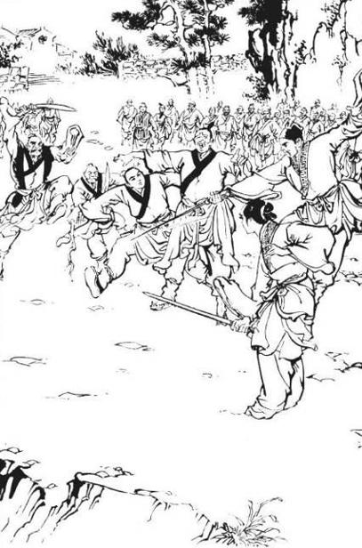
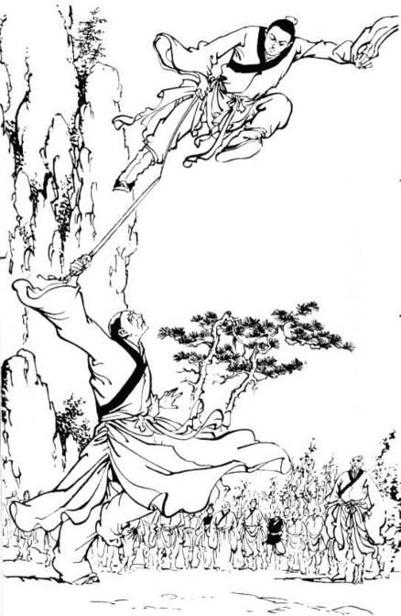
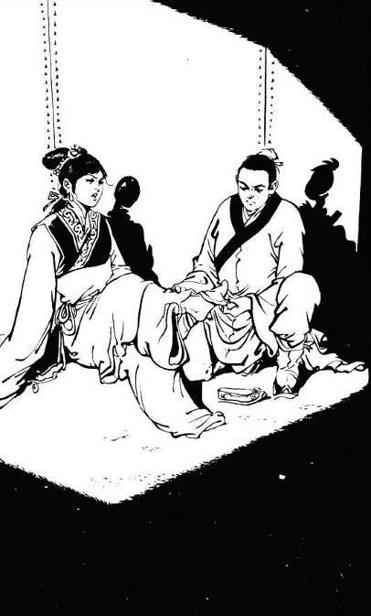
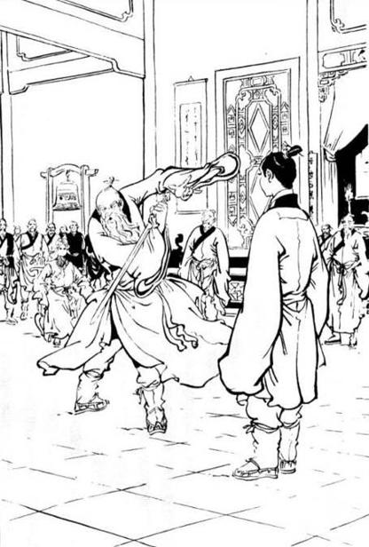
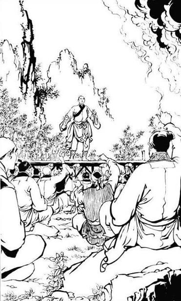
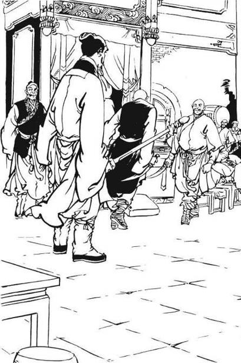
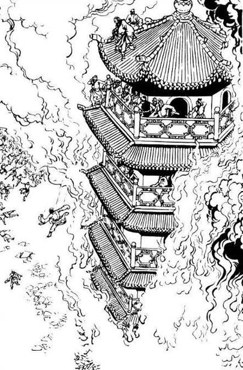
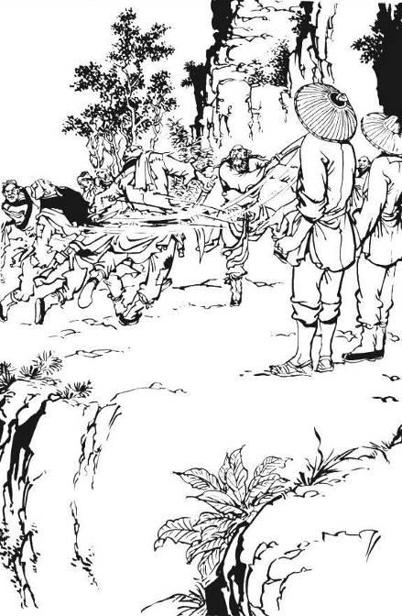
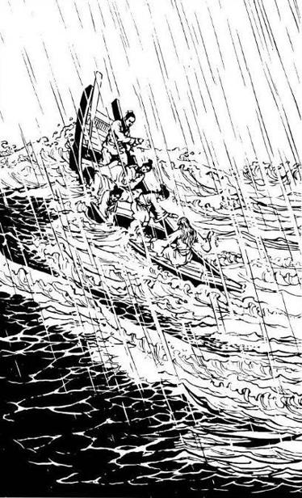
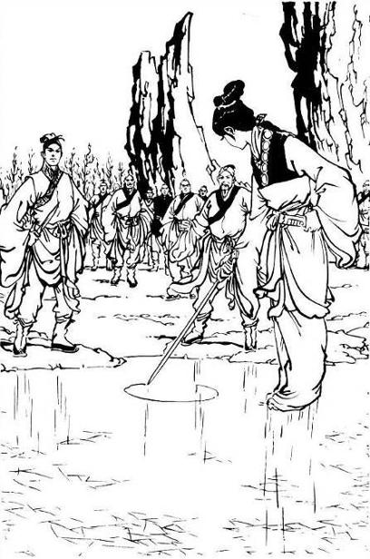

# Chapter 21 - Solving Problems, Resolving Disputes and Combating the 6 Forces

(Translated by Faerie Queen and Meh)

 

> By the time Zhang WuJi finished his last sentence “That won’t be
> necessary”, his body flew up and then began to spin, spinning four
> times quickly in midair, each time higher than the last, until he made
> a final flip, before landing soft as a feather down to the ground far
> away. The watchers could only stare in awe as they watched. If they
> hadn’t seen it with their own eyes, no one would have believed that
> someone could possess such amazing lightness kung fu. Even the Green
> Bat King, who thought his own lightness kung fu was unparalleled,
> could only sigh in reverence.  

Zong Wei Xia became secretly alarmed as he witnessed Zhang Wu Ji capture
the heavy weighing Yuan Yin with such ease. But he was already situated
in the middle of the battlefield, how could he possibly retreat now and
thus reveal his weakness? Therefore, Zong Wei Xia shouts out loudly,
“Hey! The one called Zeng! You came in here and insisted on sticking
your nose into our business. Who sent you here, and whose orders are you
acting on?” Zhang Wu Ji replies, “I act merely with the hope of seeing
the 6 great sects being able to resolve their conflicts and make peace
with the Ming sect. I am not ordered by anyone.” Zong Wei Xia barks
back, “Hmph! You expect us to shake hands and make peace with the demon
sect?! It’s absurd and impossible. The old bandit Yan promised to
receive 3 more stances of my Fists of the Seven Damages, let me finish
him first before I take care of you!” he rolls up his sleeves and
prepares to fight.  
  
Zhang Wu Ji immediately interrupts, “Elder Zong, you keep mentioning the
Fists of the Seven Damages, but allow me to express my humble opinion
elder – your current skill level of the Fists of the Seven Damages has
still not been executed to an expertly stage yet. There are 5 elements
within the human body – heart as governed by fire, lungs governed by
gold, kidney by water, spleen by earth and liver by wood, in addition to
that, there are the two chi(s) – Ying and Yang. Once one practices the
Fists of the Seven Damages, all 7 elements will be inflicted with
damage. The foundation of this set of fists was inclined to be in such a
way that with every level you advance in, your own internal organs will
also have to subsequently withstand an extra level of damage. Hence you
have to first inflict harm upon your own self before you can harm your
enemy. However, elder Zong, the good news is that you have not been
practicing this set of fists for very long, therefore you can still be
saved.”  
  
Listening to these words, Zong Wei Xia recognized that they were indeed
the key points delineated within the manual’s central instructions for
the Fists of the Seven Damages. The manual did repeatedly describe of
these side-effects, warning the practitioner that if they were to
attempt this set of fist, it must not be done so unless the reserve of
their energy levels has reached the point of where it can course through
the various acupoints of their body at will and be withdrawn with ease.
If one has not reached this level yet, then they must caution to never
practice this set of fists. However, this set of fists was the most
famous and powerful martial art in the Kong Dong sect, therefore as soon
as Zong Wei Xia reached a fairly stable reserve of internal energy he
immediately started to practice this set of fists. He suddenly found the
power within his punches to have increased significantly and once his
appetite was wetted, it became very hard for him to restrain from
continuing the practice. Hence all traces of the manual’s warning has
long since been completely forgotten. Besides, all of the 5 elders in
the Kong Dong sect practices this set of fists and since Zong Wei Xia
himself resided in the second position, how could he possibly allow
himself to be outdone? But upon hearing Zhang Wu Ji’s words at this
moment, he became suddenly alarmed. Shocked, he asked, “How did you know
all this?”  
  
Zhang Wu Ji does not reply, but continues to say, “Elder Zong, I entreat
you to massage the yun-men, cloud-gate energy point on your shoulder –
are you feeling a faint throbbing pain? The yun-men energy point governs
the lungs, which means that the connection to your lungs has been
wounded. The qing-ling, jade-spirit energy point located on the upper
half of your kidney will often given you a numbing ache that becomes
unbearable – am I right? The qing-ling energy point is related to the
heart, meaning the heart pulse has been damaged. The wu-li, five-mile
energy point on your thigh will ache with pain every time the weather
rains or clouds over. This is due to the fact that the wu-li point
governs the liver, meaning your liver has suffered harm. The longer you
continue this practice, the more increasingly severe these faint signs
of bodily disorder will become. If you continue on for another 8 or 9
years, I’m afraid that you will cripple your whole body for life.”  
  
As Zong Wei Xia concentrated on Zhang Wu Ji’s every word, bead after
bead of sweat emanated from his forehead. Little did he know that many
years ago, Xie Xun had related the whole essence and nature of the Fists
of the Seven Damages to Zhang Wu Ji, thus enabling Zhang to be very well
acquainted with the nature of this martial art skill. On top of that,
Zhang is extremely well learned in the practice of medicine, thoroughly
understanding the relationship between the various pulse points and the
side effects that arises from their damage. Thus every word that he
utters is dead on. Over the course of these few years, Zong Wei Xia has
indeed been feeling faint traces of those side effects that Zhang Wu Ji
mentioned. Due to the fact that his condition has not yet reached the
state of which would give cause for any serious alarm, he has therefore
always secretly harboured his illnesses and remained averse to the idea
of seeking medication. But hearing Zhang Wu Ji list out one after the
other, details of his physical condition so accurately, he couldn’t help
but be alarmed to the point of undergoing a change of colour in his
countenance. It is only after the duration of a very long pause before
he is finally able to utter the words, “How … how did you know this?”  
  
Zhang Wu Ji smiles faintly and replies, “I happen to know a little about
the laws of medicine. If elder you are willing to trust me, as soon as
the situation here is resolved, I can think of ways to cure you of your
present ailments. But I must remind you once more that practicing this
skill will only bring upon harm, and will do you absolutely no good. You
must not continue to practice it.”  
  
Zong Wei Xia forces himself to refute, “The Fists of the Seven Damages
is the top martial art skill within the Kong Dong sect’s establishment,
how can it be as you say, harmful and unbeneficial? Back in the days,
our sect’s ancestor Mu Ling Zi established worldwide fame for himself
solely from this set of fists. Not only did his great name spread to the
four seas, but he also lived to be 91 years old! How can it be damaging
to the body? Doesn’t this prove that your words are a pile of
rubbish?”  
  
Zhang Wu Ji replies, “It can be imagined that the elder Mu Ling Zi must
have achieved an extremely powerful reserve of inner energy, therefore
he, of course can practice this skill. Not only will it do him no harm,
it will actually work to strengthen his internal organic system.
According to my humble opinion elder Zong, your level of inner energy
has still not reached this level yet. If you continue to forcefully
practice this skill, I’m afraid that in the end all will be to no avail,
and your efforts will only result in uselessness.”  
  
Zong Wei Xia was a famous and important figure within the Kong Dong
sect, therefore even though he recognizes that Zhang Wu Ji’s words were
not without its truthfulness, yet having the most famous set of fist
skill that helped to establish the name of his sect being criticized by
this youngster in front of a big crowd of martial art fighters as being
“useless,” how can he possibly not be angry? He shouts out loudly, “Who
do you think you are? How dare you criticize my sect’s greatest martial
arts skill? If you think that it is really to be looked upon so lightly,
then why don’t you come out and try it yourself, see whether it really
is so useless?” Zhang Wu Ji smiles ever so faintly and replies, “The
Fists of the Seven Damages is most definitely a superbly complex and
mystical skill. The essence of the fists lies in its embodiment of raw
force that still maintains a degree of gentleness, a simultaneous energy
of harmonious balance that still exerts forceful power. The seven
different channels of execution are each distinct, it ebbs and flows
with hundreds of variations. It really catches one’s opponent off guard
and renders them defenceless.” Zong Wei Xia upon hearing Zhang Wu Ji
relate with straightforward honesty the intricate relationships of the
Fists of the Seven Damages, he could no longer help himself from
breaking into faint signs of a smile while repeatedly nodding his head
in agreement. Zhang Wu Ji continues, “I am just saying that if one’s
inner energy reserve has not reached an adequate level, then practicing
the fist skill will definitely cause more harm than good.”  
  
Zhou Zhi Rou was standing behind a bunch of her shi jies as she observed
Zhang Wu Ji. She mused at the fact that though Zhang embodied the faint
traces of a young person’s charismatic spirit, he was at the same time
forcing himself to appear as this worldly, well-learned old soul as he
lectured solemnly and soberly. It was as if he was teaching a lesson to
Zong Wei Xia, the second elder of the Kong Dong sect’s 5 elders – she
couldn’t help but be amused by the ridiculous and comical nature of the
whole situation. Yet at the same time, she couldn’t help but start to
secretly worry for him.  
  
Hearing the content of Zhang Wu Ji’s words gradually becoming more and
more offensive, the reckless and impulsive young disciples of the Kong
Dong sect were almost unable to restrain themselves from shouting out
insults. But when they looked over at Zong Wei Xia, they saw that he was
harbouring a serious countenance as he devotes the utmost attention and
concentration to this youngster’s words. The young disciples can
therefore only force back the insults that had already arrived at the
tip of their tongues.  
  
Zong Wei Xia asks, “So from what you are saying, my inner energy levels
is still not advanced enough?” Zhang Wu Ji replies, “Whether elder’s
inner energy levels has progressed to an advance state yet, I dare not
make any judgements rashly. But if during all this time that you have
spent practicing the Fists of the Seven Damages, you are also
simultaneously hurting your own body, then it is better to not practice
…”  
  
Before he could continue, he suddenly heard an angry shout from behind
him, “Brother, why waste your breath on this young rascal? If he dares
to look down upon our sect’s Fists of the Seven Damages, then let him
withstand the taste of one of my fists!” With the termination of this
person’s voice, followed his fist. His movements were both fast and
deadly, a force whooshed by to deliver a heavy fist that landed upon the
ling tai, spirit-temple energy point of Zhang Wu Ji’s back.  
  
Although Zhang Wu Ji was very aware of the impending attack coming up
from behind him, yet not only did he chose to completely ignore it, but
he also continued to address Zong Wei Xia, “Elder Zong…”  
  
Suddenly sounds of metal chains clanging against each other were heard,
and a person rushed out from the crowd. A sweet melodious voice cries
out, “You’re secretly attacking him behind his back?!” upon saying this,
a set of hands joined by metal cuffs reaches out over the attacker’s
head. The voice belonged to Xiao Zhao. That person struck back with his
left hands, thereby blocking off the metal chains and then very
concretely landed a punch on Zhang Wu Ji’s back. Although this punch
landed dead on upon Zhang Wu Ji’s ling tai acupoint, yet not only did
Zhang Wu Ji seem to have not even registered the blow, but instead he
turns toward Xiao Zhao and smiles gently, “Don’t worry Xiao Zhao, this
level of the Fists of the Seven Damages will not be of much use.” Xiao
Zhao breathes a sigh of relief, her snow white skin suddenly tinged with
a red blush, as she says in a low voice, “I almost forgot that you have
already practiced …” upon saying this, immediately hushed up and backed
away, returning to the crowds, dragging her metal chains along with
her.  
  
Zhang Wu Ji turns around and discovered that the attacker was an old man
with a big head and skinny body. This man was the fourth elder of the
Kong Dong sect’s 5 elders – his name was Chang Jing Zhi. Although that
one punch had clearly landed directly on Zhang Wu Ji’s crucial pulse
point, yet Zhang did not seem to have felt anything at all. Chang Jing
Zhi was flabbergasted, as he blurted out the words, “You … you’ve
already mastered the ‘Divine Art of Diamond Body Invulnerability,’ then
you are from the Shaolin sect?” Zhang Wu Ji replies, “I am not a Shaolin
disciple …” Chang Jing Zhi knew that all those who practiced this
mystical skill of bodily-protection must depend upon the generation of a
single breath of inner Qi. Once that person opens their mouth to speak,
that breath of Qi will dissipate immediately. Therefore before Zhang Wu
Ji can finish his sentence, Chang struck out once again, this time
landing a fist upon Zhang Wu Ji’s chest.  
  
Zhang Wu Ji smiles and says, “I’ve already said that the Fists of the
Seven Damages is useless if one has not achieved an advanced level of
inner energy, if you don’t believe me, then please feel free to throw
another punch at me.” Chang Jing Zhi did not waste a single moment
before striking out with the speed of the wind, throwing out one punch
after another, as two consecutive punches landed on Zhang Wu Ji. In
total, altogether of four punches were thrown, every one of them having
most definitely landed on Zhang Wu Ji’s body. Yet Zhang continues to
smile easily as he receives them, as if he was oblivious to the pain.
The four stances of heavy hand all embodied an obliterating force
capable of smashing rocks and shattering tombs, yet they were all
sustained by Zhang Wu Ji as if they were nothing more than the soft
touch of a light breeze and the gentle caress of smooth silk.  
  
Chang Jing Zhi has always been known as the “mountain-splitting single
fist,” and although the grandeur of this title may have been slightly
exaggerated, yet the forcefulness of his punches cannot be denied. Among
the older generation of martial art fighters, he has always remained a
respected and well-known figure. There was not a single person on that
scene who was not left in a state of utter astonishment and disbelief
having witnessed with their own eyes how the four consecutive punches
that Chang Jing Zhi executed all amounting to nothing more than a waste
of energy. The Kun Lun sect and Kong Dong Sect have always been rivals,
and although at this moment they were both cooperating with each other
in their attempts to combat the Ming sect, yet in the hearts of both
sides lies deep discontentment and contempt for the other sect. A voice
coming from the Kun Lun sect mocks in an icy tone, “Oh, very good! A
great ‘mountain-splitting single fist’ indeed!” Another person scoffs
“And exactly what has those 4 punches been able to split?” It was a good
thing that Chang Jing Zhi had such a dark complexion, for although his
face has already flushed a deep red it was luckily not too noticeable
under his dark skin.  
  
Zong Wei Xia formed a fist with his two hands in accordance to the
social etiquette of respectful courtesy, “Young hero Zeng, I am much
impressed and amazed at your divine martial art skills. Can this old man
ask you to engage in an exchange of 3 stances?” He knew that his Fists
of the Seven Damages was at a much more advanced level compared to Chang
Jing Zhi’s, therefore he figured that just because his brother fails, he
himself may not necessarily lose to the opponent.  
  
Zhang Wu Ji replies, “The Kong Dong sect’s Fists of the Seven Damages is
without a doubt a superb skill IF it is practiced correctly, as it is
most definitely a force that is capable of obliterating anything in its
path. Even the great Shaolin monk Kong Jian who had been able to master
the supreme skill of “Divine Art of Diamond Body Invulnerability” died
under the Fists of the Seven Damages belonging to your sect. My martial
art abilities can in no way be said to even come close to matching that
of the great revered monk Kong Jian, how can I possibly be of match? But
if elder you insist, I figure there is no harm in receiving 3 of your
punches.” The meaning behind his words were clearly implying that though
the Fists of the Seven Damages was originally powerful, yet based on the
level you have achieved now, you are nowhere near the vicinity of
causing any harm.  
  
Zong Wei Xia had no time to care about what the hidden meanings behind
Zhang Wu Ji’s words may have been, as he was already secretly generating
a few consecutive breathes of inner Qi. Zong Wei Xia came forward a
step, noises from the bones of his arm that were rattling against each
other started to emanate from the force building up within him. A punch
was thrown, and with force it impacted with Zhang Wu Ji’s chest.
However, as Zong Wei Xia’s fist made contact with Zhang Wu Ji’s body,
Zong Wei Xia immediately discovered that there seemed to be a mysterious
magnetic force surrounding Zhang’s body that is momentarily locking
Zong’s arm in a fixed position. Much to his alarm, Zong Wei Xia felt
that there was suddenly this very soft and warm energy that was entering
him through the fist and was heading straight for his dan tien, the
elixir field. In that region between his chest and stomach suddenly
appeared an indescribable, yet extremely comfortable and harmonious
feeling. Shocked from this mysterious phenomenon, Zong Wei Xia retracts
his arm and again releases yet another punch in Zhang’s direction, this
time striking his lower stomach. Yet the reverberating power that
resonates back towards him was extremely strong and forceful, he had to
back up a step before he was able to find his balance. He again
generated internally a few cycles of energy before once again stepping
forward and extended his fist in a fierce punch.  
  
At that moment, Chang Jing Zhi was situated right by Zhang Wu Ji. From
Chang Jing Zhi’s perspective, Zong Wei Xia seemed to him to have
sustained internal injuries as his countenance was fluctuating between
flashes of deep red to moments of deathly paleness. Therefore as Zong
Wei Xia threw his third punch, Chang Jing Zhi was already prepared to
follow Zong with his own fist. Zong Wei Xia struck Zhang Wu Ji on the
chest, while Chang Jing Zhi simultaneously attacked Zhang from the back.
The two fists impacted on separate parts of Zhang Wu Ji’s body at the
same time, and there can be no doubt that the force impacted upon his
body was ferocious. Yet who could have expected those two extremely
strong sources of energy to be mysteriously and completely dissipated
within a brief instant? Chang and Zong’s combined efforts seemed to have
resulted to nothing more than a mere punch into empty space.  
  
Chang Jing Zhi knew very well that he was acting from the position of an
elder, and the first time he snuck up and attacked Zhang Wu Ji from
behind so as to catch him unawares was already an extremely frowned upon
jiang hu taboo. However, at that time he can at least adamantly claim
that Zhang Wu Ji’s disrespectful words were tarnishing the reputation of
Kong Dong sect’s greatest skill, and thus blame his own actions on the
momentary inability to control his temper. Yet this second time around,
his sneak assault was undoubtedly the despicable act of a malicious
scoundrel. He originally thought that by the combined forces generated
from his brother and his own Fists of the Seven Damages, this youngster
will definitely succumb to defeat under their fists. Chang knew that as
long as he is able to kill the youngster, even if there surfaces any
kind of gossip or talk from others afterwards, the fact remains that he
has nevertheless eliminated a useless nobody for the 6 great sects and
therefore could still be said to have established a heroic
accomplishment. Yet strangely, as soon as his fist landed upon his
opponent’s body, the entirety of his forceful strength immediately
dissipated into nothingness. Chang Jing Zhi was extremely puzzled, he
racked his brains yet was still unable to come up with a single clue of
how all this could have happened. He could only raise his left hand to
his own head, scratching it in state of contemplation.  
  
Zhang Wu Ji addresses Zong Wei Xia with a slight smile, “How are you
feeling Elder?”  
  
Zong Wei Xia bows to Zhang Wu Ji in an act of humble reverence, and with
respectful esteem to Zhang Wu Ji he says, “Thank you hero Zeng for using
your inner energies to heal my bodily afflictions. Young hero Zeng, it
is obviously undeniable that your divine marital arts’ proficiency is of
an unfathomably deep level. Yet it is this act of repaying the injustice
done upon you with an act of kindness and goodwill, this display of such
greatness in character and morality that causes me to be truly humbled
by and gratuitous towards.”  
  
As soon as these words were said, there was not a single person on the
battlefield that was not completely astonished and baffled. Of course
nobody was aware of the fact that when Zong Wei Xia attacked Zhang Wu Ji
consecutively with three punches, Zhang Wu Ji used that opportunity to
generate his 9 Yang Zhen Jing, thus delivering his energy into Zong Wei
Xia’s body. Although the duration was brief, sweeping over Zong’s body
in a short moment’s timeframe, yet the 9 Yang Zhen Jing’s energy was
extremely substantial and solidly profound, and even from that brief
experience Zong Wei Xia has already benefited quite a bit. He knew that
had it not been for Chang Jing Zhi’s surreptitious attack on Zhang Wu
Ji, the benefits that could be have been reaped by the third punch would
have been much greater.  
  
Zhang Wu Ji replies, “ ‘greatness in character and morality,’ these are
kind words of which I am not worthy of. Elder Zong at this moment, your
essential nerves and the eight veins have already experienced great
agitation, the best thing for you to do right now would be to
immediately bring your energies back into balance. It is only through
this process can all the harmful toxins that have accumulated within
your body from all these years of practicing the Fists of the Seven
damages be gradually eradicated within two or three years.”  
  
Zong Wei Xia finally recognized now that his body has indeed fallen ill,
so he promptly formed his hands into a fist gesturing gratitude and said
earnestly “Thank you, thank you!” and without wasting a moment’s time,
he immediately moved back a step and sat down on the floor in order to
start generating his Qi. Although Zong Wei Xia knew very well that this
gesture was somewhat unsightly and causing him to lose all dignity of
appearance, yet this was a life and death situation and therefore he
couldn’t allow himself to be bothered or hindered by anything else right
now.  
  
Zhang Wu Ji bent down and started to reconnect Tang Wen Liang’s broken
ribs. He turned towards Chang Jing Zhi and commanded, “bring some
Yang-Rejuvenating Five Dragons Paste to me.” Chang Jing Zhi obediently
took out the said paste and handed it over to Zhang Wu Ji. Zhang Wu Ji
then requested, “will you please ask the Wu Tang sect to borrow a dosage
of their Triple-Huang Wax tablets, and ask to borrow a bit of Hua Shan
sect’s Yu Zhen Powder” Chang Jing Zhi obediently followed Zhang Wu Ji’s
every word, gathering the necessary items and bringing them to Zhang Wu
Ji. Zhang Wu Ji explains, “your sect’s Yang-Rejuvenating Five-Dragons
paste is composed of the Cao Wu (aconite) which is extremely effective,
while the Wu Tang sect’s Triple-Huang Wax tablets’ ingredients of the
three different kinds of Huang – Ma Huang (ephedra herba), Xiong Huang
(realgar) and Teng Huang (Resina Garciniae), is also very beneficial.
Add to this the Yu Zhen Powder, and as long as elder Tang gets plenty of
rest in his recuperation, 2 months later his limbs will be functioning
as well as before,” as he was explaining this, Zhang Wu Ji was all the
while applying the medicine to Tang Wen Liang’s broken bones, finishing
the treatment within a moment’s time.  
  
The various sects each had their own unique formula of therapeutic
medicine, each one unique in their remedial nature and the outcome they
affect. The details of the various sects’ medicinal remedies were all
clearly and explicitly recorded within Hu Qing Niu’s medicine
chronicles. Zhang Wu Ji figured that since the 6 major sects were
flanking the Ming sect on Guang Ming Peak, they must have each brought
along their own remedial medicine in preparation for battle. But the
onlookers just became all the more puzzled, not only because Zhang Wu
Ji’s curative abilities far excels that of any eminent and famed doctor,
but they were even more flabbergasted by the fact that Zhang Wu Ji was
able to accurately assess the therapeutic properties of the various
medicines belong to each sect. Chang Jing Zhi approached Tang Wen Liang
and helped him to his feet, before retreating with a distinct expression
of embarrassment and shame. Tang Wen Liang suddenly shouted, “You! Zeng!
Tang Wen Liang is extremely indebted to you for healing my injuries. You
have my word – one day I will repay your charitable act. But the demon
sect is our sect’s sworn adversary. The Kong Dong sect will forever be
enemies with the Ming sect, the various scores of vengeance and
retribution is something that has long existed between us and is not
something that can be resolved through a small favour done on me by you.
You’re trying to persuade us to settle our arguments, but we will not be
persuaded. If you feel that I am being an ungrateful bastard who does
not appreciate the good deed you have done for me, you can just break
all my limbs again, but you can’t persuade us to settle our scores with
the demon sect.”  
  
Once these words were uttered, the same thought was running through
everyone’s mind, “Although they both belong to the Kong Dong sect, yet
this Tang Wen Liang definitely has more integrity than that Chang Jing
Zhi.”  
  
Zhang Wu Ji replied, “If Elder Tang indeed feels this way, then may I
ask what I can do in order for you to listen to my words?”  
  
Tang Wen Liang replies, “Show us your martial art skills. If Kong Dong
sect’s skill is indeed inferior to yours, then I have nothing to say.”  
  
Zhang Wu Ji replies, “The number of skilled fighters within the Kong
Dong sect are as vast as the clouds, how can I possibly compete with
them? Forgive me for being bold and reckless, but today I am insisting
on playing the role of the peacemaker so I’ll give it a try. I can only
give it my all, using my life as a gamble.” He looks around him and sees
that on the east end of the battlefield is an enormous pine tree that
must have been taller than 30 feet. Its roots spanning out in all
directions as it stands solidly rooted in the ground. Zhang Wu Ji walks
over to the tree and speaks out in a loud and clear voice, “Once I
happened to come upon the opportunity of learning a little bit of your
sect’s Fists of the Seven Damages. If I do anything incorrectly, I
entreat you to please be tolerant of me.” Everyone became very shocked
upon hearing this, all in a state of disbelieve and questioning, “How
can it be that this young man will also know even the Kong Dong sect’s
Fists of the Seven Damages? From where could he have possibly learned
this skill?” Zhang Wu Ji continues in a clear and steady voice, “The
five central channels of energy balances Ying and Yang. Harm the heart,
wound the lungs, and mutilate the liver and intestines. Viscera is
shattered, energy recedes, will wanes. Once all three sectors of the
stomach are reversed, along with the breath, the spirit flees away.”  
  
Although members belonging to the other sects did not take much interest
in Zhang Wu Ji’s words, however, the 5 elders of the Kong Dong sect were
all shaken to the core upon hearing Zhang Wu Ji clearly and accurately
recite these 4 stanzas of words that resembled neither poem nor song.
What was just recited by Zhang Wu Ji was indeed the general indexical
stanza for the Fists of the Seven Damages, and its composition has
always remained a secret belonging to the Kong Dong sect that was not
related to outsiders – how could it be that this youngster also knows
how to recite it? At that moment how could they have possibly guessed
that many years ago when Xie Xun stole the book containing the steps to
the Fists of the Seven Damages, he had also related its contents to
Zhang Wu Ji?  
  
Zhang Wu Ji while reciting in a clear voice walks forward and strikes
out with a punch. The sound of a loud “boom” echoes out and a blur of
jade green flashes by the eyes as the top half of the great pine tree is
severed off, flying to a side and landing on the ground almost twenty
feet away from its original spot. All that is left on the ground is the
bottom half of the trunk that is now only around 4 feet tall, the area
of disconnection was even and levelled out.  
  
Chang Jing Zhi mumbles to himself, “that’s … that’s not the Fists of the
Seven Damages!” The theory behind the Fists of the Seven Damages
requires the method of execution to embody both hard and soft elements –
where within waves of solid force will also simultaneously exist traces
of gentleness, as well as vice versa where soothing suppleness bears the
presence of dynamic power. Although this act of severing a big tree into
two parts was indeed an extremely powerful move that would call for
amazement, yet the source of power derived to execute it is of an
extremely solid and forceful kind of energy. Chang Jing Zhi approached
the dislocated piece for a closer inspection and could he not stop his
jaw from dropping into a gaping hole of disbelief. Jolted into a state
of shock and astonishment, he was unable to close his mouth. Chang saw
that the core of the tree was cleanly and completely severed, clearly
indicating the work of one whose practice of the Fists of the Seven
Damages has already reached the highest level.  
  
In actuality, Zhang Wu Ji was intent upon using his power and ability to
take control over the battle scene. Therefore, if he was to use the
Fists of the Seven Damages to severe the core of the tree trunk, he must
wait from 10 days to half a month for the core of the pine tree to dry
and shrivel up before he could finish it off. Hence, as he delivered a
blow using the Fists of the Seven Damages, he also proceeded with an
extremely strong and forceful Yang energy in order to break the tree
into a clean half. Years ago on the ice-fire island, his yi fu Xie Xun
also employed a similar method based on the same principle of first
using the Fists of the Seven Damages to crack and shatter the internal
core of the tree before immediately using the dragon sabre to cleanly
slice through it.  
  
All that was heard around him were the cheers, excitement and praises
coming from all the sects. The energetic enthusiasm was gushing towards
Zhang Wu Ji like tidal waves, lasting quite a while before finally
quieting down.  
  
Chang Jing Zhi exclaims “Outstanding! That was indeed a demonstration of
the highest achievement of the Fists of the Seven Damages skill! I truly
bow to you! But I have to ask you young hero Zeng, from where did you
learn this set of fists?” Zhang Wu Ji smiles faintly and does not reply.
Tang Wen Liang asks in a sharp tone, “Where is the Golden Mane Lion King
right now? I entreat young hero Zeng to impart upon us his whereabouts.”
Tang has always been a perceptive and shrewd person, and has therefore
vaguely deduced that Xie Xun must somehow be either related to, or
associated with the youngster that is currently standing in front of
him.  
  
Zhang Wu Ji becomes alarmed and thinks to himself, “Darn it! Using the
Fists of the Seven Damages has brought attention upon yi fu’s presence.
If I truthfully relate to them my relationship with yi fu it will only
make me the enemy of the 6 great sects, and then my attempts at playing
the role of the peacemaker will not succeed.” He then proceeds to say,
“Your sect is insisting that the ultimate figure responsible for the
abduction of the manual for the Fists of the Seven Damages is the Golden
Mane Lion King? That is wrong, very wrong! That night on the Kong Dong
Mountain in the midst of the fight within Qing Yang temple, there was
one person in your sect who was injured by the Divine Art of Originating
Formation, and hence red spots started to appear all over his whole
body. The attacker that night was the one who is known to all as the
‘Lightning Hands of the Originating Formation’ – Cheng Kun.”  
  
Years ago, when Xie Xun arrived on the Kong Dong mountain intent on
stealing the fist manual, Cheng Kun purposely assisted him without his
awareness in order that he may generate more enemies for the Ming sect.
That night, Cheng Kun used the Divine Art of Originating Formation to
injure the two elders Tang Wen Liang and Chang Jing Zhi. Xie Xun was not
aware that Cheng Kun had secretly assisted him that night, and it was
only later when Xie Xun encountered the monk Kong Jian who elucidated
for him the truth, did he finally understand what happened. Zhang Wu Ji
was thinking to himself that since Cheng Kun has spent a whole lifetime
engaged in implementing nothing but evil deeds, purposely framing others
for his own evil feats, he may as well give him his just desserts by
retaliating in the style of Cheng Kun. Zhang Wu Ji felt that not only
was he not lying, but he was also uncovering the truth.  
  
Tang Wen Liang and Chang Jing Zhi had harboured suspicions in their
hearts for more than 20 years. At this moment, being presented with an
explanation from Zhang Wu Ji, the various incoherencies suddenly fell
into place. Tang and Chang looked at each other for a moment, unable to
say anything for a while. Zong Wei Xia inquires, “May I ask you hero
Zeng, this Cheng Kun – where has he escaped to at this present
moment?”  
  
Zhang Wu Ji replies, “The Lightning Hands of the Originating Formation:
Cheng Kun was fuelled by only one purpose, and that was to create
disorder between the 6 great sects and the Ming sect. He was later taken
in under Shaolin’s wing, and changed his name to Yuan Zhen. Last night,
he sneaked into the Ming sect’s inner forum and admitted to these crimes
with his own mouth to the Ming sect’s head leaders. At that time, Mr.
Yang Xiao, Wei Bat-King, and the 5 wanderers were all listening. I swear
that this is the unembellished truth. If there is a single false word,
then I am even lower than a crowd of dogs and pigs, and when I die may
it be that I will be tortured by millions of diabolical calamities and
doomed to suffer in eternity, never be reborn again.”  
  
Having heard Zhang Wu Ji deliver these words with utmost sincerity and
earnestness, the majority of people were struck with wonder and
speculation. Only the Shaolin sect’s various monks simultaneously
erupted into loud shouts of protest.  
  
(Continued by Meh)  
  
Only to hear a person stepping up from the crowd, chanting Buddhist
prayers. He wears a gray robe, his expression stern, and his left hand
holds a string of beads. This is one of the three Mystical Reverends of
Shaolin, Kong Sheng. He spoke as he entered the arena, “Mr. Zeng, why do
you say such lies, ridiculing my Shaolin Temple? How can I possibly let
you continue to say such profane words in front these heroes?” Zhang
WuJi bowed and said, “Do not by angry, reverend. Please allow Yuan Zhen
monk to step up, so the truth can be told.” Reverend Kong Sheng said
with a glum face, “Mr. Zeng keeps asking for my martial nephew Yuan
Zhen. You are still quite a young man. Why do you have such a venomous
heart?” Zhang WuJi said, “I simply would like for Monk Yuan Zhen to come
out, so all the truths and lies will be sorted out. Why would this be
venomous?” Kong Sheng said, “Martial nephew Yuan Zhen is my martial
brother Kong Jian’s last student. His devotion to the Buddha is very
strong. Other than coming with us to the Ming sect, he has never left
the temple even once. How can he be the The Lightning Hands of the
Originating Formation: Cheng Kun? Besides, martial nephew Yuan Zhen, in
order to help us demolish the Devil sect, has already died. How can you
say such things about him even in death?”  
  
The words ‘already died’ resonate heavily into Zhang WuJi’s ears. His
face instantly turns white. Whatever else Kong Sheng might have later
said, he did not hear. Zhang WuJi can only stutter, “He… he really died?
No… no it can’t be.” Kong Sheng then points to a pile of monk bodies on
the side, and yells loudly, “You can go see for yourself!” Zhang WuJi
walks in front of the dead bodies, only to indeed find the body of Yuan
Zhen. He checks for breathing, then the muscles for warmth. Based on the
temperature, he has already been dead for quite a while. Zhang WuJi felt
sadness and happiness in his own heart. He never thought that his
godfather’s mortal enemy now lies here dead. The blood in his chest
boiled, as he could not hold back facing the sky and laugh, “Oh, you
scoundrel. You have done so much evil in your life. Ha! Looks like even
you have today’s outcome today.”  
  
These thunderous laughs shook the mountain, trembling the minds of
everyone there. Zhang WuJi turns around and asks, “Who killed Yuan
Zhen?” Kong Sheng’s face looks cold as ice, and does not respond. Yin
TianZheng had already retreated to the side, but now he speaks up, “He
and my son Yin YeWang matched palms. One person died and one person
injured as a result.” Zhang WuJi bows and says, “I see.” He thought, “I
bet after taking Wei YiXiao’s Soft Ice Palm, Yuan Zhen became seriously
injured. My uncle’s power is also quite incredible. So that is how he
died. I am really glad that it was my uncle who helped me achieve this
revenge.” He walks to Yin YeWang’s side, checks his condition, and
realizes that the injuries are not life threatening. He said, “Thank
you, elder!”  
  
Kong Sheng became angrier and angrier as he watched on the side,
exclaiming, “Little kid, get ready to die!” These words resonated loudly
into the ears of everyone there. Zhang WuJi turns around and asks,
“Why?” Kong Sheng said loudly, “You knew that martial nephew Yuan Zhen
is dead. Yet you put all the blame on his shoulders. How can I let
someone so malicious live? I will break the pillar not to kill today.
Are you going to commit suicide, or do you want me to kill you?” Zhang
WuJi thought, “The fact that the main culprit Yuan Zhen had died is
originally a good thing. But now how can I show them the truth now?”
Just as he is still thinking of a plan, Kong Sheng steps up and aims his
right hand at Zhang WuJi’s head. His hand is straight as a stick from
the wrist to the fingers, sharp and crisp. Yin TianZheng yelled, “Be
careful, it’s Dragon Claws!”  
  
Zhang WuJi’s turns to the side, gently sidestepping the attack. When
Kong Sheng could not grab him the first time, he tried again. This time,
he’s even quicker and more ferocious. Zhang WuJi again sidesteps his
grab by evading to the left. Kong Sheng’s third, fourth, and the fifth
strikes immediately followed. In an instant, a gray-robed man became a
gray dragon. The dragon shadow flies in the air, the dragon claws dances
rapidly, pushing Zhang WuJi to the point where he can no longer move
away. A quick ‘swoosh’ sound later, Zhang WuJi’s body flew up, but Kong
Sheng had already grabbed his right sleeves, pulling down. Five cuts
appeared on Zhang WuJi’s shoulder as blood pour out. The Shaolin monks
immediately cheered on, but a lone girl screamed in shock. Zhang WuJi
looked at the direction of the voice, only to see Xiao Zhao’s expression
extremely pale. She said, “Young master Zhang, you… you be careful.”
Zhang WuJi’s heart felt a tingle of warmth, and thought, “This little
girl is really nice to me.” After succeeding with his previous move,
Kong Sheng immediately followed it up with more, each with a great deal
of energy. This type of kung fu is fast and furious. More powerful than
anything Zhang WuJi has seen before. He can only try to dodge the
oncoming blows.  
  
As Kong Sheng attacks continuously with his Dragon Claws, Zhang WuJi
continuously backs away. They kept facing each other, one moving
forward, while the other one moving back. After nine consecutive misses
by Kong Sheng, he’s still about a yard away from Zhang WuJi. Although he
moves forward at lightning speed, Zhang WuJi always manage to back off
at the same pace. While Zhang WuJi still has not countered any attacks,
one can already see just who has the edge in lightness kung fu. One is
moving forward, while the other is backpedaling. The difference in
difficulty between the two is easy to see. Since he could not catch up,
Kong Sheng’s power in the legs is obviously much worse. Had Zhang WuJi
turned around to run, he could have easily left Kong Sheng long behind.
Essentially, the reason Zhang WuJi didn’t turn around is so he can see
Kong Sheng use his Dragon Claws. By the time he saw the thirty-seventh
claw, he realized that it was move number eight, ‘Cloud Palm form’.
Obviously, Zhang WuJi does not know its name. But he knows perfectly how
one would execute such a move.  
  
This Dragon Claws only has thirty-six moves. Its aim is to be fast and
deadly, not concentrating on changing variations. Whenever Kong Sheng
has met a formidable enemy, he has always gained the initiative by using
this Dragon Claws. Never has he needed more than twelve moves to win the
fights. From the thirteenth move on, he has practiced them, but never
used them in battle. He can’t believe that he couldn’t win even after
using all thirty-six moves. By his thirty-seventh move, he had to reuse
his previous ones. Kong Sheng thought, “This kid only has great
lightness kung fu and great agility. That’s why he can avoid my strikes.
But if we truly stop and fight, I doubt he can handle twelve strikes of
my Dragon Claws.” Zhang WuJi by now had already figured out the workings
of the Dragon Claw. He found no weaknesses, but Qian Kun Da Nuo Yi can
create weaknesses from any type of forms. He thought, “At this time, I
can easily kill him. But Shaolin has always held a great reputation, and
this monk is one of the three most important people in Shaolin. If I
beat him today, where is the face for Shaolin? Yet it’s impossible to
simply make him back down willingly. His kung fu, after all, is much
better than the Kong Dong elders.” Just as he’s deciding on what to do,
he heard Kong Sheng say, “Little kid, you’re just trying to run away,
not fighting!” Zhang WuJi said, “Fighting is…” Kong Sheng, knowing that
Zhang WuJi’s chi cannot flow efficiently while speaking, and takes
advantage of the situation. ‘Swoosh, Swoosh’, two more strikes shot out.
Zhang WuJi again floated away, as he continued his sentence, “…also
fine. If I defeat you, reverend, what will you do?” He did not pause at
all during this sentence. Had someone listened with his eyes closed, he
might’ve thought that Zhang WuJi said it while sitting down. No one
would believe that he spoke while dodging five attacks from Kong Sheng.
Kong Sheng said, “If I lose to you in a true fight, you can feel free to
kill me.” Zhang WuJi said, “Oh, I certainly don’t have that in mind! If
I lose, obviously you can do what you wish with me. But should I win, I
hope Shaolin will leave Brightness Peak today.” Kong Sheng said, “My
martial brother is the leader of our group. I do not have a say in the
decision-making. Besides, I don’t believe I can possibly lose to a kid
like you.”  
  
Zhang WuJi suddenly got an idea, and says, “Shaolin Dragon Claws’
thirty-two strokes have no weakness. It can really be considered the
most powerful claw technique in the world. Except it seems that you are
using the Dragon Claws a bit wrong.” Kong Sheng said angrily, “Fine! If
you can break my Dragon Claws, I’ll immediately go back to Shaolin,
never to leave the door again!” Zhang WuJi said, “That won’t be
necessary!” The others there cheered loudly as they watched this
conversation. Because during this conversation, the two fighters never
did take a break in fighting. In fact, they moved faster and faster as
the battle went on, yet the tones for their conversation remained clear
and calm, showing no signs of breakage. By the time Zhang WuJi finished
his last sentence “That won’t be necessary”, his body flew up and then
began to spin, spinning four times quickly in midair, each time higher
than the last, until he made a final flip, before landing soft as a
feather down to the ground far away. The watchers could only stare in
awe as they watched. If they hadn’t seen it with their own eyes, no one
would have believed that someone could possess such amazing lightness
kung fu. Even the Green Bat King, who thought his own lightness kung fu
is unparalleled, can only sigh in reverence. As Zhang WuJi landed, Kong
Sheng also moved up to him, but didn’t attack. He asks loudly, “Are we
going to start now?” Zhang WuJi says, “Sure. After you.” Kong Sheng
says, “You’re not going to back off?” Zhang WuJi smiled and says, “If I
take another step back, I’ll admit defeat.”  
  
Although the top fighters of the Ming sect are all too injured to move,
their hearings are still fine. All of them gasped when they heard Zhang
WuJi say this. They are all experienced in the martial world, and
realize the power of Kong Sheng’s Dragon Claws. To them, even trying to
block one hit would be a difficult task. No matter how good Zhang WuJi
is, he still would likely need more than a hundred moves before winning.
How can he possibly not take a step back during this time? Only to hear
Kong Sheng say, “That won’t be necessary. If I win, I want to win
fairly. If I lose, I want to lose willingly.” When he finished, he
yelled, “Look out!” Kong Sheng then feints with his left hand, while his
right hand carries a strong wind from the other side, reaching for Zhang
WuJi’s Bowl Lacking Point on his left shoulder. Zhang WuJi realizes,
from the feint, that this is another ‘Cloud Palm Form’. So he also
feints with his left hand, while his right hand shot out to Kong Sheng’s
Bowl Lacking Point on his left shoulder. Both fighters use the same
move, without any difference. Zhang WuJi moves second, but reaches his
target first, gaining the initiative. While Kong Sheng’s right hand is
still a few inches away from Zhang WuJi’s left shoulder, Zhang WuJi’s
five fingers has reached the opponent’s Bowl Lacking Point. Kong Sheng
only felt a little sting on his pressure point, as he lost all strength
on his right hand. Yet Zhang WuJi did not apply any more power to his
claws, instead pulling back his hand. After being stunned for a moment,
Kong Sheng’s both hands shot out, attacking with the ‘Pearl Taking
Form’, aiming for Zhang WuJi’s left and right Sun Point. Once again
Zhang WuJi moved afterwards, and again, landed the attack first,
grabbing both of Kong Sheng’s Sun Point. The Sun Point is of paramount
importance to a fighter. If reached, it would mean certainly defeat. Yet
Zhang WuJi simply lightly touches the Sun Point. He then spins around,
and changes into the Dragon Claws’ seventeenth move ‘Moon Catching
Form’, aiming Kong Sheng’s Wind Manor Point at the back of his head.  
  
Zhang WuJi had already stunned Kong Sheng by grabbing his Sun Point, but
his usage of the ‘Moon Catching Form’ left Kong Sheng dumbfounded. Kong
Sheng said, “How… how did you steal Shaolin’s Dragon Claws?”  
  
Zhang WuJi responds with a chuckle, “The martial arts under the Heavens
are hardly all unique. It’s only humans who forcibly divide them into
different sects. How can you be sure that this Dragon Claws is unique to
Shaolin?” But in his mind, Zhang WuJi realizes, “This Dragon Claws
really is something. I bet it took Shaolin hundreds of years to refine
it into the form today. It probably is unparalleled in the world. If I
weren’t using Dragon Claws to fight him, I don’t think I can win.”  
  
Kong Sheng lowers his head, trying to digest this strange information.
When it comes to the Dragon Claws, not even his martial brothers can
match him in terms of skill. So how can this youngster twice move after
him, yet also twice landing the blow first? Plus, this youngster’s
accuracy, speed, and power are all incredible, as if he’s been
practicing for tens of years.  
  
All the eyes in the crowds stared at him as he stood there in silence.
The two moves were over in a blur. So other than the top-level fighters,
no one knows just who won the exchange. But they do see that Zhang WuJi
still carries a carefree expression, while Kong Sheng is agonizing in
his thoughts.  
  
Kong Sheng suddenly roars loudly, swiftly stepping up, his palms
powerful as a thunderstorm, ‘Wind Grasping Form’, ‘Shadow Catching
Form’, ‘Zither Playing Form’, ‘Drum Beating Form’, ‘Carrying Form’,
‘Sham Striking Form’, ‘Evil Wrapping Form’, ‘Weakness Blocking Form’,
all eight moves one after another with lightning speed. Zhang WuJi,
keeping his calm, begins grasping winds and catching shadows, playing
zither and beating drums, carrying and striking shams, wrapping evil and
blocking weaknesses, also making the same eight moves smoothly in a row,
each time he goes second, but strikes first.  
  
Kong Sheng’s eight strikes came continuously, looking more like eight
different variations of a single move, each with unparalleled speed. Who
would’ve thought that Zhang WuJi is even faster? Every time he lands the
blow first. Every time Kong Sheng makes a move, he has to take a step
back. By the time he has retreated seven steps, he begins to use ‘Evil
Wrapping Form’ and ‘Weakness Blocking Form’. These are the last two
moves of the Dragon Claws. Their appearance seems to be filled with
weaknesses, making the user look unsure of himself. Yet both of these
forms are based on the principle of counterattacking. Every single
weakness is a trap that allows for some very potent counterattacks.
Although Dragon Claws is a Hard style of martial arts, it’s last two
moves changes to a very Soft style. Zhang WuJi takes another breath and
steps up, also using the same final two forms, but immediately changed
to a ‘Cloud Palm Form’ afterwards.  
  
Kong Sheng thought ecstatically, “Ha! Finally fell into my trap.” He
sees Zhang WuJi’s right arm entering the trap, unable to possibly
retreat. Kong Sheng recoils his arms and then spun them from the top,
striking down on Zhang WuJi’s arms from above. He sees that this
youngster is proficient in Shaolin kung fu. Afraid that he may be
related to the temple, and knowing that Zhang WuJi had been lenient with
him earlier, Kong Sheng did not try to take his life, only seeking to
break his bones. Yet just before his attack landed, he felt a strong and
warm inner power flowing into his chest, preventing his arms from going
down further. At this time, Zhang WuJi’s five fingers have already
reached his body.  
  
Immediately, Kong Sheng’s heart sank. Tens of years of hard practice on
this Dragon Claws, thinking it is unrivaled in the martial world, has
now gone up in smoke. He nods and says, “Mr. Zeng’s Dragon Claws are
indeed much better than mine.” His left hand then grabs his right hand,
about to break them, when he felt numbness on his left wrist. Only to
see Zhang WuJi applying some chi there, and says, “I simply used
Shaolin’s Dragon Claws to defeat you. What’s the shame in that? Had I
used any other type of kung fu, I could not have won today.”  
  
Kong Sheng, in his moment of failure, had wanted to break his own
fingers, never to practice kung fu again. Yet when he heard this, he
realizes that Zhang WuJi had been protecting Shaolin’s integrity this
whole time. If Zhang WuJi hasn’t done this, then Shaolin’s history and
place in the martial world could have gone down in flames today. After
he thought this through, Kong Sheng could only feel gratitude for Zhang
WuJi, and says, “Mr. Zeng’s kindness is truly incredible. You have my
total admiration.” Zhang WuJi responds, “I’m sorry for striking an
elder. Please accept my apologies.” Kong Sheng chuckled, and says, “I
can’t believe this Dragon Claws can have such amazing power in your
hands. Should you have time, please come to Shaolin so you can give some
more pointers.” Usually, this sort of sentence has a connotation of
challenging someone to a fight. Yet Kong Sheng’s tone did not carry any
of that meaning. He really does deeply respect Zhang WuJi’s kung fu.  
Zhang WuJi hurriedly responds, “Oh, you are flattering me. Shaolin’s
martial arts are vast and deep, while mine is shallow and thin. Should
we be fated to meet again, I would also like reverend you to share some
advice with me.” His words are also just as sincere.  
  
Due to his lack of management skills, Kong Sheng doesn’t hold any
position of authority within the temple. But his reputation in Shaolin
is extremely good. Everyone deeply respects his character and martial
arts skills. So when Shaolin’s people see that he admits to defeat so
sincerely, they do not complain. Plus, seeing how Zhang WuJi did
everything in his power to keep Shaolin from losing face, they all knew
that Shaolin couldn’t challenge him further today. Kong Zhi is the
leader of this whole attack, and knows that the six sects cannot simply
back down like this. Seeing the problem with the situation at hand, he
gave a look to the Master of Hua Shan sect, XianYu Tong. Xian YuTong is
the brain behind this attack on Brightness Peak. When he sees Kong Zhi
asking for help, he immediately steps into the arena. Zhang WuJi sees a
forty-some year old middle-aged scholar come up, handsome and
charismatic, and begins to like him a bit. Zhang WuJi asks, “What does
the elder wish of me?” Before XianYu Tong could respond, Yin TianZheng
says, “This is the Master of Hua Shan sect, XianYu Tong. Although his
kung fu is average, he’s very devious. You need to watch out.” When
Zhang WuJi heard the name, he thought, “Hey, this name sounds familiar.
I wonder where I heard it before?” Only to see XianYu Tong walk up to a
couple of yards in front of Zhang WuJi before stopping. He waves his
hand and says, “After you, Mr. Zeng.” Zhang WuJi also returns the favor,
and adds, “After you, Master XianYu.”  
  
XianYu Tong says, “Young Hero Zeng’s kung fu is simply marvelous, to be
able to defeat the Kong Dong elders and even the Mystic Reverend Kong
Sheng. I truly respect you. So may I ask, who is your teacher? Which
sect did you come from?”  
  
Zhang WuJi has to think of how to respond, so he remains silent.  
  
XianYu Tong laughed, and then speaks loudly, “I wonder why Young Hero
Zeng is so afraid to speak about your mentor? As a wise man once said,
‘When you see someone worthy, you hold them in high regards, when you
see someone not worthy…” When Zhang WuJi heard this, he immediately
thought of ‘See Death but Won’t Help’\*. He then remembered that five
years ago in the Butterfly Valley, Hu QingNuo told him that XianYu Tong
killed his sister. At that time, Zhang WuJi thought, “This XianYu Tong
really is a terrible person. If he doesn’t get bad luck later in life,
then the gods really need their eyes re-examined.” The words of that day
came back to him, “A youngster got the Golden Bug Poison of the Miao
tribe. He should’ve died from the poison, but I treated him for three
days and three nights, using all my powers to cure him. We became sworn
brothers afterward. Sighs. Who would’ve thought that he later killed my
sister… My poor sister… Ever since our parent’s death, we had only each
other for support.” When Hu QingNuo said this, his face was so frail and
miserable, making Zhang WuJi quite sad. Hu QingNuo then said that he
later tried to seek revenge, but Hua Shan sect simply has too many
powerful people, and XianYu Tong is too cunning. So Hu QingNuo almost
died in his hands. When Zhang WuJi thought of all this, he raised his
eyebrows, and his eyes brightened, staring at XianYu Tong. Zhang WuJi
feels the need to teach this person a lesson, so he chuckled, and then
said, “I was never poisoned at the Miao Tribe, nor did I kill the sister
of my best friend, why would I have anything to hide?”  
  
\*This made a lot more sense in Chinese, since the two phrases are
similar.  
  
XianYu Tong is instantly shaken when he heard this, and cold sweat pours
down his face. After Hu QingNuo saved his life, he and Hu QingNuo’s
sister Hu QingYang fell in love. He married Hu QingYang, and she became
pregnant. But later XianYu Tong wanted to be the Master of Hua Shan, so
he left behind Hu QingYang. Then he married the only daughter of the
former Hua Shan Master, resulting in Hu QingYang committing suicide.
This is a story that XianYu Tong kept secret for years now. Yet somehow
this little kid found out about it. How could he not be shocked? XianYu
Tong immediately begins to think, “Since this kid knows my secret, I
must kill him. It would be disastrous for him to reveal this to the
world.” This prompted him to regain his intensity. XianYu Tong says, “If
you won’t reveal your teacher’s name, I guess I’ll have to test out your
amazing skills then. Let’s just have a friendly duel, so please don’t
hurt me too much.” As he said this his left hand shot out at Zhang
WuJi’s head, yelling, “Let us start!” He obviously doesn’t want to give
Zhang WuJi a chance to say something else, which Zhang WuJi has figured
out. He easily blocked off the oncoming blow and keeps taking, “I know
Hua Shan’s kung fu is great. So I don’t need to fight to test it out.
But your ‘Repaying Kindness with Reprisal\*’ skill is really quite
unmatched, don’t you agree?”  
  
\*For the life of me I can’t think of the right English word for this. I
think it’s a pretty simple word too. Or maybe not…  
  
XianYu Tong immediately attacks again to prevent him from talking
further, using a top move from the seventy-two road ‘Life and Death of
Eagle and Snake Art’. He closed his fan in his right hand, and held it
like a snake’s head. His left hand uses a type of Eagle Claw move. The
snake is used to pierce into the opponent, while the eagle grabs him.
The two hands use two completely different types of techniques. This
‘Life and Death of Eagle and Snake Art’ has been the top kung fu in the
Hua Shan sect for over a hundred years, and can overwhelm the opponent
by attacking together with great speed and accuracy.  
  
Against normal people, this kung fu can easily mystify the enemy and
prevent them from blocking properly. But Zhang WuJi easily figured out
the intricacies after only a few moves. He knows that XianYu Tong’s
skills are much worse than Kong Sheng’s, so he parried all the attacks
quickly. Then he says, “Master YuXian, I have a question I need to ask.
When you were poisoned that year, and were about to die. That person
spent three days and three nights to cure you, and became your sworn
brother. So why were you so cruel, killing his sister in return?”  
  
XianYu Tong can’t answer his question, so he scolded, “Hu…” He wanted to
say “Hu Shou Ba Dao\*”, and then shoot down Zhang WuJi’s accusations
with a false story. He is well known for his cunning in terms of word
usage, so this comes easily to him. His main objective is to break Zhang
WuJi’s concentration, so he can sneak in for a fatal blow. Because after
seeing the fight against Kong Sheng, he knows that he cannot win on kung
fu ability alone.  
  
\*Hu Shou Ba Dao means bullsh_t.  
  
Unfortunately, just as he said the word “Hu”, he felt a powerful palm
strike, pushing in front of his chest, preventing him from finishing the
sentence. In the meantime, he felt as if his lungs are being sucked out
by the opponent’s palm power, and hurriedly gathered his inner chi for
protection. Then he heard Zhang WuJi say, “That’s right, that’s right!
You do remember that her surname is ‘Hu’. Why didn’t you finish saying
her name? Ms. Hu suffered so much in your hands, so don’t you feel even
the slightest guilt?” Trying to regain his breath, XianYu Tong quickly
made three attacks, releasing the lock Zhang WuJi’s palm had on his
chest. When he finally caught his breath again, Xianu Tong says, “You…”
When he got here, he felt yet another wind of chi pressing into his
chest, and his speech stopped. Zhang WuJi said, “A man should always
admit to what he did. Right is right. Wrong is wrong. Why are you so
indecisive? Didn’t the Butterfly Valley Mystic Doctor Hu QingNuo save
your life? Didn’t you kill his sister?” He doesn’t know how Hu Qingang
died, so he cannot give more details. But XianYu Tong thought that he
knew everything, and his face became even paler.  
  
The audience all knows that XianYu Tong is a master at arguing. So
they’re all extremely surprised that he could not speak up against Zhang
WuJi. Because of this, they all felt that Zhang WuJi must have been
speaking the truth. Unfortunately for XianYu Tong, he could not plead
his innocence with Zhang WuJi pressuring his lungs. The others only see
Zhang WuJi’s fists dances in the air, easily parrying the attacks of
XianYu Tong, then counterattack with his own fist. Not even the top
fighters can see the weakness of his moves. Most members of the Hua Shan
sect could only shake their heads when they see their Master getting
pummeled both physically and verbally. Although some felt that he must
have some trick up his sleeves. Only to hear Zhang WuJi say loudly, “For
us people in the martial world, it’s important to repay kindness with
kindness. Hu QingNuo is obviously a member of the Ming sect. You owe
your life to the Ming sect, yet you come to attack it? He saved your
life, yet you kill his relative? Where is your shame? How can you
possibly be the Master of a whole sect?” XianYu Tong suddenly regained
his breath again, and says, “Little bastard, stop your lies!” He then
immediately pointed his fan in front of Zhang WuJi’s face, and then
opened it. Zhang WuJi suddenly smelled a faint scent, and he immediately
became dizzy, faltering back a bit. Then he only felt the whole world
spinning, and that gold stars were dancing in front of him… XianYu Tong
yells, “Little bastard, let me show you the power of my ‘Life and Death
of Eagle and Snake Art’.” He quickly moves forward, five fingers
reaching for Zhang WuJi’s Yuan Yi Point. He figured that Zhang WuJi
couldn’t possibly block this move. Yet for some reason, it came up
empty.  
  
The Hua Shan disciples all yelled, “’Life and Death of Eagle and Snake
Art’ rules!” “Our master XianYu has mystical powers!” “Now you’ll see
some real kung fu!” Zhang WuJi chuckled, and blew his breath towards
XianYu Tong’s nose. XianYu Tong suddenly smelled a sweet scent, and
became dizzy. He became so scared his soul almost popped out. Then he
drops to his knees in front of Zhang WuJi, as if begging him for
something. This caught everyone off guard. They all saw Zhang WuJi
seemingly injured just a moment ago. Yet how could he make XianYu Tong
drop to his knees in such a short time? Does he really know witchcraft
or something? Zhang WuJi bents down and takes the fan, then yells, “Hua
Shan is considered a righteous sect, so how can you have such an amazing
poison skill. Look at this, everyone.” He opened the fan lightly, and
flipped around so everyone can see both sides. He continues, “Who
would’ve thought that this fan has a hidden trigger for poison!” As he
speaks, he walks over to a flower tree, takes down a few flowers, and
waves the fan in front of them. In an instant, the flowers all
withered.  
  
This shocked everyone, and they all thought, “What kind of poison is
this? How can it be so powerful?” Only to hear XianYu Tong lie on the
ground, screaming in pain like a pig to be slaughtered. Kung fu experts
have a very high tolerance for pain. Under almost any circumstance, they
would not yell pain in front of others. So his yells made the all the
Hua Shan sect members turn pale. XianYu Tong then screams, “Hurry… hurry
and kill mi…. Just kill me…” Zhang WuJi says, “But I do have a way to
cure you, except I don’t know what kind of poison you used.”  
  
XianYu Tong screams, “This… this is golden bug poison… golden bug
poison… hurry… kill me… Ah…”  
  
The younger generations may not know about this poison, but the elders
were shocked at these words. Some of the more righteous people begin to
scold XianYu Tong. For the Golden Bug Poison is considered one of the
deadliest poisons in the world, no taste and no smell. The poisoned
person feels like being eaten by thousands of bugs, the result
unimaginable. Even if you have godly powers, a person who doesn’t know
any kung fu can kill you in this state. Zhang WuJi then asks, “How did
you poison yourself when you are the one who hid it in here?” XianYu
Tong says, “I… don’t know, I don’t know…” As he says this, he started to
roll on the floor, scratching everywhere. Zhang WuJi says, “You released
the poison in your fan to attack me, but I used my inner power to force
it back out. Do you have anything else to say?”  
  
XianYu Tong says, “It’s my fault… my fault…” He put his hands to his
throat, wanting to commit suicide. But after getting poisoned, he has no
strength in his hands. This poison is so powerful it forces you to live,
and keeps your mind clear so you can feel the agony. Years ago, he tried
to leave a Miao girl after toying with her. She then poisoned him with
the golden bug poison. But she had hoped that he would change his mind,
so she only used a small amount. XianYu Tong was able to escape, and
stole some of her poison before he left. But soon afterwards, he fell
unconscious. By coincidence, Hu QingNuo was collecting herbs in that
area, saving him. Afterwards, XianYu Tong began to raise this type of
bug so he can use it in his fan. Whenever he applies the proper inner
power to the switch, the poison will come out. At first, when fighting
Zhang WuJi, he couldn’t apply any inner power. It’s only at the end,
when Zhang WuJi released his hold, that he used the poison.  
  
Thankfully, Zhang WuJi’s inner power is without equal. In the critical
moment, he held his breath, then forced out the small amount of poison
in his body with his chi. Had he had less inner strength, or didn’t
react fast enough, then it would be him on the ground rather than XianYu
Tong. After reading Wang NanGu’s Book of Poisons\*, he knows just how
powerful this golden bug poison is. So he quickly blocked off the
circulation of the poison into his body. Zhang WuJi thought to himself,
“I do have to save him, but I need him to confess his crimes first.” So
he says, “I can make the antidote, but you have to answer my questions
first. If you lie, I’ll just leave you here, letting you to endure seven
days and seven nights of pain before dying.”  
  
\* Wang NanGu is Hu QingNuo’s wife. Zhang WuJi grabbed her book when he
saw her corpse.  
  
XianYu Tong, despite his pain, can still hear clearly. He thought, “Back
then, that Miao girl also said that I’ll be in pain for seven days and
seven nights. How can this little kid know this too?” But he still
doesn’t believe that Zhang WuJi can possibly cure his poison, and said,
“You... can’t cure me.” Zhang WuJi closed the fan and pointed at his
waist. “If I make a cut here, and apply the right medicine, then you’ll
be saved.” XianYu Tong immediately responds, “You’re… you’re…right.”
Zhang WuJi then asks, “Have you done anything you felt guilty about in
life?” XianYu Tong says, “N… no.” Zhang WuJi says, “Fine, have it your
way.” XianYu Tong hurriedly added, “Wait… I’ll say it.” But after all,
he is in front of his peers. So the words obviously have trouble coming
out.  
  
Suddenly, two people came out from the Hua Shan sect, one tall one
short, both look around fifty, their hands holding large sabers. Walking
in front of Zhang WuJi, the short old man says, “Mr. Zeng, you can kill
us Hua Shan people, but you can’t play around with us. It’s not heroic
to do such a thing to our Master XianYu.” Zhang WuJi put together his
fists and bowed, asking, “And your names are?” The short old man says,
“You’re not worthy of asking for my name.” He bent down and about to
carry XianYu Tong back, but Zhang WuJi quickly pushed him out of the way
saying, “His body is filled with poison. If you even touch him, you’ll
be poisoned too. I suggest you be careful in the future.” That short man
froze for a second, and shuddered. Only to hear XianYu Tong scream,
“Hurry and save me… save me… Bai Yuan… Brother Bai… I used this poison
to kill him… but that’s it….”  
  
When he said this, everyone’s face in the Hua Shan sect turned pale. The
short man asked, “You killed Bai Yuan? This is the truth? Then why do
you say the Ming sect killed him?” XianYu Tong screams, “Brother Bai…
please don’t do that…” “Brother Bai, I know you died a horrible death,
but why did you blackmail me back then… You had to speak about Ms. Hu in
front of the master. You know master would never forgive me for that. I
… I had to silence you. Please… forgive me…” He then continued, “I
killed you, so I had to blame it on the Ming sect. But…. But I burnt so
much money for you, I took care of your wife, kids, and parents…”
Although the sun shines brightly on the square, everyone’s hearts were
filled with coldness upon hearing this. The people in the Hua Shan sect
who knew Bai Yuan were even more shocked. Zhang WuJi also didn’t expect
this response. He originally wanted XianYu Tong to speak about Lady Hu,
not his own martial brother. But Zhang WuJi didn’t know that since Hu
QingYang committed suicide, XianYu Tong, with his playboy personality,
never felt all that badly about it. But he did kill Bai Yuan with his
own hand, and with the same poison that’s in him now. So he felt like
Bai Yuan’s ghost has come seeking for revenge.  
  
Zhang WuJi doesn’t know who Bai Yuan is, but from XianYu Tong’s words,
he can tell that the blame was put on the Ming sect. Most likely this is
the reason why the Hua Shan sect came to Brightness Peak today. So he
yells in the Hua Shan direction, “Listen to me, people of Hua Shan. Your
elder Bai was not killed by the Ming sect. Please do not take out your
revenge on the wrong people.”  
  
That tall old man waved his sword up, about to bring it down on XianYu
Tong. But Zhang WuJi lightly flicked his saber back with a finger,
bouncing it back. That tall old man said, “This is a traitor of Hua
Shan. How can we let him live?” Zhang WuJi says, “I promised that I’ll
cure him, so I will. You can do what you want with him later.”  
  
That short old man says, “Brother, he’s right.” He then swiftly kicked
XianYu in the back, sending him flying, finally falling down in front of
the Hua Shan group. Although XianYu Tong has many loyal disciples, none
would dare catch him due to the poison.  
  
That short old man says to Zhang WuJi, “We are the martial uncles of
XianYu Tong. Today you have resolved a big problem within the Hua Shan
sect. For this, we thank you!” Both of them then bowed, as Zhang WuJi
quickly returned the favor, saying, “It’s ok. It’s ok.” The short man
then pulled out his saber and says loudly, “But you have ruined the
reputation of the Hua Shan sect. For this, my brother and I will fight
you to the death!” The tall man also says, “Yes, we shall fight you the
death.” Oddly enough, he’s much taller and bigger, but he seemingly
follows the shorter old man’s orders. Zhang WuJi says, “Which sect
hasn’t had a bad apple in its history? Your reputation won’t be affected
by one person.” The tall old man says, “You think so?” Zhang WuJi says,
“Yes.” The tall old man says, “Big brother, in that case, let’s just
forget about it.” He makes it sounds like he respects Zhang WuJi, but in
reality, he fears Zhang WuJi’s ability. But the short old man says,
“First we take care of outside enemies, then we take care of inside
problems. If we don’t kill him today, where’s the face of our Hua Shan
sect?” The tall man says, “Fine. Little kid, I hope you don’t object to
us fighting you two on one. If you do, then just admit defeat now.” The
short man raised his eyebrows, says, “Brother, what are you…” Zhang WuJi
responds, “That’s fine with me. If you two lose, then Hua Shan cannot
further harass the Ming sect today.” The tall man, ecstatic with the
response, yelled, “If both of us fight you, then you can’t possibly win.
We have a special double saber art. Its power is unlimited, capable of
sweeping thousands of enemies. So you’re definitely going to lose. But
of course, it’s too late to take back your words now.” Zhang WuJi says,
“Of course I won’t take back my words. So please be lenient with me,
elders.” The tall old man says, “My saber is never lenient. When we use
this double saber technique, we become more and more powerful, until the
power cannot be stopped. I can see that you’re not a bad person, so I’m
feeling a bit sad that you’ll have to die.” The short old man yelled,
“Geez. Can you stop yapping for a minute?” The tall old man says, “Sure,
but I have to remind him, this double saber art is a reverse technique,
different from normal techniques…” The short old man cuts in, “Shut up!”
He turns towards Zhang WuJi and says, “I’m coming!” Followed by slashing
his saber towards Zhang WuJi. Zhang WuJi blocked the blow with XianYu
Tong’s fan, which prompted the tall old man to say, “Hey, hey! We can’t
compete like this! This fan is too poisonous. We have to get rid of it
before someone gets hurt.”  
  
Zhang WuJi responds, “You’re right. This sort of thing shouldn’t exist.”
So he pointed the fan to the ground and threw it deep into the ground,
making a tiny hole in the process. This type of ability is something no
one else can emulate, and prompted wows from the audience. The tall old
man then states, “Now, go find yourself a weapon.”  
  
Zhang WuJi originally didn’t plan on fighting. But with the current
situation, he knew that he needed to show off in order to gain their
respect. So he said, “What type of weapon would the elder wish for me to
use?” The tall old man reached out and patted him on the shoulders,
smiling, “You’re a funny little kid. You even care to ask me which
weapon to use?” Zhang WuJi knows that the pat was just for fun, and
didn’t think much of it. But the others were all shocked. They wondered,
what if the tall old man decided to apply some inner power to the pat,
or sealed his pressure point? Wouldn’t Zhang WuJi lose immediately? They
of course don’t know that Zhang WuJi has Jiu Yang Shen Gong for
protection. So none of those things would work. The tall old man
laughed, “Since your kung fu is so good. I bet you can use all the
eighteen standard weapons very well. And it would be too much to ask of
you to fight bare-handed.” Zhang WuJi smiled, “Actually, bare-handed is
ok too.” The tall old man looked around, trying to find the worst
possible weapon for him. He suddenly saw some large rocks, and said,
“I’ll let you use a nice, powerful weapon.” As he spoke, he pointed to
those rocks and started to laugh. These rocks have got to be two hundred
to three hundred pounds. If you don’t have a lot of strength, you can’t
even move one of them. How can anyone use one as a weapon? Besides, it’s
quite smooth, so there’s no place to hold it.  
  
The tall old mean wanted to purposely gave Zhang WuJi a hard dilemma. So
Zhang WuJi would back off, and they won’t have to fight. However, Zhang
WuJi smiled instead, and responds, “This is a strange weapon. Are you
trying to test my strength?” As he spokem he walked over to the rock and
lifted it with his left hand. He then yelled, “Let’s start!”
Immediately, he flew to where the two old men stood with the rock in
hand. The audience could not help but stare in shock, even forgetting to
cheer on. The tall old man yelled, “This… this is impossible!” The short
old man realizes that today’s opponent is much more powerful than anyone
he has ever seen. Afer he calmed down and collected himself, the short
old man yelled, “I’m coming!” Green light sparkled, as the saber
advanced forward, aiming towards Zhang WuJi’s right arm. The tall old
man asked, “Brother, are we really going to fight?” The short old man
said, “Of course.” The saber slashed a semi-circle before changing
directions, aiming for Zhang WuJi’s left shoulder. Zhang WuJi moved
away, only to see another green light, as the tall old man also began
his attack. Zhang WuJi said, “Good move.” Turned around and blocked with
his rock, causing sparks to fly. In a smooth motion, Zhang WuJi then
pushed the blocking rock forward, onto the tall old man. The tall old
man stared in awe, saying, “You can use techniques with a rock?” The
short old man then yelled, “Brother, watch out!” Then slashed the sword
in a reverse manner, creating a crescent image, curving towards Zhang
WuJi. The two old men continuously attack in synchronization, while
Zhang WuJi gathers his Jiu Yang Shen Gong to roll the rock left and
right. Although the reverse double sabers’ powers are great, this rock
is simply too big. No matter what, they cannot strike past it. The tall
old man then yelled, “Wait. You’re getting too big of an advantage in
terms of weaponry. This isn’t fair.” Zhang WuJi chuckled, saying, “In
that case, I won’t use it then.” and threw the rock up into the air. As
the two old men stared at the rock, Zhang WuJi quickly dashed forward
and sealed their pressure points. So the two old men can only stare
helplessly as the rock falls towards them.  
  
The masses all let out a collect gasp. But at the last moment, Zhang
WuJi came back and pushed the rock away. He then gently tapped the chest
of the two old men, and said with a smile, “Sorry about that. It was
just a little joke.” The short old man’s face turned gray, and sighed,
“Forget it, forget it!” But the tall old man shook his head and said,
“This doesn’t count.” Zhang WuJi said, “Why?” The tall old man said,
“You only won because of your superior strength, not techniques.” Zhang
WuJi said, “Fine. Then let’s play some more.” The tall old man said, “Of
course, but we have to switch it up a bit. Otherwise, if you keep
getting all these advantages, it would be quite unfair for us, don’t you
think?” Zhang WuJi nodded, “Yes, of course.”  
  
Xiao Zhao had been watching intently on the side, but now stepped up,
scraping her cheek with her hand, yelling, “Shame on you! Look at how
long your beard is. And yet you keep saying about being at a
disadvantage when the truth is the opposite?” The tall old man laughed,
said, “What does a girl like you know? I’ve eaten more salt then you
have rice. I’ve walked across more bridges than you have roads. Oh, be
quiet, little kid.” He then turned around and said to Zhang WuJi, “If
you don’t want to, we don’t have to compete. After all, you didn’t win
or lose. Perhaps we can wait a few years before dueling again…” The
short old man became increasingly annoyed at his martial brother. As a
respected elder, who could he say such unreasonable things to a
youngster. So he cut in, “We admit defeat. We’ll do what you say.” Zhang
WuJi said, “I simply wish for there to be peace between the Ming sect
and the six major sects. That is all.” The tall old man then cut in
loudly, “What are you talking about? We haven’t competed with the new
method yet. Are you trying to back out of that now?” The short old man
stopped talking. He knows that although his tall brother acts foolishly,
his thick face just might save them this time. Although it’s not
righteous to do such a thing to a youngster, but at least if the plan
succeeds, they won’t look too bad.  
  
Zhang WuJi said, “So what is the elder’s suggestions?” The tall old man
said, “We have a Reverse Double Saber Art. You’ve already seen it. But
Kun Lun also has a Forward Double Sword Art, which is also exquisite.
They match up perfectly with our sabers. Should we combine our strength,
two forms turn to four, four turns to eight. A mixture of Ying and
Yang…” When he said this, he shook his head and said, “Too powerful, too
powerful! There’s no way you can block it!” Zhang WuJi turned to the Kun
Lun sect and said, “So who would like to come out from the Kun Lun
sect?” The tall old man cut in and said, “Obviously, only the Iron
Zither Couple are worthy of fighting with us. I just don’t know if
Master He has the courage.” The members of the six sects all thought
happily, “This old man really isn’t stupid after all. He’s seeking the
help of the top two fighters of Kun Lun.” He TaiChong and Ban ShuXian
looked at each other. They don’t know who these two old guys are, but
since they’re the martial uncles of XianYu Tong, they must be respected
elders. Besides, since they don’t live on the central plains, they don’t
know too many people anyway. The couple thought, “They can’t beat this
little kid, so want to drag us into it. This way, if we win, then can
also save some face.” Only to hear the tall old man say, “I’m not
surprised that they won’t come out. Although their Forward Double Sword
Art is great, it’s still not quite as good as our Reverse Double Saber
Art.” Ban ShuXian yelled angrily, “Who are you?” The tall old man said,
“My surname is also He, Let’s go, Mrs. He.” His little joke prompted the
crowd to start laughing\*.  
  
\*I’m not too sure about the joke here. But his words are suppose to be
very funny. So let’s just assume that it is.  
  
Ban ShuXian has power in Kun Lun sect is near that of the master. Even
He TaiChong has to defer to her sometimes. For years, she has acted like
the queen on the Kun Lun Mountain. So how can she stand for this? Out
comes the sword, aiming directly at the tall old man’s left arm. This
all went in a blur. One moment, her hands are empty, the next, a sword
appeared in her hands and is only inches away from the tall old man’s
left shoulder. The tall old man quickly blocked turned his saber to
block, ‘Dang’, the sword and the saber struck each other. Ban ShuXian
used the ‘Plunder with the Golden Needle’ move, while the tall old man
countered with the ‘No Plunder Will Succeed’, one goes forward, the
other in reverse. The forms really are the exact opposites. As both
fighters stepped back after the blow, they deeply became impressed with
the other person. Both began to respect each other more. They thought,
“These two techniques really do complement each other perfectly.” This
is like a lonely person suddenly finding a friend. Ban ShuXian thought,
“Their Reverse Saber really is something. If we fight together, our
powers would grow exponentially. Besides, if they can’t beat this little
kid, we might not either. Although it’s really terrible for four famous
people like us to fight together, at least we can say that it’s the Hua
Shan sect’s idea.” So she called out to He TaiChong, “Hey, come over
here!” Although He TaiChong would never disobey his wife, he still has
to act like a master of a sect in front of so many people. “Humph.” He
called out to four servants. As one carried a sword, one carried an iron
zither, the other two servants carried Buddha symbols, the five of them
walked out into the arena. The servant with the sword then handed it
over to He TaiChong, who took it, and promptly called off the servants.
Ban ShuXian said to He TaiChong, “Hua Shan’s Reverse Double Saber Art
isn’t too bad. Let’s go ahead and play around with this little kid. See
just how powerful this combination can be.” As she finished and turned
around, Ban ShuXian suddenly said “Huh?” upon seeing Zhang WuJi. “You…
you…” She has only been apart from Zhang WuJi for five years, so
although he has grown up these years, she still can see the resemblance
from their last encounter. Zhang WuJi said, “Do you really want to talk
about the past? My name is Zeng AhNuo.” Ban ShuXian realizes the
meanings behind his words. If she reveals his identity, then he will
reveal all those things her husband and her did to him in the past. So
she said, “Young Hero Zeng’s skills really have advanced quite a bit. I
congratulate you. Let’s see how well you’ve progressed.” Zhang WuJi
said, “I’ve long known the fame of the couple’s mystical sword arts. I
hope you’ll be lenient on me.” He TaiChong said, “What type of weapon
would you use?” When Zhang WuJi saw him, he immediately thought of the
poison-sucking snake, which died when he fell off the cliff. He also
thought of that day when they went to Wu Dang and forced his parent to
commit suicide. The, he remembered when He TaiChong forced Yang BuHui
and him to take the poison. Thankfully, Yang Xiao was luckily there to
save him, or he would’ve died that day in the mountains. With all these
things in mind, Zhang WuJi’s temper flared, thinking, “Although I can’t
kill you today, He TaiChong, I am going to give you a thorough beating.”
He then flew towards a nearby plum tree, and took down a plum branch
before floating down. He carried the branch towards the four people, and
said, “I’ll use this as my weapon to test out Hua Shan and Kun Lun’s
high arts.” No one could believe what they just heard, thinking, “How
can he possibly fight against swords and sabers with this little thing?”
Zhang WuJi said, “I heard father say that former master He ZuDao was the
master of zither, chess, and sword, and was known as the Three Saints of
Kun Lun. Too bad I was born so late, unable to meet this great
gentleman.” Everyone can see that by praising the former master, he’s
belittling the He couple. Suddenly, a person came out yelling, “Little
twerp. Who do you think you are, speaking that way about my mentor and
master-uncle.” Only to see a longhaired Taoist appear from the crowd,
holding a sword aiming towards Zhang WuJi’s back. This attacks is quite
silent, and done while he’s talking. So despite the appearance of a
warning, it’s really a sneak attack. Zhang WuJi did not turn around.
Just as the sword is about to reach his shirt, Zhang WuJi’s left foot
kicked to the right. By the time the foot came back down, the sword has
been stuck between his foot and the ground. That Taoist tries to pull it
out, but couldn’t. Zhang WuJi turned around, and saw that this was the
person he met on the ship as a child, Xi HuaZi. Zhang WuJi remembered
that this person has a bad temper, and repeatedly insulted his mother.
His own temper flared, and asked, “You are Taoist Xi HuaZi?”  
  
Xi HuaZi, whose face is now bright red, did not respond. He only kept on
trying to pull out the sword with all his strength. Zhang WuJi suddenly
released his foot while applied some chi to the sword point with his
left foot. Since Xi HuaZi didn’t expect this, he immediately fell
backward on his butt. Only to hear some ‘ding ding dang dang’, as his
sword broke into pieces, leaving only the handle in his hand. He’s the
student of Ban ShuXian, which is why he calls He TaiChong Master-Uncle.
So when he saw his mentor’s face filled with rage, he knew he had
disgraced her big time. Xi HuaZi hurriedly got up, and then said,
“Little bastard…” Zhang WuJi originally planned on letting him go, but
when he heard Xi HuaZi disparaging his parents with the word ‘bastard’,
he could not hold down his anger. In a flash he swept the branch across
Xi HuaZi’s chest, sealing three of his major pressure points. Then he
said to the two old men and the He couple, “Let’s start!” Ban ShuXian
whispered to Xi HuaZi, “Get out of here, you think you haven’t disgraced
me enough already?” Xi HuaZi said, “Yes!” But he still doesn’t move. Ban
ShuXian then yelled, “I told you to scram, did you not hear?” Xi HuaZi
said, “Yes, mentor, yes!” Although his voice sounds respectful, he still
did not move. Ban ShuXian thought, “How come he’s not listening to me?”
Although she saw Zhang WuJi touch him with the branch, she couldn’t
imagine that Zhang WuJi can seal pressure points through objects. So she
pushed Xi HuaZi hard on the shoulders, and yelled, “Get out of here,
stop disgracing yourself.”  
  
Xi HuaZi said, “Yes, I know, mentor.” His body moved a bit, but his arms
and legs didn’t. At this point, The He couple realized that Zhang WuJi
had sealed his pressure points somehow. He TaiChong walked over and
tried to unseal him, but for unfortunately, his inner power isn’t
enough. Xi HuaZi still could not move. Zhang WuJi pointed to Yang BuHui,
and said, “Five years ago, you sealed her pressure points, then made her
drink down the poisoned wine. Today I’m simply returning the favor.”
When the masses heard this, they all looked at Yang BuHui, seeing only a
young girl. Five years ago, she must’ve been a little kid. It really is
quite terrible for a leader of a sect to do such a disgusting thing. Ban
ShuXian saw that it isn’t a good idea to keep this up, so she
immediately raised her sword, and began to attack Zhang WuJi. The two
Hua Shan elders and He TaiChong immediately followed.  
  
Zhang WuJi moved in a blur, passing in between the sword and saber
blows, his branch almost hitting He TaiChong’s face. Then Zhang WuJi’s
left hand flicked the short old man’s saber, while his branch aimed at
He TaiChong’s sword. He TaiChong thought that no matter how good he is,
the branch could not possibly block my sword. But Zhang WuJi’s turned
the branch sideways a bit, and skimmed the side of the sword. At this
instant, Zhang applied inner power to the branch, shooting out a wave of
chi that propelled the sword to the side, and incidentally hit the tall
old man’s saber.  
  
The tall old man yelled, “What are you doing, helping the enemy, He
TaiChong?” He TaiChong’s face turned red, but he couldn’t say that his
sword went off course because of Zhang WuJi’s inner power. So he snapped
back, “That’s ridiculous!” and then turned his attention back to Zhang
WuJi.  
  
As He TaiChong attacked, Ban ShuXian waited from behind to cut off any
escape possibilities. The two old men also utilized their reverse double
sword techniques at the same time. Although they are the opposite, the
sword and saber forms still follows the 8 diagrams of the Book of
Changes. So they can position themselves perfectly to complement each
other. As the match went out, they only attacked faster and faster.
Zhang WuJi knew that this would be a tough fight. And it proved correct
as the formation gave him no weaknesses to exploit. Many times, he came
close to losing. If he had a real weapon in hand, he might have blocked
them. But unfortunately, his attitude is too peaceful, so he just used a
plum branch. Suddenly he saw the short old man’s saber coming straight
at him. Just as Zhang WuJi dodge it, Ban ShuXian’s sword came from his
back, skimming the back of his leg before he got out of the way. At this
time, He TaiChong’s sword once again came straight at him, while the
tall and short old men attacked from top and bottom. Thinking quickly,
Zhang WuJi immediately sneaked behind Xi HuaZi, forcing Ban ShuXian and
He TaiChong to withdraw their next attacks. Since he couldn’t figure out
a way to counter this sword formation, he could only spin around Xi
HuaZi, using him as a shield against oncoming attacks. In his heart, he
yelled, “Zhang WuJi, oh Zhang WuJi. You really should not have been so
overconfident. As they say, the arrogant is bound to lose. You really
need to keep that in mind from now on. You just thought that there is
indeed no inner power kung fu better than Jiu Yang Shen Gong. No kung fu
technique more exquisite than Qian Kun Da Nuo Yi. But there are always
someone better than you.” Laughter came from the viewers, as they see Xi
HuaZi only could stare helplessly in the middle of the battle, with
swords and sabers coming at him. Ban ShuXian especially felt angry, as
many chances of killing Zhang WuJi were wasted because of Xi HuaZi. Then
the tall old man said, “Mrs. He, if you won’t kill him, I will.” Ban
ShuXian snickered, “I can’t exactly control you, can I?” The tall old
man then immediately aimed his saber at Xi HuaZi. Zhang WuJi thought,
“Oh no. If he dies, then I would no longer have a shield. Plus, how can
I let someone die for me?” So he waved his arm, and the wind carried by
his sleeves guided the tall old man’s saber away. At the same time, the
short old man came from the back, his saber moving silently. Zhang WuJi
immediately got out of the way, but then found that his Saber is still
continuing in the same direction. So he turned back and shot out his
palms towards the short old man, prompting him to stop the attack. Xi
HuaZia, grateful that Zhang WuJi saved his life twice, thought, “If I
live past today, I’ll make sure to get back at these two old men.” When
He TaiChong and Ban ShuXian saw Zhang WuJi protecting their student,
their thoughts weren’t gratitude, but rather annoyance that Xi HuaZi is
still around. Hence, their attacks became even more aggressive. Although
it’s nearly impossible for them to aim for Zhang WuJi in this situation,
they can aim for Xi HuaZi instead, and use him as bait to make Zhang
WuJi help out. Then they can take the opportunity to attack Zhang WuJi
straight on. When E Mei, Wu Dang, and Shaolin saw their methods, they
can only shake their heads and feeling ashamed. As the battle went on,
Zhang WuJi thought, “If I can’t beat them, then it’s no big deal for me
to die. But why drag down the innocent with me?” He pushed back the tall
old man’s attack and then used his branch to unseal Xi HuaZi’s pressure
point. The short old man came from behind aiming for Xi HuaZi, but
didn’t realize that his pressure point has been unsealed. Suddenly, he
felt a fist hitting his nose, and blood poured out. Although the short
old man’s kung fu is much better than Xi HuaZi’s, this blow came
unexpectedly. So he couldn’t dodge. When the others saw this, they all
started to laugh loudly. Ban ShuXian suppressed a laugh of her own, and
ordered, “Xi HuaZi, get out of here!” Xi HuaZi said, “Yes. But I still
owe that tall old man a punch.” But as he tried to attack the tall old
man, the short old man immediately delivered a palm blow to his chest,
prompting him to retreat, blood came out of his mouth. He TaiChong then
came over, grabbed the back of his robe, and threw him back out into the
crowd.  
  
The four fighters might be thoroughly pissed at each other, but with Xi
HuaZi out of the way, their sword and saber combination can now execute
flawlessly. Now the formation matched the strength of eight top
fighters, their techniques unrivaled in variations and delicacy. For
when the top kung fu theories of the central plains meets the top
theories of the Xi Yu, one can see that the central plains kung fu
theories are much more refined. It’s just that the Hua Shan and Kun Lun
experts can only utilize twenty to thirty percent of their true
potential; otherwise Zhang WuJi would’ve long been dead.  
  
Even so, Zhang WuJi could not break the formation, and can only try to
keep himself alive. Every spectator watched with their hearts pounding,
only to see sabers and swords flowing like the wind, sparkling under the
sun. At this moment, Zhang WuJi can still easily escape with his vastly
superior lightness kung fu. But then, what about the Ming sect? With
that in mind, his only choice is to drag on the fight, hoping that they
will eventually tire out. Unfortunately, he does not realize that these
elders have some of the best inner powers in the world, making this an
impossible task.  
  
Although the four fighters are at a huge advantage, none of them look
all that pleased. They are already losing tons of face considering their
reputation. How can four elders not even bring down a youngster in over
three hundred moves? Thankfully, Zhang WuJi had already defeated Kong
Sheng. Otherwise, this fight would already be a huge disaster.  
  
While watching the battle, elders of each sect talked quietly with their
students, taking the opportunity to teach them valuable lessons.  
  

# Chapter 22 - Placating the Crowd and Three Conditions

(Translated by Meh and dgfds01)

 

> When she saw just how pale he looks, her mind became filled with
> unspeakable agitation and fright. After a while, Zhang WuJi regained
> his senses. His only thought was, “As long as I’m alive, I can’t let
> the six major sects destroy the Ming sect.” With that in mind, he and
> got up and said, “Is there anyone else from E Mei or Wu Dang who wants
> to challenge me?”  
>   

 

(Meh)  
\*Note: It’s quite possible that my translations in regarding the Book
of Changes are off. I don’t know anything about Taoist teachings, so I
can only make literal translations. Quite frankly, I have no clue what
JY’s talking about here.  
  
E Mei’s Master Mie Jue said to her disciples, “This youngster’s kung fu
is very strange, but the four fighters of Kun Lun and Hua Shan have
trapped him in terms of techniques. Our righteous kung fu of central
plains are broad and deep, much better than the devilish Xi Yu kung fu.
The two forms uses four people. The four people occupy eight locations.
The front side has eight-times-eight-for-sixty-four moves. The reverse
side also has eight-times-eight-for-sixty-four moves. When combined, you
have sixty-four-squared, or four thousand and ninety-two different
variations. This is simply unrivaled in the world.”  
  
Zhou ZhiRuo, ever since she saw Zhang WuJi on the stage, has been
worrying for his well-being. As one of Mie Jue’s favorite students, she
has received much training in the realm of kung fu theory. So she began
to ask loudly, “Master, although there are many variations in this
front/reverse formation, it still does not deviate from the principle of
Tai Chi dividing into Yin and Yang. In my opinion, the most important
part of their formation lies with the positioning of their feet.” She
said this in a clear, crisp voice; even Zhang WuJi could hear her in the
middle of the fight. He turned his head, seeing that its Zhou ZhiRuo
talking, and immediately thought, “Why is she speaking so loudly? Is she
trying to help me?”  
  
Mie Jue said, “You’re very observant to have figured out the intricacies
of their formation.” Zhou ZhiRuo started to talk to herself, “Yang
divides up into Tai Yang, Shao Yang, Yin divides into Tai Yin, Shao Yin,
Tai Yang is split into Gan and Dui, Shao Yin is split into Li and Zhen,
Shao Yang is split into Xun and Kan, Tai Yin is split into Gen and Kun.
Gan is south, Kun is north, Li is east, Kan is west, Zhen is northeast,
Dui is southeast, Xun is southwest, Gen is northwest. From Zhen to Gan
we have the front side, from Xun to Kun is the reverse side.” Then she
said to Mie Jue, “Master, just as you said: Heaven and Earth determines
the location, the wind flows in between the mountains, thunder and wind
complements, water and fire cancels, forming the eight divine positions.
Numbers are forward, while knowledge goes backward. Kun Lun’s sword art
is forward, so they obviously go from the Zhen position to the Gan
position. The Hua Shan Saber art is reverse, so they obviously go from
Xun to Kun. Right, master?” Mie Jue was delighted to hear her disciple
point out the intricacies of the sword formation, nodded, and said,
“Good girl. These years of teachings were not wasted on you.” She almost
never gives praises, so these words are the biggest compliments she’ll
ever make. But she did not notice that Zhou ZhiRuo’s voice was way too
loud. After all, why did she need to speak up when talking to someone
besides her? However, others around them did notice. Zhou ZhiRuo saw
many eyes looking at her, so she simply pretended to be naïve and happy,
clapping her hand saying, “Master. That’s right, that’s right! We E Mei
sect’s Four Shape Circular Position encapsulates a square, combining
Ying and Yang, with Yang outside the circle, and Yin inside the square,
Circle symbolizes movement of heaven, while square symbolizes the
stillness of the earth, seemingly even superior than theirs.” Mie Jue
had always been arrogant, feeling that her E Mei Four Shape Fist is one
of the best kung fu in the world. So these words really made her happy.
With a smile, she said, “Although in theory this is true. But in
practice, it still depends on the user’s knowledge.”  
  
Zhang WuJi had learned some basic things about the Book of Changes when
he was young. After Xiao Zhao’s help, he then figured out the Wu Wan
Position. Now with Zhou ZhiRuo’s help, he realized the pattern behind
the movements of the opponents. In an instant, he figured out many
different ways to attack them. Each way would guarantee success.  
  
Yet he thought again, “But should I do this right now? Mie Jue would
probably blame Ms. Zhou if it seems that she has helped me. Mie Jue is
very cruel, and might do terrible things to her. I can’t possibly let
her suffer because of me.” So he continued to go on like before, not
changing his fighting style, while examining the moves of his opponents.
With Zhou ZhiRuo telling him the basics, the rest became easy for him.  
  
But when Zhou ZhiRuo could not see any improvement, she became
frustrated, and thought, “He’s concentrating on his enemies, so how can
he digest all the information I told him?” She again began to speak
loudly again, “Master, I bet Mr. Iron Zither will next move to the Gui
Mei position, right?” Before Mie Jue could reply, Ban ShuXian yelled,
“Little girl from E Mei, who the hell is this kid to you? Why are you
helping him? You know, it’s not a good idea to mess with Kun Lun
sect.”  
  
Zhou ZhiRuo’s face immediately turned red, as Mie Jue yelled, “ZhiRuo,
stop talking. It’s not a good idea to mess with Kun Lun sect.” Her tone
made it obvious that she’s protecting her student instead of scolding
her. Zhang WuJi felt much warmth in his heart, thinking that if he kept
on fighting like this, Zhou ZhiRuo would likely try other methods to
help him. He started to laugh loudly and said, “I’ve already lost to E
Mei, even got captured by Master Mie Jue. E Mei is certainly much better
than you Kun Lun.” He stepped left two steps and shot out his plum
branch at the short old man. His timing and accuracy are just perfect,
following the concepts in the Book of Changes. The short old man felt a
strong chi pushing from behind, and unwillingly changed his direction,
instead aiming his saber towards Ban ShuXian. Ban ShuXian quickly tried
to change her stance to block the attack. But at this time, she saw the
tall old man coming to attack her. He TaiChong quickly came to the
rescue, blocking the tall old man’s saber. At this time, Zhang WuJi’s
palm shot out again, this time directing the short old man’s saber
towards He TaiChong. Deeply angered, Ban ShuXian quickly attacked the
short old man with three sword strokes, causing him to back off and
yell, “Don’t fall into this little kid’s trap!” He TaiChong realized
this, and turned around to attack Zhang WuJi again. But with Qian Kun Da
Nuo Yi, Zhang WuJi turned him back the other way again, his sword
cutting the side of the tall old man’s arm. Screaming in pain, the tall
old man counterattacked with his saber. The short old man screamed,
“Brother, don’t lose your temper. It’s all because of that little kid,
ouch…” Because Zhang WuJi had just turned away the sword of Ban ShuXian,
prompting it to slash the back of the short old man. In an instant, both
of the Hua Shan elders became hurt. The onlookers are gasped, not
knowing what’s going on. They only see that simply by using his palm and
a branch, Zhang WuJi could divert all attacks towards him onto someone
else. After some more rounds, they saw the He couple’s sword and the two
old men’s sabers collide numerous times. Everyone sees what’s happening,
but no one knows how he’s doing it. Only Yang Xiao, who knows some
rudimentary Qian Kun Da Nuo Yi, can understand some of theory. But even
he wouldn’t believe that Zhang WuJi actually knows Qian Kun Da Nuo Yi.  
  
Ban ShuXian started giving out orders, trying to change their positions
a bit, but Zhang WuJi had covered all eight positions, so that no matter
what they do, their weapons still ended up pointing towards themselves.
After a while, Ban ShuXian threw away her sword and began attacking with
her fists. The short old man saw this and thought, “Good idea. This kid
knows some strange stuff, but he can’t divert our weapons if we don’t
use any.” He followed by throwing away his saber. But as he did this, he
saw Zhang WuJi diverting He TaiChong to him. Ban ShuXian yelled, “Get
rid of your sword!” He TaiChong immediately changed his form, throwing
back his sword in the process. The tall old man also released his grip
on his saber, but just as he did so, he found something in his hand
again. For Zhang WuJi had simply returned his saber to him. The tall old
man yelled, “I don’t want it.” And threw it behind him. Yet Zhang WuJi
once again grabbed the saber, and once again returned it to him. This
repeated numerous times before the tall old man simply gave up, and
began to laugh. At this time, the other three people kept attacking
Zhang WuJi with bare fists. Being some of the best fighters in their
sects, their bare-handed fighting techniques are also quite formidable.
But no matter how much they try, they just could not touch Zhang WuJi,
who escaped their attacks over and over.  
  
At this point, the four of them realizes that they’re not going to win,
and started to wonder about how they should retreat. The tall old man
suddenly yelled, “Stupid kid, watch out for my hidden weapon!” A spit
came out of his mouth aiming towards Zhang WuJi. Zhang WuJi turned
sideways to dodge it, while the tall old man sneaked in from the other
side; his saber came at Zhang WuJi. But he then had to quickly withdraw
his saber midway as Zhang WuJi pushed Ban ShuXian in the way, who
incidentally caught the spit in her face.  
  
Ban ShuXian, deeply angered, tried to grab Zhang WuJi. The short old man
waited behind to block off his escape. Both the tall old man and He
TaiChong also attacked from other directions, thinking that this is time
they’ll finally get this kid. But then Zhang WuJi utilized his Qian Kun
Da Nuo Yi, both feet left the ground quickly and flipped smoothly in
midair, landing far away. Only to see the four Hua Shan and Kun Lun
experts ram into each other, before falling back and landing on the
ground.  
  
The tall old man got up and said, “Hey, little twerp, this isn’t
fighting. You’re using witchcraft. What kind of hero does that?” The
short old man realized that the longer they stay up here, the more
embarrassing things will get, so he bowed to Zhang WuJi and said, “Your
kung fu is incredible. I’ve never seen anything like it in my life. We
admit defeat.” Zhang WuJi also bowed back and said, “Actually, if the
elders hadn’t gone easy on me earlier, I would’ve already died under
your sword formation.” This is actually somewhat true, for Zhang WuJi
would’ve never won without Zhou ZhiRuo’s pointers. But the ‘gone easy on
me’ was his own addition, in order to placate his opponents. The tall
old man said, “Really? So you at least know that you didn’t win very
righteously.” Zhang WuJi asked, “May I ask for your names?” The tall old
man said, “My martial brother is Wei Zhen…” The short old man cut in,
“Oh, shut up!” Then to Zhang WuJi, “We’re just losers. What’s the point
to give our names?” As he said this, he returned to the Hua Shan group.
The tall old man said, “What’s the problem with losing? Why so
worrisome?” and followed back. Zhang WuJi walked up to XianYu Tong,
sealed two of his pressure points, and said, “Once today’s events are
over, I’ll give you the antidote.”  
  
Suddenly, he felt a breeze in the back. In his shock, Zhang WuJi
reflexively flew up, only to hear two very low sounds passing under him.
As he twisted back, he saw Ban ShuXian and He TaiChong’s swords stabbing
into XianYu Tong’s chest. This is a special Kun Lun technique, called
‘No Sound No Form’, used for night battles. Of course, it’s also perfect
for sneak attacks in the daytime. Unfortunately, they did not know that
Zhang WuJi’s Jiu Yang Shen Gong automatically alarms Zhang WuJi of back
attack, allowing him to get out of the way in time. After their miss,
the He couple’s thoughts were, “If we don’t kill him today, how can we
still have the face to live?” They turned around and attacked again,
using only offensive moves, disregarding their own safety. After Zhang
WuJi dodged a few attacks, he began to wonder just how to stop this
couple. Then suddenly, he got an idea. He quickly reached down on the
ground and grabbed some mud, rolling it into two balls. Then he went
over to XianYu Tong and pretended to reach into his pocket. When the He
couple caught up, he quickly turned around and applied a huge amount of
chi to their chests, forcing both to open their mouths to breathe. In
this instant, Zhang WuJi shot the mud balls into their mouths, and said,
“This is Master XianYu’s golden bug poison. If it hasn’t already
dissolved, you just might be able to force it back out with your inner
power.” He TaiChong and Ban ShuXian quickly sat down and began to gather
their chi. But by that time, they realize that it’s too late. The pill
has already dissolved.  
  
Just as the couple is wondering what they should do, Zhang WuJi said,
“Don’t worry. It won’t take affect within twelve hours. Once I’m done
here, I’ll cure your poison. Just make sure you don’t try to give me
poisoned wine in the future.” The He couple thanked him happily, even
ignored his little sly remark.  
  
At this time, Mie Jue came out from the crowd and said to Song YuanQiao,
“Hero Song, looks like it’s down to just us now. We E Mei sect are
mainly females, so I leave the decision to you.” Song YuanQiao said, “I
have already matched palms with Master Yin, but could not win. Your
swordsmanship is unparalleled. I’m sure you can beat this youngster.”
Mie Jue let out a cold laugh, pulled out the Heaven sword, and entered
the arena. Wu Dang’s Yu LianZhou had been watching Zhang WuJi carefully.
He realizes that although Mie Jue’s swordsmanship is excellent, it’s
probably not likely any better than the combined forces of four Hua Shan
and Kun Lun. Should she lose also, and for some reason Wu Dang also
can’t handle this kid, then this whole trip would be a total waste. So
he stepped up and said, “Master Mie Jue, let us five brothers first try
him out first. Then you can surely win.” His intentions are clear. Wu
Dang concentrates heavily on inner power. After matching inner power
with five Wu Dang experts, Zhang WuJi can’t possibly have any strength
left to handle Mie Jue’s sword.  
  
Mie Jue realizes Yu LianZhou’s meaning, but thought, “Why do we need
your help? Besides, what’s the honor in winning that way?” She has
always been arrogant. Even though she saw Zhang WuJi defeat so many
experts, she just figured that these people are useless fools. After
all, wasn’t she the one who captured him in the first place? Although he
showed amazing inner power by absorbing her three palm strikes, but so
what? With that in mind, Mie Jue said, “Please go back, Second Hero Yu.
Once my Heaven Sword comes out, I cannot casually put it back in its
sheath.”  
  
Upon hearing this, Yu LianZhou said “Yes” and retreated. Mie Jue held up
her sword, pointing at Zhang WuJi. Countless Ming sect members had died
under this Heaven sword. Many began murmur. Mie Jue gave a cold laugh,
said, “What are you yapping about? After I finish off this kid, it will
be your turn. Afraid that you won’t die fast enough?” Yin TianZheng
knows the sharpness of the Heaven sword, and asked, “Young Hero Zeng,
which weapon would you use?” Zhang WuJi said, “Elder Yin, I don’t have
any weapons. How about you decide which one I should use.”  
  
Yin TianZheng took out a sword from his side, said, “I’ll give you this
White Rainbow Sword. Although it’s not nearly as good as the Heaven
Sword, it’s still very powerful.” As he said this, he gave the sword to
Zhang WuJi, who said, “Thank you, Elder Yin.” Yin TianZheng said, “I
have had this sword for many years, but have never used it. Humph,
what’s so heroic about winning due to a superior weapon? Today I’ll die
peacefully knowing this sword will draw the blood of this old nun.”
Zhang WuJi thought, “But I can’t harm Mie Jue.” He held up the White
Rainbow Sword and turned around. Then said to Mie Jue, “My sword skills
are very mediocre, and certainly not on par with yours. Why don’t we
just call a truce, and you let these people go?” Mie Jue said coldly,
“You have to win my sword before making any requests.” The Ming sect
members began to yell, “Old hag, if you’re really that good you should
fight him with your bare hands.” “What’s so great about your
swordsmanship? It’s just the sword that’s good.” “Why don’t you try
using a regular sword? Then if you can survive three of Hero Zeng’s
moves, we’ll consider you good.” “Three moves? She can’t even survive
one!” Mie Jue simply ignored these remarks, yelling at Zhang WuJi, “Go
ahead!”  
  
Zhang WuJi has never learnt any sword techniques before, so he’s lost at
what to do. Suddenly, he remembered He TaiChong’s sword techniques just
a while back, and emulated him as he attacked. Mie Jue yelled, “Kun
Lun’s ‘Mountain Cliff Breaking Cloud’!” The Heaven Sword also moved, but
rather than blocking, it ignored Zhang WuJi’s attack, aiming straight
for the Zhang WuJi’s vital points instead. This attack carried an
unimaginable power which quickly bared down on Zhang WuJi. Zhang WuJi
quickly got out of the way, faltering a bit and started to roll on the
floor. Just as he was getting back up, he felt a powerful wind coming
from behind. With a quick spring of the right foot, Zhang WuJi’s body
shot up vertically with great speed, getting out of the way. This was an
escape no one had thought possible, just as the crowd was about to
cheer, they see Mie Jue change her direction midway, and renewed her
attack upwards. Before he could land, the sword light had blocked off
his path downward. Zhang WuJi can’t change directions in midair, unable
to escape. Under the sweep of the Heaven Sword, he nearly lost both of
his legs. But at the critical juncture, he was able to turn his body and
the pointed the White Rainbow Sword down, its tip meeting the tip of the
Heaven Sword. Only to see the White Rainbow Sword bend a bit, before
Zhang WuJi utilized the bounce to shoot back up.  
  
Mie Jue would no let up, attacking three more times at Zhang WuJi. While
in midair, Zhang WuJi can only block with his sword. ‘Ding’ the White
Rainbow Sword broke. Zhang WuJi then shot out with his palm at Mie Jue’s
head. Mie Jue countered by trying to cut off the oncoming palm with her
sword. But Zhang WuJi saw this perfectly, and flicked the Heaven Sword
on its side while he backed off, landing on the ground a few yards out.
Mie Jue felt a strong vibration coming from the sword, almost causing
her to drop the sword. Only to see Zhang WuJi standing there blankly,
holding his broken sword. This sequence of events really was beyond
belief. In a few short moments, Mie Jue had unleashed eight attacks,
each deadly accurate. Yet each dissipated before Zhang WuJi, who escaped
near-death after each blow. The attacks were delicate and fine; the
escapes were quick and clever. The spectators’ hearts almost flew out
from all the action. No one had ever seen anything like it. Attacking
like gods in Heaven, while evading like ghosts in Hell. Just as
lightning and thunder, even when over, they can still send chills down
one’s spine.  
  
During the eight blows, Zhang WuJi was basically getting killed, while
Mie Jue held all the initiative. But Zhang WuJi’s flick at the last
moment temporarily froze Mie Jue. Had he taken the opportunity to
immediately strike, he would’ve won the battle by now. Unfortunately,
Zhang WuJi lacked the battle experience to realize this. However, Mie
Jue understands the situation, so she said, “Get another weapon. Then
we’ll fight again.” Zhang WuJi thought, “I broke my grandfather’s
precious sword in just a few moves. What other weapon can possibly block
the Heaven Sword?” As he’s pondering, Zhou Dian\* said, “I have a very
good saber. Go ahead and use it.” Zhang WuJi said, “The Heaven Sword is
way too powerful. I’m afraid of breaking your saber.” Zhou Dian said,
“Who cares? If you lose, we’re all going to die anyway. What’s the point
of saving a weapon?” Zhang WuJi nodded in his mind, and went over to
grab the saber. As he did this, Yang Xiao whispered, “Mr. Zhang, be
aggressive. Don’t let her take the initiative.” Zhang WuJi froze a bit
when he heard Yang Xiao call him ‘Mr. Zhang’. But then realized that
since Yang BuHui knows his identity, she obviously told this to her dad.
Wei YiXiao also whispered, “Take advantage of your lightness kung fu. DO
NOT slow down even for a moment.” Zhang WuJi, happy to have received
such great pointers, said, “Thank you for your advice.” Had they not
been injured, Wei YiXiao and Yang Xiao on par with Mie Jue in terms of
kung fu. So they have no problems pointing out the best tactics against
the Heaven Sword. Zhang WuJi took the saber and went back into the
arena. He then said, “Master Mie Jue, I’m coming!” Immediately, Zhang
WuJi utilized his lightness kung fu to get behind Mie Jue, before she
can turn around, he quickly attacked twice.  
  
Mie Jue dodged the blows, but when she tried to counter, she couldn’t
find Zhang WuJi. Even before he learnt Qian Kun Da Nuo Yi, Zhang WuJi’s
lightness kung fu was superior to Mie Jue’s. Now the difference is night
and day. The crowd sees him stepping left, then stepping right, quick as
lightning, practically spin circles around Mie Jue. Even Wei YiXiao
can’t help but be in awe. Yet no matter how fast he is, Zhang WuJi still
had to keep a certain distance from Mie Jue, not wanting to come in
contact with the power of the Heaven Sword. Plus, he’s hardly skilled at
using weapons. So despite the obvious advantage, Zhang WuJi still could
not win after several moves.  
  
E Mei’s disciples all realize that should this fight continue, their
master would surely lose. Jing Xuan yelled, “Today we’re here to root
out the devil sect, not to compete in the kung fu. Let’s all go up trap
him, so that he can’t keep playing hide-and-seek with our master.” As
she spoke, her sword came out. The E Mei disciples all rushed forward,
circling around to surround Zhang WuJi and Mie Jue. Ding MinJun said to
Zhou ZhiRuo coldly, “Sister Zhou, it’s your choice whether you want to
go up there or not.” Zhou ZhiRuo, her face blushing, said angrily,
“What’s that comment for?”  
  
At this moment, Zhang WuJi appeared in front of Ding MinJun. With a
quick wave of his hand, he grabbed her sword and in a fluent motion sent
it towards Mie Jue. Mie Jue quickly waved her sword to block the flying
sword. But while breaking Ding MinJun’s sword in two, her hand vibrated
intensely due to the sheer force of Zhang WuJi’s throw. Before Mie Jue
could recover, more swords came at her, as Zhang WuJi kept grabbing and
throwing her disciples’ swords. Although only the best disciples
followed Mie Jue on this trip, they still could not do anything while
Zhang WuJi take their weapons.  
  
After cutting down a few swords, Mie Jue felt extreme pain on her right
arm. So she switched over to her left hand. Her swordsmanship is the
same no matter which hand she uses. Only to see broken sword pieces
dance in the air, as onlookers step back to avoid the shards. In just a
few moments, all the E Mei disciples become empty-handed, with Zhou
ZhiRuo being the lone exception.  
  
Still thankful of her advice earlier, Zhang WuJi did not even try to
approach her. But as a result, it made things worse by singling her out.
Zhou ZhiRuo thought this might happen, so she was one of the first to
attack. But Zhang WuJi’s speed is simply way too fast for her. Besides,
he purposely avoided her, preventing her from giving up her sword. Ding
MinJun said in a cold voice, “Sister Zhou, he really does treat you
differently.” By this time, Zhang WuJi went back to concentrating on
fighting Mie Jue, each sword stroke aiming directly at her vital points.
Mie Jue, who while trying to dodge and block the oncoming assault, heard
Ding MinJun’s words clearly. She suddenly thought, “Why doesn’t this kid
take ZhiRuo’s sword too? Could there really be something between them? I
need to test this.” So she immediately yelled, “ZhiRuo! Are you going
against your master?” As she spoke, her sword quickly shot towards Zhou
ZhiRuo’s chest.  
  
Zhou ZhiRuo didn’t dare to raise her sword to block, and could only yell
in shock, “Master, I…” When she said to here, Mie Jue’s sword is nearly
at her chest. Zhang WuJi does not know that Mie Jue was simply testing
them. After having witnessed her personally kill Ji XiaoFu, Zhang WuJi
could only assume the worst. So without thinking, he raced ahead of Mie
Jue, picked up Zhou ZhiRuo by her waist, and flew several yards away.  
  
Finally getting back the initiative, Mie Jue quickly turned her
attention towards Zhang WuJi. Despite his amazing inner power, Zhang
WuJi hasn’t really learnt any lightness kung fu techniques. So he can’t
be like Wei YiXiao, keeping his speed even while carrying a person.
Zhang WuJi felt a strong wind from behind, turned around and blocked
with his saber. ‘Dang’ the saber broke as it crossed path with the
Heaven Sword. Zhang WuJi quickly threw out the remaining half a saber at
Mie Jue, hoping to slow her down a bit. This throw utilized ninety
percent of his powers, forcing Mie Jue to lower her head and dodge it.
As the saber flew right over her head, Mie Jue felt a tinge of pain from
the accompanying wind, temporarily paralyzing her. Zhang WuJi sees this
chance, and quickly stepped up towards her, his palm shot out, and in a
fluent motion snatched the Heaven Sword from her hand.  
  
The wrist power involved in this sword-taking method had the backing of
the seventh level of Qian Kun Da Nuo Yi. Although her kung fu is high,
Mie Jue still could not block such a powerful and accurate palm move.
Zhang WuJi, even in triumph, did not let down his guard, pointing the
Heaven Sword at Mie Jue’s throat. Then he stepped back a few steps
slowly, when suddenly Zhou ZhiRuo struggled against his hold, yelling,
“Let me go!” Zhang WuJi said in shock, “Oh! Forgot!” His face pure red
as she let her go, only to smell a faint flowery scent as her headband
went by his nose. Zhang WuJi couldn’t help but take a look at her, only
to see her face a bit pale, looking very bashful. Although she tried to
look mad, he could see in her eyes extreme joy and happiness. Mie Jue
straightened herself. In silence, she looked at Zhou ZhiRuo, then at
Zhang WuJi, her face whiter and whiter.  
  
Zhang WuJi turned the sword around and said to Zhou ZhiRuo, “Ms. Zhou,
please return this sword to your master.” Zhou ZhiRuo looked at Mie Jue
and saw her incredible anger. Thousands of thoughts entered her mind at
that moment, “In this situation, with the way Mr. Zhang treats me,
master must think that he and I are lovers. She’ll surely throw me out
of E Mei. What will I do? Although Mr. Zhang has treated me incredibly
well, I never did plan on helping him fight against my own sect.”
Suddenly she heard Mie Jue bark out, “ZhiRuo! Kill him!”  
  
Back when Zhang SanFeng took Zhou ZhiRuo back to Wu Dang Mountain, he
felt that it was awkward for her to stay there, since Wu Dang has no
female disciples. So he took her to the E Mei sect. Zhou ZhiRuo is
naturally intelligent. Plus, with her parents both dead, she
concentrated solely on kung fu, and improved quickly, becoming one of
Mie Jue’s favorite disciple. For the past seven years, the words of Mie
Jue are like Holy Scriptures to her. She has never harbored any thoughts
of defiance. So when she heard her master telling her to kill Zhang
WuJi, she did not even have to think. Taking the sword from Zhang WuJi’s
hand, and in one smooth motion quickly stabbing him. Zhang WuJi, never
dreamed that she would possibly hurt him, did not make any attempt to
dodge. In an instant, the sword has moved next to his chest. By the time
he regained his senses, Zhang WuJi made a last second effort to get out
of the way. But it was already too late. Zhou ZhiRuo only felt numbness
in her wrist, thinking, “Am I really going to kill him?” In a state of
semi-consciousness, she penetrated the sword through Zhang WuJi’s right
side of the chest. Zhou ZhiRuo let out a scream, pulling out the sword,
only to see red blood gushing out of Zhang WuJi’s chest, prompting
everyone to gasp. Zhang WuJi blocked the wound with his hand, his body
shaking, his face a strange expression, as if asking, “You really want
to kill me?” Zhou ZhiRuo said, “I… I…” She wants to go over and check on
him, but was too afraid, so instead she quickly turned around and ran
out of the arena.  
  
No one thought that her strike would succeed. Xiao Zhao’s face turned
white, rushed forward to hold up Zhang WuJi, yelling, “You… you...”
Zhang WuJi said to Xiao Zhao, “Why… why do you want to kill me…”
Luckily, the sword was a bit off to the side, and didn’t penetrate Zhang
WuJi’s heart. But it did skim his lungs. When he finished talking, he
began to have trouble breathing, and started cough loudly. In his
condition, Zhang WuJi can’t tell the difference between Xiao Zhao and
Zhou ZhiRuo. Blood kept spilling out, turning Xiao Zhao’s clothing pure
red. Every member of the audience, whether they are the Ming sect,
Heavenly Eagle sect, or the six major sects, all became quiet. Everyone
was moved deeply by the amazing kung fu and compassion Zhang WuJi showed
during his bouts. When they saw the Heaven Sword penetrating his chest,
all wondered whether this is a fatal blow or not. Xiao Zhao carefully
put Zhang WuJi down on the ground, then yelled, “Who has the best
medicine for wounds?” Shaolin’s Kong Sheng quickly stepped up and took
out a bottle from his robe, said, “This is Shaolin’s best medicine for
treating external wounds.” He immediately opened Zhang WuJi’s shirt and
quickly applied the medicine on the deep cut. But unfortunately, the
wound is too deep and blood kept spilling out. Kong Sheng muttered
impatiently, “What should I do? What should I do?” The He couple also
became agitated, thinking that if Zhang WuJi died, then they would die
too. He TaiChong quickly walked over to Zhang WuJi’s side and asked,
“Can you tell me how to cure this poison?” Xiao Zhao yelled at him while
crying, “Get out of here! If Young Master Zhang can’t live, then
everyone dies with him.” He TaiChong ignored her and kept asking, “How
do I cure the golden bug poison?” Kong Sheng said angrily, “If you don’t
leave now, I won’t be held responsible for my actions.” At this moment,
Zhang WuJi regained a bit of consciousness, opened his eyes. He
immediately sealed seven pressure points around the wound, greatly
decreasing the blood spillage. Kong Sheng quickly applied more medicine
to block the rest of the blood, while Xiao Zhao tore up some of her
clothing to wrap him up. When she saw just how pale he looks, her mind
became filled with unspeakable agitation and fright. After a while,
Zhang WuJi regained his senses. His only thought was, “As long as I’m
alive, I can’t let the six major sects destroy the Ming sect.” With that
in mind, he and got up and said, “Is there anyone else from E Mei or Wu
Dang who wants to challenge me?”  
  
Mie Jue said, “E Mei has already lost today. If you don’t die, we’ll
settle this later. Let’s see what’s Wu Dang can do now!” With Kong Dong,
Shaolin, Kun Lun, Hua Shan, and E Mei all losing, Wu Dang is the only
sect left who can challenge this youngster. Considering his injury, even
second-rate fighters should have no problems with him. Any of the five
Wu Dang heroes can easily beat him. Yet Wu Dang is famous for their
‘Righteousness’. How can they fight such a wounded person? However, if
Wu Dang won’t challenge him, then won’t this whole attack be in vain?
Song YuanQiao, Yu LianZhou, Zhang SongXi, Yin LiTing, and Muo ShengGu
all looked at each other. No one can think of a good plan. Suddenly,
they heard Song QingShu yell, “Dad, martial uncles, let me fight him.”
The five Wu Dang heroes realizes his intentions. Song QingShu is one
generation lower, so he’s much more appropriate for such a battle.  
  
Yu LianZhou said, “No! It won’t make much of a difference if you go
instead of us.” Zhang SongXi said, “Second brother, in my opinion, we
should worry about the whole picture.” Muo ShengGu said, “Reputations
aren’t really important. But to do such thing to such an injured
youngster...” Not knowing what to do, they all looked at Song YuanQiao,
deferring to him. Song YuanQiao saw Yin LiTing standing quietly on the
side, knows that his fiancé lost her virginity and subsequently her life
to Yang Xiao. He said, “If we don’t destroy the Devil sect today,
they’ll only cause more suffering in the world. So we have no choice.
QingShu, be careful.”  
  
Song QingShu bowed and said, “Yes.” He walked over to Zhang WuJi and
yelled, “Young Hero Zeng, if you aren’t a member of the Ming sect, you
can leave now. The six major sects are just here to destroy the Ming
sect.”  
  
Zhang WuJi said, “Thank you for your kindness. But… I have decided to
live and die with the Ming sect!” People from the Ming and Heavenly
Eagle sect all began to yell, “Young Hero Zeng. We shall forever
remember your incredible kindness today. At this point, you really don’t
need to keep fighting us.” Yin TianZheng got up and said, “Mr. Song, let
me try out your powerful Wu Dang kung fu.” But just as he got up, he
immediately felt numbness in his legs, and had to sit back down again.
Song QingShu said, “In that case, I have no choice but to fight you. I’m
sorry.” Xiao Zhao quickly shielded in front of Zhang WuJi, and yelled,
“Then you have to kill me first.” Zhang WuJi said quietly, “Xiao Zhao,
don’t worry. He can’t kill me.” Xiao Zhao said, “But… but you’re
injured.” Zhang WuJi said tenderly, “Xiao Zhao, why are you so kind to
me?” Xiao Zhao said, “Because… because you’re kind to me.” Zhang WuJi
stared at her for a moment and thought, “Even if I die today, at least I
have a true friend who’s good to me.” Song QingShu yelled at Xiao Zhao,
“Get out of here!” Zhang WuJi said, “Why are you so rude to this little
girl?” Song QingShu grabbed Xiao Zhao’s head and pushed her away, then
said, “Devilish couple, how disgusting. Get up so we can fight!” Zhang
WuJi said, “I heard that your father is a very honorable and righteous
man. Yet you are so bullish. You’re not worthy of me fighting standing
up.” In reality, he can’t fight standing-up even if he wants to.  
  
Yu LianZhou said, “QingShu. Simply seal his pressure point. Don’t hurt
him.” Song QingShu responded, “Yes.” Then he shot out his right hand
aiming for Zhang WuJi’s pressure point. Zhang WuJi didn’t move, letting
him hit his own ‘Jian Zhen Point’. At the same moment, he gathered his
inner power, pushing the fingers back out. It’s almost as if Song
QingShu just pointed his fingers at a pond of water, showing no effect.
After gathering himself, his right foot flew out, heading towards Zhang
WuJi’s chest. This kick utilized much of his energy. Although Yu
LianZhou told him not to hurt this youngster, for some reason, he feels
much hatred towards this youngster. This really isn’t because he has an
ill temper, but rather because of the caring and affectionate look on
Zhou ZhiRuo’s face for this youngster. Although she did stab him in the
end, one can easily see the tremendous pain on her face while doing
so.  
  
After he saw Zhou ZhiRuo, Song QingShu’s eyes rarely moved too far away
from her. Although he couldn’t watch her directly all the time, none of
her expressions and actions escaped his vision. He thought, “After this
stab, whether this youngster lives or dies, he will forever be
entrenched in her heart.” If he kills this youngster, Zhou ZhiRuo would
certainly hate him. But how can he possibly pass up this only chance of
killing him? Only to see Zhang WuJi’s fingers calmly pushing the feet
out of the way, causing it to slide harmlessly to the side. Song QingShu
immediately regained his footing, and then kicked back with his left
foot, once again diverted by Zhang WuJi’s fingers.  
  
After three exchanges, no one expected this kind of result. Song
YuanQiao yelled, “QingShu, he has no strength left in his body. He’s
using your force against you.”  
  
Song QingShu immediately changed his tactics after hearing his dad’s
pointer. His strokes became soft and light, sometimes seemingly lack any
sort of power. This is Wu Dang’s ‘Soft Palm’. The idea of redirecting
the enemy’s attacks is the basis for Wu Dang kung fu, and the ‘Soft
Palm’ is the epitome of this sort of fighting style. However, there is
still a limit to its softness, while Zhang WuJi has already mastered all
seven levels of Qian Kun Da Nuo Yi. With his left hand holding the
wound, Zhang WuJi blocked all attacks with his right hand, moving up and
down in different rhythms as if playing a zither. Even after he finished
using all thirty-six moves of Soft Palms, Song QingShu still could not
touch this youngster.  
  
While in frustration, Song QingShu accidentally saw Zhou ZhiRuo, only to
see her face filled with concern, causing him to feel even angrier,
because the concern is not for him. After taking a deep breath, Song
QingShu’s left aimed towards Zhang WuJi’s right cheek, while his right
palm aimed straight for Zhang WuJi’s ‘Que Pan Point’. This move is
called ‘Flower Blooms Giving Fruit’. Although the name is pretty, the
move is deadly. Two hands move at the same time with blazing speed, yet
each hand attacks in a different way, combining two attacks in one. Song
QingShu attacked with the force of a tornado and the speed of lightning,
prompting the audience to gasp. Only to see his left hand hit his own
right cheek, his right hand sealing his own ‘Que Pan Point’, as Zhang
WuJi diverted both of his attacks back at him with Qian Kun Da Nuo Yi.
Feeling a sharp pain on his Que Pan Point, Song QingShu fell back,
struggled on the ground, unable to get back up. Song YuanQiao
immediately went up and quickly unsealed his pressure point.  
  
Suddenly, Zhang WuJi opened his mouth, and big gulps of blood spilled
out. Everyone looked at him with concern, thinking, “Although he fought
off Song QingShu, he has used up all his remaining energy.” They then
looked over at the Wu Dang sect, wondering if they will send someone
else or give up. Song YuanQiao said, “Wu Dang has done all it can today.
The devil sect must be fated to live on. That’s why a strange youngster
appeared today to save them from destruction. How can we still be
righteous if we still keep on fighting?” Yu LianZhou said, “Big brother
is correct. We’ll go back and seek the advice of our master. When this
youngster has recovered from his injuries, Wu Dang will come back and
challenge him again.” Zhang SongXi and Muo ShengGu both then added,
“Second brother is correct.” Suddenly, Yin LiTing stepped into the
arena; his sword pointing at Zhang WuJi, yelling, “Mr. Zeng, I have no
ill feelings towards you. So I won’t kill you. But Yang Xiao is my
biggest sworn enemy. I must kill him!” Zhang WuJi shook his head,
saying, “As long as I’m alive, I won’t let you kill anyone in the Ming
sect.” Yin LiTing said, “In that case, I will kill you!”  
  
Zhang WuJi coughed up another gulp of blood. His head half-conscious,
his heart serene, and whispered, “Sixth Uncle Yin, then go ahead and
kill me!” When Yin LiTing heard the words ‘Sixth Uncle Yin’, he thought,
“WuJi always called me by this name when he was young. This youngster…”
He looked closely at Zhang WuJi’s face. The more he looked, the more
this face look like the child he remembered from nine years ago. So he
asked, “You… are you WuJi?”  
  
With no more energy left knowing he’s near death, Zhang WuJi felt no
more need to hide his identity, and whispered, “Sixth Uncle Yin, I… I
think of you… often.” Tears poured down Yin LiTing’s face. He let go of
his sword, rushed forward, and held Zhang WuJi in his arms, yelling,
“You’re Wuji, you’re my fifth brother’s son Zhang WuJi.” Song YuanQiao,
Yu LianZhou, Zhang SongXi, and Muo ShengGu all immediately went up to
Zhang WuJi upon hearing this, their face filled with extreme happiness.
At this moment, nothing else in the world mattered to them.  
  
With this yell, other than the He couple, Zhou ZhiRuo, Yang Xiao and a
few others, everyone gasped. No one could believe that this youngster is
actually Zhang CuiShan’s son.  
  
Yin LiTing sees that Zhang WuJi had already fainted, so he hurriedly
took out a ‘Heavenly Heart Protecting Pill’ and put it in his mouth.
After handing Zhang WuJi over to Yu LianZhou, he pulled out his sword,
rushed in front of Yang Xiao, and scolded, “Yang Xiao, you wicked
bastard, I…I…” His throat became stuck, unable to keep yelling any
further. The long sword shot out, aiming directly at Yang Xiao’s heart.
Yang Xiao, unable to move, simply closed his eyes and smiled, waiting
for his death. Suddenly, a young girl came from the side, blocking in
front of Yang Xiao, yelling, “Don’t hurt my daddy!” Ying LiTing stopped.
As he looks closely at this person, an “Ah” sound came out. His body
turned cold as ice as he saw this girl. Tall and slender, eyes big and
bright, she’s actually Ji XiaoFu! After Yin LiTing got engaged to Ji
XiaoFu, he never could concentrate on practicing his kung fu, as his
thoughts were always filled with images of his fiancé. When he later
found out that Yang Xiao kidnapped her, raped her, and killed her, the
pain in his heart could not be described in words. Now that she has
appeared in front of him once again, he stumbled, and said with shock,
“Sister XiaoFu, you… you haven’t…”  
  
That young girl is of course Yang BuHui. She said, “My surname is Yang.
Ji XiaoFu is my mom, she’s already dead.” Yin LiTing paused, then
figured out what’s going on. He said, “Oh, you’re right. That was stupid
of me! You should get out of the way. Today I’m here to seek revenge for
your mother.”  
  
Yang BuHui points to Mie Jue, “Fine. Uncle Yin, go kill this old nun
then.” Yin LiTing asked, “W…Why?” Yang BuHui said, “Because my mom died
under her palm.” Yin LiTing said, “Don’t be ridiculous! What does a
child like you know?” Yang BuHui responded in a cold voice, “That day at
the Butterfly Valley, old nun wanted my mom to come kill my dad. My mom
refused, so the old nun killed her.” At the time of Ji XiaoFu’s death,
Yang BuHui is still a little girl. So she obviously didn’t realize
exactly what had happened. But as she grew up and recalled those events,
she pieced everything together. Yin LiTing turned around and looked at
Mie Jue, his face filled with puzzlement, asking, “Is… she... Ms. Ji
really…”  
  
Mie Jue responded in a crisp, loud voice, “She’s right. What use is
there to let such a despicable student live? She and Yang Xiao loved
each other. She would rather disobey me than to go kill him. Sixth Hero
Yin, I only lied to save you some face. Humph, what’s the need to
remember such a \*\*\*\*?” Yin LiTing’s face turned green, yelling, “I
don’t believe you! I don’t believe you!” Mie Jue said, “Why don’t you
ask this girl her name?” Yin LiTing turned towards Yang BuHui. Through
his teary eyes he could only see Ji XiaoFu, but his ears heard clearly,
“ My name is Yang BuHui\*. My mom said that she never regretted what had
happened.’”  
  
\*Bu means ‘No’. Hui means ‘Regret’.  
  
‘Dang’, Yin LiTing dropped his sword, turned around and ran down the
mountain. Song YuanQiao and Yu LianZhou yelled, “Sixth brother, sixth
brother!” But Yin LiTing did not respond. As he’s running, Yin LiTing
suddenly tripped, but he quickly got back up and resumed running.  
  
Everyone only felt sympathy as they watch Yin LiTing, for how could a
person of his kung fu skills trip while running? The only reason would
be if his mind is in a state of total disorder. At this time, Song
YuanQiao, Yu LianZhou, Zhang SongXi, and Muo ShengGu all sat around
Zhang WuJi, their palms pushing against four of Zhang WuJi’s major
pressure points, trying to heal him with their inner power. Only to feel
a great deal of energy in his body, sucking their strength into him at a
rapid pace. If they keep this up, their inner powers would be totally
gone in four hours. Yet with Zhang WuJi’s life hanging in the balance,
they can’t release their palms. Suddenly, Zhang WuJi opened his eyes,
and in an instant, Song YuanQiao and others felt their chi moving
backwards, returning to them. Song YuanQiao yelled, “Don’t! You need to
rest.” The four brothers immediately released their palms, only to feel
Zhang WuJi’s Jiu Yang chi rushing into their body, strengthening their
inner powers. The four brothers couldn’t believe that even with his
injury, Zhang WuJi can summon such great deal of inner power. Zhang WuJi
said, “Eldest Uncle Song, Second Uncle Yu, Fourth Uncle Zhang, Seventh
Uncle Muo, sorry about that. How is Martial Grandfather’s health?” Yu
LianZhou said, “Master is doing well. WuJi, you… you’re so big…” Despite
having thousands of words in his mind, no more words would come out.
Only tears of joy flowed down their cheeks.  
  
Delighted that that the youngster is his grandson, Yin TianZheng started
to laugh out loud. But he could still could not muster the strength to
get up.  
  
Mie Jue waved her hands, as the E Mei disciples all followed her down
the mountain. Zhou ZhiRuo followed her martial sisters slowly with her
head down. After a few steps, she could not help but look back. Her gaze
met that of Zhang WuJi’s, who was watching her leave. Zhou ZhiRuo’s face
immediately turned red, her eyes seemingly saying, “I’m really sorry to
have stabbed you so severely. Please take care of yourself.” Zhang WuJi
seemingly realized her thoughts, and simply nodded. Zhou ZhiRuo’s face
brightened up considerably, and with a big smile, left quickly with the
rest of the E Mei sect.  
  
Hua Shan and Kong Dong, taking their wounded, also followed down the
mountain. He TaiChong came up to Zhang WuJi and said, “Little friend,
congratulations on meeting your relatives…” Before he could continue,
Zhang WuJi took out two common painkiller pills and said, “Here is the
antidote.” He TaiChong took the pills, wondering if it really can cure
his poison. Zhang WuJi added, “If I say it’s the antidote, then it
really is the antidote.” Despite his low voice, everyone can see how
serious he is. Besides, even if he’s lying, He TaiChong knows that he
cannot force Zhang WuJi to do anything with the Wu Dang brothers around.
He could only respond, “Thank you!” and swallowed the pill with Ban
ShuXian. The Kun Lun sect then went down the mountain.  
  
Yu LianZhou said, “WuJi, you cannot go down the mountain right now due
to your injury, and we can’t stay here either. But when you have time,
please come to Wu Dang, if only so master can take a look at you.” Zhang
WuJi nodded with teary eyes. Although they have many questions, the Wu
Dang brother did not ask any, for they do not want to further burden
Zhang WuJi in his current state. Suddenly, they heard a Shaolin monk
yelling, “Where’s brother Yuan Zhen’s body?” Muo ShengGu looked over at
Shaolin’s pile of bodies, and indeed could not see his body among the
dead.  
  
Yuan Yin yelled at the Ming sect, “Give us back brother Yuan Zhen’s
body!” Zhou Dian said with a smile, “Haha! Are you kidding me? If we
don’t even care to keep your live bodies, what the hell would we do with
a dead one?” Shaolin realizes that he’s right, and began searching
around. But the body never showed up. They figured that some other sect
must have taken it by mistake, and also began to head down the mountain.
As Wu Dang sect started to leave, Zhang WuJi kowtowed to send them off.
Song YuanQiao said, “WuJi, you are now the savior of the Ming sect. I
hope you can guide them down the road of righteousness from now on.”
Zhang SongXi said, “Be careful. Make sure you guard against the sinister
people.” Zhang WuJi answered, “Yes.”  
  
When the six major sects all left, Yin TianZheng and Yang Xiao looked at
each other, then said together, “Members of the Ming sect and the
Heavenly Eagle sect express thanks to Hero Zhang for saving our lives!”
In an instant, everyone got on their knees and kowtowed on the ground.
Zhang WuJi doesn’t know what to do, seeing his elders and even his
grandfather and uncle among the people bowing. He tried to return the
bow, but reopened his wound while trying to do so, and fainted. Xiao
Zhao quickly held him back up. Two uninjured Ming sect members came by
with a stretcher, putting Zhang WuJi on it. Yang Xiao said, “Take him to
my room and let him rest there.”  
Xiao Zhao followed Zhang WuJi as he’s being taken away. As she walked by
Yang BuHui, she heard Yang BuHui say coldly, “Xiao Zhao, you really are
a great actress. I knew you were strange, but I never thought that an
ugly girl like you is actually a great beauty.” Xiao Zhao did not
respond, only kept on walking. For the next few days, everyone on the
Brightness Peak only focused on healing their wounds. After the last
life-and-death battle, they all regretted the past years of inner
turmoil. No one brought up any past differences, as everyone rested
peacefully on Brightness Peak, healing their injuries.  
  
(Continued by dgfds01)  
Though Zhang Wuji's injuries were not light, Zhou Zhirou's sword had
missed his heart and lungs by a few inches. With the aid of his
completed Art of Nine Yang, after convalescing for seven or eight days,
his wound gradually healed. Each day, Yin Tianzheng, Yang Xiao, Wei
Yixiao, Shuo Bu De and others were carried into his room to visit him.
They were very happy to see his condition improve day by day. After
about eight days, Zhang Wuji could sit up. That night, Yang Xiao and Wei
Yixiao visited him again. Zhang Wuji said: "You were both injured by the
Xuan Yin Finger. How have you been feeling these last few days?" Both of
them were suffering daily from cold, bone searing pain. Rather than
getting better, the injuries had been getting worse. However, they did
not want him to worry so they said: "There's been great improvement!"
Zhang Wuji saw that there was a shadow of black chi over their faces.
Even their speech was weak and listless. He said: "My inner strenght is
about sixty to seventy percent recovered. Let me try treating your
injuries. " Yang Xiao hurriedly replied: "No, no! There's no need to
rush. Hero Zhang should wait till you've completely recovered before
treating us. How could we rest easy if you aggravate your injuries?" Wei
Yixiao said: "A few days won't make a difference. The important thing is
for Hero Zhang to rest and recover."  
  
Zhang Wuji said: "My grandfather the Eagle King and my godfather the
Lion King are from the same generation as you. You're both my seniors. I
really cannot respond to you calling me 'hero'." Yang Xiao smiled and
replied: "From now onwards we are your subordinates. We'll follow behind
you and we won't even dare sit without your permission. How can we speak
of being your seniors?" Zhang Wuji asked in surprise: "Uncle Yang, what
do you mean?" Wei Yixiao said: "Hero Zhang, you're the only person
worthy and capable of bearing the heavy burden of the Ming Cult Leader's
position."  
  
Zhang Wuji frantically waved both hands urgently saying: "That's
impossible! That's Impossible!" At this instance, the sound of piercing
whistles was heard from the east. This was Brightness Peak's warning
signals. Yang Xiao and Wei Yixiao were shocked thinking:" Could it be
that the six sects refused to admit defeat and are attacking again?"
However, their facial expressions did not betray their thoughts. Yang
Xiao said: "Was the ginseng you took yesterday good enough? Xiao Zhao,
go get some more and prepare some more for Hero Zhang." Alarm whistles
were now heard from the western and southern sides. Zhang Wuji said:
"Are there enemies attacking?" Wei Yixiao said: "There's no lack of good
fighters from our sect and the Heavenly Evil Sect. Hero Zhang, there's
no need for you to worry. We can easily deal with little bandits!" But
just a moment later, the whistles could be heard from a lot nearer. The
enery was advancing very quickly, they were definately more than mere
bandits. Yang Xiao said: "I'll go out for a while to organise things.
Brother Wei will stay here with Hero Zhang. Hehe, can it be that the
Ming Cult is so easily pushed around?" Even though his injuries were so
serious that he could not move, his speech was still heroic. Zhang Wuji
pondered: "Shaolin and E-Mei are righteous sects. They will not break
their word. The attackers are probably wicked, merciless people. All the
top fighters on Brightness Peak are severely injured. In this last seven
or eight days, not one has recovered. If they try to fight, they'll only
be throwing their lives away in vain."  
  
At that moment, urgent footsteps were heard outside the door. A man
rushed in. His face was covered with blood and he had been stabbed in
the chest with a knife. He yelled: "The enemies are attacking from three
directions ......they're coming up the mountain......our brothers
fighting the enemy......can't hold out......" Wei Yixiao asked: "Who are
the enemies?" The man pointed outside and tried to reply. Instead, he
fell face-down onto the ground, dying just like that. The whistling grew
more incessant and frenzied, the danger of the situation was obvious.
Suddenly, two more men rushed into the room. Yang Xiao saw that man in
front was the deputy flag leader of the Flood Waters Flag. His whole
body was covered with blood and his face as pale as death, but he still
maintained his composure. Bowing slightly, he reported: "Hero Zhang,
Left Emissary Yang, Protector King Wei, the people attacking us are from
the Great Whale Clan, Sea Sand Sect, Divine Fist House." Yang Xiao
frowned, hrmphed and said: "These little clowns even dare to attack us?"
The Deputy Flag Leader replied: "The enemy is actually not very
powerful. The problem is that most of our brothers are injured......" As
he said this, the Five Wanderers - Leng Qian, the Iron Hat Priest Zhang
Zhong, Peng Yingyu, Shuo Bu De, Zhou Dian - were stretched in one by
one. Zhou Dian yelled: "The Beggar's Clan, Three Family Clan and the
Wushan Clan have taken the opportunity to attack us as well. As long as
I, Zhou Dian, has a single breath left in my body I will never let it
rest......" Before he finished, Yin Tianzheng and Yin Yewang limped in
supported by crutches. Yin Tianzheng said: " Wuji my child, you just lie
back and rest. Damm the Five Wind Sabre and Soul Breaking Spear sects!
What can two little sects like this do to us?"  
  
Among them, Yang Xiao was the highest ranking Ming Cult member, Yin
Tianzheng was the leader of the Heavenly Eagle Sect while Peng Yingyu
was the most resourceful. These three men had faced all sorts of
calamities in their lives. Each time, they had managed to avert disaster
with their abilitues. But they could see no way out of the present
situation - they were all severly injured with a large group of enemies
at their doorstep. Even if the other clans and sects had not attacked,
the Beggars Clan alone with its large numbers of able fighters would
have been extremely difficult to deal with. By now, everyone secretly
considered Zhang Wuji their sect leader. Together, they all turned to
him hoping he had some plan to get them out of this prediciament. During
all this, all sorts of thoughts and ideas swirled through Zhang Wuji's
mind. Though his kungfu was greater than Yang Xiao's, his grandfather,
Wei Yixiao and the others, they were far ahead of him when it came to
strategy and cunning. If they were unable to come up with a solution,
there was no way he would be able to. He let out a groan. Suddenly, he
thought of something and said: "Let's go hide in the secret tunnel. The
enemy might not be able to find us. Even if they discovered the tunnel,
they would have difficult attacking down it." This was the best possible
solution to him so he spoke excitedly. To his surprise, the others
simply looked at each other. No one agreed with him. It was if they all
felt that it could not be done. Zhang Wuji said: "A true man knows when
to retreat and when to advance. Let's hide and recuperate first. When
our injuries recover we'll come out and fight. There is no disgrace in
that."  
  
Yang Xiao said: "Hero Zhang's plan is brilliant." He turned to Xiao Zhao
and said: "Xiao Zhao, help Hero Zhang into the secret tunnel." Zhang
Wuji said: "Let's go together!" Yang Xiao said: "You go first, we'll
follow later."  
  
When he heard this, Zhang Wuji knew that they would not follow, it was
just a ploy to get him to safety. He said clearly: "Seniors, though I'm
not a member of your sect I have gone through dangers with you. It can
be said I have a bond of life and death with you. How could I abandon
you and cowardly hide away?  
  
Yang Xiao said: "There are some things Hero Zhang is unaware off. For
generations, it has been a strict Ming Cult rule that apart from the
sect leader, no Ming Cult member may enter the secret tunnel. The
penalty for breaking the rule is death. Both you and Xiao Zhao are not
Ming Cult members so you're exempted from the rule."  
  
By now the sounds of fighting could be heard from all directions. The
route up to Brightness Peak was steep and rugged. Many passes steel and
rock gates blocking the way. Therefore, eventhough the Ming Cult's
defenders were weak, the attackers had not had an easy time either.
Added to that was the Ming Cult's awesome reputation - the attackers
were cautious and did not dare rush forward. Nevertheless from the
sounds of fighting, they were slowly making their way closer. Every now
and then the screams were heard as exhausted Ming Cult defenders were
slaughtered.  
  
Zhang Wuji thought: "If we don't go now, within two hours the whole of
Ming Cult will be killed." He immediately said: "Can't we change the
rule?" Yang Xiao shook his head darkly. Peng Yingyu suddenly said:
"Everyone listen to me: Hero Zhang's kungfu is matchless and his
character righteous. He's the great saviour of our sect. Let's set Hero
Zhang up as our sect's thirty-fourth generation leader. If the leader
orders our members to enter the secret tunnel, we'll be following his
orders, not breaking the rule.” Yang Xiao, Yin Tianzheng, Wei Yixiao and
the others had already intended to make Zhang Wuji the cult leader.
Everyone agreeded with Monk Peng's suggestion. Zhang Wuji anxiously
waved his hand saying: "I'm very young and am neither noble nor capable.
How could I dare shoulder such a heavy burden? Also, my grandteacher,
Venerable Master Zhang, repeatedly told me never to enter the Ming Cult.
I promised him I won't. I accept follow Reverend Peng's suggestion." Yin
Tianzheng said: "I'm your grandfather and I order you to enter the Ming
Cult. Even if your grandfather is not closer to your than your
grandteacher, at the very least we are equal. My words cancels out his,
it's like neither of us said anything. It's your own decision whether to
enter the Ming Cult." Yin Yewang added: "Add your uncle to the equation
as well - is that enough to tip the scales? It is said: to see a
maternal uncle is to see mother. As your mother is no longer around, I
take her place."  
  
Zhang Wuji was saddened by his grandfather's and uncle's words. He said:
"Sect Leader Yang left a will before he died. I brought it out with me
from the secret tunnel. I had intended to give it to you once your
injuries recovered. Sect Leader Yang's last wishes were that my
godfather, the Golden Haired Lion King, temporarily assume the position
of sect leader." Saying this, he drew out the will and handed it to Yang
Xiao.  
  
Peng Yingyu said: "Hero Zhang, a true man knows how to change plans
according to the circumstances. The Golden Haired Lion King is your
godfather, relationship wise he's just like your natural father. It is
only natural that a son succeeds his father. Since the Golden Haired
Lion King is not here, please follow the wishes of Sect Leader Yang and
become our temporary sect leader." Everyone said: "He is right." Zhang
Wuji was wrecked with anxiety hearing the sound of fighting get closer
and closer. For a moment he had no idea what to do. He thought: "The
most important thing is to save all these people. I'll worry about the
rest later." So he said clearly: "Since you all value me so, if I refuse
I'll be a great sinner towards the Ming Cult. Junior Zhang Wuji will
temporarily assume the office of sect leader. Once the dangers of today
have passed, please elect someone more worthy.”Everyone broke out
cheering at his words. Despite the fact that powerful enemies were
approaching and impending danger looming, great joy was seen on
everyone's face. Since the untimely death of the late sect leader Yang
Dingtian, the Ming Cult had no leader to hold them together. They had
fought among themselves, killing each other and splitting the once
powerful and influencial sect up. Some members had left to set up their
own organisations while others had descended into evil and wickedness,
further worsening the situation. Now that a strong leader had surfaced,
how could they not be affected? Those who were able to move fell to
their knees. Though Yin Tianzheng and Yin Yewang were Zhang Wuji's
grandfather and uncles repectively, they were no exception. Zhang Wuji
quickly kowtowed back and said: "Everyone please rise. Left Emissary
Yang, please pass my orders: every member of our sect is to retreat down
the secret tunnel."  
  
Yang Xiao replied: "Yes! Your orders will be carried out. I have a
suggestion - we should order the Raging Fire Flag to block the enemy
with fire and burn down all buildings on Brightness Peak. The enemy will
then think we've run away. What do you think?" Zhang Wuji said: "Your
scheme is brilliant. Left Emissary Yang, please pass the orders."
Inwardly he thought: "This was the same plan that Zhu Changling used
years ago. It was actually a good tactic, unfortunately he used it to
deceive me. " Yang Xiao's orders were passed - cult members were ordered
to retreat, the Flood Water and Raging Fire Flags were ordered to form
the rearguard. As the Heavenly Eagle Sect were guests, their members
entered the secret tunnel first. They were followed by the Heaven,
Earth, Wind and Thunder Gates; the ranking officers of Brightness Peak;
the Gold, Wood and Earth Flags; the Five Wanderers and Wei Yixiao.
Shortly after Zhang Wuji and Yang Xiao entered the tunnel, the members
of the Water Flag went in. By now, the flames were lighting up the
easter and western sky. The fire burned brighter and brighter. Then the
Fire Flag sprayed oil onto the flames, causing the fires to erupt even
further. Though the attackers were numerous, none of them dared to
approach the flames. Instead, they surrounded Brightness Peak blocking
off the escape routes. The Fire Flag members went down the tunnel and
shut the entrance. Not long after, the building above collapsed,
covering the entrance to the secret tunnel with burning debris.  
  
The raging fire burned for two days and two nights. Brightness Peak was
the headquaters of the Ming Cult with a heritage stretching back
hundreds of years. Everything, from the main reception hall to ordinary
buildings, was burnt to the ground. When the fire subsided, the
attackers found the remains of Ming Cult followers killed in battle
among the debris, their bodies burnt beyond recognition. They assumed
that the Ming Cult had refused to surrender, preferring to die instead.
They assumed that Yang Xiao, Wei Yixiao and the rest had all lost their
lives in the fire. The Heavenly Eagle Sect and Ming Cult used the map of
the tunnels to divide the area up into living spaces. The tunnel was
deep underground so they felt neither the heat of the flames nor head a
sound from above. They had brought enough foodstuffs and water in to
last them for two months. Each member of the Ming Cult and the Heavenly
Eagle Sect maintained a respectful silence. They were all aware that the
secret tunnel was a forbidden, sacred place. It was only by the sect
leader's grace that they were able to take refuge there. Therefore, no
one dared to wander around at will.  
  
Yang Xiao and the other leaders gathered around Yang Dingtian's remains
and listened to Zhang Wuji's story on how he came across Yang Dingtian's
will and learnt Qian Kun Da Nuo Yi. When he finished, he handed the
kungfu manual over to Yang Xiao. Yang Xiao refused to accept it. He
bowed and said: "The late Sect Leader Yang's will was clearly written:
'The Qian Kun Da Nuo Yi manual shall be given to Xie Xun for safe
keeping. It shall then be passed on to the new sect leader.' It is more
appropriate for you, as sect leader, to keep it." Everyone then turned
to read Yang Dingtian's will. They sighed sadly when they finished,
saying: "Sect Leader Yang was both brave and far-sighted. Yet it was his
wife's infidelity caused him to suffer a fire deviaton and die. If only
we had seen the will earlier, then we would not be in this situation
today." Everyone thought of the tragic deaths of their comrades, they
gritted their teeth in grief and cursed Cheng Kun. Yang Xiao said:
"Though Cheng Kun was Mrs Yang's martial brother and the Golden Haired
Lion King's master, we had never met him previously. But we have seen
the result of his work. It turns out that for the last few decades,he
has been trying to destroy our cult." Zhou Dian said: "Left Emissary
Yang, Bat King Wei, you've both fallen into his trap, you can be
considered supid." He had intended to attack Yin Tianzheng as well.
However, he took Zhang Wuji's feelings into account and swallowed the
words "White Browed Old Man". Yang Xiao's face turned red and he said:
"At least heaven is just, that evil Cheng Kun died under Brother
Yewang's palm." The leader of the Fire Flag said with hatred: "With all
his evil deeds, Cheng Kun got off easy to die like that." They discussed
the matter a little while more before breaking up to sit down and treat
their injuries. After seven or eight days in the secret tunnel, Zhang
Wuji's sword wound was abut ninety percent healed leaving a inch long
scar. He began to treat the external wounds of the brothers. Though
there was a huge shortage of medicines, he managed to heal everyone with
his skills in acupuncture and acupressure. At first everyone only knew
that their young sect leader's martial arts were unfanthomable. They had
never imagined that his medical skills were so amazing, that they even
rivaled the skills of the "Divine Doctor of Butterfly Valley" Hu
Qingniu.  
  
After another few days, Zhang Wuji's wound was completely healed. He
then used his Art of Nine Yang help Yang Xiao, Wei Yixiao and the Five
Wanderers force out the Xuan Yin Finger's cold poision. Within three
days, they had completely recovered from their internal injuries and
wanted to leave the secret tunnel and destroy the enemy. Zhang Wuji
said: "You've just recovered from your injuries and your inner strenght
has not returned completely. Since you've already been patient for so
long, waiting a few more days can't hurt." For the next few days,
everyone worked hard preparing themselves. Those with mediocre kungfu
sharpened sabres and swords and those with better kungfu practiced
regulating their chi. The Ming Cult had suffered one humiliation afte
another since the six major sects beseiged Brightness Peak. Now their
frustration was boiling over, needing an outlet to be released.  
  
One night, Yang Xiao explained the Ming Cult's creed, aim, and rules,
their main power centres in different places, and the abilities and
characters of their leaders to Zhang Wuji. They heard the sound of iron
chains clanging as Xiao Zhao approached to serve them tea. Zhang Wuji
said: "Left Emissary Yang, this young lady has committed no offence.
Please unlock the chains and release her!”Yang Xiao said: "I won't dare
disobey sect leader's orders." He immediately called for Yang Buhui and
told her: "Buhui, the sect leader wants you to unlock Xiao Zhao's
chains." Yang Buhui said: "I left the key a drawer in my room." Zhang
Wuji said: "That's not a problem. The key wouldn't have been burnt."  
  
Yang Xiao waited until his daughter and Xiao Zhao had left before
saying: "Sect leader, though Xiao Zhao is very young her behaviour is
quite strange. We have to be cautious towards her." Zhang Wuji asked:
"What are her origins?" Yang Xiao answered: "Half a year ago, I took
Buhui on a trip down the mountain. We found her in the desert, crying
over two dead bodies. We asked her what happened and she replied that
they dead were her parents. Her parents had offended a government
officer in the Central Plains and her family had been exiled to the
Western Regions to work for the military. A few days before, unable to
bear their treatment by the Mongol soldiers any longer, they had tried
to escape. However, her parents sucummed to their injuries and
exhaustion. I saw that she was a young girl all alone in the world.
Though her face was ugly, from her speech she was not stupid. So I
helped her bury her parents, then took her in as Buhui's maid." Zhang
Wuji nooded his head thinking: "So both Xiao Zhao's parents have passed
away. Her life is really tragic, no different from me." Yang Xiao
continued: "Back in Brightness Peak, one day when I was teaching Buhui
martial arts, Xiao Zhao was listening nearby. I was explaining the
sixty-four Bagua positions. Buhui had not get grasped the idea when I
saw Xiao Zhao's eyse look at the right position." Zhag Wuji said: "It's
probably because she's very intelligent. That's why she understood the
concept before Sister Buhui." Yang Xiao said: "That's what I thought at
first, I was very happy. But when I considered it further, I became
suspicious. I delibreately recited an extremely difficult formula,
something I had never taught Buhui. Then I recited some Bagua positions
worngly, only to see her frown slightly - she had noticed the mistakes.
Since then I've kept this in mind, knowing that this little girl has
been taught by a great master and probably has powerful kungfu. She must
have been sent to Brightness Peak by someone to spy on us."  
  
Zhang Wuji said: "It might be that her father was an expert of the Book
of Changes and she learnt it from him." Yang Xiao said: "Sect leader
please reflect: the literary knowledge of the Book of Changes is
different from its application to martial arts. If Xiao Zhao had learnt
it from her parents, then they must be top wulin experts. How could they
have been killed by Mongol soldiers? At that time, I pretended I had not
noticed anything. A few days later, I casually asked her about her
parents' names and origins. She smoothly asnwered everything without
revealing the slightest information. At that time I showed no reaction,
all I did was warn Buhui to be careful with her. Then one day, I told a
joke and Buhui laughed loudly. Xiao Zhao was nearby and she couldn't
help laughing as well. She was standing behind Buhui and I, we could not
see her. But it so happened that Buhui was playing with a dagger in her
hand and her reflection was caught clearly in the dagger. She was no
ugly girl! Her features were much more beautiful that Buhui's. But when
I turned around, her face had reassumed its squinted eye and twisted
mouth look." Zhang Wuji smiled saying: "To twist her face to look ugly
all the time...that must be quite difficult." In his heart he thought:
"Left Emmissary Yang is truly amazing. There's no Xiao Zhao could
continuely fool someone like him." Yang Xiao continued: "Even then I
kept silent. Late that night, I quietly went to my daughter room to
watch Xiao Zhao. I saw that girl lave Buhui's room. She went to the
eastern side of the house looking for who-knows-what. She searched
carefully in every room and corner. Unable to bear it any longer, I
revealed myself and questioned her - what was she looking for and who
order her to spy on Brightness Peak. She calmly replied without panic
that no one had sent her. She just enjoyed playing around and being
inquisitive. I tried everything to threaten and persuade her but she
told me nothing. I locked her up and starved her for seven days and
seven nights. Even when she was faining from starvation she wouldn't say
anything. Finally, I locked her up in those iron chains. When she moves,
the clanging sound follows so she can't sleathily harm Buhui. I didn't
kill her because I wanted to find out her origins. Sect Leader, this
girl is definately a spy sent by some enemy. Based on her proficiency in
Bagua positions, she's either from Kunlun or E'Mei Sect. But she's still
a young girl, no great danger to us. Let her serve you. It is her good
fortune that you're willing to show mercy on her."  
  
Zhang Wuji stood up and laughingly said: "We've been cooped up in this
underground prison for so long. Don't you think it's now time to go up
and stretch our legs?" Yang Xiao asked happily: "Are we going out now?"
Zhang Wuji answered: "Those who have yet to recover cannot fight. They
don't have to contribute to our cause now. The rest can all go out. What
do you think?" When Yang Xiao gave the order, the secret tunnel was
filled joyous cheering and bustling activity.  
  
They had entered the tunnel through the entrance in Yan Buhui's room.
Now they went out through the side entrance, coming out behind the
mountain. Zhang Wuji pushed away the stone blocking the entrance, let
everyone through, then pushed the stone back into place. The Earth Flag
Leader Yan Yuan was the Ming Cult's strongest man. He experimentally
tried to move the rock but it would not even budge. It was as if he was
a dragonfly trying to move a stone pillar. His admiration for his young
sect leader increased.  
  
They did not want to alert the enemy so the came out of the secret
tunnel silently. Not even a cough was heard. Zhang Wuji stood on top of
a large rock. The moonlight shone down on them. To the west were the
ranks of the Heavenly Eagle Sect: the three halls - Heaven's Secret,
Purple Secret and Heaven's City - and the five branches - Divine Snake,
Green Dragon, White Tiger, Crimson Sparrow and Black Valiant. They
formed orderly rows, each with its own leader. On the east were the Ming
Cult's Five Flags: Gold, Wood, Water, Fire and Earth. The Flags were
arranged in the Five Elements position with their leaders and deputy
leaders at the head. In the middle were the Brightness Peak troops, the
Four Gates under Yang Xiao's command - Heaven, Earth, Wind and Thunder -
headed by their own leaders. The Heaven Gate was made out of Central
Plains men, the Earth Gate out of Central Plains women,the Wind Gate out
of members who had taken religious orders, and the Thunder Gate out of
non-Chinese from the Western Regions. Though most of the Five Flags and
Four Gates members had been wounded in last battle, they were all full
of spirit and vigour. The Green Wing Bat King Wei Yixiao, Leng Qian and
the rest of the Five Wanderers stood protectively behind Zhang Wuji.
Everyone waited respectfully for the Sect Leader's orders. Zhang Wuji
slowly said: "Enemies have invaded our territory. No matter how patient
we are, we cannot tolerate this. However I don't want any needless
killing and injuring. Keep this in mind. The Heavenly Eagle Sect will
attack from the west under the command of Sect Leader Yin. The Five
Elements Flags will attack from the east under the command of Wood
Flag's Flag Leader Wen Cangsong. Left Emmisarry Yang will lead the
Heaven and Earth Gates to attack the north. The Five Wanderers will lead
the Wind and Thunder Gates to attack the south. Bat King Wei and I will
direct the proceedings." Everyone bowed and accepted their orders.  
  
Zhang Wuji waved his left hand and said softly: "Go!" The four divisions
separated and surrounded Brightness Peak from the north, south, east and
west. Zhang Wuji turned to Wei Yixiao and said: "Bat King, let us launch
a surprise attack from the secret tunnel." Wei Yixiao said happily:
"Great idea!" The two of them re-entered the secret tunnel and surfaced
in Yang Buhui's room.  
  
They had to push hard and expand a lot of energy before they could move
the pile of gravel and burnt wood blocking the trapdoor. The first thing
they smelt when the came out of the tunnel was the stench of burnt
things. At that time, the Ming Cult troops were still a distance away.
But their presence had already been discovered by the enemies still left
on Brightness Peak, they called out warning their comrades. Zhang Wuji
and Wei Yixiao smiled at each other, thinking: "All this fuss over
nothing. Our victory is easily assured." They hid themselves behind a
partially collapsed wall. In the moonlight, they could see people
running back and forth. Not long later, Shuo Bu De and Zhou Dian arrived
side-by-side from the south and launched themselves into the press of
enemies. Yin Tianzheng, Yang Xiao and the Five Flags soon appeared.
Yelling loudly, they threw themselves forward to attack, like a tiger
pouncing on a flock of sheep. The enemies who had attacked Brightness
Peak were the Beggars Clan, Wushan Clan, Sea Sand Clan and about ten
other sects organisations. When they saw Brightness Peak razed to the
ground, they thought they had won a great victory. So the Beggars Clan,
Great Whale Clan and most of the other sects had left the mountain.
Theere were only four groups still on Brightness Peak: the Divine Fist
Clan, Three Rivers Clan, Wushan Clan and the Five Wind Sabres Clan. The
Ming Cult's attack was very sudden. Though there were skilled fighters
among the four clans, they were no match for the lights of Yang Xiao and
Yin Tianzheng. In the time it took for rice to cook, a large numeber of
them were dead or injured.  
  
Zhang Wuji came out and said clearly: "The Ming Cult's top fighters have
gathered on Brightness Peak. Listen up everyone: there's no point
fighting any longer. Throw your weapons down and surrender. We'll spare
your lives and see you on your way down the mountain."  
  
Many members of the four clans were dead or injured. The rest could see
that it was pointless to keep fighting. One by one, they threw down
their weapons and surrendered. Over the last ten days, the Wushan Clan
had built a number of temporary shelters. Now the Wood Flag members
started cutting down trees and building more thatched shelters. The
female Earth Gate members busied themselves boiling water and preparing
food.  
  
The Ming Cult built a large fire and thanked the Holy Fire for its
protection. The White Browed Eagle King Yin Tianzheng stood up and
shouted: "All members of the Heavenly Eagle Sect listen: Our sect and
Ming Cult have the same origins, we are really the same. Over twenty
years ago, I had a disagreement with my Ming Cult comrades. So I left
for the south-east and set up my own sect. Now the Ming Cult has
recognised Hero Zhang as their leader, all the past differences have
been forgotten. From this day on, the words 'Heavenly Eagle Sect' no
longer exists on this earth. All of us are Ming Cult members, we'll all
obey Sect Leader Zhang's orders. Anyone who disagrees can leave the
mountain now!" The Heavenly Eagle Sect members cheered joyously, all
saying: "The Heavenly Eagle Sect broke away from Ming Cult, now it's
returning to its roots. It's a wonderful thing for all of us to enter
the Ming Cult. Sect Leader Yin and Sect Leader Zhang are relatives, it
makes no difference whose orders we obey." Yin Tianzheng shouted: "From
today onwards, there is only Sect Leader Zhang. Anyone who calls me
'Sect Leader Yin' is a rebel." Zhang Wuji saluted with his hands and
said: "The Heavenly Eagle Sect's reunification with Ming Cult is a
wonderful thing. The thing is, I only accepted the position as sect
leader because of the urgent circumstances. Now that the enemies have
been driven away, we should select a new sect leader. There are many
great heros in the sect. I'm young and ignorant, how dare I continue as
sect leader?" Zhou Dian yelled: "Sect leader, please think about us all.
We, who've been fighting among ourselves for the posiion, have set
accepted you as our leader. If you insist on declining the position,
just appoint someone else as sect leader. Hrmph! No matter who it is, I,
Zhou Dian, will be the first to reject him. Even if you choose me, I'll
still reject it." Peng Yingyu said: "Sect leader, if you refuse to take
up this burden, the Ming Cult will return to in-fighting and killing.
When that happens, are we to beg you to save us again?"  
  
Zhang Wuji thought: "What they say is true. In these circumstances, how
can I just shake my sleeves and leave? But I neither know how to nor
want to be a sect leader." He said clearly: "Since you value me so much,
I won't dare refuse. However, I have three conditions. If you don't
accept them, I would rather die than become sect leader." Everyone said:
"We would not dare disobey sect leader's orders. No matter whether it's
three conditions or thirty, we'll agree. Please state your conditions."
Zhang Wuji said: "Our sect has been labelled heretical and evil. That is
probably because others do not understand our religion. But because of
our large numbers, it is difficult to pick out our bad members and some
unworthy ones have harmed the innocent. This is my first condition: from
now onwards, everyone, including myself, must strictly adhere to the
rules of our religion. We must destroy the wicked and uphold the
righteous. We have to support and love each other, steering our brothers
away from the wrongful path." He turned to Zhou Dian and said: "Cursing
and arguing is fine, fighting is forbidden. I appoint Mr Leng Qian as
Disciplinary Officer. Those who break the rules or fight with a brother
will be severely punished. This includes myself, my grandfather, uncle
and other elders." Everyone bowed and said: "That is how it should be."
Leng Qian took a step forward and said: "I accept your orders!" He was a
man of few words. By this he meant that he accepted the responsibility
and would do his very best. Zhang Wuji said: "The second condition is
more difficult. The enemity between our sect and the major sects of the
Central Plains is great. Both parties have had their disciples, family
members and dear friends killed and injured. From now on we will let
matters rest and not seek them out for revenger." Everyone felt that
this was not fair, no one spoke for some time.  
  
Zhou Dian said: "What if they bother us again?" Zhang Wuji said: "We'll
act according to the circumstances. If they force our hand, we'll have
no to fight back." The Iron Hat Priest said: "Alright! After all, our
lives were saved by Sect Leader. If he wants us to do this, we'll do
it." Peng Yingyu said loudly: "Brothers:The Central Plains sects killed
many of our people, but we also killed meany of their people. If we get
caught in a circle of killing and revenge, even more people will die.
It's for our own good that Sect Leader orders us not to go looking for
revenge." Everyone realised that he was right, so they agreed. Zhang
Wuji was very happy. He cupped his fists and said: "Your
open-heartedness is a blessing to the world." He then ordered the
leaders of the Five Element Flags to release the Divine Fist Sect,
Wushan Clan and the other prisoners, tell them of the Ming Cult's
intentions to make peace with Central Plains sects, and escort them down
the mountain.  
  
Zhang Wuji said: "The third condition concerns the late sect leader
Yang's will. His will said that whoever recoverd the Sacred Fire
Scriptures will become Ming Cult's thirty-fourth sect leader. Until
then, the Golden Hair Lion King Xie Xun is to take his place. We'll
first set out for sea to bring Protector King Xie back, then think of a
way to recover the Sacred Fire Scriptures. When that is done, you can
have no more objections to me retiring." When everyone heard this, they
couldn't help looking at each other thinking: "We've been a headless
dragon for so many years. Now we finally have a wise, brave, benevolent
and righteous hero as our sect leader. What if some incompetent disciple
accidently stumbles across the Sacred Fire Scriptures in the future? We
can't make someone like that our sect leader." Yang Xiao said: "Sect
Leader Yang's will was written over twenty years ago. The situation is
very different now. We definately have to bring the Golden Hair Lion
King back and recoved the Sacred Fire Scriptures. But we cannot accept
some one else as sect leader." Zhang Wuji firmly stated that Yang
Dingtian's wishes had to be followed. So the rest had to grudgingly
agree. They all thought: "The Golden Hair Lion King probably died a long
time ago. The Sacred Fire Scriptures have been lost for hundreds of
years, they may never be found. Let's agree first, if things change in
the future then we'll reason with him." Zhang Wuji had been thinking
about these three conditions for the last 10 days. Now hearing everyone
agree, he was extremely happy. He immediately ordered them to slaughter
some cows and goats. Using the blood, he drank an oath with them.  
Zhang Wuji said: "The most important thing to do now is to go out to sea
and find Protector King Xie. I have to go personally on this mission.
Who else will go with me?" Everyone stood up and said: "We're willing to
go out to sea with you." Zhang Wuji had just been thrust into this
position. He knew he lacked the skills and capabilities to handle it. So
he conferred quiely with Yang Xiao for a while. Then he said clearly:
"We don't need many people to come with us to sea. Moreover, there are
many other things to attend to. Let's do it this way: Left Emmissary
Yang, please remain on Brightness Peak with the Heaven, Earth, Wind and
Thunder Gates to reconstruct our headquaters. The Five Flags will carry
the news of our three conditions to the members in other places. Would
grandfather and uncle please lead the Heavenly Eagle Flag to investigate
if enemies intend to make trouble for us. Then seek out the whereabouts
of the Right Emmissary and the Purple Robed Dragon King. Bat King Wei,
please set out to inform the six major sects of our intentions to make
peace. Even if we can't turn enenmity into friendship, at the very least
we can stop fighting. This is a very difficult task. However, with yor
great wisdom you'll definately be able to accomplish it. The Five
Wanderers will accompany me out to sea to find Protector King Xie." As
the sect leader, though his speech was humble and polite, every word was
an order that cannot be disobeyed. Everyone accepted this tasks. Yang
Buhui said: "Dad, I want to go sea to see the iceberg." Yang Xiao smiled
and said: "You'll have to ask sect leader for permission. I have no
authority to decide." Yang Buhui only kept silent. Zhang Wuji smiled,
thinking of the time he brought her to the west. Along the way he had
entertained her with stories about the polar bears, seals, strange fish
and all sorts of other animals, now she wanted to see them for herself.
He said: "Little sister Buhui, ocean travel is dangerous. If you're not
afraid and Left Emmissary Yang is willing to let you go, then both of
you can come with me." Yang Buhui clapped her hands and said: "I'm not
afraid on anything. Dad, let's go with Big Brrother Wuji......no, with
Sect Leader!" Yang Xiao did not answer, he looked at Zhang Wuji waiting
for his decision. Zhang Wuji said: "Alright then. I'll trouble Mr Leng
to remain on Brightness Peak to temporarily assume command of the Four
Gates." Leng Qian said: "Yes!" Zhou Dian clapped his hands and stamped
his feet, yelling: "Wonderful, wonderful!" Shuo Bu De asked: "Brother
Zhou, what's so wonderful?" Zhou Dian replied: "Sect leader thinks so
highly of Leng Qian, that's great for the Five Wanderer's image. Plus,
who knows how long we'lll be at sea, at least there'll be two extra
people to talk to. If I want to argue with someone, there's always Left
Emmissary Yang. Otherwise I'll have to talk to Leng Qian, and he's just
like a wooden dummy." Everyone burst out laughing. Leng Qian did not get
angry, neither did he laugh. He just acted like he had heard nothing.  
  
They all ate their fill then separated to rest. Zhang Wuji wanted Yang
Buhui to unlock Xiao Zhao's chains. However they could not find the key
amidst all the debris. Xiao Zhao said indifferently: "I like the sound
these chains make when I move. It's alright if I keep wearing them."
Zhang Wuji reassured her: "Xiao Zhao, wait here at Brightness Peak. When
I bring my godfather back, I'll borrow his Dragon Sabre to cut the
chains off." Xiao Zhao shook her head without answering.  
  
The next moning, Zhang Wuji lead his party to bid farewell to Leng Qian.
Leng Qian said: "Sect leader, take care." Zhang Wuji said: "Mr Leng,
your job at headquaters is a difficult one." Leng Qian turned to Zhou
Dian and said: "Be careful, don't let strange fish eat you!" Zhou Dian
grasped his hand feeling touched. The Five Wanderers were as close as
brothers. Leng Qian rarely spoke so these few extra words showed that he
was very worried that some strange fish would eat his brother in the
middle of the ocean. Leng Qian and the Four Gates accompanied them to
the foot of Brightness Peak, then they parted.  
  

# Chapter 23 – Intoxicating Lotus of the Green Willow Manor

(Translated by Foxs, Edited by Eliza Bennet)

 

> Zhang Wuji he said, “In order to save others, I have to play rough. I
> apologize for being inappropriate.” Grabbing her left foot he tore
> away her shoe and sock. Zhao Min was both angry and scared. “Stinky
> boy, what are you doing?” she asked. Zhang Wuji did not answer. He
> grabbed her right foot and also took her shoe and sock away.  
>   

 

They continued their journey for more than a hundred ‘li’s before
spending the night on the desert. Zhang Wuji slept until midnight, when
suddenly he heard a faint ‘dingdong, dingdong’ of clear metallic noise
coming from the west. His heart was stirred. Immediately he woke up and
quietly went toward the incoming noise. Rushing ahead for about a ‘li’
he saw a shadow of a small person moving under the moonlight. He sped up
his steps and called out, “Xiao Zhao, why are you following us?”  
  
That shadow was indeed Xiao Zhao. As soon as she saw Zhang Wuji, “Wah!”
she broke into tears and threw herself on his bosom; sobbing and crying
without saying anything.  
  
Zhang Wuji gently patted her shoulder and said, “Good child, don’t cry,
don’t cry!”  
  
Apparently Xiao Zhao had experienced much suffering and grievance; as
she finally was able to vent it off, she cried even louder. “Wherever
you go, I … I will follow you.”  
  
Zhang Wuji thought, “This little girl’s parents are dead; and Yang
Zuoshi \[Left Emissary Yang\] father and daughter always suspect her,
she is truly pitiful. Just because I treated her nicely she is quite
attached to me.” He said, “Very well, don’t cry. I will take you to the
sea with me.”  
  
Xiao Zhao was elated; she looked up. The dim and hazy moonlight shone on
her simple and beautiful, yet elegant, small face like a layer of fine
veil. The crystal clear tears had not been wiped out; yet her eyes shone
with happiness just like the waves of the sea.  
  
Zhang Wuji smiled and said, “Xiao Zhao, when you grow up, you will be
very beautiful.”  
  
Xiao Zhao laughed, “How do you know?” she asked.  
  
Before Zhang Wuji could answer they suddenly heard the noise of hoof
beats toward northeast to them; a large group of riders galloped from
the west heading to the east. It sounded like there were at least a
hundred riders.  
  
A short time later Wei Yixiao and Yang Xiao hurriedly came one after
another. “Jiaozhu \[Cult Leader\],” they said, “A large group of riders
speed along in the middle of the night, chances are they are the enemy
of the cult.”  
  
Zhang Wuji told Xiao Zhao to join Peng Yingyu and the others, while he
took Wei and Yang two people toward the noise of hoof beats to
investigate.  
  
When they got nearer, they saw a row of horse hoof prints on the sand.
Wei Yixiao stooped down to take a look; he grabbed a handful of sand and
said, “There is a bloodstain.”  
  
Zhang Wuji took the sand toward his nose and smelled fresh stench of
blood. Following the print on the sand three people pursued for several
‘li’s. Suddenly Yang Xiao saw a half-broken blade on the sand to his
left. He picked it up to take a closer look, and saw three characters
engraved on the hilt, ‘Feng Yuansheng’. He hesitated for a moment before
saying, “This belonged to a member of Kongtong Sect.  
  
Jiaozhu, I think Kongtong people prepared some horses in here to take
them back to the Central Plains.”  
  
“It’s been more than half a month since the battle of the Brightness
Peak,” Wei Yixiao said, “I wonder what craftiness they are up to by
still being here?”  
  
As they knew it was the Kongtong people, three people set their hearts
at peace. They returned to their camp and slept peacefully. Toward the
afternoon of the fifth day they saw a group of pedestrians on the
prairie ahead; most of them were Buddhist nuns wearing dark robes, along
with some seven, eight men.  
  
As they were getting closer to each other, one of the nuns called out
with a sharp voice, “It’s the evil thieves from the Devil Cult!”
Everybody unsheathed their weapons and spread out in battle formation.  
  
Zhang Wuji knew they were from the Emei Sect, but he had never met any
one of them before. “Are ‘Shitai’s from the Emei Sect?” he asked in
clear voice.  
  
A small and wiry middle-aged nun stepped out and in stern voice said,
“Evil thief from the Devil Cult, why do you ask? Come out here to
receive your death.”  
  
“How must I address Shitai?” Zhang Wuji asked, “Why are you so angry?”  
  
“Evil thief!” that nun roared, “Are you worthy to ask my name? Who are
you?”  
  
Wei Yixiao dashed toward the incoming group of people. He sealed two
male disciples’ acupoints. Grabbing the back of their collars he kicked
the ground and flew some distance away. Leaving the two men on the
ground he swiftly returned to his original position. His movements were
as quick as a falcon snatching a rabbit; his speed was unbelievably
fast. With a cold laugh he said, “This is the Number One Martial Artist
of the present age, peerless under the heaven, unifying the Left and
Right Brightness Emissaries under his command, leading the Four Cult
Protector Kings, the Five Wanderers, the Five-Element Flags, the Heaven,
Earth, Wind and Thunder Gates; the Zhang Jiaozhu of Ming Cult. He drove
away the Emei Sect down the mountain; he snatched away the Yitian sword
from Mie Jue Shitai’s hand. With his reputation, don’t you think he is
worthy to ask Shitai’s illustrious name?”  
  
The Emei Sect disciples were astonished at his words, but as they had
seen Wei Yixiao’s demonstration of such an unthinkable skill, nobody
doubted what he said. After calming herself down the middle-aged nun
asked, “Who are you, Sire?”  
  
“My surname is Wei, my nickname is Green Winged Bat King,” Wei Yixiao
answered. The Emei disciples cried out in alarm; immediately four of
them went to take a look at their two comrades. Wei Yixiao said, “We
have received Zhang Jiaozhu’s command: The Ming Cult and the Six Major
Sects are to refrain from fighting each other, to forget faults and
repair goodness. Your disciples are fortunate, Bat King Wei did not suck
their blood.”  
  
After Zhang Wuji treated his injury with the Jiu Yang Shen Gong, not
only had the cold poison of the Xuan Yin fingers been driven out, but
the previously accumulated poison in his system had also been expelled
for the most part; so that every time he exerted his internal strength
he did not have to suck blood to resist the cold anymore.  
  
Those four Emei disciples took their two comrades back to the group.
They were still thinking on how to unseal their acupoints when they
heard two swishing noise. Two small pebbles flew, splitting the air,
toward two people’s acupoints, unsealing them. It was Yang Xiao, using
Divine Flicking Finger transmitting his ‘zhi shi dian xue’ \[acupoint
sealing technique by throwing rocks\] skill.  
  
The middle-aged nun had to admit that not only the opposite party was
numerous, the two people who had just demonstrated their skills showed
that their martial arts were much higher. If they had to fight, her
group would inevitably suffer a big loss. Besides, she was not sure if
the so-called ‘refrain from fighting each other, to forget faults and
repair goodness’ was true or not; therefore, she said, “Pin ni \[lit.
impoverished nun\] ‘fa ming’ \[Buddhist name/title, not real name\] is
Jing Kong. Have you gentlemen seen my Shifu?”  
  
“Honorable Master has left the Brightness Peak more than half a month
ago,” Zhang Wuji said, “I believe by this time they have reached the
Yumen \[Jade Gate\] pass. You have come from the east; could it be that
you missed each other?”  
  
A thirty-something woman behind Jing Kong said, “Shijie \[martial
(older) sister\], don’t listen to his nonsense; there were three groups
of us, each with flare signals, how can we miss them?”  
  
Listening to her rudeness Zhou Dian wanted to teach her some lessons; he
said, “It’s so strange …” But Zhang Wuji cut him off in low voice, “Mr.
Zhou, don’t lower yourself to the same level with her. They could not
find their Shifu, naturally they are anxious.”  
  
Jing Kong’s face showed suspicions. “Have our Master and comrades fallen
into the Ming Cult’s hand?” she asked, “As men of honor, shouldn’t you
tell us the truth?”  
  
Zhou Dian laughed. “Let me be frank to you: the Emei Sect came and
without considering their own strength, attacked the Brightness Peak, so
everybody from Mie Jue Shitai down to her last disciple were captured
and detained in the underwater prison. Let them ponder over their own
faults for eight years, ten years, then we’ll talk about whether we
should release them or not,” he said.  
  
Peng Yingyu quickly said, “Please don’t mind Zhou Xiong’s \[Brother
Zhou\] joke; Mie Jue Shitai’s divine energy is matchless, each of your
fellow disciples’ martial art is superior, how can they fall into Ming
Cult’s hand? Let us not talk any further; please return to Emei, I am
sure you’ll see each other then.”  
  
Jing Kong half believed half doubted; she could not make up her mind.
Wei Yixiao said, “This Zhou Xiong loves to joke around. But do you think
our Cult Leader would swindle juniors like you?”  
  
The middle-aged woman said, “The Devil Cult is always crafty, deceitful
and sly; how can we believe anything you said?”  
  
Tang Yang, the Flag Leader of the Flooding Water Flag waved his left
hand; immediately the Five Element Flags spread out to surround the Emei
disciples. The Gigantic Wood on the east, the Raging Fire on the south,
the Sharp Metal on the west, the Flooding Water on the north, the Thick
Earth moving outside the encirclement, ready to respond.  
  
In a loud voice Yin Tianzheng said, “Lao Fu \[Old Man\] is the White
Browed Eagle King. I alone am enough to capture all of you juniors. The
Ming Cult is showing mercy to you today; as younger generation you
should think before you speak.” He spoke with a thunderous voice,
shaking the Emei disciples’ ear drums so that their ears were ringing
and their minds were troubled; making them difficult to concentrate.
Looking at his white eyebrows and white beard and witnessing his divine
power their hearts shivered in fear; everybody was dumbstruck in
amazement.  
  
Zhang Wuji cupped his fists and said, “Please convey my respect to your
honorable master; tell her the Ming Cult’s Zhang Wuji wishes her well.”
Thereupon he led his people continue their journey to the east.  
  
Tang Yang waited until Wei Yixiao, Yin Tianzheng and the other walked
pass one by one before he waved his hand once again to recall the Five
Element Flags. The Emei disciples watched this procession in awe; their
hearts were filled with fear, their eyes followed Zhang Wuji and his
entourage for a while, jaws dropped and speechless.  
  
Peng Yingyu said, “Jiaozhu, I believe there is something fishy here. Mie
Jue Shitai and the others have left to the east; I couldn’t think of any
reason why they miss their disciples. Every sect every organization has
their own special symbol for communicating with each other; how can they
miss each other’s track?”  
  
They continued their journey while discussing this strange occurrence.
They thought it was unfathomable to think this many Emei disciples to
suddenly vanish in the desert. Zhang Wuji was concerned over Zhou
Zhiruo’s safety and well-being; but he was uncomfortable to share his
thoughts with other people.  
  
One day, towards the evening, the Flag Leader of the Thick Earth Flag,
Yan Yuan suddenly exclaimed, “There is something strange here!” Rushing
ahead he carefully examined the shrubs on their left. He took an iron
spade from one his comrades and started digging the earth. Not too long
afterwards, a corpse was revealed. It had been decayed, its face was
unrecognizable, but judging from the clothes, it was a Kunlun Sect
disciple.  
  
The Thick Earth Flag members immediately began excavating the earth
around and very soon they dug a big hole. There were sixteen corpses
lying around randomly inside the hole; all were Kunlun Sect disciples.
If it were their own school, in no way would they be buried this
carelessly; so it was obvious that they were buried by the enemy.
Looking at these corpses, every single one of them had weapon-inflicted
wounds. Zhang Wuji ordered the Thick Earth Flag to bury each corpse
separately and properly. Everybody looked at each other; their minds
were filled with the same question: “Who did this?”  
  
After getting over their shock, Peng Yingyu said, “If this matter is not
brought to light, these bad debts would certainly be heaped upon our
heads.”  
  
In a clear voice Shuo Bude said, “Everybody, listen up! If we are facing
blades and spears in a broad daylight war under our Jiaozhu’s command,
although I do not dare to say that we are invincible, but we wouldn’t
lose to other people in any way. However, a stab in the back is more
difficult to guard against. Therefore, from now on we must guard against
the enemy’s poisonous plot in every drop of water we drink, every food
we eat and at every accommodation we stay.” The Cult complied in one
voice.  
  
Continuing their journey a little bit further, the setting sun appeared
red like blood, very soon the sky would turn dark. They were just about
to find a place to spend the night when they saw four bald condors
circling the sky continuously toward the northeast. Suddenly a bald
eagle dived down but flew back up immediately; some of its feathers fell
and it cried out in pain. Apparently it was struck with something from
below and it suffered an injury.  
  
After Zhuang Zheng, the Flag Leader of the Sharp Metal Flag died under
the Yitian Sword, Zhang Wuji promoted the Flag Leader Deputy Wu Jincao
to be the Flag Leader. Seeing the strange bald eagle Wu Jincao said,
“Let me take a look.” Leading two of his brethren he rushed ahead.  
  
A moment later one of them came back and reported to Zhang Wuji,
“Reporting to Jiaozhu: Yin Liu Xia \[The Sixth Hero Yin\] of Wudang Sect
has fallen inside that valley.”  
  
Zhang Wuji was startled. “Yin Liu Xia?” he asked, “Is he injured?”  
  
“Apparently he is seriously injured,” the man replied, “As soon as the
Flag Leader Wu recognized Yin Liu Xia, he ordered subordinate to report
to the Jiaozhu. Flag Leader Wu is going down the valley to rescue …”  
  
Zhang Wuji was extremely shocked; he rushed toward the valley without
waiting for the man to finish his report. Yang Xiao, Yin Tianzheng, and
the others followed behind. When they got near they saw a big sandy
valley, more than a dozen of ‘zhang’s deep. Wu Jincao, with Yin Liting
in his left arm, was stepping up and falling, strenuously trying to
climb up the valley. Zhang Wuji slid down the valley wall; with one hand
he grabbed Wu Jincao’s right arm, with the other he examined Yin
Liting’s breath. He was slightly relieved to feeling a weak breath.
Holding Yin Liting in his arms he leaped vertically several times and
was out of the sandy valley then he laid Yin Liting down on the ground.
As he calmed himself down and examined him, he was startled and his
heart filled with grief and indignation. He found out that Yin Liting’s
knees, elbows, ankles, wrists, feet, fingers; in short, all joints on
his four limbs were broken. And as Yin Liting was at the point of his
death, unable to move, the enemy fed him some poison. It was truly an
unheard amount of cruelty.  
  
Yin Liting was still conscious; seeing Zhang Wuji, his face showed
happiness and he spat out two small pebbles from his mouth. Apparently
he was pushed down the sandy valley after he was injured, but due to his
profound internal energy he did not die. The bald condors wanted to eat
him, so he leaned his head sideways and bit some pebbles on the ground.
With his strong internal energy he managed to shoot the pebbles up and
thus had survived for several days with untold hardships.  
  
Yang Xiao saw the four bald condors were still circling overhead;
seemingly waiting for them to leave Yin Liting and then they would swoop
down to feast on his corpse. Yang Xiao picked four small stones from the
ground and ‘swish, swish’ flicked those stone up. Four bald condors
successively fell on the ground, their heads were smashed by the
stones.  
  
Zhang Wuji gave Yin Liting a pill to stop the pain and protect his
heart; then he thoroughly examined him. After finding more than twenty
breaks on Yin Liting’s four limbs, each and every one of them was
crushed by heavy fingers’ strength, Wuji was not able to continue the
examination.  
  
In a low voice Yin Liting said, “It’s just like San Ge \[third (older)
brother\]; Shaolin Sect … ‘jin gang zhi dao’ \[diamond finger blade.
Chapter 3 has it as ‘Golden Steel Finger’; ‘jin gang’ could also mean ‘a
very hard substance’. I am not sure why it has an extra ‘blade’ (? )
character; I think it was a mistake, it should be ‘strength/power’ ( ? )
character.\] … injured by finger strength.” Zhang Wuji recalled his
father telling him about how San Shibo \[third martial (older) uncle\]
Yu Daiyan was injured; his joints were also crushed by Shaolin Sect’s
Diamond Finger ‘Power’; and as a result he had been bedridden for more
than twenty years. At that time his parents had not yet acquainted with
each other. Unexpectedly many years later one more of his shishu
\[martial (younger) brother\] had fallen under the same Shaolin Sect’s
Diamond Finger. After calming himself down he said, “Liu Shu \[sixth
(younger) uncle\], don’t you worry. This matter has fallen into your
nephew’s hands. The criminal responsible for this will not escape
justice. Which Shaolin Sect disciple did this, does Liu Shu know?”  
  
Yin Liting shook his head. He had suffered untold hardship these past
several days; he was already dead-tired. At this moment his heart was
relieved, he could not hold any longer and passed out. Zhang Wuji
remembered his own life; how his parents committed suicide for his San
Shibo’s sake. Today his Liu Shishu had fallen under similar
circumstances. If he could not force Shaolin Sect to hand over the
criminal responsible for this cruelty, how could he fulfill his duty
toward his Yu and Yin uncles? How could he be worthy to see his departed
parents? He knew that although Yin Liting was severely injured, his life
was not in danger. Only his limbs would be difficult to heal; most
likely he would end up sharing Yu Daiyan’s fate.  
Zhang Wuji’s experience was limited; facing this unfortunate situation
he had to calm himself and think carefully. With his hands behind his
back he wandered off some distance away; finally he sat down on top of a
small hill. Two thoughts were waging war inside his mind: “Shall I go to
the Shaolin Temple and find the criminal to avenge Father, Mother, San
Shibo and Liu Shishu? If Shaolin Sect is willing to admit honestly and
hand over the criminal, naturally nothing can be better than that.
Otherwise, should Ming Cult join hand with Wudang Sect to deal with
Shaolin together? My brethren and I have already drunk blood and made an
oath, not to seek enmity with various sects, clans and societies
\[‘pai’, ‘bang’ and ‘hui’\]. But as soon as I take this matter
personally, I might as well throw the oath out the window; how can I win
everybody’s heart? Once the disaster gate is opened blood will be
avenged, I don’t know how many generations this bloodshed will continue,
and how many heroes and warriors life will be sacrificed?”  
  
In the meantime the sky had turned dark; the Ming Cult people built a
fire and cooked their meals. Zhang Wuji was still sitting on the hill.
He saw the bright moon rise, but he still could not make up his mind. He
was deep in thought until almost midnight before he finally decided:
“I’ll go to Shaolin Temple and see Abbott Kong Wen; I’ll explain
everything and ask him to render justice.” But then he thought again,
“What if we reach deadlock? Must I fight? Then what will happen?” He
heaved a deep sigh, stood up and thought, “I am young yet have to bear a
heavy responsibility. Right from the start I face this extremely
difficult situation. I wholeheartedly want to avert the war and the
fighting; but this deep hatred is shoved into my face. I bear the heavy
responsibility of the Cult Leader of the Ming Cult, I can’t get away
from it; consequently I’ll have to face endless and exhausting
hardships! If only I am not the Cult Leader, wouldn’t that be a lot
better?”  
  
As he returned to the fire he saw that everybody was very hungry but
nobody dared to move their chopsticks to eat; they were standing up
respectfully, waiting for him. Zhang Wuji felt very bad and busily said,
“Next time you can go ahead and eat; you don’t have to wait for me.” He
went over to see Yin Liting’s condition. He saw Yang Buhui had already
cleaned his wounds with hot water and was feeding him hot soup. Yin
Liting was still in daze; suddenly he opened his eyes and stared at Yang
Buhui and loudly said, “Xiaofu Meizi \[younger sister, term of
endearment\], I miss you so much, do you know it?”  
  
Yang Buhui blushed; her face looked awkward. With her right hand holding
the soup spoon she said in a low voice, “Drink some more soup.”  
  
“Promise me you won’t leave me forever,” Yin Liting said.  
  
“All right! All right!” Yang Buhui replied, “Drink this soup first,
we’ll talk later.” Yin Liting looked very happy; he opened his mouth and
drank the soup.  
  
The next day Zhang Wuji passed an order for everybody not to go their
assigned destinations for the time being, but to go to Shaolin Temple at
Mount Song \[‘song shan’\], to find out the whole story about Yin
Liting’s injury first and to talk about other things later. Wei Yixiao,
Zhou Dian and the others had seen the severity of Yin Liting’s injury,
every one of them was enraged; hearing their Cult Leader’s order to seek
justice at the Shaolin Temple they cheered loudly.  
  
Yang Xiao had always felt regret and guilt toward Yin Liting over Ji
Xiaofu’s affair; although his mouth did not say anything, in his heart
he was determined to avenge him with all his might. He also quietly told
his daughter to take a good care of Yin Liting and thus clearing his
conscience.  
  
From here on they did not meet any other strange events along their way.
When Yin Liting awoke later, Zhang Wuji asked him again the
circumstances surrounding his injury. It was still difficult for Yin
Liting to speak, he said, “Shaolin Sect’s monks, five of them besieged
me. They were using Shaolin martial arts, I can’t be wrong.”  
That day they have entered the Yumen pass. They sold their camels and
bought some horses so as not to raise any suspicions. They also changed
their clothes and dressed up as traders. Some of them acquired mule
carts and loaded them with leathers, goods, medicine, and other
commodities. The next day early in the morning they left to get an early
start along the Ganliang main road. The sun was blazing like fire, the
temperature was starting to rise.  
  
After journeying for more than four hours they saw a row of about twenty
willow trees ahead of them. They were very happy and urged their mounts
to pick up speed since they wanted to take a rest under those trees.
When they got closer they saw there were nine people sitting under the
trees. Eight of them were big men dressed as hunters, with blades on
their waists and bows and arrows on their shoulders. They also had five,
six hunting falcons with them; the falcons looked fearsome with black
feathers and sharp claws. The last man was a young gentleman, wearing a
sapphire blue silk gown, lightly waving a folding fan in his hand. His
appearance carried an elegant air around him.  
  
Zhang Wuji turned around and dismounted his horse. He cast a glance
toward that young gentleman; he noticed his facial features are delicate
and exceptionally handsome. His dark eyes accentuated his white face,
they were shining brightly. The folding fan in his hand had a white jade
handle; the hand which waved the fan was as white as the fan handle. But
everybody’s attention was caught by that young gentleman’s waist. They
saw a golden hook, bound by a belt inlaid with precious stones; on this
hook a long sword was hung. On the hilt of the sword was carved ‘yi
tian’ two ‘zhuan wen’ characters \[script character normally used on
official seal\]. The length and the shape of this sword were exactly
like the one Mie Jue Shitai used to slaughter the Ming Cult people and
the one Zhou Zhiruo used to stab Zhang Wuji that he almost died
earlier.  
  
The Ming Cult people were startled; as Zhou Dian was about to open his
mouth to inquire when they heard from the east of the main road a
disorder noise of hoof beats, a group of riders in a chaotic manner
approached. They were a group of approximately fifty, sixty of Yuan
soldiers, dragging along over a hundred women tied in ropes. These women
were mostly small in stature; how could they follow the horses? Some of
them fell down to the ground, but the soldiers kept pulling the rope so
that the women were dragged on the ground. All women were Han people;
obviously they were common people who were held captive by the Yuan
soldiers. Most of their clothes had been ripped apart; some were almost
naked. They were crying and weeping; creating an extremely
heart-wrenching noise. Some of the soldiers had wine bottles in their
hands; it seemed like they were drunk. Some wielded whips and struck the
women. These Mongolian soldiers spent most of their lives on the
horseback, so their skill in using whip was excellent. Once the whip was
lashed, a piece of the women’s clothing was gone amidst the cheering and
laughing of the soldiers.  
  
The Mongolians had invaded China for almost a hundred years; they
regarded the Han people lower than animals, only this kind of wantonly
obscene and oppressive insult in broad daylight was actually extremely
rare. The Ming Cult people’s eyes narrowed into slits; they were waiting
for Zhang Wuji to issue an order and they would charge to kill the
soldiers and rescue the women. Suddenly that young gentleman said, “Wu
Liupo, tell them to release these women and stop deliberately making
such trouble!” His voice was clear and tender, sounded like a female’s
voice.  
  
“Yes!” one of the men replied. He loosened one of the yellow horses tied
on the willow tree, leaped up and landed on the horseback. He galloped
forward while shouting, “Hey, you deliberately create trouble in broad
daylight. Don’t you have a superior to control you? Quickly release
these women!”  
  
From among the Yuan soldiers one rider that looked like an officer came
out. A young girl in his arm, his slanting eyes bleary, he laughed and
said, “You are really impatient to die, sticking your nose into your
master’s business!”  
That man coldly said, “You are officers and soldiers, yet you act like
bandits and robbers, without any compassion toward common people. Just
do as I say!”  
  
The officer sized up the people underneath the willow trees; he was
slightly surprised at the audacity of this man. He mused in his heart
that when commoners see soldiers, they usually would try to avoid them
while they are still far away; could it be that these people had eaten a
leopard’s gallbladder and a tiger’s heart that they dare to mess up the
soldiers’ business? Sweeping his gaze he saw the young gentleman’s hat
was inlaid with two shining bright, longan fruit size pearls. His greed
arose; he smiled broadly and said, “Rabbit master \[‘tu er xiang gong’ –
‘rabbit-like mister’, I don’t know how to translate this properly\],
come and follow your master! You will enjoy a lot of happiness!”
Pressing his leg he urged his mount toward that young gentleman.  
  
That young gentleman was initially indifferent; he did not show any
anger looking at the Yuan soldiers’ atrocity. Yet as he heard this
officer’s rudeness his handsome eyebrows slightly creased, he said,
“Don’t let a single one of them live.”  
  
As the word ‘live’ left his mouth, a ‘swish’ sound was heard, a
feathered arrow shot out, creating a hole in the officer’s chest. The
arrow was released by a man standing next to the gentleman. His shooting
technique was not only fast, but very strong as well; not in the least
bit inferior to an expert of the Wulin world. How could a common hunter
have this kind of ability?  
  
‘Swish, swish, swish!’ Arrow after arrow was shot; all eight hunters
shot with great accuracy, not a single arrow missed its target, one
arrow killed one Yuan soldier. Although this attack took the soldiers by
surprise, they were all skilled in horseback riding and archery; with
loud shouts they returned the attack by shooting arrows. The other seven
hunters also mounted their horses and charged forward. Arrow after
arrow, in a short moment they had killed about thirty Yuan soldiers. The
rest of the soldiers understood their precarious situation; they
whistled to each other, threw the women away, turned their horses around
and ran away.  
  
The eight hunters pressed their legs and their horses pursued with
lightning speed. Eight arrows were shot and eight Yuan soldiers dropped
down to the ground, dead. After about a ‘li’ the Mongolian soldiers were
completely annihilated.  
  
The young gentleman led his horse away, mounted it, and without turning
his head he galloped away. It seemed like for him, giving order to kill
more than fifty Mongolian soldiers was as ordinary as eating his rice;
he did not even give it the slightest thought.  
  
“Hey, hey!” Zhou Dian called out, “Wait! I want to ask you something!”
The young gentleman did not pay him any attention; in a moment he and
his eight hunters had gone far.  
  
If Zhang Wuji, Wei Yixiao and the others really want to ask that young
gentleman a question, they could use their ‘qing gong’ \[lightness
kungfu\] and overtake the speeding horses; but after witnessing those
eight hunters’ divine archery skill to annihilate the enemy they were
impressed with their chivalry, their hearts were full of admiration,
hence they felt it was inappropriate to press and offend those people.
Everybody started to talk at once, but nobody knew these nine people’s
origin.  
  
Yang Xiao said, “That young gentleman is obviously a female wearing male
clothes. Those eight men dressed as hunters were very respectful toward
her. Their archery skill was divinely marvelous, but it did not look
like archery skill of the people of the Central Plains.”  
  
By this time Yang Buhui and the Thick Earth Flag members were busy
consoling the women. It turned out that they were taken captive from the
neighboring villages and small towns. Thereupon the Ming Cult people
searched the Yuan soldiers’ corpses and took any gold, silver and other
valuables, and distributed it to the women and sent them home.  
  
For the next several days the topic of discussion among the Ming Cult
people was the nine people whose arrows obliterated the Yuan soldiers.
They regretted the fact that they were unable to befriend those people.
To Yang Xiao Zhou Dian said, “Yang Xiong \[brother Yang\], your daughter
can be considered a beautiful woman, but I am afraid she falls short
compared to that young lady dressed as a man.”  
  
“Right, right!” Yang Xiao replied, “If they were willing to join our
Cult, those eight hunters’ position would be above the Five
Wanderers.”  
  
“Your mother’s stinky fart! \[this is one of those
‘weird-to-english-speakers’-ears’ stuff\]” Zhou Dian was angry, “What’s
so special about horse-riding skill? Just call them to have a contest
with Zhou Dian.”  
  
Yang Xiao hesitated a moment before replying, “Compared to Zhou Xiong
\[brother Zhou\] they are slightly inferior, but talking about martial
art skill, I think they are half a notch higher than Leng Qian Xiong
\[brother Leng Qian\].”  
  
The fact that among the Ming Cult’s Five Wanderers it’s a well known
matter that Leng Qian’s martial art skill was the highest. Yang Xiao and
Zhou Dian were always at each other’s throat. Although they no longer
fought each other openly, Zhou Dian had never missed any opportunity to
argue with Yang Xiao. This time hearing Yang Xiao said that the eight
hunters’ martial art was higher than Leng Qian’s, in other words, he was
looking down upon the Five Wanderers, Zhou Dian was angry. He was about
to open his mouth to retort when Peng Yingyu laughed and said, “Zhou
Xiong, again you fall into Left Emissary Yang’s trap. He was
deliberately making you angry!”  
  
Zhou Dian laughed a big laugh and said, “I am not angry; how can he make
me angry?” But not too long afterwards he started to mutter how Yang
Xiao’s riding skill was not so good. Everybody looked at each other and
smiled.  
  
Under daily medical care of Zhang Wuji, Yin Liting had begun to regain
his consciousness. He said that when he left the Brightness Peak that
day, his mind was so shaken that he was lost in the desert. He walked
farther and farther away, groping his way on the yellow sand of the Gobi
desert for eight, nine days. By the time he found the right direction he
had lost contact with his Wudang martial art brothers. That day he
unexpectedly ran into five Shaolin monks. Without saying anything these
five monks suddenly attacked him. Their martial art skill was not weak;
although Yin Liting managed to overthrow two of them, in the end he was
still overwhelmed by sheer number and in the end had to suffer heavy
injury. He said these five monks’ martial art was definitely Shaolin’s
martial art, only he did not see them on the Brightness Peak; so they
must be the reinforcement who came later. On why they attacked him
violently, Yin Liting could not come with any plausible answer. One time
or another Yin Liting had announced his name, so in no way would the
monks mistake him for someone else.  
  
Along the way Yang Buhui was taking a careful care of Yin Liting. She
knew her parents had offended him; but her own compassion also grew
because of his pitiful condition. That particular evening they arrived
at Yongdeng. They urged their horses because they wanted to reach
Jiangchengzi to spend the night there. While walking they suddenly heard
horses’ hoofs; on the main road two riders were coming fast toward them.
When they got within a dozen ‘zhang’s, suddenly the two riders stopped
their mounts and leaped down. Holding the horses’ reins they waited on
the side of the road; their manners were really respectful. Those two
riders were two of the eight hunters who annihilated the Yuan soldiers
with their arrows earlier.  
The Ming Cult people were delighted; one after another they dismounted
their horses to greet the two hunters. The two hunters walked toward
Zhang Wuji and bowed in respect. In a clear voice one of them said, “Our
superior had long admired the Ming Cult’s Zhang Jiaozhu’s heroism and
chivalry, along with his heroes and warriors. Xiao ren \[little/lowly
people\] have received our superior’s order to invite all of you with
sincerity and respect to take a rest at our village.”  
  
Zhang Wuji returned the respect and said, “We do not dare, we do not
dare! I wonder how shall we address your superior?”  
  
That man replied, “Our superior’s surname is Zhao; but I do not dare to
tell her name without her authorization.” Everyone was pleased they
openly admitted that the young gentleman was actually a woman in
disguise; indicating the sincerity of the invitation.  
  
Zhang Wuji said, “Ever since we saw your divine archery skill, we have
never cease to praise you every day; to be able to make friends with you
is truly our good fortune. Only we do not want to impose.”  
  
“You are all the heroes of this generation,” that man replied, “Our
superior has admired you for a long time. Today you pass by our
residence, how can it be that we do not offer you three cups of our
insipid wine and chat with you to build friendship?”  
  
Zhang Wuji wanted to know these warriors better, but he also wanted to
inquire about the Yi Tian sword they saw earlier; therefore, he said,
“If that’s the case, to refuse would be impolite; we’ll visit your
village.”  
  
The two hunters were delighted; they mounted their horses and led the
way.  
  
Less than a ‘li’ later two more riders came their way. They stopped some
distance away and waited by the side of the road. They were also part of
the ‘shen jian ba xiong’ \[divine archer eight heroes\]. Another ‘li’
later the last four members of the Divine Archer Eight Heroes also came
to welcome them. The Ming Cult people were happy and feeling reassured
in seeing the courtesy their host demonstrated.  
  
Following a street made of green flagstones they arrived at the
courtyard of a big manor. The manor was encircled by a small brook; the
bank of the brook was full of green willow trees. To be able to see a
Jiannan-like scenery in Gan Liang area, they felt refreshed.  
  
The manor gate was wide open and a draw bridge was already lowered. The
lady surnamed Zhao, still wearing a man’s clothes, stood at the gate,
welcoming them. Miss Zhao stepped forward and saluted them. “The heroes
and warriors of the Ming Cult’s visit to the Green Willow Manor today
truly bring glory to us,” she said in a clear voice, “Zhang Jiaozhu,
please! Left Emissary Yang, please! Yin Lao Qianbei \[old senior Yin\],
please! Bat King Wei, please! …” She called out the Ming Cult’s people
one by one. Not only did she know everybody’s name without anybody
announcing it to her, but she also knew their respective position; not a
single one was missed. Everybody was astonished.  
  
Zhou Dian could not help but asked, “Miss, how did you know our names?
Could it be that you know divination?”  
  
Miss Zhao smiled and said, “The Ming Cult’s heroes are well-known in the
Jianghu, who has not heard of them? In the recent battle of the
Brightness Peak Zhang Jiaozhu, with his divine ability, has deterred the
six major sects. This news has shaken the Wulin world. You are going
east to the Central Plains; along the way I don’t know how many Wulin
friends will give you admiring receptions, how can this ‘xiao nuzi’
\[lit. little/lowly woman\] miss this opportunity?”  
  
Everybody agreed with her and inwardly they were very pleased, but with
their mouths they muttered some modest words. They turned toward the
Divine Archer Eight Heroes, asking their names and martial art school.
One big and tall man answered, “Subordinate is Zhao Yishang \[lit. one
injury\]. This one is Qian Erbai \[lit. two defeats\]. This one is Sun
Sanhui \[lit. three destructions\]. This one is Li Sicui \[lit. four
devastations\].” Pointing to the other four men he continued, “That one
is Zhou Wushu \[lit. five loses\]. That one is Wu Liupo \[lit. six
damages\]. That one is Zheng Qimie \[lit. seven extinguish\], and the
last one is Wang Bashuai \[lit. eight feeble/weak\].”  
  
Hearing their names the Ming Cult people were dumbstruck. They
recognized the eight men’s surnames were taken from the ‘bai jia xing’
\[Book of Hundred Surnames\], namely ‘Zhao Qian Sun Li, Zhou Wu Zheng
Wang.” Not only it was very strange, but their given names were all
unlucky. Take ‘Wang Bashuai’ for example; not even bandits and
barbarians would think of such names. But in the Jianghu world it was
not uncommon that some people changed their names to avoid calamity or
enmity; so nobody asked any further.  
  
Miss Zhao personally led the way, taking everybody to the main hall.
They saw in the main hall hung a large wooden tablet with ‘lu liu shan
zhuang’ \[Green Willow Villa\] four characters engraved on it. In the
middle of the hall there was a banner with Zhao Mengxiao’s poem:

 

> The white rainbow \[oxymoron, I know, but how do you translate ? ? ?\]
> stood up to fly,  
> Green serpent roared inside the box,  
> Murderous frost at the edge of the blade,  
> The round moon just about to reach its apex.  
> Sword can tear the dragon on the outer sky,  
> Sword can charge against the sun,  
> Sword can slit the demon’s abdomen,  
> Sword can cut away the treacherous minister’s head.  
> Hiding to ward off the demon’s enchantment,  
> Do not frighten the consort.  
> Keep the sword to behead the scaly dragon,  
> Do not test it to strike the street dog.

 

At the end of the poem there was a small inscription, “Testing the
precious Yitian Sword in the night, it was truly a treasured thing. I
wrote the poem ‘shuo jian’ \[lit. speaking about sword\] in praise of
it. Bianliang Zhao Min.”  
  
Zhang Wuji’s calligraphy skill was not too good, but following the ‘shu
jiu zhen lian’ \[lit. vermillion nine real/true practice\] character
principle \[Translator’s note: I am sure about this part\], he was able
to somewhat distinguish other people’s penmanship. Looking at the
strokes of this poem he saw charm and tenderness, revealing the poem
came from a female hand; so it must be this Miss Zhao’s handiwork. Other
than medical book, he seldom read any other book; but the poem’s meaning
was certainly not obscure. As soon as he read it he understood its
meaning. He thought, “Turned out she is from Bianliang \[modern day
Kaifeng, previous capital of the Northern Song\], and has a single
character ‘Min’ as her name.” Thereupon he said, “Miss Zhao is
well-versed in both literature and martial art \[wen wu quan cai\]; my
utmost admiration. Turned out Miss belongs to the family of the former
capital.”  
  
That Miss Zhao, Zhao Min smiled and said, “Zhang Jiaozhu’s father was
well-known as the ‘yin gou tie hua’ \[Silver Hook Iron Stroke\], a
calligraphy expert. Zhang Jiaozhu received your educational background
from your family, ‘xiao nuzi’ earnestly wants to see a poem from your
hand.”  
  
Upon hearing this Zhang Wuji’s face turned red; he lost his father when
he was ten and had not learned penmanship from him. Afterwards he only
learned medicine and martial art, so it could be said that his writing
skill was superficial. “If Miss wants me to write,” he said, “That is
the same as requesting my death. My late father departed too early; I
haven’t learned anything from my father. I am really ashamed.”  
  
While they were talking the Manor servants had already served tea. They
noticed that inside the sky blue porcelain cups there were green and
tender Longjing \[city in Jilin\] tea leaves floating around. A delicate
fragrant greeted their nostrils. The warriors felt strange; this place
was separated thousands of ‘li’s from Jiangnan, how could there be fresh
Longjing tea leaves? In all aspects this Miss carried a mysterious aura
around her.  
  
Zhao Min was the first to take the cup with both hands and took a sip
before inviting everybody else to do the same. She said, “You have
journeyed far, our village is simple and slow, so please forgive our
lack of hospitality. Everybody please follow me to have some
refreshments.” She stood up and led them passed a porch and a courtyard,
toward a big garden. This garden was littered with unadorned mountain
rocks and a plain creek pond in the middle; there were not too many
flowers and plants, but the overall impression was elegance. Zhang Wuji
did not have deep understanding of landscape architecture, but Yang Xiao
silently nodded his head in approval. He thought the master of the
garden was certainly not an uncouth person; inwardly he was full of
admiration.  
  
In the pavilion in the middle of the pond two banquet tables had already
been prepared. Zhao Min invited Zhang Wuji and his entourage to take a
seat. Zhao Yishang, Qian Erbai and the other Divine Archer Eight Heroes
took the rest of the Ming Cult people to have their meals at another
hall on the side. Yin Liting was unable to get up, so Yang Buhui
attended to him in yet another room.  
  
Zhao Min poured a big bowl of wine and took it in one gulp; she said,
“This is the eighteen years old ‘nu zhen chen’ \[old chaste maiden (or
spinster)\] wine from Shaoxing; please take a taste and tell me what you
think?”  
  
Although Yang Xiao, Wei Yixiao, Yin Tianzheng, and the others truly
believed that this Miss was a young generation chivalrous heroine, they
were still very careful. They looked at the wine pot and the wine cups
and did not see anything unusual; besides, Miss Zhao had taken the first
cup, so they chased their suspicion away and ate and drank with ease of
mind.  
  
Ming Cult originally had a religious rule so-called ‘shi2 cai4 shi4 mo2’
\[meat dish are a matter of the devil\]; prohibiting them to consume
alcohol and meat. But after their altar was moved to the Mount Kunlun
this prohibition against alcohol and meat was removed. In the Western
Region fresh vegetables were hard to come by; they were more expensive
than meat. Plus the climate was bitter cold; without cattle and sheep
fat it was difficult to fight the cold using internal energy alone.  
  
Around the pavilion, on the bank of the pond, there were seven, eight
flower trees; they looked like ‘shui xian’ \[lit. water deity;
narcissus?\] but not as big. The flowers were white; the fragrance was
light and elegant. So close to this refreshing fragrance, drinking the
good wine, the gentle breeze carried the flower scent; the warriors’
hearts were really carefree. That Miss Zhao was really cordial, she was
very knowledgeable of stories and news of the Wulin world of the Central
Plains; many of those were not known even to Yin Tianzheng father and
son. Toward Shaolin, Emei, Kunlun, and the other sects’ martial arts she
did not say too much, but she placed the highest regards toward Zhang
Sanfeng and the Wudang Seven Heroes. She also heaped praises toward Ming
Cult’s leaders’ martial art. She was seemingly talking without giving it
too much thought; but each praise and every admiration were right on
target. The guests were delighted and full of admiration toward her; but
when asked which martial art school she belongs to, Zhao Min only smiled
without giving any answer, and then she changed the topic.  
  
The wine had gone several rounds. Zhao Min always drank her cup dry. She
was very open-minded. Every time a new dish arrive, she always moved her
chopsticks and be the first to eat the dish. Her face was starting to
exude a reddish glow from the wine; she looked even more beautiful. A
beautiful woman would either be refined and elegant, or tender and
glamorous; but this Miss Zhao, in her extreme beauty she also carried a
third part boldness, a third part heroic attitude, while maintained her
elegance. Plus, she also carried an air of authority, which gained other
people’s respect and made them not dare to stare at her intently.  
  
Zhang Wuji said, “Miss Zhao, our Ming Cult is most grateful for your
hospitality. I have a question I’d like to ask, but I do not dare to
utter it.”  
  
“Zhang Jiaozhu,” Zhao Min replied, “Why are you acting like you are an
outsider? Isn’t there a saying in the Jianghu world, ‘within four sides
of the ocean, everybody is a brother’? If you do not think I am
unworthy, just consider ‘xiao mei’ \[little sister, she was referring to
herself\] your friend. Whatever it is you want to know, I will do my
best to answer it.”  
  
Zhang Wuji said, “If that is the case, then I’d like to ask: where did
Miss acquire this Yitian Sword from?”  
  
Zhao Min showed a faint smile; she loosened the Yitian Sword from her
waist and placed it on the table. “Ever since Xiao Mei met with all of
you, your eyes have never left this sword. I wonder if you care to tell
me the reason behind it.”  
  
Zhang Wuji replied, “Frankly, this sword originally belonged to Mie Jue
Shitai, the Sect Leader of Emei Sect. The number of my brethrens from
the Ming Cult who perished under this sword was not a few. Even I almost
died from this sword’s stab on my chest. That was the reason we pay a
close attention to this sword.”  
  
“Zhang Jiaozhu’s divine ability is matchless,” Zhao Min said, “I heard
by using ‘qian kun da nuo yi’ you were able to snatch this sword from
Mie Jue Shitai’s hand. How could you be injured by this sword? I also
heard the one injured Zhang Jiaoshu with this sword was a young female
disciple of the Emei Sect; her martial art was only so-so. Xiao Mei
really does not understand why it happened.” With raised eyebrows she
looked at Zhang Wuji’s face intently; her mouth showed a faint smile,
yet she was not smiling.  
  
Zhang Wuji blushed profusely. “How did she know this clearly?” he
thought. He said “the other side came too suddenly, I was not paying
attention and let it slip.”  
  
Zhao Min smiled and said, “That Zhou Zhiruo, Zhou Jiejie \[older sister
Zhou\] is very beautiful, is she not?”  
  
Zhang Wuji blushed even redder, “Miss is teasing me,” he said. He picked
up the wine cup with both hands, trying to drink it in one gulp to hide
his embarrassment, but unexpectedly his left hand slightly trembled and
he spilled a few drops of wine on the sleeve of his clothes.  
  
Zhao Min smiled and said, “Xiao Mei cannot bear the wine power, I am
afraid if I drink some more I will breach the etiquette; I wouldn’t know
the seriousness of what comes out of my mouth. I am going inside to
change my clothes and will be back right away. Please all of you
continue eating and drinking, no need to be polite.” She stood up,
cupped her fists, turned around and went out of the pavilion, and
disappeared beyond the willow and flower trees on the other side of the
pond. The Yitian sword was left lying on the table, she did not take it
with her. The Manor servants continuously served food and wine.  
  
The Ming Cult people stopped eating. They waited for quite a long time
but Zhao Min had not returned. Zhou Dian said, “She left her precious
sword here, obviously she trusts us.” While speaking he lifted up the
sword with one hand. “Ah!” he suddenly exclaimed, “How come it is so
light?” Grabbing the hilt he drew the sword from its sheathe. Everybody
rose up from their seats in astonishment. Where is the Yitian sword,
which could cut metal and slice jade, with its matchless sharpness? The
sword in Zhou Dian’s hand was just a wooden sword. Immediately everybody
smelt a faint incense-like fragrance, and saw that the sword’s blade was
light yellow, for the sword was made of sandalwood.  
  
For a moment Zhou Dian was at a loss; pushing the sword back to its
sheathe he mumbled, “Yang … Left Emissary Yang, this … what kind of
trick is this?” Although he loved to argue with Yang Xiao daily, but
actually deep down in his heart he admired Yang Xiao’s vast knowledge
and experience. This time facing a mystery he could not help but asking
Yang Xiao for direction.  
  
Yang Xiao’s face was serious, in a low voice he said, “Jiaozhu, I am 90%
sure that this Miss Zhao harbors ill intention. This moment we are in
danger, I think we’d better leave as soon as we can.”  
  
“Why would we be afraid of her?” Zhou Dian asked, “We are numerous. Even
if she is making her move, do you think she can eradicate us
completely?”  
  
Yang Xiao said, “Since entering this Green Willow Manor everywhere I
looked I felt something strange. It feels right yet not exactly right;
it feels wrong yet not exactly wrong. I can’t pinpoint what it is. Why
should we stay in this place? We don’t have any specific reason
anyway.”  
  
“What the Left Emissary Yang said is right,” Zhang Wuji nodded his head,
“We have had our meals; it’s time for us to leave.” Then he stood up.  
  
Tie guan dao ren \[the Iron Hat Taoist Priest\] said, “What about the
Yitian Sword? Aren’t you going to inquire, Jiaozhu?”  
  
Peng Yingyu said, “In my humble opinion, this Miss Zhao has a suspicious
intention; she won’t stop until she reached her goal. Even if we don’t
look for her; she will definitely look for us.”  
  
“That’s right,” Zhang Wuji said, “We have our own tasks to accomplish,
there is no need to seek a new burden. We’ll wait for the enemy to
exhaust himself; we’ll talk about it once we understand more.”  
  
Everybody left the pavilion on the pond; returning to the main hall they
told the servant to notify the lady that they were grateful for the
feast and it was time for them to leave.  
  
Zhao Min came out in a hurry; she was wearing a light yellow silk gown.
She looked natural yet elegant; her glowing countenance was stunningly
beautiful. “We have just met, why are you leaving?” she asked, “Is it
because ‘xiao nuzi’s hospitality is too simple and slow?”  
  
Zhang Wuji said, “We are very grateful over Miss’ hospitality, how could
you say ‘simple and slow’? We have businesses to attend and cannot tarry
too long. We’ll meet again someday and we’ll ask for more of your
advice.”  
  
The corner of Zhao Min’s mouth showed a faint smile, yet she was not
smiling. She sent the guests off the village. The Divine Archers Eight
Heroes stood on the either side of the road, bowing respectfully to send
the guests off. The Ming Cult people cupped their fists, and without
saying anything sped away. As they left the Green Willow Manor on all
directions they saw open field, with nobody in sight.  
  
Zhou Dian loudly said, “This Miss Zhao does not necessarily harbor ill
intentions to us. Perhaps she was just playing a joke to Jiaozhu with
that wooden sword. Even if that little girl wants to create trouble,
what could she do? Left Emissary Yang, this time you were wrong!”  
  
Yang Xiao hesitated before answering, “Whatever it is, I can’t say; but
I feel uncomfortable.”  
  
Zhou Dian laughed and said, “After the battle of the Brightness Peak the
famous Left Emissary Yang has turned into a coward … Aiyo!” He swayed
and fell from his horse.  
  
Shuo Bude was the closest to him; he busily jumped down his horse to
help Zhou Dian up. “Zhou Xiong \[brother Zhou\], what happened?” he
asked.  
  
Zhou Dian laughed and said, “No … nothing. I guess I drank too much wine
so I am dizzy now.”  
  
As the word ‘dizzy’ came out of his mouth, everybody looked at each
other. Turned out as they sped way from the Green Willow Manor,
everybody felt slight dizziness. Only they thought it was because of the
wine, so they did not give it too much thought. But not only Zhou Dian’s
martial art skill was high, his drinking capacity was also strong; how
could a few bowls of wine make him so dizzy that he fell down from his
horse? Surely something was amiss.  
  
Zhang Wuji looked up and tried to remember Wang Nangu’s Book of Poison,
which poison was colorless, tasteless and odorless; but could make
people dizzy. He could not think of anything. But he ate and drank the
same dishes and the same wine, yet why did he not feel anything
different? Suddenly something flashed in his mind like a lightning bolt;
he remembered something and was extremely shocked. He shouted,
“Everybody who ate at the pavilion on the pond, get down from your
horses and sit down cross-legged; right now! Whatever happened, do not
circulate your ‘qi’ \[breathing, in term of internal energy
cultivation\].” He also issued an order, “Brothers of Five-Element Flags
and Heavenly Eagle Flag, spread out to all directions and encircle the
leaders. Whoever is trying to get near can be immediately killed!”  
  
Hearing their Cult Leader issued a strict order everybody replied it
loud voice. They stood up, unsheathing their weapons and moved into
position. Zhang Wuji ordered, “Do not leave your position until I come
back!”  
  
The leaders were confused; they only felt slightly dizzy, certainly
nothing else seemed unusual, why was the Cult Leader so alarmed? Zhang
Wuji warned again, “No matter how uncomfortable you are, do not fight it
with your inner strength; otherwise the poison will be difficult to
neutralize.”  
  
The leaders were startled, “How can we be poisoned?”  
  
Zhang Wuji’s shadow swayed and in a blink of the eye he had already fled
more than a dozen ‘zhang’s away. He felt horse would be too slow, so
utilizing his ‘qing gong’ to the fullest he flew back to the Green
Willow Manor.  
  
He was very anxious, knowing the extent of the poison attack on Yang
Xiao, Yin Tianzheng and the others. The poison would not flare-up in
three quarters or an hour; but it was not like the ‘xuan yin zhi’
\[black/mysterious finger, Xuan Yin Finger in Chapter 22\], in which the
treatment could be delayed for a long time. If he could not find the
antidote soon, these people’s lives would be in danger.  
  
He flew over these twenty ‘li’s or so in a short moment. As he arrived
at the Manor gate, he flew up like an arrow. The gate guards did not
even see anybody entering the Manor, only a blur of a shadow. Zhang Wuji
went straight to the garden in the back, towards the pavilion in the
middle of the pond. He saw a lady wearing a light green silk gown; her
left hand holding a cup, a book in her right hand, sitting quietly,
reading a book and drinking tea. It was none other than Zhao Min. This
time she was wearing female clothing. Upon hearing the sound of Zhang
Wuji’s footsteps she turned her head around and gave a faint smile.  
  
“Miss Zhao, I need some flowers and grass from you,” Zhang Wuji said.
Without waiting for her to reply, his left foot kicked and he jumped
from the pond bank to the pavilion in the middle of the pond. His body
floated above the water like a dragonfly; while with his hands he pulled
the seven, eight narcissus-like flower trees. As he landed on the
pavilion, he heard several ‘swish, swish’ sounds, several tiny secret
projectiles flew toward his face.  
  
Zhang Wuji flicked his right hand and rolled the secret projectiles
inside his sleeve. His left sleeve brushed away toward Zhao Min; Zhao
Min slanted sideways to evade, only to hear a whistling sound. The gust
of wind from the sleeve blew away everything on the table: teapot,
teacup, fruit dish and everything else flew across the pond and
shattered into pieces as they struck the flower trees on the other
side.  
  
Zhang Wuji stood up straight; he examined at the flower trees in his
hand, and saw that each tree had a deep purple long root, and on these
roots grew small beads the size of pearls, dark green like jadeite. He
was delighted since he knew he had found the antidote; he put the roots
in his pocket. “Thank you so much for the antidote, I am taking my leave
now!” he said.  
  
Zhao Min laughed and said, “Easy to come, but difficult to leave!”
Tossing her book aside she drew a pair of paper-thin and frost-white
daggers from the book; and thrust the daggers forward.  
  
Zhang Wuji was concerned about Yin Tianzheng and the others’ injuries,
he was not willing to prolong the contact. His right sleeve brushed away
and dozens of golden needles in his sleeve shot out toward her. Zhao Min
evaded sideways and flew out of the pavilion. Her right foot stepped on
the stairs and immediately she flew back in; dozens of golden needles
fell into the water.  
  
“Good movement!” Zhang Wuji praised. He saw her left hand in front of
her body and her right hand behind, both daggers came slanting down on
him. He thought, “This little girl’s heart is so poisonous. If I did not
know the Jiu Yang Shen Gong \[the internal energy cultivated from the
Nine Yang Manual\] and did not read Wang Nangu’s Book of Poison, today
the Ming Cult would have fallen under her hand without knowing
anything.” Both of his hands reached out to grab her hands and snatch
the daggers away.  
  
Zhao Min’s white wrist flipped suddenly, her pair of daggers swift as
lightning slashed his fingers. Zhang Wuji did not exert his energy in
this move, he was inwardly groaning. But his internal energy was
profound, in reflex his fingers moved and although he failed in
snatching the dagger away, he managed to strike the acupoints on her
wrists. Once again she flicked her wrists and the daggers flew out from
her hands. Zhang Wuji leaned his head sideways to evade. ‘Bang, bang!’
The daggers struck the pavilion’s wooden pillar with such a force that
they stuck on the wood and vibrated continuously.  
  
Zhang Wuji was stunned; speaking about martial art skill, she could not
be compared to Yang Xiao, Yin Tianzheng, Wei Yixiao and the others, but
in term of alertness and quick-thinking, her reflex was very fast. Even
though her daggers repeatedly missed their target, they would have been
able to injure the opponent in the end. If early on he erroneously
thought that he managed to disarm her and was not moving quick enough,
then his life would have been gone by now.  
As the pair of daggers flew out of her hands, Zhao Min’s right wrist
flipped again and she quickly snatched the wooden Yitian Sword from the
table. She thrust the sword, still inside its sheath, toward Zhang
Wuji’s waist, without drawing the sword out.  
  
Using two of his left hand fingers Zhang Wuji attacked the ‘jian zhen
xue’ \[shoulder chaste acupoint\] on her left shoulder. As Zhao Min
leaned her head sideways to evade, his right hand stretched out, using a
marvelous movement from ‘qian kun da nuo yi’ he snatched the wooden
sword.  
  
Zhao Min withdrew to the steps; she laughed softly and said, “Master
Zhang, what kind of martial art was that? Was it ‘qian kun da nuo yi’
divine skill? I think there is nothing special about it.”  
  
Zhang Wuji opened up his left palm; revealing a pearl head ornament
still gently shaking. It was the head ornament Zhao Min wore on the side
of her head. Zhao Min’s face changed slightly; Zhang Wuji was able to
snatch the hair ornament on her temple without her feeling anything. If
when taking the ornament he slightly touched the left hand ‘tai yang
xue’ \[sun acupoint\] on her head, then her little life would have been
gone. But she was quick to think and she smiled. “If you like that pearl
flower, then I’ll gladly give it to you; you don’t have to snatch it
away from me,” she said.  
  
Zhang Wuji was slightly embarrassed by her words; his left hand waved,
tossing the pearl ornament back to her. “I’ll return it to you!” he
said. Turning his body he was about to leave the pavilion.  
  
Zhao Min held out her hand to take the head ornament. “Wait a minute!”
she called out.  
  
Zhang Wuji turned around. “Why did you steal two of the biggest pearls?”
she said with a smile.  
  
“You are talking nonsense, I don’t have time to joke around with you,”
Zhang Wuji said.  
  
Zhao Min lifted the head ornament high and with a stern voice said,
“Look here, aren’t two of the pearls missing?”  
  
Zhang Wuji shot a glance and he noticed two golden threads without any
pearl on them. He knew she must have had taken those pearls herself; she
wanted to lure him to come back so that she could carry out some other
dirty trick. “Humph,” he snorted, ignoring her.  
  
Zhao Min pressed the edge of the table with her hand and sternly said,
“Zhang Wuji, I dare you to come within three steps of me.”  
  
Zhang Wuji was not fazed by her intimidation, he said, “It’s up to you
if you say that I am a coward who fears death.” While talking he had
already taken two steps down the stairs.  
  
Seeing none of her tricks worked, Zhao Min’s beautiful face changed;
with a miserable voice she cried out, “It’s over! It’s over! I am
defeated, how could I still have a face to see my Shifu?” Reaching back
she pulled one of the dagger stuck on the pillar. “Zhang Jiaozhu,” she
called out, “Thank you for your help!”  
  
Zhang Wuji turned his head around only to see a flash of white light;
she thrust the dagger into her own chest. Zhang Wuji laughed coldly, “I
won’t fall …” he had not finished whatever he wanted to say when he saw
the dagger enter her chest. She cried out miserably and fell on the edge
of the table.  
  
To say that Zhang Wuji was extremely shocked would not be an
overstatement; he did not expect her to be so hard-headed that she
committed suicide just because she failed to overcome him. He thought
that as long as the dagger did not strike her heart, he might still be
able to save her. Hence he turned around to examine her wound.  
  
He walked to within three steps of the table and was going to reach out
to pull her shoulder when suddenly his foot stepped on empty air; his
body dropped vertically down. While groaning inwardly he flicked both of
his sleeves, so that his drop was slightly halted. In the meantime his
palm struck the edge of the table. If his palm struck its target, then
he could borrow the momentum to leap out from this trap. Who would have
thought that Zhao Min’s suicide was a fake; she had already anticipated
his action. Sending her strength to her right palm she managed to block
his palm from reaching the table.  
  
This ‘rabbit-rose-up-falcon-fall-down’ exchange happened in a blink of
the eye; by the time two palms met, Zhang Wuji’s body had dropped half
of his height. Flipping his hand over he tried to grab four of Zhao
Min’s fingers. But her fingers were slippery, they immediately slipped
away from his grab. Yet within this fraction of a second Zhang Wuji
exerted his strength - taking the opportunity as their fingers touched-
to reach out to grab Zhao Min’s upper arm. Only the force of his falling
down was too great; as soon as he pulled, the two of them fell
together.  
  
All of a sudden darkness enveloped them; they kept falling, but heard
the slam of the trap door close above their heads. The trap was about
four, five ‘zhang’s \[about 12 – 15 meters or 40 – 50 feet\]. As his
feet touched the bottom immediately Zhang Wuji leaped up, using ‘bi hu
you qiang gong’ \[gecko roaming the wall skill\] to the fullest he
crawled along the trap wall to the top, trying to push the trap door
open. His hand touched something icy cold; turned out the door was made
of a giant iron panel, reinforced by some kind of contraption to hold it
firmly on its place. Although he had the divine strength of ‘qian kun da
nuo yi’, but his body was suspended in midair; he did not have a strong
foundation, unlike if he were standing on the ground. As he pushed, the
iron panel did not move even so slightly, while he fell back down to the
bottom.  
  
Zhao Min chuckled and said, “The door is reinforced with eight thick
steel bars; you are pushing it from below. Although your strength is
exceptional, how can you push it open?”  
  
Zhang Wuji was mad at her treachery; ignoring her remarks he groped
around the four walls, trying to find a way out. Unfortunately the walls
were all icy cold and extremely smooth and hard.  
  
Zhao Min laughed and said, “Master Zhang, your Gecko Roaming the Wall is
excellent. These walls were made of pure cast steel, they were polished
and very slippery; not a single crack exists, yet you were able to crawl
along the wall. Hee .. hee … heh … heh …!”  
  
Zhang Wuji angrily said, “You are with me in this trap together, what’s
so funny?” Suddenly he remembered, “This girl is very crafty. There must
be a way out of this trap. I can’t let her escape alone.” He moved
forward two steps and grabbed her hand.  
  
Zhao Min was frightened. “What are you doing?” she asked.  
  
“Don’t ever think of escaping alone,” Zhang Wuji replied, “If you want
to live, you should open the trap door quickly.”  
  
Zhao Min laughed and said, “Why worry? We won’t starve to death in here.
If they cannot find me, they will let us out. The worse case is if my
men think I am going out of the Manor; then that would be too bad.”  
  
“Is there any secret mechanism to get us out of this trap?” Zhang Wuji
asked.  
  
Zhao Min laughed. “You don’t look like an idiot, how come you asked such
a stupid question?” she said, “This trap was not built to amuse
ourselves. It was to trap an enemy inside; why would we provide a secret
mechanism for the enemy to escape?”  
  
Zhang Wuji thought what she said was reasonable. He asked, “There are
people falling into the trap; how come nobody outside knows? Hurry up
and call someone to open the door.”  
  
“All my men are on assignments outside. You saw a moment ago there was
nobody else in the pavilion, did you not?” Zhao Min said, “They will
come back by this time tomorrow. Just be patient; take a rest for a
moment. You have just had your meal; certainly you are not hungry, are
you?”  
  
Zhang Wuji was angry; he thought, “I have no problem staying for a
while, but how can I save (Maternal) Grandfather and the others?”
Thereupon tightening his grip with 20% of his strength he roared, “If
you don’t let me out, I am going to kill you first and talk later!”  
  
Zhao Min smiled and replied, “If you kill me, then you can forget about
getting out of this trap forever. Hey, men and women are not supposed to
be intimate; why are you holding my hand?”  
  
Hearing her words Zhang Wuji immediately released her hand and withdrew
two steps; and then he sat down with his back against the wall. This
steel trap’s perimeter was only several feet; even when he tried to sit
as far as possible from her, their distance could not be more than one
step. He was anxious and angry at the same time. He could smell her
breath, and the sweet fragrance if her perfume; he could not help but
feeling agitated. Finally he stood up and angrily said, “Our Ming Cult
people and you are not acquainted with each other; we did not have
either resentment or enmity. Why did you deliberately plan to put us all
to death?”  
  
Zhao Min replied, “Things that you don’t understand are too many; but
since you asked, let me explain it to you. Do you know who I am?”  
  
Zhang Wuji did not think it was a good idea; he wanted to know this
young girl’s origin and her true intentions, but if he had to wait for
her to tell her story in its entirety, then Yin Tianzheng and the others
might be dead because of the poison. Also, how would he know whether she
would tell a lie or not; if she fabricated a lie and told him a whole
bunch of nonsense, then he would be stuck in that trap for a long time.
His sole purpose right now was to force her to open up the trap door;
therefore, he cut her off by saying, “I don’t know who you are, and
right now I don’t have time to listen to your story. Are you or are you
not going to call somebody to open the door for me?”  
  
“I can’t call anybody,” Zhao Min replied, “Even if I shout as loud as
possible down here, people above won’t be able to hear. If you don’t
believe me, just give it a try.”  
  
Zhang Wuji was really angry; his left hand reached out and grabbed her
arm. Zhao Min cried out in fear and tried to move her hands to fend off;
but early on her acupoints had been sealed so she could not move. Zhang
Wuji’s left hand choked her throat; he said, “If I exert a little bit
more strength, your life will be gone.”  
  
By now those two stood very close to each other; he could feel her
hurried breathing, it smelt like orchid. Zhang Wuji looked up to give
some distance away between his face and hers. Zhao Min suddenly broke up
in tears; choking and sobbing she said, “You bully me, you bully me!”  
  
Zhang Wuji did not expect this turn of events; he was startled.
Releasing his left hand he said, “I don’t want to bully you, I only want
you to let me out.”  
Still crying Zhao Min said, “It’s not that I don’t want to. All right;
I’ll call!” Raising her voice she shouted, “Hey, hey! Come here! Open
the door, I fall into the steel trap!” She called out for a while, but
nothing astir overhead. Zhao Min said with a smile, “You see? It’s
useless.”  
  
Zhang Wuji’s anger had reached the top; “Shameless! Crying and laughing.
What kind of person are you?” he said.  
  
“You are the shameless one!” Zhao Min shot back, “A big man like you
bullying a weak girl like me.”  
  
“You, a weak girl?” Zhang Wuji replied, “You are so crafty that even ten
grown men are not your match.”  
  
“Thank you for your praise, Zhang Da Jiaozhu \[Big Cult Leader Zhang\]!”
Zhao Min laughed, “Little girl does not dare to accept.”  
  
Zhang Wuji thought the situation was getting urgent; if he did not make
a drastic move, the Ming Cult people would be annihilated. Gritting his
teeth he reached out and with a scoff he tore a piece of Zhao Min’s
skirt.  
  
Zhao Min thought he suddenly had an evil intention; finally she was
really scared. “You … what are you doing?” she called out.  
  
Zhang Wuji said, “If you decide to let me go, just nod your head.”  
  
“Why?” Zhao Min asked.  
  
Zhang Wuji ignored her question. He spat his saliva on that piece of
silk cloth to make it wet. “Please forgive me,” he said, “I don’t have
any choice.” Immediately he sealed up her nose and mouth with that wet
cloth.  
  
Zhao Min could not breathe; a short moment later she felt her chest
constricted, she felt utterly miserable. Unexpectedly she was so
unyielding and did not want to nod her head at all; after a while her
body slumped and she passed out.  
  
Zhang Wuji took her wrist to examine her pulse; he felt her pulse to be
weak. Immediately he took away the wet cloth covering her nose and
mouth. After half a day Zhao Min slowly regained her consciousness; she
moaned lightly.  
  
“It didn’t feel good, did it?” Zhang Wuji asked, “Now, are you or are
you not going to let me go?”  
  
Zhao Min hatefully said, “Even if I have to faint a hundred times I
still won’t let you go. You’d better just kill me.” Swiping her mouth
with her hand she spat several times and said, “Your spittle! Pei! It
stank to the high heaven!”  
  
Seeing her hard-heartedness Zhang Wuji was temporarily at a loss. After
remaining in this stalemate situation for some time, he was getting more
anxious than ever. Finally he said, “In order to save everybody’s life I
have to play rough. I apologize for being inappropriate.” Grabbing her
left foot he tore away her shoe and sock.  
  
Zhao Min was both angry and scared. “Stinky boy, what are you doing?”
she asked.  
  
Zhang Wuji did not answer. He grabbed her right foot and also took her
shoe and sock away. With both hands extended he touched the ‘yong quan
xue’ \[bubbling spring acupoint\] on the bottom of her feet; then he
transmitted heat toward these acupoints using the Nine Yang Divine
Energy.  
  
This ‘yong quan xue’ was located at the center of the crook of the foot;
it was the end of the ‘zu shao yin shen jing’ \[foot’s ‘little yin’
kidney passage\], thus it was very sensitive to the touch. Zhang Wuji
was very proficient in medical science, hence his knowledge was
profound. When children play, they used to tickle their friend’s foot;
making their body tingled from the sensation. This time he transmitted
the warm Nine Yang Divine Energy into her ‘yong quan xue’; the sensation
was a hundred times more difficult to bear than if she was tickled using
feather or soft plume. At first Zhao Min could not help but broke up in
laughter. She wanted to pull her foot away, but her acupoints were
sealed; how could she move away? Later on she felt discomfort more
painful than if she were cut with blade or flogged with a whip. She felt
like millions of fleas were creeping and crawling in her internal
organs; nipping and gnawing at her bone marrow and blood veins. Her
voice became hoarse from laughing, and gradually her laughter turned
into crying.  
  
Zhang Wuji hardened his heart; he ignored her crying and continued his
torture. Zhao Min felt like her heart nearly jumped out from her chest;
she felt like the hairs on her body fell off from their roots because of
the itch. “Stinky kid … Thief …” she cursed, “One day, I … I will cut
you … to thousand pieces. All right, all right … mercy … have mercy on
me … Zhang … Master Zhang … Zhang Jiao … Jiaozhu … Boohoohoo … boohoohoo
…”  
  
“Are you or are you not going to let me go?” Zhang Wuji asked.  
  
Sobbing Zhao Min replied, “I … I’ll let you go. Stop … stop it!”  
  
At last Zhang Wuji let his hand go and said, “Please forgive my
offense!” He rubbed her back and unsealed her acupoints.  
  
Zhao Min gasped for breath before scolding him, “Thief, give me back my
shoes and socks!”  
  
Zhang Wuji took the sock and grabbed her left foot. When he tortured her
just a moment ago, he did not have any other thought in his mind; but
now as soon as he touched her warm and soft foot his heart was beating
faster. Zhao Min pulled her foot; she felt an unspeakable shyness so her
face was blushing. Luckily in that darkness Wuji could not see her face.
Silently she put her shoes and socks back on. A strange feeling crept
into her heart; suddenly she wanted him to touch her foot again.  
  
“Quick, hurry up!” suddenly she heard Zhang Wuji’s stern voice, “Let me
go!”  
  
Without saying anything Zhao Min stretched out her hand to trace a
circle engraved on the steel wall, and then with the end of her dagger’s
hilt she rapped the center of the circle seven, eight times; sometimes
fast, sometimes slow, sometimes long, sometimes short. As soon as she
stopped a crashing noise was heard, a bright light came down as the trap
door opened. The circle on the steel wall was actually connected to the
outside by a narrow tube. The people outside immediately opened the door
as she knocked the wall in a previously agreed pattern.  
  
Zhang Wuji did not expect her to open the door as soon as she said so;
he could not help but feel surprised. “Let’s go!” he said.  
  
Zhao Min hung her head low; she stood on the side without making any
noise. Zhang Wuji remembered she was only a young girl and he had
repeatedly tortured her; he felt sorry. He bowed and said, “Miss Zhao,
just now I did not have any other choice. Please accept my most sincere
apology.”  
Zhao Min turned her head toward the wall; her shoulder slightly trembled
as if she was sobbing. She was very crafty and ruthless; when he was
engaged in a fierce battle of wits with her, Zhang Wuji did not have any
distracting thoughts. But now he was overwhelmed with guilt; especially
looking at her graceful and elegant, slender back, the skin on the back
of her neck white as jade, her beautiful and fluffy hair. With pity and
regret in his heart he said, “Miss Zhao, I am leaving. Old Zhang has
offended you.”  
  
Zhao Min’s back moved slightly, but she still was not willing to turn
her head. Zhang Wuji did not dare to tarry much longer; using the ‘bi hu
you qiang gong’ he crept upward. When he was about a ‘zhang’ away from
the trap door, his right foot kicked the steel wall and he flew out of
the trap, while sweeping his sleeve away to protect his head and face
for fear somebody set up an ambush by the trap door. Before his feet
even touched the ground he swept his gaze around, but did not see a
single soul in the pavilion. Without wasting a single second he leaped
over the outer wall and rushed along the trail towards the place where
the Ming Cult leaders took a rest.  
  
By this time the sun was setting behind the mountains; he had been
delayed for more than an hour inside the trap, without knowing Yin
Tianzheng and the others’ condition. With an anxious heart he ran faster
and not too long afterwards he was not too far away from his
destination. His heart skipped a beat because he saw a large group of
Mongolian cavalry charging forward; surrounding the Ming Cult people,
shooting arrow after arrow.  
  
Zhang Wuji thought, “Our Cult leaders are poisoned, nobody gives orders;
how can we withstand the enemy’s besieging?” He picked up speed and
rushed forward.  
  
When he got closer he heard a clear female voice from among the crowd
calling out, “Sharp Metal Flag attack to the northeast, Flooding Water
Flag outflank the southwest.” It was Xiao Zhao’s voice. Just as her
voice trailed off, a group of the Ming Cult people under a white flag
came out, charging toward the northeast. Another group under a black
flag outflanked toward the southwest. The Yuan soldiers divided
themselves to engage the enemy. Suddenly the yellow flag of Thick Earth
and the green flag of Gigantic Wood came out from among the Ming Cult
people like a yellow dragon and a green dragon shoulder to shoulder
attacking the enemy. The Yuan soldiers were thrown into confusion and
were forced to retreat.  
  
With several leaps Zhang Wuji arrived in front of the Ming Cult people.
As they saw their Cult Leader came back, they burst out in cheers and
their spirit was greatly aroused. Zhang Wuji saw Yin Tianzheng, Yang
Xiao, Zhou Dian and the others, as well as the Five Elements Flags
commanders and their second-in-commands, were still sitting cross-legged
on the ground. Xiao Zhao, holding a small flag in her hand, was standing
on a mound, commanding the Ming Cult people to defend against the
enemy.  
  
Actually, everybody in the Five Elements Flags and the Heavenly Eagle
Flag was a warrior with excellent martial art skill; only their leaders
were poisoned that they were in disorder. As soon as Xiao Zhao arranged
the defense line according to the Eight Diagram the Yuan soldiers
actually could not penetrate their defense for a long time.  
  
“Master Zhang,” Xiao Zhao happily called out, “Come and assume the
command.”  
  
“I can’t,” Zhang Wuji replied, “You can command better. Let me kill some
officers first.”  
  
With ‘swish, swish’ sound several arrows came toward him. Zhang Wuji
grabbed a lance from among the Ming Cult people and struck the incoming
arrows one by one to the ground. Raising his arm he hurled the lance
like an arrow penetrating a ‘bai fu zhang’s \[leader of a 100 men unit\]
chest, nailing him to the ground. The Yuan soldiers cried out in alarm
and withdrew several dozens of steps.  
  
Suddenly they heard a bugle sound; about a dozen riders came fast. Zhang
Wuji saw the ones in the front were Zhao Min’s Eight Divine Archers. He
creased his brows and said in his heart, “These eight people’s shooting
skill is too strong. If they attack I am afraid the damage to my
brethren will not be small. I’ll have to attack first!” But he saw the
leader of the Eight Divine Archers, Zhao Yishang, wave a short golden
dragon-head staff and called out, “Master’s order: withdraw troops
immediately.”  
  
The commander of the Yuan troops, a ‘qian fu zhang’ \[leader of a 1000
men unit\], shouted some Mongolian words. The Yuan soldiers turned their
horses around and galloped away. Qian Erbai dismounted his horse.
Holding a tray in his hands he walked toward Zhang Wuji, bowed down and
said, “My Master is asking Jiaozhu to accept this as a souvenir.”  
  
Zhang Wuji saw yellow brocade spread out on the tray; on the brocade was
a small exquisitely carved golden case. He was not afraid of any crafty
trick; holding out his hand he took the box. Qian Erbai bowed in
respect, walked backward three steps, turned around to mount his horse
and galloped away.  
  
Zhang Wuji handed over the golden case to Xiao Zhao. He was very
concerned over his people’s condition that he did not care to look what
was inside the case. Immediately he took the flower tree from his pocket
and gave an order for someone to fetch some clear water. He crushed the
deep purple root along with the dark green small beads and put them in
the water. One by one he gave the concoction to Yin Tianzheng, Yang
Xiao, as well as to the Five Elements Flags commanders and their
second-in-commands. Practically every one of the Ming Cult leaders who
joined the banquet at the pavilion, except Zhang Wuji who was protected
by the Nine Yang Divine Energy, was poisoned.  
  
Yang Buhui accompanied Yin Liting outside the pavilion; Xiao Zhao and
the rest of the Ming Cult people ate at the side reception hall.
Everybody followed their Cult Leader’s order; every dish was quietly
tested with silver needles before they ate it; hence they were free from
poisoning.  
  
The antidote was very effective that in less than an hour the toxicity
inside their bodies was neutralized; they no longer feeling dizzy, only
they were still feeling very weak. Immediately they asked the whole
story on how they got poisoned.  
  
Zhang Wuji sighed and said, “We were being very careful; the water, wine
and the food did not have any poison. I am sure about it. How would I
know that that Miss Zhao’s evil mind was very cunning that she employed
an unthinkable method? This kind of ‘shui xian’-like flower is called
‘zui xian ling fu’ \[drunken immortal phantom lotus\]. It is extremely
rare but in itself it is not poisonous. The fake Yitian sword was made
of a ‘qi ling xiang mu’ \[marvelous pangolin fragrant wood\], which
grows on the ocean floor. In itself it is also not poisonous. But if
these two fragrances are mixed together, they become violently
poisonous.”  
  
Zhou Dian slapped his thigh, “It was my bad; who told me to have an
itchy hand and pull that Yitian sword out to take a look at it? Damn
it!”  
  
Zhang Wuji said, “She had already planned to harm us; even if Zhou Xiong
did not pull it out, she would have sent someone else to draw it out and
poison us. It was unavoidable.”  
  
“Come!” Zhou Dian said, “Let us burn that Green Willow Manor to the
ground!”  
  
He barely closed his mouth when in the distant they saw black smoke rose
up to the sky, red flame flickered; the Green Willow Manor was on fire.
They looked at each other, dumbstruck; everybody had the same thought,
“This Miss Zhao has anticipated everything; she knew that as soon as the
poison in our bodies is neutralized we will settle the debt by burning
the manor, so she beat us by setting the manor on fire first. This
person is young, she is also a girl, yet she is a formidable enemy.”  
  
Zhou Dian slapped his thigh, “She burned the manor, so what? We can
still catch up and kill them all.”  
  
Yang Xiao said, “Since she had already burned the manor, she must have
prepared everything. We may not necessarily be able to pursue them.”  
  
“Yang Xiong,” Zhou Dian said, “Your martial art is not bad, but when it
comes to scheming, you beat Zhou Dian by half a notch.”  
  
Yang Xiao laughed and said, “I wouldn’t dare, I wouldn’t dare! Zhou
Xiong’s strategic ability is divine; how can Little Brother match it?”  
  
Zhang Wuji smiled and said, “You two don’t need to be modest. This time
we do not suffer too much damage, except for thirteen, fourteen brothers
who suffer some arrow wound; we should thank our lucky stars. Let’s
continue our journey.”  
  
Along the way they asked Zhang Wuji how he knew the cause of their
poisoning. Zhang Wuji replied, “I remember in the Poison Manual there is
an article: If the fragrance of the ‘qi ling xiang mu’ is mixed with
that of some kind of lotus flower, the resulting mixture oftentimes can
cause someone to become intoxicated for a few days. It can be
neutralized by drinking the mixture of the beads of the flower with
water. If the poison is not dispelled immediately, the toxicity will
greatly damage the heart and the lung. This ‘zui xian ling fu’ is
several times more severe than regular lotus. That was the reason I
asked everybody not to circulate your internal energy. Otherwise the
fragrance would have entered all passages and pulses, and then your life
would be in danger.”  
  
Wei Yixiao said, “I am surprised that this little girl Xiao Zhao has
rendered a great service today; if it wasn’t for her bravely stepped
forward in critical situation, our casualty would be very heavy.”  
  
Initially Yang Xiao believed that Xiao Zhao was the enemy’s spy; but her
actions that day could be considered a great service to the Ming Cult.
It was so totally beyond his anticipation that for the time being he did
not know what to think.  
  
Along the way they tried to guess Zhao Min’s origin, but nobody was able
to offer a plausible explanation. Zhang Wuji did not tell anybody that
they fell into the trap together, and that he touched her feet, ripped
her skirt, and the circumstances surrounding that occasion. Although he
felt that he did not do anything shameful, he still didn’t feel
comfortable talking about it in public.  
  
That evening they decided to stop by an inn a little bit early. The rest
of the Ming Cult people went their separate ways to find temples and
ancestral halls to spend the night. Xiao Zhao took some water to Zhang
Wuji’s room for him to wash his face.  
  
“Xiao Zhao,” Zhang Wuji said, “Today you have rendered a great service;
you don’t have to act as my servant anymore.”  
  
Xiao Zhao flashed one of her captivating smiles. “I am very happy to
attend to your needs; what servant are you talking about?” After waiting
for him to wash his hands and face; she took the golden case out and
said, “I wonder what kind of poisonous bugs or secret projectiles are in
this box?”  
  
“Right,” Zhang Wuji said, “We have to be very careful.”  
  
Placing the case on the table he pulled her away from it. Taking out a
copper coin he tossed it away. ‘Ding!’ the coin hit the edge of the
golden case and opened up its lid. Nothing strange happened. He came
near to take a look. Inside the box was a pearl head ornament; it still
vibrated lightly. It was precisely the head ornament he took from Zhao
Min’s temples, except the two big pearls, which Zhao Min said were
missing, were back on their golden stems. Zhang Wuji was taken aback; he
could not guess Zhao Min’s real intention in doing this.  
  
Xiao Zhao smiled and said, “Master, that Miss Zhao is very good to you,
she sent somebody to deliver this precious pearl head ornament to
you.”  
  
Zhang Wuji said, “I am a man, what am I supposed to do with this kind of
girl’s jewelry? Xiao Zhao, you can keep it.”  
  
Xiao Zhao shook her hand; she laughed and said, “How can I? Others show
their affection to you; how do I dare to take it?”  
  
With three of his left hand fingers Zhang Wuji took the pearl ornament.
“Catch!” he laughed, and tossed the ornament away. His strength was
neither light nor heavy; the ornament landed on Xiao Zhao’s hair without
the golden pin scratching her skin.  
  
Xiao Zhao reached up to take it away, but Zhang Wuji shook his hand and
said, “Can’t I give you some trinkets?”  
  
Xiao Zhao’s cheeks blushed; in a low voice she said, “Thank you very
much, then. I am only afraid my Miss will be angry with me.”  
  
“What you did today was not a small matter,” Zhang Wuji said, “How can
the Left Emissary Yang, father and daughter, still suspect you?”  
  
Xiao Zhao’s heart was filled with joy; she said, “You have been gone for
a long time, I was really worried; plus those Tartars came to attack. I
don’t know how, but suddenly I was swept by a great courage. If I think
about it now, I was really scared. Master, can you talk to the Five
Elements Flags and the Heavenly Eagle Flag brothers: asking them not to
be offended by Xiao Zhao’s boldness and unseemly behavior?”  
  
Zhang Wuji smiled and said, “They can’t thank you enough, how can they
blame you?”  
  
Less than a day later they arrived within the Henan borders. By that
time the world was in chaos; everywhere heroic and patriots raised their
arms to fight the invaders. Mongolian officers and soldiers conducted an
even stricter questioning and searching of insurgents. It was
inconvenient for the Ming Cult people to travel together as a large
group, therefore, they traveled in smaller groups to the Mount Song
\[Song Shan\] and regrouped at the foot of the mountain before they
finally traveled together up the Shaoshi Peak.  
  
The Gigantic Wood Flag Chief, Wen Cangsong, was sent ahead to deliver
Zhang Wuji and the others’ name cards to the Shaolin Temple. Zhang Wuji
knew that this time they went up to the Shaolin Temple to ask for
justice and although they did not want any fight, the end result would
be difficult to tell. Supposing that the Shaolin monks did not want to
talk but resort to violence instead, the Ming Cult could not balk at the
challenge. Thereupon he passed on an order: while the leaders were
entering the temple, the Five Elements Flags and the Heavenly Eagle Flag
were to disperse around the temple and wait outside; as soon as they
heard him whistle three times, they were to render their assistance. The
flag leaders accepted the order and went their separate ways.  
  
Not too long afterwards an old monk acting as the welcoming host went
down the mountain accompanied by Wen Cangsong; he said, “The Temple
Abbot and all elders are closing themselves in meditation; they cannot
receive any guest.”  
  
The Ming Cult leaders’ faces changed as they heard this. Zhou Dian
indignantly said, “This is the Cult Leader of the Ming Cult, personally
came to the Shaolin Temple to pay a visit; the Senior Monks do not want
to see him, don’t you think this is a bit rude?”  
  
That ‘welcoming host’ monk \[Translator’s note: I can’t think of a
single English word for this. Literally it means ‘receiving guest’.\]
lowered his head with knitted eyebrows; his face full of anxiety, he
said, “Can’t see!”  
  
Zhou Dian angrily stretched out his hand to grab his collar. Shuo Bude
raised his arm to block, he said, “Zhou Xiong, don’t be rude.”  
  
Peng Yingyu said, “Since the Abbot is in seclusion, then it will be the
same if we can see Reverend Kong Zhi or Kong Xing.”  
  
That ‘welcoming host’ monk clasped his palms and said with an icy-cold
voice, “Can’t see!”  
  
Peng Yingyu said again, “How about the Head of the Damo Hall or the Head
of the Luohan Hall?”  
  
That ‘welcoming host’ monk maintained his cold and indifferent look.
“Can’t see!” he said.  
  
With a thundering voice Yin Tianzheng roared, “Bottom line: are you or
are you not going to see us?” Both of his palms shot out with an
earth-shattering force, ‘bang!’ he hit and broke a nearby pine tree into
two; the top part, still with branches and leaves on it, collapsed to
the ground, taking three crow nests with it.  
  
The ‘welcoming host’ monk began to show fear on his face, he said, “You
have come from afar, it is only proper for us to see you, but our elders
are meditating in seclusion. Please come back later!” He bowed and
clasped his palms, then turned around to leave.  
  
Wei Yixiao’s shadow flashed, blocking in front of the monk, he said, “I
wonder how should we address Reverend?”  
  
The ‘welcoming host’ monk said, “I can’t say lowly monk’s Buddhist
name.”  
  
Wei Yixiao stretched out his hand and lightly slapped the monk’s
shoulder twice; he laughed and said, “Very good, very good! You
repeatedly said ‘Bu Jian’ \[Can’t see\] two words, turned out you are
‘Bu Jian Da Shi’ \[Reverend ‘Bu Jian’ or Reverend Can’t See\], you are
Kong Jian Shen Seng’s \[Divine Monk Kong Jian – the same ‘Jian’
character as ‘Bu Jian’\] martial brother. I wonder if the Yan Luo Wang
\[King of the Underworld\] called you, ‘Bu Jian Shen Seng’, will you
answer him?”  
  
As the ‘welcoming host’ monk took the slap, a cold air flew from his
shoulder to his chest; his body shook, his teeth chattered and his mouth
made ‘ge, ge’ noises. Enduring all these he leaned sideways and slipped
past Wei Yixiao; trembling and staggering all the way he ran back up the
mountain.  
  
“This fellow’s internal strength is not Shaolin’s,” Wei Yixiao said.  
  
Immediately Zhang Wuji recalled Yuan Zhen’s internal strength, and
admitted that Shaolin’s internal strength was extraordinary. He said,
“Bat King has slapped him twice with the ‘han bing mian zhang’
\[cold-ice soft palm\]; how can his grandmasters and his masters ignore
it? Let us go up the mountain, I want to see if the senior monks truly
do not want to see us.”  
  
Everybody knew a fierce fight would be unavoidable, Shaolin Sect was
known as the Wulin world’s ‘tai shan bei dou’ \[Mount Tai and Big Dipper
– meaning ‘the ultimate’\]; over the last thousand of years it had
enjoyed the reputation as the Undefeated Sect in the Jianghu. In the
battle that would happen today finally they will see between the Ming
Cult and the Shaolin Sect, which one was strong and which one was weak.
Everybody’s spirit was boosted a hundred folds; picking up their speed
they climbed up the mountain. They realized Shaolin Temple’s martial art
experts were as abundant as the cloud; so the intensity of the incoming
big battle would not be a small matter.  
  
Less than the time needed to drink tea later they had arrived at the
pavilion in front of the temple. Zhang Wuji recalled how as a kid he
followed his grandmaster going up this mountain and saw the Shaolin
Sect’s Three Divine Monks right here in this pavilion. Although it was
only a few years, but back then he was a lone thin and sickly kid; while
today he was the Cult Leader of the Ming Cult, with all the honor and
respect belonged to the position. He felt like the two visits were a
world apart.  
  
He saw that two of the pillars of the stone pavilion were broken; the
stone table in the middle of the pavilion was turned upside down on the
ground.  
  
Shuo Bude laughed and said, “Shaolin Monks are brave and fierce; these
two pillars are broken recently. It looks like they had a big fight only
a few days ago and have not had any chance to fix it.”  
  
Zhou Dian said, “After winning the battle today, we can come back and
tear this pavilion apart.”  
  
They waited at the pavilion, expecting a lot of martial art experts to
come out of the temple; after exchanging pleasantries they were going to
ask straightaway why Yin Liting fell under such a cruel hand. If the
monks did not give them a satisfying answer, then they will resort to
violence. Who would have thought that after waiting for half a day they
did not see any movement from the temple. A moment later they saw that
some people came out from the back of the temple and were going toward
the mountain, from the distant it looked like there were forty, fifty
people.  
  
“Humph,” Peng Yingyu said, “They are deploying people to set an
ambush.”  
  
“Let’s go into the temple!” Zhang Wuji said.  
  
Immediately, with Yang Xiao and Wei Yixiao on his left, Yin Tianzheng
and Yin Yewang on his right, Tie Guan Daoren \[Priest Tie Guan\], Peng
Yingyu, Zhou Dian and Shuo Bude, Four Wanderers behind him, Zhang Wuji
entered the temple gate. Upon entering the ‘da xiong bao dian’ \[great
hero precious hall\] they saw the sacrificial table in front of the
image of Buddha was laying on its side, the incense burner fell and the
ashes were scattered on the ground; but they couldn’t see anyone
there.  
  
Shuo Bude laughed coldly and said, “As the Shaolin Sect people saw us
coming, they were panic-stricken and confused that they knocked the
incense burner over. Funny, very funny!”  
  
In a clear voice Zhang Wuji said, “Ming Cult’s Zhang Wuji, joined by
Yang Xiao, Yin Tianzheng, Wei Yixiao, and the other Cult Leaders have
come to pay a visit. We wish to see the Abbot.” His voice was not loud,
but it was supported by abundant power that it echoed on the copper bell
and the big drum hanging inside the hall, creating a buzzing noise
throughout the hall.  
  
Yang Xiao, Wei Yixiao and the others looked at each other, thinking,
“Jiaozhu’s internal energy is so profound, it truly is amazing. Even if
Yang Jiaozhu \[Cult Leader Yang\] were still alive, his internal energy
would still be inferior to this. It looks like in the incoming battle
today our victory is imminent.”  
  
Zhang Wuji’s voice could be heard in the front and rear courtyards, and
all over the Shaolin Temple; yet after waiting for half an afternoon
nobody came out.  
  
“Hey!” Zhou Dian shouted, “Shaolin Temple Monks! Brothers! Are you
playing hide and seek? Are you pretending to be a new bride?” His voice
was louder than Zhang Wuji’s, but the copper bell and the big drum were
not buzzing.  
  
They waited for a little bit longer; still nobody came out. Peng Yingyu
said, “Suddenly I got a bad feeling about this temple; something is
really wrong.”  
  
Zhou Dian laughed and said, “You are a monk entering a temple; this is
your appropriate place, what do you mean something is wrong?”  
  
“Ah,” Tie Guan Daoren suddenly said, “Here is a piece of meditation
stick cut by a blade.”  
  
“Ah!” Shuo Bude exclaimed, “There is a blotch of blood here!”  
  
Zhou Dian laughed, “They must have remembered the battle of the
Brightness Peak,” he said, “Our Jiaozhu’s reputation has spread far and
wide, Shaolin Temple hangs high the truce flag! You see, they were so
panic-stricken that they ran away dropping everything, including their
weapons.”  
  
Tie Guan Daoren shook his head, “That’s not right!” he said.  
  
“Why not?” Zhou Dian asked.  
  
Tie Guan Daoren said, “What about this blood stain?”  
  
Zhou Dian replied, “Most likely they cut themselves in fright …”
Speaking to this point he stopped, since he realized his idea was too
far fetched. Right that moment a gust of wind blew, rising everybody’s
sleeve. “It’s nice and cool!” Zhou Dian exclaimed. Suddenly they heard a
loud crashing noise from the west, a big pine tree about a dozen
‘zhang’s away from them fell down.  
  
The crowd was startled; immediately they jumped toward the collapsed
tree. The tree grew on the southeast corner of the courtyard; there was
nobody in the courtyard, so nobody knew how such a big tree fell down
just by a puff of wind and in the process crashed half of the
surrounding wall. They examined the broken part only to see the core of
the tree to be already ruptured, clearly it was shaken by someone with
profound skill; so the tree had already withered and dried up, and not
fell down because of the wind just now.  
  
They looked around their surrounding and one after another exclaimed,
“Ah, it’s strange!” “There was heavy fighting in here!” “So fierce, so
many people were injured!” The courtyard was full of traces of intense
fighting: there were blade marks and imprints of fists and palms on the
green flagstones below, on the trunk and branches of the surrounding
trees, and on the enclosing walls. They could also see bloodstains
everywhere; obviously the battle was truly bloody. There were also deep
footprints on the ground, a sign that the combatants were martial art
experts who stake their whole internal energies.  
  
Zhang Wuji said, “Quickly grab that ‘welcoming host’ monk, we need to
ask him clearly.”  
  
Wei Yixiao, Shuo Bude and the others quickly dispersed to look, but the
‘receiving guest’ monk had disappeared without any trace. The Five
Elements Flags also looked everywhere. A little over an hour later all
the Flag leaders came back one after another with their report: nobody
was found in the temple, but they saw traces of violent battle
everywhere. Many of the halls and rooms had bloodstains in them, along
with broken blades and other weapons, but not a single body was to be
seen.  
  
“Left Emissary Yang, what do you think?” Zhang Wuji asked.  
  
“This battle happened two, three days ago,” Yang Xiao replied, “Could it
be that the entire Shaolin Sect is annihilated and not a single one
survived?”  
  
“Wasn’t there a few dozens people went out the temple from the back just
now?” Shuo Bude asked.  
  
Yang Xiao replied, “Quite possibly they were the Shaolin Sect’s enemy.
They were left behind to take care of things in here; but as they saw
our large group arrived they slipped away.”  
  
Peng Yingyu said, “Judging from the turn of events, I think you are
right. That ‘welcoming host’ monk must be an impostor; it’s a pity we
could not capture him. But among the enemies of the Shaolin Sect, which
one is this powerful? Could it be the Beggar Clan?”  
  
Zhou Dian said, “The Beggar Clan is indeed big, and has a lot of martial
art experts, but they don’t have the ability to wipe out the entire
Shaolin Temple that not a single survivor is left. Only our Ming Cult
has this kind of ability; but we clearly did not do it, do we?”  
  
“Zhou Dian, can you not spout nonsense?” Tie Guan Daoren said, “Our Cult
obviously did not do it, do you think we don’t know?”  
  
“Reporting to Jiaozhu,” Yan Yuan, the Flag Leader of the Thick Earth
came to report, “It looks like the eighteen arhats in the Luohan Hall
have been shifted, but there was no footprint around.”  
  
The leaders knew that Yan Yuan and his Thick Earth Flag were experts in
building and construction, so his suspicion must not be unfounded. “Let
us take a look,” they said.  
  
Upon entering the Luohan Hall, they saw quite a bit of blood splattered
on the walls and broken blades and meditation sticks strewn on the
floor.  
  
“Yan Xiong,” Zhou Dian said, “What’s unusual about these eighteen
arhats?”  
  
“Each Luohan arhat was moved from their original position,” Yan Yuan
replied, “At first I thought there was another door somewhere, but after
carefully examining the wall, I did not see any secret passageway
anywhere.”  
  
Yang Xiao was deep in thought for half an afternoon before he finally
said, “Let us push these arhats and take a look.”  
  
Yan Yuan leaped toward the platform and pushed the long-eyebrowed arhat
to the side, exposing the wall behind it, but there was nothing unusual
there. Yang Xiao also leaped to the platform to take a closer look at
that long-eyebrowed arhat. “Uh,” he suddenly exclaimed, “There is a
character on the back of this arhat.” He turned the arhat around. To
their astonishment, the crowd saw a ‘mie’ \[extinguish\] character as
big as a human’s head.  
  
The Luohan arhats were inlaid with gold, but by now a large ‘mie’
character was engraved on the glittering golden back with a sharp
object. The engraving was about a ‘cun’ \[an inch\] deep that the clay
inside was exposed. The engraving was new, obviously it was done not too
long ago.  
  
“What’s the meaning of this ‘mie’ character?” Zhou Dian wondered, “Ah,
right! It must be the Emei Sect attacked the Shaolin Temple; Miejue
Shitai left this to demonstrate her power.”  
  
The group of heroes thought his idea was too unthinkable; they all shook
their heads. While speaking they turned all the arhats around. Other
than the Subduing Dragon Arhat on the extreme right and the Crouching
Tiger Arhat on the extreme left, a large character was engraved on the
back of every arhat. From right to left there were sixteen characters
which read: ‘First execute Shaolin then extinguish Wudang, only our Ming
Cult is fit to rule the Wulin world!’  
  
Yin Tianzheng, Tie Guan Daoren, Shuo Bude and the others called out
together, “This is a treacherous plan to shift the blame!” They realized
these sixteen characters were a threat to incite terror; they recalled
how the Shaolin Temple’s monks suffered an unexpected calamity, and the
blame was put upon the Ming Cult’s head. Everybody was anxious and
grieved at the same time.  
  
“Let us quickly scrape off these characters to avoid injustice toward
us,” Zhou Dian called out.  
  
Yang Xiao said, “The enemy intention is obviously malicious; scraping
off these sixteen characters may not be necessarily useful.”  
  
This time Zhou Dian felt what he said made a good sense, so he did not
argue. “What should we do, then?” he asked.  
  
Shuo Bude said, “This is actually evidence. If we can find the person
who hatched this treacherous plan, we can take him here and confront him
with these sixteen characters.”  
  
Yang Xiao nodded his agreement.  
  
Peng Yingyu said, “Xiao Seng \[little/lowly monk\] still have a
question, I need the Left Emissary Yang’s enlightenment. The person who
carved these sixteen characters obviously wanted to shift the blame to
our Cult; placing the responsibility of Shaolin Sect’s destruction on
our head, so that the Wulin world’s heroes would rally together to
attack us. Then why did he turn these arhats to the wall? Why didn’t
they leave these large sixteen characters facing outward? If it wasn’t
because of Flag Leader Yan’s attentiveness, nobody would know there are
characters on the back of these Luohan arhats.”  
  
Yang Xiao was deep in thought. “Come to think about it,” he said, “There
must be someone else who turned these arhats back. Most likely there is
someone helping our Cult in secret. We owe him a big debt of
gratitude.”  
  
“Who is this person?” the crowd asked almost simultaneously, “How did
Left Emissary Yang know?”  
  
Yang Xiao sighed and said, “This is a complicated mystery, I cannot
possibly know everything …”  
  
“Ah!” he has not finished his words when suddenly Zhang Wuji loudly
exclaimed, “‘First execute Shaolin, then extinguish Wudang,’ I am afraid
… I am afraid Wudang is facing a terrible disaster.”  
  
“We must leave immediately to render our help,” Wei Yixiao said, “We
might also find out which dog has done it all.”  
  
“We can’t wait much longer,” Yin Tianzheng also said, “We must leave
now. These bandits have already left one or two days ago.”  
  

# Chapter 24 - Tai Chi - The Origin of Soft Subduing Hard

(Translated by dgfds01)

 

> Zhang Sanfeng picked the wooden sword, his right hand held the sword,
> his left hand in sword form, both hands made a loop and he slowly
> raised them. This opening form was followed by 'Encase the Moon with
> Three Rings', 'Biggest Star in the Big Dipper, 'Swallow Skims the
> Water', 'Left Block', 'Right Block' ... each form smoothly following
> the other.  
>   

 

Zhang Wuji wondered whether some misfortune had befallen his martial
uncles on the way back from the Western Regions. Throughout the whole
journey there had been no news of them. If any misfortune had delayed
them on their way, the only people left on Wudang Mountain were his
grandteacher and the third generation disciples. His third martial uncle
Yu Daiyan was paralysed. If a formidable enemy attacked, how could they
resist them? Thinking so, he felt anxious. He said clearly: “Elders and
brothers, my late father was a Wudang disciple. I am greatly indebted to
my grandteacher. Now that Wudang is facing great trouble, the earlier we
get there the better. Bat King Wei will accompany me to first to lend
aid. The rest of you should arrive in batches. I request that Left
Messenger Yang and Grandpa arrange this. ” After saying this, he cupped
his hands and left. Wei Yixiao used his lightness kungfu and followed
him. Before the crowd could say anything in agreement, the two of them
were already outside Shaolin temple. Their lightness kungfu was really
amazing, without equal in the world. The two of them did not dare risk
even a short moment’s delay. Without stopping they quickly covered ten
li. Though Wei Yixiao did not fall behind, after some time he gradually
found it difficult to keep up. Zhang Wuji thought: “Wudang Mountain is a
long distance away, we can’t keep this up without rest. Moreover there
is a formidable enemy in front. We should save our energy for battle.”
He said to Wei Yixiao: “Let’s buy a couple of horses from the next town
to conserve our energy.” Wei Yixiao had already considered this but he
had brought the matter up. He said: “Sect Leader, buying horses will
waste too much time.”  
  
Not long later, they met five or six horses approaching. Wei Yixiao
jumped up, lifted up two riders and put them gently on the ground. He
called out: “Sect Leader, mount up!” Zhang Wuji stopped in his tracks.
In his heart he felt that stealing horses like that was not the right
thing to do. Wei Yixiao called out: "When dealing with important
matters, don't be held back by trifling affairs. Why worry so much?” He
lifted another two riders off their horses. It so happened that those
people also knew some martial arts. Cursing, they drew their weapons to
attack. While holding on to four horses, Wei Yixiao kicked their weapons
out of their hands. One of them shouted: “Who are you robbers? What are
your names!” Zhang Wuji felt it would be even worse if they got tangled
up any further. So he leapt onto a horse's back and went with Wei
Yixiao. Not daring to give chase, the horse owners could only curse.
Zhang Wuji said:“Even though we have pressing matters to attend to,
others may also have urgent matters. I don't feel comfortable doing
this.” Wei Yixiao laughed and said: “Sect Leader, this is small matter
not worth mentioning. The way the Ming Cult handled affairs in the
past... - now that is truly unscrupulous and illegal.” So saying, he
laughed loudly.  
  
Zhang Wuji thought: "The Ming Cult is considered an evil sect. There is
some truth that. However it can be hard to determine what is righteous
and what is evil." He was the sect leader and yet he had difficulty
making decisions. He was even undecided about a minor issue like the
horses. Though his kungfu skills were of a high level, there are many
matters in this world that cannot be settled with kungfu alone. He hoped
to bring Xie Xun back soon, and pass this heavy burden on to him. Yet he
was unwilling to simply take the asy way out. At this moment, he
suddenly saw two people with silver rods in their hands blocking the
road. Wei Yixiao shouted:“Get out of the way!” He waved the horse whip.
One man blocked the whip with his staff, another man yelled and waved
his left hand. Wei Yixiao’s horse was startled and stood up on its hind
legs. Four men dressed in black then came out from a grove. They looked
like they were able fighters. Wei Yixiao yelled: “Sect leader go on,let
me deal with them.” Zhang Wuji saw that these people are trying to
prevent reinforcements from reaching Wudang. Wudang Sect was in a very
precarious and dangerous situation. He knew that Wei Yixiao's lightness
kungfu and martial arts is amazing, he could handle these people. Even
if he couldn't win he would be able to protect himself. Zhang Wuji
squeezed both his legs to urge the horse forward. Two men in black used
steel staffs to block the way. Zhang Wuji bent down, seized the staffs
and threw them forward. The two men screamed as their legs were broken
by the steel staffs and they fell to the ground. He saw that the four
men fighting Wei Yixiao were not weak. He was worried that after he left
more enemies will appear, so he helped Wei Yixiao deal with two of
them.  
  
Though Mt. Song and Mt. Wudang are in two different provinces - Henan
and Hubei, one is in west Henan and the other in north Hubei. So the
distance between them was not that great. After crossing the Ma
Mountain, to the south was open country and the horse was able to travel
quickly. At noon, he passed a small village. Zhang WuJi felt hungry so
he stopped to buy some food. Suddenly he heard a horse scream behind
him. He turned around and saw a knife stuck in a horse's stomach. A man
quickly tried to hide.  
  
Zhang Wuji jumped up and grabbed that person. Only to see it is another
man dressed in black with the front of his clothes splashed with horse
blood. Zhang Wuji yelled: “Whose orders are you following? Which sect do
you belong to? Has your party reached Wudang Mountain?” That person did
not answer despite being questioned a few times. Zhang Wuji did not dare
delay any longer, thinking that that once he reached Wudang Mountain he
would understand what was going on. He sealed the man's 'Da Tui'
pressure point. The sealed pressure point would cause the man to suffer
great pain for three days and three nights.  
  
He then got onto his horse and continued his journey. Soon he reached
the Three Palaces and crossed the Han River. While on a boat, he stared
into the water thinking of the time Zhang Sanfeng and himself met Chang
Yuchun and saved Zhou Zhiruo. Her beautiful image surfaced in his mind.
After crossing the Han River, he headed south. By now night had already
fallen. He continued for another two hours. It was a dark night. The
horse was extremely exhausted and could not take it anymore. It
collapsed to the ground. Zhang Wuji patted the horse's back
saying:“Horsey, you're free to go now!” He utilised his lightness kungfu
and was quickly on his way.  
  
After traveling for eight hours, he heard the sound of hoofbeats - there
was a group of people ahead. He quicken his pace and overtook them
swiftly. Because of his speed and the darkness, no one noticed him. From
their direction, they are heading for Wudang Mountain. The twenty or so
people did not say a word, so he was unable to determine their
intentions. But he could dimly see that each one carried weapons. There
is no doubt that they are going to cause trouble for Wudang Sect. He
thought: “I've managed to overtake them so Wudang Sect has not yet been
attacked.” After continuing for less than an hour, he met another group
of people heading for Wudang Mountain. In total he ran into five groups.
The biggest group consisted of about thirty people and the smallest
about ten. After seeing the fifth group, he was even more anxious,
thinkng: “How many other groups have already gone up the mountain? Have
they already clashed with people from my sect?” Though he was not a
Wudang disciple, because of his father's background he considered Wudang
his own sect. So thinking, he increased his speed. Not long later
reached the mountain and started climbing. Fortunately he did not run
into anymore enemies. Halfway up the mountain, he saw someone hurrying
upward. It was a monk and his lightness kungfu was amazing. Zhang Wuji
followed him from a distance observing his actions.  
  
He saw the monk go up the mountain. At the peak, someone shouted:“Which
friend comes to Wudang at this time of the night?” As the sound died
away, four people appeared, two Taoist priests and two laymen
(non-priests). These were Wudang Sect's third and fourth generation
disciples. The monk said: “Kong Xiang of Shaolin has an urgent matter to
see Wudang's Master Zhang about.” Zhang Wuji though with surprise: “So
he is a member of Shaolin's 'Kong' generation, the same generation as
Abbot Kong Wen, Kong Zhi and Kong Xing. He actually took the trouble to
come personally to Wudang Mountain to bring news.”  
  
One of the Wudang Taoist priests said:“Reverend, you has come from afar.
Please come in and have some tea.” And soo saying he lead the way. Kong
Xiang gave his saber to a priest, not daring to bring his weapon in.
Zhang Wuji saw the priest lead Kong Xiang into the Purple Paradise Hall.
He squatted down outside the window. Only to hear Kong Xiang say loudly:
“Please report to Master Zhang immediately. The situation is urgent;
there is no time to lose!” The priest replied: “Reverend, you have come
at the wrong time. My grandteacher has been meditating in seclusion for
over a year. We haven't seen him in some time.” Kong Xiang said:“In that
case, can you please inform Eldest Hero Song.” The priest replied: “My
Eldest Martial Uncle, my Master and the other martial uncles have not
returned from attacking the Ming Sect.” When Zhang Wuji heard this he
was shaken. So Song Yuanqiao and the rest had really run into trouble on
the way back.  
  
Kong Xiang sighed and said: “If that is so then Wu Dang and Shaolin are
in the same boat. It would be difficult to escape today's disaster.” Not
understanding what he meant, the priest said: "Senior Martial Brother
Guxu Zi is in charge of our sect's general affairs. I will ask him to
come and pay his respects to reverend.” Kong Xiang asked: “Whose
disciple is this Guxu Zi?” The priest answered: “He is Third Uncle Yu's
disciple.” Kong Xiang said:“Even though Third Hero Yu's arms and legs
have been injured, his mind is still clear. Let me speak to him.” The
Taoist said:“Alright.” He turned around and went inside.  
  
Kong Xiang paced back and forth impatiently. From time to time, he
tilted his head and listened intently,worrying that the enemy had
arrived. Not long later, the priest hurriedly came out. He bowed and
said: “Third Uncle Yu invites you in. He requests that the Reverend
excuses him for being unable to come out and greet you." The priest's
behaviour was now even more respectful than before. This was probably
because on hearing that a Shaolin monk of the “Kong” generation,Yu
Daiyan ordered him to be very polite. Kong Xiang nodded his head and
went along with him to Yu Daiyan's room.  
  
Zhang Wuji pondered: “Third Martial Uncle's four limbs are paralysed
buut his eyes and ears are still very sharp. If I listen outside his
window, he might detect me.” He walked towards Yu Daiyan's room but
stopped outside. A short while later, the Taoist priest hurriedly came
out of Yu Daiyan's room. He said in a low voice: “Qing Feng, Ming Yue!
Come here.” Two novice priests came up to him and called:“Martial
Uncle!” The priest said:“Third Martial Uncle wants to come out. Get the
carry chair ready. ” The two novices complied. Zhang Wuji had lived on
Wudang Mountain for a few years. That priest was Yu Lianzhou's new
disciple so he had never met him. However, he recognized Qing Feng and
Ming Yue. He knew that when Yu Daiyan was carried on his chair by
novices whenever he left the room. He watched the two go to the wing
where the carry chair was kept and silently followed them. He waited
till the two entered the room before suddenly calling: “Qing Feng, Ming
Yue, do you recognize me?” The two of them jumped in fright. Looking at
Zhang Wuji, they thought he seemed vaguely familiar but they failed to
recognize him. Zhang Wuji laughed, and said: “Have you forgotten me? I'm
Little Martial Uncle Wuji.” The two of them then remembered the past,
and were very happy. They said:“Ah, Little Martial Uncle, you've come
back! Have you recovered from your illness?” The three of them were
around the same age and used to play together. Zhang Wuji said: “Qing
Feng, let me pretend to be you and go carry Third Martial Uncle. Let's
see whether he notices it's me.” Qing Feng hesitated,
saying:“That...that is not a very good idea!” Zhang Wuji said: “When
Third Martial Uncle sees that I have recovered from my illness and
returned, he'll be very happy. Why would he scold you?” Both of them
knew that Zhang Sanfeng and the Wudang Six Heroes all love Zhang Wuji
very much. His recovery and return to Wudang was a very happy thing. He
only wanted to play a little joke to cheer Yu Daiyan up; there was no
harm in it. Ming Yue laughed: “Let's do what Little Martial Uncle says!”
While giggling, Qing Feng took off his Taoist robe and shoes, and
exchanged them with Zhang Wuji. Ming Yue tied his hair in Taoist
fashion. He now looked like a little novice priest.  
  
Ming Yue said:“You want to impersonate Qing Feng but you don't look like
him. We'll say that you are a newcomer and that Qing Feng broke his leg
so you replaced him.” Zhang Wuji laughed:“Good idea......” The priest
outside the room scolded:“What are you two giggling about? Taking so
long to get here.” Zhang Wuji and Ming Yue stuck out their tongues and
carried the chair into Yu Daiyan's room. The two of them lifted Yu
Daiyan into the carry chair. Yu Daiyan had a solemn expression on his
face and he paid no attention to who the novices who carried him were.
He said:“Go to the small compound at the back of the mountain to see
grandteacher!” Ming Yue answered: “Yes!” He lifted the front end of the
carry chair while Zhang Wuji lifted the back end. Yu Daiyan could only
see Ming Yue's back; Zhang Wuji was hidden from his view. Kong Xiang
went along with them but the priest did not dare follow without Yu
Daiyan's orders. The small compound where Zhang Sanfeng meditated was
deep in the bamboo forest at the back of the mountain. The forest is
dense and dark - other than the sound of birds chirping, not the
slightest sound could be heard. Ming Yue and Zhang Wuji carried Yu
Daiyan to the front of a small compound and stopped. Yu Daiyan was about
to call out when suddenly they heard Zhang Sanfeng say:“A eminent
reverend from Shaolin comes to my humble residence. Please forgive this
old Taoist for not coming out to welcome you.” With a ‘ya’ sound,the
bamboo door was shoved open and Zhang Sanfeng came out. Kong Xiang wore
an astonished expression on his face, he was shocked that Zhang Sanfeng
already knew he was a Shaolin monk. But then he assumed that the priest
had already come to report. Yu Daiyan knew his Master's martial arts
were growing more and more profound. By the sound of Kong Xiang's
footsteps alone, he could tell which sect he belong to. Zhang Wuji could
hide his presence from Zhang Sanfeng because his inner power was much
grater that Kong Xiang's. He saw that though his grandteacher's face was
glowing with health, his bread and eyebrows are completely white. He had
aged quite a lot since their separation. He was both happy and grieved.
Tears welled up in his eyes, and he hurriedly turned his head away.  
  
Kong Xiang put his palms together and said: “Kong Xiang of Shaolin pays
his respects to Master Zhang of Wudang.” Zhang Sanfeng returned his
salutations saying:“There's no need to be so polite. Please come in.”
The five of them entered the small compound. On the table was a teapot
and a teacup. There was a rush cushion on the floor and a wooden sword
hanging on the wall. Other than that, the room was bare. Kong Xiang
said: “Master Zhang, Shaolin Sect has suffered the greatest catastrophe
in its history. The Demon Cult launched an unexpected sneak attack on
us. From the abbot Kong Wen downwards, all have either died in battle or
have been captured. I barely managed to escape. The Demon Cult is now
heading for Wudang. Today the fate of the martial world rests in Master
Zhang's hands.” After saying this he cried. Zhang Wuji was shaken, he
knew Shaolin had met with a tragedy, but he never imagined the whole
sect was destroyed.  
  
Though Zhang Sanfeng had been seeking enlightenment for a hundred years,
this sudden sad news shocked him and he was momentarily speechless.
Collecting himself, he said: “The Demon Sect is really savage. How did
the Shaolin experts fall to the Demon Cult?” Kong Xiang replied:“Martial
brothers Kong Zhi and Kong Xing and their disciples, together five main
sects besieged Brightness Peak. The monks who stayed behind waited
calmly everyday for good news. On that day, there was a report that they
had returned from a great victory. Abbot Kong Wen was delighted with the
news. Accompanied by the temple disciples, he went out to welcome them.
We saw martial brothers Kong Zhi and Kong Xing leading the disciples who
had gone along, returning to the temple. They had even captured several
hundred prisoners. When they entered the main courtyard, the Abbot asked
about details of the victory. Brother Kong Zhi gave yes, no answers.
Brother Kong Xing stared at the ground and said:‘Brother look out, we
have fallen into the enemies' hands. The prisoners are our captors...’
At the moment of the Abbot's shock, the prisoners took out weapons and
suddenly attacked. My sect's people were caught off guard. Also, the
most skilled fighters went on the Western expedition, those who remained
behind were weak fighters. The escape routes from the courtyard blocked
by the enemy. After a fierce fight, we were finally defeated. Brother
Kong Xing died for our cause at the scene...” After saying up to here,
he broke off sobbing. Zhang Sanfeng said sadly: “The Demon Sect is
really ruthless. How can anyone be prepared for such an evil trick?”
Only to see Kong Xiang open the yellow cloth bundle he had carried on
his back. Inside was an oil-cloth. He opened the oil-cloth to reveal
human head. The eyes were wide open and the face angry. It was one of
the three Divine Reverends of Shaolin, Kong Xing. Zhang Sanfeng and
Zhang Wuji both knew Kong Xing's appearance. As soon as they saw it,
they could not help exclaiming in shock. Kong Xiang sobbed:“I risked my
life to retrieve martial brother Kong Xing's body. Master Zhang, how do
you think we should take revenge? ” So saying he placed Kong Xing's head
on the table, and prostrated himself on the ground. Zhang Sanfeng bowed
back.  
  
Zhang Wuji thought back to the fight on Brightness Peak. Divine Reverend
Kong Xing was generous and heroic, a worthy great master of Shaolin. Now
that he had suffered death in the hands of an evil person, his head and
body separated, Zhang Wuji was sad.  
  
Zhang Sanfeng saw that Kong Xiang knelt on the ground crying for a long
time. He helped him up saying:“Brother Kong Xiang,Shaolin and Wudang are
one family. This blood debt must not...” Just as he said that,there was
a loud 'wham' sound as Kong Xiang's two hands hit him on the stomach.  
  
This happened extremely suddenly. Though Zhang Sanfeng's martial arts
were profound and amazing,he never expected that a top Shaolin expert
who had come from far to bring news would attack him. At this moment, he
even thought that Kong Xiang had lost his mind momentarily due to grief,
and imagined he was an enemy. The next moment he realized that this
could not be. The palm used to hit him was Shaolin's “Diamond Prajna
Palm”. Kong Xiang had attacked with full force, using all his internal
energy. His face was pale but there was a hint of a fierce smile.  
  
Zhang Wuji, Yu Daiyan and Ming Yue were so shock they were rooted on the
spot. Yu Daiyan was paralysed, so he could not help his Master. Zhang
Wuji was young and inexperienced, he did not realize that Kong Xiang had
struck a lethal blow. The two of them could only let out an
exclaimation. Only to see Zhang Sanfeng stretch out his left palm and
tapped Kong Xiang lightly on the head. Though this tap was soft and
gentle, it was as hard as iron. Kong Xiang's skull was smashed and he
dropped dead to the ground without uttering a sound. Yu Daiyan said
urgently: "Master, you...” As he said this, he stopped. He saw Zhang
Sanfeng sit down with his eyes closed. White mist was coming out of his
head. Suddenly he opened his mouth and coughed out fresh blood.  
  
Zhang Wuji was shocked. He knew his grandteacher's injuries were not
light. If the blood had been black or purple, with his unparalleled
internal energy, he would be able to recover within 3 days. But the
blood he coughed up was fresh and it spurted out. This meant he had
suffered severe internal injuries. At this time, he wondered: "Should I
reveal myself to help grandteacher?”  
  
Just at this time,the sound of footsteps approaching could be heard,
someone had arrived outside. From the hurried sound of the footsteps,
the person was very anxious. But he did not dare rush in or make a
sound. Yu Daiyan said:“Is that Ling Xu?What is the matter?” The
welcoming priest Ling Xu said:“Third Martial Uncle, there is a big group
of Demon Cult outside. They say they want to meet Grandmaster. They
swore with vulgar words, saying they want to annihilate Wudang
Sect......” Yu Daiyan shouted:“Shut up!” He was afraid Zhang Sanfeng
would be distracted, causing his injuries become worse. Zhang Sanfeng
slowly opened his eyes and said:“Shaolin's Diamond Prajna Palm is really
powerful. Unless I have 3 months to take care of my injuries it'll be
difficult to make a complete recovery.” Zhang Wuji thought:“It looks
like Grandteacher's injuries are more serious than I thought.”  
  
Only to hear Zhang Sanfeng say:“The Ming Cult is launching a large
attack on us. Ai, I wonder if Yuanqiao, Lianzhou and the others are
safe?Daiyan, what do you think we should do?” Yu Daiyan did not reply.
He knows that except for his Master and himself, all the third and forth
generation disciples remaining on the mountain had mediocre martial
arts. Going out to fight would be the equivalent of suicide. The only
thing to do would be to sacrifice his life facing the enemy to give his
master a chance to escape and recover, and take revenge in the future.
So he said:“Ling Xu, go and tell those people that I'm coming out to
meet them. Let them wait in the Hall of Triple Clarity.” Ling Xu obeyed
and left. Zhang Sanfeng and Yu Daiyan's master-disciple relationship was
very old and they understood each other very well. Hearing this, Zhang
Sanfeng understood his intentions. He said:“Daiyan,life of death,
victory or defeat, these are unimportant things. But Wudang's martial
arts legacy must not disappear just like that. During my meditation in
the past eighteen months I have comprehended the essence of martial arts
and created Taiji Fist and Taiji Sword. I'll teach it to you now.”  
  
Yu Daiyan was stunned. He had been paralysed for such a long time, how
could he learn martial arts? Moreover the enemies were already at their
doorstep – there was no time to learn martial arts. He could only
say:“Master!” Beyond that he was speechless. Zhang Sanfeng laughed a
little and said:“Since the founding of Wudang, we have done many good
deeds. If there is any justice in the world we will not be destroyed
like this. This Taiji Fist and Taiji Sword that I have created are
completely different from all other kinds of martial arts. Stillness
defeats movement, and that which moves first overcomes that which moves
later. Your master is already more than a hundred years old. Even if I
don't run into a powerful enemy, how much longer can I live?I am happy
that I have created these martial arts at the twilight of my life.
Yuanqiao, Lianzhou, Songxi, Liting and Shenggu are not here now. Except
for Qingshu, there are no extraordinary talents among the third and
fourth generation disciples. Moreover he is not here too. Daiyan, you
are the one who can bear this heavy burden. It matters not that Wudang
Sect is humiliated today. So long as Taiji Fist and Taiji Sword survive,
Wudang Sect's name will live on for thousands of years.” After saying
this, his spirit lifted up heroically, the presence of powerful enemies
no longer bothered him. Yu Daiyan obeyed, he understood his master
wanted him to bear the enemies' insults. The main priority is to ensure
Wudang's martial arts survive.  
  
Zhang Sanfeng slowly stood up. He lowered both of his hands, with the
back of his hands facing outwards and his fingers relaxed. His feet were
slightly apart. He then raised his arms to chest height. His left hand
faced upward in the Yin Palm position and the right hand in the Yang
Palm position. He said:“This is the Taiji Fist opening stance.”Then he
demonstrated each form one by one, calling out their names:- Grasping
the Sparrow's Tail, Single Whip, Lifting up the Hand, White Crane
Spreads its Wings, Brushing the Knee and the Twisted Step, Playing the
Pipa, Step Forward Deflect Parry and Punch, Apparent Closure, Crossing
Hands, Carrying the Tiger Returning to the Mountain......  
  
\*These are the actual names of Taijiquan forms.  
  
Zhang Wuji watched attentively, not taking his eyes away. At first he
thought his grandteacher was deliberately demonstrating the moves slowly
so Yu Daiyan could see them clearly. But when he saw the seventh stance
“Playing the Pipa (a Chinese musical instrument)”- the left hand
embodiying Yang and the right hand Yin,eyes fixed on the back of his
left hand, both hands pushing slowly. This push was as heavy as a
mountain but as light as a feather. Zhang Wuji finally understood:“This
is about the slow beating the swift, about stillness overcoming
movement. I never imagined such amazing martial arts to exist in this
world.” He could understand this because his martial arts foundation was
very firm. The more he watched the more amazed he felt. Both of Zhang
Sanfeng's hands moved in circular form. Each stroke encompassed Taiji's
Yin and Yang. It was so incredible, like nothing ever seen in the world
before. After a while, Zhang Sanfeng stopped. Even though he had just
suffered severe internal injuries, he seemed stronger and more energetic
going through the fist techniques. With his two hands holding the Taiji
circle, he said “The essence of this fist technique is 16 words -'Xu
Ling Ding Jin, Han Xiong Ba Bei, Song Yao Chui Tun, Chen Jian Zhui Zhou'
(\*). Use intention not strength. The form and spirit become one. This
is core of the fist technique.” Then he went on explaining the
details.  
  
\*Xu Ling Ding Jin-Empty the neck, let energy reach the crown  
Han Xiong Ba Bei-Sink the chest, lift the back  
Chen Jian Zhui Zhou-Sink the shoulders, drop the elbows  
(From "The Way of Qigong" by Kenneth S. Cohen, thanks to dustbiter)  
and Song Yao Chui Tun - Loose waist, bend at the buttocks.\*  
Yu Daiyan did not say a word and listened. He knew that time was
pressing, he did not have the leisure to ask questions. Although there
were parts he did not understand completely, he memorized everything. In
the event that any calamity should befall his master, he would still be
able to pass the theory on. In the future there will be some intelligent
and talented disciple who would be able to understand it. By contrast,
Zhang Wuji could understand most of it. He could figure out Zhang
Sanfeng’s every word and each stance and was extremely happy. Zhang
Sanfeng saw that Yu Daiyan looked confused. He asked:“How much do you
understand?” Yu Daiyan said:“Your disciple is stupid. I can only
understand 30-40 percent. But I have memorized each stance and all the
theory.” Zhang Sanfeng said:“It is difficult for you. If Lianzhou were
here he would be able to understand about 50 percent. Ai, your fifth
brother's comprehension was the greatest. It's a pity he died young. If
I had 3 years to teach him, I would be able to pass my legacy on.”
Listening to him talk about his father, there was a sour feeling in
Zhang Wuji's heart. Zhang Sanfeng said:“The key to this fist technique
is its loose yet not loose, spread out yet not spread out, broken yet
uninterrupted......” As he was talking, there was a yell:“That old
Taoist Zhang Sanfeng is hiding. Let us kill all his disciples and
grand-disciples.” Another coarse and heroic voice said:“Great! First let
us burn this place down. ” Yet another person said:“Burning the old
Taoist to death is letting him off easily. We should catch him, tie him
up and parade him in front of every sect. Let everyone see how this
Mount Tai and North Star is brought down.”  
  
Though the small compound was two li away from the main hall, everyone
could hear those words clearly. The enemies must be showing off their
internal energy, which was very powerful. Listening to these insults on
his master, Yu Daiyan was furious and his eyes flared up. Zhang Sanfeng
said:“Daiyan,why do you forget what I told you so easily?If you can't
bear some insults, how can you accomplish the important task? ” Yu
Daiyan said:“Yes, I accept your teachings.” Zhang Sanfeng said:“Your
whole body is paralysed so the enemy won't be wary against you. Whatever
happens, you must not lose your temper and act rashly. This technique
has been created with much sweat and blood. If it fails to be passed on,
you will be the worst sinner of Wudang Sect.” When Yu Daiyan heard this,
he broke out in cold sweat. He knew the meaning behind his master's
words – no matter what the enemies do to humiliate them, he must seek to
preserve his life so the techniques can be passed on.  
  
Zhang Sanfeng took out a pair of Lohan figurines and gave them to Yu
Daiyan (I'm not sure how Yu Daiyan received them with his crippled hands
) saying:“Kong Xiang said that Shaolin has been annihilated. We don't
know if that is true. This person is a top expert from Shaolin and yet
he has surrendered to the enemies. This means Shaolin must have suffered
from some great danger. These Lohan figures were give to me by Heroine
Guo Xiang a hundred years ago. In the future you should return them to
Shaolin. Hopefully parts of Shaolin martial arts will be preserved
through them.” He then waved his sleeve and walked out the door.  
  
Yu Daiyan said:“Carry me and follow Master” Ming Yue and Zhang Wuji
lifted up the carry chair and followed behind Zhang Sanfeng. When the
four of them arrived at the Hall of Triple Clarity, they saw there were
about three to four hundred people there. Zhang Sanfeng walked to the
centre and nodded a greeting but remained silent. Yu Daiyan said
loudly:“This is my Master, the Venerable Master Zhang. Why did you come
to Wudang Mountain?” Zhang Sanfeng's reputation had shaken the martial
arts world, for a moment everyone looked at him. They only saw a man
with tall stature with silver coloured hair and beard and wearing a
dirty grey Taoist robe, there was nothing special about him. Zhang Wuji
saw that around half of the people present were wearing Ming Cult's
clothes. Their ten leaders were wearing ordinary clothes, probably
because they were too proud to impersonate other people. There were tall
and short, monks and ordinary people, hundreds of people crowded into
the hall. It was difficult to judge them based on their appearance. At
this moment,suddenly someone called out:“Cult leader has arrived!”
Immediately the hall fell into a respectful silence. The ten leaders and
their followers rushed out to greet their leader. In just a short time,
the hall was completely empty. Then footsteps signaled the return of
those people. They halted outside the hall. Zhang Wuji looked through
the door and was startled. He saw eight people carrying a yellow satin
sedan chair and seven or eight bodyguards. They stopped at the entrance.
The people carrying the sedan chair were the Eight Divine Archers from
Green Willow Village.  
  
Zhang Wuji was shaken. He rubbed both his hands on the dusty floor and
then smeared the dust on his face. Ming Yue only thought that he was
terrified seeing a powerful enemy arrive and so tried to hide his
features. He too panicked and followed Zhang Wuji. In a flash, the two
novice priests' faces were both grey, making it difficult to make out
their features. The sedan chair's door opened and a young man got out.
He was wearing a white robe embroidered with a blood red flame and
carrying a fan. It was Zhao Min disguised as a man. Zhang Wuji thought:
"So it is her who is behind all this, no wonder Shaolin was so utterly
defeated.” Only to see her enter the hall followed by around 10 people.
A tall and powerfully-built man steps forward, bowed and said:
"Reporting to Sect Leader, this is Wudang Sect's Zhang Sanfeng and that
paralysed man should be his third disciple Yu Daiyan." Zhao Min nodded,
took a few steps forward, folded her fan, cupped her hands and bowed to
Zhang Sanfeng, saying: "Ming Cult Leader, Junior Zhang Wuji, is
fortunate to meet the North Star of the wulin today!" Zhang Wuji was
furious. He scolded in his heart: “It's bad enough that you pretend to
the Ming Cult leader. How dare you use my name and come to trick my
Grandteacher!” When Zhang Sanfeng heard the words “Zhang Wuji”, he
thought it was very strange: “How is it that the Demon Sect's leader
such a young girl? And why does she have the same name as Wuji?”
Nevertheless he returned her salutation and said:“I did not know that
Sect Leader was coming so I didn't come out to greet you. I hope you'll
forgive me!” Zhao Min said: “You flatter me!”  
  
Ling Xu directed the novice priests to serve tea. Zhao Min sat down. Her
subordinates stood a distance behind her, not daring to come within five
feet of her for fear of offending her.  
  
Zhang SanFeng had practiced Taosim for a hundred year, it had been a
long time since anything affected him emotionally. However, he had a
deep bond with his disciples. With the safety of Song Yuanqiao and the
others unknown, he was extremely worried, so he immediately asked: “The
disciples of this old Taoist overestimated their own abilities, they
even dared to challenge top experts from your cult. To date, they've not
returned. Would you be so kind as to inform me of their whereabouts?”
Zhao Min laughed and said:“Eldest Hero Song, Second Hero Yu, Fourth Hero
Zhang and Seventh Hero Mu have fallen into my cult's hands. All of them
have suffered some injuries, but their lives are not in danger.” Zhang
SanFeng said:“Suffered some injuries?More likely they have been
poisoned.”Zhao Min laughed:“Master Zhang has great confidence in
Wudang's kungfu. If you say they have been poisoned, then they are
poisoned."  
  
Zhang Sanfeng knew that his disciples were top-class experts of their
time. Even if they were outnumbered and defeated, at least a few would
have made it back to report. Since all of them were capturured,it was
definitely because they had been poisoned. Zhao Min saw that he had
guessed what happened, so she casually admitted it. Zhang Sanfeng then
asked:“What about my disciple surnamed Yin?” Zhao Min sighed:“Sixth Hero
Yin fell into Shaolin's ambush. His four limbs have been broken with
Shaolin's Golden Silver Fingers. He won't die but he can no longer
move!” From her expression, Zhang Sanfeng knew that this was not empty
talk,he was deeply grieved. With a ‘wa’ sound, he coughed out a mouthful
of blood. Zhao Min's followers behind her were delighted, they knew Kong
Xiang's sneak attack must have been successful and this Wudang master
had suffered a serious injury. Their only fear had been Zhang Sanfeng,
now there was nothing left to worry about.  
  
Zhao Min said: “Junior has some advice to give. Would you like to hear
it Master Zhang?” Zhang Sanfeng replied: “Please speak up.” Zhao Min
said: “All land under heaven belongs to the Emperor, the Emperor and his
ministers lead the country. The Mongol emperor's power stretches over
the whole world. If Master Zhang chooses to serve, His Majesty will
surely reward you and Wudang will be greatly honoured. Eldest Hero Song
and the rest too will come to no harm.” Zhang Sanfeng looked up to the
ceiling and coldly said: “Though the Ming Cult has walked the
unrighteous path and has committed all sorts of atrocities, you have
always opposed the Mongols. When did you submit to the government? This
old priest must be really isolated since I have heard nothing about
this.” Zhao Min said:“Leaving the darkness and embracing the light,it is
the mark of a hero to follow the trend of the times. Shaolin's Kong Wen,
Kong Zhi and the others have all submitted and pledged their loyalty to
the government. My sect is just following the way the wind is blowing,
what's so strange about that?”  
  
Zhang Sanfeng's eyes flashed, he stared directly at Zhao Min and said:
“The Yuan (ie Mongol dynasty) are brutal and do great harm to the common
people. At present all the heroes of the world have risen up to drive
out the barbarians and reclaim our land. It is the aspiration of every
descendent of the Yellow Emperor (ie Chinese) to do so – that is the way
the wind is truly blowing. Though I am a priest,I still understand the
meaning of righteousness. Kong Wen and Kong Zhi are enlightened monks of
our time, how could they bow to power? How can your words be so
confused?”  
  
Suddenly, a man came out from behind Zhao Min, yelling:“Stupid old monk,
you don't know what you are talking about! Wudang Sect is about to be
annihilated. Though you're not afraid of death, can it be that the
hundred plus priests and disciples on this mountain are not?” This
person's speech is full of vigour,with his tall stature and powerful
build,he cut an intimidating figure. Zhang Sanfeng recited:“Since olden
days, which man has lived and not died? I'll leave a loyalist name in
history!\*"  
(\*Translation from http://www.chinapage.org/poet-e/wentian2e.html).  
  
This was two lines from a poem by Wen Tianxiang. At the time Wen
Tianxiang died,Zhang Sanfeng was still very young. He deeply respected
this heroic prime minister. Later on he regretted that at the time his
martial arts were still undeveloped,otherwise he definitely would have
risked his life to save him. Faced with this difficult situation, he
naturally recited the poem. He paused for a moment then continued:
“Actually Prime Minester Wen was somewhat obstinate. As for me, I'll
just remain loyal,it doesn't matter what the history books say!” He
looked at Yu Daiyan thinking:“And yet I hope that my Taichi Fist and
Taichi Sword will managed to be passed on to future generations.
Wouldn't it be the same result as Prime Minister Wen taking into
consideration his reputation after death? As long as I have a clear
conscience, why worry whether my Taichi Fist can be passed to future
generations or whether Wudang Sect survives!”  
  
Zhao Min waved her left arm gently. That man bowed and retreated. She
smiled faintly and said:“Since Master Zhang is so stubborn, there is no
need to say anything else for now. Will you all please come with me!” So
saying, she stood up. Four people standing behind her immediately
surrounded Zhang Sanfeng. These four people are the powerfully built
man, a man in rags, a skinny monk, and a bearded foreigner with blue
eyes. Zhang Wuji saw from the way they moved that this four men were no
pushovers. He was startled: “How is it that this Miss Zhao has such
powerful fighters working for her?” He saw that if he refused to go
along with her; the four of them will attack. Zhang WuJi thought: “The
enemy are in large numbers, plus they are immoral and shameless people.
They're not comparable to the six major sects which attacked Brightness
Peak. It won't be easy for me to protect grandteacher and third martial
uncle. Even if I defeat a number of them,they won't admit defeat and
will definitely attack together. Still, the situation is such that I'll
have to risk everything to do so. The best thing to do would be to
capture Miss Zhao to force them to give in.”  
  
He was just about to step forward to deal with those four when a long
laugh was heard from outside. A green man-shaped shadow darted into the
hall. This man's movements were as stealthy as a ghost and a swift as
lightning. In a flash, he was behind the powerfully built man, and
launched a palm attack. The powerfully built man returned a palm without
turning around, intending to compete strength. The man in green didn't
wait for this move to be completed, his left hand had already tapped the
foreigner's shoulder. The foreigner swiftly dodged sideways and kicked
at his lower abdomen. That man had already turned to attack the skinny
monk while tilting his body to the side his left palm hit out at the
person dressed in rags. In a split second, he had made four attacks,
each against a top fighter. Though none of them found it's target, the
speed of his techniques was truly beyond imagination. These four people
knew they were facing a formidable opponent. Each leapt a few steps
backwards, focusing the full attention on the battle.  
  
That person in green ignored the enemy, bowed to Zhang Sanfeng and said:
“Ming Cult's Sect Leader Zhang's subordinate, junior Wei Yixiao pays his
respects to Master Zhang!” This man was really Wei Yixiao. After dealing
with the enemies' obstructions, he had doubled his speed to catch up.  
  
Zhang Sanfeng heard him refer to himself as “Ming Cult's Sect Leader
Zhang's subordinate”. So he assumed that he was part of Zhao Min's
party, and suspected that the forcing of those four people to retreat
was just a trick. He said coldly: “Mr. Wei doesn't have to be so polite.
I have long heard that the Green Wing Bat King's lightness kungfu is
without peer in the world. Now I see that you really live up to your
reputation.” Wei Yixiao was delighted. He rarely came to the central
plains so he was not well known there. Who would have thought that Zhang
Sanfeng knew of his lightness kungfu. Bowing, he said: "Venerable Zhang
is the North Star of the martial arts community. It is a great honour
for me to receive your praise.”  
  
He turned around, pointed at Zhao Min and said: "Miss Zhao, what is your
purpose in impersonating the Ming Cult and ruining our reputation?
Should a real man be so sly and crafty?" Zhao Min giggled: "I am not a
man to begin with. So what if I'm sly and crafty – what can you do about
it?" The very first thing Wei Yixiao said was already a mistake. He was
unable to come up with a reply. Instead he said: “What do you mean by
“first attack Shaolin, then harass Wudang? If you have a enmity with
Shaolin and Wudang, the Ming Cult shouldn't interfere. But as you use
our name and impersonate us, I, Wei Yixiao cannot ignore it!”  
  
All along, Zhang Sanfeng had not believed that the Ming Cult would
surrender to the government after being mortal enemies for a hundred
years. After hearing Wei Yixiao's words he understood, thinking: “So
this girl is actually pretending to be someone she's not. Though the
Demon Cult has a bad reputation, when it comes to major matters they are
clear on what has to be done.” Zhao Min turned to the powerfully built
man and said: “Listen to him blow his own trumpet! Go and try out his
skills.” The man bowed and replied:“Yes!” Tightening his belt, he walked
to the middle of the hall and said: “Bat King Wei, let me have the
pleasure of seeing your Cold Ice Cotton Palm!”  
  
Wei Yixiao was startled: “How does this guy know about my Cold Ice
Cotton Palm? Since he knows that I have this skill and yet still
challenges me, he can't be an easy opponent.” He said:“May I know your
name?” That man replied:“We are here impersonating Ming Cult, so you
think we will reveal our real names? Bat King Wei, you are really stupid
to ask this.” The people behind Zhao Min burst into laughter. Wei Yixiao
said coldly: “That's right,I was stupid to ask. You're simply a running
dog of the government, a slave of the foreigners, it is better you don't
tell us your real name in order not to disgrace your ancestors. ” The
man's face turned red and he struck out at Wei Yixiao's chest in
anger.  
  
Wei Yixiao dodged quickly and moving as fast as lightning, he stretched
out his arm to poke the man's back. He did not use his Cold Ice Cotton
Palm yet because he wanted to test out his opponent's skills first. The
man blocked with his left arm and counter-attacked. The man's palm
strokes grew faster and more aggressive as the fight progressed. Though
Wei Yixiao's internal injuries had been cured by Zhang Wuji, and he no
longer has to drink blood to suppress the cold poison, nevertheless he
only had had a short time to recover. Now faced with a powerful
opponent, coupled with the fact he was fighting in front of the
legendary Zhang Sanfeng, he did not dare get careless. So he started to
use his Cold Ice Cotton Palm. Their palm strokes gradually slowed as
they shifted to competing internal strength. Suddenly there was a yell
and a greenish-black object shot through the door heading for that man.
This object was larger than a rice sack – it is really odd that there
such an enourmous weapon even existed. The man's right palm shot out
hitting the object about ten feet away. As his hand made contact, he
realised the object was soft yet he could not put a finger on what it
was. But a scream was heard - it turned out that there was someone
inside. This person has been hit by that man with full power and no
mercy, how could his muscles not be smashed and his bones broken? The
man was startled and froze in place for a moment. Noiselessly, Wei
Yixiao moved up behind him and struck his Da Tui acupoint with his Cold
Ice Cotton Palm. The man turned around angrily using his full strength
to hit Wei Yixiao's head.  
  
Wei YiXiao laughed and surprisingly he did not move. In the middle of
his strike, the man's hand felt weak. Though he made contact with his
opponent, the effect was like being gently stroked. Wei Yixiao knew that
once the Cold Ice Cotton Palm energy enters the body, the person's
strength will dissipate. Nevertheless, in a battle between expert
fighters, to allow a powerful opponent to hit his head was an extremely
daring thing to do. Therefore, all the spectators were astonished. In
the event that the man had been able to resist the Cold Ice Cotton Palm
Wei Yixiao's skull would have been crushed. Wei Yixiao had been a
strange person all his life. If there was anything other people are
afraid of doing or would refuse to do, he would be more than happy to do
it. He had taken advantage of that man's distraction to launch a sneak
attack, which was underhand thing to do. Therefore, he daringly let the
man hit his head as compensation.  
  
The man dressed in rags tore open the sack and pulled a person out. His
face was blood-red having met a violent death under the hand of that
powerfully built man. This person is dressed in black and was a member
of their party. Somehow he had been caught and imprisoned in the sack.
The man in rags was furious, he yelled: “Who was it who cunningly......”
Before he could finish, a white sack floated onto his head. He leapt
backwards to avoid it, only to see a fat monk grinning at him. Cloth
Sack Monk Shuo Bu De had arrived.  
  
Since Shuo Bu De's Qian Kun Yi Qi Sack was thorn to shreds by Zhang Wuji
on Guang Ming Peak he had no weapon. He could only quickly fashion a few
cloth sacks to use. These were only ordinary sacks unlike the Qian Kun
Yi Qi Sack with was impenetrable by swords and sabers. Though his
lightness kungfu could not match Wei Yixiao, it was still quite good.
Added to the fact that he faced no hindrance along the way, this meant
he managed to catch up. Shuo Bu De saluted to Zhang Sanfeng and said:
“Ming Cult's Sect Leader Zhang's subordinate, Wanderer Cloth Sack Monk
Shuo Bu De pays his respects to Venerable Zhang.” Zhang SanFeng returned
his salute saying:“You must be tired from your long journey.” Shuo Bu De
said: “My humble cult's sect leader's subordinates the Emissary of Guang
Ming, White Browed Eagle King, as well as the other four Wanderers, Five
Flags Leaders and other forces have already arrived at WuDang. Master
Zhang can just relax and watch the Ming Cult deal with these shameless
imposters.”  
  
He was actually bluffing. Such a large group of Ming Cult's forces could
not have arrived so quickly. But when Zhao Min heard it, she could not
help frowning slightly while thinking:“Who would have thought that they
could arrive so quickly? Who leaked our secret?” Unable to bear it any
longer she asked: “Where is your Sect Leader Zhang? Ask him to come and
see me.” So saying she turned to Wei Yixiao and looked him in the eye.
Her gaze was questioning – asking him where his Sect Leader was. Wei
Yixiao laughed and said:“Now you are no longer trying to impersonate us,
right?” He too wondered:“Sect Leader has definitely arrived, but where
is he right now?” Zhang Wuji was hidden behind Ming Yue,he knew Wei
Yixiao and Shuo Bu De have yet to recognize him. He was relieved seeing
that these two helpers have arrived. Zhao Min laughed coldly and said:
“One venomous bat, one stinking monk, what can you do?”  
  
Just as she said this, a long laugh was heard from the roof on the east
of the building, asking: “ Reverend Shuo Bu De, has Left Emissary Yang
arrived?” This person's voice resonated loudly. The White Browed Eagle
King Yin TianZheng had arrived. Shuo Bu De had not yet answered when
Yang Xiao's laughter was heard from western roof. Only to hear him
laughingly say: “Eagle King, you keep improving as you grow older. You
reached here a step faster.” Yin TianZheng laughed: “No need to be so
polite, we both arrived at the same time. It'll be splitting hairs to
decide who's faster. I fear that you gave way to me for Sect Leader
Zhang's sake.” Yang Xiao said: “Definitely not! I've given it my best
shot but still failed to beat you.” Enroute to Wudang the two of them
had decided to compete to see who was faster. Yin TianZheng's inner
power was profound but Yang Xiao's steps were quicker. As a result they
were neck to neck with each other from the start to finish. Laughing,
both men jumped down from the roof.  
  
Zhang Sanfeng had long heard of Yin Tianzheng's reputation. Moreover he
was Zhang Cuishan's father-in-law. Yang Xiao was also a famous person in
the martial world. He took three steps forward, cupped his hands and
said: “Zhang Sanfeng respectfully welcomes Brother Yin and Brother
Yang.” In his heart he wondered: “Yin Tianzheng is the Heavenly Eagle
Sect's leader. Why did he say ‘for Sect Leader Zhang’s sake’?” Yin and
Yang bowed to him. Yin Tianzheng said: “I've long heard of Master Zhang
distinguished name, but never had the opportunity to meet you. Today, I
am very fortunate to do so.” Zhang Sanfeng said: “You are both great
masters of the era. The arrival of you both has truly made this a great
occasion.”  
  
Zhao Min saw that more and more Ming Sect experts were arriving and she
became even angrier. Though Zhang Wuji had not showed up, she was
worried about any schemes he might have put in place. It looked like it
would be difficult for her carefully laid plans to succeed. But they had
managed to seriously injure Zhang Sanfeng, there woould not be another
opportunity as good as this. If they did not wrap up matters at Wudang
today, once his injuries recover he will be a thorn in their side. With
her eyes sweeping around, she sneered: “It is said in the martial arts
world that Wudang is a top righteous sect, but how can hearing stories
beat seeing with our own eyes? In reality Wudang has ganged up with the
Demon Cult. The Demon Cult has simply been lending a land in all
battles, Wudang' martial arts is really nothing worth talking about.”
Shuo Bu De said:“Miss Zhao, you're only a little girl. When Master Zhang
shook the martial arts world, your grandfather probably wasn't even born
yet. What does a little kid know?” The ten or so people behind Zhao Min
stepped forward glaring at him. Shuo Bu De smiled: “Do you think my
words are unfit to be said? My name is Shuo Bu De (ie cannot to be
said), but when I want to saw something I'll say it. What can you do
about it?” The skinny monk yelled angrily: “My lady, let your
subordinate deal with this big-mouthed monk!” Shuo Bu De called out:
“Wonderful! Wonderful! You are an unruly monk, I am also a unruly monk.
Let us compete with each other. If Master Zhang gives us some pointers,
it'll be more beneficial than 10 years of our own dedicated practice.”
So saying, he pulled a cloth sack out. The onlookers saw him take out
one sack after another, there seemed to be no limit to the nimber of
sacks inside his robe.  
  
Zhao Min shook her head slightly, saying: “Today we have come to seek
pointers from Wudang. No matter which fighter from Wudang comes forward,
we will gladly compete him. Let's see if Wudang's martial arts are
really great or whether it's just an empty reputation. We can settle our
differences with the Ming Cult another time. That little devil Zhang
Wuji, I want to rip his flesh and peel off his skin to vent my anger.”
When Zhang Sanfeng heard this he was surprised: “Is Ming Cult's Leader
really called Zhang Wuji? And why ‘little devil’?” Shuo Bu De laughed
and said: “Our Sect Leader Zhang is a young hero. Miss Zhao is just
worried that since you're a few years younger than our Sect Leader
Zhang, you won't be able to marry him. In my opinion, you're a perfect
match......” Before he could finis his sentence, the followers behind
Zhao Min yelled out angrily: “Total nonsense!” “Shut up!” “The unruly
monk is farting rubbish!” Zhao Min blushed. Her appearance was gentle
and delicate, really like a shy young girl. However, this side of her
was only seen for a moment. In a split second, her expression turned
frosty. Turning to Zhang Sanfeng she said: “Master Zhang, if you're not
willing to fight, you only have to admit that Wudang has been deceiving
the world all along. We will then clap our hands and leave. Song
Yuanqiao, Yu Lianzhou and the rest will also be returned to you.” At
this moment, the Iron Hat Priest Zhang Zhong and Yin Yewang arrived. Not
long later, Zhou Dian and Peng Yingyu too arrived. The Ming Cult now has
four more fighters to help them.  
  
Zhao Min realized that if they fight, victory is not assured. The most
worrying thing is what sort of scheme Zhang Wuji had hatched. Her gaze
swept over the Ming Cult members, thinking: “Zhang Sanfeng is a threat
to the government because of his reputation and prestige. He is the
figure the martial arts community looks to, the Mount Tai and the North
Star. As long as he remains the enemy of the government, they will
continue to resist us. But then again, he's already an old man, how much
longer can he live? There's no need to take his live today. All we need
to do is to disgrace him and destroy Wudang Sect's reputation. Our
mission will then be successfully accomplished.” She said coldly: “Our
purpose for visiting Wudang is to see if Master Zhang's martial arts are
real or not. If we want to destroy the Ming Cult, we would have gone to
Guang Ming Peak. There would have been no need to come to Mt Wudang to
compete matrial arts. Can it be that in this world only you Master Zhang
who can decide on a winner? I have three servants - one of them has
learnt some basic swords skills, another has some shallow inner power,
and the last one has learnt some mediocre boxing. Ah Da, Ah Er and Ah
San come out. If you defeat my three servants, I'll recognise that
Wudang Sect's martial arts really live up to its name. Otherwise the
wulin will form its own opinion, there's no need for me to say any
more.” So saying, she clapped her hands. Three men came out from behind
her.  
  
Ah Da was a dried up old man. In his hands was a long sword -this sword
was the Heaven Sword. This man's body was slender, his face was set in a
frown and full of wrinkles. His expression was one of a person who had
just been defeated in a fight or a person whose wife and children had
recently died. Just looking at his face made the onlookers feel sad and
want cry for him. Ah Er was fellow of short stature. His head was smooth
and oily and totally bald, the Tai Yang pressure points on both sides
were depressed to about half an inch deep. Ah San was a strong-looking
man with the power of a tiger. His face, hands and neck were bulging
muscle. His whole body was full of energy, just like it was about to
explode outwards. There was a mole with long hairs growing out of it on
his left cheek. Zhang SanFeng, Yin TianZheng, Yang Xiao and the others
were startled on seeing these three people.  
  
Zhou Dian said: “Miss Zhao, these three are top experts of the martial
arts world. I, Zhou Dian, am not a match for them. How is it that they
lower themselves to pretend to be your servants to play a joke on Master
Zhang?” Zhao Min replied: “When did I say that they are to experts of
the martial arts world? Do you know what their names are?”Zhou Dian
paused, then laughed saying: “This is‘Revealing a Sword to the World’
the Frowning Divine Gentleman and this is‘Qi Master of All Directions’
Bald Heavenly King. As for the other one, the whole world knows he is,
hehe..he is...‘Unrivalled Divine Fist’ Honourable Elder of Great
Strenght.”  
  
Zhao Min could not help laughing a little after hearing such rubbish.
She said: “How can my cooks and menial servants be a divine gentleman, a
heavenly king and an honorable elder? Master Zhang, you compete with Ah
San first.” Ah San took a step forward, cupped his fist and said:
“Master Zhang, please!” He stamped his left foot. With a “kala” sound,
three tiles broke. Breaking the tile his foot stepped on was nothing
unusual. What was amazing was how the two tiles next to it also broke.
Yang Xiao and Wei Yixiao glanced at each other, thinking: “What a
powerful guy!” Ah Da and Ah Er lowered their heads and retreated without
a glance at the crowd. From the moment they entered the hall, these
three only stood behind Zhao Min, their gaze lowered to the ground and
with a humble expression on their faces. Because of this, nobody paid
any attention to them. Unexpectedly, they are truly amazing experts. And
yet when they retreated, they changed back into humble looking
servants.  
  
Ling Xu was worried about Zhang Sanfeng's injury. He could not take it
anymore and shouted: “Can't you see that my grandteacher is injured?
How...how can you...” As he said this, he started crying.  
  
Yin Tianzheng thought: “So Master Zhang has been injured. Who was it who
injured him? Even if he is not injured, at his age, how can he fight
with this person? This person's martial arts are entirely of the hard
style. Let me take Master Zhang's place.” So he said in a clear voice:
“With Master Zhang's position, how can he fight the younger generation?
Wouldn't he be the laughing stock of the world?Hrmph, these slaves are
not even worth of fighting with me.” He knows Ah Da, Ah Er and Ah San
are definitely no ordinary people, yet he deliberately tried to
infuriate them to gain an advantage for himself. Zhao Min said: “Ah San,
what did you do most recently? Tell them. Let's see if you aren't worthy
to fight Wudang experts.” She emphasized on the word “Wudang”. Ah San
said:“I didn't do anything much recently. I only fought with a Shaolin
monk named Kong Xing defeated his Dragon Claws and cut of his head.”  
  
These words caused a sensation within the hall. The Ming Cult members
had seen the Divine Monk Kong Xing fight with Zhang Wuji on Guang Ming
peak. It was unimaginable that he had been killed by this person. He was
definitely a match for Zhang Sanfeng. Yin Tianzheng said loudly: “Great!
You even killed Shaolin's Kong Xing, let me try out your skills.” So
saying he took two steps forward and took a stance with white eyebrows
sticking out, exhibiting awesome power.  
  
Ah San said: “White Browed Eagle King, you are from an evil and
unorthodox background, I am also from an evil and unorthodox background.
We cannot fight our own people. If you want to fight, we can choose
another day to compete. Today my master orders me to try out Wudang's
martial arts.” He turned to Zhang Sanfeng and said: “Master Zhang, if
you don't want to come forward, you only need to say so. We won't force
you. Once Wudang Sect concedes defeat, there'll be no need to take your
life.” Zhang Sanfeng smiled faintly. Even though he was severely
injured, using his newly created Taiji Fist's philosophy of 'emptiness
overcoming fullness', he might not necessarily lose. The difficulty was
that after defeating Ah San, he would then have to compete inner power
with Ah Er. There was no way out of the situation, he could only focus
on the present. He would have to defeat Ah San first then decide what to
do.  
  
He walked slowly to the centre of the hall. Turning to Yin Tianzheng he
said: “I appreciate Brother Yin's good intentions. In the past few years
I've created a new set of fist techniques called ‘Taiji Fist’. I believe
it is quite different from other forms of martial arts. This benefactor
wants to verify that Wudang's martial arts are real. If Brother Yin
defeats him, he won't be satisfied. Let me exchange a few stances with
him and take the opportunity show you the result of my painstaking work
over these years.”  
  
When Yin Tianzheng heard this he was happy and yet worried. Zhang
Sanfeng spoke with full confidence in his Taiji Fist. He would not have
spoken if he could not back up what he said. But he had just suffered a
serious injury, even if the fist technique was excellent, his inner
power might be insufficient. Still, he merely cupped his fists and said:
“Junior respectfully defers to Master Zhang's divine skill.” On seeing
Zhang Sanfeng unexpectedly come forward, fear struck Ah San's heart. But
he turned his face and said: “Today I'll fight a battle of life or death
with this old Taoist. Neither one of us will escape uninjured. This will
shake the martial arts world.” He immediately drew his breath while
staring at Zhang Sanfeng's face. As he held his breath, the sound of
bones cracking was heard from all over his body. Everyone was startled.
They knew this meant he had achieved the highest level of orthodox
Buddhist martial arts. It was the Defeating Demon Diamond Skill.  
  
When Zhang Sanfeng saw this he was startled: “This is no ordinary
person! I wonder if my Taiji Fist can defeat him.” He slowly lifted up
both hands in readiness to fight. Suddenly a disheveled and
dirty-looking little novice priest came out from behind Yu Daiyan
saying: “Grandteacher, this benefactor wants to witness our Wudang's
fist skills. But there's no need for grandteacher to show him yourself.
It'll be enough for this disciple to demonstrate a few stances for him.”
This dirty-faced novice was Zhang Wuji. Yin Tianzheng, Yang Xiao and the
rest parted with him only a short time ago. So even though his
appearance was now completely different, after hearing his voice they
recognized him. The Ming Cult members were overjoyed on seeing their
sect leader had been there all along. How could Zhang Sanfeng and Yu
Daiyan even imagine this?  
  
Zhang SanFeng could not see his face clearly, and so assumed he was Qing
Feng. He said: “This benefactor uses Shaolin's Defeating Demon Diamond
Skill, an extremely powerful external skill. He is probably a top expert
of Western Shaolin. He'll simply crush you to pieces with one blow.”
Zhang Wuji's right hand pulled Zhang Sanfeng's sleeve and his left hand
gently held Zhang Sanfeng's right hand. He said: “Grandteacher, the
Taiji Fist you taught me has never been used before, we don't know if it
will work or not. This benefactor is a hard style expert. Let me try out
our philosophy of softness overcoming hardness and using the void to
resist the solid. Wouldn't that be great?” After saying this, he used
his palms to transfer his Art of 9 Yang chi into Zhang Sanfeng's body.
At that moment, Zhang Sanfeng felt that the chi emitting from his palms
to be so powerful that it without comparison in the whole world. Though
it was far from being as refined as his own, the chi was firmly grounded
yet soft and was limitless. He started and stared into Zhang Wuji's
face. Only to see that his eyes did not shine brightly but had a soft,
crystal-like layer in them. This meant that his inner power had reached
the ultimate level. Except for his master Reverend Jue Yuan and Hero Guo
Jing and a few others, he has never seen the same in anybody else. Of
the top experts of the era, except for himself, he can think of no other
person who has achieved this stage. In this instant, he mind was plagued
with doubts and questions. However, this youth's abundant inner power
was being used to treat his injury, he had no evil intentions. So he
made his decision. He smiled while saying: “I am feeble and
muddle-headed. How can I have any great kungfu to teach you? If you want
to learn from this benefactor's super-hard kungfu, that is fine. Be
careful.” Thinking that this young novice priest is a top expert from
another sect sent to help out Wudang, his speech was humble and
polite.  
  
Zhang Wuji said: “Gradnteacher, I am greatly indebted to you. Even if my
body is smashed to powder, I'll not be able to repay my debt to
Grandteacher and Martial Uncles. Even though we do not dare claim
Wudang's kungfu is matchless, it will not necessarily lose to Western
Shaolin. Martial Grandfather, don't worry.” He spoke very earnestly,
saying “Grandteacher” a few times. Even Zhang Sanfeng found it strange:
“Could it be that he is a Wudang disciple? Cultivating himself secretly
just like my master Reverend Jue Yuan?” He slowly released Zhang Wuji's
hand, retreated and sat down. Glancing at Yu Daiyan he saw that he was
equally bewildered.  
  
Ah San saw Zhang Sanfeng send out this little novice to fight, it was
like regarding him with disdain. But if he killed this little novice in
one blow, agitate the old Taoist and then only fight with him, there
will be a higher chance of coming out victorious. So he just said:
“Little kid, watch out!”  
  
Zhang Wuji said: “This fist technique I've just learnt is the product of
my grandteacher's sweat and blood. It's called ‘Taiji Fist’. I'm only a
beginner so I may not have fully comprehended its key points. I'm afraid
I won't be able to defeat you within thirty stances. But that is because
I'm not yet proficient at it, nothing to do with its inadequacies. This
is something you must understand.” Instead of getting angry, Ah San
laughed, turned to Ah Dan and Ah Er and said: “Eldest Brother, Second
Brother, this kid is really barking mad.” Ah Er laughed heartily. Ah Da
saw that this little novice priest was nobody to be trifled with. He
said: “Third Brother, don't take your enemy lightly.” Ah San took a step
forward, and punched Zhang Wuji's chest with a yell. This move was a
quick as lightning. Midway through his strike, his left fist struck out
even more quickly, reaching there first, aimed at Zhang Wuji's face. The
stance was quite unusual, a true rarity.  
  
Zhang Sanfeng had demonstrated and explained his Taiji Fist about an
hour ago. Since then, Zhang Wuji had pondered about and understood its
principles. On seeing Ah San's left fist heading his way, he countered
with the Taiji Fist stance “Grasping the Sparrow's Tail”. With his right
leg solid and his left leg empty, he used the “squeeze” technique and
stuck with him. His right palm reached his opponent's left
wrist,released his energy at full power. Unable to take the force, Ah
San retreated two steps to the side.  
  
The watching crowd gasped in astonishment. With this “Grasping the
Sparrow's Tail” stance, the world had seen Taiji Fist used in combat for
the first time. Zhang Wuji already had the Art of 9 Yang and Qian Kun Da
Nuo Yi, now he suddenly made used of Taiji Fist's “sticky” technique.
Though he learnt the skill no longer than two hours ago, it appeared as
if he has studied it all his life. Ah San felt as if his punch which
carried with it the force of a hundred thousand catties had simply
entered an ocean and disappeared without a trace. At the same time, the
force of his punch was directed back at him. At first he was startled
but amazement quickly turned to fury. His fist attacked very quickly,
the speed was such that it looked like he had more than ten arms with
ten fists attacking all at once. His attacks descended like hurricane
and rain. The watchers all though: “No wonder Kong Xing, despite his
powerful martial arts, died under his hand.” Everyone apart from Zhao
Min and her followers were worried for Zhang Wuji's safety.  
  
Zhang Wuji intentionally wanted to show off Wudang's power and prestige.
So he did not use his own martial arts. Each stance he used was Zhang
Sanfeng's Taiji Fist – Single Whip, Lifting up the Hand, White Crane
Spreads Its Wings, Brushing the Knee and the Twisted Step. He executed
the stance “Playing the Pipa”, with the right pushing down and the left
accepting. In this instance, he understood the essence of the Taiji
Fist. His stance became just like the moving clouds and flowing water,
natural and unrestrained. Ah San felt like he was completely enveloped
by Zhang Wuji's hands. He was unable to flee or resist. He could only
direct his energy to his back to receive this strike with hard force. At
the same he lashed out with his right fist, hoping that both of them
would hit each other intending to take his enemy down with him.
Unexpectedly, Zhang Wuji's hands formed a circle, like carrying the
cosmos. From this came out a revolving force which was powerful any
comparison, making Ah San spin round seven or eight times. Ah San has to
use his “Thousand Catties Falling” skill to stop spinning. He was in a
wretched state, his face red with embarrassment. The Ming Cult members
applauded loudly.  
  
Yang Xiao called out: “Wudang's Taiji Fist is so wonderful. It's a real
eye-opener.” Zhou Dian laughed: “Ah San, I advice you to change your
name to ‘Ah Zhuan’ (Note: “Zhuan” means to spin/turn)!” Yin Yewang said:
“There's nothing to be embarrassed about if you spin a few more circles.
Didn't the ancients say of the Thirty-sixth Stratagem is ‘spinning is
the best strategy’?” (Note: this is a clever play on words by JY. The
36th Stratagem is “zhou wei shang ji – running away is the best option.
Yin Yewang changed the word “? zhou” which means “run” to “? zhuan”
which mean spin.) Shuo Bu De said: “Among the Heros of Mt Liang was
Black Whirlwind. That whirlwind spun around too!” (Note: This is from
Water Margin/Outlaws of the Marsh. The Black Whirlwind refers to Li Kui.
I'm not familiar with the story, so don't ask me for details )  
  
In his fury, Ah San's face changed from red to green. Yelling angrily,
he threw himself forward in attack. His left hand switched between a
fist to a palm and back again irregularly. His right hand used purely
finger techniques - snatching and poking, hooking and digging, all five
fingers extended like judge's brushes, like pressure point sealing pegs,
like sabers and swords, like spears and lances, all extremely offensive
moves. Zhang Wuji was not yet familiar with the Taiji Fist techniques.
Faced with this barrage, he was unable to cope and his movements became
erratic. Suddenly, part of his sleeve was torn off. He could only utlise
his lightness kungfu to dash out of the way. Faced with this strange
finger technique he only thing he could do was dodge. Ah San yelled and
chased him. There was no where for Zhang Wuji to escape his fingers
combined with lightness kungfu. While dodging, Zhang Wuji thought: “If I
keep running without fighting, wouldn't that be losing? Since I'm not
yet proficient at Taiji Fist, I'll have to use Qian Kun Da Nuo Yi.”  
  
He turned around, both hands executed Taiji Fist's defensive stance
“Wild Horse's Mane”. His left hand unleashed Qian Kun Da Nuo Yi
techniques. Ah San's right hand was moving to jab Zhang Wuji's shoulder.
Instead, there was a sound of laughter as he ended up poking his own
left arm. The pain was so great that he saw stars, he almost could not
move his left arm.Yang Xiao saw that this was not a Taiji Fist stance so
he hurriedly yelled: “Taiji Fist is really amazing!” Ah San shouted in
pain and anger: “What Taiji Fist? That was sorcery!” He then attacked
three times consecutively. Zhang Wuji jumped away, he saw Ah San stretch
out his arm to jab him, he again used his Qian Kun Da Nuo Yi. With a
“tuo” sound, he redirected Ah San's two fingers straight into a pillar,
embedding them deeply. Everyone was shocked and yet found it very
funny.  
  
Amidst the laughter, Yu Daiyan said in a harsh voice: “Stop! Is that
Shaolin's Diamond Finger?” (Note: Diamond Finger = Golden Steel Finger
in Meh's translation). Zhang Wuji jumped when he heard the words
“Shaolin's Diamond Finger”. He remembered that Yu Daiyan was injured by
Shaolin's Diamond Finger. For the past twenty years, Wudang Sect had
harbored a deep resentment towards Shaolin. It looked like the real
perpetrator was this man. Only to hear Ah San say coldly: “So what if it
is the Diamond Finger? It's your own fault for being so stubborn and not
giving up the Dragon Sabre. How does it feel to be paralysed for the
last twenty years?” Yu Daiyan harshly said: “Thank you for revealing the
truth today. So it is Western Shaolin who is responsible for maiming me.
It's a pity...it's a pity about fifth brother.” As he said these words,
he choked with a sob.  
  
Zhang Cuishan committed suicide because he could not face his martial
brother after finding out that Yu Daiyan was injured by Yin Susu's
silver needles. In actual fact, after Yu Daiyan was injured with the
silver needles Yin Susu entrusted the Dragon Gate Escort Agency to send
him back to Wudang. After a month's treatment, he would have recovered
from the poision. Unfortunately, his four limbs were broken with the
Diamond Fingers. If they had found this culprit at that time,Zhang
Cuishan and his wife would not have died a tragic death. Yu Daiyan was
filled with grief about his innocent martial brother's death while also
hating his crippled condition. He heart was filled with hatred. When
Zhang Wuji heard their words, he immediately understood what had
happened. When he was young he heard his father say a ‘Huo Gong Tou Tuo'
of Shaolin Temple secretly learnt martial arts and killed the head of
the Damo Hall Reverend Ku Zhi. The top Shaolin experts then had a huge
argument. As a result, Reverend Ku Wei went to the Western Regions and
set up Western Shaolin. It seemed that this person was a descendant of
Ku Wei.  
  
Zhang Sanfeng said: “This benefactor is excessively vicious. We never
imagined that there is a person like you among Reverend Ku Wei's
descendants.” Ah San grinned ferociously and said: “What kind of thing
is Ku Wei?”  
  
When Zhang Sanfeng heard this, he struck with sudden realization. After
Yu Daiyan had been injured by the Diamond Fingers, Wudang Sect sent
people to ask Shaolin for an explanation. The Abbot of Shaolin
resolutely denied any involvement. They then suspected Western Shaolin.
But after a few years of making enquiries, they got to know that Western
Shaolin had now changed. All disciples only studied Buddhism and did not
know martial arts. He knew that if Ah San was a Western Shaolin
disciple, he would never curse the founder of his sect. So he said in a
clear voice: “No wonder! This benefactor is Huo Gong Tou Tuo's (the
kitchen worker monk – see Athena's translation of Chapter 2 for details)
descendant. Not only did you learn his martial arts, but you also picked
up his evil nature! Is Kong Xiang your martial brother?”  
  
Ah San replied: “Right! He is my martial brother. His name is not Kong
Xiang, but is Gang Xiang. Master Zhang, how does my Diamond Prajana Palm
compare with your Wudang palm skills?” Yu Daiyan said harshly: “Not even
close! His skull was crushed with one palm strike from my master. With
his mediocre skills how dare he come up against my master! Death is
really too light for him!”  
  
Ah San let out a yell and rushed out to attack. Zhang WuJi used the
“Apparent Closure” stance of the Taiji Fist to block him and said: “Ah
San, give me the ‘Black Jade Fracture Healing Ointment!” So saying he
stretched out his right hand. Ah San was shocked: “Our sect's bone
healing medicine is such a closely kept secret that even our sect's
ordinary disciples don't know about it. Where did this little novice
priest hear about it?”  
  
How could he know that Hu Qingniu's “Medical Classic”, stated that in
the Western Regions there existed an external school of martial arts
which branched out from Shaolin. Its techniques were extremely weird, no
medicine can treat bones broken by it. The only exception was the
school's “Black Jade Fracture Healing Ointment. However, no one else
knew how to make this ointment. Zhang Wuji only wanted to test him by
saying this. When he saw Ah San's expression change, he knew he had
guessed correctly. He said clearly: “Give it to me!” He thought about
his parent's deaths as well the suffering of his two martial uncles.
Feeling great hatred, he had no desire to continue talking to him. Even
though Ah San's martial arts were slightly inferior, when he executed
the powerful Diamond Fingers, Zhang Wuji could only avoid his strokes
but was unable to counter-attack. As long as he remained careful towards
Zhang Wuji's weird techniques he should win this fight. He stepped
forward and yelled: “Kowtow to me three times and I'll spare you, or
else you'll end up like the one named Yu.” Zhang Wuji wanted to wrest
his “Black Jade Fracture Healing Ointment”away from him. However, he had
no idea how to deal with the Diamond Fingers. Though he could use Qian
Kun Da Nuo Yi to injure Ah San, he would still be unable to force him to
hand over the ointment. Then Zhang Sanfeng said: “Child, come here!”
Zhang Wuji replied: “Yes, Grandteacher.” He walked over to stand in
front of him.  
  
Zhang SanFeng said: “Use intention not force. Taiji is circular and
continuous, it does not break off. Take control of the situation and let
your opponent break his own form. Each stance and each form is linked
together like the Chang Jiang (ie Yangtze River), a never-ending
torrent. ” He realized that Zhang Wuji had understood the secret of
Taiji. The problem was that his martial arts were too powerful so his
stances contained distinct edges and corners rendering him unable to
accomplish the Taiji Fist concept of “continuous circles”. This was the
crux of Taiji philosophy. Zhang Wuji's martial arts were profound, after
hearing Zhang Sanfeng's words, he immediately understood. He envisioned
the circular Taji Diagram (ie the famous Yin-Yang symbol) and the
philosophy of Yin and Yang.  
  
Ah San laughed coldly: “Isn't that too late to learn martial arts now?”
Zhang Wuji raised his eyebrows and said: “There's just enough time. Let
me test out a few moves with you.” As he said this he turned around, his
right hand moving in a circular manner, sweeping at Ah San's face. This
was Taiji Fist's “Tall Mounted Scout” stance. Ah San's five fingers came
together, assuming the shape of a knife, chopping towards him. Zhang
Wuji countered with the “Double Wind Piercing Ear” stance, his two hands
formed a circle. He now understood and used the “continuous circles”
concept that Zhang Sanfeng had taught him. He executed left circles and
right circles, circles within circles, large circles, small circles ,
flat circles, vertical circles, perfect circles, slanting circles – each
one a Taiji circle, surrounding Ah San and pushing him. Unable to
withstand it, Ah San staggered around like a drunkard.  
  
Suddenly, Ah San's five fingers shot out violently. Zhang Wuji used the
“Cloud Hand” stance, right hand high and left hand low forming a circle
surrounding his arm and applied the Art of Nine Yang power. With a
“krak” sound, all the bones on Ah San's right arm were broken. The power
of the Art of Nine Yang was really frightening. In one moment, Ah San's
arm was broken in six or seven places. The Taiji Fist alone without the
Art of Nine Yang was not capable of generating such power. Zhang Wuji
hated his wickedness so he employed the “Cloud Hands” stance
repetitively. Before the first circle was completed, the second circle
began. With another “krak” sound, Ah San's left arm was broken. This was
followed by more “krak” sounds as both his legs were also broken. In his
whole life, Zhang Wuji has never been so vicious to his opponents. But
this person caused his parent's deaths and his third and sixth uncles'
suffering. If he had not wanted to obtain the “Black Jade Fracture
Healing Ointment” from Ah San, he would have taken his life.  
  
Ah San screamed and fell to the ground. One of Zhao Min's subordinates
rushed out, picked him up and retreated. The spectators were totally
astonished by Zhang Wuji's power. Even the Ming Cult experts forgot to
applaud. The bald Ah Er then dashed forward, his right palm shot out
towards Zhang Wuji's chest. Before the palm arrived, Zhang Wuji felt his
breath constricted. He immediately used the “Slant Flying Form” to
redirect the palm. Without a sound the bald old man landed firmly on the
ground. With full concentration he launched one palm attack after
another, each attack accompanied with incomparable inner power.  
  
Zhang Wuji saw his palm strokes were of the same origin as Ah San's.
From his age he is probably Ah San's older martial brother. Though he
was not as quick and agile as Ah San, he was steadier. Zhang Wuji used
Taiji Fist's “stick”, “divert” and “push” forms intending push Ah Er off
balance. Unexpectedly, this person's inner strength was extremely
powerful, he himself ended up stumbling. Zhang Wuji thought: “Let me see
whether your Western Shaolin's inner power is greater or my Art of Nine
Yang is greater.” Seeing a palm coming towards him, he used brute force
to meet that palm directly. Both palms met with a thunderous clash, both
their bodies swayed. Zhang Sanfeng inwardly yelled: “Not good! When
fighting with brute force, the more powerful one will win. It's
completely opposite to the principle of Taiji Fist. This baldie's inner
power is very powerful, rarely seen in the martial arts world. The kid
will suffer severe injuries under his palm.” At this moment, the
combatant's palms came crashing together a second time. Ah Er's body
wobbled and he retreated one step while Zhang Wuji stood firm and
steady.  
  
At the pinnacle of both arts, the Art of Nine Yang and Shaolin internal
energy were equal. But the founder of the “Diamond School” was a kitchen
worker monk who learnt martial arts on the sly without proper
instruction. It is possible to learn external forms and weapons
techniques by watching. However, inner power is practiced within the
body. No matter how long a person watches, he will still be unable to
see how energy is regulated and moved through the body. That i why it is
possible to secretly learn external martial arts but impossible to learn
internal arts. The Diamond School's external arts were extremely
powerful, on par with orthodox Shaolin. However, their internal arts are
very far behind. Ah Er was a unique member of the “Diamond School”. Born
with powerful strength, he took a different course from the rest and
cultivated profound inner power. His achievements in this category have
long surpassed that of his school's founder, the kitchen worker monk.
Few people have managed to last more than three stances against him. Now
while fighting hard against hard, he was forced a step backwards by
Zhang Wuji. He was both shocked and angry. He took a deep breath and
used both palms to attack Zhang Wuji. Zhang Wuji called out: “Sixth
Uncle Yin, watch me help you vent your anger.” It turned out that Yin
Liting, Yang Buhui and Xiao Zhao have already arrived at Wudang
Mountain.  
  
Zhang Wuji yelled and brought his right fist out. With a thunderous
crash, the bald Ah Er retreated three steps, his eyes bulged out and
blood gurgled within his chest. Zhang Wuji called: “Sixth Uncle Yin, was
this baldie among your attackers?” Yin Liting said: “Yes! This person
was the leader.” Only to hear cracking sounds coming from the bones in
Ah Er's body as he gathered his energy. Yu Daiyan knew Ah Er's inner
strenght was very powerful. By generating his energy like that, his palm
force will be no trivial matter and extremely difficult to deal with. He
yelled: “Attack while he is crossing the river!” His meaning was not to
wait for Ah Er to finish gathering his strength but to attack first.
Zhang Wuji replied: “Yes!” He took a step forward but did not strike. Ah
Er raised his arms, and with earth-shattering force struck out. Zhang
Wuji inhaled and circulated his internal chi, his right palm swept out,
received the attack, and redirected the force back to him. These two
forces combined to become one. Ah Er yelled, his body was flung
backwards right through the wall as if thrown by a catapult. The shocked
onlookers turned pale. A man carried Ah Er through the hole in the wall
and laid him on the ground. This person was short and fat, as round as a
drum. His appearance was very comical. Yet, his movements were very
agile. He was the Ming Cult's Earth Banner Chief Yan Yuan. Ah Er's arms,
ribs and shoulder joints had been broken by his own hard energy. After
putting Ah Er down, Yan Yuan turned to Zhang Wuji and bowed. He then
excited through the hole in the wall looking like a fat mouse.  
  
When Zhao Min saw that this little novice priest defeated two of her to
experts, she had become suspicious. After seeing Yan Yuan bow to him,
recognition dawned onto her. He secretly scolded herself: “I deserve to
die! I thought I had arrived ahead of him. I never expected that he'll
go as far as to pretend to be an apprentice priest, causing trouble here
and spoiling my great plans.” She immediately said gently: “Sect Leader
Zhang, why do you lower yourself by disguising as a little apprentice
priest? You keep saying grandteacher this and grandteacher that, yet
you're not embarrassed.”  
  
Zhang Wuji saw that she had recognized him. So he said clearly: “My late
father Cuishan was Grandteacher's fifth disciple. If I don't call him
‘Grandteacher’, what can I call him? What's there to be embarrassed
about?” He turned around, faced Zhang Sanfeng, knelt down and kowtowed
saying: “Zhang Wuji pays his respects to Grandteacher and Third Martial
Uncle. Because of the urgent situation, I didn't have time to report to
you. Please forgive me for deceiving you.” Zhang Sanfeng and Yu Daiyan
were filled with joyous shock. Never in their wildest imagination did
they think that this youngster was the same sickly child of many years
ago. Zhang Sanfeng laughed loudly, stretched out his hand to help him
up, saying: “Good boy, you didn't die. Cuishan has a descendant.” The
fact that Zhang Wuji's martial arts were so amazing was secondary.
Believing that Zhang Wuji had died long ago, Zhang Sanfeng was happiest
over the fact that he was still alive. His heart overflowed with joy. He
turned to Yin Tianzheng and said: “Brother Yin, congratulations for
having such a great grandson.” Yin Tianzheng laughingly replied: “Master
Zhang, congratulations on having such a wonderful grand-disciple.”  
  
Zhao Min cursed: “What wonderful grandson? What wonderful
grand-disciple? Just two old men bringing up a cunning and sly little
devil. Ah Da, go and try out his sword skills.” The frown-faced Ah Da
answered: “Yes!” With a brushing sound, he pulled out the Heaven Sword.
Everyone stared at the gleaming sword radiating in power. Zhang Wuji
said: “This sword belongs to E-Mei. How did it fall into your hands?”
Zhao Min spat: “Little devil, what do you know? The old nun Mie Jue
stole this sword from my family. The sword has simply been returned to
its true owner. What has the Heaven Sword got to do with E-Mei Sect?”
Zhang Wuji had no knowledge of the origins of the Heaven Sword. He was
unable to answer her. So he immediately changed the subject: “Miss Zhao,
please give me the ‘Black Jade Fracture Healing Ointment’. Once my third
and sixth martial uncles' broken limbs are healed, we can just let
bygones be bygones” Zhao Min said: “Hrmph! Let bygones be bygones? Talk
is cheap. Do you know where Shaolin's Kong Wen and Kong Zhi; Wudang's
Song Yuanqiao, Yu Lianzhou and the rest are?” Zhang Wuji shook his head
saying: “I don't know. Could you please tell me?”  
  
Zhao Min laughed coldly: “Why should I tell you? Are you going to repeat
your disgraceful conduct in the Green Williow Manor prison?” As she said
this she blushed. Thinking about the incident made her furious and yet
bashful at the same time. Zhang Wuji blushed when heard her say
“disgraceful conduct”. That day, in order to save the Ming Cult fighters
he had had no choice but to resort to such tactics - he had tickled the
base of her foot with his hand. Actually he had had no inappropriate
thoughts however, there was a barrier between men and women. This
incident had to be kept a secret from the crowd - it would be a disaster
if they assumed that he had violated a young girl. Instead of offering
an explanation he said: “Miss Zhao, are you going to give me the ‘Black
Jade Bone Fracture Healing Ointment’?” Zhao Min laughed coldly and said:
“I can easily give you the ‘Black Jade Bone Fracture Healing Ointment’.
If you do three things for me, I'll offer it up to you with both hands.”
Zhang Wuji asked: “What three things?” Zhao Min replied: “I haven't
thought of them yet. When I think of them I'll tell you what to do.”
Zhang Wuji said: “That won't do. What if you ask me to commit suicide or
become a pig or dog?” Zhao Min laughed: “I won't ask you to commit
suicide. I also won't ask you to become a pig or a dog. Hehe... even if
you're willing to you lack the ability.” Zhang Wuji said: “You'll have
to tell me what you want first. As long as it's not anything
dishonourable and within my abilities, there can be no harm obliging
you.”  
  
Zhao Min was just about to reply when she caught sight of an pearl
ornament in Xiao Zhao's hair. It was none other than the hair ornament
that she had given to Zhang Wuji. She couldn't help but become furious.
She saw that Xiao Zhao was a beautiful girl with a sweet smile. Though
she was still young , she was like a lotus flower in the glow of dawn,
raising feelings of tender affection in people's hearts. Her heart was
filled with even greater hatred. Gritting her teeth she said to Ah Da:
“Go and cut off both his arms!” Ah Da replied: “Yes!” He raised the
Heaven Sword, took a step forward and said: “Sect Leader Zhang, my lady
orders me to cut off both your arms.”  
  
Zhou Dian had been controlling himself for a long time. But now he was
unable to bear it anymore. He cursed: “Your mother's farting crap! Why
don't you cut your own arm off?” Ah Da's expression was one of worry and
anxiety. He bitterly said: “You do have a point there.” Zhou Dian was
delighted. He said loudly: “Cut it off then.” Ah Da said: “There's no
need to rush.” Zhang Wuji was quietly fretting. The Heaven Sword was
extremely sharp, any weapon that collides with it will break. The only
thing to do was to use Qian Jun Da Nuo Yi to snatch the sword from him.
However, it was extremely risky to use his bare hands to do so. If his
opponent's sword technique was unusual and he was unable to anticipate
the moves he would be in trouble. No matter which part of his arm comes
into contact with the sword edge, it will immediately be chopped off. He
had no idea what to do.Suddenly Zhang Sanfeng said: “Wuji, you've
already learned Taiji Fist, I also have a Taiji Sword skill. There's no
harm in teaching it to you so you can use it to match swords with this
benefactor.” Zhang Wuji said joyfully: “Thank you Grandteacher.” He
turned to Ah Da and said: “Elder, I'm not familiar with swordsmanship.
I'll have to ask my grand-teacher for some pointers before crossing
swords with you.”  
  
Ah Da was actually secretly afraid of Zhang Wuji. Despite the advantage
of having the Heaven Sword, he could not be sure of victory. He was
delighted to hear that Zhang Wuji was just about to learn swordsmanship.
In his heart he felt that however wonderful the sword techniques were,
Zhang Wuji would definately be unfamiliar with it. Sword techniques
required careful and diligent study. It would take at least ten to
tewnty years of dedicated practice before a person could proficiently
use it in a fight. He nodded his head and said: “Go and learn. I'll wait
here for you. Is four hours enough?” Zhang Sanfeng said: “There's no
need to go elsewhere. I'll teach him here, that way everything will be
fresh in his mind. It'll take less than an hour.” At these words, with
the exception of Zhang Wuji, everyone was stunned. They could not
believe their ears and thought: “No matter how profound and mysterious
Wudang Sect's Taiji Sword Art is, an enemy watching him teach would be
able to pick up and understand its intricacies. The skill will no longer
be a secret.” Ah Da said: “That's fine. I'll go outside and wait.” He
did not want to gain an advantage this way. Despite his position as a
servant, he conducted himself as an eminent master of the martial arts
world.Zhang Sanfeng said: “That won't be necessary. This is the first
time this new sword skill of mine sees action. I've no idea whether it
will be any use at all. You're a famous swordsman - I invite you to
point out the flaws of this sword art.” At this time Yang Xiao suddenly
realized something. He said clearly: “So you're the ‘Eight Arm Divine
Swordsman’ Fang Dongbai. You were once an elder of the Beggar Sect – how
did you become a lowly servant?” The Ming Cult members listened with
shock. Zhou Dian said: “Aren't you supposed to be dead?
This...this...how is this possible?”  
  
Ah Da sighed, lowered his head and said: “The old beggar is almost dead.
Why bring up the past? I am no longer a Beggar Sect Elder.” Those of the
older generation know that Eight Arm Divine Swordsman Fang Dongbai was
the head of the four elders of the Beggar Sect. He was famous throughout
the martial arts world for his swordsmanship. He was so unusually fast
with the sword that it seemed like he had seven or eight arms, this
earned him his nickname. He was said to have died of a serious illness
over ten years ago. At that time everyone thought it was a great pity.
It was quite a shock to see that he was still among the living. Zhang
Sanfeng said: “It is an immeasurable honour for the Eight-Armed Divine
Swordsman to give a few pointers. Wuji, do you have a sword?” Xiao Zhao
stepped forward and presented the wooden Heaven Sword Zhang Wuji had
taken from Zhao Min to him. Zhang Sanfeng pick it up and laughed: “A
wooden sword?Isn't this used for drawing talismans and expelling
demons?” He stood up with the sword in his left hand and his right hand
forming sword forms. Both hands made a loop and he slowly raised them.
This opening form was followed by "Encase the Moon with Three
Rings","Biggest Star in the Big Dipper", "Swallow Skims the Water",
"Left Block", "Right Block"...each form smoothly following the other. At
the fifty-third stance "The Compass" his hands simultaneously drew a
circle followed by the fifty-fourth form “Grasping the Sword and
Returning to the Begining”. Zhang Wuji did not try to remember each
stance and form. Instead, he focused on the spirit of the unbroken,
flowing sword. At the end of Zhang Sanfeng's demonstration, not a single
person applauded. Everyone was thinking: “How can such a slow and gentle
sword art be used to fight an enemy?” Then they thought: “Master Zhang
must have deliberately slowed down for Zhang Wuji to learn.”  
  
Only to hear Zhang Sanfeng say: “Have you seen everything clearly” Zhang
Wuji answered: “Yes.” Zhang Sanfeng asked: “Do you remember everything?”
Zhang Wuji answered: "I've already forgotten a small portion.” Zhang
Sanfeng said: “Good. Think about it for a while.” Zhang Wuji lowered his
head in contemplation. After a while, Zhang Sanfeng asked:“What about
now?” Zhang Wuji replied:“I've forgotten a large portion.”  
  
Zhou Dian yelled out:“Damm!He's forgetting more and more as time passes.
Master Zhang,this sword art of yours is too profound. How can anyone
remember it all after seeing it only once? Please demonstrate it once
more for our sect leader.” Zhang Sanfeng smiled and said: “Alright, I'll
demonstrate it once more.” He picked up the sword and went through the
moves again. After watching a few stances, the spectators were
surprised. The stances in the second performance were completely
different from the stances in the first. Zhou Dian yelled: “Damm,
damm!This will make him even more confused.” Zhang Sanfeng drew a full
circle, then he asked:“Child, what about now?” Zhang Wuji replied: “I
still haven't forgotten three stances.” Zhang Sanfeng nodded his head,
put down the sword and returned to his seat. Zhang Wuji paced slowly in
a circle. He contemplated a while, then slowly turned a half-circle. He
then lifted his head up and with a joyous expression, said: "I've
completely forgotten it all, not a trace is left.” Zhang Sanfeng
said:“Not bad, not bad!You forgot it very quickly. You can now ask the
Eight Armed Divine Swordsman to give you some pointers!” After saying
this he gave the wooden sword to him. Zhang Wuji accepted it with a bow.
He turned to Fang Dongbai and said: “Elder Fang please.” Zhou Dian
scratched his head, his heart heavy with worry. Fang Dongbai stepped
forward and said:“Sorry for offending you!” His gleaming sword stabbed
forward with a 'chi' sound. His internal strenght was not inferior to Ah
Er's. The onlookers were shocked, thinking that even wihout the Heaven
Sword, an ordinary sword weilded with such powerful inner strenght would
be extremely destructive. The “Divine Swordsman” was really not an empty
name.  
  
Zhang Wuji drew a half-circle to counter, pushing his wooden sword
against the flat of the Heaven Sword while channelling his inner
strenght. The Heaven Sword was forced downwards. Fang Dongbai praised:
"Great sword skills!" He turned his wrist and stabbed at his left arm.
Zhang Wuji countered with a circular movement. With a clapping sound,
the two swords met and both parties leapt backwards. Fang Dongbai's
Heaven Sword vibrated with a 'weeiiing' sound, it continued for sometime
without stopping. One weapon was a precious sword and the other a wooden
sword. Yet when they collided there was no difference between the two
swords. With this stance Zhang Wuji used bluntness to defeat sharpness,
displaying the essence of the Taiji Sword. What Zhang Sanfeng taught him
was "sword intention", not "sword techniques". He had to forget all the
stances completely in order to grasp the essence. During combat,
intention directs the sword producing countless variations with no
limits. However, if one or two techniques remained in the memory, they
will restrain the mind and the sword skills will not be pure. Top
experts like Yang Xiao and Yin Tianzheng vaguely understoond the
concept. Zhou Dian's lack of understanding was the cause of his anxiety.
At this time the sounds of the battle echoed through the hall. Fang
Dongbai's aggressive sword technique and deep internal strenght utilised
the sharp sword to produce extremely exquisite swordplay. Sword chi
rippled through the hall unrestrained. The onlookers felt like they were
caught in a snow-storm, the cold energy chilling them to the bone. Amid
all this Zhang Wuji's sword drew one circle after another. Each stance,
whether attacking or defending, within a circle. His mind was clear,
using intention to guide the sword. The wooden sword seemed to give out
thin threads, winding round and round the Heaven Sword. More and more of
these threads appeared forming a ball around the Heaven Sword. After
more than two hundred stances, Fang Dongbai's sword was becoming more
sluggish. The sword in his hand felt heavier and heavier - five cattys,
six cattys, seven cattys...... ten cattys, twenty cattys...... He
thrusted the sword but had no strenght to back it up. The wooden sword
forced it to spin a coupl of circles.  
  
The longer he fought, the more afraid Fang Dongbai became. After three
hundred or more stances the two swords had not clashed. Such a thing had
never before happened in his whole life. It was as if his opponent had
unfurled a gigantic net which was getting smaller and smaller. Fang
Dongbai alternated between six or seven different sword styles. The
variations were so complex that the spectators felt dizzy just watching
him. Throughout the battle Zhang Wuji simply drew circles with the
sword. With the exception of Zhang Sanfeng, none of the spectators could
see which of his stances were offensive and which were defensive. This
Taiji Sword was comprised of all sorts of cirlces. It was really made up
of only one stance but there was no limit to its uses. A loud hiss was
heard from Fang Dongbai. He thrusted the Heaven Sword forward with every
once of evergy he had left, putting everything into this one strike.  
  
Recognising the danger of the situation, Zhang Wuji used his sword to
block. With great skill, Fang Dongbai adjusted his stance slightly. The
Heaven Sword now attacked from the side. With a 'qing' sound, six inches
of the wooden sword was cut off. The minor obstruction was not enough to
hold back the Heaven Sword and it stabbed straight at Zhang Wuj's
chest.  
  
In shock, Zhang Wuji shot his left land out and caught the sword between
his index and middle fingers. At the same time, the broken wooden sword
in his right hand chooped down on Fang Dongbai's right arm. Though it
was a wooden sword, when backed with the power of the Art of 9 Yang it
was no different from a steel blade. Fang Dongbai tried to pull his
right arm back but Zhang Wuji's two fingers held onto the Heaven Sword
with an iron-grip. In this circumstances, his only option was to let go
of the Heaven Sword and jump away. Only to hear Zhang Wuji yell: “Let
go!” Fang Dongbai gritted his teeth but held on to the sword. In a blink
of an eye a 'pa' sound was heard. His arm, still holding on to the
sword, was cut off by the wooden sword. Fang Dongbai refused to let go
of the sword because he wanted to protect it. He stretched out his left
hand and snatched the falling right arm out of the air. Though the arm
had left its body, its five fingers still held on firmly to the Heaven
Sword. Zhang Wuji was stunned at this display of courage. He also felt
regret. So he did not try to take the sword. Fang Dongbai walked in
front of Zhao Min, bowed and said: “My lady, your servant is useless. I
should be punished.” Zhao Min completely ignored him. She said: “Today
we'll give Sect Leader Zhang face and let Wudang Sect off.” She waved
her right hand saying: “Let's go!” Her subordinates carried Fang
Dongbai, Ah Er and Ah San and left the hall. Zhang Wuji yelled: “Hold
on! If you don't leave the Black Jade Bone Fracture Healing Ointment
behind, don't even think about leaving Wudang Mountain.” He jumped
forward and made a grab for Zhao Min's shoulder.  
His hand was about a foot away from Zhao Min's shoulder when he felt
palm wind heading towards the left and right side of his body. These
palms were soundless and appeared out of no where. In shock, Zhang Wuji
brought both his palms out. His right hand met the palm attacking on his
right and his left hand met the palm attacking from the left. The four
palms clashed at the same time. Only to feel a strange powerful energy.
The palm force contained a matchless cold yin energy he knew well. It
was no other than the “Xuan Ming Divine Palm” which tormented him in his
youth. Startled, Zhang Wuji channelled his Art of 9 Yang chi. Suddenly,
two palms hit him simultaneously on the left and right side of his body.
With a grunt, Zhang Wuji was thrown backwards. He saw that his attackers
were two tall and skinny old men. With one hand, they clashed palms with
Zhang Wuji and while the other soundlessly struck his body. Yang Xiao
and Wei Yixiao yelled in anger and rushed forward. The two old men
struck out again. There was a crahsing sound. Yang Xiao and Wei Yixiao
retreated a few steps, their chests feeling constricted and cold energy
penetrating their bones. The bodies of the two old men swayed a little.
The man on the right laughed coldly: “The famous names of Ming Sect are
really nothing!” Turning around, they left protecting Zhao Min.  
  

 

# Chapter 25 - Lighting a blazing fire to burn the sky.

(Translated by Huang Rong and Foxs, editing by Han Solo and Eliza
Bennet)

 

> On the fifteenth of the eighth month, a huge bonfire was built in
> front of the altar in the middle of the Butterfly Valley. Zhang Wuji
> climbed on top of the altar to pledge to drive the Yuan invaders out,
> to do good and shun evil, and reaffirming the original Cult teaching.
> That day the fire in front of the altar was blazing high, the
> fragrance of the incense spread everywhere, the Ming Cult flourished
> far beyond in the time past.  

 

(Huang Rong, edited by Han Solo)  
Everyone was worried about Zhang Wuji’s injury so they did not attend to
the pursuit and instead effusively surrounded him. Wuji showed a faint
smile, and gently swung his right hand downward once to demonstrate that
he was not injured at all. As the Nine Yang Divine Art inside his body
began to expel the Yin cold energy of the Xuan Ming Divine Palm
\[editors note: using Xuan Ming divine palm to match previous
translations\] from the body, white jets of steam starts to emit hastily
and continuously out from the top of his head which now looked like a
steamer. When he untied the coat, both sides of his body have a clear
deep black palm mark imprinted on. Under the revolutions of the Nine
Yang Divine Art, the color of the two palm marks changed from black to
purple, from purple changed into ashen grey, until finally the two palm
marks were all gone after around an hour. In the past, Wuji had spent
several years yet unable to fully drive the poison of the Xuan Ming
Divine Palm out of his body, this time, in only a short while it was
eliminated easily and completely.  
  
He stood up, said: “Although this event was very dangerous, but
eventually we can recognize our enemy’s appearances.” When the Xuan Ming
Elders clashed palms with Yang Xiao and Wei Yixiao, they had already
been attacked by the Nine Yang Divine Art of Zhang Wuji, so the Yin
poison in their palm power was less than two tenths of its normal self,
but both Yang and Wei still had to sit in meditation and circulating
their energy for over a half of the day in order to totally expel the
Yin poison from their bodies. Zhang Wuji cared for his martial
grandfather’s wound, Zhang Sanfeng said: “The fireworker monk’s internal
cultivation technique was not good, even though his external technique
was fierce, it was still far inferior to the Xuan Ming Divine Palm, my
wound is not ominous.”  
  
At that time, the Sharp Metal Flag’s General Flag Herald Wu Jingcao
entered the hall and reported that all the intruding enemies had
withdrawn from the Wudang mountain. Yu Daiyan ordered the Taoist who was
tasked with managing guests to prepare a vegetarian feast in honour of
the members of the Ming Cult. During the feast, Zhang Wuji turned toward
Zhang Sanfeng and Yu Daiyan to report on what had happened to himself
since the separation. Everybody exclaimed after hearing the story. Zhang
Sanfeng said: “That year, in this Wudang temple, I clashed a palm with
an old man, but during that time he disguised himself as a Mongolia
military officer so I don’t know which one he is in those two old men.
It’s really ashamed that up to now we still have not been able to know
thoroughly about our enemy.” Yang Xiao said: “I don’t know what is the
origin of that young girl surnamed Zhao that even elite fighters such as
the Xuan Ming Elders are willing to accept her command.” Everybody made
many guesses but could not come to a conclusion on this matter.  
  
Zhang Wuji said: “At the moment, there are two important tasks. The
first one is obtaining the Black Jade Break Connecting Paste to well
treat Yu third elder matial uncle’s and Yu sixth martial uncle’s
injuries. The second one is finding out eldest martial uncle Song and
his companions’ whereabouts. The solutions to both matters is in the
hands of that girl surnamed Zhao.” Yu Daiyan said with a strained smile:
”I’ve been disabled for twenty years so even if you really had
miraculous pills and divine medicines, my injury would not be able to be
cured. Rescuing the eldest brother and the sixth younger brother is more
important.” Zhang Wuji said: “We cannot delay anymore, Left Herald Yang,
Bat King Wei and Shuo Bude you three please descend the mountain
together with me to trace the enemy. The 5 General Flag Vice Heralds of
the 5 Basic Element Flags, each to go to one of the five main schools
including Emei, Huashan, Kunlun, Kongtong and Fujian Southern Shaolin to
contact and inquire about the news. Grandfather and uncle please proceed
to Jiangnan to reorganize the members of the Heavenly Hawk Flag. Priest
Tie Guan, mister Zhou, great monk Peng and the Five Basic Element
General Flag Heralds temporarily stay on at the Wudang mountain and
listen to the orders of my martial grandfather.”  
  
During the feast, he casually gave the instructions. Yin Tianzheng, Yang
Xiao, Wei Yixiao and the others all stood up and bowed their bodies to
accept the orders. Initially Zhang Sanfeng had doubted that such a young
man as Zhang Wuji being could unite and command the hero group, but
seeing Zhang Wuji giving orders which great heroes in wulin such as Yin
Tianzheng obeyed without any hesitation, he felt overjoyed and thought
to himself: “He can learn my Taiji fist, Taiji swordsmanship, that’s
only because he has a good internal energy background and a strong
perceptivity, although it’s hard to do so, that is still not really
valuable. But as for he being able to control the great devils of the
Ming cult, the Heavenly Hawk sect, lead them into the upright path,
that’s really a big matter. Cuishan has a heir, Cuishan has a fine heir
already. \[Note: spoken with pride that Zhang Cui Shan had a fine heir
\]” Thinking as far as here, he couldn’t help stroking his beard and
smiling. Zhang Wuji, Yang Xiao, Wei Yixiao and Shuo Bude the four people
hastily finished their meal and then immediately said good-bye to Zhang
Sanfeng and went down the mountain to search for Zhao Min’s track.  
  
Yin Tianzheng and others send the four people off to the front of the
mountain before returning. Yang Buhui was attached to his father and
didn’t want to part from him so she accompanied them for another mile.
Yang Xiao said: “Buhui, you go back and look after Yin sixth uncle
carefully.” Yang Buhui responded: “Yes.” Her eyes darted towards Wuji,
suddenly she blushed and said in a tiny voice: “Elder brother Wuji, I
have a few words to say with you.” Yang Xiao, Wei Yixiao and Shuo Bude
the 3 people chuckled: “You two have been friends since childhood,
certainly there’re some personal affairs to speak to each other.” They
then sped up their footsteps and ran away for a far distance. Yang Buhui
said: “Elder brother Wuji, come here.” She pulled his arm to come to and
sit down a big rock next to the mountain side. Zhang Wuji was secretly
confused: “She and I have been acquainted since childhood, the
friendship between us is not ordinary, this time we met again after a
long separation, yet since then she have treated me coolly and
stand-offishly. What does she have to talk to me now?” He only saw that
although Yang Buhui had not begun to speak her face had reddened
already, she bowed her head in silence, only after quite a long time did
she say: “Elder brother Wuji, when my Mom was at the brink of death, she
asked you to look after me, didn’t she?” Zhang Wuji said: “Yes.” Yang
Buhui said: “You crossed tens of thousands of miles, accompanying me
from the bank of the Huaihe river to the Western region and delivered me
to my Dad’s hands. On the way, you had to risk you life many times and
suffer so many hardships. This great graciousness cannot be repaid by
merely saying thanks, that kindness of you I’ve only put it deeply in my
heart and from before up to now I’ve not raised anything about it at
all.” Zhang Wuji said: “Never mind. What good does that have to be
raised? If I had not accompanied you to the Western region, I myself
wouldn’t have had those lucky encounters and if that’s the case I’m
afraid that at this moment I would have been dead due to the dispersion
of the Xuan Ming poison already.” Yang Buhui said: “No, no! You’re
humane, heroic and generous so every adverse thing that you met can
change into good luck. Elder brother Wuji, I’ve been motherless since
childhood, although my Dad love me there’re some matters which I don’t
dare to talk to him about. You’re the head of our cult, but in my heart,
I still only consider you as my older full brother. That day at the
Brightness Peak, when I suddenly see you return, I was so happy that I
was speechlessness. I felt embarrassed to say it out in front of you,
are you angry with me?” Zhang Wuji replied: “No! Certainly no.”  
  
Zhang Wuji saw her back vanish behind a mountain side. His mind was
puzzled, he didn’t know how to deal with this matter. After standing in
trance there for a while, he ran after the trio including Wei Yixiao.
Wei Yixiao and Shuo Bude found that there seemed to be traces of tears
in the corners of his eyes, they couldn’t help glancing at Yang Xiao and
smiling faintly, meaning: “Congratulations! Left Herald Yang will soon
become the father-in-law of Cult Leader.” After the four people had
descended the Wudang mountain, Yang Xiao said: “This Miss Zhao doesn’t
travel alone, there are many henchmen around her so it’ll not be hard to
find her whereabouts. Let us separate to give chases in the four
directions East, West, South and North. At tomorrow’s midday we will be
gathering together in Gu Cheng town. What about your venerable opinion,
Cult Leader?” Zhang Wuji said: “Very good, let’s do just so. I’ll go
westward.” Gu Cheng town was to the East of the Wudang mountain, going
westward to search meant he’d have to go farther than the others would
for a stretch of road. He went on: “The martial arts of the Xuan Ming
Two Elders are extremely fierce, seeing them, you three should evade
them if it ’s possible and should not single-handedly engage in any
fight with them.” The trio accepted the commands. They immediately bowed
and made their farewells to Zhang Wuji then left toward three different
directions East, South and North to investigate. In the West, there were
only mountain roads, Zhang Wuji applied his qing-gong (lightness skill)
and ran fast. In more than two hours, he arrived in Shi Yan town. He
stopped at a restaurant in the town to order a bowl of noodles. He asked
the waiter whether there had been any golden-brocade-covered palankeen
going past here. The waiter replied: “Yes, there was! There were also
three seriously injured people. They lied on three hammocks which were
carried along with the palankeen. They have just gone toward Huang Long
town in the West for less than an hour.” Zhang Wuji was very pleased, he
thought that the pace of these people was not fast, so in order to avoid
revealing his own track, waiting until the evening to pursue them would
not be late. He then found a quiet place to take a sleep and waited till
the first watch of the night (1 a.m.) before going to Huang Long town.  
  
Zhang Wuji reached the town when it was still earlier than the second
watch (2 a.m.) of the night. He hid behind a corner of a wall and saw
that the street was very quiet without any sound of anyone. But in a big
hotel, there was still a dazzling brightness of lamps and torches. He
jumped onto a nearby roof, after several leaps he arrived at the roof of
a small house next to the hotel. Looking around, he saw a big cloth tent
on a riverside ground. There were many people coming and going at the
front and the back of the tent. Obviously it was guarded with strict
security precautions. Zhang Wuji thought: “Is it possible that Miss Zhao
is in that cloth tent? Her facial expression and her way of speaking are
not different from those of the Han Chinese, but the way she acts is
overbearing and extravagant to a certain extent.” At that time, the Yuan
dynasty had been dominating the Central Plain for a long time, Han
tyrannical gentries also tried to immitate the prevailing customs of the
Mongolian for honour so this was not strange. While he was pondering on
how to approach the tent, unexpectedly, he heard some groans spreading
from window of the hotel. He then changed his mind, jumped off the roof,
tiptoed to a place under the window and looked inside the room. He only
saw that there were three people lying on three beds, among them, there
were two whose faces he couldn’t see. The man lying near the window was
exactly A’San, he was moaning softly, his injuries was clearly in
extreme agony, his two arms and two legs all were bound up with white
plain cloth. Suddenly an idea flashed upon him, he thought: “His four
limbs were all broken, he must have used the efficacious medicine of his
own school, the Black Jade Break Connecting Paste, to treat the
injuries. If I don’t snatch it right now, so when?” He broke open the
window and jumped into the room. A man standing in the room called out
in alarm and sent out a fist. Zhang Wuji used his left hand to grab that
man’s fist, his right hand extended and hit on the man’s numb acupoint.
He turned around and saw that the two people who were lying there were
precisely A’Er and Eight-Armed Swordsman Fang Dongbai. The man whose
acupoint had just been sealed wore a black gown, he was still holding
two gold needles in his hands. Perhaps he had been acupuncturing the
three injuried to cut off the pain for them. On the table, was putting a
black bottle, there were several pieces of mugwort next to the bottle.
Zhang Wuji took up the bottle, pulled out its lid to smell, he only felt
a rush of a hot and pungent odour to his nose. A’San called out: “Help!
There's a medicine robber...” (NOTE: in the Chinese text: ???,??… -
sorry, I don’t how to translate it well ) Zhang Wuji moved his finger
fast as wind to successively seal the mute acupoints of the 3 men. He
ripped open the bandage on A’San’s arm. Expectedly, he saw the arm was
covered by a thin black layer of medicinal ointment. For fear that Zhao
Min was devilish cunning and had intentionally put fake medicine in the
bottle to entice him to come here by himself, he began to scrape the
ointment of the sores of A’San and the bald A’Er onto the bandage. He
thought that even if in the bottle was fake medicine, the paste taken
from their sores couldn’t be false. Hearing the sounds, the outside
guards kicked the door open wide and fled into. Zhang Wuji didn’t need
to look at them, he gave each one a kick sending them out. In a short
moment, the people in the hotel had begun to scream noisily and gotten
into a chaotic crowd. He had kicked six people out one after another but
he had only scraped more than a half of the ointment on A’San's and the
bald A’Er’s sores. Thinking that it would possibly not be very wonderful
if he tarried here more so that the Xuan Ming Two Elders would enter, he
put the bottle and the bandage in his bosom then lifted the physician
and threw him out of the window.  
  
Only a big noise of crushing resounded, that physician was hit by a hard
palm and felt on the ground. This was what Zhang Wuji expected, there
were definitely elite fighters ambushing outside the window. Zhang Wuji
took advantage of that moment to rush out. White light flashed in the
dark when two sharp weapons thrusted toward him. To the Great Universal
Shifting Technique this was just a minor matter to deal with, applying
the technique, he used his left hand to pull and his right hand to
direct (NOTE: this sentence is ??????????? in the Chinese text, but I
don’t know how to translate it into English literally and smoothly, I’m
so sorry ), the sword on the left then stabbeb at the man on the right
and the spear on the right hit the man on the left. In chaotic sounds he
had already run away. On the way back, Zhang Wuji felt very joyful
thinking that even though this time he had not found out Zhao Min’s
origin yet, he had obtained the Black Jade Break Connecting Paste, which
was even much better. At this moment it was too late to go to Gu Cheng
to meet the group of Yang Xiao, he returned to the Wudang mountain and
ordered the Red Water Flag to send members to call them back. Hearing
the news that Zhang Wuji had gotten the Black Jade Break Connecting
Paste, Zhang Sanfeng and the others all were very glad. Zhang Wuji
examined the medicine he had scraped from the sores on A’San's body
carefully, he also took out a bit of the ointment in the bottle to make
a more detailed compare and confirmed that they were the same. The black
bottle was carved out of a big piece of jade. It was as black as
lacquer, caused a feeling of warmness when touching and looked very
antique. Even the bottle alone was an extremely precious treasure. No
longer having a doubt, he ordered his subordinates to carry Yin Liting
to Yu Daiyan’s room, placing the two beds in parallel. Yang Buhui
followed into the room. She didn’t dare to look directly at Zhang Wuji’s
eyes, but her face showed a radiance and there was an extreme
appreciation in her heart. Obviously, Zhang Wuji accompanying her to the
Western region and drinking the cup of poisoned wine at He Taichong’s
residence on behalf of her, such much of kindness still couldn’t compare
to him urgently curing Yin Liting’s injury.  
  
Zhang Wuji said: “Third uncle, your former injury healed up, to treat
you now, nephew will have to break off the bones of your arms and your
legs then connect them back. I hope you’ll try to bear this temporary
pain.” Yu Daiyan did not believe that he himself having been disabled
for more than twenty years could be fully restored, but he thought even
if the treatment failed, the worst of it would not be worse than the
present condition, for the past twenty years he had not been caring for
anything already anyway. He only thought: “Wuji has exerted himself to
the utmost wholeheartedly wanting to make up for the faults of his
parents, otherwise he’ll never be able to put his mind at rest. There’s
nothing whatsoever considerable about my transitory pain.” He then did
not ask about anything, only smiled faintly, said: “No problem, you can
do anything at your convenience.” Zhang Wuji asked Yang Buhui to go out,
took off all the clothes of Yu Daiyan, localted all the breaks in his
bones carefully, afterwards he sealed his comatose acupoint. He
transfered his energy to his ten fingers, ‘crack crack crack’, the snaps
resounded continously, all the breaks which healed up in Yu Daiyan’s
bones were broken again. Although Yu Daiyan’s acupoint had been sealed,
the pain was still so great that it awoke him up. Zhang Wuji’s technique
was fast as wind, irrespective of whether the bones were big or small,
he broke them all, Then he immediately rejoined all the breaks
accurately, applied the Black Jade Break Connecting Paste to the sores,
bound them up, put them in wooden splints before giving acupuncture to
relieve the pain.  
  
To treat Yin Liting was much easier than to treat Yu Daiyan since when
they had been in the Western region, Zhang Wuji had set all the broken
bones of Yin Liting in place so at this time he only needed to apply the
Black Jade Break Connecting Paste. After treating Yin Liting, he sent
the very General Vice Heralds of the Five Element Flags to guard by
turns in case the enemy would come to harass. In the afternoon of the
same day, after finishing his lunch, Zhang Wuji took a quick nap in the
cloud room to regain his strength after a weary night of scurrying. When
he was in a dream, suddenly he heard light foot-steps approaching the
entrance and woke up immediately. Xiao Zhao, who was guarding outside,
asked in a low voice: “What’s the matter? Cult Leader is resting.” Yan
Yuan, the General Flag Herald of the Thick Earth Flag, said under his
breath: “Sixth Hero Yin has been in such pain that he has fainted three
times, does Cult Leader…” Zhang Wuji did not wait till Yan Yuan finished
the sentence, he stood up like a spring, rushed out of the room and
accelerated his pace to Yu Daiyan’s room. When he arrived, he only saw
Yin Liting’s 2 eyes have rolled upward, leaving only the whites, he had
lost his unconsciousness already, Yang Buhui was so scared that her eyes
filled with tears, she did not know what to do. Lying next to Yin Liting
was Yu Daiyan, he was clenching his teeth with screeching noises.
Obviously he was trying to endure the pain, only because his temper was
unyielding that he did not let out any groan. Seeing that scene, Zhang
Wuji was greatly surprised, he massaged several times on the acupoints
Cheng Qi, Tai Yang, Tan Zhong... of Yin Liting, resuscitating him, then
asked Yu Daiyan: “Third uncle, the breaks in your bones are very
painful, aren’t they?” Yu Daiyan replied: “The breaks are painful,
that’s just plain, but even the six internal organs and the five innards
are itchy unbearably… as if, as if there’re tens of thousands of insects
eating and digging higgledy-piggledy. Zhang Wuji could not be more
worried, on hearing what Yu Daiyan had just sid, he knew clearly that
this was a condition of being poisoned seriously. He hastily asked Yin
Liting: “How do you feel, sixth younger uncle?” Yin Liting raved: “Red,
purple, blue, green, yellow, white, azure,… How beautiful, so many
little balls hovering and moving back and forth… Really attractive… You
see, you see…”  
  
Zhang Wuji uttered a loud cry: “Ayo” and nearly passed out on the spot.
He instantly thought of a passage in the Book of Poisons written by Wang
Nangu that said: “The Seven Insect Seven Flower Paste, made by mixing up
seven kinds of poisonous flower and seven kinds of poisonous insect. The
victim of this poison first feels itchy in the internal organs as if he
is being gnawed internally by seven kinds of insect, then he sees seven
colors appearing in front of him which looks wonderful and fanciful as
if there are seven kinds of flower flying flickeringly. The Seven Insect
Seven Flower Paste is composed of seven kinds of insect and seven kinds
of flower so its components vary with individuals and regions. It has a
maximum of forty nine different ways of combination each of which has
sixty three variants. Only the person who makes up the poison can know
how to detoxify.” Cold sweat streamed down from Zhang Wuji’s forehead,
he knew that he himself had fallen into Zhao Min’s devilish trap. Not
only had she intentionally put the Seven Insect Seven Flower Paste in
the black jade bottle but she had also applied this violent poison on
the bodies of A’San and the bald A’Er regardless these two elite
fighters’ lives essentially aiming to lure him into her trap. Such a
fiendish mind was really unimaginable. He utterly repented and hastily
untied all the splints and bandages on the bodies of Yu Daiyan and Yin
Liting then used white liquor to clean the poisonous paste from their
limbs. Yang Buhui saw his serious expression, she knew this important
business had not been successful so she was no longer shy of anything
and helped Zhang Wuji to clean Yin Liting’s four limbs with liquor.
However, the black had soaked through the skin, it could not be washed
off no matter how hard they tried. Just like the case of lacquerers
whose hands were dyed with colors, cleaning the black was not an
overnight affair.  
  
Zhang Wuji did not dare to use medicine rashly, he only picked out
several kinds of pain-killer and tranquillizer for them to take. He
walked to the outside room, feeling both alarmed and ashamed. His
fortitude was exhausted and his knees could not help becoming weak.
Suddenly he dropped down, bent on the floor of the palace and burst out
crying. Yang Buhui was frightened, she could only call out: “Wuji ge-ge,
Wuji ge-ge!” Zhang Wuji sobbed: “I myself killed third uncle and sixth
younger uncle already.” He only thought in his mind: “This Seven Insect
Seven Flower Paste has at least one hundred ways of combination, who
knows what seven kinds of insect and flower that she used are? To
detoxicate this fierce poison is merely to use the principle of
neutralizing poison by poison, so even if only one kind of poisonous
insect or flower is guessed wrong and I use that remedy carelessly,
third uncle and six younger uncle will die forthwith.” At that moment,
all of a sudden, he fully understood his father’s thoughts when he had
ended his life, that was once a serious mistake was unable to be saved,
there would really be no way except commiting suicide. Zhang Wuji
sluggishly stood up. Yang Buhui asked: “Is there really no cure for this
poison? Even reluctantly trying one time is also impossible?” Zhang Wuji
shook his head. Yang Buhui said: “Alright.” She looked calm and no
longer showed any sign of panic.  
  
Zhang Wuji’s mind was stirred up, he recalled the sentence which she had
said before: “If his injury was too serious to be cured, I wouldn’t be
able to live too.” He thought: “This time I kill not only 2 people but
actually 3.” When Zhang Wuji was at a loss, suddenly Wu Jingcao walked
to the outside of the door and reported to him: “Cult Leader, that Miss
Zhao is seeking a meet at the outside of the gate.” Just on hearing
that, Zhang Wuji felt so indignant that he could not restrain himself,
he shouted out: “I’m just about to look for her.” He drew out the long
sword from Yang Buhui’s waist, hold it in his hand then went out in big
strides. Xiao Zhao took down the pearl hairpin on her hair, hand it to
Zhang Wuji, said: “ Mister, you give it back to Miss Zhao please.” Zhang
Wuji cast his eyes upon her, thought: “You really know my intention. The
feud between me and that girl surnamed Zhao is deep as the ocean, I
cannot keep anything of her.” Holding the sword in one hand and the
pearl hairpin in the other he walked out of the gate, only saw Zhao Min
standing there alone, she was smiling. It was sundown by then, the Sun
obliquely projected the blood-red rays of light on her cheeks, she
looked incomparably beautiful. The Xuanming Two Elders stood behind her
from more than ten zhang (33.33m), they were holding three excellent
horses in their hands and staring into space.  
  
Zhang Wuji moved his body, in a flash he was right in front of Zhao Min.
He extended his left hand and grabbed both Zhao Min’s wrists, his right
hand pointed the tip of the sword at her chest. He shouted at her: “Give
up the antidote, quick!” Zhao Min smiled: “You’ve bullied me once
before, this time you also want to bully me again, don’t you? I come
here to inquire after you, yet you bear a glowering face, how can this
be a proper way of welcoming guest?” Zhang Wuji said: “I need the
antidote, if you don’t hand it over, I… I’ll not want to live anymore,
you don’t think you’ll be able to live as well.” Zhao Min’s cheeks
slightly reddened, she spit in a soft voice and said: “Bah! How nice?
You dying is your own business, how come it has anything to do with me
that you want me do die together with you?” Zhang Wuji raised his voice:
“Who’s joking with you, huh? Hand over the antidote or else this day
will be the day you and I die togerther.” At that time both the hands of
Zhao Min were being seized tightly by him, she felt he was tremulously
all of a shake showing an extremely excited mood, she also felt a hard
object in his hand, so she asked: “What are you holding in your hand?”
Zhang Wuji said: “Your pearl hairpin. I give it back to you.” He lifted
his left hand to fix the hairpin onto her hair then immediately got hold
of her two wrists again. His technique was fast as lightning performing
the release and the grasp nearly at same time. Zhao Min said: “I gave it
to you, why don’t you want it?” Zhang Wuji said fretfully: “You’ve
always played me up and caused me good miseries, I don’t want to receive
anything from you.” Zhao Min said: “You don’t wanna receive anything
from me? Are you serious or just kidding? So why did you ask me to hand
over the antidote as soon as you began to speak?” Previously, every time
Zhang Wuji had argued with her, he had always gotten disadvantaged, this
time he got stuck too. Thinking of Yu Daiyan and Yin Liting going to die
before long, he felt deep grief in his heart and his eyes could not
refrain from turning reddish, he almost let his tears roll down. No
longer being able to bear up anymore, Zhang Wuji was about to implore
her for the antidote but remembering that Zhao Min was such malignant,
he did not want to show his feebleness in front of her.  
  
At this time, Yang Xiao and others had known the news, they walked out
of the gate together and saw that Zhao Min had been caught by Wuji and
the Xuanming Two Elders were standing from a long distance as if they
did not care for or did not fear anything. Everybody then stood aside
and observed calmly.  
  
Zhao Min smiled and said: “You’re the Leader of the Ming cult, your
martial arts can shake the world, yet just encountering a bit of
difficulty you wept ‘wah wah wah’ noisily like a child already. You just
cried a short moment ago, right? That’s just really shameful. Let me
tell you. You were hit two stances of the Xuanming Divine Palm by the
the Xuanming Two Elders so I come here to ask after your injury. But to
my unexpected, just barely seeing my face, you already made a fuss about
nothing but die and live stuff, why? Let go of me will you?” Zhang Wuji
thought even if she wanted to take the opportunity to get away she would
not be able to do so since as soon as her feet moved, he would
immediately grab hold of her, so he set her hands free. Zhao Min raised
one hand to adjust the pearl hairpin on her hair, she smiled and said:
“You seem not to be injured at all, don’t you?” Zhang Wuji said coldly:
“Just the Xuanming Divine Palm alone not necessarily can injure me.”
Zhao Min said: “Then how about the Great Force Diamond Finger and the
the Seven Insect Seven Flower Paste?” These two sentences were like two
big iron hammers striking hard on Zhang Wuji’s chest. He said vexedly:
“It’s expectedly the Seven Insect Seven Flower Paste.” Zhao Min said in
a stern voice: “Cult Leader Zhang, you want to get the Black Jade Break
Connecting Paste, I can give you, you want to get the antidote for the
Seven Insect Seven Flower Paste, I also can give you provided that
you’re willing to promise to meet my three matters, then I’ll offer them
up to you with pleasure. But if you use force to intimidate me, well,
it’s easy to kill me, but to obtain the antidote, that’ll be hard and
even harder in addition. And if you dare to torture me again, I’ll only
give you poison and fake medicine.”  
  
Zhang Wuji felt very jubilant and immediately showed gladness in his
expression, although his eyes were still being dewed with tears. He
hastily said: “What three matters? Quick say, quick say.” Zhao Min said
with a smile: “Both crying and smiling at the same time, you’re really
shameless! I said to you earlier, I’ve not thought them out yet. When I
think of them I’ll let you know, as long as you promise me faithfully
and don’t break your words. I will not ask you to clutch the Moon in the
sky, also not ask you to do the evil things which violate the chivalry
ethics, not ask you to commit suicide as well, and of course not ask you
to act as dogs or pigs either.” Zhang Wuji thought: “On condition that
those matters don’t go against the chivalry ethics, no matter how hard
they are I’ll work myself to exhaustion to complete.” He then said
chivalrously: “Miss Zhao, if you kindly bestow the efficacious medicine
so that I can cure my third uncle Yu and sixth younger uncle Yin, then
no matter what you ask me to do, Zhang Wuji will never dare to refuse
even if I’ll have to jump into boiling water or walk on burning fire.
Please yourself.” Zhao Min streched out one palm, said: “Good, let’s
applaud for the oath. I’ll give you the antidote so that you can treat
your third uncle and sixth younger uncle. Later on, if I ask you to do
three things which don’t offend the knightliness you will not be
permited to refuse and will have to try your best to fulfill them.”
Zhang Wuji said: “With respect, I obey your venerable words.” He gently
clashed palms with her three times. Zhao Min took down the hairpin from
her head, said: “So now, do you want to accept my present?” In fear of
her not giving the antidote, he did not dare to disobey her will and
hastily received the pearl hairpin. Zhao Min said: “But I don’t want you
to pass it on to that pretty maidservant again.” Zhang Wuji said: “Yes.”
Zhao Min took three steps backward, she smiled and said: “The antidote
will be delivered to you immediately, Cult Leader Zhang, goodbye!” She
brushed her sleeves, turned around and walked away. The Xuanming Two
Elders then led the horses along. They helped her get on a horse to
leave first before following her. The clop-clop of hoofbeats resounded
when the three horses descended the mountain.  
  
When the trio including Zhao Min had just passed a mountain side, a man
poked out from the canopy of a big tree on the left, he was Qian Er’bai
of the Divine Arrow Eight Heroes and was holding an iron bow. He fixed
an arrow on the bow and shouted: “With all due respect, my owner submits
a letter to Cult Leader Zhang, please accept and read.” Upon these
words, a ‘sou’ sound was heard, the arrow had shot toward him. Zhang
Wuji made a wave with his left hand to catch the arrow. He found that
the arrow did not have the arrowhead and there was a letter tied to the
end of it. Zhang Wuji untied the letter from the arrow to take a look,
the envelope read ‘Personally addressed to Cult Leader Zhang’. He opened
the envelope and saw a flower-filigreed paper on which there were
several lines written in the little standard script style (xiao kaishu -
??? ):  
  
‘The golden box has two compartments  
one of which has contained the efficacious paste for long,  
The pearl hairpin is hollow  
which has the remedy for the poison inside  
Those two things were offered to the gentleman long ago  
why are you so exhausted and worried?  
Though they are just tiny things  
which are not worthy being taken into consideration  
why did you give them to a maidservant?  
why did you regard them just as dirt and dust?  
They are not counted as my sincere wishes are they?’  
  
(Foxs, edited by Eliza Bennet)  
Zhang Wuji read this note three times; he was pleasantly surprised but
also ashamed. Hastily he examined the pearl head ornament and tried to
twist the pearls one by one. Finally he found one he could unscrew and
remove completely. The golden stem was hollow and inside it was a little
white scroll. Zhang Wuji took out a golden needle from his pocket, the
one he usually used for acupuncture, and fished the scroll out. The
paper was very thin; on it the list of seven poisonous insects and seven
poisonous flowers, plus the recipe of the antidote, were indeed written,
everything was explained clearly one by one. Actually, Zhang Wuji only
needed to know the seven insects and seven flowers, since he did not
need other people’s direction on how to detoxify it. He looked at the
recipe and found it to be correct, so he knew Zhao Min was not trying to
swindle him. Hastily he rushed to the inner courtyard and prepared the
antidote. Sure enough, a little over two hours later Yu and Yin two
people were in a much better condition, the itch inside their bodies
stopped and the various colors they saw in their vision disappeared.  
  
Zhang Wuji took out the golden case in which Zhao Min delivered the
pearl head ornament. After examining it carefully he found the secret
compartment on the box’s wall, with black paste pressed in between. The
paste smelled fragrant and cool. This time he did not dare to act
recklessly, thereupon he caught a dog and broke its hind leg, then
spread the paste on it. Early morning the next day that dog was running
around without any sign of poisoning, and its broken leg was healed.  
  
By the third day the poison inside Yu and Yin two people was completely
eradicated; thereupon Zhang Wuji applied the ‘hei yu duan xu gao’
\[black jade break connecting (or fracture healing) paste\] on their
four limbs. This time nothing strange happened. The ‘hei yu duan xu gao’
was marvelously effective; after about two months Yin Liting’s hands
could move freely. It looked like very soon not only he would be able to
move his hands and feet, but also his martial art was not damaged too
much. Too bad Yu Daiyan had been disabled for too long, it would be
difficult for him to fully recover. But looking at his condition right
now, there was a great chance that within half a year he would be able
to walk with crutches. He would still be handicapped, but he would be
able to move around and not be crippled anymore.  
  
Because Zhang Wuji was delayed on the Mount Wudang, he dispatched the
Five-Element Flags to go down the mountain ahead of him. Upon their
return they brought some rather disturbing news. Not a single one of the
people from Emei, Huashan, Kongtong and Kunlun Sects who went to the
Brightness Peak returned to their respective sect. The Jianghu world was
shaken. Everybody said that the Devil Cult had annihilated all experts
from the six major sects who went on the expedition to the western
region, and then extinguished each sect separately one by one. The
sudden-disappearing Shaolin monks had created an unprecedented wave in
the Wulin world. Luckily each flag leader and his second-in-command
carried the letter written by Zhang Sanfeng of Wudang Sect; they also
did not reveal their true identities, otherwise they would be torn to
pieces by each sect they visited.  
All flag leaders and his second-in-commands also reported that by that
time in Jianghu world every sect, clan and society, as well as
expedition companies, robbers, pirates, harbor gangs, and so on were on
the highest level of alert since they were afraid the Ming Cult would
launch a large scale attack.  
  
A few days later Yin Tianzheng and Yin Yewang father and son had also
returned to Wudang, reporting that the completion of the reorganizing
effort of the Heavenly Eagle Flag; it is now part of the Ming Cult. They
also reported that the warriors of the southeast raised their arms to
fight the Yuan invaders; the world was in great tumult. In the meantime
the Yuan army was still too strong, furthermore each rebellion was
staged individually, without any contact with each other; therefore,
they were easily crushed.  
  
That same evening Zhang Sanfeng held a vegetarian banquet at the rear
hall in honor of Yin Tianzheng father and son. During the banquet Yin
Tianzheng narrated the cause of each defeat, and how in each
insurrection the Ming Cult and the Heavenly Eagle Sect disciples always
took part in it, and that many of them were captured or even killed by
the Yuan soldiers; making an ultimate sacrifice in the process.  
  
As the group of warriors listened to his narration, they all sighed in
grief and anger. Yang Xiao said, “The people’s suffering is already very
deep. Their hearts are changed; they want to drive the Tartar and
capture back our river and mountain \[‘he shan’ – country or land\].
When Yang Jiaozhu was still alive, day and night it was his sole
concern. It’s a pity that our Cult used to handle matters differently
that for the last hundred of years we are always involved in feud
against various Wulin sects of the Central Plains; making it difficult
to join hands to fight the enemy. With the Heaven’s blessing we now have
Zhang Jiaozhu to handle the Cult’s affairs, gradually solving our enmity
with each sect. The time is ripe to work together and drive out the
invaders.”  
  
“Yang Zuoshi,” Zhou Dian said, “What you said was not wrong, but it was
a pile of rubbish, it was like a fart.”  
  
Yang Xiao was not angry, “Then I am waiting for Zhou Xiong’s advice,” he
said.  
  
Zhou Dian replied, “The Jianghu people all say that our Cult has killed
the experts of six major sects. Once they heard the word ‘Ming Cult’
their hatred is going deep into their bones and marrows. What do you
mean by ‘working together and drive out the invaders’? It was pleasant
to the ears, but how do we do it?”  
  
“It’s true that we have a bad name,” Yang Xiao said, “But the truth will
always be revealed in the end; moreover, we now have Zhang Zhenren
\[lit. true/real person – a respectable term to address a Taoist
Priest\] as our witness.”  
  
Zhou Dian laughed, “Supposing that it was really us who killed Song
Yuanqiao, Old Nun Mie Jue, He Taichong and the others, how would Zhang
Zhenren know that he was not being deceived?”  
  
Tieguan Daoren \[Iron Hat Taoist Priest\] reprimanded him harshly, “Zhou
Dian, don’t talk nonsense in front of Zhang Zhenren and Jiaozhu!”  
  
Zhou Dian stuck out his tongue but did not reply. Peng Yingyu said,
“What Zhou Xiong said was not without reason. According to pinseng’s
\[lit. impoverished monk – he was referring to himself\] opinion, we
should hold a general assembly of the Ming Cult’s leaders, where we will
make known Zhang Jiaozhu’s intention to repair our relation with the
Wulin world’s various sects. At the same time, more people means broader
horizon; we can discuss these matters and investigate Song Daxia \[great
hero Song\], Mie Jue Shitai and the others’ whereabouts during the
assembly.”  
“If you want to find Song Daxia and the others’ whereabouts; that is
very easy. I might say as easy as blowing off the dust on top of this
table,” Zhou Dian said.  
  
They were all surprised, “How?” they asked, “Why didn’t you say so
earlier?”  
  
With a smug expression on his face, Zhou Dian drank a cup of wine and
said, “All we need is Jiaozhu to go and ask that Miss Zhao. I am 90%
sure that we will understand everything. I say if those people are not
killed by Miss Zhao, then they must be captured by her.”  
  
For the last two months, Wei Yixiao, Yang Xiao, Peng Yingyi, Shuo Bude
and the others had separately gone down the mountain trying to find out
Zhao Min’s origin and to track her trail; but since her appearance in
front of Wudang and she shook hands with Zhang Wuji to seal their
agreement, this person had disappeared without any trace. Even her many
subordinates all had vanished without leaving the least bit of trace.
They all speculated that she was related to the imperial government, but
other than that they did not have any clue as where to seek her. This
time hearing Zhou Dian speak they said, “Now you are talking rubbish! If
we found that girl surnamed Zhao, wouldn’t we ask her ourselves?”  
  
Zhou Dian said with a smile, “You certainly can’t find her; but Jiaozhu
does not have to seek her to find her. Jiaozhu still owes her three
things; do you think that fierce Miss will let him go so easily? Hey,
hey! This girl is beautiful, but each time I think about her, all the
hair on my body stands on its end; she causes me to shiver.”  
  
Everybody could not help but smile, yet they understood the truth in
what he said. Zhang Wuji sighed and said, “I only hope she would give me
her three difficult problems quickly then I will do my best to do them
and bring this matter to completion. Otherwise my thoughts will be in
suspense all day long; not knowing what kind of strange trick she is
performing. Anyway, about Peng Dashi’s \[reverend, lit. grand master\]
suggestion earlier; our Cult will hold a general assembly of the
leaders. This is quite feasible. What do all of you think?”  
  
“It is,” they replied, “But it is better not on Mount Wudang.”  
  
“Jiaozhu,” Yang Xiao said, “Where do you think is the best place?”  
  
Zhang Wuji hesitated a moment before saying, “Being a humble Cult Leader
today I always remember our own Cult’s two people’s benevolence. One is
the Yi-xian \[lit. medicine/medical immortal – Divine Doctor\] of
Butterfly Valley, Mr. Hu Qingniu; that Senior died under the Golden
Flower Granny’s hand. The other is Chang Yuchun Dage \[big brother\]; I
don’t know his whereabouts nowadays. I think, let’s hold our Cult’s
general assembly on the Butterfly Valley in Huaibei.”  
  
Zhou Dian clapped his hands and said, “Very good, very good! I bickered
constantly with this ‘jian si bu jiu’ \[seeing death without helping –
previous translator used ‘rather see death than help’\] in the past, but
actually he was not a bad person, just a little bit eccentric. He
employed different methods from Yang Zuoshi \[Left Emissary Yang\], but
achieved equally wonderful results. He saw someone in danger and did
nothing, in the end he died without anybody helping him; it was his
retribution. I, Zhou Dian, want to go to his grave and bow to honor
him.”  
  
The rest of the group did not have any objection, they agreed upon the
Midautumn Festival \[‘zhong qiu’\] in the eighth month, which was still
a little over three months away; all leaders of the Ming Cult would hold
their general assembly on the Butterfly Valley in Huaibei, the former
residence of Hu Qingniu.  
  
Early morning the next day all the Five-Element Flags and the Heavenly
Eagle Flag went down Mount Wudang to convey their Cult Leader’s order:
All cult leaders, from ‘xiang zhu’ \[Translator note: I am not sure
about this; I think this is a supervisory position name within the
Cult\] and above to leave the business of the Cult to their assistants,
and to be at the Huaibei’s Butterfly Valley before the eighth month’s
Mid-autumn Festival, to pay their respect to the new Cult Leader.  
  
By that time the Mid-autumn Festival was still some days away, and since
Yu Daiyan and Yin Liting had not fully recovered from their injuries,
Zhang Wuji was afraid their illness would recur and thus his efforts
would be in vain; therefore, he decided to stay on Mount Wudang to look
after Yu and Yin two people, while at the same time he leisurely asked
Zhang Sanfeng to teach him more about Taiji Fist and Sword techniques.
Wei Yixiao, Peng Yingyu, Shuo Bude and the others went down the mountain
once again trying to track Zhao Min’s whereabouts. Yang Xiao received
the Cult Leader’s order to stay at Wudang, but because of Ji Xiaofu’s
affair, he felt uncomfortable to meet Yin Liting; hence he stayed cooped
up in his room reading books and did not go out even for a single step
from his door unless it was important to do so.  
  
And so two months have passed. About the seventh hour \[between 11am –
1pm\] one particular day Zhang Wuji visited Yang Xiao in his room; he
wanted to consult Yang Xiao on the Butterfly Valley congress and to ask
him about important matters surrounding their Cult. He was still young
and lacking experience, suddenly thrown into the deep end of the pool;
he oftentimes felt inadequate to bear this heavy responsibility. He was
afraid he might do wrong an important matter and cause harm; while Yang
Xiao had a deep knowledge of their Cult’s affair. For that reason Zhang
Wuji wanted Yang Xiao to be nearby so he could consult him anytime.  
  
Two people discussed the congress at length. Zhang Wuji casually took a
book lying on top of Yang Xiao’s table. On the cover these seven
characters were written‘Ming Jiao Liu Chuan Zhong Tu Ji’ \[A record on
the spread of Ming Cult to the Central Earth\]; underneath, in smaller
characters, ‘Di Zi Guang Ming Zuo Shi Yang Xiao Gong Zhuan’
\[respectfully compiled by the Brightness disciple, Left Emissary Yang
Xiao\]. Zhang Wuji said, “Yang Zuoshi, you are skilled in both pen and
sword \[‘wen wu quan cai’\], truly you are our Cult’s pillar.”  
  
“Many thanks for Jiaozhu’s compliment,” Yang Xiao said.  
  
Zhang Wuji opened the book and saw in neat little characters an
extensive documentation of everything about the Cult. The Ming Cult
originated from Persia; it was originally called ‘Mo Ni Jiao’
\[Manichaeism\]. It entered the Central Earth during the first Yan Zai
year of Empress Wu of the Tang Dynasty, when a Persian man presented the
Ming Cult’s ‘san zong jing’ \[three-purpose scripture\] to the court;
since then the Chinese people started to practice this teaching. In the
third year of Tang’s master calendar, on the twenty ninth day of the
sixth month the first Ming Cult temple was built in Luoyang, Chang’an,
with the name of ‘Da Yun Guang Ming Si’ \[Great Cloud Brightness
Temple\]. Later on, these kinds of temples were built in Taiyuan,
Jingzhou, Yangzhou, Hongzhou, Yuezhou, and other strategic small cities.
Toward the third Hui Chang year the imperial government issued an order
to kill the Ming Cult disciples; at that time the Ming Cult influence
was greatly diminished. Since then the Ming Cult became an underground
religion, oppressed by subsequent dynasties. In order for the Ming Cult
to survive, it had to resort to sly and secret behavior, that in the end
the character ‘mo’ of the ‘Mo Ni Jiao’ was changed to ‘mo’ \[devil\];
hence the people started calling it the Devil Cult.  
  
Reading to this part Zhang Wuji heaved a long sigh and said, “Yang
Zuoshi, our Cult’s original teaching was to shun evil and do good deeds,
no different than Buddhism or Taoism. Why is it since the Tang Dynasty
we have been the target of oppression even to the point of atrocious
slaughters?”  
  
Yang Xiao replied, “Although Buddhism aim for the restoration of human
kind, once a monk leaves home he empties himself and doesn’t pay any
more attention toward worldly matters. Taoism is the same. Our Cult
moves among the common people and peasants; if we see someone in
suffering or deep poverty, regardless of who it is, our people will
strive to help. The government officials always bully common people;
when did you ever see they didn’t? Where did you ever see they didn’t?
As soon as we know someone received unjust treatment from an officer,
our Cult is bound to clash with that officer.”  
  
Zhang Wuji nodded his head, “Only when the royal government authorities
stop bullying common people, local tyrant landlords do not dare to run
amuck, when that time comes, our Cult will enjoy true prosperity,” he
said.  
  
Yang Xiao slapped the table and with a loud voice said, “What Jiaozhu
said was the key point of our Cult’s purpose.”  
  
“Yang Zuoshi,” Zhang Wuji asked, “Do you think that day will come?”  
  
Yang Xiao was silent for half a day before answering, “I do hope that
day will come. During the Song Dynasty, Fang La, our own Fang Jiaozhu,
rose up to tell the government authorities not to bully the common
people.” He opened the book and pointed the record about Ming Cult’s
Cult Leader Fang La staging an earth-shaking rebellion on east
Zhejiang.  
  
As Zhang Wuji read that part, he lifted his eyes to gaze towards the
distance. Closing the book he said, “A real man should be as strong as
he was. Although Fang Jiaozhu sacrificed his life, we can say that in
the end he had rendered a massive contribution to our cause.” Two people
were thinking of the same thing and their blood was boiling.  
  
Yang Xiao continued, “Although our Cult is oppressed for the last
several dynasties, we actually are still standing strong. During the
fourth Shaoxing year of the Song Dynasty there was an officer by the
name of Wang Juzheng who presented a report about our Cult to the
Emperor. Jiaozhu, you can take a look at it.” While saying that he
turned the page containing Wang Juzheng’s report.  
  
Zhang Wuji read the report as follows: ‘In two of Zhejiang prefectures
there is a custom of worshipping the devil and eating only vegetables.”
Before Fang La the ban against this custom was still lenient and it was
not as widely spread. After Fang La, the ban was stricter, but the devil
worshiping became more rampant … Subordinate heard that this is how they
operate: there are one or two crafty devil worshipper leaders in every
town and village, these have the record of names of the villagers who
pledge to join the devil society. All of the devil worshippers do not
eat meat. If one of their members is in difficulty, their comrades would
do all they can to help. Basically by not eating meat they life a frugal
and simple live. By helping each other in the same society they promote
camaraderie, which, in the end, also support their frugal and simple way
of living …’  
  
Reading to this point Zhang Wuji said, “Although that Wang Juzheng was
hostile toward our Cult, he was aware that our people live a frugal and
simple life, and we love and help each other.” He continued reading, ‘…
Subordinate believes the previous Emperor also admonished the people to
live a simple life and to love and help each other. Living a frugal and
simple life is an honorable way of life since the ancient times. It’s a
pity that today’s government leaders cannot be good example for the
people, so that the Devil Leaders are able to entice them into joining
their society and blindly follow their teaching. Common people are
simple and ignorant; by following the Devil’s teaching and live the
Devil’s way, living a simple and frugal life, they confirm the Devil
Leaders’ words as trustworthy sayings and do not made the slightest
effort to challenge them. Therefore, the stricter the ban, the more they
expand’  
  
Zhang Wuji stopped reading, turning his head to Yang Xiao he said, “Yang
Zuoshi, ‘the stricter the ban, the more they expand’; this is exactly
the proof that our Cult is deeply loved by the people. May I borrow this
book, so I can learn more about our Cult’s previous saints’ outstanding
achievements and their wishes?”  
  
“I was about to ask Jiaozhu to give me your opinion,” Yang Xiao
replied.  
  
Zhang Wuji took the book and said, “Yu Sanbo’s \[third martial (older)
uncle\] and Yin Liushu’s \[sixth martial (younger) uncle\] conditions
have improved tremendously; we are leaving for the Butterfly Valley
tomorrow. I have another matter I’d like to discuss with Yang Zuoshi; it
is about Buhui Meizi \[sister/beloved\].”  
  
Yang Xiao thought Zhang Wuji was about to propose, so he was overjoyed.
“Buhui owes her life to Jiaozhu; we, father and daughter, would love to
pay that debt of gratitude back as soon as we can. Jiaozhu only need to
say it and we will certainly comply.” Thereupon Zhang Wuji recounted the
details of what Yang Buhui had told him that day to Yang Xiao.  
  
As Yang Xiao heard this, he was stunned and was at a loss for words.
Only after a long time did he finally open his mouth, “That my daughter
is loved by Yin Liuxia \[Sixth Hero Yin\], it is truly a fortunate
matter. But their age difference is huge, plus they come from different
generations, this … this …” After saying the word ‘this’ twice, he did
not know how to continue.  
  
Zhang Wuji said, “Yin Liushu is not even forty years of age yet; he is
still in the prime of his life. It’s true that Buhui Meizi calls him
‘Shushu’ \[(younger) uncle\], but they don’t have actual blood
relationship or even martial relationship. Those two are perfectly
suited to each other. If this marriage arrangement can be consummated,
then the past animosity can be dissolved; won’t that be great?”  
  
Yang Xiao was a very open-minded person. Because of Ji Xiaofu’s affair,
he felt ashamed each time he saw Yin Liting. He silently pondered the
fact that since Buhui was already in love then if the marriage could be
consummated, it would not only redeem his own past transgression, but it
would also strengthen the alliance between the Ming Cult and the Wudang
Sect. Thereupon he cupped his fists and said, “That Jiaozhu is willing
to lend a hand in the successful conclusion of this matter shows your
loving concern to us. Subordinate would like to express my gratitude in
advance.”  
  
That very evening Zhang Wuji announced the good news. The group of
warriors immediately offered their heartiest congratulations to Yin
Liting. Yang Buhui was shy; she did not dare to come out from her room.
At first Zhang Sanfeng and Yu Daiyan were quite surprised to hear this,
but later on they were happy for Yin Liting.  
  
When asked about the wedding date, Yin Liting replied, “By the time Da
Shige \[first martial brother\] and the others are back and everybody is
here, it won’t be too late to talk about the wedding.”  
  
The next day Zhang Wuji, along with Yang Xiao, Yin Tianzheng, Yin
Yewang, Tieguan Daoren, Zhou Dian, Xiao Zhao and the others, bid their
farewells to Zhang Sanfeng and his disciples; they were leaving for
Huaibei. Yang Buhui stayed behind on Mount Wudang to take care of Yin
Liting. At that time the rule against men and women relationship was
very strict, but they were Wulin people, so they did not adhere to this
rule too strictly.  
  
The Ming Cult people took their journey from dawn to dusk, heading
towards northeast. Along the way they saw barren rice fields and the
people had hunger written all over their faces. The coastal regions are
usually rich and populous areas, but at that time the fields were dry
and everywhere people died of starvation. The suffering of the common
people had reached its peak. Seeing this disaster the Ming Cult people
heaved a heavy sigh. They were aware that the brutal reign of the
Mongolians on the Central Earth would not last too long. It was
precisely the best opportunity for the warriors to take up their arms
and fight the invaders.  
  
One day they arrived at Jiepaiji; not too far from the Butterfly Valley.
While they were walking suddenly they heard a deafening battle noise
ahead; two opposing cavalries were engaged in a fierce battle. The Ming
Cult people rushed their horses ahead. Passing through a forest they saw
over a thousand Mongolian soldiers were attacking a fortified camp on a
hill. Above the camp fluttered a big banner with a picture of red flame
on it; it was the Ming Cult’s banner. The people defending the camp were
smaller in number. It seemed like they were in a disadvantageous
situation, but they still fought unyieldingly.  
  
The Mongolians’ arrows came like rain. “Devil Cult rebels!” they
shouted, “Quickly surrender!”  
  
“Jiaozhu,” Zhou Dian said, “Shall we?”  
  
“All right!” Zhang Wuji said, “Kill the leaders first.”  
  
Yang Xiao, Yin Tianzheng, Yin Yewang, Tieguan Daoren, Zhou Dian, five
people answered his call; breaking into the enemy formation. Long swords
waved and two Mongolian ‘bai fu zhang’ \[leader of 100 men unit\] fell
down their horses; followed by their ‘qian fu zhang’ \[leader of 1000
men unit\] fell under Yin Yewang’s blade. The Yuan soldiers were thrown
into confusion as soon as their leader fell down  
  
The people defending the camp cheered as they saw help coming their way.
The camp gate opened and a big burly man dressed in black came out with
a lance in his hand. He charged into the Yuan soldiers and they were
scattered away; nobody dared to block his lance. That big man swung his
lance, quick as lightning, and a Yuan soldier was stabbed and fell from
his horse. The soldiers around him cried out in alarm and fled to all
directions.  
  
Seeing this man’s impressive, almost deity-like power, Yang Xiao and the
others praised him highly, “Truly a heroic commander!”  
  
Actually Zhang Wuji had seen that man’s face clearly; he was none other
than his big brother, Chang Yuchun, whom he missed dearly. Only the
battle was raging wild, he did not have the opportunity to greet him.
The Ming Cult people attacked left and right, killing about five, six
hundreds Yuan soldiers. The rest of the enemy did not dare to prolong
the battle, they scattered around and fled the battlefield.  
  
Chang Yuchun lifted his lance horizontally and laughed. “Which brothers
come to lend help? Old Chang is deeply grateful,” he called out.  
  
“Chang Dage,” Zhang Wuji called out, “I miss you very much.” Leaping
toward him he grabbed Chang Yuchun’s hands tightly.  
  
Chang Yuchun bowed in respect and said, “Brother Jiaozhu, I am your Dage
\[big brother\], but I also am your subordinate. My joy is
unspeakable.”  
  
It turned out that Chang Yuchun was an officer under the Gigantic Wood
Flag. He had learned Zhang Wuji’s taking over the Cult Leader position
and the circumstances surrounding it from the Flag Leader Wen Cangsong.
He recently led a group of Cult brethrens to wait for Zhang Wuji.
Unfortunately they were attacked by the Yuan army. Knowing his group was
inferior in number, he originally was about to pretend defeat to lure
the enemy into the camp, and then he would crush them. Unexpectedly
Zhang Wuji and his entourage arrived and lent their assistance. Taking
advantage of this favorable situation he went out of the camp and made
some killing. His position in the Ming Cult was not high; therefore, he
immediately paid his respects to Yang Xiao, Yin Tianzheng and the
others. The leaders knew he was their Cult Leader’s sworn brother, so
they did not dare to act condescendingly. They held out their hands to
greet him and treated him with utmost respect. Chang Yuchun invited the
leaders to enter the camp. He butchered some sheep and prepared a
banquet for his guests. And then they talked about what happened after
they were separated.  
  
The Huainan and Huaibei area experienced drought for the past several
years in a row; the common people’s suffering was beyond description.
Chang Yuchun did not expect to live; he gathered a band of brothers and
they lived as robbers \[‘lu lin’ – lit. green forest\], plundering food,
gold and silver and storing them in the stronghold. After accumulating
enough, they distributed the goods to the poor people. Several times the
Yuan army tried to attack, but they always failed.  
  
They all spent the night inside the camp. The next day they, along with
Chang Yuchun, went north. They thought since the Yuan soldiers were
defeated, they would not dare to attack within these two, three months.
Several days later they arrived at the Butterfly Valley. As the Ming
Cult people who had arrived earlier heard their Cult Leader’s arrival,
they went out the valley to welcome him. In the meantime the Gigantic
Wood Flag had built many thatched huts and wooden cabins as temporary
residence of the leaders. Wei Yixiao, Peng Yingyu, Shou Bude and the
others had already arrived earlier; they reported their failure to find
Miss Zhao’s whereabouts.  
  
After receiving the Ming Cult leaders, Zhang Wuji prepared some
offerings and went to the graves of Hu Qingniu, husband and wife, and Ji
Xiaofu. He recalled the day he left the valley, he was sorrowful,
frightened and in a very difficult situation. Today he returned in
glorious splendor as the Cult Leader of a powerful cult; it felt like a
whole world apart.  
  
Three days later it was the fifteenth of the eighth month. A tall altar
had been built in the middle of the Butterfly Valley. A huge bonfire was
built in front of the altar. Zhang Wuji climbed on top of the altar to
announce their pledge to put away their previous enmity with various
sects of the Central Plains and their desire to drive the Yuan invaders
out. He also issued some religious rules; reaffirming their pledge to do
good and shun evil, and thus following the original Cult teaching.  
  
The Cult members immediately showed their obedience by lighting up the
incense and they swore their pledge that they would not dare to disobey
their Cult Leader’s decree. Under the bright sun the fire in front of
the altar was blazing high, the fragrance of the incense spread
everywhere, the Ming Cult flourished far beyond in the time past. Seeing
this prosperous situation, some older members remembered how for the
last dozen of years the Ming Cult was split up and their destruction was
imminent, they could not help but break down in tears.  
  
Later in the afternoon a Ming Cult subordinate came to report, “Flooding
Water Flag disciples, Zhu Yuanzhang, Xu Da and the others seek an
audience with Jiaozhu.”  
  
Zhang Wuji was delighted; he personally went out of the gate to meet
them. Zhu Yuanzhang and Xu Da were accompanied by Tang He, Deng Yu, Hua
Yun, Wu Liang and Wu Zhen. They stood respectfully outside the gate. As
they saw Zhang Wuji come out, they bowed in respect and said, “Greetings
to Jiaozhu!”  
  
Zhang Wuji often remembered how Xu Da had saved his life; he was very
happy to see these people, he immediately returned the salute. Taking
Zhu Yuanzhang in his left hand and Xu Da in his right, he took them
inside and invited them to sit down. After apologizing to each other
they took their seats. By then Zhu Yuanzhang had already returned to
secular life, he was no longer dressed as a Buddhist monk. He said, “As
your subordinates received Jiaozhu’s order, we hurried along to the
Butterfly Valley. We should have been arrived a few days earlier, but on
the way we met a completely baffling matter that your subordinates had
to investigate; hence we missed the general assembly. We ask for
Jiaozhu’s forgiveness.”  
  
“I wonder what kind of baffling matter was that?” Zhang Wuji asked.  
  
Zhu Yuanzhang said, “All of us were delighted when we received Jiaozhu’s
order on the first week of the sixth month; we brothers discussed what
kind of gift we need to prepare to congratulate Jiaozhu. Huaibei is a
poor place, there is nothing good in there; fortunately the assembly was
still some times away, so we went to Shandong to try our luck. We were
afraid the government authorities would recognize us; therefore, we
disguised ourselves as mule cart drivers, your subordinate was the
leader. One day we arrived at Guidefu in Henan, where were hired by some
customers who wanted to go to Heze, Shandong. While we were traveling
suddenly some people pursued us with blades and spears, very fierce and
menacing. They chased away our customers and told us to drive other
customers. Brother Hua wanted to deal with them right away, but Brother
Xu signaled him with his eyes to look clearly into this matter before
making any move first. Those people led us with our nine mule carts to a
valley in the mountain. We saw there were already about a dozen other
carts waiting, while on the ground sat some Buddhist monks.”  
  
“Buddhist monks?” Zhang Wuji wondered.  
  
“That’s right,” Zhu Yuanzhang replied, “Those monks hang their heads
low, they looked so dejected. But among them there were some unusual
looking people, some had their ‘tai yang xue’ \[sun acupoint\] bulging
out of their temples, some were tall and powerfully built. Brother Xu
quietly told me that those monks were all martial art experts. Those
fierce people ordered the monks to ride on the carts and then they led
us all to the north. Subordinate believed something was wrong, so I
quietly told everybody to be on their guards and not to reveal our true
identity. Along the way we paid full attention to what those fierce
people were saying, but those people were very secretive; they did not
say anything in our presence. Afterwards Brother Wu Liang gathered up
his courage and eavesdropped outside their window in the middle of the
night. He did that for four, five nights in a row before he finally
found out that those monks were actually from the Shaolin Temple of
Mount Song in Henan.”  
  
“Ah!” Although Zhang Wuji had partly guessed it, he still could not
restrain himself from exclaiming.  
  
Zhu Yuanzhang continued, “Brother Wu Liang heard one of those fierce
people say, ‘Master’s strategy is truly divine, worthy of other people’s
utmost admiration. Shaolin, Wudang, and the rest of the six major sects
are in our hand. Who had ever achieved such result since the ancient
time?’ Another man said, ‘I am not surprised. One arrow two eagles
\[killing two birds with one stone\], the Devil Cult leaders will be
implicated by this matter.’ We seven people pretended going to the
bathroom and quietly discussed this matter. We all agreed that since by
coincidence this matter concerning our Cult fell into our hands, then we
must investigate carefully and submit a report to Jiaozhu.”  
  
“You have done the right thing,” Zhang Wuji commented.  
  
“We continued going north,” Zhu Yuanzhang said, “All the while we
maintained our disguises as simple men. Brother Tang He and Brother Deng
Yu pretended to bicker over five coins of silver; they fought awkwardly,
like people who do not know martial art at all. Those fierce people
clapped their hands and laughed, and afterwards they did not pay us any
attention anymore. We called them ‘lao ye’ \[lit. old master\] this and
‘lao ye’ that, flattering them by all kinds of crap. At one time Brother
Wu Zhen was thinking of drugging them, diverting their attention and
then saving those Shaolin monks; but then we thought it over, we did not
know anything about what was going on, these ominous people were
well-trained in martial arts. We were afraid we might disturb the grass
and scare the snake, and harming an important matter by alerting the
enemy; therefore, all along we did not dare to make our move.  
  
When we arrived at the Hejian prefecture we met with six other big
carts, also full of prisoners. They dressed as common civilians. During
the meal I overheard a Shaolin monk greeted one of the newcomers, ‘Song
Daxia \[great hero\], you are here!’”  
  
Zhang Wuji leaped up and hastily asked, “Did he say ‘Song Daxia’? What
did he look like?”  
  
Zhu Yuanzhang replied, “His body was slim-built, he looked about fifty,
sixty years of age, wearing a three-branch long beard. His face looked
simple yet elegant.”  
  
Zhang Wuji knew it was indeed Song Yuanqiao. He was pleasantly surprised
and asked further what the rest of those people looked like. Turned out
Yu Lianzhou, Zhang Songxi, Mo Shenggu three people were also among those
prisoners. “Are they injured? Are they shackled?” he asked.  
  
“I did not see any shackle,” Zhu Yuanzhang replied, “I also did not see
any injury. They talked and ate just like any ordinary people, only they
looked dispirited; also they walked swaying and staggering. As he was
greeted by that Shaolin monk he only smiled bitterly but did not say
anything. The Shaolin monk was about to say something else, but one of
the fierce people pulled him away. Thereafter our two groups were
separated by about ten ‘li’s; we did not stop and eat together anymore;
subordinate has never seen Song Daxia’s group ever since. About the
third day of the seventh month our group of Shaolin monks arrived at
Dadou \[lit. grand capital, present day Beijing\].”  
  
“Ah,” Zhang Wuji exclaimed, “You went to Dadou, then they must have
fallen into the treacherous hand of the royal government. And then what
happened?”  
  
Zhu Yuanzhang continued, “Those fierce people led us to take the Shaolin
monks toward a big temple on the west side of the city. They also told
us to spend the night in the temple.”  
  
“What temple was that?” Zhang Wuji asked.  
  
“When we entered the temple, subordinate looked up at the sign above the
gate, it was called Wan An Si \[Temple of Ten-thousand Peace\],” Zhu
Yuanzhang answered, “But because of that one of the ominous people
struck me with his horse whip. That night we brothers quietly discussed
our situation. We believed these ominous people would kill us to shut
our mouths up, so when the sky turned black we quietly escaped.”  
  
“It was very dangerous,” Zhang Wuji said, “You were lucky those
ominouspeople did not pursue you.”  
  
Tang He smiled and said, “Zhu Dage \[Big Brother Zhu\] has already
anticipated that. Before leaving we captured seven mule cart drivers
from the neighborhood and changed our clothes with theirs. Afterwards we
killed them inside the temple. We mutilated their faces so that those
ominous people would not recognize them. We also killed the other mule
cart drivers who came with us and we scattered money everywhere to make
it look like two groups of people fought over money and killed each
other, so that when those ominous people returned, they would not
suspect anything.”  
  
Zhang Wuji was secretly shocked; he saw Xu Da’s face showed he did not
have the heart to do so, Deng Yu looked embarrassed, Tang He sounded
very proud, but Zhu Yuanzhang was the only one who maintained his
composure and did not show any emotion on his face, like nothing out of
ordinary happened. Zhang Wuji thought, “This man is cruel and shrewd.”
He said, “Although Zhu Dage’s idea was wonderful, but from now on we
must not kill innocent people so easily.”  
  
It was their Cult Leader’s order, so Zhu Yuanzhang and the others stood
up at once. They bowed and said, “We will follow Jiaozhu’s instruction.”
Thereafter when Zhu Yuanzhang, Xu Da, Deng Yu, Tang He and the others
went out to battle, they always observed Zhang Wuji’s order and did not
dare to randomly kill innocent people. In the end they won the people’s
hearts and were able to accomplish a great undertaking.  
  
Zhang Wuji said, “Zhu Dage, the seven of you managed to find out the
whereabouts of Shaolin and Wudang two sects’ masters; it was not a small
merit. After arranging the strategy to fight the Yuan we will go to
Dadou to rescue the two sects’ masters.”  
  
After the official business was done, Zhang Wuji chatted with Xu Da and
the others as friends. He recalled the time they stole and butchered an
ox outside Zhang Yuan. They clapped their hands and laughed heartily.  
  
That evening in the general assembly Zhang Wuji burned incense to
proclaim their oath to fight a coordinated insurrection against the Yuan
from various places. The Cult leaders echoed their determination to work
together; their main target was to drive the Yuan army away little by
little. The following was their strategy:  
  
Cult Leader Zhang Wuji, assisted by the Brightness Left Emissary Yang
Xiao and Green-winged Bat King Wei Yixiao held the ‘zong tan’ \[lit.
head/chief altar – central government\] position, as the highest command
for the entire Cult.  
  
White-browed Eagle King Yin Tianzheng commanded the Heavenly Eagle Flag,
making their movement in the Jiangnan area.  
  
Zhu Yuanzhang, Xu Da, Tang He, Deng Yu, Hua Yun, Wu Liang, Wu Zhen,
joined by Chang Yuchun’s stronghold cavalry, plus Sun Deya’s troops
would raise their arms in Huaibei’s Haozhou.  
  
Bu Dai Heshang \[cloth sack monk\] and Shuo Bude were in command of Han
Shantong, Liu Futong, Du Zundao, Luo Wensu, Sheng Wenyu, Wang Xianzhong,
Han Jiao’er and the others, to raise their arms at Yingchuan district of
Henan.  
  
Peng Yingyu led Xu Shuohui, Zou Puwang, Ming Wudeng to fight at
Jiangxi’s Ganzhou, Raozhou, Yuanzhou, Xinzhou and other districts.  
  
Tie Guan Daoren \[iron hat priest\] led Bu Sanwang, Meng Haima and the
others raised their arms at Xiangchu and Jingxiang districts.  
  
Zhou Dian commanded Zhi Mali, Zhao Junyong and the others raised their
arms at Xuxiu and Fengpei districts.  
  
Leng Qian was in charge of the Ming Cult member in the western region,
cutting off any Mongolian reinforcement coming to the Central Plains
from the western region.  
  
The Five-Element Flags were under ‘zong tan’s command, to be dispatched
as necessary as the reinforcement for those who needed it.  
  
The people were 90% sure that this strategy came from Yang Xiao and Peng
Yingyu’s minds.  
As Zhang Wuji finished outlining their strategy, the crowd broke into a
thunderous applause. Zhang Wuji also said, “Logically, we cannot rely
only on our own Cult’s strength to shake nearly one hundred years of
Yuan’s occupation. We must make good contacts with the heroes and
warriors; only by pooling our strength and resources together will we be
able to achieve great merits. Presently almost half of the masters of
the Wulin world of Central Plains are being captured by the royal
government, ‘zong tan’ will think of a way to rescue them. Tomorrow all
of the brothers will go your own way. Fight and kill the Tartars
whenever you have the opportunity. ‘Zong tan’ will also head for Dadou
for a rescue operation. We have met and enjoy this joyous fellowship
today; I don’t know when we are going to see each other again in the
future. Brothers, you must show loyalty to each other, give the
important matter a foremost place in your heart, don’t fight with each
other over power and profit, don’t kill each other. If any injustice of
this kind is found among you, ‘zong tan’ will not be lenient.”  
  
The crowd shouted their answer with one voice, “We won’t dare to disobey
Jiaozhu’s order!” Their cheers and shouts echoed throughout the valley.
Afterwards everybody sealed their oath by shedding their blood and
burning the incense; determined to hold fast to their just cause in live
or death.  
  
The moon was shining brightly as it was daytime. The Ming Cult leaders
sat around the banquet tables, while the staff of ‘zhong tan’ served
some vegetable-stuffed round cakes to everybody. The round cakes looked
like the moon, hence they called it ‘moon cake.’ Later on a legend
developed that the Chinese made a pact to kill the Tartars while eating
moon cake during the Mid-autumn Festival \[‘ba yue xhong qiu - lit.
mid-autumn of the eighth month\]; it was because of the Ming Cult held
their assembly that evening to decide the battle strategy.  
  
Zhang Wuji also said, “Our Cult has always had a rule passed on from
generation to generation, that we don’t eat meat or drink wine. But
presently there are famines everywhere; we can’t always choose what we
eat. Moreover, our primary objective today is to drive the Tartars out.
If we don’t eat meat or fish our strengths will wane and it will be
difficult to fight. From now on I lift up this religious rule of not
eating meat and drinking wine. We live in this world must put important
matter first, eating and drinking rule is trivial matter.” From that
time on the Ming Cult people ate the moon cake with pork stuffing.  
  
Next day early in the morning everybody bade Zhang Wuji goodbye.
Although they were warriors and brave people, but thinking about the
incoming bloody battle nobody knew who would survive and who would
perish. Although they were confident that they would be successful, but
among the attendees of the Butterfly Valley assembly, perhaps only half
of them would live; inevitably they all left with heavy hearts.  
  
While the ceremonial fire was still ablaze in the Butterfly Valley,
suddenly someone sang in a clear voice,

 

> “Burn my wretched body, oh raging holy fire.  
> What joy is in life, what pain is in death?”  
>   
> The rest of the crowd responded in one voice,  
> “Burn my wretched body, oh raging holy fire.  
> What joy is in life, what pain is in death?  
> To do good and shun evil, only for brightness’ cause.  
> Whether it is a life of happiness or sadness,  
> Everybody will go back to the dust.  
> I pity the mankind, with their many suffering!  
> I pity the mankind, with their many suffering!”

The last phrase of ‘I pity the mankind, with their many suffering! I
pity the mankind, with their many suffering!’ echoed in the Butterfly
Valley. With their clothes as white as snow, the warriors came to Zhang
Wuji’s presence one by one, bowing their heads and salute, raised their
head back up, turned around and left without looking back. Remembering
that in the ten or twenty years to come, these warriors, such as Xu Da,
would shed their blood for the sake of the Central Plains, Zhang Wuji
could not help his eyes brim in tears.  
  
The sound of singing was getting farther and farther away; the warriors
dispersed their own separate ways. In a few moments stillness went back
to reign in the Butterfly Valley, which was bustling with noise and
excitement for the last several days; only Yang Xiao, Wei Yixiao, and
Zhu Yuanzhang with his company left. Zhang Wuji asked in details the Wan
An Temple’s location, as well as those ominous people’s appearance.  
  
“Zhu Dage,” he said, “The world is in chaos, we cannot waste any time in
this insurrection. You do not need to accompany me to Dadou; let us part
here.”  
  
Zhu Yuanzhang, Xu Da, Chang Yuchun and the others said, “We wish Jiaozhu
success. Subordinates will wait to hear the good news.” Bidding their
farewell to Zhang Wuji, they left the valley toward their assigned
post.  
  
“We also have to leave,” Zhang Wuji said, “Xiao Zhao, you have shackles
on your hands, you can’t move easily, you better wait for me here.”  
  
Xiao Zhao agreed reluctantly, but with the pretense of sending them off
she followed them going out of the valley. They had walked for three
miles, she still followed them. Then three more miles, she still did not
want to leave. “Xiao Zhao,” Zhang Wuji said, “If you send us off
farther, you might not recognize the way back.”  
  
“Master Zhang,” Xiao Zhao said, “Are you going to see Miss Zhao in
Dadou?”  
  
“Can’t say for sure, but I might,” Zhang Wuji replied.  
  
“If you see her, will you ask her a favor on my behalf?” Xiao Zhao
asked.  
  
“What do you want her to do?” Zhang Wuji wondered.  
  
Xiao Zhao held out her arms and said, “I want to borrow the Yitian Sword
from Miss Zhao to cut this iron chain, otherwise I will not be free for
the rest of my life.”  
  
Zhang Wuji could not bear to see her pitiful expression, “I am afraid
she won’t let me borrow her precious sword, let alone let me bring it
here,” he said apologetically.  
  
“Then … then, why don’t you take me along, ask her to borrow the sword
just for a moment?” Xiao Zhao asked.  
  
Zhang Wuji smiled and said, “You talked in circles, in the end you want
to go with me to Dadou, don’t you? Yang Zuoshi, do you think we can take
her along?”  
  
Yang Xiao knew from the way Zhang Wuji speak that he wanted to take her
along; he said, “I don’t think that’s a problem; so there is someone to
take care of Jiaozhu’s clothes and serve him tea. Only your iron chain’s
‘clink, clink, clank, clank’ will be conspicuous. Let’s do it this way;
she pretends to be ill, then she can ride in a carriage and not come out
unless it’s important.”  
  
Xiao Zhao was delighted, “Many thanks Master, many thanks Yang Zuoshi,”
she busily said; then she cast a glance toward Wei Yixiao and said,
“Many thanks, Wei Fawang \[lit. law king – I think another translator
translated it as ‘protector king’, the same ‘fawang’ as Jinlun Fawang of
ROCH\]”  
  
“What do you thank me for?” Wei Yixiao said, “You need to be careful, if
my previous sickness recurs, I am going to suck your blood.” While
saying that he grinned widely, showing rows of white teeth; looking very
strange.  
  
Xiao Zhao knew he was only joking, but she could not help feeling
scared; she withdrew three steps backward and said, “Don’t … don’t scare
me.”  
  

 

# Chapter 26 – Self Deformation of a Handsome Jade Face

(Translated by Foxs, Edited by Eliza Bennet)

 

> He Taichong was holding a wooden sword; its body was wrapped in cloth.
> Standing in front of him was a burly foreign monk. In his hand was a
> steel blade. One weapon was sharp, the other blunt. It was clearly no
> competition; it was so easy to see who was strong and who was weak.  
>   

 

Approaching the afternoon that day, three riders and one carriage were
seen galloping toward the north and in less than a day they had entered
Dadou \[lit. grand capital\], the Yuan Dynasty’s capital. By this time
the power of Mongolian cavalry had reached a hundred thousands ‘li’s \[1
li is approximately 0.5 km\], making their borders vast and wide,
matchless throughout the history. Dadou later on became Beijing. It is
the city where the emperor resided, where countless smaller nations and
tribes sent their envoys to pay tribute.  
  
As Zhang Wuji and his company entered the city gate they saw that a lot
of people were coming and going; many of those people had yellow hair
and blue eyes. Four people went to the western side of the city to find
an inn for them to spend the night. Acting as a rich merchant Yang Xiao
asked for three of the best rooms. The inn attendant rushed back and
forth to serve them. Yang Xiao asked him about the historical sites and
scenic spots around the Dadou; after a while he casually asked about
ancient temples or monasteries. The inn attendant mentioned Wan An
Temple of the western city first, “This Wan An Temple is situated among
a thick forest; it has three big copper Buddha idols. No matter where
you are going in this world, you won’t find the fourth one. You should
have come to visit this temple. It’s a pity you have come in an
unfortunate time. For the past half a year the temple has been occupied
by foreign western monks; common people do not dare to come anymore.”  
  
“Occupied by foreign monks, that shouldn’t be a problem, should it?”
Yang Xiao asked.  
  
The attendant stuck his tongue, he looked left and right before lowering
his voice and said, “It’s not that I talk too much, but honorable guests
have come to the capital, you must be careful when talking. If they see
people coming in, those foreign monks will beat or even kill as they
please; if they see pretty women then they will grab and take them
inside the temple. They are backed by the Emperor. Who dare to swat a
fly on a tiger’s head by coming to those foreign monks and confront
them?”  
  
The foreign monks were backed by the Mongolian power, plundering and
rampaging, oppressing the Han people, Yang Xiao and the others had long
been aware of it; but they did not expect these people would
unscrupulously run amuck in the capital. Thereupon they did not talk
with the inn attendant any longer.  
  
After dinner that night they stayed in their respective rooms to
cultivate their energy. Around the second hour \[between 1 and 3 am\]
three people leaped from the window, heading west.  
  
The Wan An temple was a big four-story building, with a thirteen floor
pagoda behind it, which they could see in the distant. Zhang Wuji, Yang
Xiao and Wei Yixiao launched their ‘qing gong’ \[lightness kungfu\] to
the fullest and in a short time they had arrived at the temple.
Exchanging hand signals they circled to the left, with the intention of
climbing up the pagoda to take a better look of the overall temple’s
situation from a higher position. Unexpectedly when they were still
about twenty ‘zhang’s \[1 zhang is approximately 10 ft or 3.3 m\] away
from the pagoda they saw shadows of people on each floor of the pagoda,
going back and forth, patrolling. It turned out that there were twenty,
thirty people guarding the pagoda. As they saw this, three people were
both startled and delighted at the same time, because if the pagoda was
guarded this heavily, then Shaolin, Wudang, and other sects’ people must
be imprisoned here; hence saving them time to investigate further. Only
the enemy’s guard was so heavy, their rescue effort would certainly not
be easy. Much less since each one of Kong Wen, Kong Zhi, Song Yuanqiao,
Yu Lianzhou, Zhang Songxi, and the others had an outstanding level or
martial art skill; yet they were still captured by the enemy, showing
that the enemy was not only numerous, but their methods were undoubtedly
fierce and cruel. Before coming to this Wan An Temple, three people had
decided not to be rash and act recklessly; therefore, they quietly
retreated.  
  
Suddenly they saw a flicker of light on the sixth floor; about eight,
nine people walked slowly with torches in their hands. The light moved
from the sixth floor to the fifth, then from the fifth to the fourth,
going down the pagoda. As they arrived at the first floor they went out
the pagoda’s main entrance, moving towards the back of the temple.  
  
Yang Xiao waved his hand and slowly crept toward these people. On the
rear courtyard of the temple there were old trees towering to the sky.
Three people hid behind one of the trees; and as soon as the wind blew
they moved several ‘zhang’s away to the next tree. These three people’s
‘qing gong’ was very high, yet they only dare to move with the blowing
wind and rustling leaves in fear of their movement to be detected by
enemy.  
  
Stepping stealthily they managed to move more than twenty ‘zhang’s. They
saw around ten men wearing yellow robes, each with a weapon in his hand,
escorting an old man wearing an oversized robe with wide sleeve. As that
old man turned his head, Zhang Wuji could see clearly that the old man
was the Kunlun Sect’s Sect Leader, ‘tie qin xian sheng’ \[Mister Iron
Qin (a musical instrument)\], He Taichong; Wuji could not help but
shiver, “Even Mr. He is also here,” he thought.  
  
As they saw those people enter Wan An Temple’s back door, three people
waited for a moment. After looking around to make sure nobody else was
watching, they also entered the back door quick as a flash. The temple
was huge, with many rooms inside; some of the rooms looked similar to
those in the Shaolin Temple. They saw bright light coming out through
long windows of the main hall; and guessed this must be the room where
He Taichong was detained. Three people moved swiftly toward this hall.
Zhang Wuji crouched on the ground trying to take a peek inside the hall
via a small crack on the long window. Yang Xiao and Wei Yixiao stood on
either side, guarding against any possible sneak attack. Although these
three people were bold and highly skilled, they were entering a tiger’s
den at this moment, so their hearts were anxious.  
  
The crack on the long window was very small so Zhang Wuji only managed
to see the lower part of He Taichong’s body; he could not see any other
people inside the hall. He heard He Taichong roar angrily, “I have
already fallen into your treacherous hand; just kill me or cut me off,
but don’t say another word. If you want me to take an oath to be the
government’s hunting falcon or dog, then dream on. Even if you talk for
three or five more years, you are only wasting your words.”  
  
Zhang Wuji silently nodded his head, “Although this Mr. He is not an
honorable gentleman, he stands firm in critical moment; he truly befits
the character of a sect leader,” he thought.  
  
He heard a man in a cold voice say, “You are so stubborn, our Master
won’t force you. But do you know the custom here?”  
  
“Even if you cut all my ten fingers I still won’t surrender,” He
Taichong said.  
  
“Very well,” that man said, “Let me explain it to you once again. If you
can defeat three of our people, we’ll immediately release you. If you
lose, we’ll cut one more of your fingers and lock you up another month.
Then we’ll ask you again whether you want to surrender.”  
  
He Taichong replied, “I’ve already lost two fingers, so what if I lose
another one? Come, take your sword out!”  
  
That man laughed coldly, “By the time you lose all your fingers,
although you surrender, we won’t want a trash. Give him a sword!
Mokopas, you can try him first!”  
  
Another hoarse voice replied, “Yes!”  
  
Zhang Wuji sent his strength to the point of his finger and gently
pushed the crack to make it wider. He saw that He Taichong was holding a
wooden sword; its body was wrapped in cloth. It was a soft and blunt
sword; could not possibly injure anybody. Standing in front of him was a
burly foreign monk. In his hand was a steel blade, flickering its bluish
ray under the light. One weapon was sharp, the other blunt. It was
clearly no competition; it was so easy to see who was strong and who was
weak. But He Taichong was not discouraged; he shook the wooden sword in
his hand and said, “Please!”  
  
‘Swish!’ his sword hacked down swiftly and fiercely, sending out a
secret move from the Kunlun Sword technique. That foreign monk, Mokopas,
was big and tall, but his movement was very agile; his blade flashed
back and forth, aiming He Taichong’s vital points.  
  
Zhang Wuji only need to watch several moves before he was shocked, “How
come Mr. He’s footwork is unstable, utterly discomfited, as if he
doesn’t have any internal energy at all?” he thought.  
  
He Taichong’s sword technique was exquisite, but without internal
energy, he did not differ much from an average person; the swiftness and
fierceness of his sword could not be unleashed to the fullest.
Fortunately that foreign monk’s martial art skill was two levels beneath
his, so although the monk launched several fierce attacks, He Taichong
always managed to counterattack thanks to his wonderful moves.  
  
After about fifty moves He Taichong shouted, “Gotcha!” His sword slashed
to the east and turned back to the west, slanted to the rear and then
back to the front, with a light ‘bang!’ the sword hit the monk’s armpit.
If it was a real sword, also if his internal strength was not gone, then
the sword would have already penetrated the monk’s flesh and bone.  
  
“Back off, Mokopas!” that cold voice said, “Unwol, your turn!”  
  
Zhang Wuji turned his attention to the owner of that cold voice. He saw
a dark face, as if this person’s face was covered with a layer of black
smoke, with graying grizzled beard; he was one of the Xuanming Two
Elders. He stood with his hands behind his back, his eyes were partly
open, as if he was indifferent to whatever was happening in front of
him.  
  
Moving his eyes forward Zhang Wuji saw a short stool covered with
brocade, on which rested a pair of feet, wearing a pair of yellow satin
shoes, with a pearl on the tip of each shoe. Zhang Wuji’s heart was
beating faster, because he recognized these delicately beautiful feet
with round anklebones; this pair of feet belonged to Zhao Min, which he
had grabbed in his hands in the Green Willow Manor. When they met at
Mount Wudang, they faced each other as enemies. This time he saw this
pair of delicate feet resting on a brocade stool, somehow his face
turned red and his heart was beating fast. He saw Zhao Min’s right foot
tap the stool lightly, as if she was deeply engrossed in the martial art
contest between He Taichong and Unwol.  
  
After about the time needed to drink tea has passed, He Taichong
shouted, “Gotcha!” Zhao Min raised her right foot as Unwol was
defeated.  
  
That black-faced Xuan Ming Elder said, “Unwol, back off. Helin Pohu,
your turn.”  
  
Zhang Wuji heard that He Taichong’s breathing was getting heavier; he
knew that Mr. He must be extremely exhausted after he successively
battled two people. A short moment later the fight began. Helin Pohu was
using a long and big, heavy steel staff as his weapon. The gust of wind
from his weapon filled the hall and the candles flickered, creating a
dancing shadow like a cloud on Zhao Min’s shoes. Suddenly a black shadow
swept across the floor, a red candle on top of a small table on the
right side of the hall was extinguished. ‘Crack!’ the wooden sword
snapped. He Taichong heaved a long sigh and threw the sword on the
floor. At last he lost the match after staking everything he got.  
  
“Mister Iron Qin, do you surrender?” the Xuanming Elder asked.  
  
He Taichong boldly replied, “I said I won’t surrender. If I have my
internal energy, how can this foreign monk be my match?”  
  
The Xuanming Elder coldly said, “Cut his left ring finger; take him back
to the pagoda.”  
  
Zhang Wuji turned his head toward Yang Xiao, and Yang Xiao shook his
hand; his meaning was obvious: ‘If we break into the hall to save
people, then our own important matter will fail.’ They heard the finger
got cut, medicine applied to stop the bleeding, and the wound wrapped.
He Taichong was really unyielding; he did not even utter a single grunt.
The group of yellow robed men took the torch and took him back to the
pagoda.  
  
Zhang Wuji and the others shrunk back to hide behind the corner wall.
Under the torch light they saw He Taichong’s face was white as a sheet,
his jaws were clenched, he looked really angry.  
  
After the group walked far, a gentle and charming clear voice was heard
in the hall, “Mr. Lu Zhang \[lit. deer staff\], Kunlun Sect’s sword
technique is really profound. In the stance with which he stabbed
Mokopas, first he slashed to the left like this, and then turned to the
right like this …”  
  
Zhang Wuji put his eyes back on the crack and saw that it was indeed
Zhao Min. She was talking and walking toward the center of the hall,
with a wooden sword in her hand, imitating He Taichong’s movement
earlier. The foreign monk Mokopas brandished his blade to block her
sword.  
  
That black-faced Xuanming Elder, which Zhao Min called ‘Mr. Lu Zhang’,
short for ‘Lu Zhangke’, praised her, “Master’s intelligence is
matchless. This stance was absolutely correct.”  
  
Zhao Min practiced again and again, every time she hit Mokopas’ armpit.
The sword was a wooden one, but each stab hit the same spot over and
over again, causing quite a bit of pain. Mokopas turned all his
attention to spar with her; he did not dare to complain or try to evade
her stabs. She practiced this move until she mastered it, and then
called Unwol and practiced the stance He Taichong used to defeat him
earlier.  
  
Zhang Wuji understood; it turned out Zhao Min imprisoned the experts
from various sects here and drugged them to suppress their internal
energy and force them to surrender to the royal government. Naturally
these people would not surrender; so she ordered her people to fight
with them, while she observed from the side. That way she could steal
various sects’ exquisite moves. Her intention was really evil; her
scheme wicked, making other people’s blood boil.  
  
While she was sparring with Helin Pohu, toward the very last several
stances Zhao Min hesitated and asked, “Mr. Lu Zhang, is it like this?”  
  
Lu Zhangke hesitated without answering; he turned his head and asked,
“He Xiongdi \[lit. Brother Crane\], did you see it clearly?”  
  
From the left corner a voice replied, “Ku Dashi \[lit. grand master
‘bitter/painful’ – Reverend Ku\] must have seen it clearly.”  
  
Zhao Min smiled and said, “Ku Dashi, I will have to bother you; please
come here and give me directions.”  
  
From the right corner came a ‘tou tuo’ \[Buddhist monk with hair\]; his
hair was so long that it draped over his shoulder like a cape. His
stature was big and tall, his face was full of scars so that it was
difficult to tell what his original face would look like. His hair and
palm looked red, like he was a middle-eastern man. Without saying
anything he took the sword from Zhao Min’s hand and ‘swish, swish,
swish, swish’ he repeatedly swung it toward Helin Pohu, using Kunlun
Sect’s sword technique.  
  
This so-called ‘Ku Dashi’, the Ku Toutuo, was using He Taichong’s sword
technique, also without internal energy; while Helin Pohu fought him
with all his might. Toward the end his staff swept away with a strong
gust of wind, extinguishing the red candle on the right hand side of the
hall. He Taichong was not able to evade this move and thus was forced to
parry the steel staff with his wooden sword; as a result his sword broke
and he was defeated. But that Ku Toutuo’s wooden sword turned around
sharply; light as a feather it slid along the staff, like a swallow
sweeping the water, following the staff’s movement it slid upward to
slice Helin Pohu’s fingers which held the staff. Helin Pohu felt his
palm went numb; he could not hold on to his staff. ‘Clang!’ it fell to
the ground hitting the green brick tile making brick dust flew up.  
  
Helin Pohu’s face turned red; he knew that if the wooden sword was a
real sharp one, his eight fingers would have been cut off. Bowing down
he said, “My respect! I admit defeat,” Then he stooped down to pick up
his steel staff. Ku Toutuo held the wooden sword with both hands and
gave it back to Zhao Min.  
  
Zhao Min said with a smile, “Ku Dashi, that last move was really
wonderful; was it also from the Kunlun Sect’s sword technique?”  
  
Ku Toutuo shook his head. Zhao Min continued, “No wonder He Taichong
could not do it. Ku Dashi, can you teach me?”  
  
Using his bare hand Ku Toutuo attacked Zhao Min’s sword. Sparring for
the third time Ku Toutuo’s hand moved lightning fast; his speed was
unimaginable. Zhao Min could not match his speed; but although her sword
was slower, her movement was similar to his, without the slightest
amount of discrepancy. Ku Toutuo turned his body around, shot both of
his hands out then stopped dead on his track.  
  
“Good!” Zhang Wuji applauded silently, “That was brilliant!”  
  
For a moment Zhao Min did not understand, leaning her head sideways she
stared at Ku Toutuo’s position. After thinking for a while she finally
understood. “Ah, Ku Dashi, if you were holding a weapon, then the staff
would break my arm,” she said, “How do you counter it?”  
  
Ku Toutuo made a movement of flipping his hand and grabbing the steel
staff. His left foot flew up, his head raised up; he simultaneously
snatched the enemy’s staff and kicked. This movement looked clumsy, but
actually it was a very skillful movement of martial art from outside the
great wall.  
  
Zhao Min smiled and said, “Good Shifu, quickly teach me.” Her expression
was tender and flattering.  
  
Zhang Wuji’s heart skipped a beat. He thought, “Your internal energy is
not enough, you can’t learn it. But the way she asked made it difficult
for others to refuse.”  
  
Ku Toutuo made two hand signals; his meaning was obvious, ‘You don’t
have enough internal energy, you can’t learn this move.’ Then he turned
around and ignored her.  
  
Zhang Wuji pondered in his heart, “Ku Toutuo’s martial art is strong; I
am afraid he is not below the Xuanming Elders. I don’t know his internal
energy level, but his movements were exquisite. He is truly a formidable
opponent. He keeps making hand signals, but did not speak a single word;
could it be that he is mute? But he definitely is not deaf. Miss Zhao is
very respectful to him; he is obviously a character with an
extraordinary background.”  
  
Seeing Ku Toutuo was not willing to teach her Zhao Min was not angry;
she showed a faint smile and said, “Take Kongtong Sect’s Tang Wenliang
here.”  
  
Not too long afterwards Tang Wenliang was ushered into the hall. Again
Lu Zhangke ordered three of his men to fight with him. Tang Wenliang was
not willing to suffer defeat under a weapon, so with bare hands he
fought against the enemy’s palms. He won the first two matches; but on
the third match his opponent used internal energy. Tang Wenliang was not
able to resist and he lost one of his fingers. Again Zhao Min practiced
according to what she just saw while Lu Zhangke gave directions from the
side.  
  
It dawned on Zhang Wuji that Zhao Min realized her internal energy was
insufficient and it was difficult to cultivate internal energy
intensively; so she wanted to learn the martial arts of various sects’
sect leaders and experts. This method was not only more feasible, but by
practicing the most exquisite of each skill she might be able to greatly
make up of her own inadequacy.  
  
After practicing the fist technique Zhao Min said, “Call the Old Nun
Miejue!”  
  
One of the yellow-robed men said, “The Old Nun Miejue has gone on a
hunger strike for five days. She is still as stubborn as ever; not
willing to take any order.”  
  
“Starve her to death, then!” Zhao Min smiled, “Hey, call that Emei
Sect’s young girl, Zhou Zhiruo.” Her subordinate complied; he turned
around and went out the hall.  
  
Zhang Wuji remembered Zhou Zhiruo had cared for him attentively on the
boat in Han River; he felt that he owed her a debt of gratitude. On the
Brightness Peak Zhou Zhiruo also helped him by giving him pointers on
positions, so that he was able to defeat the Huashan Sect and Kunlun
Sect’s Saber and Sword Combination Technique; later on she stabbed him
with her sword, but it was because she was following her Shifu’s strict
order, so he did not hold it against her. Now that he heard Zhao Min’s
order to get her, his heart was shaken.  
  
A short moment later the group of yellow-robed men came back, ushering
Zhou Zhiruo into the hall. Zhang Wuji saw that she was as beautiful as
he remembered her; only compared to at the Brightness Peak she was
slightly thinner and paler. Although imprisoned by the enemy, she
managed to maintain her composure as if she had already disregarded life
and death.  
  
As usual Lu Zhangke asked if she was willing to surrender or not. Zhou
Zhiruo simply shook her head without saying anything. Lu Zhangke was
about to send someone to fight with her when Zhao Min said, “Miss Zhou,
you are very young, yet you are one of Emei Sect’s martial art experts;
that is truly something to be envious of. I heard you are Reverend Mie
Jue’s protégé and have mastered her profound swordsmanship, is that
true?”  
  
Zhou Zhiruo replied, “My Master’s martial art is so broad and deep;
let’s just say that she \[here the term used was ‘lao ren jia’ –
Senior\] has passed all her knowledge to me, I am \[here the term used
was ‘xiao nu zi’ – a little girl\] young and my understanding is
shallow, I fall far too short.”  
  
Zhao Min smiled, “The rule is as long as you can defeat three of our
people, then we’ll let you go, free and unharmed; we won’t trouble you
anymore. Why is your honorable master so proud that she disdains to
compare martial art with us?” she asked.  
  
Zhou Zhiruo replied, “My Master prefers death over disgrace. She is the
Sect Leader of Emei; how could she ask for mercy from your subordinate?
What you said was not wrong; my Master certainly look down upon
contemptible, evil woman and lowly people. Of course she disdains
fighting with you.”  
  
Surprisingly Zhao Min was not angry; she still smiled and asked, “How
about you, Miss Zhou?”  
  
“I am but a little girl, what do I have to say?” Zhou Zhiruo answered,
“Whatever Shifu said, I follow.”  
  
“Your honorable master also forbade you to fight with us, didn’t she?”
Zhao Min asked, “Why is that?”  
  
Zhou Zhiruo replied, “Although Emei Sect’s sword technique is not the
greatest technique there is, it is still the Central Plains’ major
sect’s martial art; certainly we cannot allow some shameless barbarian
captors to steal it.” She spoke with a refined manner, but her words
were sharp, in total disregard of other people’s feeling.  
  
Zhao Min was startled; she did not expect Miejue Shitai to correctly
guess her true intention. She heard Zhou Zhiruo first said ‘evil woman,
lowly people’, then she said, ‘shameless barbarian’; she could not bear
her anger. ‘Swish!’ the Yitian Sword appeared in her hand. “Your Shifu
cursed us as shameless barbarians. Fine! Let me ask you this: this
Yitian Sword is obviously my family’s treasure; how could the Emei steal
it?”  
  
Zhou Zhiruo indifferently said, “Yitian Sword and Tulong \[slaying
dragon\] Saber have always been the Central Plain Wulin world’s precious
weapons. I have never heard they have anything to do with a barbarian
woman.”  
  
Zhao Min’s face turned completely red; “Humph!” she angrily said, “I did
not know your tongue is actually very sharp. So you are determined not
to fight with us?” Zhou Zhiruo shook her head. Zhao Min said, “I always
cut a finger of those other people who lost in the martial art match or
simply refuse to fight. You, this little girl, must be very proud of
your beautiful face; no wonder you are so arrogant. I am not going to
cut your finger.” While saying that she pointed her finger toward Ku
Toutuo and continued, “I am going to make you as this Reverend; I am
going to add twenty, thirty sword marks on your face. I want to see if
you are still arrogant.” She waved her left hand and immediately two of
the yellow-robed men came forward to grab Zhou Zhiruo’s arms. Zhao Min
smiled and said, “I want to turn your smart face into a honeycomb; and I
don’t need Emei’s exquisite sword technique to do that. Do you think I
can’t turn you into an ugly clown with my ‘three-legged cat’ skill?”  
  
Tears started to well up Zhou Zhiruo’s eyes; her body started to
tremble. She saw the tip of the Yitian Sword was only a few inches apart
from her own cheeks. She knew as soon as this demon moved her hand, her
face would look like that ugly and fearsome ‘toutuo’.  
  
“Are you scared?” Zhao Min asked with a smile. Zhou Zhiruo did not dare
to act strong anymore; she nodded her head. “Good!” Zhao Min said, “Do
you surrender?”  
  
“I won’t surrender!” Zhou Zhiruo said, “Just kill me!”  
  
Zhao Min smiled and said, “I’ve never killed anybody; I only want to cut
a little bit of your skin and flesh.” A cold ray flashed; the sword in
Zhao Min’s hand slashed toward Zhou Zhiruo’s face.  
  
‘Bang!’ suddenly something was thrown from outside, hitting the Yitian
Sword. At the same time the long window broke and someone flew into the
hall; throwing the two yellow-robed men who held Zhou Zhiruo’s arms
outside. The person who broke the window and flew in turned his left arm
around to protect Zhou Zhiruo, while at the same time stretched out his
right arm to block Lu Zhangke’s palm. ‘Bang!’ both people staggered two
steps backward.  
  
Everybody turned their eyes toward this person; he was none other than
the Cult Leader of the Ming Cult, Zhang Wuji. His entrance was so sudden
like he descended from the sky; everybody was shocked. Even masters like
the Xuanming Elders did not expect anything like this that they were
caught off guard.  
  
Lu Zhangke heard the window burst; immediately he rushed to the front of
Zhao Min’s body to protect her. He used all his strength to strike Zhang
Wuji; but to his surprise his legs wobbled and he staggered back two
steps. He was about to attack in anger when suddenly he felt an
unbearable dry heat on his body, as if he was entering a hot furnace.  
  
Zhou Zhiruo saw an impeding doom in front of her eyes, but unexpectedly
someone suddenly came to her rescue. Finding herself in Zhang Wuji’s
embrace, Zhou Zhiruo was conscious of his broad and solid chest and
smelling a whiff of a strong male breath; she was pleasantly surprised.
In an instant she felt her body weaken and she almost passed out. She
did not know that Zhang Wuji had used the ‘jiu yang shen gong’ \[nine
yang (positive) divine energy\] to block Lu Zhangke’s ‘xuan ming shen
zhang’ \[mysteriously dark/deep divine palm\]; the pure ‘qi’ in his body
came out. Zhou Zhiruo had never been this close to a male body before;
moreover, this man was the one who was always in her mind day and night,
even in her dreams. She felt an indescribable joy in her heart, so even
though all around her the enemies threatened to cut her with a thousand
blades and ten thousands swords she had nothing to worry, she had
nothing to fear.  
  
As soon as they saw their Cult Leader break in to rescue someone, Yang
Xiao and Wei Yixiao followed quick as a flash and stood behind him on
either side. At first the martial art experts under Zhao Min’s command
were thrown into confusion; but very soon they saw that only three
enemies broke into the hall. The guards outside and inside the hall
exchanged some whistles, confirming that there was no other enemy
outside. Immediately they moved to guard all doors, waiting quietly for
Zhao Min’s order.  
  
Zhao Min was neither alarmed nor afraid, she was not even angry; she
only looked at Zhang Wuji with a startled look on her face. She turned
her gaze toward the two pieces of bright golden objects on the corner of
the hall. When she swung the Yitian Sword toward Zhou Zhiruo’s face
Zhang Wuji threw something to block the sword. Turned out that object
was the golden case she gave him as a souvenir. The Yitian Sword was
very sharp that it cut the golden case into two halves on contact. She
stared at those two golden pieces for a long time before saying, “Do you
hate this box so much that you want to break it?”  
  
Zhang Wuji noticed her gaze was full of quiet resentment; not anger, but
more sorrow because of desires being cut short. He was startled;
apologetically and in a soft voice he said, “I did not bring any secret
projectile; in a hurry I reached into my pocket and took this box out.
It was really unintentional. I hope Miss do not mind it.”  
  
Zhao Min’s eyes shone, “Do you always carry this box with you?” she
asked.  
  
“Yes,” Zhang Wuji replied. Suddenly he realized Zhao Min’s beautiful
eyes were staring at him; while his left arm was still hugging Zhou
Zhiruo. He blushed slightly then loosened up his arm.  
  
Zhao Min sighed and said, “I didn’t know Miss Zhou is your … your good
friend; otherwise I wouldn’t treat her this way. Turned out you two are
…” She did not finish her words and turned her head away.  
  
Zhang Wuji said, “Miss Zhou and I … we are not … it’s only … it’s only
…” He said ‘it’s only’ twice, but actually he did not know what to
say.  
  
Zhao Min turned her gaze back toward those two halves of the golden box
on the floor; she did not say anything, but her eyes actually spoke a
thousand words. Zhou Zhiruo’s heart was stirred, “This female demon is
very passionate toward him; could it be …”  
  
But Zhang Wuji actually did not share these two girls’ sentiment; he
only partially understood Zhao Min’s dazed expression, but did not
realize the profound meaning behind it. He thought Zhao Min gave him the
pearl head ornament and the golden case with which he cured Yu Daiyan
and Yin Liting, yet now he had broken the golden case; he felt he was
being inappreciative toward others. Thereupon he walked to the corner of
the hall, bent down to pick the two halves of the golden case and said,
“I will find a skilled craftsman to have it fixed.”  
  
“Really?” Zhao Min happily asked.  
  
Zhang Wuji nodded; but in his heart he thought, ‘You and I both command
countless warriors, how can we be worried about such an insignificant
silver and gold matter? Although this golden case is exquisite, it is
not a rare treasure. The ‘hei yu duan xu gao’ \[black jade break
connecting (or fracture healing) paste\] hidden inside the box has
already taken out, then the box does not have much usefulness anymore;
so what if it is broken? Putting them back together is also a minor
matter; presently we have many important matters to deal, but you
actually worry about this box; you are such a fussy little girl, who
cares much about such a trivial matter. Such a typical woman.’
Immediately he put the golden box pieces into his pocket.  
  
“Then off you go!” Zhao Min said.  
  
Zhang Wuji thought Song Da Shibo \[First Martial (older) Uncle\] and the
others had not been rescued yet; how could he leave just like that? But
the enemy’s experts surrounded them like a cloud, while there only three
people on his side; so speaking about rescue was easier said than done.
“Miss Zhao,” he asked, “Why did you capture my Da Shibo and the
others?”  
  
Zhao Min smiled, “My intention is good; I want to advise them to be
loyal to the royal government, then everybody will enjoy splendor,
riches and honor together. Who would have thought that they are so
stubborn and don’t want to listen. I have no choice but to slowly
persuade them.”  
  
“Humph,” Zhang Wuji snorted; turning around he returned to Zhou Zhiruo’s
side. With the enemy all around him he walked toward the box, picked it
up and returned to his original position, all with calm and composed
manners, as if there were nobody else there. He swept his cold gaze
around and said, “Since that is the case, we’ll take our leave then!”
Taking Zhou Zhiruo’s hand he turned around to leave.  
  
Zhao Min hastily said, “You want to leave then just leave. But if you
want to take Miss Zhou along without asking my permission; what kind of
person do you think I am?”  
  
“It is really inappropriate for me to do that,” Zhang Wuji said, “Miss
Zhao, will you release Miss Zhou and let her go with me?”  
  
Zhao Min did not answer; she cast a meaningful glance toward the
Xuanming Elders. He Biweng \[lit. old man crane pen\] moved forward one
step. “Zhang Jiaozhu,” he said, “You come and go as you like, you want
to rescue others as you like; where do you think we should place our old
faces? If you don’t demonstrate some special skills, I am afraid we
brothers will have difficulty submitting to you.”  
  
Zhang Wuji recognized He Biweng’s voice; anger welled up his chest. He
roared, “You captured me when I was small and made my life nearly gone.
Today you still have a face to speak to me? Take this!” With a loud
grunt he sent out a palm toward He Biweng.  
  
Lu Zhangke had just suffered a defeat; he knew He Biweng’s strength was
not Zhang Wuji’s match. Rushing forward he shot a palm toward him. Zhang
Wuji’s right palm was still moving toward He Biweng, his left palm moved
underneath his right arm to block Lu Zhangke’s palm. Pure internal
energy met pure internal energy, there was not the slightest margin of
error. Three people, four palms. As soon as they met, they all staggered
back.  
  
When they were at the Wudang Mountain the Xuanming Elders had exchanged
palm strikes with Zhang Wuji and managed to land a couple of slaps on
his body. This moment they wanted to repeat the same trick, also with
two palms striking together. But that day Zhang Wuji had suffered defeat
once; how could he let himself fall into the same trick? His elbows
shrunk slightly launching the ‘qian kun da nuo yi’ technique; ‘Clap!’ He
Biweng’s left fist landed above Lu Zhangke’s right palm. These two men’s
received the same instructions from their master; their palm techniques
were similar, their strengths were also more or less the same. They both
felt their arms go numb and were confused as how could they, martial
brothers, strike each other? Although their martial art skills were
high, they did not understand this profound mystery.  
  
While those two men were startled and angry, Zhang Wuji’s palms had
arrived. Each of the Xuanming Elders launched their palms; one to
counterattack, the other to block. They used a totally different move
from the previous one, but Zhang Wuji still used the same technique to
lead Lu Zhangke’s left palm to strike above He Biweng’s right palm.
Zhang Wuji executed the ‘qian kun da nuo yi’ technique skillfully and
with great precision that his attack arrived at an unthinkable
condition.  
  
While the Xuanming Elders were still stunned Zhang Wuji’s third palm
strike arrived; as if by prior agreement each of them lifted a palm to
block. Three people’s pure energy collided; the Xuanming Elders felt
their opponent’s ‘yang’ \[positive\] energy surge in, it was difficult
to block. Zhang Wuji’s palm technique was like the wind; he recalled his
many years of sufferings when he was little and was struck by He
Biweng’s Xuanming Divine Palm. For that reason his palm strike was a
little bit lenient toward Lu Zhangke, he did not give any leeway to He
Biweng.  
  
Twenty or so palms later He Biweng’s greenish face had turned completely
red. Seeing the opponent’s palm strike, he raised his left palm trying
to fend it off, while his right palm is slanting down heavily. ‘Slap!
Slap!’ He Biweng’s palm fiercely hit Lu Zhangke’s shoulder. In the end
he still failed to fend off Zhang Wuji’s palm, which hit him squarely on
his chest. Luckily Zhang Wuji had never had any intention to take his
life; thus he only used 30% of his strength. With a ‘wah’ noise He
Biweng spurted a mouthful of blood. His face from red turned to purple,
his body swayed; if Zhang Wuji took advantage of this situation and
launched another palm strike, his life would be gone right there and
then. Lu Zhangke’s shoulder was also so painful that his face greatly
changed and his lips bleed from his own biting.  
  
The Xuanming Elders had always been Zhao Min’s most capable
subordinates; who would have thought that both of them were injured in
under thirty moves? No wonder the rest of Zhao Min’s warriors were
flabbergasted; even Yang Xiao and Wei Yixiao were astonished. They had
seen it with their own eyes how on Wudang Mountain the Xuanming Elders
had injured Zhang Wuji with their palms; surprisingly in just several
months he had made a tremendous progress. But they also remembered that
in these last several months while treating Yu Daiyan and Yi Liting’s
injuries on Mount Wudang, Zhang Wuji had also consulted Zhang Sanfeng on
the subtle and profoundly deep study of the martial arts; finally he was
able to combine the ‘jiu yang shen gong’ \[nine ‘yang’ (positive) divine
skill\], ‘qian kun da nuo yi’ \[great shifting of the universe\], plus
Wudang’s ‘tai ji chuan jian’ \[Taiji’s fist and sword\], three martial
arts into one. They were secretly praising Zhang Sanfeng’s divine
knowledge, which could be called ‘shen bu ke ce’ \[immeasurably deep\],
four characters.  
  
As the two Xuanming Elders were defeated, they howled and took their
weapons out. In Lu Zhangke’s hand there was a short stick with a forked
head, resembling a pair of deer antlers. The body of the stick was dark;
it was unclear what the stick was made of. He Biweng’s hands were
grasping a pair of pens; the tip of the pens was sharp, shaped like a
crane’s beak. The pens glistened with crystal-like rays. These two
people had followed Zhao Min for quite a while, but even Zhao Min had
never seen them using their weapons. As these three weapons were
launched, one black shadow and two white lights were seen; surrounding
Zhang Wuji in their midst.  
  
Zhang Wuji did not bring any weapons with him; with only his bare hand
and empty fist, his situation was quite disadvantageous. But he was not
scared one bit. He determined to test his own martial art against these
two powerful opponents; he wanted to see if he would be able to score
victory barehanded.  
  
The Xuanming Elders had always relied on their profound internal energy,
the Xuanming Divine Palms was a lost art of the martial art world; yet
as soon as they went into battle against Zhang Wuji’s palms, his ‘jiu
yang shen gong’ was actually so unfathomable that in dozens of palms
they were defeated.  
  
When using their weapons, these two people oftentimes scored victory
because of their strange moves. Their names actually came from their
weapons, ‘lu jiao duan zhang’ \[deer antler short stick\] and ‘he zui
shuang bi’ \[crane beak pair of pens\]. Each of their moves was swift,
fierce and very ruthless; rarely seen in the world.  
  
With total concentration Zhang Wuji launched attacks and put up defenses
among the weapons, but momentarily he had not yet understood his
opponents’ movements; so it would not be easy to score any victory.
Luckily He Biweng was severely wounded and his movements were
unavoidably sluggish.  
  
In the meantime Zhao Min lightly clapped her hands three times and naked
blades dazzled in the hall. Three men attacked Yang Xiao, four people
attacked Wei Yixiao, and two pointed the tip of their weapons on Zhou
Zhiruo’s back. Yang Xiao snatched a sword and brandished it lightning
fast, stabbing a man attacking his back. Wei Yixiao used his ‘qing gong’
\[lightness kungfu\] as his weapon and slapped two people with his ‘xuan
yin mian zhang’ \[dark cloud cotton palm\]. But in reality the enemies
were too many, for every man down, two came out to take his place; while
Zhang Wuji was engaged in a fierce battle against the Xuanming Elders
and was not able to lend them a hand. It would not be too difficult for
the three of them to escape, but certainly it was almost impossible if
they wanted to take Zhou Zhiruo along.  
  
While they were anxious, suddenly Zhao Min shouted, “Everybody hold your
hands!” Her voice was not too loud, but her subordinates obeyed her and
immediately leaped backward.  
  
Yang Xiao tossed his sword to the ground. Wei Yixiao had just snatched a
blade from an enemy’s hand; he turned it around and threw it back to its
owner, while laughing a big laugh. Seeing someone was still holding a
dagger on Zhou Zhiruo’s back; Zhang Wuji could not help but feeling
anxious and it showed on his face.  
  
With a sad voice Zhou Zhiruo said, “Zhang Gongzi \[young master, a
respectful term to address a young man\], please leave. Xiao Nuzi
\[little/young girl\] is deeply grateful of three gentlemen’s kind
intention.”  
  
Zhao Min smiled and said, “Zhang Gongzi, I feel sad to destroy such a
beautiful face like this. Surely she is your beloved?”  
  
Zhang Wuji blushed; he said, “Miss Zhou and I have known each other
since we were little. When I was a child I was hit by this man’s …” he
pointed to He Biweng, “… Xuanming Divine Palm. The cold poison entered
my body and made me difficult to move. I was lucky this Miss Zhou helped
me eating and drinking. I do not dare to forget her kindness.”  
  
“So you were childhood friends,” Zhao Min said, “You are thinking of
making her the Devil Cult’s Madame Cult Leader, aren’t you?”  
  
Zhang Wuji blushed even deeper. “The barbarians have not yet been
extinguished, how can I think of raising a family?” he said.  
  
Zhao Min’s face darkened. “You surely want to destroy me very much,
don’t you?” she asked.  
  
Zhang Wuji shook his head. “Until now I still do not know Miss’ origin,”
he said, “Although our paths have crossed several times, every time it
was Miss who seeks out Zhang Wuji; it wasn’t the Old Zhang who looks for
trouble with Miss. I will be deeply grateful if Miss is willing to let
my martial uncles and the Wulin warriors from various sects go; I
wouldn’t dare to seek enmity with Miss. Moreover, Miss still has to tell
me three matters, which I will strive to carry them out, in no way will
I refuse your command.”  
  
Zhao Min could hear the sincerity in his voice, her face brightened like
a fresh flower just blossomed. She smiled and said, “Hey, you haven’t
forgotten that.” Turning her head toward Zhou Zhiruo she said to Zhang
Wuji, “This Miss Zhou is not your beloved, she is neither your martial
sister, nor your fiancé; so if I want to destroy her face, it has
nothing to do with you …” She cast a sidelong glance; Lu Zhangke and He
Biweng immediately raised their weapons in front of Zhou Zhiruo, while
another man raised a sharp dagger toward her cheeks.  
  
If Zhang Wuji wanted to save her, he would have to break the Xuanming
Elders’ defense line; which was not easy. Zhao Min coldly said, “Zhang
Gongzi, you’d better tell me the truth.”  
  
All of a sudden Wei Yixiao held out his palms and spat some saliva on
them. He rubbed his palms several times to the sole of his shoes, and
laughed a big laugh. Nobody knew what kind of crafty trick he was about
to perform; suddenly a green shadow flashed. Zhao Min felt her left and
right cheeks were rubbed by a palm. She looked at Wei Yixiao and found
him stood on his original position, but now in his hands were two
daggers; it was not clear whom he snatched the daggers from. Zhao Min
realized things were not good; she did not dare to rub her own cheeks,
but took a handkerchief and wiped her face. She saw her handkerchief was
black with some mud, and knew instantly that it was the dirt from Wei
Yixiao’s shoes plus his saliva. This thought made her sick that she
almost threw up.  
  
Wei Yixiao said, “Miss Zhao, whether you want to destroy Miss Zhou’s
face or not, it is up to you. You are cruel and merciless; I, the one
with surname Wei, cannot stop you. Just know this: today you cut Miss
Zhou’s face once, the one surnamed Wei will double it; I will cut your
face twice. You cut her face twice, I will cut yours four times. You
break one finger of hers, I will break two of yours.” Speaking to this
point he struck the daggers in his hands to each other and continued,
“What the one surnamed Wei wants to do, he can do it. ‘Qing Yi Fu Wang’
\[The Green Winged Bat King\] will do what he says. All my life I have
never said an empty talk. You can guard against me for a year or a year
and a half, but not for eight years, ten years. You can send your people
to kill me, but I doubt they will be able to pursue me. I take my leave
now!” When the word ‘now’ came out of his mouth, he had already
disappeared.  
  
‘Slap! Slap!’ two daggers flew and struck a pillar; followed by “Aiyo!
Ah!” screams, two foreign monks in the hall slowly sat down. Somehow the
swords in their hands were snatched by Wei Yixiao; while their acupoints
were also sealed by him.  
  
Wei Yixiao’s words were spoken lightly, but everybody knew it was not
idle talk; they saw with their own eyes that Zhao Min white cheeks,
which were red from rouge earlier, were smeared black by Wei Yixiao’s
dirt. If he was holding knives in his hands, Zhao Min’s cheeks would
have been destroyed. His movement to her and back was lightning fast; it
was like a ghost or a demon’s movement; certainly no experts would be
able to guard against him. Even Zhang Wuji felt ashamed of his own
inferiority. In a long distance race Zhang Wuji would be able to win
relying on his stronger internal energy, but moving in the courtyard or
between the porch and the veranda nobody could match this person’s
divine speed.  
  
Zhang Wuji bowed and saluted. “Miss Zhao,” he said, “We have offended
you today; we’ll take our leave now.” Taking Yang Xiao’s hand he turned
around and went out the hall. He knew with Wei Yixiao’s threat Zhao Min
would not dare to harm Zhou Zhiruo. Zhao Min looked at his back with
mixed feelings: ashamed and angry; but she did not command her people to
block their way.  
  
Zhang Wuji and Yang Xiao returned to the inn; Wei Yixiao was already
waiting for them there. Zhang Wuji laughed and said, “Wei Fuwang \[Bat
King Wei\], today you have given them a demonstration of your prowess,
letting them know not to easily provoke the Ming Cult.”  
  
“It wasn’t difficult to scare a little girl,” Wei Yixiao said, “She can
pretend to be fierce and wicked, but as she heard me wanting to destroy
her face, I guarantee you she won’t be able to sleep for three whole
days and three whole nights.”  
  
Yang Xiao smiled and said, “She can’t sleep; that’s not good. It will
make our effort to rescue people more difficult.”  
  
“Yang Zuoshi \[Left Emissary Yang\],” said Zhang Wuji, “Speaking of
rescuing people, do you have any ingenious plan?”  
  
Yang Xiao hesitated. “We are only three people, plus our presence is
already known; it is truly a thorny problem,” he said.  
  
Zhang Wuji apologetically said, “When I saw Miss Zhou’s dire situation I
could not bear not to help. In the end I messed up an important
matter.”  
  
“The way the turn of events went, nobody could bear not to help,” Yang
Xiao said, “Single-handedly Jiaozhu \[Cult Leader\] defeated the
Xuanming Elders and that can crush the enemy’s spirit big time; that was
also very good. Moreover, now that they know we are here, they won’t
dare to treat Song Daxia \[great hero Song\] and the others too
rudely.”  
  
Zhang Wuji remembered that his Song Dabo \[first (older) uncle\], Yu
Erbo \[second (older) uncle\] and the others were still in the enemy’s
hand; and then seeing how Zhao Min has treated He Taichong, Tang
Wenliang and the others with disgrace, his heart burned with anxiety.  
  
Three people discussed their course of action for half a day without
reaching any conclusion; finally they went their separate rooms to
rest.  
  
Toward the dawn the following morning Zhang Wuji was still half dreaming
when he heard a noise from the window; he woke up immediately and opened
his eyes wide only to see the window slowly open. There was someone
outside staring at him. He was startled. Lifting up the bed curtain he
saw that person’s face was filled with scars, he looked fearsomely ugly;
it was none other than Ku Toutuo. Zhang Wuji was even more shocked; he
immediately jumped out of bed, but Ku Toutuo’s face was still at the
window, staring blankly at him. It seemed like Ku Toutuo did not mean
any harm to him. “Yang Zuoshi! Wei Fuwang!” Zhang Wuji called out.  
  
Yang and Wei two people responded from the neighboring rooms. Zhang Wuji
was slightly relieved. In the meantime Ku Toutuo’s face disappeared from
the window. Zhang Wuji hastily jumped out the window and saw Ku Toutuo
go out the front gate in a hurry. By this time Yang and Wei two people
had also caught up. Looking around to see there was no other enemy,
three people moved their feet to pursue Ku Toutuo.  
  
Ku Toutuo was waiting on a street corner. As he saw the three people
approach, he turned around and went to the north. His strides were big,
but he was not running. Three people exchanged hand signals and followed
behind. By that time it was daybreak, not too many people were outside;
so in a short moment they had reached the northern gate. Ku Toutuo
continued leading the way along a small pathway. About seven, eight
‘li’s \[1 li is approximately 0.5km\] later they arrived at a small
mound with rocks scattered around it. At last Ku Toutuo stopped and
turned around; he waved his hands toward Yang Xiao and Wei Yixiao,
asking them to step back, following which he cupped his fists in respect
toward Zhang Wuji.  
  
Zhang Wuji returned the salute while thinking in his heart, “I wonder
what is this Toutuo’s intention in leading us here? There is nobody else
here, if we fight, with one against three, he would surely lost. Judging
by this, he doesn’t seem to have an ill intention.”  
  
Before Zhang Wuji made his mind up, Ku Toutuo had already made a ‘heh,
heh’ noise, then he attacked with his hands in the form of claws: tiger
claw on his left hand, dragon claw on his right hand; all ten fingers in
the shape of hooks, ferociously attacked Zhang Wuji.  
  
Zhang Wuji diverted the attack by a sweep of his left palm; he said,
“Shangren \[lit. upper/above person, a respectful term to address a
Buddhist monk\], what is your intention? Please make it clear; we can
always fight later.”  
  
Ku Toutuo did not pay him any attention, as if he did not hear anything.
His left hand tiger claw changed into an eagle claw, his right hand
dragon claw changed into a tiger claw; one attacked the opponent’s left
shoulder, the other attacked the right abdomen. The attacks were very
vicious.  
  
“Do we really have to fight?” Zhang Wuji asked.  
  
Ku Toutuo’s eagle claw turned into a lion palm, his tiger claw turned
into a crane beak; one struck the other pecked, in an ever-changing
style. In a short three stances he had already used six different
styles.  
  
Zhang Wuji did not dare to slack off; he immediately launched the ‘Taiji
Chuan’ \[taiji fist\]. His body moved like the passing clouds or flowing
water, fighting his opponent on that stone mound. He felt this Ku
Toutuo’s movements were very complicated; sometimes they were wide open
and easily predicted, but just they turn surreptitiously strange as
swift, like the martial art from a demonical unorthodox sect, casting a
profound heretical, almost evil, air around him, but all along Zhang
Wuji only used Taiji Chuan to fight him.  
  
After about seventy, eighty stances later Ku Toutuo suddenly grunted and
shot his fist straight forward. Zhang Wuji used the ‘ru feng si bi’
\[Apparent Closure\] to seal his fist power, followed by the move ‘dan
bian’ \[Single Whip\] his left palm slapped Ku Toutuo’s back; only he
did not exert any internal energy, as soon as he touched his back, Zhang
Wuji withdrew his palm.  
  
Ku Toutuo knew Zhang Wuji was showing him mercy; he leaped backward and
stared at Zhang Wuji for half a day. Suddenly he made a hand signal to
Yang Xiao, indicating he wanted to borrow the long sword on Yang Xiao’s
waist. Yang Xiao loosened up the sword belt and presented the sword,
complete with the sheath, with both hands to Ku Toutuo.  
  
Zhang Wuji felt strange, “How can Yang Zuoshi lend a weapon to the
enemy?” he thought.  
  
Ku Toutuo drew the sword and made a hand signal, telling Zhang Wuji to
borrow Wei Yixiao’s sword. Zhang Wuji shook his head; he took the sword
sheath from Ku Toutuo’s left hand, and with a ‘qing shou’ \[invitation\]
stance he used the sheath as a sword. With his left hand he pinched the
tip of the sheath and positioned the sheath horizontally in front of his
chest.  
  
Ku Toutuo swept the sword and stabbed diagonally down. Zhang Wuji had
seen him teaching sword technique to Zhao Min, so he knew this man had a
superb swordsmanship. At once he focused his attention to use the Taiji
Sword he had learned for the past several months on Mount Wudang. He saw
that the opponent’s sword moved sometimes fast sometimes slow, with the
blade seemingly everywhere; but Zhang Wuji was always able to block or
divert the attack. Ku Toutuo withdrew immediately and re-attacked with
new stances; yet not a single one of them was able to penetrate Zhang
Wuji’s defense.  
  
Zhang Wuji silently praised him, “If I fought this man half a year ago,
I certainly would not be his match in swordsmanship. Compared to that
‘ba bi shen jian’ \[Eight-armed Divine Sword\] Fang Dongbai this Ku
Toutuo is a notch better.” He started to feel fondness toward him and
decided not to score victory too conspicuously.  
  
Ku Toutuo brandished his sword like a ‘luan pi feng’ \[tornado\]; the
blade of his sword glistened under the sun as if ten thousands metal
snakes scurried around the opponent. Zhang Wuji looked clearly and then
abruptly turned the sword sheath around. ‘Shua!’ the sword entered its
sheath perfectly while both of his hands shot out and lightly touched Ku
Toutuo’s wrists. Smiling slightly Zhang Wuji leaped back. If he made any
effort ever so slightly, he would have been able to seize the sword.
This move to seize the sword was really dangerous; but it also
demonstrated his excellent skill.  
  
Before Zhang Wuji’s feet landed on the ground Ku Toutuo dropped the
sword and with a grunt sent out his palm forward. Zhang Wuji heard the
gust of wind and knew that this palm carried a lot of strength. It was
truly not a small matter; obviously the opponent was testing his
internal strength. He turned his right palm around and met the incoming
palm head-on, while his left foot finally touched the ground.  
  
In an instant Ku Toutuo’s force flowed out like a stream. Zhang Wuji
used the power of the seventh level of ‘qian kun da nuo yi’ to gradually
dissipate the incoming force. Suddenly he shouted loudly and pushed
back; it was like the dam on a mountain lake suddenly burst and the
water flooded out with an earth shattering force. Zhang Wuji was
actually returning Ku Toutuo’s palm strength to its owner. It was the
combination of ten opponent’s palm strength into one; the world had
never seen such force. If Ku Toutuo was hit, his wrist bone, arm bone,
shoulder bone, and his ribs would be broken; blood would spurt out and
he would have turned into a heap of shapeless pulp as he died a
miserable death.  
  
At this moment a pair of palms stuck to each other. It was impossible
for Ku Toutuo to escape. Suddenly Zhang Wuji’s left hand grabbed his
chest and flung him up; Ku Toutuo’s big body flew up. With a loud
‘Bang!’ the rocks behind him flew all over the place. Zhang Wuji’s
matchless palm strength had hit the rocks on that mound.  
  
Yang Xiao and Wei Yixiao, who were watching from the side, both cried
out in alarm. They knew Ku Toutuo and their cult leader were staking it
all in that internal energy competition. They thought it would take at
least the time needed to drink tea for the match to reach its
conclusion; who would have thought that the moment of life and death had
arrived in just a short time. These two had a lot in their mind to say,
but it was too late for them to open their mouths. Now that Ku Toutuo
had landed on the ground, safe and sound, their palms were wet with cold
sweats.  
  
As his feet touched the ground Ku Toutuo’s hands made a sign like a
blazing flame in front of his chest; he bowed to pay his respect to
Zhang Wuji and said, “Xiao Ren \[lit. little/lowly person\] is ‘guang
ming you zhi’ \[Right Emissary of the Brightness\] Fan Yao; I pay my
respect to Jiaozhu \[Cult Leader\]. I thank Jiaozhu for sparing my life.
Xiao Ren also asks forgiveness for my offensive behavior.” He had never
talked for more than ten years, so his intonation was rather
unnatural.  
  
Zhang Wuji was pleasantly surprised; not only this mute Ku Toutuo could
talk, but he was also his own Cult’s Right Emissary of the Brightness.
It was truly beyond what he expected. He Busily held out his hands to
raise him up and said, “It turns out that you are our Cult’s Fan Youshi
\[Right Emissary Fan\]. I am extremely happy. We are family, so you
don’t have to be overly courteous.”  
  
Actually when they arrived at the rock mound, Yang Xiao and Wei Yixiao
had already guessed with 30% certainty; only Fan Yao’s appearance was
greatly changed that they did not dare to say anything. When he
displayed his martial art, they were 70, 80% sure; now that he mentioned
his own name, they rushed forward held his hands tightly. Yang Xiao
stared at his face for half a day with tears streaming down his face.
“Fan Xiongdi \[Brother Fan\],” he said, “Gege \[big brother\] missed you
very much.”  
  
Fan Yao hugged Yang Xiao and said, “Da Ge \[big brother\], we should be
thankful for ‘Ming Zun’s \[Translator’s note: I don’t know how to
translate this properly. I am guessing that Fan Yao was referring to the
Ming Cult founder (or prophet).\] blessing and protection, that we have
such a highly capable Jiaozhu, and that we brothers can see each other
again.”  
  
“Xiongdi,” Yang Xiao said, “How did your appearance change like this?”  
  
“If I didn’t deform my own face, how can I deceive that traitor, the
‘hun yuan pi li shou’ \[Lightning Hands of the Originating Formation\]
Cheng Kun?” Fan Yao said.  
  
As soon as they heard him, they realized that he intentionally destroyed
his own face to get close to the enemy. Yang Xiao’s heart was moved.
“Xiongdi,” he said, “You have suffered greatly.” In the past Yang Xiao
and Fan Yao were known in Jianghu as the ‘Xiao Yao Er Xian’ \[Xiao and
Yao, two immortals\]; because they both were outstandingly handsome men.
Fan Yao had deliberately made his own face unbearably ugly; truly not
many people could match his pain and suffering.  
  
Wei Yixiao had never been close to Fan Yao; but this time he could not
help but be deeply moved. He knelt down and saluted, “Fan Youshi,” he
said, “Today Wei Yixiao truly submits to you.”  
  
Fan Yao also knelt down to return his salute. Smiling he said, “Wei
Fuwang’s ‘qing gong’ \[lightness kungfu\] is matchless in this world.
Your divine skill is even better than in the past. Last night Ku Toutuo
broadened his outlook.”  
  
Yang Xiao looked around and said, “This place is not too far from the
city; the enemy has ears and eyes everywhere. We’d better go farther up
and talk on the mountain ahead.”  
  
Four people ran for about ten ‘li’s and stop on the back of a small
hill, where they were able to see for several ‘li’s around and thus did
not have to worry anybody would hide and listen secretly, yet from a
distant nobody would be able to see them. They sat down and told each
other what happened after they were separated.  
  
That year Yang Dingtian suddenly disappeared without any trace; the Ming
Cult’s leaders fought with each other over the Cult Leader position.
Nobody was willing to submit, so the Cult split up. Fan Yao still
believed their Cult Leader had not passed away, so he wandered the
Jianghu alone to look for his whereabouts. Several years passed and he
had not found the slightest trail. Afterwards he thought that perhaps
their Cult Leader was harmed by the Beggar Clan, so he secretly captured
many Beggar Clan’s important people and tortured them to force a
confession; still he did not find any clue, while in the process he had
killed many innocent Beggar Clan members.  
  
Later on he heard the escalating sharp dispute among the Ming Cult
leaders; some people even went everywhere looking for him, they wanted
to appeal to him. Fan Yao had never wanted to be the Cult Leader; he was
also not willing to be involved in this power struggle. Hence he went as
far as possible for fear that his brethren would find him. Thereupon he
grew a long beard and disguised himself as an elderly scholar; wandering
everywhere, free and unrestrained.  
  
One particular day he saw someone at a bustling street in Dadou; he
recognized that person as Madame Cult Leader’s martial brother Cheng
Kun. He could not help to be secretly shocked. By that time there was a
rumor in the Wulin world that many skilled pugilists were murdered, and
there was always this message written on the adjacent wall: ‘The killer
is Lightning Hands of the Originating Formation Cheng Kun’. He wanted to
investigate this case, but also wanted to inquire the Yang Jiaozhu’s
whereabouts to Cheng Kun; thereupon he followed Cheng Kun from a safe
distance.  
  
He saw Cheng Kun enter a restaurant, where two older men were waiting;
they were the Xuanming Elders. Fan Yao knew Cheng Kun’s martial art
level was high, so he sat on a rather far away table, drinking wine. He
could only hear those three people talking indistinctly, but the words
‘must destroy the Brightness Peak’ were heard clearly. Hearing his cult
was in danger Fan Yao could not ignore it; he followed those three
secretly and saw them entering the Ruyang \[a place in Henan\] ‘wang fu’
\[lit. king mansion – governmental palace\]. Later he found out that
those two Xuanming Elders were martial art experts under the employment
of the Prince of Ruyang.  
  
The Prince of Ruyang, Khakan Timur, was a very high ranking officer in
charge of the military forces. He was brave and resourceful; in fact, he
was the most capable person of the imperial household. He was the one
who dispatched troops to suppress the rebellion of Jiang Huai \[Jiangsu
and Anhui\]. It can be said that the victory and defeat of the imperial
army was the sole responsibility of this prince Khakan Timur.  
  
Zhang Wuji and the others had heard his name for quite some time, by now
hearing that Lu Zhangke and the others were his subordinates, they more
or less could guess, but in the end they were still surprised.  
  
“Who, then, is this Miss Zhao?” Yang Xiao asked.  
  
“Da Ge, there is no harm for you to take a guess,” Fan Yao answered.  
  
“Is it possible that she is Khakan Timur’s daughter?” Yang Xiao said.  
  
“Pretty good!” Fan Yao clapped his hands, “One guess and right on
target. This Ruyang Wangye \[Prince, lit. king master\] has one son and
one daughter. His son is Kuku Timur; his daughter is this girl. Her
Mongolian name is Minmin Timur something. Kuku Timur is Ruyang Wangye’s
crown prince; he will succeed his father as the future Prince Ruyang.
The daughter’s title is Shao Min Jun Zhu \[‘jun zhu’ means a ruler of
some region, or a princess. Translator’s note: I don’t know how to
translate this ‘Shao Min’ name; I guess we’ll leave it as is: a name.\].
These two children are good in martial arts and they both have good
level of skill. They love to dress as Han people and they speak Han
language. They even adopted Han names; the boy chose Wang Baobao, while
the girl chose Zhao Min. These two characters ‘Zhao Min’ came from her
title, Shao Min Jun Zhu.”  
  
Wei Yixiao smiled and said, “These brother and sister are very strange;
one uses Wang as his surname, the other Zhao. From our Han people’s
perspective, it is very funny.”  
  
Fan Yao said, “Actually, their surname is Timur. Their given names are
in the front; this is the custom of the barbarians. Ruyang Wangye Khakan
Timur also has a Han’s surname; which is Li.” Speaking to this point the
four of them burst out in laughter.  
  
\[Author’s note: In the New Yuan History, 220th chapter, on the
biography of Khakan Timur: ‘Khakan Timur was the ancestor of Kuokuotai,
Zunaimantai, Fualuwen. He made Henan his home and thus was known as
Shenqiu people. Later he changed his surname to Li.’ Although officially
Kuku Timur was his crown prince, in reality he was Khakan Timur’s
sister’s son. This little detail is not distinguished clearly in the
novel.\]  
  
\[Translator’s note: I apologize for not able to find any reference on
the above note; hence my translation might be inaccurate.\]  
  
Yang Xiao said, “This Miss Zhao’s appearance and lifestyle is just like
Han people, but the way she handles affairs was so fierce and ruthless,
revealing her true barbarian origin.”  
  
Until that moment Zhang Wuji did not know Zhao Min’s origin. Although he
guessed she must be from the royal household, he had never expected that
she was actually the daughter of Prince Ruyang who was the commander of
the Yuan Dynasty’s military forces. He had fought with her several times
and each time he was somewhat overpowered. Although her martial art
skill was not as good as his, when it comes to quick-thinking and
resourcefulness, he was not her match.  
  
Fan Yao continued, “Subordinate continued listening secretly and found
out that Prince Ruyang had made up his mind to exterminate Jianghu’s
martial art exponents \[‘men, pai, bang, hui’ – gate, sect, clan and
society\]. He had accepted Cheng Kun’s scheme, in which the first step
was to eliminate our Cult. I considered it carefully; our Cult was
involved in endless internal strife, while the enemy was so strong, our
destruction was imminent. The only way to prevent this is by entering
the palace, learning Prince Ruyang’s plot, and act accordingly. Other
than that I could not think of anything else. What I found to be strange
was that Cheng Kun is not only Madame Yang Jiaozhu’s martial brother,
but he is also Xie Shi Wang’s \[Lion King Xie\] master; why did he hate
our Cult so much? I thought about it but could not come up with a good
answer. I thought he must be seeking riches and honor so that by
exterminating our Cult he would render a meritorious service to the
kingdom. There are not too many Cult brethrens who know Cheng Kun, but I
have met him once, so he knew me. To prevent my plan from leaking out, I
have to kill this man.”  
You should,” Wei Yixiao commented.  
  
“But this man is so sly, also his martial art is strong,” Fan Yao
continued, “I have tried to kill him secretly three times but to no
avail. The third time I managed to stab him with a sword, but I was
hacked by his palm. It was really not easy for me to escape. I did not
reveal my identity, but I suffered a severe injury, which took me more
than a year to recover. By this time the Ruyang Palace conspiracy has
ripened. I thought if I disguise myself I might be able to conceal my
identity for a while. In the past the number of Jianghu people who knew
me and Yang Xiong \[brother Yang\] as the ‘Xiao Yao Two Immortals’ were
truly not a few. Over longer period of time I will surely give myself
away. Thereupon clenching my teeth I destroyed my own face and disguised
myself as a Toutuo. I used some medicine to dye my hair, and went to the
Watzu kingdom of the Western Region.”  
  
“Watzu kingdom?” Wei Yixiao wondered, “It is tens of thousands ‘li’s
away; why did you go there?”  
  
Fan Yao smiled, but before he could answer Yang Xiao clapped his hands
and said, “That’s a marvelous idea! Wei Xiong, Fan Xiongdi went to Watzu
kingdom looking for a chance to show his skill, so that the Mongolian
nobility would surely notice. Prince of Ruyang was looking for warriors
from all over the world, so if the ruler of Watzu wanted to please the
Prince, he would send him to the palace to offer his service. This way
Fan Xiongdi became a warrior from the Watzu kingdom. His face was
changed, also he did not open his mouth. Even if Cheng Kun had divine
skill, there is no way he would have recognized him.”  
  
Wei Yixiao heaved a deep sigh and said, “Yang Jiaozhu placed the Xiao
Yao Er Xian above the four ‘Fa Wang’ \[Protector King\]; his vision was
truly as bright as a torch. This kind of scheming, some Eagle King, Bat
King, will never think about.”  
  
“Wei Xiong, that’s enough of praising,” Fan Yao said, “Just like Yang
Zuoshi said, in Watzu I killed some lions and slaughtered some tigers,
making a name for myself; for their honor, the local king sent me to the
Ruyang Palace. But that Cheng Kun was not in the palace; I didn’t know
where he went.”  
  
Immediately Yang Xiao narrated briefly the enmity between Cheng Kun and
the Ming Cult; how he sneaked into the Brightness Peak to attack, and
how Zhang Wuji thwarted his treacherous plan, and how in the end he
fought with Yin Yewang and finally died.  
  
As Fan Yao listened to this story he was silent for half a day; he did
not realize that there were so many twist and turns in this affair. He
stood up and bowed respectfully toward Zhang Wuji, “Jiaozhu,” he said,
“Subordinate would like to ask for your forgiveness.”  
  
“Fan Youshi, there is no need to be modest,” Zhang Wuji replied.  
  
Fan Yao said, “When subordinate entered the Ruyang Palace, in order to
win the King’s heart, during a disturbance in the market place
subordinate has killed three of our own Cult’s ‘xiang zhu’ \[a position
within the Ming Cult; I am not sure how to translate this term
properly\], giving the impression that there was a deep enmity between
myself and the Ming Cult.”  
  
Zhang Wuji was silent, he thought, “Killing a Cult brother is one of our
Cult’s five big prohibitions; that was the reason why although Yang
Zuoshi, Four ‘Fa Wang’s, Five-Element Flags and the others fought
fiercely over the Cult Leader position, they had never killed a fellow
Cult brother. Fan Youshi’s transgression is really not light, but his
primary motivation was to protect our Cult and not because of personal
grudge, so I really cannot judge him guilty.” He said, “Fan Youshi has
suffered so much in protecting our Cult, I can’t really blame you.”  
Fan Yao bowed and said, “Thank you for Jiaozhu’s forgiveness.”  
  
Zhang Wuji silently thought, “A man as cruel as Fan Youshi is truly
rare. He is capable of mutilating his own face with seventeen, eighteen
cuts; then he killed several of our own Cult’s innocent ‘xiang zhu’s,
all without any guilty feeling. People calling the Ming Cult a heretical
Devil Cult is not without reason. I wonder if, in the future, we can
change this perverse and evil characteristic.”  
  
Although with his mouth Zhang Wuji said, ‘I can’t really blame you,’ Fan
Yao could see the unsatisfied look on his face. He held out his hand to
draw Yang Xiao’s sword, and with a swing of his left hand he cut off two
of his right hand fingers.  
  
Zhang Wuji was shocked; he snatched the sword from Fan Yao’s hand and
said, “Fan Youshi, you … you … why did you do this?”  
  
Fan Yao replied, “Killing our own innocent Cult brothers is a grave
offense. Fan Yao still has an unfinished important matter, so I can’t
kill myself yet. I cut my two fingers first then later on I’ll cut my
own head.”  
  
Zhang Wuji said, “I have already forgiven Fan Youshi’s mistake, why
bother doing this? We should be more concerned over the important
matter. Fan Youshi, don’t raise this matter anymore.” He quickly took
out some cut wound medicine and applied it to his wound; he also tore up
his own clothes and wrapped Fan Youshi’s wound. He knew in his heart
that this man was hard-hearted; although Zhang Wuji said he did not hold
him accountable, he could see any sign in Fan Youshi’s face that he
would take Zhang Wuji’s words by heart. He was capable of doing what he
said, so there was a great possibility he would commit suicide in the
future for his own crime. Zhang Wuji remembered how he had suffered this
much for the sake of the Cult, his heart was moved. Suddenly he knelt
down and said, “Fan Youshi, you have rendered a great service to the
Cult; please accept my respect. If you harm yourself, that means you are
saying to me that I am neither competent nor worthy to hold the Jiaozhu
position. You stab yourself with a sword, I will stab myself twice. I am
young and my knowledge is shallow; I don’t understand much of our
affair, I can’t distinguish good from evil.”  
  
As they saw their Jiaozhu kneel down, Fan Yao, Yang Xiao and Wei Yixiao
quickly knelt down on the ground. With tears in his eyes Yang Xiao said,
“Fan Xiongdi, please rest your case. Our Cult’s prosperity and decline
are in the hands of our Jiaozhu only. Jiaozhu has given you an order,
you surely must not disobey it.”  
  
Fan Yao saluted and said, “Today subordinate has tested his sword and
palm skill against Jiaozhu’s, and I fell on my knees in full admiration.
Ku Toutuo’s personality is eccentric and unreasonable, I am asking for
Jiaozhu’s forgiveness.”  
  
Zhang Wuji held out his hands to stand him up. From that day forward a
strong bond had formed between the two; no more misunderstandings
happened.  
  
Fan Yao continued his narration on what happened after he entered the
Ruyang Palace. The Ruyang Prince, Khakan Timur, was very capable in
commanding the military force. Unfortunately for him the royal
government was dominated by corrupt ministers, plus the current emperor
was a muddle-head, so chaos and confusion reigned everywhere in the
kingdom; insurrections arose everywhere, forcing the Ruyang Prince to
dispatch troop’s expeditions to east and to the west, crushing
innumerable rebellions. These insurrections had kept the Ruyang Prince
busy for years and his plan of annihilating the Jianghu’s sects, schools
and clans was put on hold for the time being.  
  
Several years passed; his children grew up. While his son Kuku Timur
followed his steps commanding the troops, his daughter Minmin Timur
gathered Mongolian warriors under her command, Western Region’s warriors
and foreign monks, to carry out a large scale attack against the sects,
schools and clans. Cheng Kun secretly helped her engineer the plan;
taking advantage of the six major sects’ besiege of the Brightness Peak,
Zhao Min sent a large quantities of her martial art masters in an
attempt to extinguish the Ming Cult and the six major sects all at
once.  
  
The Green Willow Manor affairs and the subsequent events were part of
this grand scheme. At that time Fan Yao’s assignment was to protect the
Ruyang Prince, hence he did not participate in the attack to the western
region and he did not learn about the attack until much later. Fan Yao
said that although he did not raise any suspicion in the Ruyang Palace,
Zhao Min would not allow him to participate in the attack to the western
region since he came from the western region. Perhaps it was also part
of Cheng Kun’s idea.  
  
Zhao Min used the poison ‘shi xiang ruan jin san’ \[ten-fragrance muscle
softener powder\], offered by the foreign western region monk, to drug
the masters of the six major sects who were just returning from the
Brightness Peak, by poisoning their food. This poison had no color and
no smell, so once it was mixed in the dishes, who could detect it? Once
the drug worked, the muscles and bones in one’s whole body would be
weakened for a few days. Although they were able to move around as
usual, they could not exert the least bit of internal energy; for that
reason all the six major sects’ masters who were involved in the
Brightness Peak expedition were captured one by one within just one
short month. It was when they tried to drug the third group Shaolin
monks under Kong Xing’s command that they were detected. A fierce battle
followed, Kong Xing died under Ah San’s hand; about a dozen or so others
died under the hands of Xuanming Elders, Shen Jian Ba Xiong \[Eight
Divine Archers\], as well as Ah Da, Ah Er, Ah San and the others. The
rest were captured.  
  
The next step was to raid the six major sects’ bases; the first being
the Shaolin Sect. The Shaolin Temple was heavily guarded, so it was not
easy to mix the poison into their food. It was completely different from
drugging the monks when they were spending the night in the inn while
traveling. Therefore, they had to resort to different method. “’Jun zhu’
\[princess\] was afraid their strength was not sufficient to fight the
Shaolin Temple head-on, so they called for reinforcement from Dadou,
which happened to be under my command. We arrived right on time to help
capturing the Shaolin monks. Shaolin Sect is always rude to our Cult; so
I was glad they undergo a little bit of suffering. Even if I have to
kill several stinky monks, Ku Toutuo won’t crease my brows. Jiaozhu, I
believe you’ll agree with me, ha … ha …!”  
  
“Xiong di \[brother\],” Yang Xiao interrupted, “Were you the one who
turned those Luohan statues around?”  
  
Fan Yao said with a smile, “I saw ‘Jun zhu’ ordered her people to carve
those sixteen characters on the back of the Luo Han statues; her
intention was to shift the blame to our Cult. Later on I came back
quietly and turned those statues back. Dage \[big brother\], you are
very observant, you managed to find out about this matter. At that time
did you guess it was ‘Xiong di’?”  
  
Yang Xiao said, “At that time we only know that there was a master
helping our Cult in secret; how would I know that it was my old partner,
good brother?” Four people broke up in laughter. Immediately Yang Xiao
told Fan Yao briefly that the Ming Cult had ceased all enmity with the
six major sects and joined hands to fight the Mongols together; for that
reason they must rescue all the masters.  
  
Fan Yao said, “The enemy is numerous, we are only four people; it will
be difficult for us to accomplish this. The best way would be to get the
antidote for ‘shi xiang ruan jin san’ and feed it to those stinky monks,
stinky nuns and all those ox-noses; after their internal strength is
recovered then we can make a surprised attack to those Tartars and then
we can escape Dadou together.”  
  
The Ming Cult had never had any good relationship with Shaolin, Wudang
and other orthodox sects, so in his speech Fan Yao did not have the
slightest respect toward these six major sects. Yang Xiao tried to cast
him some meaningful glances, but Fan Yao was oblivious to him. But
actually Zhang Wuji did not mind at all; he clapped his hands and said,
“That’s great, Fan Youshi; but then how are we going to get the antidote
for the ‘shi xiang ruan jin san’?”  
  
Fan Yao said, “Although ‘Jun zhu’ pays me a lot of respect, she has
never discussed any important matter with me because I’ve never opened
my mouth. When she talked and the other person did not utter a single
word, how could she not be disappointed? Moreover, I came from a small
country in the western region, so she could not treat me as a trusted
friend. Hence I don’t know where the antidote for the ‘shi xiang ruan
jin san’ is. But I do know that this matter is very important to her, so
she would guard this secret carefully. If my guess is correct, the
poison and the antidote are in the hands of the Xuanming Elders; one has
the poison, the other has the antidote, and they swap those poison and
antidote periodically.”  
  
Yang Xiao sighed and said, “This princess is so cunning that even a man
might not necessarily be better than her. Doesn’t she trust the Xuanming
Elders?”  
  
Fan Yao replied, “First, distrust is right; second, it is also safer
this way. Take us, for example, we want to steal the antidote; but we
don’t know whether it is in Lu Zhangke’s hand, or is it in He Biweng’s
hand? Moreover, I heard that between the poison and the antidote there
is no distinct color or odor differences, so unless we are really
familiar with it, we might end up stealing the poison when we want to
steal the antidote. This ‘shi xiang ruan jin san’ also has another
fierce characteristic; when one took the poison, one’s muscles and bones
would be weakened, but one’s life would not be threatened in any way.
However, if that same person took the poison for the second time, even
only for a little bit, immediately his blood flow will reverse and there
is no cure for it.”  
  
Wei Yixiao stuck out his tongue and said, “If that’s so, then we must
not steal the wrong antidote.”  
  
“That’s true,” Fan Yao said, “But I have an idea: we steal both the
poison and the antidote from the Xuanming Elders then we give it to some
low level master from Huashan or Kongtong Sect. If he dies, then that
one is the poison. Don’t you think it is a good idea?”  
  
Zhang Wuji realized he still had some heretical nature and did not put
too much thought about other people’s life. He laughed, “That’s not
good,” he said, “What if after we painstakingly steal them, they are
both poison?”  
  
Yang Xiao slapped his thigh, “Jiaozhu is right,” he said, “Last night we
made such a commotion that perhaps ‘Jun zhu’ is scared and keep the
antidote herself. I think we’d better investigate carefully who has the
antidote then we’ll talk about how to get it from him.” He paused for a
moment and then said, “Xiong di, what do those two Xuanming Elders like
most?”  
  
Fan Yao smiled and said, “Lu loves pretty face, He loves wine; what else
do they like?”  
  
“Jiaozhu,” Yang Xiao asked Zhang Wuji, “Is there any drug that can make
someone physically weak like the effect of the ‘shi xiang ruan jin
san’?”  
  
Zhang Wuji thought for a moment and smiled, “To make someone weak and
drowsy is certainly not difficult; only if you give it to a martial art
expert, he would recover in less than an hour. To make something as
fierce as the ‘shi xiang ruan jin san’, that I cannot do.”  
  
Yang Xiao smiled, “About an hour is enough,” he said, “Subordinate has
an idea, but I don’t know whether it will work. I am asking Jiaozhu to
give me your opinion. Although I said it is an idea, it might be just a
worthless thought. Fan Xiongdi, you invite He Biweng to drink some wine;
put the poison Jiaozhu make into it. Then Fan Xiongdi make up some
trouble, pretend that he is being poisoned by He Biweng with the ‘shi
xiang ruan jin san’; at that time we will find out who has the antidote.
Then we can steal it and use it to rescue the others.”  
  
Zhang Wuji said, “This idea is feasible; only it depends on He Biweng’s
temperament. Fan Youshi, what do you think?”  
  
Fan Yao contemplated this idea back and forth and thought that although
this idea was simple, it was flawless; so he said, “I think Yang Dage’s
idea is feasible. That He Biweng is temperamental, but he is not as
smart as Lu Zhangke. If the antidote is in his hand, I think I can still
deal with him even though my martial art skill is inferior to him.”  
  
“What if the antidote is in Lu Zhangke’s hand?” Yang Xiao asked.  
  
Fan Yao knitted his brows and said, “Then it is a lot more complicated.”
He stood up and paced back and forth on that little hill. After a long
time he clapped his hands and said, “I have a way; that Lu Zhangke is
smarter than average men, if we try to trick him, he might see through
our deception. We must get hold of his weakness and then blackmail him;
of course he will consider the pros and the cons, but he will never
realize our scheme. I know that this idea is risky; we might fail, but
other than this I can’t think of anything else.”  
  
“What kind of weakness does this old man have?” Yang Xiao asked, “He is
an old man with a young heart; what weakness of his fall into Xiongdi’s
hand?”  
  
“In the spring this year Ruyang Wangye took a concubine and he invited
some of us to an informal dinner in his residence,” Fan Yao said,
“Wangye proudly talked about his beautiful concubine; he even ordered
the new bride to come out and serve us wine. I saw Lu Zhangke’s
lecherous eyes almost popped out of their sockets, while he swallowed
his saliva; his heart was indeed burning with desire.”  
  
“Then what happened?” Wei Yixiao asked.  
  
“Nothing,” Fan Yao replied, “She is Wangye’s beloved concubine; although
he has guts as high as the sky he would not dare to indulge his wicked
thought.”  
  
“Lecherous eyes can’t be called some secret you can blackmail him with,”
Wei Yixiao said.  
  
“I can’t blackmail him over that matter,” Fan Yao said, “But I am going
to bother Wei Xiong \[brother Wei\]; with your ‘qing gong’ \[lightness
skill\] you can go and steal Ruyang Wangye’s beloved concubine and place
her on Lu Zhangke’s bed. I am 70, 80% sure that this old lecher won’t be
able to hold his desire forever. Even if he really is able to rein his
horse before falling off the cliff, I will rush in. Although he has a
hundred mouths he won’t be able to wash himself clean, so he will be
forced to hand the antidote over to me nicely.”  
  
Yang Xiao and Wei Yixiao laughed and clapped their hands, “This is a
very nice ploy. Although he is as smart as the Devil, he will be framed
for sure.”  
  
Zhang Wuji was annoyed and amused at the same time, thinking that he was
the leader of this heretical and unorthodox bunch. But although their
conduct was sly and no different than Zhao Min and her people; they were
doing it for a good cause, not an evil one. So in a way it was
completely different from Zhao Min. It could be said that they were
using poison to combat poison. Having this thought he relaxed a little
bit; smiling he said, “It’s a pity Ruyang Wangye’s concubine’s honor
will be ruined.”  
  
Fan Yao replied with a smile, “I will rush into the room as soon as
possible, so Lu Zhangke won’t have a chance to molest her.”  
  
Immediately four people sat down to discuss their plan in detail; after
acquiring the antidote, Fan Yao was to rush to the pagoda and distribute
it to masters of Shaolin, Wudang, and the other sects. Zhang Wuji and
Wei Yixiao would wait outside the temple. As soon as Fan Yao set off
fire in the Wan An Temple, they would set the common people’s homes
around the temple on fire, so that the group of warriors could take
advantage of this confusion to escape. Yang Xiao would buy some horses
and prepare some carriages and wait outside the western city gate; the
warriors would then use these horses and carriages to separately escape
from the city, and to finally rendezvous at Changping.  
  
Zhang Wuji objected to the idea of burning common people’s homes; he
would rather not to implicate the innocents. But Yang Xiao said,
“Jiaozhu, the affair of this world is oftentimes difficult to predict.
We are saving the warriors of the six major sects so that someday we
will drive the Tartars away; that would certainly benefit millions of
common people. Today we are forced to harm hundreds of homes, this is
because we don’t have any other alternative.”  
  
Once the plan was decided four people went back to the city separately
to attend to their individual business. Yang Xiao went to buy some
horses and hired some carriages. Zhang Wuji bought the ingredients and
concocted some drugs. To conceal the taste, he added three types of
spices so when it was mixed with the wine, it would produce a sweet
smelling fragrance. Wei Yixiao went to the market and bought a big cloth
sack. When the sky turned dark he went to the Ruyang Palace and
kidnapped the Prince’s concubine.  
  
Fan Yao and Xuanming Elders, along with other martial art experts, lived
nearby the Wan An Temple complex to guard the major sects warriors. Zhao
Min still lived at the palace; only on the evenings she wanted to learn
martial art did she ride a carriage to go to the temple. Fan Yao took
the drug back to the temple with a happy and grateful heart. He
remembered how over the last twenty years or so the Ming Cult was in
disunity, but today a new hope emerged; his many sufferings over the
years were not in vain. Zhang Wuji was not only a martial art expert,
but his heart was righteous as well, so others can easily put their
trust in him. The only problem was that Zhang Wuji was not cruel and
merciless enough; he was somewhat weak and fussy, otherwise he would be
a perfect leader.  
  
Fan Yao lived in the west building, while the Xuanming Elders stayed at
the ‘bao xiang jing she’ \[the most refined precious fragrance hall\] of
the rear courtyard. Normally he did not hang around those two elders too
much for fear that they might be able to look through his disguise; that
was the reason he chose a room far away from them. Now he had to invite
He Biweng to drink wine, he did not have any idea how to do it. Casting
his glance to the rear courtyard he saw the sun was setting in the sky;
already the sun could not reach the lower half of the 13-level pagoda,
while the light reflected from the glazed tiles on top of the pagoda
were also gradually turning pale. He still did not know what to do.
Slowly pacing back and forth along the rear courtyard with his hands
behind his back, he suddenly caught a sweet fragrance of meat from the
small building opposite the ‘bao xiang jing she’; it was the building
where Sun Sanhui and Li Sicui of the Eight Divine Archers lived.  
  
Fan Yao’s heart was stirred; he walked toward that building, shoved the
door open, and the strong meat smell greeted his nostrils. He saw Li
Sicui was squatting on the floor, busily fanning the fire in a small
brick stove, on which was a big earthenware pot. The fire was blazing
hot; the strong smell of meat came out of that pot. Sun Sanhui was
setting the bowls and chopsticks on the table. Obviously these two were
about to have their dinner.  
  
They were slightly startled as they saw Ku Toutuo push the door and come
in; upon seeing his stern face they groaned inwardly. They had just
killed a big yellow dog on the street; cut its limbs and quietly cooked
the dog inside their room. Wan An Temple was a Buddhist temple, so
cooking meat in the temple was a great trespass. If it was other people
they might still get away from it, but Ku Toutuo was a Buddhist monk. If
he was angered he might beat them up. Ku Toutuo’s martial art skill was
very high, these two people certainly were not his match; moreover, they
were the ones who committed the crime, so if they were beaten, they got
what they deserved. Thinking of this they were scared; but then they saw
him walking to the stove, opened the lid, took a look and drew a deep
breath, seemingly to say, ‘Smells good, smells good!’ Suddenly they saw
him putting his hand into the pot, seemingly oblivious to the boiling
soup, to fish out a slice of dog meat. Opening his mouth wide he put the
meat entirely in his mouth; chewing it for a while and swallowed it.
Then he licked his lips as if he was tremendously enjoying the meat.  
  
Sun and Li two people were delighted, they busily said, “Ku Dashi
\[Reverend Ku\], please sit down, please sit down! We didn’t know you
like to eat dog meat.”  
  
But Ku Toutuo did not want to take a seat; he squatted in front of the
stove and picked another piece of dog meat and chewed it right there.
Sun Sanhui wanted to win his heart, so he presented a bowl of wine to
him. Ku Toutuo took the bowl and drank a mouthful, but suddenly he spat
it back out to the ground. He waved his left hand in front of his nose,
as if he was saying that the wine was of inferior quality and not good
to drink; and then he left the room in big strides.  
  
Sun and Li two people were anxious to see him going out of the room,
seemingly angry. But not too long afterwards they saw him back with a
big wine gourd in his hand. “Right! Right!” they exclaimed delightfully,
“Our wine is a low quality one; Ku Dashi has a good quality wine,
nothing can be better than that!” They busily arranged the stool and the
bowl, inviting Ku Toutuo to sit on the head of the table; they took a
bowl full of dog meat and served it in front of him. Ku Toutuo’s martial
art skill was very high; among Zhao Min’s subordinates he could be
ranked near the top. Under normal circumstances the Eight Divine Archers
would not curry favor with anybody, but today they had an opportunity to
invite him eating dog meat, perhaps if his heart was happy he would
impart to them one or two special skills, then they would reap the
benefit for the rest of their lives.  
  
Ku Toutuo pulled out the gourd’s cork and poured three bowls full of
wine. The wine was golden yellow in color and it was rather thick like
diluted honey; as soon as it was poured, a sweet aroma greeted their
nostrils. Sun and Li two people cheered, “Good wine! Good wine!”  
  
Fan Yao silently mused, “I wonder if the Xuanming Elders are home; if
they are out and not back yet, then what I am doing right now is
useless.” He took the wine bowl and held it above the pot on the stove;
while the dog meat was boiling, the steam rose up and warmed up the
wine, making the wine aroma stronger.  
  
Sun and Li two people were drooling over the wine; they were going to
drink the wine cold, but Ku Toutuo signaled them not to do that, he told
them to warm the wine before drinking it. Three people took turn warming
their wine over the boiling soup; the aroma spread out everywhere. If He
Biweng was not in the temple complex, then that was the end of it.
Otherwise if he was around the courtyard would be impossible for him not
to smell the wine and come over. And sure enough, the door of the ‘bao
xiang jing she’ across the street opened up and He Biweng was shouting,
“Good wine, good wine! Hey, hey!”  
  
He was not shy; so he crossed the courtyard toward their door, he pushed
it open and walked in. He was startled to see Ku Toutuo along with Sun
and Li two people gathered around the stove, drinking wine and eat the
dog meat, with the soup dripping everywhere. He Biweng laughed and said,
“Ku Dashi, I didn’t know you like eating and drinking too; we have the
same taste.”  
  
Sun and Li two people busily stood up and said, “He Gong-gong
\[grandfather, respectful term toward someone older\], quickly drink
some wine, this is Ku Dashi’s good wine, not everybody can drink it.”  
  
He Biweng sat opposite Ku Toutuo, it was as if they were having an
eating and drinking competition; Sun and Li two people ended up became
their servants, busily serving them meat and pouring them wine. Four
people were all in high spirits, they ate and drank for half a day and
were 60, 70% drunk. “Now I can make my move,” Fan Yao thought.  
  
After pouring wine on his own bowl until it was full, he laid the wine
gourd horizontally on the table. Turned out his wine gourd’s cork was
hollow. He put the powder made by Zhang Wuji inside the cavity and
wrapped the cork with two pieces of cloth. When the wine gourd stood
upright, the powder did not fall down, so what the four of them drank
was ordinary good wine. But once the wine gourd was laid on its side,
the wine would wet the cloth and diluted the powder, so now the wine
became poisonous. The bottom of the wine gourd was round, so it did not
matter whether it was standing upright on lying down on its side;
besides, they had been drinking for a good long while, so nobody paid
any attention. They were drunk and felt entirely carefree.  
  
After He Biweng drank the bowl in front of him, Fan Yao pulled the cork
and handed the gourd over to him. He Biweng poured a bowlful of wine for
himself, and then he also poured some wine in Sun and Li’s bowls.
Because Ku Toutuo’s bowl was still full, he did not pour any wine for
him. Four people lifted the bowl to their mouth and ‘glug, glug’ they
emptied their bowls. Other than Fan Yao, the three of them had drunk the
poisoned wine.  
  
Sun and Li two people’s internal strength was not too deep; once the
drug entered their system they immediately felt their limbs weaken and
their bodies get sick. In a low voice Sun Sanhui said, “Si di \[fourth
brother\], there is something wrong with my tummy.”  
  
“I … I … I think I am poisoned,” Li Sicui also said. By this time He
Biweng also felt something was wrong; he tried to circulate his internal
strength, but failed. His expression changed drastically.  
  
Fan Yao stood up; his face was full of anger, he grabbed He Biweng’s
collar and grunted some ‘Heh, heh’ noise, but did not say anything. Sun
Sanhui was scared, “Ku Dashi, what is it?” he said. Fan Yao dipped his
finger in the wine and wrote ‘shi xiang ruan jin san’ five characters on
the table. Sun and Li two people knew that the Xuanming Elders were in
charge of this poison, and so it seemed Ku Toutuo and the two of them
were being poisoned with this drug. They looked at each other and knelt
down in front of He Biweng, “He Gong-gong,” they pleaded, “We two
brothers do not dare to offend you, Senior; please don’t punish us too
severely.” Both of them thought that He Biweng was trying to attack Ku
Toutuo, and they happened to be there, so they suffered as innocent
bystanders; if He Biweng meant to harm them, he did not need to use any
poison.  
  
He Biweng was also greatly shocked; this month it was indeed his turn to
be in charge of the ‘shi xiang ruan jin san’, which he hid inside his
left crane-beak pen. This pair of weapons had never left his body even
for a single step, so it would be impossible for anybody to steal it
without his knowledge. But as luck would have it, he could not exert the
least bit of internal energy, so without a doubt he must have been
poisoned with the ‘shi xiang ruan jin san’. Actually, although the drug
Zhang Wuji made was also potent, but it was greatly inferior to the ‘shi
xiang ruan jin san’; the effect felt by the victim was not the same. But
He Biweng only knew that the victim of ‘shi xiang ruan jin san’ would
lose their ability to exert their internal energy, he had never taken
the poison personally; therefore, although the difference was great, he
was not able to distinguish between the two.  
  
He saw Ku Toutuo look flustered and angry, while Sun and Li two people
did not stop imploring him to have mercy; his doubt was gone, he said,
“Ku Dashi, please don’t be angry; we are brothers here, how could I have
an ill intention to harm you? I am also poisoned; I feel weak all over
my body. I don’t know who is playing dirty trick on us. It’s really
strange.”  
  
Fan Yao dipped his finger in the wine again and wrote on the table,
‘Quickly give us the antidote.’  
  
He Biweng nodded and said, “That’s right, we must take the antidote
first, then we’ll find and deal with the traitor who played this trick
on us. But the antidote is in Lu Shige’s \[martial (older) brother\]
hand. Ku Dashi, please come with me.”  
  
Fan Yao was secretly delighted; he did not expect Yang Xiao’s plan
worked flawlessly, without too much trouble he found out where the
antidote was. Holding up his left hand he grabbed He Biweng’s wrist,
deliberately making his steps falter. They crossed the courtyard
together, walking toward the ‘bao xiang jing she’.  
  
He Biweng was secretly happy to see Fan Yao staggering, he thought,
“This Ku Toutuo’s martial art is supposedly very high, but he has never
contended against us, two brothers. Looking at his flustered condition
after being poisoned, it seems like his internal strength is way below
ours.”  
  
Two people walked over the hall’s gate. He Biweng’s room was against the
south wall, while Lu Zhangke lived in the room against the north wall.
The door of the northern room was tightly closed. “Shige,” He Biweng
called out, “Are you home?”  
  
Lu Zhangke answered from inside the room. He Biweng stretched out his
hand to push the door open, but it was bolted. “Shige, hurry up and open
the door,” he called out, “This is important.”  
  
“What’s so important?” Lu Zhangke asked, “I am busy training my martial
art. Can you not disturb me?”  
  
He Biweng and Lu Zhangke’s martial arts came from the same school, their
skill levels were almost equal. But first of all Lu Zhangke entered
their school earlier, secondly he was smarter, hence He Biweng had
always been respectful to him. Hearing his annoyed tone, He Biweng did
not dare to call again.  
  
Fan Yao, on the other hand, could not wait any longer; if the drug’s
effect disappeared, his scheme would be exposed. Therefore, disregarding
everything he pushed the door with his right shoulder, breaking the bolt
and the door flew open. A shrill cry of female voice was heard. Lu
Zhangke was standing in front of the bed; hearing the sound of the
broken door he turned his head immediately. His expression was that of
startling and embarrassment. Fan Yao saw lying on the bed was a woman,
her body was wrapped inside a sheet of blanket, her head was the only
part exposed, the blanket was tied up with a string of rope, just like a
bedding roll. The woman’s long hair spread outside the blanket, her face
was white and beautiful. Fan Yao recognized her as the Ruyang Prince’s
new beloved concubine, Han Shi \[lit. a maiden with surname of Han\]; he
said in his heart, “Wei Fuwang \[Bat King Wei\] is really good. He
managed to enter the palace alone to kidnap Concubine Han and bring her
over here.”  
Actually, although the Ruyang Palace was tightly guarded, but the
warriors only concentrated on guarding the Prince, the Crown Prince and
the Princess \[original: Wangye (lit. master king), Shi zi (a royal
son), and Jun zhu (princess)\] three people; nobody had ever thought of
someone kidnapping one of the numerous concubines around the palace.
Besides, Wei Yi Xiao moved like lightning, he was quick and agile
exceptionally; as soon as he entered the Palace he stealthily kidnapped
Concubine Han and brought her out. It was actually a lot more difficult
for him to enter Lu Zhangke’s room. He waited for half a day before
finally Lu Zhangke left his room to go to the bathroom. Like a ghost he
sneaked in and put Concubine Han on the bed, and just as quick he left
the room.  
  
When Lu Zhangke returned he saw a woman was lying on his bed. He jumped
out his room immediately; looking to four directions he did not see
anybody, Wei Yixiao was already far away, other than some noise of
eating and drinking from Sun and Li two people’s room, he saw nothing
unusual. Lu Zhangke felt strange, but maintaining his composure he
returned to his room. When he looked at the woman, he was dumbstruck.
That day when the Prince took a new concubine and invited his top-tier
warriors for an informal dinner in his palace, Concubine Han served the
wine. She was graceful and full of smiles. Although Lu Zhangke was not
young anymore, he was unable to restrain his soul to be stolen by her.
He was a lecherous man and all his life he had devastated countless
women of respectable families. That day when he saw Concubine Han’s
beauty he sighed and regretted that he did not meet this kind of
beautiful woman earlier. If he had seen her before she was taken by the
Prince, he was certain she would not escape from his hand. He had
oftentimes remembered her for many days to come; but afterwards he found
a new lover and Concubine Han slowly faded from his memory.  
  
To his complete surprise right at this moment Concubine Han was on his
bed, as if she was dropped from heaven. He was pleasantly surprised.
Thinking for a moment he guessed it must be his oldest disciple Wuwang
Apu who knew his deepest desire and had secretly took Concubine Han away
for him.  
  
Lu Zhangke saw she was wrapped inside a blanket, the exposed skin of her
neck was as white as snow. Faintly he could see her obviously naked
shoulder, as if she was not wearing any clothes inside the blanket; his
heart was thumping wildly with excitement. He quietly asked her how she
came to this place; but after asking her several times, Concubine Han
still did not give him any answer. Finally Lu Zhangke guessed her
acupoint must be sealed. He was about to reach out and unseal her
acupoint when He Biweng and the others arrived at his door and then Ku
Toutuo shoved the door open. It was an unexpected change and Lu Zhangke
was in an extremely awkward situation. He meant to cover her up, but it
was already too late. Now he thought that perhaps the Prince had
discovered that his concubine was kidnapped and sent Ku Toutuo to arrest
him. Things had come thus far, he had no choice but trying to escape.
‘Shua!’ his right hand unsheathed his deer antler staff, while his left
hand grabbed Concubine Han with the intention of rushing out through the
window.  
  
“Shige,” He Biweng was startled, “Quickly give me the antidote.”  
  
“What?” Lu Zhangke asked.  
  
He Biweng answered, “I don’t now how, but Xiao Di \[little brother\] and
Ku Dashi are poisoned with the ‘shi xiang ruan jin san’.”  
  
“What did you say?” Lu Zhangke asked again, and He Biweng repeated what
he said. “Isn’t the ‘shi xiang ruan jin san’ in your hand?” Lu Zhangke
was confused.  
  
“Xiao Di is also baffled,” He Biweng said, “We, four people, were
merrily eating and drinking, and suddenly we were all poisoned. Lu
Shige, quickly take the antidote and give it to us.”  
  
Listening to this part Lu Zhangke’s fear subsided. He returned Concubine
Han to the bed, making sure that her head was facing inside. He Biweng
knew his martial brother’s lecherous nature, so seeing a woman inside
his room was not surprising at all. Moreover, He Biweng was so
frightened of being poisoned that he did not pay any attention to what
the woman looked like. Besides, he would not recognize her anyway. That
day during the banquet at the Palace, when Concubine Han came out to
serve the wine, she retreated right after greeting the guests. He Biweng
only had his eyes on the wine; why would he care if that woman wearing
pearl bracelet and jade necklace was beautiful or ugly?  
  
Lu Zhangke said, “Ku Dashi, please come in and take a rest with He Xiong
Di \[brother He\] here, I’ll go to get the antidote.” While speaking, he
gently pushed them to lead them inside. Because of this, He Biweng
faltered and nearly fell down. Fan Yao also staggered, pretending that
his internal strength was gone. But his internal strength was actually
very deep, so as soon as there was an external force, his internal
strength reacted naturally. As Lu Zhangke pushed, he immediately knew
his Shidi \[martial (younger) brother\] really lost his internal
strength, while Ku Toutuo was only pretending.  
  
Lu Zhangke was afraid he was mistaken, so he pushed them one more time.
He Biweng and Ku Toutuo fell back together outside, but Lu Zhangke felt
while one was devoid of strength, the other was stable and solid. Lu
Zhangke maintained his composure; he smiled and said, “Ku Dashi, I am
sorry.” While saying that he held out his hand as if he was going to
help Ku Toutuo stand up, but actually he was going to grab the ‘hui
zong’ \[gathering ancestor\] and ‘wai guan’ \[outside passage\]
acupoints on Ku Toutuo’s wrist.  
  
Fan Yao understood his intention and knew that his scheme was exposed.
With a wave of his left hand he heavily hit the ‘hun men xue’ \[soul
gate acupoint\] on He Biweng’s back, rendering him paralyzed for the
next three quarters of an hour. Fan Yao understood that he had to fight
a martial art master; but he was not afraid of Lu Zhangke if it was a
one-to-one fight. “Hey, hey,” he sneered and said, “Are you bored of
your life? How dare you kidnap wangye’s beloved concubine?”  
  
As he opened his mouth to speak, the Xuanming Elders were shocked. They
had known Ku Toutuo for fifteen, sixteen years, yet they had never heard
him say even a single word. For all they know, Ku Toutuo was mute since
his birth. Although Lu Zhangke knew Ku Toutuo did not have good
intentions towards him, he had never suspected this man to be able to
speak. Come to think about it, Ku Toutuo had deliberately planned this
deception, then without a doubt he meant to place Lu Zhangke in a more
dangerous situation. He immediately said, “Turned out Ku Dashi is not
mute at all. You have been concealing the truth for more than a dozen
years; what is your intention?”  
  
Fan Yao said, “Wangye knew your heart is not right, he ordered me to
pretend to be mute and stay near you to keep watch over you.” There were
actually many flaws in his argument, but the fact was Concubine Han was
on Lu Zhangke’s bed, so even if he did not have any ill intention, it
was hard for Lu Zhangke not to believe. Besides, he knew very well how
the Ruyang Prince treated the masters under his command.  
  
As Fan Yao said those words, Lu Zhangke felt his knees weakened. “Wangye
ordered you to arrest me?” he said, “Hey, hey, although you are the Ku
Dashi, master of martial art, you might not necessarily able to capture
me, Lu Zhangke.” While saying that he raised his deer staff, ready to
fight.  
  
Fan Yao laughed a little bit and said, “Mr. Lu, although Ku Toutuo’s
martial art skill is not superior to yours, but the difference is not
much. If you want to defeat me, I am afraid you won’t accomplish that
within one or two thousand moves. It’s not difficult for you to have
three moves or two stances advantage over me, but if you are thinking of
taking Concubine Han along and saving your martial brother, I don’t
think you, Lu Zhangke, have this kind of ability.”  
  
Lu Zhangke shot a look at his martial brother; he knew Ku Toutuo was not
speaking an empty threat. His martial brother and he had been studying
martial art together since their childhood all the way until they were
both old, they had never been separated for even a day. Both did not
have wife or children, all they had was each other; hence it would be
very hard for him to escape alone and abandon his martial brother.  
  
Fan Yao understood his heart was moved, he called out to Sun and Li two
people, telling them to enter the room and then he said, “Mr. Lu, nobody
knew about this matter yet. Ku Toutuo is willing to protect you.”  
  
Lu Zhangke was surprised; “Protect me?” he asked, “How?”  
  
Without answering Fan Yao turned around and sealed Sun and Li two
people’s mute and paralyze acupoints; his movement was swift and
accurate, forcing Lu Zhangke to silently sigh in admiration. Ku Toutuo
said, “Certainly you won’t tell anybody yourself, your Shidi won’t
intentionally make things difficult for you. Ku Toutuo was mute, and he
will stay mute, can’t speak a word. About these two brothers, Ku Toutuo
can seal their death acupoints to close their mouths for good. I don’t
think that’s a problem.”  
  
Sun and Li two people were greatly shocked; they both thought that they
had nothing to do with this matter, they were just having fun eating dog
meat and drinking wine, yet it led them to this kind of big disaster.
They wanted to implore, asking for mercy, but unfortunately they could
not open their mouths.  
  
Fan Yao pointed his finger to Concubine Han, “As for this concubine, the
Old Monk has two ideas: the first is we wash our hands clean; take her
along with Sun and Li two people to a deserted place and kill them with
a blade. We’ll report to Wangye that she and Li Sicui, this handsome
little thief, are having an affair and are running away together. Ku
Toutuo found out about them and in his anger he killed both of them on
the spot. We can spare Sun Sanhui’s life. The second idea is you take
her away and hide her well. Whether later this matter leaks out or not,
it will depend on your own ability.”  
  
Lu Zhangke could not help from turning his head to look at Concubine
Han; he saw on her eyes she was pleading him to take the second idea.
Seeing her natural beauty Lu Zhangke felt that it would be a great pity
if she were to be killed by a sword; his heart was greatly moved. “Thank
you so much for standing up for me,” he said, “But since you are so
thoughtful, there must be something you want from me. What is it?” He
knew perfectly well Ku Toutuo would not help him without any
compensation.  
  
“It is an extremely easy matter,” Fan Yao replied, “I have a deep
friendship with the Sect Leader of Emei Sect Miejue Shitai. That young
miss surnamed Zhou is the result of my relationship with that old nun. I
am asking you to give me the antidote so that I can rescue these two
people. I will take full responsibility in front of Junzhu. If in anyway
I implicate you, let the family of Ku Toutuo and the Old Nun Miejue, the
males become thieves and the females become prostitutes, let us die a
violent death without any opportunity to reincarnate forever.”  
  
He thought that because of Lu Zhangke’s romatic nature, it would be
easier to win his heart if Fan Yao raised the affair between a man and a
woman. He also recalled Yang Xiao’s story about how many of his fellow
Ming Cult brethrens had died under Miejue Shitai’s sword; hence he
fabricated a fake story about a monk and a nun secret relationship. He
was a heretical man to begin with, so his speech and conduct were not
those of a gentleman. He did not mean it with his heart when he made a
heavy oath of ‘the males become thieves and the females become
prostitutes’ kind of punishment.  
  
As Lu Zhangke listened, he broke into smile, as he thought that this old
Toutuo was no different than he was; in order to save his old lover and
his daughter he was willing to ask favor from other people. Although it
was a risky venture , it was all worth it for the sake of a beautiful
woman. As Ku Toutuo asked him a favor, Lu Zhangke felt relieved. He
laughed and said, “So then kidnapping Wangye’s beloved concubine and
brought her here is also Ku Dashi’s handiwork?”  
  
Fan Yao replied, “This is an important matter, how can I request with an
empty hand? Consider it my payment.”  
  
Lu Zhangke was delighted, only he was afraid there was somebody outside,
so he did not dare to laugh out loud. But suddenly he remembered
something, “Then how could my Shidi got poisoned with the ‘shi xiang
ruan jin san’? Where did it come from?” he asked.  
  
“Isn’t that easy?” Fan Yao replied, “The poison is in your Shidi’s hand,
and he is a drunkard. Once he drank a lot of wine, can’t Ku Toutuo steal
it from him?”  
  
“Very well!” all Lu Zhangke’s doubts were gone, he said, “Ku Dashi, let
Xiongdi \[brother\] become friends with you. I will not sell you, I hope
you won’t play such a dirty trick on me again.”  
  
Fan Yao pointed at Concubine Han and smiled, “Next time if you have a
dirty trick as beautiful as this, I am asking Mr. Lu to set up a trap,
let Ku Toutuo enter it. The Old Monk will happily fall into it.”  
  
Two people laughed together, but each one actually had his own thought.
Lu Zhangke secretly calculated how to kill this evil Toutuo after this
current trouble had passed. Fan Yao knew that although Lu Zhangke
submitted to his wish right now, but what kind of people were the
Xuanming Elders that they were willing to let this kind of defeat go
unavenged? As soon as Lu Zhangke hid Concubine Han and unsealed He
Biweng’s acupoint, he would look for him to settle the debt. But at that
time the masters of the six major sects would had been rescued and Fan
Yao would shake the dust from his buttocks and walked away.  
  
Seeing Lu Zhangke was slow in taking out the antidote, Fan Yao thought
that if he urged, then Lu Zhangke might deliberately make things
difficult, so he sat down and said with a laugh, “Why don’t Lu Xiong
unseal Concubine Han’s acupoint? Then we all can drink several cups
together. Looking at beautiful face under the bright lamp light is a
rare lucky occasion that you won’t necessarily experience it once in a
lifetime.”  
  
Lu Zhangke knew that there were a lot of people in the Wan An Temple
complex; the longer Concubine Han stayed in his room, the more dangerous
their situation would be. Therefore, immediately he took the deer antler
staff and turned one of the antlers open. He took a cup and pour some
powder into it while saying, “Ku Dashi, Xiongdi concede defeat to your
divine strategy; please take this antidote.”  
  
Fan Yao shook his head, “Such a little antidote, what can I do with
that?”  
  
Lu Zhangke said, “Not to mention two people, this powder is enough to
rescue six, seven people.”  
  
“Don’t be stingy,” Fan Yao said, “What harm is it in giving me some
more? To be brutally honest, you are so crafty that Ku Toutuo is afraid
of your scheming.”  
  
Seeing him wanted more of the antidote, Lu Zhangke suddenly stood up and
said, “Ku Dashi, could it be that the people you want to rescue is not
Miejue Shitai and your beloved daughter?”  
  
Fan Yao was about to make some excuse when suddenly they heard footsteps
on the courtyard; about seven, eight people rushed in. One of them was
heard saying, “The footprints stop here. Could it be that Concubine Han
is in the Wan An Temple area?”  
  
Lu Zhangke’s expression changed; he pulled the cup back into his bosom,
out of Ku Toutuo’s reach. He thought that Ku Toutuo had prepared an
ambush; as soon as he took the antidote, he would make his move. Fan Yao
waved his hand, telling him not to panic, then he took a blanket and
covered up Concubine Han, including her head; he also pulled down the
bed curtain.  
  
“Mr. Lu, are you home?” one of the men on the courtyard called out. Fan
Yao pointed to his own mouth, reminding Lu Zhangke that he was a mute,
telling him to answer.  
  
“What is it?” Lu Zhangke said in loud voice.  
  
“One of the concubines from the palace is kidnapped,” that man replied,
“We trace the bandit’s footprints and looks like he came to Wan An
Temple.”  
  
Lu Zhangke shot an angry look toward Fan Yao; his meaning was clear: ‘If
you are not intentionally framing me, with your kind of skill, how could
you leave a trail behind?’  
  
Fan Yao grinned widely and smiled. He made some hand signals, telling
him to send these men away; while in his heart he thought, “Wei Fuwang
truly went all the way; he directed the track from the palace to this
place.”  
  
Lu Zhangke coldly laughed and said, “You don’t scatter and look around,
but making disturbance here. What do you want?” Because of his high
level of martial art skill, everybody was scared of him. That man
answered indistinctly and did not dare to say anything else. He ordered
his men to disperse and search the temple.  
  
Lu Zhangke knew that with people all around the Wan An Temple searching
for Concubine Han, to actually take Concubine Han out of the temple and
bring her someplace else would not be easy even though they would not
dare to search his room. He frowned and stared angrily at Ku Toutuo.  
  
Suddenly Fan Yao got an idea, in a low voice he said, “Lu Xiong, there
is a place within the Wan An Temple which can be used as a good hiding
place for your beloved. We’ll wait for half a day then we’ll take her
out; I don’t think that will be too late.”  
  
Lu Zhangke angrily replied, “The safest place is in your own room.”  
  
Fan Yao smiled and said, “With this kind of beautiful woman hiding in my
room, the Old Toutuo’s heart might be moved. Are you sure Lu Xiong won’t
be jealous?”  
  
“Then what kind of place were you talking about?” Lu Zhangke asked.  
  
Fan Yao pointed his finger toward the peak of the pagoda outside the
window while showing a faint smile.  
  
Lu Zhangke was smart; he understood immediately. Raising his thumb he
praised, “Good idea!”  
  
The pagoda was used as a prison for the martial art masters of the six
major sects; it was under Lu Zhangke’s first disciple Wuwang Apu’s
custody. Other people or other places could be under suspicion, but
nobody would suspect the Prince’s concubine was hidden in the most
heavily guarded place of all: the prison.  
  
“Right now there is nobody on the courtyard,” Fan Yao said, “We must not
tarry. Let’s move.” Raising the four corner of the blanket he wrapped
Concubine Han inside, making it looked like a big bundle. With his right
hand he lifted it up and gave it to Lu Zhangke.  
  
Lu Zhangke, however, thought that he was being swindled; he thought that
as soon as he carried Concubine Han on his shoulder, Ku Toutuo would
make a racket announcing it to everybody, then Lu Zhangke would be
caught red-handed with the kidnapped person in his hand, at that time he
would not be able to say anything. Having this thought his expression
changed and he did not hold out his hand to receive the bundle.  
  
Fan Yao understood his thought, he said, “Mustn’t help someone half way.
Sending off Buddha must send him off to Heaven. What harm is it in
letting Ku Toutuo protecting you again? Who told me to ask a favor from
you?” While saying that he carried the bundle on his back, pushed the
door to go out and in a low voice said, “You walk ahead. If anybody
stops us to inquire, just kill them.”  
  
Walking sideways Lu Zhangke went out the door; he still did not want to
let Ku Toutuo walking behind him for fear of any sneak attack. Fan Yao
reached back to close the door, then with Concubine Han on his back he
walked toward the pagoda.  
  
It was already late eleventh hour (between 7 – 9 pm); other than the
pagoda guards, there was nobody else walking around the Temple. As the
guards saw Lu Zhangke and Fan Yao they bowed to salute and respectfully
moved aside to let them pass. As they arrived in front of the pagoda,
someone had already informed Wuwang Apu, so that he was waiting on the
door. “Shifu,” he said, “I wish you, Senior, well. Are you going to take
a walk in the pagoda?”  
  
Lu Zhangke nodded his head; along with Fan Yao he was about to step into
the pagoda when suddenly from the moon gate on the east side of the
pagoda someone stepped out, it was none other than Zhao Min. Because he
was guilty, Lu Zhangke was really shocked. He thought Zhao Min was
personally leading her warriors to arrest him. He had no alternative but
summon his courage and he stepped forward to pay his respect along with
Ku Toutuo and Wuwang Apu.  
  
The previous night Zhang Wuji made such a disturbance and Zhao Min did
not know only three people from the Ming Cult came over. She feared they
were dispatching a large scale raid; therefore, she personally came to
the pagoda on an inspection tour. Seeing Fan Yao, she smiled slightly
and said, “Ku Dashi, I was looking for you.” Fan Yao nodded, maintaining
his composure. Zhao Min continued, “I want you to accompany me going to
a certain place.”  
  
Fan Yao was inwardly groaning, “With great difficulty I lured Lu Zhangke
into the pagoda; all I have to do is snatching the antidote and then
this great endeavor will be brought into its successful completion. Who
would have thought that this little girl pick this exact same time to
look for me?” Frantically he tried to find an excuse, but could not come
up with any good explanation; besides, he was a mute, so he was not
supposed to say anything. Suddenly he had an idea, “I’ll let Lu Zhangke
think of something.” Immediately he pointed toward the bundle on his
back and shoved it toward Lu Zhangke. Lu Zhangke was taken aback; he
inwardly scolded Ku Toutuo as being very malicious.  
  
“Mister Lu,” Zhao Min asked, “What is inside Ku Dashi’s bundle?”  
  
“Uh … uh … It’s Ku Dashi’s bedding,” Lu Zhangke stammered.  
  
“Bedding?” Zhao Min was surprised, “Why is Ku Dashi bringing his bedding
along?” she asked. She chuckled and said, “Ku Dashi thinks I am too dumb
that he is not willing to take me as his disciple; and now he has to
carry his own bedding?”  
  
Fan Yao shook his head; his right hand moved around as if he was making
some hand signals, while in his heart he was thinking, “Let Lu Zhangke
fabricates all kind of lies. I am a mute, I might as well take advantage
of it.”  
  
Zhao Min could not understand his hand signals, so she turned her gaze
toward Lu Zhangke, waiting for him to explain. Lu Zhangke’s quick mind
got a sudden inspiration, he said, “It’s like this: last night some
sorcerers \[Translator’s note: the literal translation is ‘devil head’\]
from the Devil Cult came and made some disturbance. Subordinate is
afraid they might not give up easily. This … this … this is not
confirmed yet, but they might come to the pagoda to rescue these people.
For this reason Subordinate two martial brothers, along with Ku Dashi,
decided to personally guard the pagoda so Junzhu’s major plan will not
be disturbed. This bedding is Ku Dashi’s cotton quilt.”  
  
Zhao Min was very pleased; she smiled and said, “Actually I was going to
ask Mr. Lu and Mr. He to personally guard the prisoners, but I was
afraid I might be condescending toward people of your position, so I was
uncomfortable in asking you. Now that the three of you are concerned
about me, I couldn’t ask any better. With Mr. Lu and Mr. He guarding in
here, I am sure those ‘devil head’ won’t be able to do anything; so I
don’t need to go up the pagoda to take a look. Ku Dashi, please come
with me.” While saying that she held out her hand to pull Fan Yao’s
hand.  
  
Fan Yao had no choice; he thought that even if he exposed Lu Zhangke
right now, first, it would not do him any good, second, Concubine Han
was obviously on his own back. He might not necessarily able to convince
Zhao Min. Hence he handed over the big bundle to Lu Zhangke.  
  
Lu Zhangke held out his hands to receive the bundle and said, “Ku Dashi,
I will be waiting for you on this pagoda.”  
  
“Shifu,” Wuwang Apu said, “Let disciple carry the bedding.”  
  
“No need,” Lu Zhangke laughed, “This is Ku Dashi’s belonging, I want to
win his heart, so I must carry this bedding myself.”  
  
Fan Yao grinned widely, he stretched out his hand to slap the bundle,
right on Concubine Han’s buttocks. Luckily her mute acupoint was sealed;
otherwise she would cry out in shock. But Lu Zhangke was scared out of
his wits; his countenance paled. Without delay he bowed toward Zhao Min
and carrying Concubine Han on his back he hurriedly entered the pagoda.
His mind had already cooked up a plan; as soon as he entered the pagoda,
he would wrap a cotton quilt inside the blanket. If Ku Toutuo told Zhao
Min about him, he would deny any knowledge of Concubine Han.  
  

 

# Chapter 27 – Soaring Down from a Hundred-foot Pagoda

(Translated by Foxs, Edited by Eliza Bennet)

 

> By this time the smoke and fire filled the air, it almost reached near
> the place where those masters were standing. If they did not jump
> soon, they would inevitably become barbequed meat. Yu Lianzhou thought
> that rather than being burned to death, he would rather plunge to
> death, he jumped from the Pagoda down to the ground.  
>   

 

Following Zhao Min, Fan Yao went out of the Wan An Temple complex. He
was both anxious and feeling strange; did not know where Zhao Min would
take him. Zhao Min pulled her cloak over her head, covering her
beautiful hair. “Ku Dashi,” she quietly said, “We are going to look for
that guy Zhang Wuji.”  
  
Fan Yao was startled; he cast a sidelong glance to her but she averted
his gaze. Her cheeks blushed; as if she was 70% shy and 30% happy. She
did not look like she already knew about him. His heart was relieved. He
recalled the situation of the previous night, when she met Zhang Wuji in
the Wan An Temple; where they were facing each other as archenemies. As
soon as the word ‘archenemies’ came into his mind, his heart was
stirred. “Enemy?” he thought, “Could it be that Junzhu \[Princess\] fell
in love secretly with my Jiaozhu \[Cult Leader\]?” But then another
thought came into his mind, “Why does she want me to go with her? Why
didn’t she take her trusted subordinates, the Xuanming Elders? Ah,
right! It must be because I am mute, so I won’t leak her secret.” Having
this thought he nodded his head, with a strange-looking smile on his
face.  
  
“What are you laughing at?” Zhao Min angrily asked.  
  
Of course Fan Yao could not tell her what he thought was funny;
thereupon he busily gesticulated, telling her that Ku Toutuo would do
his best to protect the Princess, that he would accompany the Princess
even going to the dragon’s pool or tiger’s cave. Zhao Min did not speak
anymore; she quietly led the way, and very soon they had arrived at the
gate of the inn where Zhang Wuji stayed.  
  
Fan Yao was secretly surprised, “Junzhu is really resourceful, she knew
exactly where Jiaozhu stays,” he thought, while following her entering
the inn.  
  
Zhao Min asked the innkeeper, “We are looking for a guest by the surname
of Zeng.” Turned out when he checked into the inn Zhang Wuji was using
his fake name, Zeng Aniu. The innkeeper went inside to inform the
guest.  
  
Zhang Wuji was sitting in meditation, circulating his internal energy,
waiting for the fire signal at the Wan An Temple to render his
assistance; when suddenly he heard someone was looking for him. He felt
strange, but he went out anyway. Arriving at the reception room he saw
the visitors were Zhao Min and Fan Yao. “Not good!” he silently groaned,
“Looks like Miss Zhao has exposed Fan Youshi’s identity and now she is
here to deal with me.” He had no choice but step forward and cup his
fists, “I didn’t know Miss Zhao was here; please forgive me for not
welcoming you,” he said.  
  
Zhao Min said, “It’s not convenient to talk in here. What do you say we
go to the small restaurant over there and have three cups of wine?”  
  
“Very well,” Zhang Wuji did not have any choice but to agree.  
  
Zhao Min was still leading the way; she was the first to leave the inn.
They walked past five shops before they finally arrived at a small
restaurant. There were several tables made of rough wood planks
scattered sparsely inside the restaurant, with wooden tubes of
chopsticks on the tables. It was already late in the evening; there was
no other guest inside the restaurant. Zhao Min and Zhang Wuji sat facing
each other. Fan Yao made some hand signals, saying that he was going to
drink some wine on the outer hall. Zhao Min nodded her head; she called
the waiter and ordered a bowl of hot pot with three catties of fresh
mutton, plus two catties of white wine.  
  
Zhang Wuji’s heart was full of suspicions; he thought she was a
princess, yet she went to this dirty little restaurant to eat mutton
soup with him. He wondered what kind of trick she was playing.  
  
Zhao Min poured out two cups of wine. She took the cup in front of Zhang
Wuji; drank it a little and said with a smile, “There is no poison in
this wine; set your heart at peace and have a drink.”  
  
Zhang Wuji said, “Miss invites me here, I wonder what instructions do
you have for me?”  
  
“Please drink three cups, then we’ll talk,” Zhao Min replied, “I’ll dry
my cup first to honor you.” She raised her cup and drank it dry.  
  
Zhang Wuji also raised his cup. Under the light from the coal of the hot
pot stove he faintly saw lipstick mark on the edge of the cup, while his
nose caught a soft and sweet smelling fragrance. He did not know whether
the fragrance came from the lipstick mark on his cup, or it was the
perfume she was wearing. With a shaken heart he drank the wine.  
  
“Please drink two more cups,” Zhao Min said, “I know you are suspicious
toward me, so I’ll drink each cup first.”  
  
Zhang Wuji knew she was very shrewd; he certainly must set up his guard.
Although she was unexpectedly willing to taste the wine in advance, he
would still be braving a great danger. In the end he drank three cups
anyway. He tried to feel if there was anything unusual, but he could not
find any. Raising his head he saw a faint smile on her graceful face,
the wine had made her cheeks blush a little bit; truly it was a tender
and extremely beautiful face. Zhang Wuji did not dare to look at her too
long, hastily he turned his gaze somewhere else.  
  
In a low voice Zhao Min said, “Zhang Gongzi \[young master, a respectful
term to address a young man\], do you know who I am?” Zhang Wuji shook
his head. Zhao Min said, “Let me tell you today. My father holds
authority over the imperial armed force, the Ruyang Prince. I am a
Mongolian girl, my real name is Minmin Temur. The Emperor granted me the
title of Shao Min Junzhu. ‘Zhao Min’ two characters, is the name I chose
to be my Han name.”  
  
If Fan Yao did not tell him that morning, Zhang Wuji would have been
shocked; but listening to her revealing her true identity without
concealing anything was also beyond his expectations. Only he was not
used to pretend, so he did not show an expression of great surprise.  
  
“What?” Zhao Min was surprised, “So you have already found out?”  
  
“No, I haven’t. How can I?” Zhang Wuji replied, “But I know that you are
but a young girl yet you command that many Wulin masters, your position
must be unusual.”  
  
Zhao Min gently stroked the wine cup in her hand. She was silent for
half a day. Lifting up the wine pot she poured two cups of wine and then
slowly said, “Zhang Gongzi, I have a question I would like to ask you.
Please answer me truthfully. If I killed that Miss Zhou of yours, what
would you do?”  
  
Zhang Wuji was startled. “Miss Zhou has never offended you; how could
you kill her for no reason at all?” he asked.  
  
“There are some people I don’t like, so I have them killed. Do you think
I only kill those who offended me?” Zhao Min replied, “Some people
continuously offend me, yet I did not kill them. Take you, for example,
how many times have you offended me?” While saying this, her eyes were
smiling.  
  
Zhang Wuji heaved a deep sigh and said, “Miss Zhao, I offended you
because I did not have any other choice. You have given me the medicine
I need to save my San Shibo \[third martial (older) uncle\] and Liu
Shishu \[sixth martial (younger) uncle\]; for that I will be eternally
grateful.”  
  
Zhao Min laughed and said, “I think a third part of you is muddleheaded.
Yu Daiyan and Yin Liting received their injuries from my subordinates.
You did not blame me, but thank me instead?”  
  
Zhang Wuji smiled and said, “My San Shibo was injured twenty years ago;
at that time you haven’t been born yet.”  
  
“Those people are my father’s subordinates; therefore, they are also my
subordinates. So what’s the difference?” Zhao Min asked, “Anyway, don’t
divert the subject, I asked you: If I killed your Miss Zhou, what would
you do? Would you kill me to avenge her?”  
  
Zhang Wuji was silent for half a day before answering, “I don’t know.”  
  
“What do you mean you don’t know?” Zhao Min pressed, “You just don’t
want to say it, do you?”  
  
Zhang Wuji said, “My father and mother were forced to their death by
some people. They are from Shaolin Pai, Huashan Pai, Kongtong Pai
\[‘pai’ = Sect\] and the others. When I got older my reasoning also
grew; but the more I think, the more I don’t understand: Who was my
parents’ real killer? I should say it was not Kong Zhi Dashi \[Reverend
Kong Zhi\], Tie Qin Xiansheng \[Mister Iron Qin\], those people; I can’t
even say it was my (maternal) grandfather or my uncle; so much so that I
can’t say it was your subordinates, Ah Er, Ah San, the Xuanming Elders,
and so on. All I can say is that it was fate; I have thought it over yet
I could not come to the clear truth. Let’s just say that those people
were the killers; then I would kill them all one by one. What do I gain?
My father and mother would not come back to life. Miss Zhao, these past
several days I have been thinking: If everybody does not kill somebody
else, live in harmony with each other, love each other as friends, won’t
that be good? I don’t want to seek revenge by killing someone; I also
hope others would not kill and harm other people.”  
  
He had had this thought for a long time, only he had not told Yang Xiao,
he had not told Zhang Sanfeng, he had not told Yin Liting, yet suddenly
in this small restaurant he told it to Zhao Min. Once it came out of his
mouth, suddenly he felt weird.  
  
Listening to him pouring out his heart Zhao Min paused to ponder, and
then she said, “You are very kind-hearted. I can’t do that. If someone
killed my father or my brother, not only I would kill him and his whole
family, I would also kill his relatives, his friends, everybody who is
related to him. I will wipe them clean.”  
  
“Then surely I must stop you,” Zhang Wuji said.  
  
“Why?” Zhao Min asked, “Are you going to side with my enemy?”  
  
“You kill one person, you will add one guilt to your life,” Zhang Wuji
said, “To the person you killed, after he died he won’t know anything,
so that was that. But how about his parents, his children, his brothers
or sisters, his wife; won’t they feel unbearable grief? When you recall
what you did in the future, your conscience will not be peaceful. My ‘yi
fu’ \[godfather\] has killed many people. Although he has never said
anything, I know he feels deep regrets in his heart.”  
  
Zhao Min did not say anything; she quietly pondered over what he said.
Zhang Wuji asked, “Have you killed anybody?”  
  
Zhao Min smiled and said, “I have not. But when I am older, I will kill
a lot of people. My ancestor is Genghis Khan the Great Emperor, Tuolei,
Badou, Xuliewu, Khubilai, those heroes. I regret that I was born female.
If I were a man, hey, hey, I would certainly accomplish great
undertakings.” She poured out one more cup of wine, drank it, and said,
“You have not answered my question.”  
“If you killed Miss Zhou, or anybody related to my subordinates, then I
will no longer consider you as my friend; I will never see you again,
nor will I speak to you,” Zhang Wuji said.  
  
Zhao Min laughed, “Then do you currently consider me as your friend?”
she asked.  
  
“If I hated you in my heart, then I would not sit together and drink
some wine with you,” Zhang Wuji said, “Ah! It is so difficult for me to
hate anybody. All my life the person I hated most was that ‘hun yuan pi
li zhang’ \[Lightning Palms of the Originating Formation\] Cheng Kun.
\[Translator’s note: previously it was ‘shou’ (hand) instead of ‘zhang’
(palm); perhaps Jin Yong ‘forgot’?\] Yet now that he died, I feel sorry
for him. I actually wish he did not die.”  
  
“If I die tomorrow, what would you think?” Zhao Min asked, “I bet you
will say: Thank the Heaven and thank the Earth, my wicked and fiendish
enemy has died; from this time on I will be spared of many troubles.”  
  
“No, no!” Zhang Wuji loudly said, “I am not looking forward to your
dying; not in the least bit. Wei Fuwang \[Bat King Wei\] has scared you
by threatening to cut your face several times. Later on when I think
about it I am very anxious.”  
  
With a captivating smile Zhao Min blushed and lowered her head.  
  
“Miss Zhao,” Zhang Wuji said, “Please don’t make things difficult for
us. Why don’t you release the six major sects’ masters; then we all can
live happily as friends, won’t that be good?”  
  
“Very good,” Zhao Min delightfully said, “That’s what I was hoping for.
You are the Cult Leader of the Ming Cult, your words carry a lot of
weight. Go and talk to them, tell them to surrender to the royal
government. Wait till my father becomes the Emperor, then he will grant
rewards to everybody.”  
  
Zhang Wuji slowly shook his head, “Our Han people all have a wish: to
drive you, Mongolians, from invading our land,” he said.  
  
Zhao Min abruptly stood up and said, “What? You dare to say such
preposterous thing, defying your superior? Don’t you realize you are
blatantly rebelling against the government?”  
  
Zhang Wuji replied, “I am a rebel. Don’t tell me you realized it just
now?”  
  
Zhao Min fixed her gaze at him for a long time; the anger and shock on
her face slowly dissipated, turning into tenderness and despair. Finally
she sat back down and said, “I have already known for a long time, but I
want to hear it from your own mouth before I can believe it was
absolutely true. You are really beyond any help.” These words were
spoken with intense bitter feeling.  
  
Zhang Wuji’s heart was soft to begin with; this time he could not bear
to hear her grieving even more, he almost blurted, “I will listen and
obey you.” But this thought disappeared in a flash; he tried to control
his mind, but could not find some comforting words.  
  
Two people sat facing each other silently for a long time. Finally Zhang
Wuji said, “Miss Zhao, it is late, let me walk you home.”  
  
“You don’t want to accompany me much longer, do you?” Zhao Min asked.  
  
“No!” Zhang Wuji frantically said, “If you want to sit here, drinking
and talking, then I’ll accompany you.”  
Zhao Min smiled slightly, then slowly said, “Sometimes I am thinking: if
I am not a Mongolian girl, also not a Junzhu, but a common Han girl just
like Miss Zhou, then perhaps you will treat me a lot better. Zhang
Gongzi, what do you say: am I prettier, or Miss Zhou is prettier?”  
  
Zhang Wuji had never expected this kind of question to ever come out of
her mouth; but he remembered that after all, barbarian women were frank
and did not guard their speech too much. Under the lamp light he saw her
to be sweet and extremely pretty; he could not help but blurted, “Of
course you are prettier.”  
  
Zhao Min reached out with her right hand to hold the back of Zhang
Wuji’s hand, her eyes showed happiness. “Zhang Gongzi,” she said, “Would
you like to see me often? If I invite you from time to time to come over
here and have a drink, would you come?”  
  
As his hand was being touched by her soft and tender palm, Zhang Wuji’s
heart was thumping madly. Calming his heart down he said, “I can’t stay
here for too long. In a few days I am going to the south.”  
  
“What do you do in the south?” Zhao Min asked.  
  
Zhang Wuji sighed and said, “Even if I don’t tell you, you will be able
to guess; if I do, I’ll make you angry …”  
  
Zhao Min averted her gaze toward the round moon outside the window; she
suddenly said, “You have made a promise to do three things for me. Have
you forgotten your promise?”  
  
“Of course I haven’t forgotten,” Zhang Wuji said, “As soon as Miss tells
me, I will do my utmost to fulfill it.”  
  
Zhao Min turned her head back, looking straight at his face. She said,
“Only now do I have my first request. I want you to accompany me to get
that Tulong \[Slaughtering Dragon\] Saber.”  
  
Zhang Wuji had already guessed that her three requests would not be easy
to do; but never in his life would he guess that the first request was
already a very difficult matter to do. Zhao Min saw his distress look
and said, “What? You are not willing? This request certainly does not
violate the way of the chivalry; it is also not something you are unable
to accomplish.”  
  
Zhang Wuji thought, “The Tulong Saber is in the hand of my Yifu; this
fact is well-known in Jianghu \[river and lake – martial art world\], I
don’t have to hide the truth from her.” Thereupon he said, “The Tulong
Saber belongs to my Yifu, ‘Jin Mao Shi Wang’ \[Golden Mane Lion King\],
Xie Daxia \[Great Hero Xie\]. How can I betray my Yifu by taking his
saber and give it to you?”  
  
Zhao Min said, “I do not meant for you to steal or snatch or take it by
deceit; I also do not want to own this saber. All I want is for you to
tell me your Yifu’s whereabouts, so I can borrow it and play with it for
a couple of hours, and then I will return it to him right away. You are
Yifu-yizi \[foster-father, foster son\]; don’t tell me he won’t allow
you to borrow it even for a couple of hours? I want to take a look at
it, not to swindle his possession; I won’t use it to kill anybody, do
you think I am violating the way of the chivalry?”  
  
Zhang Wuji said, “Although this saber is talked-about in the martial
world, but actually it doesn’t have anything worth looking about it
except it is very heavy and unexceptionally sharp.”  
  
“There is a saying,” Zhao Min said, “’Wu lin zhi zun, bao dao tu long,
hao ling tian xia, mo gan bu cong. Yi tian bu zhu, shei yu zheng feng?’
\[Martial world’s most venerable, Prized saber dragon slaying,
Controlling all under Heaven, None dares not to follow. Power of heaven
not appear, who can possibly compete? – Meh’s translation\] The Yitian
Sword is in my hand; I surely must see what this Tulong Saber looks
like. If you are concerned, you can stay by my side while I am examining
the Saber. With your current skill level, I should not be able swindle
you in any way.”  
  
Zhang Wuji considered carefully, “My original plan was leaving
immediately to fetch Yifu after rescuing the six major sects’ masters,
to ask him to hold the Jiaozhu position. Miss Zhao promises to take a
look at the Saber only for a couple of hours. I know it’s hard to say
whether she has some crafty trick under her sleeves, but if I guard by
her side, she won’t be able to seize the Saber. Only Yifu once said that
the Tulong Saber holds a big martial art secret. Yifu has taken
possession of this treasured Saber before his eyes were blinded, yet by
his intelligence and wisdom he still could not penetrate the details of
this secret. Given only a short couple of hours, how could this Miss
Zhao uncover the secret? Besides, Yifu and I have not seen each other
for more than ten years; perhaps on that isolated island he has
succeeded in understanding the Saber’s secret.”  
  
Seeing he was hesitating and not answering, Zhao Min laughed and said,
“It’s up to you if you are not willing. I can think of something else
for you to do, and it surely will be much more difficult.”  
  
Zhang Wuji realized this woman was extremely cunning; if she presented
another difficult problem, he might not be able to do it. Thereupon he
busily said, “Very well, I agree to borrow the Tulong Saber for you. But
let me get it clear: you can only borrow it for a couple of hours. If
you change your mind and want to steal it, I will not let you go.”  
  
“That’s right,” Zhao Min laughed, “I can’t use a saber, especially a
heavy one. What’s good it is for me? You are respectfully presenting the
Saber to me so I will not dare to offend you. When are you going to
leave?”  
  
“Within these next several days,” Zhang Wuji replied.  
  
“Nothing could be better,” Zhao Min said, “I am going to pack now. When
it’s time to leave, come and get me.”  
  
Zhang Wuji was startled. “Are you going to come?” he asked.  
  
“Of course,” Zhao Min answered, “I heard your Yifu lives on an isolated
island far away. If he is not willing to return to the mainland, will
you take tens of thousands ‘li’s journey to bring the Saber to me, let
me look at it for a couple of hours, then take another tens of thousands
‘li’s journey to return the Saber back to him, and then take tens of
thousands ‘li’s journey again to go back home? There is no such logic in
this world.”  
  
Zhang Wuji remembered the dangerous great billows of the ‘Bei Hai’
\[Northern Sea\]; whether they would be able to find the ‘bing huo dao’
\[Ice and Fire Island\] in the vast and boundless ocean was still a
great uncertainty. There was no guarantee if they would not meet any
accident during the three times voyage back and forth to the island, so
what she said was right. Moreover, his Yifu had lived on ‘bing huo dao’
for more than twenty years; he might not be willing to return to the
mainland in his sunset years. “The wind and the waves on the ocean are
merciless,” he said, “Are you sure you want to brave this danger?”  
  
“If you can brave the danger, why can’t I?” Zhao Min replied.  
  
With uncertainty in his voice Zhang Wuji asked, “Will your father let
you go?”  
  
Zhao Min replied, “Father has given me the authority to command the
Jianghu warriors. For the last several years I have wandered to the east
and journeyed to the west; Father has never forbidden me.”  
  
Hearing the words ‘Father has given me the authority to command the
Jianghu warriors’ Zhang Wuji’s heart was moved, “My journey to the ‘bing
huo dao’ to fetch Yifu might take years or at least months,” he thought.
“Supposing she is executing the luring-the-tiger-to-leave-the-mountain
trick, then she might launch a large scale attack on my Cult while I am
gone. But if she goes with me, her subordinates might lose command and
spare me unnecessary worries over those I leave behind.” Thereupon he
nodded and said, “Very well, I’ll come and get you when it’s time for us
to leave.”  
  
He had not finished speaking when suddenly they saw bright red light
from beyond the window, followed by a faint clamoring noise of commotion
coming from a distance.  
  
Zhao Min went to the window to take a look. “Aiyo!” she cried out in
alarm, “The Wan An Temple Pagoda is on fire! Ku Dashi, Ku Dashi, come
here, quick!” She called out several times, but Ku Toutuo did not
answer. She went to the outer hall but Ku Toutuo was nowhere to be seen.
She asked the waiter and was told that that Toutuo went away as soon as
they arrived; he did not even sit down, and he had left for a long time.
Zhao Min as astonished; suddenly she recalled his strange smile earlier
and could not help blushing. She lowered her head and stole a glance
toward Zhang Wuji.  
  
Zhang Wuji saw the fire was getting bigger by the minute; he was afraid
his Da Shibo \[first martial (older) uncle\] and the others’ internal
strength had not recovered and they died inside the burning Pagoda.
“Miss Zhao,” he said, “I have to go!” Before finished speaking he had
rushed out the restaurant.  
  
“Wait!” Zhao Min called out, “I am coming too!” But by the time she
reached the door, Zhang Wuji had disappeared.

 

o0o

 

When Ku Toutuo was taken away by the Princess, Lu Zhangke decided to
take Concubine Han into his disciple, Wuwang Apu’s room. The Wan An
Temple Pagoda had a total of thirteen floors, so the total height was
about thirteen ‘zhang’s \[1 zhang is approximately 10ft or 3.3m\]. The
top three floors were consecrated to house the image of Buddha, Buddhist
literature, and other religious articles; nobody could stay in these
floors. Wuwang Apu was in charge of guarding the Pagoda, so he occupied
a room in the tenth floor; from which he could see all around and thus
had a better control over the overall situation.  
  
As he entered the room, Lu Zhangke told Wuwang Apu, “Go and guard
outside the room, don’t let anybody enter in.” As Wuwang Apu went out
the room Lu Zhangke immediately closed the door, untied the bundle to
let Concubine Han out. Her beautiful face showed both shocked and hurt
expression; her sad eyes were pleading. Lu Zhangke quietly said, “Now
that you have arrived here, you don’t have to be afraid. I will treat
you well.”  
  
He did not want to unseal her acupoints yet, fearing she would cause a
commotion. Thereupon he gently laid her down on Wuwang Apu’s bed, pulled
up a quilt to cover her up; and then took another cotton-quilt to
replace the bundle and set it aside. With Concubine Han safely tucked in
the bed Lu Zhangke started to attend to other businesses. He did not
dare to stay inside the room for too long; he went out hurriedly,
forbidding Wuwang Apu from entering the room or allowing others from
doing so. He knew his main disciple had always regarded him with respect
and fear, so it was unlikely for him to disobey his master’s order.  
Lu Zhangke thought, “I need Ku Toutuo to help me keeping the secret. If
I want to win his favor, I must rescue his old lover and his daughter
first. Luckily the Cult Leader of the Devil Cult made such disturbance
last night, precisely over that girl by the surname of Zhou. I can
always put the blame on him by saying the Devil Cult’s Jiaozhu rescued
Old Nun Miejue and Miss Zhou. Truly the Heaven is on my side; Junzhu
will not suspect anything. This little devil head’s martial art is
superior, Junzhu cannot blame us from failing to stop him.”  
  
All Emei Pai’s female disciples were imprisoned on the seventh floor.
Miejue Shitai, being a Sect Leader, was imprisoned alone inside a
smaller room. Lu Zhangke ordered the guard to open the door and then
walked in. He saw Miejue was sitting cross-legged on the floor, her eyes
were closed in meditation. She had been on a hunger strike for several
days, but although she looked thin and pale, her countenance still
showed her proud and valiant character.  
  
“Miejue Shitai, how are you?” Lu Zhangke greeted.  
  
Slowly Miejue Shitai opened her eyes. “It’s not good in here, what good
are you talking about?” she asked. \[Translator’s note: It was a play on
words: ‘How are you?’ in Chinese is ‘ni3 hao3’, with literal translation
‘you good’\]  
  
“You are so stubborn,” Lu Zhangke said, “My master said keeping you
alive is useless, I am ordered to send you to heaven.”  
  
Miejue Shitai had determined to die anyway, so she said, “Very well.
Only I do not need to bother Sire to do it; just lend me a knife and I
will do it myself. I only request Sire to bring my disciple Zhou Zhiruo,
I have something I need to talk to her.”  
  
Lu Zhangke turned around and went out the room, ordering the guard to
bring in Zhou Zhiruo; he thought, “The feeling between a mother and a
daughter is really unusual; otherwise why didn’t she ask for her other
main disciples, but ask for her instead?”  
  
Not long afterwards Zhou Zhiruo entered her master’s room. “Mr. Lu,”
Miejue Shitai said, “Please wait outside, I only need to speak a little
bit with her.”  
  
Zhou Zhiruo waited until Lu Zhangke left the room before she pushed
backward to close the door, and then she threw herself at her master’s
bosom and wept. For all her life Miejue Shitai had been strong and firm;
this time she was going to die, she could not restrain to be emotionally
touched; she stroked Zhou Zhiruo’s hair gently. Zhou Zhiruo knew her
time to speak with her master was not long; immediately she narrated how
Zhang Wuji came to rescue her the previous night. Miejue Shitai wrinkled
her brows and was silent for half a day before she finally said, “Why
did he only rescue you and did not rescue other people? That day on the
Brightness Peak you stabbed him; why did he repay it by rescuing you?”  
  
Zhou Zhiruo’s cheeks blushed and she softly said, “I don’t know.”  
  
“Humph,” Miejue Shitai indignantly said, “That kid is so wicked. He is
the leader of the Devil Cult; how can he have good intentions? I think
he is setting a trap and he is luring you to enter in.”  
  
“He … he is setting a trap?” Zhou Zhiruo wondered.  
  
“We are the Devil Cult’s archenemy,” Miejue Shitai said, “I don’t know
how many devil disciples died under my Yitian Sword. The Devil Cult
hates Emei Pai to their bones; how could they come over to rescue us?
This surnamed Zhang’s devil-head must have been looking at you and took
a liking; he wanted you to fall into his snare. He ordered some people
to capture us then he would deliberately rescue you to curry your favor,
so that from this time on you will always be grateful to him.”  
  
“Shifu,” Zhou Zhiruo weakly said, “I think … I think he was sincere.”  
  
Miejue Shitai was very angry; in a loud voice she said, “You are just
the same as that good-for-nothing Ji Xiaofu; captivated by Devil Cult’s
disciples. If I had my internal energy, I’d strike you dead with my
palm.”  
  
Zhou Zhiruo was so scared that her whole body trembled. “Disciple does
not dare,” she said.  
  
In a stern voice Miejue Shitai said, “You really do not dare, or was
that just sweet-talk to deceive your master?”  
  
With tears in her eyes Zhou Zhiruo said, “Disciple simply does not dare
to disobey ‘En shi’s \[benevolent master\] instruction.”  
  
Miejue Shitai said, “Kneel on the floor. Make a heavy oath.”  
  
Following her command, Zhou Zhiruo knelt down but she did not know what
to say. Miejue Shitai said, “Say it like this: ‘Xiao Nuzi \[lit.
little/young woman – this is kind of hard to translate without losing
the real meaning\] Zhou Zhiruo make an oath against the Heaven: if in
the future my heart adores Zhang Wuji, that evil Cult Leader of the
Devil Cult, if I become husband and wife with him, let the bones of my
departed parents bodies in the ground do not have peace; let my Shifu
Miejue Shitai’s departing soul becomes restless spirit, haunting me
night and day for the rest of my life; and if I give birth to sons and
daughters with him, let my sons become slaves and my daughters
prostitutes.”  
  
Zhou Zhiruo was shocked; her natural disposition was meek and gentle.
She had never thought of making such a sinister oath; not only cursing
her dead parents and cursing her benevolent master, but cursing the
children who had not even born yet. She saw her master’s eyes were
staring fiercely at her face with a malicious gleam. Suddenly she felt
dizzy; yet she did not have any choice but repeating what her master
said, word for word.  
  
As she listened to this heavy oath Miejue Shitai’s countenance softened.
“All right, you can stand up,” she warmly said.  
  
Zhou Zhiruo’s tears fell like rain; she stood up with a heavy and
hurting heart. Miejue Shitai’s face turned serious when she said,
“Zhiruo, I did not deliberately force you; I am doing this for your own
good. You are a young and naïve girl. Later on your Shifu wouldn’t be
able to look after you anymore. If you repeat your Ji Shijie’s \[martial
(older) sister\] mistake by treading on the road to disaster, your Shifu
in the next world will not rest in peace. Moreover your Shifu is relying
on you to carry the heavy responsibility of our Sect; you must not be
careless.” While saying that she took out the iron ring on her left
index finger, stood up, and said, “Emei Pai’s disciple Zhou Zhiruo,
kneel down to receive my order.”  
  
Zhou Zhiruo was startled; she knelt down immediately.  
  
Miejue Shitai lifted the iron ring high above her head and said, “The
Third Generation Sect Leader of Emei Pai, ‘Nu ni’ \[lit. female
(Buddhist) nun\] Miejue, hereby passes the Sect Leader position to the
Fourth Generation ‘nu di zi’ \[female disciple\] Zhou Zhiruo.”  
  
After she was compelled by her master to make that heavy oath, Zhou
Zhiruo’s mind was still confused; now that suddenly hearing the Sect
Leader position was being passed on to her, she was so shocked that she
did not know what to think.  
  
Slowly, word by word, Miejue Shitai said, “Zhou Zhiruo, receive this
iron ring of our Sect; held out your left hand.”  
  
Still stupefied, Zhou Zhiruo held out her left hand, Miejue Shitai put
the iron ring on her index finger. With a trembling voice Zhou Zhiruo
said, “Shifu \[Master\], disciple is young, I joined the sect not too
long ago, how can I bear this heavy responsibility? You, Senior, must
not be desperate; please don’t say such thing. Disciple really cannot …”
Speaking to this point, she hugged her master’s legs and cried.  
  
Waiting outside, Lu Zhangke was already impatient for a while; hearing
the weeping noise he banged the door and called out, “Hey! Are you done
talking? Your talking days in the future are still long!”  
  
Miejue Shitai shot back, “What kind of nonsense are you talking about?”
To Zhou Zhiruo she said, “Do you dare to disobey your Shifu’s command?”
Immediately she proceeded by telling Zhou Zhiruo the Sect Leader’s rules
and regulations, wanting her to commit them in her memory.  
  
Zhou Zhiruo could see through her master’s words; it was like she was
leaving her death wish; Zhou Zhiruo was alarmed and scared. “Disciple
cannot do this, disciple is not able …”  
  
In a stern voice Miejue Shitai said, “If you don’t do what I said, you
are disobeying your Sect’s ancestors.” Noticing Zhou Zhiruo pitiful face
and remembering about her impending departure from this world, she
thought about how she was placing this heavy responsibility on this
mild-mannered, soft and weak female disciple’s shoulder; Miejue Shitai
was afraid her disciple would actually not able to withstand this heavy
load. But among the Emei disciples she was the one with the highest
comprehension and the one most likely to reach the pinnacle of their
martial arts and brighten their reputation. Other than her there was no
other disciple worthy of this position. Miejue Shitai also realized that
in the days to come this young disciple would inevitably experience
innumerable difficulties and dangers; she could not help but feel
heartbroken.  
  
Miejue Shitai raised Zhou Zhiruo up and embraced her in her bosom; in a
soft voice she said, “Zhiruo, I picked you to be the next Sect Leader
instead of your numerous Shijies \[martial (older) sisters\], not
because I am biased toward you. It was because the Emei Pai has always
dominated by women; the Sect Leader’s martial art must be outstanding.
Only then will we be able to stand among the heroes of the Wulin
world.”  
  
“How can disciple’s martial art exceed those of numerous Shijies?” Zhou
Zhiruo asked.  
  
Miejue Shitai smiled and said, “Their accomplishment is limited; once
they reach certain level, it would be very difficult for them to make a
good progress. This is the Heaven-given natural ability and no power on
earth can change it. Right now you are inferior to your Shijies, but in
the future your progress will be unlimited. Hmm, unlimited, truly
unlimited. That’s exactly what you will be.”  
  
Zhou Zhiruo was confused; she looked at her master with eyes full of
questions. Miejue Shitai put her lips close to Zhou Zhiruo’s ear and in
a very low voice said, “Since you are now our Sect Leader, I am going to
tell you our Sect’s greatest secret. The founder of our Sect was Guo
Nuxia \[Heroine Guo\]; she was the youngest daughter of Daxia \[great
hero\] Guo Jing. In those days Guo Daxia’s name shook the world; all his
life he was known to possess two kinds of special skills: the first one
was military strategy, the second was martial art. Guo Daxia’s wife was
Huang Rong, Huang Nuxia; she was known as the most intelligent and
quick-witted person. She had realized early on that the Yuan army’s
power was unstoppable; that in the end Xiangyang could not be defended.
They, husband and wife, had made up their minds to sacrifice their lives
for their country as a token of their patriotism and loyalty. But would
they bring Guo Daxia’s special skills down to the grave? Moreover, she
had predicted correctly that although the Mongolians would occupy China
for a moment, in the end the Han people would not be willing to live in
slavery under the Tartars’ rule; that there would be bloody battles on
the Central Plains \[‘zhong yuan’\] in the future. At that time the
military strategy and the martial art would play a very significant
role. For that reason she hired a very skilled craftsman to melt the
black steel sword Yang Guo, Yang Daxia gave to our founder Guo Zushi
\[martial art ancestor\], mixed it with refined gold from the western
area, and forged it into the Tulong \[slaughtering dragon\] Saber and
the Yitian \[relying on Heaven\] Sword.”  
  
Zhou Zhiruo had long ago heard about the names of Tulong Saber and the
Yitian Sword; but it was only now did she find out that this pair of
Saber and Sword was forged by the mother of her own Sect’s Founder, Guo
Nuxia.  
  
Miejue Shitai continued, “While these weapons were forged, Huang Nuxia
and Guo Daxia two people toiled for a whole month writing the military
strategy and the martial art manuals and hid them inside the weapons.
The Tulong Saber held the military strategy manual. It was called ‘tu
long’ with the wish that someday someone would obtain the military
strategy book, then drives out the Tartars and kills the Tartar Emperor.
Among the martial art secrets concealed in the Yitian Sword, the most
precious are the Nine Yin Manual and the Eighteen Dragon-subduing Palm
Techniques, hoping that the later generation who study the martial arts
from the Sword would enforce justice on behalf of Heaven and rid the
people of evil.”  
  
Zhou Zhiruo listened with eyes wide open; the more she listened, the
more marveled she became. Meanwhile her master continued the story,
“After Guo Daxia and his wife finished forging the Sword and the Saber,
they gave the precious Saber to their son, Guo Gong Polu \[Translator’s
note: the word ‘gong’ here denotes respect or honor; there is no English
equivalent to this way of addressing other people\]; while the precious
Sword was passed on to our Sect’s Guo Zushi. It goes without saying that
Guo Zushi was taught martial arts by her parents, as Guo Gong Polu was
also instructed in military strategy. But when the Xiang Yang’s city
wall was broken, Guo Daxia husband and wife, as well as Guo Gong Polu
died together as patriots. Guo Zushi’s character did not go very well
with her father’s martial art style; for this reason our Sect’s martial
art style differs from that of Guo Daxia of the past.”  
  
After a short pause Miejue Shitai continued, “Over the last one hundred
years the Wulin world was shaken repeatedly; these Saber and Sword have
changed hands several times. The later generation only knows that the
Tulong Saber is the Wulin world’s most venerable, and only the Yitian
Sword is worthy to be its match; but why is it most venerable, nobody
knows. Guo Gong Polu died for his country in his youth; he had no
descendant not disciple, so only our Sect’s Guo Zushi alone knew the
Saber and the Sword’s secret. Before her death, the Senior had spent
considerable amount of effort to find the precious Tulong Saber, but she
had not succeeded. On her death bed she passed on this secret to my ‘en
shi’ \[benevolent master\], Feng Ling Shitai. Upon receiving Zushi’s
commandment, my ‘en shi’ also looked for the Tulong Saber, but to no
avail. In turn when she died she passed on this Sword and Guo Zushi’s
commandment to me.  
  
It was not too long after I took over the Sect Leader position of our
school when your Shibo \[martial (older) uncle\] Gu Hongzi made an
appointment for a martial arts match with a young master from the Devil
Cult. They agreed to fight one-on-one, not allowing anybody to receive
help from anybody else. Your Shibo knew that although his opponent was
young, his martial art skill was actually very profound. Thereupon he
came to me to borrow the Yitian Sword.”  
  
As Zhou Zhiruo heard the phrase ‘a young master from the Devil Cult’ she
could not help her heart thump madly, and her face involuntarily
blushed; but she immediately remembered, “It was not him, I am afraid at
that time he was not even born yet.”  
  
Meanwhile Miejue Shitai continued, “At that time I wanted to go along
and help him, but your Shibo insisted that he wanted to keep the good
faith; saying he stated clearly with that devil-head that no third-party
participation was allowed; therefore, he was firm in not letting me go
along. In that martial art match your Shibo’s skill was certainly not
below his opponent; but because the devil-head employed a dirty trick,
in the end he managed to land a palm on your Shibo’s chest and snatched
away the Yitian Sword before it even came out of its sheathe.”  
  
“Ah!” Zhou Zhiruo exclaimed, remembering how Zhang Wuji snatched away
the Sword from Miejue’s hand on the Brightness Peak.  
  
Her Shifu continued, “That devil-head laughed coldly several times and
said ‘What a big reputation Yitian Sword has! In my eyes it is no
different that scrap copper and rusty iron!’ Casually he threw the Sword
to the ground and swaggered away. Your Shibo picked the Sword up and
went back to the mountain to return it to me. Who would have thought
that because of his proud character, the more he thought about the lost,
the more he was grieved. He only managed to take a three-day journey
when he caught an illness along the way and was not able to get up
again. The Yitian Sword fell into the hands of the local authorities who
in turn presented it to the royal government. Do you know who was this
evil disciple of the Devil Cult who angered your Shibo Gu Hongzi to his
death?”  
  
“No …” Zhou Zhiruo replied, “I wonder who that was?”  
  
“It was he who later on harmed your Shijie Ji Xiaofu; that devil-head
Yang Xiao!” Miejue Shitai replied.  
  
Right at that moment Lu Zhangke banged the door and shouted, “Are you
done talking? I can’t wait much longer!”  
  
“Don’t be impatient,” Miejue Shitai said, “We will be done very soon.”
Quietly to Zhou Zhiruo she said, “We don’t have much time; we can’t talk
too much. This Yitian Sword was later on granted by the Tartar Emperor
to the Ruyang Prince so I went to the Ruyang Palace to steal it back. It
is so unfortunate that by an evil plot the Sword has fallen into the
hand of the Devil Cult.”  
  
“No, it was that Miss Zhao who stole it,” Zhou Zhiruo said.  
  
Miejue Shitai stared at her and said, “This surnamed Zhao girl is
obviously in cohort with that Cult Leader of the Devil Cult. Don’t tell
me that up to this point you still don’t believe your Shifu?”  
  
In all honesty it was hard for Zhou Zhiruo to believe her; but she did
not want to argue with her master. Miejue Shitai continued, “I have a
strong reason why I want you to take over the Sect Leader position. This
time I fall into the crafty villains’ hands, my reputation is falling
down the drain; I do not want to get out of this Pagoda alive. That
lecherous man surnamed Zhang has dirty thoughts toward you, but I
believe he won’t harm your life. You may pretend to get close to him,
and then seize the opportunity to take back the Yitian Sword. The Tulong
Saber is in the hand of his foster father, that wicked bandit Xie Xun.
This kid will not reveal Xie Xun’s whereabouts no matter what; but I
know there is one person in this world who will be able to get this
Saber.”  
  
Zhou Zhiruo knew her Shifu was talking about her; she was startled and
shy, and happy but scared at the same time.  
Mie Jue Shitai said, “That person is you. I want you to use your beauty
to obtain the treasured sword. I know this is not a very chivalrous
thing to do, but for an important matter I don’t want to worry about
little things. Just think about it: presently the Yitian Sword is in
that surnamed Zhao girl, while the Tulong Saber is in that wicked bandit
Xie Xun’s hand. Both have close relationship with him. If by any chance
he acquires both the Sword and the Saber, and if by chance he obtains
Guo Daxia’s military strategy and martial arts manual; then it will be
catastrophic for the common people. I don’t know how many innocent
people in the world will lost their lives, families will be broken, not
to mention the great undertaking of driving out the Tartars will be more
difficult to accomplish. Zhiruo, I know perfectly well that this matter
is too difficult, in all honesty I don’t want you to bear it; but what
is the purpose of us training martial arts all our lives? Zhiruo, I
beseech you for the sake of the common people in the world.” Speaking
thus, she suddenly stood up, and then bent her knees and bowed in front
of Zhou Zhiruo.  
  
To say that Zhou Zhiruo was mildly shocked is certainly an
understatement; she hastily knelt down and called out, “Shifu! Shifu!
You …”  
  
“Quiet!” Miejue Shitai said, “Don’t let the wicked bandit outside hear.
Do you agree? If you don’t, I won’t get up.”  
  
Zhou Zhiruo was utterly confused; in just a short moment her Shifu had
just asked of her three very difficult matters. The first was to make
the heavy oath that she would not to fall in live with Zhang Wuji, the
second was for her to take over the Sect Leader position; afterwards she
wanted her to utilize her beauty to entice Zhang Wuji to obtain the
Tulong Saber and the Yitian Sword. Each one of these three might take
her ten years to decide. Based on her gentle and warm character, chances
are she would not agree to any of them, much less she was given just a
short time to accept. Her head was spinning and she passed out, losing
her consciousness completely.  
  
Suddenly feeling a sharp pain on her upper lip she opened her eyes and
saw her Shifu was still kneeling in front of her. Crying she said,
“Shifu, please get up.”  
  
“Do you agree to my request, then?” Miejue Shitai asked.  
  
Bursting into tears Zhou Zhiruo did not have any choice but nodding her
head; she almost fainted again. Miejue Shitai grabbed her hands and in a
low voice said, “After obtaining the Tulong Saber and the Yitian Sword,
here is how you’ll get the secret inside: With one hand holding the
Saber and the other the Sword, exert your internal energy and strike the
Saber and the Sword to each other. Both the Sword and the Saber will
break simultaneously, and then take the secret scrolls from inside the
Saber’s body and the Sword’s blade. This is the only way to take the
secret out of those precious Sword and Saber, and to destroy them at the
same time. Do you understand?” She spoke in low voice, but her tone was
very urgent.  
  
Zhou Zhiruo nodded her head. Miejue Shitai continued, “This is our
Sect’s greatest secret; ever since Guo Daxia husband and wife passed it
on to our Sect’s Guo Zushi, only the Sect Leaders of our school are
aware of it. To think that the Tulong Saber and the Yitian Sword are
weapons with matchless sharpness, let’s just say that someone getting
hold of these precious sword and saber at the same time; who would dare
to strike the Sword and the Saber to each other and thus risking the
destruction of these valuable weapons? After you obtain the military
strategy book, go and find a good and honest warrior, a patriot who is
undoubtedly loyal to the country; give the book to him, tell him to make
an oath to drive the invaders away. Take the martial arts manual and
train yourself in it. The Eighteen Dragon Subduing Palm is a pure
positive, hard and ferocious technique; it is not suitable for you. You
may learn the Nine Yin Manual. According to my ‘en shi’ \[benevolent
master\], Guo Zushi said that the original Nine Yin Manual was so broad
and deep that it would be impossible to master it in a short period of
time. But Huang Nuxia had thought that obliterating the Tartar’s fierce
and ruthless government is an urgent matter; accomplishing it one day
sooner means sparing the common people one less day of suffering. For
that reason among the secrets inside the Yitian Sword she had written
some chapters that can be learned intensively. However, after the
important matter is accomplished, you must go back and revisit the
prescribed path to strengthen your foundation. Those intensive courses
can only be used temporarily. It was created from Huang Nuxia’s profound
intelligence and wisdom to provide a quick fix. It is by no means a true
matchless-under-the heaven’s martial art method. You have to keep this
firmly in your mind.”  
  
Zhou Zhiruo nodded her head absentmindedly. Miejue Shitai continued,
“Our Sect has two greatest desires: the first is to drive out the
Tartars and get our mountains and rivers back; the second is to make
Emei Pai the leader in the martial arts world, surpassing Shaolin,
Wudang, and the other schools, to become the Number One Sect in the
Wulin world of the Central Plains \[zhong yuan\]. These two goals are
very difficult to achieve; but now we have a way. As long as you comply
with your Shifu’s injunction, you can achieve it one by one. At that
time your Shifu in the next world will be very grateful to you.”  
  
As she finished speaking Lu Zhangke again knocked on the door. “Come
in!” Miejue Shitai said.  
  
The door opened and to their surprise instead of Lu Zhangke it was Ku
Toutuo who walked in. Miejue Shitai did not think differently; she
thought these people were the jackals from the same lair anyway, so
whoever came in did not make any difference. “Please take this child
out,” she said. She was not willing to commit suicide in Zhou Zhiruo’s
presence, to spare her from grieving.  
  
Ku Toutuo came closer and in a low voice he said, “This is the antidote;
take it quick. As soon as you hear commotion outside, everybody get out
and join hands to kill the enemy.”  
  
Miejue Shitai was surprised. “Who are you, Sire?” she asked, “Why are
you giving the antidote to me?”  
  
“I am the Ming Cult’s ‘guang ming you shi’ \[Brightness Right Emissary\]
Fan Yao,” Ku Toutuo replied, “I managed to steal the antidote and come
here to rescue Shitai.”  
  
“Devil Cult traitor!” Miejue Shitai was angry, “You still want to play
joke on me!”  
  
Fan Yao smiled and said, “All right! Let’s just say I am playing a joke
on you. This is a poison to add the effectiveness of the poison in your
system. Do you have the guts to take it? Once it goes into your belly,
within a couple of hours your intestines will ruptured and you will die
miserably.”  
  
Without saying anything Miejue Shitai reached out into his hand, took
the powder, and swallowed it.  
  
“Shifu … Shifu …” Zhou Zhiruo called out in alarm.  
  
“Quiet!” Fan Yao said, stretching out his other hand, “You must also
take this poison.”  
  
Zhou Zhiruo was shocked, but Fan Yao had already grabbed her cheeks and
poured the powder in her mouth, followed by a cup of water; very soon
the powder had entered her throat.  
  
Miejue Shitai was shocked too; she thought with Zhou Zhiruo’s death her
meticulously planned scheme would go down the drain. Disregarding her
own safety she threw herself with an open palm toward Fan Yao.
Unfortunately her internal energy was lost; although her palm technique
was exquisite, but it was devoid of any strength. With only a light push
Fan Yao sent her body flying to the wall.  
Fan Yao laughed and said, “All Shaolin monks and all Wudang heroes have
taken my poison. Whether our Ming Cult is good or evil, you’ll find out
really soon.” With a big laugh he turned around, went out the room and
slammed the door closed.  
  
When Zhao Min took Fan Yao for a rendezvous with Zhang Wuji, his mind
was still fully occupied by how to steal the antidote. As soon as Zhao
Min told him to wait in the outer hall of that small restaurant, he left
immediately, rushing toward the Wan An Temple, straight to the Pagoda.
When he reached the tenth floor, he saw Wuwang Apu was standing on guard
in front of his own room. As Wuwang Apu saw Fan Yao, he greeted him
respectfully, “Ku Dashi.”  
  
Fan Yao nodded while laughing in his heart. “Good!” he thought, “The Old
Lu disregards the honor of his own school; he is hiding inside, having a
good time with Wangye’s \[Prince, lit. King Master\] beloved concubine,
while he orders his disciple to guard the door. I’d better rush in and
seize the antidote while this old man is doing the Heaven-knows-what.”
Slanting his body sideways he slipped through Wuwang Apu’s side and
suddenly stretched out his finger, sealing the acupoint on Wuwang Apu’s
lower abdomen.  
  
It would still be very difficult for him to avoid this attack even if he
was completely alert not to mention Wuwang Apu was taken by surprise.
Once his acupoint was sealed, his body went numb and he was paralyzed.
Inwardly he was feeling very strange; when did he offend this mute
Toutuo? Could it be that his ‘Ku Dashi’ greeting just a moment ago was
not respectful enough?  
  
Fan Yao shoved the door open and quick as lightning he plunged into the
bed. Before his feet even touched the floor his palm had already struck
toward someone on the bed. He fully realized the level of Lu Zhangke’s
martial art skill; if he failed to inflict serious injury with this one
palm strike, then it would not be easy to determine victory or defeat in
a life and death fight, hence he had exerted his whole strength in this
one strike.  
  
“Splat!” the quilt burst open; cotton fibers flew everywhere. Fan Yao
opened the cotton-waded quilt and as he looked, he saw Concubine Han
with blood coming out of her mouth and nose. She was as dead as a jade
statue. But Lu Zhangke’s shadow was nowhere to be seen. Suddenly Fan Yao
got an idea; he turned around and went out the room. He pulled Wuwang
Apu inside and stuffed him underneath the bed. He had just closed the
door when he heard Lu Zhangke’s angry voice outside, “Apu! Apu! How dare
you leave your post?”  
  
Turned out Lu Zhangke had been waiting outside Miejue Shitai for quite a
while; he wondered how long these mother and daughter would fussily talk
to each other. He did not dare to offend Ku Toutuo, so he did not dare
to crash in. His heart wandered toward Concubine Han and he missed her
already; thereupon he returned to Wuwang Apu’s room, only to see that
his always-obedient main disciple was unexpectedly not guarding outside
the door. He was really angry. Shoving the door open he was relieved not
to see anything unusual. Concubine Han was still lying on the bed facing
inward, her body was still covered by the cotton quilt.  
  
Lu Zhangke bolted the door behind him before turning around and smiled,
“Pretty girl, I am going to unseal your acupoint, but you must not make
any noise.” While speaking he stretched out his hand toward the bedding,
his finger aimed toward Concubine Han’s spine. Suddenly a strong hand,
with its five fingers as hard as a pair of iron pliers, grabbed the main
artery on his wrist; at once his body weakened, not a bit of strength
was left in his body. He saw from the cotton quilt a head covered in
long hair came out; it was none other than Ku Toutuo.  
  
With his right hand Fan Yao held tight Lu Zhangke’s main artery, while
at the same time his left hand moved like the wind, sealing nineteen
major acupoints all over Lu Zhangke’s body. Lu Zhangke was paralyzed; he
lay on the floor with his eyes full of anger. Fan Yao pointed his finger
to him and said, “The Old Man here has never changed his surname, nor
has he changed his name. I am the Ming Cult’s Right Emissary of the
Brightness; surnamed Fan, given name Yao. Today you have fallen into my
hand. You are always proud of your peerless intelligence, but you are
actually a stupid and useless man. If I kill you now, I am neither a
hero nor a real man; therefore, I am going to spare your life. If you
have the ability, look for Fan Yao to seek your revenge in the
future.”  
  
He was not done yet; he stripped Lu Zhangke naked and lay him down next
to Concubine Han’s dead body, and then he covered both people, one dead
the other alive, under the cotton quilt. Now at last he took the antler
staff, unscrewed the tip of the antler to get the antidote; and then
went to the prisoners’ room one by one to distribute the antidote to
Kong Wen Dashi, Song Yuanqiao, Yu Lianzhou, and the others. In doing so
he had spent a lot of time; especially since he had to explain
everything to the prisoners again and again. Finally he reached Miejue
Shitai’s room, and when she did not believe it was the real antidote, he
bluffed her by saying it was another poison. Fan Yao hated her for
killing so many of his Ming Cult brethrens, so if he could hurt her
some, he was very pleased.  
  
Finished distributing the antidote Fan Yao felt very pleased of himself,
but suddenly he heard clamoring noise of people shouting outside the
Pagoda; among those people He Biweng’s voice was the loudest, “This Ku
Toutuo is a spy, get him down here, quick!”  
  
Fan Yao groaned inwardly, “This is bad, really bad!” he thought, “Who
helped this fellow out?” Poking his head outside he saw He Biweng
leading a large number of warriors surrounding the Pagoda.  
  
As they saw Ku Toutuo’s head, Sun Sanhui and Li Sicui shot their arrows
while cursing, “Wicked thief Toutuo, you harmed us really bad!”  
  
Actually, when He Biweng and the other two’s acupoints were sealed, they
should not be able to get out of trouble for a while; moreover, they
were hidden inside Lu Zhangke’s room, so normally nobody would dare to
rashly go in. Who would have thought that Ruyang Palace dispatched a lot
of warriors everywhere, including to the Wan An Temple. When they failed
to see the Prince’s beloved concubine’s track, someone remembered Lu
Zhangke’s lecherous nature. But these warriors were always afraid of
him; although they suspected the missing of the Prince’s beloved
concubine was somewhat related to him, who would dare treading on a
tiger’s head by offending him? After contemplating for a long time, the
captain of the guards, Captain Ha, finally made up his mind. He sent a
low ranking soldier to knock on Lu Zhangke’s door; he figured out that a
person of his rank, although Lu Zhangke was angry, he would not stoop so
low as to harm this lowly soldier.  
  
The soldier knocked on the door several times, but nobody answered.
Captain Ha clenched his teeth and ordered the soldier to just shove the
door open and take a look. To their surprise they saw He Biweng, Sun
Sanhui and Li Sicui were lying on the floor. By this time He Biweng had
managed to circulate his internal energy, trying to unseal his
acupoints. He had unsealed three, four passages; and then Captain Ha
helped him unseal the rest. Very soon he was able to move about
freely.  
  
He Biweng’s anger had reached the heaven; he inquired about Lu Zhangke
and Ku Toutuo’s whereabouts and was told that they went to the Pagoda.
Thereupon he led the warriors to surround the Pagoda and then shouted
loudly, calling Ku Toutuo to go down and fight to the death.  
  
Fan Yao was secretly alarmed, “Fight to the death then fight to the
death, do you think the one surnamed Fan is scared of you?” he thought,
“Only these stinky monks and old nun have not taken the antidote for too
long; they will still need about one and a half hour to recover their
internal strengths. This He Biweng has heard my conversation with Lu
Zhangke; although I kill the old Lu, I still cannot close his mouth.
What should I do?”  
  
At a loss of what to do Fan Yao paced back and forth for a while. He
Biweng called out again, “Deserve-to-die Toutuo, if you don’t get down,
I am going up!”  
  
Fan Yao returned to the room to get Lu Zhangke and Concubine Han who
were still bundled inside the cotton quilt; he brought them to the
railings and lifted them high in the air. “Old He!” he called out, “If
you come near the gate even for one step, I am going to throw this old
lecher Lu down.”  
  
The warriors were carrying torches high in their hands, which made the
surrounding area as bright as day; but the Pagoda was too tall that the
light could not reach Fan Yao. However, in spite of the dim light they
could still recognize Lu Zhangke and Concubine Han’s faces.  
  
He Biweng was greatly shocked. “Shige \[martial (older) brother\],
Shige, are you all right?” he called out. After calling out several
times without hearing Lu Zhangke’s reply, he started to think that his
Shige was killed by Ku Toutuo. “Thief Toutuo, you killed my Shige. I
swear I won’t live on the same earth as you do.”  
  
Fan Yao unsealed Lu Zhangke’s mute acupoint. Immediately Lu Zhangke shot
some abusive words, “Thief Toutuo, you are the enemy’s spy! I am going
to cut you into thousand pieces …” Fan Yao let him shout curses for a
while before sealing his mute acupoint again.  
  
Seeing his martial brother did not die, He Biweng was somewhat relieved;
he was afraid Ku Toutuo would really throw his martial brother down, so
he did not dare to come near the gate.  
  
This deadlock situation dragged for quite a while; He Biweng did not
dare to rescue his martial brother, while Fan Yao only hoped to gain as
much time as possible. Half an hour by half an hour passed by, Fan Yao
stood by the railings and laughed loudly, calling out, “Old He, your
Shixiong \[martial brother\] has such nerve that he dared to kidnap the
Prince’s beloved concubine. I caught them red-handed and captured them
on the spot. You are still thinking of protecting your Shixiong?
Captain, Sire, quickly arrest this old man. These two martial brothers
are staging a rebellion, committing a capital crime. If you arrest him,
I am sure the Prince will heap you with rewards.”  
  
Captain Ha cast a sidelong glance toward He Biweng; he wanted to take an
action, but lack the courage to do so. He felt strange to suddenly see
Ku Toutuo open his mouth and speak, but the evidence in front of his
eyes was that Lu Zhangke and Concubine Han were wrapped together in one
cotton quilt. Besides, he had already had some previous suspicions, so
in his heart was 90% believed what Fan Yao said. “Ku Dashi, please get
down,” he loudly called out, “Let us go together to the Prince and sort
this thing out. The three of you are senior masters, Xiao Ren \[lit.
little/lowly person\] does not dare to offend any of you.”  
  
Fan Yao was very bold and he thought that while he went to the Prince’s
palace to sort out right from wrong, the prisoners would have had enough
time to recover from their poisoning. “Wonderful! Wonderful!” he called
out immediately, “I am just about to go to Wangye to receive the reward.
Captain, Sir! Please look after this Old Man He, don’t ever let him
escape!”  
  
While he was still speaking suddenly they heard sound of hoof beats, a
rider was coming fast toward the temple, straight to the Pagoda. The
surrounding warriors immediately bowed to pay their respect, “Xiao
Wangye! \[Young Prince\]” they greeted.  
  
From the Pagoda looking down Fan Yao saw that the crown on this person’s
head glittered under the flame light. When he was dismounting from a big
and tall white horse, Fan Yao noticed that that person was wearing an
embroidered gown. He was none other than the Ruyang Prince’s crown
prince, Kuku Temur, whose Chinese name was Wang Baobao.  
  
“Where is Concubine Han?” in stern voice Wang Baobao asked, “Fuwang
\[father king\] is extremely angry; he ordered me to come over and
investigate.”  
  
Captain Ha stepped forward to give his report; he said that Lu Zhangke
and Concubine Han did indeed in the temple and were currently in Ku
Toutuo’s hands. He Biweng hastily said, “Xiao Wangye, don’t listen to
this rubbish; that Toutuo is a spy, he frames my Shige …”  
  
Wang Baobao raised his eyebrows and called out, “All of you, get down
here to talk!”  
  
Fan Yao had been serving in the palace for a long time, he knew Wang
Baobao was very astute and competent; he was not inferior to his father.
Fan Yao might be able to deceive others, but it would be difficult to
hide the truth from this young prince. If he went down, the young prince
might be able to see through his scheme in just a few sentences. Then if
the young prince ordered the warriors to besiege him, He Biweng alone
would give him enough trouble, making it difficult to escape, not to
mention rescuing the imprisoned heroes on the Pagoda. In loud voice he
said, “Xiao Wangye, I have Lu Zhangke in my hand. His Shidi \[martial
(younger) brother\] hates me to the bones. If I came down, he would
surely kill me.”  
  
“Just get down quickly, Mr. He will not kill you,” Wang Baobao said.  
  
Fan Yao shook his head and shouted, “It is still safer for me to stay on
this Pagoda. Xiao Wangye, for all my life Ku Toutuo has never spoken;
today the circumstance has forced me to open my mouth. I am doing it all
to repay Wangye’s kindness to me. If you don’t believe me, Ku Toutuo
would rather jump into the ground to meet my death to show my loyalty to
you.”  
  
Listening to him, Wang Baobao knew that 70, 80% of what he said was
nonsense; so it was obvious that he was trying to stall. In a low voice
Wang Baobao asked Captain Ha, “What conspiracy is he in? He is
deliberately stalling. Is he waiting for someone to come?”  
  
“Xiao Ren does not know …” Captain Ha replied.  
  
“Xiao Wangye,” He Biweng cut him off, “This bandit Toutuo has stolen my
Shige’s antidote; he must be planning on rescuing the rebels imprisoned
in the Pagoda.  
  
Wnag Baobao realized it immediately. “Ku Dashi,” he called out, “I know
your loyalty. Quickly get down here; I am going to heap rewards on
you.”  
  
“My legs were kicked by Lu Zhangke earlier,” Fan Yao said, “Both legs
are broken. I must not move now. Xiao Wangye, please wait a moment, as
soon as I can move, I’ll come down immediately.”  
  
“Captain Ha,” Wang Baobao barked his order, “Send some men to go up and
carry Ku Dashi down.”  
  
“No, no,” Fan Yao said, “As soon as I move, my two legs will be
crippled.”  
  
This time Wang Baobao did not have any suspicion anymore. With his own
eyes he saw Concubine Han and Lu Zhangke were wrapped together inside
the cotton quilt. Even if there was nothing going on between the two, he
was certain his father king would not want to have Concubine Han
anymore. In a low voice he said, “Captain Ha, set the Pagoda on fire.
Set your men around with their bows and arrows. Whoever jumps down from
the Pagoda, shoot him dead.”  
Captain Ha complied; he passed the order around. His archers surrounded
the Pagoda with bows and arrows, ready to shoot; while the other
warriors spread around to gather firewood and grass to light up the
fire.  
  
He Biweng was shocked. “Xiao Wangye,” he called out, “My Shige is up
there.”  
  
Wang Baobao coldly said, “This Toutuo can’t stay up there forever; as
soon as the Pagoda is on fire, he will come down.”  
  
He Biweng called out, “What if he throw my Shige down? Xiao Wangye,
please don’t light the fire.”  
  
“Humph,” Wang Baobao snorted, ignoring his plea.  
  
A short moment later the warriors had gathered enough kindling material
and they set the Pagoda on fire.  
  
He Biweng had always enjoyed good reputation in the Wulin world; even
when he entered the service in the Ruyang Palace he had always been
highly revered. Unexpectedly today not only he had fallen into Ku
Toutuo’s sinister plot, he was also ignored by the Young Prince. Seeing
his martial brother in grave danger he did not care anymore whether it
was the ‘Xiao Wangye’ or the ‘Da Wangye’ \[lit. old king master\].
Raising his pair of crane-beak pens he charged toward the warriors who
were lighting the fire. ‘Bang, bang!’ two warriors were thrown away.  
  
Wang Baobao was very angry. “Mister He,” he shouted, “Are you defying my
command?”  
  
“If you did not set the Pagoda on fire, I would not dare to defy your
command,” He Biweng replied.  
  
“Set the fire!” Wang Baobao shouted. With a wave of his left hand five
foreign monk wearing red robes jumped from behind his back; they
snatched away the torches from the warriors’ hands and tossed them to
the firewood and grass on the base of the Pagoda. As soon as the
kindling material was lit, the fire was raging wild.  
  
He Biweng was very anxious. He snatched a spear from a warrior’s hand
and frantically beat the wood and grass, trying to extinguish the
fire.  
  
“Arrest him!” Wang Baobao shouted.  
  
Those five foreign monks in red unsheathed their sabers and surround He
Biweng immediately. He Biweng was very angry; he dropped the spear and
snatched the saber of a foreign monk to his left. Eluding his hand the
foreign monk flipped the saber over and hacked his shoulder. He Biweng
moved sideways to elude, while from behind came a gust of saber wind; as
a result two sabers struck each other.  
  
There were a total of eighteen foreign monks with high level of martial
art under Wang Baobao’s command; they were known as the ‘Shi Ba Jin
Gang’ \[eighteen Buddha’s warrior attendants\], consisted of Five
Sabers, Five Swords, Four Staves, and Four Cymbals. These five monks
were the ‘Five-Saber Buddha’s Warriors’. Each one of them alone was far
below He Biweng in term of martial art level; however, with five of them
fighting together, they complement each other in defense and offense.
Furthermore, He Biweng’s martial art level was high, but Zhang Wuji
struck him until he vomited some blood the previous day; his internal
energy suffered serious damage. On top of everything right in front of
his eyes the fire was raging wild, his martial brother was in a
precarious condition; unavoidably he could not keep himself calm and
steady. As a result, it was difficult for him to score a quick
victory.  
In the meantime, Wang Baobao’s subordinates kept adding wood and grass
to make the fire even bigger. The Pagoda was constructed of brick and
wood. Very soon the first several lower floors were starting to burn.
Fan Yao dropped Lu Zhangke and dashed toward the room in which the
Wudang heroes were imprisoned. “The Tartars are burning the Pagoda,” he
called out, “Has everybody’s internal energy recovered?” But Song
Yuanqiao, Yu Lianzhou and the others were still sitting cross-legged,
cultivating their internal energy in full concentration. Nobody replied;
apparently they were at a critical moment of their recovery process.  
  
Several guards came to attack him. Fan Yao struck and grabbed them one
by one; throwing them to their death at the bottom of the Pagoda. The
rest of the guards scrambled downstairs over the fire, trying to save
themselves.  
  
A moment later the fire had reached the fourth floor, where the people
from Huashan Pai were being imprisoned. They did not have time to wait
for the recovery of their internal energy; in this dangerous situation
everybody fled to the fifth floor. But the fire kept creeping upward to
the fifth floor, causing the Kongtong Pai people also ran to the sixth
floor. Some were rather slow, resulting in their clothes to catch fire.
Fan Yao was at a loss.  
  
Suddenly he heard someone calling out, “Fan Yaoshi \[Right Emissary
Fan\], catch!” It was Wei Yixiao’s voice.  
  
Fan Yao was greatly delighted; looking toward the direction of the voice
he saw Wei Yixiao was standing at the rooftop of a big building behind
the Wan An Temple. Wei Yixiao swung his arms to throw a long rope toward
Fan Yao and Fan Yao caught it.  
  
“Tie it on the railings, we’ll make a rope bridge,” Wei Yixiao called
out.  
  
Fan Yao had just tied the rope to the railings when ‘swish!’ Zhao
Yishang of the ‘Shen Jian Ba Xiong’ \[Eight Divine Archers\] shot an
arrow and cut the rope. Simultaneously Fan Yao and Wei Yixiao opened
their mouths to curse; they knew that if they want to build a rope
bridge, they would have to get rid of these Eight Divine Archers.  
  
“Shoot your granny,” Wei Yixiao cursed, “If that one does not drop his
bow and arrow, the Old Man will butcher him first.” While cursing he
drew his sword and jumped down.  
  
His feet were barely touching the ground when five foreign monks wearing
dark green robes surrounded him with swords in their hands. They were
the ‘Five-Sword Buddha Warriors’ from the ‘Eighteen Buddha Warriors’
under Wang Baobao’s command. The swords in their hands glittered, their
sword moves were strange; and they attacked Wei Yixiao together.  
  
He Biweng brandished his pair or crane-beak pens, fighting a fierce
battle. “Xiao Wangye,” he loudly called out, “If you don’t order your
men to put off the fire, don’t blame me for being impolite to you.”  
  
Wang Baobao did not pay any attention to him. Four foreign monks with
long Buddhist staves in their hands stood around the Young Prince,
guarding him from any possible sneak attack.  
  
He Biweng’s anxiety rose up; his double-pen suddenly moved in ‘heng sao
qian jun’ \[sweeping a thousand soldiers\], forcing the three foreign
monks in front of him to retreat two steps. He Biweng anxiously rushed
toward the Pagoda. The five foreign monks ran after him. He Biweng’s
feet kicked the ground and he flew to the eaves of the first floor.
Seeing the fire was raging wild, the five foreign monks did not
pursue.  
  
He Biweng jumped from floor to floor. When he reached the eaves of the
fourth floor Fan Yao poked out his head from the seventh floor; lifting
high Lu Zhangke’s body he loudly called out, “Old He, stop! If you move
one more step, I am going to throw the Old Lu down, let him become deer
mince meat.” \[Translator’s note: the ‘Lu’ of Lu Zhangke means
‘deer’\]  
  
He Biweng obediently did not dare to move again. “Ku Dashi,” he called
out, “We, martial brothers, have never offended you in the past, we
still don’t have any enmity against you today, why do you make things
difficult for us? If you want to save your old sweetheart Miejue Shitai
and your beloved daughter Miss Zhou, then rescue them. I will not stop
you.”  
  
After taking the antidote from Ku Toutuo, Miejue Shitai thought that she
had taken a poison and would die soon; but then Zhou Zhiruo had also
taken the poison. Her lifetime hopes were shattered; how would her heart
not bitter? While she was grieving suddenly she heard commotion at the
base of the Pagoda; she heard Ku Toutuo and He Biweng’s argument, then
she also heard Wang Baobao issued an order to set the Pagoda on fire.
She heard it all, one by one, clearly. She felt strange, “Could it be
that this devil-like Toutuo is really rescuing us?”  
  
She thought she might as well try, whether good or bad. Immediately she
felt warm energy flowing up from her ‘dan tian’ \[pubic region\]; which
was different from when she was still under the influence of the poison.
She would rather starve herself to death than obeying Zhao Min’s order
to get out to the mail hall and contend in martial arts, as a result,
she had been fasting for six, seven days. Her stomach was completely
empty; therefore, as the antidote entered her belly, it rapidly entered
the blood and neutralized the poison in her system. Her recovery was
faster than everybody else. Furthermore, her internal energy was
profound; it was even higher than Song Yuanqiao, Yu Lianzhou, He
Taichong and the others, perhaps it was somewhat inferior only to the
Abbott of Shaolin Pai, Kong Wen Shen-seng \[divine monk\].  
  
As the effect of the ‘Ten Fragrance Muscle-weaken Powder’ was gradually
dispersed by the antidote, her own internal energy was able to push the
toxicity away. In less than an hour later her internal energy had been
recovered 50, 60%. She was still cultivating her internal energy
intensively when suddenly from outside came He Biweng’s voice; each word
was like an arrow piercing her ear, “…If you want to save your old
sweetheart Miejue Shitai and your beloved daughter Miss Zhou, then
rescue them. I will not stop you.”  
  
How could she not get angry hearing this ‘Old Sweetheart’ and the other
nonsense? In big strides she walked out of her room toward the railings.
“What nonsense are you blabbering about? Such a dirty mouth!” she
shouted angrily.  
  
He Biweng looked at her imploringly, “Lao Shitai \[Old Shitai\], please
tell your old … old friend to let my Shige down. I guarantee your family
of three will be able to leave safely. Xuanming Elders always say one as
one, two as two; in no way we will fail to keep our words.”  
  
“What family of three?” Miejue Shitai asked angrily.  
  
Although he was in a precarious situation, Fan Yao could not help to
laugh aloud. Feeling very proud of himself he said, “Lao Shitai, this
old man said I was your old sweetheart, and that Miss Zhou was our
daughter.”  
  
Miejue Shitai was really, really angry, that under the flickering light
of the fire downstairs her face looked terrifying. “Old He,” she roared,
“Come up here! I want to exchange a hundred palms with you before we
talk again.”  
  
If it was different time, when He Biweng was challenged to come up, he
would come up; he was not scared of the Sect Leader of Emei. But this
time his martial brother had fallen into the enemy’s hand; he did not
dare to act recklessly. “Ku Toutuo,” he called out, “It was you who said
that; I certainly would not talk irresponsibly.”  
  
Miejue Shitai shifted her gaze toward Fan Yao and in stern voice she
asked, “Did you say such thing?”  
  
Fan Yao laughed heartily; he was about to take that opportunity to
ridicule her when suddenly he heard loud shouts at the bottom of the
Pagoda. He looked down and saw by the flames a shadow was dancing like a
fluttering butterfly among the flowers. That shadow moved around the
warriors and the foreign monks. ‘Bang! Clank! Clank! Bang! Clank!
Clank!’ everywhere he went a weapon fell down to the ground. The Cult
Leader Zhang Wuji had arrived.  
  
Zhang Wuji attacked the five wielding-swords foreign monks who were
surrounding Wei Yixiao; sending their swords flying high into the air.
Wei Yixiao was delighted; like a flash of lightning he dashed toward
Zhang Wuji. “I am going to set the Ruyang Palace on fire,” he said in a
low voice.  
  
Zhang Wuji nodded; he understood his intention. They had only a few
people on their side; if they failed to rescue the masters of the Six
Major Sects in a short period of time, the enemy might send more
reinforcement. With the Green-winged Bat King went to set the Ruyang
Palace on fire, the enemy would be forced, first and foremost, to
protect the Prince. It was an excellent ‘luring the tiger out of the
mountain’ or ‘removing firewood from under the pot’ plan.  
  
Wei Yixiao’s dark green shadow flashed by and flew over the tall wall
surrounding the Temple. Zhang Wuji looked around him to assess the
situation. “Fan Youshi,” he called out loudly, “How are you?”  
  
“It’s bad!” Fan Yao called back, “The escape route is completely on
fire; we are trapped here.”  
  
By this time, fourteen out of the eighteen foreign monks under Wang
Baobao’s command had spread our and surrounded Zhang Wuji. Zhang Wuji
thought that to defeat the enemy he had to capture the leader first;
thereupon he turned his attention to that young Tartar prince wearing a
golden helmet. If he could capture him, than he could force the Prince
to order his people to put off the fire and release the prisoners.
Immediately he leaned sideways and slipped from among the foreign monks;
he went straight to Wang Baobao fast and fluid like a fish swimming in
the water.  
  
Suddenly out of the blue a sword came from his left side, the blade
carried a cold gust of wind; in a flash the sword tip was moving toward
his chest. Hastily Zhang Wuji drew a step backward, only to hear a
woman’s voice said, “Zhang Gongzi, this is my brother. Don’t hurt
him.”  
  
The sword in her hand moved in graceful and elegant way; the blade was
colder than water. It was the Yitian sword; a sword as beautiful as a
flower. The bearer was of course Zhao Min. She hastily followed Zhang
Wuji, it was just that she was a bit slower.  
  
Zhang Wuji said, “Please order your people to put out the fire and let
the people go; otherwise I will not be polite toward the two of you.”  
  
Zhao Min called out, “Shiba Jin Gang, this man’s martial art is high;
all Jin Gang are to fight him together.”  
  
Those eighteen foreign monks had just suffered under Zhang Wuji’s hand;
they did not need their Junzhu \[Princess\] to remind them. They knew
their opponent was fierce. ‘Bang! Bang!’ the eight copper cymbals in the
Four-Cymbal Buddha Warriors’ hands crashed together. Eighteen foreign
monks moved together in front of Wang Baobao and Zhao Min, separating
them from Zhang Wuji.  
  
Zhang Wuji took a glance; he saw eighteen foreign monks walked in circle
around him. Their footwork was strange, eighteen people formed a human
wall; apparently their movement contained many changes. His interest was
piqued; he wanted to see if he could break this ‘Jin Gang Zhen’ \[Buddha
Warrior Formation\]. But right at that moment a loud bang was heard, one
of the big pillars on the Pagoda broke and fell down. Turning his head
around he saw the fire had reached the seventh floor. Amidst the
blood-red flickering tongues of fire two people were engaged in an
intense battle; they were Miejue Shitai and He Biweng.  
  
Looking further up he saw the corridor by the railings of the tenth
floor was full of people; they were the masters from Shaolin, Wudang,
and the other Sects. Their martial arts were not recovered yet; but even
if they were, the Pagoda was over ten ‘zhang’s tall \[over 100 feet
tall\], even if their internal energy and qing gong \[lightness skill\]
were not the slightest bit lost, they would certainly plunge to their
deaths if they jumped down.  
  
An idea came into Zhang Wuji’s mind; he pondered over it for a moment,
“I can’t possibly break this Jin Gang Zhen in a short period of time.
Even if I did, the other warriors are certainly going to attack me. It
won’t be easy to capture Miss Zhao’s brother. Miejue Shitai has been
fighting He Biweng all this time without showing any sign of defeat. It
appears that her internal energy has already been restored. Then Da
Shibo \[first martial (older) uncle\] and the others must also be
recovered. Only the Pagoda is too high, they are unable to jump down.”  
  
As soon as his mind was made, he moved around the courtyard in lightning
fast speed; his hands struck and snatched, slapped and grabbed the Eight
Divine Archers and the warriors around the Pagoda. He either knocked
down the bows and arrows from their hands, or sealed their acupoints. In
a short moment there was no one standing with neither bow nor arrow
around the Pagoda. “Seniors on the Pagoda!” he called out, “Please jump
down! I will catch you down here.”  
  
The people on the Pagoda were stunned; they thought, ‘This Pagoda was
over ten ‘zhang’s tall, the force of their bodies falling down would be
tremendous, although you have thousand catties strength, how could you
catch us?’ Immediately some people from Kongtong, Kunlun and some other
Sects blurted out, “Surely we cannot jump down; don’t listen to this
kid! He wants to deceive us so that we will meet our cruel deaths.”  
  
Zhang Wuji saw the smoke and fire filled the air, it almost reached near
the place where those masters were standing. If they did not jump soon,
they would inevitably become barbequed meat. Raising his voice he
shouted, “Yu Erbo \[second martial (older) uncle\], your kindness to me
is like a mountain, do you think Xiao Zhi \[little nephew\] would
deliberately harm you? Why don’t you jump first?”  
  
Yu Lianzhou trusted ZhangWuji completely; besides, he thought that
although his martial art skill was stronger, he would still not be able
to save himself. Therefore, rather than being burned to death, wouldn’t
it be better to plunge to death? “All right!” he called out, “I’ll jump
down!” Without hesitation he jumped from the Pagoda down to the
ground.  
  
Zhang Wuji’s eyes followed his uncle closely; he waited until they were
about five feet apart before his palm gently patted his uncle’s waist.
In this one palm he had unleashed the ultimate power of the ‘qian kun da
nuo yi’ \[the great shifting and moving of the universe\]; by absorbing
and releasing energy he dispersed the falling down momentum from top to
bottom to from left to right, and thus sending Yu Lianzhou flying
horizontally several feet to the side. By that time his internal energy
had been recovered 70, 80%; flipping his body midair he landed steadily
on the ground. In one fluid motion his palm struck a Mongolian warrior
that he spurted blood from his mouth.  
“Da Shige \[first martial (older) brother\], Si Shidi! \[fourth martial
(younger) brother\],” he loudly called out, “Jump down!”  
  
The people on the Pagoda cheered as they saw Yu Lianzhou land safely on
the ground. Out of his deep love toward his son, Song Yuanqiao wanted
him to jump down first. “Qingshu,” he said, “You jump down!”  
  
Ever since they came out of their prisons, Song Qingshu had always been
standing up next to Zhou Zhiruo. “Miss Zhou,” he said, “Quickly jump
down.”  
  
Zhou Zhiruo’s internal strength had not been recovered yet; she was
unable to help her master, yet she was unwilling to escape alone.
Hearing Song Qingshu, she shook her head and said, “I am going to wait
for Shifu!”  
  
By this time He Taichong, Ban Shuxian, and the others had jumped down
one after another; they were all intercepted by Zhang Wuji using the
marvelous power of the ‘qian kun da nuo yi’ to the fullest; breaking the
vertical force of the drop, turning it horizontally, delivering them all
one by one from danger.  
  
These people’s internal energy had not been fully recovered yet, but
although their strength was only 50, 60% of their normal level, they had
already given the foreign monks and the warriors a lot of trouble. Yu
Lianzhou and the others snatched some weapons and they formed a fence
around Zhang Wuji.  
  
Wang Baobao’s and Zhao Min’s subordinates were trying to stop Zhang
Wuji, but Yu Lianzhou, He Taichong, Ban Shuxian and the others blocked
them. One more person jumped down from the Pagoda meant one more person
was protecting Zhang Wuji. Ever since these people were being held
captives by Zhao Min, they had suffered innumerable humiliations and a
lot of them even lost their fingers. This time they were freed from
their bondage, all of them were staking whatever they have, venting
their anger. In a short moment the ground around the Pagoda was littered
by more than twenty warriors’ corpses.  
  
Seeing the unfavorable situation, Wang Baobao issued an order, “Get my
special archer force over here!”  
  
Captain Ha was just turning his body around to carry out the Young
Prince’s order when he saw the sky toward the southeast corner was
bright with fire. He was shocked and immediately called out, “Xiao
Wangye, the Palace is on fire! We must hurry to save Wangye!”  
  
Wang Baobao was concerned over his father’s safety, he could not be
bothered by catching or killing some rebelling thieves. “Meizi,
\[younger sister – term of endearment\]” he hastily said, “I am going
back to the Palace. You must be careful!” Without waiting for Zhao Min
to answer he turned his horse around and galloped away to the exit.  
  
As Wang Baobao left, the Eighteen Buddha Warriors followed; as did most
of the palace guards. They saw the Palace was on fire and thought that a
large number of rebels had attacked the Palace, they were very anxious;
nobody guessed it was a trick played by Wei Yixiao, one person.  
  
Meanwhile Song Qingshu, Song Yuanqiao, Zhang Songxi, Mo Shenggu, and the
others had jumped down from the Pagoda. Very soon the situation was
reversed, the warriors were outnumbered. A little later Kong Wen Fang
Zhang \[Abbot Kong Wen\], Kong Zhi Dashi \[Reverend Kong Zhi\], as well
as the senior monks from the Damo Hall and Luohan Hall had also jumped
down. Zhao Min’s warriors lost any chance to gain victory.  
Zhao Min thought that if they did not escape now, they would change from
captors to captives. Therefore, immediately she issued an order,
“Everybody, get out of Wan An Temple!” Turning toward Zhang Wuji she
said, “At dusk tomorrow, I will be waiting for you to have some drinks.
I hope you’ll come.”  
  
Zhang Wuji was startled; but before he could answer Zhao Min flashed one
of her captivating smiles, and hurriedly retreated toward the hall at
the rear of the Wan An Temple.  
  
He heard Fan Yao, still on top of the Pagoda, shouted loudly, “Miss
Zhao, quickly jump! Your eyebrows are burned. You don’t want to jump, do
you want to be a beautiful-woman charcoal?”  
  
“I want to be with Shifu!” Zhou Zhiruo replied.  
  
In the meantime, Miejue Shitai was still in fierce battle against He
Biweng. When the floor they were on was burned down, they jumped to the
higher floor. Very soon they were fighting in the room at the corner of
the tenth floor. Her internal energy had not 100% recovered, but from
the beginning she had disregarded her life by concentrating all her
strength in offense without thinking about defense at all. On the other
hand, He Biweng was first of all anxious over his martial brother’s
safety, so he could not focus his attention to the battle. Secondly, his
previous injury from Zhang Wuji’s palm had not been healed completely.
Thirdly, he had just recovered from the poison administered by Fan Yao,
plus his acupoints were sealed for quite a long time, his limbs were not
as agile as at normal time. Therefore, the two of them fought for a long
time without clear winner or loser.  
  
Miejue Shitai heard her disciple’s voice; “Zhiruo,” she called out,
“Quickly jump down! Don’t mind me! This old thief has humiliated me too
much, how can I let him live?”  
  
He Biweng was groaning inwardly, he thought, “This old nun is
disregarding her own life fighting me; while I must save my martial
brother. Must I lose my life together with her in this hell hole?” He
shouted loudly, “Miejue Shitai, it was Ku Toutuo who said that, what do
I have to do with it?”  
  
Miejue Shitai held her palm and turned around, “Stinky Toutuo, was it
you who said all those crazy talk?” she asked Fan Yao.  
  
Fan Yao was amused, he deliberately asked, “What crazy talk?” He wanted
Miejue Shitai to say it with her own mouth, ‘He said that I am your old
sweetheart, and that Zhou Zhiruo is our daughter.’ But how could she say
such thing? However, hearing Fan Yao’s answer, Miejue Shitai knew He
Biweng was telling the truth. She was so angry that her body trembled.  
  
As Miejue Shitai was turning her back toward him, suddenly a burst of
black smoke rolled in; He Biweng saw this was a good opportunity to
launch a sneak attack. Thereupon amidst the smoke he launched a palm
strike toward Miejue Shitai’s back.  
  
Zhou Zhiruo and Fan Yao saw it clearly; they shouted together, “Shifu,
watch out!” “Old Nun, watch out!”  
  
Miejue Shitai quickly struck her left palm backward to counterattack,
but He Biweng’s yin-yang palms had already arrived. Her left palm
blocked He Biweng’s left palm, but her back was struck by his right-hand
Xuanming Shen Zhang \[Xuanming Divine Palm\]. This Xuanming Divine Palm
was the exact same palm he exchanged with Zhang Sanfeng at Mount Wudang
a few years back. Miejue Shitai staggered; she almost fell down.  
  
Zhou Zhiruo was greatly shocked; she rushed ahead to support her Shifu.
Fan Yao was very angry; “Wicked despicable coward!” he roared, “You are
not worthy to live!” Lifting the cotton quilt containing Lu Zhangke and
Concubine Han, he threw the bundle down.  
  
He Biweng loved his martial brother very much; without thinking he
jumped, trying to catch the bundle, but it was already too far outside
the Pagoda that He Biweng only managed to grab the corner of it. Because
of the weight, He Biweng was also dragged down.  
  
Zhang Wuji was standing at the base of the Pagoda. Because of the smoke,
he could not see clearly the battle high on the Pagoda. He saw a big
object followed by a man was falling down. He did not know what the
bundle was, but amidst the smoke he saw vaguely there was somebody
inside the bundle. He could see clearly however, that the man was He
Biweng. He realized this man had caused him endless suffering, even his
parents’ death was closely related to him. But in the end Zhang Wuji
just could not bear to see him falling down to meet his cruel death.
Immediately he flew up and with both palms he struck the bundle and He
Biweng, sending each one of them flying about three ‘zhang’s to the
right and to the left.  
  
He Biweng flipped his body midair and landed on the ground. “Really
dangerous!” he inwardly called out in alarm. Never in his life would he
expect Zhang Wuji to render good for evil by saving his life. As he
turned his head around to look for his martial brother he was shocked.
Turned out Zhang Wuji’s palm strike had caused the bundle to burst open,
throwing two naked bodies into a pile of burning wood. Lu Zhangke’s
acupoints were still sealed; he was unable to move that his beard and
hair was burned immediately.  
  
“Shige!” He Biweng called out in panic and rushed toward the fire.  
  
As he landed on the fire, before his feet were steady, Yu Lianzhou had
called out, “Eat my palm!” followed by a left palm strike toward He
Biweng’s shoulder.  
  
He Biweng did not dare to block, he shrank his shoulder to evade. It
seemed like Yu Lianzhou’s palm had lost its momentum, but as He Biweng’s
shoulder shrunk, the palm followed and ‘slap!’ He Biweng was so much in
pain that his forehead was drenched in cold sweats. Yet rescuing his
martial brother was more important that ignoring the pain He Biweng
hastily embraced Lu Zhangke and took him flying over the tall wall
surrounding the temple.  
  
At that moment a burning big pillar of the Pagoda fell down, crushing
Concubine Han’s body and in a short moment her body was caught on fire.
The people on the ground shouted repeatedly, “Quickly jump down! Quickly
jump down!”  
  
Fan Yao fled to the east and leaped to the west to avoid the fire. As
the main pillars burned down, the bricks and tiles from the Pagoda
started to fall down like rain. The Pagoda was starting to sway, looked
like it would collapse anytime.  
  
In stern voice Miejue Shitai said, “Zhiruo, jump down!”  
  
“Shifu, you jump first, then I’ll jump!” Zhou Zhiruo replied.  
  
Miejue Shitai suddenly leaped and hacked Fan Yao’s left shoulder with
her palm, while shouting, “The Devil Cult’s thief, I can’t let you
go!”  
  
Fan Yao let out a long laugh and jumped down. Zhang Wuji received him
with a slap of his palm, let him gently landed on the ground.  
  
“Fan Youshi,” Zhang Wuji praised him, “You have successfully
accomplished a very difficult task!”  
Fan Yao steadied his feet before answering, “If not because of Jiaozhu’s
matchless skill, everybody would become roast pork on top of that
Pagoda. Fan Yao’s way of handling affair was improper; what merit do I
have?”  
  
Miejue Shitai stretched out her arm to grab Zhou Zhiruo and take her
jump down. When she was about a little over a ‘zhang’ away from the
ground, she sent all her strength to her arms and threw Zhou Zhiruo
several feet upward. That way she broke the momentum of Zhou Zhiruo’s
fall that she only had about a ‘zhang’ to fall to the ground, while at
the same time her own falling down momentum was actually strengthened.  
  
Zhang Wuji dashed forward to pat her waist with the ‘qian kun da nuo
yi’. Who would have thought that even in her death Miejue Shitai was not
willing to receive any kindness from the Ming Cult. Seeing Zhang Wuji’s
palm was about to reach her, she gathered all her remaining strength to
launch an attack. Two palms collided. ‘Bang!’ Zhang Wuji’s palm was
shifted sideways. ‘Crack!’ Miejue Shitai crashed on the ground; her
spine, as well as several bones on her body, broke immediately.  
  
On the other hand, Zhang Wuji was hit really hard from her palm strength
plus the falling down momentum; blood bubbled up in his chest and he
staggered several steps backward. He did not understand because with
this one palm attack Miejue Shitai obviously was trying to kill
herself.  
  
Zhou Zhiruo threw herself on top of her Shifu’s body while crying out,
“Shifu, Shifu!” The rest of the Emei disciples, both males and females,
all gathered around their master’s body in great confusion.  
  
“Zhiruo,” Miejue Shitai said, “From this day on, you are our school’s
Sect Leader. The things I want you to do, you won’t disobey all … all of
them?”  
  
Zhou Zhiruo cried and said, “Yes, Shifu, disciple does not dare to
forget.”  
  
Miejue Shitai showed a faint smile and said, “Then, I can die with
closed eyes …”  
  
Right away Zhang Wuji came forward to check on her pulse, but suddenly
Miejue Shitai flipped her right hand and grabbed Zhang Wuji’s wrist. In
a stern voice she said, “Devil’s Cult evil disciple, if you dare to
violate my beloved pure disciple, even being a ghost I will not spare …”
The last ‘you’ word had not been uttered, she had already breathed her
last; yet her grip was not loosened up, her five fingernails dug Zhang
Wuji’s flesh until he was bleeding.  
  
Fan Yao called out, “Everybody, come follow me; we are going out from
the western gate. If we tarry, that scoundrel king’s cavalry would catch
us here.”  
  
Carrying Miejue Shitai’s lifeless body in his arms Zhang Wuji said in
low voice, “Let’s go!”  
  
Zhou Zhiruo gently pried her master’s fingers from Zhang Wuji’s hand,
she held out her hand to take her master’s body, all the while she
avoided Zhang Wuji’s eyes; and then she quietly walked out of the
temple.  
  
By then the masters from Kunlun, Kongtong and Huashan had already
swarmed out the temple. Only Shaolin Pai’s Kong Wen and Kong Zhi, two
‘shen seng’ \[divine monks\], did not lose their seniority demeanor;
they came to Zhang Wuji with clasped palms to express their gratitude.
And then they exchanged some modest greetings with Song Yuanqiao, Yu
Lianzhou and the others before finally they left the temple together.  
  
Zhang Wuji had spent a lot of energy in using the ‘qian kun da nuo yi’
to rescue the masters from the Six Major Sects; his internal energy was
depleted. Last of all he exchanged a palm with Miejue Shitai that he
suffered a major internal injury; by now he was so weak that he could
not walk. Mo Shenggu took him and carried him on his back. Zhang Wuji
took that opportunity to silently cultivating his ‘jiu yang shen gong’
\[the Nine Yang divine strength/energy\] that at last his strength was
recovered.  
  
Meanwhile it was almost dawn; as the crowd of heroes reached the western
gate, they dispersed and went out the city separately to avoid the gate
guards. Several ‘li’s outside the city they met Yang Xiao who had
already prepared several large mule and horse carriages. He
congratulated them on escaping the danger.  
  
Kong Wen Dashi \[Reverend Kong Wen\] said, “If not for the Ming Cult’s
Zhang Jiaozhu and gentlemen’s help today, it is difficult to say what
our Central Plains’ \[zhong yuan\] Six Major Sects’ fate would be, our
gratitude of your kindness is unspeakable. Now about next step, how we
are going to proceed, please Zhang Jiaozhu gives us instruction.”  
  
“My knowledge is shallow,” Zhang Wuji answered, “I don’t have any plan,
so I invite Reverend Abbot of the Shaolin Pai to give us orders.” But
Reverend Kong Wen strongly refused.  
  
Zhang Songxi said, “This place is not too far from the city. Today we
have made an earth-shattering disturbance inside the Tartar’s capital;
how could that evil king let it go? As soon as the fire in the palace is
extinguished, he would certainly dispatch a cavalry to pursue us. Let us
leave this place first before deciding on our next action plan.”  
  
He Taichong said, “If that evil king sends a cavalry to pursue us, then
that would be best. We can kill them all to vent our several days of
built-up anger.”  
  
“Our internal strength is not completely recovered yet,” Zhang Songxi
said, “Killing the Tartars right now is not our priority; we’d better
avoid them first.”  
  
“Zhang Sixia \[fourth hero Zhang\] is right,” Reverend Kong Wen said,
“We could kill many Tartars today, but our own casualty would not be
small. We’d better withdraw for the time being.” Certainly the words of
Shaolin’s Abbot carried a different weight. As soon as he opened his
mouth, nobody dared to raise any objection anymore.  
  
Reverend Kong Wen asked again, “Zhang Sixia, according to your respected
opinion, where should we go to temporarily avoid the enemy?”  
  
Zhang Songxi replied, “The Tartars would certainly expect us to go if
not to the south, then to the southeast. We will go to the opposite
direction; to the northwest. What do you think?”  
  
Everybody was stunned; yet Yang Xiao actually clapped his hands and
said, “Zhang Sixia’s plan is really marvelous. The people of the
northwest is sparse, we can look for any uninhabited mountain and hide
there for a while. The Tartars would not think of looking for us there.”
The more the rest of them think, they more they realized Zhang Songxi’s
plan was indeed marvelous. Thereupon they turned their carriages around
and went northwest.  
  
About fifty ‘li’s later the group of heroes stopped at a valley to take
a rest and eat. Yang Xiao had already prepared dried provisions, dried
meat and wine; nothing was lacking. They were talking about the rescue
operation they had just undergone and they all agreed that Zhang Wuji
and Fan Yao were in charge of the entire battle and the rescue
operation.  
  
On the side Zhou Zhiruo and the Emei disciples were cremating Miejue
Shitai’s body. Kong Wen, Kong Zhi, Song Yuanqiao, Zhang Wuji, and the
rest of them, one by one, offered their last respect. Miejue Shitai was
a great hero; although her temperament was peculiar she had always
upheld chivalry and justice. Her character was imposing; there was no
one in the Wulin world who did not respect her. The Emei disciples cried
and wept loudly, the rest of the people were also mournful.  
  
In a loud and clear voice Reverend Kong Wen said, “The dead cannot go
back to live. The heroes of Emei must carry on the will Shitai had left
behind; hence although Shitai died, she will also live. This time we
fell under evil people’s poisonous hands; everybody suffered a great
defeat. Even our own Sect’s Kong Xing Shidi \[martial (younger)
brother\] had died under the Tartars’ hands. This debt must be settled,
but as how we are going to do this, we need to discuss it further.”  
  
Reverend Kong Zhi said, “Initially the Six Major Sects of the Central
Plains and the Ming Cult are enemies to each other; but Zhang Jiaozhu
has forgotten this animosity and lent a hand to rescue us. This way the
enmity between us is to be forever eradicated. From now on we are of one
heart and mind, driving the invaders together.”  
  
Everybody voiced their agreement at once. However, speaking of revenge,
each sect’s opinion differed with one another; it was difficult to reach
decision. Finally Kong Wen said, “We cannot decide on this matter, let
us take a rest for several days, and then separately go back to our
places. Someday when we are ready to launch a large attack of vengeance,
then we will slowly talk it over.” Everybody nodded their heads in
approval.  
  
Zhang Wuji said, “Now that this important matter is done, I have some
personal business I have to attend; I need to return to Dadou. Hereby I
bid everybody farewell. Later on we will work hand in hand, fighting the
Tartars to the death together.”  
  
Everybody raised their voices together, “We will work hand in hand,
fighting the Tartars to the death together.” Their shouts shook the sky,
the valley reverberated with their cry; and then they send Zhang Wuji
off to the mouth of the valley. Zhang Wuji raised his hands in salute
and said goodbye.  
  
“Jiaozhu,” Yang Xiao said, “The heroes of the world look up on you; you
have to take a really good care of yourself in everything.”  
  
“Xiongdi \[brother\] will remember that,” Zhang Wuji said. Mounting his
horse he galloped to the south.  
  

# Chapter 28 – Broken Kindness, Lost Friendship, Purple Robed King

(Translated by Foxs, Edited by Eliza Bennet)

 

> Suddenly a black light flashed, three weapons were cut down. Among the
> five people, four were cut off right on their chests, becoming eight
> pieces, which scattered to all directions, falling off the hill. Only
> Zheng Zhanglao survived with his right arm cut off, he fell on the
> ground. They saw Xie Xun’s hand was holding a deep black saber,
> precisely what was known as 'the most revered in the Wulin world, the
> Tulong Saber.  

 

When he was nearing the Dadou, Zhang Wuji thought that with the uproar
at the Wan An Temple the previous night, a lot of the warriors working
for the Prince of Ruyang would certainly recognize his face; hence it
would be inconvenient for him to enter the city as he was. Thereupon he
stopped by a farmer’s house along the way to buy a set of old peasant
clothes. He changed his clothes and wore a bamboo hat; he also blackened
his face and hands using some soot and mud before he finally entered the
city.  
  
He returned toward the inn he was staying at the western side of the
city, but did not enter the inn right away. He went around looking
everywhere, and after ensuring that he saw nothing unusual he went into
his room quick as a flash.  
  
Xiao Zhao was sitting by the window; her hands were busy with needle and
thread. She was startled to see someone enter the room; but her face
broke into joyous smile just like a blooming flower in the spring after
recognizing him. “Gongzi ye \[young master\], I thought it was a farmer
breaking into the wrong room; turned out it was you,” she said with a
laugh.  
  
Zhang Wuji also laughed. “What are you doing?” he asked, “Aren’t you
lonely?”  
  
Xiao Zhao blushed; immediately she hid the clothes she was sewing behind
her back. “I am learning to sew, but it is so bad,” she said bashfully.
Stuffing the clothes underneath her pillow, she rose up to pour some tea
for Zhang Wuji. Seeing his black face she laughed and said, “Aren’t you
going to wash your face?”  
  
“I put this on purpose,” Zhang Wuji smiled, “I can’t take it out yet.”
He took the teacup while pondering in his heart, “Miss Zhao wanted me to
come with her fetching the Tulong Saber. As a real man I have to live up
to my promise; I can’t break it. Besides, I also want to take Yifu
\[foster father\] to return to the ‘zhong tu’ \[mainland, lit.
middle/central earth\]. Yifu was afraid that he made too many enemies in
the ‘zhong yuan’ \[Central Plains\]; now that he is blind, he won’t be
able to deal with them. But right now the warriors of the Wulin world
are united to fight the invaders; certainly personal grudges can be
resolved. As long as he is with me, nobody will be able to harm a single
hair of his head. The wind and the waves of the ocean are dangerous;
this child Xiao Zhao cannot come with us. Mmm, I got it. I can ask Miss
Zhao to settle Xiao Zhao in the Palace; it is certainly a lot safer than
any other places.”  
  
Seeing him suddenly smile, Xiao Zhao asked, “Gongzi, what are you
thinking?”  
  
“I am going to a far, far away place,” Zhang Wuji said, “It is not safe
to take you along. I am thinking of taking you to a place where you can
stay temporarily.”  
  
Xiao Zhao’s face changed. “Gongzi ye,” she said, “I am going with you.
Xiao Zhao must attend to your need everyday.”  
  
“This is for your own good,” Zhang Wuji tried to persuade her; “The
place I am going is too far and too dangerous. I don’t know when I am
coming back.”  
  
Xiao Zhao said, “Inside that cave on the Brightness Peak I had made a
resolution; wherever you go, I am going with you. Only if you kill me
then you can get rid of me. Am I that disgusting that you do not want to
be with me?”  
  
“No, no,” Zhang Wuji said, “You know I like you very much, but I don’t
want you to brave an unnecessary danger. As soon as I return, I’ll
immediately look for you.”  
  
Xiao Zhao shook her head, “As long as I am with you, I don’t mind any
danger. Gongzi, take me with you!”  
  
Zhang Wuji grasped Xiao Zhao’s hands and said, “Xiao Zhao, I am not
going to lie to you; I have made a promise to Miss Zhao that I am going
to accompany her overseas. On the ocean, the waves are so high that they
reach the sky. I have to go since I don’t have any choice, but for you,
what good is it for you to brave this mighty danger?”  
  
Xiao Zhao’s face turned red, “You are going with Miss Zhao, I have more
reasons to go with you.” While saying this, she was so worried that
tears welled up in her eyes.  
  
“Why do you have more reasons to go with me?” Zhang Wuji asked.  
  
“That Miss Zhao is so evil,” Xiao Zhao said, “Nobody could guess what
she is going to do to you. If I am with you, I can look after you.”  
  
Zhang Wuji’s heart was stirred, “Could it be that this young girl have a
deep feeling toward me?” he thought in his heart. Hearing the sincerity
in her words his heart welled up with gratitude. He smiled and said,
“All right, I’ll take you with me. But if you get seasick on the boat,
you are not allowed to complain.”  
  
Xiao Zhao was very happy; she gave her promise repeatedly. She said, “If
I make you mad and you are not happy with me, you can toss me to the sea
to feed the fish!”  
  
Zhang Wuji laughed and said, “How can I bear to part with you?”  
  
Although the two of them had known each other for quite a while, and
sometimes had to share the same room due to the inconveniences of
traveling, Xiao Zhao had always taken the position of a servant, and
Zhang Wuji had never teased her or said anything inappropriate to her.
Now that he blurted out, ‘How can I bear to part with you?’ he realized
that he had made an indiscreet remark; he could not help blushing and
turned his head around to look out the window, yet Xiao Zhao actually
sighed and sat by the bed side.  
  
“Why do you sigh?” Zhang Wuji asked.  
  
“Actually, there are many people you cannot bear to part with,” Xiao
Zhao replied, “Emei Pai’s Miss Zhou, Ruyang Palace’s Junzhu Niang-niang
\[princess; ‘niang-niang’ can also mean ‘empress’\]; I don’t know how
many more. How can you be concerned over a little girl like me?”  
  
Zhang Wuji stood up in front of her and said, “Xiao Zhao, you are always
good to me. Do you think I don’t know it? Do you think I am such an
ungrateful man that I do not know good from bad?” He said these things
with a serious face, showing her his earnestness.  
  
Xiao Zhao was shy and happy at the same time. Lowering her head she
said, “I am not asking you to treat me in a special way. As long as you
allow me to be with you forever; to be your servant, to take care of
you, I will be satisfied. You haven’t slept for the whole night, you
must be very tired. Why don’t you lie on the bed and take some rest?”
While saying that she lifted the blanket from the bed to let him lie
down; and then she returned to her seat by the window, resuming her
sewing.  
  
While closing his eyes Zhang Wuji could still hear the occasional
clinking noise of the iron chain on her hand; he felt safe and peaceful.
Not too long afterwards he fell sound asleep.  
  
Zhang Wuji slept until dusk. He woke up and ate a bowl of noodles. “Xiao
Zhao,” he said, “Let me take you to see Miss Zhao, we can borrow her
Yitian Sword to cut the iron shackle on your hands and feet.”  
  
Two people went out to the street. They saw Mongolian soldiers on
horsebacks everywhere. It seemed like the security level was at its
highest after the fire at the Ruyang Palace and the big trouble in the
Wan An Temple the previous night. As two people heard the hoof beats,
they shrank back and hid behind the corner of a house to avoid being
seen by the soldiers. They arrived at the small wine shop without taking
too much time.  
  
Zhang Wuji took Xiao Zhao and entered in pushing the door open. He saw
Zhao Min was drinking wine, she was sitting on the same table as on the
previous night. As she saw them she stood up and smiled, “Zhang Gongzi
is truly a trustworthy man,” she said.  
  
Zhang Wuji noticed her expression was as usual, as if last night’s
trouble had nothing to do with her at all; he mused, “This girl is truly
extraordinary; I sent someone to kill her father’s beloved concubine and
released the masters of the Six Major Sects whom she painstakingly
captured after a meticulous plan. She should be very angry, yet she
looks like nothing happened. I wonder how she is going to vent up her
anger.”  
  
He saw the table was already set with two sets of chopsticks and cups
just like last night. He bowed slightly and took a seat. Xiao Zhao stood
a bit farther away, taking the position of a servant.  
  
Zhang Wuji cupped his fists and said, “Miss Zhao, about last night, I
offended you a lot. Please forgive me.”  
  
Zhao Min said with a smile, “That Concubine Han of my father was
bewitchingly enchanting. I was repugnant. My Mama praised you as a smart
and competent man.”  
  
Zhang Wuji was stunned; her reaction was truly beyond his
anticipation.  
  
Zhao Min also said, “I am fine with you rescuing those people too. They
were not willing to surrender anyway, so what the use of keeping them
here? Now that you have rescued them, everybody must be very grateful to
you. Currently in the Wulin world of the Central Plains nobody surpasses
you in term of power and prestige. Zhang Gongzi, let me offer you a
toast!” With a soft laugh she raised her cup.  
  
Right at this moment the door was pushed open and someone came in; it
was Fan Yao. He went to Zhang Wuji first to pay his respect; and then he
turned toward Zhao Min and bowed respectfully to her. “Junzhu,” he said,
“Ku Toutuo is taking his leave from you.”  
  
Zhao Min ignored his greeting; “Ku Dashi,” she said in a cold voice,
“You have hidden the truth from me really good. This time Junzhu has
stumbled big time.”  
  
Fan Yao stood straight up, he boldly said, “Ku Toutuo’s surname is Fan,
first name Yao; the Guangming Youshi \[The Right Emissary of the
Brightness\] of the Ming Cult. Because the royal government is in enmity
with the Ming Cult, I entered the Ruyang Palace to spy on the enemy. I
have received a lot of Junzhu’s kindness; thereupon I come today to bid
you farewell.”  
  
Zhao Min remained to be cold; she said, “If you want to go, just go.
What’s the purpose of this propriety?”  
  
“A real man always handles matters in the open,” Fan Yao said, “From
this day on, I am Junzhu’s enemy. If I do not let Junzhu know this, I am
betraying Junzhu’s kind treatment in the past.”  
  
Zhao Min turned toward Zhang Wuji and asked, “What is it that you have,
that each one of your subordinates is willing to die for you?”  
  
To which Zhang Wuji replied, “We are doing it for our country and our
people, for chivalry, for loyalty and self-sacrifice. Fan Youshi and I
did not know each other, yet we feel like old friends; we are devoted to
each other, lifting high this ‘yi4’ \[justice/righteousness\]
character.”  
  
Fan Yao laughed aloud and said, “Jiaozhu’s words truly express what is
in subordinate’s heart. Jiaozhu, you have to be really careful; this
Junzhu Niang-niang is young, but her heart is cruel and merciless, she
is truly an extraordinary woman. You have too kind of a heart; you must
never let her swindle you.”  
  
“Yes,” Zhang Wuji replied, “I will not dare to be careless.”  
  
Zhao Min laughed and said, “Ku Dashi, thank you for your compliment.”  
  
Fan Yao turned around to leave the inn. When he walked pass Xiao Zhao,
he suddenly stopped dead on his track. His face showed a big shock, as
if he suddenly saw a ghost or a demon. “You … you …” he stammered.  
  
“What?” Xiao Zhao asked.  
  
Fan Yao stared blankly at her for half a day before he finally said, “No
… it can’t be … I thought you are someone else.” Heaving a deep sigh he
pushed the door and left; his face looked so gloomy. “Looks alike, looks
alike,” he softly mumbled.  
  
Zhao Min and Zhang Wuji looked at each other in bewilderment; they
wondered to whom Xiao Zhao might look alike.  
  
Suddenly they heard the sound of whistle in the distant; three long and
two short whistles, sharp and shrill whistles. Zhang Wuji was startled;
he remembered it was the signal of Emei Pai disciple whenever they were
trying to contact their fellow martial brothers or sisters. In the
Western Region he had met Miejue Shitai and the others, and he heard
this exact same signal back then. “Why do the Emei Pai’s disciples
return to Dadou \[lit. grand capital, the present day Beijing\]? Could
it be that they are dealing with some enemies?” he pondered in his
heart.  
  
“That is Emei Pai’s signal,” Zhao Min said, “Looks like they have an
urgent matter. Let us go and take a look, shall we?”  
  
Zhang Wuji was surprised, “How do you know?” he asked.  
  
Zhao Min smiled and said, “In the Western Region I followed them for
four days and four nights before I finally managed to capture Miejue
Shitai. Why wouldn’t I know?”  
  
“All right, let us go and take a look,” Zhang Wuji said, “Miss Zhao, I
have a favor I’d like to ask. Can I borrow your Yitian Sword for a
moment?”  
  
Zhao Min laughed. “I have not borrowed the Tulong Saber, you want to
borrow the Yitian Sword first. You do have an astute business skill,”
she said. Loosening the precious sword from her waist she handed it over
to him.  
  
Zhang Wuji took the sword. Drawing the sword from its sheath he called,
“Xiao Zhao, come over here.”  
Xiao Zhao walked over. Zhang Wuji brandished the Sword; with some light
‘swish, swish, swish’ sounds the iron chain on Xiao Zhao’s hands and
feet fell clanking down on the ground.  
  
Xiao Zhao bowed down and said, “Many thanks Gongzi, many thanks
Junzhu.”  
  
Zhao Min smiled. “What a beautiful young girl,” she said, “Your Jiaozhu
must be very fond of you.”  
  
Xiao Zhao blushed profusely; but her eyes sparkled with joy.  
  
Zhang Wuji returned the sword into its sheathe and handed it back to
Zhao Min. He heard the Emei Pai’s signal sound was moving toward the
northeast. “Let’s go,” he said.  
  
Zhao Min fished out a silver coin from her pocket and threw it on the
table; then she dashed out of the inn.  
  
Zhang Wuji was afraid Xiao Zhao could not keep up; he pulled her hand
with his right hand, while with his left he pushed her waist, keeping a
distance between their bodies. They followed Zhao Min closely. But after
only a dozen of ‘zhang’s or so, he felt Xiao Zhao’s body was very light;
her footsteps were also very fast. He felt strange, so he took away the
strength from his hands; yet Xiao Zhao was still able to run
side-by-side with him, she did not show any sign of lagging behind at
all. Zhang Wuji did not utilize his ‘qing gong’ \[lightness skill\] to
the fullest, but his feet were moving very fast; yet to his surprise
Xiao Zhao was able to match his speed.  
  
In an instant Zhao Min had already crossed several desolate alleys and
arrived at an empty yard enclosed in a partly collapsed wall. Zhang Wuji
heard a faint noise of some women arguing inside the enclosure. Knowing
that the Emei Pai’s disciples were on the yard, he pulled Xiao Zhao’s
hand and took her crouching behind the wall, silently hiding in the
darkness. He noticed long grass everywhere on the yard; it seemed like
it was an abandoned garden. Zhao Min followed them hiding in the
grass.  
  
There was a broken down pavilion on the north corner of the garden; in
this pavilion there were about twenty or so shadows of people sitting or
standing. One female voice was heard, “You are our school’s youngest
disciple; based on either in knowledge or martial arts, you are still
unworthy to be our Sect Leader …”  
  
Zhang Wuji recognized this voice as belonged to Ding Minjun. He crawled
among the thick patch of long grass toward within a few ‘zhang’s of the
pavilion to get a better view. That night the starlight was dim, all he
could see was dark shadows. Focusing his attention, he could see there
were male and female shadows in the pavilion; they were all Emei Pai’s
disciples. Other than Ding Minjun, it looked like the rest of Miejue
Shitai’s senior disciples were all present. To the left stood a slender
woman with her dark green long skirt reaching the ground, it was Zhou
Zhiruo. Hearing Ding Minjun talked nonstop with an excited voice, ‘You
said this, you said that …’ Zhou Zhiruo calmly said, “What Ding Shijie
\[martial (older) sister\] said was right; Xiao Mei \[little/young
sister\] is the youngest disciple of our school. Whether in term of
qualifications and records of service, martial arts, talent, or personal
character, none is sufficient to qualify me as the Sect Leader. When
Shifu assigned this heavy responsibility to me, Xiao Mei has repeatedly
declined wholeheartedly; but Xian Shi \[late/departed teacher\] was
severely adamant, telling Xiao Mei to make a heavy oath that I will not
fail to follow Shifu’s injunction.”  
  
Jing Xuan, a senior Emei disciple said, “Shifu was very wise; if she
appointed Zhou Shimei \[martial (younger) sister\] to be our next Sect
Leader, then she must have had a profound meaning. All of us have
received Shifu’s kindness. It is just proper for us to receive and obey
her will by supporting Zhou Shimei with one heart, and thus brighten our
Sect’s martial arts’ prestige.”  
Ding Minjun laughed coldly and said, “Jing Xuan Shijie said that Shifu
must have had a profound meaning; this ‘profound meaning’ was well-said.
When we were on the Pagoda, as well as when we were on the ground,
didn’t we all hear Ku Toutuo and He Biweng shouting loudly? Who are Zhou
Shimei’s parents? Why did Shifu regard her with special fondness?
Haven’t you understood?”  
  
Ku Toutuo did tell Lu Zhangke that Miejue Shitai was his old sweetheart,
and that Zhou Zhiruo was their daughter. It was simply because he came
from a heretical background; he meant those things as a joke, but
unexpectedly He Biweng shouted it loud that everybody could hear it.
They might not necessarily believe what they heard, but it was also
difficult to avoid suspicions. This male-female relationship was a
private matter, other people could choose to either believe or not
believe, but Miejue Shitai did indeed treat Zhou Zhiruo with special
attention, which was puzzling to the rest of the disciples. Therefore,
this ‘daughter’ stuff was the most logical explanation to them.
Listening to Ding Minjun’s argument, the disciples were silent.  
  
With a trembling voice Zhou Zhiruo said, “Ding Shijie, if you cannot
accept Xiao Mei as the Sect Leader, just say so. You are talking
nonsense, ruining Shifu’s clean lifetime reputation, what did she do to
deserve this? Xiao Mei’s late father’s surname was Zhou, he was a
boatman along the Han Shui \[River Han\]; he did not know any martial
arts at all. My late mother was from the Xue household, an aristocratic
family from Xiangyang. After the City of Xiangyang fell down, they fled
to the south to escape calamity, they lost their fortune and she finally
married my late father. Over Wudang Pai’s Zhang Zhenren’s \[lit.
real/true man, a respectable term to address a Taoist priest\]
recommendation, Xiao Mei became Emei disciple. I have never met Shifu
before then. You have received Shifu’s great kindness. Today Xian Shi
returned to the western sky \[i.e. died\], yet you dared to say such
thing. This … this …” Speaking to this point her voice cracked and
teardrops started to fall down her cheeks like rain, she was not able to
continue.  
  
Ding Minjun laughed coldly and said, “You are only thinking of becoming
our school’s Sect Leader, you have not received our school’s
recognition, your position is not clear yet, but you have already
flaunted your authority by accusing me. What ‘ruining Shifu’s lifetime
clean reputation’? What ‘accusing her of doing something to deserve
anything’? You want to control me, don’t you? Let me ask you this: if
you have received Shifu’s order to become the next Sect Leader, then you
should go back to Emei soon. Shifu passed away, our school’s affair is
not only numerous, but complicated as well; every thing is in need of
the Sect Leader’s attention. But you, without consulting anybody else,
suddenly returned to Dadou alone; may I ask why?”  
  
Zhou Zhiruo said, “Xiao Mei has received an extremely urgent assignment
from Shifu; which left me no choice but to return to Dadou.”  
  
“What assignment is that?” Ding Minjun asked, “Here we are all of the
same school, there is no outsiders present. You may tell us clearly.”  
  
“It is our Sect’s greatest secret,” Zhou Zhiruo said, “Nobody else is
privileged enough to hear it other than the Sect Leader.”  
  
“Humph, humph!” Ding Minjun sneered, “You keep pushing this ‘Sect
Leader’ business but you can’t deceive me. Let me ask you: our Sect’s
enmity with the Devil Cult is as deep as the ocean; many of our Sect’s
disciples died under the hands of the Devil Cult disciples, while the
Devil Cult’s disciples who died under Shifu’s Yitian Sword is even more
numerous. Shifu died because she was not willing to receive any kindness
from that Devil Cult’s Jiaozhu. That being the case, Shifu’s body has
not turned cold yet, why did you stealthily seek that pervert little
thief surnamed Zhang of the Devil Cult, that Jiaozhu, the leader of the
devils?”  
  
Hearing the last few sentences Zhang Wuji’ body shook; but then he felt
a soft hand reaching out to his left cheek, gently traced his face down
with two fingers. It was Zhao Min who was by his side, tracing her
fingers on him to shame him. Zhang Wuji’s face turned completely red; he
thought, “Was Miss Zhou really looking for me?”  
  
He heard Zhou Zhiruo stammer, “You … you are talking nonsense …”  
  
“You still want to deny it?” Ding Minjun shouted, “You told everybody to
return to Emei first. We asked you why you must return to Dadou, and you
gave us an indistinct answer; you were not willing to tell us. We felt
something was not right, so we followed you behind. You asked your
father Ku Toutuo of this pervert little thief’s whereabouts. Do you
think we don’t know it? And then you went to that inn looking for that
pervert little thief. Do you think we don’t know it?”  
  
Almost in every other sentence in her speech she mentioned ‘pervert
little thief’ and although Zhang Wuji was not temperamental, he was very
angry nonetheless. Before he could do anything, again Zhou Min blew a
breath to his neck to tease him.  
  
Ding Minjun continued, “It certainly is not other people’s business to
whom you like to speak, with whom you want to be intimate, but this
pervert little thief surnamed Zhang is the archenemy of our Sect. Last
night when we escaped from Dadou, why did you keep looking at him along
the way? Wherever he went, your eyes had never left him. I did not make
up this story; all our fellow martial brothers and sisters witnessed it
with their own eyes. That day on the Brightness Peak, Xian Shi told you
to stab him with your sword. Unexpectedly he neither dodged nor evaded,
but he cast his alluring glance at you instead; you made eyes with him
in response and gently pricked him just for show. With the Yitian Sword
in your hand, why did he not die? Who would believe there isn’t
something fishy going on here?”  
  
Zhou Zhiruo broke up in tears. “Who made eyes with him?” she sobbed,
“Your vicious words are falsely accusing others.”  
  
Ding Minjun laughed coldly and said, “My words are vicious; but what
about you? Aren’t you afraid others may say ugly words of your unsightly
conduct? Are your words pleasant to the ears? Humph, how did you ask
that innkeeper a while ago? ‘Mister Innkeeper, is there any guest by the
surname Zhang in here? Mmm, he is about twenty, rather tall. Perhaps he
did not use the surname Zhang, but some other family name?’”  
  
She talked slowly with a sharp throaty voice, imitating Zhou Zhiruo’s
slow intonation; with an exaggerated action imitating a demonic
seductress, absolutely horrifying those who heard her. Zhang Wuji was
very mad; he thought this Ding Minjun was Emei Pai’s most sly and nasty
disciple. The gentle and soft-spoken Zhou Zhiruo was definitely not her
match. But he could not come out to stand for her; because first of all
it was Emei Pai’s internal affair, it was inappropriate for outsiders to
butt in, second, he would only make Zhou Zhiruo’s situation more
disadvantageous. In the end, he could only see Zhou Zhiruo was cornered
without him able to render any help.  
  
The majority of the Emei Pai disciples were originally submitting to
their Shifu’s wish; they were ready to support Zhou Zhiruo as the new
Sect Leader. But listening to Ding Minjun’s fiery argument, which was
actually logical and reasonable, they thought, “Shifu’s hatred to the
Devil Cult was so deep. Zhou Shimei and that Devil Cult’s Jiaozhu have
nothing in common. Supposed she is selling our Sect to the Devil Cult,
how can that be good?”  
  
Ding Minjun continued, “Zhou Shimei, you entered Shifu’s school by
Wudang’s Zhang Zhenren’s recommendation. That Devil Cult’s pervert
little thief is Wudang’s Zhang Wuxia’s \[Fifth Hero Zhang\] son. Nobody
knows the details to what kind of intricate plot you are scheming.”
Raising her sharp voice again she said, “Martial brothers and sisters,
even though Shifu left us her will that Zhou Shimei is to take over the
Sect Leader position, surely she could not know that while her skeleton
is not yet cold, this new Sect Leader would look for the Devil Cult’s
Jiaozhu to nurture their personal relationship. This is a grave matter
concerning the life or death, the prosperity or decline of our Sect. If
Xian Shi were here tonight, she would definitely appoint another Sect
Leader. Shifu’s desire was certainly the bright future of our Sect, not
its destruction under the Devil Cult’s hands. In Xiao Mei’s opinion, we
must lift high Xian Shi’s lifelong desire; we will respectfully ask Zhou
Shimei to hand over the Iron Ring, the Sect Leadership’s token of
authority. And then we will nominate someone else with both ability and
integrity, a senior martial sister whose martial art can be an example
to our fellow disciples, to take the position of our school’s Sect
Leader.”  
  
As she finished her oration, some six, seven disciples voiced their
agreement.  
  
Zhou Zhiruo said, “I have received Xian Shi’s order to take over this
school’s Sect Leader position; in no way I can hand over this Iron Ring.
In all honesty, I did not want to become the Sect Leader; but I have
made a heavy oath in front of her. I simply cannot … simply cannot
betray her trust.” Her voice was so weak that some disciples could not
hear clearly what she was saying. They could not restrain from inwardly
shaking their heads.  
  
In a stern voice Ding Minjun said, “This Iron Ring, you must hand it
over, whether you want it or not! One of our school’s strictest rules is
prohibition against deceiving masters and ancestors; the other is strict
abstention against immorality and shameless act. You have violated these
two most important rules; how can you even be the disciple of our
school?”  
  
Zhao Min put her lips close to Zhang Wuji’s ears and in a very low voice
said, “Your Miss Zhou is done with! You call me ‘good elder sister’, I
will come out to her rescue.”  
  
Zhang Wuji’s heart was stirred; he knew this girl was shrewd, certainly
she could think of some way to get Zhou Zhiruo out of trouble. But she
was a few years younger than he, so if he called her ‘good elder
sister’, he thought it was just too corny. He hesitated and did not open
his mouth.  
  
“You want to call or not, it’s up to you,” Zhao Min said, “I’m
leaving.”  
  
Zhang Wuji had no choice; he whispered on her ear, “Good elder
sister!”  
  
Zhao Min stifled her laughter. She was about to stand up and come out
when the people in the pavilion had already cried out in alarm.  
  
“Who’s there?” Ding Minjun shouted, “Hiding in the dark eavesdropping to
other people in here?”  
  
From outside the wall came several coughing noises, a clear and crisp
female voice was heard, “What are you, Emei Pai people, doing in the
middle of the night, stealthily gathered in here?” The sound of flapping
clothes swept by and there were two more people standing outside the
pavilion.  
  
These two people were facing the moon. Zhang Wuji was able to see
clearly. One was a frail hunchback old lady, with a walking stick in her
hand; it was none other than Jin Hua Popo \[Golden Flower Granny\]. The
other was a young lady with a graceful figure, but her face was
strangely ugly; it was Yin Yewang’s daughter, Zhang Wuji’s own cousin
Zhu’Er \[Spider Kid\] Yin Li.  
  
Zhu’Er was captured by Wei Yixiao the other day; but before he reached
the Brightness Peak the cold poison in his body flared-up. He did not
want to suck her blood, so finally he collapsed to the ground.
Afterwards he was rescued by Zhou Dian, but by the time he tried to find
Zhu’Er, she was nowhere to be found. Ever since Zhang Wuji argued with
her, he had never forgotten her. He was pleasantly surprised to
unexpectedly see her here that he almost opened up his mouth to call
her.  
  
“Jin Hua Popo, what are you doing here?” Ding Minjun coldly asked.  
  
“Where is your Shifu?” Jin Hua Popo asked her back.  
  
“Xian Shi passed away yesterday,” Ding Minjun said, “You have
eavesdropped outside the wall for a while, why are you still
pretending?”  
  
“Ah, Miejue Shitai has passed away!” Jin Hua Popo exclaimed in a weak
voice, “How did she die? Why didn’t she wait for me? Ay, ay, what a
pity, what a pity …” Before finished speaking, she had already bent down
and was coughing incessantly.  
  
Zhu’Er gently patted her back. She sneered toward Ding Minjun and said,
“Who eavesdrops on your conversations? Popo and I are simply passing by;
we heard someone was mumbling nonstop. I recognized your voice, so we
stopped by to take a look. Popo asked you, have you not heard? How did
your Shifu die?”  
  
Ding Minjun indignantly said, “What business is it of yours? Why do you
expect me to answer you?”  
  
Jin Hua Popo slowly exhaled, she calmly said, “In all my life dealing
with other people, I only suffered defeat one time under your Shifu’s
hands. It was not because her martial art was better than mine, but
because the sharpness of the Yitian Sword. These past several years I
have been wandering everywhere, trying to find a comparably sharp weapon
so that I can challenge your Shifu once again. Finally my wandering to
the end of the world has not been in vain; an old acquaintance has
agreed to let me use a precious saber of his. I heard Emei Pai people
were imprisoned at the Wan An Temple by the royal government. I had a
thought of rescuing your Shifu, so that we can decide whose skill is
better. Who would have thought that as I arrived today, the Wan An
Temple has been reduced to rubble. Ay! This is fate; for the rest of her
life Jin Hua Popo will not be able to wash away the shame of this
defeat. Miejue Shitai, oh, Miejue Shitai, can’t you wait just one and a
half day later to die?”  
  
Ding Minjun said, “If Shifu were still alive, you will certainly suffer
another defeat. So you’d better not have any dream …” Suddenly ‘slap,
slap, slap, slap’ four times, loud and clear; Ding Minjun’s head spun
and she faltered, since Jin Hua Popo had slapped her on the face four
times, left and right.  
  
This old granny looked frail, as if she could not support her own
weight; she was also coughing repeatedly, but who would have thought
that her hand could move in an unbelievable speed with a very weird palm
technique. These four palm strikes were so fast that Ding Minjun did not
have the slightest idea they were coming, let alone try to evade them.
She was separated about two ‘zhang’s \[about 20 feet, close to 7m\] away
from Ding Minjun, yet she was able to slap her and go back to her
original position like a ghost.  
  
Ding Minjun was angry; she drew her sword and pointing it toward Jin Hua
Popo she said, “Old beggar granny, are you always this impatient?”  
  
Jin Hua Popo ignored her insult, she also did not seem to see the sword
in her hand, but slowly said, “How did your Shifu die?” Her voice was
full of sorrow, as if she was completely discouraged.  
  
The tip of Ding Minjun’s sword was actually less than three feet away
from Jin Hua Popo’s chest, but in the end she did not have the courage
to thrust it in. “Old beggar granny,” she cursed, “Why do you expect me
to answer you?”  
  
Jin Hua Popo heaved a deep sigh and lamented, “Miejue Shitai, you were a
hero; you can be considered as the Wulin world’s outstanding character.
It’s a pity that you died. Don’t you have any decent disciple to take
over the Sect Leader position?”  
  
Jing Xuan Shitai stepped forward; joining her palms in greeting she
said, “Pin ni \[lit. impoverished nun\] Jing Xuan, paying my respect to
Popo. Before her death Xian Shi had appointed Zhou Zhiruo, Zhou Shimei
to take over the Sect Leadership position. Only in our Sect there are
certain numbers of fellow disciples who have not submitted to that
decision yet. Xian Shi has died; it would be difficult to fulfill Popo’s
wish. Since that is the case, what else can we say? Our school’s Sect
Leader has not been decided; we cannot make any appointment with Popo.
But Emei is a great Sect of the Wulin world; in no way would we degrade
Xian Shi’s prestige. We will listen to whatever instruction Popo have;
in the future our Sect Leader, according to the rule of the Wulin world,
will deal with you. But if Popo, relying on your seniority, want to take
an unfair advantage of us, although Emei Pai has just suffered a great
calamity, we will fight with you until our blood is poured over this
abandoned garden, until the very last of us die.”  
  
She was speaking boldly, yet without any trace of arrogance or
submissiveness; making Zhang Wuji and Zhao Min applauding silently.  
  
Jin Hua Popo’s eyes flickered. “Turns out before she died, Zun Shi
\[lit. revered master\] had appointed her successor, the new Sect
Leader. That’s wonderful! Which one? May I see her?” she said. Her
manner of speaking was a lot more polite than when she talked with Ding
Minjun.  
  
Zhou Zhiruo stepped forward and saluted. “Popo, may you be blessed! Emei
Pai’s fourth generation Sect Leader Zhou Zhiruo wishes Popo well.”  
  
“Shameless!” Ding Minjun bellowed, “Proclaiming yourself as the Emei
Pai’s fourth generation Sect Leader.”  
  
Zhu’Er sneered. “This Zhou Jiejie \[elder sister Zhou\] is a good
person; I have received her loving care in the western region. If she is
not fit to become the Sect Leader, do you think you are? You dare to
blubber your big mouth in front of Popo; you make me want to slap your
ugly face!”  
  
Ding Minjun was angry. ‘Swish!’ her sword stabbed toward Zhu’Er. Zhu’Er
leaned sideways to evade, her palm struck toward Ding Minjun’s face. Her
movement was exactly the same as Jin Hua Popo’s, but her speed was far
inferior than Popo’s. Ding Minjun ducked to avoid the strike, but her
sword also missed its target.  
  
Jin Hua Popo said with a smile, “Girl, I have taught you many, many
times, but you have not mastered such an easy move. Watch carefully!”
Her right palm moved, conveniently slapped Ding Minjun’s left cheek. She
flipped her palm and slapped her right cheek. Then her palm returned and
slapped her left cheek, flipped over and slapped her right cheek again.
These four palm strikes were very distinct; everybody could see them
clearly. But Ding Minjun felt as if her body was enveloped with a great
power that her limbs were completely unmovable, so her cheeks were
slapped four times without her having any strength to block or evade.
Fortunately, Jin Hua Popo held up her strength that Ding Minjun did not
suffer any serious injury.  
  
Zhu’Er smiled and said, “Popo, I have mastered your palm technique, but
I don’t have the kind of power you do. Let me try again!”  
  
Ding Minjun was still bound by Jin Hua Popo’s internal strength; she saw
Zhu’Er’s palm was about to strike her face. In her fury she almost
passed out. Suddenly Zhou Zhiruo moved sideways; stretching her left
hand she blocked Zhu’Er’s palm and said, “Jiejie \[elder sister\], hold
on!” Turning her head toward Jin Hua Popo she said, “Popo, my Shijie
Jing Xuan has said it clearly; although our martial art skills are not
as exquisite as Popo’s, we will not let ourselves to be bullied by
others.”  
  
Jin Hua Popo smiled and said, “This surnamed Ding woman’s mouth is too
sharp; she kept on saying she won’t submit to your leadership, yet you
still stand up for her?”  
  
Zhou Zhiruo replied, “The internal affair of our school is not any
outsider’s business. Xiao Nuzi \[lit. young woman\] has received Xian
Shi’s order. Although my skill is too shallow, I will not let any
outsider to humiliate my fellow disciple.”  
  
Jin Hua Popo smiled. “Good, good, good!” she said ‘good’ three times,
then broke up in coughing again. Zhu’Er immediately handed a pill to
her. Jin Hua Popo took it, while gasping heavily. With a sudden movement
both of her palms reached out; one palm pressing Zhou Zhiruo’s chest,
the other pressing her back, so that all Zhou Zhiruo’s fatal acupoints
were covered by her palms. As soon as she pressed her palms, Zhou
Zhiruo’s life would be gone.  
  
It was a very strange move. Although Zhou Zhiruo had not learned martial
art for a long time, she had mastered about 30% of Miejue Shitai’s
skill, yet she was baffled and was rendered speechless by this strange
move that held her in between the opponent’s palms, she was shocked and
scared, and it showed on her face.  
  
“Miss Zhou,” in a gloomy voice Jin Hua Popo said, “As the Sect Leader,
your skill is really shoddy. I wonder if Zun Shi did really assign this
heavy responsibility to a pampered pretty young girl like you. I’ll say
you are merely boasting.”  
  
Zhou Zhiruo made up her mind; she thought it in her heart, “If she
exerted her strength right now, my arteries would be shaken and
immediately broken, then I will die on the spot. But how can I degrade
Shifu’s power and prestige?” As soon as she remembered her Shifu, her
courage escalated a hundred folds; lifting her right hand high she said,
“This is Emei Pai’s Iron Ring of the Sect Leader; Xian Shi has
personally put it on my finger. How can it be a fake?”  
  
Jin Hua Popo laughed; she said, “Just now your Shijie said that Emei is
a major sect in the Wulin world. She was right, but relying on your
meager skill, can you be the Wulin world great Sect’s Sect Leader? I
think you’d better be an obedient child and listen to what I have to
say.”  
  
“Jin Hua Popo,” Zhou Zhiruo said, “Although Xian Shi has already died,
Emei Pai did not die with her. I have fallen under your hands, so if you
want to kill me you can just kill me; but if you want to force me to
submit to your desire, I suggest you give up that idea. Our Sect was
fallen into the royal government’s sinister plot and we were imprisoned
in the Pagoda; but did you see any of us surrender? Zhou Zhiruo is
merely a young and feeble woman, yet I have accepted the heavy
responsibility assigned to me. I know it is very difficult, so early on
I have already disregarded my own life and death.”  
  
Zhang Wuji saw the vital acupoints on her back were threatened by Jin
Hua Popo; her life was hanging on a thread of hair, yet she was
stubbornly standing up. He was afraid that in her anger Jin Hua Popo
would take her life. He realized the situation was desperate; he wanted
to jump out to rescue her. Zhao Min had already guessed his intention;
she grabbed his right arm while lightly shaking her head, meaning that
he should not act recklessly.  
  
They heard Jin Hua Popo laugh aloud and say, “Miejue Shitai did not make
a wrong decision. This young Sect Leader’s martial art skill is weak,
but her character is actually very strong. Hmm, that’s right, that’s
right, insufficient martial art can be learned, river and mountain can
be changed, but character is difficult to be altered.”  
  
Actually, right at that moment Zhou Zhiruo was scared to death, only she
remembered about how her Shifu just before her death had placed her
great trust on her, so she summoned all her courage and stood
unyieldingly upright.  
  
The other Emei disciples were originally looking down upon Zhou Zhiruo,
but at this moment they saw her disregarding personal dislike bravely
stepping forward to protect Ding Minjun, and then she did not demean
their school prestige at all even under a powerful enemy’s threat,
feelings of respect and admiration started to grow in their hearts.  
  
Jing Xuan brandished her sword and let out some signal whistles; the
Emei disciples moved at once, with weapons in their hands they dispersed
surrounding the pavilion.  
  
“What is it?” Jin Hua Popo smiled and asked.  
  
Jing Xuan said, “Popo captures Emei’s Pai Leader, what do you want?”  
  
Jin Hua Popo coughed several times and said, “You want to achieve
victory by sheer numbers? Hey, hey, will ten times your number make any
difference in Jin Hua Popo’s eyes?”  
  
Abruptly she let Zhou Zhiruo go, and then her body swayed and dashed
straight toward Jing Xuan. Her two fingers moved toward Jing Xuan’s eyes
as if she wanted to dig her eyes out. Jing Xuan hastily waved her sword
trying to chop her arm. Suddenly she heard a ‘hey’ noise, followed by a
grunt; one of her Shimei standing close to her had fallen down. Turned
out that when Jin Hua Popo faked an attack to Jing Xuan, her left foot
actually kicked the acupoint on the waist of an Emei female disciple.  
  
Her shadow dashed around the pavilion, her sleeves fluttered in the air,
occasional coughs were heard, Emei disciples thrust their swords, but
nobody was able to stab her; on the contrary, seven male and female
disciples fell down because their acupoints were sealed. Her acupoint
sealing technique was very strange; those who were hit were screaming
from pain. In a short moment the garden was full of sad and shrill
screams, rending the hearts of those who heard them.  
  
Jin Hua Popo clapped her hands and returned to the pavilion. “Miss
Zhou,” she said, “How is Jin Hua Popo’s martial art compared to your
Emei Pai’s?”  
  
“Our Sect’s martial art is certainly better than Popo’s,” Zhou Zhiruo
replied, “You were defeated by my Xian Shi’s sword the other day; have
you forgotten?”  
  
Jin Hua Popo was furious, “The Old Nun Miejue was using a precious
sword; that doesn’t count!” she said.  
  
“Popo, let’s be honest,” Zhou Zhiruo said, “If Xian Shi and you fight
barehanded, who do you think will win?”  
  
Jin Hua Popo was silent for half a day before answering, “I don’t know.
I came to Dadou today to find out between your Zun Shi and me, who’s
weak and who’s strong. Ay! Miejue Shitai has died, Wulin world lost one
of its martial art masters. Someone like her had never been seen in the
past, and will never be seen in the future. Henceforth Emei Pai will
become weak.”  
  
Those seven disciples were still screaming and wailing, as if they were
underlining Jin Hua Popo’s words. Jing Xuan and several other senior
disciples tried hard to unseal their acupoints, but their efforts did
not show any effect. It looked like they would have to be released by
Jin Hua Popo herself.  
  
Zhang Wuji had treated not just a few of Wulin world’s characters who
were injured by Jin Hua Popo in the past. He knew this granny was very
vicious, a person of her caliber was rare in the Jianghu. He was
thinking of coming out and help, but after careful consideration he
decided against it. He thought, “If I help Miss Zhou, I will offend
Zhu’Er. This cousin of mine has been so good to me; moreover, she is my
close relative. How can I favor one and discriminate against the
other?”  
  
In the meantime, Jin Hua Popo said, “Miss Zhou, do you admit defeat?”  
  
Zhou Zhiruo gathered up her courage and said, “Our Sect’s martial art is
as deep as the ocean, it can’t be learned in a short time. We are still
young. Right now we are inferior to Popo, but our progress in the future
will be immeasurable.”  
  
Jin Hua Popo laughed. “Wonderful, wonderful!” she said, “Since that’s
the case, Jin Hua Popo is taking my leave now. Just wait until your
progress is immeasurable then you can come back and unseal their
acupoints.” While saying that she took Zhu’Er’s hand, and turned around
to leave.  
  
Zhou Zhiruo realized her fellow disciples were too much in pain; they
might not be able to endure another hour and might die from their pain.
“Popo, wait a minute!” she hastily said, “Please help my Shijie’s and
Shixiong’s \[martial (older) sisters and brothers\].”  
  
“You want me to help them? That’s easy,” Jin Hua Popo said, “From this
day forward, wherever Jin Hua Popo or her disciples go, Emei disciples
have to make yourselves scarce.”  
  
Zhou Zhiruo thought, “I have just accepted the Sect Leader
responsibility, already I have to face this strong enemy. If I agree to
her condition, how can Emei Pai set our feet in the Wulin world? How can
I let the demise of Emei Pai to be in my hand?”  
  
Jin Hua Popo saw her hesitation; she laughed and said, “You don’t want
Emei Pai’s prestige to fall; that’s fine. Just let me borrow the Yitian
Sword then I will help your fellow disciples.”  
  
Zhou Zhiruo said, “Our Sect’s master and disciples all fell into the
royal government’s evil plot and were held captives on that Pagoda. How
can the Yitian Sword still be in our hands?”  
  
Jin Hua Popo had already expected this answer, she knew her chance of
borrowing the Sword was only one in ten thousands, yet hearing Zhou
Zhiruo say so, her countenance showed disappointment nonetheless.
Suddenly in a stern voice she said, “If you want to save Emei Pai’s
reputation, you cannot save your own life …” Taking a pill from her
bosom she said, “This is the ‘duan chang lie xin’ \[breaking intestines,
cracking the heart\] poison. You take this, then I’ll save your
people.”  
  
Zhou Zhiruo remembered that her heart was already broken when she
received her Shifu’s injuction; she said in her heart, “Shifu told me to
deceive Zhang Gongzi \[young master Zhang\]; I can’t do this. Rather
than keep on living with this constant torture, death is a hundred times
better; nothing matters anymore.” With a trembling hand she took the
poison.  
  
“Zhou Shimei, don’t eat that!” Jing Xuan shouted.  
  
Zhang Wuji saw the situation was critical; he was ready to jump out and
snatch the poison away. Zhao Min hissed into his ear, “Idiot! It’s a
fake; that is not a poison.”  
  
Zhang Wuji was stunned, but Zhou Zhiruo had already swallowed the pill.
Jing Xuan and the others shouted and rushed toward Jin Hua Popo, ready
to strike.  
  
“Excellent, you have guts!” Jin Hua Popo said, “The poison won’t kill
you in an hour or two. Miss Zhou, come with me and nicely listen to me.
If Lao Po \[the old granny\] is happy, she might give the antidote to
you.” Finished speaking she walked around and slapped and kicked those
Emei disciples. Immediately their pain stopped; so their screams stopped
as well. Only their limbs were still weak that they would not be able to
move for a while.  
  
These people saw with their own eyes that Zhou Zhiruo took the poison to
save their lives; they were overwhelmed with gratitude. “Thank you, Sect
Leader!” one of them shouted.  
  
Jin Hua Popo pulled Zhou Zhiruo’s hand, “Good child,” she tenderly said,
“Come with me, Popo won’t make things difficult for you.”  
  
Before she could reply, Zhou Zhiruo felt an enormous power pulling her
body and she jumped forward against her own will.  
  
“Zhou Shimei …” Jing Xuan shouted and rushed forward, trying to block,
but suddenly she felt a strong wind from her side, a finger almost
touched her. It was Zhu’Er attacking her from the side. Jing Xuan used
her left palm to block, but to her surprise Zhu’Er’s move was a fake
one. ‘Slap!’ Ding Minjun’s face ate her palm. This ‘zhi dong da xi’
\[aim to the east strike to the west\] was indeed Jin Hua Popo’s
technique.  
  
Zhu’Er chuckled and jumped over the wall.  
  
“After them!” Zhang Wuji said. With one hand pulling Zhao Min along and
the other carrying Xiao Zhao, he also jumped over the wall.  
  
Jing Xuan and the others were startled to suddenly see three people
coming out from the grass. They tried to pursue after them, but how
could their ‘qing gong’ \[lightness skill\] be compared to Jian Hua Popo
and Zhang Wuji? By the time they jumped over the wall, six people had
already disappeared into the darkness.  
  
Zhang Wuji and the others pursued for a dozen of ‘zhang’s or so. Without
slowing down the least bit Jin Hua Popo shouted, “I am surprised Emei
Pai disciples have the courage to pursue Jin Hua Popo. Hey, hey, it’s
amazing!”  
  
“Let our Sect Leader go!” Zhao Min shouted. Her body swayed and she flew
several ‘zhang’s forward. The tip of her Yitian Sword threatening Jin
Hua Popo’s back. She was using the ‘jin ding fu guang’ \[golden peak
like a ray of light\], one of Emei’s sword techniques; which she learned
from an Emei female disciple in the Wan An Temple. It could not be
compared to Miejue Shitai, but it was exquisite nonetheless.  
  
As Jin Hua Popo heard the gust of wind behind her back, she let Zhou
Zhiruo go and quickly turned around. Zhao Min flicked her wrist and
launched another stance, ‘qian feng jing xiu’ \[a thousand peaks compete
to show their elegance\].  
  
Jin Hua Popo knew the sword in Zhao Min’s hand was the Yitian Sword; she
was alarmed yet happy. Stretching out her hand, she tried to snatch the
sword away.  
Several stances later Jin Hua Popo pressed in front of Zhao Min, her
finger was just about to reach Zhao Min’s wrist, which was holding the
sword; unexpectedly Zhao Min turned her sword around with one of Kunlun
Pai’s sword techniques, the ‘shen tuo jun zu’ \[divine camel with
stallion’s feet\].  
  
Jin Hua Popo saw Zhao Min was a young girl; she was holding the Yitian
Sword, she was also using Emei’s sword technique, therefore, she must be
an Emei Pai disciple. In order to challenge Miejue Shitai, Jin Hua Popo
had extensively studied Emei’s sword techniques for several years. After
seeing Zhao Min’s several stances, she knew her internal strength was
only mediocre; hence for the next several stances she thought she would
understand and able to anticipate her attack. For that reason she
pressed on with the intention of snatching the Yitian Sword away. Who
would have thought that this young girl was able to launch a Kunlun
Pai’s sword technique? If she were not too engrossed with her
preconception, Kunlun Pai’s sword technique would never give her any
trouble; it was just that she was taken completely by surprise. Although
her martial art skill was high, she was unable to block and was forced
to hastily roll back to evade the attack; only she was not fast enough
that the end of her left sleeve was cut by the sword.  
  
In her anger Jin Hua Popo pounced back. Zhao Min realized that her
martial art skill was too far below her opponent; she did not dare to
take the attack head on. Relying on the Yitian Sword she stabbed to the
left and cut to the right, brandishing the sword to the east and
striking to the west, at the same time keep changing her sword style;
one time it was Kongtong, another time Huashan. She launched Kunlun’s
‘da mo fei sha’ \[great desert flying sand\], followed by Shaolin Pai’s
‘jin zhen du jie’ \[crossing golden-lily’s pond\]. Each stance was the
best feature of each Sect; each stance carried an enormous power;
enhanced by the very sharp Yitian Sword, confounding Jin Hua Popo and
rendering her helpless to press closer.  
  
Zhu’Er was anxious; she loosened the sword from her waist and tossed it
towards Jin Hua Popo. Meanwhile Zhao Min ferociously attacked for seven,
eight stances. Toward the ninth stance Jin Hua Popo could not help but
block using the sword. ‘Crack!’ her sword was cut into two.  
  
Jin Hua Popo’s countenance changed greatly, she rolled away and shouted,
“Who are you?”  
  
Zhao Min smiled and said, “Why didn’t you pull out the Tulong Saber?”  
  
Jin Hua Popo was angry, “If I had Tulong Saber in my hand, do you think
you can stand eight, ten stances against me? Do you dare to try it?”  
  
Zhao Min laughed and said, “Then go and get the Tulong Saber. I am fine
with it. I’ll be waiting for you at Dadou; we’ll fight again when you
have the Saber.”  
  
“Turn your head around,” Jin Hua Popo said, “Let me take a look at your
face.”  
  
Zhao Min turned her body sideways, stuck out her tongue, closed her left
eye and opened her right one, twisted her face muscle; making a ghost
face. Jin Hua Popo was very angry; she spat on the ground, tossed her
broken sword away, and pulling Zhu’Er and Zhou Zhiruo along she left in
big strides.  
  
“Let us go after them,” Zhang Wuji said.  
  
“No need to worry,” Zhao Min said, “You come with me. I guarantee your
Miss Zhou’s safety.”  
  
“What Tulong Saber were you talking about?” Zhang Wuji asked.  
  
“In that deserted garden I heard that old granny say that she went all
over the world, till the end of it, before she finally found an old
acquaintance who’d let her borrow a precious weapon, with which she was
going to fight Miejue Shitai’s Yitian Sword,” Zhao Min replied. She
recited, “’Yi tian bu chu, shei yu zheng feng’? \[Meh’s translation:
‘Power of heaven not appear, who can possibly compete?’ Literal
translation: ‘relying on heaven (the ‘Yitian’ of the ‘Yitian Sword’)
does not appear, who can fight its (blade) edge?’\] There is no weapon
which can match the Yitian Sword but the Tulong Saber. Could it be that
she acquired the Tulong Saber from your ‘Yifu’ \[foster father\] Xie Lao
Qianbei \[Old Senior Xie\]? I used the Yitian Sword to attack her, with
the intention of forcing her to pull the Saber out. Turns out she did
not have the treasured Saber in her hand, and challenged me to fight her
in the future. Apparently she knows the Tulong Saber’s whereabouts; only
she was unable to get it yet.”  
  
Zhang Wuji thought for a while. “This is strange,” he said.  
  
“My guess is she will go to the seaside,” Zhao Min said, “She will go to
the ocean to fetch the Saber. We must precede them; don’t let the old
malicious granny swindle blind but kindhearted Xie Lao Qianbei.”  
  
Hearing her last sentence, Zhang Wuji’s blood bubbled up from his chest,
“Yes, yes!” he hastily said. At first he agreed to go with Zhao Min to
borrow the Tulong Saber just because as a real man his words must worth
a thousand gold; he could not eat his own words. But this time, thinking
of Jin Hua Popo was about to make things difficult for his ‘yifu’, he
wished he had wings so that he could fly in a hurry and save his
‘yifu’.  
  
Immediately Zhao Min took two people to the Palace. She talked with the
guard at the Palace gate without going inside. The guard repeatedly
answered in affirmative, then turned around to enter the palace. In a
relatively short moment he came back out, leading nine steeds along. He
also carried a large bag of gold and silver. Zhao Min, with Zhang Wuji
and Xiao Zhao, rode on three steeds, while leading the other six steeds
behind. By alternating their mounts, they sped up eastwards.  
  
By early morning the next day, the nine steeds were so exhausted that
they were unable even to stand. Zhao Min presented the golden medal of
the Ruyang Prince, as the highest commander of the entire army, to the
local government; they traded the nine steeds and continued their
journey. By late evening that day they had arrived at the seaside.  
  
Zhao Min rode the horse straight to the local government mansion. She
ordered the magistrate to quickly prepare a strong ocean ship; complete
with the helmsmen, the sailors, food and water, weapons and winter
clothes. In addition, all ocean ships were to be moved immediately to
the south; no other ships were to be moored within fifty ‘li’s \[about
25 km\] from that place. With Ruyang Prince’s gold medal, how could a
lower ranking county magistrate dare not to obey? Zhao Min, Zhang Wuji
and Xiao Zhao waited leisurely inside the mansion, eating and drinking
wine. Less than a day later the magistrate came back to report that
everything was ready.  
  
When three people went to the seaside to inspect, Zhao Min could not
help but stomping her feet repeatedly, “Wasted effort!” she bellowed.
Turned out by the beach anchored a really big ship with two decks; the
decks of the bow, the port and the starboard were loaded with heavy
canons. It was a Mongolian navy’s battleship.  
  
In those years the Mongolians were trying to send military expedition to
Japan; hence they recruited a large number of boat makers. Unexpectedly
a major hurricane had scattered the Mongolian navy, resulted in the
expedition to the east was postponed indefinitely, but since then the
extent of boat making had been declining.  
  
Zhao Min was at her wit’s end; she did not expect in order to curry her
favor the county magistrate would prepare a battleship for her. By now
the food, the water and the supplies had been prepared on board; the
other boats had also obeyed the Ruyang Prince’s gold medal, they had
sailed dozens of ‘li’s southwards. With a bitter smile Zhao Min ordered
the sailors to cover the canons with fishnets, she also had the boat
loaded with several hundred catties of fresh fish, to give the
impression that it was an old battleship, which was converted to a
fishing boat.  
  
Zhao Min, Zhang Wuji and Xiao Zhao three people changed into sailor
attire. Using greasepaint they made their faces darker, and then glued
some fake moustache and beards; they were not taking any chances.
Afterwards they sat quietly in the boat, waiting for Jin Hua Popo’s
arrival.  
  
This Zhao Min Junzhu’s prediction was very accurate; sure enough, that
very same evening a large carriage arrived by the seaside. Jin Hua Popo,
along with Zhu’Er and Zhou Zhiruo, came looking for a boat. The sailors
had received Zhao Min’s instruction; they pretended to refuse by saying
that the boat was a fishing boat converted from an old battleship, they
only caught fish and not interested in taking passengers. It was not
until Jin Hua Popo produced two ingots of gold did the captain
reluctantly agree to take them aboard. Jin Hua Popo took Zhu’Er and Zhou
Zhiruo on board and they set sail immediately, heading east.  
  
On that vast boundless open sea the lone boat sailed to the southeast.
During the two days of sailing, Zhang Wuji and Zhao Min looked out their
cabin window in the bottom deck. They noticed that during the day, the
sun, and in the night, the moon, were both rising from the port side.
Obviously the boat was sailing to the south. It was the beginning of
winter, the boat had the full advantage of the north wind blowing strong
on its sail that they were traveling very fast.  
  
Zhang Wuji and Zhao Min often had some discussions. “My ‘Yifu’ is on the
‘bing huo dao’ \[ice and fire island\] of the extreme north; if we want
to find him, then we must sail to the north. Why are we going to the
south instead?”  
  
Each time Zhao Min always replied, “This Jin Hua Popo is certainly a
strange woman. More over, right now the south wind has not arrived yet,
there is no way we can sail to the north even if we want to.”  
  
Toward noon on the third day, the captain came down to their cabin to
give his report, he said Jin Hua Popo was very familiar of the sea
condition around this place; she knew exactly where the sand bar, the
reef, and the shallow waters were. She was even more knowledgeable than
the captain was.  
  
Zhang Wuji suddenly remembered, “Ah, right!” he exclaimed, “Could it be
that she is returning to the ‘ling she dao’ \[spirit snake island\]?”  
  
“What Ling She Island?” Zhao Min asked.  
  
“The Ling She Island is Jin Hua Popo’s home,” Zhang Wuji said, “Her late
husband was called the ‘yin ye xiansheng’ \[Mister Silver Leaf\]. Ling
She, Jin Hua, Yin Ye \[Spirit Snake, Golden Flower and Silver Leaf\];
haven’t you heard?”  
  
Zhao Min laughed mockingly and said, “You are only a few years older
than I am, but seems like you are an expert in the Jianghu’s matters.”  
  
Zhang Wuji smiled and said, “The heretical devilish Ming Cult certainly
knows a lot more of Jianghu matters than Junzhu Niang-niang.”  
  
These two people were originally archenemies; the groups of warriors
under their commands had been engaged in several tough battles. But
after several days of living together in a ship’s cabin in the middle of
the sea, they were unable to restrain from chatting with each other
amiably. Also, with Jin Hua Popo as their common enemy, one more day
they were together, one more day the estrangement between them was shed
away.  
  
In order not to raise Jin Hua Popo’s suspicions, the captain immediately
went back to the upper deck right after giving out his report. Zhao Min
laughed and said, “Da Jiaozhu \[great cult leader\], I wonder if it is
bothersome for you to tell this friendless and unlearned young girl
about the power and prestige of the Spirit Snake’s Golden Flower and
Silver Leaf that shook the Jianghu.”  
  
Zhang Wuji smiled and said, “To my shame, I don’t have the slightest
idea Yin Ye Xiansheng is what kind of person; but Jin Hua Popo, I
actually have had some encounters with her.” Thereupon he told her how
he went to the Butterfly Valley and studied medicine under the ‘die gu
yi xian’ \[the Divine Doctor of the Butterfly Valley\] Hu Qingniu, how
some people from different sects were wounded by Jin Hua Popo until they
were in between life and death, how they came to the Butterfly Valley
for medical help, and how under Hu Qingniu’s direction he cured them
all. How Jin Hua Popo contended with Miejue Shitai in martial arts and
was defeated, how in the end Hu Qingniu and Wang Nan’gu husband and wife
died under Jin Hua Popo’s hands. He told her all kinds of emotions
surrounding the circumstances. He felt that although Hu Qingniu’s
character was rather peculiar, his treatment toward Zhang Wuji was not
bad. Thinking about how those husband and wife’s bodies hung high on the
tree, he was unable to restrain his eyes from turning red. The only
thing he did not tell was how Zhu’Er grabbed his hand because she wanted
to take him as her playmate on the Ling She Island; and how he bit her
arm really bad. Why he omitted this part of the story, Zhang Wuji could
not explain; perhaps he felt what he did was rather unsophisticated.  
  
Throughout Zhao Min listened attentively without saying anything.
Finally with a serious look on her face she said, “At first I only
thought this old granny as a powerful martial art master, turned out she
is involved in many gratitude and grudges. Listening to your story, it
seems that this old granny is truly a formidable opponent, we must not
be careless at all.”  
  
Zhang Wuji said with a smile, “Junzhu Niang-niang is well-versed in both
pen and sword, under her command there are numerous warriors with
marvelous and diverse ability. Dealing with a trivial Jin Hua Popo, she
should be able to accomplish the task with ease.”  
  
Zhao Min also smiled and said, “Too bad in this boundless ocean I have
no way to summon numerous warriors and foreign monks under my
command.”  
  
Zhang Wuji said, “That chef who prepared our meals, the sailors who pull
the sail, although they can’t be considered Jianghu’s top rank fighters,
can’t they be counted as the second rank warriors?”  
  
Zhao Min was startled, then broke into chuckle while saying, “My
admiration! Da Jiaozhu truly has a good pair of eyes; nothing can be
concealed from you.”  
  
Turned out when she returned to the Palace to get the gold, silver and
the horses, she also left a secret message via the guard, dispatching a
group of warriors under her command to rush to the seaside. They also
rode on fast horses, only they arrived half a day later than Zhang Wuji.
She had carefully picked the warriors who had not participated in the
battle at the Wan An Temple; those who had not met Zhang Wuji before, to
come over and guised themselves as kitchen helpers, sailors, et cetera.
However, for people who practiced martial art, naturally their facial
expression and bodily movement differed from average people; therefore,
although they tried to conceal it carefully, Zhang Wuji only needed to
take a single look and he had already found out their true identities.  
Hearing him say that, Zhao Min mused on the fact that since he could see
through their disguise, then Jin Hua Popo must have had seen it also;
since she had a lot more experience, plus she was a wily old fox.
Luckily they had more people on their side; Zhang Wuji’s martial art was
far superior. It would be fine whether Jin Hua Popo saw through the
disguise or not. Either way, if they were to battle each other, Zhao Min
did not have anything to fear from Jin Hua Popo plus Zhu’Er. And since
Jin Hua Popo had most likely seen through their disguise then they did
not have any reason to continue concealing their true identities.  
  
These past several days, Zhang Wuji was most concerned over whether the
poison pill Zhou Zhiruo took had broken out or not. Zhao Min understood
his concern; as soon as she saw he wrinkled his brows, she sent someone
to the upper cabin with the pretense of serving tea, while spying around
on their enemies. Each time he returned, he would report that Miss Zhou
looked just fine, without any poisoning symptoms. This happened several
times; finally Zhang Wuji felt embarrassed. He sat quietly on the corner
of the cabin; thinking about the snowy area of the western region, where
Zhu’Er kept him company for several days. How He Taichong, Wu Lie, Ding
Minjun, and the others came and surrounded them, how in the presence of
He Taichong and the others he was saying loudly, ‘Miss, with all my
heart I sincerely desire to marry you. I only hope you will not regard
me unworthy.’ How wholeheartedly he promised, ‘From now on, I will
cherish you with all my might, I will look after you. No matter how many
people come to make things difficult for you, no matter how many fierce
people come to bully you, I don’t care if I’ll have to lose my life, I
will protect you. I want you to be happy, I want you to forget your past
sufferings.’ Thinking about these things he could not help but blush.  
  
“Pei!” Zhao Min suddenly spat, “You are daydreaming about your Miss
Zhou!”  
  
“No, I am not!” Zhang Wuji denied.  
  
“Humph,” Zhao Min snorted, “Daydreaming is daydreaming. You are a real
man, why would you lie?”  
  
“Did I lie?” Zhang Wuji countered, “I am telling you: I was not thinking
about Miss Zhou.”  
  
“If you were thinking about Ku Toutuo or Wei Yixiao, you won’t have that
kind of expression,” Zhao Min said, “They are ugly and weird fellows; if
you are thinking of them, would you have that kind of gentle and bashful
expression on your face?”  
  
Zhang Wuji smiled bashfully, “You are really good,” he said, “You can
tell whether other people were thinking about some pretty people or some
ugly ones. But I am being honest with you, the person I was thinking
about is not the least bit pretty.”  
  
Zhao Min could see the sincerity in his words; she showed a faint smile
and did not pay him anymore attention. Although she was intelligent, she
would never guess that the person he was thinking about was that ugly
girl Zhu’Er who was inside the upper deck cabin of their boat.  
  
Zhang Wuji recalled how in order to train the poisonous martial art,
‘qian zhu wan du shou’ \[thousand spiders ten-thousand poisonous
hands\], Zhu’Er’s face had become contorted and bumpy. That night at the
deserted garden he thought that she looked even worse than in the past.
Thinking to this point he could not restrain from heaving a deep sigh;
remembering that the deeper she practiced this poisonous skill, the more
her whole body and mind would be harmed. He also remembered when Yin
Liting told her that Zhang Wuji had died falling down from the cliff;
Zhu’Er had shown her true feeling by crying bitterly. Zhang Wuji was
very grateful over that matter.  
  
Ever since he arrived at the Brightness Peak, day in and day out he was
either busy training martial arts or busy tending the Ming Cult affairs;
when did he ever have time to sit down peacefully and think about his
own concerns? Once in a while he would remember Zhu’Er, then he would
ask Wei Yixiao to look for her, or ask Yang Xiao to dispatch some search
and rescue team to look around the Peak; but all those times nobody
found out her whereabouts. Now he rebuked himself deeply, “Zhu’Er has
always been good to me, but why have I been so ignorant about her? Why
haven’t I given any thought to her these past several days?” Actually,
since he took the Cult Leader position of the Ming Cult, all his
personal affairs were totally out of his mind.  
  
“What are you regretting?” Zhao Min suddenly asked.  
  
Before Zhang Wuji could reply, they heard shouts from the upper deck;
followed by a sailor coming down to give his report, “We see land ahead.
The Granny ordered us to pick up speed and come ashore.”  
  
Zhao Min and Zhang Wuji looked out from their window and saw that there
was a big island several ‘li’s ahead with trees and lush green
vegetation on it. There was a strange looking peak on the island; it was
tall and towering straight above a forest of pine trees. The boat was
sailing fast because of the favorable wind; they had arrived on shore in
just a time needed to eat a bowl of rice.  
  
On the eastern end of the island there was a rocky hill protruding into
the sea, with no sandy beach on it. Although the battle ship was deep
into the water due to its weight, it would be able to anchor right next
to the shore. But before the anchor was down, they heard a ferocious
shout coming from the hill; the shout was full of rage, with an
overwhelming power in it.  
  
Zhang Wuji was pleasantly surprised, since he recognized the voice; the
shout belonged to his Yifu, the ‘jin mao shi wang’ \[golden-mane lion
king\] Xie Xun. It had been more than ten years, but his Yifu’s heroic
air was still as he remembered it; how could he not feel extremely
joyful? Without thinking how Xie Xun from the far north Bing Huo Island
could be on that island, also without any regard if Jin Hua Popo would
see through his disguise, he hurriedly stepped down the wooden plank and
ran toward the hill from which the shout originated to take a look.  
  
He saw four men with unsheathed weapons in their hands surrounding a
tall and big man. That man was facing the enemies with an empty hand. He
was none other than Jin Mao Shi Wang Xie Xun.  
  
Zhang Wuji took a quick glance and saw that although his Yifu was blind,
although he was surrounded by four men, although he faced four weapons
barehanded, he did not by any chance lose his imposing air. Zhang Wuji
had never seen his Yifu fight an enemy before; now that he had the
opportunity to witness several stances, he was very happy. “Jin Mao Shi
Wang’s prestige shook the world in the past; it certainly was not an
empty reputation,” he said to himself, “Yifu’s martial art skill is
above ‘Qing Yi Fu Wang’ \[Green-Winged Bat King\]; I’ll say he is on par
with (maternal) grandfather.”  
  
The four people’s martial arts were certainly not bad either. From where
he was, near the boat, looking to the hill, Zhang Wuji was not able to
see their faces clearly; but he could see that they were wearing raggedy
clothes with cloth sacks on their backs. Obviously, they were from the
Beggar Clan. Three other men stood on the side, ready to join the
battle.  
  
Zhang Wuji heard someone was saying, “Hand over the Tulong Saber … we’ll
spare your life … precious saber in place of your life …” The strong
wind from the hill transmitted the voice intermittently, making him
difficult to understand clearly what they were saying; but Zhang Wuji
knew that these people were here to snatch the precious Tulong Saber.  
He heard Xie Xun laugh a big laugh and say, “The Tulong Saber is in my
possession. The Beggar Clan’s stinky thieves; if you have the ability
then get it from me.” His hands and feet did not slow down the least bit
when his mouth was speaking.  
  
In a flash Jin Hua Popo had run ashore; amidst the coughing she said,
“Beggar Clan’s Heroes, welcome to the Ling She Island. You did not come
and talk to Lao Po, but disturb the Ling She Island’s honorable guest.
What do you want?”  
  
“This is indeed the Ling She Island,” Zhang Wuji thought, “Listening to
Jin Hua Popo, apparently Yifu is her invited guest. Yifu has said that
in any event he won’t be willing to leave Bing Huo Island and return to
the Central Plains; how come on Jin Hua Popo’s invitation he was willing
to come? How could Jin Hua Popo find out Yifu’s whereabouts?” Questions
after questions grew in his heart.  
  
Hearing the host had arrived, the four people on the hill wanted to
subdue Xie Xun as quick as possible; they attacked more urgently. But in
doing so, they had actually violated a major principle in the study of
martial art. Xie Xun was blind, thus he depended on the wind generated
by the weapons to distinguish the enemies’ positions. The faster these
four people moved their hands, the stronger the wind generated by their
weapons.  
  
Xie Xun let out a long laugh. ‘Bang!’ he hit one enemy squarely on his
chest. That man let out a long miserable scream and fell straight down
from the hill into the rocks below. His skull broke and his brain
splattered everywhere.  
  
One of the three people standing on the side shouted, “Back off!” With a
light movement he stepped forward, his fist floating in the air with
strength that was sometimes there and sometimes not there, making it
hard for Xie Xun to distinguish the sound. Sure enough, it was not until
the fist was only a few inches from him that he finally realized it. He
hastily tried to block the attack; his movement was awkward, he was
truly in a very difficult situation.  
  
The three men who fought previously moved back quickly; while an old man
who was standing on the side took over their place. This old man
incorporated the same technique as the first man; his palm was also
light. Several stances later Xie Xun was forced to block to the east and
evade to the west; he was in a really dangerous situation.  
  
“Ji Zhanglao \[Elder Ji\], Zheng Zhanglao \[Elder Zheng\]!” Jin Hua Popo
shouted, “Jin Mao Shi Wang is inconvenienced by his eyes; you are
fighting him with this despicable method. You are enjoying a reputation
as Jianghu’s heroes for nothing.” She was talking and walking to the
hill at the same time, with the help of her walking stick.  
  
She was walking in faltering steps, as if a mountain breeze would blow
her off the hill; but actually she was moving very fast. Supported by
the stick, it looked like she was riding the wind, floating forward;
with several strikes of her stick she quickly reached the waist of the
hill. Zhu’Er followed closely behind her, but just in a short moment she
fell behind.  
  
Zhang Wuji was concerned over his Yifu’s safety, he quickly ran up the
hill. Zhao Min followed behind him. In a low voice she said, “With this
Old Granny here, Shi Wang \[Lion King\] will not be in grave danger.
Don’t do anything yet, you’d better hide your identity first.”  
  
Zhang Wuji nodded and followed behind Zhu’Er. By now all he could see
was Zhu’Er’s graceful and slender body. If he did not know Zhu’Er’s
face, wouldn’t he think she was an extremely beautiful woman, not
inferior to Zhao Min, Zhou Zhiruo, and Xiao Zhao, three girls? Once he
had this thought, immediately he scolded himself, “Zhang Wuji, oh, Zhang
Wuji, your Yifu is facing a grave danger, yet you are looking at a girl
and seizing her up, whether she is a beautiful woman or not.”  
  
In a short moment, the four of them had reached the peak of the hill.
They saw that Xie Xun was keeping his hands close to his body, in a
defensive position without even trying to attack. Only when the enemy’s
fist or kick came near did he use a little bit of ‘qin na’ \[grappling
technique\] to parry the attack. This way he was able to hold out
against the enemy momentarily, but it would be difficult for him to
score a victory.  
  
Zhang Wuji stood underneath a cluster of pine trees. He saw his Yifu’s
face was full of wrinkles, and there were more white hair on his head;
he looked a lot older than the last time they parted. Zhang Wuji guessed
that for the past dozen of years he was living alone on that desolate
island, he must have passed the days with difficulty. Zhang Wuji was
grieved, he felt blood rushing up in his chest and could not help but
feel a strong urge to fight the enemy for him. He stepped forward to get
a closer look at the enemies. Zhao Min understood his intention; she
lightly pinched his hand and shook her head.  
  
“Ji Zhanglao,” Jin Hua Popo said, “Your ‘yin shan zhang da jiu shi’
\[lit. nine great style of ‘yin’ (negative, female, of ‘yin and yang’)
mountain palm\] is famous throughout the Jianghu; why are you stealthily
changing it to ‘mian zhang zhao shi’ \[lit. cotton palm style\]? Zheng
Zhanglao is even more unspeakable; you conceal the ‘hui feng fu liu
quan’ \[lit. returning wind brushing away the willow fist (technique)\]
inside the ‘ba gua quan’ \[eight-diagram fist (technique)\]. Of course
Jin Mao Shi Wang Xie Daxia \[great hero Xie\] does not know that …
(cough, cough) …”  
  
Since Xie Xun could not see the enemies’ style, he was at a great
disadvantage over them. Moreover, Ji and Zheng two elders were extremely
cunning; by deliberately concealing their style, Xie Xun was having
trouble predicting their moves. As Jin Hua Popo exposed their trick, Xie
Xun’s confidence grew. He waited until Zheng Zhanglao was about to
change his fist technique, suddenly he struck straight ahead; his fist
collided with Zheng Zhanglao’s fist. Zheng Zhanglao staggered back two
steps until he bumped into a tree stump. Ji Zhanglao thrust his palm
from the side to protect his companion, forcing Xie Xun to stop from
pursuing him.  
  
Zhang Wuji turned his attention to the two Beggar Clan’s Elders; Ji
Zhanglao was short and plump, with a red face, reminding him of a
village butcher. Zheng Zhanglao was tall and skinny, with an ashen look,
a perfect picture of a beggar. Both men carried eight cloth sacks on
their back. The other man standing afar looked about thirty years of
age; he also wore a beggar clothes, but his clothes was neat and clean.
Surprisingly he also carried eight cloth sacks on his back. For someone
his age to achieve an eight-bag elder position of the Beggar Clan was
extremely rare. Suddenly that man opened his mouth, “Jin Hua Popo, you
said you were not going to help Xie Xun, but in the end you are helping
him. Aren’t you ashamed?”  
  
Jin Hua Popo coldly said, “Are you also a Beggar Clan’s Elder, Sire?
Please forgive this Old Granny’s faulty vision for not recognizing
you.”  
  
“I joined the Beggar Clan not too long ago, no wonder Popo did not
know,” that man replied, “My surname is Chen, given name Youliang.”  
  
“Chen Youliang? Chen Youliang?” Jin Hua Popo muttered, “I have never
heard that name.”  
  
Suddenly a cry was heard as Zheng Zhanglao’s left arm was hit by Xie
Xun. The three Beggar Clan disciples who were standing on the side
immediately charged forward with their unsheathed weapons. These three’s
martial art skills were inferior to Ji and Zheng, two Elders; normally
they would only be in the Elders’ way, but since Xie Xun became blind,
he had never fought with anybody, so his battle experience was lacking.
Today was the first time he fought powerful enemies. Amidst the sound of
fists and kicks were the sounds of the weapons; these mixtures of noises
made him difficult to distinguish the enemies’ positions. In a moment
his shoulder was hit by a fist.  
  
Seeing the critical situation, Zhang Wuji was about to make his move,
but Zhao Min said in a low voice, “Certainly Jin Hua Popo would help?”
Zhang Wuji halted his steps; he looked at Jin Hua Popo, and saw that she
was leaning on her stick with cold smile on her face, without giving any
sign that she was going to help.  
  
By that time Xie Xun’s left leg was kicked heavily by Zheng Zhanglao.
Xie Xun staggered, he nearly fell down. Zhang Wuji had already prepared
seven small pebbles in his hand; by now he could not wait any longer,
his right hand moved, the seven pebbles flew toward the five people
surrounding Xie Xun. But before the pebbles hit their targets, a black
light flashed; ‘swish!’ three weapons were cut down. Among the five
people, four were cut off right on their chests, becoming eight pieces,
which scattered to all directions, falling off the hill. Only Zheng
Zhanglao survived with his right arm cut off, but his back was hit by
the two pebbles Zhang Wuji shot; he fell on the ground. The four of the
slain people’s back were also hit by the pebbles, only the Saber cut
them off first before the pebbles arrived. This time Zhang Wuji’s action
was actually unnecessary.  
  
This incident happened so fast that everybody was startled. They saw Xie
Xun’s hand was holding a deep black saber, precisely what was known as
‘wu lin zhi zun’ \[the most revered in the Wulin (martial art) world\],
the Tulong Saber \[Dragon-slaying Saber\]. He held the Saber
horizontally across his chest, standing on the peak of the hill, his
power and prestige made people shiver, he looked just like a deity.  
  
Zhang Wuji had seen this Saber since he was little, yet he had never
expected its sharpness to have such an overwhelming power as
demonstrated just now. Jin Hua Popo muttered, “’Wu lin zhi zun, bao dao
tu long’! \[the most revered in the Wulin world, precious saber slaying
the dragon\] ’Wu lin zhi zun, bao dao tu long’!”  
  
Losing his arm, Zheng Zhanglao screamed in pain just like a pig getting
slaughtered. Chen Youliang pale faced, he said in a loud voice, “Xie
Daxia’s \[great hero Xie’s\] martial art is unparalleled, my utmost
admiration! I ask you to let this Zheng Zhanglao go down the hill. Let
me trade my life with his. Xie Daxia, please make your move!”  
  
His speech made everybody’s countenance change; they had not expected
this person’s ‘yi qi’ \[spirit of loyalty and self-sacrifice/code of
brotherhood\] to be this deep. Zhang Wuji could not help but feel quite
respectful towards him.  
  
“Chen Youliang,” Xie Xun said, “Hmm, you are a real man. Take this
surnamed Zheng away, I will not make things difficult for you!”  
  
“Let me thank Xie Daxia first for your graciousness in not killing us,”
Chen Youliang said, “Only the Beggar Clan has five lives died under Xie
Daxia’s hands. I am going to train for ten more years. If I achieve
success, I am going to come again to settle this debt.”  
  
Xie Xun thought that he only have to move one step forward and brandish
his precious saber, then this man would not escape alive; yet under this
extremely dangerous situation he still had the nerve to say that he
would come back to seek revenge in the future; he was a very brave man.
Thereupon Xie Xun said, “If the Old Man is still alive ten years from
now, I am going to wait for your instructions.”  
  
Chen Youliang cupped his fists toward Jin Hua Popo in salute and said,
“Without permission the Beggar Clan has trespassed your island; herewith
we apologize!” Carrying Zheng Zhanglao, he went down the hill in big
strides.  
  
Jin Hua Popo turned toward Zhang Wuji and coldly said, “You, this young
fella, you are good at the acupoint striking technique. Why are you
shooting seven pebbles? One was meant for Chen Youliang, the other was
meant for me, wasn’t it?”  
  
Seeing she was able to see that he has prepared the seven pebbles, but
was not able to see through his disguise, Zhang Wuji did not know how to
reply; he only showed a faint smile.  
  
“Young fella,” Jin Hua Popo said sternly, “What is your honored name?
Disguising yourself as a sailor, following Lao Po Zi \[the Old Granny\]
around, what is your purpose? You dare to act craftily in front of Jin
Hua Popo; are you bored of your life?”  
  
Zhang Wuji was not used to tell lies; he was startled and could not
answer. Zhao Min made her voice hoarse and answered, “We are from the
‘ju jing bang’ \[gigantic whale clan\], we make our living on the sea,
doing business without any capital. Lao Popo \[Old Granny\] offered us a
lot of gold, so what’s wrong with giving you a ride? This brother saw
the Beggar Clan was cheating and he wanted to lend a hand. His intention
was good, but we did not expect Xie Daxia’a martial art was this high;
in the end we were only being meddlesome.”  
  
Although she imitated a male’s voice, her voice was still unavoidably
sharp; piercing the ears of those who heard her. Luckily her makeup was
perfect; her face was yellowish and looked like an old man, Jin Hua Popo
was not able to see the flaw.  
  
“Many thanks!” Xie Xun waved his left hand and said, “Ay, Jin Mao Shi
Wang is like a tiger fallen on the plains that he has to receive help
from Ju Jing Bang. Leaving the Jianghu for twenty years, capable people
have come forth in the Wulin world in large numbers; why should I come
back?”  
  
When speaking the last sentence, his voice was full of sorrow, as he
sighed with depressing emotion. Just now when Zhang Wuji shot those
seven pebbles, Xie Xun could hear clearly the strength behind the shot;
strength like that was truly rare in the world. He was shocked that
there was such an expert in the Wulin world. Also, in the battle today,
the reason he escaped injury from besiege after fighting all night was
entirely due to the Tulong Saber. Suddenly the memory of the Wangpan
Island some twenty years ago where he faced a group of warrior was like
a different lifetime to him.  
  
“Xie San Ge \[third (older) brother Xie\],” Jin Hua Popo said, “I know
you don’t like other people meddling in your fight; that’s why I did not
lend you a hand. You are not offended, are you?”  
  
Hearing her unexpectedly calling his Yifu ‘San Ge’, Zhang Wuji was
astonished. He did not know his Yifu ranked third in seniority; because
looking at Jin Hua Popo, he was certain that she was older than his
Yifu.  
  
“Why am I not surprised?” he heard Xie Xun replied, “You were returning
to the Central Plains this time, did you hear anything about that child
of mine Wuji?”  
  
Zhang Wuji was shocked; but he felt a soft palm was holding his hand
tightly. He knew Zhao Min did not want him to step forward and expose
himself. Just now he did not listen to her advice and rashly shot the
pebbles to help; in the end he let their existence to be known. Only his
concerns toward Xie Xun went to the extreme; he could not let Xie Xun
being bullied by anybody. This time he felt it was all right to
momentarily restrain himself.  
  
“Nothing,” Jin Hua Popo said.  
  
Xie Xun heaved a deep sigh and was silent for a long time before he
finally said, “Mrs. Han, we are brother and sister \[Translator’s note:
the characters used here are ‘xiong mei’ - (older) brother, (younger)
sister\], you cannot deceive me, a blind man. Tell me, that child of
mine, Wuji, is he still alive in this world?”  
  
Jin Hua Popo hesitated without answering. Zhu’Er suddenly said, “Xie
Daxia …” Jin Hua Popo reached out with her left hand to grab her wrist
and stared hard at her; Zhu’Er did not dare to continue.  
  
“Miss Yin,” Xie Xun said, “Tell me, tell me! Your Popo is deceiving me,
is she not?”  
  
Two streams of tears flowed down on Zhu’Er’s cheeks. Jin Hua Popo lifted
up her right hand and placed it on top of her head, so that as soon as
Zhu’Er said something she did not wish she would exert her internal
energy and take her life.  
  
“Xie Daxia,” Zhu’Er said, “My Popo did not deceive you. We went to the
Central Plains this time, we did not hear any news about Zhang Wuji.”  
  
Hearing what she said, Jin Hua Popo took her right palm from Zhu’Er’s
forehead, but she still grabbed her wrist tight.  
  
“So what news did you hear?” Xie Xun asked, “What happened to the Ming
Cult? What happened to our old acquaintances?”  
  
“I don’t know,” Jin Hua Popo replied, “I did not inquire anything on the
Jianghu matters. I was only looking for the Toutuo \[Buddhist monk with
hair\] who killed my husband to settle the debt; and for Emei Pai’s
Miejue Laoni \[Old Nun Miejue\], to avenge that sword duel defeat. As
for other matters, Lao Po Zi does not care.”  
  
Xie Xun indignantly said, “All right, Mrs. Han, that day on the Bing Huo
Island, what did you say to me? You said my Zhang Wudi \[fifth brother
Zhang\], husband and wife, were not willing to reveal my hiding place;
they were forced to cut their own throats on the Wudang Mountain. That
child of mine, Wuji, became an orphan with nobody to care for him; that
he was wandering in the Jianghu, that everywhere he went he was bullied
by others, that he was destitute and miserable beyond words. Did you not
say that?”  
  
“That’s right!” Jin Hua Popo said.  
  
“You said that he was struck by the Xuanming Shen Zhang \[mysterious and
dark divine palm\]; he endured the suffering day and night,” Xie Xun
continued, “You said you met him at the Butterfly Valley, and that you
wanted him to come with you to the Ling She Island , but he was not
willing. Is that right?”  
  
“That’s right!” Jin Hua Popo said, “If I lied to you, may the Heaven
punish me and the Earth extinguish me, may Jin Hua Popo becomes the
lowest of low in the Jianghu, may my departed husband does not have
peace in his grave.”  
  
Xie Xun nodded. “Miss Yin,” he said, “What was it that you wanted to
say?”  
  
Zhu’Er replied, “I was going to say that at that time I urged him to
come with us to the Ling She Island; he did not want to listen, and bit
me instead. His teeth mark is still on the back of my hand; I am telling
you the truth. I … I am very concerned about him.”  
  
Suddenly Zhao Min tightened her hand, which was grabbing Zhang Wuji’s
palm; her eyes were staring at him with contempt, but also with a
teasing look, as if she was saying, ‘You lied to me! Turned out you knew
this girl; not only that, there were many entanglements between the two
of you.’  
  
Zhang Wuji blushed; remembering how Zhu’Er had a strange fondness toward
him, his heart was bittersweet. All of a sudden Zhao Min lifted up Zhang
Wuji’s hand toward her mouth and she bit the back of his hand really
hard. As his hand was bleeding, the Jiu Yang Shen Gong \[Nine Yang
Divine Energy/Power\] in Zhang Wuji’s body automatically reacted. Zhao
Min felt a shock on her mouth that the corner of her mouth was also
bleeding. This short episode between the two of them happened
noiselessly.  
  
Zhang Wuji looked at Zhao Min with questioning eyes, wondering why in
the world she suddenly bit him. But he saw her eyes were full of smiles,
her face was blushing, beautiful as the springtime. Although she was
wearing fake moustache above her lips, the moustache failed to cover her
sweetness and beauty. Confusion filled his heart.  
  
“Very well!” Xie Xun said, “Mrs. Han, it was because of my concern over
my child Wuji that I took the tens of thousands of ‘li’s journey back
from the Bing Huo Island to the Central Plains. You promised to find
Wuji for me; why didn’t you keep your promise?”  
  
Tears streaming down Zhang Wuji’s cheeks; it was only then did he found
out that although his Yifu knew he had enemies everywhere, disregarding
grave dangers he returned to the Central Plains, it was all because of
him.  
  
Jin Hua Popo said, “That day we reached an agreement; I will look for
your Zhang Wuji, you will lend me the Tulong Saber. Xie San Ge, let me
borrow your Saber, Lao Po Zi’s words are like mountain; I will find this
youngster for you.”  
  
Xie Xun shook his head. “Bring Wuji over here; naturally I’ll lend you
the Saber.”  
  
“You don’t trust me?” Jin Hua Popo coldly asked.  
  
“The matters of the world are not easy to say,” Xie Xun replied, “Even
close relatives like father and son or brother and sister sometimes are
not trustworthy.”  
  
Zhang Wuji knew he was referring to Cheng Kun in the past; he felt sorry
for his Yifu.  
  
“Then you are sure you won’t let me borrow the Saber in advance?” Jin
Hua Popo asked.  
  
“I let the Beggar Clan’s Chen Youliang go down the mountain,” Xie Xun
said, “From now on there will be no more peaceful days on the Ling She
Island. I don’t know how many enemies of mine of the Wulin world would
come over to make things difficult for me. Jin Mao Shi Wang is not like
what he used to be; other than this Tulong Saber, I don’t even have a
staff to lean on. Hey … hey …” Suddenly he let out a cold laugh and
said, “Mrs. Han, just now five people were surrounding me. Even that
hero from the Ju Jing Bang was preparing seven pebbles in his hand. Are
you sure you don’t have any intention to harm me? You are hoping that I
would die under the hands of the Beggar Clan, and then you can leisurely
pick up the spoil. Xie Xun’s eyes maybe blind, but his hear is not. Mrs.
Han, let me ask you again, Xie Xun came to your Ling She Island in
secret; how did the Beggar Clan find out my whereabouts?”  
  
“I was just going to find out,” Jin Hua Popo said.  
  
Xie Xun flicked a finger on the blade of the Tulong Saber then he put it
inside his robe. “You are not willing to find my Wuji for me, that’s
fine,” he said, “Xie Xun only needs to re-enter the Jianghu and makes
some earth-shattering disturbance.” Tilting up his head he let out a
loud whistle; and then leaped up and ran from the west side of the hill.
His steps were quick; he headed straight toward a mountain peak on the
northern end of the island. There was a lone thatched hut on the
mountain peak; apparently it was where he lived.  
  
Jin Hua Popo waited until Xie Xun had gone far. She turned around and
stared at Zhang Wuji and Zhao Min. “Get lost!” she barked.  
  
Pulling Zhang Wuji’s hand, Zhao Min immediately went down the mountain,
returning to their boat.  
  
“I want to see Yifu,” Zhang Wuji said.  
  
“When your Yifu left, Jin Hua Popo stared at him viciously, didn’t you
see that?” Zhao Min asked.  
  
“I am not afraid of her,” Zhang Wuji replied.  
  
“There are so many surreptitious matters on this island,” Zhao Min said,
“How could the Beggar Clan people come into this island? How did Jin Hua
Popo know your Yifu’s whereabouts? How could she find the Bing Huo
Island? There are so many unanswered mysteries here. It’s not difficult
for you to kill Jin Hua Popo, but then we will never find out the
answers to these questions.”  
  
“It’s not that I want to kill Jin Hua Popo,” Zhang Wuji said, “It’s just
that Yifu misses me so much; I must go and see him.”  
  
Zhao Min shook her head, “You haven’t seen each other for more than a
dozen years,” she reasoned, “Why can’t you wait one or two more days?
Zhang Gongzi \[young master Zhang\], let me tell you something: no doubt
we must guard against Jin Hua Popo; but more importantly, we must guard
against Chen Youliang.”  
  
“That Chen Youliang?” Zhang Wuji asked, “This man’s ‘yi qi’ is very
deep; he is a true gentleman.”  
  
“Do you really believe it in your heart? Or are you merely making fun of
me?” Zhao Min asked.  
  
“Why would I make fun of you?” Zhang Wuji wondered, “This man was
willing to die in place of that Zheng Zhanglao; a man of his quality is
truly rare.”  
  
Zhao Min stared at him for a moment and sighed. “Zhang Gongzi, oh, Zhang
Gongzi,” she said, “You are the Ming Cult’s Cult Leader; you are
commanding of I don’t know how many fierce and wild warriors and heroes,
executing I don’t know how many important matters, yet you are this
gullible? How can that be?”  
  
“I am gullible?” Zhang Wuji asked.  
  
“This Chen Youliang was obviously swindling Xie Daxia,” Zhao Min said,
“You were witnessing it with your own eyes; how can you not see it?”  
  
“He was swindling my Yifu?” Zhang Wuji jumped.  
  
“Xie Daxia was wielding the Tulong Saber,” Zhao Min said, “Four of the
Beggar Clan’s masters were killed. Even if Chen Youliang’s martial art
skill were higher, he might not necessarily be able to escape from the
Tulong Saber’s cut. In this situation, he could charge forward staking
everything he got and die, or he could kneel down for mercy. But just
think about it, Xie Daxia does not want anybody to know his whereabouts;
even if Chen Youliang knocked his head three hundred times, he might not
necessarily be able to gain pity from Xie Daxia’s tender heart. Other
than pretending to be someone with thick ‘yi qi’, do you think he would
have a better way?”  
  
While she was speaking, she took Zhang Wuji’s hand and applied ointment
on the bite-wound, and wrapped her own handkerchief over it.  
  
Listening to her analysis of Chen Youliang’s plight, Zhang Wuji thought
she was right; but thinking back about Chen Youliang’s heroic and
vehement attitude, also his manner of speaking, Zhang Wuji could not
detect any falseness; hence, he was still unconvinced.  
  
“All right,” Zhao Min said, “Let me ask you this: when that Chen
Youliang was speaking to Xie Daxia, what were the positions of his hands
and his feet?”  
  
When he was listening to Chen Youliang, Zhang Wuji only occasionally
looked at his face, while the other times looked at his Yifu; he had not
paid any attention to Chen Youliang’s hands and feet, but actually Chen
Youliang’s posture was projected in his mind. If nobody mentioned this,
he would not remember; this time hearing Zhao Min’s question, the scene
came back in his brain. He said, “Mmm, Chen Youliang’s right hand was
slightly raised, his left hand across the body; that was the ‘shi zi bo
tu’ \[the lion catches the rabbit\]. What about his feet? Mmm, right!
That was the ‘jiang mo ti dou shi’ \[devil-subduing kicking style\].
Both were part of Shaolin Pai’s fist techniques; nothing special about
them. Could it be that he was asking a favor from Yifu, but actually he
was going to launch a sneak attack? That can’t be right; these two
styles are not very effective.”  
  
Zhao Min coldly laughed, “Zhang Gongzi,” she said, “You really do not
have any understanding about people’s hearts, do you? Even if that Chen
Youliang wanted to stealthily attack Xie Daxia, do you think he has the
ability? This person is so cunning, he is a first class smart person; he
understands people very well. Supposed his feigned ‘yi qi’ did not work;
Xie Daxia could see through his scheme and was not willing to let him
go, then with his posture, whom would he kick with the ‘devil-subduing
kick’? Whom would he catch with the ‘lion catches the rabbit’?”  
  
Because Zhang Wuji had always thought people everywhere were
kindhearted, he had never thought deeply about Chen Youliang’s scheme.
Now that Zhao Min brought it up, his mind was churning. Cold sweats
started to trickle down his back; with a trembling voice he said, “He …
he was going to kick Zheng Zhanglao who was lying on the ground; and he
was going to grab Miss Yin.”  
  
Zhao Min smiled sweetly. “That’s right!” she said, “He was going to kick
Zheng Zhanglao toward Xie Daxia. He would also grab that childhood
sweetheart of yours, that Miss Yin whose hand you bit, and shove her
toward Xie Daxia, with the hope that they would slow him down a little
bit. Then he would use the opportunity to escape with his life. Even
though Xie Daxia’s ability is matchless and he was holding a precious
saber in his hand, Chen Youliang still had a slim chance of escaping;
other than that, he did not have any other choice. If it were me, I’d do
the same. Up until now, I still have not found a better way. This man
was able to think such a clever method in a short moment; he is truly
amazing.” She could not stop praising him.  
  
The more Zhang Wuji thought, the more upset he became; he had never
thought that people in this world could be that ruthless. Ever since he
was little, he had experienced countless hardships, yet he had never
seen anything of Chen Youliang’s caliber. After half a day he said,
“Miss Zhao, you were able to see through his intentions; I am afraid you
are not inferior to him.”  
Zhao Min’s countenance turned dark. “Are you ridiculing me?” she asked,
“Let me tell you something: if you are afraid of my wicked scheming,
then stay far away from me.”  
  
“That is not necessary,” Zhang Wuji said with a smile, “You have already
used a lot of deceit against me, I can guard against all of them.”  
  
Zhao Min showed a faint smile and said, “You can guard against my
deceit? How come you don’t know I applied some poison to the back of
your hand?”  
  
Zhang Wuji was startled; he did feel a bit of itch and numb, a rather
unusual feeling. Hastily he tore the handkerchief down and brought his
hand to his nose. “Aiyo!” he could not help exclaiming. He knew it was
the ‘qu fu xiao ji gao’ \[flesh/muscle decomposer ointment\], an
external medication, which could erode rotting flesh from a wound.
Although it was not a poison, applied to the bite-marks it would deepen
the wound. This ointment actually carried a pungent smell, but Zhao Min
had mixed some rouge in it; she also used her own handkerchief to wrap
the wound, so the smell was somewhat obscured that Zhang Wuji was not
able to detect it.  
  
Zhang Wuji hurriedly ran to the stern to wash his wound with some fresh
water. Zhao Min followed behind him; helping him washing the wound while
laughing and giggling.  
  
Zhang Wuji pushed her shoulder away and said angrily, “Stay away from
me! What kind of joke is this? Do you think it didn’t hurt?”  
  
Still giggling Zhao Min replied, “It is truly ‘the dog that bites Lu
Dongbin’; you are unable to recognize other’s kindness. I was afraid you
are in so much pain that I used this method.”  
  
\[Translator’s note: ‘the dog that bites Lu Dongbin’ is a Chinese
proverb, which means an inability to recognize goodness and repay
kindness with vice. Lu Dongbin was one of the Eight Immortals (ba xian)
in Taoist legends.\]  
  
Zhang Wuji ignored her remark; he furiously went back to his cabin and
closed his eyes.  
  
Zhao Min followed in and called, “Zhang Gongzi!” Zhang Wuji pretended to
be asleep. Zhao Min called him two more times, but Zhang Wuji simply
snored even louder. Zhao Min sighed, “If I knew you would be like this,
I would have spread a real poison to take your dog’s life then I
wouldn’t have to deal with you anymore.”  
  
Zhang Wuji opened his eyes and said, “How can I be the dog that bites Lu
Dongbin; unable to recognize other’s kindness? You tell me.”  
  
Zhao Min smiled and said, “If I tell you, then what are you going to
do?”  
  
“You are always able to present a strong argument on everything;
naturally I can’t argue with you,” Zhang Wuji said.  
  
“You haven’t heard what I am going to say and you admit defeat already?”
Zhao Min said with a smile, “You knew all along that my intention was
good.”  
  
“Pei!” Zhang Wuji spat, “Good intention indeed! You bit my hand, but did
not apologize. Fine! But why did you have to spread poison on my wound?
I’d rather not receive your kindness.”  
  
“Hmm,” Zhao Min said, “Let me ask you this: which one was deeper, my
bite on you, or your bite on Miss Yin?”  
Zhang Wuji blushed. “That … that was a long time ago,” he stammered,
“Why do you have to bring it up?”  
  
“I want to bring it up,” Zhao Min insisted, “Just answer my question;
don’t talk in circles.”  
  
“Granted that my bite on Miss Yin was deeper,” Zhang Wuji admitted, “But
at that time she was grabbing me, while my martial art was inferior to
her; no matter what I did, I could not shake her loose. As a child, my
heart was anxious, and I just bit her. You are not a child; I did not
grab you and want you to come to the Ling She Island, did I?”  
  
“That’s strange,” Zhao Min laughed, “So she grabbed you and wanted you
to come to the Ling She Island, but you’d rather die than come with her.
Presently nobody invited you to come, yet you willingly came without any
fuss? After all, when people grow, their hearts also grow, everything
changes.”  
  
Zhang Wuji’s entire face turned red. “You are the one who wanted me to
come!” he said with a smile.  
  
Hearing this, Zhao Min’s face also turned red, but she felt an
indescribable sweetness in her heart. It was as if Zhang Wuji was
saying, ‘She wanted me to come, I’d rather die than come. You wanted me
to come, I immediately came.”  
  
Two people looked at each other for half a day without saying anything
then suddenly they averted their gaze from each other. Zhao Min lowered
her head and said, “Very well, I’ll tell you: it was a very long time
ago that you bit Miss Yin, yet she has never forgotten you. I heard the
way she talked; I am afraid she won’t ever forget you for the rest of
her life. The reason I bit you is so that you also won’t forget me for
the rest of your life.”  
  
Only upon hearing this last sentence did Zhang Wuji finally understand
her profound meaning; his heart was moved and he was speechless.  
  
“I saw the tooth marks on the back of her hand,” Zhao Min continued,
“Your bite was very deep; I thought that you bit her really deep, her
memory of you is also deep. I wanted to bite you really deep, but I did
not have the heart to do so; but if I bit you lightly, I am afraid you
will forget me in the future. I thought about it left and right, then
decided to bite you first, then spread the ‘qu fu xiao ji gao’; so that
those tooth marks will be deepened.”  
  
At first Zhang Wuji thought it was funny then he thought that although
with this act she was indulging in fantasy, in the end it was a
demonstration of her deep affection to him. He sighed and softly said,
“I don’t blame you. I was truly the dog that bites Lu Dongbin; I was
unable to recognize your kindness. You are treating me this way, as
such; there is no way I’m going to forget you.”  
  
Initially Zhao Min felt vulnerable after revealing her tender feelings,
but after hearing his words her eyes flashed mischievously; she smiled
and said, “You said, ‘you were treating me this way’; are you saying
that I treated you badly, or I treated you well? Zhang Gongzi, my bad
treatments to you is actually numerous, but my good treatment is
none.”  
  
Zhang Wuji said, “Later on your treatment to me will be somewhat
better.” Grabbing her hand, he brought it to his mouth. “I want to also
bite you really bad, so you won’t forget me for the rest of your life,”
he said with a laugh.  
  
Zhao Min suddenly felt very bashful; she shook his hand and rushed out
of the cabin. As she opened the cabin door, she almost bumped into Xiao
Zhao. Zhao Min was startled. “Damn it!” she silently cursed, “If my
conversation with him was heard by this girl, I would die of
embarrassment.” She could not help but blushing profusely while she ran
to the upper deck.  
  
Xiao Zhao came to Zhang Wuji and said, “Gongzi, I saw Jin Hua Popo and
that ugly girl went that way; they were carrying a big sack together. I
don’t know what kind of crafty trick they are planning to do.”  
  
“Hmm,” Zhang Wuji mumbled. He realized his conversation with Zhao Min
had turned intimate; to have Xiao Zhao suddenly appear, he was
unavoidably ashamed. He stared blankly for a moment before finally
asking, “Are they going toward that small mountain hut on the northern
side of the island?”  
  
“They are going north alright, but they are not going to the mountain,”
Xiao Zhao replied, “It seemed like they were in a deep argument with
each other. That Jin Hua Popo looked very angry.”  
  
Zhang Wuji went to the stern. He saw Zhao Min was standing at the bow
with her eyes gazing toward the ocean. She did not turn her body around.
He heard the mighty waves of the sea pounding the hull of the boat. He
felt that his heart was as tumultuous as those fluctuating waves; he
tried with great difficulty to calm it down.  
  
The sun gradually set toward the western horizon in what he felt like a
very long time; the trees on the island turned darker and became a blur
in his eyes. Finally Zhang Wuji returned to his cabin.  
  
During supper that night he told Zhao Min and Xiao Zhao, “I am going to
visit Yifu. It would be better for the two of you to stay and guard the
boat, so that we won’t scare Jin Hua Popo away.”  
  
“Then I think you’d better wait for another night watch,” Zhao Min said,
“Wait till the sky turns really dark before you leave.”  
  
“Yes,” Zhang Wuji replied. His heart was boiling with anxiety over his
Yifu’s safety; this one night watch was indeed unbearable to him.  
  
With great difficulty he waited until he could not see anything anywhere
he looked. Finally he stood up, smiled faintly at Zhao Min and Xiao Zhao
then he walked toward to the cabin door.  
  
“Zhang Gongzi,” Zhao Min called while loosening the Yitian Sword on her
waist, “Take this sword for self defense.”  
  
Zhang Wuji was startled; “You’d better keep it with you,” he said.  
  
“No!” Zhao Min refused, “This time I am worried about you.”  
  
Zhang Wuji smiled, “Why?” he asked.  
  
“I don’t know,” Zhao Min replied, “Jin Hua Popo’s surreptitious
craftiness is unpredictable; Chen Youliang is a bag full of tricks. Also
I don’t know whether your Yifu will be convinced that you are his ‘child
Wuji’ … Ay, this island is known as the ‘Spirit Snake’, perhaps there
are highly venomous vipers everywhere; besides …” Speaking to this
point, she suddenly stopped.  
  
“Besides what?” Zhang Wuji asked.  
  
Zhao Min raised her hand toward her mouth and made a biting motion. She
giggled and her cheeks blushed. Zhang Wuji knew she meant to say his
cousin, Miss Yin. He waved his hand and went out the cabin door.  
  
“Catch!” Zhao Min called out, tossing the Yitian Sword to him.  
  
Zhang Wuji caught the Sword; his heart was touched. “She trusts me this
much to the point of letting me borrow the Yitian Sword,” he thought. He
tied the Sword on his back and walked toward the mountain peak on the
northern end of the island. Keeping in mind what Zhao Min said he always
stepped on bald rocks fearing there were venomous snakes among the
grass.  
  
In about the time needed to drink a cup of tea, he reached the base of
the mountain. He looked up and saw that the hut where his Yifu lived was
completely dark, without any light. “Has Yifu gone to bed?” he thought.
But then he remembered, “His eyes are blind; why would he need any
light?” Right at that moment he faintly heard voices from the left-hand
side of the mountain. Quickly he crouched down, turning his attention
towards the direction of the sound, but by that time the voices were
gone.  
  
It was the beginning of the month and the north wind was blowing over
the trees and bushes. Zhang Wuji moved quickly along the rustling noise
of the blowing wind toward the source of the voices. Soon he heard Jin
Hua Popo’s low and throaty voice about four, five ‘zhang’s ahead, she
said “Still don’t want to do it? What are you waiting for?”  
  
“Popo,” Yin Li replied, “Why are you doing this, as if … as if you don’t
care about the old friendship? Xie Daxia and you have known each other
from dozens of years; he trusted you and thus agreed to leave the Bing
Huo Island to return to the Central Plains.”  
  
“He trusted me?” Jin Hua Popo laughed coldly, “What a joke. If he did,
why didn’t he let me borrow the Saber? He returned to the Central Plains
because of his ‘yi zi’ \[adopted/foster child\]; what does it have to do
with me?”  
  
In the darkness Zhang Wuji vaguely saw Jin Hua Popo’s hunched back.
Suddenly he heard a ‘clink’ noise as she pounded a metal nail with a
mountain rock in front of her. A moment later the same noise was heard
again. Zhang Wuji felt very strange; but he was afraid he might be
detected by these two women, so he did not dare to move forward to take
a closer look.  
  
He heard Yin Li say, “Popo, if you want to take his treasured weapon
away then fight him with a saber or a spear; that won’t be considered a
hero’s misdeed. If the present matter is known, how can you not be the
laughingstock of the heroes and warriors of the world? Besides, that
Miejue Shitai has already died; what use is the Tulong Saber to you?”  
  
Jin Hua Popo was angry; she straightened up her back and said in a stern
voice, “Little girl, who rescued your insignificant life from the hands
of your father? Now that you are a grown up, you don’t want to listen to
Popo anymore! This Xie Xun is neither your friend nor your relative, why
are you so adamant in protecting him? Give Popo a good reason.” Although
her tone was grim, but her voice was actually low; apparently she was
afraid Xie Xun on the mountain peak might hear her. Actually, the
distance between that place and the peak was very far, it was a slim
chance Xie Xun might hear her as long as she did not shout using her
internal energy.  
  
‘Clank, clank!’ Yin Li threw the bag she was carrying on the ground, and
then she moved three steps backwards.  
  
“Well?” Jin Hua Popo sternly said, “Your wings have grown, and now you
want to fly, don’t you?”  
  
Although watching from the darkness, Zhang Wuji could see her eyes shine
with an intimidating power, like a cold piercing thunder.  
  
“Popo,” Yin Li said, “It’s not that I dare to forget your great kindness
in saving my life and teaching me martial arts. But Xie Daxia is his …
is his Yifu.”  
  
Jin Hua Popo let out a hollow laugh. “Surprisingly there is such an
idiot like this in the world,” she said, “That boy surnamed Zhang has
fallen into a ten-thousand ‘zhang’s ravine in the Western Region. You
have heard it with your own ears from Wu Lie and Wu Qingying. If you
don’t believe me, just capture those people and torture their
confessions out. They have told us clearly; don’t tell me you think they
were lying? That boy surnamed Zhang’s skeleton has turned into ashes by
this time, and you still cannot forget him?”  
  
“Popo,” Yin Li said, “I cannot cast him aside from my heart. Perhaps,
this is what you said about some … some debt from the previous life.”  
  
Jin Hua Popo heaved a sigh and said, “Let’s not talk about that boy was
not willing to come with us to the Ling She Island; even if he agreed to
marry you, he’s dead now. What are you going to do? Luckily he died
early; if he did not die and see your appearance, how could he love you?
You would helplessly see him fall in love with some other woman; how
would you feel then?”  
  
The tone of these last few sentences was greatly moderated. Yin Li was
silent; obviously she could not give her any answer. Jin Hua Popo
continued, “Let’s not talk about other women, even our captive, that
Emei Pai’s Miss Zhou, is very pretty. If that boy surnamed Zhang saw
her, his heart would have been stirred. Would you then kill Miss Zhou,
or would you kill that boy? Hm, hm, if you didn’t practice this ‘hand of
thousand spiders ten thousand poison’ \[‘qian zhu wan du shou’\], you
were actually a beautiful woman; but now? There is nothing we can do.”  
  
“He has already died, my face has already been destroyed; what else can
I say?” Yin Li said, “But Xie Daxia is his Yifu. Popo, we cannot hurt a
single strand of his hair. Popo, I beseech you on this matter only;
otherwise, I will listen to you.” While saying that, she bent her knees
to kneel down.  
  
Zhang Wuji was secretly astonished, “I became the new Ming Cult’s
Jiaozhu and have already caused quite a stir in the Wulin; how come
these two actually know nothing about it?” he thought, “Hmm, that’s
right; it must be that they went to the far away Bing Huo Island to get
my Yifu. The round trip journey took a really long time. This time they
came back to Dadou without having any communication with anybody; no
wonder they have not heard about me.”  
  
Jin Hua Popo hesitated a moment before answering, “Very well, you stand
up!”  
  
“Many thanks, Popo!” Yin Li happily said.  
  
“I promise you not to harm his life, but I must take the Tulong Saber
from him …” Jin Hua Popo said.  
  
“But …” Yin Li said.  
  
“Don’t fuss and make Popo angry,” Jin Hua Popo cut her off. Her hand
moved and a ‘clink’ noise was heard again.  
  
Zhang Wuji saw Jin Hua Popo’s hands were moving swiftly; successive
‘clink, clink’ noises were heard nonstop, farther and farther away. Yin
Li sat on a rock with her head in her hands, sobbing softly. Zhang Wuji
was very appreciative seeing, unexpectedly, that she has such a deep
feeling toward him.  
A moment later Jin Hua Popo shouted from about ten ‘zhang’s away, “Bring
them here!” Yin Li had no choice but to take the two sacks and bring
them to Jin Hua Popo.  
  
Zhang Wuji crept forward several feet and looked; he was greatly shocked
for he saw steel spikes seven, eight inches long were planted on the
ground, among the rocks, about two, three feet apart. The sharp points
of the spikes were facing upward; they looked very sharp, flickering
with dim rays. The more Zhang Wuji thought about it, the more he was
shocked. Apparently Jin Hua Popo was going to fight the Golden Mane Lion
King, but she was afraid she might not be his match. If she launched
secret projectiles, Xie Xun would be able to hear and evade; but steel
spikes scattered on the ground were without noise and without movement.
All she needed to do was lure him into the trap; how would a blind man
like him be able to withstand the spikes?  
  
Zhang Wuji’s anger flared up; he was about to reach out and pull the
steel spikes and unmask her plot, but he changed his mind. “This wicked
Popo calls my Yifu ‘Xie San Ge’; in the past they must have had unusual
friendship,” he thought, “I’ll wait till she fights Yifu face to face,
then I’ll expose her trick. Today the Heaven has led me, Zhang Wuji, to
this place, so that Yifu may not suffer any harm.” Thereupon he sat on a
rock, hugging his knees, waiting quietly for what would happen.  
  
Suddenly he heard a rustling noise amidst the blowing wind, like a
falling leaf on a rock. He knew a martial art master with high ‘qing
gong’ \[lightness skill\] was quietly coming near. Turning his head
around he saw a shadow moving stealthily; it was no other than the
Beggar Clan’s Elder, Chen Youliang. He had a curved saber in his hand,
with its blade wrapped in cloth to avoid it from reflecting any light.
Zhang Wuji mused how accurate Zhao Min’s prediction was; this man was
indeed not a good person.  
  
“Xie San Ge!” Jin Hua Popo shouted, “There is a dog thief who is not
afraid of death coming here looking for you!”  
  
Zhang Wuji was startled, he thought Jin Hua Popo was very good; could it
be that his presence had already been detected? Reasonably said, it
would not be the case. He saw Chen Youliang was crouching among the tall
grass, without daring to make any movement. Zhang Wuji crept carefully
several more ‘zhang’s forward; he wanted to get as close as possible to
his Yifu, to guard him against Jin Hua Popo’s deceit and to offer his
assistance as quickly as possible.  
  
Not too long afterwards, a shadow of a big and tall man appeared from
the hut on the mountain peak. Xie Xun walked slowly down the hill, and
stopped several ‘zhang’s away from Jin Hua Popo. All along he did not
utter a single word.  
  
“Hey, hey,” Jin Hua Popo said, “Xie San Ge, you are utterly suspicious
toward an old acquaintance, yet you readily believed a total stranger.
This fellow Chen Youliang, whom you let go today, has come looking for
you.”  
  
Xie Xun coldly replied, “An open spear is easy to avoid, a hidden sword
is hard to guard against. All my life Xie Xun has often suffered under
those people close to me. That Chen Youliang is looking for me; what
does he want?”  
  
“This kind of treacherous lowly man, why would we want to care about
him?” Jin Hua Popo said, “This afternoon you spared his life; do you
know what position did his hands and feet take? His hands were in the
‘shi zi bo tu’ \[the lion catches the rabbit\] position, while his feet
were in the ‘jiang mo ti dou shi’ \[devil-subduing kicking style\]. Ha
ha ha ha …!” Her speaking voice was clear and crisp, pleasant to the
ears; but her laughter was sad and shrill like those of a crying owl in
the deep of the night.  
  
Xie Xun was startled for he knew Jin Hua Popo was not lying. Because of
his blindness, he had fallen into Chen Youliang’s scheme. He wryly said,
“It was not the first time I was taken advantage of by others. Lowly
people like that are a dime a dozen in the Jianghu; I kill one more or
one less, what difference does it make? Mrs. Han, you can be considered
my good friend; you saw it, but chose to ignore it, and only now did you
come and tell me. Are you trying to incite my anger?” Having finished
speaking, he suddenly jumped toward Chen You Liang with an unbelievable
speed.  
  
Chen You Liang was shocked; he brandished his saber to hack. Xie Xun
bent his left hand and snatched the saber away. ‘Slap, slap, slap!’ He
successively slapped Chen Youliang’s ears three times; then his right
hand grabbed the back of his neck and lifted him up. “If I want to kill
you now, it would be as easy as killing a chicken,” he said, “But Xie
Xun has given his words, letting you go and come back in ten years. If I
see you again before that time on this island, I am going to take your
dog’s life away.” Waving his hand, he threw Chen Youliang away.  
  
Right away Chen Youliang’s body flew toward the spikes on the ground. If
he fell down to the ground, the spikes would certainly pierce his body;
and then Jin Hua Popo’s all-night effort would be wasted. Immediately
Jin Hua Popo flew forward and hit Chen Youliang’s waist with her walking
stick, sending him off several more ‘zhang’s to the side.  
  
“If you dare to tread your feet even for one step on my Ling She Island,
I am going to kill a hundred of your Beggar Clan disciples,” she
shouted, “Jin Hua Popo has always been true to her words. Today I’ll let
you enjoy one of my golden flowers \[‘jin hua’\] first.” With a wave of
her left hand a golden light streaked by. ‘Puff!’ a golden flower
pierced the ‘jia che xue’ \[jawbone acupoint\] on Chen Youliang’s left
cheek, rendering him unable to speak momentarily, so that her secret
plan would not be revealed.  
  
Pressing his left cheek with his hand, Chen Youliang scurried downhill.
By this time Xie Xun was only several ‘zhang’s away from the spikes.
Zhang Wuji was crouching behind him. Only Zhang Wuji’s internal energy
was much higher than Chen Youliang’s; he was able to regulate his
breathing in such a way that Xie Xun and Jin Hua Popo were not aware of
his presence.  
  
Jin Hua Popo turned around and praised, “Xie San Ge, your ears are as
sharp as your eyes were. Hereafter you can arouse your heroic manner and
wander unhindered in the Jianghu for twenty more years.”  
  
“I was not able to see the ‘shi zi bo tu’ and the ‘jiang mo ti dou
shi’,” Xie Xun replied, “As long as I know what really happened to my
child Wuji, I will die with my eyes closed. The blood debts Xie Xun
bears on his body are as high as the mountain. I deserve to die a
miserable death, why would I want to wander unhindered in the
Jianghu?”  
  
Jin Hua Popo laughed and said, “For a Ming Jiao Hu Jiao Fa Wang \[The
Protector King of the Ming Cult\], killing several people is nothing.
Xie San Ge, let me borrow your Tulong Saber.” Xie Xun shook his head
without saying anything.  
  
Jin Hua Popo said again, “This place is no longer a secret; you can’t
stay here any longer. Let me find another safe place for you to stay for
a few months. Lend me the Tulong Saber so I can defeat my archenemy from
the Emei Pai; and then I will seek Zhang Gongzi \[young master Zhang\]
with all my might. Based on my skill, finding Zhang Gongzi and bringing
him to your presence should not be a difficult matter.” Again Xie Xun
shook his head.  
  
Jin Hua Popo continued, “Xie San Ge, do you still remember the ‘si da fa
wang, zi bai jin qing’ \[four great protector kings, purple white golden
and (dark) green\], these eight characters? Remember how the four of us
were under Yang Jiaozhu’s \[Cult Leader Yang\] command, the ‘Ying Wang
Yin Er Ge’ \[Eagle King, Second (older) Brother Yin\], ‘Fu Wang Wei Si
Ge’ \[Bat King, Fourth (older) Brother Wei\], and the two of us, ran
amuck in the world, nobody could stop us? Today our great aspirations
have grown old; can you let your ‘zi shan lao mei zi’ \[purple robe old
(younger) sister\] being bullied without you lending a hand?”  
  
Zhang Wuji was greatly surprised, “Listening to her, is it possible that
she is unexpectedly the chief of our Cult’s Four Protector Kings, the
‘zi shan long wang’ \[Purple Robe Dragon King\]? Could there be such a
coincidence in the world? How can she call Wei Fu Wang \[Bat King Wei\]
‘si ge’ \[fourth (older) brother\]?”  
  
He heard Xie Xun sigh and say, “Those are all past events; why do you
raise them up? Old, we are all old!”  
  
“Xie San Ge,” Jin Hua Popo said, “My old eyes are not blind yet; do you
think I cannot see that in these last twenty years your martial art
skill has advanced greatly? Why be so modest? In our whole lives we
haven’t had too many good days. I’ll say before the Ming Jiao Si Da Fa
Wang die, we have to join hands and attempt to achieve a great
undertaking in the Jianghu.”  
  
Xie Xun sighed said, “Yin Er Ge \[second (older) brother Yin\] and Wei
Si Di \[fourth (younger) brother Wei\] might not necessarily still alive
today. Especially Wei Si Di; the cold poison in his body was difficult
to eliminate. I am afraid he is no longer alive.”  
  
Jin Hua Popo laughed and said, “This time you might be wrong. Let me
tell you honestly, at this time Bai Mei Ying Wang \[White-browed Eagle
King\] and Qing Yi Fu Wang \[Green-winged Bat King\] are both on the
Brightness Peak.”  
  
“They went back to the Brightness Peak?” Xie Xun wondered, “What are
they doing?”  
  
“This Ah Li has seen it with her own eyes,” Jin Hua Popo said, “Ah Li is
Yin Er Ge’s granddaughter. She offended her father and he wanted to kill
her. The first time it was I who saved her; the second time it was Wei
Si Ge. Wei Si Ge was taking her to the Brightness Peak, but along the
way I stole her away. Ah Li, tell Xie Gong-gong \[grandfather, a
respectful term to address a senior\] how the six major sects besieged
the Brightness Peak.”  
  
Thereupon Yin Li narrated briefly what happened in the western region.
Only she was taken away by Jin Hua Popo before reaching the Brightness
Peak, so that she did not have any recollection of the later
incidents.  
  
The more Xie Xun listened to her, the more anxious he became, “What
happened next? What happened next?” he asked repeatedly. In the end he
got angry, “Mrs. Han,” he said, “Although you did not get along with our
brethrens very well because of your marital issue, our Cult is in
difficulty, how could you stand as a spectator? Yang Jiaozhu was your
Yifu. Have you forgotten how he treated you? Look at Yin Er Ge and Wei
Si Di, Wu San Ren \[the five wanderers\] and the Five-Element Flag;
didn’t they all come to the Brightness Peak to fight?”  
  
Jin Hua Popo coldly said, “Without the Tulong Saber, I was defeated by
Emei Pai’s Old Nun Miejue. Even if I went to the Brightness Peak, I
still didn’t have a face to fight her; then why should I have gone?”  
  
The two of them were silently standing facing each other. After a while
Xie Xun asked, “How did you find out where I was? You have always been
unwilling to speak plainly. Was it the Wudang Pai people?”  
“How would the Wudang Pai people know?” Jin Hua Popo said, “When pressed
by people of various sects, Zhang Cuishan, husband and wife, would
rather kill themselves than revealing your hiding place, naturally
Wudang disciples did not know. All right, I am not going to conceal
anything from you today: in the western region I met by accident someone
by the name of Wu Lie. He is a descendant of Wu Santong, a disciple of
Duan Family from Dali. Quite by chance I overheard him talking to his
daughter; from which I deduced the subject of their conversation.
Thereupon I tortured him to tell me everything.”  
  
Xie Xun was silent for half a day before saying, “This man surnamed Wu
has met my child Wuji, hasn’t he? I believe he deceived that child to
reveal my secret.”  
  
Listening to this point, Zhang Wuji was really ashamed, remembering how
he was cheated at the ‘Zhu Jia Zhuang \[Zhu Family Village\], how Zhu
Zhang Ling and Zhu Jiu Zhen, father and daughter, had used deceit to
obtain the secret from him. If his Yifu had suffered any harm because of
him, he would never atone for that guilt even if he had to die ten
thousand times. Although his Yifu was blind, his ability to see things
through was like those of seeing people.  
  
Xie Xun continued, “The Six Major Sects besieging the Ming Cult is not a
small matter; what happened to our Cult next?”  
  
Jin Hua Popo replied, “The rise or fall, prosperity or decline, of the
Ming Cult has nothing to do with Lao Po Zi. In the past, everybody on
the Brightness Peak made things difficult for me. You might not remember
that, but Lao Po Zi will never forget it. At that time only Yang Jiaozhu
and you, Xie San Ge, who were good to me; that also I will not
forget.”  
  
“Ay, personal grudge is a small matter, protecting our Cult is
important,” Xie Xun said, “Mrs. Han, you are rather narrow-minded.”  
  
Jin Hua Popo was angry, “You are a real man, I am only a narrow minded,
unethical woman. When I left the Cult, I swore that I would have nothing
to do with the Ming Cult. How could that Hu Qingniu treat me as an
outsider if this was not so? Why did he compel me to return to the Ming
Cult before he would be willing to treat the poison from Yin Ye
Xiansheng \[Mr. Silver Leaf\]? I was the one who killed Hu Qingniu. Zi
Shan Long Wang has violated the Ming Cult’s major law. How can I have
any relation with the Ming Cult?”  
  
Xie Xun shook his head. “Mrs. Han,” he said, “I understand what’s in
your heart. You want to borrow my Tulong Saber; you said you wanted to
deal with the Emei Pai, but actually you want to deal with Yang Xiao and
Fan Yao. You have never forgotten your desire to enter the Brightness
Peak via the secret passage. That gives me even more reason not to lend
the Saber to you.”  
  
Jin Hua Popo coughed several times. “Xie San Ge,” she said, “How was
your martial arts compared to mine in the past?”  
  
“Four Great Protector Kings, each one has their own strengths and
weaknesses,” Xie Xun replied.  
  
“But now you have lost your eyes; how would you fare compared to Lao Po
Zi?” Jin Hua Popo asked.  
  
Xie Xun fearlessly said, “You want to take the Saber by force, don’t
you? With the Tulong Saber in his hand, Xie Xun will overcome the loss
of his eyes.” Exhaling a long breath he moved one step forward; the
pupils of his blind eyes were aimed at Jin Hua Popo imposingly.  
  
Yin Li was intimidated; she withdrew several steps backward. Jin Hua
Popo, with her hunchback, was standing up supported by her walking
stick; occasionally she would let out one or two coughs, as if as soon
as Xie Xun stretched out his hand, the Saber would be able to chop her
into two pieces. But she stood motionless, as if she completely ignored
Xie Xun.  
  
Zhang Wuji had seen her in action several times; her speed was truly
unbelievable. Probably she was slightly inferior to Wei Yixiao, but her
movement was very strange, like a demon or a ghost; totally
unpredictable. This moment Xie Xun and she were facing each other; one
was like a drawn sword or bent bow, ready to spring into action; the
other was like an enlightened sage, totally calm and at ease in the face
of danger.  
  
Zhang Wuji thought that since her position was above his (maternal)
grandfather, his Yifu and Wei Fu Wang, her martial art skill must be
very high; he could not help but secretly feel anxious for Xie Xun.  
  
The wind was howling, the sound of the waves of the sea were faintly
heard; adding some chill in the air to this already suspenseful
situation. Two people stood less than a ‘zhang’ away facing each other,
but neither one was willing to make the first move.  
  
After a long time, Xie Xun suddenly said, “Mrs. Han, today you are
forcing me to fight you, breaching the oath we made as the Four
Protector Kings of the olden days, Xie Xun is really in pain.”  
  
“Xie San Ge,” Jin Hua Popo said, “You are always soft-hearted; I can’t
believe those countless famous Wulin’s heroes and warriors were killed
single-handedly by you.”  
  
Xie Xun sighed, “I bore the enmity of my father, mother, wife and child;
hence I disregarded everything,” he said, “The one thing I regretted
most was with thirteen strokes of ‘qi shang quan’ \[seven injuries fist
(technique)\] I killed Shaolin Pai’s Kong Jian Shen Seng \[Divine Monk
Kong Jian\].”  
  
Jin Hua Popo was awestruck. “Kong Jian Shen Seng really died under your
hands?” she asked, “When did you learn that kind of fierce martial art
skill?” At first she was confident her hands and feet would be able to
deal with Xie Xun, but now she started to feel fear.  
  
“Don’t be afraid,” Xie Xun said, “Kong Jian Shen Seng took the beating
without retaliating. He wanted to use the vast and boundless Dharma to
help me cross over from my evil way.”  
  
“Hmm,” Jin Hua Popo said, “That sounds better. Lao Po Zi can’t be
compared to Kong Jian Shen Seng. If you used thirteen punches to kill
him, you would only need nine, ten punches to handle Lao Po Zi.”  
  
Xie Xun took a step backwards, his tone suddenly turned gentle, he said,
“Mrs. Han, at the Brightness Peak you treated me well. As your big
brother I was sick, while my wife was weak from giving birth and could
not get up. You took care of me with full attention for more than a
month. I will always appreciate that.” Patting the grey cotton robe he
was wearing he said, “I was overseas wearing beast’s leather as clothes,
you sewed me this outfit, which fits me well inside and outside, showing
me that your brotherly love at the Brightness Peak has not changed.
Please leave! From now on we are not going to see each other anymore. I
only ask you to find information on that child Wuji’s whereabouts and
then bring him here to me; I will always be indebted to you.”  
  
Jin Hua Popo laughed bitterly and said, “You still remember this
friendship from the past. Let me be frank to you; ever since Yin Ye Da
Ge \[big brother Silver Leaf\] died, my heart had died with him. It’s
just that I still have some unresolved gratitude and grudges, so I
cannot die just like that, and join Yin Ye Da Ge underground. Xie San
Ge, although the people of the Brightness Peak are martial art experts
and brilliant strategist, in your ‘mei zi’s \[younger sister – term of
endearment\] eyes they are nothing. Only you, Xie San Ge, are special in
my eyes. Do you know the reason?”  
  
Xie Xun raised up his head and was silent for half a day before he
finally shook his head and said, “Xie Xun has always been ordinary and
mediocre, he certainly is not worthy of ‘xian mei’s \[worthy (younger)
sister\] regard.”  
  
Jin Hua Popo walked over several steps toward a piece of boulder, and
then she slowly sat down. “At the Brightness Peak in those days,” she
said, “Only Yang Jiaozhu and you, Xie San Ge, are special in my eyes.
When I married Yin Ye Xiansheng, only the two of you did not resent my
decision.”  
  
Xie Xun also sat down and said, “Although Han Da Ge \[big brother Han\]
was not a member of our Cult, he was a hero. Our brothers dissented to
your marriage, they were rather a bit narrow-minded. Ay, they are under
siege of the Six Major Sects, I wonder how they are doing?”  
  
“Xie San Ge,” Jin Hua Popo said, “You are overseas, but your heart is
still in Zhong Tu \[central earth\]; you have never forgotten your
brethren of old. A man’s life is only a few decades, which will pass in
a flash, why should you always think of others?”  
  
By this time the two of them were only a few feet apart; hence they were
able to hear each other’s breathing. Xie Xun noticed that Jin Hua Popo
would cough every other sentences; he asked, “You suffered lung injury
from the frostbite at the ‘bi shui han tan’ \[jade-green water, frozen
pool\]; from that day until now, you are not completely healed?”  
  
“Each time the weather turns cold, my coughing always gets worse,” Jin
Hua Popo said, “Hmm, after coughing for dozens of years, I already
became accustomed to it. Xie San Ge, I hear your breathing is uneven, is
it the injury you suffered from training the ‘qi shang quan’? You must
take a good care of yourself.”  
  
“Many thanks for your attention, Xian Mei,” Xie Xun said. Suddenly he
raised his head up and called Yin Li, “Ah Li, come over here.”  
  
Yin Li came over and greeted him, “Xie Gong-gong.”  
  
Xie Xun said, “Use your entire strength and pierce me with your
finger.”  
  
Yin Li was startled; “I do not dare,” she said.  
  
Xie Xun laughed, “Your ‘qian zhu wan du shou’ won’t be able to hurt me,
although you are using your entire strength. I simply want to test your
skill,” he said.  
  
Yin Li still said, “Hai’er \[lit. child\] do not dare.” And then she
added, “Xie Gong-gong, since Popo and you are old friends, whatever
problem we have right now, why can’t we talk it over? We don’t have to
fight over it.”  
  
Xie Xun laughed bitterly, “Just pierce me with your finger,” he said.  
  
Yin Li did not have any choice; she wrapped a handkerchief around her
right index finger then stabbed Xie Xun’s shoulder with it. “Aiyo!”
suddenly she called out and stumbled backwards; her body flew for more
than a ‘zhang’ away. ‘Bang!’ she landed heavily on the ground. She felt
as if the bones in her body were broken into pieces.  
Jin Hua Popo maintained her composure; “Xie San Ge,” she slowly said,
“Your heart is so wicked. You are afraid I might have a helper, hence
you get rid of her first.”  
  
Xie Xun was silent for half a day before saying, “This child is kind
hearted. She pricked me with only 20, 30% of her strength, and she
wrapped her finger with a handkerchief, so that the ‘thousand spiders
poison’ did not harm me. Very good, very good. Otherwise, the ‘thousand
spiders poison’ would come back and attack her heart; her life would be
gone by now.”  
  
Listening to these words, Zhang Wuji’s back broke into cold sweats; he
thought his Yifu plainly stated that he was going to test Yin Li’s
strength, if she did indeed attack him with all her strength, wouldn’t
she die a violent death? The Ming Cult people were indeed cruel; even
his kind Yifu was no exception. He did not know Xie Xun and Jin Hua Popo
had been friends for a long time; obviously they cared of each other. He
thought after talking to each other amiably, they would certainly not
hold ill feeling toward each other. But with an extra help for Jin Hua
Popo, Xie Xun was greatly disadvantaged; hence he wanted to get rid of
her preemptively.  
  
“Ah Li,” Xie Xun asked, “Why are you so kind to me?”  
  
“You … you are his Yifu,” Yin Li said, “Besides … besides, you came here
for his sake. In this world you and I are the only people who remember
him.”  
  
“Ah,” Xie Xun said, “I did not expect you to be this kind to my child
Wuji; I nearly took your life. You come over here.”  
  
Yin Li struggled up and slowly walked to him. Xie Xun put his lips on
her ear and said, “I am going to pass on to you an internal energy
cultivation method, which I developed on the Bing Huo Island. It is the
essence of my life-long martial art accomplishment.” Without waiting for
Yin Li to reply, he recited the theory from top to bottom one time.  
  
Yin Li could not comprehend it completely; she tried desperately to
memorize it. Xie Xun was afraid she could not remember, so he recited it
two more times. “Have you memorized it?” he asked.  
  
“I have,” Yin Li replied.  
  
“After you train it in five years, you will reap some benefit,” Xie Xun
said. “Do you know why I pass this skill on to you?”  
  
Yin Li suddenly cried and said, “I … I know. But … but I can’t.”  
  
“What do you know? Why can’t you?” Xie Xun asked sternly. His left palm
was on her hair, ready to strike if Yin Li’s answer did not satisfy
him.  
  
Covering her face with both hands, Yin Li said, “I know you want me to
find Wuji and pass this skill on to him. I know that after I master this
skill, you want me to protect Wuji, so that he won’t suffer under evil
people’s cruel hands, but … but …” After saying two ‘buts’ she broke
into a loud cry.  
  
Xie Xun stood up and shouted, “But what? Has my child Wuji encountered
any mishap?”  
  
Yin Li threw herself on his bosom and wept. “He … he has died six years
ago in the … in the western region, he fell down a valley and died.”  
  
Xie Xun was trembling. “Are you … are you … serious?” he asked.  
  
“I am,” Yin Li was still crying. “Those Wu Lie, father and daughter, saw
it with their own eyes. Seven times did I prick both of them with the
‘qian zhu wan du shou’ and seven times I saved their lives again, until
they were suffering in between life and death. They … they could not
tell me a lie.”  
  
When Yin Li recounted Zhang Wuji’s death, Jin Hua Popo was going to stop
her; but then she changed her mind, thinking that as Xie Xun heard his
Yizi died, his mind would be troubled. True, in the coming fight he
would be fiercer by 30%, but also he would be less cautious by 30%; thus
increasing the chance he might fall into her steel spikes trap.
Therefore, she only laughed coldly and did not say anything.  
  
Xie Xun lifted up his head and let out a loud whistle, while tears
stream down his cheeks. Seeing his Yifu and his cousin loved him this
much, Zhang Wuji could not contain himself much longer. He was about to
come out and make himself known, but suddenly Jin Hua Popo said, “Xie
San Ge, since your Yizi, that Zhang Gongzi has already died, why would
you hold on to that Tulong Saber? Please lend it to me.”  
  
Xie Xun hoarsely said, “You hid the truth from me really well. If you
want to take the precious saber, you must take my life first.” He gently
pushed Yin Li to the side. With a hiss he used the lapel of his robe to
wipe his tears, and then tore it and tossed it toward Jin Hua Popo. It
was called ‘ge pao duan yi’ \[lit. cutting off the robe, breaking
friendship\].  
  
Zhang Wuji thought, “I’d better come out and tell them the truth, so
that these two will not senselessly injure their ‘yi qi’ \[friendship,
code of brotherhood\]” He had just finished thinking when suddenly he
heard some light breathing noise from the tall grass toward his far
left. The noise came from quite a distant away, plus it was very light;
if not due to his extremely keen ears, Zhang Wuji would not be able to
hear it. His heart was moved, “Could it be that Jin Hua Popo secretly
prepared some helpers? I’d better not rashly come forward.” In the
meantime, he heard the gusts of wind from the Saber, as Xie Xun and Jin
Hua Popo had started fighting each other.  
  
Xie Xun brandished his precious saber around his body like a black
dragon circling around him; sometimes fast, other times slow, with a
divine variation. Jin Hua Popo was afraid of the Saber’s sharpness; she
kept moving in circles some distant away from him. Sometimes Xie Xun
would deliberately open up a hole in his defense, trying to entice Jin
Hua Popo to enter, but Jin Hua Popo did not buy his trick; she would
wait for him to attack, then with extreme ingenuity she would evade and
launch a counterattack.  
  
These two people knew their opponent’s martial art very well; victory or
defeat would not be easily determined within one or two hundreds moves.
Xie Xun relied on the precious saber, while Jin Hua Popo took advantage
of his blindness. Each of them was trying to exploit this slight
advantage to gain victory. In a way they were having a contest of wits
and not of internal energy.  
  
‘Swish, swish!’ suddenly two yellow rays flashed by; Jin Hua Popo
launched two of her ‘jin hua’ \[golden flower\]. Xie Xun turned the
Tulong Saber around; both ‘golden flowers’ stuck to the Saber. Turned
out the golden flowers were made of pure steel plated with gold; while
the Tulong Saber was cast from some ‘xuan tie’ \[black/mysterious iron\]
with some magnetic property, which attract any ferrous metal.  
  
These golden flowers were the secret projectiles that brought fame to
Jin Hua Popo’s name, when released, the variation was endless; even if
Xie Xun’s eyes were not blind he would be hard pressed to evade them.
Unexpectedly, this Tulong Saber was the bane of these secret
projectiles. Jin Hua Popo moved swiftly to the left and to the right,
successively launching eight more golden flowers; all of them stuck to
the Tulong Saber.  
  
It was a dark night, with neither the moon nor the stars in the sky; the
golden flowers on the Saber looked like several hundreds of fireflies
dancing around in the air. Suddenly Jin Hua Popo let out a cough and
shot sixteen, seventeen golden flowers at once, so that if Xie Xun
intercepted the ones on his east, he would not be able to evade the ones
on his west. Xie Xun waved his sleeve and rolled in about seven, eight
golden flowers; while intercepted the other eight or so golden flowers
with his Tulong Saber.  
  
“Mrs. Han,” he shouted, “Your title is ‘zi shan long wang’, which is a
big taboo against this saber. If you have a prolonged contact with it, I
am afraid it won’t be to your advantage.”  
  
Jin Hua Popo shivered. For martial art practitioners who live their
lives on the blades of the weapons; mostly they paid particular
attention to taboos like this. She was known as the ‘long wang’ \[dragon
king\], while the saber was named ‘tu long’ \[slaughtering the dragon\];
so it was a very unlucky combination. She forced a laughter and said,
“Perhaps my ‘sha shi zhang’ \[killing-the-lion staff\] will kill the
blind lion first.” Abruptly her staff shot out.  
  
Xie Xun shrunk his shoulder to evade, but suddenly his foot stumbled.
“Ah!” he cried, as the staff hit his left shoulder. Although the force
had been dissipated for the most part, the hit was not light by any
means.  
  
Zhang Wuji was delighted, he cheered in his heart. He knew Xie Xun
pretended he was not fast enough to dodge and thus took the hit; Zhang
Wuji thought, “Yifu only needs to shoot the golden flowers in his
sleeve, and then use the Tulong Saber in ‘qian shan wan shui’ \[thousand
mountains ten thousands rivers\] to chop randomly. Jin Hua Popo will not
dare to block the blade; she will be forced to move to the left. After
two steps she won’t be able to move farther; at that time Yifu will use
his internal energy to force the golden flowers on the Tulong Saber to
shoot forward. Jin Hua Popo will be powerless to evade; most probably
she will be seriously hurt.”  
  
He had just finished thinking when yellow rays streaked out, Xie Xun did
indeed broadcast the golden flowers rolled inside his sleeve; forcing
Jin Hua Popo to withdraw to the left. Zhang Wuji was watching the fight
when suddenly he remembered something. “Aiyo, not good!” he thought,
“Jin Hua Popo also has already calculated her steps.”  
  
By this time Zhang Wuji had acquired a universal knowledge of the
martial art. When these two martial art masters attacked and blocked,
not a single one of their movements was outside his anticipation. He saw
Xie Xun’s ‘qian shan wan shui’ was successful in forcing Jin Hua Popo to
withdraw to the left. With a loud shout Xie Xun shot the dozen or so
golden flowers on his precious saber; “Aiyo!” Jin Hua Popo cried out and
staggered several steps backwards. Xie Xun was a man of his words; after
‘ge pao duan yi’ \[breaking the friendship\], he showed no mercy
whatsoever. He leaped forward to pursue, brandishing his saber to strike
Jin Hua Popo.  
  
“Watch out!” suddenly he heard Yin Li shouted loudly, “There are sharp
spikes underneath your feet!”  
  
Xie Xun heard the shout, and was shocked; but it was too late for him to
stop. Suddenly he heard a series of ‘swish, swish’ noise; more than a
dozen golden flowers came his way. Jin Hua Popo was taking advantage as
his body was midair and incapable to evade; she wanted to force him to
land and thus tread on the sharp spikes.  
  
Xie Xun had no alternative but brandish his saber to block the golden
flowers. Suddenly a series of clinking noises were heard; his feet
reached the ground, uninjured. He stooped down and groped around. He
found out that there were seven, eight inches long of steel spikes
planted among the rocks on the ground. He could feel the spikes were
very sharp; but someone had already shot the four spikes that his feet
were supposed to land on, with gravels, sending the spikes fly away from
him. From the wind generated by the gravels, Xie Xun could tell that the
shooter was the youngster from the Gigantic Whale Clan who shot the
seven pebbles to help him that afternoon. This man had been hiding
nearby, but Xie Xun had not had the slightest idea; if not because of
that man’s help, he would have been seriously injured by now, and then
Jin Hua Popo only needed to butcher what was left of him. Thinking about
this possibility, he was unable to restrain cold sweat from trickling
down his back.  
  
These two people had both laid a trap to harm their opponent; Xie Xun’s
shoulder was hit by the staff, Jin Hua Popo was hit by two golden
flowers from Xie Xun’s saber. Although the injuries were not
life-threatening, considering the strength of their opponents, both of
them were nonetheless suffering considerable disadvantages.  
  
Jin Hua Popo was coughing badly several times before turning toward the
place Zhang Wuji was hiding, “Ju Jing Bang kid,” she said, “You have
repeatedly interfered with Lao Pozi’s business. Quickly give me your
name.”  
  
Zhang Wuji had not replied when suddenly he saw a yellow ray flashed by
and Yin Li grunted as three golden flowers hit her on the vital points
on her chest. Turned out Jin Hua Popo had realized that Zhang Wuji’s
martial art was superior, and if she wanted to punish Yin Li, he would
try to thwart it; therefore, she faced and spoke to him, and when he was
the least expecting it, she backhandedly shot out some golden flowers.  
  
Zhang Wuji was shocked; he flew up and caught two golden flowers midair;
and as soon as he landed, he embraced Yin Li in his bosom. Yin Li had
not lost her consciousness; seeing a bearded man embracing her, she
pushed out and struggled trying to get free, but when she exerted some
strength, she threw up some blood. Zhang Wuji realized immediately what
was going on; he quickly pulled the fake beard and moustache, and wiped
the makeup from his face, revealing his real face.  
  
Yin Li was dazed; “Ah Niu Gege \[big brother Ah Niu\],” she called out,
“Is it you?”  
  
“It’s me!” Zhang Wuji smiled. Yin Li felt relieved and immediately
passed out. Seeing her injury was serious, Zhang Wuji did not dare to
pull away the golden flowers; he quickly sealed her ‘shen feng’ \[divine
grace\], ‘ling xu’ \[spirit grave\], ‘bu lang’ \[stepping porch\], and
other vital acupoints connected to the injury, to protect her main
artery.  
  
He heard Xie Xun say with a loud voice, “Sire has lent your hands twice
to save me; Xie Xun is greatly indebted.”  
  
With a choking voice Zhang Wuji said, “Yi … Yi … You don’t have to …”  
  

# Chapter 29 – The Hopes of Four Women on the Boat

(Translated by Foxs, Edited by Eliza Bennet)

 

> Towards the afternoon, suddenly a strong wind came followed by a heavy
> rain. The small boat was blown southward by the wind. Xie Xun, Zhang
> Wuji, Zhou Zhiruo and Xiao Zhao, four people removed their eight shoes
> and used them to scoop the rainwater accumulated on the boat to the
> sea.

 

At that moment, they heard two ‘ding-a-ling’ sounds coming from behind
them, and very soon three people had arrived. Zhang Wuji took a glance
and saw three people wearing wide robes; two of them were very tall,
while the one on the left was a woman. They were approaching with their
backs to the moon, so that he could not see their faces clearly; but
their robes were embroidered with an image of flaming fire, so obviously
they were Ming Cult disciples. Each person had their hands high in the
air, with each hand holding a black, about two feet long, tablet. The
one, which was the tallest, said in a clear and loud voice, “The Ming
Cult’s Sheng Huo Ling \[Decree of the Holy Fire\] have arrived, Cult
Protectors Dragon King and Lion King have not kneeled down, what are you
waiting for?”  
  
His accent was terrible; he sounded very stiff. Zhang Wuji was startled;
he mused, “Yang Jiaozhu \[Cult Leader Yang\] did mention that our Cult’s
Sheng Huo Ling has been lost since the time of our thirty-first
generation Cult Leader, Shi Jiaozhu. How can it be in these three
people’s hands? Is this the genuine Sheng Huo Ling? Are they really our
Cult’s disciples?”  
  
Jin Hua Popo said, “I have left the Cult a long time ago, so these four
words ‘hu jiao long wang’ \[cult protector dragon king\] don’t mean
anything to me. What is Sire’s honorable name? Is that Sheng Huo Ling
the real one or a fake? Where did it come from?”  
  
That man barked, “You have left the Cult; what are you prattling
about?”  
  
Jin Hua Popo coldly said, “In all her life Jin Hua Popo has never
allowed others to slander her for even half a word; in the past, when
Yang Jiaozhu was still alive, even he was 30% respectful toward me. What
is your position in the Cult that you dare to shout and bicker in my
face?”  
  
In a sudden movement, the three people’s shadow swayed, and
simultaneously three left hands moved to grab Jin Hua Popo. She
brandished her walking stick, sweeping horizontally toward them. It was
unclear how these people moved, but somehow their position changed and
Jin Hua Popo’s stick had struck empty air and three right hands reached
out to the back of her neck; her body shook and she was thrown far
away.  
  
Based on Jin Hua Popo’s martial art level, even if three highest-skilled
martial art masters besieged her, they would not necessarily able to
throw her out in one move like that. But, not only the footwork of these
three people in white robes was very strange, their coordination was
also near perfection; they were just like one person with three heads
and six arms.  
  
“Wow!” Zhang Wuji could not stop from exclaiming. As those three people
moved, he was able to see their features clearly; the tallest among them
had pointy whiskers, his eyes were bluish green. The other man had
blonde moustache and eagle nose. The woman’s hair was black, just like
the Chinese, but the pupils of her eyes were so pale that they were
almost colorless. Her face was watermelon-seed shaped; she was around
thirty years of age. Although her features were strange, she looked very
beautiful.  
  
Zhang Wuji thought, “Turn out these people are Middle-Easterners; no
wonder their accents are so stiff, almost sounds like they are reciting
a book.”  
  
In a loud and clear voice the man with the pointy whiskers said, “Seeing
the Sheng Huo Ling is like seeing the Jiaozhu; Xie Xun, why haven’t you
knelt down?”  
  
“Who are the three of you?” Xie Xun replied, “If you are Ming Cult
disciples, then Xie Xun should know you. If you are not Ming Cult
disciples, then Sheng Huo Ling has nothing to do with the three of
you.”  
  
“Where is the origin of the Ming Cult?” the pointy whisker asked.  
  
“It came from Persia,” Xie Xun answered.  
  
“Correct, correct!” the pointy whisker said, “I am the ‘Liuyun Shi’
\[flowing/spreading (take your pick) cloud emissary\] from the Persian
Central Ming Cult. These other two are ‘Miaofeng Shi’ \[wonderful wind
emissary\] and ‘Huiyue Shi’ \[glorious moon emissary\]. We come to the
Central Earth \[‘zhong tu’\] from Persia on assignment from the Central
Cult Leader.”  
  
Xie Xun and Zhang Wuji were stunned. Zhang Wuji had read Yang Xiao’s
book, the ‘Ming Jiao Liu Chuan Zhong Tu Ji’ \[A record on the spread of
Ming Cult to the Central Earth\]; so he knew the Ming Cult came from
Persia. He saw these three people were Persian Middle-Easterners, their
martial arts were also this good; so they must be telling the truth.  
  
He heard that blonde-moustache Miaofeng Shi say, “Our Jiaozhu received
the news that the Central Earth’s Jiaozhu was missing and the disciples
were killing each other, the Cult was declining quickly. He ordered
Cloud, Wind and Moon, three Emissaries, to reorganize the Cult’s
affairs. All Cult disciples, from the top to the bottom, must receive
our commands without fail.”  
  
Zhang Wuji was delighted, “The Central Cult Leader has sent his orders;
nothing can be better than that,” he thought, “Now I don’t have to bear
this heavy responsibility with my superficial experience and cause harm
on the important matter.”  
  
He heard Xie Xun say, “Even though the Central Earth’s Ming Cult stemmed
from Persia, we have become an independent faction for several hundred
years; therefore, we are outside the Persian Central Cult’s
jurisdiction. The three of you have come from afar to the Central Earth,
Xie Xun is very pleased; as for kneeling down and so on, don’t you think
it is rather unreasonable?”  
  
The pointy whiskered Liuyun Shi struck the two pieces of black tablets
in his hands to each other. ‘Clang!’ The noise was neither those of
metals nor jade; it sounded very strange. He said, “This is the Central
Earth’s Ming Cult’s Sheng Huo Ling; the former Jiaozhu surnamed Shi was
unworthy; he lost it to the outsiders, and now we took it back. Seeing
the Sheng Huo Ling is like seeing the Jiaozhu; Xie Xun still does not
obey orders?”  
  
When Xie Xun joined the Cult, Sheng Huo Ling had been lost quite a long
time, so he had never seen it; but he had heard about its divine
features, it was also frequently mentioned in the Ming Cult’s Holy
Scripture. Therefore, listening to this unique sound, he knew that the
Sheng Huo Ling in that person’s hand was the genuine one. Besides, those
three were able to catch and throw Jin Hua Popo away with only one move,
which ordinary people would not be able to do; his doubts were gone.  
  
“Subordinate believes what Sire has said,” he said, “I wonder what
instructions do you have for me?”  
  
Liuyun Shi waved his left hand; together with Miaofeng Shi and Huiyue
Shi they leaped together. In two jumps they landed by Jin Hua Popo’s
side. Jin Hua Popo attacked them with some golden flowers; the three
Emissaries dodged to the east and swayed to the west; the golden flowers
fell to the ground. Huiyue Shi dashed forward with extended finger
toward Jin Hua Popo’s throat. Jin Hua Popo raised her walking stick to
block, followed by a counterattack. Suddenly her body flew up, because
her back was grabbed and lifted up by Liuyun Shi and Miaofeng Shi.
Huiyue Shi immediately advanced three steps and her palms struck Jin Hua
Popo’s chest and abdomen three times. The palm strikes were not too
heavy, but Jin Hua Popo was immobilized.  
  
Zhang Wuji said in his heart, “These three’s movements were not
extraordinary, but the ingenuity of their coordination was matchless.
Huiyue Shi attacked from the front to entice the enemy and the other two
mysteriously come in and out to capture Jin Hua Popo. Strictly speaking,
in term of martial art, each one of them is inferior to Jin Hua Popo.
That woman’s three palm strikes are not really sealing acupoint
technique, but it was cunningly comparable to our Central Earth’s
sealing acupoint technique.”  
  
Liuyun Shi grabbed Jin Hua Popo with his left hand and tossed it toward
Xie Xun. “Shi Wang \[Lion King\],” he said, “According to our Cult’s
law, once somebody enters our Cult, he cannot rebel and leave the Cult.
This woman has left the Cult on her own accord; hence she is a traitor.
Behead her.”  
  
Xie Xun was shocked; “The Central Earth Ming Cult does not have this
law,” he said.  
  
Liuyun Shi coldly said, “From now on the Central Earth Ming Cult will
receive the Persian Central Cult’s orders. A traitor who leaves the Cult
will bring disaster later on, if left alive. Quickly execute her.”  
  
Xie Xun fearlessly said, “The Four Kings of the Ming Cult are no
different than sworn brothers and sister. Although she treated the Old
Xie ruthlessly today, the Old Xie cannot retaliate cruelly. I cannot
harm her.”  
  
Miaofeng Shi laughed loudly. “Chinese people are wishy-washy, with so
many customs to be observed” he said, “How can you not kill a traitor?
Where is the logic in that? What a load of crap!”  
  
“The Old Xie can kill people without batting an eyelid,” Xie Xun said,
“But I have never killed my fellow Cult disciple.”  
  
Huiyue Shi said, “You don’t want to kill her that means you are defying
order. We will kill you first.”  
  
Xie Xun replied, “The three of you came to the Central Earth, and your
first order of business is forcing Jin Mao Shi Wang to kill Zi Shan Long
Wang, is it because you want to establish authority by intimidation?”  
  
Huiyue Shi showed a faint smile. “Your eyes are blind, but your heart is
not,” she said, “Hurry up, do it!”  
  
Xie Xun tilted his head up and let out a long laugh; his voice shook the
mountain and valley. He loudly said, “Jin Mao Shi Wang has always been
frank. Not to mention I won’t kill friends and comrades, even if the Old
Xie has a deep enmity toward someone, you have already captured and
immobilized her; how can the Old Xie kill someone who is unable to fight
back?”  
  
Listening to his Yifu’s heroic and frank speech, Zhang Wuji cheered
inwardly; but he started to loath these Three Emissaries from the
Persian Ming Cult.  
  
He heard Miaofeng Shi said, “For the disciples of Ming Cult, seeing
Sheng Huo Ling is the same as seeing the Jiaozhu. Do you dare to defy
the Cult?”  
  
Xie Xun boldly said, “The Old Xie has been blind for more than twenty
years. Even if you place it in front of my eyes, I still cannot see it.
What do you mean by ‘seeing Sheng Huo Ling is the same as seeing the
Jiaozhu’?”  
  
Miaofeng Shi was angry. “Fine! Then have you made up your mind to
rebel?”  
“The Old Xie has never dared to rebel against the Cult,” Xie Xun said,
“But the Cult’s teaching is to do good and shun evil; ‘yi qi’ is heavily
emphasized. Xie Xun would rather lose his head than do this despicable
thing.”  
  
Jin Hua Popo was paralyzed, but she heard everything Xie Xun said. Zhang
Wuji realized his Yifu was about to face a life and death situation; he
immediately laid Yin Li gently on the ground. He heard Liuyun Shi say,
“Ming Cult disciples who refuse to follow the Sheng Huo Ling’s order
will be killed without mercy!”  
  
“I am a Protector King of the Cult,” Xie Xun shouted, “Even if Jiaozhu
himself want to execute me, he would have to bow to the Heaven and the
Earth, and to the Ming Zun \[the Ming Cult prophet(?)\] in front of the
altar and state my crime clearly.”  
  
Miaofeng Shi chuckled and said, “The Ming Cult of Persia was fine, but
once it arrived at the Central Earth, it has so many of these stinky
customs!” All three Emissaries let out a whistle and together they
charged forward.  
  
Xie Xun brandished his Tulong Saber, forming a wall in front of his
body. The Three Emissaries successively attacked three times but failed
to get close to him. Huiyue Shi managed to sneak in, the tablet in her
left hand struck toward the top of Xie Xun’s head. Xie Xun raised the
Saber to block, ‘Clang!’ the noise was very strange. No other weapon
could match the sharpness of the Tulong Saber; yet it failed to cut the
Sheng Huo Ling.  
  
In between strikes, Liuyun Shi rolled down toward the left and hit Xie
Xun’s leg with his fist. Xie Xun staggered. Right that moment Miaofeng
Shi swept his tablet horizontally toward Xie Xun’s back, suddenly he
felt that his wrist was grabbed and the Sheng Huo Ling in his hand was
snatched by someone else. In great surprise he turned around and saw a
young man with the Sheng Huo Ling in his right hand.  
  
With an unmatched speed and unbelievable agility Zhang Wuji had managed
to jump in and snatch the tablet away. Liuyun Shi and Huiyue Shi were
startled and angered; they attacked together from two sides. Zhang Wuji
turned around and dodged to the left; unexpectedly, ‘Slap!’ his back was
squarely hit by the tablet in Huiyue Shi’s hand.  
  
The Sheng Huo Ling was made of special material; it was extremely hard.
As Zhang Wuji was hit, his vision turned black, he almost passed out.
Luckily, the divine energy \[‘shen gong’\] protecting his body was so
profound that he managed to control his mind and he dashed three steps
forward. The Persian Three Emissaries immediately rushed after him and
surround him.  
  
Zhang Wuji attacked Liuyun Shi with the tablet in his right hand, while
his left hand swiftly reached out and grabbed the Sheng Huo Ling in
Huiyue Shi’s hand. Who would have thought that suddenly Huiyue Shi let
her hand loose; the Sheng Huo Ling flew upward with the tail first.
‘Slap!’ it hit Zhang Wuji’s wrist. Zhang Wuji felt all five fingers of
his left hand went numb; he had no choice but let the Sheng Huo Ling he
just seized to fall down. Huiyue Shi deftly reached out and snatched it
back.  
  
Ever since Zhang Wuji learned the ‘qian kun da nuo yi’ plus receiving
Zhang Sanfeng’s instructions on the most refined secret of the Taiji
Fist, he had been roaming around without any match. Unexpectedly now
that he fought Huiyue Shi, a woman, he was hit repeatedly. On the second
time, if not of his ‘shen gong’ reacted naturally to provide protection,
his wrist would have been broken. He was wary and did not dare to
attack; he stopped and focused his attention to see his opponents’ moves
more clearly.  
  
The Persian Three Emissaries were also amazed that he was hit twice
without sustaining any injury. Miaofeng Shi suddenly bent down and
charged toward Zhang Wuji with his head as a battering ram. Using
one-self’s most important part to strike the enemy was actually a big
violation of the martial art theory. Zhang Wuji did not budge from his
position; he knew that a clumsy move like this bound to be followed by
an exceptionally fierce stance. He waited until the head was only about
one foot in front of his body before he finally moved one step
backward.  
  
Liuyun Shi suddenly leaped up; trying to land on top of Zhang Wuji’s
head. It was another weird move; attacking the enemy using one’s
buttock. Although there were countless strange moves within the martial
art world, such a clumsy and seemingly useless stance had never been
heard of. Without batting an eyelid, Zhang Wuji stepped sideways to
evade. Suddenly he felt pain on his chest, as Miaofeng Shi struck him
with his elbow. The ‘jiu yang shen gong’ \[nine-yang divine energy\] in
Zhang Wuji’s body reacted naturally, sending Miaofeng Shi stumbling
three steps backward. He was just about to steady his feet when the
residue of the force compelled him to fall back three more steps.  
  
The Persian Three Emissaries’ countenances changed in consternation.
Huiyue Shi swept the Sheng Huo Ling in her hands horizontally, while
Liuyun Shi made three somersaults in the air. Zhang Wuji wondered what
his intention was, but he knew he had better evade. He had just moved
one step to the left when a white ray of light flashed, and his right
shoulder was heavily hit by the Sheng Huo Ling in Liuyun Shi’s hand.  
  
It was indeed an unthinkable stance that Zhang Wuji did not the least
bit anticipate. Liuyun Shi was obviously somersaulting in the air; how
could he suddenly reach out with his Sheng Huo Ling and struck out his
shoulder? Zhang Wuji was startled and did not dare to prolong contact.
Besides, although his body was protected by the ‘jiu yang shen gong’,
the strike on his shoulder was so heavy that he felt the pain to his
bone and marrow. However, he fully realized that if he drew back, his
Yifu’s life would be difficult to protect. Therefore, he took a deep
breath and clenching his teeth he leaped forward; his palm struck toward
Liuyun Shi’s chest.  
  
At the same time, Liuyun Shi leaped forward and struck the Sheng Huo
Ling in his hands to each other. ‘Clang!’ Zhang Wuji was still in the
air; hearing the noise his mind was suddenly disturbed and he fell back
down to the ground. He felt a shot of pain on his waist as Miaofeng Shi
kicked him. ‘Bang!’ Miaofeng Shi stumbled backward from the ‘jiu yang
shen gong’ reaction; while Huiyue Shi hit Zhang Wuji’s right arm with
her Sheng Huo Ling.  
  
All this time Xie Xun was standing on the side, listening to the fight.
He knew this young man from the Gigantic Whale Clan had already hit
several times and was presently exhausted. Xie Xun regretted his
blindness that he was helpless to step forward and lend his hand. He was
very anxious; if he was fighting alone, he would be able to distinguish
the enemy’s weapon, fist or kick by listening to the wind. But if he was
fighting alongside a friend, how could he tell whether it was the
friend’s fist or kick, or it was the enemy’s weapon? He could brandish
his Tulong Saber; but wouldn’t he be greatly distressed if he
inadvertently hacked down his own friend?  
  
“Shao Xia! \[young hero\]” he called out, “Please back off. This is the
Ming Cult’s business; it has nothing to do with you, Sire. Shao Xia has
repeatedly helped me today; Xie Xun is deeply grateful.”  
  
Zhang Wuji shouted, “I … I … Go away quickly! Please listen to me, go
away!”  
  
Right away Liuyun Shi struck with his Sheng Huo Ling. Zhang Wuji parried
with the Sheng Huo Ling in his hand. ‘Clunk!’ Two Sheng Huo Ling struck
each other, the noise was unbearable, it sounded like a slaughtered
animal or grating metals. Liuyun Shi could not hold his grip, his Sheng
Huo Ling flew up. Zhang Wuji quickly leaped up trying to snatch it; but
suddenly ‘Rip!’ a large portion of the clothes on his back was grabbed
by Huiyue Shi. Her fingernails created several lines of claw cuts on
Zhang Wuji’s back. Zhang Wuji was in so much pain that his action was
slowed down and Liuyun Shi managed to snatch the Sheng Huo Ling back.  
  
The fight went on for several more stances. Zhang Wuji realized that in
terms of strength, these three were far inferior to him, but their
martial art was very strange, and their weapons were mysterious, almost
magical. But it was their collaboration that was the most difficult to
deal with; it was like a formation, but not quite a formation, like
choreographed movements, but not quite like it. It was mysterious and
ruthless, beyond imagination. He knew that as long as he could strike
one of them, he would win the battle. But whenever he attacked one, the
other two would launch a converging attack to help their comrade. Zhang
Wuji kept changing his style, but throughout he was unable to break
these three people’s defense; instead, he was hit twice by the Sheng Huo
Ling. Luckily, for the Persian Three Emissaries, this was the first time
their fists and kicks bounced back to hurt them each time they attacked;
after a while they did not dare to made fists and kicks contact with him
anymore.  
  
With a loud shout Xie Xun leaped forward, holding the Tulong Saber in
front of his chest. He came near Zhang Wuji and said, “Shao Xia, use
this Saber!” while handing the Saber over to him.  
  
Zhang Wuji thought that with this precious saber’s invincible power, he
might be able to repel the enemy; hence he took the Saber immediately.
Xie Xun’s right foot kicked down to jump backward, but within a split
second his back was heavily hit by Miaofeng Shi’s fist, he felt as if
his internal organs inside his chest and belly were turned upside down.
This fist was without a noise and without a trace; Xie Xun did not hear
the least bit of wind.  
  
Zhang Wuji brandished the Saber to hack Liuyun Shi. Liuyun Shi raised
both of his Sheng Huo Ling, moved both of his hands, and the Sheng Huo
Ling rode on the Tulong Saber. Zhang Wuji felt an intense vibration on
his palm and the Tulong Saber almost fell off his hand. He was shocked
and hastily added more internal strength to his hand.  
  
It had always been easy for Liuyun Shi to use the Sheng Huo Ling to
seize his opponent’s weapon; he had done it thousands of times without
failing. This time unexpectedly he failed; he was greatly surprised.
Huiyue Shi let out a shrill shout and the Sheng Huo Ling in her hands
also rode on the Tulong Saber’s blade. Four tablets pulled the Saber
together, the force increased.  
  
Zhang Wuji had received seven, eight injuries; although they were all
minor, his internal energy had been greatly reduced. At this moment he
felt half of his body was feverish, his right hand, which was grabbing
the Saber, was trembling. He knew this Saber was his Yifu’s lifeline.
His Yifu had not found out the truth about him, yet surprisingly he was
willing to lend the Saber away, demonstrating his heroic character.
Supposing that Zhang Wuji lost the Saber in his hand, how would he still
have the face to see his Yifu? Thereupon with a loud grunt he sent out
his ‘jiu yang shen gong’ like a steady stream of energy attacking his
enemies.  
  
Liuyun Shi and Huiyue Shi’s faces changed. Miaofeng Shi realized the
disadvantageous situation, he moved the remaining Sheng Huo Ling in his
hand to also ride on the Tulong Saber. Now Zhang Wuji had to resist
three powerful pull on his Saber, yet he was able to hold his ground. He
was secretly glad that he managed to snatch the Sheng Huo Ling away from
Miaofeng Shi earlier; otherwise, he would be really hard-pressed to
resist the six Sheng Huo Ling altogether at the same time.  
  
By this time these four people had reached the stage where they were
staking everything in this internal energy tug-of-war. Zhang Wuji
thought that this internal energy duel was exactly what he was
expecting, since his internal energy was a lot stronger.  
  
For a moment four people stood motionless with each one exerting his/her
internal energy. Suddenly Zhang Wuji felt a shot of pain in his chest as
if a very fine sharp needle was pricking his heart and lung. His grip
loosened and the five Sheng Huo Ling pulled the Tulong Saber away.
Facing this great change, he stayed calm; in one fluid motion he pulled
the Yitian Sword from his waist and using the ‘yuan zhuan ru yi’ \[lit.
circle/sphere revolving harmoniously\] from the Taiji Sword, he made
some slanting circles, simultaneously sweeping the Persian Three
Emissaries’ lower abdomen.  
  
When the Three Emissaries were about to leap back to evade, Zhang Wuji
returned the Yitian Sword into its scabbard on his waist, while
simultaneously reached out and snatched the Tulong Saber back. These
four movements: loosing the Saber, pulling the Sword, returning the
Sword, and snatching the Saber back, were executed swiftly, lightning
fast; based on the seventh level of ‘qian kun da nuo yi’.  
  
“Ah!” the Persian Three Emissaries exclaimed in amazement. Their
internal energy was not as strong as Zhang Wuji’s; as soon as they
opened their mouths, three Sheng Huo Ling were pulled away by the Tulong
Saber. Three people quickly exerted their internal energy to pull back
the Sheng Huo Ling; once again the four of them were locked in a
stalemate situation.  
  
Suddenly Zhang Wuji felt that pricking pain in his chest again. This
time he had anticipated the attack, so that his grip on the precious
saber was not loosened. These two attacks were tangible, he could feel
it; but in reality they were formless attacks. A thread of cold air
broke through his ‘jiu yang shen gong’ defense line, straight to his
internal organs. He knew it was the Persian Three Emissaries’ cold ‘yin’
internal energy, concentrated into a singular point and entered his body
via the Sheng Huo Ling.  
  
When a ‘yin’ type of energy attack a ‘yang’ one, it might not
necessarily be able to penetrate the ‘jiu yang shen gong’ defense.
However, his ‘jiu yang shen gong’ was protecting his whole body, while
the ‘yin’ energy was concentrated like a thin silk thread, drilling
through his defense system. It was difficult to guard against, as well
as difficult to bear. For example, the elephant has great strength, yet
even a woman or a small child will be able to prick its skin with a
small embroidered needle. As the ‘yin’ energy entered the body, it would
disperse immediately; but this prick could really cause the pain to
enter the bones.  
  
Huiyue Shi successively sent out two attacks of ‘tou gu zhen’ \[bone
penetrating needle\] internal energy. She was astonished to see the
opponent resisted her attacks seemingly without too much effort.
Although Miaofeng Shi’s left hand was free, his entire strength was
actually concentrated to his right arm; so that his left hand was no
different from if it was paralyzed.  
  
Zhang Wuji realized that if this deadlock situation continued and while
the enemy keep repeatedly sending this needle-like ‘yin’ energy attacks,
he would not be able to hold on in the end; yet he did not have any real
idea on how to get out of this situation. He heard Xie Xun’s heavy
breathing behind him, and realized he was walking step-by-step closer;
apparently he meant to strike the enemy to help Zhang Wuji. However, by
this time the four people’s entire bodies were covered with their
internal energy; if Xie Xun struck the enemy, it would be the same as
striking Zhang Wuji, and therefore, he did not dare to act recklessly.  
  
“This situation is dangerous,” Zhang Wuji thought, “Getting Yifu away
from this place is more important.” Thereupon with a clear voice he
said, “Xie Da Xia, although these Persian Three Emissaries’ martial art
is marvelous, it is not difficult for me to escape alone. Would you
please leave for the time being, after I’m done, I will return the
precious saber to you.”  
  
The Persian Three Emissaries were even more alarmed to hear him open his
mouth as if nothing happened, while in reality he was exerting his
entire internal energy.  
  
Xie Xun asked, “Shao Xia, what is your honored surname and great given
name?”  
  
Zhang Wuji thought that if he let himself known, out of his deep love
toward him, his Yifu would certainly stake it all to fight the Persian
Three Emissaries; hence, controlling his emotion he said, “My surname is
Zeng, given name Ahniu. Xie Da Xia, you haven’t left; could it be that
you are afraid I might embezzle your treasured saber?”  
  
Xie Xun laughed aloud and said, “Zeng Shao Xia \[young hero Zeng\], you
don’t need to incite me. You and I have the same guts; Xie Xun is very
happy that in his sunset years he can have a friend like you. Zeng Shao
Xia, I am going to use the ‘qi shang quan’ \[seven-injury fist
(technique)\] to strike that woman. As I send out my strength, you can
let the Tulong Saber go.”  
  
Zhang Wuji knew the fierceness of his Yifu’s ‘qi shang quan’. As long as
he was willing to let the Tulong Saber go, one fist from his Yifu would
send Huiyue Shi to her violent death. On the other hand, his Cult would
develop a very deep enmity with the Persian Central Cult. Zhang Wuji had
always been earnestly admonishing his brethrens to live in harmony with
their fellow Cult disciples; if today without any reason he killed one
of the Central Cult’s emissaries, how could he continue to be the Cult
Leader? Thereupon he hastily said, “Hold on!”  
  
Toward Liuyun Shi he said, “Let us hold our hands for a moment, I have
something I’d like to say to the three of you.” Liuyun Shi nodded.  
  
Zhang Wuji continued, “I have a close relationship with the Ming Cult.
The three of you have the Sheng Huo Ling in your hands then you are our
honored guests. Just now I offended you; for which I apologize. Let us
pull our internal energy back together and stop fighting; what do you
say?”  
  
Liuyun Shi repeatedly nodded his head. Zhang Wuji was delighted; he
pulled his strength back and pulled the Tulong Saber to the front of his
chest. He felt the Persian Three Emissaries were also pulling their
internal energy back; but suddenly a whiff of ‘yin’ energy – like a
saber, like a sword, like a dagger, like a chisel, struck straight into
the ‘yu tang xue’ \[jade hall acupoint\] on his chest.  
  
This time, although the cold ‘yin’ energy was still formless and
invisible, it felt like a steel blade’s stab. In an instant Zhang Wuji
was suffocated, his body was paralyzed; several thoughts flashed in his
mind, “After I die, it will be difficult for Yifu to escape their cruel
hands. I can’t believe the Persian Central Cult’s emissaries do not give
any thought to good faith. I wonder if my cousin Yin Li is going to
live… What will happen to Miss Zhao and Miss Zhou? Xiao Zhao, ay, poor
little child! What will happen to our Cult’s great undertaking of
driving the Yuan away?” He saw that Liuyun Shi raised the Sheng Huo Ling
in his right hand, ready to strike the top of his head. Zhang Wuji
quickly circulated his internal energy, trying to attack the ‘yu tang
xue’ on his chest, but he felt the energy flow was sluggish.  
  
Suddenly a loud female voice was heard, “The Central Earth Ming Cult
battle force has arrived!” Liuyun Shi was startled, his hand halted in
midair and did not strike down. A grey shadow flashed by, pulled the
Yitian Sword on Zhang Wuji’s waist, and swept toward Liuyun Shi’s
chest.  
  
Although Zhang Wuji’s body was immobilized, he could see clearly that
this person was Zhao Min. He was delighted, but his delight quickly
turned into shock, because the stance she was using was Kunlun Pai’s
deathly stance called the ‘yu sui kun gang’ \[jade shattered over Kunlun
(mountain) ridge\]; it was the stance to kill the enemy without any
regard of one self’s safety. Although Zhang Wuji did not know the name
of this stance, he knew that by using this move plus the Yitian Sword’s
sharpness, she would certainly inflict harm to Liuyun Shi, but it would
also difficult for her to escape the enemy’s cruel hand.  
  
Liuyun Shi could see immediately the fierceness of this sword attack. It
would be difficult for him to save himself, let alone thinking of
joining hands with the other Emissaries to launch a converging attack.
In his desperation he raised his Sheng Huo Ling to block with all his
might, followed by throwing himself on the ground and rolled away.
‘Bang!’ the Sheng Huo Ling managed to divert the Yitian Sword, but he
felt a breeze of his left cheek. Without knowing whether he was dead or
still alive he stood up and traced his cheek; he felt something wet and
sticky, and extremely painful. Turned out the beard and whiskers on his
left cheek, along with a piece of his skin, had been sliced by the
Yitian Sword. If not because of the special material Sheng Huo Ling was
made of, half of his skull would be sliced by this Yitian Sword
strike.  
  
When Zhang Wuji left to see Xie Xun, Zhao Min kept thinking that Jin Hua
Popo was hiding a lot of craftiness; plus, Chen Youliang’s actions were
suspicious. She was anxious over his safety; therefore, she quietly
followed behind. She knew her own ‘qing gong’ was inferior, hence if she
came too close she would be discovered in no time. She stayed some
distance away and did not come close until Zhang Wuji was fighting the
Persian Three Emissaries.  
  
When Zhang Wuji was engaged in internal energy duel against the Three
Emissaries, she was delighted; thinking that although these three
foreigners’ martial art was weird, in term of internal energy, no way
would they surpass Zhang Wuji’s ‘jiu yang shen gong’. When Zhang Wuji
suddenly called out to hold their hands, Zhao Min was about to call him
to be careful, but the enemy had already launched the ‘yin feng dao’
\[‘yin’ wind saber\] that Zhang Wuji was hurt and he fell down. In her
anxiety she disregarded everything and dashed out, snatched the Yitian
Sword and brandished it with Kunlun Pai’s suicidal stance she saw in the
Wan An Temple earlier.  
  
Zhao Min succeeded in forcing Liuyun Shi away, but the Yitian Sword had
bounced back and slashed her own hat, exposing a cluster of her
beautiful hair. Her Sword made a slanted circle as she threw herself
toward Miaofeng Shi, while her Yitian Sword followed behind.  
  
This move was called the ‘ren gui tong tu’ \[man and ghost travel
together\], a Kongtong Pai suicidal move, similar to Kunlun Pai’s ‘yu
sui kun gang’; both were used as one was certain he or she would
definitely lost, then his or her only hope would be to die together with
the enemy. Shaolin and Emei, two Buddhist sects did not have this kind
of desperate stances. Those who launched ‘yu sui kun gang’ and ‘ren gui
tong tu’ were not trying to score a victory amidst a defeat, or to seek
life amidst deaths; but they deliberately wounded themselves to perish
together with the enemy. When the masters of Kunlun Pai and Kongtong Pai
were imprisoned, they were humiliated by being forced to contend in
martial arts while their internal energy was gone. Because they knew it
was impossible for them to score any victory, some hot-tempered masters
had used these kinds of stances. Unfortunately, their strength was not
enough and they failed in their attempts, giving Zhao Min the
opportunity to memorize these stances, one-by-one, in her heart.  
  
Seeing her coming his way in this violent manner, Miaofeng Shi was
shocked; his body turned cold and he froze. Although his martial art
skill was high, his courage was lacking. Seeing this kind of move, he
was unable to parry; he was so intimidated that he stood as stiff as a
corpse, with hands froze in the air, waiting for death. In the meantime,
Zhao Min’s body had already reached the Sheng Huo Ling in his hand;
shaking out her Sword, she stabbed Miaofeng Shi’s chest.  
  
The principle of this stance was throwing one’s body to the enemy’s
weapon first, and then, as the weapon, be it saber or sword, spear or
axe, was still in one’s body that the enemy’s movement was temporarily
delayed, one would stab one’s sword. Even if the enemy’s martial art
skill were higher, they would not be able to escape.  
  
Miaofeng Shi was scared to death to see this fierce attack. Fortunately,
the weapon in his hand was the Sheng Huo Ling, which looked like an iron
ruler, without any sharp edge. As Zhao Min’s body landed on the weapon,
she was unharmed. Her Sword had barely stabbed forward when her back was
grabbed by Huiyue Shi. The Persian Three Emissaries’ collaboration in
fighting the enemy together was truly marvelous beyond imagination.  
  
Zhao Min’s two suicidal moves had thrown three martial art masters into
confusion; until this time, Huiyue Shi only managed to grab Zhao Min’s
back. Her grab seemed ordinary, but actually it was very accurate and
swift like a meteor. Although Zhao Min’s sword was also swift and
fierce, it still failed to reach Miaofeng Shi’s body in the end.  
  
As Zhao Min felt her arm tighten, she knew something was amiss, she did
not resist the pull, she let her body fall backwards at the same time
turned her sword around and stabbed her own lower abdomen. This suicidal
stance was even fiercer than the previous ones; it was a part of Wudang
Pai’s sword technique called the ‘tian di tong sui’ \[heaven and earth
live together\]. Actually, it was not created by Zhang Sanfeng, but came
from Yin Liting’s painstaking effort; he meant to use it against Yang
Xiao. Ever since Ji Xiaofu died, he could think nothing else but how to
kill Yang Xiao to avenge her death; yet he realized his martial art
skill was not Yang Xiao’s match. Although his Shifu was the number one
martial artist in the world, his own intelligence and perception was
limited; his comprehension was only about 30, 40% of his Shifu’s skill.
In any case, after killing Yang Xiao he did not think to live anyway,
hence on the Wudang mountain he painstakingly thought of several moves,
which might enable him to kill the enemy while disregarding his own
life.  
  
Yin Liting trained his sword in secret. One time Zhang Sanfeng saw him.
He sighed, knowing that whatever he said, Yin Liting could not be
persuaded. Thereafter he named this stance ‘tian di tong shou’, meaning
that after someone dies, the spirit becomes immortal, it will live for
tens of thousand springs (season). Hence, in actuality, it was a solemn
and stirring sword move to take away the shell in which that spirit
resides.  
  
Yin Liting’s senior disciple was trying to use this stance at the Wan An
Temple; luckily Fan Yao saved him. Zhao Min saw it and this time she
used it. This move could be used to kill an enemy who was grabbing one
from behind. The sharp sword penetrated one’s lower abdomen, straight
through to the enemy’s lower abdomen; how would Huiyue Shi escape? If
Miaofeng Shi was not scared out of his wits and Liuyun Shi was standing
close by, then the two of them might be able to save her, since Huiyue
Shi and her partners had been working together long enough that they
developed an alertness as if they were one person.  
  
They saw the Yitian Sword was about to pierce Zhao Min and Huiyue Shi’s
lower abdomen. Right at this crucial moment Zhang Wuji succeeded in
breaking through his sealed acupoint. Quickly he reached out to seize
the Yitian Sword. Zhao Min struggled to free herself from Huiyue Shi’s
grab. Moving very fast she took the Sheng Huo Ling from Zhang Wuji’s
hand and threw it far away. ‘Swish!’ it fell among the sharp steel
spikes Jin Hua Popo spread on the ground earlier.  
  
To the Persian Three Emissaries, this Sheng Huo Ling was as important as
their lives. Liuyun Shi and Huiyue Shi disregarded Zhang Wuji and Zhao
Min as their enemy; they did not even give any thought to Miaofeng Shi’s
safety, they jumped toward the steel spike formation to look for the
Sheng Huo Ling.  
  
Rushing forward for only a ‘zhang’ or so, they reached the steel spikes.
“Ah!” Huiyue Shi screamed, as she treaded on one of the steel spikes.  
  
It was a moonless night with wind blowing hard, the grass was knee-deep;
they could not see the steel spikes and the Sheng Huo Ling. They were
forced to get down and pull the spikes while groping around for the
Sheng Huo Ling. At that moment Miaofeng Shi called out in alarm, as if
he had just awaken from a dream, and leaped forward to follow his
comrades.  
  
In order to save Zhang Wuji, Zhao Min had used these three stances much
like a rabbit fighting a falcon; certainly without even give it a
thought in advance. Now that the excitement subsided, the more she
thought about it, the more she was afraid. “Wah!” she broke into a cry
and threw herself in Zhang Wuji’s bosom.  
  
Zhang Wuji embraced her with a heart full of gratitude, but he realized
that as soon as the Persian Three Emissaries found the Sheng Huo Ling,
they would turn around against them. “Let’s go quickly!” he hastily
said. He turned to return the Tulong Saber to Xie Xun. Carrying the
severely wounded Yin Li, he said, “Xie Da Xia, let us temporarily escape
from them.”  
  
“Right,” Xie Xun replied. Stooping down he unsealed Jin Hua Popo’s
acupoints.  
  
Zhang Wuji thought that after narrowly escaped death, Jin Hua Popo would
certainly forget her enmity towards Xie Xun. Four people went down the
hill for several ‘zhang’s when Zhang Wuji thought that although Yin Li
was his own cousin, yet a man and a woman should not be to close to each
other; thereupon he handed her over so Jin Hua Popo could carry her.  
  
Zhao Min was leading the way, followed by Jin Hua Popo and Xie Xun.
Zhang Wuji was the last, to protect them against the enemy. Looking back
he saw the Persian Three Emissaries were still stooping down, searching
among the long thick patch of grass. Zhang Wuji recalled the thrill of
his defeat just now, and his heart shivered in fear; plus he was not
sure if Yin Li would survive this severe injury.  
  
While he was still deep in thought, suddenly he heard Xie Xun’s angry
shout and saw him sending his fist toward Jin Hua Popo’s back. Jin Hua
Popo reached back to parry, while simultaneously throwing Yin Li to the
ground. Zhang Wuji was shocked and flew forward.  
  
“Mrs. Han,” Xie Xun barked, “Why do you want to kill Miss Yin?”  
  
Jin Hua Popo laughed coldly, “Whether you killed me or not, that’s your
business. Whether I want to kill her or not, that’s my business. Why do
you care anyway?”  
  
“Since I am here,” Zhang Wuji said, “I won’t let you harm anybody on
your whim.”  
  
“Haven’t you meddled enough in other people business for today, Sire?”
Jin Hua Popo asked.  
  
“That’s not necessarily your business,” Zhang Wuji said, “The Persian
Three Emissaries will pursue us here in an instant and you still will
not go?”  
  
Jin Hua Popo snorted and ran westward. Suddenly she shot three golden
flowers backhandedly toward the back of Yin Li’s head. Zhang Wuji
stretched out his hand and flicked his fingers. ‘Swish, swish, swish!’
the sound of golden flowers split the air, flying back toward Jin Hua
Popo, stronger than arrows shot from a crossbow.  
  
Jin Hua Popo had already seen his face clearly when Zhang Wuji held Yin
Li for the first time and wiped out the beards pasted on his lips. Since
realizing this young man’s internal energy was surprisingly very
profound, she did not dare to reach out and catch; hastily she ducked
down to dodge. The three golden flowers swept past her robe and tore
away three big strips of clothes on her back. She was so frightened that
her heart was jumping madly; she scurried away without even looking
back.  
  
Zhang Wuji reached out to carry Yin Li. Suddenly he heard Zhao Min moan
in pain while bending her waist and pressed both hands on her lower
abdomen. Hastily he went forward and asked, “What is it?” But then he
saw that her hands were full of blood, which was still seeping out from
her fingers. Turned out the ‘tian di tong shou’ had stabbed her abdomen
after all.  
  
Zhang Wuji was very shocked and busily asked, “Is the injury deep?”  
  
Right at that moment they heard Miaofeng Shi cheered, “I found it! I
found it!”  
  
“Don’t mind me!” Zhao Min urged, “Go! Just go!” Zhang Wuji reached out
to carry her and rushed downhill.  
  
“To the ship! We escape to the sea!” Zhao Min said.  
  
“Right!” Zhang Wuji responded. With one hand carried Yin Li and the
other hand Zhao Min, he sped downhill.  
  
Xie Xun followed close behind; he was secretly astonished, “This
youngster is amazing; carrying two adults yet still able to run this
fast.”  
  
Zhang Wuji was so anxious that he felt his heart go numb. Even if only
one of these two girls in his hands would die of her wounds, he would
hate himself for the rest of his life. Luckily their bodies were still
warm and did not gradually turn cold.  
  
As the Persian Three Emissaries found the Sheng Huo Ling, they rushed to
pursue, but these three’s ‘qing gong’ was definitely inferior to Zhang
Wuji. It was even greatly inferior compared to Xie Xun’s. As Zhang Wuji
was nearing the ship, he loudly called out, “Shao Min Junzhu’s order:
Raise the sail and weigh the anchor, prepare to sail immediately!”  
  
So when he and Xie Xun stepped their feet on the deck, the ship was
ready to sail. But the captain must hear from Zhao Min personally; he
went forward to ask for instruction.  
  
Zhao Min had lost a lot of blood. With a weak voice she said, “Hear …
hear Zhang Gongzi’s order … do it …”  
  
The captain immediately complied, the ship set sail that when the
Persian Three Emissaries reached the shore, the ship had already sailed
dozens of ‘zhang’s away from the island.  
  
Zhang Wuji laid down both Zhao Min and Yin Li side by side in the cabin.
Xiao Zhao helped him take off their clothes to reveal the wounds. Zhang
Wuji assessed these two women’s conditions; he saw the sword wound on
Zhao Min’s abdomen was approximately half a ‘cun’ \[1 cun is about 1
inch\] deep. Although she was bleeding profusely, her life was not in
danger. All of the three golden flowers on Yin Li’s chest had hit her
vital points; apparently Jin Hua Popo did not attack her half-heartedly.
Whether her life could be saved remained very difficult to say. He
applied some medicine and wrapped their injuries.  
  
Yin Li remained unconscious, while tears streaming down Zhao Min’s face.
Zhang Wuji asked how she felt; she merely clenched her teeth without
giving an answer.  
  
“Zeng Shao Xia,” Xie Xun said, “Old Xie has left the matters of the
world; this time unexpectedly returning to the Central Earth, and still
can make an acquaintance with a friend with such a deep ‘yi qi’, I am
happy beyond believe.”  
  
Zhang Wuji led him to sit on a chair in the middle of the cabin. He
knelt and bowed down, crying, “Yifu, child Wuji is unfilial; has not
been able to meet you sooner, causing Yifu to suffer extreme
hardships.”  
  
“You …” Xie Xun was shocked, “What did you say?”  
  
“I am your child Wuji,” Zhang Wuji said.  
  
But how could Xie Xun believe? “You … what did you say?” he asked.  
  
“The fist technique starts with a focused attention, intention precedes
strength, only then victory will be achieved …” Zhang Wuji gushed
non-stop, reciting the theories Xie Xun passed on to him on the Bing Huo
Island just before they bade each other good-bye.  
  
After he recited about twenty sentences or so, Xie Xun was surprised and
happy; he grabbed Zhang Wuji’s arms and said, “You … you are really my
child Wuji?”  
  
Zhang Wuji stood up and embraced Xie Xun tightly, while trying to
control his emotions. Thereupon he narrated in brief important points of
what had happened since they parted omitting the fact that he was the
Cult Leader of the Ming Cult. He did not want his Yifu to observe the
Cult protocol and did obeisance to him instead.  
  
Xie Xun felt as if he was in a dream; but this time he could not help
but believe. “Lao Tian Ye \[Heaven, God\] has eyes, Lao Tian Ye has
eyes!” he repeatedly said.  
  
Suddenly they heard the sailor on watch shouted from the stern, “The
enemy ship pursues!”  
  
Zhang Wuji rushed toward the deck and saw on a distant a large ship
riding on the wind with five sails open, coming fast toward them. In the
dark night he could not see the ship’s hull, but the five large white
sails were clearly visible. Zhang Wuji looked for a while; he noticed
that the enemy’s ship was lighter; they were closing the gap rapidly. He
was anxious and was at a loss. If it was only the Persian Three
Emissaries, then he could fight them inside the cabin. Because of the
space limitation, they might not be easily collaborating with one
another. Thereupon he moved Zhao Min and Yin Li to the side, took the
two big anchors on the deck, and placed them on the middle of the cabin
as a barrier, forcing the Persian Three Emissaries to fight one on
one.  
  
As he finished the preparation, suddenly a loud explosion was heard;
their ship violently leaned sideways, followed by the seawater rise up
to the sky and splash into the cabin.  
  
“The enemy ship fires their cannon! The enemy ship fires their cannon!”
the sailor on the stern loudly called out. Luckily the cannon missed its
target and landed on the water.  
  
Zhao Min beckoned Zhang Wuji and in a low voice said, “We also have
cannon!”  
  
Zhang Wuji remembered and immediately rushed to the main deck, ordering
the sailors to take away the covers of the cannon and load it with
gunpowder and iron cannonball. They lighted the fuse and ‘Bang!’ the
cannonball flew out. These sailors were Zhao Min’s warriors in disguise;
their martial art skills were not weak, however they knew nothing about
artillery or naval battle; the cannonball landed in between two enemy
ships. Column of water rose up several ‘zhang’s to the sky, but the
enemy’s ships were not even swayed. Fortunately, as the enemy saw that
they also have guns, they did not dare to get too close.  
Not too long afterwards, the enemy ship fired another round. This time
it hit the bow and immediately their ship caught fire. Zhang Wuji busily
directed the sailors to draw water to fight the fire. Suddenly he saw
the fire had reached one of the upper deck’s cabins. With both hands
carried two buckets of water, he kicked the cabin door open and splashed
the water to extinguish the fire. Amidst the smoke he saw a woman lying
on the bed. It was Zhou Zhiruo. She was completely soaked.  
  
Zhang Wuji dropped the buckets and rushed in. “Miss Zhou,” he hastily
asked, “Are you all right?”  
  
Zhou Zhiruo’s head and face was wet; she looked really miserable. She
was extremely stunned to suddenly see Zhang Wuji appear. She tried to
move her hands, ‘clink, clank, clink’. It turned out her hands and feet
were shackled in iron chain by Jin Hua Popo. Zhang Wuji rushed to the
lower deck cabin to fetch the Yitian Sword and cut away the shackles.  
  
“Zhang Jiaozhu,” Zhou Zhiruo said, “You … how come you are here?”  
  
Before Zhang Wuji could reply, the hull suddenly shook violently. Zhou
Zhiruo’s legs were still weak and she fell into Zhang Wuji’s bosom.
Zhang Wuji busily reached out to help her up. By the flame light from
outside the window Zhang Wuji saw on her pale face two streaks of blush;
embellished by little drops of water, she looked so beautiful and
elegant, just like narcissus in the morning dew.  
  
Zhang Wuji calmed himself down and said, “Let us go to the lower deck
cabin.”  
  
Two people barely went out the door when they felt the ship was
spinning. Turned out the enemy’s cannon just now had not only hit the
rudder and smashed it, but killed the helmsman and threw him down the
sea as well.  
  
The captain was anxious, he personally loaded the cannon, with the hope
of sinking the enemy ship. He kept pouring gunpowder down the gun barrel
and packed it solid with an iron rod. Turning around the cannon’s mouth,
he lighted the fuse. ‘Bang!’ Suddenly the air around them turned red as
the explosion shook the sky, pieces of steel and iron flew everywhere.
The cannon exploded and killed the captain and the sailors standing
nearby; their flesh and blood scattered everywhere. It was because the
captain wanted to utilize the full power of the cannon that he put
several times the amount of gunpowder than necessary, so that the cannon
exploded instead.  
  
Zhang Wuji and Zhou Zhiruo had just stepped onto the deck when they saw
the ship was on fire; they withdrew immediately. Looking around Zhang
Wuji saw a small boat tied on the port side of the ship. “Miss Zhou,” he
called out, “Jump to that boat …”  
  
By this time Xiao Zhao, carrying Yin Li, and Xie Xun, carrying Zhao Min,
emerged from the lower deck cabin. Turned out the explosion had made a
crack on the hull of the ship and the seawater welled up quickly. Zhang
Wuji led Xie Xun and Xiao Zhao to the boat. He cut the rope with his
sword and ‘splash!’ the boat fell onto the sea below.  
  
Zhang Wuji jumped out and lightly landed on the boat. He took the pair
of oars and started rowing with all his might. By this time, the fire
was blazing wild, painting the surface of the sea to a bright red. Zhang
Wuji thought he must take the boat as far away as possible from this
circle of light. If the Persian Three Emissaries did not see the small
boat, they would think that everybody perished in the sea and will no
longer pursue them. Xie Xun followed his example by taking out a plank
and rowing furiously.  
  
The small boat sailed swiftly on the waves; in a short moment they were
outside the circle of light. They heard a series of explosions as the
gunpowder on the ship was detonated. The Persian ship did not dare to
come close; they stopped to observe afar from quite a distance.  
  
Some of Zhao Min’s warriors possessed good water skills; they dove into
the sea and swam toward the enemy ship, crying for help. But the
Persians shot them with arrows and they died in the sea.  
  
Zhang Wuji and Xie Xun did not dare to slack off. If the Three
Emissaries overtook them on land, they would still be able to fight to
the death. But now they were in the middle of the boundless ocean; if
the enemy ship fired their canon, even if they missed the small boat by
several ‘zhang’s, the wave would surge and the small boat would capsize.
Fortunately, these two’s internal energy was very profound that they
were not exhausted although they rowed for half a night.  
  
Black clouds filled the sky towards dawn and all around them was gray
drizzle of thick fog. Zhang Wuji happily said, “If this thick fog stays
for half a day, then the enemy will not be able to find us in any way.”
But towards the afternoon, suddenly a strong wind came followed by a
heavy rain.  
  
The small boat was blown southward by the wind. It was the depth of
wintertime. Everybody’s clothes were soaked. Zhang Wuji and Xie Xun had
profound internal energy, so they were all right. But blown by the north
wind, Zhou Zhiruo and Xiao Zhao could not restrain their teeth from
chattering. Unfortunately, there was nothing on that small boat; nobody
could come up with any ideas. Zhang Wuji and Xie Xun had stopped rowing
for a while; right now four people removed their eight shoes and used
them to scoop the rainwater accumulated on the boat to the sea.  
  
Xie Xun was very happy to finally meet Zhang Wuji; although the present
situation of their plight was dangerous, he did not seem to care. He
cursed the sky and shouted at the sea, and was busy talking and laughing
in the rain. Xiao Zhao was also carefree; she happily accompanied Xie
Xun chitchatting. Only Zhou Zhiruo was silent; occasionally her eyes
would meet Zhang Wuji’s, and she would immediately turn her head around
to avoid his gaze.  
  
“Wuji,” Xie Xun said, “In the past, while your parents and I were riding
on a boat together, we met a violent storm along the way; it was worse
than today. Afterwards we were marooned on an iceberg and we had seals
as our food. But that time the south wind was blowing, so we were
floating to the North Pole’s world of ice and snow. Today the north wind
is blowing. Could it be that ‘Lao Tian Ye’ \[God, or Heaven\] think Xie
Xun is not pleasing to the eyes, that He wants to send me to the South
Pole’s palace of old immortals for another twenty years? Ha ha ha ha
…!”  
  
After laughing for a moment he said, “That time your parents were one
man and one woman, a talented young man and a beautiful young woman; it
was a match made in Heaven. Now you have four beautiful girls with you;
what can we do? Ha ha ha ha …!”  
  
Zhou Zhiruo blushed and lowered her head; while Xiao Zhao remained calm
and said, “Xie Laoyezi \[old master Xie\], I am Gongziye’s \[master\]
servant; of course I don’t count.”  
  
Although Zhao Min’s injury was not light, she was conscious the whole
time; “Xie Laoyezi,” she suddenly said, “If you keep talking nonsense,
as soon as I am well, we’ll see if I don’t slap your ears really
good.”  
  
Xie Xun stuck out his tongue and said with a smile, “This girl is
actually very mean.” Suddenly the smile disappeared from his face; he
hesitated a moment before saying, “Hmm, last night you launched three
suicidal moves. The first one was Kunlun Pai’s ‘yu sui kun gang’, the
second one was Kongtong Pai’s ‘ren gui tong tu’, and the third one …
what was it? The old man is uncouth and unlearned, could not hear it.”  
Zhao Min was secretly shocked. “No wonder Jin Mao Shi Wang’s name shook
the world in the past; his conducts in Jianghu were earth-shattering,”
she thought, “His eyes are blind, yet he was able to guess correctly the
two stances I was using. He truly lives up to his reputation.”  
  
“The third move was Wudang Pai’s ‘tian di tong shou’,” she said,
“Apparently it was developed only recently, no wonder Laoyezi does not
know.” She said that with a really respectful expression.  
  
Xie Xun sighed, “You did your utmost to save Wuji; that was really
good,” he said, “But why did you risk your own life? Why risked your
life?”  
  
Zhao Min started to say, “He … he …” but then she stopped, as if she was
mulling over whether she should continue or not. Finally she could not
refrain from sobbing; she said, “He … Who told him to show such
affection? … Hugging … Hugging Miss Yin. I don’t want to live!” Finished
speaking, her tears were already rolling down like rain.  
  
Hearing her publicly revealing her deepest feelings unexpectedly, four
people were startled; they did not remember Zhao Min was a Mongolian
girl who loves when she wants to love, and who hates when she wants to
hate. Certainly she was not wishy-washy; unlike the Central Earth’s
women who were strongly influenced by Confucianism’s custom and
regulations. Besides, they were all on a small boat in the middle of the
ocean, the heavy rain drenched their heads, their small boat could
capsize anytime and they would all perish. At the time when they hovered
between life and death, it was even more unnecessary to be scrupulous.  
  
Listening to Zhao Min, Zhang Wuji could not help but feel touched. “Miss
Zhao is originally my archenemy,” he thought, “This time my primary
intention was to see Yifu when we were going out to the sea together.
Who would have thought that she would have these deep feelings toward
me?” Unable to restrain his emotions, he reached out to hold her hand,
put his lips next to her ear and whispered softly, “No matter what, next
time you can’t do it again.”  
  
As Zhao Min blurted out her feelings, she had almost immediately had
already regretted it; thinking that if a girl from an honorable family
did not stop this kind of talk from coming out, how could he not look
down on her? Suddenly hearing him admonish her lovingly, she was
surprised and happy, bashful and loving at the same time. She felt an
unspeakable sweetness in her heart and felt that last night’s risking
her life three times, and the suffering of drifting on the ocean today,
everything, were not in vain.  
  
The heavy rain started to subside and gradually stopped, but the fog was
coming back and actually getting thicker and thicker. Suddenly a
swishing noise was heard as a large fish, more than 30 catties, leaped
up from the sea. Xie Xun’s right hand stretched out and stabbed his five
fingers into the fish’s belly, taking the fish into the boat. Everybody
cheered. Xiao Zhao took out her sword to cut open its belly and scrape
the scales; and then cut it to pieces. They were all hungry, so although
the raw fish was smelly, they forced themselves to eat a few slices. Xie
Xun ate eagerly; he had lived on a desolated island for more than twenty
years, and had survived on all kinds of food, how could he care about
eating raw fish? Besides, the fish was fresh; after chewing for some
times and being used to the fresh fish smell, the meat brought out its
raw sweet flavor.  
  
The waves gradually subsided. After eating, they all closed their eyes
to get some rest. They had been fighting violently for the whole day and
whole night the previous day, they were not only physically, but
emotionally exhausted as well. Although Zhou Zhiruo and Xiao Zhao were
not engaged in battle physically, the excitement and frights they
experienced were not small. The ocean gently rocked the small boat like
a cradle; the six people on the boat fell asleep one after another.  
  
They were sound asleep for almost six hours. As an old man, Xie Xun was
the first one to wake up. He heard the sound of five young people
breathing blended with the sound of the wave and the wind. Since Zhao
Min and Yin Li were injured, their breathings were short and quick. Zhou
Zhiruo’s breathing was light and long. Zhang Wuji’s inhales and exhales
sounded like they were broken yet continuous, without any distinct
separation. Xie Xun was secretly astonished, “This child internal energy
is very profound,” he thought, “I won’t be able to achieve this level in
all my life.”  
  
Xiao Zhao’s breathing was sometimes fast, sometimes slow, a sign of a
very special school’s internal energy cultivation method. Xie Xun
frowned as he remembered something, “This is strange,” he mused, “Could
it be that this child is …”  
  
Suddenly his thought was interrupted by Yin Li’s loud shout, “Zhang
Wuji, you little kid, why don’t you come with me to Ling She Island?”  
  
Zhang Wuji, Zhao Min, Zhou Zhiruo and Xiao Zhao were awakened by her
shout. She said again, “I live alone on the Island, and quite lonely …
why are you not willing to come and accompany me? I miss you so much,
you … you are in the afterworld, do you know that?”  
  
Zhang Wuji put his hand on her forehead and felt it was burning hot; he
knew her severe wound had caused her a fever, making her sprouting
nonsense. Although his medical skill was exquisite, there was nothing on
the small boat, not even a blade of grass, so he was helpless. He tore
away a piece of his clothes and soaked it in the water, then pressed it
on her forehead.  
  
Yin Li continued to ramble; suddenly she shouted, “Father, you … don’t
kill mother, don’t kill mother! I was the one who killed ‘Er Niang’
\[second madame or second mother\], you’d better kill me; it had nothing
to do with mother … Mother is dead, mother is dead! I killed my mother!
Boo hoo hoo …” She cried miserably.  
  
“Zhu’Er, Zhu’Er, wake up,” Zhang Wuji said in a gentle voice, “Your
father is not here, you don’t have to be afraid.”  
  
“Father is not good, I am not afraid of him!” Yin Li indignantly said,
“Why did he marry ‘Er Niang’, ‘San Niang’ \[third madame or third
mother\]? Is not one wife enough for one man? Father, you have two
hearts and three minds; delight in the new, discard the old. You’ve
married someone yet marry another, hurting my mother really bad, hurting
me really bad! You are not my Father, you are a heartless man, a greatly
wicked man!”  
  
Zhang Wuji was shocked and alarmed; his face turned blue and his lips
white. Turned out he had just had a good dream; he dreamt that he
married Zhao Min, and also married Zhou Zhiruo. Yin Li’s face had
changed, she was beautiful; he also married her and Xiao Zhao. Whatever
idea he did not dare to think during the day had manifested itself in a
dream when he was sleeping. He felt that these four girls were all good,
and he could not bear to part with any of them. Hence when he comforted
Yin Li, his mind was still vaguely remembering the sweetness that the
dream brings.  
  
This time listening to Yin Li scolding her father, he recalled how in
the past she had told him that because she could not accept her mother
being cheated, she killed her father’s beloved concubine, so that his
uncle, Yin Yewang wanted to kill his own daughter. This tragic incident
had affected Yin Yewang greatly that to comfort his own feeling he took
several more wives and concubines.  
  
Zhang Wuji looked at Zhao Min, and could not help but look at Zhou
Zhiruo as well, remembering his dream, he was deeply ashamed. He heard
Yin Li mumbling in her sleep, but suddenly she implored urgently, “Wuji,
please come with me, I am asking you. You’ve bitten the back of my hand
really bad, but I don’t hate you the least bit. I will take care of you
as long as I live, to be close to you, to regard you as my master. Don’t
hate me because my face is ugly; if you want it, I’d rather lose my
martial art, I’ll discard the poison from the thousand spiders, so my
face will come back to when you first saw me …”  
  
She spoke these last few sentences with a very tender and gentle voice,
totally different from the strong-willed and short-tempered, eccentric
cousin Zhang Wuji had always known; that gentle and tender feeling also
grew in his heart. He heard her continue, “Wuji, I went everywhere
looking for you, I went to the end of the earth without hearing anything
about you, and then in the western region I heard you have died, falling
off a cliff; made me want to stop living. In the western region I met a
guy named Zeng Ahniu; his martial art skill was very high, he was also
very good to me; he wanted to take me as his wife.”  
  
Zhao Min, Zhou Zhiruo and Xiao Zhao knew that Zhang Wuji often used the
name Zeng Ahniu, they all turned their eyes to him. Zhang Wuji blushed
profusely; he felt very awkward to be under these three girls attentive
gaze. He really wished he could just jump into the sea and did not come
back up until Yin Li regained her consciousness.  
  
He heard Yin Li mumbled and said, “That Ahniu Gege \[big brother Ahniu\]
said to me, ‘Miss, with all my heart I sincerely desire to marry you. I
only hope you will not regard me unworthy.’ He said, ‘From now on, I
will cherish you with all my might, I will look after you. No matter how
many people come to make things difficult for you, no matter how many
fierce people come to bully you, I don’t care if I’ll have to lose my
life, I will protect you. I want you to be happy, I want you to forget
your past sufferings.’ Wuji, that Ahniu Gege’s character is a lot better
than yours; his martial art skill is also stronger than that Emei Pai’s
Miejue Shitai. But my heart belongs to you, this heartless and
short-lived little rascal, hence I cannot come with him. You have died
young then I will be your widow for the rest of my life. Wuji, tell me,
isn’t Ah Li good to you? You ignored me in the past, don’t you regret it
now?”  
  
At first Zhang Wuji was very embarrassed when she repeated what he said
to her, but the more he listened to her, the more his heart was touched.
He could not control his tears from flowing down his cheeks.  
  
By now the thick fog had already been dissipated, the crescent moon
illuminated the boat. Yin Li was leaning on her side, so that her
graceful figure was clearly seen. She softly said, “Wuji, in the
afterworld, aren’t you lonely? Don’t you miss me? I am going with Popo
to the northern sea’s Bing Huo Island to find your Yifu, and then I am
going to the Wudang Mountain to offer sacrifice on your parents’ graves.
Afterwards I am going to the snowy peak in the western region where you
died and I’ll jump down to accompany you. But I must wait for Popo’s a
hundred years \[meaning: a lifetime, till she died\]; I cannot accompany
you yet, leaving her to suffer in this world alone. Popo treated me very
well, if she did not save me, I would have been killed by Father early
on. For your Yifu’s sake I have betrayed Popo; she must hate me very
much, but I still have to be good to her. Wuji, don’t you think so?”  
  
She talked as if she was discussing something face to face with Zhang
Wuji. In her heart, Zhang Wuji had become a ghost from another world.
The way she spoke soft and gentle words to the dead, plus the moonlight
shining on the ocean, a quiet night, lone boat were all making those who
were listening feel a sudden chill creep in their hearts.  
  
Yin Li kept rambling to the east and to the west, which did not make any
sense whatsoever; sometimes she called out in alarm, sometimes shouted
in anger, each word was a manifestation of inexhaustible anxiety in her
heart. She called out and shouted randomly like that for a while,
finally her voice softened, and slowly she fell into a deep sleep.  
  
The other five people on the boat were silent as they were busy with
their own thoughts. The only audible noise was the sound of the waves
gently striking the hull of their little boat. Under the gentle wind and
the bright moon, they felt that the life’s miseries from tens of
thousands days ago still exist today, and will be forever.  
  
In between thoughts, they suddenly heard a very faint gentle singing
float above the water, ‘In the end, this body will be difficult to
escape from that day. Out of a hundred years span of life, those who
reach seventy are already sparse. Years of misery pass like torrential
flood of the river.’ \[Translator’s note: I am not a poet, and this
passage is very difficult to translate. I welcome any correction.\] It
was Yin Li who softly sang the song in her sleep.  
  
Zhang Wuji’s heart turned cold; he remembered inside the secret passage
of the Brightness Peak, when their exit was completely stopped by Cheng
Kun that they were unable to get out, Xiao Zhao had also sung this tune.
Almost without thinking he turned to look at Xiao Zhao. Under the
moonlight he saw that Xiao Zhao was looking at him with a blank
expression her face.  
  

# Chapter 30 – East and West Will Always Be Divided like Enemies

(Translated by Foxs, Edited by Eliza Bennet)

 

> Recalling that year on the Brightness Peak, by the Bluish Green Cold
> Pool, with lavender gown like a flower and sword brighter than snow,
> Taj-kis had upset countless heroes and warriors' hearts.  
>   

 

After singing that song, Yin Li continued singing another tune. This
time the song was unspeakably weird, the melody was totally different
from songs of the Central Earth. If one listened closely, they would be
able to discern the words, which were also similar to the song Xiao Zhao
used to sing, ‘Coming like the running water, departing like the wind;
wonder where it came from, and where it will end!’  
  
She sang these two songs over and over again, while her voice getting
softer and softer, until finally her voice was drowned by the noise of
the wind and the waves. Everybody pondered how life and death was not
eternal; one came into this world lightly, just like the flowing water
of the river, without knowing where it came from. It does not matter if
you are a hero or a warrior, death is inevitable in the end, coming out
of this world also lightly, just like the blowing wind, without knowing
where it would go. Zhang Wuji felt that Zhao Min’s delicate fingers in
his hand were as cold as ice, and they slightly trembled.  
  
Xie Xun suddenly said, “This is a Persian song; Mrs. Han must have
taught her. One evening twenty years ago, I heard this song at the
Brightness Peak. Ay, I can’t believe Mrs. Han could be that heartless to
hurt this child with a cruel hand.”  
  
"Laoye Zi," Zhao Min asked, "How did Mrs. Han know about a Persian song?
Was it a Ming Cult's song?"  
  
Xie Xun replied, "Ming Cult's origin is from Persia, so this Persian
song is somewhat related to the Ming Cult; but it is not a Ming Cult
song. This song was written by the most famous Persian poet Omar Khayyam
more than two hundred years ago; it was said that every Persian could
sing this song. When I heard Mrs. Han sing this song, I was touched;
thereupon I asked her the story behind this song, and she told me
everything:  
  
There was a great Persian philosopher by the name of Imam Mowaffaq
Nishapuri; among his disciples, there were three outstanding students:
Omar Khayyam, who was a master in literature studies, Nizam-ul-Mulk, who
was an expert in political studies, and Hassan-i-Sabah, who excelled in
martial arts. These three were good friends and bound themselves in an
oath, to face fortune and adversity together, and not to forget each
other in riches and honor.  
  
Later on because of his accomplishment, Nizam-al-Mulk became Vizier to
the Seljukid Empire. His two old friends came to seek shelter. Nizam
entreated the Shah, and Hassan was granted an official position. Omar
was not willing to be a government official; he only asked for annual
provision so that he could research and study astronomy, almanac and
mathematics, also to drink wine and write poems in peace. Nizam
generously granted each of his friends’ requests.  
  
Unexpectedly, Hassan was ambitious; he was unwilling to be someone
else’s subordinate for long and thus staged a rebellion. His attempt was
foiled and he fled to a mountain. Later on he became the chief of a sect
whose prestige shook the world. This sect specifically took murder as
their service, and was called the Hashhashin Sect. During the Crusades,
whenever someone in the western region mentioned the name of The Old Man
of the Mountain, Hassan, no hearts would be exempt from shaking in fear.
Many of the western region’s rulers lost their lives under the
innumerable assassins under The Old Man of the Mountain.  
  
Mrs. Han told me that in the far west \[i.e. Europe\] there is one great
nation called England. This country’s King Edward has offended The Old
Man of the Mountain, so he dispatched a band of assassins. The King was
wounded by a poisoned blade. Luckily, the Queen sacrificed herself to
save her husband by sucking the poison from his wound. As a result, the
King survived.  
  
In spite of the kindness he received in the former days, Hassan
dispatched his men to assassinate the Vizier, Nizam-al-Mulk. At the
point of his death, the Vizier uttered Omar Khayyam’s verse; these two
lines ‘Coming like the running water, departing like the wind; wonder
where it came from, and where it will end.’  
  
Mrs. Han also told me that afterwards, the martial art from The Old Man
of the Mountain’s Sect was practiced by the people of the Persian Ming
Cult. The Persian Three Emissaries’ martial art was odd in a strange
way; I suppose it stemmed from The Old Man of the Mountain’s martial
art.”  
  
“Laoye Zi,” Zhao Min said, “This Mrs. Han’s character is similar to that
of The Old Man of the Mountain; you treated her with utmost kindness,
yet she plotted to harm you.”  
  
Xie Xun sighed, “It is common for people to repay kindness with evil;
what’s so strange about that?” he said.  
  
Zhao Min lowered her head and was silent for half a day before saying,
“Mrs. Han was the chief of the Ming Cult’s Four Kings, but her martial
art skill is not necessarily superior to Laoye Zi. Last night, why
didn’t she use the deathly stances of ‘qian zhu wan du shou’ \[hand of
thousand spiders ten thousands poisons\] when she fought with the
Persian Three Emissaries?”  
  
“Qian zhu wan du shou?” Xie Xun asked, “Mrs. Han does not know that
skill. She is a woman of an outstanding beauty, and she cherishes her
appearance more than her life; how could she be willing to practice this
kind of skill?”  
  
Zhang Wuji, Zhao Min and Zhou Zhiruo were startled; they thought Jin Hua
Popo was ugly. Looking at her present appearance, even if she was
thirty, forty years younger, it would be very difficult for them to say
that she possessed an outstanding beauty. Her nose was crooked and her
lips thick; her face was oval-shaped, her ears as big as a pair of fans.
Certainly these features would not change over time.  
  
Zhao Min laughed and said, “Laoye Zi, I’ll say Jin Hua Popo’s beauty is
nowhere near ‘outstanding.’”  
  
“What?” Xie Xun said, “Zi Shan Long Wang’s \[purple-robed dragon king\]
beauty is similar to deities’. Twenty some years ago she was the Wulin
World’s Number One Beauty. Granted that she is advanced in years now,
but her gracefulness in the past should still be there … Ay, too bad I
cannot see her anymore.”  
  
Listening to him speaking seriously, Zhao Min had a vague feeling that
something was wrong; this ugly, hunched back and sickly woman was the
Wulin World’s Number One Beauty? Nobody would buy that. “Laoye Zi,” she
asked, “Your name shook the Jianghu, your martial art skill is high, so
nobody would doubt you. Bai Mei Ying Wang \[white-browed eagle king\]
founded a cult. He managed to stand equally with the six major sects,
and even fought valiantly against them for over twenty years. Qing Yi Fu
Wang \[green-winged bat king\] comes and goes like a ghost. That day at
the Wan An Temple he threatened to destroy my face; hereafter if I think
about it, I am still shivering in fear. On the other hand Jin Hua Popo
to have a position above the other three is rather unsuitable although
her martial art skill is also high and quite resourceful. I wonder
why?”  
  
Xie Xun replied, “That was because Yin Er Ge \[Second (older Brother
Yin\], Wei Si Di \[Fourth (younger) Brother Wei) and I, three people
were willing to yield to her.”  
  
“Why?” Zhao Min asked. Suddenly she chuckled and said, “Because she was
the most beautiful woman in the world, three great heroes were willing
to submit under her skirt?” She was a Mongolian woman, who did not
confine herself to senior-junior propriety; whatever came into her mind,
she would unscrupulously blurt it out as a joke toward Xie Xun.  
  
Surprisingly, Xie Xun was not angered. He sighed and said, “Do you think
only three people who willingly submitted under her skirt? If I say
there were a hundred people inside and outside the Cult who hoped to
attain Taj-kis’ favor, I am afraid that number is still too few.”  
  
“Taj-kis?” Zhao Min wondered, “Is that Mrs. Han? How come her name is so
strange?”  
  
“She is a Persian,” Xie Xun said, “That is a Persian name.”  
  
Zhang Wuji, Zhao Min and Zhou Zhiruo were stunned; “She is a Persian?”
they asked almost simultaneously.  
  
“Can’t you all see?” Xie Xun was surprised, “She was born of a mixed
marriage between a Chinese and a Persian. Her hair and eyes are black,
but her nose is high and her eyes deep; her skin is as white as snow;
greatly different from the women of the Central Plains. It is so easy to
distinguish.”  
  
“No, no!” Zhao Min said, “Her nose is low, her eyes are like a pair of
slits on her face; completely different from your description. Zhang
Gongzi, isn’t that right?”  
  
“That’s right,” Zhang Wuji said, “Could it be that she is like Ku
Toutuo, deliberately destroying her own face?”  
  
“Who is Ku Toutuo?” Xie Xun asked.  
  
“He is the Ming Cult’s Guang Ming You Shi \[right emissary of the
brightness\], Fan Yao,” Zhang Wuji replied. Thereupon he briefly told
him how Fan Yao had destroyed his face and entered the Ruyang Palace as
a spy.  
  
Xie Xun sighed, “This act by Fan Xiong \[brother Fan\], done in pain and
suffering, was a great merit to our Cult; not everybody is capable of
doing that. Ay, part of it was also because of Mrs. Han’s affair.”  
  
“Laoye Zi,” Zhao Min said, “Please don’t keep us in suspense. Why don’t
you tell us everything from beginning to the end?”  
  
“Hmm,” Xie Xun raised his head up and was lost in thought for half a day
before he slowly said, “Twenty some years ago, the Ming Cult was quite
prosperous under Yang Jiaozhu’s leadership. One particular day three
Persian foreigners suddenly appeared at the Brightness Peak, to deliver
the personal letter of the Persian Central Cult’s Jiaozhu addressed to
Yang Jiaozhu. The letter said that the Persian Central Cult had a Jing
Shan Shizhe \[lit. clean and virtuous emissary\], who was Chinese. He
had lived in Persia for a long time; joined the Ming Cult, and rendered
quite a few meritorious services. He married a Persian woman and had a
daughter. This Jing Shan Shizhe passed away a year ago. On his deathbed
he remembered his native land and wished his daughter be sent to China.
The Central Cult’s Jiaozhu honored his wish and thus dispatched some
people to escort his daughter to the Brightness Peak; hoping that the
Central Earth’s Ming Cult would look after her.  
  
Yang Jiaozhu readily agreed and invited the daughter to come in. As that
young woman entered the main hall, immediately it was as if the hall was
filled with a glorious light; nothing could describe her glaring beauty.
As she knelt down to pay her respects toward Yang Jiaozhu, there wasn’t
any one who was not shaken among everybody in that hall, including the
Left and Right Brightness Emissaries, the three Protector Kings, the
Five Wanderers and the Five-Element Flags.  
  
The three Persian escorts only stayed at the Brightness Peak overnight;
they took their leave the very next day. Since then, this glamorous
Persian girl, Taj-kis lived at the Brightness Peak.”  
  
“Laoye Zi,” Zhao Min said with a laugh, “At that time you were also
mesmerized by this glamorous Persian woman, were you not? Come on, don’t
be shy; admit it honestly.”  
  
“No!” Xie Xun shook his head, “At that time I was a newlywed; I loved my
wife dearly, and she was pregnant. How could I think about another
woman?”  
  
“Oy,” Zhai Min muttered, silently scolding herself for making an
indiscreet remark. She knew that Xie Xun’s wife and son were killed by
Cheng Kun. This time she inadvertently brought it up, she knew she would
unavoidably bring grief to Xie Xun’s heart; hastily she said, “That’s
right, that’s right! No wonder Mrs. Han said that when she married Yin
Ye Xian Sheng \[Mr. Silver Leaf\], everybody on the Brightness Peak
opposed her, except Yang Jiaozhu and you, who treated her very well. I
bet Jiaozhu’s wife was not only beautiful, but also an expert in martial
arts, so she won over her husband’s heart.”  
  
“Yang Jiaozhu was generous, brave and chivalrous,” Xie Xun said,
“Taj-kis’ age was appropriate to be his daughter. Besides, the Persian
Central Cult has entrusted her to him, so Yang Jiaozhu always treated
her with utmost respect; definitely he did not have any inappropriate
thoughts against her. Mrs. Jiaozhu was my Shifu’s shimei \[martial
(younger) sister\], she was my Shigu \[martial aunt\]. Yang Jiaozhu
loved his wife very much.”  
  
Cheng Kun had killed his entire family; Xie Xun bore a long and deep
hatred toward him but when mentioning Cheng Kun’s name, Xie Xun said it
lightly, as if he was mentioning other people’s name.  
  
Zhao Min asked, “I heard when he was young, Ku Toutuo Fan Yao was a very
handsome man. Did he fall in love with Taj-kis?”  
  
Xie Xun nodded; “It was love at first sight,” he said, “Later on it
became a kind of infatuation written-in-his-heart and
engraved-on-his-bone. In fact, I am afraid I seldom find a man whose
heart was not moved by Taj-kis’ beauty. But the Ming Cult’ religious law
is strict; everybody maintained self-control and propriety. In the end,
only bachelors dared to show their admiration toward Taj-kis. Who would
have thought that Taj-kis’s heart was as cold as ice; she was also a
no-nonsense, unpretentious kind of person. Whoever revealed even a
slight cordiality toward her would receive her harsh reprove; to the
point of humiliating him so that he would fall from his honored
position. My Shigu, Madame Jiaozhu, wanted to be the matchmaker between
her and Fan Yao. Taj-kis flatly declined. Later on, she went as far as
swore publicly, with a sword horizontally across her body, saying that
she would never get married, and that she would rather die if anybody
forced her. Because of this, everybody’s heart also turned cold towards
her.  
  
One day about half a year later, somebody from Ling She Island came to
the Brightness Peak. He said his surname was Han, given name Qianye
\[lit. thousand leaves\], a son of Yang Jiaozhu’s enemy of the former
days. He came to avenge his father. Admittedly, nobody thought this
youngster surnamed Han’s appearance was astonishing. Seeing his
surprising boldness in coming to the Brightness Peak to challenge Yang
Jiaozhu, everybody burst out in laughter. But Yang Jiaozhu’s expression
was serious; he received him as an honored guest and prepared a banquet
to welcome him.  
  
After the feast, Yang Jiaozhu explained to the brethrens how in the past
due to a misunderstanding he had seriously injured this lad’s father
using the ‘da jiu tian shou’ \[great nine heavenly hands\] that his
father fell on his knees and was unable to stand back up. At that time
the father said that he was going to avenge this enmity; only realizing
his martial art skill would not advance anymore, he promised that he
would send his son or his daughter.  
  
Yang Jiaozhu said that whomever he would send, whether a son or a
daughter, Yang Jiaozhu would yield to him or her for three stances. That
man replied that he would not expect Yang Jiaozhu to yield, but he would
ask that if they were to have a martial art duel, to have his son or
daughter choose the method on how they would fight. At that time Yang
Jiaozhu gave his consent.  
  
A dozen or so years had passed; Yang Jiaozhu had already set this matter
aside from his mind. Who would have thought that the man surnamed Han
did indeed send his son to seek revenge. Everybody thought that it would
be well if he did not come; but once he came, nothing good would happen
to him \[‘shan zhe bu lai, lai zhe bu shan’\]. This man dared to come
alone to the Brightness Peak, he must have had an astonishing skill. But
Yang Jiaozhu’s martial art skill was very high; it could be said that
nobody in this present age could be compared to him. Other than Wudang
Pai’s Zhang Sanfeng Zhenren \[lit. real/true man, a term of respect to
address a Taoist priest\], nobody would be able to take his one stance
or half a form. How old could this man surnamed Han be? Yang Jiaozhu did
not have anything to be worried about even if he was three times or five
times his age. We were anxious only over how they were going to have
their duel.  
  
On the next day, in front of everybody Han Qianye first explained the 
agreement of the past, cornering Yang Jiaozhu so that he could not deny 
his promise, and then he presented his request. To everybody’s surprise, 
he wanted to fight against Yang Jiaozhu inside the ‘bi shui han tan’ 
\[bluish green water cold pool\] on the Brightness Peak to decide victory
or defeat.  
  
As he said that, everybody was shocked. The water of ‘bi shui han tan’
was really cold, penetrating the bones. Even in the heat of the summer
nobody dared to enter in, much less in the middle of the winter?  
  
Although Yang Jiaozhu’s martial art skill was high, his water skill was
only so-so. If he went into the ‘bi shui han tan’, , he would be frozen
to death, or drown to his death inside the water without even contending
in martial arts. At that moment, all warriors and heroes in the Sheng
Huo Ting \[holy fire hall\] opened their mouths to denounce the young
man.”  
  
“That was a very difficult dilemma,” Zhang Wuji said, “Once a word left
a real man’s mouth, four horses would not be able to chase it. Yang
Jiaozhu had made a promise to that man surnamed Han that he would let
his son or daughter to pick the way they would fight. That Han Qianye
Lao Qianbei \[senior, older generation\] picked water battle; reasonably
speaking, Yang Jiaozhu could not refuse.”  
  
Zhao Min reached out to the back of his hand and pinched it lightly; she
laughed and said, “That’s right! Once a word left a real man’s mouth,
four horses would not be able to chase it. What kind of man was the Ming
Cult’s Jiaozhu? How could he swallow back his words, break his own
promise to the world? Once he gave his consent regarding other people’s
matters, then he should fulfill his promise.”  
  
She was saying that to Zhang Wuji, reminding him about the oath of honor
between them; but of course Xie Xun did not know that. “That’s exactly
so,” he said, “That day Han Qianye clearly said, ‘I am going up the
Brightness Peak alone, I am not hoping to go down this mountain alive.
The heroes and warriors can simply kill me; nobody in the Jianghu will
find out. I am only a nameless lowly character. What difference does it
make if there is one less of me? If you want to kill me, go ahead.’ When
everybody heard what he said, they could not say anything anymore.  
  
Yang Jiaozhu was silent for half a day before he finally said, ‘Han
Xiongdi \[Brother Han\], I have made an agreement with your honorable
father. A hero must be frank; I already lost this duel. I am going to
comply with whatever you have in mind.’  
  
Han Qianye flipped his wrist and produced a brilliantly gleaming dagger;
he pointed the dagger to his own chest and said, ‘This dagger is
Xianfu’s \[late/departed father\] legacy; I am only asking Yang Jiaozhu
to kowtow three times to this dagger.’  
  
As the warriors heard him, there wasn’t anybody who was not angered; how
could a Ming Cult’s Cult Leader take this humiliation? But Yang Jiaozhu
has admitted defeat; according to the Jianghu custom, he had no choice
but comply with the opponent’s wishes.  
  
The situation was clear; Han Qianye came staking everything he got, as
soon as Yang Jiaozhu kowtowed three times, he would immediately thrust
the dagger into his own chest to avoid being killed by the warriors of
the Ming Cult.  
  
In that instant, the main hall was awfully quiet. The Brightness Left
and Right Emissaries, Xiao Yao Er Xian \[Xiao and Yao, two immortals\],
White-browed Eagle King Yin Er Ge \[second (older) brother\], Peng
Yingyu Heshang \[Buddhist monk\], and the others are all excellent
strategists, but facing this difficult problem, they were at their wits’
end. It was obvious to them that Han Qianye intended to humiliate Yang
Jiaozhu the same way his father was forced to fall on his knees; and
then he would kill himself.  
  
In this critical moment, Taj-kis suddenly stepped forward and said to
Yang Jiaozhu, ‘Father, he is a good and filial son; but don’t you also
have a good and filial daughter? This Master Han is seeking revenge on
behalf of his father, so it is only appropriate if your daughter fight
him on your behalf. The older generation dealt with the older
generation, the younger generation deals with the younger generation; no
confusion in generational gap here.’  
  
Everybody was surprised, ‘Why did she call Yang Jiaozhu ‘tie-tie’ \[dad,
father\]?’ But straight away they understood, ‘She is pretending to be
his daughter to help him out of this distress.’ They also thought,
‘Looking at her pretty and delicate features, does she know martial
arts? Even if she does, her skill is certainly not too high, so to have
a water battle in the ‘bi shui han tan’ is even more out of question.’  
  
Yang Jiaozhu has not replied, Han Qianye has already laughed coldly and
said, ‘It’s certainly all right if Miss wants to fight on behalf of your
father; but if Miss loses, I am still going to insist that Yang Jiaozhu
kowtow three times toward my Xianfu’s dagger.’ He has noticed that
Taj-kis was a pretty and delicate girl, of course he did not consider
her a threat to him.  
  
Taj-kis replied, ‘What if Sire loses?’  
  
Han Qianye said, ‘You want to kill me or chop me, it’s entirely up to
you.’  
  
‘Good!’ Taj-kis replied, ‘Let us go to the ‘bi shui han tan’ then.’ As
she said that, she had already preceded him walking toward the pool.  
  
Yang Jiaozhu hastily waved his hand, ‘No,’ he said, ‘This matter does
not have anything to do with you.’  
  
‘Father,’ Taj-kis replied, ‘Don’t you worry.’ And she respectfully knelt
down to him. It was as if with this kneeling down, she acknowledged Yang
Jiaozhu as her Yifu. Yang Jiaozhu saw that she had high confidence;
other than that, he did not have any other idea. Hence, he was obliged
to listen to her proposition.  
  
Immediately everybody went to the ‘bi shui han tan’ on the northern side
of the mountain. By that time the northern wind was blowing intensely,
as we arrived by the pool side, the cold air attacked us furiously.
Those whose internal energy was somewhat lower had already felt
discomfort. The water in the pool had turned into ice for quite a while,
below the surface the water looked deep blue, we could not see the
bottom.  
  
Yang Jiaozhu did not want Taj-kis to risk her life for him, he boldly
said, ‘Dear Daughter, I accept your good intention, but let me fulfill
Han Xiong’s wish.’ As he said that, he took off his outer garment, and
with a single dagger in his hand he was ready to jump in; this time he
had made up his mind not to back off.  
  
Taj-kis smiled and said, ‘Father, your daughter grew up by the sea;
since I was little my water skill has been very good.’ Immediately she
unsheathed her sword and leaped to the middle of the pool. Standing on
the ice she turned her sword to make a circle about two feet in
diameter. With her left foot she treaded on the ice, ‘crack!’ the round
ice broke and she jumped into the water.”  
  
At that moment a gust of sea breeze from the north brushed their
clothing. Xie Xun continued his narration, “Each time I recalled the
scene by the ‘bi shui han tan’ that day, it always seems like yesterday
to me. Taj-kis was wearing a lavender gown. Standing on the ice that
day, she looked like the ‘ling bo xian zi’ \[Immortal/Deity/Goddess Ling
Bo\]. Silently and instantly she disappeared into the water below; the
crowd of warriors was amazed.  
  
As Han Qianye watched the way she entered the water, the haughty
expression on his face disappeared. He followed, jumping into the pool
with the dagger in his hand.  
  
The pool was dark green; nobody could see the battle raging underneath
the surface from above the water, but the water was bubbling
continuously.  
  
After a while the bubbling gradually ceased. But before long the water
started to bubble again. The Ming Cult warriors were extremely anxious.
Those two had been in the water for a long time, how could they survive
underwater for that long?  
  
A moment later a wisp of dark red blood appeared on the green deep
water. Everybody was even more anxious, not knowing if Taj-kis was
injured. Suddenly ‘splash!’ Han Qianye jumped out from the water,
gasping for breath, panting heavily.  
  
Seeing him jumping out first, everybody was shocked; they surged forward
and asked, ‘Where is Taj-kis? What happened to her?’ But then they saw
that his hands were empty, his dagger was actually stuck on his right
chest, while there was a long scar on each of his cheeks.  
  
While everybody was still in shock, Taj-kis flew up from the water like
a flying fish, with her sword in front of her body as a shield. She made
a flip in the air and lightly landed on the ice. The warriors broke into
loud cheers. Yang Jiaozhu went forward to grab her hand; he was
speechless from extreme delight. Nobody would guess that this cute and
tender girl possessed such magnificent water skill.  
  
Taj-kis looked at Han Qianye and said, ‘Father, this man’s water skill
is not bad. Taking into account that he was a filial son seeking revenge
for his father, could his rudeness toward Jiaozhu be forgiven?’
Naturally, Yang Jiaozhu granted her request; he ordered Shen Yi \[Divine
Doctor\] Hu Qingniu to treat his injury.  
  
That very evening there was a huge banquet on the Brightness Peak;
everybody agreed that Taj-kis has rendered a great service to the Ming
Cult. If not for her stepping out to take the matter over, Yang
Jiaozhu’s reputation would go down the drain. Immediately a position in
the Cult was arranged. Madame Yang bestowed to her the title ‘Zi Shan
Long Wang’, and given her the same authority as the Eagle King, Lion
King and Bat King. We, the other three kings, were most willing to let
her hold the chief position among the four kings; since her great merit
that day easily surpassed the other three kings’ merits of the past.
Afterwards the three ‘hu jiao fa wang’ and she, four brothers and
sister, agreed on how to address each other; hence she called me ‘Xie
San Ge’ ever since.  
  
\[Translator’s note: ‘hu jiao fa wang’ (‘hu’ – protect, ‘jiao’ – Cult,
‘fa’ – law, ‘wang’ – king) has been translated as ‘Protector King’
throughout this novel. I believe the more accurate translation should be
‘Protector of the Cult, Law Enforcement King’, or ‘Judge’. (The same ‘fa
wang’ was translated ‘imperial priest’, as in Jin Lun Fa Wang, in Shen
Diao Xia Lu – RoCH) I am going to keep using the term ‘Protector King’,
interchangeably with ‘fa wang’ for the remainder of this novel; I want
the readers to be informed that the term carries a broader sense than
simply ‘Protector King.’\]  
  
The battle of ‘bi shui han tan’ has brought another repercussion beyond
anybody’s anticipation. Han Qianye was defeated in the battle, but
somehow he won Taj-kis’ heart. I don’t know whether it was because she
visited him on his sick bed everyday, or love grew out of pity, or
passion out of regret; but when Han Qianye recovered, suddenly Taj-kis
reported to Jiaozhu that she wanted to marry this man.  
  
As we heard this news, some were grieving because their hopes were
shattered, some deeply resented it; because this Han Qianye had forced
our Jiaozhu to be under an extremely difficult situation. How could our
own ‘hu jiao fa wang’ marry this man? Some of the more temperamental
brethrens spoke insultingly to her face.  
  
Taj-kis was adamant. Holding a sword in her hand, she stood at the hall
entrance and loudly said, ‘From this day forward, Han Qianye is my
husband. Whoever insults Han-lang \[a term of endearment for
‘husband’\], will have to face Zi Shan Long Wang’s sword!’ Seeing this
turn of event, everybody could only disperse bitterly.  
  
On the day she wedded Han Qianye, most of our brethrens did not come to
drink the celebratory wine. Only Yang Jiaozhu and I, who were
appreciative for what she did, strived to help her and mediate for her,
so that she could have a safe marriage, not lacking anything.  
  
When Han Qianye wanted to enter the Ming Cult, the opposition from the
brethrens was too strong; it was also inconvenient for Yang Jiaozhu to
disregard the public opinion.  
  
Not too long afterwards, Yang Jiaozhu husband and wife suddenly
disappeared together. The Brightness Peak was in panic. Everybody went
everywhere to track them down. One evening Guangming You Shi Fan Yao
unexpectedly saw Mrs. Han Taj-kis come out of the secret passage.”  
  
Zhang Wuji’s heart was moved. “She came out of the secret passage?” he
asked.  
  
“That’s right,” Xie Xun replied, “The Ming Cult’s law is very strict;
other than Jiaozhu, nobody is allowed to enter the secret passage. Fan
Yao was shocked and angered; immediately he asked and reproached her.
Mrs. Han said, ‘I have committed a grave offense to our Cult; you want
to kill me or chop me, it’s entirely at your convenience.’  
  
That very evening we had a general assembly. Mrs. Han kept repeating
those words. When asked for what reason she entered the secret passage,
she said she was not willing to tell lies, but she was also unwilling to
tell the truth. When asked where Yang Jiaozhu had gone; she said she did
not know. As for the matter of her entering the secret passage, she said
she alone had done it, she alone was responsible; there was no need to
say too much.  
  
According to our law, she either had to kill herself or cut off one of
her limbs; but first of all, Fan Yao had not forgotten his feelings of
the past, he did his utmost to cover up for her, secondly, I also
pleaded on her behalf. Finally, the general assembly agreed to punish
her by confining her for ten years, so that she could consider her
crime. Who would have thought that Mrs. Han said, ‘Yang Jiaozhu is not
here, nobody can punish me.’”  
  
“Yifu,” Zhang Wuji asked, “Why did Mrs. Han enter the secret passage?”  
  
“That’s a long story,” Xie Xun replied, “In the Ming Cult, only I alone
know the reason. At that time everybody suspected it had something to do
with the missing Yang Jiaozhu, husband and wife; but I am convinced it
wasn’t related with that matter in any way.  
  
In the Holy Fire Hall of the Brightness Peak that day, there was a
strong argument among the warriors, and it resulted in Mrs. Han leaving
the Cult, saying that from that day on, she would have nothing to do
with the Ming Cult of the Central Earth. She was the very first person
to ever leave the Ming Cult. That very day Han Qianye and she left the
peak and disappeared without any trace.  
  
Thereafter the Cult brethrens went around everywhere to find Jiaozhu
without any result. A few years later the internal strife over the
Jiaozhu position got worse. Bai Mei Yin Er Ge also left the peak and
founded the Heavenly Eagle Cult \[‘tian ying jiao’\]. I persuaded and
pleaded with him, but he would not listen. Because of that, he and I
became enemies.  
  
More than twenty years ago, by the Wangpan Mountain the Heavenly Eagle
Cult showed off the Saber to flaunt their power and prestige. Jin Mao
Shi Wang hurriedly appeared on that gathering. First, to snatch the
Tulong Saber away; second, to vent my anger over the dispute of the
former days. I intentionally wanted to give Yin Er Ge a hard time; to
let him know that after leaving the Ming Cult, he might not be able to
accomplish anything great. Ay! When I think about it now, I was rather
carried away by my feelings and went too far!”  
  
He heaved a long sigh, as if he was unleashing the inexhaustibly bitter
feelings of the past and mourning over the countless disturbances in the
Jianghu; during which the others were silent for half a day.  
  
“Laoye Zi,” Zhao Min said, “Afterwards, the names of Jin Hua Yin Ye
\[golden flower silver leaf\] shook the Jianghu. Why was it that nobody
from the Ming Cult recognized their true identities? That Yin Ye
Xiansheng \[Mr. Silver Leaf\] must be Han Qianye; how did he get killed
by poison?”  
  
“I am not clear on that matter myself,” Xie Xun said, “When they,
husband and wife, roamed the Jianghu, they always avoid Ming Cult
people.”  
  
“That’s right,” Zhang Wuji said, “Jin Hua Popo has always avoided the
Ming Cult. When the Six Major Sects besieged the Ming Cult, she did not
go up to lend a hand even though she was in the vicinity of the Peak.”  
  
Zhao Min pondered over it and said, “But Zi Shan Long Wang was the
beauty of her era; how did she become that ugly? Her face did not show
any sign of damage.”  
  
Xie Xun said, “I guess she is using some clever trick to change her
appearance. In all her life, Mrs. Han has always been a peculiar person,
but actually she endures an unspeakable suffering in her heart. She has
always avoided the Persian Central Cult’s people’s pursue, but who would
have thought she is still unable to escape in the end.”  
  
“Why is the Persian Central Cult looking for her?” Zhang Wuji and Zhao
Min asked simultaneously.  
  
“This is Mrs. Han’s biggest secret,” Xie Xun replied, “Actually, I
should not say it, but I am hoping that you would return to the Ling She
Island to save her; so I’ll have to tell you this.”  
  
“Return to the Ling She Island?” Zhao Min wondered, “Do you think we can
overcome those Persian Three Emissaries?”  
  
Xie Xun did not answer directly, but he told this story instead: “For
several hundred years, the Ming Cult of the Central Earth has always had
a man as our Jiaozhu; but the Persian Central Cult’s Jiaozhu has always
been a woman, not only that, but the woman must be a virgin. The Holy
Scripture of the Central Cult clearly stipulated that the virgin maiden
is necessary to maintain the Ming Cult’s sacred purity. Right after each
Jiaozhu takes office, three maidens, called the ‘sheng nu’ \[holy
maiden\] are appointed from among the Cult’s high-level officials. After
these three holy maidens take an oath, they are sent out to do good
deeds and render meritorious service to the Ming Cult. As the current
Jiaozhu pass away, the elders of the Cult convene to evaluate the three
holy maiden’s merit; the holy maiden who renders the greatest merits
then designated to be the new Jiaozhu. But if there is any holy maiden
who loses her chastity, she will be punished by getting burned alive;
even if she runs away to the ends of the earth, the Cult will dispatch
people to pursue her, in order to maintain the purity of the sacred
teaching …”  
  
As he spoke to this point, Zhao Min interjected, “Is that Mrs. Han one
of the three holy maidens of the Central Cult?”  
  
“Correct!” Xie Xun nodded his head, “I was already aware of it even
before Fan Yao found out she came out of the secret passage. Mrs. Han
considered me as a friend; therefore, she told me everything. During the
battle with Han Qianye inside the ‘bi shui han tan’, they had some
physical contacts, her feeling started to grow. Later on, they reassured
each other by his sick bed, and she knew that she was committing a great
sin. She was aware that there will come a day when the Central Cult will
dispatch someone to find her. She was hoping to render a great service
to the Central Cult as retribution of her crime. Thereupon she entered
the secret passage stealthily to find the ‘qian kun dai nuo yi’ manual.
The Central Cult had lost this manual for a long time; the only copy
left belonged to the Central Earth Ming Cult. As a matter of fact, the
real reason the Central Cult sent her to the Brightness Peak was to find
this manual.”  
  
“Ah,” Zhang Wuji exclaimed. He vaguely felt something was wrong, but
after thinking for a while he still could not figure it out.  
  
In the meantime, Xie Xun continued, “Mrs. Han had entered the secret
passage several times, but could not find the manual. As I learned about
it I gave her a serious warning that this matter was a grave offense to
the Cult’s law, which would not be easily forgiven …”  
  
“Ah, I know!” Zhao Min interrupted again, “Mrs. Han left the Cult
because she wanted to enter the secret passage. Since she is not a
member of the Central Earth Ming Cult, then the restriction did not
apply to her.”  
  
“Miss Zhao is so smart,” Xie Xun said, “But the Brightness Peak is our
headquarters, how could we allow outsiders to come and go as they wish?
At that time I’ve also guessed her intention, so after Mrs. Han left the
mountain, I personally guarded the secret passage entrance. Mrs. Han did
indeed come up the mountain three times, each time she met me; finally,
she gave up.”  
Xie Xun thought deeply for a moment, then he asked, “Those Persian Three
Emissaries’ clothing, in what way they are different from what they have
in the Central Earth Ming Cult?”  
  
Zhang Wuji replied, “They all wear white robes with blazing flame
embroidered on the corners … Hmm, there was a black strip on their white
robes; that is the only small difference.”  
  
“That’s it!” Xie Xun slapped the edge of the boat and exclaimed, “The
Central Cult Jiaozhu has passed away. The people of the west use black
as their mourning clothes. White robes with black lining, those are
their mourning garments. They are going to elect a new Jiaozhu, that’s
why they came tens of thousands ‘li’s to the faraway Central Earth to
find Mrs. Han’s whereabouts.”  
  
Zhang Wuji said, “Since Mrs. Han came from Persia, she must be familiar
with the Persian Three Emissaries’ weird martial arts. How come in less
than a stance she was captured by them?”  
  
Zhao Min laughed and said, “You idiot; Mrs. Han is in disguise, of
course she could not reveal that she knew the Persian Emissary’s martial
art. From what I understood, supposing Xie Laoye Zi had listened to
their order and killed her, Mrs. Han would certainly find a way to
escape.”  
  
Xie Xun shook his head, “She is not willing to reveal her own identity,
that part is correct. But if you think that she was capable of escaping
after her acupoint was sealed by the Persian Three Emissaries, that
might not necessarily be true. In anyway, she would rather be killed by
my blade than suffer the pain of being burned alive.”  
  
“I always think the Central Earth Ming Cult is a malicious cult,” Zhao
Min said, “Who would have thought that the Persian Ming Cult is even
more evil. Why would they want a virgin to be their Jiaozhu? Why would
they burn the holy maiden who lost her chastity?”  
  
“Miss talked nonsense,” Xie Xun rebuked her, “Each Cult and Sect will
have their own customs and ceremonial regulations, handed down from
generation to generation. Buddhist monks and nuns cannot marry, cannot
eat meat, isn’t that custom and ceremonial regulation? What is malicious
or evil?”  
  
Suddenly they heard a ‘clack, clack, clack’ noise, Yin Li’s teeth
chattered from cold. Zhang Wuji quickly touched her forehead and felt
his hand was burning hot; a sign that she was suffering from a severe
fever. “Yifu,” he said, “Your child also would like to return to the
Ling She Island. Miss Yin’s condition is very serious, I must find some
herbs to treat her. We must strive to save Mrs. Han, we must also save
Miss Yin.”  
  
“That’s right,” Xie Xun replied, “This Miss Yin loves you this much; how
can we not save her? Miss Zhou, Miss Zhao, what do you think?”  
  
“Miss Yin’s injury is serious,” Zhao Min said, “Mine is not a problem.
Other than returning to the Ling She Island, what else can we do?”  
  
Zhao Zhiruo unenthusiastically said, “Laoye Zi says we should return
then we must return.”  
  
Zhang Wuji said, “We have to wait for the fog to clear up and then we
can look at the stars to find our bearing. Yifu, that Liuyun Shi was
somersaulting in the air, but he was able to hurt me with his Sheng Huo
Ling. How did he do that?”  
  
Immediately the two of them discussed the Persian Three Emissaries’
martial arts. Zhao Min also possessed a vast knowledge of martial arts,
so occasionally she was able to offer some opinion. But after
deliberating for half a day, they still could not figure out the essence
of the coordinated movements of the three people.  
  
The fog on the ocean lasted until dawn. Zhang Wuji said, “We came from
the north toward the southeast; hence we need to row toward the
northwest.”  
  
Zhang Wuji, Xie Xun, Zhou Zhiruo and Xiao Zhao took turn rowing the
boat. It was not easy to handle that small boat braving the big waves
against the strong northerly wind. Fortunately, Zhang Wuji and Xie Xun
possessed profound internal energy; Zhou Zhiruo and Xiao Zhao were not
weak either. They considered rowing the boat as martial art training.  
  
For several days, the lone boat headed northwest slowly but surely. Xie
Xun had been frowning all this time, as he was thinking deeply about the
Persian Three Emissaries’ strange martial art. Other than asking Zhang
Wuji a few questions, he did not say anything else.  
  
Toward the evening of the sixth day, suddenly Xie Xun carefully
interviewed Zhou Zhiruo about the martial art of Emei Pai, which Zhou
Zhiruo answered matter-of-factly. Two people exchanged questions and
answers until very late at night.  
  
Xie Xun’s expression showed some disappointment as he said, “Shaolin,
Wudang, Emei, three Sects’ martial art was somewhat related to the ‘Jiu
Yang Zhen Jing’ \[Nine Yang Manual\]; similar to what Wuji has learned,
all based on the ‘yang gang’ \[positive and hard/firm\]. If only Zhang
Sanfeng Zhenren \[lit. real/true person, a respectable term to address a
Taoist Priest\] was here, then his extensive martial art skill
encompassing ‘yang gang’ and ‘yin rou’ \[negative and soft/flexible\]
could join hands with Wuji; so yin and yang complement each other, then
we can defeat the Persian Three Emissaries. But distant water cannot
extinguish a nearby fire; if Mrs. Han has already fallen into the hands
of the Persian Three Emissaries, what use is my good idea?”  
  
“Laoye Zi,” Zhou Zhiruo suddenly asked, “I heard a hundred years ago in
the Wulin world there exist some experts who were proficient in the Jiu
Yin Zhen Jing \[Nine Yin Manual\]; is that true?”  
  
On Mount Wudang, Zhang Wuji had heard his Da Shifu \[great master\]
mentioned the name Nine Yin Manual; so he knew that the founder of the
Emei Pai, Guo Xiang Nuxia’s \[heroine\] father, Guo Jing, and the ‘Shen
Diao Daxia’ \[Divine Eagle Great Hero\] Yang Guo, both had mastered the
martial arts from the Nine Yin Manual. But the skill contained in the
Manual was very difficult; so that although Guo Xiang was Guo Jing’s own
daughter, she still had not learned it. Listening to Zhou Zhiruo’s
question he thought, “Could it be that the Emei Pai’s founder has handed
down parts of the skill contained in the Nine Yin Manual?”  
  
Xie Xun replied, “People of old did say such thing, but nobody knows the
fact. Based on what I heard from the seniors, if we had someone who
masters this martial art join hands with Wuji, then they would be able
to defeat the Persian Three Emissaries.”  
  
“Hmm,” Zhou Zhiruo mumbled and no longer asked any questions.  
  
“Miss Zhou,” Zhao Min asked, “Do any of your Emei Pai people know this
martial art?”  
  
Zhou Zhiruo replied, “If Emei Pai knew this divine skill, Xian Shi
\[late/departed master\] would not lose her life at the Wan An
Temple.”  
  
Miejue Shitai passed away because of Zhao Min, so Zhao Zhiruo hated her
to the bone. Although they were on the same boat through the wind and
the rain, she had not talked to her even one sentence. This time Zhao
Min asked her directly, she contradicted her immediately. Zhou Zhiruo
was gentle by nature; her remark to Zhao Min was already the most rude
she had talked to anybody in her entire life. Zhao Min was not angry;
she simply smiled.  
  
During this entire conversation, Zhang Wuji did not stop rowing the
boat. Suddenly he looked at the distant and called out, “Look! Look!
There is fire over there!”  
  
Everybody followed his gaze and indeed they saw flashing light of fire
on the horizon toward their northwest. Although Xie Xun was not able to
see, he was as excited as everybody else; he took the wooden oar and
helped to row the boat with all his strength.  
  
That blazing fire looked near, but actually it was dozens of ‘li’s away
on the surface of the ocean; both men had to row for most of the day
before they got close to it. Zhang Wuji saw the fire was actually on a
mountainous island, which was precisely the Ling She Island. “We have
arrived!” he said.  
  
“Aiyo!” suddenly Xie Xun exclaimed, “Why is the Ling She Island on fire?
Did they burn Mrs. Han?”  
  
‘Thud’ suddenly Xiao Zhao fell down on the boat.  
  
Zhang Wuji was shocked; he leaped to help her up, but her eyes were
tightly closed, looked like she passed out. He busily massaged her
acupoint to wake her up. “Xiao Zhao,” he called out, “What happened to
you?”  
  
With tears on her eyes Xiao Zhao said, “I heard somebody is being burned
alive, I … I … I’m very scared.”  
  
“That was just Xie Laoye’s guess,” Zhang Wuji consoled her, “It might
not be true. Besides, even if Mrs. Han has fallen into their hands, if
we rush, we might still be able to catch up and save her.”  
  
Xiao Zhao grabbed his hand and earnestly said, “Gongzi, please, you have
to save Mrs. Han’s life.”  
  
“All of us will do our best,” Zhang Wuji replied. He went back to the
stern, picked up the oar, and exerting his strength, he rowed even
faster.  
  
Xiao Zhao also picked up an oar, and although her hands were trembling,
she also furiously paddled the boat.  
  
“Zhang Gongzi,” suddenly Zhao Min said, “There are two things that I
don’t understand; I’ve been giving it a thought for a long time, but
still cannot figure it out. I wonder if you could enlighten me.”  
  
Hearing her suddenly being polite to him, Zhang Wuji felt strange. “What
is it?” he asked.  
  
Zhao Min said, “That day outside the Green Willow Manor, I dispatched
people to attack your grandfather, Yang Xiao, and the others; but this
Miss Xiao Zhao had actually defended against the troops. I know that
under a capable general there are no weak soldiers, but still, under the
Ming Cult’s Jiaozhu there is actually a little servant girl with this
kind of ability, I found it really strange … “  
  
“What Ming Cult’s Jiaozhu?” Xie Xun interrupted.  
  
“Laoye Zi,” Zhao Min laughed, “Let me tell you now: the young master,
your foster child, is the Cult Leader of the Ming Cult. You are actually
his subordinate.”  
  
Xie Xun was half believing and half doubting; he was at a loss of words.
Thereupon Zhao Min told him briefly how Zhang Wuji had taken over the
Cult Leader position; but she did not know too much about the details.
Xie Xun then asked Zhang Wuji directly, and he did not have any choice
but telling him the truth, about his involvement when the Six Major
Sects besieged the Brightness Peak, and how he found the ‘Qian Kun Da
Nuo Yi’ manual inside the secret passage.  
  
In his utmost delight Xie Xun stood up, then knelt down on the small
boat’s deck; “Subordinate Jin Mao Shi Wang Xie Xun pays his respect to
Jiaozhu,” he said.  
  
Zhang Wuji hastily also knelt down to return his respect. “Yifu,” he
said, “Please don’t be overly courteous. Yang Jiaozhu had left an order
for Yifu to take the interim Jiaozhu position. It is very hard for your
child to bear this heavy responsibility. With the Heaven’s blessing Yifu
has returned, safe and sound; it is truly our Cult’s good fortune. As
soon as we reached the Central Earth, I am going to ask Yifu to take
over the Jiaozhu position.”  
  
Xie Xun sadly said, “Your Yifu has returned, but his eyes are blind. So
you cannot actually say ‘safe and sound’. How can a blind man take the
leadership of the Ming Cult? Miss Zhao, didn’t you say you have two
things you do not understand?”  
  
“I want to ask Miss Xiao Zhao,” Zhao Min said, “Who taught you the ‘qi
men ba gua’ \[strange/wonderful gate, eight trigrams\] and ‘yin yang wu
xing’ \[yin and yang, five elements\] techniques? You are very young,
how did you know all those extraordinary skills?”  
  
Xiao Zhao replied, “They are my family heritage. It is not worth Junzhu
Niang-niang’s \[Princess\] attention.”  
  
“Who is your honorable father?” Zhao Min asked further, “The daughter is
this good, your father and mother must be world famous masters.”  
  
“My father has buried his name and lives in seclusion,” Xiao Zhao
replied, “Why did Junzhu bother to ask? Could it be that you are going
to cut my fingers to force me to show you my martial art?” She was
young, but surprisingly did not show the slightest degree of submission
toward Zhao Min. By bringing up the finger cutting affair, it was
obvious that she was trying to incite Zhou Zhiruo’s anger; pulling her
to her side to face a common enemy.  
  
Zhao Min simply smiled; she turned her head toward Zhang Wuji and said,
“Zhang Gongzi, that night we met at the small inn in Dadou for the
second time, Ku Toutuo Fan Yao came to take his leave from me. When he
saw Miss Xiao Zhao, he said two sentences; what were those?”  
  
Zhang Wuji had already forgotten this matter; now that she brought it
up, he had to think for a moment before answering, “Ku Dashi \[Reverend
Ku\] seemed to say that Xiao Zhao’s appearance looks very much like
someone he knew.”  
  
“Correct!” Zhao Min said, “Can you guess to whom did Ku Dashi think Miss
Xiao Zhao look like?”  
  
“How can I guess?” Zhang Wuji said.  
  
Throughout this discussion, the small boat was approaching the Ling She
Island. They that saw a row of ships were moored on the west of the
Island; there was a large red blazing fire painted on each one of their
main sails, there was also a black ribbon hanging from each sail. Zhang
Wuji wrinkled his eyebrows and said, “The Persian Central Cult
dispatches their armada; the number of people coming in must be a
lot.”  
  
Zhao Min said, “Let us take this boat to the back of the island and land
on a secluded place. Don’t let them see us yet.”  
  
“Yes!” Zhang Wuji nodded his head.  
  
He was only rowing for three, four ‘zhang’s when suddenly from one of
the ships came a bugle sound, ‘whoo, whoo …’ followed by ‘bang, bang’
two explosions, as two cannonballs were fired away. One fell to the left
of the small boat, the other to its right side, creating two water
columns. The small boat was shaken and nearly turned over.  
  
Someone called out from the ship, “Quickly row the boat over here; if
you don’t obey, we are going to fire again.”  
  
Zhang Wuji silently groaned, knowing that with these two salvos the
enemy deliberately demonstrated their ability to shoot accurately; if
they could hit two sides of the boat, then with the distance so close,
they would easily hit the boat. Once the boat capsized, none of the six
people onboard would survive. He had no choice but slowly row the boat
toward the ship while the three cannons from the big ship slowly turned,
following them around.  
  
When the small boat reached the ship, a rope ladder was let down. Zhang
Wuji said, “Let us go up and try to seize the ship.”  
  
Xie Xun groped around for the ladder and he was the first to go up.
Without saying anything Zhou Zhiruo stooped down to pick Yin Li up, and
then climbed to the ship, followed Xiao Zhao. Carrying Zhao Min in his
arm, Zhang Wuji was the last to go aboard the ship.  
  
They saw the people on the ship were all blonde haired with blue eyes,
their statures tall, they were Persian foreigners; but Liuyun Shi and
the other two were actually not among them. One of them, who spoke
Chinese, asked, “Who are you? What are you doing here?”  
  
Zhao Min replied, “We are shipwrecked; and are looking for help.”  
  
That Persian was half believing and half doubting; he turned his head
around and spoke several sentences in Persian toward someone sitting on
a chair on the deck, who seemed to be their leader. That leader mumbled
some instructions. Suddenly Xiao Zhao jumped and sent out a palm strike
toward that leader. The leader was startled; he dodged sideways, grabbed
the chair, and smashed it toward Xiao Zhao.  
  
Zhang Wuji was taken by surprise; not anticipating Xiao Zhao to make her
move this soon. He moved three feet sideways and stretched out his
fingers to strike the leader’s acupoint. The several dozen Persian
sailors aboard were immediately thrown into confusion; they unsheathed
their weapons and surrounded them. Although these people knew martial
art, their skills were far below those of the Cloud and Wind
emissaries.  
  
Supporting Yin Li with his right hand, Zhang Wuji’s left hand struck to
the east and slapped to the west. Xie Xun unsheathed his Tulong Saber;
Zhou Zhiruo brandished her sword; together with Xiao Zhao whose
movements were quick, in a short period of time they struck down dozens
of Persians. More than ten people fell down on the deck, either died or
seriously injured by the blades; about seven, eight people fell down to
the sea below, while the rest of them were immobilized because their
acupoints were sealed.  
  
Instantly the sea was full with people shouting and bugle sounding, as
the other Persian ships moved to surround them, with the people on board
ready to attack. Zhang Wuji picked up the leader and jumped to the
ship’s side. “Don’t you dare come over, or I’ll hack this man to his
death,” he shouted loud and clear.  
  
The people on the other ships shouted and yelled. Zhang Wuji did not
understand what they were saying, but seeing that nobody jumped to their
ship, he believed the man he captured must be someone in a high
position, so that the enemy hesitated and did not dare to attack rashly.
Zhang Wuji jumped back down to the deck.  
  
He barely laid that leader down when he suddenly heard a swishing noise
from behind, as a weapon was coming down on his back. Quickly he evaded
sideways and kicked back; only to feel that his foot had struck a Sheng
Huo Ling, while from the left another Sheng Huo Ling swept horizontally.
Zhang Wuji groaned inwardly, resenting the fact that the Wind, Cloud,
and Moon Emissaries have arrived this quickly. “Everybody, retreat back
to the cabin,” he shouted, while lifting up the leader in his hands to
parry the Sheng Huo Ling.  
  
Huiyue Shi hastily pulled her attack back, but because of this abrupt
movement, her lower body was exposed; Zhang Wuji swept with his leg and
almost hit her calf. Liuyun Shi and Miaofeng Shi attacked together from
the sides, forcing Zhang Wuji to withdraw his kick.  
  
Toward the ninth stance, the Sheng Huo Ling in Miaofeng Shi’s left hand
slamming down diagonally in a very weird move; looked like he was aiming
Zhang Wuji’s lower abdomen. Zhang Wuji lowered the Persian leader’s
body. Although Miaofeng Shi’s stance was very strange, Zhang Wuji’s
reaction was extremely ingenious. ‘Slap!’ the Sheng Huo Ling squarely
hit that Persian on his left cheek.  
  
The Three Emissaries cried out in alarm simultaneously; their
countenance changed and they leaped back at the same time. After talking
in Persian among themselves, suddenly they bowed toward the Persian in
Zhang Wuji’s hand, with a very respectful expression; and then they
retreated.  
  
Suddenly the bugle sounded again as one big ship slowly came near. On
the bow of this ship were twelve embroidered golden banners, while
underneath the banners twelve chairs were set covered in tiger skins.
One of the chairs was empty, while the other eleven were occupied. That
big ship stopped some distance away and dropped its anchor.  
  
Zhao Min noticed that the empty chair was the sixth one; a thought came
to her mind. “The man we captured is dressed similar to those eleven
people on that ship; looks like among their twelve leaders, he ranks
number six.”  
  
“Twelve big leaders?” Xie Xun asked, “Hmm, the Central Cult’s twelve
‘bao shu wang’ \[lit. kings of treasured/precious tree\] have come to
the Central Earth. This is no small matter.”  
  
“What are the twelve ‘bao shu wang’?” Zhao Min asked.  
  
“Under the Jiaozhu of the Persian Central Cult,” replied Xie Xun, “are
the twelve grandmasters of the Scripture; they are called the Twelve
Precious Tree Kings. Their position is similar to the Four Protector
Kings of the Central Earth’s Ming Cult. These twelve kings are: the
first Dasheng \[great holiness\], the second ‘zhi hui’ \[wisdom or
knowledge\], the third Changsheng’ \[eternal victory\], the fourth
Zhanghuo’ \[palm of fire\], the fifth Qinxiu \[diligent cultivation\],
the sixth Pingdeng \[equality\], the seventh Xinxin’ \[faith\], the
eighth Zhen’e \[suppressing evil\], the ninth Zhengzhi \[integrity\],
the tenth Gongde’ \[virtue\], the eleventh Qixin \[single mindedness\],
the twelfth Juming \[entire brightness\]. However, these twelve Precious
Tree Kings are only experts in Scriptures and doctrines, great teachers
of religious law; I heard they are not experts in martial art. This man
is the sixth; so he must be the Pingdeng Bao Shu Wang.”  
  
Zhang Wuji sat down by the main mast, laying down the Pingdeng Wang on
his knees. This man held a high position within the Persian Central
Cult; hence, Zhang Wuji was thinking of using him a hostage to escape
later on, therefore, he must take a good care of him. Looking down,
Zhang Wuji saw that man’s left cheek was swollen very badly; fortunately
it was not life-threatening. Thinking about the fierceness of Miaofeng
Shi’s strike, he felt strange; hastily he exerted his strength and felt
some reaction from this man’s internal energy.  
  
Meanwhile Zhou Zhiruo and Xiao Zhao were cleaning up the deck; they
moved the corpses to the rear cabin and laid down those who were still
alive neatly in rows on the deck.  
  
They saw that they were surrounded by more than ten Persian ships, with
each ship’s cannon aimed at their ship, while the deck next to the
fender was full of Persian people; their blades flickered under the
bright torchlights. The ships were jam-packed with these people, it was
difficult even to estimate how many people were there. Zhang Wuji was
secretly anxious; without even considering the fact that the cannons on
each ship were capable of bombarding their ship, if these thousands of
people attacked together, he would be hard-pressed to defend himself
even if he had three heads and six arms. He might be able to escape
relying on his own martial art skill; but how about his companions?
Moreover, Yin Li and Zhao Min were injured, making their situation more
dangerous.  
  
He heard a Persian speak in Chinese with a loud voice, “Jin Mao Shi
Wang, listen! Our Twelve Precious Tree Kings of the Central Cult are
here. You have committed a crime against the Central Cult, the Precious
Tree Kings are being lenient and willing to pardon you. Quickly release
the Cult member on your ship, we will allow you to sail away safely.”  
  
Xie Xun laughed. “The Old Xie is not a three-year old child; do you
think we don’t know that your cannons will fire on us as soon as we
released the hostages?” he said.  
  
That Persian was indignant. “If you don’t release our people, do you
think we cannot shoot you?”  
  
Xie Xun hesitated for a moment before answering, “I have three
conditions; if you agree, we will then respectfully send these Cult
people ashore.”  
  
“What condition?” that man asked.  
  
“First,” Xie Xun replied, “From now on, the Central Cult and the Central
Earth Ming Cult are to respect each other, no more interfering with each
other’s affairs.”  
  
“Hmm, and the second?” that man said.  
  
“Release Taj-kis,” Xie Xun said, “Send her over to our boat. Pardon her
for losing her chastity, and do not look for her again, ever.”  
  
“Not on your life,” that man angrily said, “Taj-kis has violated a major
law of the Central Cult; she must be burned alive as a punishment. What
does that have to do with your Central Earth Ming Cult, anyway? What is
the third condition?”  
  
“You have not agreed to the second one, why talk about the third one?”
Xie Xun said.  
  
“All right!” that man replied, “Let’s just say we agree to the second
condition; then there is no problem in hearing the third one, isn’t
there?”  
“The third condition?” Xie Xun said, “That’s the easiest one. Send a
small boat to follow us. After we sail for fifty ‘li’s, and we are sure
that you are not pursuing us, then we’ll release the hostages to the
small boat. You are free to pick them up.”  
  
That man angrily shouted, “Hu shou jiu dao! Hu shou jiu dao!”  
  
Xie Xun and the others were puzzled, not understanding what he said.
Zhao Min laughed and said, “This man learned how to speak Chinese, but
he learned it sloppily. He must have thought one degree higher than
‘nonsense’ must be ‘absurd’.” \[Translator’s note: ‘hu shuo ba dao’
(????) means ‘rubbish, nonsense’, where the single character ? - ‘ba’
means ‘eight’. The man increased the number eight to number nine, ? -
‘jiu’.\]  
  
Xie Xun and Zhang Wuji thought they could not blame his logic; they
could not help bursting into laughter even though they were currently
under a dire circumstance.  
  
As that man increased the ‘degree of rubbishness’ and Xie Xun and the
others were laughing, the Precious Three King who was sitting at the end
of the row, called Juming Bao Shu Wang, was angry. Letting out a loud
whistle, he jumped toward the enemy’s ship. The eleventh king, Qixin Bao
Shu Wang, followed behind him.  
  
Zhang Wuji stepped forward, his left palm struck toward Qixin Bao Shu
Wang’s chest. To his surprise, Qixin Wang did not parry, but stretching
out his left hand to grab the top of Zhang Wuji’s head. Zhang Wuji
thought that surely his palm would reach the enemy’s body first; who
would have thought that from the side Ju Ming Wang’s both palms came
charging in, blocking his palm, while at the same time Qixin Wang’s
fingers almost touched his skull. Zhang Wuji evaded by moving one step
forward. He realized now that these two people’s collaboration was as
tight as one person with four arms and four legs.  
  
The three people had exchanged seven, eight stances in a flash. Zhang
Wuji was inwardly worried; the collaborations of these two were somewhat
inferior compared to the Wind and Cloud, three emissaries, but their
martial art was very strange nonetheless. The essence of their martial
art was clearly similar to the ‘Qian Kun Da Nuo Yi’, but as their attack
arrived, it carried an unpredictable variation within, making it very
difficult for Zhang Wuji to fight with confidence. Speaking about
swiftness and fierceness, however, their stances were actually not as
good as the Qian Kun Da Nuo Yi by a long shot. These two men were
fighting as they were mad; occasionally they would launch what seemed to
be a stance from the Qian Kun Da Nuo Yi, but before striking the target,
they would suddenly act as if they were losing their minds and kicked
and hit randomly, but surprisingly their attack was very difficult to
block. Their collaboration was very tight, it wasn’t any different from
the Wind and Cloud Three Emissaries.  
  
Zhang Wuji resisted with a lot of effort and only managed to fight them
evenly; it was not until twenty, thirty stances later that he slowly
started to gain an upper hand. It was at this moment that the Wind and
Cloud, Three Emissaries, howled in one voice and jumped to their ship,
toward the Pingdeng Wang, with the intention of snatching him back to
redeem their guilt of striking him earlier.  
  
Xie Xun heaved the Ping Deng Wang and brandished him around, making a
large circle around him. This time, how could the Wind and Cloud, Three
Emissaries, dare to act rashly? They hastened to the left and dodged to
the right, while trying to find a hole to launch their attack.  
  
Suddenly Juming Wang grunted and tumbled down. Zhang Wuji reached down
trying to grab him, but Liuyun Shi and Huiyue Shi’s pair of tablets came
to block, while Miaofeng Shi scooped Juming Wang to bring him back to
their own ship.  
Qixin Wang and Cloud and Moon Emissaries were forced to face Zhang Wuji
together; their coordination was not as when they were fighting with
their own respective partners. After several more stances, they knew it
was hard to score a victory. Three people successively let out a whistle
and retreated to their ship.  
  
After calming himself down, Zhang Wuji said, “These people definitely
knew the Qian Kun Da Nuo Yi; but somehow their techniques are different,
making it difficult for me to deal with.”  
  
“Our Cult’s Qian Kun Da Nuo Yi originated from Persia,” Xie Xun said,
“But after they passed it on to us several hundred years ago, they lost
their own copy. So what they preserved, according to Taj-kis, was only
some shallow and superficial knowledge. For that reason, they sent
Taj-kis to the Brightness Peak to get the manual back.”  
  
“Their martial art foundation really is superficial, so their knowledge
is indeed only skin deep,” Zhang Wuji said, “But the way they use it was
truly ingenious. Obviously, they knew something significant that was the
key to their skill, which I have not penetrated through. Hmm, in the
seventh level of the Qian Kun Da Nuo Yi, there are some passages I have
not mastered yet; could it be the key?” While saying that, he sat down
on the deck with his head between his hands, thinking hard. Xie Xun and
the others did not dare to make any noise, for fear they would disturb
his train of thought.  
  
“Aiyo,” suddenly Xiao Zhao called out in alarm. Zhang Wuji looked up
only to see Wind and Cloud, Three Emissaries, was taking someone to the
presence of the eleven Precious Tree Kings. That person was a hunchback,
with a walking stick in her hand; she was none other than Jin Hua
Popo.  
  
Zhihui Bao Shu Wang who was sitting on the second chair shouted her some
questions. Jin Hua Popo leaned her head sideways and shouted back, “What
are you talking about? I don’t understand.”  
  
Zhihui Wang sneered; he stood up and reached out with his left hand,
pulling the entire white hair from Jin Hua Popo’s head, exposing a clump
of silky hair as black as crow. Jin Hua Popo turned her head sideways,
trying to hide her face. But Zhihui Wang’s right hand reached out
suddenly to peel a layer of skin from her face.  
  
Zhang Wuji and the others could see clearly that what Zhihui Wang peeled
was a human skin mask. Instantly Jin Hua Popo turned into a very
beautiful woman, with creamy white skin, almond shaped eyes, and cheeks
like peach. Her countenance was glowing; her beauty was truly
indescribable.  
  
As Taj-kis’ true appearance was exposed, she might as well throw away
the walking stick, and she stood there smiling bitterly. Zhihui Wang
asked her some questions again, and she replied in Persian. As those two
people exchanged words, the countenances of the eleven Precious Tree
Kings were getting more and more serious.  
  
“Miss Xiao Zhao,” suddenly Zhao Min asked, “What are they talking
about?”  
  
With tears in her eyes Xiao Zhao said, “You are so smart, you knew
everything; why didn’t you prevent Xie Laoye Zi from talking?”  
  
Zhao Min was puzzled, “Prevent him from talking what?” she asked.  
  
Xiao Zhao replied, “Initially, they did not know who Jin Hua Popo was.
Later on, they found out that she is the Zi Shan Long Wang; but they had
never guessed that Zi Shan Long Wang is the Holy Maiden Taj-kis. Popo
had made a great effort in concealing her identity from them. Xie Laoye
Zi’s second condition was for them to release Sheng Nu Taj-kis; although
his intention was good, he inadvertently revealed her secret to Zhihui
Bao Shu Wang. Xie Laoyezi’s eyes cannot see, of course he did not know
that Jin Hua Popo’s appearance was radically changed that nobody would
recognize her. Miss Zhao, you can see everything clearly, could it be
that you haven’t thought about it?”  
  
In reality, when listening to Xie Xun’s story on the little boat, Zhao
Min had early on guessed correctly that Jin Hua Popo was the Persian
Ming Cult’s Holy Maiden Taj-kis, but she had never guessed that in the
eyes of the Persian leaders, her true identity was by no means
uncovered. She was about to open her mouth to retort back, but noticing
that Xiao Zhao was speaking miserably, she vaguely guessed that Xiao
Zhao must have had some unusual relationship with Jin Hua Popo. She did
not have the heart to speak harshly and only said, “Xiao Zhao Meizi
\[(younger) sister, term of endearment\], I certainly have not thought
about it. If I had an ill-intention to harm Jin Hua Popo, let me die a
horrible death.”  
  
Xie Xun was even more remorseful; he did not say anything. But he had
made a decision in his heart that even if he had to lose his life, he
would save Taj-kis from danger.  
  
Sobbing, Xiao Zhao said, “They blame Jin Hua Popo, saying that she got
married and committed apostasy against the Cult, they … they are going
to burn her to death.”  
  
“Xiao Zhao,” Zhang Wuji said, “Please don’t worry, as soon as there is
an opportunity, I am going to go over and save Jin Hua Popo.” He was
accustomed to call her ‘Popo’, but if he looked at Zi Shan Long Wang
right now, even though she was middle-aged, but her gracefulness and
beauty was not inferior to Zhao Min, Zhou Zhiruo, and the others; she
even looked like Xiao Zhao’s elder sister.  
  
“No, no,” Xiao Zhao said, “You cannot fight Eleven Bao Shu Wang, plus
the Wind and Cloud Three Emissaries; don’t deliver your life in vain.
Right now they are discussing how they are going to take the Pingdeng
Wang back.”  
  
“Humph!” Zhao Min hatefully said, “Even if they take Pingdeng Wang back,
his face has already imprinted with these lines of characters; he will
look so ugly.”  
  
“What imprinted characters?” Zhang Wuji asked.  
  
“That yellow bearded emissary’s Sheng Huo Ling struck his left cheek …”
Zhao Min said, “Ah, Xiao Zhao!” suddenly she remembered something. “Xiao
Zhao Meizi,” she asked, “Do you know Persian characters?”  
  
“I do,” Xiao Zhao replied.  
  
“Come here and look,” Zhao Min said, “What is written on Pingdeng Wang’s
face?”  
  
Xiao Zhao came near Pingdeng Wang and leaned over his head; she saw his
left cheek was swollen badly and three lines of Persian characters were
imprinted on it. Turned out each one of the Sheng Huo Ling was engraved
with characters. Miaofeng Shi had accidentally struck Pingdeng Wang, and
the characters on the Sheng Huo Ling were transferred to his flesh.
Only, the part where Sheng Huo Ling met the flesh was no more than two
‘cun’s wide and three ‘cun’s long \[1 cun is approximately 1 inch (2.5
cm)\], so the inscription was incomplete.  
  
Xiao Zhao had followed Zhang Wuji into the secret passage of the
Brightness Peak, and had memorized the Qian Kun Da Nuo Yi manual;
although Zhang Wuji had never forbidden her, she had never trained it,
but she knew the theory of this martial art by heart. When Zhang Wuji
encountered a difficulty during training of the seventh level and he was
forced to skip several lines, Xiao Zhao had memorized those lines well.
Presently, looking at the characters on Pingdeng Wang’s face, she could
not help from blurting out, “This is Qian Kun Da Nuo Yi theory!”  
  
“Did you say Qian Kun Da Nuo Yi theory?” Zhang Wuji wondered.  
  
“No, it’s not,” Xiao Zhao said, “At first, I thought it was it, but it’s
not. Translated into Chinese, those lines mean: ‘reacting to the left is
actually to the front, to the right is actually to the rear; three
voids, seven solids, something exists out of nothing …’ something, ‘the
heaven square, the earth round …’ and the next line is unreadable.”  
  
Listening to these dozen or so characters, Zhang Wuji felt as if among
the black clouds in the sky suddenly he saw a flash of lightning; but
after the lightning passed, the sky was still dark. Nevertheless, this
flash of lightning gave him hope, that in the midst of a five-‘li’ dense
fog he could see a glimpse of a way out. His mouth muttered, “Reacting
to the left is actually to the front, to the right is actually to the
rear …” He tried hard to integrate these cryptic lines with the Qian Kun
Da Nuo Yi theory he already mastered. Several times did he think he see
the connection, each time it appeared right but actually was wrong; in
the end everything was still dark to him.  
  
“Gongzi, watch out!” suddenly he heard Xiao Zhao calling out, “They are
issuing an order: the Three Win and Cloud Emissaries are to attack you,
Qinxiu Wang, Zhen’E Wang, and Gongde Wang, three kings are to take
Pingdeng Wang back.”  
  
Xie Xun heaved the Pingdeng Wang and held him across his chest, while
tossing the Tulong Dao to Zhang Wuji and said, “Just chop them up with
this Saber.”  
  
Zhao Min also took the Yitian Sword and handed it over to Zhou Zhiruo.
This time they were on the same boat sharing the same fate; fighting a
common enemy together was more important than their differences.  
  
Zhang Wuji took the Tulong Saber, and absentmindedly inserted the Saber
to his waist, while his mouth was still mumbling, “Three voids, seven
solids, something exists out of nothing …”  
  
“Idiot!” Zhao Min anxiously said, “This is not the time to ponder some
martial art theory; quickly prepare yourself to face the enemy.”  
  
Before she finished speaking, Qinxiu, Zhen’E, and Gongde, three kings
had already jumped over with their palms extended to attack Xie Xun.
They were afraid to injure Pingdeng Wang, hence they did not dare to use
weapons. They were hoping that by attacking with their palms and fists,
they might have a chance of snatching him back as soon as one man
managed to get hold of Pingdeng Wang’s body.  
  
Zhou Zhiruo was standing by next to Xie Xun; each time the situation was
critical, she would hack down her sword to Pingdeng Wang; forcing Qinxiu
Wang, Zhen’E Wang, and Gongde Wang, diverting their attack toward Zhou
Zhiruo to prevent her sword from harming Pingdeng Wang.  
  
On the other battlefront, Zhang Wuji was fighting the Wind and Cloud
Three Emissaries. These four people fought cautiously; each side had
suffered some hard beating from their opponents, nobody dared to be
careless. After fighting for several stances, Huiyue Shi’s tablet came
down to strike; according to basic martial art principle, this move
should strike Zhang Wuji’s left shoulder. Who would have thought that
the Sheng Huo Ling changed its course halfway; it made a very strange
turn and ‘slap!’ it hit the back of Zhang Wuji’s neck.  
  
Zhang Wuji felt a burst of severe pain, but it was as if his mind was as
bright as snow. “Reacting to the left is actually to the front, to the
right is actually to the rear, that’s right, that’s right!” he shouted
excitedly. In this short period of time, he suddenly realized that the
Wind and Cloud Three Emissaries’ martial art was based on the first
level of the Qian Kun Da Nuo Yi; only the Sheng Huo Ling was inscribed
with the marvelous, almost fantastic, variations on the usage of these
stances. His mind was churning, and straightaway he understood the four
lines of secret Xiao Zhao uttered earlier. Only he had not been able to
penetrate the secret of ‘the heaven square, the earth round’ part. He
thought he had to take a look at the inscription on the Sheng Huo Ling
to thoroughly understand the essence of the Persian martial art.  
  
Suddenly he let out a clear whistle and his pair of hands, using the
‘three voids, seven solids’, reached out to grab two Sheng Huo Ling from
Huiyue Shi’s hands; while with ‘something exists out of nothing’ he took
away the two Sheng Huo Ling from Liuyun Shi’s hands. While the two of
them were still in shock, Zhang Wuji had put the four Sheng Huo Ling
into his bosom, and then separately grabbed them by the back of their
necks and threw them back into their ship.  
  
Amidst the shouting yelling of the Persians, Miaofeng Shi turned his
body around trying to escape. By this time Zhang Wuji had understood
clearly the basic principle of his opponents’ martial art. His
comprehension of the details was somewhat limited, but Miaofeng Shi’s
martial art had lost its mystery in his eyes. Once his right hand
reached out, he grabbed Miaofeng Shi’s left foot and pulled him back
from midair. With one hand on the Sheng Huo Ling in Miaofeng Shi’s hand,
Zhang Wuji lifted up Miaofeng Shi’s body and smashed him toward the top
of Zhen’E Wang’s head with the other hand.  
  
The three kings were shocked; making hand signals to each other, they
hurriedly leaped back to their ship. Zhang Wuji sealed Miaofeng Shi’s
acupoint and threw him down near his foot.  
  
This victory of his came so quickly that in a blink of an eye from being
under-handed he suddenly gained an upper hand. Zhao Min and the others
were no less surprised and they all asked him how he did it.  
  
Zhang Wuji laughed and said, “We might still be in trouble if not of
mistakes arising out of chance that Pingdeng Wang suffered this mishap.
Xiao Zhao, translate the inscriptions on these six Sheng Huo Ling for
me; quick, quick!”  
  
They looked at the Sheng Huo Ling, and noticed that they were neither
made of metal nor jade, but of very hard substance. The size of six of
them varied, some were big, some were small, some were long and some
were short. The surface seemed translucent, but also seemed opaque.
There seemed to be a faint image of blazing fire dancing around inside
the tablet, but actually it was a reflection of the ambient light on the
tablets, on which color fluctuated. Each one of the Sheng Huo Ling was
inscribed with a lot of Persian characters; to translate them would take
a lot of time, not to mention Zhang Wuji would have to interpret their
very profound meaning. But he realized that if he wanted them to survive
this current situation, then he had to understand the essence of the
Persian sect’s martial art.  
  
“Miss Zhou,” he said toward Zhou Zhiruo, “Please place your Yitian Sword
on Pingdeng Wang’s neck. Yifu, please place your Tulong Saber on
Miaofeng Shi’s neck. We have to buy as much time as possible.” Xie Xun
and Zhou Zhiruo nodded their compliance.  
  
Xiao Zhao took the six Sheng Huo Ling, and picked the shortest one, an
unremarkable blackish green tablet with the least characters inscribed
on it, and she started translating it. Zhang Wuji listened attentively,
but he did not understand even a single sentence. He pondered deeply but
still could not make any sense of what he heard, and could not help but
feeling very anxious.  
  
“Xiao Zhao Meizi,” Zhao Min said, “Why don’t you read the Sheng Huoling
that struck Pingdeng Wang.”  
  
Her words had reminded Xiao Zhao; she busily checked the inscriptions on
the other tablets, and found it to be the second longest. She translated
it immediately, and this time Zhang Wuji could actually understand 70,
80% of it. Once she was finished, she took the longest one and
translated it. Zhang Wuji only heard several sentences when he happily
said, “Xiao Zhao, these six Sheng Huo Ling, the longer ones contain the
shallowest sentences. The one you just read was the rudimentary theory
of their martial art.”  
  
Actually, the six tablets of Sheng Huo Ling were cast by the Persian
‘Shan Zhong Lao Ren’ \[the Old Man of the Mountain\], in which he
engraved the essence of his lifetime martial art achievement. These six
Sheng Huo Ling entered the Central Earth at the same time as the
Manichaeism, and they became the symbol of authority of the Cult Leader
of the Ming Cult. After a long time, nobody within the Ming Cult of the
Central Earth understood Persian writing. Decades ago, the Sheng Huo
Ling was stolen by the Beggar Clan. It went through many hands before
finally acquired by a Persian merchant, and found its way to the Persian
Ming Cult.  
  
The Persian Central Cult diligently studied the writing for dozens of
years, and as a result, the leaders of the Cult had enjoyed a tremendous
advancement in their martial art skills. However, the martial art
contained in these tablets were too broad and deep, so that even Dasheng
Bao Shu Wang who was the first among the kings only managed to master
30, 40% of the entire skill set.  
  
As for the Qian Kun Da Nuo Yi manual, it was originally the Ming Cult’s
‘hu jiao shen gong’ \[divine skill to protect the cult\]; but due to its
extraordinary features, it was not a skill an average person would be
able to master. The Persian Ming Cult stipulated that its Cult Leader
must be a virgin maiden, and for hundreds of years, the position was
held by women with mediocre skill; therefore, the transfer of the manual
to the successive generation was very limited, while the Central Earth
Ming Cult still preserved the manual in its entirety. The Persian Ming
Cult only mastered less than 10% of the original Qian Kun Da Nuo Yi. By
combining it with the 20, 30% of the Sheng Huo Ling’s martial art, they
developed a set of strange stances, forming a brand new branch of
martial art skill.  
  
Zhang Wuji sat cross-legged on the bow, while Xiao Zhao translated the
inscriptions on the Sheng Huo Ling line by line. Actually, the martial
art contained in these Sheng Huo Ling was very exquisite, but by
mastering one set of skill well, it would be easier to learn ten
thousand sets of skill; as all kinds of skills, although they use
different and unique approach, are basically developed to reach a common
goal. Zhang Wuji had already possessed a profound knowledge of the Jiu
Yang Shen Gong and Qian Kun Da Nuo Yi, as well as the principle of
Wudang Pai’s Taijiquan. Although the martial art of Sheng Huo Ling was
strange, even greatly broad and profound, it was nothing more than
another unorthodox sect’s martial art, which had not attained the
pinnacle of its perfection yet; after all, it was still far inferior to
the aforementioned three martial art skills.  
  
After Xiao Zhao finished translating the six Sheng Huo Ling, Zhang Wuji
felt that he only remembered 70, 80% of it, and understood only 50, 60%;
nevertheless, he was confident that he had understood thoroughly the
martial art of the Precious Tree Kings and the Wind and Cloud Three
Emissaries.  
  
Time slowly passed. Forgetting everything else, Zhang Wuji
wholeheartedly pondered over the martial art he had just learned; but
Zhao Min and Zhou Zhiruo, who observed the enemy’s movement, were
getting more and more anxious. They saw Taj-kis’ hands and feet were
shackled, while the eleven Precious Tree Kings convened in private; then
the eleven kings took off their long robes and changed into soft armors,
while the people around them presented eleven strange-looking weapons.
They saw the ships around them were full of Persians with their bows
drawn and the arrows were aimed at them. They saw around a dozen
Persians with hatchets in their hands plung into the water, waiting for
their chiefs’ command to sink their ship. Suddenly they heard Dasheng
Bao Shu Wang, who was sitting among the kings shout; from all the ships
the drums thundered and the bugles sounded.  
  
Zhang Wuji was startled; he raised his head and saw the eleven Precious
Tree Kings, each one wearing glittering metal armor and holding weapon
in their hands, were jumping toward his ship. Xie Xun and Zhou Zhiruo
held their Saber and Sword tight, placing them on Pingdeng Wang and
Miaofeng Shi’s necks. The eleven kings noticed this and as they jumped
to the bow, they did not dare to press further. They formed a half moon
formation and gazed intently, waiting for an opportunity to make their
move.  
  
In Zhou Zhiruo and Zhao Min’s eyes, these eleven kings looked so mean
and ferocious, plus they were tall in stature; they were rather
afraid.  
  
Zhihui Wang spoke in Chinese, “Thou better release my fellow Cult member
quickly, we will spare thy lives. They people are like pigs or dogs in
us eyes; why do thou need to place thy blades on they people’s necks? If
thou dare, go ahead and kill they people. There are thousands of people
like them people in the Persian Holy Cult. What regret do we people have
if thou kill one or two of they people?”  
  
“Thou don’t have to talk big to deceive we people,” Zhao Min said, “We
people know that they two people are the Pingdeng Bao Shu Wang and
Miaofeng Shi. They people’s positions in thy Ming Cult are quite high.
Thou said that they people are just like pigs or dogs in thy eyes then
thou have made a mistake, a big heap mistake!”  
  
That Zhihui Wang’s Chinese was a ‘textbook’ Chinese, the terms they used
for ‘thou’ and ‘they people’ were nondescript. Zhao Min had cleverly
imitated his intonation and terminology. Although they were in a
dangerous situation, Xie Xun and the others could not restrain from
smiling.  
  
Zhihui Wang frowned and said, “In our people’s Holy Cult, there are
three hundred sixty Bao Shu Wang, Pingdeng Wang holds the three hundred
and fifty-ninth position. We people have one thousand two hundreds
emissaries, this Miaofeng Shi’s martial art is just so-so, he is totally
useless. Thou quickly kill they people then!” “Very good, very good!”
Zhao Min said, “Friends with saber and sword in your hand, quickly kill
these useless people!”  
  
“Accepting order!” Xie Xun said. Lifting up his Saber, he drew a deep
breath and hacked down toward Pingdeng Wang’s skull.  
  
Everybody shouted in alarm; but the Tulong Saber swept gently and
swiftly less than half an inch pass Pingdeng Wang’s head, cutting a
clump of his hair, which was blown by the sea breeze, vanishing into the
air. Xie Xun moved his arm, slicing to the left and to the right,
seemingly cutting Pingdeng Wang’s arms; but in the last moment he
flicked his wrist slightly and cut Pingdeng Wang’s sleeves instead.  
  
These three moves were executed fiercely, yet accurately. It was
extremely difficult even for people with seeing eyes, let alone for a
blind man.  
  
Narrowly missing death, Pingdeng Wang was so scared that he almost
passed out several times. The other eleven Precious Tree kings and the
Wind and Cloud three emissaries were dumbstruck; their mouths were wide
open but their tongues were tied.  
  
“Now thou have seen the Central Earth Ming Cult’s martial art,” Zhao Min
said, “This Jin Mao Shi Wang ranks three thousand five hundred and ninth
in the Central Earth Ming Cult. If thou want to rely on numbers to
achieve victory, then the Central Earth Ming Cult will come to Persia to
seek revenge in the future. We will wipe out thy central altar, and thou
will certainly not able to resist. I suggest thou make peace with we
people.”  
  
Zhihui Wang knew Zhao Min was bluffing, but he did not know how to
answer her. Suddenly Dasheng Bao Shu Wang spoke. Xiao Zhao called out,
“Zhang Gongzi, they are going to sink our ship.”  
  
Zhang Wuji’s heart turned cold; he realized his side did not possess
excellent water skill. Once the ship sunk, they would certainly be
captured by the enemy. His shadow flashed and he had arrived in front of
Dasheng Wang.  
  
“What are thou doing?” Zhihui Wang shouted. From both sides Gongde Wang
and Zhanghuo Wang, one was using a whip, the other a hammer, struck
together.  
  
By this time Zhang Wuji had already understood Persian Sect’s martial
art; without even trying to evade, both of his hands reached out and
grabbed the kings’ throats. ‘Clang!’ Gongde Wang’s iron whip and
Zhanghuo Wang’s octagonal hammer struck each other. Sparks flew
everywhere. Zhang Wuji sealed both men’s acupoints on their throats to
immobilize them and dragged them away.  
  
In this confusion Zhang Wuji kicked his feet left and right; two kicks
made the blades in Qixin Wang and Zhen’E Wang’s hands flew away, two
more kicks made Qinxiu Wang and Juming Wang flew into the water.
Suddenly he saw a tall and skinny Precious Tree King pounc on him with a
pair of daggers in his hand, stabbing Zhang Wuji’s chest. Zhang Quji’s
foot flew up and kicked his wrist. That man overlapped his hands and
stabbed Zhang Wuji’s lower abdomen. This change was so quick that Zhang
Wuji was forced to hurriedly leap back to evade.  
  
Turned out this man was Changsheng \[eternal victory\] Wang, who
possessed the highest martial art skill among the twelve kings of the
Persian Central Cult. After sealing Gongde Wang and Zhanghuo Wang’s
acupoints, Zhang Wuji quickly threw them into the cabin, and then turned
his body around to fight Changseng Wang’s pair of daggers.  
  
Although this man was numbered among the twelve kings, his martial art
skill was strong, greatly different from the rest of the kings. Zhang
Wuji attacked for three stances and defended for another three stances,
he advanced three steps and retreated three steps. He inwardly praised,
“A Persian with an excellent skill!”  
  
After gaining an understanding of the martial art theory from the Sheng
Huo Ling, Zhang Wuji did not have time to practice. Now that he met a
powerful enemy, he had to think and fight Changsheng Wang at the same
time. For the first dozen or so stances, he defended himself relying on
his profound internal energy and the ingenuity of his moves, thus he
managed to fight evenly with a narrow margin. After the twentieth
stance, he was getting more and more comfortable in utilizing the secret
from the Sheng Huo Ling on top of the martial art from the Qian Kun Da
Nuo Yi.  
  
Changseng Wang earned his title ‘Eternal Victory’ because in his entire
life he had never met any worthy opponent. This time he felt like his
hands and feet were bound by the enemy, which he had never experienced
before; naturally he was astonished, but also scared.  
  
After thirty stances, Zhang Wuji made a step forward and suddenly sat on
the deck, while grabbing Changsheng Wang’s calves. This strange move was
an extremely profound move recorded on the Sheng Huo Ling. Although
Changseng Wang knew about it, he had never dared to use it.  
  
As Zhang Wuji grabbed the enemy, his ten fingers moved and sealed the
‘zhong dou’ \[central capital\] and ‘zhu bin’ \[building guest\]
acupoints on Changseng Wang’s calves, using the acupoint sealing
technique of the Central Earth martial art. Changseng Wang felt the
lower half of his body went numb and difficult to move; he heaved a deep
sigh and let his hands caught by the enemy.  
  
Suddenly Zhang Wuji felt a fondness in his heart toward this man’s
ability. “Thy martial art skill is excellent, I want to save your
reputation. Quickly return to your ship,” he said, while releasing his
captive. Changsheng Wang was grateful and ashamed at the same time, he
leaped back to his ship.  
  
Dasheng Wang saw Changsheng Wang’s bitter defeat, also saw how Gongde
Wang and Zhanghuo Wang fell into the enemy’s hands, he realized that if
the enemy’s ship sank, Pingdeng Wang and the other three kings would
also perish with them. He shouted his command, calling everyone to
return to their ship.  
  
Zhao Min loudly called out, “Quickly release Taj-kis and agree to Jin
Mao Shi Wang’s three requests!”  
  
The remaining kings quietly discussed their situation. Zhihui Wang said,
“Complying with thy requests is not a big deal. But this young master’s
martial art is obviously our Persian Sect’s skill, where did he learn it
from? We demand an explanation.”  
  
Stifling her laugh, Zhao Min maintained a solemn face and said, “Thou
art naïve and lack of understanding, boastful and wishy-washy. This
young master is our Cult Emissary’s eighth disciple. His seven martial
brothers will arrive soon. By that time, if the seven of them are upset,
then it will be extremely awful for thou. Woe is thou …”  
  
Although Zhuhui Wang was intelligent, Chinese language is difficult and
profound; he only understood around 60, 70% from what Zhao Min said, but
he was certain she was blowing her horn. He hesitated a moment before
saying, “Very well! Send Taj-kis over to their ship.”  
  
Two Persian cult members took Taj-kis to the bow of Zhang Wuji’s ship.
Zhou Zhiruo raised her sword. ‘Ding, ding!’ immediately the shackles on
Taj-kis’ hands and feet were cut off. Seeing the sharpness of the Sword,
those two Persians were scared to death; they hastily leaped back to
their ship.  
  
“Thou may set sail immediately, return to the Central Earth,” Zhihui
Wang said, “We will send a small boat to follow behind thy ship.”  
  
Zhang Wuji cupped his fists and said, “The Central Earth Ming Cult came
from Persia, thou and us are like brothers. Today we had a
misunderstanding. I respectfully wish thou do not keep this in thy mind.
I invite you to visit the Brightness Peak in the future, we will drink
wine and have a pleasant chat together. For the offenses of today,
herewith Xiongdi \[brother\] apologize.”  
  
Zhihui Wang laughed out loud and said, “Thy martial art skill is
excellent, you’ve won our utmost admiration. For those who learn some
kind of skill, isn’t it a delight to train it to perfection? A friend
comes visit from afar, isn’t it a delight to the host? Even if they are
upset, shouldn’t they be delighted?”  
  
Zhang Wuji and the others were surprised to hear him quoting Kongzi
\[Confucius\], showing that he was an educated man, he was able to
respond accurately to Zhao Min’s remarks earlier. They all laughed.  
  
Zhao Min said, “What you say is very good; you are truly a distinguished
Persian, a true rarity! I wish you all a prosperous and long life,
blessed with abundance and kept from calamities, free of sickness until
the day you die.”  
  
Zhihui Wang understood the four character ‘prosperous and long life’
\[duo1 fu2 duo1 shou4\], so he believed the rest were also good wishes
for him. He smiled and mumbled, “Many thanks, many thanks!”  
  
Zhang Wuji realized that although Zhao Min was speaking amiably, she
could turn vicious and hurl some cunning and provocative speeches. Right
now they were among tigers and wolves, the night was still young and the
dreams many; hence the earlier they get out of danger the better.
Immediately he pulled the anchor and turned the rudder, he hoisted the
sail and slowly drove the ship away.  
  
All around them the Persians aboard their ships watched how Zhang Wuji
weigh the anchor and hoist the sail, a job for dozen of sailors, alone;
a demonstration of an astonishing strength. They burst out in cheers.
Someone tossed the mooring rope of a small boat, which Zhang Wuji caught
and tied to the rear mast. The big ship towed the small boat, gradually
they sailed away. There were two people on the small boat, a man and a
woman; they were none other than Liuyun Shi and Huiyue Shi.  
  
Zhang Wuji manned the rudder and steered the ship westward, he saw that
the Persian ships did not pursue. Quickly they sailed away for several
‘li’s, until the ships by the Ling She Island looked no more than one
inch big, yet they were still unmoving, so finally he felt relieved. He
asked Xiao Zhao to handle the rudder, while he went into the cabin to
check on Yin Li’s condition.  
  
Yin Li was still in a blurry condition, half-asleep and half-awake.
Although she did not seem to improve, but her sickness did not get worse
either. Zhang Wuji thought that in this big Persian ship, there must be
some medicine around.  
  
Taj-kis was standing on the bow with her eyes gazed into the ocean. She
heard Zhang Wuji walk on the deck, but she did not turn her head. Zhang
Wuji saw her from behind, and had to admit that her figure looked
beautiful and elegant; her beautiful hair floated in the wind, the back
of her neck as white as the white jade. Xie Xun said she was the Wulin
world’s most beautiful woman in the past, it was certainly not an empty
word. He imagined her standing by the bank of the Bi Shui Han Tan, with
her purple gown as beautiful as a flower, her sword as brilliant as the
snow; he wondered how many heroes and warriors’s hearts had fallen
because of her.  
  
Sailing until the evening, they had left Ling She Island approximately a
hundred ‘li’s behind. Looking to the east they did not see a single sail
on the surface of the ocean; obviously the Persian Central Cult did not
dare to pursue them under their threat.  
  
“Yifu,” Zhang Wuji said, “Can we release them now?”  
  
“Very well!” Xie Xun replied, “Even if they want to pursue, they won’t
overtake us.”  
  
Zhang Wuji unsealed Pingdeng, Gongde, Zhanghuo, three kings, and
Miaofeng Shi’s acupoints, while apologizing to them repeatedly. He took
them to the stern and helped them to leap into the small boat.  
Miaofeng Shi said, “We are responsible for these six Sheng Huo Ling;
losing them is not a small offense. Please return them to us.”  
  
Xie Xun said, “Sheng Huo Ling is the Central Earth Ming Cult’s token of
authority; today it returned to its rightful owner, how can we let you
take it away?”  
  
Miaofeng Shi talked incessantly, insistent that the tablets be returned
to him. Zhang Wuji thought he must subdue Miaofeng Shi’s heart today to
avoid more trouble in the future. He said, “If we return these tablets
to you, your ability is still too low. I am afraid you won’t be able to
defend them. Rather than letting some strangers snatch them away, don’t
you think it would be better if the Ming Cult has them?”  
  
“How can some strangers casually snatch them away?” Miaofeng Shi
asked.  
  
“If you don’t believe me, then let us try,” Zhang Wuji said, handing
over the six Sheng Huo Ling tablets to him.  
  
Miaofeng Shi was delighted; he had barely uttered, “Many thanks!” when
Zhang Wuji hooked with his left hand and pulled with his right, taking
the six tablets back.  
  
Miaofeng Shi was surprised and angrily said, “I was not even ready, that
one did not count.”  
  
Zhang Wuji smiled, “All right, there is no harm in trying again,” he
said, handing the Sheng Huo Ling back to him.  
  
Miaofeng Shi put the four tablets of Sheng Huo Ling into his bosom
first, and then held the two tablets in his hands tightly. Seeing Zhang
Wuji reached out to snatch, he moved the Sheng Huo Ling in his left hand
to hit Zhang Wuji’s wrist. Zhang Wuji flipped his wrist and grabbed
Miaofeng Shi’s right arm and pulled it up so that two Sheng Huo Ling
struck each other. ‘Clang’ the noise shook their hearts. Zhang Wuji
transmitted his abundance internal energy to Miaofeng Shi’s arm.  
  
Both of Miaofeng Shi’s arms were numb because of this attack, his whole
body lost its strength as if he was paralyzed, so that the Sheng Huo
Ling tablets in his hands fell onto the deck. Zhang Wuji took the four
Sheng Huo Ling from his bosom first before taking the ones on the
deck.  
  
“Well?” he said, “Do you want to try it again?”  
  
Miaofeng Shi’s face was ashen. “You are not a human,” he stammered, “You
are the devil, you are the devil!” He took several steps backward and
was about to jump into the small boat, but he staggered and tumbled
down. Liuyun Shi leaped up to carry him down.  
  
The small boat raised its sail. Gongde Wang pulled the towing rope.
‘Snap!’ the rope broke and the small boat was separated from the big
ship. Zhang Wuji cupped his fists and said, “Please forgive us for the
many offenses.”  
  
Gongde Wang and the others’ eyes were full of hatred, they turned their
heads around without answering. The big ship rode on the wind and sailed
to the west, two boats were getting farther and farther away from each
other.  
  
Suddenly Taj-kis cursed, “Bastard! How dare you?” She jumped into the
water.  
  
Zhang Wuji was shocked and hastily turned the rudder. He saw blood
bubbling up from the water, followed by another one some distant away.
Altogether there were six bloody areas with bubbles up to the surface.  
  
With a splash Taj-kis’ head appeared from below the surface with a short
dagger in between her teeth, her right hand was holding a Persian man’s
hair, which appeared above the water shortly.  
  
Zhang Wuji turned the rudder quickly to meet them, but the hull of that
ship was too big; because of the strong wind, instead of turning around,
the ship slowly made a big circle on the water. In the water, Zi Shan
Long Wang was as agile as a fish; without taking too much time, she had
reached the ship. Her left hand reached the anchor and with one pull she
flew up, taking the Persian along with her, to the deck.  
  
Everybody realized now, that the Persians had concealed this disastrous
thought. They waited until Gongde Wang and the others safely moved to
the small boat, then they raised the sail to cover up some people who
went underwater toward the big ship, with the intention of sinking Zhang
Wuji and the others to the bottom of the sea. Fortunately, Zi Shan Long
Wang noticed the bubble in the water from these people’s breathing,
leaped into the sea, and managed to kill six of them while capturing one
alive. She was about to interrogate this survivor when suddenly there
was a loud explosion coming from the aft; followed by black smoke rising
to the sky. The hull shook violently, as if it was hit by a cannon; the
mast broke and the top part flew into the air.  
  
Zhang Wuji and the others felt a searing heat; hastily they ducked down.
“What a wicked scheme!” Taj-kis called out. She rushed to the mast and
saw a big hole on the aft, while the rudder disappeared without any
trace. Water rushed in from the hole. Taj-kis asked several questions in
Persian to the man she captured, and then her palm struck down toward
his skull, smashing his head altogether. She kicked his body to the
ocean while saying, “I only knew they were trying to make some holes on
the ship; I did not think they planted explosive on the aft.”  
  
By this time Gongde Wang and the others had sailed quite some distance
away on their small boat; although Taj-kis’ water skill was excellent,
there was no way she could overtake them. Everybody looked at each other
in blank dismay, not knowing what to do. Zhao Min gave Zhang Wuji a
sorrowful look while thinking in her heart, “The enemy ships will be
over very soon; all of us will certainly die without any burial
place.”  
  
The ship was really big, so that it would not sink too quickly. Amidst
that commotion, suddenly Taj-kis spoke to Xiao Zhao in Persians, to
which Xiao Zhao also replied in Persian. Two people spoke back and
forth, their expressions kept changing irregularly. They noticed Xiao
Zhao glanced at Zhang Wuji with blushing cheeks, she looked bashful.
Taj-kis kept talking to her with a stern voice. They talked for half a
day; apparently they were arguing over something. Afterwards, it sounded
like Taj-kis was urging Xiao Zhao to do something, while Xiao Zhao kept
shaking her head without saying anything. Finally, she suddenly looked
toward Zhang Wuji, heaved a deep sigh, and said two sentences. Taj-kis
stretched out her arms to embrace her and kept kissing her, tears
streaming down from their eyes. Xiao Zhao was sobbing, while Taj-kis
comforting her in gentle voice.  
  
Zhang Wuji, Zhao Min and Zhou Zhiruo looked at each other in
bewilderment, not knowing what was happening. Zhao Min whispered in
Zhang Wuji’s ears, “Look, their faces look alike!”  
  
Zhang Wuji’s heart was stirred, he noticed Taj-kis and Xiao Zhao both
had delicate and elegant melon-seed-shaped faces, high nose and
snow-white complexion, graceful like rippling waves of autumn. Their
facial features were about 60, 70% similar, only on Xiao Zhao, the
Persian heritage was but a shadow, while Taj-kis looked more foreign
than a Central Earth woman. Zhang Wuji recalled at the little wineshop
in Dadou, when Ku Toutuo Fan Yao saw Xiao Zhao, he said, ‘Looks alike,
looks alike!’ Turned out what he meant by ‘look alike’ was that Xiao
Zhao looked very much like Zi Shan Long Wang. Was Xiao Zhao Taj-kis’
younger sister, then? Or was she her daughter?  
Zhang Wuji also remembered how Yang Xiao and Yang Buhui, father and
daughter, had always been suspicious toward Xiao Zhao. Whenever he asked
Yang Xiao why he seemed wary toward a young girl like Xiao Zhao, Yang
Xiao only said that Xiao Zhao reminded him of his old enemy, yet he did
not elaborate further. Only now did Zhang Wuji understand that Yang Xiao
felt Xiao Zhao’s appearance looked very much like Zi Shan Long Wang;
only he did not have any other evidence. Besides, Zhang Wuji was
protective toward her, thus it was inconvenient for Yang Xiao to accuse
her blatantly. Now it also became clear to him why Xiao Zhao
deliberately twisted her mouth and made her nose crooked, painstakingly
pretended to be an ugly girl.  
  
Suddenly he recalled another matter, “Why did Xiao Zhao roam around the
Brightness Peak? How did she know the entrance to the secret passage? I
am sure it was Zi Shan Long Wang who ordered her to go there; obviously
with the intention to steal the Qian Kun Da Nuo Yi manual. She became my
servant and has already been by my side for two years, and I have never
suspected her. She had seen the manual; hereafter, if she want to write
a copy, it would be as easy as taking something out of her own pocket.
Aiyo! I only knew she was an innocent young girl; who would have
expected that she is a shrewd schemer. These past two years were like a
dream to me, I was constantly under her mercy without even realizing it.
Zhang Wuji, oh, Zhang Wuji, in all your life you always believe others
too easily, that was very stupid! Indeed, even a little girl like her
was able to play with me on her palm.”  
  
Thinking to this point, he could not help but feel angry. Right at that
moment, Xiao Zhao’s eyes met with his. Zhang Wuji saw that her gaze was
tender with unbounded passion, without any hint of pretense in it. His
heart was shaken; he remembered how on the Brightness Peak, when he was
battling the Six Major Sects, Xiao Zhao had protected him without any
regard of her own safety, how during these two years she had ironed his
clothes and taken good care of his daily needs. Could those actions be
faked? Or could it be that he had accused her unjustly? While he was
busy with his thoughts, the ship shook again and sank down quite a bit
more.  
  
“Zhang Jiaozhu,” Taj-kis said, “All of you do not need to panic. When
the Persian ships arrive, Xiao Zhao and I will deal with them. Zi Shan
Long Wang is only a woman, but she knows how to be responsible of her
own actions; in no way she would implicate others. Zhang Jiaozhu and Xie
San Ge have shown kindness as heavy as a mountain to me; Taj-kis
herewith expresses her gratitude to you.” While saying that, she
gracefully bowed to the ground.  
  
Zhang Wuji and Xie Xun hastily returned her respects; each of them
thinking, “These Persians are evil and cruel; they are going to capture
you and burn you to death, and will certainly not let us go.”  
  
The ship gradually sank down; the water had reached the cabin. Zhang
Wuji carried Yin Li, and Zhou Zhiruo carried Zhao Min, they all climbed
up the mast. Suddenly Xiao Zhao pointed her finger to the east and broke
into crying again. Everybody turned their eyes to follow her finger, and
saw in the distant some sails on the surface of the ocean. Before long,
the sails grew bigger and bigger; they were indeed a dozen or so big
Persian ships coming to pursue them.  
  
Zhang Wuji thought, “If I were Taj-kis, I’d rather jump into the ocean
and die rather than suffering the pain of being burned alive.” But when
he looked at her, her expression was calm, she hardly showed any anxiety
or fear; he had to admit his admiration, “She was the chief of the Si Da
Fa Wang \[Four Great Judge – see my notes earlier on ‘hu jiao fa
wang’\]; she is truly an extraordinary lady. To think that in the past,
Yi Wang, Shi Wang and Fu Wang \[eagle, lion and bat kings\] have already
achieved fame as senior heroes, while she was just a teenage girl; for
her to be ranked above the three kings, it could not be just because of
one time merit she rendered. She must have had some other quality, which
surpassed other people.”  
  
Seeing the Persian ships gradually come near, he thought, “My offense
toward the Bao Shu Wang \[Precious Tree Kings\] is not small, if I fall
into their hands, I might as well forget about escaping alive. Only I
have to find a way to save Yifu, Miss Zhao, Miss Zhou, and cousin. Xiao
Zhao, oh, Xiao Zhao, you can betray me, but I cannot treat you
unkindly.”  
  
By now, a dozen or so Persian ships were within sight; he could see that
the cannons on those ships were aimed at the sunken ship’s mast. The
ships stopped within twenty some ‘zhang’s from the sunken ship, and they
rolled the sail and dropped the anchor right away. He heard Zhihui Wang
laugh heartily. He looked very smug when he called out, “Do thou
surrender now?”  
  
In a loud and clear voice Zhang Wuji replied, “The warriors of the
Central Earth would rather die unyielding; how can we surrender? True
warriors would contend with martial arts to decide who’s strong and
who’s weak.”  
  
Zhihui Wang laughed; “True warriors battle with wits and not with brute
force. Hurry up, extend your hands to be bound!”  
  
Taj-kis suddenly spoke several sentences in Persian; her demeanor was
stern. Zhi Hui Wang was stunned; he also replied in Persian. Two people
asking and answering for a while; Dasheng Wang also joined the
conversation. After several more exchanges, the big ship released a
small boat with eight sailors rowing it, coming near the sunken ship.  
  
“Zhang Jiaozhu,” Taj-kis said, “Xiao Zhao and I will go over there
first, please wait for us here for a moment.”  
  
“Mrs. Han,” in a stern voice Xie Xun said, “The Central Earth Ming
Cult’s treatment to you was not bad. Our Cult’s safety and danger, its
prosperity or fall, is on Wuji’s shoulder alone. If you betray us, the
Old Xie won’t show any compassion. If you harm a single strand of Wuji’s
hair, even becoming a ghost the Old Xie will not spare you.”  
  
With a cold laugh Taj-kis said, “If your foster child is so precious, do
you think my daughter is merely dirt?” While saying that she took Xiao
Zhao’s hand and lightly jumped into the small boat. The eight sailors
immediately rowed; the small boat sailed as if it was flying toward the
big ship.  
  
Listening to her words, everybody was startled. “Xiao Zhao is indeed her
daughter,” Zhao Min said.  
  
From a distance they saw Taj-kis and Xiao Zhao board the ship and talk
with the Precious Tree Kings; while their own ship was sinking. The mast
went into the water inch by inch. Xie Xun sighed and said, “Different
people, different hearts. Wuji Child, I am mistaken about Mrs. Han, and
you are mistaken about Xiao Zhao. Wuji, a real man can be bent and can
be stretched; we will endure disgrace for a while, waiting for a good
opportunity to escape. You bear a very heavy responsibility on your
shoulders, millions of common people of the Central Plains place their
hopes in our Ming Cult to lift the banner of righteousness high and to
repel the Tartars. When the opportunity comes, you’ll have to escape,
you cannot think others. You are the leader of a great Cult, you must be
able to distinguish the important from the trivial.”  
  
Zhang Wuji hesitated without answering. “Pei!” Zhao Min spat and said,
“It is still questionable whether you will stay alive, yet you worry
about Tartars. Tell me, which one is better, the Mongolians or the
Persians?”  
  
Zhou Zhiruo had always been silent, but now suddenly she opened her
mouth, “Xiao Zhao loves Zhang Gongzi very much, she won’t betray him.”  
  
“Didn’t you see Zi Shan Long Wang coercing her?” Zhao Min said, “Xiao
Zhao was not willing, but later the pressure was getting unbearable that
in the end she relented, but still pretended to cry loudly.”  
  
By this time, the mast was only about a ‘zhang’ \[about 10 feet or 3
meters\] away from the water, the waves splashed and made everybody’s
face wet. Zhao Min suddenly laughed and said, “Zhang Gongzi, it is so
neat that we are going to die together. That traitor Xiao Zhao, on the
contrary, cannot die with us.”  
  
These words were spoken jokingly, but the meaning was deep. Zhang Wuji
was really touched; he said in his heart, “I cannot take them all as my
wives, but if I can die together with them, then my life is not in
vain.” He looked at Zhao Min, then looked at Zhou Zhiruo, and also
looked at Yin Li in his embrace. Yin Li was still unconscious, while
Zhao and Zhou two girls were blushing, with drops of water on their
faces. They looked as beautiful as fresh flowers; if the Zhao girl could
be likened to a rose, then the Zhou girl was an orchid. His heart was
filled with warm and fuzzy feelings.  
  
Suddenly, the Persians on a dozen or so ships shouted together. Zhang
Wuji and the others were startled; they focused their eyes to look. They
saw the people on each ship were kneeling down on the decks; they were
bowing toward the big ship. On the big ship, all the Precious Tree Kings
were also bowing toward someone sitting on a chair, whose features
looked like Xiao Zhao’s. Only the distance was too far that they were
not able to see clearly.  
  
Zhang Wuji and the others were alarmed and unsure of what trick these
Persians were about to do. After shouting for a while, the Persians
stood up, but the sound of shouting did not stop; however, the shout was
obviously a shout of joy, as if they were happily celebrating something.
A moment later, the small boat returned with Xiao Zhao on board, sitting
majestically.  
  
“Zhang Gongzi, everybody,” she waved, “Let us go to the big ship. The
Persian Ming Cult will not dare to harm you.”  
  
“Why?” Zhao Min asked.  
  
“You will find out later,” Xiao Zhao replied, “How could Xiao Zhao
answer Zhang Gongzi if they still have ill intention toward you?”  
  
“Xiao Zhao,” suddenly Xie Xun asked, “Did you become the Persian Ming
Cult’s Jiaozhu?”  
  
Xiao Zhao lowered her head without answering, but a moment later two
drops of crystal-clear tears suddenly hang from her eyes. All of a
sudden Zhang Wuji’s ears buzzed, because he had guessed with 70, 80%
certainty what was happening; his heart was grieved but also full of
gratitude.  
  
“Xiao Zhao,” he said, “You did this because of me!” Xiao Zhao turned her
head to the side, she did not dare to meet his eyes.  
  
Xie Xun sighed and said, “To have a daughter like you, Taj-kis is truly
worthy to bear the illustrious name of Zi Shan Long Wang. Wuji, let’s
go.”  
  
He was the first to jump into the small boat, followed by Zhou Zhiruo
carrying Yin Li and Zhang Wuji with Zhao Min in his arms. The eight
sailors immediately rowed the boat toward the big ship.  
  
When they were still more than ten ‘zhang’s away from the big ship, the
Precious Tree Kings had already bowed to welcome their Cult Leader.  
  
As they came aboard the big ship, Xiao Zhao gave her orders and
immediately several people respectfully presented them with towels and
food, and they were led to a cabin to change their wet clothes.  
  
Zhang Wuji saw his cabin was very spacious. The room was illuminated by
pearl and jewels; and it was furnished with countless precious objects.
He was just about to dry his body with a towel when suddenly with a
creaking noise the door was opened and somebody came in. It was Xiao
Zhao, with a set of short shirt and pants, and a long robe in her
hands.  
  
“Gongzi,” she said, “Let me help you change your clothes.”  
  
Zhang Wuji’s heart ached. “Xiao Zhao,” he said, “You are the Central
Cult’s Jiaozhu. Technically, I am your subordinate. How can you do this
anymore?”  
  
“Gongzi,” Xiao Zhao begged him, “This is for the last time. Hereafter,
we will be separated by tens of thousands ‘li’s from east to west. Our
time is limited. After this time, even if I want to serve you, I
cannot.”  
  
Zhang Wuji was heartbroken; he had no choice but to let her help him
change his clothes, button his shirt, and tie his belt, just like she
used to do. She also took a comb and combed his hair, all the while
tears were streaming down her cheeks. Zhang Wuji could not restrain
himself much longer; he turned around and hugged her petite stature in
his bosom.  
  
“Ah,” Xiao Zhao exclaimed softly, her body trembled slightly.  
  
Zhang Wuji planted a deep kiss on her cherry lips. “Xiao Zhao,” he said,
“At first I thought you were betraying me; I had never expected you to
treat me this good.”  
  
Xiao Zhao leaned her head on his broad chest. She whispered, “Gongzi, I
did lie to you. My Mama was one of the Central Cult’s three Holy
Maidens. She received an order to come to the Central Earth to set up a
merit, so that when she returns to Persia, she would take over the
Jiaozhu position. Unexpectedly, after meeting my Father her feelings
were difficult to suppress, hence she had no choice but to commit
apostasy and marry my Father. Mama knew she was guilty of a capital
crime; thereupon she passed on the Holy Maiden’s seven-color gem ring to
me, told me to go among the Brightness Peak people and try to steal the
Qian Kun Da Nuo Yi manual. Gongzi, I continuously concealed these things
from you, but in my heart, I have never had any ill intention towards
you. I would rather be your servant, serving you for the rest of my
life, and never leave you, than being the Jiaozhu of the Persian Ming
Cult. I have told you that haven’t I? And you have promised you would
let me do that, haven’t you?”  
  
Zhang Wuji nodded; he held her gentle body and sat her on his knees, and
he kissed her again and again. Her warm and soft lips were wet with
tears; they tasted sweet as honey, yet also bitter from pain.  
  
Xiao Zhao continued, “I have memorized the Qian Kun Da Nuo Yi manual,
but that was not because I wanted to betray you. I would never have
divulged this information if the mountains were not exhausted and the
rivers used up …”  
  
“I know,” Zhang Wuji softly said, “I understand everything now.”  
  
As if she was talking to herself, Xiao Zhao said in a soft voice, “When
I was little, I often saw Mama was restless and frightened, day and
night. She covered up her fine appearance by pretending to be an old and
ugly granny. She would not allow me to be seen with her; she let another
family raise me up, and would only see me every one or two years. Only
now do I understand that she braved this great danger just to be married
with my Father. Gongzi, if not for the situation we were in today, I
would not be willing to be the empress of this whole world, let alone be
a cult leader.”  
  
Speaking to this point, her cheeks were fiery red. Zhang Wuji felt the
tender body in his embrace go warmer; his heart was moved, but suddenly
Taj-kis’ voice was heard from outside the door, “Xiao Zhao, if you
cannot restrain your passion, you are endangering Zhang Gongzi’s
life.”  
  
Xiao Zhao trembled and jumped up. “Gongzi,” she said, “You should forget
me. Miss Yin has followed Mother \[here the original word was ‘mu qin’,
a formal term for ‘mother’, while before, she used the term ‘Mama’\] for
many years, she is also passionately devoted to you; she will be a good
match to you.”  
  
In a low voice Zhang Wuji said, “We’ll break out and kill, capture one
or two Bao Shu Wang, and force them to take us to the Ling She
Island.”  
  
Xiao Zhao sadly shook her head, “This time they are ready; at this very
moment, there are Persians with unsheathed blades standing by Xie Daxia,
Miss Yin and the others. As soon as we make our move, they will be
killed immediately.” While saying that she opened the cabin door. They
saw Taj-kis was standing by the door, with two Persians wielding swords
standing behind her. Those two Persians bowed toward Xiao Zhao, but
their swords did not leave Taj-kis’ back.  
  
Fearlessly Xiao Zhao walked up the deck, with Zhang Wuji following
behind her. They saw Xie Xun and the others, each one with Persian
warrior by their side, wielding a naked blade.  
  
“Gongzi,” Xiao Zhao said, “Here is some Persian medicine, effective to
treat wounds; please apply it to Miss Yin.” She then spoke several
sentences in Persian. Gongde Wang took a bottle of medicine and handed
it over to Zhang Wuji.  
  
“I have ordered some people to take you back to the Central Earth; we’ll
part here,” Xiao Zhao continued, “Xiao Zhao’s body will be in Persia,
but every day my prayer is that Gongzi will have happiness, good health,
and peace; and that everything you do will be successful.” Speaking to
this point she choked and started crying.  
  
“You will be living among the tigers and the wolves,” Zhang Wuji said,
“Please be careful.” Xiao Zhao nodded and ordered her people to prepare
a ship.  
  
Xie Xun, Yin Li, Zhao Min and Zhou Zhiruo boarded the ship one by one.
Xiao Zhao returned the Tulong Saber and Yitian Sword to Zhang Wuji. With
a bitter smile she raised her hand to bid them farewell.  
  
Zhang Wuji did not know what to say; he stared blankly at her for a
moment before finally he leaped into the ship. The big ship Xiao Zhao
was riding sounded its horn. Both ships set sail at the same time, the
distance between them gradually increased. Xiao Zhao was standing on the
bow, her eyes fixed on Zhang Wuji’s ship. Two people looked at each
other while the sea between them got wider and wider. Finally, Xiao
Zhao’s ship was only a black dot on the dark blue sea. The strong wind
from afar blew on the sail, faintly carrying the sound of soft crying.  
  

 
