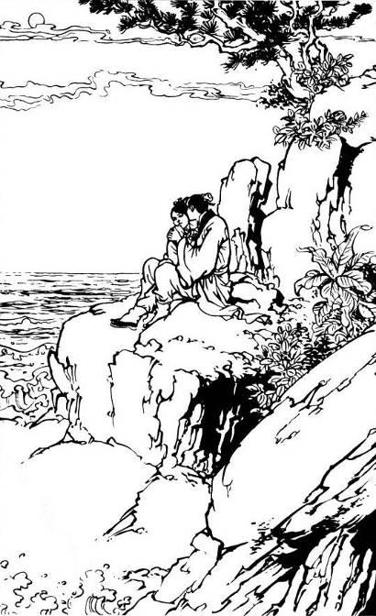
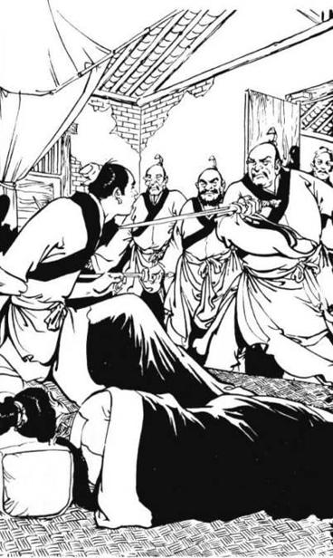

# Chapter 31 – Saber and Sword Lost, People Perish

(Translated by Foxs, Edited by Eliza Bennet)

 

> Zhou Zhiruo said, “What if I wrong you or offend you, will you hit me,
> scold me, kill me?”

> Zhang Wuji kissed her left cheek gently while saying, “You are such a
> gentle and cultured lady, a dignified, worthy, warm and virtuous wife;
> how can you make a mistake?”  

Even after the Persian medication was applied, Yin Li’s high fever did
not subside; she kept talking in her sleep incessantly. During these
past several days on the sea, she had been exposed to cold weather on
top of her sickness. The medication was only for external wound, it was
not effective to treat internal injury, or even a common cold. Zhang
Wuji was very anxious. Toward the afternoon of the third day, he saw a
small island in the distant to their east. He instructed the sailor to
take them to that island.  
  
Once they were ashore, their spirits lifted up. The island’s
circumference was no more than several ‘li’s; and it was covered with
shrubs and short trees. Zhang Wuji asked Zhou Zhiruo to look after Yin
Li and Zhao Min, while he went around looking for some medicinal herbs.
However, the flora on that island was greatly different from the one in
the Central Earth that Zhang Wuji did not recognize most of them. He
walked farther and farther away without any result until the sky
gradually turned dark, he had no choice but to return to their original
position. He mashed whatever herbs he could find and fed them to Yin
Li.  
  
Six people gathered around the fire, eating and drinking. The air was
heavy with the fragrance of the flowers and the freshness of the grass
and the forest. It was quite different surroundings from the cramped
cabin.  
  
Yin Li was also in good spirits. “Ah Niu Gege,” she said, “Why don’t we
spend the night here, and not return to the ship?” They discussed her
proposal and decided that it was a wonderful idea. They saw the water on
that small island was warm and clear, also, there were no wild beasts
around; everyone went to sleep peacefully.  
  
As Zhang Wuji woke up early the next morning, he got up and took a step,
but he staggered and almost fell down. He felt his legs were weak, which
was quite unusual. He rubbed his eyes and saw the Persian ship was gone.
His heart skipped a beat. Rushing to the shore he looked around without
seeing any trace of the ship. This time he was really shocked.  
  
“Yifu,” he called out, “Are you all right?” But Xie Xun did not answer.
Hastily Zhang Wuji ran to the place Xie Xun slept and saw he was still
asleep peacefully, which took most of his anxiety away.  
  
The previous night, Zhao Min, Zhou Zhiruo and Yin Li went to sleep
behind a large rock some distance away. He rushed to take a look, and
saw Zhou Zhiruo and Yin Li were still sleeping side by side; but Zhao
Min was nowhere to be seen.  
  
In a glance he noticed that Yin Li’s face was full of blood. Stooping
down to look closer, Zhang Wuji saw there were more than a dozen sharp
blade cuts on her face, but she stayed unconscious. Hastily he reached
out to check her pulse and was relieved when he felt faint pulses.
Turning his attention toward Zhou Zhiruo, he saw that a large clump of
her beautiful hair was cut, along with a piece of her left ear. Her
blood had not congealed yet, but her face was smiling, as if she was
having a happy dream. Under the light of the dawn, she looked like a
sleeping hypericum in the spring; extremely tender and beautiful. His
heart was painful was he called out, “Miss Zhou, Miss Zhou, wake up!”  
  
Zhou Zhiruo stirred, but did not wake up. Zhang Wuji gently shook her
shoulder and finally Zhou Zhiruo yawned and turned around, but she was
still asleep. Zhang Wuji knew she must be drugged. There were too many
strange things that happened the previous night; he fell into a deep
sleep and this morning he felt weak and tired. He was certain that they
were drugged.  
  
After calling Zhou Zhiruo for a while without any result, he rushed back
to Xie Xun and called out, “Yifu, Yifu!”  
  
Xie Xun sat up in daze, “What is it?” he asked.  
  
“It’s terrible!” Zhang Wuji said, “We have fallen into a sinister plot.”
Briefly he told him about the missing Persian ship and the cuts suffered
by Yin Li and Zhou Zhiruo.  
  
“What about Miss Zhao?” Xie Xun asked in alarm.  
  
“I did not see her,” Zhang Wuji grimly said. Taking a deep breath, he
tried to circulate his internal energy, but felt that his limbs were
devoid of any strength; he could not transmit his energy at all. “Yifu,”
he blurted out, “We are poisoned by the ‘shi xiang ruan jin san’ \[ten
fragrance muscle softener powder\].”  
  
Xie Xun had heard Zhang Wuji’s narration on how the masters of the Six
Major Sects were poisoned by Zhao Min with ‘shi xiang ruan jin san’ and
how they were held captive in the Wan An Temple. He stood up and felt as
if he was floating; as his legs were devoid of any strength. Calming
himself down, he asked, “Did she take away the Tulong Saber and the
Yitian Sword as well?”  
  
Zhang Wuji looked around and sure enough, he did not see either the
Saber or the Sword. He was so enraged that he almost cried. Never would
he imagine that Zhao Min was capable of doing this, taking advantage
when he was in grave danger and employed such a sinister plot when he
was down.  
  
He was lost in thought for a moment. Then he remembered Yin Li and
hastily went back to where Yin and Zhou, two women were sleeping. He
pushed Zhou Zhiruo aside, but she was still fast asleep. He thought, “My
internal energy is the deepest, hence I was the first to wake up. Yifu
was next. Miss Zhou’s internal energy is far below ours. It looks like
she won’t wake up for a while yet.” Immediately he ripped a piece of his
clothes to wipe the blood from Yin Li’s oval face. He saw seven
horizontal and eight vertical thin cuts crisscrossing her cheeks.
Apparently, she was cut by the Yitian Sword.  
  
Yin Li had lost a lot of blood after being injured by Zi Shan Long Wang
Jin Hua Popo. As a result, the poison of the thousand spiders
accumulated in her blood was also dispersed along with her blood,
causing the swelling on her face to subside considerably. Hence, for
these last several days, her face had slightly returned to its former
look; the pretty look Yin Li had when she was younger. But right now,
with these dozen of cuts, her face looked severely fearsome.  
  
Zhang Wuji was both grieved and angry. Gnashing his teeth he said, “Zhao
Min, oh, Zhao Min, if you fall into my hand and I spare you, then Zhang
Wuji has lived in vain.” Calming himself down he went to the hillside to
gather some medicinal herbs to stop the bleeding. He chewed the herbs
and applied it on Yin Li’s face, also on Zhou Zhiruo’s scalp and ear.  
  
Zhou Zhiruo yawned and opened her eyes. Suddenly she saw Zhang Wuji was
reaching out and groping her head. Her face turned red from shyness.
Reaching up to shove his arm away, she angrily said, “You … what are you
…” Before finished speaking, she had felt the pain on her ear.
Immediately she touched her ear and cried out, “Ah!” and jumped to stand
up. “What …?” she said, but suddenly she felt her knees weaken and she
fell into Zhang Wuji’s bosom.  
  
Zhang Wuji reached out to support her. “Miss Zhou,” he comfortingly
said, “Don’t be afraid.”  
  
Seeing Yin Li’s terrifying face, Zhou Zhiruo hastily lifted up her hand
to touch her own face and asked in fear, “I … Am I also …?”  
  
“No!” Zhang Wuji said, “You only suffer some minor wounds.”  
  
“Did those evil Persians do this? I … Why didn’t I feel anything?” Zhou
Zhiruo asked.  
  
Zhang Wuji sighed and quietly said, “I am afraid … I am afraid Miss Zhao
did this. She poisoned our food and drink last night.”  
  
Zhou Zhiruo stared blankly for half a day. She stroked what remained of
her ear and broke into tears. Zhang Wuji tried to console her, “You are
lucky that the injury is not heavy. Your ear is damaged, but you can
always put your hair down to cover it, others won’t be able to see.”  
  
“Still talking about hair?” Zhou Zhiruo snapped, “My hair is also
gone.”  
  
Zhang Wuji said, “You only lost some on top of your head; if you arrange
the hair on both sides of your head …”  
  
“Why do I want to arrange the hair on both sides of my head?” Zhou
Zhiruo angrily said, “Up this moment you are still trying to protect
your Miss Zhao.”  
  
This time Zhang Wuji bumped into a wall; he did not know what to say, so
he became defensive, “I am not trying to protect her! She is cruel and
merciless, harming Miss Yin this way. I … I am not going to forgive
her.” Looking at Yin Li’s face, he could not hold tears from coming down
his eyes.  
  
Facing this situation Zhang Wuji was at a loss; he sat down and tried to
circulate his internal energy, and he realized that the degree of his
poisoning was not shallow. Actually, the ‘shi xiang ruan jin san’ could
only be neutralized by the antidote from Zhao Min’s faction; but this
time he tried to disperse the poison relying on his profound internal
strength. Slowly he pushed the poison from his four limbs, condensed it
into his ‘dan tian’, and then bit by bit he forced the poison out of his
system.  
  
After working hard for almost two hours, he felt that his effort had
brought the desired effect. He was optimistic. Only, this technique
required him to have the Jiu Yang Shen Gong foundation, which ruled out
the possibility of him teaching it to Xie Xun and Zhou Zhiruo. He was
hoping that after the poison in his system was flushed completely, he
would be able to help Xie and Zhou two people driving the poison out of
their systems.  
  
This technique sounded simple, yet actually extremely complicated.
Toward the afternoon of the seventh day, he only managed to drive out
approximately 30% of the poison. Fortunately, this poison only prevent
the victim from exerting their internal energy but harmless to their
bodies.  
  
For the first several days Zhou Zhiruo was angry, but afterwards she
gradually got used to it. She helped Xie Xun catching fish and shooting
birds, boiling water and cooking their meals. At night she slept alone
in a cave on the eastern end of the island, far away from where Zhang
Wuji and the others lived.  
  
Zhang Wuji was secretly ashamed, thinking that he was partly responsible
for this disaster brought by Zhao Min. This Miss Zhao was obviously a
Mongolian princess, an archenemy of his Ming Cult. Countless martial art
experts of the Wulin world had fallen under her hands; yet surprisingly
he did not guard against her at all. He felt he was so stupid.  
  
Xie Xun and Zhou Zhiruo did not blame him; they did not even mention
this problem to him, but he felt very bad in his heart. Sometimes when
Zhou Zhiruo was looking at him, he felt as if she was saying, ‘You are
blinded by Miss Zhao’s beauty, resulting in this great calamity.’  
Yin Li’s condition was getting worse. This little island was located on
the Southern Sea \[nan hai\], most of the flora was not found in Hu
Qingniu’s medical manual. His medical knowledge might be profound, he
did know perfectly well how to treat Yin Li’s condition; but he did not
have any medication in his hand. The trees on the island were short and
small, barely enough to be used as firewood; otherwise, he would have
had built a raft early on and braving the danger he would sail away to
the sea. Alternatively, he would not be this anxious if he did not know
any medical skill. This time he felt like tens of thousands sharp
daggers gouging and cutting his heart day and night.  
  
It was late in the evening one day; he chewed some medicinal herbs to be
fed into Yin Li’s mouth. This time the herbs entered Yin Li’s throat
with difficulty. His heart was broken; tears streaming down his face,
dropped onto Yin Li’s face.  
  
Suddenly Yin Li opened her eyes, smiled faintly and said, “Ah Niu Gege,
don’t feel bad. I am going to the underworld to see that heartless,
short-lived little rascal Zhang Wuji. I want to tell him that in this
world there is an Ah Niu Gege who treats me this well; who is a thousand
times, ten thousand times better than Zhang Wuji.”  
  
Zhang Wuji’s throat choked; in that moment he was contemplating whether
he should reveal to her that he was Zhang Wuji.  
  
Yin Li grabbed his hand and said, “Ah Niu Gege, I have never agreed to
marry you, do you hate me? I think you are lying to me because you only
want to make me happy. I am ugly, my temperament is strange, why would
you want to marry me?”  
  
“No!” Zhang Wuji said, “I am not lying you. You are a good and
kind-hearted girl. I consider myself lucky if I can take you as my wife.
Why don’t we wait until you are well, all things are settled, and then
we can get married? What do you say?”  
  
Yin Li reached out and gently caressed his cheek. Shaking her head she
said, “Ah Niu Gege, I cannot marry you. I have given my heart early on
to that ferocious heartless Zhang Wuji … Ah Niu Gege, I am a little bit
scared; will I meet him when I get to the underworld? Will he still be
hateful towards me?”  
  
Zhang Wuji realized she was speaking clearly, her cheeks were red; he
was inwardly alarmed, “This is the symptom of the last ray of light,
could it be that she is going to die today?” He was lost I thought that
he did not hear what she said. Yin Li grabbed his hand and asked him
again. Zhang Wuji tenderly said, “He will forever treat you well, as if
you are his precious darling.”  
  
“Will he treat me half as good as you did?” Yin Li asked.  
  
“Heaven is my witness,” Zhang Wuji said, “Zhang Wuji eagerly and
sincerely loves you with all his heart. He has early on regretted that
when he was little he treated you cruelly. He … his feelings toward you
are exactly the same as mine; there is not the least bit distinction.”  
  
Yin Li sighed; a smile appeared on the corners of her mouth. “Then …”
she said, “Then I am happy …” Her grip on his hand gradually loosened,
her eyes slowly closed, finally she stopped breathing.  
  
Zhang Wuji hugged her body tight, thinking that until the moment she
died, she did not know that he was Zhang Wuji. All these times she had
been losing her consciousness that he was unable to reveal the truth to
her. Just before her death, when her consciousness was very clear, there
was not enough time to talk. Actually, things had come this far, it
really did not make any difference whether he revealed the truth or not.
His heart was so much in pain that he cried without making any sound. He
thought, “If Zhao Min did not cut her cheeks, her injury might not
necessarily be incurable. If Zhao Min did not abandon us on this
deserted island, we would have reached the Central Plains \[zhong yuan\]
in a few days; surely I would have found a way to save her life.”
Bitterly he muttered, “Zhao Min, your heart is like a serpent and
scorpion. There will come a day when you will fall into my hand. Zhang
Wuji will not spare your life in any way.”  
  
Suddenly he heard a cold voice behind him, “When you see her beautiful,
jade-like face, you won’t have a heart to do anything to her.” Turning
around, he saw Zhou Zhiruo was standing in the breeze, her face showed
contempt.  
  
Zhang Wuji was grieved and ashamed at the same time; he said, “I have
made a vow by my cousin’s body, if I do not punish that witch, Zhang
Wuji won’t have a face to live on this world.”  
  
“That would be the spirited pledge of a real man,” Zhou Zhiruo said. She
rushed a few steps forward and wept bitterly while stroking Yin Li’s
body.  
  
Xie Xun also heard the noise of crying and went over. As he learned
about Yin Li’s death, he could not help but feel heartbroken.  
  
Zhang Wuji went to a small hill to dig Yin Li’s grave. The soil on that
island was so shallow that he only dug for about two feet, and had
already met hard rocks underneath. He did not have any shovel, so he had
no choice but lay Yin Li’s body in that shallow hole. He was about to
heap dirt on her when he saw the blood traces on her swollen face; he
thought, “Gravel and dirt piled on her face might scratch her.”
Thereupon he took some branches and weaved them above her body, then he
carefully piled stones and rocks on top of the branches, as if she was
still alive and he was afraid the stones might hurt her.  
  
Finally, he cut a tree trunk, peeled the bark, and then using Yin Li’s
dagger he carved these words on it: ‘The Tomb of my Beloved Wife, Zhu’Er
Yin Li’ and below it he wrote: ‘Zhang Wuji Sincerely Stated’.  
  
Everything was ready so at last he threw himself down and cried loudly.
Zhou Zhiruo consoled him, “Miss Yin’s feelings toward you were so deep
and you also have showed her profound kindness. Only, do not forget what
you have sworn today: you must kill Zhao Min to avenge her death; then
Yin Jia Meizi \[lit. (younger) sister of the Yin family\] in the
underworld will also smile.”  
  
Due to his intense grief, the poison that had been concentrated in Zhang
Wuji’s ‘dan tian’ \[pubic region\] was dispersed once again, wasting his
several days’ worth of effort. As a result, he had to work hard for more
than ten days to gradually condense the poison and expel it out of his
system.  
  
The weather on that small island was sizzling hot; but it had plenty of
wild fruits, which they could pick without any trouble to satisfy their
hunger, so their lives were not terribly difficult. Zhou Zhiruo was
aware that Zhang Wuji was grieved over Yin Li’s death, angered over Zhao
Min’s craftiness, and regretted Xiao Zhao’s departure; so she treated
him gently with consideration.  
  
After Zhang Wuji transferred his divine internal energy to help Xie Xun
expel the poison in his body, he sould have done the same to help Zhou
Zhiruo driving the poison out of her body. But this method of
transferring energy required him to put one palm on her lower waist, and
the other palm on the navel above her lower abdomen; how could a young
man and a young woman touch each other in such intimate places? Yet
without transferring his Nine Yang Divine Energy, how could he help her?
He contemplated for several days without being able to make any
decision.  
  
That particular evening Xie Xun suddenly said, “Wuji, how many more days
do you think we are going to stay on this island?”  
Zhang Wuji was startled. “That is hard to say,” he said, “I just hope
there will be a ship sailing by and rescue us and take us back to the
Central Earth.”  
  
“We have been here for more than a month,” Xie Xun said, “Have you seen
any shadow of a ship even from a distant?”  
  
“I have not,” Zhang Wuji replied.  
  
“Exactly,” Xie Xun said, “Perhaps tomorrow there will be a ship coming
by, but then again, perhaps there will never be any ship passing by in a
hundred years.”  
  
Zhang Wuji sighed, “This uncultivated island is outside the sailing
route of the ocean ships; whether or not we can return to the Central
Earth, is extremely uncertain.”  
  
“Hmm,” Xie Xun said, “The antidote is hard to come by. Other than
weakening the four limbs, if the ‘shi xiang ruan jin san’ remains in the
body, does it have any other adverse effect?”  
  
“If it is not too long, then there is no adverse effect,” Zhang Wuji
said, “But this kind of poison invades the muscle and erodes the bones;
if it stays in the body too long, all the internal organs would
unavoidably receive some damages.”  
  
“That’s so,” Xie Xun said, “Then why don’t you think of some way to
expel the poison from Miss Zhou’s body as soon as possible? You said
Miss Zhou and you have known each other since your childhood. At that
time ‘xuan ming han du’ \[the cold poison of Xuan Ming palm\] was still
inside your body, and she had shown kindness to you. Where else would
you find gentle and virtuous woman like her? Could it be that you don’t
like her because she is not beautiful enough?”  
  
“No, no,” Zhang Wuji said, “If Miss Zhou is not beautiful then there is
no beautiful women in the world.”  
  
“Let me make the decision for you, then,” Xie Xun said, “Marry her. Then
you don’t need to worry about this man-woman propriety anymore.”  
  
Zhou Zhiruo was around when they started talking; suddenly hearing her
name being mentioned, she was shy and blushed. She stood up and walked
away. Xie Xun leaped and opened up his arms, blocking her way. “Don’t
go, don’t go!” he said with a laugh, “Today I am the matchmaker, and I
have made my decision.”  
  
“Xie Laoye Zi,” Zhou Zhiruo angrily said, “You do not act your age! We
are seeking a way to return to the Central Earth; how can you speak such
nonsense in time like this?”  
  
Xie Xun laughed heartily. “The joining of a man and a woman is an
important matter of a lifetime; why did you say it is nonsense talk?
Wuji, your parents were also on a deserted island when they bowed to the
heaven and to the earth to become man and wife. If at that time they did
not strictly follow the secular propriety and tradition, how in the
world would there be a young fellow: you? Much less today you have your
Yifu presiding at the wedding for you. Don’t you like Miss Zhou? Don’t
you want to repel the poison in her body?”  
  
Zhou Zhiruo covered her face and was about to walk away. Xie Xun pulled
her sleeve while laughing, “Where are you going? Don’t you think we are
going to see each other tomorrow or the next day? Ah, I know! You don’t
want to call a blind man as your father-in-law.”  
  
“No, no, it’s not that,” Zhou Zhiruo replied, “Xie Laoye Zi is a hero of
this age …”  
“Do you agree, then?” Xie Xun asked.  
  
Zhou Zhiruo simply replied, “No, no!”  
  
“You think this Yizi \[foster child\] of mine is not a good husband
material?” Xie Xun asked again.  
  
Zhou Zhiruo was taken aback. “Zhang Gongzi’s martial art skill is
unquestionably outstanding, his name is revered within the Jianghu,” she
said, “To … to have him as a husband, what else can I ask for? Only …
only …”  
  
“Only what?” Xie Xun asked.  
  
Zhou Zhiruo cast a quick glance toward Zhang Wuji and said, “He … in his
heart he really likes Miss Zhao. I know that.”  
  
Xie Xun clenched his teeth. “That lowly person Zhao Min has treated us
this cruelly, how can Wuji still persist in his own wrong doing? Wuji, I
want to hear it from your own mouth.”  
  
Zhang Wuji’s heart was torn; he remembered Zhao Min’s cheerful talks and
her touching actions. He felt if he could take Zhao Min as his wife and
be with her forever, then that would be his entire’s life happiness. But
as he remembered the seven horizontal and eight vertical sword cuts on
Yin Li’s face dripping-with-blood, he hastily said, “Miss Zhao is my
archenemy. I want to kill her to avenge Biaomei’s \[younger female
cousin\] blood.”  
  
“That’s more like it,” Xie Xun said, “Miss Zhou, are you still
jealous?”  
  
In a low voice Zhou Zhiruo said, “I am not convinced, unless … unless
you tell him to make a vow. Otherwise, I’d rather die with poison in me
than asking him to help me drive the poison away.”  
  
“Wuji, quickly make a vow!” Xie Xun said.  
  
Zhang Wuji dropped down on his knees and said, “I, Zhang Wuji, if I ever
forget Biaomei’s deep hatred, let me not be forgiven by the Heaven and
the Earth.”  
  
Zhou Zhiruo said, “I want you to state clearly; what are you going to do
to that Miss Zhao?”  
  
“Wuji, state it clearly at once,” Xie Xun said, “What ‘forgiven by the
Heaven and the Earth’? Too ambiguous.”  
  
In a loud and clear voice Zhang Wuji said, “That witch Zhao Min works
for Tartars’ imperial family, makes our people’s live miserable, harms
my fellow Wulin warriors, stole my Yifu’s precious Saber, and harmed my
Biaomei Yin Li. As long as I live, Zhang Wuji will not dare to forget
this deep enmity. If I violate my vow, let the Heaven loathe me, and the
Earth curse me.”  
  
Zhou Zhiruo smiled sweetly; she said, “I am afraid when the time comes,
you won’t have a heart to make your move.”  
  
“Listen to me,” Xie Xun said, “There is no particular day that is better
than any other day. We are Jianghu’s warriors. We don’t fuss over
detailed formalities and womenfolk’s mumbo-jumbo. As long as you, two
young people, agree, then you can bow to the Heaven and the Earth to get
married today. The sooner you get rid of this ‘shi xiang ruan jin san’,
the better.”  
  
“No! Yifu, Zhiruo, please listen to me,” Zhang Wuji said, “Miss Yin had
a very deep feeling toward me; she had always wanted me as her husband
since she was young. In my heart I have also regarded her as my wife.
Although there was no ceremony, we could be considered husband and wife.
Now that her body and her bones are not yet cold, how can I tie another
joyous relationship immediately?”  
  
Xie Xun hesitated before saying, “That’s true. What do you suggest,
then?”  
  
“In your child’s opinion,” Zhang Wuji replied, “Child will agree on an
engagement with Miss Zhou today, and immediately help her repel the
poison from her body; this will be much more convenient. Supposing the
Heaven granted us returning to the Central Earth someday, Child will put
Zhao Min to the blade and recapture the Tulong Saber, and return it to
Yifu. At that time the marriage with Miss Zhou can be consummated. That
way we satisfy both sides.”  
  
Xie Xun laughed and said, “That sounds very good; but what if within ten
years, eight years, we still are not able to return to the Central
Earth?”  
  
Zhang Wuji said, “After three years, no matter whether we can leave this
island or not, Child will ask Yifu to preside over our marriage.”  
  
Xie Xun nodded and asked Zhou Zhiruo, “Miss Zhou, what do you say?”  
  
Zhou Zhiruo lowered her head without answering. After half a day she
finally said, “I am a lone orphan, what idea do I have? I’ll leave
everything on Laoye Zi’s hand.”  
  
Xie Xun laughed heartily and said, “Very good! Very good! It’s settled.
You two are engaged. No need to worry about custom and tradition. Wuji,
drive the poison from my daughter-in-law away.” After saying this he
walked to toward the back of the hill in big strides.  
  
“Zhiruo,” Zhang Wuji said, “That difficulty was caused by me, can you
forgive me?”  
  
Zhou Zhiruo smiled and said, “Because I am ugly, you tried to refuse in
every possible way. If it was Miss Zhao, I am afraid tonight you would
have…” Speaking to this point, she turned her head around as she felt
uncomfortable to continue.  
  
Zhang Wuji’s heart skipped a beat as he thought, “When we were adrift on
that small boat, I was foolishly and presumptuously thinking of marrying
four beauties. Actually the one my heart really loves is that
won’t-stop-at-any-crime, evil-and-sly little witch. People call me a
hero in vain; in my heart I cannot differentiate good from evil, easily
infatuated by a pretty face.”  
  
Zhou Zhiruo turned her head back. Seeing he was lost in thought as if in
a trance, she stood up to walk away. Zhang Wuji reached out to grab her
hand and pulled her down. Unexpectedly Zhou Zhiruo’s internal energy was
gone; her feet were weak. She staggered and stumbled back into Zhang
Wuji’s bosom. After struggling hopelessly, she angrily said, “Must you
bully me for my whole life?”  
  
Seeing her frowning and a bit angry, Zhang Wuji’s heart was touched; he
hugged her tender and soft body and said in a low voice, “Zhiruo, when
we met on the River Han when we were both little, I have never imagined
there will come a day like today. On the Brightness Peak I was alone
facing four elders from Kunlun and Huashan, two sects; you gave me
directions and saved my life. At that time I appreciated your loving
care to me, but I did not dare to have any absurd thoughts.”  
  
Leaning on his bosom, Zhou Zhiruo said, “That day I stabbed you with a
sword, don’t you hate me?”  
“You did not stab me on the chest,” Zhang Wuji replied, “That’s why I
knew that you secretly have a feeling toward me.”  
  
“Pei!” Zhou Zhiruo spat, her cheeks blushed, she said, “If I knew early
on that you are going to say that, I’d stab your chest, kill you neat
and clean, so I’d avoid being bullied by you later on, listening to your
nonsense.”  
  
Zhang Wuji embraced her tighter and said, “Hereafter my love to you will
be doubled or tripled, we are husband and wife, two people one body; how
can I mistreat you?”  
  
Zhou Zhiruo leaned some more to look at his face; she said, “What if I
wrong you or offend you, will you hit me, scold me, kill me?”  
  
Zhang Wuji’s face was only several inches apart from her egg shaped
face, he felt her breath was like an orchid; he could not restrain from
kissing her left cheek gently while saying, “You are such a gentle and
cultured lady, a dignified, worthy, warm and virtuous wife; how can you
make a mistake?”  
  
Zhou Zhiruo gently caressed the back of his neck. “Even a saint erred,”
she said, “Since I was little I had never had a father and a mother to
instruct me. It would be difficult not to mess up sometimes.”  
  
“Whatever your mistake is, I can advise you nicely,” Zhang Wuji said.  
  
“Will you always be faithful to me?” Zhou Zhiruo asked, “Are you sure
you won’t ever kill me?”  
  
Zhang Wuji kissed her gently on her forehead; “Don’t have absurd ideas,”
he said in a tender voice, “How can there be such thing?”  
  
With a trembling voice Zhou Zhiruo said, “I want you to promise me with
your own mouth.”  
  
“All right!” Zhang Wuji laughed, “I will always be faithful to you. I
won’t ever kill you.”  
  
Staring at his eyes, Zhou Zhiruo said, “I don’t want you to joke around.
I want you to take this seriously.”  
  
Zhang Wuji laughed, “I wonder how many weird thoughts are in this small
head of yours?” he said, while thinking in his heart, “Because I have
shown feeling towards Zhao Min, Xiao Zhao and Biaomei that it is
difficult for her to trust me. But from now on, how can there be this
matter?” Thereupon he wiped the smile from his face and solemnly said,
“Zhiruo, you are my beloved wife. Formerly I was double-minded \[lit.
three hearts two intentions\]. I hope you won’t blame my past. From now
on, I will always be faithful to you. Even if you make any mistake, I
won’t blame you or scold you.”  
  
“Wuji Gege \[big brother Wuji\],” Zhou Zhiruo said, “You are a real man;
you must remember your own words to me tonight.” Looking at the rising
bright moon she said, “The moon in the sky is our witness.”  
  
“That’s right,” Zhang Wuji said, “You are totally correct, the moon in
the sky is our witness.” Still holding Zhou Zhiruo in his bosom, he
looked at the bright moon on the horizon and said, “Zhiruo, all my life
I have suffered a lot because of other people’s deceits, I don’t know
the amount of pain I have endured since my childhood; I lost track
already. It was only on the Binghuo \[ice and fire\] Island, when I was
with Father, Mother and Yifu, that I enjoyed peace without falling into
other people’s deceitful schemes. The first time I arrived at the
Central Plains \[zhong yuan\], I met with a beggar with a snake. He
deceived me into poking my head into his sack to take a closer look;
unexpectedly he covered the sack over my head and kidnapped me. How
could I guess that after going through life and death situation
together, sharing the same trials and tribulations; on the very first
night we arrived on this little island, Zhao Min has put violent poison
in our food?”  
  
Forcing a smile Zhou Zhiruo said, “You are a
‘will-not-stop-until-you-reach-the-Yellow-River’ type of person; but by
the time you reach the Yellow River, it is too late to regret.”
\[Translator’s note: I know that I translated this passage rather
literally; but I believe the readers will appreciate the imagery of the
original sentence.\]  
  
Suddenly Zhang Wuji’s heart was overwhelmed with happiness. “Zhiruo,” he
said, “You are the only one who has always loved me. You always treated
me kindly. Someday when we return to the Central Plains, you will stay
by my side and help me guard against lowly people’s craftiness and
deceits. With a worthy wife like you to help me, I can be spared of many
hardships.”  
  
Zhou Zhiruo shook her head. “I am the most useless woman,” she said, “I
am weak and incapable, plus I am dumb. Let’s not talk about the
extremely smart Miss Zhao, whose intelligence compared to mine is as far
as the heaven from the earth; I don’t have any chance against Xiao Zhao,
who possesses such a profound understanding in her heart. Your Miss Zhou
is a naïve and dim-witted little girl; don’t you know it by now?”  
  
“You are an honest and considerate, intelligent and virtuous girl,”
Zhang Wuji said, “You will not deceive me.”  
  
Zhou Zhiruo turned around and hid her face in his bosom. “Wuji Gege,”
she said in tender voice, “To be able to marry you, my delight is
unspeakable. I only hope you won’t belittle me because I am stupid and
useless, and bully me because I am unworthy. I … I will do my best to
take care of you.”  
  
The next day Zhang Wuji used the Jiu Yang Shen Gong to help Zhou Zhiruo
expel the poison. At first they made a good progress; perhaps because
she did not eat too much, her level of poisoning was not as severe as
Xie Xun. However, toward the seventh day, suddenly he felt a resistance,
which was ‘yin’ \[negative/female\] and cold in nature, coming from her
body, fighting his Jiu Yang energy. Although Zhou Zhiruo strived to
control this resistance, it was difficult for the Jiu Yang energy to
enter her body. In his astonishment Zhang Wuji went to consult Xie
Xun.  
  
Xie Xun pondered for half a day before saying, “I don’t know for sure,
but most likely it was because her Emei Pai’s masters were always women,
the internal energy they train is ‘yin rou’ \[negative/female, and
soft/flexible\] in nature.”  
  
Zhang Wuji nodded his agreement. Luckily Zhou Zhiruo’s internal energy
level was far below his, so that he was able to suppress the resisting
‘yin’ energy in her body; but by doing this he was required to use up a
lot more energy than when he was helping Xie Xun. Zhang Wuji secretly
felt that although at this moment her ‘yin’ energy was still weak, but
her achievement in the future would not be a small matter.  
  
“Zhiruo,” he praised, “Zunshi \[revered master\] Miejue Shitai was truly
an expert of her generation. The internal energy cultivation method she
passed on to you is extremely profound; I can feel it even now. If you
train diligently, your energy level may run neck to neck with my Jiu
Yang Shen Gong; you may even surpass me.”  
  
“Don’t mock me!” Zhou Zhiruo said, “How can Emei Pai’s martial art be
compared to Zhang Da Jiaozhu’s \[great cult leader Zhang\] Jiu Yang Shen
Gong and Qian Kun Da Nuo Yi?  
  
“You have talent,” Zhang Wuji said, “Although you don’t know too many
martial art forms and stances, your internal energy foundation is
excellent. My Tai Shifu \[grand master, he was referring to Zhang
Sanfeng\] once said, in the advance study of martial art, oftentimes the
level of achievement each individual is closely related to one’s natural
endowments. Furthermore, someone who is intelligent and possesses
excellent comprehension may not necessarily capable of achieving the
highest level of mastery. It was said that your sect’s founder, Zushi
\[ancestor master\] Guo Nuxia’s \[heroine Guo\] father, Guo Jing Daxia
\[great hero\] was slow, yet his martial art skill shook the world from
the ancient time until today. Even Tai Shifu said that his energy level
has not reached the level of Guo Daxia of the past. It seems to me that
your Emei Pai’s internal energy cultivation technique is superior to the
Wudang Pai’s; I’ll say that your future achievement may surpass Zunshi
Miejue Shitai’s.”  
  
Zhou Zhiruo rolled her eyes; faking anger she said, “If you want to
flatter me, you don’t need to say my martial art is good. If I can
master only 10 or 20% of Shifu’s ability, I would be satisfied. If you
can teach me one or two techniques from your Jiu Yang Shen Gong and Qian
Kun Da Nuo Yi, I would be very grateful.”  
  
Zhang Wuji hesitated without answering. Zhou Zhiruo continued, “Do you
think I am not fit to become Zhang Da Jiaozhu’s disciple?”  
  
“No!” Zhang Wuji said, “I only aware that your internal energy technique
is entirely different than mine. I’ll say our techniques took opposite
approach from the start. If you learn my internal energy technique, you
are facing a difficult and dangerous problem.”  
  
“It’s all right if you don’t want to teach me,” Zhou Zhiruo said, “The
worst thing that can happen if I learn martial art skill is I fail; how
can there be any danger?”  
  
“No, no!” Zhang Wuji was serious, “My Jiu Yang Shen Gong is purely ‘yang
gang’ \[positive/male and hard/firm\] in nature. Right now you are
training in the Emei Pai’s internal energy, which takes the purely ‘yin
rou’ approach. If you also train my internal energy technique, then the
‘yin’ and ‘yang’ would collide in your body. Unless it is a martial art
genius like my Tai Shifu; he might be able to combine water and fire,
harmonize the firm and the supple. Otherwise, if you miss a single step,
you’ll face a terrible, terrible disaster. Mmm, let’s wait until your
internal energy is strong enough, I’ll teach you the Qian Kun Da Nuo Yi
theory and you can start training it.”  
  
Zhou Zhiruo laughed, “I was only joking,” she said, “Later on I will
always be together with you; your martial art skill, my martial art
skill, what difference does it make? I am too lazy, your Jiu Yang Shen
Gong is very difficult to train, even if you force me to practice, I am
afraid it will be too difficult for me.” Hearing her saying this, Zhang
Wuji felt sweetness in his heart.  
  
With love and happiness in their hearts, time was passing swiftly.
Several months had passed in a flash. Zhou Zhiruo’s internal energy had
been completely recovered; she did not feel anything unusual, hence she
believed the poison had been completely expelled from her system.  
  
One particular day, they saw the peach blossom trees on the eastern side
of the island were blooming beautifully. Zhang Wuji picked several
branches of the peach blossom and planted them in front of Yin Li’s
grave. He saw the piece of wood he carved with the characters ‘The Tomb
of my Beloved Wife, Zhu’Er Yin Li’ was laying flat on the ground;
perhaps it was knocked down by some wild animals. He picked it up and
re-inserted it deeply to the ground. He remembered how his cousin lived
a miserable life; perhaps she did not even have a single day of
happiness.  
  
While he was still reveling in sadness, suddenly he heard the clamoring
noise of seagulls on the sea. Lifting his head up, he saw a ship in the
distant sailing toward the island. He was overjoyed at this unexpected
scene and loudly shouted, “Yifu, Zhiruo, there’s a ship coming in,
there’s a ship coming in!”  
  
Xie Xun and Zhou Zhiruo heard his shout and they rushed together to the
shore. In a trembling voice Zhou Zhiruo said, “How can there be a ship
coming to this desolate island?”  
  
“It’s strange indeed,” Zhang Wuji said, “Could it be that they are
pirates?”  
  
In less than an hour that ship had dropped its anchor offshore, and sent
a small boat to the island. Zhang Wuji, three people, waiting for them
on the beach. They saw the sailors on that small boat wear Mongolian
naval military uniforms. Zhang Wuji’s heart was stirred, “Could it be
that Miss Zhao was pricked by her conscience and returned to this
island?” Casting a sidelong glance toward Zhou Zhiruo, he saw that her
beautiful eyebrows were slightly wrinkled, while her chest was heaving
up and down; apparently she was very much concerned.  
  
A short moment later the small boat landed. Five sailors stepped on to
the beach. Their leader, a naval officer, bowed respectfully toward
Zhang Wuji and said, “Are you Zhang Wuji, Zhang Gongzi \[honorable
master Zhang\]?”  
  
“I am,” Zhang Wuji replied, “Who are you, Officer?”  
  
As that officer heard Zhang Wuji answering in affirmative, he looked
delighted and relieved. “Xiao Ren’s \[lit. little/lowly person, a
subordinate addressing him/herself\] humble name is Pastai. I truly am
fortunate to be able to find Gongzi today. I have received order to find
Zhang Gongzi and Xie Daxia and take you back to the Central Earth.” He
did mention Zhang and Xie, two people’s names, but did not mention Zhou
Zhiruo.  
  
“Officer has toiled to come from afar, I wonder who has sent you?” Zhang
Wuji asked.  
  
Pastai replied, “Xiao Ren is a subordinate of Tawa-chelu, the local
naval commander in charge of Fujian defense. We have received order from
General Pordu to set sail and meet you. Altogether General Pordu
dispatches eight ships to search for Zhang Gongzi and Xie Daxia on the
water around Fujian, Zhejiang and Guangdong, three provinces. I can’t
believe in the end Xiao Ren is the one who render this great merit.” His
meaning was obvious; apparently his superior had promised promotion and
great reward to whoever succeeded in finding Zhang Wuji.  
  
Hearing that unfamiliar Mongolian general’s name, Zhang Wuji thought the
general must have received Zhao Min’s order to find him at any cost.
“How did your honorable superior find out about me?” he asked.  
  
“According to General Pordu’s instructions,” Pastai replied, “Zhang
Gongzi is a nobleman of high status, also a great hero of the present
age. Xiao Ren was ordered that after we find you, we must serve Gongzi
attentively. As for why we must find Gongzi, Xiao Ren’s rank is too low
for the Mongolian General to explain the reason.”  
  
“Is this Shaomin Junzhu’s idea?” Zhou Zhiruo interrupted.  
  
Pastai was startled, “Shaomin Junzhu?” he asked, “Xiao Ren has not had
any good fortune to see her.”  
  
Zhou Zhiruo coldly said, “What good fortune or bad fortune?”  
“Shaomin Junzhu is our Mongolia’s most beautiful woman,” Pastai said,
“No, she is the world’s most beautiful woman; well-versed in both pen
and sword \[wen wu quan cai – skilled in both literature and military\],
she is the Ruyang Wangye’s \[prince of Ruyang\] ‘qian jin’ \[lit.
thousand gold, the most valuable, honorable term for a daughter\]. How
can Xiao Ren have the good fortune of seeing her ‘jin mian’ \[lit.
golden face\]?”  
  
“Humph,” Zhou Zhiruo snorted, but didn’t say anything further.  
  
“Yifu,” Zhang Wuji said to Xie Xun, “In that case, let us go aboard.”  
  
“Let’s go back to our cave to fetch some things first before we embark
the ship,” Xie Xun said, “Officer, please wait here for a moment.”  
  
Pastai said, “Let Xiao Ren and the sailors get your luggage.”  
  
Xie Xun laughed and said, “What luggage do we have? Please don’t
bother.” Taking Zhang Wuji and Zhou Zhiruo’s hands, he went to the back
of the hill and said, “Out of the blue Zhao Min sends a ship to take us
back; she must have a sinister plan. How do you think we must deal with
it?”  
  
“Yifu,” Zhou Zhiruo said, “Do you suppose … do you suppose Zhao Min …
she might be on board?”  
  
“If this little witch is onboard, that would be better,” Xie Xun said,
“We must watch our food and drink; and not to fall into her trap
again.”  
  
“That’s right,” Zhang Wuji said, “We’d better bring the salted fish and
the dried fruit we have collected, also water from this island. We must
not eat the food from the ship.”  
  
“I think Zhao Min is not onboard,” Xie Xun said, “She wants to copy
those Persians’ plot; she lures us onboard, once we are on the open sea,
then she’d send Mongolian navy ships to open fire and sink our ship.”  
  
Zhang Wuji’s heart sank, with a trembling voice he said, “She … is she
that evil? She has left us stranded on this desolate island, let us live
or die on our own, without any chance to return to the Central Earth,
wasn’t that enough? The three of us would not bother her anymore, would
we?”  
  
With a cold laugh Xie Xun said, “You have freed the masters of the Six
Major Sects she held captive in the Wan An Temple; how could she not
hate you to the bone? Besides, the Cult Leader of the Ming Cult is
missing, at this moment, everybody in the Ming Cult, from the top to the
bottom, is involved in the large scale search and rescue operation.
There is no guarantee that they will not find this desolate island. Only
by burying us in the bottom of the ocean floor would she be free of
trouble forever.”  
  
“Firing their cannons?” Zhang Wuji said, “Wouldn’t that mean Pastai and
all these Mongolian sailors will deliver their lives in vain?”  
  
Xie Xun laughed out loud, followed by a sigh, he said, “Wuji, Child,
those people wield power over the entire Mongolian armed forces; how can
they value human lives? If they were like you, kind hearted and
merciful, how can the Mongolians conquer four oceans, sweep hundreds of
nations? From the ancient times, which great hero, who earned great
honor, did not take the bull by its horns, if they must kill then they
killed? Let’s not talk about ordinary officers and soldiers, they would
even kill their own father and mother, their sons and daughters.”  
  
Zhang Wuji was silent for half a day then grimly said, “Yifu is right.”
He had always known that the Mongolians were brutal and merciless toward
their enemies, but surely they would cherish their own subordinates and
people? At this moment, listening to Xie Xun, he felt as if his heart
was torn in two: he wanted to return to the Central Earth, to hold
command over the heroes and warriors in driving the Tartars away; but
speaking about governing a country to maintain peace and security, he
was convinced it was not in his power to do so.  
  
“Yifu,” Zhou Zhiruo said, “What shall we do?”  
  
“What is in my daughter-in-law’s mind?” Xie Xun asked.  
  
“Can we not board the boat?” Zhou Zhiruo said, “Let’s tell those
Mongolian sailors that we enjoy living in this island and do not have
any desire to return to the Central Plains.”  
  
Xie Xun smiled and said, “That is a naïve little girl’s naïve idea. We
do not want to go on board, do you think the enemy will let us go just
like that? Let’s say we kill everybody on this ship, officers and
sailors alike, do you think they will not dispatch ten more, eight more
ships to find us? Besides, there are a lot of important matters in the
Central Plains, waiting for Wuji to attend to. How can we let him grow
old and die on this deserted island?”  
  
Zhou Zhiruo’s pretty face blushed profusely. “Please give us
instruction; we’ll listen to Yifu’s advice,” she said in a low voice.  
  
Xie Xun thought of a plan for a moment and then said, “Let’s do it this
way.” Zhang Wuji and Zhou Zhiruo listened to his plan and agreed that it
was a marvelous plan.  
  
Zhang Wuji went to Yin Li’s grave to pray and shed some farewell tears
before embarking the ship. To fight boredom on the island, Zhou Zhiruo
had carved many little wooden horses and wooden figurines. She wrapped
everything in one big bundle and carried it on her back.  
  
Zhang Wuji checked the cabin, inside and out, very carefully. Indeed
Zhao Min was not onboard; he also made sure that there was nobody
onboard who might do them harm. He noticed that the officers and sailors
were not martial art practitioners.  
  
After the ship had weighed the anchor, when they only set sail for
dozens of ‘zhang’s, suddenly Zhang Wuji reached back and grabbed
Pastai’s right wrist, while his other hand snatched the saber hanging on
Pastai’s belt, and pressed the saber behind his neck. “Listen to my
order,” he shouted, “Tell the helmsman to turn eastward!”  
  
Pastai was shocked, “Zhang Gong … Gongzi,” he trembled, “Xiao … Xiao Ren
does not dare to offend you.”  
  
“Listen to my orders,” Zhang Wuji said, “If you disobey, I am going to
chop your head.”  
  
“Yes, yes!” Pastai said, and shouted his order, “Helms … helmsman! Quick
… turn the ship eastward!” The helmsman turned the rudder to follow his
command. The ship circled around the island and sailed to the east.  
  
Zhang Wuji shouted, “You Mongolians are setting a trap to harm us. I
have seen through your scheme. Quickly admit it! If you lie to me, I’ll
take your life.” Having said that he raised his right palm and slapped
the ship’s edge. Wood debris flew everywhere, as a big chunk of wood
came off from the ship’s edge. The officers and sailors onboard watched
with amazement.  
  
Pastai said, “Gongzi, please understand: Xiao Ren received my superior’s
order to take Gongzi home; we don’t have any other intention. Xiao Ren …
Xiao Ren only hoped to render a service and receive the rewards, we
really do not have any ill-intention.”  
  
Zhang Wuji knew he was telling the truth; thereupon he released Pastai’s
wrist, walked to the bow, and lifted the iron anchor with his left hand,
while his right hand also reached out and lifted another anchor.
“Everybody, watch this!” he shouted, while throwing both anchors to the
air. The Mongolians gasped and then cried out in alarm.  
  
As the anchors fell back down, using the Qian Kun Da Nuo Yi technique,
one hand snatched, the other pushed, Zhang Wuji threw the anchors back
up to the air. He did this three times, before he finally caught the
anchors and gently put them down on the bow. The Mongolians have always
admired brave warriors; seeing this astonishing demonstration of
prowess, they bowed down in respect and did not dare to disobey.  
  
Following Zhang Wuji’s instructions, the helmsman drove the ship to the
east. They sailed on the open sea for three days, until the only thing
they could see was mighty waves whose heights reach the sky. Xie Xun
anticipated that Zhao Min only dispatched battleships to search on the
water around Fujian and Guangdong area; right now their ship had sailed
deep into the ocean, so there was no way the battleships would find
them.  
  
After five days, they instructed the helmsman to turn northward. They
continued heading north for more than twenty days, so that even if Zhao
Min was ten times smarter, it would be difficult for her to guess the
location of the ship correctly. Thereupon, they instructed the helmsman
to turn the ship westward, towards the Central Earth. During their
voyage of more than a month, Zhang Wuji and the others did not touch the
food from the ship; they either ate the provisions brought from the
island, or caught fish from the ocean.  
  
Around the seventh hour one day \[between 11am – 1pm\], they saw land in
the distance. The Mongolian officers and sailors had been on the sea too
long; as they saw they were going home, everybody cheered in delight. By
the nightfall, the ship had dropped its anchor by the shore.  
  
The landscape of that area was mountainous and the seawater was really
deep so the ship was able to moor right next to the stony shore.  
  
“Wuji,” Xie Xun said, “Go ashore and find out what kind of place is
this?” Zhang Wuji complied and flew ashore.  
  
He explored for a while and everywhere he went, he saw green thick
forest; with the snow that started to melt on the ground, turning the
soil into deep mud. After walking for a while, the forest got darker.
All around him were gigantic ancient pine trees, the trunks were so big
that each one needed several people join hands to encircle it. He flew
up a tall tree to get a better view, and no matter which direction he
looked he could not see the edge of the forest. Surprisingly, in this
sea of trees, he did not see any sign of other human beings either. He
thought even if he went further down the forest, he would see the same
thing; therefore, he decided to return to the ship.  
  
Before reaching the shore, he had already heard miserable shouts; and
these extremely sad and shrill sounds were coming from the ship. He was
shocked, rushed to the shore, and immediately flew to the bow.  
  
He saw the deck was full of bodies scattered around; they were the
Mongolian officers’ and soldiers’ corpses, from Pastai down to the last
sailor. Xie Xun and Zhou Zhiruo were standing on the deck, but he did
not see any trace of the enemy.  
In shock he asked, “Yifu, Zhiruo, are you all right? Where is the
enemy?”  
  
“What enemy?” Xie Xun asked, “Did you see any trace of them?”  
  
“No! But these Mongolians …” Zhang Wuji said.  
  
“Zhiruo and I killed them,” Xie Xun said.  
  
Zhang Wuji was even more stunned, “I did not expect these Mongolians
would dare to harm us as soon as we return to the Central Earth,” he
said.  
  
“They did not dare to harm us,” Xie Xun explained, “I killed them to
close their mouths. As they are dead, Zhao Min will not know that we
have returned to the Central Earth. From now on, she is in the bright
place while we stay in the dark. It will be easier for us to exact our
revenge.”  
  
Zhang Wuji sucked a mouthful of cold air, and was speechless for half a
day.  
  
“What?” Xie Xun dryly said, “Are you blaming me for my cruelty? Tartars’
officers and soldiers are our enemies; are we supposed to treat them
with the kindness of Bodhisattva?”  
  
Zhang Wuji was silent; he remembered how these people had been taking
care of them attentively, without the slightest degree of carelessness.
Although they were enemies, he would not have the heart to kill them in
cold blood like this.  
  
“As the saying goes,” Xie Xun continued, “Those with small hearts are
not people of noble characters, those who are not cruel are not real
men. We don’t want to harm others, others want to harm us. That Zhao Min
has treated us like this so we simply follow her way and do to her what
she did to us.”  
  
“Yifu is right,” Zhang Wuji said. But looking at Pastai and the others’
corpses, he could not hold tears from flowing down his cheeks.  
  
“Make fire, burn the boat down,” Xie Xun said, “Zhiruo, search the
bodies, take all gold and silver you can find. Also, get three swords or
sabers for our self-defense.” Two people set the ship on fire then
leaped to the shore.  
  
The ship’s hull was really big hence it burned continuously until
midnight before the fire gradually died down. The remnant of the ship,
along with the bodies, slowly went down to the bottom of the ocean. It
was a clean job, without the least bit of trace. Zhang Wuji had to admit
that although his Yifu was merciless, he was a veteran of Jianghu, with
experience far exceeding him.  
  
Three people spent the night by the shore. They continued their journey
southward early the next morning. It was not until the afternoon of the
second day did they finally met seven, eight ginseng pickers. As they
asked the men, they found out that that place was Liaodong \[East
Liaoning\], outside the great wall, not too far from Changbai
Mountain.  
  
When they left those men, Zhou Zhiruo asked, “Yifu, shall we kill those
men to shut their mouths?”  
  
“Zhiruo!” Zhang Wuji snapped, “What are you talking about? These ginseng
pickers do not even know who we are. Must we kill everybody we meet
along the way?”  
  
Zhou Zhiruo was so ashamed that her face turned completely red. In all
her life, Zhang Wuji had never spoken to her like that.  
“If it were me,” Xie Xun said, “I’d kill those ginseng pickers. But
since Jiaozhu is unwilling to shed too many blood, we must quickly find
a way to change our clothes, to remove any trace of our identities.”  
  
They immediately quickened their pace. After walking briskly for two
days, they finally left the forest. But it was not after walking another
day did they finally see a peasant family’s home. Zhang Wuji took out
some silver coins to buy clothes from the peasant, but the family was so
poor that they did not have any extra clothes to sell. After going to
seven, eight different homes, finally they were able to collect three
sets of totally filthy clothes. Zhou Zhiruo was used to cleanness;
smelling the stench accumulated over several years, she almost threw up.
But Xie Xun was delighted; he instructed his two companions to smear
their faces with mud. When Zhang Wuji looked at his reflection in the
water, he saw a Liaodong’s beggar. Zhao Min might not necessarily
recognize him even if she was standing right in front of him.  
  
As they continued walking southward, they entered the Great Wall. One
day they arrived at the suburb of a big town. Three people went straight
to a big restaurant.  
  
Zhang Wuji took three ‘liang’s worth of silver from his pocket and gave
it to the innkeeper; he said, “You can settle the bill after we are done
eating.” He was afraid that the innkeeper would not give them any food
because of the way they dressed in ragged clothes.  
  
Who would have thought that the innkeeper stood up respectfully and
returned the silver with both hands, saying, “We thank Masters for
patronizing our humble establishment; what is some insipid wine and
crude rice? Please accept it compliment of our small inn.”  
  
Zhang Wuji was very surprised. As they were seated, he said in low voice
to Zhou Zhiruo, “Has our masquerade been exposed? Why did the innkeeper
refuse our money?”  
  
Zhou Zhiruo examined their clothes and appearance carefully, they did
look like three beggars; which movement or expression of theirs had
given them away?  
  
“From the way that innkeeper speaks, I can tell that he is afraid of
something,” Xie Xun said, “We must be careful.”  
  
They heard some footsteps on the stairway as seven men walked in. As
chance had it, these men also dressed as beggars. These seven men went
to sit on the table by the window; their manners were haughty. The
waiter appeared and respectfully greeted them, calling them ‘Master
this’ and ‘Master that’, as if they were people of nobility or some
high-ranking officials.  
  
Zhang Wuji noticed that some of these beggars carried five pouches on
their backs, while some others carried six pouches. Apparently, they
were some high-ranking disciples of the Beggar Clan.  
  
The waiter took their order and went downstairs. Before he even returned
with their wine and dishes, there were six, seven more Beggar Clan’s
disciples going up the stairs. In a short period of time, the restaurant
upstairs were full with more than thirty Beggar Clan disciples; among
whom there were three seven-pouch disciples.  
  
Suddenly it dawned on Zhang Wuji that the Beggar Clan was having their
assembly today, and the innkeeper misunderstood them as members of the
Beggar Clan. With a low voice he said to better get out of here to avoid
trouble. The Beggar Clan people in here are not a few.”  
  
But right at that moment the waiter came back to serve them a large dish
of beef and another dish of roasted whole chicken, plus five catties \[1
catty is approximately equal to 1 lb or 0.5kg\] of white wine. Xie Xun
was very hungry; he had gone through the last few months without any
decent meals. Smelling the roasted chicken, his index finger twitched
and he said, “We are just quietly eating and drinking; we are not on
their way, are we?” While saying that he took the bowl and with ‘glug,
glug’ noise he drank half bowl of the white wine, while saying in his
heart, “Heaven have mercy on me. Xie Xun has wandered overseas for more
than twenty years, and today is the first time I can taste wine
again.”  
  
The white wine was actually rather strong, the way people in this area
brew; but to him it was like the most refined wine. He took a deep sigh
as if he was very content. After drinking one full bowl, he suddenly
said in low voice, “Watch out, two people of high skill have just walked
in!”  
  
Zhang Wuji also heard footsteps on the stairs, and sure enough, two men
with high level of martial art skill went up the stairs. As soon as they
appeared on the entrance, a clamoring noise was heard as the beggars
stood up simultaneously. Xie Xun made a hand signal, the three of them
also stood up. These three actually sat inconspicuously by the wall near
the corner, but if they stayed seated when everybody else was standing,
they were afraid they would draw some unwanted attention.  
  
Zhang Wuji saw the first man was of medium build and his face looked
handsome with a triangular-shaped beard. Dressed in beggar’s garments,
he looked more like a failed scholar. The man behind him was muscular,
with dragon-like whiskers; his face looked ferocious. If he did not have
a three-pointed beard, he would look just like Zhou Cang, the warrior
holding a broadsword who stood by Guan Gong. These two men were about
fifty years of age, their beards had turned grey. On their back there
were nine small pouches, which were too small to carry anything, so
those pouches were only used to show their rank within the Beggar
Clan.  
  
Zhang Wuji mused, “The Beggar Clan is known as the biggest clan in
Jianghu. Tai Shifu used to say that in the former days, the Beggar Clan
Bangzhu \[Clan Leader\] Hong Qigong was a righteous hero, with a very
profound martial art skill; there wasn’t anyone in both orthodox and
unorthodox paths who did not admire him. After him were Huang Bangzhu
and Yelu Bangzhu, both were people of outstanding characters. But for
the last several decades, the people who held leaderships over the
Beggar Clan failed to bring the Clan’s prestige to its former glory. The
current Bangzhu, Shi Huolong, is very seldom making an appearance in
Jianghu. I wonder what kind of person he is? These two men bear nine
pouches on their backs, so other than the Bangzhu, they hold the most
revered position within the Clan. That day on the Lingshe Island, the
Beggar Clan people came to take the Tulong Saber away from Yifu. I
wonder if these two have any connection to them?”  
  
The Tulong Saber and the Yitian Sword had been stolen by Zhao Min, but
the six tablets of Sheng Huo Ling were still in Zhang Wuji’s pocket.
Apparently Zhao Min was afraid that his martial art skill was too strong
that even after being poisoned by the ‘shi xiang ruan jin san’ he would
still possess an extraordinary ability, hence she did not dare to grope
around his pocket. Seeing they were among these powerful Beggar Clan
people, Zhang Wuji did not dare to be careless; he reached into his
pocket, tracing the six tablets of Sheng Huo Ling with his hand.  
  
The two nine-pouch elders walked in and sat on the big table in the
middle. The crowd of beggars returned to their seats one after another
and continued eating and drinking, reaching out to get dishes or raising
their bowl to drink the soup. They were as boisterous and uncouth as a
pack of wolves.  
  
Zhang Wuji and Xie Xun strained their ears, trying to hear the
conversation between those two nine-pouch elders. Surprisingly, those
two elders were only busy eating and drinking; other than saying
something like ‘Please take another bowl’, or ‘This beef smells so
good’, they did not talk about anything in particular.  
  
After those two leader-elders \[orig. text long2 tou2 zhang3 lao3 – lit.
dragon head elders\] finished eating and drinking and went down the
stairs, and the crowd of beggars also had their fill of wine and food,
they dispersed in random. Xie Xun waited until the last of the beggars
had left before he said in low voice, “Wuji, what do you think?”  
  
“With so many of their high ranking members gathered together in this
place, I don’t think they simply want to have a party,” Zhang Wuji said.
“My guess is, they are going to have another meeting tonight at a
secluded place to discuss proper business matters.”  
  
“Must be so,” Xie Xun nodded, “The Beggar Clan has always been the enemy
of our Cult. They took part in the burning down of our Brightness Peak,
they also sent people to seize my Tulong Saber. We have to investigate
clearly to see whether they are planning some sinister plot against our
Cult or not.”  
  
Three people went down the stairs towards the counter to pay their bill.
The innkeeper was flabbergasted, saying that he would not take their
money, no matter what. Zhang Wuji thought, “The Beggar Clan is really
showing off their power here, that the inn and restaurant around here
are afraid of them; they must be used to eating and drinking without
paying, and run amuck without any regard of the law.”  
  
Three people went out to find a small inn where they could spend the
night. Although the town was teeming with Beggar Clan people, they
usually did not stay at any inn, hence there was a slim chance of them
meeting any Beggar Clan people in the inn.  
  
“Wuji,” Xie Xun said, “My eyes cannot see a thing, it is very
inconvenient for me to go out spying around. Zhiruo’s martial art skill
is not high. If she goes out with you, I am afraid she will be a burden
to you, so I am asking you to go alone.”  
  
“Certainly,” Zhang Wuji said. He took a rest for a while in the inn,
then left.  
  
He walked along the main street from south to north, but surprisingly
did not see a single beggar on the street. Zhang Wuji mused, “It was
less than an hour ago they left the restaurant and suddenly not a single
beggar is in sight. They couldn’t have gone too far.”  
  
Immediately he went to a dry goods store nearby. With menacing glance,
he reached out over the counter, threatened to strike the shopkeeper
while barking, “Hey, shopkeeper! Where did my brethrens go?”  
  
Several shop attendants saw his ferocious and mean appearance; they
thought he must be one of those loathsome beggars, they were all scared
to death. One of them was braver than the other, he pointed north, and
said with a smile, “Your noble clan friends are all heading north. Would
you like to drink some tea, Master?”  
  
“I don’t drink!” Zhang Wuji barked, “What damn, stinking tea is that?”
Turning around he walked to the north in big strides, while laughing
hard inside.  
  
He had not walked far from the town when he saw a moving shadow among
the tall grass by the road on his left, a Beggar Clan disciple stood up;
it looked like he was about to shout some questions. Zhang Wuji
quickened his step and was gone is a flash. That beggar rubbed his own
eyes, he was so sure he saw somebody, but that person disappeared in a
blink of an eye.  
  
Zhang Wuji thought the Beggar Clan set up checkpoints along the way,
their meeting must be heavily guarded; therefore, utilizing his ‘qing
gong’ \[lightness kungfu\] he sped up to the north. He saw the Beggar
Clan checkpoints behind trees, among the grass, in between hills and by
the rock side; but instead of being obstacles, they became his guide.  
  
Rushing about four, five ‘li’s, Zhang Wuji saw there were roadblocks at
every three steps and checkpoints at every five steps, the security got
heavier and heavier. These people’s martial art skills were not high,
but it was actually not easy to evade their sight under the bright sunny
day. In the end Zhang Wuji was forced to leave the main road and
continue on the narrow winding back road. Right away he saw a large
temple at the end of a mountain passage on the waist of the mountain. He
figured that the Beggar Clan people must be having their meeting in that
temple. Thereupon he rushed toward the northeast corner, and then
bypassing another beggar checkpoint to the west, he went straight to the
temple side.  
  
He noticed a plaque at the front of the temple with ‘Mi Lei Fo Miao’
\[Buddha Maitreya Temple\] written in large characters. The temple
looked majestic and grand. Zhang Wuji mused, “This time the Beggar
Clan’s important leaders are here in large numbers, it would be
difficult to avoid being detected if I mingle among them.”  
  
Looking around, he saw a large ancient pine tree on the left of the
courtyard in front of the main hall, while to the right there was an old
cypress tree. Both trees stood upright and tall, their thick branches
and leaves towered over the main hall, both were perfect for a hiding
place. Going around the back of the temple, Zhang Wuji leaped up to the
roof, and then crawled to the corner of the eaves and lightly jumped to
the top of the pine tree. Positioning himself behind a large branch, he
peeked outside and silently acclaimed, “Lucky!” because from among the
thick leaves, he could see the entire mail hall clearly.  
  
He saw that the main hall floor was packed with beggars; he estimated
their number to be more than three hundred. These beggars sat facing the
inside of the hall, and nobody seemed to notice him jumping to the pine
tree. There were five empty round meditation mats in the hall;
apparently they were still waiting for some people to arrive. What was
strange, though, that there were three, four hundred people, but not a
single sound was heard; it was a totally different situation from the
chaotic, boisterous fight over food and wine in the restaurant earlier.
Zhang Wuji thought, “The Beggar Clan has enjoyed several hundred years
of reputation. Although their prestige is fading lately, the manner of
the olden days is not gone. That scene at the restaurant was an ordinary
day situation, hence the elders did not rein them the law enforcement is
very strict otherwise.”  
  
There was a Buddla Maitreya idol sitting in the main hall, its bare
chest exposed its big belly, its mouth frozen in an eternal smile,
looking so kind and benevolent. Zhang Wuji was still assessing the
situation when suddenly someone in the hall was shouting, “’Zhang Bo
Longtou’ \[the leader in charge of the alms bowl (small earthenware bowl
used by Buddhist monks to ask for alms)\] has arrived!  
  
The beggars stood up at once. A nine-pouched elder who looked like a
scholar with a broken bowl in his hands, slowly walked in and stood on
the right side.  
  
Another shout was heard, “’Zhang Bang Longtou’ \[the leader in charge of
the (beggar) stick\] has arrived!”  
  
The nine-pouched elder who looked like Zhou Cang, lifting an iron stick
high in his hands, walked in big strides, and stood on the left side.  
  
That man shouted again, “Zhi Fa Zhanglao’ \[law enforcement elder\] has
arrived!”  
A thin and small old beggar walked in, his hand holding a worn-out
bamboo mat. His steps were light and he walked without raising a single
speck of dust. Zhang Wuji thought, “This man’s ‘qing gong’ is excellent;
perhaps he is only a notch below Wei Fuwang \[bat king Wei\].”  
  
Another shout was heard, “’Chuan Gong Zhanglao’
\[instructor/teacher/coach (someone who passes on skills) elder\] has
arrived!”  
  
This time an old beggar with white hair and white beard appeared. He was
empty handed, and his level of martial art skill could not be evaluated
from either his stature or his footwork.  
  
The four elders occupied the four meditation mats, but the mat in the
middle was still empty. They all bowed down and shouted in one voice,
“Inviting Bangzhu \[clan leader\] to preside!”  
  
Zhang Wuji’s heart was stirred, “I heard the Beggar Clan’s Bangzhu is
called the ‘Jin Yin Zhang’ \[Gold and Silver Palm\], Shi Huolong \[his
given name means ‘fiery dragon’\],” he mused, “But in the Wulin world,
very few people have ever seen his real face. I wonder what kind of
character is he?”  
  
In the main hall, all the beggars bowed down together. A moment later,
the sound of footsteps was heard from behind the screen, and a large man
walked in big strides. He was more than six feet tall, looked healthy
and strong, with a red face like a high-ranking government officer. He
stopped at the middle of the main hall and stood with his hands on his
waist.  
  
The crowd of beggars chorused, “The disciples in attendance pay their
respect to Bangzhu.”  
  
The Beggar Clan’s Bangzhu Shi Huolong waved his right hand and said,
“That’s enough! You boys are well?”  
  
“We wish Bangzhu well,” the crowd chorused. They waited until Shi
Huolong took his seat on the middle meditation mat before they all sat
down.  
  
Shi Huolong turned toward Zhang Bo Longtou and said, “Weng Xiongdi
\[brother Weng\], please tell everybody here about Jin Mao Shi Wang and
the Tulong Saber.”  
  
Zhang Wuji’s heart beat faster when he heard the name Jin Mao Shi Wang
and the Tulong Saber being mentioned, he focused his attention to listen
attentively.  
  
Zhang Bo Longtou stood up, bowed to the Clan Leader, and then turned
around and said, “Brethrens, the Devil Cult has been in enmity with our
Clan for sixty years, the grievance between us is very deep. In the
resent years, the Ming Cult has set up a new Cult Leader, by the name of
Zhang Wuji. From our members who were involved in the besieging of the
Brightness Peak, we learned that this man is an ignorant youngster. A
child who is still wet behind the ears, whose yellow feathers have not
been shed; which important achievement can he accomplish? How can he
resist our Clan’s Shi Bangzhu’s heroism, ability and great
accomplishments?”  
  
The crowd of beggars broke into thunderous cheers and applause, while
Shi Huolong’s face looked pleased and proud.  
  
Zhang Bo Longtou continued, “Only, they were originally split up and
disunited, and killing each other; the internal strife immediately
ceased after the Devil Cult’s new Cult Leader was appointed. This has
become a big misfortune to our Clan. Within the last year or so, the
Devil Cult leaders are staging numerous rebellions everywhere. In the
Huai Si River region, there are Han Shantong and Zhu Yuanzhang; in the
Liang Hu \[lit. two lakes – Hunan and Hubei provinces\], there is Xu
Shouhui and his company. They have repeatedly defeated the Yuan soldiers
and occupied not a few of places. It can be said that they quite make
the grade. If they succeed in this great undertaking by driving out the
Tartars, then we are done. Our Clan’s tens of thousands brethrens might
die without any burial ground at that time.”  
  
The crowd of beggars angrily shouted, “Must not let them succeed!” “The
Beggar Clan swears to fight to the death with the Devil Cult.” “If the
Devil Cult rules the world, can our Clan’s brethrens live?” “Tartars
must go, but there is no way we would let the Devil Cult’s Jiaozhu
ascend to the throne.”  
  
Zhang Wuji contemplated, “Who would have thought that while I was
overseas for several months, the brethrens have done really great. The
Beggar Clan is this apprehensive; apparently, it was not without any
reason. The Beggar Clan people are numerous; there are many heroes and
warriors among them; if we can join hands with them to fight the Yuan,
then this important matter has a greater chance of success. Question is,
how do I eradicate their suspicion, converting an enemy into a
friend?”  
  
Zhang Bo Longtou waited until the commotion somewhat subsided before
continuing, “Shi Bangzhu has always lived peacefully in the ‘Lian Hua
Shan Zhuang’ \[Lotus Villa (a manor on the mountain)\], and did not
involve in the Jianghu for a long time; but with this kind of urgent
matter, he does not have any choice but to preside over it personally.
Also, with the Heaven’s blessing, our Clan’s eight-pouch Zhanglao
\[elder\] Chen Youliang has made an acquaintance with a Wudang disciple
and has obtained extremely important information.” Raising his voice he
called out, “Chen Zhanglao!”  
  
“Here!” a voice from behind the wall responded.  
  
Two men appeared, walking hand-in-hand. One of them was about thirty
years of age, with a swift and fierce expression; he was none other than
Chen Youliang whose life was spared by Xie Xun on the Lingshe Island.
The other was a 27, 28 year-old handsome man; he was none other than
Song Yuanqiao’s son, Song Qingshu.  
  
When he heard ‘Chen Youliang has made an acquaintance with a Wudang
disciple’, Zhang Wuji assumed it was some ordinary disciple under his
martial uncles; who would have thought that it was a Wudang’s disciple
who could be regarded as the first among the third generation disciples?
“How can Song Shige \[martial (older) brother\] get mixed up with the
Beggar Clan?” he thought. Following which, he thought, “Wudang Pai and
the Beggar Clan are both chivalrous organizations, they have a good
relationship with each other, so I should not wonder.”  
  
Chen Youliang and Song Qingshu saluted Shi Huolong first, and then they
greeted the Chuan Gong Zhanglao and Zhi Fa Zhanglao, Zhang Bang Longtou
and Zhang Bo Longtou, before finally turning to face the crowd of
beggars and cupped their fists.  
  
“Chen Zhanglao,” Zhang Bo Longtou said, “Please tell the details of this
matter to the brethrens here.”  
  
Taking Song Qingshu’s hand, Chen Youliang said, “Brothers, this is Song
Qingshu, Song Shaoxia \[young hero Song\], he is Wudang Pai’s Song
Yuanqiao, Song Daxia’s \[great hero Song\] son. In the future, Wudang
Pai’s Zhangmen \[Sect Leader\] position will no doubt fall into his
hand. That Devil Cult’s Jiaozhu, Zhang Wuji, can be considered Song
Shaoxia’s Shidi \[martial (younger) brother\], therefore, I can say with
confidence that Song Shaoxia understands the internal matters inside the
Devil Cult like the back of his hands. Several months ago, Shong Shaoxia
informed me that the Devil Cult’s big leader \[da mo tou, lit. big
devil-head\] Jin Mao Shi Wang Xie Xun has arrived on the Lingshe Island
of the East China Sea …”  
Zhi Fa Zhanglao interrupted, “The Wulin world has exhausted all efforts
in trying to find the Jin Mao Shi Wang, but for dozens of years nobody
knows his whereabouts. How did Song Shaoxia suddenly found out? The Old
Man here wants to know.”  
  
Zhang Wuji had always had this question lingered on his mind, “Zi Shan
Long Wang has forced information from Wu Lie, father and daughter, on my
Yifu’s location before taking him south to the Lingshe Island. This is a
top-secret information. How did the Beggar Clan find out and hence send
some people to the island to seize the Saber?" Xie Xun and he had
discussed this matter over several times, but all along they could not
find a plausible answer. Now listening to Zhi Fa Zhanglao’s question, he
focused his attention even more.  
  
He heard Chen Youliang say, “Due to Bangzhu’s good fortune, we struck a
coincidence. On the Eastern Sea there is someone by the name of Jin Hua
Popo. I don’t know how, but she knew Xie Xun’s whereabouts. This old
granny is highly skilled in maritime and navigational skill.
Unexpectedly, she managed to find the desolate island of the far north
where Xie Xun lived, and took him to the Lingshe Island. On that Lingshe
Island, there were two people, father and daughter, being held captives.
Their names were Wu Lie and Wu Qingying; they are the descendants of
Dali’s Southern Emperor’s school of martial arts. Taking advantage of
Jin Hua Popo leaving the island to visit the Central Plains \[zhong
yuan\], they killed the guard and escaped from the island. They met some
danger in Shandong area; luckily Song Shaoxia saved them. After talking
for some times, Song Shaoxia learned about Jin Mao Shi Wang’s
whereabouts.”  
  
“Hmm, so that’s how it is,” Zhi Fa Zhanglao nodded.  
  
In his heart Zhang Wuji also said, “Hmm, so that’s how it is.” He
further considered, “Wu Lie, father and daughter, are not upright
people; in the past, along with Zhu Zhangling, they did a painstaking
effort to cheat Yifu’s whereabouts from my mouth. But as luck has it,
the information was passed on to Zi Shan Long Wang. Speaking about water
skill and navigation technique, I am afraid not many people in the world
who can surpass Zi Shan Long Wang. If not her, who in the world could
have found the Binghuo Island on the boundless North Sea? Even if my
father and mother were resurrected from the dead, they might not
necessarily be able to do that. It was divine intervention indeed.”  
  
Chen Youliang continued, “Xiongdi \[brother, referring to himself\] and
Song Shaoxia have forged a life-and-death friendship. As soon as I
learned this information, I coordinated with Ji and Zheng, two
eighth-pouch zhanglao, accompanied by five seven-pouch disciples, we
went to the Lingshe Island to capture Xie Xun and seize the Tulong Saber
to be presented to Bangzhu. Unexpectedly, the Devil Cult also sent a
large army of warriors to the Lingshe Island. Although we did our best
to fight, in the end we were defeated; Ji Zhanglao and four of the
seven-pouch disciples have fallen. On the detail of the battle on the
Lingshe Island, I invite Zheng Zhanglao to report to Bangzhu.”  
  
The maimed Zheng Zhanglao stood up from among the crowd and narrated the
battle between the Beggar Clan and the Ming Cult on the Lingshe Island.
He did not say that the Beggar Clan people surrounded the lone Xie Xun,
but he mentioned how numerous the Ming Cult people were, and how brave
their own people fight the enemy, and finally he told about how Chen
Youliang had placed his own life at stake to save him and to uphold
justice. He was speaking fervently that his spittle flew everywhere. He
said Xie Xun was very impressed with Chen Youliang’s uprightness that he
did not dare to fight him. As the crowd of beggars in the main hall
listened to his story, they were excited, their countenances flushed and
they cheered repeatedly.  
  
“Chen Xiongdi is both brave and resourceful, as well as loyal \[orig.
‘yi4 qi4’ – spirit of loyalty and self-sacrifice/code of brotherhood\].
A man like him is truly hard to come by,” Chuan Gong Zhanglao
commented.  
Chen Youliang bowed and said, “For the sake of following Bangzhu and
Zhanglao’s instructions, for the sake of lifting our Clan’s principle of
righteousness high, I am willing to go through fire or water. It was a
trivial matter. I feel unworthy to receive Zheng Zhanglao’s
compliments.”  
  
Seeing his modesty and unwillingness to receive credit, the crowd of
beggars praised him even more. On top of the tree, the more Zhang Wuji
heard, the angrier he was; thinking that this man was despicable and
shameless, he unexpectedly dared to go this far. It was obvious that he
betrayed a friend to save his own life, but he became the hero who saved
his friend instead. Only, his scheme was flawless that even Zheng
Zhanglao was deceived. He was indeed a great villain.  
  
Thinking of this, his heart turned sour, “This traitor’s deceit, even
Yifu was deceived, even I was deceived,” he mused, “Only Zi Shan Long
Wang and Miss Zhao were not deceived. Ay … Miss Zhao is very
intelligent; it’s a pity her character is …”  
  
Zhi Fa Zhanglao stood up and coldly said, “Our Clan has this many
brothers harmed by the Devil Cult, this blood debt is as deep as the
ocean. Are we going to let it go?”  
  
The crowd of beggars responded in such a clamor, “We must avenge Ji
Zhanglao!” “Let’s go to the Brightness Peak! Wipe out the Devil Cult!”
“Slay Zhang Wuji, slay Xie Xun!” “Our Clan cannot coexist with the Devil
Cult; we see one of them, we kill one of them, we see a pair of them, we
kill a pair of them!” “Bangzhu, quickly issue an order to the Beggar
Clan disciples under the heaven to raise our arms and fight the Devil
Cult!”  
  
“Bangzhu,” Zhi Fa Zhanglao said to Shi Huolong, “Seeking revenge is an
urgent matter, please give us direction on how to proceed.”  
  
Shi Huolong frowned and said, “This … mmm, this is indeed our Clan’s
important matter. Hmm, hmm … it needs further consideration. Tell the
seven-pouch disciples and under to withdraw momentarily, let us discuss
this matter carefully.”  
  
“Yes!” Zhi Fa Zhanglao complied. Turning around he shouted, “Hear
Bangzhu’s order: seven-pouch disciples and under to leave the main hall
and wait outside the temple.”  
  
The crowd shouted their obedience; they bowed down to Shi Huolong, and
went out the temple gate. Only eight-pouch elders and the leaders
remained in the main hall.  
  
Chen Youliang moved one step forward, bowed down and said, “Reporting to
Bangzhu: this Song Qingshu, Song Xiongdi has rendered a great service to
our Clan. I am asking Bangzhu’s benevolence to allow him be a part of
our Clan, and to confer to him a position commensurate to his skill and
status, so that he would be able to contribute even greater service to
our Clan in the future.”  
  
“This, apparently, has not …” Song Qingzhu said. He only said the word
‘not’ when Chen Youliang cast him a sharp glance. Song Qingshu noticed
his expression and immediately lowered his head and did not continue.  
  
“Very well,” Shi Huolong said, “Song Qingshu is admitted into our Clan.
For the time being, I give him the rank of six-pouch disciple, under the
eight-pouch elder Chen Youliang’s command. He must abide by our Clan’s
laws and regulations, doing his utmost for our Clan’s benefit. His merit
will be rewarded and his crime will be punished.”  
  
Song Qingshu’s eyes showed resentment, but he strived to restrain
himself. Moving forward he knelt down in front of Shi Huolong and said,
“Disciple Song Qingshu pays his respect to Bangzhu. Many thanks for
Bangzhu’s kindness in bestowing the six-pouch disciple position to me.”
After that, he also paid his respect to the various elders.  
  
“Song Xiongdi,” Zhi Fa Zhanglao said, “Since you are part of our Clan,
you are subjected to our Clan’s rules and regulations. Someday, even
though you become the Wudang Pai Zhang Men \[Sect Leader of Wudang
Sect\], you will still have to follow our Clan’s order. Do you
understand this?” His manner of speaking was very serious.  
  
“Yes,” Song Qingshu replied.  
  
Zhi Fa Zhanglao continued, “Although our Clan and Wudang Pai both follow
the same chivalrous way, our approaches are not the same. Since someday
the Wudang Sect Leader position will certainly fall into your hands, why
did you want to become part of our Clan? You must answer this question
truthfully.”  
  
Song Qingshu cast a sidelong glance toward Chen Youliang before
answering, “Chen Zhanglao has shown an utmost benevolence toward me, I
admire his conduct very much; therefore, I will be satisfied to follow
his leadership.”  
  
Cheng Youliang laughed and said, “There are no outsiders here, I don’t
see any problem for you to say it. After the Sect Leader of Emei Pai,
Miejue Shitai passed away, the newly-appointed Sect Leader is a young
and good-looking lady by the name of Zhou Zhiruo. This lady and Song
Xiongdi are childhood friends; apparently they are betrothed to each
other. Who would have thought that the Devil Cult’s big devil-head Zhang
Wuji appeared and stole her heart away, and took her overseas?
Obviously, Song Xiongdi was furious and came to me for advice. I vow to
help my brother taking that Zhou girl back.”  
  
The more Wuji heard it, the angrier he was; thinking in his heart, “This
man spoke nonsense; when did such thing ever happen?” He wanted to jump
down into the main hall to confront him, but in the end decided to
restrain his rage and keep on listening.  
  
Shi Huolong laughed aloud and said, “It’s always hard for a hero to
resist a beauty. I am not surprised. One is the Wudang Sect Leader, the
other is Emei Sect Leader; not only a match in social position and
economic status, but also the man highly skilled, the woman beautiful.
This is a perfect match indeed.”  
  
Zhi Fa Zhanglao asked again, “Since Song Xiongdi has this grievance, why
don’t you ask Zhang Sanfeng Zhenren \[lit. true/real man – a respectable
term to address a Taoist priest\] and Song Daxia \[great hero Song\] to
mediate?”  
  
Chen Youliang replied, “Song Xiongdi told me: that little thief Zhang
Wuji is Wudang Pai’s Zhang Cuishan’s son. Zhang Sanfeng has always been
very fond of Zhang Cuishan. For that reason, Wudang Pai is in a good
term with the Devil Cult lately. Zhang Sanfeng and Song Daxia are not
willing to offend the Devil Cult. Presently, in the Wulin world of the
Central Plains, our Clan is the only one who stands against the Devil
Cult; furthermore, we are the only one who has enough power to resist
those devils.”  
  
Zhi Fa Zhanglao nodded. “That’s true,” he said, “Only by destroying the
Devil Cult and slaughtering that fellow Zhang Wuji Song Xiongdi’s desire
will be satisfied and his grievance compensated only by destroying the
Devil Cult and slaughtering that person Zhang Wuji.”  
  
From his hiding place on the tree, Zhang Wuji recalled how in the
Western Region’s desert and on the Brightness Peak, Song Qingshu’s
treatment toward Zhou Zhiruo had always been rather strange. Only now
did Zhang Wuji realize that Song Qingshu had a deep feeling toward her.
Yet he was still astonished over what had happened, “A Wudang disciple
wants to join the Beggar Clan; this is not right, especially without
reporting to Tai Shifu and Song Shibo \[martial (older) uncle\] first.
He is betraying his own school, betraying his own father, for a woman’s
sake; wouldn’t he make a very big mistake? Besides, Zhiruo loves me very
much, although Song Qingshu received the Beggar Clan’s help, how can he
force her to follow him? Song Dage \[big brother Song\] has made a name
for himself in the Jianghu, he holds the reputation as the up-and coming
leader of Wudang Pai. How can he make such a blunder?”  
  
He heard Chen Youliang say, “Reporting to Bangzhu: in Dadou \[grand
capital, modern day Beijing\] disciple has captured an important figure
from the Devil Cult. This man might be crucial to our Clan’s great
endeavor; asking Bangzhu to give your verdict.”  
  
Shi Huolong was delighted, “Bring him in,” he said.  
  
Chen Youliang clapped three times, “Bring that devil head in,” he
said.  
  
From the back of the hall came four beggars with unsheathed weapons in
their hands, dragging a man whose hands were tied behind his back. Zhang
Wuji saw that he was a young man in his early twenties; his face looked
very familiar. He remembered he had seen this man during the Ming Cult
great assembly on the Butterfly Valley, but he did not remember that
man’s name. That man looked furious; when he walked passed Chen
Youliang, he suddenly spat on his face. Chen Youliang quickly dodged
while striking that man’s cheek with the back of his palm, causing that
man’s cheek to immediately swell.  
  
The beggar behind him pushed him down and shouted, “Kneel down and
kowtow in Bangzhu’s presence!”  
  
That man coughed and spat thick spittle toward Shi Huolong’s face.  
  
The distance between that man and Shi Huolong was very close, to begin
with, plus, he spat with all his might. Although Shi Huolong hastily
ducked, he was not able to evade. ‘Splat!’ the spittle landed on his
forehead.  
  
Chen Youliang’s leg swept away and kicked that man down, while he
blocked in front of Shi Huolong. Pointing his finger to him, Chen
Youliang barked, “Daring crazy disciple! Are you bored of your life?”  
  
That man shot back, “Since I have fallen into your hand, your master
does not hope to go home alive!”  
  
As Chen Youliang blocked, Shi Huolong had the opportunity to wipe the
spittle from his forehead. Chen Youliang moved two steps backward and
said, “Reporting to Bangzhu: this fellow is a top ranking expert within
the Devil Cult; his martial art skill level appears to be above the four
Protector Kings. We must not look down on him.”  
  
Listening to him, Zhang Wuji was astonished, but he immediately
understood; Chen Youliang was deliberately exaggerating that man’s
martial art to give face to his Clan Leader. Shi Huolong was the Clan
Leader of the Beggar Clan, but surprisingly he was not able to evade
this spittle attack, which was highly unlikely. Furthermore, after
receiving such insult, his face did not show any indignation, but he
appeared to be somewhat frightened and was at a loss.  
  
“Chen Xiongdi,” Zhi Fa Zhanglao asked, “Who is this man?”  
“His name is Han Lin’er,” Chen Youliang replied, “The son of Han
Shantong.”  
  
Zhang Wuji nodded his head silently, “That’s right. During the general
assembly in the Butterfly Valley, he was always following his father
around and did not speak to me at all, no wonder I did not remember his
name.”  
  
“Ah,” Zhi Fa Zhanglao was delighted, “He is Han Shantong’s son. Chen
Xiongdi, your contribution is even greater. Reporting to Bangzhu: for
the past several years, Han Shantong has repeatedly defeated the Yuan
army, establishing for himself a great fame for his military prowess.
The generals under his command, Zhu Yuanzhang, Xu Da, Chang Yuchun, and
the others, are all important leaders within the Devil Cult. By
capturing this fellow, we can use him as hostage, so that we won’t have
to worry about Han Shantong not listening to our Clan.”  
  
Han Lin’er opened his mouth in swearing and cursing, “In your mother’s
dream! What kind of hero is my Father? How could he submit to your
shameless coercing? My Father only listen to Zhang Jiaozhu’s order. Your
Beggar Clan wants to contend for supremacy against my Ming Cult? You are
overestimating your own capabilities too much! Your stinky Beggar Clan
Bangzhu is not even fit to carry our Zhang Jiaozhu.”  
  
Chen Youliang chuckled, “Han Xiongdi,” he said, “You say your Cult’s
Zhang Jiaozhu is such a hero, all of us admire him very much and want to
see his face. Why don’t you take us to see him?”  
  
“Zhang Jiaozhu is dealing with important matters,” Han Lin’er said,
“Even our own brethrens cannot easily see him. How can he have time to
see you?” \[Translator’s note: in this exchange, both Chen Youliang and
Han Lin’er referred to Zhang Wuji as ‘lao ren jia’ – Senior, a polite
term for someone of higher status or simply older.\]  
  
Chen Youliang laughed, “Everybody in Jianghu said that Zhang Wuji has
been captured by the Yuan army and has been beheaded at Dadou a while
ago that his leadership in all levels has been taken over in various
regions, yet you are still blowing your horn?”  
  
“Pei!” Han Lin’er spat angrily, “Bullshit! Can Tartars capture our Zhang
Jiaozhu? Even if he is surrounded by a thousand soldiers and ten
thousands horses, our Jiaozhu can come and go as he wishes. It is true
that Zhang Jiaozhu has gone to Dadou, but he went there to rescue the
Wulin characters of the Six Major Sects. What beheading? You are but
sprouting nonsense!”  
  
Chen Youliang was not angered, still chuckling he said, “That was what I
heard from the Jianghu, it’s hard for me not to believe. Why else would
in the past half a year or so we only heard about Han Shantong, Xu
Shouhui, and some Zhu Yuanzhang, Peng Yingyu Heshang \[Buddhist monk\],
but we have never heard about Zhang Wuji? Surely it is because he is
dead. I have no doubt about it.”  
  
Han Lin’er’s face turned completely red, the blue vein on his forehead
bulged out. “My Father, Xu Shouhui and the others are executing Zhang
Jiaozhu’s command; how can they be compared with Zhang Jiaozhu?”  
  
Chen Youliang incredulously said, “This man Zhang Wuji’s martial art
skill cannot be considered bad, but he was destined not to live a long
life and will die young. Somebody who has done some divination on him
says that he won’t live past the beginning of this year …”  
  
Right at this moment, suddenly a branch of the old cypress tree in the
courtyard was shaking lightly, but nobody in the main hall knew about
it. Zhang Wuji, however, was able to hear a faint excited breathing
noise from behind the branch, but that person immediately controlled his
breath that the noise stopped.  
  
“Turn out there is someone hiding on that old cypress tree,” Zhang Wuji
thought, “This person must be here before I did. How come I am not aware
of his presence for this long? His martial art skill must be not bad.”
Focusing his eyes, he saw a shadow among the branches and the leaves. He
saw the corner of that person’s green clothes; he knew that person was
well prepared, his outfit blended very well with the color of the
cypress tree. If not for Zhang Wuji’s astute vision, he would have had a
difficult time seeing that person.  
  
He heard Han Lin’er angrily said, “Zhang Jiaozhu has a big heart with a
generous nature, the Heaven will most certainly bless him. He is still
very young and I will not be surprised if he will live another hundred
years.  
  
Chen Youliang gasped and said, “But a man’s fate is hard to predict! I
heard that he was framed by a traitor and thus was captured and executed
by the imperial government. I don’t find that as a strange occurrence.
People who have seen Zhang Wuji all said that he would not live past
three times eight, twenty-four years of age …”  
  
Suddenly from the old cypress tree a green shadow flashed, someone
jumped down and shouted, “Zhang Wuji is here! Who cursed me as a
short-lived man?” The voice still lingered in the air, the person had
already entered the main hall.  
  
Zhang Bang Zhanglao, who was standing at the door, stretched out his
hand to grab the back of that person’s neck, trying to capture him. With
a swift and nimble movement, that person evaded to the side. Now
everyone could see that he was wearing a green robe with a rectangular
headband, his manner was elegant, his face was like a jade, and his eyes
were as clear as water. He was none other than Zhao Min wearing a man’s
clothes.  
  
As he saw Zhao Min made an appearance, Zhang Wuji’s heart was shaken; he
was startled and angered at the same time, but also felt sweetness and
delight in his heart, so that he could not refrain from softly
exclaiming. By this time, all the beggars in the main hall had already
surrounded Zhao Min, hence nobody paid any attention to his
exclamation.  
  
The Beggar Clan people had never seen Zhang Wuji, they only knew that
the Ming Cult’s Cult Leader was a young man around twenty years of age
with a superb martial art skill. Seeing Zhao Min’s swiftness and agility
in evading Zhang Bang Zhanglao’s grab, they knew this person was a top
quality martial art expert, hence they all believe the Ming Cult’s Cult
Leader had arrived, everybody shivered in fear.  
  
Only Chen Youliang noticed that his face was too pretty, he looked too
young, and there was a rather flirtatious tone in his voice. All in all,
there was a difference with this man’s appearance and the description of
Zhang Wuji in the Jianghu. He shouted, “Zhang Wuji has been dead long
ago, where did this impostor come from?”  
  
Zhao Min indignantly said, “Zhang Wuji is alive and well, why did you
keep cursing him as dead? Zhang Wuji is flooded with good fortune as
vast as the sky, he will live a long life of over-a-hundred-years; he
will live another eighty years even after everybody in here is dead.”  
  
Zhang Wuji could hear the sadness in these few sentences; it was as if
after abandoning them on that desolate island, she was pricked by her
own conscience. But then he thought, “How can this kind of cruel and
mean person have any conscience? Zhang Wuji, oh Zhang Wuji, you simply
are not willing to part with her. You are simply deceiving yourself with
this kind of wishful thinking.”  
  
“Who are you, actually?” Chen Youliang asked.  
  
Zhao Min replied, “I am the Ming Cult Jiaozhu, Zhang Wuji. Why do you
hold my subordinate brother captive? Release him quickly. Whatever
problem you have, I am here to deal with you personally.”  
  
“Huh, huh!” suddenly someone from the side sneered, “Miss Zhao, others
may not recognize you; do you think I, Song Qingshu, don’t know you?
Reporting to Bangzhu: this woman is the Ruyang Prince’s daughter, she
has many martial art experts under her command, we must guard against
them.”  
  
Zhi Fa Zhanglao pursed his lips and whistled loudly, “Zhang Bang
Zhanglao, take our brothers go out the temple to seek the enemy. Watch
for enemies coming in to attack,” he ordered.  
  
Zhang Bang Zhanglao responded and went out the hall. In an instant from
every direction came shouts and whistles from the Beggar Clan disciples.
Seeing this situation, Zhao Min’s countenance changed slightly, she
clapped her hands once, and from the top of the wall two men jumped
down; they were the Xuanming Er Lao \[Xuanming ‘two’ Elders\], Lu
Zhangke and He Biweng.  
  
“Get them!” Zhi Fa Zhanglao barked his order. Immediately four
seven-pouch disciples pounced on Lu and He, two elders.  
  
Xuanming Elders’ martial arts were exceptionally strong, in just three
stances all four seven-pouch disciples were injured. The white-haired,
white-bearded Chuan Gong Zhanglao stood up. With a loud shout his palm
struck straight to He Biweng, creating a loud gust of wind, a sign of
overwhelming power behind that strike.  
  
He Biweng used his ‘Xuan Ming Shen Zhang’ \[mysterious and dark divine
palm\] to parry the attack. With a loud ‘Bang!’ two palms collided.
Three palms exchanges later, it was evident that Chuan Gong Zhanglao was
not He Biweng’s match.  
  
On the other front, Lu Zhangke, with the deer antler staff in his hand,
fought Zhi Fa Zhanglao and Zhang Bo Longtou, two people. For the time
being, it was hard to decide which side had the upper hand.  
  
Seeing Chuan Gong Zhanglao’s face was flushed as red as blood, while
retreating step-by-step, Zhang Bang Longtou could not help from feeling
alarmed. He knew Chuan Gong Zhanglao’s profound power, which could be
considered as their Clan’s number one martial art expert; how could he
not able to match this old man? By the fifth palm exchange, he saw Chuan
Gong Zhanglao was gasping for breath, his white beard fluttered in the
air; it was clear that he was in distress. Although he knew Chuan Gong
Zhanglao had never liked to be helped in fight, seeing his dire
condition, in the end Zhang Bang Longtou could not let him lose his life
under the enemy’s hand; Zhang Bang Longtou swept He Biweng’s feet using
his iron staff.  
  
As the Xuanming Elders appeared, Zhao Min was about to retreat, but Chen
Youliang blocked her way with a sword. In the Wan An Temple, Zhao Min
had learned the essence of the Six Major Sects’ martial art skill. With
‘shua, shua, shua’sounds her sword moved. The first stance was Huashan’s
sword technique, the second was Kunlun’s, and the last one was
Kongtong’s. For the fourth stance, she used the Emei Pai’s ‘jin ding jiu
shi’ \[golden peak nine styles\].  
  
Chen Youliang was taken by surprise and was not able to fend off. Zhao
Min’s sword made a circle and stabbed straight toward his chest.
‘Clang!’ a sword was thrust horizontally from the left, diverting Zhao
Min’s sword; it was Song Qingshu.  
While the battle was raging all over the main hall, Zhang Wuji watched
from the top of the pine tree. He saw Song Qingshu was able to fully
utilize the Wudang sword technique. His movements were steady and
fierce; apparently he had mastered the lessons imparted by is father,
Song Yuanqiao. Chen Youliang also attacked from the side. Although Zhao
Min possessed a vast knowledge of sword techniques, in the end diversity
could not overcome purity. With one against two, already she was forced
to defend herself more and attack less.  
  
Zhang Wuji was secretly anxious, but also puzzled, “Why does she use an
ordinary sword? If it was Yitian Sword, she would be able to cut her
opponents’ swords and break through their siege.” He noticed that she
was wearing tight clothes, showing off her slim figure; it was obvious
that she was not concealing the Yitian Sword on her waist. After feeling
anxious for a while, Zhang Wuji rebuked himself, “Zhang Wuji, this
little witch killed your cousin; why are you anxious over her safety
instead? You not only offend Biaomei \[younger female cousin\], but
offend Yifu and Zhiruo as well.”  
  
After fighting for a while, several more martial art masters from the
Beggar Clan joined the battle, while on Zhao Min’s side no other people
came in to help. Realizing the unfavorable situation, Lu Zhangke called
out, “Jun Zhu Niang-niang \[princess\], Shi Di \[martial (younger)
brother\], let’s retreat to the courtyard and find an opportunity to
leave.”  
  
“Very well,” Miss Zhao said, “This man surnamed Chen slanders Zhang
Gongzi \[young master Zhang\], saying he is short-lived and will die
young. I am mad at him; you two deal with him well.”  
  
“Will do,” Xuanming Elders replied, “Junzhu, please leave first. Leave
this kid to us.”  
  
Zhao Min also said, “That Han Lin’er is very loyal to Zhang Gongzi, you
must try to save him.”  
  
“Junzhu, please withdraw first,” Lu Zhangke said, “Leave the rescuing
business to us, two brothers.” These three people were talking about
rescuing people while under the siege of powerful enemies, as if they
did not have any regard toward their opponents.  
  
While the battle in the main hall was raging wild, the Beggar Clan’s
Clan Leader Shi Huolong was standing quietly on the corner of the main
hall. As Chuan Gong and Zhi Fa two Elders listened to Zhao Min’s
exchange with the Xuanming Elders, they ordered their people to
intercept. Suddenly both Lu Zhangke and He Biweng left their opponents
and charged toward Shi Huolong. Their movement was so fast that it was
impossible for Shi Huolong to resist. Who would have thought that as
Chen Youliang listened to Zhao Min and the Xuanming Elders planning
their escape, he had already anticipated this tactic? He preceded
everybody else by going around and was ready by Shi Huolong’s side.  
  
Before the Xuanming Elders’ palm strikes arrived, Chen Youliang had
already pushed Shi Huolong’s shoulder down, and shoved him behind the Mi
Le Fo image. ‘Crack!’ as the Xuanming Elders palms struck down, part of
the idol broke with its debris flew everywhere, while the idol itself
was swaying, ready to fall down. He Biweng moved another step forward
and struck two more times with his palms. The large idol flew to the air
and crashed down.  
  
The crowd of beggars cried out in alarm and leaped away to evade. Zhao
Min took advantage of this highly chaotic situation to leap out to the
courtyard. Song Qingshu and Zhang Bang Longtou, one with a sword the
other a staff, pursued together. As she was leaping over the temple
gate, three staves suddenly appeared lightning fast to sweep the lower
part of Zhao Min’s body. Zhao Min was already busy blocking Song
Qingshu’s sword and Zhang Bang Longtou’s iron staff, now she had to
evade these three incoming attacks. She managed to avoid two, but failed
to evade the third. She felt pain on her left shin as a staff struck
her, her feet faltered and she fell down forward. Song Qingshu flipped
his sword to strike the back of Zhao Min’s head with the handle, with
the intention of knocking her down and capture her alive.  
  
As the sword hilt was only less than half a foot away from her head,
suddenly the iron staff in Zhang Bang Longtou’s hand flicked the sword
hilt up, diverting Song Qingshu’s sword to the side. Right at that
moment a shadow flew up and leaped over the wall.  
  
Song Qingshu turned around and asked Zhang Bang Longtou, “Why did you
let her go?”  
  
Zhang Bang Longtuo was angry, “Why did you pull my iron staff up?”  
  
“It was you who used your staff to divert my sword,” Song Qingshu said,
“And still …”  
  
“It’s no use arguing,” Zhang Bang Longtou shouted, “Let’s pursue her!”  
  
Immediately two people leaped over the wall, only to see nearby the
corner a seven-pouch disciple was lying down; his leg was broken from
the fall that he was unable to crawl back up.  
  
“Where did that witch run away to?” Zhang Bang Longtou asked.  
  
Several seven-pouch disciples who were on guard outside the wall
replied, “Nobody was here; we did not see anybody.”  
  
Zhang Bang Longtou was angry, “Just a moment ago clearly somebody was
leaping over the wall over here. Are you all blind?”  
  
A six-pouch disciple stooped down to help the seven-pouch disciple whose
leg was broken, he said, “Just now it was this brother who leaped over
the wall, there was no other people.”  
  
Zhang Bang Longtou scratched his head and asked that seven-pouch
disciple, “Why did you leap over the wall?”  
  
“I … ,” the seven-pouch disciple mumbled indistinctly, “I was grabbed
and thrown away. That witch used a weird technique.”  
  
Zhang Bang Longtou turned toward Song Qingshu and angrily shouted, “Just
now you used your sword handle to pull up my iron staff, why did you do
that? You have just joined our Clan, and already you pulled a stunt?”  
  
Song Qingshu was shocked and angered, he said, “Disciple was just going
to use the sword hilt to strike down that witch, it was Longtou Dage
\[big brother Longtou\] who used the iron staff to divert my sword hilt,
letting that witch escape.”  
  
“Ridiculous!” Zhang Bang Longtou roared, “Why would I divert your sword
hilt? I have been in out Clan for several decades, and have achieved
this high-ranking Zhang Bang Longtou position. Why would I help an
outsider? Let me ask you this: why didn’t you use the sword blade to
stab her but use the sword hilt, pretending to strike her down instead?
Hmm, hmm … my old eyes are not blind yet; you cannot deceive me.”  
  
Although within the Wudang Pai Song Qingshu was only the third
generation young disciple, everybody in Wudang was aware that he was the
future Sect Leader, so even Yu Lianzhou, Zhang Songxi, and the other
martial uncles treated him with respect, and had never uttered even half
a sentence of harsh words. He was used to being arrogant. Although he
knew Zhang Bang Longtou’s position with the Beggar Clan was much higher
than his, who had just joined the Clan, he felt he was being wrongly
accused in this matter. Not willing to swallow an insult, he immediately
retorted, “’Pulling up a stunt’, these words were obviously carelessly
said. If Longtou Dage wants to accuse me, you must have some people as
witnesses. As Xiao Di \[little brother, referring to himself\] struck my
sword hilt down, it was obvious that you used the staff to block. There
are many people in here, I doubt it if nobody saw what had happened.”  
  
Hearing his words, Zhang Bang Longtou understood the table was turned;
now he was accused of being pulling up a stunt, by letting Zhao Min
escape. His anger blazed like a raging fire. “You, a mere kid, are being
rude to your elder, are you flaunting Wudang’s prestige in your
background?” He said that while striking down his staff to smash Song
Qingshu’s head. Under his violent rage, the staff carried a tremendous
amount of force.  
  
Song Qingshu did not yield for even one breath; he lifted up his sword
to block. The sword and the staff collided, ‘Clang!’ sparks flew
everywhere. Song Qingshu felt searing pain on his palm.  
  
“Surnamed Song,” Zhang Bang Longtou roared, “You dare to defy your
superior, did the enemy send you to spy on our Clan?” While saying this,
his staff struck for the second time.  
  
Suddenly somebody rushed out of the temple gate, stretched out a sword
to take the staff, followed it down and pushed it away, while saying,
“Longtou Dage, please don’t be angry.” This man was none other than the
eight-pouch elder Chen Youliang. “Where is that little witch, Zhao Min?”
he asked.  
  
Zhang Bang Longtou, still seething with anger, pointed his finger toward
Song Qingshu and said, “He let her go.”  
  
“No,” Song Qingshu hastily said, “It was Longtou Dage who let her go.”  
  
While the two of them were bickering, the Xuan Ming Elders had already
whisked out of the temple. They looked everywhere and did not see Zhao
Min, so they figured she had already escaped. Letting out a long laugh,
their four palms struck together, immediately several Beggar Clan
disciples fell down to the ground. By the time Chuan Gong Zhanglao, Zhi
Fa Zhanglao and the others came out, the Xuan Ming Elders, the sound of
their long laughs had already dozens of ‘zhang’s away, so even if they
wanted to pursue, they would not be able to overtake them.  
  
What really happened was Zhang Wuji saw Song Qingshu flipping his sword
to strike Zhao Min’s head. He realized the strike could be light or
could be heavy; if it was light, it would knock her unconscious, if it
was heavy, it would take her life away. Almost without thinking he
jumped down from the ancient pine tree and using the divine skill of
Qian Kun Da Nuo Yi, from behind Zhang Bang Longtou he pushed the iron
staff in his hand to divert Song Qingshu’s sword. His mastery of the
Qian Kun Da Nuo Yi had already reached unprecedented level, during the
past several months on the desolated island, since he had nothing to do,
he researched and studied the secret Xiao Zhao translated from the Sheng
Huo Ling tablets. By integrating these two techniques, his skill was ten
times more ingenious than the Persian Three Emissaries’ strange martial
art. This time he darted out from his hiding place, although Zhang Bang
Longtou and Song Qingshu were such martial art masters, they were
incapable to detect his movement. Zhang Bang Longtou only knew Song
Qingshu strike his iron staff, while Song Qingshu clearly see Zhang Bang
Longtou stretch out his staff to divert his sword.  
  
Taking advantage while those two people were startled, his left hand
reached behind him to grab a seven-pouch disciple and toss him over the
wall. Zhang Bang Longtou and Song Qingshu saw someone was leaping over
the wall, they assumed it was Zhao Min escaping, so both of them pursued
out. Zhang Wuji grabbed Zhao Min and took her to the top of the hall. It
was the middle of the day under the sunny sky, so actually, nothing
could disappear without anybody else noticing; but as Zhang Bang Longtou
and Song Qingshu went out the temple gate, the crowd of beggars also
noisily swarmed out the gate. Although there were many eyes, apparently
nobody paid any attention to whatever was flying above their heads.
Besides, as the Mi Le image collapsed in the main hall, dust and debris
rose up, filling the air; everybody went out in confusion from the main
hall via both front and rear doors. The martial art experts among them
were busy besieging the Xuanming Elders, while those with weaker martial
art skill were busy protecting themselves. Thus, it was not surprising
that nobody knew what was going on.  
  
As she was rescued in a critical condition, Zhao Min felt she was being
carried by a pair of strong, powerful arms. She also felt as if they
were soaring amidst the cloud or rising above the fog to the top of the
main hall. Turning her head around, under the dazzling sunlight she saw
thick eyebrows and handsome eyes, it was Zhang Wuji. Not believing her
own eyes, she gasped, “It’s you!”  
  
Zhang Wuji reached out to cover her mouth. His eyes scanned on all
directions, and saw the front, the back, left and right of the Mi Le
Temple were filled with the Beggar Clan disciples. It was not difficult
for him if he wanted to escape even with Zhao Min in his arms; but since
he knew the Beggar Clan was secretly conspiring to harm his Cult, and
Song Shige \[martial (older) brother\] of Wudang Pai had now joined the
Beggar Clan, it would be a pity if he did not investigate clearly and
simply withdrew in light of these matters.  
  
He saw Song Qingshu and Zhang Bang Longtou were still quarrelling. Zhang
Bang Longtou’s eyes revealed an ominous look, moreover, there were some
malicious people within the Beggar Clan, Song Qingshu may fall into
their treacherous hands. Besides, Han Lin’er was very loyal and devoted,
he simply must be rescued.  
  
Seeing the dust and debris were still hanging in the air in the main
hall, he thought he might as well enter the hall and find someplace to
hide. He darted forward toward the eaves, and then with both feet hooked
to the eaves, he slowly pulled his legs and slid down toward the back of
the idol from the left side. He saw in the room there were only several
Beggar Clan disciples left, they were lying on the floor, groaning
because of the injury they suffered when the idol fell down, but Han
Lin’er was nowhere to be seen, and he wondered where they took him.  
  
Zhang Wuji scanned around the room, but was not able to find a good
hiding place. Zhao Min pointed toward a large leather drum, supported on
a large and tall wooden structure, about a ‘zhang’ away from the ground,
with a large bell on its right flank. Zhang Wuji immediately realized it
was a perfect hiding place. Creeping around the wall, he went behind the
leather drum. He leaped up and his right-hand forefinger slit
horizontally on the leather drum. With a light ripping sound there was a
large split on the leather. Bracing his left foot on the beam of the
wooden structure, his forefinger slit vertically, making a cross-shaped
split on the drum. With Zhao Min in his arms he stepped into the large
drum. Although the drum was big, there was not enough room to move with
two people inside. Zhao Min leaned on Zhang Wuji, breathing tenderly.  
  
The drum was very old, and inside was filled with dust. Amidst the bad
smell of dust and dirt, Zhang Wuji could smell delicate fragrance coming
out from Zhao Min’s body. His heart was filled with love and hate, his
mind was filled with countless words he would like to ask her, but with
great difficulty he restrained himself from opening his mouth. He was
conscious of Zhao Min’s tender body leaning on his bosom, her soft and
silky skin lightly rubbed against his face. Suddenly he was startled, “I
should not even save her, how can I be this intimate with her in here?”
Lifting up his hand, he pushed Zhao Min’s head away, not letting her to
lean against his shoulder.  
  
In her anger Zhao Min elbowed his chest. Zhang Wuji used his internal
energy to rebound the incoming force; Zhao Min felt the pain that she
could not help but crying out. Zhang Wuji had already anticipated this,
so he reached out to cover her mouth.  
  
In the meantime, he heard Zhi Fa Zhanglao’s voice rose up from below,
“Reporting to Bangzhu: the enemy has escaped without leaving any trace,
subordinate is incompetent and failed to capture them, waiting for
Bangzhu’s punishment.”  
  
“It’s all right,” Shi Huolong replied, “The enemy’s martial art skill is
very high, everybody has done his best. Damn it! It’s just our bad luck,
it has nothing to do with Zhanglao.”  
  
“Many thanks, Bangzhu,” Zhi Fa Zhanglao said.  
  
After that, Zhang bang Longtou brought the accusation that Song Qingshu
has let the enemy escape. Song Qingshu refuted by explaining his own
reasoning. Both sides were insistent on their own version, the main hall
was filled with anger.  
  
“Chen Xiongdi,” Shi Huolong said, “What is your take on this?”  
  
“Reporting to Bangzhu,” Chen Youliang said, “Zhang Bang Longtou is a
senior leader of our Clan, so what he said cannot be wrong. But Song
Xiongdi joined our Clan in sincerity, that little witch surnamed Zhao is
his adversary, so it would not be in his interest to let her escape. In
my humble opinion, this witch surnamed Zhao possesses a strange martial
art, she is able to borrow strength to fight strength, hence she pushed
Longtou Dage’s iron staff to divert Song Xiongdi’s sword. In confusion,
both sides did not realize it and thus this misunderstanding arose.”  
  
Zhang Wuji silently praised him, “This Chen Youliang is very good; he
did not see what happened, but his guess is 80, 90% correct.”  
  
He heard Shi Huolong said, “It makes perfect sense. Both brothers,
everybody is doing his best for our Clan’s sake, please do not damage
the friendship over this minor incident.”  
  
Zhang Bang Longtou furiously said, “Even if he …”  
  
Without waiting for him to finish, Chen Youliang interrupted, “Song
Xiongdi, Longtou Dage is a person of good moral standing and reputation,
even if he wrongly accused you, you will still benefit from his advice.
Quickly apologize to Longtou Dage.”  
  
Song Qingshu had no choice but step forward and cup his fists. “Longtou
Dage,” he said, “Xiao Di \[little brother, referring to himself\] has
offended you just now, please accept my apology.”  
  
That Zhang Bang Longtou was still furious, but he knew he could not lash
it out, so he snorted and said, “It’s all right!”  
  
Chen Youliang’s speech seemingly placed the blame on Song Qingshu, but
actually by saying that Zhao Min ‘pushed Longtou Dage’s iron staff to
divert Song Xiongdi’s sword’, and ‘Longtou Dage is a person of good
moral standing and reputation, even if he wrongly accused you, you will
still benefit from his advice’, he placed the blame on Zhang Bang
Longtou; all elders of the Beggar Clan understood it clearly. However,
Chen Youliang had recently become the Clan Leader’s favorite, Shi
Huolong always listened to his advice; what else can they say?  
  
“Chen Xiongdi,” Shi Huolong said, “The little witch that has caused
disturbance just now, is the Ruyang Prince’s beloved daughter. The Devil
Cult is the imperial household’s enemy, then why did that damned witch
stand up for that little devil head Zhang Wuji?”  
While Chen Youliang hesitated and did not answer, Zhang Bo Longtou said,
“I noticed that that Tartar Junzhu was crying with an extremely angry
look on her face. When Chen Xiongdi cursed the Devil Cult’s Jiaozhu,
that Tartar Junzhu looked like someone was cursing her father or
brother. It is indeed confusing.”  
  
Song Qingshu said, “Reporting to Bangzhu: Subordinate has some knowledge
about this matter.”  
  
“Song Xiongdi, you may speak,” Shi Huolong said.  
  
“Although the Devil Cult is opposing the imperial government, this
little witch Junzhu is captivated by Zhang Wuji,” Song Qingshu said, “It
seems to me that she wants to marry him very much. Consequently, she is
always trying to protect him.”  
  
“Ah!” as the crowd of beggars listen to this, they all exclaimed in
surprise.  
  
Inside the gigantic drum, Zhang Wuji also heard it clearly; his heart
was thumping madly, but in his mind he had a question, “Is it true? Is
it true?”  
  
Zhao Min turned her head around and stared at him. Although the inside
of the drum was dim, Zhang Wuji’s acute eyes were able to see that her
eyes showed a boundless love. He could not restrain a warm feeling from
overflowing his breast. His hands, which were holding her arms,
tightened. He felt a strong urge to kiss her cherry lips, but suddenly
Yin Li’s tragic death came into his mind; immediately the warm, tender
feeling in his heart changed into deep hatred. His right hand grabbed
her arm and crushed it. Although he did not use strength, but it was
unbearable to Zhao Min nonetheless, so much so that her vision blackened
and she almost passed out from the pain, making her want to echo Yin
Li’s curse on him, ‘This heartless and short-lived little rascal.’ In
the end Zhao Min did her best to control herself not to utter any sound,
but big streams of tears flowed down her cheeks and dropped onto the
back of Zhang Wuji’s hand, overflowing to the front of his clothes.
Zhang Wuji simply hardened his heart and ignored her completely.  
  
He heard Chen Youliang said, “How did you know? Did such a strange thing
really happen?”  
  
With hatred in his voice Song Qingshu replied, “This fellow Zhang Wuji’s
appearance is only so-so, he is not the least bit handsome nor possesses
an outstanding ability, but he practices the Devil Cult’s sorcery. He is
good at captivating women’s attractions that many young women are
infatuated by him.”  
  
“That’s right,” Zhi Fa Zhanglao nodded, “The Devil Cult’s lecherous and
demonic disciples really did practice this kind of ‘flower-picking’
\[cai3 hua1\] method \[Translator’s note: again, I know I translated
this phrase rather literally, but I am sure the readers can appreciate
the Jin Yong’s imagery\], where males and females gather together. Emei
Pai’s disciple, Ji Xiaofu, also fell under the Devil Cult Yang Xiao’s
sorcery, in the end she lost her reputation and fell from grace. Zhang
Wuji’s father, Zhang Cuisan, also fell under the demonic charm of
White-browed Eagle King’s daughter. That Tartar Junzhu must have fallen
under the little devil head’s ‘flower-picking’ incantation and thus lost
her chastity to him. The wood has become the boat, the (grain) rice has
become (cooked) rice \[Translator’s note: for those of you who are not
familiar with rice, in Chinese, the uncooked, grain rice is called
‘mi3’, while the cooked rice we eat is called ‘fan4’\]; she is depraved
and cannot extricate herself from disgrace.” The crowd of beggars nodded
their heads in agreement.  
  
Chuan Gong Zhanglao was filled with righteous indignation, he said,
“This kind of Jianghu’s scum, everybody has the right to punish him;
otherwise, countless innocent and respectable young women will be harmed
by this pervert little thief.”  
Shi Huolong stuck out his tongue and licked his lips. “Damn it!” he said
with a laugh, “This pervert little thief Zhang Wuji’s luck is not
bad!”  
  
Zhang Wuji was so angry that his body, from head to toe, shook. So far
he was still a virgin, yet from Emei Pai’s Miejue Shitai down to these
people, for countless times he was cursed as a ‘pervert little thief’.
He truly suffered injustice and had nowhere to appeal. As for ‘Zhao Min
lost her chastity to him, the wood has become the boat’ and so on, he
wondered where did those things come from? Thinking to this point he was
suddenly startled, “Miss Zhao and I are in each other arms here, they
absolutely must not find out; otherwise they will have a confirmation of
their slandering.”  
  
He heard Chuan Gong Zhanglao continue, “Emei Pai’s Miss Zhou Zhiruo has
fallen into this pervert thief’s hand, whether or not she can protect
her chastity, is difficult to say. Song Xiongdi, please don’t worry, we
will certainly help you recapture your beloved wife; we cannot let the
matter of Ji Xiaofu be repeated today.”  
  
“What Dage \[big brother\] said was very true,” Zhi Fa Zhanglao said,
“Wudang Pai failed to take Yin Liting under their wings in the past,
they are not able to shelter Song Qingshu today. Song Xiongdi invests
his life in our Clan; if we fail to protect his interest by helping him
accomplish his cherished desire, as the Wudang Pai’s future Sect Leader,
won’t his agreement to become a six-pouch disciple of our Clan be in
vain?” The crowd of beggars loudly responded, they all said an oath to
kill the pervert thief Zhang Wuji and take Song Qingshu’s wife back.  
  
Zhao Min put his mouth next to Zhang Wuji’s ears and whispered, “You are
a pervert little thief who deserves to die!” She sounded as if she was
angered by them, but also mad at him; as if she was complaining and
admiring him at the same time, yet her voice also carried a flirtatious
tone. Listening to her, Zhang Wuji’s heart was swayed; all of a sudden
he was having mixed feelings. He thought in agony, “If only she wasn’t
this cruel and treacherous, and did not kill my cousin, I would be happy
to be with her for the rest of my life; I wouldn’t have anything to
worry.”  
  
He heard Song Qingshu vaguely express his gratitude to the crowd of
beggars. Zhi Fa Zhanglao asked again, “How did that pervert little thief
charm the Tartar Junzhu? Do you know?”  
  
“As an outsider I don’t know the details,” Song Qingshu replied, “I know
that that little witch led the imperial warriors to the Wudang Mountain
to capture my Tai Shifu \[grand master\], but when she saw that pervert
thief’s face, she quickly withdrew without a fuss, and the great
calamity facing Wudang Pai was thwarted. About twenty years ago my San
Shishu \[third martial (younger) uncle\] Yu Daiyan’s limbs were broken
by some people, and that little witch presented some medicine to that
pervert thief, thus the broken bones were healed.”  
  
“That is so,” Zhi Fa Zhanglo said, “The Wudang Pai was actually a thorn
in the imperial government’s eyes, if that Tartar Junzhu was not
captivated by the deceitful lust and has forgotten her natural
disposition, she would not have presented the medicine as a gift to help
the enemy. That being said, although this pervert little thief’s conduct
was despicable, he still have some good feelings toward Tai Shifu and
your various martial uncles.”  
  
“Mmm,” Song Qingshu said, “I prefer to think that he has not forgotten
his roots.”  
  
Chen Youliang said, “Reporting to Bangzhu: After listening to Song
Xiongdi’s explanation, I have an idea which will make that pervert
little thief, along with the Devil Cult, from top to bottom, to meekly
obey our Clan’s order.”  
  
Shi Huolong happily said, “Chen Xiongdi unexpectedly thought an
ingenious plan, please explain it quickly.”  
  
“There are too many eyes and ears in here,” Chen Youliang said, “Even
though we are all brothers, I am still afraid someone might leak the
secret.”  
  
The murmurs in the main hall immediately stopped; some footsteps were
heard, about a dozen or so people went out the hall, leaving only
several highest-level leaders of the Beggar Clan.  
  
“This matter is to be treated with the highest confidence,” Chen
Youliang said, “Song Xiongdi, both Longtou Dage, let us search around
this place to make sure nobody is eavesdropping.”  
  
A couple of rustling noise was heard as Zhang Bang Longtou and Zhang Bo
Longtou were jumping onto the roof, while Chen Youliang and Song Qingshu
went inspecting around the hall. They looked behind the idol, behind the
curtain, behind the inscribed overhead board, everywhere. Zhang Wuji
secretly praised Zhao Min’s resourcefulness, as other than this big
drum, there was no other hiding place in the main hall. Four people
finished their inspection and returned to the hall.  
  
In a low voice Chen Youliang said, “This matter is highly dependent on
Song Xiongdi.”  
  
“Me?” Song Qingshu asked in amazement.  
  
“That’s right,” Chen Youliang said, “Zhang Bo Longtou Dage, please give
some ‘wu du shi xin san’ \[five-poison losing conscience powder\] and
have Song Xiongdi take it to Mount Wudang, let him secretly put it into
Zhang Zhenren \[a respectful term to address a Taoist priest\] and
various Wudang heroes’ food and drink. We are going to wait at the foot
of the mountain. If everything goes well, we are going to capture Zhang
Zhenren and various Wudang heroes. Won’t we then be able to coerce and
disturb that pervert little thief Zhang Wuji so that he obeys our
Clan?”  
  
Shi Huolong was first to applaud and called out, “Marvelous,
marvelous!”  
  
Zhi Fa Zhanglao also said, “This plan is not bad. Our Clan’s ‘wu du shi
xin san’ is very fierce, but if we want to put the poison on Zhang
Wuji’s food and drink, I am afraid the Devil Cult guard on him is too
tight, so it is very unlikely for us to succeed. Song Xiongdi is a
Wudang disciple, so if we want to capture Wudang people, it will be like
guarding against the thief who is already in the house, truly
inconspicuous, a very cunning strategy, it will be very easy.”  
  
“This … this …” Song Qingshu haltingly said, “It means I will have to
poison my own father, absolutely impossible.”  
  
Chen Youliang said, “Our Clan’s ‘wu du shi xin san’ is very effective to
lose someone’s consciousness, but it is totally harmless to the body.
Your honorable father, Song Daxia \[great hero Song\] is a righteous
hero, we respect him very much, we certainly will not harm a single
strand of his hair.”  
  
Song Qingshu was still unwilling to comply, he said, “I join our Clan
without asking Tai Shifu and my father’s permission first. When they
find out in the future, they will certainly hold me accountable; I don’t
know what the best way to explain this to them would be. However, our
Clan has always taken the path of chivalry, no different than Wudang
Pai’s objective, thus this is not considered a capital crime. But if I
am asked to do this unfilial thing, defying my elders, I do not dare to
accept.”  
  
“Xiongdi,” Chen Youliang said, “You have not given this a careful
thought. In order to accomplish a great undertaking, we should not be
bothered by trivial matters. The people of old sacrificed their loved
ones for the sake of great justice, it happened many times in history;
let alone our objective is to deal with the Devil Cult. Capturing the
various Wudang heroes is nothing more than a way to gain control over
that pervert little thief Zhang Wuji. When the Six Major Sects besieged
the Devil Cult, didn’t Wudang Pai also come in full force?”  
  
“If I do this,” Song Qingshu said, “First, my conscience is uneasy.
Second, tens of thousands Jianghu people will spit in contempt over me;
how can I still have a face to stand on the earth?”  
  
“Do you know why I asked the eight-pouch elders to withdraw from the
hall just now?” Chen Youliang asked, “Why did we carefully search from
top to bottom, from front to rear? It is exactly because I am afraid
somebody might leak the secret. Song Xiongdi, after administering the
drug, you also fake losing your consciousness. We will also tie you up
along with your Tai Shifu, your honorable father, and your various
martial uncles, nobody will suspect you. Other than the seven of us
here, who else in this world knows? We will admire you as a hero and a
real man who is capable of undertaking an important matter, who would
laugh at you?”  
  
Song Qingshu was silent for half a day before haltingly said, “Bangzhu
and Chen Dage’s \[big brother Chen\] order, Xiaodi \[little brother\]
really does not dare to disobey. Furthermore, Xiaodi is a new member of
our Clan, supposedly must seize every opportunity to obtain a merit;
even go through fire or water, I should do it with all my might. Only, a
man’s life in this world must be based on being filial and righteous; so
asking Xiaodi to scheme against my own father, I can’t follow this order
no matter what.”  
  
\[Note: previously, Song Qingshu referred to himself as ‘Xiongdi’ –
brother in general term, in this last sentence, he used the term
‘Xiaodi’ – little/younger brother; denoting a definite change of
attitude.\]  
  
For the Beggar Clan people the word ‘filial’ was extremely revered; as
the group of beggars heard his last words, they felt it was
inappropriate to force him further. But suddenly Chen Youliang laughed
coldly and said, “A junior to defy his senior is the big taboo of the
Wulin world, I know it, Song Xiongdi does not need to remind me. But I
wonder how does Song Xiongdi address Mo Qixia \[Seventh Hero Mo\]? Is he
your senior, or are you his senior?”  
  
Song Qingshu did not answer, after a long while he finally said, “Very
well, since Bangzhu and gentlemen give me the order, Xiaodi will comply.
But all of you must promise not to endanger my father not even half a
part of him, also not to disgrace him in any way. Otherwise, Xiaodi
would rather lose my reputation and fall into disgrace than committing
this non filial shady business.”  
  
Shi Huolong, Chen Youliang and the others were exulted. Chen Youliang
said, “That’s a great answer. Song Xiongdi can work with us brothers
very well. Song Daxia is everybody’s respected senior. Even if Song
Xiongdi did not mention it, as his nephews we are going to show him our
utmost respect.”  
  
Zhang Wuji felt strange, “Song Shige was always unwilling to comply, but
as soon as Chen Youliang mentioned Mo Qishu \[seventh (younger) uncle
Mo\], Song Shige suddenly did not dare to refuse? There must be
something fishy here. It seems like, to find out the details, I will
have to ask Mo Qishu personally.”  
  
He heard Zhi Fa Zhanglao and Chen Youliang discuss in a whisper about
how the Beggar Clan group of warriors was going to go up the mountain
after Zhang Sanfeng, Song Yuanqiao and the others were drugged. Each
time Chen Youliang proposed something, Shi Huolong would always say,
“Very good, wonderful!”  
  
Zhang Bo Longtou said, “Today is still the middle of the winter, the
five-poison bugs are still dormant under the surface of the earth,
Xiaodi \[little brother, referring to himself\] must go to the foot of
Changbai Mountain \[a volcanic mountain in Jilin province\] to do some
digging. At most in a month, at least twenty days, I will be able to
concoct the ‘wu du shi xin san’. The toxicity of the five-poison bugs
dug from underneath the ice and snow is not too conspicuous; when it is
mixed in the food, it won’t be easily detected. It is the best drug to
be used against first-class martial art masters.”  
  
Zhi Fa Zhanglao said, “In that case, Chen Xiongdi and Song Xiongdi
better accompany Zhang Bo Longtou to Mount Changbai to get the drug,
while the rest of us proceed southward. Within one month, we are going
to reconvene in Laohekou \[city in Hubei\]. Today is the eighth of the
twelveth month, let’s set our meeting date to be the eighth of the first
month next year.” He also said, “Having Han Lin’er in our hands is
really useful. I am asking Zhang Bang Longtou to guard him well, don’t
let the Devil Cult take him back. We’d better leave separately to avoid
the enemy’s detection.”  
  
Thereupon, one after another, everybody bid their farewell to the Clan
Leader. Zhang Bo Longtou, was the first to leave, heading north along
with Chen Youliang and Song Qingshu. A moment later the rest of the
beggars left the Mi Le Temple, going their separate ways.  
  

 

# Chapter 32 – Ignorant Grievance, Vain Anxiety, Conceited Desire

(Translated by Foxs, Edited by Eliza Bennet)

 

> Suddenly Zhang Wuji’s leg swept horizontally, scattering the snow on
> the ground toward the Four Heroes. It was one of ancient Persian
> martial art stances recorded on the Sheng Huo Ling. The Four Heroes of
> Wudang suddenly felt snow flying into their faces, rendering them
> blind for an instant, they leaped back immediately.

 

Zhang Wuji waited until the crowd of beggars had gone far and not the
least bit of noise was to be heard in the temple before he leaped out of
the big drum. Zhao Min followed behind him, brushing her clothes while
looking at him with an expression that is a mixture of happiness and
anger on her face.  
  
“Humph,” Zhang Wuji angrily said, “You still have a face to see me?”  
  
“What?” Zhao Min’s countenance dropped, “When did I offend Zhang
Jiaozhu?”  
  
It was as if Zhang Wuji’s face was covered with frost as he shouted
angrily, “You wanted to steal that Yitian Sword and Tulong Saber, I
won’t blame you! You abandoned me on that desolate island, I still won’t
blame you! But Miss Yin was seriously injured, why did you still treat
her ruthlessly? A vicious woman like you is truly rare in the world.”
Speaking to this point he was unable to restrain his grief and
indignation; moving one step forward, he slapped Zhao Min four times
left and right.  
  
Being enshrouded by his overwhelming power, how could Zhao Min evade?
‘Slap, slap, slap, slap,’ both of her cheeks were immediately swollen.
Zhao Min was hurt and angered, beads of tears rolled down her cheeks.
With a choking voice she said, “You said I stole the Yitian Sword and
Tulong Saber, who has seen it? Who said I treated Miss Yin ruthlessly?
Tell her to come and confront me directly.”  
  
Zhang Wuji was even angrier, “All right!” he shouted, “I’ll send you to
the netherworld to confront her directly.” His left hand circled and his
right hand hooked across the back of her neck, while he exerted all his
strength.  
  
Zhao Min could not breathe, she stretched out her finger to pierce his
chest, but her finger felt like a cotton wool, her strength vanished
without a trace. In an instant her face turned purple and she passed
out.  
  
Remembering Yin Li’s enmity, Zhang Wuji was about to strangle her to
death, but looking at her face like that, his heart suddenly softened
and he relaxed his grip. Zhao Min fell backward. ‘Boom!’ the back of her
head struck the dark green flagstone of the temple’s hall.  
  
It was quite some time later that Zhao Min finally regained her
consciousness. She saw Zhang Wuji was staring at her with an anxious
look on his face. Seeing her opening her eyes, he let out a relieved
breath. Zhao Min asked, “Did you say Miss Yin has passed away?”  
  
Zhang Wuji’s anger flared again, he snapped, “After you slashed her
seventeen, eighteen times, she … how could she stay alive?”  
  
With a trembling voice Zhao Min said, “Who … who said I slash her
seventeen, eighteen times? It was Miss Zhou, wasn’t it?”  
  
“Miss Zhou will not say anything bad about anybody behind their backs,”
Zhang Wuji said, “She is not her relative, she won’t bring a false
charge against you.”  
  
“Was it Miss Yin, then?” Zhao Min asked.  
  
Almost shouting Zhang Wuji said, “Miss Yin had already been unable to
talk early on. There were only five of us on that desolate island; are
you saying that Yifu did it? Or I did it? Or perhaps Miss Yin did it to
herself? Humph, I know what’s in your heart, you were afraid I might
marry my cousin hence you committed this violent treachery. Let me tell
you: I don’t care whether she is dead or alive, I have already
considered her my wife.”  
  
Zhao Min hung her head without saying anything. After being silent for
half an afternoon, she asked, “How did you return to the Central
Plains?”  
  
With a cold laugh Zhang Wuji said, “It was due to your generosity. You
sent your navy to pick us up. Fortunately, my Yifu is not gullible and
worthless like me; we have seen through your devious scheme. You
dispatched some artillery ships to wait for us on the sea to sink our
ship. Your plan has failed.”  
  
Zhao Min was gently stroking her red, swollen cheek; she looked at him
with a shock, but after a moment her eyes gradually showed pity and
affection toward him, and she heaved a long sigh.  
  
Zhang Wuji was afraid his own heart would succumb to her beautiful face
and her tempting tender affection; he turned his head around to avoid
her eyes, stomped his foot and said, “I have made an oath to avenge
Biaomei \[female younger cousin\]. Just consider me weak and worthless
that I am not able to do that today. You committed all kinds of evil and
there will come a day you will fall into my hand.” As he said that, he
walked toward the temple gate in big strides.  
  
He had walked away for about a dozen ‘zhang’s when Zhao Min pursued and
called out, “Zhang Wuji, where are you going?”  
  
“What does it have to do with you?” Zhang Wuji replied.  
  
“I want to speak to Xie Daxia \[great hero Xie\] and Miss Zhou,” Zhao
Min said, “Please take me to see them.”  
  
“My Yifu will act without mercy, aren’t you going to deliver your life
away?” Zhang Wuji asked.  
  
Zhao Min sneered and said, “Your Yifu may be cruel and merciless, but he
is not muddle-headed like you. Besides, if Xie Daxia killed me, your
Biaomei’s enmity would be avenged, wouldn’t your wish come true?”  
  
“What do you mean I am muddle-headed?” Zhang Wuji asked, “I only don’t
want you to see Yifu.”  
  
Zhao Min smiled and said, “Zhang Wuji, you are muddle-headed. In your
heart, you really do not want to lose me; you don’t want Xie Daxia to
kill me. Am I right, or am I right?”  
  
As his heart’s deepest secret was revealed, Zhang Wuji could not help
but blush. “Don’t talk rubbish!” he snapped, “I let you get away with so
many unrighteousness without killing you. It would be best if you stay
far away from me, or else I would lose control over myself and kill you
personally.”  
  
Zhao Min slowly walked near and said, “I must clear something up with
Xie Daxia and Miss Zhou; I do not dare to say anything bad behind
anybody’s back, I need to talk clearly with them face to face.”  
  
Zhang Wuji was curious, “About what do you want to talk to them?” he
asked.  
  
“Naturally you’ll know it when I see them,” Zhao Min said, “I am not
afraid to take my chances; are you afraid?”  
  
Zhang Wuji said rather doubtfully, “It is you who wanted to go, I will
not save you if my Yifu do not show mercy on you.”  
  
“You don’t have to worry for me,” Zhao Min said.  
  
“Worry for you?” Zhang Wuji was angry, “Humph! I am looking forward to
the day you die.”  
  
Zhao Min laughed and said, “Kill me, then.”  
  
“Pei,” Zhang Wuji spat, ignoring her remark. He quickly walked toward
the town. Zhao Min followed him behind.  
  
As they arrived in town, Zhang Wuji halted his steps, turned around and
said, “Miss Zhao, I have given you my promise that I will do three
things for you. The first was to find the Tulong Saber for you. We can
consider this task accomplished. I still owe you two things. If you see
my Yifu, you will certainly die. Please leave. Let me handle those two
things for you. It won’t be too late to see my Yifu afterwards.  
  
Zhao Min smiled sweetly and said, “I know the real reason you do not
want to kill me is because you can’t bear to lose me.”  
  
Zhang Wuji angrily said, “Granted, I don’t have a heart to kill you, so
what?”  
  
“I am very happy,” Zhao Min replied, “I’ve always wondered if you love
me, but now I know.”  
  
Zhang Wuji sighed and said, “Miss Zhao, I beseech you, please leave
now.”  
  
Zhao Min shook her head and said, “I definitely must see Xie Daxia.”  
  
Since she was adamant, Zhang Wuji had no choice but entered the inn and
went to Xie Xun’s room. He knocked twice on the door and called out,
“Yifu!” while he positioned himself in front of Zhao Min.  
  
He called out twice without receiving any answer from inside the room.
Zhang Wuji tried to push the door open, but it was actually locked. He
felt strange; his Yifu possessed a very keen pair of ears, as soon as he
arrived at the door, his Yifu would most certainly be awakened. If he
was somewhere else, why was the door bolted from the inside? He pushed
the door exerting a little bit more force and ‘crack!’ the latch broke.
The door swung wide open but Xie Xun was not inside. He saw that one of
the window panes was half open; he thought his Yifu must have left from
the window.  
  
He went to Zhou Zhiruo’s room and called out, “Zhiruo!” two times
without receiving any answer. Pushing the door open, he also did not see
Zhou Zhiruo inside, but her clothes were folded neatly on the ‘kang’
\[heatable brick bed of northern China\].  
  
Zhang Wuji was alarmed, “Could it be that they met some enemies?” he
mused. He called the innkeeper to inquire, but the innkeeper said he did
not see those two people go out, he also did not hear any noise which
would suggest there was some dispute or even fighting.  
  
Zhang Wuji was somewhat relieved; he thought, “Most likely they heard
some suspicious noise and went out to track down the enemy.” He also
thought that although Xie Xun’s eyes were blind, his martial art skill
was strong; it was a rarity to find someone who could be his match in
the present age. Besides, he had the cautious and prudent Zhou Zhiruo as
his company, so it was unlikely for them to meet any mishap. Leaping out
from Xie Xun’s window, he looked to all directions without seeing
anything unusual, thereupon he returned to the room.  
  
Zhao Min said, “Why do you look relieved to see that Xie Daxia is not
here?”  
  
“Still talking nonsense,” Zhang Wuji said, “When did I look relieved?”  
  
Zhao Min smiled, “Can’t I see it on your face?” she said, “As you open
the door, you were tense, but now the skin on your face is relaxed.”  
  
Ignoring her, Zhang Wuji leaned against the ‘kang’. With a chuckle Zhao
Min sat on a chair and said, “I know you were afraid Xie Daxia might
kill me, luckily he is not here so you are saved from a difficult
situation. I know you really cannot bear to lose me.”  
  
“What if I really cannot bear to lose you?” Zhang Wuji angrily said.  
  
“I am very happy,” Zhao Min replied.  
  
Zhang Wuji bitterly said, “Then why are you repeatedly trying to harm
me? Can you bear to lose me?”  
  
Suddenly Zhao Min blushed, “You are right,” she said quietly,
“Previously I was determined to kill you, but after the Green Willow
Manor incident, if I ever have the intention to harm you, let the Heaven
punish and the Earth destroy me, Minmin Timur. After I die, let me
perish forever in the eighteenth level of hell, never to be reincarnated
for tens of thousands of years.”  
  
Listening to her speaking very seriously, Zhang Wuji interrupted, “Then
why did you abandon me on that deserted island for the sake of a sword
and a saber?”  
  
“Since you said so, I can’t dispute it even if I have a hundred mouths,”
Zhao Min said, “Let us wait for Xie Daxia and Miss Zhou to come back, so
that the four of us can sort things out clearly.”  
  
Zhang Wuji said, “Your mouth is full of sweet but insincere words. You
have deceived me one person, must you also deceive my Yifu and Miss
Zhou?”  
  
Zhao Min laughed and said, “Why are you resigned on being deceived by
me? Because in your heart you like me, do you not?”  
  
“What if I do?” Zhang Wuji vehemently said.  
  
“I am very happy,” Zhao Min replied. Zhang Wuji saw her talking and
laughing as sweet as a flower, moving the hearts of those who watch her.
Noticing that her cheeks were still red and swollen from his four heavy
slaps earlier, he could not restrain from feeling regret and pity;
therefore, he turned his head around to avoid looking at her.  
  
Zhao Min said, “We were delayed in the temple for half a day, I am
starving.” She called for the innkeeper. Producing a small ingot of
gold, she told him to quickly prepare a set of the highest quality dish
and wine. The innkeeper repeatedly obeyed, and in an instant he had some
fruits and light appetizers delivered to their room, followed by the
wine and the main course.  
  
Zhang Wuji said, “Let’s wait for Yifu to come back, then we’ll eat
together.”  
  
“My life might be gone as soon as Xia Daxia is back,” Zhao Min said,
“I’d rather be a ghost with a full stomach.” Zhang Wuji noticed that
although she said such a thing, her manner and her face showed
confidence. Zhao Min continued, “I still have plenty of gold here, we
can always tell the innkeeper to prepare another set of banquet.”  
  
Zhang Wuji coldly said, “I do not dare to eat and drink together with
you. Who knows when you are going to apply the ‘shi xiang ruan jin
san’.”  
  
Zhao Min’s face sank as she heard that, “You don’t want to eat, then
don’t eat,” she said, “Otherwise you will be killed by my poison.”
Without waiting for an answer, she started to eat.  
  
Zhang Wuji called for the kitchen to deliver some flatbread, and then
staying as far as possible from her, he sat on the ‘kang’ to gobble his
food.  
  
There was a very sumptuous dish of broiled lamb and roasted chicken,
fried beef and chopped fish, on Zhao Min’s table. She ate for a while
before tears starting to drip on her rice bowl. She managed to control
herself and ate some more before she finally put the chopsticks down and
she dropped her head on the table, sobbing.  
  
After crying for half a day, she wiped off her tears, apparently she
felt better. Looking out the window, she said to herself, “It will be
dark in a couple of hours. I wonder how that Han Lin’er is. Once we lost
his track, it would not be easy to rescue him.”  
  
Zhang Wuji’s heart turned cold. “That’s right,” he said while standing
up, “I need to rescue Han Xiongdi first, and then I’ll come back.”  
  
“Shameless,” Zhao Min said, “Nobody speaks to you, who wants you to
interfere?”  
  
Seeing her angry at one time and bashful at another, happy at one time
and anxious at another, Zhang Wuji could not help to feel both hatred
and affection toward her at the same time; truly he did not know how to
deal with her. Hastily he finished the half flatbread in his hand in
three mouthfuls, and then went out the door.  
  
“I’ll go with you,” Zhao Min said.  
  
“I don’t want to take you,” Zhang Wuji replied.  
  
“Why?” Zhao Min asked.  
  
“You are the murderer of my Biaomei,” Zhang Wuji replied, “How can I be
together with an enemy?”  
  
“All right,” Zhao Min said, “Go alone, then!”  
  
Zhang Wuji went out the door, but suddenly he turned around and asked,
“What are you doing here?”  
  
“I am going to wait for your Yifu to come back,” Zhao Min said, “I’ll
tell him that you are going out to rescue Han Lin’er.”  
  
“My Yifu hates evil people as if they are his personal enemy,” Zhang
Wuji said, “How can he spare your life?”  
  
Zhao Min heaved a deep sigh. “Then that is my cruel fate,” she said,
“What can I do?”  
  
Zhang Wuji hesitated for a moment before saying, “You’d better avoid him
for now, we’ll talk when I come back.”  
  
Zhao Min shook her head, “I don’t have any good hiding place.”  
  
“Very well!” Zhang Wuji said, “We’ll go save Han Lin’er together, and
come back here to face him together.”  
  
Zhao Min laughed and said, “This time it is you who wants me to
accompany you; definitely it is not me who clings for dear life to you
and insists on going out with you.”  
  
“You are my black star,” Zhang Wuji said, “Just consider it my bad luck
to bump into you.”  
  
Zhao Min gave him one of her captivating smiles, “Wait here for a
moment,” she said, as she slipped out the door.  
  
Quite some time later, Zhao Min opened the door, now wearing woman’s
clothing, with mink fur coat and scarlet embroidered garment inside; she
looked extremely stunning. Zhang Wuji did not expect she would bring
such exquisite and expensive clothing inside her bundle; he thought,
“This woman is very shrewd, her actions are beyond anybody’s
expectations.”  
  
“Why are you looking at me like that?” Zhao Min asked, “Do these clothes
look nice?”  
  
“Face like a peach blossom, heart like a viper,” Zhang Wuji said.  
  
Zhao Min burst out in laughter and said, “Many thanks for Zhang Da
Jiaozhu’s \[great cult leader\] highest compliment. Zhang Jiaozhu, why
don’t you change into some nice clothing?”  
  
Zhang Wuji sounded hurt, “I have always been wearing tattered clothes
since I was little. If you don’t like my ragged attire, you are free not
to travel with me.”  
  
“Don’t be overly sensitive,” Zhao Min said, “I only want to see how you
look wearing some nice clothes. Wait here, I am going out to buy some
clothes. Those beggars must have entered the great wall anyway, with our
speed, I am not afraid we cannot overtake them.” Without waiting for his
answer, she slipped out the door again.  
  
Zhang Wuji sat on the ‘kang’, while secretly scolding himself for not
able to stand firm and letting this girl play with him on her palms.
“Obviously, she was my Biaomei’s murderer, yet I talked and laughed with
her. Zhang Wuji, oh, Zhang Wuji, what kind of man are you? How can you
have a face to be the Ming Cult Jiaozhu, in command over all those
warriors?”  
  
He waited for a long time and Zhao Min had not returned, the sky
gradually turned dark. “Why do I have to wait for her?” he thought, “I’d
better go alone to rescue Han Lin’er.” But as soon as he had that
thought, he remembered something else. What if she returned, bringing
all those clothing, and bump into Xie Xun? What if with one slap Xie Xun
strikes the top of her head, bursting her skull open and scattering her
brains, and she died a violent death? He saw it in his mind clothes and
shoes scattered around the room. Thinking about this possibility, he
broke into a cold sweat.  
  
He sat down, and stood up, sat down, and stood back up, while letting
his imagination run wild, until at last he heard dainty footsteps and
delicate fragrance assaulting his nostrils as Zhao Min entered the room
with two large packages on her hands.  
“What took you so long?” Zhang Wuji said, “No need to change, let us go
pursue the enemy!”  
  
Zhao Min smiled and said, “You have waited this long, what harm does it
have to wait a little bit longer just to change you clothes? I have also
bought a pair of horses, so we can pursue all night long.” While saying
that she untied the packages and produced clothes, shoes and socks.
“This is such a small town,” she said, “There is nothing nice to buy.
You’ll have to make do with it. Wait till we get back to Dadou \[grand
capital, modern day Beijing\], we’ll buy mink fur coat and some nice
clothing.”  
  
Zhang Wuji’s heart turned cold, “Miss Zhao,” he grimly said, “If you
think I am after riches and honor by submitting to the royal government,
you’d better give up that idea now. I, Zhang Wuji, am a descendant of
Han people, even if conferred the title of prince, there is no way that
I would surrender to the Mongols.”  
  
Zhao Min sighed and said, “Zhang Da Jiaozhu, look closely, is this
Mongolian clothing, or Han clothing?” While saying that she lifted up a
set of gray leather-lined garment. As he saw that she had bought Han
people’s attire, Zhang Wuji nodded his head. Zhao Min turned around and
said, “Look carefully, am I wearing a Mongolian Princess’ attire, or a
common Han woman clothing?”  
  
Zhang Wuji’s heart was thumping madly, previously he only noticed that
her clothes was exquisite and expensive, he did not pay attention
whether it was Mongolian or Han clothing. Now that she mentioned it, he
realized that she was dressed up as a Han girl. He saw her cheeks were
blushing, while her eyes were moist. Suddenly he understood her heart
clearly. “You … you …” he stammered.  
  
In a low voice Zhao Min said, “Now that I know you don’t want to lose
me, I don’t care about anything else. I don’t care about Mongol or Han.
You are a Han, I am also a Han. You are a Mongol, I am also a Mongol. In
your mind you are always thinking about important matters such as army
and country, the difference between Chinese and barbarians, and about
their rise and fall, their influence and military prowess. Wuji Gege
\[big brother Wuji, term of endearment\], in my heart I only have one
thing: you. I don’t care whether you are a good man or a scoundrel
\[lit. bad egg\], to me it doesn’t make any difference.” \[Translator’s
note: before I offend anybody, the dictionary gives the character ‘yi’ a
definition of ‘non-Han people, especially to the east of China, or
barbarians.’\]  
  
Zhang Wuji was touched listening to her expressing her infinitely tender
feeling, he was dizzy with confusing thoughts and was dumbfounded for a
long time before he finally able to speak, “Did you kill my Biaomei
because you were afraid I was going to take her as my wife?”  
  
Zhao Min said, nearly shouting, “I did not kill Miss Yin. You believe
me, fine. You don’t believe me, fine. I am telling you the truth.”  
  
Zhang Wuji sighed. “Miss Zhao,” he said, “You love me this much; I am
not a piece of wood nor am I a stone, how can I not appreciate it? But
why is it that to this very day you are lying to me still?”  
  
Zhao Min said, “I used to think that being intelligent and shrewd, I
would gain an upper hand on everything; who would have thought that the
things of the world are difficult to predict? Wuji Gege, let us not go
out today, you wait for Xie Daxia here, I wait for Miss Zhou in her
room.”  
  
“Why?” Zhang Wuji wondered.  
  
“Don’t ask me why,” Zhao Min replied, “You don’t have to worry over Han
Lin’er, I assure you that we will rescue him alive.” Finished speaking,
she whisked out the door, walking toward Zhou Zhiruo’s room, and closed
the door.  
Zhang Wuji did not immediately understand what she was saying. He sat on
the ‘kang’, pondered deeply. Suddenly he a thought came into his mind
“Is it possible that she found out that Zhou Zhiruo and I are engaged,
and thus feeling that harming my Biaomei one person is not enough, is
she thinking to harm Zhou Zhiruo as well? Could it be that after leaving
the Mi Le Fo Temple, the Xuanming Elders came to this inn to deal with
Yifu and Zhiruo?”  
  
Once he remembered Xuanming Elders, he was panic-stricken. Lu Zhangke
and He Biweng were very strong martial art-wise, even if Xie Xun’s eyes
were not blind, he might not necessarily be able to fight them one
against two. He leaped up and briskly walked toward Zhao Min’s door.
“Miss Zhao,” he called out, “Where did your subordinates, the Xuanming
Er Lao, go?”  
  
From behind the door Zhao Min replied, “Most likely they thought I
managed to escape and withdraw inside the Wall, so they pursue to the
south.”  
  
“Are you telling me the truth?” Zhang Wuji asked.  
  
With a cold laugh Zhao Min said, “Why do you ask? Since you don’t
believe what I say…”  
  
Zhang Wuji was at a loss for words; he stared blankly at the door. Zhao
Min said, “Supposing that I told you I sent the Xuanming Er Lao to this
inn to kill Xie Daxia and your beloved Miss Zhou, would you believe
me?”  
  
Her last words had touched the most sensitive spot on Zhang Wuji’s mind;
immediately his foot flew up to kick the door open. With the veins on
his forehead bulging out and a trembling voice he shouted, “You … you
…”  
  
“Seeing him like that, Zhao Min was scared; she regretted having said
such things. “I was just scaring you,” she hastily said, “There is no
such thing. You must not take it seriously.”  
  
Staring hard at her, Zhang Wuji slowly said, “You are not afraid of
coming to this inn to see my Yifu. You kept saying that you want to
confront them directly. Could it be that it was because you knew they
are no longer alive?” While saying that, he moved two steps forward
until he was less than three feet away from her. He raised his palm
high, ready to strike her to her death.  
  
Looking directly into his eyes, Zhao Min gravely said, “Zhang Wuji, let
me tell you this: in the matters on this earth, you cannot rashly
believe what other says unless you witness it with your own eyes.
Furthermore, you cannot let your own imagination run wild. You want to
kill me, fine, just do it. But what if your Yifu comes back? How would
you feel then?”  
  
Listening to her reprimand, Zhang Wuji was somewhat ashamed; he said,
“As long as my Yifu is safe and sound, I’ll consider myself very
fortunate. You must not joke about my Yifu’s safety and well-being.”  
  
Zhao Min nodded. “I shouldn’t say those things, I only have myself to
blame; you should not feel bad.”  
  
Hearing her admitting her own mistake, Zhang Wuji’s heart softened.
Smiling slightly he said, “I was too rude and rash, and thus offended
you.” Finished speaking he returned to Xie Xun’s room.  
  
He waited all night, but until dawn neither Xie Xun nor Zhou Zhiruo came
back. Zhang Wuji was even more anxious. He took a quick breakfast then
had a discussion with Zhao Min about where they would go next. Zhao Min
creased her eyebrows and said, “This is really strange. I think we’d
better try to overtake Shi Huolong and his company, and think of a way
to eavesdrop.”  
Zhang Wuji nodded. “Let’s do it.” Immediately they settled their room
bills, and left a message with the innkeeper that if Xie Xun and Zhou
Zhiruo return, they were to wait in that inn. The inn helper led a pair
of red steeds from the stable.  
  
Zhang Wuji saw that the steeds’ hides were smooth and shiny, with long
legs and strong bodies, the signs of top quality horses. He could not
restrain from clucking his tongue in admiration, thinking that these
horses must belong to the people under her command who were trailing the
Beggar Clan to this place. She must have fetched them when she went out
to buy some clothes the previous day. Zhao Min showed a faint smile as
she mounted the horse.  
  
Two riders galloped side by side heading south. To the onlookers, their
horses looked like dragons, the two riders, a man and a woman, were
wearing exquisite and expensive-looking clothes, their appearances smart
and beautiful, they must be a young couple from a rich, high-ranking
government official’s family who were out travelling.  
  
That day they galloped for more than two hundred ‘li’s \[1 li is
approximately 0.5 km\], and after spending the night en route, they
continued their journey at daybreak the next morning. By midday, they
felt the north wind was blowing stronger on their backs, with overcast
clouds seemingly hanging over close to their heads. After twenty more
‘li’s, big, goose down-like snowflakes started to fall. Along the way,
Zhang Wuji did say almost nothing to Zhao Min. Seeing that the snow was
getting heavier, he still did not utter a single word from his place in
the front. That day, they were actually riding through a remote
mountainous path. By nightfall the snow had reached over a foot deep,
although their mounts were divine steeds, they could not go further.
Zhang Wuji realized the sky was getting darker and darker. He stood on
the saddle and looked around, but did not see a single building; he was
indecisive.  
  
“Miss Zhao,” he said, “What do you think? I am afraid our horses won’t
be able to take it anymore if we hurry along.”  
  
With a cold laugh Zhao Min said, “You only know the horses won’t be able
to take it anymore, but you don’t care whether the people will live or
die.”  
  
Zhang Wuji was regretful; he thought, “I have Jiu Yang Shen Gong
\[divine energy from the Nine Yang Manual\] in my body, I don’t feel
weary or cold. In my eagerness to save people, I am being inconsiderate
towards her.”  
  
Traveling a little bit more, he suddenly heard a cracking noise, a
roebuck fled from their left, running toward the mountain. “I’ll catch
it for our dinner,” Zhang Wuji said.  
  
Leaping down from his saddle, he followed the roebuck trail on the snow,
chasing it straight down the mountain. After circling a small hill,
under the dim evening fog he saw that roebuck was running straight into
a cave. Exerting his strength, he flew like an arrow toward the roebuck,
and caught it by the back of its neck before it entered the cave. The
roebuck turned its head around trying to bite Zhang Wuji’s wrist. Zhang
Wuji exerted all his strength to his fingers and ‘crack’ he snapped the
roebuck’s neck.  
  
He noticed that although the cave was not too big, it could easily give
shelter to two of them for the night. Carrying the roebuck, he returned
to Zhao Min and said, “There is a cave over on that side, let us spend
the night here. What do you think?”  
  
Zhao Min nodded, but suddenly she blushed. Raising the reins, she
steered the horse toward the cave.  
  
Zhang Wuji led the horses towards the slope and tied them underneath two
big pine trees, to protect them from the snow, and then he looked for
some dried branches to build a fire on the cave entrance. The cave was
clean, with no trace of filthy animal excrement inside. Looking toward
the inside, all he could see was impenetrable darkness. Thereupon he
skinned the roebuck, washed it with snow, and roasted it on the fire.  
  
Zhao Min took her mink fur coat and spread it on the ground. Under the
blazing fire, the cave was as warm as springtime. Zhang Wuji happened to
turn his head around. Under the flickering fire light, he saw her pretty
face was even more stunning. They looked at each other and smiled; it
was as if the hunger and cold of the day melted in that one smile.  
  
When the roebuck was done, each of them ripped the hind leg and ate.
Zhang Wuji heaped more firewood to the fire. Leaning against the wall of
the cave he said, “Why don’t you sleep?” Zhao Min smiled sweetly.
Leaning against the opposite wall, she closed her eyes. Zhang Wuji’s
nose caught an intermittent whiff of fragrance coming from her body. He
saw her cheeks were rosy, and he felt a strong urge to kiss her, but he
held back the thought and closed his eyes to sleep.  
  
They slept until midnight when suddenly they heard hoof beats from a
distance. Zhang Wuji woke up with a start. Cocking his ears he could
hear four horses coming from the south running to the north. The snow
was still falling heavily outside the cave. He thought, “In the middle
of the night, under a heavy snowfall, rushing along braving cold
weather, they must have an extremely urgent matter to attend.”  
  
The sound hoof beats suddenly stopped as they came near to their place.
A moment later the hoof beats started again, surprisingly, the sound
turned toward their cave. Zhang Wuji was alarmed, “This cave is remotely
located on the back of the mountain, if I did not chase that roebuck, I
would not have found this place. How can they find their way over here?”
But immediately he realized, “That’s right, we left our tracks on the
snow. The tracks must still be visible although it has been snowing
heavily for half a night.”  
  
By now Zhao Min was awake; in a low voice she said, “Perhaps some enemy
are coming. Let us hide and see what kind of people they are.” As she
was saying that, she grabbed some snow outside the cave and quenched out
the fire with it.  
  
By that time the sound of hoof beats ceased, but they heard four people
walking on the snow toward the cave. In a short while they have came
within a dozen ‘zhang’s away \[1 zhang is approximately 10 ft or 3.3
meters\] from the cave mouth.  
  
In a low voice Zhang Wuji said, “These four people’s movement is very
agile, they must be very high skilled martial art masters.” If they went
out to cave to seek hiding place, they would definitely be detected by
these four people. Without argument Zhao Min pulled his hand to enter
further into the cave.  
  
The deeper they went, the narrower the cave became, but surprisingly the
cave was very deep. About a ‘zhang’ later there was a bend on the
passageway. Suddenly they heard one of the people outside say, “There is
a cave here.”  
  
The voice sounded very familiar to Zhang Wuji, since it belonged to his
Si Shishu \[fourth martial (younger) uncle\] Zhang Songxi. While he was
pleasantly surprised, the other man said, “The hoof prints and
footprints are indeed heading towards this cave.” It was Yin Liting.  
  
Zhang Wuji was about to call when Zhao Min reached out to cover his
mouth. She whispered in his ear, “It would be very awkward if they saw
you and I in this cave together.”  
Zhang Wuji realized she was right; Zhao Min and he did not do anything
shameful, but if the various martial uncles saw a young man and young
woman pair sleeping together in a cave, how could they explain?
Moreover, Zhao Min was a Mongolian princess who had held Zhang Songxi,
Yin Liting, and the others captive at the Wan An Temple, where they were
disgraced. It would be extremely awkward if the enemies meet here. He
thought, “I’ll wait until Zhang Si Shu \[fourth (younger) uncle Zhang,
Yin Liu Shu \[sixth (younger) uncle Yin\] and the others leave the cave,
and then I’ll appear alone and meet them; and thus avoiding this awkward
situation.”  
  
He heard Yu Lianzhou’s voice saying, “Uh! There is a remnant of some
firewood in here. Hmm, and some blood-soaked roebuck skin too.”  
  
Another voice responded, “My heart has always been disturbed. I hope
nothing bad happened to Qidi \[seventh (younger) brother\].” It was Song
Yuanqiao’s voice.  
  
Learning that his four martial uncles, Song, Yu, Zhang and Yin, were
going out at together to find Mo Shenggu, and hearing from the tone of
their voices, Zhang Wuji deduced that his Qi Shishu \[seventh martial
(younger) uncle\] must have met some powerful enemy; he was somewhat
anxious.  
  
He heard Zhang Songxi laugh and say, “Da Shige \[first martial (older)
brother\] always takes a good care of Qidi, just like when he was the
inexperienced, teenage martial brother; while in fact, for the past few
years Mo Qixia \[seventh hero Mo\] has earned an awe-inspiring fame for
his fighting prowess. He has early on surpassed his own former prestige.
Even if he met a powerful enemy, Qidi alone would not necessarily be
unable to deal with it.”  
  
Yin Liting said, “I do not worry over Qidi as much as I worry over that
child Wuji. His whereabouts is unknown. Currently, he is the Ming Cult
Jiaozhu. A tall tree invites strong wind. A lot of people want to deal
with him. Although his martial art skill is high, he is too naïve, he
does not understand the sinister crisis of the Jianghu. I am afraid he
might fall into some villain’s wicked scheme.”  
  
Zhang Wuji was touched, thinking that his martial uncles’ kindness to
him was very deep; they kept thinking about his safety all the times.
Zhao Min put her mouth on his ear and whispered, “I am a villain and at
this moment you have fallen into my wicked scheme. Do you know it?”  
  
He heard Song Yuanqiao say, “Qidi is heading north to look for Wuji.
Apparently, he has picked up some scents on his whereabouts. Only, the
eight-character message he left in a hurry in that Tianjin’s inn is
confusing.”  
  
Zhang Songxi said, “A change in our Sect, needs to be taken care of
urgently. \[men2 hu4 you3 bian4, ji2 xu1 qing1 li3 – eight characters\]
Could it be that there is a scum in the community’? Could it be that
that child Wuji …” Speaking to this point, he suddenly stopped. His
voice was filled with deep anxiety.  
  
Yin Liting said, “This child Wuji is not the kind who would corrupt his
own Sect, I am sure of that.”  
  
“I am afraid that little witch Zhao Min is too treacherous for him,”
Zhang Songxi said, “Wuji is still too young and hot-blooded; he might be
seduced by a pretty face like his father, who in the end brought ruin
and shame upon himself …”  
  
Four men no longer talked; they all sighed deeply. A moment later, Zhang
Wuji heard the sound of flint as they lighted the wood to build a fire
and cook their meals.  
  
The fire light reached the back of the cave. Although they were hidden
behind the bend, Zhang Wuji was still able to see Zhao Min’s face
vaguely. Her expression showed resentment and anger; he thought Zhang
Songxi’s words earlier must have angered her very much. Zhang Wuji
understood her resentment, yet he was also startled, “What Zhang Si Shu
\[fourth uncle\] said is reasonable. My mother did not do anything evil,
yet my father was implicated by her actions. This Miss Zhao has killed
my Biaomei, disgraced my Tai Shifu \[grand master\] and my numerous
martial uncles. But how can she be compared to my Mama?” Thinking to
this point, his heart was thumping madly, he thought, “If they find out
Miss Zhao and I are in here, the entire water of the Yellow River would
not wash me clean.”  
  
He heard Song Yuanqiao speak with a trembling voice, “Si Di \[fourth
brother\], there is suspicion in my heart, but I feel uncomfortable to
say it out loud. I am afraid I am offending our own deceased Wu Di
\[fifth (younger) brother\].”  
  
Zhang Songxi slowly said, “Is Dage \[first brother\] afraid that Wuji
might suddenly harm Qidi?”  
  
Song Yuanqiao did not answer, but although Zhang Wuji could not see him,
he thought that Song Yuanqiao must have nodded his head slowly.  
  
He heard Zhang Songxi continue, “This child Wuji is honest and generous.
Reasonably speaking, that is very unlikely. I only worry that Qidi is
hot-tempered and acts rudely. He might force Wuji and put him into a
difficult position. Add to the fact that little witch Zhao Min is very
crafty, she might incite those two against each other. If that happens,
then … then … Ay, a man’s heart is unfathomable, the matters of this
world are difficult to predict. Till from the ancient times, it is
difficult for a hero to resist a beautiful face. I only hope Wuji will
be able to control his emotions well when facing important matters.”  
  
“Dage, Si Ge,” Yin Liting said, “You are talking empty talk, isn’t that
a groundless fear? \[lit. the man of Qi fears the sky falling\] Qidi
might not necessarily face a grave danger.”  
  
“But after seeing the sword Qidi used to carry, I cannot help but feel
fearful and apprehensive; I can’t eat and sleep in peace,” Song Yuanqiao
said.  
  
“This matter is very unclear,” Yu Lianzhou said, “For people like us,
martial arts practitioners, we can’t casually leave our weapon anywhere.
Let alone this sword which was given by Shifu. The sword exists the
person exists, the sword perished, the person …” Speaking to this word
‘person’, he suddenly stopped; he could not endure to say the word
‘perishes’.  
  
Hearing that Mo Shenggu abandoned the sword given by his master and that
his four martial uncles suspected he had something to do with it, Zhang
Wuji was very concerned, but he was also angry.  
  
A moment later, he faintly smelled a whiff of aroma coming from inside
the cave, mixed with the smell of wild beast. Apparently, the cave was
very deep and either at that moment there was a wild beast hiding
inside, or the cave was actually some wild beasts’ den. He was afraid
that Song Yuanqiao and the others might also smell the aroma and
investigate and then he would be found out. Without daring to open his
mouth, he pulled Zhao Min’s hand, quietly taking her deeper into the
cave. He stretched out his left hand forward to guard against bumping
into some protruding rocks.  
  
They only walked for three steps when they rounded another turn.
Suddenly Zhang Wuji’s left hand bumped into something soft and smooth;
seemingly it was a human body. He was shocked, as if a lightning stroke
him, “It doesn’t matter whether this person is a friend or foe, as soon
as he makes the slightest noise, Da Shibo \[first martial (older)
uncle\] and the others will know we are here.”  
Immediately his left hand moved downward to press the five vital
acupoints on that person’s chest and abdomen, followed by a grab towards
that person’s wrist. To his surprise, Zhang Wuji felt as if he was
touching an ice-cold object. It turned out that person had given up his
breath for a long time. Under the very dim light from outside, he
focused his eyes to look at that man’s face and vaguely recognized this
lifeless body as his Qi Shishu \[seventh martial uncle\] Mo Shenggu. In
his shock, without thinking whether Song Yuanqiao and the others might
hear him, he carried the corpse several steps toward the mouth of the
cave. Under the brighter fire light, he could see clearly that it was
indeed Mo Shenggu. He saw that Mo Shenggu’s face was bloodless and his
eyes had not been closed yet, as if he was afraid of what he saw before
death. Zhang Wuji was shocked and grieved, and stared blankly for a
moment.  
  
As he was walking, Song Yuanqiao and the others heard the noise. “There
is someone inside!” Yu Lianzhou shouted. Cold rays flashed as the Four
Heroes of Wudang unsheathed their swords at the same instant.  
  
Zhang Wuji groaned inwardly. “I am carrying Mo Qi Shu’s \[seventh uncle
Mo\] body while hiding in here. I cannot escape the accusation of being
his murderer in any way.” Recalling how Mo Shenggu had always treated
him lovingly, and now he had lost his life in such a miserable state,
Zhang Wuji’s mind was extremely sorrowful. Within that short period of
time, 1,100 thoughts flashed in his mind; he actually did not give any
thought on how he was going to defend himself against Song Yuanqiao and
the others.  
  
Zhao Min was able to think a lot quicker than Zhang Wuji; brandishing
her sword she dashed out toward the exit. ‘Swish, swish, swish, swish!’
four times, she executed Emei Pai’s staking-it-all sword stances toward
the Four Heroes of Wudang. While the Four Heroes raised their swords to
parry, Zhao Min had already broken through the cave entrance, and leaped
on one of the horses the Four Heroes rode. As Song Yuanqiao’s sword
arrived, she blocked it backhandedly while giving the horse’s stomach a
good kick. The horse neighed in pain and galloped away.  
  
While Zhao Min was still basking in her successful attempt to escape,
suddenly she felt so much pain on her back that she saw stars and was
not able to breathe, as Yu Lianzhou flew and struck his palm down. She
heard the Four Heroes of Wudang utilizing their qing-gong \[lightness
kungfu\] to pursue. She thought, “If I can escape farther, he’ll have
time to get away from the cave. Otherwise, how can we wash away this
undeserving injustice? Luckily all these four people are pursuing me,
they do not think that there is someone else in the cave.” Yet she felt
the pain on her chest was unbearable. Stretching the sword behind, she
pricked the horse’ butt; the horse let out a long neigh and ran even
faster.  
  
At first Zhang Wuji was startled to see Zhao Min break through, and then
he realized she was luring the tiger out of the mountain to give him a
chance to escape. Thereupon he hurriedly went out the cave carrying Mo
Shenggu’s body. He heard Zhao Min and the Four Heroes of Wudang were
heading east; thus he ran to the west.  
  
After running for about two ‘li’s, he hid the body behind a large rock,
before returning to the main road, and then jumped to the top of a big
tree. His heart was still beating madly even after a long time. He
thought about Mo Shenggu’s tragic death and could not restrain his tears
from flowing down his cheeks.  
  
“Our Wudang Pai has never experienced a disaster like this,” he thought,
“I wonder who might have killed Qi Shishu? The ribs on his back are
broken, obviously he was killed by a palm strength.”  
  
About an hour later, he heard three horses coming from the east. By the
light reflected from the snow, he could see Song Yuanqiao and Yu
Lianzhou each riding a horse, while Yin Liting and Zhang Songxi shared a
mount. He heard Yu Lianzhou said, “This witch has eaten my palm. Both
the rider and the horse fell into a ravine, I don’t think they are going
to live.”  
  
“Only today can we pay back the disgrace of the imprisonment at the Wan
An Temple,” Zhang Songxi said, “To think that she was unexpectedly
hiding in that cave, human affairs are like a fantasy, totally beyond
anybody’s guess.”  
  
“Si Ge \[fourth brother\],” Yin Liting said, “What do you think she was
doing, sneakily being alone in that cave?”  
  
“That is hard to guess,” Zhang Songxi said, “Killing that witch is
nothing. We will be really happy if we can find Qidi.”  
  
Four people went farther and farther away, until their voices could not
be heard anymore. Zhang Wuji waited until Song Yuanqiao and the others
went far before he hastily jumped down the tree and rushed to the east,
following the horse hoof prints on the snow. All along, his anxiety was
unbearable, he thought, “Although she is crafty, this time she was
risking her life to save me. If because of this she met her fate, I … I
…” He ran faster and faster that in a short moment he had covered four,
five ‘li’s until he finally reached the edge of a cliff.  
  
He saw blotches of dark red blood on the snowy ground, with random
footprints all around him. There was a large indentation, where a large
rock was perched by the edge of the cliff. It seemed like when she
reached this place, in her confusion Zhao Min could not see the way, and
thus both she and her horse had fallen together into the ravine below.  
  
“Miss Zhao, Miss Zhao!” Zhang Wuji called out. He repeated his call
four, five times, but there was no answer. He was even more anxious.
Looking down from the edge of the cliff, he saw a deep ravine, but in
the dark of the night, he could not see the bottom. The cliff wall was
very steep; there was no place for him to set his feet on.  
  
Taking a deep breath, he stepped over the edge with his face against the
cliff wall, and then slid down. After sliding about three, four
‘zhang’s, he slipped even faster. Immediately he exerted his strength on
his ten fingers, trying to grab the snowy cliff wall, and thus he
manages to slow down before coasting down again.  
  
By doing this five, six times, finally he reached the bottom of the
ravine. He felt his feet were landing on a soft object. Hastily he
leaped sideways. Turned out he was stepping on the horse’s belly. He saw
Zhao Min was still seated on the saddle, with her hands tightly grabbed
the horse’s neck. Zhang Wuji reached out to feel her breath, and to his
relief he felt a slight breathing, but she was unconscious.  
  
The bottom of the ravine was dark, the winter snow had not yet melted,
and the accumulation of snow actually reached his waist. He presumed
since Zhao Min was seated on the saddle, the horse took the full brunt
of the falling momentum and died from the impact, but Zhao Min’s live
was saved, she only fainted. Zhang Wuji checked her pulse and found out
that although she was heavily injured, her life was not in danger.
Thereupon he embraced her in his bosom with their four palms holding
each other, and he transmitted his internal energy to treat her internal
injury.  
  
Since the injury Zhao Min received was from his own Wudang Sect,
treating it was not too difficult. In less than an hour she slowly
squirmed and regained her consciousness. Zhang Wuji kept sending out the
Jiu Yang energy steadily into her system.  
  
In more than an hour later, the sky gradually brightened. ‘Wah!’ Zhao
Min vomited a mouthful of blood. “Are they gone?” she said in a weak
voice, “Did they see you?”  
Zhang Wuji was very appreciative and grateful that her main concern was
whether he could escape the undeserved accusation. “They did not see
me,” he said, “You … you have suffered a lot.” His mouth was speaking,
but the stream of energy flowing out did not stop.  
  
Zhao Min closed her eyes. Although her limbs were void of any strength,
her chest and abdomen felt very warm and comfortable. After the Jiu Yang
energy circled her system several times, she turned her head and smiled.
“Take a rest, I feel much better,” she said.  
  
Zhang Wuji’a arms encircled her waist and pressed his right cheek to her
left cheek. “You have saved my reputation,” he said, “That is more
important than saving my life ten times.”  
  
Zhao Min giggled and said, “I am a treacherous, evil little witch. To
me, reputation is nothing; life is more important.”  
  
Right at that moment, they suddenly heard an angry voice from above the
cliff, loud and clear, “Damn witch! So you have not died yet. How did
you kill Mo Qixia \[seventh hero Mo\]? Quickly admit it!” It was Yu
Lianzhou’s voice.  
  
Zhang Wuji was very shocked; he did not expect his four martial uncles
would return. Zhao Min said, “Turn your head around, don’t let them see
your face.”  
  
“Thief witch!” Zhang Songxi shouted, “If you don’t answer, we’ll smash
you with big rocks!”  
  
Zhao Min looked up and saw Song Yuanqiao and the others, four people,
were all holding a big rock in their hands. They only need ready to
throw the rocks down, and Zhang Wuji’s and her own lives would be
difficult to protect. She whispered into Zhang Wuji’s ear, “Tear off
your leather coat, cover your face, and carry me out of here.”  
  
Following her instruction, Zhang Wuji tore off a piece of his leather
coat and covered his face by tying a knot behind his head; he also
pushed down his fur hat on his forehead, until only his pair of eyes was
exposed.  
  
The Four Heroes of Wudang had been successful in chasing Zhao Min and
forcing her to fall into the ravine, but these four men were veterans of
the Jianghu; they were vastly experienced and well-informed. They knew
with her honorable position as a princess, she would not wander alone
without any bodyguard. Four people pretended they went far away on
horsebacks, but after several ‘li’s, they tied the horses on a tree by
the roadside, and then quietly came back. They returned to the cave
first and lighted some torches to explore the inside. They saw the
carcasses of two ‘fragrant deer’ \[??, xiang1 zhang1 – I don’t know what
kind of animal this is\], which were covered with blood after being
bitten by some wild beast, the fragrance from their bodies was still
lingering in the air. Four people continued exploring around the cave,
and finally found Zhang Wuji’s tracks. They followed the tracks and
found Mo Shenggu’s body, but saw his hands and feet were badly bitten by
some wild animals. The Four Heroes’ grief and indignation was
indescribable; Yin Liting broke out in crying.  
  
Wiping the tears from his eyes, Yu Lianzhou said, “This witch Zhao Min’s
martial art is not weak, but she could not possibly kill Qidi based on
her skill alone. Liu Di \[sixth (younger) brother), don’t be too sad. We
will look for all the murderers, and kill them one by one to avenge
Qidi’s life.”  
  
Zhang Songxi said, “Let us wait in hiding around the cave. Come
daybreak, that witch’s subordinates might come here looking for her.”
His thought was usually full of wisdom and strategy, Song Yuanqiao and
the others had always listened to his counsel; therefore, suppressing
their sadness, they looked for large rocks on either side of the cave
and went hiding.  
When dawn came and they still did not see anybody looking for Zhao Min,
the Four Heroes returned to the cliff where Zhao Min fell to take a
look. They faintly heard voices from down below, and when they looked
down, they saw a man in brocade clothes was holding Zhao Min in his
arms; turned out this witch had not died yet. The Four Heroes wanted to
find out the cause of Mo Shenggu’s death, hence they did not want to
kill these two with the rocks.  
  
This snow covered ravine was shaped like a deep well, with steep cliff
all around it. The only way out was a narrow crevice on the northwest
corner. Zhang Songxi shouted, “Yuan dogs! Hurry up and climb from that
crevice. If you tarry, we’ll throw the rocks down.”  
  
Zhang Wuji realized his Si Shibo \[fourth martial (older) uncle\] did
not recognize him and thought he was a Mongolian, which was not
surprising, considering he was wearing a fancy-looking clothes, also
because he was with Zhao Min. But looking around, he did not see any
place he could hide; if the Four Heroes threw the rocks down, he might
be able to jump and escape, but Zhao Min’s life would be difficult to
protect. Therefore, his only choice right now was go up and take
whatever comes one step at a time. Consequently, he carried Zhao Min and
slowly crawled up via the narrow crevice.  
  
He made deliberately made his martial art skill look weak, he would walk
several steps, then slipped back down again. It turned out that this
narrow crevice was really difficult to climb, he pretended to be even
weaker by loudly gasping for breath and looked to be in a very difficult
situation. Within an hour he had fallen down seventeen, eighteen times,
before he finally reached the level ground.  
  
Initially he was thinking of running away with Zhao Min as soon as they
were out of the snowy valley. He thought relying on his qing gong,
although he carried one person, the Four Heroes might still not able to
catch up with him. But Zhang Songxi was very smart, he had already
noticed that the way this man climb up the mountain in a distressed
manner was somewhat artificial; he then informed his three martial
brothers to spread out on four corners; as soon as Zhang Wuji set his
foot on the ground, the tip of four unsheathed swords were less than
half a foot from his body.  
  
“Thief Tartar,” Song Yuanqiao hatefully said, “Do you think you can
escape alive by covering your face with fur? Who killed Wudang Pai’s Mo
Qixia? Quickly tell us! If you lie even for half a word, I am going to
cut your Tartar dog’s flesh a thousand slashes, ten thousand pieces;
open up your belly and split open your chest.”  
  
Actually, Song Yuanqiao was a calm and composed man, but seeing how Mo
Shenggu died in such a wretched way, he could not bear not to use such
hateful language; which did not happen too often in the last dozen of
years.  
  
Zhao Min sighed and said, “General Yalupuwa, things have come this far,
you can just tell them!” And then she whispered in a low voice, “Use the
martial art from the Sheng Huo Ling.”  
  
Zhang Wuji did not want to fight his four martial uncles, but looking at
their current state, he truly did not have any other way to escape this
awkward situation. Thereupon he gritted his teeth and rolled on the
ground, while tossing Zhao Min toward Yin Liting. He shouted and grunted
in a hoarse voice while leaping to the air, somersaulting, and stretched
out his arm to grab Zhang Songxi. Yin Liting caught Zhao Min without any
trouble. He hesitated for a moment before sealing her acupoint and put
her down to the ground.  
In this very short period of time, Zhang Wuji had unleashed the strange
martial art from the Sheng Huo Ling; his fist struck Song Yuanqiao,
while his leg kicked Yu Lianzhou. At the same time his head hammered
toward Zhang Songxi, while his hand reached backward to snatch the sword
in Yin Liting’s hand. His movements were as swift as a falcon catching a
rabbit, very fast and very strange.  
  
The Four Heroes of Wudang’s martial arts were refined and strong, they
could be considered as first class fighters of the Wulin world; but
facing these successive seven, eight strange attacks, they were thrown
into confusion and were forced to defend themselves with difficulty. On
the Lingshe Island, although Zhang Wuji’s martial art skill was high, he
could not hold up against the Persian’s Liuyun, three emissaries’
martial art from the Sheng Huo Ling. By this moment, he had already
mastered the martial art from all six Sheng Huo Ling tablets; his skill
was several levels higher compared to the Liuyun, three emissaries, how
could the Four Heroes hold up against him?  
  
Actually, the martial arts contained in the Sheng Huo Ling were not the
most profound or even intricate martial art techniques, only, they was
very strange and unpredictable. If they were fighting one on one under
normal circumstance, it would not be a match for Wudang Pai’s orthodox
martial art based on strong inner power. But Zhang Wuji was using the
Jiu Yang Shen Gong as his foundation, Qian Kun Da Nuo Yi as the general
scheme of his movements, on top of that he possessed a profound
knowledge of Wudang Pai’s martial art; stance by stance, form by form,
he attacked the weakest point on Four Heroes’s defense.  
  
After about twenty stances or so, the Sheng Huo Ling’s martial art was
getting more and more fantastical. Lying down on the snowy ground, Zhao
Min called out, “General Yalupuwa, these Han people are always proud of
their own ability; they did not know we, the Mongolians, have inherited
this divine wrestling technique, let them taste it today!”  
  
“Use Taiji fist technique for self defense!” Zhang Songxi called out,
“This Tartar’s fist technique is very strange.” Immediately the four
people’s fist technique changed; they all used the Taiji fist technique
to create a watertight defense.  
  
Suddenly Zhang Wuji dropped down and sat on the ground, both of his
fists fiercely pounding his own chest. During their entire lifetime, the
Four Hero of Wudang had fought countless powerful enemies, and they had
encountered countless strange stances. Zhang Wuji’s Qian Kun Da Nuo Yi
could be regarded as the pinnacle of martial art study, yet not only
they had never seen something like this Tartar sitting down on the
ground and beating his own chest, they had never heard about it as
well.  
  
The Four Heroes were using swords to form a tight defense line with the
Taiji Fist technique. This time, with a sudden movement the three swords
of Song Yuanqiao, Yu Lianzhou and Zhang Songxi were thrust into Zhang
Wuji’s torso. Yin Liting’s sword was snatched by Zhang Wuji earlier, but
he had Mo Shenggu’s thin saber on his side, which he pulled out and
thrust toward Zhang Wuji. Suddenly Zhang Wuji’s leg swept horizontally,
scattering the snow on the ground toward the Four Heroes.  
  
It was one of weird martial art stances recorded on the Sheng Huo Ling,
which originated from the Old Man of the Mountain, Hassan-i-Sabah.
Before founding his Hashhashin Sect, he used to rob and plunder
merchants traveling along the Persian desert. Whenever he saw a caravan
from the distant, he would sit on the ground and beat his on chest,
while crying out to the Heaven. The passing caravan would then stop to
inquire. Hassan would suddenly kick the sand toward their eyes, and
immediately his long saber would kill dozens of merchants, spilling
their blood on the yellow sand, scattering their corpses on the great
desert. It was a truly malicious technique.  
  
This time Zhang Wuji kicked the snow, but the efficiency was the same as
if he was kicking sand. The Four Heroes of Wudang suddenly felt snow
flying into their faces, rendering them blind for an instant. Four
people reacted fast by leaping back immediately, but Zhang Wuji moved
even faster; he rolled around and grabbed Yu Lianzhou’s legs. His hand
reached out and sealed three major acupoints on his legs. After that he
somersaulted and while his body was still mid-air, his right knee
knocked the top of Yin Liting’s head, unexpectedly hitting the ‘wu chu’
\[lit. five spots\] and ‘cheng guang’ \[lit. light receiver\] acupoints
on the top of his head. Yin Liting was dazed and fell to the ground.  
  
Song Yuanqiao flew to the rescue, but Zhang Wuji stepped backward and
bumped into his chest. Song Yuanqiao could not use his sword, his left
hand withdrew the sword and his right palm struck out, but before his
palm reached its target, his chest had already been numbed, as both of
Zhang Wuji’s elbows hit his acupoint.  
  
Zhang Songxi was shocked; in a blink of an eye, from four people, he was
the only one still standing. He realized he was not this man’s match,
but his martial brothers were in distress, he determined not to escape
alone. Raising his sword straight up, ‘swish, swish, swish’ he thrust it
toward Zhang Wuji three times. Zhang Wuji noticed that although he was
facing a difficult situation, his steps were unflustered, the sword
stance was not in the least chaotic; these three attacks came swiftly
and fiercely, but each stance strictly followed Wudang principle.  
  
Zhang Wuji secretly acclaimed, “If I have not learned this strange
martial art, resisting four martial uncles’ converging attack would have
been not an easy matter at all.”  
  
Suddenly Zhang Wuji moved his head randomly, swaying back and forth, and
making circles. But Zhang Songxi remained unmoved; he was not affected
by Zhang Wuji’s attempt to distract his attention. With a ‘chi’ noise
his sword was splitting the air, straight toward Zhang Wuji’s chest.  
  
Zhang Wuji lowered his head, aiming his skull toward the tip of the
incoming sword. Suddenly he dropped to the ground and pounced forward;
all acupoints on Zhang Songxi’s lower abdomen and left leg were sealed
and he fell down to the ground. The acupoints Zhang Wuji sealed could
disable only the lower part of Zhang Songxi’s limbs; he was about to
reach the ‘zhongshu’ \[lit. center or hub\] acupoint on Zhang Songzi’s
back when suddenly Zhang Songxi cried out miserably, his eyes turned
white and his upper body convulsed, and then he dropped down stiffly.  
  
Zhang Wuji was scared out of his wits. He thought he did not use too
much force in sealing the acupoints just now; certainly it was not a
deadly attack, it would not even cause any minor injury. Could it be
that Si Shibo \[fourth martial (older) uncle\] suffered an unmentionable
illness, and the hit he suffered just now had caused it to break out? He
broke out in cold sweats and hastily reached out to check Zhang Songxi’s
breath. Suddenly Zhang Songxi’s left hand moved and pulled the fur
covering his face.  
  
Two people looked at each other in blank dismay. After a long time Zhang
Songxi said, “Good Wuji, turns out ... turns out … it is you. We have
treated you with love in vain.” His voice broke, his face was full of
anger, tears streaming down, but it was unclear whether he was angry or
grieved.  
  
It turned out that he realized he was not the enemy’s match and thought
that he would die without seeing the enemy’s face. If the Four Heroes of
Wudang were defeated by an unknown enemy, they would die with their eyes
still open. Therefore, first he faked death, and then pulled the fur
covering the enemy’s face.  
  
First of all, Zhang Wuji was naïve, secondly, he cared about his Si
Shibo very much, hence he had never guarded against him. At this moment,
he felt worse than if he were put to death by the sword; he felt as if
his soul had left him, and he was completely dumbfounded. He only
stammered, “Si Shibo, it wasn’t me, it wasn’t me … Qi Shishu, it wasn’t
me … I did not harm him …”  
  
Zhang Songxi laughed a bitter laugh and said, “Very good, very good.
Hurry up and kill us all. Dage, Erge, Liu Di \[first brother, second
brother and sixth brother, respectively\], look clearly: this Tartar dog
is not an outsider, he is none other than our beloved child, Wuji.” Song
Yuanqiao, Yu Lianzhou, and Yin Liting were immobilized; they only stared
at Zhang Wuji in disbelief.  
  
Zhang Wuji was completely at a loss; all he could think of was picking
up a sword on the ground and slashing his own neck. Zhao Min suddenly
called out, “Zhang Wuji, a real man can endure a momentary injustice;
what’s the big deal about it? Nothing in this world can be kept secret
forever. You must find the ominous criminal who killed Mo Qixia and
avenge his death then the Wudang Heroes’ love to you won’t be in
vain.”  
  
Zhang Wuji’s heart was stirred; he realized what she said was very
reasonable. “What are we going to do now?” he asked, while walking
toward her and massaged the acupoints on her back and waist to unseal
them.  
  
In a tender and consoling voice Zhao Min said, “Don’t be so sad! You
have so many experts within your Ming Cult; I am also not short of
warriors with wisdom and ability. With our combined effort, we will
capture the real criminal.”  
  
“Zhang Wuji!” Zhang Songxi called out, “If you still have any
conscience, just kill us four people. I cannot bear to see you and this
wicked witch showing affection to each other.”  
  
Zhang Wuji’s face turned ashen, he had no idea how to respond. Zhao Min
said, “We must save Han Lin’er first, then come back to find your Yifu,
while investigating the real criminal who killed your Mo Qi Shu along
the way, and looking for your Biaomei’s murderer.”  
  
“Wh ... what?” Zhang Wuji was taken by surprise.  
  
Zhao Min coldly said, “Did you kill Mo Qixia? Why do your four martial
uncles insist it was you? Did I kill Yin Li? Why do you insist it was
me? Don’t tell me you have the right to treat others unjustly and won’t
allow others to do the same to you?”  
  
These words were like a thunder in a broad daylight, shaking Zhang
Wuji’s eardrums and straight into his heart. At this moment he realized,
based on his personal experience that human affairs are often difficult
to judge. Deep in his heart, he knew he was a victim of an ignorant
grievance; he thought, “Could it be that Miss Zhao, she … she … is also
going through the same thing that I do? Is she being wronged by
others?”  
  
“The acupoints you sealed on your four martial uncles; can they unseal
them?” Zhao Min asked.  
  
Zhang Wuji shook his head, “I was using the strange technique from the
Sheng Huo Ling; Shibo and Shishu will not be able to unseal the
acupoints themselves. But after 24 hours, the sealed acupoints will
loosen themselves.”  
  
“Hmm,” Zhao Min said, “In that case, let us take them to the cave before
we leave. You cannot see them again before the real criminal is
found.”  
  
“There are some wild beasts in that cave,” Zhang Wuji said, “They will
be ripped badly just like the roebuck and Mo Qi Shu’s body.”  
  
Zhao Min sighed, “I can see that you are muddle-headed and cannot think
straight. If one of them can move his upper body, and he has a sword in
his hand, what wild beast can bother them?”  
  
Zhang Wuji could only say, “That’s right, that’s right.” Immediately he
carried the Four Heroes of Wudang and set them behind a big rock to
shelter them from the wind and the snow. The Four Heroes continuously
shot abusive words at him. Zhang Wuji could only keep his mouth shut
with tears on his eyes.  
  
Zhao Min said, “The four of you are the Wulin experts, but are
completely ignorant. If Mo Qixia was killed by Zhang Wuji, at this time
he only needs to pick up a sword and kill you all to shut your mouths;
how difficult is that? If he has the heart to kill Mo Qixia, do you
think he will not have a heart to harm you, four people? If you keep
shouting malicious talks, I, Zhao Min, will give each of you a slap in
your face. I am a treacherous wicked witch; I am capable of doing what I
say. At the Wan An Temple, it was because I looked at Zhang Gongzi’s
face that I treated you with respect. I cut the fingers of the experts
from Shaolin, Kunlun, Emei, Huashan, and Kongtong, five Sects; but have
I ever shown even half of disrespect toward the heroes of Wudang?”  
  
Song Yuanqiao and the others looked at each other. They still believed
Zhang Wuji killed Mo Shenggu, but they were afraid Zhao Min would really
slap them. Real men could be killed but could not be disgraced; if this
little witch did indeed give them a slap in their faces, they would
suffer the disgrace for the rest of their lives. Hence, they shut their
mouths immediately.  
  
Zhao Min smiled faintly and said to Zhang Wuji, “Go get our mounts to
take them to the cave.”  
  
Zhang Wuji hesitated before answering, “I can carry them.”  
  
Something clicked in Zhao Min’s mind; she knew what he was thinking.
With a cold laugh she said, “Even if your martial art skill is higher,
do you think you can carry four people simultaneously? You are afraid as
soon as you are away, I would harm your four martial uncles. You have
never believed me. Fine, I’ll go get the horses; you stay here to guard
them.”  
  
Zhang Wuji blushed as what she said was right on target, but he really
did not dare to leave the fate of his four martial uncles’ lives in the
hands of this temperamental, unpredictable girl. He simply said, “I’ll
be obliged if you’ll go get the animals. I will stay here to guard the
four martial uncles. How is your injury? Are you sure you can walk
without any problem?”  
  
Zhao Min laughed coldly and said, “Even if you were more attentive and
had more good intentions, others still don’t believe you. You are baring
your heart and intestines, other people still think you have a wolf’s
heart and a dog’s lungs.” With her speech over, she turned around to
fetch the horses.  
  
Zhang Wuji pondered on what she said. It was as if she was speaking
about his martial uncles’ suspicion towards him, but he also felt that
she was speaking about his own suspicion towards her. He turned his gaze
to her, and noticed that she was limping; her footsteps were slow and
unsteady. Apparently, her injury had made her walk with difficulty. In
his heart he took pity on her, also could not bear to let her go like
that.  
  
Zhao Min had not walked too far when suddenly they heard rapid hoof
beats on the main road, coming from the north. There were three riders:
one in the front and two at the back. Zhao Min quickly retreated as she
heard the hoof beats. “Some people are coming!” she said.  
  
Zhang Wuji beckoned to her. Zhao Min went to the back of the large rock
in a hurry and crouched down next to him. She noticed that half of Yu
Lianzhou’s body was protruding outside the rock; she pulled him behind
the rock.  
  
Yu Lianzhou glowered and barked, “Don’t touch me!”  
  
With a cold laugh Zhao Min said, “I want to touch you. What are you
going to do with me?”  
  
“Miss Zhao,” Zhang Wuji snapped, “Don’t be rude to my Shibo!” Zhao Min
stuck out her tongue and made faces toward Yu Lianzhou.  
  
By this time, the horse in the front was not too far away, while the two
riders chasing behind him were flying close to him, perhaps about
twenty, thirty ‘zhang’s away from him. As the first rider got closer, in
a low voice Zhang Wuji said, “It is Song Qingshu, Song Dage \[big
brother\]!”  
  
“Stop him, quick!” Zhao Min said.  
  
“What for?” Zhang Wuji was surprised.  
  
“Don’t ask too much,” Zhao Min replied, “Have you forgotten what they
said in the Mi Le Temple?”  
  
Zhang Wuji’s heart was stirred; he picked a chunk of ice from the ground
and flicked it out. ‘Swish!’ the chunk of ice flew straight to the front
leg of Song Qingshu’s mount. The horse neighed in pain and knelt down to
the ground. Song Qingshu leaped up and tried to pull his horse back up,
but as the horse fell, it broke its left leg.  
  
Seeing the pursuers were getting closer, Song Qingshu hastily ran to the
side. Zhang Wuji flicked another piece of ice and hit the acupoint on
his right leg. Zhao Min reached out and successively sealed the Four
Heroes’ mute acupoints, to stop Song Yuanqiao from calling out.  
  
“Ah!” they heard Song Qingshu cry out and tumble down on the snowy
ground. Because of these two hindrances, the two riders quickly overtook
him; they were none other than the Beggar Clan’s Chen Youliang and Zhang
Bo Longtou.  
  
Zhang Wuji felt strange, “The three of them are going to Mount Changbai
together to get the necessary poison to make the drug; how come one was
running away and the other pursued to this place?” he thought, but then
he remembered, “That’s right, it must be that Song Dage was pricked by
his own conscience and was not willing to do this unfilial and
unrighteous thing. Fortunately he came across me, so I can save him.”  
  
Chen Youliang and Zhang Bo Longtou dismounted their horses. They only
knew that Song Qingshu had been riding the horse for a long time,
perhaps he was exhausted, so that when the horse stumbled, Song Qingshu
also fell down from his mount. But they also thought that Song Qingshu’s
martial art was not weak; even if he was injured, his injury must be
light. Two people came close with their weapons pointed toward Song
Qingshu’s body.  
  
Zhang Wuji had prepared another piece of ice in his hand, ready to be
flicked toward Chen Youliang. Zhao Min touched his arm and shook his
hand. Zhang Wuji turned around to look at her. Zhao Min placed her own
left palm on her ear, and then pointed her finger toward Song Qingshu.
Her meaning was clear, she wanted to listen to what they were going to
say.  
  
“Surnamed Song,” they heard Zhang Bo Longtou indignantly said, “You
sneaked out in the middle of the night, what is your intention? Are you
going to leak our secret by telling your father?” In his hand was a
purple-gold eight-trigram \[ba gua\] saber, which he brandished above
Song Qingshu’s head, ready to be chopped down.  
Hearing the wind the Ba Gua saber produced, Song Yuanqiao was concerned
over his beloved son’s safety; he grew exceedingly anxious. Zhang Wuji
happened to turn his head around and saw the anxious look on his face,
which very soon turned into a pleading look. Zhang Wuji nodded his head,
meaning, “Don’t worry, I will in no way let Song Dage suffer any harm.”
While thinking in his heart, “The love parents have for their children
is very profound \[lit. as high as the sky, as thick as the earth\]. Da
Shibo \[first martial (older) uncle\] is very angry with me; if he
could, he would chop me into thousand pieces, yet as he sees Song Dage
is facing a danger, he immediately asks me for help. If it was Da Shibo
himself who is facing a danger, as a brave warrior, he would never show
any weakness by asking somebody else’s help.” Almost instantly he also
thought that Song Qingshu was very fortunate to have people who
cherished and showed loving care to him, while he was an orphan without
any parents’ love.  
  
He heard Song Qingshu reply, “I am not about to tell my Father.”  
  
Zhang Bo Longtou said, “Bangzhu \[Clan Leader\] ordered you to come with
me to Mount Changbai to pick some medicine, why are you disobeying the
order by leaving?”  
  
“You were also born from your parents,” Song Qingshu said, “You want me
to harm my own father, how can my heart endure it? I refuse to do this
beastly act.”  
  
In a stern voice Zhang Bo Longtou said, “You have made up your mind to
defy Bangzhu’s order, then? Do you know what punishment we impart to
those who revolt against the Clan?”  
  
“I am a criminal in this world,” Song Qingshu replied, “I do not hope to
be alive. In these past few days, as soon as I closed my eyes, I saw Mo
Qi Shu come to demand my life. His ghost does not want to go away, it
keeps entangling me. Zhang Bo Longtou, please just chop me dead, I will
be very grateful to you.”  
  
Zhang Bo Longtou lifted his Ba Gua Saber high, and shouted, “Very well!
I will help you!”  
  
“Longtou Dage,” Chen Youliang stopped him, “If Song Xiongdi is not
willing, killing him won’t do us any good. Let’s just let him go.”  
  
“Are you saying we should let him go in just like that?” Zhang Bo
Longtou was surprised.  
  
“That’s right,” Chen Youliang said, “He has killed his own martial uncle
Mo Shenggu, there will be people from his own Sect who’d kill him. This
kind of injustice involves a sinful disciple’s blood, do not defile our
chivalrous weapons.”  
  
At the Mi Le Temple, Zhang Wuji had heard Chen Youliang bringing up Mo
Shenggu’s name to Song Qingshu, he said something about ‘a junior
defying his senior’. At that time, Zhang Wuji suspected that Song
Qingshu had offended his martial uncle, but never in his wildest
imagination Zhang Wuji would guess that Mo Shenggu died under Song
Qingshu’s hands. Although Song Yuanqiao and the others were hidden
behind a large rock, they were able to hear Song Qingshu clearly; they
were all greatly shocked. Zhao Min was the only one who had guessed
about 30% of the story; a smile of disdain appeared on the corners of
her mouth.  
  
“Chen Dage,” they heard Song Qingshu’s trembling voice, “You have given
me a heavy oath that you will never divulge this secret. How can my
father find out as long as you do not say anything?”  
  
Chen Youliang smiled dryly, “You only remember my oath, but you don’t
remember your own even heavier one. You said that from that day forward,
you would obey what I say. Was it you who break your promise first, or
was it I who did not keep my word?”  
Song Qingshu hesitated for half a day before saying, “You wanted me to
put poison in Tai Shifu and my father’s food; I would rather die than
obeying your word. Just get your sword and kill me.”  
  
“Song Xiongdi,” Chen Youliang said, “There is a saying that to
understand the directions of the age is an outstanding talent. We do not
want to murder your father and elders, we only want to drug them so they
will lose consciousness. Didn’t you agree to it at the Mi Le Temple?”  
  
“No, no!” Song Qingshu said, “I did agree to drug them, but the poison
Zhang Bo Longtou gathered was from vipers and centipede; this is a
poison to kill people, not a common drug to lose someone’s
consciousness.”  
  
Slowly and unenthusiastically Chen Youliang raised his sword, saying,
“Emei Pai’s Miss Zhou is as beautiful as a goddess, there is no other
girl like her, yet you resign to the fact that she is going to fall into
that guy Zhang Wuji. This is really strange. Song Xiongdi, that day,
deep into the night, you went to peep into the room occupied by Emei
Pai’s female disciples. Your Qi Shishu caught you doing that, and he
pursued you down. You fought him by the rocky ridge, and thus a nephew
killed his uncle. Why did you do that? Wasn’t it for the sake of this
gentle and tender, good-looking Miss Zhou? This matter has come this
far, once you have done it, you can’t stop. Can the horse turn back once
it enters a narrow pathway? I see that you have climbed the mountain 90%
of the way, but fail for lack of a final effort. It’s a pity! It’s a
pity!”  
  
Song Qingshu stood up shakily. “Chen Youliang,” he angrily said, “Your
words are sweet but insincere! You have forced me. That night I was
defeated by Mo Qi Shu; I was not his match. I have brought disgrace to
Wudang Pai. It would be a hundred times better if I died under his
hands; who wanted you to interfere by giving me a hand? I have fallen
into your scheme so deep that my reputation is swept away and I cannot
free myself.”  
  
“Fine, fine!” Chen Youliang laughed, “Mo Shenggu died because of the
‘zhen tian tie zhang’ \[iron palm shaking the heaven\] on his back; was
it you who hit him, or was it me, Chen Youliang who hit him? Isn’t it
your Wudang Pai’s martial art? Certainly I cannot do that. That night I
helped you, not only I saved your life, but protected your reputation as
well; so you say I was wrong? Song Xiongdi, you and I came across each
other, let’s not raise the matters of the past up. About you killing
your uncle, my mouth is as tight as a drum; I will never leak even for
half a word. The mountain is far, the river is long, we will see each
other again in the future.”  
  
In a trembling voice Song Qingshu said, “Chen … Chen Dage, you … what
are you going to do to me?” His voice was full of doubt and
uncertainty.  
  
Chen Youliang laughed. “What am I going to do to you?” he said, “I am
not going to do anything. Let me show you something. What is this?”  
  
From their hiding place behind the rock, Zhang Wuji and Zhao Min were
dying to stick out their heads to see the thing Chen Youliang took out,
but in the end they decided against doing so.  
  
“Ah!” they heard Song Qingshu cried out in alarm, “This … this is the
iron ring of Emei Pai’s Sect Leader,” his voice was trembling, “It is
Miss Zhou’s … You … you … where did you get it from?”  
  
In his heart, Zhang Wuji also shuddered, he thought, “When I left
Zhiruo, I plainly saw her still wearing this Sect Leader iron ring; how
did it fall into Chen Youliang’s hand? Most likely it is a fake one, he
forged it to swindle other people.”  
  
But he heard Chen Youliang laugh lightly and said, “Look carefully,
whether this is the real thing or a fake one.”  
A moment later Song Qingshu said, “In the Western Region I asked Miejue
Shitai for some pointers in martial art, I saw this ring on her finger.
I believe this is real.”  
  
A ‘clang!’ noise was heard, a sound of metal striking against metal.
Chen Youliang said, “If it was fake, this sword should cut it into two.
Look here, there is an inscription inside the ring, ‘liu yi xiang nu’
\[bestowed to daughter Xiang\] four characters, it can’t be fake, can
it? This is the Emei Pai founder, Guo Xiang Nuxia’s \[heroine Guo
Xiang\] xuan tie \[black/mysterious iron – Yang Guo’s heavy sword\]
ring.”  
  
Song Qingshu said, “Chen Dage, you … where did you get it from? Miss
Zhou, she … is she all right?”  
  
Chen Youliang laughed again, he said, “Zhang Bo Longtou, let’s go. From
now on, the Beggar Clan has nothing to do with this person.” Footsteps
were heard, the two of them turned around and left.  
  
“Chen Dage, come back!” Song Qingshu called out, “Has Miss Zhou fallen
into your hands? Is she still alive, or is she dead?”  
  
Chen Youliang came back. With a smile on his face he said, “That’s
right. Miss Zhou is in my hands. A beautiful woman like her, no man’s
heart in this world will not be moved upon seeing her. Until now I am
still single. I am thinking of asking Bangzhu earnestly to grant me Miss
Zhou as my wife, chances are, Bangzhu will grant my request.”  
  
Song Qingshu mumbled indistinctly, apparently, he was at a loss of what
to say. Chen Youliang continued, “Actually, a gentleman should not take
someone else’s prized possession. In order to win this Miss Zhou, Song
Xiongdi has braved a grave disaster; how could for the sake of a beauty
Chen Youliang ruin the ‘yi qi’ \[spirit of loyalty and
self-sacrifice/code of brotherhood\] between brothers? But since you
have revolted against the Clan, there is no more kindness and
righteousness between us; nothing is out of question anymore, right?”  
  
Song Qingshu mumbled some more. From the corner of his eye, Zhang Wuji
noticed there were two streams of tears flowing down Song Yuanqiao’s
cheeks; it was obvious that the grief in his heart had reached its peak.
Suddenly they heard Song Qingshu say, “Chen Dage, Longtou Dage, as your
little brother, I was confused; I beg your forgiveness. I hereby admit
my guilt.”  
  
Chen Youliang laughed out loud and said, “Right, right! Now, that is my
good brother. I put my hand on my heart to guarantee you that you only
need to take this drug \[orig. ‘meng1 han4 yao4 – a medicine to knock
someone’s consciousness\] to Mount Wudang, and then quietly put it into
everybody’s cup of tea. Your honorable elders’ lives will not be harmed;
the beautiful Zhou Zhiruo will certainly be your wife. We only want to
coerce Zhang Sanfeng, Zhang Zhenren \[respectable term to address a
Taoist priest\] and the Wudang heroes into forcing Zhang Wuji to listen
to our command. Supposing that we harmed Zhang Zhenren and your
honorable father’s lives, Zhang Wuji will only come to the Beggar Clan
to exact the revenge; what good will that do to us?”  
  
“That’s correct,” Song Qingshu said.  
  
Chen Youliang continued, “Wait till the Beggar Clan has subdued the Ming
Cult, driven out the Tartars, and ruled the earth; our Bangzhu will
ascend to the throne \[orig. long2 wei4 – dragon position\], you and I
will render meritorious service to the founder of the kingdom, needless
to say, not only our wives and descendants will enjoy titles and
positions, but your honorable father will benefit from your bright
face.”  
  
With a bitter smile Song Qingshu said, “My Father does not seek fame and
fortune. I only hope he will not kill me; then I will be satisfied.”  
  
“How can your father know about the party before it is over?” Chen
Youliang said with a smile, “Unless he is a deity who can predict the
future. Song Xiongdi, is your foot injured from the fall? Come, we can
share the ride. We’ll buy another horse in the next town.”  
  
Song Qingshu said, “A chunk of ice has bumped my calf because I was in
such haste. As bad luck has it, it hit right on my ‘zhu bin’ \[lit.
building visitor\] acupoint. There is indeed such a coincidence in this
world.” Because he was so preoccupied by Zhang Bo Longtou and Chen
Youliang who were pursuing him, he had never thought that there were
people who were plotting against him behind the large rock ahead. He
only knew that he was being careless and the piece of ice happened to
strike him on his acupoint.  
  
“What bad luck?” Chen Youliang laughed and said, “I’ll say it was Song
Xiongdi’s lucky day, to marry a beautiful woman as your wife. If there
was no such strike, we would not be able to overtake you, and then you
would be lost in your own confusion. Not only your reputation would be
swept away, but you would ruin our major undertaking. If this sweet
smelling, tender Miss Zhou become Chen Youliang’s possession, wouldn’t
it be like a phoenix married a crow, a fresh flower stuck into a pile of
manure?”  
  
“Hmm,” Song Qingshu said, “Chen Dage, it’s not that Xiongdi is unable to
tell good from bad, and does not believe you …”  
  
Without waiting for him to finish, Chen Youliang cut him off, “You want
to see Miss Zhou, don’t you? That’s easy. At this moment Bangzhu and the
elders are in Lulong \[a city in Hebei\], Miss Zhou is with them. As
soon as we get to Lulong, you can see her. When the Mount Wudang task is
accomplished, your Gege \[elder brother\] will hold the wedding
celebration for you, to fulfill your greatest desire; and then you will
be grateful to your Chen Youliang Dage for the rest of your life. Ha ha,
ha ha …!”  
  
“All right,” Song Qingshu said, “Let us go to Lulong. Chen Dage, how did
Miss Zhou … how did she join our Clan?”  
  
Chen Youliang laughed and said, “That was to Longtou Dage’s credit. That
day Zhang Bang Longtou and Zhang Bo Longtou went eating and drinking in
a restaurant. They saw three strangers who dressed like our Clan
disciples, mingled among us. Later, they sent some people to
investigate, and unexpectedly found one of them is this lovable and
charming Miss Zhou. Zhang Bo Longtou then sent someone to invite her to
come with us. Don’t worry, Miss Zhou is auspiciously well; not a single
strand of her hair is injured.”  
  
Zhang Wuji groaned inwardly, “Turned out that we were already detected
on the restaurant that day. If only Yifu were not blind, he would
certainly raise the alarm. Ay, to think that all along Zhiruo and I were
not aware. But I wonder if Yifu is also well?”  
  
However, all throughout the conversation, Chen Youliang did not mention
a single word about Xie Xun. He said, “Miss Zhou and you are engaged,
Emei and Wudang two Sects will be under the Beggar Clan’s command, add
to that the Ming Cult; just how powerful can we be? We only need to
defeat the Mongolians, and then this beautiful country \[orig. jiang1
shan1 – river and mountain\], heh, heh, will change its master.”  
  
His voice was full of smugness, as if not only the Beggar Clan had
already conquered the world, but he, Chen Youliang, had already ascended
to the throne, and was sitting comfortably in the imperial courtyard.
Zhang Bo Longtou and Song Qingshu followed him laughing ‘heh, heh’,
hollow laughs.  
  
“Let’s go,” Chen Youliang said, “Song Xiongdi, Mo Qixia died around
here; the cave where we hid his corpse is not far from this place, is
it? You ran to this place and suddenly stumbled, could it be that Mo
Qixia’s spirit showed up? Ha ha, ha ha!” Song Qingshu did not reply. The
three of them walked toward the horses and then left that place.  
  
Zhang Wuji waited until they had gone far before he quickly unsealed
Song Yuanqiao and the others’ acupoints, and then he knelt to the ground
and kowtowed over and over again. “Shibo, Shishu,” he said, “Nephew was
under suspicion and could not explain myself. I have offended you
heavily, please punish me.”  
  
Song Yuanqiao heaved a deep sigh, tears streaming down from his eyes; he
looked up to the sky without saying anything. Yu Lianzhou busily raised
Zhang Wuji up and said, “We all have wrongly accused you. It was our own
fault. We are as close as a flesh and blood family, let’s not talk about
this anymore. I just can’t believe Qingshu … ay, if we did not hear it
with our own ears, who could have believed it?”  
  
Song Yuanqiao pulled his sword out and said, “Turned out Qidi came
across Qingshu, that little animal … when he was peeking into Emei
heroines’ bedroom. We must put our school’s internal affair in order.
Three Shidi’s, Child Wuji, let us pursue them; let me slay that animal
with my own hand.” Finished speaking, he launched his qing gong and ran
to the direction Song Qingshu went.  
  
“Dage, come back!” Zhang Songxi called out, “Everything needs to be
considered further.”  
  
In his disturbed mind, Song Yuanqiao ignored his call; he kept running
with the sword in his hand. Zhang Wuji lifted up his feet to give a
chase. Several leaps later, he cut off in front of Song Yuanqiao. Bowing
down he said, “Da Shibo, Si Shibo wants to talk to you. Currently, Song
Dage is under other’s influence; someday, he will come to his senses. If
Da Shibo wants to punish him, you don’t have to do it right away.”  
  
Song Yuanqiao sobbed, “Qidi … Qidi … your big brother has done you
wrong.” Suddenly he remembered how Zhang Cuishan had killed himself
because he felt he had done Yu Daiyan wrong; right at this moment he
suddenly understood the depth of his Wu Di’s \[fifth brother\] feeling.
Raising up his sword, he slashed it across his own neck.  
  
Zhang Wuji was startled; using the Qian Kun Da Nuo Yi to the fullest, he
snatched the sword from Song Yuanqiao’s hand. But the blade had already
cut the neck, creating a long strip of bloody cut. By this time Yu
Lianzhou and the others had already caught up.  
  
“Dage,” Zhang Songxi persuaded, “Qingshu is going astray by committing
this kind of treason and betraying his own Sect, Wudang people will hold
him responsible; but cleaning up our school is a small matter, our
country’s safety is big. We can’t lose sight on the big matter for the
sake of a small one.”  
  
Song Yuanqiao’s eyes grew big; he was angry. “You … you said cleaning up
our school is a small matter? I … I fathered this disobedient son …”  
  
“Listening to that Chen Youliang,” Zhang Songxi said, “The Beggar Clan
wants to borrow Qingshu’s hands, scheming to harm our En Shi
\[benevolent master\] and gain control over the major Sects of Wulin
world, and conspiring against our country. En Shi’s safety and
well-being is the number one priority of our Sect; whether the Wulin
world and the common people will have disaster or good fortune is even
more important. This child Qingshu has done too much injustice; he will
get his retribution sooner or later. We still need to discuss important
matters.”  
  
Song Yuanqiao realized Zhang Songxi was very reasonable, he bitterly put
the sword back into its sheathe and said, “My mind is troubled, I’ll
hear what Si Di has to say.”  
  
Yin Liting took out some cut-wound medication and wrapped it around Song
Yuanqiao’s neck. Zhang Songxi said, “The Beggar Clan has already sought
to cause En Shi harm, and at this moment En Shi still does not know the
facts. We must travel day and night to return to Wudang. Although that
Chen Youliang is going to use Song Qingshu, we will never know; perhaps
this devious villain will make his move sooner than what is planned.
Right now our most urgent task is to protect En Shi. En Shi is advanced
in years; if that fake-Shaolin-monk-pretending-to-be-a-news-bearer case
is repeated, we can’t redeem it as his disciples even if we were to die
ten thousand times.” While saying that, he cast a glance toward Zhao
Min, who was standing some distance away; he still resented how she had
sent someone to assassinate Zhang Sanfeng.  
  
Song Yuanqiao broke in cold sweats. “That’s right, that’s right!” he
said in a trembling voice, “In my eagerness to kill that disobedient
child, I pushed En Shi’s safety and well being to the back of my brain.
I truly deserve to die to put the cart before the horse. Such a
muddle-head.” And then he called out, “Let’s go, let’s go!”  
  
“Wuji,” Zhang Songxi turned toward Zhang Wuji, “We’ll leave the rescuing
of Miss Zhou to you. Come to Wudang whenever you are finished, then
we’ll talk again.”  
  
“I receive and obey Shibo’s instruction,” Zhang Wuji said.  
  
Zhang Songxi continued in low voice, “This Miss Zhao has a heart of the
wolf, you must be very careful. Song Qingshu is a bad example of a real
warrior who cannot resist a beauty. You should not follow his example.”
Zhang Wuji nodded with his face blushing.  
  
Immediately the Four Heroes of Wudang and Zhang Wuji buried Mo Shenggu
behind a large rock. The five of them kowtowed and cried bitterly in
front of his grave. And then Song Yuanqiao and his martial brothers,
four people, left.  
  
Zhao Min slowly walked towards Zhang Wuji and said, “Your Si Shibo told
you to be careful and do not get deceived by this witch, and that Song
Qingshu is a bad example, didn’t he?”  
  
Zhang Wuji’s face turned completely red and he bashfully asked, “How do
you know? Do you a super ear?”  
  
“Humph,” Zhao Min said, “Let me tell you this: After considering this
matter, Song Daxia and the others will not blame Song Qingshu for having
an animal heart, instead, they will blame Zhou Jiejie \[older sister
Zhou\] as the source of trouble \[lit. red face muddling the water\], by
destroying a Wudang young hero.”  
  
In his heart Zhang Wuji silently agreed that she might be right, but his
mouth said, “Song Shibo and the others are reasonable gentlemen; how
could they recklessly blame others?”  
  
With a cold laugh Zhao Min said, “The more they are gentlemen, the more
they will blame others recklessly.” She was silent for a moment before
laughing and saying, “Quickly go and save your Miss Zhou; it would be
terrible for you if she fell into Song Qingshu’s hand.”  
  
Zhang Wuji blushed again and asked, “Why would it be terrible?”  
  

 

# Chapter 33 – Long Flute, Short Zither, Flowing Yellow Clothes

(Translated by Foxs, Edited by Eliza Bennet)

 

> Four young women wearing white and four young women in black, each
> with a zither or a flute, stood on the eight directions. Amidst the
> sound of music, a woman entered the courtyard, wearing a soft yellow
> light robe; her left hand was taking along a twelve, thirteen years
> old girl.

 

Zhang Wuji went to fetch the horses, and then together with Zhao Min,
they rode across the Great Wall. He thought his Yifu must have fallen
into the Beggar Clan, but since the Beggar Clan wanted to use him to
coerce the Ming Cult into submission, he supposed they would not do him
any harm; although some humiliation would be unavoidable. However,
Zhirou was as clear as crystal and as clean as jade; if the devious and
cruel Chen Youliang and the shameless Song Qingshu forced her, her only
option would be to die. Thinking to this point, he wished he would grow
wings and fly to Lulong. Only, Zhao Min was still injured, they could
not possibly travel without any sleep or rest.  
  
That night, the two of them spent the night at a small inn. While lying
down on the ‘kang’ \[a heatable brick bed common in northern China\]
Zhang Wuji was deep in thought; the more he thought, the more anxious he
got. He went outside Zhao Min’s window; he heard her even breathing as
she fell into a deep sleep, so he went to the front desk to get pen and
ink. Tearing down a piece of paper from the registry book, he hastily
wrote a letter, saying that because the matter was urgent, he made up
his mind to continue the journey the very same night, and that he would
find her after the matter is settled. He advised her to continue her
journey home leisurely while she was still recuperating from her injury.
He placed the paper on the table and put a piece of rock on it, and then
he jumped out from the window and rushed southward.  
  
By daybreak he managed to buy a horse, and kept changing horses along
the way. After several days of traveling day and night like that, he
finally arrived at Lulong. However, even by pursuing that fast, he did
not see Chen, Song and Zhang Bo Longtou along the way. He figured that
while he was traveling during the night, they were resting in an inn
someplace, hence he missed them.  
  
Lulong was a strategic city in Hebei province, where the Tang Dynasty’s
Jie Du Shi \[provincial governor; in Tang times having military and
civil authority, but only civil authority during Song\] took his
residence. It was attacked several times during the transition between
the Songs and the Jins and suffered major damages. The city had never
recovered all through the Yuan Dynasty, yet it had quite a large
population.  
  
Zhang Wuji went all over Lulong’s main streets and small alleys, visited
teahouses and wine shops, but surprisingly he did not see a single
beggar. He felt very strange, “Such a big city, yet not a single beggar
on the street; this is very unusual. Chen Youliang said that the Beggar
Clan would have an assembly in here, certainly he was not lying. I think
all beggars big and small within the city walls have gone to pay their
respect to the Clan Leader. I must look for their meeting place, this
way I can eavesdrop to find out whether Yifu and Zhiruo are really
captured by the Beggar Clan.”  
  
He then visited all the temples, ancestral halls, abandoned gardens, and
any open area around the city, but did not find a single clue. He even
went to the villages on the outskirts of the city, but still did not see
anything unusual. When evening came, he grew impatient, and could not
help but thinking about Zhao Min. “I wouldn’t be this clueless if she
were here” he thought. Finally he decided on going to an inn.  
  
After taking his dinner, he took a short nap, and then around the second
hour \[between 1 – 3 am\], he flew out of the window and went everywhere
to see if there was anything astir. But after looking to all directions,
he saw the night was serene, without the least bit of sign that Jianghu
characters were having a meeting.  
  
He was disappointed; but suddenly he saw a light on a tall building
toward southeast from where he was. He thought, “This building must
belong to a high-ranking government official or some rich family; it has
nothing to do with the Beggar Clan …” He had not finished his train of
thought when he saw a shadow flash; someone was leaping out from the
window on the second floor. Only, he was quite some distance away from
the building that he could not see clearly. He thought, “Can it be that
there are some ‘lu lin’ \[lit. green wood, a term usually refers to
‘world of outlaws’\] characters who are visiting this rich family house
to commit a criminal act? Since I have nothing to do, I’d better check
it out.”  
  
Utilizing his ‘qing gong’ \[lightness skill\], he immediately rushed
towards that big building. As he was leaping over the enclosing wall, he
heard someone say, “Chen Zhanglao \[elder Chen\] is really bothersome;
it was decided that we are going to assemble on the eighth of the first
month in Laohekou \[city in Hubei\], yet he dispatched an urgent message
for us to hurry along and wait over here. He is not Bangzhu, why does he
have a say anyway? Ridiculous.”  
  
The voice was loud and clear, the speaker was obviously indignant; it
turned out that they were on a Beggar Clan’s business. As Zhang Wuji
heard this, he was delighted. The voice came from the main hall, so he
quietly crept toward it.  
  
He heard Shi Huolong’s voice reply, “Chen Zhanglao is a genius; that
damn Jin Mao Shi Wang \[golden-haired lion king\] Xie Xun, who knows how
many Jianghu people have been looking for him in these past twenty
years, yet nobody has even caught the shadow of a lion hair’s fart. But
Chen Zhanglao managed to capture him just like that. Nobody in the Wulin
world has ever accomplished that, let alone people within our own Clan
…”  
  
Zhang Wuji was startled, but also glad that finally he heard something
about his Yifu. He believed the Beggar Clan did not have any
extraordinary masters and rescuing his Yifu would not be too difficult.
He scanned the room pressing his eyes against a crack in the window. He
saw that Shi Huolong was sitting inside, with Chuan Gong and Zhi Fa two
Elders, Zhang Bang Longtou and three eight-pouch elders sitting on the
lower positions. There was another well-dressed middle-aged fat man;
judging from his appearance, he looked like a rich government officer,
but on his back he carried six pouches. Zhang Wuji quietly nodded his
head, “No wonder” he thought, “Turns out that there is a rich Beggar
Clan disciple in Lulong. Who would have thought a whole bunch of beggars
will be having an assembly in a rich man’s house?”  
  
He heard Shi Huolong continue “Since Chen Zhanglao urgently wants us to
wait in Lulong, he must have a valid reason. We are planning this
important matter; his granny, this … this … we must be very cautious
over this matter.”  
  
“Bangzhu,” Zhang Bang Longtou said, “Please be informed that the reason
the warriors in Jianghu are looking for Xie Xun is because they want to
snatch the ‘wu lin zhi zun’ \[the most revered in the martial art
world\], the precious Tulong Saber. Presently, this precious saber is
not within Xie Xun’s possession. No matter how much we persuade or
threaten him, he is not willing to reveal the precious saber’s location.
We are wasting our time capturing this blind man; what use do we have of
him other than making him to drink our wine and eat our food? In my
opinion, we’d better torture him harshly; I want to see if he’d keep his
mouth shut.”  
  
“No, that would be inappropriate,” Shi Huolong replied, “We might spoil
something by using force. Let’s just wait for Chen Zhanglao and then we
can talk about it at length.”  
  
Zhang Bang Longtou’s face showed discontent; he seemed to be upset that
Bangzhu always wanted to hear what Chen Youliang had to say in
everything.  
  
Shi Huolong took out a letter and handed it over to Zhang Bang Longtou.
“Feng Xiongdi \[brother Feng\],” he said, “I want you to go to Haozhou
immediately and deliver this letter to Han Shantong. Tell him that his
son is with us, he is safe and sound. We only want Han Shantong to
submit under our Clan’s authority, and then we will view his son in a
new light.”  
  
“Delivering a letter is a minor matter,” Zhang Bang Longtou said, “Do I
need to personally take the trip to do it?”  
  
Shi Huolong’s countenance slightly dropped, he said, “Speaking of
military accomplishment, Han Shantong and his comrades have created
quite a stir within this last half a year or so. I hear his
subordinates, that damn Zhu Yuanzhang, Xu Da, Chang Yuchun and the
others, have raised up their arms and very much all of them have some
stinking ability. This time I am asking Feng Xiongdi to personally
deliver this letter, first, to make sure Han Shantong will submit under
our Clan; and while you are hanging around them, make sure you find out
what kind of plan he and his generals are cooking. Second, I want you to
investigate what kind of strange secret those damn Ming Cult people are
hiding. Feng Xiongdi, the task you are bearing on your shoulder is not
light; how could you say it is a minor matter?”  
  
Zhang Bang Longtou did not dare to say anything anymore; he simply said,
“I respectfully follow Bangzhu’s instructions.” He accepted the letter,
saluted Shi Huolong, and then left the main hall.  
  
Zhang Wuji kept on listening, but they were only talking about how in
the future, after the Ming Cult, Shaolin, Wudang, Emei, and all other
Sects were subdued, the Beggar Clan would flourish with awe-inspiring
prestige. This Shi Huolong’s wild ambitions were not as lofty as Chen
Youliang’s; if the Beggar Clan had a sole domination over the Jianghu
and warriors in the Wulin world, he would be very satisfied. He was not
thinking of ruling over the country \[orig. jiang1 shan1 – river and
mountain\] by becoming the emperor. His language was vulgar, with a lot
of dirty words.  
  
After listening for a while, Zhang Wuji was fed up; he thought, “It
seems like Yifu and Zhiruo are imprisoned here. I need to rescue them
first then I’ll give this big mouth, shameless beggar, a lesson.”  
  
His right foot moved slightly, he gently leaped toward a tall tree.
Looking to all directions, he saw a dozen or so Beggar Clan disciples on
the lower level. They had their weapons in their hands, going back and
forth patrolling the area. Zhang Wuji thought that must be the place
where they kept Xie Xun and Zhou Zhiruo prisoners. Slipping down the
tree, he sneaked to the tall building nearby and hid behind a fake
decorative hill. As soon as the two Beggar Clan disciples turned around
and walked the other way, he leaped vertically up toward the second
floor, where he saw bright light from lamps and candles. He stooped down
underneath a window, trying to hear any sound of activity inside.  
  
To his astonishment, after listening for a while, he did not hear
anything inside. “How come there is nobody inside?” he thought, “Could
it be that the person in here is a martial art master who is able to
stop his breathing?” But after listening a moment longer and still did
not hear any breathing noise, he stretched out his neck to peek into the
room via a crack in the window.  
  
He saw a pair of large candles on the table, which had been burned more
than half of their original length, but there was not a single human
shadow to be seen. There were three rooms on the second floor, located
side by side. The one on the immediate east of him was unoccupied, so he
peeked into the room on the west. This room was also brightly lit. He
saw cups and bowls scattered on the table, about enough to be used by
seven, eight people. The wine in the cup had not dried up, the vegetable
and meat dishes had not been finished, but there was not a single human
being inside the room. It looked like the people had not been eating and
drinking too long when they had to leave the room in a hurry.  
  
The room in the middle was pitch-black like a cave. He lightly pushed
the door, but it was bolted from the inside. “Yifu, are you in there?”
he called out in low voice. Nobody answered. Zhang Wuji thought,
“Apparently, Yifu is not here. But why do the Beggar Clan people set up
such a strict security? Could it be that they are running the ‘real is
fake, fake is real’ tactic?”  
  
Suddenly he caught a whiff of smell of reeking blood coming out from the
middle room. He was alarmed. With his left hand pressed against the
door, he exerted his internal energy and ‘crack!’ the bolt broke. Quick
as a flash he darted inside to catch the broken bolt so that it would
not fall on the floor and create some noise.  
  
He only took one step forward when his foot stumbled on an object on the
floor. It felt soft like it was a human body. He stooped down to touch
the object and indeed it was a lifeless human body. This person had
ceased breathing, but his face was still a bit warm; looked like he died
not too long ago. Zhang Wuji traced the corpse’s head and found the head
to be small with pointy chin, definitely it wasn’t Xie Xun’s head. He
was relieved. Taking another step he bumped into two more bodies. He
went to the western wooden partition and poked his finger to let the
candlelight from the adjacent room passing through. He saw seven, eight
Beggar Clan disciples scattered around the room, all dead. Obviously,
they were killed because of heavy internal injury. He lifted a corpse up
and tore the clothes off. He saw a deep fist imprint on that corpse’s
chest, breaking up his ribs; apparently, the power behind the fist was
extraordinarily strong.  
  
Zhang Wuji was delighted, “Turns out Yifu unleashed his mighty power and
struck these guards dead.” He looked around the room, and saw on a
corner of the wall a picture of blazing fire, engraved with the tip of a
sword; it was undoubtedly the symbol of the Ming Cult. He also noticed
that the latch of the window was snapped off; the window was open.
“That’s right,” Zhang Wuji thought, “The dark shadow I saw fleeing out
the upstairs window a moment ago must be Yifu escaping. I wonder how was
he captured by the Beggar Clan? It must be because his blindness made it
difficult for him to guard against the Beggar Clan’s deceit. If they did
not use ‘meng han yao’ \[drug, see Chapter 32\], then they must have
used some kind of trap \[orig. ban4 ma3 suo3, dao3 gou1, yu2 wang3 –
large rope to trip horses, hook to topple someone, fishnet\] to capture
him.”  
  
He went out the room in delight. Crouching by the door he looked
downstairs and saw that the beggars were going back and forth on their
patrol duty; they were completely oblivious of the accident happened on
the second floor. Zhang Wuji thought, “Yifu has not left too long, I can
still overtake him. And then we, father and son, will come back and make
an earth-shattering disturbance here, to teach these beggars the way we
Ming Cult deal with our enemies.” Thinking to this point, his spirit
rose. Remembering that the dark shadow he saw earlier went out from the
west side, he jumped out to the enclosing wall using a tall tree as a
stepping-stone, and then rushed to the west.  
  
Following the main road, he ran for several ‘li’s before arriving on a
fork on the road. He looked around looking for clue, and saw a blazing
fire mark behind a rock, pointing to the road going southwest. Zhang
Wuji was very happy thinking that now his Yifu’s whereabouts was clear
and he would see him very soon.  
  
Yang Xiao had explained the markings and signs used by the Ming Cult to
communicate to each other to him in detail. He noticed that although
this blazing fire sign had only several strokes the lines were bold; not
many people within the Ming Cult were able to produce this kind of
drawing other than people of Xie Xun’s caliber who was well-versed in
both sword and pen \[orig. wen2 wu3 quan2 cai2\].  
  
His doubts were gone. Hurriedly he took the small lane, straight to the
relay station of Shahe \[city in Hebei\]. It was already dawn; he
stopped by any restaurant along the way to buy some steamed buns and
flatbreads to satisfy his hunger and then hurriedly continued his
journey westward until he arrived at the small town of Bangzi. He saw
another blazing fire symbol on the lower part of a wall on the corner of
the street, pointing toward an abandoned ancestral hall. He was very
happy thinking that his Yifu might be hiding in that hall.  
  
As he got near the gate, he heard a clamoring noise of people talking
and shouting as rowdy characters and people of obscure background who
gathered around the main hall, gambling. It turned out that this place
was some kind of a gambling establishment.  
  
The manager saw Zhang Wuji and noticed his fancy and expensive-looking
attire, he knew a rich customer had arrived; busily he smiled and
mumbling some welcoming words, “Gongziye \[young master\], come and roll
the dice; your luck must be good, beat these three villagers.” Turning
his head he called out the crowd of gamblers, “Make room for Gongziye.
Everybody, put your bet down, let Gongziye have his hands on the
money!”  
  
Zhang Wuji frowned, he knew these gamblers were not Jianghu characters.
Raising his voice he called out, “Yifu, Yifu! Are you Senior in here?”
He waited for a while, but nobody answered. He called out again several
times.  
  
Seeing he did not come to gamble, but shouting and creating disturbance
instead, a ruffian called out, “Good child, your Senior is here, hurry
up and roll the dice!” The main hall resounded with the sound of the
ruffians’ laughter.  
  
Zhang Wuji asked the manager, “Did you see an elderly gentleman, big and
tall, yellow hair, and blind eyes?”  
  
As the manager realized this person did not come to gamble, but to look
for someone, he was disappointed. He said with a laugh, “What a joke!
You are saying that there is a blind man who came here to roll the dice?
This blind man must be crazy!”  
  
Zhang Wuji was not in a good mood as he failed to find his Yifu.
Listening to the manager and that ruffian being rude and make fun of his
Yifu, he took two steps forward, grabbed the manager and the ruffian,
and casually flung them to the roof. Although these two men were not
injured, they were scared out of their wits and screamed like a pig
being slaughtered.  
  
Zhang Wuji pushed the crowd over and took two silver ingots from the
gambling table. He said, “Gongziye is having his hands on the money.” He
put the silver into his pocket, and left the ancestral hall in big
strides. The ruffians froze in fear; who would dare to chase him?  
  
Zhang Wuji continued his journey westward. Not too long afterwards he
saw another blazing fire sign. It was already evening, and he had
arrived at Fengrun, another big city on the northern part of Hebei.
Following the sign, he found a whitewashed wall with a black gate. The
copper-ring door knockers were shiny, inside the wall plum blossoms were
half-blooming; it was a quiet, elegant and clean house.  
  
He picked the doorknockers and knocked three times. A short moment later
he heard footsteps approaching. With a creaking noise the black door
opened. A strong fragrance immediately attacked his nostrils. The one
who answered the door was a girl wearing a pink leather jacket with a
small knot on top of her head. She pursed her lips, laughed, and said,
“Gongziye, long time no see. Jiejie \[older sister\] misses you very
much. Come in and drink some tea.” Her words were followed by another
laugh, and then she threw a coquettish look at him.  
  
Zhang Wuji was flabbergasted. “How did you know me? Who is your Jiejie?”
he asked.  
  
The girl laughed and said, “You still ask? Hurry up, don’t let my Jiejie
die of loneliness \[orig. qian1 du3 gua4 chang2 – pulling the tripe,
hanging the intestines\].” Reaching out, she grabbed Zhang Wuji’s right
hand and pulled him in.  
  
Zhang Wuji was greatly astonished, “Why does she act like she has known
me for a long time?” he wondered. But then he remembered, “Ah, right,
Zhiruo must be staying in here; she knew I was following the sign all
day looking for them, so she told this girl to wait for me. Ay, we
haven’t seen each other for many days now, Zhiruo must be dying of
loneliness because she misses me very much.” He felt tenderness in his
heart and without hesitation, followed the girl inside.  
  
They walked through a small pathway of cobblestones, passed a courtyard,
and entered a side room. He saw a parrot perched beneath the eaves,
which said in throaty voice, “Qing Gege \[big brother Qing, or lit.
‘passionate brother’. I am not sure whether the character ‘Qing’ here is
someone’s name, or it refers to ‘beloved brother’\] is here. Jiejie,
Qing Gege is here.”  
  
Zhang Wuji blushed profusely, “Even a parrot knew,” he thought.  
  
He saw the chairs in that room were padded with embroidered cushions;
the charcoal fire was raging, warming the room so that it felt like
spring. There was a small incense burner on the table. The girl turned
around and left, but a short moment later returned with a tray of six
different fruits and a pot of green tea. She slowly poured the tea and
handed it over to Zhang Wuji; and she actually pinched his wrist
gently.  
  
Zhang Wuji frowned; “How could the girl be this frivolous?” he thought.
If Zhou Zhiruo saw them, wouldn’t she be offended? Thereupon he asked,
“Where is Xie Laoye \[old master Xie\]? Where is Miss Zhou?”  
  
The girl laughed, “Why are you looking for Xie Laoye? Are you jealous?
What if my Jiejie came in and saw your expression? Look at you, you
don’t have any conscience; you come to our place, yet in your heart you
keep thinking about some Miss Zhou and Miss Wang.”  
  
Zhang Wuji was startled, “”What kind of nonsense are you talking about?”
he asked. That girl only pursed her lips, smiled and left the room.  
  
A moment later, he heard the tinkling noise of bracelets. The curtain
was lifted open, the girl returned, holding the hand of a woman around
twenty one or twenty two of age. Her skin was snowy white, her face was
quite beautiful with arched eyebrows and a grain of mole on the right
corner of her mouth. She glanced at him gracefully, and smiled before
she said anything. Her figure was elegant, and she welcomed him in a
charming manner. Zhang Wuji felt a rich fragrance assailing his
nostrils; he was really uncomfortable.  
  
That woman said, “Xiang Gong \[honorable master\], what is your precious
surname? Today you have come to pay me a visit, Xiao Nuzi \[little/lowly
girl, referring to herself\] feels very honored.” As she was speaking,
her left hand landed on Zhang Wuji’s shoulder.  
  
Zhang Wuji blushed profusely and tried to evade. “My humble surname is
Zhang,” he said, “Is there a gentleman by the surname of Xie and a lady
by the surname of Zhou in here?”  
  
The woman smiled and said, “This is the ‘li xiang yuan’ \[fragrance
peach courtyard\]; if you are looking for Zhou Xianxian, she lives at
‘bi tao ju’ \[jade-green peach residence\]. Are you so infatuated by
that girl that you lost your mind and looking for Zhou Xianxian at the
‘li xiang yuan’? Hee hee …!”  
  
Suddenly it dawned on Zhang Wuji that this place was a brothel. “Please
forgive me,” he said. Quick as a flash he slipped out the door.  
  
The girl pursued him and called out, “Gongzi, in what way my Jiejie is
inferior to Zhou Xianxian? Aren’t you going to sit down even for a
moment?”  
  
Zhang Wuji repeatedly shook his hand; he fished out the silver ingot he
took from the casino and tossed it to the ground, while flying out the
gate. His mind was so troubled that he was not able to calm himself for
a long time.  
  
By this time, it was already dark. He was afraid he might miss the
blazing fire signs along the way; therefore, he decided to find an inn
to spend the night, while his heart was filled with disquieting
thoughts. “Why did Yifu go to the casino and to the brothel? There must
be a profound meaning behind all these actions, but what is it?”
Sleeping to the middle of the night, he suddenly awakened, “Yifu is
blind, how could he leave so many clear markings along the way? Could it
be that Zhiruo was by his side giving him directions? Or could it be
that the enemy deliberately faking our Cult signs to play a trick on me?
Are they trying to lure me into ambush? Humph, entering the dragon’s
pool or the tiger’s lair, I’ll have to get to the bottom of this good or
bad.”  
  
Early the next morning, he saw another blazing fire outside Fengrun’s
city gate, the sign was still pointing to the west. By following the
sign, he arrived at Yutian \[still another city in Hebei\] around noon.
Now the sign pointed toward a large house of a rich family. There were
lanterns hung on the gate; seemed like the family was celebrating a
joyous occasion. The lanterns were adorned with red characters ‘zhi zi
yu gui’ \[???? – I don’t know how to translate this, the dictionary
gives me ‘marry/wedding’\]; apparently, their daughter was getting
married. The sound of music and the noise of guests filled the air.
Zhang Wuji had learned his lesson; he did not rush in to ask Xie Xun’s
whereabouts, instead, he mingled with the guests to observe. But since
he did not see anything unusual, he went out to look for another sign,
and he did indeed find one on the trunk of a big tree nearby.  
  
The blazing fire sign took him from Yutian to Sanhe, and then he was
directed to the south until he arrived at Xianghe. By this time he was
starting to have a thought, “Most likely the Beggar Clan is already
aware that I am on their trails, therefore, they play the ‘luring the
tiger from the mountain’ trick to get me as far away as possible, so
that they can proceed with their shady evil business.”  
  
Although he was anxious, he did not dare to stop following the blazing
fire signs fearing that it was really Xie Xun and Zhou Zhiruo who left
them. “Supposing they were running away from strong enemies, and left
these signs along the way with the hope that I will find and save them,
but because I think I am smart, I return to Lulong, what if Yifu and
Zhiruo finally die? Things have come this far, I have no choice but keep
following these signs until everything comes to light.”  
  
From Xianghe to Baocheng, toward Dabaizhuang, Panzhuang, and then
turning to southeast, toward Ninghe \[a city in Tianjin\], from here the
blazing fire vanished without any trace; Zhang Wuji could not find any
more signs. He explored the city of Ninghe, but did not see anything
unusual. “It was definitely the Beggar Clan who led me over here,
causing me to lose several days running around in vain.” Thereupon he
bought a horse to return to Lulong, and then at the second hand clothing
store he found a white long gown. Borrowing a pen and some red ink, he
drew a large blazing fire on the white gown; having determined to face
the Beggar Clan head-on as the Cult Leader of the Ming Cult.  
  
Wearing the white gown, he went to the rich man’s mansion in big
strides. The main gate was a pair of huge red double-doors, which were
tightly closed at that time. The shiny copper nails on the doors were
the size of the mouth of a cup. Zhang Wuji pushed with both of his
palms. ‘Crash!’ the huge double-doors flew up and landed in the middle
of the courtyard. A series of resounding ‘Bing! Bing! Bang! Bang!’
sounds were heard as two large goldfish vats were smashed.  
  
On top of his concern over Xie Xun and Zhou Zhiruo’s safety these past
few days, he felt that he was a victim of some practical joke, which
made him going in circles around the Hebei province; he needed to vent
up his frustration. This time coming back to the Beggar Clan
headquarters, he was determined to confront them once and for all. As he
split the gate open, he walked in big strides and shouted in a
thunderous voice, “Beggar Clan people, hear me: have Shi Huolong come
out and see me.”  
  
There were around a dozen four and five-pouch Beggar Clan disciples
standing in the courtyard; they were already shocked when the gate
suddenly flew in, now they saw a young man wearing white robe breaking
in, some seven, eight people immediately shouted almost simultaneously
and blocked this unwelcome guest, “Who are you?” “What do you want?”  
  
Zhang Wuji raised both of his arms, a successive ‘slam, slam’ noise was
heard as he struck the seven, eight Beggar Clan disciples, sending them
flying toward a row of windows. Passing the courtyard, he went straight
to the main hall. ‘Bang!’ he smashed the door to the hall, and saw a
banquet table in the middle of the room, with Shi Huolong sitting on the
head of the table.  
  
As soon as the leaders of the Beggar Clan heard the loud commotion on
the entrance, they immediately sent someone to investigate. But Zhang
Wuji was so fast that as that seven-pouch disciple was hurrying outside,
he met him halfway. With one hack Zhang Wuji grabbed his chest and threw
him toward Shi Huolong.  
  
The rich-looking host was sitting a few seats away from the head of the
table. As he saw the seven-pouch disciple flying towards the banquet
table, he stretched out his arms and caught the flying man. He felt the
incoming force was earth shattering so he immediately launched the ‘qian
jin zhui’ \[a thousand-catty drop\] to steady himself. To his surprise,
‘bang, bang, bang’ he was forced to repeatedly take seven, eight steps
backward and did not stop until his back was against a large pillar.
Loosening up his grip, he let the seven-pouch disciple down on the
floor. He panted heavily, his body weakened, and he dropped to the floor
right in front of that large pillar.  
  
The crowd of beggars witnessed this scene with amazement. Right at that
moment, they heard Zhang Wuji exclaim; he was both astonished and
delighted, because he saw sitting on that round table, to the left of
the head of the table, was a young woman, who was none other than Zhou
Zhiruo. And the man who was sitting next to her was Song Qingshu.  
  
“Wuji Gege!” Zhou Zhiruo cried out in shock. She tried to stand up, but
her body swayed and she fell to the floor.  
  
Zhang Wuji was startled, he rushed forward to hold her. But before he
straightened his back up, a ‘Slap!’and a ‘Bang!’ were heard as his back
were simultaneously struck by Song Qingshu’s palm and a Beggar Clan
master’s fist. But Zhang Wuji had already protected his whole body with
the Jiu Yang Shen Gong so that the power of the palm and the fist was
immediately neutralized.  
  
Holding Zhou Zhiruo in his arms, he jumped out to the courtyard. “How is
Yifu?” he asked.  
  
“I ... I …,” Zhou Zhiruo’s voice was shaky.  
  
“Is he \[orig. lao3 ren2 jia1 – senior\] all right?” Zhang Wuji asked.  
  
“My acupoint is sealed by them …” Zhou Zhiruo said.  
  
Zhang Wuji only cared about Xie Xun, “How is Yifu?” he asked again.  
  
“I don’t know,” Zhou Zhiruo replied, “I was captured by them and brought
here. I don’t know Yifu’s whereabouts.”  
  
Zhang Wuji laid her down on the ground and massaged several points on
the joint of her leg. Who would have thought that Zhou Zhiruo’s acupoint
was sealed using a special technique and his massage did not show any
result. Her feet were planted on the floor, yet she was unable to stand
up; her knees bent and she sat back down.  
  
All the beggars left their seats and stood on the steps in front of the
courtyard. Shi Huolong cupped his fists and said, “Are you the Zhang
Jiaozhu of the Ming Cult, Sire?”  
  
Zhang Wuji knew he was facing a leader of a clan, so he must not fail to
show courtesy; immediately he cupped his fists in return and said, “I
don’t dare. I beg Shi Bangzhu’s forgiveness for breaking into your
Clan’s headquarters.”  
  
“Zhang Jiaozhu’s name has shaken the Jianghu in the past few years,” Shi
Huolong said, “It’s like thunder … ringing in my ear, and today seeing
the old chap’s skill, which is really fierce, hey hey, my utmost
admiration.”  
  
Zhang Wuji said, “I come recklessly and have become Shi Bangzhu’s
laughingstock. Where is my Yifu, Jin Mao Shi Wang \[Golden-Haired Lion
King\]? Please let him, Senior, come out to see me.”  
  
Shi Huolong’s face flushed, and then he laughed and said, “Zhang Jiaozhu
is young, but your words are this bold. We invited Xie Shi Wang \[Lion
King Xie\] with a good intention, to come … to drink a cup of wine, but
not only Xie Shi Wang left without bidding us farewell, he harmed our
eight disciples with heavy hands; damn it \[orig. ta nai nai, lit. his
granny; a curse phrase\], how are we going to settle this business? Why
doesn’t Zhang Jiaozhu advise us on this?”  
  
Zhang Wuji was startled, he thought, “Those eight Beggar Clan disciples
were indeed the victims of Yifu’s heavy hands. It seems that he, Senior,
is really not here. But where did he go?” Thereupon he said, “What about
this Miss Zhou? Why did your Clan hold her captive here?”  
  
“This …,” Shi Huolong was startled.  
  
Chen Youliang quickly interjected, “I hear people say that although
Zhang Wuji of the Ming Cult possesses a strong martial art, he is a
barbarian little devil head who does not have any regard of reason … ha
ha …”  
  
“Why?” Zhang Wuji’s face stayed calm and collected.  
  
Chen Youliang said, “I have witnessed it today; hey hey, as sure as the
shadow of a tree, as plain as your name.”  
  
“Why did you call me barbarian without any regard of reason?” Zhang Wuji
asked.  
  
“This Miss Zhou is the Sect Leader of Emei Pai,” Chen Youliang replied,
“She is the leading figure of an upright Sect; what relation does she
have with your heretical Cult? This Song Qingshu Xiongdi is an up-and
coming young leader of Wudang Pai, Miss Zhou and he are a perfect match
\[orig. lang2 cai2 nu3 mao4, lit. skilled young man, beautiful woman,
and ‘zhu lian2 bi4 he2, lit. pearl matches with jade\]; it is truly a
harmony in social position and economic status, a pair of two-goodness.
The two of them are passing by, and the Beggar Clan invited them to stay
as our guests, to share a cup of wine with us. Why did the Ming Cult
Jiaozhu unexpectedly come and intervene? That is funny, really funny!”
Echoing what he just said, the crowd of beggars burst into loud
laughter.  
  
Zhang Wuji said, “If Miss Zhou is your guest, why did you seal her
acupoints?”  
  
“Miss Zhou was nicely sitting and drinking in here, talking and
laughing. Who said her acupoints were sealed?” Chen Youliang said, “The
relation between the Beggar Clan and Emei Pai is very deep; it goes for
generations. The founder of Emei Pai, Shizu \[martial ancestor\] Guo
Nuxia \[heroine Guo\] was our Clan’s previous leader, Huang Bangzhu’s
beloved daughter. Our previous generation Yelu Bangzhu was Guo Nuxia’s
brother-in-law. Unless you belong to the ignorant, wet-behind-the-ear
generation, all Wulin people are aware about these historical facts. How
can we, the Beggar Clan, offense the current Emai Pai’s Sect Leader?
Zhang Jiaozhu’s accusation is unfounded, how can you prevent the heroes
under the Heaven from sneering at you?”  
  
Zhang Wuji laughed coldly and said, “So you are saying Miss Zhou sealed
her own acupoints?”  
  
“That’s not necessarily true,” Chen Youliang said, “We have everybody
here as our witness, Zhang Jiaozhu rushed in, snatched her by force
without any propriety, and then took Miss Zhou out. Miss Zhou struggled
to free herself, and then Sire sealed her acupoints. Zhang Jiaozhu,
although it is difficult for heroes to resist beautiful face, and even
though you are lecherous and want to have possession over her, this is a
public place with numerous people; everybody’s eyes are on you. Zhang
Jiaozhu, aren’t you degrading your own position by committing this
reckless act?”  
  
Zhang Wuji’s eloquence was far inferior to Chen Youliang, as he was
receiving such a false countercharge, he was furious and it was even
more difficult for him to refute. Hid countenance turned ashen and he
shouted, “So you said you have decided not to tell me where my Yifu
is?”  
  
Chen Youliang also raised his voice, “Zhang Jiaozhu, your Cult’s Guang
Ming Shi Zhe \[emissary of the brightness\] Yang Xiao has caused the
death of Emei Pai’s Ji Xiaofu Nuxia. Everybody in the Wulin world knows
about it, no need to point my finger. Now you are relying on your
superior martial art to come over here and commit this kind of
despicable, filthy shady business; I am afraid it will be difficult for
you to escape justice.”  
  
Zhang Wuji turned his head toward Zhou Zhiruo and said, “Zhiruo, tell
me, how did they capture and take you here?”  
  
“I … I … I …” Zhou Zhiruo said the word ‘I’ three times, then suddenly
her body went limp and she passed out.  
  
The crowd of beggars broke into a commotion; they called out, “Ming
Cult’s devil head killed her!” “Zhang Wuji could not deny the charge and
killed Emei Pai’s Sect Leader!” “Kill the pervert thief Zhang Wuji, rid
the world of trouble!”  
  
Zhang Wuji was livid, he stepped forward in big strides toward Shi
Huolong, thinking, “To subdue the criminals must capture the leader
first; as long as I can catch Shi Huolong, good or bad is in his hands.
I can force them to reveal my Yifu’s whereabouts.”  
  
Zhang Bang Longtou and Zhi Fa Zhanglao blocked together. Zhang Bang
Longtou brandished his iron stick, while Zhi Fa Zhanglao had a steel
hook in his right hand and iron crutch in his left hand. Two men with
three different weapons simultaneously attacked Zhang Wuji.  
  
Zhang Wuji let out a light whistling noise and launched Qian Kun Da Nuo
Yi. ‘Clink! Clank!’ Zhi Fa Zhanglao’s right hand steel hook parried
Zhang Bang Longtou’s iron stick, his left hand’s crutch threatened to
smash his lower body.  
  
On the side, Chuan Gong Zhanglao’s sword was also thrust in; he called
out, “This fellow’s martial art is very weird, everybody must be
careful.” ‘Swish, swish, swish!’ three times, his sword curved like a
rainbow, aiming Zhang Wuji’s chest and lower abdomen.  
  
“Good swordmanship!” Zhang Wuji praised his swift and fierce move.
Evading sideways, his left forefinger pointed toward Chuan Gong
Zhanglao’s thigh.  
  
Chuan Gong Zhanglao turned his sword over and the tip of the sword aimed
toward Zhang Wuji’s fingertip. This change happened so fast that the
tips of the sword and the finger were only less than a hair-width apart.
This sword move was a rarely seen masterpiece in the Wulin world. Zhang
Wuji silently praised, “The Beggar Clan’s name is revered in the
Jianghu, for a hundred of years did not decline. There are truly
crouching tigers and hidden dragons within the Clan, such as this
outstandingly capable man.”  
  
That day in the Mi Le Temple he saw the battle between the Xuan Ming
Elders and the Beggar Clan’s masters, but he was hidden on the tree and
did not dare to expose himself to look closely. This time he experienced
it first hand and found out that Chuan Gong and Zhi Fa two elders were
truly top ranking martial art experts of the present age. Zhang Bang
Longtou was the weakest among them, but still, he was only a notch
inferior to the other two.  
  
In a flash, the Beggar Clan’s three elders and Zhang Wuji had exchanged
more than twenty stances. Suddenly Chen Youliang loudly called out,
“Arrange the Killing Dog Formation!”  
  
The crowd of beggars shouted and yelled; their blades flickered with a
snowy white ray of light. There were 21 Beggar Clan martial art masters,
each with a curved saber in their hands; they quickly spread out,
surrounding Zhang Wuji in the middle. These twenty-one beggars were
singing the ‘lian hua luo’ \[falling lotus (flower)\]. Some of them were
moaning and groaning as if they were in pain, while some others beat
their own chests with their fists, and some called out in loud voices,
“Laoye, Taitai \[master, mistress (or madam)\], have compassion! Share
us your cold rice!”  
  
At first Zhang Wuji was stunned, but then he understood; these weird
shouts and actions were to disturb the enemy’s mind. He saw these
beggars moved in a random pattern; they were advancing and retreating in
haste, but upon a closer inspection, he found that actually they were
following some strict pattern.  
  
“Stop!” Chuan Gong Zhanglao shouted; he took two steps backward and
lifted his sword horizontally across his chest. Zhi Fa Zhanglao and
Zhang Bang Longtou also leaped backward, but the ‘killing dog formation’
was still jumping around here and there, their movements did not cease
in the least bit.  
  
“Zhang Jiaozhu,” Chuan Gong Zhanglao called out, “We are relying on
large number to gain victory; it is improper. But within the Beggar Clan
there is not a single person who is worthy to be Sire’s match. Other
than using this cowardly act, we can never fight you following the way
of chivalry.”  
  
Zhang Wuji smiled slightly and said, “Well said, well said.”  
  
Chuan Gong Zhanglao continued, “All of us are wielding some weapons,
while Zhang Jiaozhu is bare-handed; the Beggar Clan should not take too
much advantage over you. Whatever weapon Zhang Jiaozhu desires to use,
we will respectfully offer that weapon to you.”  
Zhang Wuji said in his heart, “This Chuan Gong Zhanglao not only
possesses a high level of martial art, he is also chivalrous; he is
totally different from that sly Chen Youliang.” He said, “Since I am
playing around with you, why should I whirl a saber or sweep a staff? If
I want to use weapon, can’t I fetch it myself?” As he was speaking, his
shadow flashed to leave the ‘killing dog formation’. His hands moved and
pressed both Chen Youliang’s and Song Qingshu’s shoulders. In a
twinkling of an eye, he had already snatched their swords. His shadow
flashed again and he returned to his original position.  
  
The way he moved out and re-entered the formation was so fast that none
of the moving twenty-one blades even touched the hem of his clothes. The
crowd of beggars was frozen in amazement as they heard his loud and
clear voice say, “Your precious Clan’s ‘killing dog formation’ has
earned a very good reputation. Only, killing a dog is easy, but if you
want to subdue a dragon or overcome a tiger, this formation is not of
much use.” While saying that, he raised the swords and transmitted his
strength into the swords’ blade. ‘Crack, crack!’ both the swords snapped
into pieces.  
  
“Everybody, move!” Zhang Bang Longtou shouted, his iron stick pointed
toward Zhang Wuji’s chest. Zhi Fa Zhanglao also brandished his hook and
crutch into two circular snow flowers, sweeping toward Zhang Wuji.  
  
Zhang Wuji dashed to the left, but his body was slanted to the right,
according to the Qian Kun Da Nuo Yi technique. A series of white rays
flashed by, followed by a series of ‘pop, pop, pop’ noise, as all the
curved sabers in the hands of the beggars of the ‘killing dog formation’
were snatched by Zhang Wuji and thrown to the beam of the main hall. The
twenty-one curved sabers were stuck neatly in one row, each saber
entered the beam about one foot deep.  
  
Suddenly Chen Youliang’s voice was heard, “Zhang Wuji, aren’t you going
to stop?”  
  
Zhang Wuji turned his head only to see Chen Youliang had a sword in his
hand, with the tip pressed toward Zhou Zhiruo’s back. With a cold laugh
Zhang Wuji said, “For a hundred years the people of Jianghu say, ‘the
Ming Cult, the Beggar Clan, and the Shaolin Pai,’ among the Jiao-Pai
\[cults and sects\], the Ming Cult ranks first; among the Bang-Hui
\[clans and associations/societies\] the Beggar Clan holds the highest
honor. With your action, aren’t you afraid of bringing disgrace on the
prestige of Hong Qigong Laoxia \[old hero\]?”  
  
“Chen Zhanglao,” Chuan Gong Zhanglao angrily said, “Release Miss Zhou.
We are fighting a life and death battle with Zhang Jiaozhu. The Beggar
Clan is pouring out the entire Clan’s power to face Ming Cult Jiaozhu
one man. If we do this despicable act, will any of us still have face to
live an honorable life?”  
  
Chen Youliang laughed. “Real men fight with wits and not with strength.
Zhang Wuji, haven’t you surrendered yet?”  
  
“All right!” Zhang Wuji loudly laughed, “Today Zhang Wuji experienced
the Beggar Clan’s impressive power.”  
  
Abruptly he took two steps backward and flipped backward into the air;
and when he fell back down, his legs landed on Shi Huolong’s shoulders.
His right palm laid flat on top of Shi Huolong’s head, while his left
palm grabbed the main artery on the back of Shi Huolong’s neck. It was a
stance from the martial art of Sheng Huo Ling, which was executed rather
easily so that it surprised even Zhang Wuji himself.  
  
His original intention was to take Shi Huolong by surprise with one of
his weird moves. He had prepared three stances of the most difficult to
be dealt with, combined with his lightning fast movement, to capture Shi
Huolong. His only concern was that Chen Youliang would be truly cruel
and merciless; perhaps he would really stab Zhou Zhiruo as soon as Zhang
Wuji made his move. Who would have thought that he did not even need a
single stance form the three fiercest stances he had already prepared,
since Shi Huolong did not even attempt to resist and let himself be
captured.  
  
Zhang Wuji rode on Shi Huolong’s shoulder just like a child riding on an
adult. It was not the most elegant scene to behold, but since he had
already gained control over the vital acupoints on the enemy’s head, he
was not willing to jump down and thus give the enemy a chance to take
back control.  
  
As they saw their Clan Leader was captured, the crowd of beggars cried
out in alarm. Zhang Wuji’s right palm laid flat on the ‘bai hui xue’
\[hundred-meeting acupoint\]; which was the intersection of the ‘tai
yang jing’ \[sun passage\] and the ‘du mai’ \[supervise artery\]. It was
the most important point on the human body. Zhang Wuji only need to tap
it lightly, Shi Huolong’s passages and arteries would be shaken and he
would die violently; no medicine would be able to revive him.  
  
Nobody within the Beggar Clan dared to move. From the clamoring noise of
shouting and yelling, the main hall suddenly turned very quiet. All eyes
were looking at Zhang Wuji and Shi Huolong; nobody knew what to do.  
  
Right this moment, suddenly they heard the soft but clear sound of ‘qin’
\[zither\] and ‘xiao’ \[flute, but not the modern traverse orchestral
flute\]. It sounded like there were several zithers and several flutes
were being played together. The cheerful sound of music floated in the
air, sometimes loud, sometimes soft, sometimes distinct, sometimes
vague, but everybody was able to hear it clearly. Sometimes the music
came from the east, another time it came from the west; nobody knew for
certain from which part of the roof the sound of music came from.  
  
Zhang Wuji was greatly surprised; he could not figure out the meaning of
this zither-flute music.  
  
In loud and clear voice Chen Youliang said, “Which Master has bestowed
the Beggar Clan the honor of your arrival? If you are the devils from
the Ming Cult, you might as well show yourselves; why would you play
tricks on us?”  
  
Suddenly the zither played three notes successively, ‘zheng, zheng,
zheng’, and four young women wearing white appeared on the east and west
eaves, floating gently into the courtyard below; each woman had a zither
in her hands. The zithers were half as long and half as wide as the
ordinary seven-string zither of those days, yet they also have seven
strings just like ordinary zithers. As the four women landed on the
ground, they stood on the four corners of the courtyard.  
  
Following them, from outside the door entered four young women in black,
each with a black long flute in her hands. The flutes were twice as long
as the commonly seen flutes of those days. These four women also took
their positions on the four corners. Four women in white and four women
in black, stood across from each other. Eight women forming a square,
the four zithers played a happy tune, joined by the four flutes;
together they made a beautiful instrumental ensemble. The music was very
gentle and elegant. Zhang Wuji did not understand music, but it was as
if the melody were dancing in the air, bringing a pleasant feeling to
his ears. Although he was in a dangerous situation, he was willing to
stop for a moment and listen to the music.  
  
Amidst the sound of music, a woman entered the courtyard, wearing a soft
yellow light robe; her left hand was taking along a twelve, thirteen
years old girl. The woman appeared to be around twenty-seven,
twenty-eight of age; her movements were graceful and her face was very
beautiful, albeit looked a little pale, as if devoid of any blood.  
On the contrary, the little girl was ugly; her nose curved upward, her
mouth was wide, revealing two big front teeth, and she was carrying a
mean and no-nonsense attitude. One of her hand was holding that
beautiful lady’s hand, while the other hand was holding a dark green
bamboo stick. Ever since the crowd of beggars saw these two women walked
in, their eyes had never stopped staring at that dark green bamboo
stick.  
  
Seeing these many women suddenly appear, Zhang Wuji was aware that he
was still riding on Shi Huolong’s shoulder and it looked like they were
playing some kind of children’s game; but Chen Youliang’s sword had not
left Zhou Zhiruo’s back, certainly he could not easily release the
Beggar Clan’s Bangzhu. However, he also noticed that the eyes of
everybody there were fixed on the bamboo stick on that little girl’s
hand, as if that bamboo stick was the most important object in the
world. They did not even look at the women in white, the women in black,
the beautiful lady in light yellow, or even looked at the ugly girl.
Zhang Wuji was astonished. He silently examined the bamboo stick with
his eyes, and saw the bamboo was very dark green, smooth and shiny; who
knows how many hands this stick had passed on rubbed and stroked it.
Other than that, he did not see anything unusual about it.  
  
The beautiful lady in yellow scanned the hall; her eyes were as cold as
lightning, gazing at everybody present. Finally, her eyes rested on
Zhang Wuji’s face. With an icy cold voice she said, “Zhang Jiaozhu, you
are not a child anymore. Instead of acting properly, you are making a
scene in here.” She sounded like she was chiding Zhang Wuji, but her
tone was friendly; it was as if an older sister was reprimanding her
younger brother.  
  
Zhang Wuji blushed. “The Beggar Clan’s Chen Zhanglao used a dirty
trick,” he said in way of defense, “He holds my … my companion hostage.
In return, I captured their Bangzhu.”  
  
That beautiful lady showed a faint smile and said in gentle voice,
“Don’t you think riding on others’ Bangzhu is a bit too much? I came
from Chang’an \[ancient name of Xi’an, the capital of China during the
Tang Dynasty\], and have heard along the way that the Ming Cult Jiaozhu
is a young devil-head. Today I see it with my own eyes. Ay, ay!” While
saying that, she shook her pretty head, with a disapproving look on her
face.  
  
Suddenly Shi Huolong shouted, “Zhang Wuji, you pervert little thief, get
down quickly!” He reached up to pull Zhang Wuji’s legs, but since the
main artery on the back of his neck, through which the vital energy
flowed, was seized, he did not have the least bit of strength left.  
  
Because he was cursed as ‘pervert little thief’ in front of these women,
Zhang Wuji was furious and ashamed; he transmitted a whiff of internal
energy through his left hand to the back of Shi Huolong’s neck. Shi
Huolong felt tingling sensation on his entire body, along with
unbearable pain. “Aiyo! Aiyo! Aiyo!” he screamed.  
  
The crowd of beggars were angry at seeing Zhang Wuji’s rudeness, but
also ashamed and upset at their Bangzhu’s display of weakness. They felt
that as Shi Huolong moaned and groaned under the enemy’s hand, he was
degrading his position as a hero and a warrior. Even an ordinary Beggar
Clan disciple would not bow his head and show such weakness in front of
the enemy, much less the leader of the number one clan in Jianghu.  
  
“Zhang Wuji,” Chen Youliang said, “Why don’t you release our Shi Bangzhu
while I pull my sword away?” Without waiting for a reply, he immediately
put his sword back into its sheath. He knew Zhang Wuji would comply his
request, and sure enough, Zhang Wuji replied, “Very well.”  
  
A shadow flashed, and Zhang Wuji was standing by Zhou Zhiruo again. He
saw her eyes were deep and her expression weary; he could not help but
feeling compassion and pity. Holding her hands, he helped her to sit
down on a round rock stool in the courtyard.  
  
Chen Youliang turned toward that beautiful lady in yellow; he cupped his
fists and said, “Your presence has honored our Clan. I wonder what
instructions do you have for us? May we have the honor of learning your
precious surname and your great given name?” To the ugly young girl he
asked, “Young Miss, where did you get this bamboo stick?”  
  
In a cold voice the beautiful lady in yellow said, “Where is Hun Yuan Pi
Li Shou \[Lightning Hand of the Originating Formation\] Cheng Kun? Tell
him to come out and see me.”  
  
Zhang Wuji felt strange as he heard the seven characters ‘Hun Yuan Pi Li
Shou Cheng Kun’; he saw Chen Youliang’s expression suddenly changed, but
he recovered quickly, and then with an indifferent voice he said, “Hun
Yuan Pi Li Shou Cheng Kun? Isn’t that Jin Mao Shi Wang Xie Xun’s shifu?
You’d better ask Zhang Jiaozhu of Ming Cult.”  
  
“Who are you, Sire?” the beautiful lady in yellow asked.  
  
“My surname is Chen, given name Youliang,” Chen Youliang replied, “I am
a Beggar Clan eight-pouch elder.”  
  
The beautiful lady in yellow cast a sidelong glance toward Shi Huolong,
and asked, “And who is this fellow? He looks like a warrior with a
valiant spirit, why is he so useless? \[orig. nong2 bao1 – cloth used to
wrap a boil wound with pus on it\] He was only punished lightly by
others, and already screaming and crying. Truly unfit of his image.”  
  
The crowd of beggars felt their faces were lost; they were inwardly
ashamed. Some of them cast their glances toward Shi Huolong with 30%
disdain and 20% anger.  
  
“This is our Clan’s Shi Bangzhu,” Chen Youliang said, “The Senior has
just recently recovered from a serious illness. His body is still not
well. You are the guest; we are yielding 30% to you. Don’t blame us for
offending you if you speak anymore nonsense.” The last two sentences
were spoken in stern voice and expression.  
  
The beautiful lady in yellow was unfazed; she turned toward one of the
women in black and said, “Xiao Cui, return the letter to him.”  
  
“Yes!” the girl in black replied. Taking a letter from her bosom, she
held it on her hand.  
  
Zhang Wuji took a glance and saw these characters on the envelope, ‘To
Master Han Shan Tong of the Ming Cult. Confidential.” And a smaller row
of four characters, ‘Shi of the Beggar Clan.’  
  
As Zhang Bang Longtou saw the letter, immediately his face turned
purple. “Little \[female\] slave,” he cursed, “Turned out the joker who
stole the letter from the Old Man along the way is you, the dead slave
girl.” In his anger he raised his iron staff high, ready to stake his
all and pounce on the girl.  
  
The girl in black chuckled and said, “I am a slave girl indeed
\[Translator’s note: the word ya1tou2 literally means ‘slave’ or
‘servant girl’, but can also be translated as ‘little girl’\]; but I am
not dead yet. Such a big man like you, but failed in a simple task of
delivering a letter. What a shame.” Finished speaking, she waved her
delicate hand and the letter flew smoothly toward Zhang Bang Longtou.
Immediately Zhang Bang Longtou lifted his hand to catch the letter.  
  
That night Zhang Wuji witnessed how Shi Huolong ordered Zhang Bang
Longtou to deliver a letter for Han Shantong, while holding Han Lin’er
hostage to coerce Han Shantong to surrender to the Beggar Clan.
Listening to the above exchange, he presumed it was these girls in white
and in black who played joke on Zhang Bang Longtou along the way by
stealing the letter, and thus forcing Zhang Bang Longtou to return to
Lulong. But Zhang Bang Longtou had a strong martial art; listening to
his words, it seemed like until this moment he did not know who had
played the joke on him. Therefore, either these eight women possessed an
outstanding resourcefulness, or they possessed a very high martial art
skill; or it could be that the beautiful lady in yellow was behind all
this, deliberately throwing the masters from the Beggar Clan into
confusion. Thinking to this point, he felt grateful toward that lady in
yellow.  
  
The beautiful lady in yellow said, “Han Shantong is fighting around the
rivers Huai and Si to drive the Tartars away. Along the way, I heard
that he is kindhearted and chivalrous; he has never disturbed common
people. A hero of his caliber, how can he betray the Ming Cult and
surrender to the Beggar Clan for the sake of his son? If this letter
ever reach the hand of Han Da Ye \[master Han\], the joke will be on
you. I saw this Longtou Dage \[big brother Longtou\] is muddle-headed
and funny; furthermore, there is an important matter within the Beggar
Clan that requires his presence, hence I intercepted the letter.”  
  
Zhang Wuji cupped his fists and said, “Many thanks Dajie \[big sister\]
for your assistance. Zhang Wuji pays his respect.”  
  
The lady in yellow returned the respect. “Don’t be overly courteous,”
she said. And then she addressed the Beggar Clan again, “Do you really
believe that by capturing Han Lin’er you can compel Han Shantong to
surrender? Zhang Bang Longtou Dage, along the way your trip was hindered
several times. Do you think by detouring to smaller pathways you can
evade the obstructions? Hey hey, even if you did evade the obstructions
and deliver this letter to Han Shantong; your Beggar Clan will not enjoy
any advantage at all.”  
  
Chen Youliang’s heart sank; he took the letter and saw that the envelope
was still intact. Ripping the envelope open, he took the letter and as
he browsed it, his countenance changed greatly. Originally it was a
letter compelling Han Shantong to surrender, now it became a letter from
the Beggar Clan begging the Ming Cult to accept its surrender. The
language was very humble, in which the Beggar Clan was bowing and
bending its knees, assuming the lowest position by cursing its own past
conducts and deeds, admitting that they were ten thousands of
unpardonable evil. Furthermore, it declared that from that day onward,
the Beggar Clan decided to rectify its wrongdoings and asking the Ming
Cult’s benevolence by not holding them responsible of their former
misdeeds. It also promised to submit under the Ming Cult’s authority and
be willing to be the vanguard in the great undertaking of expelling the
Yuan.  
  
“That’s right,” the lady in yellow coldly said, “I have seen the letter,
but it wasn’t me who changed it. As I saw this letter, I realized Zhang
Bang Longtou had already been tricked by others. My parents had a close
relationship with the previous generation of the Beggar Clan. I do not
wish the awe-inspiring prestige of the biggest clan in the world, which
has been built since the days passed, to be disgraced like this today;
hence I decided to interfere. Just think, if Zhang Bang Longtou
delivered this letter to the Ming Cult, do you think the Beggar Clan
would still have a face to stand in the Jianghu?”  
  
One by one Chuan Gong Zhanglao, Zhi Fa Zhanglao, Zhang Bo Longtou, Zhang
Bang Longtou and the others read the letter, and every single one of
them was shocked and angered; in their hearts, they all cried out,
“We’ve been shamed!” They realized the truth in what that lady in yellow
was saying, if this letter did indeed fall into the Ming Cult’s hands,
the Beggar Clan would be so disgraced that it would be difficult for the
Beggar Clan disciples to stand straight in front of other people.
Speaking of which, by intercepting the letter, the lady in yellow was
actually doing a big favor toward the Beggar Clan. The question was: who
stole the letter in the first place?  
  
Xiao Cui, the maiden in black, laughed and said, “You want to know who
changed the letter, don’t you?” No one in the Beggar Clan responded, but
their faces revealed their anxious desire to know.  
  
“Zhang Bang Longtou,” Xiao Cui said, “Take your outer robe off; you’ll
find the answer.”  
  
Early on Zhang Bang Longtou’s face had turned red, with his veins
bulging on his neck. As soon as he heard Xiao Cui, he ripped his outer
robe with both hands. A series of ‘Snap, snap’ noise was heard as his
buttons were pulled. He tossed the robe backward and barked, “Then
what?”  
  
“Ah!” he heard the crowd of beggars behind him cry together in alarm;
obviously they had seen something strange.  
  
“What?” Zhang Bang Longtou asked, while turning his body around, only to
see six, seven people pointing their fingers toward his back.  
  
Zhang Bang Longtou had never been known for his patience. Again his
hands grabbed the lapels of his inner robe and ripped it open, revealing
his muscular body. Spreading the inner robe open, he saw a picture of
large bat in dark green ink, its wings spread wide; its face bore a
ferocious and terrifying expression, with some red dots representing
drips of blood on the corner of its mouth.  
  
“Qing Yi Fu Wang \[green-winged bat king\] Wei Yixiao!” Chuan Gong
Zhanglao, Zhi Fa Zhanglao and the others exclaimed in unison.  
  
Previously, Wei Yixiao very seldom visited the Central Plains \[zhong
yuan\], only a few people knew his name; but over the past few years, he
had made several mysterious appearances in the Jianghu, displaying his
full capabilities. As a result, his fame soared and in a short period of
time it was in par with the Bai Mei Ying Wang \[white-browed eagle
king\].  
  
Zhang Wuji rejoiced secretly, “Other than Wei Xiong \[brother Wei\] with
his superb ‘qing gong’ \[lightness kungfu\], which enables him to come
and go without leaving any trace, it would be difficult to play a joke
on Zhang Bang Longtou and leave him senseless.”  
  
Zhang Bang Longtou was startled, he raised his inner robe and threw it
on Zhang Wuji’s face, while cursing, “Fine! Turns out it was one from
your group of evil bastards who played a joke on the Old Man.”  
  
Zhang Wuji flicked his sleeve up and that inner robe floated slowly
upward and landed on a forked branch of a ginkgo tree on that courtyard.
As the robe fluttered in the wind, the picture of blood-sucking bat
appeared to be alive.  
  
“Zhang Bang Longtou,” Zhang Wuji smiled and said, “My humble cult’s Wei
Fu Wang \[bat king Wei\] has shown you mercy; don’t you understand? What
if he decided to take your life?” As Zhang Bang Longtou thought about
it, he could not help but shiver.  
  
Chen Youliang realized that the longer he let this matter go on, the
more disadvantageous it would be for them; the best plan would be to
turn their attention someplace else. Thereupon he asked the lady in
yellow, “May I ask Miss’ honored surname? I wonder what relationship do
you have with us?”  
  
The lady in yellow laughed coldly and said, “What relationship do I have
with you? I only have a relationship with this Dog Beating Stick.” She
pointed her finger to the dark green bamboo stick in the ugly girl’s
hand.  
  
The crowd of beggars had early on recognized the stick to be the Dog
Beating Stick \[da gou bang\], the symbol of authority of their own
Clan’s Clan Leader; however, they were not clear on how this stick could
fall into someone else’s hand. Everybody turned their attention toward
Shi Huolong. They saw his face was deathly pale and looked desperate.  
  
“Bangzhu,” Chuan Gong Zhanglao asked, “Is the Dog Beating Stick in this
girl’s hand fake?”  
  
“I … I …” Shi Huolong stammered, “I think it is a fake.”  
  
“Fine,” the lady in yellow said, “Take the real Dog Beating Stick out so
that we can compare the two sticks.”  
  
“The Dog Beating Stick is the Beggar Clan’s most precious article, how
can we casually show it to anybody?” Shi Huolong replied, “I don’t have
it with me, because if I lose it, won’t it be terrible?”  
  
As the crowd of beggars listened to him, they felt he did not make any
sense; as the Clan Leader of the Beggar Clan, how could he be afraid to
lose the Dog Beating Stick?  
  
The little girl lifted high the bamboo stick and with a loud voice said,
“Everybody, come and see. This Dog Beating Stick is our Clan’s … our
Clan’s heritage, which was passed on from the first generation to the
next. How can it be a fake?”  
  
As the crowd of beggars heard her saying ‘Our Clan’, they were
astonished; so they came near to examine the stick. They saw the stick
was as crystal-clear and smooth as jade, and as hard as iron; without
any doubt this was the real Clan Leader’s symbol of authority. They
looked at each other in confusion.  
  
The lady in yellow said, “It is widely known that the Eighteen
Dragon-Subduing Palms and the Dog Beating Stick technique are two of the
Bangzhu of the Beggar Clan’s most famous divine skills. Xiao Hong, go
and ask Shi Bangzhu for some advice in the Eighteen Dragon-Subduing
Palms first, and then Xiao Ling, after Xiao Hong Jiejie \[elder sister\]
has won, ask Shi Bangzhu for some advice in the Dog Beating Stick
technique.” Two flute-player young girls responded and jumped out; they
stood side by side in the courtyard.  
  
Chen Youliang indignantly said, “By not willing to reveal your name,
Miss has already despised the Beggar Clan; and now you ordered two
little maids to fight our Bangzhu. How can there be such logic in the
Jianghu? Shi Bangzhu, let disciple deal with these two maids first, and
then we can ask this Miss to show her expertise. In the end we will see
what kind of master has showed such contempt toward the Beggar Clan.”  
  
“Damn it! \[orig. ta1 nai3 nai5 – his granny\]” Shi Huolong said, “Very
well, Chen Zhanglao, please take care of this matter for me.”  
  
‘Swish!’ Chen Youliang unsheathed his sword, and slowly walked to the
courtyard.  
  
Xiao Hong said, “Miss told me to ask some advice in the Eighteen
Dragon-Subduing Palms. Do you know this palm technique? Does the
Eighteen Dragon-Subduing Palms technique use a sword?”  
  
“What kind of position do you think Shi Bangzhu holds?” Chen Youliang
shouted in response, “How can he fight a lowly servant like you? The
Eighteen Dragon-Subduing Palms is a divine skill, how can a lowly
servant like you see it that easily?” While saying that, he took another
step forward.  
  
The lady in yellow turned toward Zhang Wuji and said, “Zhang Jiaozhu,
please do me a favor.”  
  
“Just say it,” Zhang Wuji replied.  
  
The lady in yellow said, “Could you get rid of this fellow surnamed Chen
for me? And then, unmask that big fraud who pretends to be Shi
Bangzhu.”  
  
When Zhang Wuji was successful in capturing Shi Huolong with only one
move, he had thought that his martial art skill was only mediocre. He
also recalled when Han Lin’er spat some phlegm to him, surprisingly Shi
Huolong was not able to evade. Doubt started to rise in Zhang Wuji’s
heart; especially after witnessing that in everything he had always
listened to Chen Youliang without any ideas of his own. Based on his
martial art skill, knowledge and experience, he was unfit to become the
leader of the Beggar Clan. This time he heard the lady in yellow say
that he was a ‘big fraud who pretends to be Shi Bangzhu’, his suspicion
was confirmed and thus he understood 60, 70%. He nodded and immediately
went toward Shi Huolong.  
  
Shi Huolong launched the ‘chong tian pao’ \[shattering the sky cannon\].
‘Bang!’ his fist hit Zhang Wuji’s chest.  
  
Zhang Wuji laughed out loud and said, “Is the Eighteen Dragon-Subduing
Palms this useless?” \[again, the original word is ‘nong bao’, see
above\] Reaching out, he grabbed Shi Huolong’s collar and lifted him
up.  
  
Chen Youliang realized he was not Zhang Wuji’s match; he quietly
withdrew into the crowd without waiting for Zhang Wuji to make his
move.  
  
The ugly girl suddenly wailed and pounced toward Shi Huolong, hitting
and pulling his clothes like crazy, while crying out, “You killed my
Father, killed my Father, wicked thief!”  
  
The acupoints on Shi Huolong’s back were grabbed by Zhang Wuji so he was
not able to move. He was a burly man and the girl’s little fists only
reached his belly. Zhang Wuji bent his arm to push his head down. The
girl grabbed and pulled his hair. Suddenly the entire hair on Shi
Huolong’s head fell off, revealing his shiny bald head. Turned out he
was bald and was using a wig. The girl continued randomly grab, scratch
and pull; and she pulled away his nose, but no blood gushing out.
Everybody was astonished. They looked closely and saw that the fallen
piece of nose was a fake; his high nose was also a fake.  
  
The crowd of beggars broke into a commotion; they asked together, “Who
are you?” “Why did you pretend to be Shi Bangzhu?”  
  
Zhang Wuji raised him up and then with a jerk he tossed him to the
ground. Shi Huolong was knocked out and was speechless for half a day.
Zhang Wuji smiled faintly and withdrew; thinking that this man was
masquerading Shi Huolong, and now that the fact was known, the crowd of
beggars would certainly deal with him.  
  
Zhang Bang Longtou was hot-tempered; he stepped forward and slapped that
man left and right, ‘Slap, slap, slap, slap’ seven, eight times.  
  
The fake Shi Huolong’s cheeks were red and swollen. “It wasn’t me, it
wasn’t me,” he cried out loudly, “It was Chen … Chen Zhanglao who told
me to do it.”  
  
Zhi Fa Zhanglao’s heart was stirred, he shouted, “Where is Chen
Youliang?” But Chen Youliang’s shadow was nowhere to be seen. Apparently
as Chen Youliang realized his plot was uncovered, he quickly escaped and
was already gone for a long time.  
  
“Quickly chase him!” Zhi Fa Zhanglao barked his order. Several
seven-pouch disciples responded and ran out of the gate to pursue.  
  
“Mother of a thief! \[this is a literal translation\]” Zhang Bang
Zhanglao cursed, “Who do you think you are, telling the Old Man to
kowtow to you and call you ‘Bangzhu’?” Raising his palm, he was about to
slap again.  
  
Zhi Fa Zhanglao quickly reached out to grab his hand. “Feng Xiongdi
\[brother Feng\],” he said, “Don’t be reckless. If you kill him, we
won’t find out anything from him.” Turning toward the lady in yellow, he
cupped his fists and respectfully said, “If Miss did not expose this
man’s deceitful scheme, we would still be kept in the dark. By your
illustrious name, Miss was able to see through this deception. My humble
Clan, from the biggest to the smallest, all are indebted to you.”  
  
The lady in yellow only gave a slight smile and said, “Xiao Nuzi \[lit.
little/lowly girl – referring to herself\] lives in the deep of the
mountain, and has never had any contact with outsiders; so knowing my
name would be quite useless. As for this little sister, could it be that
nobody in your clan recognize her?”  
  
The crowd of beggars looked at the little girl, but nobody recognized
her. Something suddenly stirred in Chuan Gong Zhanglao’s heart; he took
a step forward and said, “She … she … she looks a bit like Mrs. Shi …
could it be … could it be …”  
  
“That’s right,” the lady in yellow said, “Her surname is Shi, given name
Hongshi \[lit. red rock; different character from her surname ‘Shi’\];
she is the only daughter of Shi Huolong, Shi Bangzhu. When Shi Bangzhu
was dying, he sent Mrs. Shi and this girl, with the Dog Beating Stick in
their hands, to look for me, asking me to avenge his grievance.”  
  
Chuan Gong Zhanglao was shocked, “Miss!” he said, “Did you say Shi
Bangzhu has already returned to Heaven? He … how did the Senior die?”  
  
After Yelu Qi, none of the previous generations Clan Leaders had been
successful in mastering the entire Eighteen Dragon Subduing Palms; the
most any Clan Leader had ever learned was fourteen stances. Shi Huolong
had mastered twelve stances. About twenty years ago, even though his
internal energy was not strong enough, he forced himself in training of
this heritage palm technique of his Clan. As a result, the upper half of
his body was paralyzed; he could not move his arms. Thereupon he took
his wife and went wandering on remote mountains in search of efficacious
treatment of his illness, and left the Beggar Clan affairs to Chuan Gong
and Zhi Fa two elders, and Zhang Bang and Zhang Bo two ‘longtou’
\[leaders; lit. dragon head\]. However, there was no clear coordination
between the two elders and two leaders; everybody was taking care of his
own business only. As a result, once again the Dirty Clothes and the
Clean Clothes Factions were on bad terms with each other, and such a big
clan gradually declined in power.  
  
Before the sudden appearance of this fake Clan Leader, the younger
Beggar Clan disciples had never seen their Bangzhu, plus Chuan Gong
Zhanglao and the others had not seen Shi Huolong for more than twenty
years, and so looking at this fake Bangzhu’s appearance, which held a
very close resemblance with the real Bangzhu, who would have thought
that this one was only an impersonator?  
  
The lady in yellow sighed and said, “Shi Bangzhu died under the hands of
Hun Yuan Pi Li Shou Cheng Kun.”  
  
“Ah!” Zhang Wuji exclaimed; thinking that he had personally seen Cheng
Kun’s body lying on the ground at the Brightness Peak, how could he kill
Shi Huolong? Or perhaps it must be before he was killed at the
Brightness Peak.  
  
“Can I ask you a question, Miss?” he asked, “How long has Shi Bangzhu
passed away?”  
  
“Last year, on the sixth of the tenth month,” the lady in yellow
replied, “So it’s been more than two months now.”  
  
“That’s strange,” Zhang Wuji said, “I wonder how does Miss know that Shi
Bangzhu died under Cheng Kun that old thief’s treacherous hands?”  
  
The lady in yellow replied, “Mrs. Shi told me that Shi Bangzhu fought
this old man for twelve stances before than old man vomited blood and
ran away. But Shi Bangzhu was also injured by that old man’s palm
strength. Shi Bangzhu knew his injury was very serious, and he expected
that the old man would recover within three days and would return to
pick a fight with him again. Immediately he talked to Mrs. Shi, telling
her that the enemy was Hun Yuan Pi Li Shou Cheng Kun. By that time Shi
Bangzhu’s paralyzed arms were actually about 90% recovered. With his
mastery of the twelve stances of the Eighteen Dragon Subduing Palms, his
martial art skill could be considered one of the top ranking masters in
the Jianghu, yet after exhausting his entire skill and strength, after
the twelve stances were launched, he still could not escape the enemy’s
treacherous hands.”  
  
Listening to this point, the little girl Shi Hongshi broke into a loud
cry. Chuan Gong Zhanglao’s face also showed grief and indignation; he
wiped the tears from Shi Hongshi’s face with his dirty sleeve while
saying, “Little Sister, Bangzhu’s grievance is our Clan tens of
thousands disciples’ grievance. We will certainly capture that Hun Yuan
Pi Li Shou Cheng Kun and tear his body into ten thousand pieces to
avenge Bangzhu’s great hatred. I wonder where is your Mama?”  
  
Shi Hongshi pointed at the lady in yellow. “My Mama is recuperating in
Yang Jiejie’s \[elder sister Yang\] home,” she said. And that was when
everybody knew the lady in yellow’s surname was Yang, but as for what
kind of person she was, nobody had the least bit of clue.  
  
The lady in yellow sighed softly and said, “Mrs. Shi also suffered from
Cheng Kun’s palm. Her condition was not light. After making a long and
wearisome journey, she arrived at my humble home totally exhausted.
Whether she would recover, it’s … it’s hard to say.”  
  
Zhi Fa Zhanglao hatefully said, “I wonder what kind of enmity this Cheng
Kun has against our Lao Bangzhu \[old/previous Clan Leader\], that he
dealt with him with such a treacherous hand?”  
  
The lady in yellow said, “According to Mrs. Shi, who rephrased Shi
Bangzhu’s last words, Cheng Kun and he did not know each other
personally, so there was no ground for enmity or revenge. Therefore,
until the moment he died, Shi Bangzhu was unclear of the reason behind
it. Mrs. Shi speculated that someone from the Beggar Clan somehow
offended Cheng Kun that he exacted his revenge on Shi Bangzhu.”  
  
Zhi Fa Zhanglao was silent for a moment before saying, “To avoid Xie
Xun, this Cheng Kun went into hiding from the Jianghu people dozens of
years ago. How could a Beggar Clan disciple offend him? It seems like
there is a misunderstanding involved here.”  
  
Zhang Bo Longtou had been listening quietly on the side without saying
anything, but suddenly to grabbed a curved saber and placed it on Shi
Huolong’s impersonator’s neck while shouting, “What’s your name? Why did
you impersonate Shi Bangzhu? Speak up! And if you lie, even half a word…
humph, humph!” While saying that, his curved-saber hacked diagonally and
split a nearby chair into two pieces, and then he immediately returned
the saber on the bald-man’s neck.  
  
The bald man was so scared that he felt his soul was leaving his body.
“I … I …” he stammered, “Xiao Ren \[little/lowly person\] is called ‘lai
tou yuan’ \[Scabies Turtle Head\] Liu Ao. I was the chief of a mountain
stronghold on the Jixian county of Shanxi province. That day I went down
the mountain to do our business without any capital, when we met Chen
Youliang, Chen Zhanglao, and Chen Zhanglao’s Shifu. With one kick Chen
Zhanglao made Xiao Ren flip on the ground. He raised his sword ready to
kill. Xiao Ren promptly kowtowed asking for mercy. Chen Zhanglao looked
at Xiao Ren carefully. He suddenly said, ‘Shifu, this little thief looks
very much like the man we met the day before yesterday.’ His shifu shook
his head and said, ‘Hey, hey, the age is not right, nose is too low,
plus he is bald.’ Chen Zhanglao laughed and said, ‘Disciple has a way to
fix that.’ Thereupon he told Xiao Ren to follow them to Jiexian, and we
went into an inn. Chen Zhanglao applied some plaster to make Xiao Ren’s
nose higher, and then he put a wig on Xiao Ren’s head so that I assumed
the appearance … of that old gentleman. Even if Xiao Ren had a nerve as
high as the sky, I would never have dared to play any trick on you. Only
Chen Zhanglao said so, what could Xiao Ren do? Xiao Ren’s dog life is in
his hand, there … there is no other way. Xiao Ren still has an
eighty-year old Mother at home, please spare my life.” While saying
that, he bent his knees and kowtowed, knocking his head on the ground
repeatedly.  
  
Zhi Fa Zhanglao pondered for a while before saying, “Chen Youliang’s
school background is Shaolin Pai; his shifu must be a senior monk in the
Shaolin Temple. He … does he have any other shifu?”  
  
His words reminded Zhang Wuji of something. “That’s right,” he
interjected, “His shifu is Cheng Kun.” Thereupon he told them briefly
how Cheng Kun assumed the name Yuan Zhen and mingled among the Shaolin
monks by becoming Kong Jian Shenseng’s \[divine monk\] disciple. He also
told Yuan Zhen’s sneak attack of the Brightness Peak, and how in the end
he was killed by Yin Yewang, but his body was suddenly missing.  
  
Zhang Bo Longtou and Zhi Fa Zhanglao said, “No doubt about it. Cheng Kun
faked his death on the Brightness Peak, and quietly slipped out amidst
the confusion.”  
  
Chuan Gong Zhanglao angrily said, “Turns out the mastermind behind this
treachery is that traitor Chen Youliang. Those two, master and disciple,
have a wild ambition; in their futile attempt to dominate the world,
they have killed Shi Bangzhu and sent this impersonator to be their
puppet. Not only they wanted to force the Ming Cult into submission,
they also want to subdue Shaolin, Wudang and Emei, three major sects.
This scheme is not only treacherous we very seldom hear something like
this either. Where is Song Qingshu? Where did Song Qingshu go?”  
  
Up to this time, everybody had been focusing their attention toward the
Beggar Clan’s Bangzhu, the lady in yellow, Shi Hongshi, and the others;
nobody knew when Song Qingshu unexpectedly slipped away right on Chen
Youliang’s heel. His departure confirmed their confidence that Chen
Youliang’s sinister plot had finally been thwarted.  
  
Chuan Gong Zhanglao bowed deeply toward the lady in yellow and said,
“Miss has truly shown a great kindness towards our humble Clan. The
Beggar Clan does not know how to pay you back.”  
  
The lady in yellow smiled slightly and said, “My ancestors had a deep
relationship with your honorable Clan’s previous generation, this tiny
deed does not worth mentioning. Please take a good care of this Shi
little sister.” Bowing in respect, her yellow shadow flashed and she had
already flown to the roof.  
  
“Miss,” Chuan Gong Zhanglao called out, “Please stay for a while.”  
  
The four girls in black and the four girls in white also jumped to the
roof, accompanied by the tinkling sound of the zither and the mellow
sound of the flute. In a short moment, the zither-flute ensemble drifted
away, until finally their music vanished. As sudden as their arrival,
their departure was also swift. Everybody felt as if something was lost
from their lives.  
  
Holding Shi Hongshi’s hand, Chuan Gong Zhanglao said to Zhang Wuji,
“Zhang Jiaozhu, would you please come into the inner hall to talk.”  
  
The crowd of beggars respectfully stood on the side, opening up a way
for Zhang Wuji to walk in. Zhang Wuji went into the hall and was seated
as Chuan Gong Zhanglao’s honorable guest. Zhou Zhiruo sat next to him.  
  
After asking the names of Chuan Gong Zhanglao, Zhi Fa Zhanglao and the
others, Zhang Wuji said, “Cao Zhanglao, if my Yifu Jin Mao Shi Wang is
with your honorable Clan, would you please have him come out to see me;
if he is not, would you please tell me his whereabouts?”  
  
Chuan Gong Zhanglao heaved a deep sigh and said, “That traitor Chen
Youliang has played a trick on us, making the Beggar Clan ashamed to
face the heroes of this world. As Zhang Jiaozhu has mentioned, it was
indeed we who invited Xie Daxia \[great hero Xie\] and this Miss Zhou
outside the Great Wall. Xie Daxia was sick and lost his consciousness on
the bed. Without any fight we brought them both to this place. Five days
ago in the evening, Xie Daxia suddenly struck dead our humble Clan
disciples who happened to guard him, and then he escaped. The coffins of
Beggar Clan disciples who died violently are still on the rear
courtyard. If Zhang Jiaozhu does not believe me, you can go to the rear
courtyard and see for yourself.”  
  
Zhang Wuji could hear the sincerity in his words; besides, he had seen
with his own eyes the corpses of the Beggar Clan disciples scattered
around that second floor room the other night. Thereupon he said, “Cao
Zhanglao has stated the fact, how can I dare not to believe?” And then
he asked, “From Lulong going westward, there are signs used by my humble
Cult people to communicate with each other, I thought they were left by
our Cult brethrens; I wonder if your Clan has anything to do with it?”  
  
Chuan Gong Zhanglao said, “I am not sure if it was that fellow Chen
Youliang’s doing, but to my shame, Xiongdi \[brother\] does not have any
knowledge of it.”  
  
Zhang Wuji nodded. He pondered a while and then he understood. “At the
Brightness Peak that Cheng Kun was able to come and go as he pleased;
obviously he knew our Cult’s signs. Since this man is not dead, the one
who left the signs to deceive others must be him. But if my Yifu really
fell into Cheng Kun’s hands …” Thinking to this point, sweats broke on
his forehead. Calming himself down, he asked Shi Hongshi, “Little
Sister, where does this Yang Jiejie live? Did you know her
previously?”  
  
Shi Hongshi shook her head, “I did not know her. After Father died, Mama
took me, taking Father’s bamboo stick along, riding on a cart for many
days. And then we did not ride the cart anymore, but climbing the
mountain instead. Mama could not walk anymore, she took a rest. And then
she crawled on the ground. And then we got to the outside of a forest.
Mama called out several times. And then Xiao Jiejie \[‘little’ elder
sister\] wearing black came out. After that Yang Jiejie came out. She
asked Mama many questions. And then she took the bamboo stick and left
for half a day. Afterwards Mama passed out. And then Yang Jiejie took
me, she also took eight Xiao Jiejie wearing black and wearing white. We
rode on a cart and came here.”  
  
She was too young and did not understand much; when asked about the
place, the day and the time, she could not give any answer, there was
not the least bit of useful information came out of her mouth.  
  
Chuan Gong Zhanglao said, “Your precious Cult’s Master Han Shantong’s
young master is still with us.” Turning around he gave some orders to a
Beggar Clan disciple, who then left in a hurry.  
  
Not too long afterwards, they heard Han Lin’er’s loud voice from the
rear hall, cursing and scolding, “You are a bunch of stinky no-good
beggars, you still want to deceive your father? Our Zhang Jiaozhu holds
a highly respected position; how can he come to your stinky beggars’
lair? Hurry up, send your father to the western sky. Your sneaky evil
plan won’t work against me.”  
  
As the elders heard him, they all had ashamed look on their faces. Zhang
Wuji respected Han Lin’er’s guts and his unyielding character; he stood
up and rushed several steps forward. In big strides Han Lin’er angrily
walked in from behind the wall. Zhang Wuji met him and said, “Han Dage
\[big brother Han\], I am here. I am sorry that you have suffered these
past few days.”  
  
Han Lin’er was startled; in his extreme delight he knelt down
immediately and said, “Zhang Jiaozhu, you \[orig. lao3ren2jia1 –
Senior\] are really here. Xiao Ren \[little/lowly person – reference to
self\] is relieved. Please issue an order to wipe these stinky beggars
out.”  
  
With a smile on his face Zhang Wuji helped him up and said, “Han Dage,
the Beggar Clan Elders have also fallen under other people’s sinister
plot; there has been some misunderstanding. But everything is clear now,
everybody becomes good friends. Looking at my face, I hope Han Xiongdi
\[brother Han\] do not take any offense.”  
  
Han Lin’er stood up, while giving Chuan Gong Zhanglao and the others a
glowering look. He wanted to shout some abusive words to vent his anger,
but since the Cult Leader had already told him so, he had no choice but
trying hard to repress his anger.  
  
“Zhang Jiaozhu,” Zhi Fa Zhanglao said, “With your bright presence today,
you have given our humble Clan the greatest honor. Quickly reset the
banquet table! Everyone, first, we welcome Zhang Jiaozhu; second, we
apologize to the Emei Pai’s Zhou Zhangmen \[Sect Leader Zhou\]; third,
we apologize to Han Dage.” Before he even finished talking, several
disciples had already carried out his order.  
  
Zhang Wuji still had his Yifu’s safety hanging in his mind, plus he had
many questions he would like to ask Zhou Zhiruo, therefore, he was not
in the mood to eat and drink. Cupping his fists he said, “Your good
intentions are highly appreciated, but I am anxious to find out about my
Yifu. I will have to come back in the future to disturb you. Please
excuse me.”  
  
Chuan Gong Zhanglao and the others kept asking him to stay. Seeing their
sincere invitation, Zhang Wuji thought that if he walked away, he would
unavoidably offend the Beggar Clan. Therefore, he was obliged to stay
and join the feast.  
  
During the feast, the leaders of the Beggar Clan seriously reiterated
their apology; they further promised to send the Beggar Clan disciples
everywhere to inquire Xie Xun’s whereabouts, and to let the Ming Cult
know as soon as they get any information. Zhang Wuji thanked them and
from that day forward, he became friends with the ‘Zhanglao’s and
‘Longtou’s of the Beggar Clan. They drank to their hearts contents.  
  
The Beggar Clan leaders noticed that Zhang Wuji was a young man highly
skilled in martial arts, yet he was not arrogant, but generous and
open-minded. Plus, he ardently made an effort to engage the Beggar Clan
in the effort of driving the Tartars away. Everybody’s hearts were won
over with respect and admiration. When Zhang Wuji left, they sent him
off ten ‘li’s outside the city of Lulong, before bidding him goodbye.  
  

 

# Chapter 34 – The Bride Tore the Red Dress Barehanded

(Translated by Foxs, Edited by Eliza Bennet)

 

> Suddenly a red shadow flashed by, someone had already reached Zhao
> Min’s back. From inside the red sleeve came a bare hand, with its five
> fingers struck down on top of Zhao Min’s head. This move was like a
> rabbit evading the falcon; it was unbelievably fast, and it was more
> surprising since it came from the bride, Zhou Zhiruo.

 

Zhang Wuji, Zhou Zhiruo and Han Lin’er three people went south along the
main road, riding the steeds given to them by the rich men of the Beggar
Clan. Han Lin’er was very respectful toward his Cult Leader, he did not
dare to ride abreast, but followed some distance behind. Along the way
he would serve tea and attend to Zhang and Zhou’s needs, acting as their
servant. Zhang Wuji felt uncomfortable and said, “Han Dage, although
within the Cult you are my subordinate brother, I do respect your
character. In business matters you listen to my command, but in
day-to-day relationship, we are of the same generation, just like
brothers or friends.”  
  
With a terrified look on his face Han Lin’er replied, “Subordinate holds
Jiaozhu in the highest regard, how can I be worthy to be considered of
the same generation with you? In normal time I am not fortunate enough
to be close to Jiaozhu; today I can provide my insignificant service to
Jiaozhu with all my heart and that is subordinate’s lifelong good
fortune.”  
  
Zhou Zhiruo smiled and said, “I am not your Jiaozhu, you don’t have to
be this respectful to me.”  
  
Han Lin’er replied, “Miss Zhou is like a deity. Xiao Ren \[little/lowly
person – referring to self\] can speak with you, it is already the good
karma of my previous life. I am asking Miss’ forgiveness for my uncouth
behavior.”  
  
Zhou Zhiruo could hear the sincerity in his voice, while his eyes showed
utmost respect as if she were really a deity. She knew she was
beautiful, enough to shake any man’s heart and make them beat faster;
but she had never met somebody like Han Lin’er, who admire her almost to
the point of worshipping her. It made her young heart extremely happy.  
  
Zhang Wuji asked her how they were captured by the Beggar Clan. Zhou
Zhiruo told him that not long after he left the inn that day, suddenly
Xie Xun started shivering and became delirious. She was so scared and
did all she could to comfort him, but apparently Xie Xun did not
recognize her. He jumped madly around the room for a while before he
collapsed to the ground and fainted. Right at that moment six, seven
masters from the Beggar Clan broke into the room. She did not have
enough time to pull her sword, and in the end the two of them were
brought to Lulong.  
  
When he was little, Zhang Wuji had heard that because of the main artery
injury when training the ‘Qi Shang Quan’ \[Seven-injury Fist\], combined
with the fact that his entire family was decimated by Cheng Kun, his
Yifu would occasionally fall into mental confusion. However, Zhang Wuji
had never expected that his Yifu’s illness would breakout suddenly in
such an unfortunate time that he was unable to resist the Beggar Clan’s
attack. Thinking of this, he could not restrain himself from sighing.  
  
The two of them mulled over Xie Xun’s whereabouts, but neither of them
had any clue. Zhang Wuji said, “The Capital is the meeting place of all
kinds of people, it is in our way going south. Let us stop by Dadu
\[lit. grand capital, modern day Beijing\] to find some information. I
think the Green-winged Bat King Wei Xiong \[brother Wei\] might holds
some clues in his hands.”  
  
Zhou Zhiruo pursed her lips then she laughed and said, “Do you really
want to go to Dadu to see Wei Yixiao?”  
  
Zhang Wuji understood very well what she was saying, he could not help
blushing while replying, “We might not see Wei Xiong, but if we can see
Yang Zuoshi \[left emissary Yang\], Ku Toutuo, Peng Heshang \[Buddhist
monk\] or the others, they might be able to give me some ideas.”  
  
Zhou Zhiruo smiled and said, “I know someone with divine ability in
strategy, plotting and scheming. If you go to Dadu to find her, she will
help you find a good idea. Yang Zuoshi, Ku Toutuo, Peng Heshang and the
others are simply not equal to this Miss in term of intelligence.”  
Zhang Wuji did not dare to mention that he met with Zhao Min. This time
she mentioned her name, he could not help but feeling bashful. “You
always remember Miss Zhao,” he said, “And are always happy to make me
feel awkward.”  
  
Zhou Zhiruo laughed and said, “I am not the only one who always
remembers her; there is someone else beside me. I wouldn't be able to
see what is in your heart unless you have guilty feelings.”  
  
Zhang Wuji thought that Zhou Zhiruo and he were engaged \[orig.
bai2tou2zhi1yue1 – arrangement/agreement to live together until their
heads are white\]. This time they were facing a life and death situation
together, their feelings could not be divided and he could not conceal
anything from her. Thereupon he said, “Zhiruo, there is something I want
to tell you. Please don’t be angry.”  
  
“I will be angry if I deserve to be angry,” Zhou Zhiruo said.  
  
Zhang Wuji’s heart sank. He thought that he had made a heavy oath in her
presence that he would kill Zhao Min to avenge his cousin Yin Li, but
when he saw Zhao Min, not only he did not kill her, he spent the night
in the wilderness and traveled side-by-side with her instead. This
matter was really difficult to explain. He was not good in fabricating
lies, and he was ashamed of his own conduct, his awkward expression
easily revealed his feelings.  
  
While he was still musing, their rides had reached a small town.
Noticing that the day was almost spent, they decided to lodge for the
night in a small inn. After dinner, he massaged the acupoints on Zhou
Zhiruo’s back. He was not familiar with the Beggar Clan’s sealing
acupoint technique, but a long time had passed; after massaging her
arteries all around, finally the acupoints were unsealed. He said in his
heart, “Although the Beggar Clan Elders’ martial art skill was not
extremely strong, their acupoint sealing technique is really marvelous.
Zhiruo is too proud to ask them to unseal the acupoints during the
banquet, and the man who sealed her acupoint pretended to forget. Hey,
hey, these beggars wanted to save face at all cost; after suffering a
crushing defeat from me, they wanted to show their superiority in
acupoint sealing technique.”  
  
Zhou Zhiruo did not like the musty smell of that inn. “Let us go out for
a walk,” she said, “I need to work my blood circulation.”  
  
“All right!” Zhang Wuji said. Holding her hand, he took her outside the
town.  
  
By this time the sun was setting, the western sky was as red as blood.
They leisurely wandered for a while before finally sitting down under a
big tree. They watched as the sun slowly disappeared behind the mountain
and the sky gradually turned dark. Zhang Wuji gathered his courage and
told her how he met Zhao Min at the Mi Le Temple, how they found Mo
Shenggu’s corpse inside a cave, how he met Song Yuanqiao and the others,
and how he followed the Ming Cult’s blazing fire signs in circle around
the Hebei province; he told her everything. Finally he grabbed Zhou
Zhiruo’s hands and said, “Zhiruo, you and I are not married yet, but we
can be considered husband and wife already; I am not going to conceal
anything from you. Miss Zhao insists to see my Yifu face to face; she
says she has some important matters to ask him. At that time, a
suspicion started to rise in my heart. Now, the more I think about it,
the more afraid I am.” As he was saying the last few sentences, his
voice started to tremble.  
  
“What are you afraid of?” Zhou Zhiruo asked.  
  
Zhang Wuji felt the pair of small hands in his palms was as cold as ice
and slightly trembled. “I remember Yifu’s illness,” he said, “Whenever
it breaks out, he would not recognize other people. In the past his
madness suddenly flared-out, and he almost killed my Mama, thereupon
Mama shot his eyes blind. When I was born, Yifu was about to kill my
Papa and Mama, luckily he heard my cry and regained his consciousness. I
am afraid … I am really afraid …”  
  
“What are you afraid of?” Zhou Zhiruo asked.  
  
Zhang Wuji sighed and said, “Actually, I cannot bear to say it, but I am
really worried that my cousin was … was … killed by Yifu.”  
  
Zhou Zhiruo jumped up and with a shaky voice said, “Xie Daxia \[great
hero Xie\] is a chivalrous hero who always upholds justice; he has
always shown kindness and love toward us, his juniors. How can he kill
Miss Yin?”  
  
“It was a wild guess,” Zhang Wuji replied, “Totally unfounded. Even if
my cousin were really killed by Yifu, it was because of his chronic
illness breaking out suddenly, just like a nightmare; certainly it was
not his \[orig. lao3ren2jia1\] true intention. Ay, come to think about
it, it was all because of Cheng Kun that evil villain.”  
  
Zhou Zhiruo was deep in thought for half a day before shaking her head
and said, “Something is not right! Are you telling me that all of us
being poisoned by the ‘shi xiang ruan jin san’ was also because of him?
Where did he get the poison from? Someone suddenly losing his sanity and
killing people is not a strange occurrence, but how can he cautiously
put poison in our food and drink?”  
  
Zhang Wuji felt as if there was a thick fog hanging over his head,
through which he could not see the least bit of bright light. He heard
Zhou Zhiruo coldly say, “Wuji Gege \[brother Wuji\], you are doing your
best to free Miss Zhao from any suspicion.”  
  
Zhang Wuji replied, “Supposing Miss Zhao was the real killer, it would
be better for her to avoid Yifu. Why did she insist on seeing Yifu,
saying that she had some important questions she’d like to ask him?”  
  
With a cold laugh Zhou Zhiruo said, “This Miss’ shrewdness is
unparalleled. She wanted to clean herself from all charges. Don’t you
think she could not concoct some ingenious way?” All of a sudden her
tone turned gentle and soft; she cuddled close to Zhang Wuji’s body and
said, “Wuji Gege, you are the most honest and upright person in the
world. Speaking about shrewdness and resourcefulness, how can you be
Miss Zhao’s match?”  
  
Zhang Wuji sighed, thinking that her words made perfect sense. He
stretched out his arm to gently embrace her soft body; in a tender voice
he said, “Zhiruo, I only feel that there are endless troubles in this
world. Even someone close to me like Yifu cannot avoid my suspicion. I
only wish we can accomplish our main task of driving out the Tartars,
and then you and I will live in seclusion in some remote mountain,
sharing a peaceful life and forget about the matters of this mundane
world.”  
  
“You are the Jiaozhu of the Ming Cult,” Zhou Zhiruo said, “Supposing the
Heaven blesses us that we can really drive the barbarians away, at that
time, all important affairs of this world will fall into your Ming
Cult’s hand, how can they let you live a peaceful life?”  
  
“I am incompetent to be the Jiaozhu, and I don’t want to be the
Jiaozhu,” Zhang Wuji said, “If the Ming Cult gains power, there must be
a wise, righteous hero who would undertake the Jiaozhu position.”  
  
“You are still young,” Zhou Zhiruo said, “Although your competence is
currently lacking, can’t you learn? Besides, I am the Sect Leader of
Emei Pai; there is a heavy burden on my shoulders. When Shifu bestowed
this Sect Leader’s iron ring to me, she commanded me to work hard for
the glory of our school. Even if you could live in seclusion in some
remote mountain, I am afraid I would not have that luxury.”  
  
Zhang Wuji gently stroked the iron ring on her finger and said, “When I
saw this ring in Chen Youliang’s hand, I was extremely anxious; I was
afraid you might have been disgraced by those villains. I was wishing
that I had wings so I could fly to you. Zhiruo, I was not able to rescue
you sooner that you had to suffer wrongdoings longer. When did they
return this iron ring to you?”  
  
Zhou Zhiruo said, “It was Wudang Pai’s Song Qingshu Shaoxia \[young
hero\] who returned it to me.”  
  
Hearing her mentioning Song Qingshu’s name, suddenly Zhang Wuji
remembered seeing her sitting side by side with Song Qingshu on the
banquet table, eating and drinking together in the hall full of Beggar
Clan people. “Song Qingshu treated you very well, didn’t he?” he
asked.  
  
Zhou Zhiruo could hear the difference in his tone. “What do you mean by
‘treat you very well’?” she asked.  
  
“Nothing,” Zhang Wuji replied, “I am just asking. Song Dage \[big
brother Song\] is infatuated with you, so much so that he did not
hesitate to betray his school and rebel against his father, killing his
martial uncle and scheming against his grandmaster. But to you, he was
very good.”  
  
Zhou Zhiruo looked up toward the crescent moon rising on the eastern
horizon and quietly said, “I will be satisfied if you can be half as
good to me as he did.”  
  
Zhang Wuji replied, “I definitely cannot show you the kind of feeling
Song Shige \[martial (older) brother\] has for you; I cannot commit
these unfilial and unrighteous acts for your sake.”  
  
“For my sake, you certainly cannot. For Miss Zhao’s sake, you can,” Zhou
Zhiruo said, “On that little island you have made a heavy oath to kill
this witch to avenge Miss Yin. However, as soon as you saw her face, you
forgot your pledge completely.”  
  
“Zhiruo,” Zhang Wuji replied, “If after careful investigation I find out
that it was indeed Miss Zhao who stole the Tulong Saber and the Yitian
Sword, and that my Biaomei \[(female) cousin\] did indeed perish under
her hands, I definitely will not spare her. But if she is innocent, I
certainly cannot kill her without any reason, can I? Perhaps I made a
mistake when I made that heavy oath on the island that day.”  
  
Zhou Zhiruo was silent.  
  
“Did I say anything wrong?” Zhang Wuji asked.  
  
“No!” Zhou Zhiruo replied, “I only remember on the Wan An Temple’s
pagoda, I also made a very heavy oath in Shifu’s presence. I hate myself
for not telling you about this heavy oath when you proposed to me on
that island.”  
  
Zhang Wuji was alarmed. “You … what heavy oath did you make?” he
asked.  
  
Zhou Zhiruo said, “I was repeating what Shifu said, that if I became
your wife in the future, my departed parents in the ground would not
rest in peace, that my Shifu would become a malicious spirit, haunting
me night and day for the rest of my life; and if I give birth to sons
and daughters with you, let our sons become slaves and our daughters
prostitutes.”  
  
As he heard this kind of heavy and ominous oath, Zhang Wuji could not
help but shiver. He was silent for half a day before saying, “Zhiruo,
that oath does not count. Definitely it does not count. It was because
your Shifu thought that the Ming Cult is an evil-doer devil cult, and
that I was crafty and evil, a shameless pervert thief, that she forced
you to make that heavy oath. If she \[orig. lao3ren2jia1 – Senior\] knew
the truth, she would definitely free you from this oath.”  
  
With tears streaming down her face, Zhou Zhiruo sobbed, “But she …
Senior would not know this.” As she said that, she threw herself into
his bosom, while crying uncontrollably.  
  
Zhang Wuji gently stroked her soft hair and consoled her, “If your Shifu
in the netherworld knew it, she would definitely not blame you for
violating your oath. Tell me, do you think I am really crafty and evil,
a shameless pervert thief?”  
  
While embracing his waist, Zhou Zhiruo said, “Right now you are not. But
if you are bewitched by Zhao Min later, maybe … maybe you will turn into
crafty, evil and shameless.”  
  
Zhang Wuji lightly nudged her cheek with his finger and said with a
laugh, “You underrate me too much. Is your husband that kind of
person?”  
  
Zhou Zhiruo looked up, her cheeks were still wet with tears, but her
eyes bore a happy expression. “You are shameless,” she said, “You are
not my husband yet. If later on you sneakily go out with that little
witch Zhao Min, I won’t want to be with you anymore. Who will guarantee
that in the future you will not be like that Song Qingshu, who for the
sake of a woman committed a lot of contemptible, shameless shady
acts?”  
  
Zhang Wuji lowered his head and planted a kiss on her cheek, before
laughing and saying, “Who told you as an immortal to descend to the
earth? We are mere mortals, how can we resist your charm? I’ll say it
was your father and mother’s fault that they bore too beautiful of a
woman, who has the power to kill us, men!”  
  
Suddenly, from behind a large tree about two ‘zhang’s away came ‘hey,
hey’, sound of cold laughter. Zhang Wuji was hugging Zhou Zhiruo in his
bosom. He was startled and turned his head only to see a shadow dashing
away and gone far in a short moment. Zhou Zhiruo jumped up immediately.
Her face paled. “It’s Zhao Min!” she said in a shaky voice, “She is
following us.”  
  
As Zhang Wuji heard the cold laugh, he knew it was a female voice, but
it was hard for him to say it was Zhao Min for sure. In the dark of the
night he could not distinguish whose shadow he had seen. ‘Was it her?”
he asked doubtfully, “What is she doing following us?”  
  
“She likes you!” Zhou Zhiruo indignantly said, “Are you telling me that
you didn’t know it? Most likely the two of you have a secret rendezvous
to deliberately make a fool out of me.”  
  
Zhang Wuji repeatedly denied the accusation. Zhou Zhiruo stood unmoving
in the cold wind, thinking about her fate and could not restrain her
tears from falling down. Zhang Wuji gently wrapped his left arm around
her shoulder, while with right sleeve he wiped away the tears from her
eyes. “Why are you crying while we are having a good time?” he said
tenderly, “If I did have a rendezvous with Miss Zhao in here, let the
Heaven punish me and the Earth swallow me. Just think, if in my heart I
did like her, and I knew she was near, why was I so crazy about you and
said those affectionate words? Wouldn’t that mean I deliberately make
her angry and put her in an awkward situation?”  
Zhou Zhiruo sighed, “That’s true,” she said, “Wuji Gege, my heart is
troubled.”  
  
“What is it?” Zhang Wuji asked.  
  
“I can’t forget my heavy oath in Shifu’s presence,” Zhou Zhiruo said, “I
also think this Zhao Min will not let me go. I am too far inferior to
her both in martial art and intelligence.”  
  
Zhang Wuji said, “I will do my best with all my strength to protect you
all around. How can I allow her to harm even a strand of my beloved
wife’s hair?”  
  
Zhou Zhiruo said, “If I die in her hand, so be it; I only have my own
cruel fate to blame. My only fear is that she manages to confuse you
that you believe her sweet talk and fall into her trap and come to kill
me. If that happens, I will die with my eyes open.”  
  
Zhang Wuji said with a laugh, “That is truly a groundless fear \[orig.
‘the man of Qi fears the sky falling\]. Who knows how many people in
this world have harmed me, offended me, but I have not killed any of
them; why would I kill you?” Unbuttoning his clothes, he showed her the
sword scar on his chest and said with a smile, “You stabbed me with the
sword here! The deeper the wound, the deeper my love for you.”  
  
Zhou Zhiruo stretched out her tender hand to gently stroke the scar on
his chest, with disquieting thoughts filling her heart. Suddenly her
face paled, and she said, “An eye for an eye. In the future, you will
stab me dead, I will not regret.”  
  
Zhang Wuji opened up his arms and pulled her into his embrace, while
softly said, “Wait till we find Yifu, we’ll ask him, Senior, to preside
over our wedding. And then the two of us will never leave each other,
we’ll grow old together. If you like, you can stab me a few more times,
I will not say a single harsh word to you. Is that good enough for
you?”  
  
Zhou Zhiruo nuzzled her cheeks on his fiery warm chest and said in low
voice, “I do hope you are a real man who will keep your word, and won’t
forget what you have said today.”  
  
The two of them cuddled with each other for a long time. It was almost
midnight and the wind grew stronger when they finally returned to the
inn and went their separate rooms to sleep.  
  
The next morning, three people continued their journey south; they did
not see any sign of Zhao Min along the way. They reached Dadu in less
than a day. By the time they entered the city gate, it was already
evening. They saw the residents, men and women, were busy sprinkling
water to the dusty streets and sweeping the streets and alleys clean.
There was an incense-burning table in front of every home. Zhang Wuji
and the others found an inn and asked the attendant what major event was
going on in the city.  
  
“Honored guests came from afar and did not know that you have come at
the right moment,” the attendant replied, “You will enjoy a fine sight,
for tomorrow is the ‘Great Tour of Imperial City’ day.”  
  
“What is a ‘Great Tour of Imperial City’ day?” Zhang Wuji asked.  
  
The attendant replied, “Tomorrow is one day of the year when the Emperor
will travel through the Imperial City. The Emperor is going to offer
sacrifice and burn incense in the Qing Shou Si \[Celebrate Life
Temple\], tens of thousands men and women will dress up in a parade,
from start to finish the route is about thirty, forty ‘li’s long. Now,
that will be a remarkable sight. I suggest the honored guests turn in to
bed earlier tonight, and as you wake up really early tomorrow, go to the
Jade Virtue Gate of the Palace to watch. If you are lucky, you might be
able to see the Emperor, the Empress, the Concubines, the Prince and the
Princess. Just think, as a lowly common people, how could we have the
good fortune of seeing the Emperor with our own eyes if we weren’t
living in Beijing \[orig, Jing Shi\]?”  
  
Listening to this, Han Lin’er anger rose up; “Shameless traitor!
\[Translator’s note: the literal translation of the original sentence
is: ‘regarding the enemy as (one’s) father, shameless traitor to Han
(people)\]” he scolded, “What good is the Tartar Emperor?”  
  
The attendant’s eyes grew really big; pointing at him he said, “You …
you … what you said is the word of a rebel. Aren’t you afraid your head
might be chopped off?”  
  
“You are a Han,” Han Lin’er said, “The Tartars have harmed us miserably,
yet you keep saying the Emperor this and the Emperor that; don’t you
have the least bit of patriotic spirit?”  
  
Seeing his ferocious and threatening expression, the attendant turned
around and left; Zhou Zhiruo lifted up her finger and quickly sealed the
acupoint on his back. “If this man went out,” she said, “He would open
his mouth; I am afraid very soon there will be soldiers coming in here
to give us trouble.” While saying that she kicked the attendant under
the bed. “Let him starve for a few days,” she said with a laugh, “We’ll
let him go when we leave the city.”  
  
Before long, they heard the innkeeper calling out from outside, “Ah Fu,
Ah Fu! Are you still chatting incessantly again? Quickly fetch some
face-washing water for the guest in room three!”  
  
Han Lin’er was amused; he slapped the table and called out, “Quickly
send us some food and wine, your masters are hungry!”  
  
A moment later, another attendant came in delivering food and wine,
while muttering to himself, “Ah Fu must have gone to the palace to watch
the fireworks. This kid has never done anything proper; he wants to have
fun all the time.”  
  
Early morning on the next day, Zhang Wuji was just getting out of bed
when he heard a clamorous noise on the street. He went to the door and
saw the street was packed with men and women wearing bright colored and
fancy clothes. Everybody was heading north, while laughing and joking;
the atmosphere was livelier than the New Year celebration, with
incessant sounds of firecrackers coming from all directions.  
  
Zhou Zhiruo also came to the door; she said, “Let us also go and
watch.”  
  
“I have fought the warriors from the Ruyang Palace,” Zhang Wuji said,
“They must not find out I am here. If we want to go, we must go in
disguise.”  
  
Immediately, along with Zhou Zhiruo and Han Lin’er, they disguised
themselves as farmers and villagers, by smearing yellow mud on their
faces and hands; and then following the crowd on the street, they went
to the Imperial Palace.  
  
It was around the end of the fourth hour \[between 5 – 7 am\], and the
beginning of the fifth hour \[between 7 – 9 am\], the ground around the
Imperial Palace was like a sea of people; already they could not find a
place to set their feet on. Zhang Wuji stretched out his arms to gently
shoved people around to clear the way. Finally they stopped under the
eave by the Yan Cun \[lit. extended spring (season)\] gate of a rich
family home. The stairs rose several feet upward, which gave them an
advantageous spot to watch the show.  
  
They had not stood too long when they heard the banging noise of a gong.
“They are here! They are here!” the crowd cried out. Everybody craned
their necks to watch. The gong was getting nearer. They saw 108 big and
tall men wearing dark green clothing. Their heft hands lifting up big
gongs, about three feet in diameter, and their right hands struck the
gongs with mallets. When these 108 gongs were struck together, the noise
was deafening.  
  
The gong formation was followed by 360-man drum formation. After that it
was people singing, blowing horn and beating the drum; followed by
western region people playing ‘pipa’ \[Chinese lute\], and then
Mongolian bugle horn. Each formation consisted of at least more than a
hundred people, at most about four, five hundred people. After these
marching ensembles, there were a couple of large red satin banners,
flying high in the air. One banner carried these letters: ‘An Bang Hu
Guo’ \[peace to the nation, protecting the country\], while the other
said: ‘Zhen Xie Fu Mo’ \[suppressing demonic influence, subduing the
devil\]. Other than these large letters, the banners were also full of
bright golden Sanskrit characters. Before and after the banners each
were two hundreds Mongolian elite troops, the imperial guards, with
their long sabers glittering like snow, and their spears like the
clouds; these four hundred men all rode on white horses. As the common
people watched this display of formidable military prowess, they loudly
cheered.  
  
Zhang Wuji sighed inwardly, “In other places there aren’t any common
people who do not hate the Mongolian soldiers to the bones, but the
people of Beijing have become shameless slaves of the government. To
think that for decades day in and day out these people have seen
Mongolian imperial household’s impressive power, and thus have forgotten
their own perished country.”  
  
As the two banners passed, suddenly from among the west crowd several
white light flashed by; two rows of flying daggers flew straight toward
the two flagpoles. Each row of flying daggers consisted of seven
daggers. These seven daggers neatly pierced the flagpole. Although the
flagpoles were thick, after receiving seven cuts, they swayed and
finally broke; with a couple of whishing noises they fell down. People
were yelling and screaming miserably, as dozens of them were crushed by
the flagpoles; while the rest of the people were also shouting and
scrambling away. It was total chaos.  
  
This change was so abrupt that even Zhang Wuji and the others were taken
by surprise. Han Lin’er was very happy and was about to cheer when
suddenly a soft palm reached out and cover his mouth; Zhou Zhiruo
managed to curb his shout in time. The four hundred elite troops moved
their weapons and charged into the crowd, randomly searched for the
shooter.  
  
Zhang Wuji noticed that whoever launched these fourteen flying daggers
had a tremendous strength, obviously it was a martial art master of the
Wulin world; only among those many onlookers, nobody could tell who the
person was. If he could not see who did it, then how could the Mongolian
soldiers? They blindly searched among the crowd and not too long
afterwards dragged seven, eight men out, who called out miserably,
“Injustice …” But the Mongolian soldiers struck their blades and spears
and killed those men on the spot.  
  
Han Lin’er was very angry; “The flying daggers shooter has gone for
long, what can this useless bunch do? They massacred innocent people to
vent off their anger instead,” he said.  
  
“Han Dage, hold your voice!” Zhou Zhiruo hissed, “We are here to watch
the ‘Great Tour of Imperial City’, not to create ‘Great Trouble in the
Imperial City’.” \[Translator’s note: play of words here, ‘Da You Huang
Cheng’ against ‘Da Nao Huang Cheng’\]  
  
“Yes,” Han Lin’er said; he did not dare to open his mouth anymore.  
  
The chaos only lasted a few moments; the sound of music quickly
followed, other groups marched by one by one: acrobats who swallow knife
and spit fire from their mouths, and various western region
entertainers, which sent the crowd cheering and clapping again, quickly
put the bloody incidents on the street out of their minds. Next came
group by group of puppeteers, jugglers, performers balancing plates over
sticks and all kinds of acrobatic acts. After these groups came large
parade floats pulled by beautiful steeds. On each float there were
handsome men and beautiful women dressed as characters of the classical
stories, such as ‘Journey to the West’ \[orig. Tang Sancang went to
western sky to fetch the scripture\], ‘Emperor Tang Ming Touring the
Moon Palace’, ‘Li Cunxiao Beat the Tiger’, ‘Liu Guanzhang Fought Lu Bu
Three Times’, ‘Zhang Shengyue Gathered the Hawks’, and so on; legendary
battles and wonderful accomplishments, presented with the best of
workmanship.  
  
Zhang Wuji and the others, all three people, grew in poor rural
environment; they had never seen this kind of bustling festive
atmosphere. They sighed inwardly, thinking today their horizons were
broadened.  
  
On each float there was an embroidered silk banner, with inscriptions
such as ‘Humble Presentation of so-and-so, the Prefect of Hu Guang
\[Hubei and Hunan provinces\]’, or ‘Respectfully Presented by so-and-so,
the Governor of Jiangsu and Zhejiang’. As the procession passed by, the
official who presented the float became progressively higher in rank;
the float itself became progressively fancier, the men and women playing
the characters were now wearing pearls and bright jewels, the hairpins
and necklaces were also made of precious jadeite and precious stones.
First, the Mongolian princes, dukes, and chancellors wanted to curry
favor from the Emperor; second, they also wanted to flaunt their
prosperity; therefore, no expense was spared in the building and the
adornment of the float.  
  
Amidst the melodious sound of string and woodwind instruments, a float
with the ‘Liu Zhiyuan’s Chronicle of the White Rabbit’ theme passed by.
Suddenly the cheerful melody changed into an awkward melody of old tune;
the plain banner on the float read ‘Zhou Gong banished Guan Cai’. On the
float there was a middle-age man with a tablet in his hands \[this is
the tablet held by officials during imperial audience\], he was playing
the role of Zhou Gong. On his side sat a small child wearing an Emperor
clothes, he was playing the part of the Emperor. Guan Shu and Cai Shu
were standing on the side, whispering to each other and pointing their
fingers to Zhou Gong. This float was followed by another float with
‘Wang Mang’s Hypocritical Act of Generosity’. The man on this float wore
a very thick white face-powder, with gold and silver in his hands,
pretending to give generously to poor people. Following these two floats
was a cart with white banners on all four sides, with these writings on
them, ‘When Zhou Gong feared the days of rumor, Wang Mang enjoyed being
praised as a polite and modest scholar. If both of them died at that
time, their loyalty and talent would be hidden for eternity.’  
  
Zhang Wuji’s heart was stirred; he mused, “The right and wrong, black
and white, in this world is really not easy to know. Zhou Gong was a
great sage, but when he banished Guan Shu and Cai Shu, everyone said he
was scheming to usurp the throne. Wang Mang was a great traitor, but
when at first he bought the people’s hearts, there wasn’t anybody in
this world who did not sing praises to him. I heard these two stories on
the Bing Huo \[ice and fire\] Island from Yifu. This is the so-called
‘the distant road tries the horse’s strength, the course of time proves
the man’s heart’. A man’s real character cannot be recognized in just a
dawn-to-dusk period.” Further, he thought, “These two floats are
different than the rest of them. They obviously carry a profound
meaning. The man who prepared them must have a character of scholarly
knowledge.” And then he silently recited that poem twice in his mind.  
  
Suddenly he heard sounds like broken gongs. A float came by, pulled by a
pair of thin horses. The float was very plain and simple without any
decoration. As the crowd saw the float, they roared in laughter. “This
ragged float also joins the ‘Tour of the Imperial City’, won’t it be the
laughingstock of the people?” they said. As the float got near, Zhang
Wuji was able to see clearly and he was shocked! He saw a large man on
the cart, with his long yellow hair reaching his shoulder. His eyes were
closed, and he was sitting on a couch. What character did he play if not
Jin Mao Shi Wang Xie Xun? Next to him stood a good-looking young woman
wearing green, she had a teacup in her hands, as if she was attentively
serving the man. Although her appearance was inferior to Zhou Zhiruo’s
beauty, her clothing and adornments were exactly the same as the ones
she was wearing at the Wan An Temple Pagoda.  
  
“Miss Zhou,” Han Lin’er said in a low voice, “That girl looks like
you.”  
  
“Hmmph,” Zhou Zhiruo snorted, but did not say anything. Zhang Wuji
turned his head and saw her complexion went pale, while her chest was
heaving; he knew she was enraged. Thereupon he reached out to hold her
right hand; while not fully understanding the intention behind this
float.  
  
The next float was still depicting the Xie Xun – Zhou Zhiruo story. The
actor playing Zhou Zhiruo giggled while walking around toward the
corner, then ‘she’ stretched out two fingers and suddenly struck ‘Xie
Xun’s back with all ‘her’ might. “Ah!” the fake ‘Xie Xun’ exclaimed
loudly, then collapsed to the couch. ‘Zhou Zhiruo’ lifted her foot to
step on him, and then raised her sword ready to kill. The spectators
broke in loud cheer, “Good! Good! Kill him!”  
  
The third float of this ‘Xie Xun – Zhou Zhiruo’ theme depicted six or
seven men dressed as beggars capturing the ‘Xie Xun’ and ‘Zhou
Zhiruo’.  
  
By this time all doubts were gone from Zhang Wuji’s mind; he knew these
three floats were built by Zhao Min. Expecting Zhou Zhiruo and him to
come to Dadu, she arranged for these floats to humiliate Zhou Zhiruo. He
stooped down to pick several small pebbles from the ground, and lightly
flicked them with his middle finger. ‘Swish, swish!’ the right eyes of
the pair of horses pulling the third float were blinded. The pebbles
entered the horses’ brains. With long neigh, those horses fell down to
the ground, dead. The float flipped over and the actors rolled down to
the ground. The street was thrown into chaos.  
  
Zhao Zhiruo bit her lower lip and said quietly, “This witch insulted me
this way, I … I …” Speaking to this point, her voice turned into sobs.  
  
Zhang Wuji felt her hand was ice-cold, her body trembled; hastily he
tried to assure her, “Zhiruo, this little bitch \[orig. ‘muddy egg’\]
can think of hundreds of weird tricks, don’t pay her any attention. As
long as I know your sincerity, even if others sow dissension, how is it
possible for me to believe them?”  
  
“Ah, I remember,” Zhou Zhiruo suddenly said, “That day Yifu was fine,
before he suddenly convulsed and fell down to the floor, and then he
started talking deliriously. Could it be … could it be that at that time
this witch was hiding in that inn and she shot a secret projectile
toward Yifu’s back?”  
  
Zhang Wuji pondered for a moment before saying, “If she made her move
then, she might still have enough time to make it to the Mi Le Temple in
time. But based on her martial art skill, I don’t think she could evade
Yifu’s detection. I am leaning more toward the Xuanming Elders who
attacked him.”  
  
While they were talking, the Mongolian soldiers had already pushed the
people back and cleared up the street from the dead horses, so that the
procession of floats could continue. Zhang Wuji and Zhou Zhiruo’s minds
were still occupied by the recent events and they did not have any
interest in watching the subsequent floats.  
  
After the last float passed by, they heard intermittent sound of
Buddhist monks chanting, followed by the appearance of row after row of
foreign monks in red kasaya. After these monks, they heard the tinkling
of iron armor, as two thousands ‘Yu Lin Jun’ \[special force, the
Emperor’s personal bodyguards\] troops, in full armor, each one with a
lance in his hand, made their appearance, followed by three thousand
archers.  
  
After the archers, incense smoke rose up to the sky, as one by one the
idols were carried on sedan chairs by porters wearing embroidered
clothes; from the Tu Di \[Earth God\], Cheng Huang \[deity in Chinese
mythology\], Ling Guan \[lit. spirit of government official – don’t know
the exact translation\], Wei Tuo \[Celestial Guardian\], Cai Shen \[God
of Wealth\]. \[Translator’s note: there is one more idol mentioned, but
my copy missed one character\] A lot of people muttered their prayers,
while some went down on their knees to worship.  
  
These idols were followed by guards of honor, carrying ceremonial
articles like golden gourd, golden hammer and so on. Next, came
feathered fans and jeweled parasols in pairs. The crowd called out, “The
Emperor is here! The Emperor is here!” as from a distant came a large
sedan chair covered in yellow silk, carried by thirty-two ‘shi wei’
\[This is also personal bodyguards of the Emperor. Perhaps someone out
there can explain the difference between Shi Wei and Yu Lin Jun\]
wearing embroidered clothes.  
  
Zhang Wuji focused his attention to see the Mongolian Emperor. He
noticed that the Emperor’s countenance was thin, pallid, and dispirited.
In just one glance it was obvious that he indulged in wine. The Crown
Prince rode a horse next to the sedan chair. Contrary to his
expectations, the Crown Prince actually showed a heroic spirit. He had a
gilded long bow, inlaid with jade, on his shoulder; truly fit the image
of a Mongolian young hero.  
  
“Jiaozhu,” Han Lin’er whispered on Zhang Wuji’s ear, “Let subordinate
make an assault, with a stab of my blade I can assassinate the Tartar
Emperor, and thus rid the common people of one big evil.”  
  
“No, you can’t go!” Zhang Wuji said, “The Tartar Emperor is surrounded
by martial art masters as his guards. If we are going to do it, I am the
one who must go.”  
  
“That is inappropriate,” suddenly the man standing on Zhang Wuji’s left
opened his mouth, “Replacing one tyrant with another, I have never seen
it work.”  
  
Zhang Wuji, Han Lin’er and Zhou Zhiruo were startled; they turned to see
this man, and saw he was about fifty years of age, dressed like a
medicine peddler, carrying a medicine sack on his back, his right hand
held a tiger-head stick. That man turned his thumb up and put his hand
in front of his chest, making a Ming Cult’s blazing fire signal, and
said in a low voice, “Peng Yingyu pays his respects to Jiaozhu. Jiaozhu
is well, I am very happy.”  
  
“Ah, you are Peng …” Zhang Wuji was very happy. It turned out that man
was Peng Yingyu. His disguise was so ingenious that although he had been
standing next to them for a long time, Zhang Wuji and the others did not
have the slightest idea of his real identity.  
  
In a low voice Peng Yingyu said, “This is not a good place to talk. The
Tartar Emperor must not be killed.” Zhang Wuji was aware of his wisdom
and knowledge, therefore, he simply nodded and did not ask anymore
questions. He only reached out to grab Peng Yingyu’s left hand and
gently shook it a few times.  
  
In the meantime, the Emperor and the Crown Prince were followed by three
thousand armored Yu Lin Jun. After them, the tens of thousands of crowds
went down the street to watch the festivities. “Let us go see the
Empress, let us go see the Princess,” they said to each other while
heading westward.  
  
“Let us also go and see,” Zhou Zhiruo said. The four of them mingled
with the crowd until they arrived outside the ‘Yu De Dian’ \[Jade Virtue
Palace\]. They saw that seven beautifully decorated raised platforms
erected outside the Palace. The platforms were surrounded by the Yu Lin
Jun holding rattan sticks to prevent the people from coming too close.
Although it was very crowded, Zhang Wuji and the others, four people,
managed to squeeze their way through by gently pushing forward and
before long they had reached at the front of the platforms.  
  
The Emperor sat on the highest platform, with the two Empresses on
either side of him. The Empresses were middle-age fat women, bundled
inside robes inlaid with pearls, jade and precious jewels. Needless to
say, they glittered with brilliant lights. On their heads, they wore
ridiculously strange-looking tall crowns. The Crown Prince sat on the
platform to the left of the Emperor, while on the right platform sat a
young woman about twenty or so, wearing embroidered gown. She must be
the Princess.  
  
Zhang Wuji’s eyes scanned the rest of the platforms; he saw that on the
second platform on the left sat a young woman wearing sable fur coat,
with a pearl necklace on her neck. Her smile was captivating, her eyes
dreamy. It was none other than Zhao Min. On this same platform sat a
long-bearded Prince with a majestic expression. He was Zhao Min’s
father, the Ruyang Prince, Khakan Timur. Zhao Min’s brother, Kuku Timur,
was pacing back and forth on the platform, with eyes like an eagle and
steps like a tiger. He looked particularly imposing.  
  
By this time the foreign monks were performing the ‘Tian Mo Da Zhen’
\[Heaven and Devil Great Formation\]. Five hundred monks with Buddhist
religious articles in their hands circled around, to the left and to the
right, jumping high and stooping low; the changes and variations were
marvelously strange. The crowd broke into cheers and applause; everybody
sighed in admiration.  
  
Zhou Zhiruo kept her gaze on Zhao Min for half a day. Finally, she
sighed and said, “Let’s go home!” The four of them squeezed their way
out and returned to the inn.  
  
Peng Yingyu paid his respects properly toward Zhang Wuji, and then they
both recounted what happened since they parted. Zhang Wuji asked whether
he heard any news about Xie Xun. Peng Yingyu had just arrived at Dadu
from the Huai Si River area; he did not even know that Xie Xun had
returned to the Central Plains. He told the accomplishments of Zhu
Yuanzhang, Xu Da, Chang Yuchun and the others over the past year. They
besieged and captured towns; they performed outstanding military
successes and lifted the Ming Cult’s prestige high.  
  
“Peng Da Shi \[lit. grand/great master, also used to refer a Buddhist
Monk, Reverend\],” Han Lin’er said, “Just now if we attacked the
platform, with one knife we could chop that Tatar Emperor; why did you
let him go?”  
  
Peng Yingyu shook his head, “This Emperor is a stupid tyrant and he is
precisely our biggest helper. How can we kill him?” he said.  
  
Han Lin’er was baffled. “The Tatar Emperor is a stupid tyrant; he has
caused endless misery to the common people. How can he be our biggest
helper?” he asked.  
  
“Han Xiongdi \[brother Han\], you don’t understand,” Peng Yingyu said,
“The Tatar Emperor appointed foreign monks for official businesses, and
thus muddling the government; he also ordered the people to build a new
road by excavating the Yellow River, tiring the people and squandering
the resources, making the people angry and causing them to resent him.
In recent years we managed to route the Tatars completely. Do you think
that was because our ragtag troop is really superior of the Mongolian
crack troops? It was because this muddle-headed Emperor did not use good
officers. The Ruyang Prince is very capable of leading the troops. He
managed to take things under control in everywhere the Tatar Emperor
sent him to quench rebellion. The Emperor is afraid that if he rendered
too many services, he would usurp the throne. Therefore, he continually
reduces his authority, and dispatches some braggarts, good-for-nothing
generals to lead the troops. As the Mongolian army fought the battle,
these bastard generals can only lead them to defeat. Tell me, don’t you
think this Tatar Emperor is our biggest helper?”  
  
Zhang Wuji and the others nodded their heads in agreement. Peng Yingyu
continued, “If we killed this Tatar Emperor, the Crown Prince would rise
to the throne. Looking at his appearance, the Crown Prince is not
someone easy to deal with. Granted, as the new Emperor, he might lack
experience, but he is certainly better than his muddle-headed father. It
would be really bad if he appoints veteran generals seasoned in battles
to fight us.”  
  
Zhang Wuji said, “It’s good that Da Shi promptly warned us, otherwise,
we might act rashly today and spoil an important matter.”  
  
Han Lin’er repeatedly slapped his own mouth while swearing, “I deserve
to die! I deserve to die! Later on, don’t you dare to talk rubbish and
propose stupid ideas!” Zhang Wuji, Zhou Zhiruo and Peng Yingyu laughed
at his silliness.  
  
Peng Yingyu said, “Jiaozhu, you hold a very important role, you bear the
heavy responsibility of driving the invaders away and recapture our
land; you must not brave unnecessarily danger. Subordinate noticed that
among the guards who surrounded the Emperor, the number of masters is
truly not a few. Although Jiaozhu is divinely brave and skilled,
ultimately you will be overwhelmed by sheer numbers. If you fail, what
good will it bring?”  
  
Zhang Wuji cupped his fists and said, “I receive Da Shi’s invaluable
advice.”  
  
Zhou Zhiruo sighed and said, “What Peng Da Shi said was absolutely
right; how can you recklessly brave danger? Wait until our great
undertaking is accomplished, then the one sits on this dragon-chair
platform will be you, Zhang Jiaozhu.”  
  
Han Lin’er clapped his hands; he said, “That time, Jiaozhu will be the
Emperor, Miss Zhou will be the Empress, Yang Zuo Shi \[left emissary
Yang\] and Peng Da Shi \[different ‘shi’\] will be the Left and Right
Prime Ministers. Now, that will be good!”  
  
Zhou Zhiruo’s cheeks blushed, she bashfully lowered her head, but the
corner of her eyes revealed that she was extremely happy.  
  
Zhang Wuji repeatedly shook his hands. “Han Xiongdi,” he said, “You
cannot say such thing again. Our Cult’s goal is to save the common
people under the Heaven from the fire and the water. The goal
accomplished, we retire. Don’t be greedy of riches and honor. That is
the character of upright and real men.”  
  
Peng Yingyu said, “Jiaozhu possesses a strong aspiration that not many
people will be able to reach. It’s just that by that time, you may not
necessarily be able to refuse the yellow robe \[Translator’s note: only
Emperor could wear yellow robe at that time\]. During the Chen Qiao
military revolt \[960AD, the founding of Song Dynasty\], did Zhao
Kuangyin \[given name of the first Emperor of the Song, the Song Taizu\]
think of becoming the Emperor?”  
  
“No, no!” Zhang Wuji kept saying, “If I have the least bit of desire to
be the Emperor, let the Heaven punish me and the Earth swallow me, let
me die a wretched death.”  
  
Listening to his determination, Zhou Zhiruo’s expression changed
slightly, she turned her gaze outside the window and no longer said
anything.  
  
Four people talked a bit more, and then after dinner, Zhang Wuji said,
“Peng Da Shi and I are going out to inquire information about Yifu.” He
thought that Han Lin’er was hot-tempered, if he saw any injustice, he
would certainly not hesitate to let his fists do the talking and thus
inviting some unwanted disaster; thereupon he said, “Han Xiongdi, you
and Zhiruo better stay in the inn tonight. Have a good rest.”  
  
“Yes,” Han Lin’er said, “Jiaozhu, please be careful!”  
  
Zhang Wuji and Peng Yingyu made an agreement right away that one of them
would go to the west, and the other to the east. They would meet again
at the inn to discuss their findings.  
  
Zhang Wuji went out the inn heading west. Along the way he heard the
people were still talking about the ‘Great Tour of the Imperial City’
that morning. He heard somebody was saying, “The Ming Cult is staging a
rebellion in the south. Today the Guardian Bodhisattva of the Emperor
was brought out in front of the people. Looks like those rebels will be
crushed soon.” Another man argued, “The Ming Cult is under the blessing
and protection of Mi Le Pu Sa \[Maitreya Bodhisattva\]; looks like the
Guardian Bodhisattva of the Emperor will have a battle against the Mi Le
Pu Sa.” Yet another man commented, “The excavation of the Yellow River
has unearthed a stone figure with one eye. There are two lines of
characters on the back of that figure: ‘Do not say that because the
stone figure only has one eye, it is incapable of provoking the Yellow
River world.’ This has caused some speculations that some things simply
cannot be forced.” \[Translator’s note: I am not sure about the last
man’s comment.\]  
  
Zhang Wuji paid no attention to all these unfounded comments by simple
people; he wandered aimlessly until the path he took started to get
quieter. Suddenly he looked up and realized that he had reached the
small inn where he had a drink with Zhao Min the other day. He was
startled and mused, “How did I get here? Could it be that in my heart I
still cannot let her go?”  
  
He saw that the door of the inn was ajar, and noticed that it was very
quiet inside, apparently there was no guest drinking inside that night.
He hesitated for a moment then he pushed the door open and walked in. He
saw the attendant was dozing off on the counter table. On a table toward
the corner, there was a lone candle flickering weakly in the dark. Next
to the candle sat a guest. This table was precisely the table they used
both times Zhao Min and he had a drink. Other than this single patron,
there was nobody else in sight.  
  
As that guest heard the footsteps approaching, the guest stood up. The
candlelight swayed and shone on that person’s face. To Zhang Wuji’s
surprise, that person was Zhao Min.  
  
Neither of them expected to see the other. “Ah!” they both exclaimed in
shock. “You …” in a low voice Zhao Min said, “Why are you here?” Her
voice trembled, revealing her exceedingly excited heart.  
  
Zhang Wuji replied, “I was passing through, and came in to take a look.
I don’t expect …” while talking, he walked toward her table, and saw
that there was another set of cup and chopsticks on the seat opposite
hers, thereupon he asked, “Are you expecting someone?”  
  
Zhao Min blushed, “No,” she said, “It was because twice we had a drink
here; you were sitting over there, so … so I told the attendant to set
another set of cup and chopsticks.”  
Zhang Wuji’s heart was touched. He also noticed that the four dishes of
food and wine on the table was exactly the same as the food and wine
Zhao Min prepared the first time she invited him over. From the bottom
of his heart he knew the depth of Zhao Min’s feeling; he could not stop
himself from reaching out to grab her hands in his. “Miss Zhao!” he
said, his voice shaky.  
  
“I hate it,” Zhao Min gloomily said, “I hate it that I was born to a
Mongolian Prince family, and become your enemy …”  
  
Suddenly, from outside the window came two ‘hey, hey’ cold laugh sounds,
followed by something flew in. ‘Slap!’ that thing extinguished the
candle on the table, that the room suddenly turned dark.  
  
As they heard the sneer, Zhang Wuji and Zhao Min knew it was Zhou
Zhiruo. While they were still at a loss, they heard indistinct footsteps
on the roof and Zhou Zhiruo was gone like a wind.  
  
“You are engaged to her, aren’t you?” in a low voice Zhao Min asked.  
  
“Yes,” Zhang Wuji replied, “I shouldn’t conceal the truth from you.”  
  
“I was hiding behind the tree that day,” Zhao Min said, “I heard your
sweet words to her. I wished I could die immediately, I wish I have
never been born in this world. That day I laughed coldly twice, and
today she paid me back by laughing coldly twice. But … but you have not
even said half a word to make me happy yet.”  
  
“Miss Zhao,” Zhang Wuji said apologetically, “I shouldn’t be here. I
shouldn’t even see you. I have my people to think about, I shouldn’t
make you upset. You are a golden-branch-and-jade-leaf kind of person,
from now on you should forget this village kid, farm boy like me.”  
  
Zhao Min lifted his hand up and gently ran her finger over the scar on
his hand. “This is where I bit you,” she said in a tender voice, “Even
if your martial art skill were higher, your medical skill were better,
you would still not able to take this scar away. If you cannot get rid
of the scar on your own hand, how can you take the scar in my heart
away?” She wrapped her arms around Zhang Wuji’s neck, and then planted a
deep kiss on his lips.  
  
Zhang Wuji’s mind was chaotic to suddenly feel cherry soft lips on his,
and sweet fragrance assaulting his nostrils. Suddenly Zhao Min bit his
upper lip as hard as she could, until he was bleeding. And then she
pushed his shoulder away from her as she turned around and escaped from
the window, while calling out, “You are a pervert little thief! I hate
you! I hate you …!”

o0o

 

 

As Zhang Wuji and Peng Yingyu left the inn, Han Lin’er said to Zhou
Zhiruo, “Miss Zhou, you’d better go to bed earlier tonight.” Without
daring to say anything else, he stood up and left the room.  
  
“Han Dage \[big brother Han,” Zhou Zhiruo smiled, “Are you afraid of me?
You are not willing to be alone with me even for a second.”  
  
Han Lin’er blushed profusely. “No, no,” he hastily said, but his steps
were getting faster. He quickly entered his own room, closed the door
behind him, and bolted it; while his heart was thumping madly. Trying to
calm himself, he reclined on the ‘kang’ \[heatable brick bed common in
northern China\], while thinking of Zhao Zhiruo’s tender and beautiful,
simple yet elegant, countenance, and her soft but warm voice. He mused,
“In the future, Miss Zhou will become Madame Jiaozhu. I will diligently
follow Jiaozhu’s orders and will stake everything to set up a few
merits. I will make Miss Zhou happy, and then she will say, ‘Han Dage,
really, you troubled yourself too much to do this!’ When that happens,
then my, Han Lin’er’s, life will not be in vain.” His daydream made him
smile, and he drifted off to sleep.  
  
He slept until midnight, and was awakened by some light tapping on his
door. Han Lin’er sat up with a start and asked, “Who is it?”  
  
“It’s me,” he heard Zhou Zhiruo’s voice outside the door, “Please open
the door, I need to talk to you.”  
  
“Yes, yes,” Han Lin’er said. He went to the door barefooted, pulled the
latch open, then quickly turned around to light the candle. He saw that
Zhou Zhiruo’s eyes were red and puffy, her expression looked greatly
different. Han Lin’er was scared. “Miss Zhou, you … you …” he stammered,
without able to continue whatever he was going to say. Suddenly he got
an idea; he dashed out the room while saying, “I’ll fetch some water for
you to wash your face.”  
  
A short moment later, he returned with a washbasin in his hands, still
barefooted. Zhou Zhiruo gave him a mournful smile. She sat on the table,
supporting her chin with her hand, staring blankly at the candle.  
  
“You … please wash your face,” Han Lin’er said.  
  
Zhou Zhiruo did not say a single word; she merely shook her head and
suddenly tears start flowing down. In his fright, Han Lin’er was
stumped. He relaxed his hands while still standing; wondering why she
was so upset, and dying to know what it was she wanted to tell him.  
  
The two of them maintained the silence for a long time. Suddenly a light
‘crack’ was heard as the wax snapped off the candle. Zhou Zhiruo
trembled as if she had just awakened from a sleep. “Mmm,” she mumbled
softly then she stood up to leave.  
  
“Miss Zhou,” Han Lin’er said loudly, “Who offended you? I, the man
surnamed Han will take my dagger to him. Even if I have to die, I will
make a few holes on his body. Please tell me!” Zhou Zhiruo only shook
her head sadly, and then returned to her room.  
  
From the time she entered his room, Zhou Zhiruo only sat quietly for a
long time. It appeared that she had wanted to unburden herself from her
troubled mind; but all along she did not utter a single word, so that a
hot tempered and rash man like Han Lin’er can only scratch his head in
confusion. As she left, he stood absentmindedly, occasionally curling
his fist to hit his own head. After thinking for a while without finding
anything, he heard ‘bang, bang, bang!’ three times from a distance, and
he thought, “Why haven’t Jiaozhu and Peng Da Shi come back yet?” Since
there was nothing else he could do, he laid down on the ‘kang’ again to
sleep.  
  
While he was dozing off, suddenly he heard a couple of loud noises, as
if a chair was knocked down to the floor, coming from the room to his
east; it was the room where Zhou Zhiruo slept. In his anxiety, Han
Lin’er leaped up from his bed and ran toward that room.  
  
Under the moonlight he saw a dark shadow inside that eastern room,
swaying lightly, as if it was hanging in the air. Han Lin’er was
shocked. “Miss Zhou, Miss Zhou!” he called out, while stretching out his
hand to push the door, but it was bolted from inside. Using all his
strength he pushed the door with his shoulder and the bolt snapped.
Rushing into the room, he struck the flint to light the candle first,
and then turned around to see Zhou Zhiruo’s feet which were hanging in
the air, while a rope was wrapped around her neck, and the other end of
the rope was tied onto the beam.  
  
Han Lin’er felt as if his soul was about to leave his body. Hastily he
jumped up to pull the rope from the beam, and then laid Zhou Zhiruo on
the bed. He felt for her breathe and luckily she was still breathing.  
  
“Miss Zhou, Miss Zhou,” he called in a very loud voice, “You … why
didn’t you look at the bright side? Why did you … why …”  
  
Suddenly he heard someone from outside the door calling out, “Han Dage,
what is it?” A man walked in, it was Zhang Wuji.  
  
As Zhang Wuji saw what happened, he felt as if a lightning bolt had just
struck him. With trembling hands he broke off the rope around Zhou
Zhiruo’s neck, and then he felt her chest and found that her heart was
still beating. “She is all right,” he happily said, “I can save her.”
Reaching down toward her back and lower abdomen, he massaged her
acupoints, while transmitting the Jiu Yang divine energy from the palms
of his hands. After one round, ‘Wah!’ Zhou Zhiruo regained her
consciousness and started to cry.  
  
“Good, very good!” Han Lin’er exclaimed in exultation, “Miss Zhou is
alive!”  
  
Zhou Zhiruo opened her eyes and as she saw Zhang Wuji, she cried again,
“Why do you care about me? Let me die in peace.” Suddenly she noticed
Zhang Wuji’s upper lip was still bleeding, with some fine tooth marks on
it. She could not suppress her fury; she raised her hand and heavily
slapped Zhang Wuji’s face left and right.  
  
Han Lin’er was flabbergasted; how could anybody beat the Cult Leader?
But in his eyes, Zhou Zhiruo was like an immortal; so he was confused
and did not know what to do. Right that moment, someone gently tapped
his shoulder twice. Han Lin’er turned his head and saw Peng Yingyu. In
his delight he said, “Peng Da Shi, you’re back! Quick, quickly advise
Miss Zhou.”  
  
Peng Yingyu laughed, “Advise what?” Toward Zhang Wuji he said,
“Reporting to Jiaozhu: I did not find any information regarding Jin Mao
Shi Wang \[golden-haired lion king\].”  
  
“Hmm,” Zhang Wuji mumbled. He looked awkward.  
  
“Han Xiongdi,” Peng Yingyu said, “Let’s go and take a walk outside.”  
  
“No, no, we can’t,” Han Lin’er replied, “They are going to fight. Miss
Zhou is certainly not Jiaozhu’s match.”  
  
Peng Yingyu laughed out loud, “Silly brother!” he said, “Do you think
even if the two of us are ganging up with Miss Zhou, we can beat
Jiaozhu? I’ll say Jiaozhu is not Miss Zhou’s match.” He winked at Han
Lin’er, and pulled his hand out of the room. Han Lin’er was still trying
to turn his head, his face showed a deep concern. Zhou Zhiruo could not
help but try to stifle her laugh, and then threw herself on the bed and
wept again.  
  
Zhang Wuji sat on the edge of the bed, gently tapped her shoulder and
said in a tender voice, “Zhiruo, I did not have any appointment to meet
her; it was truly an incidental meeting.”  
  
Zhou Zhiruo randomly kicked her feet, while sobbing, “I don’t believe
you, I don’t believe you. Whatever lies you are saying, don’t tell me to
believe you.”  
  
Zhang Wuji sighed, “’When Zhou Gong feared the days of rumor, Wang Mang
enjoyed being praised as a polite and modest scholar,’” he quoted, “The
matters of this world is so easy to be misunderstood …”  
Zhou Zhiruo snorted and sat up, “That Junzhu Niangniang \[princess\]
uses those verses to insult me, yet you consider it so poetic that you
memorize it in your heart. Look at your lip, aren’t you ashamed? Where
is your dignity?” Speaking to this point, she could not restrain her own
cheeks from blushing.  
  
Zhang Wuji thought that whatever he said, the incident today was very
difficult to debate. Besides, he had determined to marry Zhou Zhiruo and
grow old together. So the only thing he could do was suppress his
emotions, and wish that this incident would eventually fade away from
her memory as well. Under the candle light, he saw her pretty face was
slightly red, with a deep rope mark around her neck, causing the neck
swell on both sides. He thought that if Han Lin’er had been late in
realizing what was going on and not rescued her, by the time he returned
to the inn, she would have been dead, and no matter what kind of power
he had, he would hate himself. Thinking of this, he was both ashamed and
felt compassion toward her. He reached out to embrace her and kissed her
cherry-red lips.  
  
Zhou Zhiruo turned her head to avoid his kiss, and indignantly said,
“You have committed dirty things with others, and come here to annoy me.
Do you think you can take advantage of me?”  
  
Zhang Wuji tightened his embrace so that she was unable to free herself,
and then he deeply kissed her lips again. Because she could not struggle
free, in the end Zhou Zhiruo’s heart softened. Zhang Wuji thought that
although they were engaged, they were not married yet. Being together in
a room deep into the night, unavoidably some people would find it
unacceptable. Besides, it would not be good in the eyes of Peng Yingyu,
Han Lin’er and the others. Thereupon he let her go and said, “Zhiruo,
take a good rest. We’ll talk about it tomorrow. If I lied to you and
went to see Miss Zhao, although you chop me with a thousand knives and
cut me into ten thousand pieces, I will die without any regret.”  
  
Zhou Zhiruo’s face blushed, her chest was heaving. Taking a deep breath,
she said, “What nonsense are you talking about? You know that I will
never chop you with a thousand knives and cut you into ten thousand
pieces.”  
  
Zhang Wuji laughed. “You can always chop my both legs, what do you
think?” he said.  
  
Zhou Zhiruo lowered her head, beads of tears streaming down like rain.
Zhang Wuji felt bad to walk out the room, he returned to her side,
wrapped his arms around her shoulder and gently said, “What makes you
sad?”  
  
Zhou Zhiruo did not answer, but she kept crying. Zhang Wuji asked her
again and again, but to his surprise, the more he asked, the sadder she
was. Zhang Wuji cursed himself and swore, saying that he was a heartless
and ungrateful man. Zhou Zhiruo covered her face with her hands and
said, “I blame my own cruel fate; I am not blaming you.”  
  
“Everybody is suffering right now,” Zhang Wuji said, “The Tatars
suppress the people of the Central Plains; everybody lives in suffering
and great difficulty. Later on, when we get married and also have driven
out the Tatars, then we will live a happy life and not suffer
anymore.”  
  
Zhou Zhiruo raised her head. “Wuji Gege,” she said, “I know you are
being sincere to me. It’s just that that little witch Zhao Min is trying
to seduce you, it’s not that you are of a double-minded person \[orig.
‘three-heart two-intention’\]. Only … only she is too smart, her martial
art skill is superior, her beauty, her power, everything in her is ten
times better than I am. After all is said and done, I simply cannot beat
her. It is better for me to die than to live a broken-hearted life. Who
would have thought that that fool Han Lin’er would revived me. I have
tried to die once, I don’t have the courage to try again. I … I want to
be like Shifu, I want to shave my head and become a Buddhist Nun. Ay, in
the end, our Emei Pai’s Zhang Men \[Sect Leader\] is not a family
woman.”  
  
“You are always anxious,” Zhang Wuji said, “Let’s do this: tomorrow, we
are leaving for the Huai Si River, we will get married over there.”  
  
“We haven’t found Yifu,” Zhou Zhiruo replied, “Besides, you haven’t
destroyed the Barbarians, how can you get married? In the end … in the
end we can’t get married yet.” While saying that, tears started to flow
again.  
  
“Naturally we must intensify the search for Yifu,” Zhang Wuji said, “But
it will be a lot easier for us to find information if we are among our
brethren. As for driving the Tatars away, nobody can tell when would
that be. Are you saying that we should wait until we become ‘lao gong
gong’ \[old man or grandfather\] and ‘lao po po’ \[old woman, also
grandmother\] before we can bow to the Heaven and the Earth to get
married? A pair of an old man and an old woman getting married is not
strange, but we certainly can’t get any children, then the Zhang family
of mine will die without any heir.”  
  
Zhou Zhiruo blushed and covered up her mouth. “An honest and naïve
person like you, I wonder where did you learn to talk garrulously like
that?” It was as if the anxiety clouds and the miserable fog in the sky
were lifted up and scattered away with their laughter.  
  
Early morning the next day, Zhang Wuji requested Peng Yingyu to stay in
Dadu for three more days to inquire about any news on Xie Xun; while he
took Zhou Zhiruo and Han Lin’er heading south toward the Huai Si River
area. When they entered Shandong’s border, they saw a large group of
defeated Mongolian army, dragging their armor and losing their helmets,
swarm in. Seeing the condition of these defeated soldiers, Zhang Wuji
and the others avoided them by taking a detour. Later on, they saw a
lone soldier fall behind, they captured and interrogated him, and found
out that in Huaibei, Zhu Yuanzhang had repeatedly won several big
battles and completely routed the Yuan army.  
  
The three of them were unable to restrain their delight; they picked up
their speed and reached the Lu Wan \[Anhui province\] boundary, which
had fallen under the Ming Cult’s rebel army \[orig. ‘yi4 jun1’ –
justice/righteous army\] territory. Someone in the rebel army recognized
Han Lin’er and quickly reported to the general mansion. As the three of
them approach Haozhou, Han Shantong, leading Zhu Yuanzhang, Xu Da, Chang
Yuchun, Deng Yu, Tang He, all the senior generals, were already out
welcoming them within thirty ‘li’s \[about 15 km\] of the city limit. It
was their first meeting after a long separation, so everybody was very
happy. As Han Shantong learned about Han Lin’er being captured by the
Beggar Clan and how their Cult Leader battled his captors to rescue him,
he did not cease from expressing his gratitude. Amidst the clamoring
gongs and drums, and dazzling armored entourage, they entered the city
of Haozhou.  
  
Zhou Zhiruo rode a horse right behind Zhang Wuji. She looked to the left
and glanced to the right, and thought that although this parade was not
as glamorous as the Emperor and Empress’ ‘Tour of the Imperial City’,
she was quite pleased with it.  
  
Zhang Wuji rested inside the city for a few days. As Yang Xiao, Fan Yao,
Yin Tianzheng, Wei Yixiao, Yin Yewang, Priest Tieguan \[‘iron hat’\],
Shuo Bude, Zhou Dian, and all leaders of the Five-Element Flags received
the news about his arrival, they all came from all over the country.
Zhang Wuji told them that Xie Xun had returned to the Central Plains;
and how he was captured by the Beggar Clan but went missing later on. He
told them everything related to this incident.  
  
Yang Xiao, Fan Yao, Yin Tianzheng, and the others discussed this matter
over and over again, but nobody was able to offer any explanation. Fan
Yao said, “The origin of that lady in yellow is unknown, but perhaps she
holds the key to the information on Xie Xiong’s \[brother Xie\]
whereabouts.”  
  
Nobody had ever heard about that in the Wulin world there existed this
lady in yellow. They could not offer anything except exhorting Zhang
Wuji not to worry. “Judging from her speech and conduct, this lady in
yellow does not hold any ill intention,” they said, “If Jin Mao Shi Wang
has fallen into her hands surely he won’t come into any harm. Perhaps
all this woman wants is some information on the Tulong Saber.”  
  
Zhang Wuji was still feeling an inexplicable concern in his heart, but
he could not do anything except dispatch the Five-Element Flags to go
everywhere to find information.  
  
The next day Peng Yingyu arrived from Dadu; he also said that he could
not find any news about Xie Xun.  
  
Although the Ming Cult’s rebel army had achieved great victory
everywhere, the casualties in their side were also very serious.
Hereafter they would be busy in the next two, three months to reorganize
their troops and recruit new soldiers; hence, they were unable to engage
the Yuan army in a large-scale battle for the time being.  
  
Peng Yingyu knew that Zhou Zhiruo attempted suicide that night. Although
he was unclear of the real reason behind it, he speculated that it had
something to do with jealousy between the two. Fan Yao and the others
were also aware of Zhang Wuji’s unusual relationship with Zhao Min. If
the Cult Leader of the Ming Cult took a Mongolian princess as his wife,
the threat facing their great undertaking of resisting the Yuan would
not be small. Since currently there wasn’t any important matter at hand,
they all agreed to urge Zhang Wuji to conclude his marriage with Zhou
Zhiruo. Since Zhang Wuji had had a talk with Zhou Zhiruo beforehand, he
readily agreed. Yang Xiao immediately decided that the fifteenth day of
the third month would be an auspicious day.  
  
The entire Ming Cult was jubilant; straightaway they busied themselves
making preparation for their Jiaozhu’s wedding. By this time, the Ming
Cult’s name had shaken the world. To the east, Han Shantong repeatedly
scored major victories around the Huai Si River area. To the west, Xu
Shouhui also defeated the Yuan army again and again around the northern
Hubei and southern Henan. As the big news of the Cult Leader’s marriage
spread out, the Wulin world’s figures’ congratulatory gifts came
flooding in like a tidal wave of the river.  
  
Kunlun, Kongtong, and various other Sects were originally in enmity with
the Ming Cult. However, first, Zhang Wuji had rescued them from the
Dadu’s Wan An Temple, and thus each Sect felt indebted to him; second,
Zhou Zhiruo was the Sect Leader of Emei, so that each Sect Leader was
obligated to send their representative to deliver their gift. Kongtong
Five Elders’ \[Kongtong Wu Lao\] gift was especially lavish.  
  
The gift from Zhang Sanfeng consisted of calligraphy of four characters,
‘Jia Er Jia Fu’ \[lit. excellent son (husband), excellent woman
(wife)\], and his own writing of the ‘Tai Ji Quan Jing’ \[Taiji Fist
Manual\], which were delivered by Song Yuanqiao, Yu Lianzhou, and Yin
Liting, three of his chief disciples. By this time, Yin Liting had
already married Yang Buhui, who also came to Haozhou.  
  
Zhang Wuji welcomed her with a big smile on his face. “Liu Shi Shen
\[sixth martial aunt\]!” he called out loudly. Yang Buhui blushed
profusely. She pulled his hand away to reminisce about the past; with a
heart full of joy and gratefulness.  
  
Zhang Wuji was afraid Chen Youliang and Song Qingshu had not given up on
their wicked scheme and would take this opportunity to strike. Thereupon
he sent Wei Yixiao as his envoy to convey his gratitude to Wudang
Mountain. He quietly told Wei Yixiao in detail how Song Qingshu had
killed Mo Shenggu, and how he had conspired to harm Zhang Sanfeng. He
asked that after Wei Yixiao paid his respects to Zhang Sanfeng, to
collaborate with Yu Daiyan and Zhang Songxi in guarding against Chen
Youliang’s evil plan; and that he should wait until Song Yuanqiao and
the others return to Wudang before he leaves.  
  
Wei Yixiao spitefully said, “Following Jiaozhu’s order, Wei Yixiao does
not dare to suck others’ blood; but this time, if I ever come across
those two traitors, I must suck their blood dry.”  
  
Zhang Wuji hastily said, “About that Chen Youliang, I don’t care if Wei
Xiong \[brother Wei\] get rid of him. But Song Qingshu is my Song Da
Shibo’s only beloved son, he is also Wudang Pai’s future Sect Leader.
Besides, we should let Wudang clean up their own school. We must avoid
hurting my Song Da Shibo’s feelings.” Wei Yixiao complied and left
immediately.  
  
By the tenth of the third month, the heroines of Emei arrived at Haozhou
bringing gifts. Ding Minjun sent her gift, but she did not personally
come.  
  
When the fifteenth of the third month came, everybody from the Ming
Cult, from top to bottom, were wearing new clothes. The wedding ceremony
was to be held at the mansion belonging to the richest man in Haozhou.
The reception hall was adorned with hanging lanterns and colorful
embroidered banners of congratulations. Zhang Sanfeng’s calligraphy,
‘Jia Er Jia Fu’ was hung in the middle.  
  
Yin Tianzheng presided over the groom’s family, while Chang Yuchun
presided over the bride’s side. Priest Tieguan was in charge of
Haozhou’s security; he deployed the Cult disciples to patrol around
town, to guard against the enemy mingled in and caused trouble. Tang He
stationed his army of elite troops to guard the city’s perimeter.  
  
That morning, the delegations from Shaolin Pai and Huashan Pai also
arrived with their gifts.  
  
When the ninth hour \[between 3 – 5 pm\] came, the wedding ceremony
started. Cannons were fired repeatedly. The guests flooded the reception
hall. Upon the command of Master of Ceremony, Song Yuanqiao and Yin
Yewang walked Zhang Wuji into the hall. The string and woodwind ensemble
started to play; the mood was bright.  
  
Accompanied by eight of Emei Pai’s young heroines, Zhou Zhiruo willowy
and elegantly stepped into the hall. Zhou Zhiruo was wearing red
embroidered dress, with phoenix crown and red-cloud cape on her head,
and red veil covered her face. The male on the left and the female on
the right, the bride and the groom stood side by side.  
  
“Bow to the Heaven!” the Master of Ceremony shouted.  
  
Zhang Wuji and Zhou Zhiruo were about to kneel down on the red-felt rug
when suddenly from outside the main gate someone shouted, “Hold it!” A
dark green shadow flashed, and a young woman in dark green clothes stood
in the middle of the hall, smiling softly; it was none other than Zhao
Min.  
  
As the crowd saw that it was her, they exclaimed in surprise. Many
masters from Ming Cult and various Sects had suffered under her hands;
they did not expect her to be as bold as to enter this dangerous place
alone. The hot-tempered among them were ready to pounce forward.  
  
“Hold it!” Yang Xiao spread out his arms and shouted. To the guests he
said, “Today is our humble Cult’s Jiaozhu and the Emei Pai’s Zhang Men’s
\[Sect Leader\] day of happiness. Since Miss Zhao has come to join us in
this celebration, she is also our honored guest. Therefore, I am asking
everybody to look at Emei Pai and Ming Cult’s humble faces and willing
set aside the old grudges temporarily; and thus not to treat Miss Zhao
impolitely.”  
  
He cast a meaningful glance toward Shuo Bude and Peng Yingyu. They
understood his intention. Circling to the rear of the hall, they went
outside to investigate, to observe how many martial art masters Zhao Min
took with her.  
  
To Zhao Min he said, “Miss Zhao, please have a seat over here and watch
the ceremony. Later on I will salute you with three cups of insipid
wine.”  
  
Zhao Min smiled slightly and said, “I have something I want to say to
Zhang Jiaozhu. I will leave as soon as I am finished. I will come back
later to accept your hospitality.”  
  
“Whatever it is that Miss Zhao wants to say, it won’t be too late to
wait after the ceremony is over,” Yang Xiao said.  
  
“After the ceremony, it will be too late,” Zhao Min said.  
  
Yang Xiao and Fan Yao exchanged a look, knowing that she had come today
to deliberately create trouble. Whatever it was, they must prevent it at
any cost, so as to avoid disruption of the ceremony, embarrassment, and
to displease the guests.  
  
Yang Xiao took two steps forward and said, “As your host today, we have
exhausted our propriety. Miss Zhao is asking us to act harshly.” He had
decided that if Zhao Min kept making disturbance, he would swiftly seal
her acupoints and deal with her later.  
  
“Ku Da Shi,” Zhao Min turned to Fan Yao, “Others are going to attack me,
are you going to help me or not?”  
  
Fan Yao knitted his brows and said, “Junzhu \[princess\], in the matters
of this world, 80, 90% of them do not happen according to one’s wishes.
Since we have come to this, you should not force me to do anything.”  
  
Zhao Min said, “I want to force you.” Turning toward Zhang Wuji she
said, “Zhang Wuji, you are the Ming Cult Jiaozhu, as a real man, will
you or will you not do what you have promised?”  
  
Ever since he saw Zhao Min arrive, Zhang Wuji’s heart had been beating
faster; he had hoped Yang Xiao would be able to deal with her nicely and
had her leave without any struggle. Now that she directly asked him, he
had no choice but answered, “Of course I will do what I promised.”  
  
Zhao Min continued, “When I saved your Yu Sanshu \[third martial uncle\]
and Yin Liushu’s \[sixth uncle\] lives, you promised to do three things
I would ask you to do, did you or did you not?”  
  
“That’s right,” Zhang Wuji replied, “You wanted me to borrow the Tulong
Saber for you to look at, and not only you have looked at it, you have
even stolen the precious saber.”  
  
For the last several decades, the Jianghu people had been concerned
about this ‘wu lin zhi zun’ \[the most revered in the Wulin world\]
Tulong Saber’s whereabouts. Now that they suddenly heard that the Saber
had fallen into Zhao Min’s hands, they were in an uproar.  
  
“Only Jin Mao Shi Wang Xie Daxia knows into whose hands the Tulong Saber
has fallen” Zhao Min said, “You can go and ask him personally.”  
Actually, not too many Wulin people aware that Xie Xun had returned to
the Central Plains; hearing her mentioning ‘The Golden-Haired Lion
King’, they were thrown into commotion again.  
  
“I am most concerned about my Yifu’s whereabouts these days,” Zhang Wuji
said, “I hope Miss could shed some light on this matter.”  
  
Zhao Min smiled mysteriously and said, “I have asked you to do three
things for me, and you have promised to comply as long as the matter
does not violate the Wulin world code of brotherhood or the chivalrous
way. As of borrowing the Tulong Saber to look at, although I did not
really look at it, but I have seen it after all; I cannot blame you if
the precious Saber was stolen later. Just consider you have accomplished
the first matter. Right now I have the second matter I’d like you to do.
Zhang Wuji, in front of these heroes and warriors of the world, you
cannot back off on your word.”  
  
“What do you want me to do?” Zhang Wuji asked.  
  
“Miss Zhao,” Yang Xiao interrupted, “Whatever it is you want our humble
Cult’s Jiaozhu to do, since he has made a promise, as long as it does
not violate the Wulin world’s way of chivalry, not only Zhang Jiaozhu
will do it, our entire Cult, from top to bottom, will do our utmost to
accomplish it. However, now is the time Zhang Jiaozhu and his new bride
to bow to the Heaven and the Earth, other matter can wait, so please do
not say too much and disturb the ceremony.”  
  
By the last sentence, his tone was rather stern. But Zhao Min looked as
if she did not care much about this Ming Cult’s Left Emissary of the
Brightness, whose prestige had shaken the Jianghu.  
  
“My business is even more important,” Zhao Min languidly said, “It
cannot be delayed even for a second.” Suddenly she took several steps
toward Zhang Wuji, stood on her toes, and whispered in Zhang Wuji’s ear,
“My second request is that you do not marry Miss Zhou today.”  
  
“What?” Zhang Wuji was stunned.  
  
Zhao Min said, “That was my second request. I’ll think about the third
and let you know later.”  
  
Although she was speaking in a low voice, it was loud enough so that
Zhou Zhiruo, as well as those who stood nearby, such as Song Yuanqiao,
Yu Lianzhou, Yin Liting, and the eight Emei female disciples, could
heard her clearly. Everybody’s face was changed. The eight Emei
disciples silently curled their fists inside their long sleeves; as soon
as Zhao Min said anything else to disgrace the Emei Pai Sect Leader,
they would make her suffer.  
  
Zhang Wuji shook his head. “I can’t do it,” he said.  
  
“So you decide not to honor your own word?” Zhao Min asked.  
  
Zhang Wuji replied, “We have stated explicitly that it cannot violate
the ‘xia yi’ \[code of brotherhood/chivalry\]. Miss Zhou and I are
engaged; if I do what you said, I will violate this ‘xia yi’.”  
  
With a cold laugh Zhao Min said, “If you marry her today, then you are
unfilial and doing an injustice. Didn’t you see how your Yifu fell into
others’ wicked plot during the ‘Tour of the Imperial City’ at Dadu?”  
  
Zhang Wuji felt anger rising in his breast. “Miss Zhao,” he said in a
loud voice, “Today I respect you as my guest, therefore, I yield to you
30%. If you keep talking rubbish, don’t blame me for offending you.”  
  
Zhao Min was unfazed. “So you have decided not to comply with my second
request?” she asked.  
  
Zhang Wuji remembered that with the honor she had as a princess, she did
not hesitate to show her face in public \[this is a literal translation
of ‘pao1 tou2 lou4 mian4’, but I am sure the readers will understand
what Jin Yong was saying\], and ask him earnestly in the presence of all
these heroes and warriors not to get married. It must be because of her
feelings toward him. He could not restrain his heart from softening.
“Miss Zhao,” he said gently, “Since we have come to this, I am asking
you … I am asking you to understand. I, Zhang Wuji, am only an uncouth
peasant; I am not worthy … not worthy …”  
  
“All right,” Zhao Min said, “Why don’t you look; what is this?”
Extending her right arm, she held out her hand in front of Zhang Wuji’s
face.  
  
As Zhang Wuji saw it, he was so shocked that his body shivered. “This …
this is my …” he said in a shaky voice.  
  
Zhao Min quickly withdrew her hand and put that thing back into her
pocket. “It’s up to you whether you want to comply with my second
request or not,” she said, and then turned straight toward the main
gate.  
  
Nobody knew what kind of object she showed to Zhang Wuji, which made him
looked so frightened and at a loss. Zhou Zhiruo’s eyes were covered by
the red veil, so although she heard the exchange between Zhang Wuji and
Zhao Min, she was not able to see what it was.  
  
“Miss … Miss Zhao,” Zhang Wuji anxiously called, “Please don’t go.”  
  
“If you want to follow me, you must not bow to the Heaven and the Earth
with your new bride too quickly,” Zhao Min said, “A real man without a
strong determination will suffer a lifelong regret.” She was speaking in
a loud and clear voice, but her steps were not hindered at all; quickly
she had walked pass the main gate.  
  
“Miss Zhao, please wait! We need to discuss it further,” Zhang Wuji
called out.  
  
Instead of slowing down, she picked up her speed and called back, “All
right, as long as you do not get married today,” Zhao Min halted her
steps, “Then you can come with me.”  
  
Zhang Wuji turned his head around and looked at Zhou Zhiruo; his heart
full of regret and guilt. He wanted to say something to her, but Zhao
Min had already out of his sight. The matter on hand was very urgent, he
must take the bull by the horn. Thereupon he gritted his teeth and
pursued after Zhao Min.  
  
Zhang Wuji had just reached the main gate when a red shadow flashed by
his side; someone had already reached Zhao Min’s back From the inside of
the red sleeve came a bare hand, with its five fingers struck down on
top of Zhao Min’s head. This move was like a rabbit evading the falcon;
it was unbelievably fast, and it was more surprising since it came from
the bride, Zhou Zhiruo.  
  
Zhang Wuji felt strange, “This move is so fierce! Where did Zhiruo learn
this exquisite stance from?”  
  
He saw Zhou Zhiruo’s palm had already covered the top of Zhao Min’s
head; with her five fingers threatened to crush Zhao Min’s brain. Almost
without thinking Zhang Wuji flew forward and reached Zhou Zhiruo’s main
artery. In an abrupt movement, Zhou Zhiruo retracted her arm and ‘bang’,
her elbow struck his chest. The Jiu Yang Shen Gong inside Zhang Wuji’s
body reacted automatically and neutralized this incoming force, but he
felt his blood was bubbling up inside his chest, and his feet staggered
slightly.  
  
Fan Yao saw the dangerous situation and immediately stepped forward to
help; stretching out his palm he pushed toward Zhou Zhiruo’s shoulder.
Zhou Zhiruo’s left hand moved slightly and lightly brushed away. Fan Yao
felt his wrist go numb and his push failed. But because of these
hindrances, Zhao Min was able to move half a step backward and thus
avoid the strike on her head; however, she felt a stabbing pain on her
shoulder, as the five fingers of Zhou Zhiruo’s right hand penetrated her
shoulder near her neck.  
  
“Ah!” Zhang Wuji exclaimed, and pushed Zhou Zhiruo away.  
  
Although the red veil on her head had not been removed, she could hear
the wind to distinguish the movement. She turned her left palm around
and hacked down on Zhang Wuji’s wrist. Zhang Wuji did not want to fight
her, but he saw her attacks to be extremely swift and fierce. Each one
of those attacks could take Zhao Min’s life. He had no choice but to
fend her off.  
  
Zhou Zhiruo’s upper body did not move, her stance was steady, but her
pair of hands successively launched eight dangerous attacks. Zhang Wuji
was forced to use the Qian Kun Da Nuo Yi just to ward her off.  
  
Eight attacks, eight blocks, all movements happened lightning fast that
it was over in just the blink of an eye. Everybody in the main hall held
their breaths and stood still with a shock expression on their faces.
Zhao Min’s shoulder was seriously wounded. She fell down to the floor
with blood gushing out from the five holes on her shoulder, and in a
short moment dyed her clothes red.  
  
Zhou Zhiruo held her hands and said, “Zhang Wuji, you have been so
enchanted by this little witch that you really want to give me up?”  
  
“Zhiruo,” Zhang Wuji pleaded, “Please understand my difficulty. We are
engaged. Zhang Wuji will not regret that. I only ask for a few days
delay …”  
  
Zhou Zhiruo said coldly, “Once you leave, don’t ever think to come back.
I only hope you won’t regret your decision.”  
  
Zhao Min gritted her teeth and stood up. Without saying anything she
walked gingerly outside. Blood was still flowing out from her shoulder,
drenching her clothes.  
  
Although the crowd of heroes and warriors had seen almost everything in
the Jianghu, they had never seen two women fighting over a husband,
blood splashing all over the hall and the bride with red veil on her
head injuring her rival with some mysterious martial art. There was not
anyone who was not shocked and alarmed; nobody was able to utter
anything.  
  
Zhang Wuji stomped his foot and said, “Yifu’s kindness to me is as heavy
as the mountain. Zhiruo, Zhiruo, please forgive me.” Having said that,
he ran after Zhao Min. Yin Tianzheng, Yang Xiao, Yu Lianzhou, Yin
Liting, and the others were not clear of what had happened; nobody dared
to stop him.  
  
Zhou Zhiruo reached up and tore the red veil from her face away; in a
loud voice she said, “Everybody, you are my witnesses today: It was he
who abandoned me, and not I who abandoned him. From this day on, Zhou
Zhiruo and that surnamed Zhang have no relation whatsoever.” Then she
lifted up the phoenix crown from her head, grabbed a pearl from it and
tossed the phoenix crown to the ground. As she rubbed the pearl in her
palms, the pearl turned into powder, which then trickled down to the
floor. She said, “If I, Zhou Zhiruo, do not wash away today’s disgrace,
let me be just like this pearl.”  
  
Yin Tianzheng, Song Yuanqiao, Yang Xiao, and the others wanted to
console her, telling her to wait for Zhang Wuji to return, and then
discuss it further; but they saw Zhou Zhiruo pulled her dress with her
bare hands. ‘Rip!’ the red long embroidered gown was torn into two
pieces, and then she tossed it to the ground. She kicked the ground and
flew up, making a graceful somersault in the air, and landed on the
roof. Yang Xiao, Yin Tianzheng and the others were taken by surprise;
they saw her like a floating red cloud, flying to the east. Her ‘qing
gong’ \[lightness skill\] was superb, looked like it was not inferior to
the Green-winged Bat King Wei Yixiao.  
  
Yang Xiao and the others knew it was useless to pursue her. They were at
a loss and stood silently outside for half a day before finally
returning to the main hall. In a blink of an eye, Zhao Min’s disturbance
had made a joyous celebration like a cloud dispersed by the wind. All
the Ming Cult people felt a slap on their faces, while the guests who
came to congratulate them were also disappointed. Everybody tried to
guess what kind of object Zhao Min showed to Zhang Wuji, which made him
forget everything and pursue her. Listening to his words, obviously,
this object had a very important relation to Xie Xun; but the truth was,
nobody knew anything for sure.  
  
The Emei heroines were talking among themselves in low voices, and then
indignantly they took their leave. Yin Tianzheng repeatedly apologized
to them, saying that he would make Zhang Wuji come to Emei to seriously
apologize and conclude the matrimony, that he sure hoped the good
relationship between two families would not be damaged. The Emei
heroines declined to make any comment; they dispersed to look for Zhou
Zhiruo, while muttering quietly that the man who should be blamed was
not worthy to enjoy the good fortune.

 

o0o

 

Actually, the object Zhao Min held in her palm and showed to Zhang Wuji
was a lock of yellow hair. As soon as he saw it, Zhang Wuji recognized
it as Xie Xun’s hair. Xie Xun practiced an unusual type of internal
energy cultivation, plus, he had a different innate characteristic, so
that by the time he was middle-aged, the long hair on his head had
turned light yellow, however, the color was not the same as the western
region color-eyed people’s blonde hair. Zhang Wuji thought that since
Xie Xun’s hair was cut by Zhao Min, then the person must have fallen
into her hands as well. If Zhang Wuji had bowed to the Heaven and the
Earth with Zhou Zhiruo, in her anger, Zhao Min might kill Xie Xun. He
could not take that risk, but he also could not explain the real reason
to Zhou Zhiruo in front of all the heroes and warriors. He knew that
practically everybody present at the hall, other than people from the
Ming Cult and Wudang Pai, would love to know Xie Xun’s whereabouts. Some
of them wanted to seek revenge of the killing spree Xie Xun committed in
his former days, but most of them had the real intention of snatching
the precious Tulong Saber away.  
  
As Zhang Wuji saw Zhao Min was leaving, he knew he would extremely
offend Zhou Zhiruo, yet to him his Yifu’s life was more important,
therefore, he decided to run after Zhao Min. He saw Zhao Min running as
fast as her feet could take her, with blood still dripping from her
shoulder to the road along the way. Taking a deep breath, he flew
several ‘zhang’s \[1 zhang is approximately 10 feet or 3m\] forward to
cut her off.  
  
“Miss Zhao,” he said, “Please don’t compel me to be an unrighteous
person that I will be reviled by the heroes and warriors of the
world.”  
  
Zhao Min’s shoulder injury was rather serious. At first, driven by her
anger, he made an effort to walk away. But now, listening to Zhang
Wuji’s words, she said, “You … you …” Her anger subsided and she
collapsed to the ground.  
Zhang Wuji stooped down. “Tell me where my Yifu first,” he said.  
  
“Take me to rescue him,” Zhao Min said, “I will … I will … give you
directions.”  
  
“Is he \[Senior\] alive?” Zhang Wuji asked.  
  
Zhao Min had the will, but not the strength. “Your Yifu … Yifu fell into
Cheng Kun’s hands,” she said.  
  
As he heard the name ‘Cheng Kun’, Zhang Wuji felt as if blood had been
drained from his body; this man was not only an expert in martial art,
he was also very crafty and cruel. There was a deep enmity, as deep as
the ocean, between Xie Xun and him, so if Xie Xun fell into his hands,
he would face an unspeakable danger indeed.  
  
“You can’t do it alone,” Zhao Min said, “Call … call Yang Xiao and the
others to come with you.” As she saying that, she pointed her finger to
the west, but suddenly her head limped backward and she passed out.  
  
Zhang Wuji imagined all kind of sufferings his Yifu was subjected to
right at this moment; he felt as if his five internal organs were
burning. Immediately he embraced Zhao Min, hurriedly ripped her clothes
and wrapped the wound. Seeing a Ming Cult disciple by the side of the
road, he beckoned him to come, and gave his order, “Quickly report to
Yang Zuo Shi \[left emissary\], tell him to lead everybody to the west
at once, tell him that I have an important matter to attend.” The
disciple complied and ran to report the order.  
  
Zhang Wuji thought the sooner he leaves the better. Who knows? Perhaps
this delay for few minutes would cost him the opportunity to save his
Yifu’s life. He carried Zhao Min immediately, and walked quickly toward
the city gate, where he ordered the soldier guarding the gate to fetch a
steed. Flying up, he mounted the steed and galloped it westward.  
  
After speeding up several ‘li’s, he felt Zhao Min’s body in his bosom
gradually turn cold; checking her pulse, he found it to be weak. He was
in panic. Stopping down to un-wrap the wound, he saw the five holes were
very deep, reaching the shoulder bone, and the skin around the wound had
turned blackish purple, an obvious sign of poisoning.  
  
Zhang Wuji was startled, “Zhiruo is Emei disciple,” he mused, “How did
she learn this kind of poisonous martial art? Her move was very fierce,
even fiercer than Miejue Shitai’s; how is that possible?” He knew that
if Zhao Min did not receive help immediately, she would die of
poisoning. But he was wearing the groom clothes, why would he bring any
anti-poison drug?  
  
He pondered for a moment then leaped down from the horse. Carrying Zhao
Min in his arms, he jumped toward the mountain on his left. He looked
around trying to find some herbs to treat poisoning, but after looking
for a while he did not find even an ordinary herbal medicine.  
  
With his heart thumping madly, he ran around the hills and the valleys,
while muttering a silent prayer. Suddenly his eyes caught some bright
color; he saw ahead of him, slightly to the right, there was a bush of
about four, five little red flower trees. They were the ‘fo zuo xiao
hong lian’ \[little red lotus, seat base of Buddha\], which had quite
some effect of fighting poison. Although by this time it was the second
month of spring, when hundreds of flowers were in full bloom, but to be
able to find this red flower right then and there was truly a Heaven’s
blessing.  
  
In his great delight he carried Zhao Min across two mountain streams
toward the bushes. He took some red flowers, chewed them in his mouth,
and then he fed half into Zhao Min’s mouth, while applied the other half
on her shoulder. Everything done, he carried Zhao Min again and
continued westward.  
  
Rushing about thirty ‘li’s, Zhao Min stirred and moaned, and then she
awoke, “I … am I still alive?” she asked in a low voice.  
  
Knowing that the ‘fo zuo xiao hong lian’ was really effective, Zhang
Wuji was very happy. He laughed and replied, “How do you feel?”  
  
“My shoulder itches very much,” Zhao Min said, “Ay, Miss Zhou’s hand
this time was very fierce.”  
  
Zhang Wuji gently put her down, and looked at her shoulder again. He saw
the black was not diminishing, but her pulse was not as weak as before.
Zhang Wuji thought for a moment. He knew ‘fo zuo xiao hong lian’ was
very slow and was not enough to neutralize the poison. Thereupon he
stooped down to put his mouth on her shoulder, and sucked the poisonous
blood from her wounds, which he then spat on the ground. The stench
attacked his nose and he wanted to vomit.  
  
Zhao Min looked at Zhang Wuji with the corner of her eyes then she
reached up and gently stroke his head. “Wuji Gege,” she sighed, “Have
you figured out what was happening?”  
  
Zhang Wuji had finished sucking the blood and was going to a small creek
to rinse his mouth. He walked back and sat by her side. “What is
happening?” he asked.  
  
Zhao Min said, “Miss Zhou is a disciple of a famous upright sect. How
did she learn this kind of poisonous, heretical martial art?”  
  
“I myself also thought it strange,” Zhang Wuji said, “I wonder who
taught her that skill?”  
  
Zhao Min laughed sweetly and said, “It must be the little thief from the
heretical sect Devil Cult.”  
  
Zhang Wuji laughed, “Although the Devil Cult has many devil-heads,
nobody knew this kind of martial art. Only Qing Yi Fu Wang’s
sucking-blood-from-people’s-neck skill is similar to Zhang Wuji’s
sucking-blood-from-people’s-shoulder skill.” And then he asked, “How did
my Yifu fall into Cheng Kun’s hands? Where is he right now?”  
  
“I’ll take you there and help you to think of a way to rescue him,” Zhao
Min said, “As for the exact location, that is Bu Dai Heshang \[cloth
sack monk\] Shuo Bude. \[Zhao Min was playing with words here, Shuo Bude
means ‘can’t say’, he was one of the Five Wanderers, and his title was
‘Bu Dai Heshang’. I guess for those of you who have not read the missing
chapters, you will have to wait patiently to know a little bit more
about him.\] As soon as I tell you, you will dash ahead and drop me
without giving me another thought.”  
  
Zhang Wuji sighed. “Surely I am not that heartless and without any sense
of righteousness, am I?” he asked.  
  
“For your Yifu’s sake, you were willing to abandon your
pretty-as-a-flower, precious-as-a-jade new bride; much less me?” Zhao
Min said, while slowly leaning her body against his. “Today I disrupted
your wedding \[orig. dong4 fang2 hua1 zhu2 – lit. cave room flowery (or
fancy) candle\], are you blaming me?”  
  
Without knowing the reason, right at this moment Zhang Wuji felt happy
and content. Other than his concern over Xie Xun’s safety, he was even
more happy and content than when he was going to bow to the Heaven and
the Earth with Zhou Zhiruo. But why he felt like that, he could not
explain. However, he could not admit that he was happy because Zhao Min
had disrupted his wedding ceremony; therefore, he said, “Of course I
blame you. Next time, when you and that elegant hero who will become the
‘jun ma ye’ \[princess’ husband\] are bowing to the Heaven and the
Earth, I will also come and create a great disturbance; I will not let
you be the new bride peacefully and easily.”  
  
A trace of blush arose on Zhao Min’s pale face. “If you come and
disrupt, I am going to kill you,” she said with a laugh.  
  
Suddenly Zhang Wuji heaved a sigh, he was silent and looked
low-spirited.  
  
“What is it?” Zhao Min asked.  
  
“I wonder,” said Zhang Wuji, “That Jun Ma Ye must have done many good
deeds in his previous life that he deserves such a good fortune.”  
  
Zhao Min said with a smile, “It is not too late for you to do some good
deeds right now.”  
  
Zhang Wuji’s heart skipped a beat. “What?” he asked.  
  
Zhao Min blushed, and suddenly went silent. At this point, the two of
them felt uncomfortable to continue having an intimate talk, so after
they rested for a moment, Zhang Wuji re-applied the medicine and carried
her westward.  
  
Zhao Min was carried on his back, her cheek were close to the left side
of his face. Zhang Wuji’s nose caught the fragrance of her perfume, his
hands were supporting the soft flesh her warm body; he could not help
his heart from racing like a wild horse and his mind jumping around like
an ape. If only he was not anxious to rescue Yifu, he was seriously
contemplating of slowing down his pace to enjoy this once-in-a-life-time
opportunity of strolling in the wilderness.  
  
That evening they spent the night on the uncultivated hills at the
western suburb of Haozhou. It was only the next day that they found a
small town, where they bought two healthy horses. Zhao Min’s poisoned
wounds were very difficult to heal that quickly, her body was still too
weak to ride the horse alone; she had to lean on Zhang Wuji, riding one
horse together. Riding this way, after five days they arrived within the
boundary of Henan.  
  
They were riding along that day, when suddenly they saw the dust was
raising ahead of them, as more than a hundred riders gallop their way.
They heard the tinkling of iron armors, and saw that it was the
Mongolian cavalry. Zhang Wuji held the rein and stopped by the side of
the road to make way.  
  
As this Mongolian cavalry group galloped past, dozens of ‘zhang’s behind
them there was another group of riders. This latter group was not
arranged in neat formation, some were riding ahead, some were lagging
behind, in a very loose array.  
  
Zhang Wuji took a glance and to his surprise saw that the ‘shen jian ba
xiong’ \[Eight Divine Archers\] were among these riders. “Not good!” he
silently groaned, and quickly turned his head away.  
  
These twenty-odd riders saw Zhang Wuji’s clothes to be expensive and
fancy, with a young woman in his bosom, their faces were turned the
other way, actually they did not give these two any thought. The Eight
Divine Archers also did not recognize them.  
  
As the riders past, Zhang Wuji was just about to pull the rein to
continue forward, when suddenly they heard the sound of hooves beats
again. Three riders flew by. The horse in the middle was white, the
rider wore an embroidered robe and gold crown. On the either side of him
was a chestnut horse. On their saddles Lu Zhangke and He Biweng, the
Xuanming Elders, were sitting impressively.  
  
Zhang Wuji was about to turn his head around when Lu Zhangke saw these
two and called out, “Jun Zhu Niang-niang \[princess\], don’t worry, help
is on the way!” While He Biweng made a long whistle.  
  
The Eight Divine Archers and their company heard his whistle and
immediately turned around, encircling Zhang Wuji two people in the
middle. Zhang Wuji was startled; he looked at Zhao Min in his bosom as
if he was saying, “So you are secretly preparing an ambush here to
attack me?” But then he noticed her anxious expression and realized he
had wrongly accused her, so his heart was relieved.  
  
“Gege \[big brother\],” he heard Zhao Min say, “I did not expect to see
you here. Is Father well?”  
  
It was only after hearing Zhao Min said ‘gege’ two characters did Zhang
Wuji pay attention to the young man in embroidered robe; he recognized
him as Zhao Min’s brother, Kuku Timur, who adopted a Han name of Wang
Baobao. Zhang Wuji had seen him at Dadu twice, but this time his full
attention was on Xuanming Elders, so he did not recognize the third
person right away.  
  
As Wang Baobao saw his beloved sister again, he was pleasantly
surprised; but he did not know Zhang Wuji. Frowning, he said, “Meizi
\[younger sister, term of endearment\], you … you …”  
  
“Gege,” Zhao Min said, “I fell into the enemy’s evil plot and suffer a
heavy poisoned wound. Luckily this Zhang Gongzi \[young master\] came to
help me; otherwise, I wouldn’t be able to see Gege today.”  
  
Lu Zhangke put his mouth next to Wang Baobao’s ear and said in a low
voice, “Xiao Wangye \[young prince\], that man is the Devil Cult’s Cult
Leader, Zhang Wuji.”  
  
Wang Baobao had long heard Zhang Wuji’s name; he believed Zhao Min was
under his control and was forced to say such thing. He waved his right
hand, and Xuanming Elders immediately came to within five feet to the
left and to the right of Zhang Wuji. Four of the Eight Divine Archers
also bent their bows, with the arrows aimed toward Zhang Wuji’s back.  
  
“Zhang Jiaozhu,” Wang Baobao said, “Sire is the leader of a cult, a
renowned hero within the Wulin world, yet you are bullying my weak
little sister; won’t you be a laughingstock of the people? Quickly
release her and I’ll spare your life today.”  
  
“Gege,” Zhao Min said, “Why did you say that? Zhang Gongzi definitely
showed kindness to me, why did you say he was bullying me?”  
  
Wang Baobao still believed that his sister was under the enemy’s power
that she did not have any choice but saying like she did. “Zhang
Jiaozhu,” he said loudly, “Although your martial art skill is strong, a
pair of fists cannot match four hands; quickly put my sister down. Today
we, both sides, are not going to fight each other. I, Wang Baobao, is
true to my words, you don’t have to be overly suspicious.”  
  
Zhang Wuji thought, “Miss Zhao’s poisoned wound in serious; if she is
busy running around with me for a thousand ‘li’s, she won’t be easily
recovered. Now that we meet her brother, she’d better go with him. The
renowned doctors in the prince’s palace will certainly do her good.”
Therefore, he said, “Miss Zhao, your honorable brother wants you to go
back, let us part here then. Only, please tell me my Yifu’s location,
I’ll think of some way to rescue him. We will meet again in the
future.”  
  
While saying that, he could not help but feel heartbroken, knowing full
well that they were of different tribes, a Han and a Mongolian, of
different status, a royalty and a commoner; the enmity between two sides
was very deep. But on the verge of this separation, he had to admit that
he felt strong attachment to her. To his surprise, Zhao Min replied,
“All along I was intentionally unwilling to tell you Xie Daxia’s
whereabouts. I only promised to take you there, but I can’t tell you the
place.”  
  
Zhang Wuji was taken aback. “Your heavy injury is not healed yet,” he
said, “It won’t be beneficial for you to make a long and wearisome trip
with me. I think you’d better follow your honorable brother to go back
home.”  
  
Zhao Min’s face bore a stubborn expression. “If you cast me away, you
won’t know Xie Daxia’s whereabouts,” she resolutely said, “My injury is
getting better by the day. The longer we go, the faster I will heal. If
I return to the palace, I will die of suffocation.”  
  
“Xiao Wangye,” Zhang Wuji turned to Wang Baobao, “Please persuade your
honorable sister.”  
  
Wang Baobao felt strange, he thought for a moment then said with a cold
laugh, “Hey hey, your acting is not bad. What kind of trick are you
playing? Your palm is on her vital acupoint, of course she will say
whatever you want her to say. Such rubbish!”  
  
Zhang Wuji dismounted the horse immediately. Two of the Eight Divine
Archers assumed he was going to attack Wang Baobao. ‘Swish, swish!’ two
arrows flew with a strong gust of wind toward him. Zhang Wuji’s left
hand pulled and pushed, utilizing the Qian Kun Da Nuo Yi divine skill,
two wolf-tooth arrows turned around with an even stronger gust of wind.
‘Bang, bang!’ the arrows struck and broke the bows in their masters’
hands. If those two archers did not move fast enough, they would have
suffered serious injuries. Even after they struck the bow, the power of
these arrows did not diminish; they continued their flight until they
hit the ground, with the arrow tails sticking up, the eagle feather
vibrated incessantly. Everybody was stunned.  
  
Zhang Wuji stood some distance away from Zhao Min and said, “Miss Zhao,
please return home to tend your injury, I will find a way to see you
again.”  
  
Zhao Min shook her head. “Which palace doctor is better than you are?”
she asked, “You are sending me to my death.”  
  
Wang Baobao saw that Zhang Wuji had left his sister’s side, yet she
still insisted on going together with him. He was surprised, but also
angry. He said to the Xuanming Elders, “I will have to bother two
gentlemen to protect my humble sister. Let us go!”  
  
“Yes!” the Xuanming Elders replied, and went to Zhao Min’s horse.  
  
“Mr. Lu and Mr. He,” Zhao Min said in loud voice, “I have an important
matter I need to take care with Zhang Jiaozhu. Our power is not enough.
The two of you better come with me.”  
  
The Xuanming Elders cast a glance toward Wang Baobao. Lu Zhangke said,
“The Devil Cult’s devil head is so crafty, it is inappropriate for
Junzhu \[princess\] to be associated with him too much. We’d better come
home with Xiao Wangye to the palace.”  
  
Zhao Min knitted her pretty brows, “So the two of you are listening to
my brother’s order, but not mine anymore?” she asked.  
  
Lu Zhangke smiled and said, “Xiao Wangye has Junzhu’s well-being in his
mind.”  
  
“Humph,” Zhao Min snorted. To Wang Baobao she said, “Gege, I have
received Father’s permission long ago to roam the Jianghu alone, you
don’t have to worry about me, I can take care of myself. When you see
Father, please send my respects to him.”  
  
Wang Baobao knew their father had always doted on his beloved daughter,
so he did not want to force his will too much; but if he let her go
alone with the Devil Cult’s Cult Leader, he would never be able to set
his own mind at ease. He looked at Zhao Min who was crouching on the
saddle, she looked so frail and tender; but as she was lifting the rein
to go west, he spread out his arms to block her and said, “Good sister,
Father will be here shortly. Why don’t you wait for a little while? It
won’t be too late for you to go after reporting everything to him.”  
  
Zhao Min laughed, “As soon as Father comes, I can’t leave,” she said,
“Gege, I don’t meddle in your business, I ask you not to meddle in
mine.”  
  
Again Wang Baobao looked at Zhang Wuji, sizing him up; he noticed that
Zhang Wuji’s body was like jade, his face handsome. It was obvious from
his sister’s manner of speaking that she had fallen in love with him.
But the Ming Cult revolted against the government and caused lots of
problem; thus this man was the enemy of the imperial government. If his
sister was bewitched by this devil, the disaster they were facing was
not small. Thereupon he waved his left hand and shouted his order,
“Arrest this devil head first!”  
  
Lu Zhangke brandished his deer staff, He Biweng moved his crane pens;
together they created one golden ray and two circular black shadows
striking toward Zhang Wuji.  
  
Zhao Min knew the Xuanming Elders’ power very well. Even if Zhang Wuji
were stronger, but with one against two, plus he did not have any weapon
in his hand, Zhao Min was afraid he might be injured. “Xuanming Er Lao!”
she called out, “If you harm Zhang Jiaozhu, I am going to report it to
Father, and he will not spare you.”  
  
Wang Baobao was indignant. “Everybody has the right to punish a rebel,”
he said, “Xuanming Er Lao, kill this little devil head, Fu Wang \[Father
King\] and I will reward you handsomely.” And then he added, “Mr. Lu,
Xiao Wang \[young prince – referring to self\] will add four beautiful
women for you, I guarantee you will not be disappointed.”  
  
These brother and sister were giving them conflicting order; one wanted
to kill him, the other said he must not be harmed. The Xuanming Elders
were in a difficult position. Finally, Lu Zhangke winked at his martial
brother and said in a low voice, “Seize him alive.”  
  
Suddenly Zhang Wuji launched the martial art from Sheng Huo Ling; his
body slanted slightly, his right arm bent from the elbow, and then
turned around from an unthinkable direction and ‘Slap!’ Lu Zhangke’s ear
was slapped heavily. “Try to seize me alive!” he shouted.  
  
As he suddenly suffered a great setback, Lu Zhangke was startled and
angry at the same time; but he was a top ranking martial art expert, his
mind was clear. He twirled his deer-head staff that even wind and rain
would not penetrate it. Zhang Wuji wanted to continue with another sneak
attack, but he was unable to do so because of this tight defense.  
  
Zhao Min pulled her reins to make her horse jump forward, but Wang
Baobao swept his whip. ‘Crack!’ it hit Zhao Min’s horse right above its
left eye. The horse made a long neigh in pain, and its front legs gave
up.  
  
Zhao Min was still weak from her injury, she was almost thrown away from
her saddle. “Gege,” she angrily said, “Must you stop me?”  
  
“Good sister,” Wang Baobao said, “Follow me home. Gege will apologize to
you later.”  
  
“Gege,” Zhao Min said, “If you stop me, someone is going to die a
terrible death then Zhang Jiaozhu is going to hate me to the bone. It
will be hard for your meizi … your meizi to live.”  
  
“What are you talking about?” Wang Baobao said, “The martial art experts
in the Ruyang Palace are as numerous as the clouds, they can protect you
all around. Let’s not talk about this little devil head trying to harm
you; he cannot even see you even if he wants to.”  
  
Zhao Min sighed. “It’s exactly because I am afraid I cannot see him
again,” she said, “If that happens, I … I don’t want to live anymore.”  
  
These two, brother and sister, were very close ever since their
childhood; they always told each other everything. Therefore, she did
not hesitate to tell him her true feelings for Zhang Wuji.  
  
Wang Baobao was angry. “Meizi,” he said, “You are confused. You are a
Mongolian princess, you are like a tree with golden branch and jade
leaves, how can you fall in love with a crude man, a lowly dog? If
Father finds out, how can he, Senior, not be angry with you?”  
  
He waved his left hand, and three of his warriors went forward to
attack. By this time Zhang Wuji and the Xuanming Elders were competing
internal energy. A few ‘zhang’s around them, the strong gust of wind was
as sharp as the knife, how could these three warriors launch their
attacks?  
  
“Zhang Gongzi,” Zhao Min called out, “If you want to save Yifu, you must
save me first.”  
  
Seeing he could not change his sister’s mind, Wang Baobao was very
anxious. He reached out and grabbed her. Putting her in front of him on
the saddle, his legs squeezed and the horse jumped forward and ran.  
  
Zhao Min’s martial art skill was actually higher than her brother, but
her strength was gone because of the heavy injury; all she could do was
crying out, “Zhang Gongzi, save me! Zhang Gongzi, save me!”  
  
‘Whoosh! Whoosh!’ Zhang Wuji sent out two palm attacks with all his
power, forcing the Xuanming Elders to withdraw three steps backward.
Utilizing his ‘qing gong’ \[lightness skill\], he ran after Wang
Baobao’s horse.  
  
The Xuanming Elders and the three warriors were shocked; they also ran
after him. Each time these five people were closing in, Zhang Wuji would
launch a backward palm strike, sending out the formidable power of his
Jiu Yang Shen Gong \[divine energy from Jiu Yang\]. Each time his palm
struck, the Xuanming Elders were forced to evade, since they did not
dare to take his palm head on.  
  
After three times of such strike, Zhang Wuji was able to take the
speeding horse over. He leaped up and grabbed the back of Wang Baobao’s
neck. His grab was coupled with an acupoint sealing technique that Wang
Baobao’s upper body was immediately paralyzed and his embrace on Zhao
Min loosened. Zhang Wuji lifted him up and threw him toward Lu
Zhangke.  
  
Lu Zhangke hastily opened up his arms to catch him. Meanwhile, Zhang
Wuji had caught Zhao Min, leaped down from the horseback, and dashed
toward the hillside on their left. He Biweng and the rest of the
warriors ran after them shouting and yelling. But the hill was several
hundred ‘zhang’s tall, climbing it would really test their ‘qing gong’.
Although the Xuanming Elders possessed strong internal energy, their
‘qing gong’ was actually not top-ranking. Even four or five warriors
were able to run ahead of He Biweng.  
  
Zhang Wuji picked up some rocks and threw them down. Immediately some of
the pursuers were hit and fell rolling down the hill. The rest of the
pursuers were scared. Although they did not dare to stop because their
young prince was watching, their steps were slowing down nonetheless.
They saw Zhang Wuji carry Zhao Min higher up the hill and they did not
dare to pursue farther.  
  
Wang Baobao opened his mouth to curse, and then he called out, “Release
the arrow, release the arrow!” While he also picked up his bow and
shoot. ‘Swish!’ the arrow flew toward Zhang Wuji’s back.  
  
His shooting power was actually quite strong, but the distance was
simply too far. The tip of the arrow was still a few ‘zhang’s away from
Zhang Wuji’s back when finally it fell down to the ground.  
  
Zhao Min was holding tight on Zhang Wuji’s neck. Knowing that the
pursuers had stopped pursuing, finally she put her heart at rest. She
said with a sigh, “Luckily I have known it all along and did not tell
you Xie Daxia’s whereabouts. Otherwise you, the heartless little devil
head, will not be willing to save me with all your might.”  
  
Zhang Wuji was running around a depression on the mountain, his steps
were not slowing down the least bit. “You tell me,” he said, “Won’t you
be satisfying both sides if you are going home to tend to your injury?
Why did you even bother to offend your brother and come with me facing
the hardship?”  
  
“I have decided to face hardship with you,” Zhao Min said, “As for that
brother of mine, I will offend him sooner or later anyway. My only fear
is that you won’t let me be with you. I don’t care much of everything
else.”  
  
Although Zhang Wuji knew that she loved him, he had always thought that
it was a young girl’s infatuation, which would pass in a moment. He had
never thought that she loved him this much that she would consider
riches and honor as dung and dirt, abandon royalty and honor like
worn-out shoes. He looked down on her face, and saw the deep emotion on
her thin and pale visage; her eyes were looking back at him with a
passion similar to the flowing waves. He could not even describe the
boundless charm she had on him. Unable to restrain himself, he lowered
his head and kissed her slightly trembling cherry lips.  
  
As soon as she was kissed, Zhao Min’s face turned completely red. The
excitement was too much for her and she unexpectedly passed out.  
  
Zhang Wuji possessed enough medical knowledge to know that she was all
right; actually, the appreciation in his heart was growing. But suddenly
he remembered, “Even Zhiruo has never treated me this good!”  
  
Zhao Min only lost her conscience for a moment; as she woke up, she saw
his pensive look and asked, “What are you thinking? Are you thinking
about Miss Zhou?”  
  
Zhang Wuji did not try to lie; he simply nodded. “I am thinking that I
have treated her badly,” he said.  
  
“Do you regret your decision?” Zhao Min asked.  
  
“When I was about to bow to the Heaven and the Earth with her, I thought
about you; and I could not help but feel sad,” Zhang Wuji said, “This
time I am thinking about her, I actually feel sorry for her.”  
  
Zhao Min smiled and said, “That means you love me a lot more, don’t
you?”  
  
Zhang Wuji replied, “Honestly speaking: you, I love and I hate; Zhiruo,
I respect and I fear.”  
  
“Ha ha!” Zhao Min laughed, “I would rather have you love and fear me,
and respect and hate her.”  
  
Zhang Wuji smiled. “Well, it’s different now. I hate you and I fear you.
I hate you because you broke up my happy marriage, and I fear that you
won’t pay me back for the damage.”  
  
“How do I pay to you?” Zhao Min asked.  
  
Zhang Wuji laughed and said, “I want you to pay it with your own self,
so that I can continue the wedding festivities \[orig. dong4 fang2 hua1
zhu2 – see similar occurrence above\].”  
  
“No! No!” Zhao Min blushed profusely, “You’ll have to speak with my
father \[orig. die1 die1\] first … and I need to make amends to my Gege.
Only then … only then …”  
  
“And if your Papa wouldn’t let you?” Zhang Wuji asked.  
  
Zhao Min sighed. “Then marry the devil follow the devil. I have no
choice but follow you, the little devil head, to become the little devil
mother.”  
  
With a straight face Zhang Wuji roared, “Audacious witch! You follow
Zhang Wuji, the pervert thief who rebels and creates trouble. What
punishment do you think you deserve?”  
  
With the same straight face Zhao Min unflinchingly said, “As your
punishment, the two of you are to be a happy couple, to live together to
old age, and after you die, you are to be banished to the eighteenth
level of the underworld, and will not be reincarnated for ten thousand
years.”  
  
Speaking to this point, they both broke out in laughter. Suddenly from
ahead of them came a loud and clear voice, “Junzhu Niang-niang, Xiao
Seng \[lit. little/lowly or humble monk – referring to self\] have been
waiting here for a while.” About twenty something foreign monks appeared
from behind the mountain. All of them were wearing red robes.  
  
Zhang Wuji recognized these monks’ clothing and adornment; that night,
on the ground below the Wan An Temple Pagoda, these monks had tried to
stop him. Their martial art skill was very strong; luckily Wei Yixiao
had set the Ruyang Palace on fire thus forcing them to retreat.
Otherwise, it would not be easy for him to rescue the warriors from the
Six Major Sects.  
  
One of the foreign monks clasped his palms and bowed, while saying,
“Xiao Seng receives the Prince’s order to accompany Junzhu return to the
Palace.”  
  
“What are you doing here?” Zhao Min asked.  
  
“Junzhu is injured,” the foreign monk replied, “The Prince is very
concerned, he ordered Xiao Seng to take Junzhu home.” While speaking, he
lifted up a white pigeon in his hand.  
  
Zhao Min understood that her brother had sent a message to their father
via a homing pigeon, and so their father must have dispatched these
foreign monks to intercept them. “Where is my Father?” she asked.  
  
The foreign monk replied, “The Prince is waiting at the foot of the
mountain. He is anxious to see the condition of Junzhu’s injury.”  
  
Zhang Wuji knew too much talking would not do them any good; he strode
forward straight toward them, while shouting loudly, “If you want to
live, quickly move aside. Otherwise, don’t blame me for being
merciless.”  
  
Two foreign monks stepped forward side by side, they both stretched out
their right palms pushing against Zhang Wuji’s chest. Zhang Wuji’s left
hand made a turn in a pulling and pushing action, he sent the two monks’
palms strength back.  
  
The two foreign monks cried out together, “Ami amihong, ami amihong!” It
sounded like they were chanting an incantation, or it could be that they
were cursing.  
  
Zhao Min was not willing to be overdone; she also shouted, “Ami amihong
yourself!”  
  
‘Tap, tap, tap!’ the foreign monks took three steps back. Two other
foreign monks behind them stretched out their right palms to stop the
first two monks’ backs, and pushed them forward again. These two foreign
monks kept using the same stance from the ‘pai shan zhang’ \[‘row of
mountains’ palm\].  
  
Zhang Wuji was not willing to fight them strength with strength and thus
waste his energy; so he launched the Qian Kun Da Nuo Yi to divert the
monks’ force away. To his surprise, as his fingers were barely touching
the edge of those two monks’ palms, he felt just like iron pulled by
magnet, his fingers stuck firmly onto the monks’ palms.  
  
The two monks cried out again, ““Ami amihong, ami amihong!”  
  
Twice Zhang Wuji tried to shake them off, but both times he failed. He
had no choice but strike back with the Jiu Yang Shen Gong through his
fingers. Surprisingly, he failed to push the two monks away. And then he
saw that behind these two monks, the other twenty two monks arranged
themselves in two rows, with each one’s right palm on the back of the
monk in front of him. Twenty four foreign monks lined up neatly in two
rows.  
  
Zhang Wuji suddenly remembered, “I have heard Tai Shifu \[great master –
referring to Zhang Sanfeng\] said that in the martial art world of India
there is a technique to combine power. These twenty four foreign monks
are combining their strength to fight my palms. Even if my internal
strength were stronger, I still cannot defeat the combined power of
these twenty four men.”  
  
He was afraid the pursuing soldiers would soon arrive, so letting out a
long whistle, he added 30% more power to his palms and then abruptly
pushed diagonally down, while he dodged to the left. He knew that these
twenty four foreign monks could not possibly combine their strength in
one straight line. The six foremost monks had already faltered from the
direct impact of the push. Zhang Wuji immediately sent both his palms
out, ‘Slap, slap, slap, slap, slap, slap!’ six times, the six foreign
monks tumbled down on the ground with blood spurting out from their
mouths. But the seventh and the eighth foreign monks continued their
attacks forward.  
  
“You want to follow your comrades?” Zhang Wuji thought. His right palm
struck out to block these two monks’ palms. Focusing his strength, he
was about to push diagonally again when suddenly he heard light
footsteps from behind; somebody was sending him a palm attack. He swung
his left palm backhandedly to parry this incoming palm attack, but his
Qian Kun Da Nuo Yi was relying on his Jiu Yang Shen Gong, while right at
that moment he was using his entire strength to deal with the combined
power of the eighteen foreign monks in front of him; therefore, his
strike backward only carried not more than 20% of his normal strength.
He felt a blast of cold energy penetrating his palm and went straight
into his body. His whole body shivered, he staggered, his body bent down
and he fell. It was Lu Zhangke who launched a sneak attack on him with
the Xuanming Shen Zhang \[black/mysteriously dark divine palm\].  
  
“Mr. Lu, stop!” Zhao Min cried out in fear, throwing her own body on top
of Zhang Wuji’s. “Who dares to make a move?” she shouted.  
  
Actually, Lu Zhangke wanted to follow up with another palm strike, and
thus take the life of the number one formidable enemy he had ever faced
in his entire life. But seeing how the princess was protecting him, he
had no choice but to hold his hand up and step back. He let out a long
and loud whistle to signal his companions that everything went well so
that it was safe for them to come over.  
  
“Junzhu Niang-niang,” he said, “The Prince only wishes Junzhu
Niang-niang to come home; no more than that. This man is the leader of
the rebels; why does Junzhu care about him this much?”  
  
Zhao Min was bitterly angry with him, and was thinking of scolding him
badly, but she changed her mind as she did not want to incite his anger
that he would harm Zhang Wuji’s life. Therefore, keeping her peace, she
sat down, embracing Zhang Wuji in her arms.  
  
A short moment later, they heard jingling bells, as three riders came up
the mountain. One of them was He Biweng, the other as Wang Baobao, and
the last one was the Ruyang Prince himself. As they came near, they
jumped down from their horses. The Ruyang Prince frowned and said,
“Minmin, what’s wrong with you? Why didn’t you obey your brother but
deliberately create trouble in here instead?”  
  
With tears flooding down her cheeks, Zhao Min cried out, “Father, you
sent people to bully your daughter like this.”  
  
The Ruyang Prince took several steps forward, putting out a hand to pull
her up. Zhao Min flipped her right hand over, a white ray flashed as she
took a dagger from her bosom and pointed it toward her own abdomen.
“Father,” she called out, “If you don’t let me go, your daughter will
die in your presence today.”  
  
The Ruyang Prince was frightened that he retreated two steps backward.
In a trembling voice he said, “We can talk, don’t be like this! You …
what do you want?”  
  
With her left hand Zhao Min pulled the clothes covering her right
shoulder. She took off the bandage to reveal five finger holes. The
poison had been taken away, but the wounds had not healed yet. Her flesh
was vaguely exposed underneath traces of blood, making the wound looked
even more ghastly.  
  
Seeing her terrible wounds, Ruyang Prince’s heart melted; she was, after
all, the beloved daughter he dearly loved. “What happened? How did the
wound become this bad?” he repeatedly asked.  
  
Zhao Min pointed toward Lu Zhangke and said, “This man was having an ill
intention; he was going to rape your daughter. Of course I resisted him
to the death. He … he … then grabbed me like this. Please, Father …
Father must help me.”  
  
Lu Zhangke was so frightened that he felt as if his soul was fleeing out
of his body. “Even to the death Xiao Ren will not dare. How can … how
can there be such thing?”  
  
“Humph!” the Ruyang Prince stared at him angrily. “Such a nerve!” he
said, “I was being lenient to you by not investigating the Han Ji
affair, now you have the guts to offend my daughter. Seize him!”  
  
By this time, one by one his personal bodyguards and warriors had caught
up with them. Even though they knew the severity of Lu Zhangke’s martial
arts, upon hearing their prince shouting his order to seize the man,
four of them stepped in to surround him.  
  
Lu Zhangke was shocked and angered; thinking that the princess was
taking advantage of their father-daughter relationship. Just because she
was angry he had injured her boyfriend, she had unexpectedly framed him.
Like the saying goes, ‘blood is thicker than water’. The princess was
exceptionally crafty. How could he retaliate to her? In the meantime, he
swept away with his palm, forcing the four warriors to retreat. He
sighed and said, “Shidi \[martial (younger) brother\], let’s go!”  
  
He Biweng hesitated. Zhao Min called out, “Mr. He, you are a good man,
not a lecher like your Shixiong \[martial brother\]. Quickly arrest your
Shixiong, my Father will bestow a high-ranking official position to you,
and will reward you handsomely.”  
  
The Xuanming Elders’ martial art skills might be outstanding, but they
were greedy of rank, fame and fortune. Ignoring the dignity of their
master, they threw themselves into the Palace for worldly gain. He
Biweng knew very well his martial brother’s excessive lascivious nature.
Listening to what Zhao Min had said, he was 70, 80% convinced. The offer
of promotion had made his heart racing. Only, Lu Zhangke and he were not
only martial brothers, they were also best friends; how could he make
his move against him? So for a moment he was unable to make a
decision.  
  
Lu Zhangke’s face showed his grief; with a trembling voice he said,
“Shidi, if you want promotion, come and arrest me.”  
  
He Biweng sighed. “Shige,” he said, “Let’s go!” Walking side-by-side, Lu
Zhangke and He biweng left.  
  
The Xuanming Elders’ prestige had shaken the capital \[orig. Jing Shi –
modern day Beijing\]; the warriors of the Ruyang Palace respected them
as immortals. Who would dare to step out and stop them?  
  
The Ruyang Prince shouted his order over and over again, but the
warriors only put on an act of shouting and moving around; they just
looked on as the Xuanming Elders went down the mountain.  
  
“Minmin,” the Ruyang Prince said, “You are injured. Quickly come home
with me to recuperate.”  
  
Zhao Min pointed toward Zhang Wuji and said, “This Zhang Gongzi saw me
being bullied by Lu Zhangke. Seeing the injustice, he went out of his
way to save me. But Gege did not know the real story, he accused him of
being some leader of the rebels. Father, I have an important business I
need to take care with Zhang Gongzi. As soon as we are done, I am going
to take him to see you.”  
  
From her words, the Ruyang Prince deduced that his daughter wanted to
marry this man, but his son had told him that this man was the Cult
Leader of the Ming Cult. Right that moment, his leaving the capital
heading south was to consolidate the troops, to deal with the Ming Cult
rebels on the Huai Si and Henan-Hubei region. How could he let his
daughter go with this man? He asked, “Your Gege said that this man is
the Devil Cult’s Jiaozhu. Is that true?”  
  
“Gege loves to joke,” Zhao Min said, “Father, take a look at him and
tell me how old do you think he is? How can he be the brain behind the
rebellion?”  
  
The Ruyang Prince sized Zhang Wuji up; he saw a young man, not more than
21 or 22 years old, his face pale from the injury, hence it was devoid
of the heroic and valiant air he used to have, he looked even less like
someone who was in charge of hundreds of thousands strong rebel army.
But the Prince also knew that his daughter was very shrewd. In addition,
the Ming Cult had caused the nation some major disasters. Perhaps this
man was not the Cult Leader of the Ming Cult, but he must be one of the
important characters within the Ming Cult. Certainly he could not let
him go. “Take him inside the city,” he finally decided, “We’ll examine
him carefully. If he is not one of the Devil Cult people, I will grant
him rewards.” He said that to save his daughter’s face, so that in front
of all these people she would not look like a spoiled brat.  
  
Four warriors immediately responded; they walked toward Zhao Min.  
  
“Father,” Zhao Min cried, “Do you really want your daughter to die?” She
pressed the dagger in her hand about half an inch \[orig. ‘cun’ – thumb,
approximately equal to an inch\] into her stomach; immediately blood
seeped out and dyed her clothes red.  
  
The Ruyang Prince was shocked. “Minmin,” he said, “Please don’t make a
scene here.”  
  
Zhao Min cried even louder. “Father, your daughter is unfilial. I have
secretly become man and wife with Zhang Gongzi. Please just consider you
have never had any daughter. Let your daughter go. Otherwise, I’d rather
die in your presence.”  
  
The Ruyang Prince kept pulling his beard with his left hand; cold sweats
started to form on his forehead. He had held command over generals and
soldiers, he had battled and crushed enemies; he was used to make
decision in split second. But today, confronted by his own beloved
daughter’s embarrassing affair, his hands were bound and he was unable
to do anything.  
  
“Meizi,” Wang Baobao said, “Both you and Zhang Gongzi are injured. Let
us all come home with Father. We will invite renowned doctors to treat
you. Afterwards, we will have Father to preside over your wedding.
Father will have an ideal son-in-law, and I will have a hero as my
brother-in-law. Won’t that be good?”  
  
His words were pleasant to be heard, but Zhao Min had been aware early
on that he was trying to buy time. If Zhang Wuji fell into their hands,
how could he keep his life? He would be executed in less than an hour.
Thereupon Zhao Min said, “Father, things have come to this, your
daughter marries a chicken, she will follow the chicken; she marries a
dog, she will follow the dog. In life or in death, I will follow Zhang
Gongzi. Whatever trick you and Gege are playing, you can’t hide it from
me. I will not fall on it. Right now there are only two choices: if you
are willing to spare your daughter’s life, let me go. If you want your
daughter’s death, you won’t have to waste any effort.”  
  
“Minmin,” the Ruyang Prince was angry, “You may want to think it over.
Once you follow this rebel thief, you can’t be my daughter anymore.”  
  
Zhao Min felt as if her intestines were tied in hundreds knots. She did
not want to part with her father and her big brother, remembering that
they loved her dearly and had always pampered her. She felt as if her
heart was sliced by a knife; but she knew that if she hesitated even so
slightly, Zhang Wuji’s life will be gone immediately. Right now, the
most important thing was saving her lover’s life; she would seek her
father and her brother’s forgiveness later.  
  
“Father, Gege,” she said, “All this is Minmin’s fault. You … please
forgive me.”  
  
Seeing he would not be able to change her daughter’s mind, the Ruyang
Prince regretted that he had spoiled her too much. He let her roam the
Jianghu unrestrained to such an extent as to cause this kind of trouble.
He knew she was strong-willed ever since her childhood, if he forced
her, she would certainly commit suicide by stabbing herself. All he
could do was heave a long sigh, with tears pouring down from his eyes.
“Minmin,” his voice was hoarse, “Take a good care of yourself. Father is
leaving … you … you have to be careful in everything.”  
  
Zhao Min only nodded, she did not dare to look at her father anymore.
The Ruyang Prince turned around and slowly walked down the mountain. His
personal attendant followed him behind, leading his horse, but he seemed
oblivious; he did not even remember to mount the horse.  
  
After walking for a dozen of ‘zhang’s, he suddenly turned his head
around and said, “Minmin, is your injury all right? Do you have enough
money?”  
  
Swallowing her tears, Zhao Min nodded.  
  
To his personal attendant the Ruyang Prince said, “Give my two horses to
Junzhu.” The personal attendant warrior complied and led the horses to
Zhao Min, and then he followed the Ruyang Prince and walked down the
mountain.  
  
The six foreign monks were still lying on the ground; they were
incapable of standing up. The rest of the foreign monks, with two monks
helping one, carried them follow behind. A short while later everybody
had left, leaving only Zhang Wuji and Zhao Min two people.  
  

 

# Chapter 35 – Casualties of the Lion-slaying Assembly

(Translated by Foxs, Edited by Eliza Bennet)

 

> The fat Taoist slashed his sword toward Zhang Wuji's throat. His move
> was very swift and fierce. “Ah!” Zhang Wuji cried out in fear, and
> jumped out of bed, as if he was delivering his neck toward the blade
> of the sword.

 

Lu Zhangke’s sneak attack came when Zhang Wuji was resisting the
combined power of eighteen foreign monks. The internal energy protecting
his body, which formed a barrier on his back, was removed. As a result,
the Xuanming cold poison entered his body without resistance and hence
his injury was really heavy. He sat cross-legged and circulated the Jiu
Yang energy three times around his system. After vomiting two mouthfuls
of blood, he felt the constriction in the pit of his stomach loosened
somewhat. As he opened his eyes, he saw Zhao Min was looking at him with
anxious expression on her face.  
  
“Miss Zhao,” Zhang Wuji said in tender voice, “You are suffering
greatly.”  
  
“Are you still calling me ‘Miss Zhao’ after all this?” Zhao Min asked,
“I am no longer a royalty, I am not a ‘Junzhu’ anymore. You … are you
still regarding me as a little witch in your heart?”  
  
Zhang Wuji slowly stood up. “Let me ask you one question, please answer
me truthfully” he said, “Did you or did you not cut the sword wounds on
my cousin Yin Li’s face?”  
  
“I did not!” Zhao Min answered.  
  
“Then whose malicious hand did it?” Zhang Wuji asked.  
  
“I cannot tell you,” Zhao Min said, “If you can find Xie Daxia, he can
tell you all the details.”  
  
“My Yifu knows all the details?” Zhang Wuji wondered.  
  
“Your internal injury has not been healed yet, asking too much question
is harmful to your peace of mind,” Zhao Min said, “Let me tell you one
thing: if after your careful investigation you can prove that it was I
who harmed Miss Yin, you don’t need to make any move. I will kill myself
in your presence to make amends.”  
  
Listening to her speaking with confidence, Zhang Wuji had no choice but
to believe her. He was silent for half a day before saying, “Looks like
there was a martial art master hiding in the Persian Ming Cult ship.
Using some kind of demonic method, he sneaked out in the middle of the
night and drugged us all, harmed my cousin, and stole the Yitian Sword
and the Tulong Saber. After rescuing Yifu, we need to go to Persia and
inquire with Xiao Zhao.”  
  
Zhao Min pursed her lips and laughed. “You just want to see Xiao Zhao,”
she said, “Hence you fabricate some story to give you the reason to do
so. Listen to me: don’t indulge in fantasy, the sooner your injury is
healed, the sooner we can go to the Shaolin Temple to pay them a
visit.”  
  
“Shaolin Temple?” Zhang Wuji was surprised, “What do we do there?”  
  
“Saving Xie Daxia, of course,” Zhao Min replied.  
  
“Is my Yifu in the Shaolin Temple?” Zhang Wuji was even more surprised,
“How can he be in Shaolin Temple?”  
  
“It’s a complicated story, and I don’t claim to know all the details,”
Zhao Min said, “But I am quite certain Xie Daxia is in the Shaolin
Temple. Did I tell you one of my warriors became a monk in the Shaolin
Temple? He sacrificed his life to bring me news.”  
  
“Why did he sacrifice his life?” Zhang Wuji asked.  
  
Zhao Min said, “In order to bring me proof, my informant tried to cut a
bunch of Xie Daxia’s yellow hair. But the Shaolin Temple guarded Xie
Daxia very strictly. After cutting Xie Daxia’s hair, my informant went
out the temple, but in the end he was spotted and had to receive two
palm strikes. He struggled to deliver the hair into my hand, and died
not too long afterwards.”  
  
“Hey! How fierce!” Zhang Wuji exclaimed. It was not clear however,
whether his ‘how fierce’ exclamation was praising Zhao Min’s operation,
or was referring to the danger of the situation.  
  
Because his mind was upset, his internal condition was affected that he
vomited another mouthful of blood. Zhao Min anxiously said, “If I knew
the severity of your injury, I would have not continually vexed you like
this. I am not going to talk to you anymore.”  
  
Zhang Wuji sat down with his back on a large mountain rock. He tried
hard to focus his attention and calm his mind, but there was simply too
much in his mind that he was unable to do so. “Shaolin Shen Seng
\[divine monk\] Kong Jian was killed by my Yifu’s ‘qi shang quan’
\[seven-injury fist\],” he said, “The Shaolin monks and disciples, from
top to bottom, have been waiting for more than twenty years to seek
vengeance. Furthermore, that Cheng Kun has become a monk in the Shaolin
Temple. Since my Yifu has fallen into their hands, how can he keep his
life?”  
  
“Don’t worry,” Zhao Min said, “There is something that will keep Xie
Daxia alive.”  
  
“What thing?” Zhang Wuji hastily asked.  
  
“The precious Tulong saber,” Zhao Min replied.  
  
Zhang Wuji’s mind was stirred, and he understood. The Tulong Saber was
known as the ‘most revered in the Wulin world’. The Shaolin Pai had been
leading the martial art world for the last several hundred years, of
course they would want to get their hands on this valuable saber. For
the sake of this saber, they would not easily harm Xie Xun’s life, but
disgrace and humiliation would be difficult to avoid.  
  
Zhao Min continued, “I am thinking that the matter of rescuing Xie Daxia
should be handled quietly by just the two of us. The Ming Cult is full
of heroes, but if we carried out a large scale attack against Shaolin,
the damage to both sides will be heavy. Supposing the Shaolin Pai is not
able to defend against the Ming Cult’s attack, they might not want to
keep Xie Daxia, maybe they would resort to deceit and begin to harm
him.”  
  
Listening to her thorough consideration, Zhang Wuji was very
appreciative. “Min Mei \[younger sister\], you are right.”  
  
It was the first time Zhang Wuji had ever called her ‘Min Mei’. Zhao Min
felt unspeakable sweetness in her heart; but immediately her parents’
kindness and her brother’s love came into her mind, which, from this
time on, were no longer hers. She could not stop the sweetness turn to
bitter.  
  
Zhang Wuji understood her feelings, but he felt inadequate to offer any
consolation. He merely mused, “She had entrusted herself fully to me,
how can I ever repay her affectionate kindness? Zhiruo is engaged to me,
how can I let her down? Ay! Right now, the most important thing is
trying to save Yifu; this kind of man-woman love relationship has to be
set aside.” He exerted his strength to stand up. “Let us go!” he said.  
  
Zhao Min saw that his complexion was ash-grey, she knew his injury was
really not light. Slightly knitting her beautiful brows, she thought
aloud, “My Father loves me very much; he won’t give us any trouble. I am
only afraid Gege will not let us go. As soon as he can have an excuse to
leave Father, he would definitely send people to take us back within
these next four hours \[orig, two ‘shichen’s – 1 ‘shichen’ is 2
hours\].”  
  
Zhang Wuji nodded. He had noticed how firm Wang Baobao handled his
affairs; he was truly not an easy person to deal with, he certainly
would not give up easily. Presently, both he and Zhao Min were injured;
it looked like their journey west to Shaolin would be very slow and full
of obstacles. Other than that, they did not have any plan.  
  
“We must leave this dangerous place immediately,” Zhao Min said, “We can
stop again when we get to the foot of the mountain.”  
  
Zhang Wuji nodded and he walked toward the horses with faltering steps.
But when he was going to mount the horse, he felt a severe pain in the
pit of his stomach, and did not have enough strength to climb up. Zhao
Min bit her lips and exerted her strength on her right arm to give him a
boost. But as she was doing that, the knife stab wound on her abdomen
opened up and quite a lot blood seeped out. She also struggled to climb
up the horse and sat behind Zhang Wuji. At first it was Zhang Wuji who
supported her, now she had to wrap up her arms around his to support him
up. Both of them had to stop for half a day to catch their breaths
before they finally let the horse went forward. The other horse followed
behind them.  
  
Two people sharing a ride went down the mountain. They traveled along
the main road, turning slightly to the east to avoid meeting Wang
Baobao. After walking for a while, they turned toward a small pathway.
They were feeling slightly relieved, since they thought that even if
Wang Baobao dispatched some people to pursue, they would not easily find
this small and remote pathway. They will have more chance of escaping
when the sky turned dark and they entered deeper into the mountain.  
  
While riding leisurely, suddenly they heard hoof beats from behind; a
pair of riders galloped near. Zhao Min’s countenance sank; she tightened
her hold on Zhang Wuji’s waist while saying, “My Gege comes very quick.
It’s just our cruel fate, in the end we can’t escape from his cruel
hands. Wuji Gege, let me go home with him. I am going to ask Father
earnestly that we will see each other again later. As eternal and
unchanging as the universe, let us not fail each other.”  
  
With a bitter smile Zhang Wuji said, “Your honorable brother might not
necessarily be willing to let me go.”  
  
Just as he was saying that, the riders had come within several dozens
‘zhang’s behind them. Zhao Min held the rein to let the riders pass. She
pulled her dagger out, thinking that if they had a chance, they would
escape, but if her brother had made up his mind to kill Zhang Wuji, then
the two of them would die together. However, when the two riders came
near, they did not even slow down. They were wearing Mongolian soldiers’
uniform. They galloped passed them, giving them only a quick glance, and
continued forward.  
  
Zhao Min had just mused, “Thank Heaven and thank the Earth. Turned out
they are only two low-ranking soldiers, not our pursuers.” When she saw
those two Yuan soldiers held their reins to slow down their horses,
talked to each other, and suddenly turned their horses around and
returned toward the two of them.  
  
One of them, a full-bearded Yuan soldier, shouted, “Audacious
barbarians! Where did you steal these two good horses from?”  
  
As she heard the tone of his voice, Zhao Min understood that they
coveted the pair of steeds given by her father. The horses of the Ruyang
Prince were naturally divine steeds, with golden stirrups and silver
reins, extraordinarily magnificent and expensive ornaments. The
Mongolians loved horses like they loved life itself, so when they saw a
pair of excellent horses, how could their hearts be not moved?  
  
Zhao Min thought, “Although these two horses were given by Father, but
if these two wicked thieves want to seize them by force, we’d better let
them go.” She spoke in Mongolian, “Which General’s subordinates are you?
Why do you dare to be so impolite to me?”  
  
That Mongolian soldier was startled. “Who are you, Miss?” he asked. He
saw that these two were wearing expensive looking clothes, the horses
they were riding were no small matters either; and now she was speaking
fluent Mongolian. He did not dare to be careless.  
  
“I am General Waerl Puche’s daughter,” Zhao Min said, “This is my
brother. We met some robbers along the way and are injured.”  
  
The two Mongolian soldiers exchanged a glance, suddenly they laughed
loudly. The bearded soldier said in loud voice, “One can’t escape, two
will not live. We might as well kill these two babies.” Unsheathing his
saber, he charged forward.  
  
Zhao Min was alarmed. “What are you doing?” she asked, “I’ll tell the
General and have the two of you pulled by four horses.” Execution by
pulling by four horses was Mongolian army’s capital punishment, in which
the lawbreaker’s limbs were tied to four horses. As the signal was
given, a long whip cracked, the four horses would run to different
directions at once, tearing the convict into four parts. It was the
cruelest punishment.  
  
The full-bearded Mongolian soldier laughed menacingly. “Waerl Puche was
unable to defeat the Ming Cult army,” he said, “He randomly executed his
subordinates, venting his anger to us, his soldiers. Yesterday the army
revolted and chopped your father to be meat sauce. Nothing can be better
than to bump into you, two puppies, in here.” While saying that, he
raised his saber, ready to chop down.  
  
Zhao Min jerked the rein, her horse leaped forward to evade. The soldier
pursued to kill. The other Yuan soldier called out, “Don’t kill this
young girl who is pretty-as-a-flower. We can have fun with her first.”  
  
“Wonderful! Wonderful!” the bearded soldier replied.  
  
Zhao Mi had an idea so she jumped down the horse and ran to the side.
The two Mongolian soldiers immediately dismounted their horses to chase
her.  
  
“Aiyo!” Zhao Min screamed, while falling down to the ground. The bearded
solder pounced on her, reaching out to grab her back. Zhao Min’s elbow
struck backward and hit the vital acupoint on his chest. The bearded
soldier grunted and fell on the spot. The other Yuan soldier did not see
clearly what had happened to him, he continued his pounce toward her.
Zhao Min repeated her trick earlier and struck his acupoint too.  
  
Normally, she would be able to do these two strikes effortlessly, but
this time she had to exert her entire strength that her head was soaked
in cold sweat, and she felt as if all her strength was drained out.
Propping herself against the ground, she stood up, and then helped Zhang
Wuji dismount the horse. With the dagger in her hand she shouted, “Dog
thieves! You have defied your superior. Do you want to live or not?”  
  
Because their acupoints were sealed, the two Yuan soldiers felt their
upper bodies were numb; they were unable to move their hands. Their
lower parts still had feeling, but they were unbearably sore and ache
all over. They expected Zhao Min to kill them, so they were surprised
when they heard that she seemingly wanted to give them an opportunity to
live. “Miss, have mercy!” they hastily said, “Xiao Ren really were not
the ones who harmed General Waerl Puche.”  
  
“All right,” Zhao Min said, “I will spare your lives as long as you do
what I say.”  
  
The two Yuan soldiers did not care how difficult the matter she was
going to tell them to do, they complied immediately, “We’ll do it! We’ll
do it!”  
  
Zhao Min pointed toward her own horses and said, “You two must ride
these two horses quickly to the east. Within a day and a night, you must
cover 300 ‘li’s; the faster the better. You must not fail.”  
  
The two soldiers looked at each other in confusion. They did not expect
her instruction to be this trivial. They thought she must mean the
opposite of what she was saying.  
  
“Miss,” the bearded soldier said, “Even if Xiao Ren have enormous
courage, we will not dare to ride on Miss’ horses …”  
  
“This is important,” Zhao Min cut him off, “If anybody asks you along
the way, you must say that you bought these pair of steeds at the
market. You must never mention us two people’s appearances. Do you
understand?”  
  
The two Mongolian soldiers were still half believing and half doubting,
but Zhao Min repeatedly urged them. They thought that even if she was
playing a trick, going away was certainly better than being killed by
her dagger. Therefore, step-by-step they slowly walked away from her,
and then turned around and jumped onto the saddles.  
  
The Mongolians grew up on horseback. For them, riding a horse was as
easy as walking. Although their limbs were still stiff, they were able
to drive the horses forward. They were afraid Zhao Min gave them the
order out of temporary confusion and would regret her decision, so after
a few dozens of ‘zhang’s, they squeezed the horse with their legs and
they sped away as fast as they could.  
  
“This is a very good idea,” Zhang Wuji said, “If your Gege’s men see
these horses, they must think that we are going east. Where are we going
actually?”  
  
“We are going southwest,” Zhao Min replied.  
  
They took the horses the Mongolian soldiers left behind, and leaving the
main road, they walked toward the southwest on the wilderness. It was
actually a rugged rocky path, full of brambles, which pricked their
horses’ legs so that they were dripping with blood. Stumbling and
limping, they only managed to cover twenty some ‘li’s within two hours
of travel.  
  
The sky turned dark. Suddenly they saw a wisp of smoke coming from a
chimney of some building in the valley ahead. Zhang Wuji was delighted.
“There are houses ahead, we can lodge in someone’s home,” he said.  
  
When they got near, under the shadow of a big tree they saw the corner
of a yellow wall. Turned out it was a temple. Zhao Min helped Zhang Wuji
dismount the horse, and then she turned the horses’ heads toward the
west. Picking up a thorny branch from the ground, she whipped the
horses’ buttocks several times. The horses let a long neigh, and leaped
away to the west.  
  
By what she did, Zhao Min was trying to create yet another diversion to
Wang Baobao’s pursuing soldiers. By losing their rides, the journey
would be more difficult; but she did not give it too much thought. Right
now, she was taking their journey one step at a time.  
  
Two people supporting each other walked toward the front of the temple.
They saw the tablet by the door had a four-character inscription, ‘zhong
yue shen miao’ \[Mount Song (in Henan, one of Five Sacred Mountains)
divine temple\].  
  
Zhao Min lifted the ring of the gate and knocked three times. She waited
for half a day without anybody answering the door, so she knocked three
more times. Suddenly from behind the door came a grim voice, “Is it a
man or a ghost? Or is it a living corpse?”  
  
The wooden gate opened with a creaking noise. Behind it they saw a
shadow. It was dusk, the dark was deepening. That man’s back was against
the light, so they could not see his face clearly. But from his bald
head and the monk robe he was wearing, he was obviously a Buddhist
monk.  
  
Zhang Wuji said, “We \[orig. ‘zai4 xia4’ – ‘under’\] brother and sister,
were robbed an injured during our journey. We hope we can spend the
night in your precious monastery, we are asking Da Shi \[‘great master’,
reverend\] to show mercy.”  
  
“Humph,” the man snorted, and then with a cold voice said, “Those who
leave home \[meaning, becoming Buddhist monks or nuns\] do not usually
provide convenience to others. You better go.” Immediately he closed the
door.  
  
“Helping others is helping self,” Zhao Min hastily said, “By helping us,
you might not necessarily be without any benefit.”  
  
“What benefit?” that man asked.  
  
Zhao Min reached up to her ears to take her pair of pearl earrings out,
and handed them over to him. The monk saw that each earring had a bead
of pearl as big as the tip of his little finger. He sized the two people
up, and then said, “All right, helping others is helping self.” He moved
aside to let them in.  
  
Holding up Zhang Wuji, Zhao Min led him entered in. The monk took them
pass through the main hall and a courtyard, to a room on the eastern
side of the temple. “You can sleep here,” he said.  
  
There was neither light nor fire inside the room, it was as dark as a
cave. Zhao Min groped around on the bed. There was nothing else on the
bed other than a sheet of straw woven mat. They heard a loud and clear
voice calling out from outside, “Hao Si Di \[fourth younger brother
Hao\], whom did you let in?”  
  
“A couple of guests seeking lodging for the night,” the monk replied,
while stepping out of the room.  
  
“Reverend,” Zhao Min called, “Could you please donate two bowl of rice
and some plain vegetable dish?”  
  
“Those who left homes receive alms; we do not give to charity,” the monk
said in haughty tone while striding away.  
  
“This monk is terrible!” Zhao Min bitterly said, “Wuji Gege, you must be
very hungry. We must find something to eat tonight.”  
  
Suddenly they heard several footsteps coming from the courtyard, as
seven, eight men came in. Flame flickered, the door was pushed open and
two monks lifted up candlesticks in their hands to illuminate the faces
of Zhang Wuji and Zhao Min. In a glimpse Zhang Wuji saw eight monks,
short and tall, one had thick eyebrows and huge bulging eyes, the other
had face full of wrinkles; none of them had a friendly face.  
  
The old monk with wrinkles said, “Whatever money and jewelry you have,
take them all out.”  
  
“What for?” Zhao Min asked.  
  
The old monk laughed and said, “Because of fate two benefactors have
come over here, just happened to visit this little temple, which is
about to carry out a great undertaking: reconstructing the main gate,
and repairing the inlay of the golden idol. The benefactors’ money and
jewelry must be donated. If not, you are offending the Buddha; and then
you will be in great trouble.”  
  
Zhao Min was indignant. “Isn’t that the misdeed of the robbers?” she
asked.  
  
“It’s sin! It’s sin!” the old monk said, “We, eight brothers, used to
kill people and burn their houses; we robbed and did all kinds of shady
businesses. But recently we laid down our sabers to follow the teachings
of Buddha, and so we became casual Buddhist monks. Benefactors have been
brought here by karma; the fat sheep has arrived to our door on its own
account. Ay, you have made things difficult for us who have left our
homes; we are no longer able to keep our purity.”  
  
Zhang Wuji and Zhao Min were very shocked; they did not expect these
eight monks were former big bandits. This old monk had been speaking
quite bluntly. It sounded like he was going to kill them; he did not
even try to keep it a secret, neither did he show any intention to let
them go.  
  
Another fierce looking monk said with a laugh, “Miss Benefactor need not
be afraid; while we eight monks are robbing and plundering, we lack a
mistress to take care of the temple. You have such a beautiful face,
truly as if the ‘Guan Shi Yin Pu Sa’ \[Guanyin Bodhisattva, the Goddess
of Mercy\] descends to the earth. Even if Buddha himself saw you, his
heart would have been moved. Wonderful! Wonderful!”  
  
From her pocket Zhao Min pulled out some seven, eight golden ingots and
a string of pearls, and placed them all on the table. “All I have is
here,” she said, “We, brother and sister, are also Wulin people.
Gentlemen must respect the Jianghu’s ‘yi qi’ \[spirit of loyalty, code
of brotherhood\].”  
  
The old monk laughed and said, “So you two are Wulin people, nothing can
be better than that. I wonder which school do you belong to?”  
  
“We are Shaolin disciple,” Zhao Min said. Shaolin Pai was the number one
major sect in the Wulin world. Zhao Min was hoping that these if eight
men were not Shaolin disciples, perhaps one of their friends or
relatives were somewhat related to Shaolin.  
  
The old monk was startled, his eyes suddenly shone with murderous look.
“Shaolin disciples?” he said, “That’s truly unfortunate! You two babies
should really blame yourself for belonging to the wrong school.”  
  
He reached out to pull Zhao Min’s wrist. Zhao Min quickly withdrew her
hand so the old monk ended up grabbing empty air. Zhang Wuji realized
the critical situation they were in. Both Zhao Min and he were heavily
injured; it was extremely difficult to fight the enemy. They had battled
countless well-known Wulin characters these past several years; would
they lose their lives today in the hands of eight nameless lowly
robbers? No matter what, he could not let Zhao Min being disgraced
without him doing something. Thereupon he said, “Min Mei, hide behind
me. I have a way to deal with these eight lowly thieves.”  
  
Zhao Min’s brain was usually full of bright ideas and clever tricks, but
this moment her hands were bound and she was unable to do anything about
it. “What kind of people are you?” she asked.  
  
The old monk replied, “We are renegades that the Shaolin Temple chased
away. To come across other Sect’s Jianghu people, we can sill show mercy
and not make our moves; but to come across Shaolin disciples, we cannot
do anything but kill you. Little Miss, this brother actually wanted you
to be the custodian of the temple, but after finding out that you are a
Shaolin disciple, we have no other choice but to kill you first, so that
we will not leave any witness behind.”  
  
With a low and deep throaty voice Zhang Wuji said, “Good, huh! You are
Yuan Zhen’s disciples, aren’t you?”  
  
“Ah!” the old monk exclaimed in surprise, “That’s strange! How did you
know?”  
  
Zhao Min interrupted, “Actually, we are on our way to Shaolin Temple to
see Chen Youliang Dage \[big brother\], to support Yuan Zhen Da Shi
\[‘great master’ – reverend\] to become the Shaolin Temple Fangzhang
\[abbot\].”  
  
“Shan zai! Shan zai! \[exclamatory remark used by Buddhist monks, means
‘good, peace’\]” the old monk said, “Our Buddha reaching perfection,
restoring all living beings.”  
  
“That’s right,” Zhao Min said, “We must join our hearts and minds,
accomplishing virtuous acts together.” As she said that, all eight monks
broke out in laughter.  
  
Turned out these eight monks belong to the same party as Yuan Zhen and
Chen Youliang; they were inducted by Chen Youliang to be Yuan Zhen’s
disciples. For the past few years, Yuan Zhen had coveted the Abbot
position and thus recruited capable people from everywhere. However,
Shaolin Temple monastic discipline was strict, each time they accepted a
disciple, the disciple must undergo a rigorous examination by the
monastic authorities, a detailed verification of their family background
and origins, so that Yuan Zhen found it difficult to do whatever he
pleased. Consequently, he cooked up a plan with Chen Youliang, to
recruit the warriors of underworld organizations, pirates and bandits,
and gathered them outside the Temple as Yuan Zhen’s disciples, yet they
were not Shaolin disciples. They were waiting for an opportunity then
together they would take this great undertaking.  
  
Yuan Zhen’s martial art skill was very profound and he was able to
defeat the Jianghu warriors into submission as soon as he put his hands
into it. These Wulin characters had always been admiring Shaolin’s fame
as the prestigious upright Sect; they had also seen Yuan Zhen’s divine
martial art skill, therefore, they willingly submit under his tutelage.
There were a small number of disciples who were not willing to betray
their own original school. Yuan Zhen immediately removed these people.
That was the reason they had not been exposed even though they had been
engaged in this deceitful scheme for a long time.  
  
When that old monk said ‘Our Buddha reaching perfection, restoring all
living beings’ he actually was saying their secret code. If the other
party replied with ‘the blooming flower meets Buddha, the heart draws
near to Lingshan \[a mountain in Guangxi\]’; then they would know that
they belonged to the same school.  
  
As Zhao Min heard the undertone of the old monk’s words, she knew they
were Yuan Zhen’s disciples, and she deduced that Yuan Zhen had his eyes
on the Abbot position; but how would she know they had agreed on some
secret code to communicate to each other?  
  
“Fu Dage \[big brother Fu\],” a short and stout monk said, “This little
girl says something about supporting our master to become Shaolin Temple
Fangzhang; where did she learn it from? This is a very important matter,
we must inquire clearly.” Although these eight people had become monks,
they still addressed each other as ‘Dage’, ‘Erge’ \[second brother\],
and so on; the habit they acquired when they were still involved in the
‘lu lin’ world. \[‘lu lin’ means ‘green forest’, usually refers to the
criminal world\]  
  
As soon as Zhang Wuji heard these eight men laugh, he knew something had
gone wrong. He regretted that his back was seriously injured so he was
unable to concentrate his internal energy \[see note below\]. He had no
choice but to painstakingly focus his attention, trying hard to force
the ‘chi’ to break free. He felt the warm energy gathered in a clump in
the east, and formed together in a block on the west, but the ‘chi’ did
not want to flow along in the blood vessels.  
  
\[orig, ‘zhen qi’ – true ‘chi’. Translator’s note: previously, I
translated ‘qi’ as simply ‘energy’ or internal energy. When reading some
martial art related publication, I realized that ‘chi’ has become an
English word. Here are two examples I found:  
Ch'i or qi (pronounced "chee" and henceforth spelled "chi") is the
Chinese word used to describe "the natural energy of the Universe."
(Skeptic Dictionary)  
In Chinese culture, Qi (spelled in Mandarin Pinyin romanization),
pronounced IPA: \[tchi\], also ch'i (in Wade-Giles romanization) or ki
(in Japanese romanization) is a kind of "life force" or "spiritual
energy" that is part of every living thing. It is frequently translated
as "energy flow", or literally as "air", "breath", or "gas". (For
example, "ti'enqì", literally "sky breath", is the ordinary Chinese word
for "weather"). (Wikipedia)  
  
Hereafter, I will leave the word ‘qi’ as it is, or translate it as
‘internal energy’.\]  
  
Zhang Wuji saw the old monk’s five fingers striking toward Zhao Min like
a bird’s claw. Zhao Min was powerless to ward it off; she eluded by
withdrawing into the bed. Zhang Wuji’s mind was very anxious, but he
kept sitting cross-legged, hoping that he could restore 20, 30% of his
strength, which would be enough to drive these eight wicked thieves
away.  
  
Seeing that Zhang Wuji was still arrogantly sitting in meditation in a
time like this, the short and stout monk angrily roared, “This kid is so
arrogant; let the old man \[referring to self\] send him to the western
sky first, so that he won’t be in the way here!”  
  
When saying that, he raised his right arm while his bones made cracking
noise. With a ‘whoosh’ he sent a fist toward Zhang Wuji’s chest. Seeing
this desperate situation, Zhao Min’s shrill voice cried out in fear; but
she saw that as the stout monk’s fist landed on its target, his right
arm went limp, his eyes rolled until only the whites were visible, and
he stood motionless.  
  
The old monk was shocked; he stretched his hand to pull his comrade’s
hand. The plump monk’s hand did not give any resistance, as he had
already died. The rest of the monks were startled and angered. They
cried out one after another, “This kid uses witchcraft! He is a
sorcerer!”  
  
What happened was: when the plump monk used his entire strength to
strike Zhang Wuji’s chest, he inadvertently hit the ‘shan zhong xue’
\[lit. sheep odor acupoint\]. Zhang Wuji’s ‘Jiu Yang Shen Gong’ was not
enough to attack the enemy, but it was more than sufficient to protect
his own body. Not only did it rebound the fist strength of the enemy’s
strike, but also because the incoming strike was powerful, it spurred
the Jiu Yang ‘zhen qi’ \[real/true/genuine ‘chi’ – see above\] inside
his system, increasing the rebound force, adding strength behind the
strength, so that the plump monk was killed instantly.  
The old monk thought that Zhang Wuji’s pocket must be loaded with
poison-tipped arrows or some other venomous stingers, so that the plump
monk died of severe poisoning. Stretching out his palm, he struck Zhang
Wuji’s right arm, which was exposed outside his sleeve, thinking that he
had better break Zhang Wuji’s arm first before dealing with him
further.  
  
As the powerful palm struck Zhang Wuji’s arm, the Jiu Yang Zhen Qi
inside his body was incited again. The old monk was thrown outside
immediately; he flew like an arrow and ‘crack!’, breaking through the
window lattice, he struck the big locust tree in the courtyard, his
skull was smashed and his brain burst forth.  
  
The rest of the monks were shouting and screaming. One monk used both of
his hands to attack Zhang Wuji’s ‘tai yang xue’ \[sun acupoint\].
Another monk used the ‘shuang long qiang zhu’ \[a pair of dragons fought
over the pearl\], stretching out his fingers to dig into Zhang Wuji’s
eyeballs. Yet another monk flew up and kicked Zhang Wuji’s ‘dan tian’
\[pubic area\].  
  
Zhang Wuji lowered his head to evade the attack to his eyes, letting the
attacker’s two fingers to hit his forehead. A series of ‘Bang! Bang!’,
‘Aiyo!’, ‘Crack! Crack!’ was heard; all three monks were shaken to their
death one after another. The third monk’s flying kick was so powerful
that his right leg was broken on the spot. As Zhang Wuji’s ‘dan tian’
received the kick, the ‘zhen qi’ in his body was aroused; unexpectedly
the arteries and veins on the right half of his body were open. He
mused, “It’s a pity this wicked monk died too early. If he had kicked my
dan tian several times, he might have helped me restoring my internal
energy sooner. Apparently, although my injury is heavy, the recovery is
not as difficult as I thought. I think I will need about ten days to
half a month of recuperation to recover 100%.”  
  
Out of eight monks, five had died miserably. The remaining three wicked
monks were frightened out of their wits; they raced against each other
to get out of the room, and went straight out of the temple gate. After
they were sure that Zhang Wuji did not run after them, they stopped and
discussed among themselves. One monk said, “This kid must have used some
witchcraft.” The other monk said, “I think it was not witchcraft; this
kid’s internal energy is very strong, he could rebound the strike to
injure the enemy.” The third monk said, “That’s right. In any case we
must avenge our brothers’ death.”  
  
The three of them talked for half a day. One monk suddenly said, “This
kid must be suffering a heavy injury. Otherwise, why didn’t he run after
us?”  
  
“That’s right!” the other monk happily said, “Most likely he can’t walk.
When our five brothers hit him by fist and kick, he fought them by
inciting his internal strength. If we use blades to chop him or pierce
him, I don’t think he has copper muscles or iron bones to resist us.”  
  
As the three monks made a decision, one of them got a lance, the other
unsheathed his saber, and the third wielded a sword; together the
returned to the courtyard. They noticed that the eastern room was
extremely quiet, as if it was unoccupied. They peeked over the broken
window lattice, and saw that young man was still sitting cross-legged on
the bed; his face looked weary, his body was shaky, as if he would fall
down any minute. The young girl was wiping his forehead with a
handkerchief. The three monks looked at each other; they did not dare to
rush in.  
  
One of the monks called out, “Stinky kid, if you have some skills, get
out and fight your master for three hundred stances.”  
  
Another monk cursed, “What skill does this kid have? All he has is some
witchcraft to harm others. That is such a cheap trick, despicable to the
lowest end, totally without any sense of shame.”  
  
The three monks saw that Zhang Wuji did not reply and he did not get
down from the bed either, so they became bolder and bolder, their
cursing and swearing were getting dirtier and dirtier. In term of dirty
talk, perhaps among the disciples of Buddhism there was nobody who could
surpass these three monks.  
  
Zhang Wuji and Zhao Min were not angry at all. They were more afraid of
these three monks leave and not return, rather than being annoyed by
their coming back to seek revenge. That place was not too far from the
Shaolin Temple of the Song Shan \[Mount Song in Henan\]. If those three
monks went to inform Cheng Kun, they would face an even graver problem.
It would be almost impossible for Zhang Wuji to treat his injury in less
than ten days. Within that period, it would not take as much as Cheng
Kun to personally come, one or two martial experts of Chen Youliang’s
caliber would be difficult for him to resist. Thus, Zhang Wuji was
secretly delighted to see these three monks return.  
  
After receiving the five monks’ attacks, the Jiu Yang Zhen Qi inside
Zhang Wuji’s body had been somewhat more controllable, so although he
still could not use it to attack the enemy, his heart was not as
frightened as it was before.  
  
Suddenly a loud ‘Bang!’ was heard as a monk kicked the door open and
rushed in. A dark green light flashed by, the red tassel trembled, as
the lance in his hand came straight toward Zhang Wuji.  
  
“Aiyo!” Zhao Min cried out. Hastily she handed over the dagger in her
hand to Zhang Wuji.  
  
Zhang Wuji shook his head without moving his hand. He groaned inwardly,
“I don’t have the least bit of strength on my hand; how would I resist
the enemy even though I have a weapon? My flesh and blood won’t
withstand the enemy’s weapon.” He had not finished musing when the tip
of enemy’s lance formed a circle, with its red tassel blooming like a
flower, had already reached in front of Zhang Wuji’s chest.  
  
The lance strike was fast, Zhao Min’s mind worked even faster. She
reached into Zhang Wuji’s pocket to take a Sheng Huo Ling tablet out,
and placed it on Zhang Wuji’s chest to shield it against the spearhead.
‘Bang!’ the tip of the lance struck the Sheng Huo Ling.  
  
Even an extremely sharp weapon like the Yitian Sword was not able to
scratch the Sheng Huo Ling, much less an ordinary spearhead. Again, this
strike had aroused the Jiu Yang Shen Gong inside Zhang Wuji’s body,
which reacted naturally. “Aahhhhh …” a long and miserable cry was heard
as the lance’s pole penetrated the monk’s chest.  
  
This monk had not fallen down when the second monk’s saber was hacking
down on the top of Zhang Wuji’s head. Zhao Min was afraid one Sheng Huo
Ling would not suffice to block the saber, so grabbing a Sheng Huo Ling
in either hand, she swiftly placed them on Zhang Wuji’s head.  
  
Her action was truly effective. With another ‘bang!’ the saber bounced,
its back crashed into that wicked monk’s forehead, smashing his skull;
but the tip of Zhao Min’s left little finger was also sliced off. In the
excitement of the moment, she did not feel the pain.  
  
The third monk, wielding a sword in his hand, was just about to enter
the door; seeing his two companions meet their cruel fate, he screamed
in terror and ran out the door.  
  
“We can’t let him escape!” Zhao Min called out, while throwing one Sheng
Huo Ling tablet over the window. Her throw was accurate, but she lacked
the strength, so it fell down even before touching that monk’s body.  
  
Zhang Wuji wrapped his arms around her and called out, “Throw again!” He
concentrated his internal energy in his chest and transmitted it to Zhao
Min’s back. Zhao Min threw the Sheng Huo Ling in her left hand. Two more
steps, then that monk would have stepped over behind the wall; but the
Sheng Huo Ling was so fast that it struck his back. Immediately blood
spurted from his mouth and he died on the spot. As soon as the Sheng Huo
Ling left their hands, Zhang Wuji and Zhao Min fainted and fell on the
bed.  
  
At this moment, there were six dead monks in the room, with two more
dead monks in the courtyard, so Zhang Wuji and Zhao Min had fainted in
the pool of blood. The temple was so small and it was located on a
remote hill. Under the cold moon and cool breeze, there was not a sound
to be heard.  
  
After a long while, Zhao Min gained her consciousness first. Still in
daze, she reached out to feel Zhang Wuji’s breathing. She felt that the
breathing was weak, but it was long and steady. Propping up herself she
arose slowly. Because she was too weak to get him out of bed, she had no
alternative but pulling him down, and then rested his head on one of the
dead monk bodies. Just this little exertion forced her to sit among the
dead bodies, gasping for breath.  
  
After half a day, Zhang Wuji opened his eyes. “Min Mei,” he called out,
“You … where are you?”  
  
Zhao Min gave him one of her captivating smiles. The bright and cold
moonlight streamed in from the window. They both saw the other’s face
was full of blood, so they’ll know their own faces must be frightening.
But after going through a life and death situation together, they felt
that the other’s face was very handsome and beautiful. Without realizing
it, they both reached out and embraced each other tightly.  
  
In this dramatic battle, Zhang Wuji was able to kill the first seven
monks without the least bit of strength on his part; he simply borrowed
strength to fight strength, and contrary to his expectation, he did not
suffer any harm. However, when throwing the Sheng Huo Ling to kill the
eighth wicked monk, both Zhang Wuji and Zhao Min had exhausted the
remainder of the strength they had after the injury. Right now, the two
of them were incapable of moving; all they could do was leaning on dead
people’s bodies and quietly wait for their strength to return. Zhao Min
wrapped her cut left-hand little finger, and then, still in daze, she
went back to sleep.  
  
Around noon the next day, they started to awake. Zhang Wuji sat up and
circulated his ‘chi’, trying to harmonize the flow. After meditation for
more than an hour, he felt his spirit return. He stood up by pushing
himself against the floor, and suddenly heard his tummy was growling. He
went to the kitchen by leaning on the wall. He saw a pot of rice, where
half of the rice had already turned black, and the other half was also
burned that it carried a strong burning smell. He filled a bowl full of
burnt rice and returned to their room.  
  
Zhao Min said with a laugh, “You and I are in such a distressed
situation today. The Heaven knows, the Earth knows, you and I know, but
nobody else knew about it.”  
  
They both laughed heartily, and then ate the rice with their bare hands.
To them, the burnt rice tasted so good that it was better than any
exotic delicacies they had ever had.  
  
They had not finished this bowl of rice, when suddenly from the distant
came the muffled noise of hooves against mountain rocks. ‘Crash!’ the
bowl in their hands crashed down on the tiled floor. Zhao Min and Zhang
Wuji looked at each other. Their hearts were beating rapidly. They heard
two horses were coming their way, and stopped in the front of the
temple’s main gate. They heard the brass ring on the door was knocked
four times, and then someone banged the door. The noise stopped for a
moment then the knocker banged four more times.  
  
“What should we do?” Zhang Wuji asked in low voice.  
  
They heard someone outside the door calling out, “Shangguan San’ge
\[third (older) brother Shangguan\], it is me, Qin Laowu \[old fifth
Qin\]!”  
  
“They are going to break in,” Zhao Min said, “Let’s pretend we are dead;
we’ll act according to the circumstance.” The two of them lied down
among the corpses, with their faces on the floor.  
  
They had just lied down when with a loud crash the door was pushed open.
From the noise generated by the broken door, it was obvious that the
newcomers had quite a bit of strength. Zhao Min had an idea. “Go lie
down near the door,” she said, “Don’t let these people escape.”  
  
Zhang Wuji nodded and crawled toward the entrance. Right at that moment,
they heard two people cry out in fear, followed by ‘swish, swish!’ as
the two people who entered the temple were pulling their weapons out.
Obviously they had seen the two corpses in the courtyard.  
  
“Careful!” one of them said in low voice, “Watch for the enemy’s
ambush.”  
  
The other man loudly shouted, “Friends, sneaking and hiding in the dark,
what kind of heroes are you? Come out and fight Laozi \[the Old Man –
referring to self\] to the death if you have the nerve.” This man’s
voice was strong and heroic, a sign of his abundant internal energy. He
must be the one who pushed the gate open.  
  
He shouted several times, but did not hear the least bit of voice
answering his call. “The thieves must have left far away,” he said.  
  
The other man said in a hoarse voice, “We must look up everywhere, make
sure the enemy is not setting up an ambush.”  
  
“Shou Laodi \[lit. ‘old’ (younger brother) Shou\],” the one who called
himself Qin Lauwu said, “You look to the east and I’ll search to the
west.”  
  
Apparently, the one surnamed Shou was a coward; he said, “I am afraid
the enemies are numerous. We’d better go together.” Qin Laowu did not
say anything.  
  
Suddenly the one surnamed Shou exclaimed in terror while pointing his
finger toward the room on the east, “There … there are more dead people
inside!”  
  
The two of them went to the door and saw that in that small room there
were about seven, eight corpses lying around on the floor.  
  
Qin Laowu said, “This temple … this temple’s eight brethrens have lost
their lives at the same time. I wonder whose treacherous hands have done
it!”  
  
“Qin Wuge \[fifth (older) brother Qin\],” the surnamed Shou said, “We
must return to the Temple immediately, to report … report … report this
to Shifu.”  
  
Qin Laowu hesitantly said, “Shifu has urgently ordered us to deliver
these invitations promptly, since the guests are expected by the fifth
day of the fifth month \[orig. ‘duan1 wu3 jie2’ – Dragon Boat (or
Duanwu) Festival day\] for the Lion-slaying Heroes’ Assembly \[orig, tu2
shi1 ying1 xiong2 hui4\]. If we fail, I am afraid we will be
punished.”  
  
As he heard the words ‘Lion-slaying Heroes’ Assembly’, Zhang Wuji was
slightly taken aback; and then he was shocked, delighted, ashamed and
angry, as a hundred feelings filled up his heart. He mused, “His Shifu
issued invitations for some ‘Lion-slaying Heroes’ Assembly’, his
intention must be to gather the heroes and warriors under the Heaven,
and then to kill Yifu publicly. From what he said, it seems like before
the Duanwu, Yifu’s life will not be harmed. I cannot protect Yifu
completely; I let him down by letting him fall into others’ hands that
he has to suffer this disgrace. I am unfilial and unworthy; there is
nothing worse than this.”  
  
The more he thought, the angrier he got; he wished he had a weapon in
his hand and kill these two villains, but he was afraid they might
escape while he was powerless to pursue them. Therefore, all he could do
was to wait for these two men to enter the room and then cut their way
out. Just like before, he hoped the Jiu Yang Zhen Qi in his body would
get rid of these two traitors. Unexpectedly, because these two saw the
room was full of dead bodies, they did not dare to enter, but simply
stood and talked in the courtyard  
  
“This is most important,” the one surnamed Shou said, “The sooner we
report to Shifu the better.”  
  
“Let’s do this then,” Qin Laowu said, “We take our separate ways; I
deliver the invitation, you go back to the Temple to report to Shifu.”  
  
The surnamed Shou was afraid he might run into the enemies on the road;
thereupon he did not answer immediately. Qin Laowu was angry, “Take your
pick, then. Would you rather deliver the invitations? It is up to
you.”  
  
The surnamed Shou contemplated the options in his mind. In the end he
decided that returning to their mountain was safer; thereupon he said,
“I will follow Qin Wuge’s instruction; let me return to the mountain and
give report to Shifu.” Straightaway both of them turned around to
leave.  
  
Zhao Min moved slightly and groaned lightly twice. Qin and Shou two
people were startled. Turning their heads around they saw Zhao Min were
moving. This time they looked carefully and saw that she was a woman.  
  
“Who is this woman?” Qin Laowu was surprised. He walked into the room.
Although the one surnamed Shou was a coward, seeing that it was a woman,
a seriously wounded woman, he gathered up his courage and followed in.  
  
Qin Laowu reached down to pull Zhao Min’s shoulder. Zhang Wuji coughed
and sat up. He took a meditation position with his eyes half open. Qin
and Shou two people were extremely shocked to see him suddenly sit up,
with his face full of blood and a terrifying appearance.  
  
“Not good!” the surnamed Shou cried out, “It’s a zombie. This corpse …
this corpse is haunted by a ghost. Qin Wuge must … must be careful.” He
hastily jumped on top of the bed.  
  
“Bad zombie!” Qin Laowu called out, “The one surnamed Qin is not afraid
of you.” Lifting up his saber, he ferociously hacked it down on the top
of Zhang Wuji’s head.  
  
Zhanh Wuji had been ready with two Sheng Huo Ling tablets in his hands.
As soon as the saber hacked down, he raised his tablets and placed them
on top of his head. ‘Bang!’ the saber hacked the Sheng Huo Ling and
immediately bounced back and smashed Qin Laowu’s brain that he died
immediately.  
  
The one surnamed Shou was holding a saber in his hand, but he was
trembling all over; how could he dare to slash it on Zhang Wuji’s body?
Zhang Wuji was waiting for him to attack, so that his Jiu Yang Zhen Qi
might strike him dead.  
Zhao Min saw that the surnamed Shou was not moving for a long time; she
was getting anxious, “This coward is scared out of his wits and does not
dare to make his move. If he throws his saber away and run out, how can
we stop him?” She saw his teeth were chattering, and then ‘clank!’ his
saber fell down from his grip.  
  
“Chop me if you dare,” Zhang Wuji said, “Strike me with your fist.”  
  
“Xiao … Xiao De \[little/lowly one\] don’t have any guts,” he replied,
“Don’t … don’t dare to fight Laoye \[old master\].”  
  
“Kick me, then,” Zhang Wuji said.  
  
The man replied, “Xiao De … Xiao De do not dare even more.”  
  
“You are such a useless man \[orig. ‘nong2 bao1’ – wrapping cloth of
boiled wound\], you’d better be dead,” Zhang Wuji indignantly said,
“Quickly chop me once or twice. If I see that your strength is not bad,
I might spare your life.”  
  
“Yes, yes!” the man scrambled to pick up his saber. He took a glance on
the wretched condition of the smashed skull of Qin Laowu, and thought
that this zombie’s magical power was superior, so it would be better for
him to ask for mercy. Hence, he knelt down immediately and knocked his
head on the floor, “Laoye have mercy! You have died an unjust death. It
has nothing to do … nothing to do with Xiao Ren \[little/lowly man\].
Please don’t … don’t take revenge on Xiao Ren’s life.”  
  
Listening to him addressing Zhang Wuji as a dead man, Zhao Min was
angry. “Humph,” she snorted, “I am surprised in the Wulin world there is
this kind of peon with no future.”  
  
“Yes, yes!” that man said, “Xiao De has no future, no future. I am only
a peon, only a peon.”  
  
The more he did not dare to act, the more Zhang Wuji was baffled.
Suddenly he had an idea. “Come here!” he barked.  
  
“Yes!” that man hastily replied. He crawled several steps forward, still
in kneeling position.  
  
Zhang Wuji stretched out his arms and placed his thumbs on that man’s
eyeballs. “I’ll dig out your eyeballs first!” he roared.  
  
In his great shock, without thinking that man raised his hands to ward
off Zhang Wuji’s arms with all his strength. Zhang Wuji was expecting
this push; borrowing this strength, he slid his arms downward and sealed
the ‘shen feng’ \[lit. divine seal (‘seal’ as in official ‘seal’ on a
letter)\] and ‘bu lang’ \[lit. walking/pacing porch\] acupoints on his
chest.  
  
The man’s entire body went numb and he slid down to the floor. “Laoye
have mercy! Laoye have mercy!” he loudly cried, “Turns out Laoye is not
a zombie. That’s very good! Then … then you have even more reasons to
spare my life.” By now he was prostrating right in front of Zhang Wuji,
after looking clearly that the other party was a living person.  
  
Zhao Min realized that Zhang Wuji sealed the acupoints using a borrowed
strength, but the sealing force was really too small. He could only
immobilize that man’s limbs for a short time; that man’s strength was
not completely gone. In less than an hour, the sealed acupoints would be
opened; and then they would be in trouble. She also knew that there were
so many questions she would like to ask him, so obviously they could not
kill him yet.  
  
“Your fatal acupoints have been sealed by this Master,” she said, “When
you take a deep breath, you feel a dull pain deep in the side of your
left chest, don’t you?”  
  
Following her words, he took a deep breath and did feel pain on the
muscle and bones of his left chest. Actually, it was the natural
reaction when the flow of ‘qi’ and the blood was stopped momentarily;
but that man did not know, so he wailed and cried for mercy even
louder.  
  
“Do you want to save your life?” Zhao Min asked, “I must use a golden
needle to unseal the fatal acupoints. But it won’t be easy.”  
  
The man kowtowed and said, “Miss, no matter the difficulty, you must
save me. Even if Xiao Ren has to become an ox or a horse, I will still
implore you.”  
  
Zhao Min smiled sweetly and said, “This is the first time I ever see a
Jianghu character like you. All right, go find a brick and come back
here.”  
  
“Yes, yes!” that man busily said. Stumbling out to the courtyard, he
picked a brick and walked back.  
  
“What do you need the brick for?” Zhang Wuji said in a low voice.  
  
Zhao Min smiled mysteriously, “I have an ingenious idea.”  
  
With a brick in his hand, that man respectfully walked in. Zhao Min
pulled a golden hairpin from her hair and placed the hairpin on that
man’s ‘que pen xue’ \[lit. empty basin acupoint\] on his shoulder. She
said, “I am going to use this golden needle to unseal the blood vessels
on the upper part of your body first, so that the deathly ‘qi’ from the
fatal acupoint will not flow into your brain. If that happens, you are
beyond help. But I don’t know whether this Master is willing to spare
your life or not.”  
  
That man looked at Zhang Wuji with a piteous face. Zhang Wuji nodded.
That man jubilantly said, “This Daye \[grand master\] has agreed. Miss,
please start immediately.”  
  
“Hmm, are you afraid of pain?” Zhao Min said.  
  
“Xiao Ren only fears death, I don’t fear pain,” the man replied.  
  
“Very well!” Zhao Min said, “Use the brick to tap this golden needle
in.”  
  
That man knew that inserting the golden needle into his shoulder would
mean his skin and flesh would be injured. But without wrinkling his
brows, he lifted up the brick and struck the tail of the hairpin.  
  
As the brick went down, the golden hairpin pierced the ‘que pen xue’.
That man did not feel pain at all, on the contrary, he felt comfortable,
so his confidence in Zhao Min grew and he did not stop expressing his
thanks to her. Zhao Min told him to draw the pin out, and then pierced
his ‘hun men’ \[soul gate\], ‘po hu’ \[spirit entrance\], ‘tian zhu’
\[pillar of the Heaven\], ‘ku fang’ \[storage room\], and other
acupoints, seven or eight in total.  
  
Zhang Wuji smiled and said, “That’s enough! That’s enough!” He stood up,
knowing that with these acupoints pierced, if that man wanted to escape,
as soon as he exerted his strength to run, these acupoints would
flare-up, and he would meet his doom.  
  
“Go fetch two buckets of water,” Zhao Min told him, “We want to wash our
faces. And then you can cook some rice. If you want to die, go ahead and
put some poison in the food, and then the three of us will become ghosts
together.”  
  
“Xiao De does not dare, Xiao De does not dare,” that man said. And thus
Zhang Wuji and Zhao Min had a servant to attend to their needs.  
  
Zhao Min asked his name. Turned out his surname was Shou \[long life\],
given name Nanshan \[southern mountain\]; he was known in Jianghu as
‘wan shou wu jiang’ \[ten thousand long life without limit\]. Actually,
his friends were making fun of him since he had always shrunk from
battle, so they said that he would have a long life because he would
never be killed in a battle.  
  
Although he belonged to the group of ‘lu lin’ \[lit. green forest,
outlaws – see similar occurrence above\] warriors who joined Yuan Zhen’s
school, Yuan Zhen regarded his talent as lacking, his intelligence low,
so Yuan Zhen only used him to do the leg work but had never imparted any
martial art skill to him.  
  
Even after his acupoints were sealed, Shou Nanshan did not lose his
physical strength; he carried out Zhao Min’s instructions diligently. He
was the one who dragged all nine corpses and buried them in the rear
yard, and he also fetched water to clean the temple from all the
bloodstains. His martial art skill might be mediocre, but his culinary
skill could be considered first class. As Zhang Wuji and Zhao Min
enjoyed the meat and vegetable dishes he prepared, they heaped him with
praises.  
  
After everything was settled, Zhang and Zhao two people began
interrogating him about the ‘Lion-slaying Heroes’ Assembly’. Contrary to
their expectation, Shou Nanshan did not even try to conceal anything
from them, but too bad his companions did not regard him too highly, so
that in many things nobody had ever told him anything. He only knew that
the Shaolin Temple Abbot, Reverend Kong Wen, had assigned Yuan Zhen to
preside over this assembly. Yuan Zhen, acting on behalf of Kong Wen and
Kong Zhi, two divine monks, had broadcasted invitations to all heroes
and warriors from all schools and sects, clans and societies around the
world, to gather at the Shaolin Temple on the Duanwu day, to discuss a
very important matter.  
  
Zhang Wuji asked to see the invitation. It was addressed to Fu Chenzi,
Gu Songzi, Gui Zangci, and other sword masters of Diancang Pai of
Yunnan. The sword masters of Diancang had been famous for quite a while,
but they were living way down south in Yunnan, and had never had any
contact with the Wulin characters of the Central Plains. This time even
Shaolin Pai invited them to come. It was clear that the scale of this
assembly was to be magnificent. Shaolin Pai was the Wulin leader. When
Kong Wen and Kong Zhi personally issued an invitation, no matter what
important matter the addressee was facing, they would lay it aside and
come to attend the meeting.  
  
Zhang Wuji noticed that the invitation did not have too many characters
on it; it simply said, ‘Respectfully inviting (you) on the Duan Yang
festival, to get together at Shaolin, to enjoy goblets of wine and be
merry with the heroes of the world.’ There was no reference on
‘lion-slaying’ at all.  
  
“Why did that Qin Laowu say this meeting was called ‘Lion-slaying
Heroes’ Assembly’?” Zhang Wuji asked.  
  
Shou Nanshan, with a smug look on his face, said, “Zhang-ye \[Master
Zhang\] did not know it, but my Shifu has captured a very important
character who is called Jin Mao Shi Wang Xie Xun. For this kind of
accomplishment, our Shaolin Pai wants to show our face in front of all
the world’s heroes. We are going to kill this Jin Mao Shi Wang in
public, that is why this meeting is called the ‘Lion-slaying Heroes’
Assembly’.”  
Suppressing his anger Zhang Wuji asked again, “What kind of character is
this Jin Mao Shi Wang? Have you seen him? How did your Shifu capture
him? Currently, where is this person being detained at?”  
  
“This fellow Jin Mao Shi Wang,” Shou Nanshan said, “Hey, hey, he is
truly magnificent. He is twice as tall as Xiao Ren, his upper arm is
thicker than Xiao Ren’s thigh. Apart from everything else, whenever he
is staring at you with that pair of sparkling bright eyes of his, you
would feel that your soul is flying out of your body. Even without
fighting, you would kowtow and beg for mercy …”  
  
Zhang Wuji and Zhao Min exchanged a glance, while Shou Nanshan
continued, “My Shifu battled him for seven days and seven nights without
clear decision of victory and defeat. Later on, my Shifu has gotten
angry and launched his earth-shattering ‘qin long fu hu gong’
\[capturing dragon, subduing tiger skill\]; finally he was able to
defeat him. Right now, this Jin Mao Shi Wang is detained in a large iron
cage inside our Temple’s Da Xiong Bao Dian \[lit. great heroism precious
hall\]; with seven or eight pure steel chain links bound around his body
…”  
  
The more Zhang Wuji listened, the angrier he got. “I told you to tell me
the truth, and not such rubbish!” he roared, “Do you want me to take
your life? Jin Mao Shi Wang Xie Daxia has lost his vision, how can you
say he has a pair of sparkling bright eyes?”  
  
As his lies were exposed on the spot, Shou Nanshan busily said, “Yes!
Yes! Xiao Ren must be mistaken.”  
  
“Now tell me, have you or have you not seen him \[orig. lao3 ren2 jia1 –
senior\]?” Zhang Wuji asked, “What does Xie Daxia look like? Tell me.”  
  
In reality, Shou Nanshan had not seen Xie Xun at all. Knowing that he
could no longer lie, he was afraid of his life, so he hastily said,
“Xiao Ren does not dare to lie. Actually, I only heard what other
brothers have said.”  
  
All Zhang Wuji wanted was the exact location of Xie Xun’s imprisonment;
but after repeated interrogation, Shou Nanshan still was not able to
give him any new information. He thought this matter must be of great
importance and was held in the strictest confidence, so of course a
small peon like Shou Nanshan did not have any access to the information.
Therefore, Zhang Wuji had no choice but to let it go. Luckily, the
Duanyang festival was still some times away, since it was only the
second month, so he still had time to wait until they were fully
recovered from their injuries.  
  
The three of them stayed in the Divine Temple of Mount Zhong \[‘zhong
yue shen miao’\] for several days. They spent their days in peace and
quiet, since Shaolin Temple did not send anybody to establish any
contact with the former occupants. Toward the eighth day, Zhao Min’s
injury had been 70, 80% healed, while Zhang Wuji’s internal energy was
flowing better progressively. He gradually regained the strength of his
four limbs, so now it would not be difficult for them to escape even if
the enemies arrived.  
  
Shou Nanshan was waiting on them with all his heart, he did not dare to
have the slightest idea of rebelling. Zhao Min said with a laugh, “‘Wan
Shou Wu Jiang’, your mediocre martial art skill is nothing to be talked
about, but your talent to be a ‘guan jia’ \[housekeeper/butler\] is
actually top-notch.”  
  
“Well said, Miss,” Shou Nanshan answered bitterly.  
  
Everyday Zhang Wuji and Zhao Min enjoyed the delicacies Shou Nanshan
meticulously prepared for them, making their stay at the Zhong Yue Shen
Miao a comfortable and enjoyable experience.  
After about ten more days, the two of them were fully recovered. Zhang
Wuji and Zhao Min began to discuss their plan on rescuing Xie Xun.  
  
“Actually, the best way would be to seal Wan Shou Wu Jiang’s fatal
acupoints, and then we can send him to Shaolin Temple as our spy,” Zhao
Min said, “But this man is so useless \[orig. nong2 bao1\], that he
would most likely give himself away and spoil the important matters.
Let’s do this: right now, let us go to the foot of Shaoshi \[the western
peak of Mount Song, where Shaolin Temple is located\]; we will act as
the opportunity arises. Only we must change our appearances first.”  
  
“What should we disguise ourselves into?” Zhang Wuji asked, “Shall we
shave our heads clean and become a monk and a nun?”  
  
Zhao Min’s face slightly blushed. “Pei!” she spat, “Only you can think
of such thing! A young monk hanging around with a young nun all day;
what would people think?”  
  
Zhang Wuji laughed and said, “Well then, let’s become husband and wife,
a couple of villagers who go to the foot of Shaoshi Peak to open up rice
field and gather firewood.”  
  
“Can’t we be brother and sister?” Zhao Min laughed, “If we become
husband and wife, I am afraid if Miss Zhou sees it, I would have five
more finger holes on my left shoulder.”  
  
Zhang Wuji also laughed, but he felt uncomfortable in continuing their
conversation. After asking about the situation and the layout of the
Shaolin Temple in details from Shou Nanshan, he said, “The sealed fatal
acupoints in your body have been loosened. You can go.”  
  
“However,” Zhao Min added sternly, “For the rest of your life, you must
live in the southern area. As soon as you see snow and ice, you will
lose your life. I suggest you move to the south as soon as possible; you
must live in a warm climate; the hotter the better. See to it that you
do not subject yourself to cold wind; if you ever catch a cold or cough,
your life will be in grave danger.”  
  
Shou Nanshan took her advice seriously; he took his leave from the two
people, and left the temple heading south that very same day. He spent
the rest of his life on the hilly area of the south, being careful not
to catch any cold or cough. He died during the years of Yong Le \[the
third Ming Emperor, 1403 – 1424\], of the Ming Dynasty. Although he did
not actually live an unlimited life for ten thousands of years \[wan
shou wu jiang\], he did live a long and enjoyable life.  
  
Zhang Wuji and Zhao Min waited for him to walk far before they carefully
cleared up any evidence of their presence from the temple. They went for
more than 20 ‘li’s before stopping by at a farmer house to buy two sets
of male and female farmer clothes. They changed their clothes in the
wilderness, and buried the clothing they were formerly wearing in the
ground, before continuing their journey to the foot of Shaoshi Peak in a
leisurely pace.  
  
Before they were within seven, eight ‘li’s of the Shaolin Temple, they
had already met monks from the Temple three times. “We cannot get any
further,” Zhao Min said.  
  
They saw there was a thatched hut by the mountain path, with a patch of
vegetable garden in front of it. An old farmer was busy watering the
plants.  
  
“Let’s ask for lodging here,” Zhao Min said.  
  
Zhang Wuji went forward, cupped his fists in respect, and said, “Excuse
me, Uncle. We, brother and sister, are traveling. We are tired and
wondering if you could give us a bowl of water to quench our thirst.”  
It was as if the old farmer did not hear him at all, or he ignored him;
he kept scooping manure mixed with water with a ladle and splashed it on
the root of his vegetables. Zhang Wuji repeated his words, but the old
farmer was still ignoring him. Suddenly the wooden door of the hut
opened with a creaking noise, a white-haired granny came out. She
laughed and said, “My husband is deaf and mute. What do you \[orig. ke4
guan1 – honorable guest\] need?”  
  
“My sister is too tired to walk,” Zhang Wuji said, “May I ask for a bowl
of water for her?”  
  
“Please come in,” the old granny said.  
  
They followed her in, and saw that the hut was very clean and tidy. The
wooden table and stools were spotless. Although her clothes were made of
coarse homespun fabric, they were very clean. Zhao Min was very happy;
after drinking a bowl of water, she took out an ingot of silver and said
with a smile, “Popo \[granny\], my Gege is taking me to see our maternal
grandmother. My legs gave up along the way. I was wondering if we can
spend the night here and continue our journey tomorrow early in the
morning.”  
  
“I don’t have any problem with you staying overnight in here, and I
don’t need your money,” the old granny said, “But we only have one
bedroom with a single bed in it. Granted that my husband and I can spend
the night outside, but you, brother and sister, cannot possibly sleep in
one bed, can you? Hey, hey, little Miss, you’d better tell Popo the
truth, didn’t you run away from home to be with your beloved Gege
here?”  
  
As the secret of her heart was revealed, Zhao Min blushed, thinking that
this granny had very keen eyesight. She also thought that she did not
speak like an old woman of an ordinary peasant family. Thereupon she
took a second look at her and noticed that although her back was
hunched, her eyes were mysteriously bright; perhaps she was a martial
art expert in hiding. Zhao Min also realized that Zhang Wuji did not
look like an ordinary farmer either, while her own appearance and
mannerisms were certainly not those of farmer women’s.  
  
“Popo,” she said quietly, “Since you have already guessed correctly, I
can’t lie to you. This Zeng Gege \[big brother Zeng\] is my childhood
friend. My Father does not like him because his family is poor; he won’t
let me marry him. My Mama was aware I would rather die than not to be
with him, so she told me to go … to go with him. Mama said that after
two, three years, when we … we get a baby, we may come home. By that
time, Father will have no choice but to let us marry each other.”  
  
While she was speaking, her face turned deep red, while she often stole
a glance toward Zhang Wuji, with eyes full of love. She continued, “My
family is quite respectable \[orig. you3 mian4 zi5 – have a face\] in
Dadu. Father is a government official. If we were ever caught, Father
would certainly beat Ah Niu Gege to his death. Popo, I have told you
everything, you must not tell anybody.”  
  
The granny laughed out loud and said, “When I was young, I also belonged
to a respectable family. Don’t worry, I will let you, two young married,
to use our room. This is a remote place, your family certainly won’t
look for you this far. Even if there is someone who will give you
trouble, Popo will not stand on the side doing nothing.”  
  
She saw that Zhao Min was tender and beautiful, and she had entrusted
her secret with her; so in her heart she regarded Zhao Min favorably.
Thereupon she decided to do her best to help this young couple and to
see a successful conclusion to their good deed.  
  
Listening to her last words, Zhao Min was convinced that she was a Wulin
character. Only this place was so close to the Shaolin Temple, she
wondered whether this granny was related to Cheng Kun or not. She
decided they must be very careful and must not reveal the least bit of
flaw. Thereupon she gracefully knelt down and bowed while saying, “Popo
is willing to take care of us, we are very grateful. Ah Niu Gege, come
quickly and say thank you to Popo.”  
  
Zhang Wuji came following her instruction; he bowed in respect to
express his gratitude. The granny smiled and nodded; immediately she let
them use her room, while she built another bed in the main room with a
plank, padded with some straw, and spread out a woven straw mat on it.  
  
As they entered the room, in a low voice Zhang Wuji said, “The old
farmer watering his garden has an even higher martial art skill, did you
see that?”  
  
“Ah, I did not see that,” Zhao Min replied.  
  
Zhang Wuji said, “He was carrying buckets of manure mixture using a
shoulder pole, and he walked very slowly, but surprisingly the two
buckets were very steady. That is a sign of a very high internal energy
skill.”  
  
“How is he compared with you?” Zhao Min asked.  
  
Zhang Wuji laughed and said, “Let me try it, and we’ll see.” He lifted
her up and carried her on his shoulder just like someone carries
something with a shoulder pole.  
  
“Aiyo!” Zhao Min giggled, “You think I am a bucket of manure mixture?”  
  
From outside the room the granny heard these two people were
affectionately laughing and joking; any remnant of suspicions she
previously had in her heart immediately vanished.  
  
That evening, the two of them sat for dinner together with the old
farmers, husband and wife. To their surprise, they had some chicken and
meat dishes. Zhang Wuji and Zhao Min deliberately made a show of
pinching each other hands under the table, or bumping each other with
their elbows, just like a pair of eloping lovers, or like honey mixed
with oil, neither one was willing to part with the other even for a
moment. At first they were just acting, but later it became quite
natural for them to show affection to each other. The granny saw
everything, but she simply smiled. It seemed like the old farmer did not
see anything; he just looked down and ate his meal quietly.  
  
After dinner, Zhang Wuji and Zhao Min went into their room and bolted
the door. After teasing each other on the dining table, part pretending
and part real, they could not help but feel excited.  
  
Zhao Min whispered, her pretty face blushing, “We are only pretending,
we are not doing it for real.”  
  
Zhang Wuji embraced her in his bosom, kissed her mouth and replied in
low voice, “If we are only pretending, how can we have a baby in two,
three years, and return home so that your Father can see the baby?”  
  
“Pei!” Zhao Min bashfully spat, “Turns out you were eavesdropping on the
side and heard everything I said.”  
  
Although Zhang Wuji seemed unrestrained in talking and joking with Zhao
Min, in his heart he always remembered that he was engaged to be married
to Zhou Zhiruo. Although he hoped that he would live a happy live, he
also hoped that after his marriage with Zhou Zhiruo he would be able to
sort things out with Zhao Min. At this moment, with a warm and tender
body in his embrace, he could not help but feel confused. But finally he
restrained himself and only kissed her cherry lips and tender cheeks;
and then he carried her to the bed, while he lied down on a wooden bench
in front of the bed. He finally fell asleep after circulating his Jiu
Yang Zhen Qi for twelve rounds along his entire body.  
  
In the meantime, Zhao Min felt her face flush and her heart beat faster;
she tossed and turned on the bed until deep into the night, unable to
sleep at all. When she finally drifted off to sleep, suddenly, she heard
footsteps from a distance. Someone was coming with great speed and had
arrived at the door. She reached out to wake Zhang Wuji up.
Coincidentally, Zhang Wuji had also heard the noise and was reaching out
to wake her up; so two hands touched and they held each other tight.  
  
They heard a clear and bright voice from the outside, “The virtuous
husband and wife of the Du family, we meet again. Old friends come to
visit in the night, we hope that we are not being rude”  
  
After half a day, the granny replied from inside the hut, “Is it the
‘Qinghai San Jian’ \[Qinghai (or Tsinghai – a province in western China)
three swords\]? From Chuanxi \[western Sichuan\] we, husband and wife,
have exiled ourselves to this place, out of fear of your Yuzhen Guan
\[genuine jade Taoist monastery\]. Our dispute was over a small
misunderstanding, there is no deep animosity or a major offense between
us. Why is it that after so many years Yuzhen Guan has not let it go and
force us into hardship? As the saying goes, ‘killing the man does not
necessarily mean to snatch his land.’”  
  
The man outside laughed and said, “If the two of you are really afraid,
kowtow to us three times, then Yuzhen Guan will forget the past and
forgive your previous offense.”  
  
With a creaking noise the wooden door opened. The granny said, “You are
able to pursue to this place, your source of information is quick.”  
  
The full moon had just risen, its silver light flooding the earth. Zhang
Wuji and Zhao Min peeked from a crack on the wooden partition. They saw
three Taoist priests wearing yellow crowns stand outside. The one in the
middle was short and plump, the tip of his short beard was branched into
two points.  
  
“Will the virtuous husband and wife kowtow to apologize, or should we
decide life and death with a pair of hooks and a spear?” the short
Taoist priest asked.  
  
The granny had not answered him yet when the deaf old man came out in
big strides and stood in front of the door. With hands on his waist, he
gave the three Taoist priests a cold look. The granny followed him out
and stood by her husband’s side.  
  
The short-bearded priest said, “Why hasn’t the Venerable Du uttered a
single word? Do you think it’s beneath your dignity to talk to the
Qinghai Three Swords?”  
  
“My humble husband is deaf,” the granny said, “He could not hear
anything you say.”  
  
“Ah,” the short-bearded priest exclaimed, “Venerable Du’s technique in
listening to the wind to distinguish the secret projectile was Wulin’s
unique skill; how did he become deaf? Pity, it’s a pity.”  
  
The priest next to him was even fatter than him. ‘Swish’ this priest
unsheathed his sword and said, “Du Baidang, Yi Sanniang, are you sure
you are not going to use any weapon?”  
  
The granny, Yi Sanniang, replied, “Ma Daozhang \[Taoist priest Ma\], you
are still this impatient? Shao Daozhang, we haven’t seen each other for
several years, the hair on your heads have turned gray. Hey, hey, you
can’t even let go of a small childish matter, why should we bother
talking to you?”  
  
Swiftly she raised both her hands. Bright rays of light flickered from
her palms, as each palm held three short blades, less than half a foot
each; so she had a total of six blades. The old man Du Baidang followed
her lead; his palms also hold six short blades. He swiftly switched the
blades in his left hand to his right and the ones in his right hand to
his left. It was as if his fingers were crossing each other with
matchless dexterity.  
  
The three priests were startled. They had never seen this kind of weapon
in the Wulin world. It looked like a flying dagger, but there was no
such technique among the flying dagger users. Du Baidang’s pair of hooks
had shaken the Western Sichuan, while his wife, Yi Sanniang, was very
adept at using a spear. But this time both husband and wife had
unexpectedly discarded the weapons they had trained for dozens of years;
so these twelve short blades must have extremely fierce and strange
stances.  
  
The fat priest raised his sword and he recited with deep veneration in
his voice, “Three element-sword formation, heaven, earth and mankind
\[San Cai Jian Zhen Tian Di Ren\].”  
  
The short-bearded priest, Shao He, continued, “Lightning rapidly comes
out of Yu Zhen, pursuing the star \[dian zhu xing chi chu yu zhen –
remember that their monastery was called ‘Yuzhen Guan’\].”  
  
The three priests moved around in a circle, always keeping the Du
husband and wife in the center.  
  
Zhang Wuji saw that the priests were moving to the left and all of a
sudden to the right and vice versa. It looked like a three-element
formation, but not quite a three-element formation. Their three swords
were weaved into one bright net, but they did not attack the enemy.  
  
After the three priests had moved for seven, eight steps, Zhang Wuji
started to understand the principle behind the formation. He mused,
“These three priests are very sly; they said it was a three-element
sword formation, but it actually has the five-element principle hidden
in it. If the enemy believes it was a three-element formation and fights
the heaven, the earth and the mankind, three positions, they would be
devoured by the five elements. Then it would be difficult for them to
escape, and they would be either killed or injured. They are only three
people, but launching a five-element formation; each one has to occupy
more than one position and overcome their many variations. Their ‘qing
gong’ and their sword techniques must be extraordinary.”  
  
The Du couple stood with their backs against each other. Four hands
flickered with silver rays, twelve short blades were constantly
exchanged. Not only they switched the blades from their left to right
hands and vice versa, but Du Baidang’s blades moved to Yi Sanniang’s
hand, and Yi Sanniang handed over her blades to Du Baidang’s hands. All
along not a single blade fell down, the short blades exchanged hands
smoothly.  
  
Zhao Min was baffled by their movement. “What kind of magic trick they
are playing?” she asked in low voice.  
  
Zhang Wuji knitted his brows without answering. He watched intently for
a moment and suddenly said, “Ah, I understand. He is afraid of my Yifu’s
lion’s roar.”  
  
“What lion’s roar?” Zhao Min asked.  
  
Zhang Wuji kept nodding his head, and suddenly sneered, “Humph, based on
their skill, they want to slaughter a lion and subdue a tiger?”  
  
Zhao Min was more confused than ever, “Are you talking in a riddle?” she
asked, “Why are you talking to yourself and leave the listener in
bewilderment?”  
  
“These five are my Yifu’s enemies,” Zhang Wuji said in low voice, “That
old man is afraid of Yifu’s lion’s roar, hence he punctured his own ear
to deafness …”  
  
‘Dang, dang, dang, dang, dang ….’ Suddenly they heard a series of
clanging noises close to each other, just like a string of pearls; the
five of them had begun fighting. Three Swords of Qinghai sent out five
attacks in succession, all of which were parried by the Du couple. The
twelve short blades in their hands went back and forth between the two
of them. Under the moonlight the blades looked like three rings around
the body, their defense was very tight.  
  
The Qinghai Three Swords tried to penetrate their defense for a long
time without any outcome and they immediately changed their tactic into
defense. Du Baidang took the opportunity to enter their defense line;
his short blade attacked the small and thin Taoist priest, Shao Yan’s
abdomen.  
  
There was a saying within the martial art practitioners, ‘an inch
longer, an inch stronger; an inch shorter, an inch more dangerous.’ The
short blades were less than five inches long, so they were extremely
dangerous. ‘Swish, swish, swish!’ Du Baidang launched three blades which
all were meant to kill without any regard for his own safety.  
  
Ma Fatong and Shao Yan immediately launched a double attack, which was
fended off by Yi Sanniang’s blades. Now they know that the blade
technique this couple trained was based on close coordination between
the two; one attacks the other defends. The one who attacks focused
his/her attention only on the attack. Likewise, the one who defends only
care about the defense. Neither one needs to divert his/her attention.  
  
As Shao Yan received three successive attacks, he was forced to block
frantically, and retreated several steps back. Du Baidang pounced on his
chest, all his blades were aimed to Shao Yan’s vital points. Shao Yan’s
condition was getting more and more critical.  
  
Shao He let out a long whistle, and his sword movements changed.
Together with Ma Fatong, the two swords formed a sword net between Du
Baidang and Shao Yan, keeping Du Baidang three feet away from them. Now
three swords joined together in a very tight defense, so tight that even
water would not be able to penetrate.  
  
Zhang Wuji let out another cold laugh and whispered in Zhao Min’s ear,
“Both of the sword and the blade techniques are meant to battle my Yifu.
Look at them, they all concentrate on defense and do not attack too
often. More defense less offense; we won’t find the outcome of the
battle even if they fight for another day and night.”  
  
Indeed, after several failed offensive attempts, Du Baidang also changed
his tactic into defensive. In low voice Zhao Min said, “Jin Mao Shi
Wang’s martial art skill is outstanding. These five fellows only
concentrate on defense, how can they score a victory?”  
  
They saw the five people exchange blade and swords stances, and
successively use seven, eight different moves, but victory or defeat was
still difficult to be seen.  
  
“Hold it!” Ma Fatong suddenly shouted, while leaping out of the
circle.  
  
Du Baidang also withdrew. His silver beard fluttered, showing off his
might and power.  
Ma Fatong said, “The blade technique virtuous husband and wife employed,
was it trained to slay the lion?”  
  
“Ah!” Yi Sanniang exclaimed, “Your vision is very good.”  
  
“Virtuous husband and wife’s son was killed by Xie Xun, of course this
great enmity must be avenged,” Ma Fatong said, “Since you have scouted
the enemy’s whereabouts at the Shaolin Temple, why didn’t you make your
move at the earliest convenience?”  
  
Yi Sanniang cast him a sidelong glance. “This is our husband and wife’s
personal affair,” she said, “We don’t see any need to trouble Daozhang
\[respectable term to address a Taoist priest\] over it.”  
  
Ma Fatong replied, “Yuzhen Guan and virtuous husband and wife’s dispute,
as Yi Sanniang said, was over a small matter. It certainly does not
worth fighting with our lives at stake, does it? How about we turn the
enemy into friend by working together to find Xie Xun?”  
  
“What kind of enmity does Yuzhen Guan have against Xie Xun?” Yi Sanniang
asked.  
  
“There is no enmity, hey hey,” Ma Fatong said.  
  
Yi Sanniang said, “If you don’t have anything against Xie Xun, why would
you painstakingly train this set of sword technique? We both train
different techniques to achieve the same goal, which is to fight the
Seven-Injury Fist.”  
  
“Yi Sanniang’s vision is also very good!” Ma Fatong said, “In front of a
sage we do not tell a lie; Yuzhen Guan only wants to borrow the Tulong
Saber.”  
  
Yi Sanniang nodded. She rapidly wrote several characters on Du Baidang’s
palm. Du Baidang replied by writing several characters on her palm. Both
husband and wife communicated using their fingers instead of their
tongues. Using such technique, they were having a discussion for a
while.  
  
Yi Sanniang said, “We, husband and wife, only want to seek revenge. For
that, we are willing to shed our lives. We have no interest in Tulong
Saber whatsoever.”  
  
“That’s great!” Ma Fatong happily said, “The five of us work together to
break into Shaolin. Virtuous husband and wife get your revenge, Yuzhen
Guan get the precious saber. By combining our minds and strengths, we
can accomplish a great merit. Both sides obtain their desire, friendship
will not be harmed.”  
  
Five people struck each other’s palms to seal their oath straightaway.
Then the Du couple invited the three priests to come into their house to
have a detailed discussion on their plan to seek revenge and snatch the
Saber away.  
  
As the Three Swords of Qinghai were seated, they saw that the wooden
door of the bedroom was closed; unavoidably they eyed it suspiciously.
Yi Sanniang said with a laugh, “Don’t worry, they are a young couple
from Dadu, running away from their homes. The girl is as pretty as jade,
the boy is an uncouth fellow; both do not know the least bit of martial
art.”  
  
“Sanniang please don’t blame us,” Ma Fatong said, “It’s not that we
don’t believe virtuous husband and wife’s explanation, it’s just that
what we are about to accomplish is of the greatest importance, involving
the life and death of the word’s heroes; if our secret is leaked, I am
afraid …”  
  
Yi Sanniang laughed, “We have fought for half a day, yet this young
couple is still sleeping like a dead pig. It’s very prudent of Ma
Daozhang to be cautious. You’d better see it with your own eyes.”  
  
While saying that, she pushed the door, but the door was bolted from the
inside. Zhang Wuji thought that it would be better for him to learn
whatever information he could get from these five people before trying
to find a way to rescue his Yifu, so he did not want to get rid of these
people so soon. He immediately carried Zhao Min and put her on the bed.
Quickly he removed his shoes and pulled the blanket over their bodies.  
  
‘Snap!’ the latch broke by Shao He’s internal energy exertion. With a
candlestick in her hand, Yi Sanniang walked in, with the Three Swords of
Qinghai followed behind her. Seeing the candlelight, Zhang Wuji turned
his eyes toward Yi Sanniang with a blank expression on his face. ‘Swish’
Ma Fatong slashed his sword toward his throat. His action was very swift
and fierce.  
  
“Ah!” Zhang Wuji cried out in fear, and jumped out of bed, as if he was
delivering his neck toward the blade of the sword. Ma Fatong immediately
held his sword, thinking that this man truly did not know any martial
art, because no matter how brave, a martial art practitioner would not
dare not to evade the sword.  
  
Zhao Min mumbled and turned her body around as if she was still deep in
slumber. Under the candlelight, her face looked captivatingly beautiful
and tender.  
  
“Yi Sanniang was right,” Shao He said, “Let’s get out of here!” The five
of them returned to the living room.  
  
Zhang Wuji jumped down the bed and put on his shoes. He heard Ma Fatong
say, “Have virtuous husband and wife confirmed that Xie Xun is really at
the Shaolin Temple?”  
  
“We are absolutely certain,” Yi Sanniang replied, “Shaolin Temple has
already sent out invitations to invite all heroes for a ‘Lion-slaying
Assembly’ on the Duan Yang Festival. If they had not captured Xie Xun,
they would certainly lose face in front of the world’s heroes. How could
they do that?”  
  
“Hmm,” Ma Fatong was silent for a moment before continuing, “Kong Jian
Shen Seng \[divine monk\] of Shaolin Pai died under Xie Xun’s fist; of
course Shaolin monks and disciples would want to avenge him. Actually,
all virtuous husband and wife need to do is enter the Temple on the Duan
Yang Festival, and open your eyes to see your enemy stretch out his neck
to die. Without uttering any word or exerting the least bit of strength,
your enmity will be avenged. Why did Mr. Du sacrifice his ears and risk
the danger of offending the Shaolin Pai?”  
  
With a cold laugh Yi Sanniang said, “My humble husband destroyed his
ears five years ago. Besides, without any reason our only beloved son
was murdered by that wicked thief Xie Xun. Our hatred toward him is as
deep as the ocean. With this kind of enmity, would we leave the revenge
in other people’s hands? In order to deal with this wicked thief
surnamed Xie, our first step was to pierce his pair of ears deaf. We,
husband and wife, will strive to die together with him. Hey, hey, ever
since our beloved child was killed by him, we don’t have anybody to love
in this world anymore. We don’t care if we offend Shaolin or Wudang, or
die under thousand blades and ten thousand cuts.”  
  
In the adjacent room, Zhang Wuji could hear a very deep hatred in her
voice; he shivered involuntarily while musing, “Because of his suffering
under Cheng Kun’s hands, Yifu has vented off his anger to many innocent
people in the past. This Du couple does not look like bad people, yet
because they are heartbroken over their son’s tragic death, they endured
pain and suffering just to kill my Yifu. This kind of enmity will not be
easily resolved. As soon as I rescue Yifu, I will have to take him far
away to avoid further shedding of innocent blood.”  
  
By this time, Zhang Wuji did not hear the least bit of noise from the
five people on the other side of the door. He took a peak from a crack
on the wooden partition and saw the Du couple and Ma Fatong, three
people, were dipping their fingers on the teacups and writing on the
table. “These five people are truly cautious,” he thought, “Although
they are convinced that Zhao Min and I are not Jianghu characters, they
are still afraid we might leak their plan. Ay, too many families in
Jianghu want to seek revenge on Yifu. There are even more people who
covet the Tulong Saber. I am afraid there are countless people who want
to get their hands on him even before the Duan Yang Festival. These
people not only made extraordinary painstaking effort, they are also
martial art experts. Yifu would certainly face a catastrophic suffering
if Shaolin Temple is somewhat negligent. Looks like the sooner I can
save him the better.”  
  
As five people continued their silent, secret discussion, Zhang Wuji
lied down on the wooden bench and slept. They woke up at dawn the next
day, and saw the Three Swords of Qinghai had already left.  
  
“Popo,” Zhang Wuji asked Yi Sanniang, “Why did those three Taoist
masters come here last night with shining knives in their hands? At
first, I thought they came here to capture us that I was scared out of
my wits. Only later I found out that it wasn’t the case.”  
  
Yi Sanniang was secretly amused to hear him calling the sword a ‘knife’;
but keeping a straight face she said, “They were astray travelers; they
left after drinking a bowl of tea. Zeng Xiaoge \[young big brother
Zeng\], after lunch we are going to take three bunches of firewood for
sale in the Shaolin Temple. Would you help us carry a bunch? If the
monks in the Temple ask, I will say that you are our son. This might
inconvenience you a bit, but I just want to avoid making them
suspicious. Your wife who is as-pretty-as-a-flower, must not go out to
take a walk on her own.”  
  
Although she talked as if she was asking Zhang Wuji’s opinion, her tone
carried an authority, which did not give Zhang Wuji any chance to say
otherwise. As soon as Zhang Wuji heard her, he understood her intention.
“She thinks I really am a farmer boy,” he thought, “And she wants me to
accompany her scouting the Temple. Nothing can be better than that!”
Therefore, he immediately agreed.  
  
“Whatever Popo said, Xiaozi \[little child – referring to self\] will
obey,” he said, “All I ask is that Popo will give the two of us shelter.
We have been running to the east and fleeing to the west with fear and
trepidation, without a day of peace.”  
  
Right after the seventh hour \[between 11am – 1pm\], Zhang Wuji followed
behind the Du couple, each one carried a pile of firewood on their
shoulder pole, walking toward the Shaolin Temple. He wore a wide bamboo
hat on his head, a short hatchet on his waist, and a pair of straw shoes
on his feet. Among the three, he carried the largest bunch of firewood.
With a smile on her face, Zhao Min stood by the door, sending him off
with her gaze.  
  
The Du couple deliberately walked slow, huffing and puffing along the
way, until at last they arrived at a pavilion just outside the Shaolin
Temple, where they put down their loads and took a rest. There were two
monks chatting idly in the pavilion. They did not think much of seeing
these three people.  
  
Yi Sanniang took off her head scarf to wipe her perspiration. She also
reached out to wipe the sweats on Zhang Wuji’s head while asking,
“Child, are you tired?”  
  
At first Zhang Wuji was embarrassed, but then he realized that she said
those words with genuine affection; he could not help but look in her
eyes. He saw tears were forming on her eyes, so he knew she must be
thinking of the son Xie Xun had killed. He saw she was looking at him
with lingering emotion, apparently she was expecting a reply. He was
touched, and said, “Ma, I am not tired. You are tired.”  
  
When he said, ‘Ma,’ he was remembering his own mother, hence, his voice
was full of emotion too. As Yi Sanniang heard him call her ‘Ma,’ the dam
broke and tears streamed down her cheeks. Instead of wiping the sweat
off her head, she used the head scarf to wipe her tears away.  
  
Du Baidang stood up, heaved the firewood and waved his left hand while
walking out of the pavilion. Even though he could not hear the two
people’s conversation, he knew that his wife was overwhelmed with the
memory of their perished child. He was afraid she would expose some
weakness and the two monks would see through their scheme.  
  
Zhang Wuji went to Yi Sanniang’s pile of firewood, took two bunches and
added them to his own pile, and said, “Ma, let us go.”  
  
Seeing him showing this much consideration, Yi Sanniang thought, “If my
child were still alive today, he would be several years older than this
young man, and I would have had several grandchildren.” For a moment she
was only staring blankly and unable to move. Then, seeing Zhang Wuji
walking out of the pavilion carrying his load, she stood up to follow.
But because she was still excited, she slightly staggered.  
  
Zhang Wuji turned around to help her, thinking, “If my Mama were still
in this world, I would hold her like this …”  
  
One of the monks said, “This young man is actually very filial, which is
rare nowadays.”  
  
The other monk said, “Popo, are you going to sell this bunch of firewood
to the Temple? These past several days Fangzhang \[abbot\] has issued an
order that no outsiders will be allowed to enter the Temple. You’d
better come back.”  
  
Yi Sanniang was quite disappointed; she thought, “Shaolin Temple has
indeed elevated their security, then it won’t be easy to go in.”  
  
Du Baidang had already proceeded several ‘zhang’s ahead, but realizing
the other two did not follow, he stopped and wait.  
  
The first monk said, “This village family’s mother is a loving mother,
the son is filial, we must help them. Shidi \[younger martial brother\],
take them through the back door to the kitchen. If anybody asks, just
tell them they are the villagers who used to sell firewood. I don’t
think there will be any problem.”  
  
“Yes,” the second monk said, “The Supervisor forbid the outsiders to
enter the Temple to avoid casual onlookers. These people are honest and
upright villagers, why would we hurt their livelihood?” Thereupon he led
the Du couple and Zhang Wuji to enter the Temple through the back door.
They dropped the firewood in the kitchen and the monk in charge of the
kitchen counted some coins to pay them.  
  
Yi Sanniang said, “We have some nice ‘da bai cai’ \[bokchoy, Chinese
cabbage\], I will send Ah Niu to deliver several catties tomorrow. You
don’t have to pay, just consider it our gift to all the Shifus to taste
something new.”  
The monk who took her there laughed and said, “Starting tomorrow, you
can’t come in anymore. If the Supervisor finds out, the blame we have to
endure will not end for a lifetime.”  
  
The kitchen manager looked at Zhang Wuji, sizing him up, and then
suddenly said, “Around the Duan Yang Festival, we are going to have more
than a thousand guests in the Temple. We are going to be too busy to
fetch water and chop the firewood. This Xiongdi \[brother (general
term)\] looks healthy and strong. How about you come and help us for a
couple of months, and I’ll give you five silver coins per month for your
wages?”  
  
Yi Sanniang was delighted. “That’s great,” she hastily said, “Ah Niu
does not have anything important at home to do. It will be better for
him to stay and do errands for all Shifus, while earning one or two
coins of silver to help the family out financially.”  
  
Zhang Wuji hesitated, he thought, “Many people in the Shaolin Temple
know me. Once in a while they are bound to wander into the kitchen then
I would be in trouble. If I have to live in the Temple for two months, I
must avoid going out to prevent being recognized.” Thereupon he said,
“Ma, my wife …”  
  
Yi Sanniang thought it was a heaven-sent opportunity, which could never
be expected but could only be accepted. “Your wife is fine at home,” she
hastily said, “Are you afraid your Mama will mistreat her? You just stay
here and listen to the Shifu’s words, don’t be lazy. After several days,
Mama and your wife will come to visit you here. You are a big boy now;
can’t you get away from Mama for even a day? Do you still want Mama to
nurse you and help you urinate?” As she said that, she tussle his hair,
with eyes brimming with love.  
  
Actually, the monk in charge of the kitchen had been upset for many
days. Around the Duan Yang Great Assembly, heroes from all over the
world would gather there; providing rice and vegetable dishes, and
preparing tea were the most difficult parts to be dealt with. Although
the Temple Supervisor had allocated more manpower to help in the
kitchen, these monks were not in the habit of practicing meditation and
Buddhism dharma; they were more interested in training martial arts.
Therefore, they were not willing to do menial kitchen works. They went
to the kitchen just because the Temple Supervisor told them to; but they
carried their haughty attitude in the kitchen, staring a lot at the
other kitchen workers, but did not do too much work. By this time, it
was still all right, but as soon as they guests arrived, they would be
in big trouble. He saw Zhang Wuji was an honest, simple, hardworking
villager, so he was determined to retain his service; thereupon he
constantly persuaded Zhang Wuji to stay.  
  
Zhang Wuji considered, “I can stay in the kitchen during the day to
avoid seeing the Temple masters, while leisurely looking for Yifu’s
whereabouts in the evening.” But he was still pretending to drag his
feet, until the monk who took him inside also persuaded him, then he
reluctantly complied by saying, “Shifu, I want to get six coins of
silver per month from you; five silver coins for my Ma, and one silver
coin for my wife to buy some clothes …”  
  
The monk in charge of the kitchen laughed and said, “It’s a deal! Six
silver coins a month it is.”  
  
After repeatedly exhorting Zhang Wuji to work diligently, Yi Sanniang
slowly went down the mountain with Du Baidang. Zhang Wuji ran after them
and said, “Ma, please take a good care of my wife.”  
  
“I know,” Yi Sanniang replied, “Don’t you worry.”  
  
In the kitchen, Zhang Wuji was extremely busy with chopping firewood and
removing the ashes, lighting fire and fetching water. He deliberately
let the ashes smeared onto his face, and let the ashes fell on his hair,
so that when he looked at his own reflection in the water jar, he could
not recognize his own face. That night he slept with numerous kitchen
helpers in a little cabin next to the kitchen. He knew the Shaolin
Temple was full of crouching tigers and hidden dragons. Oftentimes there
were martial art masters hidden among the kitchen helpers. Thereupon, he
was very cautious in all aspects, he did not even dare to speak half a
sentence more than necessary.  
  
In this way he passed seven, eight days already, during which time Yi
Sanniang took Zhao Min to visit him twice. He worked hard from morning
till night, and had never refused any task given to him. The kitchen
manager monk was very happy. He also got along well with the other
kitchen helpers. He did not dare to ask any question, but he opened his
eyes and ears wide, trying to find any clues within the idle talks
around him. He expected someone would be sent to deliver food to his
Yifu, and then he would follow and try to find where his Yifu was
imprisoned. Who would have thought that after waiting patiently for
several days, he neither found any clues nor heard any news.  
  
By the evening of the ninth day, he was sleeping on his bed, when
suddenly around midnight he heard some faint shouting from about half a
‘li’ \[1 li is approximately 0.5km\] away. He arose quietly, and after
making sure nobody else was awake, he launched his ‘qing gong’ towards
the direction of the noise.  
  
It seemed like the noise came from the wooded area to the west of the
Temple. Leaping up to a big tree, he crouched to look around. After
making sure nobody was hiding among the grass around him, he leaped from
tree to tree toward the noise. By this time he started to hear clashing
weapons; and then he saw several people who were engaged in a fierce
battle.  
  
Hiding behind a tree, he saw flickering light from sabers and swords, as
six people, divided into two sides, were fighting each other. The three
men wielding swords were none other than the Three Swords of Qinghai,
who arranged themselves in the fake ‘three-element’ formation, which was
actually a five-element formation. Their defense was very tight. Their
opponents were three monks, each with a saber in his hand, trying hard
to penetrate the defense.  
  
After about twenty, thirty stances; ‘stab!’ one of the Qinghai Three
Swords fell by the saber. The fake three-element formation was broken.
The other Two Swords of Qinghai were not able to hold much longer.
Several stances later, with a miserable ‘Ah!’ one of them was chopped by
the saber. Judging from his voice, it was the short and fat Ma Fatong.  
  
The last man’s arm was already injured, but he kept fighting to the
death. One of the monks shouted in a low voice, “Hold it!” Three monks
with sabers in their hands surrounded him, but did not continue their
attacks.  
  
An old-sounding monk said, “Your Yuzhen Guan of Qinghai has never had
any enmity or hatred toward our Shaolin Pai; why did you trespass our
territory in the middle of the night?”  
  
The last of the Three Swords of Qinghai was Shao He; with grief in his
voice he said, “Since the three of us martial brothers have already been
defeated, we can only blame our own inadequacy; why do you ask any
questions?”  
  
The old-sounding monk said with a cold laugh, “You came for Xie Xun, and
wanted to get the Tulong Saber, didn’t you? Hey hey, I have never heard
Xie Xun killed anybody from the Yuzhen Guan; so you must be after the
Tulong Saber. Based on your child’s play skill, do you think you can
wander around the Shaolin Temple? The Shaolin Temple has been the leader
of the Wulin world for more than a thousand years; it never occurred to
me that some people actually look down on us like this.”  
‘Swish!’ Shao He took advantage while the monk was talking happily to
thrust his sword straight forward. The monk hastily evaded, but he was
one step too slow and the sword pierced his left shoulder. The other two
monks from either side of him slashed together with their sabers, Shao
He’s head was immediately separated from his body.  
  
Without saying anything, the three monks picked up the bodies of the
Three Swords of Qinghai and walked toward the Temple. Zhang Wuji was
just thinking of following them to know the outcome of this affair, when
suddenly he heard faint breathing from among the tall grass ahead of him
and slightly to the right.  
  
“What a close call!” he silently sighed, “Turns out they set up an
ambush here.” Immediately he crouched back and remained motionless.  
  
About almost an hour later, he heard from among the grass someone softly
clap twice. And then from some distant away someone else also clapped in
response. Zhang Wuji saw six monks arose from all around him, each with
a weapon in his hand, either a monk’s staff, a saber, or a sword. They
walked in a fan-shaped formation toward the temple.  
  
Zhang Wuji waited until those six months were far away before he
returned to the cabin. The rest of the kitchen helpers were still
sleeping soundly; nobody knew he was away. He sighed inwardly. “If I did
not see it with my own eyes, I would not believe three warriors have
just lost their lives in a very short moment.” From what he had just
experienced, he knew that the Shaolin Temple has set up a thorough
security system, far tighter than usual, so he had to be even more
careful.  
  
A few more days passed; it was the middle of the fourth month already.
The weather gradually turned warm. They were a day closer to the
Duanyang Festival with each passing day. Zhang Wuji mused, “If I keep
doing this heavy manual labor in the kitchen, in the end it would be
difficult for me to find out Yifu’s whereabouts. Tonight I must take a
risk by going everywhere to investigate.”  
  
That night he slept until the third hour \[between 3 – 5 am\]. He
quietly got up and jumped to the roof, crouching behind the stony roof
ridge. He had just settled down into position when he saw two shadows
from the south, light as a feather, swept passing to the north; their
monks’ robes floating in the air, the sabers in their hands flicker
under the moonlight. They were patrolling monks of the Temple.  
  
After these two monks passed, Zhang Wuji quickly moved several ‘zhang’s
forward. He heard footsteps on the tile floor ahead, as two more monks
leaped up. He saw shadows of monks going back and forth everywhere. The
security was very tight; he thought that even the security inside the
imperial palace was not this strict. Seeing this kind of situation, he
knew that if he proceeds, he would be unavoidably detected. Therefore,
he decided to return in disappointment.  
  
Toward the third evening, a storm was brewing; thunderclaps boomed and
heavy rain poured down from the sky. Zhang Wuji was delighted. “Heaven
helps me!” he thought. He saw the rain was getting heavier, everywhere
he looked all he saw was total darkness.  
  
Quick as a lightning, he moved toward the main hall, thinking, “The
Luohan Hall, the Damo Hall, the Banruo \[lit. great wisdom\] Court, the
Abbot’s lecture hall, are all Shaolin Temple’s most strategic places. I
will explore them all one by one.” However, there were so many buildings
and rooms in the Shaolin Temple; in reality, he did not know which way
was the Luohan Hall, which way was the Banrou Court.  
  
Trying to hide from the flashes of lightning, he wandered aimlessly
until he arrived at a small bamboo grove. He saw ahead of him was a
small cottage, and a flicker of light coming through the window. By this
time his body was totally soaked; raindrops as big as soybeans hit his
hands and face, and bounced back from his skin. Stealthily he crept
toward the window, and he heard someone speaking inside; the voice
belonged to Reverend Kong Wen, the Abbot of the Shaolin Temple.  
  
Zhang Wuji heard him say, “Because of this Jin Mao Shi Wang, the Shaolin
Temple has killed twenty-three people in one month. We are heaping sins
on ourselves, contrary to the teaching of Buddha about showing mercy.
The Ming Cult’s Guangming Zuo Shi \[left emissary of the brightness\]
Yang Xiao, You Shi \[right emissary\] Fan Yao, Bai Mei Mo Wang
\[white-browed devil king\] Yin Tianzheng, Qing Yi Fu Wang
\[green-winged bat king\] Wei Yixiao, one after another sent their
envoys to the Temple, asking me to release Xie Xun …”  
  
Hearing this, Zhang Wuji’s heart was reassured, thinking, “Turns out my
grandfather \[orig. wai4 gong1 – maternal grandfather\], Yang Zuoshi,
and the others have learned this information and have already sent
people to come over here.”  
  
He heard Kong Wen continue, “Of course our Temple refused, but how can
the Ming Cult let the matter drop? That Zhang Jiaozhu has reached the
pinnacle of the martial art mastery, until now he has not appeared. I am
afraid he is operating surreptitiously. Kong Zhi Shidi \[younger martial
brother\] and I owe him for saving our lives. If he personally came and
asked for favor, how can we answer him? This is a serious problem.
Shidi, Shizhi \[martial nephew\], do you have any honorable idea?”  
  
An old and deep voice coughed lightly. As Zhang Wuji heard this cough,
his heart was shaken, for he recognized this person as Cheng Kun, who
changed his name to Yuan Zhen. Zhang Wuji had never spoken with him face
to face, but at the Brightness Peak, when Zhang Wuji was inside the
cloth-sack, he heard him recounting the past events, and then from
behind the rock, he heard him shouting; he was very familiar with Cheng
Kun’s voice. In a flash, suddenly Xiao Zhao came into his mind. One part
of his heart was sweet, the other part was bitter.  
  
He heard Yuan Zhen say, “Xie Xun is being guarded by three Tai Shishu
\[martial granduncle\], so nothing will happen to him. The heroes’
assembly this time concerns our Shaolin Pai’s thousands of years’
prosperity and decline, our glory or disgrace. Some small kindness or
resentment from the Ming Cult should not worry Fangzhang Shishu \[abbot
martial uncle\] too much. Besides, the Wan An Temple affair was a
collusion between the Ming Cult and the imperial government to make
things difficult for the Six Major Sects, doesn’t Fangzhang Shishu know
it?”  
  
“How can the Ming Cult collude with the imperial government?” Kong Wen
was surprised.  
  
Yuan Zhen said, “The Ming Cult’s Zhang Jiaozhu was engaged to the Emei
Pai Zhangmen \[sect leader\], Miss Zhou. On their wedding day, the
Ruyang Prince’s Junzhu Niangniang \[princess\] suddenly took that fellow
surnamed Zhang away. This matter has shaken the Jianghu; Fangzhang
Shishu must have heard about it.”  
  
“That’s right,” Kong Wen said, “I heard it was so.”  
  
“One of that Junzhu Niangniang’s subordinate is a very capable warrior,
called Ku Toutuo,” Yuan Zhen continued, “Both Shishu must have seen him
at the Wan An Temple.”  
  
At the Wan An Temple, Kong Zhi was forced by Zhao Min to demonstrate his
martial art. Once he was humiliated by Ku Toutuo, because at that time
his internal strength was gone, and thus he was not able to resist. He
still bore some resentment until this moment. “Humph,” he said, “Once
this important business is finished, I am going to Dadu to find Ku
Toutuo and challenge him.”  
“Shishu \[plural\], do you know who this Toutuo really is?” Yuan Zhen
asked.  
  
“This Ku Toutuo’s knowledge is very vast,” Kong Zhi replied, “He seems
to know the martial art skill of every school and every sect. In all
honesty, I can’t pinpoint his school origin.”  
  
“Ku Toutuo is actually the Ming Cult’s Guangming You Shi Fan Yao,” Yuan
Zhen said.  
  
“Is that so?” Kong Wen and Kong Zhi exclaimed together. They sounded
very surprised.  
  
“How can Yuan Zhen dare to deceive Shishu?” Yuan Zhen said, “If he has
the guts to appear on the Duan Yang Festival, once Shishu sees it, you
will know.”  
  
Kong Wen was deep in thought. “If that’s the case, then Zhang Wuji
definitely collaborates secretly with that Junzhu. As the Junzhu
captured the leaders of the Six Major Sects, Zhang Wuji sold his
kindness by rescuing us.”  
  
“I am 80, 90% sure that was what really happened,” Yuan Zhen said.  
  
“But I still think that Zhang Jiaozhu looks honest, considerate and
upright,” Kong Wen said, “It’s hard to imagine he is that kind of man.
We must not wrongly accuse a good person.”  
  
Yuan Zhen said, “I am sure Fangzhang Shishu remember the saying,
‘knowing a man by his face, not knowing his heart’ \[zhi1 ren2 zhi1
mian4 bu4 zhi1 xin1\]. That Xie Xun is Zhang Wuji’s Yifu, he is also one
of the four Great Protector Kings \[hu jiao fa wang – see my note in
Chapter 30\] of the Devil Cult. The Devil Cult will disregard everything
to save its own people. In the upcoming Lion-slaying Assembly,
everything will become apparent.”  
  
Thereupon the three of them continued their discussion on how to welcome
the guests, and how to stop the enemies who wanted to abduct Xie Xun;
they also estimated how many masters from each school and sect would
attend the assembly. Yuan Zhen strived to provoke all schools to fight
each other. Then, after they had been defeated and suffered some
injuries, Shaolin Pai would take advantage by killing the tiger inside
the village, subduing all sects, so by right they would obtain the
Tulong Saber and kill Xie Xun as a sacrifice for Kong Jian.  
  
Kong Wen strongly emphasized that they should not shed too much blood
and offended the Wulin people of the same principle; also, it seemed
like he did not want to insult the Ming Cult.  
  
Kong Zhi, however, wanted to embrace both ideas. He said, “When all is
said and done, the most important matter is forcing Xie Xun to reveal
the Tulong Saber’s whereabouts before the Duan Yang Festival. Otherwise,
this ‘lion-slaying assembly’ will be meaningless and in turn will
degrade our Sect’s prestige.  
  
“Shidi has stated it well,” Kong Wen said, “We must show the Saber
without fail at the meeting to set up our prestige. We’ll say that this
‘most revered in the Wulin world’ \[wu3 lin2 zhi4 zun1\], the precious
Tulong Saber has returned under our Sect’s control. Then our Sect will
rule the world, and nobody would dare to disobey.”  
  
“All right,” Kong Zhi said, “Let it be so. Yuan Zhen, go and talk with
Xie Xun again. Persuade him to hand over the precious Saber and we’ll
spare his life.”  
  
“Yes!” Yuan Zhen replied, “I respectfully follow Shishu’s instruction.”
Footsteps were heard as Yuan Zhen went out the room.  
  
Zhang Wuji was delighted, but he knew that these three Shaolin monks
possessed extremely high martial art skill; if he made the slightest
noise, he would be immediately detected. If he had to fight the three of
them together, he was afraid it would be difficult for him to score a
victory. The best he could do would be escape, but then his efforts to
save his Yifu would be a thousand times, ten thousand times more
difficult. Thereupon he held his breath and stayed perfectly still.  
  
He saw that Yuan Zhen’s slim figure was moving to the north. A loud
pitter-patter noise was heard as the heavy rain struck the oilpaper
umbrella in his hand. Zhang Wuji waited until he was more than a dozen
of ‘zhang’s away before he lightly slipped out to follow him.  
  

 

# Chapter 36 – The Three Withered Pine-trees Sprouting Green Leaves

(Translated by Foxs, Edited by Eliza Bennet)

 

> As he saw the three black ropes curling toward the upper part of his
> body, Zhang Wuji pushed to the left and reached to the right. One hand
> swept, the other tangled as he borrowed these three monks’ forces to
> wind the three black ropes together. Zhang Wuji made several
> somersaults midair, before his left foot landed on a pine-tree branch,
> and he steadied his footing.

 

Under the heavy rain, the patrols on rooftops and everywhere else were
considerably slackened off. Zhang Wuji followed close after Yuanzhen by
hiding behind the building corners and behind big trees. He saw Yuan
Zhen leap over the back wall of the Temple. “Turns out Yifu is
imprisoned outside the Temple,” he thought, “No wonder I can’t find any
clues inside the Temple.”  
  
He did not dare to jump openly over the wall; creeping along the wall,
he climbed up slowly to the top of the wall, and then after the
patrolling monks passed by, he jumped down to the ground. In the rain,
he saw that the top of Yuan Zhen’s umbrella was already more than a
hundred ‘zhang’s to the north of the Temple, and then it turned to the
left toward a small hill. Yuan Zhen climbed to the top of the hill with
an exceptional speed.  
  
By this time Yuan Zhen was already around seventy years of age, but his
agility was still extraordinary; during the ascend to the peak, the
umbrella in his hand did not seem to sway at all. His movements were so
smooth that it was as if someone was pulling him up with a rope.  
  
Zhang Wuji quickly ran toward the foot of the hill. He was about to
climb up when suddenly his eyes caught a glittering light by the
mountain path; there was someone with open blade lying in ambush by the
roadside, hastily he halted his step. After waiting for only a short
moment, he saw from the cluster of trees four people, three in the front
and one in the back, came out and ran toward the peak. From a distant,
Zhang Wuji saw there were several pine trees on the peak, but he did not
see any buildings. He wondered where Xie Xun could be imprisoned.  
  
After looking around for and not coming across any other people, he
followed to the peak. The ‘qing gong’skills of the four people ahead of
him were excellent. He picked up speed until he was only about twenty
‘zhang’s behind them. In the darkness he could still see that among the
four, one was a woman, the other three were men, all of them wearing
regular clothes. He thought, “Most likely these four came to give my
Yifu some trouble. I’ll let them fight a life and death battle against
Yuan Zhen first. There is no hurry for me to interfere.”  
  
Arriving at the peak, the four people picked up their speed. Suddenly
Zhang Wuji recognized two of them, “Ah, those two are Kunlun Pai’s He
Taichong and Ban Shuxian, husband and wife.”  
  
He heard Yuan Zhen let out a long and fierce cry, turn around abruptly,
and dash back down the hill. Immediately Zhang Wuji dove down and hid
among the grass by the roadside. He crawled several ‘zhang’s to the left
and heard the ringing noise of clashing weapons, as Yuan Zhen and the
newcomers had begun to fight.  
  
From the sound of the clashing weapons, it sounded like only two people
were fighting Yuan Zhen. “The other two are not fighting,” he mused,
“Obviously, they proceed to the peak to find Yifu.” Right away he crept
faster among the thick patch of grass to the peak of the hill.  
  
As he arrived at the peak, he only saw a bare stretch of flat land;
there was no building, only three tall pine trees arranged in triangle,
their branches looked like soaring dragon, reaching up to the sky. He
felt strange, “Could it be that Yifu is not being held here?” he
thought.  
  
He heard some rustling noise coming from the underbrush on his right, as
someone was creeping along; followed by Ban Shuxian’s voice, “Move
quickly, our two Shidi’s may not necessarily able to hold that Shaolin
monk.”  
  
“That’s right,” He Taichong replied. Two people rose up and charged
toward the three pine trees.  
  
Zhang Wuji was afraid Xie Xun was really around here, so he did not dare
to act rashly; he crawled forward among the thick grass. Suddenly he
heard He Taichong exclaim, ‘Hey!’, as if he was hurt. Raising his head,
he saw that He Taichong was standing among the pine trees, brandishing
his sword fiercely like he was fighting with somebody, but actually no
one else was visible. He only heard occasional ‘bang, bang, bang’, as if
He Taichong’s sword was colliding with some strange weapon. Zhang Wuji
was even more perplexed. He crawled several steps forward and focused
his eyes to have a closer look; he could not help but gasp in shock.  
  
It turned out that the trunks of the two pine trees diametrically
opposite to him were hollow. The cavities’ size was just enough to
accommodate one person. In each cavity sat an old monk, each monk held a
black long rope in his hand, with which they were attacking He Taichong,
husband and wife. The third three was right in front of Zhang Wuji. A
black long rope also came out from this tree, so he knew that this tree
also had an old monk inside its trunk.  
  
In the dark night, the three black ropes did not reflect any light,
hence, they were almost invisible in their movements. He Taichong,
husband and wife, anxiously brandished their swords in tight defense.
But because they could not see the direction of the enemies’ weapons,
they did not have the leeway to launch any counterattack. These three
long ropes appeared to move slowly, but in reality they were very fast,
yet they did not create any wind at all. Under the heavy rain, in the
middle of the night, on a lone hill peak, the three ropes moved like
ghosts or as if by magic; it was unspeakably weird.  
  
Mr. and Mrs. He repeatedly shouted their frustrations. They tried to get
away from the encirclement of these trees, but each time they charged
outward, the ropes would always push them back in. Zhang Wuji was
secretly amazed; these ropes moved noiselessly, the people who drove
them must have had profound internal energy, clear, pure and without any
ruggedness in its utilization, might not be inferior to his own. He was
astonished. “Yuan Zhen said that Yifu is being guarded by his three Tai
Shishu \[grand martial uncles\]; obviously, they are these three old
monks. Their power is extremely profound!”  
  
“Ah!” suddenly he heard a miserable cry, as He Taichong’s back was hit
by the rope and was thrown out from the encirclement; his life was gone
right away.  
  
Ban Shuxian was shocked and saddened. While she is losing her
concentration ever so slightly, the three ropes struck together to burst
her skull and break her four limbs, making her lose her human form. One
of the black ropes shook and threw Ban Shuxian’s corpse out from the
encirclement.  
  
Yuan Zhen was fighting and stepping backwards, luring his opponents
toward the peak. “Come!” he called out, “You dare to come here, receive
your death.”  
  
Although his two opponents were Kunlun Pai’s masters, with his level of
martial art skill, Yuan Zhen would not necessarily lose, but it would be
difficult to kill both of them at once. At best he would be able to
injure only one of them, and then the other one would unavoidably
escape. Therefore, he led them toward the pine trees.  
  
The two of them were still several ‘zhang’s away from the trees, when
suddenly they saw He Taichong’s body. They both halted their steps, and
in that split second, two long ropes came noiselessly from behind their
heads and wound around their waists. The ropes jerked, and two people
were thrown down from the peak, which was more than a hundred ‘zhang’s
tall. Needless to say, they died as soon as their bodies struck the foot
of the hill, but they cried out wretchedly when they were still midair,
and the echo of their cry was still heard even after they were dead.  
  
In a short moment the three old monks had killed four masters of Kunlun
Pai. They were able to lift heavy objects as if they were very light,
and accomplished the task with ease; the level of their martial art
skill was rarely seen. Zhang Wuji believed they were superior to Lu
Zhangke and He Biweng, although not as good as Tai Shifu \[grand
master\] Zhang Sanfeng, whose skill was immeasurably deep; but they had
definitely reached the boundary of divinity. Shaolin Pai unexpectedly
still had this kind of old expert, perhaps even Tai Shifu and Yang Xiao
were not aware of it. His heart was beating fast; he crouched down in
the thick grass and did not dare to make the slightest movement.  
  
He saw Yuan Zhen kick twice in succession, sending the bodies of He
Taichong and Ban Shuxian into the deep valley below. As the corpses
fell, it was a moment later that they heard two dull thuds as the bodies
crashed into the bottom of the valley. Zhang Wuji mused, “He Taichong
repaid my kindness with evil. Today he came here to harm my Yifu and
steal the precious saber away; his conduct was despicable. But he was a
martial art master, truly an expert in the martial art study, and a
leader of his school. I did not expect for him to end his life this
way.”  
  
He heard Yuan Zhen respectfully say, “Three Tai Shishu’s divine skill is
truly matchless; just by raising your hands, you have killed four
masters of the Kunlun Pai. Yuan Zhen’s respect is endless. Words truly
cannot express it.”  
  
“Humph,” one of the old monks snorted, but did not say anything.  
  
Yuan Zhen continued, “Yuan Zhen received Fangzhang Shishu’s \[abbot
martial uncle\] order to come and wish three Tai Shishu well, and also
to talk with the prisoner.”  
  
One raspy voice said, “Kong Jian Shizhi \[martial nephew\] was very
virtuous and highly skilled. The three of us are very fond of him. We
were hoping he would develop Shaolin’s martial art study. It was
unfortunate that his life was lost in this villain’s hands. The three of
us have lived in seclusion for decades and for a long time did not
encumber ourselves with the mundane affairs of this world; yet because
of Kong Jian Shizhi we came to this hill peak. This criminal is worthy
of death for his many sins. One chop of the blade will take his life
away. Why should you waste your breath and disturb our peaceful
meditation?”  
  
Yuan Zhen bowed respectfully and said, “Tai Shishu’s instruction is
right. However, Fangzhang Shishu also said, my En Shi \[benevolent
master\] was harmed by this villain, but what kind of martial art my En
Shi possessed? How could this villain, alone, have the power to injure
him? For that reason, we imprison him here and trouble three Tai Shishu
to guard him. First, to lure his comrades to come and save him; we hope
to destroy the enemies who help him harm my En Shi one by one. Second,
we want him to hand over the precious Tulong Saber, so it won’t fall
into other sect’s hands, and thus usurp our position as the most revered
in the Wulin world, which we have held for thousands of years.”  
  
Listening to this point, Zhang Wuji could not help but gnash his teeth
in anger. He mused, “This evil thief Yuan Zhen truly deserves to be cut
in pieces for all his crimes. His words are sweet but poisonous. He
persuaded these three monks, who have lived in seclusion for decades, to
come out, and borrow their hands to slaughter the martial art masters of
the Wulin world.”  
  
“Hmm,” he heard one of the old monk said, “You can speak with him.”  
  
By this time, the heavy rain had not stopped, thunders were still
rumbling incessantly. Yuan Zhen walked toward the center of the triangle
and kneeled on the ground. “Xie Xun,” he said toward the ground, “Have
you thought about it? You only need to say where you keep the Tulong
Saber, I will let you go.”  
  
Zhang Wuji felt strange, “Why did he speak to the ground?” he thought,
“Could it be there is some kind of dungeon down there, and my Yifu is
held captive in it?”  
  
Suddenly, with a loud and clear voice one of the old monks said angrily,
“Yuan Zhen, Buddhist monks \[orig. chu1 jia1 ren2 – people who leave
their homes\] do not tell lies. Why do you deceive him? If he did tell
you the place where he hid the Saber, would you really let him go?”  
  
“Tai Shishu, please understand,” Yuan Zhen replied, “Disciple thinks
that my En Shi’s enmity is deep, yet if we consider it carefully, our
Sect’s prestige is more important. If he would tell us the precious
Saber’s whereabouts for our Sect to obtain it, then we would let him go.
After three years, disciple will find him to avenge my En Shi.”  
  
“So be it,” the old monk said, “In the Wulin world, good faith is of
priority. Our words are like arrows. Even toward big criminals or the
most evil people, Shaolin disciples should not break our promise.”  
  
“Respectfully received Tai Shishu’s instruction,” Yuan Zhen said.  
  
Zhang Wuji thought, “These three Shaolin monks not only possess
outstanding martial art skill, they are also virtuous eminent monks; too
bad they unconsciously fell into Yuan Zhen’s sinister plot.”  
  
He heard Yuan Zhen shout to the ground again, “Xie Xun, did you hear my
Tai Shishu? Three Seniors have agreed to let you go.”  
  
Suddenly from underground came the reply, “Cheng Kun, do you still have
a face to talk to me?”  
  
As Zhang Wuji heard this heroic, but bleak voice, which he recognized as
his Yifu’s voice, his heart was shaken. He fought the strong urge to
dash forward, kill Cheng Kun and rescue Xie Xun, knowing that as soon as
his presence was detected, three Shaolin eminent monks’ black ropes
would immediately strike him. Even without Cheng Kun joining the fight,
he knew he could not match the collaboration of these three monks. He
thought, “I will wait for that evil monk Yuan Zhen to go, then I will
step forward to pay my respect to the three monks. Then I will explain
the entire complicated story. They are enlightened Buddhists, they must
know how to tell right from wrong.”  
  
“Xie Xun,” he heard Yuan Zhen say with a sigh, “You and I are old, why
do you still painfully hang on to those past events? At most in twenty
more years, you and I both will return to the yellow earth. I know I
have wronged you, but I have also done you some good. Let the matter of
the past go.”  
  
As he was rambling on, Xie Xun did not pay him any attention. He simply
waited until he was done speaking, then he said, “Cheng Kun, do you
still have a face to talk to me?”  
  
Yuan Zhen talked repeatedly for half a day, but the answer was always,
“Cheng Kun, do you still have a face to talk to me?”  
  
Yuan Zhen coldly laughed and said, “I give you three days to think it
over. After three days, if you still do not want to tell the Tulong
Saber’s whereabouts, you know with what method I will deal with you.” As
he said that, he stood up, paid his respect to the three monks, and
walked down the hill.  
  
Zhang Wuji waited until he walked far. He was about to arise to greet
the three monks when suddenly he felt something different on the air
around him. This sneak attack did not have the least bit of forewarning.
He was shocked and immediately rolled away, while feeling two long
objects from above of his face coming horizontally across, perhaps no
more than half a foot in front of his face. It was a swift and marvelous
attack, but did not carry the least bit of wind. These objects were
precisely the long black ropes.  
  
As he rolled a little more than a ‘zhang’ away, another black rope was
pointing toward his chest. This black rope was as straight as a lance or
a staff, coming fast to pierce his body. At the same time, the other two
ropes wound around from behind him.  
  
Only a moment ago he had seen four masters of Kunlun Pai, in short
succession, lost their lives under these three black ropes. So he knew
that these strange weapons were very fierce. Feeling the danger he was
facing at this precise moment, he was even more shocked.  
  
Flipping his left hand, he caught the black rope piercing his chest,
thinking he would fling it to the side. But suddenly the rope shook and
a whiff of mountain-moving, ocean-stirring internal energy attacked the
pit of his stomach. If this attack hit its target, all his ribs would be
broken and his five internal organs would be crushed.  
  
In the time of split seconds, Zhang Wuji moved his right hand to the
back, warding off the two black ropes threatening his back, while his
left hand launched the Qian Kun Da Nuo Yi, backed by Jiu Yang Shen Gong.
One hand pulled the other pushed and he let his body follow the force.
With a ‘whiz!’ he flew up to the sky.  
  
Right that moment, three, four flashes of lightning lit up the sky. Two
of the eminent monks grunted, as if they were amazed at his martial art
skill. These lightning illuminated Zhang Wuji. Three eminent monks
lifted up their heads, only to see that the martial art master whose
skill had reached the pinnacle of perfection was actually a peasant
young man with a filthy face. They were even more surprised.  
  
Three black ropes flew up menacingly like three black dragons, aiming
Zhang Wuji from three different directions. Taking advantage of the
lightning, Zhang Wuji looked down to see clearly the three monks’
appearances. The one sitting on the northeast corner had a black face,
as black as the bottom of a wok. The one on the northeast corner had a
sickly yellowish face, the same color of a dry wood. The monk sitting on
the south had a deathly pale, paper-white face. All three monks had deep
cheeks. They were so thin that it looked as if they did not have any
flesh on their bodies. The yellow-faced monk only had one eye. The five
eyes of the three old monks sparkled under the lightning so that they
looked even more mysterious.  
  
As he saw the three black ropes curling toward the upper part of his
body, Zhang Wuji pushed to the left and reached to the right. One hand
swept, the other tangled as he borrowed these three monks’ forces to
wind the three black ropes together. This move was based on Wudang Pai’s
Taiji technique, which he learned from Zhang Sanfeng. The force was like
a vortex, the three black ropes were wound into one.  
  
The lightning flashed, the thunder rumbled continuously; the Heaven was
showing off its soul-shaking power. Zhang Wuji made several somersaults
midair, before his left foot landed on a pine-tree branch. As he
steadied his footing, in between the crashing thunder he said in a clear
voice, “Junior \[orig. hou4 xue2 wan3 bei4 – younger generation who
studied later\] Ming Jiao Jiao Zhu \[the Ming Cult’s Cult Leader\] Zhang
Wuji, pays his respect to three eminent monks.”  
  
His left foot was treading on the tree branch, his right foot high up in
the sky, while he bowed in respect. As he bowed down, the pine-tree
branch followed his movement, bobbing up and down slightly like a wave.
Zhang Wuji stood steadily, his body appeared graceful. Although he was
bowing down, he was up on the tree looking down, so he did not degrade
his position.  
  
As the three monks felt their ropes were wound up by Zhang Wuji’s
internal energy, they shook their hands and the ropes separated. In this
short exchange, the three monks had used the three different stances of
nine different styles \[san1 zhao1 jiu4 shi4\]; each style concealed
dozens of variations, dozens of killer moves. Who would have thought
that each one of these three stances of nine styles was warded off by
the opponent? Each style was extremely dangerous. If the opponent missed
even a fraction of a hair width, his flesh would be crushed and his
bones broken, he would die a violent death. However, Zhang Wuji appeared
to stay composed, as if he was crossing a ravine like flat ground. The
three eminent monks had never faced this kind of superior opponent. No
wonder they were very amazed.  
  
They actually did not know that to neutralize these three stances of
nine styles, Zhang Wuji was forced to exhaust his entire strength. So as
he was standing on the fluctuating pine-tree branch, he took the
opportunity to regulate the troubled internal energy \[orig. zhen1 qi4 –
genuine breath\] in his ‘dan tian’ \[pubic region\].  
  
The martial arts Zhang Wuji used just now consisted of Jiu Yang Shen
Gong, Qian Kun Da Nuo Yi, and Taiji Quan, three major divine skills, but
for the final somersault in midair, he used the technique he learned
from the engraving of the Sheng Huo Ling.  
  
Although the three Shaolin eminent monks possessed unique skill in
martial arts, they had been living in seclusion for decades; they did
not follow the human affairs. Obviously, they had never seen even one of
these four martial arts. They vaguely felt, however, that his internal
energy was somewhat similar to Shaolin Jiu Yang energy, yet it also felt
far superior to Shaolin’s divine energy in a subtle way. As they heard
him introducing his own name, who was unexpectedly the Cult Leader of
the Ming Cult, the admiration and surprise they felt earlier immediately
turned into rage.  
  
The old monk with deathly-pale face spitefully said, “Lao Na \[lit. old
cassock – referring to self\] was wondering which martial art expert
descended down to pay us a visit; turns out it is the big devil head of
the Devil Cult. Lao Na, three brothers, have shut ourselves up for
dozens of years, ignoring the mundane affairs of this world. Even our
own Sect’s important business usually eludes our attention. Today by
chance we get to meet the Devil Cult’s leader; that is truly the good
fortune we couldn’t even hope for in our lifetimes.”  
  
To hear him mentioning the words ‘devil head’ and ‘Devil Cult’ left and
right, it was obvious to Zhang Wuji that they bore a very deep grievance
against his Cult; he could not help hesitate greatly, and was at a loss
as how to reply.  
  
He heard the yellow-faced monk with one eye say, “The Jiaozhu of the
Devil Cult is Yang Dingtian! How can it be Sire?”  
  
“Yang Jiaozhu has passed away almost thirty years ago,” Zhang Wuji
replied.  
  
“Ah!” the yellow-faced old monk exclaimed, but did not say anything. He
sounded shocked, as if he was utterly crushed and broken-hearted.  
  
Zhang Wuji thought, “He looks exceedingly grieved to hear about Yang
Jiaozhu’s death. His friendship with Yang Jiaozhu in the past must be
very deep. Yifu was Yang Jiaozhu’s subordinate. Perhaps I can bring up
the old friendship and then tell them how Yuan Zhen bore a deep hatred
toward Yang Jiaozhu, and I’ll see what happen.” Thereupon he said, “Da
Shi \[reverend – grand master\] must have known Yang Jiaozhu then?”  
  
“Of course I do,” the yellow-faced old monk replied, “If Lao Na did not
know the great hero \[the word here is ‘da ying xiong’\] Yang Dingtian,
how could I turn into a one-eyed man? Why would we, three martial
brothers, have to sit in suffering for more than thirty years?”  
He said those words matter-of-factly, but the extreme pain and deep
hatred behind those words were obvious. Zhang Wuji groaned inwardly,
“Bad! It’s bad!” He understood that this old monk’s eye went bad under
Yang Dingtian’s hands, so the three martial brothers lived in seclusion
for the last thirty years of their lives, making a painstaking effort,
was to avenge this enmity. No wonder they were greatly disappointed to
hear the death of their archenemy.  
  
The yellow-faced old monk suddenly let out a clear whistle and said,
“Zhang Jiaozhu, Lao Na’s Buddhist name is Du E \[lit. crossing
distress\]. This white-faced Shidi \[younger martial brother\] is Du Jie
\[lit. crossing calamity\]. This black-faced Shidi is Du Nan \[lit.
crossing difficulty\]. Since Yang Dingtian \[his given name means ‘top
of the sky’\] has died, our three people’s deep hatred and great
resentment must fall into the current Jiaozhu. Our martial nephews, Kong
Jian and Kong Xing have died under your honorable Cult’s hands. Since
you dare to come over here, you must be a fearless man. As for the
dozens of years gratitude and grudges, let our martial art skills be the
judge.”  
  
Zhang Wuji said, “Junior \[wan3 bei4\] does not have any enmity against
your precious Sect. I come here to rescue Yifu, Jin Mao Shi Wang Xie
Daxia. Although Kong Jian Shen Seng \[divine monk\] accidentally
perished under my Yifu’s hands, the background story is rather
complicated. As for Kong Xing Shen Seng’s death, it has nothing to do
with my humble Cult. The three of you cannot listen only to one side of
the story. You must be able to discern right from wrong.”  
  
The white-faced old monk, Du Jie, said, “So according to you, who harmed
Kong Xing?”  
  
Zhang Wuji frowned and said, “According to Junior’s understanding, Kong
Xing Shen Seng died under the imperial family’s Ruyang Palace’s
warrior.”  
  
“Who is the leader of the Ruyang Palace’s warriors?” Du Jie asked.  
  
“The daughter of the Ruyang Prince,” Zhang Wuji replied, “Her Han name
is Zhao Min.”  
  
“I heard from Yuan Zhen,” Du Jie continued, “That this girl has joined
hands with your honorable Cult. She has abandoned her royalty, abandoned
her father, and defected to the Ming Cult. Is it true?” He was
aggressively pressing on step by step.  
  
Zhang Wuji did not have any choice but said, “That’s right, she … right
now, she … she has crossed from darkness to light.”  
  
In a loud voice Du Jie said, “The killer of Kong Jian is the Ming Cult’s
Jin Mao Shi Wang Xie Xun. The killer of Kong Xing is the Ming Cult’s
Zhao Min. This same Zhao Min has also broken into the Shaolin Temple,
captured our Temple’s disciples. The worst of it all, she went as far as
engraving insulting words on our revered sixteen Luohan idols. If we add
my Shixiong’s \[older martial brother\] eyeball to those offenses, the
three of us bear a hundred years of grievance. Zhang Jiaozhu, if we do
not settle this debt with you, then with whom?”  
  
Zhang Wuji heaved a deep sigh, thinking that since he had decided to
shelter Zhao Min, her previous excessively wicked deeds could only be
heaped on his head. In that blink of an eye, he suddenly understood his
father’s feelings when he committed suicide when confronted with his
beloved wife’s former crimes. He thought that as the settlement of Yang
Jiaozhu and Yifu’s enmity from the past until today, “Du Jie is right:
If I do not undertake it, who would?” He stood straight up, sending his
strength to his foot, and the bobbing tree branch he was standing up
suddenly stayed still. In a loud voice he said, “Since the three
honorable masters say so, Wanbei cannot run away from this
responsibility. Then only Wanbei, one person, can accept all offenses.
But as Yifu harming Kong Jian Shen Seng, there were innumerable
difficulties surrounding that event. I am asking three honorable masters
not to hold him accountable.”  
  
Du E said, “What do you depend on that you dare to plead for Xie Xun? Do
you think we, three martial brothers, will not kill you?”  
  
Zhang Wuji thought that as things had come this far, he must fight to
the end; he said, “With one against three, Wanbei is definitely not your
match. Which one of the three honorable masters will grant instruction
to me?”  
  
Du Jie said, “Fighting one to one, we cannot defeat you. This is about
an enmity as deep as the sea, we don’t have to follow Jianghu custom.
Good devil head, come to receive your death. Amitabha Buddha!”  
  
As he invoked the name of Buddha, Du E and Du Nan spoke in chorus, “May
Buddha shows mercy!” Three black ropes flew in a flash to coil around
his body.  
  
Zhang Wuji dropped down to evade the ropes, but before his feet touch
the ground, he flipped midair and charged toward Du Nan. Du Nan raised
his left palm; with an abrupt turn of his palm, a strong gust of wind
attacked Zhang Wuji’s lower abdomen. Zhang Wuji turned sideways to
evade; using the Qian Kun Da Nuo Yi on his palm he ward off the attack.
In the meantime, Du E and Du Jie’s pair of black ropes curled down on
him. Zhang Wuji smoothly skated half a circle. Du Jie waved his left
palm and launched a noiseless attack.  
  
Zhang Wuji moved from tree to tree, sending attack after attack.
Suddenly his palm hacked down, several hundred raindrops, as big as
soybeans, flew toward Du E, carrying a strong gale of wind. Du E leaned
his head sideways to evade, but dozens of raindrops still hit his face
so he felt pain nonetheless. “Good kid!” he shouted. The black rope
shook. It made two circles in the air and struck down toward the top of
Zhang Wuji’s head. Zhang Wuji flew like an arrow to avoid the circle of
rope and attack Du Jie at the same time.  
  
The more he fought, the more alarmed he became, as he felt his body was
surrounded by the airstream from the three black ropes and the gust of
wind generated by the three palms, which gradually tightened around him
like glue. Ever since he started teaching himself martial art, he had
never met such superior opponents like these three monks. Not only their
stances very complicated, the abundance of their internal energy was
matchless.  
  
At first, Zhang Wuji was still able to use 70% of his strength in
defense and 30% for offense. More than 200 stances, however, he started
to feel that his pure and clear internal energy gradually turned muddy
that in order to survive he could only defend and not attack at all. His
Jiu Yang Shen Gong was actually unlimited; the more he used it, the
stronger he was. But right now, every move he made consumed enormous
internal energy that little by little he felt his stamina decrease.
Actually, it was also because he had never had this kind of experience
ever since he trained the Shen Gong \[divine skill/strength\].  
  
After several dozens more stances, Zhang Wuji thought, “If I keep
fighting, I will only deliver my life in vain. I’d better escape today,
and come back with Grandfather \[orig. wai4 gong1 – maternal
grandfather\], Yang Zuo Shi \[left emissary\], Fan You Shi \[right
emissary\], and Wei Fu Wang \[bat king\]. With five of us joining
forces, I am sure we will defeat these three monks. At that time we will
be able to rescue Yifu.”  
  
Immediately he sent three stances attack toward Du E in his attempt to
break out of the encirclement. Unexpectedly, the circle of three long
black ropes was as tight as copper wall or iron rampart. Several times
he attacked, each time he was pushed back and was unable to get out. He
was greatly shocked. “Turns out these three monks collaborate as one
individual,” he thought, “Can anyone in the world really achieve this
kind of interlinked minds?”  
  
He did not know that Du E, Du Jie and Du Nan, three monks had spent more
than thirty years sitting in meditation together. Their biggest skill
was in using the ‘interlinked minds’. As one person moved, the other two
understood his intention immediately. This ‘telepathic’ skill sounded
mysterious, but these three men had been together in one room for more
than thirty years; concentrating in interaction with each other in
training, so it was not surprising that their minds could react as one
person.  
  
Zhang Wuji further thought, “If that is the case, then although
Grandfather and the others come together, we might still be unable to
breakthrough these three men’s interlinked minds. Could it be that in
the end my Yifu is beyond deliverance? That I will lose my life
today?”  
  
As he was anxious, his focus was slightly dispersed, his shoulder was
swept by Du Jie’s five fingers, and the pain entered the bones and
marrows. He mused, “My own death is nothing to be regretted, but Yifu’s
injustice must be washed clean. Yifu has always been a proud man. Since
he has fallen into others’ hands, he will not utter half a word to
defend himself.” Thereupon, in a clear voice he said, “Three Old
Honorable Masters, since Wanbei has stranded over here today, my life is
difficult to protect. A real man is not afraid of death. What else can I
say? There is one matter I need to clarify, though …”  
  
‘Whoosh! Whoosh!’ two black ropes came from left and right. Zhang Wuji
pushed to the left and pull to the right, warding off the incoming force
away, while continuing, “That Yuan Zhen’s real civilian name was Cheng
Kun, his title was Hun Yuan Pi Li Shou \[Lightning Hands of the
Originating Formation\]. He was my Yifu, Xie Xun’s master …”  
  
The three Shaolin eminent monks noticed how he warded off their forces
while spitting out words at the same time. It was a kind of internal
energy cultivation they themselves were not able to master. They could
not help but feel more alarmed. The three monks recognized the Ming Cult
was the ‘stop-at-no-evil’ Devil Cult. The higher the Jiaozhu’s martial
art skill, the higher their capacity to harm others would be. Seeing
that currently he fell into the tight encirclement and unable to escape,
they decided to seize the opportunity. Only, their endeavor would need
unlimited efforts. Therefore, without saying anything, they intensified
the black ropes and their palms attacks.  
  
Zhang Wuji continued talking, “Three Old Honorable Masters must
understand, this Cheng Kun’s Shimei \[younger martial sister\] was the
Ming Cult’s Jiaozhu Yang Dingtian’s wife. Cheng Kun had some feeling
toward his Shimei, thus he became jealous and eventually his jealousy
turned into deep hatred toward the Ming Cult …”  
  
Thereupon as his hands were busy fending off the three monks’ stances,
his mouth did not stop recounting, from the beginning to the end, how
Cheng Kun schemed to destroy the Ming Cult, how he made illicit
rendezvous with Mrs. Yang, which finally caused Yang Ding Tian’s demise,
how he faked drunkenness and molested Xie Xun’s wife and killed his
entire family, how he compelled Xie Xun to randomly massacre Wulin
people, how he took Kong Jian Shen Seng as his master and deliberately
lured him to take thirteen fists from Xie Xun, but he did not appear and
in the end Kong Jian died with unsatisfied regret.  
  
The more Du E, three monks heard, the more troubled their hearts were;
the story appeared as it was cooked up by some criminals or barbarians,
yet everything was logical and reasonable, everything fitted together
perfectly. Du E was the first to relax his black rope.  
  
Zhang Wuji also said, “Wanbei does not know how Yang Jiaozhu became
enemies with Du E Dashi, but I am not surprised if there was a third
party who incited disharmony between the two of you. Most likely this
man was Yuan Zhen. There is no harm in Du E Dashi trying to recall past
events. See if what Wanbei has said has some merit in it.”  
  
“Hm,” Du E stopped his rope altogether. He lowered his head and pondered
a moment. “That makes sense,” he finally said, “In Lao Na’s feud with
Yang Dingtian, Cheng Kun did indeed play an important role. Afterwards,
he wanted to take Lao Na as his master, but Lao Na had never taken any
disciple, so I recommended him to Kong Jian Shizhi to be his disciple.
Come to think about it, did he intentionally arrange all this?”  
  
“Not only that,” Zhang Wuji said, “Currently, he is coveting over the
Shaolin Temple Abbot position, gathering supporters outside the Temple,
and cooking up a secret conspiracy to usurp Kong Wen Shen Seng …”  
  
He had not finished speaking when there was a loud rumbling noise as a
giant boulder on the sloping hill toward their left tumbled down toward
the three pine trees.  
  
“Who’s there?” Du E shouted. The back rope in his hand flew. ‘Bang!
Bang!’ it struck the boulder right on, but it only caused several chips
to fly away. From behind the boulder a shadow suddenly pounced toward
Zhang Wuji with an exceptional speed. A cold ray flashed as a short
blade was thrust into his throat.  
  
This attack was so sudden, and it came when Zhang Wuji was using his
full-strength to block Du Jie and Du Nan, two monks’ black ropes and
palm strikes. He was totally caught off guard against this sneak attack.
He only felt a sharp wind in the darkness and the short blade had
already reached his throat. In this critical situation he threw himself
sideways, and with a ‘rip’ noise the sharp of the blade made a big cut
on his clothes right on his chest. If he was a fraction of a second
late, his chest and abdomen would be cut open.  
  
As his attack failed, the attacker broke out of the three monks’ black
ropes encirclement by rolling behind the giant boulder.  
  
“Close shave!” Zhang Wuji silently cursed. He shouted, “Wicked thief
Cheng Kun! Come and deal with me personally if you dare! You want to
kill me to close my mouth?”  
  
Actually, he did not see clearly the assassin who attacked him with the
blade, but he knew that person’s movements were quick, his stance was
fierce, his internal energy was strong, and his martial art was somewhat
similar to Xie Xun, so he presumed it was none other than Cheng Kun.  
  
Just like three great hands, the three black ropes of the Shaolin three
monks reached out toward the boulder. Wrapping and heaving, they lifted
the thousand-catty giant boulder and hurled it away. But Cheng Kun had
already gone down the mountain far away.  
  
“Was it really Yuan Zhen?” Du E asked.  
  
“Of course that was him,” Du Nan said.  
  
Du E said, “If he did not have any guilty conscience, why would he …”  
  
Suddenly from all directions came repeated shouts, as seven, eight
shadows arrived. The first one shouted, “Shaolin monks became Buddha
disciples in vain, you have killed too many people. Aren’t you afraid
the consequences of your sins? Everybody, let’s go together.”  
  
Eight people, each with a weapon in their hands, charged toward the
three monks. Zhang Wuji was still standing in the middle of the three
monks. He saw that among these eight people, three wielded swords, each
of the other five wielded either a saber or a whip. Each one of them
possessed a high level or martial art skill. Immediately they fought the
three monks’ black ropes.  
  
After watching for a while, Zhang Wuji recognized the stances of the
three people wielding swords were similar to the Qinghai Three Swords,
who were killed by the Shaolin monks several days earlier. Only their
changes were more subtle and their forces stronger, far above the
Qinghai Three Swords. These people must be Qinghai school’s senior
characters. These three people attacked Du E. The other three people
fought Du Nan, and the remaining two joined hands in battling Du Jie.  
  
Although Du Jie only fought two people, these two’s martial art skill
was a notch higher than the rest of the attackers. After fighting for
half a day, Zhang Wuji could tell that Du Jie gradually fell under his
enemies’ control; while although fighting one against three, Du E seemed
to be in control with his abundance internal strength.  
  
About a dozen or so stances later, Du E was aware of the difficulty Du
Jie was facing. His black rope shook, and flew toward the two men
attacking Du Jie. The two men were tall and powerfully built. Their
black beards floating, their movements were extremely agile. One of them
held a pair of judge brushes, the other held a short pole to seal
acupoints. Du E and Du Jie were several ‘zhang’s apart, yet Du E could
feel the wind generated by these two people’s weapons as if they were
closed to him, proving that short weapons were inevitably more fierce
than the long ones.  
  
On the other front, the power carried by the three swords of Qinghai
people was getting weaker, and they slowly fell under Du Nan’s control.
As it happened, Du Nan was fighting three enemies, while Du E and Du Jie
two monks were fighting five enemies. For the time being, both parties
were in a stalemate.  
  
Zhang Wuji wondered in his heart, “These eight people are all martial
art experts and they are not necessarily inferior to He Taichong,
husband and wife. Other than the three Qinghai Pai people, I cannot
figure out the school origin of the other five. Truly in this wide
world, there are crouching tigers and hidden dragons among the tall
grasses and thick weeds. I wonder how many heroes and warriors are
hiding quietly, whose names I have never heard of.”  
  
After these eleven people fought for more than a hundred moves, the
black ropes in the three monks of Shaolin’s hands were getting shorter.
The shorter ropes required less internal energy to operate, but their
agility and attacking power were also reduced several degrees. Several
dozens of moves later, the three monks’ black ropes were shortened six,
seven feet more. The two black-bearded old men fought closer and closer.
The power behind their weapons was getting stronger and stronger. As
soon as they saw a hole in their enemies’ defense, they would do their
utmost to advance step-by-step, to be as close as possible to the three
monks. But as their black ropes were shorter, the three monks’ defense
was also tighter. The three ropes were like a circle with infinite
elasticity. Each time the two black-bearded old men pressed on, they
would be pushed back by the ropes.  
  
By this time the three monks had already joined their ‘qi’ that the
battle turned into three against eight. The three Shaolin monks spared
no effort in fighting the enemies, but they were groaning inside. They
knew that although the battle with these eight people was prolonged,
they would not suffer defeat. If they used the ‘Jin Gang Fu Mo Quan’
\[Buddha’s warrior’ devil subduing ring/loop\], not only eight enemies,
even sixteen or thirty-two people would not be able to penetrate their
defense. However, inside this ring hides a powerful enemy who would
endanger them internally. If Zhang Wuji ever decided to make his move,
they would be crushed from inside and outside, then the Shaolin three
monks’ lives would be gone.  
  
The three monks saw him quietly sit on the ground; apparently he was
waiting for a good opportunity to strike. Perhaps he was waiting for the
three monks and their enemies to exhaust their strengths, and then gain
advantage at their expense. By this time the three monks had used their
internal energy to its fullest potential. They were thinking of letting
a long whistle down the hill to call for help from the Shaolin Temple,
but they could not open their mouths. If they uttered even a single
word, the flow of their blood and ‘qi’ would reverse, and then if they
were lucky enough not to die, they would certainly suffer internal
injury and would be crippled.  
  
In their hearts, they were scolding themselves for being too proud. If,
at the first sign of powerful enemy’s arrival they had raised the alarm
asking reinforcement from the Temple, their victory would have been
assured as soon as several masters of Damo Hall and Luohan Hall came to
help.  
  
This dire circumstance was also clearly seen by Zhang Wuji. If he wanted
to take these three monks’ lives at this time, it would be as easy as
lifting his finger. But he thought as a real man, he should not take
advantage when others were in danger. Let alone the fact that these
three monks were the victims of Yuan Zhen’s evil plot. Besides, if he
killed them, he would still have to deal with the eight powerful
enemies, which would not make his job any easier.  
  
Knowing that victory or defeat between the two parties would not be
decided for a while, he looked down to see that there was a dungeon in
the ground, covered with a very big rock. All he could see was a small
gap, supposedly it was the air passage for Xie Xun to breathe, and to
deliver food for him. He thought that his time was limited. By the time
victory and defeat between the combatants was decided, some people from
the Shaolin Temple might have arrived; and then he would lost the
opportunity to rescue Yifu. Thereupon he knelt down by the rock and
pushed with both hands. He was able to push the giant stone slowly aside
by exerting his strength using the Qian Kun Da Nuo Yi technique.  
  
He had not pushed the rock one foot when suddenly a strong wind came
from behind, as Du Nan sent a palm strike toward his back. Zhang Wuji
used the ‘take off force to borrow strength’. ‘Bang!’ a large part of
the clothes on his back tore to pieces. In the fierce wind and
rainstorm, the pieces of clothes flutter in the air like butterflies;
but actually he transferred Du Nan’s palm strength to the giant stone.
With a loud rumbling noise the stone slid about a foot. He unloaded the
palm strength to the rock so that he was not injured internally, but
when he took the force, his own internal energy was focused on the stone
in front of him; therefore, he felt severe pain on his back.  
  
As Du Nan launched a palm strike, he revealed a gap in the black ropes
defense. One of the black-bearded old man immediately penetrated the
loop. The short pole in his right hand struck toward Du Nan’s left
breast.  
  
The Shaolin Three Monks’ flexible rope formation was very effective for
a long distance attack, but not for a close combat. Du Nan raised his
left palm to ward off the attack threatening the acupoint on his chest.
The black-bearded old man stretched out his left-hand index finger to
pierce Du Nan’s ‘shan zhong xue’ \[lit. ‘in the flock (of sheep or
goats)’ acupoint\].  
  
“Not good!” Du Nan cried out inwardly. He did not expect the enemy’s ‘yi
zhi chan’ \[sacrificing finger\] acupoint sealing technique was fiercer
than his sealing acupoint pole. In this critical situation, he did not
have any choice but to let go the rope in his right hand and sweep it
across his chest with a strong gust of wind, and immediately launched a
counterattack with his thumb, index finger and middle finger shaped like
a fan.  
  
Although he succeeded in warding off the enemy’s attack, with the black
rope no longer in his hand, the old man wielding judge-pens immediately
entered in his line of defense. The Shaolin Three Monks’ ‘Jin Gang Fu Mo
Quan’ was broken.  
  
Suddenly, the end of the black rope, which was lying on the ground, rose
up just like the head of a viper ready to strike its victim. With a loud
scream the rope went toward the acupoint on the face of the old man
wielding the judge pens. Even before the rope arrived, the strong wind
generated was enough to stop the enemy. The old man hastily raised both
of his judge pens to block. As the rope and the pens collided, he was
shaken and his arms went numb, the pen in his left hand almost fell off,
while the pen in his right hand was diverted to strike the rock
underneath. Rock chips flew as sparks splashed everywhere.  
  
The black rope continued toward the Qinghai Pai’ three swordsmen,
forcing them to withdraw about a ‘zhang’ backwards. The ‘Jin Gang Fu Mo
Quan’ was not only restored, the power was even greater than the
original formation. The Shaolin Three Monks were pleasantly surprised,
especially since they saw the other end of the rope was unexpectedly in
Zhang Wuji’s hand. He had never practiced the ‘Jin Gang Fu Mo Quan’ with
them, so in term of ‘interlinked minds’ and moving in seamless
coordination with the others, he was far inferior to Du Nan. However,
his unequalled abundance internal energy was more than enough to
generate an earth-shattering force to drive the enemies to withdraw in
all directions.  
  
Du E and Du Jie’s black ropes also moved that together they drove the
remaining seven people to fall back. In the meantime, Du Nan focused his
attention to deal with the black-bearded old man, which was a notch
inferior to him both in terms of martial art and internal strength. He
fought sitting inside the pine tree, and did not stand up at all. His
ten fingers slapped, pierced, plucked, hooked, pointed, brushed,
captured and seized, so that after several moves, the black-bearded old
man repeatedly fell into dangerous situations. Seeing his seven
companions were not in a better situation than what he was facing, the
old man bellowed and leaped out from the loop.  
  
Zhang Wuji handed the black rope back to Du Nan, and then bending down,
he used the Qian Kun Da Nuo Yi again to push the giant rock another
foot. He looked down into the exposed underground cave and called out,
“Yifu, Child Wuji is late in rescuing you. Can you come out?”  
  
“I am not going out,” Xie Xun replied, “Good Child, get out of here,
quick!”  
  
Zhang Wuji was surprised. “Yifu,” he said, “Is your acupoint sealed? Or
are you bound in shackles?”  
  
Without waiting for Xie Xun to reply, he jumped down the dungeon.
‘Splash!’ water splashed out. Turned out the several hours of heavy
downpour had flooded the dungeon that the water reached his waist. Half
of Xie Xun’s body was submerged in water.  
  
Zhang Wuji’s heart ached. He reached out to carry Xie Xun up. His hands
groped around Xie Xun’s hands and feet, but did not feel any shackles.
He then massaged Xie Xun’s several main acupoints, but again, he did not
find any signs of anybody sealed his acupoints. Hence, he wrapped his
arms around Xie Xun’s body, leaped up and out of the dungeon, and sat
Xie Xun on top of the giant rock by the cave opening.  
  
“This is the best time to escape,” Zhang Wuji said, “Yifu, let us
leave.” As he said that, he pulled Xie Xun’s arm, with the intention to
leave immediately. But Xie Xun kept sitting on the rock, refusing to
move. Hugging his own knees he said, “Child, the gravest sin I have ever
committed in my life was killing Kong Jian Dashi. If your Yifu fall into
other people’s hands, I would certainly fight bravely to the end. But
today I become a prisoner of the Shaolin Temple, I am willing to receive
the harshest punishment to pay for Kong Jian Dashi’s life.”  
Zhang Wuji anxiously said, “But you killed Kong Jian Dashi by mistake.
It was Cheng Kun, that wicked thief, who engineered such a sinister
plot. Besides, Yifu’s entire family’s blood debt has not been
restituted, how can you die under Cheng Kun’s hands?”  
  
Xie Xun sighed and said, “Everyday for more than a month, in this
dungeon, I heard the three eminent monks chant their prayers, I heard
the morning bell and the evening drum from the temple at the bottom of
this hill, which has made me think about my past. Your Yifu’s hands reek
with too much innocent blood that even a hundred deaths cannot redeem
it. Ay, all sorts of wickedness caused too much sin. I am more sinful
than Cheng Kun. Good Child, don’t mind me, just quickly go down the
hill.”  
  
The more Zhang Wuji listened to him, the more anxious he was. “Yifu,” he
shouted, “If you don’t want to go, I will force you.” As he said that,
he turned around and grabbed both of Xie Xun’s hands; he was going to
carry him on his back.  
  
They heard clamoring noise of people coming up the mountain path, there
were several people shouting, “Who dare to cause trouble at Shaolin
Temple?” A dozen or so people were coming up the hill, amidst the noise
of feet splashing in the water.  
  
Zhang Wuji was just about to grab Xie Xun’s legs, ready to take him go;
but suddenly the ‘da zhui xue’ \[big spine acupoint\] on his back went
numb. It was Xie Xun. Zhang Wuji’s hands lost their strength and he did
not have any choice but to relax his grip. In his anxiety he almost
cried. “Yifu,” he called out, “You … why are you being this
difficult?”  
  
“Good Child,” Xie Xun replied, “The wrong I have received, you have
already explained it clearly to the three eminent monks. The sins I have
committed, I have to pay the retribution myself. If you are not leaving,
who will avenge my grievances for me?”  
  
Zhang Wuji’s heart turned cold; but he saw the dozen or so Shaolin monks
wielding Buddhist staff or saber had already attacked the eight people.
‘Bing, bing, bang, bang!’ the noise of the close combat can be heard.  
  
The black-bearded old man with judge pens realized that if the battle
was prolonged, not only they would fail their mission at the last
minute; they may find it difficult to escape alive. He was enraged that
a nameless young man had spoiled their important business. With a clear
voice he shouted, “I beg to know the honorable surname and the great
given name of the young man in the middle of the pine trees. Hao Mi and
Bo Tai of Hejian \[a city in Hebei province\] want to know which expert
has interfered with our business today.”  
  
Raising his black rope up, Du E said, “The Ming Cult’s Zhang Jiaozhu,
the number one martial art expert in the world; how can the Hejian
Shuang Sha \[twin evils of Hejian\] not know?”  
  
“Ah!” the judge pen wielding Hao Mi exclaimed. He raised his pair of
pens up and then walked out of the loop. The other seven followed him.
The Shaolin monks were about to stop them, but those eight’s martial art
skill was considerably higher than the monks; side by side they
proceeded going down the hill.  
  
Du E and the others, three monks, had heard everything Xie Xun and Zhang
Wuji said. They also knew that Zhang Wuji did not take advantage of
their precarious situation, he simply stood on the side, did not help
either side. When Bo Tai broke through their ‘Jin Gang Fu Mo Quan’
defensive line, based on the Twin Evils of Hejian’s cruelty, the three
monks would have lost their lives by now. The three monks laid down
their black ropes, stood up, and put their palms together in respect.
“Many thanks for Zhang Jiaozhu’s benevolence,” they said in chorus.  
Zhang Wuji hastily returned the propriety and said, “Such an
insignificant deed; is it worth mentioning?”  
  
Du E said, “In today’s business, although Lao Na would not allow Xie Xun
to accompany Zhang Jiaozhu, but Zhang Jiaozhu has just saved our lives,
Lao Na would be powerless to stop you from leaving. Only Lao Na, three
martial brothers, have received order from our temple’s Abbot to watch
over Xie Xun. We have established a heavy oath before Buddha’s presence,
unless the three of us lose our lives, we will never let Xie Xun escape.
This matter concerns our Sect’s thousand years of glory or disgrace; we
beg Zhang Jiaozhu to understand of our difficulty.”  
  
“Humph,” Zhang Wuji snorted, but did not say anything.  
  
Du E continued, “About the animosity of Lao Na losing an eye, we can
consider it over today. If Zhang Jiaozhu wishes to rescue Xie Xun, you
may come back anytime. As long as you can break Lao Na, three martial
brothers’ ‘Jin Gang Fu Mo Quan’, you can take Shi Wang \[lion king\] go.
Zhang Jiaozhu may bring as many helpers as you wish. You can take turn
fighting us, or you can fight us as a group; we, three martial brothers,
will accept the challenge by ourselves. Before Zhang Jiaozhu’s return,
Lao Na, three brothers, will guard Xie Xun carefully. We will not let
Yuan Zhen to insult him even for half a sentence, or harm a single
strand of his hair.”  
  
Zhang Wuji cast a glance toward Xie Xun; in the dark night he saw the
silhouette of his well-built form, his long hair draped over his neck
and shoulders; he was standing with lowered head, as if his heart was
full of remorse over the transgressions he committed in the past. He
looked totally different from his impressive, invincible former self.
Zhang Wuji felt tears forming in his eyes as he considered, “I can’t
defeat them today, and Yifu does not want to leave. I must bring
\[maternal\] Grandfather, Yang Zuo Shi, Fan You Shi, and the others to
help me fight. This three black rope formation is as impregnable as a
copper wall or iron rampart. If Du Nan Dashi did not send me a palm
attack, that Bo Tai would definitely not able to break through their
defense line. Even with the help of Grandfather and the Left and Right
Brightness Emissaries, there is no guarantee that we can break their
formation. Ay, right now, all I can do is to deal with whatever comes my
way using one step at a time.” Thereupon he said, “Since that is the
case, I will return to receive instructions from the Three Reverends.”
Turning around to embrace Xie Xun’s waist he said, “Yifu, your child is
leaving.”  
  
Xie Xun nodded. Gently stroking Zhang Wuji’s hair he said, “You don’t
have to come back. I have made up my mind not to leave. Good Child, I
hope in everything you will turn bad luck into good fortune. Don’t let
the hopes of your Father and Mother and myself down. Follow your
Father’s example; don’t follow your Yifu’s.”  
  
Zhang Wuji replied, “Both Father and Yifu are heroes and real men;
upright warriors who do everything in the open. Both are Child’s role
models.” As he said that, he bowed in respect. His shadow swayed and he
flew out of the three pine trees circle. Raising his hands toward the
Shaolin Temple’s three monks, he launched his ‘qing gong’ and suddenly
disappeared. They only heard his clear whistle, which in a very short
time had reached about a ‘li’ \[approx. 0.5 km\] away.  
  
The Shaolin monks standing on the peak of that hill looked at each other
in astonishment. They had heard that the Zhang Jiaozhu of the Ming Cult
possessed an outstanding martial art skill, but they had never expected
his skill to be this divine.  
  
Since his presence was no longer a secret, Zhang Wuji thought he might
as well show his martial art skill. Perhaps the Shaolin monks would be
scared and would treat Xie Xun nicely.  
  
His whistle sound came out of his abundant ‘qi’; it was a continuous
whistle, which rose up above the noise of the thunderstorm. It sounded
like a dragon roar as it flew through the sky. Putting his entire
strength on his feet, he ran faster and faster, while his whistling was
also getting louder and louder. Thousands of Shaolin monks were startled
awake from their dreams. It was not until the whistle was far away they
started to talk to one another. Kong Wen, Kong Zhi, and the others knew
Zhang Wuji had arrived; which only served to increase their anxiety.  
  
Zhang Wuji ran for several ‘li’s. Suddenly from behind a willow tree by
the road side someone was calling out, “Hey!” Someone leaped out. It was
Zhao Min.  
  
Zhang Wuji stopped his whistle and halted his steps. Reaching out, he
pulled her over, only to see that her whole body was dripping wet from
the heavy rain; as she looked up, water streaming down from her face.  
  
“Did you fight with the Shaolin Temple baldies?” Zhao Min asked.  
  
“Yes,” Zhang Wuji replied.  
  
“How is Xie Daxia?” Zhao Min asked, “Did you see him?”  
  
Zhang Wuji pulled her arm along, and while they were strolling in the
heavy rain, he told her briefly what had happened just now.  
  
Zhao Min hesitantly asked, “Did you ask him how he got captured?”  
  
“I was only thinking of how to help him escape,” Zhang Wuji replied, “I
did not have time to mind other people’s business.”  
  
Zhao Min sighed and no longer made any noise.  
  
“You are not happy?” Zhang Wuji asked.  
  
“To you, it is other people’s business, to me, it is a very serious
matter,” Zhao Min replied, “All right, I’ll wait for Xie Daxia to be
rescued. I don’t think it will be too late to ask him then. I am only
afraid …”  
  
“What are you afraid of?” Zhang Wuji asked, “Are you afraid we cannot
save Yifu?”  
  
“The Ming Cult is a lot stronger than the Shaolin Pai,” Zhao Min said,
“If you really want to rescue Xie Daxia, I am sure you will eventually
succeed. I am only afraid that Xie Daxia is determined to die because of
Kong Jian Shen Seng.”  
  
It was exactly what had been burdening Zhang Wuji’s heart. “Do you think
he is?” he asked.  
  
“I hope he isn’t,” Zhao Min replied.  
  
Two people walking and talking until they arrived at the Du couple’s
hut. Zhao Min laughed and said, “Your real identity has been exposed,
you cannot hide from these two people anymore.”  
  
Zhang Wuji noticed that the door of the hut was half closed, so he
reached out to open it. After shaking the rain water from his head and
body he went in, but suddenly smelled a burst of blood. He was shocked
and immediately pushed Zhao Min back out of the door with his left hand.
From the dark someone’s claw was reaching out. This claw was noiseless,
without creating any wind, but it was shockingly fast. In a flash the
fingers had reached Zhang Wuji’s cheek. He did not have enough time to
evade. His left foot flew up toward that person’s chest. The attacker
pulled back his hand and his elbow struck the ‘huan tiao xue’ \[lit.
‘jump-the-loop’\] acupoint on Zhang Wuji’s leg with an extremely fierce
and ruthless move.  
  
Zhang Wuji knew that as soon as pulled back his leg slightly, the
enemy’s left hand would immediately scoop out his pair of eyeballs.
Therefore, he feigned a grab toward the enemy’s hand, expecting the
enemy to pull back his elbow, but unexpectedly his grab was successful.
He took the enemy’s left hand in his palm, but right at that moment, his
‘huan tiao xue’ went numb; he could not stand and was forced to kneel
down on his right leg.  
  
He was about to seize the opportunity by wrenching the enemy’s wrist
when he suddenly realized the hand in his palm was soft, warm and
smooth. It was a woman’s hand. His heart was stirred and he did not have
the heart to treat her with a heavy hand. He lifted that person up and
flung her outside. ‘Stab’, he felt a severe pain on his right shoulder
as it was pierced by a knife.  
  
As the enemy leaped out of the room, her palm struck toward Zhao Min’s
face. Zhang Wuji knew Zhao Min would not be able to block it and would
be killed on the spot. Thereupon, enduring the pain, he leaped up and
sent out his palm to parry. ‘Bang’ two palms collided. That person’s
body swayed, her feet staggered; but borrowing the momentum, she
continued moving backward and ran several ‘zhang’s out, and then
disappeared into the darkness.  
  
“Who was that?” Zhao Min was still in shock.  
  
“Hey,” Zhang Wuji mumbled. He tried to light a fire, but the flint
inside his pocket was soaked wet from the heavy rain; he could not start
the fire. Afraid that the enemy’s knife on his right shoulder was
poisonous, he did not dare to pull it up.  
  
“Light up the lamp,” he said.  
  
Zhao Min went to the kitchen to get a flint and lighted the oil lamp.
She was shocked to see the short knife on his shoulder. Zhang Wuji saw
that the blade of the knife was without poison.  
  
“Only a flesh wound,” he laughed, “Nothing to worry about.”  
  
As he turned his head and pulled the knife out, he saw Du Baidang and Yi
Sanniang curled up on the corner of the room. Ignoring the blood oozing
out of his wound, he rushed to look; the couple had died for a while.  
  
Zhao Min was scared. “They were still fine when I went out,” she said.  
  
Zhang Wuji nodded. As Zhao Min wrapped his wound, he took up the short
knife and examined it. It was precisely the weapon the Du couple used.
He looked around the room, and saw on the beam, on the pillars, on the
table, on the ground, everywhere, there were short blades scattered
around. Apparently, the enemy engaged the Du couple in fierce battle,
forcing them to use up their blades one by one, and then began to injure
them.  
  
“This person’s martial art is very fierce,” Zhao Min said in
amazement.  
  
If Zhang Wuji was not quick enough in the battle in the dark just now,
that person would have had gouged his eyes. Not only he would have been
a blind man, but most likely Zhao Min and he would be lying on the
ground, dead. He looked back at the bodies of the Du couple. Dozens of
ribs on their chests were broken, as were ribs on their backs. It was
obvious that the martial art which killed them was very cruel, with a
very powerful palm strength behind it. He had fought countless
archenemies, undergone many dangerous situations, yet thinking back
about the quick-paced, three-stance close combat in the dark room, he
could not restrain from shivering in fear. He had fought two vicious
battles tonight; the first was one against three, which lasted for a
long time. But speaking of soul-stirring and hair-rising battle, it was
nothing compared to the second one, which lasted for a twinkling of the
eye.  
  
“Who was that?” Zhao Min asked again.  
  
Zhang Wuji shook his head without answering. Suddenly Zhao Min
understood. Her eyes grew big in fright. After staring blankly for half
a day, she threw herself into Zhang Wuji’s bosom and wept in fear. They
both knew that if Zhao Min did not hear Zhang Wuji’s whistle and came
out amidst the heavy rain to welcome him, and thus escape the great
catastrophe, right now on the corner of the room there would not only be
two corpses, but three.  
  
Zhang Wuji gently patted her back and consoled her in gentle voice. Zhao
Min said, “That person’s target must be me; she killed the Du couple
first, and then hid to set up an ambush against me. She simply did not
mean to harm you.”  
  
“You must not leave my side these next several days,” Zhang Wuji said.
After thinking for a while he muttered, “How could her internal energy
and martial art skill advance so rapidly in less than a year? I am
afraid nobody in this world other than myself will be able to protect
you.”  
  
The next morning, Zhang Wuji took Du Baidang’s hoe and dug a deep hole
to bury the Du couple. Together with Zhao Min they kneeled and bowed to
express their respect. Recalling how Yi Sanniang had treated the two of
them with loving care, they could not help but feel grief.  
  
Suddenly from far away, from the direction of Shaolin Temple they heard
a faint continuous ‘dang, dang’ sound. It sounded very urgent. At the
same moment, from the east a blue-green rocket shot to the sky; from the
south a red rocket, from the west white, and from the north black, while
from several ‘li’s away they saw yellow smoke rise up. These five
rockets and smoke encircled the Shaolin Temple in the middle.  
  
“The Ming Cult’s Five-element Flags have arrived!” Zhang Wuji called
out, “And they are going to deal with the Shaolin Pai frontally. Let’s
go quickly.” Hurriedly they changed their clothes, washed the mud from
their hands and faces, and walked quickly toward the Shaolin Temple.  
  
Walking for only a few ‘li’s, they saw a company of white-clothed Ming
Cult army, with small yellow banners in their hands, going up the
mountain.  
  
“Is Yan Qi Shi \[Flag leader Yan\] here?” Zhang Wuji called out.  
  
As the leader of the Hou-tu Qi \[thick earth flag/banner\], Yan Yuan
heard the call, he turned around and saw his Jiaozhu. In his delight, he
quickly came forward to pay his respects. The people serving under him
were also expressed their delights in thunderous voices and bowed down
together.  
  
Yan Yuan reported: As the leaderships of the Ming Cult learned about Xie
Xun’s whereabouts, they held a discussion and decided that if they
waited for the Duan Yang Festival to ask for Xie Xun, all the heroes
under the Heaven would have flocked to the Shaolin Temple, then the Ming
Cult would have to face the world’s heroes as their enemies. Since they
were not able to report to their Cult Leader, they were forced to take
the matter into their own hands. Thereupon, ten days before the Duan
Yang Festival, Yang Xiao and Fan Yao led the masters of the Cult to the
Shaolin Temple to ask for Xie Xun. They expected an open war would be
unavoidable, but after looking everywhere, they could not find their
Cult Leader, so the group of warriors felt like a dragon without a
head.  
  
The Ming Cult people blew the bugle, announcing the arrival of their
Cult Leader; so not too long afterwards, Yang Xiao, Fan Yao, Yin
Tianzheng, Wei Yixiao, Yin Yewang, Zhou Dian, Peng Yingyu, Shou Bude,
Priest Tie Guan, and the others came one after another, while the Rui
Jin \[acute gold/metal\], Ju Mu \[gigantic tree\], Hong Shui \[flooding
water\], and Lie Huo \[blazing fire\], four banners were surrounding the
Shaolin Temple on all sides. As they saw each other, everybody broke
into delightful chatter.  
  
Yang Xiao and Fan Yao admitted their guilt for acting without
authorization. Zhang Wuji said, “You don’t have to be too modest.
Everybody with one mind join forces to rescue Xie Fa Wang. That shows
our Cult’s brethrens have a strong spirit of brotherhood \[yi4qi4\].
Everybody appreciates what we are doing, why do you feel guilty?”  
  
He told everybody briefly how he went undercover and mingled among the
Shaolin Temple’s workers, and how last night he battled with Du E three
monks. As they heard Cheng Kun was behind everything, plotting and
scheming, they were all furious. Zhou Dian and Priest Tie Guan shouted
some curse words.  
  
Zhang Wuji said, “Today our Cult is paying a formal visit to ask Shaolin
Fangzhang \[Abbot\] to release the prisoner. It is best if we do not
injure our friendship. We will fight only out of absolute necessity. Our
goal first and foremost is saving Xie Fa Wang, next, we want to
apprehend Cheng Kun. Other than that we should not harm the innocents.”
The people acknowledged the order in one voice.  
  
“Min Mei,” to Zhao Min Zhang Wuji said, “In order to avoid more trouble,
it will be best if you would be in disguise, don’t let the Shaolin
Temple monks to recognize your true identity.” Since she took the
Shaolin monks prisoners to Dadu, she had sowed an extremely deep enmity
with Shaolin Pai.  
  
Zhao Min laughed and said, “Yan Dage \[big brother Yan\], let me pose as
one of the brothers under your command!”  
  
Yan Yuan immediately ordered one of his men to get the uniform for Zhao
Min to wear. She quickly went to the woods behind the mountain and
hurriedly put on the uniform and applied black grease onto her face.
When she went out of the woods, she turned into a mean and ferocious
thin man with a black face.  
  
The bugle sounded again, the Ming Cult warriors went up the mountain in
neat formation. Earlier that day, the Shaolin Temple had received the
Ming Cult’s visiting card. Eminent Monk Kong Zhi, leading a group of
monks, had been waiting at the pavilion in front of the Temple.  
  
Because of Yuan Zhen, Kong Zhi was convinced that when the Shaolin monks
were captured by deceit and brought to Dadu as prisoners, when their
fingers were broken after they were forced to show their martial art
skills, it was all part of the conspiracy between the Ming Cult and the
Ruyang Palace. Later on, when Zhang Wuji came and rescued them, it was
also part of the sinister plot to curry their favors. Therefore, he
received the guests with a gloomy look. He put his palms together in
respect, but did not say anything.  
  
Zhang Wuji cupped his fists and said, “Our humble Cult has a favor we’d
like to ask in earnest from your precious Sect. For that reason, we are
going up the mountain to pay our respect to the Fangzhang Shen Seng
\[Abbot Divine Monk\].”  
  
Kong Zhi nodded. “Please!” he said, and he led the Ming Cult warriors
walk toward the gate.  
Abbot Kong Wen, accompanied by the Damo Hall, Luohan Hall, Banruo
\[great wisdom\] Hall, and Jielu \[monastic discipline\] Courtyard, all
senior monks, was waiting outside the door to greet the guests. He took
the warriors into the Da Xiong Bao Dian \[great hero precious hall\] and
invited them to sit down. Immediately several young monks appeared to
serve them tea. After exchanging some pleasantries with Zhang Wuji, Yang
Xiao, Yin Tianzheng, and the others, Kong Wen was silent.  
  
“Fangzhang Shen Seng,” Zhang Wuji said, “We would not go up to the San
Bao Dian \[three-treasure hall\] if this wasn’t an important matter. We
come here to ask earnestly that Fangzhang would honor the Wulin way by
releasing our humble Cult’s Xie Fa Wang. We will certainly repay this
great kindness and great benevolence someday.”  
  
“Amituofo,” Kong Wen said, “Those who left homes \[Buddhist monk or
nun\] must have mercy as their life principle. We must shun anger and
avoid murder; actually, we should not make things difficult for Xie Fa
Wang. However, Lao Na Shixiong \[martial brother\] Kong Jian perished
under Xie Shizhu’s \[benefactor Xie\] hands. Zhang Jiaozhu is the leader
of a cult, you must understand the custom of the Wulin world.”  
  
Zhang Wuji said, “There was another reason behind it, we must not blame
Xie Fa Wang.” Thereupon he narrated how Kong Jian willingly received
some beatings in his attempt to reconcile a great enmity in the Wulin
world.  
  
As Kong Wen and the others heard to the middle of the story, he
exclaimed praises to Buddha, and stood up at once to show his respect.  
  
With tears in his eyes, Kong Wen said in a trembling voice, “Shanzai,
Shanzai! Kong Jian Shixiong willingly put this benevolent and
self-sacrificing principle into practice; his virtue was not small.”  
  
The rest of the monks chanted scripture verses in low voice, praising
Kong Jian’s chivalry and righteousness; there wasn’t anybody who did not
admire him. The Ming Cult warriors also stood up to show their
respects.  
  
Zhang Wuji narrated in detail what had happened that day, and said, “Xie
Fa Wang injured Kong Jian Shen Seng by mistake; he deeply regretted it.
But if we think over it carefully, the real master mind behind this
crime was your precious Temple’s Yuan Zhen Dashi.” Noticing that Yuan
Zhen was not in the Hall, he said, “Would you ask Yuan Zhen Dashi to
come out? Let us meet face to face and resolve right from wrong.”  
  
“That’s right!” Zhou Dian opened his mouth, “This bald donkey
\[derogatory term for Buddhist monks\] feigned death on the Brightness
Peak, but actually he is alive and well. What is he up to, being sneaky
like that? Quickly tell him to roll out.” He had suffered a great
setback from Yuan Zhen on the Brightness Peak, so he still bore a grudge
against him.  
  
“Mr. Zhou,” Zhang Wuji busily said, “You shouldn’t be rude in front of
Fangzhang Dashi.”  
  
Zhou Dian said, “I was cursing that bald donkey Yuan Zhen, not cursing
the bald Fangzhang …” As the word ‘bald’ came out of his mouth, he knew
something was wrong; hastily he put his hands on his mouth.  
  
As Kong Zhi listened to Zhou Dian’s rude remarks, he was even more
indignant. “In that case, how would Zhang Jiaozhu explain the death of
my Kong Xing Shidi?” he asked.  
  
Zhang Wuji replied, “Kong Xing Shen Seng was a frank and upright hero; I
\[orig. zai4xia4 – under\] had the privilege of visiting with him on the
Brightness Peak. I admired him very much. Kong Xing Dashi had agreed to
meet with me again in the future to discuss martial art. Who would have
thought that the unfortunate Master had met a terrible fate? I deeply
regret his passing. It was a sinister plot of some traitors; it has
nothing to do with our humble Cult.”  
  
Kong Zhi laughed coldly and said, “Zhang Jiaozhu, it seems like you are
washing your hands really clean. Then the news that the Ruyang Prince’s
Junzhu has joined hands with the Ming Cult is also a false rumor?”  
  
Zhang Wuji blushed and said, “Junzhu has had some disagreement with her
Father and Brother, and has joined our humble Cult. In her former days,
Junzhu has done a great deal of irreverence toward your precious Temple.
I will ask her to go up the mountain to pay her respect to Buddha and
seriously apologize.”  
  
“Zhang Jiaozhu,” Kong Zhi was shouting, “Your words are sweet but
insincere; how can it be that easy? You are a leader of a Cult, yet you
are talking nonsense. Aren’t you afraid you will be the laughingstock of
the heroes all over the world?”  
  
Zhang Wuji realized that the murder of Kong Xing and the captured of
numerous monks were certainly Zhao Min gravest offense. Although she had
done it without the Ming Cult’s knowledge, presently she entrusted
herself to him. Apparently, he could not make any excuses that he had
nothing to do with her.  
  
While he was in an awkward situation, Priest Tie Guan said with a stern
voice, “Kong Zhi Dashi, our Jiaozhu respects you as a senior eminent
monk, he is giving you a face; therefore, you should not press too hard.
Our Jiaozhu always keep his promises and holds justice in high regard,
how can he tell any lie? Your insult to our Jiaozhu means insult to our
million Ming Cult disciples. Our Jiaozhu is broad-minded and generous;
he might not want to argue, but we, his subordinates, may not want to
let it go.”  
  
By that time, the Ming Cult army had besieged towns and occupied lands
around the Huai Si and Henan, Hubei area. They recruited soldiers and
built up cavalries, so when he said ‘a million disciples’, he was not
exaggerating.  
  
With a cold laugh Kong Zhi said, “So what if you have a million
disciples? Are you going to destroy Shaolin Temple to the ground? The
Devil Cult has insulted our Shaolin and we have not repaid that disgrace
until today. We were captured, and then held captives at the Wan An
Temple; we can only blame our own negligence. Evil and righteous do not
coexist; that fact we understand well. But you came to our Shaolin
Temple and on the back of our sixteen revered Luohan idols you carved
sixteen large characters. Hey, hey, ‘Destroy Shaolin first, then
overthrow Wudang, only our Ming Cult fits to rule the Wulin world!’ How
impressive! Such a fart!”  
  
Those sixteen characters were carved on the back of the sixteen revered
Luohan images with some kind of sharp tool by Zhao Min’s warriors after
the captured Shaolin monks had been taken away. Afterwards, Fan Yao
waited until everybody had left, and flew back to the Luohan Hall. He
turned the sixteen revered Luohan images back, so that their backs were
against the wall. His goal was to thwart Zhao Min’s plan of shifting the
blame to the Ming Cult. Later on, Yang Xiao and the others knew
something was amiss and they saw the carving on the backs of the Luohan
images, but they had never expected the Shaolin monks would also find
out about it.  
  
Zhang Wuji had never been known as an eloquent man. Besides, he thought
that it was Zhao Min who deliberately stirred up trouble; he was
inwardly ashamed and did not know how to answer. It was Yang Xiao who
answered Kong Zhi.  
  
“We don’t understand what Kong Zhi Dashi was saying,” he said, “Our
humble Cult’s Zhang Jiaozhu is the son of Wudang disciple, Zhang Wuxia
\[fifth hero Zhang\]. It is not a secret in the Jianghu. Even if we were
ten thousand times more arrogant than we are, we would never dare to
insult Jiaozhu’s elders. How can our Zhang Jiaozhu himself make the
‘overthrow Wudang’ inscription? Fangzhang Dashi and Kong Zhi Dashi are
highly virtuous eminent monks, how can you not understand such a simple
logic like this? I am \[orig. zai4xia4\] convinced that there is no such
thing.” His words were refined and thought provoking, rendering Kong Zhi
speechless.  
  
Abbot Kong Wen was a man of learning and wisdom; his disposition was
also kind. He realized that in the end, the situation was not
advantageous for them. He knew the Ming Cult had great influence; if
both sides engaged in serious battle, he was afraid the thousand years
of Shaolin history, which was passed on from generation to generation,
would unavoidably end in his hand. Therefore, he said, “It’s useless for
us to debate endlessly; please follow Lao Na to visit the Luohan Hall.
We’ll look at the Luohan images reverently, and then we’ll know who’s
right and who’s wrong.”  
  
Zhang Wuji mused, “As soon as we enter the Luohan Hall, the truth will
be revaled.” Hence, he hesitated and did not immediately give his
consent.  
  
“That is a good idea,” Yang Xiao replied.  
  
Zhang Wuji did not understand Yang Xiao’s intention, but seeing Zhao Min
stayed with the ‘Hou Tu’ Flag members and did not enter the Temple at
all, he thought that there was little chance she would be found out by
the Shaolin monks, so he had nothing to worry about.  
  
The monk in charge of receiving the guests led the way, and everybody
followed him in single file, walking toward the Luohan Hall. Kong Wen
bowed down in front of the Luohan images and said, “Disciple is
disturbing the revered Luohan, please forgive me.” Then he stood up and
ordered six disciples to respectfully turn an idol around.  
  
The six disciples went forward as instructed. After they clasped their
palms together and uttered a silent prayer, with three men on each side,
they lifted the first Luohan idol and turned it around. But not even a
scratch was found on the back of this Luohan. Formerly, there was a
large ‘xian’ character \[‘first ‘\] on the golden lacquer, but right now
there was not the least bit of trace of the character. Not only Kong
Wen, Kong Zhi, and the others were surprised, even Zhang Wuji himself
was stunned.  
  
Shaolin disciples moved together, they turned the Luohan over one by
one, but there was not even a half stroke of character on the back of
these Luohans. The Shaolin disciples were speechless; they looked at
each other in astonishment. They had clearly seen there was a large
character engraved on the back of each Luohan, which together, they read
‘xian zhu Shaolin, zai mie Wudang, wei wo Mingjiao, wulin chen wang’
\[Destroy Shaolin first, then overthrow Wudang, only our Ming Cult fits
to rule the Wulin world\]. But were did those sixteen characters go?  
  
The golden lacquer on the back of these Luohans looked new; it was
obvious that the lacquer had just been applied. But for the last several
months, the security in and around Shaolin Temple was very tight. To fix
the writing on the back of these sixteen Luohans, and then re-apply the
golden lacquer, was indeed not a simple thing to do. How could no monk
in the Temple know about it?  
  
Zhang Wuji turned his head around and saw Wei Yixiao and Fan Yao looked
at each other with suppressed smile on their faces. His heart was
stirred; he realized it must be his fellow Cult brothers who went into
action. “Whoever is doing this must be very resourceful and have a vast
knowledge,” he mused.  
Seeing the bewildered looks on the monks’ faces, Yang Xiao said, “Your
precious Temple’s good fortune is very deep; there is no end to your
virtuous beneficence. Sixteen revered golden images are in perfect
condition. As Kong Zhi Dashi said, these idols suffered some vandalism,
but the sixteen Luohans are obviously divine, their virtue boundless,
they are able to fix themselves. It truly is a reason for us to
celebrate.”  
  
As he said that, he bent his knees and kowtowed toward the Luohans.
Zhang Wuji and the others also followed his example and kowtowed.  
  
Kong Wen, Kong Zhi and the others did not believe such nonsense as the
Luohans were divine, having boundless virtue that they were able to fix
themselves up. They guessed it must be the Ming Cult who surreptitiously
did this. Regardless of what happened, however, it showed that the Ming
Cult was trying to make amends to their Temple; knowing this, they could
not restrain a third of the anger in their hearts from melting away.
But, thinking about how these devil heads were able to come and go like
ghosts, they felt 30% admirations and 30% fears.  
  
“Since the Luohan idols are as good as new, we should not mention this
matter again,” Kong Wen said. Waving his hand, he ordered Shaolin
disciples to turn those Luohan back to their original positions.  
  
“Last night, Zhang Jiaozhu has visited us and has made an acquaintance
with Lao Na’s three martial uncles,” Kong Wen continued, “I heard Du E
Shishu and Zhang Jiaozhu have come to an agreement; as long as Zhang
Jiaozhu is able to break my three Shishu’s ‘Jin Gang Fu Mo Juan’, you
can take Xie Shizhu away.”  
  
“That’s right,” Zhang Wuji replied, “Du E Dashi did say that. But I
\[orig, zai4xia4\] have a deep admiration to the three eminent monks’
profound martial art skill. In all honesty, I know I am their match. I
had suffered defeat under three eminent monks’ hands last night. How can
the general of a defeated army dare to speak bravely?”  
  
“Amituofo,” Kong Wen said, “Zhang Jiaozhu’s words are too heavy. Victory
or defeat of last night has not been decided yet. Furthermore, Jiaozhu’s
kindness and chivalry in helping them have left a deep impression on the
three Shishu’s hearts.”  
  
Yang Xiao, Fan Yao, and the others had heard from Zhang Wuji how Du E
and the other two monks possessed such an amazing martial art skill.
Naturally, they wanted to see it with their own eyes.  
  
Yin Tianzheng said, “Since the Shaolin eminent monks insist on seeing
who is superior in the martial art study, Jiaozhu, I think forgetting
our own inadequacy, we should follow their request and we ask
instruction from the Shaolin Pai. Besides, that is the only way we can
save Xie Xiongdi \[brother Xie\]. We are compelled to do this. It’s not
like we deliberately want to challenge Shaolin Temple’s supremacy in the
Wulin world.”  
  
Zhang Wuji had always held his grandfather’s opinion in high regards;
besides, Yin Tianzheng was right, they had no other choice. Thereupon he
said, “My brothers have heard how I praised the three eminent monks’
divine skill as unrivalled; they said the three eminent monks have been
living in seclusion for decades that nobody in the Wulin world knew
about them. Now that we are fortunate enough to pay a visit, it would be
our lifelong happiness to be able to meet with them.”  
  
“Please!” Kong Zhi raised his hand and led the group of warriors toward
the hill behind the Temple.  
  
The ‘Hong Shui’ Flag of the Ming Cult, under the leadership of Tang
Yang, had arranged themselves, forming a formidable wall around the
hill. But Kong Wen and the others seemed oblivious to their presence;
they kept walking toward the peak. Kong Wen and Kong Zhi, with clasped
palms, walked toward the three pine trees, bowed and reported to their
elders.  
  
Du E said, “The enmity against Yang Dingtian has been resolved last
night. The affair of the Luohan idols has also been resolved today. Very
good, very good. Zhang Jiaozhu, are you all coming here to fight?”  
  
Yang Xiao and the others noticed the three monks’ were short and skinny.
Sitting inside the hollow trunks, they looked like corpses. Yet as he
spoke, Du E’s voice resounded in the mountain and valley. It was obvious
that his internal strength was very deep. They could not help their
faces from changing.  
  
Zhang Wuji pondered in his heart, “Last night I was alone, hence I could
not defeat them. Today I have many people with me. If we rely on number
in fighting them, first, I might not be able to unleash my skill to the
fullest, second, even if we won, we will demean our own Cult’s prestige.
Too many people won’t look good, too few people won’t achieve anything.
I think the best way would be three of us against three of them. Fair
and square.” Thereupon he said, “I have experience three eminent monks’
divine skill last night; my heart is full of admiration. I do not dare
to show off my shameful skill in front of the three of you. But Xie Fa
Wang has shown me fatherly love; he is also a good friend and a brother
to my brethrens here. Even if we have to overestimate our own strength,
we must try to save him. I am thinking of asking two of my Cult
brethrens to help, so that we will fight three against three; that way,
we are receiving instruction on a level ground.”  
  
“Zhang Jiaozhu does not need to be modest,” Du E dryly said, “If in your
precious Cult you have someone whose seniority in martial art
comprehension second only to Jiaozhu, then you need only one more person
to kill us, the three old baldies. But if Lao Na’s presumption is
correct, there will not be any second person with skills as high as
Jiaozhu’s to be found in the world. In that case, it doesn’t matter if
you have more people or less people; all of you can come up together.”  
  
Zhou Dian, Priest Tie Guan, and the others looked at each other. They
all thought this old bald donkey was very arrogant, by going as far as
regarding the world’s heroes as nothing. However, they also realized
that they were praising Zhang Jiaozhu by saying that nobody in the world
could be considered on par with him; so they were being polite after
all. Zhou Dian was about to open his mouth to speak, but Shuo Bude’s
hand was quicker; it reached out to cover Zhou Dian’s mouth.  
  
Zhang Wuji said, “Our humble Cult is considered heretical \[orig. pang2
men2 zuo3 dao4 – lit. side door, left way\] and not worthy to be
compared to your precious Sect’s prestigious name, but with our several
hundred years of establishment, we do have some talented people. It was
by chance that I am appointed the interim Cult Leader. In reality, in
term of ability, insight and martial art skill, within my humble Cult,
we do not lack people who are superior to me. Wei Fu Wang \[bat king
Wei\], please deliver this visiting card to the three eminent monks.” As
he said that, he took out a piece of visiting card, which listed Zhang
Wuji’s name on the top, and then Yang Xiao, Fan Yao, Yin Tianzheng, Wei
Yixiao, down to everybody who came to pay a visit.  
  
Wei Yixiao knew the Cult Leader wanted him to demonstrate his
unparalleled-in-the-present-age ‘qing gong’, to show the Shaolin monks
that they should not belittle the Ming Cult characters. Immediately he
bowed to accept the order. After taking the visiting card, without
straightening up his back or even turning around, his body flew
backward, as smooth as floating smoke. He covered the several ‘zhang’s
distance as if he was skating on ice. As he got to the pine tree, he
handed over the visiting card to Du E with both hands.  
  
Du E and the others only saw his shadow sway, and Wei Yixiao had
suddenly appeared in their presence. They had never seen ‘qing gong’
this exquisite; much less he was flying backwards, which was even
unthinkable to them. They could not help but praised, “Good ‘qing
gong’!”  
  
The crowd of Shaolin monks also knew a good thing when they see one, so
they broke out in applause. Although the crowd of Ming Cult warriors had
already aware of Wei Yixiao’s excellent ‘qing gong’, it was the first
time for them to see he fly backwards like that. Only, they felt
uncomfortable to praise their own people openly, so even though their
hearts were full of admiration, they restrained themselves from saying
anything. Only Zhou Dian applauded noisily.  
  
Du E slightly leaned his body forward and stretched out his hand to
receive the visiting card. The five fingers of his right hand grabbed
the card, and Wei Yixiao felt tingling sensation in his entire body, as
if he was stricken by a thunder; his chest was burning, suddenly he felt
weak. In his shock, he hastily circulated his energy trying to dissipate
the attack.  
  
At the same time, Du E took away the visiting card, and the whiff of
internal energy transmitted through this card disappeared. Wei Yixiao’s
countenance changed, thinking that this one-eyed old monk’s profound
internal energy was truly immeasurable. He did not dare to linger any
longer; leaning his body sideways, he skate on a layer of long grass on
the ground, back to Zhang Wuji’s side.  
  
It was his infamous ‘cao shang fei’ \[flying on the grass\] ‘qing gong’.
Although it was not exceptionally good, but to train until he was able
float like that, that could be considered brilliant. Kong Wen, Kong Zhi,
and the others thought, “This man can achieve this level of ‘qing gong’,
he undoubtedly has received training from a master, but obviously
because he has talent. It seems that he was born with different trait
that other people would not necessarily reach this kind of level even
though they train painstakingly.”  
  
Du E said, “Zhang Jiaozhu said on your precious Cult there will be three
people joining our exchange of pointers. Other than Jiaozhu and this
gentleman Wei Fu Wang, who will the other person be?”  
  
Zhang Wuji replied, “Wei Fu Wang had received instructions from Dashi’s
divine internal energy. I am thinking of inviting the Ming Cult’s Left
and Right Emissaries of the Brightness to help me.”  
  
Du E was surprised, “This young man has a very sharp vision,” he mused,
“I sent the internal energy via the visiting card for only a split
second, yet unexpectedly it did not elude his eyes. Now, what kind of
people are these Left and Right Emissaries of the Brightness? Could
their martial art skills be better than this person surnamed Wei’s?”  
  
He had lived in seclusion for too long, hence he had never heard about
Yang Xiao’s reputation. As for Fan Yao, he had been living incognito for
the last several years so not everybody knew about him.  
  
As Yang and Fan two people heard Jiaozhu mentioning their names, they
stepped forward at once and bowed down. “Respectfully accept Jiaozhu’s
command,” they said.  
  
“The Three Eminent Monks use flexible weapons, what will be a good
weapon for us to use?” Zhang Wuji asked.  
  
Zhang, Yang and Fan, three people usually fought their enemies
barehanded. Today they were facing formidable opponents, so they could
not hold on to their habit of not wielding any weapon. For these three
people, they knew ten-thousand different techniques as well as one; for
them, any weapons would do. Zhang Wuji asked this question just for the
convenience of the other two.  
“We’ll follow Jiaozhu’s instruction,” Yang Xiao replied.  
  
Zhang Wuji hesitated a moment; he thought, “Last night, the Twin Evils
of Hejian were using short weapons to attack long ones; and they seemed
to gain quite a few advantages from it.” Thereupon he took the six
tablets of Sheng Huo Ling from his bosom and handed over four of them to
Yang Xiao and Fan Yao, while saying, “This time, we are going up the
mountain to pay a visit to the Shaolin Temple, we do not dare to bring
any weapons. This is our own Cult’s treasure; let us just use these
tablets then.”  
  
Yang and Fan two people bowed down and received the tablets. They were
asking for further instructions when suddenly Kong Zhi shouted, “Ku
Toutuo, we still have an unfinished business from the Wan An Temple; how
can I let you go? Come, come, come! Let Lao Na ask for your advice
first. Lao Na did not take the ‘Shi Xiang Ruan Jin San’ today; we are
going to see our true power.”  
  
He had never forgotten the resentment of being held captive at the Wan
An Temple; upon seeing Fan Yao today, he had tried his best to suppress
his rage, but at this time he could not hold his patience any longer.  
  
Fan Yao laughed dryly and said, “I \[orig. zai4xia4\] received Jiaozhu’s
order to ask instructions from the Three Eminent Monks. If Dashi wants
to avenge the enmity of the former days, you’ll have to wait until this
matter is closed, then I will be able to accompany you.”  
  
From the hand of a Shaolin disciple standing next to him, Kong Zhi took
a sword and shouted, “You are overestimating your own ability. You want
to fight my three Shishu; if you don’t die, you will be seriously
injured and then I can’t extract my revenge on you.”  
  
Fan Yao laughed, “If I die under your honorable Shishu’s hand, won’t
that be the same?”  
  
Kong Zhi laughed coldly, “Looks to me there is no other master in your
Ming Cult. What can I say?”  
  
How could the Ming Cult warriors not know that he was provoking them?
But if they ignored his remarks, would not the Shaolin Pai look down on
the Ming Cult? In terms of rank, Yin Tianzheng was right after Fan Yao.
Zhang Wuji thought that his grandfather was old, it was inconvenient for
him to ask Grandfather to fight. Therefore, he was thinking of asking
his uncle \[orig, Jiujiu – maternal uncle\] Yin Yewang to take his
father’s place.  
  
Yin Tianzheng took a step forward and said, “Jiaozhu, subordinate Yin
Tianzheng is ready to accept instructions.”  
  
“Waigong is advanced in years, let me ask Uncle …” Zhang Wuji said.  
  
Yian Tianzheng cut him off, “I am old, but not as old as these Three
Eminent Monks. Shaolin Pai can have their senior warriors; can’t our
Ming Cult have our own veteran?”  
  
Zhang Wuji was aware that his grandfather’s martial art skill was very
deep; not beneath Yang Xiao or Fan Yao’s, and a lot higher than his
uncle’s. If he joined this battle, their chance of victory was several
degrees better. “All right,” he said, “Fan You Shi can conserve your
strength to accept instructions from Kong Zhi Shen Seng later. I am
asking Grandfather to help me.”  
  
“I follow the order!” Yin Tianzheng replied, and took the Sheng Huo Ling
tablets from Fan Yao’s hands.  
  
In a clear voice Abbot Kong Wen said, “Martial Uncles, this gentleman is
Yin Lao Yingxiong \[old hero Yin\], Bai Mei Ying Wang \[white-browed
eagle king\]. He is the founder of Tian Ying Jiao \[heavenly eagle
cult\] of the former days, and its prestige was comparable to the Six
major Sects. He is an extraordinary warrior. This gentleman is Mr. Yang;
his inner and outer power has reached perfection. He is the Ming Cult’s
first class character. Numerous masters of Kunlun and Emei Pai have been
defeated under his hands.”  
  
With a dry laugh Du Jie said, “Fortunate meeting, fortunate meeting!
Let’s see how well Shaolin disciples compete against them.” The three
black ropes shook; they soared like three China-ink black dragons and
formed three layers of loops around their opponents.  
  
Last night, when Zhang Wuji battled these three monks, he could not even
see his own fingers, so he had to rely on the aura of the black ropes to
determine the direction of the incoming weapons. This time, it was the
beginning of the seventh hour \[between 11am – 1pm\]; the sun was
shining brightly in the sky that he was able to see clearly every
wrinkle on the faces of the three monks. Reversing the Sheng Huo Ling
tablets in his hands, he cupped his fists and bowed. “Please forgive my
offense,” he said, and immediately attacked sideways.  
  
Yang Xiao flew toward his left. With a loud shout Yin Tianzheng raised
the Sheng Huoling in his right hand to strike the black rope in Du Nan’s
hand. A dull clanking noise was heard as the rope and the tablet
collided. These two weapons were so strange that the noise generated
when they struck each other also sounded weird. Both men’s hands were
shaken, and both exclaimed inwardly, “Very fierce!” They both realized
that they were facing a formidable opponent, which they seldom meet in
their lifetimes.  
  
Zhang Wuji thought, “The three monks’ black ropes are connected together
to form a loop. Their defense is very tight. Although the three of us
join hands, we might not necessarily be able to make a breakthrough
within three to five hundred stances. We’d better try to exhaust the
three monks’ energy, then slowly look for a flaw.” Seeing the black rope
coil over his way, he used the Sheng Huo Ling to take the brute force
head on with brute force.  
  
Fighting for the time needed to cook rice, Zhang Wuji, three people
managed to press forward and reduce the loop diameter a ‘zhang’ or so.
However, as the three monks’ loop was getting smaller, their defensive
power increased. Each step the three attackers took required several
folds of effort from the previous ones. As the battle progressed, Yang
Xiao and Yin Tianzheng were more astonished than ever.  
  
At first, the battle was three against three, but after about an hour,
Yang and Yin, two people gradually could not hold their ground. In the
end, the two of them fought Du Nan; while Zhang Wuji had to deal with Du
E and Du Jie, two monks, alone.  
  
Yin Tianzheng always took the ‘hard’ and ‘ferocious’ approach. Yang
Xiao, on the other hand, sometimes used ‘soft’, sometimes ‘hard’; his
fighting style kept changing. Among these six combatants, Yang Xiao’s
martial art was the most attractive to look at. The two Sheng Huo Ling
tablets in his hands circled around and danced in the air; sometimes it
became a sword, suddenly it changed into a saber. Sometimes he thrust it
forward like a short spear, next time it struck, coiled, slapped, and
then changed into a judge’s pen; poking, pressing down, jerking up, and
then the one in his left hand changed into a dagger, while the one in
his right changed into an awl \[(?) Translator’s note: I don’t know what
kind of weapon this is. The original was ‘shui3 ci4’ ?? - ‘water
thorn’\]. Suddenly the one in his right hand changed into a steel whip,
while the one in his left a crowbar. Within these hundreds of changes,
he struck the two tablets to each other, creating a ‘ya ya’ \[This is
the transliteration of the Chinese characters, don’t ask me what kind of
noise is this.\] sound, disturbing the enemy’s concentration. Before
they even fought for four hundred stances, the tablets had changed into
twenty-two different weapons; with each weapon incorporating two sets of
styles, so altogether he had used forty-four different sets of styles.  
  
Kong Zhi had mastered eleven out of Shaolin Pai’s seventy-two unique
skills; while almost no martial art skills in the world eluded Fan Yao’s
knowledge, but at this moment watching Yang Xiao deftly launch his
divine skills, both of them could not help but inwardly sigh with
admiration.  
  
Zhou Dian had never been in good terms with Yang Xiao. The two of them
had fought each other several times. But this moment, the longer Zhou
Dian watched, the more ashamed he was. “Turn out this son of a turtle
Yang Xiao has always yielded to me,” he mused, “I knew his martial art
skill was somewhat higher than mine, and I thought each time we fought,
he was just lucky that he won by one stance or half a style. Who would
have thought that I, Zhou Dian, actually inferior by one big peg to this
son of a turtle.”  
  
However, no matter how many changes Yang Xiao launched, Du Nan’s black
rope still parry the two people’s attack without showing any slackness.
Everybody started to see white mist rising on top of Yin Tianzheng’s
head. They knew he was using his entire internal energy. The white robe
he wore slowly ballooned up, and it was soaked with his perspiration.
Each step he took left a deep mark on the ground. In an hour, the area
around the three pine trees was full of his footprints.  
  
Suddenly, Yin Tianzheng moved the Sheng Huo Ling tablet in his right
hand to his left. With this pair of tablets he pushed Du Nan’s black
rope down; while with ‘pi kong zhang’ \[splitting air palm\] his right
hand hack down toward Du Nan. Du Nan raised his left hand up with five
fingers forming a claw, like a hollow fist, also hacking toward the
incoming palm.  
  
“Ah!” Kong Wen, Kong Zhi, and the other Shaolin monks exclaimed
together; their voices were full of amazement and admiration. Turned out
the technique Du Nan used was one of the seventy-two special skills of
Shaolin, which was called the ‘xu mi shan zhang’ \[overflowing mountain
palm; ‘xu mi shan’ also means ‘Sumeru Mountain’, which is the central
'world mountain' of the Buddhist universe – courtesy of Ren Wo Xing\].
Needless to say, this special skill was very difficult to train. But
even if someone did master the technique, each time it was launched, the
practitioner must assumed the horse stance, and concentrated his ‘qi’
for a long time; only then would he be able to gather his internal
energy in his ‘dantian’. Who would have expected that Du Nan had a
perfect control and was able to launch the ‘xu mi shan zhang’ at will?  
  
‘Slap!’ as his hand blocked Yin Tianzheng’s palm, the black rope in his
hand shook and struck toward Yang Xiao. But because the ‘xu mi shan
zhang’ consumed a lot of energy, the power behind the black rope was
diminished by more than a half. Du Nan quickly covered up his weakness
by rolling, fluttering, and coiling the black rope as if it was a spirit
snake randomly quivering in the air. Yang Xiao’s pair of Sheng Huoling
tablets was also making countless changes. The eyes of most of the
spectators were watching the battle between these two people.  
  
Yin Tianzheng focused all his strength on his palms, sending strike
after strike toward Du Nan. Sometimes he took two steps forward, another
time he took two steps back.  
  
On the other front, Zhang Wuji was engaged in a fierce battle against
two formidable opponents. These three people’s style looked ordinary and
bland, because their true battle was internal. This kind of
staking-it-all internal energy match was actually a lot more dangerous
than Yin Tianzheng’s battle of strength and Yang Xiao’s battle of style
against Du Nan. As soon as one of the parties’ internal energy was
overcome by the opponent, if he did not die instantly, then suffering
fire-deviation, losing his sanity or being crippled was a common
occurrence. However, only the combatants knew their own situations. To
the spectators, even though their martial art skill was higher, they
would never be able to predict the outcome of the battle by observing
the three combatants’ outward appearance.  
  
Slowly the sun rose from the east, then it was exactly on top of their
heads, before gradually moving to the west. By this time, the battle
situation was clear for Kong Wen, Kong Zhi, Fan Yao, Wei Yixiao, and the
other masters. They saw the mist coming out from the top of Yin
Tianzheng’s head was getting thicker; on the other hand, the trunk, the
branches and the needle-leaves of the big pine tree in which Du Jie was
sitting were shaking constantly. From this fact, they knew the
difference in level of power of the two monks, Du E and Du Jie. At this
stage of the battle, Du Jie’s back was leaning against the tree to
borrow its strength in blocking Zhang Wuji’s Jiu Yang Shen Gong. If Yin
Tianzheng fell, the Ming Cult lost; but if Du Jie gave up first, then
the Shaolin Pai was defeated.  
  
The six combatants also understood they had reached the crucial point of
the battle. Yin Tianzheng was staking it all in sending out his palm
attacks toward Du Nan, but after more than thirty stances, he realized
he was not Du Nan’s match. “Our priority today is saving Xie Xiongdi,”
he said in his heart, “My own victory or defeat, glory or disgrace, why
should I care? Much less I lost under the hand of Shaolin Pai’s senior
master’s hand, so nobody can say that the Bai Mei Ying Wang’s prestige
is damaged.”  
  
Thereupon, with all his might he blocked the enemy’s attack, while he
was forced to retreat half a step back. Successively he blocked more
than ten strikes, and was forced to fall back more than a ‘zhang’. He
did not know, however, that Du Nan had trained the ‘xu mi shan zhang’,
one of the seventy-two Shaolin Pai’s special techniques for dozens of
years, so that the power of his palm was not a small matter. As Yin
Tianzheng withdrew one step, Du Nan’s palm strength also advanced one
step. Surprisingly, the power did not diminish ever so slightly with the
increasing distance.  
  
Yang Xiao thought, “This Shaolin monk is formidable indeed. No matter
how much change my Sheng Huo Ling make, in the end I still fail to make
him budge. Yin Bai Mei \[white-browed Yin\] only attacks with his
strength, I am afraid he won’t survive a prolonged battle.”  
  
He combined the two Sheng Huo Ling tablets and struck them toward the
black rope. It looked like he was going to fight force with force
head-on in order to help Yin Tianzheng. As the Sheng Huo Ling just about
to strike the black rope, Du Nan shook his wrist, and the black rope
rose up toward Yang Xiao’s face. Yang Xiao’s mind was as quick as
lightning; he threw the Sheng Huo Ling tablets toward Du Nan’s chest,
while his palms turned over to grab the end of the rope. It was the
stance called ‘dao ye jiu niu wei’ \[pulling back nine ox tails\], in
which a sudden force was pulling outward.  
  
Du Nan saw Yang Xiao throw his weapons like secret projectiles with an
extremely strong force; he raised his left hand with a bent elbow to
press down the Sheng Huo Ling threatening his left chest. To his
surprise, the other Sheng Huo Ling suddenly changed its course midair
and ‘whoosh!’ it flew toward Du Jie.  
  
Yang Xiao was the most resourceful among these six combatants. His
attack with these two Sheng Huo Ling tablets toward Du Nan was a fake;
his real target was Du Jie, in which he sent out his entire internal
strength.  
  
Du Jie was using his entire strength to fight Zhang Wuji. He noticed
that in dealing with Yang and Yin, two people, Du Nan seemed to gain an
upper hand. He had never expected that Yang Xiao was able to launch this
extraordinary sneak attack with such a weird technique. In his shock, he
saw the Sheng Huo Ling was already in front of his face. Du Jie’s
concentration was slightly broken. He lightly stretched his hand with
two fingers up to catch the Sheng Huo Ling. But his entire strength and
attention was focused on blocking Zhang Wuji’s attack; as he was
disturbed, the pine tree he was sitting on shook violently, pine-needles
fell down like rain.  
  
As he saw a big break in his opponent’s line of defense, Zhang Wuji
launched the highest technique of the Qian Kun Da Nuo Yi to penetrate
this opening. It was unstoppable even when the enemy used a hundred
different techniques to block; much less Du Jie was in a disadvantageous
situation. Zhang Wuji sent his internal energy toward his five fingers.
With a ‘zip, zip’ noise, his hand struck down. ‘Crack, crack!’ In an
instant, the branches on Du Jie’s tree were shaken and fell down one by
one.  
  
Du E realized their precarious situation. ‘Whoosh!’ He stood up
suddenly. His shadow swayed and he flew toward Du Jie’ side. Stretching
his left hand, he grabbed Du Jie’s shoulder. With the help of his
martial brother Du E, Du Jie was able to steady himself.  
  
On the other front, Du Nan’s fight against Yin Tianzheng and Yang Xiao
also reached a critical moment, where both sides were staking all they
have in a life and death battle. Yang Xiao was grabbing the rope and
trying to pull it away. With a ‘splitting mountain, crushing stone’ kind
of palm power, Yin Tianzheng kept pressing down the enemy. Two masters,
one pulled, the other pushed. Du Nan was attacked with two exact
opposite forces; even though he was extremely strained, he did not seem
to be in danger of losing.  
  
The spectators on the side, both the Ming Cult warriors and the Shaolin
monks, also saw this critical situation. They knew that if the battle
went on, not only the victory or defeat was difficult to decide, perhaps
from among these six masters, more than half would be either dead or
seriously injured. The hill peak was awfully quiet, with the backs of
most of the spectators wet with sweats. They were all very tense;
everybody was concerned about their own side.  
  
The silence was suddenly broken by a low and deep voice, coming from the
ground in the middle of the three pine trees, “Yang Zuo Shi, Yin Dage,
Wuji Hai’er \[left emissary Yang, big brother Yin, child Wuji\], I, Xie
Xun, have a pair of bloodstained hands. I deserved to be condemned.
Today, in order to save me, you are battling the Shaolin Temple’s three
eminent monks. If either side is harmed, Xie Xun, cannot bear the
additional guilt. Child Wuji, quickly take our Cult brethrens out of the
Shaolin Temple. If you don’t, I am going to cut my own main artery to
avoid adding my own sin.”  
  
Xie Xun spoke with his divine skill ‘lion roar’, with which, on the Wang
Pan Island in the past, he had shaken the soul of countless warriors
from various clans and sects \[‘bang’ and ‘pai’\]. This time, although
he did not use it to harm anybody, he still managed to shake everybody’s
soul that their eardrums were buzzing, and they looked at each other
with changed countenances.  
  
Zhang Wuji knew his Yifu’s words were as strong as a mountain; and his
Yifu was not willing for anybody to be injured to get himself out of
this trouble. Zhang Wuji considered the present situation carefully;
supposing both sides fought with all their strengths, although he
himself might be all right, but it was possible that Grandfather, Yang
Xiao, Du Jie and Du Nan, four people could not avoid injuries.  
  
While he was hesitating, Xie Xun loudly shouted, “Wuji, you are not
leaving yet?”  
  
“Yes!” Zhang Wuji said, “I will follow Yifu’s order.” He took a step
backward, and in a clear voice he said, “The Three Eminent Monks’
martial art skill is really marvelous. Today the Ming Cult is not able
to break it. We will return some other day to ask more advice.
Grandfather, Yang Zuo Shi, we stop fighting!” As he said that, he
gathered his ‘qi’ and flicked Du E and Du Jie’s black ropes that the
ropes returned to their master.  
Yang Xiao and Yin Tianzheng heard his order, but they were still engaged
in an internal energy battle with Du Nan, and were incapable of stopping
the fight, because if they pulled back their strengths, Du Nan’s force
would injure them. For the same reason, Du Nan was also incapable of
stopping the fight.  
  
Zhang Wuji walked in front of Yin Tianzheng. Waving both of his palms,
he took and neutralized the palm power of Du Nan and Yin Tianzheng from
left and right. And then reaching out with a Sheng Huo Ling, he pressed
down on the black rope near the end held by Du Nan’s hand. This black
rope was held at either end by Du Nan and Yang Xiao, it was stretched
very tight just like a bowstring. As Zhang Wuji’s Sheng Huo Ling pressed
down, Qian Kun Da Nuo Yi’s divine power immediately dissolved the
pulling forces. The black rope loosened and fell down to the ground.  
  
Yang Xiao deftly reached down and caught the rope. Du Nan’s countenance
changed; he was just about to speak when Yang Xiao, holding the black
rope with both hands, took several steps forward and said, “Respectfully
presenting Dashi’s weapon.” Du Jie understood Yang Xiao’s intention. He
picked the Sheng Huo Ling tablets by his side and returned them to Yang
Xiao.  
  
After going through this battle, the three Shaolin eminent monks lost
their previous haughtiness. They knew that if this staking-it-all battle
continued, both sides would suffer losses, while the three of them would
not necessarily achieve victory.  
  
“Lao Na has lived in seclusion for decades,” Du E said, “To be able to
make acquaintance with worthy warriors of the present time, we feel very
happy and fortunate. Zhang Jiaozhu, you have people with outstanding
ability in your precious Cult. You yourself are even more excelling
above the others. I hope you will use this excellent capability to
benefit common people and do not use it for dishonorable businesses.”  
  
Zhang Wuji bowed and said, “Thank you very much for Dashi’s advice. Our
humble Cult does not dare to commit evil acts.”  
  
Du E continued, “We, three martial brothers, will respectfully await
here for Zhang Jiaozhu’s third visit.”  
  
“I do not dare,” Zhang Wuji replied, “However, I will have to ask for
some more advice. Xie Fa Wang is my Yifu. His kindness is more than a
family to me.”  
  
Du E heaved a deep sigh, closed his eyes, and did not say anything
anymore.  
  
Leading Yang Xiao and the others, Zhang Wuji cupped his fists and took
his leave from Kong Wen, Kong Zhi, and the other Shaolin monks; then
they went down the mountain. Peng Yingyu sent out a signal, instructing
the Five-element Flags to withdraw. Five ‘li’s outside the Temple, the
Cult disciples from Jumu \[gigantic tree/wood\] and Houtu \[thick
earth\] Flags built more than a dozen wooden shacks on a hillside for
their leaders lodgings.  
  
Zhang Wuji was despressed, as he thought that within their Cult, nobody
possessed martial art skills higher than Yang Xiao and his grandfather.
Even if he took Fan Yao and Wei Yixiao, he doubt if the result would be
different than today’s battle. Where in the world can I find one or two
masters who are superior to them, who can help me break the ‘Jin Gang Fu
Mo Quan’?  
  
Peng Yingyu guessed correctly what was in his mind. “Jiaozhu,” he said,
“Have you forgotten about Zhang Zhenren?”  
  
Zhang Wuji hesitantly said, “Supposing my Tai Shifu is willing to go
down the mountain and help us, the two of us join hands, we would
certainly break the ‘Jin Gang Fu Mo Quan’. However, by doing this, Tai
Shifu would damage the friendship between the Shaolin Pai and Wudang
Pai; so Tai Shifu might not want to do it. Besides, Tai Shifu is over a
hundred years old. Although his martial art skill has reached a high
degree of proficiency, his physique is, after all, declining. If there
is any accident, wouldn’t that be very bad?”  
  
Yin Tianzheng suddenly rose on his feet, with a laughter he said, “If
Zhang Zhenren is willing to go down the mountain, our success is
guaranteed. Marvelous! Marvelous!” After several hollow laughs, the
laughing voice suddenly stopped, but his mouth was still wide open.  
  
Seeing he froze in standing position with a laughing face, the group of
warriors felt strange. “Yin Xiong,” Yang Xiao said, “Do you think Zhang
Zhenren will go down the mountain to help us?”  
  
He asked twice, but Yin Tianzheng did not reply, he did not even move.
Zhang Wuji was startled, he reached out to feel his pulse, and found
that Yin Tianzheng’s pulse had already stopped; he had unexpectedly
passed away.  
  
Turned out when Yin Tianzheng was the only one left to fight the
warriors of the Six Major Sects on the Brightness Peak, he had strained
himself, and his physique had suffered a great damage. His recent
‘staking-it-all’ battle with Du Nan had further depleted his strength,
plus he was also quite advanced in years, so his condition was like a
dried up oil lamp.  
  
Crying, Zhang Wuji embraced his body. Yin Yewang rushed forward and
cried his heart out. The group of warriors also remembered their
comradeship and spirit of loyalty and brotherhood \[‘yi qi’\]; there
wasn’t anybody who did not shed tears. The news travelled fast; there
were a lot of Heavenly Eagle Cult disciples who now served under the
Ming Cult banner, their sound of crying shook the hill and valley.  
  
For the next several days the group of warriors was busy attending to
Yin Tianzheng’s funeral. Wulin leaders and masters from various sects
and clans and societies also went up the mountain. These people admired
Yin Tianzheng’s prestige, and came in front of his coffin in the wooden
shack to offer their condolences.  
  
Later on, Shaolin Pai also sent thirty-six monks to offer prayers for
Yin Tianzheng’s departing soul. But they had only read several verses
from the scripture when Yin Yewang, with a ‘ku sang’ staff \[from MDBG
dictionary: a mourning staff draped in white, held at a funeral to show
filial piety\] in his hand, exploded in anger and chased these
thirty-six monks out.  
  
From the side, Zhou Dian shouted his curse, “Hypocritical Shaolin bald
donkeys!”  
  
Zhang Wuji’s heart was still burdened with their rescue effort; several
times he consulted Yang Xiao, Peng Yingyu, Zhao Min, and the others, but
nobody was able to offer a good solution. Zhao Min wanted to try the
‘shi xiang ruan jin san’ in Du E’s, three monks, diet. She also wanted
to summon Lu Zhangke and He Biweng to collaborate with Zhang Wuji. But
on both accounts Zhang Wuji, Yang Xiao and the others thought it was
inappropriate.  
  

 

# Chapter 37 – No Hero Under the Heavens Able to Withstand

(Translated by Foxs, Edited by Eliza Bennet)

 

> A hundred Hong Shui Flag men pumped their spray guns and a hundred
> streams of water were shot out. The crowd of heroes smelled a peal of
> acid stench , as the twenty hungry wolves were hit by the water, they
> tumbled down at once, yelping madly and howling miserably. In an
> instant, their skin split open and their flesh rot, they turned into
> coal-black piles.

 

Very soon it was the Duan Yang Festival. Zhang Wuji led the Ming Cult
warriors to Shaolin Temple. The Shaolin Temple’s front hall, rear hall,
left and right side rooms, everywhere was overflowing with heroes and
warriors from all kinds of martial art schools. Among these Wulin
characters, some had enmity toward Xie Xun, so they anxiously came to
kill him to avenge their grievance. Some others were there for the
Tulong Saber, so they were dreaming of snatching the precious saber away
and becoming the ‘most revered in the Wulin world’ \[wulin zhi zun\].
Yet some others were having a grudge against each other, so they came to
seize the opportunity to avenge their grievances. But the majority came
just because they loved the festivities bustling with noise and
excitement.  
  
The Shaolin Temple prepared more than a hundred monks as ushers; they
directed the guests to their respective places. Wudang Pai had sent Yu
Lianzhou and Yin Liting as their representatives. Zhang Wuji quickly
stepped forward to welcome them and inquired about Zhang Sanfeng’s
well-being.  
  
Yu Lianzhou quietly said, “Did you hear anything about Qingshu and Chen
Youliang?”  
  
Zhang Wuji briefly told him what happened since they parted, and was
relieved to learn Song and Chen, two men, had not stirred up any trouble
on Mount Wudang, and that at this moment, Song Yuanqiao and Zhang Songxi
did not come because they were guarding their Shifu and their monastery
against the traitors’ evil plot. Yu Lianzhou also mentioned that ever
since Song Yuanqiao heard with his own ears how his own only son was
plotting against him, he was heart-broken and did not have any appetite
for food and drink. Right now, he was half as thin as he was. They did
not dare to tell their Shifu anything, for fear that Shifu would be
grieved.  
  
Zhang Wuji said, “I do hope Song Shige \[martial (older) brother\]
realizes his wrong path very soon and repents, so that he can be
reunited with Song Da Shibo \[first martial (older) uncle\].”  
  
“That is so,” Yu Lianzhou said, “But this renegade has killed Mo Qidi
\[seventh (younger) brother\], we cannot let him off lightly.” His voice
was full of bitter hatred.  
  
Within the next two hours, more and more Wulin characters arrived. The
Twin Evil of Hejian and the Qinghai Pai swordsmen who fought the Jin
Gang Fu Mo Quan the other day had also arrived. Huashan Pai, Kongtong
Pai and Kunlun Pai also sent out their masters to attend the meeting.
Only nobody from Emei Pai went up the mountain.  
  
Zhang Wuji was hoping he would see Zhou Zhiruo; he wanted to explain to
her why he did what he did the other day. However, as he imagined her
face and her gaze, he became anxious from a mixture of fear and shame.  
  
The Ming Cult warriors were assigned the west side room. They did not
mingle with the other heroes, because they simply had too many enemies.
They were afraid that as personal enemies meet, a big fight would ensue
even before the Great Assembly was officially opened.  
  
As the seventh hour \[between 11am – 1 pm\] arrived, the usher monks
invited the guests to gather on a large open space to the right of the
Temple. It was actually a several hundred ‘mu’ \[1 mu is approximately
one fifteenth of a hectare\] vegetable garden on which the monks grew
their food. But this time the field was leveled, and several dozens
wooden shelters were erected on it.  
  
The warriors sat on their assigned seats as directed by the monks. Any
school, sect, clan or society with a large group of warriors occupied
one shelter; while those with fewer numbers of delegates shared the
shelter with other warriors. Peng Yingyu reported the name and origin of
each and every warrior on the field for Zhang Wuji’s benefit.  
When all the warriors had gathered, it was obvious that this meeting
would be a grand occasion. Many characters who normally did not roam the
Jianghu too often, who had lived in the privacy of the remote mountains
and forests, also made their appearance one after another. Peng Yingyu
estimated that not including the Ming Cult, there were about 4,600
people on the field that day. Seeing these numerous assembly
participants, most of them were not friendly toward the Ming Cult, Zhang
Wuji, Yang Xiao, and the others were anxious.  
  
After the audience had been seated, the Shaolin monks began to appear.
Beginning with the Yuan generation, followed by Hui, Fa, Xiang, and
Zhuang, they bowed toward the audience. Finally Kong Zhi Shen Seng
appeared, followed by nine senior monks from the Damo Hall. Kong Zhi
walked toward the middle of the field, clasped his palms in respect,
uttered some praises to Buddha, and then said, “The arrival of the
world’s heroes in acceptance to our invitation today has brought great
honor to Shaolin Pai. However, Fangzhang Shixiong is suddenly ill that
he does not have the good fortune of seeing the virtuous guests. He
therefore, asked Lao Na to convey his deepest regret.”  
  
Zhang Wuji felt little bit strange, “When Kong Wen Dashi attended
Grandfather’s funeral the other day, he did not look sick at all; he
looked spirited and bright. With the kind of internal energy he has, how
can he fall sick so suddenly? Could he be injured?” He looked around but
saw neither Yuan Zhen nor Chen Youliang; he thought, “That night I
exposed Yuan Zhen’s treachery to Du E, three eminent monks; I wonder if
Shaolin has taken care of him or not. I wonder if Kong Wen Dashi’s
sudden illness has anything to do with it.”  
  
At the end of the Southern Song Dynasty, after Guo Jing and Huang Rong,
husband and wife, had scored several major victories, they invited the
world’s heroes and warriors to Xiangyang to discuss plans and strategies
to withstand the Mongolian invasion. And now, almost a hundred years
later, another great assembly of world’s heroes and warriors, the
biggest grand occasion in the Jianghu, was being held; but all of a
sudden the host was ill. It is no wonder the crowd of warriors could not
help but feel disappointed.  
  
They heard Kong Zhi continue, “Jin Mao Shi Wang Xie Xun has wreaked
havoc in the Wulin; he has committed a very serious crime. Luckily, our
humble Temple has captured him. Shaolin Pai does not dare to make the
decision on our own. Therefore, we respectfully invite all honorable
Wulin warriors to discuss how we are going to handle this matter.”  
  
His face was long ever since he made his appearance; by now, he sounded
lethargic. As soon as he finished speaking, he clasped his palms again
and withdrew.  
  
A man stood up on the southeast corner, his stature was big and tall,
the black beard on his face was interspersed with white, and it was
fluttering in the breeze, he swept his gaze on the warriors with a
bright and fiery pair of eyes; in short, he looked imposing. Peng Yingyu
quietly informed Zhang Wuji that this person was Shandong’s old pugilist
master, Xia Zhou. They heard his thunderous voice say, “This Xie Xun has
done too much evil. Your precious Sect unexpectedly able to capture him,
the benefit you bring to the Wulin world is not small. Kong Wen, Kong
Zhi, two Shen Seng \[divine monks\] are too modest. This kind of evil
person deserves to be executed immediately with a blade. End of story.
Why do you have to ask others? Today, the heroes from all over the world
are gathered here, and we call this assembly ‘tu shi da hui’
\[lion-slaying great assembly\]. Let us put this Xie Xun to death, and
then everybody eat his flesh and drink his blood, as a revenge for our
innocent friends and relatives who died under his hands. Won’t we all be
happy?”  
  
His own older brother was killed by Xie Xun, so for the last dozens of
years he always wanted revenge. As his words, several hundred people
around the field echoed his sentiment; they all wanted to kill Xie Xun
as soon as possible.  
Amidst the commotion, suddenly a sad sounding voice was heard. “Xie Xun
is the Ming Cult’s ‘hu jiao fa wang’ \[see my note in Chapter 30
earlier\]. If Shaolin Pai were not afraid to offend the Ming Cult, they
would already have put Xie Xun to the sword early on; why would they
invite everybody here to share the blame? I think, Xia Dage \[big
brother Xia\], you are a bit muddle-headed. Let your brother here tell
you something: you’d better watch out for your own life.”  
  
His voice might be sad and high-pitched, sounded like a man, but also
like a woman, but as it reached everybody’s ears, the words were very
clear. Everybody turned their heads toward the voice, but they could not
see who it was. Apparently, that speaker was short, and when he talked,
he did not stand up. Sitting among the crowd, nobody could see him.  
  
Xia Zhou loudly said, “Is that ‘zui bu si’ \[drunken but not dead\]
Brother Situ? I have an enmity with that Xie Xun for killing my brother.
A real man is not afraid of his own actions. I can ask the Shaolin
eminent monks to take him out; I will kill him personally. If the devil
heads of the Devil Cult want revenge, they can come to look for the man
surnamed Xia of Shandong.”  
  
The man with the sad voice laughed and said, “Xia Dage, everybody in
Jianghu knows that the ‘most revered in the Wulin world’, the precious
Tulong Saber, has fallen into Xie Xun’s hand. Since Shaolin Pai has
acquired Xie Xun, how can they not be interested in the treasured Saber?
Killing Xie Xun is secondary; lifting up the Saber to show their
prestige is the priority. I’ll say: Kong Zhi Dashi, you don’t need to
put an act; just take that precious Tulong Saber and hold it high in
your hands, let us broaden our horizons. For thousand of years, you,
Shaolin Pai, have been the head and brain of the Wulin world. With the
Saber you won’t achieve much, without the Saber you won’t lose much; you
will always be the ‘most revered in the Wulin world’.”  
  
In a low voice Peng Yingyu said to Zhang Wuji, “The speaker is ‘Zui Bu
Si’, Situ Qianzhong. This person is carefree; I heard he doesn’t have
any master, does not take any disciple, does not belong to any school or
society, and very seldom engage in battle. Nobody knows the detail of
his martial art skill. His tone is always cold and condescending, but
oftentimes right on target.”  
  
They heard about seven, eight people in the audience say, “His words
make sense. Would Shaolin Pai please take the Tulong Saber out for
everybody to see?”  
  
“The Tulong Saber is not in our humble Temple,” Kong Zhi slowly said,
“In all my life, Lao Na has never seen it. I am not even sure if such
saber indeed exists in the world.”  
  
As soon as the crowd of heroes heard this, they broke into murmurs; the
field was suddenly bustling with noise. The attendees were originally
thinking that other than about Tulong Saber, this assembly did not have
anything else of great importance. Who would have thought that Kong Zhi
would flatly deny the possession of the Saber? Everybody felt strange.  
  
The nine old monks standing behind Kong Zhi were all wearing red
kasayas. After the commotion in the audience subsided, one of the nine
monks took two steps forward and with a loud voice said, “The Tulong
Saber was originally in Xie Xuns hands; however, when our humble Sect
captured him, the Saber was no longer in his possession. Our temple’s
Fangzhang realizes that this is an important matter of the Wulin world;
therefore, he immediately launched an investigation. Xie Xun is stubborn
and arrogant; he is unwilling to tell us the truth. Today’s great
assembly of heroes, first of all, is to discuss how we are going to
handle Xie Xun. Secondly, we want to inquire if any of the heroes has
heard anything about the Tulong Saber’s whereabouts. Whoever has any
information is invited to speak up.”  
  
The crowd of heroes looked at each other; nobody opened his mouth.
Again, the ‘Zui Bu Si’ Situ Qianzhong, with his sad and high-pitched
voice said, “For the last hundred of years, there is a saying in the
martial art world, ‘the most revered in the Wulin world, precious Saber
slaughtering the dragon (Tu Long), ruling under the heavens, nobody
dares to disobey. Yitian (relying on Heaven) does not appear, who can
match its sharpness?’ Other than the Tulong Saber, there is the Yitian
Sword. I heard this Yitian Sword was originally in the hands of Emei
Pai, but after the battle of the western region’s Brightness Peak,
nobody knew its whereabouts. Just because today’s meeting is called the
Heroes’ Assembly, could it be that the Emei Pai’s heroines refuse to
come?” As the people heard his last sentence they broke into boisterous
laughter.  
  
\[Translator’s note: ‘ying xiong’ – hero, where the ‘xiong’ character
can also mean ‘male’ (mostly used to refer to male animal), so
literally, ‘ying xiong’ means ‘brave male’. Situ Qianzhong used the
characters ‘ying ci’ – ‘brave female (animal)’. By calling the Emei Pai
heroines as ‘ying ci’, he was not being complimentary (He would have
used ‘nu-xia’ if he wanted to be courteous).\]  
  
Amidst the loud laughter, a monk in charge of guest reception made an
announcement in loud voice, “The Beggar Clan’s Shi Bangzhu, has arrived
accompanied by various Zhanglao and various disciples.”  
  
As he heard the word ‘Shi Bangzhu’ three characters, Zhang Wuji was
greatly surprised. “The Beggar Clan’s Shi Huolong had died long ago
under Yuan Zhen’s hands,” he thought, “How come there is another Shi
Bangzhu?”  
  
“Please!” Kong Zhi responded. The Beggar Clan was the biggest clan in
Jianghu, so it was only proper for him to welcome them personally.  
  
They saw a large group of people walk towards the open field in quick
pace. There were approximately 150 men, all in rags and tattered
clothes. The Beggar Clan’s prestige has been in decline in the last
several years, but just like a centipede that moves even after it dies,
it had not become placid; the Beggar Clan still has an enormous power in
the Jianghu. The crowd of heroes did not dare to despise them; most of
them stood up to show their respect.  
  
The ones in the front were two elderly beggars. Zhang Wuji recognized
them as Chuan Gong Zhanglao and Zhi Fa Zhanglao. Behind these two old
beggars was an ugly girl of twelve, thirteen years; her nose curved
upward, her mouth was wide, revealing two big front teeth. She was none
other than Shi Huolong’s daughter, Shi Hongshi. In her hand was the
Beggar Clan’s symbol of authority, the Dog Beating Stick. Behind Shi
Hongshi walked Zhang Bang Longtou and Zhang Bo Longtou, followed by
eight-pouch elders, seven-pouch disciples, and six-pouch disciples. It
looked like the lowest ranking disciples within the Beggar Clan
contingent this time were the six-pouch disciples.  
  
As Kong Zhi saw the one holding the Dog Beating Stick was a little girl,
he hesitated; he was not sure which one was the Clan Leader and thus was
not sure to whom he should speak, but he was obliged to respond.
Therefore, clasping his palms, he said without addressing anybody in
particular, “The monks of Shaolin respectfully welcome the warriors of
the Beggar Clan.”  
  
Together, the Beggar Clan warriors cupped their fists to return the
propriety. Chuan Gong Zhanglao said, “Our humble Clan’s former Shi
Bangzhu was unfortunate and has return to Heaven. The elders have voted
to elect Shi Bangzhu’s daughter, Miss Shi Hongshi to be Bangzhu. This
lady is therefore our Clan’s new Bangzhu.” He pointed toward Shi
Hongshi.  
  
Kong Zhi and the crowd of warriors were taken aback. They remembered the
saying in the Jianghu, ‘Ming Jiao, Gai Bang, Shaolin Pai’. Within the
‘jiao’ \[cults, religions\], Ming Cult was the leader; within the
world’s ‘bang hui’ \[clans and societies\], the Beggar Clan held the
place of honor; within the ‘men pai’ \[martial art schools and sects\],
Shaolin Pai was the number one. The Ming Cult had elected a
twenty-year-old young man, Zhang Wuji as their Jiaozhu; already people
were clucking their tongues in amazement. And now the Beggar Clan pushed
this little girl to be their Bangzhu? If it did not come from a
Zhanglao’s \[elder\] mouth, nobody would believe it. In the past, Huang
Rong was also a young girl when she took over the Beggar Clan’s Bangzhu
position. Although it was a good precedent, at that time Huang Rong was
several years older compared to this little girl.  
  
Kong Zhi did not lack any courtesy in his surprise. He clasped his palms
and said, “Shaolin disciple Kong Zhi pays his respect to Shi Bangzhu.”  
  
Shi Hongshi bowed down to return the propriety; she seemed to mumble
something, but nothing came out of her mouth. Chuan Gong Zhanglao said,
“Our humble Clan’s Bangzhu is young. All businesses of the Clan are
temporarily being handled by Xiongdi \[brother, referring to self\] and
Zhi Fa Zhanglao, two people. Kong Zhi Shen Seng is more senior by far so
you do not need to be overly courteous.”  
  
After the two of them exchanged some modest pleasantries, the usher monk
directed the Beggar Clan warriors to take their seats in one of the
wooden shelters.  
  
The Beggar Clan contingent was big, so it took half a day for all of
them to be seated. Zhang Wuji noticed that the group of beggars was
wearing mourning clothes; their faces carried grief and an indignation
expression. The pouches on some of the disciples had things inside that
were seemingly wriggling and moving. It was obvious that they came with
some purpose in mind. Zhang Wuji smirked inwardly; he whispered to Yang
Xiao, “We have some helpers.”  
  
He saw Chuan Gong and Zhi Fa, two elders were escorting Shi Hongshi walk
toward the Ming Cult’s shelter. Chuan Gong Zhanglao cupped his fists in
salute and said, “Zhang Jiaozhu, our humble Clan shares a large part of
responsibility in Jin Mao Shi Wang falling into the enemy. Even if we
have to lose our lives today, we must redeem our offense. Furthermore,
we want to avenge our Shi Bangzhu’s death. The Beggar Clan, from top to
bottom, is under Zhang Jiaozhu’s command.”  
  
“I do not dare,” Zhang Wuji hastily returned the propriety.  
  
Chuan Gong Zhanglao was speaking with his strong internal power that his
words were loud and clear; obviously, he deliberately wanted everybody
in that open field to hear. As he finished speaking, the numerous Beggar
Clan disciples stood up together and said in loud voices, “Respectfully
waiting for the Ming Cult Zhang Jiaozhu’s command; we will not refuse to
go through the water or tread on the fire.”  
  
The warriors were baffled, “Since when the Beggar Clan formed a life and
death alliance with the Ming Cult?”  
  
Other than very few people who seldom roamed the Jianghu, everybody knew
that for the past many years, the Beggar Clan and the Ming Cult were
always at each other’s throat. A few years ago, the Beggar Clan
participated in the siege of the Brightness Peak. The casualties from
both sides were very heavy in that one bloody battle alone. On their
last attack against the Brightness Peak, almost all Beggar Clan warriors
were annihilated. And now, Chuan Gong Zhanglao had openly declared that
the entire Beggar Clan force was under Zhang Wuji’s command, and that
they wanted to avenge their former Shi Bangzhu, everyone scratched their
heads in confusion.  
  
Chuan Gong Zhanglao turned around and said in a loud voice, “Our Beggar
Clan and Shaolin Pai never had neither enmity nor grudge. Our humble
Clan has always regarded Shaolin Pai as the Wulin’s number one major
sect. In case of any small misunderstanding, we have always exercised
self-restraint as much as we possibly can, and have never dared to
offend Shaolin Pai openly. As our humble Clan’s Shi Qian Bangzhu’s
\[former Shi Bangzhu\] subordinates, we have always admired the Four
Divine Monks of Shaolin as persons of virtue and prestige; as the model
warriors of the martial art study we should imitate. Shi Qian Bangzhu
had long ago lived in seclusion to recuperate from his injury in peace
and quiet; for dozens of years he had not made any contacts with other
Jianghu characters. But somehow, he had fallen under a Shaolin senior
monk’s evil hands …”  
  
“Ah!” as he spoke to this point, the people around the field called out
in shock. Even Kong Zhi was taken by surprise.  
  
In the meantime, Chuan Gong Zhanglao continued, “We come here today to
ask, in the presence of the heroes of the world, Kong Wen Fangzhang to
give us directions in treading this confusing path. What did our Shi
Qian Bangzhu do to offend Shaolin that that Shaolin senior monk, even
after he killed Shi Qian Bangzhu, had to be so merciless toward his
widow, a lone helpless woman that in the end Mrs. Shi was not able to
defend her own life?”  
  
“Amituofo,” Kong Zhi clasped his palms, “Only at this moment Lao Na
learned of Shi Bangzhu’s misfortune and that he passed away. Zhanglao
keeps proclaiming that it was our humble Sect’s disciple who has done
it; I am afraid there is a big misunderstanding in this case. Would
Zhanglao please tell us the details?”  
  
Chuan Gong Zhanglao said, “For thousands of years Shaolin Pai has been
the ‘tai shan bei dou’ \[Mount Tai (Taishan) Big Dipper Constellation,
‘as weighty as Mt. Tai, as brilliant as the Big Dipper’, meaning the
ultimate\] of the Wulin world; how can we dare to make a false
accusation? Your precious Temple has an eminent monk and a secular
disciple; we request that they come out and confront us.”  
  
“Zhanglao please tell us what to do, we will comply,” Kong Zhi replied,
“I wonder which two people Zhanglao wants to come out?”  
  
“They are …” Chuan Gong Zhanglao only uttered the ‘are’ word, and
suddenly he was tongue-tied with his mouth open, unable to continue.  
  
Kong Zhi was shocked. He hastily stepped forward and grabbed his right
wrist, feeling for pulse, which, unexpectedly, had stopped. Kong Zhi was
even more shocked. “Zhanglao! Zhanglao!” he called. Looking at Chuan
Gong Zhanglao’s face, Kong Zhi saw a small black dot the size of the
head of an incense stick between his eyebrows; apparently his fatal
point was hit by some poisonous secret projectile.  
  
With a loud voice Kong Zhi shouted, “Fellow Heroes and Warriors, please
understand. This Beggar Clan elder was hit by a poisonous secret
projectile and unfortunately lost his life. Our Shaolin Pai has never
used this kind of evil secret projectile.”  
  
The Beggar Clan people immediately broke into clamor; several dozen
people rushed toward Chuan Gong Zhanglao’s body. Zhang Bo Longtou took a
piece of magnet from his pocket and put it in between Chuan Gong
Zhanglao’s eyebrows. He pulled a steel needle, as fine as an ox hair,
only about an inch long. The Beggar Clan elders realized that Kong Zhi
was not lying; an upright and prestigious sect like Shaolin Pai
certainly would not use this kind of evil secret projectile. However,
someone had sneakily and unexpectedly launched a secret projectile,
under broad daylight, under the gaze of thousands of eyes without
anybody seeing it, and this was certainly strange beyond anybody’s
imagination.  
Zhi Fa Zhanglao and the others thought that Chuan Gong Zhanglao was
standing with his face to the south, so the secret projectile must come
from the south. At this time, the sun was shining dazzlingly, Chuan Gong
Zhanglao was indignant and excited so he must have been unguarded
against this kind of fine secret projectile. With angry glare the elders
looked at the people behind Kong Zhi. They saw that the eyes of the nine
old monks wearing red kasaya were half-closed with their eyebrows
drooping down. Behind these nine monks stood a row of monks wearing
yellow robes, followed by monks in gray robes. However, although they
had no doubt that the murderer was one of these Shaolin monks, they
could not tell which one was the villain.  
  
Zhi Fa Zhanglao let out a loud and long laugh, while tears rolling down
like rain from his eyes. “Kong Zhi Dashi,” he said, “Are you still
thinking that we have brought false accusation towards Shaolin Pai? How
will you explain what has just happened?”  
  
Zhang Bang Longtou was the most hot-tempered among the beggars;
brandishing the iron staff in his hand, he roared, “We will fight to the
death with Shaolin Pai today!”  
  
‘Clang, clang, clang!’ a chaotic noise was heard as the Beggar Clan
people took out their weapons and charged toward the middle of the
field.  
  
With a grieved countenance Kong Zhi turned around toward the group of
Shaolin monks. “Ever since our ancestor Damo arrived from the west, for
thousands of years our Temple has established a strong foundation in
diligent cultivation of the teachings of Buddha and the most refined in
maintaining monastic discipline. Although we train martial arts for
self-defense and have been interacting with the brave warriors of the
Jianghu, we have never dared to perform dishonorable deeds. Fangzhang
Shixiong \[martial brother Abbot\] and I have long ago given up the
worldly matters. How can we still feel any attachment to this red dust
…” His gaze swept the faces of the monks. “This poisonous needle,” he
continued, “Who shot it out? A real man who dares to do it, must also
have the courage to accept responsibility. Stand up and face me.”  
  
None of the several hundred monks opened his mouth; some of them
muttered, “Amituofo, sin, sin!”  
  
Zhang Wuji’s heart was stirred, he recalled his parents’ story how his
mother Yin Susu had posed as his father, Zhang Cuishan, and used
poisonous needles to kill Shaolin monks, and thus had caused his father
to bear the grudge despite his innocence. But the silver needles of Tian
Ying Jiao \[Heavenly Eagle Cult\] differed greatly from this steel
needle, both in shape and in toxicity. The poison of the one taken from
Chuan Gong Zhanglao’s dead body looked like that of the western region’s
venomous insect ‘xin yi tiao’ \[one heart beat\]. It was called the ‘xin
yi tiao’ because as the poison from the insect contacted the warm blood,
the heart would beat only once, and then it would stop beating
altogether.  
  
Zhang Wuji knew that Shi Huolong was killed by Yuan Zhen; he also knew
that hidden among the Shaolin monks were Yuan Zhen’s henchmen.
Consequently, the reason Chuan Gong Zhanglao was shot with the needle
must be to close his mouth from mentioning Yuan Zhen’s name. Only at
that time everybody was looking at Chuan Gong Zhanglao, so nobody paid
any attention on who shot the needle.  
  
Zhang Bang Longtou shouted, “Tens of thousands Beggar Clan disciples all
know who Shi Bangzhu’s killer is. You want to kill others to close their
mouths? Humph, humph! Only if you kill all Beggar Clan disciples under
the heavens! The murderer is a Buddhist monk, his name is Yuan Zhen …”  
  
Zhang Bo Longtou suddenly leaped in front of his comrade; his iron bowl
moved. ‘Ding!’ he caught a steel needle with the bowl. It was still
unclear from which direction the steel needle was shot, but Zhang Bo
Longtou had put all his concentration guarding from the side. As soon as
he saw a bluish streak of light flickered under the sun, he lifted his
iron bowl to catch it. If he was half a step late, Zhang Bang Longtou
would certainly meet his violent death.  
  
Kong Zhi’s shadow circled around to the back of the nine Damo Hall
monks. ‘Bang!’ He kicked the fourth old monk down, followed by a grab on
that monk’s collar. “Kong Ru,” he said while lifting that monk up, “It
turns out that it is you! You are also ganging up with Yuan Zhen?” His
right hand pulled down the front lapel of Kong Ru’s Buddhist robe.
‘Rip!’ the robe tore, revealing a small steel tube, with a small hole on
the head of the tube, on his waist.  
  
Suddenly it became clear to everybody: there must be a powerful spring
inside this steel tube. That monk only needed to reach into his pocket,
press the trigger and the poisonous needle would shoot out of the hole.
He did not need to raise his hand or wave his arm to do this; therefore,
even if one was facing him only a few feet apart, one would not
necessarily be able to see him shooting the secret projectile.  
  
In his grief and anger, Zhang Bang Longtou raised his iron staff and
swept it down, crushing Kong Ru’s brain out. Kong Ru was a peer of the
Four Divine Monks; his martial art skill was on par with them, but he
was seized by Kong Zhi and the acupoint on his back was sealed, so he
could not move. As Zhang Bang Longtou’s iron staff swept down, he was
unable to evade. The crowd of warriors cried out in alarm together.  
  
Kong Zhi was taken by surprise; he glowered at Zhang Bang Longtou,
thinking, “You are too hot-headed; you did not even investigate
clearly.”  
  
Amidst this confusion, suddenly from outside the field four Buddhist
nuns wearing black robes walked in quick steps, each one had a whisk in
her hand. In loud and clear voices they announced, “Emei Pai Zhangmen
\[sect leader\] Zhou Zhiruo, leading the Emei disciples, pays her
respect to Shaolin Temple’s Kong Wen Fangzhang.”  
  
Kong Zhi laid down Kong Ru’s body and replied, “Please come in.” He
welcomed the guests in a calm and composed manner. The remaining eight
old monks of the Damo Hall followed behind him. It was as if they
completely ignored the recent tragedy and it did not weigh on their mind
at all.  
  
After the four nuns paid their respects, they withdrew, turned around
and left as swiftly as they came. The extraordinary thing about them was
that these four women came and went as if they were one person; their
footwork was light and graceful, as if they were floating leisurely,
like passing clouds or flowing river, surging waves devoid of discreet
steps.  
  
As Zhang Wuji heard Zhou Zhiruo was coming, his face immediately turned
red, and he stole a glance toward Zhao Min. At that exact same time,
Zhao Min was also looking at him. Two people’s gaze met. Zhao Min
winked, it was as if she was smiling, but actually she was not. The
corner of her mouth slanted down, as if in contempt; although it was not
clear whether she was mocking Zhang Wuji, who was at a loss, or she was
looking at Emei Pai’ bluff with disdain.  
  
Unlike the Beggar Clan warriors who walked into the field on their own,
the Emei Pai heroines waited for Kong Zhi and the Shaolin monks to go
out and welcome them, and only then did they enter the field in neat
formation. There were about eighty, ninety female disciples wearing
black robes; most of them were bald Buddhist nuns of all ages, elderly,
middle-aged and young, even teenaged nuns. Behind these female
disciples, more than a ‘zhang’ away, walked a very beautiful young woman
wearing dark green ordinary \[Translator’s note: by ‘ordinary’ here, I
mean secular, not a Buddhist nun clothes\] clothes in slow steps. She
was the Emei Pai Sect Leader, Zhou Zhiruo. As Zhang Wuji saw her slim
figure, with a rather thin and pallid face, he felt sorry for her, but
also ashamed of himself.  
  
Several ‘zhang’s behind Zhou Zhiruo, there were about twenty male
disciples; they also wore black robes. Most of them had refined
scholar-like features, unlike the masculine and imposing features common
to those of Wulin characters. Each man’s hands carried a wooden case of
varying sizes, long and short. These hundred or so Emei disciples did
not carry any weapon either on their bodies or their hands, obviously,
the weapons were inside those boxes.  
  
The crowd of warriors secretly praised, “The Emei Pai truly knows
propriety; by not carrying weapons openly, they are showing deep respect
toward the Shaolin Pai.”  
  
Zhang Wuji waited until they were seated before he walk toward Emei
Pai’s shelter and greet Zhou Zhiruo by cupping his fists. In bashful and
ashamed voice he said, “Zhou Jiejie \[elder sister Zhou\], Zhang Wuji
comes to apologize humbly.”  
  
More than ten Emei Pai female disciples stood up suddenly; their
eyebrows were raised, their faces looked angry.  
  
“I do not dare,” Zhou Zhiruo returned the propriety. “Zhang Jiaozhu, why
must you overly courteous? I am sure you are well since we part?” She
looked completely calm, without any sign of either delight or anger.  
  
Zhang Wuji’s heart was thumping erratically. “Zhiruo,” he said, “Because
I was eager to save Yifu, I was being rude to you. I feel endless regret
in my heart.”  
  
Zhou Zhiruo said, “I heard Xie Laoye \[old master Xie\] has fallen into
Shaolin Temple’s hands. Zhang Jiaozhu is an unrivalled hero, I am sure
you have already rescued him.”  
  
Zhang Wuji blushed and said, “Shaolin Pai’s eminent monks possess
profound martial art skill. The Ming Cult has lost a battle. My
(maternal) Grandfather was unfortunate and has passed away.”  
  
“Yin Laoye Zi \[old master\] was a hero of this age,” Zhou Zhiruo said,
“What a pity, what a pity!”  
  
She did not show any emotion whether happy or angry. Zhang Wuji could
not read her true feelings; he only felt that his words seem like
bumping on her flexible nail, always bounce back without generating any
interest on her part. However, thinking that compared to how bad he had
hurt her by leaving her for Zhao Min in front of multitude of guests,
the cold reception he received today was a thousand times, ten thousand
times better. Thereupon he said, “Later, when we try to save Yifu, I
wish you would lend your hands for old times’ sake.”  
  
His heart stirred as soon as he said those words. “In the past half a
year, her skill has advanced greatly,” he mused, “At the wedding hall
the other day, Fan You Shi was forced to retreat by her in just one
stance even with the kind of skill he has. Min Mei has learned the
special skills of various sects’ leaders, yet she was almost killed
instantly by her; not to mention Du Baidang and Yi Sanniang, husband and
wife just a few days ago. Perhaps … perhaps as she took over the Emei
Zhangmen \[sect leader\] position, she trained some secret martial art
from some secret manual reserved exclusively for Sect Leader. Her
comprehension is better than Miejue Shitai to the extent of although
green was born of blue, it surpasses the blue \[Translator’s note: a
Chinese saying, means ‘student (or children) become superior to the
master (or parents)\]. If she is willing to collaborate with me, we
might be able to break the ‘Jin Gang Fu Mo Quan’.”  
  
Thinking to this point, he was excited and said, “Zhiruo, I want to ask
you a favor.”  
Zhou Zhiruo’s countenance suddenly stiffened. “Zhang Jiaozhu,” she said,
“Please exercise self-control. At this point, how can you address me
like in the former days?” Beckoning to someone behind her she said,
“Qingshu, come over here. Tell Zhang Jiaozhu about us.”  
  
Zhang Wuji saw a man with face full of spiky beard step forward, cupping
his fists and say, “Zhang Jiaozhu, how are you?”  
  
Zhang Wuji recognized the voice as belonging to Song Qingshu; he took a
closer look and recognized him as Song Qingshu; only he disguised
himself as an older and uglier man to hide his original features. Thus
Zhang Wuji also cupped his fists and said, “Turns out it is Song Shige
\[martial (older) brother\]; I am well, thank you.”  
  
Song Qingshu showed a faint smile and said, “Actually, I should thank
Zhang Jiaozhu. That day when you were about to marry my wife you had a
second thought and regret …”  
  
“What?!?” Zhang Wuji was shocked; his voice trembled.  
  
“I have Zhang Jiaozhu to thank for my happy and blissful marriage,” Song
Qingshu said.  
  
It was as if five thunderbolts had struck Zhang Wuji at once. He stood
with a blank expression on his face; his eyes glazed over like he was
looking at a vast expanse of whiteness, his ears were buzzing with
indistinct noise that he could not hear what people were saying around
him. After a long time, he felt someone was tugging his arm.  
  
“Jiaozhu, let us go back!” that person said.  
  
Zhang Wuji calmed himself down and took a sidelong glance. He saw his
arm was pulled by Han Lin’er. Han Lin’er’s face was full of anxiety,
grief and anger.  
  
“Miss Zhou,” Han Lin’er said to Zhou Zhiruo, “My Jiaozhu is a righteous
hero; just because of a small misunderstanding you married this … this …
humph, humph!” Actually, he wanted to scold Song Qingshu, but out of
respect to Zhou Zhiruo, he swallowed back the word that was on the tip
of his tongue.  
  
Although Zhang Wuji had deep feelings toward Zhao Min, he had always
thought that he was engaged with Zhou Zhiruo. That day, because he
wanted to rescue Yifu, he had no choice but follow Zhao Min. He thought
as a sweet and gentle girl, Zhou Zhiruo would understand and would not
blame him as long as he honestly told her the reason. Who would have
thought that in her rage she married Song Qingshu? The pain in his heart
right now far exceeded the pain on his chest when Zhou Zhiruo stabbed
him at the Brightness Peak.  
  
Turning his head, he saw Zhou Zhiruo stretch out her delicate hand, as
white as jade, to beckon Song Qingshu. With a very smug expression Song
Qingshu walked back to her side, and sat next to her. With a faint smile
on the corners of his mouth he said to Zhang Wuji, “When we get married,
we did not throw any invitations and thus announced it publicly.
Someday, we will invite Sire to enjoy our ‘wine of happiness’ \[orig.
xi3jiu3 – wine drunk at a wedding feast\].”  
  
Zhang Wuji wanted to say ‘thank you’ \[orig. duo1xie4le5\], but his
throat was dry; unexpectedly he could not utter these three characters.
Han Lin’er pulled his arm and said, “Jiaozhu, don’t pay any attention to
this kind of person.”  
  
Song Qingshu laughed and said, “Han Dage \[big brother Han\], when the
time comes, you also have to enjoy this ‘wine of happiness’.”  
Han Lin’er spat and hatefully said, “I’d rather drink three jars of
horse urine than your bad-luck, dead-people’s wine.” Zhang Wuji sighed;
he pulled Han Lin’er’s arm and took him away sadly.  
  
In the meantime, the Beggar Clan’s Zhang Bang Longtou was engaged in a
fiery argument with a Shaolin monk. The exchange among Zhang Wuji, Zhou
Zhiruo, Song Qingshu and Han Lin’er took place at the Emei Pai shelter,
on the northwest corner of the field, so it did not attract anybody’s
attention; the crowd of warriors was busy listening to the dispute
between the Beggar Clan and Shaolin Pai.  
  
Zhang Wuji returned to the Ming Cult’s shelter and sat down with a
troubled mind. He vaguely heard that old Shaolin monk in red kasaya say,
“I told you Yuan Zhen Shixiong \[martial brother\] and Chen Youliang are
not in our Temple, but your precious Clan did not believe me. Your
precious Clan’s Chuan Gong Zhanglao was unfortunate to meet his death,
but our Sect’s Kong Ru Shishu \[martial uncle\] had paid it with his own
life. What else do you want?”  
  
Zhang Bang Longtou said, “You said Yuan Zhen and Chen Youliang are not
here? I don’t believe you! You must let us search Shaolin Temple.”  
  
That Shaolin monk sneered and said, “Sire, you want to search Shaolin
Temple? Don’t you think you are a bit too arrogant? The puny Beggar Clan
might not necessarily have the ability to do so.”  
  
“You are looking down on the Beggar Clan?” Zhang Bang Longtou said
angrily. “Fine, I’ll ask you for advice first.”  
  
The Shaolin monk replied, “For thousands of years, there have been
countless heroes and warriors paying a visit to Shaolin. But because of
our founder’s mercy, Shaolin has never burned anybody.”  
  
The argument of these two was getting hotter by the minute; it looked
like they were about to fight soon. Kong Zhi was standing quietly on the
side; he did not even try to intervene. Suddenly Situ Qianzhong’s weird
voice was heard again, “The world’s heroes are gathered together at
Shaolin today. Some of us had to cover a distance of thousands of ‘li’s.
Are we here to watch the Beggar Clan seeking a revenge?”  
  
“That’s right,” Xia Zhou said, “The enmity between the Beggar Clan and
Shaolin Pai can be temporarily set aside. It will not be too late for
the two of you to settle your account later. We’d better talk about how
we are going to handle that villain Xie Xun first.”  
  
“Don’t be foul-mouthed,” Zhang Bang Longtou was indignant. “Jin Mao Shi
Wang Xie Daxia is one of the Ming Cult’s Protector Kings; what villain
are you talking about?”  
  
Xia Zhou thundered, “You are scared of the Ming Cult, I am not scared of
them! A villain with a wolf heart and dog lung like Xie Xun and you
still honor him as a hero?”  
  
Yang Xiao walked toward the center of the field, cupped his fists around
and said, “I am \[orig. zai4xia4\] the Ming Cult’s Guangming Zuo Shi
\[left emissary of the brightness\]. I have something I’d like to say in
front of the world’s heroes. My humble Cult’s Xie Shi Wang has killed
innocent people in the past, but actually, he can’t be blamed …”  
  
“Humph,” Xia Zhou snorted, “Those people he killed are already dead. Do
you think you can resurrect them with several sentences of your
superficial words?”  
  
Yang Xiao was unfazed; he said, “We are roaming the Jianghu; we lick the
blood on our blades on a daily basis. Which one among us has never taken
anybody’s life to be able to stay alive until today? One with stronger
martial art skill might kill more people. One with inept skill might
lose one’s life. If for every life we take we must pay with our own
lives, hey, hey, I wonder how many of us, among these several thousands
of heroes and warriors in this field, would remain. Xia Lao Yingxiong
\[old hero Xia\], you have never killed people in your whole life?”  
  
The Mongolian occupation of China was a time of chaos; there was trouble
and confusion everywhere. As the Wulin characters roamed the Jianghu,
they would either kill or be killed. It was quite difficult to cultivate
one’s own moral worth. Other than a small number of monks and nuns from
Shaolin Pai and Emei Pai, perhaps it was rare to find anybody whose
hands were free from bloodstain.  
  
This Shandong’s warrior Xia Zhou was a hot-tempered man; he had injured
countless people. Yang Xiao’s words had rendered him speechless.  
  
After being dumbfounded for a while, he said, “Bad people we can kill,
good people we should not kill. This Xie Xun and the devil heads of the
Ming Cult are entirely alike; always do dishonorable deeds. I wish I
could cut you in thousands pieces, eat your flesh and sleep on your
skin. Humph, humph, the one surnamed Yang, I think you are not a good
‘thing’.”  
  
He understood that there were many highly skilled people within the Ming
Cult, but today he wanted to kill Xie Xun to avenge his brother’s death,
so a bloody battle against the Ming Cult was unavoidable. Therefore, he
spoke boldly without showing any restraint.  
  
A piercing voice came from the Ming Cult shelter, “Xia Zhou, do you
think I am a good ‘thing’?”  
  
Xia Zhou turned to look at the speaker; he saw a thin-cheeked and
sharp-mouthed, pale-faced man; so pale that his face looked gray. Xia
Zhou did not know what kind of person this speaker was; he shouted, “I
don’t know who you are, but since you are one of the Devil Cult’s devil
heads, I am sure you are not a good ‘thing’.”  
  
“Xia Xiong \[brother Xia},” Situ Qianzhong said, “Don’t you know this
gentleman? He is one of the Four Protector Kings of the Ming Cult, the
Qing Yi Fu Wang.”  
  
“Pei, pei!” Xia Zhou spat, “The Blood Sucking Devil!”  
  
Suddenly, while the crowd of warriors was still talking among
themselves, Wei Yixiao had arrived in front of Xia Zhou. They were
actually more than ten ‘zhang’s apart, but somehow Wei Yixiao managed to
cover that distance in split seconds.  
  
Wei Yixiao raised his hand and ‘slap, slap, slap, slap!’ he gave Xia
Zhou four slaps on his face, followed by an elbow strike toward the
acupoint on Xia Zhou’s lower abdomen. Actually, Xia Zhou’s martial art
skill was not so bad. Based on their actual skill levels, Wei Yixiao
would need at least fifty stances before he could beat Xia Zhou.
However, Wei Yixiao’s ‘qing gong’ skill was too strange for Xia Zhou. He
moved like a ghost, like a demon; so because of this element of
surprise, by the time Xia Zhou realized the attack and was about to
parry, the strike had already arrived.  
  
While the crowd of warriors was crying out in shock, a white shadow flew
from the Ming Cult’s shelter. It was inferior to Wei Yixiao’s lightning
speed, yet the shadow was faster than a galloping horse. As the shadow
reached Xia Zhou, a large cloth sack opened, went down on his head, and
scooped him inside the sack. It was not until the shadow slung the sack
on his shoulder did the crowd of warriors finally saw that the shadow
was a giggling Buddhist monk, the Bu Dai Heshang \[cloth sack monk\]
Shuo Bude.  
Shuo Bude laughed and said, “A good thing, you are a good thing! The
monk will take you home and cook you slowly for my dinner!” Carrying Xia
Zhou along, light as a feather he swiftly returned to the wooden
shelter.  
  
This attack on Xia Zhou happened very quickly and ended just as quick.
Although he was surrounded by a dozen friends and fellow martial
brothers, the two men from the enemy side were too fast that nobody was
able to render their assistance. Only after Wei Yixiao and Shuo Bude
were back to their seats that these dozen or so people unsheathed their
weapons and charged toward the Ming Cult’s shelter with loud shouting
and cursing.  
  
Shuo Bude pulled open the sack’s mouth and said with a laugh, “Just
return to your seats nicely and sit down quietly. After the meeting is
over, I will let him go. If you are not obedient, the old monk will
urinate into this cloth sack, or put some dung inside, or the best I can
do is farting into the sack. Do you believe me or not?” As he said that,
he put his hand onto his belt, as if he was ready to take his pants
off.  
  
These dozen or so people were so angry that their faces turned green and
yellow, but remembering that these Ming Cult people would not stop at
anything, they believed that he would do what he said he would do. They
also realized that their skills were insufficient to help Xia Zhou. If
this bald thief really urinated on his head, Xia Lao Yingxiong would
certainly kill himself. They looked at each other, and then they
returned to their seats with a dejected look on their faces.  
  
Watching this affair, the crowd of heroes was startled and amused at the
same time. When they went up the mountain, they were in high spirits,
thinking that they were going to witness the execution of Xie Xun. But
as they saw the skills of these two Ming Cult warriors, they realized
that this assembly could turn dangerous. Even if they were successful in
killing Xie Xun, the field would unavoidably be soaked with blood, and
corpses would be scattered everywhere. They could not restrain
trepidation from creeping into their hearts.  
  
They saw Situ Qianzhong, with a wine cup in his left hand and a wine
gourd in his right, walk toward the center of the field while shaking
his head. “There is indeed a lively event worthy to be watched today,”
he said, “Some want to kill Xie Xun, some want to save him. But after
going back and forth, whether Xie Xun is really at the Shaolin Temple or
not, is still left to our own speculation. I’ll say: Kong Zhi Dashi, why
don’t you invite Jin Mao Shi Wang to come out so that everybody can see
him first. And then, those of want to kill and those who want to save,
can show their true ability by competing against each other. Don’t you
think it will be interesting?”  
  
At his words, most of the warriors around the field applauded and
cheered loudly. Yang Xiao thought, “Xie Shi Wang \[lion king Xie\] has
too many enemies. Even with Ming Cult and the Beggar Clan’s combined
forces, we simply cannot fight the heroes from all over the world. It
will be better to divert their attention to the Tulong Saber and stir up
these warriors to fight each other.” Thereupon with a loud and clear
voice he said, “All the warriors under the heavens are gathered here at
the Shaolin Temple today, first, to settle the unfinished business of
gratitude and grudges with Xie Shi Wang; second … hey hey! I am afraid
everybody wants to get their hands on this treasured Tulong Saber. If we
follow Mr. Situ’s suggestion, everybody will fight everybody else and
then after when all is said and done, I wonder who will get the precious
Saber?”  
  
As the crowd heard him, they thought he was speaking reasonably.
Besides, among these several thousand people, perhaps only a little over
a hundred people who truly had intense and deep-hatred toward Xie Xun.
Without realizing it, their hearts were beating faster as soon as they
thought about the ‘most revered in the Wulin world’ \[wulin zhi zun\],
four characters.  
  
A black-bearded old man stood up and said, “I wonder what kind of person
is in possession of the Tulong Saber, would Yang Zuo Shi inform us?”  
  
“This matter is also unclear to me,” Yang Xiao replied, “I am afraid we
must consult Kong Zhi Chanshi \[honorific title for a Buddhist
monk\].”  
  
Kong Zhi shook his head without saying anything. The crowd of heroes was
secretly dissatisfied, they all thought, “Shaolin Pai is the host and
initiator of this assembly, but Kong Wen Fangzhang is suddenly ill and
cannot come out; this Kong Zhi Chanshi is so lethargic that it looks
like he is half dead. I wonder what kind of trick they are playing.”  
  
A middle-aged man in dark-green coarse long robe stood up and said,
“Although Kong Zhi Chanshi does not know, Xie Shi Wang certainly does.
Let us invite him to come out and inquire of him. Afterwards, each one
of us can play around with our true skills. Whose martial art skill is
number one under the heavens will be clear to us; naturally, he is
worthy to bear the ‘wulin zhi zun’ title. No matter in whose hands the
Saber is, he should hand it over to the ‘wulin zhi zun’. If you ask me,
I’ll say we must agree to this first to avoid any dispute in the future.
If he refuses to hand it over, all the heroes under the heavens will
rally together to attack him. Gentlemen, what do you think?”  
  
Zhang Wuji recognized the speaker as one of the three Qinghai Pai sword
masters who joined the attack to the Jin Gang Fu Mo Quan the other
night.  
  
Situ Qianzhong said, “Won’t that be a martial art competition? \[orig.
da2 lei4 tai2 – beating drum on the platform; as martial art competition
on those days was usually held on a raised platform, with people beating
drums on the side\] I think it is completely inappropriate.”  
  
“Any why not?” that man in the dark-green robe coldly asked, “Are you
saying that we should not compete in a martial art, but compete on
liquor capacity? If that’s the case, then which thousand bells \[Situ
Qianzhong means Situ (surname) ‘thousand bells’\] is not drunk, whoever
gets drunk but does not die \[Situ Qianzhong’s title was ‘zui bu si’
(drunk but did not die)\], will be crowned the ‘wulin zhi zun’.”  
  
The crowd broke up in laughter. Some in the crowd said with a strange
voice, “Why do we have to compete then? This ‘wulin zhi zun’ title would
certainly belong to the ‘zui bu si’, Mr. Situ!”  
  
Situ Qianzhong tipped his wine gourd to pour a cup of wine, and then
tilting his head backwards he drank it in one gulp. “I don’t dare, I
don’t dare!” he said earnestly, “To win the title ‘jiu lin zhi zun’
\[the most revered in the wine world\], I, ‘zui bu si’ might have a
thirty percent chance; but ‘wulin zhi zun’, ha ha .. I don’t dare to
accept the challenge; I don’t dare ...” To the man in the dark-green
robe he said, “Since Sire has raised this issue, your martial art
knowledge must have transcended the mortal world attainment. Under my
faulty vision, I actually do not know Sire’s illustrious name.”  
  
That man coldly said, “I am Ye Changqing of Qinghai Pai; both my
drinking capacity and my clowning skills are inferior to Sire’s.” He
implied that ‘in martial art skill, I am much stronger than Sire.’  
  
Situ Qianzhong tilted his head sideways and thought for half a day.
“Qinghai Pai?” he said, “Never heard. Ye Changqing? Hm, hm … never heard
either.”  
  
Everybody thought, “This Old Situ has such a nerve. Insulting Ye
Changqing one man is all right, but he dares to insult the entire
Qingjai Pai; wonder if he has a formidable backer behind him? Or did he
have an unresolved enmity against Qinghai Pai? Just based on these few
words, I am afraid Qinghai Pai would not let him go easily.” Only those
who knew Situ Qianzhong well realized that he was always alone, without
anybody to back him up. He also did not have any enmity against the
Qinghai Pai. He simply was a brassy man, who loved to argue and did not
exercise control over his own tongue. Although he had suffered countless
troubles in his life, his behavior did not change.  
  
Murderous intent started to grow in Ye Changqing’s heart, but his face
remained calm when he said, “Qinghai Pai and the Ol’ Ye are indeed
obscure names, no wonder Sire did not know. But since Sire said martial
art competition was inappropriate, while in drinking wine \[orig.
‘pouring yellow soup’\] competition Sire’s skill is unequalled under the
heavens, then how would we resolve this problem? Please advice.”  
  
“ ‘Unequalled under the heavens’ is truly much easier said than done,”
Situ Qianzhong said, “Truly much easier said than done. Back then, when
I was at Jinan Prefecture \[capital of Shandong, northeastern China\]
…”  
  
“Zui Bu Si,” he was about to prattle along when someone in the crowd
shouted, “Don’t get drunk in here! We don’t have time to listen to your
nonsense.” Another man shouted, “What about Xie Xun? What about the
Tulong Saber?” Yet another man shouted, “Kong Zhi Chanshi, you are the
host of this hero’s assembly, are you inviting us here to listen to this
empty talk? What kind of assembly is this?” In short, the people wanted
Situ Qianzhong to shut up, and for Kong Zhi to take charge of the
situation. These people were shouting from among the crowd, some far,
some near, they were from all directions.  
  
Situ Qianzhong said, “Shi Laoda \[old (big) man Shi\] from Jiangling \[a
place in Hubei\] prefecture’s Hei Feng Zhai \[black wind fort\], you
don’t have to worry. Although your Hei Sha Zhang \[black sand palm\] is
fierce, you will not necessarily able to defeat the ‘Unequalled under
the heavens’. Poyang Lake’s ‘shui di jin ao’ \[mythological golden
turtle from the bottom of Poyang Lake\] Hou Xiongdi \[brother Hou\],
that Xie Shi Wang \[lion king Xie\] possesses an excellent water skill;
you won’t be able to take advantage of him with your underwater skill.
Much less they still have one ‘Zi Shan Long Wang’ \[purple-robed dragon
king\] who has not made her appearance yet. Hey, hey, how can turtle and
fish compete against the dragon king? Mount Qingyang’s \[a place in
Anhui\] Wu San Lang \[third lad surnamed Wu\], if you are dreaming of
snatching the Tulong Saber with your sword, you must be blind …”  
  
This man might talk like a madman, but he had a skill that surpassed
others; his network of acquaintances was broad, his hearing was keen.
From a bustling and random noise of the people shouting, he was able to
call the surname and special skill of each speaker, one by one, without
any mistake. The crowd of warriors realized this special skill of his;
they could not help but break out in cheers.  
  
An old monk behind Kong Zhi stood up and said, “Shaolin Pai is ashamed
to be the host; as luck would have it, our Fangzhang \[Abbot\] has
suddenly fallen ill. Nobody is in charge of this grand assembly, and in
the end we become the laughingstock of everybody present. Xie Xun and
the Tulong Saber are two separate matters, but they are two in one and
one in two, which can be handled together. According to Lao Na, what
this Ye Shizhu \[benefactor\] of Qinghai Pai said is very reasonable.
There are countless brave people with outstanding ability among the
attending heroes. We only need everybody to demonstrate each one’s
skill. Whoever stays standing at the end will have the right to handle
Xie Xun; the Tulong Saber will also be his. Let the heroes consider;
isn’t it a good idea?”  
  
Zhang Wuji asked Peng Yingyu, “Who is this monk?”  
  
Peng Yingyu shook his head. “Subordinate does not know,” he said, “This
monk did not participate in the besieging of the Brightness Peak. He
also was not one of those held captive by Junzhu Niangniang at the Wanan
Temple. But since he repeatedly speaks in front of Kong Zhi Dashi, his
position in the Temple must not be low.”  
  
Zhao Min said in a low voice, “Nine out of ten, this man belongs to Yuan
Zhen gang. I am guessing that Kong Wen Fangzhang has fallen into Yuan
Zhen’s hands. Kong Zhi Dashi thereupon is forced to comply with these
rebels’ wish. That’s why he looks so gloomy and dispirited.”  
  
Zhang Wuji’s heart sank; “Peng Dashi, what do you think?” he asked.  
  
“Junzhu’s guess makes sense,” Peng Yingyu replied, “Only Shaolin Temple
is full of martial art masters. Yuan Zhen’s his nerves must be too big
to have the courage to openly defy his superior and create trouble.”  
  
“Yuan Zhen has made preparations long time ago,” Zhang Wuji said,
“First, he wants to destroy our Cult; second, he wants to gain control
over the Beggar Clan. Both deceitful attempts failed when success was
just in sight. This time, I believe he wants to be the Shaolin Pai’s
Zhang Men Fangzhang \[sect leader, abbot\].”  
  
“To be Zhang Men Fangzhang might not be enough,” Zhao Min said.  
  
“Shaolin Pai is the number one Sect in the Wulin world,” Zhang Wuji
said, “Being the Zhang Men Fangzhang is the pinnacle of achievement;
nothing can be higher than that.”  
  
“How about ‘wulin zhi zun’?” Zhao Min asked, “Isn’t ‘the most revered in
the Wulin world’ higher than Shaolin Pai’s Zhang Men Fangzhang?”  
  
“He wants to be the ‘wulin zhi zun’?” Zhang Wuji asked absentmindedly.  
  
“Wuji Gege,” Zhao Min said, “Just because Zhou Jiejie \[elder sister\]
married another man, you become muddle-headed, and cannot think about
anything else clearly.”  
  
As the secret of his heart was exposed, Zhang Wuji blushed. “Zhang
Wuji,” he silently scolded himself, “You must not be engrossed in one
thing and care about man-woman relationship only, and thus setting the
important matter of rescuing Yifu aside.” Calming himself down, he
thought about how Yuan Zhen was really farsighted; today’s great
assembly was part of his grand schemes, so there must be something
greater than what meets the eye. “Min Mei,” he said, “What do you think
Yuan Zhen’s real intention is?”  
  
Zhao Min said, “This man Yuan Zhen is very cunning; extremely
intelligent …”  
  
Zhou Dian, who had been listening on the side this conversation in low
voice, finally could not restrain himself from cut in, “Junzhu
Niangniang, you are also very cunning and extremely intelligent. I’ll
say you are not the least bit inferior to Yuan Zhen.”  
  
Zhao Min laughed, “You flatter me too much,” she said.  
  
Zhou Dian said, “Not too much …”  
  
“Dian Xiong,” Peng Yingyu cut him off, “Do not interrupt Junzhu
Niangniang.”  
  
Zhou Dian was indignant. “You interrupted me first …” he said.  
  
Peng Yingyu smiled without saying anything. He was well aware that
bickering with Zhou Dian for two to four hours \[orig. one or two
‘sichen’, 1 sichen = 2-hour\] was not unusual; therefore, he would
rather not respond.  
  
“Why don’t you say anything?” Zhou Dian asked.  
  
“You told me not to interrupt you; I won’t interrupt you,” Peng Yingyu
replied.  
  
“But you have already interrupted me,” Zhou Dian said.  
  
“Then please continue whatever you were going to say,” Peng Yingyu
said.  
  
“I’ve forgotten already, I don’t remember what I was going to say,” Zhou
Dian said.  
  
Zhao Min laughed and continued, “I thought that if Yuan Zhen’s sole
objective was to be Shaolin Temple Abbot, he did not need to gather all
the heroes under the heavens here. Xia Daxia has already fallen into his
hands, why would he want the heroes to fight over him? Wuji Gege,
speaking about martial art skill, I am afraid nobody in the world is
superior to you. It’s impossible that Yuan Zhen did not know this fact.
I don’t think he is being nice by arranging all heroes under the heavens
to gather here so that you can defeat them all and become the ‘wulin zhi
zun’. It is like he is offering Xie Daxia and the Tulong Saber to you
for free.”  
  
Zhang Wuji, Peng Yingyu and Zhou Dian nodded and asked, “What do you
think is his real plot?”  
  
At this time Yang Xiao walked over toward Zhang Wuji and joined the
discussion, “I have been thinking, this traitor Yuan Zhen’s evil scheme
must not be a simple one …”  
  
Zhou Dian could not bear not to comment, “Yuan Zhen is our Cult’s
archenemy. Junzhu Niangniang, you were once also our Cult’s archenemy.
This traitor Yuan Zhen is very cunning and extremely intelligent, Junzhu
Niangniang, you are also very cunning and extremely intelligent. I say
the two of you are on par with each other.”  
  
“You are talking rubbish!” Yang Xiao scolded him.  
  
With a faint smile Zhao Min continued, “What Mr. Zhou said makes sense.
If I were Yuan Zhen, how would I carry out my conspiracy? Mmm … first, I
would persuade Kong Wen Fangzhang to send out mass invitation to all
heroes under the heavens, requesting them to come to Shaolin Temple.
Kong Wen Fangzhang is a devout Buddhist; a person of mercy and peace.
Naturally, he did not want to be meddlesome in other people’s business;
but all I need to do is mention the names of Kong Jian and Kong Xing,
two Shen Seng. Kong Wen Fangzhang loves his martial brothers very much,
so, he gave his permission. Furthermore, if Shaolin Temple wanted to
kill Xie Daxia, the enmity with the Ming Cult would be as deep as the
ocean. Based on one Sect’s power alone, Shaolin might not necessarily be
able to resist Ming Cult’s full-force attack; but if Shaolin shifted the
blame to the heroes from all over the world, certainly the Ming Cult
could not massacre several thousand attending warriors, could it?”  
  
Everybody nodded their heads in agreement. Zhao Min continued, “Once the
great assembly is in progress, I would not show my own face; I’ll let
others use Xie Daxia and the Tulong Saber as a bait to provoke the
heroes and warriors to kill each other. Inevitably, The Ming Cult would
have to fight countless enemies. After the battle is over, it doesn’t
matter who win or lose, the Ming Cult force would be decreased by half
and its power would diminish considerably.”  
  
“Exactly,” Zhang Wuji said, “I have had the same concern, but Yifu’s
kindness to me was as heavy as the mountain. He also has dozens of years
of friendship with our brethrens. How can we sit down without trying to
save him? Ay, we have been on this mountain only for several days,
Grandfather had already died. That traitor Yuan Zhen must be clapping
and cheering in his hiding place.”  
  
Zhao Min continued, “At the end of the battle, most likely Zhang Jiaozhu
will be crowned the number one martial artist; so the Shaolin monks
would say, ‘Zhang Jiaozhu’s skill surpasses all the heroes. You are
worthy of the honor and the accolades. Our Temple sincerely hands over
Xie Daxia to Zhang Jiaozhu. Would Zhang Jiaozhu please go to the hill
peak behind the Temple to welcome him?’ Thereupon everybody would climb
the peak together; Zhang Jiaozhu must break the ‘Jin Gang Fu Mo Quan’.
If anybody stepped forward to assist him, Yuan Zhen’s crony would say,
‘The one defeating all the warriors was Zhang Jiaozhu of the Ming Cult;
it has nothing to do with anybody else. It would be better for Sire to
stand on the side and watch.’ In his effort to win the title of number
one martial artist in the world, even if Zhang Jiaozhu did not suffer
any injury, his internal energy would be consumed I don’t know how much;
by that time, how can he be the three monks’ match? In the end, not only
Xie Daxia could not be rescued, he would die among the three green pines
instead. Only the cold moon and the bitter wind would accompany the body
of the great hero of this generation, Zhang Wuji. Tell me, isn’t my
scheme wonderful?”  
  
Listening to this point, the group of warriors’ countenances changed;
they believed Zhao Min’s words were not meant to frighten anybody. Zhang
Wuji’s courage and uprightness was outstanding; he would not care how
much suffering and calamity he had to endure, he would definitely try to
rescue Xie Xun. Even if he had to lose his life, he would never regret
his decision. Yuan Zhen had accurately seen these traits on Zhang Wuji;
he knew that Zhang Wuji would jump into a mountain of blades or pot of
oil.  
  
Zhao Min sighed and said, “This way, the Ming Cult’s demise is
guaranteed. Yuan Zhen would carry out his evil plot further. He would
poison Kong Wen, and put the blame on Kong Zhi Dashi. This scheme would
be very easy to do, he would only need to fabricate false evidence, and
the Shaolin monks would believe him. Consequently, his cronies would
unanimously recommend him as the logical candidate to take over
Fangzhang position. He, Senior, would issue a decree for the warriors to
besiege the Ming Cult. Relying on numbers to achieve victory, he would
annihilate the Ming Cult. At that time, the title number one martial
artist in the world, I am afraid other people would be unable to take it
away from him. If Tulong Saber did not appear, so be it. But if in the
Jianghu the trail of this precious Saber reappeared, everybody would
know that the rightful owner of this Saber would be the Shaolin Temple
Abbot, Yuan Zhen Shen Seng. If the owner of the Saber was unwilling to
hand this Saber away, I am afraid he would be in a precarious
position!”  
  
Although Zhao Min was speaking in a low voice, several people in the
wooden shelter were intently listening to her. As she finished speaking,
Zhou Dian slapped his own thigh and called out, “Exactly, exactly! What
an excellent evil plan!” Unconsciously, his voice grew loud that most of
the people around the field heard him. Everybody turned their eyes
toward the Ming Cult’s shelter.  
  
“What kind of excellent evil plan?” Situ Qianzhong asked, “Can you tell
it to this old man?”  
  
“Definitely not!” Zhou Dian said, “The Old Man \[referring to himself\]
wants to sow dissension so that the heroes from all over the world would
kill each other, to the point that you die, I live. If I tell you, won’t
the evil plan lose its effectiveness?”  
  
“Wonderful, wonderful!” Situ Qianzhong laughed, “But how are you going
to sow dissension? Would you elaborate?”  
  
Zhou Dian loudly said, “I am thinking of an ingenious evil plan; I would
tell a lie by saying that the Old Man has the Tulong Saber in his
possession. Whoever possesses the strongest martial art, the Old Man
would hand over the Tulong Saber to him …”  
“What a plan! What a conspiracy!” Situ Qianzhong called out, “And then
what?”  
  
Zhao Min and Zhang Wuji exchanged a glance, they both thought, “This
drunkard is neither our relative nor our friend, but he is a great help
to us.”  
  
Zhou Dian loudly said, “Just think, this precious Saber is known as the
‘wulin zhi zun’; who won’t fight with his all might to get hold of it?
Thereupon, the lunatic would be killed by the drunkard, the drunkard
would be killed by the monk, the monk would be killed by the priest, the
priest would be killed by the young lady … the killing would continue,
the field would be littered with dead bodies, blood would flow like a
river. Woohoo! What a pity! What an awful sight!”  
  
As soon as the crowd of heroes heard him, they shivered in fear;
thinking that although this man acted like a lunatic, his words actually
made a perfect sense. Kongtong Pai’s Er Lao \[second elder\] Zong Weixia
stood up and said, “This gentleman, Mr. Zhou, actually has a point. We
are honest and upright people, we do not speak in riddles; it is
unavoidable that every school and every sect has an interest in the
Tulong Saber. However, I think it is not worthwhile to lose our
reputation just for the sake of the Saber, or even go as far as the
destruction of the entire sect. I wish everybody will not bicker over
it, to honor our martial art code of brotherhood, to the point that our
friendship will not be harmed regardless of victory or defeat. What do
you think?”  
  
At the Brightness Peak, Zhang Wuji had shown him kindness by healing his
internal injury due to the ‘Qi Shang Quan’ \[seven-injury fist\]
training. Afterwards, Zhang Wuji also saved him from the Wan An Temple
Pagoda. This time Kongtong Pai came to Shaolin Temple with the intention
of providing assistance to the Ming Cult.  
  
Situ Qianzhong said with a laugh, “I see you are a big fellow, but you
are afraid of death. If nobody spills any blood and nobody loses his
life, the martial art contest will not be worth seeing.”  
  
Kongtong Pai’s Si Lao \[fourth elder\], Chang Jingzhi angrily said, “To
hurt a drunkard like you, I don’t need to spill your blood.”  
  
“The drunkard is only joking,” Situ Qianzhong said, “Why should Mr.
Chang the Fourth be this angry? Everybody knows Kongtong Pai’s Qi Shang
Quan can kill anybody without spilling any blood. Didn’t Kong Jian Shen
Seng of Shaolin Temple die under the Qi Shang Quan? How can my old
bones, the drunkard surnamed Situ, be compared to Kong Jian Shen
Seng?”  
  
The crowd of heroes thought, “This drunkard is offending both the
Kongtong Pai and Shaolin Pai. It’s a wonder that he can survive this
long roaming in the Jianghu the way he is.”  
  
Zong Weixia ignored his remarks and said in a loud voice, “In my
opinion, each school, sect, clan or society is to nominate two of their
masters. These masters will compete in martial art skill, and whoever
has the highest martial art skill will have the right to handle Xie
Daxia and the Tulong Saber.”  
  
The crowd of heroes applauded loudly; they all said that this is the
best proposal ever.  
  
Zhang Wuji carefully looked at the monks behind Kong Zhi; most of them
frowned, as if they were displeased with this turn of events. He knew
Zhao Min’s speculation on Yuan Zhen’s evil plot was correct; he indeed
wanted to provoke the crowd of heroes to kill each other.  
  
A white faced middle-aged man with little moustache stood up; his hand
waved a folding fan with golden spine, his face was rather good-looking.
He said, “I believe Zong Er Xia’s \[second hero Zong\] proposal is very
good. When we compete in martial art, although we will stop at touching
the opponent, we must remember that weapons, fists and legs do not have
eyes. If anybody slips, that can be considered a fate. Martial brothers
and friends shall not come out to seek revenge. Otherwise, the fight
will continue without conclusion.”  
  
“That’s right,” the crowd of heroes replied, “Let it be so.”  
  
With a shrill voice Situ Qianzhong said, “This brother, the good-looking
gentleman with laughter in his speech, could you be Ouyang Xiongtai
\[‘xiongtai’ is yet another way of saying ‘brother’\] of Hengyang
prefecture in Xiang Nan \[southern Hunan\]?”  
  
That man shook his folding fan twice and laughed. “I do not dare. Such a
humble name,” he said, “You flattered me in one sentence and insulted
with me the next.”  
  
Situ Qianzhong said, “It seems like Ouyang Xiong and I are loners
\[orig. ‘gu1hun2ye3gui’ – lonely soul, wild ghost\]; we do not belong to
any clan, society, school or sect. I like wine, you like women. How
about the two of us found the ‘jiu se pai’ \[wine and sex sect, or
drunkard and lecher sect\]? Then our Jiuse Pai’s two masters will stand
hand in hand to face the world’s masters together.”  
  
The crowd of heroes broke out in laughter again, thinking that this Situ
Qianzhong repeatedly blurting jokes, creating happy atmosphere, inciting
not a few laughter around the meeting place; and thus reducing the
hostility inside the hearts of many people.  
  
Peng Yingyu informed Zhang Wuji that this white-faced man was Ouyang
Muzhi, altogether, he had twelve concubines. Although his martial art
was strong, very seldom did he roam around the Jianghu. He spent his
days snuggling with his women, enjoying the soft and tender happiness.  
  
Ouyang Muzhi laughed and said, “If we join hands to found a sect, I am
afraid my family heritage will not be enough to buy you the wine. Ladies
and Gentlemen, speaking of martial art competition, we may want to elect
several venerable seniors to act as referees and arbitrators. Otherwise,
you say ‘I win’, and I say ‘I win’, and thus the dispute continues.”  
  
Situ Qianzhong laughed, “Won’t we know it if we win or we lose? Who
would be as shameless as you are?”  
  
Zong Weixia said, “Electing several arbitrators is good. Shaolin Pai is
the host, naturally Kong Zhi Dashi will be one.”  
  
Situ Qianzhong pointed his finger to Shou Bude’s sack and said, “I
nominate Shandong Daxia \[great hero of Shandong\], Xia Zhou, Xia Lao
Yingxiong.”  
  
Shuo Bude lifted up his sack and tossed it toward Situ Qianzhong. “One
arbitrator coming up!” he said with a laugh.  
  
Situ Qianzhong put down his wine gourd and wine cup. Carrying the cloth
sack, he tried to loosen up the cord tied around the sack mouth.
Unexpectedly, the knot and the thread were the result of Shou Bude’s
special skill; the thread was braided from golden silk and fish bladder
strands. Situ Qianzhong struggled with all his might, but was unable to
untie the knot. Shuo Bude laughed out loud and leaped forward. His left
hand picked the sack and slung it behind his back. His right hand
reached up, his ten fingers twisted and turned; then he heaved the sack
to the front again. After heaving the sack back and forth, the knot on
the sack mouth was loosened. Turning the sack over and shaking it, Xia
Zhou rolled out the sack. Situ Qianzhong hastily reached out to unseal
Xia Zhou’s acupoint.  
  
After being kept inside the dark cloth sack for half a day and now
suddenly he was let out, Xia Zhou found the bright sunlight dazzled his
eyes. And then he realized that thousands pairs of eyes were looking at
him. He could not bear the shame and wanted to die. Turning around, he
pulled the dagger on his waist and stabbed it into the pit of his own
stomach.  
  
Situ Qianzhong quickly reached out to grab him with both hands and
laughed while saying, “Victory and defeat is common within the martial
art practitioners. Xia Dage, why is your heart so dull?”  
  
From among the crowd, a short and plump man shouted loudly, “I am afraid
the hero inside the cloth sack is not qualified to be an arbitrator. I
nominate Sun Laoyezi \[old master Sun\] of Mount Changbai.” A
middle-aged woman also said, “Zhe Dong Shuang Yi’s \[pair of righteous
from eastern Zhejiang\] prestige shakes the Jiangnan; these two brothers
are upright and selfless. They are perfect candidates for the
arbitrators.” From here and there the crowd of heroes shouted names and
very quick there were more than a dozen arbitrators; all were
prestigious and respectable heroes of the Jianghu.  
  
Suddenly from within the Emei Pai crowd an old nun coldly said, “What’s
the use of electing arbitrators? There is no need of them from the
start.” Her voice was not loud at all, but it went straight into
everybody’d eardrums. Apparently her internal energy cultivation was
quite deep.  
  
Situ Qianzhong laughed. “I beg Shitai’s pardon; why don’t we need
arbitrators?” he asked.  
  
The old nun replied, “Two people fight, the victor lives, the loser
dies. Let Yanwu Ye \[the ruler of the netherworld\] be the
arbitrator.”  
  
Listening to these cold and cruel words, everybody felt chill creeping
up their backs.  
  
Situ Qianzhong said, “We are friends in the martial art world, we also
do not have any grudges or enmity against each other; why should we
fight a live and death battle against each other? Those who left their
homes should practice mercy. By saying those words, isn’t Shitai afraid
of Buddha’s rebuke?”  
  
The old nun coldly replied, “You can talk nonsense in front of other
people, but you should watch your manners in front of Emei Pai
disciples.”  
  
Situ Qianzhong raised his wine gourd and poured a cup. ‘Tsk, tsk, tsk!
What a fierce Emei Pai!” he said, “There is a saying that a good man
would not fight a woman, good drunkard would not fight a nun!” Raising
his hand, the cup was just about to touch his lips when suddenly two
‘whiz! whiz!’ noise split the air, as two tiny objects, as small as a
prayer bead, were shot. One flew toward the wine cup, the other flew
toward the wine gourd. These two projectiles were immediately followed
by another one, aimed at Situ Qianzhong’s chest.  
  
‘Bang! Bang! Bang!’ three loud explosions were heard successively, as
the three prayer beads exploded. The gourd and the wine cup were smashed
at once, while a large hole appeared on Situ Qianzhong’s chest. He was
thrown several ‘zhang’s backward from the explosion, while his clothes
were burning.  
  
Xia Zhou immediately rushed forward, but Situ Qianzhong had already
died, with a frozen smile on his face. Apparently, because the prayer
beads were coming and exploding so fast, he did not even realize that
death was at the door. It was just like a sudden thunder in a clear blue
sky. There were plenty of experienced warriors with vast knowledge among
the crowd, yet nobody had ever seen this kind of fast and deadly secret
projectile.  
  
“The nun is serious!” Zhou Dian called out, “What kind of secret
projectile was that?”  
  
In low voice Yang Xiao said, “I heard there is a big country in the
western region where someone is perfecting technique to manufacture
gunpowder into some kind of secret projectiles. It is called ‘pi li lei
huo dan’ \[Translator’s note: ‘pi li’ – thunderbolt, ‘lei’ is also
thunder, ‘huo’ – fire, ‘dan’ bullet. Shall we call it ‘thunderbolt
bullet’ for short? Actually, it was closer to modern day grenade, but
the original says it was a ‘bullet’\]. The gunpowder is concealed
inside, and it is shot out using a powerful spring mechanism. It seems
to me this old nun is using that fellow’s invention.”  
  
Carrying Situ Qianzhong’s black burning body, Xia Zhou said in loud
voice, “Although this Situ Xiongdi often said harsh and sometimes mean
words, it was because he loved to fool around, his character was
actually kind. He had never harmed anybody nor committed any
dishonorable acts in his life. Today, the heroes from all over the world
are gathered here, which one of you can say that he had done any evil
conduct?”  
  
The crowd of heroes was completely silent. Xia Zhou pointed his finger
toward the old nun and angrily said, “Emei Pai has always been known as
upright and chivalrous school; who would have thought that they are
capable of using such an evil and ruthless secret projectile? Even the
strong in the Wulin world will not overstep the ‘appropriateness’ of
character. \[orig. ‘li’ – reason, logic, truth\] May I know Shitai’s
title?”  
  
The old nun replied, “I am called Jing Jia. The ‘hero inside the sack’,
what do you want by talking and gesticulating like that?”  
  
Xia Zhou mournfully said, “The one surnamed Xia’s skill is inadequate,
thus falling miserably under the Ming Cult’s devil head’s insult. That
was the surnamed Xia’s own weakness; yet I did not damage my lifelong
reputation of the way of chivalry. Jing Jia Shitai, you are this
vicious; aren’t you doing a great disservice to your precious sect’s
founder, Guo Xiang, Gu Nuxia \[heroine Guo\]?”  
  
Hearing him bring up the venerated name of their founder, the Emei
disciples sprang up on their feet. Jing Jia’s eyebrows rose up. “Can a
bastard like you casually mention our founder’s revered name?” she
roared.  
  
“You have disgraced your founder’s revered name by doing many
unrighteous acts,” Xia Zhou retorted, “Not to mention Guo Nuxia, even
Miejue Shitai, when she was alive, she was cruel and merciless but her
sword had never taken innocent people’s lives. You have killed an
innocent man like this and your Zhangmen \[sect leader\] surprisingly
did not care. Hey, hey, after today, can Emei Pai take its stand in the
Jianghu?”  
  
“If you carry on talking half a sentence more of those nonsense talk,
this drunkard will be your example,” Jiang Jia said.  
  
Xia Zhou’s anger welled up in his chest, he courageously took two big
strides forward and said, “If the Emei Pai Zhangmen will not clean up
her own school, Emei Pai will be held in contempt by the world’s heroes
from now on.”  
  
The crowd of warriors, as well as the Emei Pai disciples, turned their
gaze toward Zhou Zhiruo. They saw her nodding slowly to Jing Jia. ‘Bang!
Bang!’ two loud explosions followed as Jing Jia shot out two
‘thunderbolt bullets’. Two large holes appeared on Xia Zhou’s chest and
lower abdomen; his clothes were burning. But in his unyielding spirit,
although his breathing had ceased, he was still standing, with his arms
still around Situ Qianzhong’s body.  
  
The crowd of heroes looked at each other in utter shock. After a moment,
several hundred people raised a clamor, condemning Emei Pai’s
ruthlessness. Wei Yixiao and Shuo Bude exchanged a glance, nodded at
each other, and then rushed toward Xia Zhou’s remains. They knelt down
in front of the corpse.  
  
“Xia Lao Yingxiong,” Shuo Bude said, “The two of us did not know your
chivalry and uprightness, and thus have offended you much. We are very
ashamed of our conducts.”  
  
They both raised their palms and then ‘slap, slap, slap, slap’ they
slapped their own faces that their cheeks turned red and swollen
immediately. They extinguished the fire still burning on the two
corpses, and then carried the bodies into Ming Cult’s wooden shelter.  
  
Zhang Wuji was deeply grieved seeing Zhou Zhiruo suddenly become so
cruel and heartless.  
  
Amidst the clamor of the crowd, Zhou Zhiruo was seen whispering into
Song Qingshu’s ear. Song Qingshu nodded, and then in deliberate steps he
walked toward the center of the field. In a loud and clear voice he
said, “The heroes and warriors assembled here today, not to drink wine
and discuss poetry, to play the zither, beat the drum or pluck the harp;
nor do we come here to compose a poem by each one contributing a line.
This is the place where we clash our weapons, our fists and feet. That
being the case, most likely there will be casualties. This Xia Lao
Yingxiong had just said that in all his life, Mr. Situ had never done
anything evil, and blamed our Sect’s Jing Jia Shitai for
indiscriminately killed an innocent. The honorable heroes raised up a
clamor, seemingly discontent of our Sect. Xiongdi \[brother, referring
to self\] wants to ask something: do we have to verify moral character
and virtuosity of each other first before we contend in martial art
today? A sage or a saint must never, ever be harmed; while the poor,
ominous, extremely evil people can be killed at will?” The crowd was
taken aback and was at a loss momentarily; they thought that what he
said was not totally without any reason.  
  
Song Qingshu continued, “If we say that only a virtuous person can own
the Tulong Saber, why should we hold a ‘martial art competition’? Why
don’t we all go visit the Confucius temple inside the great city of Qufu
in Shandong, and respectfully present the Saber to Confucius’ descendant
over there? If we are still speaking about this ‘wu’ \[martial art\]
character, then what we concern about most is life or death, victory or
defeat. I am afraid we won’t be able to deal with other people’s
‘innocence’ or ‘guilt’.”  
  
“That’s right,” several people responded from among the crowd, “Saber
and spear do not have eyes. We have agreed that we must not seek
revenge.”  
  
The more they listened to Song Qingshu, the more Yu Lianzhou and Yin
Liting felt that this person’s accent was somewhat familiar. However,
with the short beard, this man looked different; besides, he kept saying
‘our sect this’ and ‘our sect that’. Consequently, he must be an Emei
Pai male disciple. Therefore, they could not help but feeling
doubtful.  
  
Yu Lianzhou stood up and said, “May I know Sire’s honorable surname and
great given name?”  
  
Seeing his Er Shishu \[second martial (younger) uncle\], Song Qingshu
was rather afraid of Yu Lianzhou’s longstanding prestige; he stammered
for a while before answering, “I am a nameless younger generation, not
worth Yu Er Xia’s \[second hero Yu\] inquiry.”  
  
In stern voice Yu Lianzhou said, “Sire did not stop talking about
‘martial art competition’. I presume your martial art study must have
reached excellence. My Shifu had received great kindness from your
precious sect’s Guo Nuxia in his childhood; thereupon he instructed
Wudang disciples not to fight with Emei Pai. I \[orig. zai4xia4\] must
understand clearly, whether Sire is truly Emei disciple or not. What is
your name? Real men should be straightforward and upright; why would you
conceal your own identity?”  
  
Brushing away the dust from her clothes, Zhou Zhiruo said, “Yu Er Xia, I
don’t have to conceal anything from you. This man is my husband; surname
Song, given name Qingshu. He was related to Wudang, but this time he has
entered the Emei’s school. If Yu Er Xia has anything to say, you can
tell it to me.”  
  
She spoke those words with a clear, but cold voice, as cold as a
torrential river and frozen ice. Her manner and movements were as
exquisite as a jade, her countenance was clear and beautiful; indeed she
looked like an immortal rising from among the dust. There were thousands
of heroes around the field, yet nobody made any noise, they all held
their breath, trying to listen with full attention.  
  
Song Qingshu reached up to rub his face, peeling the short beard from
his chin and taking his hat off; immediately he emerged as a young man
as handsome as a jade crown.  
  
As the crowd of heroes saw him, they could not restrain from praising in
their hearts, “What a beautiful pair of immortals!”  
  
Remembering Song Qingshu’s offense in killing his Qidi \[seventh
(younger) brother\] Mo Shenggu, anger rose up in Yu Lianzhou’s breast.
However, his character had always been calm; in the last few years, the
older he got, the deeper was his self-control. Although he was furious,
he managed to keep a calm face; only his eyes flickered like lightning,
sweeping Song Qingshu’s face.  
  
Song Qingshu hung his head down in shame. Zhou Zhiruo said, “My husband
has left Wudang and joined Emei. Hereby I am making it official today in
the presence of these world’s heroes. Yu Er Xia, Zhang Zhenren does not
allow Wudang disciples to fight our Sect’s disciples for the sake of
friendship of the former days. It shows the Senior’s ‘yi qi’ \[spirit of
loyalty, code of brotherhood\]; but it might also show how smart the
Senior is in preserving Wudang’s prestige.”  
  
Yin Liting could not hold his patience much longer; leaping forward, he
pointed his finger toward Zhou Zhiruo and said, “Miss Zhou, when you
faced calamity in your childhood, it was my Shifu who held out his hands
to save you, and brought you to the Emei Pai. My Shifu has never wished
for you to repay his kindness, yet in what you’ve just said today, you
obviously accuse our Wudang Pai of earning false reputation, of being
far inferior to the heroines of Emei Pai. This … you … aren’t you doing
my Shifu wrong?”  
  
Zhou Zhiruo laughed indifferently and said, “Wudang’s heroes have shaken
the Jianghu; obviously you have real ability. Song Daxia is my
father-in-law. How can I dare to accuse my in-law of earning false
reputation? However, Wudang and Emei two schools have their own history,
each developed its own martial art; so it is difficult to say who is
superior and who is inferior. In the past, our Sect’s Guo Shizu
\[ancestor, founder\] has shown kindness toward Zhang Zhenren, later on,
Zhang Zhenren has shown kindness to me. We are even. Nobody owes anybody
kindness. Yu Er Xia, Yin Liu Xia, let us hereby discard the custom that
says Wudang disciples must not fight Emei disciples.”  
  
All around the field, the crowd of warriors under their wooden shelters
talked among themselves in low voices, “This young Zhangmen is very
arrogant; listening to her words, it sounded as if Emei Pai has a high
confidence in exceeding the Wudang Pai. Yu Er Xia has reached the
pinnacle in term of internal and external power. Extremely few people in
the world today can be his match. Could it be that Emei Pai relies on
the fierce and evil secret projectiles to dominate the Jianghu?”  
  
Yin Liting was very emotional thinking about Qidi Mo Shenggu’s tragic
death; tears flowing down on his face and he cried out, “Qingshu …
Qingshu! You … why did you kill your … your Qishu \[seventh (younger)
martial uncle\] …” As he said the word ‘Qishu’, suddenly he broke into a
loud weeping.  
  
The crowd of heroes was surprised; they looked at each other, thinking,
“Wudang’s Yin Liu Xia has such a reputation, how can he cry in
public?”  
  
Yu Lianzhou stepped forward and pulled Yin Liting’s right arm. With a
loud and clear voice he said, “The world’s heroes, please hear this:
Wudang is very unfortunate to have a renegade disciple like this Song
Qingshu. Our Qidi, Mo Shenggu, was killed by this disciple …”  
  
Suddenly two ‘whiz! whiz!’ noise split the air. Again, two ‘thunderbolt
bullets’ flew toward Yu Lianzhou’s chest.  
  
“Aiyo!” Zhang Wuji called out in alarm and was about to rush forward to
save his uncle; but the thunderbolt bullets were simply too fast; while
listening to the conversation, he had never expected Emei Pai would to
launch this kind of sneak attack, even if he could move faster, he would
still be too late.  
  
This attack was actually also beyond Yu Lianzhou’s expectations; his
first reaction was to evade, but the bullets would certainly hit the
numerous Beggar Clan disciples standing behind him. He surmised that
these bullets were meant to deal with him, to close his mouth so that he
would not expose publicly Song Qingshu’s crime in offending his superior
and rebelling against his own father. If he evaded, unavoidably, some
innocents would be killed. In the split seconds this thought was
flashing through his mind, the two thunderbolt bullets, one after
another, had already arrived in front of his chest.  
  
Yu Lianzhou turned his palms around in the ‘yun shou’ \[cloudy hand\]
stance of the Taiji Fist. With the utmost ‘softness’, as if his palms
were pressing empty air, he dissipated the incoming power with which the
‘thunderbolt bullets’ were shot, by lightly catching the bullets in the
middle of his palms. He was seen standing with his arms outstretched in
front of his chest, palms facing the sky, with the two thunderbolt
bullets spinning with unfathomable speed in the middle of his palms. The
crowd of heroes stood up at once, several thousand pairs of eyes stared
at his hands. It was as if their hearts had stopped beating, extremely
anxious to see whether these spinning bullets would explode at any
moment.  
  
This Taijiquan’s special skill of incorporating softness was the softest
martial art skill in the world; it was called ‘a feather cannot add (to
the weight), a fly cannot drop (the weight)’. The main principle was
‘sticking’ and ‘sucking’ \[create a vacuum\], using ‘bent’ to overcome
‘straight’, the ‘feeble geriatric to defend the crowd’, as well as ‘hero
aiming for the invincibility’. \[Translator’s note: I do not know Taiji,
so the translation might be inaccurate.\]  
  
For the past several years, Yu Lianzhou had diligently and painstakingly
trained hard in Zhang Sanfeng’s special skill. Seeing Situ Qianzhong and
Xia Zhou lose their lives just now, he understood that these bullets
would explode as soon as they contacted any hard object; the bullets
were very difficult to be dealt with, and in this desperate situation,
he had no choice but risking this skill, backed by his entire life’s
cultivation of power. Sure enough, the soft was able to overcome the
hard; the softness of his palms controlled the two thunderbolt bullets
that they were spinning just like a drill trying to bore through a thick
object, but did not explode.  
  
Suddenly two other ‘whiz! whiz!’ noises were heard, Emei Pai shot two
more thunderbolt bullets toward Yu Lianzhou. Yin Liting was standing
next to his Shixiong; immediately both of his palms rose up to meet the
thunderbolt bullets in the air. As soon as his palms made contact with
the thunderbolt bullets, he executed the ‘lan qiao we shi’ \[‘seizing a
bird’s tail’ style\] from Taijiquan, by gently catching the thunderbolt
bullets, while with the ‘jin ji du li shi’ \[‘golden rooster standing’
style\], his left foot strongly grounded, his right foot in the air, his
entire body spin fast, just like a top.  
  
Yin Liting was very skilled in swordsmanship, but his mastery of
Taijiquan was not as deep as his Shixiong’s. He saw that Yu Lianzhou was
straining in catching the two thunderbolt bullets; he was completely
aware that if there was the slightest bit of ‘hardness’ in the palms,
the evil and ruthless secret projectiles would explode immediately.
Therefore, he dissipated the shooting force by spinning his body and
took the thunderbolt bullets spinning along in his palms.  
  
In terms of martial art skill, Yin Liting’s way of dissipating the
incoming force by catching them midair was slightly inferior compared to
Yu Lianzhou using his palm power to neutralize the bullets; however,
they way he spun his body rapidly was a lot more attractive. After he
spun for more than thirty revolutions, all around the field the crowd
broke into thunderous applause, while the thunderbolt bullets also
failed to explode.  
  
To everybody’s surprise, a series of ‘whiz! whiz!’ noises were heard
again as eight thunderbolt bullets came their way. Yu Lianzhou and Yin
Liting shouted together and threw the thunderbolt bullets in their
hands. Wudang disciples did not use secret projectiles, but they were
trained in striking projectiles with projectiles. After catching the
enemy’s secret projectile, they were able to return the projectile, one
projectile striking two, two projectiles striking three. As these two
shot the four thunderbolt bullets in their hands, the bullets struck the
incoming eight enemy’s thunderbolt bullets. ‘Bang! Bang!’ In the field,
the explosion was deafening, black smoke filled the air, and burning
sulfur smells attacked everybody’s nostrils.  
  
As soon as they shot the thunderbolt bullets, Yu and Yin two people
immediately leaped more than ten ‘zhang’s back, to guard against the
successive attacks of Emei Pai. If they were shot again and again, they
knew that eventually they would not be able to stand.  
  
There wasn’t anyone among the crowd of heroes who was not stunned to see
that the thunderbolt bullets were this deadly. They thought that in the
present age, other than these two Wudang Pai masters, perhaps not too
many people would be able to escape these thunderbolt bullets. Those
with superior ‘qing gong’ might be able to evade, but if the bullets
were scattered with ‘man tian hua yu’ \[blossoming rain filling the
sky\] technique, several thunderbolt bullets would collide with each
other midair, as soon as these bullets exploded, they would not escape
alive even if they were able to move faster.  
  
A big and tall man in the Huashan Pai wooden shelter stood up; with a
loud voice he said, “Will Emei Pai rely on numbers to achieve victory in
this martial art competition?” This man was one of the Huashan Er Lao
\[two elders\], who joined hands with He Taichong, husband and wife, to
fight Zhang Wuji at the Brightness Peak.  
  
Jing Jia of Emei Pai replied, “The study martial art has thousands of
change and ten thousand of variations. Those who are strong, win. Those
who are weak, lose. We are not pedantic intellectuals who always insist
that everything should adhere to meticulous principles. Besides, in this
world, there are not too many meticulous principles worth talking
about.”  
  
The crowd of heroes was astonished that although Emei Pai was dominated
by women, they were actually persistently unreasonable; surprisingly
more so than the men were. When the old master of Huashan was arguing
with the women, he did not dare to walk close to the Emei Pai shelter;
he stayed at his own shelter and argued from a distant, for fear that in
their unparalleled aggressive spirit, the opposite party would shoot
their thunderbolt bullets away.  
  
Zhang Wuji thought, “Zhiruo must have married Song Shige against her
heart. Wasn’t she so kind and loving toward me when we were stranded on
that desolate island over the sea? The two of us have pledged our
undying love and taken an oath not to fail the other. The words are
still ringing in our ears, how can we destroy our own oath? It’s all
because I have done her wrong. On the day we were about to bow to the
Heaven and the Earth, in the presence of guests filling the wedding
hall, I fled with Min Mei. Zhiruo is a Zhangmen of a Sect; she is worth
a thousand gold, and I have disgraced her that bad. Is it any wonder
that she is that angry and full of resentments toward me? Today the Emei
Pai is going against the tide, and it is all because of me.”  
  
The more he thought, the more restless he was. Leaving his own wooden
shelter, he walked toward the Emei Pai’s shelter. “Zhiruo, in
everything, I have done you wrong,” he said to Zhou Zhiruo, “Song Shige
has killed Mo Qishu; ultimately we must resolve this matter. I say, let
Song Shige return to Wudang with Yu Erbo and Yin Liushu; let Song Dabo
decide on how he has to pay for his crime.”  
  
“Zhang Jiaozu,” Zhou Zhiruo coldly laughed, “At first I thought you were
a real man, only a little bit muddle-headed; to my surprise, turns out
that you are a lowly man. A real man will bear the consequences of what
he has done. You have killed Mo Qi Xia; why do you put the blame on my
husband’s head?”  
  
Zhang Wuji was shocked. “You … you said I killed Mo Qishu?” he
stammered, “I … how can there be such thing?”  
  
Zhou Zhiruo said, “The murder of Mo Qi Xia was arranged under the
scheming of the imperial household’s Ruyang Junzhu. Why don’t you tell
her to come out and confront her directly in front of the world’s
heroes?”  
  
Zhang Wuji thought, “Min Mei has offended the Six Major Sects. I am
afraid she has more enemies than Yifu. How can I have her make an
appearance here? Zhiruo deliberately brought this point up to put Min
Mei and me in danger. Ay, a thousand errors, ten thousand blunders, I
should have not left her on our wedding day.”  
  
Biting his own lower lip, he turned around and walked away. Suddenly
someone from the Emei Pai crowd shouted, “I am surprised that Zhang
Jiaozhu of the Ming Cult is such a despicable coward. Seeing the
fierceness of our thunderbolt bullet, he ran away with his tail between
his legs.”  
  
Zhang Wuji halted his steps, but did not turn his head. “I don’t need to
see who was talking,” he mused, “Whatever insult the Emei Pai people
hurl at me, I deserve the punishment.”  
  
The jeering and mocking behind him was getting louder, yet Zhang Wuji
ignored them all and walked straight to the Ming Cult’s wooden
shelter.  
  
Yang Xiao let out a cold laugh and said, “The thunderbolt bullet is such
an insignificant thing; it’s not even worth mentioning. Since it was
useless against Wudang’s Second Hero, it is also useless against
Wudang’s direct descendant Zhang Jiaozhu. You, Emei Pai people, are
boasting on your special apparatus. Let’s see what you can do against
our Ming Cult’s special apparatus.”  
  
As soon as he waved his left hand, a boy dressed in white came forward
carrying a small wooden tray on his hands. There were more than a dozen
small flags of five different colors inserted on the tray. Yang Xiao
grabbed a white flag and tossed it to the center of the field. The flag
fell down with its pole sticking out of the ground. The crowd of heroes
could see that the flagpole was not even two feet long. The Ming Cult’s
flaming fire insignia was embroidered on the flag. The crowd wondered
what kind of a trick Yang Xiao was playing.  
At this moment, someone behind Yang Xiao launched a rocket, which flew
fast to the sky, and dispersed white smoke in the air.  
  
Footsteps were heard as a team of Ming Cult disciples, with white cloths
wrapped around their heads, rushed to the field. There were altogether
five hundred men; they all bent their bows and ‘Swish! Swish!’ Five
hundred arrows made a neat circle around the white flag. Then the team
arranged themselves in a circle formation. They were the Rui Jin \[acute
metal\] Flag under the command of Wu Jingcao.  
  
The crowd broke into cheers and applause. Each one of the Rui Jin Flag
grabbed a javelin from his back. They rushed a dozen of steps forward,
and hurled the javelins. Five hundred javelins made a neat fence inside
the circle of arrows. Then they rushed another dozen of steps forward,
and drew the short hatchets from their waists. The crowd of heroes saw
flickering rays of light as five hundred short hatchets whizzed through
the air and landed neatly in a circle on the ground. The short hatchets,
the javelins and the arrows formed three concentric rings, with no
weapon touching another. Even if one’s martial art skills were as high
as the sky, under these 1,500 long and short weapons’ converging attack,
one would definitely become minced meat.  
  
The Rui Jin Flag suffered an extremely heavy loss when fought a fierce
battle against the Emei Pai in the western region. Even their flag
leader, Zhuang Zheng, died under Miejue Shitai’s Yitian Sword. Later,
learning from this painful experience, they developed this battle
formation to destroy even the enemy’s strongest defense. During the last
several years, the Ming Cult’s prestige rapidly rose up; the
Five-Element Flags also grew at a tremendous rate. The Rui Jin Flag now
had more than twenty thousand men under its banner. This team of five
hundred men with javelins, hatchets and arrows was handpicked from among
the twenty-thousand members. Their martial art skills were not weak to
begin with and after undergoing a rigorous training under the direction
of the masters within the Ming Cult, they became a squadron of fighting
force, which could be used to support the Ming Cult army in the
battlefield or could be deployed as an elite squad in special
assignments.  
  
As they watched this demonstration, the crowd of heroes’ faces changed;
they thought, ‘Wherever Ming Cult’s Yang Zuoshi tosses the white flag,
these one thousand five hundred weapons will also follow. Although Emei
Pai’s thunderbolt bullets are fierce, their destroying capability is
limited; when they shoot ten bullets, even if each one of them hit the
target, they could at most harm only ten people. How can they match the
Ming Cult’s Rui Jin Flag?” They also thought, “If the Ming Cult suddenly
turned hostile and wanted to destroy us, then what? Although the
attendees of this great assembly today are all martial art masters, we
are actually no more than a mob; certainly we are no match for the
refined formation of Rui Jin Flag who are well-trained for a long time
and can move together as one unit.”  
  
Although their hearts were full of disconcerting thoughts, the crowd of
heroes could not help but cheer at the amazing display of the Rui Jin
Flag’s special skill.  
  
Yang Xiao lifted the white flag in his hand and waved it several times
behind his back. The five hundred Rui Jin Flag men pulled out their
feathered arrows, javelins and hatchets, walked toward the Ming Cult’s
wooden shelter, bowed in respect to Zhang Wuji, and then turned around
and left the field.  
  
Yang Xiao took a dark green flag and tossed it next to the white flag.
Again, heavy footsteps were heard as five hundred Ju Mu \[gigantic
wood\] Flag people, with dark green cloth wrapped around their heads,
walked quickly into the field. Every ten men carried a large wooden log.
The gigantic logs weighed around a thousand ‘jin’ \[catty, 1 catty is
approximately 0.5kg\] each. Each log was fitted with iron hooks. Each
man pulled one iron hook. They marched in even steps.  
Suddenly they all shouted in one voice and the fifty gigantic logs flew
out from their hands. Some flew high, some flew low; some to the left,
some to the right; but as each one flew out, it would at least strike
another log. All fifty logs and amazingly not a single log was missed. A
continuous series of ‘Bang! Bang! Bang! Bang!’ sounds were heard as the
fifty logs, divided into twenty-five pairs, struck each other. With
fifty logs, each weighed over a thousand catties, struck each other, the
momentum was really astonishing. If there were people standing next to
the dark green flag, no matter how high they jumped, or evaded to the
left and escaped top the right, they would unavoidably struck by these
gigantic logs.  
  
The Ju Mu Flag developed this flying-log formation from military tactics
on breaking the defense of a besiege city. The troops would usually
utilize wooden logs to ram down the city gate. With logs of this size,
even a strong city gate would be struck open. If flesh and blood were
subjected to the impact of these big logs, wouldn’t they be smashed into
pulp?  
  
As these gigantic logs fell back down, the five hundred men caught the
iron hooks, and then they turned around and rushed for about a dozen
‘zhang’ out, waiting for the next order in the shape of another dark
green flag, before they tossed the gigantic logs up for the second
time.  
  
Yang Xiao waved the dark green flag, ordering the Ju Mu Flag to
withdraw. And then his right hand picked a red flag and tossed it to the
center of the field.  
  
As the Ming Cult men with dark green headbands withdrew, five hundred
men from Lie Huo \[raging inferno\] Flag, with red cloth wrapped around
their heads, marched into the field. Each man had a spray gun in his
hand. As they pumped the gun, they spurted thick and blackish oil to the
center of the field. The Lie Huo Flag leader waved his hand to toss a
blazing sulfur ball. The oil met the fire and the field was ablaze with
wave after wave of raging fire.  
  
The neighboring area of the Ming Cult headquarters on the Brightness
Peak was very rich with petroleum. Day and night crude oil spouted out
from among the rocks, which would burn as soon as it met with fire. Each
one of the Lie Huo Flag men carried an iron tank on his back. Each tank
was full of petroleum. With them spraying more oil to the burning fire,
nobody would be able to withstand it.  
  
After the Lie Huo Flag withdrew from the field, Yang Xiao tossed a black
flag into the field. Five hundred Hong Shui \[flooding water\] Flag men,
with black cloth wrapped around their heads, rushed into the field.
These Hong Shui Flag men carried household items. Altogether, there were
twenty water hoses, some spray guns and buckets. Ten men at the front
pushed ten wooden carts.  
  
The Flag Leader, Tang Yang, shouted his command. The carts opened to
release twenty hungry wolves. The wolves made threatening gestures and
growled in the field then they charged to the crowd, trying to bite
people. The heroes were shocked; they wondered what did these hungry
wolves have to do with the words ‘flooding water’?  
  
They heard Tang Yang shout his order again “Spray the water!” A hundred
men pumped their spray guns and a hundred streams of water were shot at
these hungry wolves. The crowd of heroes smelled a peal of acid stench.
They saw that as soon as the wolves were hit by the water, they tumbled
down at once, yelping madly and howling miserably. In an instant, their
skin split open and their flesh rot, they turned into coal-black piles.
It turned out that the water sprayed by the Hong Shui Flag was a deadly
poison to dissolve flesh in liquid form. It was concocted from sulfur,
potassium nitrate and other chemicals.  
  
Watching this extremely disturbing demonstration, the crowd of heroes
could not help but be absolutely horrified; each of them thought, “If
this poisonous water was not sprayed to the wolves but were aimed on me,
what would happen?”  
  
The Hong Shui Flag carried twenty water hoses with the spray guns. They
assumed a standby position, and then squirted the water towards the
wolves. Obviously, they carried more poisonous water than what was
needed to kill the wolves. If a little more pressure was added, not only
the spray would be stronger, it could also reach farther.  
  
Yang Xiao waved the black flag to withdraw the troops. The Hong Shui
Flag pulled their water hoses away from the field. As they turned the
spray guns around, the heroes who stood in the direction the spray gun
was turned at, couldn’t restrain their faces from cringing.  
  
Meanwhile, Yang Xiao had tossed a small yellow flag. A group of men
wearing yellow headbands marched into the field. Each man carried an
iron shovel in his hand and pushed a wheelbarrow full of dirt. Compared
to the other four flags, Jin, Mu, Shui, Huo \[metal, wood, water and
fire\], their numbers were a lot smaller; they had only a hundred people
in their team.  
  
These hundred men formed a circle around the field. Then they
simultaneously started to dig vigorously. Suddenly there was a loud
booming noise. The dust rose. The center of the field collapsed,
revealing a large hole, about three, four ‘zhang’s in diameter. Next,
the ground all around the hole was moving, followed by the appearance of
men, each wearing a metal helmet on his head and holding an iron shovel
in his hand. Four hundred men bored through the surface of the ground.
The heroes were greatly shocked and cried out in unison.  
  
Turned out these four hundred men had dug a tunnel from some distant
away to the center of the field, where they excavated a large hole
underground and supported the ground overhead with planks of wood. They
waited, hidden underground, until the Hou Tu \[thick earth\] Flag
Leader, Yan Yuan, gave his command and the four hundred men
simultaneously pulled the planks so that the entire layer of ground fell
down. Then the Ming Cult people underground emerged to the surface. This
way, the wolves’ carcasses, oil, scorched earth, everything fell down
into the hole below.  
  
The hundred men brandished their iron shovels and struck the air above
the holes three times. If there were any people who fell into the hole
and wanted to escape by jumping up, they were bound to be struck down by
these hundred shovels.  
  
One by one the wheel barrows poured their loads of dirt, black sands and
pebbles into the hole. In a short period of time, the big holes, along
with hundreds small holes around it, were filled and the ground was
level again. The five hundred iron shovels rose and fell continuously,
making an attractive scene.  
  
The Flag Leader shouted his command and the five hundred men saluted
toward Zhang Wuji. The center of the field was now filled with dirt and
sand, as flat and smooth as a mirror, a lot more firm and solid than it
was previously.  
  
The crowd of heroes understood. “If I stood at the center of the field
and spoke condescendingly against the Ming Cult, I would have been
buried under the ground by now.”  
  
In a way, this little demonstration had showcased the invincible might
of the Ming Cult’s Five-Element Flags. There weren’t any one among the
spectators, from heroes all around the world who was not amazed by it.
They were aware that for the last several years, the Ming Cult had
staged a rebellion in Huai Si, Henan, Hubei, and other area. They had
besieged towns and seized territories; successively defeated Yuan army.
This moment they displayed the military skill and tactics they had
mastered for the benefit of the gathering of Wulin heroes and warriors.
They were large in numbers, organized and followed strict discipline,
plus they were highly trained. No Jianghu sect or school under the
Heavens would be able to withstand.  
  
After withdrawing the troops, Yang Xiao returned the small flags to the
wooden tray, which was then carried back by the young boy. With cold
eyes he looked at Zhou Zhiruo. He did not say anything, but his meaning
was very clear: ‘With only a little more than a hundred male and female
Emei disciples, can you match our strong Ming Cult of several
thousand?’  
  
Around the field, each of the heroes was immersed in their own thoughts.
For a moment, the field was quiet. After a while, the old monk behind
Kong Zhi stood up and said, “The Ming Cult demonstration of troop
movements and military tactics we have witnessed just now looked
impressive. However, when all is said and done, whether it can be really
used, whether it can really subdue the enemy, we are not military
generals; we have not studied the Sun Wu’s art of war. I am afraid none
of us can really tell …”  
  
Everybody knew he was speaking contrary to his convictions; it was just
that the Ming Cult’s prestige was truly awe-inspiring, so he played down
the fierceness of the Five-Element Flags.  
  
Zhou Dian called out, “You want to know whether it can be really used?
That is very easy. All Shaolin Pai needs to do is send some monks to try
and then the result will be apparent.”  
  
The old monk pretended not to hear, he continued his speech, “Today is
the great assembly of the heroes from all over the world. Every school
and every sect’s aspirations are to observe and emulate, to compare and
deliberate the study of martial art skills. Still, as highlighted by
several Shizhu \[benefactor\] earlier, everybody will compete in martial
arts and the one with the highest skill will win. What we are interested
in doing is a one on one competition; relying on numbers to achieve
victory, is actually an unheard custom in the Wulin world.”  
  
Ouyang Muzhi said, “Relying on numbers to achieve victory is an unheard
custom in the Wulin world, but what about ‘pi li lei huo dan’? This
poisonous and malicious trick, is it allowed?”  
  
The old monk was silent for a moment before saying, “If a contestant
wants to use secret projectiles, of course it is allowed. If some
friends put some poison on their secret projectiles, we have no way of
forbidding them. But if somebody launches a sneak attack, he is breaking
a major rule of this assembly; then everybody else has the right to
attack him together. Gentlemen, what do you think?”  
  
Most of the heroes in attendance gave their consent by applauding
loudly. Tang Wenliang of Kongtong Pai said, “I have one thing I’d like
to say: whoever has won two fights in a row must be allowed to take a
rest, so that he can restore his internal energy and take a breather.
Otherwise, if one is forced to fight a series of capable people, one
cannot fight them all in one breath regardless of how high one’a skill
is. Furthermore, from each school, each sect, each clan and each
society, if there are two people already defeated, they must not send
anybody to the stage anymore. Otherwise, there are thousands of heroes
in here; if for every hero defeated another one takes his place, I am
afraid even three months will not be sufficient to accommodate
everybody. Although Shaolin Temple has abundant provisions \[orig.
‘liang2cao3’ – food and grass\], they will go broke if they have to feed
us all; and I doubt if they would recover within a hundred years.”  
  
The audience broke out in laughter; they agreed that these two
propositions made a lot of sense.  
  
The Ming Cult warriors knew that Tang Wenliang was indebted to Zhang
Wuji because he set his broken bone at the Brightness Peak; and then
again when he saved him from the Wan An Temple. He was hoping Zhang Wuji
would triumph over the opponents. By proposing these two rules to the
crowd of heroes, he was helping Zhang Wuji to conserve his energy.  
Peng Yingyu said with a smile, “Tang Lao San \[Ol’ Tang the third\] is
doing us a favor. It seems like we can count on Kongtong Pai to be on
our side today. All right, other than Jiaozhu, who will compete for
us?”  
  
All of the Ming Cult masters were eager to try, but they all realized
that the battle today was of a very great importance; it was necessary
for them to spare no effort. They would have to try to defeat as many
opponents as possible, and thus leave as little powerful opponents as
possible to their Jiaozhu, so that he could conserve his energy to face
the unexpected. If they only managed to defeat a few people, and then
got defeated, not only they would leave a heavy burden for Jiaozhu to
bear alone, the damage to their own prestige would not be small, but
also the burden to the Cult would be great; Xie Xun and their Cult
Leader were too important. Furthermore, if they volunteered rashly, they
would inevitably gave the impression that after the Cult Leader, their
martial art skills were better than everybody else’s, and thus they
risked damaging the ‘yi qi’ \[spirit of loyalty and self sacrifice/code
of brotherhood\] among the brethren. For these reasons, they were all
silent; nobody dared to make any noise.  
  
“Jiaozhu,” Zhou Dian said, “It’s not that Zhou Dian is scared of death.
It’s just that my martial art has not reached perfection. If I
volunteer, I would only expose my own disgrace.”  
  
Zhang Wuji looked at his subordinates one by one. He thought, “Yang Zuo
Shi, Fan You Shi, Wei Fu Wang, Bu Dai Shifu, Tie Guan Daozhang \[Taoist
priest\]; everybody possesses an unsurpassed quality. Any one of them
may go. Among them, Fan You Shi’s martial art knowledge is the broadest.
No matter what school the opponent came from, he has a greater chance to
score a victory. I’d better ask Fan You Shi to go into action with me.”
Thereupon he said, “Actually, any one of the brethren going is the same
to me. But Yang Zuo Shi had helped me fighting the Jin Gang Fu Mo Quan.
Wei Fu Wang and Bu Dai Dashi have just captured Xia Zhou, so they have
used up some strength. This time, I am thinking of asking Fan You Shi to
come with me.”  
  
Fan Yao was delighted. “I accept the order!” he bowed and said, “Many
thanks Jiaozhu, for your high regards!”  
  
The Ming Cult warriors all knew that Fan Yao’s martial art skill was
superb; nobody raised any objections.  
  
“Fan Dashi,” Zhao Min suddenly said, “I am going to ask you something.
Would you be willing to indulge me?”  
  
“Whatever instruction Junzhu has, I will comply,” Fan Yao replied.  
  
Zhao Min said, “Kong Zhi Dashi of Shaolin Pai has not resolved his
enmity against you. If you fight him first, victory or defeat between
the two of you will be hard to predict. Even if you gain victory, your
strength would be depleted.”  
  
Fan Yao nodded. He understood that Kong Zhi Shen Seng had been famous
for dozens of years. Kong Zhi’s face looked long as if he was in
constant anxiety; he looked like someone who would not reach old age,
but actually, his internal and external skills had reached perfection.  
  
Zhao Min said, “There is no harm in making an appointment with him;
state it explicitly that you want to fight him one on one at the Wan An
Temple in Dadu. One fight to decide victory and defeat.”  
  
“Marvelous plan, marvelous plan!” Yang Xiao and Fan Yao exclaimed. They
knew that if Kong Zhi agreed to fight Fan Yao at a later date, then they
could not fight today. With her idea, Zhao Min eliminated one powerful
enemy to the Ming Cult.  
  
In the mean time, the heroes and warriors of every sect and every school
were whispering among themselves in their respective wooden shelters to
choose their champions. From several wooden shelters came loud noises of
people bickering; apparently, they have some disagreement in the
selection process.  
  
Fan Yao went to the host’s shelter. He saluted Kong Zhi and said, “Kong
Zhi Dashi, I wonder if you have guts? Do you dare to meet me at the Wan
An Temple?”  
  
Hearing the word ‘Wan An Temple’, which was the only disgrace he had
ever experienced in his entire life, the lines on Kong Zhi’s forehead
went even deeper. His thin eyes were gleaming as he asked, “What is
it?”  
  
Fan Yao said, “We tied our enmity at Wan An Temple, we must resolve it
at Wan An Temple. You, Kong Zhi Dashi, are a man of virtue and prestige.
Unfortunately, I also have some insignificant reputation. In today’s
battle, if you defeated me, Jianghu people would say that a strong
dragon cannot repress a snake in its lair; you, a Dashi \[great
master\], take advantage of your home turf. If by luck I gained half a
style advantage, ignorant people would add fuel to the fire by saying Ku
Toutuo came to Shaolin Temple to overpower Shaolin’s number one master.
If Dashi is not afraid, I will be asking for Dashi’s unsurpassed
artistries at the Wan An Temple, in the evening of the full moon, on the
Mid-autumn festival of this year \[orig. ‘ba yue zhong qiu’ – 15th day
of the eighth month of lunar calendar\].”  
  
Actually, Kong Zhi was rather afraid of Fan Yao’s martial art. Besides,
there was a big change in the Temple right now; he was not in a good
mood to fight Fan Yao. Therefore, although he knew Fan Yao was provoking
him, he agreed immediately. “Very well, the Mid-autumn festival of this
year, we will meet at the Wan An Temple. I will not leave until we
meet.”  
  
Fan Yao cupped his fists to salute, and then turned around and left. He
had just walked for seven, eight paces when he heard Kong Zhi
unhurriedly say, “Fan Shizhu \[benefactor\], you wholeheartedly want to
save Jin Mao Shi Wang today. That’s why you do not dare to fight with
me. Am I right?”  
  
Fan Yao was startled; he halted his steps while thinking, “This monk
sees through our intention after all.” Turning his head, he laughed and
said, “I don’t have the confidence I would defeat you.”  
  
Kong Zhi smiled and replied, “Lao Na also do not have the confidence to
defeat Shizhu.”  
  
The two of them nodded. In that moment, in their hearts grew a fondness
toward each other; hero admired another hero, a real man cared for
another real man.  
  

 

# Chapter 38 – A Gentleman is Vulnerable to Deceit

(Translated by Foxs, Edited by Eliza Bennet)

 

> Zhou Zhiruo's flexible whip coiled back and stormed toward Yin Liting.
> Yin Liting’s Taiji Sword going back and forth, opening and closing,
> the ‘yin’ and ‘yang’ elements intertwined with each other. He was
> unleashing the instructions given by Zhang Sanfeng to the fullest.
> While facing a life and death situation, he was able to display the
> most refined of their school’s sword technique.

 

 

Gradually, the noise around the field died down. The old monk from Damo
Hall who sat behind Kong Zhi stood up and said, “We have agreed to the
rules set by the heroes to govern our martial art competition today.
Saber and spear, fists and legs, do not have eyes. Death will not be
discussed further, alive and well will be the Heaven’s fate. Whichever
school, sect, clan or society has the strongest martial art, will have
control over Xie Xun and the Tulong Saber.”  
  
Zhang Wuji frowned slightly. He thought, “It seems like this monk is
afraid the battle will not be fierce enough, the enmity among schools
will not be deep enough. Don’t they have mercy as displayed by Shen Seng
like Kong Jian and Kong Wen anymore?”  
  
The crowd further agreed that as soon as one had defeated two opponents
in a row, one must be given an opportunity to rest. Other than that,
there was not much difference than the previously agreed rule.  
  
Immediately some people went down the field and called out their
challenges, which were answered at once. A moment later, there were six
people fighting in three pairs.  
  
Zhao Min had learned the essence of each unique skill belonging to the
Six Major Sects’ masters when she detained them in the Wan An Temple.
Although her comprehension was still shallow, her knowledge and
experience were not ordinary at all. Standing in between Zhang Wuji and
Fan Yao, they discussed the martial arts of those six people. She made
predictions on who would win and who would lose. Surprisingly, her
analysis was very clear and logical.  
  
About the time needed to drink a cup of tea later, among the three
pairs, two had reached conclusion, and only one pair was still engaged
in a fierce battle. Two more people immediately went down the field to
challenge the victors. Hence, it was still six people fought in three
pairs. The newcomers were using weapons, so their opponents also
unsheathed their weapons. As the competition proceeded this way, it was
only natural that eight or nine fights out of ten were decided with some
shedding of blood.  
  
Zhang Wuji mused, “This way, the friendship between each clan and sect
will definitely suffer some damage. As soon as one school defeats
another, although nobody loses his life or suffer injury, the loser will
unavoidably try to retaliate in the future. I will be greatly surprised
if this event will not breed an enormous disaster in which everybody
kills each other.”  
  
In the meantime, the Beggar Clan’s Zhi Fa Zhanglao’s palm hacked down on
the short elder of Huashan Pai that the latter spurted blood from his
mouth. The tall elder of Huashan Pai cursed, “Stinky Beggar! Rotten
Beggar!” while jumping out to challenge the Beggar Clan’s Zhi Fa
Zhanglao.  
  
The short elder quickly grabbed his arm and said in low voice, “Shidi
\[younger martial brother\], you are not his match. We’ll have to
swallow this defeat for the time being.”  
  
The tall elder angrily said, “I don’t care, I must fight him!” Although
his mouth said those words, deep down in his heart he realized that his
Shixiong’s \[martial brother\] martial art skill was comparable to his
own; their energy cultivation was identical. If Shixiong was beaten,
then he had no chance of victory. As he was being pulled by his senior,
his mouth did not stop shouting abusive words, but his feet actually
moved toward their wooden shelter.  
  
After that, Zhi Fa Zhanglao scored another victory over the Sect Leader
of the ‘Mei Hua Dao’ \[Plum Blossom Blade\]. Since he had defeated two
people in a row, amidst the thunderous applause from the Beggar Clan
crowd, he returned to their shelter, feeling very pleased with
himself.  
  
And thus, one come the other go, the competition in the field had been
going on for more than four hours. The red glowing sun was slowly moving
to the west. The martial art skill of the people going down into the
battle was increasingly higher. At first, a lot of people were having
lofty aspirations; their hearts were filled with desire to show off
their skills in this general assembly of the world heroes. However after
seeing other people’s martial art skills, and only then did they realize
that they were no more than a frog in the well. Without ascending the
Mount Tai, one would not know the vastness of the earth. Therefore, they
did not dare to enter the competition.  
  
By the ninth hour (between 3 to 5 pm), the Beggar Clan’s Zhang Bo
Longtou entered the arena to challenge Peng Siniang \[fourth lady Peng\]
of Xiang Si Pai Jiao \[lit. ‘Four-Row Cult’(?) of Hunan province\],
which he struck until she tumbled down. The clothes on Siniang’s back
were torn. It was such a big tear that she withdrew from the fight in
her embarrassment.  
  
Zhang Bo Longtou turned his eyes toward the Emei Pai people and with a
cold laugh said, “What kind of real ability can womenfolk have? If they
do not depend on their sharp weapons, then they would depend on strange
secret projectiles. This lady Peng Siniang is able to train to this
level, it truly is not easy.”  
  
Zhou Zhiruo spoke in low voice to Song Qingshu. Song Qingshu nodded, and
then unhurriedly went down the arena. He cupped his fists to Zhang Bo
Longtou and said, “Longtou Dage; let me receive pointers from your
masterful strikes.”  
  
Zhang Bo Longtou was furious to see Song Qingshu. “The one surnamed
Song,” he angrily shouted, “You are in collusion with that traitor Chen
Youliang in penetrating our Beggar Clan. You, the traitor, must have
played a part in the death of our Shi Bangzhu. Do you still have a face
to see me today?”  
  
Song Qingshu coldly replied, “Penetrating the enemy’s nest and stealing
secrets are common occurrences in Jianghu. You only have your own bunch
of blind beggars to blame that you failed to see Song Daye’s \[‘big
master’ Song\] true identity.”  
  
Zhang Bo Longtou cursed, “You are capable of betraying your own old
man’s Wudang Pai; you are capable of doing anything. You are not being
filial to your father, later you will not be faithful to your wife. Emei
Pai will certainly meet its destruction in your hands.”  
  
Song Qingshu was so angry that his face turned pale. “Are you done
farting?” he said.  
  
Zhang Bo Longtou did not respond. With a loud grunt his palm hacked
down. Song Qingshu turned around to evade. His hand lightly swept
backhandedly, using Emei Pai’s ‘Jin Ding Mian Zhang’ \[lit. golden peak
soft/supple palm\] to parry the attack.  
  
Zhang Bo Longtou was angry with Song Qingshu for penetrating the Beggar
Clan and deceiving them, so his move was intended to kill; it was
exceptionally fierce. Unfortunately, his opponent this time was not an
ordinary martial artist. Within the Beggar Clan, Zhang Bo Longtou’s
martial art skill was inferior only to their late Bangzhu, and Chuan
Gong and Zhi Fa, two elders. His palm technique had reached an
unordinary level.  
  
Song Qingshu was chief among the Wudang Pai’s third generation
disciples; but after all, his comprehension of Emei Pai’s ‘Jin Ding Mian
Zhang’ was not deep enough. He had not yet able to unleash the full
potential of exquisite and subtle variations within the palm technique.
After fighting for about forty, fifty stances, he repeatedly fell into
dangerous situations. Automatically his ‘Jin Ding Mian Zhang’ turned
into Wudang Pai’s ‘Mian Zhang’ \[cotton palm\]. It was the martial art
he was most familiar since his childhood. He had trained it for more
than twenty years. He was able to launch this martial art at will; it
was very powerful. The outward appearance was similar to Emei Pai’s ‘Jin
Ding Mian Zhang’, but the method of transmitting energy to the moves was
actually entirely different. The spectators did not know this fact. They
only saw Song Qingshu gradually turned the situation over in his
favor.  
  
The more he watched, the angrier Yin Liting was. ‘Song Qingshu,” he
called out, “You, the kid, have no shame at all! You have left Wudang,
why do you still use Wudang skill to save your life? You betrayed your
father, but why do you use the martial art your father taught you?”  
  
Song Qingshu’s face turned red. “What’s so special about Wudang Pai’s
martial art?” he called out, “Look carefully!” Suddenly his left hand
turned into a hook in front of Zhang Bo Longtou’s eyes. Revolving to the
left and turning to the right, he launched seven, eight different
styles. In a surprise movement, his right hand thrust forward and
‘stab!’ His five fingers pierced Zhang Bo Longtou’s forehead.  
  
The spectators were stunned. They only see Song Qingshu’s fingers
dripping with blood, while Zhang Bo Longtou fell backwards. It was
obvious that he was dead.  
  
With a cold laugh Song Qingshu said, “Does Wudang Pai have this kind of
martial art?”  
  
The crowd of heroes called out in alarm. Eight people from the Beggar
Clan rushed forward. Two quickly grabbed Zhang Bo Longtou’s body, while
the other six attacked Song Qingshu. These six were Beggar Clan’s
masters; among them, four were brandishing their weapons, so that in a
short moment Song Qingshu was surrounded by dangers.  
  
A big and fat monk behind Reverend Kong Zhi loudly shouted, “The Beggar
Clan’s gentlemen take advantage of a solitary man; aren’t you breaching
today’s heroes assembly rule?”  
  
Zhi Fa Zhanglao called out, “Brothers, get back. Let me avenge Zhang Bo
Longtou.”  
  
The Beggar Clan disciples leaped backward. They took Zhang Bo Longtou’s
body back to their wooden shelter. With angry look on their faces, they
stared at Song Qingshu menacingly.  
  
The heroes watching on the side thought, “Although it was agreed that in
this martial art competition death is not a big deal, but this surname
Song’s hands are too heavy and ruthless.”  
  
At this moment, Zhang Wuji was recalling the injury on Zhao Min’s
shoulder, which was from a five-finger claw; and then that night at the
thatched hut, the way Du Baidang and Yi Sanniang’s corpses lying on the
floor. With a trembling voice he asked, “Yang Zuo Shi, where did Emei
Pai get this evil martial art from?”  
  
Yang Xiao shook his head. “Subordinate has never seen this kind or
martial art,” he said, “However, Emei Pai’s founder Guo Nuxia was known
as ‘Xiao Dong Xie’ \[young eastern heretic\] so I wouldn’t be surprised
if 30% of her martial art skill was heretical.”  
  
While the two of them were talking, Song Qingshu has started fighting
Zhi Fa Zhanglao. Zhi Fa Zhanglao was a thin and small man, and extremely
agile. His ten fingers were like a hook or an awl, attacking Song
Qingshu with ‘mo zhua gong’ \[devil claw skill\]. It looked like he was
very adept in using his fingers, and wanted to poke five holes on top of
Song Qingshu’s head to avenge Zhang Bo Longtou’s death.  
  
At first, Song Qingshu was still using the ‘Jin Ding Mian Zhang’ to
parry the opponent. After fighting for a while, Zhi Fa Zhanglao roared,
“Little dog thief!” The five fingers of his left hand had already
touched Song Qingshu’s forehead. Just a little bit more strength, the
fingers would have pierced Song Qingshu. Song Qingshu stretched out his
right hand, and ‘stab!’ his five fingers entered Zhi Fa Zhanglao’s
throat. Zhi Fa Zhanglao fell forward. His left hand had not lost its
strength that it penetrated the surface of the earth. Blood spread out
on the ground. He stopped breathing at once.  
  
Zhou Zhiruo made a signal with her hand. Eight Emei Pai female
disciples, each with a sword in her hand, jumped forward and with two on
each side, they stood with their backs facing in, on the front, rear,
left and right, around Song Qingshu. There would be a chaotic battle if
the Beggar Clan people rushed forward to attack again.  
  
With a loud and clear voice, one of the old monks of Damo Hall said,
“Luohan Hall’s thirty-six disciples, obey the order!” His palms clapped
three times, thirty six Shaolin monks wearing yellow robes came out.
Eighteen of them held Buddhist staves, while the other eighteen
brandished sabers. They quickly spread out around the field. They stood
in what looked like a formation, yet it was not exactly a formation.
However, all strategic places were guarded.  
  
The old monk said, “Receive Kong Zhi Shishu’s \[martial (younger)
uncle\] order: the thirty six Luohan Hall disciples are to enforce the
great hero assembly’s rules. If there are some people who rely on number
to bully an individual, they are to be treated as Wulin world’s public
enemy. We, Shaolin Temple, must not shame ourselves as the host. We must
maintain the justice. Thirty six disciples to look carefully; regardless
who break the rules, kill him on the spot. Do not show any mercy.”  
  
The thirty six disciples loudly voiced their compliance. With ferocious
stare they fixed their gaze to the center of the field. With the Emei
Pai guarding Song Qingshu, and Shaolin Pai guarding on the side, the
Beggar Clan disciples did not dare to make any rash moves even though
they were grieved and furious. They only shouted and cursed while taking
Zhi Fa Zhanglao’s body back to their shelter.  
  
“Ku Dashi,” in a low voice Zhao Min said to Fan Yao, “I didn’t expect
Emei Pai still have this deadly stance. At the Wan An Temple, Mie Jue
Shitai would rather die than showing off her martial art. Perhaps this
is the reason.”  
  
Fan Yao shook his head without saying anything. He was deep in thought
to find a way to break this particular stance. After staring blankly for
half a day, he suddenly approached Zhang Wuji.  
  
“Jiaozhu,” he said, “Subordinate wants to consult with you a martial art
stance.” With his palms pressed on the table, he stretched out his left
hand index finger, and then his right hand index finger, one after
another. With an incredible nimbleness he moved the fingers continuously
seven times. And then with a low voice said, “My arms will attack
successively this way. I only need to coil around this boy’s arm, and
exert my internal energy to break his arm joint. With a broken arm, even
if his fingers were fiercer, he would not be able to execute his
move.”  
  
Zhang Wuji also moved around his fingers on the table. Left hooked,
right lifted. “Be careful not to let his fingers pierce your arms,” he
said.  
  
Fan Yao nodded his agreement. He said, “I will use ‘qin na shou’ \[grab
and seize, grappling technique\] to grab his wrist, and then ‘shiba lu
yuanyang lian huan tui’ \[eighteen way/method mandarin ducks chain legs
(continuous kicking)\] to kick the lower part of his body\].”  
  
Zhang Wuji said, “Attack him ferociously with eighty one stances, don’t
give him any opportunity to take a breather.”  
These two people’s four fingers moved backward and forward, attacked and
defended with exceptional speed. Fan Yao suddenly smiled, “Jiaozhu’s
attacks are too marvelous. I don’t think this boy has this kind of
power. His martial art is limited. He won’t be able to unleash the full
potential of these several stances.”  
  
Zhang Wuji also showed a faint smile and said, “If he cannot unleash the
full potential of these three stances, then Fan You Shi, you have
already won.” His left index finger made two circles, right index
fingers suddenly thrust out from within the circles and hooked Fan Yao’s
finger. He smiled slightly without saying anything.  
  
Fan Yao was startled. “Many thanks for Jiaozhu’s directions,” he
delightedly said, “The admiration of your subordinate reaches the
highest level. These four stances are unthinkable. They truly
enlightened subordinate’s dark mind. I really wish I could bow to you
and take you as my master.”  
  
Zhang Wuji replied, “These are part of Taijiquan technique bestowed to
me by my Tai Shifu, the ‘luan huan jue’ \[secret of the random
circles\]. The main point is the circles made by the left hand. Although
this man surnamed Song came from Wudang, I don’t think he has mastery
over the most refined of these principles.”  
  
With this new idea in his mind, Fan Yao was confident he could defeat
Song Qingshu. However, after two streak victories, Song Qingshu was
entitled to take a rest according to the competition rules. Therefore,
Fan Yao must wait for him to reenter the stage before he could come
forward and challenge him.  
  
All this time Zhao Min was standing close to them. With a faint smile on
her face, she looks extremely delighted. Zhang Wuji shifted to get
closer to her and asked in low voice, “Min Mei, what is it? Why do you
look so happy?”  
  
Zhao Min’s jade-like cheeks blushed. Hanging her head low, she
whispered, “You taught Fan You Shi these several martial art techniques
only to break Song Qingshu’s arm. Why didn’t you teach him something to
take the life of that person surnamed Song?”  
  
Zhang Wuji replied, “Although Song Qingshu has done much evil, he is,
after all, my Da Shibo’s \[first martial (older) uncle\] only beloved
child. It will be up to Da Shibo to discipline him. If I told Fan You
Shi to take his life, I would have been unfair to Da Shibo.”  
  
Zhao Min said with a laugh, “If you have him killed, Zhou Jia Jiejie
\[older sister from Zhou family\] would become a widow. Then you can
rekindle the old flame. Wouldn’t that be marvelous?”  
  
Zhang Wuji laughed. “Would you allow me to do that?” he asked.  
  
Zhao Min smiled and replied, “I wouldn’t think of not allowing you. I’ll
just wait till you turn double-minded again \[orig. ‘san xin liang yi’ –
three hearts, two intentions\], then she’d use her fingers to poke five
holes on your chest.”  
  
While Zhang Wuji was discussing counterattack measure with Fan Yao, and
talking and joking with Zhao Min, Song Qingshu had retreated to his
wooden shelter under the protection of the eight Emei female disciples.
The crowd of heroes saw how hair-raising and ruthlessly he killed his
two opponents just now. They could not help but feeling frightened; they
were not willing to go down the arena and thus subjected themselves to
the danger.  
  
A moment later, in a leisure manner Song Qingshu returned to the arena.
Cupping his fists he said, “I \[orig. zai4xia4 – under\] have had enough
rest. I am ready to take any hero who would like to give me some
instructions.”  
  
Fan Yao called out, “Let me ask for some advice from Emei Pai’s
marvelous skill.” He was just about to jump into the arena when suddenly
a grey shadow flashed by and stopped right in front of Song Qingshu. He
turned toward Fan Yao and said, “Fan Dashi, please let me try first.”
This person’s manner was very dignified. He stood with his feet sturdily
grounded. His attitude was guarded. He was the Wudang Er Xia \[second
hero\], Yu Lianzhou.  
  
Seeing that Yu Lianzhou rushed over, and realizing he was Jiaozhu’s
martial uncle, Fan Yao felt it was inappropriate to argue with him. He
said, “The Ol’ Fan is lucky today to be able to see Yu Er Xia’s Wudang
divine skill.”  
  
“I do not dare,” Yu Lianzhou replied.  
  
Since he was little, Song Qingshu had always a bit scared of this
particular Shishu. Right now, seeing him with an imposing aura and stern
look, he knew today’s battle was no longer a sparring while he was
training on Mount Wudang, but it would be a life and death combat.
Although he had learned amazing martial art from a different school, he
still cowered in the end.  
  
Yu Lianzhou cupped his fists and said, “Song Shaoxia \[young hero\],
please!” This salute, and also the way he addressed Song Qingshu, showed
clearly that he did not dare to show the slightest degree of contempt
toward Song Qingshu, but also showed that he considered Song Qingshu as
a total outsider.  
  
Song Qingshu did not say anything. He simply bowed in respect. Yu
Lianzhou shouted and his palm hacked down on Sing Qingshu’s face.  
  
Yu Lianzhou had been famous in the Wulin world for the last thirty years
or so, but the number of people who had actually seen him displaying his
true capability was actually very few. Until today, when they saw him
with soft power in his palms he rendered the strong, ruthless, explosive
power of the ‘pi li lei huo dan’ \[thunderbolt bullet\] useless. His
skill was so refined that the spectators felt ashamed of their own
inadequacy. The Jianghu people had known for some time that the essence
of Wudang Pai’s martial art was ‘soft subduing hard’, the style was slow
moving but also very rich with subtle changes. Who would have thought
that Yu Lianzhou’s palms stormed like the wind, his style was amazingly
swift, that Song Qingshu’s lower part, between his legs and his waist,
was successively hit by a kick and a palm.  
  
Song Qingshu was very shocked. “Tai Shifu and Father both prepared me to
be the Wudang Pai’s third generation Zhangmen \[sect leader\], they
would not hold any martial art secret from me. Yu Ershu’s \[second
uncle\] swift fist and quick leg were in the style I had already
learned, but how could he launch the stances with such a speed? Didn’t
the way he use it is contrary to our school’s main principle? Whatever
it is, the result is this fierce!”  
  
He wanted to use the finger skill Zhou Zhiruo taught him, but Yu
Lianzhou did not give him even a chance to catch his breath. Thereupon
he had no choice but kept stepping back and did his best to hold his
position.  
  
The crowd of heroes watched the fight between these two men with rapt
attention. Presently, Yu Lianzhou was gaining an upper hand. However, in
the two previous battles, Song Qingshu was also at a disadvantage before
he was able to turn defeat into victory by stretching out his fingers
and killing his opponents. He might be able to repeat it this time. They
saw Yu Lianzhou moved faster and faster, but every style and every
stance was very clear. It was just like an expert singer, although the
singer sang a fast-tempo song, the enunciation of every syllable was
very clear, without the slightest degree of fuzziness.  
  
The crowd of heroes started to stand up one by one. Those who sat on the
back climbed the tables and chairs. In their hearts, they were all
praising, “Wudang’s Yu Er Xia truly deserves his reputation. He does not
stop pressing his opponent, yet not a single stance was used twice.”  
  
Lucky for Song Qingshu that he was a direct-line disciple of Wudang; he
knew all the subtle changes of Yu Lianzhou’s hands and feet movements.
However, fighting in such a pace was actually the first time for him.  
  
The yellow dust on the field rose upward, becoming a thick fog
enveloping these two men. Suddenly there was a loud bang as two palms
collided. Both Yu Lianzhou and Song Qingshu leaped backward at the same
time. The cloud of dust was divided. Before he was even standing firmly,
with a monkey-like agility Yu Lianzhou had jumped forward again.  
  
Yin Liting was concerned over his Shixiong’s safety. He could not help
standing by the field with his hand on the hilt of his sword and his
unblinking eyes trained on the battle in the field.  
  
By now, Song Qingshu felt as if he was treading on the fine line between
life and death. He fought with everything he had. He did not even think
of using other school’s martial art any longer; all he could use was
Wudang Pai martial art, which he trained since his childhood.  
  
Yin Liting was very familiar with these two men’s punching and kicking
style; he knew that each stance was meant to take the opponent’s life.
Hence, his anxiety far surpassed of those who were merely spectators.
Fortunately, he noticed that Yu Lianzhou gradually gained the upper
hand. He would have hacked him dead early on if he did not guard against
Song Qingshu’s malicious and ruthless five-finger piercing stance, hence
being somewhat cautious.  
  
Zhang Wuji was also quite worried. Secretly he grabbed two Sheng Huo
Ling tablets in his pocket. If Yu Lianzhou’s life will be in danger, he
would disregard the general assembly’s rule by dashing out and save
him.  
  
The cloud of dust was growing higher. Suddenly Song Qingshu stretched
out his left hand with his five fingers spread out to claw Yu Lianzhou’s
right shoulder. For the last hundred stances or so, Yu Lianzhou had been
waiting for Song Qingshu to launch this stance.  
  
Yu Lianzhou had clearly seen the way Song Qingshu used his claw to kill
the two elders of the Beggar Clan. If there were no previous fatal
example, Yu Lianzhou would have been taken by surprise by this kind of
fierce and killer stance. Although he might not die, but he would
certainly be seriously injured. However, since he had seen this stance,
he had prepared beforehand how to deal with it. On the other hand, Song
Qingshu had not practiced this claw technique long enough; his movement
did not have too many variations. His movement this time was almost the
same to the previous ones.  
  
Yu Lianzhou made a slight shoulder movement to evade. His left hand made
several circles in the air.  
  
“Ah!” Zhao Min and Fan Yao could not bear not to exclaim together,
because Yu Lianzhou’s circles were exactly the ‘luan huan jue’ of
Taijiquan Zhang Wuji taught Fan Yao earlier.  
  
As Zhao Min and Fan Yao watched this, they knew Song Qingshu was in a
very bad moment. Before their ‘ah!’ exclaim was even finished, the five
fingers of Song Qingshu’s right hand had arrived at Yu Lianzhou’s
throat.  
Zhang Wuji was enraged. “He deserves to die! He deserves to die!” he
muttered under his breath. The Beggar Clan’s Zhi Fa Zhanglao lost his
life under this claw. Unexpectedly Song Qingshu was brazen enough to use
this malicious hand toward his own martial uncle.  
  
But he saw that one of Yu Lianzhou’s arms made a circle, while the other
arm revolved in the ‘zuan fan’ \[drilling/boring movement\] and ‘luo
xuan’ \[corkscrew turn\] stances from the ‘liu he jin’ \[six gathering
strengths\] style. Yu Lianzhou’s arms coiled around Song Qingshu’s arms.
‘Crack! Crack!’ Song Qingshu’s arm joints broke.  
  
“Qidi \[seventh (younger) brother\] is avenged today!” Yu Lianzhou
roared.  
  
Joining his arms together, Yu Lianzhou continued striking both of Song
Qingshu’s ears with the ‘shuang feng guan er’ \[a pair of wind piercing
the ears\]. It was an attack where the ‘soft’ power was focused into one
target. Song Qingshu’s skull disintegrated immediately. But before his
body even fell to the ground, Yu Lianzhou gave him a powerful kick.
Obviously, he wanted to finish Song Qingshu on the spot.  
  
Suddenly a dark green shadow flashed by; a long whip threatened Yu
Lianzhou’s face. Hastily he leaped back to evade. But with an
unimaginable speed the long whip kept threatening his face. It was none
other than the Emei Pai’s Sect Leader seeking revenge for her husband.  
  
Yu Lianzhou hurriedly took three steps backward. Zhou Zhiruo’s whip
technique was truly out of this world; in just three stances Yu Lianzhou
was surrounded by the whip. Suddenly the flexible whip shook and coiled
back. Zhou Zhiruo caught the tip of the whip with her left hand and
coldly said, “If I take your life right now, you will be dissatisfied.
Unsheathe your weapon!”  
  
‘Shua!’ Yin Liting drew his sword out. He stepped forward and said, “Let
me receive Miss Zhou’s instruction.”  
  
Zhou Zhiruo stared at him with cold eyes; she turned around to look at
Song Qingshu’s injury. His eyes were closed, blood flowed out from is
seven orifices, he laid down on the ground, paralyzed. It looked like
his life could not be saved. Three male disciples from Emei Pai rushed
forward and took him back to their shelter.  
  
Zhou Zhiruo turned back and pointed at Yu Lianzhou and said, “I’ll kill
you first. Killing the one surnamed Yin later will not be too late.”  
  
Yu Lianzhou had exhausted his entire strength just now yet he was unable
to escape from her whip’s encirclement. He was inwardly shocked. He
loved his younger martial brother. He thought, “If I fight her, even
though I might die under her whip, at least Liudi \[sixth (younger)
brother\] would have a chance to see her whip technique. My only hope is
that his chance of survival will be increased by several points.”  
  
Reaching behind his back, he wanted to take over Yin Liting’s sword. Yin
Liting also realized the mortal danger they were facing. Even with the
two martial brothers’ level of martial art skills, the chance of them
escaping her long whip’s strike seemed very remote. Both he and his
Shixiong had the same intention; he also wanted to fight her first, so
that Shixiong would have a chance to find the gist of her whip
technique. Thereupon, he was unwilling to hand his sword over.  
  
“Shige \[martial (older) brother\],” he said, “Let me have a go
first.”  
  
Yu Lianzhou turned his gaze to him. They had been training in the same
school for dozens of years. They had a very close relationship with each
other; as close as blood brothers. That moment, deep emotion surged up
his breast; his thought flashed back and forth like lightning. He
remembered Yu Daiyan was crippled, Zhang Cuishan killed himself, Mo
Shenggu died a tragic death. From the Wudang Seven Heroes, only four
left. It seemed like two more heroes would lost their lives in this
place. Although Yin Liudi was strong in martial art, emotionally he was
very weak. If he died first, Yin Liudi’s mind would take such a blow
that he might be unable to fight an all out battle.  
  
“If I died first,” he carefully considered, “Liudi would have to go
through countless difficulties to avenge me, while he himself would not
want to escape alive alone. In the end, the two of us, martial brothers,
would unavoidably die together in vain. If he died first, I would have a
chance to understand the essence of this woman’s whip technique, and
then perhaps I could fight her with all I have and die together with
her.” Thereupon he nodded and said, “Liudi, try to hold your ground as
long as possible.”  
  
Remembering his pregnant wife, Yang Buhui, Yin Liting could not help but
taking a glance toward Yang Xiao and Zhang Wuji. But immediately he
rebuked himself, “After I die, other people will certainly take a good
care of Buhui and the child; why would I act like a weak woman by asking
others to help?” Thereupon he raised his sword, his eyes focused on the
sword, his mind cleared of other matters, his back straightened, his
chest puffed out, his shoulder relaxed and his elbows hang loosely.  
  
“Zhang Men Ren \[sect leader\], please grant your instructions!” he
said. Although he was a lot older than Zhou Zhiruo, at this moment, Zhou
Zhiruo was the Sect Leader of Emei Pai. He did not want to show the
least bit of disrespect.  
  
Noticing that Yin Liting was using the ‘Taijijian’ \[Taiji Sword\] to
face the opponent; Yu Lianzhou knew that his sixth brother was prepared
to unleash the full potential of their school’s most powerful skill to
contend with the most powerful enemy. He slowly retreated from the
arena.  
  
“You may start!” Zhou Zhiruo said.  
  
Yin Liting thought that the opponent’s movement was lightning fast. If
he let her took the initiative, he might never be able to regain his
momentum. Thereupon as his left foot took a step, he switched the sword
to his left hand, and launched the ‘san huan tao yue’ \[three rings
around the moon\]. This first stance was a mixture of truth and deceit;
the sword in his left hand lunged toward the enemy, the blade flickered
with rays of light, ‘swish, swish, swish’, the sword produced light
swishing noise. The crowd of heroes broke into an earth-shattering
applause.  
  
Zhou Zhiruo turned her body sideways to evade; Yin Liting followed with
‘da kui xing’ \[the Great Bear Constellation\] and ‘yan zi chao shui’
\[swallow hunts over the water\]. His sword drew a big circle in the
air, his right hand pierced straight forward, surprisingly, it also
carried light ‘swish, swish, swish’ noise.  
  
Zhou Zhiruo swung her slender waist like a pendulum, dodging the attacks
one by one. “Yin Liu Xia,” she said, “I gave you three stances to repay
your kindness on Mount Wudang in the old days.” As the last word came
out of her mouth, the flexible whip in her hand shook like a cobra and
struck directly into Yin Liting’s chest.  
  
Yin Liting quickly evaded to the left; but the whip changed its course
midway and curved toward him. Yin Liting countered with ‘feng bai he ye’
\[the wind sweeps lotus leaves\]. His sword pared down. The whip and the
sword collided, creating a light scratching noise. Yin Liting felt a
burning sensation on the palm of his hand; the sword nearly fell off.  
  
He was greatly shocked. “I thought her stances were strange but her
internal energy was in par with mine,” he mused, “Who would have thought
that her internal energy is also strange beyond measures.” Refocusing
his attention, he launched the Taiji Sword by creating random circles,
generating an extremely tight defense around his body.  
  
The flexible whip in Zhou Zhiruo’s hand was like a string of soft silk
thread, like a weightless object. Her body flashed to the east and to
the west, dashed forward and backward, yet the whip was always
fluttering around Yin Liting.  
  
Zhang Wuji’s amazement grew as he watched the battle. “The way she moves
the whip is entirely different from Du E, Du Nan and Du Jie, three
eminent monks.” At first, he thought that Emei Pai still had some
heretical martial art that he was unaware of, but as he watched she move
with demon-like agility, which differed greatly from Mie Jue Shitai’s
movements, against his will, a vague feeling of fear crept into his
heart.  
  
Suddenly Fan Yao exclaimed, “She is a ghost, she is not a human!”  
  
His words echoed what was in Zhang Wuji’s mind that he shivered
involuntarily. If he were not in the field where the sun was still
shining brightly and people were standing all around him he would have
thought that Zhou Zhiruo had died and her ghost picked up a whip and
fought with Yin Liting.  
  
In all his life, he had seen countless of strange martial arts, but Zhou
Zhiruo’s footwork and whip technique, which was like the wind blowing
willow branch, or the water floating duckweed, was truly beyond
anybody’s imagination. In that moment, he felt as if he was awakened
from a nightmare and was shivering from fear, “Could it be that she
practices some kind of demonic skill? Or she is being possessed by some
monster?”  
  
Zhou Zhiruo’s movements were strange, but Taiji Sword was developed from
Zhang Sanfeng’s Taijiquan \[Taiji fist\], which he created in his later
years. It was the pinnacle of the sword technique, which came from the
culmination of his life-long comprehension of martial art theory. Yin
Liting unleashed his entire strength and skill into his continuous sword
movements. Although he was unable to injure the opponent, his defense
was flawless, enough to hold his ground.  
  
Suddenly, someone called out with a strange voice and strange
intonation, “Aiyo! Song Qingshu is about to breathe his last. Zhou Da
Zhangmen \[great sect leader\], if you don’t pay your last respect to
your husband, you will considered a dishonorable widow!”  
  
Everybody turned their eyes toward the voice. It was Zhou Dian. He knew
that in their entire lives, Wudang disciples put great emphasis to the
internal energy cultivation to control their breathing. In facing the
enemy, they were like ‘the Mount Tai collapsed in front of their eyes,
their countenances would not change; an elk hit their left ears, their
eyes did not blink.’ So he intended to help Yin Liting by disrupting
Zhou Zhiruo’s attention.  
  
“Hey, hey, Miss Zhou Zhiruo of the Emei Pai,” he called again, “Your
husband is about to die, he has some last words for you. He says he has
three times seven, twenty-one, and four times seven, twenty-eight,
illegitimate children outside. He wants that after he dies, you will
take a good care of them, so that he won’t die with open eyes. Will you
or will you not consent to his request?”  
  
As the crowd of heroes heard him blabber such nonsense, some of them
could not help but snicker. But Zhou Zhiruo acted as if she did not hear
anything.  
  
“Aiyo,” Zhou Dian called out, “It’s too bad! Miejue Lao Shitai, how have
you, Senior, been doing? Long time no see. You, Senior, has never looked
better. Your spirit must have possessed Miss Zhou; the way she plays
this flexible whip is indeed very attractive!”  
  
Suddenly, Zhou Zhiruo’s shadow flashed several ‘zhang’s backward. She
lashed her long whip over her right shoulder. The tip of the whip curved
up from the ground toward Zhou Dian’s face. Initially she was more than
a dozen ‘zhang’s away from the Ming Cult’s thatched shelter, but just
like a dragon swooping down from the sky, the flexible whip suddenly
arrived at his face like an arrow.  
  
Zhou Dian was happily blabbering with spittle coming out of his mouth.
He did not expect in the middle of a fierce battle, Zhou Zhiruo was able
to launch a sudden attack with her whip. As he was stunned, the long
whip had already arrived at his face. Zhou Zhiruo did not even turn her
head, but it was as if the back of her head grew a pair of eyes; the tip
of the whip was pointing right at his nose.  
  
As Zhou Zhiruo flung the long whip backward, two of her left-hand
fingers repeatedly pierced toward Yin Liting. Within seven of such
attacks, she had covered the entire vital acupoints on Yin Liting’s
head, face and the front of his chest.  
  
Yin Liting was unable to attack the opponent. He also could not turn
back his sword to pare her arm. With no other choice, he launched the
‘feng dian tou’ \[nodding phoenix\] by bending his knees to dodge the
attacks.  
  
In the meantime, from the Ming Cult’s thatched shelter came a loud
‘bang!’ followed by a series of crashing noises. Turned out Yang Xiao,
who was standing on the side, and had keen eyes and quick hands, hurled
the wooden table in front of him to block Zhou Zhiruo’s whip. As the
whip struck the table, wooden splinters flew all over the place. The
teapots and teacups on the table were also thrown to all directions,
splashing hot tea to numerous people around them.  
  
As her attack missed, Zhou Zhiruo no longer paid Zhou Dian any
attention. Her flexible whip coiled back and stormed toward Yin
Liting.  
  
Holding the hilt of a sword in his hand, Yu Lianzhou had been standing
on the side. But after watching for half an afternoon, he still could
not predict the essence of her whip technique. “Even if I have to fight,
in Taiji Sword technique I am not any better than Liudi \[sixth younger
brother\]. But if the fight is prolonged, this woman’s internal energy
might be insufficient, and then relying on our resilience, we might
score a victory.”  
  
He saw Yin Liting’s sword going back and forth, opening and closing, the
‘yin’ and ‘yang’ elements intertwined with each other. Yin Liting was
unleashing the instructions given by their benevolent master, Zhang
Sanfeng to the fullest. He thought that in all his life he had never
seen his Shidi \[younger martial brother\] unleash this kind of
brilliant swordsmanship. Today, while facing a life and death situation,
he was able to display the most refined of their school’s sword
technique. Wudang Pai’s martial art paid particular attention to
resiliency; the longer the fight, the stronger they were. The longer
they were able to hold their ground, the greater the chance they would
not get defeated.  
  
Suddenly Zhou Zhiruo’s long whip vibrated, creating circles, big and
small circles, surrounding Yin Liting’s entire body with these circles.
Taiji Fist and Taiji Sword also based on transmitting strength through
circles. Surprisingly, Zhou Zhiruo’s long whip was also vibrating
strength through circles. The rotational direction of the whip and Yin
Liting’s sword were the same, but the whip was several times faster.  
  
As Yin Liting’s sword was entangled by her whip, it lost its strength
and did not want to follow its master’s command. The sword was swirled
several times and then a blue ray flickered as the sword was thrown
upward. Zhou Zhiruo’s long whip coiled down to smash the crown of Yin
Liting’s head.  
  
Yu Lianzhou immediately jumped forward. His right hand caught the tip of
the flexible whip. From inside her gown, Zhou Zhiruo’s leg flew out,
threatening Yu Lianzhou’s waist.  
  
From the start, Yu Lianzhou had always had difficulty predicting the
direction of Zhou Zhiruo’s whip strange movements. However, when he saw
her shook the whip to create the circles and snatch Yin Liting’s sword,
it suddenly it dawned on him, “Turns out her skill is only mediocre. Her
technique in vibrating the whip to make circles is far inferior to our
Taiji Fist.”  
  
As he grabbed the tip of the whip, ignoring the attack toward his waist,
his left hand struck Zhou Zhiruo’s lower abdomen using the ‘hu zhua jue
hu shou’ \['Tiger Claws Destroying Procreation Skill’ - See Chapter 10,
translated by Faerie Queenie\].  
  
Zhou Zhiruo was unable to block. Like a lightning, this thought came
into her mind, “I’ll die under Yu Er Shu’s \[second (younger) uncle\]
hands today.” Releasing the whip handle, the five fingers of her right
hand came down on top of Yu Lianzhou’s head, hoping that in her death,
she would take Yu Lianzhou along.  
  
Yu Lianzhou wanted to lean his head sideways to evade, but
unfortunately, the ‘tui hou xue’ \[lit. ‘behind the leg’ acupoint\] on
his waist was sealed by Zhou Zhiruo’s kick that his neck stiffened and
he could not turn his head. However, the strength of his left hand did
not diminish.  
  
At the time when both people’s lives were hanging by a thread, someone
suddenly darted in from the side; his right hand blocked Yu Lianzhou’s
‘hu zhua jue hu shou’, his left hand stopped Zhou Zhiruo’s fingers,
which were about to pierce Yu Lianzhou’s skull. It was Zhang Wuji who
decided to save them.  
  
Zhou Zhiruo combined the forces of her palms to strike Zhang Wuji’s
chest. If Zhang Wuji dodged the attack, this pair of palms would strike
Yin Liting’s face, therefore, he had no choice but parry her palms with
his left palm.  
  
As these two people’s three palms struck each other, Zhang Wuji suddenly
felt that Zhou Zhiruo’s palms were void of any strength. Zhang Wuji was
stunned. “Aiyo, not good!” he thought, “After fighting ferociously with
Liu Shu \[sixth uncle\] for more than 200 stances, she is like a lamp
which oil has dried up. If I continued sending out my strength, she
would certainly die on the spot.” In desperation, he hastily pulled back
his strength.  
  
When he sent out his left palm, he only knew that Zhou Zhiruo’s martial
art did not differ too much from his own, that she was a powerful
opponent; therefore, he did not dare to be negligent. With one palm
blocking two, he had sent his entire strength. As the force was just
about to come out, he realized the opponent was devoid of any strength,
so he hurriedly pulled back his power. He was well aware that by doing
so, he had violated an important principle of the martial art theory. It
was equal to attacking his own body with his entire strength. In
addition, he needed to use more strength in order to pull back the
outgoing power. Fortunately, he had reached a level where he could send
out or pull back his power at will. This sudden withdrawal of his
strength would only stop the flow of his ‘chi’ momentarily, but would
not greatly harm him.  
  
Unexpectedly, as he pulled his strength, he suddenly felt like a burst
of flooding water breaking a dam, the opponent’s strength surged into
his body with an irresistible force. Zhang Wuji was greatly shocked;
realizing that he had fallen into the enemy’s trap. ‘Bang!’ his chest
was squarely hit by Zhou Zhiruo’s palms.  
  
Zhang Wuji was stricken by his own strength plus Zhou Zhiruo’s palm
power. It was as if two martial art masters joined hands to attack him.
Although his Jiu Yang Shen Gong protecting his body was profound, it was
simply too much for him to bear. Much less, the power of Zhou Zhiruo’s
palms seized the opportunity to burst in when his defense line was wide
open; right when his previous strength was pulled back and before the
new strength was generated.  
  
This technique was actually Emei Pai’s specialty. In the past, Miejue
Shitai had used it to strike him until he spurted blood and fell down to
the ground. It was just that in the past, he was completely ignorant on
how to withstand the attack. This time however, he misread Zhou Zhiruo’s
intentions and thus had fallen under the deceit.  
  
Zhang Wuji was thrown backwards. His vision blackened and he spurted a
mouthful of blood.  
  
As Zhou Zhiruo’s sneak attack succeeded, her left hand followed with
five fingers aimed at the pit of his stomach. Zhang Wuji was heavily
injured, but he had not lost consciousness. Seeing the claw was about to
rip his throat and chest open, he strained himself to inch backward some
more. ‘Rip!’ Zhou Zhiruo’s claw scratched the front part of his clothes
open, revealing Zhang Wuji’s bare chest. Zhou Zhiruo’s right hand claw
swiftly followed.  
  
At this moment, Yu Lianzhou’s acupoint was sealed by her kick so he was
unable to move. Yin Liting was some distance away so even though he
pounced forward, he would be too late to save him. It looked like Zhang
Wuji would not be able to escape this calamity.  
  
As she was glancing down, Zhou Zhiruo suddenly saw a deep scar on his
chest. It was the scar when she stabbed him with the Yitian Sword at the
Brightness Peak. Her five fingers were less than half a foot from his
chest, but mixed emotions suddenly surged up in her breast. Her eyes
turned red and her claw stopped midair.  
  
While she was hesitating, Wei Yixiao, Yin Liting, Yang Xiao, and Fan
Yao, four people had already arrived. Wei Yixiao flew and blocked in
front on Zhang Wuji. Yang and Fan, two people launched a converging
attacked from left and right. Yin Liting quickly grabbed Zhang Wuji and
took him away.  
  
The crowd around the field was thrown into chaos. Emei Pai disciples and
Shaolin monks shouted and grabbing their weapons, they rushed into the
arena. Yang Xiao and Fan Yao only fought Zhou Zhiruo for several stances
before they stopped. Wei Yixiao helped up Yu Lianzhou, taking him back
to their shelter. Emei Pai and Shaolin Pai also returned to their
positions as they saw that the fight has ceased.  
  
Zhao Min was actually also rushing into the arena, but her speed was
inferior to that of Wei Yixiao, Yang Xiao, and the others. By the time
she was halfway, Zhang Wuji was already carried back. As she saw blood
seeping out from his mouth, she was so frightened that her face turned
sheet-white.  
  
Forcing a smile, Zhang Wuji said, “I am all right. I only need to
circulate my ‘chi’ for a while.”  
  
Everybody helped him to sit in the shelter. At once Zhang Wuji slowly
circulated his Jiu Yang Shen Gong to treat his internal injury.  
  
Zhou Zhiruo called out, “Which hero will come up to grant me
instruction?” Tightening his belt, Fan Yao went out in big strides.  
  
“Fan You Shi,” Zhang Wuji quickly called out, “Listen to my order: you
must not fight. We … we admit defeat …” As he opened his mouth, he
vomited two more mouthful of blood.  
  
Fan Yao did not dare to defy his Jiaozhu’s order. Supposing he insisted
on fighting, he would inevitably make Zhang Wuji’s injury worse.
Besides, even if he fought with everything he had, he might only deliver
his life in vain, without any advantage to their own Cult.  
  
Standing in the middle of the field, Zhou Zhiruo asked two more times.  
  
The fact that Zhang Wuji was injured by his own pulled-back strength was
known to him and Zhou Zhiruo only. Others believed that Zhou Zhiruo’s
power was so strange that Zhang Wuji was not her match. The spectators
only saw that Zhou Zhiruo did not continue her claw and thus they
believed that she spared Zhang Wuji’s life. As a young woman, she
successfully defeated Yin Liting, Yu Lianzhou and Zhang Wuji; three
prominent martial art masters of this age. Everybody believed that her
martial art was simply too strange; totally beyond anybody’s
comprehension.  
  
Although there were more than a handful warriors among the crowd of
heroes who were quite skillful in martial arts, upon self-introspection,
these people realized they could not be compared to Yin, Yu and Zhang,
three people; therefore, they decided there was no need for them to lose
their lives for nothing.  
  
Standing in the field, Zhou Zhiruo’s gown was blown by the mountain
breeze, giving the impression that her gentle and frail figure was
swaying by the wind. All around the field there were several thousand
heroes and warriors from all over the world \[orig. ‘san shan wu yue, si
mian ba fang’ – three hills and five mountains, four faces and eight
directions. Five sacred mountains of the Taoism are: Tai Shan, Hua Shan,
Heng Shan, Heng Shan (different characters) and Song Shan.\], yet not a
single one dared to come down and challenge her.  
  
Zhou Zhiruo waited a while longer, still nobody stepped forward. The old
monk from Damo Hall walked into the field. Joining his palms together he
said, “The skill of Emei Pai Zhang Men Ren \[sect leader\], Mrs. Song
surpasses the crowd of heroes. Her martial art skill is number one in
the world. Is there any hero who disagrees?”  
  
Zhou Dian called out, “I, Zhou Dian, disagree.”  
  
“In that case,” the old monk said, “I invite Zhou Yingxiong \[hero
Zhou\] to come down and have a competition with her.”  
  
“I am not her match,” Zhou Dian replied, “What can I compete with
her?”  
  
“Zhou Yingxiong,” the old monk replied, “Since you are aware you are not
her match, aren’t you submitting to her?”  
  
“I know that I am not her match,” Zhou Dian said, “But I do not submit
to her. What’s wrong with that?”  
  
The old monk no longer argued with his twisted logic. He asked, “Aside
from this gentleman, Zhou Yingxiong, is there anybody else who do not
submit to her?”  
  
He repeated the question three times. Zhou Dian also voiced his
disagreement three times. But nobody else made any noise to challenge
the decision.  
  
“Since nobody is going to challenge her,” the old monk said, “Then
according to the prior agreement of this great assembly, Jin Mao Shi
Wang Xie Xun will be handed over to Emei Pai Zhang Men Ren, Mrs. Song.
Whoever has the precious Tulong Saber in his possession should also hand
over the control of the said Saber to Mrs. Song. This is the agreement
reached by theh heroes present and nobody will be allowed to dissent.”  
  
Zhang Wuji was in the middle of treating his heavy injury by dispersing
his internal energy and activating his Jiu Yang Zhen Qi. He was slowly
entering the ‘clear’ and ‘void’ state of mind. But as he suddenly heard
the old monk say ‘Jin Mao Shi Wang Xie Xun will be handed over to Emei
Pai Zhang Men Ren, Mrs. Song’, his mind was shaken and he nearly threw
up another mouthful of blood.  
  
Zhao Min was sitting close to him, caring for him with complete
attention. Seeing Zhang Wuji suddenly shiver and his face greatly
change, she understood his concern.  
  
“Wuji Gege,” she said in a soft voice, “Nothing could be better than
that Yifu falling into Zhou Jiejie’s hands. She did not have a heart to
kill you just now; obviously, she still has deep feelings for you. I am
sure she will not harm Yifu. Please set your heart at ease and just
concentrate on treating your injury.”  
  
Zhang Wuji thought she was right. He was relieved.  
  
In the meantime, the sun was slowly setting behind the western mountain.
The field gradually turned dark. The old monk said, “Jin Mao Shi Wang
Xie Xun is confined somewhere in the back of the mountain. Right now,
the sky has turned dark, Gentlemen and Ladies must be hungry. We will
gather here again tomorrow afternoon. Lao Seng \[old monk, referring to
himself\] will lead Mrs. Song to release the prisoner. That time we will
witness Mrs. Song’s unparalleled martial art skill once again.”  
  
Yang Xiao, Fan Yao, and the others cast their glances toward Zhao Min.
They all thought, “Exactly as you predicted. Shaolin Pai indeed has
another plot. Even if Zhou Zhiruo possessed stronger martial art skill,
there is no way she would be able to defeat Du E and the others, three
eminent monks. I am afraid she would lose her life on top of that small
hill. By showing off their power, Shaolin Pai will still dominate over
the Wulin world.”  
  
By this time Zhou Zhiruo had already returned to her thatched shelter.
By defeating the heroes that day, Emei Pai’s prestige soared high.
Seeing their Sect Leader return, there was not a single Emei disciple
who did not show profound respect.  
  
Although the crowd of heroes had seen Zhou Zhiruo win the title ‘Number
One Martial Artist under the Heavens’, the most important matter had not
been brought to completion yet, its conclusion was still left to
everybody’s guess. Therefore, nobody went down the mountain that day.  
  
The old monk said, “By visiting our Temple, all heroes are Shaolin Pai’s
esteemed guests. If there is any resentment in your midst, we
respectfully request for our sake that you do not settle it up on the
Shaoshi Mountain. Otherwise, we will consider you as looking down on
Shaolin Pai. After dinner tonight, you may visit the front part of the
mountain as you wish. The rear part of the mountain, however, is where
our Sect keeps our scriptures and manuals. We ask you to stay away from
that part.”  
  
Immediately Fan Yao took Zhang Wuji and carried him back to the Ming
Cult camp. Although Zhang Wuji’s injury was very heavy, after taking
nine of his own ‘miracle pills’ plus circulating his Jiu Yang Shen Qi,
deep into the night, around the second hour \[between 1 – 3am\], he
vomited three mouthfuls of blood and his internal injury was completely
healed.  
  
Yang Xiao, Fan Yao, Yu Lianzhou, Yin Liting, and the others were
pleasantly surprised. They all praised his internal energy cultivation
as unparalleled in the world. If someone else suffered such a heavy
injury, even if he was under a master physician’s care, he would need at
least one or two months before he could comfortably circulate his ‘chi’
again. The fact that Zhang Wuji was able to recuperate in a matter of
hours was simply too incredible. It would be hard for them to believe if
they did not witness it with their own eyes.  
  
Zhang Wuji ate two bowls of rice. After resting for a moment, he stood
up and said, “I need to get some air.”  
  
He was the Cult Leader. Even though he did not tell them what he was
going to do, nobody dared to inquire. Yin Liting only said, “You have
just recovered from a serious injury; you must be very careful.”  
  
“I will!” Zhang Wuji replied. Noticing a great concern on Zhao Min’s
face, he gave her a faint smile as if he was saying, “Don’t worry!”  
  
As Zhang Wuji walked out the shed and looked up, he saw the bright moon
and sparse stars in the sky. He took a deep breath and felt that his
‘zhen qi’ \[real/genuine ‘chi’\] was flowing freely around his body. His
spirit rose as he walked toward the Temple gate.  
  
“I \[orig. zai4xia4 – ‘under’\] have something I’d like to discuss with
Emei Pai Zhang Men \[sect leader\]; would you please show me the way?”
he said to the monk in charge of the reception of the visitors.  
  
The monk on duty knew he was the Ming Cult Jiaozhu. “Yes! Yes!” he said,
full of respect, “Xiao Seng \[humble monk – referring to self\] will
show the way. Zhang Jiaozhu, this way, please.”  
  
Leading Zhang Wuji to the west, they walked for approximately a ‘li’
\[0.5km\] before he pointed toward several little huts some distance
away.  
  
The monk said, “Emei Pai stays over there. Monks and nuns are not
supposed to mingle. Xiao Seng feels uncomfortable to get too close this
late at night.” Actually, he was afraid Zhang Wuji might fight with Zhou
Zhiruo again. If two masters of the present age involved in a battle, he
might get unlucky and would be hurt as an innocent bystander.  
  
With a smile Zhang Wuji said, “If you returned and mentioned this
matter, you would unavoidably alarm the others. I’d better seal your
acupoint. What do you say?”  
  
The monk hastily said, “Xiao Seng will not dare to open my mouth.
Jiaozhu, don’t worry.” Hurriedly he turned around and left.  
  
Zhang Wuji strolled leisurely toward the huts. He stopped about a dozen
of ‘zhang’s away from the huts. Two nuns immediately flew in. Holding
their swords horizontally across their bodies they shouted, “Who’s
there?”  
  
Zhang Wuji cupped his fists and said, “Ming Cult’s Zhang Wuji wishes to
have an audience with your precious Sect’s Sect Leader, Mrs. Song.”  
  
The two nuns were very apprehensive; the more senior of the two
haltingly said, “Zhang … Zhang Jiaozhu, please wait here, I … I have to
report it first.” Although she tried to act calm, her voice trembled.
She turned around and started to walk. But only several steps later she
took out a bamboo whistle and blew it.  
Emei Pai was very happy and proud that day. Their Sect Leader had
defeated three of the great masters of the present age in front of the
world heroes. She had scared the several thousand fierce warriors so
that none dared to challenge her. That was indeed an unprecedented grand
occasion in the history of their Sect. However, the Emei Pai had killed
two Elders of the Beggar Clan, defeated two heroes of Wudang, and
injured the Cult Leader of the Ming Cult. The number of people they had
offended today was truly not a few. In addition, with Zhou Zhiruo
winning the ‘Number One Martial Artist in the World’ title, there would
be many heroes who were angry or envious. Thus, that night they set up
tight sentries and patrols around their camp to guard against any threat
from the outside.  
  
As the nun blew the whistle, more than twenty people rushed in
immediately from all directions. Their blades flickered under the
moonlight. Zhang Wuji ignored their presence. He stood still with his
hands behind his back.  
  
The nun disappeared into a small hut. She reappeared a moment later and
said, “Our humble Sect’s Zhang Men Ren says: Men and women are not
supposed to mingle, especially this late at night. Zhang Jiaozhu, please
return.”  
  
“I have a rather acceptable medical skill,” Zhang Wuji said, “I only
wish to treat Song Qingshu Shaoxia’s \[young hero\] injury; nothing
more.”  
  
The nun was startled. She went back into the hut to convey the message.
After a long time, she returned and said, “Zhang Men Ren invites you to
come in.”  
  
Zhang Wuji patted his waist to show that he did not carry any weapon
before walking behind the nun to enter the hut. He saw Zhou Zhiruo
sitting by a table on the side; her cheek rested on her palm. She was
lost in thought so that she did not turn her head although she heard
him. The nun poured a cup of green tea and set it on the table then she
retreated and gently closed the door. There were no other people in the
room. A flickering white candle on the table illuminated Zhou Zhiruo’s
plain dark green attire. The overall scene was sad and gloomy.  
  
Zhang Wuji’s heart ached. In a low voice he said, “How is Song Shige’s
condition? Let me take a look at him.”  
  
Without turning her head, Zhou Zhiruo coldly said, “His skull is
smashed, his injury is very heavy. Most likely he won’t survive. I don’t
even know if he would survive the night.”  
  
“You know my medical skill is not too bad,” Zhang Wuji said, “I will do
my best to save him.”  
  
“Why do you want to save him?” Zhou Zhiruo asked.  
  
Zhang Wuji was startled. “I did you wrong,” he said, “In my heart, I am
very ashamed. Moreover, you have showed me mercy today by letting me
live. Song Shige is injured; I want to make it up to you somehow.”  
  
“You showed me mercy first, do you think I did not know it?” Zhou Zhiruo
replied, “If you can bring Song Dage back to life, how do you want me to
repay?”  
  
“A life for a life,” Zhang Wuji replied, “I am asking you to show mercy
on my Yifu.”  
  
Pointing toward the inner chamber Zhou Zhiruo indifferently said, “He is
inside.”  
  
Zhang Wuji walked toward the inside chamber. But as he saw the room was
pitch-black without any light, he took the candlestick and went in. Zhou
Zhiruo did not move; she was still sitting motionless with her cheek on
her palm.  
  
Zhang Wuji raised the dark green mosquito net up. Under the candlelight,
he saw that Song Qingshu’s eyes were bulging, his facial features
\[orig. ‘wu3guan1’ – five sensory organs: nose, eyes, lips, tongue,
ears\] were distorted, making his countenance hideous. His breathing was
very weak and he had lost consciousness long ago. Zhang Wuji held his
wrist only to find his pulse was chaotic; sometimes fast, sometimes
slow. His skin felt ice-cold. If he was not treated immediately, indeed
he would not survive the night. Zhang Wuji lightly touched his skull and
felt that four pieces of Song Qingshu’s skull, the forehead and the back
of his head, were disintegrated. Zhang Wuji thought about the fierceness
of his Yu Er Bo’s \[second (older) uncle\] pair of fists. This ‘shuang
feng guan er’ stance was backed by a hundred percent internal energy. If
Song Qingshu did not have a very strong foundation in internal energy
cultivation, he would have died on the spot.  
  
Zhang Wuji let down the mosquito net. He put down the candlestick on the
table, sat on a bamboo chair by the table, and was deep in thought,
thinking how he was going to treat the injury. Song Qingshu’s injury was
fatal; even with all his might, Zhang Wuji’s confidence only reached
30%.  
  
It took him about the time to cook rice to consider all options
carefully; and then he stood up and went out the room. “Mrs. Song,” he
said, “Whether or not Song Shige’s life would be saved, I find it very
difficult to assert. Would you let me give it a try?”  
  
“If you can’t save him, nobody else in this world can,” Zhou Zhiruo
answered.  
  
Zhang Wuji said, “Even if his life is spared, I am afraid his face, his
martial art will not return to his former days. His brain was also
shaken badly. I am afraid … I am afraid even speaking will not be easy
for him.”  
  
“You are not a deity,” Zhou Zhiruo said, “I know you will do your utmost
to bring him back to life, so that you can be the imperial court’s
consort with a clear conscience.”  
  
Zhang Wuji was stumped; he thought it was inappropriate for him to
respond, so he simply went back to the inner chamber and uncovered the
quilt covering Song Qingshu’s body. After sealing Song Qingshu’s eight
major acupoints, with an extreme care and very light pressure, which was
neither here nor there, his ten fingers started to mend Song Qingshu’s
broken skull, piece by piece. And then he took out a golden case from
his bosom. With his little finger he picked a bead of blackish paste,
which he then rubbed evenly with both hands on Song Qingshu’s broken
skull.  
  
This black paste was the ‘hei yu duan xu gao’ \[black jade bone mending
ointment\], which was the supreme panacea of broken bones, developed by
the Shaolin Pai of the Western Region. It was what remained from the
ointment he begged from Zhao Min to treat Yu Daiyan and Yin Liting’s
broken limbs. He also sent out his Jiu Yang Zhen Qi in steady stream
through his palm to help the medicine penetrate Song Qingshu’s broken
bones.  
  
About the time needed to burn an incense stick later, Zhang Wuji had
finished applying his energy. Seeing Song Qingshu’s face did not worsen,
he was delighted; knowing that his chance of saving Song Qingshu’s life
had been increased by several points.  
  
He had just recovered from a heavy injury so that after exerting that
much energy, his heart was beating faster and his breath was labored.
After standing next to the bed while regulating his ‘chi’ for half a
day, he walked back to the outer chamber and put the candlestick back on
the table.  
  
Under the flickering candlelight, he saw Zhou Zhiruo’s face was
unusually pale. Hearing light footsteps outside the room, he knew that
the Emei disciples were still patrolling around their camp.  
  
“I think Song Shige will live. Set your heart at ease,” he said.  
  
“You don’t have the confidence of saving his life, I also don’t have the
confidence of saving Xie Daxia’s life,” Zhou Zhiruo said.  
  
“She is going to attack the Jin Gang Fu Mo Quan tomorrow,” Zhang Wuji
thought, “Even if there is one or two masters within the Emei Pai to
give her a hand, nine out of ten it would be difficult for her to
succeed. Perhaps she might deliver her life instead.” Thereupon he said,
“Do you know the situation of the place where they hold Yifu captive?”  
  
“I don’t,” Zhou Zhiruo replied, “What kind of fierce ambush Shaolin Pai
is preparing?”  
  
And thus Zhang Wuji explained briefly how Xie Xun was held prisoner in a
dungeon on top of a small hill, and that he was guarded by Shaolin’s
three old monks; how he himself had failed to break the Jin Gang Fu Mo
Quan twice, resulted in the death of Yin Tianzheng.  
  
Zhou Zhiruo was listening quietly until he was finished, and then she
said, “That being the case, if you failed to break their defense, what
hope do I have?”  
  
Suddenly Zhang Wuji got an idea. “Zhiruo,” he happily said, “If the two
of us join hands, we can accomplish greater merits. With my pure ‘yang’
and ‘hard’ power, I can entangle the three eminent monks’ long whips.
With your ‘yin’ and ‘soft’ power, you seize the opportunity to enter.
Once you are inside the Jin Gang Fu Mo Quan defense line, with
converging attack from outside and inside, we could score a victory.”  
  
With a cold laugh Zhou Zhiruo said, “We were once engaged to each other.
Right now, my husband is hovering between life and death. On top of
that, I did not take your life today. Other people would say that I
still have a feeling toward you. If I took your advice by asking you to
help me, the heroes of the world would scold me as one without any sense
of honor, indecisive and capricious.”  
  
Zhang Wuji anxiously said, “We only need to have clear conscience. Why
would we give any regard to whatever other people might say?”  
  
“And if I do have a guilty conscience?” Zhou Zhiruo asked.  
  
Zhang Wuji was taken aback; he could only say, “You … You …”  
  
“Zhang Jiaozhu,” Zhou Zhiruo said, “You are a single man and I am a
widow. With us being together this late of night, it’s hard for us to
avoid public criticism. Please leave immediately!”  
  
Zhang Wuji stood up and bowed deeply. “Mrs. Song,” he said, “You have
been very good to me since we were very young. I wish you would bestow
kindness to me one more time. For the rest of his life, Zhang Wuji will
not dare to forget your kindness.”  
  
Zhou Zhiruo met his request with silence; she neither agreed nor
disagreed. All along, she did not even turn her head so that Zhang Wuji
was unable to see her expression. While he was just about to repeat his
request, in a loud voice Zhou Zhiruo called, “Jinghui Shijie \[martial
(older) sister\], see the visitor out!”  
  
With a creaking noise, the outer door opened. Jinghui stood outside with
a sword in her hand. She stared at Zhang Wuji with an angry look.  
  
Zhang Wuji thought that at this moment, his Yifu’s life was at stake;
his own reputation was of no importance. Thereupon, he knelt down in
front of Zhou Zhiruo and kowtowed four times. “Mrs. Song,” he said, “I
am asking for your mercy.”  
  
Zhou Zhiruo sat motionless like a statue.  
  
“Zhang Wuji,” Jinghui shouted, “Zhang Men Ren \[sect leader\] told you
to get out. Why are you still pestering her? You are indeed a scum of
the Wulin community. There is no one this shameless!” She thought that
Song Qingshu had died and thus Zhang Wuji was begging Zhou Zhiruo to
marry him.  
  
Zhang Wuji sighed and jumped out the door.  
  
Before even reaching the Ming Cult camp, Zhao Min had already met him.
“Song Qingshu’s life is saved, isn’t it?” she said, “And you have used
my ‘hei yu duan xu gao’ to be a good man.”  
  
“Ah!” Zhang Wuji exclaimed, “You truly have a deity’s foresight. At this
time, it’s still hard to say whether he will be alive or not.”  
  
Zhao Min heaved a deep sigh and said, “You wanted to save Song Qingshu’s
life as an exchange for Xie Daxia. Wuji Gege, you are growing more and
more muddleheaded; you do not have the least bit of understanding of
other people’s hearts.”  
  
“Why?” Zhang Wuji wondered, “I don’t understand what you were saying.”  
  
“You saved Song Qingshu with all your strength, your blood, your sweat.
That means you did not care about Zhou Jiejie’s feeling to you the least
bit,” Zhao Min said, “Tell me, do you think she is or she isn’t
angry?”  
  
Zhang Wuji was startled; he was at a loss for words. He thought it would
defy any logic if Zhou Zhiruo did not want her husband to be healed.
However, she did say, ‘I know you will do your utmost to bring him back
to life, so that you can be the imperial court’s consort with a clear
conscience’. Clearly, this sentence carried the idea that Zhou Zhiruo
resented him. Moreover, she also said, ‘what if I do have a guilty
conscience?’  
  
“You have saved Song Qingshu’s life, and now you regret it, don’t you?”
Zhao Min asked. Without waiting for Zhang Wuji’s answer, she smiled
slightly and then flew back into the shed.  
  
Zhang Wuji sat on a large rock. He raised his head to look at the cold
crescent moon, and was lost in thought. His mind wandered back to the
events that followed the first time he met Zhou Ziruo, especially her
tone of speaking and her body language just now. He lowered his head,
while myriads of indiscernible thoughts raced back and forth in his
mind.  
  
Early morning on the sixth day of the fifth month, the bells inside the
Shaolin Temple rang, calling the crowd of heroes to gather again in the
field. This time, the old monk of the Damo Hall did not even ask for
Kong Zhi’s permission. He stood in the middle of the field and said in a
loud and clear voice, “All heroes, greetings! In the martial art
competition yesterday, the Emei Pai Sect Leader, Mrs. Song’s skill was
proven to surpass everybody else’s. We invite Mrs. Song to the back of
the mountain to break the guard and get Jin Mao Shi Wang Xie Xun out.
Lao Seng \[old monk – referring to self\] will show the way.” Finished
speaking, he proceeded walking toward the back of the mountain.  
Emei Pai’s eight senior female disciples promptly followed him, with
Zhou Zhiruo and the rest of Emei disciples close on their heels. The
rest of the heroes followed after them. Zhang Wuji noticed that Zhou
Zhiruo wore similar clothes to the ones she wore the previous day, not
mourning clothes, so he knew Song Qingshu had not died yet.  
  
“Critical moment has passed,” Zhang Wuji thought, “He will live.”  
  
As the crowd of heroes went up to the peak of the hill, they saw that
the three eminent monks were still sitting cross-legged under the pine
trees.  
  
The old monk of the Damo Hall said, “Jin Mao Shi Wang is held captive in
the underground dungeon in between the three green pine trees. Guarding
the dungeon are our Sect’s three elders. Mrs. Song’s martial art skill
is unrivalled under the heavens. She only needs to defeat our Sect’s
three elders then she can open the dungeon and take the prisoner away.
The rest of us will have the opportunity to admire Mrs. Song’s skill
once again.”  
  
Seeing Zhang Wuji’s indeterminate expression, Yang Xiao said quietly by
his ear, “Jiaozhu, don’t worry. Wei Fu Wang and Shuo Bude are leading
the Five-Element Banners to surround the peak. If Emei Pai is unwilling
to hand Xie Shi Wang over, we will have to use force.”  
  
Frowning, Zhang Wuji said, “That means we are breaking the general
assembly’s rules and breaking good faith.”  
  
“I am only afraid Mrs. Song would place a sword on Xie Shi Wang’s neck,”
Yang Xiao said, “And then many innocent bystanders would be hurt.
Breaking good faith or not, we simply can’t deal with this crowd
alone.”  
  
Zhao Min quietly said, “Xie Shi Wang’s enemies are numerous. We must
guard against sneak attacks, someone launching secret projectile from
among the crowd.”  
  
Yang Xiao said, “Fan You Shi, Priest Tie Guan, Zhou Xiong \[brother
Zhou\] Peng Dashi \[reverend Peng\], four people are taking their
positions on the four corners, guarding against sneak attacks.”  
  
In a low voice Zhao Min said, “It would be better if someone launched a
secret projectile. We may seize the opportunity amidst the chaos to
snatch Xie Shi Wang. The world heroes could not blame us for breaking
good faith. However, if all is quiet … something has to happen … Hmm,
Yang Zuo Shi, have someone in disguise secretly launch an attack toward
Xie Shi Wang to stir up the water, and then in the midst of trouble we
snatch him away.”  
  
Yang Xiao laughed. “This is a wonderful idea,” he said, and then
immediately left to find someone to execute the plan.  
  
Zhang Wuji realized they were not being straightforward and upright; but
in order to save his Yifu, they were left with no other choice but to
act decisively. In his heart, he could not stop feeling grateful toward
Zhao Min. He thought, “In the face of critical situation, Min Mei and
Yang Zuo Shi both have the ability to act decisive. It is very seldom
that they had to stop and discuss matters at length, and lose a good
opportunity. I don’t have that ability.”  
  
In the meantime, he heard that Zhou Zhiruo was saying, “Since the three
eminent monks are Shaolin Pai’s elders, your martial art skill must be
very profound. If I fought you with one against three, not only it will
be unfair, it will also be disrespectful of me.”  
  
The Damo Hall’s old monk said, “If Mrs. Song must have one or two people
to help, you may do so.”  
  
Zhou Zhiruo said, “Because all the heroes under the heavens yielded to
me, I was fortunate to win the competition. I was using our Sect’s
special skill, secretly passed on by Xian Shi \[late/departed master\],
Miejue Shitai. Supposing we fought three against three, even if we
scored a victory, I would fail to display the instructions my Xian Shi
painstakingly taught me. But if I fought one against three, I would show
disrespect toward the host. Therefore, let us do this: I am going to
call someone who was injured under my hands yesterday, whose injury has
not completely recovered, a kid to lend me a hand. This kid was once
struck by my Xian Shi three times that he spurted blood. Let all the
heroes under the heavens know. That way, my Xian Shi’s prestige will not
be damaged.”  
  
As Zhang Wuji heard this, he was utterly delighted. “Thanks the Heaven
and thanks the Earth! She indeed allows me to come forward.”  
  
“Zhang Wuji,” he heard Zhou Zhiruo call out, “Come out.”  
  
Aside from Yang Xiao and a few other people, the Ming Cult warriors did
not know the background story; but all of them were angry to hear Zhou
Zhiruo saying ‘this kid this’ and ‘this kid that’ in total disrespect of
their Cult Leader. To their surprise, however, they saw that Zhang Wuji
looked so happy. He stepped forward, bowed with cupped fists and said,
“Many thanks Mrs. Song, for showing mercy and sparing this kid’s life
yesterday.”  
  
Zhang Wuji had already decided in his heart, “She is humiliating me
publicly not only to gain face to the Emei Pai, but also to retaliate
for the disgrace that day, when the groom fled in the middle of the
wedding ceremony. For Yifu’s sake, I must set aside everything else.”  
  
Zhou Zhiruo said, “You were heavily injured that you vomited some blood
yesterday. I don’t really need any help today, but we must show some
manners.”  
  
“Yes,” Zhang Wuji replied, “I will follow your orders, I will not dare
to disobey.”  
  
Zhou Zhiruo took out her whip. As she shook her right hand, the whip
immediately created more than a dozen big and small circles in the air.
It was a very beautiful sight. Her left hand flipped over. A blue ray
flashed. A short blade appeared in her hand. The crowd of heroes had
seen the formidable power of her flexible whip yesterday; they did not
expect that she was able to use a blade at the same time. One long, the
other short, one flexible, the other stiff; these two weapons were exact
opposite of each other. The crowd of heroes gasped in admiration; their
spirits were aroused.  
  
Zhang Wuji fetched a couple of Sheng Huo Ling tablets from his pocket.
He took two steps forward. Suddenly he staggered and deliberately let
out several coughs, as if he had not fully recovered and was having
difficulty even to protect himself, so that if they defeat the three
Shaolin monks, the crowd of heroes would think that all credits belong
to Zhou Zhiruo.  
  
Zhou Zhiruo came near to him and said in a low voice, “You have sworn an
oath to avenge your ‘biaomei’ \[younger maternal female cousin\]. But if
the murderer who harmed her was your Yifu, do you still want to save
him?”  
  
Zhang Wuji was taken aback. “Yifu suffers from some mental illness, he
cannot be held responsible for his own actions,” he finally said.  
  
Du E said, “Zhang Jiaozhu come here to grant some more instructions
today.”  
“I beg the forgiveness of the three Eminent Monks,” Zhang Wuji
replied.  
  
“Well said, well said!” Du E said, “This Emei Pai Zhang Men; I heard she
defeated all heroes under the heavens yesterday. Could it be that her
martial art is superior to Zhang Jiaozhu’s?”  
  
“Certainly,” Zhang Wuji replied, “Wan bei \[younger generation –
referring to self\] suffered a severe injury and I vomited blood under
Zhou Zhang Men’s hands yesterday.”  
  
“That’s strange,” Du Nan said.  
  
The three old monks’ long whip slowly shook and came out. Right at this
moment, from the waist of the hill suddenly came a gentle sound of ‘qin’
\[zither\] and flute ensemble, intermingled with the cry of the birds.  
  
Zhang Wuji was very happy. As the ‘yao qin’ \[jade or mother-of-pearl
zither\] made three ‘zheng, zheng, zheng’ noise, four young woman
wearing white clothes floating onto the peak, each one had a short
zither in her hands. Next, amidst the rising and falling flute sound,
four young women in black, each blowing a long flute, walked up the
peak. The black and white intermingled, eight young women stood on eight
directions. The zither and flute ensemble played a gentle, yet elegant
music.  
  
Accompanied by this beautiful music, a beautiful woman draped in light
yellow soft cotton clothing strolled leisurely toward the peak. She was
the woman Zhang Wuji met during the Beggar Clan meeting at Lulong the
other day.  
  
As soon as the little girl, the Clan Leader of the Beggar Clan, Shi
Hongshi saw her, she rushed forward, threw herself in that woman’s bosom
and cried out, “Yang Jiejie, Yang Jijie! Our Zhanglao and Longtou have
been killed!” She pointed toward Zhou Zhiruo and said, “They were killed
under Emei Pai and Shaolin Pai’s malicious hands.”  
  
The woman in yellow nodded and said, “I know. Humph! Jiu Yin Bai Gu Zhua
is not necessarily the strongest martial art in the world.”  
  
Ever since she arrived at the peak, her entourage, her beautiful face
and her elegant manners have captivated the attention of everybody
present. These few words of her were clearly heard by everyone. The
crowd of heroes was astonished. The older ones among them thought,
“Could it be that Emei Pai’s claw technique is the sinister and ruthless
skill, ‘Jiu Yin Bai Gu Zhua’, which shook the Jianghu over a hundred
years ago?” They had heard the ‘Jiu Yin Bai Gu Zhua’s name, and they
knew this martial art was evil and brutal to the extreme; but since it
had been lost for a long time, nobody had ever seen it.  
  
The woman in yellow took Shi Hongshi by the hand and led her back to the
Beggar Clan crowd. Then she sat on a piece of mountain rock.  
  
Zhou Zhiruo’s countenance slightly changed as in a low voice she asked,
“Who is this woman?”  
  
“I only met her once,” Zhang Wuji replied, “I don’t know her name, I
don’t know her origin; I only know she has some relation with the Beggar
Clan.”  
  
“Humph!” Zhou Zhiruo snorted, and then said, “Let’s start!” Her long
whip shook and coiled toward Du Nan’s long rope, while grasping this
opportunity to occupy the space in between the three deep green pine
trees. Her first move in attacking the center of the enemies was very
ruthless and swift, with lots of guts; even first-class Jianghu masters
might be unable to do what she did.  
The crowd of heroes only saw her shadow in the air, just like a giant
dark green crane sweeping down from the sky; her movements were
incomparably graceful.  
  
The flexible whip in her right hand entangled Du Nan’s long rope. Both
of them exerted their strength trying to pull their respective weapons
that Du Nan’s weapon was rendered useless temporarily. Du E and Du Jie’s
pair of whips made a converging attack from left and right.  
  
Zhang Wuji immediately stepped forward, but his step faltered and he
tumbled down to the ground. The crowd of heroes gasped; they thought
that after his injury, Zhang Wuji’s steps were weakened. They did not
know that Zhang Wuji was using the ancient Persian martial art he
learned from the Sheng Huo Ling tablets. His movements were weird,
totally unpredictable. As he seemed to be falling forward, the Sheng Huo
Ling tablets in his hands actually struck toward the pit of Du Nan’s
stomach.  
  
Du Nan’s long rope was still entangled by Zhou Zhiruo’s whip that he was
unable to use his weapon to block the attack. Du E and Du Jie saw the
danger. Their ropes left Zhou Zhiruo to assault Zhang Wuji. Two long
strips of black ropes, with overwhelming power swiftly struck toward
Zhang Wuji like a pair of black dragons so that he would be hard pressed
to block. Who would have thought that Zhang Wuji rolled around on the
ground to escape the attack while rolling toward Du E.  
  
Du E thrust his left hand toward Zhang Wuji’s shoulder. Zhang Wuji
parried with his left palm using the Qian Kun Da Nuo Yi. His body shook
and his shoulder bumped toward Du Jie. He resolutely wanted to make Zhou
Zhiruo famous today by giving up the credit of defeating the Shaolin
three eminent monks entirely to Emei Pai Zhang Men. His only wish was
that he would be able to save Xie Xun. By using the ancient Persian
martial art, he rolled and circled to the east, and stumbled and turned
to the west. His movements were totally unattractive; he seemed to be in
a very distressing situation.  
  
There were many outstandingly experienced warriors with vast knowledge
among the spectators, but this special ancient Persian martial art was
simply too strange. In addition, there had never been anybody from the
Central Plains using it. Much less, the fact that Zhang Wuji was heavily
injured the previous day was a public knowledge. Consequently, no one
realized that he was only pretending. There wasn’t any one among the
enemies of the Ming Cult who was not secretly delighted, while all the
friends of the Ming Cult were deeply troubled; thinking that Zhang Wuji
might lose his life over this matter today.  
  
Over several dozens of stances later, they saw that Zhou Zhiruo’s shadow
abruptly flashed up and down, swiftly swaying in an unpredictable
manner. In the meantime, Zhang Wuji seemed to be losing his ground. His
hands and feet moved in a frantic manner, not any better than a fool who
had just started training martial arts. However, no matter how dangerous
his situation was, he always managed to escape the opponent’s fatal blow
at the last moment.  
  
The experienced heroes among the crowd started to realize that Zhang
Wuji must have followed some type of footwork; perhaps something similar
to ‘zui ba xian’ \[drunken eight immortals\], where the movements seemed
disorderly, but actually contained strange and subtle variations within
it. This type of martial art skill was much more difficult to master
than the orthodox martial art commonly practiced in that era.  
  
If this ancient Persian martial art were used to fight one of the three
eminent monks, regardless of which monk, he would certainly be confused
and put at a disadvantage; just as Zhang Wuji was battered and exhausted
when he was dealing with the Wind and Cloud Emissaries for the first
time. However, these three Shaolin eminent monks had been in meditation
together for several decades; their minds were interlinked. As soon as
one of the monks showed a small opening in his defense line, the other
two monks would immediately close that gap.  
  
Zhang Wuji executed all kinds of strange movements. Each one was
designed to confuse enemy’s vision. He would move to the left, but
actually attack to the right; he seemed to attack to the front, but
actually aim to the back; his movements were very difficult to predict.
However, the three monks’ whips were as steady as their heartbeat,
totally immune to his tricks.  
  
Toward the seventieth, eightieth stance, Zhang Wuji’s strange movements
continuously emerged one after another, but all along he failed to harm
even a strand of these three monks’ hair. After nearly a hundred
stances, he felt the three monks’ whips were getting stronger, while his
own movements were getting sluggish; he was unable to move as quick as
when they started fighting. He did not realize that the martial art he
used was somewhat demonic, while the three monks’ ‘Jin Gang Fu Mo Quan’
was based on Buddhism power utilization technique to subdue evil
spirit.  
  
The spectators only saw as if he was fighting with renewed vigor, while
actually it was because the demonic influence in his mind was growing
stronger. If he fought for another hundred stances, unavoidably he would
completely fall under the control of the three monks’ Buddhist influence
and would continuously dance crazily beyond his control. Without any
attack from the three eminent monks, he would condemn himself to his
doom.  
  
The common people called the Ming Cult as the Devil Cult not without any
reason. This ancient Persian martial art was developed by ‘the Old Man
of the Mountain’, the big devil that killed without batting his eyes.
When Zhang Wuji first trained this martial art, he was unconscious of
this demonic character; however, now that he was battling formidable
opponents, he had to bring out the essence of this demonic martial art
to its fullest potential, and thus his mind was gradually stimulated.  
  
Suddenly he looked up to the sky and let out a hysterical and devilish
‘ha, ha, ha’ laughter. As he stopped laughing, from inside the dungeon
among the three green pine trees came a voice; it was his Yifu, Xie
Xun’s voice. Zhang Wuji heard Xie Xun’s old voice slowly recite the ‘Jin
Gang Jing’ \[Vajracchedika Sutra or Diamond Sutra\], “Upon the occasion
of hearing this Discourse Subhuti had an interior realization of its
meaning and was moved to tears. Whereupon he addressed the Buddha thus:
It is a most precious thing, World-honored One, that you should deliver
this supremely profound Discourse. Never have I heard such an exposition
since of old my eye of wisdom first opened. World-honored One, if anyone
listens to this Discourse in faith with a pure, lucid mind, he will
thereupon conceive an idea of Fundamental Reality …” \[Translator’s
note: I was about to give up translating this passage, fortunately, I
found the English translation by A.F. Price,
http://personal.palouse.net/lotus/diamondsutra.htm The passage Xie Xun
recited was from Section XIV.\]  
  
Zhang Wuji was listening and fighting at the same time. As Xie Xun’s
chanting rose up, he felt that he was able to resist the power of the
whips of the three Shaolin monks. He heard Xie Xun continue,
“World-honored One, having listened to this Discourse, I receive and
retain it with faith and understanding. This is not difficult for me,
but in ages to come - in the last five-hundred years, if there be men
coming to hear this Discourse who receive and retain it with faith and
understanding, they will be persons of most remarkable achievement.
Wherefore? Because they will be free from the idea of an ego-entity,
free from the idea of a personality, free from the idea of a being, and
free from the idea of a separated individuality…”  
  
Listening to this point, Zhang Wuji’s heart became troubled. He knew
that as his Yifu was being imprisoned in the dungeon on this peak, he
listened to the three Shaolin eminent monks reciting the sutra every
day. He was definitely able to escape the other day, but realizing he
had committed grave offenses in the past, he was adamantly not willing
to leave. Could it be that after listening to the teachings of Buddha
for several months, he finally had a change of heart? The sutra said,
‘in ages to come - in the last five-hundred years, if there be men
coming to hear this Discourse who receive and retain it with faith and
understanding.’ At this moment, in Yifu’s heart, the ‘latter man of the
five-hundred years’ must be a reference to Zhang Wuji. Only, the meaning
of the scripture was very deep; Zhang Wuji was in the middle of a heated
battle, he could not stop to ponder. Naturally, he did not know that
Subhuti was an elder who listened to Sakyamuni Buddha’s discourse of the
Diamond Sutra. Therefore, his understanding of what Xie Xun was reciting
was next to nothing.  
  
He heard Xie Xun continue, “Buddha said to Subhuti: Just as you say! If
anyone listens to this Discourse and is neither filled with alarm nor
awe nor dread, be it known that such a one is of remarkable achievement
… When the Rajah of Kalinga mutilated my body, I was at that time free
from the idea of an ego-entity, a personality, a being, and a separated
individuality. Wherefore? Because then when my limbs were cut away piece
by piece, had I been bound by the aforesaid distinctions, feelings of
anger and hatred would have been aroused in me … Bodhisattvas should
leave behind all phenomenal distinctions.”  
  
Zhang Wuji understood this passage of scripture. It was clear that
everything in this world was illusionary. In regard to my own body, my
life, my mind, everything was temporal. Even if others cut my flesh into
pieces, I simply need to disregard my own body, naturally all hatred and
resentments would vanish. “Yifu lives in a dungeon, yet he seems to be
at peace. Could it be that he has reached the realm of freedom from
shock, intimidation, and fear?” As he pondered about this, he had
another thought, “Is Yifu trying to tell me not to agonize over his
well-being? That I don’t have to exert myself in rescuing him?”  
  
Xie Xun had been imprisoned in the dungeon for several months. Every
evening he heard the three monks in the pine trees reciting the ‘Diamond
Sutra’. He was slowly enlightened by the meaning of the scripture. This
time, as he heard Zhang Wuji’s devilish laughter, he realized the
demonic influence was already growing in his heart; Zhang Wuji gradually
entered into a dangerous situation. Immediately Xie Xun recited the
‘Diamon Sutra’ with the hope of driving the demonic influence out of
Zhang Wuji’s heart.  
  
While listening to the Buddhist scripture, Zhang Wuji’s hands did not
stop moving. In his heart, he pondered upon the meaning of the text he
was hearing. The demonic influence in his heart gradually diminished.
Consequently, his ancient Persian martial art lost its effectiveness.  
  
‘Swish!’ Du Jie’s long rope struck toward his left shoulder. Zhang Wuji
shrank his shoulder to dodge. Without realizing it, he was using the
Qian Kun Da Nuo Yi , supported by his Jiu Yang Shen Gong. At once he was
able to neutralize the power of the incoming attack. His mind was moved,
“It’s hard for me to score a victory using this ancient Persian martial
art.”  
  
Casting a sidelong glance toward Zhou Zhiruo, Zhang Wuji saw that she
was struggling just to hold her ground, to the point that she was in the
brink of defeat. He thought, “Today’s business is difficult to be
resolved in a manner that will satisfy both sides."I can forget about
saving Yifu, if I don’t go all out and Zhiruo is defeated.” Letting out
a clear whistle, he used the Sheng Huo Ling tablets to attack bit by
bit.  
  
Meanwhile, Xie Xun did not stop reciting the sutra, but Zhang Wuji
focused his entire attention on the Qian Kun Da Nuo Yi so he closed his
ears to the chanting. He tried to take the three monks’ long ropes as
much as possible with the hope of Zhou Zhiruo finding an opening so that
she might enter the circle.  
  
As Zhang Wuji fought with all his might, the three monks felt the
pressure on their ropes was gradually getting heavier that they were
forced to increase their internal energies to resist it. The three
monks’ ‘Jin Gang Fu Mo Quan’ was based on ‘Jin Gang Jing’s \[Diamond
Sutra\] highest essence; namely, it aimed to achieve the realm of ‘free
from the idea of an ego-entity, free from the idea of a personality,
free from the idea of a being, and free from the idea of a separated
individuality’. There was no difference between me and you, no
separation of life and death, completely regarded everything as
illusory. Only, although the three monks’ cultivation was high, as they
fought, they were still unable to overcome the desire to win. Although
they had disregarded life and death, their human ego had not
disappeared. Therefore, the power of their ‘Jin Gang Fu Mo Quan’ could
not reach its pinnacle.  
  
Among the three monks, Du E’s cultivation was the highest that he had
gotten rid of the ‘four freedoms from individuality’. However, the other
two monks, Du Nan and Du Jie were still burning with the desire to
achieve victory. This mixture of different inner desires had taken its
toll in that Du E’s long whip movements did not seamlessly match with
those of his two colleagues.  
  
The crowd of heroes watching from the side had seen the changes in Zhang
Wuji’s martial art. The battle in the middle of the green pine trees
were growing in intensity. Thin mist started to rise from the top of the
three monks’ heads. The spectators knew the mist came from the
perspiration on the monks’ foreheads, which was turned into vapor by the
heat generated from the exertion of their internal energy. It was clear
that these five people had reached the stage of all out internal energy
battle. Thin mist also appeared on top of Zhang Wuji’s head. But the
mist rose like a long, thin straight line; it did not disperse like
regular steam. Obviously, his internal energy cultivation was very deep,
deeper than the three monks’. Just the previous day the crowd of heroes
saw that he had received a severe injury. Who would have thought that he
completely recovered in only one night? The depth of his internal energy
really amazed others.  
  
Zhou Zhiruo, on the other hand, did not dare to engage the three monks
in direct confrontation; she only wandered outside the circle. As soon
as the Jin Gang Fu Mo Quan revealed a crack in their defense line, she
would jump in the opportunity. But as one of the whips intercepted her,
her graceful figure would lithely turn back to evade. Because of this,
the difference in martial art cultivation between Zhang Wuji and Zhou
Zhiruo became apparent to the spectators. Many among the crowd of heroes
could not restrain from voicing their opinions in whispers.  
  
“For the last several years there is a rumor in the Wulin world that the
Ming Cult’s Zhang Jiaozhu’s martial art skill is without equal. Sure
enough, his reputation in well-deserved. Apparently, he was deliberately
yielding to this Mrs. Song yesterday. It is called a gentleman will not
fight a woman.”  
  
“What do you mean a gentleman will not fight a woman? Don’t you know
Mrs. Song was about to become Zhang Jiaozhu’s wife? It is called ‘old
ruler’s affection is deep’!” \[Translator’s note: I know it sounds weird
in English, but perhaps someone will explain this saying for us?\]  
  
“Pei! It is ‘old sword’s affection is deep’, not ‘old ruler’s affection
is deep’!”  
  
“Don’t you see those two iron rulers in Zhang Jiaozhu’s hands?”  
  
“After that, Mrs. Song did not have a heart to kill Zhang Jiaozhu with a
vicious blow. Won’t it be ‘the old hand’s affection is deep’?”  
  
Meanwhile, the stances launched by the three monks and Zhang Wuji were
getting slower; the changes were also getting more subtle.  
  
Zhou Zhiruo’s martial art skill grew at a fantastical rate; her victory
over Wudang's Second Hero was the peak of her achievement. However,
speaking about internal energy cultivation, compared to Yu Lianzhou and
Yin Liting, she actually fell far behind. This moment, Zhang Wuji’s
battle with the three Shaolin monks had reached an all-out, real-skill
stage; there was no leeway for a shortcut, no opening for Zhou Zhiruo to
attack. Now and then her flexible whip would sweep and strike forward,
but as soon as it bumped into the four people’s internal energy, it
would bounce back immediately.  
  
Less than an hour later, the Jiu Yang Shen Gong inside Zhang Wuji’s body
flowed out rapidly. The Sheng Huo Ling in his hands created ‘swish,
swish, swish’ noise. Originally, the three monks’ countenances were
different from each other, but at this time their faces were dark red,
their Buddhist robes bubbled up as if they were blown by a strong gale.
On the other hand, there were not any visible changes in Zhang Wuji’s
clothes. His superiority had been established by this fact alone. If he
fought them one-on-one, or even one-on-two, he would have scored a
victory early on.  
  
Zhang Wuji’s cultivation of Jiu Yang Zhen Qi was immeasurably deep to
begin with. After receiving instructions from Zhang Sanfeng, he further
developed his ‘chi’ with cultivation technique of Taijiquan. Right now,
the longer he fought, the stronger he was. He would win an endurance
race, since he could fight an all-out battle for one or two ‘sichen’ \[1
sichen = 2 hours\] more, waiting for the opponents to exhaust their own
strength.  
  
The three Shaolin also realized that a prolonged battle would be
detrimental to their side. Suddenly they let out a high-pitched shout
together. Three long whips rotated rapidly, the whips turned into blur
shadows that it was difficult to see which one was real and which one
was a mere shadow.  
  
Zhang Wuji focused his gaze on the incoming whip; he blocked them one by
one, while anxiety started to grow in his heart. “Although Zhiruo’s
martial art is marvelous, her days of training were, after all, not too
many. Our joint power cannot be compared to \[maternal\] grandfather and
Yang Zuo Zhi. I can’t do it based on my strength alone. It looks like we
are going to be defeated again today. If I can’t save Yifu this time,
what do I do?” As his heart was anxious, his internal energy was
somewhat reduced. The three monks seized this opportunity to press on;
their attacks grew more dangerous, surrounding Zhang Wuji from all
sides.  
  
Suddenly, like a flash of lightning a thought came into Zhang Wuji’s
mind. He recalled Xie Xun’s affection toward him when he was little on
the Bing Huo \[ice and fire\] Island. He also remembered although Xie
Xun was blind, he braved the danger by re-entering the Jianghu, all
because of him. If he could not save him today, he definitely did not
want to live alone.  
  
He saw that Du Nan’s long whip was threatening his back. Disregarding
his own safety, his left hand reached up to let the whip strike his arm,
but he dissipated the incoming force using the Qian Kun Da Nuo Yi. The
Sheng Huo Ling tablet in his right hand blocked the pair of whips of Du
E and Du Jie. Like a giant bird he suddenly pounced to the left, but his
body turned around midair and suddenly he grabbed Du Nan’s long whip,
and wound it once around the trunk of the green pine tree in which Du
Nan was sitting.  
  
This maneuver was truly unthinkable; Zhang Wuji raised his left arm,
pulled the whip and wound it around the tree trunk. Du Nan was greatly
shocked; he hastilypulled back. Zhang Wuji’s change of movements were
amazingly fast; he also pulled the rope to counter Du Nan’s force.
Although the bough of the pine tree was thick, almost half of it had
already scooped out hollow by the three monks to protect them from the
wind and the rain. This time, a very tough and durable long rope wound
around it, and Zhang Wuji and Du Nan’s internal energy pulled it at the
same time, a loud crashing sound was heard as the pine tree broke right
at the hollow part, with the top portion of the tree came crashing down
from the sky.  
  
Seizing the opportunity when Du E and Du Jie, two monks were still
stunned by this turn of events, Zhang Wuji struck with both palms, with
a loud shout he pushed the pine tree where Du E was sitting. In this
strike he put the entire life-long cultivated strength into his palms.
The pine tree could not stand and snapped off at once.  
  
The two broken pine trees, along with their branches and leaves, fell
down on the tree where Du Jie was sitting. These two trees carried the
momentum of several thousand catties. Zhang Wuji flew up and landed on
the third tree. His feet pushed down and the tree broke. It swayed in
the air and slowly fell down. The noise of the broken trees intermingled
with the cry and shouts of the crowd of heroes.  
  
Zhang Wuji threw the two Sheng Huo Ling tablets in his hands toward Du E
and Du Jie. The two monks were busy dodging the falling trees, and now
they had to deal with the incoming Sheng Huo Ling tablets; the movements
of their hands and feet became chaotic. Zhang Wuji bent his knees and
rolled underneath the falling trees, which had not reached the ground
yet. He had entered the Jin Gang Fu Mo Quan’s center. Using the Qian Kun
Da Nuo Yi technique, his palms pushed and turned, and the boulder
covering the dungeon was shoved open.  
  
“Yifu, come out, quick!” he called out. Afraid that Xie Xun was
unwilling to come out, without waiting for a reply, Zhang Wuji put one
hand down the hole and grabbed the back of Xie Xun’s collar and lifted
him up.  
  
Right this moment, Du E and Du Jie’s whips arrived. Zhang Wuji was
forced to let Xie Xun down. He took out two more Sheng Huo Ling tablets
from his bosom and threw the tablets toward the two monks. Quick as
lighting his hands grabbed the tip of the whips. Du E and Du Jie were
about to exert their internal energy to pull the whips back, but the two
Sheng Huo Ling tablets had already arrived in front of their faces with
speed that did not give them any leeway. The two monks did not have any
choice but let their whips go as they hastily jumped back. It was the
only way they could evade the Sheng Huo Ling attack.  
  
In the meantime, Du Nan’s left palm was threatening Zhang Wuji’s chest.
“Zhiruo,” Zhang Wuji called out, “Stop him!” Slanting his body sideways
to evade, he carried Xie Xun in his arms. As soon as he managed to get
Xie Xun out of the three pine trees encirclement, Shaolin Pai would not
have anything to say.  
  
“Humph,” Zhou Zhiruo snorted, but she hesitated, while Du Nan’s right
palm followed his left. Zhang Wuji turned his body around to avoid the
vital acupoint on his back from being hit, letting the palm to land on
his shoulder instead.  
  
Carrying Xie Xun, Zhang Wuji wanted to break out from the pine trees.
“Child Wuji,” Xie Xun said, “In all my life I have committed grave sins.
In this place I am listening to the scripture about repentance, my heart
is at peace. Why do you insist on taking me out?” While saying that, he
tried to struggle free.  
  
Zhang Wuji knew Yifu’s martial art skill was very high; if he stubbornly
refused to go, he could be very difficult to be dealt with. “Yifu,” he
said, “Please forgive Child’s offense!” The five fingers of his right
hand moved lightning fast, sealing several acupoints on Xie Xun’s thigh,
chest and abdomen, rendering Xie Xun immobile temporarily.  
  
Because of this slight delay, the palms of the three Shaolin monks had
struck by. “Leave him!” they barked.  
  
Zhang Wuji was aware that the palms of these three monks had surrounded
him from all directions. Before the palms arrived, the wind generated by
these palms had already pressing him. He had no other choice but put Xie
Xun down on the ground, and then lifted his palms to block.  
  
“Zhiruo,” he called out, “Quickly take Yifu out!” His palms shook,
forming a circle, and he sent his palm strengths to engage the palms of
the three monks so that none of them could leave to stop Zhou Zhiruo. It
was the highest technique of the Qian Kun Da Nuo Yi; his palms moved
randomly, making it hard to tell which one was real, holding the three
monks’ palm strengths together like glue.  
  
Zhou Zhiruo leaped into the circle toward Xie Xun. “Pei!” Xie Xun spat,
“Lowly woman …”  
  
Zhou Zhiruo reached out and sealed his mute acupoint. “Surnamed Xie,”
she scolded, “I have come to rescue you with good intentions. Why do you
insult me? Your crimes have reached the heavens; your life is hanging by
the thread in my hand. Do you think I cannot kill you?” While saying
that, she raised her right hand with her five fingers forming a claw,
ready to strike the top of Xie Xun’s head.  
  
Zhang Wuji was very anxious to see this. “Zhiruo, no …!” he hastily
said.  
  
At this moment, he was engaged in a stake-it-all battle with the three
monks, in which everybody was exerting the internal energy cultivation
of their entire life. The three monks did not have any intention to kill
him, but in this kind of battle, they had reached the critical moment;
where either they injured the enemy, or they themselves would perish.
There was simply no room for either side to yield to the opponent.  
  
As Zhang Wuji opened his mouth, his ‘chi’ was decreased slightly. The
three monks’ ‘topple-the-mountain-and-overturn-the-sea’ kind of palm
strength immediately surged in. Zhang Wuji had no choice but increase
his own strength in defense. Both sides were in a stalemate situation.
Their strengths were interlocking each other. They had to continue until
victory or defeat was decided, without any chance to escape midway.  
  
Zhou Zhiruo’s claw was hung midair, but she did not continue her strike.
Casting a cold sidelong glance toward Zhang Wuji she said with a cold
laugh, “Zhang Wuji, when you abandoned me during the wedding ceremony in
Haozhou that day, did you ever imagine there will be a day like
today?”  
  
Zhang Wuji’s mind was divided into three parts: he was anxious over Xie
Xun’s safety, he was angry that she chose this critical moment to settle
an old score, and he was busy fending off the three monks’ palm
strength, which was flooding in towards him. Even if he was completely
focused, he would most likely still lose in the end. Much less now that
his mind was in confusion, he was facing a more imminent catastrophe.
Cold beads of sweat were forming on his forehead, streaming down to his
chest and back, soaking his clothes.  
  
Yang Xiao, Fan Yao, Wei Yixiao, Shuo Bude, Yu Lianzhou, Yin Liting, and
the others were all shocked to see this critical situation. They all had
the same thought, namely, they wanted to save Zhang Wuji. Even if they
had to lose their lives in the process, they would not regret it.
However, they all realized that their own strength was inadequate. Not
only they could not break the fight, even if they did attack the Shaolin
three monks, the three monks would easily divert the external force
toward Zhang Wuji, adding to the force he had to withstand. In the end,
instead of helping him, they would harm him.  
  
Raising his voice, Kong Zhi called out, “Three Shishu \[martial
(younger) uncle\], Zhang Jiaozhu has shown kindness to our Sect; please
be lenient to him.”  
  
But the battle between these four people had reached the stage where
they could not back off. Zhang Wuji had never had any intention to harm
the three monks. The three monks remembered Zhang Wuji had helped them
out of trouble the other day, they were also waiting for an opportunity
to stop the battle. Only, both sides were in the ‘qi hu nan xia’
\[riding a tiger, hard to get off\] predicament. The spirituality of the
three monks had transcended the material world. It was not that they
turned a deaf ear to Kong Zhi’s cry; they did want to acknowledge him,
but they were unable to do so.  
  
Wei Yixiao’s shadow flashed by. Like a floating blue smoke, he slipped
into the middle of the broken pine trees. He wanted to pounce on Zhou
Zhiruo, but he saw Zhou Zhiruo’s right hand was still suspended in the
air. If he pounced on her, her claw would certainly strike down on top
of Xie Xun’s head. If Xie Xun died, Zhang Wuji’s heart would be greatly
grieved and he would die immediately under the three monks’ hands.
Thereupon, when Wei Yixiao was less than a ‘zhang’ away from Zhou
Zhiruo, he halted his steps in hesitation and did not dare to make a
further move.  
  
That moment, everybody on the peak looked like a statue; nobody dared to
neither move nor make any noise. Suddenly Zhou Dian laughed and strode
forward.  
  
Yang Xiao was startled. “Dian Xiong,” he shouted, “Don’t be reckless.”  
  
Zhou Dian ignored him; he walked toward the three Shaolin monks and with
a smiling face said, “Three great monks, do you eat dog meat?” Reaching
into his pocket, he produced a boiled dog leg and waved it in front of
Du E’s face.  
  
These past two days, Shaolin Temple only served vegetarian dishes to its
guests. Zhou Dian loved to drink wine and eat meat; how could he stand
eating green vegetables and tofu every day? He went out the previous
night to steal a dog and cooked it. After eating his fill, he still had
a dog leg, which in this critical moment he used to disturb the Shaolin
three monks’ concentration.  
  
As soon as they saw it, Yang Xiao and the others were delighted; they
thought, “Zhou Dian usually acts like a lunatic, but this time his move
is brilliant.” They knew that in an internal energy battle, the key was
the combatant’s concentration. As Zhou Dian stepped forward to create
trouble, even if only one of the monks got angry, his concentration
might be broken and Zhang Wuji would be victorious.  
  
The three monks turned a blind eye to him; they completely ignored Zhou
Dian. Zhou Dian took the dog leg to his open mouth and took a bite.
“Smells good, tastes good!” he said, “Three great monks, why don’t you
take a bite?” Seeing the monks did not even blink, he brought the dog
leg closer to Du E’s mouth.  
  
As he was about to shove the dog leg into Du E’s mouth, several monks
watching from the side shouted, “Baldy Dian, back off quickly!”  
  
As soon as the dog leg touched Du E’s lips, suddenly Zhou Dian’s arm
shook, half of his body turned numb. ‘Bang!’ the dog leg fell to the
ground.  
  
Turned out at this moment Du E’s entire body was covered with his
internal energy that he was in the ‘fly cannot penetrate’ realm. As soon
as his four limbs and hundreds of bones met with an external force, the
force would bounce back.  
  
“Aiyo! Aiyo! Terrible, terrible!” Zhou Dian cried out, “You don’t want
to eat my dog meat, that’s all right. Why did you have to snap it out to
the ground? Now it is dirty and wasted. I want compensation, I want
compensation!” His hands and feet were flailing all over the place; he
raised a clamor.  
  
Unexpectedly, the three monks’ concentration was so deep that they were
not disturbed by any external demonic influence. Zhou Dian flipped his
right hand and fished a short blade from his bosom. “Since you don’t
appreciate my kindness by eating my dog leg, Laozi \[old man – referring
to self\] will risk everything to fight you.” His blade slashed his own
face that immediately he was dripping with blood.  
  
The crowd of heroes shouted in shock. Zhou Dian used the short blade to
make another slash. His face was covered with blood; he looked
terrifyingly fearsome. Regardless of who saw this kind of scene, their
hearts would be shocked and disturbed. But in their deep concentration,
the Shaolin three monks’ eyes, ears, nose and tongue seemed to be closed
to the world outside. Not only they did not see the scene Zhou Dian was
making, they even seemed unaware of his presence, which was very closed
to their bodies.  
  
“Good monk,” Zhou Dian loudly called out, “If you don’t compensate my
dog leg, I’ll die in front of you!” Lifting his short blade, he thrust
it into his own heart. Because his Cult Leader was in such a dire
situation, he was determined to kill himself to disturb the
concentration of the three monks.  
  
Suddenly a yellow shadow flashed by; someone flew in and snatched the
short blade away from his hand. The yellow shadow then continued
sideways, with five fingers striking toward the top of Zhou Zhiruo’s
head. The technique used was exactly the same as the one Song Qingshu
used to kill the Beggar Clan’s elders. Zhou Zhiruo’s five fingers were
less than a foot away from Xie Xun’s head, but the enemy’s movement was
simply too fast; she had no alternative but to turn her hand over to
block this attack.  
  
Zhang Wuji’s internal energy level was very strong; it was not inferior
to the combined energy of the three monks. However, in terms of
‘forgetting everything’, his meditation skill fell short. He could not
reach the stage of ‘looking without seeing, hearing without listening’
of the outside influence. Seeing that Zhou Zhiruo’s hand was threatening
Xie Xun, his mind was immediately thrown into confusion. He also saw
Zhou Dian stepping forward to create trouble, and then drawing his blade
to commit suicide. He saw everything clearly and was even more
anxious.  
  
Currently, his internal breathing was boiling, he was about to spurt out
some blood and perish. To suddenly see that woman in yellow gown leaping
forward into the circle, snatching the short blade from Zhou Dian’s
hand, and attacking Zhou Zhiruo, Zhang Wuji knew that Xie Xun was out of
danger. His heart was delighted and his internal energy was growing so
that he was able to neutralize the three monks’ internal energy attacks
one by one. As a result, now the four of them were back into the
stalemate situation.  
  
Although Du E and the others were not affected by outside disturbance,
they were able to differentiate the subtle decrease and increase of
either side's strength. They realized the sudden increase of the
opponent force, but the force did not change from defensive to
offensive; which was precisely the best opportunity to withdraw without
endangering either side. The three monks’ minds were interlinked; they
concurrently reduced their own power. Zhang Wuji followed by reducing
his own power one notch. The three monks then reduced their power
another notch. By ‘you reduce one notch, I reduce one notch’, in a short
time both sides had withdrew their power completely.  
  
Four men laughed together and stood up at the same time. Zhang Wuji
cupped his hands and bowed low. Du E, Du Jie and Du Nan also clasped
their palms to return the propriety. Almost together they said, “My
utmost admiration!”  
  
Zhang Wuji turned his head and saw that lady in yellow had already
fought Zhou Zhiruo. The lady in yellow was barehanded, while Zhou Zhiruo
still had the whip in her right hand and the dagger in her left, yet the
lady in yellow did not show the least sign of defeat. The lady in
yellow’s martial art seemed to have the same source as Zhou Zhiruo’s.
They both moved swiftly with seemingly infinite variations, yet her
hands and feet looked upright without any sign of demonical influence.
If Zhou Zhiruo moved like a ghost, then the lady in yellow moved like an
immortal.  
  
Zhang Wuji took a second look and knew that the lady in yellow would
certainly win without any chance of defeat, and that his Yifu was
completely out of danger. But he had a feeling that the lady in yellow
was tantalizing Zhou Zhiruo; it seemed like she was trying to find out
the ins and outs of Zhou Zhiruo’s martial art. She would have had
flattened Zhou Zhiruo early on if she took the fight seriously.  
  
“Shanzai, shanzai!” Du E said, “Zhang Jiaozhu, although you cannot
defeat us three brothers, we three brothers also cannot defeat you. Xie
Juzhi \[warrior Xie\], you are free to go!” Having said that, he stepped
forward and unsealed Xie Xun’s acupoints, while saying, “Xie Juzhi, lay
down your saber and follow the teachings of Buddha. The gateway to our
Buddha is wide open, there is no one in this world who cannot be brought
to cross over. You and I have spent many days together on this peak.
That is also destiny.”  
  
Xie Xun stood up and said, “Merciful Buddha. The three Dashi \[reverend,
grandmaster\] have shown the direction to the bright road. Xie Xun
cannot thank you enough.”  
  
Suddenly they heard the lady in yellow shouted in clear voice. She
flipped her left hand to grab Zhou Zhiruo’s long whip, followed by her
elbow striking the acupoint on her chest. Her right hand opened up, her
five fingers were hanging on top of Zhou Zhiruo’s head.  
  
“Do you want to taste the ‘Jiu Yin Bai Gu Zhua’ \[nine yin white bone
claw\]?” she asked. Zhou Zhiruo was unable to move; she closed her eyes,
waiting for death.  
  
Although Xie Xun’s eyes could not see anything, he could hear clearly
what had been going on around him. He stepped forward and bowed with
cupped hands while saying, “Miss has saved this father and son’s lives.
We feel greatly indebted. There will come a day when this Miss Zhou will
meet her just retribution, if she does not repent from her unrighteous
ways. I am asking earnestly that Miss would spare her life today.”  
  
The lady in yellow said, “Jin Mao Shi Wang turned from your ways really
quickly.” Her shadow swayed as she withdrew.  
  

 

# Chapter 39 – The Hidden Military Strategy Manual

(Translated by Foxs, Edited by Eliza Bennet)

 

> The two men fought faster and faster that they had exchanged seventy,
> eighty stances in a very short period of time. Xie Xun was more than
> ten years younger than Cheng Kun; his physique was considerably
> stronger. The many years he spent on the extraordinarily cold and
> extremely hot Bing Huo Island had given his internal energy
> cultivation a tremendous advantage. He did not show the slightest sign
> of defeat even after fighting for more than a hundred stances.

 

Taking Xie Xun by the hand, Zhang Wuji was about to walk away when
suddenly Xie Xun said, “Hold on!” Pointing to an old monk among the
Shaolin crowd he called out, “Cheng Kun! Come out! In the presence of
the heroes from all over the world, I want you to clearly explain all
kinds of gratitude and grudges of the past.”  
  
The crowd of heroes was startled; they only saw a hunchback old monk
with a nondescript face. Definitely he did not look like Cheng Kun.
Zhang Wuji was about to say, “He is not Cheng Kun.” But he heard Xie Xun
say, “Cheng Kun, you might change your appearance, but you can’t change
your voice. I only heard your cough, but I know who you are.”  
  
The old monk grinned fiendishly and said, “Who would listen to such
nonsense from a blind man like you?”  
  
As soon as he opened his mouth, Zhang Wuji recognized him immediately.
That day on the Brightness Peak, when he was held captive inside the
cloth sack, he had heard Cheng Kun’s lengthy speech. He clearly
remembered his voice. This time Cheng Kun deliberately made his voice
sound throaty and his disguise was perfect, but in the end he could not
change his voice.  
  
Zhang Wuji leaped up to cut Cheng Kun’s escape route. “Yuan Zhen Dashi,
Cheng Kun Qianbei \[senior, older generation\],” he said, “A real man is
straightforward and upright. Why don’t you show your true face?”  
  
Turned out Cheng Kun had disguised himself and mingled among the crowd.
All along he managed to hide his true identity. But when the lady in
yellow subdued Zhou Zhiruo, which he did not anticipate, he could not
restrain from coughing lightly. Ever since he turned blind, Xie Xun’s
ability to distinguish sound grew. Besides, he harbored a deep hatred
toward Cheng Kun; naturally, he would remember Cheng Kun with an
‘inscribed in the heart, engraved on the bone’ kind of memory. To Xie
Xun’s ears, this light cough was no less than a thunder in the midst of
a clear blue sky; he recognized him immediately.  
  
Cheng Kun realized his plot had fallen through and he had been exposed.
Straightening his back up he shouted, “Shaolin monks, listen to this:
The Devil Cult has come to disturb the holy place of Buddha. They are
here to despise our Sect. Everybody must fight together. Show them no
mercy.”  
  
His followers immediately responded; they unsheathed their weapons and
charged forward to fight.  
  
Because his martial brother, Abbot Kong Wen, had fallen into the hands
of the Temple’s rebels, Kong Zhi was forced to suppress his anger for
quite a long time. This time, hearing Yuan Zhen issue an order to fight
against the Ming Cult, he knew that his temple’s monks would suffer
countless damage if a tangled battle ensued. Taking everything into
consideration, in the end, the lives of the monks in his temple were
more important. Thereupon he shouted, “Kong Wen Fangzhang has fallen
into this rebel Yuan Zhen’s hands. All disciples must capture this
traitor first then we’ll save Fangzhang.” All of a sudden there was
great confusion on the peak.  
  
Zhang Wuji saw that Zhou Zhiruo was still kneeling on the ground; she
looked utterly dejected, he felt sorry for her. Zhang Wuji came to her,
unsealed her acupoints, and helped her get up. Zhou Zhiruo pushed his
arm away and leaped toward the crowd of Emei disciples.  
  
They heard Xie Xun say in loud and clear voice, “Everything that happens
today is between Cheng Kun and I, two people only. All kinds of
gratitude and grudges ought to be concluded by us, two people, alone.
Shifu, my entire skill came from you; Cheng Kun, my whole family was
murdered by you. Your great kindness and deep animosity, we will settle
it between us today.”  
  
Cheng Kun realized that Kong Zhi had disregarded everything by giving
the order; he also knew that the honest Shaolin Temple monks were simply
too numerous compared to his followers, which were only about a tenth of
the entire Shaolin disciples. It looked like his ambition to become the
Shaolin Abbot had also turned into an illusion. He thought, “Xie Xun has
committed all kinds of evil deeds. If I subdue him, I can push all the
blame on him. His martial art came from me, plus he is blind; I don’t
see any reason why I cannot defeat him.” Therefore, he said, “Xie Xun, I
don’t know how many heroes and warriors of Jianghu lost their lives in
your hands. Today, you are taking the bunch of Devil Cult’s devil heads
to come to Shaolin and create trouble in Buddhist paradise, going
against the heroes of the world. I regret teaching you martial art in
the past. Now I have to clean up my own school; I have to punish you, a
renegade disciple who betrayed his school’s forefathers.” He then strode
toward Xie Xun.  
  
Xie Xun raised his voice, “All heroes hear me: Xie Xun’s martial art was
taught by this gentleman Cheng Kun. But because he failed to defile my
wife, he murdered my father and mother, my wife and my son. Although I
must love and honor my master, I must love and honor my parents more. I
want to seek revenge on him, do you think I deserve to do it?”  
  
All around the heroes thundered their response, “You deserve to seek
revenge, you deserve to seek revenge!”  
  
Without saying anything, Cheng Kun sent out his palm to hack Xie Xun’s
head. Xie Xun leaned his head sideways to avoid the strike on his vital
point. ‘Bang!’ the palm hit his shoulder.  
  
Xie Xun grunted, but did not hit back. “Cheng Kun,” he said, “When you
passed on this move, ‘chang hong jing tian’ \[long rainbow traverse the
sky\], you said that as soon as you hit the opponent’s body, you must
immediately send out the ‘hun yuan’ \[originating formation\] chi to
injure the enemy; why didn’t you send out any strength? Are you getting
old that your strength is gone?”  
  
Actually, Cheng Kun’s first move was a fake one; he did not anticipate
that the opponent did not even make any effort to evade so his strike
was on target. But he did not send any power with this move therefore
Xie Xun was not injured at all.  
  
Cheng Kun’s right palm followed his fake left hand strike. Xie Xun
leaned his head sideways again, but still he did not hit back. Cheng Kun
sent out a chain-kick attack with his both legs. ‘Bang, bang!’ Xie Xun
received these two kicks on the side of his body. These two kicks
carried an extremely fierce force that even though Xie Xun’s physique
was sturdy, he could not withstand it. ‘Wah!’ he spurted out a mouthful
of blood.  
  
“Yifu!” Zhang Wuji anxiously called, “Fight back! Why do you take a
beating without retaliating?”  
  
Xie Xun’s body swayed several times. With a bitter laugh he said, “He
was my Shifu, I ought to take a couple of kicks and a palm from him.”
With a sudden long whistle, Xie Xun flipped his palm and hack down on
Cheng Kun.  
  
“Bad luck! Bad luck!” Cheng Kun silently cried out, “I only knew that
his hatred to me was as deep as the ocean, and that he would stake
everything he has as soon as he sees me. If I had known that he was
willing to take my first three moves, I would have strike him with
killer strike and thus I would not have missed this good opportunity.”  
  
Seeing the swiftness and fierceness of Xie Xun’s palm, Cheng Kun
immediately swept his left hand diagonally to fend off Xie Xun’s palm
power, while he moved a half turn toward Xie Xun’s back. Taking
advantage of Xie Xun’s blindness, Cheng Kun’s palm silently pressed on
Xie Xun’s back. But it was as if Xie Xun could see; he sent a kick
backward. Cheng Kun leaped up gently. Like a big predatory bird, he
swooped down from the sky. He was more than seventy years old, but his
agility was not inferior to those of the younger people.  
  
Xie Xun raised both of his hands to block. Cheng Kun’s downward strike
met Xie Xun’s palms. Borrowing the momentum from the impact, Cheng Kun’s
body shot up once again. He made a gentle maneuver in the air and struck
down again.  
  
The two men exchanged blow after blow. They fought faster and faster
that they had exchanged seventy, eighty stances in a very short period
of time. Although Xie Xun’s pair of eyes could not see a thing, his
martial art skill came from Cheng Kun, so he knew Cheng Kun’s fists and
kicks by heart. No matter how many times Cheng Kun changed his style,
Xie Xun was able to anticipate his movements without difficulty. After
decades of separation, both men had enjoyed tremendous advancement in
terms of their internal energy cultivation, but the styles and stances
were still their martial art school’s techniques.  
  
Xie Xun did not need to use his eyes; as he launched a strike, he knew
exactly how the opponent would react, as well as by which stance, or at
least the most likely variation, the opponent would counterattack. In
addition, he was more than ten years younger than Cheng Kun; his
physique was considerably stronger. The many years he spent on the
extraordinarily cold and extremely hot Bing Huo Island had given his
internal energy cultivation a tremendous advantage. For these reasons,
he did not show the slightest sign of defeat even after fighting for
more than a hundred stances.  
  
Xie Xun’s animosity toward Cheng Kun was as deep as the ocean. He had
waited bitterly for several decades. This time as he met his archenemy,
at first Zhang Wuji thought that Xie Xun would disregard everything and
fought Cheng Kun with all he had so that both sides would perish
together. Contrary to his expectation, each style and every stance Xie
Xun launched was exceptionally steady and calm, his line of defense was
also very tight. Initially Zhang Wuji was astonished, but after watching
the battle progress for dozens of moves, he finally understood.  
  
Cheng Kun’s martial art skill was not inferior to Du E, Du Nan, three
monks. If Xie Xun brazenly attacked with all he had, he might not be
able to last more than three hundred moves. It was evident that the
deeper Xie Xun’s hatred toward Cheng Kun, the more cautious he was in
his movements. He was afraid that he would be destroyed under Cheng
Kun’s hands before he was able to avenge his father, mother, wife and
son’s blood debt.  
  
After about two hundred moves, Xie Xun gave a loud shout. His fist
struck out with a strong gust of wind.  
  
“Qi Shang Quan! \[seven-injury fist\]” Guan Neng of Kongtong Pai called
out. He saw Xie Xun’s left and right fists continuously move with
matchless overwhelming power. The elders of Kongtong Pai looked at each
other with amazement; they could not help but feel ashamed of their own
inferiority.  
  
Cheng Kun subsequently evaded three fists. As Xie Xun’s forth fist
arrived, Cheng Kun swept his right palm horizontally. ‘Bang!’ The fist
and the palm collided. With loose hair and beard, Xie Xun stood
motionless; while Cheng Kun was forced to withdraw three steps back.  
  
Many of the heroes watching the fight were cheering inwardly. By this
time, it was already clear to the Jianghu people how the enmity between
Xie Xun and Cheng Kun started, and how it escalated. Although the people
were angry with Xie Xun because he was too ruthless, excessively harming
the innocents, they understood the cruel fate Xie Xun met. On the other
hand, they thought Cheng Kun was too malicious and evil. Therefore,
other than a few people whose close friends and family were killed by
Xie Xun, most of the people present hoped he would triumph.  
  
Xie Xun rushed three steps forward. Again, with strong gusts of wind his
fists punched left and right. Cheng Kun parried with his pair of palms,
while he took three more steps backward.  
  
“Not good!” Zhang Wuji cried out silently, “Cheng Kun is using the Jiu
Yang Gong \[nine ‘yang’ energy\], which he learned after he entered Kong
Jian Shen Seng’s \[divine monk\] tutelage. He did not pass it on to
Yifu.”  
  
Xie Xun trained the Qi Shang Quan in a rush. As a result, he had
suffered internal injury. His fist strength was actually flawed. Cheng
Kun had a deep knowledge of this fist technique’s crucial keys;
therefore, he deliberately showed weakness, but in actuality, he was
sending out his Jiu Yang Gong to counterattack the opponent. With each
fist Xie Xun sent, Cheng Kun received about 70% of the force and
neutralized it with his Jiu Yang Gong, while he sent the remaining 30%
back to Xie Xun.  
  
‘Whoosh, whoosh, whoosh!’ Xie Xun sent out twelve punches. Cheng Kun
took a dozen or so steps backward. It appeared that Xie Xun was gaining
the upper hand; however, the internal injury he suffered was actually
getting heavier. Zhang Wuji was extremely anxious, but he knew this was
his Yifu’s lifelong dream to finally have the opportunity to exact his
revenge; obviously, he could not meddle by giving him a hand. Yet if Xie
Xun continued fighting like this, in a few dozen moves he would
inevitably vomit blood and die.  
  
“Yuan Zhen,” with a cold voice Kong Zhi suddenly said, “Did my Shixiong
\[martial brother\] teach you this Shaolin Jiu Yang Gong to harm
others?”  
  
Cheng Kun sneered and said, “My En Shi \[benevolent master\] lost his
life under the Qi Shang Quan. I am avenging En Shi today to wipe out a
disgrace.”  
  
Suddenly Zhao Min called out, “Kong Jian Shen Seng’s Jiu Yang Gong
cultivation was far above yours. How come he could not withstand the Qi
Shang Quan? Kong Jian Dashi was harmed by your traitorous hands. You
deceived the Senior to come forward and resolve your enmity; you
deceived him to take a beating without hitting back. Hey, hey, look,
look! Who’s that standing behind you? His face is full of blood; he
looks at your back with angry glare. Isn’t that Kong Jian Shen Seng?”  
  
Cheng Kun knew perfectly well that she was blabbering nonsense, but what
he had done had been weighing his conscience down, so he did feel guilty
and he shivered involuntarily.  
  
Right this moment, Xie Xun sent another punch. Cheng Kun used his palm
to block. Surprisingly, he did not retreat. Because of Zhao Min’s
distraction, his concentration was divided and his ‘chi’ did not flow
properly. Xie Xun’s punch made the ‘chi’ and blood in Cheng Kun’s breast
turned upside down. He was forced to use his ‘qing gong’ to run around
Xie Xun for a while until he could regulate his breathing.  
  
“Kong Jian Shen Seng,” Zhao Min called out, “Nail him! That’s right!
Just like that! Blow your breath on the back of his neck! You died under
your disciple’s hands, he must also die under his disciple’s hands. It
is called ‘karma’. Lao Tian Ye \[lit. old master of the sky – a
reference to God or the Heaven\] has eyes, the just retribution is
coming.”  
  
The hair on Cheng Kun’s back stood up. He did not believe in ghosts, but
at that time he indeed felt a puff of cold wind on the back of his neck.
He was flustered. He did not remember that the wind had always been
blowing on that peak all year long. Besides, Xie Xun and he were leaping
up and down in their fight; naturally his back was blown by the wind.  
  
Zhao Min could see doubt was starting to grow in Cheng Kun’s mind, she
shouted, “Aiyo! Cheng Kun, watch your back! You don’t dare to turn your
head? Look down to the shadow on ground. There are only two people
fighting, where did the third shadow come from?”  
  
Cheng Kun could not help but look down. He did see that between the two
shadows, there was another dark shadow. His heart skipped a beat. Xie
Xun’s punch arrived. Cheng Kun did not have enough time to evade; he was
forced to use his fist to meet the incoming fist head-on. ‘Bang!’ Two
enormous forces collided. They were both shaken and they were both
pushed one step backward. Then Cheng Kun could see clearly that the
extra shadow was actually a broken pine tree trunk.  
  
When the battle dragged on with him unable to achieve the victory, Cheng
Kun had already been impatient. “He is my disciple,” he thought, “And he
is blind; yet I still cannot deal with him. My followers watching from
the side won’t accept it. Too bad my special skill ‘huan yin zhi’ \[lit.
fantasy ‘yin’ finger\] was broken by the pure ‘yang’ energy of that
extremely loathsome little thief, Zhang Wuji, that night; otherwise, how
could I fight such a long fight with Xie Xun right now? Currently the
situation is dangerous. I must subdue this renegade disciple as quickly
as possible. Only then can I hold the Ming Cult at bay and also provoke
those people who have grudges against him. At least I can still escape
with my life.” As he made this decision, his footwork changed. Making
his steps as quiet as possible, he took two steps backward toward the
broken pine tree.  
  
Xie Xun sent three punches in succession while he took two steps
forward. Cheng Kun retreated two steps. He wanted to entice Xie Xun so
that he would stumble on the broken pine tree. Xie Xun was about to
chase Cheng Kun forward when Zhang Wuji called out, “Yifu, watch your
steps!”  
  
Xie Xun shivered; he stepped sideways to avoid the obstacle. But as he
was hesitating, Cheng Kun seized the opportunity to launch his silent
punch, aimed at Xie Xun’s chest. Cheng Kun suddenly sent out his force
and Xie Xun fell backward. Cheng Kun raised his foot to kick Xie Xun’s
skull. Xie Xun rolled away and quickly stood up. Blood trickled down
from the corner of his mouth.  
  
Cheng Kun stood motionless. His right palm stretched out slowly.  
  
When Xie Xun fought Cheng Kun, he relied on his knowledge of Cheng Kun’s
techniques, but also by listening to the wind to distinguish the
direction. This time Cheng Kun stretched out his palm without using any
particular technique, slowly reaching out toward Xie Xun’s face.
Suddenly his palm struck Xie Xun’s shoulder. Xie Xun staggered a few
steps and braced himself to stop.  
  
A lot of the heroes on the side were not happy; they shouted one after
another, “A sighted person fighting a blind, and still using this
despicable trick!”  
  
Cheng Kun paid no attention; he slowly raised his palm to strike again.
Xie Xun focused his attention to listen. As he felt the enemy palm was
coming, he raised his hand to block.  
  
Seeing the yellow hair on Xie Xun’s head flutter, the corner of his
mouth was daubed in blood, Zhang Wuji was very angry and anxious at the
same time. He knew that if this kind of fight continued, Xie Xun would
undoubtedly die under Cheng Kun’s hands. Yet if he stepped forward to
lend a hand in this situation, even if he managed to kill Cheng Kun, his
Yifu would certainly regret it for the rest of his life. Grabbing Zhao
Min’s hand, he anxiously said, “Quickly think of a good way to help
him.”  
  
“Can you stealthily launch secret projectiles to blind that old thief’s
eyes?” Zhao Min asked.  
  
Zhang Wuji shook his head. “Yifu will not let me do such thing even if
he has to die!” he said.  
  
Meanwhile, he that saw Cheng Kun was slowly raising his palm again. Zhao
Min suddenly shouted, “Chest!”  
  
Xie Xun sent a jab straight out. Cheng Kun pulled back his palm without
making any contact. Again and again he launched several slow attacks,
but each time Zhao Min foiled his attacks by shouting his target. Seeing
his tactic fail, Cheng Kun changed plan. He raised his palm slowly
toward Xie Xun’s right shoulder.  
  
“Right shoulder!” Zhao Min called out.  
  
Cheng Kun’s left shoulder moved slightly. Zhang Wuji immediately
understood his intention. “Back!” he shouted.  
  
When Xie Xun heard Zhao Min’s shout, he waved his right arm to block the
palm threatening his right shoulder. To his surprise, Cheng Kun’s palm
was an empty move; when he followed Zhao Min’s warning by moving his
right arm, Cheng Kun’s left palm entered Xie Xun’s open defense. ‘Slap!’
His palm heavily struck Xie Xun’s back. Although Zhang Wuji’s warning
came in time, Cheng Kun’s palm was simply too swift. By the time Xie Xun
heard the warning, it was already too late to change his move.  
  
The crowd shouted in alarm. Xie Xun vomited a mouthful of blood, most of
it sprayed onto Cheng Kun’s face.  
  
“Ah!” Cheng Kun cried out while reaching up to wipe his face. Xie Xun
rolled down on the ground. Suddenly they both screamed and disappeared
together.  
  
Turned out as soon as Xie Xun rolled down, he grabbed both of Cheng
Kun’s legs and furiously pulled him down that both of them fell into the
underground dungeon together.  
  
The dungeon was filled with water reaching to their necks. It was also
pitch black inside that Cheng Kun immediately became like a blind
person. Hastily he leaped back to get away from the enemy, but the
dungeon was very narrow that as he leaped, his back crashed heavily onto
the rock wall. He wanted to jump up, but his lower abdomen was struck by
Xie Xun’s Qi Shang Quan. Severe pain rushed into his heart instantly.  
  
Cheng Kun realized his injury was not light. If he continued leaping, he
would be hit again. Thereupon he changed his tactic. He used the ‘xiao
qin na shou’ \[lit. little ‘grab and capture’ or grappling technique\]
to fight the enemy.  
  
This ‘xiao qin na shou’ was very effective to use in close combat in the
darkness. It possessed an exquisite ability to adapt to changes in a
marvelous and rapid way. Although the eyes could not see, the fingers,
palms, arms and elbows could be used to detect the enemy, and then
grabbed, clawed, hit, tore, poked, hooked or struck the enemy’s body.  
  
Xie Xun gave a loud shout and also used the ‘xiao qin na shou’ to fight
back.  
  
The crowd only heard shouts coming out of the dungeon again and again,
mixed with rapid noise of fists and palms collided with each other or
with the opponent’s body, just like the noise of firecrackers. Large
sheets of water splashed out of the dungeon. It appeared that the two
men were attacking each other at full speed.  
  
Zhang Wuji’s heart was thumping madly as he thought that if right this
moment his Yifu met a dangerous situation, he would be helpless to
render his assistance, since he obviously could not jump into the
dungeon to save his Yifu. In his anxiety, his back was wet with cold
sweat.  
  
Xie Xun had been blind for more than twenty years; his ability to
distinguish shape from listening to the noise was very well trained. He
was accustomed to rely on his ears instead of his eyes. On the other
hand, Cheng Kun fought like a blind person amidst the splashing water;
he hit and grabbed randomly, so the table was turned in that now he was
at a disadvantage.  
  
Cheng Kun panicked. He could not think of anything else except moving
his arm rapidly like a gust of wind under a sudden downpour. He
increased the speed of his ‘xiao qin na shou’ while using only killer
moves with this thought in his mind, “I am going to stake everything I
have; whatever happens, we must return to fighting above the ground.”  
  
Step by step the crowd of heroes approached the dungeon. Their palms
were wet with cold sweats, while their ears heard continuous shouting of
Cheng Kun and Xie Xun from underground. It seemed like victory and
defeat had not been decided yet.  
  
Suddenly Cheng Kun’s scream was heard from underground, followed by the
two men jumping out of the dungeon together. Under the sunlight,
everybody could see that both Cheng Kun and Xie Xun’s eyes were
bleeding. The two men stood still, facing each other.  
  
What happened was: during the fierce battle, with open arms Xie Xun’s
palms struck down toward Cheng Kun. Cheng Kun was delighted. “Got you!”
he shouted, while the two fingers of his right hand struck Xie Xun’s
eyes. It was the move ‘shuang long qiang zhu’ \[a pair of dragons fight
over a pearl\], which was quite common. However, because it was launched
in the midst of ‘xiao qin na shou’, it carried an enormous power. He
expected the opponent to lean sideways to evade, and then his left hand
would sweep across the opponent head. He was certain the opponent’s
vital ‘tai yang xue’ \[sun acupoint, located on the temples\] would be
hit. Contrary to his expectation, Xie Xun neither evaded nor blocked his
strike; he also shouted, “Got you!” with the same ‘shuang long qiang
zhu’, his two fingers poked Cheng Kun’s eyes.  
  
As soon as Cheng Kun’s fingers pierced Xie Xun’s eyes, like a flash of
lightning a thought came into his mind, “Bad!” followed by stabbing pain
as his own eyes were pierced by Xie Xun’s two fingers.  
  
Both men suffered the same injury. However, Xie Xun had been blind for a
long time. As he was pierced by Cheng Kun’s fingers, he only suffered
some superficial wound. Cheng Kun, on the other hand, had turned
blind.  
  
With a cold laugh Xie Xun said, “Does it feel good, being a blind man?”
With a loud shout he launched another punch.  
  
Cheng Kun could not see anything; he was unable to evade. The ‘Qi Shang
Quan’ hit him squarely on the chest. Xie Xun followed with a left hand
punch. Cheng Kun staggered several steps backward until his back was
against the broken pine tree; blood gushing out from his mouth.  
  
Suddenly Du E opened his mouth, “Just retribution! Shanzai, shanzai!”  
  
Xie Xun stopped dead on his track; he had concentrated his power on the
third punch, but right now it stopped midway. “I should have punched you
thirteen times with the ‘Qi Shang Quan’; but your martial art skill is
gone and you are blind, henceforth you have become a handicapped person
and thus will not do wicked things on the earth anymore. You need not
receive the remaining eleven punches.”  
  
Seeing that Xie Xun achieved a total victory, Zhang Wuji and the others
cheered. But suddenly Xie Xun sat on the ground; the bones on his entire
body were cracking.  
  
Zhang Wuji was shocked, knowing that Xie Xun was using his own internal
energy to destroy his own martial art skill. “Yifu,” he hastily said,
“Don’t!” He rushed forward and stretching out his hand, using the Jiu
Yang Shen Gong, he pressed Xie Xun’s back to stop him.  
  
Xie Xun suddenly leaped up and fiercely punched his own chest; blood
gushing out from his mouth.  
  
Zhang Wuji busily reached out to support him, but he felt that Xie Xun’s
hand was feeble. His martial art skill had definitely gone, and would be
very difficult to recover.  
  
Xie Xun pointed his finger toward Cheng Kun and said, “Cheng Kun, you
murdered my entire family. Today I destroyed your eyes and wiped out
your martial art skill. We are even now. Shifu, my martial art skill was
taught by you. Today I willingly destroyed it; I am giving it back to
you. From now on, there is no gratitude nor grudges between me and you.
You will never see my face again and I also will never see your face.”  
  
Cheng Kun pressed his hands on his eyes. He was groaning from the pain,
but did not say anything. The crowd of heroes looked at each other; who
would have thought that this battle between master and disciple would
end up like this?  
  
In a loud and clear voice Xie Xun said, “I, Xie Xun, have done much
wickedness; I have never hoped I would live until today. If there is
anyone among the heroes of the world whose family or martial brother
died under the Old Xie’s hands, you are free to take the Old Xie’s life.
Wuji, you must not stop them, nor you must avenge me in the future and
thus adding to your Yifu’s guilt.”  
  
Zhang Wuji consented with tears in his eyes.  
  
Although there were quite a number of heroes who harbored deep enmity
with Xie Xun, they all saw how Xie Xun had avenged his entire family
only by destroying Cheng Kun’s martial art skill. However, Xie Xun’s own
martial art was also gone. Therefore, if anybody went forward and
stabbed him with a sword, or punched him with a fist, his action would
be considered a hero or a warrior’s bad deed.  
  
Suddenly a man stepped out from among the crowd. “Xie Xun,” he said, “My
father, ‘Yan Ling Fei Tian Dao’ \[The Wild-Goose-Plume-Flying-to-the-sky
Saber\] Qiu Lao Yingxiong \[old hero Qiu\] lost his life under your
hands. I am here to avenge my Xian Fu \[deceased father\]!” Finished
speaking, he walked toward Xie Xun.  
  
“That’s right,” Xie Xun sadly said, “Your honorable father died under my
hands. Qiu Xiong \[brother Qiu\], you may proceed.”  
  
The man surnamed Qiu drew his saber and took two more steps closer.  
  
Zhang Wuji could not think straight; if he did not act, his Yifu would
lose his life under this man’s saber, but if he stopped this man, he was
afraid that he would add to the agony his Yifu had to endure for the
rest of his life. Much less, Yifu was blind and had lost his martial art
skill; it was difficult to say whether Yifu would live a happy life or
not. His body shook; he took two steps forward without intending to do
so.  
  
“Wuji,” Xie Xun roared, “If you stop anybody from exacting their
revenge, you are being greatly unfilial to me. After I die, go down into
the dungeon and take a look. You will understand everything.”  
  
The man surnamed Qiu lifted his saber in front of his chest. Suddenly
tears started to flow down from his eyes. He spat on Xie Xun’s face and
said with a choking voice, “My Xian Fu was a hero. If his spirit in
Heaven saw me killing a blind man whose martial art skill has gone, he
would be angry with me for being unworthy …” ‘Clang!’ his saber fell to
the ground. Covering up his face, he rushed back into the crowd.  
  
Next, a middle-aged woman came out and said, “Xie Xun, I am here to
avenge my husband, ‘Yin Yang Pan Guan’ \[‘pan guan’ is a mythological
judge of the underworld\], Yin Dapeng.” Walking toward Xie Xun, she also
spat on his face; then she walked away while crying loudly.  
  
Seeing his Yifu was being humiliated in succession, outwardly, Zhang
Wuji was standing unperturbed, but inwardly, his heart was like being
sheared by a knife. The heroes and warriors of the Wulin world
considered death lightly, but they would never take any insult. It was
called ‘a warrior can be killed, but not disgraced.’ These two people’s
spittle on Xie Xun’s face was the greatest insult, but he endured it
patiently. It was clear that he acknowledged his sins in the past and
that he was pained with regret, and thus he took the repentance
seriously.  
  
One by one people were coming out from the crowd; some slapped Xie Xun
on the face, some kicked him, some opened their mouths in curses, but
Xie Xun only sit with bowed head, enduring everything in silence. He did
not withdraw, he did not even try to talk back.  
  
In this manner, more than thirty people came out one by one to humiliate
Xie Xun. Finally, a Taoist priest with long beard stepped out. He bowed
and said, “Pin Dao \[lit. impoverished Daoist – referring to self\]
Taixu Zi \[Translator’s note: I am not an expert in Daoism, but it seems
to me that many Taoist priest used ‘Zi’ (lit. son or male child) as the
last part (suffix?) of their title. Remember the Seven Quanzhen priests?
Anyway, this priest’s name means ‘great emptiness’\]. My two Shixiong
lost their lives under Xie Daxia’s fists. Looking at Xie Daxia’s
character today, Pin Dao is deeply ashamed. Pin Dao’s sword has also
killed innumerable warriors, both from the black and white worlds. If I
came to you to seek revenge, other people would also come to me to seek
revenge.” Having said that, he drew his sword, his left hand reached up
and plucked the blade of the sword with his fingers. ‘Clang!’ the sword
broke into two. He tossed the broken sword to the ground, saluted Xie
Xun, turned around and left.  
  
The crowd of heroes broke into soft murmurs. This Taixu Zi was not very
well known in the Jianghu, yet his martial art skill was actually
superb. However, what was harder to come by was his broadmindedness; his
ability to rebuke himself.  
  
After he left, it seemed like no one else would come out to make things
difficult for Xie Xun. To everybody’s surprise, while they were still
talking among themselves, a middle-aged nun stepped out from among the
Emei Pai’s crowd. She walked toward Xie Xun and said, “To avenge my
husband’s murder, I also will resolve it by spitting on you!” As soon as
she said that, she opened her mouth and spat toward Xie Xun’s forehead.
Who would have thought that this spittle carried a strong gust of wind?
Turned out it was not spittle, but a date stone steel nail.  
  
Xie Xun heard the difference in the sound of the wind. He smiled
bitterly, but did not evade at all. He thought, “If I die right now, it
can be considered already too late.”  
  
Suddenly a yellow shadow flashed by. The lady in yellow dashed forward.
Her sleeve swished, and the date stone nail was rolled inside the
sleeve. “How must we address Shitai by your Buddhist title?” she asked
sternly.  
As the nun saw her attack fail, a slightly frightened expression
appeared on her face. “I am called Jing Zhao \[lit. still/calm/quiet
illumination\],” she said.  
  
“Hmm, Jing Zhao, Jing Zhao …” the lady in yellow said, “Before you left
home to become a nun, what was your husband’s name? How did he die under
Xie Daxia’s hands?”  
  
Jing Zhao angrily said, “What does it have to do with you? Why do you
meddle in other people’s business?”  
  
The lady in yellow replied, “Xie Daxia repents from his former sins. If
anybody wanted to avenge his father, brother, martial family or friends,
even if he is cut into thousand pieces, Xie Daxia would accept his fate
willingly; other people have no right to interfere. But if there are
people with malicious intention, trying to fish in the muddled water,
trying to kill him to shut his mouth, then it becomes everybody’s
business.”  
  
Jing Zhao said, “Between Xie Xun and I, there are no grudges and no
enmity; why would I want to kill him to shut his …” The last word
‘mouth’ had not come out of her mouth when she suddenly realized she had
blundered. She stopped abruptly. Her face turned deathly pale; and she
could not help but cast a glance toward Zhou Zhiruo.  
  
“That’s right,” the lady in yellow said, “You have no grudges and no
enmity with Xie Daxia, then why did you want to kill him to shut his
mouth? Humph, among the twelve Emei Pai’s ‘Jing’ generation nuns, Jing
Xuan, Jing Xu, Jing Kong, Jing Hui, Jing Jia, and Jing Zhao, are all
virgins when they left home. Where did the husband come from?”  
  
Without saying anything, Jing Zhao turned around and walked away.  
  
“Do you think it’s this easy to walk away just like that?” the lady in
yellow barked.  
  
Rushing two steps forward, her palm reached out to grab her shoulder.
Jing Zhao turned her shoulder to evade. The lady in yellow’s right index
finger pierced toward her waist, followed by a kick to hit the ‘huan
tiao xue’ \[‘hop the loop’ acupoint\] on her thigh. Jing Zhao grunted
and fell down to the ground.  
  
“Miss Zhou,” in a cold voice the lady in yellow said, “This ploy of
killing someone to shut his mouth is very cruel.”  
  
In the same cold voice Zhou Zhiruo replied, “Jing Zhao Shijie is seeking
revenge against Xie Xun. What ‘killing someone to shut his mouth’?”
Waving her left hand she said, “There are countless disciples from
prestigious upright sects in here who fail to distinguish the just from
the evil, willingly associate themselves with unorthodox demonic sects.
It’s not worthwhile for Emei Pai to be involved with the murky water.
Let’s go.”  
  
The Emei Pai crowd responded together and stood up immediately. Two
female disciples helped Jing Zhao. The lady in yellow did not stop them.
Zhou Zhiruo led her fellow disciples going down the peak.  
  
Zhang Wuji walked toward the lady in yellow. Cupping his fists, he said,
“I have received many help from Jiejie; my gratitude is beyond words. I
wish to know your illustrious name, so that Zhang Wuji can cherish it in
his heart day and night.”  
  
The lady in yellow showed a faint smile. She said, “Behind the Mount
Zhong Nan, the Tomb of the Living Dead, the Divine Eagle and Gallant
Knights vanished from the Jianghu.” \[Translator’s note: it was like a
poem of four characters each: Zhong Nan Shan Hou, Huo Si Ren Mu, Shen
Diao Xia Lu, Jue Ji Jiang Hu.\] Finished speaking, she tucked her gown
and returned the salute. Her hand beckoned, the eight young maidens
wearing black and white followed her floating away.  
  
Zhang Wuji took a step forward and said, “Jiejie, please stay.”  
  
Unexpectedly, the lady in yellow did not pay him any attention; she
continued going down the peak.  
  
“Yang Jiejie, Yang Jiejie!” the young Clan Leader of the Beggar Clan,
Shi Hongshi called out.  
  
From the waist of the hill came the lady in yellow’s reply, “I am asking
Zhang Jiaozhu’s unreserved involvement in helping the Beggar Clan
solving their important matters.”  
  
“Wuji accepts the order,” Zhang Wuji replied in loud and clear voice.  
  
“Many thanks, then!” the lady said. These three words ‘duo xie le’ came
from a distant, since she had been far away, but her voice was still
very clear. Zhang Wuji could not help but feel a sudden emptiness in his
heart.  
  
Kong Zhi went to Cheng Kun and sternly shouted, “Yuan Zhen, quickly tell
your followers to release the Fangzhang. If there is any unexpected
misfortune to the old Fangzhang, you will heap more sin to your head.”  
  
Forcing a smile, Cheng Kun said, “Since things have come this far,
everybody will perish together. Even if I want to release Kong Wen He
Shang \[monk Kong Wen\] now, I am afraid we are already too late. You
are not blind, are you? Can’t you see the blazing flame?”  
  
Kong Zhi was taken aback, he turned his head to look down from the peak
and saw black smoke and tongues of fire rising up from the Temple
complex. Startled, he said, “The Damo Hall is on fire! Quickly put out
the fire!”  
  
The crowd of monks was thrown into confusion; they scrambled down the
hill at once. Suddenly they saw from all around the Damo Hall columns of
water like white dragons rose up and poured down on the blaze,
suppressing the flame.  
  
“Amituofo,” Kong Zhi joined his palms and chanted the name of Buddha,
“The ancient Shaolin Temple has once again escape disaster.”  
  
Not too long afterwards, two monks rushed up the peak to give their
report, “Reporting to Shishu \[martial (younger) uncle\], the rebel
followers of Yuan Zhen set fire to burn down the Damo Hall. Fortunately,
for the sake of justice and loyalty, the heroes under the Hong Shui Flag
of the Ming Cult have extinguished the raging fire.”  
  
Kong Zhi went toward Zhang Wuji, joined his palms and said, “The
thousand years old ancient temple Shaolin is spared from the fire, all
thanks to Zhang Jiaozhu’s great kindness and virtue; one the old monk
will never be able to repay even if my body is ground to powder.”  
  
Zhang Wuji returned the salute and answered modestly, “We only did what
we ought to do; Da Shi need not be overly courteous.”  
  
Kong Zhi said, “Kong Wen Shixiong is being held prisoner in the Damo
Hall by this traitor. Although the fire is out, I do not know Shixiong’s
safety yet. Zhang Jiaozhu and the other heroes please wait here for a
moment, Laodi \[lit. old younger brother – referring to self\] must go
and see.”  
  
Cheng Kun laughed out loud and said, “Kong Wen’s entire body is smeared
with butter and lard, as soon as he met the fire, he would turn into
charcoal immediately. Hong Shui Flag can save the Damo Hall, they cannot
save the Old Fangzhang.”  
  
From the waist of the hill suddenly came a voice, “If Hong Shui Flag
failed, there is still Hou Tu Flag.” It was Fan Yao’s voice. He had just
finished speaking when he appeared with Hou Tu Flag Leader, Yan Yuan, on
the peak, each holding the hand of an old monk walking between them. It
was none other than the Shaolin Temple Abbot, Kong Wen. However, the
three men’s clothes were scorched; their eyebrows were partially burned.
They looked battered and exhausted.  
  
Kong Zhi rushed forward to embrace Kong Wen. “Shixiong,” he called out,
“Are you well? Shidi is incompetent, I am guilty and deserve ten
thousand deaths.”  
  
Kong Wen smiled and said, “If not because of these Fan Shizhu
\[benevolent master, donor\] and Yan Shizhu came out from the tunnel,
you and I would have to say goodbye to each other today.”  
  
Kong Zhi was astonished. “The Ming Cult’s Hou Tu Flag’s ability to dig
tunnels is divine.” He bowed deeply to Fan Yao and Yan Yuan to express
his gratitude, and then said, “Fan Shizhu, Laoseng \[old monk –
referring to self\] was rude and offensive to you; please forgive me.
Laoseng does not dare to go to the appointment at the Wan An Temple of
Dadu.”  
  
When a Wulin character made an appointment for a martial art competition
and ate his own words by not showing up, the loss of face he would
experience would be ten thousand times worse than if he lost because of
inferior skill. Kong Zhi was endlessly grateful toward Fan Yao for
risking his life in saving his Shixiong’s life; hence he was willing to
break his own promise. These two men admired each other to begin with.
After this incident, their respect for each other grew. From now on,
they became the very best of friends.  
  
Turned out Cheng Kun had made a comprehensive arrangement in advance. On
the eve of the Great Heroes Assembly, he caught Kong Wen off guard and
sealed his acupoint, and held him prisoner inside the Damo Hall. The
Hall was filled with sulfur, firewood and other flammable material. Then
he assigned his trusted aides to stand guard. He coerced Kong Zhi to do
everything he commanded, or else he would set the fire and burn Kong Wen
to his death. When things did not turn out the way he planned later,
when everything did not happen as he anticipated, when he believed his
plan had failed completely, he issued an order to his cronies to set the
fire as his last gambit to ‘break the cauldrons and sink the boats’. He
was hoping that when the crowd of heroes and monks were busy putting off
the fire, his cronies might have a chance to help him escape down the
mountain.  
  
Unexpectedly, Yang Xiao and the Ming Cult army arrived at the Shaoshi
Peak a few days early. The Hou Tu Flag was immediately ordered to dig a
tunnel toward the Shaolin Temple, originally, it was to rescue Xie Xun,
but Xie Xun was not imprisoned inside the Temple at all.  
  
As the Hou Tu Flag people looked everywhere with no avail, they took the
opportunity to erase the writing on the back of the sixteen Luohan
images. Later on, after Zhang Wuji and Zhou Zhiruo battled the Jin Gang
Fu Mo Quan, and Cheng Kun’s real identity was revealed and he was
confronted in front of Kong Zhi and everybody else, Zhao Min and Yang
Xiao immediately guessed thru his plan.  
  
After a short discussion, they asked Fan Yao to lead Hong Shui and Hou
Tu, two Flags, to infiltrate the Temple and find Kong Wen. However,
Cheng Kun’s arrangement was extremely thorough and ominous; sulfur and
firewood were piled high inside and outside the Damo Hall. As soon as a
fire was ignited, the Hall caught in a blazing inferno, burning five Hou
Tu Flag disciples to their deaths. Fan Yao and Yan Yuan moved quickly
through the smoke and fire to rescue Kong Wen. Still, the three of them
suffered some burns on their clothes, hair and eyebrows. If not for the
tunnel, they would not escape and would be buried under the burning
hall.  
  
Damo Hall, as well as several adjacent buildings, suffered heavy damages
from the fire. Fortunately the fire did not spread further, the Da Xiong
Bao Dian \[great heroic precious hall\], the library, the Luohan Hall,
and other important places did not suffer any damage.  
  
After a short discussion, Kong Wen and Kong Zhi issued an order for
Cheng Kun and his followers to be detained in the rear hall, waiting for
further instructions. Cheng Kun had been staying in the Shaolin Temple
for quite a long time, he had made a lot of friends and gathered quite a
bit of followers, but as the leader was apprehended and the Abbot
escaped from danger, Cheng Kun’s supporters realized their cause was
lost. They did not offer any resistance and were led down the peak by
the monks, under the leadership of the Luohan Hall’s chief monk, with
their head hung low in dejection.  
  
Zhang Wuji came near Xie Xun and could only call out, “Yifu!” while
tears streaming down his face like rain.  
  
“Silly Child!” Xie Xun laughed, “Your Yifu is enlightened by the three
eminent monks and has passed through to great awakenings. My lifetime of
crimes have been resolved, every single one of them. You should be very
happy for me, why would you be grieving? Why would you feel sorry that I
lost my martial art skill? Do you want me to use it to do evil again in
the future?”  
  
Zhang Wuji could not think of anything to answer, but there was pain in
his heart; he called out again, “Yifu!”  
  
Xie Xun went toward Kong Wen and kneeled down saying, “Disciple’s sin is
grave, I hope for Fangzhang to offer a shelter by taking me under your
discipleship.”  
  
Kong Wen had not answered when Du E said, “Come, let Laoseng take you as
my disciple.”  
  
Xie Xun said, “Disciple does not dare to hope for such good fortune.” He
asked Kong Wen to be his master, because then he would be a ‘Yuan’
generation disciple. If he entered Du E tutelage, then he would have a
‘Kong’ generation rank, which was at the same level of seniority with
Kong Wen and Kong Zhi, two martial brothers.  
  
“Rubbish!” Du E barked, “’Kong’ is empty, ‘Yuan’ is also empty. I would
have thought that you’d understand it by now!”  
  
Xie Xun was startled, but he understood immediately. Master-disciple
relationship was a mere distinction of the Buddhist title; it was all
illusory for Buddhist followers. Thereupon, he recited a Buddhist verse,
“Master is empty, disciple is empty, no guilt no responsibility, no
virtue no merit!”  
  
Du E laughed out loud and said, “Shanzai, shanzai! You have become a
disciple of our school, yet you are still called Xie Xun. Do you
understand?”  
  
“Disciple understands,” Xie Xun replied, “Xie Xun is ox dung. Everything
is but a shadow, the body does not exist, let alone a name?”  
  
Xie Xun was skilled in both pen and sword \[orig. ‘wen wu cuan cai’\],
there wasn’t any ‘zhu zi bai jia’ \[lit. many sages, hundred schools, a
general term for all the pre-Han schools of thought\] he did not pry
into. With a little enlightenment from Du E, he became aware of the
essential meaning of Buddhism. Henceforth he entered Buddhism and
eventually became an eminent monk himself.  
  
“Enter the rest, enter the rest!” Du E said, “Only by comprehending the
way one will avoid devil's traps!” Taking Xie Xun by the hand, he went
down the peak unhurriedly with Du Jie and Du Nan following behind.  
  
Kong Wen, Kong Zhi, Zhang Wuji, and the others bowed to send them off.
The Golden-Haired Lion King’s name shook the Jianghu thirty years ago by
doing countless deeds which offended the whole society. Today he entered
the empty gate, there wasn’t anyone among the crowd of heroes who did
not sigh with mixed feelings. Zhang Wuji’s heart was filled with joy
mixed with sorrow.  
  
Kong Wen said, “The presence of the heroes has brightened our humble
Temple. We are ashamed that there was a sudden change in the Temple that
we have offended many people and were not able to perform our duty as
the host. The heroes from all over the world have gathered here. We do
not know when we will meet again. Therefore, we would like to invite you
all to stay in our Temple for a few more days.”  
  
The crowd of heroes went down the peak to enter the Temple. Shaolin
Temple prepared vegetarian banquet for the guests. The monks immediately
performed a religious ceremony on behalf of the heroes who were
unfortunate to lose their lives during the great assembly. One by one
the crowd of heroes also offered sacrifices to express their
condolences.  
  
As the important matters were resolved, there remained many unclear
businesses in Zhang Wuji’s heart. Since Xie Xun left in a hurry, he did
not have time to inquire about doubts and suspicions troubling his
heart. He only had a feeling that the key to this mystery was somewhat
related to Zhou Zhiruo. Thinking about their former relationship, he
felt that he did not need to scrutinize everything and thus damage her
reputation.  
  
After dinner, Zhang Wuji visited Shi Hongshi and the Beggar Clan elders
at the western chambers to discuss important matters within the Beggar
Clan. Suddenly a Ming Cult disciple rushed in with a report, “Jiaozhu,
the Wudang Zhang Si Xia \[fourth hero Zhang\] has arrived. He has an
important matter to discuss with you.”  
  
Zhang Wuji was startled, “Could it be that Tai Shifu has met some
mishaps?” He quickly went out and walked toward the main hall.  
  
He knelt down in front of Zhang Songxi, but did not see anything
different on his expression, thereupon he felt relieved. “Is Tai Shifu
well?” he asked.  
  
“Shifu is well,” Zhang Songxi replied, “At Mount Wudang I received
information that the Yuan cavalry, twenty thousand strong, is heading to
the direction of Shaolin Temple. Obviously, they do not have good
intentions toward the Heroes Assembly. Therefore, I come here in the
middle of the night to inform you.”  
  
“We must let Fangzhang know as soon as possible,” Zhang Wuji said. Two
men immediately went to the rear courtyard and informed Kong Wen.  
  
Kong Wen thought for a moment. “This matter implicates a lot of things;
we must discuss it with the crowd of heroes.” Thereupon he ordered a
monk to sound the alarm, inviting everybody to the Da Xiong Bao Dian.  
  
As soon as they were alerted, the crowd of heroes discussed the matter
at hand. The hot-blooded among them said, “While the heroes from all
over the world gather here, let us go down the mountain to catch them
off guard and slaughter them.”  
  
The more experienced among them said, “The Yuan army is always on the
move. Perhaps this is one of their routine relocation operations. They
might not necessarily come to give us trouble.”  
  
Zhang Songxi said, “I understand Mongolians; I heard it with my own ears
the Tatar officer ordering his troops to attack the Shaolin Temple.”  
  
By that time, the Mongolians had been occupying the Central Plains for
more than a hundred years; the number of Han people who understand
Mongolian language was not small. Zhang Songxi was intelligent and
experienced; he understood a considerable number of dialects from
different towns and villages, and was quite fluent in Mongolian.  
  
“Gentlemen Heroes,” Kong Wen said, “It appears that the imperial court
has found out about our assembly in here, and they decided our meeting
is not beneficial to the imperial court, and thus they dispatch an army
to suppress us. We are all martial art practitioners, and we are not
afraid of the Tatars. We are ready to cope with anything, we will resist
by whatever means available, we …” He had not finished his speech when
some people started cheering and clapping.  
  
Kong Wen continued, “However, we are Jianghu’s warriors who are
accustomed to fight one on one; if not using a blade or fists and kicks,
then using internal energy and secret projectiles. We are not experts in
fighting on horseback or using long spear and double-ended lance. In
Laoseng’s opinion; how about the heroes go down the mountain and
disband?”  
  
The crowd of heroes looked at each other in silence. Zhang Wuji said,
“If we go down and disband, first, the Tatars would think we are afraid
of them and we will unavoidably crush the spirit of the people. Second,
what will happen to the masters in the Shaolin Temple?”  
  
Kong Wen smiled and said, “If the Yuan army come to the Temple and only
see a bunch of monks and not Jianghu warriors, they would certainly
leave us alone. This is called ‘arrive in high spirit, return in
disappointment.’”  
  
The crowd of warriors knew that Kong Wen said this out of his good
intention. The crowd of heroes was invited by Shaolin Pai; of course
they did not want their guests to face disaster and shed their blood on
the Shaoshi Peak. But this crowd of heroes was all people of courage and
uprightness; they would not flinch in front of the enemy, naturally,
they were unwilling to leave. Besides, the imperial government had
already dispatched their troops. They simply would not return
empty-handed. They would definitely trouble the Shaolin Temple. Most
likely, they would kill most monks and capture the rest, and then they
would probably burn the Temple down. The Mongolian soldiers were well
known of their brutality; killing and burning were not foreign to
them.  
  
Yang Xiao said, “The Tatars kill without mercy. It is the duty of all
Han people to fight the enemy. In my humble opinion, we have no other
choice but to fight. We must battle them someplace else so that this
thousand-year ancient Temple will be spared of the catastrophe of
war.”  
  
The crowd of heroes applauded in agreement. “Let it be so,” they said.  
  
When they were still talking, from outside the gate suddenly came the
sound of hoof beats; two riders galloped near. The horses stopped with a
neigh outside the door. Two men, ushered by the monk in charge of
visitor reception entered the hall in a hurry. As soon as the crowd of
heroes saw the riders’ clothes, they knew these men were Ming Cult
disciples.  
The two men walked before Zhang Wuji, bowed in salute and one of them
reported, “Reporting to Jiaozhu: Tatar vanguard army of five thousand
troops has arrived to attack Shaolin Temple. They say the Shifus in the
Temple are gathering a crowd to rebel, so they are here to flatten
Shaolin. All shiny … shiny …”  
  
Kong Wen smiled and said, “You were about to say ‘shiny head monks’,
weren’t you? Those words are not taboo. Please continue.”  
  
The man said, “Along the way, the Tatars have killed many monks. The
Tatars say: ‘Shiny heads are not good people, those with hair are also
not good people; they all deserved to be put to death by the blade.’”  
  
A lot of people raised their voices, they all said, “If we don’t fight a
life and dead battle against the Tatars, we are ashamed to be the
descendants of the Yellow Emperor.”  
  
Although by that time the Song dynasty had been subjugated by foreign
power for almost a hundred years, the mainstream heroes and warriors had
always considered Mongolians soldiers and officers as barbarians. They
were unwilling to be the foreigners’ subjects. This time hearing how the
Mongolian troops went on a killing spree, their blood boiled and
everybody wanted to go to battle.  
  
“Gentlemen, the heroes,” in a loud and clear voice Zhang Wuji said,
“Today is the day we, the Han men, kill the enemy to serve our country.
The name of the Great Assembly of Shaolin Temple will go down the
history for thousands of years!”  
  
The Great Hall shook with the deafening cheers of the people.  
  
Zhang Wuji continued, “We can’t go back now even if we want to. I am
asking Kong Wen Fangzhang to give us the order. We, the Ming Cult, from
top to bottom will follow with all our hearts.”  
  
“Zhang Jiaozhu, what are you talking about?” Kong Wen said, “Although
our humble Sect’s monks have learned a little bit punching and kicking,
we know nothing about marching in the army and going to war. In the last
several years the Ming Cult has initiated such a great undertaking; who
in the Jianghu has not heard about it? Only the Ming Cult has the
resources to fight Tatars’ large army. We nominate Zhang Jiaozhu to hold
the commander position and lead the heroes from all over the world to
fight the Tatars.”  
  
Zhang Wuji tried to decline modestly, but the crowd of heroes had
already cheered loudly. It was true that Zhang Wuji was young and
inexperienced, but his martial art skill was strong. His power in
fighting the three Shaolin monks had been witnessed by everybody
present. In addition, the success of Han Shantong, Xu Shouhui, Zhu
Yuanzhang and the other Ming Cult generals in staging rebellions,
attacking cities and capturing territories in such places as Huai Si
River, Hunan and Hubei, and other areas had shaken the world. Earlier,
the people had also seen the Five-Element Flags displaying their full
capabilities in the arena. No other school or sect possessed these kinds
of skills. The warriors from various sects and clans all agreed that
nobody else fit to take such a big responsibility other than the Ming
Cult.  
  
Zhang Wuji said, “I \[orig. zai4xia4\] have never learned how to manage
soldiers. Please elect other capable person to be in charge.”  
  
While he was still declining modestly, from the foot of the mountain
came the rumbling noise of people shouting and fighting. Two Shaolin
monks rushed into the Hall and reported, “Reporting to Fangzhang: the
Mongolian army has attacked our mountain.”  
  
Zhang Wuji said, “Rui Jin, Hong Shui, two Flags, are going to be the
first to engage the enemy. Mr. Zhou Dian, Tie Guan Daozhang \[Priest Tie
Guan (‘hard hat’)\], you are to assist these two flags.” Zhou Dian and
Priest Tie Guan complied and quickly left.  
  
The situation this time was so urgent that it did not allow Zhang Wuji
to decline anymore. He had no choice but issue his orders: “Shuo Bude
Shifu, please take my Sheng Huo Ling and go to our Cult’s encampments in
the surrounding area. Tell them to go up the mountain to lend their
assistance.” Shou Bude took the tablet and left.  
  
As the crowd of heroes in the Great Hall heard about the Yuan’s army
arrival to destroy them, they drew their weapons and rushed out.  
  
“Jiaozhu,” in a low voice Yang Xiao said, “If you don’t take command,
these people will fight randomly, and they will certainly be
defeated.”  
  
Zhang Wuji nodded and ran out the Hall. He went to the pavilion halfway
down the mountain and saw thousands of the Mongolian vanguard troops had
arrived at the waist of the mountain. The Rui Jin Flag drove them back
down by a salvo of arrows and javelins.  
  
As far as eyes could see, the Mongolian troops were creeping up; their
power looked so intimidating. Although their prestige was far below
Genghis Khan’s army, whose power overawed foreign lands, the Mongolian
cavalry, after all, was very well trained and was still holding their
reputation as unmatched elite troops.  
  
Suddenly from the left came loud shouts as a large number of nuns, men
and women ran up the mountain. They were the Emei Pai contingent, which
was on their way down the mountain when they met the Mongolian army and
was driven back up. About a dozen or so men were carrying stretchers and
other things. They were surrounded by the Mongolian soldiers.  
  
Leading Jing Xuan, Jing Zhao, and several other senior disciples, Zhou
Zhiruo charged and killed the enemy. But although they had killed dozens
of Mongolian officers and soldiers, they still could not penetrate the
enemy’s siege and save their fellow disciples.  
  
“Not good!” Zhang Wuji groaned inwardly, “One of the stretchers must be
carrying Song Shige!”  
  
“Hong Shui, Lie Huo, two flags, cover us!” he shouted, “Fan and Yang two
Emissaries, Wei Xiong \[brother Wei\], follow me to save people!” He
jumped and rushed down.  
  
Two Mongolian soldiers thrust their lances straight toward him. With one
hand Zhang Wuji grabbed one lance; exerting his strength he shook the
lance and the two Yuan soldiers were thrown down the mountain. He turned
the lance over and like a pair of dragons diving into the sea, the pair
of lances plunged into the crowd.  
  
Yang Xiao, Fan Yao, Wei Yixiao, Peng Yingyu, and the others followed.
The Mongolian soldiers scattered and a passageway has opened behind Zhou
Zhiruo’s group.  
  
Fan Yao threw a punch, crushing the face of a Yuan army’s Shi Fu Zhang
\[leader of a ten-man unit\]. He then snatched the person on the
stretcher and turned around to leave.  
  
Zhang Wuji saw that Zhou Zhiruo’s body and face were covered in blood;
he charged back into the Yuan soldiers’ encirclement. “Zhiruo, Zhiruo!”
he called out, “Song Dage is saved!”  
Zhou Zhiruo did not pay him any attention; she kept wielding her whip
and charged ahead, but the mountain pathway was too narrow. Moreover, it
was crammed full of soldiers so that after a while she could not charge
anywhere anymore. Zhang Wuji saw two more Emei disciples carrying
another stretcher were being caught up in the encirclement; they were
brandishing their swords in a desperate struggle against the Yuan
army.  
  
“Looks like Song Shige is on that stretcher,” Zhang Wuji thought.
Dodging an attack, he jumped into the encirclement. He pulled two
spears, which hit the rock wall and stuck, and then moving his hands and
feet, he used the spears as stilts. When he was still a little more than
a ‘zhang’ away, he saw the two Emei disciples were hit one after another
by a saber and an arrow. They fell and both disciple and the stretcher
rolled down the mountain. Zhang Wuji flew in; with the spear in his left
hand he stopped the stretcher. He saw the person on the stretcher was
wrapped in plain cloth from head to toe; only the face was exposed. It
was indeed Song Qingshu.  
  
Zhang Wuji threw the spears and carried Song Qingshu horizontally in his
arms. He was surprised to feel Song Qingshu was exceptionally heavy.
Apparently, there was a hard and stiff object inside the plain cloth
wrap. Zhang Wuji did not have time to think about it, he was afraid that
all this twisting and turning would break Song Qingshu’s skull. Dodging
to the left and evading to the right, he tried to stay away from the
rain of sabers and spears of the Yuan cavalry, while keeping his steps
exceptionally smooth and stable.  
  
Tang Wenliang and Zong Weixia of Kongtong Pai charged together,
protecting Zhang Wuji on either side. Their pair of swords stabbed and
blocked, the Yuan troops fell one by one under their swords. Carrying
Song Qingshu in his arms, Zhang Wuji made a steady progress going up the
mountain. Several hundreds of Yuan soldiers arranged themselves in
formation.  
  
“Lie Huo Flag, move to action!” Peng Yingyu called out.  
  
The Lie Huo Flag men spurted oil from their spray guns, followed by
shooting the rockets one by one. Raging flames rolled in waves, burning
more than two hundred Yuan soldiers. Their burning bodies rolled down
the mountain like balls of fire.  
  
On the other side, the Hong Shui Flag’s hoses belched out poisonous
water, spraying several hundred Yuan troops. The dead and the injured
scattered on the mountainside. The Yuan army’s Wan Fu Zhang \[leader of
ten-thousand-man unit\] ordered his troops to retreat. The front end of
the formation changed into the rear. Shooting the arrows to prevent the
enemy from pursuing, the army drew back slowly.  
  
Peng Yingyu sighed and said, “Although they are defeated, the Tatars
army does not get chaotic. They are truly world caliber elite troops.”  
  
The Yuan army withdrew to the base of the mountain, and then spread out
in a fan-shaped formation. It appeared they were not going to attack
again, at least for the time being.  
  
Zhang Wuji issued his order, “Rui Jin, Hong Shui and Lie Huo, three
flags to defend the major road going up the mountain. Ju Mu and Hou Tu,
two flags to quickly cut lumber and construct barriers to guard against
the enemy attack.”  
  
All the Five-Element Flags leaders accepted the order in one voice, and
then went separate ways to lead their people laying out a defense.  
  
Previously, the crowd of heroes thought that although they might not be
able to completely kill Tatars troops, defending themselves certainly
would not be too difficult, would it? However, in the battle just now
they experienced the power of the Yuan army first hand. Now they
realized that large-scale battle was substantially different than
fighting one-on-one in a martial art competition. With thousands upon
thousands soldiers surging in like a tide of people, even someone
excelled in martial art like Zhou Zhiruo would not have the opportunity
to unleash her full potential. In a forest of sabers, spears, swords and
lances, where everybody was chopping and killing everybody else, the
skill they learned in normal time, be it weaponry or bare fist bare
foot, internal or external strength, everything lost its usefulness. If
the Ming Cult’s Five Element Flags did not use troops formation to fight
troops formation, at this moment there would be wretched mourning on the
Shaoshi Peak; while the Shaolin Temple would turn into charred rubble
under the raging fire.  
  
Actually, Shaolin monks were also following some kind of discipline.
They were divided into teams of younger monks, armed with monk staves
and sabers, under the leadership of more senior monks. These teams
spread out all around the Temple to guard all strategic locations.
However, their number was simply too small; it was impossible for them
to withstand the attack of twenty-thousand Mongolian elite troops.  
  
The crowd of heroes broke into discussion with one another as they saw
Yuan army retreat. Now they understood why the previous dynasty, which
was defended by a large number of heroes and warriors with superior
martial art skill, was still unable to prevent their ‘river and
mountain’ \[‘jiang shan’ – country\] from falling into the Tatars’
hands.  
  
Zhang Wuji gently placed Song Qingshu on the floor and looked for his
breath. Luckily, he was still breathing. Turning his head, he wanted to
talk to Zhou Zhiruo, but he did not see her anywhere.  
  
“Where is Mrs. Song?” he asked. But everybody was busy fighting the Yuan
force; nobody paid any attention to where Zhou Zhiruo was going. By this
time, Emei Pai disciples’ hostility toward the Ming Cult had been
reduced substantially, yet they also said that they had not seen their
Sect Leader.  
  
Zhang Wuji was afraid that Song Qingshu’s injury had worsened in the
confusion of the battle just now; he decided to take off the wrapping on
Song Qingshu’s body and examine him carefully.  
  
There were three layers of wrapping cloth on Song Qingshu’s body. By the
time Zhang Wuji had loosened the second layer, ‘clang, clang, clang,’
four pieces of broken weapon fell down. Zhang Wuji was startled. “Tulong
Saber, Yitian Sword!” he called out.  
  
One after another the crowd of heroes came near and stood around him.
They saw the blades of both the Tulong Saber and the Yitian Sword were
broken into two parts each. Zhang Wuji picked the half Tulong Saber,
which still felt rather heavy in his hand. At that moment, all sorts of
feeling welled up in his heart. He remembered his own parents lost their
lives because of this Saber. For the last twenty years or so the Jianghu
was in continuous trouble, all because of this Saber. The primary
intention of the crowd of heroes gathered in Shaolin was also for this
treasured saber. He could not imagine that this Saber suddenly
reappeared broken and turned into a useless thing.  
  
As he lifted the Saber closer, he noticed that the broken part was
hollow; large enough to conceal something. The Yitian Sword was also
hollow. However, both holes were empty. Someone must have taken whatever
object that was previously hidden inside.  
  
Yang Xiao sighed, “Turned out Miss Zhou’s astounding martial art skill
came from these Saber and Sword.”  
  
Looking at the appearance of the broken sections of the Saber and the
Sword, Zhang Wuji suddenly realized that when the Saber and the Sword
went missing on that little island, they were taken by Zhou Zhiruo.
Somehow she managed to banish Zhao Min, kill Yin Li, and strike the
Saber and the Sword to each other, and thus two sharpest weapons in the
world gave up and broke. She then took the concealed secret martial art
manual and trained surreptitiously.  
  
“That’s right,” he thought. The more Zhang Wuji thought, his mind grew
clearer, “On that island, when I tried to use the Jiu Yang Shen Gong to
drive the poison out from her body, I felt a strange internal energy
vaguely resisting my strength. Later, this strange energy grew stronger.
Obviously her internal energy cultivation has made some advancement. Ay!
Because of her impatience to get a quick result, she did not cultivate a
strong internal energy foundation, but took a shortcut by training a
ruthless and evil martial art skill. In the end, she will not be able to
reach the perfection of the martial art study. She had defeated Yu Er Bo
and Yin Liu Shu, but it was because she was relying on strange moves,
thus gaining the advantage of surprise, just like when I was defeated
under the Central Cult’s Wind and Cloud, three Emissaries’ hands in the
past. Zhiruo’s real skill is still far inferior to Yu and Yin, two
uncles. If they fight again in the future, she will certainly die under
the hands of Wudang Heroes …”  
  
When he was still deep in thought, the Rui Jin Flag Leader, Wu Jingcao
stepped forward and said, “Reporting to Jiaozhu: your subordinate came
from a blacksmith family. I have learned how to forge metal into saber
and sword. Let subordinate give it a try. Perhaps I can fix these
treasured Saber and Sword.”  
  
Yang Xiao was delighted. “Wu Qishi’s \[flag leader Wu\] skill as a
swordsmith is unparalleled in the world. Jiaozhu, there is no harm in
letting him try.”  
  
Zhang Wuji nodded. “It is indeed a pity that these sharp weapons are
broken like this. Wu Qishi, you might as well give it a try.”  
  
Wu Jingcao turned toward the Lie Huo Flag Leader, Xin Ran, and said,
“The most important ingredient in sword making is the fire. I will need
Xin Xiong’s wholehearted assistance. From the look of it, the Tatars
will not going to attack the mountain for a while; what do you say we
two brothers start working together rightaway?”  
  
Xin Ran said with a laugh, “Making fire is actually Xiongdi’s \[brother,
general term\] expertise.”  
  
Thereupon the two of them ordered their subordinates to build a blast
furnace, with an opening not more than one foot wide. Laying bricks, Wu
Jingcao firmly clamped the top section of the Tulong Saber inside the
furnace with the broken end toward the fire. There were all kinds of
fuel and flammable materials in the Lie Huo Flag that in an instant
the furnace was blazing hot with raging fire.  
  
Wu Jingcao had lost his right arm, only his left arm was left. He
arranged a dozen or so swords and sabers by his side. His eyes were
fixed on the fire. Each time the fire changed color, he put a blade
inside the furnace to test the strength of the fire. When the fire
turned from blue to white, his left hand quickly grabbed a pair of steel
pliers and pinching the other half section of the Tulong Saber, he
joined it with the top section, and held it in the fire. He was
bare-chested; sparks landed on his body, but he seemed oblivious, his
attention was focused completely on the task at hand.  
  
Zhang Wuji thought, “Although being a swordsmith is a humble occupation,
it actually requires great knowledge and great ability. An ordinary
blacksmith would not be able to endure even this blistering hot
furnace.”  
  
Suddenly, ‘bonk, bonk’, the two Lie Huo Flag men who were pumping the
bellows fainted and fell on the floor. Xin Ran and the Lie Huo Flag’s
Vice Flag Leader quickly stepped in. They pulled their two fainted men
and then took their place in pumping the bellows. These two men’s
internal energy cultivation was not bad; as they exerted their strength,
blast of air made the fire inside the stove blazing high, reaching about
a ‘zhang’ above the smokestack, creating quite a spectacle.  
  
About half the time to burn an incense-stick later, Wu Jingcao suddenly
cried out, “Aiyo!” and jumped backwards with disappointment on his face.
Everybody was stunned; when they looked at his hand, they saw the steel
pliers in his hand had melted and deformed beyond recognition, while the
Tulong Saber did not show the slightest bit of melting.  
  
Wu Jingcao shook his head and said, “Subordinate is incompetent; this
treasured Tulong Saber’s reputation is truly justified.”  
  
Xin Ran and his second in command stopped pumping and stepped aside.
Their clothes were soaking wet with perspiration, as if they had just
swam in the water fully clothed.  
  
“Wuji Gege,” Zhao Min suddenly said, “Wasn’t even the Tulong Saber not
able to chop the Sheng Huo Ling tablets?”  
  
“Ah, that’s right!” Zhang Wuji said.  
  
Out of six Sheng Huo Ling tablets, one was taken by Shuo Bude going down
the mountain to call for reinforcement; there were still five tablets
left. Zhang Wuji took these five tablets and handed them over to Wu
Jingcao, while saying, “If the Saber and the Sword cannot be fixed,
that’s all right. Sheng Huo Ling is our Cult’s most precious object. We
simply must not damage it.”  
  
“Yes!” Wu Jingcao replied, while bowing down to receive the tablets. He
looked at the five tablets and noticed that the tablets were made
neither of steel nor iron; they were hard like nothing he had seen. He
estimated the weigh to be about more or less a catty \[approx. 1 lb or
0.5kg\]. Lowering his head, he pondered deeply.  
  
“If you are unsure, you don’t have to take a risk,” Zhang Wuji said.  
  
Wu Jingcao did not reply. After a while, he awoke from his deep thought
and said, “Subordinate did not promptly reply, begging Jiaozhu’s pardon.
This Sheng Huo Ling was cast using ‘bai jin, xuan tie’ \[lit. white gold
– platinum, black/mysterious iron (same material as Yang Guo’s heavy
sword)\], blended with ‘jin gang sha’ \[lit. very hard steel (or
diamond) powder/granule\] and other materials; ordinary blaze would not
smelt it. Subordinate was pondering deeply how it was made in the past.
It was truly unthinkable; thereupon I was lost in thought for a
while.”  
  
Zhao Min cast a sidelong glance toward Zhang Wuji. Pursing her mouth,
she laughed and said, “When Jiaozhu needs to go to Persia to meet with a
certain important character in the future, you can go with him to
consult their master artisan.”  
  
Zhang Wuji was bashful. “Why would I want to go to Persia?” he asked.  
  
Zhao Min smiled and said, “Do I have to spell it out in front of
everybody?” To Wu Jingcao she said, “Have you looked? There are
engravings of characters on the Sheng Huo Ling. If sharp weapons like
Tulong Saber and Yitian Sword cannot damage it the least bit, what kind
of tool did they engrave the characters with?”  
  
“Actually, to engrave the characters is not difficult,” Wu Jingcao
replied, “You can apply a layer of white wax \[here’s from the
dictionary: white wax from Chinese white wax bug\] to the Sheng Huo
Ling; and then engrave the characters on the wax. Next, apply a strong
acid. Within several months, the acid will corrode the tablets. When the
white wax is scraped, the characters stay on the tablets. What Xiao Ren
\[humble one, lowly one – referring to self\] do not understand is how
the metal was cast.”  
  
“Hey,” Xin Ran called out, “Are we going to do it or not?”  
  
“Jiaozhu, set your mind at ease,” Wu Jingcao said to Zhang Wuji,
“Although Xin Xiongdi’s raging fire is fierce, it will not damage the
Sheng Huo Ling the least bit.”  
  
Xin Ran, however, was apprehensive, “I will make every effort to fan the
fire, but if it burns our Cult’s most precious object, I may take the
blame.”  
  
Wu Jingcao smiled and said, “I don’t think you have the ability to do
so. But even if you do, I will take the blame.” Thereupon he used two
Sheng Huo Ling tablets to clamp the half section of the Tulong Saber,
and then took a new pair of pliers to grip the Sheng Huo Ling tablets
and returned the treasured Saber into the furnace.  
  
The fire was blazing hotter and higher. After burning continuously for
more than an hour, Wu Jingcao, Xin Ran and the Lie Huo Flag’s Vice Flag
Leader seemed to be beaten down by the heat; their faces showed signs of
weariness, it looked like they would not be able to hold much longer.
Priest Tie Guan signaled Zhou Dian with his eyes, while his left hand
made a circle in the air. The two of them rushed forward to take Xin Ran
and Lie Huo Flag’s Vice Flag Leader’s place in pumping the bellows.
These two men’s internal energy was much higher than those two they were
replacing; inside the furnace, a white flame rose straight up.  
  
Suddenly Wu Jingcao shouted, “Gu Xiongdi \[brother Gu\], do it!” The Rui
Jin Flag’s Vice Flag Leader rushed toward the furnace with a naked blade
in his hand. A white ray flashed, the blade stabbed Wu Jingcao in the
chest. The multitude faces of heroes watching from the side changed,
they all cried out in shock. Blood spurted out from Wu Jingcao’s naked
chest toward the Tulong Saber. As the blood met the fire, blue smoke
rose gracefully.  
  
“It’s finished!” Wu Jingcao shouted. He retreated several steps and fell
sitting down on the ground. There was a deep black big saber in his
right hand. The two broken pieces of the Tulong Saber had been fused
together into one piece.  
  
Now everybody understood. Turned out when a swordsmith failed to forge a
saber or a sword, they would drip blood on the blade. There was an old
legend about a certain husband and wife, Gan Jiang and Mo Xie, who had
to jump into the furnace before an extremely sharp weapon could be
forged. With his action, Wu Jingcao might have followed a master
artisanship custom handed down from the ancient times.  
  
Zhang Wuji rushed toward Wu Jingcao; he looked carefully at the wound,
and saw that the saber only entered the flesh shallowly, the injury was
not life threatening. Immediately he applied cut wound medicine and
wrapped up the wound, while saying, “Wu Xiong, why did you do this? It’s
not important whether this Saber can be fixed or not. Why did Wu Xiong
have to suffer such pain?”  
  
“What’s the big deal about this superficial wound that it has caused
Jiaozhu anxiety?” Wu Jingcao replied. He stood up and raised the Tulong
Saber to take a closer look. Upon seeing that the broken part was mended
flawlessly with only a faint trace of blood on it, he could not help but
feel very proud.  
  
Zhang Wuji examined the two Sheng Huo Ling tablets, which were used
inside the furnace and as expected, he did not see the slightest sign of
damage. Receiving the Tulong Saber, he chopped it on two spears, which
were snatched from Yuan troops earlier. With a light ‘Swish!’ sound, the
two spears were cut smoothly, as if they were made of mud, cut by
ordinary iron.  
  
The crowd of heroes applauded loudly. “Excellent Saber! Excellent
Saber!” they praised.  
  
Wu Jingcao took the two-piece Yitian Sword in his hands. His mind
wandered to the moment when the former Rui Jin Flag Leader, Zhuang
Zheng, as well as dozens of his brethrens of the Rui Jin Flag, lost
their lives under this Sword. He could not restrain tears from flowing
down his eyes.  
  
“Jiaozhu,” he said, “This Sword has killed my Zhuang Dage. It has killed
not a few of my good brothers. Wu Jingcao hates this Sword to the bone.
I can’t fix it. I am ready to accept responsibility for this offense.”
While saying that, his tears poured down like rain.  
  
“That only shows Wu Xiong’s ‘yi qi’ \[loyalty, code of brotherhood\],”
Zhang Wuji said, “What offense are you talking about?” Taking the two
pieces of the Sword, he walked toward Jing Xuan of Emei Pai and said,
“This Sword originally belonged to your precious Sect. I would like to
ask Shitai to pass this on to Miss … to Mrs. Song.” Jing Xuan did not
say anything, but she accepted the two pieces of broken sword.  
  
Zhang Wuji held the Tulong Saber in his hand; he thought for a moment
and then brought the Saber to Kong Wen.  
  
“Fangzhang,” he said, “This Saber was my Yifu’s. Now that Yifu has
entered the ‘three precious’ \[orig. ‘san bao’ – Buddha, Dharma (his
teaching) and Sangha (his monastic order)\] and joined Shaolin, it is
only fit that this Saber should be under Shaolin Pai’s power.”  
  
Kong Wen shook both of his hands and said, “This Saber has already
exchanged hands many times over. Last time it was Zhang Jiaozhu who
snatched it away from among the thousand troops and ten thousand horses;
everybody can bear witness to it. And then it was Wu Dage from your
precious Cult who mended it. In addition, today the heroes from all over
the world have agreed to elect Zhang Jiaozhu to preside over the
honorable position. Therefore, it is a question of ability and virtue,
of origin and relationship, of prestige and position, this Saber should
be under Zhang Jiaozhu’s control. This is perfectly justified.”  
  
The crowd of heroes echoed in chorus; they said, “This is the will of
the people, Zhang Jiaozhu does not need to decline.”  
  
Zhang Wuji had no choice but to accept; he thought, “If I can command
the heroes of the Wulin world with this treasured Saber, we can drive
the invaders together and complete the big current task.”  
  
He heard somebody started to recite, followed by the multitude of
heroes, “The most revered in the Wulin world, tresured Saber slaying the
dragon, ruling everything under the heavens, no one dares to disobey!”
The next line was ‘Yitian \[relying on Heaven\] does not appear, who can
match its sharpness?’ but since everybody had seen the Yitian Sword was
broken and was not going to be mended, nobody recited these last two
sentences.  
  
The Rui Jin Flag of the Ming Cult harbored a deep hatred toward the
Yitian Sword. Today, seeing the Tulong Saber was restored to its
original form while the two pieces of Yitian Sword stayed broken, they
all expressed their delight.  
  
Everybody had been busy for half a day; their stomachs were growling.
The Ming Cult’s Five Element Flags and half of the Shaolin Temple monks
were dispatched to guard all vital points. The rest of the people
followed the monks to enjoy vegetarian dishes inside the Temple.  
  
As the sky turned dark, Zhang Wuji leaped onto a tall tree to scout the
enemy’s movements at the bottom of the mountain. He noticed a cluster of
encampments to the west, where smoke was rising up everywhere; it looked
like they were cooking their dinner on the fire pits dug on the
ground.  
  
Zhang Wuji leaped down the tree and said to Wei Yixiao, “Wei Xiong, as
soon as it is dark enough, go down and spy around the enemy’s camp. Find
out whether they are going to attack tonight or not.” Wei Yixiao
received the order and left.  
  
“Jiaozhu,” Yang Xiao said, “After being defeated at the front of the
mountain today, I think the Tatars will not attack again tonight. What
we must guard against is their sneak attack from the back of the
mountain.”  
  
“That’s right,” Zhang Wuji said, “I am asking Yang Zuo Shi and Fan You
Shi to stay and take charge in here, while I am going to the other side
of the mountain to look around.”  
  
“I am coming with you,” Zhao Min said.  
  
The two of them went to the peak where Xie Xun was held captive; they
looked far toward the back of the mountain, but did not see anything
astir. Zhang Wuji ran his fingers gently on the three broken pine trees,
and then he looked at the dark mouth of the dungeon, while in his mind
he replayed the fierce fight earlier that day. He shivered at the
thought of extremely dangerous situation he was in. Suddenly he
remembered something, "Yifu told me to look at the rock wall of the
dungeon. I almost forgot."  
  
"Min Mei," he said, "Stay up here and stand watch; I am going down to
take a look."  
  
Jumping down into the hole, he took a torch \[orig. ‘huo zhe’ (lit. fire
folded document) – folded paper used as torch\] and lit a fire. By this
time, the water inside the dungeon had receded, but the wall and the
ground were still wet. He saw on all sides, the wall was full of
pictures. The pictures were apparently engraved on the rock wall using a
sharp rock. The lines were simple, yet graceful and rather vivid.  
  
On the eastern wall, the drawing depicted three women. One was lying on
the ground; one was kneeling next to her as if she was tending to the
woman on the ground. The third woman's right hand was at the kneeling
woman's bosom. Next to the picture were two characters 'qu yao'
\[fetching the medicine\].  
  
On the south side, there was a picture of a big ship. One woman was
throwing another woman into the ship. The caption said 'fang zhu'
\[banish\].  
  
Cold sweats broke out on Zhang Wuji's forehead. "Turn out it really
happened this way," he thought, "When Min Mei was attending to my
Biaomei \[younger female cousin\], Zhiruo stole the 'shi xiang ruan jin
san' from her pocket to be mixed in our food and drink. And then she
threw Min Mei into the Persian ship and forced them to leave
immediately. But why didn't she simply kill Min Mei? Hmm, perhaps if she
left Min Mei's body behind, she would not be able to cover up her track,
plus she could not shift the blame to her. That being the case, then
Biaomei was also killed under her ruthless hands."  
  
Just below the picture, a bit to the left, was another picture of two
men. One was sleeping, the other, with a head full of long hair, was
inclining his head to listen. Zhang Wuji was startled, "Turn out when
Zhiruo was performing this bloody atrocities that cry out to Heaven,
Yifu heard everything. The Senior's self-control was indeed very strong;
he did not reveal anything on the island. Ah, right. At that time Yifu
and I were already drugged by the 'shi xiang ruan jin san'; our internal
strength were gone. Our lives were in Zhiruo's hands. No wonder at that
time Yifu adamantly said that it must be Min mei's doing, and that he
was very indignant toward her. He knew I was naive and muddle-headed; if
he told me the secret, I would inadvertently divulge it through my
speech or my demeanor."  
  
He saw the pictures were splattered with blood, a reminder of the bloody
battle between Xie Xun and Cheng Kun during the day, making the pictures
more forlorn and terrifying.  
  
Looking at the third picture on the western wall, he saw Xie Xun was
sitting, and Zhou Zhiruo was attacking him from the back. There was a
crowd of beggars of the Beggar Clan lurking outside the room. This scene
was exactly the same as was depicted in the tableau sponsored by Zhao
Min during the 'Tour of the Imperial City' at Dadu.  
  
When he was about to look at the fourth picture, the torch in his hand
suddenly went out. "Min Mei," he called out, "Could you come down and
let me use your fire?"  
  
Zhao Min lighted her torch and jumped down. As she saw the drawings, she
understood immediately. The fourth picture depicted Xie Xun was being
taken by several men. There was a woman peering from behind a tree in a
distant. The stroke of these drawing was excellent; however, other than
Xie Xun’s own face, the other people’s faces were indistinct, Zhang Wuji
could not tell who the woman was.  
  
He pondered about it for a moment and then he understood, “When Yifu
became blind, I have not even been born yet. He recognizes Min Mei,
Zhiruo, Biaomei, and me by our voices, but actually he does not know
what we look like. Naturally he could not draw our faces.” Pointing to
the young woman, he asked, “Was it you, or Miss Zhou?”  
  
“It was me,” Zhao Min replied, “When Cheng Kun snatched Xie Daxia away
from the Beggar Clan, he had someone else to take Xie Daxia to be
imprisoned in the Shaolin Temple. He himself went around leaving the
Ming Cult’s mark along the way, leading you on a wild goose chase around
a big circle. I did try to seize Xie Daxia by force several times, but I
failed every time. In the end I had to stop you from being the
bridegroom. I am truly sorry.”  
  
At that time, Zhang Wuji’s heart was filled with extreme remorse. He
stared blankly at Zhao Min, looking at her wan and sallow countenance,
and her thin cheeks; knowing that in the last several months she had
endured suffering beyond any normal person can bear. Overwhelmed by
compassion, he reached out to embrace her, and said in a trembling
voice, “Min Mei, I … I have wronged you.” As soon as he embraced her,
the fire went out and the dungeon turned into a pitch-black cave.  
  
He continued, “If not because of your intelligence and quick-thinking,
the muddle-headed Zhang Wuji would have killed you; wouldn’t that be
terrible?”  
  
Zhao Min laughed and said, “Do you have a heart to kill me? You insisted
that I was the murderer, yet when you saw me, why didn’t you kill me?”  
  
Zhang Wuji was silent with a blank expression on his face. After a
moment, he sighed and said, “Min Mei, my feelings toward you have made
me lose control over my own actions. Supposing you did kill my Biaomei,
I still do not know what I should do. Now that the truth is being
gradually revealed, even though I feel sorry for Zhiruo, I must say that
deep in my heart I am happy.”  
  
Zhao Min could hear the sincerity in his voice; she leaned on his bosom.
For a long time nobody said anything. When she looked up, she saw that
the crescent moon was hanging low on the eastern horizon, while all
around them nothing was astir.  
  
“Wuji Gege,” Zhao Min said in a tender voice, “When we first met at the
Green Willow Manor, we fell into the dungeon together. Don’t you think
our circumstance today is more or less the same as the one we were
then?”  
  
Zhang Wuji snickered. He reached down to grab her left foot and then
took her shoe off.  
  
Zhao Min laughed. “A big man like you bullying a weak girl like me,” she
said.  
  
“You, a weak girl?” Zhang Wuji replied, “You are so crafty that even ten
grown men are not your match.”  
  
“Thank you for your praise, Zhang Da Jiaozhu \[Big Cult Leader Zhang\]!”
Zhao Min laughed, “Little girl does not dare to accept.”  
  
Speaking to this point, both of them broke out in laughter. The exchange
between them was exactly what they were saying when they were trapped in
the Green Willow Manor’s dungeon together a few years ago. Only, the
first time they said that, the words were filled with hostility, while
this evening, the words were full of unbounded tender love.  
  
Zhang Wuji smiled and said, “Aren’t you afraid I might scratch the
bottom of your foot again?”  
  
Zhao Min laughed and said, “No, I am not!”  
  
Zhang Wuji grabbed her foot again, but suddenly they heard faint shouts
from the direction of northwest. Leaning their heads to listen, they
heard clashing gusts of wind; obviously, there were people fighting in
the distance.  
  
“Let’s go take a look!” they said to each other.  
  
Taking Zhao Min’s hand, Zhang Wuji leaped up from the dungeon. Following
the direction of the noise, they saw three shadows speeding away to the
west. Their feet were exceptionally swift; they were definitely first
class martial art masters. Zhang Wuji held out his arm to grab Zhao
Min’s waist, and then unleashing his ‘qing gong’ he dashed on a chase.
From the distant he noticed that the one in the front was running away,
while the other two in the back were pursuing vigorously.  
  
Zhang Wuji picked up his speed trying to close the distance. Under the
moonlight he saw that the pursuers were two old men. They were none
other than Lu Zhangke and He Biweng. He saw He Biweng wave his left
hand, throwing a crane-beak pen forward toward the one in the front. The
one in the front swept a sword backward to parry. ‘Bang!’ the crane-beak
pen was thrown to the sky.  
  
Because of this slight delay, Lu Zhangke was able to leap nearby that
person, and immediately thrust his deer-antler staff forward. That
person leaned sideways to evade and counterattacked with a palm. The
moon shone onto that person’s face. Her face was pale, her loose long
hair fluttered in the wind. Turned out she was Zhou Zhiruo. Zhang Wuji
was startled. Hastily he took Zhao Min and hid behind a tree.  
  
He Biweng caught the crane-beak pen as it fell from the sky. He circled
toward Zhou Zhiruo’s left and launched a converging attack together with
Lu Zhangke.  
  
Clenching her teeth, Zhou Zhiruo said, “Why do you, two old ghosts,
painstakingly chase me?”  
  
Lu Zhangke replied, “Today we have seen it with our own eyes; Zhang Wuji
of the Ming Cult managed to seize the Tulong Saber and Yitian Sword, but
the secret martial art manual inside the Saber and the Sword was already
gone. It must be in Mrs. Song’s possession.”  
  
Zhang Wuji was shocked. “Turned out when I was snatching the blades and
saving others, these two old chaps were close by. But why couldn’t I
know their presence?”  
  
He heard Zhou Zhiruo say, “There is indeed a secret martial art manual,
but I destroyed it as soon as I finished training.”  
  
With a cold laugh Lu Zhangke said, “Did you say ’finished training’?
That easy, huh? These Tulong Saber and Yitian Sword were known as ‘the
most treasured in Wulin world’; how can the secret hidden inside them be
that superficial? Although Mrs. Song’s martial art skill stands out
above the others, I don’t think you have reached the pinnacle yet.
Otherwise, with one wave of your hand you would have killed us, two
brothers. Why would you run away?”  
  
“If I said I have destroyed it then I have destroyed it,” Zhou Zhiruo
said, “Who has so much spare time to chat with you? I am taking my leave
now!”  
  
“Hold it!” Lu Zhangke and He Biweng shouted together. They raised their
hands at the same time and attacked Zhou Zhiruo from left and right.  
  
Zhou Zhiruo brandished her sword; it looked like a silver snake dancing
wildly under the moonlight. The Xuan Ming Elders parried her attacks
with a staff and a pair of pens.  
  
Zhang Wuji had seen Zhou Zhiruo’s whip technique. This time he saw that
her sword emits a mysterious ray, moving in and out in defense and
offense in the midst of two martial art masters’ converging attack. Her
stances irregularly varied between fake and real; it seemed like her
movements were full of tricks.  
  
After fighting for more than several dozens stances, Zhou Zhiruo’s sword
moves were growing even stranger. At least seven of the ten stances were
swift and fierce offensive strikes. Zhang Wuji knew that she wanted to
get away from the enemies, but her internal energy would actually
deplete faster by fighting like this. If she were a bit careless, she
would face a mortal danger. Zhang Wuji was deeply concerned. He stepped
out from behind the tree and quietly walked several steps closer.  
  
Suddenly Zhou Zhiruo let out a shout and swiftly stabbed Lu Zhangke
three times. Lu Zhangke stepped sideways to evade. Right this moment, He
Biweng threw his pair of pens toward her back with a full force. The
pens clashing with each other midair and changed course; one flew
towards the back of her head, the other flew towards the back of her
waist.  
  
Zhou Zhiruo heard the wind of the weapons behind her back and ducked;
but she did not expect the pens would collide in midair and change their
courses. As she ducked, one pen struck her forehead. Needless to say,
she could not avoid the crane-beak pen threatening her waist.  
  
Hastily Zhang Wuji leaped to catch the crane-beak pen, while sweeping
his palm horizontally toward He Biweng. In her shock, Zhou Zhiruo was at
a loss for a split second, and Lu Zhangke’s palm came floating lightly
toward her lower abdomen. It was not a small matter, as it was the ‘xuan
ming shen zhang’ \[black/mysterious divine palm\]. Zhou Zhiruo stopped
breathing and fainted at once.  
Zhang Wuji was greatly shocked; throwing the crane-beak pen in his hand,
he reached backward to catch Zhou Zhiruo, and then leaped more than a
‘zhang’ backwards.  
  
“Xuan Ming Er Lao!” he roared, “Don’t you have any face?”  
  
Lu Zhangke laughed out loud and said, “I was wondering who dares to come
and meddle with our business; turns out it is Zhang Da Jiaozhu \[great
cult leader\]. Where is our Junzhu Niangniang \[princess\]? Where did
you take her after kidnapping her?”  
  
Zhao Min stepped out from behind the tree; taking Zhou Zhiruo from Zhang
Wuji’s arms, she softly laughed and said, “Mr. Lu, you are head over
heels longing after me; aren’t you afraid Father might be angry with
you?”  
  
“Little witch,” Lu Zhangke angrily said, “You sowed dissension between
us, brothers. We have severed any relationship with your father early
on. Why would Ruyang Prince being angry or not concern me?”  
  
Seeing how Lu Zhangku struck a vicious blow to injure Zhou Zhiruo, and
then spoke rudely to Zhao Min, Zhang Wuji also recalled how these two
men had caused him countless sufferings with their ‘xuan ming shen
zhang’when he was a child; his old hatred was rekindled. In that moment,
his blood was boiling inside his chest. “Min Mei, back off,” he said,
“Just looking at these two old chaps is making me angry. I must fight
them well today.”  
  
Seeing that Zhang Wuji was barehanded, the two elders laid down their
weapons and waited with focused attention.  
  
“On guard!” Zhang Wuji shouted and launched the ‘lan qiao wei’ \[seizing
the bird’s tail\] stance; his palms struck out together. This stance was
part of the Taiji Fist technique, the movement was very slow, but the
power behind it was from his Jiu Yang Shen Gong.  
  
Although Taiji Fist is common for the later generations, not too many
Wulin people were even aware of its existence at the time right after
Zhang Sanfeng developed it. Lu Zhangke had never seen this kind of soft,
seemingly powerless palm technique; naturally, he did not know what kind
of trick was hidden in this palm attack. He was extremely afraid of
Zhang Wuji, hence he did not dare to meet his palm and leaned sideways
to evade.  
  
Zhang Wuji turned around and with ‘bai she tu yan’ \[white snake
spitting words\] his left palm struck He Biweng, while his right palm
shook in and out randomly. He Biweng pointed his left hand index finger
to the center of Zhang Wuji’s palm, his right palm swept diagonally down
toward Zhang Wuji’s lower abdomen.  
  
Zhang Wuji had fought the Xuan Ming Elders several times; he knew these
two men were not his match. Compared to Du E and the other, the three
monks whom he encountered in his most recent three battles, these two
were a level below in terms of their depth in martial art skills. So if
he wanted to defeat these two, he should have more than enough to spare.
However, these two’s skill was, after all, not superficial. Therefore,
Zhang Wuji did not dare to be reckless. He launched Taiji Fist to its
fullest potential; creating circle after circle, with Jiu Yang Shen Gong
struck out from sometimes straight, sometime slanting circles.  
  
The Xuanming Elders gradually felt the ‘yang’ energy burning fiercely;
while the ‘yin’ and cold energy of their own ‘Xuan Ming Shen Zhang’ was
frequently forced back by the opponent.  
  
After fighting for more than a hundred stances, by chance Zhang Wuji
turned around and saw two dark shadows shiver on the ground. The moon
had cast its shadow on Zhao Min and Zhou Zhiruo. His heart skipped a
beat. Zhao Min appeared to be shaking uncontrollably while she was
fighting to keep Zhou Zhiruo in her arms.  
  
“Not good!” Zhang Wuji was secretly alarmed, “After taking Old Lu’s
‘xuan ming shen zhang’, I am afraid Zhou Zhiruo cannot withstand it. The
energy cultivation she trained was ‘yin’ and cold in nature. Now that
she received Xuan Ming Shen Zhang which is the world’s coldest and most
poisonous energy, cold on top of cold, apparently even Min Mei is not
able to endure it.” Thereupon he increased his effort to press Lu
Zhangke.  
  
Lu Zhangke noticed the change in Zhang Wuji’s fist technique; he guessed
Zhang Wuji’s intentions correctly. Leaping sideways to evade, he called
out, “Shidi, surround him; that woman surnamed Zhou is having a
cold-poison attack. Don’t let him help her.”  
  
“Certainly,” He Biweng replied. Leaping out of the circle, he picked up
his pair of crane-beak pens and with the ‘tong tian che di’ \[going
through the sky and penetrating the earth\], his pens smashed in from
top and bottom.  
  
Zhang Wuji smiled slightly and said, “With or without weapons, it’s all
the same!” With a shout his palm struck; the gust of wind generated was
so strong that He Biweng was gasping for breath.  
  
Lu Zhangke reached back for his deer-antler staff and swept it toward
Zhang Wuji’s waist. Zhang Wuji successively changed his fist techniques;
now he launched the thirty-six style (or form) ‘long zhua qin na shou’
\[dragon claw ‘grab and capture’ or grappling technique\] he learned
from Shaolin Divine Monk Kong Xing, the ‘fu qin shi’ \[zither playing
form\], ‘gu se shi’ \[drum beating form\], ‘bu feng shi’ \[wind grasping
form\], and ‘bao can shi’ \[destruction carrying form\], all with very
strong offensive power.  
  
“This Dragon Claw skill is very well trained,” Lu Zhangke called out,
“Later on it will be very useful to dig a hole in the ground; no mistake
about it.”  
  
“Shige,” He Biweng replied, “Why do we need a hole in the ground?”  
  
Lu Zhangke laughed, “That Miss Zhou is going to die; of course we need a
hole to bury her!”  
  
As he spoke, his attention was slightly divided; Zhang Wuji flew in and
kicked his left leg. Lu Zhangke staggered. He quickly braced himself and
brandished his deer-antler staff, creating a defense so tight that even
the wind and the rain would not be able to penetrate.  
  
Zhang Wuji turned his head to see Zhao Min and Zhou Zhiruo; he saw these
two women were shaking even more violently. “Min Mei,” he asked, “How do
you feel?”  
  
“Very bad!” Zhao Min replied, “I feel very cold!”  
  
Zhang Wuji was shocked. He thought for a moment and then understood.
When Zhou Zhiruo was hit by the Xuan Ming Shen Zhang, as fierce as the
‘yin’ and cold energy was, it only attacked her, one person. But now
even Zhao Min was feeling cold. He thought it must be because of Zhao
Min’s good intention that she transmitted her own energy to help Zhou
Zhiruo resisting the cold. However, these two women’s strengths differed
considerably; Zhou Zhiruo’s internal energy was also very strange, so
strange that instead of helping her, Zhao Min’s own energy was
depleted.  
  
Zhang Wuji moved his fists furiously, hoping that he would force these
two Elders as quickly as possible. But the two Elders kept their
distance; they moved to his front and to his back, but did not dare to
fight him directly, as their intention was only to prolong the battle.  
  
Zhang Wuji was getting impatient. “Min Mei,” he called out, “Lay Miss
Zhou on the ground, and do not hold her.”  
  
“I … I can’t,” Zhao Min replied.  
  
“What?” Zhang Wuji was puzzled.  
  
“She … her back … is stuck to my palm,” Zhao Min said. Her teeth
chattered and her body swayed as if she was going to fall down any
minute. Zhang Wuji was even more shocked.  
  
“Zhang Jiaozhu,” he heard Lu Zhangke say, “This Miss Zhou is very cruel;
she is passing on the cold poison in her body into Junzhu Niangniang
that Junzhu Niangniang is almost dead. What do you say we make an
agreement?”  
  
“What agreement?” Zhang Wuji asked.  
  
Lu Zhangke said, “We stop fighting. We get the two books from Miss Zhou,
you get to save Junzhu Niangniang.”  
  
“Humph,” Zhang Wuji snorted. He thought, “These Xuan Ming Elders’
martial art is already this good; if they also train Zhiruo’s sinister
martial art and then they do much evil, nobody will be able to control
them.”  
  
While still thinking, he turned his head to look at Zhao Min again and
saw that a shade of greenish blue had already appeared on her jade-like
beautiful white cheeks, while her face showed an extreme pain. Zhang
Wuji took two steps backward and grabbed her right palm with his left
hand. Immediately he transferred his Jiu Yang Shen Qi in steady stream
via his palm.  
  
“Attack together from the front!” Lu Zhangke called out. With a staff
and a pair of pens, like a flurry of torrential rain the Xuan Ming
Elders charged together.  
  
Zhang Wuji was using most of his energy to save Zhao and Zhou, two
women; he was unable to move his body, he only had one palm with which
to block the enemy’s attack, so in an instant he found himself in a very
precarious situation.  
  
‘Rip’, He Biweng’s crane-beak pen cut a long slit on the pants on his
left leg; blood immediately dripped out of his leg.  
  
At first, Zhao Min was almost frozen stiff by the cold ‘yin’ chi from
Zhou Zhiruo’s body; she felt as if her blood was slowly coagulating. As
soon as the Jiu Yang Shen Qi flushed in, gradually her body warmed up.
But as Zhang Wuji used his other palm to fight Xuan Ming Elders, he was
straining just to make ends meet; consequently, his transfer of Jiu Yang
Zhen Qi toward Zhao Min weakened. Zhao Min started to feel cold again.  
  
‘Whoosh, whoosh, whoosh!’ Lu Zhangke struck three times with his
deer-antler staff, with the tip of the antler aiming toward Zhang Wuji’s
eyes. Zhang Wuji raised his palm to parry, deflecting the head of the
staff away. He Biweng rolled on the ground. The pen in his left hand
launched the ‘cong xin suo yu’ \[lit. ‘whatever you like’ or ‘do as you
please’\] toward Zhang Wuji’s waist.  
  
Zhang Wuji was unable to evade; he had no choice but to use the Qian Kun
Da Nuo Yi trying to neutralize the pen’s strength. But He Biweng’s pen
carried a tremendous force and Zhang Wuji did not have the confidence
that he would be able to neutralize the incoming force. Suddenly a loud
‘Dang!’ was heard; his waist shook, but he did not feel any pain. Turned
out by chance He Biweng’s pen hit the Tulong Saber hanging on his
waist.  
  
Zhang Wuji did not normally fight his opponent using any weapon. Even
battling Du E, three monks, he only used Sheng Huo Ling tablets, which
were not real weapons. He had never used a sword or a saber, and thus
although the Tulong Saber was hanging on his waist, he had not thought
of using it to fight the enemy.  
  
This pen strike by He Biweng awakened him; with a loud shout his left
leg kicked, forcing He Biweng to withdraw three steps back. He pulled
the Saber out right when the deer-antler staff was stabbing again. Zhang
Wuji swept his Tulong Saber. With a light swishing noise the antler from
the staff fell down. Lu Zhangke was stunned. “Aiyo!” he cried out.  
  
He Biweng’s pair of pens rolled in. Zhang Wuji swept the treasured Saber
again. ‘Swish, swish!’ Two crane-beak pens broke into four pieces. Zhang
Wuji turned the Saber around, creating a circle of black light. The Xuan
Ming Elders did not dare to get close anymore; finally Zhang Wuji was
able to transmit his Jiu Yang Zhen Qi into Zhao Min’s body.  
  
With this infusion of full-strength energy, the critical condition of
the cold Xuan Ming poison attack on Zhou Zhiruo has finally passed.
However, when two different types of energy, yin and yang, intersect
inside the body, especially if they were of different strength level,
the strong would subdue the weak. After the cold Xuan Ming poison was
repelled, Jiu Yang Zhen Qi also offset the internal Jiu Yin energy,
which Zhou Zhiruo trained for.  
  
After Zhou Zhiruo acquired the Jiu Yin Zhen Jing \[Nine Yin Manual\]
hidden inside the Yitian Sword, she only trained surreptitiously in the
night because she was afraid Xie Xun and Zhang Wuji might find out. But
time was running out. Since she was unable to build a strong foundation
by training the manual step-by-step, her internal energy cultivation was
not too deep. Actually, she only trained the lower and easier-to-train
sinister martial art from the Manual. When she was hit by the Xuan Ming
Shen Zhang, she was thinking of transmitting the cold ‘yin’ chi to Zhao
Min. When Zhang Wuji interfered, she only felt her entire body was
enveloped with a warm and cozy feeling. As she felt the incoming energy
grow, she wanted to take her body out of Zhao Min’s palm; unexpectedly,
as she struggled, she felt as if a whiff of very strong sucking force
was holding her so that she was not able to escape. Before, she was
sucking Zhao Min’s palm with her back; now, her back was stuck on Zhao
Min’s palm. It was because of the difference in internal energy
strengths. Zhou Zhiruo could not help but feel utterly shocked.  
  
As Zhang Wuji was driving the cold poison out, he felt his Jiu Yang Zhen
Qi was flowing out, while from Zhao Min’s palm continuously came an
opposing cold chi. He thought the cold poison of Xuan Ming Shen Zhang
had not been completely neutralized, so he kept increasing his power. He
did not know that with each part of Jiu Yang Zhen Qi he sent out, he
neutralized one part of the Jiu Yin Zhen Qi Zhou Zhiruo had
painstakingly cultivated.  
  
Zhou Zhirou was groaning inwardly, but she must not say anything, since
she knew that as soon as she opened her mouth, blood would immediately
spurt out like crazy, her chi would be drained and she would die.  
  
Zhao Min felt warm and comfortable; she laughed and said, “Wuji Gege, I
am all right now. You can focus your attention to fight the Xuan Ming
Elders!”  
  
“Very well!” Zhang Wuji replied, and withdrew his internal energy.  
  
Zhou Zhiruo felt as if she had just received pardon; she quickly pulled
away from Zhao Min’s palm. She realized that although the cold poison of
Xuan Ming Shen Zhang had been completely repelled, her own Jiu Yin
internal energy had also suffered a heavy damage. As soon as Zhang Wuji
brandished the Tulong Saber to attack the enemy, she stretched out her
five fingers to strike the crown of Zhao Min’s head.  
  
“Aiyo!” Zhao Min cried out loudly. She felt a severe pain on the top of
her head, and thought that she was going to die this time. But she heard
‘crack, crack’ noise instead, as Zhou Zhiruo was groaning in pain and
hurriedly retreated.  
  
Zhang Wuji was shocked; hastily he turned his head and asked, “What is
it?”  
  
Zhao Min reached up to touch her forehead and was so scared that she
felt her soul had left her and flown to the heavens that she was unable
to say anything. Zhang Wuji only knew that she was hit by the ‘Jiu Yin
Bai Gu Zhua’; he was also scared out of his wits. With his right hand he
brandished to Saber to block the two elders, with his left hand he felt
the top of her head. He felt the stickiness of blood, but luckily did
not find any broken bone. He felt as if a large boulder burdening his
heart had just fallen down.  
  
“It’s all right,” he said, consolingly, “Your wound is only skin deep.”
While in his heart he mused, “Strange, very strange!”  
  
He did not know that when Zhou Zhiruo attacked, the Jiu Yang Zhen Qi he
sent out earlier had not completely left Zhao Min’s body. Moreover, Zhou
Zhiruo’s own internal energy had suffered substantial damage. When she
attacked, not only she failed to harm the opponent, her own fingers
experienced quite a shock.  
  
As Zhang Wuji’s attention was diverted, the Xuan Ming Elders’ attack
came by, but this time Zhang Wuji had the world’s sharpest weapon in his
hand. Aware of the outstanding character of this weapon, he did not want
to take advantage over the opponent, so he handed the precious saber
over to Zhao Min instead. Quickly he circulated his breathing one round
and focused his attention. Then, retracting his left hand, he thrust out
his palm using the Qian Kun Da Nuo Yi to divert He Biweng’s incoming
palm.  
  
This ‘pull and push’ was the most profound technique of the seventh
level of Qian Kun Da Nuo Yi; backed by concentrated power of the Jiu
Yang Shen Gong. This technique required the most amount of internal
energy and could not have the slightest degree of negligence in its
execution. If he failed, he would suffer fire deviation. For this reason
he did not dare to use it earlier even though when faced with a
desperate situation, because his mind was still occupied by trying to
repel the cold poison from Zhao and Zhou, two women.  
  
The Xuan Ming Elders were first class martial art masters; if he had
used the fifth or the sixth level of Qian Kun Da Nuo Yi, he might not be
able to deal with them. As He Biweng’s right palm struck by, ‘whoosh!’
it changed course to strike Lu Zhangke’s shoulder.  
  
Lu Zhangke was startled and angrily said, “Shidi, what are you doing?”  
  
Although He Biweng’s martial art skill was high, his natural disposition
was rather slow; he had to think for quite a while before he could
understand anything. This time, things happened so quickly that he
himself was baffled. In his shock, he was unable to give Lu Zhangke any
explanation. He only knew that Zhang Wuji had played a trick on him. He
thought that if he increased his effort in attacking the enemy, he might
appease his Shixiong; therefore, sending out his strength to his right
leg, he kicked Zhang Wuji, hard.  
Zhang Wuji’s left hand whisked this kick, hooked He Biweng’s leg and
directed it toward Lu Zhangke’s lower abdomen. Lu Zhangke was shocked
and angered. “Are you insane?” he roared.  
  
“That’s right!” Zhao Min called out, “Mr. He, quickly capture this
rebellious, lecherous, greedy and kinky Shixiong of yours, my Father
will certainly reward you heavily.”  
  
Zhang Wuji secretly laughed. “This ‘driving-a-wedge-between-them’ idea
is really marvelous,” he mused. Originally, he wanted to use Qian Kun Da
Nuo Yi to divert He Biweng’s attack toward Lu Zhangke, and redirect Lu
Zhangke’s strike toward He Biweng. But as he listened to Zhao Min, he
only diverted He Biweng’s fists and legs, but used Taiji Fist to deal
with Lu Zhangke.  
  
“Mr. He, don’t worry,” he called out, “With our combined effort, we will
certainly be able to butcher this pervert deer \[‘Lu’ of Lu Zhangke
means ‘deer’\]. The Ruyang Prince has already bestowed to you … bestowed
to you …” In that instant, he could not think of an appropriate
government position for him.  
  
“Mr. He,” Zhao Min called out, “The official letter of your appointment
to a high official position is here.” While saying that she took a
bundle of paper from her bosom and waved it up, reading, “Hmm, it is ‘Da
Yuan Hu Guo Yang Wei Da Jiang Jun’ \[the Great Yuan’s Protector of the
Country, Great General with Rising Power\]. Hurry up, you must try
harder!”  
  
Zhang Wuji struck with his right palm, forcing Lu Zhangke to lean to the
left; right at this moment, he diverted He Biweng’s left palm from
attacking Zhang Wuji’s left to Lu Zhangke’ right, so that Lu Zhangke was
attacked from left and right.  
  
Lu Zhangke and He Biweng had been together for several decades; their
love to each other was like blood brothers. At first Lu Zhangke did not
believe that He Biweng would betray him, but at this moment he had seen
it with his own eyes how He Biweng successively attacked him for five
stances; all aimed at his vital points, all with full-powered punches or
kicks, apparently with the desire to take his life, without the least
bit of friendship. His resentment had reached its peak. He roared, “You
are after riches and honor, and do not have any regard about ‘yi qi’?”  
  
“I … I am ...” He Biweng hurriedly said.  
  
“That’s right,” Zhao Min cut him off, “You have no choice because you
are going to be the ‘Da Yuan Hu Guo Yang Wei Da Jiang Jun’; therefore,
you cannot say anything about offending your Shixiong.”  
  
Zhang Wuji put his entire strength in his right hand and focused his
entire attention to lead He Biweng’s palm strike toward Lu Zhangke.
‘Bang!’ Lu Zhangke’s shoulder was squarely hit. In his anger Lu Zhangke
slapped backward, striking He Biweng’s left side of his jaw that several
of his teeth fell down.  
  
He Biweng was already old; he only had several teeth left inside his
mouth. Naturally, he cherished these remaining few teeth on his left
cheek. Unable to restrain his anger, he shouted, “Shige, you really
can’t tell the good from the bad. I did not hit you on purpose.”  
  
Lu Zhangke was also angry. “Who started the fight?” he said. Although
his knowledge was vast, he did not know that in this world there existed
the seventh level of Qian Kun Da Nuo Yi with such a formidable power. He
thought that based on the level of martial art skill He Biweng and he
possessed, Zhang Wuji might be able to defeat them or even kill them,
but never in his wildest dream would he expect Zhang Wuji to use such
technique as ‘borrowing strength to fight strength’, reversing his
partner’s palm force to strike him. Therefore, he had never suspected he
had fallen into Zhang Wuji’s trick.  
  
Venting up his frustration, He Biweng cursed, “Little bastard, you have
played trick on me!”  
  
“That’s right!” Zhao Min called out, “You don’t need to call him
‘Shige’, just call him ‘Little bastard’.”  
  
As Zhang Wuji’s left palm was pressing Lu Zhangke’s palm power, his
right hand diverted He Biweng’s palm to hit Lu Zhangke’s right cheek
that his cheek was swollen immediately.  
  
Noticing that Lu Zhangke was fuming; his eyes were red and his palm
attacked He Biweng like crazy, Zhang Wuji knew his plan worked. “Mr.
He,” he shouted, “I’ll leave this pervert deer into your hands.” His
left foot kicked, he flew out of and took Zhao Min to leave. He saw the
Xuan Ming Elders were still intensely fighting ‘you punch me, I kick
you’ each other.  
  
“Mr. He,” Zhao Min called out, “After you arrest your Shige, you may
borrow the secret martial art manual from the Tulong Saber for a month.
Quickly set up a great merit; don’t miss this good opportunity.”  
  
Lu Zhangke was getting angrier; he attacked He Biweng without showing
any mercy. These two men were of the same school; there was not much
difference in their martial skill level \[orig. ‘ban jin ba liang’ –
half a pound is eight ounces\]. It was hard to say when this kind of
fierce battle would end.  
  
Zhang Wuji and Zhao Min returned to the Shaolin Temple. Examining the
top of Zhao Min’s head, Zhang Wuji saw that the injury was superficial.
Suddenly he remembered something. “Min Mei,” he said, “Luckily you bring
that bundle of paper; otherwise, Lu Zhangke would not believe.”  
  
With a chuckle, Zhao Min took two bundles of thin papers from her bosom.
She waved it in front of Zhang Wuji’s face and said with a laugh, “Can
you guess what this is?”  
  
Zhang Wuji smiled and said, “If you tell me to guess, I will never guess
correctly in my lifetime. So, why would I want to take the trouble?”  
  
Zhao Min placed the two bundles of paper in his hand. Zhang Wuji took a
candle to examine the paper. He found out that it was not paper, but
thin sheets of silk, as thin as cicada’s wings. The sheets were densely
populated with tiny characters, with each character as small as the head
of a fly. The first bundle began with this line of four characters, ‘wu
mu yi shu’ \[Wumu Legacy; lit. ‘the book (or letter) left behind by
Wumu’\]. It explained the key in deployment of troops in a war, battle
formation, and other fine points of military strategy.  
  
Looking at the second bundle, he saw it started with these four
characters, ‘Jiu Yin Zhen Jing’ \[Nine Yin Manual; lit. ‘nine yin
(negative/feminine/moon) true/real scripture’\]. Inside were all kinds
of mystical and strange martial arts. Flipping toward the end of the
bundle, he found ‘Jiu Yin Bai Gu Zhua’ \[Nine Yin White Bone Claw\] and
‘Cui Xin Zhang’ \[heart destroying palm\] among other things.  
  
Zhang Wuji’s heart turned cold. “You … did you take all this from Miss
Zhou?” he asked.  
  
Zhao Min laughed. “When she was immobile, why can’t I take advantage of
her \[orig. shun shou qian yang’ – lead away a goat in passing’\]?” she
said, “This kind of malicious martial art, I don’t want to learn, but I
do want to destroy it, since left in her hands it might be used to harm
others.”  
  
Zhang Wuji browsed through the Jiu Yin Zhen Jing. A few pages later, he
realized that the lesson inside was very profound and difficult to
decipher in a short while. He also knew that the martial art skill
toward the end of the book was not malicious, he said, “The martial art
in this manual is actually very deep. If trained properly, I believe
ten, twenty years later, the result will not be a small matter. But if
it is trained rashly, the result will be superficial. Not only it will
harm others, but will inflict self injury as well.” After pausing for a
moment, he continued, “That Jiejie wearing yellow gown’s martial art is
obviously of the same school, yet her movements were upright without any
sign of maliciousness, very pure and honorable. It seems that her skill
also came from this Nine Yin Manual.”  
  
“She said something like ‘Behind the Mount Zhong Nan, the Tomb of the
Living Dead, the Divine Eagle and Gallant Knights vanished from the
Jianghu’, what do these four lines mean?” Zhao Min asked.  
  
Zhang Wuji shook his head. “When we see Tai Shifu in the future, we will
ask the Senior. Perhaps he could shed some light on this affair.”  
  
They chatted for some time. After making sure that there was no change
in troop activity at the bottom of the mountain, they went their
separate ways to take a rest.  
  

 

# Chapter 40 – Didn’t Know This Zhang Fellow was The Mr. Zhang

(Translated by Foxs, Edited by Eliza Bennet)

 

> Zhou Zhiruo drew out her sword and pointed it toward Zhang Wuji's
> chest. “I am going to take your life today,” she shouted sternly, “Yin
> Li’s ghost is entangling me anyway. I will eventually get killed. I’d
> rather die together with you.” While saying that, she raised her sword
> high, ready to stab it down into Zhang Wuji’s chest.  
>   

Zhang Wuji woke up at daybreak the next morning, and immediately jumped
up a tall tree to scout the enemy movement. The enemy camp was bustling
with activity; it seemed that they were going to launch an attack.  
  
“Min Mei!” Zhang Wuji called.  
  
“Mmm … what is it?” Zhao Min replied.  
  
Zhang Wuji hesitated before saying, “Nothing, I just love to call your
name.” Actually, he wanted to consult Zhao Min on how to repel the Yuan
army, knowing full well that she was very resourceful; certainly she had
some brilliant ideas. But then he thought, “She was a princess of the
imperial court; she betrayed her father and brother to follow me. I
think it is just too much to ask her to help me killing her fellow
Mongolians.” Hence, he stopped himself when the words were just on the
tip of his tongue.  
  
Zhao Min noticed the change in his countenance; she knew what he was
going to say. She sighed and said, “Wuji Gege, you are able to empathize
with my painful predicament; I don’t have to say anything.”  
  
Zhang Wuji went back to his room with a troubled mind of not knowing
what to do. Absentmindedly he took the two bundles of book Zhao Min
brought last night. He read several pages of the Nine Yin Manual; he
also took a glance on the Wumu Legacy. Again, after reading several
pages, he came across a title ‘bing kun niu tou shan’ five small
characters \[troops trapped on the Ox-head Hill\]. His heart was moved.
He read on and found that in this section, Yue Fei recounted his
experience when his outnumbered troops were surrounded by the Jin army;
how he escaped from the entrapment, how he deployed special force
soldiers, how he launched a converging attack and seized an overwhelming
victory, all kinds of plan explained in great details.  
  
Zhang Wuji slapped the table, “The Heaven helps me!” he exclaimed.
Slapping the book down, he started to think. The situation of this
Shaoshi Peak was entirely different to the Niutou Hill where Yue Fei was
trapped in the past; however, if he used the same tactics, there was no
reason why he could not win by a surprise move.  
  
His admiration grew as he pondered deeper; he thought that Yue Wumu was
a Heaven-sent genius. Faced with such danger, an ordinary man would not
think of such strategy. He also thought that troop’s deployment was just
like martial arts; if there wasn’t any expert giving guidance, no matter
how smart or how dull, one would not think of such plan.  
  
Dipping his finger into the tea cup, he drew the Temple map on the
table. Even though he was aware of the dangerous situation they were in,
who can say that they would not be lucky and prevail against the enemy?
Their side was few, the enemy was many; they would not be able to score
victory by marching out in a neat formation and engage the enemy in an
open battle.  
  
Once his mind was set, he went to the Da Xiong Bao Dian \[Precious Hall
of Great Heroes\] and asked Abbot Kong Wen to summon the heroes. In a
short moment everybody had arrived.  
  
Zhang Wuji stood up and said, “Presently, Tatar cavalry has gathered at
the base of the mountain. Presumably, they will carry out a large scale
attack soon. Although we have scored a small victory yesterday and have
dampened their spirit, we will be hard pressed to withstand them if the
Tatars pay no regards to their own lives and throng up the mountain.
Zaixia \[lit. under, the humble one\] has no talent; it was by the
heroes’ graciousness that I am elected to hold this temporary position
as the commander in chief. Today we are united against a common enemy. I
am asking everybody to obey my command.”  
The multitude of heroes replied in one voice, “Please issue the order,
we will follow, no one will dare to disobey.”  
  
“Very well!” Zhang Wuji said, “Wu Qishi \[Flag Leader Wu\], receive my
order!”  
  
Rui Jin’s Flag Leader, Wu Jingcao stepped forward, bowed and said,
“Subordinate is ready to receive the order.” While he was thinking in
his heart, “Jiaozhu issues his first order to me. It is truly a great
honor. No matter what kind of danger I will have to face, I will risk my
life in doing it.”  
  
Zhang Wuji said, “I assign you to lead your Flag brethren to uphold the
martial law. Whichever hero or warrior does not obey my order, the Rui
Jin Flag’s lances and hatchets will be thrown into his body. This law
applies both to seniors and elders of our own Cult, and other Wulin
masters and seniors. No exception.”  
  
“Accept the order!” with a loud voice Wu Jingcao complied. He took a
small white flag from his bosom and held it tight with both hands.  
  
Both in terms of name and martial art skill, Wu Jingcao was not
considered a first class Jianghu warrior, so previously, nobody regarded
him too highly. But since the Five-Element Flags demonstrated their
invincible might the other day, the multitude of heroes all knew that
wherever this small white flag in his hand landed, it will immediately
followed by the 500 feathered arrows, 500 javelins, and 500 short
hatchets. Even if your skill is as high as the heavens, you will become
mincemeat instantly. Therefore, seeing him unfold the white flag,
everybody’s hearts shivered.  
  
The reason behind this order was because when Zhang Wuji browsed through
the Wumu Legacy, the first chapter started with, ‘The way to the
successful training of troops starts with strict discipline.’ He knew
these Jianghu warriors were proud people; each one was used to do what
one thought right. Although individually they possessed strong martial
art skills, fighting together, they were no different than a motley
crowd. Without someone giving order to organize and restrain, forcing
them to follow orders, there was no way they could resist the Mongolian
elite troops. Therefore, his first order was to assign the Rui Jin Flag
as the law enforcers.  
  
Pointing his finger to the tall wall in front of the hall, Zhang Wuji
said, “Gentlemen, Heroes, whoever excels in ‘qing gong’ and able to jump
over that wall, please show your skill.”  
  
Among the crowd of heroes, there were not a few whose face appeared
dissatisfied; they thought, “What is this immaterial talk about telling
us to show off our jumping ability?” Some senior masters felt that he
was showing contempt toward others; they were not pleased at all.  
  
Zhang Songxi stepped out from among the crowd and said, “I can.” And
then he leaped over the wall and lightly landed on the other side of the
wall. Wudang Pai’s ‘ti yun zong’ \[cloud stairs\] ‘qing gong’ enjoyed
quite a reputation throughout the world. For someone with Zhang Songxi’s
ability, leaping this wall was as easy as blowing off dust. However, he
was not showing off at all, it was only an honest demonstration because
he was following order. Thereupon Yu Lianzhou, Yin Liting, Yang Xiao,
Fan Yao, Wei Yixiao, Yin Yewang and the other experts followed suit one
by one.  
  
Like butterflies flying over flowers the heroes jumped over the wall one
after another. Some were showing off their ‘qing gong’ by performing all
kinds of flowery styles midair. After more than four hundred people had
leaped, it looked like nobody else would try.  
  
This wall was indeed not low; without a good ‘qing gong’ it was not easy
to leap over it. The multitude of heroes did not train the same martial
art skill. Oftentimes they trained themselves well in fists and kicks or
weaponry, so their ‘qing gong’ was ordinary. There were quite a number
of Jianghu characters who made their names this way; naturally, they
were not willing to show off their shortcomings.  
  
Noticing that among these four hundred people there were about eighty to
ninety Shaolin monks, Zhang Wuji thought, “Shaolin Pai truly lives up to
its reputation as the number one school in Wulin. Just in ‘qing gong’
alone, they have many more masters than any other schools.” Thereupon he
issued his next order, “Yu Er Bo, Zhang Si Bo, Yin Liu Shu, the three
Uncles are to lead these heroes excel in ‘qing gong’ to bluff the enemy.
You are to pretend to be escapees from the Temple, make the enemy troops
to pursue you, and when you get to the back of the mountain ...” And he
detailed the next steps.  
  
Wudang Pai’s Yu, Zhang and Yin, three heroes accepted the orders. Zhang
Wuji made further assignments: who would set up ambush, who would cut
the enemy’s rear flank, who would engage them frontally, who would make
flank attack, and so on; all in detailed arrangement.  
  
Yang Xiao and the others noticed how he planned this ingenious tactic
and deployed troop’s formation to engage the enemy; everything was so
clear and orderly as if it was all premeditated. They were all utterly
impressed; nobody knew that he had used the military tactic legacy of
Yue Wumu. Only, he modified it slightly because of different terrain and
different troops.  
  
Finished assigning tasks, Zhang Wuji finally said, “I am asking Kong Wen
Fangzhang and Kong Zhi Shen Seng to lead gentlemen and ladies of the
Emei Pai to take care of the injured and the dead.” Since Zhou Zhiruo
was not present, Emei Pai had no one to give leadership. Zhang Wuji was
aware Emei Pai had deep resentment against him, so he felt it was
inappropriate for him to give them direction. For this reason he asked
Kong Wen and Kong Zhi, two divine monks; both men of good moral standing
and reputation to act as their leaders. Presumably, Emei Pai people
would not refuse to be under their leaderships. Sure enough, hearing his
order, male and female disciples of Emei Pai silently accepted it; no
one open his or her mouth in dissent.  
  
In a loud and clear voice Zhang Wuji said, “Today, the warriors of the
Central Plains are united to fight the Tatar invasion. Masters in charge
of bells and drums of the Shaolin Pai, please beat the drums and ring
the bells.” The multitude of heroes responded with an earth-shattering
cheers; they unsheathed their weapons in high spirit.  
  
The Lie Huo Flag had transported the firewood amassed in the Temple out
from its storehouses and piled it up in front of the Temple. They
lighted it up and very soon flames and thick smoke rose up to the sky.
The Hou Tu Flag had spread silt on top of various halls in the Temple,
where the Lie Huo Flag then stacked firewood on it. This way, when they
lighted the firewood, the fire would not spread to the building below.
Yet from a distant, the several hundred buildings in the Temple complex
appeared to be burning.  
  
From the base of the mountain, the Yuan army heard the bells and drums
first, which sounded like emergency alarm; then the saw the raging fire
up the mountain. “Not good!” they said to each other, “The ‘man zi’
\[insulting term for south Chinese/southern barbarian\] set the Temple
on fire; they must be running away.”  
  
Leading more than 150 warriors excelled in ‘qing gong’, Yu Lianzhou
rushed down the mountain from the left side of Shaoshi Peak. Before they
even reached the waist of the mountain, Yuan troops had already made
loud ruckus and lined up in formation to pursue. The crowd of warriors
scattered in all direction, making it hard for the Yuan army to shoot
them with arrows.  
  
Zhang Songxi led the second group. Yin Liting led the third group. Each
of them carried a large bundle on his back. The bundles contained either
wooden planks or bundles of clothes. In the eyes of the Yuan troops, it
appeared that they were abandoning the Temple, escaping with difficulty
carrying valuables; but the bundles were actually shields against the
Mongolians’ arrows.  
  
Because of the heavy smoke, the Yuan troops could not see clearly how
many people were escaping. Thereupon they divided their forces into two
groups; ten thousand soldiers pursued the escapees immediately, while
the other ten thousand stayed in their original defensive position.  
  
“Yang Zuo Shi,” Zhang Wuji turned toward Yang Xiao, “The Tatar General
is quite knowledgeable of military tactic; he did not order the entire
army to pursue. This might give us trouble.”  
  
“Yes,” Yang Xiao replied, “They do give us reason to be concerned.”  
  
They heard bugles sound from the bottom of the mountain. Two thousand
strong Yuan cavalry divided itself into two groups and advanced to the
top of the mountain from left and right. The mountain roads were rugged,
but Mongolian ponies were able to gallop fast, as if they were flying.
With their long spears and iron armors, the troops’ appearance was very
impressive.  
  
When the vanguard of the Yuan cavalry arrived at the pavilion halfway up
the mountain, Zhang Wuji gave his signal. From either side of the road,
Lie Huo Flag people closing in, crouching among the tall grass. As the
two-thousand strong cavalry advanced about another hundred ‘zhang’s, Xin
Ran let out a whistle; his troops immediately sprayed oil toward the
enemy, followed by balls of fire, burning both horses and their riders.
The horses neighed in fear and pain; most of them rolled down the
mountain, creating a great chaos.  
  
The Yuan troops discipline was very strict. As the front group was being
defeated, the rear group did not budge. Under the command of their
general, three thousand soldiers got down from their horses and marched
forward to attack. Again the Lie Huo Flag shot their fire, burning
several hundred troops. But with extreme force of will, the remaining
troops were still marching on.  
  
Tang Yang, the Flag Leader of the Hong Shui Flag waved a black flag;
poisonous water spurted out. Next, the Hou Tu Flag also shot poisonous
sand, throwing the Yuan army into total disorder. Several hundred troops
managed to advance toward the mountain peak. These soldiers were
completely wiped out by the Rui Jin Flag and Ju Mu Flag.  
  
From the bottom of the mountain suddenly came the sound of beating
drums. Five thousand troops marched forward with large shields lined up
in front of their bodies, creating a slowly advancing wall. This way,
the fire, poisonous water and poisonous sand lost their effectiveness.
Even gigantic logs rolled down by the Ju Mu Flag only managed to create
a few gaps, which were quickly closed again.  
  
Seeing this desperate situation, Abbot Kong Wen said, “Zhang Jiaozhu,
please have everybody retreat quickly. We must preserve the vitality of
the Wulin world of the Central Plains. Although we are defeated today,
we will stage a comeback in the future.”  
  
In the midst of this anxiety, suddenly they heard rousing sound of metal
drums from the foot of the mountain, followed by a rocket shot up to the
sky. Battle cries rose up from all directions.  
  
Yang Xiao was delighted. “Jiaozhu,” he said, “Our reinforcement
arrives!”  
  
From the top of the mountain looking down, they could not see the
situation at the foot of the mountain; but they saw the dust rose and
they heard the shouts of the people and the neigh of the horses.
Obviously, the incoming troops were numerous.  
  
Zhang Wuji loudly called out, “The reinforcement has arrived; everybody,
charge!” From the top of the mountain, the multitude of heroes charged
downward with weapons in their hands.  
  
Zhang Wuji cried out again, “Gentlemen Heroes, kill officers first
before killing the soldiers.”  
  
The crowd of heroes echoed his cry, “Kill officers first before killing
the soldiers!”  
  
The Mongolian armed force was organized into teams. Every ten soldiers
formed a ten-man unit. Every ten-man units formed a hundred-man unit.
Likewise, they formed thousand-man unit and subsequently
ten-thousand-man unit, following a layered chain of command. When they
go to battle, it was just like the mind giving order to the arm, the arm
giving order to the hand, the hand giving order to the fingers. If the
two forces were battling against each other arrayed in formation, Zhang
Wuji’s order to kill the officers first would be difficult to follow;
but at this moment the Yuan army was scattered on the hillside. Although
the Yuan army could be considered elite troops, the martial art skill of
their officers, after all, was inferior to the heroes and warriors of
the Central Plains. Soon several ‘qian fu zhang’ \[leader of a
thousand-man unit\] and ‘bai fu zhang’ \[leader of a hundred-man unit\]
were killed. The Mongolian troops were thrown into confusion.  
  
Charging down the mountain, Zhang Wuji and the others saw fluttering
flags at the base of the mountain. The one on the south carried a ‘Xu’
character, while the one on the north had a ‘Chang’ character. So they
know that Xu Da and Chang Yuchun had arrived.  
  
Xu and Chang, two men were originally stationed around the Huai Si
River. This time they were just moving their troops to Henan when Budai
Heshang \[cloth sack monk\] Shuo Bude arrived with the call for help. As
soon as they learned about their Cult Leader was besieged by the enemy
at the Shaoshi Peak, they deployed their troops night and day. By that
time, around the Henan and Hubei, the Ming Cult army had fought the Yuan
army for several years; with both sides occupying overlapping regions.
Since they were not too far away and left as soon as they received the
news, they managed to arrive in less than two days.  
  
Xu Da and Chang Yuchun had been in command over the Ming Cult army for a
long time; moreover, their troops were large, so they were able to drive
the Yuan army to the west in no time.  
  
The other force of ten-thousand Yuan soldiers was pursuing the heroes
who pretended to escape from the Temple toward the western valley. Yu
Lianzhou, Zhang Songxi and Yin Liting led several hundred warriors with
outstanding ‘qing gong’ fighting and retreating into the valley. The
Yuan army’s ‘wan fu zhang’ \[leader of ten-thousand-man unit\] saw that
the three sides of the valley were all steep cliffs; the valley looked
dangerous. However, seeing the number of the enemy was small, he thought
that even if the enemy prepared an ambush there, they should be able to
deal with it. Thereupon he signaled with his hand to order his troops to
pursue closely into the valley.  
  
As Yu Lianzhou and the others arrived at the bottom of the cliff, they
climbed on several dozens long ropes, which were prepared in advance. As
the ‘wan fu zhang’ realized they had fallen into the enemy’s trap, he
quickly ordered his men to withdraw. To his shock, however, at the mouth
of the valley they were driven back by volleys of fire, poisonous sand,
arrows, and poisonous water; while the Ju Mu Flag dropped logs in
abundance to seal up the entrance of the valley.  
  
Meanwhile, the second defeated army was also driven to the valley. As
they saw there was no way out, they ran all over the mountain and
valley, scattered to all direction. Zhang Wuji and Xu Da arrived in
close succession. “What a pity!” they cried; if they had planned it
properly in advance, the second ten thousand strong troops would also be
driven into the valley and destroyed completely.  
  
Zhang Wuji did not anticipate the Yuan army would divide themselves into
two groups, he also did not expect the reinforcement would arrive
amazingly quickly. After all, commanding troops in the battlefield was
not the same as being a Cult Leader. Although the Wumu Legacy contained
marvelous military strategy, in the end, it was not easy to reconcile
between the theory and practice. If Xu Da and Chang Yuchun did not
arrive on time, the Shaolin Temple would inadvertently meet its doom.
The first ten-thousand strong Yuan army, which was trapped inside the
valley, would also be eventually rescued by their allies.  
  
Xu Da immediately ordered his troops to move dirt and rocks to seal the
mouth of the valley. He also sent his archers to climb up the cliff.
Occupying the higher position their arrows shot down like rain into the
Yuan army below. The Yuan troops were surrounded by the valley walls,
they were powerless to retaliate and could only hide underneath the
mountain rocks.  
  
Not too long afterwards, Chang Yuchun’s troops arrived. He was extremely
delighted to see Zhang Wuji after a long period of separation.  
  
“Remove the dirt and the rocks,” Chang Yuchun yelled, “We are going in
to wipe out the Tatars.”  
  
Xu Da laughed and said, “There are no food and no water in the valley.
Give them seven, eight days; the Tatars will die of thirst and
starvation. Why must we, brothers, painstakingly fight with them?”  
  
Chang Yuchun also laughed, “I always prefer to kill them with my own
hands.”  
  
Although Chang Yuchun was older than Xu Da, he usually submitted to Xu
Da’s intelligence; also, he noticed that Zhang Wuji did not contradict
Xu Da, so he did not press on.  
  
Xu and Chang, two men were battlefield-trained; their orders were
appropriate and to the point. Zhang Wuji realized his battle experience
was inferior to these two, therefore, he asked Xu and Chang to be in
charge in pursuing and killing the runaway Yuan soldiers.  
  
That evening, joyous noise shook the Shaoshi Peak, as the Ming Cult
rebel army \[orig. ‘yi jun’ – righteous army, or militia\] and the
heroes from all schools and sects celebrate their victory. After several
days in a row always eating vegetarian dishes in the Shaolin Temple,
they grew tired of the food. Tonight, wine and meat were overflowing;
everybody could eat to their heart’s content.  
  
During the banquet, Zhang Wuji asked Chang Yuchun about his health; he
wanted to know if Chang Yuchun diligently took the medicine he
prescribed to nurse Chang Yuchun’s health. Chang Yuchun laughed aloud
and said, “Jiaozhu, don’t worry. Lao Chang \[the Ol’ Chang\] is as
healthy as an ox, on one meal I can eat three catties of meat and six
big bowls of rice. During the battle, lack of sleep for three days and
three nights will not harm me a bit.” His implication was that he did
not need any medication. However, Zhang Wuji remembered what Hu Qingniu
had told him; therefore, he earnestly implored him to take the medicine
for his health. Chang Yuchun only gave him a non-committal answer,
because in his heart he greatly disapproved Zhang Wuji’s advice.  
  
Xu Da poured a cup full of wine to toast Zhang Wuji. “Congratulations,
Jiaozhu,” he said, “Please accept this toast!” Zhang Wuji received the
cup and drank the wine.  
  
Xu Da said, “Subordinate has always admired Jiaozhu’s courage and wisdom
in dealing with others, admired your peerless martial art skill. To my
surprise, your military tactic is also marvelous. This is the great
fortune of our Cult to the benefit of common people everywhere.”  
  
Zhang Wuji laughed out loud and said, “Xu Dage, no need to flatter me.
Our great victory today was first, due to the amazingly speedy arrival
of Xu Dage and Chang Dage; and second, due to the Yue Wumu’s Legacy.
Xiao Di \[little brother\] truly cannot take even a half part of
credit.”  
  
“What is the Yue Wumu’s Legacy?” Xu Da wondered, “I beg for Jiaozhu’s
explanation.”  
  
Zhang Wuji took a bundle of yellowish thin paper from his bosom. It was
the Wumu Legacy, which was concealed inside the Tulong Saber. He turned
the page to the ‘Troops Trapped on the Ox-head Mountain’ section and
handed it over to Xu Da.  
  
Xu Da received the book with both hands and read attentively for a
moment. He could not help but be stunned and impressed and the same
time. “Wumu’s ability in managing the troops was truly divine, truly
unachievable by the later generation,” he sighed, “If Yue Wumu was still
alive today, leading the warriors of the Central Plains, we would not
worry about driving the Tatars back to the northern desert.”  
  
While saying that, he respectfully returned the book But Zhang Wuji did
not want to receive it. He said, “’The most revered in the Wulin world,
treasured Saber slaughtering the dragon; ruling everything under the
heavens, no one dares to disobey.’ The real meaning of these sixteen
characters, only today did I finally understand. The so-called ‘the most
revered in the Wulin world’ is not the Saber itself, but it is the
Legacy concealed inside the Saber. When this military strategy is used
to face the enemy, fighting a battle will result in victory, attacking
will result in subduing the enemy. Ultimately, ‘ruling everything under
the heavens, no one dared to disobey.’ Otherwise, how can one rule
everything under the heavens with just a single treasured saber? Xu
Dage, I am passing this military strategy book to you. I hope you will
use the notes Yue Wumu left behind to take our country \[orig. ‘he shan’
– river and mountain\] back and set up a new emperor \[orig. ‘huang long
– yellow dragon\].”  
  
Xu Da was taken aback. “What kind of virtue or ability does Subordinate
have?” he hastily said, “How can I be worthy to accept such a generous
gift from Jiaozhu?”  
  
“Xu Dage,” Zhang Wuji replied, “Please do not decline. I am giving this
book on military strategy to you on behalf of the common people.”  
  
Xu Da held the book with trembling hands. Zhang Wuji continued, “There
were two more lines in the saying circulating within the Wulin world:
‘Yitian \[relying on Heaven\] does not appear, who can match its
sharpness?’ Presently, the Yitian Sword is broken into two; but someday
someone will mend it. Hidden inside the Sword was a very fierce secret
martial art manual. I also know the meaning of these last two lines. The
Military Manual is to be used to drive the Tatars away. Somebody will
seize the power. If it happens that the new ruler is abusing his
newfound power, that he is simply replacing one tyrant with another, so
that the common people are oppressed with great suffering, then there
will come a day when a hero, wielding the Yitian Sword, will severe the
head of that tyrant. Although by commanding millions of warriors the
tyrant is able to overturn the world, he might not necessarily able to
withstand one strike of the Yitian Sword. Xu Dage, I want you to
remember what I said today.”  
  
Xu Da’s back was streaming with cold sweats; he did not dare to decline
anymore. “Subordinate will cautiously observe Jiaozhu’s instructions
today,” he said. With full respect he placed the Wumu Legacy on the
table, kneeled down and kowtowed to it four times before respectfully
thanking Zhang Wuji again for bestowing the book to him.  
  
Hereafter, Xu Da did indeed command his troops with a divine skill;
consecutively defeated the Yuan army, until finally he held the
commander-in-chief position in the expedition to the north, driving away
the Mongolians beyond the Great Wall. His prestige shook the northern
desert, establishing meritorious achievement of his generation.
Henceforth the Ming Cult was admired by the heroes of the Central
Plains. Everywhere Zhang Wuji issued his order, nobody dared to disobey.
For the last several hundred years the Ming Cult was held in contempt by
the common people; they were considered demonic and heretical. After
this heaven-turning-and-earth-shaking huge change, the Ming Cult became
the leader of the heroes and warriors of the Central Plains, became the
driving force behind the resurgence’s great mission. Later on, Zhu
Yuanzhang turned double-minded and repeatedly schemed to ascend the
throne. Even so, the Ming Cult people were the ones helping him to take
back the country \[here, the word is ‘jiang shan’ – river and
mountain\]; therefore, he could not help but choose the character ‘Ming’
\[bright\] as his dynasty name. From the first year of Ming Dynasty’s
Emperor Hongwu \[reign name of Zhu Yuanzhang\] to the seventeenth year
of Emperor Chongzhen \[the last emperor of Ming Dynasty\], 277 years of
ruling the land under the heavens \[i.e.China\], it was because of the
Ming Cult.  
  
\[Translator’s note: Jin Yong original text says the first year of
Hongwu was ‘wu shen’, the forty-fifth year of the 60-year cycle. History
of China (J.A.G. Roberts) says Zhu Yuanzhang declared his new dynasty in
January of the year 1368. The last year of Chongzhen was ‘jia shen’ –
the twenty-first year of the 60-year cycle, or 1644. Roberts did say
that Chongzhen committed suicide in 1644; however, 1368 + 277 = 1645.
The same book also says that Chongzhen reigned from 1628 to 1645
(seventeen years). One possible explanation I can think of is that
according to Chinese calendar, January of 1368 was still considered the
previous year.\]  
  
That evening, the multitude of heroes ate and drank until dawn; it was
not until they were drunk did they go to their rooms to rest. Toward the
afternoon, one by one they took their leave from Kong Wen and Kong Zhi.
Zhang Wuji saw that the Emei disciples were like sheep without a
shepherd, his heart was sorrowful. He also saw Song Qingshu was still
lying on the stretcher; it was unclear whether he was still alive or had
already died. Thereupon he went near them and said to Jing Hui, “Let me
examine Song Dage’s injury.”  
  
Jing Hui coldly said, “The cat weeps for the dead mouse. You don’t need
to shed crocodile tears.”  
  
Zhou Dian happened to be nearby; he could not restrain himself from
cursing, “For the sake of old friendship with your Zhang Men \[Sect
Leader\], our Jiaozhu is willing to treat this surnamed Song’s injury.
Actually, everybody has the right to kill this kind of renegade and
betrayer-of-father disciple. What is a wicked nun like you prattling
about?”  
  
Jing Hui was about to retort; but then she saw Zhou Dian’s rogue looking
ugly countenance, she was afraid he might be persistently unreasonable.
If a fight broke, she would unavoidably be at a disadvantage; therefore,
suppressing her anger she laughed coldly and said, “From generation to
generation, our Emei Pai’s Zhang Men has always be
‘clear-as-ice-and-clean-as-jade’ virgin. If Zhou Zhang Men did not
maintain her moral integrity and chastity, how can she be our school’s
Zhang Men? Humph, if this kind of traitor Song Qingshu stayed with our
Sect, he might smear Zhou Zhang Men’s reputation. Li Shizhi \[martial
nephew\], Long Shizhi, please return this fellow to Wudang Pai!”  
  
The two Emei disciples carrying Song Qingshu complied. Lifting up the
stretcher, they brought it to Yu Lianzhou and set it down in front of
him before promptly returning to their group. Everybody was stunned.  
  
“Wh … what?” Yu Lianzhou asked, “He is not your Zhang Men’s husband?”  
  
“Humph,” Jing Hui hatefully said, “How could our Zhang Men even look at
a man like that? She was unbearably angry to that kid Zhang Wuji for
breaking faith and running away from their wedding; humiliating our Sect
in front of the heroes from all over the world. It was then that she
deceived this kid to come and pretend to be her husband. Who would have
thought … humph, humph, if we had only known, why should our Zhang Men
endure this notoriety? Presently, she … she …”  
  
Zhang Wuji had been listening from the side with a dull expression on
his face; he could not restrain himself from stepping forward and
asking, “You said Mrs. Song … she … she is not really Mrs. Song?”  
  
Jing Hui turned her head and hatefully said, “I am not talking to
you.”  
  
Right this moment, Song Qingshu, who was still lying on the stretcher,
stirred and moaned, “Is … is Zhang Wuji killed?”  
  
“On your dream!” Jing Hui sneered, “Death is at your door, you are still
thinking about pretty face.”  
  
Seeing Jing Hui was emotional and her speech was incoherent, in low
voice Yin Liting asked another female disciple of Emei, Bei Jinyi, “Bei
Shimei \[martial (younger) sister), what had actually happened?”  
  
Bei Jinyi was a good friend of Ji Xiaofu. As Yin Liting asked her, she
hesitated for a long time before saying, “Jing Hui Shijie \[martial
(older) sister), Yin Liu Xia is not an outsider. Let Xiao Mei \[little
sister – referring to self\] explain to him, alright?”  
  
“What outsider or not outsider?” Jing Hui replied, “He is not an
outsider, we must explain it to him. He is an outsider, we must explain
it to him even more. Our Zhou Zhang Men is clean and pure; she has
nothing to do with this crafty villain surnamed Song. All of you have
seen the ‘shou gong sha’ \[lit. gecko/house lizard sand, ‘chastity
mark’?\] on Zhang Men’s arm with your own eyes. We must make this fact
known to the Wulin people all over the world, so that our Emei Pai’s
hundred years of uprightness will not be blemished …”  
  
Yin Liting thought, “This Jing Hui Shitai’s mind is jumbled; her speech
is somewhat confusing.” Thereupon he said to Bei Jinyi, “Bei Shimei,
since that is the case, could you elaborate more? How did my Song Shizhi
get involved with your precious Pai? What relationship did he have with
your precious Pai’s Zhang Men? Someday Xiao Xiong \[lit. little/humble
elder brother\] must report to our Shifu. This matter concerns both of
our Sects; I think it will be better not to damage the friendship
between the two parties.”  
  
Bei Jinyi sighed and said, “Speaking about both behavior and martial art
skill, this Song Shao Xia \[young hero\] could actually be considered a
rare talent within the Wulin world. Only because of one silly youthful
lust, he has fallen into such sin. Apparently our Zhang Men promised him
that as soon as Zhang Wuji is killed to wash away the humiliation she
experienced in her wedding day, she would marry him. Thereupon he agreed
to join our Sect and asked our Zhang Men for advice in the marvelous
martial art. During the Heroes Assembly the day before yesterday, Zhang
Men suddenly declared herself as ‘Mrs. Song’; by saying that she was the
wife of this Song Shao Xia. At that time, all our Sect’s disciples were
utterly astonished. That same day our Zhang Men’s prestige shook the
crowd of heroes by subduing all Sects …”  
  
Zhou Dian interrupted, “It was because our Jiaozhu was yielding to her
intentionally; what a loud horn you are blowing!”  
  
Bei Jinyi ignored him, she continued, “Although our Sect’s disciples
were very happy, when evening came, we still asked her where the ‘Mrs.
Song’, three characters \[Song Fu Ren\] came from. Zhang Men exposed her
right arm and sternly said, ‘Everybody, come and see!’ All of us saw
with our own eyes the scarlet ‘shou gong sha’ on her arm, so we know
that she has kept her chastity. Zhang Men said, ‘It was expedient that I
call myself Mrs Song for the time being. I need to make that kid Zhang
Wuji angry, to disturb his mind so that I may seize victory over him.
This kid’s martial art is simply too remarkable, I definitely cannot
defeat him. For the sake of our Sect’s reputation, why should I care
about my own?’ She said that with determination and in loud voice as if
she wanted everybody to hear it clearly. She also said, ‘The disciples
of this Sect, male or female, unless they are ‘chu jia xiu dao’ \[those
who leave home (to become Buddhist monks or nuns), and those who
practice Daoism\], are never forbidden from getting married. However,
since our founder Guo Zu Shi’s \[lit. ancestor master\], all highest and
deepest martial art skills are imparted only to virgins who keep
themselves pure. Each time a female disciple bows down to enter our
school, Shifu will always plant ‘shou gong sha’ on our arms. Every year,
on Guo Zu Shi birthday, Xian Shi \[departed master\] would perform
inspection. That year Ji Shijie … it was …” Speaking to this point, she
stammered and then stopped altogether.  
  
Yin Liting and the others understood clearly, however, that Bei Jinyi
was going to say that when Ji Xiaofu was violated by Yang Xiao, her
‘shou gong sha’ disappeared and that was how her disgrace was discovered
by Miejue Shitai. Yin Liting and Yang Buhui were happily married, yet as
he remembered Ji Xiaofu this time, he could not help from feeling deep
sorrow in his heart. Involuntarily he cast a sidelong glance toward Yang
Xiao and saw that Yang Xiao’s eyes were brimming with tears as he turned
his head away.  
  
“Yin Liu Xia,” Bei Jinyi said, “Our Zhang Men deliberately wanted to
anger the Ming Cult’s Zhang Wuji by taking advantage of this Song Shao
Xia’s endless infatuation toward our Zhang Men, in the end, it gave
birth to many problems. I wish for Song Shao Xia’s recovery, also for
Yin Liu Xia to talk to Zhang Zhenren and Song Da Xia, so as to avoid
further hostility between your precious Sect and ours.”  
  
Yin Liting nodded. “So that’s how it is. My Shizhi was disobedient and
he defied his superior, his death will not be regretted. He truly did
bring shame to our humble Sect. I only wish he would die cleanly
sooner.” Yin Liting was softhearted by nature, but recalling Song
Qingshu’s grave offense by murdering Mo Shenggu, he was really repulsed
by him.  
  
While they were still talking, suddenly from a distant came a shrill
scream; it sounded like Zhou Zhiruo’s voice, full of shock and fear, as
if she had met some extremely dangerous misfortune. Everybody was
horrified; especially since it was in the middle of the day, the sun was
shining brightly, with people everywhere all around them. Yet this
scream was so hair rising, as if the person screaming suddenly saw an
evil spirit appear before her very eyes. Almost like on cue, everybody
turned their heads to the direction of the noise.  
  
Zhang Wuji, Jing Hui, Bei Jinyi and the others rushed forward. Zhang
Wuji was afraid Zhou Zhiruo might meet a powerful enemy, so he ran full
speed ahead. After several jumps, he had already entered the forest. He
saw a dark green shadow running wildly towards him, it was none other
than Zhou Zhiruo.  
  
Quickly Zhang Wuji met her and asked, “Zhiruo, what is it?”  
  
Zhou Zhiruo cried out with a face full of terror, “Ghost, ghost! There’s
a ghost chasing me!” She threw herself to Zhang Wuji’s chest, while
trembling uncontrollably.  
  
Seeing her so frightened as if her soul was leaving her, Zhang Wuji
patted her shoulder gently. “Don’t be afraid, don’t be afraid; there is
no ghost,” he said consolingly, “What did you see?” He noticed that her
clothes were tattered from running through the thick briar and her face
was full of bloodstains. Half of the sleeve on her left arm was torn,
exposing a snow-white, lotus-root colored arm. Sure enough, there was a
red dot, as red as a coral or a red jade, the ‘shou gong sha’.  
Zhang Wuji was proficient in medicine. He knew that once this ‘shou gong
sha’ was implanted under the skin, it would stay forever, unless the
woman marries or loses her chastity. When listening to Jing Hui and Bei
Jinyi previously, he was still half-believing and half-doubting. Now as
he saw it with his own eyes, not even half a suspicion remained in his
heart.  
  
In that moment, myriads of thoughts filled his mind. “So her marriage
with Song Qingshu was a fake. Why did she deceive me? Why did she
deliberately want to anger me? Was it truly because of that ‘Number One
Martial Artist of the Present Age’ title? Was it because she wanted to
test my heart, whether I still have feelings toward her?” Just as quick,
he remembered, “Zhang Wuji, oh, Zhang Wuji, Miss Zhou is the enemy who
murdered your Biaomei. Whether she is a virgin or already married to
someone else, what do you have to do with it?” Yet seeing how terrified
Zhou Zhiruo was, he did not have a heart to push her away.  
  
Zhou Zhiruo buried her face in Zhang Wuji’s chest. She was aware of
Zhang Wuji’s broad and muscular body and smelled his masculine breath;
gradually her fear subsided. “Wuji Gege,” she said, “Is it you?”  
  
“It is I,” Zhang Wuji replied, “What did you see? Why were you terrified
like that?”  
  
Zhou Zhiruo was suddenly enveloped by fear again. ‘Wah!’ she broke into
crying again; she sobbed uncontrollably on Zhang Wuji’s shoulder with
hot tears streaming down her cheeks.  
  
By this time, Yang Xiao, Wei Yixiao, Jing Hui, Yin Liting and the others
arrived one after another. Seeing this scene, they signaled each other
with their eyes and withdrew quietly. Ming Cult, Wudang Pai and Emei Pai
people were all still hoping in their hearts that Zhou Zhiruo will be
reconciled with Zhang Wuji and they will become husband and wife.
Admittedly, it was difficult for all these people to forget Zhao Min’s
offense in the past. In addition, Zhao Min was a Mongolian woman; if
Zhang Wuji took her as his wife, they were afraid it would hinder their
great mission.  
  
After crying for a while, Zhou Zhiruo suddenly said, “Wuji Gege, is
there somebody chasing me?”  
  
“No,” Zhang Wuji replied, “Who is chasing you? Is it the Xuanming
Elders?”  
  
“No! Not them!” Zhou Zhiruo said, “Have you looked clearly? Are you sure
nobody … no, it was not a human … Are you sure nothing, whatever it is,
pursuing me?”  
  
Zhang Wuji smiled and said, “The sun is shining brightly, I can see
everything clearly.” His voice turned gentle; “Zhiruo,” he said, “You
have spent too much energy these past few days; you must be really
tired. Perhaps you hallucinated and thought you saw something.”  
  
“Can’t be! Can’t possibly be!” Zhou Zhiruo insisted, “I saw it three
times; three consecutive times.” Her voice trembled; obviously she was
terrified.  
  
“What is it that you saw three consecutive times?” Zhang Wuji asked.  
  
With one hand on his shoulder, Zhou Zhiruo tried to stand up on her
trembling feet. And then, mustering all her courage and strength she
turned around to look back. Just an instant she quickly turned her eyes
toward Zhang Wuji again and seeing his gentle and soft expression, full
of concern, her heart ached; suddenly she felt weary and dropped down on
the ground.  
  
“Wuji Gege,” she said, “I … I have deceived you. I was the one who took
Yitian Sword and Tulong Saber, I was the one who killed … killed Yin …
Miss Yin … I was the one who sealed Xie Da Xia’s acupoint. I … I did not
marry Song Qingshu. In my heart I always have only … only you alone.”  
Zhang Wuji sighed. “Actually, I have already known everything. But … but
why did you do it?”  
  
Crying, Zhou Zhiruo said, “You don’t know what my Shifu told me on the
Wan An Temple Pagoda. She told me the secret of the Yitian Sword and the
Tulong Saber. She wanted me to obtain the treasured Sword and Saber at
all costs, to brighten the name of Emei Pai. She made me swear a heavy
oath to pretend that I like you, but she would not allow me to fall in
love with you …”  
  
Zhang Wuji gently stroked her arm, remembering how he had witnessed
Miejue Shitai struck Ji Xiaofu dead with her palm, how in the great
desert Miejue Shitai swore to destroy the Ming Cult, how he saw her
massacre the Cult disciples under the Rui Jin Flag with Yitian Sword in
her hand. Afterwards, soaring down from the Wan An Temple Pagoda, she
preferred death to being help by him. It all showed how deep her hatred
toward the Ming Cult was. Since Zhou Zhiruo was appointed her successor
and had received her last words, all kinds of malicious and cruel acts
she did must be because of her Shifu’s instructions.  
  
By his nature, Zhang Wuji had always been very easy to forgive other
people’s offense. He had never held any grudge against anybody.
Moreover, he remembered her kindness when they were little on the boat
floating along the Hanshui River, how she helped him eat and took a good
care of him. Also, during the fierce battle on the Brightness Peak, when
he was fighting He Taichong, husband and wife, and the two tall and
short elders of Huashan Pai, perhaps he would have been dead right then
and there if she did not give him directions from the side. On top of
that, he remembered that although she was malicious, cruel and crafty,
all her actions were caused by her deep feelings toward him.  
  
This moment, as her delicate and frail body was leaning against his
bosom, Zhang Wuji could not help from having a tender feeling toward
her. “Zhiruo,” he called in a soft voice, “What did you actually see,
which made you that scared?”  
  
Suddenly Zhou Zhiruo jumped up and said, “I am not going to say. It must
be one of those restless spirit came back to entangle me. I have done
too much evil. I deserve this revenge. I have explained to you
everything, I … I won’t live long …” Covering her face, she scurried
down the mountain.  
  
Zhang Wuji felt as if his mind was enveloped in fog. “What restless
ghost entangled her? Was it the Beggar Clan’s people seeking revenge on
her and dressed up as a ghost to frighten her?” Slowly he turned around
and walked back to the Temple.  
  
He saw Zhou Zhiruo go toward the Emei Pai crowd. Bei Jinyi took a coat
and wrapped it around her shoulder. Zhou Zhiruo said something in low
voice and the Emei Pai disciples bowed together.  
  
By this time, most of the multitude of heroes had left the mountain,
Kong Wen and Kong Zhi, two monks were busy sending them off. Yang Xiao,
Fan Yao and the others congregated around Zhang Wuji. “We’d better take
our leave too,” Zhang Wuji said.  
  
He saw Zhou Zhiruo walk toward Kong Wen and speak in a low voice. Kong
Wen’s countenance changed; he looked startled. Then Kong Wen shook his
head. Whatever it was, it looked like Kong Wen had just refused her
request. Zhou Zhiruo talked some more, and then suddenly she kneeled
down in front of him. Clasping her palms together, she mumbled something
that looked like she was praying. Kong Wen looked somber, his mouth
muttered praises to Buddha.  
  
“Jiaozhu,” Zhou Dian said, “You must quickly stop her, don’t let her do
it.”  
  
“Don’t let her do what?” Zhang Wuji asked.  
Zhou Dian replied, “Miss Zhou is going to leave home \[orig. chu jia\]
to become a monk. She … she is going to enter the gate of emptiness. It
will be bad for you.”  
  
Yang Xiao snickered and said, “Even if Miss Zhou is going to leave home,
she will become a nun, not a monk. Why would she take a Shaolin Pai monk
to be her master?”  
  
Zhou Dian slapped his forehead loudly. “Right, right!” he said, “I was
muddleheaded. But what is Miss Zhou asking Kong Wen Dashi to do? One is
Shaolin Pai Zhang Men, the other is Emei Pai Zhang Men, they are equal,
nobody needs to kneel down in front of the other.”  
  
They saw Zhou Zhiruo standing up; her face showed she was somewhat
comforted. Zhang Wuji sighed and said, “We don’t need to meddle into
someone else’s business.” Turning his head, he said, “Min Mei, let us
leave.” Who would have thought that as he turned his head, he did not
see Zhao Min.  
  
For the last several days, Zhao Min had never left his side; she always
shadowed Zhang Wuji. Zhang Wuji was slightly stunned. “Where is Miss
Zhao?” he asked, while in his heart he silently cursed, “Bad! I am sure
Min Mei saw me when Zhiruo leaned against my chest. Could it be that she
thinks I cannot forget my old flame and considers me as hopeless?”
Hastily he ordered everybody to look for her.  
  
Xin Ran, the Flag Leader of Lie Huo Flag said, “Reporting to Jiaozhu:
subordinate saw Miss Zhao walking down the mountain!”  
  
Zhang Wuji was grieved. “Min Mei has abandoned everything to follow me,”
he mused, “She has gone through I don’t know how many adversities. How
can I give up on her?” Thereupon, he turned to Yang Xiao and said, “Yang
Xiong, I am asking you to take care of our business here. I am going to
leave first.”  
  
He bid his farewell to Kong Wen and Kong Zhi, also to Yu Lianzhou, Zhang
Songxi, Yin Liting and the others. Last of all, he said to Zhou Zhiruo,
“Zhiruo, take a good care of yourself. We’ll meet again some day soon.”
Zhou Zhiruo hung her head low; she did not reply, only nodded slightly.
Beads of silver tears fell down from her face to the dusty ground.  
  
Unleashing his ‘qing gong’, Zhang Wuji dashed down the mountain. For the
next several ‘li’s, the mountain path was full with the heroes returning
home from Shaolin Temple. He was not willing to greet the heroes one by
one, so he simply flew past them from the side, yet along the way he did
not see any trace of Zhao Min at all. In one breath he had pursued for
more than thirty ‘li’s. The sky was turning dark, the people walking
along the road was thinning. Suddenly he remembered, “Min Mei is best in
planning and scheming. If she has a mind to avoid me, then most likely
she will avoid the main road. Otherwise, with my speed, I should have
caught up with her long ago. Could it be that she is still hiding around
the Shaoshi Peak, waiting for me to leave before she comes out and walk
away?”  
  
Burning with anxiety and he forgetting his own hunger and thirst, he ran
back around the hills and valleys. Oftentimes he leaped up a tall tree,
a hill peak or steep slope, looking to all directions. The empty
mountain was quiet, the only noise came from the crows flying home for
the night. Circling around toward the back of the Shaoshi Peak, he still
did not see Zhao Min. “Whatever happens,” he mused, “I will always be
faithful to you. Even if I have to go to the end of the earth or the
corner of the ocean, I will find you.”  
  
Once he made this decision, his mind calmed down. Looking toward the
northeast he saw two large locust trees grew side by side, towering high
from a crevasse on the side of the mountain. Leaping up the tree, he
found a large branch extended horizontally and lied down on this branch.
After toiling for the whole day and facing many unforeseen incidents, he
fell asleep not too long after he lied down.  
  
Toward the middle of the night, in his sleep he suddenly heard gentle
footsteps from several dozens ‘zhang’s away, which made him wake up with
a start. By this time, the round bright moon had already slanting toward
the western sky. Under the moonlight, he saw on the hillside, there was
a shadow floating speedily to the south. That person’s figure was
slender with a slim waist; obviously, the shadow belonged to a woman.  
  
In his great delight, he nearly called ‘Min Mei’; but he immediately
realized something was not right. The woman’s figure was taller than
Zhao Min, her ‘qing gong’ was entirely different from Zhao Min’s,
although her speed was inferior to Zhou Zhiruo’s, her steps were lighter
and livelier. His curiosity was piqued. “This woman wanders alone in the
deep of the night, I wonder what is it she is doing?” he mused.  
  
At first he thought that he did not have any business to meddle with
whatever this woman was doing, but then he thought, “Who knows? Perhaps
I will find Min Mei’s whereabouts from this woman. If she has nothing to
do with Min Mei, then I will slip out quietly, no harm done. I must not
let any clue off easily.” Thereupon he got up from the tree branch and
quietly slipped down.  
  
Afraid that the woman might detect his presence, he did not dare to get
too close. Besides, by stalking a young girl - a total stranger for that
matter - in the middle of the night, it might be difficult for him to
avoid frivolous suspicions from others.  
  
He noticed that the woman was wearing black clothes, and she indeed was
heading toward the Shaolin Temple. “Although she has nothing to do with
Min Mei, she must be doing some clandestine activity related to the
Wulin world,” he thought, “If her intention is not beneficial to
Shaolin, I must interfere.” He halted his steps to listen, and did not
hear any other people nearby, so he knew that this woman did not have
anybody supporting her.  
  
Walking for about the time needed to eat a bowl of rice, that woman had
never turned her head around. Zhang Wuji had a vague feeling that this
woman looked somewhat familiar, as if he had seen her somewhere before.
“Is she Miss Wu Qingying? Or one of the Emei Pai female disciples?”  
  
Several ‘li’s later, Shaolin Temple was already in sight. The woman
turned toward the side of the hill, approaching the Temple from the
side. Suddenly she slowed down her steps and moved surreptitiously among
the trees and the mountain rocks. It was obvious that she was afraid
someone might see her.  
  
Suddenly he heard clear ringing noise coming from the main hall of the
Shaolin Temple, followed by the sound of chanting of several hundred
Buddhist monks. Zhang Wuji was greatly puzzled, “Shaolin monks are still
chanting sutra deep into the night, and there are hundreds of them. Is
there an important ceremony going on?” he mused.  
  
The woman in front of him proceeded even more stealthily. Several dozens
‘zhang’s more, she would have reached the side of the main hall.
Suddenly there were light footsteps. The woman quickly ducked among the
thick patch of grass. Four Shaolin monks with sabers and Buddhist staffs
were patrolling around the Temple. The woman waited for the four monks
to pass before standing up, and leaped toward the shutter by the main
hall. Her leap was as light as flying cotton wool; her ‘qing gong’ was
truly top-notch among the Wulin characters. Zhang Wuji noticed that she
did not carry any weapon, plus she was alone; hence he believed it was
unlikely that she came to Shaolin Temple to create trouble. He wanted to
know who the woman was, whether she was a friend or a foe; therefore,
crouching behind her, he crept toward the northwest corner of the main
hall.  
  
He realized that he was in a very awkward situation. Someone of his
position snooping around the Temple in the middle of the night, if he
was detected by a Shaolin monk, although the other party might feign
ignorance, he will not be able to avoid losing a great deal of face. And
thus he was twice more careful; each step he took and each movement was
as nimble as a cat stalking a mouse.  
  
By this time, the chanting inside the hall was getting louder. Peeking
from a crack on the window, he saw hundreds of monks arranged in neat
rows, all sitting on round meditation mats, all wearing yellow Buddhist
robes, draped in scarlet and gold kasayas. Some of them were holding
ceremonial articles in their hands; the rest of them clasped their palms
together with heads hung low, loudly chanting the sutras. It sounded
like they were offering prayers to send departing souls crossing into
the netherworld. Zhang Wuji understood immediately. “In the Great Hero
Assembly this time, there were not a few people lost their lives. During
the Yuan army attack up the mountain, even more people from both sides
perished. Therefore, the Temple monks are holding this ceremony tonight
so that the dead will be reborn happily.”  
  
He saw that Reverend Kong Wen was standing in front of the sacrificial
table. There was a young woman standing on his right. As soon as Zhang
Wuji saw her, he was slightly stunned, since that young woman was none
other than Zhou Zhiruo. Although he could only see her from the side, he
could tell that her expression definitely showed grieve and distress;
her pretty eyebrows were deeply wrinkled, as if she was harboring a deep
sorrow.  
  
“That must be it,” Zhang Wuji thought, “The reason Zhiruo kneeled down
in front of Kong Wen Dashi this afternoon must be to ask him to hold
this Buddhist ceremony. I suppose she is repenting from her conduct and
deeds. The innocents who lose their lives under her claw and her sword
are simply too many.”  
  
Focusing his eyes, he tried to read the memorial tablets arranged on the
sacrificial table. To his great surprise, one of the tablets read ‘nu
xia Yin Li zhi ling wei’, seven characters \[the memorial tablet of
Heroine Yin Li\]. Zhang Wuji felt a stab of pain in his heart,
remembering how during her short and miserable life his cousin had
always passionately devoted to him; he could not help from shedding some
tears.  
  
Amidst the ringing of chime stones and the tapping of wooden fish, Zhou
Zhiruo gracefully kneeled down and bowed to the ground, while her lips
were moving in quiet prayer. ZhangWuji raised up his ’shen gong’
\[divine strength\] trying to listen to what she said. This was what he
heard, “Miss Yin … your spirit in Heaven … rest in peace … do not come
to harass me …”  
  
Zhang Wuji tightened his grip on the wall while disquieting thoughts
filled his mind. “Biaomei lost her life under her sword, no doubt it was
a cruel fate; but the torment inside Zhiruo’s heart, the pain she is
suffering, might not necessarily be lighter than Biaomei’s. Suddenly
from the ocean of thoughts in his mind a song surged up, the song he
heard on the Brightness Peak, sung by the Ming Cult people, “What joy is
in life, what pain in death? I pity the mankind, with their many
sufferings! I pity the mankind, with their many sufferings!”  
  
Zhou Zhiruo stood up slowly with her body slightly facing the east.
Suddenly her countenance greatly changed, while she called out, “You …
you … you have come again!” Her voice was shrill, suppressing all other
noises in the main hall.  
  
Zhang Wuji followed the direction of her eyes and saw the paper pasted
on the window was somehow torn, and the hole revealed a young woman’s
face. The face was full of scars. Zhang Wuji was so shocked that he
shivered and could not stop from crying out. Although that young woman’s
face was full of scars and the bumps of the former days were gone, he
was very sure the face belonged to his dead cousin, Yin Li!  
  
He wanted to rush forward and call her, but his legs did not obey their
master’s bidding; it was as if his feet were planted on the ground.  
  
As the face appeared suddenly on the window, there was a loud crash in
the main hall as Zhou Zhiruo fainted and fell to the floor. Zhang Wuji
no longer cared whatever Shaolin Pai might think of him; he called out
loudly, “Zhu’er, Zhu’er! \[spider kid\] is that you?” But no one
answered him.  
  
After calming himself down, he flew to the back of the hall to pursue,
but all he saw was the moon hanging low on the horizon, casting its cold
shadow on the trees; the young woman in black was nowhere to be seen.
Normally he did not believe in deities and demons, but faced with these
kinds of images and scenes, he could not restrain cold sweats from
wetting his body and hairs from rising on the back of his neck. Bracing
himself, he said to himself, “It is she, it is she! No wonder her back
looked so familiar, turns out it is Zhu’er. Did her ghost know that the
eminent Shaolin monks are offering prayers to help her crossover to the
netherworld, so she came here to receive the prayers? Could it be that
because she died an unjust death her spirit did not find peace?”  
  
As the Shaolin monks heard some noise, several people came over to
investigate. As they saw Zhang Wuji, they could not help but be
startled. A senior monk stepped forward, saluted him and said, “We did
not know Zhang Jiaozhu came to visit this late at night, otherwise we
would have welcomed you properly. Please accept our apology.”  
  
“I do not dare,” Zhang Wuji replied, cupping his fists to return the
propriety. Stepping aside, he entered the main hall.  
  
He saw Zhou Zhiruo’s eyes were shut tight; her face was without any sign
of blood. Apparently, she had not regained her consciousness. Walking
toward her, he put forth his strength to massage her and knead \[orig.
‘tui na’ – a form of Chinese manual therapy\] her back for some time.
Zhou Zhiruo slowly awakened.  
  
As she saw Zhang Wuji and realized she was in his embrace, Zhou Zhiruo
hugged him and called out, “Ghost, there is a ghost!”  
  
Zhang Wuji said, “This is indeed strange, but you don’t need to be
afraid. There are so many eminent monks in here. I am sure they will be
able to solve this mystery.”  
  
Zhou Zhiruo had always been a dignified and staid woman. This time she
was scared out of her wits, and right now she was embracing him in
public; hearing him say these words, her face blushed and she busily
pried herself away from him. She stood up, but could not stop herself
from shivering. Quickly she grabbed his hand and even if she had to die,
she would not dare to let him go.  
  
Zhang Wuji exchanged some propriety with Kong Wen; he mentioned that
someone was spying on them outside the window just now. Neither Kong Wen
nor any of the monks had seen it, but the fact remained that it was a
new torn on the paper, and the hole was still there.  
  
“Wuji Ge … Zhang Jiaozhu,” Zhou Zhiruo said, “That was what I saw
earlier.” Zhang Wuji nodded.  
  
“You … you …” Zhou Zhiruo’s voice was trembling, “Who did you say she
was?”  
“She is Miss Yin, my Biaomei Yin Li,” Zhang Wuji replied. Zhou Zhiruo
cried out in fear and fainted again.  
  
This time Zhang Wuji pulled her hand that she did not fall to the floor.
She was unconscious for a moment but quickly recovered. Zhang Wuji said,
“I did see Biaomei, but … she is a human, not a ghost!”  
  
“She is not a ghost?” Zhou Zhiruo was still trembling.  
  
Zhang Wuji said, “I followed her all the way to Shaolin Temple. She
walked like a human, not like a ghost.” He had said that to comfort Zhou
Zhiruo, but deep in his heart, he was unsure.  
  
“So you saw her walking like a human and not like a ghost?” Zhou Zhiruo
asked.  
  
Zhang Wuji then recounted how he saw that black-dressed young woman and
followed her all the way to Shaolin Temple; also how he saw her hiding
outside the long window and spying inside the main hall. Every action
and every movement was of a young woman who was adept in martial arts,
not at all peculiar in any way.  
  
“Fangzhang,” he asked Kong Wen, “I \[orig. ‘zaixia’ – the humble one\]
have one thing I am not sure I understand, I beg Fangzhang’s advice.
When someone dies, will he really become a ghost?”  
  
Kong Wen pondered about it deeply for half a day before answering, “The
matter of the netherworld is difficult to assert.”  
  
Zhang Wuji said, “That being the case, why did Fangzhang hold a ceremony
to cross the departing soul to the netherworld?"  
  
“Shanzai, zhanzai!” Kong Wen said, “The departing soul need not be
helped to cross over. In the matter of live and death, virtue has its
reward, evil has its retribution. The way of Buddha seeks to help living
people achieving peace; the ones need help to cross over are the living
ones.”  
  
Zhang Wuji understood immediately. Cupping his fists he said, “Many
thanks for the direction. I have stirred up trouble and caused
disturbance this late at night. I only wish for Fangzhang’s
forgiveness.”  
  
Kong Wen smiled and said, “Jiaozhu is our humble Sect’s great
benefactor. You have saved us several times, enabling Shaolin Pai to
avoid disaster; why be overly courteous?”  
  
Immediately Zhang Wuji took his leave from the crowd of monks. To Zhou
Zhiruo he said, “Let us leave!”  
  
Zhou Zhiruo seemed reluctant, she was afraid to leave the security of
the Buddhist hall. Zhang Wuji did not feel comfortable to urge her
strongly; he simply cupped his fists again and said, “In that case, we
will say goodbye here.” Finished speaking, he turned around toward the
hall gate.  
  
Watching his back, suddenly Zhou Zhiruo called out, “Wuji Gege, will you
see me again? I … let me go with you.” She jumped to catch up with him,
and then side-by-side they walked out the Temple gate.  
  
After they were far away from the Shaolin Temple, Zhou Zhiruo leaned on
Zhang Wuji’s side and held on to his hand. Zhang Wuji knew she was still
afraid. With her soft and smooth palm in his hand, and catching a whiff
of fragrance coming from her body, it was not possible for his heart to
remain unmoved.  
  
The two of them walked silently for quite some time. Zhou Zhiruo slowly
heaved a deep sigh and said, “Wuji Gege, when you and I met for the
first time at Hanshui River that day, I was saved by Zhang Zhenren. If
only I knew that I would suffer so much pain in the later days, my death
in Hanshui River that day would be a lot cleaner.”  
  
Zhang Wuji did not answer; in his heart he remembered the song the Ming
Cult people, and without realizing it, he was humming softly, “What joy
is in life, what pain in death? I pity the mankind, with their many
sufferings!”  
  
Listening to the lyrics of this song, Zhou Zhiruo’s hand, which held his
slightly trembled. In a low voice she said, “Zhang Zhenren brought me to
Emei Pai. He had my well-being in his mind. But if he, Senior, took me
under his wings on the Wudang Mountain, letting me be a disciple of
Wudang, everything today would be entirely different. Ay, it is not that
En Shi \[benevolent master\] was not good to me, but … but she forced me
to make that evil oath, wanted me to abhor the Ming Cult, wanted me to
hate you and harm you, while in my heart … in all honesty …”  
  
Zhang Wuji was rather touched to hear the sincerity in her voice; he
understood she indeed have many difficulties, all sorts of vicious
matters, mostly because she honored Miejue Shitai’s last words. Seeing
that she was also very scared, his compassion to her grew one layer
deeper.  
  
The night breeze blew gently on the mountain road, transmitting faint
fragrance of wild flowers around them. It was early summer, the night
was clear. With a beautiful girl pouring out her heart so close to him,
Zhang Wuji could not stop his heart from beating faster. Moreover, when
he helped her driving out the poison on that little island, they were
flesh-and-skin close. She had shown him kindness in the past, and she
was engaged to him once. All of these had made his heart confused and he
was at a loss.  
  
“Wuji Gege,” Zhou Zhiruo continued, “In Haozhou that day, when you were
just about to get married to me, why did as soon as Miss Zhao bid you,
you immediately come with her? Do you really love her with all your
heart?”  
  
“I was just about to tell you what happened that day,” Zhang Wuji
replied, “Why don’t we stop and sit for a while?” He pointed to a big
rock by the side of the road.  
  
“No,” Zhou Zhiruo said, “At this moment, my heart is in turmoil, I won’t
be able to listen to you. Let us walk quietly for a moment longer before
talking about that.”  
  
Zhang Wuji nodded. He followed her wander around, seemingly aimlessly.
Zhou Zhiruo led him through a small path and walked for four, five ‘li’s
before she finally said, “All right, you can tell me.” She walked toward
a large mountain rock in front of a clump of bushes. The two of them sat
side by side.  
  
Thereupon Zhang Wuji told her how Zhao Min had in her hand a bunch of
Xie Xun’s golden hair, which leave him no choice but to walk away, and
everything else that happened afterwards. Zhou Zhiruo listened from
start to finish, and then for half a day she did not say anything.  
  
“Zhiruo, do you blame me?” Zhang Wuji asked.  
  
Choking, Zhou Zhiruo said, “I have done so many wrong things, I can only
blame myself, why would I blame you?”  
  
Zhang Wuji gently stroked her shoulder and said in a tender voice, “In
this world, mistakes arise out of circumstances. Things are difficult to
anticipate. You must not be excessively heartbroken.”  
  
“Wuji Gege,” Zhou Zhiruo raised her head to look at him, “I have
something I want to ask you, I want you to answer me sincerely, you must
not have the slightest degree of concealment.”  
  
“All right,” Zhang Wuji said, “I will not conceal anything from you.”  
  
Zhou Zhiruo said, “I know on this world there are four women who love
you with all their hearts. One has gone away to Persia, Xiao Zhao. One
is Miss Zhao, the other is … she …” She was going to say ‘Miss Yin’, but
she did not have the courage to utter that name out of her mouth. After
pausing for a moment, she continued, “If all four of us all alive and
well, and right now we are by your side, which one of us do you really
love?”  
  
Zhang Wuji felt a burst of confusion rising in his heart. “This … mm …
this …” he stuttered.  
  
Even since that day, when he was on the boat floating aimlessly on the
ocean with Zhou Zhiruo, Zhao Min, Yin Li and Xiao Zhao, certainly more
than once he had thought about this matter. “Each of these four women
loves me very much, what should I do? No matter which one I marry, I
will deeply hurt the other three’s hearts. But in the end, in the
deepest part of my heart, which one do I really love?”  
  
Since it had always been difficult for him to decide, he told himself to
just evade the question altogether. Sometimes he thought, “The Tatars
are not driven out yet, our country \[orig. ‘he shan’ – river and
mountain\] is not being recovered yet, the barbarians \[orig. ‘xiong nu’
– a general term for nomadic people\] are not destroyed yet; how can I
build a family? In the end, what reason do I have for having sons and
daughters?”  
  
Another times he thought, “I am the Jiaozhu of the Ming Cult. Anything I
say, goes. I am responsible for the prosperity and decline of not only
our Cult, but the Wulin world as sell. I am confident that in all my
life, I had done nothing to be ashamed of. Yet, if I let myself indulged
in female charms, not only I will invite the ridicule of the heroes of
the world, I will also spoil our Cult’s reputation.”  
  
Yet another time he thought, “Just before she died, my Mama earnestly
exhorted me that beautiful women are most capable of deceiving people,
warned me to be extremely careful all of my life. How can I not heed
Mama’s last words to me?”  
  
Actually, arguing every way he liked, in the end he was no more than
deceiving himself. Deciding which young woman he loved most would not
necessarily hinder the great undertaking of recovering his country. It
would not in any way affect Ming Cult’s reputation. He only thought that
this one was very nice, that one was also good, and thus he did not dare
to think about them too much. His martial art skill might be strong, but
his natural disposition was actually indecisive; all things considered,
he preferred to let nature take its own course. When forced to make
decision, he would rather sacrifice his own desire than disagree with
other people’s wishes. Take the Qian Kun Da Nuo Yi, for example. He
trained it because of Xiao Zhao’s encouragement. By right, he had held
the authority to become the Cult Leader of the Ming Cult; yet he needed
Yin Tianzheng, Yin Yewang and the others to push him before he agreed to
them. His engagement with Zhou Zhiruo was because he was honoring Xie
Xun’s request. He did not bow to the Heaven and the Earth with Zhou
Zhiruo because Zhao Min compelled him. That day, if Jin Hua Popo and Yin
Li did not use force, but persuaded him nicely to come with them to the
Lingshe Island, he would most likely go with them.  
  
Every once in a while, though, he could not help but think, “If I can
spend the rest of my life with these four women, living together
harmoniously, won’t I have a happy and carefree live?” After all, it was
the end of the Yuan Dynasty; whether it was a scholar, a merchant, a
Jianghu warrior or an outlaw, it was not uncommon for a man to have
three wives and four concubines. On the contrary it was extremely rare
for a man to have only one wife. It was just that the Ming Cult
originated from Persia, where the followers were encouraged to live a
frugal and hard-working life, so that taking a concubine in addition to
a single wife was unusual.  
  
Zhang Wuji was a mild-natured man. He had this idea that no matter which
girl he married, it was to his greatest good fortune. Supposing he took
more than one wife, he felt he would be unfair to the other.
Consequently, as this thought keep flashing in and out of his head, he
always tried to suppress it. Whenever he remembered it, he would
immediately rebuke himself, “One must always be content with whatever
one has; yet I always indulge in this kind of thought. Won’t that mean I
am a despicable man? Shame on me!”  
  
Later on, Xiao Zhao went to Persia, Yin Li died, and supposedly, Zhao
Min was the one who murdered her. Logically speaking, the only option
left for him was to marry Zhou Zhiruo. However, through some unexpected
mishaps, some bizarre twists and turns, the truth was gradually being
revealed. Zhou Zhiruo and Zhao Min switched places as the good and the
evil. He felt so fortunate for not marrying Zhou Zhiruo and thus cast
his blunder in stone. In addition, the fact that Zhao Min broke her
relationship with her father and brother was publicly known; therefore,
he should not have any difficulty in making up his mind, should he?
Against all his thoughts and expectations, Zhao Min suddenly disappeared
without telling him anything; and right now Zhou Zhiruo was forcing him
into a corner with her question.  
  
Seeing him hesitate without answering, Zhou Zhiruo said, “My question is
hypothetical, of course. Xiao Zhao has become the Persian Ming Cult’s
virgin Cult Leader, I have … have killed Miss Yin. Out of these four
women, Miss Zhao is your only choice. I just want to know, supposing
that all four of us are alive and well, we are all by your side, then
what would you do?”  
  
“Zhiruo,” Zhang Wuji finally said, “This matter has been burdening my
heart for too long. Obviously, it was very difficult for me to make up
my mind, until today … I know now who my true love is.”  
  
“Who is it?” Zhou Zhiruo asked, “Is it … is it Miss Zhao?”  
  
“That’s right,” Zhang Wuji replied, “Today, when I looked for her and
could not find her, I wish I was dead. If I henceforth cannot see her
again, I do not wish to live longer. When Xiao Zhao left me, I was
extremely heart-broken. When my Biaomei died, I was even more grieved.
You … you came back like this, I was not only pained, but feeling deep
regret as well. But, Zhiruo, I won’t lie to you, if for the rest of my
life I cannot see Miss Zhao anymore, I’d rather die. This is my deepest
feeling, which I have never made known to anybody else.” At first, all
four women: Yin Li, Zhou Zhiruo, Xiao Zhao and Zhao Min were equal in
Zhang Wuji’s eyes. But as Zhao Min walked away from him today, he
suddenly realized Zhao Min’s true place in his heart; she was not on the
same position as the other three women.  
  
As Zhou Zhiruo heard him say so, she quietly said, “That day at Dadu, I
saw you go to that small wine shop to meet her, I knew exactly where
your heart really was. It was just wishful thinking in my heart; if you
and I get married perhaps … perhaps I can pull you back to love me. In
all honesty … really … I know that is of course impossible.”  
  
Zhang Wuji said apologetically, “Zhiruo, toward you, I have always had
respect. Toward Yin Jia Biaomei \[younger female cousin of Yin family\],
my heart will always be grateful. Toward Xiao Zhao, I have always had a
soft spot in my heart for her. But toward Miss Zhao, actually … actually
I have an engraved-in-my-heart-carved-in-my-bones kind of love.”  
  
“Engraved-in-my-heart-carved-in-my-bones kind of love,
engraved-in-my-heart-carved-in-my-bones kind of love,” Zhou Zhiruo
muttered. After pausing a moment, she said in low voice, “Wuji Gege … my
love to you is also engraved-in-my-heart-carved-in-my-bones kind of
love. Don’t you … don’t you know it?”  
  
Zhang Wuji was extremely touched; grabbing her hand, he said in a tender
voice, “Zhiruo, I know. What I do not know is how am I going to repay
you for your great love in my lifetime. I … I really have wronged
you.”  
  
“You have not wronged me; you have always treated me very well, do you
think I do not know it?” Zhou Zhiruo said. “Let me ask you this:
Supposing Miss Zhao this time left you and not came back, you would not
see her again forever; supposing she was killed by a wicked man,
supposing she had a change of heart toward you, then you … what would
you do?”  
  
Zhang Wuji’s heart had been grieving for too long. As he heard her say
those words, he could not bear it anymore. His dam broke and with a
choking voice he said, “I … I don’t know! Whatever happens; to the
heavens above or to the earth below, I must find her.”  
  
Zhou Zhiruo sighed and said, “She won’t have a change of heart toward
you. If you really want to find her; nothing could be easier.”  
  
Zhang Wuji was both surprised and delighted. “Where is she?” he stood up
and said, “Zhiruo, tell me, quick!”  
  
Zhou Zhiruo’s pair of beautiful eyes stared at Zhang Wuji intently;
seeing his face was wild with joy, she said softly, “You have never
shown this kind of emotion toward me. If you want to find Miss Zhao, you
must agree to do something for me. Otherwise, you can forget of finding
her, ever.”  
  
“What do you want me to do?” Zhang Wuji asked.  
  
“I have not thought about it yet,” Zhou Zhiruo said, “Later, when I
think of it, I will let you know. I can promise you that this matter
will not violate the way of chivalry; it will not hinder the great
undertaking of recovering our country, and will not damage your name as
well as the Ming Cult’s reputation. Only, it won’t necessarily be easy
to do.”  
  
Zhang Wuji’s expression went blank. He thought, “Min Mei has also asked
me to do three things for her; she has also said that it won’t violate
the way of chivalry and so on, but so far, I have done only two things
for her, and those two things were really not easy to manage. Why does
Zhiruo have to copy her?”  
  
“Whether you want to do it or not, it is entirely up to you,” Zhou
Zhiruo said, “But a real man is as good as his word. If you agree, you
simply cannot shrink back at the last moment.”  
  
Zhang Wuji hesitantly said, “You said that this matter will not violate
the way of chivalry; it will not hinder the great undertaking of
recovering our country, and will not damage my name as well as the Ming
Cult’s reputation?”  
  
“That’s right!” Zhou Zhiruo replied.  
  
“Very well,” Zhang Wuji said, “If it indeed will not violate the way of
chivalry and will not damage the great undertaking of recovering our
country, then I give you my promise now.”  
“Let’s strike our palms to seal the deal,” Zhou Zhiruo said. Extending
her arm, she was ready to strike his palm.  
  
Zhang Wuji understood that as soon as he struck her palm, he would place
himself under extremely heavy shackles. Outwardly, this Miss Zhou was
gentle, soft, and polite; but her mind was shrewd, her actions cruel.
She was not the least bit inferior to Zhao Min. Therefore, as he raised
his palm, he did not immediately strike her palm.  
  
Zhou Zhiruo smiled and said, “As soon as you give me your word, I am
going to tell you, and you will meet your beloved very soon.”  
  
Zhang Wuji’s chest boiled up. He no longer had any regard for anything
else and struck Zhou Zhiruo’s palm three times.  
  
Zhou Zhiruo laughed and said, “Look who’s here.” She reached down to
pull and open up the bushes behind her. There it was, behind the clump
of leaves sat a young woman whose face appeared smiling yet she was not
exactly smiling, and who was she if not Zhao Min?  
  
Surprised and delighted, Zhang Wuji loudly called out, “Min Mei!”  
  
“Ah!” suddenly, from several ‘zhang’s behind him, he heard a female
voice exclaimed, as if that woman could not restrain from being shocked
when she saw Zhao Min appeared in the flesh. The voice was actually very
soft, but Zhang Wuji was able to hear her clearly.  
  
Zhang Wuji was staring blankly for a moment, loss in countless thoughts
going through his mind. Slowly he reached out to pull Zhao Min up. When
their palms met, he felt Zhao Min’s palm was rather stiff. Immediately
he realized that when she left without telling anybody during the day,
and then he looked for her everywhere without finding her, she was
actually captured by Zhou Zhiruo. Her acupoint was sealed and she was
hidden in here. Zhou Zhiruo then intentionally led him and said all
those words in this place so that Zhao Min could hear him. If he could
not bear to see Zhou Zhiruo sad and spoke thoughtless flattery to her,
if his words were full of feeling to her, even acting passionately
toward her, then he would fall into her scheme. If that happened, Zhao
Min would have left without any question. As he thought about this, he
could not help but groan secretly, “Shame on me!” while his back was wet
with cold sweats.  
  
Checking Zhao Min’s pulse, he found out that her ‘chi’ and blood were
flowing normally, so she did not sustain any injury. Under the moonlight
he saw her forehead and the corner of her eyes bore a happy expression;
she looked so cute and flirtatious. He believed she heard everything he
had just talked with Zhou Zhiruo. Although her body could not move and
her mouth could not say anything, her ears could hear very well how he
revealed the contents of his heart, that unexpectedly he loved her with
engraved-in-his-heart-carved-in-his-bones kind of love. Zhao Min could
hear the earnestness in his voice and she was ecstatic beyond her own
control.  
  
Zhou Zhiruo bent her waist and whispered something in Zhang Wuji’s ear.
Zhang Wuji also replied in low voice. Suddenly Zhou Zhiruo shouted
angrily, “Zhang Wuji, you really have no regard of me! Look carefully,
after Miss Zhao is poisoned, do you think she can live?”  
  
Zhang Wuji was shocked. “She … she is poisoned?” he asked, “Did you
poison her?” Stooping down to examine Zhao Min, he had just opened Zhao
Min’s left eye when he felt his back go numb as the acupoint on his back
was sealed.  
  
“Aiyo!” Zhang Wuji cried out. His body swayed.  
  
Zhou Zhiruo’s movements were as swift as the wind. With her delicate
fingers full of strength, she quickly sealed five major acupoints on his
left shoulder, the side of his lower back, and the center of his back.
Zhang Wuji fell backwards. He saw a dark green flash as Zhou Zhiruo drew
out her sword and pointed it toward his chest.  
  
“You cannot run, you cannot hide,” she shouted sternly, “I am going to
take your life today. Yin Li’s ghost is entangling me anyway. I will
eventually get killed. I’d rather die together with you.” While saying
that, she raised her sword high, ready to stab it down into Zhang Wuji’s
chest.  
  
Suddenly a female voice shouted from behind her, “Hold on! Zhou Zhiruo,
Yin Li has not died yet!”  
  
Turning her head around, Zhou Zhiruo saw a woman dressed in black dash
from among the thick underbrush, with fingers extended to pierce her.
Zhou Zhiruo leaned sideways to evade. The woman turned around. The moon
shone its light on the side of her pretty face, albeit full of faint
scars.  
  
Zhang Wuji saw her clearly; she was none other than his cousin Yin Li,
only the bumps on her face had faded. Although her face was crisscrossed
with scars, the scars could not cover her beauty. She vaguely looked
like the delicate and pretty young girl standing by Jin Hua Popo he met
in the Butterfly Valley many years ago.  
  
Zhou Zhiruo withdrew two steps backward, her left palm in front of her
chest, the sword in her right hand was still pointing toward Zhang
Wuji’s chest. “You move one step forward, my sword will kill him first,”
she barked.  
  
Yin Li did not dare to move, she anxiously said, “You … have you not
done enough wickedness already?”  
  
“Are you a ghost or a human?” Zhou Zhiruo asked.  
  
“Naturally I am a human,” Yin Li replied.  
  
“Zhu’er!” suddenly Zhang Wuji cried out, sprang up and embraced Yin Li.
“Zhu’er …” he called out again, “You … I miss you so much that it
hurts!”  
  
Yin Li shrieked as she was taken by surprise; she was unable to move
because Zhang Wuji’s arms were wound around her.  
  
Zhou Zhiruo giggled and said, “If we did not do this, you won’t want to
come out.” Turning around, she unsealed Zhao Min’s acupoints and
massaged her veins and muscles.  
  
Zhao Min had been under Zhou Zhiruo’s control for most of the day and
was left alone after being thrown in here; she was seething with anger.
Luckily, afterward she heard Zhang Wuji pouring out his heart, which
turned her anger into joy. However, Yin Li’s sudden appearance had
increased the countless loads she already bore in her mind. The old
hatred had just gone away, new anxiety arose.  
  
Yin Li angrily said, “What are you flattering and sweet talking to me
for? Both Miss Zhao and Miss Zhou are here, watch your manners.”  
  
“Humph,” Zhao Min sneered, “So he only needs to watch his manners when
Miss Zhou and I are here?”  
  
Zhang Wuji said, “I was overjoyed beyond words when I saw you arise from
the dead. Biaomei, you … how are you?”  
  
Yin Li pulled his hand and held his face toward the moon. After staring
at him for half a day, suddenly she reached out to grab his left ear and
twisted it forcefully.  
  
“Aiyo!” Zhang Wuji cried out in pain, “Why did you do that?”  
  
“You are one ugly freak deserving to be cut in thousand pieces!” Yin Li
said, “You … you buried me alive under the ground, you made me suffer
countless pain.” While saying that, she punched his chest three times,
‘Bang! Bang! Bang!’  
  
Zhang Wuji did not dare to protect himself with the Jiu Yang Shen Gong.
He endured her three punches with a smile, saying, “Zhu’er, I really
thought you were … you were dead. I cried myself to exhaustion several
times. You are not dead. That is wonderful. Laotianye \[lit. ‘old master
of the sky’ – Heaven, God\] truly has eyes.”  
  
“Laotianye has eyes alright, but you, this ugly freak, do not have
eyes,” Yin Li angrily retorted, “You did not even know whether someone
died or was still alive. I just can’t believe it. You hated my swollen
ugly face; you simply buried me without waiting for my breathing to
stop. You don’t have any conscience. You are a heartless and short-lived
little rascal!”  
  
As she constantly spitting up curses, her expression, voice and attitude
were just like the Yin Li he knew. Zhang Wuji chuckled. Scratching his
head, he said, “Your scolding is right on target. You are totally right.
I was such a muddle-head; I saw your face was full of blood and you were
not breathing, you heart was not beating. I thought you were beyond help
…”  
  
Yin Li leaped forward to twist his right ear. Zhang Wuji chuckled and
moved aside to evade. He bowed and cupped his fists. “Good Zhu’er,
please forgive me!”  
  
“I won’t forgive you!” Yin Li said, “That day I woke up somehow, and
felt cold all around me. Turned out I was surrounded by stones. If you
wanted to bury me alive, why did you put twigs and stones on me? Why
didn’t you pile up dirt on me so that I could not breathe and died for
real?”  
  
“Thank the Heaven and thank the Earth that I only piled up twigs and
stones on your body,” Zhang Wuji said. He could not restrain from
casting a sidelong glance toward Zhou Zhiruo.  
  
Yin Li was angry. “This woman is completely wicked; I forbid you to look
at her,” she said.  
  
“Why?” Zhang Wuji asked.  
  
“She is the murderer who killed me,” Yin Li replied, “Why do you still
care about her?”  
  
“But you are not dead,” Zhao Min interrupted, “How can she be your
murderer?”  
  
“I have died once,” Yin Li said, “That makes her the murderer!”  
  
“Good Zhu’er,” Zhang Wuji tried to persuade her, “You have escaped
danger and returned to live. We are all very happy. Why don’t you sit
nicely over here and tell us how did you cheat death and escaped
alive?”  
  
Yin Li said, “What do you mean ‘we’? Let me ask you this: when you said
‘we’, who is ‘we’?”  
  
Zhang Wuji said with a laugh, “There are only four people in here.
Naturally ‘we’ refers to Miss Zhou, Miss Zhao and me.”  
  
“Humph!” with a cold laugh Yin Li said, “I am not dead. Granted that you
might be somewhat happy, but what about Miss Zhou and Miss Zhao? Are
they also happy?”  
  
“Miss Yin,” Zhou Zhiruo said, “I was so evil in those days; I have
harmed you. But later, not only I deeply regretted my actions but also I
have never had peace in my sleep. Otherwise, when I suddenly saw you in
the woods, I would not be frightened like this. Now that I see you alive
and well, my burden has been lifted off. The Heaven above is my witness
that my joy is unbounded.”  
  
Yin Li leaned her head sideways and thought for a moment. She nodded and
said, “That makes sense. Actually, I was going to settle the score with
you, but since you have apologized, I’ll let it go.”  
  
Zhou Zhiruo kneeled down and sobbed, “I … I truly have committed the
gravest offense toward you.”  
  
Yin Li had always been hot-tempered; but seeing Zhou Zhiruo sincerely
admit her guilt, her heart melted. She quickly helped her up and said,
“Zhou Jiejie, let bygone be bygone, let us forget it. After all, I am
not dead.” Holding Zhou Zhiruo’s hand, she took her to sit on her
side.  
  
Brushing her stray hair aside, Yin Li said, “You crisscrossed my face
with the swords, it was also not entirely without any benefit. My face
was originally bumpy, after the sword cut, the poisonous blood was
drained away, the bumps slowly subsided.”  
  
Zhou Zhiruo was overwhelmed with regret; she did not know what to say.  
  
Zhang Wuji said, “Afterwards, Yifu, Zhiruo and I lived on that island
for a long time. Zhu’er, after you came out of the grave, why didn’t you
see us?”  
  
“I was not willing to see you,” Yin Li angrily said, “You and Miss Zhou
kept whispering sweet nothings to one another; how can I not be angry
listening to those crap? Humph! ‘Hereafter my love to you will be
doubled or tripled! We are husband and wife, two people one body; how
can I mistreat you?’” In the last several sentences, she was mimicking
Zhang Wuji’s manner of speech. And then, she continued with Zhou
Zhiruo’s voice, “’What if I wrong you or offend you, will you hit me,
scold me, kill me? Since I was little, I had never had a father and a
mother to instruct me. It would be difficult not to mess up sometimes’.”
She coughed once and changed her voice to a throaty male voice,
“’Zhiruo, you are my beloved wife. Even if you make any mistake, I won’t
blame you or scold you.’” Pointing her finger toward the moon on the
western horizon, she said, “’The moon in the sky is our witness.’”  
  
Turned out when Zhang Wuji and Zhou Zhiruo were pouring their hearts to
each other that night, Yin Li had heard everything. As she now repeated
their words one by one, Zhou Zhiruo’s entire face reddened, while Zhang
Wuji looked bashful and restless. He stole a glance toward Zhao Min and
saw that her face was deathly pale; thus he reached out to hold her
hand. To his surprise, Zhao Min turned her palm around and pricked his
arm with her two long fingernails. Zhang Wuji winced from the pain, but
did not dare to make any noise; he did not even dare to move.  
  
Yin Li reached into her bosom and took out a wooden strip. She shoved it
in front of Zhang Wuji’s face. “Look clearly. What is this?” she
asked.  
  
Zhang Wuji looked closer and saw a line of characters engraved on the
wooden strip; it read ‘The Tomb of my Beloved Wife, Zhu’Er Yin Li. Zhang
Wuji Sincerely Stated’. It was exactly the grave marker he erected in
front of Yin Li’s grave.  
  
Yin Li bitterly said, “As I crawled out of the grave, I saw this wooden
strip, and I was confused. What is this? Where is that heartless and
short-lived little rascal Zhang Wuji? I thought about it a hundred times
without figuring out what happened, until later on I eavesdropped the
two of you calling ‘Wuji Gege this’ and ‘Wuji Gege’ that. It suddenly
dawned on me that Zhang Wuji is Zeng Aniu, and Zheng Aniu is Zhang Wuji.
You, the heartless scoundrel, you have deceived me really bad!” She
raised the wooden strip and smashed it with all her might onto Zhang
Wuji’s head. ‘Bang!’ the wooden strip broke, wooden shards flew out in
all directions.  
  
Zhao Min was angry. “Why do you keep hitting people?” she said.  
  
Yin Li laughed aloud and said, “I love to hit him, what does it have to
do with you? Your heart hurts, doesn’t it?”  
  
Zhao Min blushed and said, “He is yielding to you. You do not know good
from bad.”  
  
Yin Li laughed. “Why did you say I do not know good from bad?” she
asked, “Don’s you worry, I will not fight with you over this freak. I
have given my heart to only one person, one who bit the back of my hand
in the Butterfly Valley, Zhang Wuji. About this freak, I don’t care if
he is called Zeng Aniu or Zhang Wuji, I don’t like him the least bit.”  
  
Turning toward Zhang Wuji, she said in a gentle voice, “Aniu Gege, you
have always treated me very well, I am very grateful to you. But since a
long time ago, I have given my heart to that heartless, ferocious little
Zhang Wuji. You are not him, no, you are not him …”  
  
Zhang Wuji was confounded. “I am definitely Zhang Wuji,” he said, “Why …
what …”  
  
Yin Li looked at him with a tender expression for a long, long time. Her
eyes changed irregularly. Finally, she shook her head and said, “Aniu
Gege, you don’t understand. In the western region desert, you and I have
gone through live and death situation together. On that small island,
you were extremely good to me. You are a good man. But I have already
told you, I have given my heart to that Zhang Wuji for a long time. I am
going to find him. Tell me, do you think if I find him, he would still
beat me, scold me or bite me?”  
  
Without waiting for Zhang Wuji to answer, she turned around and slowly
walked away.  
  
Suddenly Zhang Wuji understood. Turned out the one she truly loved was
the Zhang Wuji who lived in her memory, the Zhang Wuji she met in the
Butterfly Valley, the one who beat her and bite her, the obstinate Zhang
Wuji who refused to follow her; not the real Zhang Wuji, the grown up
Zhang Wuji who was extremely tolerant and always treated people with
kindness. One third part of his heart was wounded, one third of it was
reluctant to let her go, yet the other third part was relieved. He
followed her with his gaze until her shadow disappeared into the
darkness. He knew that for the rest of her life, Yin Li would always
remember the very strong teenage boy of the Butterfly Valley, and that
she would always want to find him. He realized that she would never find
the one she was looking for, but then again, he could say that she had
already found him, because that boy had always lived in her heart. Isn’t
it true that oftentimes, the real person, the actual matter, is not as
good as the one inside one’s memory?  
  
Zhou Zhiruo sighed and said, “It’s all my fault. I harmed her so bad
that she turns crazy.”  
  
Yet Zhang Wuji thought, “She might be a little confused, and that was
because of me. But compared to a clear-minded person, she is not
necessarily less happy.”  
  
Zhao Min, however, had another matter in her mind. Yin Li had gone, but
what about Zhou Zhiruo? Yin Li had not died, Xie Xun had been found,
safe and well, the martial art manual concealed inside the Yitian Sword,
as well as the military strategy manual inside the Tulong Saber, along
with the Saber itself, had been recovered and returned to Zhang Wuji. In
short, it appeared that Zhou Zhiruo’s offenses and mistakes had not
turned to the worst. While it was true that Song Qingshu had killed Mo
Shenggu because of her, but it was Song Qingshu’s own crime; Zhou Zhiruo
actually did not have any foreknowledge of the matter, also, she
certainly did not instigate the incident. Zhang Wuji had had an
engagement with her before, and he was not the kind of man who would
abandon trust and uprightness.  
  
Zhou Zhiruo stood up. “Let’s go!” she said.  
  
“Where?” Zhao Min asked.  
  
Zhou Zhiruo replied, “When I was at the Shaolin Temple just now, I saw
monk Peng Yingyu came in a hurry to look for him,” she gestured toward
Zhang Wuji. “Apparently, there is some important matter within the Ming
Cult.”  
  
Zhang Wuji’s heart turned cold. “I must not neglect important Cult
business for the sake of my feelings toward women,” he mused, and then
hastily said, “Let us quickly find out what happened.”  
  
They set off at once, and after walking quickly for a short while, they
arrived at the Ming Cult’s encampments. Yang Xiao, Fan Yao, Peng Yingyu,
and the others were just about to dispatch their subordinates to look
for their Cult Leader. Everybody expressed their delight and relief to
see him come back, but when they saw Zhou and Zhao, two women returning
with him, their faces all showed surprised looks.  
  
Zhang Wuji noticed that everybody looked dejected, immediately he knew
something was amiss. “Peng Dashi,” he asked, “Were you looking for
me?”  
  
Before Peng Yingyu even answered, Zhou Zhiruo dragged Zhao Min away by
the hand while saying, “Let us go and sit over there.”  
  
Zhao Min understood Zhou Zhiruo was trying to avoid any suspicion; she
was not willing to listen to the Ming Cult discussing their internal
affairs. Thereupon Zhao Min accompanied her going out the room. Yang
Xiao, Fan Yao and the others were even more amazed. They all thought,
“In Jiaozhu’s wedding day in Haozhou that day, these two young ladies
fought ferociously one against the other; but now they look as close as
sisters. I wonder how Jiaozhu reconciled them. He is indeed able to
achieve the impossible. The ‘Qian Kun Da Nuo Yi’ skill truly deserves
other people’s admiration.”  
  
Peng Yingyu waited until Zhou and Zhao, two women left before saying,
“Reporting to Jiaozhu: We suffered a major defeat in Haozhou; Han
Shantong, Han Xiong has fallen.”  
  
“Aiyo!” Zhang Wuji cried. He was deeply grieved.  
  
Peng Yingyu continued, “Presently, the military affair around the Huai
Si River is under Zhu Yuanzhang Xiongdi’s control. As soon as Xu Da and
Chang Yuchun, two brothers learned about the news, they deployed their
troops to render their assistance. Han Lin’er Xiongdi is also coming
with them. The situation is urgent; we did not wait for Jiaozhu’s
order.”  
  
“That’s how it should be done,” Zhang Wuji replied.  
While they were in the middle of discussing military situation, Yin
Yewang rushed in and said, “Reporting to Jiaozhu: The Beggar Clan is
sending their people to inform us that Chen Youliang, that traitor’s
whereabouts has been discovered.”  
  
“Where is he?” Zhang Wuji asked.  
  
Yin Yewang said, “Unexpectedly, that traitor mingles in the midst of our
Cult as a subordinate of Xu Shouhui Xiongdi. I heard he has won Xu
Shouhui Xiongdi’s favor and trust.”  
  
Zhang Wuji pondered for a moment and said, “If that’s the case, it is
inappropriate for us to act rashly. Jiujiu \[maternal uncle\], I must
bother you to send someone to warn Xu Xiong: this traitor Chen Youliang
is extremely treacherous and crafty. By letting him staying by his side,
Xu Xiong is just waiting for a great disaster to happen; he must by all
means not let Chen Youliang stay close to him.”  
  
Yin Yewang complied, but then he continued, “It would be better to
eliminate him completely with a blade. Please assign me to handle
him!”  
  
Zhang Wuji was still contemplating the proposal when a Ming Cult
disciple came in to deliver an urgent letter from Xu Shouhui.  
  
Yang Xiao knitted his brows and exclaimed, “Terrible! It’s terrible! He
has beaten us by taking the initiative.”  
  
Zhang Wuji unsealed the letter and read. Turned out it was a long report
Xu Shouhui submitted to his superior. In it he explained how Chen
Youliang admitted his offense to the Cult Leader, how he understood that
he had committed a serious crime, how he deeply regretted his sins and
wanted to repent. Right now he sincerely wanted to join the Ming Cult
and was determined to completely turn from his wicked ways. He was
asking the Cult Leader to give him an opportunity to tread the new
way.  
  
Zhang Wuji handed the letter over to Yang Xiao, Yin Yewang and the
others so that they could read it themselves. Yin Yewang said, “Xu
Xiongdi has fallen under this man’s spell; he will certainly suffer
misfortune in the future.”  
  
Yang Xiao sighed and said, “This traitor Chen Youliang is extremely
wicked, but if we kill him at this moment, the public is bound to find
out. It would appear that we are only settling a long-standing grudge
without giving any consideration to other people’s qualities. We will
inevitably turn the hearts of the world’s heroes cold.”  
  
“What Yang Zuo Shi said is correct,” Zhang Wuji said, “Peng Dashi, you
are a good friend of Xu Xiong. Why don’t you advise him to be careful
and rise up his guard against Chen Youliang? He must not let the
authority over the troops to fall into his hand.” Peng Yingyu gave him
his consent.  
  
Unfortunately, Xu Shouhui dismissed Peng Yingyu’s advice. Chen Youliang
had won his full confidence and in the end he lost his life under Chen
Youliang’s hands. Afterwards, Chen Youliang seized control of Ming
Cult’s western rebel army. He declared himself ‘Han Wang’ \[King of
Han\], and fought for control over the land under the heavens \[i.e.
China\] against the eastern Ming Cult rebel army. They fought great
battles as far as Lake Poyang, until finally his troops were defeated
and he lost his life in battle. During the dozens of year’s fierce civil
war, the heroes and warriors of the Ming Cult suffered very heavy
casualties.  
  
That very evening, Zhang Wuji had a discussion with Yang Xiao, Peng
Yingyu and the others. They agreed to dispatch Ming Cult disciples to
various army units to coordinate their movements. By the time they
finished their meeting, it was already very late at night.  
  
Early next morning, Zhao Min said, “Zhou Jiejie left last night. She
said she did not wait to take her leave from you.”  
  
Zhang Wuji was depressed for half a day. Then he remembered that the
number of days he had been separated from Zhang Sanfeng was simply too
great and he missed him. Therefore, taking Zhao Min and Song Qingshu
along, he decided to come to Mount Wudang with Yu Lianzhou and the
others.  
  
The distance between Shaoshi Peak and Mount Wudang was not too far; in
just a few days they have reached the mountain. Zhang Wuji accompanied
Yu Lianzhou, Zhang Songxi and Yin Liting as they entered the inside hall
to pay their respects to Zhang Sanfeng, also to see Song Yuanqiao and Yu
Daiyan.  
  
When Song Yuanqiao learned that his son was outside, his face paled;
with a sword in his hand, he stormed outside. Zhang Wuji and the others
were in quandary; they felt they must persuade him, yet they realized it
was not their place to interfere. Left with no other choice, they went
to the main hall in his wake. Zhang Sanfeng also followed them out.  
  
“Where is that disobedient, rebelling animal?” Song Yuanqiao roared. His
glance caught Song Qingshu, who was still lying down on the stretcher.
Song Qingshu’s head was covered in plain wrap cloth, even his eyes were
covered. The sword in Song Yuanqiao’s hand was aimed straight at Song
Qingshu’s body, but Song Yuanqiao’s hand went weak and the sword did not
continue piercing down. In that instant, he remembered the love between
a father and his son, the loyalty among disciples of the same school;
all sorts of feeling welled up in his heart. Turning the sword around,
he stabbed it into his own lower abdomen.  
  
Zhang Wuji hastily reached out to snatch the sword away, while urging,
“Da Shibo \[first martial (older) uncle\], you must not do this. Let us
leave it to Tai Shifu \[grandmaster\] to handle this matter properly.”  
  
Zhang Sanfeng sighed and said, “That our Wudang School has produced this
kind of unfilial disciple, Yuanqiao, it is not the misfortune of you,
one man, alone. It is better for us all not to have this kind of
unfilial son!” His right hand waved and ‘Bang!’ it landed on Song
Qingshu’s chest. Song Qingshu’s internal organs shattered and he stopped
breathing instantly.  
  
Song Yuanqiao kneeled down and sobbed, “Shifu, disciple was negligent in
teaching disciple, resulting in Qi Di’s \[seventh (younger) brother\]
life lost in that animal’s hands. How can disciple be worthy of you,
Senior, and Qi Di?”  
  
Zhang Sanfeng reached down to help him up, saying, “You do have some
part in this transgression. Lianzhou will take over the Zhang Men
disciple position from you starting today. You may devote your attention
to study and refine the Taiji Fist technique. The day-to-day affair of
Zhang Men, you do not need to manage anymore.”  
  
Song Yuanqiao bowed to thank him and receive the order. Yu Lianzhou
tried to decline, but Zhang Sanfeng firmly refused to dismiss him,
thereupon he had to accept the order.  
  
Witnessing how Zhang Sanfeng executed Song Qingshu, removed Song
Yuanqiao from his position, and thus managing his school with a firm
hand, there was not anyone present who did not shiver with
astonishment.  
Zhang Sanfeng asked about the Great Assembly of Heroes and the rebel
army’s fight against the Yuan, he was very warm toward Zhang Wuji. Zhao
Min kneeled and kowtowed in front of Zhang Sanfeng, asking forgiveness
of her previous rudeness and offenses. Zhang Sanfeng laughed and said
that he had never kept it in his heart. While it was true that Yu
Daiyan’s lifelong disability, Zhang Cuishan’s lost of life, were related
to her subordinate, Ah Da, Ah Er, and the others, Zhao Min had not even
been born yet at that time, so when all is said and done, he could not
put the blame on her.  
  
When Zhang Sanfeng heard that she willingly forsook her father and
brother to follow Zhang Wuji, he said, “Very good! Very good! A woman
like you is hard to come by!”  
  
After several days of good visit with Zhang Sanfeng and the others at
the Wudang Mountain, Zhang Wuji proceeded toward Haozhou accompanied by
Zhao Min. Along the way he repeatedly heard reports of their Cult’s
victories. He also heard that the rebel army had swarmed various places;
Zhang Shicheng at Gusu and Fang Guozhen at Taizhou, for instance.
Although they were not affiliated with the Ming Cult, they were friendly
forces who fought the Yuan together. Zhang Wuji’s heart was overjoyed;
he continued riding with Zhao Min toward the east, envisioning that the
days until country’s \[orig. ‘he shan’\] recovery were close. He only
hoped that henceforth peace and security would reign over the world, the
common people would enjoy a good and prosperous life. If that happened,
then the hovering between live and dead, the undergoing of many
sufferings in the past several years would not be in vain.  
  
Zhang Wuji was not willing to create too much disturbance, hence, along
the way he avoided meeting the Ming Cult rebel army’s officers and
generals. He simply observed them in secret and was pleased to find the
rebel army’s troops were following strict discipline; they did not
harass the common people and everywhere he heard praises to Marshal Zhu
Yuanzhang and Senior General Xu Da.  
  
One day he arrived at the outskirts of Haozhou. Zhu Yuanzhang had heard
about his arrival and sent Tang He and Deng Yu, two generals to lead
troops waiting to welcome him and take him to the guesthouse. Tang He
reported, “Marshal Zhu, along with Senior General Xu Da and General
Chang are in the middle of urgent military intelligence meeting. They
cannot contain their delight as they learned about Jiaozhu’s arrival;
only they are being bound by military affairs and are not able to
welcome Jiaozhu personally. For this disrespectful offense, they are
asking Jiaozhu’s forgiveness.”  
  
Zhang Wuji laughed and said, “We are all brothers, why bother with all
these empty talks about welcoming and sending off? Military intelligence
matter is more important.”  
  
That evening, a large banquet was prepared in the guesthouse. Tang He
and Deng Yu, two generals acted as hosts. After three rounds of wine,
Zhu Yuanzhang, accompanied by his senior generals, hurriedly rushed in
and bowed to the ground in front of the banquet table. Zhang Wuji
hastily helped him up. Zhu Yuanzhang personally poured some wine and
respectfully presented three cups of wine to Zhang Wuji. Zhang Wuji took
the cups and dried them up in one gulp. Zhu Yuanzhang also presented
some wine to honor Zhao Min, and Zhao Min drank it.  
  
During the banquet, they talked about the military situation in various
fronts. When talking about their achievements in besieging towns and
seizing territories, Zhu Yuanzhang looked rather proud of himself. Zhang
Wuji heaped him with praises.  
  
While they were still taking, suddenly the Senior General Liao Yongzhong
entered the reception hall in big strides. After paying his respects to
their Cult Leader, he whispered in Zhu Yuanzhang’s ear, “He is
captured!”  
“Very good!” Zhu Yuanzhang replied.  
  
Suddenly, from outside the door someone was shouting loudly, “Injustice!
Injustice!”  
  
Zhang Wuji recognized the voice crying ‘injustice’ was Han Lin’er’s. “Is
that Han Xiongdi?” he was astonished, “What happened?”  
  
Zhu Yuanzhang said, “Reporting to Jiaozhu: This traitor Han Lin’er is
conspiring with the Tatars, he is scheming to topple our Cult by
responding from the inside to their attack from outside.”  
  
Zhang Wuji was even more shocked, “Han Xiongdi is a very loyal and
upright person, how can this happen? Take him in quickly, let me ask him
personally …” His words were not finished when he suddenly felt dizzy;
the sky became fuzzy and the earth blackened as he lost consciousness.  
  
When he came around, he felt his limbs were bound with rough and heavy
ropes. Looking around him, all he could see was darkness. His shock was
not exactly ‘mild’. Fortunately, he felt a soft body leaning against his
chest. Turned out Zhao Min and he were bound together, only Zhao Min had
not regained consciousness yet.  
  
Upon thinking it over, Zhang Wuji realized that Zhu Yuanzhang was behind
all this. Most likely he expected the Ming Cult to be successful in the
future; then logically and rightfully, Zhang Wuji should become the new
emperor. Therefore, he put an extremely strong drug in Zhang Wuji’s wine
with the intention of killing him secretly later.  
  
Zhang Wuji circulated his ‘chi’ around once, and did not find anything
unusual in his chest and abdomen; his strength was still intact. He
sneered inwardly and thought, “So they think they can bind me with this
rope? I don’t think it’s that easy. Right now Min Mei has not awakened
yet; there’s no hurry in leaving. As soon as it is dawn, I am going to
expose his traitorous scheme in front of our Cult’s people.” Thereupon
he rested quietly to regain his strength.  
  
About two hours later, he suddenly heard some people enter the room next
door. As he listened to them talking, he recognized the voices of Zhu
Yuanzhang, Xu Da and Chang Yuchun, three people.  
  
He heard that Zhu Yuanzhang was saying, “This man betrays our Cult,
surrenders to the Yuan Dynasty. The evidence is conclusive; there is no
doubt about it. It pained me just to think about it. Brothers, what do
you think we must do?” Without waiting for Xu Da and Chang Yuchun to
answer, he continued, “This man’s ears and eyes are numerous; he has
trusted comrades everywhere in the army. We’d better not to mention his
name.”  
  
Xu Da was heard replying, “Zhu Dage \[big brother Zhu\], to succeed in
an important matter, we must not concern ourselves with trivial matters;
we must cut the grass and pull the roots, do not leave any potential
problem in the future.”  
  
“But this little thief has always been our superior,” Zhu Yuanzhang
said, “We must not forget kindness and violate justice. This is our
basic principle.”  
  
Chang Yuchun said, “If Dage is afraid that by killing him the army would
revolt, there is no harm in us making our move quietly, so that Dage’s
reputation will not be implicated.”  
  
Zhu Yuanzhang was quiet for a moment before saying, “Since Xu and Chang,
two brothers have already said so, we will deal with him as such, then.
Only, this little thief has sown quite some kindness to the people of
our Cult, also, two brothers were usually on good terms with him; we
must keep this matter from leaking out. Ay, the thought of killing him
today is truly unbearable for me.”  
  
Xu and Chang both said, “We cannot give friends and personal relations
more consideration than the great undertaking of recovering the nation.”
As the three men finished talking, they went out the room.  
  
Zhang Wuji sucked a mouthful of cold air. Immediately he exerted his
‘shen gong’ \[divine power/strength\] to break the rope binding his
body. Carrying Zhao Min in his arms, he quietly climbed over the wall
and went out.  
  
Leaning against the wall, he could not stop all sorts of feelings from
bubbling up in his heart. “That traitor Zhu Yuanzhang forgets kindness
and violates justice, I am fine with it. But Xu Dage and Chang Dage have
special friendship with me, yet for the sake of riches and honor they
are unexpectedly able to betray me. The three of them bear heavy
responsibility within the rebel army. If I strike them dead with my
palm, I am afraid the army’s unity would disintegrate. I, Zhang Wuji,
have never coveted name or position. Xu Dage, Chang Dage, you are
looking down on me too much.” After thinking deeply for half a day, he
quietly took Zhao Min to leave the area.  
  
When he was safe outside the city, he wrote a letter, appointing Yang
Xiao as the new Cult Leader, but he did not write even a single
character about what had happened in Haozhou.  
  
It never occurred to Zhang Wuji that when Xu Da and Chang Yuchun talked
about ‘the little thief’, they were actually referring to Han Lin’er.
They did not even know that Zhang Wuji was in Haozhou. Everything was
secretly arranged by Zhu Yuanzhang. He wanted to make Zhang Wuji
downhearted so that Zhang Wuji would retire voluntarily. First, Zhu
Yuanzhang was dreadful of Zhang Wuji’s divine bravery. Second, Zhang
Wuji was their Cult’s Jiaozhu who was highly esteemed by everybody in
their Cult. Let’s say he wanted to kill him; not only Zhu Yuanzhang did
not have the courage to do so, even if he did succeed in killing him,
but if there was the slightest chance of his plot being exposed, the
consequences would be too detrimental for him.  
  
Zhu Yuanzhang understood very well that Zhang Wuji placed the important
matter of recovering the country above all else, moreover, he loved Xu
Da and Chang Yuchun like brothers. As soon as Zhang Wuji heard their
discussion, he would quietly go away.  
  
As expected, everything happened according to Zhu Yuanzhang’s
anticipation. Although Zhang Wuji’s martial art skill was unequalled in
the present age, in term of scheming and resourcefulness, he was too far
below Zhu Yuanzhang. In the end, he had fallen into the treacherous
scheme of the most ambitious and ruthless character of their
generation.  
  
Although Zhang Wuji had never wanted to be an emperor, he would feel
saddened for the rest of his life whenever Xu Da and Chang Yuchun, which
he thought were without kindness and loyalty, came into his mind.  
  
As for the accusation that Han Lin’er was colluding with the Tatars and
betraying his country, it was actually Zhu Yuanzhang who planted false
evidence against him. It was because after Han Shantong’s death, the
army appointed Han Lin’er as their commander; consequently, Zhu, Xu,
Chang, and the other generals became his subordinates.  
  
Zhu Yuanzhang forged a letter from Han Lin’er to the enemy as if it was
Han Lin’er’s own hadwriting; with a large sum of money, he also bribed
Han Lin’er’s trusted aide to leak the secret to Xu Da and Chang Yuchun.
Xu and Chang, two men, believed without any reservation. As a result,
they insisted on Han Lin’er’s elimination. Zhu Yuanzhang pretended to
uphold righteousness and benevolence by refusing to allow the execution.
It was not until Xu Da and Chang Yuchun urged him repeatedly that he
reluctantly agreed.  
  
He held Zhang Wuji and Zhao Min in the adjacent room, knowing that with
his martial art skill, for Zhang Wuji to break the rope binding his body
was as easy as lifting his finger. He was only afraid that as soon as
Zhang Wuji was free, he would find him to exact revenge. Therefore, as
soon as he finished talking with Xu and Chang, two men, he immediately
went into hiding.  
  
Soon after Zhang Wuji left, he ordered Liao Yongzhong to throw Han
Lin’er into the river and let him sank into the bottom. This way, he
killed two birds with one stone. His plan was truly flawless.  
  
Later, Yang Xiao became the Cult Leader of the Ming Cult; but by this
time Zhu Yuanzhang had grown wings, the troops under his command
numbered in millions. Yang Xiao was aging and less ambitious than
before, he lost any desire to fight over the throne with him.  
  
After Zhu Yuanzhang ascended the throne, he opposed the Ming Cut by
issuing an order to strictly prohibit its movement and massacred the
brethrens who had once rendered great merit to him. Chang Yuchun died
early because of sickness. Xu Da eventually was not able to escape
disaster.  
  
When Zhang Wuji finished writing the letter to Yang Xiao, Zhao Min saw
he did not immediately put down the writing brush in his hand; he had
quite an unhappy expression on his face. Zhao Min interrupted his
thoughts by saying, “Wuji Gege, once you agreed to do three things for
me. The first thing was to let me look at the Tulong Saber; the second
thing was not to marry Zhou Jiejie back at Haozhou, so the first two
matters are already accomplished. I still have the third request to you,
you must not fail to keep your own word.”  
  
Zhang Wuji was startled. “You … you …” he stammered, “What kind of
strange demonic witchcraft do you want me to do this time …?”  
  
Zhao Min smiled sweetly and said, “My eyebrows are too thin. I want you
to thicken it with your brush. This matter certainly does not violate
the Wulin’s way of chivalry, does it?”  
  
Zhang Wuji raised his brush up; he laughed and said, “From now on I am
going to draw your eyebrows every day.”  
  
Suddenly from outside the window came a soft giggle and someone said,
“Wuji Gege, you also promised to do something for me.” It was Zhou
Zhiruo’s voice.  
  
Zhang Wuji was so engrossed in writing the letter that he did not know
when she arrived outside the window. The shutters slowly opened and Zhou
Zhiruo’s beautiful face appeared. Under the candlelight, she looked
smiling, yet she was not exactly smiling.  
  
Zhang Wuji was startled again. “You … what do you want me to do?” he
asked.  
  
Zhou Zhiruo smiled and said, “I haven’t thought about it now, but when
you and Zhao Jia Meizi \[little sister of Zhao family\] are ready to bow
to the Heaven and the Earth to get married, I am sure I will think of
something by then.”  
  
Zhang Wuji turned to look at Zhao Min, and then he turned again to look
at Zhou Zhiruo. In that instant, a myriad of thoughts raced around in
his mind. He was unsure if he should be happy or if he should be
worried. His hand trembled and the brush fell on the table ...

 

THE END
