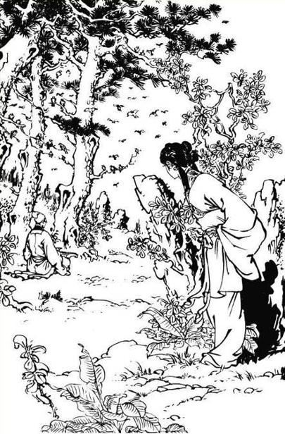
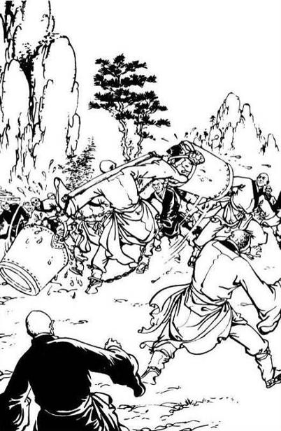
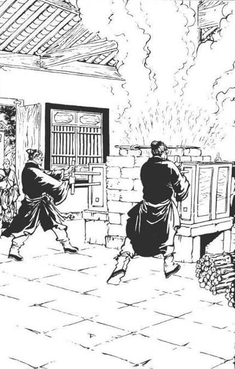
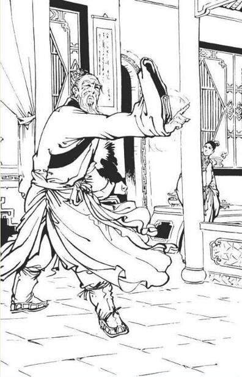
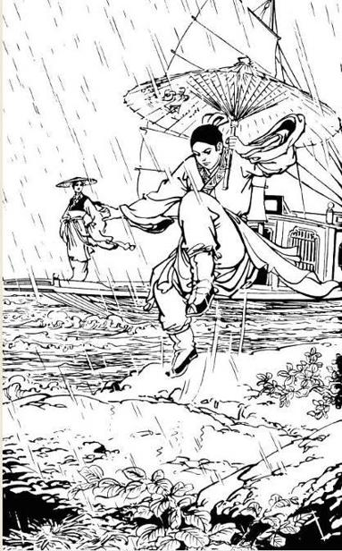
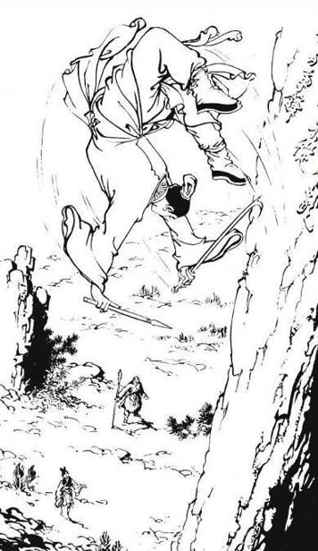
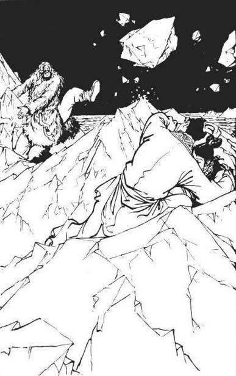
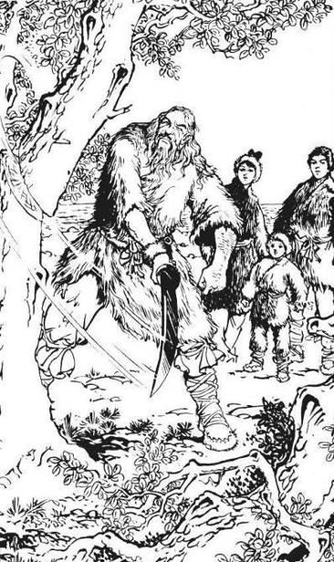
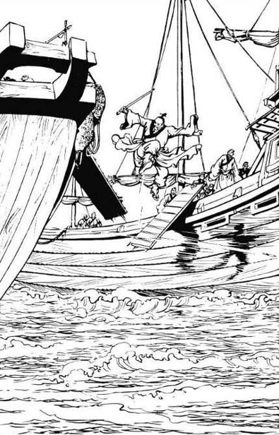
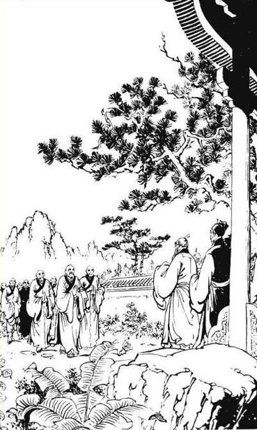

# Chapter 1 -- Pondering on the Gentleman Far Far Away

Translated by Athena

> She heard that the music was mixed by the singing of birds and it
> seemed that the birds were singing along. Guo Xiang thought:
> "According to mother there is a song called "Empty Mountain and
> Songs of Birds." But this song was lost for may ages, is it possible
> this is that song?"

> The vast and mighty tour through Spring,
> is every year's winter yearning.
> The season of the pear blossom is nearing.
> 
> The white jade brocade is without wrinkles and smells fragrantly and
> is mesmerizing.
> Snow is piling up on jade trees and jade
> petals.
> The quiet night is deep.
> The floating brightness is concealed through the
> clouds.
> A cold steep is enough to melt the moon.
> A dark silver fog illuminates heaven and
> earth.

> Her simple, natural but enchanting appearances mesmerizes
> me.
> Even greater were her will and spirit.
> She is like a bloom that exceeds other beautiful and fragrant
> flowers.
> Her noble spirit is clear and pure, her immortal ability lies
> high.
> She returns to the Jade palace and I can only see her from
> afar.

The author of this poem, Free from Mediocrity, is a famous martial arts
expert from the southern Song dynasty. The name of this expert was Qiu
Chu Ji, also known as the Everlasting One. He is one of the 7 Masters of
QuanZhen, and one of the most outstanding disciples of the QuanZhen
School. Qiu ChuJi wrote this poem after he met Xiao LongNu for the first
time. She was a neighbour of Qiu for many years. At this time Qiu ChuJi
already passed away, and Xiao LongNu is the wife of the famous Condor
Hero Yang Guo. Another girl was reciting this poem softly, in HeNan
province and on Mount ShaoShi. This young girl was about 18, 19 years
old and was wearing a cream yellow robe, she was riding on a mule and
was proceeding up the mountain pass. She was thinking: "Only someone
like sister Long is fit for him." "Him" of course refers to Yang
Guo.

After some time she softly recited: "Union is bliss, parting is woe,
Agony is boundless for a lovelorn. Sweet heart, give me word...."

Trails of clouds drifting forward, Amid mountains cupped with snow,
Whither shall my lonesome shadow go?"

This girl carried a short sword and looked travel stained. She is a
beautiful young girl who is supposed to be happy and untroubled but
somehow, she looks unhappy, melancholic.

Her name is Guo Xiang, is the second daughter of the Great Hero Guo Jing
and the famous Huang Rong. Her nickname is Little Eastern Heretic. With
her mule and sword she has traveled a lot, her purpose was to forget her
worries but her travelling only increased her sorrow.

Mount ShaoShi of HeNan province were a set of large stone steps, these
steps were constructed under the order of Emperor GaoZong of the Tang
dynasty. It looked very impressive as Guo Xiang proceeded up the
mountain. Before long she could see the monastery.

She stared at the roof for a moment and and thought: "The ShaoLin
Monastery is said to be the origin of martial arts, but why aren't
there any ShaoLin experts among the 5 Greats? Is it because the ShaoLin
experts knew there weren't a match for the other experts and were
afraid to disgrace ShaoLin and refused to go? Or was it because the
monks had evolved beyond earthly matters and didn't want to scramble
for power and fame.

After a while she saw a large stone tablet, half of it was gone and the
characters were unclear, Guo Xiang was thinking: "How come characters
carved into stone can fade away through time, but my feelings carved in
my heart become more and more stronger as time goes by."

This tablet was bestowed by Emperor TaiZong of the Tang dynasty. He
praised the ShaoLin monks for helping him suppress the rebellions. The
tablet states the military credits of the ShaoLin monks for helping
Emperor TaiZong defeat the rebel general Wang ShiChong, of which 13
monks were most famous. Only one monk became a general and the other 12
didn't want to become officials and Emperor TaiZong bestowed 12 purple
kasayas. Guo Xiang was thinking: "During the Sui and Tang Dynasty, the
ShaoLin Monastery was already very famous for its martial arts, and now
after a few hundred years they must be even more formidable."

When Guo Xiang parted with Yang Guo and Xiao LongNu at Mount Hua 3 years
ago. She lost all contact with them and missed them a lot. So she told
her parents that she wanted to roam a bit but in fact, she wanted to
hear some news about Yang Guo. She doesn't want to actually meet them,
she is very content if she can hear something about them. However, they
seem to have disappeared entirely, Guo Xiang has traveled from north to
south and from west to east. She practically traveled through China but
still there was no news on Yang Guo.

She remembered that Yang Guo asked reverend WuSe to bring her a present
on her 16th birthday. WuSe was a friend of Yang Guo and instructed
someone to deliver Guo Xiang a present. Although she has never met him,
she wants to know if he has any news about Yang Guo.

She was pensive for some time till she heard some metallic noise and a
voice chanting Buddhist scriptures: "Through love worry will arise.
Through love fear will arise. If you can free yourself from love, all
worries and fear will be gone."

When Guo Xiang heard this, she was completely dazzled. And softly
repeated those words. The metallic noise and the chanting were becoming
distant.

Guo Xiang said: "I must ask him, how I can free myself from love and
how my worries and fear will disappear." She tied her mule to a tree
and chased after the sound. Guo Xiang caught with the monk and was
shocked to see the monk carrying to large iron buckets and he was
chained on his hands, feet, and neck, causing him to produce a metallic
sound as he walked. The buckets were filled with water and it showed
that the monk must posses extraordinary strength.

Guo Xiang spoke to the monk: "I have a few questions, please stop for
awhile."

The monk turned around and both Guo Xiang and the monk were surprised to
see each other. The monk was JueYuan. 3 years ago Guo Xiang met him on
Mount Hua. Guo Xiang also knew that this monk was really pedantic, but
had extremely powerful internal energy not inferior to any top martial
arts expert of this time. She spoke to him: "Oh, it is you reverend
JueYuan. What happened to you?" JueYuan smiled and nodded but didn't
speak. He turned around and walked away again. Guo Xiang said: "It's
me, Guo Xiang. Don't you recognize me anymore?"

Jue Yuan turned his head and smiled and nodded but didn't stop. Guo
Xiang asked: "Who chained you? Why do they torture you?" Jue Yuan
raised his left hand and shook his hand in admonition, meaning do not
ask.

Guo Xiang wouldn't let this matter rest until she got to the bottom of
this. And wanted to run in front of JueYuan but was not successful.
Although JueYuan was carrying 2 large buckets of water he was still very
quick. Guo Xiang was amused and leapt up and wanted to grab one of the
buckets, but she missed by an inch.

Guo Xiang said: "You have very impressive abilities, but I must catch
up with you."

JueYuan continued to walk and the metallic noise sounded rather melodic.
Guo Xiang was having difficulty keeping up and she was really impressed:
"Both my father and mother praised this monk for his superior martial
arts, at that time I wasn't totally convinced, but now I know they were
right."

After awhile, JueYuan walked to the back of a small house and emptied
the buckets of water in an old well. Guo Xiang asked: "What are you
doing? Why are you emptying the water in this well?" JueYuan remained
calm and shook his head. Guo Xiang thought she understood now and
smiled: "You're learning some sort of powerful martial arts, aren't
you?" JueYuan shook his head again. Guo Xiang was feeling a bit angry
now and said: "I just heard you chanting, you're not dumb, why won't
you answer me?" JueYuan put his palms together and looked apologetic
and carried the buckets and walked away again.

Guo Xiang looked into the well and couldn't find anything strange about
it and stared at JueYuan's back and felt puzzled.

She gave chase for awhile but soon she felt tired and rested on a rock.
She was admiring the scenery and felt very fresh afterwards. Guo Xiang
was thinking: "I wonder where the pupil of this monk is. The pupil will
probably tell me what is going here."

She started going down again and wanted to find Zhang JunBao, the pupil
of JueYuan. She walked for awhile and soon she heard that metallic sound
again, Jue Yuan came up again and Guo Xiang quickly hid and thought:
"I'll spy on him and see what he is up to."

The metallic sound was becoming clearer and she saw JueYuan reading a
book. She silently approached him and called out: "What are you
reading?"

JueYuan was startled and cried out: "You gave me a scare, it's only
you." Guo Xiang smiled: "You're not pretending to be a dumb
anymore." JueYuan looked slightly afraid and looked to the left and
right and shook his hand.

Guo Xiang asked: "What is wrong?"

Before JueYuan could answer, 2 monks in grey robes appeared out of the
woods. One was very tall, the other one short. The tall monk sternly
said to JueYuan: "JueYuan, you broke the rules by talking to an
outsider and furthermore to a young girl. Come with us to see the elder
of the Disciplinary Hall."

JueYuan looked crestfallen and nodded and started walking behind those 2
monks. Guo Xiang was angry and annoyed and sternly reproached: "What
kind of rule forbids people from talking? I know this reverend and if I
want to talk to him, it's no concern to you."

The tall monk gave her an arrogant look and said: "For more than
thousand years, the ShaoLin Monastery doesn't allow women to enter. I
suggest that Miss would leave before you get yourself in trouble."

Guo Xiang became even more angry and said: "So what about women?
Aren't women humans? And why do you pester reverend JueYuan? How come
he is chained and you forbid him to talk to anyone?"

The monk coldly replied: "These are the rules of our monastery, no one
has the right to question, not even the emperor. Miss, needn't
bother."

Guo Xiang angrily said: "Reverend JueYuan is an honest good person,
you're bullying him because he's a nice man. Where are reverend
TianMing, the monks WuSe and WuXiang?

The 2 monks were shocked. Reverend TianMing is the abbot of ShaoLin,
WuSe is the elder of the LuoHan Hall and WuXiang is the elder of the
DaMo Hall. The 3 of them are very respected, all the monks address them
as 'old abbot, elder of the LuoHan Hall or elder of the DaMo Hall.'

No one has dared to call out their names, and today these 2 monks hear
this young girl calling out their names and creating a scene.

These 2 monks are the pupils of the elder of the Disciplinary Hall, and
received orders to keep an eye on JueYuan. But now they see Guo Xiang
interfering, the tall monk yelled: "If you don't leave now, we will
not be friendly."

Guo Xiang said: "Should I be afraid of you? Hurry up and free JueYuan
of his chains or else I will go to old monk TianMing."

The short monk became angry now and saw Guo Xiangs' sword. He said:
"Leave your weapon behind and we will not take actions against you.
Leave now!"

Guo Xiang removed her sword and held them in her hands and scoffed:
"Alright then, I will comply."

The short monk grew up in the ShaoLin monastery and heard his seniors
say that ShaoLin was the origin of all martial arts and no matter how
respected or how skilled, martial arts experts never carried weapons to
the ShaoLin monastery. Although this young girl didn't actually reach
the monastery but she was already on ShaoLin premises. He thought this
young girl was afraid and presented her sword so he reached out to grab
the sword. However, when his fingers touched the scabbard his felt a
painful tingling, like being struck by lightning. He felt a strong force
coming from the sword and pushing him backward. He couldn't maintain
his stand and fell down. As he was standing on a slope he soon rolled
down a few metres. With some difficulty, he could stop himself from
rolling anymore.

The tall monk was shocked and angry and yelled out: "Of all the nerves!
How dare you come to ShaoLin to wreak havoc!" He turned his body and
and advanced one step in front and his right fist aimed at Guo Xiang.
His left hand was put on the back of the fist causing two palms striking
down. This was the 28th technique of "Dashing ShaoLin" namely
"Turning Over Split"

Guo Xiang held on to her sword and pressed down her sword with scabbard
and all to the monks' shoulder. The monk held on to the sword.

JueYuan was very frantic and called out: "Stop! Don't fight!"

The monk tried to pull the sword over, suddenly he felt a shock through
his palm and both arms felt numb he cried: "No!" Guo Xiang swept her
left leg and kicked him down the slope. He was somewhat more injured
than the other monk, his face was bleeding.

Guo Xiang was thinking: "I came to ShaoLin to find some information on
brother Yang, but now I'm engaged in a fight for no apparent reason."

She saw JueYuan looking sad, she pulled out her sword and cut the
chains. JueYuan was screaming: "No, you musn't!" for a few times. Guo
Xiang cut three chains and said: "Those 2 wicked monks will go back for
reinforcements. We must go now, where is your little disciple?" JueYuan
kept shaking his hands. Suddenly a voice came from behind saying:
"Thank you for caring Miss Guo, I'm right here."

Guo Xiang turned around and saw a 16, 17 year old man standing there. He
had thick eyebrows and big eyes and was very tall. But still looked very
young. She met him 3 years ago at Mount Hua, he was Zhang JunBao. He was
taller this time compared to three years ago but he very much looked the
same. Guo Xiang was very pleased and said: "Those nasty monks were
bullying your teacher, we must go now." JueYuan laughed wryly and shook
his head and suggested that Guo Xiang should quickly leave now before
trouble comes.

Guo Xiang knows that there were an uncountable amount of ShaoLin experts
that were superior to her, but seeing this situation she couldn't leave
this matter alone and she was worried that ShaoLin experts would stop
them. So she pulled JueYuan in one hand and the other Zhang JunBao and
told them: "Hurry up, we'll discuss everything when we leave this
place." But the two of them just stood still.

At this time 7, 8 monks with wooden rods came up the slope and yelled:
"Who is that audacious girl? How dare she come to ShaoLin and behave
atrociously!" Zhang JunBao called out: "Please don't be rude, this
is......"

Guo Xiang hurriedly said: "Don't say my name." She knew that she
created a big scene today and perhaps this might even escalate so she
didn't want to drag her parents into this. She added: "Let's go the
other way! Don't mention my parents' name.

But another 7, 8 monks came towards them. Guo Xiang saw that they were
surrounded and raised her elegant eyebrows and said to JueYuan and
Zhang: "The both of you are so fussy, you lack a hero spirit! Do you
want to leave now?" Zhang JunBao said: "Master, Miss Guo has only good
intentions..."

At this point 4 monks came up the slope, although they didn't carry
weapons but judging their body posture they were experts.

Guo Xiang knew that using force would be futile so she just stood still
and waited to see what would happen.

The first monk walked up and spoke to Guo Xiang: "The elder of the
LuoHan Hall ordered that the intruder was to lay down her weapon and was
to be taken to the YiWei pavilion for questioning."

Guo Xiang scoffed: "The monks of ShaoLin have mastered the air of
government officials. All of you speak a bureaucratic tone! I'm
wondering whether you're officials to the Song emperor or officials to
the Mongolian emperor?"

At this time, the entire northern territories of China were in hands of
the Mongolians, the ShaoLin monastery fell under Mongolian jurisdiction.
However, the Mongolians were busy deploying their troops so they had no
time to control any temples, monasteries. Everything in ShaoLin remained
the same.

The monk felt embarrassed by Guo Xiang's remarks and his face turned
red and he felt that giving orders to outsiders was not very
appropriate. He put his palms together and said: "May I inquire what
business you have here, Benefactress. Would you please lay down your
weapon and go to the YiWei pavilion where tea will be served and we have
some questions we would like to ask."

Guo Xiang heard his tone became a bit more friendly and thought this
would be a good chance to stop and said: "I don't care if you let me
enter or not. It's not like ShaoLin has any treasure and I'm not
willing to benefit from it." She turns to Zhang JunBao and quietly
asked: "Are coming or not?" Zhang JunBao shook his head and looked at
his teacher saying his place is here. Guo Xiang loudly said: "Alright
then, I will not interfere. I'm off," and started walking down the
slope. The first monk moved away but 2 other monks blocked her. And
said: "Lay down you sword!" Guo Xiang raised her eyebrows and put her
hand on the hilt. The first monk explained: "We don't want to keep
your weapon, we will return it when you leave Mount ShaoShi. This is our
rule, please forgive us."

Guo Xiang heard his tone was polite and thought: "If I don't leave my
sword, there is bound to be a fight and alone I'm no match for these
monks. But if I leave my sword, I will disgrace my parents, brother
Yang, sister Long and my grandfather."

She was still thinking, and suddenly a figure appeared in front of her
and shouted: "You come here with a weapon, injured 2 of our disciples.
What's the meaning of this?" And he formed a claw and grabbed Guo
Xiang' sword. If this monk didn't use force, Guo Xiang would surely
hand over her sword after some consideration. She isn't like her elder
sister Guo Fu. Although she is straightforward, she is not rash. Seeing
this disadvantage, she would have complied and discussed this matter
with her parents and Huang YaoShi and come back for an explanation. But
now this monk used force, how can she watch her sword being grabbed
away?

The monk's grip was firm and he held on to the scabbard. He wanted to
quickly disarm her. Because it would not be proper for a monk to be
pulling and pushing with a pretty young girl. Guo Xiang couldn't hold
on to the scabbard and pulled out her sword. The monk used his right
hand to seize the scabbard but his 2 fingers on his left hand were cut
off.

The other monks were angry when they saw their martial arts brother
wounded and picked up their wooden rods, cudgels and attacked. Guo Xiang
knew that she had no choice but to fight now and used "Descending
Flower Swordsmanship" to defend herself.

The Descending Flower Swordsmanship was derived from Huang YaoShi's
Divine Descending Flower Sword Palms. Although this swordsmanship is not
as refined and excellent as the "Jade Flute Swordsmanship", it was
still a special technique from the Peach Blossom Island. The monks saw
green flashes surging, the sword dancing, making it seem like flowers
descending. In a few moments, 2 monks were injured. But other monks took
their places and soon Guo Xiang was completely surrounded. She would've
been overwhelmed if not for the fact that the monks were benevolent and
not willing to harm her life. All their stances were to immobilize her
and not to kill her, so they would lecture her and escort her away from
here. Also, all the monks saw that this young girl had learnt superior
martial arts and they thought that she must be either the daughter of
famous martial arts experts or at least the disciple of a skilled
martial arts expert. So they didn't want to make any enemies, so every
stance was rather limited. Some monks went to notify the elder of the
LuoHan Hall.

In the heat of the battle, an old tall monk came and observed the fight
with a smile on his face. Two monks approached him and told him
something.

Guo Xiang was panting and her swordsmanship was becoming disorderly and
she yelled out: "What origin of martial arts? 10 monks surrounding one
person, what a way to win?"

That old monk was the elder of the LuoHan Hall, reverend WuSe, when he
heard this he said: "Stand back everyone!"

All the monks jumped away. Reverend WuSe asked: "What is your name,
Miss? And who is your father and teacher? What business do you have here
at ShaoLin?"

Guo Xiang was thinking: "I can't tell him my name. And I cannot reveal
my reason in front of so many people. If my parents and brother Yang
found out the mess I created they will be upset, the best thing to do is
sneak away." She answered: "I can't tell you my name, I just came
here to enjoy the scenery. I never guessed that the ShaoLin Monastery
was even stricter than the imperial palace, with no reason your weapon
will be confiscated. I would like to ask, did I enter the monastery?
When Master DaMo taught ShaoLin martial arts he just wanted the monks to
improve their conditions and concentrate on their meditation through
martial arts. But when ShaoLin became more and more famous, and their
martial arts kept improving, now the ShaoLin monks rely on martial arts
to flaunt their superiority. Well you can have my sword, and if you
don't kill me, everyone in the realm of martial arts will know what
happened today."

Guo Xiang is famous for being clever and fluent, this entire matter was
actually her fault but with those words she rendered reverend WuSe
speechless. She thought: "I don't want anyone to know about this, and
it seems that ShaoLin doesn't want the outside world to know about this
incident either. A group of 10 monks attacking a young girl will not do
their reputation any good."

She threw her sword on the ground and started walking away. Reverend
WuSe walked up and used his sleeve to pick the sword and said: "Miss, I
will return your sword and see you off respectfully."

Guo Xiang smiled sweetly and said: "It seems that you're very
reasonable. That's more like it. That's the style a martial arts
expert should have."

Seeming that she won, Guo Xiang just praised this old monk and reached
out to get her sword back. When she wanted to pull back, she noticed it
didn't move an inch. She used strength 3 times but in vain, and she
said: "You're deliberately displaying your martial arts." Suddenly
her left hand curled up and softly wanted to brush against WuSe's two
left cheek acupoints, namely 'TianDing and JuGu.' WuSe moved away and
released his grip. Guo Xiang quickly seized her sword.

WuSe said: "Very impressive "Whisking Acupoint Orchid Hand." May I
ask how you address the lord of the Peach Blossom Island?"

Guo Xiang laughed: "The lord of the Peach Blossom Island? I call him
old Eastern Heretic."

Huang YaoShi is her maternal grandfather. He is a strange, eccentric man
and he calls his granddaughter little Eastern Heretic and Guo Xiang
calls him old Eastern Heretic. Huang YaoShi is not angry when he hears
it and he is even happy when he hears it.

WuSe was a robber in his early years. Although he has studied Zen for
many years and has profound Buddhist knowledge, he still is very
straightforward, otherwise, he couldn't be friends with Yang Guo.
Seeing that this little girl is not willing to tell him, he wants to
test her and find out. He smiled and said: "Young Miss, if you can
withstand 10 of my stances, I can guess your school."

Guo Xiang asked: "What if you cannot?"

WuSe laughed and said: "Well if you can withstand 10 of my stances, I
will have to listen to you."

Guo Xiang pointed at JueYuan and said: "I met this reverend JueYuan
some years ago and I want to plead on his behalf. If I can withstand 10
of your stances you have to promise not to give him anymore trouble."

WuSe was surprised, he knew that JueYuan was very pedantic and stayed in
the Library and watched over the scriptures and never met any outsiders.
How did he meet this young girl? WuSe said: "We never did give him any
trouble. He is sitting out his punishment, that is not giving him
trouble."

Guo Xiang pouted and scoffed: "It seems to me that you just want to go
back on your word."

WuSe clapped his hands and said: "Very well, if I lose I will carry
3108 buckets of water for JueYuan. Watch out, here I come."

Guo Xiang was thinking when she spoke to him: "This old monk seems to
be a true expert. If he starts to attack first, I will have to try my
best to defend myself and will reveal my parents' martial arts. The
best thing to do is for me to attack first and try to gain the
upperhand." When she heard him say "Watch out, here I come." she
didn't give him time to attack first and raised her sword and aimed for
his chest. This was a technique from the "Descending Flower
Swordsmanship" namely "Thousands and Myriads of Purple and Red."

The tip of the sword kept moving, not revealing to the opponent where
the sword was aiming for.

Guo Xiang yelled out: "The second stance!" the short sword turned
around and came from bottom to top, this was called the "Celestial
Gentry Topping Apart" which was a QuanZhen technique.

WuSe said: "Good, QuanZhen sword technique."

Guo Xiang said: "Not necessarily." Her short sword stabbed into the
air and saw WuSe using an attack as a defense and using his fingers to
grab her wrist. She was a bit afraid: "This old monk is very
formidable, he can attack bare-handed under such a dangerous
technique."

Seeing his fingers were coming closer, her sword dazzled a few times and
used a technique from the "Dog Beating Stick", namely "Mean Hound
Blocking the Road." And this stance belonged to the Sealing Formula.

Guo Xiang was close friends with the deceased leader of the Beggars
Association Lu YouJiao, they occasionally drank wine and played mora
together. Sometimes Lu would demonstrate his martial arts, although the
"Dog Beating Stick" is only permitted to be used and learnt by the
leader of the Beggars Association, Guo Xiang could learn a few stances
from Lu. Furthermore, her mother Huang Rong and her brother-in-law were
leaders of the Beggars Association. So she has seen this style a lot and
could trick people into believing that she knew this style although she
didn't know the exact secret of it.

WuSe's fingers just reached her wrist but he saw a bright light shining
and the blade was coming towards his fingers in an excellently beautiful
way. Almost cutting off his five fingers, but luckily his martial arts
were high and he could avoid the attack by pacing back 2 steps. But his
left sleeve was split. WuSe looked terrified and cold sweat was breaking
out.

Guo Xiang was very amused and smiled: "What sword style is this?" In
fact this wasn't a sword technique, she just used a stance from the
"Dog Beating Stick" and used it as a sword stance. Because this style
was magnificent, even Guo Xiang couldn't completely learn it, it was
still capable to scare off this martial arts expert of ShaoLin.

Guo Xiang thought: "If I learnt a few more stances from the "Dog
Beating Stick" I could easily defeat this old monk.

She didn't give WuSe time to catch his breath and advanced forward. Her
sword was slightly raised and she floated towards him. Her posture
looked like a floating fairy, the blade was pointing at WuSe's legs.
This was called "A Small Orchard for Chrysanthemum" which belonged to
the Jade Maiden Swordsmanship. Guo Xiang learnt this technique from Xiao
LongNu.

The Jade Swordsmanship was created by Lin ChaoYing, this style was not
only swift and fierce but also refined, elegant and beautiful. All the
monks never saw something that beautiful, they were all surprised and
pleased. Because ShaoLin sword styles were firm and fierce, for example,
LuoHan and DaMo Swordsmanship. This Jade Maiden Swordsmanship was hardly
known throughout the world of martial arts, the essence of it is the
opposite of ShaoLin styles but when it comes to superiority of the
stances, it is not above ShaoLin Swordsmanship.

But this technique was absolutely beautiful and celestial.

Even in Buddhist scriptures it is mentioned: "When the appearances are
gracious and charming, when the manner is solemn, gentle and elegant.
And behavior proper and gratifying. The watcher will not be bored."

Reverend WuSe was impressed by such a magnificent stance and hoped to
see it more clearly so he moved away and waited till Guo Xiang attacked
again.

Guo Xiang's technique now was changing directions a few times from east
to west and from west to east. Zhang JunBao was mesmerized by it and was
surprised to recognize this stance as "Extend in all Directions." 3
years ago Yang Guo taught Zhang JunBao this technique and Guo Xiang was
there to see it and now is using it. This was originally a palm
technique, now she used it as a sword stance, the power of this stance
was not that powerful anymore but it was a very strange sword stance and
WuSe was a bit frightened by it.

They reached the fifth stance now, and WuSe didn't have any idea who
she was. In his younger years, he roamed the world and gained a lot of
martial arts experience and insight. And now he is the elder of the
LuoHan Hall for more than 10 years and has examined all styles of
different schools and compared to ShaoLin martial arts. So he was always
very confident to recognize the martial arts of any expert within a few
stances.

His limit with Guo Xiang of 10 stances was already a very big margin. He
never guessed that the parents, relatives, friends of Guo Xiang were all
top martial arts experts and she learnt a few stances of each and every
one of them, causing WuSe to be confused. WuSe now thought: "The only
way for me now is to attack with strength, forcing to use her own
martial arts to defend herself. If not, I cannot even guess her school
after a hundred stances."

He turned around and used "Double Piercing Hands" and 2 fists aimed
for Guo Xiang. She saw that his attack was fierce and didn't dare to
block it and twisted her body and glided away from that attack. She
remembered when Ying Gu fought against Yang Guo, Ying Gu used this
style.

WuSe praised: "Good movement! Try another stance."

His left hand curled up like a flower, bending his left elbow in front
of his chest and this was another ShaoLin fist stance.

This stance completely sealed Guo Xiang. She turned around her sword and
use the sword as her finger and displayed the "Yi Yang Finger". She
learnt this technique from her martial arts brother, Wu XiuWen. And she
aimed for 3 of WuSe's acupoint of his wrist. Although she only learned
the mere basics of "Yi Yang Finger" this technique of sealing 3
acupoints in one go was one of the key points of "Yi Yang Finger."

Reverend YiDeng's Yi Yang Finger was renowned through the world. WuSe
recognized it and quickly changed stance.

However if WuSe didn't change technique, and let Guo Xiang touch his 3
acupoints he would have known that her "Yi Yang Finger" was far from
perfect.

But in a fight he wasn't willing to risk his reputation and name for
it. Guo Xiang smiled sweetly and said: "You recognize a powerful
technique when you see it."

WuSe grunted and used a stance called "Single Phoenix Glaring At the
Sun". With this stance WuSe used both hands to knock out Guo Xiangs'
sword.

She knew that he wouldn't really harm her but was still frightened and
used Zhou BoTong's Kong Ming Fist to counter it. This Kong Ming Fist
was quite new to the martial arts realm so WuSe didn't recognize it and
turned to another stance namely "Siding to the 7 Stars Flower." One of
his palms was up the other down and pressed down on Guo Xiang. If she
didn't use internal energy to block it, her hands would be snapped.

Guo Xiang thought: "Do you really want to break my hands?" And used an
Iron Palm technique to block this attack. She learned this stance from
Wu XiuWen's wife, WanYan Ping. This stance was created by the famous
Qiu QianRen and this palm technique was known to be number one for being
violent and fierce.

WuSe was shocked to see a young girl using the Iron Palm technique and
quickly withdrew his attack. First of all, he didn't want to harm her,
second, he was quite afraid for the Iron Palm technique.

Guo Xiang smiled sweetly: "This is the tenth stance, guess what school
I belong to?"

And attacked WuSe with a simple ShaoLin Fist called "The Sea of
Bitterness has no Bounds." This stance belonged to the LuoHan fist
style and WuSe was both angry and amused to see this. And he quickly
used another stance to block it and lift her up. This was called "Carry
the Mountain and Leap over the Ocean."

But when he did that he realised: "I'm only wanted to win her and
cannot recognize her school. She used 10 different stances, what can I
say. I surely can't say she belongs to ShaoLin."

Guo Xiang was yelling: "Let me go!" and something dropped out of her
clothes. Guo Xiang yelled again: "Let me go, you old monk."

WuSe was an enlightened monk, he believe all creatures were the same. He
made no differences in men and women, he even treated animals with care.
He said: "I'm old enough to be your grandfather. What are you afraid
of?"

He gently flicked his arm and Guo Xiang landed a few metres further.

He was about to admit defeat, when he saw 2 small dark iron figures of 2
Arhats and picked them up.

Guo Xiang asked him: "Well, do you admit defeat?"

WuSe looked very pleased and said: "Why should I admit defeat? Your
father is the great hero Guo Jing, your mother is the heroine Huang
Rong. Your grandfather is Lord Huang of the Peach Blossom Island.
You're second Miss Guo Xiang. Your father learnt martial arts from the
7 Eccentrics of Jiang Nan, Peach Blossom Island, Northern Beggar and the
QuanZhen School. No wonder Miss Guo has such profound knowledge of
martial arts."

Guo Xiang was stunned: "This old monk is very formidable, I used 10
different stances but he was still able to know who I was."

WuSe smiled and said: "Miss Guo, I recognized you from these 2 Arhat
statues, how is brother Yang?"

Guo Xiang was shocked for a moment and said: "You must be reverend
WuSe. You gave me these 2 Arhats as a present to me. The reason I came
here was to find out some news of brother Yang and sister Long."

WuSe said: "Many years ago, Master Yang came to our monastery and
stayed for a few days. And when he left for XiangYang he asked me to
help him. But I don't know where he is now."

It seems that both Guo Xiang and WuSe didn't know where Yang Guo was.

Guo Xiang was stunned for a moment and said: "Not even you know where
he is now. I wonder who does know."

Guo Xiang thanked him for his present.

These 2 Arhats were made by a carpenter monk of ShaoLin. These 2 Arhats
could display a set of LuoHan fist if you activate the mechanism.
That's why Guo Xiang knew that ShaoLin fist.

WuSe laughed and said: "Because of the rules of our monastery I cannot
invite you stay, however I will walk you down. Please forgive us."

Guo Xiang was pensive and said: "It doesn't matter, I asked what I
came for anyway."

WuSe said: "As for my Buddhist brother JueYuan I will explain later.
You know what, we will find a good inn and talk these things over by a
good meal and some wine." Reverend WuSe was highly respected by the
ShaoLin monks, and they were all puzzled to see him being so respectful
towards a young girl.

Guo Xiang said: "No need for that, I'm sorry that injured a few
reverends. Please forgive me for being rash. I will leave now and I hope
to see you again."

WuSe laughed and said: "I'm adamant, I will see you off. I'm sorry I
couldn't attend your 16th birthday that year. After burning down the
supplies and the gunpowder of the Mongolian army I left without going to
XiangYang.

Guo Xiang knew he had good intentions, and like his straightforward
manner and was very eager to make friends with him and said: "Good."

After the 2 of them walked for awhile and passed the Yi Wei pavilion.
They heard a footsteps behind them when they turned around to look they
saw Zhang JunBao. Guo Xiang smiled and said: "Brother Zhang, did you
come to see me off too?"

Zhang JunBao blushed and said: "Yes."

Suddenly another monk ran towards WuSe looking rather hectic. WuSe
frowned his eyebrows and said: "Why are you so frantic?" That monk
went to WuSe and said something very quietly. WuSe's face changed and
said: "Really?"

The monk said: "The abbot asked master WuSe to return now and to
discuss matter."

Guo Xiang saw that WuSe looked worried and told him: "If you have
something to do now, feel free to go back. Real friends don't need all
those formalities, we can always eat and drink another time."

WuSe looked pleased and said: "No wonder Master Yang speaks highly of
you. You're a true heroine, today you've made a friend."

Guo Xiang smiled and said: "You're already friends with brother Yang.
That makes you my friend too."

The two parted and WuSe went back.

Guo Xiang continued to walk down, Zhang JunBao didn't dare to walk next
to her and kept 5 steps in between them.

Guo Xiang asked: "Why do they punish your teacher?"

Zhang JunBao said: "The rules of the monastery are very strict, if the
monks break them they have to be punished."

Guo Xiang asked: "What did your teacher do wrong, he's a very nice
man."

Zhang sighed: "It is all because of the Ni Jia Scripture that was
lost."

Guo Xiang said: "You mean the scripture that was stolen by Xiao XiangZi
and Yin KeXing."

Zhang said: "Yes, that day at Mount Hua, I searched them and found
nothing even with the help of Master Yang. After we left the mountain we
couldn't find them anymore. We returned to the monastery and reported
it to the abbot. Because that scripture was written by Master DaMo, the
elder of the Disciplinary Hall blamed my teacher for not paying better
attention to the scriptures and heavily punished him."

Guo Xiang sighed: "This is blaming it on someone else. Why should
reverend JueYuan be punished for it. Because of this they ordered your
teacher to fill that well and forbade him to speak."

Zhang said: "This is an old punishment of ShaoLin. According to the
elders, this punishment can also be seen as good form of
self-cultivation."

Guo Xiang laughed: "It seems I'm a busybody." Zhang quickly said:
"We will always remember Miss Guo's help and intentions."

Guo Xiang sighed and thought: "But someone has completely forgotten
about me."

After awhile they reached the place where Guo Xiang tied her mule and
she said: "Brother Zhang, you needn't see me off anymore." Zhang
JunBao looked reluctant to part and didn't know what to say to Guo
Xiang.

Guo Xiang took out her 2 Arhats and gave them to Zhang JunBao: "Here
take it."

Zhang JunBao didn't take it and said: "I...I.."

Guo Xiang said: "I'm giving it to you, so take it." Zhang JunBao
said: "I.....I...."

Guo Xiang put them in his hands and mounted the mule.

Suddenly someone called out: "Miss Guo, please wait."

It was reverend WuSe, Guo Xiang thought: " This old monk was too
formal."

WuSe reached Guo Xiang in a few moments and told Zhang JunBao: "Return
to the monastery, don't stroll about."

Zhang JunBao said yes and stared at Guo Xiang for short while and
quickly left.

WuSe waited till he was gone and took out a note and said: "Miss Guo,
do you know who wrote this note?"

Guo Xiang took the note and read it:

"ShaoLin martial arts have been proclaimed to be invincible throughout
China for many years. Ten days from now, The 3 Saints of KunLun will see
all ShaoLin skills."

The handwriting was very strong. Guo Xiang asked: "Who are these "The
3 Saints of KunLun," they sound very arrogant."

WuSe said: "You don't know them?" Guo Xiang shook her head and said:
"No, I don't know them. I have not heard my parents mention this name
before."

WuSe said: "That's the strange thing about it." Guo Xiang asked:
"What is strange?"

WuSe said: "Miss Guo, we are now friends and I will be honest with you.
Do you know who brought this note?" Guo Xiang answered: "Probably a
messenger from The 3 Saints of KunLun."

WuSe said: "If it was, I'm not that surprised. ShaoLin has been the
leading martial arts school in WuLin for hundreds of years. So many
martial arts experts come here to challenge us, but we always treat our
guests with courtesy. And we try to avoid fighting as much as possible,
because if we battled every expert who came here for a fight, we
wouldn't have time for our cultivation."

Guo Xiang nodded and said: "That's true."

WuSe said: "However, when the experts are here, and if we don't show
them some special ability they will not be impressed. The LuoHan Hall is
there to welcome these guests with this special treatment."

Guo Xiang laughed and said: "So you're just here for the fights."
WuSe smiled with a wry: "Normally WuLin persons, the disciples of the
LuoHan Hall can deal with them, I don't need to fight them personally.
But today when I saw that Miss Guo's martial arts were out of the
ordinary I decided to see for myself."

Guo Xiang smiled: "You have a very high opinion of me."

WuSe said: "Look at me, we're digressing. To tell you the truth, we
found this note in the LuoHan Hall in the hands of the Dragon-Subduing
Arhat." Guo Xiang was surprised and asked: "Who put it there?" WuSe
shook his head and said: "We don't know. There are hundreds of ShaoLin
monks in the monastery, if someone sneaked in, someone must have noticed
that. And there are 8 disciples standing guard in the LuoHan Hall every
day. Someone just found the note and quickly reported it to the abbot.
Everyone found it strange and that's why I was called back so
urgently."

Guo Xiang now understood what he was getting it and said: "You think
I'm in league with The 3 Saints of KunLun. I'm creating a diversion
here while those 3 fellows enter the LuoHan Hall and leave the note."

WuSe said: "After meeting you I found it impossible you would do
something like that. But it was very coincidental that with your
appearance a note is left behind in the LuoHan Hall. That's why the
abbot and my martial arts brother WuXiang wrongly suspected you were
involved in this."

Guo Xiang said: "I don't know them, what are you afraid of? Ten days
later if they dare to come, just accept the challenge."

WuSe said: "Afraid, of course we're not afraid. I'm reassured now
that they are not your friends."

Guo Xiang knew WuSe's intentions were good, he was afraid that The 3
Saints were friends of hers and was afraid that in a fight they might
damage their friendship. She said: "If they come here and courteously
want to examine martial arts with you that's not a problem. Otherwise,
just teach them a lesson. Also the tone of the note was very arrogant,
'see all ShaoLin skills'. Do they really want to see the 72 skills of
ShaoLin?"

Suddenly she thought of something and said: "Couldn't it be that there
is a traitor amongst you and secretly put the note there?" WuSe said:
"We thought of this too, but that was impossible. Because the Arhat
statue's hand was almost 10 metres tall. If someone was to jump up
there, his art of levitation should be superb. If there was a traitor he
wouldn't have such good martial arts."

Guo Xiang was very puzzled by this entire incident and was very
interested to know the outcome of this duel. But she knew she would miss
out on this fight because ShaoLin didn't allow women to enter.

WuSe saw she was pensive and thought that she was thinking of a plan to
help them and said: "ShaoLin has overcome many obstacles in these 1000
years and is still standing. If "The 3 Saints of KunLun" really want
to pick a fight, we will try our best to battle them. Miss Guo, in less
than a month, you'll hear whether these "3 Saints of KunLun" have
defeated ShaoLin or not."

At this point, he looked very energetic and brave.

Guo Xiang smiled and said: "Don't forget about your cultivation? In
less than a month I will await your good news."

She mounted her mule again and smiled to WuSe.

And then she rode off thinking of a plan not to miss out on this
battle.

After thinking for awhile: "Perhaps these "3 Saints of KunLun" are
just some ordinary WuLin people. And will be easily defeated by the
ShaoLin monks, if they only had half the skills of my mother, father,
grandfather or brother Yang, this fight will be very interesting."

When she thought of Yang Guo she became melancholic again. These 3 years
of searching were in vain. The tomb on Mount ZhongNan was empty, no news
in the Valley of No Love, The FengLing Ferry was deserted too. She
thought: "What do I do when I find him? It will only increase my
feelings for him and bring extra frustration. He left for a faraway
place, that was also good for me. Although I know everything I do is in
vain, it can't stop me from thinking about him and trying to find
him."

She rode her mule and wandered a bit on Mount ShaoShi and was feeling
melancholic.

She heard music sounds, she was surprised to hear someone playing the
zither. She learnt the arts of zither, chess, literature and painting
from her mother. Although she learnt only the basics, she is intelligent
enough to give her own unique perspective on matters. Frequently, she
discussed these arts with her mother. She tied her mule to a tree and
walked towards the music.

She heard the music was mixed by the singing of birds and it seemed that
the birds were singing along. Guo Xiang thought: "According to mother
there is a song called "Empty Mountain and Songs of Birds." But this
song was lost for may ages, is it possible this is that song?"

The music became more and more interesting. Guo Xiang was surprised and
thought: "This man can lure birds with his music, this song must be "A
Hundred Birds Admiring the Phoenix." And thought if her grandfather was
here, both of them could play this song together. Because Huang
YaoShi's flute was unequaled at this time.

The music became softer and the birds flew away and suddenly the music
stopped. The man sighed and said he couldn't find a soulmate and drew
his sword and started carving on the ground.

Guo Xiang thought: "This man is both well versed in artistic fields and
martial arts, let's see how his swordsmanship is."

She saw that this man was drawing a chessboard with his sword and
started playing chess (Go) with himself.

Guo Xiang thought: "This man is lonely too and can't find a soulmate
either, so he's playing chess with himself."

After awhile she saw that the man trapped himself in the western side of
the chessboard and leaving the central open.

Guo Xiang couldn't help herself and spoke: "Why do you take the
western borders? While the central plains are open."

The man saw what he did and took the central plains causing a draw. The
man laughed and said: "Good, good!" and continued to play and realised
that someone was present. He tossed his sword away and said: "Thank you
for your help. May I ask who helped me?"

Guo Xiang saw that he had a long face and dark eyes and was quite
skinny. He was about 30 years old. She walked towards him and smiled:
"I was very much enchanted by your music, Sir. And when I saw that
you're losing to yourself I couldn't help pointing out. Please forgive
me for my bluntness."

The man was surprised to see a young girl and when he heard her talking
about his music, he was very happy and said: "Miss, is a musician too?
Would you please play a piece for me?"

Guo Xiang smiled and said: "My mother taught me some basics, compared
to your divine music I'm very bad. But since I heard your song it's
only natural that I return a song back. But you musn't laugh."

The man said: "I wouldn't dare."

And handed the zither to Guo Xiang.

Guo Xiang saw that this zither was an antique. She started to play the
zither and her playing was not very spectacular but the man was very
happy and surprised.

The song was about a hermit and he lived alone on a mountain and felt
lonely. Because he didn't have a soulmate he looked sickly but his
aspirations will always be very high.

The man heard his feelings in the music of Guo Xiang and was very
grateful and when the music stopped, he just stared into the blank.

Guo Xiang gently put the zither on the ground and turned around and left
again. Reciting the poem that matched this song:

*Note: I didn't translate the poems, songs in this part. It will take
me too much time. Sorry! I found them on another website. They are not
my work.

A gentleman is exploring the mountainside
Close to a stream, all alone
Although he is forlorn, although he is unaware
But he is wise, and will never change
And this piece is the gentleman's song:

The day is so short, a hundred years is so long
The earth is so wide, one hundred incarnations approaches the Tao
An angel releases the reins, one half is as white as snow
The Creator meets the Jade Lady laughing, I wish for the dragon's
embrace
Turning towards Phu Tang, to buy good wine at Bac Bau
Inviting the dragon to riches which I scorn,
That throughout the year beautify only the being.

Guo Xiang roamed the realm for three years now, and encountered many
strange incidents. So she forgot all about the man who played the zither
and chess. Another 2 days, The 3 Saints of KunLun will challenge
ShaoLin. She was thinking of a way to sneak in and watch but couldn't
think of anything. She thought: "My mother can think of 18 plans in a
blink of an eye. I'm just too stupid and I can't even think of one
plan. Never mind, I'll just go to ShaoLin and perhaps they are too busy
fighting of the intruders that they forget to stop me from entering."

She ate some rations for the journey and proceeded to ShaoLin. After
riding for some time, she saw 3 horses riding towards her. And in short
while they passed her and were headed towards ShaoLin. The riders were
all men in their fifties and were green robes and weapons hung to the
saddles.

Guo Xiang thought: "These 3 men are martial artists and they are
carrying weapons. They must be The 3 Saints of KunLun. If I don't hurry
up, I'll miss out on a good fight."

She gave her mule a clap and he quickly pursued them. The 3 riders
whipped their horses to increase speed. One of the old man turned back
and gave a strange look.

Guo Xiang's mule gave chase for a short distance. The 3 horses were out
of sight. The mule looked exhausted. Guo Xiang scolded: "Lazy animal!
Normally you never listen to me and keep running about. When I need you
to run, you can't keep up." She pulled the mule to a small stone
pavilion and gave the mule to rest. After awhile the three riders came
back. Guo Xiang was surprised and thought: "Could it be that they are
really that useless and were defeated in one blow?"

The three riders dismounted, Guo Xiang looked at them and saw that one
of them had a cinnabar coloured face. The other had a really red face
and looked very friendly. The third one was very tall and skinny and
looked very pale, but in his paleness there was a touch of green.

These 3 old men looked very normal except for their strange skin
complexion. She was very fascinated and asked: "Could I ask you whether
you went to the ShaoLin Monastery or not? Why did you return when you
just when up there?" The pale-looking man gave her a stern look, like
scolding her for asking questions.

The red-faced man smiled and said: "How did you know we are headed for
the monastery?" Guo Xiang said: "If you go up there, you'll go to the
ShaoLin Monastery."

The red-faced man nodded and said: "That's true, and Miss where are
you going?" Guo Xiang said: "You're going to ShaoLin, and I'm going
too."

The pale-faced man said: "ShaoLin doesn't allow women to enter and
carrying weapons is also forbidden." He sounded very arrogant, and
because of his height he looked over Guo Xiang's head ignoring her
completely.

Guo Xiang was annoyed and said: "Well you're carrying weapons too. Or
aren't those weapons?"

The pale-faced man coldly said: "How can you compare yourself with
us?"

Guo Xiang scoffed: "What about the 3 of you? Are The 3 Saints of KunLun
fighting with the old monks of ShaoLin yet? Who won and who lost?"

The 3 old men's faces changed. The red-faced man asked: "Little Miss,
how do you know about this incident with The 3 Saints of KunLun?" Guo
Xiang said: "Of course I know."

The pale-faced man walked up and sternly said: "What's your name?
Whose disciple are you? And what is your business here at ShaoLin?

Guo Xiang raised her pretty face and said: "Never you mind."

The pale-faced man was hot-tempered and raised his hand to slap her. But
he realised that if he did that, he will be bullying a young girl. He
swiftly advanced towards Guo Xiang and seized her sword.

Guo Xiang was taken off guard, this never happened before in her life.
To be frank, with her martial arts and experience she was not fit to
roam the realm on her own. But everyone respected Guo Jing and Huang
Rong and knew she was their daughter and Yang Guo spread the word of her
16th birthday and all the unorthodox WuLin person knew her. Even if they
dared not to give Guo Jing and Huang Rong face, they would surely
respect Yang Guo. Furthermore, she was very pretty and straightforward,
she treated everyone equally no matter what social status they had.
Although the realm of martial arts was a dangerous place, she always
came out fine and without any harm. She never suffered such humiliation
in her life and knew she couldn't get her sword back. Because she was
not their match yet, but to give up like this was very difficult to
accept.

The pale-faced man held the sword between his index finger and middle
finger and coldly said: "I'll keep this sword for awhile. Seeing you
have the audacity to be disrespectful towards me, it's clearly that
your parents and teachers didn't teach you any manners. If you want
them to come and reclaim the sword and I will tell them what happened
and advise to pay more attention to you."

Guo Xiang was furious when she heard this, according to this man she was
a wild girl with no manners, and thought: "Fine! Not only did you scold
me, you also scolded my parents, grandfather. Do you really think you
have invincible abilities and you can be that arrogant."

She held her temper and said: "What's your name?"

The pale-faced man grunted and said: "Let me teach you, you should say:
Sirs, may I be so bold to ask you what your names are?"

Guo Xiang angrily said: "No, I will say it however I want. If you
don't want to tell me, fine. It's not that I'm desperate to know.
This sword isn't worth much, and you are bullying a young girl by
stealing their possessions. I don't want it anymore."

She turned around and walked out the pavilion.

Suddenly the red-faced man blocked Guo Xiang and smiled: "Young girls
shouldn't be that hot-tempered, when you get married you can't throw
tantrums like that anymore. Let me tell you, we are 3 martial arts
brothers, and we just arrived in China a few days. We're from the
western borders of China."

Guo Xiang pouted: "I know that too, in China we don't recognize the 3
of you." The 3 men looked at each other and the red-faced man asked:
"May I ask Miss, who your teacher is?" Guo Xiang didn't want to
reveal the names of her parents at ShaoLin originally. But now she was
angry and told them: "My father's name is Guo Jing. And my mother is
called Huang Rong. I don't have a teacher, I learnt a bit of martial
arts from my parents."

The 3 old men looked at each other and the pale-face man softly said:
"Guo Jing? Huang Rong? Of which school do they belong? Whose disciples
are they?"

Guo Xiang was infuriated, because her parents were respected throughout
the realm. Even ordinary people know them, let alone WuLin persons, the
famous great hero Guo Jing was respected for guarding the city of
XiangYang for many years.

But judging from their expressions, they are not pretending to be
ignorant. She realised: "These 3 Saints of KunLun live on the western
borders and rarely come to China. Otherwise, with their martial arts
father and mother were bound to mention them to me. If they truly don't
know my parents then it's not strange. It's very likely that they just
study martial arts at Mount KunLun and forget all other matters."

When she realised this, her anger disappeared, she is not a girl to
throw tantrums and said: "My name is Guo Xiang. Fine, I have told you
everything you wanted to know. Sirs, may I be so bold to ask you what
your names are?"

The red-faced man smiled: "That's a good girl, now you show respect to
seniors."

He pointed to the yellow-faced man and said: "That's our eldest
martial arts brother, his name Pan TianGeng, I'm the second martial
arts brother and my name is Fang TianLao. This is my third martial arts
brother and his name is Wei TianWang. The 3 of us all belong to the Tian
character generation."

Guo Xiang nodded and remembered their names and asked: "Are you going
to the ShaoLin Monastery or not? Have you battle the monks there? And
who is better?" Wei TianWang sternly asked her: "How did you know
we're going to compete with the ShaoLin monks? Hardly anyone knows this
and when did you know this? Tell us now!" He walked towards Guo Xiang
made a fist and stared at Guo Xiang very viciously. Guo Xiang thought:
"Do you really think you can intimidate me? Originally I wanted to tell
you, but now I won't talk."

She gave him an indifferent eye and said coldly: "Your name is good,
why don't you change it in to TianE ('born viciously')?"

Wei TianWang angrily shouted: "What?"

Guo Xiang said: "I never met a more vicious man like you, you grabbed
my weapon and you're still this fierce. Are you the Deity of
Ferociousness in reincarnation?"

Wei TianWang made a few strange noises like an animal and his chest
swelled up and it looked like his hair and eyebrows raised too.

Fang TianLao said: "Third brother, don't get upset." and he pulled
Guo Xiang back and he stood between the 2 of them.

Guo Xiang saw Wei TianWang and knew if he attacked, she would not be
able to withstand it and was beginning to get a bit scared.

Wei TianWang pulled out the short sword of Guo Xiang and used 2 fingers
to hold it and used his internal strength to break it into 2 halves. He
returned the broken half back into the scabbard and said: "Who wants
your unworthy sword." Guo Xiang saw the powerful energy of his fingers
and looked in awe.

Wei TianWang saw her expression and was very pleased and laughed
heartily. This laughter was ear-piercing and shook the roof tiles of the
pavilion.

Suddenly the roof cracked open and something fell down. Everyone was
surprised at this and even Wei TianWang was even more surprised. He used
his internal strength to make a laughing sound to tremble the tiles. But
actually there was no tone of pleasure in his laughter. When he saw the
roof cracking open he thought that without his own knowledge he reached
a higher level in his cultivation of internal energy.

When he looked at that "thing" that dropped down he was shocked to see
a man in a white robe holding a zither. He was just lying there, closing
his eyes.

Guo Xiang was pleased to see him and said: "You're here too." This
man was the man she met earlier.

The man jumped up when he heard Guo Xiang talking to him and said:
"Miss, I was looking for you. I didn't know you were here."

Guo Xiang said: "Why are you looking for me?" That man said: "I
forgot to ask you something, namely [ Miss, may I ask what your name
is?]."

Guo Xiang said: "How very formal, I can't stand that genteel and
mournful way of talking." That man was stunned for a moment and
laughed: "You're right, you're right. Those that cling on to mere
conventionalities and put on airs have no real abilities. Those men are
only fit to fool ignorant peasants." after saying that he looked at Wei
TianWang and scoffed.

Guo Xiang was very happy and thought this man was helping her.

Wei TianWang stared at him and his face became even more white and
coldly asked: "May I know your name, Sir?"

That man ignored him and asked: "Miss, what's your name?"

Guo Xiang said: "My name is Guo Xiang."

That man clapped his hand and said: "Forgive me for not recognizing
you, you're the famous Miss Guo. Your father is the great hero Master
Guo Jing and your mother is the famous heroine Master Huang Rong. With
the exception for ignorant peasants and idiots, everyone in the realm of
martial arts knows them. The 2 of them are well-versed in both literary
and martial arts, and are well-versed in sabre, swords, spears,
halberds. Also renowned for their palm, fist techniques, internal
energy, zither, chess, calligraphy, art, composing poems and songs. But
there are clearly some foolish people who have never heard of them
before."

Guo Xiang was quite amused and thought: "You're were listening at our
conversation on the roof. It seems that you don't know my parents are.
And my father being well-versed in literary fields is even more
hilarious." She laughed and said: "Well, what's your name?"

The man answered: "My name is He ZuDao." Guo Xiang smiled and said:
"He ZuDao! He Zu Dao Zai ('not worth mentioning')? A very modest
name."

He ZuDao said: "Compared to Tian ('heaven') something or Di
('earth') something these arrogant bragging, overweening ignoramuses,
my name isn't that appalling."

He ZuDao keeps mocking the 3 of them, they could keep their tempers
under control because they knew this man wasn't an ordinary man. But
He's remarks were getting even more insulting and Wei TianWang was the
first to attack and raised his palm to strike He ZuDao. He ZuDao ducked
his head and passed under Wei's arms. Wei TianWang felt a numbness in
his left hand and saw that He seized the sword out of his hand. When Wei
TianWang seized the sword, he was so swift that no one could see his
movements, but He ZuDao did in a very floating and light manner.

Wei TianWang was shocked and he used his hands as claws to try to get
the sword back. He aimed for He's shoulder. He avoided that claw. Pan
TianGeng and Fang TianLao leapt out of the pavilion. Wei TianWang
attacked with both hands, left hand with a fist, right hand palm stances
causing a 'whooshing sound.' He ZuDao avoided Wei's 7, 8 stances, Wei
couldn't even touch He's clothes. With one hand holding the sword, he
could still avoid the attacker's violent attacks, with a small movement
Wei TianWang's attacks were always in vain.

Guo Xiang, herself was not a real martial arts expert due to her young
age. However, her friends and relatives are all top martial arts experts
of this time so her insight is very profound on martial arts. When she
saw that He ZuDao used balanced movements and very clever moves to avoid
very violent attacks she knew his martial arts were of an entire
different type and were very different from the martial arts found in
China.

Wei TianWang used 20 stances already and still couldn't force his
opponent to fight back, so he took a deep breath and his fist techniques
changed and he attacked slowly now but the force of his fists increased.
Guo Xiang felt his energy and stepped out of the pavilion.

At this point, He ZuDao didn't dare just to avoid these attacks and
hung the sword at his belt and stood still and yelled: "You're not the
only one skilled in tough martial arts." When Wei's 2 palms reached
him He used his left hand to respond at this attack. Tough against
tough, the 3 palms made a 'bamming' sound. Wei's body shook and he
took 2 paces back. He ZuDao stood still.

Wei TianWang always believed that this skill of his was unequaled in the
realm. But today he was unable to win and he himself was pushed back 2
paces. He wasn't ready to give up and took a deep breath and yelled out
both palms pushed forward. He ZuDao yelled out too and returned a palm,
shaking the broken roof.

Wei TianWang backed 4 paces, before he could stand still again. After 2
times of palm to palm attacks his hair was messy and he had bug-eyes now
looking very eerie. He put his hands around his public region and took a
few breaths causing his chest to swell up again. All his joints made a
funny cracking sound and he walked towards He ZuDao.

He ZuDao didn't dare to be inattentive and readied himself to encounter
him. Wei TianWang kept walking towards He and walked so close that they
could feel each other's breath. At this point, one of Wei's palms
aimed for He's face the other palm aimed for the lower abdomen. With
this attack he hoped to divide the opponent's energy. This stance was
very violent and fierce.

He ZuDao used his both palms to meet up with Wei's palms. He divided
his energy into 2 sorts, Ying and Yang. Wei felt that the palm that
aimed for his face was empty and hollow, the other palm felt it hit an
iron brick wall. Wei TianWang knew this wasn't good and he felt an
enormous energy coming towards him and pushing him out of the pavilion.

This sort of tough attacks, the weaker one will be injured and there was
no way to avoid that. No matter whether Wei TianWang could stand still
or fall down. His own energy was reflected back and He ZuDao's energy
was added to it. Wei was surely to cough up blood. Pan TianGeng and Fang
TianLao both yelled: "Now!" Both jumped up and grabbed Wei's arms and
picked him up, and helped him avoid the enormous blow. Although Wei
TianWang wasn't injured, his 5 internal organs felt like it was turned
upside-down and all his joints seemed to be cracked. He couldn't
breathe easily now and was panting.

Fang TianLao was angry and surprised to see his third martial arts
brother wounded but remained smiling and said: "Your palm techniques
are indeed very powerful, and are hardly equaled in the realm. My
respects."

Guo Xiang thought: "When it comes to powerful palm techniques, who can
match my father's 18 Dragon-Subduing Palms. You, The 3 Saints of
KunLun, are just too ignorant. One of these days you'll meet a true
hero of the central plains."

When she thought of this, she felt grieved again. Because she wished
that the hero they would meet was Yang Guo and not her father Guo Jing.

Fang TianLao said: "This unworthy old man wants to try your
swordsmanship."

He ZuDao said: "Brother Fang was very friendly towards Miss Guo. I
don't blame you for anything and we needn't battle."

Guo Xiang was surprised and thought: "The reason why you taught Wei
TianWang a lesson was that he was very rude to me?"

Fang TianLao drew his sword and used a finger to tick the tip of his
sword. The sword made a humming sound. When Fang drew his sword, his
smile disappeared. The sword pointed into the sky and this stance was
called "An Immortal Giving Directions."

He ZuDao said: "If brother Fang really wants to battle I'll use the
short sword of Miss Guo." He drew the broken sword, the sword
originally was very short and after Wei TianWang broke it was even
shorter. Furthermore, the tip was gone now and it didn't even resemble
a dagger.

He ZuDao held the scabbard in his left hand and thrust the sword
forward. This was a very fast maneuver, Fang TianLao saw a white flash
and already He ZuDao attacked with 3 stances, because the sword He used
was too short he couldn't wound Fang TianLao. But Fang was still
frightened and thought: "Very fast 3 stances, most difficult to block.
What kind of swordsmanship does he use? If he used an ordinary long
sword I would be dead by now."

After He ZuDao attacked with 3 stances, he backed away and stood still.
Fang TianLao displayed his sword techniques in half defending and half
attacking. He ZuDao avoided the attacks and didn't counter attack.
Suddenly he attacked with incredible speed again forcing Fang TianLao to
be in a frantic rush. And He ZuDao jumped back again. Fang TianLao
displayed his sword into a white light, and his movements were very
swift.

Guo Xiang thought: "This old man's techniques are violent, fierce,
ruthless and viscous. Similar to the palm techniques of Wei TianWang,
but he's swifter and makes him more lethal......"

When she thought of here, she heard He ZuDao yell out: "Be careful!"
After saying 'careful' his scabbard in his left hand was quick as
lightning and encased Fangs' sword and his right hand sword pointed at
the throat of Fang TianLao.

Fang TianLaos' sword was stuck in the scabbard and couldn't be used to
block that stance. Seeing that sword was about to thrust through his
throat, he let go of his sword and rolled away on the ground and avoided
that lethal blow. Before Fang got up, Pan TianGeng seized the hilt of
the sword and pulled it out of the scabbard. Both Guo Xiang and He ZuDao
exclaimed: "Excellent movement!" This sickly looking old man didn't
say a word, but it was evident his martial arts were above his two
younger martial arts brothers.

He ZuDao said: "Sir, you have very good martial arts. My respects." He
ZuDao turned his head to Guo Xiang and said: "Miss Guo, after hearing
your enchanting performance earlier, I've composed another song. And I
would like you to give me your opinion."

Guo Xiang asked: "What kind of song is it?" He ZuDao sat on the ground
and started to prepare his zither.

Pan TianGeng said: "You've defeated my two martial arts brothers. I
would like to compete with you."

He ZuDao shook his hands and said: "I have already competed and had no
pleasure in it. I want to play a song for Miss Guo now. It's a new
song, if you're interested you can stay and listen if you don't
understand you're welcome to leave." And started playing the zither.

Guo Xiang was amazed and pleased. Somehow He ZuDao composed this new
song from the song she played earlier. Making it even more brilliant and
interesting. The music was very mesmerizing.

The actual translation will have to wait for some time, or someone else
already knows the translation. He/she is welcome to do that part.

At one point of this song, He ZuDao mentioned a "she" in his lyrics,
Guo Xiang thought: "The "she" in his song, could it be me? The music
was very touching, moving and was filled with admiration and love."

Realising that Guo Xiang blushed. Never in her life did she even hear
such beautiful music.

Pan TianGeng and others didn't understand any of this. They don't know
that He ZuDao was a rather arrogant man with a flair of a silly bookworm
behavior.

After composing a new song he rushed over to play it for Guo Xiang.
Furthermore, he composed it for her and he forgot everything else. But
seeing him like this, Pan and the others thought he was looking down
upon them and couldn't restrain their anger anymore.

Pan pointed the sword at He ZuDaos' shoulder and yelled: "Stand up, I
want to battle you."

He ZuDao was entirely into the music and thought himself to be a proud
scholar who was roaming about to enjoy the scenery. He vaguely saw a
very gentle young girl standing on a small island. No matter what stood
in his way he had to reach her......

Suddenly he felt a pain in his shoulder and raised his head to see Pan
TianGeng pointing a sword against his shoulder and penetrating a bit of
skin. He knew that if he didn't fight Pan would surely wound him.
However, he didn't finish his song yet and felt that these Philistines
were preventing him from finishing his song to Guo Xiang.

He ZuDao drew the broken sword of Guo Xiang in his left hand and blocked
Pan TianGeng's attacks and used his right hand to play the zither.

He ZuDao displayed his special ability, one hand playing the zither and
the other hand using a sword. He managed perfectly well with one hand
playing the zither. He also used a puff of air to play another chord of
the zither.

Pan TianGeng attacked rapidly with a few violent techniques, He ZuDao
easily blocked them and his eyes were concentrated on the zither and was
afraid his puff of air will disperse.

Pan TianGeng became angrier and angrier, his sword techniques were
becoming fiercer and fiercer, but still He ZuDao easily warded them
off.

Guo Xiang was listening to the music and didn't pay any attention to
the attacks of Pan TianGeng. However, the sounds of the swords
intersecting was disturbing the music. She softly clapped her hands and
raised her eyebrows and said to Pan TianGeng: "Your techniques are not
in unison, are you not familiar with music? If you listen carefully the
sounds of the swords won't disrupt the music."

Pan TianGeng didn't pay any attention to her and saw that the enemy was
sitting on the ground and was concentrated on the zither. And still he
wasn't able to overcome He ZuDao, Pan became very anxious and his
stances changed to rapid attacks and the clatter of the sounds were
becoming very dense. This sound was the total opposite of the gentle
soft music. He ZuDao raised his eyebrows and passed strength to his
sword and the sword of Pan TianGeng made 'clank' sound and broke into
two halves. However, one of the chords of the zither broke as well. Pan
TianGeng looked very pale and didn't say a word and left the pavilion.
The 3 martial arts brother mounted their horses and quickly rode up the
mountain.

Guo Xiang was a bit surprised to see that and said: "These 3 men were
defeated, how come they're still headed towards the ShaoLin Monastery?
Do they really want to fight to the end?"

She turned to He ZuDao and saw him looking sad and was touching that
broken chord and looked very unhappy. Guo Xiang thought: "Just a broken
chord why so unhappy?" She picked up the zither and removed the broken
chord and was tuning the zither again.

He ZuDao sighed: "After all these years of training, I still cannot
focus properly. I used force in my left hand breaking his sword but also
breaking that chord."

Now Guo Xiang understood and knew he was unhappy that his martial arts
was still not perfect and smiled: "You want to fight with your left
hand and play the zither with your right hand. This form of using your
concentration of 2 matters is only known to three persons in the realm.
You haven't reached that level yet, why worry so much about it."

He ZuDao asked: "Who are these three people?" Guo Xiang said: "The
first one is "The Old Imp" Zhou BoTong, the second one is my father
and the third one is Madame Yang, Xiao LongNu. Apart from these 3
people, even people with great martial arts like my grandfather the lord
of the Peach Blossom Island, my mother and "the Condor Hero" Yang Guo
are unable to that."

He ZuDao said: "It's hard to believe that there are so many
astonishing people in the realm. You must introduce me to them."

Guo Xiang faintly said: "If you want to meet my father that is not
difficult, as for the other two, I don't even know where to look." She
saw He ZuDao looking disappointed she said: "You've defeated "The 3
Saints of KunLun" which is a amazing thing. Why fret over such a small
incident like a broken chord."

He ZuDao was shocked and asked: "The 3 Saints of KunLun? What are you
talking about? And how did you know?"

Guo Xiang smiled: "Those 3 old men came from the western borders, they
must be "The 3 Saints of KunLun." They do have their unique abilities,
but challenging ShaoLin is a bit too arrogant....."

She saw that He ZuDao was looking very strangely and asked: "What's so
strange?"

He ZuDao softly said: "The 3 Saints of KunLun, The 3 Saints of KunLun,
He ZuDao. That's me."

Guo Xiang was surprised and asked: "You're "The 3 Saints of KunLun"?
Where are the other 2?"

He ZuDao said: "The 3 Saints of KunLun" is one person, there were
never 3. I have established a small reputation in the western borders,
and the local friends say that my chess, sword and zither skills are
superb. Also they say I'm fit to be a saint in the zither, a saint if
chess and a saint in swordsmanship. But I knew that the saint was not
something that could easily be assumed. So I changed my name to He ZuDao
('not worth mentioning'). So when other people hear my name they
won't think I'm an arrogant, overbearing man."

Guo Xiang smiled and clapped her hands: "Now I get it. I thought that
"The 3 Saints of KunLun were 3 persons. But who were those 3 old
men?"

He ZuDao answered: "They? Those were ShaoLin disciples."

Guo Xiang was even more confused and said: "So they belong to ShaoLin.
Right, their martial arts were firm and strong. Indeed that red-faced
man used "DaMo" swordsmanship and the sickly-looking man used
"WeiTuo" Demon-Subduing Sword techniques. But there were a lot of
changes and alterations to them I couldn't recognize them. Why did they
come here?"

He ZuDao said: "This is not without reason. Last year Spring, I was at
Mount KunLun, peak JingShen playing the zither. Suddenly I heard
fighting noises and took a look and saw 2 men were struggling on the
ground. Both were heavily injured but both were still wrestling with
each other. I yelled at them to stop but they still continued and walked
over to push them aside. When I did so, one of them fell down and died,
the other was still breathing. I took him to my home and gave him some
medicines, after half a day he was revived. But he was mortally wounded
and no medicine could prolong his life anymore. Before he died he said
his name was Yin KeXi....."

Guo Xiang called out in surprise and asked: "Was the other man called
Xiao XiangZi? He was very tall and skinny and his face looked like a
corpse, right?"

He ZuDao was surprised and said: "Yes, how did you know?"

Guo Xiang said: "I saw them once, I never thought they 2 would fight
each other to the death."

He ZuDao said: "That Yin KeXi said he did a life full wicked deeds,
there was no use in feeling sorry for himself anymore. He said that he
and Xiao XiangZi went to the ShaoLin Monastery and stole a manuscript,
both of them were suspicious of each other. Both of them didn't trust
each other and were afraid if the other one learnt the manuscript he
would kill the other one and keep the manuscript for himself. Both ate
at the same table, slept in the same bed and didn't leave the other out
of sight. But, both were afraid that one would put in poison in the food
or sneak up on him in the night and kill him. Both were extremely edgy
and couldn't eat or rest properly, also, they were afraid that ShaoLin
monks would catch up on them. So they went to the western borders and at
Peak JingShen, both were extremely weary and knew if this continued both
of them would be tired to death. So they fought it out there and then.
According to Yin KeXi, Xiao XiangZi's martial arts was better than his
and attacked first. Yin KeXi suffered a blow, but in the end, Yin KeXi
gained the advantage. Then Yin realised that Xiao XiangZi was heavily
injured at Mount Hua and hadn't recovered yet. If otherwise, they
wouldn't have made it to Mount KunLun."

After Guo Xiang heard this story she thought of the situation Yin KeXi
and Xiao XiangZi were in and became gloomy and sighed: "Just because of
a manuscript, this isn't worth it."

He ZuDao said: "After telling this, Yin KeXi was having difficulty
breathing and begged me to go to the ShaoLin Monastery and tell a monk
called JueYuan something about 'the manuscript is in the oil' ('Jing
Zai You Zhong'). I found this sentence very strange and didn't
understand what he meant with the manuscript in the oil. Just when I
wanted to ask him what he meant, he fainted. I thought after he rested
for awhile I will ask him again. But he never woke up again. I thought
perhaps he hid the manuscript in an oilcloth, but I couldn't find
anything in their clothes. Anyway, I have been entrusted to deliver a
message so I decided to carry this mission out. Furthermore, I've never
been to China before so I decided to tour around for some time and ended
up here.

Guo Xiang asked: "Why did you leave a note at ShaoLin? And challenged
the ShaoLin monks?

He ZuDao smiled and said: "This is has to do with those 3 old men
earlier. They are the ShaoLin disciples of the Western ShaoLin
Monastery. According to the people there, they belong to the same
"Tian" generation as the TianMing abbot of this ShaoLin. It seems that
their patriarch had a disagreement with his martial arts brothers here
and in a fury he left and founded the Western ShaoLin Monastery.
Originally, the martial arts of ShaoLin came with Master DaMo of India
to China and from China to the western regions. Which wasn't a strange
thing. These 3 men heard of my reputation as "The 3 Saints of KunLun"
and wanted to duel with me. On their way here, they kept boasting that
ShaoLin martial arts were unequaled in the realm, I was permitted to be
a saint in chess and the zither but not in swordsmanship. So I had to be
the 2 saints instead of 3. And this happened before I met Yin KeXi so I
thought I could finish 2 tasks in one go. I sent someone to notify those
3 old men to meet me at the ShaoLin Monastery. Anyway, the 3 of them
were travelling very fast and could catch up with me."

Guo Xiang laughed: "I guessed entirely wrong. I wonder what those 3 old
men will say when they reach the ShaoLin Monastery."

He ZuDao said: "I don't have any grudges against ShaoLin so I left a
note that I will come 10 days later. I did this because I wanted those 3
old men to arrive at ShaoLin and battle them. But now the duel is over,
let us go to ShaoLin together and after I delivered the message we will
leave again."

Guo Xiang frowned her eyebrows and said: "The rules of these monks are
very strict, women may not enter."

He ZuDao said: "Pooh! What damn rules! We're just going to enter and
what are they going to do about it? Kill us?"

Guo Xiang is a rather meddlesome girl, but after meeting reverend Wuse
she has no bad feelings towards ShaoLin and shook her head and smiled:
"I'll wait for you outside, you just enter and deliver the message.
There's no need to create unnecessary trouble."

He ZuDao nodded and said: "Alright! I haven't finished playing my song
for you after delivering the message I'll played once again for you."

[End of Chapter 1.]

# Chapter 2 - At the top of Mount WuDang the Pines and Cypresses are grown

(Translated by Athena)

> The 18 disciples of the DaMo Hall stepped forward to seize Zhang
> JunBao. JueYuan didn't think anymore and turned a circle and the 2
> iron buckets were rotating, causing the monks to back off. JueYuan
> threw the remaining water out of the buckets and placed Guo Xiang and
> Zhang JunBao in the buckets. He whirled the buckets round and round
> like a pair of comet hammers. All the disciples of the DaMo Hall
> quickly moved away.

Guo Xiang and He ZuDao walked towards the ShaoLin Monastery, before long
they reached the gates of ShaoLin and didn't see anyone.

He ZuDao said: "I'm not going in either, I'll just ask that monk to
come out and deliver the message." He raised his voice and said: "He
ZuDao of Mount KunLun pays a visit to the ShaoLin Monastery, I have
something to say."

After he said that, they could hear 10 large bells ringing.

The door opened and 2 rows of grey-robed monks came out. In the left row
there were 54 monks and on the right side there were also 54 monks.
There were 108 monks, these were all disciples of the LuoHan Hall,
filling up the positions of the 108 Arhats. After them, 18 monks came
out wearing yellow kasayas. These monks looked a bit older than the
disciples of the LuoHan Hall, they were the senior pupils of the DaMo
Hall. After awhile 7 old monks came out wearing robes with big squares.
These 7 monks all had wrinkles, the youngest was 70 odd years the eldest
was about 90 years old. These were the 7 elders of the Meditation Hall.
After them, Abbot TianMing came out, on his left reverend WuXiang head
of the DaMo Hall and on the right reverend WuSe of the LuoHan Hall. Pan
TianGeng, Fang TianLao and Wei TianWang followed after the 3 elders.

In the end there were 70, 80 *common disciples of the ShaoLin
Monastery.

(*These pupils are not monks, just ordinary people. For example, pupils
like Xiao Feng, Chen YouLiang, etc. belong to this category)

That day He ZuDao sneaked into ShaoLin and left a note in the LuoHan
Hall. This incident startled abbot TianMing, WuSe and WuXiang. Days
later Pan, Fang and Wei said they would come to ShaoLin and duel, making
all the monks very restless and vigilant. The Western ShaoLin was
located far away from here and for many years the monks there didn't
make any contact with the ShaoLin monks here. But all the monks knew
that the patriarch of the Western ShaoLin Master GuWei was a powerful
martial arts expert. So his disciples should be extraordinary people
too. After hearing that Pan, Fang, and Wei didn't dare to look down
upon "The 3 Saints of KunLun," and as the saying goes: "He who has
come is surely strong or he'd never come along". The entire monastery
was very vigilant and the abbot has ordered every disciple within a
radius of 250 kilometers to return to the monastery and await orders.

In the beginning, everyone thought that "The 3 Saints of KunLun" were
3 people, but after hearing from Pan TianGeng, Fang TianLao, and Wei
TianWang they knew it was only 1 man. But concerning age and
appearances, even Pan and the others weren't too sure. They only knew
that he was proud of his skills in the zither, chess, and swordsmanship.
Playing the zither and chess could slacken and leisure the heart and
concentration that does no good to their Buddhist meditation. But
martial arts experts who specialize in swordsmanship were very willing
to duel with this arrogant man who called himself a "Saint of
Swordsmanship".

Pan TianGeng and his 2 martial arts brothers felt very confident of
themselves and thought this entire incident was their doing and hope to
travel thousands of miles to finish it here. They wanted to defeat He
ZuDao before he could reach the monastery . After that, they would have
a duel with the monks of the monastery and the Western ShaoLin will be
greater than the Northern ShaoLin Monastery. However, after the battle
at the stone pavilion, He ZuDao only used half of his abilities and he
could easily overcome Pan, Fang, and Wei.

After abbot TianMing heard of this, he knew that ShaoLin was facing an
imminent danger. After careful analysis he realised that he, WuSe, and
WuXiang were about the same level as Pan, Fang, and Wei. So he asked the
7 elders of the Meditation Hall to help out if necessary. However, no
one knew how high the martial arts of the 7 elders were, and if they are
strong enough to defeat He ZuDao if it really was necessary. These were
all speculations of abbot TianMing, reverends WuSe and WuXiang.

When abbot TianMing saw He ZuDao and Guo Xiang he put his palms together
and said: "This must be the saints of chess, swordsmanship and zither,
Benefactor He. Forgive us for a late welcome."

He ZuDao returned respects and said: "My name is indeed He ZuDao, the
nickname of 3 saints is not worth mentioning. I apologize for causing
trouble at your monastery and I dare not deserve having all reverends
coming to welcome me."

TiangMing thought: "This arrogant scholar doesn't talk very arrogant.
He seems to be around 30 years old, how could he easily defeat Pan and
his martial arts brothers?"

TianMing said: "You're very kind benefactor He, please enter our
monastery for tea. However this benefactress......" He looked a bit
awkward.

When He ZuDao heard that abbot TianMing wasn't going to allow Guo Xiang
to enter, his arrogance was aroused and laughed: "Old abbot, I came
here to deliver a message on behalf of someone. After doing that I'll
leave, but the rules set by your monastery prohibiting women from
entering is ludicrous. Frankly, I have problems with that rule.
According to Buddhism, every life is equally precious, not making
unnecessary distinctions between men and women."

Abbot TianMing is an enlightened priest, and is very broad-minded.
TianMing smiled and said: "Thank you for pointing that out. We are a
bit petty when it comes to that. Well, Miss Guo, please enter for tea
too."

Guo Xiang smiled at He ZuDao and said: "You're very eloquent, with
just a few words this old monk already gave in."

Abbot TianMing moved aside and made a gesture to welcome guests when
suddenly an old and skinny monk to the left of TianMing stepped forward
and said: "Just because of benefactor He's one sentence, ShaoLin
should abolish an ancient custom, which isn't a bad thing, but we would
like to see if the person who said those words have any real, impressive
abilities. Or does he just clings on to a false reputation. I would like
to ask benefactor He to reveal 1, 2 special abilities so all the monks
can be convinced of your specialties, so we all know that we just
abolished a thousand year old rule for a worthy purpose."

The old monk who said this was reverend WuXiang, head of the DaMo Hall.
His voice was clear and loud showing that his internal strength was full
and solid. When Pan TianGen, Fang TianLao and Wei TianWang heard this,
their facial expressions changed. The words of WuXiang clearly indicate
he has no high opinion of these 3 Western ShaoLin disciples. He ZuDao
defeating them didn't necessarily mean He ZuDao had any great
abilities.

Guo Xiang saw reverend WuSe looking awkward and thought this old monk is
a good man and a friend of Yang Guo. If He ZuDao really fought against
the monks, and either party would lose, she would still feel bad about
it. So she said to He ZuDao: "Brother He, I don't really have to enter
the monastery. After you've delivered the message, we'll go."

Guo Xiang pointed at WuSe and said: "This reverend WuSe is a good
friend of mine. I hope you can be friends too."

He ZuDao said: "Oh, I see." and turned to abbot TianMing and said:
"Old abbot, there is a Master JueYuan here in the monastery. Who is it?
I have been entrusted a message that I have to deliver to him."

Abbot TianMing softly said: "Master JueYuan?"

JueYuan's position is very low in the monastery. For many years he was
just staying in the library and no one really paid any attention to him.
Also, never did anyone call him [Master JueYuan] so that's why abbot
TianMing didn't know who He ZuDao meant. After awhile, TianMing said:
"Oh! The monk who lost the "Ni Jia Scriptures". Benefactor He, does
this have to do with the lost of the "Ni Jia Scriptures."

He ZuDao shook his head and said: "I really don't know."

TianMing told a pupil: "Tell JueYuan to come out and meet our
guests."

The disciple quickly left.

Reverend WuXiang said: "Benefactor He, is the saints of the zither,
chess and swordsmanship. Ordinary people wouldn't dare to be called
[saint]. Benefactor He must have extraordinary abilities in these 3
arts. Many days ago you left a note in the monastery telling us that
you're were eager to display your martial arts. Today you have come and
we are very eager to see your martial arts."

He ZuDao shook his head and said: "Miss Guo already said that both
parties should not create any grudges."

WuXiang was really annoyed and thought: "You left a note challenging
us, now you're saying you don't want to fight. In these 1000 years,
who dared to look down upon ShaoLin like that? Furthermore, Pan
TianGeng, Fang TianLao and Wei TianWang were defeated at your hands. If
word would get out that the head disciples of the ShaoLin School were
defeated by you, your name the saint of swordsmanship will be even more
famous in WuLin. Ordinary pupils are no match for him, I must challenge
him personally."

WuXiang walked forward and said: "Exchanging views on martial arts
doesn't necessarily mean creating grudges. Benefactor He, there is no
reason to be humble."

Wuxiang turned to a disciple of the DaMo Hall and said: "Get a sword!
We will see the swordsmanship of the famous [saint of swordsmanship].
And we will see if the word [saint] is the right word to name it."

The weapons of the monastery were already prepared, but were not brought
out. That was to avoid people from saying ShaoLin monks were petty.

The disciple went back in and brought 7, 8 swords and went to He ZuDao
and said: "Benefactor He, will you be using your own weapon or will you
be using one of our swords?"

He ZuDao didn't answer and picked up a sharp rock from the ground and
started carving lines in the tiles. He drew a chess board with that
sharp rock. Every line was precise, accurate, and deeply carved into the
stone tiles. He ZuDao just picked up a rock and drew this, this use and
possession of internal energy was rare in the realm. He ZuDao laughed
and said: "Dueling with swords might create unnecessary animosities
between us. There is no way in competing music. If all you are
interested, we could play chess."

This display of internal energy and drawing a chessboard with a small
rock was amazing. TianMing, WuSe, WuXiang and the 7 elders of the
Meditation Hall looked at each other and were stunned.

Abbot TianMing knew that this man's internal strength was very powerful
and no one in the monastery was his match. The abbot was about to admit
defeat when they heard a metallic sound walking towards them. It was
JueYuan carrying two large metal buckets. Behind him was a young tall
man. JueYuan put down the buckets and paid his respects to TianMing and
said: "I await your orders, abbot."

TianMing said: "This benefactor He has something to tell you."

JueYuan turned around and didn't know who He ZuDao was. JueYuan said:
"I am JueYuan. Benefactor He, can I help you?"

After He ZuDao finished drawing the chessboard, his interest for chess
was awoken and asked: "The message can wait now. Who is interested in a
game of chess?" He ZuDao didn't want to show off his martial arts, but
he was always very captivated by the arts of zither, chess and
swordsmanship. If his interest was awoken he can forget everything
around him. He ZuDao just wanted a monk to play chess with now and
forgot entirely about fighting.

Abbot TianMing said: "Benefactor He's ability to draw a chessboard
with a mere rock is amazing. Such magnificent ability is something I
have never seen before. All the monks here are no match for you."

When JueYuan heard these words, he looked at the lines on the ground and
realised that this He ZuDao came here to challenge the ShaoLin
Monastery. JueYuan picked up the iron buckets and took a deep breath and
focused all his internal strength to his feet and started walking
towards the lines.

The chains bound to JueYuan's feet dragged over the lines and erasing
it. When the monks saw that, everyone called: "Good!"

TianMing, WuSe and WuXiang were surprised and happy to see that this old
and pedant monk had such powerful internal energy. They lived in the
monastery all these years and never realised it before. TianMing knows
that no matter how powerful the internal energy of one person is, he/she
can never leave such deep prints in the ground. The reason why JueYuan
could do this was that his iron buckets were filled with water so in
total, there was 200 kilograms.

Before JueYuan could erase all the lines, He ZuDao spoke to him: "Very
powerful internal energy, I don't have such powerful internal
strength."

JueYuan felt his energy growing in his public region but his legs were
getting tired. JueYuan stopped when he heard He ZuDao talking to him and
turned to him and said with a smile: "Is there a difference in white
and black pieces?"

He ZuDao said: "Right! This game of chess cannot be played anymore, I
lose. I will try your swordsmanship." He ZuDao drew his sword and aimed
for his own chest and the hilt was facing the opponent. This was a very
strange technique and looked like he was trying to kill himself. In all
the sword stances in the world there was never such a strange
technique.

JueYuan said: "I only how know to meditate and recite scriptures. My
responsibility is to tidy the library. I've never learnt martial
arts."

He ZuDao didn't believe him and scoffed. He ZuDao advanced forward, the
tip of the sword was now aiming for JueYuan's chest. This technique was
very fast and was practically unequalled by all sword techniques in the
realm. This stance wasn't meant to aim for yourself but the position He
ZuDao took was to generate his internal energy to the sword and lash
out. However, JueYuan's internal energy was so powerful it was able to
come and go as JueYuan pleases. JueYuan used one of the buckets to block
this technique and the tip of the sword hit the iron bucket. The sword
bent a bit and He ZuDao retrieved this technique and attacked again.
JueYuan used the other bucket to block that stance.

He ZuDao thought: "No matter how high your martial arts is, these
buckets are not easy to be handled. How can you block my stances? If you
used your hands instead I would have slightly feared you."

He ZuDao used his index finger to point at the tip of the sword
producing a buzzing sound. It was similar to a cry of a dragon.

He ZuDao called out: "Watch out, old monk!" With incredible speed He
ZuDao launched 16 stances towards JueYuan.

However, JueYuan blocked all of them, these 16 techniques were called
"The Swift Lightning Swordsmanship."

Everyone could see that JueYuan was in a frantic state, anyone knew now
that JueYuan didn't know any martial arts at all.

These excellent sword techniques of He ZuDao were all blocked in a very
silly way.

WuSe and WuXiang were very worried and called out: "Please spare him,
benefactor He!"

Even Guo Xiang called out: "Don't harm him!"

He ZuDao put everything he knew in this battle but still couldn't
overcome this monk.

He didn't believe this monk didn't know any martial arts. The reason
why JueYuan could avoid being hit was that he had very powerful internal
energy.

He ZuDao realised his swift techniques were in vain and yelled out. A
light flash was aiming for JueYuan's abdomen.

JueYuan called out and used the 2 buckets to clip down the sword. He
ZuDao wanted to pull the sword back but couldn't move an inch. Quickly,
He ZuDao changed technique and released the sword and placed all his
energy to his palms and attacked with his palms. He aimed for JueYuan's
head.

At this point, JueYuan couldn't block that move anymore. The situation
was very dangerous. Zhang JunBao was very worried for his teacher, so
Zhang leapt out and used the technique that Yang Guo taught him 3 years
ago, namely "Extend in all Directions." Zhang hit He ZuDao on his left
shoulder.

At this time, the internal energy of JueYuan was focused on the 2
buckets. The energy forced the water out in 2 spouts of water. When the
energy of He ZuDao met with the spouts of water, the water was dispersed
but also the energy of He ZuDao was gone. Both He ZuDao and JueYuan were
wet.

He ZuDao was engaged in the fight with JueYuan and didn't pay any
attention to the young Zhang JunBao. Little did He ZuDao realise that
Zhang's palm technique and internal energy were very good and strong.
He ZuDao was pushed away and could only stand still after 3 paces
backwards.

JueYuan said: "Amitabha, Amitabha! Please let me go, benefactor He.
Those few attacks were really frightening." JueYuan used his sleeve to
wipe away the water on his face and quickly stepped aside.

He ZuDao angrily said: "The ShaoLin Monastery has indeed many
extraordinary people. Even a little boy has such good martial arts.
Youngster, let us fight, if you can withstand 10 of my stances I will
never step foot again in China."

WuSe and WuXiang knew that Zhang JunBao was just a boy who cleaned the
library and helped out JueYuan in his duties. Zhang never learnt any
martial arts, he just accidentally hit He ZuDao just then. If they
really fought, Zhang JunBao wouldn't last 1 stance.

WuXiang spoke: "Benefactor He, you're wrong. You are called "The 3
Saints of KunLun, your martial arts is unequalled through the realm. How
can you fight with a mere young cleaner? If you don't mind, let me
accept that challenge."

He ZuDao shook his head and said: "Everyone saw that he just hit me, I
cannot let that go unpunished. Watch out, lad!"

This palm technique was very fast and he stood very close to Zhang
JunBao. WuSe, WuXiang and others wanted to help but were too late to do
anything now.

Everyone was worried for Zhang JunBao. Zhang just stood there and his
toes were turning to the left and his body turned fluently to the right,
taking on the position of an archer. This time, his right hand and left
hand were guarding his waist. His right fist attacked. This was a
beginning of the ShaoLin fist style called: "The Flower Fist piercing
through right."

This stance was absolutely excellent, this was a movement that should be
made by a martial arts expert, not a young boy.

When He ZuDao suffered a blow to his shoulder he knew that this young
boy's internal strength was superior to Pan TianGeng and others. But he
was confident he could defeat Zhang JunBao within 10 stances. When he
saw that attack made by Zhang he was quite impressed and said:
"Excellent move!"

WuXiang thought of something and smiled to WuSe: "Congratulations,
elder brother for having such a good disciple."

WuSe shook his head and said: "I didn't...." At this point, Zhang
JunBao used another 3 stances to counter attack. All the movements were
grand and energy generated was full and fluent, not inferior to any
ShaoLin martial artist.

TianMing, WuSe, WuXiang and the 7 elders of the Meditation Hall saw that
Zhang JunBao's techniques were that spectacular. They were all stunned.
WuXiang said: " The grandness of his stances is nothing compared to his
energy......"

At this point, He ZuDao already used 6 stances and thought: "If I
cannot defeat this young lad, everyone in WuLin will laugh at me for
leaving a note to challenge ShaoLin."

Suddenly He ZuDao changed his movement and used a stance called: "The
Floating Snow Flocks of Mount Tian."

His palms were incredibly fast, and it seemed like Zhang JunBao was
surrounded by palms.

Zhang JunBao was never really instructed on martial arts by anyone, with
the exception of Yang Guo 3 years ago. This is the first time he saw
such strange and fast palm techniques and didn't know how to counter
it. In a fit of anxiety, he used a ShaoLin stance called: "Two Circling
Hands." Zhang JunBao raised his 2 hands above his face and stood there.
This stance was very grand and majestic, no matter how, or where He
ZuDao attacked, his attacks will always be met by these 2 hands.

The monks of the DaMo and LuoHan Hall were all calling out: "Good!"
They were all impressed by Zhang JunBao's technique and praised him for
using a simple ShaoLin stance to foil a heavy and complicated palm
technique.

He ZuDao changed stance again and aimed a fist towards Zhang JunBao.
Zhang returned the attack with a stance called: "The Flower leaning
towards the 7 Stars."

Zhang's palm met with He's fist, there was a banging sound. He
ZuDao's body shook and Zhang JunBao backed 5 paces. He ZuDao's face
changed and said: "One more stance, try your best to deal with it."

Everyone remained silent, they knew that this final attack of He ZuDao
was very powerful. They knew that He threw in everything to win at this
point.

Again Zhang JunBao used: "The Flower leaning towards the 7 Stars."

This time there was no sound when fist and palm met. Both were
generating internal energy. When it comes to all-round martial arts, He
ZuDao would win with ease over Zhang JunBao. But when it comes to
internal energy, Zhang learnt some parts of the "Jiu Yang" codex so
his internal strength kept increasing and increasing. He ZuDao knew he
couldn't defeat this young boy and leapt away and let Zhang JunBao's
energy dash forward and used his right hand to push gently on Zhang's
back causing him to fall over.

He ZuDao waved his hand and smiled wryly: "He ZuDao, He ZuDao. You're
are too arrogant."

He ZuDao turned to abbot TianMing and said: "The martial arts of the
ShaoLin Monastery are renowned for a thousand years. It is indeed
amazing. Today I have seen enough, knowing that the good name of ShaoLin
is well deserved."

He turned around and leapt forward a few metres, suddenly he turned
around and said to JueYuan: "Reverend JueYuan, someone told me to
deliver this message: The manuscript is in the oil/ [Jing Zai You
Zhong]."

After saying that, he even leapt further away and his movements were
incredibly fast, so fast that it was rare in the realm.

Zhang JuBao slowly struggled up, his face covered with sand. Although he
was beaten by He ZuDao, He already admitted his defeat to ShaoLin.

Suddenly one of the old monks of the Meditation Hall spoke sharply and
coldly: "Who taught this disciple martial arts?" Everyone felt
uncomfortable after hearing this old monk talk.

Abbot TianMing, WuSe and WuXiang were all thinking about this too. They
all looked at JueYuan and Zhang JunBao. JueYuan and Zhang just stood
there not knowing what was going on now.

TianMing spoke: "JueYuan's internal strength is powerful but he never
learnt any other forms of martial arts. Who taught this boy martial
arts?"

The disciples of the DaMo and LuoHan Hall were all thinking, luckily
today there was a young cleaner who come forward and warded off
ShaoLin's disaster. The old abbot will surely reward him and the master
who taught him martial arts.

The old monk of the Meditation Hall stood still and his eyebrows were
raised. He looked like he was ready to kill someone. The old monk
sharply asked Zhang JunBao again: "I'm going to ask you again. Who
taught you this LuoHan fist style?"

Zhang JunBao took out the little iron Arhats Guo Xiang gave to him and
said: "I just learnt a few stances from these little statues. No one
taught me any martial arts."

The old monk stepped forward and slowly said in a threatening way:
"Tell me one more time: Your LuoHan fist was NOT imparted by any master
of the monastery. You learnt it by yourself."

Zhang JunBao was a bit startled but he also believed he didn't do
anything wrong. Even though this old monk looked very stern, he wasn't
afraid and said clearly: "I'm just responsible for keeping the library
clean and tidy. I'm here to look after and help Master JueYuan. No
other reverend in the monastery has taught me martial arts. I learnt
this LuoHan fist by myself, I think I might have made a few mistakes in
the stances. I hope old Master can give me some pointers."

The old monk's eyes looked like spitting fire and fiercely stared at
Zhang JunBao for a ver long time and not moving.

JueYuan knew that this old monk was a senior of the monastery. He was
one of the martial arts uncles of abbot TianMing. TianMing, himself,
stood a generation higher than JueYuan, WuSe and WuXiang.

JueYuan didn't understand why this old monk was so angry and he saw
that the old monk's eyes were filled with hate. Suddenly he realised
something, he once read in a codex something that happened more than 70
years ago in the ShaoLin Monastery.

*More than 70 years ago, the abbot of the ShaoLin Monastery was
reverend KuCheng. This abbot KuCheng stood 2 generations above abbot
TianMing.

One year in Autumn, during a yearly contest held in the DaMo Hall,
something disastrous happened. It was a tradition of ShaoLin to examine
and evaluate the disciples' martial arts every year. This was done in
the DaMo Hall, the abbot and the 2 elders of the DaMo and LuoHan Hall
would be the one to evaluate the disciples to see whether they had
improved this year.

That year, the judge was the elder of the DaMo Hall reverend KuZhi and
all the disciples were displaying their martial arts.

Suddenly a "TouTuo" entered and yelled out: "KuWei is full of
nonsense and doesn't know the real essence of martial arts. He
shouldn't even be the head of the DaMo Hall, this old monk is a
complete disgrace!"

All the monks were surprised and saw that this "TouTuo" was a mere
monk in charge of cooking meals for the ShaoLin disciples. All the monks
scolded him and started telling him to be quiet.

Note: "TouTuo is a Buddhist monk with hair, I believe. Somewhat like
Fan Yao, try to remember the TVB 1986 Heavenly Sword and Dragon Sabre.
In that series we see Fan Yao wearing a sort of Buddhist robe and having
hair, right? Now that's a "TouTuo." Also, this "TouTuo" who I am
mentioning now was a monk with a lowly position in the monastery. He and
other similar monks were in charge of cleaning, preparing meals for the
"real" ShaoLin disciples. These monks do not participate in studying
martial arts or in meditation. They cannot be considered to be ShaoLin
disciples.Also this "TouTuo" was called "HuoGong TouTuo" meaning the
monk working in the kitchen.

This "HuoGong TouTuo" yelled: "The master is full of crap, the pupils
are even more incompetent."

So he went to centre of the hall, and challenged all the ShaoLin
disciples one after the other. They were all defeated easily within 3, 4
stances. It was the rule in the DaMo Hall to be lenient in the battles.
But this "HuoGong TouTuo" was very vicious, he defeated the 9 Head
disciples of the DaMo Hall, all 9 of those pupils were heavily injured
by him.

The elder KuZhi was angry and shocked and saw that this "HuoGong
TouTuo" used ShaoLin martial arts, so it wasn't an expert from a
different school who came here creating havoc. KuZhi asked him who
taught him martial arts.

That "HuoGong TouTuo" said: "No one taught me, I learned it
myself."

It seems that the monk who was in charge of the kitchen was a very
bad-tempered monk. This monk would often beat up other monks and this
monk learned some martial arts so he often hit them very hard.

"HuoGong TouTuo" was beaten up so severely in 3 years that he coughed
up blood 3 times. In a fury, he started to secretly study martial arts.
All the ShaoLin monks knew martial arts and it was easy for him to
secretly observe and learn it. He made extraordinary, painstaking
efforts and plus, he was very intelligent so in these 20 years he
learned superior martial arts. However, he kept a low profile and
performed his duties and even if the head of the kitchen would beat him
up he didn't feel a thing anymore with his high internal energy. This
"HuoGong TouTuo" also had a sinister and violent personality, he
waited till he felt confident no one in the monastery was his match and
wanted to show off his abilities in the annual contest. All these years
of being beaten up made him hate all the monks in the monastery. So when
he fought those monks, he didn't show any mercy.

When reverend KuZhi knew what he did, he scoffed and said: "Taking such
trouble is worthy of my respect."

KuZhi stood up and challenged "HuoGong TouTuo" to a fight. Reverend
KuZhi was a top martial arts expert from ShaoLin but he was already very
old and HuoGong TouTuo was just middle-aged. Secondly, KuZhi was being
lenient with his techniques and "HuoGong TouTuo" only used ferocious
stances. So they were able to fight each other till 500 stances. At this
point, Master KuZhi was gaining the upperhand and both used the same
stance, namely "The Grand Intertwining Silk". 4 hands were entangled
with each other. However, KuZhi's hands were placed on the death
acupoints of HuoGong TouTuo' chest. If KuZhi was to release his energy,
"HuoGong TouTuo" was surely to die. But reverend KuZhi admired and
respected his ability to learn such powerful martial arts with no one
teaching him, so he wanted to spare him. So KuZhi pushed his 2 hands
forward and called out: "Turn back now!"

Unfortunately, "HuoGong TouTuo" misinterpreted and thought KuZhi used
a technique called: "Eight Strikes of the Divine Palm." One of the
special skills of ShaoLin that "HuoGong TouTuo" saw the disciples of
the DaMo Hall using was this stance before using both hands to strike
out and breaking a wooden beam. The energy released is formidable.
Although the martial arts of "HuoGong TouTuo" was high, he never
received any pointers from any experts and the martial arts of ShaoLin
are deep and profound. He only secretly saw and observed some skills but
he could never learn everything completely. The stance KuZhi used was
"The Resolve Stance." But "HuoGong TouTuo" thought it was the 6th
technique of the "Eighth Strikes of the Divine Palm" namely the
"Heart Splitting Palm." He thought: "You want to take me life, don't
you? Well, it's not going to be that easy." So flew towards KuZhi and
his 2 fists were aiming for KuZhi's body.

The energy of the fists was incredibly powerful and violent, KuZhi was
shocked and quickly raised his palms to block, but it was too late.
Everyone heard a cracking sound, the arm of KuZhi was broken, as well as
4 of his ribs. All the disciples rushed forward to help and they saw
KuZhi looking deadly pale and couldn't talk anymore. His internal
organs were all severely injured. When they looked up, "HuoGong
TouTuo" was gone in the confusion. That same night, reverend KuZhi
passed away, the entire monastery was mourning. Little did they expect
that "HuoGong TouTuo" sneaked back in ShaoLin and killed the head of
the kitchen and 5 other monks who used to bully him.

The entire ShaoLin Monastery was shocked and sent out various martial
arts experts to track him down, but in vain.

After this incident, the senior elders of the monastery had an intense
argument. And in a fury, the elder of the LuoHan Hall Master KuWei left
the Northern ShaoLin Monastery and went to the Western Regions to
founded a Western ShaoLin Monastery.

Pan TianGeng, Fang TianLao and Wei TianWang are his descendants.

Also because of this, the ShaoLin Monastery was in a down period. The
abbot set a new rule: no one was allowed to learn ShaoLin martial arts
without a master teaching him. If not, in the worst case, this person
will be put to death, and in lighter cases, the muscles and veins of his
arms and legs will be snapped and this person will be come disabled for
the rest of his life.

But in all these years no one ever learned anything without permission
so this rule was forgotten by most monks.

This old monk of the Meditation Hall was the youngest disciple of Master
KuZhi and the image of the death of his teacher is still vividly in his
memory. So this incident with Zhang JunBao stirred up his anger and
hate.

JueYuan practically read all the manuscripts in the library and
remembered these event. So JueYuan broke into cold sweat now and pleaded
to the TianMing: "Old abbot, this cannot be blamed on JunBao....."

At this time, the elder of the DaMo Hall reverend WuXiang called: "All
the disciples of the DaMo Hall go forward and seize that boy!" The 18
DaMo disciples surrounded Zhang JunBao, JueYuan, and even Guo Xiang.
That old monk of the Meditation Hall sternly yelled: "Why don't the
disciples of the LuoHan Hall go forward and seize that boy!"

All the 108 disciples said: "Yes!" and surrounded Zhang JunBao,
JueYuan and Guo Xiang. There were 3 circles of disciples around them.

Note: This incident of ShaoLin with "HuoGong TouTuo" happened around
the same time of the First Battle at Mount Hua. That's why there were
no experts from ShaoLin in the 5 Great Experts. - The main reason, and
also the most important reason, was of course none of the ShaoLin
experts of that time came close to the levels the Huang YaoShi, OuYang
Feng, Duang ZhiXing/ Master YiDeng, Hong QiGong and Wang ChongYang. And
of course Qiu QianRen and Zhou BoTong. -Second reason, ShaoLin was
starting to fall in the realm of martial arts, plus the incident with
"HuoGong TouTuo" led to 2 fractions in the monastery resulting from
reverend KuWei leaving with his followers. -ShaoLin couldn't even
protect their own martial arts from being secretly mastered by someone
else. I don't think the abbot would have the face to try and to get the
"Jiu Yin Zhen Jing." Arrogant people like OuYang Feng and Huang YaoShi
would surely scoff and say something like: "ShaoLin can't even protect
their own manuscripts and now they want to get their hands on Jiu Yin
Zhen Jing. Such audacity!"-The last reason should be why should ShaoLin
try to get hold of Jiu Yin Zhen Jing. The martial arts of ShaoLin is
deep and profound already. Why be greedy while many special ShaoLin
skills are waiting to be mastered?

Zhang JunBao was in a frantic state, he believed that by defeating He
ZuDao he broke the rules of the monastery.

JueYuan loved Zhang JunBao like a son and he also knew that if Zhang was
captured, he will certainly be punished severely.

At this time, he heard WuXiang call out: "What are you waiting for,
seize him!"

The 18 disciples of the DaMo Hall stepped forward to seize Zhang JunBao.
JueYuan didn't think anymore and turned a circle and the 2 iron buckets
were rotating, causing the monks to back off. JueYuan threw the
remaining water out of the buckets and placed Guo Xiang and Zhang JunBao
in the buckets. He whirled the buckets round and round like a pair of
comet hammers. All the disciples of the DaMo Hall quickly moved away.

JueYuan swiftly leapt away and carried the 2 buckets with Guo Xiang and
Zhang JunBao away. The monks gave chase, and after awhile they lost
track of them. The rules are very strict of ShaoLin and the head of the
DaMo Hall gave an order to seize Zhang JunBao, so even if the monks
couldn't catch up they must still pursue them. After awhile, the monks
with a level in the art of levitation were still chasing while the
others were falling behind. In the end, only 5 monks were still running
about, and they knew even if they caught up with them, they wouldn't be
a match for JueYuan and Zhang JunBao.

So they didn't have an option but to return to ShaoLin.

JueYuan ran kilometers away from the monastery and he stopped when they
were in the deep end of the forest. Although JueYuan's internal energy
was powerful, this running away took a heavy toll on him. He was too
weak now to even put down the buckets. Guo Xiang and Zhang JunBao jumped
out and lifted the buckets from his shoulders.

Zhang JunBao said: "Master, rest for awhile I will look for some
food."

But he couldn't find anything else but some wild strawberries. The 3 of
them ate some and rested.

Guo Xiang said to JueYuan: "Reverend JueYuan, all the monks of the
ShaoLin Monastery are very weird. With the exception of you and reverend
WuSe."

JueYuan only murmured something. Guo Xiang continued: "You and your
pupil defeated that "3 Saints of KunLun" He ZuDao. They should be
thanking you and now they want to capture brother Zhang. That's
ridiculous!"

JueYuan sighed: "This cannot be entirely blamed on the old abbot and
Buddhist brother WuXiang. ShaoLin has a rule....."

After saying that JueYuan started coughing and couldn't catch his
breath.

Guo Xiang softly padded his back and said: "You're tired, you should
rest now. We shall talk about this tomorrow."

JueYuan sighed: "Yes, I'm very tired."

Zhang JunBao made a small fire to dry his and Guo Xiang's clothes and
the 3 of them slept under a tree.

In the middle of the night, Guo Xiang heard JueYuan murmuring. It
sounded like he was reciting sutras. So she woke up and heard: "The
strength of the opponent just reaches my skin and hair, my essence
penetrate the opponents bones. Raise your 2 hands and let your energy
flow fluently. The left is heavy, yet empty, the right flows ever away.
But the right is heavy yet the left is empty....."

Guo Xiang thought: "This isn't a Buddhist sutra, and that final part
was related to martial arts theory."

JueYuan continued: "Your "qi" is like a wheel, rotating through your
entire body, if not your body will be dispersed and converse. This
illness is caused by waist and leg......." Guo Xiang knew for sure
that he was reciting martial art theories and thought: "Reverend
JueYuan didn't learn martial arts but he read almost every scripture he
could find. And 3 years ago he said that in the handwritten Lankavatara
sutra of Master DaMo, there was another codex namely [Jiu Yang Zheng
Jing]. He thought it's purpose was to stay healthy and strong and
learnt the essence from it. Both he and his pupil didn't have someone
to teach them, but somehow he reached the same level as the other top
martial arts experts of the realm. I could remember clearly that when
Xiao XiangZi struck him, Xiao XiangZi was injured himself. I doubt that
even brother Yang and my father can do something like that. And today,
they managed to defeat He ZuDao, thanks to [Jiu Yang Zhen Jing]. He
must be reciting that [Jiu Yang Zhen Jing] at the moment." She sat up
and started paying attention and remained quiet, she was afraid to
disturb him. She was memorizing every word JueYuan said and thought:
"If it is [Jiu Yang Zhen Jing], it must be excellent and profound. I
will memorize what he says and ask him tomorrow if he can explain it."

JueYuan recited: "...First use your heart to enable your body. Start
from other people, do not start yourself. The back of your body can now
start from the heart. Because you remain the same and people start
first. Let your opponent attack first, and follow his movements. If he
doesn't move, you don't move. If he moves a bit you move too.

Guo Xiang thought: "This is wrong, my parents always taught me that in
a battle you have to strike first before being struck. Reverend JueYuan
is wrong here."

Guo Xiang was confused, she was always taught to strike first, be
quicker than your opponent. And JueYuan's theory was the opposite of
what she learned and she thought: "In a fight you cannot really stand
still and let your opponent be leading the fight."

Because of this confusion she missed a part. She saw that Zhang JunBao
sat there listening carefully. Guo Xiang thought: "No matter whether
he's wrong or right. This old monk was able to injure Xiao XiangZi and
defeat He ZuDao, I saw this myself. So his martial arts theories must be
good."

For both theories something can be said. You can't say that what Guo
Jing taught Guo Xiang was wrong. It depends on the level and the user.
Jiu Yang is NOT superior to Jiu Yin.

JueYuan continued to recite and sometimes he would recite a piece from
the Lankavatara sutra. [Jiu Yang Zhen Jing] was written inside the
Lankavatara sutra. JueYuan recited some parts in Indian causing Guo
Xiang to be quite confused.

Fortunately, Guo Xiang was an very intelligent girl and still managed to
memorize 20-30 percent of everything.

JueYuan continued to recite, his voice became lower and unclear. Guo
Xiang said: "Rest for awhile, you've been exhausted."

But JueYuan continued to recite: "... Borrow your strength from your
opponent, your "qi" must be drawn from your spine. How to draw "qi"
from your spine? Your "qi" lowers, and bend your shoulders to the back
concentrate on your waist. This "qi" will come from above and go down.
Meaning the "qi" is unified. Unifying means taking in, opening means
releasing. If you understand opening and unifying, you'll understand
"ying" and "yang."

After reciting to this part, JueYuan's voice softly ended and it seemed
he fell into a deep sleep.

It was becoming dawn, JueYuan was still sleeping and he had a smile on
his face.

Zhang JunBao raised his head and saw a grey shadow appearing from the
tree. This shadow wore a yellow kasaya. He was startled and said:
"Who's there?"

A tall, skinny, old monk appeared, it was the head of the LuoHan Hall
reverend WuSe.

Guo Xiang was startled and happy to see him and said: "Why do keep
pursuing them? Must you really capture them and bring them back to
ShaoLin?"

WuSe said: "I know the difference between right and wrong. If I'm
really an upholder of ancient rules and traditions I would have captured
them last night and wouldn't wait till now. Brother JueYuan, brother
WuXiang is leading the disciples of the DaMo Hall to the east. Quickly,
go to the west!" JueYuan was still sitting and had his eyes closed.

Zhang JunBao walked up and said: "Master wake up. The elder of the
LuoHan Hall is talking to you."

JueYuan was still sitting there, Zhang JunBao became frightened and
touched his face. JueYuan was cold, he passed away some time ago. Zhang
JunBao was devastated and cried: "Master, master!"

But JueYuan will never wake up again.

WuSe put his palms together and recited a Buddhist scripture and left.

Zhang JunBao was crying, and Guo Xiang was crying too. When the monks of
ShaoLin die, it was a custom to cremate them. So Guo Xiang and Zhang
JunBao collected some wood and cremated JueYuan's body.

Guo Xiang spoke to Zhang JunBao: "Brother Zhang, the ShaoLin monks will
not easily let you off. You must be very careful. Our paths will now
part, I hope to see again in the future."

Zhang JunBao was still crying and asked: "Miss Guo, where will you be
going? Where shall I go?"

Guo Xiang felt sad after hearing his question: "I shall travel to the
ends of the world if I have to. I, myself do not know where I'm going.
Brother Zhang, you're still young and don't have any experience in
WuLin matters. Furthermore, the ShaoLin monks are still looking for
you."

She removed a golden bracelet from her wrist and gave it to Zhang JunBao
and said: "Take this bracelet and go to XiangYang to see my parents.
They will treat you warmly. And if you're with my parents, those
ShaoLin monks will think twice before trying to capture you."

Zhang JunBao was in tears and took the bracelet. Guo Xiang said: "Tell
my parents that I'm alright and tell them not to worry.

My father likes heroic youngsters, if he sees that you're such a
talented man he'll probably accept you as his pupil. My younger brother
is a friendly, honest person, you will like him. But my older sister has
a bad-temper, she'll scold anyone for the slightest matter and doesn't
consider the feelings of other people. Just try to put up with her."

After saying that she left.

Zhang JunBao stood there and felt very lonely and thought, although the
world was big there was no place for him to stay.

He stood in front of JueYuan's ashes for a very long time and then
started walking away. After walking for a few metres he went back and
carried his teacher's iron buckets away. In the middle of nowhere, this
young, skinny man walks lonely to the west, ever so sad and lonesome.

After walking half a day, he reached the borders of the HeBei province.
The city of XiangYang was not far from here and the ShaoLin monks were
not be seen. This was due to reverend WuSe, he told the monks that Zhang
JunBao was seen in the east so all the monks went to the east to look
for him. So the farther Zhang JunBao traveled to the west, the bigger
the distance he put between himself and his pursuers.

This afternoon, he reached a tall mountain. It was very green and
luxuriant, the forest was thick. And the mountain looked very majestic,
on inquiry, this mountain was called WuDang.

Zhang JunBao rested on a rock nearby and saw a man and a woman walking
by. They seemed to be local farmers, the 2 looked ever so intimate and
it seemed that they were just newly-weds. The wife was murmuring
something and she seemed to be scolding her husband. The husband lowered
his head and didn't make a sound.

The wife said: "You're a grown man, why can't you support your own
family? Why go to sister and brother-in-law? That scene was humiliating
enough, wasn't it? We have hands and feet, we can support ourselves,
even if we have to eat simple food. Just as long as we're happy and
carefree."

The husband just nodded and hmmd.

The wife continued: "Besides death, there is nothing we should worry
about. Do we really have to rely on others?"

The husband didn't dare to say anything back, his face was swelling
up.

The words of the wife were getting through to Zhang JunBao and he
thought that she was right. He stared at their backs and thought those
words over and over again. Suddenly he saw the husband standing up
straight and saying something. Both husband and wife laughed heartily,
it seemed that the husband realised that he must take care of himself
instead of relying on other people.

Zhang JunBao thought: "Miss Guo said her older sister was very
bad-tempered and often scolded other people for no particular reason.
She also told me to just put up with her. I'm a grown man, why should I
put up with that kind of attitude. If that husband and wife cling on to
their self-respect, so should I, Zhang JunBao. Why do I have to put up
with anyone's bad-temper?"

He made up his mind and carried the 2 buckets up and went up Mount
WuDang. He found a cave and lived in it, living on water from springs
and fruit from the forest. He started studying [Jiu Yang Zhen Jing].

Many years later, he realised something: "Master DaMo originated from
India, even if he knew Chinese it would be very basic. The language of
[Jiu Yang Zhen Jing] is very deep and profound. It is definitely not
written by foreigners. Probably some ShaoLin monk created this and used
the name of Master DaMo. And this monk wrote [Jiu Yang Zhen Jing]
inside the Lankavatara sutra."

But this was just his deduction and he felt still somewhat puzzled by
it. JueYuan taught Zhang JunBao [Jiu Yang Zhen Jing] for some time, so
he was able to remember 50, 60 percent of it. More than 10 years later,
his internal strength reached a very high level, and he started to study
Taoist manuscripts and scriptures. He managed to learn a lot from the
cultivation of "qi" in these scriptures.

On one particular day, he looked up in the sky and some some clouds and
looked down and some the flowing water, Zhang JunBao seemed to have
realised something. He went back to his cave and pondered on his
discovery 7 days and 7 nights, finally he understood it completely and
comprehended the martial arts theory that "gentleness can overcome
fierceness." [Yi Rou Ke Gang]. He laughed to his heart's content.

This laughter produced a top martial arts master. He created a martial
arts style based on Taoist theories and [Jiu Yang Zhen Jing]. He
founded the famous and glorious WuDang School.

Later when he roamed about, he saw 3 peaks reaching up into the sky. He
changed his name to SanFeng and became China's martial arts mysterious
master namely, Zhang SanFeng.

[End of Chapter 2.]

004

# Chapter 3 - Refined for a Hundred Years the Precious Saber Creates a Mysterious Light

(Translated by Meh)

> When he arrives outside that room, he hears loud sound of fire, with
> three people standing besides a huge fireplace, with a huge saber in
> the middle. Those three people look to be about sixty, their faces
> filled with smoke. Even from afar, Yu DaiYan feels like he's burning
> from the fire. He can't believe that those people can stay that
> close. Yet despite the huge flames, that saber did not change its
> color to red, remaining black.

Flowers bloom, flowers wither. The young men in the martial world have
become old. The young girls have begun to show their age with hair
turning white.

It's has been over fifty years since the demise of the Sung dynasty.

On this third month of the new lunar year, a thirty-some year old man
walks on the beach in the southern China. He wears a blue robe, a pair
of grass shoes, walking quickly forward, as if in a hurry. Although
surrounded by beautiful trees and flowers, he has no time to enjoy the
scenery. Seeing that the sky is getting darker, he thinks, "Today is the
24th day of the third month. It's only fourteen days till 9th day of the
fourth month. If I hurry, I can make it just in time for Master's
ninetieth birthday."

This man is Yu DaiYan, the third disciple under the founder of Wu Dang,
Zhang SanFeng. At the beginning of the year, Yu DaiYan was ordered to
kill an evil, murderous outlaw. When that outlaw heard about this, he
went into hiding. It took Yu DaiYan an extra two months just to find
him. He then challenged the outlaw to a fight, and on the eleventh move,
killed him with his Silence Illusory Saber. But by spending an extra two
months, he now has to travel extra quickly to make it back in time for
hiss master's birthday.

Now that he is close to the sea, he sees a wide, flat area sparkling on
the beach, something he has never seen before. When he asked the locals,
he chuckled after hearing the response. For these are nets used to
capture seawater to make salt. Yu DaiYan thinks, "I have eaten salt for
over thirty years, yet never knew how they're made."

As he continues on his journey, Yu DaiYan sees twelve people carrying
some bags on their shoulders, walking quickly. From the look of things,
they're all carrying salt. But this is more than two hundred pounds of
salt each person's carrying. Since corrupt officials like to hoard
salts, it's rare for commoners to be able to buy them through legitimate
means. Salt smugglers are quite common in this area. Yu DaiYan thinks,
"Wow, looks like salt smuggling is very important here. These people's
kung fu skills are quite good." If it had been some other time, he
would've wanted to take a closer look. But he can't possibly miss his
master's birthday, so he ignores them. By nightfall he arrives at a
small town, and settles down in the inn there.

After eating the dinner and finishes washing his feet, Yu DaiYan sees
that those twelve salt smugglers also came into this inn. He ignores
them, and begins to meditate using Wu Dang's inner power. After three
repetitions, he lies down and falls asleep.

At midnight, Yu DaiYan suddenly hears much noise coming from outside. He
immediately gets up, only to hear someone say, "Let's leave quietly. We
don't want to wake up our neighbor." The rest of them open the door
quietly and moves quickly outside. Yu DaiYan thinks, "They must be up to
something bad to walk around at this hour. I can't ignore this. If I
save some innocent people, then it would be ok even if I miss master's
birthday," He wraps his saber in a cloth and jumps out the window.

With footsteps as his guide, Yu DaiYan follows secretly, utilizing his
lightness kung fu. There is almost no moonlight, but he can still see
those twelve people running quickly in the darkness. He thinks, "With
their kung fu skills, these people can easily go rob rich land owners or
officials. Why do they need to settle for salt smuggling? There's
something fishy going on." With his great lightness kung fu, Yu DaiYan
manages to follow the twelve people without a sound.

After following for about an hour, they arrived at a beach. Suddenly, he
hears a croaked whisper, "Are the 'three water-dotted'* friends here?"
The leader of the twelve men responds, "Yes. And you are?" Yu DaiYan
ponders, "Who could these 'three water-dotted' people be?" He suddenly
remembers, "Of course, it's the Sea Sand sect. These three characters
are all begin with three water dots." Only to hear the croaked person
say, "In my opinion, you're better off staying away from the Dragon
Saber. The leader says, "Are you here for the Dragon Saber too?" His
voice carries a tinge of disbelief. The croaked man starts to laugh
sinisterly, but does not respond.

*Note: Three water dots is a term used to describe a particular left
side of many Chinese characters. Usually characters with the three water
dots have to do with water.

Yu DaiYan moved up to get a better view, only to see that it's a
white-robed man blocking their path. Anyone who dares to wear white in
the middle of the night must be extremely confident of his kung fu. That
white-robed man laughs again, while the group leader yells, "Get out of
our way. Unless you want to die..." Before he finished, a person
suddenly yells out in pain, "Ahhhh!" and falls on the ground, dead. The
white-robed man then quickly flies away.

Some members of the Sea Sand Sect want to chase after him, but they
don't know which way he went. Yu DaiYan ponders, "This man's speed is
incredible. He seemingly just used Shaolin's 'Golden Steel Claws', but I
can't be sure in this darkness. From his voice, it seems like he's from
the northwestern part of China. What is he doing here?" He then hears
the leader say, "Put down fourth brother. We'll come back for him
afterwards." The rest of the members then continue on their path.

Yu DaiYan jumps out and examines the body, seeing two small holes on the
person's neck, made obviously by two fingers. He feels that there must
be something important going on, and quickens his pace, following the
Sea Sand Sect members.

After a while, those people begin to split up, surrounding a house. Yu
DaiYan wonders, "Is that Dragon Saber they're talking about in this
house?" He then sees the people outside begin to pour salt around the
house, and thinks, "Why are they pouring salt around this place? Wait
till I tell this to my brothers. I bet there's no way they'd believe
me." But then he sees that these people pour salt in a very cautious
manner, as if afraid that the salt will touch them. Yu DaiYan
immediately realizes what is going on. There must be poison within the
salt. He's not certain whether the people inside are good or bad, but
figures that he needs to warn them regardless. In an instant, he flew
towards the house.

There are many rooms in this house. But he sees that smoke is coming out
of one of the rooms, so he figures that there must be someone there.
When he arrives outside that room, he hears loud sound of fire, with
three people standing besides a huge fireplace, with a huge saber in the
middle. Those three people look to be about sixty, their faces filled
with smoke. Even from afar, Yu DaiYan feels like he's burning from the
fire. He can't believe that those people can stay that close. Yet
despite the huge flames, that sword did not change its color to red,
remaining black.

At this moment, he hears a croaked voice, "How dare you to mess with a
precious saber. Get away from it!" Yu DaiYan realizes that it's the
white-robed man's voice. Those three people ignore the warning, and
continue to work on the saber. Only to hear a chuckle coming from the
roof as the white-robed man dashed in. He looks around forty, with a
pale white face. He says in a cold voice, "Long White Elders, I don't
blame you for trying to get the saber. But why try to destroy it with
this fire?"

One of the three men walks up, picks up a shovel, and attacks the
white-robed man. The white-robed man evades to the side, and then
counters with fingers in a claw shape, dancing up and down with a huge
force. Yu DaiYan sees that his moves look like it's from Shaolin on the
surface, but is more aggressive and venomous, certainly not as righteous
as Shaolin's kung fu.

After a while, that old man with the shovel yells, "Who are you? You
should at least leave your name." The white-robed man chuckles again,
his hands shot out, breaking the wrists of the old man. The second old
man immediately grabs the saber out from the fire, while the third man
shot takes out a dart, waiting for a chance to use it on the white-robed
man. But the white-robed man is too fast.

At this time, one can see smoke coming out of the second old man's
hands. It's obvious that his hand is burning; yet for some reason, he
does not let go of the saber. As he runs out of the hut, the white-robed
man yells, "Do you really think you can get away?" Raising his eyebrows
a bit, he quickly flies over to the second old man, picks him up, and
throws him into the fire.

Yu DaiYan originally didn't plan on helping either side, but with
someone's life in danger, he felt that he needed to help out. He jumps
out of his hiding place and pushed the old man lightly while spinning in
midair, then floated down to the floor. The Long White Elders and the
white-robed man had long known that he was outside, but no one cared. So
they can't help but feel an incredible shock when Yu DaiYan displayed
such a skillful lightness kung fu. The white-robed man says, "Is this
the famous 'Cloud Stairs'?" Yu DaiYan first feels a bit of shock that
this man knows of his kung fu, but then feels happy, knowing that his Wu
Dang kung fu is so famous. He says, "This plain kung fu is nothing to
brag about. May I ask who you are?" That white-robed man says, "Very
nice. Wu Dang's kung fu really is fairly decent."

Despite being a bit angry at his words, Yu DaiYang does not show it.
Instead he says, "The power you displayed while killing that member of
the Sea Sand Sect is quite amazing too. I can't even tell what kind it
is." The white-robed man wonders, "He saw that? I wonder where he was
hiding at the time. How come I didn't sense him?" He says, "Of course
you couldn't tell. Not even your old man Zhang can figure it out."

Yu DaiYan felt greatly annoyed at this ridicule of his own master. But
Wu Dang students are all taught to be calm and peaceful. He thinks,
"This person is purposely trying to make me mad. There's no reason for
Wu Dang to add another powerful enemy." He says, "There are thousands of
kung fus in this world, both righteous ones and evil ones. Wu Dang's
kung fu only came from one source. Your skills look like it's from
Shaolin, but at the same time seems different." That white-robed man's
expression changes a bit, as if flustered by this comment.

While they are talking, the second old man with the saber suddenly
lashes out. Yu DaiYan quickly dodges the blow, while seeing the old man
aimlessly slashes left and right, as if he has gone crazy. The
white-robed man and the other two old men realize the power of the
saber, and do not try to block him. As the old man runs out of the
house, he suddenly trips, falling on the ground and begins to scream in
agony.

The other two old men and the white-robed man immediately reaches out to
grab the saber, but they all fell down once they reaches outside. The
two old men start to roll around on the ground screaming, while the
white-robed man simply flips up, and flies away.

Yu DaiYan wants to immediately go save those three people, but then
remembers the scene of salt being spread. He realizes that the whole
area has been poisoned. Looking around, he sees some stools. Quickly, he
threw a couple outside, then jumps on to them. With some clothing
wrapped around his hand, he quickly picks up the old man with the saber.
Only to see over ten darts coming from the surrounding Sea Sand sect
members.

Yu DaiYan bounces up from the stools, dodging the darts. He then flipped
the stools forward with his feet, allowing him to step-by-step jump out
of the salted area. Once outside, he immediately opens up his lightness
kung fu to quickly run away from the Sea Sand sect members.

Yu DaiYan realizes that he must first get rid of the poison from this
old man. So he quickly runs to the beach, and throws the old man into
the water to cleanse him. Once cleansed, Yu DaiYan says, "Your life is
no longer in danger. Since I have other businesses to take care of, I
shall take leave of you." That old man asks, "Why don't you take my
saber?" Yu DaiYan says, "Although that's a great saber, it's not mine.
Why should I take it?" That person says, "What are you up to? How are
you going to torture me?" Yu DaiYan says, "I don't even know you. Why
would I want to torture you? I just wanted to save you because your life
was in danger." That old man doesn't believe him, instead yelling, "Just
kill me and get it over with. But be warned that even as a ghost I will
haunt you." Yu DaiYan simply smiles a bit, thinking that this old man
must be a little crazy from the poison. Just as he's about to leave, a
wave came from the sea, carrying the old man into the waters.

Yu DaiYan realizes that there are still poisons left in this old man's
body. If he doesn't help him recover, this old man will die. Therefore
he carried the old man, until they reached an empty building. Looking
up, he sees that it's a temple, called 'Sea God Temple'. He put the old
man by a statue. Then lights up a candle. When he looks at the old man
again, he sees that the poison has spread all over the body. Yu DaiYan
takes out a 'Heaven Heart Antidote' from his pocket and says, "Take this
pill."

That old man says, "I'm not going to eat your poisoned pills." Despite
his peaceful attitude, Yu DaiYan can't help but be angry at those
remarks. He says, "Do you know who I am? Do you think a Wu Dang disciple
would do such a thing as using poison? This pill is to help ease the
poison in you. Although it might not cure the poison totally, it can at
least prolong your life for three days. I suggest you give this saber to
the Sea Sand Sect in return for its antidote."

That old man jumps up and yells, "I can't give up my Dragon Saber." Yu
DaiYan says, "What's the use of this saber if you're going to die?" The
old man responds, "I'd rather die than give up this saber." As he says
this, he clutches the saber tightly, then swallows Yu DaiYan's pill.

His words raised Yu DaiYan's curiosity. He wants to ask just what's to
great about this saber, but decided not to after he sees the obsessive,
angry look on the old man's face. Feeling repulsed, Yu DaiYan stands up
to leave. That old man yells, "Hold on! Where are you going?" Yu DaiYan
smiles and says, "What's it to you?" and begins to leave.

The old man begins to cry after he walks a few steps. Yu DaiYan turns
around and asks, "Why are you crying?" The old man says, "I spent so
much effort just to obtain this saber, yet now I'm going to die. What's
the use of this saber now?" Yu DaiYan let out a 'Humph', and says, "The
only thing you can do now is to exchange the saber for the antidote."
That old man cries, "But I don't want to. I don't want to." Yu DaiYan
wants to laugh at his words, but can't do so. After a while, he says,
"The whole point of learning martial arts is help the defenseless and
defeat the evils of the world, setting a good example for the later
generations. Precious sabers and swords are simply items. Hardly
something worth your life." The old man says, " 'Martial world's most
venerable, Prized saber dragon slaying*, Controlling all under Heaven,
None dares to not follow!' Have you heard this phrase?"

*Note: The proper translation of the 'Dragon Saber' is the 'Dragon
Slaying Saber'. However, I will use the more popular(and shorter :P)
translation, 'Dragon Saber', that TVB came up.

Yu DaiYan chuckles and says, "Of course I've heard it. There are two
more phrases after this, something like 'Power of heaven* not appear,
Who can possibly compete?' That's just to describe an event many years
ago, not really some saber." That old man asks, "What event?"

*Note: 'Power of heaven' here is used to described the name of the
Heaven Sword. Actually, a proper description of those two characters is
'reliance on heaven', but that wouldn't sound as good. The sword's is
therefore more aptly translated as 'the sword that relies on the power
of the heavens'. But for this translation, it will be shortened to
Heaven Saber, just to match up with the name that TVB came up with.

Yu DaiYan says, "That's because the Legendary Condor Hero Yang Guo once
killed the Mongol emperor, which greatly helped us Hans. So whenever
Hero Yang asks of something, 'None dares to not listen'. The 'dragon' is
here is obviously the emperor, 'dragon slaying' means to kill the
emperor. Do you really think there are such things as dragons in this
world?"

That old man smiles coldly, asking, "Do you know what weapon he used
during that battle?" Yu DaiYan thinks for a moment, then responds, "I
heard the master say that Hero Yang was missing an arm. So he normally
doesn't carry any weapon." That old man asks, "So how did he kill the
emperor?" Yu DaiYan says, "He used a pebble. Everyone knows that." The
old man says with a smile, "In that case, where does this whole 'saber'
thing come from?"

Yu DaiYan can't find the answer. After a while, he finally says,
"Probably because it's made up by others. I mean, 'Little pebble dragon
slaying' doesn't sound nearly as nice." That old man says, "You're just
making it up. How about this, can you explain the meaning of 'Power of
heaven not appear, Who can possibly compete'?" Yu DaiYan says, "I don't
know. Perhaps it's to describe his wife. Maybe his wife's name is the
'power of heaven'. Or he might have meant Guo Jing, Hero Guo."

That old man says, "Really? I know you can't explain it. Let me tell
you. 'Dragon Slaying' is a saber. It's this Dragon Saber I have. The
'Power of Heaven' is a sword, the Heaven Sword. This poem means that
whoever has the Dragon Saber can rule the world. As long as the Heaven
Sword does not appear, no one can compete with the Dragon Saber."

Yu DaiYan doesn't know whether to believe or not, and says, "Let me look
at it, and see just what's so powerful about this saber." That old man
tightly clutches the Dragon Saber, says, "You think I'm a kid? Trying to
take my saber, eh?" He just recovered a bit after taking the pill Yu
DaiYan gave him. Yet by spending too much energy clutching the saber, he
begins to have trouble breathing. Yu DaiYan chuckles, and says, "If you
don't want me to see it, then so be it. Besides, whom are you going to
control anyway? Are you telling me that I'm going to listen to your
orders because of this saber? You must be kidding. You were a normal
person. But after listening to such a stupid rumor, you've now nearly
lost your life. It's obvious that this saber has no special powers."

That old man stays silent for a while, then says, "Hey, let's make a
deal. You help save my life, and I'll give you half of this saber's
powers." Yu DaiYan laughs, and says, "Is that how you think of us Wu
Dang sect? We don't help others for any rewards. Besides, I don't have
the antidote to your poison. You still have to ask the Sea Sand sect for
it." That old mans says, "I stole this saber from them. Why would they
save me?" Yu DaiYan says, "If you give them back their saber, why would
they care to kill you?"

That old man says, "Your kung fu is incredible. I'm sure you can steal
some from them." Yu DaiYan says, "First, I have something important to
do, and don't have time for such a thing. Besides, you stole their
saber. So it's your fault to begin with. Why should I help you steal the
antidote? Old man, I suggest you hurry and go ask for the antidote now,
before it's too late."

Seeing that he's about to leave, that old man says in a hurry, "Ok. Let
me ask you something else. How did you feel when you carried me?" Yu
DaiYan says, "I thought it was kind of strange. You look small and
skinny, yet you seemingly weigh over two hundred pounds. But I'm not
sure why."

That old man put down the Dragon Saber, and says, "Now lift me." Yu
DaiYan picks him up, and feels like he's only lifting about eighty
pounds of weight. He thinks, "Wow, this saber is over a hundred pounds.
That is quite strange." After putting the old man back down again, he
says, "This saber is pretty heavy."

The old man asks, "Is your surname Yu or Zhang?" Yu DaiYan says, "My
name is Yu DaiYan. How do you know?" The old man says, "I know that
First Hero Song is over forty years old. Your sixth and seventh brother
Yin and Muo are still less than twenty. The rest of the four Wu Dang
heroes all have surnames of Yu or Zhang. Everyone knows that. I'm
grateful to meet the great Third Hero Yu today." Although he's fairly
young, Yu DaiYan is quite experienced in the ways of the martial world.
He knows that this old man only says such praises because he wants a
favor. With a feeling of repulsiveness, he says, "And you are?" The old
man says, "My name is De Cheng. Everyone calls me Hai Dong Qing." Hai
Dong Qing is a type of eagle, famous for its viciousness and predatory
skills. Yu DaiYan says, "Nice to meet you." Then proceeds to look up at
the sky, trying to figure out the time.

The old man realizes that he needs to try some other trick for this
person to help him. So he says, "You don't realize the meaning behind
these words, they're..." When he says this, Yu DaiYan's expression
suddenly changes changes. He immediately blows out the candle and
whispers, "Someone's here."

De Cheng's inner power is not nearly as good as Yu DaiYan, so he did not
notice anything. Only after a while does he hear footsteps coming from
the front. He says, "Let's sneak out the back." Yu DaiYan says, "They
have people in the back too. Besides, it's the Sea Sand Sect. This is
your opportunity to exchange for the antidote." The old man clutches
onto him tightly, yells, "Third Hero Yu, you can't leave me. You
can't..."

At this time, someone kicked down the door as Yu DaiYan quickly hides
behind a Buddha statue. When De Cheng let out a small 'ah' sound, tens
of darts came out straight at him, prompting him to fall down. Only to
hear more sounds of hidden weapons being released, all containing the
poisoned salts. After a while, Yu DaiYan hears the roof shaking, as salt
begins to pour down through the cracks. Realizing that the salts will
eventually touch him, Yu DaiYan quickly smashes a hole into the Buddha
next to him, and crawls into the hole.

Yu DaiYan then hears someone in the Sea Sand sect says, "There are no
more sounds. They're probably all unconscious." Another person says,
"That youngster's footsteps are very light. It's better to wait a while
longer." "I'm just afraid that he may have escaped." Then someone yells
loudly, "Get out of here and surrender."

At this momentm Yu DaiYan hears many horses gallop on the outside. Then
someone from outside yells, "The sun and moon's lights shine, the Eagle
King spreads its wings." This made the Sea Sand sect quiet. After a
while, someone yells, "It's the Heavenly Eagle sect. Let's get out of
here." When he finishes, the galloping sounds stopped. Then someone
whispers, "Too late."

Several people then enter the temple. One person asks, "Do you know who
we are?" Several members of the Sea Sand Sect answers, "Yes. You are
friends from the Heavenly Eagle sect." That person says, "This is Heaven
City Branch's Leader Li of our Heavenly Eagle sect. You're lucky to see
him today. Leader Li asks you where the Dragon Saber is. If you're nice
enough to answer correctly, he just might be kind enough to let you keep
your life." Only to hear a Sea Sand member points to De Cheng, and says,
"He... he took it. We're just about to take it back."

That person from the Heavenly Eagle asks De Cheng, "Where is it?" De
Cheng does not respond, instead simply falls to the ground.

That person from the Heavenly Eagle says, "Search him." Yu DaiYan hears
some people making ruffling noises, and then someone saying, "This
person has nothing on him." The leader of the Sea Sand group says,
"But... but it really is him who stole the Dragon Saber. We..." Yu
DaiYan wonders, "Wait a minute. Where did the Dragon Saber go? Didn't De
Cheng have it on him?"

This Branch Leader Li does not say anything, but his subordinate says,
"If you want to stay alive, then tell the truth." After a moment of
silence, someone begins to yell, "You came right after we entered the
temple. How could we have time to grab the saber beforehand? If you
don't believe us, then we're going to die anyway. So we might as well go
down fighting. You bunch of bullies, we..." He suddenly stops talking,
obviously dead. Another person says, "I saw a middle-aged man with
pretty good lightness kung fu with him. I bet that man has it, and
escaped." Branch Leader Li says, "Search them." Yu DaiYan again hears
ruffling sounds, and then hears Branch Leader Li says, "He's probably
right. Let's go search for that man."

Yu DaiYan wants to wait till the Sea Sand people left too before getting
out. But after a long time, he still could not hear any footsteps. He
takes a peek outside, only to see the members of the Sea Sand sect
standing still, as if their pressure points have been sealed.

He jumps out, takes a torch, and begins to examine their faces, only to
see their faces gray and without life. He wonders, "Who are these
Heavenly Eagle people anyway? How come I've never heard of them? They're
obviously quite powerful, or these people won't be so afraid of them.
Humph, they certainly deserve their fate." He then goes over and pushes
the Hua Meng Point of one of the person to unseal his pressure point.
Yet the person still remains still. Yu DaiYan then puts his finger by
that person's nose, and realizes that this person's dead already. He
thinks, "Wow. They could seal their Death points without making any
sound. That is a very evil kung fu indeed." But seeing how these people
are very powerful, and he's just by himself, Yu DaiYan knows that he
can't fight them. He decides to report this to his master, and have him
choose how to handle the Heavenly Eagle sect.

Seeing poisoned salt all around him, Yu DaiYan decides to burn this
place and the surrounding area, so no innocents will be killed. As he
went out, he sees a strange body. Yu DaiYan then picks it up to examine
further. He finds that the body is very heavy. From a hole in the back,
he pulls out the Dragon Saber. Apparently, De Cheng hid the Dragon Saber
into one of the Sea Sand members before dying. The Heavenly Eagle sect
people must not have noticed as they checked the bodies.

Yu DaiYan thinks, "This saber has caused many problems in the world. I
really should give it to the master, so he can decide what to do with
it." With a throw of his torch, he burns down the temple.

As the fire is burning, Yu DaiYan examines the saber closely. He finds
that the saber doesn't look like it's made of iron or gold, and can't
figure out just what kind of metal it's made of. The fact that it can
withstand so much heat is also quite strange. He thinks, "How can one
use this sword in battle considering that it's so heavy?"

Yu DaiYan then wraps up the saber and puts it on the back of his
shoulders, then continues on his journey. After an hour or so, he
arrives at the edge of a river. Seeing a flicker of fire on the river
from afar, he yells, "Can I get a ride across the river?" The person on
the boat didn't seem to hear. So he yells again, this time with his
inner power. The boat then quickly comes over. When it reaches the edge,
someone on the boat yells, "Do you want to go across the river?" Yu
DaiYan says happily, "Yes. Thank your." That fisherman says, "Then get
on."

As he steps onto the boat, it immediately sinks down a bit. That
fisherman asks with surprise, "What are you carrying that's so heavy?"
Yu DaiYan says, "Oh, nothing. I'm just a heavy person, that's all."

When they reach the middle of the river, he suddenly sees a big boat
coming over. An eagle flag appears in the front. Yu DaiYan immediately
remembers the Heavenly Eagle sect, and begins to prepare himself for any
danger.

Suddenly, the fisherman jumps into the water and quickly swims away. Yu
DaiYan is left on his own, as the big ship rams into his small boat.
Seeing that the boat is about to sink, Yu DaiYan jumps onto the big ship
using his 'Cloud Stairs' lightness kung fu.

On the big ship, he looks around, seeing no one. An iron chain locks the
door to the main cabin. He quickly breaks it down with his palm, and
enters the cabin.

Only to hear someone inside say, "Third Hero Yu of Wu Dang. Great 'Cloud
Stairs' and 'Mountain Cracking Palm' you just displayed. Leave your
Dragon Saber with me, and I'll safely take you across the river." Yu
DaiYan thinks, "How does he know who I am?" That person then says, "You
must be wondering how I know your identity. It's quite easy, actually.
Other than the top fighters of Wu Dang, no one can utilize those two
moves with such gracefulness."

Yu DaiYan says, "Can I meet you? And what about your name?" That person
says, "We Heavenly Eagle sect is neither friend nor foe of Wu Dang. No
need for such pleasantries. Just leave your Dragon Saber here, and I'll
take you across safely." Yu DaiYan says, "Is this saber yours?" That
person says, "No. But whoever has it can control the martial world. Who
wouldn't want it?" Yu DaiYan says, "If it's not yours, then there's no
need for me to give it to you." That person then says something else.
But Yu DaiYan can't hear. He steps a bit closer, asking, "What did you
say?"

Suddenly, a large wave rocks the boat. As he's regaining his balance, Yu
DaiYan felt as if being bitten by mosquitoes on the leg and chest. He
does not take notice, instead says, "You have killed ruthlessly for this
saber. I don't like your way of doing things." That person says, "We are
always ruthless towards those who are evil, but we are kind towards
those who are good. As long as Hero Yu leaves the Dragon Saber, I will
give you the antidote for the 'Mosquito Needle'."

When he hears the words 'Mosquito Needle', Yu DaiYan immediately reaches
for the places where he thought he was bitten by mosquitoes. He
instantly feels week and numb. Then Yu DaiYan realizes, "He tricked me
to get closer to him, so he could have a chance to hit me with these
needles. Looks like the only way to get the antidote is to grab him." He
takes a deep breath, and rushes forward.

His right palm shoots out, matching the palm of the other person. This
palm contains all his power, and sent the other person backward.
However, he also feels a bit of pain on his palm after that exchange.
For his opponent once again deceives him, by coating his palm with a
type of hidden weapon, one that poisoned Yu DaiYan as they matched
palms. After coughing a bit, that person says, "Your power really is
amazing. But my 'Seven Star Needle' is also quite deadly. Looks like
it's a tie."

Yu DaiYan quickly takes a 'Heaven Heart Antidote', but realizes that
this can only delay the effects of the poison. He then tries to attack
the enemy with his saber, but his attacks were easily parried.

Then he heard that person say, "Do you want your life or the saber?" Yu
DaiYan says, "Fine. I'll give it to you." And throws the saber down.
That person happily picks up the saber and begins to examine it. Yu
DaiYan says, "Now where's my antidote?" That person laughs, "You really
are stupid. Why did you give me the saber before I gave you the
antidote?" Yu DaiYan says, "A man should remain true to his words. You
promised me the antidote." That person says, "When you had the saber, I
was afraid of you. After all, even if you can't beat me, at least you
may throw the saber away. But now that I have saber, why should I still
care about you?"

Yu DaiYan feels much rage coming up from his chest, thinking that Wu
Dang and Heavenly Eagle Sect has never had problems before, plus this
person's kung fu is quite powerful in the martial world. Why would he
not keep his word? Yu DaiYan normally is quite hard to trick. But in
such an unusual place, after getting poisoned twice, his mind obviously
did not work as well. After gathering himself, Yu DaiYan asks, "May I
ask your name?"

That person says, "I'm just a nobody in the Heavenly Eagle sect. If Wu
Dang wants to take revenge, then obviously they should look for our
leader. Besides, I Dubt Zhang SanFeng can figure out who killed you
anyway." Yu DaiYan could only feel as if his hands are being bitten by
thousands of ants, thinks, "Even though I die today, I'll take you with
me." With a scream, he rushes up and attacks with his right palm. That
person instinctively tries to block with the Dragon Saber, but forgot
that the saber is extremely heavy. Instead of blocking, it actually
pulled down his body. In a few seconds, Yu DaiYan's palm lands on his
chest, pushing him into the water.

Yu DaiYan thinks, "Although you have obtained your precious saber, but
now you've died along with it." Suddenly, he sees a white rope thrown
down into the water, grabbing the waist of that person. Only to see a
skinny green-robed person on the edge of the ship, pulling on the rope.
Unfortunately, by this time, the poison has taken over his body, and he
passes out.

When Yu DaiYan regained consciousness, he sees a small flag in a vase by
the side, the flag shows a small fish swimming against the current. He
thinks, "This must be Lin An city's Dragon Gate Escort Agency. What
happened to me?" His mind is still muddy, so he does not try to think
any more. He only feels as if someone's carrying him on a stretcher,
into the middle of a big hall. When he tried to move, he realizes that
he can't.

Only to hear two people converse, the first person in a booming voice,
says, "You are?" The other person says, "Don't bother asking. I just
want to know if you're going to take this delivery." Yu DaiYan thinks,
"This second voice has a high pitch. It's seemingly that of a woman!"

The man with the booming voice says, "You think we don't have enough
business here? If you won't give me your name, then you can take your
business elsewhere." The person with the woman's voice says, "But the
Dragon Gate Escort Agency is the only decent one around. I don't care
for the others. However, if you can't make a decision, get your boss out
here." The man with the booming voice says in an irritated voice, "I'm
the boss. And right now, I have some other business to attend to. Please
leave."

That person with the woman's voice says, "Oh... so you're Multi-Armed
Bear Du DaJin..." After a pause, continues, "Escort Leader Du, nice to
meet you. My surname is Yin." Du DaJin feels a little better with her
praise, and says, "What do you need?" The customer named Yin says, "I
need to first make sure that you can handle my delivery. Because it's
very important."

Du DaJin says angrily, "I've delivered types of treasure in my twenty
years here. Never have there been any problems." Yu DaiYan has also
heard of this person, knows that he's a non-monk disciple of Shaolin. Du
DaJin is proficient with both the fist and the saber, but he's most
famous for his steel darts. He can simultaneously fire forty-nine darts
at the same time, which is how he got the nickname 'Multi-Armed Bear'.
It's just that Shaolin and Wu Dang are not really close, which is why
they have not yet met each other.

The person named Yin says, "If it weren't for your fame, why would I
come? I have a delivery for you to make, and it comes with three
conditions."

Du DaJin says, "We don't accept any deliveries that require too much
hassle. We don't accept any deliveries we don't know the background of.
We don't accept any deliveries that's worth less than fifty thousand
taels of silver." He didn't listen to the customer's three conditions,
and instead named three conditions of his own.

That person named Yin says, "I'm sorry. But by my delivery will require
some hassle. Its background is also quite muddy. As for its worth, well,
that's hard to say. Plus I also have three conditions. One, you must
personally lead the escort. Two, you must take the package to the Xiang
Yang city without any rest, so it will arrive in ten days. Three, should
there be any problems, humph, I will kill every single person in your
Dragon Gate Escort Agency."

Only to hear a loud 'Peng!' sound, which must be Du DaJin hitting the
table, who yells, "Had you want to ridicule someone, you should not have
picked my Dragon Gate Escort Agency. If it weren't for the fact that you
look way too small and skinny, I would pummel you right here!"

The person named Yin chuckles, and then throws something heavy on the
table, says, "This is two thousand taels of gold. It's the fee for this
delivery." Yu DaiYan thinks in shock, "What? That's tens of thousands
taels of silver. Normally it takes several years to make this much money
for an escort agency." Only to hear Du DaJin breathing heavily,
obviously staring at such amazing amount of wealth. After a while, he
says, "Mr. Yin, what would you like us to escort?"

That person named Yin says, "First tell me if you're going to agree to
my three conditions." Du DaJin says, "Since you are offering so much
money, I'll risk my life this time to make sure it safely arrives. So
where are the items you want to deliver?" That person named Yin says,
"The package I want you to deliver is the gentleman on this stretcher."
This really surprised Du DaJin and especially Yu DaiYan himself. Yu
DaiYan can't help but yell, "Me...me...?" Yet for some reason, no words
can leave his mouth no matter how hard he tries. Only to hear Du DaJin
say, "This... this person?"

That person named Yin says, "Correct. You can change horses and
carriages along the way, but not the people escorting. In ten days, you
must deliver this person to the master of Wu Dang, the Venerable Zhang
SanFeng." Du DaJin says, "Wu Dang sect? The problem is, Shaolin and Wu
Dang are not very... how can I say this..." That person named Yin says,
"This person is gravely injured. So it's imperative that he's delivered
as soon as possible. What's with the indecisiveness? Are you going to
accept this deal or not?" Du DaJin says, "Fine. We'll accept it."

That person named Yin chuckles and says, "Good! Today's the 29th day of
the third month. If he's not safely at Wu Dang Mountain by the 9th of
next month, I'll make sure that no one in this escort agency will remain
alive!" only to hear several 'swoosh' sounds, as several needles shot
out, destroying all vases holding the agency's flags in all parts of the
room. Even Du DaJin let out a shocking 'ahhh'. The person named Yin then
yells, "Let's go", and leaves with the people carrying the stretcher.

After that person left, Du DaJin gathers himself and walks up to Yu
DaiYan, asks, "Are you a member of the Wu Dang sect?" Yu DaiYan can't
answer, but can see that this gentleman looks very muscular and strong,
thinking his outer fighting skills must be quite formidable. Du DaJin
asks again, "I never would've thought that this small, scholarly person
has such incredible kung fu. Do you know which sect he belongs to?" Yu
DaiYan closes his eyes and ignores him.

Du DaJin's name is quite sound, and his forte is with hidden weapons.
Yet he couldn't possibly destroy tens of vases using paper-thin needles.
Besides, he has never seen anything quite so strange as someone giving
two thousands taels of gold to deliver a live person. Du DaJin wraps up
the gold and orders his servants to take Yu DaiYan to the guest room. He
then gathers up his best men and prepares for the trip. By nightfall,
they left the escort agency.

While in the carriage, Yu DaiYan thinks, "After wandering in the martial
world for so many years, I've never cared much for escort agencies. Who
would've thought that they would be the people in charge of my life
right now?" He then thinks, "I wonder who this friend named Yin is. She
sounds like a woman. That Du DaJin says she's very scholarly, yet her
kung fu is certainly very good, and her way of doing things really is
quite extraordinary. Too bad I didn't get to see her, or say thanks. If
we ever meet again, I'll make sure to repay her kindness."

A row of horses quickly moves west. Other than leaders Du, Zhu, and Shi,
everyone else is a young, energetic lad. They all picked the best
horses, and changed them frequently on the road, just as their customer
Yin ordered. When he left the escort agency, Du DaJin expected many
people to block their paths. Yet for some reason, their trip was very
smooth. In nine days, they're already at the bottom of the Wu Dang
Mountain. Although it's been a long, arduous journey, everyone is glad
that they're not going to miss the ten-day deadline.

Du DaJin says, "Brother Zhu, these past years the Wu Dang sect's name
has become quite sound. Although still not as sound as us Shaolin, but
quite famous nonetheless. Look at the steepness of the mountain. You
know the saying that the environment makes the person. Perhaps they
really are quite good." Sub-leader Zhu says, "But these rumors of their
accomplishments aren't reliable. Besides, they've only been around for a
few years. How can they possibly compete with us Shaolin?" Sub-leader
Shi says, "He's right. We've never really seen their kung fu. Compared
to us, they're probably nothing."

After traveling some more, sub-leader Zhu asks, "What are we going to
say to Zhang SanFeng when we see him?" Du DaJin says, "Although we're
from a different sect, he is after all almost ninety. So it doesn't
matter if we go up and kowtow a few times." As they're talking, Du DaJin
wonders, "Who is this person inside? Is he a Wu Dang disciple, a friend
of Wu Dang, or an enemy?"

While he's thinking, six people on horsebacks surrounded their group. Du
DaJin thinks, "Could we possibly have problems now that we're under the
Wu Dang Mountain?" He whispers to sub-leader Zhu, "Watch the main
carriage." Then he went up to meet the strangers, says, "This is the
Dragon Gate Escort Agency in the city of Lin An. Sorry we did not send a
greeting beforehand."

Du DaJin sees that two of the people dressed as Taoists while the other
four have on normal clothing. They all look very composed and gallant,
with weapons attached to their sides. Du DaJin wonders, "Could this be
six of the seven Wu Dang heroes?" He says, "May I ask who your names
are?"

A person with a large birthmark on the face responds coldly, "What are
you doing on Wu Dang Mountain?" Du DaJin says, "We're here to send a
injured person to your master, Venerable Zhang SanFeng." That person
asks, "Who is the injured person?" Du DaJin says, "I don't know. A
person named Yin asked me to make this delivery. I know of nothing else.
We don't ask our customers for their reasons." That person says, "A
customer named Yin? What kind of person is he?" Du DaJin says, "He's a
handsome and scholarly fellow, whose projectile weapon skills are
incredible." That person then asks, "So you've fought him?" Du DaJin
says, "No. No. He just..." Before he could finish, a short person among
the strangers cut him off, asks, "Where the Dragon Saber?"

Du DaJin says in bewilderment, "What Dragon Saber? Is it the mythical
one everyone's talking about?" That short guy immediately goes up to the
carriage and looks inside. Du DaJin looks at his lightness kung fu,
thinking, "This resembles Shaolin's kung fu. Humph. Wu Dang claims that
their kung fu skills are unique, but looks like they still cannot
deviate from their Shaolin roots." Now that he's certain these are Wu
Dang disciples, Du DaJin says, "Are you the famous Wu Dang heroes? Who
is First Hero Song?" The man with the birthmark says, "Oh, you're too
flattering."

The short man says, "His injury is severe. Let's get him back quickly."
That man with the birthmark says to Du DaJin, "Thank you for escorting
our friend here." Du DaJin says, "You are welcome." That person than
says, "He needs to see our master quickly. We'll take it from here." Du
DaJin says, "Sure. In that case, I'll give him to you." That person
says, "Thank you." and throws a gold nugget at Du DaJin. "Just a little
reward for you." As he says this, those six people left with the
carriage.

Du DaJin looks at the nugget, and finds five fingerprints on it. He
thinks, "Wow. These Wu Dang heroes really do possess some great kung fu.
I bet only my martial uncles who knows the 'Golden Steel Finger' can
make such a mark." Sub-leader Zhu says, "These Wu Dang people really are
arrogant. We spent all this time coming here, and they don't even ask us
to go up for a rest."

Du DaJin has the same feelings, except he didn't bother to say it.
Instead he says, "Well, at least we save some time. Besides, it would be
awkward for us Shaolin disciples to visit Wu Dang. Let's just leave."

On their way back, Du DaJin feels more and more unsettled, seeing how
the Wu Dang heroes didn't even bother to leave their name. But everyone
else feels only joy, knowing that they just made a ton of money, since
Du DaJin has always been extravagant when splitting their earnings.

As they continued on their journey, a person on a fast galloping horse
suddenly passed them from behind. Du DaJin sees that it's a youngster of
about twenty-one or twenty-two. He looks scholarly and charismatic, and
as he passed said, "Thanks for letting me pass." When he left, Du DaJin
asks, "Brother Zhu, who do you think this is?" Sub-leader Zhu says, "He
came from Wu Dang Mountain, so he's probably a Wu Dang disciple. But he
doesn't have any weapons, and looks to scrawny too be a kung fu
expert."

When he finished, that youngster suddenly came back, and asks, "May I
ask a question?" Du DaJin says, "What do you need to know?" That
youngster looks at the flag and says, "Are you the Dragon Gate Escort
Agency?" Sub-leader Zhu says, "Yes!" That youngster says, "May I ask who
everyone is? And how is your Head Leader Du?" Sub-leader Zhu says, "My
surname is Zhu. What's your name? Are you a friend of our head leader?"

That youngster gets off the horse and steps forward a bit, says, "My
name is Zhang CuiShan. I've heard of the famous Dragon Gate Escort
Agency." When he said this, Du DaJin felt a huge shock, thinking how
could the famous Fifth Hero Zhang be a young scholar? He says, "I am Du
DaJin. So you are the person everyone calls 'Silver Hook and Iron Brush'
Fifth Hero Zhang?" That youngster says with a smile, "I don't think I'm
worthy of the 'hero' title. But since you're here at Wu Dang Mountain,
how about going up for a visit. Today is my master's ninetieth birthday.
If you don't have anything important to do, we would appreciate your
company."

Du DaJin sees that he's quite sincere, and wonders, "How come the Wu
Dang heroes differ so much in terms of personality?" He gets down his
horse and says, "If your brothers were as nice as you, we would already
be at Wu Dang now." Zhang CuiShan says, "What? You say that you've met
my brothers? Which ones?" Du DaJin thinks, "You really know how to put
up an act." And says, "I saw all your other brothers today." Zhang
CuiShan stutters for a moment, then asks, "You've also seen my third
brother Yu?" Du DaJin says, "You mean Yu DaiYan? I don't know who's Yu
DaiYan. I just saw the six of them together. So he must be there." Zhang
CuiShan says, "Six people? Which six people?" Du DaJin says, "Your
brothers won't give their names, so how would I know? Since you are the
fifth hero, then they must be the rest of the seven heroes." Zhang
CuiShan seems lost in thought, and asks, "Did you really see them?" Du
DaJin says, "Of course. Everyone in my agency saw them." Zhang CuiShan
says, "That doesn't make sense. Brother Song and the others are all
preparing for master's birthday. Only I came down the mountain to find
my third brother. So how could you have met them?"

Du DaJin says, "You mean, that person with a birthmark on his face isn't
Hero Song?" Zhang CuiShan says, "None of my brothers have any birthmarks
on his face."

Cold sweat rushes over Du DaJin. He says, "They said that they're the
six heroes of Wu Dang. Two of them are even Taoists. So we..." Zhang
CuiShan says, "Although our master is a Taoist, none of his students
are. Did they really say that they're the Six Heroes of Wu Dang?" Du
DaJin thinks back, and realizes that those people never did openly say
who they are. After a pause, he says, "Looks like these people are up to
no good. We have to chase them down!" As he says this he quickly gets
back on his horse, and start riding back towards Wu Dang Mountain. Zhang
CuiShan rides alongside, and says, "It doesn't matter too much if
they're simply masquerading as us. Why not just let them go?" Du DaJin
says, "But what about that person? Someone asked me to escort this
person to your Venerable Zhang SanFeng. These six people took him..."
Zhang CuiShan says, "Who is this person you're talking about?"

Du DaJin told Zhang CuiShan what had happened as they galloped back.
Zhang CuiShan then asks, "What's the wounded person's name? What about
his look?" Du DaJin says, "I don't know his name, but he's around
thirty." He then proceeds describe that person's face. Zhang CuiShan
says shockingly, "This... this is my Third Brother Yu."

He then asks, "How did my third brother get injured? Who asked you to
escort him here? Who's the enemy?" Du DaJin cannot answer these, and
does not respond. Zhang CuiShan asks again, "What do those people who
took away my third brother look like?" Sub-leader Shi then describes
their looks. Zhang CuiShan says, "Thank you. I shall go on ahead."

After searching for hours, Zhang CuiShan sees a broken carriage on the
side of the road. Turning around, he sees a person lying on the ground.
With his heart beating fast, Zhang CuiShan races up next to the person,
only to see that it's indeed Yu DaiYan. Happy and distressed at the same
time, Zhang CuiShan quickly picks him up and touches his face. Feeling
warmth, he let out a sigh of relief, and then yells, "Third brother,
you... what happened... I'm your fifth brother... fifth brother!" He
examines Yu DaiYan, only to see all his joints crushed, and blood
pouring out. Obviously, whoever hurt him did so a short while ago.

While his first thoughts were rage and revenge, Zhang CuiShan then
promptly remembers that Yu DaiYan's life is still in danger. He did not
bring any medicine down the mountain, so he quickly put Yu DaiYan on his
back and quickly runs up the mountain, using all his lightness kung fu
ability.

Since today is their master's ninetieth birthday, the Wu Dang's main
Purple Paradise Hall has been filled with an aura of happiness. The six
disciples all gave their toast to Zhang SanFeng. The only problem was
that they're missing Yu DaiYan. So at noon, Zhang CuiShan said to his
master, "Let me go down the mountain to check up on him." Who would've
thought that Zhang CuiShan would also disappear? It should've taken him
at most a couple of hours to reach the old river before turning back.
But it's now nightfall, yet still no sight of him.

The dinner in the hall has long been prepared, the candles almost half
burnt. Everyone feels uncomfortable. Sixth disciple Yin LiTing and
seventh disciple Muo ShengGu pace in and out of the hall. Zhang SanFeng
is quite aware of these two missing disciples' temper. Yu DaiYan is calm
and composed, and can always be counted on to accomplish a task. Zhang
CuiShan is smart and quick-witted, and is decisive. So if they haven't
come back yet, something important must have happened.

First disciple Song YuanQiao looks at the candles, and then says with a
smile, "Master, third and fifth brother must have found some terrible
things happening down the mountain. They know that the best gift to you
is to do good deeds. That's why they're late." Zhang SanFeng says with a
smile, "I remember you saved a widow from suicide back when I was
eighty. But you know, if you kids have to wait ten years in between your
good deeds, people might get a bit impatient." His five disciples
laughed. Zhang SanFeng has always had a casual relationship with his
students, so they joke all the time.

Zhang SongXi then says, "But you're going to at least live till two
hundred years old. So even if we just do one good deed per ten years,
it's still going to be a lot." Muo ShengGu adds with a laugh, "I'm just
afraid that we won't be able to keep up for that long..."

Before he could finish, Song YuanQiao and Yu LianZhou looked out the
hall and yelled together, "Is that the third brother?" Zhang CuiShan
says, "It's me!" Only to see him carrying a person on the back, running
into the hall with sweat all over his face, yelling, "Master, third
brother...someone attacked him..." As everyone looks in shock, Zhang
CuiShan stumbled a bit, and falls unconscious.

Song YuanQiao and Yu LianZhou realize that Zhang CuiShan only fell down
due to exhaustion, while Yu DaiYan's situation is much more dire.
Together they pick him up, and check his vital signs. Zhang SanFeng's
heart shook upon seeing his disciple injured, and then takes out 3
'Tiger Life Extending Pill' and put it in Yu DaiYan's mouth. But Yu Dai,
in his unconscious state, could not swallow them. Zhang SanFeng then
applies his inner power Yu DaiYan's Jia Che Point. After a while, Yu
DaiYan's throat finally responds, and swallows the pills.

At this point, Zhang SongXi begins to massage the muscles on his neck,
while Zhang SanFeng continues apply his chi to several different
important pressure points on Yu DaiYan's body, trying to revive him.

After a while, Zhang CuiShan came about again, and asks, "Master, can
you save third brother?" Zhang SanFeng only says, "Everyone eventually
dies in this world..." Only to see a servant come in, saying, "There are
some people outside who wants to see you, master. They say they're from
the Dragon Gate Escort Agency." Zhang CuiShan quickly stands up, his
face filled with hatred, says, "It's them!" and quickly goes outside.
Only to hear some sounds of weapons clashing outside, as Yin LiTing and
Muo ShengGu quickly follows to help their fifth brother. They see Zhang
CuiShan holding a burly man by the collar and then throws him down,
yelling, "It's all this old guy's fault!"

Muo ShengGu, hearing that it's this old man who injured his third
brother, begins to step up and give him a kick, but Song YuanQiao
quickly stops him. Only to hear someone outsides yelling, "Do you Wu
Dang sect have any manners? I sincerely want to come and visit, yet you
would treat us like this?" Song YuanQiao quickly goes up to Du DaJin and
unseals his pressure points. Then he says, "Don't worry. Be a little
patient, and we will sort out the truth." This sentence came out in a
serious manner backed up by a great deal of inner power. Sub-leaders Zhu
and Shi thought he's actually Zhang SanFeng, and became silent.

Song YuanQiao says, "Fifth brother. Tells what had happened. Don't be in
a hurry, but be detailed." Zhang CuiShan stares at the Dragon Gate
people a bit, and then proceeds to tell the story. Du DaJin then added
what happened before he met Zhang CuiShan. Song YuanQiao can see that
his kung fu is nowhere near the level of Yu DaiYan. That, plus his
willingness to come to Wu Dang, pretty much dissolves him of any
possible guilt. Du DaJin finally adds at the end, "Hero Song, I'm sorry
that we weren't able to protect Hero Yu. But what do we do now with all
the family members of my agency's employees?"

Despite concentrating on healing Yu DaiYan, Zhang SanFeng heard all of
Du DaJin's words clearly, and says, "LianZhou, you take ShengGu to Lin
An and protect the Dragon Gate Escort Agency." Yu LianZhou nods,
thinking, "Master really is kind. Although it's possible that this
customer Yin maybe bluffing, it's still not a good idea to leave so many
employee's relatives alone and vulnerable."

Zhang CuiShan says, "Look at what this Du guy did to our third brother.
Why would you help him out?" Song YuanQiao says, "How can you say that,
fifth brother? Do you know why Head Leader Du came in the first place?"
Zhang CuiShan says, "Obviously for the gold. Do you really think it's
because he cares for third brother?" When Du DaJin hears this, his face
immediately turns red.

Song YuanQiao says, "Don't be rude to our guests. You're tired too. How
about taking a rest!" Being the first brother, Song YuanQiao wields
great amount of power within Wu Dang. All other brothers defers to him.
So when Song YuanQiao told Zhang CuiShan to rest, Zhang CuiShan could
only close his mouth. But still fearing for Yu DaiYan's life, he did not
go back to his room.

Song YuanQiao then says, "Second brother, hurry up and gather your stuff
with seventh brother. You'll leave tonight since this is urgent." Yu
LianZhou and Muo ShengGu quickly complied. Du DaJin, feeling warmth in
his heart due to Wu Dang's kindness, says to Zhang SanFeng, "Venerable
Zhang. Thank you for your help. We won't bother you any longer.
Goodbye."

Song YuanQiao says, "Wait. Since you are already here, how about staying
for the night. We also have some things we need to clear up." Although
his voice is calm, it carries a very serious and ordering tone,
prompting Du DaJin to agree.

Yu LianZhou and Muo ShengGu then said goodbye to everyone, taking extra
long with Yu DaiYan, knowing this might be the last time they would ever
see him.

The hall suddenly became silent, with only Zhang SanFeng's methodic
breathing providing any noise. After about an hour, Yu DaiYan suddenly
yells loudly, shaking everyone in the room. Du DaJin sneaked a peek at
Yu DaiYan, wondering whether this is a good or a bad scream.

Zhang SanFeng says, "SongXi, LiTing, take your third brother back to his
room." Zhang SongXi and Yin LiTing promptly follow his order. When they
came back out again, Yin LiTing asks, "Is he going to recover?" Zhang
SanFeng takes a deep breath, and then says, "It will take a month before
I can tell if he lives or dies. Even if he survives, he'll never...
never be able to move again. His life is..." And proceeds to shake his
head. Yin LiTing suddenly starts to cry, while Zhang CuiShan quickly
gets to slap Du DaJin. This move came quick as lightning, and Du DaJin
could not block in time before the palm slapped his cheek. As Zhang
CuiShan tries to slap him again, Zhang SongXi quickly comes over and
pushes the palm out of the way.

When Du DaJin backs off, something heavy drops out of his robe, falling
onto the floor. It's a gold nugget. Zhang CuiShan says, "Humph, you
greedy bastard. Giving away my third brother just for some gold..."
Before he finished, he suddenly sees the fingerprints on the nugget, and
asks, "Big brother, this... this is Shaolin's Golden Steel Finger." Song
YuanQiao looks at it, and then gives it to Zhang SanFeng. Zhang SanFeng
looks at it for a while, and then looks at Song YuanQiao for a moment
silently.

Zhang CuiShan yells, "Master, this is Shaolin's Golden Steel Finger. No
other kung fu in the world can possibly do this, right?" At this moment,
Zhang SanFeng suddenly remembers his childhood days with Jue Yuan,
matching palms with He ZuDao, and chased out of Shaolin onto Wu Dang
Mountain. He realizes that Zhang CuiShan is correct, that this is indeed
Golden Steel Finger. No other Finger techniques can match this in terms
of power. Although his own inner power is very high, he has never learnt
such Hard techniques. As for other sects' Hard techniques, none can
accomplish this. But should he confirm Zhang CuiShan's guess, his
disciples would want revenge. That would be very undesirable.

Zhang CuiShan can see that he's correct from his master's look, and
asks, "Is it possible that some extremely intelligent person invented a
finger technique that can do this?" Zhang SanFeng says, "That's
impossible. It took Shaolin hundreds of years to perfect this. I don't
think anyone can invent it by himself." Song YuanQiao says, "In that
case, we can confirm that third brother's joints were destroyed by
Shaolin's Golden Steel Finger."

When Du DaJin hears that they think it's Shaolin who injured Yu DaiYan,
he quickly gets up, wanting to say something, but did not say it. After
a while, he says, "No... It can't be Shaolin. I've been studying there
for over ten years, yet have never seen those six people." Song YuanQiao
looks at him, and says, "Sixth brother, why don't you show our guest to
his room. Get him some dinner. I'm sure he's hungry." Yin LiTing goes
over to Du DaJin to send him out. Although Du DaJin wants to speak some
more, he finally decides against it, and followed Yin LiTing.

After settling down Du DaJin, Yin LiTing goes back to Yu DaiYan's room,
and cried again as he saw Yu DaiYan's pale, stiff face. When he came
back out into the hall, he heard Zhang SanFeng say, "How venomous.
SongXi. What do you suggest we do?"

Out of all his students, Zhang SongXi is the cleverest. He normally
doesn't speak his mind much, but he is very good at analyzing. After
Zhang CuiShan came back carrying Yu DaiYan, he felt much sadness, but at
the same time started to investigate into this matter. Now that he heard
his master ask, he says, "I believe this has nothing to do with Shaolin,
but rather the Dragon Saber." Zhang CuiShan and Yin LiTing both let out
an 'Ah', while Song YuanQiao says, "Fourth brother. I'm sure you've
thought this out. Tell us your conclusion." Zhang SongXi says, "With
third brother's mild temper, it's extremely unlikely that he made any
enemy for no reason. That bandit he was suppose to kill was an outlaw.
There's no reason why Shaolin would hurt him over that." Zhang SanFeng
nods. Zhang SongXi continues, "Other than his joints, third brother was
also poisoned back at Lin An city. If we want to find out exactly what
had happened, we must first go to Lin An to investigate."

Zhang SanFeng nods again, says, "The poison he suffered is very unique.
I still haven't found the right antidote. There are several tiny holes
in his right palm and leg. Does anyone know who uses this type of hidden
weapon?" Song YuanQiao says, "This is strange. If this person is good
enough so that he can hit third brother with hidden weapons, why would
they need poison on it?"

They all begin to think over this matter. After a while, they still
could not find an answer, until Zhang SongXi says, "That man with the
birthmark could've easily killed third brother, but instead simply
paralyzed him. This obviously meant that he wanted to get some
information from third brother. In my opinion, this information must
have something to do with the Dragon Saber. Remember what Du DaJin said,
that one of those six people yelled, 'Where's the Dragon Saber?'" Yin
LiTing says, " 'Martial world's most venerable, Prized saber dragon
slaying, Controlling all under Heaven, None dares to not follow. Power
of heaven not appear, who can possibly compete?' This phrase has been
around for a hundred years, could it be that there really is a Dragon
Saber?"

Zhang SanFeng says, "Not even for a hundred years, at most seventy to
eighty. It did not exist when I was young."

Zhang CuiShan says, "Fourth brother's right. We need to go down to the
south to find the killer."

Zhang SanFeng asks Song YuanQiao, "What's your opinion?" For the past
few years, Zhang SanFeng has been letting Song YuanQiao manage most
issues within the Wu Dang sect. So he wants Song YuanQiao to make the
decision. Song YuanQiao says, "Master. Not only is this about third
brother's revenge, but also the reputation of Wu Dang. If we don't
settle this in the right fashion, we might cause some big problems."

Zhang SanFeng says, "Right! You and SongXi, LiTing will take my letter
to Shaolin tomorrow and meet Abbot Kong Wen. Ask him how to handle the
matter. Shaolin's very strict. He will know how to take care of this
properly." Song YuanQiao, Zhang SongXi, and Yin LiTing nod together.
Zhang SongXi thinks, "Sixth brother alone should be sufficient for this
trip. There must be some other reason that master wants all three of us
to go." Zhang SanFeng confirms this by adding, "I am a escapist from
Shaolin. After all these years, I guess they must respect the fact that
I'm quite old, and never bothered to come to Wu Dang to capture me. But
there is still some friction between us. Which is why I want three of
you to go, to show more respect."

Zhang SanFeng then turns to Zhang CuiShan and says, "CuiShan, you'll go
down south tomorrow, and meet up with your second and sixth brother.
There, listen to second brother's orders." Zhang CuiShan nods. Zhang
SanFeng then says, "Don't worry about drinking any wine tonight. A month
later, we'll gather here again. If DaiYan won't recover, we can at least
say goodbye to him." When he said to this part, he sighed deeply with a
gloomy expression. Yin LiTing continues to wipe his tears as he cries.
Zhang SanFeng then says, "Let's go to sleep."

Song YuanQiao says, "Master, third brother has been righteous his whole
life. The lord will surely bless him, and... and..." He couldn't go on,
knowing that more words would only sadden his master further. With tears
coming out of his eyes, he follows his fellow brothers out, and back to
his room.

[End of Chapter 3.]

005

# Chapter 4 - Among the Misfortune and Disorder, the Characters Showed the Way

(Translated by Meh)

> Only to see him write those words over and over, in many different
> ways, his strokes became longer and longer, his arm movement slower
> and slower, until they began to move with great ease, as if he were
> practicing martial arts. Zhang CuiShan, fixated on his master's
> movements, was amazed and joyous. His master had combined the
> twenty-four characters into a single, powerful martial arts
> style.

Filled with pain and frustration, with nowhere to vent, Zhang CuiShan
tossed and turned on the bed for over two hours. He then quietly got up,
and decided to beat up Du DaJin to vent his frustration. Afraid that his
big brother and fourth brother may stop him, Zhang CuiShan stayed extra
quiet as he walked through the hallway. As he entered the main hall, he
saw a man with both hands behind his back, pacing back and forth
continuously.

In the darkness, his eyes gazed upon a tall shadow figure, making heavy
footsteps, and realized that it is the master. He stopped immediately,
knowing his master would detect any further movement. Should the master
then ask him why he is up, Zhang CuiShan would have to tell the truth.

Only to see Zhang SanFeng pace back and forth for a while, inspecting
his surroundings, when suddenly he raised his right hand, and began to
write characters in the air. Zhang SanFeng is as much a scholar as he is
a martial arts master, and his students often sees him reciting poems
and writing characters. So it's not unusual for him to do such a thing.
Zhang CuiShan looked at the strokes he made in the air, realized the
characters were 'Grief Disorder'. After repeatedly writing those two
characters a few times, he followed up with the characters 'Tea Poison'.
Then it suddenly dawned up on him, "Master's writing out the characters
in the 'Grief-Disorder Writing Style'." Zhang CuiShan's received the
nickname of 'Silver Hook and Iron Brush', because he used a silver Tiger
Hook with his left hand, and a Judge's Iron Brush with his right. After
getting this nickname, he realized that scholars might snicker at him
being fake scholar, so he began to study literature just as hard as his
kung fu. Zhang SanFeng was indeed writing in 'Grief-Disorder Writing
Style' created by Wang XiZhi*. By now his master's finger-brush did not
lower back down or retract, did not return nor repeat, following exactly
the intentions of the 'Grief-Disorder Notice'.

*Wang XiZhi is perhaps the most famous calligrapher in Chinese history.
He's most famous for his cursive style of writing.

Zhang CuiShan had seen this style of writing two years ago. He
remembered that its usage of the brush emphasized easy top-to-bottom
strokes, words clear and strong but hard to pull up. Zhang CuiShan
always preferred 'Orchid Pavilion Poem Sequential Writing Style',
'Seventeen Writing Style' and others that are more majestic and solemn
in nature. At this moment, as he saw his master's finger writes in the
midair, "Tired of obeisance: Incredible grief and disorder, the
ancestor's graves one again tormented, difficult to bring back." Each
stroke filled with an air of gloom and grief. He saw just how Wang XiZhi
must've felt when he created this 'Grief-Disorder Writing Style'.

Wang XiZhi lived in the Eastern Jin* period. He was born to a
prosperous family, but was not of Han origin. His family went southward
to escape the chaos. During this chaotic time, his ancestor's graves
were robbed, which really saddened his heart, and quite evident in his
'Misfortune-Disorder Writing Style'. Being a carefree youngster, how
could Zhang CuiShan possibly understand the nature of this writing
style? But his martial brother's terrible injury finally allowed him to
comprehend the depth of 'Misfortune-Disorder Writing Style'.

*Eastern Jin is one of the countries that existed between the
Three-Kingdoms era and China's reunification under the Sui Dynasty.

Zhang SanFeng repeated those words several times, sighed deeply, walked
to the center of the room, paused for a moment, and then started to
write again. This time, his strokes again looked different. Zhang
CuiShan followed Zhang SanFeng's fingers, saw that the first character
written was 'Martial', the second one 'World'. In succession, Zhang
SanFeng wrote out twenty-four characters total, exactly the phrase they
discussed earlier, 'Martial world's most venerable, Prized saber dragon
slaying, Controlling all under Heaven, None dares to not follow. Power
of heaven not appear, who can possibly compete?' Zhang CuiShan thought
his master wrote them to better comprehend the meanings behind these
words, and deduce the cause of Yu DaiYan's injury. But how did this
event have to do with the Dragon Saber and Heaven Sword, the two supreme
mythical weapons?

Only to see him write those words over and over, in many different ways,
his strokes became longer and longer, his arm movement slower and
slower, until they began to move with great ease, as if he were
practicing martial arts. Zhang CuiShan, fixated on his master's
movements, was amazed and joyous. His master had combined the
twenty-four characters into a single, powerful martial arts style. Each
character contained multiple moves, with even more variations. The
characters 'Dragon' and 'Compete' contained numerous strokes, while the
words 'Saber' and 'Under' have only a few, but the longer characters
were not written in a hurry, nor the shorter characters crudely, the
contracted strokes were just as striking, like a cankerworm unyielding,
the vertical strokes were just as dangerous, like a cunning rabbit
escaping, the dots were written with ease, yet powerful and sturdy, the
long slants seemed like the blowing wind, the dancing snow, the thick
and heavy parts seem like a tiger's squat, an elephants footsteps*,
only to see some strokes floating in midair, like the dancing of the
snow, while others heavy as tiger's roar, moving as an elephant. Zhang
CuiShan's eyes followed the movements thoroughly, and instinctively
began to memorize them. These twenty-four characters contain two 'Not'
and two 'Heaven'. Yet each one is written in a unique manner.

*Note: These are descriptions of various basic strokes that typically
make up Chinese characters. If you have some understanding of them, you
might be able to picture what Jin Yong wanted the readers to see.

In the recent years, Zhang SanFeng rarely taught kung fu anymore. Song
YuanQiao and Yu LianZhou taught his final two disciples, Muo ShengGu and
Yin LiTing. So despite being the fifth disciple, Zhang CuiShan really is
the last person Zhang SanFeng had ever taught kung fu firsthand. Before,
Zhang CuiShan's knowledge was limited, and rarely grasped the deep
concepts behind much of the martial arts skills Zhang SanFeng
demonstrated. But he had since come a long way with the experience of
recent years, plus the fact that they shared the same feelings tonight,
two hearts as one, meeting misfortune and felt anguish, encountering
torment and whisked it away. Under these extraordinary circumstances,
Zhang SanFeng changed these twenty-four characters into a type of
martial arts. He obviously did not plan on it, just as it was pure
coincidence that Zhang CuiShan would see him as this moment. The two of
them, one watched while one practiced, immersed themselves into these
words, forgetting the outside world.

Zhang SanFeng repeatedly wrote those words for over four hours, until
the moon had risen to the top of the sky. Swoosh, the right palm came
straight down, just like the sparkle of a star or a sword, thus
completing the final stroke of the last character 'compete'.

Zhang SanFeng then looked up into the sky, and said, "CuiShan, what do
you think of my writing skills?"

Zhang CuiShan gasped in shock, as he did not expect his master to notice
him without ever turning around. He promptly walked out of his hiding
place, and said, "For your disciple to personally see master put on such
an amazing display, words cannot even begin to describe my feelings.
I'll go get the others so they can also learn it."

Zhang SanFeng shook his head, said, "I got caught up in the moment,
which is why it looked so good. If you want me to repeat it again, I
doubt I can write nearly as well. Besides, the other students don't know
much about calligraphy. Even if they do see it, they would have a hard
time comprehending." As he spoke, he walked out of the main hall.

Zhang CuiShan did not dare sleep, for fear of forgetting these intricate
techniques, and immediately sat down in a meditating position. Each
stroke each drag, each move each variation, silently recorded into his
memory. Sometimes, he'd write out a few characters from the excitement.
Even Zhang CuiShan himself could not remember how long it took him, but
he finally recorded those twenty-four characters, and
two-hundred-fifteen variations-there are 215 strokes within those 24
characters- into his memory.

He stood up, practiced once, and felt his body light and calm as the
cloud, incredibly refreshed. When finished, he looked up, blinked a bit,
only to see the sun high up in the western sky. Zhang CuiShan gathered
himself, not believing that it's past noon already, but finally realized
that he had been practicing for more than half a day.

Zhang CuiShan wiped off the sweat on his face, and walked over to Yu
DaiYan's room, only to see Zhang SanFeng healing Yu DaiYan with his
inner power. Upon asking, Zhang CuiShan found out that Song YuanQiao,
Zhang SongXi, and Yin LiTing had left in the morning. None of them said
goodbye, as they didn't want to interfere with his meditation. The
Dragon Gate Escort Agency's people also left. Although Zhang CuiShan's
clothes were now soaked in sweat, Zhang CuiShan was in too much of a
hurry to change them. He quickly grabbed his weapons and his normal
change of clothing, took out some travel money, and returned to Yu
DaiYan's room, said, "Master. Your disciple will be leaving." Zhang
SanFeng nodded, smiled slightly.

Zhang CuiShan walked to the bedside, only to see Yu DaiYan's face
gray-black, his whole body almost like a dead person. With pain in Zhang
CuiShan's heart, he said, "Third brother, even if it cost me my life, I
shall give you your revenge." He then kowtowed to his master three
times, and left.

He rode his long-legged spotted horse down the Wu Dang Mountain. By the
time he left Wu Dang, it was already pretty late in the afternoon. Night
came after riding south for only about twenty miles. Just as he entered
the roadside inn, dark clouds gathered in the sky, followed by pouring
rain. This rain lasted throughout the evening. The next morning, he woke
up to an extremely muggy room, with loud sounds of rain hitting the
rooftop outside. Zhang CuiShan bought a hat from the innkeeper, and
continued to ride despite the weather. Fortunately, his horse is a
prized stallion, which kept its footing despite galloping on the
incredibly slippery mud.

Upon reaching the edge of the Yellow River, he saw thick yellow river
waves rolling heavily in the river, the current almost impossible for
anyone to cross. He found out from the local residents that the water
downstream had flood the riverbanks, and devastated the people there. As
Zhang CuiShan entered the nearby town, only to see the flood victims
seeking refuge in the town, everyone soaked in water.

As he traveled across town, Zhang CuiShan saw a row of riders in front,
who just happened to be the people of the Dragon Gate Escort Agency. He
hurried up, went past them, and blocked their way.

Distressed upon seeing Zhang CuiShan, Du DaJin stuttered, "W... What do
you need, Fifth Hero Zhang?" Zhang CuiShan said, "Have you seen the
homeless people from the flooding?" Du DaJin didn't expect this
question, paused, and then responded, "Why do you ask?" Zhang CuiShan
smirked, said, "It's always right to do good deeds. How about donating
some gold to the needy?" Du DaJin's face turned white, said, "People
like us put our lives on the line when we work. How would we find the
money to save the homeless?" Zhang CuiShan lowered his voice, said, "Why
don't you take out the two thousand taels of gold, and donate them?" Du
DaJin reached for his saber, asked, "Are you purposely looking for
trouble today?" Zhang CuiShan said, "Yes. I'm going to get the money
either way today."

Sub-leaders Zhu and Shi took out their weapons, and moved up next to Du
DaJin. Meanwhile, Zhang CuiShan remained empty-handed, smirked, and then
said, "Leader Du, you took your customer's money, but did you accomplish
the task asked? Do you really have the nerve to keep the gold?"

Du DaJin said with a purple face, "But Hero Yu was sent to the Wu Dang
Mountain alive, right? He was already injured when we took him in, and
he's still not dead even now." Zhang CuiShan said angrily, "Do you
really think you can weasel your way out of this? Were my third
brother's joints broken before you escorted him?"

Before Du DaJin could respond, sub-leader Shi cut in, "Just say what you
want us to do." Zhang CuiShan said, "I'm going to break every single
bone in your arms and legs!" As he said this, he immediately flew
forward. Sub-leader Shi quickly raised his staff to attack, while Zhang
CuiShan's left hand swooshed down and across to the left, writing out
his newly learnt kung fu's long-slant in the character 'Heaven'.
Sub-leader Shi's staff fell out of his hand, and fell off the horse.
Sub-leader Zhu wanted to retreat, but how could he be quick enough?
Zhang CuiShan very naturally finished the character "Heaven" with the
short-slant right, finger swept across sub-leader Zhu's waist, grabbed
it, and threw him and his saddle a few meters away, in one smooth
motion. For Sub-leader Zhu's foot were stuck so firmly into the stirrup,
plus Zhang CuiShan's move was simply too powerful, that the saddle
actually broke off the horse. With his feet firmly stuck in the stirrup,
Sub-leader Zhu couldn't get up.

Shocked upon seeing such quick and smooth attacks, Du DaJin quickly got
his horse to move forward. Zhang CuiShan turned around swiftly, gathered
his energy, and shot out his left fist. This attack is the vertical
stroke in the character 'Under', which hit Du DaJin flatly on the chest.
Du DaJin's kung fu is much better than Zhu and Shi, and did not fall off
the horse. With extreme anger, he reined in his horse, tried to get off
his horse to fight, when suddenly he felt a surge of pain from his
throat, and coughed up a gulp of blood. He staggered, took a deep
breath, only to feel yet another cluster of hot blood, surging within.
Although he tried to act tough, his body could not hold up, both knees
weakened, and fell down to the ground.

Three young sub-leaders and all the rest of the people could only watch
in alarm, who dared step forward to help?

Zhang CuiShan originally planned to break their arms and legs, to help
vent his frustration, but upon seeing the three agency leaders injured
so deeply, especially Du DaJin, he now felt a little guilty. He never
realized just how powerful this new 'Heaven and Dragon Kung Fu' really
is. Zhang CuiShan said, "Listen up. Today I'll stop here. But you must
promise to give all your money to the homeless, so they can rebuild
their homes. Don't try to cheat. If I find out that you've kept any
money for yourselves, I'll tear down your Dragon Gate Escort Agency, and
kill every living, breathing person in it." That last sentence came from
Du DaJin's story of what that customer Yin had said, so he conveniently
used it.

Du DaJin tried to get up, only to feel his back in extreme pain, and
began to cough up blood again. Sub-leaders Zhu and Shi only had some
scratches, but neither dared fight Zhang CuiShan again. Sub-leader Shi
said, "Fifth Hero Zhang, since we could not accomplish our task, we
should return the money to our customer. Besides, the money is back at
the agency. How can we use it to help these homeless?"

Zhang CuiShan said with a cold smile, "Do you think I'm a child? All
your kung fu experts came on this delivery. There are only family
members back at the agency. Would you really keep so much money with
them?" He scanned around, and walked over to one of the carts. Zhang
CuiShan raised his palm to hit the case, 'Bang, Bang, Bang', the case on
the cart fell apart, as gold nuggets fell out.

The leaders' faces turned pale, as they wondered, "How did he knew it
was on that cart?" They didn't realize that although Zhang CuiShan is
young, he's smart and experienced. He saw that this cart made the
heaviest prints. And the three people guarding it did not try move at
all when their leaders were attacked. Therefore, this case must contain
some valuable items. After a cold laugh, Zhang CuiShan got up on his
horse, and galloped away.

He felt very delighted, knowing the due to Du DaJin's fear for his
relatives' safety, he would certainly give the money to the needy. As he
continued riding, Zhang CuiShan repeated the variations of those
twenty-four characters in his head. That night when he first saw this
kung fu, he simply felt that it was mysterious and strange. Only when
used in combat, did Zhang CuiShan realize its power. To him, learning a
new, powerful kung fu felt ten times better than obtaining some
priceless treasure. Finally, when he remembered Yu DaiYan's condition,
Zhang CuiShan could not help but sigh in sadness.

He traveled for several days in the heavy rain. Even with his spotted
horse's endurance, fatigue set in after a while. By the time he arrived
in the Shan Xi province, his horse became a bit sick. Caring about the
health of his horse, Zhang CuiShan traveled very slowly for quite some
time. So it was already the thirtieth day of the fourth month when he
arrived at the city of Lin An.

o0o

 

He booked a room at the local inn, and wondered, "I've traveled way too
slowly. I wonder if Du DaJin and his people had returned to the agency.
Where could my second and seventh brother be? Also, considering my
altercation with Du DaJin and the others, I don't think I can go to
their agency openly. I should instead go in secret tonight."

After dinner, upon asking an inn worker, he found out that the location
of the Dragon Gate Escort Agency lies by the bank of the West Lake. At
the marketplace, he bought a new robe and the incredibly renowned fan of
Hang Zhou. Afterwards he took a bath, brushed his hair, and changed his
clothing, Zhang CuiShan looked into the mirror, only to see himself
looking nothing like a kung fu expert, but rather a scholar. Zhang
CuiShan held up a brush, thought he should write a poem on it, and
spontaneously wrote out the Heaven Sword and Dragon Saber poem, each
stroke naturally and elegantly. Looking at the fan again, he thought,
"Wow! Even my writing skills have improved from learning this new kung
fu. These words look excellent." He folded the fan, walked outside,
towards the West Lake.

Even before the end of the Southern Sung Dynasty, Lin An had fell under
the control of the Mongolians. Due to its location as the capital of the
Southern Sung Dynasty, the Mongolians were especially weary of its
citizens, afraid that they may be too deeply in love with the old
regime. Therefore, they established harsh, strict policies unto the
citizens. That's why most people have moved to other places. A hundred
years ago, Lin An had been an incredibly prosperous place, but that was
the old days.

As Zhang CuiShan walked down the road, he only saw broken-down houses,
dusts in his eyes, as the former famous city of the Lower-Yangtze River
region had turned into a almost a ghost town. Even though the sun had
not yet set, all the residents had already closed their doors and
windows, only to see Mongolian patrol soldiers marching on the street.
Zhang CuiShan didn't want unnecessary trouble, so he immediately hid in
the alley upon hearing the sounds of the troops.

In the past, lanterns would light up the river at night, but now, only
darkness covered the city, with no pedestrians in sight. Zhang CuiShan
followed the inn worker's directions to the Dragon Gate Escort Agency.

The agency's is made up of five buildings, one linked behind another,
it's gate facing the West Lake, with a pair of stone lions decorating
the entrance. Zhang CuiShan saw the large houses from afar, walked
toward it slowly, only to see a boat docked at the lake outside. Two
lanterns lit up the front of the boat, with a single person tasting wine
under the candlelight. Zhang CuiShan thought, "This is person is in an
artistic mood." Only to see the lanterns outside the agency unlit, the
large front doors shut tightly, probably meant that everyone inside is
already asleep.

Zhang CuiShan walked to the main gate and thought, "Du DaJin said that
someone carried third brother here a month ago. I wonder who was that?"
While pondering, he suddenly heard deep sigh from behind him.

This sigh sounded like a ghost in the dark, silent night. Zhang CuiShan
quickly turned, scanned the area, but other than the single person on
the boat, there is no one else around. Zhang CuiShan felt uneasy,
examined the person on the boat, only to see him wearing a green robe,
scholarly dressed, just like himself. With the dim lighting, Zhang
CuiShan could not see his face clearly, but his cheeks looked very pale
white, as the lanterns shined on it, looked like the green waves on the
lake itself. Lone boat in the freezing water, cold and dark, seemingly
out of this world. That person sat quietly on the boat, and for a long,
long time, other than the sleeves flying with the wind, there was no
movement.

Zhang CuiShan originally wanted to sneak into the building, but changed
his mind upon seeing the man on the boat, thinking that it's really not
the righteous thing to do. So he went up to the door and knocked three
times. In the silence of the night, the sound from these three knocks
could be heard from far away. Yet for a long time, no one came to the
door. Zhang CuiShan knocked on the door three more times, a bit louder
this time, almost hurting his ears. Again he could hear no movement from
inside. Not sure what's going on, he reach out with his hand and pushed
the door, only to see it open without a sound, for it was not locked.
Zhang CuiShan entered the courtyard and yelled, "Is your Escort Leader
Du here?" As he spoke, he walked into the main hall.

The main hall is completely dark, without any candlelight. Suddenly, the
main gate closed quickly behind him.

Zhang CuiShan hesitated a moment, turned around towards the gate, only
to see it shut tightly, the lock now in place, meaning there's someone
here with him. Zhang CuiShan smiled coldly, thought, "What's this all
about?" Given the circumstances, he might as well enter the main hall.

So he stepped into the room, only to hear sounds of wind coming from all
directions, as four people surrounded him. Zhang Cuishan jumped out of
the harm's way. In the darkness, white light glittered, only to see
weapons in each person's hand. He quickly moved to the left, towards the
west side, as his right fist swept across, hitting the Sun Point of one
of the attackers, stunning him instantly, followed by his left hand
sweeping from top-right down to bottom-left, hitting another person's
waist. These are the first two strokes of 'no'. Zhang CuiShan's left
hand then swooshed down, as his right fist shot out and wrote the
'point', completing the whole 'no' character through these four strokes,
knocking down all four attackers.

He doesn't exactly know who his attackers are, so Zhang CuiShan did not
use much power, only about thirty percent or so. When the fourth person
fell down, breaking a chair along the way, he yelled, "I can't believe
you're so venomous. If you're a true man, then you should leave your
name." Zhang CuiShan said with a smile, "If I'm truly venomous, do you
think you'd be alive right now? My name is Zhang CuiShan." That person
gasped, as if quite surprised. He said, "You really are Wu Dang's Fifth
Hero... 'Silver Hook Iron Brush' Zhang CuiShan? You're not just
pretending?"

Zhang CuiShan smiled, reached into his robe and took out his weapons.
His left hand held the Silver Tiger Hook, and his right hand held the
Judge's Iron Brush, as the two weapons scratched across one another, a
few sparks appeared.

During this brief moment of light, Zhang CuiShan saw the four people
wearing yellow monk robes lying in front of him, for these are monks. Of
course, those monks also saw his appearance at this time. Two of the
monks stared intently at him, their eyes filled with hatred. Bewildered,
Zhang CuiShan asked, "May I have your names?"

Only to hear a monk yell, "Looks like we can't get our revenge today.
Let's go!" As he spoke, the four monks got up, about to leave. But one
of them suddenly fell down after walking a few steps, probably because
Zhang CuiShan hurt him too deeply. Two monks returned to carry him.

Zhang CuiShan yelled out, "Could you wait up a moment? Revenge for
what..." Before he could finish, the monks had jumped over the wall.

Zhang CuiShan felt that something's not right, but could not pinpoint
the exact reason. Why would there be four monks hiding in the Dragon
Gate Escort Agency? Why did they ambush him? And what's with this whole
'revenge' deal? He thought, "Surely the residents here would know." He
raised his voice and asked, "Is Escort Leader Du at home? Is Escort
Leader Du at home?" In the empty hall, echoes reverberated from the
walls, yet there is no response.

Zhang CuiShan thought, "Surely not all of them slept so soundly, that no
one heard me. Are they afraid of me, and simply hiding? Or perhaps they
all left?" He lit up a match, only to see several candles on a nearby
table. He then lit up a candle and walked into the rooms in the back.
After only a few steps, Zhang CuiShan saw a woman lying on the floor
motionless. He yelled out, "Big sister, what's going on?" That woman
remained still. Zhang CuiShan put a hand under her shoulders and pulled
her up, then moved the candle over her face, and gasped out loud.

Only to see this woman smiling, but her muscles tense, and had been dead
for several hours. Zhang CuiShan thought she was dead when he touched
her, but still felt odd that she'd die with a smile on her face. He
stood up, only to see someone behind the left pillar. Walking over, he
saw an old man dressed in servant clothing, also dead with a smile on
his face.

Bewildered, Zhang CuiShan pulled out his silver hook and scanned the
room with the candle. He found several tens of people dead both inside
and outside all the houses, indeed the place is filled with corpses,
with absolutely no one left alive. After traveling around the world for
many years, Zhang CuiShan had already seen many tragedies, but never a
massacre such as this one. His heart fluttered, only to see his own
shadow shook on the wall. For his hands were wavering, shaking the
candle with it, and naturally the shadow too.

Suddenly, he remembered something, "If you fail to make this delivery,
I'll kill everyone in the Dragon Gate Escort Agency." Obviously, these
people died because of Du DaJin's mistake, not able to adequately
protect Yu DaiYan on the way to Wu Dang. He then thought, "That person
obviously killed these people because of third brother. Which means he
should be third brother's friend. But why would the third brother
befriend such a vicious person? Besides, he's obviously much better than
Du DaJin in terms of kung fu, so why didn't he escort third brother
himself?" The more Zhang CuiShan thought, the more mysterious this whole
deal became. He walked out the door to the west. With the candlelight,
he saw two yellow-robed monks, backs against the wall, examining him.

Zhang CuiShan backed off a couple of steps, tightened the grip on his
hook, and asked, "What do you want?" Only to see the two monks
motionless, when suddenly, he realized that they're also dead. Zhang
CuiShan gasped, yelled out loud. "Oh no. Revenge, revenge..." Didn't
those monks say something like, "I can't believe you're so venomous. If
you're a true man, give me your name." And also, "Looks like we can't
get our revenge today." It appeared that he would be blamed for the
deaths of these people. At that time when he's still in the dark about
everything, Zhang CuiShan not only gave his name, but also showed his
renowned silver hook and iron brush. But who exactly are those
yellow-robed monks?

Zhang CuiShan suddenly realized that he finished off those four monks
too quickly, and couldn't therefore figure out their kung fu. But from
the exchange, he could feel those monks use a power-oriented, hard kung
fu style. Du DaJin is a disciple of Shaolin, so these people are most
likely Shaolin monks. But where are second and seventh brother? The
master asked them to protect the people of the Dragon Gate Escort
Agency. Could the killer be so powerful that not even my second brother
could handle him?

Zhang CuiShan realized that the escaped monks would say that he's the
killer, and that Shaolin would eventually look for him. But Zhang
CuiShan thought, "I can explain everything later, and the truth will
come out one of these days. At that time, surely no killer could escape
the search of both Wu Dang and Shaolin. It's more important for me to
find second and seventh brother right now." He blew out the candle,
walked to the side of the wall, and jumped out.

Before he landed, a sudden, loud, swoosh sound came, as a heavy weapon
swept across at him, followed by a yell, "Lie down, Zhang CuiShan."
While in midair, Zhang CuiShan could not adjust to evade the weapon,
which came with great power. In this critical moment, he quickly tipped
the weapon with his left hand, borrowed its force, and lifted himself
back up on the wall. This move used several strokes of the character
'Martial'. As the saying goes, "The swallows rise from the water, the
geese fly swiftly in the sky, facing danger control yourself, in the
middle of danger soar away," to create a path of escape in the middle of
a dangerous situation. In this life and death moment, he suddenly
realized that this new kung fu could be hard as stone, yet also soft as
feather, easily dissipating the opponent's powerful attack. His left
foot lightly set on the edge of the wall, the Judge's Iron Brush now in
his right hand. From that attack, Zhang CuiShan realized this opponent
is very formidable.

The attacker was shocked that Zhang CuiShan could evade his attack so
easily, couldn't help but let out a 'huh?' Then he yelled, "Humph,
you're pretty good, kid."

Zhang CuiShan put his brush and hook in front of his chest, pointed then
down in the 'Willing to Learn' position. This is Wu Dang's signature
pose as a sign of respect to elder opponents. Had Zhang CuiShan not
learnt the new kung fu from his master, that last attack would have at
least broken his shoulder. Yet even while incredibly angry, Zhang
CuiShan did not forget his master's teachings, and leave out courtesy in
the face of an opponent.

In the darkness he vaguely saw two yellow-robed monks on his left and
right, each with a large, thick staff. The one on the left said, "Zhang
CuiShan, the Seven Heroes of Wu Dang are fairly renowned in the martial
world. Yet how could your ways be so vicious?"

As Zhang CuiShan hear the monk call him by his name, instead of 'Fifth
Hero Zhang' or 'Mr. Zhang CuiShan', he felt a surge of anger, and
responded in a cold manner, "You don't ask for explanation, nor seek the
truth. Instead you hide in the darkness and sneak up on me. Is that what
a hero is suppose to do? I have heard that Shaolin's kung fu is
unparalleled, but didn't realize that their ability to sneak up on the
enemy is also so amazing."

That monk let out a loud grunt, jumped up the wall and attacked at the
same time with his staff. Even before the monk landed, Zhang CuiShan
felt a strong wind coming from the point of the staff towards his chest,
and quickly diverted the staff with his hook. The brush shot out,
hitting the middle of the staff. That monk suddenly felt a strong shock
coming from the staff, which prevented him from gaining balance on the
wall, fell off. Zhang CuiShan only felt much numbness in both hands,
thought, "This monk's strength is quite good." He asked, "May I ask for
your name?"

The monk on the right said, "I am Yuan Yin. This is my martial brother
Yuan Ye." Zhang CuiShan said, "Oh, so you are the Yuan generation at
Shaolin. May I ask why you're here?"

Yuan Yin seemed to be gasping for breath when speaking, said, "This is a
serious matter between us Wu Dang and Shaolin. Although we are of the
younger generation, we still must intervene in this matter. I ask of
you. Now that you've kill all the people in the Dragon Gate Protection
Agency, in addition to two of my martial nephews. I want to ask, how
Fifth Hero Zhang intends to solve this dilemma involving so many
deaths." Despite the courteous nature of his tone, his words were very
critical.

Zhang CuiShan said coldly, "I'm also trying to find out who killed these
people. But since you're so sure that I did it, I ask you. Did you
actually see me murder anyone?" Yuan Yin yelled, "Hui Feng. Why don't
you have a chat with Hero Zhang?"

Four yellow-robed monks appeared from the forest, the same ones Zhang
CuiShan knocked down earlier. That monk named Hui Feng steped up and
said, "Martial uncle. It's indeed him. He killed all the people in the
agency, plus brothers Hui Tong and Hui Guang." Yuan Yin said, "You saw
it with your own eyes?" Hui Feng said, "Yes. If the four of us hadn't
escaped quickly enough, we would've also been dead." Yuan Yin said,
"Monks cannot lie. Plus the reputations of Wu Dang and Shaolin are at
stake here. Are you absolutely certain of what you saw?" Hui Feng got on
his knees and said, "With the Holy Buddha above listening, every word I
now say is the exact truth." Yuan Yin said, "Good. Now recall the exact
events." When Zhang CuiShan heard this, he quickly jumped down the
wall.

Yuan Ye thought that Zhang CuiShan wanted to kill Hui Feng, and quickly
attacked him with a sweep of his staff. Zhang CuiShan lowered his head
and easily dodged the attack, in a smooth motion, twisted around behind
Hui Feng. Yuan Ye originally planned on following up with another
attack, but saw that he can no longer hurt Zhang CuiShan without first
hurting Hui Feng. Yuan Ye retracted his staff and said, "What do you
want?"

Zhang CuiShan said, "I just want to hear a bit more closely, hear
exactly just how I killed all those people."

Seeing Zhang CuiShan behind him, Hui Feng knew that if he made any hasty
moves, Zhang CuiShan could immediately kill him. Even his martial uncles
won't be able to help him. But due to his anger towards, Hui Feng did
not flinch, yelled, "A few days ago, martial uncle Yuan Xin received a
letter from martial brother Du DaJin, north of the Yangtze river. He
immediately sent Hui Tong and Hui Guang to help out. Then he sent me a
note to also come here, with three fellow martial brothers. Upon
entering, Brother Hui Guang said that the enemy might be here tonight,
and that the four of us should guard outside. He also told us to not
fall for any diversions." Yuan Yin said, "Then what? Keep going."

Hui Feng said, "Soon after dark, I heard Hui Tong fighting in the back
hall, followed by a loud scream, as if he were gravely injured. By the
time I got there, he's already dead... this bastard Zhang..."

He turned around and pointed his finger at Zhang CuiShan, almost
touching his nose, yelling, "I saw you push Brother Hui Guang to the
wall with your palm, killing him. I know I'm no match for you, so I
simply watched through the window. Then eight people tried to escape,
and you followed them outside, killed them all with your hands, not even
letting go the old and the young. Afterwards, you left." Zhang CuiShan
did not move at all. Even while Hui Feng's salive fell on his face, he
neither dodged nor retaliated. Afterwards, he said coldly, "Then what?"

Hui Feng continued, "After that, I discussed with my three brothers on
what to do next. Everyone thought your kung fu was too powerful for us,
so we should stay low for a moment. Who'd have thought that you'd come
back again just then. We knew we couldn't beat you, but at that moment,
we didn't think that that much. I asked for your name, didn't you say
that you are Wu Dang's Zhang CuiShan? At first I didn't believe you,
thinking that the heroes of Wu Dang would not do such a thing. But when
you showed your weapons, I had to believe you."

Zhang CuiShan said, "I admit that I did indeed give you my name, showed
my weapons, and knocked the four of you down. But are absolutely certain
that I'm the one who killed everyone in the escort agency?"

At this moment, Yuan Yin flew up, grabbed Hui Feng's body and pushed him
into the distance. He said, "He already told you the whole event. So the
renowned Fifth Hero Zhang could not try to hide the truth." He pushed
Hui Feng aside so Zhang CuiShan could not try to kill this witness.

Hui Feng said to Zhang CuiShan, "Fine, I'll say it again. I personally
saw you killed Hui Guang and Hui Tong, personally saw you killing the
eight people in the escort agency." Zhang CuiShan said, "Did you see my
face clearly? Was I wearing this same outfit?" As he spoke he took out a
match, lighting up his face and body. Hui Feng stared at him with great
disdain, said, "You were wearing this robe exactly. At that time, you
had a fan in your left hand. Now you have it on your waist."

Zhang CuiShan felt his stomach boiling, not knowing why this monk would
purposely say such a lie, walked up and stared into his face, yelled,
"If you have the guts, say those words again. Say that it's me who
killed them all, not someone else!"

Hui Feng's eyes suddenly let out a strange expression. He pointed at
Zhang CuiShan and said, "You... you're... you're not..." and instantly
he fell down onto the ground. Yuan Yin and Yuan Ye quickly went up to
look check his condition, only to see an expression of shock on Hui
Feng's face, with no pulse in his body.

Yuan Yin yelled, "You... You killed him?" Zhang CuiShan also did not
expect to see this turn of events. He quickly turned around, only to see
a shadow running away among the trees. He yelled, "Stop!" and
immediately flew toward the shadow. If he couldn't find the real killer
at this moment, he'd be misunderstood as the killer.

Who'd have thought that while in midair, two swooshes of wind would come
from behind, as two staffs caught up to him from left and right. At the
same time, the two monks yelled, "Don't think you can get away,
murderer!" Zhang CuiShan's brush and hook both swept down, writing the
word 'Saber'[only two strokes to this character] in a backhanded
manner. His hook bent around and trapped Yuan Ye's staff point, while
his brush cast aside Yuan Yin's staff. Borrowing their power, he quickly
flew over them to land on the roof behind them. Zhang CuiShan then tried
to scan the area, but saw no person in sight.

Yuan Ye quickly jumped up to the roof for another attack. Zhang CuiShan
yelled, "I need to find the killer. Don't get in my way!" Yuan Yin said
in rage, "You... you killed him in front of my face, and yet try to deny
it?" Zhang CuiShan flung Yuan Yin's staff to the side, preventing him
from coming up.

Yuan Yin said, "Fifth Hero Zhang. We don't want to take your life. You
simply need to drop your weapons, come with us to the Shaolin, and let
the abbot pass judgment on you." Zhang CuiShan said angrily, "I can't
believe you're actually 'Yuan' generation Shaolin experts. The real
killer came and went without you even noticing." Yuan Yin said, "Look, I
can't personally decide your fate for killing my fellow brothers. So
please come with us to Shaolin." Zhang CuiShan said coldly, "Urgh! I
can't believe the Yuan generation at Shaolin is filled with idiots. You
can't even see who the real killer is?" Yuan Yin said, "I'm sorry. You
have too much blood on your hands. We can't let you escape."

Upon hearing Yuan Yin so adamantly pointing him as the killer, Zhang
CuiShan became angrier and angrier. Not only did he have to argue with
Yuan Yin, but he also must fight off Yuan Ye at the same time. In the
heat of the battle, Zhang CuiShan said with a smirk, "You think you can
actually capture me?"

Only to see Yuan Ye push his staff onto the ground, trying to borrow its
force to get him up. Zhang CuiShan jumped at the same time. His
lightness kung fu is far superior to Yuan Ye's, attacked downward as he
jumped. Yuan Ye tried to block his attack with the staff, but Zhang
CuiShan's hook suddenly changed directions in midair, followed by a
tearing sound, as his hook sliced through Yuan Ye's shoulder. Yuan let
out a scream, fell to the ground. He only lived because Zhang CuiShan
showed mercy, and not aim for Yuan Ye's throat.

Yuan Yin quickly held up his brother and asked, "Are you alright?" Yuan
Ye said, "I'm fine! You still talking and not attacking? Stop with the
indecisiveness!" Yuan Yin sighed, then raised his staff to attack. Yuan
Ye did not bother to wrap up his wound, instead immediately went back to
fighting Zhang CuiShan. The dancing staffs carried the wind, both
converged to attack as one. Zhang CuiShan knew the wrist power of the
two monks, in addition to the heaviness of their weapons. Should they be
able to jump onto the wall, he would have great difficulty winning. So
Zhang CuiShan played defensive, guarding his higher vantage point.
Neither monks could jump up to the wall as a result. The 'Hui'
generation monks have much lower kung fu, so despite seeing their
martial uncles at a disadvantage, they had no way of helping.

Zhang CuiShan thought, "I really must go find the real killer quickly,
no reason to get caught up in this misunderstanding." He retracted his
hook and brush into defensive positions, holding off attack. Just as
he's about to spring away, Zhang CuiShan heard a yell from behind, the
voice thunderous, followed by a powerful force pushing towards him. Only
to see a big-bodied monk jump up unto the roof, both his hands now
reaching for Zhang CuiShan's weapons. Although Zhang CuiShan could not
see his face in the darkness, he realized that this monk is using
Shaolin's famous and powerful Tiger Claws. Yuan Ye yelled, "Thank
goodness you're here, brother Yuan Xin. Don't let this murderer get
away."

Zhang CuiShan had seldom met any formidable enemy in his lifetime, plus
his martial arts recently increased a great deal with this new kung fu.
When he saw this new monk attacking, he felt a strong hatred, and began
to have the urge to duel with them. He put away his hook and brush,
yelled, "Humph, do you think the three of you could beat me?" Just as
Yuan Xin's left hand is nearly next to him, Zhang CuiShan retracted his
right palm, swooped around and ripped apart a piece of Yuan Xin's robe.
As Yuan Xin's claws touched his shoulder, Zhang CuiShan's left foot flew
out, hitting Yuan Xin squarely on the kneecap.

Yuan Xin's knees are unusually sturdy, so he did not fell down even
after suffering such an injury. With a loud roar, his right claw came at
Zhang CuiShan. At the same time, Yuan Yin and Yuan Ye's staffs also
attacked from behind. Yuan Yin's voice might be croaked, seemingly ill,
but his kung fu is the best of the three. A staff weighing at least
thirty to forty pounds seemed light as a sword in his hands, very quick
and flexible.

After meeting his match for the first time in life, Zhang CuiShan
thought, "Wu Dang and Shaolin had been considered the two most powerful
sects in the world recently, yet we never really had a chance to compete
against each other. Today's a good opportunity to test against the
powerful Shaolin martial arts." With that thought, he shot out his two
palms, freely shifting among the two staffs and a pair of claws, cutting
down, capturing, pointing and attacking. Even while fighting one on
three, Zhang CuiShan gradually gained the upper hand.

Shaolin and Wu Dang sects both have their strengths and weaknesses.
Zhang SanFeng is a seldom-seen genius when it comes to martial arts, but
Wu Dang nonetheless lacked the thousands of years of experience Shaolin
had. The difference is that, Zhang CuiShan is one of the best Wu Dang
fighters, while the three monks are only second tier fighters in
Shaolin. So as the fight went on, Zhang CuiShan became more and more
energetic, his movements became swifter and faster. Suddenly, his right
hand wrote out the long hook in the character 'Dragon', grabbing Yuan
Ye's staff, and redirected it unto Yuan Yin's staff. With a loud
collision sound, so loud everyone's ears vibrated. Both monks had
incredible strength. Their strength, adding Zhang CuiShan's, caused such
a powerful collision that blood came out of the two monks' mouths. As
Yuan Xin came over to help, Zhang CuiShan quickly stepped to the side,
held out his foot in front of Yuan Xin, and then gave him a shove on the
back. With the shove and his own natural forward movement, Yuan Xin
immediately tripped to the ground.

Zhang CuiShan said coldly, "Want to take me to Shaolin? You'll have to
practice a few more years first." Yuan Xin got up and yelled, "Murderer!
Don't try to run away!" And with that the three monks began to come
after Zhang CuiShan again. Zhang CuiShan thought, "They really are
pesky, but I can't exactly kill them." So he took a deep breath and
began to use his lightness kung fu to escape.

Yuan Xin and Yuan Ye both tried to chase him, but could not catch up,
due to their inferior lightness kung fu. They can only yell, "Capture
the murderer! Don't let him go!" while chasing along the banks. Zhang
CuiShan laughed inside, thinking how can you people catch up to me?
Suddenly he heard Yuan Xin and Yuan Ye both yell out "Ahhh!" while Yuan
Yin let out a light groan, but also seemingly injured.

Zhang CuiShan turned his head around, only to see all three monks with
their hands over their right eyes, as if hit by hidden weapons. Then
Yuan Yin yelled, "Zhang CuiShan. If you got the guts, come back and
blind my left eye too!"

Zhang CuiShan thought, "Were they blinded by someone? Who's helping me?"
He then realized something, yelled, "Seventh brother, seventh brother.
Where are you?" Among the seven Wu Dang heroes, Muo ShengGu's the best
at hidden weapons. That's why Zhang CuiShan figured his seventh brother
must be here.

But after several yells, no response came. Zhang CuiShan searched around
several trees by the banks, but could not find even half a shadow.

Yuan Ye lost control after getting blinded, and wanted to keep chase
Zhang CuiShan. But Yuan Yin stopped him, knowing that doing so would be
pointless. He said, "Brother Yuan Ye, we don't have to be in such a
hurry to seek revenge. Even if we give up, do you think our elder
reverends would let him go? Let's go seek the advice of the abbot. He'll
help us."

o0o

Zhang CuiShan felt a bit more comfortable, after seeing the Shaolin
monks leave. But he still wondered, "Just who was the person that helped
me?" He didn't want to stay by the lake much longer, and decided to
hurry back to the inn. After quickly running for about thirty meters, he
saw a bush rustling by the lake.

Since there's no wind right now, so someone must be hiding behind it.
Zhang CuiShan walked closer, about to ask who's there, when suddenly a
person shot out of the bush, attacked him with a saber, yelling, "Today,
either you die or I die!"

Zhang CuiShan kicked his foot out, and quickly knocked the saber out of
that person's hand, into the lake. Looking closely, he saw that this
person is yet another monk, except his kung fu is quite mediocre. Zhang
CuiShan yelled, "What are you doing here?" While speaking, he saw three
other people lying behind the bush. Zhang CuiShan ignored the monk, and
went over to examine the three people. He found that these three people
are the three leaders of the Dragon Gate Escort Agency, Du, Shi, and
Zhu.

Shocked, Zhang CuiShan yelled, "Leader Du, what... what happened..."
Before he could finish, Du DaJin sprung up, grabbed Zhang CuiShan's
collar with both hands, gritted his teeth, said, "Murderer. I just left
three hundred taels of silver for myself, yet... yet you still won't let
me go?" Zhang CuiShan said, "What are you talking about?" About to brush
Du DaJin's hands away, only to see his lip spewing out blood. Zhang
CuiShan asked, "Have you suffered internal injuries?"

Du DaJin yelled to that monk, "Martial brother. Remember. The murderer
is Wu Dang's Zhang CuiShan. Get away before he kills you too!" As he
said this, he quickly shot forward, trying to head-butt Zhang CuiShan.

Zhang CuiShan hurriedly twist around, got out of the way by pushing off
on Du DaJin's arm, only to hear a loud thud, as Du DaJin fell onto the
ground, ripping off a piece of Zhang CuiShan's clothing along the way.
Despite his courage, Zhang CuiShan nonetheless felt very uneasy about
tonight's events. Only to see Du DaJin's heartbeat stopped. Obviously,
he was already seriously injured, or that push Zhang CuiShan gave could
not have killed him.

That monk yelled in shock, "You... you just killed my martial
brother..." He quickly turned around, and began to run away as fast as
he can.

Zhang CuiShan shook his head, saw that sub-leaders Zhu and Shi's feet
are in the water, already dead for some time. Looking at the three
bodies, Zhang CuiShan felt much sadness. Although he hated them for
making a grave mistake regarding Yu DaiYan, he hardly wanted to see them
dead like this. Suddenly, he thought, "Du DaJin thought that I killed
them because he left three hundred taels of gold for himself. I never
knew anything about that. Besides, even if I did, I would hardly make a
big deal out of it."

He reached into Du DaJin's sack, and indeed found several gold nuggets.
At this moment, Zhang CuiShan felt that life really is fleeting. This
escort leader spent his whole life traveling around, living under
constant threat of death, just for some gold. Yet now, with gold right
by his side, Du DaJin would no longer be able to enjoy them. He then
thought about his great triumph over those Shaolin monks, but how long
can he enjoy this? After all, a hundred years later, he'd be no
different from Du DaJin. Zhang CuiShan then sighed deeply.

Suddenly, the sound of zither came from the lake. Zhang CuiShan looked
up, only to see a young scholar on a boat, the same one he saw in front
of the escort agency earlier. He looked at the three bodies by his side,
and at the boat closing in, thought that should the person see him like
this, and alert the soldiers, there would be much unnecessary problems.
Just as he's about to leave, that gentleman suddenly said, "If this
friend likes to observe the night scenery of the lake, why not do so on
my boat?" As he said this, Zhang CuiShan saw the boat rowing to the
shore.

Zhang CuiShan thought, "If this person had been here all this time, he
might have seen something that I missed. Perhaps I get some information
from him." So he walked over to the shore, waited for the boat to come,
and then stepped onto the head of the boat.

The scholar on the boat stood up, smiled, and gestured with his arm for
Zhang CuiShan to sit down. Under the lantern light, Zhang CuiShan saw
that this scholar's hands are whiter than snow, his face delicate and
slender, eyebrows curly and nose straight, more handsome than any
exquisite scholar he had ever seen. Zhang CuiShan immediately realized
that this scholar is actually a beautiful young woman in disguise.

Wu Dang is very strict when it comes to women. So when Zhang CuiShan saw
a lone lady on the boat, his face started to blush bright red. As he
quickly got off the boat, Zhang CuiShan said, "I didn't know that you
are a woman disguising as a man. Sorry to bother you."

That young woman did not respond. The boat then rowed away, while the
young woman kept playing her zither, singing, "Tonight wish for no more
excitement, but there will be many more future nights, under the Six
United Pagoda*, weeping willows and rowing boats. How those gentlemen,
come to have fun on the water." As the boat disappeared into the
darkness, so did the song and the sound of the zither.

*Note: I'm not sure too sure this is the right translation for the
particular pagoda. Couldn't find the reason for its name from the
encyclopedia, so I just translated word-by-word. Anyway, it's a big
tourist attraction at the modern day Hang Zhou city.

Hearing such beautiful melody, after all that killing earlier, Zhang
CuiShan could not help but just stand there in silence. Only after over
an hour of stillness did he make his way back to the inn.

The next day, everyone found out about the mass murder at the Dragon
Gate Escort Agency. But with Zhang CuiShan's scholarly appearance, no
one even thought he could be the culprit.

At around noon, he started to search for his brothers in the marketplace
and at tourist spots. But there are no signs of them anywhere. At dusk,
he suddenly remembered the young woman's song: "Tonight wish no more for
excitement, but there will be many more future nights, under the Six
United Pagoda, with weeping willows and rowing boats. How those
gentlemen, come to sightsee." Zhang CuiShan thought, "As long as I act
as a gentleman, it would be ok to see her. Sighs, if second and seventh
brother were here, we could've gone together. Other than her, I really
don't have any other leads."

After eating lunch, Zhang CuiShan began to walk towards the Six United
Pagoda by the QianTang River.

End of Chapter 4.

006

# Chapter 5 - Plum Flower Decoration on the Pure White Arm

(Translated by Meh)

 

> Zhang CuiShan obviously couldn't stop asking now, yet he's too far
> from the boat to jump on it. So he grabbed two thick branches from a
> nearby willow tree and threw them onto the river. With the branches as
> his stepping-stones, Zhang CuiShan jumped onto the head of the
> boat.

 

By the time Zhang CuiShan reached the river, it's already dark. Only to
see a boat with two bright lanterns on it, the same one he saw last
night. Under the lantern lights a young woman sat on the edge, wearing a
long, light-green robe, a lady's outfit.

Zhang CuiShan originally planned on asking her about the events last
night, but somehow held back upon seeing her in a lady's dress. That
young woman looked up in the sky and said, "Sitting on the edge of the
boat, thinking of meeting a guest, the wind blows by, waking me up."
Zhang CuiShan said, "My name is Zhang CuiShan. I have some questions. I
hope you won't mind." That young woman said, "Then please come on the
boat." Zhang CuiShan lightly sprung onto the head of the boat.

That young woman said, "Dark clouds hovered over last night's sky, and
covered the moon. The weather's much nicer today, now that those clouds
have dissipated." Her voice beautiful and clear, spoken while watching
the sky, without looking at him even once. Zhang CuiShan said, "May I
ask for the young lady's name?" That young woman suddenly turned her
head around, her bright, stunning eyes shinned at him, but did not
respond. Zhang CuiShan saw her indescribable beauty looking at him, and
felt a bit awkward. Afraid to press further, he jumped back onto the
land, and began to walk back.

After ten steps or so, his footsteps stopped. Zhang CuiShan thought to
himself, "Zhang CuiShan, oh Zhang CuiShan. What happened to you? How can
a man like you, so experienced in the martial world, be afraid of a
young girl?" He turned around, only to see that young woman's boat
floated down the river, the jade lanterns lit up the river. Zhang
CuiShan couldn't make up his mind, so he simply followed the boat by the
river edge.

One on the river, one on land, traveling in parallel fashion. That young
lady remained at the head of the boat, her head aimed towards the moon
in the night sky.

After walking a while, Zhang CuiShan unconsciously looked in the
direction of her eyes, only to see dark clouds gathering in the
distance. These clouds quickly covered the moon. Soon, the wind began to
blow, and sleek rain came down. There's only grassland by the lake, so
Zhang CuiShan could not find any place to hide from the rain. Of course,
he didn't care much for the rain anyway. The rainfall was not heavy, but
enough to totally soak his body after a while. Only to see that young
woman still sitting on the head of the boat, also totally soaked.

Zhang CuiShan yelled, "Young lady, you should enter the cabin to avoid
the rain." That young woman immediately stood up and let out an 'Oh!'
She quickly gathered herself, and then asked him, "Why are you not
afraid of the rain?" As she spoke, she walked into the boat's cabin.
After a while, she came out again, this time holding an umbrella, which
she threw to him.

Zhang CuiShan grabbed the umbrella, saw that it was made out of
oilpaper, and opened it. He saw rivers in the foreground and mountains
in the background, covered with willow trees, obviously a scenery
painting. Along with the painting are seven characters, "No need to
return simply due light wind and sleek rain*." It's not strange to see
such paintings and writings on the umbrellas here in HangZhou, as it's
famous for such things. The painting came from a craftsman, so it
carried a peculiar craftsman feel to it. What's amazing is that a
craftsman could paint in such an intricate and elegant way. The writing
didn't seem to live up to the standards of the painting, and looked like
a rich young lady wrote it, yet at least the style carried a clear,
beautiful, unworldly feel.

*Note: The seven characters themselves are 'Xie2 Feng1 Xi4 Yu3 Bu4 Xu1
Gui1'. Translated literally 'Tilted Wind Sleek Rain No Need Return'.

Zhang CuiShan did not slow down his steps as he examined the writing,
and couldn't see a ditch in his path. As his left foot came down, Zhang
CuiShan felt it land in midair. Any normal person would've tripped and
fell. But he quickly reacted, applied force to his right foot, jumped
up, and landed on the other side of the ditch. Only to hear the young
lady yell, "Great!" Zhang CuiShan turned around, saw that she has since
put on a bamboo hat, and is standing there on the head of the boat. As
her dress waved back and forth among the winds, she looked like a
goddess from Heaven.

That young woman said, "Are the painting and writing worthy of Mr.
Zhang's eyes?" Zhang CuiShan never cared much for paintings, as he
studied mainly on writings in his life. He said, "These words are
written in the famous Mrs. Wei's style. The characters separate but
their meanings connect, the lines are short but their meanings are
stretched, very charming with its rhyming." That young woman felt very
happy that Zhang CuiShan understood her writing style, and said, "Among
the characters, I thought the character 'No' was the worst." Zhang
CuiShan examined that character, and said, "This 'No' is quite naturally
written, but it lacked any deep meaning, unlike the other characters,
which leave an aftertaste in the reader's mind, making them hard to
forget." That young woman said, "I understand now. I've always thought
that this character somehow didn't belong, but couldn't spot the reason.
Thank you for enlightening me."

Her boat continued to travel down the river, while Zhang CuiShan walked
alongside it. The two people continued to talk about writing, until the
sky became so dark they could not longer see each other. That young
woman suddenly said, "Speaking with a scholar for just a short while
beats reading books for ten years. Thank you for your help. Now let us
part." She pulled up the sail, and the boat started to move faster with
the aid of the wind. Zhang CuiShan stood as he watched the boat travel
further and further away, and felt saddened, his mind in a void. Only to
hear the young woman yell from far away, "My surname is Yin... should we
meet again, I'll surely ask for more pointers..."

When Zhang CuiShan heard the words 'My surname is Yin', he suddenly
remembered, "Wait a minute. Didn't Du DaJin say that a handsome scholar,
whose surname is Yin, asked for them to deliver Third Brother Yu? Could
he be this young lady in man's clothing?" Once he realized this, he
forgot all about the tradition that man and woman should remain apart,
and began to chase after the boat. Although the boat traveled very fast,
it still could not beat out his lightness kung fu. Soon, he caught up
with the boat and asked loudly, "Ms. Yin, do you know my third brother
Yu DaiYan?"

That young woman turned around, but did not respond. Zhang CuiShan
seemingly heard a sigh, but wasn't sure due to their distance.

So Zhang CuiShan added, "I have this suspicion in my mind, which I hope
you can help clear up." That young woman said, "Do you really need to
know?" Zhang CuiShan said, "Did you ask the Dragon Gate Escort Agency to
take my third brother back to Wu Dang? If so, then I would surely repay
your kindness." That young woman said, "Sometimes, it's so hard to
distinguish generosity and cruelness." Zhang CuiShan said, "My third
brother was gravely wounded at the bottom of Wu Dang Mountain. Do you
know about this?" That young woman said, "I was saddened too, and is
really sorry."

As they spoke, the wind picked up, and the boat sailed even faster. But
Zhang CuiShan had no problem keeping up with the boat.

As they traveled further, the river became wider, the light wind and
sleek rain turned into heavy wind and heavy rainstorm.

Zhang CuiShan asked, "Do you know who killed the people in the Dragon
Gate Escort agency?" That young woman said, "I made it clear to Du DaJin
for him to take good care of Third Hero Yu. Should there be any
problems..." Zhang CuiShan said, "You said you'd kill everyone in his
agency." That young woman said, "That's correct. He didn't protect Third
Hero Yu, so it's his fault. You can't blame others."

Those words sent a chill down Zhang CuiShan's spine, and he said, "So
you're saying that everyone... everyone was killed by..." that young
woman said, "Killed by me!" Zhang CuiShan's ears trembled. He couldn't
believe that this incredibly beautiful young woman could be such
cold-blooded killer. After a while, he said, "What about those two
Shaolin monks?" That young woman said, "Also killed by me. I originally
didn't want to bother with them, but they used poisoned darts on me
first, so I didn't have a choice." Zhang CuiShan said, "Then... then why
did they say that I was the killer?" That young woman said, "Oh, I
planned that."

Zhang CuiShan fumed, and yelled, "You planned for them to wrong me like
that?" That young woman laughed, and said, "That's correct." Zhang
CuiShan yelled angrily, "Surely we're not enemies. So why would you do
that to me?"

That young woman waved her hand, and entered the cabin. Zhang CuiShan
obviously couldn't stop asking now, yet he's too far from the boat to
jump on it. So he grabbed two thick branches from a nearby willow tree
and threw them onto the river. With the branches as his stepping-stones,
Zhang CuiShan jumped onto the head of the boat. He then yelled, "How...
how did you plan it?"

No sound came out from the dark cabin, so Zhang CuiShan planned to go
in. But at the last moment he changed his mind, thinking, "It's rude to
barge into a young lady's room like that." As he pondered about what to
do, he saw a light appearing in the cabin, as a candle lit up.

That young woman said, "Please come in."

Zhang CuiShan organized his robe, closed the umbrella, and walked
inside. He immediately froze as he saw a young scholar inside, wearing a
green robe, holding a fan, his expression quite colorful. For that young
woman had taken this time to change into man's clothing. At first
glance, she looked quite like himself. Zhang CuiShan obviously needed no
more words to answer his question. In dim conditions, anyone would
mistake them to be the same person. No wonder Monk Hui Feng and Du DaJin
were both so certain that he was the killer.

That young woman said, "Please sit, Fifth Hero Zhang." She then picked
up the teapot and poured some tea into a cup. Then she reached out to
give him the cup. She said, "Sorry we don't have wine here. Let me use
tea instead of wine to serve my honored guest."

After hearing such a mannerly speech, Zhang CuiShan could not find a way
to release his anger. He finally said, "Thank you." That young woman saw
his whole body soaked wet, and said, "I have some clothing in the cabin
here. Do you need one? You can change in the back." Zhang CuiShan shook
his head and said, "No need." He immediately applied some inner power,
and a wave of chi exited his body, releasing much body heat. The water
on his robe quickly evaporated. That young woman said, "I forgot that Wu
Dang's inner power is one of the best in the martial world. It really
was improper of me to ask you to change clothing." Zhang CuiShan asked,
"Would you mind telling me which sect you belong to?"

That young woman immediately turned towards the window when she heard
the question, her face filled with worry.

When Zhang CuiShan saw this, he stopped pressing further. But after a
while, he couldn't help but ask again, "Who injured my third brother Yu?
Can you tell me?" That young woman said, "Not only did they fool Du
DaJin, they also fooled me. Actually, I should've realized that the
seven heroes of Wu Dang would be very elegant and valiant, not crass and
unmannerly."

Zhang CuiShan realized that she didn't answer the question, but when she
said 'elegant and valiant', he felt his heart jumped, and his head a bit
feverish. But he's still not sure what her words meant.

That young woman sighed, and then suddenly lifted up her left sleeve,
revealing an arm as white as white-jade. Zhang CuiShan quickly turned
around to avoid her arm. That young woman said, "Do you recognize these
hidden weapons?"

When Zhang CuiShan heard this, he finally turned around to look at her,
only to see three needles on her left arm. Her arm's white as snow, but
the area by the needles are black as ink. The tails of all three needles
are shaped like plum flowers. Zhang CuiShan immediately stood up, and
yelled in shock, "These are Shaolin's Plum Flower Darts. Why... why are
they dark?" That woman said, "Exactly. These are Shaolin's Plum Flower
Darts. They are poisoned."

Zhang CuiShan said, "Shaolin's a very reputable upright sect. Their
darts would never have poisons on them. But other than Shaolin
disciples, who else can use them? How long have you been poisoned? We
need to remedy this immediately."

When that young woman saw the deep concern in his face, she said, "I've
been poisoned for over twenty days now, but I have temporarily stopped
them from spreading with some medicine. However, I can't pull them out
either, since then the poison would spread."

Zhang CuiShan said, "But if you don't pull them out soon, your arm
might... your arm might... be much harder to cure. It might leave a
nasty mark." Actually, he wanted to say that the arm might become
useless.

That young woman began shed some tears, and said faintly, "But I've done
all I can... Last night I couldn't find the antidote from those monks...
I can never use this arm again." As she spoke, she covered up her arm
again.

Zhang CuiShan felt a surge of warmth in his chest, and said, "Ms. Yin,
do you trust me? Although my inner power is ordinary, I am still
confident that I can cure your poison." That young woman smiled
innocently, and her cheeks turned pink, as if she's incredibly happy.
Yet she said, "Fifth Hero Zhang. I know you have many suspicions. If I
don't tell you everything, you might regret this decision later." Zhang
CuiShan said, "Saving people is what I'm suppose to do. Why would I
regret it?"

That young woman said, "It's already been over twenty days, so I won't
mind waiting a while longer. Here's what happened. Once I gave Third
Hero Yu to Du DaJin, I followed him from behind. There were quite a few
people who wanted to take Third Hero Yu away, but I took care of them.
Funny thing is, Du DaJin didn't know any of this." Zhang CuiShan said,
"The disciples of Wu Dang will never forget your kindness, Ms. Yin."
That young woman said coldly, "Don't thank me just yet. Soon, you'll be
hating me." Zhang CuiShan doesn't know what to make of that statement.
That young woman continued, "I kept changing my clothing along the way,
sometimes dressed as a farmer, sometimes a businessman, until I followed
them to the bottom of the Wu Dang Mountain, where the incident
occurred." Zhang CuiShan bit his teeth and said, "You mean you saw those
six beasts? Unfortunately, Du DaJin and his people do not know who they
are." That woman sighed again, and said, "Not only did I saw them, I
also fought them. Unfortunately, I also could not tell you much about
them either." She picked up a cup of tea and drank some. Then she
continued, "That day I saw these six people come down from the top of
the mountain. Du DaJin kept calling them 'Six Heroes of Wu Dang', and
those six people did not seem to mind. I watched from far away, and saw
them take the carriage that carried Third Hero Yu. At first I was
relieved to see him arrive safely, but after a while, I realized that
things didn't make sense. The Seven Heroes of Wu Dang treat each other
as brothers. They should've all gone up to examine his injury, yet only
one person took a look, and without any expression too."

Zhang CuiShan nodded and said, "Ms. Yin, you really are attentive. Your
suspicions are right on the mark."

That young woman said, "The more I thought about it, the more things
didn't add up. So I turned back and caught up to them, then asked for
their names. These people's eyes were quite sharp, and immediately saw
that I was a woman. I shouted at them for pretending to be Wu Dang
disciples, and then attacked them. A thirty-some year old skinny man
came out to fight me, while a Taoist priest stayed by to back him up.
The rest of them went away. This skinny man was quite formidable, and I
could not defeat him after thirty or so exchanges. At this moment, that
Taoist priest waved his left hand, and my left arm became numb. That
skinny man said some indecent words, then tried to capture me. I had to
fire off three darts of my own so I could escape." As she said this, her
face turned red. Probably that skinny man sought after her beauty and
wanted to rape her.

Zhang CuiShan asked, "Did you say he fired the darts with his left hand?
How could Shaolin accept a priest as a disciple?" That young woman said
with a smile, "A Taoist has to shave his head to look like a monk, but a
monk just needs to put on a Taoist hat to look like a Taoist priest."
Zhang CuiShan nodded. That young woman continued, "I couldn't beat that
skinny man, and that Taoist's kung fu is even better. So I had to let
them go." Zhang CuiShan wanted to say something, but refrained to do
so.

That young woman said, "I know you want to ask why I never went to Wu
Dang to explain everything, right? But I couldn't go to Wu Dang. If I
could've, why would I ask an escort agency to do it for me? Besides, I
overheard Du DaJin talking on my way back. Once I knew that the other Wu
Dang heroes have looked into this matter, I knew there was nothing I
could do to help. Since I was also in a hurry to treat my poison, I
left. What happened to Third Hero Yu anyway?"

Zhang CuiShan told her what happened afterwards. That young woman
sighed, her eyelashes slightly flickered, and said, "Hopefully Third
Hero Yu will get well, or... or..." Zhang CuiShan heard the sincerity in
her voice, and was deeply moved. He said, "Thank you for you kindness."
As he spoke his eyes became wet. That young woman shook her head and
said, "When I came back, someone told me that these darts are Shaolin's
unique Plum Flower Darts. Other than its own unique antidotes, the
poison's incurable. The only place with Shaolin disciples here is the
Dragon Gate Escort Agency. So I went there, seeking the antidote.
However, they tried to ambush me as I entered."

Zhang CuiShan let out a 'huh' and said, "But didn't you say you
purposely planned for them to think it was me?" That young woman
blushed, lowered her head, and said softly, "I saw you bought this
clothes at the store, and looked very... very dashing, so I went ahead
and bought one too." Zhang CuiShan said, "That would explain it. It's
just that they're not your mortal enemies, so you really shouldn't kill
them all. That's just too cruel and merciless."

The young woman's face sank, and then spoke in a cold voice, "Are you
trying to lecture me? Never in my nineteen years in life have I been
lectured. I know Fifth Hero Zhang is righteous and kind. You don't have
to degrade yourself into associating with people like myself. Please
feel free to leave."

After getting scolded, Zhang CuiShan's face turned bright red. He
quickly stood up and began to storm out the cabin, but then realized
that he promised to cure her poison wound. So he said, "Please lift up
your sleeves." That young woman raised her eyebrows, and said, "Since
you like to lecture me so much, I don't want you to cure me anymore."
Zhang CuiShan said, "If you leave the wound like that, the poison will
eventually spread. By that time, it will be very difficult to cure
you."

That young woman said, "So what? If I die from this, it will be because
of you." Zhang CuiShan asked with surprise, "What does this have to do
with me?" That young woman said, "If I hadn't tried to sent your third
brother back, then I would've never have met those six people. If I had
decided not to interfere in that matter, I would've never been injured.
Besides, had you gotten there sooner, and helped me fight them, how
could they have injured me?"

While the last sentence was ludicrous, the previous statements were
quite reasonable. Zhang CuiShan said, "You're right. I'll help you right
now to repay your kindness." That young woman said, "So do you admit
that you're wrong?" Zhang CuiShan said, "Wrong about what?" That young
woman said, "You said that I was cruel and merciless. Of course you were
wrong. Those monks and all those people in the escort agency deserved to
die." Zhang CuiShan shook his head and said, "Although you've been
poisoned, you can be cured. My third brother is gravely injured, but
probably won't die. Even if we can't cure him, at least we should find
the main culprit, instead of killing so many innocents."

That young woman said, "So you say that I killed the wrong people? Isn't
it true that it's a Shaolin disciple who poisoned me? Isn't it true that
the Dragon Gate Escort Agency is part of Shaolin?" Zhang CuiShan said,
"Shaolin disciples fill the world. Are you going to kill all of them
with a wound on your arm?"

The young woman couldn't win this argument. In anger, she suddenly
lifted up her right hand, and pressed it hard into her left arm,
directly over her wounds. With this, her injury magnified.

Zhang CuiShan never in his dreams expected her to do such a thing, that
she'd hurt herself over a single argument. Considering how she treated
herself, it's hardly surprising that she didn't value the lives of
others. He wanted to stop her, but was unfortunately too late. He gasped
with surprise, "Why... did you have to do this?" Only to see black blood
staining her sleeves. Zhang CuiShan realized that it he doesn't do
something quick, her life would be in danger. He quickly grabbed her
left hand with his left hand, and his right hand began to tear off her
sleeve.

Suddenly, a voice came from behind him, "Hold it right there!" as that
person attacked him from behind with a knife. Zhang CuiShan knew he was
the boatman, but in this critical moment, he had no time for
explanation. With a swift back kick, he kicked the boatmen back out the
cabin.

That young woman said, "I don't want you help. My life and death doesn't
concern you anyway." As she said this, she promptly slapped him on the
cheek. She slapped at lightning speed, and since Zhang CuiShan had not
anticipated her attack, he immediately let go of her hand.

That young woman composed herself and said, "Get out of my boat. I never
want to see you again!" Zhang CuiShan, ashamed and angry by her slap,
said, "Fine! I've never seen such an insolent girl in my life!" And he
immediately turned around to leave. That young woman said coldly, "Never
seen one before? Well, you saw one today."

Zhang CuiShan picked up a block of wood to help him get back to the
banks. But at the last moment he thought, "If I leave now, she's
certainly going to die." With that in mind, he suppressed his anger and
went back to the cabin, said, "I'll just forgive you for that slap. Roll
up your sleeve quickly. Do you want to keep your life or not?"

That young woman said, "What does my life have to do with you?" Zhang
CuiShan said, "I must repay you for sending my third brother back." That
young woman said coldly, "Oh, you're just trying to repay a debt. Looks
like if I hadn't sent back your third brother, you would've just watched
me die."

Zhang CuiShan froze a second, and then said, "Not necessarily so." Only
to see her body began to shake, signs of the poison spreading. He
quickly said, "Hurry! Roll up your sleeves. Do you really have a death
wish?" That young woman said while biting her teeth, "If you don't admit
that you're wrong, then I won't let you help me." Her face was naturally
pale, and under such conditions she looked so very fragile, arousing
Zhang CuiShan's compassion.

He sighed, and then said, "Fine. Let's just say I was wrong. Those
people all deserved to die." That young woman said, "Not good enough.
What's with this whole 'let's just say I'm wrong' deal? And why did you
sight? Wrong is wrong. Say it with some conviction."

In this moment of life and death, Zhang CuiShan can't possibly fuss over
such small details. So he yelled, "With the Heaven above and River below
listening, I, Zhang CuiShan today wholeheartedly apologize to Yin...
Yin..." As he said this, he stuttered. That young woman said, "Yin
SuSu." Zhang CuiShan continued, "to Yin SuSu and seek her forgiveness."

Yin SuSu, delighted at his apology, smiled gleefully. Suddenly, her legs
gave out on her, and fell back onto a chair. Zhang CuiShan quickly took
out a pill of 'Heaven's Heart Antidote' for her to swallow. Then he
grabbed her arm and asked, "How do you feel?" Yin SuSu said, "My chest
is burning up inside. Why did it take you so long to apologize? If I
die, it will be all your fault."

In this circumstance, Zhang CuiShan could only sooth her with gentle
words, "Everything's fine. Don't worry. Just relax your whole body, and
don't try to use any energy. Pretend as if you're asleep." Yin SuSu
glanced at him and said, "I'll just pretend as if I'm dead."

Zhang CuiShan thought to himself, "My gosh, she's so unruly even at this
moment. I can't imagine what kind of anguish her future husband would
suffer in her hands." As he thought this, he found his heartbeat
quickened, and his head feverish. Afraid that Yin SuSu might see through
his thoughts, Zhang CuiShan glanced at her, only to see her cheeks
bright red, with bashfulness mixed with frailty. When their eyes met,
both quickly turned their eyes away.

Yin SuSu suddenly said quietly, "Fifth Brother Zhang, I was very rude,
and even hit you. Please... please don't be offended."

When Zhang CuiShan heard her change from calling him 'Fifth Hero Zhang'
to 'Fifth Brother Zhang', his heart began to beat quickly. After he took
a deep breath, Zhang CuiShan composed himself, exerting his inner chi to
his hands, which held Yin SuSu's arm around the poisoned darts.

After a while, thick steam came from the top of his head, signs that
he's utilizing his full power. Yin SuSu was grateful in her heart, and
knew that this is a critical juncture, refrained from speaking as to not
break his concentration. Suddenly, a Plum Flower Dart from her arm shot
out, and black blood sprung out from the wound, turning into red blood a
while later. The second dart quickly followed.

At this moment, he heard someone yell from outside, "Is Miss Yin here?
Red Sparrow Branch Leader requests a presence." Zhang CuiShan needed to
concentrate, and ignored him. He then heard the boatman yell, "There's a
thug on the boat. Leader Chang, please come here quick!" The first voice
yelled, "Thug, if you hurt a single hair on Miss Yin's head, you'll die
a painful death." This person's voice boomed across the river, its sound
carried a threatening tone.

Yin SuSu opened her eyes and smiled weakly towards Zhang CuiShan, as if
to express an apology. Since her right hand hit her arm at the location
of the third Plum Flower Dart, it sank deeper than the other two. Even
after three attempts, Zhang CuiShan could not get it out. He then felt
another boat nearing, and someone walking onto this boat. But with all
his concentration on this last dart, Zhang CuiShan ignored all this.

That person came into the cabin, and saw Zhang CuiShan's hands holding
tightly onto Yin SuSu's arm. Obviously he would not believe that Zhang
CuiShan's actually trying to heal her. In his hastiness, that person's
palm shot out at Zhang CuiShan's back, while yelling, "Still wouldn't
release your hands, thug?"

Zhang CuiShan didn't have time to get away, so he simply took a deep
breath, and with a loud pop, this palm hit squarely on his back. Zhang
CuiShan knew the intricacies of Wu Dang inner power, so he simply stayed
still, channeling the force of the blow through his body. Immediately,
the third Plum Flower Dart popped out, landing on the floor nearby.

The person who hit Zhang CuiShan was about to follow up with a second
blow, but when he saw the dart he immediately stopped, said, "Miss Yin,
Are you... are you injured?" When he saw black blood pouring out her
arm, he realized that he mistook this gentleman's intentions, and felt
guilty. Considering the power of his palm, he thought that Zhang
CuiShan's life was probably in danger. So he quickly took out some
medicine for Zhang CuiShan to take.

Zhang CuiShan shook his head, and once the blood pouring out turned to
red, released his hands. He turned around and smiled, "That was one
powerful blow." That person stood in shock. He thought of how he had
killed so many powerful fighters with his palm. Yet this young gentleman
could take the full brunt of his attack and act as if nothing happened.
He said, "You... you..." He looked at Zhang CuiShan's face, and
immediately went to grab his wrist and check his condition. Zhang
CuiShan thought, "Why don't I play a joke on him?" Then proceeded to
gather his chi and stopped his heartbeat. When that person checked his
pulse and found none, he was simply appalled, not knowing what to
think.

Zhang CuiShan took the handkerchief Yin SuSu just handed him, and used
it to cover her wounds, then said, "Most of the poison had been flushed
out. You should recover easily with the aid of common antidotes." Yin
SuSu said, "Thank you." She then turned to that other person and said
with a solemn expression, "Branch Leader Chang. Meet Fifth Hero Zhang of
Wu Dang." That person fell back a step, bowed, and said, "Oh, so it's
the fifth hero of the 'Seven Heroes of Wu Dang'. No wonder your inner
power is so amazing. My name is Chang JinPeng. Sorry for my rudeness."

Zhang CuiShan looked at this fifty-some year old man, with tight muscles
all over his body, looking very strong. He returned with a bow.

Chang JinPeng turned towards Yin SuSu and paid his respects. Yin SuSu
nodded, but didn't seem to care much for this man. Only to hear Chang
JinPeng say, "Branch Leader Bai had already contacted the Sea Sand Sect,
the Huge Whale Clan, and the Divine Fist Sect. The meeting time for
showing the saber is tomorrow morning on QianTang river's WangPan
island. If my lady's not feeling well, I can send you back home to Lin
An. Branch Leader Bai alone should suffice taking care of these
people."

Yin SuSu said, "Humph... Sea Sand Sect, Huge Whale Clan, Divine Fist
Sect... Is the head of the Divine Fish Sect Guo SanQuan going to be
there too?" Chang JinPeng said, "I heard he personally led his twelve
best students." Yin SuSu said, "Although he's quite famous, Guo
SanQuan's ability is nowhere near that of Branch Leader Bai. Anyone else
important that I should be aware of?" Chang JinPeng said, "I heard two
young swordsman from the Kun Lun sect will be there. They said that they
want to see the Dragon... Dragon..." He paused here for a moment, and
glanced at Zhang CuiShan. Yin SuSu said coldly, "They want to see the
Dragon Saber, right? Their hands might become itchy..." When Zhang
CuiShan heard the words 'Dragon Saber', his ears perked up. Only to hear
Yin SuSu continue, "We can't underestimate these Kun Lun swordsman. My
injury's no big deal. Let me see, how about we also go to the meeting.
Perhaps Branch Leader Bai could use our help." She turned around and
said to Zhang CuiShan, "Fifth Hero Zhang. We should part now. I'll go
ahead on Branch Leader Chang's boat. You can take my boat back to Lin An
city. After all, there's no reason for Wu Dang to get into all this."

Zhang CuiShan said, "My third brother's injury is seemingly related to
the Dragon Saber. Can Miss Yin fill me in on everything?" Yin SuSu said,
"I don't know all the details either. Why don't you go back and ask your
third brother?"

Zhang CuiShan saw that she wouldn't say, and decided against pressing
further. He thought, "The people who hurt my third brother looked like
they really wanted the Dragon Saber. From the tone of Branch Leader
Chang, the Dragon Saber is in their hands. Should those people know
about this, they'd surely come to this meeting." So he said, "Do you
think that Taoist priest who fired these darts would also go to WangPan
Mountain?"

Yin SuSu showed a slight grin, but did not answer his question. Instead
she said, "If you really want to go to this ceremony, then let's go
together." She then turned towards Chang JinPeng and said, "Branch
Leader Chang. Please lead the way." Chang JinPeng answered, "Yes!" and
retreated back out the cabin like servant in front of a master. Yin SuSu
only nodded, but Zhang CuiShan respected this old man's martial arts
ability. So he personally sent Chang JinPeng out the door.

Yin SuSu looked at the tear on Zhang CuiShan's clothes where Chang
JinPeng had hit him. She said, "Take off your long robe. I'll stitch it
up for you." Zhang CuiShan said, "No need!" Yin SuSu said, "You don't
trust my sewing ability?"

Zhang CuiShan said, "I wouldn't dare." And then remained silent as he
thought about all those deaths in the Dragon Gate Escort Agency. He
normally would have tried to kill anyone capable of such murder. Yet
instead he saved this person's life instead. Although he saved her
because of her kindness to his third brother, he still realized that
good and evil should not mix. Once this deal at WangPan Island is over,
he'll leave her immediately.

Yin SuSu saw the surly expression on Zhang CuiShan's face, and
immediately what he's thinking. She said, "In addition to all those
people in the Dragon Gate Escort Agency and those two Shaolin monks, I
also killed Monk Hui Feng." Zhang CuiShan said, "I thought that was you,
except I wasn't sure how you did it." Yin SuSu said, "That was hardly
difficult to do. I simply stayed by the river and listened in on your
conversation. When that Hui Feng monk saw that you weren't me, I simply
gave him a needle in the mouth. You kept on searching for me on the
ground and on trees, but I was on the boat the whole time. So of course
you couldn't find me." Zhang CuiShan said, "Which means that Shaolin
would continue to think that I'm the killer. Miss Yin, you are certainly
very smart, very cunning." Yin SuSu ignored his cynical tone, and simply
responded with a smile, "Thank you for your compliment!"

Zhang CuiShan became even angrier, and yelled, "Why did you try to frame
me? Since when did I ever do anything to you?"

Yin SuSu said with a smile, "I didn't purposely want to hurt you. But
since Shaolin and Wu Dang are known as the two most powerful
institutions in the martial world. I really would like to see who would
win in a battle."

After getting over the initial shock, Zhang CuiShan found himself
feeling less hatred towards Yin SuSu, but more wary towards her. He
thought, "Looks like there's a huge plan here, much bigger than just
trying to hurt me. If Wu Dang and Shaolin really were to fight each
other, the martial world would be much less peaceful."

Yin SuSu remained quite calm, and said, "May I see the designs on your
fan?"

Before Zhang CuiShan could respond, they heard someone on Chang
JinPeng's boat yell, "Is this Huge Whale Clan's boat? Who's there?"
Another voice responded, "This boat carries the young leader of the Huge
Whale Clan. We're here for the meeting on the WangPan Island." The man
on Chang JinPeng's boat yell, "The Heavenly Eagle Sect's Miss Yin and
Branch Leader Chang of the Red Sparrow Branch are here. Plus there's an
honored guest. Please get back behind us." The other person yelled, "If
your leader were here, we'd surely let you go first. But no one else is
worthy."

Zhang CuiShan thought, "Heavenly Eagle Sect? What kind of evil sect is
that? How come I've never heard of them? They look to be quite
formidable based on what I've seen. This sect must've been established
only recently, and stayed mostly in the southern area. Which is why I've
never met them." He opened the cabin window and looked outside, only to
see a boat with a sculpture of whale carved to its head, and several
curved sabers on its side, decorated as whale teeth. This boat had a
huge mast, allowing it to sail much faster than Chang JinPeng and his
boats.

Chang JinPeng yelled, "Young Leader Mai, Miss Yin's here. How could you
not give face to her?" A yellow-robed young man stepped to the front of
the whale-boat gave a cold laugh and said, "On land the Heavenly Eagle
Sect rules supreme, but on water you think you can compete with us? Why
should we give you face on the river?" Zhang CuiShan thought, "This
river is so wide hundreds of boats can travel simultaneously. Why do
they have to make other boats travel behind them? This Heavenly Eagle
Sect really is odd."

By this time, the wind picked up, and the Huge Whale Clan's boat is now
way ahead of them. Chang JinPeng let out a 'humph', and said, "Huge
Whale Clan... Dragon Saber... also... Dragon Saber..." It's really hard
to distinguish what he said with the huge wind and the distance between
the boats.

When that Young Leader Mai heard him say 'Dragon Saber' twice, he became
very interested, and ordered his man to sail back towards Chang
JinPeng's boat. Once nearly there, he asked, "Branch Leader Chang, what
did you say?" Chang JinPeng said, "Young Leader Mai... our Branch Leader
Bai... that Dragon Saber..." Zhang CuiShan thought, "That's odd. Why
does he speak in fragments?"

Only to see the two boats moving closer and closer together, until
they're only a few feet apart. Then suddenly, Chang JinPeng picked up an
iron anchor on his boat and threw it onto the other boat, Amidst
screaming from two sailors, the anchor swooped down onto the
whale-boat.

Young Leader Mai yelled, "What are you doing?" Chang JinPeng didn't
respond, instead picked up the second anchor on his boat and also threw
it onto the whale-boat, killing three sailors in the process. Now the
two boats are locked tightly together. Young Leader Mai tried to pick up
the anchor to get it off the boat. Meanwhile, Chang JinPeng waved his
right hand, and accompanied by the sound of chains, a dark green
watermelon shot out, hitting the main cabin of the Huge Whale Clan's
boat. Only then did Zhang CuiShan realize that this watermelon is Chang
JinPeng's weapon. It seemed to be made out of steel, two of them total,
connected by a long chain. Each one incredibly heavy, at least sixty to
seventy pounds. Only someone with incredible strength can make them move
with such ease.

After hearing a huge amount of noise, Zhang CuiShan saw that the
watermelon had made a cut in the middle of the boat. While the sailors
on the boat panicked, Chang JinPeng retracted his watermelon and then
threw both onto the back end of the whale-boat. After a while, the boat
began to split apart.

That young leader could only watch helplessly as his boat broke apart.

He yelled some obscenities at Chang JinPeng, who retorted, "As long as
Heavenly Eagle Sect's here, we also rule the water!" As he spoke he
threw out his watermelons again, this time he made a hole at the bottom
of the ship, causing water to begin flooding in.

Young Leader Mai jumped up from his boat towards Chang JinPeng's. Chang
JinPeng waited till he's right in the middle of his jump before sending
out a watermelon with his left hand. While in midair, this young leader
could not hope to dodge the oncoming weapon. He immediately blacked out
upon impact and fell back to his own boat.

By now, there are already several holes in the Huge Whale Clan's boat,
and its sailors could only try to hold on for dear life. Without needing
any orders from Branch Leader Chang, the sailors on his boat retracted
their anchors and resumed sailing.

Zhang CuiShan was thoroughly impressed by Chang JinPeng, thinking, "Had
my teacher not taught me the intricacies of borrowing force to release
force, His attack on my back would've certainly killed me. Not only is
this person's kung fu amazing, he's also devious and clever. Must be a
powerful person among the evil sects." He turned back and looked at Yin
SuSu, only to see her expression calm and ordinary, as if she didn't
really care about any of this.

Although these sailors knew how to swim, it's still impossible for them
to swim all the way to the side of the river. Many of them cried out for
help. Chang JinPeng and Yin SuSu's boats did not bother to stop for any
of them.

Zhang CuiShan looked out the window at the broken-down boat. He felt
sorry for these sailors, but knew that considering Chang JinPeng and Yin
SuSu's merciless attitude, he could not persuade them to save those
people.

Yin SuSu looked at his expression, smiled, and yelled out, "Branch
Leader Chang. Our honored guest Fifth Hero Zhang wants to do a good
deed. Why don't you save these people?" Zhang CuiShan could not believe
that she would speak such words. Only to hear Chang JinPeng say, "I will
carry out the request of our guest."

He then yelled, "Listen up people. Wu Dang's Fifth Hero Zhang wants to
save your lives. If you value your life, swim towards our boats!" The
Huge Whale Clan people immediately swam towards the boats, most of them
made it.

Zhang CuiShan's heart warmed, and said happily, "Thank you!" Yin SuSu
said coldly, "The Huge Whale Clan kill people like objects. None of them
are compassionate people. Why did you want to save them?" Zhang CuiShan
was taken aback. He knew that the Huge Whale Clan is one of the four
most brutal water clans in the country. Yet for some reason, he actually
tried to save them today. Only to hear Yin SuSu say, "Had I not saved
them, I bet Fifth Hero Zhang would've scolded me, 'You are such a
malicious young woman. I really regret having saved your life.'" Being
told exactly what he had been thinking, Zhang CuiShan's face turned red.
He said with a smile, "You're so cunning, how can I hope to argue over
you? Saving those people will only help you atone for your bad deeds. It
has nothing to do with me."

At this moment, the tide roared like thunder, shaking everyone's ears.
Zhang CuiShan and Yin SuSu could hardly hear each other in this
situation. Zhang CuiShan looked out the window, and realized that those
people in the Huge Whale Clan who hasn't been saved are likely all
dead.

Yin SuSu walked over to the back room, closed the door, and came back
out a bit later, this time in woman's clothing. She then made a gesture
for him to take off his robe. Zhang CuiShan didn't want to refuse her,
and did as he's told. He thought Yin SuSu wanted to mend his robe;
instead she actually wanted him to put the robe she just taken off.
Afterwards, Yin SuSu took the torn robe into the back room.

With nothing else to wear, Zhang CuiShan could only put on the robe Yin
SuSu handed him. This robe is quite big, and he had no problem fitting
in it. A faint fragrance came from the robe. Zhang CuiShan's mind
shivered, and looked away from her. He simply sat in the cabin
pretending to look at the paintings on the all. But with the huge tide
rocking the boat, plus so many worries in his mind, Zhang CuiShan could
not enjoy anything at the moment. Yin SuSu did not speak with him
either.

Suddenly the boat rocked hard again, even the candle was blown out.
Zhang CuiShan thought, "It's bad image for Miss Yin if she and I
continue to stay in a dark room like this together." So he opened the
cabin door and sat outside, only to see the boatman desperately trying
to hold the tiller, rowing the boat under these extreme conditions.

After about an hour, the tidal waves dissipated. A while later, they've
arrived at WangPan Island.

The WangPan Island is located right at the mouth of river, where it
flowed into the Eastern Sea. The island is filled with stone mountains,
seemingly without residents. Two boats docked by the beach. Only to hear
a horn blowing in the distance, to see two people waving flags on the
beach. As the boat got closer, Zhang CuiShan saw that the two boats both
have a large eagle on their flags.

An old man stood on the shore between the two boats. Only to hear him
say, "Black Valiant Branch's Branch Leader Bai GuiShou welcomes Miss
Yin." His words long but clear, although not too loud, managed to show
his impressive inner power. When Yin SuSu's boat docked, he personally
put up the plank. Yin SuSu asked Zhang CuiShan to go first, before she
walked down to the shore to introduce them.

How nicely Yin SuSu treated Zhang CuiShan, who introduced him to be the
fifth hero of Wu Dang, really startled Bai GuiShou. He said, "It really
is a pleasure to meet one of the renowned heroes of Wu Dang." Zhang
CuiShan returned with some courteous words.

Yin SuSu said with a chuckle, "Your words are so insincere. One's
thinking, 'Darn, Wu Dang's also here. Yet another person who wants to
steal the Dragon Saber.' The other's thinking, 'Man of an evil sect, I
could care less about associating with the likes of you.' If you ask me,
you really should just speak your minds."

Bai GuiShou laughed, while Zhang CuiShan said, "I did not mean any
disrespect. Branch Leader Bai's kung fu is superb. I was amazed at your
ability to stretch your sound across the water. I am only here with Miss
Yin, not to take the Dragon Saber."

Yin SuSu's expression brightened considerably upon these words. Bai
GuiShou knew of Yin SuSu's icy personality, and was quite shocked that
she would warm up to Zhang CuiShan. So one could imagine just how
important he is to her. That plus the fact that Zhang CuiShan
complimented on his own kung fu lessened Bai GuiShou's enmity towards
Zhang CuiShan. He said, "Miss Yin, Sea Sand Sect, Huge Whale Clan, and
Divine Fist Sect's people are all here. Plus two Kun Lun swordsmen came.
These two kids are extremely arrogant, nowhere near as courteous as
Fifth Hero Zhang..."

As he said to here, they heard someone yell from behind, "And just how
courteous is it to speak foul of others behind the back?" Two men in
long, green robes appeared, with swords on their back. Both looked like
they were in their late twenties, with an expression as if they want to
cause some trouble.

Bai GuiShou said with a smile, "Well, look who's here. Come, let me
introduce everyone."

Those two started to complain, but stopped when they were captivated by
Yin SuSu's amazing beauty. One simply stared at her. The other turned
away immediately after a glance, but kept her in the corner of his
eyes.

Bai GuiShou pointed at the man staring at Yin SuSu and said, "This is
Swordsman Gao ZeCheng." Then he pointed to the other man and said, "This
is Swordsman Jiang Tao. Both are prestigious members of the Kun Lun
Sect. As this is their first visit to the central plains, I'm sure they
can show us their incredible swordsmanship."

His voice was filled with sarcasm and disdain. Zhang CuiShan thought
these two people would have drawn their swords, or at least rebutted Bai
GuiShou, immediately. Yet for some reason, neither did anything, as if
they never heard those words. Then Zhang CuiShan looked at their
expressions, and figured out that they were so enchanted by Yin SuSu
that they forgot about everything else. Zhang CuiShan chuckled inside,
thought, "I've always heard that Kun Lun's a very prominent sect, and is
famous for its incredible swordsmanship. Who'd have thought that its
disciples would be so ill-disciplined?"

Bai GuiShou then added, "This is Wu Dang's Mr. Zhang CuiShan. This is
Miss Yin. This is Branch Leader Chang JinPeng." He did not elaborate on
these three people when he made the introduction. In fact, he even
changed from calling Zhang CuiShan 'Fifth Hero Zhang' to 'Mr. Zhang',
obviously to convey their closeness.

Yin SuSu, pleased at his words, turned to look at Zhang CuiShan with a
bright smile.

Gao ZeCheng's jealously immediately acted up, stared at Zhang CuiShan
angrily, and said coldly, "Martial Brother Jiang, I thought I heard back
in western regions that Wu Dang is one of the righteous sects in the
central plains." Jiang Tao said, "I believe I heard that too." Gao
ZeCheng said, "Guess the sayings weren't all that accurate." Jiang Tao
said, "Really? Well, it wouldn't be all that surprising, considering
these rumors tend to be wrong most of the time. What's this whole deal
about Wu Dang anyway?" Gao ZeCheng said, "How could a disciple of a
righteous sect mingle with the members of an evil sect? Guess he really
likes to sink to their level." They didn't realize that Yin SuSu is also
a member of the Heavenly Eagle Sect, and merely implied Bai GuiShou and
Chang JinPeng when they said 'evil sect'.

After hearing these words, Zhang CuiShan immediately became angry. He
wanted to rebut, yet stopped himself at the last moment. He thought that
since his purpose was to look for Yu DaiYan's killers, there was no need
to quarrel needlessly. Besides, the Heavenly Eagle Sect really does
deserve the title of an 'evil sect', as Yin SuSu and Chang JinPeng both
treat killing people like eating dinner. He certainly should try to
associate as little as possible with them. Zhang CuiShan therefore
smiled, and responded, "Like my two friends, I'm also just newly
acquainted with the Heavenly Eagle Sect."

These words really shocked everyone. Bai GuiShou originally thought that
Yin SuSu and him were long time friends. He'd never imagine they're
newly acquaintances. Yin SuSu became angry immediately, as Zhang
CuiShan's words showed blatant disrespect towards the Heavenly Eagle
Sect. Gao and Jiang laughed in their minds, thinking, "What a coward. He
must be afraid of our Kun Lun Sect."

Bai GuiShou said, "Looks like everyone's here. We're only missing the
young master of the Huge Whale Clan, but let's not wait on him. Everyone
can relax for a while, as we'll gather at noon to show the saber." Chang
JinPeng said with a smile, "Young Master Mai's boat had some trouble,
but Mr. Zhang helped him out. He's currently on my boat, and will make
it to the ceremony."

Zhang CuiShan saw that these two branch leaders had treated him with
great respect, while Yin SuSu's gaze revealed much tenderness. But on
further thought, he felt necessary to stay as far away from these people
as possible. So he said, "I want to take a stroll alone." Before anyone
could respond, he turned around and started walking into a nearby
forest.

Although he felt extremely angry at Yin SuSu's vicious behavior, there's
always much warmness in his heart whenever he thought about her. He
thought, "This Miss Yin's place in the Heavenly Eagle Sect is very high,
but she's not the leader. These two branch leaders treated her like a
princess. I wonder what position does she hold?" Then he thought some
more, "The Heavenly Eagle Sect obviously want to show off the Dragon
Saber, yet they only sent two branch leaders to guard against these
other sects. Obviously they felt no need for extra security. Bai
GuiShou's kung fu looks to be even higher than Chang JinPeng. From this
I can deduce that the Heavenly Eagle Sect is indeed a very powerful
group. I really should know more about them, in case they ever become
enemies with Wu Dang."

As he was thinking, he began to hear weapons clashing in the distance.
Out of curiosity, Zhang CuiShan walked towards the sound, only to see
Gao ZeCheng and Jiang Tao practicing swords with each other in the
distance, while Yin SuSu watched on the side. Zhang CuiShan thought,
"Master always said that Kun Lun sword art is very unique. When he was
young, he even fought against a famous Kun Lun Swordsman called the
'Sword Saint'. It really is an amazing opportunity to see their sword
art." But it's a big no-no to secretly watch others practice their kung
fu, so although Zhang CuiShan really wish to keep watching, he turned
away.

However, Yin SuSu had discovered him by now and yelled out, "Come here,
Fifth Brother Zhang." If Zhang CuiShan began to leave now, he'd look
like he was peeking. So he had no choice but to walk towards her. Zhang
CuiShan said to Yin SuSu, "Since they're practicing swords, we really
should go away as to not distract them." Before Yin SuSu could respond,
a streak of light shined, as Jiang Tao's sword made a cut on Gao
ZeCheng's left arm, blood came out. Zhang CuiShan froze, thought that
Jiang Tao only accidentally injured Gao ZeCheng. Yet Gao ZeCheng didn't
even let out a sound. He simply continued to fight, each sword attack
deadlier than the previous one. Zhang CuiShan was shocked to see them
actually fighting for real.

Yin SuSu said with a smile, "Looks like the older martial brother is
worse than the younger one. Brother Jiang's sword art is more
exquisite."

When Gao ZeCheng heard these words, he bit his teeth, his fast sword
stretched down at a slanted angle, using the move 'Hundred Meters of
Blazing Wind', came slicing down from midair. Zhang CuiShan couldn't
help but yell, "Great sword technique!" Jiang Tao immediately evaded,
but Gao ZeCheng's just too experienced. In the middle of the technique,
he immediately switched to a different technique. The sword tip
trembled, piercing into Jiang Tao's left leg. Yin SuSu clapped her hands
and said, "Wow, looks like the elder martial brother has a few tricks up
his sleeves. Guess he's better after all." Jiang Tao said, "Don't be so
sure." And used the technique 'Rain Poured on Flying Flowers'. This
technique is very tricky. A real attack hides among seven or eight
elegant deceptions to fool the enemy. But since Gao ZeCheng is very
familiar with this technique, he was not fooled and blocked every
attack. By now, both people are wounded. Although the wounds were not
severe, one can still see blood spluttering out from the cuts. Their
attacks became more and more ruthless, until near the end they seemingly
wanted to take each other's lives. Yin SuSu kept on encouraging them,
complimenting a bit on Gao ZeCheng, then a bit on Jiang Tao. The two
martial brothers became fueled to the point where they fought as if
their lives depended on it.

By now Zhang CuiShan realized that their fight was initiated by Yin
SuSu, as revenge for their words against the Heavenly Eagle Sect.
Although their techniques are intricate, Zhang CuiShan saw that the two
martial brothers lacked experience and inner power. So their amazing
sword art could only be exerted at about ten to twenty percent
capacity.

Yin SuSu clapped her hands and smiled brightly, as if she's very happy.
She said, "Fifth Brother Zhang, what do you think of their Kun Lun sword
arts?" Before he could respond, she had turned her head around. When she
saw the disgusted look on Zhang CuiShan's face, she added, "Actually,
their techniques are all crap. Let's go watch the scenery over there at
the beach." Without waiting for his response, Yin SuSu grabbed Zhang
CuiShan's hand and began to leave.

Zhang CuiShan's heart stirred as her soft hand gripped his own. Although
he knew she was using him to further ridicule Gao and Jiang, he still
could not bring himself to break himself apart, willingly followed her
to the beach.

Yin SuSu stared into the distant sea, then suddenly said, "In the
chapter 'Water in Autumn' of the book Zhuang Zi, there's a passage which
says, 'All the waters in the world, none more than in the sea, thousands
rivers flow here, not knowing when they could stop but not overflow.'
But the sea is not proud. It says, 'I belong between the sky and the
earth, just like small rocks and small plants are between the sky and
the earth.' Zhuang Zi really is an incredible book. Its philosophies are
so deep and so overwhelming."

Zhang CuiShan had been quite mad at her for inciting Gao and Jiang into
fighting, but could not help but froze at these words. Zhuang Zi is a
must-read for all Taoists. When Zhang CuiShan was at Wu Dang Mountain,
Zhang SanFeng had used it often to explain philosophies to his students.
He could not imagine this devilish lady could recite such words. After
he regained his composure, Zhang CuiShan said, "Yes, 'walking a thousand
miles, would not match its immensity, climb up a thousand steps, would
not match its depth.' "

As Yin SuSu heard his quoted description of the sea from 'Water in
Autumn', she saw a deep admiration on his face. She said, "Are you
thinking of your master?"

Deeply shocked, Zhang CuiShan unknowingly reached out with his right
hand and grabbed hers. He asked, "How do you know?" Years before, when
he and his martial brothers were reading this book, Yu DaiYan commented
on this exact passage. He said at the time, "As we learn more and more,
it appears as if we're moving backward. The more we learn, the more
apart we seem to be from master. These words described master's
bottomless, unparalleled martial arts perfectly." Both Song YuanQiao and
Zhang CuiShan nodded in agreement. So when he recited those words just
now, Zhang CuiShan immediately thought of his master Zhang SanFeng.

Yin SuSu said, "Based on your expression, you must be either thinking of
your parents, or a Wu Dang elder. But other than Taoist Zhang SanFeng,
who else on this world can be described as 'walking a thousand miles,
would not match its immensity'?" Zhang CuiShan said happily, "You're
really smart." But then quickly realized that it was not courteous to
have grabbed her hands.

Yin SuSu said, "Just how good is your master's martial arts anyway? Can
you tell me?" Zhang CuiShan sighed, said, "It's not just martial arts.
His knowledge is so broad and so deep that I can't even begin to
describe." Yin SuSu smiled, said, " 'The scholar walks, the scholar
moves faster, the scholar dashes, the scholar like a spirit flies into
the distance, disappearing just as I look up.'" This quote was made by
Yan Hui in Zhuang Zi to compliment his master, Confucius. After hearing
her describe his master this way, especially as Zhang CuiShan himself
felt this towards Zhang SanFeng, he said, "My master doesn't even have
to fly. He simply needs to walk for me to fall behind."

With Yin SuSu's cleverness, plus her wish to get on Zhang CuiShan's good
side, they had no trouble carrying on an excellent conversation. Sitting
side by side on a large stone, the two forgot the outside world as they
conversed.

After a while, loud footsteps came from faraway, followed by someone
clearing his throat, and said, "Mr. Zhang, Miss Yin, it's noon now.
Please follow me to the place where we'll hold the ceremony." Zhang
CuiShan turned around, and saw Chang JinPeng standing ten paces behind
them. Although his expression is in a very respectful manner, there's a
slightly grin on his face, looking like an old man being happy to see a
lovely young couple together. Although Yin SuSu had always viewed him as
a subordinate, she still could not help but blush at this moment, and
turn away. Zhang CuiShan's cheek turned red upon seeing them, even if
he's sure of his own integrity.

Chang JinPeng turned around to lead them. Yin SuSu whispered to him,
"Let me go first, so they won't see us together." Zhang CuiShan thought,
"Since when did this young woman became so shy?" But he nodded anyway.
Yin SuSu caught up with Chang JinPeng, asked, "What happened to those
two Kun Lun idiots anyway?" Zhang CuiShan's thoughts were filled with
mixed emotions as he watched them disappear into the trees. Then he
followed them into the mountain valley.

Upon entering the valley, he saw a grassy plain filled with several
tables. Other than an elegant table to the east, all others were filled.
When Chang JinPeng saw him walking near, he yelled, "Here comes Wu
Dang's Fifth Hero Zhang!" He spoke these words clearly and loudly, his
voice vibrated between the mountains. After the introduction, Chang
JinPeng and Bai GuiShou came up to greet him. Bai GuiShou said, "Branch
Leader Bai GuiShou and Chang JinPeng, under Sect Leader Yin, welcome
Fifth Hero Zhang to our ceremony."

Zhang CuiShan thought, "Ah, so the their leader's surname really is
'Yin'!" He responded, "Thank your for welcoming me here." As he walked
passed by the other tables, Zhang CuiShan saw everyone staring at him
strangely, but didn't thought much of it. He did not know that none of
the other people here were so seriously greeted as he had been, with
both branch leaders and all their sub-leaders welcoming him personally.
For the other groups, only one or two sub-leaders had greeted them.

Bai GuiShou showed him to the table that wasn't taken, on the east side.
This table only has one chair, but nonetheless the most elegant one.
Zhang CuiShan looked around, and saw around six or seven people at each
other table. Gao ZeCheng and Jiang Tao sat at the sixth table. Zhang
CuiShan said, "I really don't deserve such a seat. Brother Bai, please
move me somewhere else." Bai GuiShou said, "Wu Dang is one of the most
highly respected institutions in the martial world. That plus Fifth Hero
Zhang's fame, you're more than qualified for this seat." Zhang CuiShan
remembered his master's lesson on modesty, thought, "If big brother or
master were here, they could certainly sit here. But I certainly do not
deserve it." So he once again refused the seat.

Gao ZeCheng gave Jiang Tao a glance. Then Jiang Tao picked up his chair
and threw it at Zhang CuiShan's table, over five other tables. It landed
perfectly in place, demonstrating his exquisite palm ability and inner
power. Gao ZeCheng yelled, "Humph, 'most highly respected institution'?
I wonder if Wu Dang's really worthy of the title. If you, Mr. Zhang,
refuse to sit there, then let us brothers take your place." The two flew
like the wind over to Zhang CuiShan's table, next to the chairs.

For you see, Yin SuSu had told them earlier that she wanted to learn
some Kun Lun sword art. Both brothers immediately pulled out their
swords and began to show her their sword techniques. At first, they
simply wished to get the upper hand and gain her favor. But with Yin
SuSu adding fuel to fire with her words, the duel quickly got out of
hand. Only when Yin SuSu left with Zhang CuiShan did the two realize
that they had been duped. Obviously, the two were extremely angry, but
neither could act up towards Yin SuSu. So they tried to take Zhang
CuiShan's seat in an effort to make him fight them, then they can make
him look bad here in public.

Chang JinPeng put up a hand to stop them, said, "Hold on!" Gao ZeCheng
was about to object, when Zhang CuiShan said, "If the two honored guests
wish to sit here, then go ahead. I'll switch seats with you!" As he
spoke he began to walk towards the sixth table where the Kun Lun
brothers were sitting. Yin SuSu suddenly waved her hand at him, yelled,
"Fifth Brother Zhang, come here."

Zhang CuiShan wasn't sure what she wanted to say, so he went to her
side. Yin SuSu pulled up a chair and put it by her seat, said, "Why
don't you sit here?" Zhang CuiShan never imagined that she would say
such a thing. Under the stares of others, he could not decide what to
do. Agreeing would make it seem as if they have an intimate
relationship, while refusing would make her look very bad. Yin SuSu
whispered, "I need to speak to you about several matters." Zhang CuiShan
saw a hint of begging in her gaze, softened his heard, and sat down on
the chair. Yin SuSu, euphoric at his decision, poured a cup of wine for
him to drink.

Although they managed to grab the main table, Gao ZeCheng and Jiang Tao
now felt even angrier, but could not act up in public. Bai GuiShou swept
some dust off the chairs and said with a smile, "If the Kun Lun guests
wish to sit here, then be my guest. Please, sit!" As he spoke the people
from the Heavenly Eagle Sect returned to their seats. Gao ZeCheng and
Jiang Tao thought, "This worthless fellow is too scared to sit here. So
obviously his Wu Dang sect is lesser than our Kun Lun sect." The two
looked at each other, and sat down.

Only to hear a loud cracking noise, the chairs broke under them, and the
two brothers stumbled to the ground, looking very awkward. But with
their solid martial arts, the two quickly regained composure and got
back up. Even so, everyone at the ceremony began to laugh wildly. Gao
and Jiang realized that Bai GuiShou did something to the chair while
dusting it. They both suddenly become conscious of just how powerful Bai
GuiShou's inner power was, much more powerful than either could've
imagined.

Only to hear Bai GuiShou said coldly, "We all know that the Kun Lun
martial arts is amazing. You don't have to beat up on two chairs to
prove it. Besides, everyone can do this simple chair-breaking kung fu
anyway, right?" He waved his right hand and spoke to the ten sub-leaders
under his command, "Why don't you all try it out?"

Only to hear numerous cracking sounds, as ten chairs immediately broke
apart. Those ten sub-leaders remained upright throughout the whole
process, not moving a tiny bit while their chairs crumbled. Obviously
this made them look much better than Gao and Jiang. Everyone here
realized that Bai GuiShou was purposely making Gao and Jiang look bad.
But the scene really was very entertaining, so they could not hold back
their laughter.

Amidst the laughter, two sub-leaders each carried a large rock towards
the main table, kicked away the scraps of the broken chairs. One said,
"I'm sorry that our wooden chairs could not support the two honored
guests. How about sitting on this rock instead?" These two people are
renowned strongmen in the Heavenly Eagle Sect. So although their martial
arts are plain, they still have the innate strength to carry these two
huge rocks, each no less than four hundred pounds. They walked in front
of the two Kun Lun brothers, seeking to hand the rocks to them.

The exquisite Kun Lun sword skills, unfortunately, would not be of any
help to Gao and Jiang when it comes to catching rocks. Gao ZeCheng
yelled, "Put that down!" The two strongmen did not listen, instead they
raised the rocks above their heads and yelled, "Take it!"

When they said this, Gao and Jiang immediately retreated a few steps.
They were afraid that the two strongmen did not have enough strength,
and might accidentally drop the rocks onto them. Although extremely
angry, Gao and Jiang did not dare attack the two strongmen.

Bai GuiShou said, "If the two Kun Lun guests do not want to sit down,
perhaps we should give these chairs to Mr. Zhang!"

Zhang CuiShan had been sitting by Yin SuSu, taking in her fragrance,
feeling heavenly in his heart, without a care for the outside world.
When Bai GuiShou yelled out his name, Zhang CuiShan quickly returned to
reality, and thought, "I can't fall into this demonic trap, and be so
closely associated with this evil sect's lady demon." So he immediately
got up and walked over.

Although he had heard Chang JinPeng compliment Zhang CuiShan's ability,
Bai GuiShou had never seen anything himself. At this moment, he wanted
to try Zhang CuiShan out. So he gave the two strongmen a meaningful
glance.

The two strongmen understood his intentions, walked over to Zhang
CuiShan, and yelled together, "Be careful, Mr. Zhang. Please take it!"
The two people bent their knees, then used their legs' power to help
throw the rocks upward and forward, aimed towards Zhang CuiShan.

When the crowd saw this, they unwittingly all stood up to look.

Bai GuiShou originally planned to simply test Zhang CuiShan's martial
arts, and not out of malevolence. One reason is out of curiosity, as 'Wu
Dang's Seven Heroes' are too famous in the martial world. Another is
because Bai GuiShou could not believe the famous Zhang CuiShan is
actually a scholarly looking person. Finally, he saw that the icy cold
Yin SuSu, who don't seem to care for anyone, was extremely thoughtful
and gentle towards this 'Fifth Hero Zhang'. This meant that Zhang
CuiShan would likely be an important character for the Heavenly Eagle
Sect later on. But now as he watched the two stones headed towards Zhang
CuiShan, Bai GuiShou began to regret his decision. Being a renowned Wu
Dang disciple, Zhang CuiShan could surely dodge the rocks, but doing so
would make him look bad. Zhang CuiShan and surely Yin SuSu would both be
extremely angry. He instantly made up his mind, that should something go
wrong, he would immediately put the blame on the two sub-leaders. Better
execute them than face the wrath of Miss Yin.

Zhang CuiShan was very shocked to see two rocks about to fall on top of
him. He couldn't get out of the way, for then he'd look no better than
the Gao and Jiang, making Wu Dang look bad. So without much thought,
Zhang CuiShan called upon all his powers at this critical moment. His
left hand wrote the right-hook in the character 'martial', redirecting
the movement of the left rock. His right hand wrote the left-slant in
the character 'saber', bringing along the right rock. The force of the
two huge rocks falling down is quite enormous. Zhang CuiShan's strong
point is certainly not his arm strength. So for him to even catch one
rock would be impossible. Fortunately, he has learnt the techniques
Zhang SanFeng created from characters, which are some of the deepest
martial arts philosophies in the world. The basis of Wu Dang's martial
arts lies not with speed, nor with power. Rather, it is all about the
intricacies of using force. If one can apply the right amount of power
at the right time, he can 'move thousands of pounds using ounces of
force'. Through years of learning and experience, Zhang CuiShan can use
this concept readily. Borrowing the innate force of the throw, Zhang
CuiShan easily redirected the directions of the two rocks directly
upward.

As his long sleeves danced, the hands hidden inside the sleeves, from
onlookers' view, seemingly had caught the rocks, only to hurl them up
once again. The two rocks went up one after the other, then began to
descent. Zhang CuiShan floated up, until he sat down upon the higher of
the two rocks.

Only to hear a loud thud, as the bottom rock hit the ground, making a
huge dent in the ground. Immediately afterwards, the top rock fell on
top of the bottom one, with Zhang CuiShan sitting calmly on top. He said
with a smile, "The two sub-leaders' strengths are astounding. You have
my admiration."

Those two sub-leaders could only stare at him in silence, unable to get
over the shock of what had happened.

For a while, the whole place remained silent. Then everyone started to
applaud, which lasted for a long time.

Yin SuSu glanced at Bai GuiShou, her expression positively delightful.
Bai GuiShou was thrilled that his 'mistake' now turned into a big favor
for Miss Yin. He picked up a cup of wine, walked towards Zhang CuiShan's
table and said, "I've long heard of Fifth Hero Zhang's fame, but only
today was I able to personally see your amazing kung fu. Here's a toast
for you." As he spoke he drank the wine. Zhang CuiShan said, "You're too
flattering!" and drank a cup of wine in turn.

Bai GuiShou walked to the middle of the gathering, yelled, "My sect has
recently acquired a new saber, called the Dragon Saber. Some have said,
'Martial world's most venerable, Prized saber dragon slaying,
Controlling all under Heaven, None dares to not follow!'" He paused
slightly here, his eyes swept through the entire field, letting the
words sink in. Then he added, "Our Leader Yin originally planned for
heroes everywhere to meet on Heavenly Eagle Mountain, so they can see
our Dragon Saber. However, that would take too long to plan. We want
some of our close friends to see the saber first, and spread the good
word for us." He waved his hands, and eight disciples walked into a
nearby cave.

Everyone looked at these eight disciples, thinking they went in to grab
the saber. Instead, they came out carrying a huge iron pot. They used
poles to lift the pot, as to avoid the giant fire burnt within. The
eight disciples put the pot in the middle of the gathering. Everyone
sitting immediately felt the warmth of the fire. After those eight
people left, four more came, carrying a large iron anvil, while two
others carried two heavy hammers.

Bai GuiShou said, "Branch Leader Chang, please show us the Dragon
Saber!"

Chang JinPeng said, "As you wish!" He turned around and yelled, "Get me
the saber!"

The two strongmen walked into the cave. When they reappeared, one
carried a yellow package, while the other guarded him. That sub-leader
handed the package to Chang JinPeng, and retreated to his side. Chang
JinPeng opened the package to reveal a single saber. Under the gaze of
the audience, he unsheathed the saber, said, "This is the famous Dragon
Saber. Watch closely!" He held the saber above his head, as if showing
great respect.

Everyone here had long known about the Dragon Saber, but saw that this
black saber looked quite plain. They all wondered whether this saber was
real or not. Only to see Chang JinPeng give the saber to the strongman
on the left, and said, "Test the hammer!"

That strongman grabbed the saber and put it on the anvil, the sharp edge
facing up. The other strongman raised the iron hammer, brought it down
upon the saber. Only to hear a soft scratching sound, the hammer split
in half, one side stuck to the anvil, the other fell to the ground.
Everyone gasped, stood up, and thought, "It's not incredibly rare to see
precious swords cut through gold or jade. But to cut through an iron
hammer like tofu, without making much of a sound, is simply unheard of.

Two people from the Huge Whale Clan and the Divine Fist Sect went up to
examine the broken hammer, saw that the cut was clean and shiny, meaning
that it was recently made.

That strongman grabbed another large hammer, and once again brought it
down up the saber, with the same result.

Zhang CuiShan thought, "I can't believe there exist a saber as sharp as
this one."

Chang JinPeng grabbed the saber and with a seemingly light stroke cut
the anvil in half. He then went to the nearby forest, and in a single
swoop, used the saber to cut through eighteen trees. But oddly enough,
none of the trees even moved. Just as the crowd was wondering, Chang
JinPeng pushed one of the trees slightly, and the top part came down.
The saber did indeed sliced through all the trees. But since it was so
sharp, and Chang JinPeng's slice was horizontal, the trunks did not fall
down upon cut. Heavy wind came at this moment, the rest of the trees
fell.

Chang JinPeng let out a hearty laugh, waved his hand, and threw the
Dragon Saber into the iron pot.

Suddenly, loud cracking noises came from afar, as if someone else is
also cutting down trees. Bai GuiShou and Chang JinPeng looked at each
other, then stared into the distance, only to see the ships' masts all
falling down one after another. Not knowing what's going on, each sect
sent some people to the dock to see what's going on.

Only to hear loud noises continue, as if the boats were all sailing
within a thunderstorm. One after the other, the boats sank. Everyone
gathered froze, not knowing what to say. At first, they thought it was
some trick by the Heavenly Eagle Sect. But once they saw the Heavenly
Eagle Sect ships sinking, they felt something else is going on.

The sects sent a second group of people to check on things. Again, no
one came back.

Bai GuiShou said to one of the sub-leader, "Go check it out." That
sub-leader did as told. Bai GuiShou then turned to the audience, said
with a smile, "Looks like there's something odd going on at the beach.
Don't worry. Even if the boats are ruined, we can always make more.
Come, let's drink!" Although everyone's uneasy about the situation, none
wants to show weakness in front of others. So they all picked up their
cups for a drink. Suddenly a loud scream came from afar.

Chang JinPeng and Bai GuiShou both realize that this was the scream of
the sub-leader they sent out. Then, heavy footsteps could be heard,
followed by the appearance of a heavily wounded man, indeed the
sub-leader they sent out.

He held his hand over his eyes, as blood poured out the numerous heavy
scratchs on his body. He yelled, "Golden-Haired Lion King! Golden-Haired
Lion King!" Bai GuiShou asked, "Did you say it's a lion?" He calmed down
a bit hearing it was just an animal. That sub-leader said, "No! No! He
was a person. He clawed to death all the people. He sank all the boats!"
At this moment, his body fell to the ground, dead.

Bai GuiShou said, "Let me go see what happened." Chang JinPeng said,
"I'll go with you." Bai GuiShou said, "You should stay and protect Miss
Yin." He knew that the dead sub-leader's kung fu is quite formidable.
Anyone capable of decapitating him like that must be very powerful.
Chang JinPeng nodded and said, "Yes!"

Suddenly they heard a voice, "Golden-Haired Lion King is already here!"
Everyone gasped, only to see a man appear from behind the trees. He was
tall and massive, with yellow hair over his head, his eyes shined, in
his hand is a three-meter long mace. The way he stood and looked gave
off the aura of a war god from Heaven.

Zhang CuiShan thought, "Golden-Haired Lion King? He must've gotten the
nickname from his yellow hair. But who is he? Master never mentioned
someone like him."

Bai GuiShou went up to him and asked, "May I have your name?" That
person said, "My surname is 'Xie', given name is 'Xun'. I also have a
nickname called 'Golden-Haired Lion King'." Zhang CuiShan and Yin SuSu
looked at each other, thought, "This person looks very coarse, but his
name is quite elegant. His nickname is much more fitting." Hearing him
very mannerly, Bai GuiShou said, "So it is Mr. Xie. I do not believe
that we have met. So why did you come to this island and start killing
people?"

Xie Xun smiled, showing bright white teeth. He looked around and said,
"Why did everyone else come here?"

Bai GuiShou thought, "There's no reason to hide the truth from him.
Although his kung fu is formidable, he still can't possibly defeat Chang
JinPeng and myself combined, with the help of Fifth Hero Zhang and Miss
Yin." He said, "The Heavenly Eagle Sect recently acquired a precious
saber. We simply asked our friends to come take a look."

Xie Xun examined the saber currently lying inside the huge iron pot. Its
ability to keep its natural color under so much heat certainly
demonstrated the saber's value. He began to walk towards the pot.

Chang JinPeng saw his intentions, blocked the way, yelled, "Stop!" Xie
Xun chuckled, said, "What do you want?" Chang JinPeng said, "This saber
belongs to the Heavenly Eagle Sect. You can certainly examine it, but
you cannot take it." Xie Xun said, "Did you make the sword? Or bought
it?" Chang JinPeng could not respond. Xie Xun continued, "You also took
it from someone else. So if I take it from you, it's hardly unfair. So
why can't I do it?" As he spoke he went to grab the saber.

Chang JinPeng took out the watermelons from his waist, yelled, "Mr. Xie,
if you don't stop right now, I shall be obligated to use force." Even as
he spoke his warning, his watermelon had shot out. Xie Xun did not even
turn around. He simply waved his mace behind him, blocked the watermelon
and redirected it back towards Chang JinPeng. Chang JinPeng gasped,
quickly threw out his other watermelon to block the one headed towards
him. Unfortunately, Xie Xun's power is just too strong. Upon impact, the
second watermelons changed its directions too, and both now came back
towards him. In an instant, they hit Chang JinPeng directly on the
chest, killing him instantly.

This sudden change of events shocked Chang JinPeng's five sub-leaders.
They immediately attacked Xie Xun. Xie Xun's left hand grabbed the
Dragon Saber, and then tipped over the iron pot with his mace. The
fallen pot immediately hit three sub-leaders. Then it began to roll on
the ground, hitting the other two. Four sub-leaders died immediately,
while the fifth caught fire, and rolled on the ground in extreme pain.

Everyone's gasped at what has happened. Zhang CuiShan had seen many
powerful fighters in the martial world, but never someone of Xie Xun's
caliber. He knew that he has no chance against Xie Xun. Even his big
brother and second brother would not likely defeat him either. Other
than his master, Zhang CuiShan could not think of a second person that
is this man's match.

Only to see Xie Xun examine the saber, lightly flicked it with his
fingers. He nodded, said, "Amazing, amazing saber!" He raised his head,
looked at sheath besides Bai GuiShou, said, "Is this the Dragon Saber's
sheath? Give it to me."

Bai GuiShou realized that in this situation, he's pretty much likely to
be dead no matter what. If he handed Xie Xun the sheath, his fame would
go down the drain, and will likely die a terrible death when the sect
leader finds out. But of course, to disobey this man would mean certain
death right now. So he said, "If want to kill me, just go ahead. Do you
think I am afraid of death?"

Xie Xun let out a smile, said, "Oh, a tough guy! Looks like there are
some characters in the Heavenly Eagle Sect." Suddenly he threw the
Dragon Saber towards Bai GuiShou. With the Dragon Saber coming at him,
Bai GuiShou wouldn't dare block it with a weapon, nor try to catch it.
He quickly evaded to the side. In a flash, 'swoosh', the saber entered
the sheath on the table. It continued to fly forward with the momentum,
until Xie Xun grabbed the saber with one of the spikes on his mace,
causing it to fly backward, until it entered his hand again. Everyone
was astonished by this strange way of sheathing a saber.

Xie Xun looked left and right, said, "Is there anyone else who object to
me taking this saber?" He asked this question twice, without getting a
single response.

Suddenly, a person from the Sea Sand Sect table rose, said, "Elder Xie
is famous throughout the world. Of course, this saber should belong to
Elder Xie. None of us would dare object." Xie Xun said, "You are the
chief helmsman of the Sea Sand Sect Yuan ChangBuo, right?" That person
said, "Yes." He was both happy and terrified that Xie Xun knew his
name.

Xie Xun said, "Do you know who my teacher was? Which sect I belong to?"
Yuan ChangBuo stuttered, "Well... Elder Xie..." Actually, he knows
nothing about Xie Xun. Xie Xun said coldly, "If you don't know anything
about me, then why do you say that I am famous throughout the world? I
absolutely abhor people like you. Get out here!" His last sentence
roared like thunder in everyone's ears. Yuan ChangBuo, scared of his
power, obediently got up and stepped forward with his head down.

Xie Xun said, "The martial arts of the Sea Sand Sect is mediocre, but
specializes in harming people using poisonous salt. Last year you killed
Zhang DengYun's family in the town of Yu Tao. Just this last month you
killed Sea Gate Sect's OYang Qin. Am I correct?" Yuan ChangBuo gasped,
thought that considering how secretive these two cases were, how could
Xie Xun have known about them? Xie Xun said, "Get your subordinate to
bring out two large bowls of your salt. I want to see what it is."
Everyone in the Sea Sand Sect carries poisonous salts with him. Yuan
ChangBuo wouldn't dare disobey, so he could only ask his subordinates to
bring out the salts, filling two large bowls.

Xie Xun picked up one bowl and smelled it, then said, "We'll each eat a
bowl." He put the mace on the ground, picked up Yuan ChangBuo, held down
his chin, and stuffed an entire bowl of the salt down his throat.

The deaths of the Zhang DengYuan family and OYang Qin were two
unsolvable cases of the martial world in recent years. Both Zhang and
OYang's reputations were quite good. No one knew that the Sea Sand
Sect's Yuan ChangBuo killed them. Zhang CuiShan was actually happy to
see him being force-fed poisonous salt.

Xie Xun picked up the other bowl, said, "I've always been a fair person.
If you eat bowl, so will I." He opened his mouth and poured the whole
bowl into his mouth.

No one expected this turn of events. Zhang CuiShan saw that although
he's quite vicious, Xie Xun had quite a bit of righteousness in him.
Besides, the people he's been killing were all terrible people anyway.
Overall, Xie Xun left a favorable impression in Zhang CuiShan's mind. At
this moment, Zhang CuiShan couldn't help but yell, "Elder Xie, this
person deserves to die. You don't need to be fair with him." Xie Xun
turned to look at him, asked, "Who are you?" Zhang CuiShan said, "I am
Wu Dang's Zhang CuiShan." Xie Xun said, "Oh, Fifth Hero Zhang of Wu
Dang. Are you also here to take the Dragon Saber?" Zhang CuiShan shook
his head, said, "I came to look for more information regarding my third
brother's injury. If you know something about this, please tell me."

Before Xie Xun could respond, Yuan ChangBuo screamed in pain, held his
stomach tightly while rolling back and forth on the ground. After a
while, he stopped struggling, and died. Zhang CuiShan quickly said,
"Elder Xie. Hurry up and take an antidote."

Xie Xun said, "What's the need? Give me some wine!" The Heavenly Eagle
Sect member responsible for taking care of guests quickly brought a
bottle of wine over. Xie Xun said, "Is the Heavenly Eagle Sect this
stingy? Give me a big bowl!" That person then brought a big bowl and
courteously put it in front of Xie Xun, but thought, "Drinking wine
right after being poisoned, are you afraid that you won't die quickly
enough?"

Only to see Xie Xun chug the whole bowl down his throat. This bowl held
at least twenty-some pounds of wine, yet he managed to drink it all up
in one gulp. He patted his stomach, opened his mouth, and a streak of
liquid came out, hitting Bai GuiShou's chest. Bai GuiShou felt like
being hit by continuous streaks of iron pellets. Despite his high inner
power, Bai GuiShou eventually began to falter, and then fell to the
ground, unconscious.

Xie Xun then turned upward, as the wine shot up and came down like rain
over the Huge Whale Clan's people. They all felt an unbearable odor
coming from the water. Those without good inner power fainted. When the
wine had entered Xie Xun's stomach, it cleansed the stomach of the
poisonous salt, turning the wine into poisonous wine. Then Xie Xun
released it back out using his inner power, leaving very little in his
stomach. Considering his inner power, this amount of poison could not
hurt him at all.

The leader of the Huge Whale Clan, upon seeing Xie Xun mock his clan
this way, stood up in anger. But then thought better of it, and sat back
down.

Xie Xun said, "Clan Leader Mai, you plundered a seagoing ship this May,
didn't you?" Mai Jing's face turned pale, said, "That's correct." Xie
Xun said, "I know you are pirates. If you don't plunder ships, then
there's no way for you to make a living. I don't blame you for that. But
to throw tens of innocent passengers overboard, raping and killing seven
women aboard the ship... don't you think that is way too cruel?" Mai
Jing said, "Well... well... these are done by my subordinates. I... I
didn't participate." Xie Xun said, "Your subordinates are a vicious lot,
yet you do not discipline them. Isn't that just as bad as you yourself
doing these deeds?"

Mai Jing thought of his situation, wished only for his own survival,
took out his saber, said, "Cai Si, Hua QingShan, HaiMa HuLiu, I
remembered that you three participated in that day's events!" In three
flashes, he cut down three people. These blows came so quick those three
people had no chance to retaliate, all died immediately.

Xie Xun said, "Good! Except it came too late, and against your own will.
Had you killed these people at the time, I wouldn't be here to duel with
you today. Leader Mai, what is your most accomplished martial art?"

Mai Jing thought, "I probably can't last even three exchanges if I fight
him on land. But on water, he's no match against me. Even if I can't
beat him, at least I can swim away. Or could he swim faster than me
too?" He said, "I want to see the elder's underwater kung fu."

Xie Xun said, "Fine, let's duel underwater." He walked a few steps,
suddenly stopped, said, "Hold on. If I leave, these people here might
escape!"

Everyone quivered, thought, "He's afraid that we'll escape? Does that
mean he wants to kill us all?"

Mai Jing said in a hurry, "Actually, I'm no match for Elder Xie
underwater either. I'll admit defeat." Xie Xun said, "Really? Well, that
saves me some time. Go ahead and kill yourself and be done with all
this." Mai Jing was taken aback, said, "But... but it's just a duel.
There's no reason for the loser to commit suicide upon defeat..."

Xie Xun yelled, "Don't give me that crap! You think you're worthy of
dueling me? I'm here to take your life. For people like us who practice
martial arts, it's not a big deal for us to shed some blood. But I only
kill people who knows kung fu, and despise those who oppress the weak,
kill innocent civilians. I will not let anyone who have done these
things get away."

When Zhang CuiShan heard this, he couldn't help but glance at Yin SuSu,
thought that she did indeed kill many innocents at the Dragon Gate
Escort Agency. If Xie Xun knew about that, he would have to kill her
too. Only to see Yin SuSu's face pure white, her lips shivering. Zhang
CuiShan thought again, "If Xie Xun really tried to take her life, would
I protect her? If I did, then I would surely die. Besides, she would
deserve it, but... but... can I really stand and watch him kill everyone
like this?"

Only to hear Xie Xun said, "Except I want you to die without regret,
which is why I challenge you to your best martial arts skills. If you
know of any skill you can best me at, I'll let you go."

As he spoke, he grabbed two piles of dirt from the ground and mixed them
with some wine, making two piles of mud. He said to Mai Jing, "Let's see
how long you can last without breathing. Let both of us cover our noses
and mouths with these mud. Whoever couldn't stand the lack of air first
kills himself." Without even asking for Mai Jing's approval, he put one
pile of mud over his nose and mouth, while slapping the other pile over
Mai Jing's.

Although everyone thought this scene is pretty funny, no one could laugh
out loud.

Mai Jing took a deep breath right before the mud covered him. Then he
sat down in a meditating position, motionless. He's been catching fish
under water since he was seven, and has amazing marine skills.
Therefore, he was quite certain that there's no way he could lose this
duel, waited peacefully on the ground.

Xie Xun, though, could not sit peacefully. He walked in front of the
Divine Fist Sect's table, stared at its leader Guo SanQuan.
Guo SanQuan* felt very uneasy under Xie Xun's gaze. He stood up and
said, "How are you, Elder Xie. I am Guo SanQuan."

*Note: 'San' means 'three' and 'Quan' means 'fist'.

Xie Xun could not speak, but held out his right hand, dipped it into
some wine, then wrote three characters on the table." Guo SanQuan's face
turned gray immediately, looking like he just saw a ghost. His disciples
all looked at the words, saw them to be 'Cui Fei Yan'. His disciples
thought, " 'Cui FeiYan' is a woman's name. Why would the master be so
afraid of these characters?"

Guo SanQuan himself obviously knew, for Cui FeiYan was the wife of a
relative. He wasn't able to rape her, and killed her instead. He
thought, "Looks like he's going to kill me too. I really should attack
right now, while he couldn't breathe. This way, he's bound to lose to
Mai Jing." He yelled, "I would like to challenge you to a duel." Before
Xie Xun could respond, his fist shot up, aimed at Xie Xun's lower
abdomen. The second fist immediately followed the first one. His 'three
fist' name came from his amazing power in the fist. One fist can knock
down a bull. Most martial artists could last at most three fists from
him. He knew at the moment that he better hurry, for once Mai Jing could
no longer hold out, Xie Xun would take off his pile of mud and be able
to breath again. Anyone who can't breathe while fighting would be at a
severe disadvantage.

When he attacked twice, Xie Xun could block them, but with much less
power than when he had fought Chang JinPeng. Guo SanQuan yelled, "The
third fist is coming!" This third fist has a name, called 'One Sweep
Across Thousands of Soldiers, One Blow to Knock Down Ten Thousand
Horses'. It's his best technique. He had won many fights using this
move.

By this time, Mai Jing's face had turned red, with sweat pouring down
his head, obviously unable to hold out much longer. Young Leader Mai,
seeing his father in such a critical condition and Xie Xun fighting
elsewhere, came up with an idea. He grabbed a hairpin from a lady sect
member, and tried to stick it into his father's mouth. Although it might
hurt his father's lips, at least the hole made by the hairpin would
ensure air going in.

At this moment, a pebble came in his direction, breaking the hairpin
into two pieces. The tip flew up, Young Leader Mai let out a loud
scream, clutched his right eye, only to see blood coming down from his
right eye, pierced by the hairpin tip.

Mai Jing raised his hands to wipe the mud off, but Xie Xun threw out two
more pebbles, breaking the joints on his shoulders, preventing his arms
to move.

At this exact moment, Guo SanQuan's third fist came directly at Xie
Xun's lower abdomen. He thought Xie Xun would obviously try to evade,
but for some reason Xie Xun did not move at all. The punch landed
perfectly. But upon impact, Guo SanQuan realized that something was
wrong, for that part of the body should've been very soft, while his
fist felt like it hit a stone wall. But it was too late, as the impact
reverberated back into his body, and he fell back, dead.

Xie Xun turned around, only to see Mai Jing now lay on the ground dead.
He first wiped away the mud on Mai Jing's face, checked his breath, then
wiped the mud off his own face. He faced the sky and yelled, "These two
people had been terrorizing society for too long now. Considering that
they were able to live till today, the punishment came too late." Then
he quickly turned towards the two Kun Lun swordsmen, first at Gao
ZeCheng, then at Jiang Tao, but did not speak for a long time.

Gao and Jiang's faces turned white, put their hands on their swords,
stared back at Xie Xun. Zhang CuiShan knew that they are Xie Xun's next
targets, stood up, and said, "Elder Xie, the people you had killed all
deserved to die. But if you kill without justification, then what makes
you so different from them?"

Xie Xun smirked, said, "What's the difference? My kung fu is excellent,
their's are mediocre. The strong prevails over the weak. That is the
difference." Zhang CuiShan said, "The difference between humans and
animals is that we can tell the difference between right and wrong. If
the strong always oppress the weak, then how are we different from
animals?"

Xie Xun laughed out loud, said, "Do you think humans really knows right
from wrong? Today, our Emperor is Mongolian. He can kill as many Hans as
he wished. Are you going to discuss right and wrong with him? If the
Mongolians want Han people's children and property, they simply take
them. If anyone resists, the Mongols kill him. Are you going to discuss
right and wrong with them?"

Zhang CuiShan pondered for a moment, then said, "The Mongolians' actions
are no better than animals. That's why all proud Hans detestat them,
hoping that one day we shall drive them off our lands."

Xie Xun said, "Before the Mongols came, we had Han emperors. Do you
think they care about right and wrong? Yue Fei was a loyal court
official, yet Sun GaoZong executed him. Qin Gui was a treacherous court
official, yet he lived a prosperous life, enjoying unlimited riches."
Zhang CuiShan said, "The Southern Song's emperor was indeed a terrible
one, making use of wrong court officials, finally gave our land over to
the Mongolians. His wrongdoings had terrible consequences. That's why we
must be righteous, to avoid regretful consequences." Xie Xun said,
"You're right, the emperor was indeed terrible. However, most of the
people these Mongolians killed were civilians. Tell me, what evils have
these innocent civilians done to deserve such fate?" Zhang CuiShan
paused.

Yin SuSu suddenly answered, "The civilians have no power to retaliate.
So it's quite normal that they'd be slaughtered."

Zhang CuiShan said, "The reason we practice martial arts is to help
those in need, defend the weak who can't protect themselves. Elder Xie's
martial arts is unparalleled. If you use your skills for the good of the
people, many will benefit."

Xie Xun said, "What's so good about being righteous? What's my benefit
for doing righteous things?"

Zhang CuiShan paused. Since he was a child, Zhang CuiShan had been
taught that one learns martial arts for righteousness. Yet he never
really thought of the benefits of being righteous, only felt like it's
just simply the right thing to do. After a while, he said, "Well, if you
do good deeds, then you're on the side of justice. Doing good deeds will
lead to good fortune. Doing bad deeds leads to bad fortune."

Xie Xun laughed wildly, said, "What a load of crap! Do you really
believe that?"

Zhang CuiShan thought of Yu DaiYan. His third brother had only done
righteous things in his life, yet for no reason at all, he was gravely
injured. Even he himself now isn't so sure he believed these words.
Zhang CuiShan sighed, said, "Sometimes its hard to understand the
workings of Heaven. We can only try to be true to our hearts. Whether
this results in good fortune or bad fortune, is not something we can
control."

Xie Xun looked at him, said, "I've long heard that your teacher Zhang
SanFeng's martial arts is unmatched in the world, but unfortunately
never had the chance to meet him. You are one of his top disciples, yet
you are so mediocre. Guess there's no reason to visit him after all."

Zhang CuiShan, fuming at these words that belittled his master, said
angrily, "Do you think you're worthy to judge my master's abilities?
Your kung fu is extremely high, but still nowhere near my master's
level."

Yin SuSu hurriedly pulled on the back of Zhang CuiShan's robe, telling
him to bear with Xie Xun for the moment. Zhang CuiShan thought, "Life
and death is not big of a deal, but I can't let down the Wu Dang name."

Oddly enough, Xie Xun did not become angry. He said calmly, "Zhang
SanFeng started the Wu Dang Sect. So there must be something
extraordinary about him. The philosophy of martial arts is unlimited and
boundless. I wouldn't be surprised if he's much superior to myself.
Perhaps one day I will visit Wu Dang just to meet him. Fifth Hero Zhang,
what is your best kung fu? I'm quite interested to see."

[End of Chapter 5.]

007

# Chapter 6 - Floating Northward in the Endless Sea

(Translated by Meh)

> Zhang CuiShan took a deep breath, and jumped high into the air. His
> Wu Dang's lightness kung fu absorbed the best of each other sects. At
> this moment of life and death, he obviously used it to its full
> potential. As his body rose several meters into the air, Zhang CuiShan
> used the advanced 'Cloud Stairs', lightly tapped the side of the
> mountain, and shot up several more meters. The judge's brush on his
> right hand swiftly began to make strokes upon the stone
> surface.
> 

Yin SuSu turned pale upon hearing Xie Xun's challenge towards Zhang
CuiShan, after seeing Bai GuiShou, Chang JinPeng, Yuan ChangBuo, Mai
Jing, Guo SanQuan, and others all died in Xie Xun's hands. Although
Zhang CuiShan has incredible kung fu skills, he's still no match for Xie
Xun. She said, "Elder Xie. Now that the Dragon Saber is in your hands,
and everyone recognizes your superior kung fu, what else could you
possibly want?"

Xie Xun said, "There's an old saying regarding this saber. Do you know
about it?" Yin SuSu said, "Yes, I've heard about it." Xie Xun said,
"It's been said that anyone who holds this saber will rule the land. But
what exactly is the secret that makes it so powerful?" Yin SuSu said,
"Elder Xie is much more knowledgeable than I am. Please enlighten us."
Xie Xun said, "I don't know either, which is why I need to find a
peaceful place to find out." Yin SuSu said, "Oh really? Elder Xie's
intelligence is unparalleled. If you can't even figure it out, then I'm
sure no one else in the world could."

Xie Xun said, "Although I am arrogant, there are still many who are
superior. For example, Shaolin's Reverend Kong Wen..." He paused here
for a moment, a hint of regret appearing on his face, "... Shaolin's
Reverends Kong Zhi and Kong Sheng, Wu Dang's Taoist Zhang SanFeng, the
leaders of E Mei and Kun Lun. All of them have unbelievable skills.
Although the Qing Hai Sect lies far in the western regions, its kung fu
is mysterious and exceptional. The Ming Sect's Left and Right
Messengers... Awesome! Even your Heavenly Eagle Sect's Leader Yin,
White-Browed Eagle King, is an exceptional talent. I doubt I could
defeat him."

Yin SuSu stood up and said, "Thank you for your kind words."

Xie Xun said, "I want this saber, but so do others. Leader Yin made a
mistake, for there is no one here who can match me in kung fu. He
thought that Branch Leaders Bai and Chang were more than enough to
handle the likes of the Sea Sand Sect or the Huge Whale Clan. But he
never expected someone like me here..." Yin SuSu cut in, "It's not that
Leader Yin made a mistake. Something important came up at the last
moment, so he couldn't make it." Xie Xun said, "That makes more sense.
Had Leader Yin been here, I would've never came. First, because I doubt
I could defeat him. Second, because we used to be old friends, so it
would look quite bad for me to take saber from him openly. Leader Yin
had always been a calculative person. It would seriously hinder his
image for this saber to fall into my hands." Yin SuSu, upon knowing that
he was a friend of Leader Yin, decided to try to talk him out of
challenging Zhang CuiShan, said, "It's really hard to figure out how
people think, how the Heaven thinks. That's why the saying goes,
'Planning depends on man, While success depends on Heaven'. Elder Xie
really is lucky that you can obtain the saber so easily. While others
who might've spent countless hours caculating could not."

Xie Xun said, "After it came into existence, this saber had been in
possession of countless people. Each died from owning the saber. Even
though I have the saber today, what's there to guarantee that a more
powerful person wouldn't take it from me?"

Zhang CuiShan and Yin SuSu looked at each other, thought that there's
something deeper behind Xie Xun's words. Zhang CuiShan thought once
again of Yu DaiYan, who was injured only because of his relationships
with the Dragon Saber. While he himself is now likely to die after
simply viewing this saber.

Xie Xun sighed, said, "Both of you are knowledgeable in both philosophy
and martial arts, look handsome and beautiful. If I killed you, it would
be like shattering two priceless porcelains, a pity really. But I have
to kill you two." Yin SuSu asked, "Why?"

Xie Xun said, "If there's anyone left alive on this island, soon
everyone will know that I had obtained the Dragon Saber. By then, many
will come to take the saber away from me. I'm certainly not invincible.
How could I be sure that the saber won't be taken away? Forget others
for a moment, just White-Browed Eagle King himself might possibly defeat
me, not to mention all the other capable people in the Heavenly Eagle
Sect who could help him." As he spoke, he shook his head, said, "Yin
TianZheng's both outer and inner power strength and ferocity are
unparalleled, and has my greatest admiration. To think, back in the
days..." He sighed deeply, shook his head.

Zhang CuiShan thought, "So the leader of the Heavenly Eagle Sect is
called Yin TianZheng." He said coldly, "Are you going to kill us all to
prevent any witnesses?" Xie Xun said, "That's correct." Zhang CuiShan
said, "Then why do you have to point out the crimes of those people
before killing them?" Xie Xun laughed, said, "This is so you people can
die without regret, so you can die a little happier." Zhang CuiShan
said, "Looks like you're a kind person."

Xie Xun said, "Who in this world can escape death? What's so different
from dying a few years earlier and a few years later? It's a shame that
you two youngster, Fifth Hero Zhang and Miss Yin, would die such an
early death. But in the context of history, your deaths really would
mean nothing. Even had Qin Gui not killed Yue Fei back then, would Yue
Fei have survived till today? One person should only ask to die in a
peaceful fashion. It's not easy for us martial artists to die without
regrets. That's why I want to challenge everyone here to their most
accomplished ability, so they can die fairly. You two are still young,
so I'll give you a break. Choose any form of competition you like:
weapons, fists, inner power, hidden weapons, lightness kung fu,
underwater kung fu, whatever. I'll agree to anything."

Yin SuSu said, "Well, aren't you arrogant. Anything's ok?" From Xie
Xun's words, she knew that there's no chance to escape. WangPan Island
is isolated from everywhere else. With two Branch Leaders on hand, the
Heavenly Eagle Sect would certainly not feel that reinforcements are
needed. So although her words are sharp, her tone was quite uneasy.

Xie Xun thought, "Wait a minute. What if she proposes that we compete in
embroidery? Or brushing hair or applying makeup? Then what do I do?" So
he said, "Obviously it must be a martial arts competition. Or did you
want to compete in eating and drinking? Actually, I'd probably win in
those competitions too. Alas, I really don't want to kill a lovely young
couple like yourselves."

Zhang CuiShan and Yin SuSu's faces both turned red upon hearing the
words 'a lovely young couple'.

Yin SuSu's elegant expression turned to a frown, asked, "If you lose,
will you commit suicide too?" Xie Xun said with a smile, "How can I
lose?" Yin SuSu said, "There's always a chance to lose in any
competition. This Fifth Hero Zhang is a renowned disciple. He just might
be better than you at something." Xie Xun said, "Even if he knows
exquisite techniques, there's no way his inner power is close to mine."

While they conversed, Zhang CuiShan thought, "What should I choose to
compete with him? Lightness Kung fu? My newly learnt fist form?"
Suddenly he thought of something, and asked, "Elder Xie, if you force me
to fight, then I shall agree to one. Should I lose, I will commit
suicide immediately in front of Elder Xie. But what if we drew?"

Xie Xun said, "Then we compete in something else, until there is a
winner." Zhang CuiShan said, "Fine. Should I win, I won't ask you to
commit suicide, just to grant me a single request." Xie Xun said,
"Agreed. Now state your rules."

Yin SuSu said with great concern, "What are you going to compete in? How
sure are you of success?" Zhang CuiShan whispered, "Not sure. I can only
try my best." Yin SuSu whispered, "If you lose, then lets try to
escape."
Zhang CuiShan did not respond, thought, "Where can we escape now that
the boats have all sunk?" He adjusted his robe and took out his Iron
Judge's Brush. Xie Xun said, "I've heard that you are known as 'Iron
Brush and Silver Hook Zhang CuiShan'. Where's your Silver Tiger Hook?
Why not take it out."

Zhang CuiShan said, "I don't want to fight you, just compete in writing
some words." As he spoke he walked over to a high mountain, with a
smooth cliff. Zhang CuiShan took a deep breath, and jumped high into the
air. His Wu Dang's lightness kung fu absorbed the best of each other
sects. At this moment of life and death, he obviously used it to its
full potential. As his body rose several meters into the air, Zhang
CuiShan used the advanced 'Cloud Stairs', lightly tapped the side of the
mountain, and shot up several more meters. The judge's brush on his
right hand swiftly began to make strokes upon the stone surface.
Quickly, the word 'martial' appeared. After he finished, he began to
drop down.

At this moment his left hand took out his silver hook, which quickly
held on to the side of the cliff, allowing him to regain his balance.
Then his right hand wrote out the world 'world'. Each word contained all
of Zhang SanFeng's original ideas from that night, encompassing both
hard and soft techniques. The words demonstrated some of the deepest
martial arts philosophies of the Wu Dang style. Although the words
aren't deeply etched due to Zhang CuiShan's shallow inner power, the
speed and detail in which he wrote them are incredible.

When finished, Zhang CuiShan followed it with the word 'most', and
'venerable'. He began to write faster and faster, only to see dusts
falling down the cliff, until twenty-four characters were etched onto
cliff. This engraving really seemed like Li Bai's poem: ""

When Zhang CuiShan finished writing the last character, 'compete', he
pushed off on the cliffs with both the brush and the hook. With a flip
in midair, landed by Yin SuSu's side.

Xie Xun kept on staring at the words, after a long, long moment of
silence, he finally sighed, said, "I can't write that. I lost."

For you see, the way these twenty-four words were written involved ideas
that only Zhang SanFeng thought up of. Each stroke contains a powerful
technique. Even Zhang SanFeng himself, before the night he invented
these techniques, would be hard pressed to duplicate Zhang CuiShan's
work. Xie Xun obviously did not know the details regarding the origins
of Zhang CuiShan's writing. He only thought that Zhang CuiShan wrote
these exact words out of inspiration, upon seeing the Dragon Saber. Had
Zhang CuiShan been forced to write any other words, he would not be able
to create such a great piece of composition.

Yin SuSu clapped her hands loudly, yelled, "You lost, can't go back on
your promise."

Xie Xun looked at Zhang CuiShan, said, "Fifth Hero Zhang's calligraphy
really is one of a kind. I've never thought I'd see anything like this.
You have my admiration. What do you demand?" Because of his promise, Xie
Xun had to say this, but he obviously did not wish to in his heart.

Zhang CuiShan said, "When it comes to knowledge, I'm far inferior to
Elder Xie. It would be hard for me to 'demand' something. But I do have
a single request." Xie Xun said, "What is that?" Zhang CuiShan said,
"You may take the Dragon Saber off the island, but leave everyone here
alive. You may have everyone here swear that they do not reveal your
secret."

Xie Xun said, "Do you think I'm that stupid? That I'd believe their
stupid promises?" Yin SuSu said, "Since you lost, you have to do what he
says. Or are you going back on your promise."

Xie Xun said, "So what if I don't deliver on my promise? What are you
going to do?" But after thinking a while, he felt his words sounded very
unreasonable. So he said, "I'll spare you two's lives, but not the
others." Zhang CuiShan said, "The swordsmen from Kun Lun are disciples
of a righteous sect. You really should..." Xie Xun shook his head, said,
"Who cares? Doesn't matter who they are. Hurry up and tear off two
pieces of cloth from your clothing. Stuff them into your ears. Then
cover your ears with your hands. If you value your life, do as I say
now." He spoke the last few sentences in a whisper, as if afraid someone
might hear him.

Zhang CuiShan and Yin SuSu looked at each other, not knowing what he
planned on doing. But considering Xie Xun's serious tone, they both did
as directed.

Suddenly they saw Xie Xun opened his mouth, as if yelling loud. Neither
could hear what he's yelling, but they could feel the ground vibrate,
only to see everyone else with their mouth open, as if screaming in
pain. Their faces then turned pale, almost in torture. After a while,
one behind another, they fell to the ground.

Gao and Jiang immediately went into a meditative position when they
heard Xie Xun, trying to fight off the noise with inner power. Sweat
came pouring down their heads quickly afterwards. Several times they
tried to cover their ears, but failed each time. Until finally, they
suddenly jumped up into the air, fell down, and stopped moving.

Xie Xun closed his mouth, made a gesture, so Zhang CuiShan and Yin SuSu
took out the cloth in their ears. Xie Xun said, "These people are now
all unconscious from my scream, but their lives won't be in danger. When
they wake up, they'll become retarded and forget everything in their
past. This way, they won't divulge my secret. Fifth Hero Zhang, I've
granted you your request. I did not kill any of them."

Zhang CuiShan thought, "Although you did not take their lives, their
situation is possibly worse than death." He absolutely despised the
cruel manner in which Xie Xun did things. Looking at the people on the
ground, he shuddered at the thought of what would happen to him should
he had heard that roar.

Xie Xun's face remained expressionless, said, "Let's go!" Zhang CuiShan
said, "Where to?" Xie Xun said, "Back home, of course! What else is
there to do here?" Zhang CuiShan and Yin SuSu looked at each other, both
thought, "Looks like we'll have to be with this demon for another day.
What else might happen during this time?"

Xie Xun led them over a mountain in the back of the island, until they
saw a boat docked by the beach. Xie Xun walked to the boat, bowed, and
said, "Please step up onto the boat." Yin SuSu smirked, said, "Well,
since when did you turn into a gentleman?" Xie Xun said, "By coming onto
my boat, you are my honored guests. Of course I should be courteous to
you."

After getting on the boat, Xie Xun made a hand gesture, ordering the
sailors to leave shore.

There are sixteen sailors, yet they all used hand gestures with each
other, as if they're all mute. Yin SuSu said, "You are certainly
something, to be able to find so many mute-deaf sailors."

Xie Xun said, "What's so hard about that? First I find some illiterate
sailors. Then I shatter their hearing with a roar. Then feed them some
drugs to make them mute."

Zhang CuiShan shuddered inside. Yin SuSu clapped her hands, and said
with a smile, "That's a great idea. Since they're deaf-mute, they
certainly could not divulge your secrets. Too bad you need them to sail,
or you'd probably blind them too, I bet." Zhang CuiShan looked at her,
said in a lecturing tone, "Miss Yin. Why do a girl like you only think
of ways to hurt people? This is a sad story. How could you laugh at it?"
Yin SuSu stuck out her tongue at him, about to argue, but thought better
of it upon seeing his expression. Xie Xun said calmly, "After I get back
to the mainland, of course I'll blind them." Zhang CuiShan looked at the
sailors, thought, "In a day you'll all be blind too."

The masts raised, the ship began to move. Zhang CuiShan said, "Elder
Xie. Are you just going to leave these people here? How are they going
to get back?" Xie Xun said, "Mr. Zhang. You are a pretty good guy. The
only problem is that you're too mindful of other people's businesses.
What's wrong with leaving these people here on their own?" Zhang CuiShan
realized that it's impossible to talk any sense into this man, and
decided to stop talking altogether. He thought, "Although most people on
the island aren't good people, it's still a terrible fate that they've
suffered. The elders of Kun Lun sect would surely look for their
disciples now that they're going to die here. Unfortunately, yet more
troubles in the martial world."

For the past years, the seven Wudang heroes had always gotten the upper
hand in any confrontation they've faced. Who'd have thought that he,
Zhang CuiShan, would be a prisoner here on this boat? Angry and
dejected, he decided to calm down and meditate, ignoring Yin SuSu and
Xie Xun.

After a while, he looked out the window into the sea, staring at golden
the sun setting in the distance, a beautiful scene. Suddenly, he
trembled, thought, "Wait, why is the sun setting to the back of the
boat?" He turned around and asked Xie Xun, "The sailors are sailing in
the wrong direction. We're going east." Xie Xun said, "I know. We're
supposed to go east."

Yin SuSu said in shock, "But there is only water to the east. Where are
we going?"

Xie Xun said, "Haven't I been clear enough? After getting this saber, I
want to seek a place to rest, to find the secret of the Dragon Saber, to
know why it can rule over the martial world. In the central plains,
there's no way I can hide for very long before someone find out about my
secret. Then I'd have to spend a ton of effort just fighting off those
seeking the Dragon Saber. Besides, should those enemies be the likes of
White-Browed Eagle King or Zhang SanFeng, I might lose the saber too.
No... it's much better to rest in a faraway island, where I can settle
down."

Yin SuSu said, "But you have to take us back first." Xie Xun said with a
smile, "Wouldn't my secret be divulged upon your return?" Zhang CuiShan
stood up and said loudly, "Then what do you want?" Xie Xun said,
"Simple. I just want you two to live on the island with me." Zhang
CuiShan said, "What if you can't even figure out the secret after
eighteen years? Xie Xun said, "Then you'll live with me for eighteen
years. If I never figure it out, then you'll live with me forever. You
too are a perfect match for each other. How about becoming husband and
wife on the island, and have kids? Heheh, now wouldn't that be nice?"
Zhang CuiShan yelled angrily, "Don't you dare say that sort of thing!"
He looked around, only to see Yin SuSu's head lowered, her face
incredibly red.

Zhang CuiShan shuddered, realized that if he spent any more time with
Yin SuSu, he might not be able to control his emotions. Xie Xun's a
powerful opponent, his heart is yet another one. It really is best for
him to leave this place as soon as possible. Suppressing his anger,
Zhang CuiShan said, "Elder Xie, you should know about my reputation. I
am willing to make a solemn promise, that I will not divulge anything I
saw and heard today."

Xie Xun said, "I've heard of your reputation, that your words can be
trusted. But I made a promise when I was twenty-eight. Look at my
finger." As he spoke he raised his left hand. Zhang CuiShan and Yin SuSu
both saw that his pinky on the left hand has been cut off.

Xie Xun said, "That year, the person I respected, loved the most ruined
me. He killed my whole family, my parents, wife, and kid. From that
moment on, I promised to never trust a single person again. Today I am
now forty-one. For the past thirteen years I've only been friends with
wild animals. I trust animals, but not people. In these years I've
killed more humans than animals."

Zhang CuiShan shuddered, realized just why has no one heard of him
despite his amazing kung fu. That event when he was twenty-eight must've
devastated him. That's why he has turned his hatred upon society. Zhang
CuiShan originally only despised Xie Xun, but now he couldn't help but
feel sorry for him. After a while, he said, "Elder Xie. I take it you've
already had your revenge."

Xie Xun said, "No. The person who ruined me is superior at kung fu. I
can't beat him." Zhang CuiShan and Yin SuSu both gasped, said, "Better
than you? Who is this person?" Xie Xun said, "Why should I speak of him?
It only brings back painful memories. If it weren't for revenge, why do
I need to take this saber? To find out its secret? Mr. Zhang, I really
like you. Otherwise, I would've never let you two lived in my usual
temper. It's certainly quite abnormal for me let you live a while
longer. Hopefully it wouldn't be a problem."

Yin SuSu said, "What do you mean by 'a while longer'?" Xie Xun said,
"When I understand the secrets within this saber and leave the island,
that's the day I shall kill you. So the longer it takes for me to find
the secret, the longer you two shall live." Yin SuSu let out a 'humph',
said, "Actually, this saber is just a bit sharper than other weapons,
and can withstand lots of heat. What secret could it possibly contain? I
bet 'Controlling all under Heaven, None dares to not follow' simply
meant that it can break all other weapons into pieces."

Xie Xun sighed, said, "If what you're saying is true, then the three of
us will live on the island forever." Suddenly his expression turned
pale, as if he felt this just might be the case. Then he would have no
chance at revenge.

Zhang CuiShan wanted to say some word to lessen his worry. Only to see
Xie Xun blow out the candle, said, "Let's go to sleep." Followed by a
long, deep sigh, which contained infinite pain, infinite despair, almost
inhuman, as if wild beast sighing before its death.

The cold wind came into the cabin again and again. Yin SuSu did not wear
much. After a while, she began to quiver. Zhang CuiShan whispered to
her, "Miss Yin, are you cold?" Yin SuSu said, "I'm fine." Zhang CuiShan
took off his robe and said, "Put this on." Yin SuSu was very grateful,
said, "You don't have to. You're cold too." Zhang CuiShan said, "I'm not
afraid of the cold." As he spoke he put the robe on Yin SuSu's hand. Yin
SuSu took it and put it over her shoulder, still feeling the warmth of
Zhang CuiShan's body on the robe. She felt very content in her heart,
and couldn't help but smile brightly in the darkness.

Zhang CuiShan, on the other hand, was only thinking of ways to escape.
After a long time, he felt that there's only one way out, "We must kill
Xie Xun to escape."

He listened closely at his surrounding, only to hear heavy breathing
from Xie Xun mixed with the sounds of the ocean. He thought, "He had
made a promise to not trust another person. So why can he sleep so
soundly in the same room as us? Does he have a special sixth sense that
guards him from sneak attacks? Either way, I must attack now. Otherwise,
I'd have to waste my entire life on an island with him." He quietly
moved towards Yin SuSu, so he could whisper in her ear. But Yin SuSu
unexpectedly turned toward him at this exact moment. As a result, Zhang
CuiShan's lips fell right on top of Yin SuSu's.

Zhang CuiShan was shocked, about to explain his rudeness, but didn't
know where to start. Yin SuSu happily put her head on his shoulders, at
the moment she only felt infinite warmness and kindness in her heart.
Her only wish was for this boat to remain sailing on forever, as she
would gladly remain in this exact moment for the next hundred years.
Suddenly she heard Zhang CuiShan whisper by her ear, "I'm very sorry,
Miss Yin." Yin SuSu's face had long been bright red, as if a big, red
flower had grown on her face. She whispered back at him, "I'm very happy
that you really like me." Although she's always been brash, and kills
people without hesitation, Yin SuSu is still like any other girl when it
comes to her first romance. Surprise, happiness, and confusion all mixed
into her heart. If it weren't for the darkness, there was no way she
would've said those words.

Zhang CuiShan was incredibly surprised. He never thought his apology
would make her divulge her true feelings. Yin SuSu's dazzling beauty is
rarely seen, and from the very beginning has had feelings for him. These
eight words further showed exactly where her heart lies. Even though
Zhang CuiShan is upright and straightforward, and never thought about
romance, his heart has nonetheless been moved at this moment. Only to
feel her soft body resting on his shoulders, a faint fragrance entered
his nose. He wanted to say something romantic towards Yin SuSu, but then
suddenly remembered, "Zhang CuiShan. In a dangerous situation like this,
how could you be so undisciplined? Have you forgot all about your
master's teachings? Even if you love her, and she loves you, she's still
born of an evil sect, and has done terrible things in her life. At least
you should wait till you've met the master, and have him officially
arrange a marriage for you. How can you do this sort of indecent deed in
a dark room like this?" When Zhang CuiShan thought of this, he
immediately straightened up, then whispered into Yin SuSu's ear, "We
need to find a way to get this person under control, so we can escape."

Yin SuSu was originally in a daze, but quickly returned to reality,
asked, "How?"

Zhang CuiShan said, "If we attack him in his sleep, it would be very
dishonorable. In a moment, I'll wake him up and match palms with him.
You can immediately release your silver needles from the side. Although
it's not right to fight two-on-one, he's too powerful for either one of
us. This is our only chance."

These words were spoken very softly. Plus, Zhang CuiShan had his mouth
stuck tightly on Yin SuSu's ears when he spoke. Yet before Yin SuSu
could respond, Xie Xun started to laugh, said, "If you had snuck up on
me, even though it wouldn't have been successful, at least you had a
tiny chance. Yet you just had to maintain your righteous image, and
fight me openly. Well, you asked for it." When he finished his sentence,
Xie Xun's body dashed towards Zhang CuiShan, his palm aimed at Zhang
CuiShan's chest.

Zhang CuiShan had been gathering chi at the moment Xie Xun started to
speak. By the time Xie Xun attacked, Zhang CuiShan matched his palm,
using Wudang's 'Soft Palms' in return. As the palms touched, Zhang
CuiShan felt his opponents' force came crushing down upon him like a
mountain. Zhang CuiShan knew his opponents inner power is far superior
to his own, and has long decided to concentrate only on defending.

Xie Xun's force came in three waves, only to feel that Zhang CuiShan's
power is much weaker, but never declining, never exhausted. No matter
how powerful his palm strike is, Zhang CuiShan somehow managed to block
it. Xie Xun raised his left hand and attacked Zhang CuiShan's forehead.
Zhang CuiShan blocked it with the technique 'Golden Support Beam'.
Wudang's strength lies in its minuteness, vastly different from other
sects'. So despite their huge difference in ability, Xie Xun could not
finish off Zhang CuiShan in a short period of time.

Sweat poured down Zhang CuiShan's face, his strength nearly gone,
thought, "Why haven't Miss Yin used her silver needles yet? Xie Xun is
just concentrating on me right now. If she attacks him, then he'll have
to release his palm to block the needles, at which time I could wound
him with my palm.

Of course, Xie Xun thought of all this too. He originally planned to
take out Zhang CuiShan with one swift blow. Unfortunately, he
underestimated his opponent, for Zhang CuiShan's inner is much better
than he imagined. As the two matched palms, both studied Yin SuSu's
movements. Zhang CuiShan could not break off concentration to speak, but
Xie Xun had no such problems, said, "Little girl. I suggest you don't
try anything brash. For if I changed my palm into a fist, I can easily
break all the bones in his body."

Yin SuSu said, "Elder Xie, I'll simply promise that we shall follow your
orders. Please let go of him." Xie Xun said, "Mr. Zhang, what do you
think?" Zhang CuiShan couldn't speak, but he thought angrily, "Come on,
release your silver needles. How could you not take advantage of an
opportunity like this?" Yin SuSu said hastily, "Please release your
palms, Elder Xie. If you hurt him, I'll fight you till my last breath."
Actually, Xie Xun is quite afraid of Yin SuSu's needles. This cabin is
quite small. The needles are tiny and move without sound. He really
would have much trouble blocking them. He could kill Zhang CuiShan
immediately, but doesn't really want to, thought, "This little girl must
be afraid of me, which is why she hasn't made a move yet. If this
continues, the result would be bad for everyone." So he said, "Then you
make a promise on his behalf." Yin SuSu paused for a moment, then said,
"Fifth Brother Zhang, I know we're no match for Elder Xie. Let's just
follow him to his island for a year or two. With his intelligence, he's
bound to figure out the Dragon Saber's secrets by then. I'll make the
promise for you!"

Zhang CuiShan thought, "What stupid promise? Hurry up and fire the
needles!" He hated the fact that he couldn't talk, nor make any gestures
in the darkness. Besides, with his hands tied, Zhang CuiShan couldn't
make any hand signals anyway.

Yin SuSu did not hear any response from Zhang CuiShan, so she said, "I,
Yin SuSu, and Zhang CuiShan will remain with Elder Xie on his deserted
island, until he finds the secrets to the Dragon Saber. Should we break
the promise, we shall die under a saber or sword."

Xie Xun said with a smile, "What's so special about dying under a sword
or saber for people like us?"

Yin SuSu gritted her teeth, said, "Fine, then let me die before the age
of twenty!" Xie Xun let out a hearty laugh, and retracted his palms.

Yin SuSu quickly lit up a nearby candle, only to see Zhang CuiShan's
face looking like gold paper, his breathing very subtle. She hastily
grabbed a handkerchief from her pocket and began to wipe away the sweat
off of Zhang CuiShan's face.

Xie Xun said with a smile, "Wow. Wu Dang disciples really are worthy of
their fame."

Zhang CuiShan had been annoyed at Yin SuSu for not firing her needles,
but as he saw her teary, worrisome face, Zhang CuiShan began to
appreciate her genuine concern. He took a deep breath, about to say
something to her, when suddenly he blacked out, only to seemingly hear
Yin SuSu yelled, "Xie Xun, you've tired Fifth Brother Zhang to death.
I'll kill you." But Xie Xun simply laughed her off.

Suddenly, Zhang CuiShan's body fell to the side, rolling on the ground
for a moment, while hearing Xie Xun and Yin SuSu both scream at the same
time. Amidst their screams, the massive wind howled, and huge waves
began to bombard the boat continuously.

Zhang CuiShan's whole body shivered, his mouth drank a large amount of
salt water. Originally semi-conscious, he's now fully awake. His first
thought was, "Has the boat sunk?" He doesn't know how to swim, and
immediately try to stand up. The deck below his feet suddenly tilted to
the left, and a batch of seawater poured out the boat. Hearing the huge
wind howling, Zhang CuiShan felt his whole body drenched with water.
Before he realized exactly what had happened, Xie Xun yelled, "Zhang
CuiShan, hurry to the back of the boat and grab the helm!" This yell
sounded like thunder. Even while in a this huge storm, his voice still
carried a strange splendor. Zhang CuiShan did not think too deeply,
immediately went to the back of the boat, only to see a black shadow
flash before his eyes, as a sailor got washed off the boat, and into the
sea.

Before Zhang CuiShan made it to the helm, another tidal wave struck,
this one hit like a brick wall, severely shaking the boat. By this time
Zhang CuiShan had gathered up all his ability, his two feet fixed
tightly to the boat's surface, as if they were nailed to it. When the
wave passed, he quickly darted towards the helm, holding the steering
wheel.

Only to hear ka-cha-cha, ka-cha-cha sounds in the distance, as Xie Xun
waved his mace, tearing down the front and the middle masts.

But even with just one mast in the rear, the boat still danced wildly in
the sea. Xie Xun wants to roll up the back mast, but couldn't in this
weather, as part of it has sunk into the water. Xie Xun yelled angrily,
"Damnable Heaven, stupid wind!" Seeing the boat about to tip over, Xie
Xun was forced to cut off the rear mast too.

Without the masts, the boat can no longer change directions, and can
only travel to where the wind takes them.

Zhang CuiShan yelled loudly, "Miss Yin, where are you?" He yelled
several times, without hearing any response. After a while, his yells
contained crying. When suddenly, a hand held on to his knees.

By the time another wave had passed, that hand had grabbed his neck. A
voice said, "Fifth Brother Zhang. Do you really care for me this much?"
Indeed the voice of Yin SuSu. Zhang CuiShan, joyous at her appearance,
grabbed the helm with his right hand, Yin SuSu's body tightly with his
left, said, "Thank goodness!" He thought happily, "Oh, she's still here.
She didn't fall into the sea." At this moment when each wave could
easily wash them into the sea, Zhang CuiShan suddenly realized that his
concern for Yin SuSu outweighed even his own life.

Yin SuSu said, "Fifth Brother Zhang, let us die together." Zhang CuiShan
said, "Yes! SuSu, let us die together."

Under normal circumstances, there would be many apprehensions regarding
them being together, like the fact that one's good and one's evil. So
even if they were in love, it would not be nearly as close as they are
right now. At this moment, in this dark, tumultuous environment, where
each moment maybe their last, there is only unspeakable serenity in each
person's heart. Despite the fatigue Zhang CuiShan suffered in his duel
against Xie Xun, he has never felt more energetic now due to Yin SuSu's
affection, and therefore could hold on to the helm tightly.

All the mute-deaf sailors had now been washed into the sea. Only Xie Xun
and Zhang CuiShan's powerful martial arts kept them from having the same
fate. Thankfully, the boat is incredibly sturdy, and kept together
despite getting hit wave after wave.

In this type of weather, no one knows just which direction they're
headed. Even if they did, it wouldn't have mattered, for they could not
control the ship anyway.

Xie Xun walked to the rear of the ship, said, "Brother Zhang, that was
great, now let me take over the helm. You two should go rest inside the
ship.

Zhang CuiShan stood up, and was about to go into the cabin with Yin
SuSu, when another wave hit. This one came very unexpectedly, and threw
Zhang CuiShan and Yin SuSu overboard.

With the sea right below them, Zhang CuiShan instinctively grabbed Yin
SuSu's wrist with his left hand. His only thought was, "To die with her
under the sea, never to part again." Just as he grabbed Yin SuSu, a rope
tied around his right hand, only to feel his whole body being pulled
backward. For Xie Xun had noticed what had happened, and saved them by
throwing out a rope. With two loud thuds, the two people landed back on
the boat again. This escape from death was certainly quite unexpected.
Even Xie Xun thought they were quite lucky. If he hadn't had a rope by
him, Zhang CuiShan and Yin SuSu would've been dead by now.

Zhang CuiShan carried Yin SuSu into the cabin, while the ship still
floated among the huge waves, their fate yet very much unknown. But
after going through that near-fatal situation, both people had stopped
caring about life and death. Inside Zhang CuiShan's embrace, Yin SuSu
said into Zhang CuiShan's ears, "Fifth Brother Zhang, should we live
through this, I'll be with you forever." Zhang CuiShan's heart jumped,
said, "I wanted to say the same thing. Whether in Heaven or Hell, on
Earth or under the sea, we'll always be together." Two hearts as one,
they actually began to appreciate this storm that brought them
together.

In Xie Xun's mind, though, there's only extreme anger and complaint. No
matter how strong his martial arts ability, he's still at the mercy of
the wind and water. Only the Heavens can determine fate.

After about six hours of perpetual storm, the sky finally cleared,
revealing bright stars above.

Zhang CuiShan walked to the rear end of the boat, said, "Elder Xie,
thank you for saving our lives." Xie Xun said coldly, "Don't thank me
just yet. Our lives are still at the mercy of this Damnable Heaven."
Zhang CuiShan has never heard anyone put the word 'damnable' in front of
'Heaven'. He thought a person must be incredibly angry at the world to
think such a thing. He then pondered, it looks as if they're going to
float on this boundless sea forever, without really any chance of
returning home. For this to happen just at the moment he and Yin SuSu
fell in love, is like to have just tasted the finest wine in the world,
only to have it snatched away. Hearing Xie Xun's use of 'Damnable
Heaven', he finally could understand just what the phrase 'fate toys
with humans'(common Chinese proverb) means.

Zhang CuiShan sighed, and then took over the helm. Xie Xun went to take
a rest after working hard all night.

Yin SuSu sat by Zhang CuiShan's side, and looked at the stars in the
night sky above. She found the North Star, and saw that the water is
carrying them in that direction. She said, "Fifth brother, this boat is
continuously moving north." Zhang CuiShan said, "Yes! Hopefully it will
go west too, so we can return to the mainland."

Yin SuSu was spellbound at the scenery for a while, before saying, "I
wonder where we'll end up if this boat continues east." Zhang CuiShan
said, "There's only water to the East. We don't have any water, so we
can only last seven to eight days..." Yin SuSu, who had just experienced
love, still felt like living in a dream, and didn't want to think about
the negatives. She said, "I heard that there's a celestial mountain in
the Eastern Sea. Immortal beings live on that mountain. Perhaps we'll
sail to that mountain, meet gods and goddesses..." Then she pointed to
the Silver River*, said, "Perhaps we'll sail right into the Silver
River. When we get there, we'll see the Cow Herder and the Lady Weaver
meeting on the Magpie Bridge**."

*Note: Chinese term for the Milky Way.

**Note: For those who don't know, 'The Legend of the Cow Herder and
the Lady Weaver'(pinyin: Nuo2 Lang2 Zhi1 Nu3) is a very popular romantic
folk tale. Here's what I know about it, although I'm not sure how
detailed or accurate I am:

**(Note, cont...) The Chinese Mythology is similar to Greek mythology,
in that the gods live in a world of their own. In Chinese myth, the
gods' world is simply Heaven. An Emperor and an Empress rule the Heaven.
They had seven daughters. One of them is the Lady Weaver (the star
constellation Vega in the sky, or Lady Weaver star constellation for the
Chinese). Lady Weaver one day decided to sneak down to the world of the
mortals(aka Earth). She then fell in love with a cow herder. They got
married and had two children together. However, the Empress found out
about their relationship, and needless to say got really pissed. She
went down to Earth to take back her insolent daughter. On their way back
to Heaven, the cow herder chased after them, carrying their two children
in two buckets, which he carried using a pole on his shoulder (The Cow
Herder star constellation, not sure of its English name, is aptly three
stars, a bright one in the middle, with two dimmer stars to its sides).
To stop him from chasing, the Empress took out her hairpin, and made a
cut through the sky, creating the Silver River(Milky Way). The cow
herder could not get across the river, and could not therefore see Lady
Weaver again.

**(Note, cont...) However, their tale deeply moved the
magpies(magpies are a type of bird, which are suppose to be the bearer
of good news in ancient Chinese superstitions). So on the seventh day of
the seventh month of each year, thousands of magpies would fly above the
Silver River and make a bridge filled with birds. This way, the cow
herder and Lady Weaver could meet on the bridge.

Zhang CuiShan said with a smile, "We can give the boat to the Cow
Herder, so if he wants to meet Lady Weaver, he can just take the boat
over, instead of having to wait till the seventh day of the seventh
month for the magpies." Yin SuSu said, "If we give the boat to the Cow
Herder, then how are we going to meet?" Zhang CuiShan said, "In Heaven
or Hell, on Earth or under the sea, we'll always be together. Since
we're going to be together, then why would we need to cross the Silver
River?" Yin SuSu smiled brightly, as if a flower bloomed on her face.
She held Zhang CuiShan's hands, gently caressing it.

The two has thousands of romantic words to say to each other, but don't
have to really say any at all. After a long, long time, Zhang CuiShan
lowered his head, only to see tears flowing down Yin SuSu's eyes. He
said in shock, "Why are you so sad?" Yin SuSu said softly, "On Earth,
under water, I might be able to stay with you. But when we die, you will
go to Heaven, and I... I... will go to Hell." Zhang CuiShan said, "Oh,
that won't happen."

Yin SuSu sighed, said, "I know I've done too many evil things in this
life. I've killed so many people that I've lost count." Zhang CuiShan
shuddered, and realized that her vicious ways really makes her a flawed
match for him. But because he's too in love with her, and they're most
likely going to die soon in the middle of the sea, he did not think too
much about it. He tried to calm her, "As long as you can correct your
ways, everything will turn out fine." Yin SuSu did not say anything.
After a while, she began to sing.

She sang with the tune of the 'The Hillside Sheep'.

"He and I, I and he, so worried about each other. Enemies, how could we
become fated to love, by dying in front of the gates of Hell, letting
the devil torture, getting beat by a mallet, boiled in a frying pan,
ouch! [followed by some other words of torture , too lazy to
translate...]"

Suddenly they heard Xie Xun yell in the cabin, "Great song. Miss Yin,
that's much more to my liking that this fake gentleman here."

Yin SuSu said, "You and I are both evil people. Fate will certainly
bring us misfortune."

Zhang CuiShan whispered, "If you ever have a misfortune, then I'll have
the misfortune with you."

Yin SuSu yelled happily, "Fifth brother!" so happy could not add another
word.

The next morning had clear skies, and Xie Xun used his mace to catch
some fish. After starving for a couple of days, the three people didn't
really care that the fishes were raw. There is no fresh water on the
boat, so they drank fish blood for water.

The sea continued to carry them northward, facing the North Star each
night. The Sun continued to rise on the right, and set on the east.
Their directions did not change for over ten days.

The temperature became colder and colder. Due to their high inner
powers, Xie Xun and Zhang CuiShan had no problems coping, but Yin SuSu's
health began to deteriorate. Xie and Zhang both took off clothes for her
to wear, but that still didn't help. Seeing her faint smiles, trying to
fight off the cold, Zhang CuiShan felt unspeakable pain in his heart. He
thought that if they continued north, Yin SuSu would certainly die from
the cold.

However, their luck finally came when the boat met a school of seals.
Xie Xun killed several seals with his mace, and they then covered
themselves in sealskin, so thick they felt like putting on a coat. They
also ate the seal meat.

That night, Yin SuSu asked with a smile, "What's the best wild animal in
the world?" The three of them answered together, "Seals!" At that
moment, they heard a sound from the front of the boat, only to see a
large chunk of ice hitting the side of the boat.

Their moods turned sullen upon seeing this. As they travel further and
further north, the temperature would get colder and colder. Until the
boat would likely freeze, which would be the day they die.

The next morning, they found chunks of ice. Xie Xun smiled bitterly,
said, "I can't believe this. I tried to find the secrets to the Dragon
Saber, and ended up turning into an iceman. What a joke."

He picked up the Dragon Saber, and said angrily, "To Hell with this
saber!" He then tried to throw it away, but stopped at the last moment,
sighed, and put the saber back into the cabin.

After four more days, the surface of the sea is now mostly covered with
think pieces of ice. The three of them decided to ignore their
condition. But that night, they heard a thunderous noise, trembling the
entire boat.

Xie Xun yelled, "Awesome! It's a big iceberg!"

Zhang CuiShan and Yin SuSu smiled bitterly, but still held on to each
other tightly, only to feel cold water up to their legs, as the boat
began to sink. They heard Xie Xun yell, "Jump up to the iceberg. Even
living an extra day or so would be good. Humph, the Damnable Heaven
wants me to die now, but I won't let him get his wish."

Zhang and Yin went to the head of the boat, only to see the moon's
silver rays reflected off the iceberg, a very beautiful, but also
terrifying, sight. Xie Xun is already sitting on the side of the
iceberg, reached out with his mace, so Yin SuSu and Zhang CuiShan both
could use it to get onto the iceberg.

The boat disappeared after a while.

Xie Xun put two sealskins on the ground, so they can sit on top of them.
This iceberg looks like a small hill, about sixty meters long, thirty
meters across, much more spacey then the boat. Xie Xun looked around,
said, "This is actually not a bad place. I can stretch a bit here." As
he spoke he got up and walked around. Although the iceberg is very
slippery, Xie Xun's steps are as secure as they would be on normal
ground.

The iceberg floated with the water, yet still towards the north. Xie Xun
said with a smile, "Looks like this Damnable Heaven sent us a boat, so
we can go to the North Pole to meet the North Pole's immortal old man."
With the man she loves by her side, Yin SuSu seemed to be satisfied
completely. Even had the sky fallen, she would still not have cared. Of
the three people, only Zhang CuiShan worried about their situation.

The iceberg floated for another seven days. In the daytime, the sunlight
created a blinding light upon reflected off the iceberg, so they had
trouble seeing. The three then decided to simply sleep during the day.
Then they would catch fish and other animals at night. Oddly enough, the
days became longer and longer as they sailed further north, until
daytime lasted twenty-two hours. The night seemed to pass in an
instant.

Zhang CuiShan and Yin SuSu's health became worse and worse, but Xie Xun
seemed to be quite well. Each day, he would point to the sky and curse
continuously at Heaven.

One day, while Zhang CuiShan's sleeping, he suddenly heard Yin SuSu
screaming in his dream, "Let go of me, let go of me." Zhang CuiShan
immediately woke up, only to see Xie Xun holding Yin SuSu's shoulders,
his expression that of a wild animal. Zhang CuiShan had been worrying
about Xie Xun's expressions lately, but never thought he'd try to hurt
Yin SuSu. He said in a hurry, "Let go of her!"

Xie Xun said threateningly, "You bastard. You killed my wife. Fine, I'll
kill your wife today, leaving you to live alone in this world." As he
spoke his left hand began to choke Yin SuSu's throat. Yin SuSu let out
an 'Ah' in response.

Zhang CuiShan said in shock, "I'm not your enemy. I didn't kill your
wife. Elder Xie, please regain consciousness. I am Zhang CuiShan, not
your enemy."

Xie Xun froze for a moment, yelled, "Who is this? Is she your wife?"
Zhang CuiShan, seeing Xie Xun choking Yin SuSu, hastily said, "She's
Miss Yin, Elder Xie. Not your enemy's wife."

Xie Xun yelled madly, "Who cares? My wife was killed, my mother was
killed, I'm going to kill all the women in the world!" As he spoke, his
grip tightened, so Yin SuSu couldn't even let out a sound.

Zhang CuiShan realized that Xie Xun was mad, and couldn't be reasoned
with. So he quickly gathered his energy, and shot out his palm towards
Xie Xun's back. Xie Xun met the palm with his own. With the slippery
surface, Zhang CuiShan fell onto the ground. Xie Xun's right foot came
up, about to kick him on the waist. Zhang CuiShan quickly tapped the
ground with his hand, and sprung his body back up. Xie Xun then took
back his foot, and instead, his right palm came at Zhang CuiShan's
forehead.

Yin SuSu turned around, and attacked with her left hand, aimed at Xie
Xun's head. Xie Xun ignored her and concentrated on Zhang CuiShan. Zhang
CuiShan matched his palm, only to find himself unable to gather up much
chi from his body. As Yin SuSu hit Xie Xun on the forehead, she felt
something very hard hitting her hand, and retracted her palm in pain.
Xie Xun turned to look at her, his eyes bright red, as if there's fire
burning within them. He tightened his grasp even more.

Just at this moment, light shined from the north side, many different
strands of light, very suddenly in the darkness. First came purple
lights, each strand darker and longer than the previous. Within the
purple light carried golden light, blue light, green light, and red
light. Xie Xun, in his surprise, gasped, and put down Yin SuSu. Zhang
CuiShan felt that the force coming from Xie Xun gradually dissipated.

Xie Xun, with his hand behind his back, walked towards the light, and
simply stared at it. Of course, the light they're seeing right now is
the aurora borealis. But no one in China at that time had seen it.

CuiShan held Yin SuSu closely, their hearts beating rapidly.

Xie Xun, for the rest of the night, did not move, simply stared at the
light. When daytime came, he regained his consciousness, and started to
converse normally.

Zhang CuiShan and Yin SuSu both thought, "No wonder he's so sad. His
parents and wife were all killed. Wonder who the killer was?" Afraid
that Xie Xun might go crazy again, they did not broach the subject with
him.

Many days passed by, when Xie Xun started to act abnormally again with
his curses, and his eyes turned red. Although they never talked about
it, both Zhang CuiShan and Yin SuSu were careful to guard against
another attack.

One day, when the sun did not set at its usual time, Xie Xun yelled,
"Damn it! Even the sun is trying to piss me off now. If I had a bow and
arrow, I'd shoot you down this instant!" Suddenly he grabbed a piece of
ice and threw it towards the sun. After traveling about sixty meters,
the ice dropped into the water. Zhang CuiShan and Yin SuSu thought,
"Wow, what arm strength. I probably can't even throw half as far."

Xie Xun threw one piece of ice after another, until he threw about
seventy pieces. He found that no matter how many he threw, the son still
remained too far for him to hit.

Yin SuSu said, "Elder Xie, perhaps you should rest a while. Ignore the
sun."

Xie Xun looked back at her, staring into her eyes. Yin SuSu was
terrified, but forced a smile. Xie Xun suddenly screamed, jumped up and
quickly grabbed her, yelling, "Choke you to death! Choke you to death!
Why did you kill my mother, why kill my son?" Yin SuSu felt like an iron
hoop gagged around her neck, and this hoop became tighter and tighter.

Zhang CuiShan tried to pry Xie Xun's arm off of Yin SuSu, but could
hardly move it. Seeing Yin SuSu about to die, Zhang CuiShan's attacked
Xie Xun, hitting the 'Shen Dao Point' on Xie Xun's back. His fist felt
like hitting a solid rock, while Xie Xun continued his grip on Yin SuSu.
Zhang CuiShan yelled, "If you don't let go, I'm going to use weapons."
When he saw Xie Xun ignoring him, Zhang CuiShan took out his Judge's
Brush and pointed at Xie Xun's 'Xiao Hai Point' on his arm. Xie Xun
retracted his right hand from Yin SuSu, and grabbed the brush with it,
then threw the brush into the sea.

Feeling the grip loosening, Yin SuSu quickly spun out of his hold. Xie
Xun's left hand reached for Zhang CuiShan's head, while his right hand
tried to grab Yin SuSu's shoulder, tearing off a piece of Yin SuSu's
seal coat. Zhang CuiShan knew that if he simply dodged Xie Xun's
attacks, Yin SuSu would be caught. So instead of running away, he
attacked Xie Xun, using the Soft Palm's 'Carefree Flying Flower'.
Strangely, when his palm met Xie Xun's, he felt like being pulled in,
unable to get free.

After controlling Zhang CuiShan, Xie Xun dragged him along while chasing
Yin SuSu. Yin SuSu jumped away, but before she could get back to the
ground, Xie Xun stomped on the ice with his foot, and several ice
pellets flew out, all hitting her on the right leg. Yin SuSu let out a
scream and fell down.

Xie Xun then sent out a huge force towards Zhang CuiShan, pushing him
backward, flying. This push was so strong Zhang CuiShan landed by the
edge of the iceberg. With a slip as he tried to regain his footing,
Zhang CuiShan fell off the edge, into the sea.

[End of Chapter 6. ]

008

# Chapter 7 - Who Sent the Ice Boat to This Heavenly Village

(Translated by Meh)

> Zhang CuiShan embraced Yin SuSu tightly as they rolled a few times
> on the ground, getting out of the way, only to hear loud sounds of ice
> cracking, as Xie Xun smashed his mace wildly on the icy surface
> surrounding him. He then put down the mace, raised a roughly
> hundred-pound ice over his head, paused a moment to hear their
> location, before hurling the ice towards Zhang and Yin's
> direction.

The silver hook in the left hand reached out, holding onto the ice
mountain, then Zhang CuiShan sprung back up to the surface. He thought
Yin SuSu must be in Xie Xun's hands by now. But instead, only to see Xie
Xun's hands covered his eyes, yelling in pain, while Yin SuSu lied on
ice.

Zhang CuiShan quickly picked her up. Yin SuSu whispered, "I... I hit his
eyes..." Before she could finish, Xie Xun let out a roar, charged at
them. Zhang CuiShan embraced Yin SuSu tightly as they rolled a few times
on the ground, getting out of the way. Only to hear loud sounds of ice
cracking, as Xie Xun smashed his mace wildly on the icy surface
surrounding him. He then put down the mace, raised a roughly
hundred-pound ice over his head, paused a moment to hear their location,
before hurling the ice towards Zhang and Yin's direction.

Yin SuSu wanted to run away, but Zhang CuiShan held her still. The two
of them hid in a depressed region of the iceberg, neither even dared to
breath loudly. But after throwing and missing that block of ice, Xie Xun
became motionless, as if trying to hear their location. Zhang CuiShan
saw blood trickling down his eyes, knew that Yin SuSu at the last moment
finally released her silver needles. And in his mad, unconscious state,
Xie Xun was not able to block them in time, becoming a blind man. Yet
his hearing is still just as great. Should they make even the slightest
noise, Xie Xun would find them. Thankfully, with the sounds of waves,
wind, and ice hitting each on the sea, Xie Xun could not hear their
breaths. Otherwise, they'd probably be dead by now.

After listening for a while, and still unable to locate them, Xie Xun
felt the pain in his eyes. With the shock of only darkness meeting his
gaze, in addition to his innate anger, Xie Xun suddenly let out a
terrible scream, then began to thrash his surrounding area senselessly.
He would pick up pieces of ice and throw them wildly in different
directions. Only to hear 'ping, ping' sound endlessly. Zhang CuiShan and
Yin SuSu embraced each other tightly; so scared their faces became pure
white. As the endless waves of ice came in their direction, both knew
that even getting hit by one of them could mean instant death.

Xie Xun did this for about an hour, but to Zhang and Yin, it felt like
years.

Realizing the futility of throwing ices, Xie Xun suddenly stopped, said,
"Mr. Zhang, Miss Yin, I was temporarily a bit reckless, as insanity took
over my mind. Sorry about the trouble I've caused. Please forgive me."
He said these words in a courteous tone, as if returning to his original
state.

But after their experience, neither Zhang nor Yin dared to respond. Xie
Xun repeated his apology several times, and when he realized there would
be no response, stood up. Xie Xun sighed, said, "I don't blame you for
not forgiving me." As he spoke, he took a very deep breath. Zhang
CuiShan suddenly realized something, for Xie Xun breathed the exact same
way before he let out the howl on WangPan Island. Of course, his howling
would not be affected by his blindness. In this critical moment, there's
no time for them to cover their ears. So without thinking too carefully,
Zhang CuiShan grabbed Yin SuSu and jumped down into the sea.

Before Yin SuSu knew what's going on, Xie Xun began to howl. Zhang
CuiShan and Yin SuSu drowned into the water, which also covered their
ears. Zhang CuiShan's left hand grabbed onto the iceberg with his hook,
while his right hand embraced Yin SuSu. Other than his left hand, all
parts of their bodies remained underwater. Yet even so they could still
feel the vibrations from Xie Xun's howl. The iceberg continued to travel
northward, carrying them along. Zhang CuiShan was thankful that he used
and lost his brush earlier. Had he lost his hook, even if Xie Xun's howl
hadn't kill them, the sea would have.

After a while, the two people raised their mouths over the water surface
to change air, as their ears remained underwater. Only after six such
exchanges did Xie Xun stop howling. Since the howl used up much of Xie
Xun's inner power, he felt tired, and sat down to regain his strength.
Zhang CuiShan signaled Yin SuSu, and they climbed back up the iceberg
quietly. Both people then ripped off some pieces of sealskin and covered
their ears.

They're safe for now, but as long as they reside on the same iceberg as
Xie Xun, any noise could mean the end. The two looked at each other with
worry, and then gazed upon the western sky, where the sun still had not
set. They didn't know that this is the effect from being near the North
Pole. Zhang and Yin only felt like being near the edge of the world.

Yin SuSu, unable to withstand the cold water now soaked all over her
cloths, shivered, her teeth made some noise as she uncontrollably
gritted them. Upon hearing such noise, Xie Xun screamed, grabbed his
mace and charged at them. Zhang and Yin were prepared, and quickly
evaded, only to hear a loud 'Ping!', as the mace smashed down on the
iceberg surface with at least six hundred pounds of force, causing seven
pieces of huge ice chunks to fly in all directions. Astonished at the
sight, the two then saw Xie Xun sweep the mace in their direction. This
mace is already over three meters in length. With this sweep, its power
extended to over fifteen meters, forcing them backward. After retreating
a just few steps, they've arrived at the iceberg's edge.

Yin SuSu gasped, but Zhang CuiShan grabbed her wrist, gathered his
energy, and jumped into the water. While in midair, they heard loud
crackling noises from behind, as several pieces of ice hit them in the
back, causing much pain. At the time of his jump, Zhang CuiShan targeted
a table-sized ice sheet near the iceberg. He took out his silver hook
and grabbed on to it. When Xie Xun heard them splash into the sea, he
knocked loose several pieces of ice to throw at them. But because of his
blindness, plus the fact that Zhang and Yin moved away from their splash
point quickly, Xie Xun could not hit them. After missing with the first
ice block, he stopped throwing.

The ice sheet Zhang and Yin held onto traveled much faster than Xie
Xun's iceberg. By nightfall, they've traveled so far away Xie Xun looked
like a tiny speck.

It's quite lucky that the two of them managed to hold on to this ice
sheet. However, they couldn't stay forever in this cold water.
Thankfully, another iceberg appeared after a while. As the ice sheet
floated next to it, Zhang and Yin quickly climbed up on top of this new
iceberg.

Zhang CuiShan said, "I know people say that 'Heaven will always give
humans a path out', but did it have to force so much suffering upon us
first. How is your body?" Yin SuSu said, "Too bad we couldn't bring some
of the seal meat. Are you injured?" They spoke some more, with neither
able to hear the other. Then both paused a moment, and hurriedly took
out the sealskin from their ears. For while they were escaping, neither
remembered to take out the sealskin.

After going through so much adversity together, their hearts became even
closer. Zhang CuiShan said, "SuSu. Let us simply die on this iceberg, so
we'll never again part." Yin SuSu said, "I need to ask you something,
but you can't lie to me. If we were still on the mainland, without
having gone through this hardship together. If I were just as intent on
being married to you, would you still want me?"

Zhang CuiShan hesitated a bit, said, "I think we wouldn't have been this
close this quickly. Besides.... There would be lots of problems. Our
sects are so different..." Yin SuSu sighed, said, "I feel the same way.
That's why when you were matching palms with Xie Xun on the boat, I
thought about firing my silver needles, but in the end did not."

Zhang CuiShan asked, "Oh yeah, why didn't you? I've always thought that
you couldn't see clearly in the dark. That you were afraid to
unintentionally hit me." Yin SuSu whispered, "That's not the reason. The
reason is, had I injured him, and we ended up back on the mainland, you
wouldn't want to be with me."
Zhang CuiShan felt his heart melting away, yelled, "SuSu!"

Yin SuSu said, "Perhaps you might blame me in your heart. But at that
moment, I only wanted to be with you, go to a deserted island, where we
can be with each other forever. Therefore, what Xie Xun proposed was my
wish too." Zhang CuiShan never expected her love for him to be so
strong. With much appreciation in his heart, Zhang CuiShan said
soothingly, "I would never blame you. Instead, I thank you for being so
good to me." Yin SuSu remained in his embrace, looked up into his eyes,
said, "I don't blame Heaven at all for sending us to this cold, hellish
place, for instead I feel happy. I only hope this iceberg would never go
south, for should we one day returned to the mainland, your master would
hate me, and my dad might kill you..."

Zhang CuiShan said, "Your dad?" Yin SuSu said, "My dad is White-Browed
Eagle King Yin TianZheng, the leader of the Heavenly Eagle Sect." Zhang
CuiShan said, "Oh, I see. Don't worry. I told you I'd always be with
you. No matter how mean your dad is, he's not going to kill his
son-in-law." Yin SuSu's eyes brightened, her cheeks turned red, said,
"Oh, do you really mean that?"

Zhang CuiShan said, "Let us get married right now."

The two of them then got on their knees. Zhang CuiShan said loudly,
"With the Heaven above watching, Zhang CuiShan today will marry Yin
SuSu. Share our blessings together, endure our hardships together, never
to be apart." Yin SuSu prayed sincerely, "Please let the Heaven bless
us, so we can be couples for all lifetimes*." She paused a bit, then
added, "Should we ever return to the central plains, I will renounce my
old ways, change for the better, and follow my husband to do only good,
never to kill again. If I fail to do so, then banish me down to the
depths of Hell."

*Ancient Chinese believes in reincarnation. She simply meant that they
would be husband and wife in every single incarnation in the future.

Zhang CuiShan, exhilarated at her promise, held her tightly in his arms.
Despite being soaked in icy cold water, the two people's hearts felt
warm and dry, as if blown by spring wind."

After a long time, the two of them realized that they have not eaten for
a long time. Zhang CuiShan looked over the edge with his silver hook,
only to see fishes swim on the sea surface, and caught some. The fishes
in this region are filled with fat to counter the cold weather, which
made them extremely smelly, but also really reenergized the two. Sitting
on this iceberg, Zhang and Yin knew there's no chance for them to
return, but neither felt sad because of it. They were now no longer
bothered by the long days and short nights, and stopped bother to count
the days altogether.

o0o

 

 

One day, Yin SuSu suddenly saw a stack of smoke from the north. Shocked,
she yelled, "Fifth brother!" and pointed at the smoke as she spoke.
Zhang CuiShan, happy and surprised, yelled, "Could there be people
living there?"

Although the smoke looked big, it's still far away. Even after a day of
travel, the smoke still seemed just as far. However, the smoke
eventually grew bigger and bigger, until later on, they could see sparks
of fire.

Yin SuSu asked, "What is that?" Zhang CuiSHan shook his head, did not
respond. Yin SuSu screamed, "Oh no, this is the end! This is... is the
door to the underworld." Zhang CuiShan had also been alarmed for some
time now, but he still tried to sooth her, said, "Perhaps someone's
making the fire over there." Yin SuSu said, "Who can make a fire this
big?"

Zhang CuiShan sighed, said, "Since we're have no other choice, let's
just see what the Heaven has in store for us. If Heaven doesn't want us
to freeze to death, but rather burn to death, then we don't really have
a choice."

Oddly enough, the iceberg headed exactly towards the direction of the
stack of fire. Zhang and Yin didn't know the reason, thought that they
must have been fated to go there. In actuality, that stack of fire is a
volcano. With the fire spurting out, the neighboring waters warmed up.
Warm water flows south, so the southern cold water obviously moves
north, towards the island to take its place.

After another day, the iceberg finally reached the bottom of the
volcano, only to see the fire stack surrounded by green vegetation, for
it's actually an island. Neither of them had ever seen a volcano, so
they didn't know this island was created by the eruptions. The eastern
side of the island had no vegetation, though, as it's the path where the
lava traveled down to the water. This place is quite close to the North
Pole, but due to the continuous volcanic activities, the island had
weather similar to the Long White Mountain and the Black Dragon River
regions*. Snow covered the upper mountain, but plants filled the lower
parts. Pine and Cypress trees here are incredibly big, plus there are
all sorts of strange flowers and tress, none seen on the mainland.

*Note: Those are the northeastern-most regions in China.

Yin SuSu stared for a while, then with both hands held Zhang CuiShan's
neck, yelled, "Fifth brother, we're arrived at a celestial island!"
Zhang CuiShan was also joyous, but could not find any words to say. He
then saw a drove of spotted deer eating grass. Looking around, Zhang
CuiShan could not find anything scary other than the fire stack.

But just as the iceberg neared the island, the warm water gave it a push
backward, and it began to float away. Yin SuSu yelled in a hurry, "Oh
no! We can't get on the celestial island now!" Zhang CuiShan realized
that if they didn't get on this island now, they'd be washed away. He
quickly chipped off a big block of ice, and then let it drop with them
down into the water. After paddling with their hands for a while, they
finally reached land.

When the drove of deer saw them, they only stared, as if wondering whom
these humans were, but certainly not afraid. Yin SuSu moved close,
reached out and patted one of them on the back, said, "If there were
some celestial cranes here, I'd say this would be the Celestial Region
of the South Pole." Suddenly the ground under her shook, and she fell
down. Zhang CuiShan yelled in shock, "SuSu!" As he tried to help her, he
also felt his legs wobble, and unable to maintain his balance.

Only to hear a thunderous sound, the earth shook, for the volcano
erupted some lava. After getting over the initial shock, and saw no
other troubles, both people got up giddily. Due to their exhaustion, the
two then slept for about eight hours.

When they woke up, the sun still had not set. Zhang CuiShan said, "Let's
go look around, see if there are any people, or perhaps poisonous
insects or wild beasts." Yin SuSu said, "Just look at how tame these
deer are. Looks like this celestial island is quite peaceful." Zhang
CuiShan said with a smile, "I hope that's the case. But if so, we should
at least go pray to the celestial being here."

Even while on the iceberg, Yin SuSu kept her appearance nice, her
clothing straight. Now on this island, she cared even more about
appearances. So only after she straightened her dress, and then combed
Zhang CuiShan's hair, did Yin SuSu care to explore. She held her sword.
Zhang CuiShan lost his brush, so he grabbed a tree branch to replace it.
The two of them used their lightness kung fu, ran for about 7 miles,
from south to north, exhilarated to be in such an environment. On their
way, other than passing by small hills and tall trees, they also saw
strange grasses and flowers. Above the plants flew many birds that
they've never seen before, but seemed friendly.

They made a turn and went through a large forest, only to see a stone
mountain on the island's northwestern corner. There is a cave on the
mountain. Yin SuSu yelled, "This place is amazing!" and quickly ran over
to the cave. Zhang CuiShan yelled, "Be careful!" Before he could finish,
they heard a loud groan, as a white shadow flashed by them; a large
white bear came rushing out the cave.

That bear's incredibly big, the size of a huge bull. Yin SuSu gasped in
shock, and instantly retreated. The white bear stood up, raised his
paws, then came slashing down on Yin SuSu. Yin SuSu raised her sword and
attacked the bear's shoulder. Unfortunately, her body's too weak from
the time on the sea, so despite striking the bear's shoulder directly,
she could not pierce deep enough to cause a serious wound. Before she
got off another strike, the bear came close and knocked her sword down.
Zhang CuiShan quickly yelled, "SuSu, get out of the way!" as he ran up
to join her. Then he swept the branch horizontally, hitting the bear on
the left kneecap. Only to hear a loud crack, as the branch split in two,
but broke the white bear's left leg too. After experiencing such an
injury, the bear roared in pain, and came pounding on Zhang CuiShan.

Zhang CuiShan jumped up several meters using the 'Cloud Stairs'
lightness kung fu, and wrote the last stroke of 'compete'[a stroke that
comes straight down before making a tiny hook left] with his hook. The
silver hook dropped straight down from midair, piercing the bear's 'Sun
Point'. After penetrating a few inches, that white bear began to howl in
a deafening tone. It started to roll on the ground in pain, pulling the
silver hook out of Zhang CuiShan's hand. After rolling for a while, it
stopped struggling, fell dead.

Yin SuSu clapped her hands, said with a smile, "Great lightness kung fu,
great hook technique!" Suddenly she heard Zhang CuiShan yell, "Jump over
here, quickly!" Yin SuSu could hear the fear in his voice, and jumped
toward Zhang CuiShan without hesitation. When she turned around, Yin
SuSu couldn't help but scream in shock. For another white bear stood
right behind her previous position, looking incredibly ferocious. With
no weapons in his hand, Zhang CuiShan quickly pulled Yin SuSu up a tall
pine tree. That bear kept circling under them, constantly roaring.

Zhang CuiShan broke off a small piece of branch, aimed towards the white
bear's eye, and threw it down. When the branch hit its eye, the bear
screamed in pain, and tried to climb up the tree in anger. Zhang CuiShan
quickly grabbed Yin SuSu's sword, aimed exactly at the bear's head,
gathered his energy, and nailed it down straight. The majority of the
sword entered the bear's forehead, making it stutter, until finally the
bear fell dead under the tree.

Zhang CuiShan said, "I wonder if there's another bear inside the cave."
He picked up a few rocks and threw them inside the cave. With no
response after a while, he walked inside the cave. Yin SuSu followed
closely behind. The cave is wide and deep, very spacious. A streak of
light came through in the middle, like a window. Bears' foods filled the
cave. Animal carcasses, such as dead fishes, made the whole place very
smelly. Yin SuSu pinched her nose, said, "This is a nice place, but too
smelly." Zhang CuiShan said, "Well, we can clean the place up. Then
after ten or twenty days, the smell would be gone."

Yin SuSu remembered that they'd be living here together forever, with
endless months to enjoy ahead, until they die of old age. She felt
delighted, but lonely at the same time.

Zhang CuiShan walked out the cave, broke several branches, and made a
broom. He went back inside and cleaned the place, with Yin SuSu helping.
After they cleaned the cave, the dirty smell remained. Yin SuSu said, "I
wish we could get some water to wash this stuff off. Although there are
lots of water in the sea, we don't have a bucket to carry it." Zhang
CuiShan said, "I have an idea." He left the cave, went to an ice-covered
region of the island, and grabbed some large chunks of ice. Then he put
the ice chunks on the tallest rock in the cave. Yin SuSu yelled, "Wow,
great idea!" The ice would slowly melt, and trickle out the cave as
water.

Zhang CuiShan used this water to take a shower. Yin SuSu used her sword
to cut the bears into small pieces. Despite being on a volcano, they're
still near the North Pole. So the weather's quite cold. The bear meat
would likely last for months without rotting. Yin SuSu sighed, said,
"People really are greedy, never satisfied. Here I am, thinking how
great it would if we could only light a fire, and cook these bear
meats." Then she added, "I'm afraid that the ice chunks would melt too
slowly, and the smell would never go away." Zhang CuiShan looked at the
volcano, said, "Well, there's certainly fire here, but simply too big
for us. I'm sure we can find a way to get it, though."

That night, after eating bear meat, the two slept on the tree. During
their sleep, both felt like they're still on the iceberg, moving with
the current. Actually, they only felt the wind blowing on the branches.

The next day, before she even opened her eyes, Yin SuSu said, "What an
amazing fragrance!" She jumped off the tree, only to smell a lovely
fragrance coming from the flowers nearby. Yin SuSu said happily, "It's
so great that there are all these flowers in front of the cave."

Zhang CuiShan said, "SuSu, don't be so thrilled yet. I need to tell you
something." Upon seeing his serious expression, Yin SuSu paused a
moment, then said, "What?" Zhang CuiShan said, "I found a way to get
fire." Yin SuSu said with a smile, "Oh! You're so mean. I thought you
were going to give me some bad news."

Zhang CuiShan said, "The flame on the fire mountain is so big it's
nearly impossible to get close. We'd likely burn to death before
reaching it. However, we can use tree barks to tie a long rope, and wait
for it to dry. Then..." Yin SuSu cut in, "Great idea! Then we can tie a
rock to the end, and throw it at the fire. Then the fire come towards us
through the rope."

After eating raw meat for so long, the two were in quite a hurry to get
the fire ready. They went to work immediately. After two days, they
finally tied together a rope, over three hundred and thirty meters long.
After leaving it in the sun for another day, they finally went up the
volcano the fourth morning.

Although it looked close, they still had to travel over thirteen miles
to get near the top. The temperature rose as they walked up. First they
had to take off their seal coats, then more clothing, until they had
only one layer on. Even so, they still could not withstand the heat.
Both sweated uncontrollably, and their mouths dried up. But with no
water or vegetation around, there's nothing they could do.

Zhang CuiShan, with the rope hanging on his back, saw that Yin SuSu's
near exhaustion. Afraid for her health, he said, "You wait for me here.
I'll go up alone." Yin SuSu said, "Don't speak to me like this again.
The worst that can happen is that we'll never have fire. It's no big
deal to eat raw meat the rest of our lives." Zhang CuiShan smiled
slightly.

After walking another thousand meters or so, the two are almost totally
exhausted. Even Zhang CuiShan's superior inner power could not help him
withstand the heat. He said half-consciously, let's throw the rope here.
If we still can't catch fire, then we'll... we'll..." Yin SuSu said with
a smile, "Then we'll just be a wild couple who drink blood and eat raw
meat..." and then her body swayed. She almost fell to the ground before
grabbing onto Zhang CuiShan's shoulder. Zhang CuiShan picked up a rock
from the ground, then tightened it to the rope. He gathered his energy,
ran forward a few steps, and threw the rock with all his might.

Only to see the rock disappear in the distance, and the rope eventually
straightened, falling down to the ground. The rock's landing spot is
still way too far from any fire. After waiting for a long time, until
the couple was about to explode from the heart, the rope still remained
fireless. Zhang CuiShan sighed, said, "I've heard ancient people used
wood and stones to make fires. We can try those things. My way certainly
doesn't work."

Yin SuSu said, "Even so, this rope is now quite dry. Let's go find some
flint. Perhaps we can make a fire with the sword." Zhang CuiShan said,
"You're right." And retracted the rope, then tore down a small piece.
There are tons of flints here on the volcano. They took one piece and
struck it with the sword. Sparks flew out immediately. After the tenth
try, fire lit up the bark.

The two people embraced in joy. They took their bark, now a torch,
happily back to the cave. Yin SuSu brought a stack of dry branches and
grass to keep the fire going.

With a kindle of fire available, everything else, like cooking meat or
warming up ice, came easily. The two hasn't eaten any cooked food since
getting on the boat. Both salivated as they watched the meat simmer on
the fire.

That night in the warm bear cave, with streams of fragrance flowing, the
fire flickering. For the first time since they married, Zhang CuiShan
and Yin SuSu enjoyed their first wedding night together.

o0o

 

 

The next morning, Zhang CuiShan walked out the cave, looked into the
distance, feeling amazingly refreshed. He suddenly noticed a large
figure far away, standing by a rock on the beach.

This figure is none other than Xie Xun! Zhang CuiShan couldn't believe
his eyes. After going through this ordeal with Yin SuSu, he had expected
to live peacefully on this island. Who'd have thought that this monster
would come too? In an instant, Zhang CuiShan froze. Only to see Xie Xun
staggering toward the inner part of the island. After being blinded, he
seemingly could no longer catch fish for food, and in lived in hunger
until today. Xie Xun walked a few steps forward, tripped, and fell to
the ground.

Zhang CuiShan returned to the cave. Yin SuSu said tenderly, "Fifth
brother... you..." When she saw his serious expression, she held back
the rest of the words. Zhang CuiShan said, "Xie Xun's here too!" Yin
SuSu gasped in shock, whispered, "Did he see you?" But then remembered
that Xie Xun's now blind. Her fear lessened somewhat, said, "Surely the
two of us can defeat a blind person, right?" Zhang CuiShan nodded, said,
"He just fainted from hunger." Yin SuSu said, "Let's go take a look!"
She tore off some clothing and put them into Zhang CuiShan and her own
ears, then grabbed her sword and some silver needles. They went out the
cave together.

When they've reached about twenty-five meters from Xie Xun, Zhang
CuiShan said loudly, "Elder Xie, do you wish to eat some food?" Upon
hearing a person's voice, Xie Xun let out an expression of joy. But once
he realized that it was Zhang CuiShan speaking, the joy disappeared.
After a long time, he finally nodded. Zhang CuiShan went back to the
cave and took out a piece of cooked bear meat. He threw it towards Xie
Xun, said, "Please catch it." Xie Xun heard the sound of the meat,
quickly grabbed it with his hand, and began to eat.

Zhang CuiShan felt pity for Xie Xun, after seeing such a powerful and
proud man weakened like this. Yin SuSu was thinking of something else
entirely, "Fifth brother is just too kind-hearted. Wouldn't it be better
to let him die of hunger? Saving him could very well bring trouble in
the future. Perhaps we'll later both die in his hands." But then she
remembered her promise to become a good person. So she did not speak her
mind.

After eating half a piece of meat, Xie Xun fell asleep on the ground.
Zhang CuiShan made a pile of fire by his side.

Xie Xun slept for a couple of hours before waking up. He asked, "What is
this place? Zhang and Yin had been sitting by his side. When they saw
him sitting up to speak, both unplugged their right ears so they could
hear. Even so, they still kept their right hands near their ears, in
case Xie Xun decided to howl. Zhang CuiShan said, "This is a deserted
island near the North Pole.

Xie Xun nodded. In this instant, thousands of thoughts floated through
his mind. After a while, he said, "If so, looks like we have no chance
to go back, right?" Zhang CuiShan said, "That will depend on the will of
the Heaven." Xie Xun said angrily, "Don't give me that 'Heaven' crap. He
searched around for the piece of meat, and began eating again. Then he
asked, "What do you plan to do with me?"

Zhang CuiShan looked at Yin SuSu, as he wanted to hear her opinion. Yin
SuSu made a gesture, which meant he could decide for them both.

Zhang CuiShan thought for a moment, then said, "Elder Xie, We husband
and wife..." Xie Xun nodded, said, "Oh, you're married." Yin SuSu's face
turned red, but looked very happy. She said, "Actually, we have to thank
you as our matchmaker." Xie Xun let out a humph, said, "What are you
going to do with me?" Zhang CuiShan said, "We're sorry to have blinded
your eyes. But what's done is done. There's no way to turn back time.
Since we're fated to come to this island, I doubt we'll ever see the
mainland ever again. In that case, we'll take care of you for the rest
of your life."

Xie Xun nodded, sighed, and said, "I guess there's no other choice."
Zhang CuiShan said, "Due to our deep love for each other, we have agreed
to live and die together. Should the elder ever become crazy again, and
kills one of us, the other would surely not live alone in this world."
Xie Xun said, "I know what you're trying to say. That should you two
die, there's no way for me to live on this island alone, right?" Zhang
CuiShan said, "Correct!" Xie Xun said, "If so, then why haven't you
taken out the cloths in your left ears yet?"

Zhang CuiShan and Yin SuSu smiled at each other, and took out the cloth
in their left ears too. Both thought, "Despite his lack of sight, this
person's hearing is amazing, almost to the point where they could
replace his eyes. Plus with his intelligence and knowledge, this person
might not even need us if he weren't on this cold, strange island."

Zhang CuiShan asked Xie Xun to name this deserted island. Xie Xun said,
"Since this island is covered in ice year-round, yet also has a
never-ending supply of fire. Let's call it Fire-Ice Island."

From then on, the three of them settled peacefully on this Fire-Ice
Island. There's another small cave about a thousand meters from the bear
cave. Zhang and Yin cleaned it up for Xie Xun to live. They then caught
fish and animals for food, burned pottery to make bowls, gathered soil
to make a kitchen, and made all sort of crude items for everyday use.

Xie Xun never bothered to chat with them. He only held up that Dragon
Saber, deep in thought. Sometimes Zhang and Yin would pity him, and
advise him to stop trying to figure out its secrets. Xie Xun said, "You
think I don't know that it's useless to find its secret, now that we're
on this deserted island? But with nothing else to do, how else am I
going to spent the days?" The couple found his words reasonable, and
stopped trying to persuade him.

Soon, months passed. One day, the couple strolled up the northern part
of the island, only to see a forest after walking about 6 miles. Zhang
CuiShan wanted to explore the forest, but Yin SuSu was reluctant, said,
"Who cares about all the strange creatures in the forest? Let's just go
back."

Zhang CuiShan found this weird, wondered, "SuSu has always been the
curious type. Yet lately, she has become quite lazy." Concerned for her
health, he asked, "Are you ok? Is there something wrong?" Yin SuSu's
face turned red, said timidly, "I'm ok." Zhang CuiShan found her
expression unusual, and kept asking. Yin SuSu finally said, "Perhaps the
Heavens thought we're too lonely, so he sent another person to live with
us." Zhang CuiShan paused for a second, then felt like he's in Heaven.
He yelled, "You have a child?" Yin SuSu said in a hurry, "Don't speak so
loudly. Someone might hear you." When she spoke this, Yin SuSu couldn't
help but start laughing. In this desolate place, who could possibly hear
them?

The weather changed. By now, the days became shorter and the nights
longer, until there's only about four to five hours of daylight. The
temperature also dropped. After becoming pregnant, Yin SuSu became more
and more fatigued. Yet she still managed to cook, sew, and do other
household chores.

Tonight marked the tenth month of her pregnancy. With the fire roaring
in the cave, the couple chatted together. Yin SuSu said, "Do you think
it's a boy or a girl?" Zhang CuiShan said, "A boy would look like me. A
girl would look like you. Both would be great." Yin SuSu said, "No, I
prefer a son. Why don't you give him a name?"

Zhang CuiShan said, "Yeah..." But then he remained silent for a long
time. Yin SuSu said, "Is there something wrong? You've been acting weird
the past few days." Zhang CuiShan said, "Oh, it's nothing. Perhaps I'm a
bit too happy knowing I'm going to be a father!"

Despite having just spoken a lighthearted comment, Zhang CuiShan's
expression remained quite sullen. Yin SuSu said, "Fifth brother, keeping
me in the dark would only make me worry more. There must be something
wrong."

Zhang CuiShan sighed, said, "Hopefully it's just my imagination. But Xie
Xun's expression the past few days didn't look right." Yin SuSu gasped,
said, "I also noticed. He's becoming more and more vicious, as if he's
about to become insane again." Zhang CuiShan nodded, said, "He must be
frustrated at his inability to unlock the Dragon Saber's mystery." Yin
SuSu cried, said, "Before, the worst that could happen would be to die,
but... but now..."

Zhang CuiShan held her in his embrace, said soothingly, "You're right.
We must value our lives now, for our son. Should Xie Xun really get out
of control, we would have to kill him. Due to his blindness, I'm sure we
can defeat him somehow."

Yin SuSu had become much more compassionate since becoming pregnant.
Before, she could easily kill tens of people without so much as blink.
Now, she felt bad even when killing a wild animal. One day, when Zhang
CuiShan caught a deer back to the cave, a fawn came back with him. Yin
SuSu forced him to release the mother deer, said that she'd rather eat
fruits than to leave the fawn motherless. So when Yin SuSu heard Zhang
CuiShan spoke of killing Xie Xun, her body trembled.

Zhang CuiShan obviously felt this reaction, looked at her fondly, and
said, "Hopefully, that won't be necessary. But we still must make guard
against him." Yin SuSu said, "You're right. But how would we control
him? Perhaps put some poison in his food... No, let's not do that.
Perhaps we're just being too paranoid."

Zhang CuiShan said, "I have a plan. Tomorrow, we'll move to the inner
area of the cave. I'll dig a deep hole by on the outer part of the cave,
then put some mud and twigs over it." Yin SuSu said, "But you have to go
hunt everyday. What if he caught you outside?" Zhang CuiShan said,
"Don't worry. It's easy for me to escape by myself. Should he attack me,
I'll just escape to a dangerous cliff or something. Without vision, Xie
Xun cannot catch me."

The next morning, Zhang CuiShan began to dig his hole. Without an iron
shovel, he had to rely on thick branches. Obviously this makes the job
much more tedious. But thanks to his great inner power, Zhang CuiShan
managed to finish it in seven days, a ditch about 10 meters deep. He saw
Xie Xun's expression becoming less and less stable each day, often
swinging the Dragon Saber wildly. So Zhang CuiShan dug the hole a bit
deeper, until it's now over sixteen meters deep. He prepared some sharp,
wooden spikes to put on the bottom, and gathered some stones by the
side. Should Xie Xun ever fall into the hole, Zhang CuiShan could use
the stones to smash him.

This afternoon, Xie Xun came by the bear cave, and began to pace around
outside. Zhang CuiShan didn't dare work at this time, afraid that Xie
Xun would suspicious. He also didn't dare hunting today, only guard by
the mouth of the cave, watching Xie Xun's movements. Only to hear Xie
Xun curse endlessly. He cursed the Heaven, the Buddha, Avalokitesvara,
the Emperor of Heaven, the Lord of the Underworld, past human emperors,
like 'Yao-Shun-Yu-Shang*' and 'Qin Emperor-Tang Zong*'. And then
scholars like Confucius and Meng Zi*, generals like Guan Yun* and Yue
Fei*. Just about every single notable scholar or hero in the past, he
cursed. Xie Xun's a very knowledgeable person. So Zhang CuiShan was
actually quite amused by his rants on historical figures.

*Note: Yao, Shun, Yu, and Shang are four important emperors in the
China's VERY early days. I think in the 'Zhou' era. Certainly before the
Spring-Autumn era and the Warring-Nations era. 'Qin Emperor' here
denotes Qin Shi Huang, the emperor who united China (and built the Great
Wall). 'Tang Zong' denotes Tang Tai Zong, the second emperor of the Tang
dynasty, Li ShiMin. Tang Tai Zong is Li ShiMin's imperial name. I'm sure
everyone knows Confucius(look him up if you don't). Although I don't
know much about Meng Zi, other than the fact that he's famous scholar. I
think most people know about Guan Yun, very famous person in the
Three-Kingdoms era. Yue Fei is the famous general in the Southern Song
dynasty. Anyone familiar with Jin Yong's "Eagle Shooting Hero" should
know him.

Suddenly, Xie Xun began to curse the people in the martial world, making
people like Shaolin's originator Da Muo, or Divine Fist Yue WuMu, sound
worthless. But at least he's not cursing blindly. Xie Xun seemed to know
the exact weaknesses of all the people and sects he cursed. Only to hear
him curse the Tang dynasty fighters followed by the Sung dynasty
fighters, ending with the greats of the Southern Sung, East Heretic,
West Poison, South Emperor, North Beggar, and Central Theurgist.
Followed by Guo Jing, Yang Guo, and finally Wu Dang's originator Zhang
SanFeng.

Zhang CuiShan couldn't bare Xie Xun curse his master, and about to
rebut, when Xie Xun suddenly yelled, "Humph, Zhang SanFeng is a piece of
bad crap. His disciple Zhang CuiShan is a bigger piece of crap. Let me
go strangle his wife to death first!" As he spoke, Xie Xun walked past
Zhang CuiShan and into the cave.

Zhang CuiShan hurried inside, only to hear a crashing noise, as Xie Xun
fell into the hole. Unfortunately, the spikes had not been put in yet,
so Xie Xun was only startled, but not injured. Zhang CuiShan quickly
picked up one of the branches he used to shovel dirt. When he reached
the hole, Zhang CuiShan saw Xie Xun climbing back up. He immediately
attacked Xie Xun with the branch. When Xie Xun heard the sound of the
branch, his left hand reached out, grabbed the branch, and pulled it
down. Zhang CuiShan could not hold on as the branch darted out of his
hand. This pull was quite powerful, so the branch left Zhang CuiShan's
palm filled with blood. Along with this pull, Xie Xun once again fell
back down the hole.

Yin SuSu had been going into labor for over half a day now. It's just
that with Xie Xun walking outside, she couldn't tell her husband, for it
might break his concentration. But at this critical moment, she no
longer cared for all that. Yin SuSu bit her teeth, got up, and threw her
sword at Zhang CuiShan.

Zhang CuiShan grabbed the sword, thought, "This person's kung fu is far
superior to mine. Even if I attack him, he's bound to take the sword
away from me." But then he realized, "His eyes are blind. The only
reason he took my branch is because it made a sound."

Just as he understood this, Xie Xun let out a laugh, and began to climb
up again. Zhang CuiShan saw exactly where he would climb up, pointed his
sword down at Xie Xun's head, and did not move. Xie Xun climbed up with
immense speed, going exactly towards the point of the sword, which gave
no noise while remaining motionless. No matter how great Xie Xun's kung
fu, he could not possibly detect the sword. Only to see the sword pierce
into Xie Xun's head, who immediately let out a scream. When the sword
entered about a centimeter into his head, Xie Xun quickly reacted,
changing his direction in the opposite manner, immediately falling back
into the hole. Had he been late by even a second, the sword would've
killed him. However, even though his life is fine, the sword still made
a serious wound. Blood poured down Xie Xun's face, as the sword stuck on
top of his head.

Xie Xun took out the sword and tore out a piece of cloth to cover the
wound. He knew that his wound is serious, but nonetheless did not care.
Taking out his Dragon Saber to protect his head, Xie Xun tried for the
third time to climb out. Zhang CuiShan tried to throw rocks at him, but
Xie Xun cut them down with the Dragon Saber. With his saber shining
brightly, Xie Xun climbed out of the hole, began to walk towards Zhang
CuiShan. Zhang CuiShan backed off step by step. He felt saddened, for
today he will die with Yin SuSu, never to see his child born.

Xie Xun didn't want Zhang CuiShan or Yin SuSu to walk past him to leave
the cave. For then, he'd have no way to catch them. So with the sword in
his left hand and the Dragon Saber in his right, Xie Xun unleashed
techniques that covered a lot of area, sealing a five-meter width
besides him which no one could go past.

When suddenly, he heard a 'Waaaaahhhhh' sound, as the sound of a baby's
cry came out of the inner cave. Xie Xun gasped in shock. He immediately
stopped walking and froze, hearing the baby cry continuously.

Zhang CuiShan and Yin SuSu realized that they were going to die. So they
forgot all about Xie Xun, and instead put all their attention on the
newly born baby. The baby is a son, his arms and legs kept moving, while
crying loudly. Zhang and Yin realized that once Xie Xun's saber came
slicing down, both of them, plus the baby, would all immediately die.
Neither spoke, their gaze on the baby. Both thanked fate for being so
kind, allowing them to see their baby before death. Even a single extra
moment right now, meant a single extra blessing to them. In this
instant, the couple felt an unusual serenity, not thinking at all about
their future. Obviously, both wanted the child to live on, but since
this was impossible, they did not dare to hope.

Only to hear the baby cry continuously, when suddenly, Xie Xun's
conscience reappeared, his madness dissipated. He suddenly remembered
the moment his whole family was killed, for it was soon after his wife
gave birth. His child died that day too. This baby's cry made him
remember many things in his past: The love between him and his wife, the
brutality of his enemy, the innocent baby thrown by his enemy into the
wall and turning into a bloody pulp, cutting off his own finger, trying
to get revenge, only to fail each time, getting the Dragon saber, but
unable to find its secret... He stood in a trance, sometimes smiling,
sometimes biting his teeth.

Right before this moment, the three of them were in a life and death
duel, but after the baby cried, all of them suddenly turned their
attention to the baby.

Xie Xun suddenly asked, "Is the baby a boy or a girl?" Zhang CuiShan
said, "He's a boy." Xie Xun said, "That's good. Have you cut the
umbilical cord yet? Zhang CuiShan said, "Do I need to? Oh, yes, of
course. I totally forgot."

Xie Xun turned the sword around, gave it to Zhang CuiShan. Zhang CuiShan
took the sword and cut off the umbilical cord. Only then did he realize
that Xie Xun was by his side, yet did not try to kill them. In fact, he
looked very concerned, as if trying to help out.

Yin SuSu said weakly, "Let me hold him." Zhang CuiShan put the baby into
her arms. Xie Xun then said, "Do you have some hot water to give the
baby a bath?" Zhang CuiShan said, "Oh, I can't believe this. I didn't
prepare for anything. What an useless dad I am." He quickly got up to go
prepare for some hot water. But after he took a step, Zhang CuiShan saw
Xie Xun standing right next to the baby, and stopped in fear for his
child. Xie Xun said, "Why don't you watch over the baby with your wife.
I'll prepare the water. While speaking, he put the Dragon Saber back on
his waist and walked out the cave. As he passed by the hole, Xie Xun
simply jumped over it.

After a while, Xie Xun really did come back with a tub of hot water.
Zhang CuiShan then gave the baby a bath. Hearing the baby's cry, Xie Xun
asked, "Does the child look like his mom or dad?" Zhang CuiShan smiled,
said, "More like his mom. Not too heavy, he has a melon-seed-shaped
head." Xie Xun sighed, said quietly, "Hopefully, he'll have good luck
when he grows up, and not endure too many hardships." Yin SuSu said,
"Elder Xie, are you saying that the baby's appearance is unlucky?" Xie
Xun said, "No. It's just that if the child looked like you, he'd be too
handsome. I was just afraid that his good fortune is too thin. And when
he enters society, will face much difficulty." Zhang CuiShan said with a
smile, "Elder, you're thinking too far into the future. We're now at a
deserted island by the North Pole. This child will live and die here.
How can he possibly return to society?"

Yin SuSu said in a hurry, "No, No! We don't have to return, but do you
really want our child to live here forever? When all three of us die,
who will accompany him? After he grows up, how is he going to get
married and have kids?" Yin SuSu had always been vicious while living
under the Heavenly Eagle Sect's influence. But ever since she became
married to Zhang CuiShan, Yin SuSu turned gentler and kinder. Now that
she's a mother, her heart is only filled with love for her son, and only
wished the best for him.

Zhang CuiShan looked at her, massaged her hair, thought, "We're
thousands of miles from mainland. How can we possibly get back?" But he
didn't want to hurt her feelings, and remained silent.

Xie Xun suddenly said, "Mrs. Zhang is right. The three of us don't
really have any future. But there's no way we can let this child grow up
and die here, never to enjoy the life of a normal person. Mrs. Zhang,
the three of us should come up with a way to get this child back to
mainland."

Yin SuSu was exhilarated, tried to get up. Zhang CuiShan quickly stopped
her, said, "SuSu, what are you trying to do? You need to more rest." Yin
SuSu said, "No, fifth brother. Let us kowtow to this elder, for his
willingness to help our son."

Xie Xun shook his hand, said, "No need. Have you given this child a name
yet?" Zhang CuiShan said, "No. Elder Xie, you're very knowledgeable.
Perhaps you should name him!" Xie Xun said, "Ok. He needs to have a good
name. Let me think..."

Yin SuSu thought, "It's so great that he actually loves this child. If
he thought of the child as his own, then the child will be safe on this
island. Even if Xie Xun gets mad, he still wont hurt his own son." So
she said, "Elder Xie, I'd like to ask you, on behalf of the child, for a
favor. I hope you'll agree to it." Xie Xun said, "What favor?"

Yin SuSu said, "That you accept this child as your godson! So as he grow
up, he can treat you like his own father, and you can raise him as your
son. Fifth brother, do you not think this is a good idea?" Zhang CuiShan
knew the reasons for his wife's request, said, "That would be great!
Elder Xie, please accept my wife's request."

Xie Xun said, "My own child was thrown to his death as a baby. Have you
ever seen that?" Zhang CuiShan and Yin SuSu looked at each other. They
thought that perhaps his insanity is settling back in. But considering
his past, they didn't really blame him. Xie Xun then added, "If my son
hadn't died, he'd be eighteen now. Had I taught him all my kung fu,
humph, I doubt he'd be worse than your seven Wu Dang heroes." His voice
carried both extreme pride and extreme sadness in that last sentence.

The three people stayed silent for a while, before Zhang CuiShan said,
"Elder Xie, you really should accept him as your godson, and his surname
will become 'Xie'." An expression of extreme joy skimmed through Xie
Xun's face. He said, "Are you really willing to let his surname be
'Xie'? My son who passed away was called Xie WuJi." Zhang CuiShan said,
"If you like, we'll call this child Xie WuJi."

In his joy, Xie Xun feared that Zhang CuiShan might take his words back,
said, "If you gave your son to me, then what about you?" Zhang CuiShan
said, "It doesn't matter what the child's surname is. We'll love him
just the same. In the future, he'll be filial to his mother, father, and
his godfather all equally. What do you think, SuSu?" Yin SuSu paused a
moment, said, "I leave everything up to you. A child could only benefit
from an extra person loving him."

Xie Xun bowed down, said, "I really wish to thank you. Let us clear all
our past differences. Xie Xun had lost a son, but he now gained a son.
When Xie WuJi becomes famous in the martial world, everyone would know
that his father is Zhang CuiShan, his mother is Yin SuSu, and his
godfather is 'Golden-Haired Lion King' Xie Xun."

Yin SuSu originally hesitated because she thought the name was bad luck,
since the original Xie WuJi died as a child. But when she saw the joy on
Xie Xun's face, she knew Xie Xun would treat this child as his own, a
huge benefit to the child. For the happiness of her child, a mother can
give up anything. So she held the baby in her arms, said, "Do you want
to hold him?"

Xie Xun reached out his hand, and took the child from her arms. He was
so happy he began to weep, and his arms quivered, said, "You... you
should take him back. He might be too afraid of my look." Actually, how
could a newly born child know anything about looks? Nonetheless, he did
this only because of concern for the child. Yin SuSu said with a smile,
"You can hold him for as long as you like. When he grows up, you can
take him all over the place to play."

Xie Xun said, "Great, great..." When he heard the child cry, Xie Xun
said, "He's hungry. Why don't you feed him. I'll go outside." Actually,
considering his blindness, Yin SuSu wouldn't have cared if he stayed.
But oddly enough, he has turned into a courteous gentleman.

Zhang CuiShan said, "Elder Xie..." Xie Xun said, "Hold on. We're one
family now. You can't consider me an elder now. How about this, the
three of us become sworn brothers and sisters. This will be good to the
child too." Zhang CuiShan said, "But you are so much superior to us in
ability. We're not worthy." Xie Xun said, "Humph, how could you be so
wishy-washy? Fifth brother, fifth sister, are you going to call me big
brother or not?" Yin SuSu said with a smile, "I'll call you big brother
first. If he still call you 'elder' afterwards, then I'd be his elder
too." Zhang CuiShan said, "In that case, I shall consent to big
brother's request." Yin SuSu said, "After a few days, when I could get
up. We can formally go through the ritual of bonding by bowing to the
Heaven."

Xie Xun said, "A true man would never go back on his words. Since we've
already verbally agreed, what's the need to bow to Heaven?" As he spoke,
he left the cave. Only to hear him laugh loudly and heartily in the open
field. Since meeting him, this is the first time Zhang and Yin had ever
seen him happy.

o0o

 

From then on, the three of them concentrated on raising this child. Xie
Xun was a hunter as a young man, which was the reason for his
'Golden-Haired Lion King' nickname. His ability to catch wild animals is
second to none. Zhang CuiShan showed him around the island, giving him
descriptions to all the places. After a while, Xie Xun became familiar
with the geography of the island. From then on, Xie Xun helped out a
great deal when it came to hunting animals.

The next few years passed peacefully. The child never got sick, and grew
to be quite sturdy. Among the three people, Xie Xun was the most fond of
the child. Sometimes when the child became overly mischievous, Zhang
CuiShan and Yin SuSu would try to discipline him, but he would run
behind Xie Xun for support. After a while, the child became reliant on
Xie Xun to help him all the time. Zhang and Yin could only shake their
head and laugh. They said that their big brother dote on his godson too
much.

When WuJi turned four*, Yin SuSu taught him how to write. On his fifth
birthday, Zhang CuiShan said, "Big brother. We can teach our child kung
fu now. Why don't you teach him?" Xie Xun shook his head, said, "No. My
kung fu is too difficult. He can't learn them yet at this age. You
should teach him your Wu Dang's inner power. When he turns eight, I'll
teach him my kung fu. After teaching him for two years, you can leave
this island!"

*Note: In ancient China, a person's age starts at one when he's born.
So Xie WuJi is only three years old in modern age-counting method. Take
note of this, since otherwise you'll find that some conversations would
otherwise not make sense.

Yin SuSu asked in surprise, "What do you mean? Are you saying we could
return to mainland?"

Xie Xun said, "In this past few years, I've noticed the wind pattern on
this island. Every year when the nights are the longest, the northern
wind blew. Usually it blows nonstop for at least thirty or forty days.
We can make a small raft, and put on a sail. If the Damnable Heaven
doesn't interfere, you just might make it back to mainland." Yin SuSu
said, "Wait, are you saying that you won't go back with us?" Xie Xun
said, "With my blindness, what's the point for me to return to the
mainland?" Yin SuSu said, "If you don't go, then how can we let you stay
here alone? Our son won't either. Without his godfather, who will love
and care for him?" Xie Xun sighed, said, "I'm grateful that I can take
care of him for ten years. This Damnable Heaven always likes to piss me
off. If this kid stays with me for too long, the bad luck might rub off
on him." Yin SuSu shuddered, but thought that Xie Xun simply blurted it
out mindlessly, so she didn't really thought much of it.

Zhang CuiShan only taught his son fundamental inner powers. He thought
that on this island, his child only needs to be strong, and won't be
fighting anyone. Although Xie Xun spoke about returning to the mainland,
he never brought it up afterwards. Looks like he didn't really mean
that.

In the eighth year, Xie Xun really did make WuJi to learn kung fu with
him. When he taught WuJi, Xie Xun did not ask for Zhang and Yin to
remain by their side. The couple followed the martial world's rules, and
stayed away during those times. They didn't really bother to check on
WuJi's progress, since they trust Xie Xun would teach WuJi his best.

There's not much to do on the island. So days and months passed like
flowing water. Another year went by quickly.

Ever since WuJi's birth, Xie Xun had something more important to occupy
his time then the Dragon Saber. So he ignored it. One night, Zhang
CuiShan couldn't sleep. So he got out of bed to take a walk. He saw Xie
Xun sitting on a rock under the moonlight, holding the Dragon Saber,
deep in thought. Zhang CuiShan gasped, about to leave, when Xie Xun
heard his footsteps. He said, "Fifth brother. It looks like this phrase
'Martial world's most venerable, Precious Saber Dragon Slaying' really
is just an empty boast." Zhang CuiShan walked closer, said, "There are
many rumors in the martial world. Considering big brother's
intelligence, why would you be so keen on finding this saber's secret?"
Xie Xun said, "You don't know the whole story. I heard the story of the
Dragon Saber from the venerable Reverend Kong Jian of Shaolin."

Zhang CuiShan said, "Oh, Reverend Kong Jian. I heard he's Shaolin
abbot's elder martial brother. He died a long time ago." Xie Xun nodded,
said, "You're right. Kong Jian died, died in my hands." Zhang CuiShan
was taken by surprise, as he remembered a saying in the martial world,
"Shaolin's Divine Reverends, Jian-Wen-Zhi-Sheng", which referred to the
four best martial artists in Shaolin, Kong Jian, Kong Wen, Kong Zhi, and
Kong Sheng. Later he heard that Kong Jian died of natural causes. Looks
like Xie Xun killed him instead.

Xie Xun sighed, said, "Kong Jian is a very stubborn person. He simply
let me hit him, without retaliating. After punching him thirteen times,
I finally killed him."

Zhang CuiShan was quite stunned, thought, "Only the top fighters could
withstand just one punch from big brother. Yet this reverend could
withstand thirteen punches. His body must be harder than steel."

Only to see a mournful expression on Xie Xun's face, as if he really
regretted something. Zhang CuiShan figured that there must be an
important story behind it. For the past eight years, Zhang CuiShan had
much affection for his big brother. But within that affection hid a bit
of fear. Afraid to bring up Xie Xun's sad past, Zhang CuiShan did not
dare ask further.

Only to hear Xie Xun say, "There aren't many people in this world whom I
respect. Although I've heard much of your master Zhang SanFeng, I've
never had a chance to meet him. As for this Reverend Kong Jian, he's a
very admirable person. His martial arts reputation is lower than his
younger martial brothers Kong Zhi and Kong Sheng, but in my opinion,
he's better than both."

Every time Zhang CuiShan heard Xie Xun speak about famous peoples of the
world, Xie Xun either dismissed them, or cursed them. It's incredibly
rare for him to ever compliment anyone. So Zhang CuiShan was quite
surprised to hear Xie Xun speak so highly of Reverend Kong Jian. Zhang
CuiShan said, "He must not travel around the world very much, which is
why people don't know much about him."

Xie Xun looked into the sky, stared aimlessly, and as if speaking to
himself, "Too bad, this venerable reverend allowed me to kill him with
thirteen punches. Even though his kung fu is incredible, he's too
stubborn. Had he fought me for real, I certainly would not have lived
till today." Zhang CuiShan said, "Are you saying that the depth of his
martial arts is more than your's?"

Xie Xun said, "I'm nothing compared to him. Not even close! It's the
difference between night and day!" Both his voice and his expression
showed his great respect for this man.

Zhang CuiShan was quite surprised, and didn't quite believe Xie Xun. He
always thought that his master Zhang SanFeng's martial arts is
unparalleled. But compared to Xie Xun, Zhang SanFeng is only somewhat
better. If this Reverend Kong Jian really is much superior to Xie Xun,
then would he also surpass master Zhang SanFeng? But Zhang CuiShan knew
that his big brother never exaggerates with his compliments.

Xie Xun seemed to have read his mind, said, "You don't believe me? Fine,
go wake up WuJi. I want to tell a story to him." Zhang CuiShan didn't
want to wake up a child in the middle of the night, especially for just
a story. But since this is his big brother order, he couldn't disobey.
Zhang CuiShan walked back to wake up his son. WuJi yelled 'Great!" when
he heard that his godfather wanted to tell a story. This instantly woke
up Yin SuSu. So the three of them went outside together.

o0o

 

 

Xie Xun said, "Son, soon you'll return to the mainland..." WuJi asked,
"What do you mean by 'return to the mainland'?"

Xie Xun held up his hand, telling WuJi to not interrupt him, and
continued, "Should you somehow die in the sea, or end up elsewhere, then
this will all be pointless. But should you end up back in mainland, I
must tell you some things. There are many, many people in this world who
are evil and devious. You should not trust anyone. For other than your
parents, everyone could try to hurt you. Unfortunately, no one told me
this when I was young. Actually, even if someone did, I wouldn't have
believed him.

"At the age of ten, by simply a coincidence, I became the disciple of a
person with powerful martial arts. My relationship with my master was
like father and son. Fifth brother, at that time, my reverence for my
master was no less than your reverence for yours. At the age of
twenty-three, I finished my training and left. I went to the western
regions, and met a bunch of pretty important people. Since we really hit
it off, they considered me on of their brothers. Fifth sister, your
father White-Browed Eagle King met me at that time. Afterwards, I
married and had a son. My family live happily.

"When I was twenty-eight, my master came by my house to stay for a
while. I was absolutely thrilled. My family treated him as one of our
own. When my master had some spare time, he gave me some pointers on
kung fu. Who'd have thought that this renowned kung fu expert would be a
wolf in sheep's clothing? On the fifteenth day of the seventh month,
after we had a lot of alcohol, he suddenly tried to rape my wife..."

Zhang CuiShan and Yin SuSu both gasped in disbelief, for it's unheard of
for a master to rape his disciple's wife. It might be one of the most
horrible deeds a person could possibly commit.

Xie Xun continued, "When my wife cried out for help, my father forced
himself into the room. After getting caught in the act, my master killed
my father, and then killed my mother. Then to my infant child Xie
WuJi..."

When WuJi heard his name, he asked, "Xie WuJi?"

Zhang CuiShan scolded him, "Don't interrupt! Just listen." Xie Xun said,
"Yes, that son of mine is also called Xie WuJi. My master grabbed him,
and threw him down, turning him into a bloody pulp."

WuJi couldn't help but ask again, "Godfather, then can he still... still
live?" Xie Xun shook his head, said, "No, No!" Yin SuSu shook her hands
at her son, telling him to stop asking.

Xie Xun paused for a while, before continuing, "I froze upon reaching
the scene. I didn't know what to do. What should I do in front of the
man I respect most in life? Suddenly, he hit me right in the chest, and
I just took it without really knowing what had happened. When I returned
to consciousness, my master had disappeared. My house was filled with
dead people, my father, mother, wife, son, brothers, sisters, and
servants, thirteen people, all died in his hands. He must've thought I
had died from his punch, and therefore left without killing me.

"Afterwards I was sick for a long time. When I recovered, I began to
practice kung fu day and night. Three years later, I sought out my
master for revenge. Unfortunately, he's way too powerful for me, and I
couldn't beat him. But how could I simply let him get away with
murdering my family? Therefore I began looking for different kung fu
experts, hoping to dramatically improve my kung fu. Five years later, I
felt I had gained enough, and sought out master again. Unfortunately, I
lost again, as his kung fu remained much more powerful than mine. This
time, he also seriously injured me in the process.

"After I recovered from my injuries, I received a . This road of fist
technique is unusually powerful. Therefore, I began to practice the
inner power for the 'Fists of Seven Damages'. Two years later, I
succeeded, and thought that my kung fu should be first class now. Unless
my master's kung fu skill had increased a great deal, there's no way
he's my match. Who'd have thought that he disappeared? No matter how
hard I tried, I still couldn't find him. I figured he must've been
afraid of me, and hid in some remote village somewhere. But where to
find him?

"In my rage, I began to commit crimes everywhere. Killing people,
burning down houses, everything. Each time I commit a crime, I'd leave
my master's name on the walls!"

Zhang CuiShan and Yin SuSu both let out a surprising 'Oh!" Xie Xun said,
"You know who my master is?" Yin SuSu nodded, said, "Yes, you are the
disciple of 'Lightning Hands of the Originating Formation' Cheng Kun'."

For about two and a half years ago, many renowned members of the martial
world were killed for no reason. Over thirty crimes were committed in
half a year, and the murder site would always have the name 'Lightning
Hands of the Originating Formation: Cheng Kun' written. The victims were
all either the leaders of a sect, or an old, famous hero. Every crime
involved whole families killed. Any one of these crimes would have been
earth shattering in the martial world, much less over thirty of them. At
the time, Zhang SanFeng sent all seven of his disciples to investigate,
but none of them found any clues on the matter. Everyone thought that
someone was trying to frame Cheng Kun. 'Lightning Hands of the
Originating Formation' Cheng Kun's kung fu is incredible, but has a
great reputation and tends to be a recluse. Besides, several of his
friends were among the victims. So Cheng Kun couldn't possibly be the
murderer. But to find the real killer, they still have to find Cheng Kun
first. Who'd have thought that he disappeared all of a sudden? After a
while, the cases all had to be laid to rest. Even though hundreds of
people want to seek revenge, no one knew who did the crimes. If Xie Xun
hadn't personally admitted to these crimes, Zhang CuiShan could never
have figured it out.

Xie Xun said, "The reason I committed those crimes was make him
reappear. Even if he stayed a coward, it's still much easier to have
thousands of people look for him than just me." Yin SuSu said, "That was
a great plan, except you had to kill so many poor, innocent people in
the process."

Xie Xun said, "So? Are you saying that my family wasn't poor or
innocent? You used to be different. I guess after marrying fifth brother
for nine years, you've also become so wishy-washy."

Yin SuSu glanced at her husband, smiled slightly, said, "Big brother, so
what happened? Did you ever find Cheng Kun?" Xie Xun said, "No. But
later, I saw Song YuanQiao at Luo Yang." Zhagn CuiShan gasped, said,
"You mean my eldest martial brother?"

Xie Xun said, "That's right, the eldest of the Wu Dang Seven Heroes.
After committing all these crimes, I already turned the martial world
upside down. Yet my master 'Lightning Hands of the Originating
Formation' Cheng Kun..." WuJi said, "Godfather, if he's such a bad
person, then why do you still call him 'master'?"

Xie Xun laughed bitterly, said, "It has become a habit. Besides, he
taught me the majority of my kung fu. And although he's a terrible
person, I'm a not good person either. Perhaps he also gave me my
viciousness. Since I learned both the good and the bad from him, I
should still call him my master."

Zhang CuiShan thought, "After going through such hardships in life, big
brother has stopped caring for morals in his resentment for society.
WuJi will certainly remember these things, and it can negatively affect
his future. I must remember to talk to him about it later."

Xie Xun continued, "When my master still did not appear, I thought I
must commit an incredible crime to get people's attention. Shaolin and
Wu Dang are considered the two most prominent organizations in the
martial world, so I wanted to kill a famous person from one of these
sects. That day in Luo Yang, I saw Song YangQiao kill an infamous local
tyrant. His kung fu very formidable, so I decided to kill him."

When Zhang CuiShan heard this, his heart started to beat faster. Even
though he knew his eldest martial brother did not die, the words still
made him shudder. Xie Xun's kung fu is much superior to eldest martial
brother. Besides, one was hidden, one was in the open. Had they really
exchanged blows, eldest martial brother would've surely died. Yin SuSu
also knew that Song YuanQiao did not die, said, "Big brother. Did your
conscience act up? Had you really killed Eldest Hero Sung, this Fifth
Hero Zhang would've surely fought you to the death, instead of becoming
your sworn brother."

Xie Xun let out a humph, said, "What conscience? If it were today,
because of fifth brother, I would surely not harm a Wu Dang member. But
I didn't know fifth brother at all back then. At that time, even had
fifth brother himself been there instead of Song YuanQiao, I'd still do
the same thing."

WuJi asked, "Godfather, why would you want to kill my dad?" Xie Xun
smiled, said, "I was just making an analogy. I don't really want to kill
your dad." WuJi said, "Oh, I see now," and stopped worrying.

Xie Xun rubbed WuJi's head, said, "Although this Damnable Heaven always
pissed me off, but at least he didn't let me kill Song YuanQiao. Or I
would've never have become your father's sworn brother." He paused for a
moment, then continued, "That night I ate dinner and meditated to gather
my strength. I knew that as Zhang SanFeng's eldest disciple, his kung fu
must be amazing. Should I let him get away somehow, everyone would know
who was behind those crimes. Then my plan would be foiled, not to
mention just about everyone in the martial world would want my head. My
life wasn't a big deal, but I couldn't die before getting my revenge."

Zhang CuiShan asked, "So what happened between you and my eldest martial
brother? Odd, he never brought this up with us."

Xie Xun said, "Song YuanQiao didn't know anything about this. He's
probably never even heard the words 'Golden-Haired Lion King, Xie Xun'.
Because I never attacked him."

Zhang CuiShan let out a sigh of relief, said, "Thank Heavens!" Yin SuSu
said with a smile, "What are you thanking that Damnable Heaven for? You
should really thank this Hero Xie instead." Zhang CuiShan and WuJi both
started to laugh.

[End of Chapter 7.]

009

# Chapter 8 - The Journey Home after Ten Years

(Translated by Meh)

> Xie Xun grabbed the Dragon Saber, unsheathed it, and 'Swoosh!' cut
> the tree in half. Then came a loud crash, as the tree fell down. Xie
> Xun put back his saber, said, "Can you see the power of my 'Fists of
> Seven Damages' now?"

 

Xie Xun continued, "I still remember that night as if it were yesterday.
I sat in my hotel room, circulating the inner chi in my body, and
thought about the 'Fists of Seven Damages' in my head a few more times.
Fifth brother, you've never seen my 'Fists of Seven Damages'. Do you
wish to take a look?" Before Zhang CuiShan could answer, Yin SuSu cut
in, "I'm sure it's without doubt an exquisite fist technique,
unparalleled in power. Big brother, how come you didn't go kill Eldest
Hero Sung that night?"

Xie Xun chuckled, said, "You're afraid that when I demonstrate, I might
hurt your husband, right? Don't worry, if I can't release and retract my
power at will, then what kind of 'Fists of Seven Damages' would it be?"
As he spoke, Xie Xun stood up, and walked over to a large tree.
Accompanied by a roar as loud as the thunder, he punched the tree on the
trunk.

Considering Xie Xun's ability, he could at least make a hole in the
trunk, if not break the tree outright. Who'd have thought that when Xie
Xun retracted his palm, the tree remained perfectly fine. Not even a
piece of tree bark fell off. Yin SuSu felt badly for Xie Xun, thought,
"Looks like after living on the island for nine years, big brother's
kung fu has deteriorated greatly. Well, it's hardly surprising. I've
never seen him practice kung fu." But afraid that he'll be sad, she
still applauded him.

Xie Xun said, "Fifth sister. Your applause didn't seem very sincere.
You're thinking that my ability is not what it used to be, right?" Yin
SuSu said, "On this island, there's only the four of us. What's the need
for kung fu?" Xie Xun asked, "Fifth brother, can you see the
profoundness in my punch?" Zhang CuiShan said, "You performed this punch
using great power. Yet not a single leaf vibrated upon impact. I'm not
certain why this is so. Even had WuJi punched the tree, the leaves would
have moved."

WuJi yelled, "Yes, I can do that!" He swiftly ran over to the tree and
punched on the trunk. The leaves really did move around, causing their
shadows to shiver under the moonlight.

Upon seeing the power of their son's punch, Zhang CuiShan and Yin SuSu
were both delighted. Both gazed upon Xie Xun, seeking his explanation.

Xie Xun said, "Three days later, the leaves will turn yellow and wither.
Half a month later, the tree itself will shrivel up and die. My punch
had broken the veins of the tree."

Zhang CuiShan and Yin SuSu both were hesitant to believe him, but they
knew Xie Xun to be a man of his words. So he must be right. Xie Xun
grabbed the Dragon Saber, unsheathed it, and 'Swoosh!' cut the tree in
half. Then came a loud crash, as the tree fell down. Xie Xun put back
his saber, said, "Can you see the power of my 'Fists of Seven Damages'
now?"

Zhang CuiShan and his family walked over to examine the inside of the
tree, only to see most of the tree's water passageways wrecked: some
bent, some shattered, some broken into pieces, some only semi-broken.
Signs that this punch incorporated many different simultaneous forces.
Zhang and Yin were both very impressed. Zhang CuiShan asked, "Big
brother. This was an amazing demonstration."

Xie Xun couldn't help but respond in a proud manner, "This punch
contained seven different types of force, some hard, some soft, some
contain softness within hardness, some contain hardness within softness,
some forces sweep across, some strike vertically, and some shrivel. An
enemy might block the first force, but not the second one. If he blocked
the second one, then how does he deal with the third force? That's where
the name 'Fists of Seven Damages' came from, as one can damage the
opponent in seven different ways. Fifth brother, remember that day when
you matched palms with me? Had I used 'Fists of Seven Damages', you
would've immediately lost." Zhang CuiShan said, "You're right."

WuJi wanted to ask his father why he matched palms with godfather, but
Yin SuSu immediately shook her head at him, telling him not to inquire
further. However, WuJi couldn't help but ask, "Godfather, can you teach
me this 'Fists of Seven Damages'?" Xie Xun shook his head, said, "No!"
WuJi was disappointed, and wanted to plead some more. Yin SuSu said with
a smile, "WuJi, don't be silly. This kung fu is too difficult for you.
Unless you have incredible inner power, how can you possibly learn it?"
WuJi said, "I see. In that case, I'll first make sure to acquire
superior inner power first, and then learn it."

Xie Xun shook his head, said, "Actually, there's no need to ever bother
with this 'Fists of Seven Damages'! Everyone's body has two chi, yin and
yang, plus 'Gold-Wood-Water-Fire-Dirt' five major regions. Your heart
belongs to fire, lungs belong to gold, kidneys belongs to water, spleen
belongs to dirt, and liver belongs to wood. Seven injuries to one
person, or injuries to seven people. Unfortunately, every time you
practice this Fists of Seven Damages, you will damage your own body. The
'seven damages' here means seven damages to your body first, then seven
damages to your opponents. Had I not injured my veins while practicing
'Fist of Seven Damages', I would've never had problems with madness."

Zhang CuiShan and Yin SuSu now realized why despite being such an
intelligent, powerful person, Xie Xun would lose his mind on occasions.

Xie Xun continued, "Had my inner power been really high, to the point of
Reverend Kong Jian, or perhaps Wu Dang's Taoist Zhang, I wouldn't have
hurt myself like this. Unfortunately, I was too keen on revenge in my
youth. I stole a copy of the from the Kong Dong Sect. Upon getting the
manual, I immediately began to practice hastily. I was in a hurry, in
case my master would pass away before I complete my training. By the
time I realized the side effects, it was already too late. I should've
recognized something from the beginning. Why would the Kong Dong Sect
have such a powerful fist manual, yet couldn't dominate the martial
world? In addition, I realized that the sound of the punches were
thunderous and crisp, which was very useful. Fifth sister, do you know
why I say this?"

Yin SuSu thought for a moment, then said, "Because its similar to your
master's kung fu?"

Xie Xun said, "You're right. My master's nickname is 'Lightning Hands of
the Originating Formation'. His palm carries wind and thunder, its power
unimaginable. Once I find him, and use the 'Fists of Seven Damages' on
him, he would surely mistake it for the kung fu I learned from him. By
the time he finds out, it would be too late. Fifth brother, don't blame
me for being so devious. Although my master looks coarse, he's one of
the most devious person you'll ever find. If I don't try to trick him,
how could I get my revenge... sighs, so I've told you some of what
happened afterwards, right? Anyway, I haven't gotten to Reverend Kong
Jian yet. That night I went over the inner power circulation for 'Fists
of Seven Damages' three times, and jumped out the wall to look for Song
YuanQiao.

"In the middle of the jump, before I hit the ground, a person suddenly
tapped my shoulder from the back. I was quite astonished, for I couldn't
imagine anyone capable of doing that without me noticing. WuJi, think
about this for a moment. Had he used his full force to attack me, he
could've at least seriously injured me. I reached with my hand to grab
his arm, only to find nothing there. I then tried to turn around and
punch him, but of course didn't hit anything. So I turned back. Just at
this moment, my shoulder was tapped once again from the back. At the
same time, a person sighed, said, " 'The Sea of Misery is endless, turn
around towards the shore.'"

WuJi found this pretty funny, and laughed. He said, "Godfather, is this
person playing a game with you?" Zhang CuiShan and Yin SuSu both knew
that this must be Revered Kong Jian.

Xie Xun continued, "At that moment, I was scared stiff. It was obvious
that he could kill me any time he wants to. He spoke 'the sea of misery
is endless, turn around towards the shore' in a time to blink an eye.
Yet he spoke it in a very coherent manner, so I heard every single world
clearly, in addition to his merciful, compassionate tone. But at that
time, I only felt anger. So I turned around quickly, only to see a
white-robed monk standing about thirteen meters from me. As I turned, he
was at most two or three feet away from me. Who'd have thought that
after that tap, he immediately flew backward thirteen meters. I've never
dreamed of speed and agility like that.

"At that moment I thought of only one thing, 'He must be a ghost,
someone I killed who's haunting me now!' For surely no living person
could have this level of lightness kung fu. Once I figured that he was a
ghost, I became braver, yelled, "Look, I don't care if you're a phantom
or a ghost. Your old man I am afraid of neither the Heaven nor the
Underworld. So do you think a ghost can scare me?' That white-robed monk
put his palms together, said, 'Mr. Xie, my name is Kong Jian.' When I
heard the words 'Kong Jian', I recalled the saying 'Shaolin's Divine
Reverends, Jian-Wen-Zhi-Sheng'. As the first among the four divine
reverends, no wonder his kung fu is so formidable."

Zhang CuiShan remembered that this Reverend Kong Jian later died in his
big brother's hands, and could help but feel uneasy.

Xie Xun continued, "So I asked, 'Are you Shaolin's Divine Reverend Kong
Jian?' That white-robed monk answered, 'I don't deserve the title Divine
Reverend. However, I am Shaolin's Kong Jian.' I said, 'We have never met
before. Why do you toy with me so?' Kong Jian said, 'I do not dare toy
with Mr. Xie. Mr, Xie, may I ask where are you going?' I said, 'Where I
go is none of your business.' Kong Jian said, 'If I guessed correctly,
you are trying to kill Wu Dang's Hero Song YuanQiao tonight, right?'

"I was surprised that he knew of my intentions. He added, 'You want to
commit another crime, one that would shock the entire martial world, so
'Lightning Hands of the Originating Formation' Cheng Kun would appear,
allowing you to avenge your family's death, right?' I couldn't believe
he said my master's name, for I had never told anyone about my master
murdering my family. Since this was a hideous crime, my master would
surely not tell anyone either. So how could this reverend know?

"At that moment I shuddered, said, 'If reverend can point out my
master's location, I will repay you in any way you wish.' Kong Jian
sighed, said, 'Cheng Kun's crime was indeed horrifying. Yet for revenge,
you have killed so many people, done so many terrible deeds.' I wanted
to say, 'Who asked for your opinion?' But then I remembered his kung fu
skills, plus the fact that I needed to ask him for a favor. So I held my
anger in check, said, 'I was forced to do these deeds, for Cheng Kun had
gone into hiding. With the world so vast, how can I possibly find him?'
Kong Jian nodded, said, 'I realize that your heart is filled with
bitterness, and nowhere to release them. Hero Sung is the eldest
disciple under Wu Dang's Taoist Zhang SanFeng. If you kill him, your
crime will be too immense.' I said, 'That is just what I want. The
bigger the crime, the more likely I can get Cheng Kun to reappear.'

"Kong Jian said, 'Mr. Xie, if you kill Hero Sung, Cheng Kun would indeed
have to appear. Yet the Cheng Kun today is no longer the Cheng Kun of
the past. You kung fu is nowhere near his level. You can't possibly get
your revenge.' I said, 'Cheng Kun's my master. Surely I can judge his
kung fu better than you can.'

"Kong Jian shook his head, said, 'He has sought after another master, so
his martial arts has grown immensely. Although you learned Kong Dong
Sect's 'Fists of Seven Damages', you still can't hurt him.' I didn't
know what to make of this person. I had never seen him before. Yet he
seemed to know everything about me. I hesitated for a moment, then
asked, 'How do you know about that?' He said, 'Cheng Kun told me.'"

At this moment, Zhang and Yin both gasped.

Xie Xun said, "You must've been quite surprised to hear this. When I
heard it back then, I immediately jumped up, and yelled, 'But how did he
know?' He said, 'For the past few years, he has been following you. Only
he kept changing his disguises, so you never recognized him.' I said,
'Are you kidding me? I can't recognize him? He can turn into dust, and
I'd still recognize him.' He said, 'Mr. Xie, you are certainly a very
perceptive person, but for the past years, you cared only for learning
martial arts and revenge. You never tried to examine your surroundings.
In addition, you were in the light, while he was in the dark. It's not
that you can't recognize him, but rather you never attempted to
recognize him.'

"What he said made a lot of sense. Besides, Reverend Kong Jian is a
world-renowned reverend. He can't possibly lie to me. I said, 'If so,
then how come he just didn't kill me?' Kong Jian said, 'He could have
easily killed you had he wanted to. Mr. Xie, you have tried to fight him
two times for revenge. Each time he defeated you. Why did he not kill
you then? Besides, when you were stealing the , you matched palms with
three of the 'Five Elders of Kong Dong'. Where were the other two
elders? Had the other two elders also appeared, do you think you could
have escaped?'

"That day after I injured three elders of Kong Dong, I found the other
two also injured, which was quite strange. I thought that perhaps Kong
Dong Sect had some sort of internal conflict, or another kung fu expert
had helped me. So when I heard Reverend Kong Jian spoke of the matter,
my mind stirred, said, 'Did Cheng Kun injure the other two elders?'"

Zhang CuiShan and Yin SuSu found the story more and more bizarre.
Despite their experiences in the martial world, neither could figure
this particular story out. Both thought Xie Xun was one of the
impressive people they've ever seen. Yet his master Cheng Kun seemed
even more impressive.

Yin SuSu said, "Big brother, did your master really injure the other two
elders?"

Xie Xun said, "When I asked Kong Jian, he said, 'Did you see their
injuries that night? What did their faces look like?' I thought about it
for a while, then said, 'So they really were injured by my master.' That
night, I saw the two elders lying on the floor, their faces filled with
blood spots. From their appearance, they seemed to have used a powerful
Yin-style inner power to attack someone, but an expert forced it back
with the 'Art of Origination'. Other than having one's force repelled
with 'Art of Origination', only a select few illnesses could provide the
same symptoms. Yet that same morning, all five of them were perfectly
healthy, so they certainly did not get ill. In the martial world, only
the my master and I know the 'Art of Origination'

"Reverend Kong Jian nodded, sighed, said, 'Your master became mad after
drinking too much, and unknowingly killed your family. Afterwards he
felt incredibly guilty. That is why he did not kill you during those
fights. But since you fought so wildly, he had no way to escape unless
he injured you. Afterwards he followed you for a few years. You later
encountered three major perils. Each time he helped you live through
them.' I thought about it, and found that I did go through three
life-and-death situations. Each time, my enemies miraculously retreated.
Reverend Kong Jian continued, 'He knows that his crimes are too severe,
and does not ask for your forgiveness. His only hope is that with time,
your pain will lessen. Who knew that your thirst for revenge magnified
instead, killing more and more people. Should you kill Hero Song
YuanQiao, it would be impossible to clean up this whole mess.'

"I said, 'If so, then ask my master to come see me, so we can settle our
differences.' Reverend Kong Jian said, 'Your master says that he has no
face to see you. Besides, you are hardly his match anyway. So seeing him
would be pointless.' I said, 'I know you are a venerable reverend. You
should know about right and wrong. Are you telling me that I should
simply forget the death of my family?' He said, 'I am also saddened by
your misfortune. But your master did not willingly commit those crimes.
Besides, he has since repented. On the account of your past
master-disciple relationship, he hoped you would leave him be.' I became
quite angry, said, 'If I cannot defeat him, then he can just go ahead
and kill me. I would rather die than leave my family unavenged.'

"Reverend Kong Jian thought for a long time, then said, 'Mr. Xie, your
master's kung fu is not what it used to be. Even though you've learned
the 'Fists of Seven Damages', you are still not his match. If you do not
believe me, then try hitting me a few times.' I said, 'I have no quarrel
with you, why should I hit you? Although my kung fu is low, the 'Fist of
Seven Damages' is nonetheless not easy to absorb.' He said, 'Mr. Xie,
let us make a wager. Your master killed thirteen people in your family.
Today you can hit me thirteen times. If you can injure me, I will get
out of your way. Your master will then come out to see you. Otherwise,
you must promise to let go of revenge.' I did not respond. His kung fu
is amazing. If my 'Fists of Seven Damages' could not hurt him, then what
about my revenge?

Reverend Kong Jian added, 'Let me be frank with you. Since I decided to
concern myself in this matter, do you really think I can let you keep
hurting others? If you go back to doing good deeds, and give up on
vengeance, I can forgive for your past crimes. Otherwise, if you can
seek revenge, what about the relatives of those you killed? Do they not
deserve their vengeance too?'

"Upon hearing his voice becoming stern, I got quite annoyed, yelled,
'Fine, I will go ahead and give you thirteen punches! You can give up
any time you want to. However, do not go back on your promise. You
better ask my master to come see me.' Reverend Kong Jian smiled, said,
'Please go on ahead!' His body was very short and thin, with white hair
and white eyebrows, and a gentle, compassionate face. I didn't want to
really hurt him. My first fist only used thirty percent of my power.
Pang! The fist landed on his chest."

WuJi gasped, yelled, "Did you use the 'Fists of Seven Damages' that
destroyed the tree?"

Xie Xun said, "No! I used my master's 'Lightning & Thunder Fist'. When
my punch landed, his body lightly shook, and retreated a step. Realizing
that this punch can make him back off, I figured the 'Fists of Seven
Damages' would probably kill him in three punches. So I added a bit more
power to my second punch. Again his body lightly shook, and retreated
another step. My third punch incorporated seventy percent of my power.
But once again, his body just light shook, and retreated a step. I was
surprised, as I have more than doubled my power, yet his expression
remained the same. Considering his thin body, my punches should at least
break his bones. Yet I found no signs of a competing force to negate my
punch. It's as if his body simply absorbed my power.

"I thought that to hurt him, I must use all my power. But if I used full
power, he will likely die. Even though I've done many evil deeds, I
respected his kindheartedness. So I said, 'Reverend, I cannot stand the
fact that you do not return any blows. For taking three punches, I
promise that I will not seek out Song YuanQiao.' He said, 'Then what
about Cheng Kun?' I said, 'Nothing can change my mind on revenge. Only
one of us can live.' I paused for a moment, then added, 'Out of respect
for you, I will only look for Cheng Kun himself, and no longer hurt any
innocents.'

"Reverend Kong Jian put his palms together, said, 'That is great. I am
glad that you feel this way. On behalf of the martial world, I thank
you. It's just that I really wish to resolve this issue. So please go
ahead and finish the rest of your punches.'

"I realized that only by using the 'Fists of Seven Damages' could I make
my master appear. Thankfully, I can retract the 'Fists of Seven Damages'
power at will. So I said, 'I am sorry to offend you!' and followed with
my fourth punch. This time I used the 'Fists of Seven Damages'. His
chest tightened, and then he stepped forward."

WuJi said, "That's strange. How come he didn't retreat like before?"

Zhang CuiShan said, "Did he use Shaolin's Divine Art 'Diamond Armor
Invincible Body'?"

Xie Xun nodded, said, "Fifth brother, you really are knowledgeable.
That's correct. When this punch connected, I felt totally different from
the previous three punches. This time, his body produced a protective
counterforce, which sent a tremor all the way into my inner organs. I
knew that he must've had no other choice, and had to use this divine art
to protect from the Fists of Seven Damages. I have long heard that
Shaolin's 'Diamond Armor Invincible Body' is one of the five top divine
arts in history. It certainly lived up to its reputation. Then I
unleashed my fifth punch, purposely made it carry more soft-yin force.
Once again he stepped forward, and I had to spend a long time
neutralizing the counterforce from his body."

WuJi said, "Godfather, this old monk promised not to fight back. So why
did he still try to hurt you by countering your punches?"

Xie Xun rubbed his hair, said, "After my fifth punch, Reverend Kong Jian
said, "I never expected the Fists of Seven Damages to be so powerful. If
I don't use my inner power to counter your punches, I could not remain
injury-free.' I said, 'I am already grateful that you have not tried to
hit me.' Immediately afterwards, I sent out the sixth, seventh, eighth,
and ninth punches in one swift motion. Reverend Kong Jian really is
amazing. He countered each and every one of those punches, using just
the right blend of yin and yang for his counter.

"Shocked at his ability, I yelled, 'Watch out!' and the tenth punch
floated out lightly. He nodded, and before my punch reached his body,
stepped forward two steps. At this moment, he actually gained the
initiative."

WuJi obviously did not know the importance of these two steps. But Zhang
CuiShan realized that when experts exchange blows, it is very difficult
for one person to anticipate an opponent's attack before it comes out.
The ability to do so, even for one move, could very well mean a victory.
He nodded, said, "Incredible, incredible!"

Xie Xun continued, "I used all of my power in this tenth punch. Yet when
he stepped up and shocked me, I had to back off a couple of steps.
Although I couldn't see my own expression, one can easily imagine just
how pale I was. Reverend Kong Jian sighed, said, 'Don't be too hasty
with your eleventh punch. Recover your strength first.' Despite my
combative nature, I had to follow his advice, for I really lacked the
energy for another punch."

Zhang CuiShan and his family all worried for Xie Xun at this moment.
WuJi suddenly said, "Godfather, I think you should just give up on the
last three punches." Xie said, "Why?" WuJi said, "This old monk is a
really good person. You would feel guilty if you hurt him. If you end up
hurting yourself, that would be bad too." Zhang CuiShan and Yin SuSu
glanced at each other, surprised that their child could have such
insight at his young age. Zhang CuiShan rejoiced at WuJi's compassionate
nature, and his ability to comprehend good and evil.

Only to hear Xie Xun let out another sigh, said, "I can't believe that
at the time, I didn't even have the sense of a child. My heart was
filled with revenge, and would not give up until I find my master. I
knew one of us would end up either dead or seriously injured, but it
didn't matter at the time. Once I regained my energy, the eleventh punch
shot out. This time he stepped up sideways, and met my punch with his
waist. His eyebrows rose up, as if in quite a bit of pain. I knew his
reason for this. It would hurt me too much should he counter at the
chest. But the force exerted by his waist is much smaller, but this way,
the force he had to absorb increased a great deal too.

"I froze for a moment, said, 'Considering my master's terrible sins, why
do you insist on helping him?' Reverend Kong Jian adjusted his
breathing, said with a bitter smile, 'I just want to take two more
punches from you, and resolve this issue.' At this moment, a thought
suddenly came to me, 'Looks like he can't speak when using Diamond Armor
Invincible Body. Why don't I trick him into talking, and punch him at
that time?' So I said, 'If I do manage hurt you in thirteen punches,
would my master really come out?' He said, 'He personally told me
that...' Before he finished speaking, I immediately punched his waist.
This punch came very fast, and toward a low point on his body, so he
won't have time to raise his protective divine art.

"Who'd have thought that his protection raises by the will of the heart.
When my punch landed, his protective armor had spread throughout his
body. I felt my head spinning around, my organs splitting apart, and
unwillingly retreated seven or eight steps. My retreat only stopped upon
hitting a tree.

"At this moment of such utter defeat, my heart sank, said, 'I give up.
Looks like there is no way for me to get my revenge now. So what is the
need for me to remain in this world?' I raised my hand, aimed it on my
forehead, about to push it down." Yin SuSu yelled, "What an ingenious
idea!" Zhang CuiShan asked, "Why so?" but then instantly understood, and
said, "But, to do this to such a venerable reverend, isn't that too
cruel?" He also figured out that should Xie Xun tried to commit suicide,
Kong Jian would obviously try to stop it. Xie Xun could take advantage
of this, and attack right when Kong Jian is saving him. Zhang CuiShan's
cleverness does not take a backseat to his wife. He just never thinks
about devious things, and therefore takes longer to realize such
things.

Xie Xun said sadly, "I was indeed using his kindness against him. You
both guessed correctly. But it was a dangerous gambit. If this palm came
down too slowly, he would see through the ruse, and refuse to help me. I
had only one punch left. How could I possibly break his invincible
armor? If so, then I would simply have to forget all about vengeance. At
that moment, I really did use all my palm power. Had he not interfered,
I would have killed myself. Of course, I wanted to die anyway should
revenge no longer be a possibility.

"When Reverend Kong Jian saw my abnormal actions, he yelled, 'Hold on!
There's no need to...' and flew toward me. His left hand reached out
immediately to block my right palm. My left fist came out at the same
moment. Pang! It hit him directly in the chest. He was indeed
defenseless at the moment. I doubt he even gave applying the armor a
passing thought. How could he possibly withstand my punch like this?
Immediately his inner organs crumbled, and he fell down onto the
ground.

"After this punch, upon realization of his certain death, I suddenly
found my conscience. I came to his side and began crying, yelled,
'Reverend Kong Jian, I am such an ungrateful ingrate. I don't deserve to
be human!'"

Zhang CuiShan and his family sighed. They all felt that he was terribly
wrong to kill the reverend in such a despicable manner.

Xie Xun said, "When Reverend Kong Jian saw me cry, he smiled, and try to
calm me down, 'Who on this world does not die? Why are you so sad? Your
master will soon come. Try to compose yourself.' With his reminder, I
realized that I must prepare for my enemy instead of agonizing. So I
immediately started to mediate, to recover my strength. Yet after a long
time, my master still did not come. Surprised, I looked at Reverend Kong
Jian.
"With what little life he had left, Reverend Kong Jian said, 'I... I
cannot believe that he... he failed to keep his promise... could someone
have... have blocked his path?' I yelled angrily, 'You tricked me. You
tricked me into killing you, for my master still haven't came out to see
me.' He shook his head, said, 'I did not trick you, but I have wronged
you.' In my rage, I wanted to keep yelling at him. But then I thought,
'Why would he want to trick me into killing him? Plus, in response to
killing him, he only tried to apologize.' Feeling incredibly ashamed, I
kneeled in front of him and said, 'Reverend, if you have any wishes, I
will carry them out for you.' He smiled slightly, said, 'Hopefully,
whenever you wish to kill someone, please remember me.'

"This reverend not only have unparalleled martial arts ability, but also
great wisdom. He knew that I would not give up on revenge, and therefore
did not bother to request it. He only wanted me think of him when I wish
to kill. Fifth brother. Remember when we matched palms on the boat? The
reason I didn't kill you was because I remembered Reverend Kong Jian."

Zhang CuiShan never imagined that Reverend Kong Jian saved his life. His
respect for this reverend grew even more.

Xie Xun sighed again, said, "His heartbeat became slower and slower. I
put my palm on his 'Ling Ti Pressure Point', began infusing my inner
power to extend his life. He suddenly took a deep breath, and asked, 'Is
your master still not here?' I said, 'No.' He said, 'Then he is not
going to come.' I said, 'Reverend. Be assured that I will never again
kill anyone to make him appear. But even if I have to walk to the end of
the world, I will find him.' He said, 'But, you are no match for him.
Unless... unless...' At this point, his words became too soft to hear. I
put my ear by his mouth, only to hear him say, 'Unless you can find the
Dragon Saber, and find... find the secret inside...' At this moment, he
stopped his breathing, and died."

Finally, Zhang and Yin knew why Xie Xun tried so hard to find the secret
inside the saber. Why he's normally very courteous, but occasionally
gets mad like a wild animal. Why he has such incredible kung fu, yet
spends his days in sadness...

Xie Xun said, "Later, I found out the location of the Dragon Saber, and
went to Wang Pan Island to take it. Fifth sister, your father was one of
my dearest friends. We were the renowned Eagle King and Lion King. Later
we became enemies, but that story is long and involves too many other
people. I can't tell you about them. Before I took the saber, my only
wish was to find my master. Yet after obtaining the saber, my only fear
was that my master might find me. That's why I had to find a deserted
island, so I safely find the saber's secret. Afraid that you might
reveal my secret, I had to take you along. Who'd have thought that ten
years would pass in the blink of an eye, and I have yet to accomplish a
single thing!"

Zhang CuiShan said, "Reverend Kong Jian might not have said everything
he wanted before death. Perhaps he had something else in mind."

Xie Xun said, "I've thought of every single possibility. No matter how
ludicrous. Yet nothing fit. I don't doubt that there's a huge secret
within the saber. But I just could not find it."

o0o

 

 

After this night's conversation, Xie Xun never touched the subject
again. He also became stricter when teaching WuJi martial arts. WuJi is
only nine at this moment. Despite his intelligence, there was no way
WuJi could learn Xie Xun's powerful martial arts in such a short time.
Xie Xun also taught him ways to exchange his pressure points, and how to
break free a sealed pressure point. These are some of the deepest
martial arts abilities in the world. WuJi didn't even know what pressure
points are, plus he has almost no inner power. So how could he learn
them? Even so, Xie Xun yelled at him and hit him for mistakes. And he
showed no signs of letting up.

Yin SuSu felt dreadful upon seeing the marks on her son. She said to Xie
Xun, "Big brother, your kung fu skills are too complicated. How can WuJi
learn them all in such a short time? We have all the time in the world
on this island. Don't be so hasty." Xie Xun said, "I'm not teaching him.
I'm just asking him to memorize everything." Yin SuSu said in surprise,
"You mean, you haven't taught him any kung fu?" Xie Xun said, "It will
take too long to teach him step by step. That's why I simply want him to
memorize everything."

Yin SuSu didn't understand Xie Xun's reasoning, but trusted him to make
the right decision. Whenever her son finished his lessons with injuries,
she'd embrace him tenderly. WuJi seemed to be quite understanding of
this matter. He said, "Mom, godfather only wanted the best for me. The
stricter he is, the more I can remember."

Another several months passed like this. One morning, Xie Xun suddenly
said, "Fifth brother, fifth sister, in another four months, the wind
will start blowing south. Let's start building a raft now. Zhang
CuiShan, happy and surprised, asked, "Do you think we can get back to
the mainland this way?" Xie Xun said coldly, "That depends on what the
Heaven thinks. As the saying goes, 'Planning depends on man, Success
depends on Heaven'. Succeed, and you'll arrive at mainland. Fail, and
you'll die in the sea."

There's no reason for him or Yin SuSu to go back. They lived happily
here on the island. But WuJi needs to get married and have children. It
would be a shame for him to grow old and die alone on this island. When
Zhang CuiShan thought of WuJi's future, he happily began to make the
raft. The trees on this island are mostly very old. Due to growing in
such a cold climate, their trunks are incredibly hard and sturdy. Xie
Xun and Zhang CuiShan cut down the wood, while Yin SuSu use animal skins
to sew a sail. WuJi simply did odd jobs to help out.

Yin SuSu is hardly the spoiled little girl of ten years ago, but she
never did have formal sewing training. So it was very difficult for her
to make this sail.

While processing the wood to make the raft, Xie Xun would always have
WuJi stand by his side. This way, he could test WuJi's memorization. Of
course, Zhang CuiShan and Yin SuSu could no longer stay away, so they
heard Xie Xun ask questions, while WuJi answers them. Xie Xun wanted to
WuJi to memorize all sorts of sword techniques, saber techniques and
numerous other things. It's already strange that Xie Xun would teach
martial arts in a 'scholarly fashion'. Yet he never even tried to
explain anything, and taught like a terrible teacher, by simply making
his students memorize everything without understanding. Yin SuSu felt
sorry for her son. She thought that even a kung fu expert probably can't
even memorize this much stuff. Besides, what's the use of memorizing the
wording without demonstrations? Surely talking about martial arts isn't
worth anything in a true battle. Even worse is that every time WuJi
makes a mistake, Xie Xun would slap him on the face. Although Xie Xun
didn't apply any inner power to his hand, the slaps would still leave a
red mark for half a day.

After two and a half months, they managed to finish the base of the
raft. Then they took another half a month to put on the mast. Finally,
they began to start to store food and water for the trip. By now, the
days were already quite short. Yet the wind still blew northward.

By now, Xie Xun stayed with WuJi every single moment, even forcing WuJi
to sleep with him. Zhang CuiShan and Yin SuSu could only bitterly smile
at Xie Xun's mix of tenderness and sternness.

o0o

One night, Zhang CuiShan woke up from his sleep, found the wind oddly
different. He sat up, and realized that the wind indeed now came from
the north. Zhang CuiShan quickly woke up Yin SuSu, said happily, "Listen
to the wind!" Before Yin SuSu could respond, they suddenly heard Xie Xun
yelled outside, "The northern wind's blowing!" His voice was mixed with
tears, which sounded very odd.

The next morning, Zhang CuiShan and Yin SuSu quickly gathered everything
for the journey. Part of them didn't want to leave. After all, they had
lived here for ten years. Zhang and Yin finished putting food and water
on the boat by noon. They then pushed the raft into the sea. WuJi first
jumped onboard, and Yin SuSu followed.

Zhang CuiShan grabbed Xie Xun's hand and said, "Big brother, the raft is
about six feet from us. Let's jump on together!"

Xie Xun said, "Fifth brother, we shall part here. Please take good care
of yourself."

Zhang CuiShan's heart jumped, as if someone had just punched him in the
chest. He said, "You... you..." Xie Xun said, "You have a good heart,
and should have a good life. But your views on good and evil are too
idealistic, and therefore must be careful. WuJi is open-minded and
tolerant, so I trust him to make good decisions when he grows up.
Although fifth sister is a woman, she will never get the short end of
the stick on things. Quite frankly, the person I fear for the most, is
you." Zhang CuiShan felt shocked. He yelled, "Big brother, what are you
saying? You're not going to... going to come with us?" Xie Xun said, "I
said this a few years ago. Don't you remember?"

To Zhang CuiShan, these words felt like thunder roaring in his ears. He
did remember Xie Xun's words about remaining on the island. At the time,
neither he nor Yin SuSu thought much of it. Afterwards, Xie Xun never
repeated this sentiment. So these came as quite a shock to him. Zhang
CuiShan said in a hurry, "Big brother, what's so great about staying on
this island alone? Jump on the raft, quick!" As he spoke, Zhang CuiShan
pulled on Xie Xun's hand. But Xie Xun remained at his spot firmly.

Zhang CuiShan yelled, "SuSu, WuJi, get back! Big brother said that he
wouldn't go with us." Yin SuSu and WuJi both gasped, and jumped back to
shore. WuJi said, "Godfather, why won't you go with us? If you don't go,
then I won't go either."

Of course, Xie Xun didn't want to leave them. After parting, they
certainly would not return. To live alone on this island is possibly
worse then death. But after becoming a sworn brother to Zhang CuiShan
and Yin SuSu, he cared more for them than himself. And he loved WuJi as
his own son. However, after thinking thoroughly, he knew that he had to
stay. There are too many enemies back in the mainland. Plus, it's quite
possible that people knew that the Dragon Saber is in his hands now.
Should he go back, just about everyone in the martial world would want
his life. In the past, he would just shrug off the danger. But with both
eyes blinded, he can't possibly hold off his enemies. Besides, Zhang and
Yin would certainly not see him die alone, and might fight with him to
the end. He concluded that they would probably not live for more than a
year back in mainland. Of course, Xie Xun didn't care to share this. He
would just go ahead and decided stay at the last moment.

When he heard WuJi's words, Xie Xun picked him up and said, "WuJi,
you're a good kid. Listen to your godfather, ok? Your godfather's too
old, and he is blind. I can live a carefree life here. But would feel
uncomfortable living on the mainland." WuJi said, "Don't worry, I'll
will take care of you after we get back, and never leave your side. If
you want to eat or drink, I'll bring them to you. So you can live the
same life." Xie Xun shook his head, said, "No. I would still be happier
here." WuJi said, "I'm happy here too. Mom, dad, let's just stay here,
ok?"
Yin SuSu said, "Big brother, why are you so adamant on staying? If
there's a problem, share it with us. But we can't let you stay alone."

Xie Xun thought, "Looks like it's impossible to reason with them into
leaving. So what should I do?"

Zhang CuiShan suddenly said, "I know you're afraid of your enemies,
right? We can just find an obscure place to settle down, so they won't
find us. Actually, we can simply go to Wu Dang Mountain. No one would
expect you to be there." Xie Xun said, "Humph. Although your big brother
is useless, but at least he doesn't need your master's protection."
Zhang CuiShan knew he spoke the wrong words, and hurried said, "Big
brother's kung fu is my master's equal. Why would you need his
protection? Besides, we can go anywhere. There are many places for us to
settle."

Xie Xun said, "If you want me to find an obscure place to live, what
could be more obscure than this island? Look, are you three going or
not?"

Zhang CuiShan said, "If big brother won't leave, neither will we." Xie
Xun sighed, said, "Fine. We'll all stay. You can wait till I die, and
then leave." Zhang CuiShan said, "Alright. We've already lived here for
ten years. And are certainly not in a hurry to leave."

Xie Xun yelled, "Are you certain that you'll leave after I die?" At this
moment, the three of them saw Xie Xun's hand flashed, as he unsheathed
the Dragon Saber, and sliced at his own throat.

Zhang CuiShan yelled in shock, "Don't hurt WuJi!" He knew that he could
not physically his brother from committing suicide. The only way to stop
him is by this lie. Xie Xun immediately froze, put down his saber and
yelled, "What?"

Zhang CuiShan realized that he can't change Xie Xun's mind, and said
with tears, "If big brother's so adamant about it, then I will respect
your wishes, and part." As he spoke, Zhang CuiShan kneeled down and
kowtowed several times. But WuJi yelled, "Godfather, if you don't go,
then neither will I! If you can commit suicide, so can I. A man of his
words does what he says. I can slash my own throat too."

Xie Xun yelled, "Little fool. Don't be ridiculous!" He instantly grabbed
WuJi, and threw him onto the raft. Xie Xun then stepped up, and pushed
both Yin SuSu and Zhang CuiShan onto the boat also. He yelled, "Fifth
brother, fifth sister, WuJi! I wish you a safe journey. Hopefully, you
will peacefully return to the mainland." Then he added, "WuJi, after you
get back to the mainland, you must call yourself Zhang WuJi. Only keep
the name 'Xie WuJi' in your heart, never to be spoken."

WuJi yelled as loud as he could, "Godfather, Godfather!"

Xie Xun raised his saber and said, "If you dare return to shore, our
relationship ends immediately."

Zhang CuiShan and Yin SuSu knew that their sworn brother's mind is set.
They could therefore only wave goodbye. By this time, the wind had begun
to carry them away from the island. They saw Xie Xun's body becoming
smaller and smaller, until he disappeared into the distance. Only then
did the family of three turn around. WuJi rested in his mother's
embrace, cried for a long time, before falling asleep.

o0o

 

The raft drifted in the sea, where the northern wind continuously
carried them southward. None of them knew exactly where they are, but
since the sun kept rising from the left, sets on the right, the North
Star always behind them, and the raft kept moving. They knew that the
mainland is closer with each passing day. Afraid that they might run
into icebergs, Zhang CuiShan had only a small portion of the sail up.
Although this made the journey longer, but also made it much safer. They
still rarely bump into icebergs, but always just a light graze, before
slipping away. After they left the region of icebergs, the sails went up
fully.

The wind direction never changed. And thankfully, they encountered no
storms. Everyone was optimistic about reaching the mainland. Not wishing
to make WuJi upset, Zhang and Yin never brought up Xie Xun.

Zhang CuiShan thought, "It's uncertain just how useful big brother's
teachings are. So when WuJi returns, he still must enter the Wu Dang
Sect." With nothing to do on the raft, Zhang CuiShan began to teach his
son basic Wu Dang martial arts. He taught in a much more detailed manner
than Xie Xun, and rudimentary Wu Dang martial arts are quite simple.
WuJi learned them quickly. For much of the journey, father and son spent
their time on the raft practicing techniques.

When Yin SuSu saw the wind continuously blowing southward, she couldn't
help but say, "Big brother's knowledge of nature is also incredible. He
certainly is a genius."

WuJi suddenly said, "If the wind blows southward half the year, and
northward half the year, then we can go back to visit godfather next
year." Zhang CuiShan said happily, "You are right. When you grow up,
let's go back north together..."

Yin SuSu suddenly pointed southward and yelled, "What's that?" Only to
see two black dots in the distance. Zhang CuiShan gasped. He said,
"Could they be whales? If they ram into the raft, we're goners." Yin
SuSu stared for a while, then said, "Not whales. I didn't see water
coming out." The three of them stared at the dots intently. More than
hours later, Zhang CuiShan suddenly yelled, "They're boats! Boats!" He
immediately stood up, and did a cartwheel on the raft. After WuJi was
born, Zhang CuiShan had never acted so silly like this. WuJi laughed out
loud, and did two flips himself.

After another couple of hours, they saw the boats clearly. Yin SuSu's
body suddenly trembled, and her face turned pale. WuJi asked, "Mother,
what's going on?" Yin SuSu's mouth moved, but did not speak aloud. Zhang
CuiShan grabbed her hand, his face filled with concern. Yin SuSu sighed
and said, "What a coincidence, just when we came back." Zhang CuiShan
asked, "What do you mean?" Yin SuSu said, "Look at that mast."

Zhang CuiShan looked at the ships closely. Only to see a large, black
eagle drawn on the left ship's mast. He suddenly remembered the Heavenly
Eagle Sect's flag on Wang Pan Island, and said, "Is it... the Heavenly
Eagle Sect?" Yin SuSu whispered, "Yes. It's my dad's ship."

In this instant, thousands of thoughts passed through Zhang CuiShan's
mind. "SuSu's father is the leader of the Heavenly Eagle Sect. This sect
does so many evil deeds. What should I do upon seeing my father-in-law?
What would my master think of my marriage?" He felt Yin SuSu's hands
shake, realized that she must also be pondering a lot things at this
instant. He said, "SuSu, look at how old our son is already. 'In Heaven
or Hell, never to part'. What are you afraid of?" Yin SuSu let out a
long sigh, smiled, and whispered, "Hopefully there won't be any problems
on my behalf. Just do what's best for WuJi."

WuJi has never seen a boat before. He stared at them curiosity, and
didn't hear his parents' words.

As the raft drifted closer, they saw that the two boats are next to each
other, as if they're together. Unless they changed their course, the
raft would pass about thirty meters to the right of the boats.

Zhang CuiShan said, "Do you want hail them. Maybe we can find out about
your dad." Yin SuSu said, "No. Let's get back to the mainland first.
Then I'll take you and WuJi to see my dad." Zhang CuiShan said, "That's
fine too." Suddenly, swords glittered on the boats, as four or five
people were fighting. So he added, "There's fighting on the ships." Yin
SuSu looked for a while, and was concerned. She said, "I wonder if my
dad's there." Zhang CuiShan said, "Since we're here, we might as well
take a look." He changed the raft's direction, so it now drifted towards
the ships.

o0o

 

The raft drifted very slowly, so it still took them a long time to get
close.

Suddenly, someone on the Heavenly Eagle Sect's boat yelled, "We're just
doing normal business here. Outsiders should mind their own business."
Yin SuSu yelled, "Sun and Moon shines down, Heavenly Eagle spreads its
wings, Holy fire rises up, Brings blessings down to us. I am a Hall
Leader. May I ask which branch is burning incense and lighting fire?" A
man on the boat immediately said courteously, "On this boat are Heavenly
City Hall's Leader Li, leading Green Dragon Branch's Leader Cheng and
Divine Snake Branch's Leader Feng. Is the Heaven's Secret Hall's Leader
Yin here?" Yin SuSu said, "I am Purple Secret Hall's leader."

The people on the boat became chaotic upon hearing these words. Soon,
many people shouted, "Hey, Miss Yin's back, Miss Yin's back."

Although Zhang CuiShan married Yin SuSu for ten years, she had never
talked about the Heavenly Eagle Sect. Only now did he realize that she
is Purple Secret Hall's hall leader. Looks like a 'hall leader' is more
powerful than a 'branch leader'. He already saw the abilities of branch
leaders Bai and Chang, and knew their skills to be above Yin SuSu's. He
figured that she's only hall leader because her father is the sect
leader. Zhang CuiShan also reckoned that this 'Heavenly City Hall' Hall
Leader Li must be a powerful person.

Only to hear an old voice say, "Looks like my sect leader's daughter
have come back. Why don't we call a truce for now?" Another loud, crisp
voice said, "Fine! Everyone stop fighting." The sounds of weapons
clashing immediately stopped, and the combatants backed off. Zhang
CuiShan thought that crisp voice sounded familiar. He yelled, "Are you
Brother Yu LianZhou?" That person on the boat yelled, "I am indeed Yu
LianZhou. Who... oh... you... you..."

Zhang CuiShan said, "Your little brother Zhang CuiShan!" The raft is
still several tens of meters from the boats. But in his excitement,
Zhang CuiShan picked up a wood from the raft, threw it into the water,
and used it to jump onto the boat.

Yu LianZhou quickly came to greet him. After ten years of separation,
with Zhang CuiShan's fate unknown, one could expect their exhilaration
upon being reunited. Their four hands grasped each other. One yelled,
"Second brother!" One yelled, "Fifth brother!" Their eyes filled with
tears, as no more words could come out.

Meanwhile, the Heavenly Eagle Sect held their welcome celebration for
Yin SuSu. Eight horns blew loudly in the back, while Hall Leader Li
stood in the front. The two branch leaders, Feng and Cheng, stood
directly behind him, with the others further back. They now prepared
some boards to connect onto the raft, with several people holding on to
them using long hooks. Yin SuSu and WuJi jumped onto the boat.

The Heavenly Eagle Sect divides into three inner halls and five outer
branches. Each division has their own people. The three inner halls
divide into Heaven's Secret, Purple Secret, and Heavenly City halls. The
five outer branches divide into Green Dragon, White Tiger, Black
Valiant, Red Sparrow, and Divine Serpent branches. Yin TianZheng's
eldest son, Yin YeWang, heads the Heaven's Secret Hall. Yin SuSu heads
the Purple Secret Hall. Yin TianZheng's little martial brother Li
TianYuan heads the Heavenly City Hall.

Seeing Yin SuSu dressed in such strange clothing, holding a kid with
her, Li TianYuan froze for a moment. Then a smile came to his face, as
he said, "Thank heavens you've come back. You have no idea how worried
your father had been these ten years."

Yin SuSu got on her knees and bowed, said, "Nice to see you, martial
uncle." Then she said to WuJi, "Hurry and kowtow to your martial
granduncle." WuJi quickly got on his knees and kowtowed several times.
Meanwhile, his eyes stared at Li TianYuan, quite curious to see all
these people on the boat.

Yin SuSu got back up and said, "Martial uncle, this is your niece's son.
He's called WuJi."

Li TianYuan stuttered a bit, and then started to laugh loudly, said,
"Great! Great! Your father will be so delighted. Not only is his
daughter back, but he also gained such a handsome little grandson."

Yin SuSu saw several dead people on the deck, and asked quietly, "Who
are we fighting? What's the reason?" Li TianYuan said, "They are members
of Wu Dang and Kun Lun sects." When Yin SuSu heard her husband yell
'Brother Yu', and then met up with someone on the other boat, she knew
Wu Dang's involved. So she said, "Try to resolve this peacefully if
possible."

Li TianYuan said, "Yes." Although he's the martial uncle, his hall ranks
below Yin SuSu's. Hence, on official sect matters, Yin SuSu has power
over him.

Only to hear Zhang CuiShan yell, "SuSu, WuJi, come see my martial
brother." Yin SuSu grabbed WuJi's hand, and walked over to the other
boat. Li TianYuan was afraid for her safety, and followed.

Only to see eight people on the other boat. A tall, skinny man of about
forty is holding hands with Zhang CuiShan, showing a close relationship.
Zhang CuiShan said, "SuSu, this is second brother Yu I always tell you
about. Second brother, this is your sister-in-law and your nephew WuJi."
Yu LianZhou and Li TianYuan were incredibly shocked to hear these words.
The Heavenly Eagle Sect and Wu Dang are in the midst of fighting, yet an
important person from each sect is actually a couple. Not only that,
they even have a child.

Yu LianZhou knew that it's impossible to tell the whole story at this
time. So he went ahead and introduced everyone first.

He introduced a short, chubby Taoist with a yellow hat as Kun Lun's
XiHua Zi. A middle-aged woman is XiHua Zi's martial sister, Wei
SiNiang*. People in the martial world call her 'Lightning Madame'
behind her back. Both Zhang CuiShan and Yin SuSu had heard of these two
people. The others are also expert swordsman from Kun Lun Sect, but not
as famous as XiHua Zi and Wei SiNiang. Although XiHua Zi's fairly old,
he seemed to lack manners. His first words were, "Fifth Hero Zhang,
where's that bastard Xie Xun? You should know, right?"

Note* 'Si' means 'four'. 'Niang' means 'Madame', except it's not as
formal. So SiNiang is not her given name.

Zhang CuiShan hasn't even set foot on the mainland, and already two huge
dilemmas are presented to him. First, Wu Dang and the Heavenly Eagle
Sect are enemies. Second, people are already asking about Xie Xun. He
didn't know how to respond, and asked Yu LianZhou, "Second brother,
what's going on here?"

When Zhang CuiShan didn't respond to his question, XiHua Zi became
furious. He yelled, "Did you hear my question? Where's Xie Xun?" He
ranks quite high in the Kun Lun Sect, and has very good kung fu. So
XiHua Zi is used to ordering people around.

Two of Branch Leader Feng's men just died in XiHua Zi's hands. So he's
already angry with XiHua Zi, said coldly, "Fifth Hero Zhang is my sect
leader's son-in-law. You might want to watch your mouth when speaking."
XiHua Zi yelled, "How could a demonic woman of an evil sect be married
to a member of a righteous sect? There must be something suspicious
behind it." Branch Leader Feng chuckled, said, "Sect Leader Yin already
has a grandson, and yet you still spew this sort of crap?" XiHua Zi
yelled, "This demonic woman..."

Wei SiNiang knew of Branch Leader Feng's intentions. He wanted to
separate the bond between Kun Lun and Wu Dang. At the same time, he also
gets to please Zhang CuiShan and Yin SuSu. Things can only get worse
should XiHua Zi keep talking. So she quickly cut in, "Martial brother,
no need to waste time arguing. Let's hear what Second Hero Yu has to
say."

Yu LianZhou looked at Zhang CuiShan, then at Yin SuSu. He didn't know
what to think either, and therefore said, "Let's get into the cabin to
discuss this matter. Also, we can use this time to heal the injured."

On this boat, the Heavenly Eagle Sect is guest. And the highest ranked
member of the Heavenly Eagle Sect is Yin SuSu. She entered the cabin
first with WuJi, with Li TianYuan following.

When Branch Leader Feng entered the cabin, he felt a strong wind coming
towards his waist. Branch Leader Feng is very experienced, knew
immediately that XiHua Zi ambushed him. Instead of blocking, he simply
dashed forward, while yelling, "Huh? Are you attacking me?" He evaded
XiHua Zi's 'Triple Lunar Hand', and with the yell turned all attention
towards them.

Wei SiNiang glared at XiHua Zi, only to see his face all red. It was
agreed that the Heavenly Eagle Sect members are guests on this boat. So
XiHua Zi's actions, especially as a member of a righteous sect, is quite
shameful. Everyone sat down in the cabin, separating into two groups,
guests and hosts.

Yin SuSu is the head of the guests, and sat in the front with WuJi. On
the host side, Yu LianZhou led the group. He asked Wei SiNiang to bring
an extra chair, then said, "Fifth brother, sit here." Zhang CuiShan
said, "Yes" and sat down.

This separated Zhang CuiShan and Yin SuSu, and put them into two
different camps.

For the past ten years, Yu DaiYan never left due to his injury. Zhang
CuiShan disappeared, his fate unknown. Yet the remaining five heroes
became even more famous. Although Song YuanQiao and Yu LianZhou are
second-generation disciples, their position in the martial world rivals
even the reverends at Shaolin. Therefore, out of respect for the Five
Heroes of Wu Dang, the Kun Lun participants offered Yu LianZhou the
front seat.

Yu LianZhou thought, "Looks like during the ten years fifth brother
disappeared, he married Heavenly Eagle Sect's Leader Yin's daughter. I'm
sure there are a lot of details involved. He might not want to disclose
everything to the public." So he said, "Including Shaolin, Kun Lun, E
Mei, Kong Dong, Wu Dang five major sects, Divine Fist, Five Winded
Saber, and seven other minor sects, Sea Sand, Huge Whale, and five other
clans, a total of twenty-one groups wanted to find the location of
'Golden-Haired Lion King' Xie Xun, Heavenly Eagle Sect's Miss Yin, and
my own sect's martial brother Zhang CuiShan. We had some
misunderstanding with the Heavenly Eagle Sect in the process, and ended
up as enemies. This had been going on for ten years now..." He paused
for a moment, then added, "Thankfully, Miss Yin and Brother Zhang both
have appeared, so we can clear up our misunderstanding. However, it will
take a long time to discuss the details. So I propose that we return to
land first. Let Miss Yin first see her sect leader, my martial brother
see his master, and then have everyone meet to discuss things
peacefully. Hopefully, we can then resolve this issue..."

XiHua Zi suddenly cut in, "Where is that bastard Xie Xun? We want the
location of that bastard."

Zhang CuiShan felt uneasy after hearing about all these conflicts,
knowing that he's partially responsible for them. He also didn't know
how to respond to XiHua Zi's question. If he tells the truth, countless
people will go to Fire-Ice Island for revenge. But to not say anything
would bring about suspicions on his family. Yin SuSu suddenly said, "The
vicious, murderous Xie Xun died nine years ago."

Yu LianZhou, XiHua Zi, Wei SiNiang, and everyone else all let out a
gasp, "Xie Xun's dead?"

Yin SuSu said, "That day I was giving birth. Xie Xun's insanity acted
up. Just as he was about to kill fifth brother and I, my son began to
cry. This murderous, vicious Xie Xun developed a heart problem, and
died.

Zhang CuiShan realized what Yin SuSu's trying to say. She didn't lie, as
the 'vicious, murderous' Xie Xun did indeed 'die' that day. The 'good'
Xie Xun remained.

XiHua Zi let out a humph. Since Yin SuSu's a demonic woman in his mind,
her words could not be trusted. He asked loudly, "Fifth Hero Zhang, is
Xie Xun really dead?"

Zhang CuiShan said, "Yes, that murderous Xie Xun really did die that
day."

WuJi heard the whole conversation and was quite upset. Although he's
very intelligent, WuJi doesn't know anything about the ways of the
world. Xie Xun treated him like his own son, yet these people are
cursing him, and even his own parents say that he's dead. WuJi couldn't
help but cry out, "Godfather's not vicious. He's not dead." These words
stunned everyone in the cabin.

In her rage, Yin SuSu slapped WuJi across the face, yelled, "Close your
mouth!" WuJi cried, "Mom, why do you say that godfather's dead? Isn't he
still alive?" He's only lived with three other people all his life, and
had never touched upon the evils of the society. Even a boy of average
intelligence, growing up in the martial world, would know that lying is
normal, and not make such a huge blunder. Yin SuSu scolded, "When adults
are talking, a child should not cut in. We are talking about that
vicious, murderous Xie Xun, not your godfather." WuJi didn't understand,
but stopped speaking nonetheless.

XiHua Zie laughed coldly, said, "Little brother, Xie Xun's your
godfather, right? Where is he?"

WuJi saw the grave expressions on his parents' face, and knew that they
are in a middle of an important discussion. When XiHua Zi asked his
question, he shook his head, and said, "I won't tell you." The words "I
won't tell you" further proved that Xie Xun is still alive.

XiHua Zi stared at Zhang CuiShan and said, "Fifth Hero Zhang, is this
Miss Yin really your wife?" Zhang CuiShan didn't expect such question,
and said, "Yes. She is my wife." XiHua Zia said, "Your wife injured two
disciples of my Kun Lun Sect. They've now become half-dead,
half-retarded people. How do we resolve this issue?"
Zhang CuiShan and Yin SuSu both gasped. Yin SuSu yelled, "That is
nonsense!" Zhang CuiShan said, "There must be some misunderstanding
here. My wife and I have been away from the mainland for ten years now.
How could we have injured your sect's disciples? XiHua Zi said, "Then
what about ten years ago? It's been ten years since Gao ZeCheng and
Jiang Tao were injured." Yin SuSu said, "Gao ZeCheng and Jiang Tao?"
XiHua Zi said, "Does Mrs. Zhang still remember them? Perhaps you've
killed too many people in your life, and couldn't remember all of them."
Yin SuSu said, "What happened to them? Why do you accuse me for their
deaths?"

XiHua Zi let out a laugh, then said, "Accuse you? Ha! Although Gao and
Jiang are now retarded, they still remember one thing, and could say one
name, to tell us who injured them. That name is "Yin... Su... Su..." He
said this in a very venomous tone, as if he'd kill Yin SuSu immediately
if given the chance.

Branch Leader Feng suddenly cut in, "How can you, an old Taoist, speak
the given name of my sect's hall leader? You don't even adhere to your
own Taoist rules, yet still pretend to be some elder in the martial
world? Brother Cheng, do you think there's anything more despicable than
this?" Branch Leader Cheng said, "No. It's a shame that a righteous sect
could teach such an undisciplined disciple."

XiHua Zi yelled madly, "Are you talking about me? You dare ridicule
me?"

Branch Leader Feng didn't even bother to look at him. He said, "Brother
Cheng, even if someone learns some simple sword techniques, he should
still speak like a human, right?" Branch Leader Cheng said, "After the
passing of Taoist Ling Bao, Kun Lun Sect has become worse and worse with
each generation."

Taoist Ling Bao is XiHua Zi's martial grandfather, very respected in the
martial world. XiHua Zi knew he needed to choose his answer carefully.
Otherwise, he might end up saying that he's more respected than the
venerable martial grandfather. XiHua Zi quickly stepped to the cabin
entrance. Swoosh, his sword came out, and yelled, "Evil sect's demons.
If you got the guts, come out and fight!"

Branch Leaders Feng and Cheng purposely enraged XiHua Zi to help out Yin
SuSu. They thought that since Zhang CuiShan and Yin SuSu are now
married, Wu Dang would surely no longer be their enemy. Even if they
don't help the Heavenly Eagle Sect, Yu LianZhou and Zhang CuiShan would
at least stay neutral. The Heavenly Eagle Sect can easily take care of
these Kun Lun folks.

Wei SiNiang frowned. She also knew that there was no way the Kun Lun
disciples here alone could defeat the Heavenly Eagle Sect. Besides,
Zhang CuiShan could easily fight on the other side. She said, "Martial
brother, don't be so rash. They are our guests. Let's follow Second Hero
Yu's orders." She purposely brought up Yu LianZhou, thinking that
considering Yu LianZhou's fame, he would certainly stay on their side.
But XiHua Zi did not understand her intentions, and yelled, "Wu Dang and
the Heavenly Eagle Sect are now relatives by marriage. He's on their
side now, so why should I listen to him?"

Yu LianZhou rarely displays any expression on his face. And upon hearing
XiHua Zi's word, he simply remained silent.

Wei SiNiang said in a hurry, "Martial brother, how can you say such a
thing? Wu Dang and Kun Lun had been working together for the past ten
years. Who doesn't respect and know the fame of Second Hero Yu? We can
trust Wu Dang's Five Heroes to be objective." XiHua Zi let out a humph,
said, "I wouldn't be so sure!" Wei SiNiang screamed madly inside at
XiHua Zi, for being such a fool. She said, "Martial brother. Why do you
insist on offending the Wu Dang's Five Heroes? Don't blame me if master
reprimand you for this." She kept on saying 'Wu Dang's Five Heroes',
obviously excluding Zhang CuiShan. XiHua Zi really did stop yelling upon
hearing about his master.

Yu LianZhou said calmly, "This issue concerns most of the major sects
and clans in the martial world. Surely I cannot make a major decision
alone. Since we've waited for ten years already, another year or two
won't matter. I'll take my martial brother back to Wu Dang, so my master
can decide on what to do."

XiHua Zi said with a smirk, "What a great defensive 'Close Off by
Enveloping' by Second Hero Yu."

Yu LianZhou almost never gets mad. But this 'Lock Away by Enveloping' is
a famous protective Wu Dang technique. To speak of it in such a manner
meant ridiculing his master. But then Yu LianZhou thought, "I can't be
too rash on handling this matter, or the results might be disastrous. No
need to argue with this wild Taoist."

After speaking, XiHua Zi saw Yu LianZhou's eyes glowed like lightning
for a moment, and shuddered. XiHua Zi thought, "My master and sect
leader martial uncle are the two best fighters of Kun Lun. Yet the
expression in their eyes could not match the deadliness of this person."
Yu LianZhou's expression calmed, and said, "If brother XiHua has a good
suggestion, I'd like to hear it." XiHua Zi turned to Wei SiNiang and
said, "Martial sister, what do you think? Should we just forget about
Gao and Jiang?"

Before Wei SiNiang could respond, sound of horn came from outside. A Kun
Lun disciple came in and said, "E Mei and Kong Dong sects are here."
XiHua Zi and Wei SiNiang were overjoyed. Wei SiNiang said, "Second Hero
Yu, why don't we hear what Kong Dong and E Mei has to say?" Yu LianZhou
said, "Fine."

Li TianYuan and Branch Leader Cheng glanced at each other. Both
frowned.

Zhang CuiShan became more troubled. He didn't mind E Mei too much, but
Xie Xun is Kong Dong Sect's major enemy. He had once injured three
elders of Kong Dong, plus stole their . No wonder Kong Dong Sect wanted
Xie Xun's location."

Yin SuSu contemplated about the same things. She thought that everything
would be easier had WuJi not interfered. But since WuJi had never lied
before, and loved his godfather dearly, his reaction was perfectly
normal. Upon seeing his red cheek from her slap, Yin SuSu felt bad for
being so harsh. She embraced him in her arms. WuJi is still quite
scared. He whispered into his mother's ear, "Mom, godfather's not dead,
right?" Yin SuSu whispered into his ear, "Of course not. Your mother was
lying to them. These are all bad people. They want to hurt your
godfather." WuJi immediately realized what's going on. He glared at
everyone in front of him, and thought, "Oh, so you are all bad people.
You want to hurt my godfather."

From this day on, Zhang WuJi truly entered the martial world. He began
to realize just how devious humans could be. He also knew that although
his mother slapped him, the real culprits are these people in front of
him. Living under the love of his family, he had never really understood
the concept of a 'bad person'. Even though Xie Xun told him about Cheng
Kun, the idea still never really registered in his mind until now, when
he's actually facing one.

[End of Chapter 8.]

010

# Chapter 9 - Eternal Delight as the Seven Heroes Reunited

(Translated by Meh)

> At this moment, he felt the plank giving away below his feet, as it
> was cut in two. He tried to jump up, but as he was right in between
> two boats, there was nothing to hang on to. With only the deep, blue
> sea under him, Splash! XiHua Zi fell into the
> water.

 

After a long time, Kong Dong and E Mei each had six, seven people enter
the cabin. They greeted Yu LianZhou, XiHua Zi, and Wei SiNiang. The Kong
Dong group is headed by an old, skinny man. The E Mei group is headed by
a middle-aged nun. These two groups were quite surprised to see the
Heavenly Eagle Sect people here.

XiHua Zi said loudly, "Hello, venerable Jing Xu, Third Master Tang.
Unfortunately, Wu Dang and Heavenly Eagle Sect have joined forces." That
short, old man is called Tang WenLiang, one of the 'Five Elders of Kong
Dong'. The middle-aged nun, Jing Xu, is E Mei fourth generation's eldest
disciple. Both are renowned experts in the martial world. They couldn't
believe what XiHua Zi just said. Jing Xu is a very careful person, knew
about XiHua Zi's bad temper, and didn't say anything. However, Tang
WenLiang's eyes immediately glared at Yu LianZhou. He said, "Is this
true, Second Hero Yu?"

Before Yu LianZhou could respond, XiHua Zi cut in, "Wu Dang and Heavenly
Eagle Sect are now relatives through marriage. Zhang CuiShan is Yin
TianZheng's son-in-law..." Tang WenLiang said with surprise, "You've
found the Zhang CuiShan who had disappeared for ten years now?"

Yu LianZhou pointed at Zhang CuiShan and said, "This is my fifth martial
brother, Zhang CuiShan. Fifth brother, this is an elder of Kong Dong
Sect, Third Master Tang WenLiang." XiHua Zi added, "Zhang CuiShan and
his wife know 'Golden-Haired Lion King' Xie Xun's location. Yet instead
of saying it, they chose to make up a huge lie."

Tang WenLiang's turned incredibly angry upon hearing Xie Xun's name, and
yelled, "Where is he?" Zhang CuiShan said, "I must consult with my
master on this matter first. So I'm sorry to withhold this information
for now." Tang WenLiang yelled furiously, "Where is this bastard Xie
Xun? He killed my nephew. There's no way I can coexist with him in the
same world. Are you going to tell me his location or not?" He spoke in
such a deafening voice, without a hint of courtesy.

Yin SuSu said coldly, "You're just one of the older guys in the Kong
Dong Sect. What right do you have to question Fifth Hero Zhang this way?
Are you the Martial World's most venerable? Are you the Head of Wu Dang,
Taoist Zhang?"

In his rage, Tang WenLiang was about to attack Yin SuSu. But he held
back at the last moment. Yin SuSu was simply a young woman. It would be
very rude for an elder like him to attack her in such a manner. So he
asked Zhang CuiShan, "Who is she?"

Zhang CuiShan said, "She is my wife." XiHua Zi added, "And also the
daughter of Heavenly Eagle Sect's Leader Yin. Humph, just a wretched
demonic lady of an evil sect." 'White-Browed Eagle King' Yin TianZheng's
kung fu is quite incredible. No one who fought him had lasted more than
ten exchanges. So when Tang WenLiang heard that she's Yin TianZheng's
daughter, he hesitated to speak further, and said, "Good! Good!
Absolutely marvelous!"

Jing Xu had been silent ever since entering the room. She chose to speak
up at this moment, "Can Second Hero Yu tells us the story behind all
this?" Yu LianZhou said, "This is indeed a long story, as it covered
events over a ten-year period. How about this, Wu Dang will host a
gathering at Wu Chang city's Yellow Crane Restaurant. We will welcome
all heroes who wish to attend. There, the entire story will be told, and
we can resolve this issue. Is this ok with everyone here?" Jing Xu
nodded, said, "This is fine with me."

Tang WenLiang said, "We can wait to hear the story three months later.
But as for Xie Xun's location, I'd like to know now, Fifth Hero Zhang."
Zhang CuiShan shook his head, said, "I'm afraid I cannot tell you right
now." Although he didn't like the response, Tang WenLiang knew he
couldn't offend Wu Dang and Heavenly Eagle Sects. Besides, there's no
way Zhang CuiShan can withhold the truth in three months. Without
further words, he stood up, waved at his constituents, and said, "Let's
meet in three months. Goodbye."

XiHua Zi said, "Third Master Tang, can we hitch a ride back on your
boat?" Tang WenLiang said, "Sure." XiHua Zi said to Wei SiNiang,
"Martial Sister, let's go!" He came here on the same boat as Yu
LianZhou, so this act clearly showed enmity towards Wu Dang. Yu LianZhou
did not make a comment, and courteously showed them off the boat. Then
he said, "After reporting to our master, we shall send out invitation
letters to everyone."

Yin SuSu suddenly said, "Taoist XiHua, I wish to ask you something."
XiHua Zi turned his head, said, "What?" Yin SuSu said, "You said that I
was a demonic woman of an evil sect. But how am I 'demonic' and 'evil'?"
XiHua Zi froze for a moment, then said, "You're a devilish fox who
belongs to an infamous evil sect. What's more to say? Otherwise, why
would a righteous Fifth Hero Zhang fall for you?" Yin SuSu said, "Thank
you for your explanation."

XiHua Zi was surprised that Yin SuSu did not try to rebut. Hearing no
further words, he walked over to Kong Dong Sect's boats on the plank.

Even thought the boats are next to each other, it still takes a
seven-meter plank to connect the two. By answering Yin SuSu's questions,
XiHua Zi walked across last. Just as he walked toward the middle of the
plank, sound of wind came from behind, followed by a scraping noise.
Despite his temper, XiHua Zi's kung fu is quite formidable, and
certainly very experienced. Thinking that someone attacked from behind,
he quickly drew his sword. At this moment, he felt the plank giving away
below his feet, as it was cut in two. He tried to jump up, but as he was
right in between two boats, there was nothing to hang on to. With only
the deep, blue sea under him, Splash! XiHua Zi fell into the water.

XiHua Zi didn't know how to swim, and immediately swallowed a large
amount of water. His hands waved like mad, when suddenly the hands found
a rope. In his joy, XiHua Zi held on to the rope tightly, only to feel a
person pulling him up. XiHua Zi looked up, and saw that the person
pulling him is actually Branch Leader Cheng, who looked at him in a smug
expression.

Yin SuSu really despised XiHua Zi's rudeness, and made this trap for
him. Branch Leader Feng's thirty-six flying daggers are renowned in the
martial world. He's both fast and accurate. Each dagger was exquisitely
made by the best blacksmiths with the best materials. Thin as a feather,
astonishingly sharp, so should his opponent try to block with a weapon,
that weapon usually breaks in half. When Branch Leader Feng used the
dagger cut off the plank, it split apart easily. Branch Leader Cheng
prepared a rope at the same time. After XiHua Zi had drunk some
seawater, he pulled XiHua Zi up.

When Wei SiNiang, Tang WenLiang, and others saw XiHua Zi drop into the
sea, they knew it was a trap. But Branch Leader Feng was too quick, and
they had all been looking the other way. So no one knew exactly what had
happened.

As Branch Leader Cheng pulled him up, XiHua Zi held back his anger. He
waited to get on the deck first to attack these people. However, after
pulling him up a bit above the water, Branch Leader Cheng stopped. He
yelled, "Old Taoist, don't move. I'm not all that strong. If you move
and I can't hold on, I'd have to release the rope." XiHua Zi didn't want
this person to throw himself back into the water again. So he held on to
the rope tightly.

Branch Leader Cheng yelled, "Be careful!" He then swung the rope, XiHua
Zi's body flew back over twenty meters, then this momentum was used to
send him over to the other boat.

XiHua Zi let go of the rope, and landed on the boat's deck. His had just
lost his sword to the sea, and was about to go berserk. Only to hear
thunderous laughter coming from the Heavenly Eagle Sect's boat. XiHua Zi
quickly grabbed Wei SiNiang's sword and was about to go duel with them.
But then realized that the two boats are too far apart now. So other
than cursing loudly, he couldn't do anything else.

Yu LianZhou saw exactly how Yin SuSu ridiculed XiHua Zi. He felt that
this woman is quite cruel, not a good match for fifth brother, and then
said, "Hall leaders Yin and Li. Please tell your sect leader that should
he have time, we welcome him to the Yellow Crane Restaurant gathering.
Now let us part. Fifth brother, are you coming with me to see master?"
Zhang CuiShan said, "Yes."

Yin SuSu knew that Yu LianZhou wanted to separate her and Zhang CuiShan.
She looked up at the sky, then down on the deck.

Zhang CuiShan knew what she meant, 'On Heaven or in Hell, never to
part'. So he said, "Second brother, how about I take your sister-in-law
and nephew to see our master. Then, with his permission, we would then
go see my father-in-law. Is that alright?" Yu LianZhou hesitated, but
knew that he can't truly separate this family of three, and nodded.

Joyous at his approval, Yin SuSu turned to Li TianYuan, said, "Martial
uncle, please send these words to my dad. Tell him his daughter can't
visit him right now. I will go back home as soon as I can."

Li TianYuan said, "That's fine, I'll wait surely wait for you. He then
stood up, and waved goodbye to Yu LianZhou.

Yin SuSu asked, "How is my father's health?" Li TianYuan said,
"Excellent! He's more energetic than ever." Yin SuSu then asked, "How is
my brother?" Li TianYuan said, "Also excellent! His kung fu has
accelerated greatly these past years. Not even this martial uncle is his
match now. Pretty ashamed of myself, really." Yin SuSu smiled, and said,
"Oh, you're just joking with me." Li TianYuan said seriously, "Actually,
I'm not kidding. Even your father's said that his son would soon surpass
himself. Don't you think that's amazing?" Yin SuSu said, "Oh, I can't
believe you're gloating like this in front of outsiders. You're not
afraid that Second Hero Yu would laugh at you?" Li TianYuan said with a
smile, "Fifth Hero Zhang is now our leader's son-in-law. How could
Second Hero Yu be an outsider?" As he spoke, Li TianYuan bowed with his
fists together, and walked out the cabin.

Yu LianZhou felt quite annoyed upon hearing these last words. He raised
his eyebrows, but did not speak.

o0o

 

After the people from the Heavenly Eagle Sect had left, Zhang CuiShan
asked in a hurry, "Second brother, what happened to third brother
afterwards? Did he...recover?" Yu LianZhou sighed, but did not respond
for a long time. Zhang CuiShan waited in suspense. He kept examining Yu
LianZhou, afraid that he'd say the word 'died'.

Yu LianZhou then said, "Third brother's still alive. But quite frankly,
he's not much different from a dead person. His whole body's permanently
crippled. There is no longer a Third Hero Yu in the martial world now."

Zhang CuiShan was happy that Yu DaiYan was alive, but cried at third
brother's crippled condition. He then asked, "Have you found out who
injured my third brother?"
Yu LianZhou didn't respond. Instead he turned toward Yin SuSu. His eyes
glared like lightning, and asked, "Miss Yin, do you know who injured my
third brother?" Yin SuSu shuddered and said, "I heard his joints were
broken by Shaolin's Golden-Steel Finger." Yu LianZhou said, "That's
correct. Do you know who did it?" Yin SuSu shook her head, said, "I
don't know."

Yu LianZhou then ignored her, and said to Zhang CuiShan, "Fifth brother,
Shaolin said that you killed everyone in the Dragon Gate Escort Agency,
including servants and relatives. Plus you killed several Shaolin monks.
Is this true?"

Zhang CuiShan said, "Well..." Yin SuSu cut in, "This doesn't concern
him. I killed all of them."

Yu LianZhou glanced at her, with eyes full of hatred. But after an
instant, his expression quickly returned to normal, then said, "I knew
fifth brother would never kill mindlessly like that. Because of this
matter, Shaolin came to Wu Dang Mountain three times. But since everyone
knew fifth brother disappeared, they can't really do anything. We kept
saying that Shaolin injured third brother. They kept saying that fifth
brother murdered all those people. Thankfully, the Shaolin Abbot Kong
Wen is a cautious person, and quite respectful of our master. He told
his disciples not to view us as enemies. So we never had any open
conflicts with Shaolin these ten years."

Yin SuSu said, "This is all due to the mistakes of my younger days. But
since I've already killed them, let's just not tell them the truth. They
can't figure it out anyway."

Yu LianZhou showed an astonished expression, and glanced at Zhang
CuiShan. He thought, "How could you marry a woman like this?"

Yin SuSu saw Yu LianZhou's cold expression toward her, including calling
her 'Miss Yin' rather than 'sister-in-law'. Frustrated, she said, "I
will take responsibility for my own actions. Don't worry, Wu Dang will
not get dragged into this. If Shaolin wants revenge, then they can seek
my Heavenly Eagle Sect."

Yu LianZhou said, "Nothing in the martial world is above the word
'reason'. Even if we're not dealing with the powerful Shaolin, but
rather a lowly farmer, one still cannot be unreasonable."

If this had been ten years ago, Yin SuSu would've drawn her sword in
anger. But she heard Zhang CuiShan say, "Second brother's words are
quite right," and thought, "Do you think I really care about your
righteous crap? I just don't want to burden my husband by arguing with
you." She then grabbed WuJi's hands and walked out the deck, said,
"WuJi, let me show you around this boat. You've never seen one, right?"

After his wife and son left the cabin, Zhang CuiShan said, "Second
brother, in the past ten years, I..." Yu LianZhou held up his hand,
said, "Fifth brother, you and I closer than even blood brothers. No
matter what you did, I will stand by your side. As for your wife,
there's no need to explain everything. Just tell master everything when
we return. Should he truly oppose this marriage, us seven brothers will
get on our knees and beg him. After all, even your son's grown up now.
Surely master would not separate you and your wife." Exhilarated at
these words, Zhang CuiShan said, "Thank you, second brother."

Yu LianZhou is cold on the outside, but warm inside. Among the seven
brothers, he is the most stern and jokes the least. Although the younger
brothers respect him a great deal, they also fear him much more than
their eldest martial brother, Song YuanQiao. In reality, Yu LianZhou's
also incredibly caring of his brothers. When Zhang CuiShan disappeared,
his heart was broken. But on the surface, he maintained the same, cold
expression. Seeing his long, lost brother today is one of the happiest
moments of his life. Yet he still carried that cold expression, and even
scolded Yin SuSu. Only when alone with his brother, did Yu LianZhou
speak his true feelings. He's mostly afraid of one thing, Yin SuSu's
murder of those Shaolin disciples. Nonetheless, Yu LianZhou made a
promise in his mind. He would protect fifth brother's family with his
life.

Zhang CuiShan then asked, "Second brother, how did we become enemies
with the Heavenly Eagle Sect? Did my wife and I cause the conflict?" Yu
LianZhou did not respond, instead asked, "What exactly happened on Wang
Pan Island?"

Zhang CuiShan told the whole story, from going to the Dragon Gate Escort
Agency, till Xie Xun forced them out to sea. Then Yu LianZhou inquired
about Kun Lun's Gao ZeCheng and Jiang Tao.

Afterwards, Yu LianZhou pondered for a long time, before saying, "So
that's what happened. If you hadn't came back, I doubt we'd ever find
the truth." Zhang CuiShan said, "Yes, my sworn brother... Sigh. Second
brother, Xie Xun really isn't as terrible as everyone thinks. He only
did so many bad things because of a terrible tragedy. Now, he is my
sworn brother." Yu LianZhou nodded, thought, "This is another troubling
issue."

Zhang CuiShan continued, "When my sworn brother howled, he turned
everyone on the island insane. That way, no one could reveal his
secret."

Yu LianZhou said, "Although Xie Xun's actions are very brutal, he is,
undoubtedly, a very ingenious person. However, despite his careful
planning, Xie Xun forgot one person." Zhang CuiShan asked, "Who?" Yu
LianZhou said, "Bai GuiShou."

Zhang CuiShan said, "Heavenly Eagle Sect's Branch Leader Bai?" Yu
LianZhou said, "That's correct. You said that his internal power was the
best among the people there. He fainted when Xie Xun shot him with the
poisonous wine. Had he been awake, I doubt he could've withstood the
howl..."

Zhang CuiShan said, "So that's what happened. Bai GuiShou was still
unconscious during the howl, so he kept his sanity. My sworn brother
never realized this."

Yu LianZhou sighed, said, "It seemed that only Bai GuiShou was able to
make it out of Wang Pan Island unscathed. Although Kun Lun inner power
is quite strong, Gao and Jiang had only rudimentary knowledge of it.
They have since become mentally retarded. When others ask them who made
them this way, Jiang Tao simply shook his head, while Gao ZeCheng kept
repeating a single person's name, Yin SuSu." He paused a moment, then
added, "Now I know that it's because he couldn't forget sister-in-law.
Humph, the next time XiHua Zi utters such nonsense, I'll certainly give
him a piece of my mind. Obviously it's the Kun Lun disciples who are
unruly, yet he had to blame it on someone else."

Zhang CuiShan said, "If Bai GuiShou was fine, then he should've
explained everything." Yu LianZhou said, "But he won't say anything. Do
you know why?" Zhang CuiShan thought for a moment, realized the reason,
and said, "That's right. The Heavenly Eagle Sect wants the Dragon Saber.
They obviously don't want anyone else to know about this." Yu LianZhou
said, "That's how the conflict started. Kun Lun Sect kept saying that
Yin SuSu destroyed Gao and Jiang. We thought the Heavenly Eagle Sect
killed you."

Zhang CuiShan said, "Did Bai GuiShou tell you that I went to Wang Pan
Island too?" Yu LianZhou said, "No. He wouldn't say anything. Fourth
brother, sixth brother, and I went to Wang Pan Island. We saw you wrote
those twenty-four characters. That's how we knew you went to that
ceremony. When we couldn't find you on the island, we asked Bai GuiShou.
He didn't respond, and instead attacked us. I managed to injure him with
my palm. Later on, Kun Lun Sect started sought the Heavenly Eagle Sect
out, but lost pretty badly. Then things started to get more and more out
of hand.

Zhang CuiShan was quite remorseful. He said, "I feel so awful, knowing
my wife and I had caused so much problems in the martial world. After
reporting to master, I'll personally apologize to each sect."

Yu LianZhou sighed, said, "Actually, it's just all a coincidence, rather
than your making. Remember that day ten years ago? When master asked
seventh brother and I to go protect the Dragon Gate Escort Agency? On
the way, we encountered an unjust situation. We just had to stop and
take care of the matter. And in the process saved more than ten innocent
lives. But by the time we got to Lin An, the murder at the Dragon Gate
Escort Agency had already occurred. Actually, you and your wife only
caused the hostilities between Wu Dang, Kun Lun against the Heavenly
Eagle Sect. But since the Heavenly Eagle Sect wanted the Dragon Saber,
they never brought up Xie Xun's name. So Sea Sand Sect, Huge Whale Clan,
and Divine Fist Sect all believed that the Heavenly Eagle Sect killed
their leaders. As a result, the Heavenly Eagle Sect developed quite a
bad reputation."

Zhang CuiShan sighed, said, "Actually, the Dragon Saber is hardly
anything remarkable. Why would my father-in-law sacrifice so much for
it?"

Yu LianZhou said, "I had never seen your father-in-law. But I do respect
his strong, fighting spirit, as he fought off waves of enemies."

Zhang CuiShan said, "Shaolin, E Mei, and these other sects did not go to
the Wang Pan Island ceremony. How did Heavenly Eagle Sect offend them?"
Yu LianZhou said, "This concerns your sworn brother Xie Xun. In order to
get the Dragon Saber, the Heavenly Eagle Sect continuously sent ships
out to sea, hoping to find Xie Xun. You can't contain a fire by wrapping
it with paper. No matter how tight Bai GuiShou's lips, the secret
eventually got out. Your sworn brother committed over thirty crimes
using 'Lightning Fist of the Originating Formation' Cheng Kun's name.
Countless people in the martial world want him dead. Do you know about
this?"

Zhang CuiShan whispered, "They finally figured out that he did it." Yu
LianZhou said, "Every time he commits a crime, he'd write 'The murderer
is Lightning Fist of the Originating Formation: Cheng Kun'. At that
time, we all investigated into this matter, but couldn't find any leads.
Things changed once people knew that Heavenly Eagle Sect is seeking Xie
Xun. They remembered that Xie Xun is Cheng Kun's only disciple, and that
Xie Xun despised his master. Obviously, the killer framing Cheng Kun is
likely Xie Xun. Think about just how many people Xie Xun killed, and how
many people it affects. Just the murder of Shaolin's Reverend Kong Jian
alone, was enough to make him a very wanted person."

Zhang CuiShan sighed, said, "My sworn brother has changed his ways. But
too much blood covers his hands... Second brother, I really don't know
what to do."

Yu LianZhou said, "Wu Dang became the Heavenly Eagle Sect's enemy due to
you. Kun Lun due to Gao and Jiang. Huge Whale Clan and others due to
revenge for their leaders. In addition, countless groups and people, led
by Shaolin, sought out the Heavenly Eagle Sect due to Xie Xun. In the
past years, there had been five major battles, and countless minor
skirmishes. The Heavenly Eagle Sect lost every single major battle, but
still hung on despite everything. Your father-in-law has truly done a
remarkable job. Of course, the major sects like Wu Dang and Shaolin did
not attack with full force. One, we didn't want to act rashly before
finding out the truth. Two, the Heavenly Eagle Sect didn't look to be
the main culprit. This time, we got information that their Heavenly City
Hall's Hall Leader Li headed out to sea, to look for Xie Xun. So we
tried to follow them. But Hall Leader Li saw us, told us to leave. Kun
Lun Sect then attacked them. Had you two not been here, both sides
would've have suffered many more casualties."

Zhang CuiShan remained silent, while examined his second brother. Only
to see his hair beginning to gray, and his face full of wrinkles. Zhang
CuiShan said, "Second brother, you've been through a lot this past ten
years. After surviving through these years, I was finally able to see
you. I... I..."

Yu LianZhou saw the tears on Zhang CuiShan's face, and said, "It's
fantastic to have the seven brothers united again. After third brother
got injured, and you disappeared, everyone renamed us 'Five Heroes of Wu
Dang'. Now we can changed it back to seven heroes again..." He then
thought of Yu DaiYan's crippled condition. Even though there are seven
of them again, no longer can all seven roam the martial world together.
Yu LianZhou's heart saddened upon this realization.

o0o

 

 

After sailing southward for about ten days, they arrived at the mouth of
the Yangtze River. They switched to riding a riverboat, and rode up the
river.

Zhang CuiShan and Yin SuSu changed into robes, looked no less amazing
than ten years before. WuJi wore a new shirt, and a new pair of pants.
He looked very cute with two pigtails tied on his head.

Yu LianZhou spent his whole life on martial arts, never married or have
kids. So he was very fond of WuJi. But due to his aloofness, Yu
LianZhou's face remained cold. However, WuJi knew this cold-faced uncle
is quite nice to him. When he has spare time, WuJi would ask Yu LianZhou
all sorts of questions. Grown up on a deserted island, WuJi knew almost
nothing about the mainland, and found everything interesting. Yu
LianZhou didn't find WuJi annoying, and often hold him up on the front
of the boat, to observe the river scenery. WuJi would ask nine or ten
questions, and he'd just give a short answer to one.

This day the boat arrived at the foot of the Tong Guan Mountain, in the
An Hwei province. At dusk, the boat docked at a nearby town. The boatmen
left the boat to go buy food. Zhang CuiShan, Yin SuSu, and Yu LianZhou
stayed on the boat to chat.

WuJi played by himself at the head of the boat. He saw an old beggar on
the dock, sitting on the ground and playing with a snake. A green snake
rested on his head, while a black snake danced on his hands. That black
snake quickly jumped onto his head and slithered its way down the man's
back. WuJi had never seen a snake on the Fire-Ice Island. So he found it
very interesting. When that old beggar saw him, he smiled, and flicked
his finger. That black snake suddenly jumped up, did a flip in midair,
and dropped into the beggar's chest pocket. WuJi stared intently. That
old beggar gestured at him, hinting that he has more tricks should WuJi
get closer.

WuJi quickly jumped off the ship toward him. The old beggar took out a
sack, opened it up, and said, "There's something really fun inside. You
want to see?" WuJi said, "What's inside?" That old beggar said, "It's
very interesting. Take a look and you'll see." WuJi put his head close
to look, but still couldn't see anything. He moved even closer, when
that old beggar suddenly flipped his hands, covering WuJi's head in the
sack. WuJi let out an 'Ah', but the old man quickly covered his mouth.
Afterwards, WuJi felt his whole body being lifted up.

WuJi's scream within the sack was hardly loud. But both Yu LianZhou and
Zhang CuiShan heard him. They were quite far away, sitting inside the
cabin. But upon the scream, they immediately rushed out to the front of
the boat. Only to see the old beggar holding WuJi.

The two was about to jump off the boat, when that old beggar yelled, "If
you value the child's life, then stay where you are." As he spoke, he
tore off a piece of WuJi's shirt, and put that black snake next to
WuJi's skin.

By now Yin SuSu also arrived. In a hurry to save WuJi, she immediately
tried to throw the silver needles. But Yu LianZhou stopped her and said,
"No!" He recognized that this black snake is called 'Shadow Star', a
very famous breed of poisonous snake. The shinier its body, the more
poisonous it is. This black snake shined brightly. Its mouth opened,
aimed at WuJi's skin. Due the poison's potency, WuJi would die
immediately if bitten. Even if the old man has the antidote, it would
still be too late. Yu LianZhou's expression remained unchanged, and
said, "May I ask. Why you are holding this child?"

That old beggar said, "Ask your boatman to immediately lift anchor, and
move the boat out at least sixteen meters. Then we can talk." Yu
LianZhou knew the old man was guarding against a rescue attempt. Should
the boat leave shore, it would be much harder to rescue WuJi. But at
this moment, he had no other choice. Yu LianZhou picked up the
anchor-chain. With a light flip of the wrist, a sixty-some pound anchor
came out of the water.

When the old beggar saw this scene, he was astonished at Yu LianZhou's
inner power, and shuddered. Zhang CuiShan picked up the barge pole,
pointed at the shore, and the boat backed away from the dock. That old
beggar said, "Back off a little more!" Zhang CuiShan said calmly, "Isn't
this more than sixteen meters?" That old beggar said, "After seeing
Second Hero Yu's anchor-raising talent, I'd feel safer if you back off
some more." Zhang CuiShan could only move the boat back some more.

Yu LianZhou said, "May I ask your name?" That old beggar said, "I'm a
nobody in the Beggar's Clan. There's no need to clutter Second Hero Yu's
ears with my name." Seeing six pouches on his chest, Yu LianZhou thought
that this must be a six-pouch member within the Beggar's Clan. That's a
fairly high rank. Why would he do something like this? Besides, the
Beggar's Clan is a righteous clan, and its leader Shi HuoLong is quite
renowned. This whole thing doesn't make sense.

Yin SuSu suddenly yelled, "Since when did Witch Mountain Clan join the
Beggar's Clan? How come I didn't know?" That old beggar gasped, but
didn't respond. Yin SuSu added, "Old Man He, what on earth are you
doing? If you hurt a single hair on my son's body, I'll chop your Mei
ShiJian into tiny pieces!"

That old beggar trembled, said, "Miss Yin really has incredible vision,
and recognize me. I am simply following Leader Mei's orders, to welcome
your son." Yin SuSu said angrily, "Move the snake away! The nerve of you
Witch Mountain Clan. You dare offend the Heavenly Eagle Sect?" Old Man
He said, "I only wish an answer from Miss Yin, and will then immediately
release your son afterwards." Yin SuSu said, "What's your question?"

Old Man He said, "Leader Mei's only son died in Xie Xun's hands.
Something I'm sure you've heard. Leader Mei wishes to ask Fifth Hero
Zhang and Miss Yin... sorry, my mistake. I should call you Mrs. Zhang.
If the two can give the location of Xie Xun, everyone in my clan will
thank you."

Yin SuSu's eyebrows rose up, then said, "We don't know the answer." Old
Man He said, "Then I wish you could find the answer for me. In the
meantime, we'll take good care of your son. When you've found Xie Xun's
location, Leader Mei will personally return your son."

Seeing the snake slithering next to her son's skin, Yin SuSu stirred.
She wanted to give him the answer. But as she turned her head toward
Zhang CuiShan, Yin SuSu saw her husband's determined expression. After
ten year of marriage, she knew that Zhang CuiShan values loyalty and
honor above all else. Should she reveal Xie Xun's location, and cause
his death, their marriage could very well break apart. So at the last
moment, Yin SuSu stopped herself.

Zhang CuiShan said loudly, "Fine. Then go ahead and take my son. Do I
look like someone who would betray his friends? Surely you didn't expect
that from the Seven Heroes of Wu Dang."

Old Man He froze. He figured that with WuJi in his hands, Zhang CuiShan
and his wife would surely divulge Xie Xun's location. Who'd have thought
that Zhang CuiShan would not be moved at all? Unsure of his next move,
Old Man He said, "Second Hero Yu, Xie Xun's crimes can fill a whole
mountain. I know Wu Dang Sect is righteous. Surely you could help me on
this matter."

Yu LianZhou said, "But first, w must seek our master's advice. Then we
plan to host a gathering at Wu Chang City's Yellow Crane Restaurant.
Leader Mai is welcome there. At this gathering, we will have an
answer."

The boat rested about twenty meters from shore. Plus Yu LianZhou said
this in a natural voice, yet Old Man He could hear each word clearly.
With deep respect for the man, Old Man He thought, "The Seven Heroes of
Wu Dang certainly lives up to their incredible fame. How could my little
Witch Mountain Clan possibly go against the likes of Wu Dang and the
Heavenly Eagle Sect? Unfortunately, Leader Mei must have his revenge."
So he bowed and said, "If so, then sorry for this inconvenience. I will
take care of this child for now."

Suddenly, Yin SuSu pushed a boatman from behind, and kicked another
boatman. Both of them let out a yell, and fell into the water. Yin SuSu
screamed, "Oww! Fifth brother, why did you hit me?" and started to shout
and jump wildly. Yu LianZhou and Zhang CuiShan both stood there stunned,
not knowing what to make of her behavior. Old Man He was even more
surprised, as he stared intently from afar.

It only took an instant for Yu LianZhou to realize what's going on.
Seeing Old Man He watching Yin SuSu attentively, he quickly drew out his
sword, and threw it out with his inner power. The sword flew across the
air. It sliced the poisonous black snake into two, and even cut off the
four fingers holding the snake. At the same moment, Zhang CuiShan
grabbed onto a rope hung on the ship's mast. Pushing off with his feet
on the ship, Zhang CuiShan swung toward the shore. He arrived just a bit
later than Yu LianZhou's sword. Before landing, Zhang CuiShan shifted
his upper body forward, and the left palm shot out, striking Old Man He
back a few meters. At the same time, his right hand grabbed onto WuJi.

Old Man He lied on the ground, unable to get back up again.

The two boatmen in the water didn't know why Yin SuSu was enraged. They
were afraid to return. Yin SuSu chuckled and said, "You can come up now.
Allow me to apologize. Here's a tael of silver each."

o0o

 

They continued the journey up the river. Zhang CuiShan was in a hurry to
see his master and fellow brothers. So he wanted to switch to horses
upon reaching An Qing city. But Yu LianZhou said, "Fifth brother. I
think its better to stay on the boat. It might take longer, but it's
certainly safer. After all, who in the martial world doesn't want your
sworn brother's location?" Yin SuSu said, "Surely no one would dare
block Second Hero Yu's path." Yu LianZhou said, "If we seven brothers
were together, I would be confident. But with just fifth brother and
myself, there are no guarantees. Besides, we don't want to stir things
up even more." Zhang CuiShan nodded, said, "You are right, second
brother."

A few days later, they've arrived at the city of Wu Xue, in Hu Bei
province. This night, the boatmen anchored the boat, and prepared for
sleep. Yu LianZhou suddenly heard horses galloping by the shore. He
looked out, only to see two riders turn around at the dock, heading back
to the city. Yu LianZhou only saw the riders' backs, but could tell that
both knew kung fu. He turned and said to Zhang CuiShan, "It's not safe
to remain here. Let's leave immediately." Zhang CuiShan said, "Ok!" He
deeply appreciated his second brother's suggestion. The Seven Heroes of
Wu Dang all have incredible kung fu, and do only righteous deeds.
Generally, only people run from them, and not the other way around. In
recent years, Yu LianZhou's reputation had grown tremendously, exceeding
even the likes of Kong Dong and Kun Lun leaders. He must really care for
Zhang CuiShan's family to run from these riders.

Yu LianZhou went to the head boatman, gave him three taels of silver.
Then asked him to set sail immediately. Although the boatmen are tired,
three taels of silver is just way too much money to pass up. The boatmen
immediately pulled up the anchor, and left the dock.

The moon shined brightly in the sky, while a gentle breeze blew through
the boat. WuJi had gone to sleep already. Yu LianZhou and the Zhang
couple sat outside, enjoying the scenery.

Zhang CuiShan said, "Our master's about to have his one hundredth
birthday. I'm so glad that I can see this momentous event." Yin SuSu
said, "Too bad we're in such a hurry. Otherwise, we really should have
prepared a present."

Yu LianZhou said, "Sister-in-law, do you know who's my master's favorite
disciple?" Yin SuSu said, "His favorite disciple? Obviously you, second
brother-in-law." Yu LianZhou said with a smile, "That's a pretty
insincere statement. You knew the true answer, but purposely gave the
wrong one. Among us seven brothers, the one master cares for the most,
is your handsome husband." Yin SuSu heart warmed. She shook her head and
said, "I don't believe you."

Yu LianZhou said, "We seven brothers each have our own strengths. Eldest
brother has profound comprehension of the Book of Changes. He's humble
and forward thinking. Third brother's is the best at accomplishing
tasks. He never failed any job master gave him. Fourth brother is the
cleverest. Sixth brother is a master of the sword. Seventh brother has
been concentrating on hard techniques. Soon, he'd have the best
combination of inner power and outer strength, soft and hard molded into
one." Yin SuSu said, "What about you?" Yu LianZhou said, "My aptitude is
too low, and therefore lack a strong point. You could say that I
practice master's kung fu more meticulously than others." Yin SuSu
smiled and said, "You have the best kung fu among the Seven Heroes of Wu
Dang. But you're too modest to say it."

Zhang CuiShan said, "Among us, second brother always had been the best
at kung fu. Ten years apart, now I'm even further behind second brother.
After missing out on ten years of teachings, I'm definitely the lowest
ranked among us brothers."

Yu LianZhou said, "But among us, only you are skilled at both kung fu
and academics. Sister-in-law, I'll let you in on a secret. Five years
ago, at master's ninety-fifth birthday, we held a banquet to celebrate.
During the banquet, master suddenly frowned. He said, 'Among my seven
disciples, the one with the best comprehension, the only one who is
knowledgeable in academics and in martial arts, is CuiShan. I had hoped
that he would be the disciple to carry on my legacy. But alas, fate had
decided otherwise. Five years of disappearance does not bode well for
his fortune.' You tell me, sister-in-law, does master like fifth brother
the most?"

Yin SuSu's face brightened like a flower. Zhang CuiShan felt deep
gratitude, and tears came out of his eyes.

Yu LianZhou said, "So the best present for master, quite frankly, is the
safe return of fifth brother."

At this moment, they suddenly heard horses galloping on the shore. The
sound went from east to west, quite loud in the silent night, a total of
four horses. The three of them glanced at each other. They knew that
these riders are likely seeking them out. Although they didn't want
trouble, none of them are scared of anyone. So they simply ignored these
riders.

Yu LianZhou said, "When I came down the mountain this time, master was
meditating in seclusion. Hopefully, he'll be finished by the time we get
back." Yin SuSu said, "My father once told me, he only respected two
people in life. One is Leader Yang of the Ming Sect. One is your master
Taoist Zhang. My dad didn't even respect the Shaolin's four divine
reverends all that much. Considering your master's old age and
unparalleled martial arts ability, why would he still need to meditate
in seclusion? Is he trying to obtain eternal life?" Yu LianZhou said,
"No. Master's studying martial arts." Yin SuSu said in shock, "He's
martial arts ability is already unparalleled. What's the point of
further studying martial arts? Is there actually someone who's his
adversary?"

Yu LianZhou said, "Upon reaching ninety-five, master would meditate nine
months out of the year. He once said, Wu Dang martial arts came mostly
from a book called the . Unfortunately, master was too young, and didn't
know martial arts, when he learned it from martial grandfather Jue Yuan.
Martial grandfather Jue Yuan also wasn't purposely teaching him the
scripture. He simply recited it by chance. Therefore, there's always
this gap within our school of martial arts. Supposedly, Originator Da
Muo wrote this . But according to master, this is not likely the truth.
First of all, the contents of this Holy Scripture are quite different
from Shaolin's martial arts style. It resembled Taoist philosophy
instead. Also, this was written in Chinese, not in Sanskrit. All the
words are situated on the borders of a Sanskrit-worded . Despite
Originator Da Muo's brilliance, he's still from another country. It's
unlikely that he's proficient in writing Chinese. Plus, for such an
important martial art scripture, why would he write within another book,
rather than on separate papers by itself."

*Note: This is the same [Jiu Yang Zhen Jing] in Athena's
translation.

**Note: Sorry, I have no clue as to what this book is.

Zhang CuiShan nodded, asked, "So how did master explain all this?"

Yu LianZhou said, "Master doesn't know the exact story either. He
figured that a Shaolin monk wrote it, but penned under Originator Da
Muo's name. Master thought, if the he memorized was not complete, why
not try to create the rest? Therefore, he has spent much time developing
a new type of martial arts philosophy, one different from all others in
the world."

Both Zhang CuiShan and Yin SuSu sighed in admiration. Yu LianZhou said,
"Reverend Jue Yuan recited this in front of three people. One is master,
one is Shaolin's Reverend Wu Se, one is a young woman. She is the
founder of E Mei, Heroine Guo Xiang." Yin SuSu said, "I've heard my
father speak of her. He said that Heroine Guo is a very significant
individual. Her father is Guo Jing, Hero Guo. Her mother was Huang Rong,
former leader of the Beggar's Clan. When the city of Xiang Yang fell to
the Mongols, Hero Guo and his wife both died in the city's defense."

Yu LianZhou said, "You are correct. Master actually met Hero Guo and his
wife at the peak of Mount Hua. Every time he brings up the couple,
master would praise their heroism. He says that anyone who practices
martial arts should look at them as role models." Yu LianZhou paused for
a moment, then continued, "Each of the three people learned the
differently. Reverend Wu Se had the strongest martial arts among the
three. As the daughter of Hero Guo and Clan Leader Huang, Heroine Guo
had the richest martial arts background. Master knew basically no
martial arts at the time. But for this reason, he learned the scripture
in its purest form. Therefore, Shaolin, E Mei, and Wu Dang each gained
'strong', 'rich' and 'pure' aspects of the scripture, respectively. Each
sect has its own strengths, but also weaknesses."

Yin SuSu said, "This Reverend Jue Yuan must've had incredible martial
arts skills."

Yu LianZhou said, "No. Martial grandfather Jue Yuan did not know kung
fu. He was the librarian for Shaolin's library of scriptures. He
absolutely loved book, and read every single one. He found by accident,
and read it like any other scripture. As for the martial arts
philosophies, he understood them, but just the inner power portion, not
the techniques." Yu LianZhou then told the story of to the couple.

Zhang CuiShan had already heard the story from master. But Yin SuSu had
not, and was quite fascinated. She said, "I didn't know E Mei and Wu
Dang had such a relationship. Why didn't this Heroine Guo marry your
Master Zhang?"

Zhang CuiShan said with a smile, "Oh, don't be ridiculous."

Yu LianZhou said, "After parting under the Shao Bao Mountain, master and
Heroine Guo never met again. Master said, Heroine Guo could not forget
one person. He is the one who killed the Mongol Emperor outside Xiang
Yang with a stone pellet, Condor Hero Yang Guo. Heroine Guo searched the
whole world, but could not find Hero Yang. At the age of forty, she
finally found enlightenment, gave up the search, and became a nun.
Afterwards, she founded the E Mei Sect."

Yin SuSu gasped, and felt pity for Guo Xiang. She glanced at Zhang
CuiShan, who glanced back the same time. They both thought, "In Heaven
or in Hell, we shall never be apart. Our fate is certainly much better
than this Heroine Guo."

Normally, Yu LianZhou would almost never speak. Yet after reuniting with
Zhang CuiShan, he lightened up a great deal, even enjoying chats with
the couple. After spending some days with Yin SuSu, he found that her
nature is benign. It's her upbringing that made her so cruel and
merciless. But after ten years of marriage with Zhang CuiShan, her
temper had subsided a great deal. Yu LianZhou had changed his first
impression of her. In fact, he admired her straightforward tendencies,
much more pleasant than those self-righteous, arrogant members of the
righteous sects.

At this moment, sound of horses could be heard again. Zhang CuiShan
ignored the noise, said, "Second brother, if the master welcomed Shaolin
and E Mei elders to study the scripture with him, all three sects would
benefit greatly."

Yu LianZhou said, "That would be a great idea. No wonder master said
that you'd be the one who'd carry his legacy." Zhang CuiShan said,
"Master only felt that way because I was not around. After all, the
child away is the one parents think about the most. Not only is my
ability worse than eldest or second brother, even sixth and seventh
brother are much better than I am now."

Yu LianZhou shook his head and said, "You can't look at it that way.
From a pure martial arts standpoint, I am better than you. But master
always says, the world is so vast, the honor of Wu Dang itself is
insignificant. The importance is to research into the depths of martial
arts philosophies, and pass them down to future generations, so the
righteous martial arts will overcome those of evil. In addition, we
could unite practitioners throughout our land, drive out the Mongols,
and reclaim our country. These are the reasons why we practice martial
arts. To carry on our master's legacy, one must first have a good heart.
Then have incredible comprehension skills. When it comes to heart,
there's no different between us brothers. But in terms of comprehension,
you are certainly the best." Zhang CuiShan shook his head, said, "I'm
sure the master just said it at the spur of the moment. Surely I'm not
worthy of such a praise."

Yu LianZhou smiled, and said, "Sister-in-law, go take care of WuJi.
Don't let him get scared. Fifth brother and I will take care of the
problems outside." Yin SuSu looked around, but didn't find anything
unordinary. As she hesitated, Yu LianZhou said, "Behind the bushes on
the shore, there are weapons flashing. Which means someone's trying to
ambush us. There should be enemy boats up ahead."

Yin SuSu did not notice anything, and thought that perhaps there's
something wrong with Yu LianZhou's eyes.

When suddenly, Yu LianZhou spoke loudly, "Wu Dang's Second Yu, Fifth
Zhang, are passing through this area. If friends would like to chat,
feel free to come have a drink with us." When he finished speaking,
sounds of paddling came from the reeds. Six small boats came at them. A
sound-arrow shot out of one boat, and ten or so people on the shore
began to move. They all wore black clothes, held different types of
weapons, and covered their faces with masks.

Yin SuSu thought in awe, "Second brother-in-law really is amazing." With
the enemy coming in, she hurriedly went inside the cabin, only to see
WuJi already awake. Yin SuSu helped him put on some clothes, and
whispered, "Don't be afraid, honey."

Yu LianZhou spoke again, "Who are you? Wu Dang's Second Yu, Fifth Zhang,
says hello." Other than a single boatman paddling each ship, no one else
even appeared, much less responded.

Yu LianZhou suddenly came to a realization. He yelled, "Oh no!" and
immediately dived into the water. Having grown up near a river, his
swimming skills are excellent. He immediately saw four people swimming
underwater, each holding a sharp prick, as if wanting to make a hole to
the ship.

Yu LianZhou waited till they were close, and quickly attacked with both
hands, sealing two enemies' pressure points. His leg shot out and hit
the pressure point on the third enemy's waist. The fourth tried to swim
away, but Yu LianZhou quickly grabbed his feet, and threw him up onto
the boat. Realizing that with their pressure points sealed, the other
three people would die underwater, Yu LianZhou threw them onto the boat
too. That fourth person rolled once on the deck, and stood up. He then
immediately attacked Zhang CuiShan. Zhang CuiShan saw that the
attacker's kung fu is mediocre, didn't block, and simply grabbed his
wrist with the left hand, then struck that person's pressure point on
the chest with the left elbow. That man let out a light yell, and fell
to the ground.

Yu LianZhou said, "There are some decent fighters on the shore. Enough
talk, let's break through." Zhang CuiShan nodded, and ordered the
boatmen to just keep going. When they sailed near the six small boats,
Yu LianZhou picked up those four men, unsealed their pressure points,
and threw them over to the other boats. Oddly enough, no one on the
other boats made a sound. Even the people on the shore remained silent,
as if they're all mute. The four men Yu LianZhou threw went into the
cabin.

Just as their boat passed by the six opposing boats, one of their
boatmen suddenly threw something with his hand. After hearing two 'ping'
sounds, the wood on their boat started flying everywhere, and an
explosion destroyed the rudder. The boat itself suddenly turned
horizontally. That sailor had thrown two fish bombs, which fishers use
to catch fish. However, the one he used had much more explosives than a
typical one. So it could destroy parts of the boat.

Yu LianZhou remained calm, and quickly jumped to the neighboring boat.
Confident of his abilities, Yu LianZhou went empty-handed.

The boatman did not react as he landed. Yu LianZhou yelled, "Who threw
that fish bomb?" The boatman did not respond. Yu LianZhou walked into
the cabin, and saw two men sitting inside. Neither reacted upon his
entrance. Yu LianZhou grabbed one of them, yelled, "Where's your scoop
to throw out water?" That person did not respond. Yu LianZhou didn't
want to force him, and returned back out. He saw that the Zhang family
had already made it to this boat.

Yu LianZhou snatched away the oar, and began to paddle this new boat.
After a moment, Yin SuSu yelled, "They've scuttled the boat!" as they
saw water seeping through the bottom. There was a hole on the bottom of
the boat, which was covered by a cork. But now that the cork has been
removed, water flooded in. Yu LianZhou jumped to the second boat, and
saw a small pool of water on the deck. He turned around and said, "Fifth
brother. Since they're forcing us to land, let's grant their wish!"
Those six boats are perfectly positioned as stepping-stones, allowing
them to easily jump to shore.

The remaining ten-plus hooded figures positioned in a semi-circle,
surrounding them. The majority held long swords, but a few held double
sabers, or whips, but no heavy weapons.

Yu LianZhou looked around, but didn't say anything.

The person in the middle gestured with his hand, and the crowd split
apart. All of them bowed, their weapons facing the ground, opening a
path. Yu LianZhou returned a bow, and walked through the opening. Just
as he left, the people returned to their positions, surrounded the
remaining three people.

Zhang CuiShan laughed, and said, "Oh, so you are all here for me. I'm
quite honored that you've spent so much effort to capture me." That
middle person thought for a moment, and the crowd opened up a path
again. Zhang CuiShan said, "SuSu, you go first!"

Yin SuSu, carrying WuJi, began to walk out, when suddenly the sound of
wind surrounded her, as five swords came right at WuJi. Yin SuSu
retreated in shock. Those five people continued to pursue her, the sword
tips continuously vibrated, but always near WuJi.

Yu LianZhou leapt forward, and flew toward the battle. His two hands
quickly shot out four times, each time hitting one of the hooded
person's wrist. In a flash, their four swords flew up into the air. Yu
LianZhou quickly followed the four strikes by grabbing the fifth
person's wrist, and sealed that hand's pressure point. The hand he
struck felt quite soft, like that of a woman, so he quickly let go. That
person's hand became numb, and immediately dropped the sword.

With no swords in their hands, all five hooded figures retreated. Two
more sparkles appeared under the moonlight, as another two swords came
at Yu LianZhou. The sword edges pointed horizontally, the tips slashed
from left to right, both attackers used the technique 'Calm Desert
Sand'. But there's not much force behind the technique, as if they
didn't want to hurt him.

Yu LianZhou thought, "Kun Lun Sword Art! These are from the Kun Lun
Sect!" When the swords reached about a feet from his chest, his chest
contracted, two arms swept down from above, striking the flat area of
the two swords.

These two strikes applied Wu Dang's inner power. Normally, this should
result in both swords dropping from the hands. However, during the
moment of contact, Yu LianZhou felt a soft force coming out of the
sword, which neutralized part of his power, and allowed the swords to
remain in hand. But even so, Yu LianZhou's power still pushed back the
two attackers. One couldn't maintain balance, and fell to the ground.
The other let out a cry, and coughed out some blood.

This was the first time any of these people let out a sound. The cry
sounded like a woman's voice.

The middle hooded person waved the left hand, and everyone retreated
away. Most of these people looked quite lean, most likely women dressed
in men's clothing. Yu LianZhou said, "Second Yu, Fifth Zhang, wish to
apologize to 'Mr. Iron Zither', for causing all this trouble." Those
hooded figures did not respond, but one of them chuckled ever so
slightly, in a woman's voice.

Yin SuSu put down WuJi, grabbed his hand tightly, and said, "The
majority of them should be women. Second brother-in-law, are they from
the Kun Lun Sect?" Yu LianZhou said, "No, they are E Mei disciples."
Zhang CuiShan asked in surprise, "Then why did you mention 'Mr. Iron
Zither'?"

Yu LianZhou sighed, and said, "They covered their own faces, unwilling
to speak a word. So they obviously wished to hide their identity. When
the five swords attacked WuJi, they used Kun Lun Sect's 'Winter Plum
Sword Formation'. The technique against me was 'Calm Desert Sand'. I
played along, went ahead and apologized 'Mr. Iron Zither' He TaiChong."

Yin SuSu said, "But how do you know they're E Mei disciples? Did you
recognize someone?"

Yu LianZhou said, "No. None of their martial arts abilities are deep.
Probably two generations removed from E Mei's Master Mie Jue. Or perhaps
some of her latest disciples. I don't know any of them. However, they
did indeed use E Mei's inner power to neutralize my two strikes against
their swords. It's not hard to copy someone else's techniques. But you
can't cover up your inner power."

Zhang CuiShan nodded, said, "When you struck their swords, they
should've let go to avoid serious injuries. E Mei's inner power is quite
powerful. However, they didn't have the ability to utilize it to full
potential. Had second brother been fighting for real, both of them
would've been dead by now. But E Mei and Wu Dang had always been on
friendly terms."

Yu LianZhou said, "E Mei founder Heroine Guo helped out our master in
his youth. For this reason, he always told us not to offend E Mei Sect,
for old times sake. When I realized those two people were E Mei
disciples, I tried to retract my inner power, but was too late. I didn't
mean to hurt them, but nonetheless disobeyed master's orders."

Yin SuSu said, "Thankfully, you pretended that they're Kun Lun Sect. So
you didn't officially offend the E Mei Sect."

The boat they were on kept sailing during this whole time. By now it's
long gone. The six smaller boats have sunk. Its occupants all swam
ashore. Yin SuSu said, "Are these also E Mei disciples?" Yu LianZhou
whispered, "Most likely Lake Chao's Grain-Boat Clan." Yin SuSu looked at
the five swords on the ground, and wanted to examine them. Yu LianZhou
said, "Don't touch these weapons. If they have names on them, we'd have
trouble claiming ignorance on the matter. Let's just leave now!" Yin
SuSu nodded in agreement and said, "You're right." She grabbed WuJi's
hand and walked towards the road.

After walking for a while, they saw three horses tied to a tree. WuJi
yelled happily, "Horses! Horses!" WuJi had always wanted to ride a horse
since coming to the mainland. But because they kept traveling by boat,
he never got the chance.

When the four got close to, they saw a note stuck to the tree. Zhang
CuiShan took down the note, and read it, "Please accept these three
horses, as an apology for inconveniencing you." The characters were
written in charcoal, very delicately, in a lady's writing style. Yin
SuSu said with a smile, "Looks like this E Mei lady wrote to Heroes of
Wu Dang using a charcoal pencil for drawing eyebrows." Yu LianZhou said,
"Well, they're certainly quite courteous." He untied the horses, and
everyone got on. WuJi sat in front of his mother, feeling very excited.

Zhang CuiShan said, "Since everyone knows our movement anyway, we might
as well ride horses. Yu LianZhou said, "You're right. There will surely
be more troubles ahead. If we must fight, don't be too ruthless." He
still felt quite uneasy for hurting those two E Mei disciples.

Yin SuSu felt ashamed, thought, "Second brother-in-law only used a bit
too much force. He didn't even intend to hurt anyone. They only
sustained injuries because they wouldn't let go of the swords. We really
shouldn't let second brother-in-law get further involved in this
matter." So she said, "Second brother-in-law. These people came for my
family. If we encounter any trouble, my husband and I will take care of
it. If we can't handle them, then we can ask you for help." Yu LianZhou
said, "Do not treat me as an outsider. After all, we brothers live
together and die together. Your problems are my problems."

Yin SuSu stopped discussing this matter, and asked, "If they knew you
were with us, why did E Mei just send some younger disciples to block
our way?" Yu LianZhou said, "They probably didn't have time to gather
the more powerful disciples."

Zhang CuiShan figured these disciples came because of Xie Xun, and said,
"Looks like my sworn brother is also an enemy of E Mei. How come he
never told me back on Fire-Ice Island?"

Yu LianZhou sighed, and said, "E Mei's a very strict sect, with mostly
female disciples. Master Mie Jue doesn't let her female disciples wander
around freely. So even we used to find it strange that E Mei would go
against the Heavenly Eagle Sect. However, we recently found out the
reason. One night, 'Golden Hammer' Fang Ping, Old Hero Fang of the Kai
Feng City in He Nan province, was killed. The words 'The murderer is
Lightning Fist of the Originating Formation: Cheng Kun' were written on
the wall." Yin SuSu asked, "Is Fang Ping a member of the E Mei Sect?" Yu
LianZhou said, "No. But Master Mie Jue's surname was 'Fang' before
becoming a nun. That Old Hero Fang was Master Mie Jue's brother." Both
Zhang CuiShan and Yin SuSu gasped at the same time.

WuJi suddenly asked, "Second uncle, is that Old Hero Fang a good person
or a bad person?" Yu LianZhou said, "I heard that he was a recluse, and
spends his days farming and reading. So he should be a good person."
WuJi said, "Oh, godfather really shouldn't be killing so recklessly." Yu
LianZhou was overjoyed, reached out for WuJi's arms, and took him from
Yin SuSu. He said, "Son, your second uncle's very happy for you, since
you know to not kill recklessly. A person who dies cannot be
resurrected. So even if your opponent is the most devious, vicious
person in the world, you still shouldn't automatically kill him. Try
giving people a chance to reform."

WuJi said, "Second uncle, can you do something for me?" Yu LianZhou
asked, "What?" Wu Ji said, "If they really do find godfather, can you
tell them not to kill him? His eyes are now blind, and can't beat these
people." Yu LianZhou thought for a moment, then said, "I don't have the
power to do this. But I myself will promise not to kill him." WuJi did
not speak further, but tears came down his eyes.

The next day, they've arrived at a town. After sleeping for a while in
an inn, they continued in the afternoon. Sometimes Yin SuSu and Zhang
CuiShan would ride together, so WuJi could get a taste for riding alone.
As a child, WuJi forgets his worries quickly. After riding alone for a
while, he quickly forgot about Xie Xun's problems.

Following a day of riding, they almost reached the city of An Lu.
Suddenly, ten or so merchants hurried past them. When they saw Yu
LianZhou, one quickly shook his hand and yelled, "Turn round quickly!
Mongolian soldiers are killing and pillaging ahead." Another said to Yin
SuSu, "You are one brave lady. But you really shouldn't let the soldiers
see you." Yu LianZhou asked, "How many soldiers?" One merchant said,
"Ten-plus. All looked really mean." He quickly ran away as he spoke.

The Seven Heroes of Wu Dang hated cruel Mongolian soldiers more than
anything else. Zhang SanFeng is very strict about combat. Unless it's
absolutely necessary, his disciples should never get into fights.
However, if the opponents are Mongolian soldiers acting viciously, then
they have the go-ahead to kill. For this reason, if the seven heroes see
large contingents of soldiers, they'll simply hide. But if they meet
only a few soldiers, then they'd eliminate the soldiers. So when Yu and
Zhang heard that there are only ten or so soldiers, they immediately
galloped ahead.

After riding for another mile, they heard loud cries ahead. Zhang
CuiShan went in front, and saw over ten soldiers holding spears and
sabers, terrorizing a group of civilians. The ground is filled with
blood, as seven or eight civilians were already dead on the ground. Only
to see one soldier picking up a child of about three or four, and then
kicked him into the air. When the child came down, another soldier
kicked him up again, like kicking a bouncing ball. After a few kicks,
the child's breathing stopped. Filled with rage, Zhang CuiShan flew off
the horse. Before hitting the ground, his fist struck one of the
soldiers, who instantly fell to the ground. At this time, another
soldier came at him with a spear.

WuJi yelled, "Daddy, watch out!" Zhang CuiShan said, "Watch your dad
beat up on Mongol soldiers." When the spear nearly reached him, Zhang
CuiShan grabbed the spear tip, and pushed it backward into that
soldier's chest. That soldier let out a loud scream, fell to the ground,
seemingly dead.

Upon seeing Zhang CuiShan's actions, the other soldiers surrounded him.
Yin SuSu got off the horse and quickly snatched one of the soldier's
sabers. She immediately killed two soldiers with it. The other soldiers
quickly realized that something's wrong, and began to run away. Yu
LianZhou yelled, "Don't let them get away." He quickly went west to
block four of the soldiers. Zhang CuiShan and Yin SuSu also split up to
catch the remaining soldiers. All three knew that these soldiers'
fighting abilities are very mediocre, not even WuJi's match. So they
were comfortable leaving him alone.

WuJi jumped off the horse. He saw his parents and second uncle leap as
if they're flying, clapped his hands and yelled, "Great! Great!" When
suddenly, the soldier Zhang CuiShan knocked down with the spear sprung
up. He quickly grabbed WuJi, jumped onto a horse, and began to gallop
away.

Yu LianZhou and the Zhang couple gasped in shock. They quickly gave
chase. Yu LianZhou leapt just two times before catching up to the horse.
He jumped up again, and shot out with his left palm, aimed at that
soldier's back. That soldier didn't even bother to turn around. His palm
came out behind, matching Yu LianZhou's palm. Yu LianZhou sensed the
opposing palm sending out an extremely powerful force, filled with
incredibly icy yin-based inner power. Yu LianZhou felt like his whole
body was frozen. He stuttered a bit, and retreated a few steps.

That soldier also couldn't handle Yu LianZhou's palm either, and fell
off the horse. He then carried WuJi and ran forward. Applying lightness
kung fu, he was already forty-some meters away in an instant.

When Zhang CuiShan caught up to Yu LianZhou, he saw a pale expression on
his second brother. Knowing that he's seriously injured, Zhang CuiShan
went over to help him.

Yin SuSu cared deeply for her child, and kept chasing. But that
Mongolian soldier's lightness kung fu is much better than hers. He
quickly disappeared into the distance. Even so, Yin SuSu still wouldn't
give up. She only had one thought in mind, "Even if it costs me my life,
I still must get my son back."

Yu LianZhou whispered, "Quick, get sister-in-law to stop chasing..."
Zhang CuiShan raised his spear and killed the two soldiers besides them.
He asked, "How's your injury?" Yu LianZhou said, "It's no big deal.
First... first catch sister-in-law." Zhang CuiShan was afraid that there
are more kung fu experts among the remaining soldiers. So he went around
and killed all the soldiers first. Then he got on a horse to chase after
Yin SuSu.

After a few miles, he finally saw Yin SuSu. But her steps are staggered,
obviously from exhaustion. Zhang CuiShan picked her up onto the horse.
Yin SuSu pointed forward, and cried in tears, "He's gone. I couldn't
catch up, couldn't catch up." And then her eyes closed, and fainted.

Zhang CuiShan worried about Yu LianZhou, and thought, "I must first take
care of second brother, then worry about WuJi." He turned his horse
around, and returned to Yu LianZhou, only to see him meditating on the
ground, readjusting his flow of chi.

Yin SuSu slowly regained consciousness, and immediately yelled, "WuJi!
WuJi!" Yu LianZhou's face also slowly regained its color, opened his
eyes, and said softly, "What amazing palm power!"

Upon hearing his second brother speak, Zhang CuiShan knew the injuries
aren't life threatening. Zhang CuiShan calmed a bit, but still afraid to
converse with Yu LianZhou. Yu LianZhou slowly got up, and said softly,
"Is he gone?" Yin SuSu cried, "Second brother-in-law, what... what
should we do?" Yu LianZhou said, "This person's kung fu is very good. He
won't harm a little kid." Yin SuSu said, "But... but he kidnapped
WuJi."

Yu LianZhou nodded, and put one hand on Zhang CuiShan's shoulder. After
thinking for a while, he said, "I can't figure out the origin of his
kung fu. Let's go ask master about it." Yin SuSu felt extremely
irritated, said, "Second brother-in-law. We have to find a way to get
back WuJi first. The kidnapper's origin doesn't matter right now." Yu
LianZhou shook his head.

Zhang CuiShan said, "SuSu. Second brother's seriously wounded. That
person's kung fu is also incredibly high. Even if we catch up, what can
we do?" Yin SuSu said impatiently, "So... so are we just going to give
up?" Zhang CuiShan said, "Even if we don't find him, he's going to come
to us."

Yin SuSu is normally very intelligent, but the loss of her child really
messed up her mind. But upon her husband's words, she immediately
understood everything. If that soldier could injure Yu LianZhou in one
blow, he could easily kill her and her husband. But instead, the soldier
simply kidnapped WuJi. Obviously, the soldier wants to know Xie Xun's
location. When Zhang CuiShan knocked him down with the spear, none of
them cared to examine his appearance. Now that they thought back to it,
that soldier looked like a typical Mongol soldier.

Zhang CuiShan sent his second brother onto the horse, and grabbed the
horse's leash. The three horses strolled forward. Upon reaching An Lu
City, they rested at a small inn. After asking the worker to send in
food, the three stayed in the room. They were afraid of meeting more
soldiers and get into trouble.

After killing those soldiers on the road, they knew the government would
retaliate by killing more innocent people. But at that moment, they
could hardly ignore the situation. This is called 'The cruel fate of a
conquered nation, country rich and vast, yet people live in torment'.

Yu LianZhou kept circulating his chi, trying to heal his injury. Zhang
CuiShan sat besides him. Yin SuSu leaned back on her chair, but could
not sleep. At midnight, Yu LianZhou stood up, and walked around the room
three times to loosen up. He said, "Fifth brother, other than master,
I've never met such a powerful person."

Yin SuSu only had her son in mind, and said, "He kidnapped WuJi,
obviously to find sworn brother's location. I wonder if WuJi would say
it." Zhang CuiShan said, "If WuJi said it, would he still be our son?"
Yin SuSu said, "Right! He absolutely would not say it." Suddenly, she
began to cry. Zhang CuiShan quickly asked, "What's going on?" Yin SuSu
choked with sobs, said, "If WuJi won't answer, that monster... that
monster would certainly beat him, perhaps they'd even use... use the
torture chamber."

Yu LianZhou sighed. Zhang CuiShan said, "If jade isn't carved, it won't
turn into a tool. This might be a good experience for him." Although he
says this, Zhang CuiShan's heart is filled with grief, and the hope that
WuJi's ok. But if WuJi is resting peacefully right now, then he must've
told his godfather's location. It's much better for WuJi to be tortured
than for him to be ungrateful and dishonorable. Zhang CuiShan thought,
"Rather for him to be dead than live as a dishonorable person." He
glanced at his wife, only to see tear-filled face with a grief-stricken,
pitiful expression. He shuddered and thought, "If that person came and
pressured with WuJi's life, perhaps SuSu might give in." So He said,
"Second brother, are you alright now?"

The two brothers grew up together. Through just a single question and
expression, they could read each other's thoughts. Yu LianZhou looked at
the couple's expressions, and realized Zhang CuiShan's intention. He
said, "I'm fine. Let's leave tonight."

Under the cover of darkness, the three traveled on the smaller roads.
They weren't afraid of that person coming to kill them, but rather he
torture WuJi in front of them.

o0o

 

But by traveling this way, they had no problems on the road. However,
grief-stricken by the loss of her son, Yin SuSu became ill. Zhang
CuiShan hired two mule-carts to carry Yin SuSu and Yu LianZhou. He
himself rode his horse on the side. They finally passed by the city of
Xiang Yang, and stopped at an inn in the town of Tai Ping Dian to rest.

Zhang CuiShan took care of his second brother, and was about to return
to his own room. When suddenly a man opened the door and came in. This
person held a horsewhip in his hand, and looked like a cart-driver. He
looked at Zhang and Yu, let out a snicker, and walked back out. Zhang
CuiShan knew he's up to no good, and felt quite annoyed at his blatant
disrespect. Just as that man released the door curtain to leave, Zhang
CuiShan grabbed the curtain, applied his inner power, and sent it
forward. The bottom of the curtain swung up, and hit that man squarely
on the back, sent him flying before falling flat on his face.

That man got up and yelled, "Wu Dang punks. Don't be so smug. You're all
about to die!" Despite talking this way, the man ran away as fast as he
could. However, he must've been injured, for he kept staggering while
running.

Yu LianZhou saw the whole event, but didn't say anything. At dusk, Zhang
CuiShan said, "Second brother, lets go!" Yu LianZhou said, "No. We stay
tonight. Let's leave tomorrow." Zhang CuiShan paused for a second, then
realized his brother's intentions. He said, "You're right. We're only
two days away from the mountain. Even though the seven brothers are not
together, we still cannot let down our sect's reputation. How can we
hide from others at the bottom of Wu Dang Mountain?"

Yu LianZhou smiled lightly and said, "Since our tracks have already been
exposed, I want to see just how we're about to die."

The two walked over to Zhang CuiShan's room, sat by the fire and
meditated. That night, seven or eight people kept walking around their
room, but none dared to go in. Yin SuSu slept through the entire night,
not knowing what's going on. Zhang and Yu simply ignored the people.

The three of them left after finishing breakfast. Yu LianZhou told the
driver to take off the cover on his cart, so he could see outside.

After traveling a few miles out the town, three riders caught up from
behind, and followed the mule-carts. They kept about thirty meters back,
and didn't try to get any closer. After a while, they found four riders
in front. After the mule-carts passed them, these four riders joined
with the previous three. A few miles later, four more riders caught up,
with eleven total now. The cart-drivers began to panic, and whispered to
Zhang CuiShan, "Sir, these people don't look right. Perhaps they're
bandits. You should be careful." Zhang CuiShan nodded.

By noon, six more people joined up. These riders all looked different.
Some dressed in expensive, silk robes, while others look like beggars.
But all carried weapons. None of them spoke, so one can't tell their
dialect. However, all of them are short and have dark skin. So they're
likely from the south. By the afternoon, twenty-one riders had gathered
behind them. Some of the more daring riders got as close as about ten
meters, but wouldn't dare get closer. Yu LianZhou simply meditated in
the cart, ignoring them.

By dusk, two riders came from the front. The first rider is an
empty-handed old man. The second rider is a colorfully dressed married
woman, holding a pair of sabers. The two horses stopped in the middle of
the road, blocking their path.

Zhang CuiShan held down his anger, and said courteously, "Wu Dang's
Second Yu, Fifth Zhang, says hello. May I ask the elder's name?" That
old man said, "Where is Gold-Haired Lion King: Xie Xun? If you tell me,
I will let you through." Zhang CuiShan said, "I cannot answer this
question. Allow me to ask master for permission first."

That old man said, "With Second Yu's injured, you're only one person.
Don't think you can defeat all of us." As he spoke, the old man took out
a pair of judge's brushes. The tips of the brushes are in the shape of
serpent heads.

Zhang CuiShan uses a judge's brush himself, so he's familiar with all of
the famous brush users in the martial world. Upon seeing this
serpent-like brush tip, he recalled that his master once said, there's a
sect in the Gao Li* region who specializes in judge's brushes. Their
brush tips are in the shape of serpent heads. They also use different
moves and pressure point techniques compared to brush users in the
central plains. Perhaps due to the serpent head tip, their techniques
are quite vicious. The sect is called the 'Green Dragon Sect'. The most
renowned member is someone with a surname of 'Quan'. But master did not
know of his name. So Zhang CuiShan put together his fist and said, "Is
elder a member of Gao Li's Green Dragon Sect? How do you refer to Elder
Quan?"

*Note: Gao Li is in the present day Northeastern region of China. It
was an independent country for a short while in history.

That old man froze, thought, "This person looks to be thirty-some years
old. How could he know my background?" This old man is head of the Gao
Li's Green Dragon Sect. His name is Quan JianNan. Sourthern Ling
region's 'Three River Clan' leader requested his help, and even offered
large amounts of gifts. Quan JianNan hasonly been in the central plains
for a short while, and had not fought. So he was very surprised when
Zhang CuiShan pointed out his origin. and said, "I am Quan JianNan."

Zhang Cuishan said, "The Green Dragon Sect never associates with people
in the central plains. What had Wu Dang done that angered Old Hero Quan?
Please enlighten us." Quan JianNan said, "I have nothing against you. I
also know about a Wu Dang Sect back in Gao Li. And that the Seven Heroes
of Wu Dang are all righteous men. I just have one question, 'Where is
Golden-Haired Lion King: Xie Xun?'"

Although these words didn't seem disrespectful, they showed clear
hostile intentions. At the same time, Quan JianNan waved his judge's
brush. The riders behind them quickly scattered, surrounding the carts.
Their intentions are obvious. If Zhang CuiShan did not reveal Xie Xun's
location, they will attack.

Zhang CuiShan said, "What if I don't want to say the location?" Quan
JianNan said, "I know Fifth Hero Zhang's kung fu is formidable. Even
though we have many people, I doubt we could keep you here. However,
Second Hero Yu is injured, and your wife is ill. Given such an
opportunity, we'll have to take advantage, and capture them. But you are
free to leave."

Zhang CuiShan did not like his tone at all, and said, "Fine. If so, then
let me see just how good Gao Li martial arts is. What if Elder Quan
loses?"

Quan JianNan said, "If I lose, then everyone will attack at once. We're
not going to use that stupid one-on-one rule here. If Wu Dang had more
people, you can also try to win through numbers. Back when Sui YangDi*,
Tang TaiZong*, and Tang GaoZong* invaded Gao Li, didn't they also win
through numbers with their large number of troops? Since the beginning
of history, people had been using numbers to their advantage."

*Note: 'Sui YangDi' is the imperial name for Yang Guang, the infamous
second(and last) emperor of the Sui Dynasty. Tang TaiZong and Tang
GaoZong are the imperial names for Li ShiMin and Li Zhi, respectively.
They are the second and the third emperor of the Tang Dynasty. These
emperors ruled pretty much in succession, with Li ShiMin's father Li
Yuan ruling in between them. However, Li Yuan ruled during much civil
strife, which is probably why he didn't bother attacking Gao Li.

Zhang CuiShan knew he couldn't talk out of this situation. He figured
that capturing Quan JianNan might get them to back off. So he got off
the horse, and took out a silver tiger hook with his left hand, and an
iron judge's brush with his right. Zhang CuiShan said, "After you."
Zhang CuiShan's previous judge's brush fell into the sea. After
returning, he bought a new one. Although it's not as good as the
previous one, it was the best available.

Quan JianNan also came down the horse, and attacked. His right brush
pointed gently, while his left brush still hasn't came out, as his body
had already reached the opponent. Zhang CuiShan thought, "Today I'm
fighting for my sworn brother. As his sworn brother and sworn sister, my
wife and I can die for him. But this doesn't concern second brother at
all. And he shouldn't get hurt because of this." As Quan JianNan's right
brush nears, the hook came up to block, which used twenty percent of
Zhang CuiShan's power. As the hook and brush met, Zhang CuiShan's body
shook.

Quan JianNan thought happily, "The Three-River Clan kept saying how
powerful Wu Dang is. But this guy's nothing. They must've been
exaggerating." He quickly followed up with his left brush. Zhang CuiShan
had trouble blocking, but still hung on. Quan JianNan thought that
should he defeat Fifth Hero Zhang, his fame would rise dramatically.
With this thought, his brushes came even faster, each attack pointed at
Zhang CuiShan's vital area.

Zhang CuiShan blocked tightly, while carefully examining his opponent's
moves. Quan JianNan's moves looked light and flexible, but there's great
power on the tip of the brush. The brush targets emphasized the lower
body and the back, much different from brush users in the central
plains. Upon further examination, his left brush attacked only the
back's 'Ling Tai' or lower points, like 'Zhi Yang', 'Jin Sui', 'Zhong
Shu', 'Ji Zhong', 'Xuan Shu', 'Ming Men', 'Yang Guan', 'Yao Yu', and
'Chang Chiang'. The right brush emphasized on attacking the opponent's
legs, like 'Zi Wu Shu', 'Wei Dao', 'Huan Tiao', 'Feng Shi', 'Zhong Du',
and the calf's 'Yang Ling' Point. Zhang CuiShan figured out that his
left brush really only aimed at the several points along the 'Du
Artery'. The right brush aimed at only the several points in the front
of the leg and foot. Despite the complicated appearance, it's actually
quite easy to counter. Zhang CuiShan thought, "Master once said, the
Green Dragon Sect's point-sealing technique relied on its oddity. So
despite its ferociousness, their technique is nothing to worry about.
Looks like master's correct." After he understood his opponent's attack
pattern, the silver hook and iron brush only protected the particular
points that Quan JianNan aimed for, ignoring all other parts of the
body.

Quan JianNan fought with more and more energy as the battle went on.
Zhang CuiShan thought, "You dare come to the bottom of Wu Dang Mountain
with such pedestrian skills?" Suddenly his silver hook came scooping
down using the hook in the character 'Dragon'. The hook slashed through
Quan JianNan's right leg's 'Feng Shi' Point. Quan JianNan let out a
scream, and fell down.

At this moment, Zhang CuiShan's brush came straight down, sealing ten
pressure points on Quan JianNan's 'Du Artery', the same ten Quan JianNan
aimed with his left brush during the fight. This brush came down fast as
a shooting star, strong as a charging ox, fully immobilizing Quan
JianNan. Quan JianNan sighed, and thought, "I give up. Even against a
wooden sculpture, I wouldn't be able to attack ten points in one single
move. I'm not even worthy to be his disciple."

Zahng CuiShan put his hook by Quan JianNan's throat, and yelled,
"Everyone stand back! After escorting this elder to Wu Dang Mountain,
I'll release him." He thought these people must be Quan JianNan's
subordinates, and would listen.

But instead, that colorfully-dressed married woman yelled, "Everyone
attack together. Break the carts." Zhang CuiShan yelled, "If anyone
moves any closer, I'll kill this man!" That woman smirked and said,
"Everyone just attack." The riders immediately charged, ignoring Quan
JianNan's safety. This woman is one of the helmsmen of the Three-River
Clan. They came here to capture Yu LianZhou and Yin SuSu, in order to
get Xie Xun's location. Quan JianNan is just a guest helper. So they
hardly cared for his safety.

Zhang CuiShan gasped, as he realized that even killing Quan JianNan
would be useless. At this moment, six people had surrounded Yin SuSu's
cart, and six more surrounded Yu LianZhou's cart. The rest gathered
around the married woman. Just at this moment, Yu LianZhou suddenly
yelled, "Sixth brother, come get rid of these people!"

Zhang CuiShan thought, "What's second brother doing?" When suddenly, he
heard a yell in the distance, "Sure thing! Fifth brother, how are you?
Your little brother really misses you." A shadow appeared from behind a
nearby tree, with a sword in hand, coming closer. He is indeed the sixth
hero Yin LiTing. Zhang CuiShan was simply overjoyed, and he yelled,
"Sixth brother. Great to see you!"

Several people from the Three-River Clan went to block Yin LiTing's
path, only to hear a continuous stream of 'ah' yells and 'ding ding'
sounds. Each person's wrist was slashed by sword on the 'Divine Gate'
Point. All of them immediately dropped their weapons. The 'Divine Gate'
Point is located one the back wrist. Once struck, the hand immediately
becomes numb, unable to exert any more pressure. Yin LiTing walked
briskly towards the carts. When an enemy comes, he would wave his sword,
and the opposing weapon would drop. That woman yelled, "You're Wu
Dang's..." With two 'Dang Dang' sounds, her two sabers both left her
hands.

Zhang CuiShan said ecstatically, "So master finally figured out the
'Thirteen Divine Gate Swords'." This 'Thirteen Divine Gate Swords' has a
total of thirteen moves. Each one different from another, but all aimed
at the opponent's 'Divine Gate' Point. When Zhang CuiShan left Wu Dang
ten years ago, Zhang SanFeng had started to invent this sword art. He
discussed with his disciples several times, but couldn't overcome
several major problems. Now as Zhang CuiShan watched Yin LiTing use this
sword art, no one in the Three-River Clan could block even one blow.
Every single one of Yin LiTing's strike was incredibly exquisite. After
only five or six blows, he had already dropped over ten people's
weapons.

That woman yelled, "Let's get out of here!" The clan members immediately
began to run away. Zhang CuiShan unsealed Quan JianNan's pressure points
and returned his brushes. Quan JianNan instantly ran away in a shameful
expression.

Yin LiTing returned his sword to its sheath, and grabbed Zhang CuiShan's
hands tightly. He said with joy, "Fifth brother. I missed you so much!"
Zhang CuiShan said, "Sixth brother, you've grown taller." When they
parted, Yin LiTing was only eighteen. After ten years, the young boy had
grown into a mature adult. Zhang CuiShan held Yin LiTing's hand as he
walked over to his wife.

Yin SuSu is still quite ill. So she could only smile lightly, and said
faintly, "Sixth brother-in-law." Yin LiTing said with a smile, "So fifth
sister-in-law also has a surname of 'Yin'. That's great. Not only are
you my sister-in-law, but also my sister."

Zhang CuiShan said, "Second brother really is much better than me. You
were hiding on that tree the whole time. He recognized you, but I never
noticed."

Yin LiTing then spoke of why he came.

A while back, fourth hero Zhang SongXi went down the Wu Dang Mountain to
buy some items for master's one-hundredth birthday. He saw two
suspicious people walking around, and thought, "Considering Wu Dang's
fame, why would anyone want to cause trouble in this area?" So he
followed them to see what they're up to. Only then did Zhang SongXi know
that Zhang CuiShan is back, and met up with Yu LianZhou. Both the
'Three-River Clan' and the 'Saber of Five Winds Sect' wanted to block
their path, to ask for Xie Xun's location. Zhang SongXi ecstatically
went back up the mountain. At the time, only Yin LiTing was there. The
two split up to look for their brothers. They both thought, at the time,
that their second and fifth brother could easily take care of these
people. But both were too impatient to meet up with their fifth brother.
So they came down the mountain together. Neither knew about Yu
LianZhou's injury, for those people did not bring it up. Zhang SongXi
followed 'Saber of Five Winds Sect', while Yin LiTing followed
'Three-River Clan'.

Yu LianZhou said, "If it weren't for fourth brother, I don't know what
would've happened today." Zhang CuiShan said shamefully, "I couldn't
even protect second brother myself. After leaving for ten years, my
martial arts ability had lagged too far behind." Yin LiTing said, "Don't
be so hard on yourself. Even if I hadn't appeared, you still could've
easily taken care of them. It's just that you couldn't protect second
brother and fifth sister-in-law at the same time. Think about the
techniques you used against that old man from Gao Li. Master never
taught it to anyone else. Master will be overjoyed to see you back. He's
bound to have lots and lots of stuff to teach you. Just hope you can
remember them all. Hey, do you want me to teach you the 'Thirteen Divine
Gate Swords'?"

Due to their bond, and being reunited after so much time apart, Yin
LiTing is just dying to teach Zhang CuiShan everything he missed. As the
two walked side by side, Yin LiTing talked endlessly, and kept making
gestures to demonstrate various techniques.

o0o

 

That night the four rested in an inn. Yin LiTing wanted to sleep next to
Zhang CuiShan. Zhang CuiShan also really likes this sixth brother.
Although Yin LiTing's already grown up, his personality still resembled
the youngster ten years ago. Muo ShengGu might be the youngest of the
seven brothers, but he matured at a very young age. So Yin LiTing
actually has a weaker personality than his little brother. Zhang
CuiShan's age has always been close to Yin LiTing's, and had always
taken extra care of his sixth brother.

Yu LianZhou chuckled, and said, "Fifth brother is already married. Do
you think he's still the same person from ten years ago? Fifth brother,
you came back just in time. After we're done with master's birthday
celebration, we will be following up with sixth brother's wedding
celebration." Zhang CuiShan clapped his hands and laughed, said,
"Awesome! Awesome! Who's the lucky lady?" Yin LiTing's face turned
bright red, but won't speak.

Yu LianZhou said, "She is the daughter of 'Golden Whip' Old Hero Ji in
Han Yang City." Zhang CuiShan said with a smile, "Sixth brother, you
need to stop acting like a kid now. It's no fun getting whacked by a
golden whip." Yu LianZhou chuckled, said, "Miss Ji is actually a sword
user. Thankfully, she was not among the hooded-women back at the river."
Zhang CuiShan asked in surprise, "You mean Miss Ji is an E Mei
disciple?" Yu LianZhou nodded, said, "Those E Mei disciples we met by
the river had ordinary kung fu. So Miss Ji couldn't have been among
them. Otherwise, if I offended sixth sister-in-law, while helping fifth
sister-in-law, people might say I'm being unfair. This future sixth
sister-in-law has great moral fiber, and excellent martial arts. She's a
top disciple of a righteous sect, very suitable for sixth brother..."

When he got here, Yu LianZhou suddenly remembered that Yin SuSu is from
an evil sect. Praising Miss Ji this way might hurt fifth brother's
feelings. Just when he wanted to change the subject, someone came to the
door and said, "Mr. Yu, several people want to see you. They said
they're your friends." This was the voice of a worker at the inn.

Yu LianZhou asked, "Who are they?" The worker said, "There are six
people total. They said they're from the 'Saber of Five Winds Sect'."
The three brothers were quite surprised. Zhang SongXi said he'd get rid
of these people, so how did they manage to get here? Could something
have happened to Zhang SongXi? Zhang CuiShan said, "Let me go out and
see what's going on." Because of second brother's injuries, Zhang
CuiShan didn't want to fight inside the room. Yu LianZhou said, "Let
them come in."

A while later, five coarse men and a beautiful young married woman came
in. Zhang CuiShan and Yin LiTing sat right next to Yu LianZhou,
preparing for possible fighting. Yet these six people all had shameful
expressions on their faces. None of them had any weapons. Hardly looking
like they want to cause some trouble. The first man of about forty
stepped up, bowed courteously with fists together, and said, "Are you Wu
Dang's Second Hero Yu, Fifth Hero Zhang, and Sixth Hero Yin? I am a
disciple of the Saber of Five Winds Sect, called Meng ZhengHong. Nice to
meet you."

Yu, Zhang, and Yin returned bows, all surprised at his actions. Yu
LianZhou said, "Nice to meet you, Mr. Meng. Everyone, please sit."

But Meng ZhengHong did not sit. He said, "My sect is located in the Shan
Xi region. Although the sect is small, we nonetheless have heard of Wu
Dang's reputation. Today, upon reaching the foot of Wu Dang Mountain, we
really should go up to respects to Master Zhang. But we heard that he's
already one hundred years old, and leads a quiet life. So we really
shouldn't bother him. We wish you could send a message to him. Tell him
that the disciples of the 'Saber of Five Winds Sect' send their
greetings, hoping he would have forever-good health, and many
blessings."

Yu LianZhou said, "You are too kind. Thank you for your thoughtful
words."

Meng ZhengHong then said, "We really were foolish and ignorant, to even
dare come offend Wu Dang. Thankfully, the Heroes of Wu Dang were
benevolent, and actually helped us out in our time of need. I really am
very thankful, and therefore came to first express my gratitude, then
express my apology. Hoping you could forgive us." As he spoke he got on
his knees.

Zhang CuiShan quickly picked him up, said, "Mr. Meng, you don't need to
be so courteous."

Meng ZhengHong stuttered a bit, as he wanted to say something, but was
afraid to. Yu LianZhou said, "Just speak what's on your mind, Mr. Meng."
Meng ZhengHong said, "I wish for Second Hero Yu to say that Wu Dang
forgives us. So we would have face to meet our master." Yu LianZhou
said, "I take it you came to seek Golden-Haired Lion King: Xie Xun's
location, right? What's your reason for doing so?" Meng ZhengHong said,
"Xie Xun killed my elder brother."

Yu LianZhou's heart shook, said, "We really have our reasons for not
giving this info. Hopefully you can understand. As for forgiveness, you
don't have to ever speak of it again. When you see your master Old
Master Wu, say that Second Yu, Fifth Zhang, and Sixth Yin send their
greetings."

Meng ZhengHon said, "If so, then we shall go now. If Wu Dang ever needs
help in the future, you can simply send us a letter. Although we are
just a small sect, we would still help in any way we can." He then bowed
again with the five other people, and left the room.

That young married woman suddenly got down on her knees and whispered,
"Thanks to Wu Dang's help, I was able to keep my innocence. I'll never
forget your kindness." The three brothers didn't know what she's talking
about, but felt it would be inappropriate to ask further on this
subject. So they just said some modest words. That young woman kowtowed
several times, and left.

Just moments after these people left, the door opened. A man flew in at
lightning speed, and immediately hugged Zhang CuiShan.

Zhang CuiShan said cheerfully, "Fourth brother!" The person who came in
was indeed Zhang SongXi. Zhang CuiShan added, "Fourth brother. You
really are amazing. Turning the 'Saber of Five Winds Sect' from enemy to
friend. Zhang SongXi said with a smile, "It was just a coincidence. I
can't really claim credit." He then explained how everything unfolded.

That young married woman's surname is Wu. She is the sect leader's
second daughter. That Meng ZhengHong is her husband. The six of them
came here to search for Xie Xun. On the way, they met up with the
Three-River Clan, who said that Zhang CuiShan know of Xie Xun's
location. That Wu lady was pampered since childhood. She proposed to
capture Zhang CuiShan, and torture him into submission. Meng ZhengHong
had always been afraid of his wife, but wouldn't agree with her this
time. He said that Wu Dang's too powerful. They should instead ask
politely. Should Wu Dang not acquiesce, they'll find some other way to
get the information. That Wu lady said, "This is a once in a life time
opportunity. Once Zhang CuiShan get back to Wu Dang, he'd be with his
martial brothers, and be protected by Zhang SanFeng. How do we ask
then?" The two then began to bicker. The other disciples were beneath
them in seniority, and didn't dare interfere.

That Wu lady said, "You are such a coward. Look, we're trying to avenge
your brother here, not mine. Humph, you're not a man at all. Don't you
have any courage? Even if that Zhang CuiShan tells you Xie Xun's
location, I doubt you'll have the guts to find him. The biggest mistake
of my life is getting married to a coward like you." Meng ZhengHong is
used to giving in to his wife, and stopped talking. But he still won't
follow his wife's plan: catching them using sleeping powder. In her
frustration, that night when his husband fell asleep, the Wu lady
secretly left.

She wanted to do the deed alone, and embarrass his husband in the
process. Unfortunately for her, a helmsman of the Three-River Clan saw
everything. Lusted at her beauty, he followed behind secretly. He tried
to apply some of the sleeping powder on her. However, Zhang SongXi was
following their movement this whole time. At the last second, he came
out of hiding and beat up on that helmsman, before chasing him away.
Zhang SongXi didn't say his own name, only mentioned that he was a Wu
Dang disciple. The Wu lady was both surprised and embarrassed. She
quickly went back and told her husband what happened. This way, Wu Dang
turned into their savior. That's why the couple came to thank the three
Wu Dang brothers. Zhang SongXi didn't want to further embarrass them,
and therefore didn't appear until they had left.

Zhang CuiShan said, "It's not difficult to send these people away. But
it's much more to master's taste that you turned them into friends."

Zhang SongXi said with a smile, "Ten years apart, and the first thing
you do is to flatter me."

That night, the four brothers slept in the same room and chatted.
Despite his cleverness, Zhang SongXi could not figure out the origins of
the man who kidnapped WuJi either.

The next day, Zhang SongXi met Yin SuSu. The five of them traveled for a
whole day before arriving at Wu Dang Mountain that night.

As he returned to his childhood home, Zhang CuiShan's first thought was
to pay respects to his master. Then meet up with eldest brother, third
brother, and seventh brother. Even though his son is missing and his
wife is sick, Zhang CuiShan nonetheless felt more happiness and sadness.

o0o

 

Upon reaching the mountaintop, they saw eight horses tied by the front
door. These horses don't belong to Wu Dang. Zhang SongXi said, "There
must be guests here. Let's not bother them, and use the side door
instead." Zhang CuiShan held his wife and walked through the side door.
When the priests and servants saw Zhang CuiShan back safely, they were
all overjoyed. Zhang CuiShan really wanted to see his master. But the
apprentice priest for Zhang SanFeng said that he's still meditating in
seclusion. Zhang CuiShan paid his respect in front of Zhang SanFeng's
meditation room. Then went to see Yu DaiYan.

The apprentice priest who served Yu DaiYan whispered, "Third Martial
Uncle's asleep. Do you want to wake him up?" Zhang CuiShan shook his
head, and walked into the room. Only to see Yu DaiYan sleeping soundly,
with pale face and sunken cheeks. A righteous hero ten years ago, had
turned into a sick man seemingly on his last breath. Zhang CuiShan
watched for a while, and tears came down his eyes.

After a long time, he finally walked out, and asked the apprentice
priest, "Where's your eldest and seventh martial uncles?" That
apprentice priest said, "In the main hall." Zhang CuiShan walked to the
back room of the main hall to wait for them. After a long time, they
still haven't appeared. Zhang CuiShan finally asked the servant sending
the tea, "Who are the guests?" That servant said, "They seem to be in
the escort agency business."

Yin LiTing wanted to be with his long lost brother, and soon joined
Zhang CuiShan. When Zhang CuiShan asked him about those guests, Yin
LiTing said, "All three are top agency leaders. 'Tiger Den Escort
Agency' Leader Qi TianBiao from Jin Lian City, 'Rising Sun Escort
Agency' Leader Yun He from Tai Yuan City, and the third is 'Sparrow
Cloud Escort Agency' Leader Guan JiuJia from the capital city."

Zhang CuiShan said with surprise, "All three of them came? Ten years
ago, these are the most renowned escort agencies in the country. And
their leaders have the best martial arts among escort leaders. Is that
still true today? Why are they here?" Yin LiTing said with a smile,
"They probably lost some shipments on one of their escort trips. The
person who took their shipments is too powerful. So they came to ask big
brother for help. Fifth brother, big brother has been helping more and
more people recently. Every time someone has an unsolvable problem in
the martial world, he'd ask for big brother's help."

Zhang CuiShan said, "Big brother has a heart of Buddha. He never turns
down anyone's request. I wonder if big brother looks older now?" Unable
to further suppress his urge to see his big brother, Zhang CuiShan said,
"Sixth brother, I'm going behind the screen to take a peek at him, ok?"
He walked up and peeked into the main hall.

Only to see Song YuanQiao and Muo ShengGu sitting in two host seats.
Song YuanQiao dressed as a priest, with a peaceful expression on his
face. He looked similar to ten years ago, except there are some gray
hairs on the side, and he looked chubbier. Song YuanQiao is not a
priest. But since his master is a priest, and Wu Dang is a place of
worship, he tends to wear a priest robe on Wu Dang Mountain. Muo ShengGu
had already grown into an adult. Although only twenty-some years old, he
had grown a long beard, and looked even older than Zhang CuiShan.

Only to hear Muo ShengGu say loudly, "My big brother is a man of his
words. Are you saying that you don't trust his reputation?" Zhang
CuiShan thought, "Seventh brother's temper hasn't changed at all. I
wonder what he's arguing about?" He turned and looked at the guest
seats. Three people sat there, each about fifty years old. One looked
very fiery. One is tall and skinny, looking composed. The third one
looked terribly sick, his face seemingly a dry root. Only to hear the
tall thin man say, "Of course we trust Hero Song's words. But can you
tell us when Fifth Hero Zhang would be back?"

Zhang CuiShan thought, "So they came for me. Probably seeking my sworn
brother's location." Only to hear Muo ShengGu say, "We seven brothers
might not have great abilities, but we are proud of our righteous deeds.
We thank our friends in the martial world for giving us the 'Seven
Heroes of Wu Dang' title. Although we don't really deserve it..." Zhang
CuiShan thought, "After ten years, seventh brother's much better at
talking now. When I left, he would take forever answering questions from
strangers. Other than third brother and I, everyone else has improved
dramatically."

Muo ShengGu continued, "but we have indeed been bestowed this honor. Due
to our master's teachings, none of us dared make any mistake. Fifth
Brother Zhang is one of my brothers. Among us, he has the best temper.
If you keep saying that he killed those people at the 'Dragon Gate
Escort Agency', Humph, that's just nonsense." Zhang CuiShan shuddered,
"So it's about the Dragon Gate Escort Agency again. Looks like they've
heard about me coming back, and came to question me on the matter."

That fiery old man said, "No one questions the reputation of 'The Seven
Heroes of Wu Dang'. Seventh Hero Muo, you didn't need to self-praise to
tell us of your incredible fame."

Muo ShengGu frowned at his sarcastic remark, said, "What do you really
want, Leader Qi? Just go ahead and say it."

That fiery man is indeed the leader of the 'Tiger Den Escort Agency', Qi
TianBiao. Qi TianBiao said loudly, "The Seven Heroes of Wu Dang are men
of their words. So did Shaolin Reverends lie? Shaolin monks personally
saw Zhang CuiShan, Fifth 'Hero'... Zhang, killed every member of the
Dragon Gate Escort Agency." He purposely emphasized the word 'hero', and
said it in a mocking tone.

Yin LiTing was furious. Ridiculing his fifth brother is ten times more
unbearable than mocking Yin LiTing himself. He was just about to go out
and argue, when Zhang CuiShan pulled him back, and shook his head. Yin
LiTing saw a painful expression on his face. He didn't know what to make
of it, but thought, "Fifth brother's temper is so great. No wonder
master always compliments him."

Muo ShengGu stood up, and said loudly, "First of all, my fifth brother
is currently not here. But even if he were, my answer is still the same.
Zhang CuiShan and I are brothers in life and death. His problems are my
problems. You have to falsely accuse my fifth brother on this murder
charge? Fine! Just put it all on me. If you want revenge, come to me. My
fifth brother is not here, but Muo ShengGu is also Zhang CuiShan. Zhang
CuiShan is also Muo ShengGu. To be honest, my kung fu and intellect are
both beneath my fifth brother. So you are quite lucky to meet me
today."

Qi TianBiao fumed, stood up and yelled, "Before coming to Wu Dang, many
people laughed at me. They said that my kung fu was not worthy of
challenging Wu Dang. But there's no way we can simply forget what
happened to Du DaJin and his people. After killing over Dragon Gate
Escort Agency's ninety-plus people, I'm sure Wu Dang won't mind killing
another Qi TianBiao. Looks like I will be dying on Wu Dang Mountain
today. When we came up the mountain, out of respect for you, we carried
no weapons. So I'll seek my death under Seventh Hero Muo's fists." As he
spoke, he walked to the center of the room.

Song YuanQiao had been quiet this whole time, but he stepped in at this
moment, and held back Muo ShengGu. With a light smile, Song YuanQiao
said, "Let's look at the purpose of your visit. You came because you are
certain that my fifth brother killed everyone in Lin An City's Dragon
Gate Escort Agency. Good news is, he will be back soon. Why don't the
three guests be a bit patient, wait till he's actually back. Then
wouldn't the truth be revealed?"

That sick-looking old man, 'Sparrow Cloud Escort Agency' Leader Gong
JiuGui, stood up and said, "Escort Leader Qi, please sit down. Since
Fifth Zhang has still not returned, we can't get a resolution. How about
we first see Master Zhang, and ask his opinion. As the most esteemed
individual in the martial world, surely he would be objective, and not
just shield his own disciple."

Despite his courteous tone, these words carried a threatening message.
Muo ShengGu said, "Our master's in seclusion right now for meditation.
Besides, my big brother handles most of the Wu Dang matters now anyway.
Other than some of the most highly esteemed individuals of the martial
world, my master would not greet any guest." In another words, he meant
that the three escort leaders were not worthy of meeting their master.

That tall skinny man, Escort Leader Yun He, said, "Humph, what are the
odds. So your master just happened to be meditating the same day we
come, eh? Well, Master Zhang can meditate in seclusion whenever he
wants. But does he think that by hiding, he can avoid the payment for
the ninety-plus lives of the Dragon Gate Escort Agency?" Gong JiuGui
realized that these words were too nasty, and quickly gestured for him
to stop. But Muo ShengGu could not hold down his rage. He yelled, "Are
you saying that my master's hiding from you?" Yun He smirked, but did
not respond.

Despite his good temper, Song YuanQiao could not bear these people
mocking his master. No one in over ten years had dared to mock Zhang
SanFeng in front of the Wu Dang heroes. Song YuanQiao said calmly,
"Since the three are guests, we dare not offend you. However, I must ask
you to leave now!" And with these words he whisked his sleeve. A light
wind left the sleeve. The three teacups by Qi TianBiao, Yun He, and Gong
JiuGui were swept by the wind, and flew onto the tea table besides Song
YuanQiao. The three cups flew up leisurely, and landed evenly. Not a
single drop of tea came out in the process.

The three escort leaders, at the moment Song YuanQiao whisked his
sleeve, felt a seemingly soft, but actually powerful force pushing into
their chests. The force was so dominating they couldn't even breathe.
The three immediately started to gather their inner chi in defense. But
the soft wind came quickly, and left quickly, as they regained the
ability to breathe again. The escort leaders were incredibly shocked.
They knew that had Song YuanQiao followed up with a whisk of his left
sleeve, the second wave of wind would have reversed the chi-flow that
they gathered. Even if they don't die from the reversed chi-flow, at
least their inner power would be destroyed. From this one act, the three
escort leaders realized that the soft-spoken eldest hero of Wu Dang has
unbelievable martial arts.

In the back room, Zhang CuiShan thought about Yin SuSu's murder of
Dragon Gate Escort Agency again. He felt very remorseful about the act.
When he suddenly saw Song YuanQiao's whisk of the sleeve, Zhang CuiShan
felt awed, and thought, "Wu Dang inner power really does grow quicker
the more the practitioner trains. When my sworn brother wanted to kill
big brother, big brother really had no chance. But today, even if my
sworn brother weren't blind, his martial arts wouldn't be much better
than big brother's, if at all. In another ten years, my big and second
brother should surpass my sworn brother."

Only to hear Qi TianBiao say, "Thank you, Hero Song, for sparing our
lives. Goodbye!" Song YuanQiao and Muo ShengGu sent them out the door.
Qi TianBiao said, "No need see us out." Song YuanQiao said, "It's not
often that such renowned escort leaders would visit Wu Dang. Why
shouldn't we escort you out? In the future, I'll surely visit your
agencies should I get the chance." Qi TianBiao said, "Oh, you are too
kind." After Song YuanQiao showed off his martial prowess, his demeanor
remained the same, with no arrogance. Qi TianBiao gained a lot more
respect for this eldest Wu Dang hero, and had lost most of his urge for
revenge.

At this moment, Qi TianBiao suddenly saw a short but gallant looking man
walk in the front door. Song YuanQiao said, "Fourth brother, let me
introduce you to these guests." He then introduced everyone.

Zhang SongXi said, "The three came just in time. I have some items you
might wish to see." And he took out three small packets, and gave one to
each person. Qi TianBiao asked, "What are these?" Zhang SongXi said,
"This is not a good place to open them. You should look at the contents
outside." The three Wu Dang brothers then escorted the guests out the
door.

Immediately afterwards, Muo ShengGu asked impatiently, "Fourth brother,
where's fifth brother? Did he not come back with you?" Zhang SongXi
said, "Go back inside to see your fifth brother. Your big brother and I
will wait for these three guests to return." Muo ShengGu yelled, "Fifth
brother's inside? These three escort leaders are coming back? What do we
do then?" In his haste to see Zhang CuiShan, Muo ShengGu didn't even
wait for Zhang SongXi's explanation, and hurriedly inside.

Just as he went back to the main hall, the three escort leaders really
did return. They immediately bowed to Zhang SongXi and Song YuanQiao,
who quickly returned bows. Yun He said, "I finally know now that the Wu
Dang heroes were my saviors. To think that I derided your Master
Zhang... I feel incredibly ashamed." As he spoke, Yun He picked up his
hands, and slapped himself on the face ten times, until his face is pure
red. Song YuanQiao doesn't know what's going on, and quickly stopped
him.

Zhang SongXi said, "Escort Leader Yun is a true loyalist of China. All
patriotic Chinese wish to get rid of those Mongols, and return China to
its rightful owner. Helping in this regards is what people like us
should do. No need to say thanks."

Yun He said, "You saved my whole family, and everyone in my escort
agency. To think that I had no clue these last five years. I really hope
you two can hit me a few times, to lessen my emotional embarrassment."

Zhang SongXi said with a smile, "Don't worry too much about the past.
Out of respect for your actions, I'm sure even master would not mind
those words you just said." But even so, Yun He still felt uneasy.

Song YuanQiao doesn't know what's going on, and simply said a few
courteous words. Qi TianBiao and Gong JiuGui also thanked profusely, but
Zhang SongXi didn't seem to care much for them. He only had kind words
to say for Yun He. The three escort leaders insisted on paying respects
to Zhang SanFeng. They each bowed in front of Zhang SanFeng's meditation
room. Then insisted to see Muo ShengGu to apologize. After more
apologies and words of thanks, the three finally left.

o0o

 

Afterwards, Zhang SongXi said, "Although they feel indebted to us, none
of them spoke about the Dragon Gate Escort Agency. Looks like we still
can't resolve this issue."

Song YuanQiao was about to ask what's going on, when Zhang CuiShan came
out from the back room. He yelled, "Big brother, I missed you so much."

Song YuanQiao is a very mannerly person. So even though he's meeting his
long lost brother, and felt exuberant in his head, Song YuanQiao
nonetheless simply bowed courteously, and said, "Fifth brother. You've
finally come back."

Before Zhang CuiShan could respond, Muo ShengGu asked impatiently,
"Fifth brother. Didn't you hear how rude those people are? You really do
have a good temper. I would've taught them a lesson." Zhang CuiShan
sighed, and said, "It's a long story. After I tell you all, we really
should try to seek aneffective solution together."

Yin LiTing said, "Don't worry, fifth brother. The Dragon Gate Escort
Agency failed in their duty to escort third brother safely back. Even if
fifth brother really did kill them all, it would be because of your love
for third brother, and so wouldn't be that..."

Yu LianZhou yelled, "Sixth brother, are kind of nonsense are you
speaking? If master hears these words, he'd lock you up for at least a
month to repent. How can any of us kill a whole agency, including the
elderly and the children?"

The other brothers all looked at Zhang CuiShan. All saw the solemn
expression on his face. After a while, Zhang CuiShan said, "I didn't
kill anyone in the Dragon Gate Escort Agency. I didn't forget master's
teachings."

Song YuanQiao and his fellow brothers all breathed a sigh of relief.
They didn't really believe that Zhang CuiShan could do such a thing. But
Shaolin was just so adamant about it, even said that they witnessed the
whole event. And when the three escort leaders came to question him,
Zhang CuiShan did not speak up and claim his innocence. So all the
brothers felt some uneasiness. Only when Zhang CuiShan spoke these words
did they finally put to rest these nagging thoughts. They all thought,
"There must be some problematic details that will make this hard to
resolve. But as long as he didn't kill them, everything will eventually
be ok."

With this thought, Muo ShengGu asked why those three escort leaders
returned. Zhang SongXi said, "Among these three leaders, Yun He's
character is the best. Using his fame, Yun He helped organized many
people in his region to rise against the Mongol government." The other
brothers immediately expressed their admiration for his actions.

Muo ShengGu said, "Never thought he'd some this type of a person. Hold
your story until I come back..." As he spoke, Muo ShengGu quickly ran
out the room.

Zhang SongXi stopped talking, and they asked Zhang CuiShan about
Fire-Ice Island. When Zhang CuiShan spoke about the six months of mostly
daylight, six months of mostly night, everyone gasped in astonishment.
Zhang CuiShan said, "It's hard to tell the directions on that island.
The sun doesn't exactly rise in the east." He then talked about the
different strange plants and animals on the island.

Muo ShengGu came back in the midst of his tale, said, "I went to
apologize to Escort Leader Yun. Told him I respect him as an upright
man." Everyone knew this little brother's straightforward temper, and
had long figured that this was his reason for leaving.

Yin LiTing said, "Seventh brother. Fourth brother held off his tale for
you. But fifth brother's story about the Fire-Ice Island is even more
exciting." Muo ShengGu jumped up and said, "Really?" Zhang SongXi said,
"Yun He had prepared everything in detail..." Muo ShengGu shook his
hand, said, "Fourth brother. Terribly sorry, but can you hold on a
moment..." Zhang CuiShan chuckled, and said, "Seventh brother doesn't
want to miss out on anything." So he repeated his tale about the
Fire-Ice Island. Afterwards, Muo ShengGu said, "Odd, so odd! Fourth
brother, you can speak now."

Zhang SongXi said, "Yun He prepared everything in detail. At the right
moment, he'd start the rebellion. But a major participant was a traitor.
Three days before the rebellion would start, this traitor took the list
of rebel names to the government."

Muo ShengGu yelled, "Oh, no!"

Zhang SongXi said, "There was some coincidence involved. I had a beef
with the mayor of his home city Tai Yuan. That night when I entered the
mayor's mansion, I saw that traitor and the mayor having a secret
discussion. I heard their plan to give this info to the national
government, and to put down the rebellion using troops. So I went into
their room and killed both people. Then took the list of names and
returned to Wu Dang. When they found the list of names missing, Yun He
and his cohorts knew how terrible the consequences would be. Not only
can they not start the rebellion now, but every person on that list
would in grave danger. They wanted to send a message to all people
involved, but the city gate was closed for the night already. The next
morning, the city gate remained closed due to the mayor's assassination.
Yun He and his cohorts were sweating out the situation, as their crime
would mean execution of their families, plus the families of their
friends on the list. But as the days passed, everything remained fine.
Since the police could not capture the assassin, this whole thing
eventually passed away. When Yun He found out that the traitor died in
the mayor's mansion, he thought that someone helped him. But didn't
realize it was me.

Yin LiTing said, "I bet you gave him the list of names in that packet,
right?" Zhang SongXi said, "That's correct."

Muo ShengGu said, "What about Gong JiuGui? How did you help him?"

Zhang SongXi said, "Gong JiuGui's kung fu is certainly quite formidable,
but his character's not nearly as good as Yun He. Six years ago, he
escorted a shipment to the Yun Nan province. At the city of Kun Ming, he
took an order of jewelry worth about six hundred thousand taels of
silver. Which he needed to escort back to the capital city of Da Du. But
he encountered a problem in the Jiang Xi Province. When passing by the
city of Po Yang, three of the 'Four Brothers of Po Yang' attacked him,
and took his jewelry. Not even Gong JiuGui's entire fortune comes close
to the worth of these jewels. Besides, this failed delivery would surely
destroy his reputation. After pondering for a while in the inn, he
wanted to commit suicide.

"'The Four Brothers of Po Yang' are certainly not bandits. So why did
they take these jewels? You see, the eldest brother got in trouble with
the law, and landed on death row in prison. About to be executed, his
three brothers tried twice to bust him out of prison. They failed both
times, and the prison became even more closely guarded. Knowing that
officials are corrupt, the three brothers wanted to bribe them using
this jewelry, to lessen their big brother's crimes. I was moved by their
friendship, and helped sneak their big brother out of prison. In return,
I asked them to give Gong JiuGui his jewelry. Gong JiuGui might not be
the greatest person in the world, but haven't really done anything bad
in his life. He didn't befriend any officials in Da Du, nor ever oppress
the poor. So I figured his life was worth saving. I told 'The Four
Brothers of Po Yang' not to mention my name, just leave me the jewelry
bag. So when I handed him the bag, Gong JiuGui understood what had
happened."

Yu LianZhou said, "You did the right thing, fourth brother."

Muo ShengGu said, "Fourth brother, what did you give Qi TianBiao?" Zhang
SongXi said, "I gave him nine 'Soul-Splitting Centipede Darts'." The
five listeners all gasped. 'Soul-Splitting Centipede Dart' is very
famous in the martial world. It's the hidden weapon used by the rich
aristocrat Wu YiMang.

Zhang SongXi said, "Thinking back, I was too reckless when I dealt with
this situation. That day, while Qi TianBiao was escorting a shipment, he
offended a disciple of Wu YiMang. The two fought, with Qi TianBiao
seriously injuring that disciple with a punch. Qi TianBiao immediately
realized that he's in trouble after landing this punch. So he quickly
completed the shipment, and hurriedly back to his hometown Jin Ling,
where he can ask several friends for help. But unfortunately, Wu YiMang
caught him up at Luo Yang city, and challenged him to a duel at the
city's western gate." Yin LiTing said, "Wu YiMang's kung fu is very
good. Qi BiaoTing is not his match."

Zhang SongXi said, "You're right. Qi TianBiao knew this too. So he asked
the Qiao brothers of Luo Yang to help him. The Qiao brothers agreed
immediately, and said, 'You should know that with our kung fu ability,
we are no match for Wu YiMang. So you just want us there for support.
Don't worry, we will arrive on time.'"

Muo ShengGu said, "The Qiao brothers are hidden weapon experts. With
their help, three against one, they might have a chance. But did Wu
YiMang get any help?"

Zhang SongXi said, "No. But something happened to the Qiao brothers. The
next morning, Qi TianBiao went to the Qiao brothers' house to discuss
battle plans. But the servant said that the brothers had left town for
an emergency. Qi TianBiao was furious. Several years before, Qi TianBiao
helped the brothers out of a major dilemma. He didn't expect these
brothers to sneak away during his moment of need. Knowing Wu YiMang's
merciless ways, Qi TianBiao knew he would not survive this encounter. He
wrote a will and gave it to a subordinate. Then went to the west gate
for the appointment."

"Of course, I saw everything. So that day I disguised myself as a
beggar, and sat under a tree outside the west gate. Wu YiMang and Qi
TianBiao came one after the other. Soon after they started fighting, Wu
YiMang used his 'Soul-Splitting Centipede Dart'. Qi TianBiao knew he
couldn't evade it, and simply closed his eyes to wait for death. I
swooped in at this moment, and caught the dart. Wu YiMang was shocked
and furious. He asked if I were a member of the Beggar's Clan. I just
smiled in silence. He then fired eight more darts. I caught every single
one. His darts really were quite powerful. But if I had used Wu Dang
skills, catching them would still be easy. However, I didn't want him to
know who I am. So I pretended to have a crippled left leg and right arm.
Then using only my left hand, I caught them all using Shaolin skills.
The seventh dart was a really close call, as the tip narrowly missed my
palm. Wu YiMang really did thought I was a Shaolin disciple, and asked
which divine reverend was my master. I pretended to be a deaf-mute, and
just muttered some nonsensical stuff. Knowing that he couldn't defeat
me, Wu YiMang went away angrily. He never left home after that event."

Muo ShengGu shook his head and said, "Fourth brother, Wu YiMang might be
a bad guy, but Qi TianBiao isn't a good guy either. Why did you risk
saving him?"

Zhang SongXi said, "I was just felt nosy at the time. Besides, I also
didn't know the prowess of Wu YiMang's darts."

Being a straightforward person, Muo ShengGu didn't figure out Zhang
SongXi's reasoning. But Zhang CuiShan did so immediately. His fourth
brother did all this to lessen the hatred for him, due to the Dragon
Gate Escort Agency murder. Zhang SongXi knew the importance of these
three escort leaders. Should there ever be any problems with the escort
agencies, these three people would surely represent them. So Zhang
SongXi purposely helped them beforehand in case of an event like this.
Despite looking like 'coincidences', Zhang SongXi must've spent
countless hours waiting for these events to occur.

Zhang CuiShan said, "Fourth brother, you and I are closer than blood
brothers. I won't need to say the word 'thanks' to you. This whole
incident, unfortunately, was all caused by your fifth sister-in-law."
Then he told what exactly happened at the Dragon Gate Escort Agency that
night. At the end, he said, "Fourth brother, do you know how we should
resolve this?"

Zhang SongXi thought for a while, then said, "I have to ask the master
first. But we can't bring the dead back alive. Fifth sister-in-law has
also changed her ways. A person who has corrected his mistakes should be
given a second chance. Big brother, don't you think so too?"

Song YuanQiao hesitated a moment, due to the severity of a ninety-plus
murder case. But Yu LianZhou nodded and said, "I agree!"

Yin LiTing was most afraid of second brother. He knew that big brother
has a soft heart, and can be easily persuaded. But second brother is
cold and objective, and might be too harsh on fifth sister-in-law. Yin
LiTing didn't know that Yu LianZhou had already heard this story. He had
long forgiven Yin SuSu. Seeing his second brother's nod, Yin LiTing said
happily, "Yeah, if others ask. Fifth brother can just say that he wasn't
the murderer, and nothing else. He wouldn't be lying this way either."
Song YuanQiao said in a scolding tone, "How could fifth brother
purposely hide the truth like that? This is not an option." Yin LiTing
asked, "Then what do we do?"

Song YuanQiao said, "In my opinion, after master's birthday. We should
first find fifth brother's son. Then we'll have the gathering at the
Yellow Crane Restaurant. After taking care of the Xie Xun issue, us six
brothers, plus fifth sister-in-law, will go down to the south. Each of
us will do ten good deeds within three years." Zhang SongXi said, "Good
idea. If we could save one or two hundred people, we can partially make
up for these deaths." Yu LianZhou said, "I like this idea. There's no
point in further punishing fifth sister-in-law. Even her death wouldn't
solve any problem."

Zhang CuiShan was exhilarated at the solution. He said, "Let me tell
SuSu." He then told his wife what Song YuanQiao proposed, and that his
brothers would look for WuJi after their master's birthday.

Yin SuSu's illness was due to the loss of WuJi anyway. So these words
settled her down a great deal. She thought that with the Six Heroes of
Wu Dang's abilities, they could surely find WuJi.

Zhang CuiShan then went to see Yu DaiYan. The brothers both felt joy and
sadness as they reunited.

[End of Chapter 9]

011

# Chapter 10 - Hundred Years Celebration Brings Heartbreak

(Translated by Faerie Queen and dgfds01)

> The three monks Kong Wen, Kong Zhi and Kong Xing were the figures
> that comprised the group known as the Four Divine Reverends of
> Shaolin. Aside from Reverend Kong Jian who has died, the other three
> Reverends has all arrived here today.
> 

After the passage of a few days, it was already the eighth day of the
fourth month. Tomorrow will be Zhang SanFeng's one hundredth year
birthday and he knew that his disciples most definitely would have
prepared a festive celebration. Because Yu DaiYan was crippled and Zhang
CuiShan was missing, there would undoubtedly be lack amongst their
celebration. Yet, in one's time, to be able to celebrate your one
hundredth birthday was nevertheless considered as something special.
Furthermore, during this period, he has also entered isolated meditation
in order to study the practice of the "Tai Chi Skill" and had already
fully comprehended its true essence. From now on, the sect of Wu Dang
can fully exhibit its colours within the martial arts world, not being
inferior to even the martial arts of Shaolin that was passed down from
Northern India's DaMo. Therefore during the early dawn of that morning,
Zhang SanFeng exited from his isolation.

A clear whistling sound was heard as his sleeve fluttered slightly and
the two door boards opened up with an "ah" sound. The first thing that
Zhang SanFeng saw wasn't anything or anybody else, but was rather the
disciple he had thought and yearned for endlessly during the last ten
years, Zhang CuiShan.

Zhang SanFeng closed his eyes, believing that his eyes must have played
a trick on him. But Zhang CuiShan had already thrown himself into Zhang
SanFeng's embrace, repeatedly crying out the words, "Master!" In the
midst of his emotional state, he had actually forgotten to kneel down
and perform obeisance. Five joyful voices coming from Song YuanQiao and
the others cried out together, "Congratulations master! Fifth brother
has returned to us!"

Zhang SanFeng has lived a total of one hundred years and has seek
enlightenment for more than eighty years now. The clarity of pure truth
had long existed within the depths of his heart, for he has long ago
forsaken all traces of longing or desire for the millions of material
objects of the world. But the love he shared with his seven disciples
was as genuine as that of a father and son, thus when he suddenly saw
Zhang CuiShan reappear in front of him, he couldn't help himself from
holding him tightly within his embrace. He was so overwhelmed with joy
that tears emerged from his eyes.

The group of brothers all attended to their Master, serving him in his
grooming and cleansing, bringing him a clean set of clothing. Zhang
CuiShan did not dare to report any sort of news that would excite anger,
and therefore only talked about the exotic adventures and rare entities
of the Ice-Fire Island. Zhang SanFeng having heard that Zhang CuiShan
had already married became even more joyful and asked, "Where is your
wife now? Quickly bring her here to see me."

Zhang CuiShan knelt down on the floor and said, "Master, your worthless
disciple has dared to take a wife without first gaining your
permission." Zhang SanFeng stroked his beard and laughingly replied,
"You were stranded on the Ice-Fire Island for ten years, unable to
return home. Are you suppose to wait ten years and reported to me before
you could take a wife? What a silly, silly assertion! Quickly get up,
there is no need to admit to any wrong. Zhang SanFeng does not have such
a old-fashioned disciple." Zhang CuiShan continued to kneel, refusing to
get up, "But my wife is not of an orthodox background. She ... she is
the daughter of Heavenly Eagle sect's sect-leader."

Zhang SanFeng continues to stroke his beard and said with a laugh, "And
what matter is that? As long as your wife's character is honest and her
heart is good, then that is all that matters. Even if she is not a good
person, having arrived here at our mountain, can we not slowly change
and guide her towards good? So what if she is from the Heavenly Eagle
sect? CuiShan, you have to understand that in life one should always
take caution to never have a heart that is too restricted in breadth.
You must never look down on others just because you reside in the
position of the so-called orthodox sects. The two words of "good" and
"evil" were originally hard to differentiate. A member of the orthodox
sect when harbouring thoughts of impurity and immorality will be
considered as a wicked villain, and similarly if a member from the evil
sect harbours a heart that is completely directed towards goodness, then
that person is a gentleman." Zhang CuiShan was overjoyed, for he never
would have thought that the very burden which had weighted heavily upon
his heart for the last ten years could be so easily resolved by just a
few words from his master. A beaming smile immediately lighted up Zhang
CuiShan's face as he stood up.

Zhang SanFeng continued to say, "Your father-in-law, sect-master Yin is
a person whom I have wanted to make acquaintances with for very long
now. I am truly respectful towards his powerful martial arts and the
fact that he is a brave, forthright and extraordinary man. Although his
character is somewhat extreme and his actions may be a bit peculiar, yet
he is not a despicable scoundrel. We can certainly make friends with
him." Song YuanQiao and the others thought to themselves, "Master really
does treat fifth brother with profound love. He even went as far as
extending his love towards all those under brother's roof, willing to
make acquaintances with a big demonic lord like his father-in-law." At
this moment, a young Taoist apprentice came in and reported, "Heavenly
Eagle sect's Sect-Master Yin has sent somebody here to deliver presents
to Uncle Zhang."

Zhang SanFeng said with a smile, "Your father-in-law has sent you
presents CuiSan, go out to receive your guests!" Zhang Cui Shan replied,
"Yes."

Yin LiTing said, "I'm going with fifth brother." Zhang SongXi laughed
and said, "But it's not Golden Whip Hero old master Jie who has sent the
presents, why must you follow out with such haste?" Yin LiTing's face
flushed a beet red while he continued to follow Zhang CuiShan outside.

Upon entering the main reception room, they saw two old men standing
there dressed in the attire of a servant, with straight cloth hats. As
soon as they saw Zhang CuiSan come out, they immediately rushed forward
and knelt down together in an act of reverence while saying, "Young
master, many blessings to you. We, your humble servants Yin WuFu, Yin
WuLu bow down to you." Zhang CuiShan returned the greeting by raising
his joined hands and saying, "Housekeepers, please do get up" while
silently thinking to himself, "The names of these two servants are so
strange. The typical servant is usually given a name that blesses the
house by containing words along the lines of 'providence, well-being,
blessings, opulence, longevity and happiness'. Why is it that these two
people are called 'the un-blest', and the 'un-prosperous'?" Zhang
CuiShan then subsequently noticed that on Yin WuFu's face was an
extremely long scar left by a saber, stretching from the right corner of
his forehead all the way downwards, passing over the tip of the nose and
stopping at the far left corner of his lips. Yin WuLu's face on the
other hand was filled with pockmarks. These two men looked to be more
than fifty years old, their appearances were extremely ugly and
unpleasant.

Zhang CuiShan continued to say, "Are my father and mother-in-law well? I
was originally planning to engage in a little preparation before your
mistress and I immediately went to pay our respects to our honoured
loved ones. But I never expected that father and mother would pay us a
visit first, how can I be worthy of such generosity? The two of you must
be extremely tired having travelled such a far distance, please take a
seat and have a cup of tea." Yin WuFu and Yin WuLu did not dare to sit
down, but only came forward and respectfully presented the checklist for
the gifts while saying, "Our master and madam said to tell you that
these are merely meagre and humble presents, we hope that young master
can accept them with pleasure."

Zhang CuiShan said, "Thank you!" and opened the checklist of gifts. He
was shocked to see that on the ten or so pieces of darkly coloured gold
paper were listed a total of more than two hundred gifts. The first
listed gift was "Exquisite jade lions - a pair," the second was "Emerald
phoenix - a pair" and after the listings of an endless number of
treasures was "High Grade Purple Wolf Drawing Brushes -- one hundred
pieces," "Imperial tributes, Tang dynasty ink -- 20 slabs,"
"Xuan paper made with Mulberry worm silk -- a hundred sheets" "Top Quality
Duan Ink-Stones -- 8 squares." Because the master of the Heavenly Eagle Sect
heard that his honoured guest was well-versed in the art of writing, he
thus sent over an extremely expensive pile of pens, ink, paper and ink
stone. On top of that were clothes, shoes, crowns and belts. Yin WuFu
turned around to exit the room, only to return with ten baggage
carriers, every one of them carrying two loads balanced on a shoulder
pole, which they placed to the sides of the room.

Zhang CuiShan was silently fretting to himself, "I grew up in a simple
abode amongst the humble mountainous environment. What use do I have for
these expensive gifts? Yet these gifts were bestowed by my father-in-law
and brought here from afar, it would be too disrespectful if I don't
accept it." Therefore he could only express words of gratitude and
accept the gifts while saying "Your young mistress has contracted a
slight illness through the arduous journey. Perhaps you can reside on
the mountain for a few days before you see her?" Yin WuFu replied,
"Master and madam are both extremely desirous to hear about young
mistress, they commanded us to report back to them right away. If it is
not too straining for young mistress, your humble servant I would like
to request just one look at her and then we will retreat immediately."

Zhang CuiShan replied, "If that is the case, then please wait here for a
moment" while he returned to his room and told his wife about the
situation. Yin SuSu was extremely happy and briefly fixed her hair
before going out to the smaller reception rooms to reunite with her two
family members. While she asked about her father, mother and brother's
well being, she also invited these two servants for a meal and some
drinks. Afterwards, Yin WuFu and Yin WuLu asked their young master and
mistress for the permission to leave.

Zhang CuiShan thought to himself, "Father and mother-in-law sent us such
generous gifts, I should really grant a hefty reward to these two
people. Yet I'm afraid that even if I gathered together all the money on
this mountain, its meagre sum would still be hardly worthy of a
mention." Zhang CuiShan was by nature magnanimous and therefore does not
take such matters to heart. With a laugh, he said instead, "Your young
mistress has married a penniless master who can't afford to grant you
any rewards. Housekeepers, please do excuse us." Yin WuFu replied,
"Please do not say such things young master. To have the opportunity to
meet the fifth hero of Wu Dang is my greatest pleasure and is a honour
worth much more than a reward of a thousand pounds of gold." Zhang
CuiShan thought to himself, "This housekeeper expresses and enunciates
his words with such poetic eloquence, he seems to be a person with an
academic background." When they arrived at the median gates, Yin WuFu
said, "Young master, please cease your steps here. We hope that you and
young mistress will arrive to our home as soon as possible in order to
lessen master and madam's longing. The whole sect will also be
anticipating the day when they can be granted with a glimpse of your
charisma." Zhang CuiShan laughed.

Yin WuLu said, "There is still one little thing that I need to report to
you young master. When my brothers and I were delivering the presents to
the mountain, we encountered three escorts gathered within an inn in the
town of Xiang Yang. Amongst the conversation of these three men, there
was mention of you." Zhang CuiShan said, "Oh? What did they say?" Yin
WuLu said, "one man said, 'although we are much indebted to the seven
heroes of Wu Dang, yet the seventy odd lives of the Dragon Gate Escort
Agency cannot be forgotten just like that.' The three of them decided
that since they themselves cannot participate in this incident, they
therefore wanted to go to the KaiFeng City's Sacred Spear Ruling Eight
Directions, Old hero Tan to stand out and dispute over this incident
with you young master." Zhang Cui Shan nodded his head and did not say
anything.

Yin WuFu reached inside his pockets and took out three small flags which
he then presented to Zhang Cui Shan with both hands and said, "When your
humble servants overheard that these three escorts were daring to dig up
on the land governed by the Earth
God^,
this incident is already considered as the business of our Heavenly
Eagle Sect."

 

As soon as he saw the three small flags, Zhang CuiShan could help but be
taken back for he saw embroidered on one flag the head of a vivacious
tiger, roaring fiercely towards the heavens while in a crouching
position. It was obviously the flag that represented the "Crouching
Tiger Escort Agency." Embroidered on the second small flag was a white
crane soaring through the clouds, which would naturally be the agency
flag that symbolized the "JinYang Escort Agency" for the white crane
amongst the white clouds symbolized the head escort Yun
He^.
As for the third small flag, there were nine swallows embroidered with
gold thread, incorporating the word "Swallow" in "Cloud Swallow Escort
Agency" and the "Nine" in their head escort Gong
JiuJia's^
name.

Zhang CuiShan asked with curiosity, "Why did you take their escort
flags?" Yin WuFu replied, "Young master, you are the Heavenly Eagle
sect's honoured guest, who did Qi TianBiao and Gong JiuJia think they
were? Especially since the seven heroes of Wu Dang has performed good
deeds for them before, how dare they go to ask an old bloke such as the
so-called "Sacred Spear Ruling Eight Directions" Tan RuiLai from the
KaiFeng City to come and pester young master you? Is that not
ridiculous? Therefore when we heard the three escorts' offensive words
of disrespect ..." Zhang CuiShan remarked, "Those words really can't be
considered as being particularly disrespectful." Yin WuFu said, "Yes,
but that is because young master you are so magnanimous and forgiving,
such is something that others cannot compare with. But my brothers and I
really could not restrain ourselves from taking care of those three
escorts and seizing the escort flags of their agencies."

Zhang CuiShan was greatly taken back as he thought about how people like
Qi TianBiao were all lords that ruled over the escort agencies of a
region and who have long made a name for themselves within the martial
arts world. Even though they can't be considered as great or ultimate
figures of the martial arts world, yet they all had their own unique
abilities. How can it be that the three servants of his father-in-law's
household can calmly say with such ease that they have 'taken care of
them'? However, even if Yin WuFu was just boasting for show, yet they
were indeed able to obtain the three agencies' escort flags. Forget just
taking it from right under their eyes, but even to steal it secretly
would prove itself to be a hard task. Can it be that they used some kind
of tranquilizing sedative or soporific incense at the inn to harm the
three heads escorts? Thus he asked, "How were you able to obtain these
three escort flags?"

Yin WuFu replied, "At that time, my second brother WuLu was the one who
issued the challenge. We set up a time to meet with them at the Southern
gates of Xiang Yang for a duel. It was the three of us up against the
three of them. We've already stated before that if they lose, they must
leave behind their escort flags and chop off one of their arms, while
also promising to never step foot back into the Wu Bei Province for the
rest of their lives." Zhang CuiShan was becoming increasingly perplexed
as he listened, no longer did he dared to take the two servants in front
of him lightly. He asked, "Then what happened?" Yin WuFu replied,
"Nothing much. They just left behind their escort flags, severed their
left arm and stated that they will not take one step back into the Wu
Bei Province for the rest of their lives."

Zhang CuiShan was secretly frightened as he thought, "These Heavenly
Eagle Sect members are much too vicious in their ways" while his
eyebrows knotted together unconsciously. Yin WuLu said, "If young master
you are displeased with your unworthy servants for issuing too light of
a punishment, then we can immediately go after them to finish the three
of them off." Zhang Cui Shan hurriedly insisted, "No! Not light at all.
It's severe enough already!" Yin WuFu said, "We also felt that because
the purpose of our trip was to bring gifts to young master you, it is
therefore a very wonderful and joyous event. If we killed any lives, it
may ruin such a blessed event." Zhang CuiShan said, "That's right. How
very thoughtful and considerate of you all. You just said that there
were three of you who came, but where is that third person now?" Yin
WuFu replied, "There is still another brother called Yin
WuShou^.
After we took care of the three escorts, we were worried that the Sacred
Spear old fool Tan would finally hear of the news and would still dare
to come forward and bother young master you, therefore Yin WuShou has
gone to KaiFeng City. He asks your humble servant I to express his
regards on his behalf." After saying this, he knelt down to the floor
and bowed.

Zhang CuiShan also gave a bow in return of the gesture and said, "That's
much too kind of him" while thinking to himself that this Sacred Spear
Ruling Eight Directions Tan RuiLai's name has always been well-known and
respected for it has been almost forty years since he established a name
for himself. Now because of him, Yin WuShou will go barging into the
KaiFeng City. Regardless of whomever may be hurt, it will still cause
him to be ridden with guilt. Thus he said, "I have long since heard the
great name of the Sacred Spear Ruling Eight Directions, they say that
old master Tan is a true gentleman. I would like to ask the two of you
to please go to the KaiFeng City and to tell brother WuShou not to
quarrel with old master Tan anymore incase the two sides get into an
argument and subsequently start a fight, which I'm afraid will yield
disasterous results."

Yin WuLu smiled ever so faintly and said , "Young master, there's no
need to worry. That old fool Tan won't dare to meddle with my youngest
brother. When my brother tells him not to stick his nose into this
business, he will listen to his orders." Zhang CuiShan murmured a
"Really?" while silently asking himself how can this Sacred Spear Ruling
Eight Directions Tan RuiLai possibly allow himself to be so easily
bullied? Even if he may be an old man now, yet within the KaiFeng City,
the Tan family has at least one or two dozen disciples who are highly
skilled in martial arts, why would they be scared of a Yin WuShou? Yin
WuFu could read the skeptical incredulity on Zhang CuiShan's face,
therefore said, "The old bloke Tan was defeated by Yin WuShou twenty
years ago, besides he also has some major discreditable information in
our hands now. Please take care now young master." The two of them then
paid their final respects and departed.

Zhang CuiShan stood there clutching the three escort flags within his
hands, debating for a moment. He originally wanted to send these two
people to help him out in his search for WuJi's current whereabouts.
But when he thought to how mentioning this incident to an outsider might
prove to be unwise for although he did not place much importance on his
own name, yet it would still no doubt affect his second brother's
eminent reputation. Therefore he could only slowly tread back to his
bedroom.

Yin SuSu was lying on the bed rereading through the checklist of
presents, overwhelmed with gratitude at the love her parents had shown
towards her. But when she thought to how at this moment, WuJi's
whereabouts were still unknown, she was also overwhelmed with a burning
heartache. When she saw her husband enter the room with an fretful
expression, she immediately asked with alarm, "What's wrong?"

Zhang CuiShan asked, "What are the backgrounds of those three people
WuFu, WuLu and WuShou?"

Yin SuSu has been married to her husband for ten years now, but because
she knew that within his heart, there always existed discontent towards
the Heavenly Eagle sect, she therefore purposely refrained from relating
to him the details of her family and the sect's background. Similarly,
Zhang CuiShan would never ask her. Now only when she heard her husband
ask her himself, did she finally say, "Twenty years ago, these three
people were actually great bandits that ruled over the Southwestern
regions. But one time, they were surrounded by many powerful fighters
all at once and knew that they were not going to be able to escape. At
that time, my father happened to pass by and when he saw how in the
midst of their hopeless battle, they still manage to uphold their
integrity and refused to surrender, my father therefore lent out a
helping hand and rescued them. The three of them originally had
different surnames, so of course they weren't brothers. But in order to
prove their gratefulness towards my father for saving their lives, they
thus solemnly vowed that for their rest of their lives, they will act as
his servant and will cast off their original names and change it to Yin
WuFu, Yin WuLu and Yin WuShou instead. Ever since I was small, I would
be very courteous towards them and dared not to treat or view them as
real servants. My father told me that in terms of martial arts and fame,
there probably would be few famed fighters of the martial arts world who
could compete with them."

Zhang CuiShan nodded and said, "I see" before describing the incident of
how they decapitated other people's right arm and seized another's
escort flag. Yin SuSu's scowled and said, "Their intentions were
originally good, but they don't understand that the disciples of the
orthodox sects do things differently from the evil sects. CuiShan, I'm
afraid that incident has caused you more trouble, I ... I really don't
know what to do about this." After a sigh, she continued, "After we find
WuJi, I think we had better return to the Ice-Fire Island." When she
suddenly heard Yan LiTing call from outside the door, "Brother, come and
flex your writing skills for us to write a pair of birthday celebratory
phrases" he laughed before continuing, "Sister, don't blame me for
dragging brother away from you, but he is after all the 'Iron Brush,
Silver Hook.'"

That afternoon, the six brothers split up, supervising and giving
commands to the culinary help, while the little Taoist apprentices
cleaned around and decorated the whole Purple Paradise Hall. The
celebratory words that Zhang CuiShan penned were also displayed within
the main reception hall. Everywhere was filled with a celebratory
atmosphere.

o0o

 

During the early dawn of the next day, Song YuanQiao and his brothers
all changed into a newly tailored set of clothing and were all just
about to go and assist Yu DaiYan so that the seven of them could go to
their master as a group to offer their birthday blessings, when suddenly
an Taoist apprentice came in and presented a calling card. It was Song
YuanQiao who took the invitation but Zhang SongXi's eyes were quick and
saw that written on the card were the words, "Ku Lun Sect students He
TaiChong accompanied by his disciples wishes master Zhang longevity
comparable with the mountains." Zhang SongXi exclaimed with alarm, "The
sect master of Kun Lun has personally come to celebrate master's
birthday? When did he arrive in the Central Plains?" Muo ShengGu asked,
"Did Madam He come as well?" He TaiChong's wife Ban ShuXian was his
martial arts sister, and rumour has it that the level of her martial
arts were not below the likes of the sect master. Zhang SongXi said,
"Her name is not listed on the calling card." Song YuanQiao said, "This
guest is of great stature and importance, we should ask master to
personally receive him" as he hurriedly ran out to report to Zhang
SanFeng.

Zhang SanFeng said, "I have heard that Mister Iron Zither very rarely
comes to the Central Plains, I can't believe that he would even be aware
of this old man's birthday." He then quickly stepped outside while
bringing his six disciples along with him. When they saw Mister Iron
Zither He TaiChong, they found that he did not look to be of a
particularly old age. Dressed in a yellow gown, there was a sort of
celestial holiness to his appearance. His expression was peaceful while
also not lacking the solemn dignity the sect master of a famous Orthodox
sect should have. Behind him stood a group of eight disciples comprised
of male and female, XiHua Zi and Wei SiNiang were also included within
the group.

He TaiChong performed obeisance and expressed birthday blessings to
Zhang SanFeng. Zhang San Feng continually expressed gratitude and raised
his hands to form a representation of greeting in return. Song YuanQiao
and his five brothers all knelt down and bowed their heads to the
ground, while He Tai Chong also knelt and bowed in return while saying,
"The fame of the six heroes of Wu Dang spreads through the universe, how
can I be worthy of such a generous act of respect?"

Zhang SanFeng led He TaiChong and his disciples into the main reception
hall, and just when the host and guests had the chance to sit down and
have tea be served, a young Taoist apprentice came in with a calling
card in hand, presenting it to Song YuanQiao. It announced that the Kong
Tong 5 elders have all arrived together. During the present era's
martial arts world, the sects Shaolin and Wu Dang had the most
illustrious recognition. E-Mei followed after them, and then came Kong
Tong. In terms of status and rank, the likes of the Kong Tong five
elders were on the same level as Song YuanQiao. But Zhang San Feng was
extremely gracious by nature, thus he stood up and said, "The Kong Tong
five elders have arrived. Brother He, please wait here for a short while
this old priest goes out to receive the guests."

He TaiChong thought to himself, "To receive guests like the Kong Tong 5
elders, just sending out a disciple is good enough."

Not soon after, the Kong Tong elders entered accompanied by their
disciples. After that, the Heavenly Fists School, Sea Salt Sect, Huge
Whale Clan, Wu Shan Clan and many figures of eminence and importance
from other schools and clans have also arrived on the mountain to
express their blessings for the birthday. Song YuanQiao and his brothers
had originally intended for this day to be a celebration between their
master and his disciples, they never expected that so many guests would
arrive as well. Each of the six disciples were all bustling around,
receiving guests without a moment's chance to rest. What Zhang SanFeng
disliked the most throughout his life were these unnecessary rites and
customs, thus during his seventy, eighty and ninetieth birthday, he
would purposely remind his disciples to not alarm outsiders. But
ironically on his one hundredth birthday, the fundamental core of the
marital arts world would be gathered together here. It eventually got to
be that within the Purple Paradise Hall, there wasn't even enough chairs
for the guests to sit in. Song YuanQiao could only send people to go
outside to bring in some round rocks and closely packed them together
amongst the hall. The sect masters and clan leaders of the various sects
and clans were all afforded a chair, but their disciples could only sit
on the rocks. All the teacups were used, and they could only resort to
using rice bowls and meal bowls to serve the tea.

Zhang SongXi pulled Zhang CuiShan into the side rooms before asking,
"Brother, have you noticed anything?" Zhang CuiShan replied, "They've
all planned beforehand to meet here. Although they were fully aware of
what to expect, and confident about who they will see, yet some people
would purposely feign surprised and end up making their masquerade all
the more obvious." Zhang SongXi said, "That's right. They did not come
with true intentions of celebrating master's birthday." Zhang CuiShan
said, "Celebrating the birthday is just their excuse, when a planned
interrogation comprises their true intentions." Zhang SongXi said, "But
they're not trying to interrogate master. The case of the Dragon Gate
Escort Agency will very unlikely have the power of bringing Mr. Iron
Zither He TaiChong to here." Zhang CuiShan said, "Yes. These people are
all here because of the Golden Mane Lion King Xie Xun."

Zhang SongXi laughed coldly and said, "It seems that they've grossly
underestimated the Wu Dang disciples. Even if they wanted to intimidate
us with sheer numbers, did they think that a Wu Dang disciple would sell
out their own friend? Brother, even if this Xie Xun is indeed a
malicious and unforgivable crook, he is nevertheless your sworn brother.
His whereabouts most definitely cannot be revealed through your lips."
Zhang CuiShan agreed, "You're absolutely right brother. But what should
we do now?" Zhang SongXi pondered briefly before saying, "We could only
be on our guards for now. As long as we brothers stick and stand by each
other, our combined strengths can shatter through solid gold. What big
waves and storms haven't the Seven Heroes of WuTang experienced? Why
would we be afraid of them?"

Although Yu DaiYan was crippled, he was still considered as a part of
the "Seven Heroes of Wu Tang," and behind the seven brothers, there
still stood a grand Master Zhang SanFeng whose martial arts brilliancy
can illuminate and astound the past and present, crowning and eclipsing
over his contemporaries. It was just that the two brothers were being
considerate of the fact that their master has now reached the advanced
age of a hundred, thus even though the situation in front of them right
now was extremely complicated, yet all the brothers still hoped to
handle everything by themselves. Naturally, they wouldn't want to have
their master take action himself, yet they also wouldn't want him to
worry. Zhang SongXi's words were an attempt at reassuring his martial
arts brother, but within his heart he knew that today's problem would
be a very complicated matter. To protect the sect's well-being today
will truly prove to be very difficult challenge.

Back within the main reception hall, Song YuanQiao, Yu LianZhou and Yin
LiTing were all accompanying the guests, engaging in light conversation.
The three of them had already recognized that something was not right
about the guests and were all estimating about the situation within
their hearts.

In the midst of the conversations, another young apprentice came in and
reported, "Disciples of the E-Mei sect, revered nun JingXuan along with
five of her fellow martial art brothers and sisters have arrived to
celebrate Grand Master's birthday." Song YuanQiao and Yu LianZhou both
laughed at the same time while looking over at Yin LiTing. At that time
Muo ShengGu was currently outside, accompanying the eight or nine guests
into the direction of the reception hall. Zhang SongXi and Zhang CuiShan
happened to be stepping out from the inner rooms right at that moment,
and when they heard that the E-Mei disciples had arrived, they also grin
slightly at Yin LiTing. Yin LiTing's face was beet red, while his
motions betrayed his shyness. Zhang CuiShan grabbed his hand and said
while laughing, "Come, come, come, let's go and welcome our guests."

As they both stepped out of the doors, they immediately saw this revered
nun Jing Xuan was a nun already in her mid forties, built tall and
sturdy, and possessing of a very commanding and arresting presence. Even
though she was a female, yet she was taller than the average male by
half a head. Amongst the five disciples standing behind her, there was a
thin man in his mid thirties and two other nuns. Zhang CuiShan has
already encountered revered nun Jing Xuan the other day on the boat
amongst the sea. There were two other girls in their twenties, one's
lips were pursed in a faint smile while the other girl had snow white
skin and a long, slender body. This lovely girl's head was lowered
while she fingered the corner of her clothing. This was of course the
future wife to be of Yin LiTing, the daughter of the Golden Whip Ji
family, Ji XiaoFu.

Zhang CuiShan approached and expressed greetings before accompanying the
six guests inside. Yin LiTing was incredibly embarrassed and didn't
even dare to take one glance into Ji XiaoFu's direction. When they
approached the corridor, he observed that everyone had grouped together
and were walking ahead of them therefore couldn't help himself from
glancing over at Ji XiaoFu. During that time Ji XiaoFu's head was
lowered, but just at that moment she also happened to look over at him,
causing the eyes of both parties to meet. Ji XiaoFu's younger
apprentice sister Bei JinYi gave out a loud cough, causing the two of
them to be so embarrassed that they immediately whipped their heads back
around, their faces flushed into a deep colour of red. Bei JinYi bursted
out into a giggle and then said in a low voice, "Sister, that brother
Yin is even shyer than you." Ji XiaoFu's body suddenly trembled a few
times as her face turned into an ashen colour of grey, glistening tears
were brimming in her eyes.

During all during this time, Zhang SongXi was assessing their situation
and calculating the dynamics between his sect and their enemies. When he
saw the six disciples of the E-Mei sect come in, he felt somewhat
relieved, as he thought to himself: "Miss Ji is sixth brother's future
wife-to-be, if debating doesn't work out later and we do end up in a
fight, the E-Mei sect may stand on our side to help us."

The various crowds of guests continued to arrive and time very quickly
approached midday. There was absolutely no preparation within the Purple
Paradise Hall beforehand, therefore what kind of banquet could they
possibly arrange? The cook could only give each person a big bowl of
white rice and arrange some simple vegetables and tofu on top. The six
disciples of Wu Dang repeatedly expressed their apologies, but they've
observed that while the guests were eating their rice, they kept
repeatedly glancing towards the outer doors of the hall, as if they were
expecting somebody.

Song YuanQiao and his brothers were carefully observing each person, and
they noticed that each sect's sect master and each clan's clan leader
were all retaining their dignity and status by not bringing any weapons
along with them. But noises were emanating from the waist area of many
of their disciples and clan members, very obviously a sign that they
were carrying weapons on them. Only the disciples of the three sects
E-Mei, Kun Lung and Kong Tong were empty handed. Song YuanQiao and all
his brothers felt indignant anger within their hearts as they thought to
themselves, "You all say that you are here to celebrate my master's
birthday, but then why would you secretly conceal weapons?"

When they looked over the presents that everyone brought, they found
that the majority of them were stuff that can be purchased at the last
minute from the markets located at the foot of the mountain. Such things
as birthday buns and birthday noodles were all that of which could be
easily bought in haste. Not only was it incredibly incongruous with the
status of a martial arts Grand Master such as Zhang SanFeng, but it was
similarly contradictory with regards to the reputation and
illustriousness of the leaders and masters of each sect and clan.

Only the E-Mei sect presented a real present that was truly worthy of
cherishing. Aside from the sixteen colours of valuable jade, there was
also a large brocaded Taoist gown that had the word "Longevity"
embroidered with gold thread one hundred times and in one hundred
different styles of writing. It could be imagined the great deal of time
that must have been spent in order to complete such a gown. Revered nun
Jing Xuan explained to Zhang SanFeng, "This was completed by the
combined efforts of ten female disciples of the E-Mei sect." Zhang
SanFeng's heart was quite touched as he smiled and said, "E-Mei
heroines' fists and sword skills have long been made famous throughout
the world, and to have them bring this wonderful embroidered gown for
this old man today is a huge honour indeed."

Zhang SongXi was closely observing everyone's expressions while
thinking to himself, "What kind of powerful backup are they all waiting
for? Coincidently master does not enjoy festive celebrations and didn't
invite Wu Dang's closest friends here ahead of time, otherwise we most
definitely wouldn't be caught in such an circumstance today, where we
are so greatly outnumbered and cut off from any assistance." His
thoughts are based on the assertion that his master's acquaintances and
friends have always spread throughout the world. The seven brothers have
similarly performed many heroic deeds and charitable acts of kindness,
forming many ties of goodwill. Had they been prepared ahead of time,
they most definitely would have been able to invite a few dozen first
rate fighters to come and attend today's birthday banquet.

Yu LianZhou who was standing by Zhang SongXi whispered, "We had
originally intended to wait until after master's birthday before we
distributed the Hero Invitations and conducted a Heroes Banquet at the
WuChang^
town's Yellow Crane Restaurant. Can't believe that just this one error
would cause the whole match to be controlled within the hands of
others." He had already planned out everything within his head. He
originally intended for Zhang Cui Shan to declare at the Hero's Banquet
his justification of not betraying a friend. All members of the JiangHu
world highly value and respect the notion of "righteousness," thus as
long as Zhang CuiShan openly declare this as his reason, nobody could
force him to take on the crime of being a unrighteous rogue. Even if
there were those who wouldn't be willing to give up so easily, as long
as there are a good number of first rate fighters that are true friends
of the Wu Dang sect attending that banquet, then even if the situation
is forced to the point of using martial arts to solve problems, the Wu
Dang sect can at least not worry about losing. But who would have
thought that the others would already have discerned this step and would
actually use the excuse of celebrating a birthday to first gather
together a sufficient number of helpers and charge up on the mountain to
catch the unsuspecting and unprepared Wu Dang sect at a disadvantage?

Zhang SongXi whispered softly, "Since the situation has come to this
point, the only choice we have is to fight to our deaths."

Amongst the seven heroes of Wu Dang, Zhang SongXi was the most astute
and clever of them all. Whenever he came across a difficult or a tricky
challenge, he would often be able to come up with a solution or plan to
turn the tables around. Yu LianZhou secretly thought to himself, "If
even fourth brother is at lost with what to do, I'm afraid that today
the blood of Wu Dang's six disciples will have to soak the earth of
this mountain." If they were fighting one on one, amongst the guests
today, there probably would be none who could compete with the six
heroes of Wu Dang. But the situation right now on the mountaintop was
not just a case of twenty against one, but was a thirty and forty
against one sort of situation.

Zhang SongXi gave a light tug at the corner of Yu LianZhou's clothes,
and the two of them went out to the quarters behind the reception hall.
Once there, Zhang SongXi said, "In a moment, if all attempts at
discussing and reasoning fails, we'll try to use words to pressure them
into agreeing on an one on one fight with us. By using six matches to
determine the winner, we will most definitely be residing in the
undefeatable position. But they came with preparation and would have
thought of this already, therefore they definitely won't agree to giving
up after just six matches, it most likely will end up being a gang brawl
sort of situation." Yu LianZhou nodded his head and said, "The first
thing we must do is help our third brother to escape, we must not let
him land into other people's hands to suffer through more torture. I
will give this task to you. I'm afraid that our sister's health may not
be very strong right now, tell fifth brother to invest all his attention
on her. Other matters of countering the adversaries and defending
against menaces can be left for the rest of us to chip in a little more
work."

Zhang SongXi nodded his head and said, "Alright. That's what we will do
then." He hesitated briefly before saying, "There may still be one
measure we can take, it will be a dangerous step but we may pull through
if we're lucky." Yu Lian Zhou said with jubilation, "Even if it is a
dangerous step, we have no other choice. What brilliant plan do you have
in mind Brother?" Zhang SongXi replied, "We can each mark a target
opponent and once that person takes action, we will each strike at our
opponent by using just one stance, have them under our control. That
way, they will all take caution and won't dare to pressure us through
sheer force." Yu LianZhou debated for a while before saying, "If we
can't capture them in one stance, the others will most definitely
advance as backup help. But to be able to succeed with just one stance,
I'm afraid ..." Zhang SongXi said, "Desperate times calls for desperate
measures, I'm afraid that we have no choice but to be more vicious. Let
us use the 'Tiger Claws Destroying Procreation Skill'!" Yu LianZhou was
taken back as he said, " 'Tiger Claws Destroying Procreation Skill'? But
today is master's birthday, wouldn't it be too cruel and deadly to use
such a move?"

There was still actually a very powerful grappling technique within the
Wu Dang sect that was called the "Tiger Claws." After Yu LianZhou became
fully educated in this skill, he remain unsatisfied at how when the
fighter clamps down, if their opponent's martial arts were advanced
enough, they will be able to struggle free using their powerful energy
reservoir. Therefore it will likely end up being a competition of inner
energies. He thus purposely added variations to modify the "Tiger Claws"
and finally created twenty new stances.

Before Zhang SanFeng accepted his disciples, he would closely examine
and test into their character and morality while also discovering what
their aptitude and talents were. Therefore after the seven disciples
entered the sect, there was not one who hasn't been able to achieve
greatness. Not only did they each inherit their sect's martial arts
skills, but they were further able to modify and create new stances
according to their own personal nature and character. It was originally
not a surprising thing that Yu LianZhou would transform the stances of
the "Tiger Claws." But after Zhang SanFeng watched him demonstrate these
moves, he only nodded his head and didn't input any further remarks.

When Yu LianZhou observed how his master didn't offer a single remark or
comment, he knew that there most definitely must be some kind of problem
with his stances. Therefore he concentrated his energies on examining
and scrutinizing every move in hopes of further improving and advancing
these stances. After a few months, when he once again demonstrated his
revisions for his master, Zhang SanFeng was only heard to sigh and said,
"LianZhou, these twelve stances of the Tigers claws are truly much more
powerful than the ones that I taught you. But your every stance aims to
attack one's vital points. No matter who sustains this stance, they may
possibly suffer the misfortune of having their Yin forces damaged and
their chances of procreation ended. Are the decent and respectable
stances that I taught you not enough? Must one resort to ending
another's chances of procreation with every strike?"

After Yu LianZhou heard this sermon from his master, even in the midst
of the harsh cold weather, he couldn't refrain a cold sweat all from
erupting all over his back. Fear struck his heart, and he immediately
admitted to his mistake and begged for forgiveness.

After a few days, Zhang SanFeng called his seven disciples to him and
explained this incident to them before saying, "These twelve stances
that LianZhou created was a result of hard work and honourable
intentions, and are truly worthy of being considered as a ultimate
skill. To abolish it based on just my one command may nevertheless be a
pity. You should all learn this skill from LianZhou, but take caution to
never use this skill lightly. Do not use it in anything less than a life
and death situation. I will add the two words "Destroying Procreation"
after the words "Tiger Claws" in order to remind you all that this skill
can end all chances others have at procreation, thus running the danger
of ending a whole family's lineage."

The seven disciples immediately expressed their gratitude for this
lecture and Yu LianZhou then related this martial art skill to his six
brothers. After the seven of them mastered this skill, they indeed
obeyed their master's teachings and not one of them has used this skill
even once. Even during such a critical juncture, when Zhang SongXi
brought this up, Yu LianZhou still debated and and continue to
hesitate.

Zhang SongXi said, "Once this 'Tiger Claws Destroying Procreation Skill'
grapples onto other's vital points, there is a chance that it will end
their chances of procreation. Your brother I have a plan, we can choose
only monks or Taoist priests as our opponents, or if not, then old men
in their seventies and eighties will also be suitable." Yu LianZhou
smiled faintly and said, "Brother, your vigilant thinking is not only
nimble but also ingenious. Since monks and Taoists priests will not be
having any children, to use this move on them is acceptable."

After the two brothers finished discussing their plans, the split up to
inform Song YuanQiao and the other three brothers. Each one of them
targeted a specific opponent and as soon as they hear a loud shout of
"a-yo" from Zhang SongXi, the six of them would each use the "Tiger
Claws Destroying Procreation Skill" to capture their opponents. Yu
LianZhou selected the oldest of the Kong Tong elders Guan Neng, while
Zhang CuiShan chose Kun Lun's taoist priest XiHua Zi.

After the various guests finished their simple meal, the culinary
workers took away the eating utensils. Zhang Song Xi then loudly said,
"Honoured heroes and fellow friends, today is our master's hundredth
year birthday. To be graced by the presence of so many heroes today
fills everyone in our sect with glory and honour. But please do forgive
us for the bareness and inefficiency in our reception here today. Our
master had originally planned to invite all our respected guests to
WuChang town's Yellow Crane Restaurant for a festive gathering. During
that date, we most certainly will make up for the discourtesy in our
reception here today. My brother Zhang CuiShan has been separated from
us for ten years now, and it was just today that he finally returned to
us from afar. He has not even had the chance to explain in detail to my
master all of which he has encountered and experienced within the last
ten years. Besides, today is our master's big celebration, if we bother
ourselves with discussing about the martial art world's various scores
of gratitude and vengeance, duels and deaths, it may be a very untimely
and inappropriate thing to do. Our honoured guests' pure intentions of
offering birthday blessings will then turn into a purposely contrived
plan of coming here to incite disharmony and create more trouble. Very
seldom will all our honoured guests be gathered together here at Wu
Dang, please allow me the honours of accompanying everyone for a tour
around the mountain where we can appreciate the scenery."

This speech from him caused everyone to be at a loss for words. By
stating ahead of time that today was a blessed day of celebration, if
anybody mentioned Xie Xun and Dragon Gate Escort Agency's incident, then
they are purposely and openly making enemies with the Wu Dang Sect.

These groups of people arrived on the mountain one after another, and
aside from the E-Mei sect, they were all originally prepared to engage
in a good battle in order to force out the whereabouts of the Golden
Mane Lion King Xie Xun. But the Wu Dang sect's great fame was so
authoritative and respected, nobody dared to make enemies with the Wu
Dang sect on their own. If these few hundred people all rushed forward
as one group, they would of course have nothing to be worry about. But
when requiring somebody to stand out by themselves to make the first
move, nobody wanted to take on the role of the sacrificial lamb.

Everyone looked at each other in a moment of uncomfortable silence. Kun
Lun sect's XiHua Zi stood up and shouted loudly, "Hero Zhang SongXi,
there's no need to strike first with your words. We're all forthright
people and there's no need to beat around the bush. We will be honest
with you, the purpose of our visit to the mountain today is firstly to
celebrate Master Zhang's birthday, but then we would also like to find
out about the bandit Xie Xun's current whereabouts.

Muo ShengGu's simmering anger has been bottled up for most of the day.
At this moment, he could no longer hold back anymore as he laughed
coldly and said, "Oh really? So that's how it is, no wonder, no wonder!"
XiHua Zi's pair of eyes flared up as he asked, "What do you mean by 'no
wonder'?" Muo Sheng Gu replied, "I just heard a moment ago that you came
to Wu Dang today for the celebration of my master's birthday, but than
at the same time you would all secretly carry weapons on yourselves.
That makes me wonder, did all of you bring your precious sabers and
esteemed swords here today because you wanted to present it to my master
as a birthday gift? It's only now that I understand what a priceless
gift you're all delivering here." XiHua Zi smacked his hand against the
table and then immediately undid his robe before loudly saying, "Hero
Muo, take a good and close look. Don't learn to frame and slander other
people's honour at such a young age. Where do you see any weapons on
our bodies?"

Muo ShengGu laughed coldly and said, "Very good. There indeed aren't
any," and he then extended two fingers to lightly tug on the belt of the
two people standing beside him. His movements were so quick, with just
this one tug he was able to snap apart the belt on those two people.
Immediately clanking and clanging sounds were heard sequentially as two
short daggers fell to the ground, its dazzling glint catching
everybody's eyes. With this, everyone's countenance underwent a great
change while XiHua Zi roared out, "That's right. If Hero Zhang won't
reveal to us Xie Xun's current whereabouts, then who knows? We may very
well have to resort to our sabers and swords!"

Zhang SongXi was just about to loudly shout out the secret code "a-yo"
in order to take advantage of striking out first when suddenly from
outside the door drifted in a voice that said, "Amita Buddha." This
Buddhist incantation very clearly transmitted into everybody's ear
drums, ringing out loud and clear. Though it appeared to be coming from
afar, yet when heard it also sounded as if it was spoken by somebody
right beside you.

Zhang SanFeng smiled and said, "The Shaolin sect's Abbot Kong Wen has
arrived, hurry out and receive him." The voice from outside was
immediately heard to reply, "Shaolin's Abbot Kong Wen along with his
fellow martial art brothers Kong Zhi, Kong Xing and sect disciples have
come to wish Grand Master Zhang a thousand autumns of eternal
happiness."

The three monks Kong Wen, Kong Zhi and Kong Xing were the figures that
comprised the group known as the Four Divine Reverends of
Shaolin^.
Aside from Reverend Kong Jian who has died, the other three Reverends
has all arrived here today. In the midst of his shock, Zhang SongXi was
unable to give that shout of "a-yo." Now that Shaolin's supreme martial
artists have arrived here on Wu Dang, he knew then even if the six
brothers can use the "Tiger Claws Destroying Procreation Skill" to
control Kun Lun and Kong Tong sect's key figures, it would still be
useless.

Kun Lun sect's sect-master He TaiChong said, "I've long heard of the
Shaolin Divine Reverends' great name. To have the chance of
encountering all three here today certainly made this a worthy trip."
Another somewhat low and husky voice from outside the door was heard to
say, "This must be Kun Lun's sect leader Mister He. It is a pleasure, a
pleasure indeed. Grand Master Zhang, the three of us have arrived here
much too late to celebrate your birthday, it truly is discourteous of
us." Zhang SanFeng replied, "The number of guests concentrated here on
top of the Wu Dang mountain today are as vast as the clouds, this old
man has only lived a hundred years of an unimportant life, how can I
possibly bother the three Divine Reverends' to make such a trip?"

Through the generation of their internal energies, these four people
were able to exchange words through the separation of several
partitions, each conversing with the effortless ease akin to having a
casual conversation with somebody standing right in front of them. The
internal energies of E-Mei sect's revered nuns Jing Xuan and Jing Xu,
Kong Tong's Guan Neng, Zong WeiXia, Tang WenLiang, Chang JingZhi and
the likes' did not reach this level, thus naturally they could not join
in on the conversation. The figures belonging to the rest of the sects
and clans were even more astonished, while within their hearts they were
simultaneously feeling shame at their inability to compare.

Zhang SanFeng brought his disciples along with him as they started to
step outside in order to greet them, but immediately they saw the three
Divine Reverends slowly walk into the reception hall, bringing in nine
other monks along with them.

Abbot Kong Wen's white eyebrows drooped downwards to almost cover over
his eyes, very much like a long browed LoHan. Kong Xing's body was
robust and broad, while his expression was similarly forceful and quite
commanding. As for Kong Zhi, his whole face was marked by sorrow, and
even the corners of his mouth turned downwards. Song YuanQiao was
secretly surprised, for he was well acquainted with the art of face
reading. He thought to himself, "The typical person born with Reverend
Kong Zhi's physiognomy would suffer such a fate that even if they
don't have a short life span, they will at least experience unexpected
calamities early in life. Why is it that he not only enjoys the pleasure
of longevity, but will also end up being what all people of the martial
arts world accept as a Grand Master? It seems that my knowledge in the
art of face reading is still much too amateurish."

Even though Zhang SanFeng along with Kong Wen, Kong Zhi and Kong Xing
were all Grand Masters of the martial arts world, yet they have never
encountered each other before. In terms of age, Zhang SanFeng was thirty
to forty years older than the three Reverends. He originated from the
Shaolin sect, and if using his master Jue Yuan as a measure to determine
generational rank and hierarchy, then he would actually be two
generations above the likes of Kong Wen. But since he never officially
took the commandment to become a monk within Shaolin, and because he
never officially learned any Shaolin martial arts from the monks,
therefore they all treated each other in the manner of equals. But Song
YuanQiao and his brothers were actually reduced a generation.

Zhang SanFeng welcomed Kong Wen into the reception hall. He TaiChong,
revered nun Jing Xuan, Guan Neng and the likes all game forward to greet
them, each offering their words of respect and admiration, bringing
forth another round of formal courtesies. Coincidently, the Abbott Kong
Wen was extremely humble and would join his palms to greet every junior
in each clan and each pupil of every sect, offering a few formal words
of greeting, bring forth a moment of cluttered confusion before a few
hundred people could all be acknowledged.

The three Divine Reverends Kong Wen, Kong Zhi and Kong Xing all sat down
and took a sip of green tea. Kong Wen then said, "Grand Master Zhang, in
terms of age and generational ranking, this worthless monk is your
junior. Today, aside from offering you birthday blessings, all other
stuff should originally not be mentioned. But since this worthless monk
shameless takes on the title of Shaolin's Head Abbot, there are
therefore a few words which I must reveal to Grand Master Zhang with
utmost honesty."

Zhang SanFeng has always been a resolute and frank person, thus he spoke
with utmost honesty, "Divine Reverends, did you come here today because
of my fifth ranking disciple Zhang CuiShan?" When Zhang CuiShan heard
his master mention his name, he immediately stood up.

Kong Wen replied, "Yes indeed. We have two things that we have to ask
Hero Zhang. The first thing concerns Hero Zhang murdering seventy-one
lives of an agency belonging to a Shaolin disciple's Dragon Gate Escort
Agency, and then further killing six Shaolin monks. All together, it
comprises seventy-seven lives, how should this situation be handled? The
second thing is, our older martial arts brother Reverend Kong Jian lived
a life of beneficence and morality, though never competeting with anyone
for anything, yet in the end would die a terrible death under the
murderer Golden Mane Lion King Xie Xun's hands. It's rumoured that
Hero Zhang you are aware of this bandit Xie's whereabouts, we ask you
to please point us to the right direction."

Zhang CuiShan replied in a clear voice, "Abbot Kong Wen, the murdering
of the seventy-seven lives of the Dragon Gate Escort Agency and Shaolin
sect was not your respectful pupil's doing. I, Zhang Cui Shan have been
disciplined and shaped by my honoured teacher. Though I may be a piece
of untalented and incompetent material, yet I would never dare to tell a
single lie. As for the identity of the person who took the lives of the
seventy-seven people, your humble pupil is indeed aware of whom this
person is, but I do not desire to reveal the truth. That is the first
issue. As for the second issue, there is nobody of the world who was not
saddened and desolate over the Reverend Kong Jian's untimely departure
from the world. However, the Golden Mane Lion King and your young pupil
I are sworn brothers. To be honest, your humble pupil I am aware of the
current whereabouts of Xie Xun, but those of us in the martial arts
world value and honour the word "Righteousness" more than anything.
Zhang CuiShan's head can fall and my blood can spill, but I most
definitely will not reveal my sworn brother's whereabouts. This
incident has absolutely nothing to do with my revered teacher and my
fellow sect members, anything and everything will be accounted for by
Zhang CuiShan's solitary self. If everyone must insist on using death
as a threat, then whether you choose to come forward for a kill or to
administer a blow, then go ahead. In Zhang CuiShan's whole life, he has
never done one thing that will disgrace or sully the honour of his sect
and has never killed one undeserving person. But if everyone wants to
force me to be unrighteous today, then I can only use death as my
answer." These words of Zhang Cui Shan were spoken with boldness, his
expression one of justified rectitude.

Kong Wen murmured a "Amita Buddha" while thinking to himself, "From his
words, it really doesn't sound like he's lying. What should be done
now?"

It was at this moment when from outside the long windows of the
reception hall suddenly came a young child's voice that cried,
"Father!"

There was a big thump in Zhang CuiShan's heart for this voice belonged
to WuJi. He loudly responded, "WuJi! You've come back?" and immediately
dashed outside while caught up in the midst of his bewildered joy. Wu
Shan sect and Heavenly Fists Clan each had someone standing by the door
of the reception hall. They only conjectured that Zhang CuiShan must be
trying to escape therefore shouted out simultaneously, "Where do you
think you're going?" and extended their hands to clamp down. Zhang
CuiShan was filled with haste due to the extreme concern for his child,
thus with a contraction of his two arms, caused the two people to fly
back separately into the left and right directions for more than a few
dozen feet due to the impacting shock. After rushing out beyond the long
windows, he only saw a mass of emptiness and silence. Where is there
even a trace of a person's shadow? He loudly cried, "WuJi, WuJi!" but
no reply was heard.

The people within the reception hall have already rushed out, but when
seeing that Zhang CuiShan hasn't escape, did not advance to capture him
and only stood by a side watching over him.

Zhang CuiShan continued to cry, "WuJi, WuJi!" but was again met with no
answer. By this time, Yin SuSu's health had already recovered a fair
bit, therefore even from the back room she could faintly discern her
husband crying "WuJi" and immediately bolted outside, crying in a
trembling voice, "Did WuJi return?" Zhang Cui Shan replied, "I thought I
heard his voice just a moment ago. But when I chased outside, there was
nobody." Greatly disappointed, Yin SuSu murmured, "It must your longing
for our child that induced you to hear wrong." For a while, Zhang Cui
Shan was in a state of stupefied shock, but he then shook his head and
said, "I heard him, I know I did." He then hurriedly said, "Go back
inside" for he worried that there would be further trouble if his wife
interacted with the crowd of guests.

After he returned to the reception hall, he approached Kong Wen and
bowed before saying, "In the midst of pining to be reunited with my
little child, your unworthy student dared to be so discourteous, may
Reverend Abbot you please forgive me."

Kong Wen said, "Such is well, such is well. Hero Zhang, your fervent
longing for your beloved son is so full of anguish, yet did you really
think that all those people who were murdered by Xie Xun did not have a
father, mother, wife and children as well?" His body was very small and
skinny, but his every word was spoken with booming clarity,
reverberating in the eardrums of all the people within the reception
hall. Zhang CuiShan's heart was in a state of befuddlement grief and
could find no words to respond.

Abbot Kong Wen then turned to Zhang SanFeng to say, "Grand Master Zhang,
how do you suggest we should handle today's issues? I'd like to ask
master you to please provide for us an answer."

Zhang SanFeng said, "This young disciple of mine may not have many
worthy merits, but he most definitely would not lie to his master, and I
don't think he would dare to lie to the three divine reverends. The
people of the Dragon Gate Escort Agency and your sect were not killed by
him and as for Xie Xun's whereabouts, that is something he refuses to
reveal."

Kong Zhi said with a cold laugh, "But there was someone who witnessed
Hero Zhang CuiShan kill our sect's disciples with their very own eyes.
So is it that Wu Dang disciples will never dare to offer dishonest
words, while the Shaolin disciples will?" And with a wave of his left
hand, three middle aged monks stepped out from behind him.

The three monks were each blind in their right eye. They were of course
the monks who were blinded by Yin SuSu's silver needles at the
riverside of LinAn City's XiHu, Yuan Xin, Yuan Yin and Yuan Ye.

These three monks followed Abbot Kong Wen and the others to the Wu Dang
mountain, and were observed by Zhang CuiShan from the beginning. He knew
within his heart that he must answer to the bloodbath by the riverside
of the Xi Hu. As expected, the Abbot Kong Wen spoke not more than a few
words and already brought out the three monks. Zhang CuiShan was put
into a tough spot, for the person who committed the murders by the bank
of the XiHu was indeed not him, yet the true culprit was now his wife.
The love between the couple was deep and the faith they held towards
each other was strong, how could they possibly not shield each other
from harm? But now at this point and in this situation, how is one to
protect the other?

Amongst the "Yuan" generation, Yuan Ye was the most hot-tempered. In
accordance to his character, he would have struck out at Zhang CuiShan
with all he's got the moment he saw him. But because his martial art
uncles were all there, he was therefore forced to restrain himself. But
at that time, it was his master who called him out, thus he immediately
shouted, "Zhang CuiShan, at Lin An City's Xi Hu banks, you projected
poisonous needles into the mouth of Hui Feng, taking his life. I saw
that with my very own eyes, did you think I was framing you? The three
of us were blinded in the right eye by your silver needles, did you
still want to confound us and lay blame on others?"

At this point, Zhang CuiShan could only argue point for point as he
said, "Although we do use a pretty extensive range of weapons within the
Wu Dang sect, yet they are all large sized projectiles along the likes
of steel darts and sleeve arrows. My six fellow sect members and myself
have been around in the martial arts world for quite a while now, but
has there been anyone who's seen a Wu Dang disciple use any gold or
silver needles type of weapons? As for acts such as coating poison onto
the needles, that is a concept even more undeserving of my refute."

The ways and actions of the seven heroes of Wu Dang have always been
honourable and upright, that was something everybody within the martial
arts world knew. Therefore all the martial art fighters that were
gathered together here on the mountain truly found the idea of Zhang
CuiShan using poisonous needles to harm others hard to believe.

Yuan Ye shouted with anger, "Even at this point, you're still trying to
deny it? That day when you used needles to kill Hui Feng, my martial
arts older brother Yuan Yin and myself clearly witnessed and discerned
everything clearly and without any further doubt. If it wasn't you,
then who was it?" Zhang CuiShan replied, "Just because there was
somebody in your sect who fell into harm and injury, that gives you
right to come to our Wu Dang sect and request us to tell you who the
culprit was that injured your sect members? Since when was such a rule
established?" Zhang CuiShan's intellect was quick and his tongue was
sharp, he was good with words and skilled in debating. In the midst of
his anger, Yuan Ye's words were becoming increasingly nonsensical,
causing what was originally a very justified incrimination to suddenly
become akin to an unreasonable allegation.

Zhang SongXi immediately added, "Brother Yuan Ye, at present it's still
not possible to ascertain who it was that wounded those Shaolin monks.
However, our sect's Yu DaiYan was most definitely injured under the
hands of Shaolin's Golden Steel Fingers. Everyone has come here at just
the right time, we were just planning to inquire about who was the
culprit that used the Golden Steel Fingers to injure my third brother?"
Yuan Ye's mouth gaped open and was completely tongue tied. He could
only stutter out the words, "Not me."

Zhang SongXi gave out an icy laugh and said, "I know it wasn't you. I
doubt that you would have that kind of power." After pausing a while, he
continued, "If my third brother was perfectly healthy when he was
exchanging stances with your revered sect's skilled fighters, then even
if he was injured under the Golden Steel Fingers, he can only blame
himself for being unable to excel in martial arts. Since in all types of
battles and martial art exchanges, injuries and even deaths will likely
occur, what else can he say? Can any guarantee be established before a
fight that can warrant that a single strand of hair will not be harmed?
But at that time, my brother was severely ill, he wasn't able to move
even a single finger on his body. That Shaolin disciple used Golden
Steel Finger to brutally cripple his arms and legs in order to force him
to reveal the whereabouts of the Dragon Saber."

Having gotten to this point, he raised his voice to cry out, "You would
think that Shaolin's martial arts eclipses over the whole martial arts
world already, and they have also long been considered as the martial
arts world's most venerable sect. Why must you still desire to possess
the precious Dragon Saber in order to be satisfied? Besides, my third
brother has only seen that Dragon Saber once, but the methods employed
by your revered sect's disciples are really much too inhuman and
atrocious. Within the martial arts world, Yu DaiYan can still be
considered as possessing of some respectful fame. Within his whole life,
he has only committed heroic and righteous acts of charity, doing many
good deeds for the martial arts world. Now, because of a Shaolin
disciple, he's crippled for his whole life, causing him to spend these
last ten years lying on his bed unable to get up. We were just planning
to ask the three divine reverends, what does Shaolin plan to do about
this?"

Because of Yu DaiYan's injuries and the deaths of the whole Dragon Gate
Escort Agency, Shaolin and Wu Dang have already spent much time over
these debates. But they were never able to come to a conclusion because
of Zhang CuiShan's disappearance. Zhang SongXi purposely brought out
this case again when he observed Kong Wen and Yuan Ye all speak with
such forceful justification.

The Abbot Kong Wen said, "I have already gone over this before. The
disciples within our sect have already been investigated and questioned
over in detail already. Nobody from our sect harmed Hero Yu."

Zhang SongXi reached his hands into his pockets and brought out a golden
nugget, the finger marks left on the gold nugget can be clearly seen. He
loudly exclaimed, "As all heroes can see, the culprits responsible for
my brother Yu's injuries is the Shaolin disciple who left these marks
on the golden nugget. Aside from the Shaolin sect's Golden Steel
Finger, which school and which sect can boast to have a martial art
skill that can produce such a mark on gold?"

Yuan Yin and Yuan Ye were trying to incriminate Zhang CuiShan based
soley on their words, but Zhang SongXi was able to produce material
evidence which would of course be much more convincing than proof-less
conjectures and empty words.

Kong Wen said, "May the Buddha have mercy. Aside from the three of us
brothers, there are also three other elders within our sect who have
been able to master this skill of the Golden Steel Fingers. But these
three elders have not stepped out of Shaolin's doors for thirty or
forty years now. How would they be able to harm Hero Yu?"

Muo ShengGu suddenly chimed in, "Revered abbot, you wouldn't believe my
fifth brother's words because you insist that his defense was based
solely on the testimonial of just his one person, but are the words of
Revered abbot you not also based on just your sole defense?"

Abbot Kong Wen's character was quite gracious and even though he
recognized the disrespect in Muo ShengGu's words, he was not angry and
only said, "If Hero Muo you don't believe this old monk's words, then
there's nothing I can do." Muo ShengGu said, "How could your humble
pupil I possibly dare to not believe revered abbot's words? But things
in life are often unpredictable and prone to change. What is right,
wrong, true and false will often turn out to be contrary to one's
expectations. You only insist that the fellow Shaolin monks were injured
under my fifth brother's hands, and we also believe that my third
brother must have been injured under the fingers of a skilled Shaolin
fighter. But it may very well be that are still secret twists
unbeknownst to us all. According to your unworthy pupil's views, these
incidents still requires further examination and reconsideration in
order to not disturb the harmony between the Shaolin and Wu Dang sects.
If we handle things in a crass or crude manner, then one day when the
truth is finally revealed, there will only be regrets." Kong Wen nodded
his head and said, "Hero Muo's words are right indeed."

Kong Zhi shouted with severe anger, "But are we just going to forget
about the wrongful murder of our martial arts brother Kong Jian? Hero
Zhang, we can put aside the death of the Dragon Gate Escort Agency for
the time being. But today, if you are willing to reveal the whereabouts
of the vicious bandit Xie Xun, then you better start revealing it
because even if you are not willing to speak, we're still going to make
you speak!"

Up to this moment, Yu LianZhou has been silent, but seeing that the
situation has reached a deadlock, he said loudly, "If the Dragon Sabre
was not in the hands of Xie Xun, would Reverend still be so concerned
about capturing him?" He didn't say much, but just these two lines were
already powerful enough, for he was outright reprimanding Kong Zhi as
harbouring the unhonourable intentions of desiring to covet a precious
treasure.

Kong Zhi was extremely enraged and with a slap, smashed his palm down
upon the wooden table in front of him. With a bang, the table's four
legs broke simultaneously as the table immediately shattered and the
wooden splinters of the tabletop spewed everywhere. The immense force
harboured within that palm was frightening. He roared with rage, "I've
long heard that Grand Master Zhang's martial arts originated from
Shaolin, but the word within the martial arts world has it that Master
Zhang's martial arts excels beyond that of his originator. We've long
been admirers even though we may not have been able to ascertain whether
there is indeed truth in this rumour. Today, in the presence of the
world's heroes, let us take this opportunity to boldly ask Grand Master
Zhang to teach us a thing or two by exchanging a few stances with us!"

As soon as he said these words, all the fighters within the room were
brought to an excited state of frenzy. It has now been seventy years
since Zhang SanFeng made a name for himself, but all the fighters who
had the chance to combat with him have all died over time. There was not
a single one of them left in this world who can testify to exactly how
fathomless his martial arts were. Thus, even though there were all sorts
of extraordinary and fantastic legends circulating within the martial
arts world, nobody aside from his seven exclusive disciples had the
chance to witness Zhang SanFeng's brilliance with their very own eyes.
But Song YuanQiao and his brothers have stunned and dazzled the world
with the celebrated name of the Seven Heroes of Wu Dang. If just the
disciples can already be seen to have such powers, it would be hard to
imagine much less describe what heights their master's abilities would
reach.

When the people outside of the Shaolin and Wu Dang sect heard Kong Zhi
publicly declare a challenge against Zhang SanFeng, there was not a
single person who was not roused into a state of excitement. They were
all thinking within their heads that this was certainly turning out to
be a worthwhile trip now that they had the chance to witness with their
very own eyes the power of the present era's number one martial
artist.
Everyone's eyes immediately shot towards Zhang SanFeng's face,
anticipating his response of whether or not he was going to give his
consent. But he was only seen to smile faintly and did not reveal
whether he was going to accept the challenge or not.

Kong Zhi continued, "Grand Master Zhang's martial art abilities crowns
over his era, and since he is already undefeatable within the world, the
three of us are of course not your match. But since the situation has
been forced to this point, I'm afraid that the entanglements between
our two sects cannot be resolve if we don't settle it through a martial
arts competition. Since master you are two generations above us, it
would be much too disrespectful if we fought you one on one. Forgive us
for daring to overestimate our capabilities, but we will combine the
power between the three of us in order to challenge you Grand Master."

Everyone was thinking within their hearts, "That's some
gallant-sounding excuse to cover up your intentions of combating one
with the power of three. Even if Zhang SanFeng's martial arts are
indeed supreme, yet he is nevertheless an old man that has reached his
one hundredth year, his stamina and energy must without a doubt be on
the decline. He may not be able to withstand the combined attack of the
three divine reverends of Shaolin."

Yu LianZhou said, "Today is our master's hundredth year celebration,
how could he possibly engage in any physical combat with his guests?
..." when everyone heard this, they all thought, "Wu Dang sect really
is going to back out from accepting this challenge." But unexpectedly,
Yu LianZhou continued, "Besides, as reverend Kong Zhi has already said,
my master and the three reverends are of different generational ranks,
if he really did take action, wouldn't that make him guilty of the
offense of picking on his juniors? But since Shaolin has stated their
challenge, the seven disciples of Wu Dang will like a chance to learn
from the twelve Shaolin monk's supreme martial arts."

After these words were spoken, there was again another great rumble that
went through the whole group of guests who had all started to discuss
and analyze amongst each other. Kong Wen, Kong Zhi and Kong Xing each
had three disciples who accompanied them to the mountain today, bringing
the total to twelve Shaolin monks. They all knew that Yu DaiYan was
completely crippled and thus there were only six out of the seven Wu
Dang disciples left. To fight twelve with six is a situation based upon
a one against two ratio. Such terms as delineated by Yu LianZhou really
can be said to serve a self-elevating purpose for the status of the Wu
Dang sect.

Yu LianZhou's move may seem to be a risky step, and in actuality it was
indeed a move that he was forced into making. He was very aware that the
Shaolin reverends' martial art skills were extremely powerful, and
since their ages were older than him and his brothers, their cultivation
would naturally be greater. If they fought one on one, his oldest
brother Song YuanQiao would be able to break even with one of the
reverends, but he himself was just recovering from his injuries and may
not be able to withstand one of the reverends. As for the very last
reverend, regardless of whether it is Zhang SongXi, Yin LiTing, or Muo
ShengGu who fights that match, they most definitely will lose to the
reverend. Although his terms of challenge were officially stating that
the six brothers will combat against the twelve Shaolin fighters, but
the other nine Shaolin disciples can be assumed to pose a very small
threat. Therefore, though it seems that the Wu Dang sect was combating a
larger crowd with a smaller group, in actuality it was really the Wu
Dang six disciples who were combining their powers to fight the three
divine reverends of Shaolin.

How could Kong Zhi possibly not understand the dynamics of such an
arrangement? After scoffing with a "hmph" he then said, "Since Master
Zhang won't grace us with the honour of exchanging a few stances, then
let us three brothers attempt to learn a few things by facing off
against three of the Wu Dang six heroes. We can determine the victor
with three matches, the side who is able to win in two of the three
matches will be the winner."
Zhang SongXi said, "If reverend Kong Zhi really insists on fighting one
on one, then that can also be done. But amongst the seven of us
brothers, aside for my third brother Yu DaiYan who is unable to descend
his bed after falling prey to the deadly attacks of a Shaolin disciple,
there is not one of us who dares to back out from a challenge.
Therefore, let us then determine the winner through six matches, where
each of the Wu Dang six disciples will face off with a Shaolin disciple,
the side that can win four matches out of the six will be determined as
the victor."

Muo ShengGu loudly added, "Let's do it this way, if the Wu Dang sect
loses, then my fifth brother Zhang will reveal the whereabouts of the
Golden Mane Lion King Xie Xun to Shaolin sect's head abbot. But if
Shaolin sect does kindly grant us the honour of winning, then we'd like
to ask the three reverends along with all these guests who have come to
here with the excuse of celebrating a birthday, but who are in actuality
looking to stir up some trouble to please leave the mountain as a
group!"

Zhang SongXi's suggestion of using a six against six method of combat
can already be said to situate the Wu Dang sect in the undefeatable
position. For his oldest brother and second brother's martial arts can
be expected to be comparable with the three divine reverends of Shaolin.
As for the rest of the Shaolin disciples, they most definitely will lose
in the last three matches.

Kong Zhi shook his head while muttering, "That's not right, not right."
But at the same time, he couldn't openly admit to exactly what wasn't
right about such a suggestion.

Zhang SongXi said, "When divine reverends issued a challenged to my
master, you said that you wanted to fight one man using the power of
three. But when we said that we will use six fighters to combat the
twelve revered monks of Shaolin, reverend Kong Zhi will suddenly request
to fight one on one. Fine, so we'll agree to fighting one on one, but
now reverend you say that such an arrangement is not right. Why don't
we just do it this way then, let your unworthy pupil I fight against
Shaolin's three divine reverends by myself, then everything would be
absolutely perfect right? Let the three divine reverends obliterate your
unworthy pupil, then that way Shaolin can be victorious and then
wouldn't that be so gratifying?"

Greatly agitated, Kong Zhi's face changed colours while Kong Wen
murmured a Buddhist mantra, "Amita Buddha!" Since Kong Xin arrived on
the Wu Dang mountain, he has not said one word. But at this moment he
suddenly said, "Brothers, since this young hero Zhang says he wants to
fight the three of us by himself, then let us do that!" Because Kong Xin
had practiced monasticism from an early age, therefore even though his
martial arts were skilled, he was not at all acquainted with customs of
the world and could not catch the sarcasm and mockery in Zhang SongXi's
words.

Kong Wen said, "Hush up brother" as he turned around and said to Song
YuanQiao, "We'll do this, let the six Shaolin monks face off against
the six disciples of Wu Dang. We'll determine the winners with just one
match." Song YuanQiao replied, "Not the six disciples of Wu Dang, but
the seven disciples of Wu Dang."

Kong Wen was greatly taken back as he asked, "Is Master Zhang also
planning to join the battle as well?"

Song YuanQiao replied, "Revered Abbot's conjectures are wrong. All
fighters who have fought with my teacher have long since passed away,
how can my teacher possibly act out again? However, although my third
brother Yu is unable to move after being burdened by severe injuries,
and while he also has no disciples, yet the seven of us brothers have
always been as one body. Today, in such a confrontation that will
concern life, death, glory and shame, how could he possibly stand
detached without lending out a helping hand? I'll ask him to hastily
find somebody and to give them a few instructions and guidelines in
order for this person to substitute for him and fight on his behalf. Wu
Dang's seven disciples will fight the revered monks of Shaolin as a
group, it matters not whether you decide to send out seven fighters or
twelve fighters!"

Kong Wen paused briefly and thought, "Within the Wu Dang sect, aside for
Zhang SanFeng and his seven disciples, there hasn't been mention of any
other skilled fighters. He says they'll find a last minute
substitution, but what use is that? If they ask another sect's disciple
to fight, then that wouldn't be a battle of the Wu Dang sect versus the
Shaolin sect. He most likely was just trying to preserve the famed glory
of the 'Seven Heroes of Wu Dang' when he said these words." Therefore
he gave a nod with his head and said, "Alright. Then the seven monks of
Shaolin will battle Wu Dang's seven heroes."

Yu LianZhou, Zhang SongXi and the others immediately understood what
purpose Song YuanQiao was trying to induce with his words.

Zhang SanFeng still had one set of martial art skill that was extremely
worthy of pride, it was called "Zhen Wu's Seven Spheres Formation." The
Wu Dang sect offered worship to the deity Zhen
Wu^,
and when Zhang SanFeng saw the pair of statuettes comprising of a snake
and a tortoise that was always situated in front the statue of Zhen Wu,
he thought to the
SheShan^
and
GuiShan^
located at the juncture between the
ChangJiang^
and the HanShui River
Valleys^.
When he thought over the agile lightness of a long snake contrasted with
the lumbering heaviness of a tortoise, he also thought to how the diety
Zhen Wu was able to place his leg on the shell of a tortoise while his
right leg rested on the body of a snake, thus capturing the essence of
the most lithe and cumbersome objects' fundamental nature. He
immediately took off that moment, journeying through the night to arrive
at the Northern areas of the HanShui River Valleys to study the two She
and Gui mountains. Through the undulating twists of the SheShan and the
stately stableness of the GuiShan, he was able to create an incredibly
brilliant and mystical martial art skill.

However, the She and Gui mountains were so majestic in their force, that
it caused the martial arts inspired by the intensity of the mountains to
be so profound and boundless, that it encompassed a vast field and
became something of which could not be fully implemented through one
person's power. Zhang SanFeng quietly stood by the river's bank and for
three days abstained from drinking a single drop of water or consuming a
tiny morsel of food. He concentrated all his energies into mulling over
this skill, yet was still unable to solve this problem. But during the
early dawn of the fourth morning, he watched the sun rise from the East
to cast a million streaks of wavering golden slithers and flickering
spots of sparkling illuminations on the face of the river. He was
suddenly enlightened and after engaging in a hearty laugh, he returned
to the Wu Dang mountain and brought his seven disciples to him in order
to relate a martial art skill to each one of them.

These seven different forms of martial arts when executed separately is
of course each an embodiment of brilliance and exquisiteness in their
own right, but if two people combine their efforts, the brothers can
support and facilitate each other by simultaneously fostering their
attack while maintaining their defence, causing their power to be
increased even further. If three people simultaneously executed their
moves, their power would be double that of the combined effort of two
individuals. The power of four people would equal to that of eight first
rate fighters while five people amounts to the force of sixteen fighters
and six fighters will be equivalent to thirty-two fighters. By the time
they can gather the efforts of seven fighters simultaneously, it would
be analogous to having the collective force of sixty-four of the present
era's first-rate fighters attacking all at once. Within the present era,
the number of martial artists who can be classified as a first rate
fighter was merely a small list comprised of twenty or thirty people,
what are the chances of having the opportunity to gather together all
these first rate fighters? Even if they could be gathered together,
within these fighters there were the good and the evil, the
compassionate and the malicious, how could they possibly co-operate
together as a group?

 

Because this skill of Zhang SanFeng's was inspired by the tortoise and
snake statues that stood by the foot of deity Zhen Wu, it was therefore
titled as the "Zhen Wu Seven Spheres Formation." At that time, he
painstakingly pondered over the difficulty in making up for the vacancy
in the west end while one watched over the east, which would
simultaneously afford opponents with the chance of taking advantage of
the exposed vacancy in the Southern and Northern ends. It was only later
when he came up with the solution of directing his seven disciples to
execute this skill as a group was he finally able to resolve this
problem. Although he couldn't help but be a little disappointed over the
fact that this "Zhen Wu Seven Spheres Formation" could not be worked out
in such a way so as to enable just one person to executed it, but when
he thought to, "If this skill really can be executed through the power
of just one person, then wouldn't that mean just one person's power
would be enough to defeat the combined force of sixty-four first rate
fighters? Is that not a much too absurd and arrogant idea?" and couldn't
help himself from laughing while being at a complete loss of words.

Since the Seven Heroes of Wu Dang have made their name within the
martial arts world, there has not been an encounter in which they were
not able to achieve the upper hand. Regardless of how powerful of an
opponent they may be pitted up against, the most they would require
would be just the combined efforts of two or three brothers in order to
conquer and be victorious. This "Zhen Wu Seven Spheres Formation" has
not been used even once. At the present moment, Song YuanQiao knew that
they were faced with great adversaries, for nobody really knew exactly
how powerful the three divine reverends of Shaolin were. Though he
thinks that he may be able to equally tie one of them, these were
nevertheless overconfident conjectures on his own part. It could very
well be that he would be thoroughly defeated as soon as he struck out,
which was why he was suddenly reminded of the treasured secret weapon of
the Wu Dang sect, the never-been-used "Zhen Wu Seven Spheres
Formation."

When he heard Abbot Kong Wen agreeing to fight the seven heroes of Wu
Dang with seven Shaolin disciples, he then said, "We'd like to ask our
respected guests to please wait here for a moment while we went and
asked our third brother to find a successor right away in order to
comprise the correct number for the seven disciples of Wu Dang." Then
with a look at Yu LianZhou and the others, the six brothers all
respectfully bowed to Zhang SanFeng and asking to be excused before
retreating into the inner rooms.

Muo ShengGu was the first one to speak, "Eldest brother, let us use the
'Zhen Wu Seven Spheres Formation' today and show those Shaolin monks the
capabilities of a Wu Dang disciple. But who should we ask to replace our
third brother?" Song YuanQiao replied, "I think concerning this matter,
we should all come to a decision together. Let us not say anything right
now. Each one of us will write a name on our palms and then we'll see
what the general consensus is." Muo ShengGu said, "Alright!" and
immediately took out a pen which he handed over to Song YuanQiao.

Song YuanQiao wrote a few words on his palm and then clenched together
his fists before handing the pen over to Yu LianZhou. Everyone took
turns writing and then revealed their answers simultaneously. Song
YuanQiao, Yu LianZhou and Zhang SongXi all wrote the words "Fifth
Sister." Zhang CuiShan wrote the two words "Zhuo Jing," whereas Yin
LiTing's whole face had flushed a deep red while he refused to reveal
his answer by tightly clenching together his fist. Muo ShengGu said,
"Hey that's strange, what are you hiding?" and pried open his fist only
to see that on his palm were written the words, "Miss Ji."

Zhang CuiShan was genuinely touched as he took Yin LiTing's hands and
said, "Brother!" Everyone understood that Yin LiTing was being
considerate of the fact that because Yin SuSu was just beginning to
recover from her illness, it was thus not very suitable for her to
engage in battle. Therefore he would rather ask Ji XiaoFu, his own
future wife to participate in the battle instead. Muo ShengGu had
originally wanted to tease him but Zhang CuiShan immediately shot him a
look to prevent him. Song YuanQiao thus said, "Fifth brother, please go
and ask sister to come out then."

Zhang CuiShan returned to his bedroom and brought out Yin SuSu before
briefly outlining what the situation was like outside in the reception
hall. Yin SuSu said, "The lives of the whole Dragon Gate Escort Agency,
Hui Feng and the other Shaolin monks were all ended by me. But at that
time, I still haven't met CuiShan yet. I don't want this incident to
burden the Wu Dang sect anymore, let me go and tell them to go and
settle these scores with my father's Heavenly Eagle sect instead."

Zhang SongXi said, "Sister, why continue to differentiate between you
and I at this point? Besides, I believe that though these people
ascended the mountain today by using the Dragon Gate Escort Agency
incident as their excuse, their true goal is to interrogate about Xie
Xun. Similarly, their interrogation of Xie Xun for the purpose of
revenge is again just another excuse, while getting their hands on the
Dragon Saber comprises their true purpose." Muo ShengGu said, "Fourth
brother's words are absolutely right. Their main desire is to covet the
Dragon Saber, and regardless of what, they will try to force you to
reveal the details of the treasured saber." Zhang CuiShan said, "Years
ago, the Reverend Kong Jian told my brother Xie Xun that concealed
within the Dragon Sabre was a martial arts manual that can render its
practitioner invincibility and the ability to conquer and dominate the
whole martial arts world. Since Kong Jian was aware of this secret, then
Kong Wen, Kong Zhi and Kong Xing must also know as well."

Yin SuSu said, "If that is the case, I will follow eldest brother's
every command. But your unworthy sister's martial arts are so lowly,
how can I fully comprehend the brilliance of the 'Zhen Wu Seven Spheres
Formation' in such a brief moment of time?"

Song YuanQiao replied, "In all honesty, by just combining the power of
the six of us brothers to combat the seven Shaolin monks is already
sufficient enough to secure our victory. But if sister you can
participate on our third brother's behalf by acting as his successor,
then I'm sure that he will be incredibly grateful."

The hearts of the six heroes of the Wu Dang all beated together as one,
and the purpose behind them asking Yin SuSu to participate in the battle
was not for the sake of combating the adversaries, but rather it was for
Yu DaiYan's sake. It should be understood that if the Six Heroes of Wu
Dang combined their efforts to attack, the power of the "Zhen Wu Seven
Spheres Formation" would already be equivalent to the power of thirty
two first rate fighters. Even if the three divine reverends did turn out
to be very powerful, and even if there was some unknown first rate
fighter amongst the disciples who accompanied them on this trip, yet
even combining the power of all seven of them, it can be ascertained
that there absolutely could be no way for them to turn out as being
comparable to the combined power of thirty two first rate fighters. But
ever since their master had taught them this "Zhen Wu Seven Spheres
Formation," they never had the chance to use it. Today, they will clench
victory with just one battle and defeat all three divine reverends of
Shaolin, if Yu DaiYan cannot share this victorious glory, melancholy
will most definitely fill his heart. Therefore Song YuanQiao and the
others wanted Yin SuSu to learn the stances from Yu DaiYan and stand in
as his substitution. That way, when the legend of this battle gets
passed down amongst the martial arts world in the future, Yu DaiYan can
still be considered as having partaken a role in this battle even if he
didn't physically join in, and they will still be spoken of as the
"Seven Heroes of Wu Dang."

The mutual understanding and genuine compassion that the brothers held
towards each other were all discerned by Yin SuSu through just two three
words, and therefore she said, "Alright, then I will ask our third
brother to teach me. But my martial arts is much too inferior when
compared to the rest of you, I just hope that I won't get in the way and
end up being a burden later." Yin LiTing said, "Don't worry, that won't
happen. As long as you remember the steps and directions of the
formation, that would already be good enough. Even if you happen to
forget anything during the battle, we will all be there to remind you."

Therefore, the seven of them all went over to Yu DaiYan's bedroom. Since
Zhang CuiShan returned home, he has already had a few talks with Yu
DaiYan, but because Yin SuSu was ridden with illness, it was only until
now did she finally have the chance to officially go see Yu DaiYan.

When Yu DaiYan saw the elegant exquisitness of her beautiful face and
observed the gentle grace in her manners, he became very happy for his
brother. Then he was filled with a desolate heartache when he heard Song
YuanQiao say that she wanted to act as his substitution to participate
in the "Zhen Wu Seven Spheres Formation" which they will form in order
to counter the three divine reverends of Shaolin. But he has been
crippled for ten years now and have gotten used to many things.
Therefore with a faint smile he said, "Sister, your third brother I
don't have anything good to give to you as a welcoming present. Now in
this moment of haste, I can only relate to you the steps and directions
of this formation. After the adversaries have retreated, I will explain
to you in detail the variations and practicing methods to this
formation."

Yin SuSu replied with elated joy, "Thank you third brother."

This was the first time that Yu DaiYan heard her open her mouth to
speak, but when he suddenly heard her say the four words "Thank you
third brother," the facial muscles on his face began to contort and
quiver uncontrollably while his two eyes stared blankly ahead,
completely lost in thought. Zhang CuiShan asked with alarm, "Brother,
are you not feeling well?" Yu DaiYan did not respond, but remained lost
in a numbed, comatose state. There was a strange look in his eyes, an
expression that communicated both pain and hatred. It was as if he was
suddenly reminded of one of the most hated experiences of his life.

When Zhang CuiShan turned around to look at his wife, he found that her
expression had also changed suddenly as well, there was a mixture of
horror and anxiety written all over her face.

Song YuanQiao, Yu LianZhou and the others looked at Yu DaiYan and then
looked over at Yin SuSu, not understanding why the expression of these
two people would suddenly become so strange. Everyone's heart was
filled with a premonition that something terrible would happen. The room
had suddenly become a mass of oppressing silence, so quiet that the
heartbeat of each person could almost be heard.

Yu DanYan's breathing was heard to grow increasingly rapid, and a faint
flush erupted over his pale cheeks. In a low voice he said, "Sister,
please come over here and let me take a look at you." Yin SuSu's whole
body was visibly shaking while she actually refused to approach Yu
DaiYan. She only extended her arm to tightly cling onto her husband's
arm instead.

After quite a while, Yu DaiYan sighed and said, "If you don't want to
come over, that's fine as well. For I never did get to see your face
that day anyways. Sister, can you please repeat these words after me,
'One, you must personally lead the escort. Two, you must take the
package to the Xiang Yang city without any rest, so it will arrive in
ten days. Three, should there be any problems, humph, I will kill every
single person in your Dragon Gate Escort Agency.'"

When everyone heard him recite these words slowly, nobody could stop
their bodies from breaking out into a cold sweat.

Yin SuSu ran forward a step and said, "Third brother, it truly is
remarkable of you to be able to recognize my voice. That day at Lin An
City's Dragon Gate Escort Agency, the person who entrusted Du DaJin
with the mission of bringing you back to Wu Dang mountain was your
worthless sister I." Yu DaiYan said, "Thank you for your kindness
sister." Yin SuSu continued, "Afterwards when the Dragon Gate Escort
Agency fouled up along the journey, causing brother you to end up like
this, it was also your sister I who went and completely annihilated
their whole family, killing everyone including even the young and old."
Yu DaiYan coldly asked, "For what reason did you treat me with such
kindness?"

Yin SuSu's face was sombre as she gave a long sigh and said, "Third
brother, since things have come to this stage, I can no longer conceal
anything from you any longer. But I have to state ahead of time that in
regards to this, CuiShan has been kept from the truth all along. I was
afraid ... afraid that after he knows of the truth, he will never ...
never care about me again."

Yu DaiYan quietly murmured, "Then you don't need to say anything. I've
already become a useless cripple, there's no need to persist in chasing
after the past. Why ruin the relationship between the two of you for
someone like me? Now, all of you go! The six heroes of Wu Dang will
combat the revered Shaolin monks, victory is at hand, do not let people
think that the Seven Heroes of Wu Dang is merely an empty name."

Yu DaiYan's will was incredibly strong, and ever since he was injured,
he has never moan or groaned with any form of bitterness. Originally, he
couldn't even make any sounds for speech, and it was only through Zhang
SanFeng's careful and skilled treatments of transferring the inner
energy that he had cultivated throughout all these years into his body,
was he finally able to gradually open his mouth for speech. Yet he
refused to mention a single word about what happened to him that day,
and it was only today did anyone finally hear him utter these few
indignant words of grief. After the brothers heard these words, there
was not a single person whose blood was not boiling, while sounds of
crying was furthermore heard to come from Yin LiTing.

Yin SuSu said, "Third brother, I know that you have already figured out
the truth, but you're only refraining yourself from revealing it because
you're taking into account of the love and friendship between CuiShan
and you. It's true, that day on the waters of the QianTang River, the
person who was hiding within the compartment of the boat and who used
the Mosquito Needles to hurt you was your unworthy sister I ..."

Zhang CuiShan severely roared, "SuSu, was it really you? You ... you ...
you didn't tell me this earlier!"

Yan SuSu replied, "The true culprit who injured your third brother was
your very own wife. How could I possibly tell you that?" She whipped her
head around again to face Yu DaiYan and said, "Third brother,
afterwards, the person who concealed the Seven Stars Needles in their
palms in order to wound you and cheat away the Dragon Saber in your
possession was my very own brother Yin YeWang. Because there has never
been any trouble or scores of vengeance between our Heavenly Eagle Sect
and your Wu Dang Sect, and since we have already obtained the Dragon
Saber and furthermore respect you as a venerable and tough man, we
therefore asked the Dragon Gate Escort Agency to bring you back to the
Wu Dang mountain. But the twists that suddenly appeared along the
journey was not something we ever expected would happen."

Zhang CuiShan's whole body was shaking and fire seemed to be about to
blaze out of his eyes. He pointed to Yin SuSu and said, "You ... you
really ruined me with a wicked lie."

Yu DaiYan was heard to suddenly give a loud scream while his whole body
flipped off the bed boards. With a loud thump, he fainted while falling
onto the ground. The four slabs of bed boards had broken
simultaneously."

Yin SuSu took out her sword, rotated the handle around and handed it
over Zhang CuiShan while saying, "CuiShan, we have been husband and wife
for ten years now. To be sheltered by your compassion and be blessed by
your profound love and genuine respect, I know that I can really die
with no regrets now. Please kill me with one swipe of the sword in order
to preserve the brotherly rightfulness between the Seven Heroes of Wu
Dang."

Zhang CuiShan took hold of the sword and was just about to lurch forward
to drive the blade through his wife's heart when in that brief flash,
the last ten years all surfaced within his heart, all of the various
attractive qualities such as her warm tenderness and devoted care,
gentle affections and sweet sentiments. How could he possibly bring
himself to pierce forward with that sword?

He remained in a state of dumbfounded shock for a moment, and then after
suddenly giving out a loud scream, he dashed out of the room. Yin SuSu,
Song YuanQiao and the others did not know where he wanted to go, so they
all ran after him. They watched him tear out of the room and kneel on
the floor in front of Zhang SanFeng, saying "Honoured master, your
disciple I have made a terrible mistake, there's no possibly of it being
rectified. I would only like to beg you of one thing."

Zhang SanFeng was not aware of what the situation was like, therefore
said with a tender expression, "What is it? Just say it and there would
be nothing your master would not do for you."

Zhang CuiShan knocked his head on the floor three times and said, "Thank
you respected master, your disciple I have only one cherished son who
has landed in the hands of evil villains. I would like to beg esteemed
master you to rescue him out of the demons' lair and raise him into an
adult." He then stood up and ran forward a few steps before turning
towards reverend Kong Zhi, Mr. Iron Zither He Tai Chong, Kong Dong
Sect's Guan Neng, E-Mei Sect's revered nun Jing Xuan and the others,
declaring in a loud and clear voice, "All crimes and sins are the doing
of Zhang CuiShan's sole person only. A true man will always confront the
consequences of their actions, today I'll give everyone a satisfying
answer!" As he was saying these words, he lifted his long sword and drew
it across his own neck. Bright red blood immediately gushed out as his
life ended right there.

Zhang CuiShan's intentions of committing suicide was quite strong. He
already predicted that his master and fellow brothers would act out to
stop him the moment he drew his sword, therefore he purposely situated
himself amongst the crowd of guests and stuck out immediately after he
finished saying those two sentences."

Zhang SanFeng, Yu LianZhou, Zhang SongXi and Yi LiTing all screamed out
while rushing forward at the same time. Banging sounds rang out
consecutively as the body of six or seven people flew up into the air.
These were all people of whom were surrounding Zhang CuiShan and whose
bodies were all blown back by the force harboured within the palms of
Zhang SanFeng and his disciples. But they were still too late. Zhang
CuiShan's blade had already slitted through his throat, there was no
possibility of salvaging the damage. Song YuanQiao, Muo ShengGu and Yin
LiTing all came out slightly later, and of course would be even further
away from being able to stop Zhang CuiShan.

It was at this time when a young child's voice cried from outside the
long window of the hall, "Papa! Papa!" These two cries seemed to be
smothered, the mouth of this speaker was obviously being covered by
someone else. With a sway of his body, Zhang SanFeng had already arrived
outside the long window. All that was seen was a man dressed in the
attire of a Mongolian war general, in his arms was a eight or nine year
old boy. That boy's mouth was covered, but he was struggling to break
freak.

Zhang SanFeng's beloved disciple has just died a terrible death, and it
was as if somebody has driven a knife into his heart. But due to his
cultivation of nearly one hundred years, his thoughts still remained
clear. He shouted in a low voice, "Get inside!" That man gave a tap with
his left leg, and was just about to leap up onto the rooftops with the
kid in his arms. But his shoulders immediately slumped while his whole
body seemed to be suddenly held down by an incredible weight and he
found that he couldn't even lift his two feet from the ground. What had
happened was Zhang SanFeng had soundlessly approached the man and placed
his left hand lightly on his shoulders. That man was incredibly
petrified, for he knew that all Zhang SanFeng needed to do was expel
some internal energy, and even if he doesn't die right away, he most
definitely will be severely injured. Therefore, he could only follow his
orders and enter into the reception hall.

That kid was indeed Zhang CuiShan's son, Zhang WuJi. His mouth was
covered by that man, but from outside the long window he was able to
witness very clearly how his father committed suicide with a slash of
his sword. How could he possibly not be upset? He therefore broke free
forcefully, and was finally able to release a loud scream.

Yin SuSu witnessed her husband commit suicide for her, but then suddenly
she saw her son return without any harm. After her tremendous sorrow,
followed great joy. She asked, "Child, did you tell them the whereabouts
of your godfather?" WuJi held his head upright and said bravely, "Even
if they kill me, I would not say a single word." Yin SuSu said, "That's
a good boy, come and let me hold you."

Zhang SanFeng said, "Hand the child over to her." That man's whole body
was controlled, and had no choice but to follow Zhang's orders and
passed WuJi over to Yin SuSu.

Zhang WuJi fell into his mother's embrace crying, "Ma, why did they
have to push my papa to commit suicide?" Yin SuSu said, "All these
people here have come up onto the mountain because they wanted to force
your father to kill himself." WuJi's little pair of eyes swept slowly
from the left to the right once. Though he was young, but when
everyone's eyes met up with his gaze, they couldn't help but feeling
shaken within their hearts.

Yin SuSu said, "WuJi, you have to promise your mother one thing." WuJi
said, "Ma, just say it." Yin SuSu said, "Don't rush to seek revenge,
you have to be patient. But don't even let a single one of them go."
When everyone heard these few cold words from her, they couldn't help
but feel a cold chill brush across their back. WuJi was heard to cry,
"Ma! I don't want revenge, I only want my papa to come back to life!"

Yin SuSu said tearfully, "When a person dies, there's no way of bring
them back." Her body quivered ever so slightly as she said, "Child,
since your papa has died, we may as well reveal your godfather's
whereabouts to others." WuJi hurriedly said, "No, no we can't do
that!"

Yin SuSu said, "Abbot Kong Wen, you are the only person whom I will
reveal the secret to, please bring your ear closer." This move was out
of everyone's expectations, and they were all surprised. Kong Wen said,
"All is well, all is well! If only madam you were willing to reveal this
earlier, fifth hero Zhang wouldn't have to die" and approached Yin
SuSu, leaning his ear over.

Yin SuSu's lips moved a few times but was not heard to emit any sounds.
Kong Wen asked, "What?" Yin SuSu said, "The Golden Mane Lion King Xie
Xun is hiding in ..." when she got to the words "hiding in" her voice
became extremely muddled again, no audible sound was heard. Kong Wen
asked again, "What?" Yin SuSu replied, "He is there, your Shaolin sect
can go and find him yourselves."

Kong Wen frantically insisted, "I didn't hear anything" while he
straightened his body and lifted his hands to scratch his head, a
completely confused and lost expression on his face.

Yin SuSu laughed coldly and said, "I can only tell you that much. As
long as you go there, you will most definitely find the Golden Mane Lion
King Xie Xun."

She embraced WuJi and said in a low voice, "Child, when you grow up, you
must take caution of woman tricking you. The more beautiful that woman
is, the better of a manipulator she will be." She then pressed her lips
against WuJi's ears and whispered in an extremely soft voice, "I
didn't tell that monk anything, I was only lying to him ... look at
... what a great liar your mother is!" and after a bitter, anguished
laugh, her arms fell to her side as her whole body slumped down to the
floor. What was immediately seen was the dagger that was stuck in her
chest. She had already stabbed herself with this dagger when she was
embracing WuJi, but because WuJi's body was blocking her front, nobody
was able to detect it.

WuJi threw himself onto his mother's body and screamed, "Mama, mama!"
But Yin SuSu had driven that dagger into herself a long time ago and had
been able to hold up for quite a while already. By this time, she had
eventually stopped breathing. WuJi was incredibly devastated, but not
only did he not sob and cry, he actually glared at Abbot Kong Wen while
asking, "It was you who killed my mama wasn't it? Why did you kill my
mama?"

Having witness a series of life's great tragedies all at once, even
Kong Wen, the sect leader of the present era's most revered martial
arts sect couldn't stop himself from feeling incredibly shaken. After
being interrogated by WuJi like this, he couldn't help but back up a
few steps while frantically saying, "No, it wasn't me. She ... she was
the one who killed herself."

Tears were rolling around in WuJi's eyes, but he exerted all his
strength to force back these tears, muttering, "I won't cry, I will not
let myself cry, won't cry in front of all you bad people."

The Abbot Kong Wen cleared his throat softly and said, "Grand Master
Zhang, we never expected that ... ai ... ai ... that it would end up
like this. Since fifth hero Zhang and his spouse has already committed
suicide, then we will no longer continue to interrogate about the past.
We will retreat now." After saying these words, he pressed his palms
together and bowed, while Zhang SanFeng returned a bow and said cooly,
"Forgive us for not seeing you out." All the Shaolin monks got up
together, turned around and prepared to leave.

Yin LiTing shouted with anger, "You all ... you all force my brother to
kill himself ..." but then he immediately thought, "Brother killed
himself because he felt that he had wronged third brother, it really
wasn't their fault." Therefore having just uttered half a sentence, he
didn't continue to finish it and only threw himself onto Zhang
CuiShan's corpse, wailing loudly.

All the guests felt unease in their hearts as they all approached Zhang
SanFeng to express their intentions of departing, while they were all
thinking within their hearts, "This time, the bad blood has gotten
really thick. The Wu Dang sect most definitely will not easily let us
off the hook this time. There will be trouble in the future." Song
YuanQiao saw the guests out, accompanying them outside to the temple
doors with reddened eyes. As soon as they stepped foot outside, he
turned his head around, his tears already pouring down. Within the
reception hall, all that could be heard was the sobbing from everyone in
the Wu Dang sect.

E-Mei sect was the last group to leave. When Ji XiaoFu saw how
devastated YinLiTing was, her eyes also reddened as she approached him
and said softly: "Sixth brother, I'm leaving now. Take... Take good care
of yourself." Yin Liting's tears obscured his vision, as he lifted his
head up and chokingly asked: "Did you ... did you from E-Mei Sect also
come here to cause trouble for my Fifth Brother?" Ji Xiaofu hurriedly
replied: "No. Our Master only wanted to ask Brother Zhang to reveal Xie
Xun's whereabouts." She paused, bit her lip till blood flowed and
tremblingly said: "Sixth brother, I ... I have wronged you. Take care of
yourself. I will only be able to make it up to you in the next life."
Yin Liting felt that what she said was rather excessive. He replied:
"This was not your fault. We won't blame you." Ji Xiaofu was very pale
as she said: "It's... it's not about this..." She did not dare continue
talking to Yin Liting, so she turned to Wuji and said: "Good boy, we...
we will all take good care of you." She removed her gold
necklace/neck-band and tried to put it on Wuji, saying softly: "This is
for you..." Wuji jerked his head away and said: "I don't want it!"
Embarrassed and left with the necklace/neck-band in her hand, Ji Xiaofu
was stunned. The tear that had been welling up in her eyes finally
rolled out. Jingxuan Shi-tai frowned and said: "Ji Shi-mei, why do you
have so much to say to a child? Let's go!" Ji Xiaofu hurried after her.

Wuji had been holding back, waiting for Jingxuan, Ji Xiaofu and the
others to leave, so that he could cry his heart out. But suddenly, he
could not breathe and collapsed to the ground. Yu Lianzhou quickly
picked him up and held him in his arms, thinking that he had fainted
because of his distress and trying to hold back his tears. He massaged
Wuji chest a few times and said: "Child, just cry it out." But Wuji did
not wake up. His body was as cold as ice and his breathing was weak. Yu
Lianzhou channeled his internal energy into him, but Wuji still did not
wake up. Seeing that Wuji looked about to die as well, everyone paled.

Zhang Sanfeng pressed Wuji's Lingtai acupoint and transferred his
internal energy to him. With Zhang Sanfeng's current internal energy
cultivation, unless a person was on the brink of death, no matter how
severe his injury was he would definitely improve once he received Zhang
Sanfeng's internal energy. But when the internal energy entered Wuji's
body, his face turned from white to green and from green to purple, and
Wuji shaking uncontrollably. Zhang Sanfeng felt Wuji's forehead, which
was as cold as a block of ice. Alarmed, Zhang Sanfeng felt the centre of
Wuji's back under his shirt and discovered that it was blazing hot like
a fire was burning, while the rest of his body was a bone-penetratingly
cold. If Zhang Sanfeng internal energy had not reached such an
unfathomable level, he would have shivered upon coming into contact with
the cold. He said: "Yuanqiao, where is the Tartar soldier who was
carrying the child? Go and find him." Yu Lianzhou, remembering how he
had been injured by the Mongol soldier and knowing that his eldest
martial brother was not his match, hurriedly said: "I'll come as well."
The two of them left the hall together. When Zhang Sanfeng dragged the
Mongol soldier into the hall, Zhang Cuishan had already committed
suicide. This was followed by Yin Susu also committing suicide. In the
midst of their grief, no one paid any attention to the Mongol soldier
and he had fled.

Zhang Sanfeng tore upon Wuji's shirt to reveal a clear dark green colour
palm-print on his back. Zhang Sanfeng gently touched his back. The area
of the palm-print was burning hot, while everywhere else was icy cold.
Zhang Sanfeng's hand felt uncomfortable. This injury of Wuji's was very
severe.

Before long, Song Yuanqiao and Yu Lianzhou returned to the hall. They
reported: "There are no outsiders on the mountain." When they saw the
strange palm-print on Wuji's back, they were both shocked. Zhang Sanfeng
frowned and said: "I had always thought that since Taoist Priest Bai Sun
(100 Damages/Injuries) died thirty years ago, the Xuan Ming Divine Palms
have been lost from this world. How could it be that there is still
someone who knows this martial art?" Song Yuanqiao said with shock:
"This child has suffered under the Xuan Ming Divine Palm?" He was the
oldest, thus he had heard of the Xuan Ming Divine Palms. Yu Lianzhou and
the other had never even heard of the name.

Zhang Sanfeng sighed, he did not reply. Tears running down his face, he
held Wuji in his arms. He looked at Zhang Cuishan's corpse and said:
"Cuishan, Cuishan, you studied under my tutelage and entrusted me with
your last wishes. But I can't even save your only beloved son. What's
the point of me living to a hundred? What's the point of Wudang Sect's
fame resonating throughout the world? It would be better if I were
dead!" His disciples were shocked. Since they had become his disciples,
Zhang Sanfeng was always easygoing and carefree. They had never heard
him say such words of all-consuming despair.

Yin Liting asked: "Master, is there ... is there no hope of saving this
child?" Zhang Sanfeng picked up Wuji in both arms, paced back and forth
in the hall, and said: "Unless ... unless my Master Jueyuan comes back
to life and passes the complete 9 Yang manual to me." The hearts of his
disciples sank. Zhang Sanfeng's words meant that there was no way of
treating Wuji's injury. Everyone was silent. Yu Lianzhou said: "Master,
when I fought with that man previously, the force of his palm was very
uncommonly vicious. I was injured then, but have made a full recovery."
Zhang Sanfeng replied: "That was all due to the fame of the 'Seven
Heroes of Wudang'. If the Xuan Ming Diving Palms are used on an opponent
with more powerful internal energy, the force of the palms will reflect
back onto the user and injure him. If you meet this man in the future,
you must be very very careful."

Yu Lianzhou said: "Yes.". He shivered as he thought: "So that man held
back during the fight, fearing that I was more powerful than him. He did
not release the full force of the Xuan Ming Divine Palms, otherwise
chances are that I would be dead now. If I meet him in the future, he
will no longer hold back." He then thought: "I suffered and was injured
by his palm. Wuji is so young, I'm afraid ... I'm afraid ..."

Song Yuanqiao remarked: "From the brief glimpse I had of that man, he
was around 50 years old with a high nose and deep-set eyes. He looks
like he is from the Western Regions." Mo Shenggu asked: "Why did that
man kidnap Wuji only to bring him to our mountain?"

Zhang Songxi said: "The man tried unsuccessfully to force Wuji to answer
his questions. So he used the Xuan Ming Divine Palms to injure Wuji. He
wanted Fifth Brother and his wife to see Wuji suffer with their own
eyes, and so, cannot help but reveal the Golden Hair Lion King's
location to him."

Mo Shenggu said angrily: "This man is really daring. How dare he come to
cause trouble on Wudang Mountain." Zhang Songxi replied dejectedly:
"Weren't there many people who came to cause trouble on Wudang Mountain
today? Plus that man had Wuji under his control. He anticipated that we
would spare the rat to save the dishes (ie hesitate to take action for
fear of hurting an innocent party) and wouldn't dare to hurt him." The
six of them sat in silence in the hall for a long while.

Wuji suddenly opened his eyes and cried: "Dad, dad, it hurts. It's very
painful." He clutched Zhang Sanfeng tightly, with his head resting on
Zhang Sanfeng's chest. Yu Lianzhou said sternly: "Wuji, your father has
died. You have to live and learn some great martial arts, so you can
avenge your father's death." Wuji cried: "I don't want revenge! I don't
want revenge! I want daddy and mummy to come back to life again. Second
Uncle, let's just let all the bad people go, and concentrate on saving
daddy and mummy."

When Zhang Sanfeng heard these words, he could not help his tears
rolling down again. He said: "We can all only try our very best. How
long he lives will depend on heaven's mercy." He turned to Zhang
Cuishan's body and cried: "Cuishan, Cuishan! What an unfortunate child."

He carried Wuji to his own room, where he sealed 18 major acupoints on
his body. Wuji stopped shivering after his acupoints were sealed. The
green shade of his face grew darker and darker. Zhang Sanfeng knew that
when the green shade became black, Wuji would stop breathing and die. He
took off Wuji's shirt, undid his own Taoist robe, and pressed his chest
onto Wuji's back. At this time, Song Yuanqiao and Yin Liting were
outside arranging Zhang Cuishan and Yin Susu's funeral. Yu Lianzhuo,
Zhang Songzi and Mo Shenggu came to their Master's room. They knew that
he was using the 'Pure Yang Boundless Energy' skill to transfer the cold
poison from Wuji's body to his own. Zhang Sanfeng had never married.
Even though he was a hundred years of age, he was a virgin. He had
cultivated this skill for eighty years. Because of all this, he had
reached the pinnacle of this skill. Yu Lianzhou and the others waited by
his side. About an hour later (half a shichen), Zhang Sanfeng's face
turned green and his fingers began to tremble. He opened his eyes and
said: "Lianzhou, you take over. When you can't bear it anymore, let
Songxi take over. You must not continue."

Yu Lianzhou replied: "Yes." He removed his robe and held Wuji in his
arms. When his flesh made contact with Wuji's body, he began to shiver.
It felt like he was holding a piece of ice to his chest. He said:
"Seventh brother, go ask someone to bring in a charcoal brazier. The
hotter it is, the better." Not long later, the fire was lit. But Yu
Lianzhou still found the cold difficult to bear.

Zhang Sanfeng sat by the side and slowly circulated his internal energy
through three channels. He channeled his 'Yin Yun Zi Qi
(Dense/enshrouding Purple Qi)' from in dantian to force the cold poison
out of his body little by little. When he stood up after all the cold
energy had been expelled, he saw that Mo Shenggu was holding Wuji. Yu
Lianzhou and Zhang Songxi were sitting by the side in complete
meditative focus, expelling the cold poison from their bodies. Not long
later, Mo Shenggu could endure it no longer. He ordered a novice priest
to ask Song Yuanqiao and Yin Liting to take over. From this technique of
using internal energy to treat injuries, it became clear whose internal
energy was strong and whose was weak. Mo Shenggu could not even tolerate
it for the time it took to have a cup of hot tea. Song Yuanqiao was able
to endure for the time it took to burn two incense sticks. When Yin
Liting carried Wuji in his arms, he yelled loudly and his whole body
shivered uncontrollably. Zhang Sanfeng ordered with alarm: "Give the
child to me. Sit down, regulate your breathing and clear your mind of
all thoughts." Yin Liting had been hit so hard by Zhang Cuishan's death
that his mind and thoughts were in disarray. He had to calm his thoughts
down before he could continue.

In this way, the six of them took turns over three days and three nights
of relentless effort to reduce the cold poison in Wuji's body. Each
person's turn gradually became longer and longer. After the fourth day,
they could finally steal a few moments of sleep. After the eight day,
each person would spend four hours a day treating Wuji injury. They
could then gradually recover their own strength.

At first, there was great progress in Wuji's condition. His body grew
less cold, his spirits improved and he began to eat and drink. Everyone
thought that he could be saved. But on the 36th day, Yu Lianzhou found
that no matter how he tried to generate energy, he could not draw out a
single bit of the cold poison in Wuji's body. But his body was still as
cold as ice and the green tinge in his face remained. Yu Lianzhou
assumed that his own strength was not sufficient, so he went to tell his
Master about it. Zhang Sanfeng tried, but he too was unsuccessful.
During the next five days, all six of them tried every method they could
think of, with no success.

Wuji said: "Tai shifu (Grandmaster), my arms and legs are warm, but the
top of my head, my chest and abdomen are growing colder and colder."
Zhang Sanfeng was inwardly frightened, but he soothed him saying: "Your
injury is now better. We won't need to hold you every day anymore. Just
sleep on my bed for now." He then carried Wuji to his own bed to sleep.

Zhang Sanfeng and his disciples went out to the hall. He sighed: "The
cold poison has seeped into the top of his head, his chest and his
dantian (the area below the belly-button, where internal energy is
stored). It cannot be drawn out with external strength. It looks like
our hard work over these thirty-plus days has been in vain."

He brooded for a long while, thinking: "Outsiders can no longer help him
draw out the cold poison from his body. If he cultivates the
unparalleled internal energy technique in the '9 Yang Manual', he may
then be able to use the Yang to disperse the Yin. But when my late
Master Jueyuan imparted the Manual to me, I was unable to learn it
fully. Even after meditating in seclusion the last few times and trying
to work it out, I can only comprehend about 30 to 40 per cent of it. For
now, I can only teach him to practice the skill. If he can live an extra
day, let him have that extra day."

So he taught the techniques and the formula of the 9 Yang Manual to
Wuji. The skill had many complicated variations and could not be taught
all at once. He started by teaching Wuji the 'Da Zhou Tian Ban Yun'
(Heaven transporting everywhere), to circulate the warm energy from the
dantian to the ren, du and chong meridians through the 'Yin Xiang Wei Lu
(Guide Yin Through the Back Door) Gate'. And after that, to divide the
energy into two and channel it through the lower back to the 'Lu Lu
(Windlass) Gate' located on both sides of the fourteenth spinal bone.
From there, the energy would be directed to the 'Yu Zhen (Jade pillow)
Gate' on the back, shoulders and neck. This was called 'Ni Yun Zhen Qi
Tong San Guan' (transporting the energy in reverse through three gates).
After that, the energy would be directed through the 'Bai Hui (Hundred
Meetings)' acupoint at the top of the head, divided into five streams,
and channeled through the whole body through the 'Shan Zhong' acupoint.
The energy would then be divided into two again, before coming back
together in the dantian. After one complete cycle, there would be a
sweet feeling in the body and the energy in the dantian would feel like
incense smoke was curling upwards and circulating freely
around.(Translator's note: I have no idea what Jin Yong is talking about
here. Translation might not be accurate)

This was called 'Yin Yun Zi Qi (Dense/enshrouding Purple Qi)'. When the
Yin Yun Zi Qi was practiced to a high level of achievement, the cold
poison in the dantian would be expelled. There was no great difference
between each school's internal energy principles, but each school's
method of practice was different. The method taught by Zhang Sanfeng was
extremely powerful and could be considered the best in the world. Zhang
Wuji practiced this technique for two years, developing a significant
amount of Purple Qi (Yin Yun Zi Qi) in his dantian. However, the cold
poison in his body stuck firmly within his meridians and would not be
dispersed. The green tinge in his face grew more noticeable each day.
Each time the cold poison attacked, his suffering worsened.

During these two years, Zhang Sanfeng painstakingly watched over Wuji's
internal energy cultivation. Song Yuanqiao and the others went in search
of precious medicines, hundred year old ginseng, mature Chinese knotweed
(Polygonum multiflorum), mountain Fuling (Wolfiporia extensa), and other
types of rare herbs. Wuji consumed all of these, but the effect was like
throwing a rock into the ocean. Everyone watched him become thinner and
more sickly. Even though Wuji put on a brave and cheerful front, they
all could not help but feel despondent, thinking that in the end, they
would not be able to save Zhang Cuishan's only heir.

Wudang Sect were preoccupied with caring for Wuji, so they had no time
to search out their enemies who had injured Yu Daiyan and Wuji. During
these two years, the Heavenly Eagle Sect Leader Yin Tianzheng had, a few
times, sent people over to visit his grandson and deliver many valuable
presents. However, the Wudang Heroes hated the Heavenly Eagle Sect for
indirectly bringing disaster upon Yu Daiyan and Zhang Cuishan. Each time
a representative from the Heavenly Eagle Sect arrived, the presents were
rejected. On one occasion, Mo Shenggu even fiercely beat up one of the
representatives. After that incident, Yin Tianzheng stopped sending
people over.

During the Mid-Autumn festival, the Wudang Heroes and their Master got
together for a celebration. Before the banquet could begin, Wuji
suddenly became ill. His face turned green and the cold surged through
his body. He did not want to ruin the festive atmosphere, so he gritted
his teeth and endured the pain. But who could fail to see what was
happening? Yin Liting took Wuji to his room, covered him with a blanket
and lit a big fire. Zhang Sanfeng suddenly said: "Tomorrow I'll take
Wuji to the Shaolin Temple in Songshan." Everyone understood what his
intention was. In order to save Wuji's life, he had no other alternative
but to humble himself and personally beg Shaolin's Abbot Kong Wen for
help to fill the gaps in the 9 Yang Manual.

Two years ago on Wudang Mountain, Shaolin and Wudang fostered a deep
enmity between them. Zhang Sanfeng was a senior master of already a
hundred years of age. To now surrender his position of honour and go
begging for help was a big disgrace for him. Everyone knew that from now
onwards, Wudang would be unable to raise their heads with pride
everytime they met Shaolin. But because of their love and relationship
with Zhang Cuishan, they were willing to put aside their pride. E-Mei
School too had a portion of the 9 Yang Manual, but their Headmaster
(Zhang Men) Mie Jue Shi Tai's character was extremely strange. Zhang
Sanfeng had written a few letters to her and ordered Yin Liting to
deliver them. However, Mie Jue Shi Tai did not even open the envelopes
and merely sent them back. It looked like that apart from humbling
themselves before Shaolin Sect, there was no other alternative.

If Song Yuanqiao led his martial brothers up to Shaolin to beg for help,
that would be better for Wudang's face. But Reverend Kong Wen would
never have revealed the secrets of their 9 Yang Manual to them. When
everyone thought about how the mighty Wudang School would be humbled
before Shaolin from now on, they all felt depressed. Instead of enjoying
the banquet and the festivities, they simply drank a few cups of wine in
melancholy before cleaning up.

Early the next day, Zhang Sanfeng and Wuji set out on their journey. His
five disciples initially wanted to follow along, but Zhang Sanfeng said:
"If so many of us go, Shaolin School is definitely going to become
suspicious. It will better if only the two of us, one old and one young,
go."

Zhang Sanfeng and Wuji mounted black horses and headed north. Shaolin
and Wudang Schools were located quite close to each other. It only took
a few days to travel from Wudang in Hubei to Shaolin in Henan. After
Zhang Sanfeng and Wuji crossed the Han River, they arrived in Nanyang.
They then traveled north to Ruzhou, then turned to the west and headed
for Mt. Song. When they reached Mt Shaoshi (a mountain the Song Shan
range, Shaolin is located at its foot), they tied their horses to a tree
and continued on foot. Zhang Sanfeng reminisced about the past -- how
over eighty years ago, his Master Jueyuan ran away from Shaolin while
carrying him and Guo Xiang inside a pair of buckets. With a heart heavy
with regret, he held Wuji's hand and walked up the mountain slowly. He
saw that the Five Peaks (of Mt Song) and the Pagoda Forest were
unchanged, but Jueyuan, Guo Xiang and the rest had long passed away.

The two of them reached a pavilion and looked at Shaolin Temple. They
saw two young monks talking and laughing while walking towards them.
Zhang Sanfeng stopped them and asked: "Please report that Zhang Sanfeng
of Wudang Mountain humbly requests a meeting with the Abbot."

The two monks were shocked when they heard Zhang Sanfeng's name. They
looked at him to size him up. What they saw was a very tall man with a
silver beard, a shinny red face, a kindly smile and wearing a filthy
green Taoist robe. Zhang Sanfeng was carefree and never paid attention
to his appearance. When he was a young man, some people in the Jianghu
called him the "Scruffy Priest" behind his back. Others called him
"Scruffy Zhang". Then later on, when Wudang's martial arts were great
and its name famous, no one dared to call him such.

The two monks thought: "Zhang Sanfeng is the founding master of Wudang
School. Wudang is on par with our Shaolin School. Could it be that he
has come to make trouble and to fight?" They saw that he was accompanied
with a skinny, green-faced boy of around eleven to twelve years old.
Neither of them looked special and the monks could not see any power or
prestige. One of the monks asked: "Are you really Wudang's Ven...
Venerable (Zhang Zhen Ren - respectful form of address to a Taoist
priest)?" Zhang Sanfeng laughed: "Yes I am, I wouldn't dare be an
impersonator." Listening to him, the other monk felt that he did not
have the bearing of the founding master of a school and disbelieved him
even more. The monk asked: "You are really not joking?" Zhang Sanfeng
laughed: "What is so special about Zhang Sanfeng? What is the use in
impersonating him?" Half believing and half not believing him, the two
monks quickly returned to the temple to report.

After quite a long time, the temple door opened and Abbot Kong Weng,
Kong Zhi and Kong Xing came out. The three men were followed by about
ten old monks in yellow robes. Zhang Sanfeng knew that these were the
Damo Hall Elders, who may even be from a more senior generation than the
Abbot. They stayed in the temple and studied martial arts, with not a
care of the outside world. It was likely that they only accompanied the
Abbot out when they heard that the Head of Wudang Sect, who was no
ordinary person, had arrived.

Zhang Sanfeng left the pavilion, bowed and said: "How could I trouble
the Abbot and all the Reverends to come out and welcome us?" Kong Wen
and the others put their hands together and bowed Buddhist-style. Kong
Wen said: "Venerable Zhang has come from a far, it is really beyond my
expectations. What instructions do you have for me?" Zhang Sanfeng
replied: "I have a request to make." Kong Wen said: "Please sit, please
sit."

Zhang Sanfeng sat down in the pavilion and some monks served tea. Zhang
Sanfeng could not help thinking with annoyance: "Regardless of anything,
I am still the founding master of a Sect and your senior. Why am I not
invited into the temple, but merely made to sit here halfway up the
mountain? Let's not talk about me, it would not even be appropriate for
them to treat any other guest in this manner." But he had an open-minded
personality, so he did not take it to heart.

Kong Wen said: "Venerable Zhang, you have humbled yourself by coming to
our mountain. By right we should invite you into the temple. But you
left Shaolin Temple as a young man. You would know that our rules
dictate that all disciples who forsake our Sect or are expelled are not
permitted to enter the temple again. If they do, they will be subject to
punishment." Zhang Sanfeng laughed and said: "So that's the reason. When
I was young, all I did was attend to Reverend Jueyuan performing tasks
like sweeping floors and making tea. Since I never shaved my head or
entered into any master's tutelage, I could not be considered a Shaolin
disciple. Kong Zhi replied coldly: "But you nevertheless secretly learnt
Shaolin martial arts."

Anger surged through Zhang Sanfeng, but he thought: "Wudang's martial
arts are the product of my diligent work and study. But if Reverend
Jueyuan had not taught me the '9 Yang Manual' and Heroine Guo had not
given me the Shaolin Iron Lohans (Arhats), the martial arts that came
later would not have come into being. So it is not wrong to say that my
martial arts originate from Shaolin." So he calmed down and said: "It is
regarding this matter that I came here today."

Kong Wen and Kong Zhi glanced at each other, thinking: "Why did he come
here? He can't have good intentions. It is more likely than not that he
is here over Zhang Cuishan's death." Kong Wen said: "Please elaborate."
Zhang Sanfeng replied: "Reverend Kong Zhi said that my martial arts
originated from Shaolin. What he said is not wrong. At that time, I was
Reverend Jueyuan's attendant and learnt the 9 Yang Manual. But the
Manual was too profound. As I was very young then, I was unable to learn
it completely. This is one of my deepest regrets. When Reverend Jueyuan
recited the Manual on that remote mountain, there were three fortunate
people who heard him. One of E-Mei School's founder Heroine Guo, one was
your honourable school's Reverend Wuse, and the last person was me. I
was the youngest and had the least ability. I also had no martial arts
foundation. So among the three sects, I probably absorbed the least."

Kong Zhi said coldly: "That may not necessarily be the case. Venerable
Zhang attended to Jueyuan when you were young. How could it be that he
did not secretly pass on the skills to you? Wudang's fame of today is
all down to Jueyuan's efforts." Jueyuan was three generations more
senior than Kong Zhi. By right, Kong Zhi should have called him "Martial
great-granduncle". But after Jueyuan escaped from Shaolin, he was
considered an expelled disciple of Shaolin and his name had been removed
from the list of disciples. So in his anger, Kongzhi simply dispensed
with manners. Zhang Sanfeng stood up and respectfully said: "I have
never forgotten my late master's debt of kindness to me."

Among the Four Great Monks of Shaolin, Kong Jian was the most merciful,
but unfortunately he passed away the earliest. Kong Wen was a person of
deep thoughts, who did not openly display his emotions. Kong Xing was
simple-minded and naïve, he did not pay attention to the affairs of the
world. Kong Zhi was temperamental and narrow-minded. He had always felt
that Zhang Sanfeng had stolen Shaolin's martial arts. He could not help
feeling angry that Wudang's name was renown through the world.
Furthermore, before Yin Susu died, she pretended to tell the whereabouts
of Xie Sun to Kong Wen. This 'Moving Disaster to Jiangdong' scheme was
very devious. During the last two years, Wulin fighters had incessantly
come to Shaolin every two or three days to find out about Xie Xun's
location. Some of them came openly, others furtively and some pleaded,
while others demanded. Kong Wen swore and insisted that he did not know
where Xie Xun was. But that day in Wudang's Zi Xiao Palace/Hall,
hundreds of people from many sects had seen Yin Susu whisper in Kong
Wen's ear. No matter how Kong Wen tried to explain, nobody believed him.
Because of this, battles were fought a few times each month, causing
many injuries and deaths on both sides. When all things were considered,
how could Shaolin lay the blame on anyone but Wudang? The monks had been
suppressing their anger for the last two years. Beyond their
expectations, Zhang Sanfeng turned up on their doorstep so they vented
their anger and insulted him. Kong Zhi said: "Zhang Sanfeng has admitted
stealing martial arts from Shaolin Temple, it is a pity that there are
no witnesses to hear it. Otherwise this would be spread through the
wulin for everyone to know."

Zhang Sanfeng said: "All the martial arts under heaven are from the same
family. For hundreds and thousands of years, the strengths of some have
been incorporated to offset the weakness of others ("take from the long
to patch up the short"). We can no longer differentiate the true origins
of each martial art. But Shaolin School has been recognized as the
leader of the wulin for the last few hundred years. I came here today
because I admire your noble school's martial arts. Knowing I have not
reached that level, I came to learn a few things from you, the various
reverends."

When Kong Wen, Kong Zhi and the others heard Zhang Sanfeng say "I can to
learn a few things from you", their expressions changed as they thought
he was trying to challenge them to a fight. They thought this old priest
had cultivated his skills for a hundred years, so his martial arts must
be without measure. There was no one who was his match in the whole wide
world, and he feared no one. Who knew what sort of peerless martial arts
he had been practicing during the last two years? The three monks were
momentarily silent.

Finally Kong Xing said: "Good Old Priest, so you want to test our
abilities. I, Kong Xing, am not afraid of you. Shaolin has hundreds and
thousands of monks. You may not necessarily be able to defeat us all."
Though he said he was "not afraid", in his heart he was truly afraid. So
he came up with this idea of attacking Zhang Sanfeng with hundreds and
thousands of monks.

Zhang Sanfeng hastily clarified: "Please don't misunderstand me. When I
said learn a few things, I really meant that I came to ask for some
pointers. I have been practicing the '9 Yang Manual' that my late master
passed on to me, but there are few things that I don't understand so I
have not mastered it all. Shaolin has many monks who have reached a
profound level of cultivation. If Shaolin is willing to teach me, you
will have Zhang Sanfeng's eternal gratitude." As he said this, he stood
up and made a deep bow."

These words of Zhang Sanfeng were far outside the expectations of the
Shaolin monks. His martial arts were without equal, he was the founder
of a school and had practiced and cultivated for ninety years. Among the
denizens of the wulin in this era, there was no grander name. His status
was so high that no one was his equal. The monks could never have
imagined that Zhang Sanfeng would now come to Shaolin to beg for
instruction. Kong Wen hurriedly bowed and said: "Venerable Zhang, you
must be joking. We, your juniors, have shallow knowledge. We cannot
measure up to the saying 'the stone of the mountain studies the jade'
(this is a proverb that basically means "to remedy one's defects by
learing from other's strenghts"; ie their level of learning is so
low/inferior that they cannot measure up to that). How can we give you
any pointers?"

Zhang Sanfeng knew that the whole matter appeared very strange. It would
be difficult for the monks to understand and trust him, so he told them
the whole story right from the beginning -- how Wuji was injured by the
Xuan Ming Divine Palms and how they had failed to purge the cold Yin
poison from his body despite trying everything. He also spoke of how
Wuji was Zhang Cuishan only beloved son, and that no matter what, he had
to save Wuji's life. He said that the current situation was that apart
from learning the complete '9 Yang Manual', there was no other way. He
offered to relate the part of the 9 Yang Manual that he had learnt in
exchange for Shaolin's part, in order to form a more complete whole.

After Kong Wen heard this, he pondered about it for a while. Then he
replied: "Shaolin has 72 martial art skills, but in all our history, not
a single Shaolin disciple has been able to master more than twelve.
Though Venerable Zhang's knowledge is incomparable, there are far too
many martial arts that have been passed on to us by our humble school's
ancestors. It would be extremely difficult to even learn ten percent of
it all. Venerable Zhang's suggestion of exchanging the 9 Yang Manual
with us is very generous, but another skill is really surplus to our
requirements." After a while, he added: "Wudang School's martial arts
originate from Shaolin. If we exchange our skills today, in the future
the ignorant denizens of the Jianghu will say that Shaolin has benefited
from Venerable Zhang. As the head of Shaolin, I cannot allow that to
happen."

Zhang Sanfeng's heart sank, thinking: "You are the head of the Wulin's
number one school and the first of the Four Divine Monks. Yet, you are
narrow-minded and only have the interests of your school at heart." But
as someone who had come seeking a favour, he could not speak his mind.
So he said: "You three are the divine monks of this era and merciful.
This child is dying. I hope that you'll have the saving heart of Buddha
and fulfill our request. I will be much obliged." But no matter how he
tried to persuade them, the three monks politely declined.

Finally, Kong Wen said: "I can only act according to our rules, please
do not take offense." He turned around and instructed a monk: "Tell the
kitchen to prepare a vegetarian banquet. We will entertain Venerable
Zhang here." The monk acquiesced and left. Zhang Sanfeng's face
darkened. He raised his hand and said: "In that case, I have come here
in vain. I do not dare partake in the feast. My apologies for bothering
you, please do not take offence." He bowed, took Wuji's hand and
departed.

[End of Chapter 10.]

Notes

> [ A commonly known 'brand' of paper -- 'Xuan' should
> be in reference to a place.]

013

> [ Like 'Xuan paper' was a brand of ink stones. 'Duan'
> should be in reference to a place.]

014

> [ Just a phrase used to describe people who were messing
> around with a powerful force/person and not even realizing the
> consequences.]

015

> [ 'Yun' means 'Cloud' while 'He' means
> 'Crane.']

016

> [ The "Jiu" in "Gong JiuJia's" name means
> "Nine."]

017

> [ 'Shou' means longevity.]

018

> [ One of the three main towns in WuHan which is the
> capital of the HuBei province.]

019

> [ Kong Wen, Kong Zhi and Kong Xing were the figures that
> comprised the group known as the Four Divine Reverends of Shaolin':
> The "Kong" that comprises the first character in the 4 Reverends names
> is the same character for "emptiness." While the four names of the
> Reverends ranks as "Jian, Wen, Zhi, Xing." "Jian" meaning "See," (Kong
> Jian was killed by XieXun more than ten years ago) "Wen" meaning
> "Hear," "Zhi" commonly means "Intellect," although along with the word
> "Xing" (meaning "Insticts") may possibly take on more profound
> meanings in Buddhist vocabulary.]

020

> [ The 'Zhen Wu Da Di' is also called the 'Xuan Wu Da
> Di' or 'Xuan Tian Shang Di' which are sometimes translated as the
> 'Dark Lord of the North.' It was said that he was the eighty-second
> reincarnation of the highest diety in the Taoist pantheon 'Tai Shang
> Lao Jun' (or Supreme Master Lao/Supreme Patriarch of Taoism/Celestial
> Lord of Virtue who was born as 'Lao Zi' and credited with being the
> founder of Taoism). Born as a Crown Prince, he later left his kingdom
> to retreat to the Tai He mountain (which later became known as the Wu
> Dang mountain) to seek for enlightment. After 42 years, he finally
> achieved immortality and transcended to the heavens. He was thus
> crowned by the Jade Emperor of the Heavens as the 'Tai Xuan' to rule
> over the Northern sphere. According to ancient Chinese astrological
> myths, the heavens were divided into 28 different houses of
> constellations ('Xiu'). These 28 different houses were further
> grouped into 4 groups (North, South, East West) and were assigned a
> specific animal 'form' (known as the 4 forms). The constellation
> group in the North was known as the 'Xuan Wu' ('Xuan' meaning
> black and referring to the snake, while 'Wu' refers to the shell of
> the tortoise). Thus Zhen Wu Da Di came to be known as the Xuan Wu Da
> Di. It was said that the Jade Heavenly Emperor later renamed the Tai
> He mountain to the Wu Dang mountain in honour of this deity ('Wu'
> from Xuan Wu, 'Dang' meaning 'managed'/'controlled' to indicate
> that this mountain was under the sole control of Xuan Wu).]

021

> [ 'She' means 'Snake' while 'Shan' refers to
> mountain. Also called the 'HuangHe Shan' (the Yellow Crane
> mountain). It Faces Gui Shan.]

022

> [ 'Gui' meaning turtle. Also known as the
> 'LuShan.']

023

> [ Also known as the Yangzte River.]

024

> [ the greatest river branch of the Yangzte
> river.]

